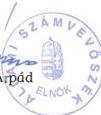

Állami Számvevőszék

742 : 174

# JELENTÉS

a Görög Országos Önkormányzat
pénzügyi-gazdasági tevékenységének
vizsgálatáról

2002. január

203

---

**Az ellenőrzés végrehajtásáért felelős:**
**V. Önkormányzati és Területi Ellenőrzési Igazgatóság**

**dr. Lóránt Zoltán**
számvevő igazgató

**Az ellenőrzést vezette:**

**dr. Sallai Antal**
régióvezető főtanácsos

**Az ellenőrzést végezte**

**Szűtsné Kiss Zsuzsanna**
külső szakértő

**Az ÁSZ által a témában eddig készített jelentések:**

A Görög Országos Önkormányzat pénzügyi-gazdasági tevékenységének vizsgálata (1019/1995.)

A Görög Országos Önkormányzat pénzügyi-gazdasági tevékenységének vizsgálata (1008/1997.)

Jelentéseink az Országgyűlés számítógépes hálózatán és az Interneten a www.asz.hu címen is olvashatók, továbbá a Belügyminisztérium folyóirata, az "Önkormányzati Tájékoztató" rendszeresen közli, valamint a Megyei Közigazgatási Hivatalvezetők részére is átadásra kerül.

---

V-1013-22/2001-2002.

# TARTALOMJEGYZÉK

I. ÖSSZEGZŐ MEGÁLLAPÍTÁSOK, KÖVETKEZTETÉSEK, JAVASLATOK 4

II. RÉSZLETES MEGÁLLAPÍTÁSOK 5

1. A feladatellátás szervezettsége, szabályozottsága 5

1.1. Általános ismeretek a görög kisebbségról, az Országos Görög Önkormányzat kapcsolatrendszere 5
1.2.A szervezeti es mukodesi rend alakulasa 6
1.3.A koltsegvetes, zarszamadas, vagyonleltar megallapitasanak szabalyozottsaga 7
1.4.A mukodes szervezeti feltetelrendszere 8

2. Az Önkormányzat működésének, a gazdálkodás rendjének szabályszerűsége 8

2.1.A mukodes targyi felteteleinek alakulasa 8
2.2. Az egyszeri vagyonjuttataskent kapott reszvenyek hasznositasa 8
2.3.A gazdalkodasi tevekenyseg szemelyi es targyi feltetelei 9
2.4.A gazdalkodasi folyamatok szabalyozottsaga 9
2.5.A gazdalkodasi jogkork szabalyozottsaga 9
2.6. Vallalkozasi tevekenyseg 10

3. A beszámolási kötelezettség teljesítése, a költségvetés készítése és végrehajtása 10

3.1.A konyvvezetesi kotelezettseg 10
3.2.Az éves koltsegvetések 10
3.3.A koltsegvetesek vegrehajtasa 11
3.4.A gazdasagi esemenyekbizonylati alatamasztottsaga 12
3.5.A vagyongazdalkodás szabályozottsága, vagyonvédelem 13
3.6. Éves beszámolási kõtelezettseg 13
3.7.Az éves zarszámadások 13

4. Az Önkormányzat ellenőrzési rendszere 14

4.1.Az ellenorzs szabalyozottsaga 14
4.2.A belso ellenorzs 14
4.3.A lefolytatott ellenorzesek tapasztalatai 14

5. A korábbi számvevőszéki ellenőrzések javaslatainak hasznosulása 14

1

---

$$\therefore m = \frac{3}{11}$$

---

I. ÖSSZEGZŐ MEGÁLLAPÍTÁSOK, KÖVETKEZTETÉSEK, JAVASLATOK

# JELENTÉS

## a Görög Országos Önkormányzat pénzügyi-gazdasági tevékenységének vizsgálatáról

Az Állami Számvevőszékről szóló 1989. évi XXXVIII. törvény 2. § (5) bekezdése alapján ellenőriztük az országos kisebbségi önkormányzatoknál az állami költségvetésből juttatott támogatások felhasználását.

A nemzeti és etnikai kisebbségek jogairól szóló 1993. évi LXXVII. törvény (továbbiakban: Nek tv.) szabályozza az országos kisebbségi önkormányzatok létrehozásának rendjét, azok feladat- és hatásköreit.

Az Állami Számvevőszék 1995. és 1997. évben témavizsgálat keretében ellenőrizte az országos kisebbségi önkormányzat pénzügyi, gazdasági tevékenységét.

A vizsgálat az országos kisebbségi önkormányzatok 1999. és 2000. évi és 2001. első félévi gazdálkodására terjedt ki, egyes esetekben – a székházjuttatási folyamat és egyszeri vagyonjuttatás hasznosulása – a korábbi vizsgálat óta eltelt teljes időszakot áttekintettük.

**Az ellenőrzés célja:** annak megállapítása volt, hogy

- az országos kisebbségi önkormányzat működési feltételrendszere hogyan változott a vizsgált időszakban,
- a gazdálkodás szervezettsége, szabályszerűsége mennyiben felel meg a jogszabályi követelményeknek és az önkormányzati működés sajátosságainak,
- biztosított-e a gazdálkodás és a pénzeszközök felhasználásának törvényessége és szabályszerűsége, a számviteli törvény és a vonatkozó kormányrendeletek előírásainak betartása.

3

---

I. ÖSSZEGZŐ MEGÁLLAPÍTÁSOK, KÖVETKEZTETÉSEK, JAVASLATOK

# I. ÖSSZEGZŐ MEGÁLLAPÍTÁSOK, KÖVETKEZTETÉSEK, JAVASLATOK

A Görög Országos Önkormányzat működésének tárgyi feltételei rendezettek, az állam által részükre ingyenes használatba adott székházat 1997-ben elfoglalták, berendezték és felszerelték, így kultúrált munkafeltételeket alakítottak ki. A személyi feltételek változatlanok maradtak.

Az egyszeri vagyonjuttatásként kapott 15 millió forint értékű MOL részvényt gazdálkodási tartalékként megőrizték, amellett, hogy gazdálkodási feladataikat is jelentős pénzmegtakarítás mellett végezték.

Az önkormányzat megalakulását követően megalkotta a Szervezeti és Működési Szabályzatát, de abban nem teljes körűen szabályozta a feladat- és hatásköröket, és általánosságban szabályozta a bizottságok működését. A megalakulás után bekövetkezett szervezeti változás miatt (Pénzügyi Ellenőrzési Bizottság létrehozása) a Szervezeti és Működési Szabályzatát nem módosította, és nem szabályozta a Bizottság működését.

Az önkormányzat a helyi szabályozásnak megfelelően minden évben elkészítette költségvetését, zárszámadását, azok testület elé terjesztése és jóváhagyása megtörtént. A költségvetések végrehajtásakor a kötelezettségvállalások pénzügyi fedezete biztosított volt.

Az önkormányzat a jogszabályi lehetőségeknek megfelelően egyszeres könyvvitelt vezet, és egyszerűsített beszámolót készít. Az egyszerűsített beszámoló részét képező mérleg elkészült, de az eredmény levezetés nem. A mérleg testületi jóváhagyása nem történt meg.

Az önkormányzat ellenőrzési tevékenysége nem kellően szabályozott. A munkafolyamatokba beépített – jellemzően az elnök által végzett utalványozás révén megvalósuló – ellenőrzés nem volt elegendő a pénztárkezelés során elkövetett hiányosságok időben történő feltárására.

Az önkormányzat a korábbi számvevőszéki vizsgálatok tapasztalatait csak korlátozott mértékben vette figyelembe, elsősorban az ügyvitel területén, de a működés szabályozottsága javítása érdekében tett javaslatokat nem valósította meg.

A feltárt hiányosságok megszüntetése és a törvényes állapot helyreállítása érdekében javasoljuk az önkormányzat elnökének, hogy

1. Módositsák a Szervezeti és Múkódési Szabályzatot az önkormányzat tenyleges szervezeti felépítésenek megfeleloen.
2. Dolgozzák at az önkormányzat szabályzatait a számviteli törvény előirásainak és az önkormányzat helyi sajátosságainak megfeleloen.

4

---

II. RÉSZLETES MEGÁLLAPÍTÁSOK

3. A zárszámadas jováhagyásakor az egyszerúített beszámolót is hagyják jóva.
4. A pénzkezelés vonatkozasaban rendszeres és dokumentalt pénztár ellenorzest végezzenek.

## II. RÉSZLETES MEGÁLLAPÍTÁSOK

### 1. A FELADATELLÁTÁS SZERVEZETTSÉGE, SZABÁLYOZOTTSÁGA

#### 1.1. Általános ismeretek a görög kisebbségről, az Országos Görög Önkormányzat kapcsolatrendszere

A görög kisebbség bevándorlásának körülményeiből következően a néhány település körüli földrajzi koncentrálódás jellemzi a Magyarországon élő görög diaszpórát. Több mint 50 éve Beloiannisz néven többségében görögök lakta település is található az országban. A földrajzi közelség helyi szinten szorosabb kapcsolattartás lehetőségét hordozza, míg az Országos Önkormányzat a különböző vidékeken koncentrálódott kisebb közösségek egymással való kapcsolattartását szervezi. A Görög Országos Önkormányzat a közösség életkörülményeinek átfogó megismerésére szociológiai jellegű felmérést is tervez.

A Görög Országos Önkormányzat (a továbbiakban Önkormányzat) kapcsolati rendszere 1998. óta jelentősen kibővült. A fővárosban a korábbi 1 helyett 11 kerületben, vidéken az addigi 4 település mellett további 4 helységben volt eredményes a kisebbségi önkormányzati választás. Az országos önkormányzat a helyi kisebbségi önkormányzatokkal napi szintű, operatív kapcsolatban áll, így szerezvén egyre több információt a magyarországi görögség életkörülményeiről, problémáiról is. Az Önkormányzat képviselő testületének tagja valamennyi vidéki kisebbségi önkormányzat elnöke, továbbá 7 fővárosi kerületi önkormányzat képviselője. Így az érdekegyeztetések az országos és a helyi önkormányzatok között folyamatosan történnek, külön megállapodások megkötésére nem került sor.

Az Önkormányzat a magyarországi görögség különböző civil szervezeteivel valamint a Magyar - Görög Kereskedelmi Ipari és Idegenforgalmi Kamarával is rendszeresen együttműködik különböző feladatok ellátásában. Az anyaország állami intézményeivel való kapcsolattartása mindenekelőtt az anyanyelv és kultúra ápolását szolgálja, amely kezdettől fogva kiemelt célkitűzésük.

Az Önkormányzat a Nemzeti és Etnikai Kisebbségi Hivatallal rendszeres kapcsolatban állt, mivel a Hivatal havonta értekezletet tartott az országos –így a görög – önkormányzatok részére. Ezek a megbeszélések egyfajta fórumot jelentettek az érdekképviselet számára. A közelmúltban ezek a megbeszélések megritkultak.

5

---

II. RÉSZLETES MEGÁLLAPÍTÁSOK

## 1.2. A szervezeti és működési rend alakulása

A Nemzeti és Etnikai Kisebbségekről szóló 1993. évi LXXVII. törvény (a továbbiakban Nek. törvény) 35-39. §-aiban határozták meg az országos kisebbségi önkormányzatok feladat-és hatáskörét.

Az Önkormányzat a Nek. Törvény 37. §-ára történő hivatkozással alkotta meg **Szervezeti és Működési Szabályzatát**, amely 1995. november 5-én lépett hatályba.

A Szabályzat tartalmazza az Önkormányzat jogállását, feladatát, hatáskörét, a testület működését, a testületi ülésre, a döntéshozatalra, az ülések lebonyolítására, a képviselők jogállására vonatkozó szabályozást, bizottságok és intézmények létrehozására és működésére kialakított általános szabályokat, valamint az Önkormányzat vagyonára, költségvetésére hozott rendszabályokat.

A Szervezeti és Működési Szabályzat általános rendelkezése (I. fejezet) szerint az önkormányzati feladatokat a közgyűlés, az elnök, az alelnökök és a bizottságok látják el.

A II. „Az önkormányzat jogállása, feladata, hatásköre” című fejezetben elsőként a közgyűlési hatáskörnek az elnökre, alelnökre, illetőleg bizottságra való átruházhatóságát deklarálják. Ezt követően **meghatározzák a Közgyűlés kizárólagos hatáskörét**, olymódon, hogy a Nek. törvény 37. §-ában szereplő döntési jogosítványok közül tételesen felsorolják azokat, amelyeket az Önkormányzat számára szükségesnek ítélnek, kihagyják azokat, amelyeket nem gyakorolnak (színház működtetése, múzeumi kiállítóhely, közgyűjtemény létesítése, működtetése, országos hatáskörű közép-felsőfokú intézmények fenntartása, művészeti, tudományos intézet, kiadó alapítása, működtetése) és kiegészítik általuk szükségesnek tartott jogosítványokkal (elnök, alelnökök megválasztása, tulajdonosi jogok gyakorlása, hitel felvétele) a Közgyűlés kizárólagos hatásköri listáját.

A testület 21 főből áll. A közgyűlés elnököt és két helyettest választ. Az elnök és az alelnökök feladatait a VIII. fejezetben határozzák meg. Az elnök feladatai az Önkormányzat működésével kapcsolatosan részben meghatározottak, nevezetesen az önkormányzat munkájának szervezése, a döntések előkészítése, gondoskodás a végrehajtásról, bizottságok összehívásának kezdeményezése. Feladatai között szerepel az is, hogy dönt az átruházott ügyekben, de **nem került meghatározásra, hogy mely feladatok kerültek átruházásra**.

Az SzMSz VII. fejezete foglalkozik a bizottságokkal, rögzítve az alapításukra, összetételükre valamint működésük rendjére vonatkozó szabályokat. Utalás történik arra, hogy a Közgyűlés feladatokat ruházhat át a bizottságokra. A fejezet általánosságban foglalkozik a bizottságokkal, és **nem tartalmaz** az Önkormányzat által az 1996. február 24-i, 2/1996. számú testületi határozattal létrehozott **Pénzügyi Ellenőrzési Bizottságra vonatkozó konkrét szabályozást**, mivel a Bizottság megalakulását követően az SzMSz-t nem módosították.

6

---

II. RÉSZLETES MEGÁLLAPÍTÁSOK

A 3 tagú Pénzügyi Ellenőrzési Bizottság tevékenységéről évente egyetlen dokumentum, a zárszámadáshoz kapcsolódóan elkészített és a Közgyűlés elé terjesztett „Beszámoló” áll rendelkezésre. A Bizottságnak munkaterve, az üléseit dokumentáló jegyzőkönyvei nincsenek.

Az SzMSz a Pénzügyi Ellenőrzési Bizottság kapcsán kiegészítésre, a hatáskörök átruházása vonatkozásában egyértelműsítésre szorul.

# 1.3. A költségvetés, zárszámadás, vagyonleltár megállapításának szabályozottsága

A Szervezeti és Működési Szabályzat II. fejezetében a közgyűlés kizárólagos hatáskörébe tartozónak minősíti az Önkormányzat költségvetéséről, zárszámadásáról való döntést, valamint törzsvagyonának, vagyonleltárának elfogadását.

Az SZMSZ X. fejezete az „Önkormányzat vagyona, költségvetése” tárgykörével foglalkozik.

A 20. § szerint a Közgyűlés saját hatáskörében határozza meg a költségvetését és zárszámadását, amit évente köteles megállapítani a bevételek és kiadások meghatározásával. A (bizottságok által megtárgyalt) költségvetés tervezetet az elnök terjeszti a Közgyűlés elé - a gyakorlatban a Pénzügyi Ellenőrzési Bizottság nem működik közre a költségvetés előkészítésében - és az Önkormányzat a költségvetését módosíthatja, megváltoztathatja. A zárszámadás elfogadásáról és a pénzmaradvány felhasználásáról a Közgyűlés dönt.

A szabályozás a költségvetés elfogadását nem köti határidőhöz, a zárszámadás előterjesztésének határidejét viszont meghatározza: a költségvetési évet követő 3 hónapon belül kell megtörténnie.

A 20. § definiálja az önkormányzat bevételeit a forrás megjelölésével, a kiadásokat azonban nem bontja le a legfontosabbnak tekintett és ezért kiemelten figyelt feladatokra.

A szabályozás a jogszabályoknak megfelel, de az Önkormányzatra vonatkozóan pontosításra szorul.

Az SzMSz 3. §-a- a törzsvagyon és a vagyonleltár megállapítását a Közgyűlés kizárólagos hatáskörébe utalja. A 20. §. az önkormányzat tulajdonát képező vagyontárgyak általános meghatározására és a tulajdonosi jogok kizárólagosan a Közgyűlés általi gyakorlására tér ki.

Az SzMSz 20. § /2/ pontja a vagyont a tulajdon oldaláról definiálja, ez a megközelítés a vagyon számviteli szempontból való megjelenítésére azonban nem alkalmas. A vagyonleltár megállapításával kapcsolatosan nem tértek ki az SzMSz-ben a számviteli politikával való összefüggésekre, nem utaltak arra sem, hogy milyen szabályzatokban rögzítik az egyes vagyonelemek tartalmi meghatározását, számbavételét, értékelését.

7

---

II. RÉSZLETES MEGÁLLAPÍTÁSOK---

### 1.4. A működés szervezeti feltételrendszere

Az Önkormányzat hivatali feladatai ellátását az elnök és 3 munkatársa (titkárnő, pénztáros, gondnok) közreműködésével végzi. Az elnök főállásban, a munkatársak részmunkaidőben dolgoznak.

Az önkormányzat kiemelt feladatait jellemzően megbízásos jogviszonyban lévő szakemberekkel látja el: a negyedévente megjelenő Kafenelo című görög nyelvű folyóirat megjelentetéséhez főszerkesztőt és szerkesztőségi titkárt alkalmaz. A könyvtár működtetését, 1 fő látja el. A görög nyelv oktatását szolgáló „vasárnapi iskola” tanárai és a könyvkiadásban tevékenykedők szintén megbízottak.

Önálló intézményt mindezidáig egyik főfeladatának végzése érdekében sem hozott létre az Önkormányzat.

Az Önkormányzat az ellátni kívánt feladatait konkrétan írásos koncepcióban nem határozta meg, azok az eddigi működés során, a gyakorlatban alakultak ki. Az ellátott feladatok jelentős része az oktatást, kulturális célokat és a hagyományőrzést szolgálja.

## 2. AZ ÖNKORMÁNYZAT MŰKÖDÉSÉNEK, A GAZDÁLKODÁS RENDJÉNEK SZABÁLYSZERŰSÉGE

### 2.1. A működés tárgyi feltételeinek alakulása

1997. május 18-i dátummal aláírásra került az „Ingyenes használati megállapodás” a Kincstári Vagyoni Igazgatóság és a Görög Országos Önkormányzat valamint a Fővárosi Görög Önkormányzat között a Budapest, V. Vécsey u. 5. szám alatti épület I. emeletén lévő, 378 m² összterületű ingatlanrészre vonatkozóan. A két önkormányzat elhelyezése a teljesen felújított és igényeiknek megfelelően átalakított ingatlanban kulturált körülmények között megoldódott. Az Önkormányzatok a területhasználatot és a költségek viselését illetően az 1999. június 23-án aláírt szerződés szerint megállapodtak egymással. A székházban működik a könyvtár is, amelyet folyamatosan töltenek fel könyvekkel, valamint itt találhatók a vasárnapi iskola tantermei.

A munkavégzéshez szükséges irodabútorok, berendezési és felszerelési tárgyak beszerzését a működési bevételeiből meg tudta oldani az Önkormányzat és évről-évre folyamatosan bővítette eszközállományát.

### 2.2. Az egyszeri vagyonjuttatásként kapott részvények hasznosítása

A Nek. törvény 63. § (4) bekezdése alapján az Önkormányzat működési költségei biztosítására 15 millió forint egyszeri vagyonjuttatásban részesült, amelyet MOL részvények formájában kapott meg. A részvényeket befektetési Rt-nél

---8

---

II. RÉSZLETES MEGÁLLAPÍTÁSOK

letétbe helyezte, azokat a bróker cég a 2001. szeptember 25-i állapotot tükröző egyenlegközlés szerint jelenleg is őrzi.

A részvények után kapott osztalékot az Önkormányzat működési kiadásai fedezésére fordítja.

A 38/2000. sz. (X. 21.) képviselőtestületi határozat tőkeszámlán történő forgatást engedélyezett az elnöknek árfolyamnyereség elérése érdekében. A határozat végrehajtását eddig még nem kezdték meg.

# 2.3. A gazdálkodási tevékenység személyi és tárgyi feltételei

Az Önkormányzat gazdálkodási feladatait az elnök és 1 fő, 4 órás munkaviszonyban álló pénzügyi munkatárs végzi. A könyvelési, munkaügyi és adózási feladatok ellátásával külső szakcéget bíztak meg 1995-től kezdődően.

A fenti létszám alkalmazásával a gazdálkodási munka szakszerű ellátásának személyi feltételei nem voltak biztosítottak a vizsgált időszakban. A pénzügyi munkatársak többször változtak és a változás nem járt együtt a szakmai színvonal növekedésével.

A megbízott könyvelő cég tevékenysége sokszor irányult a megelőző fázisban elkövetett hibák javítására.

# 2.4. A gazdálkodási folyamatok szabályozottsága

A Számvitelről szóló 1991. évi XVIII törvény 14. § (5) bekezdésében és a 2000. évi C. törvény 14. § (5) bekezdésében meghatározták a számviteli politika keretében elkészítendő szabályzatok körét. Az Önkormányzat a leltárkészítési és leltározási szabályzatot valamint a pénzkezelési szabályzatot elkészítette, nem rendelkezik viszont az eszközök és a források értékelési szabályzatával.

Az Önkormányzat Számviteli politikájaként bemutatott dokumentum utal arra, hogy a leltározási szabályzat szerves részét képezi a számviteli politikának, meghatározza a tárgyi eszközök, a befektetett pénzügyi eszközök és a részesedések nyilvántartási értékét, kitér ezek értékcsökkenésének elszámolási módjára, de nem tér ki például az immateriális javak, mint vagyontárgyak kezelésére. Az elkészített leltározási szabályzat általános jellegű megállapításokat tartalmaz, nem a helyi sajátosságoknak megfelelően készült.

Hasonló a helyzet a pénzkezelési szabályzattal is.

A Görög Országos Önkormányzat érvényes szabályzatainak tartalmi kiegészítése szükséges annak érdekében, hogy a jogszabályi követelményeknek megfeleljen. A hiányzó értékelési szabályzatot el kell készítenie.

# 2.5. A gazdálkodási jogkörök szabályozottsága

A gazdálkodási jogkörök közül az utalványozási jog és a banki aláírási jog szabályozása a „Pénzgazdálkodási szabályzatban” történt meg.

9

---

II. RÉSZLETES MEGÁLLAPÍTÁSOK---

Az utalványozási jog az elnököt összeghatártól függetlenül, korlátlanul illeti meg, mind a bankszámlákról történő mind a pénztári kifizetések vonatkozásában.

A banki aláírási jog akként került szabályozásra, hogy az elnök és az egyik alelnök együttesen jogosult aláírásra, és az elnök távollétében a Kafeneio nevű banki alszámláról 100000 Ft készpénz felvételére jogosítja fel a főszerkesztőt.

**Kötelezettségvállalás vonatkozásában írásos szabályozás nincs**, a gyakorlatban az elnök vállal kötelezettségeket.

## 2.6. Vállalkozási tevékenység

Az Önkormányzat alapfeladatain kívül vállalkozási tevékenységet nem végzett és vállalkozásban sem vesz részt.

## 3. A BESZÁMOLÁSI KÖTELEZETTSÉG TELJESÍTÉSE, A KÖLTSÉGVETÉS KÉSZÍTÉSE ÉS VÉGREHAJTÁSA

### 3.1. A könyvvezetési kötelezettség

Az országos önkormányzatok beszámoló készítési és könyvvezetési kötelezettségének teljesítésére a számviteli törvény előírásaihoz képest sajátos szabályozás is vonatkozik, a 219/1998. (XII.30.) Korm. rendeletnek a társadalmi szervezetre szóló előírásai alapján.

Ez alapján a Görög Országos Önkormányzat a pénzügyi folyamatok számviteli rögzítésére az egyszeres könyvvitelt választotta. A könyvelés számítógépes program alkalmazásával naplófőkönyvben történik. A jogszabály által előírt könyvvezetési kötelezettségének teljesítése mellett zárszámadásának elkészítése és a pályázatok útján kapott támogatások elszámolásának érdekében kódszámrendszer kialakításával belső információs rendszert is működtet.

### 3.2. Az éves költségvetések

Az Önkormányzat éves költségvetéseinek elfogadásakor nem teljes körűen tartotta be az SzMSz előírásait, mivel **a tervezetek előzetes bizottsági megtárgyalás nélkül kerültek előterjesztésre**.

A költségvetésekben bevételi oldalról az állami támogatás és az előző évi pénzmaradvány szerepelt. Az SzMSz-ben meghatározott egyéb bevételi források – saját bevételek, alapítványi támogatások, pályázatok, vagyontárgyak hozadéka – nem kerültek megtervezésre, azokat testületi határozattal, költségvetést módosító tételként kezelik. Ezt a gyakorlatot követik akkor is, ha a költségvetés előterjesztésekor már ismert valamely egyéb típusú bevétel. Emiatt az Önkormányzat költségvetése alultervezett volt a vizsgált időszakban.

A kiadásokra vonatkozóan az SzMSz nem határoz meg konkrét csoportokat. A költségvetésében a működési költségtétel (tiszteletdíj, könyvelés, titkárság, támogatás, könyvtár, rezsiköltség, dologi kiadások rovatokra bontva) és a tartá-

---10

---

II. RÉSZLETES MEGÁLLAPÍTÁSOK

lék tétel jelenik meg. Egyéb tételeket (Kafeneio, oktatás) csak annyiban tervezik meg, amennyiben az előző évi pénzmaradványhoz konkrétan kapcsolhatók.

A költségvetés tervezett főösszege 1999-ben 26.285 ezer Ft, 2000-ben 29.228 ezer Ft, 2001-ben 30953 ezer Ft volt.

Az 1999. évi költségvetést 1999. február 27-i ülésén, a 2000. évi költségvetést a 2000. február 12-i, a 2001. évi költségvetést 2001. február 27-i ülésén fogadta el a Testület.

### 3.3. A költségvetések végrehajtása

Az Önkormányzat bevételein belül az állami támogatás 1999-2000. években 57 illetőleg 58 %-ot képviselt. Ebből fedezték az önkormányzat működési kiadásait

A kiemelt feladatok ellátásához elsősorban pályázatok útján megszerzett bevételek biztosítják a fedezetet. A Magyarországi Nemzeti és Etnikai Kisebbségekért Közalapítványnál a Kafeneio című folyóirat kiadásához elnyert pályázati bevétel az 1999. évi 5.000 ezer Ft –ról 2001-re 5.788 ezer Ft-ra emelkedett.

Az Oktatási Minisztériumtól ugyancsak pályázat révén megnyert összeg közel 5 millió Ft támogatást biztosított a kiemelt feladatként kezelt vasárnapi iskolák működtetéséhez.

A könyvkiadást támogató pályázati anyagot évről-évre sikeresnek minősítették, 1999-ben a Művelődési Minisztérium mintegy 750 ezer Ft, 2000. évben pedig a Nemzeti Kulturális Örökség Minisztériuma 1.400 ezer Ft-ot biztosított ezen a címen. További, összegében kisebb, sikeres pályázatok újabb bevételi forrást jelentettek az Önkormányzatnak (nyári tábor, napközis tábor).

Az Önkormányzat a görög külügyminisztériumtól és a Külföldi Görögök Főigazgatóságától is évről-évre kisebb összegű támogatást kap céljai teljesítéséhez. A Fővárosi Görög Önkormányzat is támogatást nyújtott a Görög Országos Önkormányzatnak.

Az Önkormányzat saját bevételei a banki folyószámla kamataiból és az újság előfizetésből származtak.

A megtervezett kiadási előirányzatok teljesülését a jogcím szerinti utalványozás és a könyvelés révén tartja ellenőrzése alatt az Önkormányzat, az esetleges átcsoportosítások a Képviselőtestület jóváhagyásával történnek.

Az évközi gazdálkodás során likviditási zavarok nem jelentkeztek, ami részben a bevételek ütemes beérkezésének, részben annak tudható be, hogy az Önkormányzat a megalakulása óta takarékosan gazdálkodott, így az elmúlt években jelentősebb megtakarítása keletkezett.

11

---

II. RÉSZLETES MEGÁLLAPÍTÁSOK

### 3.4. A gazdasági események bizonylati alátámasztottsága

Az ellenőrzés során az 1999-2000 évre vonatkozóan két-két havi, 2001. I. félévére a teljes pénztáranyag és mindhárom időszakra a bankanyagok teljes körű átvizsgálása történt meg.

A bevételi és kiadási pénztárbizonylatok kiállítása szabályosan történik, azokon a szükséges aláírások megtalálhatók. A mellékelt számlákat az elnök a jogcím meghatározásával utalványozza, így a könyveléshez és a pályázatokon való elszámoláshoz szükséges csoportosítás egyértelműen megtörténik. Hiányosság, hogy a bizonylatok közül csak a 2001. év első hónapjaiban feldolgozott bankkivonatokon történt meg a könyvelés tényének rögzítése.

A tiszteletdíjak kifizetésének dokumentálása nem szabályszerű, mert hiányzik a postai feladás bizonylata a nem pénztárban történt felvételek esetében. Az időszaki pénztárjelentéseken szabálytalan javítások és összegszerű tévedések egyaránt előfordultak. Az 1999. évi novemberi pénztárjelentésben feltüntetett havi záró pénzkészlet adata milliós eltérést mutatott a számszakilag helyes adathoz képest. A pénztárjelentések kitöltése hiányos, a havi pénztárzáráskor nem végezték el a tényleges pénzkészlet címletenkénti számbavételét. Az említett milliós differenciát csak a könyvelést végző cég jelzése alapján korrigálták a helyes összegre.

A pénztárjelentésekből több esetben bizonylati sorszámok kimaradtak, a rontott bizonylatokat nem vezették fel. Téves összeadásból származó kisösszegű differenciák többször keletkeztek a könyvelés és a pénztárjelentések között, ezek rendezése hónapokig nem történt meg.

**A 2001. április hóban mintegy 1 millió forint értékben olyan számlák illetve támogatásra vonatkozó „átvételi elismervény” valamint megbízási díjak lettek kiadásba helyezve, amelyek 1999. évi költségekre vonatkoznak.** A pénzkifizetések 1999. évben megtörténtek, de nem kerültek rögzítésre a pénztárjelentésben. **A hiányosságot közel 2 évvel az események után érzékelte és a 2001. évi pénztáranyagban rendezte az Önkormányzat.** Emiatt az 1999.-2000. évet érintő beszámoló anyagok (zárszámadás, mérleg) és a 2000-2001 évi költségvetések milliós nagyságrendű eltérést hordoznak. A jelen ellenőrzés keretében pénztárellenőrzést végeztünk annak megállapítására, hogy az Önkormányzat véglegesen megszüntette-e a szabálytalanságokat. **Megállapítottuk, hogy a pénztárban található pénzkészlet valamint a pénztárjelentésben meghatározott záró egyenleg megegyezik.**

A pénztárosi munkakörben a vizsgált időszakban bekövetkezett változások alkalmával a pénzkészlet tényleges és szabályszerű átadás-átvétele nem történt meg. Pénztárellenőrzést dokumentáltan senki nem végzett, az éves mérlegekben (1999. és 2000.) szereplő adatok alátámasztására december 31-i állapot szerint pénztári leltár nem készült.

A pénztárkezelés során tapasztalt krónikus problémák miatt a közelmúltban változás történt az ügymenetben és a könyvelést végző cég kezdte meg a pénztárbizonylatok kiállítását, valamint a pénztárjelentés vezetését számítógépes

12

---

II. RÉSZLETES MEGÁLLAPÍTÁSOK

program segítségével. Ez a megoldás azonban nem biztosítja a tényleges pénzmozgások egyidejű és naprakész bizonylati dokumentálását. **A szabályszerű és szakszerű pénzkezelést az Önkormányzatnak meg kell oldania.**

### 3.5. A vagyongazdálkodás szabályozottsága, vagyonvédelem

A vagyon fizikai értelemben vett védelme érdekében jelentős összegeket költött az Önkormányzat a biztonsági bejárati ajtóra, páncélszekrényre. A vagyonvédelemre vonatkozó szabályozás – leltárba vétel, leltározás, selejtezés – az érvényben lévő szabályzat szerint nincs kellően kidolgozva. Nincs meghatározva, hogy pontosan milyen eszközökről készül analitikus nyilvántartás, kik végzik a leltározást, nincs szó a leltár kiértékeléséről, az eltérések rendezéséről, az anyagi felelősségről.

Az önkormányzat 2000. október hónapban leltározást végzett és erről részletes lista készült, leltári szám hivatkozással. Ugyanakkor a könyvelést végző cég közreműködésével is elkészítésre került egy 2000. december 31-i keltezésű leltár, (ez képezte a mérlegben szerepeltetett adat alátámasztását) amelyen csak a 30 ezer forint feletti egyedi értékű eszközök szerepeltek, mivel a kísértékű tárgyi eszközökről nem vezetnek analitikus nyilvántartást. A két leltár nem azonos, mert a könyvelő cég csak az értékkel szerepeltetett vagyontárgyakat vette figyelembe. Tételes egyeztetés a kétféle leltár között nem volt.

### 3.6. Éves beszámolási kötelezettség

Az Önkormányzat az éves beszámolási kötelezettségének oly módon tett eleget, hogy elkészítette a 219/1998. (XII.30.) Korm. rendelet melléklete szerinti egyszerűsített beszámoló éves mérlegét. Eredmény levezetést nem készített.

A mérleget az elnök aláírta, de testületi jóváhagyása nem történt meg. Az eszközök és források leltározása részben egyeztetéssel (adók, szállítói és más kötelezettségek, követelések) részben pedig a tárgyi eszközöknél az előzőekben taglalt leltárfelvétellel történt meg. Hiányzik a házipénztári pénzkészletről készült leltár, és 2000. december 31-re vonatkozóan nincs a MOL részvényt kezelő brókercégtől igazolás a letéti számla egyenlegéről. A zárlati munkák egyéb vonatkozásban megtörténtek.

### 3.7. Az éves zárszámadások

Az 1999. évi zárszámadás 2000. február 12-én, a 2000. évi pedig 2001. február 17-én került a Közgyűlés elé, az SzMSz szerint előírt határidőn belül. Ezt megelőzően a Pénzügyi Ellenőrzési Bizottság vizsgálta a lezárt évet és mindkét esetben mindent rendben lévőnek minősített.

A zárszámadást a (szükség esetén módosított) költségvetési tételsorok, illetve rovatok szerinti bontásban, az ellátott feladatokhoz csoportosítva készítette el az Önkormányzat. A táblázat kellő részletességgel bemutatja az egyes költségnemeket, így az összevont kategóriák konkrét adattartalma jól nyomon követhető. Részletesen szerepelnek a beszámolóban a támogatásra adott össze-

13

---

II. RÉSZLETES MEGÁLLAPÍTÁSOK

gek is, így ellenőrizhető, hogy milyen módon történt a források megosztása a támogatott szervezetek felé.

A zárszámadáshoz rövid szöveges kiegészítéseket a Pénzügyi Ellenőrző Bizottság fűz. A testületi megtárgyalás után a zárszámadások szabályszerűen elfogadásra kerültek.

# 4. AZ ÖNKORMÁNYZAT ELLENŐRZÉSI RENDSZERE

# 4.1. Az ellenőrzés szabályozottsága

Az Önkormányzat ellenőrzési tevékenységéről megállapítható, hogy sem a tevékenység sem pedig a Pénzügyi Ellenőrzési Bizottság működése nincs írásos formában szabályozva.

A Pénzügyi Ellenőrzési Bizottság tevékenységéről a vizsgált időszakban 3 beszámoló készült, amelyek szerint a Bizottság az Önkormányzat hivatalos székhelyén ellenőrzést tartott.

# 4.2. A belső ellenőrzés

A belső ellenőrzés három eleme közül csak a munkafolyamatba épített ellenőrzés működik az elnök által gyakorolt utalványozási tevékenység révén.

# 4.3. A lefolytatott ellenőrzések tapasztalatai

A belső ellenőrzés átfogó rendszere nem lett kiépítve a Görög Országos Önkormányzatnál, így hasznosítható ellenőrzési tapasztalatok sem keletkeztek az elmúlt időszakban.

# 5. A KORÁBBI SZÁMVEVŐSZÉKI ELLENŐRZÉSEK JAVASLATAINAK HASZNOSULÁSA

Az Állami Számvevőszék 1997-ben végzett ellenőrzést az Önkormányzatnál.

Javasolta az SzMSz módosítását a Pénzügyi Ellenőrzési Bizottság megalakítása miatt. A módosítás nem történt meg.

A belső szabályzatok jelenleg sem felelnek meg a Számvevőszék által javasoltaknak, és a kötelezettségvállalást sem szabályozták.

A pénzmozgást dokumentáló bizonylatok kezelését a javaslat szerint megváltoztatták.

Budapest, 2002. január 18.

Dr. Kovács Árpád  
elnök

14

---

Görög Országos Önkormányzat

1.sz. melléklet a V-1013. sz. jelentéshez

Kimutatás az 1999-2001. évek bevételeiről

ezer Ft

|  Megnevezés | 1999. |   |   | 2000. |   |   | 2001.  |   |
| --- | --- | --- | --- | --- | --- | --- | --- | --- |
|   |  Tervezett |   | Tényleges | Tervezett |   | Tényleges | Tervezett  |   |
|   |  Év elején ismert | Évközi változás |   | Év elején ismert | Évközi változás |   | Év elején ismert | Évközi változás  |
|  Állami támogatás | 17000 | -300 | 16700 | 18400 | 0 | 18400 | 21200 | 0  |
|  Közalapítványi pályázatok | 0 | 5000 | 5000 | 0 | 5788 | 5788 | 0 | 2881  |
|  Egyéb pályázatok | 0 | 5930 | 5930 | 0 | 4920 | 4920 | 0 | 5800  |
|  Egyéb támogatások | 0 | 1760 | 1760 | 0 | 2306 | 2306 | 0 | 0  |
|  Saját bevételek | 0 | -37 | -37 | 0 | 242 | 242 | 0 | 0  |
|  Pénzmaradvány | 9285 | 0 | 0 | 10828 | 0 | 0 | 9753 | 0  |
|  Összesen | 26285 | 12353 | 29353 | 29228 | 13256 | 31656 | 30953 | 8681  |

---

Görög Országos Önkormányzat

2. sz. melléklet a V-1013. sz. jelentéshez

# Kimutatás az 1999-2001. évek kiadásairól

ezer Ft

|  Megnevezés | 1999. |   |   | 2000. |   |   | 2001.  |   |
| --- | --- | --- | --- | --- | --- | --- | --- | --- |
|   |  Tervezett |   | Tényleges | Tervezett |   | Tényleges | Tervezett  |   |
|   |  Év elején ismert | Évközi változás |   | Év elején ismert | Évközi változás |   | Év elején ismert | Évközi változás  |
|  Személyi jellegű juttatások | 0 |  | 7122 | 0 |  | 6482 | 0 |   |
|  Munkáltatói járulékok | 0 |  | 6056 | 0 |  | 6434 | 0 |   |
|  Dologi kiadások | 16000 |  | 10412 | 16000 |  | 13736 | 19500 |   |
|  Működési kiadások összesen | 16000 |  | 23590 | 16000 |  | 26652 | 19500 |   |
|  Adott támogatások | 5000 |  | 3600 | 5000 |  | 4259 | 5000 |   |
|  Felhalmozási kiadások | 0 |  | 620 | 0 |  | 1820 | 0 |   |
|  Tartalék | 5285 |  | 0 | 8228 |  | 0 | 6453 |   |
|  Mindösszesen: | 26285 |  | 27810 | 29228 |  | 32731 | 30953 |   |

---

“

---

“