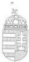

Állami Számvevőszék

TSZ: 574

# JELENTÉS

az Országos Horvát Önkormányzat
pénzügyi-gazdasági tevékenységének
vizsgálatáról

2002. január

02.04

---

Az ellenőrzés végrehajtásáért felelős:
V. Önkormányzati és Területi Ellenőrzési Igazgatóság

dr. Lóránt Zoltán
számvevő igazgató

Az ellenőrzést vezette:

dr. Sallai Antal
régióvezető főtanácsos

Az ellenőrzést végezte

Nagy Ervin
számvevő

Az ÁSZ által a témában eddig készített jelentések:

Az Országos Horvát Önkormányzat pénzügyi-gazdasági tevékenységének
vizsgálata (1019/1995.)

Az Országos Horvát Önkormányzat pénzügyi-gazdasági tevékenységének
vizsgálata (1008/1997.)

Jelentéseink az Országgyűlés számítógépes hálózatán
és az Interneten a www.asz.hu címen is olvashatók, továbbá a Belügyminisztérium
folyóirata, az "Önkormányzati Tájékoztató" rendszeresen közli, valamint a Megyei
Közigazgatási Hivatalvezetők részére is átadásra kerül.

---

V-1013-23/2001-2002.

# TARTALOMJEGYZÉK

I. ÖSSZEGZŐ MEGÁLLAPÍTÁSOK, KÖVETKEZTETÉSEK, JAVASLATOK 4

II. RÉSZLETES MEGÁLLAPÍTÁSOK 5

1. a feladatellátás szervezettsége, szabályozottsága 5

1.1. Általános ismeretek a horvát kisebbségról, az Országos Horvát Önkormányzat kapcsolatrendszere 5
1.2.A szervezeti es mukodesi rend alakulasa 6
1.3.A koltsegvetes, zarszamadas, vagyonleltar megallapitasanak szabalyozottsaga 6
1.4.A mukodes szervezeti feltetelrendszere 7

2. az önkormányzat működésének, a gazdálkodás rendjének szabályszerűsége 8

2.1.A mukodes targyi felteteleinek alakulasa 8
2.2. Az egyszeri vagyonjuttataskent kapott részvenyek hasznositasa 8
2.3.A gazdalkodasi tevekenyseg szemelyi es targyi feltetelei 9
2.4.A gazdalkodasi folyamatok szabalyozottsaga 9
2.5.A gazdalkodasi jogkork szabalyozottsaga 10
2.6. Vallalkozasi tevekenyseg 10

3. a beszámolási kötelezettség teljesítése, a költségvetés készítése és végrehajtása 10

3.1.A konyvvezetesi kotelezettseg 10
3.2.Az eves koltsegvetesek 11
3.3.A koltsegvetesek vegrehajtasa 11
3.4.A gazdasagi esemenyekbizonylati alatamasztottsaga 12
3.5.A vagyongazdalkodás szabályozottsága, vagyonvédelem 12
3.6. Éves beszámolási kõtelezettség 12
3.7.Az eves zarszamadasok 13

4. az önkormányzat ellenőrzési rendszere 13

4.1.Az ellenorzs szabalyozottsaga 13
4.2.A belso ellenorzs 14
4.3.A lefolytatott ellenorzesek tapasztalatai 14

5. a korábbi számvevőszéki ellenőrzések javaslatainak hasznosulása 14

1

---

“

---

I. ÖSSZEGZŐ MEGÁLLAPÍTÁSOK, KÖVETKEZTETÉSEK, JAVASLATOK

# JELENTÉS

# az Országos Horvát Önkormányzat pénzügyi-gazdasági tevékenységének vizsgálatáról

Az Állami Számvevőszékről szóló 1989. évi XXXVIII. törvény 2. § (5) bekezdése alapján ellenőriztük az országos kisebbségi önkormányzatoknál az állami költségvetésből juttatott támogatások felhasználását.

A nemzeti és etnikai kisebbségek jogairól szóló 1993. évi LXXVII. törvény (továbbiakban: Nek tv.) szabályozza az országos kisebbségi önkormányzatok létrehozásának rendjét, azok feladat- és hatásköreit.

Az Állami Számvevőszék 1995. és 1997. évben témavizsgálat keretében ellenőrizte az országos kisebbségi önkormányzat pénzügyi, gazdasági tevékenységét.

A vizsgálat az országos kisebbségi önkormányzatok 1999. és 2000. évi és 2001. első félévi gazdálkodására terjedt ki, egyes esetekben – a székházjuttatási folyamat és egyszeri vagyonjuttatás hasznosulása – a korábbi vizsgálat óta eltelt teljes időszakot áttekintettük.

**Az ellenőrzés célja:** annak megállapítása volt, hogy

- az országos kisebbségi önkormányzat működési feltételrendszere hogyan változott a vizsgált időszakban,
- a gazdálkodás szervezettsége, szabályszerűsége mennyiben felel meg a jogszabályi követelményeknek és az önkormányzati működés sajátosságainak,
- biztosított-e a gazdálkodás és a pénzeszközök felhasználásának törvényessége és szabályszerűsége, a számviteli törvény és a vonatkozó kormányrendeletek előírásainak betartása.

3

---

I. ÖSSZEGZŐ MEGÁLLAPÍTÁSOK, KÖVETKEZTETÉSEK, JAVASLATOK---

# I. ÖSSZEGZŐ MEGÁLLAPÍTÁSOK, KÖVETKEZTETÉSEK, JAVASLATOK

Az Országos Horvát Önkormányzat működési feltételrendszere a vizsgált időszakra és a jelen állapotokra vonatkozóan is rendezettnek ítélhető. Az önkormányzat elhelyezése megoldott, az ingyenes használatba adott épületbe, annak felújítása után 1997-ben költöztek be. Az épületet saját pénzforrások felhasználásával esztétikusan, takarékosan és célszerűen berendezték.

A működés személyi és tárgyi feltételei megfelelő színvonalon folyamatosan biztosítottak.

Az Önkormányzat az egyszeri vagyonjuttatásként kapott pénzeszközöket (MOL részvényeket) racionálisan használta fel. A közgyűlés előrelátó és megfontolt döntése alapján történt meg a részvények egy részének értékesítése és jövedelmező befektetése.

Az Önkormányzat működése, gazdálkodásának szervezettsége és szabályszerűsége összességében megfelelő. Összhangban van a jogszabályi követelményekkel és saját belső keret- szabályzataival.

A működés és gazdálkodás szervezeti és működési rendjét megfelelően kialakították és meghatározták (SzMSz).

Az Önkormányzat gazdálkodási tevékenységét saját hivatali szervezettel látja el. Az előírt és az Önkormányzat sajátosságainak megfelelő szabályzatokkal rendelkeznek. A pénzgazdálkodás, a kötelezettségvállalás és utalványozás rendje szabályozott és a gyakorlatban megfelelően alkalmazzák.

Az Önkormányzat kettős könyvvitelt vezet, egyszerűsített éves beszámolót készít és ennek részletes szabályait megfelelően tartalmazza a számviteli politika és a hozzá kapcsolódó egyéb szabályzatok. A bizonylati rend megfelelő, a bizonylatok a formai és tartalmi követelményeknek megfelelnek.

A rendelkezésre álló pénzeszközök felhasználása szabályszerűen és célszerűen történik. A gazdálkodási tevékenység során biztosított a kiadások és bevételek jogszabályok által kötelezően előírt korrekt számviteli kezelése. Az Önkormányzat által vezetett nyilvántartások pontosak, naprakészek, alkalmasak a kötelező és igényelt információk biztosítására, a megalapozott döntések meghozatalának segítésére.

A közgyűlés minden évben megtárgyalta az éves költségvetéseket és a zárszámadásokat, az elfogadásról határozatot hozott.

A közgyűlési határozatok a költségvetések és a zárszámadások elfogadásáról nem tartalmazzák a bevételi és kiadási főösszegeket, ezért csak az előterjesztett anyag ismeretében értékelhetők.

---4

---

II. RÉSZLETES MEGÁLLAPÍTÁSOK

Az Önkormányzat gazdálkodásának pénzügyi egyensúlya folyamatosan biztosított volt a vizsgált időszakban és jelenleg is az.

Az ellenőrzési tevékenység az Önkormányzatnál nem működött kielégítően, tulajdonképpen a folyamatba épített és a vezetői ellenőrzésre korlátozódott, de még ez esetben sem történt meg az ellenőrzések dokumentálása.

Az Önkormányzat a korábbi számvevőszéki ellenőrzés javaslatait hasznosította.

**A munka színvonalának javítása érdekében javasoljuk az önkormányzat elnökének, hogy:**

1. Gondoskodjon arrol, hogy a koltsegvetesek es zarszamadasok elfogadasarol szolkozyulesi hatarozatok tartalmazzak a bevetei es kiadasi fosszegeket is.
2. Biztositsa, hogy az Onkormanyzat gazdalkodására vonatkozo ellenörzési tevekeny-seget az SzMSz-ben és aBizottsági munkatervekben meghatározott rendben és gyakorisággal vegezzek. Az ellenörzeseket dokumentálják és az ellenörzesek eredményeiról a kozgyulés kapjon tajékoztatast.

## II. RÉSZLETES MEGÁLLAPÍTÁSOK

### 1. A FELADATELLÁTÁS SZERVEZETTSÉGE, SZABÁLYOZOTTSÁGA

#### 1.1. Általános ismeretek a horvát kisebbségről, az Országos Horvát Önkormányzat kapcsolatrendszere

A horvát kisebbség eredményesen szerepelt mindkét kisebbségi önkormányzati választáson. Az első ciklusban 57, a másodikban 74 horvát helyi kisebbségi önkormányzat alakult meg. Az országos önkormányzat Magyarországi Horvátok Országos Önkormányzata néven 1995 áprilisában jött létre, e megnevezést 1999-ben Országos Horvát Önkormányzatra (a továbbiakban: OHÖ) változtatták.

A jelenlegi 39 tagú Közgyűlést az elektorok 1999. január 30-án választották. Ezt követően 1999. február 17-én a Közgyűlés tagjai megválasztották az OHÖ elnökét, elnökhelyettesét, alelnökét és a bizottságokat.

A helyi horvát kisebbségi önkormányzatokkal az OHÖ a közgyűlésbe választott tagokon keresztül tartja a kapcsolatot. A helyi önkormányzatok nagy számát és a viszonylag nagy területi szétszórtságot is figyelembe véve az információáramlás és a kapcsolattartás megfelelő. Az OHÖ közgyűlésének üléseiről készült jegyzőkönyveket minden kisebbségi önkormányzat elnöke megkapja.

5

---

II. RÉSZLETES MEGÁLLAPÍTÁSOK---

Az OHÖ hivatalos lapja a BULLETIN szintén eljut minden településre. Az OHÖ vezető tisztségviselői, a bizottságok elnökei személyesen is látogatásokat tesznek a helyi kisebbségi önkormányzatoknál egyes aktuális problémák megbeszélésére.

Az OHÖ kapcsolatban áll valamennyi magyarországi országos kisebbségi önkormányzattal, folyamatosan konzultálnak olyan kérdésekről, amelyek minden kisebbséget érintenek. Az OHÖ megfelelő kapcsolatot tart a Magyarországi Nemzeti és Etnikai Kisebbségi Hivatallal. Az Országgyűlés Emberi Jogi, Kisebbségi és Vallásügyi Bizottsága a kisebbségeket érintett témákban tartott üléseire rendszeresen meghívja az OHÖ képviselőjét is.

Az OHÖ legfontosabb feladatai közé a kisebbségi autonómia kiterjesztését emelte. A horvátaság kulturális életét az országos, regionális és helyi szervezetek, együttesek szervezik. A megalakult horvát kisebbségi önkormányzatok e tevékenységeket segítik és erősítik. Az érintett települések többségében működik hagyományőrző együttes, énekkar, zenekar. Ezek tevékenysége igen fontos az identitás megőrzésében. Egyre több kapcsolat épül anyaországi településekkel, ez is a kulturális élet élénkítését szolgálja.

A hazai horvátaság az óvodától az egyetemig kialakult oktatási intézményrendszerrel rendelkezik.

## 1.2. A szervezeti és működési rend alakulása

Az OHÖ Szervezeti és Működési Szabályzata (SzMSz) a Nek. törvény 35-39. §-ai alapján, megfelelően határozza meg az Önkormányzat működésének szervezeti kereteit és jogosítványait.

A jelenleg érvényes SzMSz-t a közgyűlés az 1999. március 27.-i ülésén fogadta el, a folyamatosan szükséges módosításokat minden esetben a közgyűlés hagyja jóvá. Az SzMSz meghatározza az Önkormányzat feladat és hatáskörét, szervezetének és tisztségviselőinek jogait és kötelezettségeit, a közgyűlés működésének szabályait.

Az SZMSZ külön fejezetben részletezi az Önkormányzat gazdálkodásának pénzügyi forrásait, valamint az éves költségvetések és zárszámadások elfogadásának rendjét.

Az önkormányzat működésével, a döntések előkészítésével és végrehajtásával kapcsolatos adminisztratív és egyéb technikai, ügyviteli feladatok ellátására külön hivatali szervezet létrehozását, a közgyűlés bizottságainak s azok tagjainak megválasztását, a közgyűlés tagjainak költségtérítését szintén az SzMSz határozza meg.

## 1.3. A költségvetés, zárszámadás, vagyonleltár megállapításának szabályozottsága

Az Önkormányzat az SzMSz-ben rendelkezett az éves költségvetések és zárszámadások megállapításának rendjéről és a vagyoni kérdésekről. Ezek a feladatok a közgyűlés át nem ruházható hatásköreként vannak meghatározva.

---6

---

II. RÉSZLETES MEGÁLLAPÍTÁSOK

Az SzMSz II. fejezete rögzíti a közgyűlés hatásköri kizárólagosságát. A XII. fejezet külön részletezi az Önkormányzat gazdálkodására, vagyonára, költségvetésére és zárszámadására vonatkozó alapvető szabályokat, meghatározza a működés pénzügyi forrásait, definiálja az Önkormányzat vagyoni körét.

Az Önkormányzat e kérdésben betartotta a törvényi előírásokat.

# 1.4. A működés szervezeti feltételrendszere

Az Önkormányzat saját feladatainak ellátására önálló hivatalt hozott létre. Ez a hivatal végzi – az elnök irányításával és az elnökhelyettes vezetésével – a gazdálkodással és a könyvvezetéssel kapcsolatos pénzügyi és számviteli feladatokat. A szakreferensek az Önkormányzat szerveinek működését, a helyi horvát kisebbségi önkormányzatokkal való kapcsolattartást szervezik és koordinálják.

Az Önkormányzat a nemzetiségi oktatási feladatok ellátása érdekében döntött a Hercegszántói Horvát Nyelvű Óvoda Iskola és Diákotthon 2000. augusztus 1-i megalapításáról (működésre történő átvételéről). A közgyűlés a 492/8/2000. számú határozatával fogadta el az intézmény alapító okiratát.

Az OHÖ elhatározását az indokolta, hogy a térség egyetlen horvát nyelvű oktatási intézményét a települési önkormányzat a helyi magyar iskolával kívánta összevonni gazdasági megfontolásból, ezért döntöttek az intézmény átvételéről.

Az intézmény az OHÖ fenntartásában, közgyűlésének felügyelete alatt működő országos kisebbségi önkormányzati oktatási-nevelési intézmény.

Feladata a nemzetiségi pedagógiai program részét alkotó helyi tanterv alapján az általános műveltséget megalapozó alapfokú nevelés és oktatás. Feladatának ellátását szolgáló alapításkori ingó és ingatlan vagyona a Hercegszántó Községi Önkormányzat tulajdona. A tulajdonos ezt a vagyont használatra átadta az alapító OHÖ részére. Az intézmény az így rendelkezésére álló vagyontárgyakat a nevelő és oktató feladatainak ellátásához szabadon használja.

Az intézmény jogállását tekintve részben önállóan gazdálkodó, az OHÖ által megállapított éves költségvetése felett teljes jogkörrel rendelkező költségvetési szerv. Az OHÖ és intézménye között a munkamegosztásra és felelősségvállalásra vonatkozóan megállapodás került megkötésre. Ennek alapján az intézmény az éves költségvetési előirányzatok kialakításához adatot szolgáltat az OHÖ részére. Elvégzi a gazdálkodására vonatkozóan szükséges és előírt számviteli, nyilvántartási és adatszolgáltatási feladatokat. Elkészíti a működéséhez és gazdálkodásához szükséges belső szabályzatait, melyeket a fenntartó hagy jóvá.

Az intézmény fenntartásának megfelelő finanszírozhatósága érdekében közoktatási megállapodást kötött a Bács-Kiskun Megyei Önkormányzattal.

Az intézményt korábban működtető Hercegszántó Község Önkormányzata vállalta az intézménybe járó hercegszántói tanulókra eső többletkiadások finanszírozását olyan mértékben, amilyen mértékben a fenntartásában működő más közoktatási intézményben hallgatói jogviszonyban álló hercegszántói tanulókat saját forrásaiból támogatja.

Az intézmény törzskönyvi nyilvántartásba vétele némi késéssel, 2001. áprilisában történt meg (PIR azonosító száma: 597012100).

7

---

II. RÉSZLETES MEGÁLLAPÍTÁSOK

Az intézmény éves költségvetése és beszámolója elkülönítve készül el és kerül beépítésre az OHÖ költségvetésébe és zárszámadásába. Az intézményi beszámolót a költségvetési szervek részére előírt kötelezettség szerint készítik el.

Az intézmény elesik az Oktatási Minisztérium keretéből a kistelepülések oktatási intézményei részére adható támogatásból, mivel a fenntartójának székhelye Budapest. Az OHÖ emiatt saját egyéb forrásaiból és pályázati támogatások megszerzése útján is támogatja az intézmény működését. Ez 2000-ben 3 millió Ft önkormányzati forrás-kiegészítést jelentett, 2001-ben pedig az Igazságügyi Minisztérium intervenciós keretéből részesült az Önkormányzat egyedi támogatásban az intézmény finanszírozási problémáinak rendezéséhez.

Az OHÖ közgyűlési döntés alapján 1999-ben a Magyarországi Horvátok Szövetségével közösen megalapította a **CROATICA Kulturális, Információs Kiadói Közhasznú Társaságot** (az OHÖ részesedése 51%). A társaság célja a magyarországi horvát kisebbség kulturális tevékenységével, kulturális és anyanyelvi örökségének megóvásával kapcsolatos szervezési, valamint könyvkiadási, tájékoztatási szolgáltatás nyújtása közhasznú tevékenység formájában.

Az Önkormányzat a törvényben meghatározott feladatainak ellátásához a szükséges feltételekkel rendelkezik.

## 2. AZ ÖNKORMÁNYZAT MŰKÖDÉSÉNEK, A GAZDÁLKODÁS RENDJÉNEK SZABÁLYSZERŰSÉGEZ

### 2.1. A működés tárgyi feltételeinek alakulása

Az Önkormányzat rendezett körülmények között végzi tevékenységét, a működés tárgyi feltételei biztosítottak. Az OHÖ elhelyezésére a Budapest VIII. kerület Bíró L. utca 24. szám alatti ingatlant a Kincstári Vagyonigazgatóság térítésmentes használatba adta.

Az épület felújítása az átadás előtt megtörtént, a használat a Fővárosi Horvát Önkormányzattal közösen történik. A használó felek közötti megállapodás alapján történik a helyiséghasználattal együtt járó közüzemi díjak és fenntartási költségek megosztása.

Az épület, az irodák berendezése kulturált és esztétikus.

### 2.2. Az egyszeri vagyonjuttatásként kapott részvények hasznosítása

Az OHÖ a Nek. törvény 63.§. (4) bekezdése alapján egyszeri vagyonjuttatásban részesült, 17.626 ezer Ft névértékű és 30.000 ezer Ft árfolyamértékű MOL részvényt kapott.

1998-ban a közgyűlés a 231/2/1998 számú határozatával úgy döntött, hogy 2600 db részvény kerüljön értékesítésre és a bevételből a Magyarországi Horvátok Szövetsége által használt Nagymező utcai ingatlant vásárolja meg az önkormányzat. Ezt követően 1999-ben a 417/3/1999. számú határozatával a közgyűlés arról döntött, hogy a még meglévő MOL részvények 50%-át (7513 db-ot) értékesítse az Önkormányzat. Az értékesítésből befolyó összeget rövidlejáratú

8

---

II. RÉSZLETES MEGÁLLAPÍTÁSOK

értékpapírokba (Diszkont kincstárjegy) fektették, amit a lejáratot követően megújítottak.

A két tranzakciót követően megmaradt 7513 db MOL részvény jelenleg is az Önkormányzat tulajdonában van. Az Önkormányzat tehát a vizsgálat idejéig a kapott MOL részvények 57,4 %-át értékesítette. Az elért bevételek összege és a még tulajdonban lévő részvények átvételkori árfolyamon számított értéke együttesen az eredeti teljes vagyonjuttatás összegének 2, 4 szeresét érte el.

Az OHÖ a vagyonjuttatásként kapott részvényeket körültekintően, célszerűen hasznosította, az értékesítés során elért bevételeket az önkormányzati célok érdekében használta és hozamait használja fel folyamatosan.

# 2.3. A gazdálkodási tevékenység személyi és tárgyi feltételei

Az önkormányzat gazdálkodási feladatait saját szervezettel látja el. A közgyűlés hozta létre az OHÖ önálló hivatalát, az Önkormányzat működésével kapcsolatos szakmai és ügyviteli feladatok ellátása céljából.

A hivatal működését külön szervezeti és működési szabályzat rögzíti. A közgyűlés által elfogadott hivatali SzMSz szerint az engedélyezett létszám 8 fő (elnök, elnökhelyettes, főkönyvelő, pénzügyi előadó, titkárnő és 3 fő szakreferens). A hivatal vezetői és alkalmazottai a feladatellátáshoz szükséges szakmai végzettséggel rendelkeznek, a munkavégzés tárgyi feltételei biztosítottak, megfelelő a számítástechnikai ellátottság. Külön munkaköri leírások nem készültek, az un. hivatali SzMSz tartalmazza és részletezi az egyes munkatársak feladatait.

# 2.4. A gazdálkodási folyamatok szabályozottsága

Az Önkormányzat a gazdálkodás teljes folyamatát egységesen átfogó szabályzattal ugyan nem rendelkezik, de a gazdálkodás részterületeit érintő szabályzatok a vizsgált időszakban is rendelkezésre álltak. A szabályzatok megfeleltek a számvitelről szóló 1991. évi XVIII. törvény előírásainak, aktualizálásuk folyamatosan megtörtént és teljeskörűen lefedték az Önkormányzat működését.

Az Önkormányzat közgyűlése 174/4 /1997. számú határozatával egyhangúan elfogadta az OHÖ számviteli és pénzügyi szabályzatait. Ezek a szabályzatok a következők: Számlatükör, Számlarend, Számviteli politika, Pénztárkezelési szabályzat, Eszközök és források értékelési szabályzata, Feleslegessé vált vagyontárgyak hasznosítási és selejtezési szabályzata, valamint az Eszközök és források leltárkészítési és leltározási szabályzata.

A számvitelről szóló 2000. évi C. törvény 2001. január 1.-i hatályba lépése miatt valamennyi szabályzatot átdolgozták és a fenti időponttól ezen új szabályzatok hatályosak.

A vizsgált időszakban érvényes és a jelenleg alkalmazott szabályozás egyaránt összhangban van a jogszabályi előírásokkal. Az ellenőrzés megállapítása szerint a szabályozás konkrét napi gyakorlatban történő érvényesülése folyamatosan megtörtént.

9

---

II. RÉSZLETES MEGÁLLAPÍTÁSOK---

## 2.5. A gazdálkodási jogkörök szabályozottsága

A működéssel kapcsolatos gazdálkodási jogköröket a Pénztárkezelési szabályzat rögzítette, ezt 2001-től külön szabályzattal (A kötelezettségvállalás, utalványozás, ellenjegyzés és érvényesítés rendje) egészítették ki. A szabályozás megfelel a jogszabályi követelményeknek.

A kötelezettségvállaló és utalványozó az Önkormányzat elnöke, illetve 200.000 Ft összeghatárig az elnökhelyettes, az ellenjegyző és érvényesítő az elnökhelyettes, illetve távollétében a közgyűlés által erre feljogosított szakreferens. A gazdálkodási jogkörök szabályozása és gyakorlati alkalmazása során eleget tettek az összeférhetetlenségi előírásoknak.

## 2.6. Vállalkozási tevékenység

Az Önkormányzat vállalkozási tevékenységet a vizsgált időszakban nem végzett.

Egyetlen gazdasági társaságban bír tulajdonrésszel, a CROATICA Kulturális Információs és Kiadói Közhasznú Társaságban van 51%-os részesedése. A Kht. tevékenységi köre a létrehozás céljának megfelelően eleve olyan, hogy az OHÖ abban való tulajdonlása nem sérti a Nek. törvényben foglaltakat.

## 3. A BESZÁMOLÁSI KÖTELEZETTSÉG TELJESÍTÉSE, A KÖLTSÉGVETÉS KÉSZÍTÉSE ÉS VÉGREHAJTÁSA

### 3.1. A könyvvezetési kötelezettség

Az országos kisebbségi önkormányzatok gazdálkodására vonatkozó számviteli előírásokat a 219/1998. (XII. 30.) Korm. rendelet, illetve 2001. január 1-től a 224/2000. (XII.19.) Korm. rendelet tartalmazza.

Az OHÖ beszámolási és könyvvezetési kötelezettségének teljesítésére az egyszerűsített éves beszámoló készítése és a kettős könyvvitel vezetése mellett döntött.

Az egyszerűsített éves beszámoló részeként mérleget és eredménykimutatást készítenek. Az éves beszámolók szerkezetének, tagolásának és tartalmának állandósága biztosított, az eszközök és források, illetve a bevételek és a kiadások bruttó módon kerültek kimutatásra. A beszámoló elkészítésének időpontját az Önkormányzat a tárgyévet követő év február 28.-ban határozta meg. Az un. számviteli zárlati feladatok elvégzését a meghatározott és rögzített időpontok figyelembevételével minden évben elvégezték.

A beszámoló részét képező mérleget és eredménykimutatást az OHÖ elnöke írja alá és az éves zárszámadással együtt terjeszti jóváhagyásra a közgyűlés elé. Az Önkormányzat könyvvezetése a számviteli törvény előírása szerint magyar nyelven történik, beleértve a könyvelési bizonylatok készítését is. A könyvvezetés kézi módszerrel, átírásos technikával történik.

---10

---

II. RÉSZLETES MEGÁLLAPÍTÁSOK

# 3.2. Az éves költségvetések

Az Önkormányzat SzMSz-e a közgyűlés kizárólagos, át nem ruházható hatáskörében nevesíti az éves költségvetés és zárszámadás elfogadását. Az éves költségvetésről és zárszámadásról készített előterjesztést és határozat tervezetet elsődlegesen a közgyűlés bizottságai véleményezik. A bizottsági véleményeket tárgyaló elnökségi ülés állásfoglalását követően kerül az előterjesztés a közgyűlés elé. Az Önkormányzat a vizsgált időszakban a költségvetéseket az SzMSz-ben foglaltak szerint készítette el és hozta meg a közgyűlés az elfogadó határozatokat. Az 1999. évi költségvetést a 371/2/1999 számú határozatával, a 2000. évit a 480/7/2000 számú határozatával, a 2001. évit pedig az 556/12/2001 sz. határozatával fogadta el az OHÖ közgyűlése.

A közgyűlési határozatok a költségvetések és a zárszámadások elfogadásáról nem tartalmazzák a bevételi és kiadási főösszegeket, ezért csak az előterjesztett anyag ismeretében értékelhetők. A szöveges előterjesztések, valamint jegyzőkönyvek kizárólag horvát nyelven készülnek, de az ellenőrzés számára a szükséges fordításban a hivatal munkatársai rendelkezésre álltak. Az éves költségvetéseket évközben nem módosítják, illetve 2000. évben ilyen módosításként kezelték az intézményalapítással kapcsolatos közgyűlési döntést, miszerint az alapított (átvett) hercegszántói intézmény költségvetési összegei beolvadtak az OHÖ költségvetésébe.

Az éves költségvetési tervek összeállítása azonos elvek szerint történik minden évben az Önkormányzatnál. Bevételként a költségvetési támogatás összegét a biztosan rendelkezésre álló pályázati bevételeket, az előző évi pénzmaradványt és a várhatóan képződő saját bevételeket veszik figyelembe. Kiadási előirányzatként a működési kiadások (személyi jellegű, járulékok és dologi kiadások) várhatóan felmerülő összegével, a tervezett felújítási és beszerzési kiadásokkal a támogatásra tervezett felhasználással és az egyéb előre kalkulálható ráfordítások összegével számolnak.

Az éves költségvetés tervezett bevételi és kiadási főösszege 1999-ben 59.568 ezer Ft, 2000-ben 66.094 ezer Ft, illetve 2001-ben 127.614 ezer Ft volt.

# 3.3. A költségvetések végrehajtása

Az OHÖ működése a vizsgált időszakban mindvégig kiegyensúlyozott pénzügyi körülmények között történt. A kötelezettségvállalások, a finanszírozási kiadások pénzügyi fedezete minden esetben biztosított volt.

Az Önkormányzat bevételeiben az állami támogatások meghatározó nagyságrendet jelentenek, és 1999-ben fedezték a működési kiadásokat. 2000-ben és 2001-ben azonban a működési kiadások az intézmény alapítása és fenntartása miatt olyan mértékben megemelkedtek, hogy a költségvetésből kapott támogatásokat pályázati úton megszerzett bevételekből kell kiegészíteni a fedezet biztosítása érdekében.

Az éves költségvetésben meghatározott feladatok és célkitűzések kiadási szükségleteihez a szükséges források minden esetben rendelkezésre álltak. Az önkormányzat a céljai elérése érdekében takarékosan gazdálkodott. Az OHÖ gaz-

11

---

II. RÉSZLETES MEGÁLLAPÍTÁSOK

dálkodásában a tartósan és folyamatosan meglévő pénzügyi egyensúlyt átmeneti likviditási problémák sem veszélyeztették.

# 3.4. A gazdasági események bizonylati alátámasztottsága

Az Önkormányzat hivatalánál az ellenőrzés vizsgálta a gazdasági eseményeket rögzítő bizonylatok meghatározott körét is. E tárgyban tételes ellenőrzésre kerültek az 1999. év május és szeptember havi, a 2000. év március és április havi, valamint a 2001. év január és február havi banki és pénztári bizonylatok. Az átvizsgált bevételi és kiadási bizonylatok megfeleltek a formai és tartalmi követelményeknek. A gazdasági események pénzügyi dokumentálása összhangban volt a pénzgazdálkodásra vonatkozó jogszabályi és a saját önkormányzati előírásokkal. A pénzügyi bizonylatok utalványozása és érvényesítése szabályosan történt, a bizonylatokon az aláírások, a könyvelési feladások feltüntetése rendben volt, hiányosságot az ellenőrzés nem állapított meg.

# 3.5. A vagyongazdálkodás szabályozottsága, vagyonvédelem

Az OHÖ az SzMSz-ben a vagyongazdálkodási kérdések esetében rögzíti a közgyűlés kizárólagos, át nem ruházható hatáskörét. A vizsgálat megállapította, hogy az Önkormányzat minden olyan esetben, amikor a vagyonára vonatkozó gazdasági cselekményt kezdeményezett, azt közgyűlési felhatalmazással tette. A vizsgált időszakban ilyen események voltak a következők: a vagyonjuttatásként kapott MOL részvények meghatározott mennyiségének értékesítése és jövedelmező befektetése, közhasznú társaság alapítása az OHÖ többségi tulajdoni részesedésével.

Az önkormányzatnál a vagyonvédelmet a pénzügyi gazdálkodás megfelelő részterületeit érintő szabályzatok következetes betartása, de legfőképpen az ilyen kérdéseket illetően a közgyűlés döntési kizárólagossága biztosítja. Az OHÖ tulajdonában lévő gépkocsi és a használatában álló épület biztosítva van, az épület riasztó-berendezéssel védett.

# 3.6. Éves beszámolási kötelezettség

Az Önkormányzat minden évben eleget tett a számviteli törvény szerinti egyéb szervezetek éves beszámoló készítésének és könyvvezetési kötelezettségének sajátosságairól szóló 219/1998. (XII.30.) Korm. rendelet által kötelezően előírt éves beszámolási kötelezettségének. Az év végén minden esetben elvégezték a mérleg eszköz – és forrástételeit alátámasztó leltározási feladatokat. A számviteli zárlati munkák időben és szabályosan megtörténtek, az éves beszámolók a saját szabályozásukban előírt határidőre elkészültek.

Az éves beszámoló (mérleg és eredmény-kimutatás), valamint a tételesen összeállított zárszámadás (bevételek és kiadások) együtt kerültek előterjesztésre a közgyűlés részére. Az éves beszámolókat a közgyűlés minden évben elfogadta, az 1999. évit a 479/7/2000. sz., a 2000. évit az 555/12/2001. sz. határozatával.

12

---

II. RÉSZLETES MEGÁLLAPÍTÁSOK

Az Önkormányzat az Igazságügyi Minisztérium Pénzügyi és Gazdasági Főosztálya részére minden évben megküldte az egyszerűsített éves beszámolót, a szöveges beszámolót és az elfogadott tárgyévi költségvetését.

A hercegszántói oktatási intézmény 2001. első félévi tevékenységéről és gazdálkodásáról szóló beszámolót az APEH SZTADI részére az Önkormányzat megküldte.

# 3.7. Az éves zárszámadások

Az Önkormányzat minden évben időben és megfelelő formában eleget tett beszámolási és zárszámadási kötelezettségének.

A zárszámadás szerkezetben és tartalomban azonos az adott évi költségvetéssel, így az OHÖ testületei a zárszámadás megtárgyalásakor azzal összevetve tudják véleményüket, észrevételeiket megfogalmazni, a költségvetés teljesítését érdemben megítélni.

A zárszámadások alapján megállapítható, hogy a bevételi és a kiadási előirányzatok 1999-ben és 2000-ben is magasabb összegben realizálódtak. A bevételi oldali eltérés azonban mindkét évben meghaladta a kiadási növekmény összegét, így az éves költségvetések bevételi többlettel, pozitív eredménnyel – valósultak meg.

A zárszámadások 1999. és 2000. évi bevételi és kiadási adatai közvetlenül nehezen hasonlíthatók össze. Míg 1999-ben a MOL részvények értékesítése és befektetése, úgy 2000-ben az intézmény alapítása és működtetési adatai nehezítik az összehasonlítást. 2001-ben az első félévi beszámoló adatai az éves költségvetés tükrében kedvező helyzetet mutatnak, a bevételi célkitűzés 62,6 %-os megvalósulása a kiadási előirányzat 43,4 %-os realizálódásával párosult. (A részletes bevételi és kiadási kimutatást a jelentés 1-3. számú mellékletei tartalmazzák.)

# 4. AZ ÖNKORMÁNYZAT ELLENŐRZÉSI RENDSZERE

# 4.1. Az ellenőrzés szabályozottsága

Az Önkormányzat SzMSz-e alapján a közgyűlés - döntéseinek előkészítésére, azok végrehajtásának szervezésére, ellenőrzésére - állandó és ideiglenes bizottságokat hoz létre. A közgyűlés döntése szerint 7 állandó bizottság került felállításra, köztük a Gazdasági Pénzügyi és Ellenőrző Bizottság 5 fő részvételével.

Az SzMSz a bizottságok feladatává teszi, hogy belső működési szabályaikat saját maguk határozzák meg, a bizottsági ülésekről jegyzőkönyvet készítsenek és szükség szerint, de évente legalább 4 alkalommal ülést tartsanak.

A Gazdasági Pénzügyi és Ellenőrző Bizottság nem határozta meg működésének szabályait, de ettől függetlenül tevékenységét az igényeknek és az elvárásoknak megfelelően végezte. A szükséges bizottsági üléseket megtartották, valamennyi

13

---

II. RÉSZLETES MEGÁLLAPÍTÁSOK

gazdasági tárgyú előterjesztést - elsődlegesen az önkormányzat költségvetését és zárszámadását - megtárgyalták és véleményezték.

#### 4.2. A belső ellenőrzés

Az Önkormányzat gazdálkodási tevékenységének ellenőrzése céljából nevesített belső ellenőrzési rendszert nem alakított ki. Az elvégzett ellenőrzésekről dokumentumok nem készülnek. Az ellenőrzési tevékenység lényegében a munkafolyamatba épített, illetve a vezetői ellenőrzés megvalósulását jelenti. Az OHÖ hivatalának SzMSz-e részletesen tartalmazza a munkatársak feladatait és e munkaköri leírások tartalmazzák a folyamatba épített kontrollmechanizmusok elemeit is. A vezetői ellenőrzés elsődlegesen a hivatalt vezető elnökhelyettes folyamatos napi tevékenységében jelentkezik.

#### 4.3. A lefolytatott ellenőrzések tapasztalatai

Az OHÖ Pénzügyi és Ellenőrző Bizottsága munkáját éves munkatervek alapján végzi. A munkatervekben évente 4 ülés megtartása szerepel és a munkatervek tartalmaznak ellenőrzési tárgyú napirendi pontokat is. A bizottsági ülésekről készített jegyzőkönyvek (melyek magyarra fordítását biztosították az ellenőrzés számára) alapján viszont megállapítható, hogy ténylegesen ellenőrzési tevékenységre utaló napirendi pont nem került megtárgyalásra. A bizottság konkrét ellenőrzési feladatokat a vizsgált időszakban nem végzett, illetve ezt a tevékenységét nem dokumentálta. Ellenőrzési tapasztalatairól a bizottság nem számolt be a közgyűlés felé, de folyamatos szakmai tevékenysége nagymértékben segítette a közgyűlés döntéseit, az OHÖ hatékony működését.

### 5. A KORÁBBI SZÁMVEVŐSZÉKI ELLENŐRZÉSEK JAVASLATAINAK HASZNOSULÁSA

Az Önkormányzat pénzügyi-gazdasági tevékenységét utolsó alkalommal 1997-ben vizsgálta az Állami Számvevőszék. Az ÁSZ vizsgálati jelentéséről az OHÖ közgyűlése részletes tájékoztatást kapott.

A közgyűlés a jelentésben megfogalmazott hiányosságok megszüntetése és a célszerűségi javaslatok megvalósítása érdekében 5 pontból álló - felelősökkel és határidőkkel megjelölt - intézkedési tervet fogadott el 1997. augusztusában.

Az intézkedési tervben foglaltakat végrehajtották, ennek eredményeként a számvevőszéki ellenőrzésben a leginkább kifogásolt és hiányolt szabályzati, szabályozottsági kérdéskör problematikája megnyugtatóan rendeződött. Az Önkormányzat mindezek alapján megfelelően figyelembe vette és hasznosította az ÁSZ vizsgálat javaslatait

Budapest, 2002. január 18.

Dr. Kovács Árpád  
elnök{
  "label": "",
  "top_left": [
    0.7399266371548387,
    0.7896969696969697
  ],
  "bottom_right": [
    0.8695294117647059,
    0.8896969696969697
  ]
}

14

---

1.sz. melléklet a V-1013. sz. jelentéshez

Országos Horvát Önkormányzat

# Kimutatás az 1999-2001. évek bevételeiről

ezer Ft

|  Megnevezés | 1999. |   |   | 2000. |   |   | 2001.  |   |
| --- | --- | --- | --- | --- | --- | --- | --- | --- |
|   |  Tervezett |   | Tényleges | Tervezett |   | Tényleges | Tervezett  |   |
|   |  Év elején ismert | Évközi változás |   | Év elején ismert | Évközi változás |   | Év elején ismert | Évközi változás  |
|  Állami támogatás | 49980 | 0 | 50000 | 55000 | 0 | 55000 | 92535 | 0  |
|  Közalapítványi pályázatok | 0 | 3220 | 3220 | 1000 | 4597 | 2930 | 5300 | 1049  |
|  Egyéb pályázatok | 0 | 2925 | 2925 | 2000 | 3640 | 3640 | 6112 | 120  |
|  Egyéb támogatások | 0 | 0 | 0 | 0 | 19754 | 21924 | 13000 | 0  |
|  Saját bevételek | 2750 | 32291 | 49215 | 1300 | 1068 | 10400 | 2900 | 0  |
|  Pénzmaradvány | 6838 | 0 | 0 | 6794 | 0 | 0 | 7767 | 0  |
|  Összesen | 59568 | 38436 | 105360 | 66094 | 29059 | 93894 | 127614 | 1169  |

---

2. sz. melléklet a V-1013. sz. jelentéshez

Országos Horvát Önkormányzat

Kimutatás az 1999-2001. évek kiadásairól

ezer Ft

|  Megnevezés | 1999. |   |   | 2000. |   |   | 2001.  |   |
| --- | --- | --- | --- | --- | --- | --- | --- | --- |
|   |  Tervezett |   | Tényleges | Tervezett |   | Tényleges | Tervezett  |   |
|   |  Év elején ismert | Évközi változás |   | Év elején ismert | Évközi változás |   | Év elején ismert | Évközi változás  |
|  Személyi jellegű juttatások | 27646 | 6145 | 30783 | 32587 | 21458 | 45181 | 67292 | 1049  |
|  Munkáltatói járulékok | 5976 | 0 | 5913 | 7248 | 0 | 10740 | 18755 | 0  |
|  Dologi kiadások | 10728 | 0 | 11214 | 10292 | 1550 | 18471 | 26885 | 120  |
|  Működési kiadások összesen | 44350 | 6145 | 47910 | 50127 | 23008 | 74392 | 112932 | 1169  |
|  Adott támogatások | 8900 | 0 | 6278 | 6100 | 6051 | 9845 | 9300 | 0  |
|  Felhalmozási kiadások | 6000 | 32291 | 51216 | 6165 | 0 | 8724 | 2450 | 0  |
|  Tartalék | 318 | 0 | 0 | 3702 | 0 | 0 | 2932 | 0  |
|  Mindösszesen: | 59568 | 38436 | 105404 | 66094 | 29059 | 92961 | 127614 | 1169  |

---

1

---

1

1