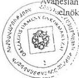
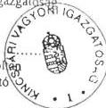
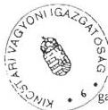
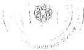
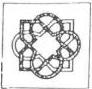
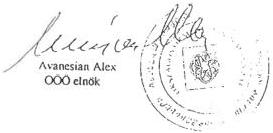
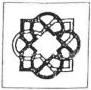
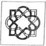

Állami Számvevőszék

T42: 574

# JELENTÉS

az Országos Örmény Önkormányzat
pénzügyi-gazdasági tevékenységének
vizsgálatáról

2002. január

0200 ✓

---

Az ellenőrzés végrehajtásáért felelős:
V. Önkormányzati és Területi Ellenőrzési Igazgatóság

dr. Lóránt Zoltán
számvevő igazgató

Az ellenőrzést vezette:

dr. Sallai Antal
régióvezető főtanácsos

Az ellenőrzést végezte

Endrődy Péterné
számvevő

Az ÁSZ által a témában eddig készített jelentések:

Az Országos Örmény Önkormányzat pénzügyi-gazdasági tevékenységének vizsgálata (1019/1995.)

Az Országos Örmény Önkormányzat pénzügyi-gazdasági tevékenységének vizsgálata (1008/1997.)

Jelentéseink az Országgyűlés számítógépes hálózatán
és az Interneten a www.asz.hu címen is olvashatók, továbbá a Belügyminisztérium folyóirata, az "Önkormányzati Tájékoztató" rendszeresen közli, valamint a Megyei Közigazgatási Hivatalvezetők részére is átadásra kerül.

---

V-1013-25/2001-2002.

# TARTALOMJEGYZÉK

|  **I. ÖSSZEGZŐ MEGÁLLAPÍTÁSOK, KÖVETKEZTETÉSEK, JAVASLATOK** | **4**  |
| --- | --- |
|  **II. RÉSZLETES MEGÁLLAPÍTÁSOK** | **5**  |
|  1. A feladatellátás szervezettsége, szabályozottsága | 5  |
|  1.1. Általános ismertek az örmény kisebbségről, az Országos Örmény Önkormányzat kapcsolatrendszere | 5  |
|  1.2. A szervezeti és működési rend alakulása | 6  |
|  1.3. A költségvetés, zárszámadás, vagyonleltár megállapításának szabályozottsága | 7  |
|  1.4. A működés szervezeti feltételrendszere | 7  |
|  2. Az önkormányzat működésének, a gazdálkodás rendjének szabályszerűsége | 7  |
|  2.1. A működés tárgyi feltételeinek alakulása | 7  |
|  2.2. Az egyszeri vagyonjuttatásként kapott részvények hasznosítása | 8  |
|  2.3. A gazdálkodási tevékenység személyi és tárgyi feltételei | 9  |
|  2.4. A gazdálkodási folyamatok szabályozottsága | 9  |
|  2.5. A gazdálkodási jogkörök szabályozottsága | 10  |
|  2.6. Vállalkozási tevékenység | 10  |
|  3. A beszámolási kötelezettség teljesítése, a költségvetés készítése és végrehajtása | 10  |
|  3.1. A könyvvezetési kötelezettség | 10  |
|  3.2. Az éves költségvetések | 11  |
|  3.3. A költségvetések végrehajtása | 11  |
|  3.4. A gazdasági események bizonylati alátámasztottsága | 12  |
|  3.5. A vagyongazdálkodás szabályozottsága, vagyonvédelem | 13  |
|  3.6. Éves beszámolási kötelezettség | 13  |
|  3.7. Az éves zárszámadások | 14  |
|  4. Az önkormányzat ellenőrzési rendszere | 14  |
|  4.1. Az ellenőrzés szabályozottsága | 14  |
|  4.2. A belső ellenőrzés | 14  |
|  4.3. A lefolytatott ellenőrzések tapasztalatai | 14  |
|  5. A korábbi számvevőszéki ellenőrzések javaslatainak hasznosulása | 14  |

1

---

1

[Non-Text]

[Non-Text]

[Non-Text]

[Non-Text]

[Non-Text]

[Non-Text]

[Non-Text]

[Non-Text]

[Non-Text]

[Non-Text]

[Non-Text]

[Non-Text]

[Non-Text]

[Non-Text]

[Non-Text]

[Non-Text]

[Non-Text]

[Non-Text]

[Non-Text]

[Non-Text]

[Non-Text]

[Non-Text]

[Non-Text]

[Non-Text]

[Non-Text]

[Non-Text]

[Non-Text]

[Non-Text]

[Non-Text]

[Non-Text]

[Non-Text]

[Non-Text]

[Non-Text]

[Non-Text]

[Non-Text]

[Non-Text]

[Non-Text]

[Non-Text]

[Non-Text]

[Non-Text]

[Non-Text]

[Non-Text]

[Non-Text]

[Non-Text]

[Non-Text]

[Non-Text]

[Non-Text]

[Non-Text]

[Non-Text]

---

I. ÖSSZEGZŐ MEGÁLLAPÍTÁSOK, KÖVETKEZTETÉSEK, JAVASLATOK

# JELENTÉS

# az Országos Örmény Önkormányzat pénzügyi-gazdasági tevékenységének vizsgálatáról

Az Állami Számvevőszékről szóló 1989. évi XXXVIII. törvény 2. § (5) bekezdése alapján ellenőriztük az országos kisebbségi önkormányzatoknál az állami költségvetésből juttatott támogatások felhasználását.

A nemzeti és etnikai kisebbségek jogairól szóló 1993. évi LXXVII. törvény (továbbiakban: Nek tv.) szabályozza az országos kisebbségi önkormányzatok létrehozásának rendjét, azok feladat- és hatásköreit.

Az Állami Számvevőszék 1995. és 1997. évben témavizsgálat keretében ellenőrizte az országos kisebbségi önkormányzat pénzügyi, gazdasági tevékenységét.

A vizsgálat az országos kisebbségi önkormányzatok 1999. és 2000. évi és 2001. első félévi gazdálkodására terjedt ki, egyes esetekben – a székházjuttatási folyamat és egyszeri vagyonjuttatás hasznosulása – a korábbi vizsgálat óta eltelt teljes időszakot áttekintettük.

**Az ellenőrzés célja:** annak megállapítása volt, hogy

- az országos kisebbségi önkormányzat működési feltételrendszere hogyan változott a vizsgált időszakban,
- a gazdálkodás szervezettsége, szabályszerűsége mennyiben felel meg a jogszabályi követelményeknek és az önkormányzati működés sajátosságainak,
- biztosított-e a gazdálkodás és a pénzeszközök felhasználásának törvényessége és szabályszerűsége, a számviteli törvény és a vonatkozó kormányrendeletek előírásainak betartása.

3

---

I. ÖSSZEGZŐ MEGÁLLAPÍTÁSOK, KÖVETKEZTETÉSEK, JAVASLATOK

# I. ÖSSZEGZŐ MEGÁLLAPÍTÁSOK, KÖVETKEZTETÉSEK, JAVASLATOK

Az önkormányzat tevékenységének szabályozottsága nem kielégítő, az SzMSz a gazdálkodási hatásköröket nem tartalmazza. Belső szabályzatokkal – a pénzkezelést kivéve – nem rendelkezik. Egyetlen létrehozott bizottságának működési szabályai nincsenek rögzítve.

Az egyszeri vagyonjuttatásból származó többletforrások valós nagyságrendjét és felhasználását nem lehetett nyomon követni a rendkívül súlyos pénzügyi és számviteli szabálytalanságok miatt. A rendelkezésre álló információkból nem lehetett megállapítani, hogy az egyszeri vagyonjuttatás felhasználása hogyan szolgálta az önkormányzat működését, az örmény kisebbségi célok megvalósítását.

Az ingyenes használatra véglegesen juttatott székházat közös költség tartozás felhalmozása miatt el kellett hagynia.

Könyvvezetési és beszámoló készítési kötelezettségének az előző vizsgálatot követően 1999-ig nem tett eleget. 1999-től a mérleget ugyan elkészítette, de nem terjesztette közgyűlés elé.

Pénzkezelése szabálytalan, a pénzügyi bizottság ellenőrzési tevékenysége nem dokumentált.

A korábbi számvevőszéki megállapítások ellenére immár a második ciklusban nem történtek meg a szükséges intézkedések az önkormányzat vezetése részéről a hiányosságok kiküszöbölése érdekében.

A hibák, hiányosságok megszüntetésére irányuló javaslatokon túlmenően a gazdálkodási fegyelem súlyos megsértése miatt az önkormányzat elnökének felelősségét is felvetettük.

A feltárt hiányosságok **kiküszöbölése érdekében** javasoljuk az elnöknek, **hogy a törvényes állapot helyreállítása és a jogszabályi előírások betartása érdekében:**

1. Gondoskodjon a 224/2000 (XII.19.) Korm. rendelet 6-8. § előírásai szerinti könyvvezetésről és beszámoló (mérleg és eredmény kimutatás) készítéséről, valamint a 20. § (6) bekezdésben foglaltak betartásáról a beszámoló közgyűlésnek való előterjesztésével.
2. Biztosítsa az önkormányzat éves zárszámadásának elkészítése során az abban szereplő adatok teljes körűségét, a rendelkezésre álló összes forrás és a felhasználások szerepeltetését.
3. Biztosítsa a pénzkezelés szabályszerű – helyi szabályozásának megfelelő – lebonyolítását.

4

---

II. RÉSZLETES MEGÁLLAPÍTÁSOK

4. Gondoskodjon a számvitelről szóló 2000. évi C. törvény 14. § (5) bekezdésében előírt szabályzatok elkészítéséről és a 164. § (2) bekezdése szerinti zárlati teendők maradéktalan elvégzéséről.

**A munka színvonalának javítása érdekében javasoljuk az elnöknek, hogy kezdeményezze:**

1. A jelenlegi számvevőszéki vizsgálat tapasztalatainak testületi megtárgyalását, a feltárt hiányosságok felszámolása érdekében intézkedési terv készítését és annak – az Állami Számvevőszékről szóló 1989. évi XXXVIII. törvény 25. § (1) bekezdésében előírtaknak megfelelően – 30 napon belüli eljuttatását az Állami Számvevőszék címére.
2. A fennálló székházkérdés mielőbbi rendezését annak érdekében, hogy az állam részéről biztosított elhelyezés megvalósulhasson.
3. Az ellenőrzési rendszer megszervezését és a hatékony működtetés biztosítását.
4. A könyvvezetési rendszer oly módon történő átalakítását, hogy az a feladatonkénti költségráfordítás gyűjtését lehetővé tegye.

## II. RÉSZLETES MEGÁLLAPÍTÁSOK

### 1. A FELADATELLÁTÁS SZERVEZETTSÉGE, SZABÁLYOZOTTSÁGA

#### 1.1. Általános ismertek az örmény kisebbségről, az Országos Örmény Önkormányzat kapcsolatrendszere

Magyarországon jelenleg az Országos Örmény Önkormányzat (továbbiakban ÖÖÖ) mellett 24 helyi örmény kisebbségi önkormányzat működik, ebből 16 a főváros kerületeiben, 8 pedig vidéken (Debrecen, Dorog, Nyíregyháza, Székesfehérvár, Szigethalom, Veszprém, Szeged, Siófok)

A hazánkban élő örményeknek két, markánsan elkülönülő csoportja van:

- az 1997-ben alakult **Erdélyi Örmény Gyökerek Kulturális Egyesület** magvát képező, Erdélyből áttelepült, nyelvileg asszimilálódott, önmagukat magyar-örménynek vallók, és
- az 1992-ben alakult **Armenia Népe Kulturális Egyesületbe** szerveződött ún. keleti örmények, akik 1915. illetve 1978. után érkeztek hazánkba, megőrizték nyelvüket és kulturális hagyományaikat.

A fentieken kívül további szervezetek szolgálják működésükkel az országban élő örmény kisebbség identitásának megőrzését:

- Vallási szervezetük az 1924-ben létesült **Örmény Katolikus Egyházközösség**. A Budapesten felépült - az országban egyetlen - örmény templom és

5

---

II. RÉSZLETES MEGÁLLAPÍTÁSOK

lelkészség nemcsak vallási céllal működik. Falai közt a helyhez méltó - színvonalas, elsősorban egyházi jellegű - kiállításokat és kamara-hangversenyeket rendeznek.

1997. okt. 7-én nyílt meg Budapest központjában az Örmény Kulturális és Információs Központ, ahol rendszeresek az örmény előadó-, képző- és iparművészek kiállításai, hangversenyei.

- az Örmény Kulturáert Alapítvány Veszprémben muködik, a vizsgalt idószakban pályázati uton szerzett támogatásokból gyermeküdtetest végeztek.
- az egyik legrégebbi szervezet az Armenia Magyar-Örmény Baráti Társaság. 1986-ban alakult, mára gyakorlatilag beleolvadt az Armenia Népe Kulturális Egyesületbe.

A fenti szervezetekkel - az Erdélyi Örmény Gyökerek Kulturális Egyesületet kivéve - az OÖÖ az örmény nemzetiség kultúrájának és az örmény identitástudat fenntartásának érdekében szorosan együttműködik, részükre támogatásokat nyújt.

# 1.2. A szervezeti és működési rend alakulása

Az új testület az 1998. évi választások után egy évvel - 1999. okt. 30-i közgyűlésén - 23/1999. (10. 30.) OÖÖ. sz. határozatával alkotta meg Szervezeti és Működési Szabályzatát. Az SzMSz-ben adminisztrációs hiba miatt azonban 7/1999. (10. 30.) sz. OÖÖ-határozat szerepel (a határozatok számozásának nincs konzekvens gyakorlata, nem folyamatosan növekvő sorszámmal történik.)

Az SzMSz III. fejezetében szabályozták a közgyűlés és az elnök - mint választott tisztségviselő - feladat- és hatáskörét. III. fejezet 2.1. g. pontja kimondja, hogy az önkormányzat munkájának szervezése, a tárgyi és személyi feltételek biztosítása az elnök feladata.

Az előző választási ciklusban hatályos SzMSz-hez képest csökkent a bizottságok száma. A Pénzügyi, tulajdonosi és vagyongazdálkodási bizottság új személyi összetételéről döntöttek, egyidejűleg a korábbiakhoz képest a feladatkörét szűkítették.

A jelenleg hatályos SzMSz - az előzőtől eltérően - már nem rendelkezett az OÖÖ határozatai közzétételének módjáról. (Az előző - 44/1997. /12. 18./ sz. OÖÖ-határozattal jóváhagyott - SzMSz I. fejezetének 2. 6. pontja szerint "az Önkormányzat határozatait hivatalos lapjában hirdetik ki.")

A közgyűlés gyakorlatilag nem élt hatáskör átruházási jogával. A III. fejezet 1. 2. pontjában meghatározott feladatai közül átruházott döntési jogkört az SzMSz-ben nem nevesítettek.

6

---

II. RÉSZLETES MEGÁLLAPÍTÁSOK

# 1.3. A költségvetés, zárszámadás, vagyonleltár megállapításának szabályozottsága

A Szervezeti és Működési Szabályzat a közgyűlés át nem ruházható hatáskörei között rögzítette

- az önkormányzat költségvetésenek elfogadását és felhasznalási rendjének meghatározását,
a zarszamadas es vagyonleltar elfogadasat,
- az önkormányzati törzsvagyon meghatározását,
- az önkormányzat hasznalataba adott vagyon kezelését.

Az SzMSz rendelkezésétől eltérően a közgyűlés a törzsvagyoni körről nem döntött.

# 1.4. A működés szervezeti feltételrendszere

Az önkormányzat 23 fővel alakult meg, a választást követő első évben azonban a korábbi pénzügyi bizottság három tagja visszaadta mandátumát. Az ezután elfogadott SZMSZ ennek ellenére 18 főt jelöl meg a testület létszámaként. A melléklet, amelynek a képviselőket név szerint kell tartalmaznia, nincs kitöltve. Az egyetlen létrehozott bizottság (a pénzügyi) név szerinti összetétele szintén nincs rögzítve az SZMSZ mellékletében.

Az előző választási ciklusban működő állandó (oktatási, nemzetközi, kulturális) valamint ideiglenes (szervezeti és pályázati) bizottságok létrehozásáról nem döntöttek.

Az OÖÖ hivatalt, illetve intézményt nem alapított, gazdasági társaságot nem hozott létre.

Az irodavezetőn kívül 2 fő alkalmazottat foglalkoztatnak.

# 2. AZ ÖNKORMÁNYZAT MŰKÖDÉSÉNEK, A GAZDÁLKODÁS RENDJÉNEK SZABÁLYSZERŰSÉGE

# 2.1. A működés tárgyi feltételeinek alakulása

A Kincstári Vagyoni Igazgatóság (KVI) 1997. febr. 24-én vásárolta meg az OÖÖ által kiválasztott irodahelyiséget - végleges elhelyezésre szolgáló székházként - a "Duna-ház" (Bp. IX. ker. Soroksári út 3/a) harmadik emeletén, és adta az önkormányzat ingyenes használatába, ugyanazon a napon megkötött megállapodással. Ennek 5. pontja értelmében az ingatlan használatából eredő fizetési kötelezettség az OÖÖ-t terheli.

Miután 1999. év végére az önkormányzat 6 millió Ft közös költség-hátralékot halmozott fel, maga kezdeményezte az ingyenes használati jog felfüggesztését. Az erre vonatkozó megállapodás a KVI és az OÖÖ között 1999. dec. 13-

7

---

II. RÉSZLETES MEGÁLLAPÍTÁSOK---

án jött létre (3. sz. melléklet), amit a Nemzeti és Etnikai Kisebbségi Hivatal a megállapodás 11. pontjára hivatkozva utólag megkifogásolt, a következők szerint:

„az Országos Örmény Önkormányzat véglegesen nem mondhat le az ingyenes használatról - csak meghatározott időre s azzal a feltétellel, hogy másutt működése biztosított.”

A felfüggesztésről szóló megállapodás módosítása ez ideig nem került aláírásra.

A KVI 2000. jún. 23-i levelében értesítette az önkormányzatot, hogy, miután a megállapodás-módosítási tervezetükkel kapcsolatban visszajelzést nem kaptak, továbbra is az 1999. dec. 13-i megállapodást tekintik érvényesnek.

Az OÖÖ elhelyezése jelenleg az Örmény Kulturális és Információs Központban (Budapest, V. ker. Deák Ferenc u. 17.) ideiglenesen megoldott, a **székház ügye** azonban a fentiekre tekintettel megnyugtatóan **nem rendeződött**, a tartozás jelenleg is fennáll a Duna-ház üzemeltetőjével szemben.

## 2.2. Az egyszeri vagyonjuttatásként kapott részvények hasznosítása

Az 1993. évi LXXVII. tv. 63. § (4) bekezdése alapján az önkormányzat 15 millió Ft értékben egyszeri vagyonjuttatásban részesült, az ÁPV Rt. Igazgatósága 293/1996. (IV.24.) számú határozatának megfelelően MOL Rt részvények formájában. A részvényvagyon átadásáról szóló megállapodást 1996. november 6-án írták alá.

A vizsgált időszak (1999-2000) **mérlegadatai részvényt vagy értékpapírt nem tartalmaznak**, a főkönyvi számlákon értékpapír eladásra illetve vételre utaló gazdasági eseményt nem rögzítettek.

A vizsgált időszakot megelőző években (1996-1998) az önkormányzatnál könyvvezetés nem történt, ezáltal beszámoló-készítési kötelezettségének sem tett eleget (az OÖÖ elnökének erre vonatkozó **nyilatkozata** a 4. sz. melléklet). **Eljárása nem felel meg** a számvitelről szóló 1991. évi XVIII. tv. (továbbiakban Szvt.) 4. § (1) bekezdésének, valamint a számviteli törvény szerinti egyéb szervezetek éves beszámoló készítésének és könyvvezetési kötelezettségének sajátosságairól szóló 8/1996. (I. 24.) Korm. rendelet 7-8. § előírásainak. A Szvt 79. § (5) bekezdése szerint „a számlarend összeállításáért a folyamatos könyvvezetés helyességéért... az egyéb szervezetnek a vezetője a felelős”. Emiatt a fentiek alapján **az elnök felelős**.

Az előző (1997. évi) - a jelenlegivel azonos témájú - számvevőszéki vizsgálat jelentése szerint a MOL-részvényeket értékesítették 29.767 ezer Ft-ért és Diszkont Kincstárjegyeket vásároltak, amelynek hasznosításáról az OÖÖ elnökének (mindkét választási ciklusban ugyanazon személy) **nyilatkozatát** a 5. sz. melléklet tartalmazza. A tételek összege sem a fenti értékkel, sem a nyilatkozatban megjelölt összeggel nem egyezik meg. A nyilatkozat **nem megalapozott mert**:

---8

---

II. RÉSZLETES MEGÁLLAPÍTÁSOK

- A juttatott vagyon nem elkūönītett számlán került elszámolásra. Ezér nem állapíthato meg, hogy ezek a felhasználasi tetelek valóban a vagyon ellenér-tékéból, vagy más forrásokból kerültek-e fedezésre. (Pl. a bankszámlán maradt 1997. december végi 3.554.772 Ft nyilvánvaloan más beveteleket is tartalmazhat.)
- A felhasznalás egyes tetelei megállapodásokkal, számlákkal és egyéb bi-zonylatokkal nincsenek alatámasztva.
- Hiányzik az egyes kiadások indokainak taglalása. Ezeket az összegeket minimálisan a pénzügyi bizottság elóterjesztése, illetve a kozgyulés dontésenek kellett volna dokumentálton megelóznie. (Pl. az örmény templom melletti terület megvásárlása.)
- Tartalmilag nincs kifejtve a bankkártyára felvett 1 millio Ft, valamint a bankszámla 1997. évi záró allományának a felhasználása. Nincs részletezve, hogy a 6,9 millio Ft összegú képviselói dijazás milyen idószakra vonatkozik, személyenként milyen összegben. Ugyanez vonatkozik az erdélyi örmények ugyancsak 6,9 millio Ft összegú támogatására.

A folyamatos könyvvezetés hiánya miatt az önkormányzat bevétele és kiadása, ezen belül a vagyont megtestesítő értékpapír felhasználása az ellenőrzés számára nem volt nyomon követhető. Ez a vagyoni helyzet áttekintését, illetve ellenőrzését részben meghiúsította, illetve megnehezítette. A vagyonvesztés értéke valószínűsíthetően az előző számvevőszéki jelentésben megállapított értéknek (29.767 ezer Ft) felel meg.

Amennyiben az ÖÖÖ a nyilatkozat szerint használta fel az egyszeri vagyonjuttatás összegét, megsértette a kisebbségi önkormányzatok költségvetésének, gazdálkodásának, vagyonjuttatásának egyes kérdéseiről szóló 20/1995. (III.3.) Korm. rendelet 2. § (3) bekezdése, valamint a Nek. törvény 63. § (4) bekezdésében foglaltakat, miszerint az országos önkormányzatok a részükre juttatott vagyon hozadékából és egyéb bevételeikből fedezik működésük költségeit.

Kifogásolható továbbá, hogy abban az időszakban a könyvelő havi 33.000 Ft-os megbízási díja teljesítés nélkül került kifizetésre.

### 2.3. A gazdálkodási tevékenység személyi és tárgyi feltételei

Az önkormányzat gazdálkodását saját szervezeti keretein belül bonyolítja. A számviteli tevékenység ellátására a legmagasabb szakmai végzettséggel (okleveles könyvvizsgálói képesítés) rendelkező alkalmazottat foglalkoztat (1999-től).

A számítástechnikai háttér a könyveléshez biztosított, az adatok feldolgozása azonban a főkönyvi számlákon (kartonokon) manuálisan történik.

### 2.4. A gazdálkodási folyamatok szabályozottsága

A gazdálkodás folyamata az önkormányzatnál csak részben szabályozott.

9

---

II. RÉSZLETES MEGÁLLAPÍTÁSOK

A Szvt. 14. § (5) bekezdésében előírt szabályzatok közül csak a pénzkezelési szabályzattal rendelkezik az önkormányzat.

A Szvt 79. § (1) bekezdésében foglaltak szerinti számlarendjét nem készítette el, csak számlatükörrel rendelkezik. A főkönyv és az analitikus nyilvántartás kapcsolata nincs szabályozva.

Pénzkezelési szabályzata hiányos, a szabályzat nem rögzíti:

- a pénztáros és a pénztárellenőr nevét, aláírásuk mintáját,
- a pénztáros helyettesítésének rendjét,
- a pénztárzárlat gyakoriságát,
- pénztár zárás után a pénztárban tárolható összeg felső határát.

# 2.5. A gazdálkodási jogkörök szabályozottsága

A gazdálkodási jogköröket az SzMSz mellékletében nem rögzítették.

Az utalványozásra vonatkozó szabályozást az előző választási ciklusban - 1996. márc.1-i hatállyal - hagyták jóvá. A kötelezettségvállalásra vonatkozó előírás dátum és aláírás nélküli (6. sz. melléklet).

# 2.6. Vállalkozási tevékenység

Az átadott dokumentumok és az elnök nyilatkozata alapján az önkormányzat társaságot nem alapított, vállalkozásban nem vett részt, vállalkozási tevékenységet nem végzett.

# 3. A BESZÁMOLÁSI KÖTELEZETTSÉG TELJESÍTÉSE, A KÖLTSÉGVETÉS KÉSZÍTÉSE ÉS VÉGREHAJTÁSA

# 3.1. A könyvvezetési kötelezettség

Az önkormányzat vállalkozási tevékenységet nem végez, a tevékenység célja szerinti éves bevétele 50 millió Ft-ot ez ideig egyetlen évben sem haladta meg. Ennek alapján – a számviteli törvény szerinti egyéb szervezetek éves beszámoló készítésének és könyvvezetési kötelezettségének sajátosságairól szóló 219/1998 (XII. 30.) Korm. rendelet 16. § (7) bekezdése értelmében – egyszerűsített beszámolót készíthet az önkormányzat.

A beszámolási kötelezettség függvényében könyvvezetése az egyszeres könyvvitel rendszerében történhet. Ennek ellenére az önkormányzat a gazdasági események regisztrálására a kettős könyvvitelt választotta.

A költségvetés alapján gazdálkodó szervek beszámolási és könyvvezetési kötelezettségéről szóló 54/1996 (IV. 12.) Korm. rendelet 1. § (1) bekezdés b) pontjának helytelen értelmezéséből adódóan az önkormányzat a költségvetési szervekre vonatkozó számlatükör alapján könyvel. A fent hivatkozott kor-

10

---

II. RÉSZLETES MEGÁLLAPÍTÁSOK

mányrendelet hatálya azonban az országos önkormányzatokra nem terjed ki, csak azok költségvetési szerveire.

# 3.2. Az éves költségvetések

Az önkormányzat Szervezeti és Működési Szabályzata a költségvetés elkészítésének rendjéről a költségvetés szerkezeti felépítéséről nem rendelkezett. Az éves költségvetés elfogadását az SZMSZ a közgyűlés hatáskörébe utalta.

A vizsgált időszakban költségvetéseit az SZMSZ-el összhangban a közgyűlés hagyta jóvá az alábbiak szerint:

1999. évre 17/1999 (julius 3.) OÖO határozattal
2000. évre 2/2000 (március 4.) OÖO határozattal
2001. évre 7/2001 (április 14. OÖO határozattal

A költségvetések elfogadása szabályosan történt a közgyűléseken a jegyzőkönyvek tanúsága szerint a 18 főből mindössze 7-8 fő jelenlétével. Ezt az tette lehetővé, hogy a 20/1999. OÖÖ határozat szerint határozatképtelenség miatt meghiúsult közgyűlés ugyanezen a napon és helyen, változatlan napirenddel határozatképes. Az SzMSz-nek ezt a megengedő pontját szintén csak a jelenlévő 7 fő szavazta meg.

A költségvetések csak költségnemenkénti részletezést tartalmaztak, az egyes konkrét feladatok (programok) egyedi költségtervezése elmaradt.

# 3.3. A költségvetések végrehajtása

Az önkormányzat összbevétele 1999-ben 31.518 ezer Ft, 2000-ben pedig 28.132 ezer Ft volt.

A bevétel alapvetően három forrásból származott:

- Allami támogatas (Költségvetési törvenyben meghatározott összegben)
Palyazatok utjan szerzett bevetelek (pl. Nemzeti es Etnikai Kisebsegekért Kozalapitvanytol)
Egyeb tamogatasok (Oktatasi Minisztérium)

Saját bevételének tekinti az önkormányzat a világon diaszpórában élő örményektől és az örmény társszervezetektől nemzetközi találkozó és egyéb programok lebonyolítására kapott összegeket. Ilyen forrásból évi 3-4 millió forint bevételre tett szert az OÖÖ 2000-2001 években. A vállalt feladatok pénzügyi fedezete a vizsgált időszakban biztosított volt.

A konkrét programok, feladatok bekerülési költsége a könyvvezetés módjából adódóan nincs kimutatva, a konkrét feladatok költségszükségletét elkülönítetten nem határozták meg.

A személyi jellegű kiadások között meghatározó a képviselők belföldi utazásainak költségtérítése, valamint a külföldi kiküldetésekre fordított összegek (2000-

11

---

II. RÉSZLETES MEGÁLLAPÍTÁSOK---

ben 700 ezer, illetve 3120 ezer Ft), a vizsgált időszakban a képviselők tiszteletdíjat azonban nem vettek fel.

Jelentős összeget fordított az önkormányzat terembérlésre is. Az Arménia Népe Kulturális Egyesületnek ilyen címen kifizetett összeg 1999-ben 1 millió Ft volt. A takarékos költséggazdálkodás érdekében – költségminimalizálás céljából – egyéb szervezetektől árajánlatokat nem kért be az önkormányzat.

### 3.4. A gazdasági események bizonylati alátámasztottsága

A gazdasági eseményeket tartalmazó és azokat alátámasztó bizonylatok ellenőrzése az

- 2000. június és december

havi pénztárjelentések és bankkivonatok tételes vizsgálatával, valamint mindkét év százezer forint feletti – véletlenszerűen kiválasztott – tételeinek a vizsgálatával történt.

A vizsgált gazdasági események bizonylatai csak részben felelnek meg az alaki és tartalmi követelményeknek. **A kiadások teljesítése általában dokumentált**, azonban a pályázati úton nyert bevételek, valamint az önkormányzat által nyújtott támogatások esetében – rendszerbeli hiányosságként – a bankkivonatok mögül hiányzott az alapbizonylat. Az ezekhez kapcsolódó szerződéseket a könyvelő a gazdasági esemény főkönyvi számlákon történő rögzítésekor nem ismerte, a megállapodásokat nem az irodában tárolták. Emiatt a támogatási bevételek és a **nyújtott támogatások** könyvelése a bankkivonat alapján történt, a könyvelés **alapbizonylata** (számla, megállapodás) **hiányzott**. A helyszíni vizsgálat során többszöri felkérést követően az ellenőrzés rendelkezésére bocsátott dokumentumokból megállapításra került, hogy az egyes szervezetek részére a pénzeszközátadás „Támogatási adatlap”-on történt, a támogatást fogadó aláírása azokon nem szerepel. Az Arménia Népe Kulturális Egyesületnek nyújtott támogatás mindegyike tartalmát tekintve olyan megállapodás, amely meghatározott feladatok ellátására vonatkozik. A megállapodásokról a szerződő fél aláírása hiányzik, elszámoltatás nem történik (Pl. 7-8. sz. melléklet).

Az **ÖÖÖ pénzkezelése nem a vonatkozó szabályzatuknak megfelelően** történik, az önkormányzatnak pénztára és pénztárosa nincs.

Készpénzfelvételre az elnök jogosult. Pénztár hiányában a banki számláról felvett összegek pénztárba való befizetése nélkül került a bevételezési bizonylat a könyvelő által kiállításra, az elnök által átadott számlákhoz kapcsolódó pénztár kifizetési bizonylatokkal együtt.

Fentiek miatt a havi rendszerességgel elvégzett pénztárzárás csak formális, a pénztárjelentésen kimutatott zárókészlet és a készpénzállomány egyeztetése lehetetlen, emiatt annak ellenőrzése is kizárt.

---12

---

II. RÉSZLETES MEGÁLLAPÍTÁSOK

A pénztárjelentésben kimutatott egyenlegek

|  2000. június | Nyitó | 2.023. 499 Ft  |
| --- | --- | --- |
|   | Záró | 2.431.757 Ft  |
|  2000. december | Nyitó | 3.609.099 Ft  |
|   | Záró | 3.000.766 Ft  |

Az 1999. január és júliusi pénztárjelentéseken zárókészlet kimutatásra nem került.

### 3.5. A vagyongazdálkodás szabályozottsága, vagyonvédelem

Vagyongazdálkodásra vonatkozó szabályzattal az önkormányzat nem rendelkezik, annak megalkotása a vizsgált időszakra nem volt indokolt.

A 2.2. pontban leírtak szerint az OÖÖ-nál ugyanis teljes vagyonvesztés történt, az 1999-2000. éves mérlegeiben saját tőke már nem szerepelt.

### 3.6. Éves beszámolási kötelezettség

Az önkormányzat éves beszámoló készítési kötelezettségének **a vizsgált időszakban is csak részben tett eleget**, az éves beszámoló részét képező – a 219/1998. (XII. 30.) Korm. rendelet 6. számú melléklete szerinti eredmény kimutatást nem készítette el.

Az egyszerűsített éves beszámolót (mérleget és eredmény kimutatást) a közgyűlés egyik évben sem tárgyalta, a testülettel elfogadtatva nem lett.

A OÖÖ eljárása ellentétes a 219/1998. (XII. 30.) Korm. rendelet 6. § (4) bekezdésében foglaltakkal. Az 1999-2000. évek mérlegadatai saját vagyont nem tartalmaznak. A mérleg főösszeg

1999. év végén 4.532 ezer Ft

2000. év végén 4.765 ezer Ft

A könyvvezetési kötelezettség 1996-1998 években történő megszegése miatt a számviteli alapelvek között nevesített folytonosság elve sérült, az 1999. évi nyitótétel valódisága nem biztosított.

A mérleg eszköz sorai között a tárgyi eszközök értéke (4.399 ezer Ft) a meghatározó, az előző évek könyvvezetési hiányossága miatt leltár alapján került a mérlegbe beállításra. A leltározással fellelt eszközök után értékcsökkenés, elszámolás nem történt.

Kötelezettségei között a „Duna-ház” üzemeltetőjével szembeni tartozás nem szerepel, mivel az ingyenes használati jog felfüggesztéséről kötött megállapodás értelmében annak rendezését a Kincstári Vagyoni Igazgatóság átvállalta az önkormányzattól. (Lásd csatolt 5. számú melléklet)

Az önkormányzat az SZT 82. §-ában előírt zárlati kötelezettségnek csak részben tett eleget, főkönyvi kivonatot nem készített.

13

---

II. RÉSZLETES MEGÁLLAPÍTÁSOK

### 3.7. Az éves zárszámadások

Az éves zárszámadásokat az elfogadott költségvetések szerkezetének megfelelően terjesztették jóváhagyásra a közgyűlés elé. A kiadásokat személyi és dologi költségek szerinti bontásban az egyes költségnemeket részletezve mutatták ki.

Hiányosságként állapítható meg, hogy az elszámolás csak a Magyar Köztársaság költségvetésében meghatározott – működési célra átadott – pénzeszköz felhasználására terjedt ki. A pályázati úton és egyéb módon szerzett bevételek felhasználását csak az adományozó felé (Oktatási Minisztérium, Magyar Nemzeti és Etnikai Kisebbségekért Közalapítvány) számolták el, azt a Közgyűlés elé terjesztett zárszámadásban nem szerepeltették.

Az 1999. évi zárszámadást az 5/2000 (aug. 10.) ÖÖÖ, a 2000. évit pedig a 4/2001. (április 14.) ÖÖÖ határozattal fogadta el a közgyűlés.

## 4. AZ ÖNKORMÁNYZAT ELLENŐRZÉSI RENDSZERE

### 4.1. Az ellenőrzés szabályozottsága

Az önkormányzat ellenőrzési szabályzattal nem rendelkezik, ellenőrzési tevékenysége nem szabályozott.

Pénzügyi bizottság működik ugyan, de ellenőrzési tevékenységet dokumentált módon nem végzett, üléseiről írásos anyag (pl. jegyzőkönyv) nem készült.

### 4.2. A belső ellenőrzés

A belső ellenőrzési rendszer gyakorlatilag nem működik.

### 4.3. A lefolytatott ellenőrzések tapasztalatai

Dokumentált ellenőrzések hiányában nincs hasznosítható ellenőrzési tapasztalat.

## 5. A KORÁBBI SZÁMVEVŐSZÉKI ELLENŐRZÉSEK JAVASLATAINAK HASZNOSULÁSA

Az 1997-ben lefolytatott számvevőszéki vizsgálat

- a gazdálkodás szabályozására,
- a bizonylati fegyelemre,
- a könyvvezetési rendszer módosítására, valamint
- az ellenőrzési rendszer megszervezésére,
- a testületi határozatok megfogalmazásának javítására vonatkozóan tett javaslatokat

Megállapítható, hogy azok realizálása alapvetően nem történt meg.

14

---

II. RÉSZLETES MEGÁLLAPÍTÁSOK

- A számviteli törvény által megkövetelt szabályzatok - a pénzkezelési szabályzatot kivéve - nem készültek el, a számlarend hiányos, csak számlatükröt tartalmaz.
- A könyvelési bizonylatok felszereltsége csak részben megfelelő, a pénzkezelést szabálytalanul - nem a vonatkozó szabályzat előírásait figyelembe véve - végezték.
- Az egyes feladatok költségeinek munkaszámonként, vagy egyéb módon elkülönítve történő nyilvántartása (számviteli rögzítése) jelenleg sincs megoldva. A feladatonkénti ráfordítások számbavétele tehát csak utólagos kigyűjtéssel biztosítható.
- Az ellenőrzési rendszert az előző vizsgálat felhívására sem szervezték meg.

Budapest, 2002. január 18.

Dr. Kovács Árpád  
elnök{
  "label": "",
  "top_left": [
    0.7195196175860,
    0.19887145894148894
  ],
  "bottom_right": [
    0.8695254193548387,
    0.3599730286730286
  ]
}

15

---

4

---

1.sz. melléklet a V-1013. sz. jelentéshez

Örmény Országos Önkormányzat

# Kimutatás az 1999-2001. évek bevételeiről

ezer Ft

|  Megnevezés | 1999. |   |   | 2000. |   |   | 2001.  |   |
| --- | --- | --- | --- | --- | --- | --- | --- | --- |
|   |  Tervezett |   | Tényleges | Tervezett |   | Tényleges | Tervezett  |   |
|   |  Év elején ismert | Évközi változás |   | Év elején ismert | Évközi változás |   | Év elején ismert | Évközi változás  |
|  Állami támogatás | 16700 | 0 | 16700 | 18400 | 0 | 18400 | 21000 | 0  |
|  Közalapítványi pályázatok | 7807 | 0 | 7807 | 2687 | 0 | 2687 | 600 | 0  |
|  Egyéb pályázatok | 0 | 0 | 0 | 200 | 0 | 200 | 0 | 0  |
|  Egyéb támogatások | 6542 | 0 | 6542 | 1350 | 0 | 1350 | 997 | 0  |
|  Saját bevételek | 469 | 0 | 469 | 5495 | 0 | 5495 | 3828 | 0  |
|  Pénzmaradvány | 133 | 0 | 0 | 366 | 0 | 0 | 100 | 0  |
|  Összesen | 31651 | 0 | 31518 | 28498 | 0 | 28132 | 26525 | 0  |

---

Örmény Országos Önkormányzat

2. sz. melléklet a V-1013. sz. jelentéshez

Kimutatás az 1999-2001. évek kiadásairól

|  Megnevezés | 1999. |   |   | 2000. |   |   | 2001.  |   |
| --- | --- | --- | --- | --- | --- | --- | --- | --- |
|   |  Tervezett |   | Tényleges | Tervezett |   | Tényleges | Tervezett  |   |
|   |  Év elején ismert | Évközi változás |   | Év elején ismert | Évközi változás |   | Év elején ismert | Évközi változás  |
|  Személyi jellegű juttatások | 6154 | 1208 | 7362 | 7232 | -1184 | 6048 | 8841 | 0  |
|  Munkáltatói járulékok | 1249 | -346 | 903 | 1249 | -283 | 966 | 527 | 0  |
|  Dologi kiadások | 12484 | 9080 | 21564 | 16667 | -855 | 15812 | 6484 | 0  |
|  Működési kiadások összesen | 19887 | 9942 | 29829 | 25148 | -2322 | 22826 | 15852 | 0  |
|  Adott támogatások | 800 | 1022 | 1822 | 2075 | 3597 | 5672 | 10673 | 0  |
|  Felhalmozási kiadások | 0 | 0 | 0 | 0 | 0 | 0 | 0 | 0  |
|  Tartalék | 0 | 0 | 0 | 0 | 0 | 0 | 0 | 0  |
|  Mindösszesen: | 20687 | 10964 | 31651 | 27223 | 1275 | 28498 | 26525 | 0  |

---

3. sz melléklet

62. pld

# MEGÁLLAPODÁS
AZ INGYENES HASZNÁLATI JOG FELFÜGGESZTÉSÉRŐL

amely létrejött

- egyrészről az Országos Örmény Önkormányzat (1095 Budapest, Soroksári út 3/A III./15. levelezési cím: 1052 Budapest, Deák F. u. 17.) teljes körű meghatalmazottjaként Avanesian Alex elnök, a továbbiakban: OÖÖ

- másrészről a Kincstári Vagyoni Igazgatóság (1054 Budapest, Zoltán u. 16.) képviseletében Dr. Molnár Zoltán vezérigazgató, a továbbiakban KVI.

között alulírott napon és helyen az alábbi feltételek szerint

1. A nemzeti és etnikai kisebbségek jogairól szóló 1993. évi LXXVII. törvény 59. § (2) bekezdésében előírtak teljesítéseként a Kormány 2031/1997.(II.12.) Kormányhatározatával módosított 2423/1995. (XII.28.) Kormányhatározata alapján 1997. február 26-án az OÖÖ birtokba vette az ingyenes használatába került Budapest, IX. ker. Soroksári út 3/A III./15. irodaingatlant.
2. Az ingatlanhasználattal kapcsolatos jogokat, kötelezettségeket KVI és az OÖÖ a közöttük 1997. február 24-én létrejött ingyenes használati megállapodásban rögzítettek. E megállapodás 5. pontjában írottaknak megfelelően az ingatlanhasználatból adódó fizetési kötelezettség az OÖÖ-t terheli. Amennyiben az OÖÖ e kötelezettségének nem tesz eleget, úgy KVI kezdeményezi az ingyenes használati jogosultság megszüntetését.
3. Felek rögzítik, hogy az OÖÖ sem a KVI, sem az ingatlan Üzemeltetőjének többszöri felszólítása ellenére nem tett eleget fizetési kötelezettségének, ezért az OÖÖ kezdeményezésére felek az OÖÖ ingyenes használati jogosultságának alábbiakban részletezett felfüggesztésében állapodnak meg.
4. Jelen megállapodás hatályba lépését – amely a megállapodás szerződő felek által történő aláírásának időpontjával megegyezik – követő 15 napon belül az OÖÖ köteles a KVI rendelkezésére bocsátani az ingatlanhasználatból adódó eddigi, a Duna Háza irodaházat üzemeltetők felé fennálló díjtartozását részletező kimutatást – a részére kibocsátott számlák másolatának egyidejű mellékelésével – az alábbi bontásban:
4.1. OÖÖ díjtartozása 1997. február 26 – 1997. október 31. időszakra vonatkozóan.
4.2. OÖÖ díjtartozása 1997. november 1 – 2000. január 15. időszakra vonatkozóan a Szelei Serfőző Üzemeltető Kft-vel (1074 Budapest, Hársfa u. 10./B.) és a Duna Ház társasház Intéző Bizottságával történő írásbeli megegyezés alapján a tartozás mértékéről, s a részletekben történő megfizetés elfogadásáról.
5. Fenti díjtartozások nem tartalmazhatják az OÖÖ által külön mérőóra alapján fizetendő egyéb költségeket, azt az OÖÖ jelen megállapodás hatályba lépését követő 15 napon belül köteles kiegyenlíteni, s ennek teljesüléséről nyilatkozatot a KVI rendelkezésére bocsátani.

---

6. Az ÖÖÖ tudomásul veszi és elfogadja, hogy a 4. pontban részletezett, késedelmi kamattal növelt tartozásának megfizetéséig ingyenes használati jogát nem gyakorolható.

7. KVI vállalja, hogy amennyiben az ÖÖÖ a 1. pontban megadott határidőn belül rendelkezésére bocsátja a tartozását részletező kimutatást, s a szükséges nyilatkozatokat, valamint a Nemzeti és Etnikai Kisebbségi Hivatal (a továbbiakban: NEKH) útján az ingyenes használati jogának felfüggesztéséhez hozzájáruló nyilatkozatát, úgy 2000. január 15-ig megállapodást köt az ingatlan Üzemeltetőjével az 1. pontban részletezett irodaingatlan bérbeadás útján történő hasznosítására annak érdekében, hogy az Üzemeltető 4.2. pontban részletezett követelése a beszedett bérleti díjból kiegyenlítésre kerüljön. Ennek teljesülését követően a 4.1. pontban részletezett követelés erejéig az Üzemeltető a beszedett bérleti díjat a KVI részére utalja át.

8. Az ÖÖÖ kötelezettséget vállal arra, hogy a KVI-Üzemeltető közötti megállapodás hatályba lépését követően 2000. január 15-én az 1. pontban részletezett irodaingatlant kiürítetten, lakható állapotban – külön eljárás keretében, az üzemeltető jelenlétében a KVI birtokába adja.

9. KVI és az Üzemeltető évente egyeztetik az ÖÖÖ még fennálló tartozását, amelynek eredményéről az ÖÖÖ-t tájékoztatják.

10. Az ÖÖÖ tartozásának kiegyenlítését követően – amely időpontról KVI az ÖÖÖ-t 4 hónappal korábban köteles értesíteni – az ÖÖÖ-nek jogában áll ismételten gyakorolni ingyenes használati jogát az irodaingatlan – külön eljárást követő – birtokba vételével. A használat során az ÖÖÖ köteles fizetési kötelezettségének maradéktalanul eleget tenni. 30 napot meghaladó fizetési késedelem esetén a KVI a használati jog ismételt felfüggesztését kezdeményezheti, amelyet az ÖÖÖ jelen megállapodás aláírásával tudomásul vesz és elfogad.

11. Felek rögzítik, hogy KVI-nek nem feladata az 1. pontban részletezett irodaingatlan ideiglenes hasznosítása, azt jelen megállapodásban részletezetteknek megfelelően csak méltányosságból teszi, hiszen a vonatkozó jogszabályi előírások alapján az ÖÖÖ köteles viselni az ingatlanhasználatból adódó minden költséget. Ezért a 10. pontban részletezett KVI értesítés kézhezvételét követő 15 napon belül az ÖÖÖ köteles írásban nyilatkozni KVI részére, hogy a közölt határidőre ismételten birtokba kívánja-e venni az 1. pontban részletezett irodaingatlant élve ingyenes használati jogával. Amennyiben az ÖÖÖ a fenti határidőn belül nem nyilatkozik, azt a tárgybani ingatlan ingyenes használati jogáról történő, a fenti határidő utolsó napjával hatályba lépő végleges lemondásának kell tekinteni, amelyet e megállapodás aláírásával megerősít.

12. Felek rögzítik, hogy a fenti feltételek be nem tartása, illetve beállta esetén az ÖÖÖ ingyenes használati joga felfüggesztésre kerül, illetve lemondás révén megszűnik. Ezt az ÖÖÖ tudomásul veszi és elfogadja, egyben kötelezi magát, hogy működési feltételeinek biztosításával kapcsolatban elhelyezési és kártérítési igényt nem támaszt sem most, sem a későbbiekben a Kormány, valamint a NEKH és KVI felé. Az ÖÖÖ tudomásul veszi, hogy a NEKH a KVI értesítése alapján kezdeményezheti a 2423/95. (XII.28.) kormányhatározat hatályon kívül helyezését. Az ÖÖÖ tudomásul veszi, hogy az ingatlannal kapcsolatos költségek viselése a Kormány fenti hatályon kívül helyező határozatáig őt terheli.

---

meltetőkkel szemben fennálló tartozásért közvetlenül helytállni köteles. A helytállási kötelezettségének az ingatlan bármilyen megterhelésével nem tehet eléget, a kincstári vagyonnak minősülő ingatlan a hatályos jogszabályi előírások alapján - nem terhelhető meg.

13. Felek kijelentik, hogy amennyiben a jelen megállapodás tartama alatt a Kormány a tárgybani ingatlannal kapcsolatban döntést hoz, azt magukra nézve kötelezőnek ismerik el és annak magukat alávetik.
14. Felek megállapodnak abban, hogy esetleges jogvitáikat elsősorban tárgyalásos úton kívánják rendezni. Arra az esetre, ha az egyeztetés nem vezetne eredményre, a felek kikötik a PKKB kizárólagos illetékességét.
15. A jelen szerződésben nem szabályozott kérdésekben a Ptk. szabályai az irányadóak.
16. Jelen megállapodást felek közös értelmezést követően, mint akaratukkal mindenben megegyezőt helybenhagyólag aláírták.
17. Jelen megállapodás 8 példányban készült, amelyből 1 példány az OÖÖ-t, 1 példány a NEKH-t, 6 példány a KVI-t illeti meg.

Budapest, 1999. 13. nap

Országos Örmény Önkormányzat

Avanesian Alex

Kincstári Vagyoni Igazgatóság

Dr. Molnár Zoltán
vezérigazgató

Ellenjegyezte KVI részéről:

Dr. Kotnyek Béla
gazdasági vezérigazgató-helyettes

Láttam, egyetértek:
Nemzeti és Etnikai Kisebbségi Hivatal

Dr. Doncsev Angelov Toso
elnök

pénzügyi és számú fős
vagyonfenntartási fős

megnevezés és hasonló fős

jogi és igazgató fős 11.30.99 - 21/99.12.14
1-2-14

---

•

---

4. sz. melléklet

# NYILATKOZAT

1996-98 években az Országos Ormény Önkormányzat egyszerűsített éves beszámolói nem készültek el, könyvvizetés nem történt

2001. szeptember 18

Avanesian Alex  
ÖÖÖ elnök

---

•

.

[Non-Text]

[Non-Text]

[Non-Text]

[Non-Text]

[Non-Text]

[Non-Text]

[Non-Text]

[Non-Text]

[Non-Text]

[Non-Text]

[Non-Text]

[Non-Text]

[Non-Text]

[Non-Text]

[Non-Text]

[Non-Text]

[Non-Text]

[Non-Text]

[Non-Text]

[Non-Text]

[Non-Text]

[Non-Text]

[Non-Text]

[Non-Text]

[Non-Text]

[Non-Text]

[Non-Text]

[Non-Text]

[Non-Text]

[Non-Text]

[Non-Text]

[Non-Text]

[Non-Text]

[Non-Text]

[Non-Text]

[Non-Text]

[Non-Text]

[Non-Text]

[Non-Text]

[Non-Text]

[Non-Text]

[Non-Text]

[Non-Text]

[Non-Text]

[Non-Text]

[Non-Text]

[Non-Text]

The Ground Truth image displays a single, solid horizontal line. According to Rule 2 (UNDERSCORE & LINE RULES), this is a stylistic or background line, not a placeholder underscore. Therefore, the OCR result must ignore it and output nothing or only meaningful text. The provided OCR content is "____", which consists of four underscores. This is an incorrect interpretation of the line as a placeholder, violating the rule that stylistic lines must be ignored. The OCR has hallucinated underscores where none should exist based on the GT's visual context. Hence, the OCR result is inconsistent with the Ground Truth.

---

5. sz. melléklet

ORSZÁGOS ÖRMÉNY ÖNKORMÁNYZAT

NATIONAL SELF GOVERNMENT OF THE ARMENIAN MINORITY IN HUNGARY
ՀՈՒՆՎԱՐԻԱՅԻ ՀԱՅ ԱԶԳԱՅԻՆ ԲՆՈՒԹԱԲԵՐՈՒԹՅՈՒՆ

# Nyilatkozat

Az állam által az Országos Örmény Önkormányzatnak nyújtott 15 000 000 Ft értékei MOL részvény
felhasználásáról

1997 és 1998 években a tőzsdén a MOL részvények értéke 27 328 009 Ft-ra emelkedett

A felhasználás részletezése

Örmény Kultúráért Alapítvány

Bank kártya

Kp. felvét (az örmény templom

melletti terület megvásárlására)

Képviselők díjazása

Erdélyi örmények támogatása

Bankszámlán maradt 1997 dec

2 030 000 Ft

1 000 000 Ft

8 600 000 Ft

6 924 954 Ft

6 900 000 Ft

3 554 772 Ft

Budapest, 2001. szeptember 21

---

4

---

6. sz. melléklet

# Kötelezettségvállalási szabályzat

Az önkormányzat gazdálkodási tevékenységének lebonyolításával kapcsolatos kötelezettségvállalási szabályzatot az alábbiakban foglaljuk össze

- A kötelezettségvállalás olyan intézkedés, amely a költségvetés végrehajtása céljából és az önkormányzat feladatainak ellátásához szükséges előfeltételek biztosítása érdekében a jóváhagyott előirányzat terhére, vagy az önkormányzat által kezelt egyéb pénzeszközök vonatkozásában fizetési, vagy más teljesítési kötelezettséggel jár

- Kötelezettséget az önkormányzat vezetője, illetve távollétében az általa kinevezett személyek megjelölt összeghatárig, maximálisan a kiadási előirányzat összegéig vállalhatnak

- Kötelezettségvállalás előtt meg kell győződni arról, hogy a kötelezettség teljesítésére a már jóváhagyott költségvetés fel nem használt kiadási előirányzata biztosítja-e a szükséges fedezetet és az egyéb teljesítési kötelezettség előfeltételei fennállnak-e

- Kötelezettségvállalásra jogosult személyek a jog gyakorlásáért, illetve más személyek jogtalan kötelezettségvállalásáért - amennyiben a kellő ellenőrzési feladat elmulasztásának következménye - a cselekmény jellegétől függően, fegyelmileg, anyagilag, büntetőjogilag felelősek

- Kötelezettségvállalás minden esetben csak írásban történhet

- Az önkormányzatban a kötelezettségvállalási jogot egyszemélyben az önkormányzat elnöke gyakorolhatja.

- Pénzügyi kötelezettségek utólagos kiegyenlítése esetén (utalványozás) szintén a fent megjelölt kötelezettségek, illetve jogosultságok érvényesek.

- Pénzintézet (bank) felé történő kiegyenlítés, illetve átutalás aláírói a következő személyek.

Avanesian Alex

Nazarján Hamlet

---

1. 2017年，公司与上海浦东发展银行股份有限公司签订了《关于使用部分闲置募集资金进行现金管理的协议》。

[Non-Text]

[Non-Text]

[Non-Text]

[Non-Text]

[Non-Text]

[Non-Text]

[Non-Text]

[Non-Text]

[Non-Text]

[Non-Text]

[Non-Text]

[Non-Text]

[Non-Text]

[Non-Text]

[Non-Text]

[Non-Text]

[Non-Text]

[Non-Text]

[Non-Text]

[Non-Text]

[Non-Text]

[Non-Text]

[Non-Text]

[Non-Text]

[Non-Text]

[Non-Text]

[Non-Text]

[Non-Text]

[Non-Text]

[Non-Text]

[Non-Text]

[Non-Text]

[Non-Text]

[Non-Text]

[Non-Text]

[Non-Text]

[Non-Text]

[Non-Text]

[Non-Text]

[Non-Text]

[Non-Text]

[Non-Text]

[Non-Text]

[Non-Text]

[Non-Text]

[Non-Text]

[Non-Text]

[Non-Text]

The Ground Truth image displays a single, solid horizontal line. According to Rule 2 (UNDERSCORE & LINE RULES), this is a stylistic or background line, not a placeholder underscore. Therefore, the OCR result must ignore it and output nothing or only meaningful text. The provided OCR content is "____", which consists of four underscores. This is an incorrect interpretation of the line as a placeholder, violating the rule that stylistic lines must be ignored. The OCR has hallucinated underscores where none should exist based on the GT's visual context. Hence, the OCR result is inconsistent with the Ground Truth.

---

7. sz. melléklet

ORSZÁGOS ÖRMÉNY ÖNKORMÁNYZAT
NATIONAL SELF GOVERNMENT OF THE ARMENIAN MINORITY IN HUNGARY
ՀՈՒՆՎԱՐԻԱՅԻ ՀԱՅ ԱԶԳԱՅԻՆ ԻՆՔՆԱԿԱՐՈՒՄՆԵՐ

H-1052 Budapest, Deák, Ferenc út 17.
Tel: (36-1) 266-6314 Tel/Fax: (36-1) 266-6326 Tel: (36-1) 267-6203 (csak megyőző: E-mail: ararat@mail.mentor.hu)

# TÁMOGATÁSI ADATLAP

Az Országos Örmény Önkormányzat, támogatási adatlapja az örmény nyelv,
vallás, identitás ápolása, az örmény kultúra, hagyományok céljára

A támogató a meghatározott feladatok elvégzésére támogatást folyósít a
kedvezményezettnek

A támogatott neve: Armenia Népe Kulturális Egyesület

Címe: III. Budapest, Budafoki út 15.

A támogatás célja: Az örmény kultúra ápolása, nemzeti ünnepek
megrendezése megszervezése: Április 24. május 28. Világosító Szt. Gergely
ünnepe, szept. 21 a köztársaság ünnepe okt. 6. Aradi vértanúk, mikulás,
karácsony, újév, anyaországi kapcsolatok, stb.

A támogatás összege a 2000. évre: 500 000 Ft, azaz ötszázezer forint.

A támogatott a támogatást, a fentebb meghatározott cél megvalósítására
használhatja fel.

A támogatott a támogatási cél megvalósítása során a média megjelenéseknél,
rendezvényeken, kiadványokon, könyveken, valamint az ezzel kapcsolatos
reklám és PR anyagokon köteles feltüntetni az Országos Örmény
Önkormányzatot, és a logót.

A megvalósítás teljesítési határideje: 2000. december 31.

Kelt, 2000. december

---

1

[Non-Text]

[Non-Text]

[Non-Text]

[Non-Text]

[Non-Text]

[Non-Text]

[Non-Text]

[Non-Text]

[Non-Text]

[Non-Text]

[Non-Text]

[Non-Text]

[Non-Text]

[Non-Text]

[Non-Text]

[Non-Text]

[Non-Text]

[Non-Text]

[Non-Text]

[Non-Text]

[Non-Text]

[Non-Text]

[Non-Text]

[Non-Text]

[Non-Text]

[Non-Text]

[Non-Text]

[Non-Text]

[Non-Text]

[Non-Text]

[Non-Text]

[Non-Text]

[Non-Text]

[Non-Text]

[Non-Text]

[Non-Text]

[Non-Text]

[Non-Text]

[Non-Text]

[Non-Text]

[Non-Text]

[Non-Text]

[Non-Text]

[Non-Text]

[Non-Text]

[Non-Text]

[Non-Text]

[Non-Text]

The Ground Truth image displays a single, solid horizontal line. According to Rule 2 (UNDERSCORE & LINE RULES), this is a stylistic or background line, not a placeholder underscore. Therefore, the OCR result must ignore it and output nothing or only meaningful text. The provided OCR content is "____", which consists of four underscores. This is an incorrect interpretation of the line as a placeholder, violating the rule that stylistic lines must be ignored. The OCR has hallucinated underscores where none should exist based on the GT's visual context. Hence, the OCR result is inconsistent with the Ground Truth.

---

8. sz. melléklet

ORSZÁGOS ÖRMÉNY ÖNKORMÁNYZAT

NATIONAL SELF-GOVERNMENT OF THE ARMENIAN MINORITY IN THE
ՀՈՒՆՎԱՐԻԱՅԻ ՀԱՅԱԳԻՏԱԿԱՆ ԲԱՆԿԱԳԻՏԱԿԱՆ

n-1052 Budapest, Deák Ferenc u. 17.

Tel: 136-11 266-6314 Tel/Fax 136-11 266-6526 Tel: 36-11 267-6703 e-mail: ararat@msn.hu

# TÁMOGATÁSI ADATLAP

Az Országos Örmény Önkormányzat, támogatási adatlapja az örmény nyelv,
vallás, identitás ápolása, az örmény kultúra, hagyományok céljára

A támogató a meghatározott feladatok elvégzésére támogatást folyósít
kedvezményezettnek

A támogatott neve : Arménia Népe Kulturális Egyesület

Címe 1111 Budapest, Budafoki út 15.

A támogatás célja: : Különös tekintettel, az Örmény legenda című produkció
különleges feladatainak elvégzése Az örmény kultúra ápolása, nemzeti ünnepek
megrendezése megszervezése Április 24, május 28, Világosító Szt. Gergely
ünnepe, szept 21 a köztársaság ünnepe okt 6, Aradi vértanúk, mikulás,
karácsony, újév, anyaországi kapcsolatok, továbbá a Kulturális Központ egyéb
rendezvényemet megszervezése

A támogatás összege a 2001 évre: 3 800.000 Ft, azaz hárommillió-
nyolcszázezer forint.

A támogatott a támogatást, a fentebb meghatározott cél megvalósítására
használhatja fel.

A támogatott a támogatási cél megvalósítása során a média megjelenéseknél,
rendezvényeken, kiadványokon, könyveken, valamint az ezzel kapcsolatos
reklám és PR anyagokon köteles feltüntetni az Országos Örmény
Önkormányzatot, és a logót.

A megvalósítás teljesítési határideje : 2001. december 31

Kelt, Pp. 2001. február

---

  .
