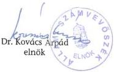
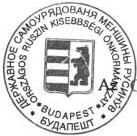

TS2:574

Állami Számvevőszék

# JELENTÉS

az Országos Ruszin Kisebbségi
Önkormányzat pénzügyi-gazdasági
tevékenységének vizsgálatáról

2002. január

---

Az ellenőrzés végrehajtásáért felelős:
V. Önkormányzati és Területi Ellenőrzési Igazgatóság

dr. Lóránt Zoltán
számvevő igazgató

Az ellenőrzést vezette:

dr. Sallai Antal
régióvezető főtanácsos

Az ellenőrzést végezte

Kozma Gábor
számvevő

Jelentéseink az Országgyűlés számítógépes hálózatán
és az Interneten a www.asz.hu címen is olvashatók, továbbá a Belügyminisztérium
folyóirata, az "Önkormányzati Tájékoztató" rendszeresen közli, valamint a Megyei
Közigazgatási Hivatalvezetők részére is átadásra kerül.

---

V-1013-27/2001-2002.

# TARTALOMJEGYZÉK

|  **I. ÖSSZEGZŐ MEGÁLLAPÍTÁSOK, KÖVETKEZTETÉSEK, JAVASLATOK** | **4**  |
| --- | --- |
|  **II. RÉSZLETES MEGÁLLAPÍTÁSOK** | **7**  |
|  1. A feladatellátás szervezettsége, szabályozottsága | 7  |
|  1.1. Általános ismeretek a ruszin kisebbségről, az Országos Ruszin Önkormányzat kapcsolatrendszere | 7  |
|  1.2. A szervezeti és működési rend alakulása | 7  |
|  1.3. A költségvetés, zárszámadás, vagyonleltár megállapításának szabályozottsága | 9  |
|  1.4. A működés szervezeti feltételrendszere | 9  |
|  2. Az Önkormányzat működésének, a gazdálkodás rendjének szabályszerűsége | 10  |
|  2.1. A működés tárgyi feltételeinek alakulása | 10  |
|  2.2. Az egyszeri vagyonjuttatásként kapott részvények hasznosítása | 10  |
|  2.3. A gazdálkodási tevékenység személyi és tárgyi feltételei | 11  |
|  2.4. A gazdálkodási folyamatok szabályozottsága | 12  |
|  2.5. A gazdálkodási jogkörök szabályozottsága | 12  |
|  2.6. Vállalkozási tevékenység | 12  |
|  3. A beszámolási kötelezettség teljesítése, a költségvetés készítése és végrehajtása | 13  |
|  3.1. A könyvvezetési kötelezettség | 13  |
|  3.2. Az éves költségvetések | 13  |
|  3.3. A költségvetések végrehajtása | 14  |
|  3.4. A gazdasági események bizonylati alátámasztottsága | 14  |
|  3.5. A vagyongazdálkodás szabályozottsága, vagyonvédelem | 15  |
|  3.6. Éves beszámolási kötelezettség | 15  |
|  3.7. Az éves zárszámadások | 15  |
|  4. Az Önkormányzat ellenőrzési rendszere | 16  |
|  4.1. Az ellenőrzés szabályozottsága | 16  |
|  4.2. A belső ellenőrzés | 16  |
|  4.3. A lefolytatott ellenőrzések tapasztalatai | 16  |
|  5. A korábbi számvevőszéki ellenőrzések javaslatainak hasznosulása | 16  |

1

---

1. 2017年1月1日，公司与上海浦东发展银行股份有限公司签订了《最高额保证合同》，约定为

[Non-Text]

[Non-Text]

[Non-Text]

[Non-Text]

[Non-Text]

[Non-Text]

[Non-Text]

[Non-Text]

[Non-Text]

[Non-Text]

[Non-Text]

[Non-Text]

[Non-Text]

[Non-Text]

[Non-Text]

[Non-Text]

[Non-Text]

[Non-Text]

[Non-Text]

[Non-Text]

[Non-Text]

[Non-Text]

[Non-Text]

[Non-Text]

[Non-Text]

[Non-Text]

[Non-Text]

[Non-Text]

[Non-Text]

[Non-Text]

[Non-Text]

[Non-Text]

[Non-Text]

[Non-Text]

[Non-Text]

[Non-Text]

[Non-Text]

[Non-Text]

[Non-Text]

[Non-Text]

[Non-Text]

[Non-Text]

[Non-Text]

[Non-Text]

[Non-Text]

[Non-Text]

[Non-Text]

[Non-Text]

[Non-Text]

[Non-Text]

[Non-Text]

[Non-Text]

[Non-Text]

[Non-Text]

[Non-Text]

[Non-Text]

[Non-Text]

[Non-Text]

[Non-Text]

[Non-Text]

[Non-Text]

，

[Non-Text]

[Non-Text]

[Non-Text]

[Non-Text]

[Non-Text]

[Non-Text]

[Non-Text]

[Non-Text]

[Non-Text]

[Non-Text]

[Non-Text]

[Non-Text]

[Non-Text]

[Non-Text]

[Non-Text]

[Non-Text]

[Non-Text]

[Non-Text]

[Non-Text]

[Non-Text]

[Non-Text]

[Non-Text]

[Non-Text]

[Non-Text]

[Non-Text]

[Non-Text]

[Non-Text]

[Non-Text]

[Non-Text]

[Non-Text]

[Non-Text]

[Non-Text]

[Non-Text]

[Non-Text]

[Non-Text]

[Non-Text]

[Non-Text]

---

I. ÖSSZEGZŐ MEGÁLLAPÍTÁSOK, KÖVETKEZTETÉSEK, JAVASLATOK

# JELENTÉS

# az Országos Ruszin Kisebbségi Önkormányzat pénzügyi-gazdasági tevékenységének vizsgálatáról

Az Állami Számvevőszékről szóló 1989. évi XXXVIII. törvény 2. § (5) bekezdése alapján ellenőriztük az országos kisebbségi önkormányzatoknál az állami költségvetésből juttatott támogatások felhasználását.

A nemzeti és etnikai kisebbségek jogairól szóló 1993. évi LXXVII. törvény (továbbiakban: Nek tv.) szabályozza az országos kisebbségi önkormányzatok létrehozásának rendjét, azok feladat- és hatásköreit.

Az Állami Számvevőszék 1995. és 1997. évben témavizsgálat keretében ellenőrizte az országos kisebbségi önkormányzat pénzügyi, gazdasági tevékenységét.

A vizsgálat az országos kisebbségi önkormányzatok 1999. és 2000. évi és 2001. első félévi gazdálkodására terjedt ki, egyes esetekben – a székházjuttatási folyamat és egyszeri vagyonjuttatás hasznosulása – a korábbi vizsgálat óta eltelt teljes időszakot áttekintettük.

**Az ellenőrzés célja:** annak megállapítása volt, hogy

- az országos kisebbségi önkormányzat működési feltételrendszere hogyan változott a vizsgált időszakban,
- a gazdálkodás szervezettsége, szabályszerűsége mennyiben felel meg a jogszabályi követelményeknek és az önkormányzati működés sajátosságainak,
- biztosított-e a gazdálkodás és a pénzeszközök felhasználásának törvényessége és szabályszerűsége, a számviteli törvény és a vonatkozó kormányrendeletek előírásainak betartása.

3

---

I. ÖSSZEGZŐ MEGÁLLAPÍTÁSOK, KÖVETKEZTETÉSEK, JAVASLATOK---

# I. ÖSSZEGZŐ MEGÁLLAPÍTÁSOK, KÖVETKEZTETÉSEK, JAVASLATOK

Az Önkormányzat az 1999. január 24-i alakuló közgyűlését követően megfelelő **szervezeti hátteret** épített ki a Nek. törvényben meghatározott feladatok ellátására. A törvény által biztosított induló tőkét (egyszeri **vagyonjuttatást**) megalakulásának évében, 1999. június 7-ig az Önkormányzat teljes összegében átvette. A vizsgált időszakban, az Önkormányzat részére a Nek. törvényben egyszeri vagyonjuttatásként átadott tőke pénzbeni ellenértéke jelentős mértékben lecsökkent. A vagyont értékpapírokba fektették, hozamait nem fektették be újra. A tőkét folyamatosan csökkentették, működési célokra felhasználták. Az 1999. június 7. és 2001. február 27. közötti időszakban a 15 millió Ft-ra kiegészített vagyonjuttatás 6 millió Ft értékre csökkent.

Az Önkormányzat **végleges elhelyezése** a Korm. határozatban foglaltak szerint megoldódott.

Az 1999. évi SzMSz a vizsgált időszak egészére nézve meghatározta **a működési szabályokat és a legfontosabb gazdálkodási feladat- és hatásköröket** a közgyűlés számára tartotta fenn.

Az 1999. évi SzMSz VII. fejezete az Önkormányzat vagyonáról, költségvetéséről és gazdálkodásáról általános jelleggel rendelkezett. A 2001. évi SzMSz XI. fejezete hasonló módon, átfogóan rendezi a gazdálkodási kérdéseket, azonban a 64. pont egyértelműen az államháztartási és költségvetési jogszabályokra hivatkozik, amelyeket a költségvetés összeállításánál figyelembe vesznek. Az Önkormányzat olyan egyéb szervezet, amelyre az államháztartásban kialakított gazdálkodási szabályok nem vonatkoznak.

Az 1999. és a 2001. évi SzMSz-ek nem határozták meg a vagyon feletti rendelkezés konkrét és részletes szabályait sem. Közgyűlési határozatok sem születtek a vagyon felhasználásának módjáról, a hozamok feletti rendelkezés szabályairól, a törzsvagyoni körről a vizsgált időszakban. A vizsgálat hiányolja, hogy az egyszeri vagyonjuttatás felhasználásáról a közgyűlés nem hozott az 1999. évben határozatot, illetve a vagyongazdálkodásról nem készítettek szabályzatot.

Az egyszeri vagyonjuttatás átvezetése az 1999. évi költségvetés bevételi és kiadási oldalán kifogásolható abból a szempontból, hogy a határozati szövegben a végrehajtási szabályok az elnök számára lehetőséget adtak a bevételek és kiadások feletti rendelkezésre. Ezáltal az elnök a közgyűlés jóváhagyó határozata nélkül is rendelkezhetett az egyszeri vagyonjuttatás teljes összege felett. Ez a végrehajtási szabály ellentétes az 1999. évi SzMSz 13. c. pontjával, mely szerint az Önkormányzati vagyon feletti rendelkezésre vonatkozó döntés a közgyűlés hatásköréből nem ruházható át.

Nem rendelkeznek a számviteli törvényben előírt számviteli politikával. Nem készítették el a számlarendet. A számviteli politika keretében elkészítendő szabályzatok közül nem áll rendelkezésre hitelesített és a közgyűlés által határo-

---4

---

I. ÖSSZEGZŐ MEGÁLLAPÍTÁSOK, KÖVETKEZTETÉSEK, JAVASLATOK

zatban jóváhagyott példány a leltárkészítési és leltározási, az eszközök és források értékelési szabályzatáról

A kötelezettségvállalás és utalványozás rendjét hat, egymással összefüggő, 1999. szeptember 20-i keltezésű dokumentumban szabályozták. A dokumentumokat nem foglalták egységes szabályzatba, a jogkörök gyakorlásáról a közgyűlés nem hozott határozatot. Az időközben bekövetkezett személyi változásokat a jogkörök szabályozásán nem vezették át, illetve újabb dokumentumokat nem adtak ki ilyen céllal.

Az 1999. évi SzMSz-hez nem kapcsolódtak munkaköri leírások. A vizsgálat kifogásolja, hogy az Önkormányzat tisztségviselőivel, illetve a hivatali dolgozókkal mint közalkalmazottakkal kötöttek munkaszerződéseket.

Az 1999. év gazdálkodását egyszeres könyvvitelben rögzítették, azonban a személyi változások folyamatában a könyvelési dokumentációk átadásátvétele nem történt meg, a naplófőkönyv és a kapcsolódó egyéb analitikus nyilvántartások nem állnak rendelkezésre. A 2000. év folyamán megbízott könyvelő vállalkozások nem adtak át az Önkormányzat hivatala részére egyeztetett és hitelesített, az Szvt. rendelkezéseinek megfelelő szintetikus és analitikus nyilvántartást az 1999. és 2000. évek gazdálkodására vonatkozóan. A gazdasági vezető a közgyűlés határozata alapján megkezdte az 1999. és 2000. évek pótlólagos könyvelését. A 2001. évi könyvviteli nyilvántartások csak az előző évek lezárásával, a teljes körű vagyonleltár elkészítésével egészíthetők ki.

A könyvviteli nyilvántartások jelenlegi állapotában nem különíthetőek el a Nek. tv. szerinti feladatok költség tételei és a hivatal működési kiadásai

Éves beszámolási kötelezettségüknek a vizsgált időszakban (1999. és 2000. évben) nem tettek eleget, ezzel megsértették a számviteli törvény szerinti egyéb szervezetek éves beszámoló készítésének és könyvvezetési kötelezettségének sajátosságairól szóló Korm. rendeletben foglaltakat, azzal, hogy a tárgyévet követő év május 31-ig nem fogadta el a közgyűlés az Önkormányzat egyszerűsített éves beszámolójának mérlegét és eredmény kimutatását. A zárlati munkák dokumentumai (hitelesített főkönyvi kivonatok, állomány felvételi jegyzőkönyvek) nem állnak rendelkezésre, az eszközök és források leltározási jegyzőkönyveit nem készítették el, illetve nem őrizték meg.

Az Önkormányzat nem készített ellenőrzési szabályzatot. Az Önkormányzat nem alakított ki belső ellenőrzési rendszert, amely a gazdálkodás legfontosabb folyamatait megfelelően kontrollálhatta volna.

A feltárt hiányosságok megszüntetése és a törvényes állapot helyreállítása érdekében javasoljuk a közgyűlés számára:

1. Fektessék le részletesen az alkalmazott költségvetési, zárszámadási eljárásokat az SzMSz-ben, annak módosításával vagy önálló szabályzatban.
2. Szabályozzák az elnök és az elnökség által gyakorolható gazdálkodási feladat- és jogköröket az SzMSz módosításával vagy önálló hatásköri szabályzatban.

5

---

I. ÖSSZEGZŐ MEGÁLLAPÍTÁSOK, KÖVETKEZTETÉSEK, JAVASLATOK

3. Hozzanak határozatot az egyszeri vagyonjuttatás felhasználásáról és készítsenek szabályzatot a vagyongazdálkodásról.
4. Készítsék el a számvitelről szóló 2000. évi C. törvény 14. §-ban előírt számviteli politikát, valamint a161. §-ban meghatározott számlarendet.
5. Rendelkezzenek a számviteli politika keretében elkészítendő szabályzatok (leltárkészítési és leltározási, az eszközök és források értékelési, pénzkezelési) szabályzatok jóváhagyásáról, hitelesítéséről és kiadmányozásáról.
6. Aktualizálják és foglalják egységes szabályzatba a kötelezettségvállalás és utalványozás rendjét meghatározó hat, egymással összefüggő, 1999. szeptember 20-i keltezésű dokumentumot.
7. Vizsgálják felül és hozzanak határozatot az Önkormányzat tisztségviselőinek (elnök, elnökhelyettes, alelnökök, tanácsnokok) tiszteletdíjáról, a velük létesített közalkalmazotti jogviszonyt szüntessék meg.
8. Módosítsák a jelenleg két hivatali dolgozóval fennálló, a közalkalmazotti jogviszonyra hivatkozó munkaszerződéseket.
9. Pótolják a Hivatal szervezetéről rendelkező 25/2001. (VII. 6.) ORKÖ sz. határozat 1. sz. függelékét. A hivatal dolgozóinak munkaköri leírásait a vizsgálat alapján kiadandó szabályzatokkal összhangban, egységes rendszerben, kellő részletezettséggel készítsék el.
10. Haladéktalanul pótolják az 1999. és 2000. évekre vonatkozó könyvvezetési hiányosságokat.
11. A kialakítandó feladat- és hatásköri szabályozás keretében biztosítsák a költségvetési keretek figyelemmel követését, az ésszerű és átlátható költséggazdálkodás követelményének munkafolyamatba épített ellenőrzését.
12. Alakítsák ki az Önkormányzat belső ellenőrzési rendszerét, amely a gazdálkodás legfontosabb folyamatait megfelelően kontrollálja. A következő időszakban hasznosítsák a belső ellenőrzési rendszer jelzéseit, tapasztalatait.
13. Gondoskodjanak a pótlólagos könyvelés és zárszámadás elfogadásakor a Nek. tv. szerinti feladatok költség tételei és a hivatal működési kiadásainak elkülönítéséről, a vagyonleltár és tárgyi eszköz-nyilvántartás, illetve a befektetett pénzügyi eszközök és immateriális javak könyvelési anyagának ellenőrzéséről.

6

---

II. RÉSZLETES MEGÁLLAPÍTÁSOK

## II. RÉSZLETES MEGÁLLAPÍTÁSOK

# 1. A FELADATELLÁTÁS SZERVEZETTSÉGE, SZABÁLYOZOTTSÁGA

# 1.1. Általános ismeretek a ruszin kisebbségről, az Országos Ruszin Önkormányzat kapcsolatrendszere

Az 1998. évi önkormányzati választások során öt településen – Biatorbágyon, Budapesten (5 kerületben), Komlóskán, Mucsonyban és Sárospatakon – alakult helyi ruszin kisebbségi önkormányzat. Az Országos Ruszin Kisebbségi Önkormányzat (továbbiakban: Önkormányzat) 1999. januárjában alakult meg.

Az Önkormányzat bekapcsolódott a kisebbségi közéletbe, részt vesz valamennyi, a kisebbségek ügyeivel foglalkozó bizottság és testület munkájában, jó munkakapcsolatot alakított ki a Nemzeti és Etnikai Kisebbségi Hivatallal, az Oktatási Minisztérium, valamint a Nemzeti és Kulturális Örökség Minisztériuma illetékes főosztályaival.

Ugyancsak 1999-ben jött létre a Fővárosi Ruszin Kisebbségi Önkormányzat, amely elsődlegesen a fővárosban élő ruszinok érdekképviselete, ám az elmúlt két évben átvette az Országos Ruszin Hírlap kiadását, valamint a Magyarországi Ruszinok Kutatóintézetének működtetését.

Az Önkormányzat közgyűlése 2000-ben kijelölte a kisebbség nemzeti ünnepét. Az ünnep időpontját május 22-ére, a Rákóczi szabadságharc beregszászi zászlóbontásának napjára tette. Az évforduló első megünneplésére a sárospataki Rákóczi vár tövében került sor 2000. május 22-én.

A magyarországi ruszin nyelvoktatás intézményi keretben továbbra is csupán egy általános iskolában folyik. Az elmúlt évben az Önkormányzat elkészítette a ruszin nyelv- és irodalom, valamint a ruszin népismeret tantárgyak részletes követelményeit. A követelményeket az egyetlen – a mucsonyi – iskola pedagógiai programjának készítésénél kell figyelembe venni. Az Oktatási Minisztérium mindkét tárgyalt évben támogatta az ún. vasárnapi iskolai ruszin nyelvoktatást.

1999-ben a kisebbség egy kiadványt jelentetett meg, egy gyermektábort, egy közéleti szakemberképzést, egy hagyományőrző kulturális rendezvényt szervezett közalapítványi támogatással.

# 1.2. A szervezeti és működési rend alakulása

Az Önkormányzat működését, az egyes önkormányzati szervek közötti kapcsolatokat a 8/1999 (I. 24.) számú közgyűlési határozatban elfogadott Szervezeti és Működési Szabályzat rögzítette (továbbiakban: SzMSz).

7

---

II. RÉSZLETES MEGÁLLAPÍTÁSOK

Az SzMSz módosított, egységes szerkezetbe foglalt változatát a 17/1999. (VII. 1.) ORKÖ sz. határozatban fogadta el a közgyűlés. A módosított SzMSz hitelesített példánya (továbbiakban: az 1999. évi SzMSz) a fenti határozathoz tartozó jegyzőkönyv mellékleteként rendelkezésre állt. Az SzMSz korábbi változatairól hitelesített példány, illetve munkapéldány a hivatal nyilvántartásában nem volt.

Egységes szerkezetben, a módosítások átvezetését tartalmazó hitelesített példányt, illetve munkapéldányt 1999. július 1-t követően, a vizsgált időszakban (2001. június 30-ig) nem készítettek.

A közgyűlés a 24/2001. (VII. 6.) ORKÖ sz. határozatában Alapszabályt fogadott el, amely tartalmában megfelel egy új egységes szerkezetbe foglalt, módosított SzMSz-nek (továbbiakban: 2001. évi SzMSz).

A 25/2001. (VII. 6.) ORKÖ sz. határozat a Hivatal szervezetéről rendelkezik, tartalmilag egy hivatali ügyrendnek felel meg. Ezt megelőzően önálló szabályzatként hivatali ügyrendet nem készítettek.

Az 1999. évi SzMSz rögzíti az Önkormányzat jogállását, alapvető feladatát általános jellegű célkitűzéseit. A feladat- és hatáskörök átcsoportosításáról, eseti átruházásáról sem az 1999. évi SzMSz, sem későbbi közgyűlési határozat nem rendelkezett. Kivételt képez ez alól a 19/1999. (VII. 1.) ORKÖ sz. határozatban elfogadott 1999. évi költségvetés, amelynek végrehajtási szabályai rögzítik az elnök jogkörét a bevételek beszedése és a kiadások teljesítésére vonatkozóan. Ezáltal az eredeti előirányzatok erejéig az elnök döntési lehetőséggel rendelkezett az 1999. évre vonatkozóan. Fentiek alapján a vizsgálat megállapította, hogy az 1999. évi SzMSz – mely a vizsgált időszak egészére nézve meghatározta a működési szabályokat – a legfontosabb gazdálkodási feladat- és hatásköröket a közgyűlés számára tartotta fenn (költségvetés, zárszámadás, vagyon feletti rendelkezés).

Az Önkormányzat a **közgyűlést** 20 fővel alakította meg, elnököt, elnökhelyettest, két alelnököt, kilenc bizottsági elnököt és egy tanácsnokot választottak. Az 1999. évi SzMSz 42. pontja szerint **Pénzügyi és Ellenőrző Bizottság** (3 fő), illetve **Gazdasági Bizottság** (5 fő) alakult, hét további bizottság mellett.

Az 1999. évi SzMSz az **Önkormányzat hivataláról** rendelkezett, de nem tartalmazott részletes működési szabályokat a hivatali munkára vonatkozóan.

Az 1999. évi SzMSz-hez **nem kapcsolódtak munkaköri leírások**. Az Önkormányzat tisztségviselőivel, illetve a hivatali dolgozókkal mint közalkalmazottakkal kötöttek munkaszerződéseket. A közalkalmazotti jogviszonyra hivatkozó munkaszerződés jelenleg két hivatali dolgozóval áll fenn, ezeket módosítani szükséges. Az Önkormányzat tisztségviselőinek tiszteletdíjáról a közgyűlés határozatban dönt, közalkalmazotti jogviszonyt az Önkormányzat velük sem létesíthet.

A 2001. évi SzMSz a legfontosabb gazdasági feladat- és hatásköröket változatlanul a közgyűlés számára tartja fenn. A bizottságok száma négyre csökkent, köztük a Pénzügyi Ellenőrző bizottság lát el gazdálkodással összefüggő ellenőr-

8

---

II. RÉSZLETES MEGÁLLAPÍTÁSOK

zési feladatkört. A 2001. évi SzMSz-hez nem kapcsolódnak a 70. pontban felsorolt mellékletek (a közgyűlés, az elnökség, a bizottságok névjegyzékei). Az Önkormányzat hivatalának SzMSz-éhez (ügyrendjéhez) nem kapcsolódik az 1. sz. függelék (a hivatal dolgozóinak munkaköri leírása). Pótlólag adták ki 2001. szeptember 4-én és 5-én két munkatárs munkaköri leírását. A gazdasági vezető, az egyik referens és egy munkatárs munkaköri leírását nem készítették el. Az elkészült munkaköri leírások pontatlanok, indokolatlanul tömörek.

# 1.3. A költségvetés, zárszámadás, vagyonleltár megállapításának szabályozottsága

Az 1999. évi SzMSz a vizsgált időszak egészére nézve meghatározta a működési szabályokat és a legfontosabb gazdálkodási feladat- és hatásköröket a közgyűlés számára tartotta fenn.

A közgyűlés fogadja el az Önkormányzat költségvetését, zárszámadását és vagyonleltárát (SzMSz 13. b. pontja), a közgyűlés hozza meg az Önkormányzati vagyon feletti rendelkezésre vonatkozó döntést (SzMSz 13. c. pontja).

Az 1999. évi SzMSz VII. fejezete az Önkormányzat vagyonáról, költségvetéséről és gazdálkodásáról általános jelleggel rendelkezett. A költségvetés elkészítésére, elfogadására, a benyújtás módjára és határidejére nem fogalmazott meg előírásokat.

A 2001. évi SzMSz XI. fejezete a fentiekhez kapcsolódóan, átfogóan rendezi a gazdálkodási kérdéseket, azonban a 64. pont egyértelműen az államháztartási és költségvetési jogszabályokra hivatkozik, amelyeket a költségvetés összeállításánál figyelembe vesznek. Az Önkormányzat olyan egyéb szervezet, amelyre az államháztartásban kialakított gazdálkodási szabályok nem vonatkoznak.

Az SzMSz-ben egyik esetben sem határozták meg a vagyon feletti rendelkezés konkrét és részletes szabályait. További közgyűlési határozatok sem születtek a vagyon felhasználásának módjáról, a hozamok feletti rendelkezés szabályairól, a törzsvagyoni körről a vizsgált időszakban. A vagyon hasznosításáról különálló szabályzatot nem készítettek.

# 1.4. A működés szervezeti feltételrendszere

Az Önkormányzat az 1999. január 24-i alakuló közgyűlését követően megfelelő szervezeti hátteret épített ki a nemzeti és etnikai kisebbségek jogairól szóló 1993. évi LXXVII. törvényben (továbbiakban: Nek. tv.) meghatározott feladatok ellátására.

A törvény által biztosított induló tőkét (egyszeri vagyonjuttatást) megalakulásának évében, 1999. június 7-ig az Önkormányzat teljes összegében átvette.

A Nek. tv-ben foglalt feladatok közül az 1999. évi SzMSz a magyarországi ruszinok országos és területi érdekeinek védelmét, kitüntetések alapítását és ezek odaítélésének feltételeire és szabályaira vonatkozó döntések meghozatalát, a rendelkezésre álló rádió és televízió csatorna felhasználását, intézmények alapítását, illetve a kötelező gazdálkodási feladatokat vette át.

9

---

II. RÉSZLETES MEGÁLLAPÍTÁSOK---

A Nek. tv-ben foglalt feladatok közül az 1999. évi SzMSz többet nem határozott meg, azonban a törvényi feladatellátáson túlmenően további tevékenységeket is rögzített (pl. műemlékvédelem).

Az Önkormányzat intézményt nem alapított.

## 2. AZ ÖNKORMÁNYZAT MŰKÖDÉSÉNEK, A GAZDÁLKODÁS RENDJÉNEK SZABÁLYSZERŰSÉGE

### 2.1. A működés tárgyi feltételeinek alakulása

Az Önkormányzat az előző országos vizsgálat (1995.) óta alakult meg. Végleges **elhelyezése** a 2315/2000. (XII. 20.) Korm. határozatban foglaltak szerint megoldott.

A Kincstári Vagyoni Igazgatóság az Önkormányzat rendelkezésére bocsátotta a Budapest XIV. kerület, Gyarmat u. 85/B szám alatti ingatlant. Az ingyenes használati megállapodást 2000. december 19-én kötötték meg, ezen a napon végezték el az ingatlan átadás-átvételét, melyet jegyzőkönyvben dokumentáltak.

### 2.2. Az egyszeri vagyonjuttatásként kapott részvények hasznosítása

A Nek. tv. 63. § (4) bekezdésében rögzített, **egyszeri vagyonjuttatásként** kapott MOL részvényeket a Magyar Állam nevében eljáró Kincstári és Vagyoni Igazgatóság (KVI) értéktárában vették át 1999. április 8-án, az átadás-átvételi jegyzőkönyvben foglaltak szerint. A részvényvagyon átadásáról 1999. március 24-én kötöttek megállapodást, mely az átadandó részvények árfolyamát azok névértékére vetített 590%-ában, azaz – a Nek. tv. szerinti – tizenötmillió Ft-ban állapították meg. A megállapodás 4. és 5. pontjában az átadó KVI kikötötte, hogy az ORKÖ köteles az átvett részvénycsomagot egy hónapon belül, minimum 590%-os árfolyamon értékesíteni és az elért árfolyamnyereséget a Kincstár számlájára befizetni. A megállapodás 6. pontja rögzítette, hogy a KVI, kedvezőtlen árfolyam alakulás esetén az elért árfolyamértéket 15 millió Ft-ra egészíti ki.

Az Önkormányzat egy értékpapír letétkezelő társaságnál helyezte el részvényeit 1999. április 22-én, egyben minimum áras (590%) bizományosi szerződést kötött azok értékesítésére.

A tranzakciót a bróker cég minimum áron, 1999. május 26-án teljesítette. A művelet költségeit, 122.182 Ft-ot a KVI az ORKÖ számlájára utalta, erről az 1999. június 1-i levelében értesítette az Önkormányzatot. Fenti különbözetet 1999. június 7-én az Önkormányzat bankszámláján jóváírták, ezáltal a vagyonjuttatás kiegészült a törvény szerinti 15 millió Ft összegre.

A vagyon pénzbeli ellenértékét egy hitelintézet vállalatánál értékpapír számlára helyezték, a szerződést 1999. június 16-án kötötték meg. Ezt követően 1999. és 2000. év folyamán több esetben adásvételi szerződést kötöttek diszkont kincs-

---10

---

II. RÉSZLETES MEGÁLLAPÍTÁSOK

tárjegyekre. Mindkét évben – több esetben – a kincstárjegyek hozamait, illetve az elhelyezett tőke részeit pénzforgalmi számlájukra átvezették. Az adásvételi megbízások nem voltak folyamatosak, 1999. novemberében és decemberében jelentős látra szóló összeg (11 millió Ft) befektetéséről nem rendelkeztek.

Az egyszeri juttatásként kapott vagyon pénzbeni ellenértékének maradványát (6 millió Ft-ot) 2001. február 8-i keltezésű rendelkezés szerint egy biztosítótársaság számlájára utaltatta az Önkormányzat elnöke.

A rendelkezést megelőzően egy nappal az előbb említett biztosító társaság élet- és balesetbiztosítására vonatkozó ajánlatot írt alá. A biztosítási kötvényt 2001. február 27-én állították ki, szerződőként az Önkormányzat, biztosított személyként az Önkormányzat elnöke szerepel. A biztosítás egyszeri díja 6 millió Ft, a halál esetére szóló biztosítási összeg 250 ezer Ft, melynek kedvezményezettjeként az Önkormányzatot jelölték meg. A kötvényhez befektetési kombináció kapcsolódik, mely a biztosítási szabályzat szerint alacsony kockázatú államkötvény alap. A kötvényre a biztosítótársaság vezetője tőkegaranciát vállalt. A kötvény idő előtti visszavásárlásából adódó költségek mértékéről a biztosító társaság a kötvény kibocsátást követően, az Önkormányzat hivatalának érdeklődésére adott tájékoztatást. A biztosítás lejárata 2004. március 1.

A vizsgált időszakban, az Önkormányzat részére a Nek. törvényben egyszeri vagyonjuttatásként átadott tőke pénzbeni ellenértéke jelentős mértékben lecsökkent. A vagyon értékpapírokba fektették, hozamait nem fektették be újra. A tőkét folyamatosan csökkentették, működési célokra felhasználták.

Az 1999. június 7. és 2001. február 27. közötti időszakban a vagyonjuttatás 6 millió Ft értékre csökkent.

### 2.3. A gazdálkodási tevékenység személyi és tárgyi feltételei

Az Önkormányzat gazdálkodásának lebonyolítására többféle szervezeti megoldást alkalmazott.

Az Önkormányzat megalakulását követően saját szervezetet (hivatalt) hozott létre. A hivatal a vezető kinevezését (1999. február 20.) követően munkaviszonyának megszűnéséig működött (1999. december 1.).

Ezt követően vezetőt 2000. október 30-ig nem neveztek ki, a könyvelést végző munkatárs távozásával (1999. december 29.) a feladatokat külső cégek részére adott megbízásokkal oldották meg (az első megbízás kelte 2000. február 16., ezt követte a 2000. június 1-i megállapodás egy másik társasággal).

A cégek megbízásával párhuzamosan a hivatal fennmaradó létszáma közvetlen elnöki irányítással működött. A hivatalvezető és gazdasági tanácsadója, illetve a könyvelő távozását jogviták követték, peres eljárás van folyamatban. A könyvelő cégek megbízásait visszavonták, ezek a lépések is jogvitához vezettek.

A jelenleg is feladatait ellátó gazdasági vezető 2000. novemberétől intézi az Önkormányzat gazdasági ügyeit. Folyamatosan dolgozza fel az előző években

11

---

II. RÉSZLETES MEGÁLLAPÍTÁSOK---

felhalmozódott rendezetlen könyvelési tételeket, lépéseket tesz a hivatal gazdálkodási feltételeinek (hardver és szoftver beszerzés, szabályozások készítése, gazdálkodási munkakörök kialakítása) megteremtésére. A hivatal létszáma 5 fő. Közgazdasági, pénzügyi-számviteli végzettséggel a gazdasági vezető rendelkezik. A hivatal titkársági, gondnoki és – a referensek tevékenységén keresztül – kulturális feladatokat lát el.

## 2.4. A gazdálkodási folyamatok szabályozottsága

**Nem rendelkeznek** a számvitelről szóló 1991. évi XVIII. törvény (továbbiakban: Szvt.) 14. § (5) bekezdésben előírt **számviteli politikával**.

**Nem készítették el** a Szvt. 79. § (1) bekezdésben meghatározott **számlarendet**. A számviteli politika keretében elkészítendő **szabályzatok** közül nem áll rendelkezésre hitelesített és a közgyűlés által határozatban jóváhagyott példány a leltárkészítési és leltározási, az eszközök és források értékelési szabályzatáról.

**A pénzkezelési szabályzatot** a közgyűlés a 32/2000. (IV. 18.) sz. ORKÖ határozatában jóváhagyta. A szabályzatból hitelesített példány nem áll rendelkezésre. További szabályzatok is megtalálhatóak nyilvántartásukban, hitelesítetlen munkapéldány formájában (selejtezési, kiküldetési szabályzat; hivatali ügyrend).

A fentiekben ismertetett szabályzatokat – a hitelesítésen túlmenően – nem alkalmazták az Önkormányzat hivatalának sajátos viszonyaira, megismerésüket a hivatali dolgozókkal nem igazoltatták. A pénzkezelési szabályzat mellékleteként megőrzött kártérítési és felelősségvállalási nyilatkozat kitöltetlen, ilyen nyilatkozat a pénztáros munkaszerződése mellett sem található.

## 2.5. A gazdálkodási jogkörök szabályozottsága

A **kötelezettségvállalás és utalványozás** rendjét hat, egymással összefüggő, 1999. szeptember 20-i keltezésű dokumentumban szabályozták. A dokumentumokat az Önkormányzat elnöke és az Önkormányzati hivatal vezetője hitelesítette. A kiadott kötelezettségvállalási, utalványozási és ellenjegyzési értékhatár nélküli jogköröket az érintettek – az alelnökök egyikének kivételével – aláírásukkal igazolták. A dokumentumokat nem foglalták egységes szabályzatba, a jogkörök gyakorlásáról a közgyűlés nem hozott határozatot. Az időközben bekövetkezett személyi változásokat a jogkörök szabályozásán nem vezették át, illetve újabb dokumentumokat nem adtak ki ilyen céllal.

## 2.6. Vállalkozási tevékenység

Az alapfeladatain túlmenően az Önkormányzat vállalkozási tevékenységet nem folytatott.

---12

---

II. RÉSZLETES MEGÁLLAPÍTÁSOK

### 3. A BESZÁMOLÁSI KÖTELEZETTSÉG TELJESÍTÉSE, A KÖLTSÉGVETÉS KÉSZÍTÉSE ÉS VÉGREHAJTÁSA

#### 3.1. A könyvvezetési kötelezettség

Az 1999. év gazdálkodását egyszeres könyvvitelben rögzítették, azonban a személyi változások folyamatában a könyvelési dokumentációk átadásátvétele nem történt meg, a naplófőkönyv és a kapcsolódó egyéb analitikus nyilvántartások nem állnak rendelkezésre. (Lásd a csatolt nyilatkozatot.)

A 2000. év folyamán megbízott újabb könyvelő cég szintén nem adott egyeztetett és hitelesített, az Szvt. rendelkezéseinek megfelelő szintetikus és analitikus nyilvántartást a 2000. év gazdálkodására vonatkozóan.

Az 1999. és 2000. év pénzforgalmi bizonylatai és egyéb hivatali dokumentációi (szerződések és levelezések, közgyűlési és elnökségi anyagok) rendelkezésre állnak, ezek kezelésében **kisebb súlyú adminisztratív hiányosságok** állapíthatóak meg (határozati anyagok, előterjesztések kezelése, jegyzőkönyvezési technikák területén).

A gazdasági vezető a közgyűlés a 29/2001. (VIII. 1.) ORKÖ számú határozata alapján megkezdte az 1999. és 2000. évek pótlólagos könyvelését.

**A 2001. évi könyvviteli nyilvántartások az előző évek lezárásával, a teljes körű vagyonleltár elkészítésével egészítendők ki.** A pénzforgalmi adatok főkönyvi könyvelése 2001. évben megtörtént. A vizsgálat ideje alatt telepített számítástechnikai program alkalmas a kiadási tételek költségnemenkénti, egyúttal cél-feladat szerinti könyvelésére.

#### 3.2. Az éves költségvetések

Az **1999. évre vonatkozó költségvetést** a közgyűlés a 19/1999. (VII. 1.) ORKÖ sz. határozatában elfogadta. A költségvetés az államháztartási szabályok figyelembevételével készült.

A vizsgálat kifogásolja, hogy a vagyonjuttatás átvezetése a költségvetésen nem volt tekintettel a bevételek és kiadások egyensúlyi követelményére, a vagyonból 1 millió Ft-ot úgy csoportosított át a kiadási oldalon, hogy a határozat szöveges része ezt a közgyűléssel nem ismertette, a vagyon felhasználásának okait és céljait nem határozta meg.

Az egyszeri vagyonjuttatás átvezetése az 1999. évi költségvetés bevételi és kiadási oldalán kifogásolható továbbá abból a szempontból, hogy a határozati szövegben a végrehajtási szabályok az elnök számára lehetőséget adnak a bevételek és kiadások feletti rendelkezésre.

Ezáltal az elnök a közgyűlés jóváhagyó határozata nélkül is rendelkezhetett az egyszeri vagyonjuttatás teljes összege felett. **Ez a végrehajtási szabály ellentétes az 1999. évi SzMSz 13. c. pontjával, mely szerint az Önkor-**

13

---

II. RÉSZLETES MEGÁLLAPÍTÁSOK---

### **mányzati vagyon feletti rendelkezésre vonatkozó döntés a közgyűlés hatásköréből nem ruházható át.**

A vizsgálat megállapította, hogy az egyszeri vagyonjuttatás felhasználásáról a közgyűlés nem hozott határozatot, illetve a vagyongazdálkodásról nem készítettek szabályzatot.

A **2000. évre vonatkozó költségvetés** koncepciójáról a közgyűlés még 1999. július 1-én határozatot hozott. A tételes költségvetésről 2000. március 17-én született közgyűlési határozat, azonban az annak alapjául szolgáló hitelesített dokumentum nem áll rendelkezésre.

A **2001. évre vonatkozó költségvetésről** 2001. április 6-án hozott a közgyűlés határozatot, azonban az annak alapjául szolgáló hitelesített dokumentum nem áll rendelkezésre.

### 3.3. A költségvetések végrehajtása

A költségvetési keretek figyelemmel követését, az ésszerű és átlátható költséggazdálkodás követelményét nem támogatta folyamatos, hézagmentes, az Szvt. követelményeinek megfelelő és az Önkormányzat sajátos információs igényét kielégítő könyvvezetés.

A könyvviteli nyilvántartások jelenlegi állapotában nem különíthetőek el a Nek. tv. szerinti feladatok költség tételei és a hivatal működési kiadásai. Vagyonleltár és tárgyi eszköz-nyilvántartás, illetve a befektetett pénzügyi eszközök és immateriális javak könyvelési anyagának hiányában nem állapítható meg pontosan a felhalmozási kiadások (befektetések és beruházások) és a működési kiadások (költség-nemek szerinti ráfordítások) aránya, több éves alakulása.

A könyvviteli dokumentációk pótlólagos felfektetésével pontos és megbízható kép alakítható ki a feladatok költségszükségletéről, a hivatal személyi és dologi kiadásairól, a felhasznált vagyon aktiválható részéről, illetve a vagyon működési költségvetésbe átcsoportosított hányadáról.

### 3.4. A gazdasági események bizonylati alátámasztottsága

A gazdasági eseményeket tartalmazó **bizonylatokat** évenként 2-2 hónap pénztári és banki anyag felülvizsgálatával ellenőriztük. A főkönyvi elszámolási számlák forgalmi bizonylatai csak 2001. évre vonatkozóan voltak kiirathatóak, 1999. és 2000. év pénzforgalmi bizonylatait az időszaki pénztárjelentések hitelesített példányai és a banki számlakivonatok alapján ellenőriztük.

A bizonylatok hitelesítésével kapcsolatban általános hibaként állapítottuk meg, hogy a pénztárellenőri kézjegyek a bevételi és kiadási pénztárbizonylatokról hiányoznak.

Az 1999. évben a vizsgált tételeket számlakísérő okmányokkal (utalványozási lapokkal) látták el, melyeken utalványozói, ellenjegyzői, illetve érvényesítői aláírások szerpeltek. A 2000. évben a szállítói számlák teljesítését nem igazol-

---14

---

II. RÉSZLETES MEGÁLLAPÍTÁSOK

ták. 2001. évben a bizonylatok utalványozását és igazolását az elnök egy személyben végezte el. A vizsgálat a fentiekben ismertetett gyakorlatot kifogásolja.

### 3.5. A vagyongazdálkodás szabályozottsága, vagyonvédelem

Az önkormányzat a vagyongazdálkodásra külön szabályzatot nem készített, így az egyes vagyonelemek gyarapításának, hasznosításának, elidegenítésének, az átmenetileg szabad pénzeszközök lekötésének, esetleges befektetésének rendje, döntésmechanizmusa jelenleg szabályozatlan. Az ingyenes használatba vett épületet riasztó berendezéssel védik. Az ingatlanra és beépített berendezéseire az általános vagyonbiztosítást a Kincstári Vagyoni Igazgatóság kötötte meg és fizeti. Az Önkormányzat ingóságaira nem kötött biztosítást.

### 3.6. Éves beszámolási kötelezettség

**Éves beszámolási kötelezettségüknek** a vizsgált időszakban (1999. és 2000. évben) nem tettek eleget, ezzel megsértették a számviteli törvény szerinti egyéb szervezetek éves beszámoló készítésének és könyvvezetési kötelezettségének sajátosságairól szóló 219/1998. (XII. 30.) Korm. rendelet 2. § (1) bekezdését. A zárlati munkák dokumentumai (hitelesített főkönyvi kivonatok, állomány felvételi jegyzőkönyvek) nem állnak rendelkezésre, az eszközök és források leltározási jegyzőkönyveit nem készítették el, illetve nem őrizték meg.

### 3.7. Az éves zárszámadások

A közgyűlés az 1999. évi beszámolót a 2000. március 17-i ülésén napirendjére tűzte, de határozatot nem hozott. Az 50/2000. (IX. 29.) ORKÖ sz. határozat az 1999. évi költségvetés jóváhagyásáról döntött. Az 1999. évi beszámoló hitelesített formában (mérleg, eredmény-kimutatás) nem áll rendelkezésre.

A 2000. évi beszámoló elfogadásáról a közgyűlés a 2001. április 6-i ülésén a jegyzőkönyv kivonat alapján kétszer is döntött. Egyik határozatban elfogadta a beszámolót, egy – a jegyzőkönyv szerinti idősorban későbbi – határozatában annak elfogadását elhalasztotta. A vizsgálat számára átadott közgyűlési jegyzőkönyv-kivonatok alapján a 2000. évi beszámoló elfogadásáról 2001. év folyamán nem született határozat. A 2001. április 6-i közgyűlési határozatok alapjául szolgáló előterjesztési anyag (beszámoló-tervezet) nem áll rendelkezésre.

**A vizsgálat megállapította, hogy az 1999. és 2000. évekre vonatkozóan az Önkormányzat megsértette a számviteli törvény szerinti egyéb szervezetek éves beszámoló készítésének és könyvvezetési kötelezettségének sajátosságairól szóló 219/1998. (XII. 30.) Korm. rendelet 6. § (4) bekezdésében foglaltakat, azzal, hogy a tárgyévet követő év május 31-ig nem fogadta el a közgyűlés az Önkormányzat egyszerűsített éves beszámolójának mérlegét és eredménykimutatását.**

15

---

II. RÉSZLETES MEGÁLLAPÍTÁSOK

# 4. AZ ÖNKORMÁNYZAT ELLENŐRZÉSI RENDSZERE

# 4.1. Az ellenőrzés szabályozottsága

Az Önkormányzat ellenőrzési szabályzattal nem rendelkezik.

A Pénzügyi Ellenőrzési Bizottság (PEB) a 2000. február 3. és 2001. január 8. közötti időszakban – elnökének lemondását és az SzMSz megváltoztatását követően – megszűnt. Az 1999. évi munkatervéről, ülés-jegyzőkönyveiről, jelentéseiről és éves beszámolójáról nem áll rendelkezésre dokumentáció.

Újjáalakulását követően a PEB összetétele és elnöke rövid időn belül megváltozott, második elnöke 2001. február 7-én lemondott.

# 4.2. A belső ellenőrzés

Az Önkormányzat nem alakított ki belső ellenőrzési rendszert, amely a gazdálkodás legfontosabb folyamatait megfelelően kontrollálhatta volna.

# 4.3. A lefolytatott ellenőrzések tapasztalatai

Belső ellenőrzési rendszer hiányában annak jelzéseit, tapasztalatait az Önkormányzat nem hasznosította.

# 5. A KORÁBBI SZÁMVEVŐSZÉKI ELLENŐRZÉSEK JAVASLATAINAK HASZNOSULÁSA

Az Önkormányzatot az Állami Számvevőszék még nem vizsgálta.

Budapest, 2002. január 18.

16

---

1.sz. melléklet a V-1013. sz. jelentéshez

Országos Ruszin Kisebbségi Önkormányzat

# Kimutatás az 1999-2001. évek bevételeiről

ezer Ft

|  Megnevezés | 1999. |   |   | 2000. |   |   | 2001.  |   |
| --- | --- | --- | --- | --- | --- | --- | --- | --- |
|   |  Tervezett |   | Tényleges | Tervezett |   | Tényleges | Tervezett  |   |
|   |  Év elején ismert | Évközi változás |   | Év elején ismert | Évközi változás |   | Év elején ismert | Évközi változás  |
|  Állami támogatás | 13000 | 0 | 12800 | 14000 | 0 | 14000 | 16000 | 0  |
|  Közalapítványi pályázatok | 0 | 0 | 0 | 0 | 0 | 250 | 0 | 0  |
|  Egyéb pályázatok | 0 | 0 | 0 | 0 | 0 | 0 | 0 | 500  |
|  Egyéb támogatások | 0 | 0 | 0 | 0 | 0 | 100 | 0 | 1900  |
|  Saját bevételek | 1363 | 0 | 857 | 0 | 0 | 877 | 0 | 65  |
|  Pénzmaradvány | 0 | 0 | 0 | 0 | 0 | 0 | 0 | 1754  |
|  Összesen | 14363 | 0 | 13657 | 14000 | 0 | 15227 | 16000 | 4219  |

---

 .

---

1. p. plány

# Nyilatkozat

Az Országos Ruszin Kisebbségi Önkormányzat részéről az Állami Számvevőszék 2001. szeptember 3-tól 28-ig tartó vizsgálata során a következő nyilatkozatot tesszük:

Az ellenőrzési program végrehajtásához szükséges dokumentációkat összeállítottuk. A következő bizonylatokat és iratokat nem tudjuk a vizsgálat részére átadni:

1. Az 1999. ev gazdalkodására vonatkozó egyszeres konyvviteli dokumentáciok, a naplofökonyv és egyeb kapcsolódo analitikus nyilvántartások;
- Az 1999. évre vonahtkozoan, a megbizott konyvelési vallalkozás által potlólag elkésztitet, a kettós konyvvitel rendszerében felfektetett dokumentumok: a szamlarend, a fokonyvi szamlák anyaga, a fokonyvi kivonatok egyeztetét es hitelesitett peldányai, az egyedi eszköznyilvantartó lapok és egyeb analitíkák hitelesitett peldányai, a leltározásí dokumentáciok;
- A 2000. évre vonahtkozoan a 2000. ev folyamán megbizott ujabb konyvelési cég által keszített, egyeztetét t es hitelesitett szintetikus és analitikus nyilvantartások.

Kijelentjük továbbá, hogy:

- A gazdasagi gezetó által 2001. ev folyamán a 2000. évre vonatkozoan potlólagosan felfektetett fokonyvi szamlák nem teljes körüek, a potlólagos konyvelés nem zárt. A konyvelés potlása folyamatos, a vizsgálat ideje alatt is folyamatban van.
- A 2001. évi konyvviteli nyilvantartásokCsak az elozo évek lezárásával, teljes körü, minded eszköz és forrastételt alatamasztó leltár, ill. teljes körü vagyonleltár felvetelet kovetöen, a leltárfelvétel eredményének ismeretében egészithetőek ki. A 2001. év konyveléseCsak ilyen modon zárható le, ezekkel a dokumentáciokkal jelenleg nem rendelkezünk. Emiatt a V-1013-1/2001. szamú programhoz tartozó 4. sz. mellekletet nem tudjuk megfeleloen Ellenőrzött adatokkal kitölteni.
- A vizsgalat ideje alatt telepitett szamitastechnikai program alkalmas a kiadas tetelek koltseg nemenkenti, egyuttal cel- feladat szerinti konyvelesere. A program adatokkal valo feltoltese jelenleg nem teljes kora a fentiekben részletezettek miatt, ezert az ilyen jellegu lekérdezsek nem hasznalhatok.

---

Emiatt az V-1013-1/2001. sz. programhoz tartozó 2. és 3. sz. mellékleteket nem tudjuk megfelelően ellenőrzött adatokkal kitölteni.

2. A vizsgalat részère nem tudunk átadni az egyszeri vagyonjuttatas felhasznalásával kapcsolatos kozgyulési, ill. elnökségi határozatot, mert ilyen az önkormányzat megalakulása ota (1999. januar 24.) nem keszült. A vagyongazdalkodás szabályairól hitelesitett szabályzattal nem rendelkezünk.
3. A 2000. és 2001. évre vonatkozó költségvetéskrol hitelesitett dokumentáciot a vizsgalat részére nem tudunk átadni.
4. Az 1999. és 2000. évekre vonatkozoan az egyszerusitett éves beszamoló részet képező merlegekkel és eredmény kimutatasokkal nem rendelkezunk, a hivatal nyilvantartásaban ilyenek nem talalhatok, a vizsgalat részere azokat nem tudjuk átadni.

A fenti nyilatkozatban az 1-4. pontban foglaltak kivételével minden olyan írásos dokumentációt az Állami Számvevőszék részére átadtunk, amely a vizsgálat lefolytatása szempontjából lényeges, a korrekt megállapítások megtételét elősegíti. A dokumentációk átadásakor azok értelmezéséhez minden olyan szóbeli tájékoztatást megadtunk, amely alapján az eljáró számvevő pontos képet alkothatott az iratanyagok tartalmáról.

Budapest, 2001. szeptember 21.

Márkus Lajosné
Az Országos Ruszin
Kisebbségi Önkormányzat
Hivatalának vezetője

Hattinger Gábor
Az Országos Ruszin Kisebbségi
Önkormányzat elnöke

---

1

---

{
