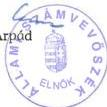

Állami Számvevőszék

TS2:574

# JELENTÉS

**a Szerb Országos Önkormányzat  
pénzügyi-gazdasági tevékenységének  
vizsgálatáról**

2002. január

0209 ✓

---

Az ellenőrzés végrehajtásáért felelős:
V. Önkormányzati és Területi Ellenőrzési Igazgatóság

dr. Lóránt Zoltán

számvevő igazgató

Az ellenőrzést vezette:

dr. Sallai Antal

régióvezető főtanácsos

Az ellenőrzést végezte

Huberné Kuncsik Zsuzsanna

számvevő tanácsos, tanácsadó

Az ÁSZ által a témában eddig készített jelentések:

A Szerb Országos Önkormányzat pénzügyi-gazdasági tevékenységének vizsgálata (1019/1995.)

A Szerb Országos Önkormányzat pénzügyi-gazdasági tevékenységének vizsgálata (1008/1997.)

Jelentéseink az Országgyűlés számítógépes hálózatán
és az Interneten a www.asz.hu címen is olvashatók, továbbá a Belügyminisztérium
folyóirata, az "Önkormányzati Tájékoztató" rendszeresen közli, valamint a Megyei
Közigazgatási Hivatalvezetők részére is átadásra kerül.

---

V-1013-28/2001-2002.

# TARTALOMJEGYZÉK

I. ÖSSZEGZÖ MEGÁLLAPITÁSOK, KÖVETKEZTÉSEK, JAVASLATOK 4
II. RÉSZLETES MEGÁLLAPITÁSOK 5

1. A feladatellátás szervezettsége, szabályozottsága 5

1.1. Általános ismeretek a szerb kisebbségról, a Szerb Országos Önkormányzat kapcsolatrendszere 5
1.2.A szervezeti es mukodesi rend alakulasa 7
1.3.A koltsegvetes, zarszamadas, vagyonleltar megallapitasanak szabalyozottsaga 9
1.4.A mukodés szervezeti feltételrendszere 9

2. Az önkormányzat működésének, a gazdálkodás rendjének szabályszerűsége 11

2.1.A mukodes targyi felteteleinek alakulasa 11
2.2. Az egyszeri vagyonjuttataskent kapott részvenyek hasznositasa 13
2.3.A gazdalkodasi tevekenyseg szemelyi es targyi feltetelei 14
2.4.A gazdalkodasi folyamatok szabalyozottsaga 15
2.5.A gazdalkodasi jogkork szabalyozottsaga 16
2.6. Vallalkozasi tevekenyseg 17

3. A beszámolási kötelezettség teljesítése, a költségvetés készítése és végrehajtása 17

3.1.A konyvvezetesi kotelezettseg 17
3.2.Az éves költségvetések 18
3.3.A koltsegvetesek vegrehajtasa 19
3.4.A gazdasagi esemenyekbizonylati alatamasztottsaga 21
3.5.A vagyongazdalkodás szabályozottsága, vagyonvédelem 22
3.6. Éves beszámolási kõtelezettség 22
3.7.Az éves zarszámadások 23

4. Az önkormányzat ellenőrzési rendszere 24

4.1.Az ellenorzs szabalyozottsaga 24
4.2.A belso ellenorzs 24

5. A korábbi számvevőszéki ellenőrzések javaslatainak hasznosulása 24

1

---

1

---

I. ÖSSZEGZŐ MEGÁLLAPÍTÁSOK, KÖVETKEZTETÉSEK, JAVASLATOK

# JELENTÉS

## a Szerb Országos Önkormányzat pénzügyi-gazdasági tevékenységének vizsgálatáról

Az Állami Számvevőszékről szóló 1989. évi XXXVIII. törvény 2. § (5) bekezdése alapján ellenőriztük az országos kisebbségi önkormányzatoknál az állami költségvetésből juttatott támogatások felhasználását.

A nemzeti és etnikai kisebbségek jogairól szóló 1993. évi LXXVII. törvény (továbbiakban: Nek tv.) szabályozza az országos kisebbségi önkormányzatok létrehozásának rendjét, azok feladat- és hatásköreit.

Az Állami Számvevőszék 1995. és 1997. évben témavizsgálat keretében ellenőrizte az országos kisebbségi önkormányzat pénzügyi, gazdasági tevékenységét.

A vizsgálat az országos kisebbségi önkormányzatok 1999. és 2000. évi és 2001. első félévi gazdálkodására terjedt ki, egyes esetekben – a székházjuttatási folyamat és egyszeri vagyonjuttatás hasznosulása – a korábbi vizsgálat óta eltelt teljes időszakot áttekintettük.

**Az ellenőrzés célja:** annak megállapítása volt, hogy

- az országos kisebbségi önkormányzat működési feltételrendszere hogyan változott a vizsgált időszakban,
- a gazdálkodás szervezettsége, szabályszerűsége mennyiben felel meg a jogszabályi követelményeknek és az önkormányzati működés sajátosságainak,
- biztosított-e a gazdálkodás és a pénzeszközök felhasználásának törvényessége és szabályszerűsége, a számviteli törvény és a vonatkozó kormányrendeletek előírásainak betartása.

3

---

I. ÖSSZEGZŐ MEGÁLLAPÍTÁSOK, KÖVETKEZTETÉSEK, JAVASLATOK

# I. ÖSSZEGZŐ MEGÁLLAPÍTÁSOK, KÖVETKEZTETÉSEK, JAVASLATOK

A Szerb Országos Önkormányzat működésének feltételrendszere a korábbi vizsgálat óta eltelt időszakban lényegesen javult, felújított székhelyül szolgáló irodáikat elfoglalták, a munkakörülmények rendezetté váltak. Az Alapszabály és a gyakorlat eltérő, ennek oka, hogy a közgyűlés elmulasztotta az SZMSZ szükségszerű kiegészítését, módosítását.

Az egyszeri vagyonjuttatásként kapott részvények túlnyomó többsége jelenleg is birtokukban van, ez a leglényegesebb vagyonelem mérlegükben. A gazdálkodást bonyolító hivatal ügyrendje nem készült el, az alkalmazottak munkaköri leírásai is pontosítást, átdolgozást igényelnek.

A szabályozottság terén a legutóbbi időszakban pozitív előrelépés történt, a gazdasági vezető személyének változása a törvényes működést előnyösen befolyásolta. A pénzkezelés során tapasztalt rendszerbeli és eseti hibák főként a vizsgált időszak kezdetét jellemzik, az új gazdálkodási szabályok betartásával azok megszüntethetők. Lényeges hiányosság volt, hogy a vagyon felmérése nem történt meg, a vagyongazdálkodás szabályrendszerét sem dolgozták ki. Kedvezőtlen, hogy az önkormányzat közgyűlése nem tett hatékony intézkedéseket az ellenőrzési rendszer működtetésére, a korábbi számvevőszéki vizsgálat javaslatainak hasznosítására.

Az önkormányzat a rendelkezésére álló forrásokkal takarékosan, a kisebbségi célok prioritását előtérbe helyezve gazdálkodott, a pénzügyi egyensúly biztosított volt, likviditási problémák nem jelentkeztek.

# Az önkormányzat feladatellátása célszerűségének és szabályszerűségének javítása érdekében javasoljuk a Közgyűlésnek, hogy

1. A szervezeti és működési rend gyakorlati működésének megfelelően módosítsák a Szervezeti és Működési Szabályzatot, azt egészítsék ki a konkrét tevékenységek szabályrendszerével (tevékenységekhez rendelt feladat- és hatáskörök, döntési mechanizmus, szakbizottságok működési rendje, stb.).
2. Készíttessék el, s mielőbb helyezzék hatályba a vagyongazdálkodási szabályzatot, biztosítsák az abban foglaltak hatályosulását.
3. A költségvetések és zárszámadások jóváhagyásáról a belső rendelkezéseknek megfelelően s a megjelölt határidőre döntsenek.
4. Fokozottan ellenőrizzék a szükségesnek ítélt intézkedések megtételét, s az abban foglaltak betartását.

4

---

II. RÉSZLETES MEGÁLLAPÍTÁSOK

# **az önkormányzat elnökének, hogy**

1. 1. Vizsgálja felül a hivatal dolgozóinak tevékenységét, s annak eredményeként készítsék el az új munkaköri leírásokat személyre szólóan (feladat, jogok, kötelességek, felelősség, ellenőrzési tevékenység, stb.).
2. 2. Dolgoztassa ki a hivatal ügyrendjét.
3. 3. A szabályzat-tervezetek felülvizsgálatát követően azokat haladéktalanul helyezze hatályba, s gondoskodjon az abban foglaltak betartásáról.
4. 4. Az éves beszámolókat a mindenkori hatályos jogszabályok alapján készíttesse el, szervezze meg a vagyon számbavételét s a szükségszerű selejtezések elvégzését.
5. 5. Gondoskodjon arról, hogy a költségvetések és zárszámadások elkészítésénél a számviteli politikában meghatározottak érvényesüljenek.
6. 6. Tegyen intézkedéseket a célszerű gazdálkodás, a munka színvonalának további javítása érdekében (pl. belső szabályozás a dolgozók juttatásairól, szakképzés elősegítése a gazdálkodási feladatkörökben, a pénztárosi munkakör mielőbbi betöltése, stb.).
7. 7. Szervezze meg a belső ellenőrzés rendszerét, és segítse elő annak hatékony működtetését.
8. 8. A számvevőszéki jelentést terjessze a közgyűlés elé annak megismerése céljából.
9. 9. Az elfogadott javaslatoknak megfelelően megtett és tervezett intézkedéseikről a jelentés átvételétől számított 30 napon belül írásban tájékoztassák a vizsgálatot végző szervet.

## II. RÉSZLETES MEGÁLLAPÍTÁSOK

### 1. A FELADATELLÁTÁS SZERVEZETTSÉGE, SZABÁLYOZOTTSÁGA

#### 1.1. Általános ismeretek a szerb kisebbségről, a Szerb Országos Önkormányzat kapcsolatrendszere

A Szerb Országos Önkormányzat (továbbiakban: SZOÖ) a Nek.törvény 5.§-ának (1) bekezdésében foglaltak értelmében 1995. március 18-án alakult meg. **A magyarországi szerb kisebbség egyike a korábban nemzetiségként, a Nek.tv. által honos nemzeti kisebbségként elismert 13 nemzeti és etnikai kisebbségnek.**

A szerb kisebbség jelentős része Budapesten és a fővároshoz közeli településeken él, emellett további hét (7) megyében igen szétszórtan is megtalálhatók, jellemzően az ország déli részein. (Pl. Battonya, Pécs, Deszk, Szeged, stb.)

5

---

II. RÉSZLETES MEGÁLLAPÍTÁSOK---

Az 1990-es években mintegy 5000 főre becsülték az országban élők létszámát, ezt követően viszont a délszláv háború és válság, s nem utolsó sorban a NATO két évvel ezelőtti bombázásai következtében számos szerb egyén és család keresett és talált menedéket Magyarországon. A feltételezések szerint ma már a kisebbséghez tartozók létszáma a 10000 főt közelíti, a nyelvet beszélők száma ezt jóval meghaladja. (A 2001. évi népszámlálási adatok arról, hogy hányan vallották szerb nemzetiségűnek magukat, még nem áll rendelkezésre.)

A magyarországi szerbek életkörülményeiről az önkormányzat hozzávetőleges információkkal rendelkezik, egyes területeken viszont a minél széleskörűbb tájékozódás érdekében országos felmérések is készültek (pl. oktatás helyzete, kulturális szervezetek száma, működése, könyvtárak ellátottsága, stb.)

A rendszerváltást követően **a magyarországi szerbek 1990-ben megalakították** első független és önálló társadalmi érdekképviseleti szervezetüket **a Szerb Demokratikus Szövetséget**. Ez a szervezet megfelelő jogi háttér nélkül számos olyan feladatot látott el amelyeket a Nek. tv. később az országos önkormányzatok tevékenységeként nevesített.

Kezdetben az önkormányzat és a szövetség szorosan együttműködött, időközben a tevékenységi körök markánsabban elhatárolódtak egymástól. A Szerb Demokratikus Szövetségnek a megváltozott körülményekhez (országos önkormányzat létrejötte) igazodó profilja, működési területe még nem alakult ki. A szövetség jelenleg is kizárólagos tulajdonosa és működtetője az egyetlen szerb hetilapnak, (Srpske narodne novine) így annak szerkesztési politikájára az önkormányzatnak közvetlen befolyása nincs.

A Nek. tv-ben meghatározott jogosítványokból következően az önkormányzat képviseli legeredményesebben a hozzájuk tartozó közösség érdekeit, tevékenységükben kiemelt hangsúlyt kapott a szerb nemzetiségi kultúra, a történelmi hagyományok terjesztése, ápolása, a nyelvoktatás szervezése, segítése.

Az önkormányzat széleskörű kapcsolatrendszert épített ki a szerb civil szervezetekkel, egyesületekkel, oktatási és kulturális intézményekkel, a Szerb Ortodox Egyház Budai Püspökségével és szervezeteivel, a magyarországi szerb médiával, a különböző állami szervekkel, intézményekkel.

Az anyaországi kapcsolatok kiépítését és erősítését nehezítette a közelmúltig fennálló kedvezőtlen politikai helyzet, aminek következtében nincsenek államközi kulturális és kisebbségvédelmi egyezmények a két ország között. Mindezek ellenére az önkormányzat kiterjedt kapcsolatokkal rendelkezik az anyaország területén működő kulturális, oktatási, tudományos intézményekkel, gyakoriak a közös rendezvények, tanácskozások, előadások, kiadványok megjelentetése.

Az önkormányzat 1995. évi megalakulása időszakában 18 helyi szerb önkormányzat működött az országban, a jelenlegi választási ciklusban számuk megkétszereződött. (Elsősorban a fővárosi kerületekben jöttek létre újabb helyi kisebbségi önkormányzatok.)

---6

---

II. RÉSZLETES MEGÁLLAPÍTÁSOK

## 1.2. A szervezeti és működési rend alakulása

A Szerb Országos Önkormányzat 1995. október 10-én fogadta el a Statutumát (Alapszabályát) mely tartalmát tekintve megfelel a Szervezeti és Működési Szabályzatnak.

Az 1999. évben újjáalakult SZOÖ új Alapszabályt nem alkotott, az eredetileg jóváhagyott szabályzat kisebb módosításaira került sor egyedi határozatokkal, így a szabályozás és a gyakorlati működés nem mindenben azonosak.

A SZOÖ elnökének tájékoztatása szerint az SZMSZ egységes szerkezetbe foglalt módosítására, egyes fejezeteinek pontosítására többször készült előterjesztés, ellenben a Közgyűlés egyetlen alkalommal sem fogadta el az abban foglaltakat.

Az Alapszabály Nek. tv. előírásainak megfelelően határozza meg az önkormányzati jogosítványokat, így azok egyes területeken – pl. szerb intézmények létrehozása, működtetése, ösztöndíjak alapítása, stb. – nem mint konkrét feladatok, hanem mint keretjellegű lehetőségek jelennek meg.

Az SZMSZ III. és IV. fejezete rendelkezik a SZOÖ szervezeti felépítéséről, működési rendjéről, az egyes önkormányzati szervek (közgyűlés, elnök, alelnökök, elnökség és bizottságok) feladatairól, hatásköreiről, a munkamegosztás módjáról, stb.

**Az önkormányzat legfőbb szerve a közgyűlés, melynek 33 tagja van,** akiket főként a helyi kisebbségi önkormányzatok képviselőiből választottak meg. (A közgyűlés jelenleg 31 tagú, mert egy tagja 1999. évben elhalálozott, 1 fő pedig a tavalyi évben lemondott, pótlásukra pedig az Országos Választási Bizottság állásfoglalása értelmében nincs jogi lehetőség.)

Az önkormányzat jogosítványaival, hatásköreivel a közgyűlés rendelkezik, melynek feladatai a törvényben előírtakon túl egyéb tevékenységgel is kiegészülnek (SZMSZ 10. §.). A közgyűlés a 12. §-ban rögzített feladatokon kívül valamennyi hatáskörét átruházhatja, az elnökre, az elnökségre, a bizottságokra, azok gyakorlására utasítást adhat, az átadott hatáskört visszavonhatja.

**A 9 fős elnökség** a jelenleg érvényben lévő Statutum szerint a közgyűlés két ülése között az önkormányzat legfelső szerveként működik, azokban a kérdésekben dönthet, amelyekre a közgyűlés felhatalmazza. Tagjai között kötelező jelleggel szerepel az elnök, annak általános helyettese és a két alelnök.

Az elnökség személyi összetételében a vizsgált időszakban 3 alkalommal történt változás, 1 tag elhalálozott, 2 fő pedig lemondott a választott tisztségről. Az elnöki funkciót az önkormányzat megalakulása óta ugyanazon személy tölti be.

Az SZMSZ az elnökség és az elnök által elvégzendő feladatokat, döntési jogköröket általánosságban határozza meg, a két alelnök konkrét tevékenységét közgyűlési határozatok tartalmazzák. (17/1995. SZOÖ (dec.09.), 20/1995. SZOÖ (dec.09. sz. hat.)

A közgyűlés az elnökség részére konkrét hatásköröket nem adott le, ez a hiányosság adott helyzetben ellehetetlenítheti az önkormányzat működését.

7

---

II. RÉSZLETES MEGÁLLAPÍTÁSOK

Az általános elnökhelyettesi funkció nincs betöltve, az egyik alelnök főállásban (un. déli alelnök) a másik mellékfoglalkozásban látja el feladatait.

**Az önkormányzat szakmai tevékenységét bizottságaiban fejti ki**, melyek a szabályozás szerint főként a döntés-előkészítésben, a végrehajtás szervezésében és ellenőrzésében nyilvánulnak meg.

Az SZMSZ rögzíti, hogy a bizottságok külső tagjait a működési területhez tartozó szakemberekből választják, az önkormányzat elnöke azokban nem vállalhat tisztséget. Ugyanakkor nincs konkrét szabályozás a véleményezési és döntés-előkészítési tevékenységet illetően, továbbá a gazdálkodást érintő rendkívül lényeges területen – pénzeszközök felhasználása – általános azok döntési jogkörének meghatározása. („hatáskörbe utalt pénzeszközök”)

A kialakult gyakorlat szerint a működés folyamán egyedi közgyűlési határozatokkal történik e pénzeszközök pontosítása az éves költségvetésben jóváhagyott keretösszegre hivatkozással. (Pl. 1999. június 12-én 17-18-19/1999. sz. SZOÖ hat. 2000. október 10-én 15/2000. SZOÖ hat.)

A szakmai bizottságok működési szabályzatukat maguk alkotják meg a közgyűlés jóváhagyása mellett, de az nem része a SZMSZ-nek, annak mellékleteként sem csatolták azokat.

Az SZMSZ a fentieken túlmenően rendelkezik a képviselők jogairól és kötelességeiről, az ülések rendjéről, a szavazás menetéről, a működés dokumentálásáról, érintőlegesen a gazdálkodásról, a hivatali szervezetekről, a tevékenységet biztosító forrásösszetételről.

Az önkormányzat által ellátott tevékenységeket, azokhoz kapcsolódó feladat- és hatásköröket, döntési jogköröket **az SZMSZ-ben csak általánosságban határozták meg:**

- az átruházott hatáskörökről pontos jegyzék nem készült,
- az elnökség, az elnök döntési jogköreit az SZMSZ (annak mellékletei) nem konkretizálja, valamennyi feladatkört abba nem építették be,
- a szakbizottságok működési rendje nem része az SZMSZ-nek, a hatáskörükbe utalt pénzeszközök felhasználásának módja, korlátai nem szabályozottak (pl. költségvetésben jóváhagyott szakmai keretösszeg, az egyes projektekre kapott többletforrások.)
- az egyes szervek beszámoltatási kötelezettségét (formája, határideje, felelősei) pontosan nem határozták meg.

**Az önkormányzat a szerb identitás hangsúlyos részének tekinti a nyelvhasználatot**, így az Alapszabály rögzíti, hogy **valamennyi működéssel kapcsolatos iratanyag szerb nyelven készül**. (Közgyűlési, elnökségi jegyzőkönyvek, azokhoz kapcsolódó írásos előterjesztések, a meghozott határozatok, a működéssel kapcsolatos levelezések túlnyomó része, a gazdálkodás lényeges alapdokumentumai.)

8

---

II. RÉSZLETES MEGÁLLAPÍTÁSOK

**A jelenleg hatályos jogszabályok nem írják elő a működés, a gazdálkodás minősítéséhez elengedhetetlenül szükséges dokumentációk magyar nyelven is kötelező rögzítését, így azokat csak szerb nyelven készítettek el.**

**A számvevőszéki vizsgálat segítése érdekében annak időtartama alatt a vizsgálatot végző által fontosnak ítélt dokumentumokat lefordították,** (pl. SZMSZ, fontos határozatok szövege, költségvetések, zárszámadások, munkaköri leírások) de a működés, gazdálkodás döntés-előkészítési folyamatának, az önkormányzatnál felgyűlt iratanyagoknak áttekintése a folyamatos magyar nyelvre történő fordítás igénye miatt szűk körre korlátozódhatott. (Szabályzatok, költségvetések, zárszámadások, szűrőpróbaszerűen ellenőrzött pénzügyi bizonylatok kapcsolódó alapdokumentumai.) A fordítások hitelességét az elnök aláírásával igazolta.

### 1.3. A költségvetés, zárszámadás, vagyonleltár megállapításának szabályozottsága

Az önkormányzat Szervezeti és Működési Szabályzata a közgyűlési hatáskörből át nem ruházható feladatok között nevesíti a költségvetés meghatározását, valamint a zárszámadás elfogadását, ellenben annak a vagyonnal, a gazdálkodással és pénzügyi tevékenységgel foglalkozó VI. fejezete azok szerkezeti rendjét, elkészítési határidejét, a költségvetés módosításának szabályait, a költségvetés és zárszámadás tartalmi összehasonlíthatóságának követelményeit nem rögzíti.

Az SZMSZ kimondja, hogy a gazdálkodást a mindenkor hatályos jogszabályok szerint folytatják, a tulajdonosi jogok kizárólagos birtokosa a közgyűlés.

Az SZMSZ 48. §-a hivatkozik arra, hogy a pénzügyi-gazdálkodási tevékenységről külön szabályzat készül, melyet a közgyűlés hagy jóvá. **Ilyen hatályban lévő szabályzat nem volt, így az SZMSZ hiányosságait egyéb belső rendelkezés sem pótolta.**

**Az Alapszabály 8. §-a tartalmazza, hogy a vagyonleltárról, a törzsvagyoni körről a közgyűlés önállóan dönt, de az önkormányzat ennek a kötelezettségének mindezideig nem tett eleget.**

### 1.4. A működés szervezeti feltételrendszere

Az önkormányzat közgyűlése feladatai ellátása érdekében **négy állandó bizottságot** (Kultúr, Oktatási, Média, Kiadói és Tudományos) **hozott létre**, az SZMSZ utal még különböző ad-hoc bizottságok működésére, de ebben a választási ciklusban ilyenek nem alakultak.

A kisebbségi célok elérése érdekében aktív tevékenységet fejt ki a kulturális és oktatási bizottság, a média területén a lehetőségek korlátozottabbak, a negyedik szakbizottság (jelenleg 5 tagú) az elnök tájékoztatása szerint a gyakorlatban alig működik.

9

---

II. RÉSZLETES MEGÁLLAPÍTÁSOK---

Az SZMSZ a **gazdálkodás szervezése, segítése, kontrollja terén fontos feladatkörrel felruházott felügyelő bizottságot** (3 fős) is megjelöl, ellenben azt **nem hozták létre**, így a belső ellenőrzés feltételrendszere sem biztosított.

A bizottságokban folyó munka írásban dokumentált, a határozatokat az ülésről készült jegyzőkönyvek tartalmazzák.

(Pl. az oktatási bizottság által odaítélt ösztöndíjak a közösséghez tartozó diákok tanulmányainak segítésére.)

Az önkormányzat választott testületei és tisztségviselői döntéseinek előkészítésére és végrehajtására, az adminisztratív-igazgatási feladatok ellátására a közgyűlés megalapította hivatalát.

Az SZMSZ 48.§.(1) bekezdése utal arra, hogy a gazdálkodást és pénzügyi tevékenységet hivatala végzi, illetve „más természetes és jogi személyek is végezhetik.”

Az SZMSZ arról is rendelkezik, hogy a hivatal szervezeti felépítését és működési szabályait a közgyűlés hagyja jóvá, - az elnök javaslata alapján – azt az elnök irányítja, és a dolgozók feletti munkáltatói jogokat is gyakorolja.

Az önkormányzat hivatalának tervezett felépítését, működési rendjét a SZOÖ 12/1995. (IX. 30.) határozatával fogadta el a közgyűlés, ellenben a gyakorlat attól eltérő.

**A hivatal 8 fős, a gazdálkodási ügyrend nem készült el.** Az alkalmazottak rendelkeznek munkaköri leírással, ellenben a személyre szóló feladatok meghatározása átdolgozást igényel a dolgozók jogai, kötelességei, felelősségi köre, és folyamatba épített ellenőrzési kötelezettsége kellő pontossággal nem épült be azokba.

Jelenleg az elnök irányításával működő hivatal 6 fős, melyből három fő alapvetően a gazdasági feladatokat látja el, három alkalmazott pedig főként a szervezési és adminisztratív, valamint a könyvtárosi teendőket végzi.

Az önkormányzat egy nyugdíjas alkalmazásával (részfoglalkozású) működteti az országos szerb nyelvű könyvtárat a székhelyén, az elnök munkáját a titkár és az adminisztrátor segíti.

A gazdálkodási feladatokat közvetlenül három végzik a gazdasági vezető irányításával, aki kezdettől fogva külső szakértőként szerződéses jogviszonyban áll az önkormányzattal. (A megbízott szervezet 2000. évben megváltozott) A takarításra vállalkozói szerződést kötöttek az egyik alkalmazottal. (Főállásban a hivatal gondnoka, aki a gazdasági részleghez tartozik.)

Az elfogadott szervezeti séma oktatásügyi és kulturális referenseket is tartalmaz, alkalmazásukra ezideig nem került sor.

Az önkormányzat elnöke a hivatal dolgozóival szabályos munkaszerződést kötött, abban a munkabéren felül részükre egyéb juttatásként étkezési hozzájárulást és a munka- és lakóhely közötti utiköltségtérítést határozott meg.

---10

---

II. RÉSZLETES MEGÁLLAPÍTÁSOK

A hivatal munkatársai kivétel nélkül a szerb közösséghez tartoznak, mindennapos munkavégzésük során anyanyelvüket használják.

Az önkormányzat az oktatási, kulturális, szociális és közszolgáltatási feladatok ellátására intézményeket nem alapított, működtetésükről nem döntött. Ennek oka főként az, hogy azok finanszírozási garanciái nem biztosítottak, ugyanakkor távlatokban szerepel a terveik között ilyen intézmények alapítása, már meglévő kisebbségi intézmények működtetésének átvétele.

A SZOÖ elnöksége 2000. áprilisában tárgyalt erről, és listaszerűen meghatározta ezek lehetséges körét is, amennyiben az ehhez szükséges jogi környezet kedvezően változik a későbbiekben. (Hiv.szám: 7/2000. E SZOÖ (04.18.)

Az önkormányzat a vizsgált időszakban tanulmányi ösztöndíjakat kivéve pályázatokat nem írt ki, azzal kapcsolatban szabályozást nem alkotott.

A közösséghez tartozó diákok körében meghirdetett ösztöndíj-pályázatokról az oktatási bizottság dönt, a rendelkezésre álló keretösszeg felosztása, a pályázatok elbírálása is bizottsági hatáskör.

(A feltételek között szociális körülmény nem szerepel, alapvető, hogy a felsőoktatási intézmény beiratkozott hallgatója a kisebbséghez tartozzon, és annak aktív tagja legyen, továbbá más kisebbségi szervezettől ösztöndíjban ne részesüljön.)

A támogatott diákok száma évente 4-5 fő, az ösztöndíj mértéke 8-10 ezer Ft/hó/fő a tanulmányi időszakban. (10/1999. (XII. 15.) sz., 4/2000. (III. 07) sz., 2/2001. (II. 08.) sz. Okt. Biz. hat.)

## 2. AZ ÖNKORMÁNYZAT MŰKÖDÉSÉNEK, A GAZDÁLKODÁS RENDJÉNEK SZABÁLYSZERŰSÉGE

### 2.1. A működés tárgyi feltételeinek alakulása

Az országos kisebbségi önkormányzatok elhelyezésével összefüggő feladatokról a Nek. tv. a 20/1995. (III. 3.) sz. Kormányrendelet, valamint a 2387/1995. (XII. 12.) Korm. határozat rendelkezett. Ez utóbbi értelmében a Kincstári Vagyoni Igazgatóság az 1995. december 18-án kötött adásvételi szerződéssel a Magyar Állam tulajdonában és a KVI kezelésében lévő **Budapest, V. ker. Falk Miksa u.3. szám II. emeletén lévő 425 m² területű ingatlanrészt ingyenes használatba adta a Szerb Országos Önkormányzat és a Szerb Fővárosi Önkormányzat részére.**

A megvásárolt ingatlan jelentős mértékű átalakításra és felújításra szorult a rendeltetésszerű használatot megelőzően, így a Szerb Országos Önkormányzat a beköltözésig a Szerb Demokratikus Szövetség által bérelt irodákban, (Budapest, VI. ker. Nagymező u.49.) annak bútorait, berendezési tárgyait használva működött.

A szükséges munkálatokat követően a **székhelyül kijelölt ingatlanrészt a KVI ingyenes használati megállapodás keretében 1997. március 26-**

11

---

II. RÉSZLETES MEGÁLLAPÍTÁSOK

## án átadta a Szerb Országos Önkormányzat és a Szerb Fővárosi Önkormányzat részére.

**Az átadott ingatlanrész használatáról a két önkormányzat az előírt megállapodást 1998. április 6-án kötötte meg.** A összesen 425 m² alapterületből 102 m² a Szerb Fővárosi Önkormányzat működési céljait szolgálja, a fennmaradó 323 m² a Szerb Országos Önkormányzat elhelyezésére szolgál.

A fenntartási költségek (rezsi, társasházi közös költség a felújítási rész nélkül, karbantartás, takarítás, riasztó, telefonközpont telepítése, karbantartása) a területhasználattal arányosan fizetendők, így azokat a SZOÖ nevére szóló számlák kiegyenlítése után arányosan megosztják a Szerb Fővárosi Önkormányzattal. (A költségek 24 %-a.)

Az önkormányzatok között jó az együttműködés, a közös ingatlanhasználatból, a költségek megtérítéséből adódóan problémák eddig nem merültek fel.

A székház birtokbaadásán felül az irodák, egyéb helyiségek megfelelő berendezését nem biztosították. Az önkormányzat 1998. szeptemberében mintegy 3 millió Ft-ot költött az irodák ízléses berendezésére, a szükséges eszközök beszerzésére, ehhez pótlólagos központi támogatásban nem részesültek.

A 2000. december 31-i állapot szerint az eszközállomány könyvszerinti nyilvántartási értéke 2.918 ezer Ft, mely a berendezésen felül számítástechnikai eszközöket s a hozzá tartozó programokat, hűtőszekrényt és mobil telefonokat tartalmaz.

Az önkormányzat személygépkocsival, értékesebb irodatechnikai eszközzel (pl. fénymásoló gép) nem rendelkezik. A 2000. évi költségvetésben gépkocsivásárlásra 1.500 ezer Ft-ot hagytak jóvá, ami csak használt autó beszerzését teszi lehetővé.

A Jugoszláv Szövetségi Kormány 1998. januárjában egy személygépkocsit és 5 db fax készüléket ajándékozott térítésmentesen az önkormányzat részére. Az iratanyagok alapján az eszközöket a Jugoszláv Szövetségi Vámhivatal használta ezt megelőzően.

## A térítésmentesen kapott eszközöket a számvitelben nem regisztrálták.

Az elnök írásos nyilatkozata alapján az 5 db fax készülékből a vámkezelést követően csak egy került a SZOÖ-höz (Panasonic márkájú) a többit a JSZK budapesti nagykövetsége elajándékozta vidéki szerb kisebbségi önkormányzatoknak.

Az 1997-es évjáratú Peugeot 205 típ. személygépkocsit szabályszerűen vámkezelték, forgalomba helyezték Magyarországon, a szükséges biztosításokkal rendelkezett. (Kötelező és Casco biztosítás)

Az autót az önkormányzat elnöke használta. A személygépkocsit 1999. november 8-áról 9-ére virradó éjszaka eltulajdonították

Az üggyel kapcsolatban rendőrségi feljelentést tettek (04386/99. november 9-i jkv.) a Budapesti Rendőrfőkapitányság gépjárműfelderítési osztálya 1999. de-

12

---

II. RÉSZLETES MEGÁLLAPÍTÁSOK

cember 9-én kiadta a nyomozás megszüntetéséről szóló határozatot (1208561/99.Bü.) Az elkövető kilétét nem sikerült megállapítani.

A Casco biztosítás eredményeként 1.209.600 Ft kártérítést kaptak, mely 2000. évben befolyt az önkormányzat számlájára (9921 Fők.szl.)

Az önkormányzat elhelyezési körülményei ma már kedvezőek, a főváros központjában, a Parlament közvetlen közelében, tágas irodák, egyéb kiszolgáló helyiségek (teakonyha, bővíthető tárgyalóterem, stb.) biztosítják a rendeltetésszerű működést.

## 2.2. Az egyszeri vagyonjuttatásként kapott részvények hasznosítása

A Nek. tv. 63. §. (4) bekezdése értelmében az országos kisebbségi önkormányzatok működési költségeik biztosítására egyszeri vagyonjuttatásban részesítendők.

Az 1996. évi költségvetésről szóló 1995. évi CXXI. tv. módosítása (Kt.8.§-a) rendelkezett arról, hogy a vagyonjuttatást az ÁPV Rt az állam vállalkozói vagyonának értékesítendő részéből 1996. december 31-ig összesen 300 millió Ft árfolyamértékű vagyon pénzbeli térítés nélküli átadásával teljesítse.

**A Nek. tv-ben meghatározottak szerint a Szerb Országos Önkormányzatot 15 millió Ft árfolyamértékű vagyonjuttatás illette meg.**

Az ÁPV Rt Igazgatósága 293/1996. (IV.24.) sz. határozatával döntött arról, hogy a vagyonjuttatást MOL Rt részvények átadásával teljesíti.

**Az önkormányzat a megállapodást a részvényvagyon átadásáról** – hosszas egyeztetéseket követően – **1997. június 18-án kötötte meg az ÁPV Rt-vel**, ennek értelmében a törvényben megállapított 15.000 ezer Ft vagyonértéknek megfelelően **8.813 ezer Ft névértékű MOL Rt részvényt kaptak**. (A részvények árfolyamértéke az 1996. márciusi tőzsdei átlagáron – 170,2% - került meghatározásra.)

A megállapodásban az ÁPV Rt mint átadó kikötötte, hogy az 1996. üzleti évet lezáró mérlegelfogadó közgyűlés által megszavazott **osztalék** a szerződés aláírásának időpontjáig járó **időarányos részére igényt tart**.

A részvényeket letétbe helyezték az Értéktár és Értékpapír Rt-nél. (97/0932. sz. szerződés, 1997. szeptember 9.)

Az önkormányzat könyvelésében a 8.813 ezer Ft névértékű részvényvagyon az átadott árfolyamértéken (15 millió Ft) vették nyilvántartásba a 3-as számlaosztályban. (1997. 11.06-án, 374. sz. fők. szla egyéb értékpapírok)

**Az önkormányzat elnöke** 1998. november 23-i levelében **megbízta a részvényeket őrző Rt-t**, hogy a letétbe helyezett **részvényekből 480 db 1.000 Ft névértékű értékpapírt** 5.230 Ft-os árfolyamon **értékesítsen**, annak ellenértékét utalja át az önkormányzat számlájára.

13

---

II. RÉSZLETES MEGÁLLAPÍTÁSOK---

Az Rt a megbízást teljesítette, **az értékesítésből 2.487.672 Ft bevétel származott, mely 1998.12.04-én befolyt az önkormányzat számlájára.**

A tranzakcióból az önkormányzatnak **1.670.712 Ft árfolyam nyeresége keletkezett.** (Kivezetett nyilvántartási érték 170,2 %-os árfolyamon 816.960 Ft.)

**A részvényeladásról közgyűlési határozatot nem hoztak,** emiatt az eljárás ellentétes az SZMSZ-ben előírtakkal. (A tulajdoni jogok kizárólagos birtokosa a közgyűlés.)

Az elnök szóbeli tájékoztatása szerint az értékesítést az indokolta, hogy a székház berendezésére nem állt rendelkezésre elegendő szabadon felhasználható forrás.

A részvényvagyonban ezt követően változás nem történt, az **összesen 8.333 ezer Ft névértékű értékpapírt továbbra is letétben tartják.** (Az őrzési díj minimális, melyet az Rt időszakosan leszámláz.)

**A vizsgálat időpontjáig** a részvények után járó **osztalékbevétel 1.936.923 Ft.** (Ebből 1998. évben befolyt 728.638 Ft, 1999. évben 749.970 Ft, 2000. évben 458.315 Ft.)

Az önkormányzat az 1998. és 1999. évi mérlegkészítés időszakában a számviteli törvény előírásának megfelelően a nyilvántartási értéket a piaci érték szerint határozta meg.

1998. évben a felértékelés 3,6786167 árfolyamszorzóval történt, így a részvényvagyon a mérlegben 52.172.960 Ft értéket képvisel.

1999. december 31-i állapot szerint az ugyanazon névértéket képviselő értékpapírokat a tőzsdei folyamatoknak megfelelően leértékelték (0,8868243 árf. szorzó) ennek következtében **a nyilvántartási érték 46.268.250 Ft lett.**

A 2000. évről készített beszámolóban a nyilvántartási érték az előző évivel azonos, a piaci értékítélethez igazodóan további leértékelést nem végeztek.

A részvényvagyon fel-majd leértékelése a könyvelésből nyomonkövethető, ellenben az ahhoz kapcsolódó konkrét dokumentumok (belső bizonylat, feljegyzés az értékelés hitelességéről) nem lelhetők fel.

A jelenlegi nyilvántartási érték a tőzsdei árfolyamok alakulását tekintve a piaci értéket meghaladja.

### 2.3. A gazdálkodási tevékenység személyi és tárgyi feltételei

Az önkormányzat gazdálkodási tevékenységét **részben saját hivatali szervezetével, részben külső megbízás keretében valósítja meg.** A hivatalon belül a gazdasági vezető feladatait megbízási szerződés keretében látják el, akinek közvetlen irányításával végzik a munkaköri leírásokban csak főbb vonalakban meghatározott tevékenységüket a hivatal főállású alkalmazottai. (gondnok, pénzügyi előadó, gazdasági munkatárs).

---14

---

II. RÉSZLETES MEGÁLLAPÍTÁSOK

A hivatal gazdálkodási munkakörben alkalmazott dolgozói megfelelő szakmai végzettséggel nem rendelkeznek. (JPTE Tanárképző Főiskola, ELTE Szláv Tanszék, a gondnok munkaszerződésében általános iskolai végzettség szerepel).

A pénztárosi munkakör jelenleg nincs betöltve, a készpénzkezelést kapcsolt feladatként a gazdasági munkatárs végzi.

# **A könyvvezetési és beszámoló készítési feladatokat 1995. szeptember 1-től egy számviteli, gazdasági szolgáltató Kft. végezte az 1999. évi beszámoló elkészítéséig.**

Az 1995. szeptember 1-én kelt szerződés 14. pontja megnevezte a Kft. képviseletében eljáró személyt, aki a szerb közösség tagja volt, szakmailag megfelelő ismeretekkel bírt. (közgazdasági egyetem, mérlegképes könyvelő)

A szerződésben meghatározták az elvégzendő feladatokat, azok határidejét viszont nem rögzítették. A feladatokat az önkormányzat helyiségében, annak tulajdonában lévő számítógépek és szoftwarek használatával végezték.

Az önkormányzat a könyvvezetés és az ahhoz kapcsolódó gazdasági vezetői feladatok elvégzésére **egy másik Kft-vel kötött szerződést 2000. június 15-én.** A szerződés részletesebben meghatározza az elvégzendő tevékenységet, az ahhoz biztosított feltételrendszert, a megbízott és megbízó jogait, kötelezettségeit. (Az év közben kötött szerződés szerint a feladatellátás a 2000. január havi anyag feldolgozásával kezdődik, így az év egy időszakában a könyvelés nem volt naprakész.)

A Kft. nevében eljáró személy **főként a költségvetés területén rendelkezik mélyreható szakismerettel** (költségvetési felsőfokú KÁLÁSZ) az önkormányzathoz ez évtől **kihelyezett munkatársa mérlegképes könyvelő.**

A megbízási szerződést a korábbinál még pontosabban feladat-meghatározás, a szerződéses ár változása miatt 2001. január 05-én ugyanazzal a szervezettel megújították.

A megbízás 9. pontja konkrétan előírja, hogy a gazdasági vezető heti két alkalommal 3-3 órát, annak pénzügyi munkatársa heti négy alkalommal napi 6 órát az önkormányzatnál tölt.

Az ellenőrzés tapasztalata alapján a gazdasági vezető személyében történt változás pozitívan hatott a tevékenység színvonalára, a könyvvezetés bizonylatokkal történő alátámasztottságára, kifogásolható, hogy a feladat átadásátvételről részletes jegyzőkönyv nem készült.

Az önkormányzat a kettős könyvvitel alkalmazásával a számviteli regisztrációt 1995-1999. években a Sigma Conto könyvelőrendszer, 2000-2001. évben a CT pénzügyi és számviteli program alapján végezte. A feladatellátás számítástechnikai hátterét a SZOÖ biztosította.

## 2.4. A gazdálkodási folyamatok szabályozottsága

Az önkormányzatnak a vizsgált időszakra vonatkozó **gazdálkodási szabályzatai rendkívül hiányosak**, tartalmukban az időközben történt jog-

15

---

II. RÉSZLETES MEGÁLLAPÍTÁSOK

**szabályi változásokat sem követték.** A hivatalban fellelhető szabályzatokat a korábbi időszakban megbízott gazdasági vezető készítette, azokat az elnök hagyta jóvá. (1996. október 1-én)

A számlarend 1995. október 10-én készült, kiegészítése, aktualizálása elmaradt. Az egyes számlaosztályok tartalmára a számlatükörre hivatkozással utal, nem rögzíti az analitikus kimutatások rendszerét, kapcsolódási pontjait a főkönyvi könyveléssel, az egyeztetések folyamatát, határidejét, a zárlati teendőket, az éves beszámolás módját, a mérlegadatokat alátámasztó dokumentumokat, stb.

A gazdálkodás egyéb részterületeire vonatkozó szabályzatokból csak a bizonylati és selejtezési található meg az önkormányzatnál, azok sem elégítik ki a velük szemben támasztott követelményeket. (A bizonylati szabályzat túl általános, album nem kapcsolódik hozzá, a selejtezési bizottság személyi összetétele, a konkrét tevékenység nem került rögzítésre, stb.)

Az önkormányzatnál egyéb dokumentációt bemutatni nem tudtak, így a gazdálkodás rendkívül lényeges területeit érintő pénzkezelési és leltározási szabályzatot sem.

(Az 1997. júniusában lefolytatott számvevőszéki jelentésben foglaltak szerint a fenti szabályzatokkal rendelkeztek, azok alapvetően szakszerűnek minősültek.)

## 2.5. A gazdálkodási jogkörök szabályozottsága

Az önkormányzatnak a kötelezettségvállalás rendjére önálló szabályzata készült, melyet szintén 1996. október 1-én hagyott jóvá az elnök. Ez a szabályozás is rendkívül általános, a csatolt névjegyzéket a gyakorlati működésnek megfelelően nem aktualizálták.

A kötelezettségvállalásra az elnök jogosult, távollétében az elnökség által jóváhagyott személyek megjelölt értékhatárig. (Sem a személyek neve, sem a maximum értékhatár nincs megjelölve.)

Nincs kötelezettségvállalási nyilvántartás, így nem kontrollálható, hogy pontosan ki, mikor, milyen ügyben vállalt kötelezettséget, ahhoz a pénzügyi fedezet mindenkor biztosított volt-e a költségvetésben meghatározottak alapján.

A szabályozás szerint az utalványozásra (kötelezettségvállalásra) az elnök és távollétében az önkormányzat elnökségi tagja jogosult, ellenjegyzési jogkört a gazdasági vezető gyakorol (még a régi szerződés szerinti személy van megjelölve) a bizonylatok kiállítója a gazdasági munkatárs.

A szabályozás nem tartalmazza a helyettesítés rendjét, az összeférhetetlenség esetén alkalmazott eljárási rendet sem.

(Utalványozást, kötelezettségvállalást az elnök önmaga és közvetlen hozzátartozója részére nem gyakorolhat.)

A jelentős szabályozásbeli hiányosságok ellenére **e területen pozitív változás, hogy a helyszíni vizsgálat idején elkészültek a gazdálkodásra vonatkozó új szabályozások, de** azok még tervezetként kezelendők - jóvá-

16

---

II. RÉSZLETES MEGÁLLAPÍTÁSOK

hagyásuk nem történt meg – így az azokban foglaltak betartása sem értékelhető.

**A tervezetként rendelkezésre álló helyi szintű szabályzatok a 2000. évi C. törvény, valamint a 224/2000. (XII. 19.) Korm. rendelet előírásainak megfelelnek, a gazdálkodási sajátosságokat is tükrözik.**

A számlarend, a számviteli politika, a leltározási, a selejtezési és hasznosítási, házipénztár kezelési szabályzat, a bizonylati rend a kapcsolódó albummal.

A kötelezettségvállalás, érvényesítés, utalványozás és ellenjegyzés rendje az új szabályozásban mintaszerűen rögzített, az egyes tevékenységek tartalma, az azok gyakorlásával járó felelősség, a pénzügyi teljesítések igazolásának módja, jogosultjai konkrétan meghatározásra kerültek. A szabályozás kiemeli az összeférhetetlenségi eseteket, s ennek fennállása során a gazdálkodási jogok gyakorlásának rendjét. (Jóváhagyása esetén 2001. október 1-től lép hatályba.)

## 2.6. Vállalkozási tevékenység

Az önkormányzat a Nek. tv-ben előírt alapfeladatain túlmenően vállalkozási tevékenységet nem végzett, erre vonatkozóan szabályozás nem készült.

A vizsgált időszakban vállalkozásban tulajdonosi (résztulajdonosi) jogokat nem szereztek, a számviteli adatokkal alátámasztottan részvénytulajdonuk kizárólag az egyszeri vagyonjuttatásból származik. (MOL Rt részvények)

## 3. A BESZÁMOLÁSI KÖTELEZETTSÉG TELJESÍTÉSE, A KÖLTSÉGVETÉS KÉSZÍTÉSE ÉS VÉGREHAJTÁSA

### 3.1. A könyvvezetési kötelezettség

Az önkormányzat teljesített bevételeinek nagysága a vizsgált időszakban nem érte el egyik évben sem az 50 millió Ft-ot, így a 219/1998. (XII.30.) Kormányrendelet előírásai szerint könyvvezetésükre egyszeres könyvvitelt is alkalmazhattak volna. A döntésük értelmében a számviteli, gazdasági folyamatok regisztrálására **kettős könyvvitelt vezetnek**, melyhez főként a vállalkozási könyvvezetésre készült számviteli programok szolgálnak.

Az 1999. éves beszámoló elkészítéséig alapvetően a főkönyvi könyvelés adatai álltak rendelkezésre, a kapcsolódó analitikus kimutatások hiányosak, az egyszerűsített éves beszámoló mérleg- és eredménykimutatásának adatait részletező dokumentumok nem támasztják alá. (Követelések, kötelezettségek, értékelési dokumentumok, pénzkészlethez kapcsolódó bankkivonatok csatolása, stb.)

A 2000. évről készült beszámolóhoz már részletesebb analitikák kapcsolódnak, a követelések, kötelezettségek alakulását tételesen bemutatták.

Az országos kisebbségi önkormányzatok könyvvezetési kötelezettsége a társadalmi szervezetekre meghatározott keretjogszabályokhoz igazodik. A számviteli rend felépítésében (számlatükör kialakítása) a működés sajátosságainak is tük-

17

---

II. RÉSZLETES MEGÁLLAPÍTÁSOK

röződnie kell, amely a vállalkozásokétól kismértékben eltér, s a választott testület/ek) információs igényét is szolgálnia kell.

(A bevételek és kiadások tervezett és tényleges adatainak gyűjtési rendszere a fő tevékenységtípusok szerint, stb.)

### 3.2. Az éves költségvetések

Az önkormányzat SZMSZ-e, egyéb más szabályzata a költségvetések tartalmára, szerkezetére, elkészítési határidejére, stb. részletes előírásokat nem tartalmaz. A vizsgált időszakban valamennyi gazdálkodási évben készült költségvetés, ellenben azok felépítése az egyes években nem teljesen azonos, más-más részletezettségű.

A költségvetések egyensúlya valamennyi évben biztosított volt, azokban tartalékkeretet is meghatároztak.

A költségvetéseket a hivatal munkatársainak bevonásával (tavaly a tervezésben a bizottságok is részt vettek) az elnök útmutatásainak figyelembe vételével a gazdasági vezető készítette el, azt szöveges indoklással kiegészítve az elnök terjesztette a közgyűlés elé. A kimunkált költségvetés tervezeteket előzetesen az elnökség megtárgyalta, a szakbizottságok nem véleményezték.

A közgyűlés a költségvetést határozatilag jóváhagyta.

Az önkormányzat az évközi változásoknak megfelelően (terven felüli források és azok felosztása az egyes tevékenységek finanszírozására) a költségvetést nem módosította, így a terv és tényadatok elemzése érdemben nem elvégezhető.

A rendelkezésre álló források tervezéskori számbavétele az egyes gazdálkodási években nem azonos elvek szerint történt.

1999. évben a garantált működési támogatáson felül minimális kamat- és osztalékbevételt terveztek, figyelembe vették az előző évi pénzmaradványt is. A 2001. évi költségvetés tervezése során hasonlóan jártak el, ellenben a 2000. évi költségvetésben a részükre jóváhagyott pályázati forrásokat, egyéb támogatásokat is megtervezték.

#### A költségvetések elfogadott főösszegei az alábbiak:

|  Év | Kgy. hat. | Költségvetési főösszeg (ezer Ft) | Index (Előző év 100%)  |
| --- | --- | --- | --- |
|  1999. | 15/1999. (06.12.) | 26.010 | -  |
|  2000. | 13/2000. (10.07.) | 39.907 | 153,4  |
|  2001. | 1/2001. (05.19.) | 39.980 | 100,2  |

A 2000. évi költségvetés főösszege jelentős emelkedésének oka, hogy annak rendkívül késői elfogadása miatt abban már számbavették az időközben számlájukra érkezett támogatásokat, pályázatokon elnyert forrásokat is. (Ennek figyelmen kívül hagyásával a növekedés mértéke mintegy 20%-os, ami főként a pénzmaradvány valamint az osztalékbevétel tervezett emelkedéséből adódott.)

18

---

II. RÉSZLETES MEGÁLLAPÍTÁSOK

A költségvetést az elnök 2000. júliusában terjesztette a közgyűlés elé, ellenben a testület azt nem fogadta el, a kiadási tétel vonatkozásában részletesebb indoklást írtak elő. (6/2000. és 7/2000. SZOÖ (júl. 1.) hat.)

Az önkormányzat az 1999. és 2000. évről készült költségvetésében a tervezett források felhasználását főbb kiadási jogcímenként, azon belül tevékenységi területenként irányozta elő.

A hasonló felépítés ellenére a költségvetés struktúrája (belső szerkezete) eltérő, így a két év adatai nehezen összehasonlíthatók.

A 2001. évi költségvetés szerkezete alapvetően eltér az előző két évben jóváhagyottól.

Ebben a választott tisztségviselők, a hivatal s az egyes fő tevékenységek (kultúra, oktatás, média, kiadói és tudományos feladatok) tervezett ráfordításait jellemző költségtípusokra lebontva határozták meg. (Személyi és dologi kiadások)

A kialakult gyakorlat szerint a közgyűlés a költségvetések elfogadásával egyidőben egyedi határozatokkal döntött azok főbb végrehajtási szabályairól.

Az egyes bizottságok hatáskörébe utalt pénzeszközök (keretösszeg nélkül) a tisztségviselők javadalmazása (illetmény, havi költségtérítés maximuma) az elnök részére biztosított átcsoportosítási jogkör. (Az egyes tételek esetében 100 ezer Ft értékhatárig.)

Az elfogadott költségvetésekben a hivatal dolgozói részére un. ruhapénzt is terveztek, a felhasználás konkrét szabályrendszerét, az egyes munkakörökhöz rendelt maximális keretösszegeket egyedi határozatokba foglalták. A mobil telefonok használatával, az azokkal kapcsolatos költségek megtérítésével kapcsolatban (mely munkakörökben jár, a költségtérítés korlátlan vagy maximált, stb.) önálló szabályozás nincs.

### 3.3. A költségvetések végrehajtása

A vizsgált időszakban a költségvetések végrehajtása során a kötelezettségvállalások pénzügyi fedezetével rendelkezett az önkormányzat, likviditási problémák nem jelentkeztek.

A ténylegesen rendelkezésre álló forrásokat tekintve azok nagyságrendje 2000. évben az előző évhez viszonyítva 30%-kal növekedett, ezen belül a legmagasabb arányt képviselő működési állami támogatás mértéke 10%-kal emelkedett.

A források nagyságrendjét, összetételét a csatolt 1. számú melléklet részletesen szemlélteti.

Az önkormányzat a Nek. tv-ben meghatározott feladatok finanszírozási szükségletét főként a különböző célirányos pályázatokon elnyert többletforrásokból fedezte, azok felhasználásával rendre elszámoltak. Az igényelt és kapott támogatásokat azok célja, s az azt biztosító szervezet megjelölésével az 1. melléklethez csatolt kiegészítő listák tartalmazzák.

19

---

II. RÉSZLETES MEGÁLLAPÍTÁSOK---

Az adatokból kitűnik, hogy az önkormányzat ezirányú tevékenysége igen széleskörű, a forrásbővítésre minden lehetséges pályázati lehetőséget kihasználtak többnyire eredményesen. (A többletforrások túlnyomó része a MNEK-től származott, főként különböző kiadványok megjelentetését, ünnepek lebonyolítását, anyanyelvi táborok működtetését, a szerb nyelvű könyvtárállomány bővítését segítették.)

# **Az önkormányzat az előző évi pénzmaradványt is figyelembe véve 1999. évben 34.920 ezer Ft, 2000. évben 43.323 ezer Ft bevétellel rendelkezett.**

1999. évben a források 74%-a, 2000. évben 62%-a származott működési állami támogatásból, a saját bevételek aránya mintegy felére visszaesett. (13%-ról 7%-ra)

Az önkormányzat itt számolja el a kiadványok értékesítéséből, a kulturális rendezvényekből (pl. színházi előadás) valamint a nyelvi táborokon való részvételekből befolyó bevételeket.

Az egyéb támogatások főként más önkormányzatok hozzájárulásai a kitűzött célokhoz.

A 2001. június 30-ig teljesült bevételek (37.387 ezer Ft) közel azonosak az éves tervezett forrásokkal, abban a beérkezett egyéb támogatások hatása érződik elsősorban. (A működési támogatás növekedési üteme 115%-os az előző évhez viszonyítva.)

A konkrétan végrehajtandó feladatok költségszükségletét csak fő kiadási típusokra határozták meg, a **költségnemek és ráfordítások szerinti kiadásokat a hivatal működtetése és az egyéb feladatok tekintetében a jelenlegi számviteli rendben megállapítani nem lehet.**

A források és kiadások összetételének alakulása a 2000. év során kidolgozott és ez évben továbbfejlesztett gyűjtőkódrendszer használatával megfigyelhető, ellenben az a főbb tevékenységekről, s nem a tételes költségek részletezéséről ad információt. (Kiemelkedő jelentősége a kötelezettségvállalások, az egyes kifizetések arra jogosult személy által történő igazolásának ellenőrizhetőségében van.)

A főbb költségcsoportok (elszámolt kiadások) alakulását a 2. számú tábla szemlélteti Az önkormányzat által teljesített kiadás **1999. évben 31.928 ezer Ft, 2000 évben 38.988 ezer Ft volt.**

Az összkiadásokon belül a személyi jellegű juttatások mind arányukban, mind volumenükben emelkedtek az utóbbi két lezárt gazdálkodási év vonatkozásában. (55 %-os növekedés mellett az arány 33 %-ról 42 %-ra nőtt.) A munkáltatói járulékok aránya a közel azonos volt.

A dologi kiadások 6 %-kal nőttek egyik évről a másikra.

Az adott támogatások és a felhalmozási kiadások mértéke és aránya nem számottevő.

Az önkormányzat évente hozzájárul a szerb iskola tanulóit szállító iskolabusz költségeihez, más szervezetek által megvalósított kisebbségi rendezvények lebonyolításához is anyagi segítséget nyújt.

---20

---

II. RÉSZLETES MEGÁLLAPÍTÁSOK

A vizsgált időszakban felhalmozási célú kiadásként számítógépek beszerzése jelentkezett, a tervezett gépkocsivásárlásra még nem került sor. (Jelentősebb maradvány emiatt 2000. évben e jogcímen jelentkezik.)

A gazdálkodás során érvényesültek a takarékossági követelmények, a pénzügyi egyensúly mindvégig biztosított volt.

### 3.4. A gazdasági események bizonylati alátámasztottsága

A gazdasági eseményeket tartalmazó bizonylatok alaki és tartalmi megfelelőségének vizsgálata a véletlenszerűen kiválasztott bank- és pénztári bizonylatok átvizsgálásával történt. (1999. évben május és december hó, 2000. és 2001. évben május hó)

A tapasztalatok alapján megállapítható, hogy különösen 1999. évben még több hiba, hiányosság fordult elő, amelyek túlnyomó része időközben az új gazdasági vezető intézkedéseinek hatására megszűnt, a gazdálkodás szabályszerűsége (dokumentáltság) jelentősen javult.

A feltárt hiányosságok egy része rendszerbeli, de eseti hibák is előfordultak.

#### Főbb rendszerbeli hiányosságok:

- 1999. évben nem készült pénztárjelentés, a napi záró-pénzkészlet sem került kimutatásra, a pénztárbizonylatok számítógépes nyomtatványok, amelyek nem tartalmazták a kiállító nevét, a csatolt mellékletek db számát sem. A vizsgált időszakban pénztárellenőrzés nem volt, a kifizetési bizonylatokon a teljesítés igazolása elmaradt. (2000. évtől ez utóbbit a gyűjtőkődő feljegyzése szolgálta, de személy szerint a bizonylatot senki sem szignálta e címen.) A befizetésekhez a részletes elszámolásokat nem csatolták (pl. rendezvény, könyveladás, stb.) így a ténylegesen beszedett és befizetett összegek egyezősége nem ellenőrizhető.
- Az egyes feladatokhoz kapcsoltan rendszeresen nagyobb összegű készpénz-előlegeket vettek fel különböző személyek, azokhoz megfelelő tartalmú analitika nem kapcsolódott (ki, mire, milyen elszámolási határidővel vette fel). Az előlegek ismételt felvétele a korábbi összeg elszámolása nélkül rendszeres – a szóbeli magyarázat szerint más-más projekthez kapcsolódik a felhasználás – emiatt egy-egy személynél hosszabb ideig nagyobb pénzösszegek halmozódnak fel. (Pénzkezelési szabályzatot nem tudtak bemutatni, így a szabályozás és a gyakorlat sem összehasonlítható)
- Az összeférhetetlenség az elnök önmaga részére történő kifizetéseinél rendre fennállt, a kiküldetési rendelővényeken a teljesítést nem igazolták.

#### Néhány jelentősebb eseti hiányosság:

- A pénztárból történő munkabér-kifizetés kiadási bizonylatát nem csatolták. (1999. dec. 06.) A pénztárnaplóban szereplő kifizetés és a csatolt számla összege nem egyezett, (1999. dec. 07.) szabálytalanul számfejtettek utiktg. térítést. (1999. dec. 07-én, 2000. május 4, 23, 30, 31) A kiadási pénztárbizonyla-

21

---

II. RÉSZLETES MEGÁLLAPÍTÁSOK---

ton és a naplóban tételesen könyvelt kifizetések összege eltérő (2001. máj.15, és 17.) az alapbizonylat csatolása elmaradt (2000. máj. 02.).

Az önkormányzatnál a készpénzforgalom volumene jelentős, emiatt is elengedhetetlen, hogy a rendszerbeli hiányosságok megszüntetésre kerüljenek, az eseti hibák előfordulása rendszeres pénztárellenőrzéssel csökkenthető legyen.

### 3.5. A vagyongazdálkodás szabályozottsága, vagyonvédelem

Az önkormányzat a **vagyongazdálkodásra külön szabályzatot nem készített**, a hatályos SZMSZ is csak általánosságban érinti ezt a területet. (A közgyűlés kizárólagos hatásköre a vagyonnal való rendelkezés, az önkormányzat tulajdonát képezi az adományozott vagyontárgy is, tulajdonosi jogokat át nem adhat, stb.)

A vagyoni kör pontos felmérése nem történt meg, az egyes vagyonelemek gyarapításának, hasznosításának, elidegenítésének, az átmenetileg szabad pénzeszközök lekötésének, esetleges befektetésének rendje, döntésmechanizmusa jelenleg szabályozatlan.

A vagyon védelme a különböző biztosításokkal, a riasztórendszerek beszereltetésével (a pénztár helyiség külön kódzáras rendszerrel zárható) nyert megoldást.

### 3.6. Éves beszámolási kötelezettség

Az önkormányzat a 219/1998. (XII.30.) Korm. rend. 4.§.(1) bekezdésének (b) pontja alapján **egyszerűsített éves beszámoló készítésére kötelezett**.

A jogszabály 4. és 6. melléklete tartalmazza a mérleg és az eredmény-kimutatás előírt tagolását, amely a társadalmi szervezetekre került meghatározásra.

Az önkormányzat mindkét lezárt gazdasági évben elkészítette az éves beszámolót, ellenben az **a vállalkozásokra érvényes mérlegsémát tartalmazza**, a csatolt **eredmény-kimutatás** pedig **a két beszámolóban szerkezetében is eltér**. (1711. jelű nyomtatványgarnitúra)

A jogszabályban előírthoz viszonyítva a mérleg forrás összetétele (saját tőke szerkezete) más, az eredmény-kimutatás mérleg szerinti eredményt tartalmaz a tárgyévi eredmény-kimutatása helyett.

Az 1999. évi eredmény-kimutatásban a bevételek, költségek levezetése hasonló a társadalmi szervezetekével, a 2000. évi eredmény-kimutatás viszont összköltség eljárással készült. (A bevételek nem a jogszabályban meghatározott szerkezetben kerültek bemutatásra.)

A beszámolókban azonos módon a pénzforgalmi szemlélet dominált, időbeli elhatárolást (aktív és passzív) egyik sem tartalmaz.

Az adatokat alátámasztó főkönyvi kivonatokat elkészítették, ellenben a mérleg tartalmának valódiságát bizonyító eszközök és források leltározása nem történt

---22

---

II. RÉSZLETES MEGÁLLAPÍTÁSOK

meg. (A vizsgált időszakban leltározást nem végeztek, selejtezésre sem került sor.)

Az értékcsökkenés elszámolására a számviteli törvényben előírt leírási kulcsokat alkalmazták (az összesítő tételes kimutatások tanúsága szerint).

Az immateriális javak egy részének (szoftwarek) elszámolása hibás, annak a mérlegfőösszegre gyakorolt hatása viszont nem jelentős. (1995. évben beszerzett programok is szerepelnek értékkel a mérlegben, holott azok éves leírási kulcsa 33%.) A hiba konkrét okát kellő dokumentáltság hiányában megállapítani nem lehet.

**Az 1999. évi mérleg adatait alátámasztó dokumentációk nem készültek el**, ez a hiba 2000. évben már nem tapasztalható. **A mérlegfőösszeg 1999. évben 53.840 ezer Ft** volt, 2000. évben 11%-kal nőtt 59.970 ezer Ft, mely elsősorban a pénzeszközöknél történő jelentős emelkedés hatása. (A célirányosan elkölthető, előre kiutalt összeget is tartalmazza, melynek felhasználása a következő évre húzódik át.)

**A vagyon jelentős része a MOL Rt részvény nyilvántartási értéke (77%).**

A mérleg 1999. évben nem tartalmazott követelést, holott a kihelyezett, elszámolatlan vásárlási előlegek összege december 31-én 170 ezer Ft-ot tett ki.

A pénzeszközök állománya 1999. december 31-én 3.932 ezer Ft volt, 2000. december 31-én 8.537 ezer Ft. (Házipénztár és a bankszámlák év végi állománya.)

Az 1999. évben jelentkező negatív mérlegszerinti eredmény (-4.224 ezer Ft) az értékpapírok leértékelésének hatása, mely rendkívüli ráfordításként jelentkezett az önkormányzatnál.

A 2000. évi mérlegben szereplő követelések és kötelezettségek összegét tételes összesítő dokumentálja, mely a könyveléssel azonos.

Az éves beszámolókat az elnök s annak készítője kézjegyével ellátta, azok a törvényi határidőig elkészültek.

### 3.7. Az éves zárszámadások

Az önkormányzat közgyűlése az egyszerűsített éves beszámolót a zárszámadással együtt tárgyalta, s azt határozattal fogadta el.

A zárszámadás tartalmára, szerkezetére nincs jogszabályi előírás, azt belső rendelkezés sem írta elő.

**1999.** évben a bevételek és kiadások tartalmát részletesen indokolták, ellenben a tervteljesítést, a költségvetéshez viszonyított jelentősebb eltéréseket ok-okozati összefüggésben nem mutatták be.

**2000.** évben nem készült az előző évekhez hasonló részletes értékelés, a mérleg adatainak mögöttes tartalmát indokolták főként.

23

---

II. RÉSZLETES MEGÁLLAPÍTÁSOK---

A zárszámadások és költségvetések szerkezete, belső tartalma egyik évben sem összehasonlítható.

A közgyűlés az 1999. évi zárszámadást 2000. október 7-én hagyta jóvá. (21/2000. sz. hat.) a júliusban benyújtott tervezetet részletesebb indoklásra visszaadta az előterjesztőnek. (Végül az elszámolást eredeti formájában fogadták el.)

A 2000. évi beszámolót 2001. május 19-én tárgyalták, azt egyhangúlag elfogadták.

Az önkormányzat a most jóváhagyás előtt álló számviteli politikájában meghatározta azokat a feltételrendszereket, melyek alapján a költségvetést, mérleget, éves szöveges beszámolót és zárszámadást készíteni kell a jövőben.

Az éves beszámoló közzétételére, auditálására jogszabályi kötelezettség nincs, azt semmilyen szervezetnek nem kell továbbítani.

## 4. AZ ÖNKORMÁNYZAT ELLENŐRZÉSI RENDSZERE

### 4.1. Az ellenőrzés szabályozottsága

Az önkormányzat **ellenőrzési szabályzattal nem rendelkezik**, az SZMSZ-ben említett **Felügyelő Bizottság nem alakult meg**.

A Felügyelő Bizottság, később a Pénzügyi Bizottság megvalósításáról, feladatai konkrét meghatározásáról többször tárgyalt a közgyűlés (legutóbb 2000. decemberében) ellenben megalakítását akkor is elhalasztotta, s az Alapszabály módosításáról sem döntött. (Az elnök előterjesztésében ekkor azt javasolta, hogy a szakmai pénzügyi ellenőrzést könyvvizsgáló végezze, aki a beszámolót is auditálná, jóváhagyás nem történt a közgyűlés részéről.)

### 4.2. A belső ellenőrzés

**Az önkormányzat nem alakította ki gazdálkodásának belső ellenőrzési rendszerét**, az új szabályzatok viszont tartalmazzák a folyamatba épített ellenőrzéseket. (Ezek csak tervezetek, a gyakorlati működést értékelni nem lehet emiatt.)

A vezetői ellenőrzés megnyilvánulási formája jelenleg az aláírási jog gyakorlása, a célra kapott többletforrások elszámolásának elkészítése, a teljesítés igazolása az egyes projektek felelőseinek feladata. (Az elszámolások megtörténtét a támogatást nyújtók is rendszeresen kontrollálják.)

Az önkormányzatnál a vizsgált időszakban ellenőrzést külső szervek sem folytattak le, így nincsenek hasznosítható tapasztalatok.

## 5. A KORÁBBI SZÁMVEVŐSZÉKI ELLENŐRZÉSEK JAVASLATAINAK HASZNOSULÁSA

Az Állami Számvevőszék legutóbb 1997. évben vizsgálta az önkormányzat gazdálkodását, a feltárt hiányosságok megszüntetésére, a szabályszerűbb és célszerűbb működés biztosítására javaslatokat fogalmazott meg. A jelenlegi

---24

---

II. RÉSZLETES MEGÁLLAPÍTÁSOK

vizsgálat tapasztalatai alapján a javasolt intézkedésekre nem vagy csak nagy késedelemmel került sor, ezért azok hasznosulása csak korlátozottan valósult meg.

Az SZMSZ-t nem módosították, kiegészítéséről sem döntöttek, a hatályos gazdálkodási szabályzatokat sem dolgozták át, illetve nem aktualizálták azokat.

Az ellenőrzési rendszert nem építették ki, s az nem is működött. A költségvetés és beszámoló szerkezete, tartalma továbbra sem összehasonlítható. A fontos dokumentációk a működés folyamatában magyar nyelven nem készültek el.

A korábbiakhoz viszonyítva ugyanakkor egyes területeken pozitív előrelépés mutatkozott. A vizsgálat idején elkészültek az új szabályzat-tervezetek, az ellenőrizhetőséget a gazdasági vezető személyében történt változás előnyösen segítette. (Gazdálkodáshoz kapcsolódó dokumentációk magyar nyelven is készülnek attól kezdve, a gazdálkodás szabályszerűsége érzékelhetően javult, a tervezett intézkedések megvalósításával több területen jelentős előrelépés várható.)

Budapest, 2002. január 18.

Dr. Kovács Árpád  
elnök

25

---

“

“

“

---

Szerb Országos Önkormányzat

1.sz. melléklet a V-1013. sz. jelentéshez

Kimutatás az 1999-2001. évek bevételeiről

|  Megnevezés | 1999. |   |   | 2000. |   |   | 2001.  |   |
| --- | --- | --- | --- | --- | --- | --- | --- | --- |
|   |  Tervezett |   | Tényleges | Tervezett |   | Tényleges | Tervezett  |   |
|   |  Év elején ismert | Évközi változás |   | Év elején ismert | Évközi változás |   | Év elején ismert | Évközi változás  |
|  Állami támogatás | 24500 | 0 | 24500 | 27000 | 0 | 27000 | 31100 | 0  |
|  Közalapítványi pályázatok | 0 | 2920 | 2920 | 5200 | 1570 | 6770 | 0 | 0  |
|  Egyéb pályázatok | 0 | 400 | 400 | 1100 | 4486 | 5586 | 0 | 0  |
|  Egyéb támogatások | 0 | 996 | 996 | 580 | 510 | 1090 | 0 | 0  |
|  Saját bevételek | 500 | 3828 | 4328 | 2121 | 703 | 2877 | 500 | 0  |
|  Pénzmaradvány | 1010 | 0 | 0 | 3906 | 0 | 0 | 8380 | 0  |
|  Összesen | 26010 | 8144 | 33144 | 39907 | 7269 | 43323 | 39980 | 0  |

---

2. sz. melléklet a V-1013. sz. jelentéshez

Szerb Országos Önkormányzat

Kimutatás az 1999-2001. évek kiadásairól

|  Megnevezés | 1999. |   |   | 2000. |   |   | 2001.  |   |
| --- | --- | --- | --- | --- | --- | --- | --- | --- |
|   |  Tervezett |   | Tényleges | Tervezett |   | Tényleges | Tervezett  |   |
|   |  Év elején ismert | Évközi változás |   | Év elején ismert | Évközi változás |   | Év elején ismert | Évközi változás  |
|  Személyi jellegű juttatások | 9044 | 1665 | 10709 | 9755 | 6802 | 16557 | 14558 | 0  |
|  Munkáltatói járulékok | 3119 | -290 | 2829 | 3888 | -620 | 3268 | 4281 | 0  |
|  Dologi kiadások | 11407 | 5064 | 16471 | 23718 | -6289 | 17429 | 18255 | 0  |
|  Működési kiadások összesen | 23570 | 6439 | 30009 | 37361 | -107 | 37254 | 37094 | 0  |
|  Adott támogatások | 0 | 1239 | 1239 | 0 | 1470 | 1470 | 0 | 0  |
|  Felhalmozási kiadások | 1000 | -320 | 680 | 1900 | -1636 | 264 | 0 | 0  |
|  Tartalék | 1440 | -1440 | 0 | 646 | -646 | 0 | 2886 | 0  |
|  Mindösszesen: | 26010 | 5918 | 31928 | 39907 | -919 | 38988 | 39980 | 0  |

---

•

---

“