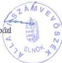

TSZ: 594

Állami Számvevőszék

# JELENTÉS

az Országos Szlovén Önkormányzat
pénzügyi-gazdasági tevékenységének
vizsgálatáról

2002. január

---

Az ellenőrzés végrehajtásáért felelős:
V. Önkormányzati és Területi Ellenőrzési Igazgatóság

dr. Lóránt Zoltán

számvevő igazgató

Az ellenőrzést vezette:

dr. Sallai Antal

régióvezető főtanácsos

Az ellenőrzést végezte

dr. Gyuk József

számvevő tanácsos, főtanácsadó

Az ÁSZ által a témában eddig készített jelentések:

A Szlovén Országos Kisebbségi Önkormányzat pénzügyi-gazdasági
tevékenységének vizsgálata (1019/1995.)

A Szlovén Országos Kisebbségi Önkormányzat pénzügyi-gazdasági
tevékenységének vizsgálata (1008/1997.)

Jelentéseink az Országgyűlés számítógépes hálózatán
és az Interneten a www.asz.hu címen is olvashatók, továbbá a Belügyminisztérium
folyóirata, az "Önkormányzati Tájékoztató" rendszeresen közli, valamint a Megyei
Közigazgatási Hivatalvezetők részére is átadásra kerül.

---

V-1013-30/2001-2002.

# TARTALOMJEGYZÉK

|  **I. ÖSSZEGZŐ MEGÁLLAPÍTÁSOK, KÖVETKEZTETÉSEK, JAVASLATOK** | **4**  |
| --- | --- |
|  **II. RÉSZLETES MEGÁLLAPÍTÁSOK** | **4**  |
|  1. a feladatellátás szervezettsége, szabályozottsága | 4  |
|  1.1. Általános ismeretek a szlovén kisebbségről, az Országos Szlovén Önkormányzat kapcsolatrendszere | 4  |
|  1.2. A szervezeti és működési rend alakulása | 5  |
|  1.3. A költségvetés, zárszámadás, vagyonleltár megállapításának szabályozottsága | 6  |
|  1.4. A működés szervezeti feltételrendszere | 6  |
|  2. Az önkormányzat működésének, a gazdálkodás rendjének szabályszerűsége | 7  |
|  2.1. A működés tárgyi feltételeinek alakulása | 7  |
|  2.2. Az egyszeri vagyonjuttatásként kapott részvények hasznosítása | 8  |
|  2.3. A gazdálkodási tevékenység személyi és tárgyi feltételei | 8  |
|  2.4. A gazdálkodás folyamatainak szabályozottsága | 9  |
|  2.5. A gazdálkodási jogkörök szabályozottsága | 9  |
|  2.6. Vállalkozási tevékenység | 10  |
|  3. A beszámolási kötelezettség teljesítése, a költségvetés készítése és végrehajtása | 10  |
|  3.1. A könyvvezetési kötelezettség | 10  |
|  3.2. Az éves költségvetések | 10  |
|  3.3. A költségvetések végrehajtása | 11  |
|  3.4. A gazdasági események bizonylati alátámasztottsága | 12  |
|  3.5. A vagyongazdálkodás szabályozottsága, vagyonvédelem | 12  |
|  3.6. Éves beszámolási kötelezettség | 13  |
|  3.7. Az éves zárszámadások | 14  |
|  4. Az önkormányzat ellenőrzési rendszere | 15  |
|  4.1. Az ellenőrzés szabályozottsága | 15  |
|  4.2. A belső ellenőrzés | 15  |
|  4.3. A lefolytatott ellenőrzések tapasztalatai | 15  |
|  5. A korábbi számvevőszéki ellenőrzések javaslatainak hasznosulása | 15  |

1

---

,

,

---

# JELENTÉS

## az Országos Szlovén Önkormányzat pénzügyi-gazdasági tevékenységének vizsgálatáról

Az Állami Számvevőszékről szóló 1989. évi XXXVIII. törvény 2. § (5) bekezdése alapján ellenőriztük az országos kisebbségi önkormányzatoknál az állami költségvetésből juttatott támogatások felhasználását.

A nemzeti és etnikai kisebbségek jogairól szóló 1993. évi LXXVII. törvény (továbbiakban: Nek tv.) szabályozza az országos kisebbségi önkormányzatok létrehozásának rendjét, azok feladat- és hatásköreit.

Az Állami Számvevőszék 1995. és 1997. évben témavizsgálat keretében ellenőrizte az országos kisebbségi önkormányzat pénzügyi, gazdasági tevékenységét.

A vizsgálat az országos kisebbségi önkormányzatok 1999. és 2000. évi és 2001. első félévi gazdálkodására terjedt ki, egyes esetekben – a székházjuttatási folyamat és egyszeri vagyonjuttatás hasznosulása – a korábbi vizsgálat óta eltelt teljes időszakot áttekintettük.

**Az ellenőrzés célja:** annak megállapítása volt, hogy

- az országos kisebbségi önkormányzat működési feltételrendszere hogyan változott a vizsgált időszakban,
- a gazdálkodás szervezettsége, szabályszerűsége mennyiben felel meg a jogszabályi követelményeknek és az önkormányzati működés sajátosságainak,
- biztosított-e a gazdálkodás és a pénzeszközök felhasználásának törvényessége és szabályszerűsége, a számviteli törvény és a vonatkozó kormányrendeletek előírásainak betartása.

3

---

I. ÖSSZEGZŐ MEGÁLLAPÍTÁSOK, KÖVETKEZTETÉSEK, JAVASLATOK

# I. ÖSSZEGZŐ MEGÁLLAPÍTÁSOK, KÖVETKEZTETÉSEK, JAVASLATOK

Az önkormányzat működési feltételei mind anyagi-technikai, mind pénzügyi tekintetben javultak; ez egyértelműen a növekvő költségvetési támogatással illetőleg a vagyonjuttatásként kapott részvénycsomag értékesítéssel elért bevétellel függ össze.

Az önkormányzat működésének és gazdálkodásának írásos szabályozása az érvényes jogszabályi előírásoknak összességében megfelel, alkalmas a törvényes és szabályszerű működés biztosítására. Hibaként állapítható meg, hogy a szabályozók az előző ÁSZ ellenőrzést követően nem kerültek kellően átdolgozásra, összhangjuk nem teljes; az SZMSZ bemutatott – javított – változatát közgyűlési döntés (határozat) nem támasztja alá.

Az önkormányzat tényleges működése sok tekintetben eltér a belső (írásos) szabályozástól, a legfontosabb szabályzat, az SZMSZ érvényesülését tekintve különösen, s ennek okaként a Közgyűlés bizonyos mértékű, ilyen irányú érdeklődésének, ellenőrző-beszámoltató tevékenységének hiánya jelölhető meg.

**A vizsgálat megállapításai alapján javasoljuk a közgyűlésnek, hogy**

1. Határozza meg az SZMSZ és mellékletei érvényes, hivatalos szövegét. E munka során a jelentésben említett belső ellentmondások megszüntetésére valamint más közgyűlési határozatokkal (kötelezettségvállalás) való összhang biztosítására különös figyelmet szükséges fordítani.
2. Biztosítsák az SZMSZ szerinti működést az önkormányzat szervei (beleértve hivatalát is); ezt a közgyűlés két egymást követő évben külön napirend keretében tekintse át.
3. A szabályzatok és az SZMSZ közötti teljes összhangot a jóváhagyó biztosítsa.

## II. RÉSZLETES MEGÁLLAPÍTÁSOK

### 1. A FELADATELLÁTÁS SZERVEZETTSÉGE, SZABÁLYOZOTTSÁGA

#### 1.1. Általános ismeretek a szlovén kisebbségről, az Országos Szlovén Önkormányzat kapcsolatrendszere

Az önkormányzat a Magyarországon élő szlovén nemzeti kisebbség mintegy 5000 főt számláló, részben egy tömbben élő csoportját képviseli. A Szentgotthárdon és 6 környező településen kívül Szombathelyen, Mosonmagyaróváron és a főváros egyik kerületében választottak szlovén helyi kisebbségi önkormányzatot (képviselőik az országos önkormányzat elnökségét adják);

4

---

II. RÉSZLETES MEGÁLLAPÍTÁSOK

Az önkormányzat a szlovén kisebbség magyarországi létszámát a legutóbbi népszámlálás adatainak közzétételéig csak becsülni tudja.

Az önkormányzat a magyarországi szlovénség életkörülményeit lényegében a teljes lakossággal azonosnak ítéli, bár ilyen jellegű konkrét felméréssel, információkkal nem rendelkezik; az elmúlt 11 évben azonban érezhetően javultak az életkörülmények e népességcsoportban is.

A helyi kisebbségi önkormányzatokkal, a Magyarországi Szlovének Szövetségével, a többi, országos kisebbségi önkormányzattal az együttműködésre írásban kötött megállapodás nincs, de a kapcsolattartás rendszeres.

A Szlovén Köztársaság Magyarországgal határos részén működő helyi önkormányzatok közül 6 önkormányzattal van írásos együttműködési megállapodása az önkormányzatnak, (szlovén nyelven) e 6 szlovén önkormányzat mintegy 50 szlovéniai települést képvisel.

## 1.2. A szervezeti és működési rend alakulása

A 6/1995. közgyűlési határozattal elfogadott SZMSZ az eltelt idő alatt módosítva nem lett, az ellenőrzésnek bemutatott szövege hivatali változtatások eredménye.

Az önkormányzat és szervei működési rendje a bemutatott SZMSZ és mellékletei alapján a következő:

- A közgyűlés évente 4 alkalommal tart rendes ülést vagy ülésszakot, az elnökség hívja össze. Jegyzőkönyv vezetése kötelező, a döntések határozatba foglalandók. A közgyűlés éves munkaterv alapján dolgozik. Szóbeli előterjesztés csak kivételes esetben, külön döntés alapján lehetséges.

Az ellenőrzött időszakban éves munkaterv közgyűlési elfogadására ill. annak megfelelő működésre nem került sor.

A közgyűlés feladat- és hatásköre az SZMSZ 2. sz. mellékletében tételesen is szabályozott.

- Az Elnökség (10 fő) szükség szerint, de legalább havonta ülésezik, az elnök összehívására. Előterjesztés szóban is lehet, jegyzőkönyv vezetése kötelező, döntések határozatként fogalmazandók meg.

Az SZMSZ II. fejezet 4. pontja szerint 11 tagú az elnökség (elnök, 2 alelnök, 8 település kisebbségi önkormányzatának 1-1 képviselőjéből áll.

Az elnökség feladat- és hatáskörét az SZMSZ 3. sz. melléklete tételesen tartalmazza.

- Az önkormányzat 2 állandó bizottságot választott. Évente 2 alkalommal rendes ülést tartanak, határozatképességhez valamennyi tag jelenléte szükséges.

5

---

II. RÉSZLETES MEGÁLLAPÍTÁSOK---

Előírás hogy, a bizottság munkájáról évente írásban beszámol a közgyűlésnek, ilyen beszámolót a vizsgált időszakra nézve a hivatal az ellenőrzésnek bemutatni nem tudott.

A Bizottságok feladat- és hatáskörét az SZMSZ 5. sz. melléklete tartalmazza részletesebben.

Az SZMSZ tartalmazza továbbá az elnök, az önkormányzat hivatala feladatait, az önkormányzat külkapcsolati feladatait, a vagyongazdálkodási kérdésekkel kapcsolatos előírásokat, valamint a felelősségi és összeférhetetlenségi szabályokat.

### 1.3. A költségvetés, zárszámadás, vagyonleltár megállapításának szabályozottsága

Az éves költségvetés megállapítása, a zárszámadás elfogadása az SZMSZ 2. sz. melléklet 2.2. pontja szerint közgyűlési hatáskör.

A vagyonnal való rendelkezési jog, a vagyonkezelés ugyanezen melléklet 4-5. pontjai szerint ugyancsak közgyűlési hatáskör.

A vagyonleltár megállapításával, törzsvagyon meghatározásával az SZMSZ és mellékletei nem foglalkoznak tételesen; mivel azonban ezek a Nemzeti és Etnikai Kisebbségekről szóló 1993. évi LXXVII. tv. (továbbiakban: NEK tv.) 35-37. §-ában önkormányzati feladatként meghatározottak, az SZMSZ 2. sz. melléklet 17. pontja hivatkozik e paragrafusra, a feladat meghatározása az SZMSZ-ben közvetve megállapítható.

Az önkormányzat egyik említett feladatát sem látja el, vagyonleltárt nem szokott megállapítani, törzsvagyon nem határozott meg. (A gazdálkodási feladatok ellátásának szabályzata viszont tartalmazza azt, hogy az önkormányzatnak törzsvagyona nincs.)

### 1.4. A működés szervezeti feltételrendszere

Az önkormányzat feladatai ellátására az előző vizsgálatkor is meglevő szervezeti feltételekkel rendelkezik. A közgyűlés változatlanul 21 tagú, az elnökség 10 főre bővült. A közgyűlés 2 bizottságot választott (Pénzügyi Ellenőrző Bizottság, továbbiakban: PEB, Oktatási és Közművelődési Bizottság); a közgyűlésnek van hivatalnak nevezett egysége (1 fővel) valamint Budapesten a szükséges országgyűlési stb. kapcsolatok biztosítása érdekében 1 fős kirendeltsége.

E kirendeltség létjogosultsága az SZMSZ-ben azonban változatlanul nem található.

Az SZMSZ 2. sz. melléklete a közgyűlés feladat- és hatáskörét szabályozva egyebek mellett a nemzeti kisebbséggel kapcsolatos speciális kérdéseként a következőket rögzíti:

- Véleménynyilvánítás a szlovén kisebbséget érintő jogszabályok tervezetéről (megyei rendeletek is).

---6

---

II. RÉSZLETES MEGÁLLAPÍTÁSOK

- Véleménykérés a szlovén kisebbség csoportjait érintő kérdésekben közigazgatási szervektől, ill. ezek részére javaslattétel vagy intézkedés tételének kezdeményezése.
- Az illetékes állami szervekkel közreműködés a szlovén anyanyelvi oktatás szakmai ellenőrzésében.
- Pályázatok kiírása és ösztöndíjak alapítása.
- Külső szervezetekbe tisztségviselő delegálása és visszahívása.
- Minden olyan döntés meghozatala, amelyet jogszabály vagy jelen Szervezeti és Működési Szabályzat a Közgyűlés hatáskörébe utal.
- A NEK tv. 37-39. §-ban megnevezett hatáskörök, ha azt jelen szabályzat nem utalja más szerv hatáskörébe.

E feladatokon túl további, általános feladatmegjelölést az I. fejezet 7. pontja tartalmaz. „A magyarországi szlovének érdekeinek képviselete, erre vonatkozóan döntések meghozatala, a meghozott döntések végrehajtásának ellenőrzése, egyezően 1993. évi LXXVII. tv. 35-37. §-aival.”

Az önkormányzat intézményt nem alapított.

Az önkormányzat pályázatot nem írt ki, ösztöndíjat nem alapított.

## 2. AZ ÖNKORMÁNYZAT MŰKÖDÉSÉNEK, A GAZDÁLKODÁS RENDJÉNEK SZABÁLYSZERŰSÉGE

### 2.1. A működés tárgyi feltételeinek alakulása

Az önkormányzat működésének tárgyi feltételei az előző ÁSZ vizsgálat óta némileg javultak. Az elhelyezés 2 (iker) lakás (először a jobb oldali, 89,2 m2-es, majd a bal oldali) kincstári vagyoni igazgatóság által történő használatba adásával, felújításával megoldott; változatlan a budapesti kirendeltség elhelyezése (Budapest VII. Rumbach Sebestyén u. 12. III/1., 99 m2), az országos székházhoz hasonló konstrukcióval.

A berendezési, felszerelési tárgyak továbbá jármű tekintetében legjelentősebb változás az ajándékba kapott Renault személygépkocsi 1999. évi cseréje.

A vizsgált időszakban sor került számítógépek, bútorok, fénymásoló, hűtőszekrény beszerzésére, így ma a berendezési tárgyak terén a technikai háttér kielégítőnek ítélhető.

Javult a hírközlés technikai eszközrendszere is az ISDN távbeszélő hálózatra való csatlakozással, az interneten való megjelenés lehetőségével.

7

---

II. RÉSZLETES MEGÁLLAPÍTÁSOK

## 2.2. Az egyszeri vagyonjuttatásként kapott részvények hasznosítása

A NEK tv. 63. § /4/ bekezdése alapján az önkormányzat egyszeri vagyonjuttatásként 8.813 e Ft névértékű (15 millió Ft juttatáskori árfolyam értékű) MOL részvényt kapott.

A részvénycsomag hozama az egyes években a folyamatos értékesítés miatt csökkenő:

|  1998. év (1997. év után) | 625 e Ft  |
| --- | --- |
|  1999. év (1998. év után) | 595 e Ft  |
|  2000. év (1999. év után) | 248 e Ft  |

A részvények értékesítése 1998-2000. években történt:

|   | Névérték | Elért ár  |
| --- | --- | --- |
|   | e Ft  |   |
|  1998. | 2.200 | 12.998  |
|  1999. | 700 | 4.190  |
|  2000. | 5.913 | 29.582  |
|  Együtt | 8.813 | 46.670  |

Az értékesítés a részvénycsomagot kezelő CODEX Rt-n keresztül, a tőzsdei árfolyamok folyamatos figyelése mellett történt. Az elért eladási ár (csökkentve természetesen a közreműködő költségével) részben működésre került felhasználása, részben befektetést valósított meg belőle az önkormányzat (lásd később).

## 2.3. A gazdálkodási tevékenység személyi és tárgyi feltételei

Az önkormányzat gazdálkodásának szervezeti keretei, megoldása, belső szabályozásai részben ellentmondanak egymásnak.

Az SZMSZ IV. fejezete szerint az adminisztrációs és pénzügyi feladatokat az önkormányzat hivatala látja el. A hivatalt a hivatalvezető vezeti, aki munkáltatói jogokat gyakorol a hivatal dolgozói felett. A hivatalvezető felett a munkáltatói jogokat az elnök gyakorolja, a hivatalvezetőt azonban a közgyűlés nevezi ki, határozatlan időre.

A gyakorlatban a hivatalnak közgyűlés által kinevezett vezetője nincs, alkalmazottainak száma mindössze 1 fő.

Az önkormányzat a könyvelési feladatokat külső könyvelő cég megbízásával látja el.

8

---

II. RÉSZLETES MEGÁLLAPÍTÁSOK

A saját szervezetű feladatellátás a jelenlegi 1 fő létszám mellett nem reális. A pénzügyi-gazdasági teendőkkel részben foglalkozó hivatali dolgozó gimnáziumi érettségivel és középfokú számviteli ügyintézői képesítéssel rendelkezik.

## 2.4. A gazdálkodás folyamatainak szabályozottsága

A hivatal a gazdálkodás rendjét meghatározó legfontosabb belső szabályzatokkal rendelkezik.

A Számlarend és mellékletei:

- Kiküldetési költségelszámolás szabályai
- Gazdálkodási feladatok ellátásának szabályai
- Házi pénztár kezelési szabályzat

E szabályzatokon a számviteli törvény és annak végrehajtására kiadott kormányrendelet változásait nem vezették át.

## 2.5. A gazdálkodási jogkörök szabályozottsága

A gazdálkodási jogkörök szabályozása ugyancsak nem egy szabályzatban található, s esetenként ellentmondóak a szabályok.

- A kötelezettségvállalás általános szabálya a gazdálkodási feladatok ellátásának szabályai között 50 e Ft értékhatárig elnöki jogkört rögzít. Az e határ feletti összegeket illetően e szabályzat nem ad eligazítást.

Az előbb említett szabályozás a 4/1995. közgyűlési határozattal konform.

A 8/1995. sz. közgyűlési határozat rendelkezik az 50 e Ft feletti kötelezettségvállalásokról: 50-300 e Ft között az elnökség, 300 e Ft felett a közgyűlés a kötelezettségvállaló.

A 6/1995. sz. közgyűlési határozattal elfogadott SZMSZ 4. melléklet 1. pontja szerint az elnökség (többek között) pályázatok, támogatások elbírálásánál 200 e Ft-ig kötelezettségvállaló. Ez egyik előbb említett közgyűlési határozattal sincs összhangban.

Az SZMSZ 3. sz. melléklete (az elnök feladat- és hatásköre) elnöki kötelezettségvállalási jogkörről nem szól.

A kötelezettségvállalások gyakorlatának előbbiekből is adódó vegyes voltára néhány példa:

A PEB 2000. 04. 29-i jegyzőkönyve állásfoglalást tartalmaz támogatások közgyűlés elé való terjesztésére; a támogatások között 30-50 e Ft összegű tételek is vannak, amelyek egyetlen ismertetett belső szabályzat szerint sem tartoznak közgyűlési hatáskörbe.

Az 1/2000. sz. elnökségi határozatban 250 ill. 300 e Ft összegű támogatások kifizetése került engedélyezésre, ez nem az elnökség hatásköre az idézett SZMSZ hatásköri jegyzék szerint, hanem a közgyűlésé.

9

---

II. RÉSZLETES MEGÁLLAPÍTÁSOK

A 9/1999. közgyűlési határozat 200-200 e Ft támogatást engedélyezett iskolák részére, az SZMSZ hatásköri jegyzéke szerint ez elnökségi hatáskör lett volna.

- A kötelezettségvállalás ellenjegyzési rendjének szabályai helyesek (ugyancsak a gazdálkodási feladatok ellátásának szabályzatában rögzítettek).
- Ugyancsak e szabályzat határozza meg az érvényesítés fogalmát, tartalmát, s azt, hogy minden esetben a pénzügyi-gazdasági előadó végzi, éspedig az okmányra vezetett záradékkal. (Gyakorlatának hiányát lásd a jelentés 3.4. pont alatt.)
- Az utalványozás és ellenjegyzése rendje ugyancsak meghatározott, a jogosultak beosztásának megjelölésével, utalványrendelet alkalmazásával való gyakorlat az előírt. (Hiányát lásd 3.4. pont alatt.)

## 2.6. Vállalkozási tevékenység

Az önkormányzat SZMSZ-e illetőleg Számlarendje szerint vállalkozási tevékenységet nem végez; ilyen tevékenységre utaló adatot a számvevőszéki ellenőrzés sem talált.

Az önkormányzat 1997-ben részt vett egy KHT alapításában: a Szlovén Rádiók Szolgáltató KHT alapítói a Szentgotthárd-Rábatótfalui Szlovén Helyi Kisebbségi Önkormányzat, a Magyarországi Szlovénok Szövetsége, valamint az Országos Szlovén Kisebbségi Önkormányzat. Az 1 millió Ft-os alapítói vagyonból az önkormányzat részaránya 40 % volt (cégbejegyzés:18-14-0000/1/2/1997.) Tekintettel arra, hogy a frekvencia engedélyezésnek az egyszemélyes tulajdon feltétele volt, a két másik tulajdonos lemondásával (kiválásával) az önkormányzat egyedüli tulajdonosi bejegyzésére már ugyanabban az évben sor került.

A közgyűlés 2000. évben adott 5 millió Ft-os támogatásából a KHT törzsbetét emelést is végrehajtott, jelenleg ez 3 millió Ft. A felügyelő bizottság összetétele a cégbírósági végzésekben megjelölt, a cégnek könyvvizsgálója van.

## 3. A BESZÁMOLÁSI KÖTELEZETTSÉG TELJESÍTÉSE, A KÖLTSÉGVETÉS KÉSZÍTÉSE ÉS VÉGREHAJTÁSA

### 3.1. A könyvvezetési kötelezettség

Az önkormányzat egyszeres könyvvitelt választva regisztrálja pénzügyi folyamatait. A Számlarendben rögzített könyvvezetési mód összhangban van a számvitelről szóló 1991. évi XVIII. tv. és a 219/1998. (XII.30.) Korm. rendelet, valamint a számvitelről szóló 2000. évi C. törvény és a 224/2000. (XII.19) Korm. rendelet előírásaival.

### 3.2. Az éves költségvetések

Az éves költségvetések elfogadása az SZMSZ szerint a közgyűlés hatáskörébe tartozik (SZMSZ 2. sz. melléklet 2. pont).

10

---

II. RÉSZLETES MEGÁLLAPÍTÁSOK

A költségvetés tervezetének előkészítése, összeállítása az SZMSZ 5. sz. melléklet 2. pontja szerint a PEB feladata.

Az 1999-2001. évek költségvetéseinek megállapítása közgyűlési határozattal történt (2/1999. /V. 31./, 4/2000. /IV. 29./; 4/2001. /III. 30./ sz. határozatok).

A PEB előkészítő – összeállító tevékenységének mibenléte bizottsági jegyzőkönyvek alapján nem rekonstruálható: a vizsgált időszakra vonatkozóan bemutatott 2 PEB – és 1 elnökségi és PEB együttes ülési jegyzőkönyv nem tartalmaz erre nézve sem konkrét munka megjelölést, sem az előkészítés befejezését jelentő, a munkafázisról való véleményalkotást megfogalmazó határozatot.

### 3.3. A költségvetések végrehajtása

Az önkormányzat bevételei a vizsgált időszakban a következő forrásokból adódtak: (%)

|  Megnevezés | 1999. év | 2000. év  |
| --- | --- | --- |
|  költségvetési támogatás | 71,9 | 39,5  |
|  részvény értékesítés | 15,2 | 53,5  |
|  pénzmaradvány | 9,0 | 5,5  |
|  saját bevétel | 2,6 | 1,0  |
|  pályázatok | 1,3 | 0,5  |
|  Együtt: | 100,0 | 100,0  |

A két év részvényértékesítési bevételeit leszámítva látható, hogy az önkormányzat forrásai alapvetően a költségvetési támogatásból származnak. A pályázati forrás rendkívül minimális.

A kötelezettségvállalások pénzügyi fedezete globálisan biztosított volt (minden évben keletkezett pénzmaradvány): az egyes kiadási nemek tekintetében az előirányzatok tervezett összege az év során változatlan maradt. Ebből adódóan a kiadások teljesítése rész összetevőket tekintve esetenként eltér a költségvetésben meghatározottól.

A bevételek és kiadások alakulását az 1-2. sz. mellékletek összegszerűen bemutatják.

Az önkormányzat pénzügyi egyensúlya a vizsgált időszakban stabil volt.

Az adott támogatások alakulása az alábbi:

|  Támogatott szervezetek | 1999. év (%) | 2000. év (%)  |
| --- | --- | --- |
|  Általános iskolák | 57,0 | 21,0  |
|  Művészeti együttesek |  | 8,0  |
|  Helyi kisebbségi önk. szlovén egyesületek | 7,0 | 7,0  |
|  Szlovén Rádió KHT | - | 47,0  |
|  Egyéb (nyugdíjas klubok, árvízkárosultak, „füstös ház” stb. | 36,0 | 17,0  |
|  Együtt: | 100,0 | 100,0  |

11

---

II. RÉSZLETES MEGÁLLAPÍTÁSOK

Az adott támogatások felhasználásáról elszámolást nem kérnek. (Esetenként „önkéntes” elszámolás előfordul.)

Az egyes feladatokra (a működés hivatali ill. testületi céljára pályázati pénzek felhasználása stb.) teljesített kiadások elkülönített számvitelére nem kerül sor az önkormányzatnál; az ilyen megoszlású adatok előállítása kigyűjtéssel történt.

### 3.4. A gazdasági események bizonylati alátámasztottsága

A bevételek és kiadások bizonylatolása színvonalának, szabályszerűségének megítélése érdekében az ellenőrzés áttekintette az 1999. január, március, a 2000. október, december és a 2001. május, június havi banki és készpénz bizonylati anyagot. Az ellenőrzés során megállapításra került, hogy az elszámolt pénzforgalom alapdokumentumai (számlák, nyugták stb.) a hivatalban rendelkezésre állnak. A házipénztári pénzforgalom okmányai bevételi ill. kiadási pénztárbizonylatokkal felszereltek, a pénztárjelentés rendben vezetett. Az említett pénztárbizonylati tömbök szigorú számadású nyomtatványként kezeltek, ugyancsak ilyen a készpénzfelvételre szolgáló csekkfüzet is.

A banki (OTP) pénzforgalom dokumentációjának kezelését illetően megjegyzi az ellenőrzés, hogy a 2000. évi és a 2001. I. félévi bizonylati anyag és OTP számla-kivonatok ömlesztett állapota hátráltatta az ellenőrzést, mert a kiválasztott hónapok anyagát először rendeznie kellett a Hivatalnak.

Az alapbizonylatok felszereltségét, a pénzügyi folyamat dokumentáltságát illetően negatív tapasztalata az ellenőrzésnek, hogy

- a gazdálkodás rendjét rögzítő belső szabályozás ellenére nincs érvényesítés, ami a szabályzat szerint a számlára vezetett érvényesítési záradékban kellene, hogy megjelenjen;
- utalványozás és ellenjegyzése a banki pénzforgalomban ugyancsak hiányzik, pedig a belső szabályzat előírja.

Az utalványozás elmaradását a hivatal azzal magyarázta, hogy a banki megbízások cégszerű aláírását tekintette utalványozásnak.

### 3.5. A vagyongazdálkodás szabályozottsága, vagyonvédelem

A vagyongazdálkodásra vonatkozóan az SZMSZ VII. fejezete annyit rögzít, hogy a tulajdonnal való rendelkezés kizárólagos joga a közgyűlést illeti.

A vizsgált időszakban a közgyűlés legjelentősebb tulajdona az egyszeri vagyonjuttatásként kapott MOL részvénycsomag volt, amelynek folyamatos értékesítését követően a fel nem használt bevételből 22 millió Ft-ot az önkormányzat 2000. évben befektetett: az AB-AEGON Általános Biztosító RT. „Aranyforint 2000. Élet- és balesetbiztosítás” konstrukciójába, 3 éves lejáratra. (A közgyűlésen a cég részéről évi 18,8 % hozamot ígértek.)

A részvény értékesítés illetőleg az új befektetés közgyűlési állásfoglalások után történt, de a témákat tárgyaló közgyűlés során nem minden esetben hoztak ha-

12

---

II. RÉSZLETES MEGÁLLAPÍTÁSOK

tározatot (illetőleg teljesen pontos határozatot) szándékolt döntésükről az ülés résztvevői. Így:

- 1998-ban 1200 db részvény értékesítésére került sor alaki határozat meghozatala nélkül;
- 1999-ben 700 db részvény értékesítésével kapcsolatban ugyanez állapítható meg;
- az utoljára megmaradt részvénycsomag értékesítésével illetőleg árának befektetésével foglalkozó közgyűlési határozat (6/2000.) „az Országos Szlovén Önkormányzat Közgyűlése jóváhagyja a MOL-Részvények eladását és más formába történő befektetését” szövegrészből egyáltalán nem világos, hogy a közgyűlés a megvalósult befektetési formát hagyta jóvá, azaz hogy az ülésen tárgyalt ÁB-AEGON biztosítási forma mellett döntött.

Az egyéb önkormányzati vagyon körében legjelentősebb a személygépkocsi, a jelenlegi 1999. évi vásárlás (3.050 e Ft), a korábbi – ajándékként kapott – gépkocsi becsült értéke leszámításával az önkormányzat 2.850 e Ft kiadást számolt el, ezzel van összhangban analitikus nyilvántartása is. A gépkocsi cserével kapcsolatban a vizsgálat kifogásolta, hogy:

- a régi személygépkocsi értékbecslését a Hivatal bemutatni nem tudja; az új számlából leszámított 200 e Ft értékbecsléssel való azonossága tehát nem igazolt;
- a csere pénzügyi elszámolása sérti a bruttó elszámolás elvét (a számviteli törvény 15. § /10/ bek.), mert a használt gépkocsi áraként bevételt nem számolt el a Hivatal, azt az új kocsi árából levonva számolt el tényleges kiadást.

### 3.6. Éves beszámolási kötelezettség

Az önkormányzat számlarendje az egyszerűsített éves beszámoló készítését írja elő.

Az említett beszámolókat a számvevőszéki ellenőrzés a helyszínen nem találta, azokat a könyvelést végző Kft-től kellett megkérni. A beszámolókat a Számviteli törvény szerint az önkormányzatnak kell megőrizni ill. jóváhagyni (lásd 3.7. pont is).

A számlarend foglalkozik a leltározási tevékenységgel, s első ízben elvégzendőként 1999. évre rögzít teljes körű mennyiségi felvétellel való leltározási kötelezettséget (amely azután ötévente feladat).

A vizsgált időszakban (1999-2001. I. félév) ilyen leltározás nem volt; s nem volt egyeztetéssel megvalósított, egyébként a Számlarendben évente elvégzendőnek előírt leltározás sem. Nem készültek az analitikus nyilvántartásokból leltárszerű kivonatok, melyek a mérleg adatait alátámaszthatnák.

Az ellenőrzés az 1999. és 2000. évi mérlegadatok analitikus nyilvántartásokkal való egyezőségét is vizsgálta. Megállapítások:

13

---

II. RÉSZLETES MEGÁLLAPÍTÁSOK

- A tárgyi eszközök analitikus nyilvántartásában szereplő nettó értékek egyezők a mérlegek adataival. Helytelen értékcsökkenés-elszámolási gyakorlat tapasztalható a képzőművészeti alkotások körében: az önkormányzat tulajdonában lévő 100 e Ft bruttó értékű festmény után folyamatosan értékcsökkenési leírás kerül elszámolásra (14,5 %), ami az Számviteli törvény 37. §-ával ellentétes gyakorlat.
- A befektetett eszközök között nem szerepel egyik évben sem az önkormányzat által alapított KHT 3 millió Ft összegű törzstőkéje és az 1999. évi mérlegben nem szerepel az egyszeri vagyonjuttatásból (MOL részvények) az év végén még meglévő 5.913 e Ft névértékű részvénymennyiség (átvételkori árfolyam értéke 10.064 e Ft).

A vagyonjuttatásként kapott részvénymennyiség egyébként korábban sem szerepelt az önkormányzat vagyonnyilvántartásában.

- A MOL részvények értékesítéséből 2000. évben befolyt összeg terhére biztosításba fektetett 22 millió Ft a 2000. évi mérlegben ugyancsak nem szerepel a befektetett pénzügyi eszközök között, arról analitikus nyilvántartás nincs.
- Követelésként 2000. évi mérlegben szereplő tétel beszerzési előleg, a fővárosi kirendeltségnél állt fenn.
- A mérlegek passzív elszámolásairól analitikus nyilvántartás (kivonat) a hivatalnál nem áll rendelkezésre.

A külső könyvelő cég és az önkormányzat számviteli tevékenységet ellátó dolgozója között folyamatos egyeztetés nincs.

### 3.7. Az éves zárszámadások

Az éves zárszámadások közgyűlés elé való terjesztése a vizsgált időszakban írásban megtörtént, a közgyűlés a zárszámadásokat határozattal fogadta el (5/2000. /IV. 29./ és 2/2001. /III. 30./ sz. határozatok).

Az SZMSZ előírásai szerint a zárszámadást a költségvetéssel összehasonlítható szerkezetben március 31-ig kell előterjeszteni. E közül az elsőként említettnek megfelelnek az előterjesztések (bevételek forrásonként, kiadások a költségvetési gazdálkodásból átvett kiemelt előirányzatoknak megfelelő bontásban, s ezen belül további részletezésben is); a határidőt illető követelmény azonban csak a 2000. évi zárszámadással kapcsolatban teljesült.

Az SZMSZ 5. sz. melléklete 2. pontja szerint a PEB feladata a zárszámadás előkészítése, véleményezése. A vélemény döntés, tehát alaki határozatot igénylő aktus, ilyent azonban az adott témában a hivatal jegyzőkönyvileg bemutatni nem tudott. A bemutatott 2 db 2000. évi PEB jegyzőkönyv szerint ezeken az üléseken zárszámadással nem foglalkozott a bizottság, a 2001. évre vonatkozóan bemutatott, elnökséggel közösen tartott ülés jegyzőkönyve pedig a zárszámadásról nem tartalmaz határozatot.

Az önkormányzat az egyszerűsített éves beszámolót nem terjesztette a közgyűlés elé.

14

---

II. RÉSZLETES MEGÁLLAPÍTÁSOK

## 4. AZ ÖNKORMÁNYZAT ELLENŐRZÉSI RENDSZERE

### 4.1. Az ellenőrzés szabályozottsága

Az SZMSZ I. fejezet 7. pont utolsó bekezdése szerint a meghozott döntések végrehajtásának ellenőrzése az önkormányzat általános feladatai közé tartozik. A PEB feladat- és hatáskörét 5. sz. mellékletként tartalmazza az SZMSZ. Ebben ugyan szószerinti ellenőrzési feladat nem került megfogalmazásra, de a költségvetés és zárszámadás előkészítésének és véleményezésének feladata, a leltározásban való részvétel, az értékpapírok értékesítési javaslatainak kidolgozása kétségtelenül kell, hogy tartalmazzon ellenőrzési tevékenységet.

A közgyűlés által alapított egyetlen külső szervezet, az említett KHT, Felügyelő Bizottsági tagjaként történt delegálás ugyancsak ellenőrzési teendővel kapcsolatos, bár ezekkel ill. a beszámoltatás rendjével az SZMSZ még nem foglalkozott.

### 4.2. A belső ellenőrzés

A Hivatal belső ellenőrzési rendje írásban rögzített, ha nem is egyetlen szabályozásban. A kötelezettségvállalás, érvényesítés, utalványozás, az ellenjegyzések rendje szabályozott, helyesen szabályozottak a legfontosabb számviteli teendők (könyvviteli zárlat, leltározás, beszámolás).

A belső ellenőrzési rendszer működése a szabályozás alapvetően helyes volta mellett sem kifogástalan; ennek okaként a gazdálkodási kérdéseket illetően kétségtelenül meglevő viszonylagos elszigeteltség mellett az ellenőrzés iránti igény hiánya jelölhető meg. Ez döntően az SZMSZ-ben rögzített ellenőrzéssel kapcsolatos feladat- és hatáskörök be nem tartásából, számonkérésének hiányából adódik.

### 4.3. A lefolytatott ellenőrzések tapasztalatai

Az önkormányzat az általa létrehozott KHT-t ellenőrzési program alapján még nem ellenőriztette, a felügyelő bizottságba delegált képviselő rendszeres beszámoltatásának gyakorlata még nem alakult ki. E megállapítások mellett azonban tapasztalható érdeklődés az önkormányzat részéről a KHT helyzete iránt: ez elsősorban a szakmai tevékenység kívánt terjedelmének (műsoridő), illetőleg a működtetés pénzügyi feltételeinek (támogatások) kérdéseivel kapcsolatos. Meg kell jegyezni, hogy a KHT éves beszámolójának közgyűlés általi megtárgyalásának gyakorlata (mint egyfajta ellenőrzési lehetőség) sem alakult még ki.

## 5. A KORÁBBI SZÁMVEVŐSZÉKI ELLENŐRZÉSEK JAVASLATAINAK HASZNOSULÁSA

Az 1997. évben végzett ÁSZ ellenőrzés által javasolt intézkedések végrehajtásának áttekintése illetőleg az egyes vizsgálati programpontokkal összefüggésben tapasztaltak azonos vonatkozásai összevetése nyomán a következők rögzíthetők:

15

---

II. RÉSZLETES MEGÁLLAPÍTÁSOK

- Az SZMSZ javasolt módosítására, kiegészítésére nem került sor, a közgyűlés az SZMSZ jóváhagyásával foglalkozó 6/1995. sz. határozatát nem módosította. Az SZMSZ hiányzó mellékletei elkészültek ugyan, néhány szövegmódosítást is eszközölt a hivatal, ezek azonban közgyűlési határozattal nem kerültek megerősítésre.
- A gazdálkodás vitelét meghatározó szabályzatok közgyűlésre való előterjesztésére nem került sor, így azok az eredetileg jóváhagyott SZMSZ-szel ma sincsenek teljes szinkronban (a gazdálkodási szabályzatok az említett ÁSZ ellenőrzés óta módosításra nem kerültek).
- A bizonylati rend és okmányfegyelem területén az operatív gazdálkodást lebonyolító hivatal nem biztosította teljes körűen a vonatkozó jogszabályok és belső szabályzatok érvényesülését (érvényesítés, utalványozás, leltározás elmaradása).

Az előbbiek alapján megállapítható, hogy az önkormányzat az 1997. évi számvevőszéki ellenőrzés negatív tapasztalatai nyomán tett javaslatokat nem hasznosította, s ez is hozzájárult a jelenlegi ellenőrzés által tapasztaltak előfordulásához

Budapest, 2002. január 18.

Dr. Kovács Árpád  
elnök

16

---

1.sz. melléklet a V-1013. sz. jelentéshez

Országos Szlovén Önkormányzat

Kimutatás az 1999-2001. évek bevételeiről

|  Megnevezés | 1999. |   |   | 2000. |   |   | 2001.  |   |
| --- | --- | --- | --- | --- | --- | --- | --- | --- |
|   |  Tervezett |   | Tényleges | Tervezett |   | Tényleges | Tervezett  |   |
|   |  Év elején ismert | Évközi változás |   | Év elején ismert | Évközi változás |   | Év elején ismert | Évközi változás  |
|  Állami támogatás | 19600 | 0 | 19600 | 21600 | 0 | 21600 | 25000 | 0  |
|  Közalapítványi pályázatok | 0 | 0 | 360 | 0 | 0 | 300 | 0 | 0  |
|  Egyéb pályázatok | 0 | 0 | 0 | 0 | 0 | 0 | 700 | 0  |
|  Egyéb támogatások | 0 | 0 | 0 | 0 | 0 | 0 | 0 | 0  |
|  Saját bevételek | 500 | 0 | 4841 | 500 | 0 | 29777 | 0 | 0  |
|  Pénzmaradvány | 2448 | 0 | 0 | 2986 | 0 | 0 | 1680 | 0  |
|  Összesen | 22548 | 0 | 24801 | 25086 | 0 | 51677 | 27380 | 0  |

---

Országos Szlovén Önkormányzat

2. sz. melléklet a V-1013. sz. jelentéshez

# Kimutatás az 1999-2001. évek kiadásairól

ezer Ft

|  Megnevezés | 1999. |   |   | 2000. |   |   | 2001.  |   |
| --- | --- | --- | --- | --- | --- | --- | --- | --- |
|   |  Tervezett |   | Tényleges | Tervezett |   | Tényleges | Tervezett  |   |
|   |  Év elején ismert | Évközi változás |   | Év elején ismert | Évközi változás |   | Év elején ismert | Évközi változás  |
|  Személyi jellegű juttatások | 7211 | 0 | 8310 | 8494 | 0 | 10993 | 9783 | 0  |
|  Munkáltatói járulékok | 3120 | 0 | 2687 | 2994 | 0 | 2812 | 3184 | 0  |
|  Dologi kiadások | 5250 | 0 | 4171 | 6341 | 0 | 6324 | 8646 | 0  |
|  Működési kiadások összesen | 15581 | 0 | 15168 | 17829 | 0 | 20129 | 21613 | 0  |
|  Adott támogatások | 4000 | 0 | 5475 | 3730 | 0 | 10519 | 3767 | 0  |
|  Felhalmozási kiadások | 2967 | 0 | 3620 | 3060 | 0 | 22335 | 2000 | 0  |
|  Tartalék | 0 | 0 | 0 | 0 | 0 | 0 | 0 | 0  |
|  Mindösszesen: | 22548 | 0 | 24263 | 24619 | 0 | 52983 | 27380 | 0  |

---

4

---

1