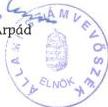

Állami Számvevőszék

TSZ: 574

# JELENTÉS

az Ukrán Országos Önkormányzat
pénzügyi-gazdasági tevékenységének
vizsgálatáról

2002. január

C 212 ✓

---

Az ellenőrzés végrehajtásáért felelős:
V. Önkormányzati és Területi Ellenőrzési Igazgatóság

dr. Lóránt Zoltán
számvevő igazgató

Az ellenőrzést vezette:

dr. Sallai Antal
régióvezető főtanácsos

Az ellenőrzést végezte

Vermes Lajos
külső szakértő

Jelentéseink az Országgyűlés számítógépes hálózatán
és az Interneten a www.asz.hu címen is olvashatók, továbbá a Belügyminisztérium
folyóirata, az "Önkormányzati Tájékoztató" rendszeresen közli, valamint a Megyei
Közigazgatási Hivatalvezetők részére is átadásra kerül.

---

V-1013-31/2001-2002.

# TARTALOMJEGYZÉK

I. ÖSSZEGZŐ MEGÁLLAPÍTÁSOK, KÖVETKEZTETÉSEK, JAVASLATOK 4

II. RÉSZLETES MEGÁLLAPÍTÁSOK 5

1. A feladatellátás szervezettsége, szabályozottsága 5

1.1. Általános ismeretek az ukrán kisebbségról, az Ukrán Országos Önkormányzat kapcsolatrendszere 5
1.2.A szervezeti es mukodesi rend alakulasa 6
1.3.A koltsegvetes, zarszamadas, vagyonleltar megallapitasanak szabalyozottsaga 6
1.4.A mukodes szervezeti feltetelrendszere 7

2. az önkormányzat működésének, a gazdálkodás rendjének szabályszerűsége 8

2.1.A mukodes targyi felteteleinek alakulasa 8
2.2. Az egyszeri vagyonjuttataskent kapott részvenyek hasznositasa 8
2.3.A gazdalkodasi tevekenyseg szemelyi es targyi feltetelei 9
2.4.A gazdalkodasi folyamatok szabalyozottsaga 9
2.5.A gazdalkodasi jogkork szabalyozottsaga 10
2.6. Vallalkozasi tevekenyseg 10

3. A beszámolási kötelezettség teljesítése, a költségvetés készítése és végrehajtása 11

3.1.A konyvvezetesi kotelezettseg 11
3.2.Az éves költségvetések 11
3.3.A koltsegvetesek vegrehajtasa 11
3.4.A gazdasagi esemenyekbizonylati alatamasztottsaga 12
3.5.A vagyongazdalkodás szabályozottsága, vagyonvédelem 13
3.6. Éves beszámolási kõtelezettseg 13
3.7.Az éves zarszámadások 13

4. Az önkormányzat ellenőrzési rendszere 14

4.1.Az ellenorzs szabalyozottsaga 14
4.2.A belso ellenorzs 15
4.3.A lefolytatott ellenorzesek tapasztalatai 15

5. A korábbi számvevőszéki ellenőrzések javaslatainak hasznosulása 15

1

---

.

.

.

---

I. ÖSSZEGZŐ MEGÁLLAPÍTÁSOK, KÖVETKEZTETÉSEK, JAVASLATOK

# JELENTÉS

# az Ukrán Országos Önkormányzat pénzügyi-gazdasági tevékenységének vizsgálatáról

Az Állami Számvevőszékről szóló 1989. évi XXXVIII. törvény 2. § (5) bekezdése alapján ellenőriztük az országos kisebbségi önkormányzatoknál az állami költségvetésből juttatott támogatások felhasználását.

A nemzeti és etnikai kisebbségek jogairól szóló 1993. évi LXXVII. törvény (továbbiakban: Nek tv.) szabályozza az országos kisebbségi önkormányzatok létrehozásának rendjét, azok feladat- és hatásköreit.

Az Állami Számvevőszék 1995. és 1997. évben témavizsgálat keretében ellenőrizte az országos kisebbségi önkormányzat pénzügyi, gazdasági tevékenységét.

A vizsgálat az országos kisebbségi önkormányzatok 1999. és 2000. évi és 2001. első félévi gazdálkodására terjedt ki, egyes esetekben – a székházjuttatási folyamat és egyszeri vagyonjuttatás hasznosulása – a korábbi vizsgálat óta eltelt teljes időszakot áttekintettük.

**Az ellenőrzés célja:** annak megállapítása volt, hogy

- az országos kisebbségi önkormányzat működési feltételrendszere hogyan változott a vizsgált időszakban,
- a gazdálkodás szervezettsége, szabályszerűsége mennyiben felel meg a jogszabályi követelményeknek és az önkormányzati működés sajátosságainak,
- biztosított-e a gazdálkodás és a pénzeszközök felhasználásának törvényessége és szabályszerűsége, a számviteli törvény és a vonatkozó kormányrendeletek előírásainak betartása.

3

---

I. ÖSSZEGZŐ MEGÁLLAPÍTÁSOK, KÖVETKEZTETÉSEK, JAVASLATOK

# I. ÖSSZEGZŐ MEGÁLLAPÍTÁSOK, KÖVETKEZTETÉSEK, JAVASLATOK

Az Ukrán Országos Kisebbségi Önkormányzat 1999. év elején történt megalakulását követően – ideiglenes jelleggel – a Magyarországi Ukrán Kulturális Egyesület számára korábban juttatott lakásból kialakított 175 m²-es területen nyert elhelyezést. A végleges székház biztosítása a vizsgálat időpontjáig nem oldódott meg. Ennek megfelelően a működési feltételek kialakítása tekintetében is érződik az ideiglenesség, mert csak a legfontosabb számítástechnikai berendezések, kommunikációs és fotóberendezések vásárlása történt meg. A működési célú vagyonjuttatásként kapott részvényeket diszkont-kincstárjegyekre cserélték, s az elmúlt években sikerült azok reálértékét megőrizni.

A gazdálkodás szervezettségének, szabályszerűségének feltételeit az SzMSz és az egyéb szabályzatok kialakításával röviddel az önkormányzat létrejöttét követően megteremtették, azonban a feltételek változásával azokat nem aktualizálták. Az SzMSz elfogadását követően létrejött bizottságok miatt az SzMSz-t nem módosították.

A létrejött és funkcionáló testületek, bizottságok hatékonyan működnek és az önkormányzatiság feltételeit tiszteletben tartva – megítélésük szerint bizonyos esetekben túlzottan is önállóan, mintegy magukra hagyva – fejthetik ki tevékenységüket.

A gazdálkodásban és a pénzeszközök felhasználásánál a törvényesség és a szabályszerűség összességében biztosított volt, és a számviteli törvény, valamint a vonatkozó kormányrendeletek előírásait-, néhány kisebb jelentőségű eltérésről eltekintve – az önkormányzat gazdálkodása során betartották.

Szabályozási hiányosság, hogy a pénz és értékkezelési szabályzat nincs felszerelve a szükséges melléklettel (felelősségi nyilatkozat), illetve a könyvvezetési rendszer a feladatonkénti költségfelhasználás nyomon-követését (működési, egyéb ktg.) csak részben teszi lehetővé.

A hatékony ellenőrzések érdekében szükséges a szabályozás kibővítése, egyben a Pénzügyi Bizottság feladatainak pontos meghatározása.

Az ellenőrzés megállapításai alapján javasoljuk a közgyűlésnek, hogy:

1. Aktualizálják a Szervezeti és Működési Szabályzatukat a bizottságok megalakulásával, az ezek számára adható további feladat- és hatáskör meghatározásával, a költségvetés elfogadási időpontjának, valamint a legfontosabb kiadási főcsoportok előírásával.
2. A pénzkezelési szabályzatot egészítsék ki a felelősségi nyilatkozattal, valamint a kötelezettségvállalás szabályozásával.
3. A Pénzügyi Bizottságnak az SzMSz módosításával biztosítsanak az eddigieknél nagyobb ellenőrzési jogosítványokat (pl. projektek ellenőrzése).

4

---

II. RÉSZLETES MEGÁLLAPÍTÁSOK

## II. RÉSZLETES MEGÁLLAPÍTÁSOK

### 1. A FELADATELLÁTÁS SZERVEZETTSÉGE, SZABÁLYOZOTTSÁGA

#### 1.1. Általános ismeretek az ukrán kisebbségről, az Ukrán Országos Önkormányzat kapcsolatrendszere

Az országos önkormányzat ismeretei szerint Magyarországon jelenleg megközelítően 3-4 ezer ukrán él, akiknek szervezett tevékenységéről csak 1991-től beszélhetünk, amikor megalakult a Magyarországi Ukrán Kulturális Egyesület.

Az Egyesület 1998-ban négy helyen (Budapesten a IV. és IX. kerületben, valamint Szegeden és Komáromban) indított képviselő jelelölteket. A választások után létrejöttek a helyi Ukrán Kisebbségi Önkormányzatok, majd ezt követően **megalakult** a Fővárosi Ukrán Önkormányzat és **1999. február 6-án 15 fős testület létrehozásával az Ukrán Országos Önkormányzat (továbbiakban: önkormányzat)**. Mivel minden helyi önkormányzat képviselteti magát az országos önkormányzat testületében, az önkormányzatok között jó együttműködés alakult ki. Erre jó példa, hogy rendszeresen a fővárosi és az országos önkormányzat együttműködésében és támogatásával valósul meg az Anyanyelvi Tábor és a magyarországi ukránok legnagyobb ünnepével a „Sevcsenko Napok”-nak a megrendezése.

A helyi kisebbségi önkormányzatok a normatív állami támogatás mellett – a komáromi kivételével – a települési önkormányzattól is részesülnek támogatásban.

Az önkormányzatok – mind a helyiek, mind az országos – a pénzeszközeik jelentős részét a kulturális programokra fordítják, így kívánnak eleget tenni a „kulturális autonómia” címen megfogalmazott célkitűzéseknek. Fenntartják a hétvégi iskolákat, állandó kapcsolatot tartanak a választókkal, a helyi önkormányzattal és a többi kisebbségi önkormányzattal.

Helyi szinten évente általában 3-4 viszonylag jelentős rendezvényt szerveznek, például a Szegedi,-, Komáromi,- Újpesti,- Ferencvárosi Napokhoz színvonalas kisebbségi programmal kapcsolódnak.

Az **országos jellegű rendezvények szervezése**, az újság kiadása a Magyarországi Ukrán Kulturális Egyesület, az önkormányzat és a Fővárosi Ukrán Önkormányzat **együttműködésével, együttes erejével és anyagi hozzájárulásával történik**.

5

---

II. RÉSZLETES MEGÁLLAPÍTÁSOK

## 1.2. A szervezeti és működési rend alakulása

Az önkormányzat az 1999. április 17-én tartott ülésén az **1/1999. (IV. 17.) sz. határozatával megalkotta a Szervezeti és Működési Szabályzatát** (a továbbiakban: SzMSz). Az SzMSz-t az elfogadás napján léptették hatályba.

Az SzMSz-ben meghatározták az önkormányzat jogállását, céljait, feladatait és hatáskörét. Foglalkoznak a testület működésének, az elnök és alelnökök megválasztásának, a testületi üléseknek a kérdéseivel. Az SzMSz jellegzetessége, hogy **szinte minden döntést a testület hatáskörében tart**, bár egyes hatáskörök esetében az átruházásnak az elvi lehetőségét biztosítja az elnök, alelnök, illetve a bizottságok számára. **A testület kizárólagos hatáskörébe tartozó feladatokat a 8. § (1) bek. a – p. pontjai tartalmazzák.** Ezek közül kiemelhető a szervezetének kialakítására és működésének meghatározására, a költségvetéséről és zárszámadásáról szóló döntésre, a törzsvagyonának, vagyonleltárának megállapítására, az elnökének, alelnökeinek és bizottságainak megválasztására, költségvetésének és zárszámadásának elfogadására, intézmények és gazdasági célú szervezetek alapítására, a hitel felvételére vonatkozó döntések közgyűlési hatáskörben tartása.

Az SzMSz megalkotásakor bizottságot még nem hozott létre az önkormányzat, de a VII. fejezetben a 17. §-ban **elvi lehetőséget biztosítottak 4 bizottság létrehozásához.** Ezek: a Gazdasági, Vállalkozás és Turisztikai Fejlesztési, a Kulturális és Ifjúsági, az Oktatási, valamint a Pénzügyi Bizottság.

Meghatározták az egyes bizottságok tagjainak minimális számát, ezek legalább három főből állnak. Az SzMSz 18. §-ban szabályozták a bizottságok működését is, s számukra lehetőséget biztosítanak önálló előterjesztések, indítványok, állásfoglalások meghatározására is. Az SzMSz elfogadását követően létrejött bizottságok miatt az SzMSz-t nem módosították. A feladataik és hatáskörük, az SzMSz-ben részben szabályozott (17. § (1) bek.), de csak általános felhatalmazást ad a 17. § (6) pontjában a további feladatokra.

## 1.3. A költségvetés, zárszámadás, vagyonleltár megállapításának szabályozottsága

A költségvetésről, a zárszámadásról, a vagyonleltár megállapításáról, a törzsvagyoni körről **az SzMSz IV. fejezetének 8. §-ában rendelkeznek**, amiben meghatározzák, hogy az ezekkel kapcsolatos feladatok **a testület kizárólagos hatáskörébe tartoznak.** Ennek során tehát betartották a törvényi előírásokat, mivel ezeket a feladatokat a közgyűlés át nem ruházható hatáskörei között nevesítették.

Ezen túl az SzMSz X. fejezetében a 21., 22. §-ban részletesebben is szabályozzák az önkormányzat vagyonával, költségvetésével, valamint a tulajdonjog képviseletével kapcsolatos kérdéseket. Rendelkeznek a törzsvagyoni körről, amelyben megkülönböztetik a forgalomképtelen és korlátozottan forgalomképes vagyontárgyakat.

A testület saját hatáskörében határozza meg a költségvetését és zárszámadását, amelyet a közgyűlés évente köteles megállapítani. **A költségvetés elfogadá-**

6

---

II. RÉSZLETES MEGÁLLAPÍTÁSOK

**sának időpontját nem szabályozták, míg a zárszámadás beterjesztésének időpontját a költségvetési évet követő három hónapon belül határozták meg.**

A 22. §-ban meghatározzák a bevételeket, a Pénzügyi Bizottság jogosítványait, a költségvetés módosítási lehetőségét. Ugyanakkor hiányzik a szabályozásból, hogy **a kiadási oldalról melyek azok a tételek**, amelyeket a költségvetés készítésénél **kiemelten kezelnek**.

A szabályozás alapján megállapítható, hogy **lényegében a törvényi előírásoknak és saját igényeiknek megfelelően** döntöttek a költségvetésről a zárszámadásról, illetve a tulajdonosi jogok gyakorlásáról.

#### 1.4. A működés szervezeti feltételrendszere

A nemzeti és etnikai kisebbségek jogairól szóló 1993. évi LXXVII. törvényben (továbbiakban: NEK tv.) meghatározott feladatok ellátására a következő szervezeti háttérrel rendelkeznek:

Az önkormányzat legfőbb döntéshozó szerve **a 15 fős közgyűlés, amely 1 fő elnököt és 2 alelnököt választott**. Az SzMSz lehetőséget biztosít titkár foglalkoztatására is, de erre a vizsgálat időpontjáig nem került sor.

Működik továbbá **4 állandó bizottság**, amelyek a 2/1999. (IV. 17.) sz. hat. alapján a következők:

- a Gazdasági, Vállalkozási és Turisztikai Fejlesztési Bizottság (3 fő, 1999-től)
- a Kulturális és Ifjúsági Bizottság (4 fő)
- az Oktatási Bizottság (3 fő)
- valamint a Pénzügyi Bizottság (3 fő részvételével).

Az önkormányzat feladatainak meghatározására az SzMSz II. fejezetének 3. §-ában került sor. Ezek közül a vélemény-nyilvánítási, tájékoztatás kérésére, közreműködésre, az emlékek megőrzésének, ápolásának elősegítésére vonatkozó feladatok emelhetők ki.

Ennél konkrétabb feladatokat határoznak meg az egyes évek költségvetésének elfogadásakor.

**Hivatalt nem alapítottak**, az ezzel kapcsolatos feladatokat 2001-től 1 főállású irodavezetővel, valamint a könyvelést külsős mérlegképes végzettségű vállalkozóval megbízási szerződés alapján végzik. Az önkormányzat elnöke – mint választott tisztségviselő – tiszteletdíjasként végzi tevékenységét.

**Intézményt** az oktatási, kulturális, egészségügyi szociális feladatok ellátására **nem alapítottak**, erre megítélésük szerint anyagi feltételeik még nem biztosítanak lehetőséget.

7

---

II. RÉSZLETES MEGÁLLAPÍTÁSOK

## 2. AZ ÖNKROMÁNYZAT MŰKÖDÉSÉNEK, A GAZDÁLKODÁS RENDJÉNEK SZABÁLYSZERŰSÉGE

### 2.1. A működés tárgyi feltételeinek alakulása

A Kormány már az Önkormányzat 1999. év elején történt megalakulását két évvel megelőzően, a 2040/1997. (II. 19.) sz. Kormányhatározatában intézkedett a magyarországi ukrán kisebbség oktatási és kulturális tevékenységét szolgáló ingatlan biztosításáról. Erre a Budapest VI. ker. Zichy J. u. 10. III/8. sz. alatt került sor. Ezt az ingatlant a Kormányhatározat 3. pontja szerint „**a magyarországi ukrán kisebbség országos önkormányzatának megalakulásáig terjedő időre**” biztosították kulturális célra. Ezt követően a Kormányhatározat alapján a KVI az Önkormányzat megalakulásával egy időben a fenti 175 m²-es irodaingatlanról ingyenes, határozatlan idejű használati megállapodást kötött az Önkormányzattal. Az ingatlant közösen használja az önkormányzat és a Magyarországi Ukrán Kulturális Egyesület (MUKE). Az önkormányzat megítélése szerint – figyelembe véve az épület külső és belső feltételeit, környezetét – az ingatlan csak ideiglenes elhelyezést biztosít, s a végleges elhelyezés érdekében az elmúlt években több kezdeményezés történt a kormányzati szervek felé. A mai napig az érintettek számára elfogadható, **az önkormányzat igényeinek megfelelő** – a többi önkormányzat feltételeihez hasonló – végleges elhelyezést nyújtó **ingatlan biztosítása nem történt meg**. Ez a helyzet határozza meg az eszközbeszerzéseket is, hiszen a tárgyi feltételek biztosítása ennek megfelelően visszafogott, mert azokat a végleges elhelyezés után kívánják kialakítani. Mindezek miatt az eszközállomány 2 db számítógépből, 2 telefaxból, 1 fotógépből és asztalból áll. A működéshez szükséges további berendezési tárgyak a MUKE tulajdonában vannak. A Nemzeti és Etnikai Kisebbségi Hivatal által készített, a Magyarország területén élő nemzeti kisebbségek helyzetéről szóló beszámoló alapján az önkormányzat elhelyezésére 2001. évben 30 millió Ft állt rendelkezésre.

### 2.2. Az egyszeri vagyonjuttatásként kapott részvények hasznosítása

A nemzeti és etnikai kisebbségek jogairól szóló 1993. évi LXXVII. törvény 63. § (4) bekezdésben az állam – egyszeri vagyonjuttatásként – **15 millió Ft-ot biztosított az önkormányzat működési feltételeinek fedezésére**. Az Önkormányzat azonban lényegesen később 1999-ben alakult meg.

Az 1996. évi költségvetésről szóló 1995. évi CXXI. tv-t módosító 1996. évi LXXVIII. tv. 7. §-a szerint „A még meg nem alakult ruszin és ukrán országos kisebbségi önkormányzatok részére juttatandó 15-15 millió Ft árfolyamértékű vagyont a KVI-nek kell átadni azzal, hogy a KVI ezen önkormányzatok megalakulását követő két hónapon belül azonos árfolyamértékű vállalkozói vagyont köteles részükre biztosítani”.

A KVI – a fentieknek megfelelően – az önkormányzat megalakulását követő két hónapon belül **1999. március 24-i megállapodás alapján 1999. május 26-án kelt átadás-átvételi jegyzőkönyv szerint adta át** a tv. által előírt 15 millió Ft árfolyamértékű MOL Rt törzsrészvényt az önkormányzat számára.

8

---

II. RÉSZLETES MEGÁLLAPÍTÁSOK

A MOL Rt törzsrészvényeit 1999. V. 26-án értékesítették a DUNAINVEST Tőzsdeügynökség Rt közreműködésével, s ezen 15 millió Ft-ért diszkont kincstárjegyet vásároltak. Az önkormányzat felhatalmazta az elnököt a MOL részvényekkel kapcsolatban a tranzakció lebonyolítására. 1999. június 26-án az elnök asszony tájékoztatta a testületet, hogy a részvényeket a DUNAINVEST bevonásával értékesítették és diszkont kincstárjegyekbe fektették. A DUNAINVEST Rt 2001. május 11-ig kezelte az önkormányzat befektetését. Ekkortól értesítette az önkormányzatot, hogy a PSZÁF II/73.016-16/2001. sz. átruházást engedélyező határozata alapján az ERSTE Bank Befektetési Rt-nek átadta a teljes ügyfélállományát, mert a DUNAINVEST Rt megszüntette az ilyen jellegű tevékenységét. Az ERSTE Bank Befektetési Rt 2001. június 30-i számlakivonata szerint az önkormányzat 19.420 ezer Ft névértékű 2001. augusztus 29-i lejáratú diszkont kincstárjeggyel rendelkezett.

Az éves zárszámadások alkalmával megtörtént a testület tájékoztatása a kincstárjegy-állomány alakulásáról.

Az átgondolt gazdálkodás lehetővé tette azt, hogy nem történt az elmúlt időszakban vagyonvesztés, az állami vagyonjuttatásként biztosított pénzeszközök lényegében az inflációval azonos szinten növekedtek, tehát reálértékben megőrizték az 1999. évi értéküket.

### 2.3. A gazdálkodási tevékenység személyi és tárgyi feltételei

Az önkormányzat a gazdálkodás bonyolítására saját szervezetet nem hozott létre. Ezeket egyrészt mint titkársági feladatok, illetve pénztárosi teendők és egyéb adminisztratív tevékenységek ellátására 2000. év végéig megbízási szerződéssel, 2001. évtől pedig főállású irodavezetőként egy dolgozót alkalmaznak.

Másrészt a számviteli, könyvelési feladatok ellátására 1999. szeptember 1-től határozatlan időre megbízási szerződést kötöttek egy mérlegképes könyvelő vállalkozóval. E szerződés alapján a vállalkozó

- elvégzi az önkormányzat könyvelését és a számviteli nyilvántartások naprakész vezetését,
- összeállítja az adó és TB bevallásokat, vezeti az ezekkel kapcsolatos nyilvántartásokat,
- elkészíti az év végi zárlati munkákat.

Ezekhez a számítástechnikai hátteret 2 db komplett számítógép-konfiguráció biztosítja.

### 2.4. A gazdálkodási folyamatok szabályozottsága

Az önkormányzatnál a gazdálkodás folyamatát, illetve részterületeit érintő szabályozás kialakítása két szakaszban történt.

9

---

II. RÉSZLETES MEGÁLLAPÍTÁSOK

Az önkormányzat megalakulását követően néhány hónappal 1999. október 1-től léptették hatályba a pénzkezelés rendjétől, a bizonylati rendszerről, valamint a leltározásról és selejtezésről szóló szabályozást. A számlarendet 2000. év végéig nem alakították ki. A számvitelről szóló 2000. évi C. törvény hatálybalépése miatt, 2001. január 1-től újra szabályozták a már meglévő – a gazdálkodási folyamatot meghatározó – eljárásokat és új területeket is szabályoztak. Így jelenleg 2001. január 1-től az alábbi szabályzatok készültek el:

- a számviteli politika,
- a számlarend,
- eszközök és források értékelési szabályzata,
- pénz és értékkezelési szabályzat,
- a bizonylati szabályzat,
- leltározási és leltárkészítési szabályzat,
- a feleslegessé vált vagyontárgyak hasznosítása, a selejtezésről szóló szabályzat.

A szabályzatok ez évtől átfogják a gazdálkodás folyamatát, és alkalmasak arra, hogy betartásuk esetén az önkormányzat törvényes működése biztosított legyen. Hiányosság, hogy a pénz és értékkezelési szabályzat nincs felszerelve a szükséges melléklettel (felelősségi nyilatkozat), illetve a könyvvezetési rendszer a feladatonkénti költségfelhasználás nyomonkövetését (működési, egyéb ktg.) csak részben teszi lehetővé.

## 2.5. A gazdálkodási jogkörök szabályozottsága

A gazdálkodási jogkörök döntő részben szabályozottak. Írásban, névre szólóan a pénz és értékkezelési szabályzatban rögzítették az utalványozási jogosultságot. A kötelezettségvállalásról szóló helyi szabályozás kialakítása azonban nem történt meg. A gyakorlatban az ellenőrzés biztosított. A kötelezettségvállalást az önkormányzat elnöke, az ellenjegyzést a pénzügyi bizottság tagja végzi, míg az utalványozási, ellenőrzési joggal az önkormányzat elnöke ruházhat fel egyes dolgozókat az összeférhetetlenség szempontjait figyelembe véve. A gyakorlatban tehát a gazdálkodási jogkörök kontrolláltan működnek, illetve érvényesülnek, a szabályozásban azonban csak részben jelennek meg.

## 2.6. Vállalkozási tevékenység

Az önkormányzat – a vizsgált időszakban – nem végzett vállalkozási tevékenységet és nem vett részt vállalkozásban. Az SzMSz X. fejezetében biztosítja az önkormányzat számára a vállalkozás elvi lehetőségét, de hangsúlyozza, hogy a vállalkozás az önkormányzat feladatainak ellátását nem veszélyeztetheti.

10

---

II. RÉSZLETES MEGÁLLAPÍTÁSOK

### 3. A BESZÁMOLÁSI KÖTELEZETTSÉG TELJESÍTÉSE, A KÖLTSÉGVETÉS KÉSZÍTÉSE ÉS VÉGREHAJTÁSA

#### 3.1. A könyvvezetési kötelezettség

Az önkormányzat a pénzügyi folyamatok számviteli regisztrálására **a kettős könyvvitel rendszerét választotta**. Ez a 219/1998. (XII. 30.) Korm. rendelet 3. § (1)-(2) bekezdése, illetve a 224/2000. (XII.19) Korm. rendelet 6.§ (3)-(4) bekezdése szerint számára nem kötelezően előírt, választható regisztrációs forma.

#### 3.2. Az éves költségvetések

Az önkormányzat költségvetésével kapcsolatos tevékenysége folyamatos fejlődést mutat. Az 1999. februári megalakulást követően az **első költségvetését a 25/1999. (VI. 26.) számú testületi határozatával** fogadta el. Ebben 13.000 ezer Ft bevétellel (lényegében csak az állami támogatással) és ugyancsak 13.000 ezer Ft kiadási főösszeggel számoltak. A költségvetést a Pénzügyi Bizottság készítette elő és terjesztette a testület elé. Ebben meghatározták a havi tiszteletdíjakat (elnök 150 ezer Ft, alelnökök 50 ezer Ft, tagok 10 ezer Ft), hagyomány ápolásra 2,5 millió Ft-ot terveztek, míg tartalékként 1,5 millió Ft-al számoltak.

A **2000. évi költségvetési tervet** – amellyel kapcsolatosan a pénzügyi bizottság szintén kifejtette véleményét – az **önkormányzat a 11/2000. (IV. 12.) sz. határozatával fogadta el**. Ezzel egy időben határoztak az önkormányzat 1999. évi mérlegéről szóló beszámoló elfogadásáról is.

A költségvetési terv szerint a bevételeket 18.190 ezer Ft-tal, a kiadásokat szintén 18.190 ezer Ft-al tervezték. A 2000. évi költségvetés már lényegesen részletesebb volt, mint az előző évi.

A 2001. évi költségvetési tervet az 1/2001. (II. 4.) sz. határozattal 20.328 ezer Ft bevétellel, valamint 20.328 ezer Ft kiadással állapították meg.

A bevételek között meghatározó az ez évi 16.000 ezer Ft-os állami támogatás, (amelynek mértéke a költségvetési törvény szerint 16,1 millió Ft) a kiadások közül pedig a személyi juttatások 10.575 ezer Ft-os és a dologi kiadások 9.753 ezer Ft összege.

#### 3.3. A költségvetések végrehajtása

A költségvetés végrehajtása során a **kötelezettségvállalások pénzügyi fedezete biztosított volt**. Az önkormányzat gazdálkodását a **mértéktartás jellemzi**, nem vállal indokolatlan mértékű kötelezettséget, **felújítási, illetve fejlesztési kiadásait visszafogta**, és az elmúlt években a végleges elhelyezés feltételeinek kialakítását tekintette az egyik fő célnak, s ennek érdekében a **működési kiadásait is alárendelte**. A bevételeknél meghatározóak az állami támogatások, míg az egyéb források szerepe minimális, ez évtől számítanak pályázati pénzeszközökre is.

11

---

II. RÉSZLETES MEGÁLLAPÍTÁSOK---

Mindezek alapján az önkormányzat **pénzügyi egyensúlya stabilnak minősíthető.**

### 3.4. A gazdasági események bizonylati alátámasztottsága

A gazdasági eseményeket magukba foglaló bizonylatok megfelelőségének vizsgálatát véletlenszerű mintavétellel végeztem el.

A megalakulást követően a Kincstár nem közvetlenül utalta a pénzeszközöket, hanem a Magyarországi Ukrán Kulturális Egyesület (MUKE) számlájára, mert az önkormányzatnak csak 1999. június 2-ától van önálló bankszámlája. Ezt követően utalta a MUKE az önkormányzat számlájára az állami pénzeszközöket.

Kezdetekben hasonló probléma volt a KVI számláival, mert azokat a közüzemi díjakról hosszú ideig a MUKE nevére és nem az önkormányzat nevére állították ki. (pl. 2000. év márciusában az előző évi 11. – 12. havi közös költségről szóló számla)

**A pénztári ki és befizetések ellenőrzését** 1999. évben a szeptember, illetve november havi dokumentumok alapján végeztem. A pénztárbizonylatok számítógépes rendszerben készülnek szigorú sorszámozással. Az ellenőrzött dokumentumok száma szeptemberben a 37-53, novemberben az 54-58 sorszámú kiadási pénztárbizonylat volt. A kiadási bizonylaton az ellenőr, utalványozó, pénztáros és átvevő aláírásai is szerepelnek. A kezdeti időszakban előfordult, hogy a bizonylatokon 2-3 tételt is szerepeltettek egy sorban, amelyek 2-3 különböző személyhez köthetők, tehát az átvevőt nem lehetett szabályszerűen elkülöníteni. Ez csak az 1999-ben kiállított pénztárbizonylaton fordult elő. A későbbiekben a bizonylatokon helyesen már minden tételt külön szerepeltettek.

A 2000. évi bizonylatok közül a március (41-től 55-ig), illetve az októberi (173-tól 187-ig) sorszámúakat ellenőriztem.

A márciusiak között szerepelt az 53. sz. pénztárbizonylaton 325.579 Ft hangtechnikai beszerzés vásárlási bizonylata, amelyet betörés miatt nem szerepeltetnek az eszközleltárban. A rendőrségi feljelentés, illetve a dokumentáció rendelkezésre állt.

További észrevétel a 185. sz. kiadási pénztárbizonylat esetében 2000. év októberben (MATÁV számla), hogy nem az önkormányzat, hanem az Érték, Vállalkozói Kereskedelmi és Szolgáltató Kft neve szerepel. Eddig az időpontig tehát még nem történt meg a telefon átírása. A telefonszám azonosítható. (A számla 53.533 Ft-ról szól.)

A 2001. február (7-25 sorszámú) illetve júliusi számlák ellenőrzésénél problémaként előfordult, hogy a MÁV jegyeknél nincs minden esetben ÁFA-s számla, nem állapítható meg, hogy az Ukrán önkormányzat a vevő (pl. 02. 27-i vasúti jegy 2.236 Ft). A 2001. júniusi (86-102 sorszámú) bizonylatok között a 90. sz. tételen tévesen csak 2.094 Ft kifizetése szerepel, míg a mellékelt alapbizonylat 2.894 Ft-ról szól. A június 11-i, 91. sz. bizonylaton a gépkocsi elszámoláson az ellenjegyző szignója nem szerepel (12.558 Ft-ról). A 97. sz. bizonylaton

---12

---

II. RÉSZLETES MEGÁLLAPÍTÁSOK

(AXELERO számlán) 1.250 Ft szerepel, míg a kiadási pénztárbizonylaton csak 1.200 Ft kifizetését jegyezték fel.

Az alapdokumentáció – amely minden esetben a pénztárbizonylatokhoz volt csatolva – szerepelt az önkormányzat elnökének szignója. A pénzt és értékkezelési szabályzat szerint a pénztárzárás mindig havonta történik, az elszámolásnál a havi időszaki pénztárjelentést alkalmaznak. A bizonylatok kiállítása után utólagos kifizetés történik, s a számítógépes program által biztosított, illetve készített összesítést használják.

A bankbizonylatokat felszerelik alapbizonylatokkal, a teljesítés és utalványozás igazolása megtörténik.

### 3.5. A vagyongazdálkodás szabályozottsága, vagyonvédelem

Az önkormányzat **rendelkezik a feleslegessé** vált vagyontárgyak hasznosítására, **selejtezésére vonatkozó szabályzattal**. Az SzMSz is tartalmaz utalásokat a vagyoni körre. Ugyanakkor az önkormányzat ingatlanvagyonnal nem rendelkezik, néhány nagyobb értékű számítástechnikai berendezéstől, valamint a 3 hónapra lekötött kincstárjegyektől eltekintve (amelyek a brókercégnél vannak) nem rendelkezik jelentős vagyontárggyal. Az elmúlt év júliusában történt betörés után (amikor összességében 1,3 millió Ft értékű berendezést, műszaki cikket loptak el) az önkormányzat elhelyezését szolgáló helyiségeket riasztóberendezéssel szerelték fel. Vagyonbiztosítást csak a betörést követően kötöttek. A készpénz tárolása kazettában történik.

### 3.6. Éves beszámolási kötelezettség

**Az önkormányzat az éves beszámolási kötelezettségének mind az 1999. évről, mind a 2000. évről eleget tett.** A felhasznált dokumentum azonban nem az önkormányzat számára meghatározott formátumú, mert a kettős könyvvitelt vezető társadalmi szervezetek számára a beszámolási kötelezettséget az ún. Egyszerűsített éves beszámoló, illetve eredmény kimutatás alapján (1715/b) kell teljesíteni. Az önkormányzat tévesen – az ettől néhány tételében eltérő – a „Kettős könyvvitelt vezető társadalmi szervezetek köztestületek közhasznú beszámolójának mérlegét, illetve eredmény kimutatását” (1715/e. sz. nyomtatvány) használta a 2000. évi beszámolójához. A mérleg **adatainak alátámasztására mindkét évben elvégezték az eszközök és források leltározását**, az ezzel kapcsolatos zárlati munkákat. A leltározás lebonyolításában részt vesz a pénzügyi bizottság tagja is és annak eredményét írásban is rögzítik.

### 3.7. Az éves zárszámadások

A vizsgált időszakban az önkormányzat testülete **2 év zárszámadási beszámolóját tárgyalta**.

Az **1999. évi zárszámadásról** és a 2000. évi költségvetésről a **2000. április 12-én tartott közgyűlésen döntöttek**. A beszámolóban részletezték a bevételi forrásokat, amelyek közül kiemelkedő jelentőségű a 12.800 ezer Ft-os álla-

13

---

II. RÉSZLETES MEGÁLLAPÍTÁSOK

mi támogatás, valamint a Fővárosi Ukrán Önkormányzat támogatása 400 ezer Ft. **A bevételek ténylegesen 14.298 ezer Ft-ban realizálódtak. A kiadások 1999-ben 8.107 ezer Ft-ot tettek ki.** Az önkormányzat éves működésének jelentős részét a tiszteletdíjak és járulékaik, valamint a hagyományőrző rendezvényekkel kapcsolatos költségek képezték. Az 1999. évi beszámolóhoz rövid szöveges értékelést is előterjesztettek. E szerint a pénzmaradványt 6.191 ezer Ft-ot a következő évi gazdálkodási feltételek, működési költségek fedezetére kívánják felhasználni. **A képviselő-testület a 13/2000. (IV. 12.) sz. határozatával fogadta el az önkormányzat 1999. évi mérlegéről szóló beszámolót.**

A 2000. évi beszámolóról táblázatos formában külön előterjesztést nem készítettek, csak a mérleget terjesztették a közgyűlés elé (az IM számára is eljuttatott szabálytalan nyomtatvány felhasználásával). **A beszámolóhoz szöveges értékelés készült.** Meghatározó bevételi forrás a **14.000 ezer Ft-os állami támogatás**, valamint a Fővárosi Ukrán Önkormányzat 400 ezer Ft-os hozzájárulása a nyári táborozáshoz. **A bevételek így együttesen 16.650 ezer Ft-ot tettek ki.** A kiadások között meghatározó a működési költségek és járulékok szerepe, a kulturális rendezvények támogatása, valamint az önkormányzatnál történő betöréssel összefüggő károk, illetve veszteségek pótlása (1.330 ezer Ft).

**A kiadásokat összegében 13.722 ezer Ft-ban állapították meg.** Ugyancsak rendelkeztek a pénzmaradvány 2.928 ezer Ft felhasználásáról. A testület a **beszámolót a 2001. április 20-i ülésén a 9/2001. (IV. 20.) sz. határozatával fogadta el.**

Az előterjesztés mindkét esetben megtörtént az SzMSz X. fejezetének 21. § (7) bek-ben előírt 3 hónapos határidőn belül. Mind a költségvetéseknél, mint a beszámolók elfogadásánál tapasztalat, hogy az egyes előterjesztések nem egységes szerkezetben készültek és ez megnehezíti az összehasonlíthatóságot. A testületi határozatok szöveges része nem tartalmazza az adott időszak bevételi és kiadási főösszegeit, azt csak a mellékletekből lehet megállapítani.

## 4. AZ ÖNKORMÁNYZAT ELLENŐRZÉSI RENDSZERE

### 4.1. Az ellenőrzés szabályozottsága

Az önkormányzat a **2/1999. (IV. 17.) sz. határozatával** hozta létre a 4 állandó bizottságait, így a **3 fős Pénzügyi Bizottságot is.** A feladatait az SzMSz VII. fejezetének, 17. §-ában, a működését a 18. §-ban szabályozzák. az SzMSz 17. § (1) bek. d. pontja szerint a Pénzügyi Bizottság **gondoskodik az önkormányzat költségvetésének tervezéséről és annak végrehajtása ellenőrzéséről.** A 17. § (6) bek-ben a testület meghatározott ügyeket és feladatokat, ill. döntési jogosítványát a bizottságaira átruházhatja.

Az SzMSz-en túlmenően az ellenőrzési tevékenység feladatként a pénzkezelési szabályzatban is megjelenik, a havi bizonylatellenőrzések előírásában.

14

---

II. RÉSZLETES MEGÁLLAPÍTÁSOK

#### 4.2. A belső ellenőrzés

Hivatalt nem alakítottak ki és a belső ellenőrzésre sem alkalmaznak munkatársat.

**A gyakorlatban a Pénzügyi Bizottság az ellenőrzési jogosítványát a költségvetés és zárszámadás tekintetében érvényesítette.** A pénzügyi műveletek esetében az ellenjegyzést a pénzügyi bizottság egyik tagja végzi. Ugyancsak részt vesznek a mérleget előkészítő leltározási munkákban.

Ugyanakkor az előzőeken túlmenően **célellenőrzést** – pl. adott projekt esetében – az **elmúlt két évben nem végeztek**.

#### 4.3. A lefolytatott ellenőrzések tapasztalatai

A bizottság tevékenysége **elősegítette**, javította **az önkormányzat törvényes működését**. Tekintettel azonban arra, hogy az ellenőrzési tevékenységük során célellenőrzést nem végeztek (az SzMSz sem tartalmaz ilyen jellegű felhatalmazást), ill. erről nem készült dokumentum, **az ellenőrzési rendszer működésének tapasztalatai alapján a továbbfejlesztés indokolt**.

### 5. A KORÁBBI SZÁMVEVŐSZÉKI ELLENŐRZÉSEK JAVASLATAINAK HASZNOSULÁSA

Az Önkormányzat 1999. évi megalakulását követően az elmúlt években az **Állami Számvevőszék az önkormányzatnál nem folytatott vizsgálatot**.

Budapest, 2002. január 18.

Dr. Kovács Árpád  
elnök

15

---

•

---

Ukrán Országos Önkormányzat

1.sz. melléklet a V-1013. sz. jelentéshez

Kimutatás az 1999-2001. évek bevételeiről

|  Megnevezés | 1999. |   |   | 2000. |   |   | 2001.  |   |
| --- | --- | --- | --- | --- | --- | --- | --- | --- |
|   |  Tervezett |   | Tényleges | Tervezett |   | Tényleges | Tervezett  |   |
|   |  Év elején ismert | Évközi változás |   | Év elején ismert | Évközi változás |   | Év elején ismert | Évközi változás  |
|  Állami támogatás | 13000 | -200 | 12800 | 14000 | 0 | 14000 | 16000 | 0  |
|  Közalapítványi pályázatok | 0 | 0 | 0 | 0 | 0 | 0 | 0 | 0  |
|  Egyéb pályázatok | 0 | 0 | 0 | 0 | 490 | 490 | 1400 | 0  |
|  Egyéb támogatások | 0 | 400 | 400 | 0 | 0 | 0 | 0 | 400  |
|  Saját bevételek | 0 | 1098 | 1098 | 0 | 2160 | 2160 | 0 | 0  |
|  Pénzmaradvány | 0 | 0 | 0 | 4190 | -4190 | 0 | 2928 | 0  |
|  Összesen | 13000 | 1298 | 14298 | 18190 | -1540 | 16650 | 20328 | 400  |

---

Ukrán Országos Önkormányzat

2. sz. melléklet a V-1013. sz. jelentéshez

Kimutatás az 1999-2001. évek kiadásairól

ezer Ft

|  Megnevezés | 1999. |   |   | 2000. |   |   | 2001.  |   |
| --- | --- | --- | --- | --- | --- | --- | --- | --- |
|   |  Tervezett |   | Tényleges | Tervezett |   | Tényleges | Tervezett  |   |
|   |  Év elején ismert | Évközi változás |   | Év elején ismert | Évközi változás |   | Év elején ismert | Évközi változás  |
|  Személyi jellegű juttatások | 4500 | 0 | 4499 | 6720 | 0 | 6506 | 8586 | 0  |
|  Munkáltatói járulékok | 1500 | 0 | 1573 | 2370 | 0 | 2041 | 1989 | 0  |
|  Dologi kiadások | 3500 | 0 | 940 | 9100 | 0 | 2975 | 9753 | 0  |
|  Működési kiadások összesen | 9500 | 0 | 7012 | 18190 | 0 | 11522 | 20328 | 0  |
|  Adott támogatások | 0 | 0 | 150 | 0 | 0 | 300 | 0 | 0  |
|  Felhalmozási kiadások | 2000 | 0 | 946 | 0 | 0 | 1899 | 0 | 0  |
|  Tartalék | 1500 | 0 | 0 | 0 | 0 | 0 | 0 | 0  |
|  Mindösszesen: | 13000 | 0 | 8108 | 18190 | 0 | 13721 | 20328 | 0  |

---

1

---

“