Állami Számvevőszék

# JELENTÉS

a helyi és a helyi kisebbségi
önkormányzatok gazdálkodásának
átfogó ellenőrzéséről

2002. június

0220

---

# Önkormányzati és Területi Ellenőrzési Igazgatóság
Átfogó Ellenőrzések Főcsoport

V-1006-32/2001-2002.

Témaszám: 557

Az ellenőrzést felügyelte:

dr. Lóránt Zoltán
főigazgató

Az ellenőrzés végrehajtásáért felelős:

Az ÁSZ 3. Önkormányzati és Területi Ellenőrzési Igazgatósága

Nagy József
főcsoportfőnök

Az ellenőrzést vezette:

Csecserits Imréné
ov. igazgatóhelyettes

A számvevői jelentések feldolgozásában és a jelentés összeállításában közreműködött:

Cséffai János
számvevő tanácsos

Kántor Ilona
számvevő tanácsos

Koltayné Szepesi Zsuzsa
számvevő tanácsos, irodavezető

Köcse Istvánné
számvevő tanácsos, irodavezető

Az ellenőrzésben részt vevők névsorát az 1. számú melléklet tartalmazza.

Az önkormányzatok gazdálkodását átfogóan érintő korábbi ellenőrzéseink címei:

9819 Jelentés 29 települési és 18 helyi kisebbségi önkormányzat pénzügyi-gazdasági tevékenységének 1997. évi ellenőrzéséről
9908 Jelentés az egyes települési és helyi kisebbségi önkormányzatok pénzügyi-gazdasági tevékenységének 1998. évi ellenőrzési tapasztalatairól
0010 Jelentés a helyi és a helyi kisebbségi önkormányzatok pénzügyi-gazdasági tevékenységének 1999. évi ellenőrzési tapasztalatairól
0113 Jelentés a helyi és a helyi kisebbségi önkormányzatok átfogó ellenőrzéséről

Jelentéseink az Országgyűlés számítógépes hálózatán és az Interneten a www.asz.hu címen is olvashatók, továbbá a Belügyminisztérium folyóirata, az "Önkormányzati Tájékoztató" rendszeresen közli, valamint a Megyei Közigazgatási Hivatalvezetők részére is átadásra kerül.

---

V-1006-32/2001-2002. TÉMASZÁM: 557

# TARTALOMJEGYZÉK

|  **I. Összegző megállapítások, következtetések, javaslatok** | **6**  |
| --- | --- |
|  **II. Részletes megállapítások** | **12**  |
|  **1. Az önkormányzati gazdálkodás törvényessége, szabályszerűsége** | **12**  |
|  1.1. A költségvetés | 12  |
|  1.1.1. A költségvetés elkészítésének, jóváhagyásának szabályszerűsége | 12  |
|  1.1.2. A költségvetési előirányzatok évközi módosításának szabályszerűsége | 14  |
|  1.2. A gazdálkodás | 16  |
|  1.2.1. A gazdálkodás szervezettsége, szabályozottsága | 16  |
|  1.2.2. A pénzgazdálkodás szabályszerűsége | 19  |
|  1.2.3. A vagyongazdálkodás | 22  |
|  1.2.4. A feladatellátás szervezeti formái | 28  |
|  1.2.5. A gazdálkodás szervezeti keretei, az igazgatási feladatok ellátása | 35  |
|  1.2.6. A kötelező és önként vállalt feladatok ellátása | 38  |
|  1.2.7. A működési kiadások aránya, forrása | 41  |
|  **2. A költségvetés végrehajtásának elfogadása** | **44**  |
|  **3. Az önkormányzatok ellenőrzési rendszere** | **47**  |
|  3.1. A teljesítménymérés módszerei, a belső kontrollok működése | 47  |
|  3.2. Felügyeleti és belső ellenőrzés | 49  |
|  3.3. Önkormányzatok könyvvizsgálata | 52  |
|  **4. A helyi kisebbségi önkormányzatok gazdálkodásának törvényessége, szabályszerűsége** | **53**  |
|  **5. A korábbi ÁSZ ellenőrzések javaslatainak hasznosítása** | **61**  |
|  **Melléklet: 1-től 11-ig**  |   |

1

---

---

---

# ---**Rövidítések jegyzéke:**

**Ötv.** a helyi önkormányzatokról szóló 1990. évi LXV. törvény

**Áht.** az államháztartásról szóló 1992. évi XXXVIII. törvény

**Ámr.** az államháztartás működési rendjéről szóló 217/1998. (XII. 30.) Korm. rendelet

**Kbt.** a közbeszerzésekről szóló 1995. évi XL. törvény

**Szoctv.** a szociális igazgatásról és szociális ellátásokról szóló 1993. évi III. törvény

**Htv.** a helyi önkormányzatok és szerveik, a köztársasági megbízottak, valamint egyes centrális alárendeltségű szervek feladat- és hatásköreiről szóló 1991. évi XX. törvény

---2

---

\[ \left\|\left\|{\begin{array}{l}\mathbf {x} \\\mathbf {y} \\\mathbf {z} \end{array}}\right\|\right\|^{2}\leq \left\|{\begin{array}{l}\mathbf {x} \\\mathbf {y} \\\mathbf {z} \end{array}}\right\|^{2}\leq \left\|{\begin{array}{l}\mathbf {x} \\\mathbf {y} \\\mathbf {z} \end{array}}\right\|^{2}\leq \left\|{\begin{array}{l}\mathbf {x} \\\mathbf {y} \\\mathbf {z} \end{array}}\right\|^{2}\leq \left\|{\begin{array}{l}\mathbf {x} \\\mathbf {y} \\\mathbf {z} \end{array}}\right\|^{2}\leq \left\|{\begin{array}{l}\mathbf {x} \\\mathbf {y} \\\mathbf {z} \end{array}}\right\|^{2}\leq \left\|{\begin{array}{l}\mathbf {x} \\\mathbf {y} \\\mathbf {z} \end{array}}\right\|^{2} \]

---

# Jelentés

## a helyi és a helyi kisebbségi önkormányzatok gazdálkodásának átfogó ellenőrzéséről

### Bevezetés

Az államháztartás önkormányzati alrendszere 3176 helyi önkormányzatot és 1370 helyi kisebbségi önkormányzatot foglal magába. A helyi önkormányzatok több mint 3 000 milliárd Ft értékű saját vagyonnal és évente mintegy 1 700 milliárd Ft költségvetési kiadással látják el az államigazgatási, a közigazgatási és a közszolgáltatási feladataikat, 47 ezer fő köztisztviselő és 435 ezer fő közalkalmazott közreműködésével. A lakossági szükségletek széles körének kielégítésére irányuló tevékenységet a humán, kommunális és közüzemi szolgáltatásoktól a környezetvédelmen át a közbiztonságig bezárólag az önkormányzatok polgármesteri hivatal, illetve körjegyzőség és mintegy 13 000 költségvetési intézmény működtetésével, valamint különféle nem önkormányzati szervek, gazdasági társaságok, vállalkozók, civil szervezetek feladatellátásba történő bevonásával látják el.

Az Állami Számvevőszék a helyi önkormányzatok gazdálkodását átfogó jelleggel a helyi önkormányzatokról szóló 1990. évi LXV. törvény 92. § (1) bekezdés alapján 1992. év óta lényegében azonos szempontok szerint, de évente más-más körben ellenőrzi.

Az elmúlt évtizedben folytatott átfogó vizsgálatok évente az összes önkormányzat 2-5%-ára terjedtek ki és döntően törvényességi, szabályszerűségi kérdésekkel foglalkoztak. Alapvető funkciójuk az volt, hogy az ellenőrzött szervezetek elé tükröt tartsanak, rámutassanak arra, hogy az adott helyi viszonyok között melyek a feladatellátás pozitívumai és melyek azok a területek, ahol a törvényesség, a szabályszerűség biztosítása érdekében még vannak teendők.

A racionálisabb gazdálkodás és az ellenőrzések hatékonyságának elősegítése érdekében az Állami Számvevőszék az utóbbi években arra vállalkozott, hogy a helyi önkormányzatok gazdálkodásának súlyponti kérdéseit szélesebb körben áttekinti és mind a képviselő-testületeknek, mind az Országgyűlésnek képet ad az önkormányzati feladatellátás szervezésének, tervezésének és végrehajtásának törvényességéről, szabályszerűségéről is. Az ellenőrzés feladatát a kialakított működési rendszer minősítésének elsődlegessége mellett, a rendelkezésre álló pénzügyi források felhasználásának célszerűségi vizsgálatával, a pénzügyi egyensúlyt veszélyeztető tényezők feltárásával, a belső kontrollok értékelésével fokozatosan kiegészítette.

### Az ellenőrzés célja annak feltárása volt, hogy

- az önkormányzati gazdálkodás törvényessége, szabályszerűsége biztosított-e; a tervezés, az operatív gazdálkodás, a számviteli bizonylati rend és a beszá-

---3

---

I. ÖSSZEGZŐ MEGÁLLAPÍTÁSOK, KÖVETKEZTETÉSEK, JAVASLATOK

molási kötelezettség teljesítése során érvényesültek-e a jogszabályokban és a belső szabályzatokban megfogalmazott követelmények;

- az önkormányzat által ellátandó feladatok és az azokhoz rendelkezésre álló pénzforrások összhangjának megteremtése érdekében tett intézkedések kellő hatékonyságúak és eredményesek voltak-e;
- a gazdálkodás és a feladatellátás érdekében kialakított kontrolmechanizmusok megfelelően segítik-e azok végrehajtását;
- a helyi kisebbségi önkormányzatok gazdálkodása során érvényesülnek-e az Áht. és a végrehajtására vonatkozó jogszabályok előírásai.

Az Állami Számvevőszék 2001. évben 195 helyi önkormányzat (az összes önkormányzat 6,2%-a) és 81 helyi kisebbségi önkormányzat (az összes helyi kisebbségi önkormányzat 5,9%-a) pénzügyi-gazdasági tevékenységének átfogó vizsgálatát végezte el.

A településtípusonkénti rétegezett önkormányzati mintavétel következtében 4 megyei, 6 megyei jogú városi, 57 városi és 128 községi önkormányzat gazdálkodását ellenőriztük. A mintavételnél továbbra is kiemelten kezeljük a megyei, városi önkormányzatokat, amelyek bevételi és kiadási előirányzatai, valamint a vagyonuk nagyságrendjével jelentősebb gazdálkodási kockázattal bírnak.

A rétegzett mintavétel módszerével folyamatosan teljesítjük az Országgyűlés Számvevőszéki, valamint Önkormányzati és Rendészeti bizottságának korábbi felkérését a vizsgálati kör számosságának növelésére. Továbbá eleget tettünk vizsgálati felkéréseknek is, pl. az ombudsmanok által kérteknek, de ezek a vállalások nem torzították a tervezett minta összetételét.

Stratégiánkkal összhangban célkitűzésünk, hogy választási ciklusonként az önkormányzatok gazdálkodásáról átfogóbb, megalapozottabb tájékoztatást nyújtsunk az Országgyűlés, valamint a helyi önkormányzatok számára. Az ellenőrzési megállapítások évről-évre történő összehasonlításával be tudjuk mutatni a változásokat.

Az önkormányzatok gazdálkodásáról készített jelentéseinkben foglaltakat az érintett testületek mintegy kétharmada megtárgyalta és intézkedési tervet fogadott el azok megvalósítása érdekében. A tapasztalatok, javaslatok eddigieknél tágabb körű hasznosítását biztosító nyilvánosságot a jövőben bővíteni kívánjuk. Tervezzük, hogy az egyes önkormányzati jelentések szélesebb körű nyilvánosságot kapjanak.

Az ellenőrzött helyi és helyi kisebbségi önkormányzatok jegyzékét a 2/a és 2/b számú mellékletek tartalmazzák.

Az ellenőrzött önkormányzatok számarányuknál nagyobb súlyt képviselnek az önkormányzati alrendszerben, mivel éves költségvetési kiadásuk nagyságát tekintve több mint 15,6%-os részarányt, eszközeik 2000. december 31-i vagyonmérleg szerinti értéke 13,7%-ot, az általuk foglalkoztatott köztisztviselők száma 16,6%-ot képviselt.

4

---

I. ÖSSZEGZŐ MEGÁLLAPÍTÁSOK, KÖVETKEZTETÉSEK, JAVASLATOK---

Az ellenőrzést az 1999-2000. évi költségvetési gazdálkodáshoz kapcsolódó dokumentumok alapján hajtottuk végre, de egyes gazdasági folyamatok, tendenciák megítélésénél hosszabb időtáv értékelését is elvégeztük.

A helyszíni ellenőrzést 2001. január 8. és december 31. közötti időszakban végeztük, amelyhez részletes módszertani útmutató készült.

---5

---

I. ÖSSZEGZŐ MEGÁLLAPÍTÁSOK, KÖVETKEZTETÉSEK, JAVASLATOK

# I. ÖSSZEGZŐ MEGÁLLAPÍTÁSOK, KÖVETKEZTETÉSEK, JAVASLATOK

A helyi önkormányzatoknak a helyi közügyek megoldásában betöltött szerepe, feladata alapján az államháztartás rendszerében meghatározó jelentősége van. Az önkormányzatok vagyona 2000. évben az előző évi 2 313,2 milliárd Ft-ról 3 089,9 milliárd Ft-ra (33,6%-kal) nőtt. Ezen belül a most vizsgált 195 helyi és 81 helyi kisebbségi önkormányzat együttes vagyona 366,6 milliárd Ft-ról 424 milliárd Ft-ra (15,7%-kal) emelkedett.

A vizsgált helyi és helyi kisebbségi önkormányzatok 2000. évben teljesített költségvetési bevételei 284,6 milliárd Ft-tal, az összes helyi és helyi kisebbségi önkormányzati költségvetési bevétel 16,6%-át képviselik.

Az önkormányzatok költségvetési előirányzati összegének megalapozottsága 10% kivételével biztosított volt. A többség esetében a bevételi tervszámok meghatározásánál a dokumentált lehetőségekhez képest túltervezést, illetve a kiadási előirányzatok körében a reális szükségletekhez viszonyított alultervezést nem állapítottunk meg. **Az önkormányzati költségvetési rendeletek tartalmában, szerkezetében az előző évihez képest nem történt javulás.** A költségvetést tárgyaló testületi előterjesztések és az elfogadott rendeletek mintegy fele nem felelt meg a jogszabályi követelményeknek. A korábbi években tapasztalt hiányosságok (nem megfelelő szerkezet, hiányos adattartalom) a jelenleg vizsgált önkormányzatoknál is jellemzőek voltak.

**A költségvetési előirányzat-módosítások rendjének szabályozása, végrehajtása és nyilvántartása terén az előző évhez viszonyítva kedvezőtlenebbek a tapasztalatok.** Az előirányzatok módosítására vonatkozó központi előírásokat 1999. évben a vizsgált önkormányzatok 68%-a, ezzel szemben 2000. évben 45%-a tartotta be. Az ellenőrzött önkormányzatok több mint 1/3-ánál a módosított előirányzatok közül legalább egy kiemelt előirányzatot költségvetési szerveik valamelyike túllépte, amely az önkormányzatok 1/4-énél önkormányzati szintű túllépést is eredményezett.

A helyi önkormányzatok gazdálkodását végrehajtó hivatalok közel ¼-e nem rendelkezett szervezeti működési szabályzattal és a gazdasági szervezet számára előírt ügyrenddel. Feladataik az önkormányzati testület szervezeti és működési szabályzatának mellékleteként kezelt hivatali ügyrendben jelentek meg, de azoknak is csak 60%-a tartalmazta megfelelően a gazdálkodási feladatokat, valamint az ahhoz kapcsolódó feladat-, hatás- és jogköröket.

Teljes körűnek, jónak minősíthető, a jogkövető gyakorlat megvalósítását támogató **számviteli politika az önkormányzatok 28%-ánál állt rendelkezésre**, a többinél az előírt szabályozások nem, vagy nem a hatályos jogszabályok alapján, illetve nem a helyi viszonyokhoz igazítva készültek el.

A mérlegben kimutatott **vagyonnövekedés csak részben volt kapcsolatba hozható az önkormányzatok gazdálkodásával**, a tárgyi eszközök

6

---

I. ÖSSZEGZŐ MEGÁLLAPÍTÁSOK, KÖVETKEZTETÉSEK, JAVASLATOK

állományának növekedésében meghatározó szerepe volt a térítésmentesen átvett és korábban érték nélkül nyilvántartott ingatlanok érték megállapításának. Átlagosan nem volt jelentős a kötelezettségek állományának növekedése, de az önkormányzatok harmada csak külső források igénybevételével tudta működési és fejlesztési feladatainak finanszírozását megoldani.

**Az önkormányzatok** adósságot keletkeztető **kötelezettségvállalásai a helyi önkormányzatokról szóló törvényben előírt mértéket az érintettek 12,2%-ánál meghaladták**, amelyben a mérték számításánál, illetve a likvid hitel értelmezésénél tapasztalt, **az egyértelmű jogszabályi előírások hiányából eredő bizonytalanság is szerepet játszott**.

Az önkormányzati **vagyon teljes körű**, a jogszabályi előírásoknak megfelelő **számbavétele nem történt meg**. A vizsgált önkormányzatok kevesebb, mint fele támasztotta alá számviteli mérlegét elfogadható módon végrehajtott és dokumentált leltárral, illetve az azt helyettesítő egyeztetéssel és összesítő kimutatással. Az önkormányzatok **egyharmada csatolt a zárszámadáshoz** a vagyoni helyzetet, vagy az önkormányzati vagyon egy részét bemutató összevont, vagy egy-két eszköztípust részletező **vagyonleltárt, vagy vagyonkimutatást, ezek tartalmában, formájában azonban jelentős eltérések mutatkoztak**. Az ingatlanok vagyonleltárban, számviteli analitikus nyilvántartásban és az ingatlan kataszteri nyilvántartásban kimutatott értéke az önkormányzatok 17,2%-ánál egyezett meg.

A vizsgált önkormányzatok negyed része folytatott le 2000. évben **közbeszerzési eljárást, 12 önkormányzat** azonban ezt **elmulasztotta**. A Kbt. és a helyi szabályozás előírásait az önkormányzatok a vizsgált eljárások kétharmadában nem tartották be teljes körűen. Leggyakrabban a döntéshozatal szabályai sérültek.

A pénzgazdálkodás folyamatában **a bizonylati rend- és okmányfegyelem** előírásait, a gazdálkodási jogkörök gyakorlására vonatkozó szabályokat az ellenőrzött pénztári tételek 55%-ánál, a banki kifizetések 68%-ánál tartották be. A gazdálkodási fegyelem sorozatos és súlyos megsértése elsősorban a községi önkormányzatok hivatalainál fordult elő.

**A kisebbségi önkormányzatok** működésének eltelt időszakában a helyi önkormányzatokkal való **együttműködés szabályozása nem történt meg maradéktalanul**. A feladatok és hatáskörök egyértelmű, a jogszabályi előírásoknak és a helyi adottságoknak is megfelelő szabályozásának elmaradása erősen rányomta bélyegét a feladatellátás gyakorlatára. Ennek következtében sem a költségvetési tervezésben, sem az operatív gazdálkodás folyamatában, illetve az éves gazdálkodásról történő beszámolás során nem érvényesültek teljes körűen a jogszabályi előírások. A bevételek és a kiadások teljesítésének alapbizonylattal történő alátámasztásában, illetve **a bizonylati rend és fegyelem jogszabályban előírt követelményeinek érvényesítésében különféle hiányosságok előfordulását a kisebbségi önkormányzatok 31%-ánál állapítottuk meg**.

A helyi önkormányzatokról szóló törvény és a különböző ágazati törvények a helyi önkormányzatok számára széles körű közszolgáltatási kötelezettséget ha-

7

---

1. ÖSSZEZGŐ MEGÁLLAPÍTÁSOK, KÖVETKEZTETÉSEK, JAVASLATOK

tároztak meg, amelyek ellátásának rendjét maguk az önkormányzatok alakítják ki. **Az ellenőrzött önkormányzatok** – bár annak szükségességét már egyre többen felismerték – **nem mérték fel** és nem rögzítették azt, **hogy** anyagi lehetőségeik és a területükön jelentkező igények alapján **milyen kötelező és nem kötelező feladatokat kívánnak ellátni**. A település adottságai, fejlettsége, helyzete alapján komplex módon nem határozták meg a helyben ellátandó közszolgáltatások mértékét és nyújtásának módját. Ezáltal azok a gazdasági döntések is hiányoztak, amelyek az éves költségvetések megalapozottabbá tételét szolgálják és a rövid távú feladatok megfelelő rangsorolását tartalmazzák. A vizsgált önkormányzatok 25%-a nem rendelkezett az 1999-2002. évekre **gazdasági programmal**. Ennél lényegesen magasabb azon önkormányzatok száma, amelyek a programkészítési kötelezettségnek csak formálisan tettek eleget, **a programokból hiányzott az éves költségvetésekben követendő irányok, prioritások kijelölése**. A közszolgáltatási kötelezettség meghatározásában bizonytalanságot okozott a pénzügyi források, az igények ismeretének, illetve egyes ágazati törvények egyértelmű előírásainak hiánya. Az előírt feladatok maradéktalan teljesítése sem volt biztosított, főként a szociális, gyermekjóléti és gyermekvédelmi személyes gondoskodás körében.

Az önkormányzatok jelentősen eltérő pénzügyi lehetőségei és vállalt feladatai következtében a **kötelező és az önként vállalt feladataik** köre, belső aránya tág határok között mozgott. A közszolgáltatási kötelezettség feltételrendszerének javítása érdekében az önként vállalt feladatok csökkentésére különböző területeken 11 önkormányzatnál (5%) történtek intézkedések. A kiadásokat létszámcsökkentés útján mérsékelték 4%-nál, intézménybezárás, vagy feladat vállalkozásba adása 2%-nál történt, veszteséges feladat megszüntetése és egyéb módon történő költségcsökkentés 1%-nál fordult elő.

Az ellátások iránti mennyiségi igények csökkenése és a gazdasági kényszer hatására a feladatellátás struktúrájának áttekintését, a szervezeti keretek felülvizsgálatát és arra alapozva a racionalizálást célzó intézkedéseket az összetettebb feladatokkal és kiterjedtebb intézményhálózattal rendelkező megyei és városi önkormányzatok rendelték el, illetve hajtották végre. A szervezeti intézkedéseket nem mindig előzte meg megalapozott helyzetelemzés, értékelés és végeredményeként általában a hagyományosnak tekinthető szervezeti formák keretein belüli feladatellátás mellett döntöttek. **A közfeladatok ellátásában a hagyományos szervezeti formák meghatározó súlya érvényesült**, de emellett az államháztartáson kívüli szervezeti formák fokozatos bevonása is érzékelhető volt.

**A városi önkormányzatok körében** a források csökkenése miatt **egyes önként vállalt feladatok ellátása tovább szűkült**, ez a körzeti feladatokat ellátó – döntően középfokú oktatási – intézmények megyei önkormányzatoknak történő átadásában mutatkozott meg.

Bár a forrásszabályozás az önkormányzatok közös feladatellátását, a körjegyzőségek szervezését továbbra is ösztönözte, a szükséges együttműködési készség hiányában **a társulásos forma még mindig nem képviselt meghatározó súlyt** az azzal leginkább érintett alacsony lakosságszámú községi önkormányzatok körében sem.

8

---

I. ÖSSZEGZŐ MEGÁLLAPÍTÁSOK, KÖVETKEZTETÉSEK, JAVASLATOK

Az előző évi tapasztalatokkal összhangban az önkormányzatok 2000. évben is mintegy fele-fele arányban gazdálkodtak stabil, illetve romló pénzügyi feltételek között. A racionálisabb feladatellátásra, gazdálkodásra való törekvés a feladatok felülvizsgálatában, összetételének, volumenének csökkentésében, az intézményrendszer korszerűsítésében nyilvánult meg. Ezzel szemben **a pénzügyi egyensúly területén további romlás várható**, amelynek hatására – változatlan finanszírozás mellett – a korábbi években tapasztalt mintegy 30%-hoz képest tovább nő azon önkormányzatok aránya, amelyek a költségvetési év gazdálkodását forráshiánnyal kezdik meg. A települési intézmények kényszerű átvétele a feladatátvételekkel érintett megyei önkormányzatok számára jelentős többletkiadásokat okozott és a már korábban is működési forráshiányos megyei önkormányzatoknál (az ellenőrzöttek közül kettőnél) további pénzügyi feszültséget okozott. A gazdálkodásban jelentkező egyensúlyi problémákat költségvetési támogatás igénybevétele mellett évközi hitelfelvételekkel oldották meg.

Az önkormányzatok a feladatokhoz igazodó finanszírozást a folyószámla, illetve munkabér hitel mellett gazdasági szigorító intézkedések elrendelésével, visszafogott gazdálkodással, mobilizálható egyéb eszközök értékesítésével biztosították. A bevételek növelése, a kiadások csökkentése, a helyi adottságok és lehetőségek jobb kihasználása mellett több önkormányzatnál a pályázatokkal szereztek többletforrást, de helyenként a lakásállomány felújítására, korszerűsítésére, bővítésére fordítandó pénzeszközöket szabálytalanul felhasználták egyéb működtetési feladatokra.

Az önkormányzatoknál **a feladatok ellátásának fajlagos kiadásaira közvetlen információk nem álltak rendelkezésre**, azt a jelentősebb kiadásokat igénylő feladatok körére a helyszíni ellenőrzés során számították ki. Az éves beszámolók és analitikus nyilvántartások adatai alapján kimutatott fajlagos értékek között jelentős szóródás tapasztalható, amelyben az önkormányzati ellátórendszer struktúrájának, a feladatot végző intézmények számának, területi elhelyezkedésének, adottságainak hatása mutatkozott meg. A közszolgáltatási kötelezettség teljesítéséhez kapcsolódó **egységnyi kiadások kiszámítását az önkormányzatok különféle módszerek alkalmazásával végezték, ezért az adatok tartalmi összhangja és összehasonlíthatósága nem volt biztosított.**

**A zárszámadások készítésénél a korábbi években is tapasztalt problémákat tártuk fel**, ezen a területen érdemi előrelépés nem történt. A zárszámadási előterjesztések szerkezete, tartalma – a költségvetési rendeleteknél kisebb arányban – 39%-ban felelt meg a jogszabályi követelményeknek. A 61%-ban hiányos, nem megfelelő adattartalom miatt a képviselő-testületek nem kaptak kellő mélységű információt az önkormányzat költségvetési gazdálkodásáról. A vizsgált **önkormányzatok közel 80%-a** – a központi információs rendszerbe szolgáltatott adatok alapján – **helyesen állapította meg önkormányzati szintű pénzmaradványát.**

A képviselőtestületek a gazdálkodás biztonságáért való felelősségük ellenére nem foglalkoztak eléggé az **ellenőrzési rendszer** kiépítésével, nem tájékozódtak a működés színvonaláról.

9

---

1. ÖSSZEGZŐ MEGÁLLAPÍTÁSOK, KÖVETKEZTETÉSEK, JAVASLATOK

**Jelenleg nincs az önkormányzatok ellenőrzési tevékenységét részletesen meghatározó jogszabály**, ezért különösen fontos a kellően részletezett helyi szintű szabályozás elkészítése és az abban foglaltak betartása.

A községi önkormányzatok körében még mindig **kevésbé elterjedt gyakorlat az ellenőrzés társulásos formában történő megszervezése**, annak ellenére, hogy az ellenőrzés ilyen formájú megszervezése szakmailag és anyagilag is, különösen a kistelepülések számára sok előnnyel bír.

A **belső ellenőrzés** működésének hatásosságát befolyásolta, hogy az ellenőrzési megállapításokat tartalmazó dokumentumok színvonala elvárás alatti volt.

Gyakran találkoztunk gyengén működő belső ellenőrzéssel, amelynek helyenként különböző rendszerbeli oka volt. Szűkebb körben, ahol a feladat-felelősség és hatáskörök rendszerét integráltan, egymásra építetten alakították ki, lehetőség volt a rendszeres és következetes ellenőrzés megszervezésére.

A **vezetői ellenőrzés** nem funkcionált elfogadható színvonalon. A vezetői ellenőrzés elemei közül több – pl. tájékoztatás, beszámoltatás, helyszíni ellenőrzés, számonkérés, szankcionálás – rendszeresen elmaradt. A **munkafolyamatba épített ellenőrzés** gyakori hibája, hogy a munkaköri leírásokban – hasonlóan a gazdálkodási jogkörök gyakorlására irányuló jogosítványokhoz – nem rögzítették mely megelőző, vagy kapcsolódó részmunkafolyamat eredményét kell ellenőrizni, kinek, mikor és milyen egyeztetési kötelezettségei vannak.

A **felügyeleti jellegű költségvetési ellenőrzések** gyakoriságát az önkormányzatok 58%-a szabályozta, rendszerint az ellenőrzések kétéves gyakoriságát rögzítették. Az ellenőrzéseknél a fő hangsúlyt a cél- és téma vizsgálatokra helyezték, az intézményi gazdálkodás átfogó vizsgálata háttérbe szorult. Két év alatt átlagosan az önállóan gazdálkodó költségvetési szervek 35–35%-ának vizsgálata valósult meg pénzügyi – gazdasági ellenőrzés keretében, amely háromévenkénti gyakoriságnak felel meg.

A vizsgálati jelentésekben **számos javaslatot tettünk** az ellenőrzött helyi önkormányzatok polgármestereinek, a közgyűlés elnökeinek és a jegyzőknek, valamint a helyi kisebbségi önkormányzatok elnökeinek. A javaslatok többsége az önkormányzatok működésével kapcsolatos jogszabályok és a helyi szabályzatok előírásainak érvényesítésére irányult. (A javaslatokról a feladatok szerint csoportosítva a 11/a és 11/b. számú mellékletek nyújtanak tájékoztatást.)

A települési önkormányzatok működésére, gazdálkodására, beszámolási és könyvvezetési kötelezettségeire vonatkozó törvények és végrehajtási kormányrendeletek előírásainak megsértése miatt 11 vizsgált önkormányzatnál 7 polgármester, 10 jegyző és 2 pénzügyi dolgozó, összesen 19 fő esetében tartalmazta a számvevői jelentés személyes felelősség megállapítását, egy önkormányzatnál pedig büntetőeljárás megindítását kezdeményeztük.

Az ellenőrzések során tett javaslatokat a helyi önkormányzatok elfogadták, a megállapítások megalapozottságát nem vitatták.

10

---

1. ÖSSZEGZŐ MEGÁLLAPÍTÁSOK, KÖVETKEZTETÉSEK, JAVASLATOK

Az ellenőrzött önkormányzatok 2/3-a készített a feltárt hiányosságok felszámolása érdekében megfelelő intézkedési tervet, amelyet tájékoztatásul megküldtek az ÁSZ részére.

Az ellenőrzés részletes megállapításainak hasznosítása mellett javasoljuk, hogy

a Kormány

1. kezdeményezze az államháztartási törvény módosítását, hogy a helyi kisebbségi önkormányzatoknál a kötelezettségvállalás és az utalványozás ellenjegyzése kizárólag a települési önkormányzati jegyző, vagy az általa megbízott személy feladatkörébe tartozzon;
2. kezdeményezze a helyi önkormányzatok és költségvetési szerveik belső ellenőrzése tartalmának és eljárási rendjének jogszabályban történő meghatározását; tegyen javaslatot az önkormányzati ellenőrzés rendszerének áttekintése alapján a kistelepülések önkormányzati költségvetési szerveinél az „ellenőrzési társulás” működésének központi költségvetésből történő ösztönzésére, támogatására;

a belügyminiszter és a pénzügyminiszter

1. kezdeményezze az Ötv. 91. §-ában előírt gazdasági program elkészítési gyakoriságának, valamint az érvényesítendő általános tartalmi követelményeknek a meghatározását, szabályozását;
2. kezdeményezze az Ötv. 88. §-ában szereplő kötelezettségvállalási korlát számítási módjának egységes meghatározását;
- tegye egyértelművé, hogy a tárgyévet megelőzően hozott, de a tárgyévet érintő döntéseket milyen módon kell számításba venni;
- határozza meg a kötelezettségvállalás sajátos eseteiben (p. garanciavállalás, kezességvállalás) a figyelembevétel módját;
- pontosítsa a kötelezettségvállalás felső határának számításánál figyelmen kívül hagyható likvid hitel fogalmát;
3. szabályozza a kötelező önkormányzati feladatok fajlagos kiadásai mérésének alapjául szolgáló mutatószámok kialakításának módját, biztosítsa, hogy a normatív finanszírozásban, az önkormányzatok éves beszámolójában, valamint az intézmények statisztikai adatszolgáltatásában az egyes tevékenységeket jellemző mutatókat az összehasonlíthatóság érdekében azonos módon alakítsák ki;
4. kezdeményezze az egységes gyakorlat kialakítása érdekében az Ötv. 78. § (1) bekezdése alapján a zárszámadáshoz csatolandó, a vagyonállapotot bemutató leltár és ezzel összhangban az Áht. 118. §-ban hivatkozott – a 116. § 8. pontjában megnevezett – ugyancsak a zárszámadáskor tájékoztatásul bemutatandó vagyonkimutatás tartalmának, összefüggésének jogszabályban történő rögzítését.

11

---

II. RÉSZLETES MEGÁLLAPÍTÁSOK---

# II. RÉSZLETES MEGÁLLAPÍTÁSOK

## 1. AZ ÖNKORMÁNYZATI GAZDÁLKODÁS TÖRVÉNYESSÉGE, SZABÁLYSZERŰSÉGE

### 1.1. A költségvetés

A vizsgált helyi önkormányzatok 2000. évi költségvetési bevételi-kiadási eredeti előirányzata 223,7 milliárd Ft volt. Az egy önkormányzatra jutó átlagos költségvetési bevétel-kiadási eredeti előirányzat 1 147 millió Ft volt, azonban ez jelentős szóródást takart. A megyei jogú városoknál 12 412 millió Ft, a vizsgált községi önkormányzatoknál pedig átlag 91 millió Ft volt 2000. évben az egy önkormányzatra jutó eredeti költségvetési kiadás összege.

#### 1.1.1. A költségvetés elkészítésének, jóváhagyásának szabályszerűsége

A helyi önkormányzati költségvetés előkészítésének, megállapításának szerkezeti, tartalmi követelményeit, előterjesztésének, elfogadásának határidőit, végrehajtásának szabályait és az arról szóló beszámolás rendjét az Áht. és az Ámr. szabályozza. Az Ötv. 91. §-a gazdasági program készítését írja elő.

A vizsgált önkormányzatok 25%-a nem rendelkezett az 1999-2002. évekre gazdasági programmal. Ennél lényegesen magasabb azon önkormányzatok száma, amelyek a programkészítési kötelezettségnek csak formálisan tettek eleget, a programokból hiányzott az éves költségvetésekben követendő irányok, prioritások kijelölése, amelyek az éves költségvetések elkészítését megalapozhatták volna.

A vizsgált önkormányzatok az Áht. 70-71. §-ában foglalt előírásoknak megfelelően két fordulóban tárgyalták meg költségvetésüket.

A költségvetési koncepció készítésénél figyelemmel voltak a költségvetési törvényjavaslatok főbb szabályozási jellemzőire, azok önkormányzatot érintő bevételi és kiadási hatásaira. A koncepciók elfogadásakor a testületek a költségvetés készítésének további tartalmi és eljárási feladatairól nem mindenütt határoztak.

Mindössze egy önkormányzat volt, ahol költségvetési koncepciót nem készítettek, további három önkormányzatnál a koncepcióról nem határozott a testület. Az önkormányzatok 8%-a pedig határidőn túl fogadta el költségvetési koncepcióját. Egy-egy önkormányzatnál a koncepciót a polgármester helyett a pénzügyi bizottság elnöke, illetve a jegyző nyújtotta be.

A költségvetési koncepciókban megfogalmazott előírások figyelembevételével kerültek a részletes előirányzatok megtervezésre. A vizsgált önkormányzatok

---12

---

II. RÉSZLETES MEGÁLLAPÍTÁSOK

döntő többsége (90%-a) reálisan vette számításba bevételi forrásait és az intézményrendszer működtetés elsődlegességét szem előtt tartva határozta meg a kiadási előirányzatait.

Az ezer lakosságszám alatti települések 5,6%-ánál állapítottunk meg a bevételi tervszámok meghatározásánál a dokumentált lehetőségekhez képest túltervezést, illetve a kiadási előirányzatok kialakításánál a reális szükségletekhez viszonyított alultervezést (5,6%) (Csajág, Kéked, Mályinka és Nyomár községekben).

A vizsgált városi önkormányzatoknál irreális bevételi tervszámok meghatározását, vagy működési jellegű kiadások alultervezését nem tapasztaltuk.

Az önkormányzatok döntő többségénél az intézményvezetőkkel egyeztetett, és a bizottságok által megtárgyalt, véleményezett költségvetési rendelet-tervezetet a polgármesterek határidőben a képviselő-testületek elé terjesztették, s képviselő-testületek/közgyűlések arról rendeletet alkottak.

A költségvetési rendeletet 13 önkormányzatnál (6,7%) az előírt határidő után nyújtották be a testületnek, s az önkormányzatok 13%-ánál a jegyző az intézményekkel előzetesen nem egyeztette, vagy nem dokumentálta azt.

**A költségvetési előterjesztések összességében fele arányban (52%) nem feleltek meg a jogszabályi követelményeknek. A korábbi években tapasztalt hiányosságok** (a nem megfelelő szerkezet, hiányos adattartalom) a **jelenleg** vizsgált önkormányzatok költségvetési előterjesztéseire **is jellemzőek** voltak.

A 2000. évi költségvetési rendeletek szerkezetének, tartalmának a jogszabályi követelményekkel való összhangját – településtípusonként – a következő grafikon mutatja:

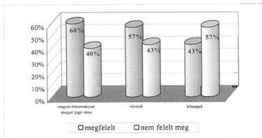

Azáltal, hogy a költségvetési előterjesztések teljes körűen nem tartalmazták a kötelező előírások szerinti adatokat, nem volt biztosított a testületek megfelelő tájékoztatása, az adathalmazok az irányítás és végrehajtás szintjein nem biztosították a döntéseket megalapozó, áttekinthető és világos információkat.

13

---

II. RÉSZLETES MEGÁLLAPÍTÁSOK

A költségvetési előterjesztések szerkezetére, tartalmára, részletezettségére vonatkozó előírásoknak nem megfelelő költségvetések jellemző hibatípusai az ellenőrzött önkormányzatoknál a következők voltak:

- 43 önkormányzatnál maradt el a többéves kihatással járó feladatok előirányzatainak éves bontásban történő bemutatása;
- 38 önkormányzat rendeletében nem, vagy nem teljes körűen határozták meg a költségvetés végrehajtásával kapcsolatos legfontosabb szabályokat, nem rögzítették az önkormányzati szintű előirányzatok közötti átcsoportosítással kapcsolatos hatáskör-átruházás rendjét, a költségvetési többletbevételek felhasználásának szabályait, a pénzmaradvány, a vállalkozási eredmény felhasználására vonatkozó előírásokat;
- 38 önkormányzatnál hiányzott a működési és felhalmozási célú bevételi és kiadási előirányzatok tájékoztató jellegű mérlegszerű bemutatása;
- 35 önkormányzat a működési és fenntartási előirányzatait intézményi szinten nem, vagy nem megfelelően mutatta ki, az intézményi szintű kiemelt előirányzatok szakfeladatonkénti bontása is elmaradt 22 helyen;
- 19 önkormányzatnál a rendelet nem tartalmazta az éves létszámkeretet az önállóan és a részben önállóan gazdálkodó költségvetési szervenként;
- 18 önkormányzati rendeletből nem voltak megállapíthatóak a felújítási előirányzatok célonként, 22-nél a felhalmozási kiadások feladatonként;
- 16 önkormányzatnál nem mutatták be a hivatal költségvetését feladatonként, ezen belül nem mindenütt szerepelt külön tételként az általános és céltartalékok összege;
- 10 önkormányzat nem mutatta ki bevételeit forrásonként.

### 1.1.2. A költségvetési előirányzatok évközi módosításának szabályszerűsége

A helyi önkormányzat a polgármesteri hivatal és az intézmények költségvetését költségvetési rendeletének módosításával változtathatja meg, amely a képviselő-testület kizárólagos hatásköre. Ezen alapelv figyelembevétele mellett az Ötv. 9. § (3) bekezdése lehetővé teszi, hogy egyes előirányzatok módosításának jogát a képviselő-testület az általa meghatározott keretek között a bizottságokra és a polgármesterre átruházza.

Az ellenőrzött időszakban a különböző hatáskörökben hozott döntések hatására az ellenőrzött önkormányzatok bevételi és kiadási előirányzata változott, az eredeti előirányzatot 2000. évben átlag 18,8%-kal haladta meg a módosított előirányzat. Az átlagot meghaladó arányban, 31,1%-kal módosult a vizsgált községeknél, nagyközségeknél, 22,2%-kal emelkedett a városoknál az eredeti előirányzat.

A költségvetési előirányzat-módosítások rendjének szabályozottsága, végrehajtása és nyilvántartása terén – az előző évekhez képest – kedvezőtlenebbek a tapasztalatok. Az önkormányzatok nem fordítottak

14

---

II. RÉSZLETES MEGÁLLAPÍTÁSOK

kellő figyelmet a jogszabályi előírások betartására, a gazdálkodási hatáskörök megfelelő szabályozására.

Az előirányzatok módosítására vonatkozó központi előírásokat a vizsgált önkormányzatok 45%-a tartotta be az előző évi 68%-kal szemben.

A 2000. évi költségvetési előirányzat-módosítások jogszabályi előírásokkal való összhangját – településtípusonként – a következő grafikon mutatja:

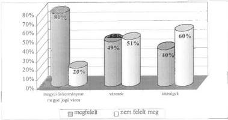

Az ellenőrzött önkormányzatok az előirányzatok módosítására vonatkozó jogszabályi előírásokat egy vagy több ponton megsértették a következők szerint:

9 onkormanyzatn a rendeletmodositasokat nem a koltsegvetesi rendeletuk szerinti reszletezesben hajtottak vegre, ezaltal az osszehasonlithatosag elvenem ervenyesult teljes koruen;
12 onkormanyzatn a testulet egyaltan nem modositotta a koltsegvetesi rendeletet, bar erre szukseg lett volna, 3 onkormanyzatn a rendeletmodositas helyett hatarozattal modositotta az eloranyzatot a testulet, tovabbi 4 onkormanyzatn az I. felseves, a III. negyedeves beszamolokban szereplo modositott eloranyzatokrol a testulet nem donttt megfelelo idoben, a modositott eloranyzatot utolag vette tudomasul;
17 onkormanyzatn az evkozi testuleti modositask nem fedtek le teljes koruen a zarszamadaskor bemutatott eredeti es modositott eloranyzatok kozotti kulonbozetet.
- az onkormányzatok kozel \(10\%\) -anal az intezmények nem jeleztek saját hataskoru eloranyzat-módositasi igenyeiket, igy a polgarmesteri hivatalok nem gezették at az intezményi eloranyzat módositásokat;
- az onkormányzatok további \(5\%\) -a nem tartotta be a rendeletmodositások határidejere vonatkozó kozponti elóirásokat, mivel a zárszámadasi rendeletükel egyidejuleg dontöttek az elóirányzataik modositásáról.

Az Áht. 103. (2) bekezdése értelmében a polgármesteri hivatal az előirányzatokról és azok módosításáról nyilvántartást vezet, e kötelezettségüknek a hivatalok közel 1/3-a nem tett eleget.

15

---

II. RÉSZLETES MEGÁLLAPÍTÁSOK

Az Áht. 93. § (1) bekezdése előírja, hogy a költségvetési szerv a jóváhagyott előirányzatokon belül köteles gazdálkodni. Az előirányzatok módosításának nem megfelelő gyakorlata, a nyilvántartások nem, vagy hiányos vezetése is közrejátszott abban, hogy az önkormányzati költségvetési szervek (hivatalok és intézmények) nem a testület által jóváhagyott előirányzatokon belül gazdálkodtak. Az ellenőrzött önkormányzatok több mint 1/3-ánál (70) a módosított előirányzatok közül legalább egy kiemelt előirányzatot költségvetési szerveik valamelyike túllépte, amely az önkormányzatok 1/4-énél (50) önkormányzati szintű túllépést is eredményezett.

A legkirívóbb eset Ózd Város Önkormányzatánál volt, ahol a 2000. évi módosított előirányzatok közül egy-két kiemelt előirányzatot a város valamennyi intézménye, ezen belül két intézmény az összkiadási előirányzatát is túllépte.

Az önkormányzatok az előirányzatok túllépésének okait, az előirányzat nélküli kötelezettségvállalásokat általában nem vizsgálták, emiatt felelősségre vonást nem kezdeményeztek.

- Mindössze néhány (5) önkormányzatnál fordult elő, hogy a belső ellenőrzés vizsgálta a túllépés okait, megállapították, hogy az intézmények a saját hatáskörű előirányzat-módosítási igényeiket nem jelezték, ezért az érintett testületek az előirányzat-módosításokat nem hagyták jóvá.
- Egy városi önkormányzatnál (Balatonfüred) a költségvetés 2000. novemberi módosításakor a képviselő-testület előirányzat nélküli kötelezettségvállalásokat tárt fel, amelynek utólagos kivizsgálására ideiglenes bizottságot hozott létre. Megállapították, hogy a polgármester egyszemélyi döntése alapján költségvetési előirányzat nélkül 18 150 ezer Ft összegben út- és játszóter építésére kötött szerződést. Az ideiglenes bizottság – fegyelmi eljárás mellőzésével – a polgármester megrovásban való részesítésére tett javaslatot a képviselő-testületnek, amelyre végül nem került sor.

## 1.2. A gazdálkodás

### 1.2.1. A gazdálkodás szervezettsége, szabályozottsága

Az önkormányzati gazdálkodás szervezettsége, szabályozottsága területén szerzett ellenőrzési tapasztalatok sokszínű képet mutatnak. (A gazdálkodás szabályozottságának színvonalát szemlélteti az 5. számú melléklet) Az alapvetőnek tekinthető helyi szabályozás, a képviselő-testületek működésének részletes szabályait – az Ötv. 18. § (1) bekezdésben foglaltak alapján – tartalmazó hatályos szervezeti és működési szabályzat az önkormányzatok 13%-ánál nem állt rendelkezésre, a meglévők 21%-a pedig nem volt megfelelő. E dokumentumok nem eléggé konkrétan és nem teljes körűen foglalták össze az önkormányzatok feladatait, a költségvetési tervezés és gazdálkodás alapvető hatásköri rendjét, a képviselő-testület és szervei közötti munkamegosztást. Jellemzően nem határozták meg a kötelező és önként vállalt feladatok körét, ellátásának módját, a hatáskörök gyakorlásának rendjét, a polgármester és a jegyző gazdálkodással kapcsolatos feladat- és hatáskörét. Az általában kedvezőbb személyi, szakmai feltételekkel rendelkező fővárosi kerületi és városi önkormányzatoknál sem mindig volt megfelelő a szervezeti és mű-

16

---

II. RÉSZLETES MEGÁLLAPÍTÁSOK

ködési szabályzat. Ez utóbbi körben 25% nem rendelkezett megfelelő tartalmú, aktualizált szervezeti és működési szabályzattal.

Szabályozási hiányosság, hogy a helyi önkormányzatok gazdálkodását végrehajtó **hivatalok** közel ¼-e – az Ámr. 17. § (4) bekezdésével ellentétben – **nem rendelkezett szervezeti és működési szabályzattal**, – továbbá az (5) bekezdésével ellentétesen – nem készült el a gazdasági szervezet (polgármesteri hivatal) ügyrendje sem. A gazdasági feladatokat, valamint a feladatot ellátók feladat-, hatás- és jogkörét tartalmazó, megfelelőnek ítélt ügyrenddel az ellenőrzött önkormányzatok hivatalainak 60%-a rendelkezett. A tartalmilag nem megfelelőnek minősített ügyrendek tipikus hibája, hogy a gazdálkodási feladatok felsorolása keret jellegű, a vezetők és dolgozók feladat-, hatás- és jogkörét nem határolták el. A szabályozás rendszerint nem követte a változásokat, gyakran eltért a helyi sajátosságoktól (pl. Jászfényszaru, Pilisvörösvár, Ráckeve városok, Almáskamarás, Bükkábrány, Domoszló, Hejőkeresztúr, Iregszemcse községek).

A gazdálkodással kapcsolatos **döntési és felelősségi szinteket** – képviselő-testület, bizottságok, polgármester, jegyző, ügyintézők – a vizsgált körben **rendszerint** a jogszabályi **követelményeknek megfelelően alakították ki**, biztosítva a tevékenység végrehajtásának folyamatosságát, zártságát, de előfordult a feladatok túlzott koncentrálása, ellentmondásos kialakítása is.

**Gyula városnál** a vagyonhasznosítás, valamint a vagyonnyilvántartás területén szükségtelen átfedések, valamint túlzott megosztottság jelei egyaránt tapasztalhatók voltak, hiányzott a résztvevők közötti megfelelő koordináció.

**Mezőberény** városban a feladatok és hatáskörök szabályozottsága a hivatalnál nem volt teljes körű, valamint ellentmondásos volt a különböző szabályzatokban. (A házipénztári szabályzat szerint utalványozó a jegyző, illetve a pénzügyi vezető, az ügyrend szerint a polgármester, az alpolgármester és a jegyző is utalványozhat, valamint nem szabályozott az érvényesítő személye.)

**Szentgyörgyvölgy** községben az önkormányzati gazdálkodással kapcsolatos több jogkört felhatalmazás nélkül a polgármester és a körjegyző szabályozott, a képviselő-testület néhány hatáskörét saját részre elvonták (pl. előirányzat átcsoportosítás, hitelfelvételről döntés).

**A pénzgazdálkodási jogkörök gyakorlásának rendjét** az önkormányzatok 14%-ánál **nem alakították ki**, a kötelezettségvállalás, utalványozás, ellenjegyzés és érvényesítés feladatai szabályozatlanok voltak. A gazdasági tevékenység ellátásához szükséges belső szabályozás szabályzatba beépített módon 95%-ban történt meg, ám 35%-ban annak tartalma nem felelt meg maradéktalanul a jogszabályi követelményeknek. E körben rendszerint a hatáskörök gyakorlásának általános szabályait határozták meg. A helyettesítés rendjét gyakran nem, vagy helytelenül rögzítették, nem volt tisztázott az összeférhetetlenség kérdése, illetve túl bonyolulttá vált a szabályozás.

**Lenti** város hivatalánál szabályzatban határozták meg a kötelezettségvállalás, utalványozás, érvényesítés és ellenjegyzés rendjét. Az intézkedés alapvető hiányossága, hogy mindezekről a jegyző rendelkezett, részben saját magát megnevezve kötelezettségvállalóként. A szabályozás szerint a kötelezettségvállalás és utalványozás ellenjegyzésére ugyancsak saját magát, a gazdasági osztályvezetőt

17

---

II. RÉSZLETES MEGÁLLAPÍTÁSOK

és helyettesét hatalmazta fel anélkül, hogy az átruházott hatáskör gyakorlásának konkrét eseteit meghatározta volna.

A kiadások teljesítésének és a bevételek beszedésének elrendelését megelőző érvényesítői feladatokkal felruházott személyek írásbeli megbízása leginkább a községi önkormányzatoknál maradt el.

A kis létszámú gazdasági szervezettel rendelkező községekben gondot okozott a gazdálkodási jogkörök kellő elhatárolása, az általános összeférhetetlenségi követelmények betartása (pl. Belvárdgyula, Bátorliget, Erdőkövesd, Meszes, Nagyér, Nekézseny, Szentgyörgyvölgy községek).

Az államháztartás szervezetei beszámolási és könyvvezetési kötelezettségének sajátosságairól szóló 249/2000. (XII. 24.) Korm. rendelet rendelkezett arról, hogy **az önállóan gazdálkodó költségvetési szervek kötelesek számviteli politikájukat kidolgozni és ennek keretében a leltározási, a pénzkezelési, az eszközök és források értékelési, a vagyontárgyak hasznosítási és selejtezési szabályait megalkotni.** A helyi szabályozást és a számviteli rend kialakítását, valamint működtetését a Htv. a jegyzők feladatkörébe utalta.

Az önkormányzatok gazdálkodását végrehajtó valamennyi szervezet számára kötelezően szabályozandó tevékenységek közül a legnagyobb arányban a pénzkezelési (65%) és a selejtezési (62%), valamint a leltározási (58%) szabályzat állt megfelelő tartalommal rendelkezésre. Ugyanakkor az önkormányzati gazdálkodás összetett és követelményeit illetően gyakran változó területét szabályozó számviteli politika és a számlarend még kevésbé tudott megfelelni az elvárásoknak. Az elkészített számviteli politikák 51%-a volt megfelelő, ugyanez a számlarend esetében 54%.

Teljes körűnek, jónak minősíthető és a helyi körülményekhez adaptált volt a szabályozottság az önkormányzatok 28%-ánál. Ez az arány kedvezőbb a városi, megyei és kerületi önkormányzatoknál, ahol összességben 40%-os a feladatellátás ilyen módon történő támogatottsága. A községeknek viszont csak 19%-a tett eleget szabályozási kötelezettségének.

Az önkormányzati hivatalok 38%-ánál volt a napi gazdálkodási feladatok ellátására nem teljes mértékben alkalmas vásárolt, helyi viszonyokra nem adaptált, hatályba nem léptetett, illetve hatályon kívül nem helyezett, iktatás nélküli, vagy már teljesen elavult szabályzat.

Elsősorban a kistelepülésekre jellemző a rendkívül hiányos szabályozás, az önkormányzatok 3,1%-ánál pedig a gazdálkodási szabályzatok teljes hiánya volt tapasztalható (Balinka, Gelej, Nagybarca, Nyomár, Rásonyságberencs, Vát községeknél).

### **Gyakran előforduló egyéb hiányosságok:**

- A **számviteli politika** szabályozásából rendszerint kimaradt, a lényegesség, a helyesbítések végrehajtásának meghatározása, hatálya, a rendkívüli események meghatározása.

18

---

II. RÉSZLETES MEGÁLLAPÍTÁSOK

- A **számlarendekből** hiányzott a vezetett analitikus nyilvántartások formája, tartalma, a főkönyvi könyveléssel való egyeztetésének módja, a zárlati teendők rendszere, a vagyontárgyak elkülönítésének módja, a vállalkozási tevékenység szabálya, az értékpapírok értékvesztésének elszámolása, a hivatalhoz kapcsolódó részben önállóan gazdálkodó költségvetési szervek könyvvezetési kötelezettségének meghatározása.
- Az eszközök és források **értékelési** szabályzata nem tartalmazta a kísértékű tárgyi eszközök elszámolásának, szoftverek mennyiségi nyilvántartásának szabályait.
- A **leltározási** szabályzatban nem határozták meg a leltározás vezetőjét, a leltározási bizottság összetételét, a leltározási körzeteket, a leltározást helyettesítő nyilvántartások alapján készítendő összesítő kimutatás tartalmát, formáját, kellékeit, a mérlegben nem szereplő készletek leltározásával kapcsolatos feladatokat, az üzemeltetésre átadott vagyonelemek kezelését, éves leltározási kötelezettség végrehajtását, a leltározás folyamatának rendjét.
- A felesleges vagyontárgyak hasznosításának, **selejtezésének** szabályzata nem tért ki a selejtezési bizottság tagjainak kijelölésére, feladatuk meghatározására, az ármegállapítás szabályaira, e tevékenységben közreműködők jogaira és kötelezettségeire, a selejtezett eszközök további hasznosításának szabályaira, helyenként nem volt összhangban a hatályos vagyonrendelettel.
- A **pénzkezelési** szabályzatok nem tartalmazták a megnyitandó bankszámlák körét, rendeltetését, a rendelkezni jogosultak körét, a bankszámlák és a pénztár kapcsolatrendszerét, az értékpapírok nyilvántartásának rendszerét, a pénztárzárlat gyakoriságát, egyes pénzgazdálkodási jogköröket, a szigorú számadás alá tartozó nyomtatványokat, a napi pénztárkeret összegét, a tartható készpénz felső határát, az alkalmazott bérfizetési technikát, a pénztáros helyettesítését, pénztárosi, pénztárellenőri nyilatkozatokat.

### 1.2.2. A pénzgazdálkodás szabályszerűsége

A gazdasági eseményekről szóló, elsősorban a banki és a pénztárforgalomhoz kapcsolódó bizonylatok alaki, tartalmi követelményeinek betartását ellenőriztük.

A megvizsgált **bizonylatok 63%-a** összességében **alakilag és tartalmilag megfelelő volt. Kedvezőbb** a kép a **városok, megyék és a kerületek vonatkozásában**, ahol a vizsgálati minta 87%-nál nem volt hiányosság. Mindez nem mondható el a községekről, különösen az ezer fő alattiakról, ahol ez az arány 34% volt.

Az ellenőrzött önkormányzatoknál **a gazdasági eseményeket magukba foglaló bizonylatok jogszabályok által támasztott alaki és tartalmi megfelelősége** (településtípusonként) a következők szerint alakult:

19

---

II. RÉSZLETES MEGÁLLAPÍTÁSOK

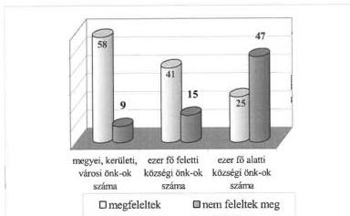

Az önkormányzatok pénzgazdálkodási gyakorlatában a pénztári és banki kifizetések közül, a **pénztári tevékenység ellátása volt kevésbé szabályszerű. Az önkormányzati hivatalok 55%-a tudott e területen megfelelni az előírásoknak**, leginkább (81%-ban) a városok, megyei önkormányzatok és a kerületek, legkevésbé (26%-ban) az ezer fő alatti községek.

A gazdasági eseményeket magukba foglaló **pénztári bizonylatok** jogszabályok által támasztott alaki és tartalmi megfelelőségének alakulása az önkormányzatoknál (településtípusonként):

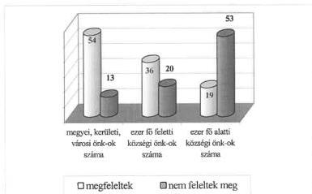

Gyakori volt az utalványozás, ellenjegyzés, érvényesítés nélküli kifizetés. Az önkormányzatok 28%-ánál az érvényesítés, 22%-ánál az utalványozás ellenjegyzése, 21%-ánál az utalványozás helyi és központi előírásait nem tartották be.

A pénz- és értéktári tevékenység vizsgálata során a már korábban felsorolt hiányosságokon túlmenően, a vizsgált települési önkormányzatok 25%-ánál a pénztárellenőrzés, 7%-nál a pénztárjelentés vezetésének hiányát, 11%-nál a szabályzatokban rögzített összeget meghaladó záró pénzkészletet állapítottuk meg.

20

---

II. RÉSZLETES MEGÁLLAPÍTÁSOK

A **banki** bizonylatokat az önkormányzatok **68%-a megfelelő módon kezelte**. A megyei, kerületi és városi önkormányzatoknál 88% megfelelő, a községeknél 44% volt elfogadható. Ez utóbbi körben az érvényesítés hibáit 17%-nál, az utalványozás ellenjegyzésének szabálytalanságát 23%-nál, az utalványozását pedig 21%-nál tapasztaltuk.

A gazdasági eseményeket magukba foglaló **banki bizonylatok** jogszabályok által támasztott alaki és tartalmi megfelelőségének alakulása önkormányzatonként (településtípusonként):

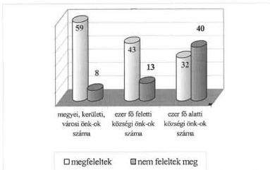

**Elsősorban a községek** önkormányzati hivatalainál fordult elő a **gazdálkodási fegyelem sorozatos és súlyos megsértése**, amelyet halmazottan két községben tapasztaltunk:

**Mályinka** községben a nem megfelelően szabályozott, ellenőrzés nélküli gazdálkodás során nem gondoskodtak a pénzforgalom naprakész vezetéséről, **nem vezettek sem számítógépes, sem kézi könyvelést**, az alapbizonylatokból történt kézi kigyűjtések alapján készült el a költségvetési beszámoló.

**Drágszél** községben a gazdasági eseményekről nem vezettek kettős könyvviteli nyilvántartást. Pénztárkönyvet, pénztárjelentést nem készítettek, pénztárzárást nem végeztek. A pénztári és banki tranzakciókat az alapbizonylatokon kívül más formában nem tartották nyilván. A költségvetési beszámolók alapjául szolgáló feljegyzések, kimutatások megsemmisültek, ellenőrzésükre nem volt lehetőség.

A gazdálkodási jogosítványok gyakorlásánál tapasztalt hiányosságokon túlmenően az ellenőrzött önkormányzatok 19%-nál fordult elő kiadás teljesítése a teljesítés szakmai igazolása nélkül, 12%-nál saját részre történő utalványozás, 10%-nál az eszközök nyilvántartásba vételének elhagyása, 16%-nál pedig a pénztári kifizetéseket teljesítettek az arra nem jogosult részére. A halmazott jogszabálysértések miatt Boldva, Csépa, Drágszál, Kozármisleny, Mályinka, Ortaháza, Ozmánbük, Páka, Petneháza, Szárliget, Szentgyörgyvölgy, Tófej községek érintett köztisztviselőinek felelősségre vonását kezdeményeztük.

21

---

II. RÉSZLETES MEGÁLLAPÍTÁSOK

**Az elszámolási előlegek kezelését nem a szabályoknak megfelelően végezték** az ezer fő alatti lakosságszámú települési önkormányzatok 17%-ánál.

Gyakori volt a szabálytalan javítás, a határidőn túli elszámolás, a bruttó elszámolás elvének megsértése, az elszámolási határidők megadásának elhagyása.

Az ezer fő alatti lakosságszámú önkormányzatok 14%-ánál fordult elő **jogosulatlan és megalapozatlan útiköltség térítés elszámolás**.

### 1.2.3. A vagyongazdálkodás

**A helyi önkormányzatok eszközeinek mérlegben kimutatott, országosan összesített értéke 2000. évben az előző évi 2 313,2 milliárd Ft-ról 3 089,9 milliárd Ft-ra, 33,6%-kal nőtt.** (A részletes adatokat a 6. számú melléklet tartalmazza.) A növekedés 13,1%-át Budapest Főváros Önkormányzata mérlegében kimutatott eszközállomány változása okozta, amely jelentős részben a korábban érték nélkül nyilvántartott eszközök értékének megállapítása miatt következett be. A Budapest Főváros Önkormányzatának adata nélküli, korrigált országos átlagos növekedés 20,5%-os volt.

**A vizsgált önkormányzatok mérleg főösszege 2000. évben az országos átlagnál kisebb mértékben, 15,7%-kal nőtt.** (A részletes adatokat és az 1999-2000. évi összesítést a 7. számú melléklet tartalmazza.) A növekedés településtípusonként eltérő, a városoknál 19,8%, az 1000 fő feletti lakosságszámú településeknél 19,3%, az 1000 fő alatti településeknél 10,4%, a megyei önkormányzatoknál 9,6%, a kerületi önkormányzatoknál 5% volt.

A mérlegben kimutatott **eszközök összetétele** 2000. évben az előző évhez viszonyítva **kis mértékben változott a vizsgált önkormányzatoknál**, a befektetett eszközök aránya 85,3%-ról 85,7%-ra nőtt.

**A vizsgált önkormányzatok mérleg főösszegének 57,5 milliárd Ft-os emelkedéséből 47,4 milliárd Ft értékű növekedés (az összes növekedés 82,4%-a) a tárgyi eszközöknél következett be. A tárgyi eszközök növekedését 98,7%-ban az ingatlanállomány értékének változása eredményezte.**

A mérlegben kimutatott **eszközállomány-növekedés a vizsgált önkormányzatoknál csak kisebb részben hozható kapcsolatba az önkormányzatok gazdálkodásával.** A 2000. évi költségvetési bevételekből megvalósított beruházások és felújítások 28,3%-kal, az előző évekről áthúzódó és a saját kivitelezésű beruházások aktiválása együttesen 8,1%-kal, a térítésmentesen átvett eszközök 14,8%-kal járultak hozzá a tárgyi eszközök bruttó értékének növekedéséhez. A tárgyi eszközöknél 48,8%-ban, **az ingatlanoknál 51,6%-ban egyéb okból következett be a bruttó érték növekedése.** A számviteli szabályok szerint az önkormányzatok **itt mutatták ki** a többletként fellelt, illetve a korábban térítésmentesen átvett és/vagy **érték nélkül nyilvántartott eszközök** – elsősorban ingatlanok – **bruttó értékének megállapítása és számviteli nyilvántartásba vétele miatti vagyonnövekedést.**

22

---

II. RÉSZLETES MEGÁLLAPÍTÁSOK

Az országos adatokat tekintve az un. egyéb okból bekövetkezett bruttó értéknövekedés aránya a tárgyi eszközök összesen 1 044 milliárd Ft-os növekedésén belül 59,7%, az ingatlanoknál 62,9% volt. (A helyi önkormányzatok tárgyi eszközei bruttó értékének 2000. évi növekedési összetevőit a 9. számú melléklet részletezi.) A bruttó érték – előzőek szerinti jelentős – emelkedését az elszámolt értékcsökkenési leírások és egyéb csökkenések mérsékelték, amelynek következtében a tárgyi eszközök vagyonmérlegben szereplő nettó értéke 43,1%-kal (508 milliárd Ft-tal) emelkedett. (Az érték-megállapítás miatt többszörösére nőtt például Dunaújváros, Bonyhád, Tolna városok, Kőröstarcsa, Tetétlen községek mérlegben kimutatott vagyona.)

A vizsgált önkormányzatoknál együttesen a **befektetett eszközökön** belül az ingatlanok mérleg szerinti értéke 24,3%-kal, az üzemeltetésre, kezelésre átadott eszközök számviteli nyilvántartás szerinti értéke 15,6%-kal növekedett. Jelentős mértékben (56,1%-kal) csökkent a befektetési célú értékpapírok állománya, ez számottevő eltérés az országosan kimutatott, átlagosan 34,3%-os növekedéstől. (A Budapest Főváros Önkormányzatának adata nélkül az országos növekedés mindössze 0,2%).

A **forgóeszközök** között kimutatott értékpapíroknál a növekedés 56,3% volt, mivel az önkormányzatok előnyben részesítették a rövid távú pénzügyi befektetést. Az értékpapír-állomány a Budapest fővárosi III., VIII., XV. kerületek átlagában egy év alatt 134,7%-kal gyarapodott (az országos átlag 19,7%), ugyanakkor a megyei önkormányzatoknál 99,9%-kal, az ezer fő alatti településeknél 20,7%-kal csökkent, szemben országos átlag 624,9%-os, illetve 19,3%-os növekedésével.

A **források** között a vizsgált önkormányzatoknál 2000. évben a saját tőke 17,4%-kal, a tartalékok 13,2%-kal, a kötelezettségek 2,3%-kal nőttek. A kötelezettségek növekedésének mértéke jelentősen elmaradt az országos átlagos növekedéstől, ami 14,1%-os volt. A vizsgált önkormányzatok tartózkodtak a jelentősebb összegű, elsősorban hosszú lejáratú hitelek felvételétől, ez az állomány 2,9%-kal csökkent.

A **hosszú lejáratú kötelezettség** állomány átlagos csökkenése jelentős eltéréseket takar. A külső források igénybevétele az 1000 fő feletti lakosságszámú községekben több mint kétszeresére, 130,6%-kal nőtt, ez azonban abszolút értékben 0,15 milliárd Ft-ot jelentett, ami a vizsgált önkormányzatok kötelezettség állományának 1,5%-a. Az ellenőrzött önkormányzatoknál kimutatott növekedés döntő többségét (71%-át) az Örkény nagyközségben indított közmű beruházásra felvett hitel tette ki. A vizsgált önkormányzatok közül 1999-ben 113-nak (58,5%), 2000-ben 102-nek (52,8%) nem volt hosszú lejáratú kötelezettsége. Az összesen 10,2 milliárd Ft hosszú lejáratú kötelezettség megoszlása településtípusonként jelentősen eltért.

A vizsgált önkormányzatok mérlegben kimutatott **rövid lejáratú kötelezettségei** átlagosan 11,3%-kal nőttek, ezek összege összesen 14,3 milliárd Ft volt 2000. évben. Az önkormányzatok közül 2000-ben 37-nek (19,2%) nem volt ilyen kötelezettsége. Az egyes településtípusok között itt is nagy eltérések voltak.

A vizsgált önkormányzatok egy része csak jelentős külső erőforrások, döntően hitelek igénybevételével tudta fejlesztési és működési feladatait ellátni, ezt mu-

23

---

II. RÉSZLETES MEGÁLLAPÍTÁSOK

tatja a kötelezettségek összes forráshoz viszonyított arányának alakulása is. Az önkormányzatok közül háromnál a 40%-ot, háromnál a 30%-ot, tizenhatnál a 20%-ot, negyvennyolcnál a 10%-ot meghaladó volt a kötelezettségek aránya.

A túlzott mértékű eladósodás megakadályozása és a működőképesség fenntartása érdekében **az Ötv. 88. § (2) bekezdés tartalmazza** a helyi önkormányzatok adósságot keletkeztető **éves kötelezettségvállalásának felső határát**. A vizsgált megyei, városi és ezer lakosságszám feletti községi önkormányzatoknál az adósságot keletkeztető kötelezettségvállalások közül 2000. évben hitelfelvétel 30 (24%), garancia és kezességvállalás 9 (7,4%), lízing 2 (1,7%) önkormányzatnál fordult elő. A testületi döntéseken alapuló kötelezettségvállalások mértéke az Ötv. 88. §-ában előírt felső határt – a korrigált saját folyó bevétel 70%-át – 5 esetben – az érintett 41 önkormányzat 12,2%-ánál – haladta meg.

A kötelezettségvállalások maximális mértékének számítása a felső határ egyértelmű jogi szabályozása hiányában különféle módszerek alkalmazásával történt. **Bizonytalanságot okozott, hogy a tárgyévi kötelezettségvállalásba a korábbi időszakban hozott döntések teljes összegével, illetve azok tárgyévi kihatásaival** (pl. hiteltörlesztési kötelezettség, fennálló garancia- és kezességvállalás) **kell-e számolni és ha igen, akkor annak mértékét hogyan kell megállapítani**.

**Gondot jelentett, hogy a több évre kiható garancia- és kezességvállalások** csak feltételesen, az adós nem teljesítése esetén és egy összegben, de **nem tervezhető módon jelenthetnek** konkrét vagyoni, pénzügyi terhet az önkormányzatok számára. Ezért a garancia és kezességvállalás teljes összegének a futamidő egyes éveire felosztott ütemezésének, az éves kihatás – hitelekhez hasonló módon történő – számításának nincs értelme. A lejáratig szólóan minden évben, teljes összeggel történő figyelembevétele viszont olyan mértékű óvatosságot jelentene, amely az ésszerű gazdálkodás elveivel ellentétes és különösen a kisebb volumenű költségvetés esetén a kötelezettségvállalási lehetőségeket hosszú évekre korlátozná. Mindezek mellett a vállalt garanciális kötelezettség egyösszegű esedékessé válása – szintén főként a szerényebb mértékű költségvetéssel rendelkező önkormányzatoknál – a vagyoni-pénzügyi helyzet teljes ellehetetlenüléséhez vezetne.

**Ugyancsak eltérő** az Ötv. 88. § előírásainak alkalmazásában a **likvid-hitel fogalmának értelmezése**, amely nem esik a törvényben rögzített, előzőek szerinti korlátozás alá. Az Ötv. normaszövege szerint „likvid-hitel az éven belül felvett és visszafizetett, a közszolgáltatási és államigazgatási feladatok folyamatos működtetéséhez felvett hitel”. A gyakorlatban vitatott az „éven belül felvett és visszafizetett” szövegezés jelentése, amelynek kétféle értelmezése ismert és ezáltal a kötelezettségvállalás felső határának megállapításánál kétféle gyakorlat alakult ki. **Ebbe a körbe az egyik felfogás szerint az év közben felvett és még a tárgyévben visszafizetett, míg a másik szerint az egyéves időtartamon** – amely két naptári évet is érinthet – **belül visszafizetett hitelek tartoznak**. Az utóbbi magyarázat a rövid lejáratú kötelezettségek számviteli előírások szerinti értelmezésére hivatkozva tekinti éven belülinek az egyéves időtartamot meg nem haladó lejáratra felvett működési hiteleket.

24

---

II. RÉSZLETES MEGÁLLAPÍTÁSOK

A költségvetés alapján gazdálkodó szervek beszámolási és könyvvezetési kötelezettségéről szóló 249/2000. (XII. 24.), Korm. rendelet 37. §-a előírta, hogy a tárgyévről december 31-i fordulónappal készített mérlegben kimutatott eszközöket és forrásokat minden évben leltározni kell. Ez az előírás egyrészt a mérlegben szereplő adatok megfelelő alátámasztását, másrészt a vagyonvédelmet segíti.

Az ellenőrzött települési önkormányzatok csak részben tettek eleget évenkénti leltározási feladatuknak. A leltározási tevékenységet az 1000 fő feletti települések 66,7%-a, az ezer fő alatti községek 38,9%-a szabályozta elfogadható módon. Leltárt a 195 önkormányzat 54%-a, ezen belül az 1000 fő feletti lakosságszámú települések 67,5%-a készített. A kisebb településeknél ez az arány 42,9% volt. Néhány önkormányzat több év óta nem tett eleget leltározási kötelezettségének.

Szolnok városban az önkormányzat megalakulása óta nem leltározták mennyiségi felvétellel a tárgyi eszközöket. Szárliget és Dunaalmás községekben az önkormányzati vagyont teljes körűen tíz éve nem leltározták.

A leltározás módjának megválasztásakor az önkormányzatok polgármesteri hivatalai az egyeztetést részesítették előnyben. Az eszközök közül az ingatlanok, értékpapírok, részesedések, üzemeltetésre, kezelésre átadott eszközök és a pénzeszközök számbavételét 96,4%-ban egyeztetéssel, 3,6%-ban mennyiségi felvétellel végezték el.

Az ellenőrzött számlarendek 62,6%-a tartalmazott a számviteli analitikus nyilvántartások vezetésére vonatkozó megfelelő előírásokat.

A vizsgálat 14 önkormányzat polgármesteri hivatalánál állapította meg, hogy az eszközökről és a forrásokról nem vezettek teljes körű analitikus nyilvántartást. A számviteli analitikus nyilvántartás és a kapcsolódó főkönyvi számla értékadatai között 17 településnél volt eltérés. Az előbbi 31 települési önkormányzat megsértette az 54/1996. (IV. 12.) Korm. rendelet 25. § (4) bekezdésének előírásait, amely csak mennyiségben és értékben folyamatosan vezetett részletező (analitikus) nyilvántartások megléte esetén teszi lehetővé a leltár egyeztetéssel és összesítő kimutatás készítésével történő helyettesítését. Ehhez 2001. január 1-től a felügyeleti szerv egyetértésére is szükség volt, ez azonban dokumentált formában csak néhány (7) önkormányzatnál állt rendelkezésre.

- Az eszközök és források számbavétele teljes körűen nem történt meg 31 önkormányzatnál.
- Budapest Főváros III., VIII., XI. és XV. kerületei a lakásértékesítésekből származó bevétel értékesítési költségekkel csökkentett összegének 50%-át nem utalták át a Budapest Főváros Önkormányzatának, a 122 millió Ft és 820 millió Ft közötti tartozásukat nem mutatták ki kötelezettségként a mérlegben.
- Kilenc önkormányzat mérlegéből a gazdasági társaságokban meglévő részesedések, tíz esetben a követelések, négy esetben a kezelésre, üzemeltetésre átadott eszközök, négy önkormányzatnál egyéb eszközök maradtak ki.

Az ellenőrzött önkormányzatok 74,9%-a az Ötv. 80. §-ában kapott felhatalmazás alapján rendeletben szabályozta a vagyongazdálkodással összefüggő kérdéseket. Nem terjedt ki valamennyi eszköz típusra a szabá-

25

---

II. RÉSZLETES MEGÁLLAPÍTÁSOK

lyozások 25%-a. A vagyongazdálkodási feladatok, az ahhoz kapcsolódó döntési hatáskörök és felelősségi feltételek szabályozása sem teljes körű. A vagyongazdálkodási rendeletek 95%-a ugyan megfelelően rögzítette az eszközök tulajdonosi viszonyait és a hasznosítását érintő döntési hatásköröket, de 22,8%-uk nem tartalmazta az ingyenes átadás-átvételre, 38,5%-uk az üzemeltetésre, kezelésre történő átadásra és átvételre vonatkozó előírásokat.

Az önkormányzatok tulajdonában lévő ingatlanvagyon nyilvántartási és adatszolgáltatási rendjéről szóló 147/1992. (XI. 6.) Korm. rendeletben előírt ingatlan-nyilvántartást az ellenőrzött települések 70,3%-a kialakította. Az ingatlanok vagyonleltárban, a számviteli analitikus nyilvántartásban és az ingatlanvagyon-kataszterben kimutatott értékadatai az önkormányzatok 17,2%-ánál egyeztek meg.

- Tizenöt önkormányzatnál jelentős volt az eltérés a nyilvántartások 2000. december 31-i értékadatai között, ennek összege: pl. Szeged 18 milliárd Ft, Dunaújváros 19 milliárd Ft, Bicske 5,3 milliárd Ft.
- Négy önkormányzatnál az ingatlanvagyon-kataszter egyáltalán nem tartalmazott értékadatot (Ráckeve városnál, Csépa, Medgyesbodzás, Nyomár községekben).

A jelentős eltérések azt mutatták, hogy az önkormányzatok nem fordítottak kellő figyelmet a különböző nyilvántartásokban szereplő adatok egyeztetésére, az ingatlanvagyon-kataszter felfektetése óta az ingatlanállományban bekövetkezett változások átvezetésére.

A Kbt. 96. § (2) bekezdésében felhatalmazta a helyi önkormányzatokat, hogy – amennyiben ezt a helyi beszerzések száma és értéke indokolja – rendeletben szabályozzák az általuk alapított helyi önkormányzati költségvetési szervek vonatkozásában a közbeszerzési eljárások kiírásával és elbírálásával kapcsolatos tevékenységre és az abban eljáró személyekre vonatkozó, a törvényben nem szabályozott rendelkezéseket, az értékhatár alatti beszerzések részletes előírásait. A vizsgálatban érintett 123, ezer fő feletti lakosságszámú település önkormányzatainak 36,6%-a élt a Kbt-ben kapott felhatalmazással, szabályozta a közbeszerzési eljárás rendjét.

A negyvenöt rendelet közül húszat minősített a vizsgálat megfelelőnek a dokumentumok áttanulmányozása és a folytatott gyakorlat alapján. A jellemző hiányosságok:

- Az Országgyűlés 1999. szeptember 1-jei hatállyal módosította a Kbt-t, ezt a változást a helyi rendeleten nem vezették át, ezért eltérések voltak a törvényi és a helyi szabályozás között a döntés előkészítés és a döntéshozatal vonatkozásában.
- A rendelet hatályát nem terjesztették ki a közszolgáltatást végző intézményekre és önkormányzati gazdasági társaságokra.
- Egyértelműen nem rögzítették a közbeszerzési eljárásban közreműködők feladatát, hatáskörét és felelősségét.

26

---

II. RÉSZLETES MEGÁLLAPÍTÁSOK

- Nem rendelkeztek a közbeszerzési eljárás értékhatár alatti beszerzéseknél történő alkalmazásáról.
- Nem rendelkeztek arról, hogy mely esetekben kell összevontan, közbeszerzés útján beszerezni a működéshez szükséges eszközöket, anyagokat, szolgáltatásokat, mit tekintenek azonos tárgyúnak.

A Kbt. 2. § (1) bekezdés előírását megsértve, tizenkettő települési önkormányzat nem folytatott le közbeszerzési eljárást minden esetben, amikor az árubeszerzés, építési beruházás, illetve a szolgáltatás értéke meghaladta a vonatkozó költségvetési törvényekben meghatározott értéket.

A felújítási munkáknál nem a szolgáltatásokra érvényes értékhatárt vették figyelembe (Bicske, Záhony, Harkány). Étkeztetési, takarítási, őrzés-védelmi, valamint beruházásnál tervezési és bonyolítási szolgáltatásokat rendeltek meg közbeszerzési eljárás nélkül (Budapest XI. kerület, Komló, Mezőberény, Hajdúszoboszló). Az éves szinten tervezett útépítési feladatokat részekre bontották, megsértve a Kbt. 5.§ előírásait (Kazincbarcika, Monor). Útépítés (Jászfényszaru), mélyfúrású hévízkút építése (Máriapócs), egészségügyi gép-műszer beszerzése (Kazincbarcika), ingatlanvásárlás (Visonta) esetében nem volt közbeszerzés.

A vizsgált időszakban 47 települési önkormányzat, összesen 168 közbeszerzési eljárást folytatott le, ezek közül 64-et (38,1%) ellenőriztünk tételesen.

- Az önkormányzatok – egy kivétellel – a Kbt. előírásainak megfelelően választották meg az alkalmazott közbeszerzési eljárást.

**Veszprém** város 2000. évben a városi sportcsarnok bővítése beruházás megvalósítására hirdetmény közzététele nélküli eljárást folytatott le. A Közbeszerzési Döntőbizottság elnöke eljárást indított, mert nem fogadta el a választott eljárás indokát. Az önkormányzat a folyamatban lévő eljárás ellenére szerződést kötött a kivitelezővel. A Közbeszerzési Döntőbizottság a Kbt. 70. § előírásának megsértéséért 1 millió Ft bírságot szabott ki. A döntést az önkormányzat az illetékes bíróságnál megtámadta, az eljárás a helyszíni ellenőrzés befejezésének időpontjában még nem záródott le.

- Az önkormányzatok a Kbt. előzetes tájékoztatásra, a hirdetmények közzétételére vonatkozó általános szabályait betartották. Ugyanakkor a közbeszerzési eljárások gyakorlati lefolytatásakor az önkormányzatok 44 esetben (68,8%) megsértették a Kbt. közbeszerzések lebonyolításával kapcsolatos előírásait.
- A Kbt. 31. § (3) bekezdése előírja, hogy az ajánlatkérő az ajánlatok elbírálására legalább háromtagú bizottságot hoz létre, amely szakvélemény készítésével segíti az ajánlatkérő nevében a közbeszerzési eljárást lezáró határozatot meghozó személy döntését. Huszonkét önkormányzat a képviselő-testületre (közgyűlésre), vagy az e célból létrehozott bizottságra ruházta át a közbeszerzési eljárást lezáró döntésről szóló határozat meghozatalának jogát.
- Öt önkormányzat olyan ajánlattevőt nyilvánított győztesnek, amely nem, vagy csak részben felelt meg az ajánlati felhívásban, dokumentációban rögzített feltételeknek, megsértve ezzel a Kbt. 52. § (2) bekezdés d) pontjának előírásait, amely szerint az ilyen ajánlatot érvénytelennek kell minősíteni (Barcs, Bonyhád, Esztergom, Gyula, Tolna városok).

27

---

II. RÉSZLETES MEGÁLLAPÍTÁSOK

- A Kbt. 55. § (6) bekezdés alapján az ajánlatkérő az ajánlatokat a pályázati felhívásban meghatározott értékelési szempontok alapján bírálja el. A Kbt. 59. § (1) bekezdése szerint az eljárás nyertese az, aki a legkedvezőbb ajánlatot tette. Ezek a jogszabályi előírások négy esetben nem érvényesültek (Barcs, Kiskunfélegyháza, Mezőberény, Szécsény városok).
- Nem érvényesültek maradéktalanul a Kbt. Szerződéskötés idejére vonatkozó előírásai sem (az eredményhirdetés előtt, vagy aznap kötöttek szerződést két városban).

### 1.2.4. A feladatellátás szervezeti formái

A helyi önkormányzatok közszolgáltatási feladatait a településfejlesztés és a helyi társadalom közösségi életéhez szükséges, a közügyekhez tartozó feladatok területeinek kiemelésével az Ötv. 8 §-a állapította meg. Ennek keretében meghatározta a helyi közszolgáltatásoknak azt a minimális körét, amelyről minden települési önkormányzat köteles gondoskodni. A helyi közösségek alapfokú ellátásához és a településüzemeltetéshez elengedhetetlenül szükséges, kötelező feladatok mellett a helyi önkormányzat önként vállalhatja minden olyan helyi közügy önálló megoldását, amelyet jogszabály nem utal más szerv hatáskörébe. Az Ötv. 8. § (2) bekezdésének felhatalmazása alapján a települési önkormányzat anyagi lehetőségei függvényében és a lakosság igényei alapján maga határozza meg, hogy mely feladatokat lát el, azokat milyen mértékben, milyen eszközökkel és hogyan oldja meg.

Az ellenőrzött önkormányzatok a helyi feladatellátás rendszerének meghatározása érdekében nem mérték fel a lakossági igényeket és az anyagi lehetőségeiket. A helyi közügyek ellátását szolgáló kötelező és önként vállalt feladatok megyei, települési szintű meghatározását az ellenőrzött megyei, városi és ezer lakoson felüli községi önkormányzatoknál - 8,9% kivételével - nem dokumentálták. Szervezeti és Működési Szabályzataikban a feladatellátás kérdéskörével ugyan foglalkoztak, de abban konkrét feladat meghatározás helyett, elsősorban az Ötv. és más jogszabályok olyan előírásaira hivatkoztak, amelyek részükre feladatokat állapítanak meg.

Az ellenőrzött időszakban főként a nagyobb, összetettebb feladatokkal rendelkező önkormányzatoknál történt meg a feladatellátás szervezeti rendszerének részleges, vagy teljes körű áttekintése. Emellett egyes ágazati jogszabályok kötelező előírásai alapján elvégezték az adott területen várható igények felmérését és ahhoz igazodva a kialakítandó struktúrára vonatkozó elképzelések rögzítését (pl. 2000. évben a közoktatásra középtávú intézményhálózat működtetési, fejlesztési tervek készítése a legalább két oktatási, nevelési intézményt fenntartó önkormányzatoknál). Mindezek célja a kötelező feladatok feltételrendszerének javítása, illetve a szolgáltatás magasabb színvonalú biztosításához vezető megoldások keresése volt. Komplex helyzetelemzéssel, gazdaságossági számításokkal azonban még a megtett intézkedéseket is csak ritkán támasztották alá.

Szeged város a szakmai és gazdasági szempontok szerinti szervezeti keretek meghatározása érdekében a feladatokat ellátó szervezeti struktúra rendjében, gazdálkodási jogkörében széleskörű változtatásokat hajtott végre. A cél elérését biztosító testületi döntések megalapozása érdekében a szakmai munka minősé-

28

---

II. RÉSZLETES MEGÁLLAPÍTÁSOK

gét, személyi és tárgyi feltételrendszerét és hatékonyság-javítási lehetőségeit az egyes ágazatokra vonatkozóan felülvizsgálták. A Közgazdasági Iroda az érintett intézmények bevonásával pénzügyi-gazdasági elemzéseket végzett az intézményüzemeltetési feladatok ellátási formájára, a kapcsolódó személyi és tárgyi feltételrendszerére vonatkozóan.

**Gyula** város által az ellenőrzött időszakban végrehajtott intézményátadásokat, összevonásokat, megszüntetéseket, átszervezéseket a feladatellátáshoz nyújtott önkormányzati támogatás csökkentése motiválta, de ezeket gazdaságossági számításokkal többnyire csak a foglalkoztatottak létszámváltozása tekintetében támasztották alá.

**A települési önkormányzatok az Ötv. előírásai alapján kötelező feladatként gondoskodtak** az egészséges ivóvíz ellátásról, az óvodai és az általános iskolai oktatásról és nevelésről, az egészségügyi és a szociális alapellátásról, a közvilágításról, a helyi közutak és köztemetők fenntartásáról. A közszolgáltatások biztosítása terén mindezek mellett más törvényekben rögzített helyi önkormányzati kötelezettséget, feladatot is elláttak. Néhány önkormányzatnál viszont nem teljesítették maradéktalanul a jogszabályban előírt szolgáltatási kötelezettséget.

**Kiskunfélegyháza** város a Szoctv. alapján kötelező feladatot jelentő feladatok költségvetési finanszírozásából fokozatosan kivonult, a családsegítő szolgálat és a családok átmeneti otthonának hiányos létszám és tárgyi feltételei miatt nem biztosította az előírt és megfelelő színvonalú feladatellátást.

**Hajdúhadház** város az idősek átmeneti elhelyezését biztosító intézmény működtetési feladatának nem tett eleget.

**Záhony** város nappali ellátást nyújtó szociális intézményt a lakosság körében végzett felmérés alapján – igény hiányában – nem működtette. A feladatellátás tárgyi feltételei rendelkezésére álltak, amellyel a szolgáltatást biztosítani tudnák.

Az ellenőrzött önkormányzatok **a közszolgáltatási feladataik ellátásában elsősorban a hagyományosnak tekinthető költségvetési szervi kereteket alkalmazták**. A rendkívül sokrétű lakossági szolgáltatások nyújtására 1999-ben 1780, 2000-ben 1730 intézményt működtettek, amely önkormányzatonként átlagosan 9,1-8,7 közszolgáltató szervezet fenntartását jelentette.

**A költségvetési intézmények döntő többsége (80,2%) a városi önkormányzatok felügyelete alá tartozott**, míg 12,2% a községi, 7,6% a megyei önkormányzatok irányítása alatt működött. A szolgáltatások iránti igények összetettsége, különböző nagysága folytán a megyei és a városi önkormányzatok rendelkeztek szélesebb intézményhálózattal. A városokban átlagosan 22, a megyékben 32, a községekben 2 költségvetési szerv látott el közszolgáltatási feladatokat.

A költségvetési intézmények **önkormányzati fenntartók szerinti** összetételének alakulását az alábbi ábra mutatja:

29

---

II. RÉSZLETES MEGÁLLAPÍTÁSOK

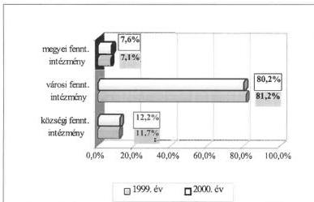

**A szolgáltatást igénybe vevők számának csökkenése, a gazdaságossági megfontolásokból végrehajtott különféle takarékossági intézkedések és más szervezeti formák lassú megjelenésének hatására a vizsgált körben az önkormányzati intézmények száma két év alatt 2,8%-kal kevesebb lett.**

**Az ellátórendszer** ellenőrzött években végrehajtott **racionalizálása a működő szervezetek számát** csak a városokban (3,9%) és a nagyközségekben (5,5%) csökkentette. A községekben mérsékeltebb (1,6%), a megyei önkormányzatoknál jelentősebb (4%) növekedés történt.

**A szervezeti korszerűsítés önkormányzati intézményeket érintő hatása a legnagyobb mértékű** a vizsgált megyei jogú városoknál volt, ahol az 1999. évi 411-gyel szemben 2000. évben 377 intézmény működött, így a költségvetési szervek számában egy év alatt 8,3%-os visszaesés történt. A városi intézményhálózat szűkülésében a célszerűségi, hatékonysági szempontokon túl a gazdasági kényszer hatására megtett intézkedések és azok következményeként a megyék feladatainak, az általuk fenntartott intézmények számának növekedése figyelhető meg.

**Az önkormányzati költségvetési szerveknél** 2000-ben az előző évhez képest 0,4%-kal **csökkent az önállóan gazdálkodó intézmények**, és ugyanennyivel nőtt a részben önállóan gazdálkodó intézmények aránya. A gazdálkodási jogkör szerinti összetételben a részben önállóan gazdálkodóknak (53%) mindkét évben meghatározó súlya volt. A gazdálkodási önállóság szerinti összetétel változásában egyes területeken a szigorú képzettségi előírások teljesítése, valamint a működtetéshez szükséges jelentős forrás igény is szerepet játszott. A vizsgált önkormányzatok költségvetési szerveinek **gazdálkodási önállóság szerinti összetételét** és annak változását szemlélteti a következő ábra:

30

---

II. RÉSZLETES MEGÁLLAPÍTÁSOK

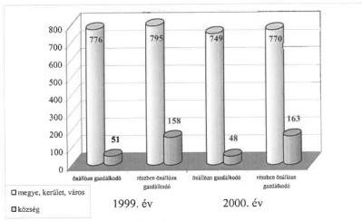

Az ellenőrzött önkormányzatoknál a **közfeladatok ellátásában más** (államháztartáson kívüli) **szervezeti formák jelenléte az önkormányzatok vagyoni, pénzügyi helyzete és egyéb lehetőségeitől függően**, különböző mértékben volt tapasztalható. A településüzemeltetésben jellemző volt a gazdasági társasági forma, ezen belül is az rt, illetve kft útján történő szolgáltatás. Önkormányzati érdekeltséggel működő gazdasági társaságok döntően az ivóvíz- és csatornaszolgáltatásban, a távhőszolgáltatás- és melegvíz ellátásban, a hulladékkezelésben, illetve a vagyongazdálkodás területén tevékenykedtek, míg az egészségügyi és szociális, illetve a közoktatás és közművelődés feladataiban az ellenőrzöttek mindössze 1-2%-ánál vettek részt.

A pozitívumok mellett, a kellően át nem gondolt alapítói döntéseket, illetve az alkalmazott szervezeti forma indokolatlanságát is megállapítottuk (pl. Budapest XI. és XX. kerületében, Bicske városban).

A gazdasági társasági kapcsolatok törvényessége területén szélsőséges esetként előfordult, hogy az önkormányzat által lakossági szolgáltatási feladatokra létrehozott egyszemélyes kft ügyvezetője az 1994. évi alapítás óta az önkormányzat tiszteletdíjas polgármestere volt. A polgármesteri tisztség és az önkormányzati tulajdonú gazdasági társaság ügyvezetői megbízása között összeférhetetlenség tartós fennállását állapítottuk meg, mert az Ötv. 33/A. § (2) és (4) bekezdéseiben foglalt rendelkezések szerint a polgármester és hozzátartozója nem lehet tagja, vezető tisztségviselője annak a gazdasági társaságnak, amelynek a helyi önkormányzat tagja. A polgármester az összeférhetetlenségi okot a megválasztásától, illetve az összeférhetetlenségi ok felmerülésétől számított 30 napon belül nem szüntette meg (Varbó Község Önkormányzata).

**A szolgáltatások gazdasági társaság útján történő megvalósításának feltételei** a városoknál sokkal jobbak voltak a községekénél, mert a közszolgáltatási igények összetettsége, nagysága, továbbá a jelentősebb mértékű vagyon koncentrálása az önálló tulajdonláshoz kedvezőbb adottságokat jelentett. A közszolgáltatások egyes területein az állami tulajdon privatizációja során kialakult és jelentősebben azóta sem módosult struktúra jól reprezentálja, hogy a községi önkormányzatok körében gyakoribb a különféle mértékű résztulajdonlás, amely a tulajdonosi jogok gyakorlásában kedvezőtlenebb feltételeket biztosít számukra. Ezt támasztják alá a később létrejött és társasági for-

31

---

II. RÉSZLETES MEGÁLLAPÍTÁSOK

mában tevékenykedő vagyonkezelő szervezetek adatai is, amelyek az ellenőrzött városoknak 14,3%-ánál, míg a községeknek mindössze 0,8%-ánál működtek.

Kizárólagos önkormányzati tulajdonnal működött többek között egy-egy kft, pl. Barcs, Hajdúnánás, Mátészalka, Tolna városokban, önkormányzati többségi tulajdonnal egy-egy kft Csepreg, Dunaföldvár, Felsőszolca városokban. Gazdasági társaságban különböző mértékű résztulajdonnal rendelkeztek Csokvaomány (33%), Erdőkövesd (16%), Igerszemcse (3,41%), Pálfa (14%) községek önkormányzatai.

A helyszíni ellenőrzések a közszolgáltatási feladatok ellátásában a nem önkormányzati szervezetek közül **alapítvány részvételét** 15%-nál, egyházi közreműködést pedig 12%-nél állapítottak meg. Egy-egy önkormányzat több alapítványban, illetve a lakossági szolgáltatások különböző területein, más-más feladatok révén is érdekelt elsősorban a megyei jogú városokban, fővárosi kerületekben.

Az egyéni vállalkozón, rt-n, illetve kft-n kívüli társas vállalkozások (pl. bt) az egészségügyi ellátás területén vettek részt az önkormányzati szolgáltatásokban. A bt-k jelenlétét a háziorvosi ellátásban az ellenőrzött önkormányzatok 32%-nál, a gyermek- és fogorvosi ellátásban 16%-nál tapasztaltuk.

**Az önkormányzatok feladatellátásukat** – helyi szintű szabályozás hiányában – alapvetően **az Ötv. és az egyéb ágazati jogszabályok előírásai alapján végezték**. A helyszíni ellenőrzések a feladatellátás struktúrájának áttekintését, a működő szervezeti keretek felülvizsgálatát és arra alapozva, racionalizálást célzó intézkedések elrendelését kizárólag az összetettebb feladatokkal és kiterjedtebb intézményhálózattal rendelkező megyei és városi önkormányzatok körében, azok 19,4%-ánál állapítottak meg.

Az ellátási igények csökkenése és gazdasági kényszer hatására elsősorban a megyei és városi önkormányzatok **különféle takarékossági megoldásokkal**: intézmény megszüntetéssel, összevonással, részben önállóan gazdálkodóvá történő átminősítéssel, feladatok átszervezésével **segítették a közszolgáltatási kötelezettség hatékonyabb teljesítését**.

**A gazdaságosabb feladatellátás érdekében** az elmúlt években végrehajtott **szervezési intézkedések** közül intézmény összevonás az ellenőrzött önkormányzatok 11%-ánál, intézmények közötti feladat-átszervezés 10%-nál, intézménymegszüntetés és részben önállóvá minősítés 9%-nál történt, és mindezek következményeként 11%-nál hajtottak végre létszámcsökkentést.

A megvalósított fenntartói intézkedések döntően a meglévő szervezeti formákra és keretekre alapoztak, a működtetés, fenntartás kiadásait igyekeztek mérsékelni. A szervezeti forma megváltoztatásával, új formák bevezetésével csak kisebb arányban foglalkoztak. Az ellátó rendszer módosítása, részleges, vagy teljes átalakítása során az államháztartáson kívüli megoldások kevésbé kaptak hangsúlyt, amelyet mutat az is, hogy gazdasági társaságot, kht-t az ellenőrzötteknek csupán 6%-a alapított, alapítvány létrehozásához 2%-a járult hozzá.

32

---

II. RÉSZLETES MEGÁLLAPÍTÁSOK

A közszolgáltatási feladatellátásban **további változások a körzeti szolgáltatást nyújtó intézmények fenntartói jogosítványainak gyakorlásában következtek be**, és kizárólag a városi, illetve megyei önkormányzatoknál fordultak elő. Az Ötv. által biztosított feladat-átadási lehetőséggel az ellenőrzött városi önkormányzatok 15,9%-ánál éltek, amikor az önkormányzat pénzügyi helyzete, a kötelező feladatellátás feltételeinek javítása érdekében egyes térségi szerepkört betöltő, körzeti feladatokat ellátó intézményt átadtak a megyei önkormányzatnak (pl. Bonyhád város a szakosított szociális ellátást biztosító otthonát, Kazincbarcika város középiskolát, ipari szakképző iskolát).

**A megyei önkormányzatokhoz történt feladat-átadások** döntően a középfokú oktatásra terjedtek ki, amely az abban érintett városok 70%-ánál fordult elő. Az átadások különböző mértékben érintették még a zeneiskolai oktatást, a nevelési tanácsadói tevékenységet és a szociális intézményi ellátást (20-20%-nál), valamint a fogyatékos gyermekek alapfokú oktatását (10%-nál).

**Az intézménystruktúra módosulásában az ellenőrzött négy megyei önkormányzat** közül háromnál a települési önkormányzatoktól átvett feladatok, ezen belül egynél az ágazati törvény előírásai alapján szociálisan rászoruló, ellátatlan személyekről való átmeneti gondoskodás megoldása okozott érzékelhető változást.

**Várvölgy** községben lévő vegyes tulajdonú Napfény Ápoló és Gondozó Otthont alapítvány tartotta fenn, amely 1999. október 1-től működésképtelenné vált. Az ellátási kötelezettség teljesítéséről a megyei közigazgatási hivatal értesítése, illetve az Ötv. és kapcsolódó ágazati jogszabályok alapján a megyei főjegyző intézkedett. A szociális törvény értelmében rászoruló és ellátatlanul maradt személyekről való gondoskodást a Zala Megyei önkormányzatnál biztosították.

**A feladat-átvételekkel érintett megyei önkormányzatok** különféle racionalizáló intézkedésekkel igyekeztek meglévő intézményhálózatuk működésének feltételeit biztosítani és a szolgáltatási kötelezettségek növekedésének hatását kezelni. A települési intézmények kényszerű átvétele költségvetésükben jelentős többlet-kiadásokat okozott és a már korábban is működési forráshiányos önkormányzatoknál (az ellenőrzöttek közül kettőnél) további pénzügyi feszültséget okozott. A gazdálkodásban jelentkező egyensúlyi problémákat az önhibáján kívül hátrányos helyzetben lévő önkormányzatok részére biztosított központi költségvetési támogatás igénybevétele mellett, évközi hitelfelvételekkel oldották meg.

Az ellenőrzésbe bevont öt fővárosi kerületnél a közszolgáltatások ellátásának sajátos rendszere működött, amelyben a feladat- és hatáskörök fővárosi és kerületi önkormányzatok közötti megosztása volt meghatározó jelentőségű mind a településüzemeltetésben, mind a különféle ágazati intézmények fenntartásában, működtetésében. Az intézményi struktúra átvilágítását és annak alapján hatékonyságot célzó intézkedések megtételét ebben a körben három önkormányzatnál állapítottunk meg.

**A közszolgáltatási feladatok társulás keretében történő ellátásában** az ellenőrzött körbe tartozó helyi önkormányzatok közül – néhány város kivételével – döntően a községi önkormányzatok voltak érintettek. A lakossági alapellátásban az önkormányzatok együttműködése a legnagyobb mértékben

33

---

II. RÉSZLETES MEGÁLLAPÍTÁSOK

az alapfokú oktatási intézmények működtetésében (33%), a családsegítő és gyermekjóléti szolgáltatásban (24%), valamint az egészségügyi alapellátásban (19%) érvényesült.

**A hatósági igazgatási feladatok, ezen belül elsősorban az építésügyi tevékenység** közös ellátását 29 önkormányzatnál (14,9%) rögzítették az ellenőrzést végzők, amelyek két kivételtől eltekintve szintén a községekben működő önkormányzatoknál fordultak elő.

**A terület- és településfejlesztési feladatok megvalósításában** történő együttműködés előnyeinek kihasználása, a fejlesztési célkitűzéseket szolgáló pénzeszközök megszerzésének és hatékonyabb felhasználásának biztosítása érdekében létrehozott társulásokban az ellenőrzött önkormányzatoknak 24%-a vett részt. A kistérségi összefogás teljes körűen, míg az egyéb területfejlesztési társulás döntő mértékben a községeknél fordult elő, de abban nem elhanyagolható mértékben vettek részt városi önkormányzatok is. A közös feladatellátásban érdekelt községek részaránya a településtípuson belül az első esetben 9,4% volt, a másodikban 14,8%-ot tett ki. A település- és területfejlesztési együttműködésben az ellenőrzési mintában szereplő városok 25,4%-a volt érintett.

Az ellenőrzések **konkrét beruházási cél megvalósítására irányuló társulásban** való részvételt öt községi (3,9%) önkormányzatnál állapítottak meg.

**A feladatellátás különböző területein a társulásos forma alkalmazása** (a községi önkormányzatok ellenőrzött mintán belüli 65,6%-os részaránya alapján) nem tekinthető jelentősnek, nincs összhangban a helyi önkormányzatok együttműködéséről és társulásairól szóló törvényi szabályozás és a központi finanszírozásban végrehajtott változások azon fő célkitűzéseivel, amelyek az önkormányzatok egymás közötti együttműködésének bővítésére és ezzel a gazdaságosabb, hatékonyabb feladatellátás feltételeinek megteremtésére irányultak.

A közszolgáltatási feladatok különböző szervezeti formákban történő ellátásának költségadatait, működésének gazdaságosságát, a módosítására irányuló elképzeléseket, intézkedéseket csak kevés helyen támasztották alá kalkulációval. A feladatok ellátását szolgáló szervezeti keretek átfogó, vagy részleges átalakításával, továbbá a társulásos formák alkalmazásával **elért gazdasági eredmények kimutatására** – néhány kivételtől eltekintve – **az önkormányzatoknál nem végeztek konkrét számításokat, illetve azt nem dokumentáltak.**

**Az egyes szervezeti formák alkalmazásának pénzügyi indokoltságáról**, a végrehajtott változások gazdasági előnyeiről, a korábban alkalmazott formák hátrányairól **csak közvetett információk álltak rendelkezésre**. Ezért a helyszíni ellenőrzések a feladatmutatók alakulásának közvetett információira alapozhattak.

**Szeged** városban az ellenőrzött időszakban kialakított struktúrában az önállóan gazdálkodó intézmények száma 1999-ről 2000. évre 44-ről 21-re csökkent, a részben önállóaké pedig 58-ról 69-re növekedett, amely az előzőnél összességében költségtakarékosabb intézményüzemeltetést tett lehetővé.

34

---

II. RÉSZLETES MEGÁLLAPÍTÁSOK

**Kalocsa** város az 1998-2000. években végrehajtott intézménykorszerűsítés keretében az önálló intézmények számát öttel csökkentette, amelynek eredményeként a közalkalmazotti létszám 226 fővel kevesebb lett. Az intézkedések hatására a részben önállóan gazdálkodó intézmények száma hárommal és az itt foglalkoztatott közalkalmazottak száma 150 fővel növekedett.

**Budapest XI.** kerületében 1999. és 2000. években több, az intézményrendszer racionális és hatékonyabb működését szolgáló intézkedést tettek, amelyek az oktatási, művelődési, kulturális és szociális ágazatot egyaránt érintették. Emellett a fogyatékosok nappali ellátására létrehozott rehabilitációs napközi otthont négy kerületi önkormányzattal társulva üzemeltették, és társulás keretében gondoskodtak a mezőgazdasági hatósági, igazgatási, növényvédelmi-, növény- és állategészségügyi hatósági feladatok ellátásáról is.

**Gyula** város által az ellenőrzött időszakban létrehozott Gyulakonyha, Gyulasport kht-k nem váltották be a gazdálkodási előnyökkel kapcsolatos várakozásokat (mindkét szervezet ellátott kötelező önkormányzati feladatot is és az önkormányzattal kötött megállapodás alapján támogatásban részesült).

### 1.2.5. A gazdálkodás szervezeti keretei, az igazgatási feladatok ellátása

Az állampolgárok az önkormányzat tevékenységét a hivatal munkájából ítélik meg, ezért fontos olyan szervezet kialakítása, amely leginkább képes megfelelni a lakosság igényeinek, a szakmai elvárásoknak. Az Ötv. 38. §-a értelmében a képviselő-testület joga és kötelezettsége egységes hivatalának kialakítása. A hivatalok kialakításának konkrét központi szabályai nincsenek, azokat az Ötv. 35. § (2) bekezdésének c) pontja szerint, a jegyző javaslata és a polgármester előterjesztése alapján, az önkormányzat képviselő-testülete határozza meg.

A jogszabály által előírt kötelezettségnek a testületek rendszerint az SzMSz-ek, ügyrendek, valamint a költségvetési rendeletek megalkotásával tettek eleget.

A közszolgáltatási tevékenységben és a gazdálkodás végrehajtásában meghatározó szerepet betöltő **hivatali feladatokra az ellenőrzött települési önkormányzatoknak** 90,6%-a, a községeknek 85,9%-a **polgármesteri hivatalt hozott létre**. Az igazgatási feladatok végzésében a költségtakarékosabbnak számító **körjegyzőségi formában a községi önkormányzatoknak** 14%-a, az Ötv. alapján ebben elsősorban érintett, ezer lakosságszám alatti, ellenőrzésbe vont önkormányzatoknak 25%-a vett részt. Az ellenőrzött települési önkormányzatokból 11 (5,76%) körjegyzőségi székhely feladatait is ellátta, így az általános hivatali tevékenységhez képest összetettebb igazgatási, szervezési kötelezettségeket teljesített.

**Pétervására** város négy település (Erdőkövesd, Váraszó, Kisfüzes és Ivád községek) önkormányzatával társult képviselő-testületet alkot. A közigazgatási feladatokat a városi és a társult települési önkormányzatok együttműködésében létrehozott közös hivatal, „kvázi” körjegyzőség végzi.

**Csepreg** város Tömörd községnek 1991. évi megállapodás alapján, Tormásliget község részére pedig dokumentált megállapodás nélkül végezte az igazgatási feladatokat. A feladatok ellátásához az érintett községek lakosságszám arányában járultak hozzá. A teljesített hivatali bevételekről és kiadásokról azonban a közsé-

35

---

II. RÉSZLETES MEGÁLLAPÍTÁSOK

gek részére elszámolás nem készült és az évenkénti pénzmaradvány megállapítása sem történt meg.

**Marton, Meszes és Szalonna** községek az igazgatási feladatok ellátására körjegyzőséget hoztak létre, de az abban résztvevő települések mind az igazgatási létszám, mind a technikai feltételek területén megőrizték hivatali önállóságukat. A körjegyzőség megalakulása után a feladatokat ellátó létszám változatlan maradt, és a feladatellátásában párhuzamosságok alakultak ki.

Az önkormányzatoknál az igazgatási kiadásokon belül legnagyobb a személyi juttatások aránya (49 és 70% között változott). **Az igazgatási kiadások hivatali kiadáson belüli aránya** is rendkívüli szélsőségek között mozgott, 2,7-48% volt. A jelentős eltérés oka, hogy a hivatal kiadásai között változó nagyságrendet képviseltek a felhalmozási kiadások és az átadott pénzeszközök.

Az ezer fő lakosságszám alatti községek adatai szerint egy-egy önkormányzat évi átlag 10 556 ezer Ft kiadással teljesítette az igazgatással és az önkormányzati gazdálkodással kapcsolatos hivatali feladatait.

A kiadási adatokat is kimunkáló 58 községből a legkisebb összeggel (1 041 ezer Ft) oldotta meg a feladatokat Márokföld Község Önkormányzata, amely a Szentgyörgyvölgy székhelyű (kétközséges) körjegyzőség tagja. A legnagyobb igazgatási kiadást (26 132 ezer Ft) Tófej községben mutatták ki, amely körjegyzőségi székhelyként, további két község (Baktüttős és Pusztaederics) önkormányzatának gazdálkodás-szervezési és igazgatási feladatait is végzi.

A közigazgatási feladatok körjegyzőségi keretekben történő ellátása esetén **a hivatali működés kiadásait a székhely-funkciót betöltő településeknél** valamennyi érdekelt önkormányzat tekintetében – a számviteli elszámolási szabályok keretei között – **összevontan lehet elszámolni**, ezért abból a községenkénti adatok megállapítása csak valamely közvetett mutató alapján történhet. Az ellenőrzött székhely önkormányzatok költségvetésében az Áht. előírásai alapján a teljes körjegyzőségi kiadások megjelentek, így abban nem csak a saját települést érintő, hanem a társult önkormányzatokat terhelő összegek is szerepeltek. A társult önkormányzatok költségvetését a felmerült kiadásoknak a lakosságszámuk alapján megállapított összege terhelte, amelyet államháztartáson belüli pénzeszközátadásként számoltak el.

Az **igazgatási kiadások arányát** a teljes önkormányzati költségvetés százalékában 48 önkormányzatnál (66,7%), a működési kiadások százalékában 14 önkormányzatnál (19,4%) mutatták ki. Mindezek alapján az ezer lakosságszám alatti községek körében az igazgatási feladatok ellátására az éves működési kiadásoknak átlag 28,2%-át, míg a költségvetési kiadásoknak 21,2%-át fordították. A működési kiadások között a legnagyobb arányú igazgatási kiadást (71%) Kéked községben, a legkisebb mértéket (10%) Léh községben mutatták ki.

A vizsgált önkormányzatok igazgatási szervezeteit egységes munkaszervezetként hozták létre, amelyen belül a helyi adottságok, illetve a feladat- és hatáskörök figyelembevételével belső szervezeti egységeket alakítottak ki. Méretük, tagozódásuk még a hasonló népességszámmal rendelkező településeknél is mutat eltérést. Előfordult, hogy a képviselő-testület által jóváhagyott létszámok

36

---

II. RÉSZLETES MEGÁLLAPÍTÁSOK

nem követték a feladatok növekedését (pl. Dunaföldvár, Dunaújváros, Gyula, Mindszent, Pilisvörösvár városok, Bősárkány, Pusztaszer községek).

- Az ellenőrzött **megyei** önkormányzatok hivatali létszáma 3%-os növekedést mutatott, a hivatalok átlagos létszáma pedig 94-97 fő volt. (Legkisebb létszámú a Zala Megyei Önkormányzat Hivatala 79-80 fővel, legmagasabb pedig a Békés Megyei Önkormányzat Hivatala 120-127 fővel.)
- A **megyei jogú városok** hivatali létszámában 5%-os növekedés következett be, miközben kettő önkormányzatnál a létszám csökkent. Legkisebb létszámú Veszprém megyei jogú város 221-214 fővel, legmagasabb Szeged megyei jogú város 416-439 fővel.)
- A **fővárosi kerületekben** foglalkoztatottak átlaglétszáma a megyei jogú városok létszámahoz hasonló, 268-271 fő. (Legkisebb létszámú a Budapest főváros XX. kerület, ahol az alkalmazottak száma 182-187 fő volt, míg a legnagyobb létszámú a Budapest főváros XI. kerület, 344-342 fővel.)
- A **községekben** foglalkoztatottak összlétszáma ugyan 2%-kal növekedett a vizsgált időszakban, de mindez az egy hivatalra jutó átlaglétszámot nem változtatta meg, amely 7 fő volt. Az ezer fő feletti lakosságszámú községek hivatali létszáma rendszerint meghaladta a 10 főt, de előfordult ennél lényegesen magasabb létszámot foglalkoztató hivatal is (pl. Balatonudvari 14 fő, Gesztely 13 fő, Köröstarcsa 12 fő, Pusztaszer 17 fő, Szentmártonkáta 13 fő, Tiszasúly 12 fő, Vaskút 16 fő, Zákányszék 15 fő). Ugyanakkor az ezer fő alatti települések hivatalain foglalkoztatottak átlagos száma 1-6 fő között szóródott. (Az éves átlaglétszám 1 fő volt Sima, Szamoskér, Varsád községekben.) E körben a települések 13%-ánál a hivatalok átlagos létszáma a Belügyminisztérium ajánlásában kiadott alsó létszámhatárnál kevesebb volt.

Az önkormányzati hivatalok 18%-a irodai, illetve titkársági rendszerben, 15%-a osztályszervezetben, 6%-a csoportokra bontottan, 61%-a pedig tagolás nélküli szervezetben látta el feladatait.

A vizsgált önkormányzatok **hivatalainak 62%-a célszerűen kialakított volt**. Az önkormányzatok 38%-ánál a szervezeti felépítést célszerűtlenség, túlzott tagoltság, a szervezeti egységek közötti kapcsolatok nem megfelelő kiépítettsége jellemezte (pl. Szolnok, Veszprém megyei jogú városok, Dunaföldvár, Kazincbarcika, Lenti, Mezőberény városok, Zsadány község).

A módosítások előkészítése érdekében az önkormányzatok **22%-a felülvizsgálta** – többször külső szakértő szervezetek által – **átvilágíttatta a hivatal szervezeti felépítését, majd 14%-a hajtott végre eltérő mélységű átszervezést**. Az átszervezések a növekvő feladatokhoz, a megváltozott követelményekhez igazítva módosították az osztályok, irodák szervezeti rendszerét, létszámát (pl. Békés Megye Önkormányzata, Budapest főváros XX. kerület, Pécs és Szeged megyei jogú városok, Gyula, Kunhegyes város).

Elsősorban a városoknál a jelentős térségi feladatok elvégzését is biztosítani kellett. A többletfeladatok belépésével egyidejűleg – pl. építés hatósági, tűzoltósági, okmány irodai, egészségügyi, alsó- és középfokú oktatási, közművelődési, gyámhivatali – nem minden önkormányzati hivatalban növekedett arányosan az ügyintézői létszám, ezért jelentős leterheltségi különbség tapasztalható.

37

---

II. RÉSZLETES MEGÁLLAPÍTÁSOK

Az önkormányzati **hivatalokban foglalkoztatottak létszáma a vizsgált időszakban összességében 5%-kal növekedett.** Ugyanakkor az önkormányzatok 58%-ánál létszámnövekményt, 27%-ánál változatlan létszámot, 15%-ánál létszámcsökkenést tapasztaltunk. A folyamatos működést egyes hivataloknál a létszám gyakori cserélődése, vagy a megfelelő szakemberek hiánya nehezítette. A köztisztviselők anyagi megbecsülése az önkormányzatok 96%-ánál nőtt, összességében a személyi juttatások növekménye 15% volt.

### 1.2.6. A kötelező és önként vállalt feladatok ellátása

**Az önkormányzatok** a törvényben meghatározott kötelező közszolgáltatások mellett a helyi közügyekhez kapcsolódóan az Ötv. 8. § (2) bekezdésében foglalt felhatalmazás alapján **olyan feladatokat is elláttak, amelyekre a hatályos jogszabályok értelmében szabadon vállalkozhattak.** A különböző helyi lehetőségek és eltérő lakossági igények következtében az önként vállalt feladatok köre rendkívül széles.

**A közszolgáltatások számbavételét, kötelező, illetve önként vállalt feladatkörbe történő besorolását nehezítette,** hogy azt az Ötv. és a különböző ágazati jogszabályok konkrét rendelkezései alapján minden önkormányzat képviselő-testületének magának kellett elvégeznie. A teljes körű, dokumentált számbavétel hiányát a képviselő-testületek által jóváhagyott Szervezeti és Működési Szabályzatok konkrét feladat meghatározást nem tartalmazó, a különféle jogszabályokra visszautaló rendelkezései mutatják.

Az önkormányzatoknak, pl. a Szoctv-ben megállapított feladatai alapján sok esetben egyértelműen nem állapítható meg, hogy kötelező, vagy önként vállalt feladatról van-e szó és a jogszabályban meghatározott „feladat- és hatáskör” megállapítása csak abból a szempontból történik, hogy az adott feladat címzettje nem állami szerv, hanem az önkormányzat.

**A feladatok helyi szintű minősítésében bizonytalanságot okozott** továbbá, hogy az Ötv. szerint kötelezőnek minősített feladatok egy része a települések lakosságszámának függvénye. Ezáltal egy adott típusú feladat egyik önkormányzatnál kötelező, míg a másiknál önként vállalt körbe tartozik (pl. személyes gondoskodást nyújtó szociális ellátások egyes formái lakosságszám nagyságától függően).

Városi önkormányzatoknál a bölcsődei ellátás gyakran az önként vállalt feladatok között szerepelt annak ellenére, hogy a gyermekek védelméről és a gyámügyi igazgatásról szóló 1997. évi XXXI. törvény 41. § (1) és (3) bekezdése alapján a gyermekek napközbeni ellátásaként a családban élő gyermekek életkorának megfelelő nappali felügyeletét, gondozását, nevelését, foglalkoztatását és étkeztetését meg kell szervezni azon gyermekek számára, akiknek szülei, nevelői, gondozói munkavégzésük, betegségük, vagy egyéb ok miatt napközbeni ellátásukról nem tudnak gondoskodni. A kötelező feladatot jelentő gyermekek napközbeni ellátása megszervezhető napközbeni, vagy hetes időszakra különösen bölcsődében, családi napközben, óvodában, iskolai napközis foglalkozás, vagy házi gyermekfelügyelet keretében (pl. Csurgó, Dunaföldvár, Kiskőrös, Monor, Nagykőrös, Ózd, Szécsény, Vác városi önkormányzatok).

38

---

II. RÉSZLETES MEGÁLLAPÍTÁSOK

A kötelező önkormányzati feladatok egyértelmű szabályozása azért szükséges, mert a kötelező és az önként vállalt feladatok megkülönböztetésnek az Ötv. 1. § (4) bekezdése és 1. § (5) bekezdése alapján külön jelentősége van:

- az önként vállalt helyi közügyek megoldása nem veszélyeztetheti a törvény által kötelezően előírt önkormányzati feladat- és hatáskörök ellátást,
- a kötelezően ellátandó önkormányzati feladat- és hatáskörök meghatározásával egyidejűleg az Országgyűlés biztosítja az ellátásukhoz szükséges anyagi feltételeket, dönt a költségvetési hozzájárulás mértékéről és módjáról.

**Az önkormányzatoknak nem csak a jelleg szerinti besorolás és számbavétel területén voltak nehézségei**, hanem az állami, valamint az önkormányzati feladat (és ezen belül a közszolgáltatási és közhatalmi feladatellátás) meghatározásában is. A gondot nem csupán a központi szabályozás és az ebből eredő helyi bizonytalanság okozta, hanem az egyes valós társadalmi jelenségek kezelésének szükségessége, amelyek nem mindig találkoztak a jogszabályi elvárással.

A Szoctv., valamint a gyermekek védelméről és a gyámügyi igazgatásról szóló 1997. évi XXXI. törvény az önkormányzatok számára több ellátandó feladatot határozott meg. Egyes valós társadalmi problémák kezelésére irányuló ellátási formákat viszont mérlegelési jogkörbe utalt, mintegy önként vállalt feladatként kezelve, jóllehet azok biztosítása szükséges, fontossága és indokoltsága egyetlen településen sem kérdőjelezhető meg, ugyanakkor jelentős pénzügyi, költségvetési vonzatuk van (pl. ápolási díj, lakáshoz, telekhez jutás támogatása, lakásfenntartási támogatás, átmeneti segély, temetési segély, a közgyógyellátás egy része, rendkívüli gyermekvédelmi támogatás stb).

**Az önkormányzatok által ellátott tevékenységek kiadásainak megismerését nehezítette**, hogy az **alkalmazott számviteli rendszerben** csak az önkormányzatok vagyon-nyilvántartását érintően követelmény a feladatok kötelező és vállalt jellege szerinti elkülönítése törzsvagyonra, ezen belül forgalomképtelen és korlátozottan forgalomképes eszközökre, valamint törzsvagyonon kívüli egyéb eszközre. A településeken sajátosan megjelenő és az önkormányzatok által ellátott szervező, szolgáltató feladatokat (pl. időskorúak részére biztosított szolgáltatások, gyermekek, tanulók nevelése, oktatása, gyermekjóléti szolgáltatások), illetve azok bevételeinek és kiadásainak elkülönített nyilvántartását a költségvetési szervek számviteli rendszere nem írta elő és arról az önkormányzatoknál helyileg sem intézkedtek.

**Az egyes feladatok ellátásának az éves beszámolók adatai alapján kimutatott egységnyi kiadásai között jelentős mértékű eltérés** tapasztalható, amelyben az önkormányzati ellátórendszer struktúrájának, a feladatot végző intézmények számának, területi elhelyezkedésének hatása mutatkozik meg.

39

---

II. RÉSZLETES MEGÁLLAPÍTÁSOK

|  Megnevezés | Működési kiadás és forrása  |   |   |   |   |   |
| --- | --- | --- | --- | --- | --- | --- |
|   |  Egy főre jutó kiadás (Ft) |   |   | Forrás (%)  |   |   |
|   |  átlag | minimum | maximum | központi költségvetés | önkormányzati költségvetés | saját bevétel  |
|  Bentlakásos szociális intézményi ellátás | 769 000 | 222 000 | 2 037 000 | 50 | 29 | 21  |
|  Nappali szociális intézményi ellátás | 272 000 | 50 000 | 1 087 000 | 35 | 52 | 13  |
|  Bölcsődei ellátás | 712 000 | 261 000 | 1 629 000 | 20 | 70 | 10  |
|  Óvodai nevelés | 217 000 | 114 000 | 313 000 | 46 | 45 | 9  |
|  Általános iskolai oktatás | 224 000 | 104 000 | 1 305 000 | 46 | 44 | 10  |
|  Középfokú oktatás | 207 000 | 102 000 | 329 000 | 61 | 24 | 15  |

**A közszolgáltatási kötelezettség teljesítéséhez kapcsolódó egységnyi kiadások megállapításában** az önkormányzatok számára bizonytalanságot okozott, hogy a forintadatok kimunkálása egységes jogszabályi követelmény hiányában, különféle egyedi módszerek alkalmazásával történhetett. Az egyes szakfeladatokon elszámolt kiadások összetettek és a feladatmutatók számítási módja sem egységes. Feladatmutatóként az éves beszámolóban szereplő átlagállományt, vagy az ellátottak statisztikai létszámát, az év végi záró állományt, illetve a normatív állami hozzájárulások megállapításánál alkalmazott, előzőektől lényegesen eltérő módon költségvetési évre átszámított mérőszámokat vették alapul. Így az adatok tartalmi azonossága teljes körűen nem volt biztosított, amely szintén hozzájárult a szélső értékek közötti jelentős eltérésekhez.

**Az ellenőrzött megyei önkormányzatok önként vállalt feladatai** az összes költségvetési kiadáson belül 6%-6,9% közötti részarányt képviseltek, átlagos mértékük 6,33% volt. Költségvetési intézményi keretek között Nógrád megye kivételével mindegyik megyei önkormányzat látott el ilyen jellegű feladatot, amelyek működtetésének, fenntartásának kiadásai a felmért adatokban szerepelnek (pl. színház fenntartása a Békés és Zala megyei önkormányzatoknál). **A városi önkormányzatok költségvetési kiadásainak összetételében** az önként vállalt feladatok 1,2%-66,1%-os arányt tettek ki, átlagos mértékük 16,92%. **Az önként vállalt feladatok ellátásának kereteit** a kötelezőhöz hasonlóan, alapvetően a költségvetési szervek, intézmények biztosították. Így kiadásaik is elsősorban az intézmény fenntartási kiadásokban jelentek meg.

Az ellenőrzött önkormányzatoknál és azon belül a megyei és a városi önkormányzatoknál **az önként vállalt feladatok 2000. évi költségvetésen belüli arányát** a következő grafikon szemlélteti:

40

---

II. RÉSZLETES MEGÁLLAPÍTÁSOK

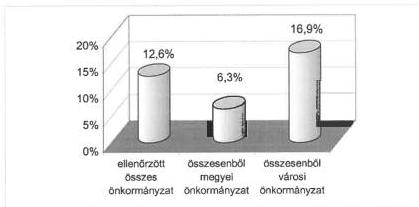

A felmérésben szereplő önkormányzatok költségvetésében a jelentősebb nagyságrendű önként vállalt feladatok 0,5%-66,1% közötti részarányban szerepeltek, az átlagos mérték 12,6% volt.

Az önként vállalt feladatok költségvetésen belüli súlyát összesen 74 önkormányzatnál (37,9%) mutatták ki. (A megyei és városi önkormányzatok közül 49 (73,1%), az ezer lakoson felüli községek közül 25 (44,6%) önkormányzat adatait tudtuk figyelembe venni.)

**A községi önkormányzatok költségvetésében az önként vállalt feladatok 0,5%-28% részarányban szerepeltek**, átlagos mértékük 6,35% volt. Ebben a körben az alapfokú művészetoktatási és szociális intézmény fenntartásán kívül a különböző civil szervezeteknek, alapítványoknak, egyesületeknek, vállalkozásoknak nyújtott támogatásokkal számoltak.

Az önkormányzatok az önként vállalt feladatokat érintően is tettek különböző intézkedéseket. Ennek keretében a vállalt feladatok csökkentéséről 11 önkormányzatnál (5%) rendelkeztek. A kiadásokat létszámcsökkentés útján mérsékelték 4%-nál, intézménybezárás, vagy feladat vállalkozásba adása 2%-2%-nál történt, veszteséges feladat megszüntetése és egyéb módon történő költségcsökkentés 1%-1%-nál fordult elő.

Az elmúlt években megvalósított **intézményracionalizálási intézkedések a legnagyobb arányban az óvodai ellátást** (23,2%), és az általános iskolai oktatást (18,1%) **érintették**. A feladatok végrehajtását elrendelő önkormányzatok a működési kiadások csökkentésére irányuló rendelkezéseiket különböző mértékben terjesztették ki a középiskolai oktatásra (10%), a bentlakásos szociális intézményekre (8,8%), valamint a bölcsődei ellátásra (7,9%). **A fenntartói átszervezésekben a nappali szociális intézményi ellátás feladatai nem szerepeltek.**

### 1.2.7. A működési kiadások aránya, forrása

**Az ellenőrzött önkormányzatok költségvetésében a működési kiadások aránya az 1998-2000. években átlag 81-83-85%-ot képviselt.**

41

---

II. RÉSZLETES MEGÁLLAPÍTÁSOK

Az ellenőrzött önkormányzatoknál a **működési és a felhalmozási kiadások költségvetésen belüli arányát** a következő grafikon szemlélteti:

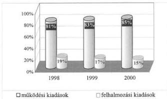

A működési kiadások költségvetésen belüli súlyának emelkedése évenként átlagosan 2% volt, amely az egyébként sem jelentős mértékű felhalmozások szerepének további csökkenésével járt.

Az ellenőrzött önkormányzatok forrásaiból a működési kiadások a legnagyobb részarányt 1998-ban Mezőgyán községben (99,2%), 1999. és 2000. években Váchartyán községben (99,6%, illetve 100%) képviselték, a legkisebb mérték pedig 1998-ban Visonta község (23%), 1999. évben Máriapócs város (31,3%), 2000-ben Monor város (41,4%) költségvetésében szerepelt.

A különféle jogszabályokban előírt közszolgáltatási kötelezettség és a lakosság jobb ellátása érdekében önként vállalt feladatok teljesítésének követelményei, valamint a pénzügyi lehetőségek közötti összhang 2000. évben 98 önkormányzatnál, az ellenőrzöttek 50,3%-ánál nem volt biztosított.

A 2000. évre vonatkozó vizsgálati megállapítások alapján 13 önkormányzatnál, amely az ellenőrzési minta 6,7%-át jelenti a **pénzügyi egyensúly területén 2001. évre kihatóan várható volt a további romlás. A forráshiánnyal küzdő önkormányzatok száma** a korábbi években tapasztalt 30%-hoz képest tovább növekszik.

A működési forráshiány kialakulását előidéző okok között a települések kedvezőtlen adottságai a tagolt közigazgatási szerkezet és intézményhálózat, valamint a működtetés korszerűtlen feltételei szerepeltek. Egyensúlyt rontó tényezőként a vállalt feladatok köre, jelentős kiadásai, a kellően nem megalapozott tervezés, illetve a racionalizálási intézkedések elmulasztása, elhúzódása is megjelent.

**Csepreg** város forráshiányának kialakulásában a magas működési költségeken felül szerepet játszott, hogy a bevételi források további bővítésére nem találtak lehetőséget, mert a területen a vállalkozások jelentősen nem bővültek. A kiadások csökkentésére hozott intézkedések sem voltak eléggé hatékonyak, a feladatellátás struktúrájának felülvizsgálata, az intézményrendszer átvilágítása nem történt meg.

42

---

II. RÉSZLETES MEGÁLLAPÍTÁSOK

**Mindszent** város gazdálkodási körülményei folyamatosan romlottak; a munkaerőt foglalkoztató vállalkozások száma és a lakosság adóerő képessége csökkent, ezért a helyi adóbevételek növelésére nem volt lehetősége.

**Kiskunfélegyháza** városnál a pénzügyi egyensúly megbomlott, amelynek okai között a megalapozatlan költségvetési tervezést, az önként vállalt feladatok nagy arányát, a beruházásokhoz szükséges saját erő hiányát, illetve elégtelenségét, a korábbi évek fejlesztés-centrikus szemléletét állapítottuk meg.

**A költségvetési forráshiány rendezésére** az önkormányzatok **pályázatot nyújtottak be** az önhibáján kívül hátrányos helyzetbe került önkormányzatok támogatására. A központi költségvetésből a működési hiány finanszírozására támogatásban az ellenőrzésbe vont forráshiányos önkormányzatok 79,6%-a, az ellenőrzötteknek összességében 40%-a részesült. Ilyen támogatást az ezer lélekszám alatti községek 48,6%-a kapott, amely mérték megegyezik az e körben pályázatot benyújtók számával.

Az önhibájukon kívül hátrányos helyzetű önkormányzatok pénzügyi egyensúlyi helyzetét a központi költségvetésből nyújtott támogatások javították, de a forráshiány megoldásában csak részleges és átmeneti segítséget jelentettek. A megítélt támogatások összege az adott évben kimutatott hiányt teljes mértékig nem fedezte, ezért más forráspótló intézkedések megtétele (hitel felvétel, saját bevételi lehetőségek feltárása, kiadások csökkentése, vagyonértékesítés stb.) is szükségessé vált. Egy-egy önkormányzat évek óta ismétlődő forráshiánya mutatja, hogy a támogatások és a helyben megtett bevételt növelő, kiadást csökkentő intézkedések ellenére a hiány újratermelődik (pl. Csurgó, Mindszent és Tab városoknál).

A költségvetés szintjén megjelenő forráshiány mellett **a gazdálkodás folyamatában átmeneti likviditási zavarok** jelentkeztek az ellenőrzött önkormányzatok egyharmadánál. A finanszírozási nehézségekben jelentős szerepet játszott a bevételek (pl. adóbevételek, támogatások) teljesülésének ciklikussága, illetve a kiadások felmerülésétől eltérő üteme.

Az éves **gazdálkodás zavartalan folytatásához külső forrás bevonása** az ezer fő alatti lakosságszámú önkormányzatok 27%-ánál különféle pénzintézeti hitelek felvételével, idegen pénzeszközök átmeneti igénybevételével történt. A fejlesztési célkitűzések megvalósításához rendelkezésre álló forrásait a megyei és az ezer lakos feletti önkormányzatok 9%-a szintén pénzintézeti hitellel egészítette ki. Emellett az egyenletesebb finanszírozást folyószámla, illetve munkabér hitellel, továbbá különféle gazdasági szigorító intézkedések elrendelésével, visszafogott gazdálkodással, továbbá mobilizálható egyéb eszközeik értékesítésével biztosították.

- **A fizetőképesség folyamatos biztosítása érdekében áthidaló pénzügyi intézkedések megtételére** a megyei, a városi és az ezer lakosságszám feletti községi önkormányzatok 40,7%-ánál, míg az ezer lakosságszám alatti települési önkormányzatok 20,8%-ánál volt szükség.
- **A bevételek növelése érdekében** vagyontárgyak eladásáról az ezer lakosságszámot meghaladó települési és a megyei önkormányzatok 37%-a rendelkezett, amelyek keretében főként különféle ingatlanokat (13%), és lakásokat

43

---

II. RÉSZLETES MEGÁLLAPÍTÁSOK

(11%) értékesítettek, de nem elhanyagolható arányban értékesítettek telkeket (7%), valamint egyéb földterületeket is (6%).

- **Az önkormányzati bevételek emelése érdekében a helyi adók növelését elősegítő rendelkezéseket hoztak.** A helyi adó bevételeket az ellenőrzött önkormányzatok 60%-ánál emelték. Ezen belül új adónemet vezettek be 17%-nál, az adók mértékét növelték 23%-nál és kisebb arányban (2-2%) a beszedés szigorításával, illetve a kedvezmények szűkítésével kívántak többletforrásokhoz jutni.
- **A pályázati lehetőségek kihasználására** és ezzel meglévő forrásaik bővítésére, kiegészítésére irányuló törekvést az önkormányzatok 26%-ánál, további bevételi lehetőségek feltárását 4%-ánál állapítottunk meg. Az átmeneti pénzhiány enyhítéseként az önkormányzati kintlévősége szigorúbb behajtása 3%-nál, az intézményi támogatások mérséklése 2%-nál fordult elő.

A pénzügyi gondok kezelésére néhány önkormányzatnál szabálytalan megoldásokat is alkalmaztak. **Lakáscélú pénzeszközöket** a lakások és helyiségek bérletére, valamint az elidegenítésükre vonatkozó egyes szabályokról szóló 1993. évi LXXVIII. törvény 62., 62/A-B §, valamint 63. § (1)-(3) bekezdésének megsértésével, egyéb **működési feladatok finanszírozására használták fel** (pl. Gyöngyös, Mosonmagyaróvár városok, Budapest főváros III., VIII., XI., XV. kerületei).

**A szélesebb intézményhálózattal rendelkező megyei és az ezer lakos feletti települések** önkormányzatainak 20%-ánál 2000. évben **kiskincstári rendszert működtettek**, amely az intézményi bevételek alakulásának napi figyelését, és a jelentkező feladatok pénzügyénye alapján indokolt ütemű finanszírozásuk megvalósítását segítette elő. Az érintett önkormányzatoknál a rendszer alkalmazásának gazdasági hasznosságáról nem végeztek számításokat.

A működési forráshiány megszüntetésére irányuló sokrétű intézkedések ellenére a költségvetési egyensúly helyreállításában az átmeneti zavarok kezelésén túlmenő, hosszú távú megoldásokat nem tártunk fel.

## 2. A KÖLTSÉGVETÉS VÉGREHAJTÁSÁNAK ELFOGADÁSA

A vizsgált **önkormányzatok éves beszámolási kötelezettségüknek eleget tettek**, az erről szóló rendelet-tervezeteket a polgármesterek néhány kivételtől eltekintve, a jogszabályban előírt határidőben – április 30-ig – benyújtották, s arról a képviselő-testületek/kögyűlések rendeletet alkottak. A rendelet-tervezeteket a pénzügyi bizottságok előzetesen megtárgyalták, véleményezték.

A zárszámadási rendelet-tervezetet öt önkormányzatnál nyújtották be határidőn túl (május, június hónapokban), egy önkormányzatnál az előterjesztő a polgármester helyett a pénzügyi bizottság elnöke volt.

A beszámolással kapcsolatos **testületi előterjesztéseknél ismét a korábbi években tapasztalt problémákat tártuk fel, ezen a területen érdemi előrelépés nem történt.** A zárszámadási előterjesztések szerkezete, tartalma – a költségvetési rendeleteknél kisebb arányban – 39%-ban felelt meg a jogszabályi követelményeknek. A 61%-ban hiányos, nem megfelelő adattartalom

44

---

II. RÉSZLETES MEGÁLLAPÍTÁSOK

miatt a képviselő-testületek nem kaptak kellő mélységű információkat az önkormányzat költségvetési gazdálkodásáról.

A 2000. évi **zárszámadási rendeletek jogszabályi előírásokkal való összhangját** – településtípusonként – a következő grafikon szemlélteti:

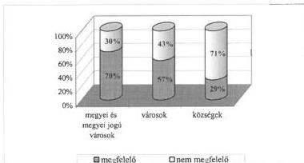

A követelményeknek megfelelő rendeleti szabályozásnak az ellenőrzött önkormányzatok közül a megyei és a megyei jogú városi önkormányzatok feleltek meg a legnagyobb arányban (70%). A legkedvezőtlenebb képet a községi önkormányzatok rendeletalkotási tevékenysége mutatja.

A nem megfelelő szerkezetben és tartalommal elkészített információk hasznosíthatósága, átláthatósága teljes körűen nem volt biztosított.

A zárszámadási rendeletek **szerkezetére, tartalmára**, részletezettségére vonatkozó kötelező előírásokat egy vagy több pontban be nem tartó önkormányzatoknál **az évek óta ismétlődő típushibák a következők voltak**:

**Az ellenőrzött önkormányzatok testület elé beterjesztett éves beszámolójának**

- 10%-a nem a költségvetéssel azonos szerkezetben, tartalommal készült, így az összehasonlításuk sem volt teljes körűen biztosított;
- 12%-a a működési, fenntartási előirányzatok teljesítését nem intézményenként, hanem szakfeladatonként tartalmazta, ezen belül a kiemelt előirányzatok, a tényleges létszámok alakulásának bemutatása is elmaradt;
- 6-8%-a nem tartalmazta a felújítási előirányzatok teljesítését célonként, a felhalmozási kiadások teljesítését feladatonként, valamint nem részletezte a polgármesteri hivatalok kiadásait feladatonként;
- 11%-a nem tartalmazta elkülönítetten a helyi kisebbségi önkormányzatok adatait;
- 17%-ánál elmaradt a működési és felhalmozási célú bevételek és kiadások mérlegszerű bemutatása is.

45

---

II. RÉSZLETES MEGÁLLAPÍTÁSOK

Az Áht. 116., illetve 118. §-a előírta, hogy a költségvetés előterjesztésekor, valamint a zárszámadáskor milyen mérlegeket és kimutatásokat kell a testület részére tájékoztatásul bemutatni. A jogszabályi előírásokat az önkormányzatok nagy számban nem tartották be, több követelménynek nem tettek eleget.

Az Ötv. 78. § (2) bekezdésében előírja, hogy a vagyonállapotot az éves zárszámadáshoz csatolt vagyonleltárban kell kimutatniuk az önkormányzatoknak. Az Áht. 118. §-a szintén tartalmaz a vagyon bemutatására vonatkozó előírást, amely szerint a zárszámadáshoz mellékelni kell a vagyonkimutatást. A vagyonleltár, illetve a vagyonkimutatás szerkezetére, formájára, tartalmára és kapcsolatára, összhangjára nincs egységes jogi szabályozás. Az önkormányzatok saját hatáskörben, önállóan dönthettek ezekről. A gyakorlatban jelentős eltérések voltak a vagyonállapot bemutatásának módjában. A helyi önkormányzatok 30%-a, ezen belül az 1000 fő feletti lakosságú települések önkormányzatainak 27,9%-a csatolt valamilyen „vagyonleltárt”, vagy „vagyonkimutatást” a zárszámadásához. Ezekben az önkormányzat vagyoni helyzetét teljes körűen és részletezve nem mutatták be. Jellemzően az eszközökről és forrásokról a számviteli szabályok szerint készített összevont mérleget csatolták, vagy egy-két eszköztípusról (épületekről, gazdasági társági érdekeltségekről) készített kimutatást mellékelték.

Az előző évekhez hasonló hiányosságok a következők:

- a hitelállomány lejárat, illetve hitelezők szerinti bontásban történő bemutatását, valamint az összevont mérleget az önkormányzatok 18%-a elmulasztotta;
- a többéves kihatással járó döntéseket évenkénti bontásban, összesítve, szöveges indokolással ellátva az önkormányzatok több mint 1/3-a nem számszerűsítette;
- az önkormányzatok 40%-a nem készítette el a közvetett támogatásokat (pl. adóelengedések, adókedvezmények) tartalmazó kimutatást;
- az önkormányzatok 70%-ánál elmaradt az Áht. szerinti vagyonkimutatás, illetve az Ötv. 78. § (2) bekezdésében meghatározott vagyonleltár bemutatása is.

A költségvetés végrehajtásáról készített beszámoló részét képezi a pénzmaradvány-kimutatás és vállalkozási tevékenység végzése esetén az eredménykimutatás is.

A vizsgált önkormányzatok közel 80%-a – a központi információs rendszerbe szolgáltatott adatok alapján – helyesen állapította meg önkormányzati szintű pénzmaradványát.

A 2000. évi pénzmaradványok ellenőrzése során megállapított főbb hiányosságok a következők:

- 11 önkormányzat a zárszámadási előterjesztése nem tartalmazta az önkormányzati pénzmaradvány kimutatását, így azt rendeletben nem hagyták jóvá;

46

---

II. RÉSZLETES MEGÁLLAPÍTÁSOK

- kilenc önkormányzat zárszámadási rendeletében nem a valóságnak megfelelően állapították meg az éves pénzmaradványt, mivel a pénzmaradvány elszámolása során a központi költségvetéssel kapcsolatos elszámolásokat nem vették figyelembe; az aktív és passzív elszámolásokat megfelelő analitikával nem támasztották alá;
- az önkormányzatok mintegy 5%-a a pénzmaradvány helyett a záró pénzkészletet hagyta jóvá, további 5%-nál a testület nem döntött az önállóan, illetve részben önállóan gazdálkodó költségvetési szervek pénzmaradványáról, illetve a zárszámadási rendeletben jóváhagyott pénzmaradvány és az Államháztartási Hivatal részére adott információk közötti összhangot nem biztosította.

Az ellenőrzött önkormányzatok közül 31-nél végeztek vállalkozási tevékenységet. A vizsgálati jelentések a vállalkozási tevékenységet folytató hivatalok és intézmények mintegy 1/3-ánál rögzítettek hiányosságokat a nyilvántartások, a pénzügyi elszámolások, az eredmény megállapítása területén.

# Az eredmény-megállapítás ellenőrzése során feltárt hiányosságok:

- három önkormányzatnál a vállalkozási tevékenységet nem különítették el (külön szakfeladaton), eredmény-kimutatás – bár összeállítása indokolt lett volna – egy önkormányzatnál nem készült;
- a vállalkozási tevékenység eredményének kiszámításakor a vállalkozás pénzforgalmi eredményét nem korrigálták a tevékenységet terhelő értékcsökkenési leírással 3 önkormányzatnál.

A vállalkozási tevékenység eredménye az önkormányzatoknál az alaptevékenységre került visszaforgatásra, így a törvényben előírt 18%-os befizetési kötelezettséget nem kellett teljesíteniük.

# 3. AZ ÖNKORMÁNYZATOK ELLENŐRZÉSI RENDSZERE

# 3.1. A teljesítménymérés módszerei, a belső kontrollok működése

A városi önkormányzatok 29%-a a vizsgált időszakban alakította ki és többségük már elfogadott, jóváhagyott formában működtette minőségbiztosítási rendszerét (pl. Dunaújváros, Felsőzsolca, Hajdúböszörmény, Kiskunfélegyháza, Máriapócs városok, Herceghalom község).

A hivatali teljesítmények mérési eszköze a lakosság véleményének értékelése, melynek segítségével az önkormányzatok 16%-a minősítette munkáját (pl. Nagykőrös, Vác, Barcs, Csurgó, Máriapócs, Mátészalka, Nagyecsed, városok, Budapest főváros XI., XV. kerületei, Herceghalom község).

A felmérés alapvető módszere a kérdőíven történő véleménykérés volt. Előfordult hogy a kérdőíves kutatás tapasztalatait tanulmányban foglalták össze (pl. Kaposvár, Szolnok városok), melynek lényegi megállapításait a város vezetői igyekeztek hasznosítani, illetve a kérdőívek szolgáltak alapul a minőségbiztosítási rendszer információigényének kielégítésére (pl. Kisújszállás). A felmérés eredmény nélkül zárult Záhony városban, mivel az önkormányzat megítélése szerint

47

---

II. RÉSZLETES MEGÁLLAPÍTÁSOK

nem volt szükség a már kialakult gyakorlat módosítására, Balatonfüred városban pedig a testületi tárgyalás hiánya korlátozta a felmérés eredményének hasznosítását.

Az önkormányzatoknak, mint gazdálkodó szervezeteknek és egyben tulajdonosoknak alapvető érdeke, hogy az ellenőrzés rendszerét kiépítsék, gyakorlatban megfelelő hatékonysággal működtessék, igazodva az Ötv. 92. § (2) bekezdésében foglaltakhoz.

A kontrollok eredményes működésének alapja a megfelelő szabályozottság, a folyamatos egyeztetés és a munkafolyamatba épített, egymásra épülő ellenőrzések, felülvizsgálatok megszervezése.

**Az önkormányzatok 78%-a gondoskodott belső kontrollok kialakításáról.** Elsősorban a városi, megyei és fővárosi kerületekre jellemző az ellenőrzés szabályainak megfelelő helyi dokumentációja. Ezen önkormányzatok 82%-a rendelkezett a pénzügyi, gazdasági és számviteli feladatellátást megfelelően szolgáló belső ellenőrzési szabályzórendszerrel (szervezeti és működési szabályzattal, ügyrenddel, belső ellenőrzési szabályzattal és munkaköri leírásokkal). E körben is előfordult, hogy egyes tevékenységeket nem szabályoztak részletesen, sem az SzMSz-ben, sem az ügyrendben, illetve ezek párhuzamos kijelöléseket, átfedéseket, ellentmondásokat tartalmaztak. A szabályozórendszer a helyi sajátosságokat nélkülöző mintaszabályzatokon alapult, következésképp a pénzügyi-gazdasági, számviteli feladatellátás folyamatában maradéktalanul nem biztosították az ellenőrzés egymásra épülő, zárt rendszerű működtetését. Mindezt alátámasztják azok a megállapítások, amelyek a pénzgazdálkodási jogkörök gyakorlásának hibáira, a jogszabályi előírásoktól eltérő dokumentálásra, valamint a különféle nyilvántartások hiányára és hiányosságaira mutattak rá.

A kontrollok gyengébb 73%-os szabályozottsága a községi önkormányzatokra volt jellemző. Ugyanakkor az ezer fő alatti önkormányzatok **54%-a nem, vagy nem teljes körűen építette ki a kontrollok hatékony rendszerét.**

Az önkormányzatok 66%-ánál kiépített a munkafolyamatba épített ellenőrzés. Azonban a városi, megyei és kerületi önkormányzatok, sorrendben 86-75-75%-ban tudtak csak megfelelni a követelményeknek. Az ezer fő feletti községek 72%-a, míg az ezer fő alatti községeknek csupán 46%-a járt el helyesen.

A szabályozásbeli színvonalat gyengíti, hogy a **megyei, kerületi és városi önkormányzatoknak csak 67%-a, a községi önkormányzatoknak csak 48%-a készítette el oly módon az érintettek munkaköri leírásait, hogy azokban feltüntetették a konkrét ellenőrzési feladatokat.** (Az ellenőrzési feladatok munkaköri leírásba történt beépítettségét településtípusonként a 10. számú melléklet b) ábrája szemlélteti.)

A munkaköri leírások és utasítások nem tartalmaztak a különböző munkafolyamatok ellenőrzésére kijelölt műveleteket, a műveletek elvégzésének gyakoriságát, követelményeket, az ellenőrzés viszonyítási alapját, jogszabályi előírást, a követelményektől való eltérés megállapításának módját, az ellenőrzés eredményének hasznosításával kapcsolatos előírásokat.

48

---

II. RÉSZLETES MEGÁLLAPÍTÁSOK

A dolgozók részére kiadott munkaköri leírások tipikus hibája, hogy azok tartalmukban nem követték a változó feladatokat, nem személyre szólóak, nem tartalmazták a dolgozók előírt szakképesítési követelményeit, a helyettesítés rendjét, a beszámolás rendjét, felelősségre vonatkozó feltételeket, egyeztetési kötelezettségeket.

Az ezer fő lakosságszám alatti községek 12%-ánál munkaköri leírások egyáltalán nem készültek, 42%-nál pedig nem kellő adattartalommal bírtak. A munkaköri leírások hiányos információ tartalmuk miatt nem nyújtottak jó alapot a feladat hatékony ellátásához.

A kontrollok a városi, megyei és kerületi önkormányzatok 65%-ában működtek eredményesen, de legtöbbször nem zárt rendszerben a dolgozók munkaköri leírása szerinti módon.

**Komló** városban a munkaköri leírások szorosan kapcsolódnak az ügyrendhez, tartalmazzák az érdekeltek feladatkörét, szervezési, kiadmányozási, ellenőrzési, helyettesítési jogkörüket, felelősségüket, kapcsolattartásukat, valamint az összeférhetetlenséggel és köztisztviselői munkaviszonnyal kapcsolatos kötelezettségeiket. A kiadmányozás szabályozása biztosítja az utalványozás, érvényesítés, ellenjegyzés, kötelezettségvállalás egymáshoz kapcsolódó, ellenőrző funkcióinak működését, valamennyi munkafázis elejétől a végéig.

**Csepreg** városban sajátos kontrollt jelentett a pénzügyi biztos tevékenysége, aki az adósságrendezési eljárás alatt figyelemmel kísérte az önkormányzat gazdálkodását.

A nagyobb önkormányzatokhoz viszonyítottan kedvezőtlenebb a kép a községi, különösen az ezer fő lakosságszám alatti kisközségi önkormányzatok tekintetében, ahol csak 24%-nál volt megállapítható a munkavégzés során folyamatosan érvényesülő kontroll ténye. Az ellenőrzés hiánya, hiányosságai sokszor súlyos jogszabálysértéshez vezettek (pl. Dalmand, Drágszél, Mályinka községeknél).

### 3.2. Felügyeleti és belső ellenőrzés

A helyi önkormányzatokról szóló 1990. évi LXV. törvény 92. § (2) bekezdése szerint a saját intézmények pénzügyi ellenőrzéséről, valamint – jogszabályban meghatározott képesítésű ellenőr útján – gazdálkodása belső ellenőrzéséről gondoskodni kötelesek az önkormányzatok.

**Jelenleg nincs az önkormányzatok ellenőrzési tevékenységét részletesen meghatározó jogszabály, ezért különösen fontos a kellően részletezett helyi szintű szabályozás elkészítése és az abban foglaltak betartása.**

**Az ellenőrzést végzők** iskolai végzettségük és szakmai képzettségük tekintetében alkalmasak voltak a feladatok ellátására. Az ellenőrök 53%-a felsőfokú, 47%-a középfokú iskolai végzettségű, továbbá 10%-uk okleveles könyvvizsgálói, 69%-uk mérlegképes könyvelői képesítéssel is rendelkezett.

A legnagyobb intézményhálózattal rendelkező megyei, kerületi és megyei jogú városi önkormányzatok rendelkeztek a legmagasabb ellenőri létszámmal. E

49

---

II. RÉSZLETES MEGÁLLAPÍTÁSOK

körben az egy költségvetési ellenőrre jutó önállóan gazdálkodó intézmények száma 9,5, míg a többi városnál 7,8 volt. A vizsgált két évben az ellenőrzéssel foglalkozók átlagos száma 229 főről, 218 főre, 4,8%-kal csökkent.

Az önállóan gazdálkodó költségvetési szervet alapított városi önkormányzatok 40%-a, a fővárosi kerületek fele semmilyen módon nem alkalmazott költségvetési ellenőrt. A költségvetési ellenőrt nem alkalmazó városok körében 70% a hivatali belső ellenőr foglalkoztatását sem szervezte meg. Az összes város 48%-ánál – amellett, hogy költségvetési ellenőri létszámmal rendelkezik – hivatali belső ellenőr nincs. A községek intézményi belső ellenőrt semmilyen formában nem alkalmaznak.

Az önkormányzati intézmények ellenőrzése alapjainak megteremtését jelenti a **felügyeleti jellegű ellenőrzések** szabályainak kialakítása, amelyről az önkormányzatok 60%-a gondoskodott. (Településtípusonkénti részletezést a 10. számú melléklet c. ábrája szemlélteti.) A szabályzatok azonban nem mindig szolgáltak megfelelő alapul az ellenőrzési kötelezettség szakszerű ellátásához (pl. Ráckeve, Tolna városokban).

Egyes önkormányzatok a létszámhiány ellenére hoztak döntést ellenőrzési feladatokról (pl. Záhony város).

A felügyeleti jellegű költségvetési ellenőrzések gyakoriságát az önkormányzatok 58%-a szabályozta, **rendszerint az ellenőrzések kétéves gyakoriságát rögzítették** (pl. Mezőberény, Mezőhegyes város), ám előfordult ennél hosszabb idő meghatározása is (pl. Kiskunfélegyháza város – háromévente, Pécs megyei jogú város – ciklusonként).

**Az ellenőrzéseknél a fő hangsúlyt a cél és témavizsgálatokra helyezték, az intézményi gazdálkodás átfogó vizsgálata háttérbe szorult.** A felügyeleti átfogó jellegű vizsgálatok száma alacsony, a vizsgálati dokumentumok szakmai színvonala hatékony intézkedések meghozatalára kevésbé volt alkalmas. A tervezett átfogó ellenőrzési feladatok egy része évről-évre elmaradt, helyettük más, éppen aktuális téma- és célvizsgálatok kerültek előtérbe. Az ellenőrzést végzők munkájával szemben támasztott elvárás nagyon eltérő volt, amelynek következtében az elkészített jelentések tartalmi színvonala is jelentős különbségeket mutatott. Többségük azonban tartalmazta a feltárt szabálytalanságokat, hibákat, azok kijavítását célzó javaslatokat, helyenként indokoltan felelősségre vonást is kezdeményeztek.

**Bősárkány** községben a munkafolyamatba épített ellenőrzés az óvoda térítési díjainak magas hátralékát állapította meg, melyet követően célvizsgálat során megállapították, hogy az élelmezésvezető a bizonylatokat meghamisította, az étkezési díjak egy részét nem fizette be az önkormányzat számlájára, akit ezért fegyelmi eljárást követően elbocsátottak.

**Nógrád** megyei önkormányzat két intézményének céllellenőrzése súlyos hiányosságokat tárt fel, melyek oda vezettek, hogy az egyik intézmény dolgozója ellen büntető feljelentést tettek. Egyik intézménynél megállapítást nyert, hogy a pénztáros több év alatt 1 209 ezer Ft-ot tulajdonított el. A másik esetben a fegyelmi eljárás megindításának határideje lejárt, munkajogi felelősségre vonást nem kezdeményezhettek. Ez esetben az intézményi munkatársak gondatlanságát állapította meg a külső szakértő, a múzeumi műtárgyak nyilvántartási rendjének

50

---

II. RÉSZLETES MEGÁLLAPÍTÁSOK

hiányosságai, valamint a selejtezési eljárás menetében tapasztalt súlyos szabálytalanságok miatt.

Két év alatt átlagosan az önállóan gazdálkodó költségvetési szervek 35–35%-ának vizsgálata valósult meg pénzügyi – gazdasági ellenőrzés keretében, amely háromévenkénti gyakoriságnak felel meg. E körben legnagyobb gyakorisággal a megyei jogú városok (45–46%) és a városok (33–30%), legkevésbé a községek (18–37%) tettek eleget ellenőrzési feladataiknak. A kevésbé átfogó jellegű cél-, téma- és utóvizsgálatok körében meghatározó volt a céllenőrzések (53–55%) végrehajtása, amelyet a polgármester, bizottságok, vagy a képviselő-testület kezdeményezésére, legtöbbször munkatervet kívüli feladatként hajtottak végre. A cél- és témavizsgálatok gyakran a központi költségvetési hozzájárulások, támogatások elszámolásának alapdokumentumait, a térítési díjak elszámolását, a konyhai tevékenységet, a pénzkezelést, a bizonylati rend és okmányfegyelem betartását vették górcső alá. Előfordult, hogy a témavizsgálati ellenőrzési tapasztalatokról egy összefoglaló jelentés készült, záradékolás nélkül (Hajdúdorog, Hajdúböszörmény városok).

A községi önkormányzatok körében még mindig **kevésbé elterjedt** gyakorlat az **ellenőrzés társulásos formában** történő megszervezése, annak ellenére, hogy az ellenőrzés ilyen formájú megszervezése szakmailag és anyagilag is, különösen a kistelepülések számára sok előnnyel bír. A vizsgált körben hét önkormányzatnál az ellenőrzési tevékenység társulásos formájának jó színvonalú működését tapasztaltuk (Gyula, Mezőhegyes városok, Gecse, Mezőgyán, Szemely, Vaskút, Zákányszék községek). Kettő önkormányzatnál kevésbé kedvező kép alakult ki:

**Ráckeresztúr** községben a tárulás 1999. I. félévét követően megszűnt, a feladatot vállalkozó végzi, **Bősárkány** községben pedig a tárulási együttműködési megállapodásban foglaltakat szakember hiányában nem tudták teljesíteni.

A képviselő-testületek, a pénzügyi bizottságok sem követelték meg a polgármesteri hivataloktól, körjegyzőségektől az ellenőrzési feladatok ellátását, de maguk sem éltek jogosítványaikkal. Csak ritkán fordult elő, hogy szabályozott volt a beszámoltatás rendje és arra a gyakorlatban is sor került.

**Szárliget** községben a képviselő-testület ad-hoc bizottságot hozott létre az általános iskola főzőkonyhájának ellenőrzésére, a bizottság súlyos hiányosságokat állapított meg mind a nyilvántartás, mind pedig a gazdálkodás tekintetében. A megállapítások alapján a képviselő-testület a főzőkonyha felszámolását, az étkeztetési feladatok vállalkozásba adását határozta el.

A települések önkormányzatainak Áht-ből fakadó jogosultsága, hogy az általa támogatott, vagy finanszírozott szervezetek, magánszemélyek számára elszámolási kötelezettséggel adjon át pénzeszközöket. Az érintett önkormányzatok 59%-a fordított figyelmet az adott támogatások, hozzájárulások felhasználásának ellenőrzésére, a kizárólagos vagy többségi tulajdonában lévő gazdasági társaságok beszámoltatása, tevékenységének felügyelő bizottsági céllenőrzése útján.

**A belső ellenőrzés** rendszerének szabályozottsága és gyakorlata kedvezőtlenebb a felügyeleti jellegű ellenőrzésekhez viszonyítva. Az önkormányzatok gazdálkodását végrehajtó hivatalok 48%-ánál történt meg a belső ellenőrzés

51

---

II. RÉSZLETES MEGÁLLAPÍTÁSOK

rendszerének kiépítése, 31%-ban volt meghatározott a belső ellenőrzések gyakorisága (a belső ellenőrzési feladatok ellátási feltételeinek településtípusonkénti kialakítottságát a 10. számú melléklet a. ábrája szemlélteti).

Az önkormányzati hivatalok 18%-ánál alkalmaztak függetlenített belső ellenőrt. A fővárosi kerületek mindegyikében alkalmaztak hivatali függetlenített belső ellenőrt, viszont a megyei önkormányzatok közül három (75%), a városok közül 32 (55%) nem. A községekben az alkalmazott 11 fő (9%) osztott munkakörben, illetve külső megbízások segítségével végezte belső ellenőri feladatait. Gyakran a függetlenített belső ellenőr végzi az intézményi felügyeleti jellegű ellenőrzéseket is (pl. Bicske, Felsőzsolca, Mezőberény, Mezőcsát városoknál).

A belső ellenőrök által elvégzett vizsgálatok elsősorban a szabályszerűségi követelményeknek való megfelelésre és az operatív gazdálkodás egy-egy részterületére irányultak. A hivatalok működésének és gazdálkodásának teljes körű ellenőrzését kevés helyen biztosították.

A képviselő testületek **23%-a tett eleget rendszeresen és megfelelő színvonalon az ellenőrzési kötelezettségének**. A jogszabályoknak és saját szabályainak leginkább megfelelően jártak el a városi önkormányzatok, amelyek közül 41%-nál volt jónak értékelhető az ellenőrzések szervezettsége, végrehajtása. Legkevésbé megnyugtató a kialakult kép az ezer fő alatti községi önkormányzatoknál, ahol csak 8%-nál volt tapasztalható az ellenőrzés kellő színvonalú lebonyolítása.

Az Ötv. 22. § (1) bekezdésében foglaltakat betartva a **kötelezett önkormányzatok létrehozták pénzügyi bizottságaikat**. A vizsgált önkormányzatok közül további 15 önkormányzat számára nem volt kötelező érvényű, mégis létrehozta a pénzügyi bizottságot. A pénzügyi bizottságok feladatait 98%-ban az önkormányzati SzMSz-ekben rögzítették, megismételve az Ötv. 92. §-ában megfogalmazottakat. A bizottságok többnyire éves munkaterv alapján tevékenykedtek. Munkájuk legtöbbször a költségvetés és zárszámadás, valamint a hitelfelvétel minősítésében merült ki, de alapfeladataikon felül több bizottság (25%) még továbbiakat is felvállalt.

A képviselő testületek nem fordítottak kellő figyelmet az ellenőrzési tevékenységre. A vizsgált kör 52%-a tekintette át a vizsgálatok tapasztalatait és ennél kevesebb volt azoknak a száma, akik a felügyeleti jellegű (34%) és a belső ellenőrzés (41%) tapasztalatait valamilyen módon értékelték. A testületi és vezetői hatáskörbe tartozó realizálási intézkedést az önkormányzatok 50%-a hozott.

Az ellenőrzési hatékonyságot tovább rontotta, hogy az érintett munkaterületeken csak az önkormányzatok 60%-ánál vették figyelembe az ellenőri megállapításokat.

### 3.3. Önkormányzatok könyvvizsgálata

Az Ötv. 92/A § (1) és (2) bekezdése alapján az ellenőrzött önkormányzatok 43%-a volt köteles egyszerűsített tartalmú beszámolót készíteni és azt könyvvizsgálóval felülvizsgálatni, illetve közzétenni.

52

---

II. RÉSZLETES MEGÁLLAPÍTÁSOK

Az önkormányzatok a törvényben előírt könyvvizsgálati kötelezettségüknek eleget tettek, az önkormányzatok és intézményeik adatait összevontan tartalmazó beszámoló felülvizsgálata megtörtént. Az alkalmazott könyvvizsgálók költségvetési minősítéssel rendelkeztek, az összeférhetetlenségi követelményeket betartották.

Egy önkormányzat volt (Tófej), ahol a könyvvizsgálatot csak az ÁSZ felhívását követően – határidőn túl – végeztették el.

A könyvvizsgálók a beszámolók döntő többségét hitelesítő záradékkal látták el, korlátozó záradékot mindössze három önkormányzat 2000. évi egyszerűsített beszámolója kapott.

**Bátorliget** községnél az önkormányzat 1999-2000. évi egyszerűsített beszámolóit mindkét évben korlátozó záradékkal látta el a könyvvizsgáló. Véleménye szerint „a könyvvezetés és a beszámoló készítése során nem érvényesült a világosság, teljesség alapelve, miután az önkormányzat kézi könyvelést folytat”. A könyvvizsgáló a vagyoni, pénzügyi és jövedelmi helyzetet érdemben befolyásoló szabálytalanságot egyik évben sem tapasztalt és auditálási eltérést nem mutatott ki.

**Bicske** városnál a könyvvizsgáló az 1999. és 2000. éves konszolidált beszámolókat korlátozó záradékkal látta el. Az 1999. évi egyszerűsített összevont éves beszámoló auditálásáról szóló jelentés hitelesítő záradéka szerint az önkormányzat vagyoni, pénzügyi és jövedelmi helyzetéről a beszámoló „nem feltétlenül ad megbízható, valós képet”. A korlátozás indokaként általánosságban jelezte, hogy a leltározás, rovncsolás hiányzik, nem megfelelő kezelési logika van egyes tartozásoknál, követeléseknél. A jelentésben auditálási eltérést a könyvvizsgáló nem számszerűsített.

A 2000. évi egyszerűsített éves beszámoló ismét korlátozott hitelesítő záradékot kapott, amit a könyvvizsgáló azzal indokolt, hogy a jelentős előrelépés ellenére még mindig fennállnak olyan tényezők, amelyek lényeges hibahatárba tartozó nagyságot is jelenthetnek. (A vagyontárgyak értékkel való ellátása nem történt meg, nem rendezett az önkormányzat és a 100%-os tulajdonában lévő r közötti pénzügyi kapcsolat, a követelések és tartozások kezelése nem megfelelő.)

A **Budapest XV. kerületnél** az 1999. és 2000. évi költségvetési beszámolókra azzal az indokkal adott korlátozó záradékot a könyvvizsgáló, hogy az önkormányzati vagyon objektív számbavétele nem biztosított. Az önkormányzati ingatlanvagyon mintegy negyedét a földhivattal nem egyeztették, nem áll rendelkezésre tételes, egyedi nyilvántartáson alapuló analitika, amely a mérleg adattartalmát alátámasztaná.

Az éves jelentésekben a könyvvizsgálók számos észrevételt, javaslatot tettek, amelyek jellemzően a számviteli nyilvántartások rendjét, a leltározást, az érték nélkül nyilvántartott vagyonelemek értékelését érintették. Az érintett önkormányzatok 55%-a hasznosította a könyvvizsgálói javaslatokat.

#### 4. A HELYI KISEBBSÉGI ÖNKORMÁNYZATOK GAZDÁLKODÁSÁNAK TÖRVÉNYESSÉGE, SZABÁLYSZERŰSÉGE

**Kisebbségi önkormányzatok az elmúlt évi átfogó ellenőrzéssel érintett települések 41,4%-ánál (52 városban, 27 községben) működtek, amelyek**

53

---

II. RÉSZLETES MEGÁLLAPÍTÁSOK

pénzügyi-gazdasági tevékenységének ellenőrzését az adott helyi önkormányzattal párhuzamosan végeztük el. Ezen ellenőrzéseink települési önkormányzatonként általában egy-egy kisebbségi önkormányzatra irányultak. Kivételt képez Mezőberény város és Budapest főváros VIII. kerülete, ahol két-két helyi kisebbségi önkormányzat gazdálkodásának ellenőrzése történt meg. Az ellenőrzések az országban működő helyi kisebbségi önkormányzatok 5,9%-ára terjedtek ki.

**A végrehajtott ellenőrzések mind a 13 nemzetiségi területen tevékenykedő kisebbségi önkormányzatot érintették.** Közöttük a legnagyobb részarányt 53%-kal a cigány, majd 22%-kal a német kisebbség képviselte. A továbbiakat egyenként 4-4%-ban a lengyel, román és szlovák, 3-3%-ban a horvát, örmény, 2%-ban a szerb, valamint 1-1%-ban a bolgár, görög, ruszin, szlovén és ukrán kisebbségi önkormányzatok tették ki.

A vizsgálati jelentések megállapítása szerint **az ellenőrzött helyi kisebbségi önkormányzatok** az Ötv. 102/C. § (2) bekezdésében biztosított jogkörükkel nem éltek, a települési önkormányzatok képviselő-testületeinél **feladat-, illetve hatáskör átruházását nem kezdeményezték, és tőlük feladatot nem vettek át.** A részükre juttatott központi költségvetési, illetve önkormányzati támogatásból és a rendelkezésükre álló egyéb forrásaikból a történelmi hagyományaik, nemzetiségi nyelvük, kultúrájuk őrzésén, ápolásán túl, a kisebbségük érdekeinek érvényesítését tekintették fő feladatuknak. Ennek érdekében vettek részt az adott települési önkormányzat kisebbséget érintő döntéseinek előkészítésében, éltek véleményezési, egyetértési jogaikkal.

A **Csurgó** város cigány kisebbségi önkormányzata az oktatási intézményekkel együttműködve segítette a hátrányos helyzetű gyermekek felzárkóztatását. A foglalkoztatási gondok enyhítésére a megyei munkaügyi központtal együttműködve és alapítványi támogatásokkal, évente 20-30 munkanélkülit foglalkoztatott közhasznú munkavégzés keretében.

A helyi kisebbségi **önkormányzatok a képviselő-testület határozatával elrendelt feladat-átvétel hiányában láttak el** olyan tevékenységeket is, amelyek a vonatkozó jogszabályok előírásai szerint a települési önkormányzatok feladat- és hatáskörébe tartoztak. A kisebbséghez tartozó időskorúak és intézményi ellátottak részére nyújtott támogatásokkal a szociális igazgatásról és a szociális ellátásokról szóló 1993. évi III. törvény 3. § (3) bekezdésében a helyi önkormányzat feladatkörébe utalt pénzbeli és természetbeni juttatásokat nyújtottak.

A városi önkormányzati feladatok ellátásában a **Nagykőrös** város cigány kisebbségi önkormányzata a hátrányos helyzetű családok részére élelmiszer-csomag juttatásával, valamint a tanulói étkeztetés- és tankönyvvásárlás támogatásával, a **Petneháza** község cigány kisebbségi önkormányzata a roma családok részére élelmiszer-segélycsomagok nyújtásával működött közre.

A képviselő-testület 8/2000. (XII. 11.) számú határozata alapján a lengyel kisebbséghez tartozó, időskorú polgárok körében karácsonyi ajándékként élelmiszert és édességét osztottak szét a **Ládbesenyő** község lengyel kisebbségi önkormányzatánál.

54

---

II. RÉSZLETES MEGÁLLAPÍTÁSOK

**Lenti** város cigány kisebbségi önkormányzata költségvetési forrásaiból – a működési kiadásai finanszírozásán túl – a szeptemberi iskolakezdéshez füzet- és írószer, továbbá karácsony előtt ajándékcsomag formájában nyújtott támogatásra is történt felhasználás.

**Petneháza** község cigány kisebbségi önkormányzata a kedvezményezetteknek egy-egy korábbi visszatérítendő támogatásból 7/200. (X. 6.) számú határozatával a még fennálló 15 ezer Ft, a 8/2000. (X. 6.) számú határozatával további 70 ezer Ft visszatérítését elengedte.

**A helyi kisebbségi önkormányzatok tevékenységét** és a testületi működésükhöz szükséges feltételek megteremtését a **székhelyük szerinti települési önkormányzatok** különböző módon **segítették**. A nemzeti és etnikai kisebbségek jogairól szóló 1993. évi LXXVII. törvény. 28. §-ának előírásai alapján, elsősorban helyiség-, illetve egyéb eszközhasználatot biztosítottak, valamint az ellenőrzött körnek (1999. évben 48%-ánál, 2000-ben pedig 53%-ánál) további pénzügyi támogatást is nyújtottak. A települési önkormányzati támogatás az ellenőrzött kisebbségi önkormányzatok költségvetési bevételeinek 1999. évben 42%-át, 2000-ben 39%-át képezte, míg a központi költségvetési támogatások ugyanezen években 38%, illetve 36%-ot tettek ki.

**Veszprém** város örmény kisebbségi önkormányzatának képviselő-testülete a működéséhez rendelkezésére bocsátott helyiségről a 4/1998. (X. 19.) számú határozatával lemondott, mivel azt tanácskozásai lebonyolítására, vendégek fogadására nem tartotta alkalmasnak. A települési önkormányzat új helyiséget csak 2001. tavaszán tudott biztosítani számára, ezért a képviselő-testület üléseit az ellenőrzött időszakban egy képviselő lakásán tartotta meg. A működéséhez szükséges bútorzatot, írógépet, irodaszer ellátást a város önkormányzata biztosította.

**Bicske** város cigány kisebbségi önkormányzata számára a települési önkormányzat sikertelen ingatlancsere megállapodás és az így kialakult helyzet megoldásának elhúzódása következtében, több mint két éve nem biztosított irodát, illetve a már bejegyzett ingyenes helyiséghasználati jog érvényesítését korlátozta.

A települési önkormányzatokkal való együttműködés keretében **a helyi kisebbségi önkormányzatok gazdálkodásának végrehajtásával kapcsolatos feladatokat**, az Áht. 66. § rendelkezései alapján, valamennyi ellenőrzött szervezetnél a költségvetési szervként működő **polgármesteri hivatalok, illetve körjegyzőségek végezték**. A költségvetési gazdálkodás törvényes ellátása érdekében szükséges, az előzőekben hivatkozott törvényben előírt **megállapodás a vizsgált kör 70%-ánál állt rendelkezésre** két kivétellel (Szolnok, Pilisvörösvár) a megalakulást követő 1-2 hónapon belül. Az ellenőrzött körben általánosnak tekinthető gyakorlattól eltérően a Budapest XV. kerületi települési és kisebbségi önkormányzatok megállapodása nem határozatlan időre, illetve hosszabb távra szólóan, hanem egyéves időszakra jött létre, amelyet évente újra megkötöttek.

Az együttműködési **megállapodások megkötésének**, illetve a gazdálkodás egyes területeire vonatkozó, konkrét előírások rögzítésének **elmulasztása következtében** az ellenőrzött kisebbségi önkormányzatok mintegy harmadánál nem szabályozottak a költségvetési tervezés, az operatív gazdálkodás, valamint a zárszámadás feladatai, a gazdasági jellegű döntések előkészítésének rendje,

55

---

II. RÉSZLETES MEGÁLLAPÍTÁSOK

illetve a törvényben foglalt előírások összehangolt teljesítésének követelményei, ami kedvezőtlenül befolyásolta a feladatellátást.

A kisebbségi önkormányzatok képviselő-testületének határozatával jóváhagyott költségvetés 2000. évre az ellenőrzöttek 95%-ánál rendelkezésre állt. A további 5% az Áht. 65. § (2) bekezdésében előírt, az éves költségvetés önálló határozatban történő megállapítási kötelezettségének nem tett eleget. Ebben a körben kötelezettségvállalások és utalványozások szabályszerű végrehajtásához szükséges előirányzatokról, illetve azok jóváhagyásáról nem gondoskodtak.

A helyi kisebbségi önkormányzat 2000. évi költségvetését önállóan, költségvetési határozattal nem állapította meg Almáskamarás község német, Esztergom város szlovák, Gyöngyös város cigány és Veszprém város örmény kisebbségi önkormányzata.

A helyi kisebbségi önkormányzatok 69%-a fogadta el olyan időpontban a költségvetési határozatot, hogy a települési önkormányzatok rendelet-alkotása időben, a jogszabályi előírásoknak megfelelően történhessen.

A költségvetési rendeletekben az előirányzatok kisebbségi önkormányzati testületi határozat hiányában történő beépítésével megszegték az Áht. azon rendelkezését, amely szerint a települési önkormányzat költségvetési rendeletébe a helyi kisebbségi önkormányzat költségvetése annak határozata alapján épül be. Nem teljesítették továbbá azt a követelményt sem, hogy a települési önkormányzat képviselő-testülete a kisebbségi önkormányzat költségvetésére vonatkozóan döntési jogosultsággal nem rendelkezik.

A kisebbségi önkormányzatok képviselő-testületének működésével kapcsolatos zavarokat jeleztek a helyszíni ellenőrzések Bicske és Kisújszállás városok cigány kisebbségi önkormányzatainál, ahol a költségvetés határidőben történő előterjesztése a képviselők távolmaradása miatti határozatképtelenség következtében nem történhetett meg.

Szeged városnál és Kecskéd községnél a költségvetés készítésének hiányosságait az illetékes megyei közigazgatási hivatal törvényességi észrevételben kifogásolta.

A kisebbségi önkormányzatok képviselőtestülete által jóváhagyott költségvetési határozatok tartalma és szerkezete az érintettek 33%-ánál nem felelt meg az Áht. 69. §, illetve az Ámr. 29. §-ában rögzített előírásoknak. Ezek közül a legtöbb esetben (22%-nál) a kiadások kiemelt előirányzatonkénti részletezésének elmaradását, a továbbiaknál egyes források, illetve kiadások számításba vételének, valamint a bevételek forrásonkénti részletezésének elmulasztását állapítottuk meg.

- A költségvetési határozatban a bevételeket forrásonként nem részletezték a Csurgó város cigány, Herend város német és Hernádszurdok község cigány kisebbségi önkormányzatainál.
- A jóváhagyott költségvetésben nem szerepeltették a központi költségvetési támogatást Varsád község német, az állami és önkormányzati támogatásokat Hajdúböszörmény cigány, az önkormányzati támogatást és a pénzmaradványt Hajdúhadház cigány kisebbségi önkormányzatai. A kiadási elői-

56

---

II. RÉSZLETES MEGÁLLAPÍTÁSOK

rányzatok között teljes körűen nem tervezték meg a személyi juttatásokat **Ózd** város cigány, a Nemzetiségi Ház működési hozzájárulásával kapcsolatos pénzeszköz-átadást a **Szeged** város ukrán kisebbségi önkormányzatainál.

A helyi kisebbségi önkormányzatok pénzforgalmának lebonyolítására szolgáló **bankszámlanyitási kötelezettséget a vizsgált kisebbségi önkormányzatok 81,4%-a-teljesítette**. Ennek keretében a települési önkormányzatok költségvetési elszámolási számlájához kapcsolt alszámlát 70,3%, míg önálló bankszámlát 11,1% nyitott.

**A kisebbségi önkormányzatok pénzforgalmának a települési önkormányzattól elkülönített bonyolítására** önálló számla, vagy alszámla nyitásának elmulasztását, illetve a működő számlák költségvetési gazdálkodással kapcsolatos pénzforgalomra történő használatának mellőzését 18 kisebbségi önkormányzatnál állapítottuk meg.

Az ellenőrzött kisebbségi önkormányzatok 10%-a a **költségvetési gazdálkodás valamennyi pénzforgalmát** a települési önkormányzat hivatalának pénztárában **bonyolította** annak ellenére, hogy 50%-uk bankszámlával is rendelkezett (de azt csupán finanszírozásra használták).

Előfordult, hogy a **kisebbségi önkormányzati gazdálkodás készpénzforgalmát** a települési önkormányzatétól **nem különítették el**. A kisebbségi önkormányzat készpénzforgalmának a helyi önkormányzatával összevont kezelését 21 kisebbségi önkormányzatnál, az ellenőrzöttek 26%-ánál állapítottuk meg.

Az ellenőrzött **kisebbségi önkormányzatok 49%-a szabályozta a számla feletti rendelkezési jogosultságot**. A kisebbségi önkormányzatok feladatainak teljesítése során, a bankszámlát terhelő pénzforgalomról döntően a kisebbségi önkormányzatok intézkedtek, de előfordult, hogy helyettük azt az adott települési önkormányzat tisztségviselői, illetve a hivatali dolgozói végezték.

A polgármesteri hivatalok (körjegyzőségek) **72,8% rendelkezett a kisebbségi önkormányzatok gazdálkodásának adatairól elkülönített számviteli nyilvántartással**, a nyilvántartások jogszabályi előírásoknak megfelelő vezetését az ellenőrzött kör 48%-ánál állapítottuk meg.

**A gazdálkodást végrehajtó szervezet által vezetett számviteli nyilvántartásokban** a települési önkormányzattal összevont bankszámla és házipénztár kezeléssel érintett kisebbségi önkormányzatok esetében a **banki és a pénztári pénzforgalmat nem rögzítették elkülönítetten**. Az ellenőrzött körben további nyilvántartási hiányosság a készpénzforgalom idősoros könyvelésének, illetve a kisebbségi önkormányzatot megillető bevételek és a költségvetését terhelő kiadások belső szakfeladaton történő, elkülönített kimutatásának, valamint a vagyontárgyak, illetve az előirányzatok nyilvántartásának elmulasztása területén fordult elő.

- A költségvetési előirányzatok alakulásáról nem vezettek nyilvántartást **Dunakeszi** város cigány, **Mezőberény** város szlovák és **Tolna** város német kisebbségi önkormányzatainál.

57

---

II. RÉSZLETES MEGÁLLAPÍTÁSOK

- A vásárolt tárgyi eszközök nyilvántartásba vételét elmulasztották, így a vagyontárgyak előírásoknak megfelelő nyilvántartásáról nem gondoskodtak Csepreg város horvát, valamint Pétervására város és Petneháza községi cigány kisebbségi önkormányzatainál.
- A kisebbségi önkormányzat készpénzforgalmáról pénztárjelentést nem vezettek, bevételeiről és kiadásairól idő-, illetve eseménysoros nyilvántartással nem rendelkeztek (Borsodbóta és Csobád községek, valamint Nagyecsed város cigány kisebbségi önkormányzatai).
- A házipénztári pénzforgalomról napi pénztárjelentést vezettek, de pénztárzárlatot csak különböző időszakonként végeztek Erdőkövesd község, Pétervására város cigány, Pilisvörösvár város német kisebbségi önkormányzatainál, napi pénztárjelentés mellett pénztárzárlatot félévenként dokumentáltak Csurgó város cigány kisebbségi önkormányzatánál. A pénztárzárlatokat eseti jelleggel végezték Ládbesenyő község lengyel kisebbségi önkormányzatánál.
- A bevételek elkülönített elszámolását nem biztosították Alattyán, Csépa községek cigány, a bevételek és a kiadások belső szakfeladaton történő, elkülönített kimutatása elmaradt Szentmártonkáta község cigány kisebbségi önkormányzatainál. A saját bevételt képező parkolási díjakról analitikus nyilvántartást nem vezettek Lenti város cigány kisebbségi önkormányzatánál.

A települési és a kisebbségi önkormányzatok együttműködésének hiányosságait mutatja, hogy a költségvetési előirányzatok gazdálkodás folyamatában történő módosításáról képviselő-testületi határozattal az ellenőrzötteknek 35%-a rendelkezett. A költségvetési előirányzatok körében végrehajtott módosítások települési önkormányzati költségvetési rendeletbe való beépítésének megtörténtét pedig, még ennél is kisebb arányban, 22%-nál tapasztaltuk.

A helyi kisebbségi önkormányzat költségvetési előirányzatainak módosítása a települési önkormányzat költségvetési rendeletében a kisebbségi önkormányzat határozatának hiányában szerepelt (pl. Bonyhád, Herceghalom, Budapest XX. kerület német kisebbségi önkormányzatainál).

Balatonfüred város cigány kisebbségi önkormányzatának 2000. évi bevételi és kiadási előirányzatait több esetben módosította a települési önkormányzat anélkül, hogy azt a kisebbségi önkormányzat testületi határozata alátámasztotta volna.

A költségvetési előirányzatok szabályszerű felhasználásának rendjét a kisebbségi önkormányzatok 56,7%-ánál szabályozták, a továbbiak azzal sem az együttműködési megállapodásokban, sem arra irányuló, önálló szabályozásban nem foglalkoztak. Emellett a helyszíni ellenőrzéskor a gazdálkodási jogkörök gyakorlására jogosultak átmeneti, vagy tartós távollét esetére szóló, illetve saját részre történő kifizetések tekintetében a helyettesítés rendjét tartalmazó helyi szintű szabályozás hiányát az ellenőrzött kisebbségi önkormányzatok 10%-ánál kifogásoltuk.

Az ellenőrzött helyi kisebbségi önkormányzatok az éves beszámolóik összesített adatai szerint 2000. évben 131,3 millió Ft bevételt realizáltak, amely költségvetési gazdálkodásukhoz az előző évinél összességében 19%-kal

58

---

II. RÉSZLETES MEGÁLLAPÍTÁSOK

nagyobb forrást jelentett. A teljesített bevételek között a központi költségvetési és a helyi önkormányzati támogatás 1999-ben 88,4 millió Ft, 2000-ben 98 millió Ft volt, **amelyek az időszak első évében 80%-os, míg a következő évben 75%-os részarányt képviseltek.** A kisebbségi önkormányzati feladatok finanszírozásában a központi költségvetési és önkormányzati támogatások szerepe csökkent, az egyéb támogatások, valamint a hitelfelvételek súlya növekedett. Ennek megfelelően költségvetési bevételeiknek az egyéb támogatások 1999-ben 13%-át, majd 2000-ben már 15%-ot képezték. A hitelek költségvetési forrásokon belüli aránya az 1999. évi 3%-ról 2000-ben 6%-ra emelkedett.

Az ellenőrzött helyi kisebbségi önkormányzatok **1999. és 2000. évi bevételeinek forrásonkénti összetételét** a következő táblázat szemlélteti:

Adatok: ezer Ft-ban

|  Forrás megnevezése | 1999. év |   | 2000. év |   | Index 2000/1999.  |
| --- | --- | --- | --- | --- | --- |
|   |  összege | részaránya | összege | részaránya  |   |
|  Sajátos működési bevétel | 4 694 | 4% | 5 065 | 3% | 108%  |
|  Felhalmozási és tőkejellegű bevétel | 33 | 0% | 1 410 | 1% | 4273%  |
|  Önkormányzati támogatás | 46 632 | 42% | 50 612 | 39% | 109%  |
|  Központi költségvetési támogatás | 41 803 | 38% | 47 339 | 36% | 113%  |
|  Egyéb támogatás | 13 642 | 13% | 19 217 | 15% | 141%  |
|  Hitelek | 3 669 | 3% | 7 677 | 6% | 209%  |
|  **Bevételek összesen** | **110 473** | **100%** | **131 320** | **100%** | **119%**  |

**Az éves gazdálkodás során elért bevételeknek 1999. évben 85%-át, míg 2000-ben 89%-át használták fel.**

A kiadások döntő részét a működtetés feladataira fordították, amelyek az összes költségvetési kiadásnak 1999. évben 96%-át, 2000-ben pedig 94%-át kötötték le. Ezen belül a személyi juttatások és a különféle járulékok az éves kiadásoknak 1999. évben 40%-át, a következő évben pedig már 35%-át tették ki; a dologi kiadások 46%, illetve 49%-os részarányt képviseltek.

Az ellenőrzött helyi kisebbségi önkormányzatok **1999. év 2000. évi kiadásainak összetételét** a következő táblázat szemlélteti:

Adatok: ezer Ft-ban

|  Kiadás megnevezése | 1999. év |   | 2000. év |   | Index 2000/1999.  |
| --- | --- | --- | --- | --- | --- |
|   |  összege | részaránya | összege | részaránya  |   |
|  Személyi juttatás | 28 202 | 30% | 30 015 | 26% | 106%  |
|  TB és egyéb járulék | 9 527 | 10% | 10 271 | 9% | 108%  |
|  Dologi kiadás | 43 349 | 46% | 57 544 | 49% | 133%  |
|  Pénzeszközátadás, egyéb támogatás | 9 112 | 10% | 12 099 | 10% | 133%  |
|  Felújítás, felhalmozási kiadás | 3 368 | 4% | 6 482 | 6% | 192%  |
|  **Kiadások összesen** | **93 558** | **100%** | **116 411** | **100%** | **124%**  |

A gazdálkodási feladatok és hatáskörök helyi szintű szabályozásának hiánya, illetve tartalmi hiányosságai következtében **az operatív gazdálkodás különböző területein kialakult gyakorlat csak 31-38%-nál minősült a jogszabályban foglalt követelményeknek megfelelőnek** (kötelezettség-

59

---

II. RÉSZLETES MEGÁLLAPÍTÁSOK

vállalás 31%, érvényesítés 33%, utalványozás 38%). A költségvetés végrehajtási folyamatában az utalványozás, érvényesítés és ellenjegyzés Ámr. 134-138. §-aiban rögzített előírásai az ellenőrzött körben nem érvényesültek maradéktalanul.

- A kifizetéseket a kisebbségi önkormányzat elnöke helyett a települési önkormányzat polgármestere utalványozta az ellenőrzöttek 13,5%-ánál, saját részre történő utalványozást végeztek 13,5%-nál, az utalványozás elmaradt 16%-nál, az ellenjegyzés nem történt meg 12,3%-nál, nem dokumentálták a teljesítés igazolását 10%-nál.
- A helyi kisebbségi önkormányzat testületének tagja a kisebbségi önkormányzat elnökének az Áht. 74/A. § (1) bekezdésében előírt felhatalmazása nélkül gyakorolta az utalványozást, a (3) bekezdésében foglalt kisebbségi önkormányzati megbízás hiányában végezte az utalvány ellenjegyzését az ellenőrzött kisebbségi önkormányzatok 5-5%-ánál.
- A kiadások teljesítésének és a bevételek beszedésének elrendelése előtt, azok jogosultságának érvényesítését az ellenőrzöttek 5%-ánál megfelelő képesítéssel nem rendelkező személy végezte. Munkaköri összeférhetetlenséget az érintett önkormányzatok 7%-ánál állapítottunk meg (Dunaföldvár, Komló, Pécs és Nagyecsed városnál, valamint Borsodbóta és Vakút községnél).

**A bevételek és a kiadások teljesítésének alapbizonylattal történő alátámasztásában**, illetve a bizonylati rend és fegyelem jogszabályban előírt követelményeinek érvényesítésében különféle **hiányosságok előfordulását** a kisebbségi önkormányzatok **31%-ánál állapítottuk meg**. Emellett az előlegek nyilvántartásának elmulasztását 5%, valamint a felvett összegekkel határidőben történő elszámolás hiányát az önkormányzatok 6% esetében állapítottunk meg.

**Dunaföldvár** város cigány kisebbségi önkormányzatánál a 2000. évi kiadások jelentős részét saját gépjárműhasználat címén az elnöknek érvényesítés, utalványozás és ellenjegyzés nélkül fizették ki, amelyek utalványozását 2001. március 19-én utólag, az aljegyző igazolta aláírásával. Emellett a 2000. évi bevételek 90%-át (546 ezer Ft) a kisebbségi önkormányzat elnöke és egy képviselő kiküldetési költségeire használták fel. A saját gépjármű kiküldetési célú igénybevételére testületi döntés nem volt, a rendelvényen elszámolt költségeket dokumentummal nem támasztották alá, az utazások céljáról, eredményéről a testületet nem tájékoztatták.

Az éves gazdálkodásról szóló **zárszámadási kötelezettségének az ellenőrzött helyi kisebbségi önkormányzatok 78%-a tett eleget**, de annak határozattal történő jóváhagyása az előírt határidőn belül a vizsgált önkormányzatok 49%-ánál történt meg. Emellett a jóváhagyott zárszámadási határozatokról a települési önkormányzatok törvényben rögzített határidőn belüli tájékoztatását csak 40%-nál biztosították. A kisebbségi önkormányzatok gazdálkodási adatainak zárszámadási rendeletbe történő beépítésnek alapját – határozat hiánya esetén – a hivatalokban (körjegyzőségeken) vezetett számviteli nyilvántartások képezték. A gazdálkodás adatainak a kisebbségi önkormányzat határozatában foglaltaktól eltérő összeggel történő beépítését az ellenőrzöttek 10%-ánál kifogásoltuk.

60

---

II. RÉSZLETES MEGÁLLAPÍTÁSOK

Ózd város, Borsodbóta község cigány kisebbségi önkormányzatai a 2000. évi gazdálkodásáról szóló zárszámadásának határozattal történő jóváhagyásáról határidőben döntést nem hozott.

# 5. A KORÁBBI ÁSZ ELLENŐRZÉSEK JAVASLATAINAK HASZNOSÍTÁSA

Az ellenőrzött önkormányzatoknál a korábbi évek ellenőrzési jelentései mindegyike számos javaslatot tartalmazott, amelyek mintegy 70%-ban a törvényes állapot helyreállítására, 30%-ban a célszerűséget, a hatékonyságot javító intézkedések megtételére irányultak.

A törvényes állapot helyreállítását célozták az önkormányzatok tevékenységének szabályozottságával, a költségvetési, zárszámadási rendeletek elkészítésével, a számviteli szabályok betartásával, a könyvvezetés helyességének biztosításával összefüggő javaslatok.

A tevékenység célszerűségét, hatékonyságát növelő intézkedések megtételére vonatkozó javaslatok alapvetően a racionális gazdálkodás irányába történő elmozdulást, illetve az ez irányú tendenciák megerősítését célozták. Jellemzően a városi önkormányzatoknál javasoltuk az intézményrendszer felülvizsgálatát, egyes intézmények összevonását, illetve a már megkezdett racionalizálási folyamat továbbvitelét. Ehhez kapcsolódóan javaslatként fogalmaztuk meg a kötelezően ellátandó, illetve az önként vállalt feladatok felülvizsgálatát abból a célból, hogy az önként vállalt feladatok ne veszélyeztessék a kötelező feladatok megfelelő színvonalon történő ellátását.

A javaslatok mintegy 35%-a irányult az önkormányzati ellenőrzési rendszer felülvizsgálatára, átalakítására, megerősítésére, mivel a belső – és esetenként a felügyeleti – ellenőrzés jellemzően hiányosan működött.

A javasolt intézkedések és az elfogadott intézkedési tervek nem valósultak meg teljes körűen. Ebbe a körbe sorolhatók jellemzően a feladatellátás szabályozottságára, a számviteli szabályok betartására, a zárszámadáshoz csatolandó vagyonleltárra, a különböző jogcímen biztosított központi költségvetési hozzájárulások, támogatások elszámolása szabályszerűségének helyi ellenőrzésére vonatkozó javaslatok.

Budapest, 2002, június „29.

dr. Kovács Árpád  
elnök{
  "label": "",
  "top_left": [
    0.7195196372133557,
    0.7746454606736594
  ],
  "bottom_right": [
    0.8694254571373553,
    0.8997509601907557
  ]
}

61

---

1

1

---

V-1006/2001-2002. számú jelentés

# mellékletei:

1. számú Helyszíni ellenőrzést végzők neve

2/a. számú Ellenőrzött önkormányzatok jegyzéke

2/b. számú Ellenőrzött helyi kisebbségi önkormányzatok jegyzéke

3. számú Bevételi előirányzatok és a teljesítés alakulása önkormányzati típusonként (vizsgált önkormányzatok 2000. év)

4. számú Kiadási előirányzatok és a teljesítés alakulása önkormányzati típusonként (vizsgált önkormányzatok 2000. év)

5. számú A gazdálkodás szabályozottságának színvonala

6. számú Tájékoztató a helyi önkormányzatok eszközeiről és azok forrásairól országosan összesített adatok)

7. számú Tájékoztató a vizsgált helyi önkormányzatok eszközeiről és azok forrásairól (mérlegszerűen)

8. számú Tájékoztató a vizsgált helyi önkormányzatok eszközeinek összetételéről

9. számú Tájékoztató a helyi önkormányzatok tárgyi eszközei 2000. évi növekedésének összetevőiről (bruttó értéken)

10. számú Tájékoztató

a) a belso ellenorzési feladatok ellatási felteteleinek kialakitottságáról
b) az ellenőrzési feladatok munkaköri leírasba történő beépítettségéről
c) az intézmény ellenőrzési feladatok kialakítottságáról

11/a. számú A helyszíni ellenőrzési jelentésekben az önkormányzatok szabályszerű és hatékonyab működése érdekében tett javaslatok

11/b. számú A helyi kisebbségi önkormányzatoknak a helyszíni jelentésekben rögzített megállapítások alapján tett javaslatok

Melléklet: 13 db, 25 oldal

---

1.számú melléklet

a V-1006/2000-2001. számú jelentéshez

# Helyszíni ellenőrzést végzők neve:

|  Megye | Vizsgálatot végző neve  |
| --- | --- |
|  Baranya | Alexovics Ágota tanácsos dr. Ernst László tanácsos,tanácsadó Maczekó Károly tanácsos Kéri Péter számvevő dr. Koronics Károlyné tanácsos Remeczky László tanácsos  |
|  Bács-Kiskun | Balogné Dakó Eszter számvevő dr. Botta Tibor tanácsos dr. Csikai Zsolt tanácsos Domján Jenő tanácsos Nagy János tanácsos  |
|  Békés | Hirka Mihály tanácsos Kersmájer Ágota számvevő Kollár Lászlóné tanácsos Koltay Zsoltné tanácsos Laki Dóra tanácsos Vida László tanácsos  |
|  Borsod-Abaúj-Zemplén | Bialkó Zsolt számvevő Dankó Géza tanácsos Kerezsi Pál tanácsos Klinga László tanácsos Nagy Attila számvevő dr. Nagy Jenőné külső szakértő dr. Péter András külső szakértő Szihalminé Kovács Zsuzsa számvevő dr. Szikszai Bertalan tanácsos Takács András tanácsos  |
|  Csongrád | dr. Boda Sándor tanácsos Csiszárné dr. Kosik Mária tanácsos dr. Fülöp László tanácsos dr. Klapcsik László tanácsos  |
|  Fejér | Benn Imréné tanácsos Ébner Vilmosné tanácsos Cziffra Erzsébet tanácsos Huberné Kuncsik Zsuzsanna tanácsos, tanácsadó  |
|  Győr-Moson-Sopron | Berényi Magdolna tanácsos, főtanácsadó dr. Fátrainé Zsebedics Katalin tanácsos Kalmár István tanácsos  |
|  Hajdú-Bihar | Fórián Erika számvevő Kóródi József tanácsos, főtanácsadó  |

1. oldal

---

|  Megye | Vizsgálatot végző neve  |
| --- | --- |
|   | Kozák György tanácsos Pálfi András tanácsos Szilágyi Sándor tanácsos  |
|  Heves | Korsósné Vígh Andrea számvevő Nagy Sándorné tanácsos Puchy Márta tanácsos dr. Tóth András tanácsos  |
|  Jász-Nagykun-Szolnok | dr. Csapó Anna tanácsos Csomán Mihály tanácsos Fodor Tivadarné számvevő Papp József számvevő  |
|  Komárom-Esztergom | Böröcz Imre tanácsos, tanácsadó György Árpád tanácsos Koltayné Szepesi Zsuzsanna tanácsos  |
|  Nógrád | Fercsik Gyula tanácsos Huszár Sándorné tanácsos Zeke József tanácsos  |
|  Somogy | dr. Hegedűs György tanácsos Tormáné Ivánfi Irén tanácsos Preller Zsuzsanna tanácsos  |
|  Szabolcs-Szatmár-Bereg | Kenéz Sándor tanácsos Szabó Zoltán számvevő dr. Szűcs Zoltán tanácsos Valu Tibor tanácsos  |
|  Tolna | Kispálné Wiedemann Györgyi tanácsos Kopaczné Horváth Zsuzsanna tanácsos Major Lászlóné tanácsos Péntek László tanácsos  |
|  Vas | dr. Gyuk József tanácsos, főtanácsadó Horváth János tanácsos Humli Tamásné számvevő Kántor Ilona tanácsos dr. Pál Lehelné tanácsos  |
|  Veszprém | Koronczai Sándorné tanácsos Komlósiné Bogár Éva tanácsos dr. Vasváriné dr. Rózsa Anikó tanácsos Varga József tanácsos  |
|  Zala | Csuti Lajos tanácsos Dér Lívia tanácsos Renkó Zsuzsa számvevő Tóthné Salamon Ildikó tanácsos  |
|  Főváros és Pest | Bauer Lajosné tanácsos  |

2. oldal

---

**Megye**

**Vizsgálatot végző neve**

Benczik Lászlóné tanácsos
Borbély Zsuzsanna tanácsos
Castro Hurtadoné Juhász Erika számvevő
Cséffai János tanácsos
Dömötör Gyula külső szakértő
Endrődy Péterné számvevő
Gordos László tanácsadó
dr. Karáné Kőszegi Zsuzsanna tanácsos
Kozma Gábor számvevő
dr. Kőrös István tanácsos
Nagy Ervin számvevő
Nagy Józsefné tanácsos
dr. Spilák Antal tanácsos
Szabó Tamás számvevő
dr. Telkes Imre tanácsos
dr. Tóth Józsefné külső szakértő
Vermes Lajos külső szakértő
Vojcsekné Szabó Ágnes számvevő

3. oldal

---

2

---

2/a számú melléklet

a V-1006/2000-2001. számú jelentéshez

# Ellenőrzött önkormányzatok jegyzéke

|  Megye | Önkormányzat neve | Megye | Megyei jogú város | Város | Nagyközség/község  |   |
| --- | --- | --- | --- | --- | --- | --- |
|   |   |   |   |   |  1000 fő lakosságszám  |   |
|   |   |   |   |   |  felett | alatt  |
|  *BARANYA* | Bár |  |  |  |  | község  |
|   |  Belvárdgyula |  |  |  |  | község  |
|   |  Harkány |  |  | város |  |   |
|   |  Komló |  |  | város |  |   |
|   |  Kozármisleny |  |  |  | község |   |
|   |  Pécs |  | mjv. |  |  | község  |
|  *BACS-KISKUN* | Szemely |  |  |  |  |   |
|   |  Drágszél |  |  |  |  |   |
|   |  Jánoshalma |  |  | város |  |   |
|   |  Kalocsa |  |  | város |  |   |
|   |  Kiskörös |  |  | város |  |   |
|   |  Kiskunfélegyháza |  |  | város |  |   |
|   |  Soltvadkert |  |  | város |  |   |
|  *BÉKÉS* | Vaskút |  |  |  | község |   |
|   |  Békés megye | megye |  |  |  |   |
|   |  Almáskamarás |  |  |  | község |   |
|   |  Bucsa |  |  |  | község |   |
|   |  Csárdaszállás |  |  |  |  | község  |
|   |  Gyula |  |  | város |  |   |
|   |  Köröstarcsa |  |  |  | község |   |
|   |  Medgyesbodzás |  |  |  | község |   |
|   |  Mezőberény |  |  | város |  |   |
|   |  Mezőgyán |  |  |  | község |   |
|   |  Mezőhegyes |  |  | város |  |   |
|   |  Zsadány |  |  |  | község |   |
|  *BORSOD-ABAUJ-ZEMPLÉN* | Alacska |  |  |  |  | község  |
|   |  Alsódobsza |  |  |  |  | község  |
|   |  Boldva |  |  |  | község |   |
|   |  Borsodbóta |  |  |  |  | község  |
|   |  Borsodgeszt |  |  |  |  | község  |
|   |  Bükkábrány |  |  |  | község |   |
|   |  Bükkzsérc |  |  |  | község |   |
|   |  Csincse |  |  |  |  | község  |
|   |  Csobád |  |  |  |  | község  |
|   |  Csokvaomány |  |  |  | község |   |
|   |  Egerlövő |  |  |  |  | község  |
|   |  Felsődobsza |  |  |  |  | község  |
|   |  Felsőzsolca |  |  | város |  |   |
|   |  Gelej |  |  |  |  | község  |
|   |  Gesztely |  |  |  | község |   |
|   |  Hangács |  |  |  |  | község  |

1. oldal

---

|  Megye | Önkormányzat neve | Megye | Megyei jogú város | Város | Nagyközség/község  |   |
| --- | --- | --- | --- | --- | --- | --- |
|   |   |   |   |   |  1000 fő lakosságszám  |   |
|   |   |   |   |   |  felett | alatt  |
|   | Hejőkeresztúr |  |  |  | község |   |
|   | Hernádszurdok |  |  |  |  | község  |
|   | Hidasnémeti |  |  |  | község |   |
|   | Kazincbarcika |  |  | város |  |   |
|   | Kázsmárk |  |  |  | község |   |
|   | Kéked |  |  |  |  | község  |
|   | Kiscsécs |  |  |  |  | község  |
|   | Kondó |  |  |  |  | község  |
|   | Ládbesenyő |  |  |  |  | község  |
|   | Lak |  |  |  |  | község  |
|   | Léh |  |  |  |  | község  |
|   | Lénárddaróc |  |  |  |  | község  |
|   | Mályinka |  |  |  |  | község  |
|   | Meszes |  |  |  |  | község  |
|   | Mezőcsát |  |  | város |  |   |
|   | Muhi |  |  |  |  | község  |
|   | Nagybarca |  |  |  |  | község  |
|   | Nekézseny |  |  |  |  | község  |
|   | Nemesbikk |  |  |  | község |   |
|   | Nyomár |  |  |  |  | község  |
|   | Oszlár |  |  |  |  | község  |
|   | Ózd |  |  | város |  |   |
|   | Putnok |  |  | város |  |   |
|   | Ráksonysápberencs |  |  |  |  | község  |
|   | Répáshuta |  |  |  |  | község  |
|   | Semjén |  |  |  |  | község  |
|   | Sima |  |  |  |  | község  |
|   | Szakáld |  |  |  |  | község  |
|   | Szemere |  |  |  |  | község  |
|   | Taktabáj |  |  |  |  | község  |
|   | Tiszabábolna |  |  |  |  | község  |
|   | Tiszadorogma |  |  |  |  | község  |
|   | Újcsanálos |  |  |  |  | község  |
|   | Varbó |  |  |  | község |   |
|   | Vatta |  |  |  |  | község  |
|   | Zalkod |  |  |  |  | község  |
|   | Zubogy |  |  |  |  | község  |
|  CSONGRAD | Felgyő |  |  |  |  |   |
|   | Mindszent |  |  | város | község |   |
|   | Nagyér |  |  |  |  | község  |
|   | Pusztaszer |  |  |  |  |   |
|   | Szeged |  | mjv. |  | község |   |
|   | Tiszasziget |  |  |  | község |   |
|   | Zákányszék |  |  |  | község |   |
|  FEJÉR | Balinka |  |  |  |  | község  |
|   | Bicske |  |  | város |  |   |
|   | Dunaújváros |  | mjv. |  |  |   |
|   | Réckeresztúr |  |  |  | község |   |

2. oldal

---

|  Megye | Önkormányzat neve | Megye | Megyei jogú város | Város | Nagyközség/község  |   |
| --- | --- | --- | --- | --- | --- | --- |
|   |   |   |   |   |  1000 fő lakosságszám  |   |
|   |   |   |   |   |  felett | alatt  |
|  *GYŐR-MOSON-SOPRON*  |   |   |   |   |   |   |
|   | Bősárkány Felpéc Gyömöre Mosonmagyaróvár |  |  | város | nagyközség község | község  |
|  *HAJDÚ-BIHAR*  |   |   |   |   |   |   |
|   | Hajdúböszörmény Hajdúdorog Hajdúhadház Hajdúnánás Tetétlen |  |  | város város város város | község |   |
|  *HEVES*  |   |   |   |   |   |   |
|   | Atkár Domoszló Erdőkövesd Gyöngyös Gyöngyöshalász Gyöngyössolymos Ivád Ostoros Pétervására Rózsaszentmárton Szilvásvárad Terpes Visonta |  |  | város város | község község község község község község község | község község község  |
|  *JÁSZ-NAGYKUN-SZOLNOK*  |   |   |   |   |   |   |
|   | Alattyán Csépa Fegyvernek Jászfényszaru Kisújszállás Kunhegyes Örményes Szolnok Tiszasüly |  | mjv. | város város város | község község nagyközség község község |   |
|  *KOMAROM-ESZTERGOM*  |   |   |   |   |   |   |
|   | Dunaalmás Esztergom Kecskéd Kisbér Szárliget |  |  | város város | község község község |   |
|  *NÓGRÁD*  |   |   |   |   |   |   |
|   | Nógrád megye Endrefalva Szalmatercs Szécsény | megye |  | város | község | község  |
|  *PEST*  |   |   |   |   |   |   |
|   | Apaj Aszód Csévharaszt Csővár Dunakeszi Herceghalom |  |  | város város | község község község | község  |

3. oldal

---

|  Megye | Önkormányzat neve | Megye | Megyei jogú város | Város | Nagyközség/község  |   |
| --- | --- | --- | --- | --- | --- | --- |
|   |   |   |   |   |  1000 fő lakosságszám  |   |
|   |   |   |   |   |  felett | alatt  |
|   | Mikebuda Monor Nagykörös Nyáregyháza Örkény Pilisvörösvár Ráckeve Szentmártonkáta Vác Váchartyán Zsámbok |  |  | város város város város város | község nagyközség község község község | község  |
|  *SOMOGY* | Barcs Csurgó Kaposvár Miklósi Tab |  | mjv. | város város város |  | község  |
|  *SZABOLCS-SZATMÁR-BEREG* | Bátorliget Máriapócs Mátészalka Nagyecsed Nagyhalász Petneháza Szamoskér Záhony |  |  | város város város város város | község | község község  |
|  *TOLNA* | Bonyhád Dalmand Dunaföldvár Iregszemcse Pálfa Tolna Varsád |  |  | város város város | község község község | község  |
|  *VAS* | Vas megye Csepreg Kemenesmihályfa Vát | megye |  | város |  | község község  |
|  *VESZPRÉM* | Aszófő Balatonfüred Balatonudvari Csajág Csesznek Gecse Herend Malomsok Örvényes Veszprém |  | mjv. | város város |  | község község község község község község község  |

4. oldal

---

|  Megye | Önkormányzat neve | Megye | Megyei jogú város | Város | Nagyközség/község  |   |
| --- | --- | --- | --- | --- | --- | --- |
|   |   |   |   |   |  1000 fő lakosságszám  |   |
|   |   |   |   |   |  felett | alatt  |
|  *ZALA* | Zala megye Baktüttős Lenti Márokföld Ozmánbük Páka Pusztaederics Szentgyörgyvölgy Tófej Vaspör | megye |  | város | község | község község község község község község község  |
|  *BUDAPEST FŐVÁROS* | Budapest Főváros III. Budapest Főváros VIII. Budapest Főváros XI. Budapest Főváros XV. Budapest Főváros XX. |  |  | kerület kerület kerület kerület kerület |  |   |
|  **Összesen:** | **195** | **4** | **6** | **57** | **56** | **72**  |

5. oldal

---

4

---

2/b számú melléklet
a V-1006/2000-2001. számú jelentéshez

Ellenőrzött helyi kisebbségi önkormányzatok jegyzéke

| Megye | Település neve | Település-típus | Nemzetiség/etnikai kisebbség megnevezése |
| --- | --- | --- | --- |
| bolgár | cigány | görög | horvát | lengyel | német | örmény | román | ruszin | szerb | szlovák | szlovén | ukrán |
| **BARANYA** | Bár | község |  |  |  |  |  | 1 |  |  |  |  |  |  |
| Komló | város |  |  |  |  |  | 1 |  |  |  |  |  |  |
| Kozármisleny | község |  |  |  |  |  | 1 |  |  |  |  |  |  |
| Pécs | mjv. | 1 |  |  |  |  |  |  |  |  |  |  |  |
| Szemely | község |  |  |  |  |  | 1 |  |  |  |  |  |  |
|  |
| **BACS-KISKUN** | Jánoshalma | város |  | 1 |  |  |  |  |  |  |  |  |  |  |
| Kalocsa | város |  | 1 |  |  |  |  |  |  |  |  |  |  |
| Kiskőrös | város |  | 1 |  |  |  |  |  |  |  |  |  |  |
| Vaskút | község |  |  |  |  |  | 1 |  |  |  |  |  |  |
|  |
| **BEKES** | Almáskamarás | község |  |  |  |  |  | 1 |  |  |  |  |  |  |
| Gyula | város |  |  |  |  |  |  |  | 1 |  |  |  |  |
| Mezőberény | város |  |  |  |  |  | 1 |  |  |  |  | 1 |  |
| Mezőgyán | község |  | 1 |  |  |  |  |  |  |  |  |  |  |
|  |
| **BORSOD-ABAUJ-ZEMPLÉN** | Borsodbóta | község |  | 1 |  |  |  |  |  |  |  |  |  |  |
| Csobád | község |  | 1 |  |  |  |  |  |  |  |  |  |  |
| Felsőzsokca | város |  |  |  |  | 1 |  |  |  |  |  |  |  |
| Hejőkeresztúr | község |  | 1 |  |  |  |  |  |  |  |  |  |  |
| Hernádszurdok | község |  | 1 |  |  |  |  |  |  |  |  |  |  |
| Kazincbarcika | város |  |  |  |  |  |  |  | 1 |  |  |  |  |
|  |

1. oldal

---

|  Megye | Település neve | Település-típus | Nemzetiség/etnikai kisebbség megnevezése  |   |   |   |   |   |   |   |   |   |   |   |   |
| --- | --- | --- | --- | --- | --- | --- | --- | --- | --- | --- | --- | --- | --- | --- | --- |
|   |   |   |  bolgár | cigány | görög | horvát | lengyel | német | örmény | román | ruszin | szerb | szlovák | szlovén | ukrán  |
|   | Kázsmárk | község |  | 1 |  |  |  |  |  |  |  |  |  |  |   |
|   |  Kiscsécs | község |  | 1 |  |  |  |  |  |  |  |  |  |  |   |
|   |  Ládbesenyő | község |  |  |  |  | 1 |  |  |  |  |  |  |  |   |
|   |  Léh | község |  | 1 |  |  |  |  |  |  |  |  |  |  |   |
|   |  Mezőcsát | város |  | 1 |  |  |  |  |  |  |  |  |  |  |   |
|   |  Ozd | város |  | 1 |  |  |  |  |  |  |  |  |  |  |   |
|   |  Putnok | város |  | 1 |  |  |  |  |  |  |  |  |  |  |   |
|   |  Ráksonysápberencs | község |  | 1 |  |  |  |  |  |  |  |  |  |  |   |
|  **CSONGRAD** |  |  |  |  |  |  |  |  |  |  |  |  |  |  |   |
|   |  Szeged | mjv. |  |  |  |  |  |  |  |  |  |  |  |  | 1  |
|  **FEJÉR** |  |  |  |  |  |  |  |  |  |  |  |  |  |  |   |
|   |  Balinka | község |  |  |  |  |  | 1 |  |  |  |  |  |  |   |
|   |  Bicske | város |  | 1 |  |  |  |  |  |  |  |  |  |  |   |
|   |  Dunaújváros | mjv. |  | 1 |  |  |  |  |  |  |  |  |  |  |   |
|  **GYŐR-MOSON-SOPRON** |  |  |  |  |  |  |  |  |  |  |  |  |  |  |   |
|   |  Mosonmagyaróvár | város |  |  |  |  |  |  |  |  |  |  |  | 1 |   |
|  **HAJDÚ-BIHAR** |  |  |  |  |  |  |  |  |  |  |  |  |  |  |   |
|   |  Hajdúböszörmény | város |  | 1 |  |  |  |  |  |  |  |  |  |  |   |
|   |  Hajdúhadház | város |  | 1 |  |  |  |  |  |  |  |  |  |  |   |
|  **HEVES** |  |  |  |  |  |  |  |  |  |  |  |  |  |  |   |
|   |  Erdőkövesd | község |  | 1 |  |  |  |  |  |  |  |  |  |  |   |
|   |  Gyöngyös | város |  | 1 |  |  |  |  |  |  |  |  |  |  |   |
|   |  Ivád | község |  | 1 |  |  |  |  |  |  |  |  |  |  |   |
|   |  Pétervására | város |  | 1 |  |  |  |  |  |  |  |  |  |  |   |
|   |  Terpes | község |  | 1 |  |  |  |  |  |  |  |  |  |  |   |
|  **JASZ-NAGYKUN-SZOLNOK** |  |  |  |  |  |  |  |  |  |  |  |  |  |  |   |
|   |  Alattyán | község |  | 1 |  |  |  |  |  |  |  |  |  |  |   |
|   |  Csépa | község |  | 1 |  |  |  |  |  |  |  |  |  |  |   |
|   |  Jászfényszaru | város |  | 1 |  |  |  |  |  |  |  |  |  |  |   |
|   |  Kisújszállás | város |  | 1 |  |  |  |  |  |  |  |  |  |  |   |

2. oldal

---

|  Megye | Település neve | Település-típus | Nemzetiség/etnikai kisebbség megnevezése  |   |   |   |   |   |   |   |   |   |   |   |   |
| --- | --- | --- | --- | --- | --- | --- | --- | --- | --- | --- | --- | --- | --- | --- | --- |
|   |   |   |  bolgár | cigány | görög | horvát | lengyel | német | örmény | román | ruszin | szerb | szlovák | szlovén | ukrán  |
|   | Kunhegyes | város |  | 1 |  |  |  |  |  |  |  |  |  |  |   |
|   |  Szolnok | mjv. |  |  |  |  | 1 |  |  |  |  |  |  |  |   |
|   |  Tiszasüly | község |  | 1 |  |  |  |  |  |  |  |  |  |  |   |
|  **KOMAROM-ESZTERGOM** |   |  |  |  |  |  |  |  |  |  |  |  |  |  |   |
|   | Esztergom | város |  |  |  |  |  |  |  |  |  |  | 1 |  |   |
|   |  Kecskéd | község |  |  |  |  |  | 1 |  |  |  |  |  |  |   |
|  **NOGRÁD** |   |  |  |  |  |  |  |  |  |  |  |  |  |  |   |
|   | Szécsény | város |  | 1 |  |  |  |  |  |  |  |  |  |  |   |
|  **PEST** |   |  |  |  |  |  |  |  |  |  |  |  |  |  |   |
|   | Dunakeszi | város |  | 1 |  |  |  |  |  |  |  |  |  |  |   |
|   |  Herceghalom | község |  |  |  |  |  | 1 |  |  |  |  |  |  |   |
|   |  Monor | város |  | 1 |  |  |  |  |  |  |  |  |  |  |   |
|   |  Nagykörös | város |  | 1 |  |  |  |  |  |  |  |  |  |  |   |
|   |  Pilisvörösvár | város |  |  |  |  |  | 1 |  |  |  |  |  |  |   |
|   |  Ráckeve | város |  |  |  |  |  |  |  |  |  | 1 |  |  |   |
|   |  Szentmártonkáta | község |  | 1 |  |  |  |  |  |  |  |  |  |  |   |
|   |  Vác | város |  |  |  |  |  |  |  |  |  |  | 1 |  |   |
|  **SOMOGY** |   |  |  |  |  |  |  |  |  |  |  |  |  |  |   |
|   | Barcs | város |  |  |  | 1 |  |  |  |  |  |  |  |  |   |
|   |  Csurgó | város |  | 1 |  |  |  |  |  |  |  |  |  |  |   |
|   |  Kaposvár | mjv. |  |  |  |  |  | 1 |  |  |  |  |  |  |   |
|  **SZABOLCS-SZATMÁR-BEREG** |   |  |  |  |  |  |  |  |  |  |  |  |  |  |   |
|   | Mátészalka | város |  |  |  |  |  | 1 |  |  |  |  |  |  |   |
|   |  Nagyecsed | város |  | 1 |  |  |  |  |  |  |  |  |  |  |   |
|   |  Nagyhalász | város |  | 1 |  |  |  |  |  |  |  |  |  |  |   |
|   |  Petneháza | község |  | 1 |  |  |  |  |  |  |  |  |  |  |   |
|   |  Záhony | város |  | 1 |  |  |  |  |  |  |  |  |  |  |   |
|  **TOLNA** |   |  |  |  |  |  |  |  |  |  |  |  |  |  |   |
|   | Bonyhád | város |  |  |  |  |  | 1 |  |  |  |  |  |  |   |
|   |  Dunaföldvár | város |  | 1 |  |  |  |  |  |  |  |  |  |  |   |

3. oldal

---

|  Megye | Település neve | Település-típus | Nemzetiség/etnikai kisebbség megnevezése  |   |   |   |   |   |   |   |   |   |   |   |   |
| --- | --- | --- | --- | --- | --- | --- | --- | --- | --- | --- | --- | --- | --- | --- | --- |
|   |   |   |  bolgár | cigány | görög | horvát | lengyel | német | örmény | román | ruszin | szerb | szlovák | szlovén | ukrán  |
|   | Tolna | város |  |  |  |  |  | 1 |  |  |  |  |  |  |   |
|   |  Varsád | község |  |  |  |  |  | 1 |  |  |  |  |  |  |   |
|  **VAS** |  |  |  |  |  |  |  |  |  |  |  |  |  |  |   |
|   |  Csepreg | város |  |  |  | 1 |  |  |  |  |  |  |  |  |   |
|  **VESZPREM** |  |  |  |  |  |  |  |  |  |  |  |  |  |  |   |
|   |  Balatonfüred | város |  | 1 |  |  |  |  |  |  |  |  |  |  |   |
|   |  Herend | város |  |  |  |  |  | 1 |  |  |  |  |  |  |   |
|  **ZALA** | Veszprém | mjv. |  |  |  |  |  |  | 1 |  |  |  |  |  |   |
|   |  |   |   |   |   |   |   |   |   |   |   |   |   |   |   |
|  **BUDAPEST FŐVÁROS** | Lenti | város |  | 1 |  |  |  |  |  |  |  |  |  |  |   |
|   |  |   |   |   |   |   |   |   |   |   |   |   |   |   |   |
|   |  Bp.Főv.III. | kerület |  |  | 1 |  |  |  |  |  |  |  |  |  |   |
|   |  Bp. Főv.VIII. | kerület |  |  |  |  |  | 1 |  |  | 1 |  |  |  |   |
|   |  Bp. Főv.XI. | kerület |  |  |  |  |  |  |  |  |  | 1 |  |  |   |
|   |  Bp. Főv.XV. | kerület |  |  |  |  |  |  | 1 |  |  |  |  |  |   |
|  **Összesen:** | Bp. Főv.XX. | kerület |  |  |  |  |  |  |  | 1 |  |  |  |  |   |
|   |  |   |   |   |   |   |   |   |   |   |   |   |   |   |   |
|   | **81** |  | **1** | **43** | **1** | **2** | **3** | **18** | **2** | **3** | **1** | **2** | **3** | **1** | **1**  |

4. oldal

---

3. számú melléklet

a V-1006/2001-2002.számú jelentéshez

# Bevételi előirányzatok és a teljesítés alakulása
önkormányzati típusonként
(vizsgált önkormányzatok 2000. év)

|  Önkormányzat típusa | Bevétel összesen  |   |   |   |   |
| --- | --- | --- | --- | --- | --- |
|   |  Eredeti előirányzat (millió Ft) | Módosított előirányzat (millió Ft) | Teljesítés  |   |   |
|   |   |   |  Mértéke (millió Ft) | Mértéke (%) | Megoszlása (%)  |
|  Megyei önkormányzatok | 18 783 | 20 659 | 23 296 | 113% | 8%  |
|  Megyei jogú városok | 74 474 | 84 483 | 99 941 | 118% | 35%  |
|  Városok | 117 791 | 144 015 | 144 505 | 100% | 51%  |
|  Nagyközségek | 1 190 | 1 587 | 1 555 | 98% | 1%  |
|  Községek | 11 417 | 14 946 | 15 337 | 103% | 5%  |
|  Összesen | 223 655 | 265 690 | 284 634 | 107% | 100%  |

A 2000. évben elért bevételek megoszlása

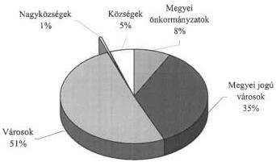

---

4. számú melléklet

a V-1006/2001-2002. számú jelentéshez

# Kiadási előirányzatok és a teljesítés alakulása
önkormányzati típusonként
(vizsgált önkormányzatok 2000. év)

|  Önkormányzat típusa | Kiadás összesen  |   |   |   |   |
| --- | --- | --- | --- | --- | --- |
|   |  Eredeti előirányzat (millió Ft) | Módosított előirányzat (millió Ft) | Teljesítés  |   |   |
|   |   |   |  Mértéke (millió Ft) | Mértéke (%) | Megoszlása (%)  |
|  Megyei önkormányzatok | 18 783 | 20 659 | 22 593 | 109% | 8%  |
|  Megyei jogú városok | 74 474 | 84 483 | 97 393 | 115% | 36%  |
|  Városok | 117 791 | 144 015 | 136 068 | 94% | 50%  |
|  Nagyközségek | 1 190 | 1 587 | 1 478 | 93% | 1%  |
|  Községek | 11 417 | 14 946 | 14 393 | 96% | 5%  |
|  Összesen | 223 655 | 265 690 | 271 925 | 102% | 100%  |

A 2000. évben teljesített kiadások megoszlása

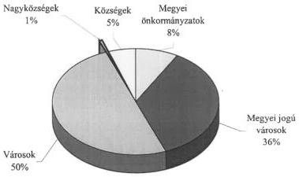

---

5. számú melléklet
a V-1006/2001-2002. számú jelentéshez

# A gazdálkodás szabályozottságának színvonala

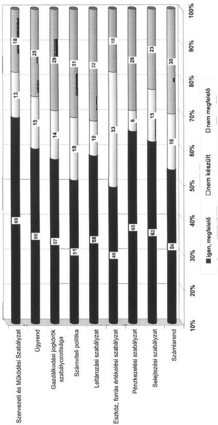

---

6. számú melléklet

a V-1006/2001-2002. számú jelentéshez

# Tájékoztató

# a helyi önkormányzatok eszközeiről és azok forrásairól
(országosan összesített adatok)

|  Megnevezés | 1999. év |   | 2000. év |   | változás 2000/1999. %  |
| --- | --- | --- | --- | --- | --- |
|   |  összeg millió Ft | arány % | összeg millió Ft | arány %  |   |
|  I. Immateriális javak | 3 655 | 0,2 | 5 331 | 0,2 | 145,9  |
|  II Tárgyi eszközök | 1 179 091 | 51,0 | 1 686 990 | 54,6 | 143,1  |
|  III. Befektetett pénzügyi eszközök | 518 984 | 22,4 | 533 254 | 17,3 | 102,7  |
|  IV. Üzemeltetésre átadott eszközök | 174 630 | 7,5 | 399 341 | 12,9 | 228,7  |
|  **A) Befektett eszközök** | **1 876 360** | **81,1** | **2 624 916** | **85,0** | **139,9**  |
|  I. Készletek | 13 487 | 0,6 | 13 524 | 0,4 | 100,3  |
|  II. Követelések | 137 704 | 6,0 | 145 572 | 4,7 | 105,7  |
|  III. Értékpapírok | 109 021 | 4,7 | 113 719 | 3,7 | 104,3  |
|  IV. Pénzeszközök | 128 985 | 5,6 | 144 763 | 4,7 | 112,2  |
|  V. Egyéb aktív pénzügyi elszámolások | 47 648 | 2,0 | 47 372 | 1,5 | 99,4  |
|  **B) Forgóeszközök** | **436 845** | **18,9** | **464 950** | **15,0** | **106,4**  |
|  **ESZKÖZÖK ÖSSZESEN** | **2 313 205** | **100,0** | **3 089 866** | **100,0** | **133,6**  |
|  **D) Saját tőke** | **1 992 391** | **86,1** | **2 723 663** | **88,1** | **136,7**  |
|  I. Költségvetési tartalékok | 98 503 | 4,3 | 112 720 | 3,7 | 114,4  |
|  II. Vállalkozási tartalékok | 732 | 0,0 | 692 | 0,0 | 94,5  |
|  **E) Tartalékok** | **99 235** | **4,3** | **113 412** | **3,7** | **114,3**  |
|  I. Hosszú lejáratú kötelezettségek | 78 809 | 3,4 | 91 646 | 3,0 | 116,3  |
|  II. Rövid lejáratú kötelezettségek | 67 070 | 2,9 | 83 033 | 2,7 | 123,8  |
|  III. Egyéb passzív pénzügyi elszámolások | 75 700 | 3,3 | 78 112 | 2,5 | 103,2  |
|  **F) Kötelezettségek** | **221 579** | **9,6** | **252 791** | **8,2** | **114,1**  |
|  **FORRÁSOK ÖSSZESEN** | **2 313 205** | **100,0** | **3 089 866** | **100,0** | **133,6**  |

Forrás: Államháztartási Hivatal Költségvetési Nyilvántartási és Adatfeldolgozási Főosztály
éves költségvetési beszámoló 1. számú űrlap

---

7. számú melléklet

a V-1006/2001-2002. számú jelentéshez

# Tájékoztató

# a vizsgált helyi önkormányzatok eszközeiről és azok forrásairól

|  Megnevezés | 1999. év |   | 2000. év |   | változás 2000/1999 %  |
| --- | --- | --- | --- | --- | --- |
|   |  összeg millió Ft | arány % | összeg millió Ft | arány %  |   |
|  I. Immateriális javak | 559 | 0,2 | 649 | 0,1 | 116,2  |
|  II. Tárgyi eszközök | 227 812 | 62,1 | 275 226 | 64,9 | 120,8  |
|  III. Befektetett pénzügyi eszközök | 49 396 | 13,5 | 47 519 | 11,2 | 96,2  |
|  IV. Üzemeltetésre átadott eszközök | 34 723 | 9,5 | 40 155 | 9,5 | 115,6  |
|  **A) Befektett eszközök** | **312 490** | **85,3** | **363 549** | **85,7** | **116,3**  |
|  I. Készletek | 2 051 | 0,6 | 2 068 | 0,5 | 100,9  |
|  II. Követelések | 16 814 | 4,6 | 18 103 | 4,3 | 107,7  |
|  III. Értékpapírok | 6 067 | 1,6 | 9 482 | 2,2 | 156,3  |
|  IV. Pénzeszközök | 19 616 | 5,3 | 23 048 | 5,4 | 117,5  |
|  V. Egyéb aktív pénzügyi elszámolások | 9 514 | 2,6 | 7 792 | 1,9 | 81,9  |
|  **B) Forgóeszközök** | **54 062** | **14,7** | **60 493** | **14,3** | **111,9**  |
|  **ESZKÖZÖK ÖSSZESEN** | **366 552** | **100,0** | **424 042** | **100,0** | **115,7**  |
|  **D) Saját tőke** | **314 154** | **85,7** | **368 753** | **87,0** | **117,4**  |
|  I. Költségvetési tartalékok | 15 347 | 4,2 | 17 307 | 4,1 | 112,8  |
|  II. Vállalkozási tartalékok | 74 | 0,0 | 146 | 0,0 | 196,9  |
|  **E) Tartalékok** | **15 421** | **4,2** | **17 453** | **4,1** | **113,2**  |
|  I. Hosszú lejáratú kötelezettségek | 10 452 | 2,9 | 10 151 | 2,4 | 97,1  |
|  II. Rövid lejáratú kötelezettségek | 12 861 | 3,5 | 14 308 | 3,4 | 111,3  |
|  III. Egyéb passzív pénzügyi elszámolások | 13 664 | 3,7 | 13 377 | 3,1 | 97,9  |
|  **F) Kötelezettségek** | **36 977** | **10,1** | **37 836** | **8,9** | **102,3**  |
|  **FORRÁSOK ÖSSZESEN** | **366 552** | **100,0** | **424 042** | **100,0** | **115,7**  |

Forrás: Államháztartási Hivatal Költségvetési Nyilvántartási és Adatfeldolgozási Főosztály éves költségvetési beszámoló 1. számú űrlap

---

8. számú melléklet
a V-1006/2001-2002. számú jelentéshez

# Tájékoztató

A vizsgált helyi önkormányzatok eszközeinek összetételéről

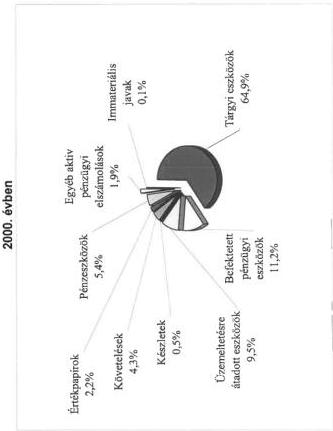

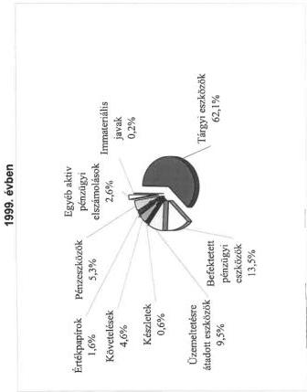

---

9 számú melléklet
a V-1006/2001-2002.számú jelentéshez

# Tájékoztató

a helyi önkormányzatok tárgyi eszközei 2000. évi növekedésének összetevőiről
(bruttó értéken)

|  Megnevezés | Országos |   |   |   | Vizsgált  |   |   |   |
| --- | --- | --- | --- | --- | --- | --- | --- | --- |
|   |  Tárgyi eszközök |   | Ingatlanok |   | Tárgyi eszközök |   | Ingatlanok  |   |
|   |  összeg millió Ft | arány % | összeg millió Ft | arány % | összeg millió Ft | arány % | összeg millió Ft | arány %  |
|  Beszerzés, létesítés | 183 088 | 17,5 | 150 740 | 15,7 | 21 717 | 18,1 | 16 656 | 16,3  |
|  Felújítás | 39 701 | 3,8 | 38 918 | 4,1 | 5 864 | 4,9 | 5 733 | 5,6  |
|  Beszerzés, felújítás előzetesen felszámított ÁFÁ-ja | 50 982 | 4,9 | 43 095 | 4,5 | 6 278 | 5,3 | 5 125 | 5,0  |
|  **Tárgyévi pénzforgalmi növekedések összesen** | **273 771** | **26,2** | **232 753** | **24,3** | **33 859** | **28,3** | **27 514** | **26,9**  |
|  Saját kivitelezésű beruházás aktivált értéke | 2 090 | 0,2 | 1 917 | 0,2 | 203 | 0,2 | 176 | 0,1  |
|  Előző évek beruházásából az aktivált érték | 46 906 | 4,5 | 42 872 | 4,5 | 9 514 | 7,9 | 7 347 | 7,2  |
|  Térítésmentes átvétel | 98 477 | 9,4 | 77 606 | 8,1 | 17 750 | 14,8 | 14 519 | 14,2  |
|  Egyéb növekedés | 622 682 | 59,7 | 603 703 | 62,9 | 58 399 | 48,8 | 52 877 | 51,6  |
|  **Tárgyévi pénzforgalom nélküli növekedések összesen** | **770 155** | **73,8** | **726 098** | **75,7** | **85 866** | **71,7** | **74 919** | **73,1**  |
|  **Összes növekedés** | **1 043 926** | **100,0** | **958 851** | **100,0** | **119 725** | **100,0** | **102 433** | **100,0**  |

Forrás: Államháztartási Hivatal Költségvetési Nyilvántartási és Adatfeldolgozási Főosztály
éves költségvetési beszámoló 38-as számú űrlap

---

10. számú melléklet

a V-1006/2001-2002. számú jelentéshez

Tájékoztató a belső ellenőrzési feladatok feltételeinek kialakítottságáról (a. ábra)

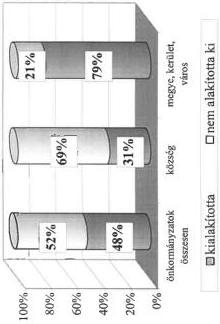

Tájékoztató az ellenőrzési feladatok munkaköri leírásba történő beépítettségéről (b. ábra)

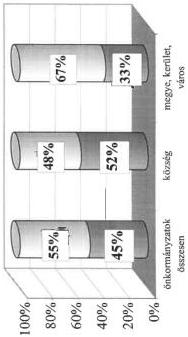

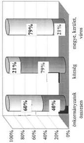

☐ szerepeltették a munkaköri leírásban

☐ munkaköri leírásban nem határozták meg

Tájékoztató az intézmény ellenőrzési feladatok kialakítottságáról (c. ábra)

☐ kialakították az intézmény ellenőrzési feladatok rendszerét

☐ nem alakították ki az intézmény ellenőrzési feladatok rendszerét

---

11/a. számú melléklet
a V-1006//2001-2002 számú jelentéshez

## A helyszíni ellenőrzési jelentésekben az önkormányzatok szabályszerű és hatékonyabb működése érdekében tett javaslatok

1. Az éves költségvetési és zárszámadási rendelet-tervezetek előkészítésével, tartalmával kapcsolatos javaslatok:
- a 217/1998. (XII. 30.) Korm. rendelet (a továbbiakban: Ámr.) 28. § alapján a költségvetési koncepcióhoz csatolják a helyi önkormányzatnál működő bizottságok és a kisebbségi önkormányzatok véleményét.
- A költségvetési rendelet-tervezetet az Áht. 71. §-ának megfelelő eljárási rendben, a rögzített határidőben, az Ámr. 29. §-ban előírt szerkezetben terjesszék a képviselő-testület elé, mellékelve a könyvvizsgáló írásos véleményét.
- Az Áht. 71. § (3) bekezdése előírásának megfelelően mutassák be a költségvetési évet követő 2 év várható előirányzatait, a polgármesteri hivatal és valamennyi intézmény éves létszámkeretét.
- Mellékeljék a szükséges esetekben szöveges indoklással együtt az Áht. 118. §-a szerinti mérlegeket és kimutatásokat.
- A költségvetési rendelet-tervezetbe a helyi kisebbségi önkormányzat határozata alapján elkülönítetten építsék be a helyi kisebbségi önkormányzatok költségvetését az Áht. 68. §-a alapján.
- A rendelet-tervezetben rögzítsék a költségvetés végrehajtásának szabályait, az előirányzatok évközi módosításával kapcsolatos eljárásokat, hatásköröket, a finanszírozás rendjét, a többletbevételek és a szabad pénzeszközök hasznosításával összefüggő eljárási rendet.
2. Az elfogadott költségvetési előirányzatok nyilvántartásával, módosításával, felhasználásával összefüggő javaslatok:
- az Ámr. 53. §-nak megfelelően minden esetben önkormányzati rendelettel módosítsák a költségvetésben jóváhagyott kiemelt előirányzatokat. A rendelet-módosítást legkésőbb a zárszámadási rendelet-tervezet előterjesztését közvetlenül megelőző képviselő-testületi ülésen hajtsák végre.
- A költségvetési előirányzatok módosításairól az Ámr. 54. §-nak megfelelően vezessenek naprakész, áttekinthető nyilvántartást költségvetési szervenként külön-külön és önkormányzati szinten együttesen is.
- Folyamatosan kísérjék figyelemmel az előirányzat felhasználást annak érdekében, hogy kötelezettségvállalás, illetve utalványozás csak az eredeti, il-

1

---

letve a módosított előirányzatok mértékéig történjen az Áht. 12/A §-nak megfelelően.

- A kiemelt előirányzatok túllépésének okait a polgármesteri hivatal és az intézmények esetében egyaránt tárják fel, amennyiben indokolt akkor kezdeményezzék a személyes felelősség megállapítását, a felelősségrevonást.
- A képviselő-testületet rendszeresen, kellő időben tájékoztassa a polgármester az arra hatáskörileg jogosultak által végrehajtott előirányzat-módosításokról.

3. Az önkormányzatok működésének szabályozásával összefüggő javaslatok:

- Az Ötv. 8. § (2) bekezdése alapján az önkormányzatok határozzák meg és az SzMSz-ben rögzítsék a kötelező és vállalt feladatokat, a feladatellátás mértékét és módját.
- Készítsék el az Ámr. 17. §-ának megfelelően a polgármesteri hivatal, illetve a körjegyzőség (mint költségvetési szerv) szervezeti és működési szabályzatát, ebben rögzítsék a gazdasági szervezet felépítését, feladatait is.
- A gazdasági szervezet ügyrendjében részletesen szabályozzák a szervezet és egyes egységei feladatait, közöttük a hozzárendelt részben önállóan gazdálkodó szervek és a helyi kisebbségi önkormányzatok tekintetében ellátandó feladatokat. Egyértelműen rögzítsék a gazdasági szervezetben dolgozók feladatait, jogkörét és felelősségét.
- Készítsék el, illetve vizsgálják felül a munkaköri leírásokat annak érdekében, hogy azok a szabályzatokkal összhangban konkrétan rögzítsék, milyen feladatok ellátásáért felelős az adott munkatárs.
- Folyamatosan végezzék el a költségvetési szervek alapító okiratának felülvizsgálatát, szükséges módosítását.

4. A gazdálkodás szabályozását, szabályszerűségét a gazdasági események dokumentálását érintő javaslatok:

- az Áht. és az Ámr. előírásainak megfelelően alakítsák ki a költségvetési szerv számviteli politikáját, készítsék el az Ámr-ben előírt számlarendet és a kapcsolódó eszközök és források értékelési, a leltározási, selejtezési, pénzkezelési szabályzatokat.
- Szabályozzák a kötelezettségvállalási, utalványozási, ellenjegyzési és érvényesítési jogkörök gyakorlását.
- Vizsgálják felül a meglévő, gazdálkodással összefüggő rendeleteket, belső szabályzatokat, hajtsák végre a jogszabályi előírások változásának megfelelő módosításokat, a helyi viszonyokhoz igazításukat, szüntessék meg a különböző szabályzatok közötti ellentmondásokat.
- Biztosítsák a gazdálkodás szabályszerű lebonyolítását a gazdálkodással kapcsolatos jogkörök előírásszerű gyakorlását. Tartsák be a kötelezettségvállalásra, utalványozásra, ellenjegyzésre és érvényesítésre vonatkozó jog-

2

---

szabályi és helyi előírásokat, ezek megtörténtét hitelt érdemlő módon rögzítsék a bizonylatokon.

- Fordítsanak figyelmet a számviteli előírások betartására, a gazdasági események szabályos elszámolására. Biztosítsák a számvitelről szóló 2000. évi C. törvénynek és a kapcsolódó kormányrendeletnek megfelelő számviteli analitikus nyilvántartások kialakítását és folyamatos vezetését.
- A költségvetés végrehajtása során tartsák be a bizonylati és a bruttó elszámolás számviteli alapelvet.
- Intézkedjenek az önállóan és a részben önállóan gazdálkodó költségvetési szervek között az Ámr. 14. §-ban előírt hatáskört és felelősség megosztást rögzítő megállapodás elkészítéséről, jóváhagyásáról.

5. A vagyon számbavételével összefüggésben javasoltuk:

- a mérlegben szereplő eszközök és források értékének a jogszabályi előírásoknak és a helyi szabályoknak megfelelően elkészített leltárral történő alátámasztását. A mennyiségi leltárfelvételt helyettesítő egyeztetések megfelelő dokumentálását, az ennek feltételeire vonatkozó előírások betartását.
- Az egyes mérlegtételek értékének megállapítására vonatkozó a 249/2000. (XII. 24.) Korm. rendeletben előírtaknak megfelelő értékcsökkenés és értékvesztés elszámolását, különösen az üzemeltetésre, kezelésre átadott eszközök, illetve részesedések és kárpótlási jegyek esetében.
- Az Ász ellenőrzés által feltárt helytelen elszámolások, téves könyvelési műveletek, az egyes eszközök és források mérlegből történő kimaradása, vagy helytelen mérlegsoron való szerepeltetése miatti korrekciók végrehajtását.
- A térítésmentesen átvett, illetve érték nélkül nyilvántartott eszközök értékének megállapítását és számviteli nyilvántartásba vételét.
- A zárszámadási rendelethez kapcsolódóan az Ötv. szerinti vagyonleltár, illetve az Áht-ban előírt vagyonkimutatás csatolását.
- A 147/1992. (XI. 6.) Korm. rendelet alapján az ingatlan kataszteri nyilvántartás felfektetését, folyamatos vezetését, illetve az abban szereplő adatok felülvizsgálatát, a különböző ingatlan-nyilvántartások közötti összhang és egyezőség biztosítását.
- Annak a gyakorlatnak a megszüntetését, hogy az önkormányzat törzsvagyonát képező közműveket ellenszolgáltatás nélkül adják át a szolgáltatást végző gazdasági társaságnak, megsértve ezzel az Ötv. 79. § és a vízgazdálkodásról szóló 1995. évi LVII. törvény 6. § előírásait.

6. Az önkormányzatok ellenőrzési rendszerével összefüggő javaslatok:

- az önkormányzatok gondoskodjanak az Ötv. 92. §-ban előírt ellenőrzési kötelezettségeik teljesítéséről. A képviselő-testület meghatározott időszakonként tekintse át a költségvetési szervek ellenőrzésének tapasztalatait.

3

---

- Biztosítsák a hatékony ellenőrzéshez szükséges személyi és tárgyi feltételeket, gondoskodjanak megfelelő képzettséggel rendelkező főállású munkatárs, vagy külső szakértő megbízásáról.
- Készítsék el, illetve szükség szerint módosítsák a felügyeleti ellenőrzés és a belső ellenőrzés végzésére vonatkozó szabályzatokat.
- A rendszer hatékony működése érdekében a munkaköri leírásokban és a belső szabályzatokban határozzák meg a munkafolyamatok ellenőrzésre kijelölt műveleteit, a követelményeket, az ellenőrzés viszonyítási alapját, a követelményektől való eltérés megállapításának módját és dokumentálását, a további eljárást.
- Az ellenőrzések során feltárt jogszabálysértések, szabálytalanságok megszüntetése érdekében ésszerű időhatáron belül tegyék meg a szükséges intézkedéseket, indokolt esetben gondoskodjanak a személyes felelősség érvényesítéséről.

7. Egyéb javaslatok:

- a közbeszerzések előkészítését, lebonyolítását, az ajánlatok minősítését, a döntések szakmai előkészítését és meghozatalát a Kbt. előírásainak megfelelően végezzék az önkormányzatok.
- A képviselő-testület gazdasági döntéseinek megalapozása érdekében készítsenek gazdasági számításokat, az előterjesztésekben mutassák be a különböző megoldási lehetőségeket és azok pénzügyi hatását.
- Kísérjék figyelemmel a polgármesteri hivatal igazgatási tevékenységével összefüggő kiadások alakulását, csökkentésük érdekében tegyék meg a szükséges intézkedéseket.
- Tekintsék át az önkormányzati feladatok ellátásának szervezeti rendszerét, tegyék meg a költségtakarékos, racionális megoldások kialakítása érdekében szükséges intézkedéseket.
- Kísérjék figyelemmel az egyes kiemelt feladatok ellátásának fajlagos kiadásait, vizsgálják felül az önként vállalt feladatok finanszírozhatóságát.
- Az ÁSZ ellenőrzés tapasztalatait testületi ülésen tárgyalják meg, a feltárt hiányosságok felszámolása érdekében készítsenek intézkedési tervet.

4

---

11/b. számú melléklet
a V-2006/2001-2002. számú jelentéshez

## A helyi kisebbségi önkormányzatoknak a helyszíni jelentésekben rögzített megállapítások alapján tett javaslatok

Javasoltuk:

- a székhelyük szerinti települési önkormányzatokkal a hiányzó együttműködési megállapodások Áht. 66. §-ának megfelelő megkötését, a jogszabályi előírások, illetve a helyi sajátosságok tekintetében elavult megállapodások felülvizsgálatát és aktualizálását.
- Az Áht. 65. § (2) bekezdése értelmében a kisebbségi önkormányzatok költségvetésének határozatban történő megállapításával kapcsolatos kötelezettségek teljesítését és ennek során az Áht. 72. és 82. §-aiban rögzített határidők, valamint Áht. 69. § (2) bekezdésében előírt tartalmi követelmények maradéktalan érvényesítését.
- Az operatív gazdálkodás folyamatában a bankszámla nyitását, a banki és a készpénzes forgalom elkülönített kezelését, e területen az Ámr. 103. §-ában foglalt előírások teljesítését, valamint a kisebbségi önkormányzatok bevételeinek és kiadásainak elkülönített elszámolását, számviteli adatainak a települési önkormányzatén belül elkülönített nyilvántartásának biztosítását.
- A költségvetés végrehajtásának folyamatában a kisebbségi önkormányzatok feladatainak ellátása során elért bevételek és a felmerült kiadások teljesítésénél a kötelezettségvállalás, a teljesítés-igazolás, az érvényesítés, az utalványozás és az ellenjegyzés Ámr. 134-138. §-aiban rögzített előírásainak maradéktalan betartását, és ennek során a feladat-ellátásban tapasztalt munkaköri összeférhetetlenségek megszüntetését.
- A gazdálkodás folyamatában a bizonylati rend- és fegyelem Számvitelről szóló 2000. évi C. törvény 165. §-ában foglalt előírásainak az eddigieknél fokozottabb érvényesítését.
- A belső ellenőrzés rendszeressé tételét, hatékonyságának fokozását,
- Az éves beszámolási kötelezettség, illetve a zárszámadás határozattal történő elfogadásával kapcsolatos követelmények pontos teljesítését.

---

6