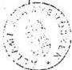

ÁLLAMI SZÁMVEVŐSZÉK

Vagyonkezelő Főcsoport

V-22/25/1990.

2/25-6

# S Z A K V É L E M É N Y

a Bős-Nagymarosi Vízlépcsőrendszer nagyberuházás 1990. évi költségelőirányzatának jóváhagyásához

A nagyberuházás 1990. évi költségelőirányzatának felülvizsgálatára és szakmai véleményezésére Németh Miklós miniszterelnök úr – február 20-i levelében – kérte fel az Állami Számvevőszéket.

A feladat teljesítése érdekében feldolgoztuk és értékeltük az 1990. évre tervezett munkák és költségelőirányzatok előkészítő dokumentumait, a létesítményjegyzékeket, a megkötött vállalkozói szerződéseket, a beruházó és kivitelezők közötti egyeztetések jegyzőkönyveit stb. Konzultációt folytattunk a beruházás kormánybiztosával, a beruházó és az Állami Fejlesztési Intézet /ÁFI/ képviselőivel. Tanulmányoztuk a kormánybiztos úr által felkért Mélyépítési Tervező Vállalat e témában adott szakvéleményét.

A feldolgozott dokumentumok alapján készített számszaki összeállításainkat a szakvéleményhez csatoljuk.

A dokumentumok elemzése és értékelése során a fő hangsúlyt annak tisztázására helyeztük, hogy a tervezett munkálatok megfelelnek-e a 3305/1989. /X.27./ MT határozatban és az ezt követő miniszterelnöki döntésben megfogalmazott azon követelményeknek, melyek szerint 1990-ben csak az árvízvédelemmel, állagmegóvással és a legszükségesebb infrastrukturális létesítményekkel összefüggő munkák végezhetők. A létesítményjegyzékben szereplő előirányzatokkal kapcsolatos, a műszaki részletekből kiinduló költségelemzés annak jellegéből adódóan nem lehetett feladatunk, ezért a beruházó és az ÁFI által felülvizsgált összegeket kellett elfogadnunk. A beruházó és az ÁFI jogszabályban előírt kötelezettségénél fogva fele-

---

- 2 -

lős a fejlesztés céljára szolgáló pénzeszközök takarékos felhasználásáért, a gazdaságossági követelmények betartásáért és ellenőrzéséért. Ehhez megfelelő szakapparátussal is rendelkeznek.

Az elvégzett értékelés alapján az 1990. évi költségelőirányzattal kapcsolatos megállapításainkat és javaslatainkat az alábbiakban foglaljuk össze:

1.) Előljáróban rögzíteni kívánjuk, hogy a nagyberuházás 1990. évi finanszírozási kérdéseinek elemzésénél az Országgyűlés által az állami költségvetésben jóváhagyott 3,5 milliárd forint összegű (Áfával és kamataival együtt 8 milliárd forint) beruházási előirányzatból kell kiindulni. Tudomásunk van azonban arról, hogy a különböző kormányszintű anyagokban ettől eltérő (3,1 illetve 7,5 milliárd forint összegű) előirányzatok is szerepelnek. Ezek jóváhagyásáról illetve az eredeti előirányzat módosításáról nincsenek ismereteink, erre vonatkozó dokumentumokkal nem rendelkezünk. Ezért elsődleges fontosságúnak tartjuk, hogy a beruházás 1990. évi pénzügyi szükségletének a meghatározásánál és a költségek csökkentésének értékelésénél minden dokumentumban az Országgyűlés által jóváhagyott előirányzatból induljanak ki. Az ettől való eltérés ugyanis a beruházás pénzügyi megítélését alapvetően befolyásolja. Ezért ajánljuk, hogy a kormánybiztos a beruházás finanszírozási kérdéseinek ilyen megközelítésben történő tárgyalásához a szükséges lépéseket megtegye.

2.) A szakvélemény véglegesítése előtti napokban megkaptuk az 1990. évi állami költségvetés veszélypontjairól, a mérlegpozíció védelméről készült 1990. április 13-i előterjesztést. A minisztertanácsi határozati javaslat 24. pontja szerint "a bős-nagymarosi vízlépcsőrendszer építési munkáit úgy kell felülvizsgálni, hogy az 1990. évre előirányzott refinanszírozási hitelkeretből 600 millió forintos megtakarítás elérhető legyen."

A határozati javaslatban és a 21. oldal 5.) pontban megfogalmazot-

---

- 3 -

tak nem egyértelműek. Az idézett javaslattal szemben az 5.) pont az építési munkák felfüggesztéséből adódó további 600 millió forint összegű refinanszírozási hitel megtakarításáról szól.

Egyértelművé kellene tenni, hogy az előterjesztésben javasolt 600 millió forintos csökkentés milyen korábbi előirányzathoz képest értelmezendő.

3.) Az 1990. március 14-i 2.171 millió Ft összegű költségtervezet a kormánybiztos utasítására történt többszöri átdolgozás eredményeként erőteljes költségcsökkentési törekvéseket tükröz. A jóváhagyott előirányzathoz képest 1,3 milliárd forinttal, a beruházó első tervezetéhez képest pedig 772 millió forinttal alacsonyabb előirányzatot tartalmaz. A jelentős költségmérséklés elismerése mellett azonban néhány területen /pl. alvízcsatornán a rézsüvédelemmel, a szigetközi vízpótlórendszer megépítésével kapcsolatos stb. munkáknál 134 és 24 millió Ft/ végrehajtott költségcsökkentés árvíz esetén károsodásokat okozhat, amelyek többletköltséggel járhatnak. Ezek mértéke ma nem számszerűsíthető.

4.) A felkért szakértők véleményét is figyelembe véve megállapítottuk, hogy az 1990. évre tervezett munkák jellege lényegében megfelel a kormányzati döntésben foglalt követelményeknek. A költségelőirányzat csaknem teljes egészében árvízvédelmi, állagmegóvási és az elkerülhetetlenül szükséges infrastrukturális munkálatok finanszírozását szolgálja. Eltérést a miniszterelnöki döntéstől a nemzetközi hajóút biztosítása érdekében felmerülő feladatokra tervezett előirányzatok jelentenek. Az ilyen célra számításba vett mintegy 95 millió forint összegű költség elismerése azonban indokolt, mivel az a hajózással kapcsolatos nemzetközi kötelezettségvállalásainkkal függ össze.

A létesítményjegyzék szerinti 2.171 millió forint összegű elő-

---

- 4 -

irányzatból a zömmel már 1989-ben elvégzett munkák értéke 638 millió forint. E munkák pénzügyi rendezésének kötelezettsége nem vitatható. Az 1990. évben végzendő további munkák értéke tehát 1.534 millió forint.

A tervezett ráfordításoknak a miniszterelnöki döntésben meghatározott kategóriák szerinti elkülönítése – tekintettel arra, hogy egyes munkák elvégzése több célt is szolgál – csak megközelítő pontosságú lehet. Erre a beruházó és a szakértő szöveges értékelése és az ÁFI jelzései alapján kísérletet tettünk /3. sz. melléklet/. A mellékelt összeállítás is, jelzett korlátai ellenére, támpontot adhat a miniszterelnöki döntés végrehajtásának megítéléséhez.

5.) Az ÁFI által befogadott szerződések összege jelenleg eléri, illetve némileg meghaladja a létesítményjegyzék szerinti 2.171 millió forint összegű előirányzatot. Ugyanakkor a már elvégzett munkák mintegy 14 %-ára, az elvégzendő munkák 27 %-ára még nincs érvényes szerződés /összesen mintegy 500 millió forint/. Ezért a zavartalan finanszírozás érdekében közel ugyanilyen mértékű szerződés csökkentésre /módosításra, átütemezésre, felbontásra/ van szükség. Erre azonban csak az 1990. évre tervezett munkálatok jóváhagyása után kerülhet sor.

Szükségesnek tartjuk felhívni a figyelmet arra, hogy számos körülmény a tervezett költségek növekedésének irányába hat.

Mindenekelőtt utalunk arra, hogy a munkálatok felfüggesztése és leállítása miatt történt szerződés bontások és a még szükséges módosítások kártérítési-, vagy többletköltség igénnyel járnak. Mai ismereteink szerint a vállalatok kártérítési igénye meghaladja a 600 millió forintot. Vélemezhető, hogy ennek egy részére, a bíróság által megítélt mértékű kártérítésekre, már ebben az évben is költségfedezetre lesz szükség.

További költségnövekedést okozhat, hogy a még nem szerződött munkák

---

- 5 -

becsült költsége a tényleges szerződéskötéskor magasabb lehet.

Tekintettel arra, hogy a költségelőirányzat egésze 1989. évi folyóáron készült, a tényleges kifizetésekben nem zárható ki az inflációs hatások érvényesülése sem. /A Mélyépterv becslése szerint pl. az anyagárak és szállítási költségek 23-28 %-os emelkedése várható./

Mindezek, amennyiben a létesítményjegyzékben szereplő munkák elvégzésére maradéktalanul sor kerül, a 2.171 millió forint előirányzat túllépésének veszélyét hordozzák magukban. Ennek számszerűsítésére az Állami Számvevőszék nem vállalkozhat. Kimunkálását azonban szükségesnek tartjuk.

6.) Az 1990. évi feladatok zavartalan megoldása még néhány más kérdés rendezését is igényli. Ezek a következők:

a.) Az alvízcsatornán folyamatban lévő jugoszláv Brodoimpeks közreműködésével megvalósuló kotrási munkálatokra a vizsgált költségelőirányzat csak március 31-ig tartalmaz fedezetet. Mivel a munka leállítása, vagy szüneteltetése a csehszlovák-magyar kormányszintű megállapodás hiányában nem történhetett meg, már most többletköltség jelentkezik.

Felhívjuk a figyelmet arra is, hogy a Brodoimpeksszel kötött vállalkozói szerződés felmondása a vállalkozó kártérítési igényével jár. E szerződés felmondása a Nemzetközi Gazdasági Együttműködés Jugoszláv Bankja és a Magyar Nemzeti Bank közötti hitelszerződés alapján folyósított hitel (közel 20 millió dollár) és kamatainak idő előtti visszafizetési kötelezettségét is maga után vonhatja. Ennek ezévi költségvonzata is lehet.

b.) Műszaki állásfoglalást igénylő kérdések felülvizsgálatával nem foglalkoztunk. Tapasztaltuk azonban, hogy egész sor műszaki probléma van, amelyek intézkedést igényelnek /modellkísérletek, kutatás, mérőmegfigyelő rendszer kiépítése stb./. Különösen nagy súllyal jelentkezik Nagymaros térségében az eredeti állapot visszaállítása, amely

---

- 6 -

adott esetben infrastrukturális feladatokat is megelőzhet. A szükséges munkálatok beindítását a vízlépcső további sorsára vonatkozó nemzetközi megállapodás hiánya is akadályozta. További halasztásuk viszont környezetvédelmi és egyéb veszélyekkel járhat. A döntés mérlegelésénél tehát figyelembe kell venni a jelzett feladatokat is, költségvonzatukkal együtt.

c.) A beruházás megvalósításában bekövetkezett koncepció változás miatt, a megépült, de feleslegessé váló létesítmények teljeskörű felmérését és komplett költségkimunkálását mielőbb célszerű elvégezni és az értékesítési tervet jóváhagyásra előterjeszteni. Az ebből származó bevételek csökkentenék a GNV Alap igénybevételét és annak kamatait.

Egyedi jóváhagyást látunk szükségesnek a nagymarosi munkásszálló értékesítésére. Az Oviber és MVMT 1989-ben erre vonatkozólag a szerződést megkötötte /170 millió Ft/, az ellenérték 1990. március 31-ig történő kiegyenlítésével. Erre megfelelő jóváhagyás hiányában nem került sor.

7.) Az 1990. évi feladatokra vonatkozó döntés meghozatalát nemcsak a költségek csökkentési lehetőségének sokoldalú feltárására irányuló törekvések időigénye /a többszöri átdolgozás/ akadályozta. Az ügyben folytatott levelezések áttanulmányozása és a konzultációk során szerzett tapasztalatok arra engednek következtetni, hogy a döntésben illetékesek és a végrehajtásban érintettek között az együttműködést a beruházás körül létező bizalmi válság is nehezítette.

8.) Az elvégzett elemzések tapasztalatai alapján az 1990. évben teljesítendő munkákra vonatkozó döntés további halasztását indokolatlannak, sőt károsnak tartjuk. Döntés hiányában megnehezül az éves feladatok megszervezése, a szerződések rendezése és a munkálatok

---

- 7 -

elvégzése, s mindez még további többletköltségeket vonhat maga után.

9.) Szakmai véleményünkkel a nagyberuházás 1990. évi költségelőirányzatával kapcsolatos kritikus és döntést igénylő kérdésekre is igyekeztünk felhívni a figyelmet. Mindezek alapján javasoljuk az 1990. március 14-i létesítményjegyzékben előirányzott munkák megvalósításának olyan szellemű jóváhagyását, hogy azok részleteinek további pontosítását és a jelzett tisztázatlan kérdések rendezését mielőbb el kell végezni. Szükségesnek tartjuk, hogy a ráfordításokat és azok finanszírozását a Környezetvédelmi és Vízgazdálkodási Minisztérium /beruházó/ és az Állami Fejlesztési Intézet fokozottan ellenőrizze. Ajánljuk, hogy a Dunai Vízlépcső kormánybiztosa e tevékenységüket kísérje kiemelt figyelemmel.

Budapest, 1990. április 23.

dr. Ocskovszki Jánosné  
tanácsos

Krucsai Balázs  
főtanácsos

Istvánffy Lóránt  
tanácsos

---

1

3

---

# 1. sz. melléklet

# A BNV 1990. évi költségelőirányzat változatok

millió Ft-ban

|   | Bős | Nagymaros | Összesen  |
| --- | --- | --- | --- |
|  I. Január 15. |  |  |   |
|  Elvégzett munka | 377,8 | 185,3 | 563,1  |
|  Ez évi feladat | 1.415,3 | 965,0 | 2.380,3  |
|  Összesen | 1.793,1 | 1.150,3 | 2.943,4  |
|  II. Január 25. |  |  |   |
|  Elvégzett munka | 482,1 | 173,6 | 655,7  |
|  Ez évi feladat | 1.114,0 | 805,9 | 1.919,9  |
|  Összesen | 1.596,1 | 979,5 | 2.575,6  |
|  E l t é r é s |  |  |   |
|  Elvégzett munka | + 104,3 | - 11,7 | + 92,6  |
|  Ez évi feladat | - 301,3 | -159,1 | -460,4  |
|  Összesen | - 197,0 | 170,8 | -367,8  |
|  III. Február 26. |  |  |   |
|  Elvégzett munka | 464,1 | 173,6 | 637,7  |
|  Ez évi feladat | 874,0 | 805,9 | 1.679,9  |
|  Összesen | 1.338,1 | 979,5 | 2.317,6  |
|  E l t é r é s |  |  |   |
|  Elvégzett munka | - 18,0 | - | - 18,0  |
|  Ez évi feladat | -240,0 | - | -240,0  |
|  Összesen | -258,0 | - | -258,0  |
|  IV. Március 14. |  |  |   |
|  Elvégzett munka | 464,1 | 173,6 | 637,7  |
|  Ez évi feladat | 728,0 | 805,9 | 1.533,9  |
|  Összesen | 1.192,1 | 979,5 | 2.171,6  |
|  E l t é r é s |  |  |   |
|  Elvégzett munka | - | - | -  |
|  Ez évi feladat | -146,0 | - | -146,0  |
|  Összesen | -146,0 | - | -146,0  |
|  Eltérés az I. változathoz |  |  |   |
|  Elvégzett munka | + 86,3 | - 11,7 | + 74,6  |
|  Ez évi feladat | -687,3 | -159,1 | -846,4  |
|  Összesen | -601,0 | -170,8 | -771,8  |

---

1

1

---

1990. évi költségelőirányzat megoszlása

3.sz.melléklet

(1990. III. 9-i tervezet)

B= befejezett munka; M= államgyőzés, kárelhárítás, Á= átvízvédelem, I= infrastrukt.; K= kutatás, terv.; E= egyéb; H= hajózás biztosítás

| Lét. Jenyz. szám | MEGNEVEZÉS | Megoszlás ÖDÖK szerint Mft | Megoszlás ÁI szerint Mft | Megoszlás "Köz" véleménye szerint | MEGEDŐZÉS |
| --- | --- | --- | --- | --- | --- |
| B | M | Á | I | E | B | M | Á | I | E | B | M | Á | ÁM | MI | I | E | M |
| 1.11 | Dunakiliti-Hrusov tárczó Csehszlovák oldal | 24,0 |  | 54,0 |  |  | 24,0 |  | 38,0 |  | 16,0 | 24,0 |  | 32,0 | 22,0 |  | B-ből 24 Mft-M |
| 1.12 | Dunakiliti-Hrusov tárczó Magyarországi oldal | 11,0 | 3,0 | 26,0 | 5,0 |  | 11,0 |  | 26,0 |  | 8,0 | 11,0 | 3,0 | 26,0 |  | 5,0 | B-ből 11 Mft-Á |
| 1.2 | Dunakiliti duzzasztómű | 299,2 | 46,1 | 50,7 |  | 19,2 | 299,2 | 72,3 | 12,0 |  | 31,7 | 299,2 | 46,1 | 47,7 | 3,0 |  | 19,2 B-ből 170,6 Mft-M 4,0 Mft-E 3,6 Mft-K |
| 1.4 | Bősi Vízlépcső dugó bontás, Alvíz csatorna | 250,6 |  |  |  |  | 250,6 |  |  |  |  | 113,4 | 20,0 |  | 117,2 |  |  |
| 1.5 | Régi Dunameder szabályozás | 14,5 | 85,2 | 121,4 |  |  | 14,5 | 32,8 | 85,0 |  | 88,8 | 14,5 | 130,4 | 76,2 |  |  | B-Á |
| 1.10 | Szigetköz víz- pótlás |  |  |  |  |  |  |  |  |  |  |  |  |  |  |  |  |
| 1.9 | Egyéb beruházások | 2,0 | 10,0 | 19,0 |  | 151,2 | 2,0 |  |  |  | 180,2 | 2,0 | 10,0 |  | 19,0 |  | 151,2 E-ből 10 Mft ki- sajátítás 25 Mft-K |
| 2.11 | Alsóipoly öblözet | 41,0 | 5,0 | 44,0 |  |  | 41,0 | 5,0 | 44,0 |  |  | 41,0 | 5,0 | 44,0 |  |  |  |
| 2.12 | Alsó Garam öblözet |  |  | 24,0 |  |  |  |  | 24,0 |  |  |  |  |  | 24,0 |  |  |
| 2.23 | Esztergomi öblözet | 20,2 | 9,5 | 48,5 | 1,0 |  | 20,2 | 43,6 |  |  | 15,4 | 20,2 |  |  | 45,0 | 4,4 | 9,6 |
| 2.25 | Komáromi öblözet | 20,9 |  | 74,1 | 2,0 |  | 20,9 | 2,0 | 74,1 |  |  | 20,9 |  | 16,3 | 57,8 | 2,0 |  |
| 2.27 | Nagymaros-Ipoly öblözet | 18,1 |  | 42,6 |  |  | 40,4 | 8,0 | 12,3 |  |  | 18,1 | 22,3 | 17,2 | 3,1 |  |  |
| 2.29 | Közútak védelme |  |  |  | 128,5 |  | 3,5 |  |  | 125,0 |  |  |  |  |  | 128,5 |  |
| 2.30 | Nagymarosi víz- lépcső | 3,6 | 67,2 | 10,0 | 4,2 | 67,0 | 3,6 | 126,2 | 13,0 |  | 9,2 | 3,6 | 59,2 | 10,0 |  | 4,2 | 75,0 |
| 2.5 | Nagymarosi víz- lépcső egyéb létesítmény | 27,8 | 132,2 | 15,1 | 1,0 |  | 27,8 | 133,3 | 2,9 |  | 12,1 | 27,8 | 2,5 | 15,1 | 129,7 | 1,0 |  |
| 2.6 | Egyéb beruházások | 42,0 | 24,0 |  |  | 106,0 | 42,0 | 12,0 |  |  | 118,0 | 42,0 | 6,0 |  |  |  | 124,0 E-ből 45,7 Mft-K |
| ÖSSZESEN: | 774,9 | 302,2 | 529,4 | 141,7 | 343,4 | 800,7 | 435,2 | 331,3 | 125,0 | 479,4 | 637,7 | 304,5 | 204,5 | 291,1 | 140,3 | 144,1 275,2 94,2 |
| le 1.4-1.5 1990.III.31-i úton előirányzat | 137,2 |  |  |  |  |  |  |  |  |  |  |  |  |  |  |  |
|  | 637,7 |  |  |  |  |  |  |  |  |  |  |  |  |  |  |  |

---

1

1

---

ÁLLAM SZÁMVTŐSZÉK
Vagyonkezelő Főcsoport

# KÖLTSÉGELŐIRÁNYZAT

VÁLL

| Végzett m.p. | 1990. 1. Folyt. | 1990. év |
| --- | --- | --- |
| Felyt. | Bef. | Összesen |
| 24,0 | 38,0 |  |
| 11,0 | 20,0 |  |
| 299,2 | 95,6 |  |
| 113,4 |  |  |
| 14,5 |  |  |
| - | - |  |
| 2,0 |  |  |
| 464,1 |  |  |
| 41,0 | 40,0 |  |
| - | 24,0 |  |
| 20,2 | 49,4 |  |
| 20,9 | 76,1 |  |
| 10,1 | 31,3 |  |
| - | 128,5 |  |
| - | - |  |
| 3,6 | 75,6 |  |
| 27,0 | 129,0 |  |
| 42,0 | 126,5 |  |
| 173,6 | 687,2 |  |
| 437,7 | 1. |  |

|   | 1990. 1. 15. |   |   | 1990. 1. 25. |   |   | E l t é r é s  |   |   |   |
| --- | --- | --- | --- | --- | --- | --- | --- | --- | --- | --- |
|   |  Elvégzett m.p. | Felyt. | Bef. | Elvégzett m.p. | Felyt. | Bef. | Elvégzett m.p. | Felyt. | Bef. | Össz.  |
|  1-11 Húsvon-Dikilli tározó cseh terület | 24,0 | 20,0 | 70,9 | 114,9 | 24,0 | 30,0 | 16,0 | 78,0 | - | + 18,0 - 54,9 - 36,9  |
|  1-12 Húsvon-Dikilli magyar terület | 11,0 | 56,3 | 39,0 | 106,3 | 11,0 | 30,0 | 14,0 | 55,0 | - | - 26,3 - 25,0 - 51,3  |
|  1-2 Dikilli-Duzasztán | 194,9 | 131,0 | 33,3 | 359,2 | 299,2 | 95,6 | 36,4 | 431,2 | + 104,3 | - 354, + 3,1 + 72,0  |
|  1-4 Bősi Vízlépcső dugóban- tás és Alvízcsatorna | 113,4 | 320,6 | 89,0 | 531,0 | 113,4 | 320,6 | 89,0 | 531,0 | - | - - -  |
|  1-7 Régi Duna motor szabályo- zás és Szigetköz vízpótl. | 14,5 | 301,9 | 9,0 | 325,4 | 14,5 | 221,2 | 9,0 | 244,7 | - | - 80,7 - - 80,7  |
|  1-8 Egyéb létesítmények | 18,0 | 68,3 | - | 86,3 | 18,0 | 22,0 | - | 40,0 | - | - 46,3 - - 46,3  |
|  1-9 Egyéb beruházások | 2,0 | 225,0 | 43,0 | 270,0 | 2,0 | 185,2 | 29,0 | 216,2 | - | - 39,0 - 14,0 - 53,8  |
|  1. Földítésítmény összesen | 377,8 | 1.131,1 | 284,2 | 1.793,1 | 402,1 | 920,6 | 193,4 | 1.596,1 | + 104,3 | - 210,5 - 90,8 - 197,0  |
|  2-11 Alsó-Ipoly öblözet | 41,0 | 48,0 | 1,0 | 90,0 | 41,0 | 48,0 | 1,0 | 90,0 | - | - - -  |
|  2-12 Alsó-Garam öblözet | - | 24,0 | - | 24,0 | - | 24,0 | - | 24,0 | - | - - -  |
|  2-23 Esztergomi öblözet | 15,9 | 69,5 | 9,6 | 95,0 | 20,2 | 49,4 | 9,6 | 79,2 | + 4,3 | - 20,1 - - 15,8  |
|  2-25 Komáromi öblözet | 20,9 | 102,1 | - | 123,0 | 20,9 | 76,1 | - | 97,0 | - | - 26,0 - - 26,0  |
|  2-27 Húsvon-Ipoly öblözet | 18,1 | 53,3 | 11,3 | 82,7 | 18,1 | 31,3 | 11,3 | 60,7 | - | - 22,0 - - 22,0  |
|  2-27 Közutak védelme | - | 170,5 | - | 178,5 | - | 128,5 | - | 128,5 | - | - 50,0 - - 50,0  |
|  2-20 Kőmunkák, mellékletésítm. | - | - | - | - | - | - | - | - | - | - - -  |
|  2-3 Nagymarosi Vízlépcső | 3,6 | 84,6 | 72,8 | 161,0 | 3,6 | 75,6 | 72,8 | 152,0 | - | - 9,0 - - 9,0  |
|  2-5 IHL egyéb létesítmények | 27,8 | 129,8 | 18,5 | 176,1 | 27,8 | 129,8 | 18,5 | 176,1 | - | - - -  |
|  2-6 IHL egyéb beruházások | 50,0 | 158,5 | 3,5 | 220,0 | 42,0 | 126,5 | 3,5 | 172,0 | - 16,0 | - 32,0 - - 40,0  |
|  2. Földítésítmény összesen | 185,3 | 840,3 | 116,7 | 1.150,3 | 173,6 | 689,2 | 116,7 | 979,5 | - 11,7 | - 159,1 - - 170,8  |
|  1-2 Földítésítmények össz. | 563,1 | 1.979,4 | 400,9 | 2.943,4 | 655,7 | 1.609,8 | 310,1 | 2.575,6 | + 92,6 | - 369,6 - 90,8 - 367,8  |

---

1. 2017年，公司与上海浦东发展银行股份有限公司签订了《关于使用部分闲置募集资金进行现金管理的协议》。

[Non-Text]

[Non-Text]

[Non-Text]

[Non-Text]

[Non-Text]

[Non-Text]

[Non-Text]

[Non-Text]

[Non-Text]

[Non-Text]

[Non-Text]

[Non-Text]

[Non-Text]

[Non-Text]

[Non-Text]

[Non-Text]

[Non-Text]

[Non-Text]

[Non-Text]

[Non-Text]

[Non-Text]

[Non-Text]

[Non-Text]

[Non-Text]

[Non-Text]

[Non-Text]

[Non-Text]

[Non-Text]

[Non-Text]

[Non-Text]

[Non-Text]

[Non-Text]

[Non-Text]

[Non-Text]

[Non-Text]

[Non-Text]

[Non-Text]

[Non-Text]

[Non-Text]

[Non-Text]

[Non-Text]

[Non-Text]

[Non-Text]

[Non-Text]

[Non-Text]

[Non-Text]

[Non-Text]

[Non-Text]

[Non-Text]

[Non-Text]

[Non-Text]

[Non-Text]

[Non-Text]

[Non-Text]

[Non-Text]

[Non-Text]

[Non-Text]

[Non-Text]

[Non-Text]

[Non-Text]

[Non-Text]

[Non-Text]

[Non-Text]

[Non-Text]

---

2. sz. melléklet

# VÁLTOZATOK

|  Elvégzett m.p. | 1990. február 25. |   | Összesen | Eltérés folyt.-nél | Elvégzett m.p. | 1990. március 14. |   | Eltérés | Eltérés az I. változatok Elvégzett m.p. | 1990. évi bef. + folyt. | Összesen  |
| --- | --- | --- | --- | --- | --- | --- | --- | --- | --- | --- | --- |
|   |  Folyt. | Bef. |   |   |   | 1990. évi bef. + folyt. | Összesen  |   |   |   |   |
|  24,0 | 38,0 | 16,0 | 78,0 | - | 24,0 | 54,0 | 78,0 | - | - | - | - 36,9  |
|  11,0 | 20,0 | 14,0 | 45,0 | - 10,0 | 11,0 | 34,0 | 45,0 | - | - | - | - 61,3  |
|  299,2 | 95,6 | 20,4 | 415,2 | - 16,0 | 299,2 | 116,0 | 415,2 | - | + 104,3 | - 48,3 | + 56,0  |
|  113,4 | 203,2 |  | 396,6 | -134,4 | 113,4 | 137,2 | 250,6 | - 146,0 | - | - | -200,4  |
|  14,5 | 206,6 |  | 221,1 | - 23,6 | 14,5 | 206,6 | 221,1 | - | - | - | -104,3  |
|  - | - | - | - | - 40,0 | - | - | - | - | - 18,0 | - 68,3 | 86,3  |
|  2,0 | 157,2 |  | 182,2 | - 34,0 | 2,0 | 180,2 | 182,2 | - | - | - | 87,8  |
|  464,1 | 874,0 |  | 1.330,1 | 258,0 | 464,1 | 728,0 | 1.192,1 | - 146,0 | + 86,3 | -687,3 | - 601,0  |
|  41,0 | 48,0 | 1,0 | 90,0 | - | 41,0 | 49,0 | 90,0 | - | + 4,3 | - 20,1 | - 15,8  |
|  - | 24,0 | - | 24,0 | - | - | 24,0 | 24,0 | - | - | - | - 26,0  |
|  20,2 | 49,4 | 9,6 | 79,2 | - | 20,2 | 59,0 | 79,2 | - | - | - | - 22,0  |
|  20,7 | 76,1 | - | 97,0 | - | 20,9 | 76,1 | 97,0 | - | - | - | - 50,0  |
|  18,1 | 31,3 | 11,3 | 60,7 | - | 18,1 | 42,6 | 60,7 | - | - | - | -  |
|  - | 128,5 | - | 128,5 | - | - | 128,5 | 128,5 | - | - | - | - 9,0  |
|  - | - | - | - | - | - | - | - | - | - | - | -  |
|  3,6 | 75,6 | 72,0 | 152,0 | - | 3,6 | 148,4 | 152,0 | - | - 16,0 | - 32,0 | - 48,0  |
|  27,8 | 129,0 | 18,5 | 176,1 | - | 27,8 | 148,3 | 176,1 | - | - | - | -  |
|  42,0 | 126,5 | 3,5 | 172,0 | - | 42,0 | 130,0 | 172,0 | - | - | - | -  |
|  173,6 | 689,2 | 116,7 | 979,5 | - | 173,6 | 805,9 | 979,5 | - | - 11,7 | -159,1 | -170,0  |
|  637,7 | 1.679,9 |  | 2.317,6 | -258,0 | 637,7 | 1.533,9 | 2.171,6 | - 146,0 | + 74,6 | -846,4 | -771,8  |

---

0

1