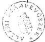
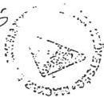
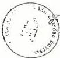

# ÁLLAMI SZÁMVEVŐSZÉK

V-20/14 /1990.

2/27-6

# J E L E N T É S

a volt KISZ KB székház eladásának ügyében végzett vizsgálat tapasztalatairól

Az Állami Számvevőszék elnöke elrendelte a volt KISZ KB székháznak eladásából származó 780 millió Ft bevétel felhasználásának és elszámolásának ellenőrzését. A vizsgálatot az Elnökség által jóváhagyott program alapján végeztük.

A vizsgálat célja annak megállapítása volt, hogy a volt KISZ KB székház értékesítése jogszerű volt-e, továbbá az eladásból származó bevételt szabályszerűen használták-e fel?

Minősítéseink alátámasztása érdekében állásfoglalást kértünk a legfőbb ügyésztől és a Pénzügyminisztériumtól. Álláspontunkban ezen szakvéleményeket érvényesítettük.

# I.

# M E G Á L L A P Í T Á S O K

# 1.) A DEMISZ jogállása

A Magyar Demokratikus Ifjúsági Szövetség 1989. április 22-én alakult, 44 ifjúsági szervezet szövetségeként.

27.

---

- 2 -

A DEMISZ-t a Fővárosi Bíróság 7.PK.22490/1989/2. szám alatt, 1989. június 23-án jegyezte be a KISZ jogutódjaként, a társadalmi szervezetek nyilvántartásába. Ezzel egyidejűleg a bíróság a korábban nyilvántartásba vett KISZ törlésére is intézkedett.

A tagszervezetek, illetőleg a DEMISZ önálló jogi személyek, működésükre- gazdálkodásukra az egyesülési jogról szóló 1989. évi II. törvény, továbbá a társadalmi szervek gazdálkodó tevékenységéről szóló 16/1989. (II.16.) MT rendelet előírásai az irányadóak.

Előzőek értelmében a DEMISZ a jogelőd szervezet jogaival rendelkezik és felelősséggel tartozik annak kötelezettségeiért. Így vált a volt KISZ KB székház (Budapest, XIII. Újpesti rakpart 37-38.) kezelőjévé is.

2.) A KISZ KB székház építésének, tulajdonviszonyának körülményei

A Budapest, XIII. Garam u. 4. szám alatt lévő (tulajdoni lap szám 754, helyrajzi szám: 25532), 6551 m² alapterületű telek 1952-ben - államosítás útján - került a Magyar Állam tulajdonába.

Miután a székház megépítésére döntés született, a telekre 1976-ban 34.267/76. számon bejegyezték a KISZ kezelői jogát. Ezt követően a tulajdoni lapra, az épület 1989. évi értékesítéséig bejegyzés nem történt. Ez azt jelenti, hogy azon sem a felépítmény, sem pedig a DEMISZ kezelői joga nincs feltüntetve.

A székház teljes bekerülési költsége 260 millió forint volt. Ez az összeg az adott időszakban viszonylag magasnak minősült, de az épület színvonala, felszereltsége is meghaladta az átlagosat.

A beruházás a korábbi gyakorlatnak és finanszírozási szokásoknak

---

- 3 -

megfelelően, teljes egészében költségvetési forrásból, pártberuházásként valósult meg. (A pénzügyi forrás jelzőszáma 011-2334)

Az ingatlan értékesítését, illetve annak szükségességét a DEMISZ Szövetségi Tanácsának 1989. VI. 9-i ülése megtárgyalta. Ezen – a DEMISZ alapszabályának megfelelően – olyan egyhangú döntés született, hogy a jogelőd felszámolásával összefüggő tennivalók és a megmaradó ifjúságpolitikai feladatok ellátásához szükséges források biztosítása érdekében a Garam u. 4. szám (Újpesti rakpart 37-38. szám) alatti ingatlan értékesítésre kerül.

Az intézkedés gazdasági szükségszerűségének indokaként a DEMISZ ügyvivő testülete arra is hivatkozott, hogy lényegében változatlan kötelezettségek mellett a szervezet korábban elsődleges forrását képező állami támogatás az 1988. évi 1162 millió forintról 1989-ben 785 millió forintra csökkent, 1990-ben pedig támogatást már nem is kaptak.

Ilyen körülmények között a DEMISZ kötelezettségeinek és vállalásainak úgy tett eleget, hogy a székházat eladta. A jogutódként birtokába került további ingatlanokat pedig 1989. decemberében felajánlotta a kormánynak. A pénzügyi helyzetet kétségtelenül nehezítette, hogy a felajánlott ingatlanok átvétele csak négy hónapos késedelemmel történt meg, és a közben felmerült (üzemeltetési, fenntartási) költségeket a DEMISZ-nek kellett viselnie.

A helyszíni vizsgálat áttekintette az ingatlan eladásának jogi hátterét is. Megállapította, hogy az értékesítés lebonyolításakor rendelkeztek a szervezet vezető testületének erre vonatkozó felhatalmazásával. Mivel az eladás még a földtörvény módosítása előtt, 1989. június 22-én történt, a törvény akkor érvényben lévő előírásai szerint nem volt akadálya annak, hogy egy társadalmi szerv a

---

- 4 -

birtokában lévő ingatlan kezelői jogát, más szerv részére tulajdonként ruházza át, és a kapott vételárat saját céljaira használja fel. A törvénymódosítás június 22-én jelent meg és 1989. július 1-jei hatállyal lépett életbe. E törvénymódosítás értelmében július 1-től a kezelőnek nem volt már joga az állami tulajdonú ingatlan tulajdonjogát átruházni.

A DEMISZ 1989. május 23-án kérte a bírósági nyilvántartásba vételt, az erről szóló végzést azonban csak 1989. június 23-án küldte el a Fővárosi Bíróság. Ebből következik, hogy – noha a DEMISZ jogutód voltához nem fér kétség – az eladás időpontjában egy formálisan nem létező szervezet kötött a Magyar Hitel Bank Rt.-vel szerződést. (Ugyanis a KISZ megszűnését a DEMISZ alakuló kongresszusa 1989. április 22-én mondta ki, de az eladás napján a bíróságnál még a KISZ volt társadalmi szervként bejegyezve.

Az egyesülési jogról szóló törvény értelmében a társadalmi szervezet működése feletti törvényességi felügyeletet az ügyészség gyakorolja, így az előzőek megítélése is ügykörébe tartozik.

Itt említendő meg, hogy a székház eladása tárgyában dr. Becker Pál országgyűlési képviselő 1990. június 12-én interpellált a legfőbb ügyészhez. Válaszában dr. Nyíri Sándor megbízott legfőbb ügyész az ügyletet az érvényben levő szabályok szerint megfelelőnek, jogszerűnek minősítette.

A helyszíni vizsgálat során az értékesítés körülményeinek több irányú jogi megközelítése is felmerült. Ezért az ÁSZ írásban kérte a legfőbb ügyész véleményét, aki az átküldött dokumentumok birtokában is megerősítette a korábbi álláspontot.

A legfőbb ügyész erre vonatkozó állásfoglalását mellékletként csatoltuk.

---

- 5 -

A tulajdoni lapra 1989. június 30-án a Magyar Hitel Bank Rt. Ingatlanforgalmi Leányvállalatát jegyezték be tulajdonosként, az eladásra vonatkozó szerződés alapján. Ezt követően a szerződés módosítással az MHB Rt. tulajdonjoga került bejegyzésre.

### 3.) A székház értékesítésének pénzügyi lebonyolítása

A KISZ Központi Bizottsága 1989. januárjában megbízta a Fővárosi Ingatlanközvetítő Vállalatot a székház műszaki-forgalmi értékbecslésével.

A FIK értékbecslése szerint:

|  az épület értéke összesen: | 589.735.000,- Ft  |
| --- | --- |
|  a telek értéke | 27.300.000,- Ft  |
|   | 617.035.000,- Ft  |

kerekítve 620 millió forint.

A becsült érték ismeretében a DEMISZ vezetése több érdeklődő szervezet (főként pénzintézet) ajánlatát mérlegelte. Legkedvezőbb ajánlatot a Magyar Hitel Bank Rt. tette. Ebben nyilvánvalóan közrejátszott az is, hogy a bank az épület két szintjét már korábban is bérlőként használta, e szinteken a működéséhez szükséges átalakításokat is végeztetett. Tehát az épület megszerzéséhez a banknak alapvető érdeke fűződött.

Ilyen előzmények után született meg 1989. június 22-én a két fél közötti adás-vételi szerződés, mely szerint a vevő az ingatlant 780 millió forintért vette meg úgy, hogy ebből 100 millió forint a telek és 680 millió forint az épület értéke. A vevő a vételárat, a kapcsolódó 170 millió forint általános forgalmiadó összegével együtt megfizette. A DEMISZ pedig az épületet átadta a bank részére. A hivatalos értékbecsléstől mintegy 25 %-kal eltérő értékesítési ár nem tekinthető szokatlan jelenségnek.

---

- 6 -

Az adás-vételi szerződés a szerződéskötésre vonatkozó formai és tartalmi előírások szerint készült. A szerződő felek hivatkoztak az ügylet alapját képező (földről szóló) törvényre. A szerződés különös jogokat és kötelezettségeket sem a vevőre, sem az eladóra nem író. Az eredeti szerződés szerint a vevő a Magyar Hitel Bank Rt., de képviseletében a Bank Ingatlanforgalmazási Leányvállalata járt el. Ugyanakkor azonban a szerződés 7. pontja szerint a felek hozzájárulnak ahhoz, hogy a tulajdonjogot a Leányvállalat javára jegyezzék be az ingatlannyilvántartásba. Ez június 30-i dátummal meg is történt. Később viszont (1989. október 18-án) a szerződés érintett pontja úgy módosult, hogy a tulajdonjog az eredeti vevő Magyar Hitel Bank Rt.-é lett.

#### 4.) A székház eladásából származó bevétel felhasználása

A vevő a vételárat három részletben fizette ki: 200 millió R-ot 1989. július 6-án, 237,5 millió R-ot 1989. november 15-én és 512,5 millió R-ot 1990. február 6-án. Ez összesen 950 millió R, amelyből 170 millió R az ÁFA befizetés. Így a DEMISZ e pénzből 780 millió R-ot használhatott fel, bár számolt azzal is, hogy az év végén mintegy 170 millió R nyereségadó-kötelezettség terheli.

A vételárat, a KISZ jogutódjaként létrejött DEMISZ elsősorban olyan feladatok finanszírozására akarta fordítani, amelyek felszámolják a KISZ-től örökölt pénzügyi kötelezettségeket és viszonylag tiszta helyzetet teremtenek a DEMISZ gazdálkodásában.

Külön költségvetés és terv nem készült a székház eladásából származó bevétel felhasználására, de a szervezet átalakulását elhatározó 1989. áprilisi kongresszust követően olyan költségvetési terv készült, amely a kötelezettségeket és forrásokat részben számba vette. Ez a terv nem volt teljeskörű (hiányos volt), mert nem

---

- 7 -

tartalmazta például a nicaraguani szolidaritási támogatás pénzügyi rendezésének tervét és néhány olyan feladatot, amelynek pénzügyi következményei a későbbi elszámolásokban megjelentek.

A székház eladásából származó bevételek jövőjéről a Szövetségi Tanács 1989. augusztus 11-13-i felsőtárkányi találkozóján alakult ki egyeztetett elképzelés, nevezetesen, hogy ez a pénz legyen forrása a korábbi szervezet szanálásának, az áthúzódó kötelezettségeknek. E pénzt használják fel a DEMISZ tagszervezetei az 'alap infrastruktúrájának' megteremtésére. Az összeg mintegy 23-30 %-át az ifjúsági célú tevékenységet folytató vállalatok működésének segítésére és az ifjúsági és gyermeklapok dotálására kell fordítani. Új ifjúsági szervezetek támogatására alap illetve alapítvány létrehozásával 100 millió Ft feletti összeg fordítódjon.

A vételár ilyen módon történő felhasználására a 16/1989. (II.26.) MT rendelet módot ad a társadalmi szerveknél. Tehát a DEMISZ-nek lehetősége volt saját hatáskörben (belső működési szabályai szerint) eldönteni, hogy mit számol el a székházból származó bevétel terhére.

Az ifjúságpolitikai kormánybiztos részére 1990. márciusában készült feljegyzés 14. számú mellékletében a DEMISZ elszámolást készített a székház eladásából származó bevételek felhasználásáról. Az elszámolást a DEMISZ Ügyvivő Testülete utólag úgy minősítette, hogy az csak gyors tájékoztató jelleggel, nagyvonalú információt adott arról, hogy a bevételek mire nyújtottak fedezetet. Ebből adódóan az elszámolásba vitatható tételek is kerültek.

Az összeg felhasználásáról pontosabb elszámolás 1990. júliusában készült, annak kapcsán, hogy Kiss Gyula tárca nélküli miniszter felkérte a DEMISZ-t, hogy vagyonáról, anyagi helyzetéről a nyilvánosság előtt számoljon el. Ez az elszámolás megtörtént. Mellékletként csatoltan bemutatjuk.

---

- 8 -

Miután a DEMISZ Ügyvivő Testületének képviselői hivatalosan nyilatkoztak, hogy a korábbi kimutatásokat nem tartják alkalmasnak a tételes elszámolásra, ezért az ellenőrzés az 1990. júliusában készült elszámolás dokumentális vizsgálatát végezte el. A korábbi kimutatás értékelésétől eltekintett, csupán az új székház bérleti díjának 10 millió R-os kiadásával kapcsolatban tért ki a korábbi beszámoló egy tételére, mert annak tisztázása szükségessé vált.

A dokumentális vizsgálat főbb megállapításai a következőkben összegezhetők:

- A vételár terhére folyósított kifizetéseket a szervezet egyszámlájáról bonyolították. Elkülönített nyilvántartást nem vezettek, miután erre vonatkozó kötelezettségük nem is volt. Ebből adódóan csak elhatározás kérdése volt, hogy mit számoltak el a bevétel felhasználásaként.
- A jelen célvizsgálat - jóváhagyott vizsgálati programja - a székházeladásból származó bevétel felhasználására korlátozta az ellenőrzést. Ezért ezen vagyonrész felhasználásáról tudunk véleményt alkotni. A teljes vagyonelszámoltatásra és annak ellenőrzésére a közeljövőben kerül sor. Ennek keretében a jelen vizsgálat tapasztalatai is hasznosíthatók.
- A székház eladásából származó bevételekkel azonos nagyságrendben kimutatott kiadási tételek kifizetése - egy kivétellel - bankátutalással vagy pénztárból való kifizetéssel megtörtént 1989. vagy 1990. év során. Kivételt képez ez alól a nicaraguan építkezés költségeinek pénzügyi rendezése, amelynek költségei és bevételei elkülönített technikai számlán bonyolódtak és a számlán kimutatott veszteség rendezését számolták el a székházból származó bevételek terhére.

---

- 9 -

- A kifizetéseket jogcímek szerint vizsgáltuk. Ezek alapjául szerződések, testületi döntések, megállapodások, alapító okiratok szolgáltak. Ettől eltérő volt az ifjúsági szervezet alapfunkciójához kapcsolódó feladatok dokumentálása, ahol csupán átutalás vagy feljegyzés illetve a KB titkár határozata szolgált alapul a kifizetésekhez. Ezen túl néhány technikai számla kifizetésének indokoltságát a szállítói számla alapozta meg. A kifizetéseknél szabálytalanságot nem találtunk. A kifizetési jogcímekre vonatkozó tiltó rendelkezés nincs.
- A felülvizsgált kifizetések között találtunk olyan számlákat is, amelyeket a székház eladását megelőzően rendeztek például az ifjúsági és gyermeklapok dotációja, de ezek a KISZ-től örökölt olyan kötelezettségek voltak, amelyet a DEMISZ a székház eladásából szándékozott finanszírozni, mentesítve ezzel az alapfunkció költségvetését.
- Az elszámolások között több olyan tétel is szerepelt, amely a KISZ KB által finanszírozott területek veszteségeiből származott. A jogutód DEMISZ már csak a veszteségek rendezését végezhette el. A Számvevőszék vizsgálatai során a veszteségek keletkezési okait nem tudta indokolni a DEMISZ. A KISZ KB illetékes, utalványozási joggal felruházott osztályai a költségvetési túllépések okaira elemzéseket nem végeztek, a költségeket tudomásul vették. Megítélésünk szerint a gazdálkodásnak ez a módja nem zárta ki a visszaélések lehetőségét, ezért erre a javaslati részben visszatértünk.

dr. Becker Pál képviselő interpellációjában 3 kiadási tétel jogosságát kifogásolta. Ezért ezeket külön is megvizsgáltuk:

- Elszámolásai szerint a DEMISZ a Magyar Úttörőszövetség részére

---

- 10 -

irodaház vásárlás céljából 20 millió R-ot adott át. A DEMISZ ezen kötelezettsége vagyoni megegyezésen alapult, amelynek értelmében az Úttörő Szövetség az eladott KISZ KB székházban használt irodahelyiségei fejében új székházat vett és erre vagyonmegosztásként kért fedezetet. Az új MUSZ székház vásárlására az adás-vételi szerződést 1989. október 9-én kötötték meg magánszemélyekkel. A DEMISZ a 20 millió R-os vételárat az eladónak átutalta.

- A Magyarországi Ifjúsági Szervezetek Országos Tanácsa alapítványt hozott létre, amelynek célja: 'a gyermek- és ifjúsági korosztályok és szervezeteik közösségi célú tevékenységének támogatása.' Az alapítvány neve: 'Ezredforduló'.

A DEMISZ csatlakozott az alapítványhoz és vállalta 100 millió R átutalását az alapítvány céljaira, amelyet mai napig teljesített. Az alapítvány megelőlegezéseként a DEMISZ 1989. október 18-án átutalt 2,2 millió R-ot a 70-es számú jogtanácsosi hivatalnak, amely a Cigány Ifjúsági Szövetség székház vásárlását bonyolította. A CISZ székházvásárlás az alapítvány céljára befizetett 100 millió R része volt.

- Nem szerepel ugyan az újonnan készült tételes elszámolásban az új székház 10 millió R-os bérleti díja, de korábbi vitatott elszámolás miatt a vizsgálat ennek értékelésére is kitért.

A bemutatott szerződés szerint éves összegben valóban 10 millió R nagyságrendű költséget képez a bérlet és a rezsi. Ennek elszámolása a működési költségek között történik. Eddig csak két részletet utaltak át, ez év februárban 717.754,- Ft-ot, májusban 496.500,- Ft-ot.

---

- 11 -

# 5.) A vizsgálat során tapasztalt, a DEMISZ gazdálkodásával kapcsolatos általános megállapítások

A KISZ megszűnése és a DEMISZ jogutódkénti megalakulása során nem készült a gazdálkodásról zárómérleg, vagyonmérleg és nyitómérleg sem. A társadalmi szervezetekről szóló 1989. évi II. törvény ilyen kötelezettséget nem ír elő, noha célszerű lenne.

Ennek következményeként a meglévő kötelezettségek felmérésére sem került sor, azon megfontolásból, hogy az átalakulás során a KISZ KB személyi állománya megmaradt és a DEMISZ ügyvivő testületében – folyamatában – intézte a gazdálkodási ügyeket. A gond abban van, hogy időközben a személyi állomány kicserélődött, és a DEMISZ vezető testülete az előzmények ismerete nélkül, jogutódként kénytelen helyt állni a kötelezettségeknek. Ezt a hivatkozott törvény 21. §. (1) bekezdése előírja számára.

A kötelezettségek egy része a korábbi években keletkezett veszteségekből áll. A veszteségek okainak elemzésével a KISZ KB nem foglalkozott, a jogutód pedig kénytelen volt rendezni. A veszteségfeltáró elemzések és költségtervek hiánya, a kötelezettségek számbavételének elmaradása laza költséggazdálkodásra utal.

A DEMISZ létrejöttével a korábbi KISZ Központi Bizottság költségvetése és a kezelésében, tulajdonában levő vagyon feletti jogot a DEMISZ Országos Gyűlése a megválasztott Szövetségi Tanács hatáskörébe utalta. Az így létrejött Szövetségi Tanács határozatai képezték az eljárás jogalapját.

1989. évben többször módosította a költségvetését a DEMISZ. A tagszervezeteknek nyújtott támogatás egyfajta vagyonmegosztás jellegű volt az egykori KISZ KB székház értékesítési bevételé-

---

- 12 -

ból. Némileg visszás, de nem ellentétes a hatályos jogszabályokkal, hogy vagyonmérleg elkészülte nélkül került sor vagyonmegosztásra. A DEMISZ szanálta a befolyt pénzből a KISZ KB ügyleteinek áthúzódó veszteségét. Ezen belül az új alapszabály szerinti célokra is fordítottak jelentős összegeket 1989-90. évben. A DEMISZ döntési mechanizmusa és a vizsgált témákhoz kapcsolódó döntéshozatal nem volt ellentétes a jogosítványaival.

A DEMISZ a székház eladásából származó árbevételt a társadalmi szervezetek gazdálkodásáról szóló 16/1989. (II. 26.) MT rendelettel, valamint a 15.041/1989. PM III/b számú állásfoglalással összhangban használta fel. A kifizetések formailag szabályszerűek, a bankátutalások dokumentáltak voltak.

## II.

### KÖVETKEZTETÉSEK

A társadalmi szervezetek elszámoltatására irányuló igények erősödnek. Ennél fogva a DEMISZ célvizsgálatának tapasztalatai túlmutatnak a szorosan vett vizsgálati kérdések megválaszolásán.

A KISZ KB székház eladásának körülményei azt mutatják, hogy a Földtörvény joghézagai adott időszakban lehetőséget adtak olyan vagyongazdálkodásra, amely nem egyezik a társadalom igazságérzetével és a közösségi vagyonnal való gazdálkodás célszerűségével. Lényegében lehetővé vált egy állami ingatlan eladásából származó bevétel szétforgácsolása

---

- 13 -

a folyó költségek fedezésére. A Földtörvény 1989. júniusi módosítása már korlátozza az állami vagyon kezelőjének ezt a jogát, de a KISZ KB jogutódja még a rendelet módosítása előtt közvetlenül eladhatta eme jelentős vagyontárgyát.

További elgondolkodtató tény, hogy a társadalmi szervezetek gazdálkodásáról szóló 16/1989. (I. 26.) MT rendelet még jelenleg is nagy jogi szabadságot biztosít a társadalmi szervezetek bevételeinek felhasználásában, származzék az bármilyen forrásból, sőt a 15/041/1989. PM III/b számú állásfoglalás a társadalmi szervek álló- és forgóeszköz értékesítéséből származó bevétel kedvezményes felhasználását is lehetővé teszi, ha azt az alapszabály szerinti célokra használják fel. Így a DEMISZ-nek is reális esélye van nyereségadó kedvezményre.

Az Állami Számvevőszék azzal értene egyet, ha az ilyen típusú bevételek felhasználásában állami kontroll, szelekció és a közös tulajdon felhasználásának célszerűsége érvényesülne. Nem ért viszont egyet a leirati szabályozások gyakorlatával, mert az a jogalkalmazást áttekinthetetlenné teszi.

Elvileg helyeselhető, ha a társadalmi szervezet gazdálkodási szabadságát az állam rendeletileg is biztosítja, így a társadalmi szervezetnek joga van bevételeit az általa meghatározott alapszabályi tevékenység céljaira felhasználni, vállalkozásba fektetni, illetve veszteségeit finanszírozni. Megfontolandó azonban, hogy ezt a gazdálkodási szabadságot mennyiben célszerű az állami ingatlanok eladásából származó bevétel esetén is fenntartani.

Jelenleg az egyesülési jogról szóló törvény – az állampolgárok és szervezetek különböző érdekek és értékek alapján való önszerveződésének szabadságából kiindulva – erősen korlátozza az állami beavatkozás lehetőségét, beleértve az ellenőrzést is. Ez a jelenlegi átmeneti

---

- 14 -

helyzetben a meglévő régi szervezetek esetében olyan következményekkel jár, hogy az ellenőrizhetőség feltételei - akár többmilliárdos vagyon esetében is - korlátozottak. Lehetőség van a vagyon szétforgácsolására, veszteség keletkezésére, visszaélésre és csoportérdekeket szolgáló vagyonátmentési akciókra is, a jogi úton való felelősségre vonás fenyegetettsége nélkül.

A jelenleg előkészítés alatt lévő - egyes társadalmi szervek vagyonelszámoltatásáról szóló törvénytervezet - és benne az Állami Számvevőszék kötelezettsége arra a következtetésre vezet minket, hogy az ellenőrizhetőség feltételeinek javítására intézkedéseket kezdeményezzünk.

# J A V A S L A T O K

A célvizsgálat megállapításai alapján az alábbiakat javasoljuk.

1) A társadalmi szervezetek elszámoltathatóságának feltételeként ajánlható, hogy az 1989. évi II. törvény egészüljön ki azzal, hogy a megszűnő társadalmi szervezet köteles számba /leltárba/ venni vagyonát, vagyoni értékű jogait, követeléseit és kötelezettségeit. A felszámolónak kötelező legyen rendelkezni nemcsak a vagyonról, hanem a kötelezettségeknek a követelésekkel nem fedezett, vagy nem fedezhető részéről is. Ezt a cégbíróságok ellenőrizzék és tegyék a további intézkedések feltételévé.

2) Társadalmi szervezetek jogutód nélküli megszűnése esetén indokoltnak látszik a felszámolás részletesebb szabályozása, elsősorban arra vonatkozóan, miért és hogyan, mely korlátok között felel az állam a megszűnt társadalmi szerv kötelezettségeiért.

---

- 15 -

3) A társadalmi szervezetek gazdálkodásáról szóló 16/1990. (II. 26.) MT rendeletet célszerű lenne kiegészíteni a társadalmi szervezetek gazdasági-vállalkozási tevékenységének definícióját tartalmazó résszel.

4) A társadalmi szervezetekre vonatkozó könyvviteli előírások között, vagy a gazdálkodásra vonatkozó 16/1990. (II. 26.) MT rendeletben kellene rendelkezni arról, hogy megszűnő társadalmi szervezet számára kötelező
- leltáron alapuló zárómérleget,
- vagyonmérleget
készíteni.

5) Az Állami Számvevőszék ajánlja dr. Kiss Gyula tárca nélküli miniszternek, hogy a jogszabályok módosításának kezdeményezésével és a nyilvános számonkérés eszközével gondoskodjék arról, hogy az ügykörébe tartozó társadalmi szervezetek ne vállaljanak saját forrásaikat meghaladó, pénzügyileg fedezetlen kötelezettségeket.

6) Javasolja a pénzügyminiszternek a jogalkalmazás áttekinthetőségét zavaró leirati szabályozás megszüntetését.

Melléklet: 4 db

Budapest, 1990. szeptember 7.

/ Dr. Hagelmayer István /

---

1. sz. melléklet

DEMISZ

# A DEMISZ Székház eladásából származó
700 millió Ft felhasználása

/ezer Ft-ban/

1. A KISZ szanálásával és a korábbi időszakból származó ifjúságpolitikai kötelezettségvállalásokkal kapcsolatos költségek

|  - 1985-ben kezdődő és 1988. év végén átadott, Nicaraguában épített szakmunkásképző iskola pénzügyi rendezése | 71.200  |
| --- | --- |
|  - 1988-ban elindított egyéves kísérleti jelleggel működtetett számítógépes információ-lánc 1989-re áthúzódó kiadásai | 1.500  |
|  - 1988-ban az Ipari Minisztériummal és más szervekkel közösen meghirdetett fiatal kutatók pályázata 1989-re áthúzódó költségei | 3.600  |
|  - Csillebérci Úttörőtábor tervezett költségvetési támogatás feletti finanszírozás | 10.000  |
|  - Csillebérci Óvoda költségei (fenntartás, üzemelt.) | 5.500  |
|  - Magyar Úttörők Szövetsége részére irodaház vásárlás | 20.000  |
|  - Az apparátus leépítésével kapcsolatos költségek | 3.500  |
|  - Iskolán levők bére és járulékai | 2.000  |
|  - VIANCO Vállalat 1988. évi veszteségeinek rendezése (a jogszabályok kötelezték a DEMISZ-t mint alapítót erre) | 19.000  |

2. Egyéb ifjúságpolitikai feladatokra fordított költségek

|  - 1989. év folyamán teljesen illetve törtévi megjelenésben kiadott ifjúsági és gyermeklapok dotációja (Magyar Ifjúság, Kisdobos, Úttörővezető stb.) | 63.500  |
| --- | --- |
|  - Ifjúsági Tanácsadó Irodák létrehozása ÁISH-val közösen (Kecskemét, Békéscsaba) | 700  |

---

- 2 -

|  - Ifjúsági táborokkal kapcsolatos tanulmánytervek költségei | 4.000  |
| --- | --- |
|  - Lakáskoncepcióval kapcsolatos tanulmány kidolgozásának költségei | 317  |
|  3. Ifjúságpolitikai feladatok végrehajtására véglegesen átadott pénzeszközök  |   |
|  - DIVSZ tervezett költségvetési támogatás feletti finanszírozás | 10.300  |
|  - Ezermester Úttörő- és Ifjúsági Kereskedelmi Vállalat forgóalap feltöltés | 90.000  |
|  - Ifjúsági Lapkiadó Vállalat forgóalap feltöltés | 63.000  |
|  - Tagszervezeteknek átadott támogatás | 268.183  |
|  - Ifjúsági közösségek pályázat alapján adott céltámogatás | 10.000  |
|  4. Alapítványoknak átadott pénzeszközök 1990. évben  |   |
|  - "Új Népi Kollégium" alapítvány létesítése | 10.000  |
|  - MISZOT "Ezredforduló" alapítvány támogatása (Cigányszövetségnek adott támogatással együtt) | 100.000  |
|  - "Diáktanya" alapítvány támogatása | 700  |
|  - "Régió" alapítvány támogatása | 2.000  |
|  - "Diákszövetségért" alapítvány támogatása | 2.600  |
|  - "Gyermekekért" alapítvány támogatása | 2.600  |
|  - Comenius alapítvány támogatása | 300  |
|  5. Az eladott Székházból az új bérleménybe történő átköltözés költségei  |   |
|   | 15.500  |
|  Összesen: | 780.000  |

---

- 3 -

Megjegyzés: A 780 millió Ft-ot terheli az 1990-ben befolyt összeg után még 1990-re 172 mFt vállalkozási nyereségadó kötelezettség. Így ténylegesen 608 millió Ft-ról lenne csak szó.

---

# Állami Számvevőszék

Elnök

2. sz. melléklet

Budapest, 1990. augusztus 1.
V-20/10/90.

Dr. Györgyi Kálmán úrnak
a Legfőbb Ügyésznek

BUDAPEST

Kedves Györgyi Úr!

Az Állami Számvevőszék megvizsgálta a volt KISZ KB székháznak, a jogutód DEMISZ által történt értékesítését és a vételár felhasználását. A vizsgálat során a szerződéskötés körülményeiről a következők jutottak tudomásunkra:

1/ A DEMISZ-t a Fővárosi Bíróság 1989. évi június hó 23. napján kelt végzésével 193. sorszám alatt - mint a KISZ jogutódját - bejegyezte a társadalmi szervezetek nyilvántartásába. Az egyesülési jogról szóló 1989. évi II. számú törvény 4. szakasz /1/ bekezdése értelmében "A társadalmi szervezet a nyilvántartásba vétellel válik jogi személyé." Ez azt jelenti, hogy a DEMISZ csak 1989. évi június hó 23. napjától volt abban a helyzetben, hogy a saját nevében szerződéseket kössön.

2/ A XIII. kerület Garam utca 4.szám alatti ingatlan - amelyen a KISZ székház épült - 1976. évi október hó 21. napjától volt a KISZ Központi Bizottság kezelésében. A kezelői jogot nem írták át a DEMISZ-re, holott a földről szóló 1987. évi I. számú törvény 12. szakasz /3/ bekezdése szerint a kezelői jog megszerzéséhez az ingatlannyilvántartásba történő bejegyzés szükséges. A bejegyzés előfeltétele a társadalmi szervezetek nyilvántartásába történő felvétel, azaz a jogképesség - jogi személyiség - megszerzése.

3/ A DEMISZ 1989. évi június hó 22. napján adás-vételi szerződést kötött az MHB Rt-vel ( a bank képviseletében az MHB Rt Ingatlanforgalmazási Leányvállalat járt el.) A szerződéssel a DEMISZ 780 millió forintért eladta a Garam utca 4.szám alatti ingatlant. A szerződéskötés napján a DEMISZ nyilvántartásbavétel hiányában (1./pont) nem volt jogi személy. nevére a kezelői jog nem volt bejegyezve (2./pont).

---

- 2 -

4/ Az adás-vételi szerződés megkötésénél az MHB Rt. Ingatlanforgalmazási Leányvállalat képviselőként járt el. A Ptk. 219. szakasz (2) bekezdése szerint "A képviselő cselekménye által a képviselt válik jogosítottá illetőleg kötelezetté." Az adás-vételi szerződés 7. pontjában a DEMISZ és az MHB Rt. abban állapodtak meg, hogy a Garam utca 4. számú ingatlan tulajdonjogát vétel jogcímén a képviselőként eljáró Ingatlanforgalmazási Leányvállalat nevére jegyezzék be. A budapesti Kerületek Földhivatala az 1989. évi június hó 30. napján benyújtott kérelem alapján még ugyanazon a napon a tulajdonjogot a képviselő nevére bejegyzi. (A földről szóló törvény 1989. évi július hó 1. napjától úgy változott, hogy társadalmi szervezet a kezelésében lévő állami tulajdonban lévő ingatlan tulajdonjogát nem idegenítheti el.)

Említést érdemel, hogy a DEMISZ és az MHB Rt. az adás-vételi szerződést 1989. évi október hó 18. napján módosította úgy, hogy a tulajdonjogot mégis az MHB Rt. nevére kérték vétel jogcímén bejegyezni. A földhivatal október hó 20. napján a szerződésmódosításnak megfelelően törli az MHB Rt. Ingatlanforgalmazási Leányvállalat tulajdonjogát és bejegyzi az MHB Rt. tulajdonjogát. Mivel az 1989. évi június hó 30. napján kelt földhivatali bejegyzés alapján az ingatlan tulajdonosa az MHB Rt. Ingatlanforgalmazási Leányvállalat lett, itt tulajdonképpen nem szerződésmódosításról, hanem új adás-vételi szerződésről van szó, annak minden következményével együtt.

Mint előtted jól ismert az Állami Számvevőszék mint ellenőrző szervnek állást kell foglalnia az ügylet megítélése vonatkozásában. A rendelkezésre álló jogi szakmai vélemények az értékesítés körülményeit illetően eltérőek. Levelemben lényegében az ÁSZ Jogi Osztálya szakértőjének megítélését szerepeltettem. A megítélés következményei nem közömbösek, azok az ügylet esetleges semmisségét helyezik kilátásba.

Ugyanakkor az is jól ismert előttünk, hogy az ügyben dr. Nyíry Sándor úr a Parlamentben már nyilatkozott, azt lényegében nem kifogásolhatónak minősítve.

Megköszönném, ha álláspontod kifejtenéd és így az ügy lezárásához segítéget adnál.

Külön kérem, hogy álláspontodról lehetőség szerint augusztus 24-ig tájékoztatnál.

h
08:02
is
us2.

Üdvözlettel

/ Dr. Hagelmayer István /

---

3. sz. melléklet

Nyilatkozat az Állami Számvevőszék részére:

A Magyar Demokratikus Ifjúsági Szövetség Ügyvivői Testülete kijelenti, hogy Králikné Cser Erzsébet Ifjúságpolitikai Kormánybiztos részére 1990. márciusában készült, a DEMISZ anyagi helyzetének alakulásával kapcsolatos összeállítás 14. sz. melléklete gyors tájékoztató jelleggel tartalmazott a KISZ KB székház eladásából befolyt pénzeszközökből fedezett egyes kiadásokat. Erről az összegről a pontos elszámolást Kiss Gyula miniszter részére 1990. júliusában küldött beszámoló 4. sz. melléklete tartalmazza.

Budapest, 1990. július 13.

Varju László  
ügyvivő

Karl Imre  
Namarás

Az Állami Számvevőszék részéről átvettem:

Budapest, 1990. július 13.

Keith Ragy

---

LEGFŐBB ÜGYÉSZ

Pfl. 31.439/1990/1.szám

4.52.

205/H/90

1990 -08- 2 3

V-20-16/90

Hiv.szám: V/20/10/90.

Dr. HAGELMAYER ISTVÁN úrnak
az Állami Számvevőszék elnöke

B u d a n e s t

Kedves Hagelmayer Ur!

A Magyar Demokratikus Ifjúsági Szövetség /DEMISZ/ és
a Magyar Hitelbank Rt /MHB Rt/ között 1989. június
22-én megkötött adás-vételi szerződés jogi megítélé-
se kérdésében hozzám intézett szíves felkérésedre
álláspontomról az alábbiakban tájékoztatlak:

1./ Az egyesülési jogról szóló 1989. évi II. törvény
/Etv/ 4.§ /1/ bekezdése értelmében a DEMISZ va-
lóban 1989. június 23-án nyerte el jogi személyi-
ségét, elvileg tehát - mint polgári jogi jog-
alany - csak ezt követően köthetett volna szer-
ződést.

Nem hagyható azonban figyelmen kívül, hogy a
szerződéskötés időpontjában a KISZ még a társa-
dalmi szervezetek nyilvántartásában levő - azaz
jogi személyiséggel rendelkező - szervezet volt.
/Törlésére a DEMISZ bejegyzésével egyidejűleg
1989. június 23-án került sor./

Valamely társadalmi szervezet jogi személyiségét
ugyanis a nyilvántartásba vétel konstituálja, de
- a forgalmi-vagyoni viszonyok biztonsága érde-
kében - jogi személyisége is csak a nyilvántar-
tásból való törléssel szűnik meg.

Ilyen összefüggésben pedig az 1989. június 22-én
megkötött szerződést pusztán azért, mert abban
eladóként a DEMISZ szerepel, nem lehet semmisnek
tekinteni.

Az adás-vételi szerződést tehát úgy kell kezelni,
hogy azt eladóként a megújult elnevezésű KISZ kö-
tötte meg. A KISZ ugyanis gazdaságilag nem szűnt
meg, vagyonáról a KISZ XII. Kongresszusa kifeje-

---

- 2 -

zetten úgy rendelkezett, hogy arra nézve – most már új név alatt – a DEMISZ Szövetségi Tanácsa konkrét hasznosítási elképzeléseket dolgozzon ki.

A kifejtett állásponttól függetlenül, ha az 1989. június 22-én megkötött szerződést a DEMISZ jogi személyiségének hiányában semmisnek tekintenénk, akkor sem lehetne az eredeti állapot helyreállítása iránt eredményes intézkedést tenni. A semmisség ugyanis már a tulajdonjog bejegyzése időpontjában, sőt azt megelőzően – a DEMISZ bejegyzésével – orvoslást nyert.

2./ A szerződéskötés időpontjában a vétel tárgyát képező székház és udvar a KISZ KB kezelésében volt. Ehhez képest a kezelői jog szempontjából is el lehet fogadni azt a szerintem helyes álláspontot, amelyet az 1./pontban már említettem, nevezetesen, hogy az üzletkötés napján a szerződést kötő fél az ekkor még a társadalmi szervezetként bejegyzett és kezelői joggal is rendelkező KISZ KB volt.

Más oldalról vizsgálva sem találom érvénytelennek a szerződést a kezelői jog bejegyzésének hiánya miatt. A földről szóló 1987. évi I. törvény /Ftv./ 12.§ /2/ bekezdése értelmében a kezelői jog megszerzése – egyebek mellett – a kezelővel kötött megállapodáson alapulhat. /A tulajdonosi irányítást gyakorló szerv határozata, illetőleg hatósági határozat mint szerzési jogcím itt nem jöhet szóba, mert a KISZ XII. Kongresszusa a vagyonról rendelkezett./ Ahhoz tehát, hogy a DEMISZ a fentiek értelmében a kezelői jogot megszerezhesse, nem kellett külön megállapodást kötnie a KISZ KB-val, mert azt tartalmában a kongresszus határozata pótolta.

Az előzőekből következik, hogy bár a kezelői jog megszerzéséhez – ha az a kezelővel kötött megállapodáson alapul – az ingatlannyilvántartásba való bejegyzés szükséges, ennek hiánya azonban – minthogy a bejegyzés feltétele a jogutódlás folytán egyébként megvolt – a szerződést nem teszi érvénytelenné.

3./ Az 1989. június 22-én megkötött adás-vételi szerződés vevőként a Magyar Hitelbank Részvénytársaságot nevezi meg, képviselőjeként az ügyletben az MHB Ingatlanforgalmazási Leányvállalata vett részt. A szerződés 7. pontjában tett jogilag képtelen és megmagyarázhatatlan eladói rendelkezés – nevezetesen, hogy a tulajdonjogot a leányvállalat javára jegyezzék be – valóban ellene mond annak, hogy a képviselő cselekménye /jognyilatkozata/ folytán a képviselt válik jogosulttá, illetőleg kötelezetté.

A rendelkezésünkre álló földhivatali iratokban található, eredeti bejegyzést tartalmazó – 1989. június 30-i

---

- 3 -

keletű - hiteles tulajdoni lap fotókópiás másolatának II. részén azonban tulajdonosként - helyesen - nem az Ingatlanforgalmazási Leányvállalat, hanem a szerződésben vevőként szereplő és nyilvánvalóan a szerződő felek szándékának is megfelelően az MHB Rt került bejegyzésre 75.993/1989./VI.30./ számon.

Tényként megállapítható azonban az is, hogy a szerződés említett 7. pontjának 1989. október 18-án történt módosítását követően kiállított - 1989. október 20-i keletű - tulajdoni lapmásolat II. részén az MHB Rt neve mellett már az Ingatlanforgalmazási Leányvállalat is szerepel áthúzva. A kiigazítás címén utóbb tett bejegyzés és annak áthúzása azon a tényen azonban nem változtat, hogy a székház tulajdonjoga az eredeti bejegyzéskor azon szerv nevére - MHB Rt - lett bejegyezve, amely a szerződésben vevőként szerepel.

Az okiratok alapján nincs kétségem afelől, hogy az Ingatlanforgalmazási Leányvállalat vevőként való bejegyzésére és kihúzására utólag, közvetlenül egymást követően került sor. A szerződés módosításának tehát sem az átruházás, sem a tulajdonjog bejegyzés érvényessége szempontjából nincs jelentősége, annak célja csupán a szerződés egy téves rendelkezésének a korrigálása volt.

Az előzőekben kifejtettekre figyelemmel továbbra sem látok kellő alapot a szerződés érvénytelenségének megállapítása iránti esetleges per megindítására.

Kérlek, hogy álláspontomat - amennyiben az számodra is meggyőző - szíveskedj elfogadni.

Budapest, 1990. augusztus hó 23.

Üdvözlettel:

Dr. Györgyi Kálmán /