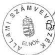

# Állami Számvevőszék

A-91/2002.

2002. 12. 18.

ÁLLAMI SZÁMVEVŐSZÉK
Komárom-Esztergom Megyei
Ellenőrzési Irodája
Tatabánya

**Az**
**Állami Számvevőszék**
**2003. évi**
**ellenőrzési terve**

0300

---

Állami Számvevőszék

A-037-009/2002.

# Az
Állami Számvevőszék
2003. évi
ellenőrzési terve

Dr. Kovács Árpád
elnök

Budapest, 2002. december 16.

---

1

---

# BEVEZETÉS

## I.

Az Állami Számvevőszék (ÁSZ) ellenőrzési feladatait az Alkotmányban és a számvevőszéki törvényben foglalt általános ellenőrzési felhatalmazáson túl közel harminc törvény részletezi. A számvevőszéki ellenőrzések átfogják a teljes államháztartást, s emellett kiterjednek az állam kincstári, valamint vállalkozói vagyonára, az államháztartáson kívüli egyes szervezetek gazdálkodására, az Országgyűlésnek beszámolási kötelezettséggel tartozó intézmények működésére, továbbá a pártok gazdálkodásának törvényességére.

Az ÁSZ – a feladatait meghatározó törvényi előírások alapul vételével – minden naptári évre elkészíti az ellenőrzési feladatokat tartalmazó ellenőrzési tervét. Az ellenőrzési tervet az intézmény elnöke hagyja jóvá és gondoskodik annak végrehajtásról.

Évente teljesítendő, meg nem kerülhető számvevőszéki feladatok, az Országgyűlés költségvetési joga gyakorlásának elengedhetetlen feltételei: az állami költségvetési és zárszámadási törvényjavaslat véleményezése, illetve ellenőrzése, a központi költségvetésből az önkormányzatoknak juttatott támogatások igénybevételének és elszámolásának, a privatizációs szervezet, valamint a nemzeti hírügynökség ellenőrzése. Az éves gyakorisággal elvégezendő feladatok mellett további rendszeres ellenőrzési feladatokat is meghatároznak a törvények.

A számvevőszéki ellenőrzésre vonatkozó, döntően szabályszerűségi ellenőrzésekkel teljesíthető törvényi kötelezettségek – több év átlagában – az ellenőrzési kapacitás mintegy 60%-át kötik le (2003-ban 62%-át). Ez viszonylag mérsékelt lehetőséget ad arra, hogy a társadalmi, a gazdasági működés és fejlődés szempontjából időszerű és fontos, közgazdasági megítélést, értékelést és a szakmai döntés-előkészítést előmozdító javaslatokat is eredményező ellenőrzéseket, teljesítmény vizsgálatokat, rendszer-elemzéseket végezzen az ÁSZ.

---

Ebből fakadóan fokozott kihívást jelent, hogy a számvevőszéki ellenőrző kapacitás 40%-ára kiterjedően az adott helyzetben a lehető legjobb összetételű, tematikájú éves ellenőrzési terv szabja meg az ellenőrzési munka irányait, arányait és a feladatok megvalósításának ütemezését. Az éves ellenőrzési terv végrehajtása által történik az intézmény stratégiai céljainak megvalósítása, ezért a törvényi előírások mellett a terv összeállítását nagyban befolyásolja az ellenőrzési stratégia, melyet az ÁSZ 2002-ben újított meg és adott közre.

## II.

A stratégia évek óta érvényesülő alapvető rendező elve, hogy lehetőleg a nagy összegű költségvetési pénzfelhasználásokra, a számottevő gazdasági kockázatokat hordozó területekre, a közszféra, illetve a nemzetgazdasági versenyképesség kritikus pontjaira, valamint a lakosság életminőségét befolyásoló területekre megfelelő figyelmet fordítsunk.

Erre is figyelemmel stratégiájában az ÁSZ alapelvként fogalmazta meg, hogy olyan számvevőszéki ellenőrzésre van szükség, amely elősegíti a közpénzek és a közvagyon felhasználásának átláthatóságát és elszámoltathatóságát. Alapvető célként határozta meg a következő négy évre azt, hogy:

- ▪ teljesebbé teszi a zárszámadás ellenőrzését,
- ▪ korszerűsíti (kiteljesíti) a helyi önkormányzatok ellenőrzését,
- ▪ megfelelő ellenőrzési módszerek és ellenőrzési technikák alkalmazásával, esetenként a partner ellenőrző szervezetekkel és kutatóintézetekkel is együttműködve, a közpénzek és a közvagyon felhasználásáról átfogó, értékelő véleményt formál.

Az Országgyűlés szolgálatában megvalósítandó ellenőrzési terv – a törvényi előírásokon és a stratégián túlmenően – természetesen alapvetően és konkrétan támaszkodik az ÁSZ 2001. évi tevékenységét értékelő, elismerő 69/2002. (X. 4.) OGY határozatban foglaltakra.

Határozatában az Országgyűlés egyetértett az ÁSZ stratégiájában foglaltakkal, az uniós követelményekkel harmonizáló nemzetközi ellenőrzési sztenderdeken alapuló pénzügyi szabályszerűségi és teljesítmény ellenőrzési módszerek alkalmazásával. Fontosnak tartotta, hogy a teljesítmény ellenőrzések mind szélesebb körben mutassák be az államháztartás egyes területei működésének, gazdálkodásának célszerűségét, gazdaságosságát, eredményességét és hatékonyságát, a költségvetési források hasznosulását.

A határozat szerint szükséges a költségvetés végrehajtásának ellenőrzésénél a beszámolók szabályszerűségét minősítő ellenőrzések fokozatos teljes körűvé tétele, és ennek érdekében a felügyeleti költségvetési ellenőrzés bevonásával ezen ellenőrzések zárt rendszerben való kiépítése. Az Országgyűlés felkérte a Kormányt, hogy a Magyar Köztársaság 2003. és 2004. évi költségvetéséről szóló

---2

---

törvényjavaslatok összeállításánál az ehhez szükséges költségvetési forrásokat vegye figyelembe.

### III.

Az éves ellenőrzési kapacitás 13%-át lekötő, összetett feladatot jelent, hogy a költségvetés végrehajtásának ellenőrzése mind teljesebb, megbízhatósági tanúsítással is együttjáró elszámoltatást valósítson meg. Ez hozzájárul a költségvetés, az államháztartás átláthatóságának – kifelé, nemzetközi viszonylatban való – tanúsításához, ami bizalomnövelő, garanciális kérdés. Ennek során az ÁSZ megbízhatósági szempontból minősíti a fejezetek igazgatási címei és a fejezeti kezelésű előirányzatok beszámolóit, valamint a nemzetgazdasági elszámolásokat. Az ellenőrzés keretében az ÁSZ vizsgálja a belső kontroll mechanizmusok kiépítettségét és működését, mivel ezek megléte és megfelelő működése jelentős mértékben befolyásolja, hogy a fejezet felelősségi körébe tartozó elemi beszámolók a számviteli elveknek megfelelően készüljenek. A belső kontrollok és a számvevőszéki ellenőrzés együttesen adnak alapot a gazdálkodásról való elszámolás megbízhatóságának minősítéséhez. (Ez feltételezi a fejezetek auditáló, vagy auditáltató tevékenységét.)

A 2002-ben végzett zárszámadási ellenőrzés során 8 fejezetnél, két fejezeti jogosítvánnyal rendelkező költségvetési címmel teljes körű, illetve a fennmaradó fejezetek igazgatási címmel végeztünk pénzügyi szabályszerűségi ellenőrzést. A fejezeti kezelésű előirányzatok beszámolójának pénzügyi szabályszerűségi ellenőrzésére is 8 fejezetnél került sor. A nemzetgazdasági elszámolások egyes területein (az APEH illetékességi körébe tartozó adóbevételeknél, a VP által kezelt vám- és adóbevételeknél), az egyéb szabályszerűségi ellenőrzés mellett pénzügyi szabályszerűségi (financial audit) ellenőrzést is végeztünk.

2003-ban szinte teljes körűvé válik az ÁSZ által vállalt körben az állami költségvetés zárszámadásához kapcsolódóan a költségvetés fejezeteinél a pénzügyi ellenőrzés, az elszámolások megbízhatóságának számvevőszéki tanúsítása. A megvalósítás feltétele a 2003-ra igényelt ellenőri többletlétszám biztosítása.

2002-ben a központi költségvetés zárszámadásának ellenőrzésével egyidejűleg ellenőriztük a helyi önkormányzatok költségvetési kapcsolatait, valamint 106 önkormányzat zárszámadását is. A zárszámadási jelentés így tartalmazta további 79 helyi önkormányzatnál a normatív állami hozzájárulások, 68 helyi önkormányzatnál a kötött felhasználású önkormányzati támogatások és 99 helyi önkormányzatnál a cél- és címzett támogatások igénybevételének, felhasználásának és elszámolásának ellenőrzéséről készített jelentések összegző megállapításait is.

A zárszámadás ellenőrzéséhez kapcsolódóan továbbra is fontos feladat a helyi önkormányzatok költségvetési kapcsolatainak ellenőrzése. Az ÁSZ e vizsgálatok témáinak, területeinek meghatározásánál és a mintavételi eljárás során kiemelt

3

---

figyelmet fordít az Államháztartási Hivatal és területi szervei előzetes ellenőrzéseinek eredményeire, megállapításaira. Ennek megfelelően 2003-ban a helyi önkormányzatoknál a cél- és címzett támogatások, valamint a kötött felhasználású normatív támogatások felhasználásának az ellenőrzését tervezzük.

Az ÁSZ 2002 nyarán kezdhette meg a SAPARD források hasznosításának feltételét jelentő, a magyar intézményrendszer alkalmasságát tanúsító, úgynevezett akkreditációs ellenőrzéseket, melyet az IFAC (Számviteli Szakemberek Nemzetközi Szövetsége) sztenderdek szerint kellett elvégezni. Az egyfajta szolgáltatásként végzett feladatot 2002 őszére teljesítve a nemzeti program engedélyező a jelentést elfogadta. A kötelező éves ellenőrzési feladatok az EU csatlakozással összefüggésben kibővülnek a SAPARD, majd a közvetlen mezőgazdasági támogatásoknál a tanúsító tevékenység ellátásával. Az EU csatlakozás közeledtével, a csatlakozással kapcsolatos ellenőrzések mind rendszeresebbé válnak, s a többi csatlakozásra váró ország számvevőszékeihez hasonlóan az ÁSZ is együttműködik az Európai Unió Számvevőszékével.

A törvények által megszabott rendszeres feladatok meghatározó részét a költségvetési fejezetek, az elkülönített állami pénzalapok és a helyi önkormányzatok gazdálkodásának ellenőrzése jelenti. E feladatának az ÁSZ ún. átfogó ellenőrzésekkel tesz eleget, éves kapacitása 35%-ának ráfordításával.

A költségvetési fejezetek átfogó ellenőrzéseiben a hangsúly az ágazatpolitikai-szakmai irányítás céljaira kapott pénzeszközök felhasználásának, a fejezetek működésének, irányításának hatékonyság-vizsgálatára, valamint a költségvetési intézmények pénzügyi beszámolóinak megbízhatóságáért felelős fejezeti felügyeleti ellenőrzés (más ellenőrzési konstrukció pl. külső auditálás esetén az ellenőrzést végző) vizsgálatára helyeződik.

Az ÁSZ országgyűlési ciklusonként átfogó ellenőrzéssel vizsgálja az alkotmányos rend szempontjából meghatározó fejezetek gazdálkodását, feladatellátását. A további fejezetek átfogó ellenőrzésére az aktualitásokra, illetve az ellenőrzési kapacitásra figyelemmel kerül sor. 2003-ban ennek megfelelően 7 jelentés közzétételét tervezzük e témában – így például a Magyar Köztársaság Ügyészsége, a Külügyminisztérium, a Földművelésügyi és Vidékfejlesztési Minisztérium, a Gazdasági és Közlekedési Minisztérium fejezetekről szóló jelentéseket –, s megkezdjük a Pénzügyminisztérium, a Gyermek-, Ifjúsági és Sportminisztérium fejezetek és a Munkaerőpiaci Alap ellenőrzését is.

Az ÁSZ már 2000. január 1-jén megkezdte – a nagy költségvetési támogatásban részesülő és nagy gazdálkodási kockázatú – mintegy 260 megyei, városi és fővárosi kerületi önkormányzat négyévenkénti gyakoriságú átfogó ellenőrzését. Ebben a parlamenti ciklusban célkitűzésünk, hogy minden önkormányzatnál legalább egyszer sor kerüljön számvevői ellenőrzésre.

Az önkormányzati ellenőrzések struktúrájára vonatkozó továbbfejlesztési koncepciónak megfelelően a 2003. évi ellenőrzésekben meghatározóvá válik az önkormányzatok gazdálkodásának átfogó ellenőrzése. Az átfogó ellenőrzések

---4

---

célja egyrészt, hogy az Országgyűlést tájékoztassa az önkormányzatok feladatellátásáról, a források és a vagyonváltozás, valamint a pénzügyi egyensúlyi helyzet összefüggéseiről, az irányítási és kontrollrendszerek működéséről. Másrészt a helyi önkormányzatok gazdálkodását annak törvényességére, szabályszerűségére és célszerűségére vonatkozó megállapításokkal, javaslatokkal közvetlenül és lehetőleg preventív módon segítse. 2003-ban átfogó ellenőrzésre 76 város, illetve nagyközség és 281 község esetében kerül sor.

A szabályszerűségi ellenőrzések mellett – a stratégiai célkitűzésből adódóan, illetve a legjobb gyakorlatot folytatónak elismert külföldi számvevőszékekhez hasonlóan – az ÁSZ-nál is előtérbe kerülnek a gazdaságosságra, hatékonyságra, eredményességre koncentráló ellenőrzések. Annál is inkább, mert elsősorban ezek mutathatnak rá az Országgyűlés, valamint a (pénzügyi) kormányzat számára új összefüggésekre, adhatnak tapasztalatokat a közszféra állapotáról, a főbb pénzügyi folyamatok mozgásirányának és esetenként az ezek mögött meghúzódó ok-okozati összefüggések bemutatásával. Ennek jegyében a 2003. évi ellenőrzési tervben 20 teljesítményellenőrzés szerepel, ami az ellenőrzési kapacitás mintegy 16%-át igényli. Ezek például az önkormányzatok kötelező feladatai közül a szennyvízközmű fejlesztéssel és működtetéssel, a gyermekvédelemmel, a feladatellátás hatékonyságának elősegítését szolgáló társulások szervezésének eredményességével foglalkoznak, illetve a központi költségvetéshez kapcsolódóan a felsőoktatási intézményhálózat integrációjára, a katonai védelmi beruházásokra, a Fertő-tó természetvédelmi helyzetére, az informatikai távközlésfejlesztés és frekvenciagazdálkodási célokra fordított pénzeszközök hasznosulására irányulnak.

A feladatstruktúra belső megoszlása, a feladatok ütemezése és az évek közötti áthúzódások következtében a 2002. évi 61 ellenőrzéssel szemben az ÁSZ 2003. évi ellenőrzési terve összesen 75 ellenőrzést tartalmaz. A 2003-ban közzétenni tervezett számvevőszéki jelentések száma 49. Az ellenőrzési terv végrehajtásához 2003-ban közel 53 ezer ellenőri nap szükséges, ami az ÁSZ teljes ellenőrzési kapacitásának lekötését jelenti, és feltételezi az igényelt többletlétszám rendelkezésre állását is. 2003-ban az egy számvevői munkanapra jutó költség 82 ezer Ft.

#### IV.

Stratégiájának megfelelően új elem az ÁSZ tevékenységében, hogy ellenőrzési tervében szereplő ellenőrzési feladatain túlmenően a nemzetgazdaság egy-egy területéről három-négy év alatt készült jelentései felhasználásával önálló elemzés keretében adjon képet az adott körben érvényesülő jellemző folyamatokról, tipikus problémákról, változásokról és azok okairól. Így az ellenőrzés visszacsatolási funkciója révén fontos szerepet tölthet be a vezetői döntések előkészítésében.

---5

---

Ennek a törekvésnek a jegyében készült az az elemzés, amely választ ad arra, milyen lehetőségei vannak az ÁSZ-nak a korrupció elleni fellépésben. Emellett további elemzések információs és szakmai megalapozására kerül sor, s a 2003. évi ellenőrzési terv, valamint a 2005. évig terjedő kitekintő terv elkészítésénél törekvésünk volt, hogy az ellenőrzésre kiválasztott témák egymásra épüljenek – néhány kérdésben a korábbi vizsgálatokat is figyelembe véve – lehetővé tegyék az adott kérdéskör átfogó értékelését, többoldalú összefüggések bemutatását.

A fenntartható fejlődés szempontjából legfontosabb területek, melyek nagyban összefüggnek egymással, egyre nagyobb figyelmet kell kapjanak. A jelen követelményeinek megfelelő, egyik kiemelt cél a tudás alapú társadalom kiépítése, ami részben az oktatás, részben a foglalkoztatáspolitikai által valósulhat meg. A nagy ellátórendszerek – ezidáig elmaradt – reformja is egyre inkább sürgető feladat. Napjainkban megérett a felismerés, hogy nem egyszerűen hagyományos környezetvédelem, hanem egyfajta környezettudatos gazdálkodás vitele szükséges. Hazánk közeljövőben várható európai uniós csatlakozása számos kihívást, egyben megoldandó feladatot jelent a gazdaság és a társadalom különféle területein.

- Az oktatás egészében kiemelt fontosságú a gazdaság szempontjából. 2002-ben vizsgáljuk a szakképzést, melyhez kapcsolódóan 2004-2005. években tervezzük annak ellenőrzését, hogy a középfokú oktatás stratégiai célkitűzései mennyiben valósultak meg, érvényesül-e a költséghatékony, racionális gazdálkodás.

A felsőoktatás folyamatait 2003-ban az intézményhálózat integrációjának ellenőrzésével, 2004-2005-ben pedig a normatív és feladatfinanszírozás rendszerének, a felsőoktatás fejlesztési program végrehajtásának és az Oktatási Minisztérium fejezet ellenőrzésével értékeljük.

- A foglalkoztatáspolitikai célkitűzések megvalósításának értékelésére: 2002-ben vizsgáltuk, hogy az önkormányzatok milyen szerepet töltöttek be a közmunkák szervezésében, milyen eredményesen használták föl a foglalkoztatást elősegítő támogatásokat. 2003-ban ellenőrizzük, hogy a munkaerő kereslet és kínálat egyensúlyának megteremtésében fontos szakképzést elősegítő költségvetési forrásokat szabályszerűen és eredményesen használják-e fel. 2004-ben a munkavállalók alkalmazkodó képességének fejlesztésében fontos szerepet betöltő munkahelyen belüli és munkahelyen kívüli képzésre, átképzésre fordított költségvetési eszközök felhasználásának ellenőrzését tervezzük.
- A társadalomban betöltött szerepéből és pénzügyi helyzetéből adódóan kiemelt figyelmet érdemel az egészségügy. 2002-ben az Egészségügyi Minisztérium fejezet működését ellenőriztük, 2003-ban az Egészségbiztosítási Alap működését és a mozgáskorlátozottak támogatására előirányzott pénzeszközök hasznosulását tervezzük ellenőrizni, majd 2004-2005-ben az állami egészségügyi beruházásokra és felújításokra fordított pénzeszközök

6

---

hasznosulását, az egészségügyi Phare programok megvalósulását, illetve az Egészségügyi, Szociális és Családügyi minisztérium működését ellenőrizzük.

- Az egyre jelentősebb összegű szociális jellegű támogatások ellenőrzését kiemelt feladatunknak tekintjük. 2002-ben az időskorúak szociális ellátását, 2003-ban a gyermekvédelemmel kapcsolatos személyes gondoskodást nyújtó ellátásokat ellenőrizzük, s 2004-ben kívánunk foglalkozni a hajléktalanokról való gondoskodás pénzügyi feltételeivel és a ráfordítások eredményességével.
- Kiemelt fontosságú – az EU követelmények tekintetében is – a környezetvédelem. Évenként ellenőrizzük a helyi önkormányzatok beruházásaihoz nyújtott címzett- és céltámogatások felhasználását. 2002-ben fejeztük be a Környezetvédelmi Minisztérium fejezet működésének vizsgálatát, valamint a helyi önkormányzatoknál a szilárd hulladék gazdálkodás ellenőrzését, 2003-ban foglalkozunk a folyékony hulladékkal, illetve a Fertő-tó természetvédelmének ellenőrzésével. 2004-2005-ben a környezetvédelmi alap célfeladatokra előirányzott pénzeszközeinek hasznosulását és környezetvédelmi beruházások ellenőrzését tervezzük.
- Nemzetgazdaságunk versenyképességének növelése és az EU tagság előkészítése szempontjából kiemelt fontosságú kormányprogram a Nemzeti Fejlesztési Terv. Így, amennyiben a Terv az Országgyűlés elé kerül, törvényi kötelezettségünknek megfelelően, véleményezzük annak pénzügyi megalapozottságát és megvalósíthatóságát.

A fenti, tanulmány jellegű, elemző összeállítások, vélemény az ellenőrzési tervben nem szerepelnek (noha az ÁSZ munkatársainak kapacitását igénybe veszik).

Az Országgyűlés Számvevőszéki bizottsága 2002. december 4-i ülésén megtárgyalta és tudomásul vette az ÁSZ 2003. évi ellenőrzési tervét, melyhez kapcsolódóan a 2004-2005. évekre vonatkozó kitekintés is bemutatásra került. Az ÁSZ az Országgyűlés felé irányuló tanácsadó és véleményező szerepével kapcsolatos törekvéseihez az Országgyűléstől és annak bizottságaitól támogató észrevételeket kapott. Így felmerült, hogy e szerepét az ÁSZ 2003-ban a privatizációs tevékenység áttekintő számvevőszéki értékelésével kezdje. Az ÁSZ Fejlesztési és Módszertani Intézete ezt a feladatot – amely nem ellenőrzés, hanem a meglévő információk elemzése, véleményalkotás, illetve prognózis – a jövő év első felében teljesíti.

7

---

2

3

4

5

6

7

8

9

---

# TÉMAJEGYZÉK

(tartalomjegyzék témasorszám alapján)

# I. 2002-BEN MEGKEZDETT, 2003-RA ÁTHÚZÓDÓ ELLENŐRZÉS

# I. A KÖLTSÉGVETÉS VÉGREHAJTÁSÁNAK ELLENŐRZÉSÉVEL ÉS A KÖLTSÉGVETÉS ELŐIRÁNYZATAINAK VÉLEMÉNYEZÉSÉVEL KAPCSOLATOS ELLENŐRZÉSEK

01 A Magyar Köztársaság 2002. évi költségvetése végrehajtásának ellenőrzése

# II. A KÖZPONTI KÖLTSÉGVETÉSSEL KAPCSOLATOS ELLENŐRZÉSEK

02 A katonai védelmi beruházsok Ellenörzese
03 A Magyar Koztarsasag Ugyeszsege fejezet mukodesenek ellenorzese
04 A Külugyminiszterium fejezet muködésenek ellenörzese
05 A Nemzeti Kulturális Örökség Miniszteriuma fejezet muködésenek Ellenörzese
06 A Földművelésügyi és Vidékfejlesztési Miniszterium fejezet muködésenek Ellenőrzese
07 Az AFA visszaigenylesi rendszerenek ellenorzese
08 A kozponti koltsegvetest megilto 2001-2002. evi jovedeki adobevetelek realizalasa hatekonysaganak es eredmenyessegenek ellenorzese
09 A felsőoktatási intézményhálozat integrációjának Ellenőrzese

# III. A HELYI ÉS HELYI KISEBBSÉGI ÖNKORMÁNYZATOKKAL KAPCSOLATOS ELLENŐRZÉSEK

10 A helyi és a helyi kisebbségi önkormányzatok gazdalkodásanak áfogó Ellenőrzese
11 A helyi onkormanyzatok egyes penzügyi befektetesekkel történ gazdalkodásanak ellenörzese
12 A szakképszési struktura szerepe a munkaero-piaci igenyek kielégítésben
13 Az onkormanyzatok tartos szocialis ellatasi feladatainak ellenorzese
14 A teruletfejlesztési tanácsok és munkaszervezeteik rendelkezésere alló támogatások igénylésenek és felhasznalásanak Ellenőrzese

# IV. ELKÜLÖNÍTETT ÁLLAMI PÉNZALAPOK

a témák ütemezéséből adódóan áthúzódó ellenőrzést nem terveztünk

# V. A TÁRSADALOMBIZTOSÍTÁSI ALAPOKKAL KAPCSOLATOS ELLENŐRZÉSEK

15 Az Egészségbiztosítási Alap működésének ellenőrzése

# VI. AZ ÁLLAM VÁLLALKOZÓI ÉS KINCSTÁRI VAGYONÁVAL KAPCSOLATOS ELLENŐRZÉSEK

a témák ütemezéséből adódóan áthúzódó ellenőrzést nem terveztünk

---

# VII. A KÜLFÖLDI TÁMOGATÁSOKKAL KAPCSOLATOS ELLENŐRZÉSEK

16 SAPARD igazoló ellenőrzés

# VIII. AZ ÁLLAMHÁZTARTÁSON KÍVÜLI SZERVEZETEKKEL KAPCSOLATOS ELLENŐRZÉSEK

17 A FIDESZ - Magyar Polgári Pár 2000 - 2001. évi gazdalkodása törvenyességének el-lenörzese
18 A Magyar Demokrata Fórum 2000 - 2001. évi gazdalkodása törvenyességének Ellenörzese
19 A 2002. évi országyúlesi valasztársa forditott penzeszközk elszamolásanak Ellenőrzese a jalö szervezeteknél és a fuggetlen jalöteknél
20 A Postabank es Takarekpénztár Rt. konszolidációjának Ellenörzese
21 A Magyar Televizió Közalapitvány és az MTV Rt. muködésenek Ellenörzese
22 A Magyar Mozgókép Közalapitvány gazdalkodásanak Ellenörzese
23 A Magyar Alkotomvészeti Közalapitvány gazdalkodásanak Ellenörzese
24 A Magyar Nemzeti Bank belso (bankuzemi) mukodésenek ellenorzese

# IX. EGYÉB ELLENŐRZÉSEK

a témák ütemezéséből adódóan áthúzódó ellenőrzést nem terveztünk

# II. 2003-BAN INDULÓ, 2003-BAN BEFEJEZNI TERVEZETT ELLENŐRZÉSEK

# I. A KÖLTSÉGVETÉS VÉGREHAJTÁSÁNAK ELLENŐRZÉSÉVEL ÉS A KÖLTSÉGVETÉS ELŐIRÁNYZATAINAK VÉLEMÉNYEZÉSÉVEL KAPCSOLATOS ELLENŐRZÉSEK

25 Vélemény a Magyar Köztársaság 2004. évi költségvetéséről

# II. A KÖZPONTI KÖLTSÉGVETÉSSEL KAPCSOLATOS ELLENŐRZÉSEK

26 A Központi Statisztikai Hivatal fejezet mukodésenek ellenörzese
27 A Torteneti Hivatal fejezet mukodésenek ellenörzese
28 A Fertó tó terség természetvédelmének Ellenörzese
29 A Gazdasagi es Kozlekedesi Minisztérium fejezet mukodésenek ellenörzese
30 A Gyermek-, Ifjusagi es Sportminisztierium fejezet mukodésenek ellenörzese
31 A polgári nemzetbiztonsági szolgálatok gazdalkodásanak Ellenörzese

---

### III. A HELYI ÉS HELYI KISEBBSÉGI ÖNKORMÁNYZATOKKAL KAPCSOLATOS ELLENŐRZÉSEK

32 A helyi onkormanyzatok beruhazasaihoz es rekonstrukciohoz nyujtott 2002. evi cimzett es celtamogatasok iganybevtelenek es felhasznalasanak ellenorzese
33 A helyi onkormanyzatoknak berlakas epitesre es korszerusitres juttatott penzugyi tamogatasok ellenorzese
34 A 2002. évi országyulési, valamint helyi és kisebbségi önkormányzati képviselóvalaszások lebonyolításához felhasznált penzeszközk Ellenörzese
35 Kottfelhasznalasu tamogatasok 2002. evi felhasznalasanak ellenorzese

### IV. ELKÜLÖNÍTETT ÁLLAMI PÉNZALAPOK

a témák ütemezéséből adódóan ellenőrzést nem terveztünk

### V. A TÁRSADALOMBIZTOSÍTÁSI ALAPOKKAL KAPCSOLATOS ELLENŐRZÉSEK

a témák ütemezéséből adódóan ellenőrzést nem terveztünk

### VI. AZ ÁLLAM VÁLLALKOZÓI ÉS KINCSTÁRI VAGYONÁVAL KAPCSOLATOS ELLENŐRZÉSEK

36 Az Allami Privatizaciós es Vagyonkezel Rt. 2002. evi mukodésenek és a központi koltségvetés vegrehajtsahoz kapcsoló tevekenységenek Ellenörzese
37 A Magyar Távirati Iroda Rt. 2002. évi gazdalkodásanak Ellenörzese

### VII. A KÜLFÖLDI TÁMOGATÁSOKKAL KAPCSOLATOS ELLENŐRZÉSEK

a témák ütemezéséből adódóan ellenőrzést nem terveztünk

### VIII. AZ ÁLLAMHÁZTARTÁSON KÍVÜLI SZERVEZETEKKEL KAPCSOLATOS ELLENŐRZÉSEK

38 A Magyar Nemzeti Bank 2002. évi muködésenek Ellenörzese
39 A Magyar Rádio Közalapitvány és a Magyar Rádio Rt. muködésenek Ellenörzese
40 A Magyarországi Zsidó Örökség Közalapitvány gazdalkodásanak Ellenörzese
41 A Magyar Demokrata Néppart 2000-2001-2002. évi gazdalkodása törvenyességénék Ellenörzese
42 A Magyar Igazsag es Elet Párja 2001-2002. évi gazdalkodása törvenyességénék Ellenörzese
43 A Fuggetlen Kisgazda-, Földmunkás- és Polgári Párt 2001-2002. évi gazdalkodása törvenyességénék Ellenörzese
44 A Szabad Demokraták Szövsetége 2001-2002. évi gazdalkodása törvenyességénék Ellenörzese
45 A Magyar Szocialista Párt 2001-2002. évi gazdalkodása törvenyességénék Ellenörzese

---

## **IX. EGYÉB ELLENŐRZÉSEK**

46 Az M7-es autópálya felújítás pénzügyi folyamatának ellenőrzése
47 Országos Örmény önkormányzat gazdálkodásának utóellenőrzése
48 A mozgáskorlátozottak támogatására előirányzott pénzeszközök hasznosulásának ellenőrzése
49 Az informatikai távközlés-fejlesztési és frekvenciagazdálkodási célokra fordított pénzeszközök hasznosulásának ellenőrzése

## **III. 2003-BAN INDULÓ, 2004-RE ÁTHÚZÓDÓ ELLENŐRZÉSEK**

### **I. A KÖLTSÉGVETÉS VÉGREHAJTÁSÁNAK ELLENŐRZÉSÉVEL ÉS A KÖLTSÉGVETÉS ELŐIRÁNYZATAINAK VÉLEMÉNYEZÉSÉVEL KAPCSOLATOS ELLENŐRZÉSEK**

50 A Magyar Köztársaság 2003. évi költségvetése végrehajtásának ellenőrzése

### **II. A KÖZPONTI KÖLTSÉGVETÉSSEL KAPCSOLATOS ELLENŐRZÉSEK**

51 Az állami egészségügyi beruházásokra és felújításokra fordított pénzeszközök hasznosulásának ellenőrzése
52 A Pénzügyminisztérium fejezet működésének ellenőrzése
53 A környezetvédelmi alap célfeladatokra előirányzott pénzeszközök hasznosulásának ellenőrzése
54 A felsőoktatás normatív finanszírozási rendszere működésének ellenőrzése
55 A múzeumi rekonstrukcióra előirányzott pénzeszközök hasznosításának ellenőrzése
56 A központi költségvetésből kutatás-fejlesztési célokra fordított pénzeszközök hasznosulásának ellenőrzése
57 A személyi jövedelemadó bevallási és visszaigénylési rendszerének ellenőrzése
58 A Magyar Honvédség Szárazföldi csapatai működtetését szolgáló pénzeszközök hasznosulásának ellenőrzése
59 A családpolitikai programokra fordított pénzeszközök hasznosulásának ellenőrzése

### **III. A HELYI ÖNKORMÁNYZATOKKAL KAPCSOLATOS ELLENŐRZÉSEK**

60 Gyermekvédelemmel kapcsolatos személyes gondoskodást nyújtó ellátások vizsgálata
61 A települési önkormányzatok szennyvízközmű fejlesztési és működtetési feladatai ellátásának ellenőrzése
62 A helyi és a helyi kisebbségi önkormányzatok gazdálkodásának átfogó jellegű ellenőrzése
63 A helyi önkormányzatok társulásainak ellenőrzése

---

#### **IV. ELKÜLÖNÍTETT ÁLLAMI PÉNZALAPOK**

64 A Munkaerőpiaci Alap működésének ellenőrzése

#### **V. A TÁRSADALOMBIZTOSÍTÁSI ALAPOKKAL KAPCSOLATOS ELLENŐRZÉSEK**

*a témák ütemezéséből adódóan áthúzódó ellenőrzést nem terveztünk*

#### **VI. AZ ÁLLAM VÁLLALKOZÓI ÉS KINCSTÁRI VAGYONÁVAL KAPCSOLATOS ELLENŐRZÉSEK**

65 A Magyar Posta Rt. működésének ellenőrzése

#### **VII. A KÜLFÖLDI TÁMOGATÁSOKKAL KAPCSOLATOS ELLENŐRZÉSEK**

66 Az egészségügy területén megvalósult Phare programok ellenőrzése

67 SAPARD igazoló ellenőrzés

#### **VIII. AZ ÁLLAMHÁZTARTÁSON KÍVÜLI SZERVEZETEKKEL KAPCSOLATOS ELLENŐRZÉSEK**

68 A Magyar Nemzeti Bank bankjegy- és érmekibocsátó tevékenységének ellenőrzése

69 A Hungária Televízió Közalapítvány és a Duna Televízió Rt. működésének ellenőrzése

70 A Magyar Fejlesztési Bank Rt. működésének és a központi költségvetés végrehajtásához kapcsolódó tevékenységének ellenőrzése

71 A Hitelgarancia Rt. működésének és a központi költségvetés végrehajtásához kapcsolódó tevékenységének ellenőrzése

72 A Magyar Nemzeti Banknál alkalmazott teljesítményértékelési rendszer működésének ellenőrzése

73 Az Illyés Közalapítvány gazdálkodásnak ellenőrzése

#### **IX. EGYÉB ELLENŐRZÉSEK**

74 A Nemzeti Színház beruházás ellenőrzése

75 A Szekszárdi Duna Híd beruházás ellenőrzése

---

“

“

“

“

“

---

# I.

# **2002-BEN MEGKEZDETT, 2003-RA ÁTHÚZÓDÓ  
ELLENŐRZÉS**

---

1

1

---

Témasorszám: 1

Ellenőrzésért felelős főcsoport:

1.2.2. Pénzügyi Ellenőrzési Főcsoport

Közreműködő igazgatóság(ok):

11. Szervezetirányítás és Kapcsolattartás Főcsoport

Az ellenőrzés típusa:

3. Önkormányzati és Területi Ellenőrzési Igazgatóság

Pénzügyi és egyéb szabályszerűségi

# A Magyar Köztársaság 2002. évi költségvetése végrehajtásának ellenőrzése

Az ellenőrzés célja: annak értékelése, hogy a Magyar Köztársaság 2002. évi költségvetése teljesítését bemutató adatok valósághűen tükrözik-e a 2002. évi pénzügyi folyamatokat és az egyes pénzügyi műveletek miként befolyásolták a költségvetés pozícióját, valamint a költségvetés végrehajtásában jog- és hatáskörrel rendelkező szervek az államháztartási és az éves költségvetési törvényekben kapott felhatalmazásaiknak, illetve kötelezettségeiknek eleget tettek-e. A Pénzügyminisztérium és a Belügyminisztérium rendezte-e a központi költségvetés és a helyi önkormányzatok közötti 2001. évi elszámolások különbözetét. Szabályos volt-e a helyi önkormányzatok vagyonának számbavétele, az éves pénzforgalmi jelentés, a központi költségvetésből juttatott támogatások és hozzájárulások elszámolása. Biztosított-e a törvényjavaslat normaszövegének, törvényi mellékleteinek és indokolásának összhangja, valamint a vonatkozó jogszabályoknak való megfelelése.

A téma jelentősége: Az ÁSZ alkotmányos kötelezettségének teljesítésével segíti az Országgyűlés törvényalkotó munkáját. A pénzügyi szabályszerűségi ellenőrzésre az EU tagságra való felkészülés jegyében kidolgozott módszertan szerint minősítjük az OGY, a KE, az AB, az OBH, a BIR, az MKÜ, a GV és a TH fejezetek, valamint a KBT és KEH fejezeti jogosítvánnyal rendelkező címek beszámolóit. 24 fejezet esetében teljes körűen értékeljük az igazgatási címek, 14 fejezetnél a fejezeti kezelésű előirányzatok beszámolóit, a nemzetgazdasági elszámolások közül a költségvetés központi bevételi számláit (mintegy 3000 Mrd Ft), valamint az OGY, FVM és a PM fejezeteknél a vonal alatt jelentkező nemzetgazdasági elszámolásokat. Az ellenőrzés kiterjed az államháztartás, valamint az MNB és ÁPV Rt. pénzügyi kapcsolataira is. Költségvetési támogatásból mintegy 3200 helyi és 1300 helyi kisebbségi önkormányzat részesül. A vizsgálati egységek kiválasztása rétegzett mintavételen alapul, mely a település-szerkezeti arányokat figyelembe vevő 5-6%-os mintavételnek felel meg.

Előkészítés kezdetének időpontja: 2002. július 15.

A helyszíni ellenőrzés kezdési időpontja (a program jóváhagyása): 2003. április 14.

A lezárás időpontja (a jelentést megvitató elnöki értekezlet): 2003. augusztus 22.

A tervezett kapacitás igény: 7389 ellenőri nap, ebből tervévben: 5189 nap.

---

Témasorszám: 2

Főcsoport azonosító szám: 123/1/02

Ellenőrzésért felelős főcsoport: 1.2.3. Átfogó Ellenőrzési Főcsoport

Közreműködő igazgatóság(ok): 1.3. Önkormányzati és Területi Ellenőrzési Igazgatóság

Az ellenőrzés típusa: Teljesítményellenőrzés

### A katonai védelmi beruházások ellenőrzése

**Az ellenőrzés célja:** annak értékelése, hogy a Honvédelmi Minisztérium, valamint a Magyar Honvédség irányítási és felügyeleti tevékenysége valamint gazdálkodási rendje biztosította-e a haderőreformmal összefüggő katonai védelmi beruházások célszerűségét, megvalósításának szabályszerűségét és eredményességét.

**A téma jelentősége:** Az Országgyűlés 'Katonai védelmi beruházások' elnevezéssel a Honvédelmi Minisztérium fejezet költségvetésében 2000. évre 1,6 Mrd Ft, 2001. és 2002. évekre 3,5-3,5 Mrd Ft előirányzatot hagyott jóvá. Az előirányzatok alapvetően a haderőreform keretében történt átszervezések miatt szükséges építési beruházások megvalósítását szolgálják, amelyeknél természetesen nem hagyhatók figyelmen kívül a NATO tagságból adódó, illetve az EU csatlakozással összefüggésben megjelenő (pl. környezetvédelmi) igények sem. A 2001-re jóváhagyott költségvetés 13 helyőrségben 23 részfeladatot tartalmaz, melyből hat beruházás a tárgyévben kezdődött, a többi a korábbi években indított beruházások folytatása.

**Előkészítés kezdetének időpontja:** 2002. október 14.

**A helyszíni ellenőrzés kezdési időpontja** (a program jóváhagyása): 2003. február 3.  
**A lezárás időpontja** (a jelentést megvitató elnöki értekezlet): 2003. augusztus 18.

**A tervezett kapacitás igény:** 700 ellenőri nap, ebből tervévben: 470 nap.

---

Témasorszám: 3

Főcsoport azonosító szám: 123/7/02

Ellenőrzésért felelős főcsoport: 1.2.3. Átfogó Ellenőrzési Főcsoport

Az ellenőrzés típusa: Átfogó

## A Magyar Köztársaság Ügyészsége fejezet működésének ellenőrzése

**Az ellenőrzés célja:** annak értékelése, hogy a fejezet felügyeleti, irányítási és működési rendje, költségvetése, személyi és tárgyi feltételei megfelelően igazodtak-e a feladatokhoz, továbbá a Legfőbb Ügyészség a fejezet költségvetési gazdálkodását, intézményeket felügyelő tevékenységét célszerűen, eredményesen látta-e el, mennyiben hasznosította a korábbi számvevőszéki ellenőrzés megállapításait, javaslatait.

**A téma jelentősége:** A fejezet működésének legutóbbi (1997. évi) átfogó ellenőrzését követően a Magyar Köztársaság ügyészi szervezeteinek alapfeladatait, struktúráját, gazdálkodási feltételeit is érintő átalakítási folyamat felgyorsult. A Magyar Köztársaság ügyészségéről szóló 1972. évi V. törvényt módosító 1997. évi LXX. törvény az ügyészség átalakításáról, a Fellebbviteli Főügyészség és a Katonai Fellebbviteli Ügyészség (2003. évi) létrehozásáról döntött, tevékenységük kezdetét a bírósági ítélőtábla működésének indításához kötve. A Magyar Köztársaság Ügyészsége fejezet részére 2002. évre jóváhagyott kiadási főösszeg 16 Mrd Ft, a támogatási előirányzat 15,8 Mrd Ft, a bevételi előirányzat 0,2 Mrd Ft volt. A Magyar Köztársaság Ügyészsége fejezet működését átfogó ellenőrzés keretében utoljára 1998-ban vizsgáltuk.

**Előkészítés kezdetének időpontja: 2002. április 15.**

**A helyszíni ellenőrzés kezdési időpontja (a program jóváhagyása): 2002. július 1.**
**A lezárás időpontja (a jelentést megvitató elnöki értekezlet): 2003. március 10.**

**A tervezett kapacitás igény: 580 ellenőri nap, ebből tervévben: 60 nap.**

---

Témasorszám: 4

Főcsoport azonosító szám: 123/9/02

Ellenőrzésért felelős főcsoport: 1.2.3. Átfogó Ellenőrzési Főcsoport

Az ellenőrzés típusa: Átfogó

# A Külügyminisztérium fejezet működésének ellenőrzése

Az ellenőrzés célja: annak értékelése, hogy a fejezet szervezeti, irányítási és működési rendje, költségvetése, személyi és tárgyi feltételei összhangban voltak-e a szakmai feladatokkal, biztosította-e azok hatékony és eredményes végrehajtását, megítélni továbbá az előirányzatok felhasználásának, a költségvetési és gazdálkodási feladatok ellátásának törvényességét és célszerűségét, a külképviseletek gazdálkodását, valamint a korábbi számvevőszéki ellenőrzések megállapításainak, javaslatainak hasznosítását.

A téma jelentősége: A fejezetnél előzőleg 1997-ben folytattunk átfogó pénzügyi-gazdasági ellenőrzést. A fejezeti ellenőrzés következtetései, javaslatai főként a szabályozási hiányosságok pótlására, fejezeti szinten a címrendnek megfelelő feladat- és forrás elhatárolásra, az állami protokoll, mint speciális feladatellátás célirányos finanszírozására, az eszköz-, és készletgazdálkodás hatékonyabbá tételére és az ellenőrzési rendszer megfelelő és hatékony működtetésére irányultak. Az ellenőrzés keretében négy külképviselet működését és gazdálkodását is értékeltük. A fejezet a Magyar Köztársaság 2001. és 2002. évi költségvetéséről szóló 2000. évi CXXXIII. törvény szerint 2002-re 42,6 Mrd Ft kiadási főösszeggel gazdálkodik, amelyhez központi költségvetésből 35,9 Mrd Ft támogatást kap. Az ellenőrzés során megkezdődik a fejezet igazgatása 2002. évi beszámolója megbízhatóságának vizsgálata, amely a zárszámadás ellenőrzése keretében fejeződik be.

Előkészítés kezdetének időpontja: 2002. június 10.

A helyszíni ellenőrzés kezdési időpontja (a program jóváhagyása): 2002. október 14.
A lezárás időpontja (a jelentést megvitató elnöki értekezlet): 2003. május 2.

A tervezett kapacitás igény: 750 ellenőri nap, ebből tervévben: 100 nap.

---

Témasorszám: 5

Főcsoport azonosító szám: 123/8/02

Ellenőrzésért felelős főcsoport: 1.2.3. Átfogó Ellenőrzési Főcsoport

Az ellenőrzés típusa: Átfogó

# A Nemzeti Kulturális Örökség Minisztériuma fejezet működésének ellenőrzése

Az ellenőrzés célja: annak értékelése, hogy a fejezet szervezeti, irányítási és működési rendje, költségvetése összhangban volt-e a szakmai feladatokkal, megítélni a tárca fejezet irányító, intézményeket felügyelő tevékenységének célszerűségét, a fejezeti kezelésű előirányzatok felhasználásánál és a kiemelt kulturális beruházások lebonyolításánál a törvényességi, célszerűségi és eredményességi szempontok érvényesítését.

A téma jelentősége: A Nemzeti Kulturális Örökség Minisztériuma, mint fejezet 1999-ben jelent meg a központi költségvetés szerkezeti rendjében. A jogelőd Művelődési és Közoktatási Minisztérium működését 1992-ben ellenőrizte az Állami Számvevőszék. A fejezethez rendelt ágazati feladatok értékelése, továbbá a feladatokhoz rendelt költségvetési, szervezeti keretek, az intézményi struktúra célszerűségének, összhangjának és a kapcsolódó vagyonmozgások szabályszerű elszámolásának megítélése időszerű feladat, amely indokolja az ellenőrzést. A Magyar Köztársaság 2001. és 2002. évi költségvetéséről szóló 2000. évi CXXXIII. törvény a fejezet 2001. évi kiadási előirányzatát 70,3 Mrd Ft-ban, támogatási előirányzatát 66,7 Mrd Ft-ban, bevételi előirányzatát 3,6 Mrd Ft-ban állapította meg. Az ellenőrzés során megkezdjük az Nemzeti Kulturális Örökség Minisztériuma igazgatása 2001. évi beszámolója megbízhatóságának ellenőrzését, amit a zárszámadás ellenőrzése keretében fejezünk be.

Előkészítés kezdetének időpontja: 2002. május 6.

A helyszíni ellenőrzés kezdési időpontja (a program jóváhagyása): 2002. szeptember 30.

A lezárás időpontja (a jelentést megvitató elnöki értekezlet): 2003. május 19.

A tervezett kapacitás igény: 1400 ellenőri nap, ebből tervévben: 190 nap.

---

Témasorszám: 6

Főcsoport azonosító szám: 123/6/02

Ellenőrzésért felelős főcsoport: 1.2.3. Átfogó Ellenőrzési Főcsoport

Közreműködő igazgatóság(ok): 1.3. Önkormányzati és Területi Ellenőrzési Igazgatóság

Az ellenőrzés típusa: Átfogó

# A Földművelésügyi és Vidékfejlesztési Minisztérium fejezet működésének ellenőrzése

Az ellenőrzés célja: annak értékelése, hogy a fejezet szervezeti, irányítási, működési rendje, költségvetése összhangban volt-e a szakmai feladatokkal, gazdálkodása, az agrártámogatások odaítélése törvényes és szabályszerű volt-e, hogyan segítette a feladatok célszerű és eredményes végrehajtását, hasznosulását, a korábbi számvevőszéki ellenőrzések javaslatainak végrehajtását.

A téma jelentősége: A fejezet működését, gazdálkodását 1997-ben ellenőriztük, következtetéseink, javaslataink az állami feladatok, támogatások és intézményhálózat felülvizsgálatára, működésére irányultak, kiemelten kezeltük a fejezeti kezelésű előirányzatok által finanszírozott feladatok végrehajtását, célszerűségét és eredményességét. Az ellenőrzést követően a szakfeladatokban változások voltak, ami hatással volt a fejezet működésére. 2001-ben 310,0 Mrd Ft-tal gazdálkodott a fejezet, a kiadások 45%-a fejezeti kezelésű előirányzat volt.

Előkészítés kezdetének időpontja: 2002. április 19.

A helyszíni ellenőrzés kezdési időpontja (a program jóváhagyása): 2002. szeptember 2.
A lezárás időpontja (a jelentést megvitató elnöki értekezlet): 2003. június 2.

A tervezett kapacitás igény: 2000 ellenőri nap, ebből tervévben: 140 nap.

---

Témasorszám: 7

Főcsoport azonosító szám: 121/8/02

Ellenőrzésért felelős főcsoport: 1.2.1. Teljesítmény Ellenőrzési Főcsoport

Az ellenőrzés típusa: Teljesítményellenőrzés

### Az ÁFA visszaigénylési rendszerének ellenőrzése

**Az ellenőrzés célja:** annak értékelése, hogy eredményes-e az import és belföldi forgalmi adó visszaigénylésére az APEH által kialakított és működtetett rendszer, a visszaigénylési rendszer eredményes működtetését mennyiben alapozza meg a Hivatal által kialakított ellenőrzési stratégia és tervezés, valamint a különböző ellenőrzések (bizonylat- és adóellenőrzések) kiválasztási rendszere.

**A téma jelentősége:** A központi költségvetés bevételeinek mintegy harmadrészét képviselik az ÁFA bevételek. Ez 2000. évben 1.153,7 Mrd Ft-ot, 2001-ben 1.243,9 Mrd Ft-ot jelentett. A kiutalás előtti és az utólagos ÁFA ellenőrzések, valamint az ezt támogató informatikai rendszer eredményes működtetése jelentős hatással van a költségvetés pozíciójára azáltal, hogy feltárja az adóalanyok általi jogosulatlan levonásokat és/vagy visszaigényléseket és megakadályozza azok kifizetését.

**Előkészítés kezdetének időpontja: 2002. január 2.**

**A helyszíni ellenőrzés kezdési időpontja (a program jóváhagyása): 2002. július 29.**

**A lezárás időpontja (a jelentést megvitató elnöki értekezlet): 2003. március 24.**

**A tervezett kapacitás igény: 1100 ellenőri nap, ebből tervében: 100 nap.**

---

Témasorszám: 8

Főcsoport azonosító szám: 121/9/02

Ellenőrzésért felelős főcsoport: 1.2.1. Teljesítmény Ellenőrzési Főcsoport

Az ellenőrzés típusa: Teljesítményellenőrzés

# A központi költségvetést megillető 2001-2002. évi jövedéki adóbevételek realizálása hatékonyságának és eredményességének ellenőrzése

Az ellenőrzés célja: annak értékelése, hogy a vámhatóság milyen intézkedéseket tett a jövedéki adóbevételek minél teljesebb körű beszedésére, ezen belül eredményesen valósította-e meg a szervezeti és nyilvántartási rendszerének korszerűsítését, a jelentős költségvetési kapcsolatokkal rendelkező jövedéki adóalanyok hatékonyabb ellenőrzését, a törvényi előírások betartatását, valamint a jövedéki termékek illegális gyártásának és forgalmazásának felderítését és megakadályozását.

A téma jelentősége: A központi költségvetés egyensúlyi pozíciójának fenntartásában meghatározó szerepe van a Vám- és Pénzügyőrség által beszedett adóbevételek teljesülésének. (Ez 2001-ben 530 Mrd Ft-ot tett ki.) Az 1999. évi számvevőszéki ellenőrzés a VP adó- és vámbevételeket realizáló tevékenységének eredményességét elősegítő javaslatokat tett, amelyek hasznosulása a költségvetés likviditását kedvezően befolyásolja.

Előkészítés kezdetének időpontja: 2002. november 18.

A helyszíni ellenőrzés kezdési időpontja (a program jóváhagyása): 2003. április 7.
A lezárás időpontja (a jelentést megvitató elnöki értekezlet): 2003. december 22.

A tervezett kapacitás igény: 1000 ellenőri nap, ebből tervévben: 680 nap.

---

Témasorszám: 9

Főcsoport azonosító szám: 121/3/02

Ellenőrzésért felelős főcsoport: 1.2.1. Teljesítmény Ellenőrzési Főcsoport

Közreműködő igazgatóság(ok): 1.3. Önkormányzati és Területi Ellenőrzési Igazgatóság

Az ellenőrzés típusa: Teljesítményellenőrzés

# A felsőoktatási intézményhálózat integrációjának ellenőrzése

Az ellenőrzés célja: annak megítélése, hogy a felsőoktatási intézményhálózat integrációja végrehajtására kialakított rend, a szervezetkorszerűsítés folyamata összhangban áll-e a felsőoktatási intézményhálózat átalakításáról szóló jogszabályokban és a felsőoktatási intézmények autonóm belső szabályozásában foglaltakkal; az integrálódott felsőoktatási intézmények célszerűen és eredményesen használták-e fel a rendelkezésükre álló költségvetési támogatásokat, struktúrafejlesztési és egyéb forrásokat, személyi és tárgyi feltételeik milyen oktatási, kutatási teljesítmények elérését tették lehetővé a vizsgált időszakban.

A téma jelentősége: Az Országgyűlés az 1999. LII. törvényben 2000. január 1-jei hatállyal előírta az állami felsőoktatási intézményhálózat átalakítását. Az intézményszerkezet átalakítását alapvetően a szellemi erőforrások egyesítése, a regionális kutatások erősítése, a felsőoktatási kutatás és képzés fejlesztése indokolta. A törvény 55 állami felsőoktatási intézmény helyett (25 egyetem és 30 főiskola) 30 felsőoktatási intézmény (17 egyetem és 13 főiskola) kialakítását irányozta elő.

Előkészítés kezdetének időpontja: 2002. január 2.

A helyszíni ellenőrzés kezdési időpontja (a program jóváhagyása): 2002. július 25.
A lezárás időpontja (a jelentést megvitató elnöki értekezlet): 2003. április 3.

A tervezett kapacitás igény: 500 ellenőri nap, ebből tervévben: 50 nap.

---

Témasorszám: 10

Főcsoport azonosító szám: 133/16/02

Ellenőrzésért felelős főcsoport: 1.3.3. Átfogó Ellenőrzések Főcsoport

Az ellenőrzés típusa: Átfogó

# A helyi és a helyi kisebbségi önkormányzatok gazdálkodásának átfogó ellenőrzése

Az ellenőrzés célja: áttekinteni az önkormányzati gazdálkodás és feladatellátás szervezésének, tervezésének és végrehajtásának szabályszerűségét, az önkormányzat rendelkezésére bocsátott források felhasználásának célszerűségét. Elsődleges feladat a kialakított pénzügyi, gazdálkodási rendszer minősítése. Ezen vizsgálatokkal az ÁSZ egyrészről az önkormányzat vezetésének szeretne segítséget nyújtani a hatékony, jogszerű gazdálkodási rendszer kialakításához, másrészről az önkormányzatok egészére jellemző információk gyűjtésével, bemutatásával, értékelésével az Országgyűlés munkáját támogatja a törvényalkotásban, a források elosztásában, a támogatási feltételek meghatározásában. Az ellenőrzés feladata továbbá a pénzügyi egyensúlyt veszélyeztető tényezők feltárása, amelyek kiküszöbölésével megelőzhető a forráshiány, illetve a csődhelyzet kialakulása.

A téma jelentősége: A helyi önkormányzatok az államháztartás alrendszereként működve, közel 3000 Mrd Ft saját vagyonnal, és 2001-ben mintegy 1750 Mrd Ft éves bevétellel gazdálkodnak. Ebből a központi költségvetés támogatások és hozzájárulások formájában 506 Mrd Ft-ot biztosít. Az önkormányzatok rendszeres átfogó jellegű vizsgálata – amely fokozatosan, évente az összes helyi önkormányzat mintegy 25%-ára terjed ki – hozzájárul ezen jelentős nagyságrendű vagyonnal történő gazdálkodás szabályszerűbbé, célszerűbbé, hatékonyabbá tételéhez. Összhangban a kormányzati ellenőrzés tervezett változtatásával jelentősen növeljük a gazdálkodás átfogó jellegű ellenőrzésének számosságát. A vizsgálat 2002-ben mintegy 350 helyi és helyi kisebbségi önkormányzat ellenőrzésére irányul azzal, hogy ezen belül kiemelt figyelmet kap a jelentős költségvetési kapcsolatokkal, s ezáltal nagyobb kockázattal bíró kiemelt városi, megyei, fővárosi kerületi, nagyközségi kör vizsgálata.

Előkészítés kezdetének időpontja: 2002. január 3.

A helyszíni ellenőrzés kezdési időpontja (a program jóváhagyása): 2002. január 8.

A lezárás időpontja (a jelentést megvitató elnöki értekezlet): 2003. március 30.

A tervezett kapacitás igény: 8612 ellenőri nap, ebből tervévben: 300 nap.

---

Témasorszám: 11

Főcsoport azonosító szám: 133/13/02

Ellenőrzésért felelős főcsoport: 1.3.3. Átfogó Ellenőrzések Főcsoport

Az ellenőrzés típusa: Egyéb szabályszerűségi

# A helyi önkormányzatok egyes pénzügyi befektetésekkel történő gazdálkodásának ellenőrzése

Az ellenőrzés célja: annak megállapítása, hogy a helyi önkormányzatok az államháztartásról szóló 1992. évi XXXVIII. törvény 104. § (3) bekezdésének megfelelően a tulajdonukban lévő mintegy 200 Mrd Ft pénzügyi befektetéssel felelős módon és rendeltetésszerűen gazdálkodtak-e, a közüzemi gazdasági társasági részesedéseken kívüli befektetett pénzügyi eszközökkel és a forgóeszközök között nyilvántartott értékpapírokkal a helyi önkormányzatokról szóló 1990. évi LXV. törvény 78. § (1) bekezdése szerint, az önkormányzati célok megvalósítását szolgáló módon gazdálkodtak-e.

A téma jelentősége: A vizsgálati körbe tartozó egyes pénzügyi befektetések az önkormányzatok vagyonának a legdinamikusabban változó részét képezik. A velük való gazdálkodás az önkormányzatok részére olyan feladatot jelent, amelyhez nem rendelkeznek alapos szakmai ismeretekkel és ezért e vagyonnal való gazdálkodás szabályszerűségének és célszerűségének ellenőrzése a vagyon értékmegőrzése szempontjából kiemelt fontosságú. Az önkormányzatok átmenetileg szabad pénzeszközeinek nem kellő körültekintéssel való befektetése a vagyon jelentős részének elvesztését eredményezheti, veszélyeztetve ezzel a tervezett önkormányzati fejlesztések megvalósíthatóságát, pénzügyi egyensúlyának megőrzését. Nincs még összegzett információ a különböző pénzügyi befektetéseknek az önkormányzatok vagyoni helyzetére gyakorolt hatásáról, az elért hozamokról.

Előkészítés kezdetének időpontja: 2002. május 19.

A helyszíni ellenőrzés kezdési időpontja (a program jóváhagyása): 2002. szeptember 2.
A lezárás időpontja (a jelentést megvitató elnöki értekezlet): 2003. április 25.

A tervezett kapacitás igény: 1289 ellenőri nap, ebből tervévben: 119 nap.

---

Témasorszám: 12

Főcsoport azonosító szám: 133/12/02

Ellenőrzésért felelős főcsoport: 1.3.2. Pénzügyi Szabályszerűségi és Teljesítményellenőrzések Főcsoport

Az ellenőrzés típusa: Egyéb szabályszerűségi

# A szakképzési struktúra szerepe a munkaerő-piaci igények kielégítésében

Az ellenőrzés célja: annak megállapítása, hogy milyen elmozdulás tapasztalható a szakképzés területén az 1994-ben végzett vizsgálat óta eltelt időszakban. A gazdasági környezet és a szakképzés jogi szabályozásának változásai milyen hatással voltak a szakképzés eredményességére. A gazdaságtól származó információk orientálják-e a szakképzést, van-e előrelépés a térségi feladatok koordinálásában. Az oktatáshoz rendelkezésre álló források, a pénzügyi, statisztikai információs rendszer segítséget nyújtott-e a szakképzési struktúra változtatásához. Az állami támogatások és a szakképző intézmények fenntartóinak forrásai megfelelő mozgásteret biztosítottak-e a szakképzés felismert irányváltásához.

A téma jelentősége: Az elmúlt évtizedben alapvetően megváltoztak a szakképzés feltételei. A gazdasági háttér átalakulásával – mint azt az ÁSZ 1994-ben végzett témavizsgálata is megállapította – az iskolarendszerű szakképzés nem tudott lépést tartani, így csak részben tud eleget tenni alapfunkciójának, a munkaerőpiaci igényeknek megfelelő munkaerő képzésének. A szakképzés rendszerében elkülönül az általános műveltséget megalapozó oktatástól a szakmai képzés, miközben a gyakorlati oktatás feltétele, színvonala nincs összhangban az elméleti képzéssel és az igényekkel. Emellett a részvételi formák pluralizálódtak, a térségi feladatok összehangolása pedig nem zökkenőmentes. A téma keretében részben az 1994. évi hasonló témájú ellenőrzés utóvizsgálatát kívánjuk - részben teljesítmény-vizsgálati elemekkel bővítve - elvégezni.

Előkészítés kezdetének időpontja: 2002. május 2.

A helyszíni ellenőrzés kezdési időpontja (a program jóváhagyása): 2002. október 1.
A lezárás időpontja (a jelentést megvitató elnöki értekezlet): 2003. június 12.

A tervezett kapacitás igény: 1848 ellenőri nap, ebből tervévben: 575 nap.

---

Témasorszám: 13

Főcsoport azonosító szám: 132/14/02

Ellenőrzésért felelős főcsoport: 1.3.2. Pénzügyi Szabályszerűségi és

Teljesítményellenőrzések Főcsoport

Az ellenőrzés típusa:

Egyéb szabályszerűségi

# Az önkormányzatok tartós szociális ellátási feladatainak ellenőrzése

Az ellenőrzés célja: bemutatni az időskorú otthonokban élők helyzetét, a jogszabályi környezet változásának hatását az ellátás feltételeire és minőségére, a rendelkezésre álló központi és önkormányzati erőforrások hasznosulását, a gondozási tevékenység eredményességét. Ezen belül az időskorú otthonokkal való ellátottság helyzetét, a létrejött kapacitások hasznosulását és az intézmények működési színvonalában lévő különbségeket. A teljesítményellenőrzés módszereivel értékelni kívánjuk, hogy az önkormányzati tulajdonú idősek otthonának férőhelyei összhangban vannak-e a lakossági igényekkel összességében, illetve megyénként, az önkormányzati és más fenntartású otthonok férőhelyeinek kihasználtságát, a várakozók számának alakulását, az intézménybe jutás eltérő feltételeit, az ellátási színvonalat, az otthonban élők elégedettségét.

A téma jelentősége: A tartós bentlakást nyújtó szociális intézmények férőhelyeinek túlnyomó többsége az időskorúak ellátását biztosítja. Az otthonok kihasználtsága maximális, magas a várakozók száma. Bekerülési kérelmek növekedése nagy valószínűséggel a népesség fokozott elöregedésével, (az ország minden ötödik lakója hatvanéves vagy idősebb) az egészségi állapot romlásával, a betegségek súlyosbodásával és nem utolsó sorban a kórházi ágyszám leépítésekből adódó ellátási hiánnyal függ össze.

Előkészítés kezdetének időpontja: 2002. május 2.

A helyszíni ellenőrzés kezdési időpontja (a program jóváhagyása): 2002. október 1.
A lezárás időpontja (a jelentést megvitató elnöki értekezlet): 2003. május 26.

A tervezett kapacitás igény: 1511 ellenőri nap, ebből tervévben: 175 nap.

---

Témasorszám: 14

Főcsoport azonosító szám: 132/15/02

Ellenőrzésért felelős főcsoport: 1.3.2. Pénzügyi Szabályszerűségi és Teljesítményellenőrzések Főcsoport

Az ellenőrzés típusa: Egyéb szabályszerűségi

### A területfejlesztési tanácsok és munkaszervezeteik rendelkezésére álló támogatások igénylésének és felhasználásának ellenőrzése

**Az ellenőrzés célja:** annak megállapítása, hogy a megyei területfejlesztési tanácsok tevékenységében mennyiben változott a tervszerűség és rendszerszemlélet, a gazdasági-társadalmi szempontból elmaradott, átlagot meghaladó munkanélküliséggel sújtott régiók, megyék, kistérségek felzárkóztatása, a saját forrással nem rendelkező elmaradott települések pályázati rendszerbe való bekapcsolása tekintetében. Hogyan valósult meg a regionális területfejlesztési tanácsok működtetésének megalapozása, monitoring rendszerének kialakítása, a program- és feladatfinanszírozás megoldása, a területi információs rendszer kiépítése.

**A téma jelentősége:** Az ÁSZ első alkalommal 1995-ben, a területfejlesztési törvény megalkotása előtt – az önkormányzatok infrastrukturális fejlesztésének ellenőrzése keretében – összegezte a területfejlesztés jellemzőit, amely alátámasztotta a területpolitika egészét érintő törvényi szabályozás szükségességét. Az Országgyűlés az országos és a térségi területfejlesztési és területrendezési feladatok összehangolása érdekében alkotta meg a területfejlesztésről és területrendezésről szóló 1996. évi XXI. törvényt, amely 1996. június 5-én lépett hatályba. Ezt követően 1998-ben került sor a megyei területfejlesztési tanácsok működése, a decentralizált támogatási keretek felhasználása célszerűségének és szabályszerűségének ellenőrzésére. Az Országgyűlés a 24/2001. (IV. 20.) határozatában újrafogalmazta a területfejlesztési támogatások és a decentralizáció elveit, a kedvezményezett térségek besorolásának feltételrendszerét. A területfejlesztési célú pénzügyi eszközök sorában a decentralizált területfejlesztési keretek mintegy 7-8%-os részarányt képviselnek (TFC, TEKI, CÉDA), – 1999. és 2001. években 27-34 Mrd Ft közötti összegben – amelyek önmagukban nem elegendőek a területfejlesztési politika hatékony érvényesítéséhez, de jelentőségüket az önkormányzatok kiegészítő forrásában betöltött fontos szerepük adja.

**Előkészítés kezdetének időpontja: 2002. május 2.**

**A helyszíni ellenőrzés kezdési időpontja (a program jóváhagyása): 2002. október 1.**

**A lezárás időpontja (a jelentést megvitató elnöki értekezlet): 2003. június 26.**

**A tervezett kapacitás igény: 1831 ellenőri nap, ebből tervében: 598 nap.**

---

Témasorszám: 15

Főcsoport azonosító szám: 123/11/02

Ellenőrzésért felelős főcsoport: 1.2.3. Átfogó Ellenőrzési Főcsoport

Közreműködő igazgatóság(ok): 1.3. Önkormányzati és Területi Ellenőrzési Igazgatóság

Az ellenőrzés típusa: Átfogó

# Az Egészségbiztosítási Alap működésének ellenőrzése

Az ellenőrzés célja: annak értékelése, hogy az Egészségbiztosítási Alap (E. Alap) és kezelője az Országos Egészségbiztosítási Pénztár (OEP) szervezeti és irányítási rendszere, annak jogi, pénzügyi- gazdasági és egyéb feltételei megfelelően igazodtak-e a feladatokhoz; az OEP a rendelkezésére álló közpénzek felhasználásával törvényesen, célszerűen és eredményesen látta-e el az alapkezelői és intézményi gazdálkodást irányító, felügyelő feladatait; az OEP és igazgatási szervei törvényesen, célszerűen és eredményesen végezték-e a természetbeni és pénzbeni ellátások finanszírozását.

A téma jelentősége: Az E. Alapot 1993-ban hozták létre, amely jelenleg az egészségügy működésének mintegy 90%-át finanszírozza, költségvetésének kiadási előirányzata 2001-ben 915 Mrd Ft, 2002-ben 1019 Mrd Ft. A szociális biztonság egyik feltétele a kötelező egészségbiztosítás. Az elmúlt években nem volt kiegyensúlyozott az E. Alap gazdálkodása, létrehozása óta - az egyes években növekvő mértékben - 18-70 Mrd Ft között változott a hiány összege (A Magyar Köztársaság 2001. és 2002. évi költségvetéséről szóló 2000. évi CXXXIII. törvény 10 Mrd Ft, illetve 17 Mrd Ft hiányt fogadott el). Az Állami Számvevőszék az E. Alapnál még nem végzett átfogó ellenőrzést.

Előkészítés kezdetének időpontja: 2002. július 15.

A helyszíni ellenőrzés kezdési időpontja (a program jóváhagyása): 2002. október 21.
A lezárás időpontja (a jelentést megvitató elnöki értekezlet): 2003. június 30.

A tervezett kapacitás igény: 1100 ellenőri nap, ebből tervévben: 570 nap.

---

Témasorszám: 16

Főcsoport azonosító szám: 122/19/01

Ellenőrzésért felelős főcsoport: 1.2.2. Pénzügyi Ellenőrzési Főcsoport

Az ellenőrzés típusa: Pénzügyi-szabályszerűségi

# SAPARD igazoló ellenőrzés

Az ellenőrzés célja: annak megállapítása, hogy az EU agrár- és vidékfejlesztési célú előcsatlakozási támogatásokat kezelő szervezet vezetési és ellenőrzési rendszerei elméletileg megalapozottak-e és a gyakorlatban is megfelelően működnek-e, az eljárások kellő biztosítékkal szolgálnak a tekintetben, hogy a SAPARD projektek megfelelnek-e a többéves pénzügyi megállapodás rendelkezéseinek, az összes fontos akkreditációs kritérium továbbra is teljesül-e és mindenben megfelel-e az Európai Bizottság által korábban hozott határozatoknak, amellyel a támogatások kezelésének feladatait átruházta a SAPARD hivatalokra; az Európai Közösség pénzügyi érdekeinek megfelelő védelme biztosított-e; a SAPARD Hivatal éves elszámolása és a SAPARD Euro-számla hiánytalan-e, pontos-e és hiteles-e.

A téma jelentősége: Az Európai Unió SAPARD előcsatlakozási programjának keretében Magyarország 2000-2006 között, illetve a csatlakozás évéig évi 38 millió euró, azaz kb. évi 10 Mrd Ft-nak megfelelő összegű támogatáshoz jut. A program hosszú távú célja, hogy intézményfejlesztéssel a tagjelölt országokat felkészítse az Európai Mezőgazdasági Orientációs és Garancia Alapból (EMOGA) finanszírozott támogatások fogadására a csatlakozás után. A SAPARD az első olyan támogatási program, amelynél az EU átadja az előzetes ellenőrzés jogát a tagjelölt országoknak. Ugyanakkor az Unió a támogatások folyósításának feltételéül szabja, hogy Magyarország létrehozzon egy többszintű ellenőrzési rendszert, amelynek részei a SAPARD Hivatalon belül kiépített belső ellenőrzési egységek, illetve az Igazoló Szerv, mint független külső ellenőrző szervezet. Ezek ellenőrzik az EU szabályok szerint a támogatások felhasználását. Az ellenőrzést az Állami Számvevőszék az EU eljárási szabályainak megfelelően a Magyar Köztársaság Kormánya felkérése alapján a Nemzeti Programengedélyezővel kötött "Megállapodás" keretében igazoló szervezetként végzi.

Előkészítés kezdetének időpontja: 2002. január 2.

A helyszíni ellenőrzés kezdési időpontja (a program jóváhagyása): 2002. július 1.
A lezárás időpontja (a jelentést megvitató elnöki értekezlet): 2003. április 15.

A tervezett kapacitás igény: 700 ellenőri nap, ebből tervévben: 230 nap.

---

Témasorszám: 17

Főcsoport azonosító szám: 131/21/02

Ellenőrzésért felelős főcsoport: 1.3.1. Szabályszerűségi Ellenőrzések Főcsoport

Az ellenőrzés típusa: Pénzügyi-szabályszerűségi

## A FIDESZ - Magyar Polgári Párt 2000 - 2001. évi gazdálkodása törvényességének ellenőrzése

**Az ellenőrzés célja:** annak megállapítása, hogy a párt által készített és a Magyar Közlönyben közzétett éves beszámolók a törvényi előírásoknak megfelelnek-e, a könyvvezetéssel és a valósággal megegyező adatokat tartalmaznak-e, a könyvvezetés és a gazdálkodás során betartották-e a vonatkozó jogszabályi és belső előírásokat, a párt működéséhez szabályszerűen igénybe vehető forrásokat használt-e fel, nem folytatott-e a párttörvény által tiltott gazdálkodó tevékenységet, illetve nem fogadott-e el tiltott adományt.

**A téma jelentősége:** Az Állami Számvevőszékről szóló 1989. évi XXXVIII. törvény 5. §-a, valamint a pártok működéséről és gazdálkodásáról szóló - többször módosított - 1989. évi XXXIII. törvény 10. § (1) bekezdése alapján a pártok gazdálkodása törvényességének ellenőrzésére az Állami Számvevőszék jogosult. A törvény kétévenkénti ellenőrzési kötelezettséget ír elő. Az ÁSZ korábbi ellenőrzése a párt 1998-1999. évi gazdálkodásának törvényességét vizsgálta. A téma jelentőségét nem az ellenőrzött összeg nagyságrendje, hanem a jogállamiságból eredő azon garanciális követelmény indokolja, hogy minden szervezet gazdálkodása törvényességének ellenőrzése biztosított legyen, a törvényekben meghatározott korlátok és tilalmak megsértése esetén a szankciók érvényesíthetők legyenek. A pártok gazdálkodását a politikai élet tisztasága érdekében rendszeresen indokolt ellenőrizni.

**Előkészítés kezdetének időpontja:** 2002. október 25.

**A helyszíni ellenőrzés kezdési időpontja** (a program jóváhagyása): 2002. november 4.

**A lezárás időpontja** (a jelentést megvitató elnöki értekezlet): 2003. február 24.

**A tervezett kapacitás igény:** 124 ellenőri nap, ebből tervében: 23 nap.

---

Témasorszám: 18

Főcsoport azonosító szám: 131/20/02

Ellenőrzésért felelős főcsoport: 1.3.1. Szabályszerűségi Ellenőrzések Főcsoport

Az ellenőrzés típusa: Pénzügyi-szabályszerűségi

# A Magyar Demokrata Fórum 2000 - 2001. évi gazdálkodása törvényességének ellenőrzése

Az ellenőrzés célja: annak megállapítása, hogy a párt által készített és a Magyar Közlönyben közzétett éves beszámolók a törvényi előírásoknak megfelelnek-e, a könyvvezetéssel és a valósággal megegyező adatokat tartalmaznak-e, a könyvvezetés és a gazdálkodás során betartották-e a vonatkozó jogszabályi és belső előírásokat, a párt működéséhez szabályszerűen igénybe vehető forrásokat használt-e fel, nem folytatott-e a Párttörvény által tiltott gazdálkodó tevékenységet, illetve nem fogadott-e el tiltott adományt;

A téma jelentősége: Az Állami Számvevőszékről szóló 1989. évi XXXVIII. törvény 5. §-a, valamint a pártok működéséről és gazdálkodásáról szóló - többször módosított - 1989. évi XXXIII. törvény 10. § (1) bekezdése alapján a pártok gazdálkodása törvényességének ellenőrzésére az Állami Számvevőszék jogosult. A törvény kétévenkénti ellenőrzési kötelezettséget ír elő. Az ÁSZ korábbi ellenőrzése a párt 1998-1999. évi gazdálkodásának törvényességét vizsgálta. A téma jelentőségét nem az ellenőrzött összeg nagyságrendje, hanem a jogállamiságból eredő azon garanciális követelmény indokolja, hogy minden szervezet gazdálkodása törvényességének ellenőrzése biztosított legyen, a törvényekben meghatározott korlátok és tilalmak megsértése esetén a szankciók érvényesíthetők legyenek. A pártok gazdálkodását a politikai élet tisztasága érdekében rendszeresen indokolt ellenőrizni.

Előkészítés kezdetének időpontja: 2002. október 18.

A helyszíni ellenőrzés kezdési időpontja (a program jóváhagyása): 2002. október 28.
A lezárás időpontja (a jelentést megvitató elnöki értekezlet): 2003. február 24.

A tervezett kapacitás igény: 153 ellenőri nap, ebből tervévben: 23 nap.

---

Témasorszám: 19

Főcsoport azonosító szám: 131/22/02

Ellenőrzésért felelős főcsoport: 1.3.1. Szabályszerűségi Ellenőrzések Főcsoport

Az ellenőrzés típusa: Egyéb szabályszerűségi

A 2002. évi országgyűlési választásra fordított pénzeszközök elszámolásának ellenőrzése a jelölő szervezeteknél és a független jelölteknél

Az ellenőrzés célja: annak megállapítása, hogy a 2002. évi általános országgyűlési képviselő választáson indult jelölő szervezetek és független jelöltek betartották-e a választási eljárásról szóló 1997. évi C. törvény 92. § (1) bekezdésének előírását, amely szerint "A független jelöltek, illetőleg a jelölő szervezetek a választásra a 91. §-ban foglalt költségvetési támogatáson felül jelöltenként legfeljebb egymillió forintot fordíthatnak."

A téma jelentősége: A választási eljárásról szóló 1997. évi C. törvény 92. § (3) bekezdésében kapott felhatalmazás alapján az országgyűlési képviselőválasztásra fordított állami és más pénzeszközök, anyagi támogatások felhasználásának ellenőrzése az Állami Számvevőszék feladata. A választásra fordított állami és más pénzeszközök felhasználását az ÁSZ a választás második fordulóját követő egy éven belül az országgyűlési képviselethez jutott jelölő szervezetek és független jelöltek tekintetében hivatalból, egyéb jelölő szervezetek és független jelöltek tekintetében más jelölt, jelölő szervezet kérelmére ellenőrzi.

Előkészítés kezdetének időpontja: 2002. augusztus 12.

A helyszíni ellenőrzés kezdési időpontja (a program jóváhagyása): 2002. augusztus 21.

A lezárás időpontja (a jelentést megvitató elnöki értekezlet): 2003. február 24.

A tervezett kapacitás igény: 123 ellenőri nap, ebből tervévben: 23 nap.

---

Témasorszám: 20

Főcsoport azonosító szám: 121/4/02

Ellenőrzésért felelős főcsoport: 1.2.1. Teljesítmény Ellenőrzési Főcsoport

Az ellenőrzés típusa: Átfogó

# A Postabank és Takarékpénztár Rt. konszolidációjának ellenőrzése

Az ellenőrzés célja: annak értékelése, hogy a Postabank és Takarékpénztár Rt. és a Pénzügyminisztérium között, az 1998. évi konszolidáció keretében kötött konszolidációs szerződésben foglaltak megvalósultak-e, ehhez kapcsolódóan a bank szervezete, működési rendszere, személyi és tárgyi feltételei biztosítják-e a bank prudens működését, a Postabank Work Out Kft. tevékenysége, a bank konszolidációjakor általa megvásárolt portfolió (követelések, befektetések) alakulása, értékesítése eredményes volt-e. Az ellenőrzés érinti a Reorg-Apport Rt. portfoliókezelő tevékenységét is utóellenőrzés jelleggel.

A téma jelentősége: 1998-ban a Postabank és Takarékpénztár Rt. – veszteségeinek rendezése érdekében – 152 Mrd Ft állami juttatásban részesült. A konszolidációt követően a bank új vezetésének feladata volt a pénzintézet szervezetének, tevékenységének racionalizálása, prudens működésének biztosítása. A Kormány a Postabank Rt. és a Magyar Fejlesztési Bank Rt. helyzetének, valamint az önkormányzatokat megillető gázközművagyon rendezése érdekében szükséges állami intézkedésekről szóló 1155/1998. (XII. 09.) Korm. számú határozatban felkérte az Állami Számvevőszéket az ellenőrzésre. Az Állami Számvevőszék elnöke úgy döntött, hogy az ellenőrzést a konszolidációs kötvények lejáratát követően rendeli el, ezért 2002-ben vált esedékessé a Postabank Rt. és a Postabank Work Out Kft. ellenőrzése.

Előkészítés kezdetének időpontja: 2002. február 4.

A helyszíni ellenőrzés kezdési időpontja (a program jóváhagyása): 2002. június 3.

A lezárás időpontja (a jelentést megvitató elnöki értekezlet): 2003. április 10.

A tervezett kapacitás igény: 1430 ellenőri nap, ebből tervévben: 120 nap.

---

Témasorszám: 21

Főcsoport azonosító szám: 123/3/02

Ellenőrzésért felelős főcsoport: 1.2.3. Átfogó Ellenőrzési Főcsoport

Az ellenőrzés típusa: Átfogó

# A Magyar Televízió Közalapítvány és az MTV Rt. működésének ellenőrzése

Az ellenőrzés célja: annak feltárása, hogy az állami vagyon működtetése során mi okozta a törzsvagyon jelentős mértékű elvesztését, és szabályos volt-e a társaság gazdálkodása, 1997-2001 között miként gyakorolta az MTV Közalapítvány (MTV KA) a ráruházott tulajdonosi jogokat az MTV Rt-nek adott központi költségvetési támogatás felhasználásával kapcsolatosan, valamint értékelni az 1998. évi ellenőrzésünk megállapításainak és javaslatainak hasznosulását.

A téma jelentősége: A Ptk. 74/G. § (8) bekezdése, illetve a rádiózásról és televíziózásról szóló 1996. évi I. törvény 60. § (5) bekezdése szerint az MTV KA gazdálkodásának törvényességét és célszerűségét az Állami Számvevőszék rendszeresen ellenőrzi. A nemzeti közszolgálati televízió feladatainak ellátására a médiatörvény előírásai alapján az MTV KA 1996. október 1-jei hatállyal - 18.964 M Ft alaptőkével - megalapította a Magyar Televízió Rt-t. Az MTV Rt. az MTV Közalapítványon, illetve a Műsorszolgáltatási Alapon keresztül az éves költségvetési törvényben, illetve a médiatörvényben meghatározott célokra és mértékben a központi költségvetéséből származó támogatást kap. 2001 februárjában az MTV KA Kuratóriumának elnöke kezdeményezte az Állami Számvevőszéknél a MTV Rt. gazdálkodásának ellenőrzését, különös tekintettel arra, hogy az Rt. a 2000. üzleti évet nagy veszteséggel zárta. A társaságnál könyvvizsgálat van.

Előkészítés kezdetének időpontja: 2002. június 10.

A helyszíni ellenőrzés kezdési időpontja (a program jóváhagyása): 2002. október 7.

A lezárás időpontja (a jelentést megvitató elnöki értekezlet): 2003. május 19.

A tervezett kapacitás igény: 1040 ellenőri nap, ebből tervévben: 170 nap.

---

Témasorszám: 22

Főcsoport azonosító szám: 131/24/02

Ellenőrzésért felelős főcsoport: 1.3.1. Szabályszerűségi Ellenőrzések Főcsoport

Az ellenőrzés típusa: Átfogó

# A Magyar Mozgókép Közalapítvány gazdálkodásának ellenőrzése

Az ellenőrzés célja: annak értékelése, hogy a közalapítvány törvényesen és célszerűen gazdálkodott-e az induló 460,4 M Ft összegű vagyonával és az 1997-2001 között mintegy 4 Mrd Ft központi költségvetési támogatással. Vagyongazdálkodásával és a központi költségvetési támogatás felhasználásával hogyan járult hozzá az állami mozgókép mecenatura feladatainak ellátásához, az európai integráció audiovizuális programjaiból fakadó kötelezettségeinek teljesítéséhez. Működésében, gazdálkodásában és számvitelében érvényesítette-e a kiemelkedően közhasznú szervezetekre előírt törvényes követelményeket.

A téma jelentősége: A közalapítvány, mint kiemelkedően közhasznú kulturális tevékenységet végző szervezet az Alkotmány 35. § (1) bekezdésének f) pontja alapján a kulturális fejlesztéssel összefüggő állami feladatok megvalósításának elősegítésére, ezen belül a nemzeti és egyetemes kulturális örökség részét képező hazai mozgóképkultúra megóvására, tudományos feltárására és közkinccsé tételére, továbbá az audiovizuális művészeti alkotó munka állami támogatására irányuló közfeladatok ellátásának folyamatos biztosításában működik közre. A közalapítvány a céljait megvalósító bármely tevékenységet, személyt vagy szervezetet finanszírozhat és támogathat. Vagyona felhasználásának nyilvánosságát pályázati rendszer működtetésével biztosítja. A közalapítványt a Kormány 1997-ben alapította a Magyar Mozgókép Alapítvány teljes vagyonának e célra történt felajánlásával, az alapítvány 26 alapítójával közösen. A közalapítvány gazdálkodását az Állami Számvevőszék még nem ellenőrizte.

Előkészítés kezdetének időpontja: 2002. április 22.

A helyszíni ellenőrzés kezdési időpontja (a program jóváhagyása): 2002. június 24.
A lezárás időpontja (a jelentést megvitató elnöki értekezlet): 2003. január 6.

A tervezett kapacitás igény: 445 ellenőri nap, ebből tervévben: 1 nap.

---

Témasorszám: 23

Főcsoport azonosító szám: 131/25/02

Ellenőrzésért felelős főcsoport: 1.3.1. Szabályszerűségi Ellenőrzések Főcsoport

Az ellenőrzés típusa: Átfogó

# A Magyar Alkotóművészeti Közalapítvány gazdálkodásának ellenőrzése

Az ellenőrzés célja: annak értékelése, hogy a gazdálkodás törvényes és célszerű volt-e, a közalapítvány vagyonvesztésének folyamata megállt-e, ennek érdekében milyen hatásfokú intézkedéseket tett a kuratórium, a működési feltételek biztosítják-e az alkotóművészek támogatását, a közalapítvány hatáskörébe tartozó nyugellátásokat.

A téma jelentősége: A közalapítvány jogelődjét a Kormány 1992-ben alapította, a Magyar Köztársaság Művészeti Alapja jogutódjaként. Az 1996-ban végzett ÁSZ ellenőrzés feltárta, hogy az alapításhoz fűzött kormányzati elgondolások - az alkotómunka támogatása, a művészek nyugellátásának, szociális biztonságának megteremtése - nem teljesültek. A közfeladatokat a kuratórium - a kellően át nem gondolt alapítás, a kuratórium hibás döntései és pazarló gazdálkodása következtében - induló vagyonának mintegy 2/3-ának felélésével, illetve elvesztésével sem tudta teljesíteni. Az 1995. végén a közalapítványnak 27 kft.-ben, 3 leányvállalatban és 3 részvénytársaságban volt mintegy 400 M Ft tulajdoni érdekeltsége (részesedése), közülük összesen 11 társaságnak a 100 %-os tulajdonosa volt. A közalapítvány 1997-2001. között összesen mintegy 2,7 Mrd Ft támogatást kapott a központi költségvetésből. A közalapítványt a Kormány 1995-ben alapította a Magyar Alkotóművészeti Alapítvány jogutódjaként. Az Állami Számvevőszék 1996-ban ellenőrizte, jelen ellenőrzés egyben utóellenőrzés is.

Előkészítés kezdetének időpontja: 2002. október 1.

A helyszíni ellenőrzés kezdési időpontja (a program jóváhagyása): 2002. december 2.

A lezárás időpontja (a jelentést megvitató elnöki értekezlet): 2003. június 27.

A tervezett kapacitás igény: 585 ellenőri nap, ebből tervévben: 410 nap.

---

Témasorszám: 24

Főcsoport azonosító szám: 121/2/02

Ellenőrzésért felelős főcsoport: 1.2.1. Teljesítmény Ellenőrzési Főcsoport

Az ellenőrzés típusa: Egyéb szabályszerűségi

# A Magyar Nemzeti Bank belső (banküzemi) működésének ellenőrzése

Az ellenőrzés célja: annak értékelése, hogy az MNB banküzemi működése megfelelt-e a törvényi előírásoknak, ezen belül az ellenőrzés kiterjed az intézményi gazdálkodásra, a banküzemi eredmény nagyságára, az általános működési költségekre, a beruházások és ingatlangazdálkodás alakulására és a belső ellenőrzési tevékenységre.

A téma jelentősége: A Magyar Nemzeti Bank tevékenysége jelentős befolyással van a pénzügyi rendszer stabilitására. A Magyar Nemzeti Bankról szóló 2001. évi LVIII. törvény 45. §-ában foglaltak alapján az MNB működésének ellenőrzésével kapcsolatos feladatokat az Állami Számvevőszék végzi. Az MNB működésének átfogó vizsgálatára először 2002-ben kerül sor. Az Állami Számvevőszék a Magyar Nemzeti Bank működésére vonatkozó folyamatos, évenkénti ellenőrzésével és jelentésével segíti az Országgyűlés ellenőrző munkáját.

Előkészítés kezdetének időpontja: 2002. szeptember 30.

A helyszíni ellenőrzés kezdési időpontja (a program jóváhagyása): 2003. január 20.
A lezárás időpontja (a jelentést megvitató elnöki értekezlet): 2003. augusztus 11.

A tervezett kapacitás igény: 420 ellenőri nap, ebből tervévben: 310 nap.

---

# **II.**

# **2003-BAN INDULÓ, 2003-BAN BEFEJEZNI  
TERVEZETT ELLENŐRZÉSEK**

---

1

1

1

1

1

1

1

1

1

---

Témasorszám: 25

Ellenőrzésért felelős főcsoport:

22. Pénzügyi Ellenőrzési Főcsoport

32. Pénzügyi-szabályszerűségi és

Teljesítményellenőrzési Főcsoport

11. Szervezetirányítás és Kapcsolattartás Főcsoport

Az ellenőrzés típusa:

Egyéb szabályszerűségi

# Vélemény a Magyar Köztársaság 2004. évi költségvetéséről

Az ellenőrzés célja: annak értékelése, hogy a 2004. évi költségvetési törvényjavaslat előirányzatai, továbbá a 2005-2006. évekre kimunkált számszerűsített elképzelések megalapozottak-e, illetve teljesíthetőek-e, a tervezésnél alkalmazott módszerek, az állami feladatrendszer és a szabályozók, valamint azok javasolt módosításai kielégítően biztosítják-e a törvényjavaslat megalapozottságát, a fejezetek és társadalombiztosítási alapok költségvetési törvényjavaslatainak összeállítása megfelel-e az Áht., és a végrehajtására kiadott kormányrendeletek előírásainak. A helyi önkormányzatok bevételi szabályozó rendszere biztosítja-e az önkormányzati feladatellátás pénzügyi forrásait, a 2004. évi költségvetési törvényjavaslat számításai reálisan vették-e figyelembe a helyi önkormányzatok saját, megosztott, illetve átengedett bevételeit, az önkormányzati forrásszabályozás és támogatási rendszer tervezett változtatásai megalapozottak-e. A normatív állami hozzájárulások, a cél- és címzett, a központosított és a kiegészítő támogatások rendszere tartalmazza-e azokat a korszerűsítési elemeket, amelyeket az ÁSZ a korábbi évek vizsgálataiban javasolt. Biztosítottnak látszik-e az önkormányzati gazdálkodás egyensúlya a rendelkezésre álló adatok alapján. A törvényjavaslat megalapozottságát a tervezésnél alkalmazott módszerek, az önkormányzati feladatrendszer és a szabályozók kielégítően biztosítják-e. A költségvetési törvényjavaslat összehangban van-e az Államháztartási törvénnyel és egyéb kapcsolódó törvényekkel.

A téma jelentősége: Az Áht. 29. § (1) bekezdése alapján a költségvetési törvényjavaslatot az Országgyűlés az Állami Számvevőszék véleményével együtt tárgyalja meg, s ezzel az alkotmányos kötelezettségének teljesítésével segíti a megalapozott döntések meghozatalát, a törvényalkotó munkát.

Előkészítés kezdetének időpontja: 2003. július 30.

A helyszíni ellenőrzés kezdési időpontja (a program jóváhagyása): 2003. augusztus 1.

A lezárás időpontja (a jelentést megvitató elnöki értekezlet): 2003. október 20.

A tervezett kapacitás igény: 2074 ellenőri nap, ebből tervévben: 2074 nap.

---

Témasorszám: 26

Főcsoport azonosító szám: 123/1/03

Ellenőrzésért felelős főcsoport: 23. Átfogó Ellenőrzési Főcsoport

Közreműködő igazgatóság(ok): 3. Önkormányzati és Területi Ellenőrzési

Igazgatóság

Az ellenőrzés típusa: Átfogó

# A Központi Statisztikai Hivatal fejezet működésének ellenőrzése

Az ellenőrzés célja: annak megállapítása, hogy - az ellenőrzött időszakban bekövetkezett változásokra is figyelemmel - a fejezet szervezeti felépítése, irányítási és működési rendje, költségvetési előirányzatai, személyi és tárgyi feltételei összhangban voltak-e a szakmai feladatokkal, a rendelkezésre álló előirányzatok felhasználása során a költségvetési gazdálkodási feladatait a jogszabályi előírásoknak megfelelően és célszerűen látta-e el, továbbá hogyan hasznosultak az előző számvevőszéki ellenőrzés megállapításai, javaslatai.

A téma jelentősége: A fejezetet az Állami Számvevőszék utoljára 1998-ban ellenőrizte átfogóan. Azóta a fejezet feladatrendszere és intézményi struktúrája bővült, az MMB-től átvette a folyó fizetési mérleg összeállításához a turizmusstatisztikát, célelőirányzatok keretében finanszírozták meg az EU Csatlakozás Statisztikai Nemzeti Programját, az Agrárstatisztikai Programot és a 2001. évi népszámlálást. A KSH Népességtudományi Intézménye mellett létrehozták a KSH Gazdaságelemzési és Informatikai Intézetét. A Magyar Köztársaság 2001. és 2002. évi költségvetéséről szóló 2000. évi CXXXIII. törvény a 2002. évi kiadási előirányzatot 12,0 Mrd Ft-ban, a támogatási előirányzatot 10,5 Mrd Ft-ban állapította meg. Az ellenőrzés során megkezdődik a fejezet igazgatása 2002. évi beszámolója megbízhatóságának vizsgálata, amely a zárszámadás ellenőrzése keretében fejeződik be.

Előkészítés kezdetének időpontja: 2003. január 2.

A helyszíni ellenőrzés kezdési időpontja (a program jóváhagyása): 2003. március 17.

A lezárás időpontja (a jelentést megvitató elnöki értekezlet): 2003. szeptember 8.

A tervezett kapacitás igény: 520 ellenőri nap, ebből tervévben: 520 nap.

---

Témasorszám: 27

Főcsoport azonosító szám: 123/16/03

Ellenőrzésért felelős főcsoport: 23. Átfogó Ellenőrzési Főcsoport

Az ellenőrzés típusa: Átfogó

# A Történeti Hivatal fejezet működésének ellenőrzése

Az ellenőrzés célja: annak megállapítása, hogy a fejezet szervezeti felépítése, irányítási és működési rendje, költségvetési előirányzatai, személyi és tárgyi feltételei összhangban voltak-e a szakmai feladatokkal, továbbá a rendelkezésre álló előirányzatok felhasználása során a költségvetési gazdálkodási feladatait a jogszabályi előírásoknak megfelelően és célszerűen látta-e el.

A téma jelentősége: A Történeti Hivatalt, mint szaklevéltárt az egyes fontos, valamint közbizalmi és közvélemény-formáló tisztségeket betöltő személyek ellenőrzéséről és a Történeti Hivatalról szóló 1994. évi XXIII. tv. hozta létre önálló költségvetési szervként, egyben önálló fejezetként a törvényben meghatározott szervezetek iratállományának kezelésére és őrzésére. Az egyintézményes fejezetet az Állami Számvevőszék eddig 1999-től vizsgálta részben az éves zárszámadások, részben a költségvetési tervezés ellenőrzése keretében, átfogó ellenőrzésére első alkalommal kerül sor. A Magyar Köztársaság 2001. és 2002. évi költségvetéséről szóló 2000. évi CXXXIII. tv. a 2002. évi kiadási előirányzatot 436 M Ft-ban, a támogatási előirányzatot 433 M Ft-ban állapította meg.

Előkészítés kezdetének időpontja: 2003. január 2.

A helyszíni ellenőrzés kezdési időpontja (a program jóváhagyása): 2003. március 17.

A lezárás időpontja (a jelentést megvitató elnöki értekezlet): 2003. augusztus 11.

A tervezett kapacitás igény: 150 ellenőri nap, ebből tervévben: 150 nap.

---

Témasorszám: 28

Főcsoport azonosító szám: 123/4/03

Ellenőrzésért felelős főcsoport: 23. Átfogó Ellenőrzési Főcsoport

Közreműködő igazgatóság(ok): 3. Önkormányzati és Területi Ellenőrzési

Igazgatóság

Az ellenőrzés típusa: Teljesítményellenőrzés

### A Fertő tó térség természetvédelmének ellenőrzése

**Az ellenőrzés célja:** annak értékelése, hogy a Fertő tó és térségének biológiai sokszínűségéért tett intézkedések kihatása, valamint a környezet és természetvédelmét elősegítő beruházások, fejlesztések hogyan hasznosultak; a Környezetvédelmi és Vízügyi Minisztérium milyen célokat fogalmazott meg irányító és felügyelő tevékenysége során, valamint a végrehajtó intézmények működése biztosította-e a térség környezet- és természet védelmét; a feladatra biztosított működési és fejlesztési források hogyan hasznosultak, hogyan érvényesültek a nemzetközi egyezményekben vállalt kötelezettségek.

**A téma jelentősége:** A magyar és osztrák számvevőszékek elnökei megállapodtak a számvevőszékek közötti együttműködésben és adatszolgáltatásban. Az osztrák számvevőszék 2002-ben végez a Fertő tó térségében vizsgálatot. Ellenőrzésünk ehhez kapcsolódva tárja fel a térség magyar oldalon végzett, a környezet- és a természet védelme érdekében tett intézkedéseket és azok eredményességét. A vizsgálatot megelőzően a főbb ellenőrzési szempontokat és programpontokat a két számvevőszék egyezteti.

**Előkészítés kezdetének időpontja: 2003. január 2.**

**A helyszíni ellenőrzés kezdési időpontja (a program jóváhagyása): 2003. április 14.**

**A lezárás időpontja (a jelentést megvitató elnöki értekezlet): 2003. szeptember 15.**

**A tervezett kapacitás igény: 400 ellenőri nap, ebből tervében: 400 nap.**

---

Témasorszám: 29

Főcsoport azonosító szám: 123/5/03

Ellenőrzésért felelős főcsoport: 23. Átfogó Ellenőrzési Főcsoport

Az ellenőrzés típusa: Átfogó

# A Gazdasági és Közlekedési Minisztérium fejezet működésének ellenőrzése

Az ellenőrzés célja: annak értékelése, hogy a fejezet szervezeti, irányítási és működési rendje, költségvetése összhangban volt-e a szakmai feladatokkal, gazdálkodása - különös tekintettel a fejezeti kezelésű előirányzatokra - biztosította-e azok hatékony és eredményes ellátását, az Európai Unióhoz való csatlakozási folyamat követelményeinek való megfelelést, valamint az irányító és gazdálkodó tevékenységében mennyiben hasznosította a korábbi számvevőszéki ellenőrzések megállapításait és ajánlásait.

A téma jelentősége: A kormányzati struktúra átalakításával összefüggésben a fejezet feladataiban és ennek megfelelően a szervezeti kiépítésben jelentős változások történtek. Így többek között az egyes miniszterek feladat és hatáskörének változásaival összefüggésben szükséges törvénymódosításokról szóló 2000. évi LXXXIX. törvény alapján a tárcához kerültek a munkaügyi feladatok és intézményei, valamint a Munkaerőpiaci Alap feletti rendelkezési jog és ezek előirányzatai. A Magyar Köztársaság minisztériumainak felsorolásáról szóló 2002. évi XI. törvény a munkaügyi feladatokat ismét más minisztérium hatáskörébe, ugyanakkor a közlekedési feladatokat a tárcához rendelte. A fejezet költségvetésének előirányzatai kapcsolódnak az EU csatlakozás feladataihoz, kiemelt jelentőségű a Széchenyi tervben foglalt fejlesztések megvalósulását szolgáló támogatási célprogramok előirányzatai. A fejezet 2002. évi előirányzata 12,8 Mrd Ft, tervezett létszáma 6649 fő. A Gazdasági Minisztérium fejezet működését átfogó ellenőrzés keretében utoljára 1999-ben vizsgáltuk.

Előkészítés kezdetének időpontja: 2003. január 2.

A helyszíni ellenőrzés kezdési időpontja (a program jóváhagyása): 2003. március 31.
A lezárás időpontja (a jelentést megvitató elnöki értekezlet): 2003. december 8.

A tervezett kapacitás igény: 1100 ellenőri nap, ebből tervévben: 1100 nap.

---

Témasorszám: 30

Főcsoport azonosító szám: 123/13/03

Ellenőrzésért felelős főcsoport: 23. Átfogó Ellenőrzési Főcsoport

Az ellenőrzés típusa: Átfogó

# A Gyermek-, Ifjúsági és Sportminisztérium fejezet működésének ellenőrzése

Az ellenőrzés célja: annak értékelése, hogy a fejezet szervezeti, irányítási és működési rendszere, költségvetése összhangban volt-e a szakmai feladatokkal; a tárca fejezetirányító tevékenysége során eleget tett-e a törvényekben és jogszabályokban előírt intézményeket felügyelő tevékenységének; a fejezeti kezelésű előirányzatok felhasználásánál és a beruházások - kiemelten a Budapest Sportcsarnok - a felújítások lebonyolításánál és megvalósításánál a törvényességi, célszerűségi szempontok szerint jártak-e el.

A téma jelentősége: Az Ifjúsági és Sportminisztériumot a Magyar Köztársaság minisztériumainak felsorolásáról szóló 1998. évi XXXVI. törvény hívta életre, 1999. január 1-jei hatállyal az 1998. évi LXXXVI. törvény szabályozta újra. A 2002. évi XI. törvény ismét módosította a kormányzati munkamegosztást és létrehozta a Gyermek-, Ifjúsági és Sportminisztériumot (GYISM). A GYISM átfogó pénzügyi- gazdasági ellenőrzésére most kerül először sor. A fejezet ágazati feladatainak fontossága, a feladatokhoz rendelt költségvetési, szervezeti keretek, az intézményi struktúra célszerűségének, összhangjának és a kapcsolódó vagyonmozgások szabályszerűségének ellenőrzése időszerű feladat. Az ellenőrzés - a miniszterelnök felkérésére is figyelemmel - kiterjed a Budapest Sportcsarnok beruházás ellenőrzésére is. A Magyar Köztársaság 2001. és 2002. évi költségvetéséről szóló 2000. évi CXXXIII. törvény a 2001. évi kiadási előirányzatát 18,2 Mrd Ft-ban, a 2002. évi kiadási előirányzatát 18,2 Mrd Ft-ban állapította meg (ebből támogatás 18,1 Mrd Ft, illetve 18,0 Mrd Ft). Az ellenőrzés keretében elvégezzük a GYISM igazgatása cím, valamint a fejezeti kezelésű előirányzatai 2002. évi beszámolói megbízhatóságának vizsgálatát, amelyet a zárszámadás ellenőrzéséről szóló jelentésbe építünk be.

Előkészítés kezdetének időpontja: 2003. január 2.

A helyszíni ellenőrzés kezdési időpontja (a program jóváhagyása): 2003. március 31.
A lezárás időpontja (a jelentést megvitató elnöki értekezlet): 2003. szeptember 22.

A tervezett kapacitás igény: 600 ellenőri nap, ebből tervévben: 600 nap.

---

Témasorszám: 31

Főcsoport azonosító szám: 123/14/03

Ellenőrzésért felelős főcsoport: 23. Átfogó Ellenőrzési Főcsoport

Az ellenőrzés típusa: Egyéb szabályszerűségi

# A polgári nemzetbiztonsági szolgálatok gazdálkodásának ellenőrzése

Az ellenőrzés célja: a polgári nemzetbiztonsági szolgálatok feladatai és a meglévő forrásai összhangjának, a fejezeti szintű és az intézményi gazdálkodás irányítása színvonalának megítélése, továbbá a működésre fordított bizalmi kiadások szabályszerűségi szempontok szerinti, az egyéb előirányzatok törvényességi, célszerűségi és eredményességi szempontok szerinti ellenőrzése.

A téma jelentősége: Az Állami Számvevőszék (ÁSZ) 1998-1999-ben ellenőrizte átfogóan a polgári nemzetbiztonsági szolgálatok gazdálkodását. A Nemzetbiztonsági Szolgálatokról szóló 1995. évi CXXV. törvény értelmében a Miniszterelnökség fejezeten belül a Polgári Nemzetbiztonsági Szolgálatok címet jelenleg is három költségvetési szerv alkotja, melynek kiadási előirányzata az 1988. évi 10,7 Mrd Ft-ról 2002. évre 24,3 Mrd Ft-ra emelkedett.

Az ellenőrzés keretében az ÁSZ elvégzi korábbi megállapításainak utóellenőrzését is.

Előkészítés kezdetének időpontja: 2003. március 10.

A helyszíni ellenőrzés kezdési időpontja (a program jóváhagyása): 2003. március 26.
A lezárás időpontja (a jelentést megvitató elnöki értekezlet): 2003. november 10.

A tervezett kapacitás igény: 440 ellenőri nap, ebből tervévben: 440 nap.

---

Témasorszám: 32

Főcsoport azonosító szám: 132/2/03

Ellenőrzésért felelős főcsoport: 32. Pénzügyi-szabályszerűségi és

Teljesítményellenőrzési Főcsoport

Az ellenőrzés típusa: Egyéb szabályszerűségi

A helyi önkormányzatok beruházásaihoz és rekonstrukcióihoz nyújtott 2002. évi címzett és céltámogatások igénybevételének és felhasználásának ellenőrzése

Az ellenőrzés célja: annak megállapítása, hogy az önkormányzatok részére a pályázatok útján biztosított központi támogatás igénybevételénél és felhasználásánál érvényesült-e a törvényesség és a szabályszerűség.

A téma jelentősége: A Magyar Köztársaság 2001. és 2002. évi költségvetéséről szóló CXXXIII. törvény a címzett és céltámogatásokra 58,3 Mrd Ft-ot biztosított 2002-re. Az Állami Számvevőszék korábbi vizsgálataiban is kifogásolt, a lemondások nem teljesítése és az önkormányzati saját forrás hiánya miatti pénzmaradvány 2001 végén 34,4 Mrd Ft volt. Így 2002-re az önkormányzatoknak 92,7 Mrd Ft központi támogatási előirányzat állt rendelkezésükre, amelynek közel 30 %-ára terjed ki az ellenőrzés.

Előkészítés kezdetének időpontja: 2003. január 15.

A helyszíni ellenőrzés kezdési időpontja (a program jóváhagyása): 2003. március 17.
A lezárás időpontja (a jelentést megvitató elnöki értekezlet): 2003. augusztus 4.

A tervezett kapacitás igény: 1131 ellenőri nap, ebből tervévben: 1131 nap.

---

Témasorszám: 33

Főcsoport azonosító szám: 133/1/03

Ellenőrzésért felelős főcsoport: 33. Átfogó Ellenőrzések Főcsoport

Közreműködő igazgatóság(ok): 3. Önkormányzati és Területi Ellenőrzési

Igazgatóság

Az ellenőrzés típusa: Egyéb szabályszerűségi

# A helyi önkormányzatoknak bérlakás építésre és korszerűsítésre juttatott pénzügyi támogatások ellenőrzése

Az ellenőrzés célja: annak megállapítása, hogy a rendelkezésre álló támogatási előirányzatok kezelője a pályázatok elbírálásánál, valamint a helyi önkormányzatok a pályázatok benyújtásánál és a támogatások felhasználásánál betartották-e a törvényi előírásokat; a lakásalap-számlán rendelkezésre állt-e a beruházáshoz szükséges önerő; az elmúlt évek támogatásai következtében hogyan alakult a helyi önkormányzatok bérlakásállománya és annak összetétele.

A téma jelentősége: Az önkormányzati tulajdonú lakások 1990-es évek első felében lezajlott nagymértékű privatizációját követően harmadára csökkent az önkormányzatok bérlakásállománya. A szükséges mértékű szociális, valamint piaci bérű bérlakásállomány kialakítása, fiatalok, illetve nyugdíjasok elhelyezése érdekében 2000-től kibővült a lakáscélú állami támogatások köre. Az önkormányzati bérlakásállomány növelésére, az iparosított technológiával épült lakóépületek energiatakarékos korszerűsítésére, feljújítására, a nagyvárosi lakóépülettömbök korszerűsítésére, felújítására a 2000-2002. években 52 milliárd Ft állami támogatás állt rendelkezésre.

Előkészítés kezdetének időpontja: 2003. január 2.

A helyszíni ellenőrzés kezdési időpontja (a program jóváhagyása): 2003. május 19.

A lezárás időpontja (a jelentést megvitató elnöki értekezlet): 2003. október 20.

A tervezett kapacitás igény: 950 ellenőri nap, ebből tervévben: 950 nap.

---

Témasorszám: 34

Főcsoport azonosító szám: 133/3/03

Ellenőrzésért felelős főcsoport: 33. Átfogó Ellenőrzések Főcsoport

Az ellenőrzés típusa: Egyéb szabályszerűségi

# A 2002. évi országgyűlési, valamint helyi és kisebbségi önkormányzati képviselő-választások lebonyolításához felhasznált pénzeszközök ellenőrzése

Az ellenőrzés célja: annak megállapítása, hogy a választásokkal kapcsolatos feladatokat ellátó központi szervek, valamint a megyei és települési önkormányzatok az ellátandó feladatok költségigényét megalapozottan tervezték-e, a jogszabályi előírásoknak megfelelően használták-e fel a pénzügyi eszközöket. A központi szervek, valamint a választásban közreműködő területi és helyi irodák és önkormányzatok a pénzügyi elszámolást a vonatkozó jogszabályokban előírt módon és határidőre teljesítették-e. Az ellenőrzés feladata továbbá megvizsgálni, hogy a választások során miként hasznosultak az Állami Számvevőszék 1998. évi választásokkal összefüggő vizsgálati javaslatai, ajánlásai.

A téma jelentősége: A választási eljárásról szóló törvény alapján a választások előkészítésével és lebonyolításával kapcsolatos állami feladatok végrehajtásának vizsgálata és a vizsgálati tapasztalatokról az Országgyűlés tájékoztatása az Állami Számvevőszék feladata. Az ellenőrzés a 2002. április 7. és 21. napjára kitűzött kétfordulós országgyűlési képviselő-választás, a 2002. október 20-án végrehajtott helyi és kisebbségi önkormányzati képviselő-választás előkészítésére és lebonyolítására fordított pénzeszközök szabályszerű és célszerű felhasználásának vizsgálatára terjedt ki. Ezen választásokra a központi költségvetés összesen 13,2 milliárd Ft-ot biztosított.

Előkészítés kezdetének időpontja: 2003. január 2.

A helyszíni ellenőrzés kezdési időpontja (a program jóváhagyása): 2003. január 6.
A lezárás időpontja (a jelentést megvitató elnöki értekezlet): 2003. június 10.

A tervezett kapacitás igény: 1264 ellenőri nap, ebből tervévben: 1264 nap.

---

Témasorszám: 35

Főcsoport azonosító szám: 133/4/03

Ellenőrzésért felelős főcsoport: 33. Átfogó Ellenőrzések Főcsoport

Az ellenőrzés típusa: Egyéb szabályszerűségi

# Kötött felhasználású támogatások 2002. évi felhasználásának ellenőrzése

Az ellenőrzés célja: annak megállapítása, hogy a központi költségvetésből a különböző feladatokra normatívan vagy pályázati rendszerben juttatott támogatások felhasználása hogyan alakult. A támogatások felhasználásánál és elszámolásánál a helyi önkormányzatok betartották-e a vonatkozó jogszabályi előírásokat.

A téma jelentősége: Az éves központi költségvetési beszámoló részeként ellenőrizzük a normatív kötött felhasználású támogatások és a központosított előirányzatok felhasználását. A 2001. és 2002. évi költségvetésről szóló 2000. évi CXXXIII. törvény 109 milliárd Ft normatív módon elosztott kötött felhasználású támogatást, valamint 14,7 milliárd Ft központosított előirányzatot állapított meg 2002. évre az önkormányzatok számára. Az ÁSZ kötelezettsége az állami pénzeszközök felhasználásának szabályszerűségét ellenőrizni. Az ellenőrzés az állami források felhasználásának szabályszerűségét vizsgálja, az éves központi költségvetési beszámoló részeként mintegy 150 helyi önkormányzatnál.

Előkészítés kezdetének időpontja: 2003. január 6.

A helyszíni ellenőrzés kezdési időpontja (a program jóváhagyása): 2003. február 27.
A lezárás időpontja (a jelentést megvitató elnöki értekezlet): 2003. augusztus 11.

A tervezett kapacitás igény: 2306 ellenőri nap, ebből tervévben: 2306 nap.

---

Témasorszám: 36

Főcsoport azonosító szám: 123/7/03

Ellenőrzésért felelős főcsoport: 23. Átfogó Ellenőrzési Főcsoport

Az ellenőrzés típusa: Átfogó

# Az Állami Privatizációs és Vagyonkezelő Rt. 2002. évi működésének és a központi költségvetés végrehajtásához kapcsolódó tevékenységének ellenőrzése

Az ellenőrzés célja: annak értékelése, hogy a költségvetési törvényben az Állami Privatizációs és Vagyonkezelési Rt. tevékenységét érintő előirányzatok, kötelezettségek, garanciavállalások hogyan teljesülnek, összhangban vannak-e a törvényi előírásokkal, a társaság működési bevételei, ráfordításai az üzleti tervében meghatározott célkitűzéseknek megfelelően, a törvényben előírt keretek között alakulnak-e, a társaság gazdálkodásában érvényesülnek-e a szabályszerűségi, takarékossági szempontok, továbbá hogyan hasznosították az előző számvevőszéki ellenőrzés megállapításait, javaslatait.

A téma jelentősége: Az Állami Számvevőszék törvényi kötelezettsége - az állam tulajdonában lévő vállalkozói vagyon értékesítéséről szóló, 1995. évi XXXIX. törvény alapján - folyamatosan, évente ellenőrizni az állam vállalkozói vagyonának alakulását, privatizációját és működését. A 2002. évi tevékenység ellenőrzése kiterjed a társaság gazdálkodására és a hozzárendelt vagyon alakulásának, privatizációjának és működésének ellenőrzésére egyaránt. A társaságnál könyvvizsgálat van.

Előkészítés kezdetének időpontja: 2003. január 2.

A helyszíni ellenőrzés kezdési időpontja (a program jóváhagyása): 2003. április 22.
A lezárás időpontja (a jelentést megvitató elnöki értekezlet): 2003. augusztus 25.

A tervezett kapacitás igény: 860 ellenőri nap, ebből tervévben: 860 nap.

---

Témasorszám: 37

Főcsoport azonosító szám: 123/8/03

Ellenőrzésért felelős főcsoport: 23. Átfogó Ellenőrzési Főcsoport

Az ellenőrzés típusa: Átfogó

# A Magyar Távirati Iroda Rt. 2002. évi gazdálkodásának ellenőrzése

Az ellenőrzés célja: annak feltárása, hogy a társaság szabályozása, szervezeti és működési rendszere összehangban volt-e a feladatokkal, törvényesen, célszerűen és eredményesen gazdálkodott-e a rendelkezésre bocsátott vagyonnal és a központi költségvetésből a részvénytársaság közszolgálati feladatai ellátásához nyújtott működési és céltámogatással, valamint értékelni a korábbi számvevőszéki ellenőrzés megállapításainak és javaslatainak hasznosulását.

A téma jelentősége: A nemzeti hírügynökségről szóló 1996. évi CXXVII. törvény 9. §-a és az MTI Rt. alapító okirata szerint a társaság elnöke évente beszámol az Országgyűlésnek az Rt. tevékenységéről, amelynek keretében sor kerül a mérleg és az eredménykimutatás jóváhagyására, valamint a nyereség felosztására. Az elnök beszámolóját az Felügyelő Bizottság véleményével együtt kell az Országgyűlés elé terjeszteni. A beszámolóhoz mellékelni kell az Állami Számvevőszék elnökének jelentését az Rt. tevékenységéről. A társaságnál könyvvizsgálat van.

Előkészítés kezdetének időpontja: 2003. január 2.

A helyszíni ellenőrzés kezdési időpontja (a program jóváhagyása): 2003. március 17.
A lezárás időpontja (a jelentést megvitató elnöki értekezlet): 2003. július 28.

A tervezett kapacitás igény: 190 ellenőri nap, ebből tervévben: 190 nap.

---

Témasorszám: 38

Főcsoport azonosító szám: 121/3/03

Ellenőrzésért felelős főcsoport: 21. Teljesítmény Ellenőrzési Főcsoport

Az ellenőrzés típusa: Átfogó

# A Magyar Nemzeti Bank 2002. évi működésének ellenőrzése

Az ellenőrzés célja: annak értékelése, hogy az MNB működése megfelel -e a törvényesség követelményeinek, biztosított-e a közgyűlési határozatok végrehajtása; megítélni továbbá az MNB számlavezetési tevékenységét, az állam megbízása alapján végzett értékpapír és hitelügyletek lebonyolítását, az állam megbízottjaként végzett külföldi forrásbevonást, az adósságszolgálat kezelését, valamint az intézményi gazdálkodást. Ugyanakkor nem vizsgáljuk az MNB mérlegének és beszámolójának valódiságát, mivel azt a külső könyvvizsgáló auditálja.

A téma jelentősége: Az MNB-re fontos szerep hárul a pénzügyi stabilitás biztosításában és a pénzügyi rendszer prudenciális felügyeletében. A jegybank monetáris döntéseit szabályszerű és hatékony működése is befolyásolja. Az MNB működésének ellenőrzésével kapcsolatos feladatokat A Magyar Nemzeti Bankról szóló 2001. évi LVIII. törvény 45. §-a alapján az Állami Számvevőszék végzi. A jelentés segíti az Országgyűlés ellenőrző munkáját, valamint döntéshozatala megalapozását.

Előkészítés kezdetének időpontja: 2003. január 2.

A helyszíni ellenőrzés kezdési időpontja (a program jóváhagyása): 2003. március 31.

A lezárás időpontja (a jelentést megvitató elnöki értekezlet): 2003. október 6.

A tervezett kapacitás igény: 390 ellenőri nap, ebből tervévben: 390 nap.

---

Témasorszám: 39

Főcsoport azonosító szám: 123/12/03

Ellenőrzésért felelős főcsoport: 23. Átfogó Ellenőrzési Főcsoport

Az ellenőrzés típusa: Átfogó

# A Magyar Rádió Közalapítvány és a Magyar Rádió Rt. működésének ellenőrzése

Az ellenőrzés célja: annak értékelése, hogy a Magyar Rádió Közalapítvány (MR KA) a tulajdonosi, a felügyeleti és a gazdasági jogosítványait törvényesen és célszerűen gyakorolta-e; a Magyar Rádió Rt. törvényesen és eredményesen gazdálkodott-e a rábízott vagyonnal és a központi költségvetési támogatással; mennyiben hasznosultak a korábbi számvevőszéki ellenőrzés megállapításai javaslatai.

A téma jelentősége: A Magyar Rádió Közalapítványt a rádiózásról és a televíziózásról szóló 1996. évi I. törvény (mediatörvény) 53. § (1) bekezdésével a közszolgálati műsorszolgáltatás biztosítására, függetlenségének védelmére hozta létre az Országgyűlés. A Magyar Rádió az állam tulajdonából a Közalapítvány tulajdonába került, Rt. formájában működik tovább. Az Állami Számvevőszék ellenőrzi a Ptk. 74/a. § (8) bekezdése, illetve a médiatörvény 60. § (5) bekezdése szerint az MR KA gazdálkodásának törvényességét és célszerűségét, továbbá az 1989. évi XXXVIII. törvényben meghatározott hatáskörében az állami támogatások felhasználását a Magyar Rádió Rt.-nél. A két szervezetet az Állami Számvevőszék 1998-ban ellenőrizte utoljára.

Előkészítés kezdetének időpontja: 2003. január 2.

A helyszíni ellenőrzés kezdési időpontja (a program jóváhagyása): 2003. március 31.
A lezárás időpontja (a jelentést megvitató elnöki értekezlet): 2003. szeptember 22.

A tervezett kapacitás igény: 500 ellenőri nap, ebből tervévben: 500 nap.

---

Témasorszám: 40

Főcsoport azonosító szám: 131/1/03

Ellenőrzésért felelős főcsoport: 31. Szabályszerűségi Ellenőrzések Főcsoport

Az ellenőrzés típusa: Egyéb szabályszerűségi

# A Magyarországi Zsidó Örökség Közalapítvány gazdálkodásának ellenőrzése

Az ellenőrzés célja: A Ptk. 74/G. § (8) bekezdése alapján annak értékelése, hogy a közalapítvány az alapító okiratban megjelölt céloknak megfelelően, szabályosan és célszerűen gazdálkodott-e vagyonával és a kapott központi költségvetési támogatással.

A téma jelentősége: A közalapítványt a Kormány nemzetközi jogi kötelezettség teljesítésére hozta létre 1997-ben, abból a célból, hogy az alapításkor átadott induló vagyonból és ennek hozadékaiból a faji, vallási vagy más fasiszta szellemű zaklató rendszabályokat elszenvedő zsidó származású személyek, utódaik és közösségeik újjászervezhessék vallási, kulturális, oktatási rendszerüket, erősíthessék zsidó identitásukat, a személyes szociális helyzetüket javíthassák. A közalapítvány a Kormánytól 5,3 Mrd Ft induló vagyont kapott, mely a jelenleg működő közalapítványok induló vagyonának 34%-át reprezentálja, továbbá az 1998-2001. évek között az Országgyűlés a közalapítványi célok ellátására összesen 120 millió Ft központi költségvetési támogatást biztosított. Működése során 58 ezer magánszemély összesen 11,8 Mrd Ft támogatást kapott a közalapítványtól. A kuratóriumot 2001-ben adatlapok kitöltésével írásban beszámoltattuk az állami támogatás felhasználásáról, de a közalapítvány gazdálkodásának törvényességét és célszerűségét átfogóan még nem ellenőriztük.

Előkészítés kezdetének időpontja: 2003. április 14.

A helyszíni ellenőrzés kezdési időpontja (a program jóváhagyása): 2003. június 10.

A lezárás időpontja (a jelentést megvitató elnöki értekezlet): 2003. december 1.

A tervezett kapacitás igény: 525 ellenőri nap, ebből tervévben: 525 nap.

---

Témasorszám: 41

Főcsoport azonosító szám: 131/3/03

Ellenőrzésért felelős főcsoport: 31. Szabályszerűségi Ellenőrzések Főcsoport

Az ellenőrzés típusa: Pénzügyi-szabályszerűségi

# A Magyar Demokrata Néppárt 2000-2001-2002. évi gazdálkodása törvényességének ellenőrzése

Az ellenőrzés célja: annak megállapítása, hogy, a párt által készített és a Magyar Közlönyben közzétett éves beszámolók a törvényi előírásoknak megfelelnek-e, a könyvvezetéssel és a valósággal megegyező adatokat tartalmaznak-e, a könyvvezetés és a gazdálkodás során betartották-e a vonatkozó jogszabályi és belső előírásokat, a párt működéséhez szabályszerűen igénybe vehető forrásokat használt-e fel, nem folytatott-e párttörvény által tiltott gazdálkodó tevékenységet, illetve nem fogadott-e el tiltott adományt.

A téma jelentősége: az Állami Számvevőszékről szóló 1989. évi XXXVIII. törvény 5. §-a, valamint a pártok működéséről és gazdálkodásáról szóló - többször módosított - 1989. évi XXXIII. törvény 10. § (1) bekezdése alapján a pártok gazdálkodása törvényességének ellenőrzésére az Állami Számvevőszék jogosult. A törvény kétévenkénti ellenőrzési kötelezettséget ír elő. Az ÁSZ korábbi ellenőrzése a párt 1998-1999. évi gazdálkodásának törvényességét vizsgálta. A téma jelentőségét nem az ellenőrzött összeg nagyságrendje, hanem a jogállamiságból eredő azon garanciális követelmény indokolja, hogy minden szervezet gazdálkodása törvényességének ellenőrzése biztosított legyen, a törvényekben meghatározott korlátok és tilalmak megsértése esetén a szankciók érvényesíthetők legyenek. A pártok gazdálkodását a politikai élet tisztasága érdekében rendszeresen indokolt ellenőrizni. Az ÁSZ a pártok gazdálkodásának ellenőrzését a 2003. évtől érvényes pártellenőrzési módszerek alapján végzi.

Előkészítés kezdetének időpontja: 2003. január 6.

A helyszíni ellenőrzés kezdési időpontja (a program jóváhagyása): 2003. április 18.
A lezárás időpontja (a jelentést megvitató elnöki értekezlet): 2003. szeptember 8.

A tervezett kapacitás igény: 125 ellenőri nap, ebből tervévben: 125 nap.

---

Témasorszám: 42

Főcsoport azonosító szám: 131/4/03

Ellenőrzésért felelős főcsoport: 31. Szabályszerűségi Ellenőrzések Főcsoport

Az ellenőrzés típusa: Pénzügyi-szabályszerűségi

# A Magyar Igazság és Élet Pártja 2001-2002. évi gazdálkodása törvényességének ellenőrzése

Az ellenőrzés célja: annak megállapítása, hogy, a párt által készített és a Magyar Közlönyben közzétett éves beszámolók a törvényi előírásoknak megfelelnek-e, a könyvvezetéssel és a valósággal megegyező adatokat tartalmaznak-e, a könyvvezetés és a gazdálkodás során betartották-e a vonatkozó jogszabályi és belső előírásokat, a párt működéséhez szabályszerűen igénybe vehető forrásokat használt-e fel, nem folytatott-e párttörvény által tiltott gazdálkodó tevékenységet, illetve nem fogadott-e el tiltott adományt.

A téma jelentősége: az Állami Számvevőszékről szóló 1989. évi XXXVIII. törvény 5. §-a, valamint a pártok működéséről és gazdálkodásáról szóló - többször módosított - 1989. évi XXXIII. törvény 10. § (1) bekezdése alapján a pártok gazdálkodása törvényességének ellenőrzésére az Állami Számvevőszék jogosult. A törvény kétévenkénti ellenőrzési kötelezettséget ír elő. Az ÁSZ korábbi ellenőrzése a párt 1999-2000. évi gazdálkodásának törvényességét vizsgálta. A téma jelentőségét nem az ellenőrzött összeg nagyságrendje, hanem a jogállamiságból eredő azon garanciális követelmény indokolja, hogy minden szervezet gazdálkodása törvényességének ellenőrzése biztosított legyen, a törvényekben meghatározott korlátok és tilalmak megsértése esetén a szankciók érvényesíthetők legyenek. A pártok gazdálkodását a politikai élet tisztasága érdekében rendszeresen indokolt ellenőrizni. Az ÁSZ a pártok gazdálkodásának ellenőrzését a 2003. évtől érvényes pártellenőrzési módszerek alapján végzi.

Előkészítés kezdetének időpontja: 2003. március 3.

A helyszíni ellenőrzés kezdési időpontja (a program jóváhagyása): 2003. május 16.
A lezárás időpontja (a jelentést megvitató elnöki értekezlet): 2003. szeptember 8.

A tervezett kapacitás igény: 115 ellenőri nap, ebből tervévben: 115 nap.

---

Témasorszám: 43

Főcsoport azonosító szám: 131/5/03

Ellenőrzésért felelős főcsoport: 31. Szabályszerűségi Ellenőrzések Főcsoport

Az ellenőrzés típusa: Pénzügyi-szabályszerűségi

# A Független Kisgazda-, Földmunkás- és Polgári Párt 2001-2002. évi gazdálkodása törvényességének ellenőrzése

Az ellenőrzés célja: annak megállapítása, hogy, a párt által készített és a Magyar Közlönyben közzétett éves beszámolók a törvényi előírásoknak megfelelnek-e, a könyvvezetéssel és a valósággal megegyező adatokat tartalmaznak-e, a könyvvezetés és a gazdálkodás során betartották-e a vonatkozó jogszabályi és belső előírásokat, a párt működéséhez szabályszerűen igénybe vehető forrásokat használt-e fel, nem folytatott-e párttörvény által tiltott gazdálkodó tevékenységet, illetve nem fogadott-e el tiltott adományt.

A téma jelentősége: az Állami Számvevőszékről szóló 1989. évi XXXVIII. törvény 5. §-a, valamint a pártok működéséről és gazdálkodásáról szóló - többször módosított - 1989. évi XXXIII. törvény 10. § (1) bekezdése alapján a pártok gazdálkodása törvényességének ellenőrzésére az Állami Számvevőszék jogosult. A törvény kétévenkénti ellenőrzési kötelezettséget ír elő. Az ÁSZ korábbi ellenőrzése a párt 1999.-2000. évi gazdálkodásának törvényességét vizsgálta. A téma jelentőségét nem az ellenőrzött összeg nagyságrendje, hanem a jogállamiságból eredő azon garanciális követelmény indokolja, hogy minden szervezet gazdálkodása törvényességének ellenőrzése biztosított legyen, a törvényekben meghatározott korlátok és tilalmak megsértése esetén a szankciók érvényesíthetők legyenek. A pártok gazdálkodását a politikai élet tisztasága érdekében rendszeresen indokolt ellenőrizni. Az ÁSZ a pártok gazdálkodásának ellenőrzését a 2003. évtől érvényes pártellenőrzési módszerek alapján végzi.

Előkészítés kezdetének időpontja: 2003. március 3.

A helyszíni ellenőrzés kezdési időpontja (a program jóváhagyása): 2003. május 16.
A lezárás időpontja (a jelentést megvitató elnöki értekezlet): 2003. szeptember 8.

A tervezett kapacitás igény: 115 ellenőri nap, ebből tervévben: 115 nap.

---

Témasorszám: 44

Főcsoport azonosító szám: 131/6/03

Ellenőrzésért felelős főcsoport: 31. Szabályszerűségi Ellenőrzések Főcsoport

Az ellenőrzés típusa: Pénzügyi-szabályszerűségi

## A Szabad Demokraták Szövetsége 2001-2002. évi gazdálkodása törvényességének ellenőrzése

**Az ellenőrzés célja:** annak megállapítása, hogy, a párt által készített és a Magyar Közlönyben közzétett éves beszámolók a törvényi előírásoknak megfelelnek-e, a könyvvezetéssel és a valósággal megegyező adatokat tartalmaznak-e, a könyvvezetés és a gazdálkodás során betartották-e a vonatkozó jogszabályi és belső előírásokat, a párt működéséhez szabályszerűen igénybe vehető forrásokat használt-e fel, nem folytatott-e párttörvény által tiltott gazdálkodó tevékenységet, illetve nem fogadott-e el tiltott adományt.

**A téma jelentősége:** az Állami Számvevőszékről szóló 1989. évi XXXVIII. törvény 5. §-a, valamint a pártok működéséről és gazdálkodásáról szóló - többször módosított - 1989. évi XXXIII. törvény 10. § (1) bekezdése alapján a pártok gazdálkodása törvényességének ellenőrzésére az Állami Számvevőszék jogosult. A törvény kétévenkénti ellenőrzési kötelezettséget ír elő. Az ÁSZ korábbi ellenőrzése a párt 1999-2000. évi gazdálkodásának törvényességét vizsgálta. A téma jelentőségét nem az ellenőrzött összeg nagyságrendje, hanem a jogállamiságból eredő azon garanciális követelmény indokolja, hogy minden szervezet gazdálkodása törvényességének ellenőrzése biztosított legyen, a törvényekben meghatározott korlátok és tilalmak megsértése esetén a szankciók érvényesíthetők legyenek. A pártok gazdálkodását a politikai élet tisztasága érdekében rendszeresen indokolt ellenőrizni. Az ÁSZ a pártok gazdálkodásának ellenőrzését a 2003. évtől érvényes pártellenőrzési módszerek alapján végzi.

**Előkészítés kezdetének időpontja: 2003. június 2.**

**A helyszíni ellenőrzés kezdési időpontja (a program jóváhagyása): 2003. szeptember 19.**

**A lezárás időpontja (a jelentést megvitató elnöki értekezlet): 2003. december 15.**

**A tervezett kapacitás igény: 171 ellenőri nap, ebből tervében: 171 nap.**

---

Témasorszám: 45

Főcsoport azonosító szám: 131/7/03

Ellenőrzésért felelős főcsoport: 31. Szabályszerűségi Ellenőrzések Főcsoport

Az ellenőrzés típusa: Pénzügyi-szabályszerűségi

# A Magyar Szocialista Párt 2001-2002. évi gazdálkodása törvényességének ellenőrzése

Az ellenőrzés célja: annak megállapítása, hogy, a párt által készített és a Magyar Közlönyben közzétett éves beszámolók a törvényi előírásoknak megfelelnek-e, a könyvvezetéssel és a valósággal megegyező adatokat tartalmaznak-e, a könyvvezetés és a gazdálkodás során betartották-e a vonatkozó jogszabályi és belső előírásokat, a párt működéséhez szabályszerűen igénybe vehető forrásokat használt-e fel, nem folytatott-e párttörvény által tiltott gazdálkodó tevékenységet, illetve nem fogadott-e el tiltott adományt.

A téma jelentősége: az Állami Számvevőszékről szóló 1989. évi XXXVIII. törvény 5. §-a, valamint a pártok működéséről és gazdálkodásáról szóló - többször módosított - 1989. évi XXXIII. törvény 10. § (1) bekezdése alapján a pártok gazdálkodása törvényességének ellenőrzésére az Állami Számvevőszék jogosult. A törvény kétévenkénti ellenőrzési kötelezettséget ír elő. Az ÁSZ korábbi ellenőrzése a párt 1999-2000. évi gazdálkodásának törvényességét vizsgálta. A téma jelentőségét nem az ellenőrzött összeg nagyságrendje, hanem a jogállamiságból eredő azon garanciális követelmény indokolja, hogy minden szervezet gazdálkodása törvényességének ellenőrzése biztosított legyen, a törvényekben meghatározott korlátok és tilalmak megsértése esetén a szankciók érvényesíthetők legyenek. A pártok gazdálkodását a politikai élet tisztasága érdekében rendszeresen indokolt ellenőrizni. Az ÁSZ a pártok gazdálkodásának ellenőrzését a 2003. évtől érvényes pártellenőrzési módszerek alapján végzi.

Előkészítés kezdetének időpontja: 2003. június 2.

A helyszíni ellenőrzés kezdési időpontja (a program jóváhagyása): 2003. szeptember 19.

A lezárás időpontja (a jelentést megvitató elnöki értekezlet): 2003. december 15.

A tervezett kapacitás igény: 183 ellenőri nap, ebből tervévben: 183 nap.

---

Témasorszám: 46

Főcsoport azonosító szám: 121/6/02

Ellenőrzésért felelős főcsoport: 1.2.1. Teljesítmény Ellenőrzési Főcsoport

Az ellenőrzés típusa: Egyéb szabályszerűségi

### Az M7-es autópálya felújítás pénzügyi folyamatának ellenőrzése

**Az ellenőrzés célja:** annak értékelése, hogy az M7-es autópálya Budapest-Zamárdi autópálya-szakasz felújítási forrásainak biztosítása, rendelkezésre állása, illetve azok felhasználása megfelel-e a jogszabályokban meghatározott előírásoknak, a megvalósításában résztvevő szervezetek és intézmények működése, együttműködésük szabályozottsága összhangban van-e a jogszabályokban meghatározott követelményekkel, a beruházás finanszírozási folyamatában hogyan működött az állam tulajdonosi érdekeit érvényesítő ellenőrzés.

**A téma jelentősége:** A 'Magyar gyorsforgalmi úthálózat 15 éves fejlesztési programját' a Kormány a gyorsforgalmi úthálózat tizenöt éves fejlesztési programjának megvalósításáról szóló 2117/1999. (V. 26.) Korm. határozatában hirdette ki. Az M7-es autópálya Budapest-Zamárdi közötti szakaszának felújítása - beleértve a határozatokban rögzített többletfejlesztéseket is - jelentős minőségi változást hoz a térség közlekedési infrastruktúrájának javulásában és szerves részét képezi a későbbiekben épülő Dél-Európai tranzit útnak (Horvátország, Szlovénia).

**Előkészítés kezdetének időpontja: 2003. január 2.**

**A helyszíni ellenőrzés kezdési időpontja (a program jóváhagyása): 2003. április 1.**

**A lezárás időpontja (a jelentést megvitató elnöki értekezlet): 2003. október 6.**

**A tervezett kapacitás igény: 800 ellenőri nap, ebből tervében: 800 nap.**

---

Témasorszám: 47

Főcsoport azonosító szám: 131/8/03

Ellenőrzésért felelős főcsoport: 31. Szabályszerűségi Ellenőrzések Főcsoport

Az ellenőrzés típusa: Egyéb szabályszerűségi

# Országos Örmény önkormányzat gazdálkodásának utóellenőrzése

Az ellenőrzés célja: annak megállapítása, hogy a országos kisebbségi önkormányzat a korábbi ÁSZ ellenőrzése során észlelt hiányosságokat megszüntette-e és a javaslatok hasznosítására sor került-e, valamint a törvényes állapot helyreállítása érdekében készített intézkedési tervében felvállalt feladatokat végrehajtotte-e. Az ÁSZ az ellenőrzést a nemzeti és etnikai kisebbségek jogairól szóló 1993. évi LXXVII. 57. §-a alapján végzi, az állam által nyújtott pénzügyi támogatások felhasználásának törvényességét és szabályszerűségét illetően.

A téma jelentősége: Az országos kisebbségi önkormányzatnál végzett korábbi ÁSZ ellenőrzés súlyos hiányosságokat észlelt a gazdálkodás, a könyvvezetés, a beszámoló készítés, a zárszámadás, a pénzkezelési és a belső szabályozás területén, mely felszámolása azonnali feladatot jelent. A téma jelentőségére tekintettel a szokásos visszatérő ellenőrzés időpontjától eltérően rendkívüli utóellenőrzés megtartása vált szükségessé.

Előkészítés kezdetének időpontja: 2003. szeptember 1.

A helyszíni ellenőrzés kezdési időpontja (a program jóváhagyása): 2003. október 10.

A lezárás időpontja (a jelentést megvitató elnöki értekezlet): 2003. december 15.

A tervezett kapacitás igény: 20 ellenőri nap, ebből tervévben: 20 nap.

---

Témasorszám: 48

Főcsoport azonosító szám: 121/12/03

Ellenőrzésért felelős főcsoport: 21. Teljesítmény Ellenőrzési Főcsoport

Közreműködő igazgatóság(ok): 3. Önkormányzati és Területi Ellenőrzési Igazgatóság

Az ellenőrzés típusa: Teljesítményellenőrzés

# A mozgáskorlátozottak támogatására előirányzott pénzeszközök hasznosulásának ellenőrzése

Az ellenőrzés célja: annak értékelése, hogy az Egészségügyi, Szociális és Családügyi Minisztérium (ESZCSM) fejezet költségvetésében a mozgáskorlátozottak támogatására elkülönített fejezeti kezelésű előirányzatot milyen hatékonysággal használták fel, továbbá segítette-e a pénzeszközök felhasználása a kitűzött szociálpolitikai célok eredményes megvalósítását, javította-e a mozgáskorlátozottak ellátásának feltételeit.

A téma jelentősége: A fejezetnél elkülönített előirányzatból - a súlyosan mozgáskorlátozott személyek közlekedési kedvezményeiről szóló 164/1995. (XII.27.) Korm. rendelet alapján - a mozgáskorlátozott személyek közlekedési kedvezményeire, továbbá bizonyos járműtípusok beszerzéséhez és átalakításához folyósítható támogatás. Az ESzCsM fejezetben a mozgáskorlátozottak támogatására 2001-ben 4 Mrd Ft-ot, 2002-ben 2,6 Mrd Ft-ot irányzott elő a költségvetés. A települési önkormányzatoknál igényelhető közlekedési támogatásban évente mintegy 230 ezer fő részesül. A személygépkocsi szerzési támogatásra várók száma évente 26500-28500 fő. Indokolt a téma részletes, teljesítmény-ellenőrzési módszerekkel történő vizsgálata.

Előkészítés kezdetének időpontja: 2003. január 2.

A helyszíni ellenőrzés kezdési időpontja (a program jóváhagyása): 2003. március 31.
A lezárás időpontja (a jelentést megvitató elnöki értekezlet): 2003. szeptember 22.

A tervezett kapacitás igény: 580 ellenőri nap, ebből tervévben: 580 nap.

---

Témasorszám: 49

Főcsoport azonosító szám: 121/14/03

Ellenőrzésért felelős főcsoport: 21. Teljesítmény Ellenőrzési Főcsoport

Az ellenőrzés típusa: Teljesítményellenőrzés

# Az informatikai távközlés-fejlesztési és frekvenciagazdálkodási célokra fordított pénzeszközök hasznosulásának ellenőrzése

Az ellenőrzés célja: annak megítélése, hogy az informatikai, távközlés-fejlesztési és frekvenciagazdálkodási feladatokra fordított pénzeszközök, eredményesen segítették-e az információs társadalom célkitűzéseinek megvalósítását, valamint a közigazgatási, gazdasági és civil szervezetek közötti együttműködést.

A téma jelentősége: Informatikai, távközlési és frekvencia-gazdálkodási feladatokra a 2001. és 2002. évi költségvetés összesen 78,3 Mrd Ft felhasználását tette lehetővé. Az Állami Számvevőszék a Magyar Köztársaság 2001. évi költségvetése végrehajtásának ellenőrzéséről szóló jelentésében a 2001. évi előirányzat felhasználását vizsgálta törvényességi szempontból és az előirányzat felhasználásánál lényegességi szintet meghaladó hibát állapított meg. Az informatikai-, és távközlési fejlesztések az Európai Uniós csatlakozással összefüggésben egyre nagyobb jelentőséggel bírnak. A rendelkezésre álló források célorientált felhasználásának teljesítmény-ellenőrzése és a korábbi fejlesztések kritikai elemzése hozzásegíthet a további források hatékony felhasználásához.

Előkészítés kezdetének időpontja: 2003. január 2.

A helyszíni ellenőrzés kezdési időpontja (a program jóváhagyása): 2003. március 31.

A lezárás időpontja (a jelentést megvitató elnöki értekezlet): 2003. szeptember 29.

A tervezett kapacitás igény: 540 ellenőri nap, ebből tervévben: 540 nap.

---

。

[Non-Text]

[Non-Text]

[Non-Text]

---

### III.

## 2003-BAN INDULÓ, 2004-RE ÁTHÚZÓDÓ ELLENŐRZÉSEK

---

[Non-Text]

[Non-Text]

[Non-Text]

1. 2017年1月1日至2018年1月1日（含）的公司股票交易均价为4.56元/股，与前一交易日收盘价相比，涨幅为-0.97%。

[Non-Text]

[Non-Text]

[Non-Text]

[Non-Text]

[Non-Text]

[Non-Text]

[Non-Text]

1. 2017年1月1日至2018年1月1日（含）的公司股票交易均价为4.56元/股，与前一交易日收盘价相比，涨幅为-0.97%。

[Non-Text]

[Non-Text]

[Non-Text]

[Non-Text]

[Non-Text]

[Non-Text]

[Non-Text]

[Non-Text]

[Non-Text]

[Non-Text]

[Non-Text]

1. 2017年1月1日至2018年1月1日（含）的公司股票交易均价为4.56元/股，与前一交易日收盘价相比，涨幅为-0.97%。

[Non-Text]

[Non-Text]

1. 2017年1月1日至2018年1月1日（含）的公司股票交易均价为4.56元/股，与前一交易日收盘价相比，涨幅为-0.97%。

[Non-Text]

[Non-Text]

[Non-Text]

1. 2017年1月1日至2018年1月1日（含）的公司股票交易均价为4.56元/股，与前一交易日收盘价相比，涨幅为-0.97%。

[Non-Text]

[Non-Text]

[Non-Text]

[Non-Text]

[Non-Text]

[Non-Text]

1. 2017年1月1日至2018年1月1日（含）的公司股票交易均价为4.56元/股，与前一交易日收盘价相比，涨幅为-0.97%。

1. 2017年1月1日至2018年1月1日（含）的公司股票交易均价为4.56元/股，与前一交易日收盘价相比，涨幅为-0.97%。

[Non-Text]

[Non-Text]

[Non-Text]

[Non-Text]

[Non-Text]

[Non-Text]

[Non-Text]

[Non-Text]

1. 2017年1月1日至2018年1月1日（含）的公司股票交易均价为4.56元/股，与前一交易日收盘价相比，涨幅为-0.97%。

[Non-Text]

[Non-Text]

---

Témasorszám: 50

Főcsoport azonosító szám: 122/2/03

Ellenőrzésért felelős főcsoport: 22. Pénzügyi Ellenőrzési Főcsoport

Az ellenőrzés típusa: Pénzügyi és egyéb szabályszerűségi

## A Magyar Köztársaság 2003. évi költségvetése végrehajtásának ellenőrzése

**Az ellenőrzés célja:** annak értékelése, hogy a Magyar Köztársaság 2003. évi költségvetése teljesítését bemutató törvényjavaslat valósághűen tükrözi-e a 2003. évi pénzügyi folyamatokat és az egyes pénzügyi műveletek miként befolyásolták a költségvetés pozícióját, valamint a költségvetés végrehajtásában jog- és hatáskörrel rendelkezők (Országgyűlés, Kormány, fejezet felügyeletét ellátó szervek és költségvetési intézményeik) az államháztartási és az éves költségvetési, illetve az azt módosító törvényekben kapott felhatalmazásuk keretei között, kötelezettségeiknek megfelelően tettek-e eleget.

**A téma jelentősége:** Az Állami Számvevőszék alkotmányos kötelezettségének teljesítésével segíti az Országgyűlés törvényalkotó munkáját. Az EU tagságra történő felkészülési folyamat jegyében az 1999-től alkalmazott, az Állami Számvevőszék által a központi költségvetési szervek elemi beszámolójának pénzügyi-szabályszerűségi ellenőrzésére - a nemzetközileg elfogadott legjobb gyakorlattal összhangban - kidolgozott, fokozatosan továbbfejlesztett módszertan szerint minősítjük az Országgyűlés, a Köztársasági Elnökség, az Alkotmánybíróság, az Országgyűlési Biztosok Hivatala, a Bíróságok, a Magyar Köztársaság Ügyészsége, a Gazdasági Versenyhivatal és a Történeti Hivatal fejezetek, valamint a Közbeszerzések Tanácsa és a Kormányzati Ellenőrzési Hivatal fejezeti jogosítványokkal rendelkező címek beszámolóit. 24 fejezet esetében teljes körűen értékeljük az igazgatási címek, 17 fejezetnél a fejezeti kezelésű előirányzatok beszámolóit. A nemzetgazdasági elszámolások közül a költségvetés központi bevételi számláit (mintegy 3.000 Mrd Ft), valamint az Országgyűlés, a Földművelésügyi és Vidékfejlesztési Minisztérium, a Pénzügyminisztérium és az Egészségügyi, Szociális és Családügyi Minisztérium fejezeteknél a 'vonal alatt' jelentkező nemzetgazdasági elszámolásokat. Az ellenőrzés kiterjed az államháztartás, valamint a Magyar Nemzeti Bank, illetve az Állami Privatizációs és Vagyonkezelő Rt. pénzügyi kapcsolataira is.

**Előkészítés kezdetének időpontja:** 2003. július 14.

**A helyszíni ellenőrzés kezdési időpontja** (a program jóváhagyása): 2004. március 17.

**A lezárás időpontja** (a jelentést megvitató elnöki értekezlet): 2004. augusztus 18.

**A tervezett kapacitás igény:** 7000 ellenőri nap, ebből tervében: 2600 nap.

---

Témasorszám: 51

Főcsoport azonosító szám: 123/3/03

Ellenőrzésért felelős főcsoport: 23. Átfogó Ellenőrzési Főcsoport

Közreműködő igazgatóság(ok): 3. Önkormányzati és Területi Ellenőrzési Igazgatóság

Az ellenőrzés típusa: Teljesítményellenőrzés

### Az állami egészségügyi beruházásokra és felújításokra fordított pénzeszközök hasznosulásának ellenőrzése

**Az ellenőrzés célja:** annak értékelése, hogy az Egészségügyi, Szociális és Családügyi Minisztérium fejezet (illetve jogelődje) felügyelete alá tartozó fejezeti kezelésű egészségügyi eszközberuházások és felújítások összhangban voltak-e a mindenkori egészségpolitikai célokkal, segítették-e azok eredményes megvalósulását, javították-e az egészségügyi ellátás feltételeit; a szakmai célok változása, az előirányzatok módosulása, miként befolyásolta a korábban elindított programok teljesítését.

**A téma jelentősége:** A fejezetnél 59,8 Mrd Ft beruházási ráfordítást számoltak el 1992. és 2000.évek között, ebből 48,7 Mrd Ft-ot a fejezeti kezelésű központi előirányzatok terhére. A fejezeti kezelésű előirányzatok összege az utóbbi években csökkent, 2001-ben az 1998. évi összeg negyedére, ezzel egyidejűleg a minisztérium megemelte - az amortizáció részbeni pótlására - a fejezet intézményeinek működési előirányzatát. A fejezet átfogó ellenőrzése keretében vizsgáltuk az eszközberuházások és felújítások helyzetét is. A röntgengép-park korszerűsítése a géppállománynak néhány százalékát érintette, ami csak az általános és átlagos avulás lassítására volt elegendő. Korszerűtlen és kevés számú a sugárterápiás eszköz, ezért a kezelésre szorulóknak csak mintegy felénél sikerült kellő időben megkezdeni a kezelést. Nem sikerült biztosítani a minimum feltételeket az aneszteziológiai és az intenzív ellátásban. A tapasztalatok alapján indokolt a téma korábbiaknál részletesebb, teljesítmény-ellenőrzés módszereivel történő vizsgálata.

**Előkészítés kezdetének időpontja: 2003. március 10.**

**A helyszíni ellenőrzés kezdési időpontja (a program jóváhagyása): 2003. június 30.**

**A lezárás időpontja (a jelentést megvitató elnöki értekezlet): 2004. március 1.**

**A tervezett kapacitás igény: 950 ellenőri nap, ebből tervében: 920 nap.**

---

Témasorszám: 52

Főcsoport azonosító szám: 123/17/03

Ellenőrzésért felelős főcsoport: 23. Átfogó Ellenőrzési Főcsoport

Az ellenőrzés típusa: Átfogó

# A Pénzügyminisztérium fejezet működésének ellenőrzése

Az ellenőrzés célja: annak megállapítása, hogy - az ellenőrzött időszakban bekövetkezett változásokra is figyelemmel - a fejezet szervezeti felépítése, irányítási és működési rendje, költségvetési előirányzatai, személyi és tárgyi feltételei összhangban voltak-e a szakmai feladatokkal, a rendelkezésre álló előirányzatok felhasználása során a költségvetési gazdálkodási feladatait a jogszabályi előírásoknak megfelelően és célszerűen látta-e el, továbbá hogyan hasznosultak a korábbi számvevőszéki ellenőrzés megállapításai, javaslatai.

A téma jelentősége: A fejezetet az Állami Számvevőszék utoljára 1999-ben ellenőrizte átfogóan. Azóta a fejezet feladatrendszere és intézményi struktúrája (1-13. cím) kisebb mértékben változott. A Magyar Köztársaság 2001. és 2002. évi költségvetéséről szóló 2000. évi CXXXIII. tv. a 2002. évi kiadási előirányzatot – a Vám- és Pénzügyőrség és az Adó és Pénzügyi Ellenőrzési Hivatal nélkül – 44,5 Mrd Ft-ban, a támogatási előirányzatot 33,5 Mrd Ft-ban állapította meg. Az ellenőrzés során megkezdődik a fejezet igazgatása 2003. évi beszámolója megbízhatóságának vizsgálata, amely a zárszámadás ellenőrzése keretében fejeződik be. Az ellenőrzés során megkezdődik a fejezet igazgatása 2003. évi beszámolója megbízhatóságának vizsgálata, amely a zárszámadás ellenőrzése keretében fejeződik be.

Előkészítés kezdetének időpontja: 2003. május 12.

A helyszíni ellenőrzés kezdési időpontja (a program jóváhagyása): 2003. szeptember 15.

A lezárás időpontja (a jelentést megvitató elnöki értekezlet): 2004. május 10.

A tervezett kapacitás igény: 980 ellenőri nap, ebből tervévben: 800 nap.

---

Témasorszám: 53

Főcsoport azonosító szám: 123/6/03

Ellenőrzésért felelős főcsoport: 23. Átfogó Ellenőrzési Főcsoport

Közreműködő igazgatóság(ok): 3. Önkormányzati és Területi Ellenőrzési Igazgatóság

Az ellenőrzés típusa: Teljesítményellenőrzés

### A környezetvédelmi alap célfeladatokra előirányzott pénzeszközök hasznosulásának ellenőrzése

**Az ellenőrzés célja:** annak értékelése, hogy az alapot kezelő környezetvédelmi tárca irányítási és felügyeleti tevékenysége mennyiben biztosította a rendelkezésre álló források hatékony felhasználását, a pályázati mechanizmus szabályos és célszerű működtetését, a támogatott szektorok arányának célszerűségét, a célmeghatározás konkrét voltát, valamint a támogatások hasznosulásának értékeléséhez meghatározott módszerek és mutatószámok célszerűségét, megalapozottságát. Választ kell adni arra is, hogy a források felhasználása mennyiben biztosította az ágazati, szakmai célok elérését, továbbá a környezetre gyakorolt hatásuk eredményességét.

**A téma jelentősége:** Az EU csatlakozás magas szintű követelményeket támaszt a környezetvédelem területén is. Az alap pénzeszközeinek felhasználása a környezetvédelmi politika céljait kell szolgálnia. Az alap előirányzata 2002. évben 31 Mrd Ft. Az alap felhasználását a fejezet működésének ellenőrzését célzó átfogó vizsgálat keretében, elsősorban a fejezet irányítás és a működési mechanizmus szempontjából vizsgáltuk 2001-ben. Ezért indokolt a részletesebb vizsgálat a teljesítmény-ellenőrzés módszereivel. Utóellenőrzés keretében meg kell vizsgálni, hogy mennyiben hasznosultak a korábbi számvevőszéki ellenőrzések megállapításai, ajánlásai.

**Előkészítés kezdetének időpontja:** 2003. június 2.

**A helyszíni ellenőrzés kezdési időpontja** (a program jóváhagyása): 2003. október 13.
**A lezárás időpontja** (a jelentést megvitató elnöki értekezlet): 2004. március 29.

**A tervezett kapacitás igény:** 700 ellenőri nap, ebből tervében: 580 nap.

---

Témasorszám: 54

Főcsoport azonosító szám: 123/11/03

Ellenőrzésért felelős főcsoport: 23. Átfogó Ellenőrzési Főcsoport

Közreműködő igazgatóság(ok): 3. Önkormányzati és Területi Ellenőrzési

Igazgatóság

Az ellenőrzés típusa: Teljesítményellenőrzés

# A felsőoktatás normatív finanszírozási rendszere működésének ellenőrzése

Az ellenőrzés célja: annak értékelése, hogy a felsőoktatásban alkalmazott normatív finanszírozás milyen eredményességgel járult hozzá az oktatáspolitika felsőoktatási céljainak megvalósításához, a hallgatók anyagi természetű esélyegyenlőségének elősegítéséhez. Az ellenőrzés választ keres arra is, hogy a felsőoktatási intézmények időben és a jogszabályok alapján meghatározott mértékben jutnak-e hozzá az őket megillető támogatási összegekhez, azokat milyen belső szabályok és gyakorlat szerint használják fel a törvényesség, célszerűség és eredményesség figyelembevételével.

A téma jelentősége: Az állami felsőoktatási intézmények képzési és létesítmény fenntartási normatívájának alaprendeltetése az intézmény indokolt költségszükségletének biztosítása, figyelemmel az államilag finanszírozott hallgatói létszám alakulására. A normatív támogatások másik részét a felhasználható források és a létszámok függvényében a mindenkori központi költségvetési törvény állapítja meg. A normatív alapon járó juttatások alakulása és annak törvényes, célszerű és eredményes felhasználása alapvetően meghatározza az intézmények dolgozóinak és hallgatóinak élet- és munkakörülményeit. A normatív alapú finanszírozás tapasztalatainak feldolgozása hozzásegíti a jogalkotókat ahhoz, hogy a rendszer eredményesen továbbfejleszthető legyen.

Előkészítés kezdetének időpontja: 2003. július 21.

A helyszíni ellenőrzés kezdési időpontja (a program jóváhagyása): 2003. november 17.

A lezárás időpontja (a jelentést megvitató elnöki értekezlet): 2004. május 31.

A tervezett kapacitás igény: 840 ellenőri nap, ebből tervévben: 550 nap.

---

Témasorszám: 55

Főcsoport azonosító szám: 121/2/03

Ellenőrzésért felelős főcsoport: 21. Teljesítmény Ellenőrzési Főcsoport

Közreműködő igazgatóság(ok): 3. Önkormányzati és Területi Ellenőrzési Igazgatóság

Az ellenőrzés típusa: Teljesítményellenőrzés

# A múzeumi rekonstrukcióra előirányzott pénzeszközök hasznosításának ellenőrzése

Az ellenőrzés célja: annak megállapítása, hogy az 1998-2002. között végrehajtott múzeumi rekonstrukció milyen értékgyarapodáshoz és eredményekre vezetett a rekonstrukcióba bevont kulturális intézményeknél. A vizsgálat képet ad a rekonstrukciós célok megvalósításáról, azok eredményességéről, az állami támogatás hasznosulásáról.

A téma jelentősége: A jelentősebb magyarországi múzeumok felújítása költségvetési pénzeszközökből 1995-ben kezdődött el, a honfoglalási évforduló megünneplése keretében. A "múzeumi rekonstrukció" kiemelt fejezeti kezelésű előirányzat felhasználása 1998-tól valósul meg az NKÖM fejezet irányításában. A kiemelt előirányzat a Magyar Nemzeti Múzeum, s ennek Sárospataki Rákóczi Múzeuma, a Magyar Természettudományi Múzeum, a Szépművészeti Múzeum és az Iparművészeti Múzeum Nagytétényi Kastélymúzeuma rekonstrukcióit foglalja magában. A 2002. évi CXXXIII. tv. 2001. évre 3,0 Mrd Ft, 2002. évre 3,7 Mrd Ft eredeti támogatási előirányzatot tartalmaz múzeumi rekonstrukciós célokra.

Előkészítés kezdetének időpontja: 2003. március 3.

A helyszíni ellenőrzés kezdési időpontja (a program jóváhagyása): 2003. június 2.

A lezárás időpontja (a jelentést megvitató elnöki értekezlet): 2004. január 19.

A tervezett kapacitás igény: 540 ellenőri nap, ebből tervévben: 470 nap.

---

Témasorszám: 56

Főcsoport azonosító szám: 121/5/03

Ellenőrzésért felelős főcsoport: 21. Teljesítmény Ellenőrzési Főcsoport

Az ellenőrzés típusa: Teljesítményellenőrzés

# A központi költségvetésből kutatás-fejlesztési célokra fordított pénzeszközök hasznosulásának ellenőrzése

Az ellenőrzés célja: annak értékelése, hogy az állami forrásból származó K+F pénzeszközök program- és intézményi szintű hasznosítása a kitűzött célokhoz képest milyen eredményességgel valósult meg. További vizsgálati cél annak megállapítása, hogy az állami pénzeszközök hasznosítása biztosította-e a vizsgált időszakban az adott szervezeteknél a kutatás-fejlesztések hatékonyságának javulását.

A téma jelentősége: Egy ország gazdasági növekedése, így a magyar nemzetgazdaság teljesítménye megalapozása szempontjából meghatározó a kutatás-fejlesztési tevékenység és az arra fordított pénzeszközök nagysága. Az Állami Számvevőszék eddigi működése során csak a fejezeti ellenőrzések keretein belül, egyes kutatási alapoknál (pl. OTKA) végzett a K+F tevékenységre vonatkozó pénzügyi-gazdasági ellenőrzést, elsősorban törvényességi és célszerűségi szempontok alapján. Az ellenőrzés számba veszi a vizsgált - 2000-2002 évek közötti - időszakban a központi költségvetésből kutatás-fejlesztési célokra fordított pénzeszközök teljes körét és megkísérli azok felhasználását teljesítményellenőrzési módszerekkel, eredményességi és hatékonysági szempontok alapján értékelni.

Előkészítés kezdetének időpontja: 2003. július 28.

A helyszíni ellenőrzés kezdési időpontja (a program jóváhagyása): 2003. december 1.
A lezárás időpontja (a jelentést megvitató elnöki értekezlet): 2004. június 22.

A tervezett kapacitás igény: 630 ellenőri nap, ebből tervévben: 300 nap.

---

Témasorszám: 57

Főcsoport azonosító szám: 121/9/03

Ellenőrzésért felelős főcsoport: 21. Teljesítmény Ellenőrzési Főcsoport

Az ellenőrzés típusa: Teljesítményellenőrzés

# A személyi jövedelemadó bevallási és visszaigénylési rendszerének ellenőrzése

Az ellenőrzés célja: annak értékelése, hogy az APEH ellenőrzési rendszere biztosítja-e a személyi jövedelemadóból származó költségvetési bevételek minél teljesebb körű realizálását, ezen belül figyelembe veszi-e a munkáltatói és önbevallást benyújtók ellenőrzésének különböző kockázatát, valamint eredményesek-e a jogosulatlan visszaigénylések felderítésére és a kifizetések megakadályozására tett intézkedései.

A téma jelentősége: 2001. évben az APEH több, mint 4,4 millió személyi jövedelemadó bevallást dolgozott fel. Az 1.150 Mrd Ft SZJA bevételből 33 Mrd Ft-ot fizetett vissza a Hivatal a bevallást benyújtók részére. Az ellenőrzési kockázat az önbevallást benyújtók esetében jóval nagyobb, mint a munkáltatón keresztül elszámolóknál. A bevallást és visszaigénylést ellenőrző rendszer eredményes működtetése csökkentheti a jogosulatlan visszaigénylések számát és összegét, ezáltal javítva a költségvetés pozícióját.

Előkészítés kezdetének időpontja: 2003. július 14.

A helyszíni ellenőrzés kezdési időpontja (a program jóváhagyása): 2003. november 27.

A lezárás időpontja (a jelentést megvitató elnöki értekezlet): 2004. június 7.

A tervezett kapacitás igény: 660 ellenőri nap, ebből tervévben: 325 nap.

---

Témasorszám: 58

Főcsoport azonosító szám: 123/15/03

Ellenőrzésért felelős főcsoport: 23. Átfogó Ellenőrzési Főcsoport

Az ellenőrzés típusa: Teljesítményellenőrzés

# A Magyar Honvédség Szárazföldi csapatai működtetését szolgáló pénzeszközök hasznosulásának ellenőrzése

Az ellenőrzés célja: annak értékelése, hogy a Magyar Honvédség Szárazföldi csapatok feladatai és a költségvetésben biztosított források összhangban vannak-e, figyelemmel a Magyar Köztársaság honvédelmét érintő stratégiai felülvizsgálat koncepciójával összefüggő rendelkezésekre és a NATO tagsággal járó kötelezettségekre; a haderőreform irányába tett lépések eredményesen szolgálták-e a Magyar Honvédség hosszú távú átalakítása keretében a szárazföldi csapatokra vonatkozóan kitűzött célok időarányos megvalósítását.

A téma jelentősége: Az Országgyűlés a Honvédelmi Minisztérium fejezet költségvetésében a Magyar Honvédség Szárazföldi csapatai alcímen 2001. évre 27,9 Mrd Ft, 2002. évre 29,0 Mrd Ft kiadási és támogatási előirányzatot hagyott jóvá. Ezen túl - a Honvédelmi Minisztérium tárca sajátos gazdálkodási rendszeréből adódóan - térítésmentes ellátásban (katonai és egyéb szakanyagok, elhelyezési szolgáltatások) is részesülnek, melyek költségvetési fedezetét a Honvédelmi Minisztérium Háttérintézményei és a Honvéd Vezérkar közvetlen szervezetei alcímeken tervezik és számolják el. Az Országgyűlés és a Kormány határozatai megszabták a haderőreform irányát, feladatait és azok ütemezését. A több lépésben végrehajtandó átalakítás első szakaszának befejezését 2003 végére ütemezték, úgy, hogy folyamatosan biztosítani kell a honvédelmi törvényben meghatározott feladatok teljesítését.

Előkészítés kezdetének időpontja: 2003. június 6.

A helyszíni ellenőrzés kezdési időpontja (a program jóváhagyása): 2003. október 20.
A lezárás időpontja (a jelentést megvitató elnöki értekezlet): 2004. május 3.

A tervezett kapacitás igény: 1050 ellenőri nap, ebből tervévben: 870 nap.

---

Témasorszám: 59

Főcsoport azonosító szám: 121/13/03

Ellenőrzésért felelős főcsoport: 21. Teljesítmény Ellenőrzési Főcsoport

Az ellenőrzés típusa: Teljesítményellenőrzés

# A családpolitikai programokra fordított pénzeszközök hasznosulásának ellenőrzése

Az ellenőrzés célja: annak értékelése, hogy az Egészségügyi, Szociális és Családügyi Minisztérium (ESzCsM) fejezet költségvetésében családpolitikai programokra elkülönített fejezeti kezelésű előirányzatokat milyen eredményességgel és hatékonysággal használták fel.

A téma jelentősége: A családpolitikai programokra 2001-ben terveztek először 1 Mrd Ft előirányzatot a Szociális és Családügyi Minisztérium fejezet költségvetésében. 2002-ben az ESzCsM fejezetnél 1,4 Mrd Ft-ot irányzott elő a költségvetés, amely pályázatok útján került felhasználásra. A családpolitikai programokra elkülönített pénzeszközök felhasználásának teljesítményellenőrzési szempontok szerinti vizsgálatával képet kaphatunk a támogatások felhasználásának hatékonyságáról, továbbá arról, hogy az egyes programok révén megvalósultak-e a kitűzött szakmapolitikai célok

Előkészítés kezdetének időpontja: 2003. szeptember 22.

A helyszíni ellenőrzés kezdési időpontja (a program jóváhagyása): 2004. január 5.
A lezárás időpontja (a jelentést megvitató elnöki értekezlet): 2004. június 21.

A tervezett kapacitás igény: 360 ellenőri nap, ebből tervévben: 250 nap.

---

Témasorszám: 60

Főcsoport azonosító szám: 132/1/03

Ellenőrzésért felelős főcsoport: 32. Pénzügyi-szabályszerűségi és
Teljesítményellenőrzési Főcsoport

Közreműködő igazgatóság(ok): 3. Önkormányzati és Területi Ellenőrzési
Igazgatóság

Az ellenőrzés típusa: Teljesítményellenőrzés

# Gyermekvédelemmel kapcsolatos személyes gondoskodást nyújtó ellátások vizsgálata

Az ellenőrzés célja: annak megállapítása, hogy a 1997-ben hatályba lépett gyermekvédelmi tv. hatására hogyan alakult a személyes gondoskodást nyújtó intézmények rendszere, az önkormányzatok eleget tettek-e feladatellátási kötelezettségüknek, biztosítottak-e a gyermekvédelemhez szükséges ellátási formák, az intézményi ellátások feltételrendszerében (intézmények működésére vonatkozó jogszabályok költségvetési források) bekövetkezett változások milyen hatást gyakorltak az intézményekben folyó szakmai munkára, hogyan hasznosultak az új ellátási formák kialakításához, a meglévő intézményhálózat átalakításához rendelkezésre álló költségvetési források.

A téma jelentősége: A gyermekvédelmi törvény egységes rendszerbe foglalta a gyermekekkel kapcsolatos ellátásokat. A Számvevőszék a gyermekvédelmi törvény hatályba lépését követően csak az alapellátás keretében tartozó személyes gondoskodást nyújtó intézmények létrehozását vizsgálta. A szakellátások körébe az otthont nyújtó ellátások és a területi gyermekvédelmi szakszolgálat tartoznak. Ezek célja az otthont nyújtó ellátás biztosítása az ideiglenes hatállyal elhelyezett, az átmeneti és tartós nevelésbe vett gyermekek számára. Az otthont nyújtó ellátásokat nevelőszülőknél, gyermekotthonban vagy más bentlakásos intézményben kell megszervezniük a fővárosi és a megyei önkormányzatoknak. Az intézmények megléte, az ott rendelkezésre álló személyi és tárgyi feltételek kulcsfontosságúak a gyermekvédelemben. Megfelelő intézményhálózat nélkül a gyermekek gondozása, elhelyezése nem biztosítható. A gyermekvédelmi törvény hatálybalépése óta új intézményrendszer alakult ki, részben az új ellátási formák kialakítása, részben a meglévő intézményhálózat átalakítása következtében. A gyermekvédelmi szakellátás intézményeiben 1999. december 31-én 18655, 2000. év végén 18103 gyermeket gondoztak.

Előkészítés kezdetének időpontja: 2003. április 14.

A helyszíni ellenőrzés kezdési időpontja (a program jóváhagyása): 2003. október 1.
A lezárás időpontja (a jelentést megvitató elnöki értekezlet): 2004. május 15.

A tervezett kapacitás igény: 1027 ellenőri nap, ebből tervében: 772 nap.

---

Témasorszám: 61

Főcsoport azonosító szám: 132/3/03

Ellenőrzésért felelős főcsoport: 32. Pénzügyi-szabályszerűségi és

Teljesítményellenőrzési Főcsoport

Az ellenőrzés típusa: Teljesítményellenőrzés

# A települési önkormányzatok szennyvízközmű fejlesztési és működtetési feladatai ellátásának ellenőrzése

Az ellenőrzés célja: annak megállapítása, hogy az önkormányzatok a részükre biztosított támogatásokat célszerűen, hatékonyan és eredményesen használták-e fel. A megvalósított víziközmű létesítmények biztosítják-e az előirányzott szennyvízelvezetési és- tisztítási követelményeket, különös tekintettel az Európai Közösség vonatkozó elvárásaira.

A téma jelentősége: Magyarország környezeti állapotának javítása és az Európai Unióhoz való csatlakozás feltételeinek teljesítése érdekében a környezet és az ivóvízkészletek védelmének egyik legfontosabb és legösszetettebb feladata a szennyvízelvezetés és a szennyvíztisztítás gyorsabb ütemű fejlesztése. Magyarországon 2000. év végén a közműolló aránya 41,7 %-os volt, ami azt jelenti, hogy míg a lakásállomány 93,1 %-a van bekötve közműves ivóvízhálózatba, addig a közcsatorna-hálózatba csupán 51,4 %-a. A közcsatorna hálózaton elvezetett szennyvizeknek 2000-ben 62 %-át tisztították, így még mindig jelentős elmaradás van az EU átlagos színvonalához viszonyítva. A szennyvízközművek fejlesztésének döntő hányada jelentős központi támogatással a helyi önkormányzatok beruházásában valósult meg. Működtetésüket és üzemeltetésüket különböző rendszerben és szervezeti formában valósították meg. A központi állami támogatás legnagyobb részét, a beruházási költségek mintegy 40-60 %-át a címzett és céltámogatás biztosítja, melynek nagysága 1991-2001. évbekben mintegy 200 Mrd forintot tett ki.

Előkészítés kezdetének időpontja: 2003. január 2.

A helyszíni ellenőrzés kezdési időpontja (a program jóváhagyása): 2003. június 2.

A lezárás időpontja (a jelentést megvitató elnöki értekezlet): 2004. március 31.

A tervezett kapacitás igény: 2104 ellenőri nap, ebből tervévben: 2044 nap.

---

Témasorszám: 62

Főcsoport azonosító szám: 133/2/03

Ellenőrzésért felelős főcsoport: 33. Átfogó Ellenőrzések Főcsoport

Az ellenőrzés típusa: Átfogó

# A helyi és a helyi kisebbségi önkormányzatok gazdálkodásának átfogó jellegű ellenőrzése

Az ellenőrzés célja: áttekinteni az önkormányzati gazdálkodás tervezésének és végrehajtásának szabályszerűségét, az önkormányzati források felhasználásának célszerűségét. Elsődleges feladat a kialakított pénzügyi, gazdálkodási rendszer minősítése. Ezen vizsgálatokkal az Állami Számvevőszék egyrészről az önkormányzat vezetésének kíván segítséget nyújtani a szabályszerű gazdálkodási rendszer kialakításához, másrészről az önkormányzatok egészére jellemző információk gyűjtésével, bemutatásával, értékelésével az Országgyűlés munkáját támogatja a törvényalkotásban, a források elosztásában, a támogatási feltételek meghatározásában. Az ellenőrzés feladata továbbá a pénzügyi egyensúlyt veszélyeztető tényezők feltárása, amelyek kiküszöbölésével megelőzhető a forráshiány, illetve a csődhelyzet kialakulása.

A téma jelentősége: A helyi önkormányzatok az államháztartás alrendszereként működve, többmint 3000 milliárd Ft saját vagyonnal, és 2002. évben mintegy 1900 milliárd Ft éves bevétellel gazdálkodnak. Ebből a központi költségvetés támogatások és hozzájárulások formájában 537 milliárd Ft-ot biztosít. Az önkormányzatok rendszeres átfogó jellegű vizsgálata hozzájárul ezen jelentős nagyságrendű vagyonnal történő gazdálkodás szabályszerűbbé, célszerűbbé, hatékonyabbá tételéhez. A vizsgálat 2003. évben mintegy 400 helyi önkormányzat ellenőrzésére irányul azzal, hogy ezen belül kiemelt figyelmet kap a jelentős költségvetési kapcsolatokkal, s ezáltal nagyobb kockázattal bíró megyei, fővárosi kerületi, városi, nagyközségi kör vizsgálata. A települési önkormányzatok ellenőrzéséhez kapcsolódóan az adott településen megválasztott kisebbségi önkormányzatoknál is ellenőrizzük a gazdálkodás szabályszerűségét, célszerűségét. A mintavételnél a kisebbségeken belül arányos kiválasztást biztosítunk.

Előkészítés kezdetének időpontja: 2003. január 2.

A helyszíni ellenőrzés kezdési időpontja (a program jóváhagyása): 2003. január 6.
A lezárás időpontja (a jelentést megvitató elnöki értekezlet): 2004. május 31.

A tervezett kapacitás igény: 10070 ellenőri nap, ebből tervévben: 9640 nap.

---

Témasorszám: 63

Főcsoport azonosító szám: 133/5/03

Ellenőrzésért felelős főcsoport: 33. Átfogó Ellenőrzések Főcsoport

Az ellenőrzés típusa: Teljesítményellenőrzés

# A helyi önkormányzatok társulásainak ellenőrzése

Az ellenőrzés célja: annak értékelése, hogy a helyi önkormányzatok társulásai a helyi önkormányzatokról szóló 1990. évi LXV. törvény és a helyi önkormányzatok társulásairól és együttműködéséről szóló 1997. évi CXXXV. törvény előírásainak megfelelően jöttek-e létre és működésük jogszerű-e; a költségvetési törvényekben a társulásos feladatellátásra biztosított anyagi ösztönzés hogyan alakult és érvényesült; a helyi önkormányzatok milyen feladatokat látnak el társulásos formában; a feladatellátás hatékonyabbá és színvonalasabbá vált-e; vannak-e társulásos feladatellátást akadályozó tényezők.

A téma jelentősége: A községekben működő önkormányzatok nagy része - különösen az 1482 db ezer fő alatti lakosságszámú településen működő - a kötelező alapellátási kötelezettségét nem tudja önállóan jó színvonalon és hatékonyan ellátni. E feladatok ellátására létrehozott társulások révén oldhatják meg a helyi önkormányzatok a feladataik színvonalas és hatékony teljesítését. A költségvetési törvények anyagilag ösztönzik a társulásos feladatellátást. Értékelni kell az ösztönző hatás érvényesülését a társulásos feladatellátás terjedését akadályozó tényezőket.

Előkészítés kezdetének időpontja: 2003. január 6.

A helyszíni ellenőrzés kezdési időpontja (a program jóváhagyása): 2003. május 26.
A lezárás időpontja (a jelentést megvitató elnöki értekezlet): 2004. január 21.

A tervezett kapacitás igény: 1088 ellenőri nap, ebből tervévben: 1078 nap.

---

Témasorszám: 64

Főcsoport azonosító szám: 123/2/03

Ellenőrzésért felelős főcsoport: 23. Átfogó Ellenőrzési Főcsoport

Közreműködő igazgatóság(ok): 3. Önkormányzati és Területi Ellenőrzési Igazgatóság

Az ellenőrzés típusa: Átfogó

# A Munkaerőpiaci Alap működésének ellenőrzése.

Az ellenőrzés célja: annak értékelése, hogy az alapot kezelő minisztérium(ok) irányítási és felügyeleti tevékenysége mennyiben biztosította a rendelkezésre álló források hatékony felhasználását, a szervezeti háttér kiépítettsége, információs rendszere miként segítette a munkanélküli ellátó rendszer szabályos és célszerű működését; az előirányzatok mértéke igazodott-e a jogszabályokban rögzített feladatokhoz, illetve a fejezet célkitűzéseihez. Teljesítmény-ellenőrzés módszerével a munkanélküliek foglalkoztatását, valamint az elhelyezkedésüket segítő eszközök hatékonyságát és eredményességét kell értékelni.

A téma jelentősége: Az MPA ellenőrzésének eredményei segíthetik a jogalkotót az önhibájukon kívül munkanélkülivé váltak megélhetéséhez szükséges ellátás biztosításában, a munkanélküliek számának csökkentését célzó munkaerőpiaci és szakképzési törekvések teljesülésében a források és eszközök rugalmas, összehangolt kezelésében. Az MPA kiadásainak előirányzata 2002-ben 193 milliárd Ft volt. Az alap működését 1999-ben átfogó vizsgálat, ezen belül az eszközök felhasználását teljesítmény-ellenőrzés keretében vizsgáltuk. Utóellenőrzés keretében vizsgáljuk, mennyiben hasznosultak a korábbi számvevőszéki ellenőrzés megállapításai javaslatai.

Előkészítés kezdetének időpontja: 2003. július 14.

A helyszíni ellenőrzés kezdési időpontja (a program jóváhagyása): 2003. december 8.
A lezárás időpontja (a jelentést megvitató elnöki értekezlet): 2004. június 28.

A tervezett kapacitás igény: 1370 ellenőri nap, ebből tervévben: 780 nap.

---

Témasorszám: 65

Főcsoport azonosító szám: 123/10/03

Ellenőrzésért felelős főcsoport: 23. Átfogó Ellenőrzési Főcsoport

Az ellenőrzés típusa: Átfogó

# A Magyar Posta Rt. működésének ellenőrzése

Az ellenőrzés célja: annak értékelése, hogy a Magyar Posta Rt. a kezelésében lévő állami vagyonnal hogyan gazdálkodott; mint alapvető közszolgáltatásokat ellátó társaság a versenyszférában a feladatait hogyan látta el, az elsődleges közszolgálati feladatait (levélpostai küldemények felvétele, továbbítása, kézbesítése, utalvány- és csekkforgalmi szolgáltatás, táviratok felvétele, továbbítása, kézbesítése) milyen színvonalon végezte; érvényesítette-e a közbeszerzésről szóló törvény rendelkezéseit, továbbá hogyan hasznosultak az előző számvevőszéki ellenőrzés megállapításai javaslatai.

A téma jelentősége: A Magyar Posta Rt. 100%-ban állami tulajdonú közfeladatot ellátó, a nemzetgazdaság működőképessége szempontjából stratégiai jelentőségű társaság. Az Rt. az ország közel 3200 településén van jelen, mintegy 44 ezer főt foglalkoztat. A Magyar Posta Rt.-nél a korábbi évek nyereséges gazdálkodása után 2002-ben jelentős veszteség várható. A társaságnál könyvvizsgálat van. Az Állami Számvevőszék a Magyar Posta Rt-t utoljára 2000 évben ellenőrizte.

Előkészítés kezdetének időpontja: 2003. július 14.

A helyszíni ellenőrzés kezdési időpontja (a program jóváhagyása): 2003. november 3.
A lezárás időpontja (a jelentést megvitató elnöki értekezlet): 2004. május 17.

A tervezett kapacitás igény: 980 ellenőri nap, ebből tervévben: 730 nap.

---

Témasorszám: 66

Főcsoport azonosító szám: 121/11/03

Ellenőrzésért felelős főcsoport: 21. Teljesítmény Ellenőrzési Főcsoport

Az ellenőrzés típusa: Teljesítményellenőrzés

# Az egészségügy területén megvalósult Phare programok ellenőrzése

Az ellenőrzés célja: annak megítélése, hogy az egészségügy területén felhasznált PHARE támogatásokkal a közegészségügyi laboratóriumok és a járványügyi biztonsági felügyelet elérte-e az EU normáknak megfelelő szintet; a kiépített Kábítószer Információs Rendszer Nemzeti Központ adatszolgáltatása megfelel-e a Kábítószerek és Kábítószer-függőség Európai Megfigyelő Központ előírásainak, illetve követelményeinek; e három PHARE projektre fordított 13,8 millió Euro és a kapcsolódó hazai társfinanszírozás felhasználása szabályszerű és hatékony volt-e.

A téma jelentősége: A közegészségügy laboratóriumi vizsgáló kapacitás területén az Állami Népegészségügyi Tisztiszolgálat felszereltsége a projekt indításakor elmaradt az európai szinttől. A projekt a laboratóriumi vizsgálókapacitások fejlesztését tűzte ki céljául. A járványegészségügyi biztonsági felügyeletet támogató project keretében fontos feladat volt a teljes kompatibilitás megvalósítása az EU-ban kialakulóban lévő járványügyi felügyeleti rendszerrel, ez szükségessé tette a hazai jogszabályi háttér, a biztonsági felügyeletet, valamint az azt támogató információs rendszer fejlesztését. A Kábítószer Információs Rendszer Nemzeti Központ létrehozását az Európai Unió Tanácsának 302/93. számú rendelete írja elő. A projekt alapja az EU-nak "A kábítószerek elleni küzdelem cselekvési terve (2000-2004)", amelyet 1999. decemberében fogadtak el Helsinkiben. A tevékenység mérésének alapvető feltétele a kábítószer - információs és - dokumentációs rendszerek továbbfejlesztése.

Előkészítés kezdetének időpontja: 2003. július 28.

A helyszíni ellenőrzés kezdési időpontja (a program jóváhagyása): 2003. december 1.
A lezárás időpontja (a jelentést megvitató elnöki értekezlet): 2004. május 31.

A tervezett kapacitás igény: 480 ellenőri nap, ebből tervévben: 300 nap.

---

Témasorszám: 67

Főcsoport azonosító szám: 122/3/03

Ellenőrzésért felelős főcsoport: 22. Pénzügyi Ellenőrzési Főcsoport

Az ellenőrzés típusa: Pénzügyi-szabályszerűségi

# SAPARD igazoló ellenőrzés

Az ellenőrzés célja: annak megállapítása, hogy az Európai Unió (EU) agrár- és vidékfejlesztési célú előcsatlakozási támogatásokat kezelő szervezet belső ellenőrzési eljárásai elméletileg megalapozottak-e és a gyakorlatban is megfelelően működnek-e, az eljárások kellő biztosítékkal szolgálnak a tekintetben, hogy a SAPARD projektek megfelelnek-e a többéves pénzügyi megállapodás rendelkezéseinek; az összes fontos akkreditációs kritérium továbbra is teljesül-e és mindenben megfelel-e az Európai Bizottság által korábban hozott határozatoknak, amellyel a támogatások kezelésének feladatait átruházta a SAPARD hivatalokra; az Európai Közösség pénzügyi érdekeinek megfelelő védelme biztosított-e.

A téma jelentősége: Az EU SAPARD előcsatlakozási programjának keretében Magyarország 2000-2006 között, illetve a csatlakozás évéig évi 38 millió euró, azaz kb. évi 10 Mrd Ft-nak megfelelő összegű támogatáshoz jut. A program hosszú távú célja, hogy intézményfejlesztéssel a tagjelölt országokat felkészítse az Európai Mezőgazdasági Orientációs és Garancia Alapból (EMOGA) finanszírozott támogatások fogadására a csatlakozás után. A SAPARD az első olyan támogatási program, amelynél az EU átadja az előzetes ellenőrzés jogát a tagjelölt országoknak. Ugyanakkor az Unió a támogatások folyósításának feltételül szabja, hogy Magyarország létrehozzon egy többszintű ellenőrzési rendszert, amelynek részei a SAPARD Hivatalon belül kiépített belső ellenőrzési egységek, illetve az Igazoló Szerv, mint független külső ellenőrző szervezet. Ezek ellenőrzik az EU szabályok szerint a támogatások felhasználását. Az ellenőrzést az Állami Számvevőszék az EU eljárási szabályainak megfelelően a Magyar Köztársaság Kormánya által felkért igazoló szervezetként végzi.

Előkészítés kezdetének időpontja: 2003. január 2.

A helyszíni ellenőrzés kezdési időpontja (a program jóváhagyása): 2003. január 2.

A lezárás időpontja (a jelentést megvitató elnöki értekezlet): 2004. április 15.

A tervezett kapacitás igény: 1130 ellenőri nap, ebből tervévben: 900 nap.

---

Témasorszám: 68

Főcsoport azonosító szám: 121/4/03

Ellenőrzésért felelős főcsoport: 21. Teljesítmény Ellenőrzési Főcsoport

Az ellenőrzés típusa: Egyéb szabályszerűségi

# A Magyar Nemzeti Bank bankjegy- és érmekibocsátó tevékenységének ellenőrzése

Az ellenőrzés célja: annak értékelése, hogy az MNB hogyan teljesítette a bankjegy-és érme kibocsátási tevékenységét, azon belül a bankjegyek és érmék tervezését és előállítását, a pénzfeldolgozási, értéktári és pénztári tevékenységet, a forgalomból kivont bankjegyek és érmék megsemmisítését, egyéb speciális emissziós tevékenységet.

A téma jelentősége: A Magyar Nemzeti Bank kizárólagosan jogosult bankjegy- és érmekibocsátásra. Az MNB által kibocsátott bankjegy és érme a Magyar Köztársaság törvényes fizetőeszköze. Az MNB emisszió tevékenységének célja a készpénzforgalom igényeinek biztonságos és maradéktalan kielégítése korszerű, jó minőségű esztétikus érmékkel. Az Állami Számvevőszékről szóló 1989. évi XXXVIII. törvény 17.§ (4) bekezdése szerint az Állami Számvevőszék esetenként ellenőrzést végez a Magyar Nemzeti Bank bankjegy- és érmekibocsátó tevékenységéről az Országgyűlés utasítására. Az ellenőrzés időszerűségét alátámasztja, hogy a Számvevőszék jelentése alapján az Országgyűlés, még az Európai Unióhoz való csatlakozás előtt, képet kap a tevékenység szabályozottságáról és gazdasági hátteréről. Az MNB emissziós tevékenységének vizsgálatára az Állami Számvevőszék első ízben az Országgyűlés 69/2002. (X.4.) OGY határozatában kapott felhatalmazást.

Előkészítés kezdetének időpontja: 2003. június 30.

A helyszíni ellenőrzés kezdési időpontja (a program jóváhagyása): 2003. október 20.

A lezárás időpontja (a jelentést megvitató elnöki értekezlet): 2004. május 25.

A tervezett kapacitás igény: 480 ellenőri nap, ebből tervévben: 320 nap.

---

Témasorszám: 69

Főcsoport azonosító szám: 123/9/03

Ellenőrzésért felelős főcsoport: 23. Átfogó Ellenőrzési Főcsoport

Az ellenőrzés típusa: Átfogó

## A Hungária Televízió Közalapítvány és a Duna Televízió Rt. működésének ellenőrzése

**Az ellenőrzés célja:** annak értékelése, hogy a Hungária Televízió Közalapítványnál és a Duna Televízió Rt.-nél az állami támogatások felhasználása során miként érvényesültek az alapítói szándékok, mennyiben és milyen eredményességgel törekedtek az állami vagyon megfelelő hasznosítására, gazdálkodásuk mennyiben felelt meg a törvényesség, célszerűség követelményeinek; továbbá hogyan hasznosultak a korábbi számvevőszéki ellenőrzés megállapításai javaslatai.

**A téma jelentősége:** A Ptk. 74/G. § (8) bekezdése, illetve a rádiózásról és televíziózásról szóló 1996. évi I. törvény (mediatörvény) 60. § (5) bekezdése szerint a Hungária Televízió Közalapítvány gazdálkodásának törvényességét és célszerűségét az Állami Számvevőszék ellenőrzi. A Duna Televízió Rt. a Hungária Televízió Közalapítványon, illetve a Műsorszolgáltatási Alapon keresztül az éves költségvetési törvényben, illetve médiatörvényben meghatározott célokra és mértékben a központi költségvetésből támogatásban részesül. Az Rt.-nél könyvvizsgálat van. A két szervezetnél az Állami Számvevőszék 1998-ban folytatott ellenőrzést.

**Előkészítés kezdetének időpontja: 2003. április 14.**

**A helyszíni ellenőrzés kezdési időpontja (a program jóváhagyása): 2003. július 14.**
**A lezárás időpontja (a jelentést megvitató elnöki értekezlet): 2004. március 1.**

**A tervezett kapacitás igény: 510 ellenőri nap, ebből tervében: 470 nap.**

---

Témasorszám: 70

Főcsoport azonosító szám: 121/6/03

Ellenőrzésért felelős főcsoport: 21. Teljesítmény Ellenőrzési Főcsoport

Az ellenőrzés típusa: Átfogó

# A Magyar Fejlesztési Bank Rt. működésének és a központi költségvetés végrehajtásához kapcsolódó tevékenységének ellenőrzése

Az ellenőrzés célja: annak értékelése, hogy a Magyar Fejlesztési Bank Rt. (MFB Rt.) működése, tevékenysége megfelel-e a törvényi előírásoknak, az állam tulajdonosi elvárásainak, a belső szabályzatoknak; a forrásszerzés céljából külföldről és belföldről felvett hitelek, illetve kötvénykibocsátások összhangban vannak-e a költségvetési törvényben előírtakkal, a források biztosítják-e a hitelintézetnek a MFB Rt.-ről szóló, 2001. évi XX. törvényben előírt feladatai végrehajtását.

A téma jelentősége: Az MFB Rt. speciális állami feladatokat ellátó, 100 %-os állami tulajdonban lévő szakosított hitelintézet. A hitelintézetről az Országgyűlés 2001-ben önálló törvényt alkotott. Feladata - többek között - az állami infrastrukturális, környezetvédelmi és más állami fejlesztésekhez, beruházásokhoz kapcsolódó feladatok ellátása, továbbá az állami források hatékony és bankszerű kihelyezésének közvetítése. A Kormány a központi költségvetés terhére készfizető kezesként felel az MFB Rt. által forrásszerzés céljából külföldről és belföldről felvett hitelekből, valamint kötvénykibocsátásokból eredő fizetési kötelezettségekért. A hitelintézetnél átfogó ellenőrzést az ÁSZ még nem végzett. Az MFB Rt.-nél könyvvizsgáló működik.

Előkészítés kezdetének időpontja: 2003. március 10.

A helyszíni ellenőrzés kezdési időpontja (a program jóváhagyása): 2003. július 10.
A lezárás időpontja (a jelentést megvitató elnöki értekezlet): 2004. március 15.

A tervezett kapacitás igény: 800 ellenőri nap, ebből tervévben: 730 nap.

---

Témasorszám: 71

Főcsoport azonosító szám: 121/7/03

Ellenőrzésért felelős főcsoport: 21. Teljesítmény Ellenőrzési Főcsoport

Az ellenőrzés típusa: Átfogó

### A Hitelgarancia Rt. működésének és a központi költségvetés végrehajtásához kapcsolódó tevékenységének ellenőrzése

**Az ellenőrzés célja:** annak értékelése, hogy a Hitelgarancia Rt. működése megfelel-e a törvényekben előírtaknak, az állami tulajdonos elvárásainak, a társaság által vállalt készfizető kezesség összhangban van-e a költségvetési törvény előírásaival, a költségvetési (viszontgarancia miatti) kiadások indokoltak-e, az elszámolások megfelelnek-e a szabályoknak.

**A téma jelentősége:** A Hitelgarancia Rt. a magyar állam és a magyarországi bankok által 1992-ben alapított társaság. A közvetlen állami tulajdon aránya 50,0249 %, közvetett állami tulajdon van az Magyar Fejlesztési Bank Rt, a Postabank és Takarékpénztár Rt, a Magyar Export-Import Bank Rt.-én keresztül. A közvetlen és közvetett állami tulajdon aránya közel 70 %. A társaság által vállalt készfizető kezesség érvényesítéséből a társaságot terhelő fizetési kötelezettségek 70 %-ára a központi költségvetés viszontgaranciát vállal. A társaságnál könyvvizsgáló működik. Az Állami Számvevőszék még nem végzett ellenőrzést az Rt.-nél.

**Előkészítés kezdetének időpontja: 2003. november 17.**

**A helyszíni ellenőrzés kezdési időpontja (a program jóváhagyása): 2004. február 19.**

**A lezárás időpontja (a jelentést megvitató elnöki értekezlet): 2004. augusztus 24.**

**A tervezett kapacitás igény: 500 ellenőri nap, ebből tervében: 100 nap.**

---

Témasorszám: 72

Főcsoport azonosító szám: 121/8/03

Ellenőrzésért felelős főcsoport: 21. Teljesítmény Ellenőrzési Főcsoport

Az ellenőrzés típusa: Teljesítményellenőrzés

# A Magyar Nemzeti Banknál alkalmazott teljesítményértékelési rendszer működésének ellenőrzése

Az ellenőrzés célja: annak értékelése, hogy az újonnan bevezetett és alkalmazott teljesítményértékelési rendszer szabályozott-e, annak működtetése az előírásoknak, szabályoknak megfelelően történik-e; a rendszer elősegíti-e az egyéni teljesítmények növekedését, elismerését, és ezen keresztül az intézményi célok elérését.

A téma jelentősége: A Magyar Nemzeti Bank 2002-ben új teljesítményértékelési rendszert vezetett be, amelynek alapján lehetőség nyílik a jövedelmek teljesítmény szerinti differenciálására. Ennek a rendszernek az alkotóelemei ( célkitűzés, mérés, visszacsatolás, értékelés és elismerés) olyan eszközök, melyek együttes alkalmazása biztosítja az MNB emberi erőforrás kapacitásának hatékonyabb kihasználását.

Előkészítés kezdetének időpontja: 2003. október 20.

A helyszíni ellenőrzés kezdési időpontja (a program jóváhagyása): 2004. január 26.
A lezárás időpontja (a jelentést megvitató elnöki értekezlet): 2004. június 15.

A tervezett kapacitás igény: 210 ellenőri nap, ebből tervévben: 60 nap.

---

Témasorszám: 73

Főcsoport azonosító szám: 131/2/03

Ellenőrzésért felelős főcsoport: 31. Szabályszerűségi Ellenőrzések Főcsoport

Az ellenőrzés típusa: Egyéb szabályszerűségi

### Az Illyés Közalapítvány gazdálkodásnak ellenőrzése

**Az ellenőrzés célja:** A Ptk. 74/G. § (8) bekezdése alapján annak értékelése, hogy a közalapítvány a vagyonát, illetve a központi költségvetésből kapott támogatást rendeltetésszerűen és célszerűen hasznosította-e a határon túl élő magyar közösségek érdekében.

**A téma jelentősége:** Az Illyés Közalapítvány jogelődjét, az Illyés Alapítványt 1990-ben alapította a Kormány 20 millió Ft juttatásával. A 2001. évi mérlegadatok szerint a közalapítvány saját tőkéje 551 millió Ft volt, 1998-2000. között a központi költségvetésből 4 Mrd Ft támogatást kapott, melyből pályázati úton 3,3 Mrd Ft támogatást adott a határon túli magyar szervezeteknek. A jogelőd alapítványt 1995-ben ellenőriztük, a közalapítványt 2001-ben adatlapok kitöltésével számoltattuk el az állami támogatás felhasználásáról. A közalapítvány gazdálkodásának törvényességét és célszerűségét átfogóan még nem ellenőriztük.

**Előkészítés kezdetének időpontja: 2003. október 1.**

**A helyszíni ellenőrzés kezdési időpontja (a program jóváhagyása): 2003. november 24.**
**A lezárás időpontja (a jelentést megvitató elnöki értekezlet): 2004. június 28.**

**A tervezett kapacitás igény: 535 ellenőri nap, ebből tervévben: 145 nap.**

---

Témasorszám: 74

Főcsoport azonosító szám: 121/1/03

Ellenőrzésért felelős főcsoport: 21. Teljesítmény Ellenőrzési Főcsoport

Az ellenőrzés típusa: Teljesítményellenőrzés

# A Nemzeti Színház beruházás ellenőrzése

Az ellenőrzés célja: annak értékelése, hogy az új Nemzeti Színház beruházás megvalósítása, - ezen belül a központi költségvetésből biztosított állami támogatás és a közadakozásból befolyt összeg felhasználása - célszerűen és határidőre teljesült-e, továbbá a beruházás végrehajtása során hasznosították-e a Nemzeti Színház építése 1. szakaszának vizsgálatáról szóló, 1998. évben készült ÁSZ-jelentés ajánlásait.

A téma jelentősége: Az új Nemzeti Színház kiemelt beruházásként, rövid határidő alatt valósult meg. Az építkezést - kulturális jelentősége és magas költségigénye miatt - nagyfokú közérdeklődés kísérte. A Nemzeti Színházat 2002. márciusában adták át. Az építésre a központi költségvetésben 12,1 Mrd Ft támogatást különítettek el, amelyet a közadakozásból és annak kamataiból összegyűlt 3,374 Mrd Ft egészített ki.

Előkészítés kezdetének időpontja: 2003. április 14.

A helyszíni ellenőrzés kezdési időpontja (a program jóváhagyása): 2003. július 21.
A lezárás időpontja (a jelentést megvitató elnöki értekezlet): 2004. február 9.

A tervezett kapacitás igény: 360 ellenőri nap, ebből tervévben: 330 nap.

---

Témasorszám: 75

Főcsoport azonosító szám: 121/10/03

Ellenőrzésért felelős főcsoport: 21. Teljesítmény Ellenőrzési Főcsoport

Az ellenőrzés típusa: Teljesítményellenőrzés

# A Szekszárdi Duna Híd beruházás ellenőrzése

Az ellenőrzés célja: annak értékelése, hogy a kormány 15 éves gyorsforgalmi úthálózat fejlesztési programjának keretében megvalósuló M9 autópálya szakasz részeként épülő Duna-híd beruházás forrásainak felhasználása megfelel-e a jogszabályokban és kormányhatározatokban megfogalmazott előírásoknak; a megvalósításban résztvevő szervezetek és intézmények működése, együttműködése és szabályozottsága összhangban van-e a jogszabályokban és kormányhatározatokban meghatározott követelményekkel; a beruházás folyamatában hogyan működött az állam tulajdonosi érdekeit érvényesítő ellenőrzés.

A téma jelentősége: A Kormány a 2303/2001. (X.19.) Korm. határozatban rendelkezett a gyorsforgalmi úthálózat (autópályák, autóutak) 2015-ig terjedő fejlesztési programjáról, valamint az országos közúthálózat kiemelten fontos elemeinek megvalósításáról. Az M9 autóút Szekszárd térségi szakasza kormánygaranciával felvett hitelből épül, a beruházás költségirányzata 23 Mrd Ft, amelyből az új Duna-híd 9 Mrd Ft. A híd és a hozzá csatlakozó 20 km autóút összeköti a 6-os főközlekedési utat az 51-es úttal és egyben része a későbbiekben továbbépülő M9 autóútnak. A pályaszakasz az új Duna-híddal elősegíti a dél-magyarországi térség fejlődését, kapcsolatot teremtve a dél-dunántúli és dél-alföldi régió között.

Előkészítés kezdetének időpontja: 2003. június 10.

A helyszíni ellenőrzés kezdési időpontja (a program jóváhagyása): 2003. október 20.
A lezárás időpontja (a jelentést megvitató elnöki értekezlet): 2004. május 3.

A tervezett kapacitás igény: 450 ellenőri nap, ebből tervévben: 330 nap.

---

# **Állami Számvevőszék**

1052 Budapest, Apáczai Csere János utca 10.

Levélcím: 1364 Budapest, Pf. 54

Telefon: 484 9100 Telefax: 484 9200

http://www.asz.hu