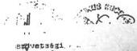

V-74-37/1990

# Állami Számítók

## JELENTÉS

az 1990. évi LXXIII. törvény alapján  
a Demokratikus Ifjúsági Szövetség  
vagyonelszámolása hitelességének ellenőrzéséről

Budapest, 1991. január

36.

Magyar Országos  
Levéltár

XIX-A-126-a/-0 t-V-74-37/1991 hod.

1

---

A vizsgálatot végezték:

Az ALLAMI SZAMVEVŐSZEK
VAGYONELLENŐRZŐ FŐCSOPORT részéről:

a DEMISZ Gazdasági Irodánál

dr. Borisz József
dr. Főnyad Erzsébet
dr. Molnár Barnabás
dr. Csáki Bertalan külső szakértő
(okleveles könyvvizsgáló,
igazságügyi szakértő)

a városi tagszervezeteknél

dr. Kozma Gyuláné külső szakértő
(okleveles könyvvizsgáló)
dr. Laki Árpád külső szakértő
(okleveles könyvvizsgáló)

A TERÜLETI FŐCSOPORT részéről
A MEGYEI DEMISZ-eknél:

|  Név | Megye | Név | Megye  |
| --- | --- | --- | --- |
|  Benczik Lászlóné | Bpest | Kollár Lászlóné | Békés  |
|  Csomán Mihály | Szolnok | dr. Koller V. | Zala  |
|  Dankó Géza | Baranya | Koltayné Sz. Zs. | Komárom  |
|  Domján Jenő | Bács | Kozák György | Hajdú  |
|  Farkas Tamás | Bpest | Kóródi József | Hajdú  |
|  Fercsik Gyula | Nógrád | dr. Nagy Ágnes | Baranya  |
|  Gemaufné dr. Kóbor E. | Fejér | dr. Otott Lajos | Csongrád  |
|  Gordos László | Bpest | Péntek László | Tolna  |
|  dr. Gyuk József | Vas | Remeczky László | Baranya  |
|  dr. Hegedűs György | Somogy | dr. Szigeti István | Somogy  |
|  Kemenszky Sándor | Veszprém | dr. Tóth András | Heves  |
|  Kenéz Sándor | Szatmár | Tréfás Antal | Bács  |
|  Kocsis István | Borsod | Vécsey László | Győr  |

A vizsgálatot vezette:

dr. Zsarnói Dezsőné főtanácsos (Vagyonellenőrző Főcsoport)
Rácz Lajosné főtanácsos (Területi Főcsoport)

MELLÉKLET

Magyar Országos
Levéltár

---

- 2 -

I.

Az ellenőrzési feladat, és az annak alapján tett nyilatkozat

Az elmúlt rendszerhez kötődő egyes társadalmi szervezetek vagyonelszámolásáról szóló 1990. évi LXXIII. törvény előírta, hogy az 1. paragrafusban felsorolt szervezetek vagyonelszámolásukat az Állami Számvevőszékhez hitelesítés céljából 1990. október 31-ig nyújtsák be.

E szervezetek közé tartozik a Magyar Demokratikus Ifjúsági Szövetség (DEMISZ), amely a KISZ KB jogutódjaként működő Gazdasági Irodából és további 48 önálló jogi személyiségű tagszervezetből áll.

Ezek közül 19 megyei szervezet jogutódként, a Baloldali Ifjúsági Társulás (BIT) a Budapesti KISZ Bizottság utódszervezeteként nyújtotta be a törvényben előírt 8 táblázatba foglalt vagyonelszámolását. A KISZ 1989. április 22-ei megszűnte, és a DEMISZ 1989. április 23-ai megalakulása során 24 új tagszervezet csatlakozott a szövetséghez alapító tagként, majd 1990. évig két korábbi tagszervezet kiválása, újak csatlakozása után 48 tagszervezet volt elszámolásra kötelezett. (A tagszervezetek névsora csatolva.).

A DEMISZ Gazdasági Iroda, valamint 40 tagszervezet határidőre, a többi késedelmesen - november, december folyamán - nyújtotta be vagyonelszámolását.

Két társadalmi szervezet nem készített vagyonelszámolást. Az Országos Diák Unió (ODU) perben áll a DEMISZ-szel, ezért úgy nyilatkozott, hogy amíg a volt KISZ vagyonból történő részesedését perben nem döntik el, nem ad vagyonelszámolást. A DEMISZ Német Demokratikus Köztársaságban működött tagszervezete jogutód nélkül megszűnt, ezért vagyonelszámolást sem nyújtott be.

A Budavári Fiatalok Szövetsége képviselője a megadott címen nem volt elérhető, írásos megkeresésre sem válaszolt. Emiatt a vagyonelszámolás helyszíni ellenőrzését nem lehetett elvégezni.

Magyar Országos Levéltár

---

- 3 -

A Szovjetunióban működő DEMISZ tagszervezet írásos nyilatkozatot nyújtott be arról, hogy nincs elszámolni való vagyona.

Az MSZMP Ideiglenes Központi Bizottsága 1957. évi - a KISZ-t megalapító - határozata értelmében, a KISZ vagyon anyagi alapjait döntő részben az MSZMP költségvetéséből (1957-1988 között), később a Pénzügyminisztérium támogatásából, valamint más szervezetek adományaiból hozták létre. A KISZ tagdíjak a területi szervek működési költségeit sem fedezték teljesen, hanem azt kiegészítette költségvetési támogatás. A KISZ KB tagdíjakból nem részesült, költségvetési támogatásból élt.

A KISZ KB legutolsó - országos adatokat tartalmazó - 1988. évi főkönyvi adatai szerint az állóeszköz vagyon bruttó értéke 2,6 milliárd forint, a forgóeszközök értéke 0,9 milliárd forint volt. Az Úttörőszövetség vagyonát is tartalmazták ezek az adatok, és a gyermekszervezet nem folytatott önálló gazdálkodást. Később, a szétváláskor sem foglalkoztak a szervezetek 'együttélésének' gazdálkodási folyamatai pénzügyi kérdéseinek rendezésével, illetve legalább feldolgozásával. Ennek hiánya az Úttörőszövetség vagyonelszámolása hitelesíthetőségét önmagában is kizárta. Az egykori KISZ vagyonból 1990. augusztus 31-én a DEMISZ Gazdasági Irodánál 30 millió forint értékű állóeszköz és 56 millió forint forgóeszköz maradt. A többi decentralizálódott, alapítványba került (az ingatlanok 90 %-a), illetőleg gazdasági társaságban, önálló vállalatban található.

A KISZ megszűnte és az új önálló jogi személyiségű, önállóan gazdálkodó szervezetek létrejötte következtében csak 1957-1988. évek közötti időszakra vonatkozóan lehet a KISZ gazdálkodásáról beszélni, amelyből a vagyon mindig is országszerte, területi szervezeteknél helyezkedett elhatalásban, de évente országos összesítés készült a KISZ KB-nál a gazdálkodásról.

1989-től kezdődően minden egyes tagszervezet szuverén gazdálkodó, a KISZ vagyonból, költségvetési támogatásból részesült szervezet. (Ezáltal, mivel minden egyes szervezetet külön-külön kellett vizsgálni, a helyszíni ellenőrzések száma is 48-al bővült.)

A vizsgálat során a rendelkezésre álló dokumentumokat, alapbizonylatokat az Állami Számvevőszék munkatársai minetvételes módszerrel ellenőrizték. A benyújtott elszámolásokhoz kiegészítő tanúsítványokat, jegyzőkönyveket, összegező számításokat készítettek. Az adatokat megkísérelték

Magyar Országos Levéltár

---

- 4 -

egyeztetni az államigazgatásban rendelkezésre álló információkkal (földhivatalnál, cégbíróságnál, múzeumoknál), valamint a fellelhető vagyontárgyakkal.

A társadalmi szervek és az államigazgatás nyilvántartásainak hiányosságai miatt az egyeztethetőség csak részlegesen volt biztosítható.

A megállapításokat tagszervezetenként ellenőri jelentések foglalták össze, amelyeket az Állami Számvevőszékről szóló 1989. évi XXXVIII. törvény 25. paragrafusa szerint a társadalmi szervezetek vezetése észrevételezett.

A vizsgálat alapján a Magyar Demokratikus Ifjúsági Szövetség vagyonelszámolását az Állami Számvevőszék

# NEM MINŐSÍTI HITELESNEK.

Ennek az az oka, hogy a vagyonelszámolások sem tartalmilag, sem időbelileg nem teljeskörűek és számszaki eltérések vannak benne.

A fenti nyilatkozat részletes indoklása a következőkben foglalható össze.

A DEMISZ 49 elszámolni köteles társadalmi szervezetéből csak 18 vagyonelszámolása, azaz 37 %-a volt hitelesként elfogadható, ezek is kisebb korrekciókkal. A hiteles elszámolások zöme új, tehát csak 1989-90 között létrejött, viszonylag kis vagyonértékkel gazdálkodó városi tagszervezeteké.

Nem minősül hitelesnek a kötelezettek 63 %-ának vagyonelszámolása, úgy mint:

-a KISZ KB jogutodja, a DEMISZ Gazdasagi Iroda,
- a 20 teruleti tagszervezet (19 megyei szerv es a Budapesti KISZ Bizottsag jogutodja a BIT),
- továbbá 7 varosi tagszervezet

által benyújtott, különböző vagyonelemeket bemutató táblázatok. (A teljes vizsgált körre vonatkozó minősítési kimutatás 1/B mellékletként csatoltva.). A nem hiteles körben kezelt korábbi vagyonérték volt meghatározó nagyságrendű.

Magyar Országos Levéltár

---

- 5 -

A törvényben előírt 8 vagyonnemre vonatkozó megállapítások szerint:

- a DEMISZ Gazdasagi Iroda 8 tablázata kozül mindössze harom vagyonneme hiteles: a 2-3. szamú tablázatok szervezet vallalataira, gazdasagi tarsasagaira, alapitvanyaira vonatkozo adatai, valamint a kiadasok elszamolasa az 5. szamú tablázaton;
- a Demokratikus Ifjusagi Szervezetek teruleti (19 megyei es a BIT) altal benyujtott 160 db egyedi tartalmu vagyonnemi mellkletból mindössze 49 tabla, az összes adatszol-galtatas 31 X-a volt csak hiteles, 69 X-a pedig nem minó-sült elfogadhatónak.

Mivel a törvényben előírt kötelezettségek és a vonatkozó pénzügyi, számviteli jogszabályok alapján egyetlen feltétel is elegendő, hogy a hitelesíthetőségi követelmény ne érvényesüljön, a 20 megyei (fővárosi) szervezet által benyújtott vagyonelszámolásból teljes körűen egy sem hitelesíthető.

A KISZ alapításáról szóló 1957 márciusi MSZMP Ideiglenes KB által hozott határozat a KISZ anyagi alapjainak megteremtéséhez való hozzájárulást a párt szervei és minden gazdálkodó, társadalmi vagy egyéb szervezet számára kötelezően előírta. A KISZ vagyon létrejötte tehát éppen a tulajdonszerzés klasszikusan törvényes módjainak (vásárlás, saját építés) mellőzésével indult. Ebből adódott, hogy a KISZ 2,3 milliárd forint értékű ingatlan vagyonának a tulajdoni lapjai tükrözték leginkább az e téren kialakult zavarokat a tulajdon, kezelői és használati jog tekintetében. Számos esetben az ingatlanok kisajátítási eljárása sem állapítható meg, az eredeti tulajdonost illetően.

- Példaszerűen említhető a Baranya megyei DEMISZ, amely 12 különböző szervezet tagságából áll. A győri ifjúsági szövetség jogutódja a volt győri városi KISZ Bizottságnak. A soproni városi szervezet jogutódja a szintén önálló jogi személyiségű SODISZ. Egyidejűleg mindketten közvetlen tagszervezetei a DEMISZ-nek és KISZ jogutódnak tekinti magát a megye valamennyi DEMISZ tagszervezete. A különféle tagszervezeteket a megyei cégbíróságok általában 1989. év első felében jegyezték be társadalmi szervezetként. Bács-Kiskun megyében például a megyei DEMISZ mellett még 11 volt városi szervezet jegyeztette be magát, mint önálló, saját alapszabállyal és működési engedéllyel bíró új ifjúsá-

Magyar Különséges Levéltár

---

- 6 -

gi szervezet. Békés megyében 15 önálló szervezet hozta létre a megyei szövetséget, de hasonló helyzet alakult ki más megyékben is. Debrecenben több városi szervezet közös gazdasági ügyvitelt folytat, ez jogszabály ellenes, mert mindegyik önálló jogi személy.

- A DEMISZ országos szervezetét a bíróság csak 1989. június 2-án jegyezte be, ugyanakkor számos, magát a DEMISZ alapítójának tartó tagszervezetet csak ezt követően vettek cégbírósági nyilvántartásba.

Utóbb a Magyar Köztársaság Legfelsőbb Bírósága Jogi Kollégiuma (1/1990. sz. alatt) úgy foglalt állást, hogy társadalmi szervezet bejegyezhetőségének feltétele vagyon, és bevétel biztosítottsága. Ki kell emelni, hogy ezek közül a DEMISZ esetében kizárólag csak az egykori KISZ vagyon állt rendelkezésre.

Bevételekről az alapszabály nem szól. Kizárólag csak a pártoló tagság esetén kell pártoló tagdíjat fizetni. Ennélfogva a DEMISZ és tagszervezeteinek anyagi alapjai a meglévő KISZ javak voltak, amelyek felélése, kamatoztatása, vállalkozásba kihelyezése jelenleg is folyamatban van.

A vagyonelszámolás teljeskörűségét illetően két dolgot kell határozottan elkülöníteni.

Ezek közül az egyik az időbeni - 1949-től 1990-ig szóló teljeskörűség, amely azért nem valósulhatott meg, mert a hatályban volt (lévő) iratselejtezési jogszabály szerint 10 évenként selejtezték a szükséges iratokat.

A teljeskörűség számszaki értelemben azért nem biztosítható jelenleg, mert az 1989-től létrejött számos ifjúsági szervezet részesült valamilyen arányban a KISZ vagyonból, de közülük mindössze 48 tagszervezet tekinti magát a DEMISZ tagszervezetének és a KISZ különböző szintű bizottságai jogutódjának. Következésképpen az általuk benyújtott vagyonelszámolás már önmagában sem lehet teljeskörű a KISZ egykori vagyonból meglévő javakat tekintve.

További figyelmet igénylő ok, hogy a hatályos jogszabályok csak az ingatlanvagyon elidegenítésére mondtak ki tiltást, de szabadon folyik a készpénz, számlapénz és értékpapír mozgatás, kihelyezés. Tény az

Magyar Országos

---

- 7 -

is, hogy az 1990. évi LXXIII. tv. által előírt 1990. augusztus 31-ig terjedő elszámolási kötelezettség és a törvény szeptember 15-ei meghirdetése közötti időszakban legális mód volt új gazdasági ügyletek megkötésére.

Példaszerűen említhető az elhatárolások gondjai közül, hogy:

- a Győri Baloldali Fiatalok Szövetségének benyújtott vagyonelszámolása 1989. december 31-ig nem csak a győri szervezet adatait, hanem a megyei szintű összesített adatokat is tartalmazza.
- A Hajdú-Bihar megyei szervezet vagyonelszámolásában 5 szervezet (DECENTRUM, DISZ, Ifjúsági Unió, Ottörő-szövetség, Gyermek- és Ifjúsági Alapítvány) vagyona jelenik meg, mert a KISZ bizottságok megszűnését követően vagyonátrendezéseket hajtottak végre, de a pénzeszközök szervezetenkénti elkülönítését elmulasztották. Ennek az a következménye, hogy az önálló jogi személy DECENTRUM vagyona elkülönítve nem volt megállapítható.

Az elszámolás pontatlansága azzal is összefügg, hogy a társadalmi szervezetek nyilvántartási kötelezettségére vonatkozó, sajátos szabályozások - és ez vonatkozik a 16/1989. (II.16.) MT rendeletre is - nagyon liberálisak. Hozzájárul a gazdálkodási, ügyviteli fegyelem lazulásához, ellenőrizhetetlenségéhez az is, hogy a KISZ öntörvényű szervezet volt, értve ezalatt azt, hogy saját ellenőrző szervén kívül független ellenőrző szerv nem vizsgálta gazdálkodását, mert csak az MSZMP és a KISZ vezető testülete határozatai vonatkoztak rájuk. Megjegyzendő, hogy a KISZ KB által közzétett Ügyrendi Értesítők hivatkoztak a tárgyban hatályos miniszteri és kormányrendeletekre, de ezeket egyes időszakokban nem tartották be.

Fokozta az ügyviteli pontatlanságokat az a tény, hogy a gazdálkodási feladatokat arra alkalmatlan és képzetlen munkavállalók láttak el egyes szervezeteknél.

A jelenlegi szervezeteknél sem sokkal jobb a gazdálkodási fegyelem. A bevételi és kiadási adatok alakulásából egyértelműen arra lehet következtetni, hogy a létrejött szervezetek a volt KISZ szervezeteket túlélő és maradék KISZ vagyont felélő szervezetként rendezkedtek be.

Magyar Országos Levéltár

---

- 8 -

Az előzőek alapján, amikor az 1990. évi LXXIII. törvény 6. szakasz második bekezdésében írt kötelezettségünknek eleget téve azt állapítottuk meg, hogy a DEMISZ által hozzánk benyújtott elszámolás nem tekinthető hitelesnek, azt is rögzítenünk kell, hogy megítélésünk szerint az elszámolás megismétlésétől sem várható a jelenleginél lényegesen pontosabb kép kialakítása.

A vizsgálatunk során tudomásunkra jutott tények alapján javasoljuk, hogy az 1990. évi LXXIII. törvény 7. szakasz alapján tervezett intézkedések között a Kormány a következőket is vegye figyelembe.

1. Az Alkotmány és az egyesülési jogról szóló törvény elveivel és betűjével egyaránt ellentétben álló az a helyzet, hogy az ifjúságról szóló 1971. évi IV. törvény VII. fejezete a jelenlegi szöveggel hatályban van. A törvény ugyanis a DEMISZ-nek - mint a KISZ jogutódjának - és az Ottörőszövetségnek privilegizált jogokat ad az ifjúsági érdekek képviseletére.

2. A DEMISZ és tagszervezetei - tagdíj bevételek híján - jelenleg a birtokukban lévő vagyonból (készpénzből, értékpapírból, vállalkozási részesedésből) tartják fenn magukat.

Annak megítélése azonban, hogy a DEMISZ és tagszervezetei jelenleg mennyiben képviselik az ifjúságot vagy annak egy részét, és tevékenységük mennyiben szolgálja az ifjúsági célokat, nem az Állami Számvevőszék feladata.

A vagyonnak, amelyet felhasználnak, a forrása állami - többségében költségvetési - juttatás. Ezért megfontolást igényel, hogy az állami vagyon védelme érdekében milyen lépések indokoltak, beleértve a vagyon elvonása iránti intézkedéseket is.

Magyar Országos Levéltár

---

- 9 -

# MEGALLAPITASOK

A vagyonelszámoltatási törvény a KISZ anyagi alapjainak csak egy részére vonatkozott, de az áttekintés teljessége érdekében célszerű bemutatni, hogy miből állt a tágabb értelemben vett vagyon és az hol helyezkedik el.

A KISZ anyagi alapjaihoz tartozott: a sajtó, könyvkiadás, a klubok és az ifjúsági táborok hálózata, székházak, egyéb ingatlanok és állóeszközök. Ezek egy jelentős része nem a KISZ költségvetéséből fedezetten üzemelt, ezért csak egy szűkebb - a közvetlenül kezelt - vagyonhányadot mutattak ki a KISZ országos, KISZ KB-nál összesített elszámolásában. Ez képezte a jelenlegi elszámolás tárgyát.

Jelenleg a korábbi KISZ-hez tartozó anyagi alapok az alábbi módon működnek.

A KISZ sajtóját az Ifjúsági Könyv- és Lapkiadó Vállalat adta ki, amely jelenleg is működik, de támogatás jellegű kapcsolata már nincs a DEMISZ-szel. Adatai a vagyonelszámolás 2. számú mellékletében szerepelnek. Az "OTLET" című lapot a KISZ adta ki, jelenleg kft-ként működik tovább, vesztesége megszűnt. A DEMISZ részvételével létrejött CHARTA kft adja ki a CHARTA című lapot.

Az Ifjúsági Klubokat nem a KISZ költségvetése, hanem üzemek, vállalatok, intézmények finanszírozták és a helyi KISZ alapszervezet működtette, ennélfogva a törvényben előírt vagyonelszámolásnak nem részei.

A sport- és ifjúsági táborok jelentős része a KISZ, illetve jogutódja a DEMISZ közvetlen kezelésében volt. Ezek felszerelésükkel - valamennyi ingatlan az ingóságokkal együtt - 1990-ben a Kormányon keresztül a Nemzeti Gyermek és Ifjúsági Alapítványba kerültek. (1073/1990. (IV.27.) MT határozat.).

A sporteszközök forgalmazása és ifjúsági célú kölcsönzése az Ezeremeter Ottóró és Ifjúsági Kereskedelmi Vállalatnál történt. Jelenleg is működő önálló vállalat: adatait a DEMISZ Gazdasági Iroda kimutatta a 2. sz. táblában.

Magyar Országos Levéltár

---

- 10 -

Az ifjúsági túrizmussal az Express Ifjúsági Utazási Iroda foglalkozott, amely jelenleg is működő vállalat, költségvetési kapcsolata nincs a DEMISZ-szel.

Az ismertetésből kitűnik, hogy a KISZ egykori anyagi alapjainak nagyon jelentős köre önálló vállalat, gazdasági vállalkozás formájában működött és él tovább. A vagyonelszámoltatásban ez csak mint korábbi vagyonmozgás került kimutatásra a vállalkozásba jogszabályi alapon kivitt javakból.

A KISZ ingatlanai és egyéb állóeszközei 2,6 milliárd forint bruttó értéken voltak nyilvántartva 1988. év végén.

A KISZ ingatlanok ebből 2,3 milliárd forintot tettek ki és 90 %-uk, 65 db ingatlan 1990-ben átkerült a Nemzeti Gyermek és Ifjúsági Alapítványba. (Az 1073/1990. (IV.27.) MT határozat és a 81/1990. (IV.27.) MT rendelet szerint).

Az ingatlanokat a felszerelésüket képező ingóságokkal adták át, de leltár nélkül, tehát az összvagyon további jelentős értékű álló- és fogyóeszközzel csökkent, amely nem lett számszerűsítve országos szinten. Általánosságban megállapítható, hogy az 1989 áprilisában végbement szervezeti decentralizálódást követően országosan nincs mód a DEMISZ összvagyonának áttekintésére. Ebből következően csak külön-külön a DEMISZ Gazdasági Iroda és 48 területi tagszervezet ellenőrzésének tapasztalatai alapján alkotható kép a jelenlegi vagyoni helyzetről.

#### 1. A DEMISZ GAZDASÁGI IRODA VAGYONELSZÁMOLÁSÁNAK HITELESSÉ-

##### GEVEL KAPCSOLATOS MEGÁLLAPÍTÁSOK

Jelenleg a DEMISZ Gazdasági Irodának csak 50 ezer forint értékű két turisztikai bázishelye van, melyek használati jogát bírják.

A KISZ KB székházat még 1989-ben eladták (780 millió forintért + AFA-ért = 950 millió forint). A vételárból befizették az adókat, működtették a DEMISZ-t és a tagszervezeteket, szanálták a KISZ tartozásokat és

Magyar Országos  
Leve

---

- 11 -

vállalataik veszteségét, továbbá hozzájárultak alapítványokhoz. (A székházértékesítés körülményeiről az Állami Számvevőszék V-20/14/1990. számon készített jelentést.).

A DEMISZ jelenlegi tagszervezetei a Gazdasági Irodával együtt mintegy 1 millió forint értékű ingatlannal rendelkeznek.

A tagszervezetek és a DEMISZ Gazdasági Iroda értékpapírjaik, pénzügyi műveletekben lekötött, valamint gazdasági társaságokba kihelyezett vagyonrészek hozzáépítői élnek. Tagdíjbevételük jelentéktelen, egyéb bevételük nincs.

A DEMISZ Gazdasági Iroda jogelődje a KISZ KB 1957. évi megalapításától 1980. év kezdetéig – az iratok selejtezése következtében – nem álltak rendelkezésre adatok és ezeket alátámasztó bizonylatok a törvényben előírt teljes időtartamra vonatkozó vagyonelezámoláshoz. Erre hivatkozva a DEMISZ Gazdasági Iroda vagyonelezámolását csak 1980-tól 1990. augusztus 31-ig terjedő időszakra készítette el. Ez nem felel meg az 1990. évi LXXIII. törvényben előírt 1949-től kezdődő elszámolási kötelezettségnek. A teljeskörűség követelménye tehát nem valósult meg, ami önmagában is kizárta a hitelesítés lehetőségét.

1.1. Az egyes vagyonnemek elszámolásának megítélése a következő:

1.1.1. A DEMISZ GAZDASÁGI IRODA és intézményei ingatlanaira vonatkozó adatok 1949. I. 1.- 1988. XII. 31. között (az 1. és 6. számú táblázatok).

a/ Nem minősíthető hitelesnek a kimutatott ingatlanok vagyonértéke és vagyonmozgása, mert az alapítás évétől 1957-től 1980-ig terjedő időszakra is el kellett volna számolnia az Irodának az ingatlanok állományváltozásaival a törvény szerint. Ez azonban nem dokumentálható teljeskörűen a vonatkozó iratanyag jogszerű selejtezése következtében.

További, és ez már felróható ok, hogy 1980-1990 közötti időszakra vonatkozóan kimutatott

Magyar Országos Levéltár

---

- 12 -

ingatlanadatok sem teljeskörűek, értékadataik esetenként eltérnek a többi dokumentumtól. Egyes forgalmi értéket képviselő ingatlanokat – egyéb adatok hiányában – nulla értéken, csupán mennyiségileg tartanak nyilván. Ez annak a következménye, hogy sem a KISZ KB, sem azóta a DEMISZ Gazdasági Iroda nem tartotta be maradéktalanul a könyvvitel rendjére és a bizonylati fegyelemre vonatkozó jogszabályi előírásokat, amelyeket pedig saját belső ügyviteli szabályzataik is tartalmaztak. Ez azzal a következménnyel járt, hogy az állóeszközváltozási bizonylatok egyidejű kiállítását elmulasztva, a könyvvitel nem követte teljeskörűen és zárt rendszerben a különböző időpontokban bekövetkezett ingatlanváltozásokat.

b/ Az ingatlanokról 1988-ig nem készült országos, vagy helyi leltár. Sem a kezelői, sem a tulajdoni jogú ingatlanok számbavétele, ellenőrzése nem volt biztosítva. Az ingatlanokról (11. számlaosztály) egyedi állóeszköznyilvántartó kartonok nem voltak fellelhetők a későbbi, vagyonelszámolásban szerepeltetett időszakra sem. Emiatt bizonytalan az ingatlanok kimutatott értéke. A vagyonelszámolási adatokat a rendelkezésre álló, – a Földhivatalok által kiállított – tulajdoni lapokról töltötték ki, amely értékadatokat nem tartalmazott. Az értékadatok egy részét nem a könyvvitelből, hanem a KISZ területi szerveinek dokumentációjából határozták meg. Ebből következően az ingatlanok bruttó értéke, nettó értéke, valamint értékcsökkenése nem minden esetben ismert. Vannak olyan ingatlanok, amelyek értéke ismeretlen, ezért nulla értéken tartják nyilván. Ezek egykori bekerülési értékének megállapítása nem volt lehetséges. Hivatalos értékbecslést sem a KISZ KB, sem a DEMISZ Gazdasági Iroda nem végeztetett.

c/ A KISZ megszűnése és a DEMISZ 1989. április 22-23-ai megalakulása során nem készült – tényleges leltáron alapuló – záró mérleg, nyitó mérleg, és nem volt vagyonmérleg sem, ahol a vagyonértékelést végre-hajtották volna. Megjegyezzük, hogy erre a társadalmi szervek esetében nincs törvényi kötelezettség, a problémákra a V-20/14/1990. számú Jelentésben az Állami Számvevőszék felhívta a figyelmet.

Magyar Országos  
Levkészítő

---

- 13 -

d/ Számszaki eltérések is vannak a vagyonelszámolás és a főkönyvi értéknyilvántartás között, amelyek abból származnak, hogy nem tartották be az ügyvitel zártságára vonatkozó rendelkezéseket. Mulasztások voltak a bizonylati fegyelem terén, emiatt a könyvvitel nem rögzítette teljeskörűen és pontosan a tényleges gazdasági eseményeket. Mindezek mellett közrejátszott a beruházásoknak az a sajátos finanszírozási rendszere is, amely a központi beruházásokat az Állami Fejlesztési Bankon keresztül úgy finanszírozta, hogy sem a költségvetési beruházási támogatás, sem annak felhasználása tételesen nem jelent meg a KISZ KB, illetve utóbb a DEMISZ könyvei 1, 3, 4. és 9. számlaosztályában, hanem csak a bankkivonat egyenlegét számolták el az éves bankkivonat és értesítés alapján. Ezen alapult a beruházási statisztikai adatszolgáltatás is, amelyből a költségvetési beruházási támogatás vagyonelszámolási adatait szolgáltatták.

A beruházási támogatás közölt adatai így hitelesek, de az ebből megvalósult állóeszköz állomány nyilvántartása nem volt teljeskörű és zárt.

e/ Az ingatlanok kezelői joga nem minden esetben volt tisztázott a KISZ által fenntartott intézmények esetében sem. Így a KISZ Központi Iskola (Amerikai u. 96. Bp. XIV.k.), éveken át a KISZ költségvetéséből fedezetten működött, értékcsökkenést elszámoltak utána, de időközben megállapítást nyert, hogy kezelője az MSZMP, tehát nem volt a KISZ tulajdona, és kezelői joggal sem bírt felette.

f/ A DEMISZ Gazdasági Iroda, illetve jogelődjének tekintett KISZ KB-ra vonatkozó megállapítások mellett figyelmet igényel a földhivatali nyilvántartások pontatlansága, ami csak részben róható fel az elszámolónak.

g/ A Nemzeti Gyermek és Ifjúsági Alapítvány vizsgálata során megállapítást nyert, hogy a DEMISZ és a Magyar Úttörőszövetség ingatlanait 1990. január 1-vel nem rendezte, nem történt meg a könyv szerinti átadás és átvétel. Emiatt az úttörőtáborok nem szerepelnek a Magyar Úttörőszövetség nyilvántartásában, ugyanakkor az alapítványba történt felajánlást a MÚSZ tette meg. A DEMISZ által felajánlott és az alapítványba helyezett

Magyar Országos  
Leveletár

---

- 14 -

ingatlanok tulajdonosi lapjai nem álltak rendelkezésre. Így az ellenőrzés során nem volt mód meggyőződni arról, hogy átvezették-e a tulajdonosi lapokon az alapítványba történt átadást.

Összegezve: Az ingatlanokról tett vagyonelszámolás időbelileg és tartalmilag nem minősíthető teljeskörűnek. Vagyonleltár, ezzel egyező analitikus és szintetikus könyvviteli nyilvántartás nem támasztja alá a vagyonkimutatást, számszaki eltérések vannak, ezért nem hiteles.

1.1.2. A DEMISZ GAZDASÁGI IRODA vállalataira vonatkozó adatok 1949. I. 1. és 1990. VIII. 31. között (2. számú táblázat).

Hitelesnek minősül kisebb javításokkal. A szervezetek alapszabályai és az alapító okiratok hitelesek. Tájékoztatásul megjegyzendő, hogy megszűnt a korábbi rendszer, miszerint a vállalatok adóinak egy részét a KISZ KB-nak utalták mozgalmi célra.

1.1.3. A DEMISZ GAZDASÁGI IRODA által létrehozott gazdasági társaságok, leányvállalatokra, alapítványokra vonatkozó adatok 1949. I. 1. - 1990. VIII. 31. között (3. számú táblázat).

Hitelesnek minősül a 3. számú táblázatban szereplő elszámolás, mert az alapszabály jogszerű, az alapító okiratok hitelesek. Az alapító által rendelkezésre bocsátott törzstőke átutalásra került. A szövetség a társaságok javaiból a biztosított alap-, illetve törzstőke arányában részesül.

A gazdasági társaságokba került KISZ vagyon egy része veszteséges tevékenységet finanszíroz, további működésük feltétele rentábilis gazdálkodásuk. Jelenleg mindössze egy gazdasági társaságot tartanak jövedelmezőnek, a többi egyéves működése alapján még nem ítélhető meg pontosan.

A gazdasági társaságok alapítása jogilag nem vitatható, működésük, illetve létesítésük célszerűsége azonban kétséges, mint például a VIANKO Kisvállalat, (30 MFt), vagy a Vitamin Kisvállalat (2,1 MFt) ala-

1.1.2.1.1.1.1.1.1.1.1.1.1.1.1.1.1.1.1.1.1.1.1.1.1.1.1.1.1.1.1.1.1.1.1.1.1.1.1.1.1.1.1.1.1.1.1.1.1.1.1.1

---

- 15 -

pitása. E két cég veszteséges lett rövid idő alatt,
jelenleg felszámolás alatt áll, a befektetett esz-
közök egy része csak perrel menthető ki.

1.1.4. A DEMISZ GAZDASAGI IRODA bevételi forrásainak ala-
kulása 1979. XII. 31. és 1990. VIII. 31. között. (4.
számú táblázat).

Az 1986. évi állami költségvetési támogatásának
adata 10 millió Ft-tal alacsonyabb mint a főkönyvi
számlalista szerinti érték, de megegyezik a főkönyvi
kivonat adatával. A többi évre szintén fennállt az
egyezőség a főkönyvi és vagyonelszámolási adatok
között.

Nem volt azonban bizonylatokkal alátámasztható az
1990. évi átvett pénzeszközök egy része. Elvileg
kontrollt jelent a PM 1989 októberében készült
tájékoztatója az Országgyűlés részére, amelyben
számot adtak a KISZ-nek nyújtott állami költségvetési
támogatásról. Ettől a DEMISZ vagyonelszámolási adatok
1979-től 1989-ig terjedő időszak éveiben - 1984. évet
kivéve - eltérnek.

Összesen 108 M F-tal magasabb támogatást mutatott ki
a DEMISZ 11 év alatt, mint amiről a PM számot adott.
Az eltérés okaira az elszámoló nem tudott felvilá-
gosítást adni, mert nem tőle származott az adat. A
fennálló bizonytalanságok miatt, valamint a bizonyla-
ti alátámasztás hiányában a 4. számú táblázat sem
hitelesíthető.

Tájékoztatásul megemlítendő, hogy 1990. évre saját
bevételei - a szövetség tagjaitól - nincsenek az
Irodának.

1.1.5. A DEMISZ GAZDASAGI IRODA kiadásainak alakulása 1979.
XII. és 1990. VIII. 31. között (5. számú táblázat.)

Az 5. számú tábla a szervezet kiadásairól számol el,
kisebb hibákkal, amelyeket az ellenőrzés során kor-
rigáltak és korrekciókkal hitelesnek ismerhető el.
Meg kell azonban jegyezni, hogy az adatok hitelessége

Magyar Országos
Levéltár

---

- 16 -

többnyire másodlagos adathordozókra épül, valamint egy részükhöz a KISZ KB éves beszámolója, Tájékoztatója szolgált - harmadlagos adathordozókon alapul.

1.1.6. A DEMISZ GAZDASAGI IRODA, valamint az általa fenntartott intézmények ingatlanon kívüli egyéb állóeszközei, könyv szerinti adatai (7. számú táblázat). 1988. XII. 31. - 1990. VIII. 31. között.

A DEMISZ GAZDASAGI IRODA és intézményei ingatlanon kívüli állóeszközeit tartalmazó 7. számú vagyonelszámolási táblázat nem minősíthető hitelesnek, mert számos helytelen elszámolást kellett korrigálni és a főkönyvi könyvelésből is hiányoznak eszközök értékei. Nem volt ugyanis zárt rendszerű és teljeskörűen bizonylatolt az állóeszközök állományváltozásának elszámolási rendszere.

Meg kell említeni, hogy a DEMISZ által a Kormánynak felajánlott, és a Kormány határozata alapján a Nemzeti Gyermek és Ifjúsági Alapítványba helyezett ingatlanokat teljes felszerelésükkel, álló- és fogyóeszközökkel, készlettel felszerelten adták át, többnyire leltár nélkül. A KISZ KB adatainak ellenőrzése során ugyanis leltárt nem tudtak bemutatni az átadott ingatlanokról, azok álló- és fogyóeszközeiről. Az átvevő szervezetek, a jelenleg alakuló önkormányzatok az ország több helyén már bérbe adták az ingatlanokat, amelyekben az állami- és más szervezetek adományaiból létrejött anyagi javak ellenőrizhetetlenül kerülnek át privát kezekbe, többnyire anyagi ellenérték nélkül.

A DEMISZ nem mutatott ki vagyonelszámolásában műtárgyakat, de a Magyar Művészeti Alap levélben bejelentette könyvjóváírással eddig átadott műalkotásait. Ezek egy része az átadott ingatlanokkal elkerült a DEMISZ-től.

1.1.7. Az értékpapír forgalom alakulása a DEMISZ GAZDASAGI IRODANÁL (8. számú táblázat) 1979. XII. 31. és 1990. augusztus 31. között.

---

- 17 -

Az értékpapír elszámolás 8. számú táblázata sem hitelesíthető a DEMISZ Gazdasági Irodánál. Elmulasztotta ugyanis kimutatni 10 MFt részvényét az Alkotó Rt-ben. További hiba, hogy a DEMISZ Gazdasági Iroda, mintegy származtatott jogi személynek tekinthető, de sehol be nem jegyzett részlege a DIAK Turisztikai Iroda és építőtábor Iroda elkülönített bankszámlán tartott, "előleg" jellegű pénze (2,5 MFt, illetve 0,8 M Ft) nem szerepel az elszámolásban.

Általánosságban összegezhető, hogy vizsgált, fellelhető bizonylatok alapján a vagyonelszámolás hitelessége nem volt megállapítható. A legjelentősebb értékű javaknál nem volt teljeskörű az elszámolás, bizonylatok és tényleges számbavételen alapuló leltár nem igazolta a vagyonkimutatást.

# 2. A DEMISZ 48 TERÜLETI SZERVEZETE VAGYONELSZÁMOLÁSA HITELESSÉGEVEL KAPCSOLATOS MEGÁLLAPÍTÁSOK

# 2.1. A területi vizsgálatok körülményei

A tényszerű megállapítások előtt, a minősítések tárgyilagos értelmezhetősége érdekében utalunk a DEMISZ és tagszervezetei jogállására, valamint működésére.

A jogi helyzet rendezésének időbeli eltérései ugyanis összefüggnek a gazdálkodási problémákkal.

A Kommunista Ifjúsági Szövetség XII., egyben utolsó Kongresszusa (1989. április 21-23) egyidejűleg a Magyar Demokratikus Ifjúsági Szövetség Országos gyűlésévé alakult, amelyen kimondták a KISZ bázisán, annak jogutódjaként létrejövő DEMISZ megalakulását. A különféle megyei és más területi (városi) szervezetek ezt megelőző időszakokban tartottak alakuló gyűléseket. Végül a DEMISZ 48 önálló tagszervezet szövetségeként jött létre. E mögött megyénként 10-12 különböző további szervezet tagsága állt.

Ebben a helyzetben gyakorlatilag lehetetlen országos összesítést mutató DEMISZ mérleget készíteni, vagy az

Magyar Országos
Levektár

---

- 18 -

adatok egyezőségét – legalább főbb számaiban – biztosítani. Mindez lényegében kizárta az elszámolás hitelesíthetőségét.

A könyvvitel rendjével és az adatok nyilvántartási rendjével összefüggően megállapított hiányosságok – amelyek végül is a könyvvizsgálati értelemben vett hitelességet ingatják meg – abból származtak, hogy a KISZ 1979. évi és 1988. évi Ügyrendjét (ez tartalmazta az elszámolások rendjét is) nem kellően tartották be, illetőleg annak karbantartása, adaptálása a DEMISZ-re nem történt meg az átalakulás egyéb tennivalói közepette. A vagyonmegosztás a tagszervezetek és a központ között záró-nyitó és vagyonmérleg nélkül történt. Következésképpen nincs meg azok utólagos és folyamatos egyeztethetősége. Más oldalról a vagyonmozgások – vagyonmérleg híján – nem különíthetők el. Hiányok és halmozódások vegyesen fordulhatnak elő és kiszűrésük sem időbelileg, sem területileg (megye, város, járás) nem lehetséges.

Az ellenőrzési tapasztalat az, hogy a vizsgált megyei és egyéb területi szervek – átalakulásuk és a vonatkozó jogszabályok ellenére – a korábbi KISZ KB által kiadott, részben elavult szabályozások alapján gazdálkodtak 1989. év végéig. Nyilvántartásaik azonban hiányosak. Példaszerűen említhető az elhatárolások gondjai közül, hogy a Győri Baloldali Fiatalok Szövetségének benyújtott vagyonelszámolása 1989. december 31-ig nem csak a győri szervezet adatait, hanem a megyei szintű összesített adatokat is tartalmazza.

A Hajdú-Bihar megyei szervezet vagyonelszámolásában 5 szervezet (DECENTRUM, DISZ, Ifjúsági Unió, Úttörőszövetség, Gyermek- és Ifjúsági Alapítvány) vagyona jelenik meg, mert a KISZ bizottságok megszűnését követően vagyonátrendezéseket hajtottak végre, de a pénzeszközök szervezetenkénti elkülönítését elmulasztották. Ennek az a következménye, hogy az önálló jogi személy DECENTRUM vagyona elkülönítve nem volt megállapítható.

Általános gond, hogy a jogutód szervezetek a szétválásukkori vagyoni helyzetet rögzítő mérleggel nem rendelkeznek, így a vizsgált időszak tényleges vagyonának nagysága és ehhez képest a változás nem volt megállapítható.

Magyar Országos  
Levéltár

---

- 19 -

A Csongrád megyei DISZU-nak csak főkönyvi kivonatai voltak, de ezek is ceruzával kitöltött példányok. Gazdálkodási mérleget mindössze 1989-től készített a DISZU.

A 110/1989(P.K.20.) PM. számú utasítás szerint a mérleget, megjelölt bizonylatait, köztük a főkönyvi számlákat a költségvetési szerveknek 10 évig kell megőrizni. Az adatok számonkérése tehát csak az elmúlt 10 évre reális. Az ingatlanvagyon mozgását - hasonlóan mint a DEMISZ Gazdasági Iroda által kezelteknél - a telekkönyvek itt sem követték naprakészen, sőt egyes kezelésbe került ingatlanoknál már az eredet sem rekonstruálható, mert a kisajátítási eljárás (kártalanításról nem is beszélve) sem volt regisztrálva. Az ezt követő időszakokban pedig a tulajdon, kezelő- és használati jogok váltották egymást az éppen hatályos jogszabályokban. A telkeken történt beruházások egy részét nem jegyezték be, mert azokat felújítási pénzeszközökből - a beruházási szabályokkal ellentétes módon - valósították meg.

Mindebből az a következtetés vonható le, hogy az elszámolásra kötelezett ellenőrzött szervezetek általánosságban sem rendelkeztek azzal a szabályozott és ellenőrizhető gazdálkodási háttérrel, amelyből pontosan rekonstruáltatni lehetne a vagyonállagot.

## 2.2. A BENYOJTOTT VAGYONELSZÁMOLÁSOK TIPIKUS HIBAI A KÖVETKEZŐKBEN FOGLALHATOK ÖSSZE:

Terjedelmi korlátok és a hibatípusok ismétlődése miatt nincs mód mind a 48 szervezetnél részletesen bemutatni a törvényben előírt 8 vagyonelemre vonatkozó megállapításokat, ezért csak a legjellemzőbbek ismertetésére szorítkozik az anyag. Ezek az alábbiak:

- a nemleges adatokat tartalmazó táblázatokat számosan nem töltötték ki, a nemlegességre a szöveges felterjesztésben sem utaltak.
- A 6. sz. mellékletben az ingatlan vagyonra vonatkozóan nem az 1990. VIII. 31-én meglévő ingatlanokat szerepeltették, hanem - azonosan az 1. sz.

---

- 20 -

melléklettel - az 1989. XII. 31-ei állapotot mutatták be.

-A megyei szervezet osszesitesei tartalmazzak mas, onallo szervezetek adatait is, tehat halmozottak, vagy nem tartalmazzak teljeskorun e tagszervezetek vagyonat, ezaltal a volt KISZ vagyonrol nem teljeskori az elszamolas.
- Egyes évek adatait - altalaban az 1979-es évet -egyaltalan nem szerepelteték, de tobb szervezet az 1980-as évek egy részere sem kozolt adatot a rendel-kezésre alló adatallomany hiányosága miatt.

# 2.2.1. Néhány, az előzőeket jellemző megyei példa:

-A Csongrad megyei DISZU nem kozolt adatokat az 1979-82-es evekre vonatkozoan - mivel azokat a DEMISZ Gazdasagi Iroda - szobeli kozlese alapjan - kozvetlenul adja meg az Allami Szamvevszeknek.
-A Komarom-Esztergom Megyei DEMISZ-nel az 1988. evet megeloz idoszakra nem lelhetok fel a penzugyi iratok, dokumentaciok.
- Hajdu-Bihar megyben 1987-ben het varosi KISZ bizottsag is mukodott, illetve ot kozsegi KISZ bizottsag rzesztult kozponti tamogataban. Ezek kimaradtak a vagyonelszamoltatasbol, mutan a DEMISZ allasfogalasa szerint az elzamolast osak a volt megyei KISZ bizottsag szintjeig kellett elvegezn.
-A Pest Megyei DEMISZ dokumentumai - koltzese es iratmegsemmisite miatt - az 1979-tol 1984-ig terjed idoszakra vonatkozoan nem allnak rendel- kezesre, igy ezen idoszak vagyonelszamolasnak hitelessege ellenorizhetetlen.
-A Tolna Megyei Ifjusagi Szovetsag elszamolasokban kimutatott ertekadatai nem egyeztek meg minden esetben a beszamolokban, illetve konyvviteli nyilvantartasokban szereplo adatokkal.
-A fovarosban a KISZ Budapesti Bizottsaga es intezmenyei, illetve a keruleti bizottsagok meg-szunest, atalakulasat dokumentalo zaroleltar, zaromerleg, valamint nyitoleltar es nyitomerleg a BIT-nel nem volt fellelheto.

Magyar Országos

---

- 21 -

A bemutatott számviteli dokumentumok a változás tényére sem utaltak, mivel az 1989-es év során minden átutalás a KISZ KB nevében történt, címzettként pedig a KISZ Budapesti Bizottsága szerepelt.

- A Veszprém megyei VEDISZ vagyonelszámolása és ingatlannyilvántartása jelentős eltérést mutat, mivel az alapítványnak való ingatlanátadás ténylegesen még nem történt meg.

2.2.2. A vagyonelszámolásokat konkrétan jellemző hiányosságok

a/ Az ingatlanok (1. és 6. számú táblázat). A megyei szervezetek ingatlanvagyonát és annak változását bemutató 1. és 6. számú mellékletekből 4-4 vagyonelszámolás tekinthető hitelesnek, 16-18 elszámolás pedig nem hiteles.

Az elszámolások 80 %-ának hitelessége a következő okok miatt nem áll fenn:

- A földhivatalok tulajdonjogi bejegyzései eltértek a szervezetek által nyilvántartott tulajdonjogi bejegyzésektől.
- A vagyonelszámolásban kimutatott ingatlanok tulajdonjogát, darabszámát, nyilvántartási értékét nem tudták hiteltérdemlően igazolni.
- A vagyonelszámolásban, a szintetikus könyvelésben és az analitikus nyilvántartásokban kimutatott értékek nem mutattak egyezőséget.
- Un. "fekete beruházásokat" végeztek, így a létrehozott ingatlan értéke felújítási költségként került elszámolásra.
- A könyv szerinti értéket bruttó és nettó értékként is értelmezték a szervezetek.

A benyújtott ingatlanvagyon elszámolás hitelességének ellentmondó legjellemzőbb megyei példákból néhány:

- A KISZ Bács-Kiskun Megyei Bizottsága 1976-ban szerezte meg a bajai Vágó Béla Politikai Képzési

Magyar Országos
Levándor

---

- 22 -

Központ kezelői jogát. Felújítási pénzeszközök terhére több éven keresztül végeztek beruházási munkákat, azonban a 42,5 millió Ft-ban kimutatott érték tervdokumentációit, alapokmányait, számláit és üzembehelyezési bizonylatait nem tudták bemutatni.

- Ugyanennél a szervezetnél a 6. sz. mellékletben kimutatott ingatlanérték 72,8 millió Ft, ezzel szemben az 1990. augusztus 31-i főkönyvi kivonat 54,6 millió Ft-ot, az analitikus nyilvántartás pedig 12,2 millió Ft-ot mutatott.

- A Békés Megyei KISZ Bizottság beruházási jogkör nélkül hozta létre 1961-től folyamatosan a békéscsabai Politikai Képzési Központot, amelynek a teljes dokumentációhiány mellett elmaradt a telekkönyvi bejegyeztetésre is. A földhivatali bejegyzés szerint a Városi Tanács VB kezelésében lévő, Magyar Állam tulajdonát képező objektum tulajdonjogának rendezése az ellenőrzés időpontjában peres úton folyamatban volt.

- A Borsod-Abauj-Zemplén Megyei Földhivatal a 77 millió Ft nettó értékű csanyiki Politikai Képzési Központ kezelői joga bejegyzésének alapjául szolgáló okiratot nem tudta az ellenőrzés rendelkezésére bocsátani.

- A Jász-Nagykun-Szolnok Megyei Szervezet 1989-ben 2 db faházat vásárolt és bevételezett, azonban a 47 ezer Ft-os szállítási díjat szolgáltatási költségként, a 205 ezer Ft-os felépítési, összeszerelési költséget egyéb szervezeti támogatásként számolta el, a vagyonelszámolásban pedig nem mutatta ki a beszerzett ingatlant.

- A Pest Megyei DEMISZ több objektumot szerepeltetett tévesen elszámolásában, a tulajdoni lapok pedig nem tartalmazták a KISZ KB - DEMISZ tulajdoni váltás tényét sem.

- A Somogy megyei ellenőrzés több olyan dokumentumot talált, amelyek valószínűsítették, hogy a jogelőd szervezet birtokában a kimutatottnál több ingatlan is lehetett (balatonlellei és balatonfenyvesi táborok), de ezt nem lehetett hiteltérdemlően igazolni, mivel a Balatonlellei Földhivatal nem szolgáltatott ki tulajdonlap másolatot.

- A Vasi Ifjúsági Szövetség székháza 28,6 millió Ft bruttó értékkel szerepel a mérlegadatokban, a

Magyar Országos
Leveket

---

- 23 -

KISZ KB értékmegállapítása alapján, belső bizonylattal dokumentálva. A telekkönyvi adatok alapján azonban az épület sohasem volt a KISZ kezelői jogában, az aktiválás jogi alapja, illetve dokumentáltsága ismeretlen.

A vagyonelszámolás hitelt érdemlőségének hiányában a 6. sz. mellékletekben kimutatott jelenlegi DEMISZ ingatlan vagyonok nem fogadhatók el hitelesnek, ezért a birtokukban lévő ingatlanvagyon valós értéke nem állapítható meg.

b/ A szervezetek vállalataira vonatkozó adatok a (2. sz. tábla) értelmében nemlegesek. Az ellenőrzés nem tárt fel ezekkel ellentétes egyéb körülményt, ezért ezek a húsz megyei szervezet vonatkozásában hitelesnek tekinthetők.

c/ A 3. sz. tábla "A szervezet által létrehozott gazdasági társaságokra, leányvállalatokra, alapítványokra vonatkozó" elszámolás szerint 10 megyei szervezet jelentette be alapítványban való részvételét. A benyújtott elszámolások fele hiteles, másik fele nem fogadható el hitelesként. A nemleges elszámolást benyújtókkal szemben az ellenőrzés nem tárt föl más körülményt, ezért a 3. sz. melléklet 75 %-a, 15 szervezet elszámolása hitelesnek tekinthető.

- Az alapítványokban résztvevők közül hiteles a Csongrád, a Fejér, a Somogy, a Szabolcs-Szatmár-Bereg, és a Vas megyei szervezetek elszámolása. Nem hiteles a Heves, a Komárom-Esztergom, a Nógrád, a Pest megyei és a fővárosi szervezetek elszámolása.
- A HEMISZ pl. csak az alapító okiratban szereplő összeget tüntette fel, holott 1969. évi bevételéből további pénzeszközöket adott át az alapítványnak.
- A KOMDISZ nem mutatott ki jelentős - 10 millió Ft - álló- és fogyóeszközértéket.
- Hasonló hiányosság merült fel a Nógrád megyei szervezetnél is, a fővárosi BIT pedig nem tudta hiteltérdemlően alátámasztani a 3. sz. mellékletben kimutatott elszámolás adattartamát.

Magyar Országos Levéltár

---

- 24 -

d/ A 4. sz. tábla, a bevételek elszámolása: mind a 20 ifjúsági szervezetnél hitelesíthetetlen, mert a támogatások (egyéb átvett pénzeszközök) és visszatartott tagdíj adatok bizonylatai hiányosak.

e/ Az 5. sz. tábla, a kiadások elszámolása: 1 szervezetnél hitelesíthető, 19-nél nem hitelesíthető, mert időbelileg és tartalmilag nem dokumentált teljeskörűen.

Ennek legfőbb okai a következők:

- A szervezetek többsége az 1979., 1980. és 1981. évekre vonatkozó adatokat nem töltötte ki.
- A szükséges bizonyító dokumentációk, így költségvetések, beszámolók, szintetikus és analitikus nyilvántartások, leltárak, selejtezési jegyzőkönyvek, egyéb, a gazdálkodást szabályozó leírások nem, vagy rendkívül hiányosan álltak rendelkezésre.
- Mérlegek, főkönyvi kivonatok rendelkezésre álltak ugyan, de ceruzás voltak miatt hiteltérdemlő dokumentumként nem jöhettek számításba.
- A vagyonelszámolásban kimutatott és a különböző nyilvántartásokban szereplő adatok jelentős eltérést mutattak.

Néhány kiemelt példa az előzőek szemléltetésére:

- A Bács UNIÓ vagyonelszámolásában az egyéb bevételeket nem bontották meg jogcímenként, így a 11 évi egyéb bevétel összesen a 38 millió Ft helyett csak 10,2 millió Ft.
- Borsod-Abaúj-Zemplén megyében az 1979-83. évek gazdálkodásáról - számviteli nyilvántartások hiányában - a küldöttgyűlési beszámoló jelentésekből nyertek adatot.
- A Győri szervezet a működési kiadások között tüntetett fel 2,6 millió Ft összegű kötvényvásárlást, mivel a táblázatok máshol nem

Magyar Országos
Lovakár

---

- 25 -

biztosítottak lehetőséget a tartós lekötések kimutatására.

- A Hajdu-Bihar megyei szervezet 1990-ben egy 7 millió Ft értékű, "nem kereskedelmi" kamatozó váltót kapott, amelyet nem könyvelt el bevételként, és a 4. sz. mellékletben sem szerepeltetett.
- A Jász-Nagykun-Szolnok megyei szervezet kimutatásai nyilvántartási, költségelszámolási szabálytalanságok miatt nem a valóságot tükrözik.
- A Szabolcs-Szatmár-Bereg megyei szervezet 1987. évi bevétele a 4. sz. melléklet szerint több, mint 2 millió Ft-tal volt kevesebb a főkönyvi kivonat adatainál.
- A Zala megyei szervezet adatai az öt városi szervezet adatait is tartalmazzák. Ez utóbbiak nem tudták elszámolásaikat hiteltérdemlően dokumentálni.

f/ A 7. sz. tábla elszámolási kötelezettsége a szervezetek, valamint az általuk fenntartott intézmények 50 ezer Ft értékhatárt meghaladó gépeire, berendezéseire, felszereléseire, járműveire, jóléti és üzemkörön kívüli állóeszközeire terjedt ki.

Az egyéb állóeszközök vagyonban bekövetkezett változását a törvény előírásainak megfelelően az 1988. XII. 31. - 1990. VIII. 31. közötti időszakra kellett kimutatni.

20 megyei (fővárosi) szervezet által benyújtott elszámolásból 5 elszámolás tekinthető hitelesnek, az elszámolások 75 %-a, azaz 15 elszámolás nem hiteles.

Az elszámolások hiányosságai között - az előző elszámolásokhoz hasonlóan - legfőbb okként jelölhető meg a nem kellő dokumentáltság, a különféle nyilvántartások adatainak eltérésége, a leltározások, selejtezések terén tapasztalt hiányosságok. Nehezítette az egyeztethetőséget, hogy az 50 ezer Ft értékhatár alatti eszközök fogyóeszközzé történő átminősítésére 1989. I. félévében került

Magyar Országos
Levélírás

---

- 26 -

sor, ez időpontig állóeszközként volt nyilvántartva minden, 5 ezer Ft beszerzési értékhatárt meghaladó eszköz.

-A Hajdu-Bihar megyei szervezetnel peldal a gepek, berendezesek, felszerelasek 1986. ev vegi brutto ertekuben szerepeltettek az 1989-ben fogyceszkoze atminositett 1.719 eFt eszkozertket is. Ez mas szervezetnel is elofordult.
-A Pest megyei es a fovaroisi szervezet nyilvantartasai sem formailag, sem tartalmilag nem feeltek meg a kovetelmenyeknek.
-A Zala megyei szervezetnel az induló ertek helytelenul, 300 eFt-tal kevesebb összegben kerult kimutatasra, de az elszamolás egyéb nyilvantartásokkal sem volt megfeleloen alatámasztva.

Az értékpapír és pénzforgalom alakulását bemutató, 20 szervezet által benyújtott 8. sz. mellékletből egy sem hiteles. Ezen belül az értékpapír forgalmat bemutató elszámolások többsége hiteles, a pénzforgalmi elszámolások azonban - a korábbiakban már felsorolt okokból eredően - nem tekinthetők hitelesnek.

Az elszámoló szervezetek rendszerint nem, vagy tévesen tüntették fel a házipénztárak és a bankszámlák egyenlegét.

-A Baranya megyei szervezet elszamolasa nem volt teljeskör, az 1986. evi elszamolasi betetszamla zaroegyenlegekent 1.833 eFt helyett 2.229 eFt szerepel.
A Békés megyei DEMISZ-nél 1990-ben egy 6.440 eFt-os valto összege nincs kimutatva a naplofö-könyvben.
-A Csongrad megyei DISZU a penzforgalmat csk 1990. szeptember 18-i statikus allapotkent adta meg, hasonlo modon jart el a Vas megyei szerve- zet is.

---

- 27 -

nem tükrözi a szervezetek tényleges vagyoni helyzetét. Kimaradtak olyan követelések, illetve tartozások, amelyek lényegesen megváltoztathatják egy-egy szervezet vagyonát. (Például az értékpapírok kamatai).

### 3. HITELES VAGYONBEVALLAST BENYOJTOTT 18 DEMISZ TAG-

#### SZERVEZETRE VONATKOZÓ MEGALLAPÍTÁSOK

A hiteles vagyonbevallást készített tagszervezetek mindegyike a DEMISZ, korábban a KISZ területi egységéből kivált, önálló szervezetként működik. A kiválás időpontja többnyire 1989 második féléve volt.

A szervezetek önállósulásuk előtt nem rendelkeztek gazdasági önállósággal, így vagyonnal sem. Személyi- és dologi kiadásait a területi szervezet fedezte és számolta el könyveiben. A szóbanforgó egységek csak ellátmánnyal rendelkeztek, melynek szabályszerű felhasználásáról a Gazdasági Irodának tartoztak elszámolási kötelezettséggel.

Az önállósulás időpontja a tagszervezetek zöménél az elmúlt év közepe volt, de ez csak jogi önállóságot jelentett, a gazdálkodás rendje nem változott.

Az önállóságot jogerős bírósági végzés is dokumentálja, a tagszervezeteket 1989. év végéig a megyei területi szervezetek finanszírozták és így ezen időszakra önálló könyvviteli elszámolással nem rendelkeznek az új tagszervezetek.

A tényleges gazdasági önállóság és az önálló könyvvezetés 1990. év január 1-én kezdődött és az egyes szervezetek vagy az egyszerűsített kettős könyvvitelt, vagy a naplófőkönyves nyilvántartási rendszert alkalmazzák. A nyilvántartási forma megválasztását nem az előírási kötelezettség követelményei, hanem a szervezet adottságai, vagyis az elszámoltatásokat végző személy szakmai ismeretei motiválták.

Magyar Országos  
Lacskár

---

- 28 -

A megvizsgált szervezetekre jellemző, hogy jelentős vagyonnal nem rendelkeznek. Nem alapítottak lukrátív célú vállalatokat és nem rendelkeznek más vállalkozásokban működő tőkével.

A szervezetek induló vagyona általában a működésükhöz szükséges berendezések és felszerelések, amelyek az érvényes számviteli előírások szerint a fogyóeszközök kategóriájába tartoznak.
A tárgyi vagyon mellett a működéshez szükséges szerény pénzeszközök képezték a szervezetek induló-vagyonát.
A folyamatos működésük anyagi alapját lényegében a DEMISZ Gazdasági Iroda támogatása képezi.

A megvizsgált szervezeteknél a támogatás mértékének alapja a szervezet bevallott taglétszáma. Az egyéb címen rögzített bevételek összege, a térítéses alapon szervezett rendezvények bevételein felül jelentéktelen.

Kiadások címén elszámolt felhasználások elsősorban a rezsiköltségek, és egyes rendezvények költségeiként merültek fel.

Szembetűnő, hogy az egyébként szerény körülmények között működő szervezetek többsége, a DEMISZ GAZDASÁGI IRODATÓL kapott ellátmányok nélkülözhetőnek minősített részét különböző betétek, kötvények formájában kamatoztatja.

Budapest, 1991. január "11."

Dr. Hagelmayer István  
elnök

Magyar Országos

---

# K I M U T A T Á S

a DEMISZ tagszerevetei vagyunkalkotások hitelesejéről
az 1990. évi LXXIII. törvény alapján

|  Tagszerevetei megnevezése | Cím | Ellenőr neve | A vagyunkalkotás minősítése  |
| --- | --- | --- | --- |
|  1. BAJAI DEMOKRATIKUS IFJÚSÁGI SZERVEZET | 6500 Baja Petőfi sziget 5. | dr. Kozma Gyuláné | hite- les  |
|  2. BALBUDALI FIATALOK SZÖVETSÉGE | 9022 Győr Tanács-kötársaság u.51. | Vécsey László | hite-les  |
|  3. BALBUDALI IFJÚSÁGI TÁRSULÁS | 1081 Budapest Kötársaság tér 27. | Benczák Lászlóné Farkas Tamás Gordon László | nem hite-les  |
|  4. BARANYA MEGYEI DEMOKRATIKUS IFJÚSÁGI SZÖVETSÉG | 7624 Pécs Rét út 4. | Rameczky László dr. Nagy Ágnes | nem hite-les  |
|  5. BARANYA MEGYEI DIÁKSZÖVETSÉG | 7624 Pécs Rét út 4. | Rameczky László dr. Nagy Ágnes | nem hite-les  |
|  6. BÁCS KISKIN MEGYEI DEMOKRATIKUS IFJÚSÁGI UNIÓ | 6000 Kecskemét Május 1 tér 5. | Doszán Jenő Tetfás Antal | nem hite-les  |
|  7. BELVÁROSI IFJÚSÁGI SZÖVETSÉG | 1056 Budapest Március 15-e tér 8. | dr. Kozma Gyuláné | hite-les  |
|  8. BUDAVARI FIATALOK SZÖVETSÉGE | 1012 Budapest Tábor u.2. | dr. Kozma Gyuláné | nem hite-les  |
|  9. DEBRECENI DEMOKRATIKUS IFJÚSÁGI SZÖVETSÉG | 4028 Debrecen Simonyi út 14. | Kozák György Kóródi József | nem hite-les  |
|  10. DEZENTRUM HAJDÓ BIHAR MEGYE | 4028 Debrecen Simonyi út 14. | Kozák György Kóródi József | nem hite-les  |
|  11. DEMISZ BÉKÉS MEGYEI TAGSZERVEZETE | 5600 Békéscsaba Lanczési út 136. | Kollár Lászlóné | nem hite-les  |
|  12. DEMISZ DUNAÚJVÁROSI SZÖVETSÉGE | 2400 Dunaújváros Lenin tér 3. | dr. Laki Árpád | hite-les  |
|  13. DEMISZ NOK-BELI DIÁK-DOLGOZÓ UNIÓ | Berlin Unter den Linden 76. | jogutód nélkül megszűnt | -  |
|  14. DEMISZ SZOLNOK VÁROSI TAGSZERVEZETE | 5000 Szolnok Vöröscsillag út 8. | dr. Laki Árpád | hite-les  |
|  15. DEMOKRATIKUS IFJÚSÁGI SZERVEZETEK UNIÓJA | 6720 Szeged Komócsín tér 1. | dr. Ötott Lajos | nem hite-les  |
|  16. DOROG ÉS KOKIÁSKÖRZETÉNEK IFJÚSÁGI SZÖVETSÉGE | 2510 Dorog Esztergomi út 1. | dr. Laki Árpád | hite-les  |
|  17. DUNAMONTI DIÁK ÉS PEDAGOGUS SZÖVETSÉG | 2400 Dunaújváros Komócsín u. V/1. | Gaufmanné dr. Kóbor Éva | nem hite-les  |
|  18. ÉRTELMISÉGI FIATALOK SZÖVETSÉGE | 1087 Budapest Könyvem K.krt. 76. | dr. Kozma Gyuláné | hite-les  |
|  19. ÉSZAK-NAGYARORSZÁGI DEMOKRATIKUS IFJÚSÁGI SZÖVETSÉG | 3501 Miskola Pf. 92. | Darkó Géza Kocsis István | nem hite-les  |
|  20. FÉJER MEGYEI FIATALOK SZÖVETSÉGE | 8000 Székesfehérvár Honvéd u. 8. | Gaufmanné dr. Kóbor Éva Koltáné Szeged Zsuzsa | nem hite-les  |
|  21. FÉLETHÁZAI DEMOKRATIKUS IFJÚSÁGI SZÖVETSÉG | 6100 Kiskunfélegyháza Fedrusz J.u. 11. | dr. Laki Árpád | hite-les  |
|  22. GYŐRI IFJÚSÁGI SZÖVETSÉG | 9022 Győr Árpád út 44. | Vécsey László | hite-les  |

Magyar Országos

---

|  Papírtvezető megnevezése | Cím | Ellenőr neve | A vagyonminisztázási minősítése  |
| --- | --- | --- | --- |
|  23. MÁLKI TEMÜLETI IFJÚSÁGI SZERVEZET | 6400 Kisvárhales Szilárdy A.u.4. | dr. Laki Árpád | hiteles  |
|  24. NEVES MEDYEI IFJÚSÁGI SZERVEZETEK SZÖVETSÉGE | 3301 Eger Széchenyi u. 18. | dr. Tóth András | nem hiteles  |
|  25. IFJÚSÁGI UNIÓ | 1087 Budapest Könyves K.krt. 76. | dr. Kozma Gyuláné | hiteles  |
|  26. IFJÚSÁGI SZERVEZETEK SZÁMOLCSI SZÖVETSÉGE | 4400 Nyíregyháza Szerves út 1-3. | Kenéz Sándor | nem hiteles  |
|  27. KECSKEMÉTI DEMOKRATIKUS IFJÚSÁGI SZÖVETSÉG | 6000 Kecskemét Erkel út 1/a. | Donjon Jenő Trefas Antal | nem hiteles  |
|  28. KOMÁROM-ESZTÉRSZEM MEDYEI DEMOKRATIKUS IFJÚSÁGI SZÖVETSÉG | 2801 Tatabánya Felszabadulás tér 36. | Koltayné Szapesi Zs. | nem hiteles  |
|  29. MAGYAR DOLODÓK IFJÚSÁGI SZÖVETSÉGE | 1087 Budapest Könyves K.krt.76. | dr. Laki Árpád | hiteles  |
|  30. MAGYARORSZÁGI FIATALOK SZÖVETLMIÓSAN MŰKÖZŐ SZERVEZETE | Mezőves Moszfilmezka 62. Magyar Munkavérségi | (feloszlásan) nyilatkozatot adott | -  |
|  31. MÁTRAALJAI IFJÚSÁGI SZERVEZET | 3200 Gyöngyös Jókai u.9. | dr. Laki Árpád | hiteles  |
|  32. NÓDRÁD MEDYEI DEMOKRATIKUS IFJÚSÁGI SZÖVETSÉG | 3101 Salgótarján Kossuth út 8. | Ferzsik Gyula | nem hiteles  |
|  33. NYÍREGYHÁZI DEMOKRATIKUS IFJÚSÁGI SZÖVETSÉG | 4400 Nyíregyháza Korányi F. út. 12. | Kenéz Sándor | hiteles  |
|  34. PÁPA ÉS KÖRNYSKE DEMOKRATIKUS IFJÚSÁGI SZÖVETSÉG | 8500 Pápa Győri út 12. | Kamenczy Sándor | hiteles  |
|  35. PEST MEDYEI DEMOKRATIKUS IFJÚSÁGI SZÖVETSÉG | 1126 Budapest Nagy Jenő u.5. | Benczik Lászlóné Farkas Tamás Gordos László | nem hiteles  |
|  36. SOMOGY MEDYEI DEMOKRATIKUS IFJÚSÁGI SZERVEZETEK SZÖVETSÉGE | 7400 Kaposvár Lenin út 14. | dr. Nagyedős György dr. Szigeti István | nem hiteles  |
|  37. SOPRENI DEMOKRATIKUS IFJÚSÁGI SZÖVETSÉGE | 9400 Sopron Rát u. 25. | Vécsey László | hiteles  |
|  38. SZEGEDI DIÁKOK ÉS PEDAGÓGUSOK SZÖVETSÉGE | 6721 Szeged Kálvin tér 7. | dr. Ötött Lajos | nem hiteles  |
|  39. SZEGEDI FIATALOK SZÖVETSÉGE | 6720 Szeged Komázium tér 1. | dr. Ötött Lajos | nem hiteles  |
|  40. SZEGEDI SPORTOLÓI IFJÚSÁGI SZÖVETSÉG | 6720 Szeged József Gy.út.2. | dr. Ötött Lajos | nem hiteles  |
|  41. SZOLNOK MEDYEI SZOCIALISTA IFJÚSÁGI SZERVEZETEK SZÖVETSÉGE | 5001 Szolnok Tiszaliget Pf.126. | Csomán Mihály | nem hiteles  |
|  42. TEMÜLETI DEMOKRATIKUS IFJÚSÁGI SZERVEZETEK KISKUAMAJSA | 6120 Kisvárhales Főlegymási út 2. | dr. Főnyad Erzsébet | nem hiteles  |
|  43. TOLNA MEDYEI IFJÚSÁGI SZERVEZETEK SZÖVETSÉGE | 7100 Székeszár Bálta tér 6. | Péntek László | nem hiteles  |
|  44. VASI DIÁKSZÖVETSÉG | 9700 Szombathely Kisfaludy u. 1. | dr. Gyuk József | hiteles  |
|  45. VASI IFJÚSÁGI SZÖVETSÉG | 9700 Szombathely Kisfaludy u.1. | dr. Gyuk József | nem hiteles  |

Magyar Országos

---

|  Magyarvezető megnevezése | Cím | Ellenőr neve | A vagyonelszámolás minősítése  |
| --- | --- | --- | --- |
|  46. VASUTAS IFJÚSÁGI SZÖVETSÉG | 4625 Zárány Felszabadulás tér 4. | Kandz Sándor | hiteles  |
|  47. VESZPREN MEGYEI DEMOKRATIKUS IFJÚSÁGI SZÖVETSÉG | 8201 Veszprén Oldás u. 2. | Kemenesky Sándor | nem hiteles  |
|  48. INLAI DEMOKRATIKUS IFJÚSÁGI SZÖVETSÉG | 8900 Zalaegerszeg Lándoregyi u. 23. | dr.Koller Valéria | nem hiteles  |
|  49. BEMESZ ORSZÁGOS IRODA | 1087 Budapest Könyves K. Art. 76. | dr.Zsennal Oszabó dr.Borics József dr.Molnár Szentabás dr.Főnyad Erzsébet dr.Csádi Bertalan | nem hiteles  |

L.ÖVETSÉG

---

# M E L L E K L E T E K

a MAGYAR DEMOKRATIKUS IFJOSAGI SZÖVETSÉG (DEMISZ)

Gazdasági Irodája

vagyonelszámolásának ellenőrzéséről az 1990. évi

LXXIII.törvény alapján

# TARTALOMJEGYZÉK

1. Az eredeti vizsgálati jelentéshez bekért kiegészítő

dokumentumok

1.1. Tanusitvany a DEMISZ vagyonelszamoltatasaval kaposolatos adatsor 1.szamu tablazatahoz.
1.2. Tanusitvany a DEMISZ vagyonelszamoltatasaval kaposolatos 6.sz. tablazathoz (1-3. almelleklettel)
1.3. Nyilatkozat a DEMISZ vagyonelszamoltatasi vizsgalatnak a 11. ingatlanok szamlasztaly ertekadataivalkaposolatosan (5-6. sz. almelleklettel a 6.sz. tablahoz)
1.4. Közbeno jegyzokonyv a KISZ KB 1989. evi ingatlanok rol szoló fokonyvi kivonata adattartalmáról.
1.5. Nyilatkozat a DEMISZ vagyonelszamoltatas 6.sz. tablaja 1989. evi december 31-1 adattartalmáról.
1.6. Nyilatkozat a DEMISZ-nek a Nemzeti Gyermek es Ifjusagi alapitvanyba helyezett ingatlanai Fdhlivatali dokumentumainak hianyarol.
1.7. Jegyzokonyv a DEMISZ ingatlanforgalmi adatainak eltereseirol a fokonyvi nyilvantartasban.

---

1.8.A dombradi es tuzseri tabor egyedi alloeszkoz nyilvantartolapjai.
1.9.A DEMISZ-nek a nehai KISZ KB szekhaz eladasabol szarmazo (AFA mentes) bevetele felhasznalasarol keszult kimutatasa.
1.10 Nyilatkozat a DEMISZ vagyonelszamolasnak alapbizonylatait képezd dokumentumok hiányarol (csatolva 1-4. almelleklet a vagyonelszamolas egyes tablainak korrekciójáról)
1.11 Alapbizonylat hianyos bankkonyvelesi dokumentum az Epitotaborok Bizottsaganak tortent 1990. VI. 21-i atutalasrol (Pecs Osozgpuszta)
1.12 Alapbizonylat hianyos dokumentum a Hodmezovasarhelyi Allami Tangazdasag, illetve a Bolyi Mezogazdasagi kombinat bankatutalasarol.
1.13 Alapbizonylat hianyos konyvelesi dokumentum az Epi toaborok Irodja altal szervezzett akciora tortent (Fovarozi Temetkezesi Vallalati) befizetserol (az 1.11-1.13 mellektek a 4.sz. bevetei tablazat nem hitelesithetosegenek dokumentumai).
1.14 Nyilatkozat arrol, hogy a DEMISZ 1990. augusztus 31- et kovetoen nem hozott letre gazdasagi tarsasagot, vallalatot a vizagalat idopontjaig.
1.15 Jelentés a KISZ KB-tol az MSZMP titkárságanak a VII. Oteves terv beruházásanak idarányos teljesitéséról, 1988. aprilis 5-én.
1.16 Veges a DEMISZ nyilvantartasba vetelerol a tarsadalmi szervezetek koze.
1.17 Biroasagi veges a Kommunista Ifjusagi Szovetsag trolserol a tarsadalmi szervezetek kozul.
1.18 Nyilatkozat a DEMISZ vagyonelszamoltatasanak 4.sz. tablazata, a bevetelek (beruhazasi tamogatask) osszegenek eltereseirol a Penzugyminisztierium Oraszgyulesi Tajekoztatjaban kimutatott ertekhez kepest.
1.19 A 14.475/1989.III/b sz. penzugyminisztérium leirat a DEMISZ 1989. evi allami tamogatasanak osszegéról.

---

# Állami Számítók

1.sz. melléklet

## JELENTÉS

az 1990. évi LXXIII. törvény alapján  
a Demokratikus Ifjúsági Szövetség  
vagyonelszámolása hitelességének ellenőrzéséről  
a DEMISZ GAZDASÁGI IRODÁ-nál

Budapest, 1991. január

30

LEVÉGI

---

A vizsgált szerv neve: DEMISZ GAZDASÁGI IRODA
A vizsgált szerv székhelye: Budapest, VIII., Könyves Kálmán
krt. 76.

A vizsgált szerv vezetője: 5 tagú Ügyvivői Testület

Csányi Zoltán
Gáldy György
Kiss Péter
Papp József
Varju László

A vizsgált szerv gazdasági vezetője: Karl Imre
szövetségi kamarás

A vizsgált szerv létesítésének időpontja:

jogelőd: 1957. III. 11. KISZ KB
jugutód: 1989. IV. 22-23. DEMISZ Gazdasági
Iroda

Létesítő határozat: 1957. III. 11-ei MSZMP határozat III.
fejezete a KISZ alapításáról
1989. IV. 22. KISZ II. Kongresszusa
a KISZ megszüntetéséről
1989. IV. 23. DEMISZ I. Országos Gyűlése
a DEMISZ megalakulásáról.

A helyszíni vizsgálat időtartama: 1990. november 1.
december 4.

A vizsgálatot vezette: Dr. ZSARNAI DEZSÖNS főtanácsos 4. sz.
melléklet
november 1. - december 4. 23 nap

A vizsgálatban résztvettek:
(vizsgálati napok)

dr. Fónyad Erzsébet számvevő 1. és 6. sz. melléklet

IX. 1. - 23. 16 nap

dr. Borisz József tanácsos 2. sz. melléklet

XI. 26. - 30. 5 nap

Magyar Országos
Központ

---

- 3 -

dr. Molnár Barnabás számvevő 3. sz. melléklet

XI. 26. - 30. 5 nap

dr. Csáki Bertalan

7. és 8. sz. melléklet

XI.26-XII.4. 7 nap

Felhasznált revizori napok száma:

56 nap

Az elmúlt rendszerhez kötődő társadalmi szervezetek vagyonelszámolásáról szóló 1990. évi LXXIII. törvény 6. paragrafusa alapján az Állami Számvevőszék munkatársai helyszíni ellenőrzést végeztek 1990. november 1. - december 4. között a DEMISZ Gazdasági Irodában. A felhasznált revizori napok száma 56.

A vizsgálat célja: a vagyonelszámolás hitelességének megállapítása volt.

I.

### Megállapítások

#### 1. Előzmények

A Magyar Kommunista Ifjúsági Szövetséget (a továbbiakban KISZ) 1957. március 11-ei határozatával hozta létre a Magyar Szocialista Munkáspárt (továbbiakban MSZMP) Ideiglenes Központi Bizottsága.

A KISZ feladata az volt, hogy 'harcoljon a párt célkitűzéseiért az ifjúság között, nevelje az ifjúságot kommunista szellemben és biztosítsa a párt utánpótlását.'

A határozat azt is kimondta, hogy a KISZ ifjúsági szövetségese az MSZMP-nek és a párt határozatai kötelezőek a KISZ szervezeteire nézve.

A határozat III. fejezete szerint a KISZ nevelő feladataihoz meg kellett teremteni a megfelelő anyagi alapokat.

LXXIII. törvény 6. paragrafusa

---

Ennek érdekében létrehozták sajtóját, könyvkiadóját, klubjait, sporteszközeit, ifjúsági táborait.

A párt minden szerve, alapszervezete, minden tagja felelős volt a KISZ fejlődéséért. Egyidejűleg a KISZ feladatává tették, hogy sokoldalúan segítse és vezesse az iskolás gyermekek szervezetét, az Úttörőmozgalmakat.

A párthatározat felhívta az állami és gazdasági szervezeteket, tanácsokat, szakszervezeteket és más szervezeteket, intézményeket, hogy erkölcsileg és anyagilag támogassák a KISZ-t.

Következésképpen a KISZ 1957. évi megalakulásától kezdve 1988-ig főként az MSZMP költségvetéséből kapott eszközökkel, valamint más (számos) szervezettől kapott juttatásokból, kisebb részben saját bevételeiből gazdálkodott. Más oldalról viszont megalakulásától kezdve 1989. április 22-ei megszűntéig, a KISZ költségvetéséből finanszírozta a Magyar Úttörőszövetséget. Az Úttörőszövetségnek 1989-ig nem volt önálló gazdasági ügyvitele sem, mert azt a KISZ KB végezte sajátjával együtt.

A tagdíjbevételek 50 %-át megtartották a KISZ alapszervezetek, 50 %-át átutalták a városi, járási és a megyei (budapesti) bizottságnak.

A KISZ KB tagdíjbevételből nem részesült, mert az a területi szerveknél maradt.

A KISZ nem volt sem párt, sem bejegyzett társadalmi szervezet.

A KISZ-t csak 1989. április 21-én vették nyilvántartásba a Fővárosi Bíróság 7. PK 22-490 (1989.) 1. sz. (fotómasolatban) csatolt végzése alapján társadalmi szervezetként.

A KISZ-nél létrejött anyagi alapok jelenleg az alábbi módon működnek

### 1.1. A KISZ sajtó

A KISZ újságja a Magyar Ifjúság volt, amely 1989. évben vesztesége miatt megszűnt. A Magyar Ifjúságot az Ifjúsági Könyv- és Lapkiadó Vállalat adta ki. Az Ifjúsági Lapkiadó Vállalat jelenleg is működik, de támogatás jellegű kapcsolata már nincs a DEMISZ-szel. Adatai a vagyonelszámolás 2. számú mellékletében szerepelnek.

Az 'Otlet' című kiadványt a KISZ KB jelentette meg. Vesztesége megszűnt az Otlet Kft-ban, amely a vagyonelszámolás 3. sz. mellékletében szerepel.

Magyar Országos  
TANÚS

---

- 5 -

A CHARTA 424 című lapot a DEMISZ részvételével létrejött CHARTA Kft adja ki (lásd: a vagyonelszámolás 3. sz. mellékletét.).

Az Ifjúsági Klubbokat nem a KISZ költségvetése, hanem a gazdálkodó szervezetek (üzemek, vállalatok, intézmények) finanszírozták és a helyi KISZ alapszervezet működtette.

A sport és ifjúsági táborok felszerelésükkel – valamennyi ingatlan az ingóságokkal – együtt 1990-ben átke-rült a Kormányon keresztül a Nemzeti Gyermek- és Ifjúsági Alapítványba. Erről a másolatban csatolt jegyzőkönyvi megállapodás tanúskodik.

A sporteszközök forgalmazásaival és ifjúsági célú kölcsönzésével az „Ezermester”, Ottó és Ifjúsági Kereskedelmi Vállalat foglalkozik. Adatai a 2. sz. mellékletben szerepelnek.

Az ifjúsági túrizmussal az Express Ifjúsági Iroda foglalkozott. Jelenleg is működő vállalat. Adatait a vagyonelszámolás 2. sz. melléklete tartalmazza.

### 1.2. A KISZ ingatlanai és egyéb állóeszközei

A KISZ összes ingatlana az 1988. évi országos adatok szerint 2,3 Md Ft értékű, ebből a KISZ KB ingatlanai 0,3 Md Ft értékűek voltak. Az ifjúsági vagyont a DEMISZ Szövetségi Tanácsa teljes egészében felajánlotta a Kormánynak, ezt követően 65 db ingatlan átkerült 1990. évben a Nemzeti Gyermek és Ifjúsági Alapítványba, valamint helyi önkormányzatok kezelésébe. A Kormánynak történt felajánlást követően az Alapítványról az 1073/1990. (IV.27.) MT határozat, valamint a 81/1990. (IV.27.) MT rendelet intézkedett.

Az ingatlanokat a felszerelésüket képező ingóságokkal együtt, de leltározás nélkül adták át, (a vonatkozó megállapodás jegyzőkönyve csatolva), tehát az átadott összvagyon további jelentős értékű álló- és fogyasztó- és közöket tartalmazott, amely nem lett számszerűsítve a vagyonkimutatásban országos szinten.

Jelenleg a DEMISZ Gazdasági Irodának csak 50 ezer Ft értékű ingatlana van, két turisztikai bázishely, amelynek használati jogát bírják.

A KISZ KB Székházat 1989-ben 950 MF-tért eladták. A vételárból befizették az adókat, működtették a DEMISZ-t és a tagszervezeteket, a KISZ-t, valamint egyes vállalatait szanálták, továbbá hozzájárultak alapítványokhoz.

---

A DEMISZ tagszervezeteinél lévő megmaradt vagyonról önálló vagyonkimutatások készültek.

### 1.3. Működési szabályok

Az ismertetett joghelyzetből adódóan 1989. április 22-ei megszűnéséig az MMSZP és saját vezető testületének határozatai vonatkoztak a KISZ-re, továbbá az ifjúságpolitikai törvényben számára meghatározott feladatokat kellett teljesítenie.

Gazdasági ügyekben a Pénzügyminisztérium leíratai, valamint a KISZ KB által kiadott sajátos belső szabályzatok szerint jártak el és ezek csak a főbb dolgokban követték a költségvetési szervekre vonatkozó általános előírásokat (mint pl. a költségvetési rovat és tételrendet.).

Az egyes időszakokban a hatályos jogszabályok változásait nagy vonalakban követve, módosultak a KISZ belső elszámolási rendszerének előírásai.

A KISZ KB rendszeresen jelentetett meg ügyrendet, valamint könyvviteli és információs rendszerét előíró szabályzatokat a KISZ szervek és intézmények részére. Az 1979. évi és az 1982-ben megjelent KISZ ügyrend zárt rendszerben, sokoldalúan szabályozta a költségvetési tervezés rendjét, a költségvetési előirányzatok felhasználását és a gazdálkodás részleteit, beleértve az Állami Fejlesztési Bankkal történő elszámolásokat az álló- és fogyasztó-gazdálkodást, a vállalati támogatásokat és a belső ellenőrzést.

Ezek a szabályzatok elveikben megfeleltek a kettős könyvvitel mindenkor hatályos előírásainak. Az ügyrend részét képező jogszabálymutatók az időszakban hatályos törvényeket, kormány- és minisztertanácsi, valamint miniszteri rendeleteket tartalmazták.

Mindezek alapján a belső szabályozás elvileg zárt rendszerűnek minősíthető.

A KISZ szervek gazdasági munkáját rendszeresen ellenőriznie kellett:

- az MSZMP Bizottságainak,
- a KISZ KB Pénzügyi Ellenőrző Bizottságának,
- a KISZ KB Gazdasági Osztályának,
- a KISZ megyei (budapesti) bizottságának és a PEB-nek, illetve a fenti szervek által megbízólevéllel ellátott személyeknek,

Magyar Országos
Leírásár

---

- 7 -

- a jarasi, varosi, keruleti KISZ-bizottsagok gazdasagi ugyintézójének, a PEB tagjainak,
- valamint megbizás alapán a társadalmi-gazdasági munkabizottság tagjainak.

# 1.4. A DEMISZ jogállása

A Magyar Demokratikus Ifjúsági Szövetség 1989. április 22-én alakult, 44 ifjúsági szervezet szövetségeként. 1990-ben 48 tagszervezetre nőtt a számuk.

A DEMISZ-t a Fővárosi Bíróság 7. PK. 22490/1989/2. szám alatt 1989. június 23-án jegyezte be a KISZ jogutódjaként a társadalmi szervezetek nyilvántartásába. Egyidejűleg a bíróság intézkedett a korábban nyilvántartásba vett KISZ törléséről.

A tagszervezetek, illetőleg a DEMISZ Gazdasági Iroda önálló jogi személyek. Működésükre, gazdálkodásukra az egyesülési jogról szóló 1989. évi II. törvény, továbbá a társadalmi szervek gazdálkodó tevékenységéről szóló 16/1989. (II.16.) MT rendelet előírásai irányadók.

Az előzőek értelmében a DEMISZ Gazdasági Iroda és a megyei KISZ-bizottságok jogutóddá vált tagszervezetei a jogelőd szervezet jogaival rendelkeznek és felelősséggel tartoznak annak kötelezettségeiért. Az 1989-90-ben létrejött, illetőleg csatlakozott új tagszervezetek értelmezésében csak létrejöttük és/vagy csatlakozásuk időpontjától kezdődően kötelesek elszámolni vagyonukról az 1990. évi LXXIII. tv. alapján.

# 1.5. Bizonylatok megőrzése

A KISZ KB Ügyrendi Értesítőjének 9. paragrafusa értelmében a bizonylatokat 5 évig, a mérlegbeszámolót és az évközi beszámolót, valamint a mérleget és az eredménykimutatást, továbbá ezek mellékleteit - beleértve a 60/1975. (XI.22.) PM sz. rendelettel módosított 55/1970. (XII.30.) PM sz. rendelet 5. paragrafusában felsorolt bizonylatokat - az irattári tervben meghatározott megőrzési idő elteltéig, de legalább 10 évig meg kellett őrizni. Ez kiterjedt a gépileg tárolt adathordozón tárolt számviteli bizonylatok megőrzésére, valamint a számviteli bizonylatok mikrofilmes tárolására is.

Az éves mérleg megállapítása után selejtezhetők voltak azok a bizonylatok, amelyekről gépi adathordozót vagy

---

mikrofilmet készítettek. Kivételek ez alól a mérlegbeszámolók, az évközi beszámolók, valamint a mérleg és eredménykimutatások voltak.

A hatályos jogszabályokkal összhangban lévő irattári selejtezési rend következtében az 1980. év előtti időszakra vonatkozóan az adatszolgáltatáshoz, illetőleg a vagyon kimutatáshoz nem állnak rendelkezésre teljeskörűen a bizonylatok.

1.6. A vagyonelszámolás alapját képező táblázatok kitöltésére vonatkozó általános megállapítások:

A DEMISZ Gazdasági Iroda a törvényben előírt 1990. november 30-ai határidőre benyújtotta vagyonelszámolását az Állami Számvevőszékhez. Ez a vagyonkimutatás azonban időben nem teljeskörű és bizonylati alátámasztása is hiányos.

A helyszíni vizsgálat során jegyzőkönyvek felvételére és tanúsítványok, továbbá nyilatkozatok tételére került sor. Ezek egy része a törvény szövege és a tv. mellékleteinek, kitöltési előírásainak részleges ellentmondása és értelmezése miatt vált szükségessé, más részük a bizonylatok, illetőleg az adattartalom teljeskörűségének hiányát rögzíti.

A selejtezett, valamint az elveszett, megsemmisült bizonylatok nem pótolhatók, a gazdasági események nem rekonstruálhatók. Ezek olyan objektív körülmények, amelyek függetlenek a DEMISZ jelenlegi, segítőkész dolgozóitól és bármely további vizsgálatot megnehezítenek. Ezt a dokumentációt a jelentéshez mellékletként csatoltuk.

1.7. Az ingatlan vagyon kimutatásával (1. és 6. sz. melléklet) kapcsolatos megállapítások.

1.7.1. 1989. április 22-23-tól a KISZ KB jogutódja a DEMISZ Gazdasági Iroda, tehát vagyonelszámolása csak erre a körre vonatkozik.

1.7.2. A KISZ összes vagyonáról - egy helyszínen - teljeskörű elszámolást nem képesek nyújtani, mert 48 tagszervezetük önálló jogi személy, ügyvitelük ténylegesen elkülönült. Korábban is a megyei szervek irattározták saját bizonylataikat, tehát az iratok ott lelhetők fel.

1.7.3. A kitöltött - törvényben előírt - mellékletek mérlegbeszámolókra, főkönyvi kivonatokra, MSZMP - KISZ KB testületi anyagokra alapozva tartalmazzák a KISZ KB

Magyar Országos Levéltár

---

- 9 -

illetve a DEMISZ Gazdasági Iroda vagyonadatait, mert 10 éven túli bizonylatmegőrzési kötelezettségük nem volt a KISZ KB Ügyrendi Értesítőjének 9. paragrafusa, valamint a 65/1975. (XI.22.) PM sz. rendelettel módosított 55/1970. (XII.30.) PM sz. rendelet alapján.

1.7.4. Az ingatlanokat kimutató 1-es és 6-os számú mellékletekhez egyedi állószköz nyilvántartó kartonok nem voltak fellelhetők, ezért azokat csak a rendelkezésre álló tulajdonosi lapok alapján töltötték ki. Emiatt az ingatlanok bruttó és nettó értéke, valamint értékcsökkenése nem minden esetben ismert. Az értékadatokat a KISZ területi szerveinek dokumentációjából határozták meg. Ez nem teljeskörű, mert egyes ingatlanok nulla értéken szerepelnek, noha nem íródtak még le.

1.7.5. A KISZ megszűnése és a DEMISZ megalakulása során sem záró mérleg, sem vagyonmérleg, sem átadás-átvételi jegyzőkönyv nem készült. A DEMISZ sem készített nyitó mérleget. Ez azzal a következménnyel járt, hogy nincs rögzítve a KISZ záró és a DEMISZ nyitó vagyona, illetve a kettő között végrehajtható lett volna a vagyonmérlegben a vagyonértékelés. A mennyiségi és értékadatokat leltár nem igazolja.

1.7.6. Formailag és tartalmilag eltér a törvény előírásaitól a DEMISZ által benyújtott vagyonelszámolás 1. és 6. számú melléklete, ezért az ellenőrzés csak tanúsítványok igénybevételével minősíthette a mellékletek adat-tartalmát.

1.8. Az ingatlanok 1957-1988. december 31-e közötti változásait kimutató 1. számú vagyonelszámolási melléklettel kapcsolatos részletes megállapítások

1.8.1. A vagyonelszámolás 1. számú mellékletében felsorolt 9 db ingatlannak a KISZ KB kezelésében lévő, illetve tulajdonában álló ingatlanok 1988. december 31-ei állapotát kellene bemutatnia. Megállapítást nyert, hogy a balatonakali üdülő már 1988. VII. 28-án kikerült a KISZ KB kezeléséből. 1988. december 31-én valójában mégis 9 ingatlana volt a KISZ KB-nak, mert további helyesbítést igényel az 1. sz. melléklet a tuzséri tábor 50 ezer Ft értékű - meglévő - ingatlana miatt, melyet 1988. szeptember 8-án aktí- váltak.

1.8.2. Tartalmi hibája az 1. számú melléklet kitöltésének, hogy csak az 1988. december 31-ei állapotot mutatja be és nem vezeti végig a KISZ ingatlanvagyonának 1957. évtől

---

(évről-évre) bekövetkezett változásait, növekedését, csökkenését.

1.8.3. Az 1. számú mellékletben kimutatott ingatlanok értéke nincs összegezve. Ezen kívül bizonytalan a könyv szerinti értékként feltüntetett összeg valódisága. A mintavételesen ellenőrzött Velem, Petőfi S. út 16. számú ingatlannál a vagyonelszámolásban 60 432 500 Ft-ot tüntettek fel, az átadás-átvételi bizonylaton 62 299 3 Ft szerepel.
A Tahitótfalu, Kossuth u. 1. számú, valamint a Balatonakali üdülő nulla értéken szerepel, mert semmilyen alapbizonylat nem állt rendelkezésre, amelyből a könyvszerinti érték megállapítható lenne.

1.8.4. A vagyonelszámolásban a balatonszemesi üdülő megszerzésének időpontja nincs feltüntetve, ugyanis a tulajdonosi lapon két időpont szerepel.

1.8.5. A vagyonkimutatásban szerzési jogcímként vétel, vagy átírás szerepel, holott a törvényi előírás szerint tulajdonjognak vagy kezelői jognak kellene szerepelnie, mert a jogcímek változásait a megjegyzés rovatban részletezhetik.

1.8.6. Számszaki eltérés mutatkozik a főkönyvi kivonat és a tanúsítvány (1.sz. melléklet) adatai között. A tanúsítvány szerint a 9 db ingatlan értéke 579 082 40 eFt. Ez az összeg nem szerepelt a KISZ KB főkönyvi kivonatában és leltárral a DEMISZ részéről nem támasztható alá. A DEMISZ tanúsítványa szerint a vagyonelszámolásban minden olyan ingatlant szerepeltettek, amelyről valamilyen információjuk volt és eszerint a KISZ KB-nak kezelésében és tulajdonában álltak. De ezen ingatlanokról nem rendelkeznek egyedi ingatlannyilvántartó kartonnal és más közvetlen dokumentummal sem.

1.8.7. A főkönyvi kivonat 1988. december 31-ei nettó értékként az ingatlanokra 222 M Ft-ot tartalmaz. Ez az érték 2 db ingatlant tartalmaz (lásd: a Jelentés 3. és 4. számú mellékletét.).
A KISZ KB székház 198,3 MFt (Bp. XIII., Újpesti rakpart 37/38.
A KISZ Központi Iskola 23,9 MFt (Bp. XIV., Amerikai út 96.)
1989. évben csökkentették 4 042 054 Ft-tal az ingatlan értékét az - 1984-1985. években elmulasztott 1-1 negyedévi - amortizáció utólagos elszámolásával. Időközben megállapítást nyert, hogy a KISZ KB Központi Iskola-

Magyar Országos
Levéltár

---

- 11 -

ja nem volt a KISZ KB tulajdona, kezelői joga sem volt felette, ezért a vagyonelszámolásban nem szerepel. Ennek ellenére az adott időszaki főkönyvi kivonatban és költségvetési beszámolóban szerepelt ez az ingatlan.

1.8.8. Az egyedi állóeszköznyilvántartó kartonok hiánya miatt az egyes ingatlanok bruttó és nettó értéke, valamint az elszámolt értékesökkenés valódisága nem állapítható meg. A nulla értéken kimutatott ingatlanok nem minősíthetőek. A leltár hiánya miatt a vagyonelszámolás teljeskörűsége kétséges. A 62/1988. (XII.24.) PM sz. rendelet előírásai értelmében, amely a társadalmi szervezetekre is kiterjed, kiértékelt leltár, ezzel egyező főkönyvi kivonat és mérleg egyezősége esetén tekinthető hitelesnek a vagyonkimutatás. E feltételeknek a DEMISZ vagyonkimutatása 1. számú melléklete sem formailag, sem tartalmilag nem felel meg, azért nem hitelesíthető. Megjegyzendő azonban, hogy az alapvető bizonylatok hiánya utólagosan sem pótolható, a teljesértékű közjogi okiratnak számító tulajdoni lapok adatai pedig pontatlanok és ez nem a DEMISZ felelőssége.

1.9. Az ingatlanokra vonatkozó 6. számú melléklet, amely az 1988. december 31-től 1990. augusztus 31-ig terjedő időszakot mutatja be, a KISZ KB - DEMISZ 1989. évi főkönyvi adataival csak a nyitó és záró egyenlegek szintjén vethető össze. Eredeti állóeszköznyilvántartó kartonok erre az időszakra sem állnak rendelkezésre. Az ellenőrzés során a tulajdoni lapok és a szerződések összevetésére volt mód. A 6. számú melléklet sem tesz eleget az 1990. évi LXXIII. törvény előírásainak, mert a vagyonmozgást csak tanúsítvány alapján, utólagosan lehetett rekonstruálni.

1.9.1. A KISZ és a DEMISZ ingatlanaiban a 6. számú mellékletben megjelölt időszakban, 1989-1990. években volt a legjelentősebb forgalom. A KISZ KB 1989. év elejétől egy taktikai központosítást hajtott végre a területi szervektől annak érdekében, hogy az egyes tulajdonokon meglévő kezelői jogokat tulajdon joggá változtassa a hatályban volt földtörvény alapján. Ennek módja az volt, hogy a megyéktől, illetve a területi szervektől 100 Ft eszmei értéken kerültek át a KISZ KB-hoz az ingatlanok és ezt a vagyonmozgást a földhivatalok a tulajdoni lapokon is bejegyezték, ezáltal változott át a kezelői jog tulajdonosivá. Majd ezt követően a KISZ-nek DEMISZ-é alakulása során egyes ingatlanok vissza kerültek a megyei tagszervezetekhez, tehát az akció nem volt tényleges ingatlanátadás. A könyvi értékek kimutatását azonban megváltoztat-

szagos

---

ta, mert nem a tényleges forgalmi érték, hanem egy eszmei vételár (100 Ft) került be a nyilvántartásba.

1.9.2. A DEMISZ központjában a tanúsítvány szerint 1989. december 31-én 18 db ingatlan volt. A DEMISZ Gazdasági Iroda 1990 első felében 16 db ingatlant átadott a Nemzeti Gyermek és Ifjúsági Alapítványnak. 1990. augusztus 31-én a DEMISZ Gazdasági Iroda már csak 2 db ingatlannal rendelkezett, úgy mint

Tuzsér Odülőtábor 50 eFt
Dombrád (Tiszapart) 0

Összesen: 50 eFt
(értékben lásd a 8. sz. mellékletet.)

A vagyonelszámolás nem mutatta ki a felsorolt ingatlan mozgásokat, hanem egy aktusban szerepeltette, függetlenül attól, hogy az ingatlan mozgás több gazdasági esemény eredménye volt, vagy hogy melyik évet érintette. Következésképpen áttekinthetetlen a vagyonkimutatás alapján az ingatlanok mozgása.

1.9.3. Az ertekosokkenes elszamolasa a teruleti szervektol bekert adatok, dokumentumok alapjan kerult kiszamitasra es elszamolasa. Hibas az elszamolasa, mert az ingatlanok erteke az 1988. XII. 31-ei allapotot tartalmazza. Az 1989. evben bekertut es osak 1990. evben kikerult ingatlanok utan el kellett volna szamolni az ertekosokkenesi leirast. A vagyonelszamolas ilyen formaban nem egyeztethet ovenkent sem a fokonyvi kivonattal, sem a merlegbeszamolval. Az ingatlanok erteke nincs osszegezve, de ebben a formaban nem is alkalmas osszegezesre.
1.9.4. Az ingatlanok tulajdonosi lapjainak egyeztetea a szerzodesekal, a kovetkez hibakat tarta fel. Nem egyeznek a vagyonkimutatasban megjelott ertekek az atadas-atyeteli szerzodesben megjelott, illetve az azt alatamasztbizonylattal.

A mintavételes ellenőrzés során az alábbi ingatlanok értékei különböztek a különböző dokumentumok szerint:

|  Ingatlan megnevezése | Vagyonkimutatás szerinti érték Ft-ban | Átadó-átvevő jegyzőkönyv szerinti érték | Eltérés Ft-ban  |
| --- | --- | --- | --- |
|  Velence | 36 660 800 | 50 217 800 | 11 557 000  |

Magyar Országos Levéltár

---

- 13 -

|  Doboz-Szanazug | 20 871 500 | 20 641 564 | 229 936  |
| --- | --- | --- | --- |
|  Velem | 60 432 500 | 62 299 300 | 1 866 800  |

1.9.5. Bizonytalan a vagyonelszámolásban nulla értéken szereplő - ténylegesen még nem amortizálódott - ingatlanok értéke, úgy mint (lásd: vagyonkimutatás 6.sz. mellékletét.).

|  Ingatlan címe | Értéke  |
| --- | --- |
|  Tahitótfalu, Kossuth u. 1. | 0  |
|  Szödliget, Névtelen u. | 0  |
|  Debrecen, Simonyi u. 14. | 0  |
|  Győr, Tanácsköztársaság út 51. | 0  |
|  Dombrád, Dombrád Tiszapart | 0  |

Ezek az ingatlanok Dombrád kivételével átkerültek a Nemzeti Gyermek és Ifjúsági Alapítványba. A vagyonelszámolás elkészítésekor csak a tulajdoni lapok álltak rendelkezésre, ahol értékadat nem szerepelt. Egyéb dokumentáció nincs. A Dombrád-Tiszapart jelenleg is a DEMISZ használatában van és "0" értéken tartják nyilván. A hatályos 62/1988. (XII.24.) PM számú számviteli rendelet értelmében a DEMISZ-nek fel kellett volna értékelni az ingatlant, de ezt nem végezte el.

1.9.6. A tulajdonosi lapok vizsgálata alapján megállapítást nyert, hogy az építmények nem minden esetben kerültek bejegyzésre a tulajdoni lapra. Brenbergbánya Ottórtábora például a tulajdonosi lapon csak mint rét és legelő szerepel.

1.9.7. A Nemzeti Gyermek és Ifjúsági Alapítvány vizsgálata során megállapítást nyert, hogy a DEMISZ és a Magyar Ottórtászövetség ingatlanait 1990. január 1-vel nem rendezte, nem történt meg a könyv szerinti átadás-átvétel. Emiatt az ingatlanok (üttórtáborok) nem szerepelnek a Magyar Ottórtászövetség nyilvántartásában, ugyanakkor az alapítványba történt felajánlásukat a MUSZ tette meg. Példa erre a Szanazug Ottórtábor, amivel hivatalosan nem is rendelkeztek. A DEMISZ által felajánlott és az alapítványba helyezett ingatlanok tulajdonosi lapjai nem álltak az ellenőrzés rendelkezésére. Így nem volt lehetőség ellenőrizni átvezették-e a tulajdonosi lapokon az Alapítványba történt átadást. (Lásd: a jelentés 6. sz. mellékletét.).

1.9.8. Egyezőtlenségek fordultak elő a vagyonelszámolásnak a DEMISZ főkönyvi kivonatával történt összevetése során. A csatolt tanúsítványban bemutatott záróegyenleg egyezett csak a főkönyvi záróegyenleggel, mert a DEMISZ-hez került

---

ingatlanok a főkönyv tartozik forgalmában nem jelentek meg teljeskörűen.

A számszaki eltérések az alábbiak:

A főkönyv tartozik forgalma 251 millió Ft
A tanúsítvány szerinti állomány növekedés (egyező a vagyonkimutatással) 798 millió Ft

Az eltérés: 532 millió Ft

Az eltéréseknek az az oka, hogy a DEMISZ nem tartotta a bizonylati fegyelmet. Nem bizonylatolták a számviteli előírásoknak megfelelően az ingatlanok átadás-átvételét, emiatt azt nem is könyvelték, következésképpen a főkönyvi kivonat ezen gazdasági eseményeket nem tartalmazza. (Lásd: a Jelentés 7. számú mellékletét.).

1.9.9. A helytelen főkönyvi záró (és ennek megfelelően a nyitó) egyenleg 359 millió Ft-tal tér el a tanúsítványban bemutatottól. A tanúsítvány szerinti érték sem tekinthető azonban valósnak, mert egyes ingatlanok nulla értéken szerepelnek benne.

Összefoglalva: megállapítást nyert, hogy az ingatlanok értéke több tényező miatt bizonytalan. Az eredeti, egyedi állóeszköznyilvántartó kartonok hiánya következtében sem a felértékelést, sem az aktiválást, sem az elszámolt értékesökkenést nem lehet dokumentáltnak tekinteni. Leltár hiányában nem valószínűsíthető a teljeskörűség, ennélfogva a vagyonelszámolás 6. számú mellékletében foglaltak az Állami Számvevőszék részéről nem hitelesíthetők.

# II.

2. A DEMISZ vagyonelszámoltatásának 2. és 3. számú melléklete hitelesítéséhez elvégzett vizsgálat legfontosabb általános megállapításai a következők:

2.1. A DEMISZ és jogelődje által létrehozott, alapított vállalatok veszteségének rendezése és az érintettek forgóalapfeltöltése a DEMISZ irodaházának értékesítéséből származó bevétel számottevő részét emésztette fel (363,7 MFt). Ez jogilag az alapító feladata ugyan, de indo-

Magyar Országos
Levehár

---

költsága megkérdőjelezhető, amennyiben a veszteséges vállalatok társaságot hoztak létre. Azok alaptőkéjének finanszírozása köztudottan a vállalatok meglévő eszközéből történhet. Hasonlóan ítélhető meg a forgóalap feltöltésben részesült vállalatok köre is.

2.2. A jogutód által létrehozott gazdasági társaságok döntő része az egykori KISZ KB szervezeti egységeinek Kft-be való átalakulását jelentik. A vagyon felhasználása tehát sajátos célt szolgált: az apparátus átmentését, az államtól kapott támogatás átváltozását társasági alaptőkévé.

Az alapítás jogilag nem vitatható. Működésük, illetve létesítésük célszerűsége alapján azonban már felvethető, hogy miért volt szükség olyan társaság, illetve vállalat (Viankó Kisvállalat 30 MFt; Vitamin Kisvállalat 2,1 MFt) létrehozására, amelyek rövid idő után önmagukat emésztették fel, veszteségesek lettek, jelenleg felszámolás alatt állnak, a befektetett eszközök egy része csak peres úton menthető ki.

2.3. A DEMISZ vagyonelszámolásában három általa létrehozott alapítványról ad számot. Az elszámolás csakis akkor tekinthető teljeskörűnek, ha a kormány 81/1990. (IV. 27.) számú rendeletével létrehozott Nemzeti Gyermek és Ifjúsági Alapítványt is az elszámoltatás körébe bevonjuk. A DEMISZ részéről felajánlott vagyon ugyanis korábban a KISZ vagyonát képezte a DEMISZ a KISZ-től "örökölte". A felajánlás önmagában az elszámolási kötelezettség alól nem mentesítheti a DEMISZ-t. A hivatkozott kormányrendelet mellékletében feltüntetett ingó- és ingatlanok beazonosítása, illetve a vagyoni értékű eszközök és források vizsgálata a területi szervekkel való egyeztetés keretében történt.

2.4. A DEMISZ munkatársai az ellenőrök által kért, szükséges dokumentumokat rendelkezésre bocsátották. A vizsgálat során azonban - esetenként - eredeti dokumentumok nem álltak rendelkezésre. Ezért a hitelesség megállapításához olyan ráutaló dokumentumokat fogadtak el, amelyek szerint a megelőző állapotok hitelesnek tekinthetők. E dokumentumok a vizsgálat dokumentációjában fellelhetők, megtekinthetők.

2.5. Részletes észrevételek, megállapítások a 2. számú melléklethez. (A szervezet vállalataira vonatkozó adatok).

---

2.5.1. A benyújtott elszámolás vonatkozó része hitelesnek, teljeskörűnek tekinthető.

Az alapítói vagyon megállapítására vállalati mérlegek alapján nem volt lehetőség. Ennek hiányában a PM által hitelesnek igazolt Vállalat Törzskönyvet fogadtuk el. Az alapítói vagyon a törzskönyvben szerepeltetettnek megfelel.

2.5.2. A vállalatok által alapított társaságok vizsgálatára nem került sor, mert az már a vizsgálat tárgykörén kívül esett, de nem hagyható figyelmen kívül a DEMISZ végleges vagyonelezámoltatásánál azokban az esetekben, amikor ezen vállalatok saját vagy részükre juttatott eszközökből társaságot alapítottak vagy társként hozzájárulást teljesítettek.

A Viankó Kisvállalat alapítása helyesen 1983. VI. 1. helyett 1983. VII. 1. (elírás.).

3.1. 3.sz. melléklet A szervezet társaságaira vonatkozó adatok, megállapítások.

3.1.1. A DEMISZ által létesített, a mellékletben felsorolt társaságok cégbejegyzéssel törvényesen működő bejegyzett szervezetek. Ezek száma 7, a számozás téves.

3.1.2. A szervezetek alapszabálya, illetve alapító okirata hiteles. A DEMISZ által rendelkezésre bocsájtott alap, illetve törzstőke átutalásra került. A szövetség a társaságok javasiból a biztosított alap, illetve törzstőke arányában részesedik.

3.1.3. Az Alkotó Ifjúsági Egyesülés és az INHOLD Kft megszűnésével a működő társaságok száma 5-re csökkent.

3.1.4. Az alapított társaságokba bevitt vagyon értéke 66 910 eFt. Az INHOLD Kft megszűnése kapcsán 20 MFt alapítóke kimentésre került sor.

3.2. 3.sz. melléklet (A szervezet alapítványaira vonatkozó adatok, megállapítások.)

3.2.1. A DEMISZ által létrehozott alapítványok törvényesen létrehozott szervezetek, a cégbejegyzés adatai, okiratai hitelesek.

Magyar Országos  
Lővétel

---

- 17 -

3.2.2. A törvény mellékletében felsorolt három alapítvány mellett szerepeltetni kell a Kormány által létrehozott Nemzeti Gyermek és Ifjúsági Alapítványt is a minisztertanácsi határozat mellékletében felsorolt vagyonnal együtt.

Az említett alapítvány ugyanis a KISZ-től átvett és a DEMISZ vagyonaként a Kormánynak felajánlott vagyoni eszközökre létesült. Erről tehát a DEMISZ vagyonaként kell elszámolni, de az alapítványt működtető Kuratórium útján a DEMISZ bevonásával.

3.2.3. Ugyancsak nem szerepelnek az Irodaház eladás bevételeiből a más, nem általuk létrehozott alapítványoknak juttatott pénzbeli adományok, amelyek 115,2 MFt-ot tesznek ki és részleteiben az 1. sz. mellékletben vannak feltüntetve.

Összefoglalva megállapítható, hogy a DEMISZ által létrehozott alapítványok adatai hitelesek, de

teljeskörűnek csak a felsorolt feltételek figyelembevételével tekinthetők.

4. A vagyonelszámolás 4. sz. melléklete a szervezet bevételeinek alakulásáról számol el az 1979. XII. 31. - 1990. VIII. 31. közötti időszakban.

4.1. Ezek közül a KISZ országos, közvetlen beruházási támogatását az elmúlt évtizedben az MSZMP-től, az Állami Fejlesztési Bankon (AFB) (Intézeten) keresztül kapta. A területi szervek felé a KISZ KB Gazdasági Osztályán keresztül rendelkeztek a felhasználható összegről, a benyújtott megyei igények alapján, a Titkárság döntését követően. Az év végén az AFB pénzforgalmi teljesítési kivonata alapján elkészítették és benyújtották a KSH-hoz a beruházási statisztikát. Korábban az 5 éves tervidőszakra előre - éves bontásban - határozta meg az MSZMP a KISZ beruházási támogatását. A támogatás forrása az MSZMP költségvetési előirányzatának vonatkozó része volt.

A DEMISZ a vagyonkimutatásban szereplő, 1979-től 1990. augusztus 31-ig terjedő időszakban kapott közvetlen beruházási támogatások összegeit az MSZMP-KISZ ún. "testületi anyagai" alapján határozta meg. Ezek bizonyításához azonban nem álltak rendelkezésre elsődleges bizonylatok. Nem tudták bemutatni a banki átutalásokat sem, annak ellenére, hogy a KISZ-KB Ügyrendi Értesítőjének 2. paragrafusa pontosan előírta a bizonylati elv

---

és bizonylati fegyelem tartalmi és formai szabályait. Ezek az előírások megegyeztek a hatályos Pénzügyminiszteri rendelettel.

Az ellenőrzés során csak a beruházási statisztika, valamint a főkönyvi kivonat adatainak összegvetésére volt lehetőség. Elvileg kontrollt jelenthetett volna a Pénzügyminisztérium 1989 októberi országgyűlési tájékoztatója 4. számú mellékletének adta, de ennek minden összege alacsonyabb összeget tartalmaz, mint a DEMISZ vagyonelszámolása. A különböző 11 év alatt 641 M Ft (DEMISZ) - 533 M Ft (PM) = 108 M Ft.

Millió Ft-ban

|  Év | DEMISZ | PM | Eltérés a PM-hez  |
| --- | --- | --- | --- |
|  1979 | 188 | 173 | + 15  |
|  1980 | 70 | 58 | + 12  |
|  1981 | 68 | 51 | + 17  |
|  1982 | 109 | 68 | + 41  |
|  1983 | 47 | 84 | - 37  |
|  1984 | - | - | -  |
|  1985 | 14 | 14 | -  |
|  1986 | 36 | 29 | + 7  |
|  1987 | 41 | 20 | - 21  |
|  1988 | 24 | 36 | - 12  |
|  1989 | 44 | - | + 44  |
|  1990 | - | - | -  |
|  Összesen: | 641 | 533 | 108  |

A DEMISZ a Pénzügyminisztérium adataira vonatkozóan nem tudott magyarázatot adni, mert az adatszolgáltatást ismeretei szerint nem tőlük kérték.

4.2. A 4. számú melléklet állami költségvetési támogatás adatainak ellenőrzése során megállapítást nyert, hogy gépi úton előállított 'Számlalisták'-at mutattak be szintetikus könyvelési nyilvántartásként. Analitikus könyvelés és elsődleges bizonylatok nem álltak rendelkezésre. Közvetlen dokumentumok csak 1989. évről voltak és ezzel egyezik a vagyonelszámolás vonatkozó része. Az állami költségvetési támogatásról 1989. évre a PM 14/475 (1989) III/b. számú leiratában úgy intézkedett, hogy 83 676 eFt-tal csökkentette az eredeti költségvetési előirányzatot az Országgyűlés 1989. május 30. és június 2. közötti költségvetési törvénymódosítása alapján. A DEMISZ és tagszervezetei 1989-ben 785 324 eFt költség-

---

- 19 -

vetési támogatásban részesültek. Ebből a DEMISZ Gazdasági Irodánál 205 091 eFt-ot használtak fel. Az 1990. évre sem a PM-től, sem a társadalmi szervezetek támogatását szétosztó MISZOT-tól nem kaptak pénzt. A vállalatoktól kapott adók összege - a 10 MFt eltérésű 1986. évet kivéve - egyezett a főkönyvi kivonattal illetve a számlalistákkal. Összegezve: a 4. sz. melléklet adatai, a szervezet bevételi forrásairól, a DEMISZ-nél fellelhető másodlagos adathordozókkal, valamint a szintetikus könyvelés adataival egyezőek, de az elszámoltatás 10 évre bizonylatokkal nem igazolhatók.

5. A tv 4. paragrafus 3. bekezdése és az 5. számú melléklet "a szervezet kiadásainak alakulása 1979. XII. 31. - 1990. VIII. 31. között".

A DEMISZ Gazdasági Iroda három táblázatot is összeállított a kiadások alakulásáról: egyet a konkrét, szűkebben a szervezetre vonatkozó kiadásokról és ráfordításokról (a., táblázat) a másik kettőt pedig olyan céljellegű kiadásokról, melyek a központi szerven (a volt KISZ KB-n) csak mintegy "átfutottak" (b., és c., táblázat) a tényleges realizálás többnyire az engedélyeztetés, a szervezésbonyolítás, a menedzselés szintjén kötődött e szervezethez.

5.1. A kiadások alakulásának bemutatásához röviden említeni kell, hogy a DEMISZ illetve elődje a KISZ esetében az elszámolási rendszer elve az állami költségvetési rend (1979. évi II. tv., valamint a 23/1979. (VI.28.) MT; 19/1980. (IX.27.) PM rendelet és módosításai) szerkezetéből kiindulva a feladatkódok rendszerére támaszkodott. A feladatkódokra vonatkozó kiadási tételeket rovatokhoz rendelték (pl. alkalmi munkások bére, gépkocsi térítés stb.). A rovatokhoz általános több költségem tétel is tartozhatott, de a rovat-költségem kapcsolat egyértelműen, szigorúan meghatározott megfeleltetés volt. Elsődlegesen 6-7-es számlaosztályokra könyveltek. 1983-ig a könyvelés egész rendszere ROBOTRON könyvelő közép gépen folyt, 1984-től 1989. végéig a főkönyvi könyvelés TPA-számítógépen, az analitikus könyvelés (pl. állóeszköz nyilvántartás egyrésze) pedig továbbra is ROBOTRON-on történt. 1988-ig önálló költségvetési beszámolót és mérleget csináltak a KISZ KB-hoz tartozó Csillebérci tábor, a Művészegyüttes, "a KISZ-iskola" és a KISZ vállalatai. Ezen kívül a TPA-rendszer országos feldolgozást is végzett. Mindez nehezítette az ellenőrzést annyiban, hogy néha szinte "csak elhatározás" kérdése lehetett, hogy milyen kiadások jelennek meg a volt KISZ KB kiadásaiként. Ennek ellenére a táblázatot igyekeztek egyértelműen és korrekt módon

---

kitölteni. Egyébként 1988-ig még elsődlegesen az MSZP felé tartozott a KISZ gazdasági elszámolást készíteni, 1988-ban a mérlegbeszámolót már a PM felé, 1989-ben pedig az APEH felé kellett adni (a 48/1989. (XII.27.) PM rendelet alapján.).

5.1.1. Az 5/a, táblázat ellenőrzéséhez visszatérve először is meg kellett állapítani, hogy a könyvelés számlakartonjait, illetve ezek alapbizonylatait a DEMISZ nem tudta bemutatni. Az 1979. évi adatok kapcsán pedig bejelentették, hogy a 10 éves őrzési idő elteltével ezen adatokat nem is voltak kötelesek megőrizni, ezért ki sem töltötték. Ez valóban nem ellentétes belső "ügykezelési szabályzattukkal" sőt a vonatkozó iratkezelési szabályok is csak a "nem selejtezhető" iratokat illetően írják elő a "központi irattári őrzést" illetve 15 év elteltével a levéltárnak történő átadást (30/1989. (IX.2.) korm. sz. rendelet és módosításai.).

Ilyen értelemben persze 1979-es "adatként" a 0 számok beírása helytelen volt, hiszen 1979-ben nyilván nem 0 forint ráfordítás merült fel a KISZ KB-nál. 1980-tól az adatokat az év végi főkönyvi kivonatok értékeivel lehetett egyezteni, illetve az év végi beszámolókkal (így pld. 1988-ban PM mérlegbeszámoló, 1989-ben az "APEH-mérlegbeszámoló", 1980. augusztus 31-én a főkönyvi kivonat lehetett kiindulási alap). Természetesen az egyes években a készletváltozások értékével korrigáltan értelmezendők az adatok, melyek csak az alábbi megállapítások figyelembe vételével egyeznek:

- 1980-ban a főkönyv állóeszköz beszerzésre és felújításra adatokat nem tartalmazott, azonban ez nem azt jelenti, hogy egyáltalán ilyen költség nem merült volna fel! A KISZ KB 1980ban költözött át új XII. ker. ujpesti rakparton épült székházába, de ez nem a KISZ "saját" beruházása volt, sem az ehhez kapcsolódó berendezések, felszerelések "első beszerzései". Ami esetleg mégis lett volna ilyen tétel, összevontan könyvelték az egyéb állóeszköz-fenntartási költségekkel. Az alapbizonylat pedig nem volt visszakereshető itt sem, illetve ha az is lenne, ez olyan mérvű pótlólagos "társadalmi költséggel" járna (elsősorban élőmunka költség) melynek hasznossága jelen esetben megkérdőjelezhető - ezen-adat fontosságához képest.

- 1989-ben eladta a székházat a KISZ (illetve a jogutód DEMISZ, június 22-én) így már azzal kapcsolatban csak kisebb javítási, fenntartási költségek merültek fel. Jelenlegi bérleti szerződésük szerint a "MODUSZ" szolgáltató házzal (VIII., Könyves K. krt. 78.) kapcsolatban felújítási költség nem merül fel, egyéb ingatlanaikat pedig eladták vagy átadták más szer-

Magyar Országos Levéltár

---

- 21 -

veknek, így érthető a 0 adat. Kitöltési hiba viszont, hogy az 1990-es adatoknál a "bérek és közterhek" adatát ismételten szerepeltetik a működési és fenntartási költségek között. Megjegyzendő, hogy miután a táblázat néhány oszlopa kevés önálló "nevesített" költséghelyet tartalmaz, például az 1990-es "működési és fenntartási költségek" 93,2 MFt "saját" költség mellett (ez a nagymérvű létszám és szervezeti leépülés miatt is alacsonyabb a korábbi évekhez mérten) magukban foglalnak 326,5 MFt tagszervezeteknek leadott pénzt és 137,2 MFt alapítványoknak átutalt összeget is. A tagszervezeteknek átadott pénz mögött egy DEMISZ Szöv. Tanácsi határozat áll, mely szerint a volt KISZ KB székház eladásából befolyó összegek egyrészt a tagszervezetek infrastruktúrájának megteremtésére kell fordítani.

A DEMISZ Gazdasági Iroda erről egy "Nyilatkozatot" adott át, mely ennek a jelentésnek is részét alkotja. Ezen "Nyilatkozat" 1. sz. mellékletében összeállították újra a tv. szerinti 5.sz. (a.,) mellékletet, korrigálva néhány számszaki hibát. Az említettek figyelembevételével, az "eredeti" táblázat hitelességét elfogadni nem lehet, azonban a "korrigált" s a "Nyilatkozat" 1. sz. mellékletében megadott táblázat annak ellenére, hogy az analitikus nyilvántartások illetve alapbizonylatok hiánya miatt az adatok mélyebb ellenőrzését nem lehetett elvégezni - a hitelesség szempontjából a körülményekhez képest elfogadható mértékben hitelesnek ismerhető el.

5.1.2. A tv. 5.sz. mellékletére összeállított másik két táblázat közül a b., táblázat - az éves költségvetési támogatáson felül néhány éven keresztül céltámogatásként kapott pénzeszközt, konkrétan a kiegészítő ifjúságpolitikai pénzeszközök felhasználásáról az MSZMP KB által jóváhagyott és PM-en keresztül átutaltatott pénzeszközt jelent. Először 1986. évre a KISZ KB kiegészítő ifjúságpolitikai intézkedések keretében 55 MFt keretösszeg felhasználására kapott lehetőséget. Konkrét felhasználási céljáról a Titkárság 1986. június 23-ai ülésén döntött. 1987-ben az 1986. évi 34,9 MFt-os maradvánnyal együtt már 84,9 MFt-os keretet használhatott volna fel a KISZ KB. A felhasználás céljai egyaránt szolgáltak szociális és gazdaságpolitikai elképzeléseket (ifjúsági kulturális-nevelési tevékenység, nemzetközi szolidaritás, tanulmányi csereutak stb.). Az egyes keretek felhasználását a "területileg" illetékes KISZ KB titkárok hagyták jóvá. A konkrét felhasználás célszerűségét vizsgálni nem volt feladat. Utoljára 1989-ben került sor ilyen célkifizetésekre, de már ekkor csak az előző évi maradványt használták fel.

Magyar Orszáz

---

Tartalmilag a táblázatban rossz helyen szerepel a ráfordítások bontása, amennyiben a felhasználás nem igazán bér vagy bérjellegű költség volt (természetesen részben az is), így jobb lett volna a működési költségek közé tenni, miután megbontani ezeket az összegeket többnyire még a felmerülés idejében sem lehetett. A táblázat adatai a konkrét éves főkönyvi kivonatok adataival egyeztethetők elsősorban, mellyel továbbá - szűrőpróbaszerűen vizsgálva -, a könyveléssel egyeztek. Meg kell viszont jegyezni, hogy egyéb 'harmadlagos' adathordozóknak minősülő tájékoztatókban, kiadványokban vannak adatok (pl. a 'KISZ KB 1988. III. 3-ai Tájékoztatója a kiegészítő ifjúságpolitikai pénzeszközök 1987. évi felhasználásáról') de az ilyen tájékoztatók esetenként a könyveléssel nincsenek szinkronban, vagy más célokat is szolgálhattak, jellegűktől függően. Végül mindent mérlegelve az adatok hitelessége elfogadható.

5.1.3. Az 5.o. táblázat olyan 'állószokhoz beszerzésekről' közül adatokat, melyeknél a beruházási pénzeszközök felhasználása nem a KISZ költségvetésében történt. Valójában itt többnyire az MSZMP KB által elhatározott, a KISZ-re vonatkozó meghatározott objektumok beruházási jellegű kiadásairól van szó, melyeknél a KISZ KB valójában csak beruházás-lebonyolító és szervező volt, a tényleges kifizetések az AFB (ill. AFI) számláján meglévő MSZMP beruházási keretből történtek, ahol a keretek és a felhasználásuk összege természetesen megegyezett.

A KISZ KB ezeket a beruházásokat saját elszámolási rendszerétől, könyvelésétől teljesen függetlenül kezelte, azokon nem vezette át. Bár ez az adott időszakban ezen beruházások elszámolási rendszere miatt elfogadott gyakorlat volt, szabályossága ma már megkérdőjelezhető.

Az adatok hitelessége itt is többnyire másodlagos adathordozók segítségével volt ellenőrizhető, ezek közül azonban például a beruházási statisztikák, jelentések olyan 'biztos' adathordozóknak tekinthető, melyek alapján az adatsor hitelessége elfogadható

6. A DEMISZ és az általa fenntartott intézmények ingatlanon kívüli állószokozói

6.1. Nagyobb problémákat hordozott magában a 7. sz. melléklet, mely 'a szervezet, valamint az általa fenntartott intézmények' ingatlanon kívüli egyéb (50 000 Ft feletti beszerzési értékű) állószokozóiról szolgáltat összevontan

Magyar Országos  
Levélírás

---

- 23 -

állományi és forgalmi adatokat 1988. XII. 31. - 1990
VIII. 31. között. Az egyéb állóeszközökről egyedi
állóeszköz nyilvántartó mágnes csíkos kartonokat vezet-
tek, melyek fejlődő tartalmazta az állóeszköz azonos
itására szolgáló adatokat, míg az értékváltozásokat (pl.
az értékesökkenést) folyamatosan ROBOTRON-on könyvelték.
A beruházási könyvelés (191-re) a TPA gépen történt, a
számlamásolat alapján kiállított raktári bevételezési
bizonylat pedig az állóeszközök analitikájához volt a
kiindulási adat. A probléma éppen 1988. év végén
kezdődött, amikor meghibásodott a ROBOTRON, s "ezért" az
analitikus könyvelést a főkönyvvel nem egyeztették
illetve nem korrigálták. Ennek ellenére csak minimális
eltérés volt (5 100 Ft). 1989-ben már kézzel írták fel a
mágnescsíkos kartonokra az adatokat, kézi kigyűjtéssel
összesítettek és így történt az értékesökkenés "feladása"
is.

Miután éppen az utóbbi két évben volt a nyilvántartási
rendszer működése problematikus, jelen elszámoltatás
adatszolgáltaltási igénye az azóta jelentékenyen le-
csökkent létezőmű apparátust nehéz helyzetbe hozta. A
kartonokról, számlákról kézi kigyűjtéssel sikerült össze-
szedni az adatokat, de nem tökéletesen. Ráadásul az
1990-es évben a Profisys Kft által készíteni szándékozott
új könyvelési program nem működik annyira sem, hogy most
november végén augusztus 31-ről teljes - állóeszközöket
is magába foglaló - főkönyvi kivonatot tudna
szolgáltatni! Az ellenőrzés során a különböző kézi
kigyűjtések, analitikus könyvelés, átadás-átvételi jegy-
sőkönyvek, leltárok stb. adatainak áttekintésével a
következők voltak megállapíthatóak:

6.1.1. Összesen csak három jármű volt a DEMISZ Gazdasági Iroda
tulajdonában 1990. augusztus 31-én 608,8 eFt értékben,
mégis hibás a rájuk vonatkozó adatszolgáltatás. A kettő
darab 1989-ben beszerzett járműnél az értékesökkenést a
táblázaton nem vezették át, hanem csak a nettó értéket
vették fel növekedésként, ezért a táblázat második sorá-
ban csak az 1990. VIII. 31-ei adat helyes.

6.1.2. A kézi kigyűjtés során "technikai hiba" történt,
amennyiben az egyik járművet (tréler kocsi 302 eFt) az
"új beszerzések" összesítésénél kihagyták, s mivel
"kivonásos"módszerrel állapították meg a "gépek, beren-
dezések, felszerelések" értékét, ezek sora a második
számtól végig kevesebb 302 eFt-tal, mint lenni kellene.

[Magyar Országos]

---

6.1.3. Számszaki hiba, hogy a csökkentő tételek egyedi listájának összesítésénél egy Salvin másológép selejtezése "kimaradt," s ezáltal az 1990. VIII. 31-ei adat 62,8 eFt-tal többet mutat a tényleges értéknél.

6.1.4. A táblázatból is kitűnik, hogy az állóeszköz állomány csökkenése milyen nagymértékű volt. Ennek oka, hogy nagyon sok állóeszköz eladás vagy átadás történt más szerveknek. A DEMISZ megalakulása utáni - már említett - "vagyonmegosztás" során közvetetten az Amerikai úti volt központi KISZ-iskolában létrehozott Nemzeti Gyermek és Ifjúsági Alapítványnak került átadásra a volt KISZ KB nyomdája, könyvtára és andió-videó stúdiója is. Az "APO-MEDIA" videó-stúdió állóeszközei az 1990. február 12-ei jegyzőkönyv és leltár szerint lettek átadva, itt viszont a stúdió állóeszközei 1988. évi záró értéken szerepelnek, tehát 1989-ben értékcsökkenés utánuk nem lett elszámolva. Viszont a KB-raktárából átkerült állóeszközök után elszámoltak értékcsökkenést, tehát a hiba sem következetes.

- A számítógépraktárnál egy "memóriabővítő" számítógépnél szintén nem volt 1989-ben értékcsökkenés elszámolva, ennek oka az, hogy túl későn, 1990-ben nyitottak analitikus kartont, tehát a kézi kigyűjtésű amortizációs feladásból ez kimaradt.

- Az OTLET Lap- és Könyvkiadó Kereskedelmi Kft társasági szerződése szerint a KISZ KB által beviendő apport értéke a faház nélkül 6,7 MFt. A probléma az, hogy az 1989. februári társasági szerződéshez csatolt listán szerepel egy olyan 106 eFt értékű printer, mely az egyedi nyilvántartásban illetve a 7. sz. táblázatban (mellékletben) nem szerepel. Szintén kimaradt a kimutatásból egy elektronikus számítógép, mely az apport listán 1.889,3 eFt nettó értéken szerepel. Ez a számítógép mellesleg a főkönyvi könyvelésből is hiányzik. Potosabban, 2.160 eFt bruttó értéken a "rendezetlen tételek" között van mai napig. Az már csak "mellékes" hiba, hogy az apport listán megadott nettó érték is 1988. IX. 30-ai és nem 1989. februári adat.

- A Székely M. u.-i raktárban lévő állóeszközök már korábban amortizálódtak, így az 1988-as adatok közé helytelen volt értéken beállítani (74,5 eFt-tal).

- Képző- és iparművészeti alkotások nincsenek a DEMISZ Gazdasági Iroda birtokában.

A fenti hibák nagyobb része a növekedés-csökkenés rovatokat, és részben a nyitó értékeket módosítja, ezért

Magyar Országos
Levéltár

---

- 25 -

1990. VIII. 31-ei készletállapot a ténylegestől viszonylag kevéssé, "alig" egy-két százalékkal tér el. A DEMISZ Gazdasági Iroda - a hibákat elismerve - a már említett és mellékelten csatolt "Nyilatkozat" 2. sz. mellékletében mintegy "korrigálni" kívánja a tv. 7. sz. melléklethez leadott elszámolását. Ennek a 2. sz. mellékletnek az 1990. VIII. 31-ei készletállapotra vonatkozó adatai a megismert tények alapján reálisak. Az eredeti 7. sz. táblázat azonban a felsorolt hibák miatt nem felel meg annak a követelménynek, hogy reálisan tükrözze az egyéb állóeszközök állományában az utóbbi szűk két évben bekövetkezett változásokat, ezért ez a táblázat nem hitelesíthető.

7. A vagyonelszámolás 8. sz. melléklete a pénz és értékpapír forgalomról 1979. december 31-től 1990. szeptember 18-ig

7.1. A tv. szerint összeállított 8/a. sz. mellékletben az értékpapírforgalom alakulásánál év végi záróállományként végig 0 érték szerepel. Ez azért nem helyes, mert a 3. sz. melléklet adatai szerint is a DEMISZ Gazdasági Iroda 10 MFt. összeggel mai napig részvényes az Alkotó Rt-ban (alapító tag 1989. január 1-től), tehát ezt az összeget a 8. a. sz. mellékletben is ki kellett volna mutatni. Itt a DEMISZ Gazdasági Iroda helytelenül, "szűken" értelmezte az értékpapírok forgalmát, hiszen a részvény - bár ilyen esetben is tartósan befektetett eszköz - egyértelműen értékpapírnak tekintendő, ezért ez a melléklet sem hitelesíthető. Azonban ennek a mellékletnek a "javított" változata is szerepel a "Nyilatko-zat" 3. sz. mellékleteként.

7.2. A 8. b. sz. mellékletben már ismerős módon szintén nem szerepelnek 1979-es adatok (pedig itt még a számlavezető banktól is meg lehetett volna kérni azt). Továbbá az OTP számlakivonatoknál az egyik helyen hibás az adat (1987-ben), de miután kereken 100 eFt az eltérés, vélhetően elírás történt.

Nem hiba, de meg kell jegyezni, hogy az 1988-as adatnál "pénz- és bankszámlák" között szereplnek gyakorlatilag pénzintézetnek kölcsönadott pénzek, miután az akkori költségvetési számlakeret és elszámolási rend költségvetési szervnél az ilyen "kihelyezett pénzeszközt" még nem ismerte (csak a kincstárjegyet és a kötvényt).

Hiba viszont, hogy az 1990. VIII. 31-ei bankszámla adatnál nem szerepel az összes elszámolási betészámla állománya. Konkrétan a DEMISZ Gazdasági Iroda két, önélemezőlegységként működő, "befelé" mintegy "szár-

---

jegyzett részlege, a Diák Tours Turisztikai Iroda és Építőtábor Iroda elkülönített bankszámlán tartott, 'előleg' jellegű pénze nem szerepel a kimutatásban. (Az Építőtábor Iroda 2.355,2 eFt, a Diák Tours Iroda 642,6 eFt összeggel.).

A fentiek miatt a 8. b. melléklet hitelesnek nem ismerhető el, azonban a 'javított' adatok szerepelnek a 'Nyilatkozat' 4. sz. mellékleteként.

Összegezve a leírtakat, megállapítható, hogy a vizsgált, fellelhető bizonylatok alapján a vagyonelszámoltatás hitelessége mindig csak 'viszonylagos' lehetett, és e hitelesség az ellenőrzés során megvizsgált mellékleteknél nem elfogadható. Annak ellenére sem, hogy az ellenőrzés során fellelhető alapbizonylatok hiányában többször 'kompromisszumot' kellett kötni a hitelesség rovására. Elsősorban a jogelőd KISZ KB adatainak, nyilvántartásainak fellelhetősége, a meglévő adatok hiányosságai sok esetben csak hézagosan tették lehetővé a vagyonalakulás igazolhatóságát. Az adatok sokszor nem voltak teljeskörűek vagy zártak, így az ellenőrzés kénytelen volt e megismerhető bizonylatokra támaszkodni.

Megállapítható, hogy az 1990. VIII. 31-ei, vagy a tv. hatálybalépése - 1990. szeptember 18. - szerinti adatok többségükben a számvitelileg, okmányokkal is hitelesen igazolható vagyont tartalmazzák. Ahol mégsem, ott többnyire számszaki hiba történt, és ezt volt hivatva korrigálni a Jelentés mellékleteként szereplő, a DEMISZ Gazdasági Iroda által összeállított 'kijavított' adatokat tartalmazó 'Nyilatkozat' is. Az analitikus nyilvántartások és a bizonylatok hiánya miatt részletesebb és mélyebb ellenőrzés, sokkal nagyobb társadalmi költségrafordítások árán sem tudna olyan könyvitelileg nyilvántartott és sokkal 'hitelesebb' vagyonkimutatást produkálni, amelynek a pótlólagos ráfordítások akár a legcsekélyebb mértékben is arányosak lennének a remélt társadalmi hasznonnal.

### III.

#### ÖSSZEFOGLALÓ ÉRTÉKELÉS

A DEMISZ Gazdasági Iroda az 1990. évi LXXIII. törvényben előírt vagyonelszámolási kötelezettségének határidőre eleget tett. A vagyonelszámolás a helyszíni vizsgálattal feltárt

Magyar Országos  
Levéltár

---

- 27 -

tartalmi és formai hiányosságok miatt nem minősíthető hitelesnek.

Az Állami Számvevőszék megbízott munkatársai a DEMISZ Gazdasági Iroda gazdálkodását, könyvvezetését csak a vagyonelszámolás hitelességével kapcsolatban vizsgálták, átfogó szabályszerűségi vizsgálat elvégzésére nem volt mód, ezért erre vonatkozó megállapítások a jelentésben nem szerepelnek.

A tartalmi követelményekkel kapcsolatos megállapítások a törvény 2. paragrafusában meghatározott vagyonelemekre vonatkozóan az alábbiak voltak.

Előljáróban meg kell említeni, hogy a DEMISZ Gazdasági Iroda jógelődje a KISZ KB 1957. évi megalapításától 1980. év kezdetéig az iratok - jogszabály adta lehetőség alapján végrehajtott - selejtezése következtében nem álltak rendelkezésre adatok, és ezeket alátámasztó bizonylatok, a törvényben előírt teljes időtartamra vonatkozó vagyonelszámoláshoz.

A DEMISZ Gazdasági Iroda vagyonelszámolását 1980-tól 1990. augusztus 31-ig terjedő időszakra készítette el. Az 1990. évi LXXIII. tv. az ingatlanokról az 1. sz. mellékletben 1949-től, illetve a szervezet megalakulásától 1990. augusztus 31-ig terjedő időtartam vagyonmozgásának kimutatását írta elő, hasonlóan a szervezet vállalataira vonatkozó 2. sz. melléklet, a szervezet által létrehozott gazdasági társaságokra, leányvállalatokra, alapítványokra vonatkozó adatok kimutatásához.

A bevételek és kiadások részletezését tartalmazó 4. és 5. számú melléklet adatait 1979-től 1990. augusztus 31-ig, a 6. számú mellékleteket 1988. december 31-től 1990. augusztus 31-ig terjedő időszakra kellett kitölteni. Az értékpapír forgalom adatait a 6. számú melléklet 1979. december 31-től kezdődően az évenkénti (év végi) állapotnak megfelelően kellett elszámolni.

A DEMISZ Gazdasági Iroda - a beruházási támogatások kivételével (4. számú melléklet) - csak 1980. évtől mutatta ki vagyonelszámolásában az értékbeni változásokat. A törvény 2. paragrafusában meghatározott egyes vagyonelemek elszámolásával kapcsolatos részletes megállapítások, valamint azok hitelességének megítélése a következő.

1. A törvény által előírt ingatlan vagyonelszámolás 1. és 6. számú mellékletében kimutatott vagyonérték és vagyon-

---

mozgás nem minősíthető hitelesnek. A törvény szerint 1957-től 1980-ig terjedő időszakra is el kellett volna számolnia a DEMISZ-nek az ingatlanok állományváltozásairól, az iratanyag jogszerű selejtezése következtében azonban erre nem volt módja. További, és ez már felróható ok, hogy 1980-1990 közötti időszakra vonatkozóan kimutatott ingatlanadatok sem teljeskörűek, értékadataik esetenként eltérnek a többi dokumentumtól, vagy egyes forgalmi értéket képviselő ingatlanokat - egyéb adatok hiányában - nulla értéken, csupán mennyiségileg tartanak nyilván. Ez annak a következménye, hogy sem a KISZ KB, sem azóta a DEMISZ Gazdasági Iroda nem tartotta be maradéktalanul a könyvvitel rendjére és a bizonylati fegyelemre vonatkozó jogszabályi előírásokat, amelyeket pedig saját belső ügyviteli szabályzataik is tartalmaztak. Ez azzal a következménnyel járt, hogy az állóeszközváltozási bizonylatok egyidejű kiállítását elmulasztva, a könyvvitel nem követte teljeskörűen és zárt rendszerben a különböző időpontokban bekövetkezett ingatlanváltozásokat.

2. Az ingatlanokról 1988-ig nem készült semmiféle országos, vagy helyi leltár, azaz sem a kezelői, sem a tulajdoni jogú ingatlanok számbavétele, ellenőrzése nem volt biztosítva. Az ingatlanokról (11. számlaosztály) egyedi állóeszköznyilvántartó kartonok nem voltak fellelhetők a későbbi vagyonelszámolásban szerepeltetett időszakra sem. Emiatt bizonytalan az ingatlanok értéke. A vagyonelszámolási adatokat a rendelkezésre álló, - a Földhivatalok által kiállított - tulajdoni lapokról töltötték ki, amely értékadatokat nem tartalmazott. Az értékadatok egy részét nem a könyvvitel, hanem a KISZ területi szerveinek dokumentációjából határozták meg. Ebből következően az ingatlanok bruttó értéke, nettó értéke, valamint értékcsökkenése nem minden esetben ismert. Vannak olyan ingatlanok, amelyek értéke ismeretlen, ezért nulla értéken tartják nyilván. Ezek egykori bekerülési értékének megállapítása nem volt lehetséges, hivatalos értékbecslést sem a KISZ KB, sem a DEMISZ Gazdasági Iroda nem végeztetett.

3. A KISZ megszűnése és a DEMISZ 1989. április 22-23-ai megalakulása során nem készült - tényleges leltáron alapuló - záró mérleg, nyitó mérleg, és nem volt vagyonmérleg sem, ahol a vagyonértékelést végrehajtották volna.

4. Számszaki eltérések is vannak a vagyonelszámolás és a főkönyvi értéknyilvántartás között, amelyek abból származnak, hogy nem tartották be az ügyvitel zártságára vonatkozó rendelkezéseket. Mulasztások voltak a bizony-

Magyar Országos Levéltár

---

- 29 -

lati fegyelem terén, emiatt a könyvvitel nem rögzítette teljeskörűen és pontosan a tényleges gazdasági eseményeket. Mindezek mellett közrejátszott a beruházásoknak az a sajátos finanszírozási rendszere is, amely a központi beruházási támogatásokat az Állami Fejlesztési Bankon keresztül úgy finanszírozta, hogy sem a költségvetési beruházási támogatás, sem annak felhasználása tételesen nem jelent meg a KISZ KB, illetve utóbb a DEMISZ könyvei 1, 3, 4. és 9. számlaosztályában, hanem csak a bankkivonat egyenlegét számolták el az éves bankkivonat és értesítés alapján. Ezen alapult a beruházási statisztikai adatszolgáltatás is, amelyből a költségvetési beruházási támogatás vagyonelszámolási adatait szolgáltatták. A beruházási támogatás közölt adatai így hitelesek, de az ebből megvalósult állóeszköz állomány nyilvántartása nem volt teljeskörű és zárt.

5. Az ingatlanok kezelői joga nem minden esetben volt tisztázott a KISZ által fenntartott intézmények esetében sem. Így a KISZ Központi Iskola (Amerikai u. 96. Bp. XIV.k.). éveken át a KISZ költségvetéséből fedezetten működött, értékcsökkenést elszámoltak utána, de időközben megállapítást nyert, hogy nem volt a KISZ tulajdona, és kezelői joggal sem bírt felette.

Összegezve: az ingatlanokról tett vagyonelszámolás - bár a teljeskörűségre törekvés megvolt az elszámolásra kötelezett részéről, amit az ellenőrzéssel való együttműködésében is tanúsított - időbelileg és tartalmilag nem minősíthető teljeskörűnek. Vagyonleltár, ezzel egyező analitikus és szintetikus könyvi nyilvántartás nem támasztja alá, számszaki eltérések vannak, ezért nem hiteles. A Nemzeti Gyermek és Ifjúsági Alapítvány vizsgálata során megállapítást nyert, hogy a DEMISZ és a Magyar Ottörőszövetség ingatlanait 1990. január 1-vel nem rendezte, nem történt meg a könyv szerinti átadás és átvétel. Emiatt az úttörőtáborok nem szerepelnek a Magyar Ottörőszövetség nyilvántartásában, ugyanakkor az alapítványba történt felajánlást a MÖSZ tette meg. A DEMISZ által felajánlott és az alapítványba helyezett ingatlanok tulajdonosi lapjai nem álltak rendelkezésre. Így az ellenőrzés során nem volt mód meggyőződni arról, hogy átvezette-e a tulajdonosi lapokon az alapítványba történt átadást. A DEMISZ-re illetve jogelődjére a KISZ KB-ra vonatkozó megállapítások mellett figyelmet

---

igényel a földhivatali nyilvántartások pontatlansága.

6. A DEMISZ vagyonelszámolásának 2. és 3. számú mellékletei, amelyek a szervezet vállalatai valamint gazdasági társaságai vagyoni helyzetéről számolnak be, kisebb javításokkal elfogadhatók és hitelesnek minősülnek. A szervezetek alapszabálya, illetőleg alapító okiratai hitelesek. Az alapító által rendelkezésre bocsátott törzstőke átutalásra került, a szövetség a társaságok javaiból a biztosított alap, illetve törzstőke arányában részesedik. Tájékoztatásul megjegyzendő, hogy a vállalatok önállóak, és megszűnt a korábbi rendszer, miszerint az adók egy részét a KISZ vállalatok a KISZ KB-nak utalták át és az mozgalmi célokat finanszírozott. A gazdasági társaságokba került KISZ vagyon egy része veszteséges tevékenységet finanszíroz, további működésük feltétele rentábilis gazdálkodásuk. Jelenleg mindössze egy gazdasági társaságot tartanak jövedelmezőnek, a többi egyéves működése alapján még nem ítélhető meg pontosan. A gazdasági társaságok alapítása jogilag nem vitatható, működésük, illetve létesítésük célszerűsége azonban kétséges, mint például a VIANKO Kisvállalat, (30 MFt), vagy a Vitamin Kisvállalat (2,1 MFt) alapítása. E két cég veszteséges lett rövid idő alatt, jelenleg felszámolás alatt áll, a befektetett eszközök egy része csak perrel menthető ki.

7. A társadalmi szervezet bevételeit kimutató 4. számú melléklet 1986. évi állami költségvetési támogatásának adata 10 millió Ft-tal alacsonyabb mint a főkönyvi számlalista szerinti érték, de megegyezik a főkönyvi kivonat adataival. A többi évre szintén fennállt az egyezőség a főkönyvi és vagyonelszámolási adatok között. Nem volt azonban bizonylatokkal alátámasztható az 1990. évi átvett pénzeszközök egy része. Elvileg kontrollt jelent a PM 1989 októberében készült tájékoztatója az Országgyűlés részére, amelyben számot adtak a KISZ-nek nyújtott állami költségvetési támogatásról. Ettől a DEMISZ vagyonelszámolási adatok 1979-től 1989-ig terjedő időszak éveiben - 1984. évet kivéve - eltérnek. Pontosabban összesen 108 M Ft-tal magasabb támogatást mutatott ki a DEMISZ 11 év alatt, mint amiről a PM számot adott. Az eltérés okaira az elszámoló nem tudott felvilágosítást adni, mert nem tőle származott az adat. A fennálló bizonytalanságok miatt, valamint a bizonylati alátámasztás hiányában a 4. számú melléklet sem hitelesíthető.

Tájékoztatásul megemlítendő, hogy 1990. évre saját bevételei - a szövetség tagjaitól - nincsenek a DEMISZ-nek.

Magyar Országos
Levélőr

---

- 31 -

Működését a KISZ vagyon felélése és pénzpiaci műveletek-
ből származó bevételek fedezik.
1991. évre várhatóan költségvetési támogatási igénnyel
lép fel a szervezet.

8. Az 5. számú melléklet a szervezet kiadásairól számol el,
kisebb hibákkal, amelyeket az ellenőrzés során korrigál-
tak és a korrakciókkal hitelesnek ismerhető el.
Meg kell azonban jegyezni, hogy az adatok hitelessége
többnyire másodlagos adathordozókra épül, valamint egy
részükhöz a KISZ KB éves beszámolója, Tájékoztatója
szolgált - harmadlagos adathordozóként alapul.

9. A DEMISZ és intézményei ingatlanon kívüli állóeszközeit
tartalmazó 7. számú vagyonelszámolási melléklet nem
minősíthető hitelesnek, mert számos helytelen elszámolást
kellett korrigálni és a főkönyvi könyvelésből is
hiányoznak eszközök értékei. Nem volt ugyanis zárt rend-
szerű és teljeskörűen bizonylatolt az állóeszközök
állományváltozásának elszámolási rendszere. Meg kell
említeni, hogy a DEMISZ által a Kormánynak felajánlott,
és a Kormány határozata alapján a Nemzeti Gyermek és
Ifjúsági Alapítványba helyezett ingatlanokat teljes
felszerelésükkel, álló- és fogyóeszközökkel, készlettel
felszerelten adták át, többnyire leltár nélkül. A KISZ KB
ellenőrzése során ugyanis leltárt nem tudtak bemutatni az
átadott ingatlanokról, azok álló- és fogyóeszközeiről. Az
átvevő szervezetek, a jelenleg alakuló önkormányzatok az
ország több helyén már bérbe adták az ingatlanokat,
amelyekben az állami- és más szervezetek adományaiból
létrejött anyagi javak ellenőrizhetetlenül kerülnek át
privát kezekbe, többnyire anyagi ellenérték nélkül.

10. Az értékpapír elszámolás 8. számú melléklete sem hi-
telesíthető a DEMISZ-nél. Elmulasztotta ugyanis kimutatni
10 MFt részvényét az Alkotó Rt-ben. További hiba, hogy a
DEMISZ Gazdasági Iroda, mintegy származtatott jogi
személynek tekinthető, de sehol be nem jegyzett részlege
a DIAK Turisztikai Iroda és Spitótábor Iroda elkülönített
bankszámlán tartott, "előleg" jellegű pénze (2,5 MFt,
illetve 0,6 M Ft) nem szerepel az elszámolásban.

Általánosságban megállapítható, hogy vizsgált, fellelhető
bizonylatok alapján a vagyonelszámolás hitelessége csak
viszonylagos volt, illetőleg a legjelentősebb értékű ja-
vaknál nem volt teljeskörű az elszámolás, bizonylatok és
tényleges számbavételen alapuló leltár nem igazolta.

---

- 31 -

# Z A R A D S E

A DEMISZ Gazdasági Iroda társadalmi szervezet az 1980. évi LXXIII. tv-ben előírt kötelezettség alapján vagyonelszámolását elkészítette, és azt az Állami Számvevőszékhez 1990. november 1-én benyújtotta.

Az Állami Számvevőszék a fent hivatkozott törvény alapján elkészített és benyújtott vagyonelszámolást a rendelkezésére bocsátott dokumentumok alapján, a jogszabályokban foglalt formai előírások betartásával, mintavételes tartalmi ellenőrzéssel, a Ptk. 1. paragrafusának (4) bekezdése szerinti elvárhatósággal megvizsgálta, és ezek alapján a vagyonelszámolás hitelességét nem találta elfogadhatónak.

Budapest, 1990. december 7.

dr. Főnyad Erzsébet
számvevő

dr. Csáki Bertalan
okleveles könyvvizsgáló

dr. Molnár Báthár
számvevő

dr. Borisz József
tanácsos

dr. Zsarnói Dezsőné
o.v. főtanácsos

Az Állami Számvevőszék vizsgálati jelentésében (jegyzőkönyvében) foglaltakat megismertem, annak egy példányát átvettem.

Az 1989. évi XXXVIII. törvényben foglaltak alapján a jegyzőkönyv megállapításaira - egyetértés esetén is - 8 napon belül észrevételt teszek és azt az Állami Számvevőszékkel írásban közlöm.

Budapest, 1990. december 11.

