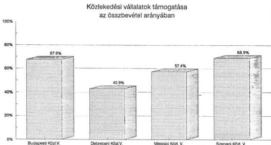
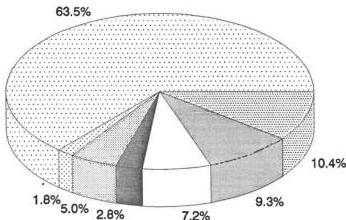

# Állami Számvevőszék

## ÖSSZEFOGLALÓ JELENTÉS

a nagyvárosi tömegközlekedés támogatására fordított eszközök felhasználásának vizsgálatáról

Budapest, 1990. december

40.

---

:

，

，

，

---

Állami Számvevőszék
Területi Főcsoport
V-61-3/1990.

# Összefoglaló jelentés
a nagyvárosi tömegközlekedés támogatására fordított
eszközök felhasználásának vizsgálatáról

Az Állami Számvevőszék 1990. II. félévi munkaterve alapján a Területi Főcsoport hat nagyvárosban (Budapest, Debrecen, Győr, Miskolc, Pécs és Szeged) — 1986-1990. I. félév időszakára vonatkozóan — vizsgálta a tömegközlekedés helyzetét.

Az ellenőrzésben a Vagyonkezelő Főcsoport is közreműködött, az Elemző- Értékelő és Nemzetközi Főcsoport pedig információk közreadásával segítette a munkánkat. A vizsgálatba bevontunk külső szakértőket is.

A vizsgálat során arra kerestük a választ, hogy:

- a jelenleg érvényben lévő támogatási, gazdálkodási rend megfelelően orientálja-e az érintett vállalatok magatartását,
- a tömegközlekedés helyzetét meghatározó tényezők változásai miként hatottak az utazás minőségére, a költségek és a vállalati eredmény alakulására.

# 1. A tömegközlekedés finanszírozása és a vállalati jövedelem szabályozás

A tömegközlekedés lebonyolításának vállalati szervezeti rendszere a vizsgált városokban eltérő. Budapesten a fővárosi önkormányzati felügyelet alatt működő egyetlen nagyvállalat (BKV) látja el, és a közlekedési ágazatok (autóbusz, villamos, metró, HÉV, trolibusz) integrált rendszert képeznek.

Miskolcon ugyancsak egy önkormányzati felügyelet alatt álló vállalat, míg Debrecenben, Szegeden önkormányzati és minisztériumi (Volán) vállalatok megosztva, Győrben és Pécsett pedig kizárólagosan volán vállalatok végzik a városi tömegközlekedés feladatát.

---

— 2 —

Debrecenben és Szegeden a tömegközlekedés nem monopolizált. A két önálló (önkormányzati és minisztériumi) vállalat egymás tevékenységét kiegészítve végzi a személyszállítást. A közlekedés teljesítményében a nagyobb hányadot kitevő autóbuszok üzemeltetését a Volán, a zártpályás (villamos, trolibusz) közlekedés üzemeltetéséről pedig az önkormányzati vállalatok gondoskodnak. A két vállalat együttműködik a menetrendek kidolgozásában és a forgalmi zavarok elhárításában. Szegeden közösen munkálkodnak a városi közlekedési diszpécserszolgálat kialakításában, az együttműködés ellenére azonban — főleg a városközpontban — még mindig sok a párhuzamos járat. A Volán vállalatok nemcsak a nagyvárosokban, hanem a kisebb településeken és a távolsági tömegközlekedést is lebonyolítják. A vizsgálatba bevont hat nagyvárosban él az ország lakosságának közel egyharmada, ezen városokban naponta közel 7 millió utasforgalmat kell lebonyolítani. Budapesten pl. mintegy 5 millió, Miskolcon 500 ezer, Szegeden 400 ezer utas veszi naponta igénybe a tömegközlekedés járműveit.

A felügyeleti hovatartozás alapvetően meghatározza a finanszírozás módját, az ezáltal elérhető külső forrás nagyságát is.

A vizsgált nagyvárosok tömegközlekedése 1989-ben 17,7 milliárd forintba került. Ezen belül jelentős részarányt képviselnek a tanácsi vállalatok forrásai, amely már 1989-ben is 16,5 milliárd Ft-ot tett ki. Budapest túlsulya ezen a területen is megmutatkozik, 1989-ben 15 milliárd Ft-ot költöttek a tömegközlekedés működtetésére, fenntartására, illetve szerény mértékű fejlesztésére.

Az önkormányzati vállalatok bevételei négy forrásból táplálkoznak:

a) árkiegészítés,
b) tanácsi, illetve önkormányzati támogatás,
c) jegy- és bérletdíjbevétel,
d) egyéb vállalati bevétel.

a) Árkiegészítés valamennyi tömegközlekedést folytató vállalatot megilleti.

Kiszámítása az eladott bérletek alapján történik, a diák- és nyugdíjas bérletdíjaknak a teljes árösszegre történő felszorzásával. Tartalmát tekintve szociálpolitikai támogatásnak is tekinthető, funkciója az, hogy a tanulók és nyugdíjasok havi kedvezményes és a teljesárú bérletek közötti különbözetet fedezze.

---

— 3 —

Az árkiegészítés 1990. január 1-től érvényes működése a szociálpolitikai funkciónak csak részben tudott megfelelni, ugyanis nem tartalmaz ellentételezést a 70 éven felüliek és a sorkatonák ingyenes utazása után.

Az árkiegészítésből befolyt összeg a vállalati bevételek közel 1/3-át teszi ki. E támogatási forma a jelzett hiányosságai ellenére is eredményesen működik. Előnye, hogy szektorsemleges, az eladott bérletekhez kötődik és az államnak a tömegközlekedésben betöltött szerepét objektív módon testesíti meg. A vállalatok az adóelszámolásukban visszatartás vagy igénylés útján jutnak az árkiegészítéshez. A Kormány az árkiegészítés formájában nyújtott támogatást 1991-ben is — a jelenlegi módon — fenn kívánja tartani.

A vitel — s ezen belül a bérleti — díjak emelkedésével az árkiegészítés abszolút összege növekedni fog, a vállalati források közötti részarányában azonban lényegesebb eltolódás nem várható.

b) Tanácsi támogatást a felügyeletük alatt működő közlekedési vállalatok kapják, Budapesten ez az összes vállalati bevételnek 1989-ben 39 %-át, Miskolcon 32 és Szegeden 29 %-át teszi ki. A közlekedési támogatást korábban az állami költségvetésben tervezték meg, s a vállalatok a tanácsokon keresztül jutottak hozzá. A támogatás összegét bázis elven alakította ki a PM, s a növekményt a főváros, a megye támogatásánál figyelembe vette. (A bevételek alakulását az 1. sz. melléklet tartalmazza.)

Az 1990. évi állami költségvetésben a nagyvárosi tömegközlekedés tanácsi támogatására előirányzat nem szerepel.

A támogatás a főváros, illetve az érintett megyei városi tanács feladata, amelyre fedezetet — a költségvetési törvény szerint — a részükre átengedett személyi jövedelemadó biztosít. Ez a megoldás 8,6 milliárd Ft központi támogatást váltott ki. 1991-től a tömegközlekedés fenntartása az önkormányzatok feladata, így a támogatásra szánt összegeket is az önkormányzatok költségvetésében kell megtervezni.

A tömegközlekedés támogatási rendszerének további fenntartása, a közlekedés színvonalának megtartása érdekében — a vizsgálat tapasztalata szerint — indokolt. A tanácsi közlekedési vállalatok (árkiegészítés és tanácsi támogatás együtt) támogatásának 1989. évi arányát a következő ábra szemlélteti.

---

— 4 —

Számos külföldi nagyvárosban is preferálják a tömegközlekedést, a támogatás színvonala azonban eltérő, 10-80 %-os arányban szóródik.

A fejlett országok tapasztalatai arra utalnak, hogy nagy átlagban a városi tömegközlekedés üzemeltetésének a finanszírozásában fele-fele arányban vesznek részt a közpénzek és a menetdíjbevételek. A támogatásokból a regionális források aránya a legnagyobb 44, a központiak részesedése 31, s a helyieké 25 %.

A vizsgált időszak első éveiben a tanácsi “fenntartási” támogatás mértéke a teljesített férőhelykilométertől függött.

A teljesített férőhelykilométer bázishoz viszonyított növekményét többlet támogatással elismerték. Ez a férőhely kilométer növelésére ösztönözte a vállalatokat, még a jármű kihasználtság rovására is.

A rendszernek ezt a hibáját megszüntették. A vállalatok 1989-től a támogatást fix összegben kapták, amely a vállalat és a tanács közötti alku eredményeként változott.

E támogatási rendszer alapvető hibája, hogy nem jelent biztonságot a vállalati gazdálkodáshoz. Valóságos vállalati teljesítményt kifejező mutatóhoz nem kötődik és ésszerű magatartásra (pl.: a vállalati rezsi-költség csökkentésére) nem ösztönzi a vállalatokat. Ez utóbbira pedig annál is inkább szükség lenne, mert a tömegközlekedésre fordított összegek mintegy 1/3-a a vállalati szervezet irányítására és a forgalomszervezés rezsiköltségére megy el.

---

— 5 —

c) A tarifabevétel a vállalati források 20-40 %-os részarányát adja. Látszólag a tarifaemelés, mint bevételt növelő eszköz “zavartalanul működik”.

A jegy- és bérletek bevételének árrugalmasságát figyelembevéve a további jelentős áremelés azonban már a bevételt kisebb mértékben, degresszíven növeli. Ennek érvényesülését természetesen még egyéb tényezők is befolyásolják, például a más utazási lehetőségek, benzin árváltozás, stb. Nemzetközi tapasztalatok is arra utalnak, amennyiben az állam túlzott tarifaemeléssel akarja megoldani a városi közlekedés finanszírozását, a kereslet visszaesésével egy leépülési spirált indít el.

Az 1990. I. félévi tarifabevétel — az 1990. februári 60 %-os növelés ellenére is — csak 30 %-kal haladja meg az 1989. I. félévi bevételt.

A nagyvárosi tömegközlekedés finanszírozásában a szektor semlegesség nem valósult meg, mivel a volán vállalatok tanácsi támogatásban nem részesültek. A volán vállalatok alapvetően keresztfinanszírozással oldják meg a városi közlekedést, ami azt jelenti, hogy az áruszállításból és egyéb vállalati tevékenységek eredményéből csoportosítanak át eszközöket.

Azokban a nagyvárosokban (Debrecen, Szeged), ahol az önkormányzati és minisztériumi (Volán) vállalatok közösen végzik a személyszállítást, a kombinált bérletek bevételének vállalatok közötti megosztása vita tárgyát képezi. A kombinált bérletek eladását a Volán vállalatok végzik (ezen bérletekkel mindkét vállalat járművein utazhatnak). A Volán vállalatok a korábban becsléssel kialakított százalékos megosztás alapján átengednek bérletdíj bevételt az önkormányzati vállalatoknak. Ezen vállalatok általában az átengedés arányával elégedetlenek, de objektív mérőszám hiányában kénytelenek azt tudomásul venni.

A személyszállítás egyéb jellegű támogatása az Útalapból történik, illetve az üzemanyagárnövekedés kompenzálása formájában valósul meg. Az 1990. évi gázolaj áremelés ellentételezése km-ként a helyi autóbusz közlekedésnél 1990. augusztus 1-től 2 Ft, illetve Budapesten 2,30 Ft, az 1990. október 30. — 1990. december 31-e között — teljesített közlekedés esetén — pedig 5,80 Ft igényelhető.

---

— 6 —

#### d) Vállalati jövedelemszabályozás

A vállalkozási nyereségadóról szóló tv a helyi autóbusz és kötöttpályás helyi közlekedést közszolgáltató tevékenységnek minősíti és a tevékenység nyereségéből 80 %-os visszatartható kedvezményt tesz lehetővé.

A vállalatoknál képződő nyereség-hányad 1986-1989-ben az árbevétel 2-5 %-a között szóródott. 1988-tól a nyereség csökkenése figyelhető meg. A vállalatnál maradó nyereségnek fedezetet kell nyújtani a személyi ösztönzésen túl a beruházásnál felszámított ÁFA vissza nem igényelhető hányadára is, mert azt költségként nem számolhatják el.

Az autóbuszállomány korszerűsítése érdekében a szabályozás 1989-től lehetővé tette, hogy a selejtezés pótlására beszerzett autóbusz költségeinek 80 %-át az adózatlan eredmény terhére elszámolják. A nyereség korlátai miatt a vállalatok csak részben tudták ezt a kedvező lehetőséget kihasználni.

A tömegközlekedési vállalatoknál a járműállomány műszaki elöregedését a pénzhiány, a rövidtávú érdekek előtérbe kerülése mellett, a szabályozás és ezen belül az amortizációs politika is elősegítette.

Az inflációs árnövekedést és járműállományon belül a “0”-ra leírt részarányt tekintve az évente képződött amortizáció a járműállomány szintentartásához nem elegendő.

Az autóbuszok tervezett futásteljesítménye — 420 ezer km — is csak az általában 300-350 ezer km után jelentkező felújítással volt elérhető, mely után teljesítményük optimális esetben 500-520 ezer km-re növekedett. A második felújítás utáni teljesítmény már 120-140 ezer km-re csökkent, amely amellett, hogy a korszerűtlen műszaki színvonalat konzerválta, a költségek szempontjából veszteséget okozott. Az amortizációs időn túli üzemeltetéssel a vállalatok ideiglenesen másfél-két évvel elhalasztották a szükséges pótlásokat, ugyanakkor a beruházás ilyen módon történő “kiváltása” hátrányt jelentett. A “0”-ra leírt és tovább használt jármű után már nem képződött amortizáció, s ez további forrás- csökkenést okozott.

---

— 7 —

## 2. Vállalati gazdálkodás értékelése

### a) Állóeszköz-gazdálkodás

A közlekedés eszközigényes ágazat. A BKV állóeszköz- állománya 1989. év végén 49,7 milliárd Ft értékű volt, Pécsett és Győrött 1,5 milliárd Ft bruttó értékű eszközzel rendelkeztek.

A közlekedés szempontjából kitüntetett szerepe a járműállománynak van. A bruttó értéken belül a járművek aránya a BKV-nél 23, Győrben és Pécsett ez az arány 60 %-os, az eltérő technikai összetétel és vállalati profil miatt.

A vizsgált vállalatoknál megfigyelhető a járműállomány elöregedése. Az autóbuszok átlagos életkora 5-6 év (évi 60 ezer km futás esetén 7 év alatt amortizálódik), a villamosoké 18-19 (átlagosan 30 év alatt amortizálódik), a metró és trolibuszok átlagos életkora 10-12 évre tehető.

Budapesten 1986-ban 238 db autóbuszt, 1989-ben pedig — forráshiány miatt — csak 182 db-ot vásároltak. Hasonló tendencia figyelhető meg a vidéki nagyvárosokban is. Az átlagosnál némileg kedvezőbb a helyzet Győrött, ahol a busz átlagéletkor 5 év. Ez annak köszönhető, hogy az 1985-ben kibocsátott lakossági kötvényből (50 millió Ft) autóbuszokat vásároltak.

Villamosok elavulásának folyamata még inkább erősödött, ugyanis a vizsgált időszakban villamos beszerzésére nem került sor.

A nagysúlyú, korszerűtlen, rossz rugózású villamosok Miskolcon, Szegeden a pályatesteket idő előtt tönkreteszik, s azok gyakori cseréje a fenntartási költségeket jelentős mértékben növeli.

Az évente romló műszaki állapotú gépjárműállomány jelentős fenntartási, felújítási költségráfordítással tehető alkalmassá a tömegközlekedés lebonyolítására.

Miskolcon pl. 1986. évben 10 db IK 280-as típusú autóbusz második felújítására került sor.

Ezek átlagos

|  beszerzési ára | 1.428 eFt/db  |
| --- | --- |
|  I.felújításig teljesített km | 294 e km  |
|  I.felújítás átlagos költsége | 946 e Ft  |
|  I-II.felújítás közötti teljesítm. | 218 e km  |
|  II.felújítás költsége | 1.170 e Ft  |

---

— 8 —

várható további futásteljesítmény . . . . . . . . . . . . . . . . 140 e km

Az autóbusz élettartama alatt a két felújítás ráfordítása mintegy másfélszer haladta meg a beszerzési árat. 1986. évben 1 db új IK 280-as autóbusz beszerzési ára 2.047 eFt volt, ennek ellenére a fajlagos költségek alapján az új beszerzés gazdaságossága nyilvánvaló. Ezt erősíti, hogy az élettartam növekedésével az üzemelési, karbantartási költségek is növekedtek.

A szükséges javítások elvégzését a villamosok esetében az alkatrészhiány is akadályozza. A villamosokhoz ugyanis az alkatrészek a kereskedelmi forgalomban nem szerezhetők be, azokat csak a Budapesti Közlekedési Vállalat gyártja. A viszonylag kistételű gyártási igény csak magas felárral, esetenként hosszú átfutási idővel elégíthető ki, s gyakran az indokoltnál nagyobb mérvű készletezésre kényszerülnek a vállalatok.

Például a Debreceni Közlekedési Vállalatnak a gyártótól áramszedőből egyszerre 4 évi szükségletet kellett megrendelni. Egyes alkatrészek (fogaskerekek, rugók) szállítására több, mint fél évet kellett várnia a vállalatnak.

A járművek és pályatestek fenntartására fordított összeg emelkedése ellenére a fenntartási munka valójában csökkent, így a szintentartás nem biztosított. A ráfordítások reálértékének csökkenésével a forgalmi és az üzembiztonság nem tartható fenn.

Az alkatrész beszerzés autóbuszok esetében megoldott, bár egyre nehezebb feladatot jelent. A Tisza Volán Vállalat saját alkatrészgyártó és felújító kapacitást tart fenn, melynek évi költségráfordítása 31 millió Ft, ez az össz vállalati költségfelhasználásnak 11 %-a. A szovjet gyártmányú trolibuszok alkatrész ellátása ugyancsak nehéz és körülményes, a hazai gyártás viszont drága. A Szegedi Közlekedési Vállalat havi kiadásainak közel harmadát fordítja alkatrészek, anyagok javíttatására, gyártatására.

A BKV-nál a villamospályák átlagéletkora 1989. december 31-i állapot szerint 16,5 év. Az elöregedett hálózatban nem ritka az 50 évnél régebben készült vágány, HÉV esetén (iparvágány) 80 éves vágányok is találhatók. A 20 évnél öregebb pályaszakaszok már teljesen átépítésre szorulnának. Az évi 8 %-os amortizációs kulccsal számolva a 12,5 évnél idősebb pályákon nem képződik amortizáció, ami az újratermelésre illetve felújításra fordítható lenne. 1989. évben amortizációból 7 km pályafelújításhoz elegendő fedezet képződött. Az elmaradt felújítás miatt a vállalatok a menetsebesség korlátozására kényszerültek.

---

— 9 —

Budapesten az 1990. január 1 óta életbe léptetett lassú menetek hossza villamos esetén 1.314 vfm-en HÉV-nél pedig 4.230 vfm-es szakaszon csak 10 km/h-nál kisebb sebességgel lehet közlekedni. Ez az össz szakasz 6,4 illetve 3,6 %-át teszi ki, Miskolcon a villamos vonalszakasz 30 %-án 15-20 km-es sebességkorlátozást vezettek be.

Beszerzési gondok miatt a BKV járműalkatrész gyártásával is foglalkozott. Az Autóbusz Javító Főműhely alkatrészgyártó üzemében 1989-ben kb. 500 féle alkatrészt gyártottak 1- 20.000 db-os sorozatnagyságig. A szükséges mellett azonban olyan alkatrészeket is készítettek, amelyet a kereskedelmi forgalomban olcsóbban lehet beszerezni.

Például a 2811215104 cikkszámú M1 4 x 1 5 x 35-ös hatlapfejű csavar érvényes elszámoló ára 1,70 Ft, szűkített önköltsége saját gyártásnál 15,79 Ft volt. A gyártott alkatrészek között szerepel továbbá több szabványos méretű kötőelem (anya, alátét, csavar) is.

# b) Munkaerő-gazdálkodás

A tömegközlekedés nemcsak eszköz, hanem élőmunkaigényes tevékenység is. Ezt tükrözi az, hogy a tanácsi közlekedési vállalatoknál 1988-ban több mint 25.000 fő dolgozott, ez a létszám 1990. I. félévében 3 %-kal mérséklődött (2. sz. melléket). A vizsgált vállalatok létszám megoszlását a következő ábra szemlélteti.

Közlekedési vállalatok létszámmegoszlása (1988)

☐ Budapesti Közl. V. ☐ Debreceni Közl. V. ☐ Miskolci Közl. V. ☐ Szegedi Közl. V.
☐ Hajdú Volán V. ☐ Kisalföldi V.V.,Győr ☐ Pécsi Volán V.

---

— 10 —

A szellemi foglalkozásúak aránya a tanácsi vállalatoknál 23 % volt, ez Budapesten és Szegeden magasabb arányú (7. sz. melléklet).

Miskolcon az összlétszámon belül a szellemi foglalkozásúak aránya 1990-ben 14,4 %, Debrecenben 18 %, Győrben, Pécsett pedig 19 %-os arányt mutat.

Budapesten ugyancsak mérséklődött a vállalati létszám, azonban belső összetételében lényeges változás nem volt. A munkások aránya 45 %-os. A közlekedési vállalatok foglalkoztatási struktúrájának jellemzője, hogy a járművezetők aránya alig több, mint a vállalati teljes létszám 1/5-e.

Az alaptevékenységet végző járművezetők terhelése meghaladja az átlagot. Túlfoglalkoztatásuk közel 25 %-os. Ebben a munkaköri csoportban permanens létszámhiány van. A túlmunkának csak részben oka a létszámhiány, nagyobb részt a vidéken tapasztalható alacsony jövedelemszinttel függ össze.

A vállalati kereset vidéken lényegében azonos szinten alakult. 1990. I. félévben átlagosan mintegy 10.000 Ft/fő/hóra tehető, az autóbusz vezetők kereseti szintje ezt kb. 20 %-kal haladta meg.

Kirívóan alacsony keresetek Debrecenben a Hajdú Volán Vállalatnál voltak, ahol (1990. I. félévi adat) az autóbusz vezetők havi keresete 10.000 Ft alatt volt, a vállalati havi átlagkereset pedig a 9.000 Ft-ot sem érte el. Ez a szint az ágazati átlagnak is 10-20 %-kal alatta van.

A Budapesti Közlekedési Vállalatnál 1990. I. félévben 21 %-kal nőttek a keresetek az előző évhez képest, és elérte a havi 15.000 Ft-ot. Különösen szembetűnő az autóbuszvezetőknél, ahol a havi keresetek elérték a 25.600 Ft-ot, ebből a túlmunka, prémium, jutalom aránya 27 %-os.

### c) A vállalatok költséggazdálkodása

A tömegközlekedés ráfordításait nemcsak a működtető ágazatok közvetlen költségviszonyai (bér, fenntartás, anyag, stb.) határozzák meg, hanem befolyásolja a vállalati szervezeti forma, amely keretében a közlekedés alrendszerei működnek.

A közlekedés integrált rendszere Budapesten bonyolult vállalati szervezetet alakított ki.

---

— 11 —

Felvethető, hogy a több évtizeddel ezelőtt kialakult vállalati szervezeti struktúra (szervezeti egységek kapcsolódásai, információs, döntési és érdekeltségi rendszere) ma mennyire jelent optimális keretet a közlekedés szervezésére és finanszírozására.

A BKV vezérigazgató irányítása alá tartozik 4 vezérigazgatóhelyettes, 6 igazgató és 4 osztály. A vezérigazgatóhelyettesek irányítása alá 5-10 szervezeti egység tartozik, majd ezek további főosztályokra, osztályokra tagozódnak. A vállalati hierarchiában vertikálisan 4 szint, horizontálisan pedig több, mint 100 belső szervezeti egység működik.

Az erősen tagolt struktúra hátrányai elsősorban az információ-áramlás zavaraiban mutatkoznak meg.

A költségek központi feldolgozásából, elemzéséből eredő visszacsatolások nem érkeznek meg mindig a költségviselő helyekre — a költségmegfigyelés, a tervezés, a megrendelés, a kooperációs szerződéskötése, stb. céljából. A beérkezett számlák a fizetési határidőre nem érkeznek vissza a pénzügyi osztályra.

A záráskor a vállalaton belül az “utazó számlák” összegét feladás útján könyvelik, majd nyitás után helyesbítik, és a számlák összegét igazolás után könyvelik le kiadásként. Ebből a folyamatból adódik hogy a számlakifogások összege és különbsége nem a tényleges időszakban jelenik meg az egyes költséghelyeken. (Pl.: 159.192 biz/1988-on úton lévő kiadás 41 millió Ft volt.)

A BKV-n belüli hatásköri elrendeződés és a szervezeti felépítése nem optimális, az egymáshoz igazodó, egymást kiegészítő műszaki és gazdasági csoportok nem egyazon irányítás alá tartoznak.

Az egyes munkafolyamatoknál — az idő és munkaerő ráfordítások tartalmától, mélységétől függően — a döntés és számonkérés határai összemosódnak.

Az Autóbusz Javító Főműhelynél (AJF) dolgozók egy része nem a helyi irányítás alá tartozik, hanem a Gépészeti Osztályhoz, illetve az Elektromos-Villamos Osztályhoz. Hasonló példát lehet említeni a technológiai csoport és az árcsoport hovatartozásáról is, stb.

A vállalat által elkészített belső szervezeti változások I-III. üteme már ezen problémák megoldását tartalmazta 1986-89. évekre. Az intézkedés végrehajtásának gyakorlati hasznosulása azonban nem állapítható meg, érdemleges létszám és költségmegtakarítással az nem járt. Jelenleg a szervezeti változás IV. üteme vár bevezetésre, amely foglalkozik a gazdálkodás egyes költségelemeivel, az eszközök radikálisabb hasznosításával, a párhuzamosságok felszámolásával, a rendelkezésre álló munkaerő jobb kihasználásával, stb. A

---

— 12 —

vállalat szervezeti felépítésének átvilágítása most van folyamatban, ennek befejezése 1991. I. negyedévében várható.

A jelenlegi szervezeti formában magas a vállalatok rezsiköltsége, az összes költségeknek több, mint egyharmada.

A Budapesti Közlekedési Vállalat összes ráfordításának — 1989-ben — az általános (fel nem osztott) költség a 40 %-át tette ki.

A Miskolci Közlekedési Vállalatnál ez az arány 27, a Debreceni és a Szegedi Vállalatoknál 30 és 33, a Győri és a Pécsi Volán Vállalatoknál pedig 19, illetve 23 %-os.

Az üzemi és forgalmi területek irányítását csak egyre növekvő költségráfordítással bonyolította le a BKV, ami megmutatkozik a fajlagos költségek alakulásában is.

Például: a BKV-nél 1989. évi autóbusz közlekedési ágban az 1000 fh km-re jutó költségszint (közvetlen költségek) 8,9 %-kal haladja meg a miskolci vállalat fajlagos költségét, míg a teljes vállalati fajlagos költség már 30 %-kal magasabb a Miskolci Közlekedési Vállalatnál.

A BKV 44 millió Ft-ot fordított 1989-ben az üzemi újság, a munkaerőfelvétellel kapcsolatos reklámhirdetések, egyéb kiadmányok és a sport finanszírozására.

A vállalat annak ellenére, hogy speciális műszaki és szervezési osztályokkal működik, a külső szervekkel kötött megbízások teljesítéséért jelentős összegeket számolt el, felvethető a megrendelések szükségessége.

A vizsgálati anyagokból kiemelve egy-két feladatra az alábbi kifizetések történtek, példaszerűen:

|  Irat és műszaki dokumentáció |   |
| --- | --- |
|  mikrofilmes rendszerének kialakítására | 487.500 Ft  |
|  BKV ágazati önállóságának növelése | 500.000 Ft  |
|  BKV által üzemeltetett felszíni |   |
|  tömegközlekedési eszközök vezetőtér |   |
|  komfortjának javítása | 225.000 Ft,  |
|  MILL-FAV forgóvázak üzemi vizsgálata | 1.480.000 Ft,  |
|  Autóbuszok amortizációs normán túli |   |
|  futtatása, gazdasági kihatásainak |   |
|  felmérése, elemzése, stb. | 120.000 Ft.  |

A BKV-nél jelentős értékű anyag- és alkatrész mennyiségek halmozódtak fel, amit értékesítettek. Az nem állapítható meg, hogy ezen készletekből mennyi

---

— 13 —

az elfekvő és mennyi a ténylegesen mobilizálható készlet. A gazdasági műveletek összegezéseként azonban megállapítható, hogy a tevékenység veszteséges.

Például 1989-ben az eladási készletérték 908 millió Ft értékű volt, s az ebből realizált bevétel 254 millió Ft-ot tett ki.

A közlekedési vállalatoknál az egyes üzemágak elkülönített költségelszámolása és teljes önköltségének megállapítása megtörténik.

A VOLÁN Vállalatok esetében ezideig külső információs igény nem merült fel a helyi tömegközlekedés teljes önköltségének megállapítására. A tömegközlekedés költséggazdálkodását közvetett úton, az üzemegységre meghatározott fedezeti és eredményösszeg előírásával szabályozták. A vállalati utókalkuláció az autóbusz közlekedés egészére készült. Az általános költséget pótlékolással, a költségviselő képesség figyelembevételével osztották szét.

A vizsgált vállalatoknál a fajlagos költségek évenkénti változó ütemű növekedése tapasztalható. A költségemelkedést erősen befolyásolták a bér- és társadalombiztosítási járulék változásai, valamint az anyag- és energia árnövekedések.

A fajlagos költségek vizsgálatából megállapítható, hogy az autóbusz ágazatnál az 1000 fh kilométerre jutó költség Budapesten magasabb, mint vidéken (ez összefügg a műszaki színvonalal és az eltérő költségtényezőkkel). A közvetlen költségszinten olcsóbb a nagyobb tömegeket szállító villamos, metró és a HÉV, mint az autóbusz közlekedés. (A fajlagos költségek alakulását a 3. sz. melléklet tartalmazza.)

### 3. A tömegközlekedés értékelése

A vizsgált városok tömegközlekedésének szerkezete eltérő. Budapesten az egyes ágazatok (autóbusz, villamos, metró, stb.) közötti forgalom megoszlást részben az elérhetőség, részben pedig a közlekedési szokások determinálják. A vizsgált többi nagyvárosban a forgalom nagyobb részét az autóbuszok bonyolítják le, a zártpályás rendszerek (villamos, trolibusz) kiépítettsége a nagyobb beruházási igény miatt háttérbe szorult.

---

— 14 —

A vizsgált időszakban a tömegközlekedéssel kapcsolatos igényeket befolyásolták:

- az egyéni és tömegközlekedés arányának motorizációval összefüggő változása,
- a benzin és gépkocsi áremelkedések,
- a 70 éven felüliek ingyenes utazásáról szóló rendelkezések,
- a tarifaváltozások, stb.

a) A hálózati ellátottság helyzete

A tömegközlekedés hálózati ellátottsága — nemzetközileg is elfogadott mérőszám szerint — megfelelőnek, sőt jónak minősíthető. Ugyanakkor az utak, hidak telítettsége tovább nőtt, az útburkolat felújítások és korszerűsítések jelentősen elmaradtak, ezzel hátráltatták a tömegközlekedés fejlődését is.

A területi ellátottság értékeléséhez 33 körzetre osztották fel a fővárost. Meghatározták, hogy az egyes körzetek területének hány százalékában lehet valamilyen tömegközlekedési megállóhelyet 300-500 m-es gyaloglással elérni (ez nemzetközi mutatószám). A vizsgálatok azt mutatják, hogy 12 körzetben az arány 100 % volt, a többi körzetben 85-95 % közötti, és csak 1 körzetben a (XII. kerületben 6,3 km2 területen) volt igen alacsony érték (52,3 %).

A területi ellátottság a többi vizsgált városban is megfelelőnek értékelhető.

Miskolc város beépített területét a közlekedési hálózat általában megfelelő sűrűséggel lefedi, de a forgalmi és minőségi körülmények kedvezőtlenek. A városközpontban sok a zsúfolt útszakasz, melynek következtében állandósult a környezet szennyezése. Szegeden a belterületen, és a magas beépítettségű lakótelepi városrészeken 300 m gyaloglással autóbusz, villamos és troli megállókkal elérhetők. Gondok elsősorban a külterületeken, a ritkábban lakott, illetve a kiépített közút által feltáratlan területeken jelentkeznek: Kiskundorozsma északkeleti és délkeleti, Tápé északi, Ságváritelep északnyugati, valamint Baktó északnyugati részén.

Győrben a közlekedési hálózat területi ellátottsága 95 %-os 1990-ben, kisebb hiányosságok a lazább beépítésű kiskertes területeken vannak.

A városokban kialakult gyakorlat szerint a tömegközlekedésre alkalmas úthálózatot többnyire csak a lakótelep átadását követően építették meg. E fejlesztési politika következményeként Debrecenben a lakosság egy része (5 %-a) csak jelentős gyaloglással tudja ma is igénybe venni a közlekedési járműveket.

Például a Vezér utcai lakótelepen megfelelő úthálózat és buszforduló hiányában a tömegközlekedés jelenleg nem megoldott.

---

— 15 —

A Tócóskerti lakótelep lakosainak egy része, egy km hosszú út megépítésének hiánya miatt, csak a tőle jelentős távolságban közlekedő autóbuszt tudja igénybe venni.

Az úthálózat és a járműállomány állapotának további romlása, valamint a közgazdasági feltételek rosszabbodása miatt — a tömegközlekedés teljesítményének mérséklődése mellett — annak költségigényessége növekedett. A tömegközlekedést végző tanácsi vállalatok támogatása a vizsgált időszak első három évében a teljesített férőhelykilométer alapján történt. A támogatásnak ez a formája időközben megváltozott, a többletteljesítmény preferálása megszűnt. Az utazási igények változása mellett ez is szerepet játszott abban, hogy a vállalatok teljesítménye 1989. évben az előző évekhez képest csökkent (a teljesítmények alakulását a 5. sz. melléklet mutatja).

A Debreceni Közlekedési Vállalatnál a költségeknek a díjbevételt meghaladó emelkedése miatt, az egyensúlyt 1989. és 1990. évben a tervezett teljesítmények visszafogásával tudták elérni. A VOLÁN Vállalatnál pedig — a menetrendek módosítása nélkül — a tömegközlekedésben résztvevő járművek számának csökkentése okozott visszaesést a tényleges járatsűrűségben.

A Debreceni Közlekedési Vállalat a napi járatok számát a villamosforgalomban 1989. évben 18-cal, 1990-ben 38-cal, trolibusz esetében 1989. évben 8-cal, 1990-ben 57-tel csökkentette.

A VOLÁN Vállalatnál a debreceni helyi közlekedés menetrend szerinti 132 db autóbusz igényével szemben 1989. évben 123 db, 1990. évben 120 db autóbuszt bocsájtottak ki naponta átlagosan.

#### b) A járatkövetési idő és a járművek kihasználtságának értékelése

A városi tömegközlekedés minőségének egyik meghatározó eleme a menetrendszerinti járatkövetési idő, amely jelzi a közlekedési vonal járatokkal való telítettségét (sűrűségét) is. A vizsgált időszakban a menetrendszerinti járatkövetési idő alakulásában lényeges változás nem volt. Kismértékben romlott a követési idő Budapest, Győr és Miskolc városokban, illetve javult Szegeden. Ez a javulás azonban megtévesztő, mert a menetrendekben (tervezett) feltüntetett értékeket tartalmazza (7. sz. melléklet), és nem a tényleges követési időtartamot mutatja.

A közlekedési vállalatok 1989-ben — a menetrendek változatlanul hagyása mellett — járművek kivonásával a járatsűrűséget csökkentették, ez a tényleges járatkövetési idő növekedését okozta. A tényleges járatkövetési idő alakulását azonban a vállalati statisztika nem regisztrálta.

---

— 16 —

Budapesten és a vidéki városokban a járművek átlagos férőhelykihasználása 1986 óta nem változott jelentősen, százalékos értéke autóbuszoknál 40-60 % körül, villamosoknál 30-50 % körül ingadozik. Az átlagos kihasználtságon belül azonban lényeges szélső értékek húzódnak meg (például a kora reggeli és késő esti járatok alacsony kihasználtságúak).

A járatok csúcsidei terhelését évek óta nem sikerült csökkenteni. A lépcsőzetes munkakezdés bevezetése ugyan hozott eredményeket, de a későbbi visszarendeződés miatt a tartós siker elmaradt. Néhány vonalon a csúcsforgalmi időszakokban rendszeresen ismétlődik a zsúfoltság, s egyes napszakokban a már jelzett alacsony kihasználtság gazdaságossági szempontból jelent veszteséget. A csúcsidőszaki zsúfoltság mérséklése a villamos és az autóbuszvezetők kétrészes szolgálatának növelése miatt ütközik nehézségbe.

Budapesten a csúcsidei zsúfoltság 1989. és 1990. I. félévben mindenekelőtt az autóbuszoknál, de a trolibusz és HÉV vonalakon is kedvezőtlenül alakult, sőt az egyes autóbusz vonalakon elérte a tűréshatárt.

Szegeden a csúcsidei zsúfoltság az 1-es villamost és a 9-es trolivonalat érinti.

# **c) Az átlagos utazási sebesség, a menetrendszerűség, és az utasbiztonság értékelése**

Az átlagos utazási sebesség 1986 óta stagnál, abszolút értéke az elfogadható szint közelében mozog.

Budapesten az autóbuszok átlagos utazási sebessége 18 km/óra, vidéken némiképpen jobb, 21-24 km/óra között váltakozik.

A villamosok átlagos sebessége vidéken és Budapesten egyaránt 14-15 km/órára tehető. Gyorsabb tömegközlekedési eszköznek a HÉV és a metró számít, itt az utazási sebesség 24-26 km/óra.

A tömegközlekedés megbízhatósága érdekében tett erőfeszítések — Miskolcon és Szegeden — eredménnyel jártak, a menetkimaradások évek óta csökkenő irányzatúak (8. sz. melléklet).

Budapesten azonban az autóbusz közlekedés helyzete — létszám-pénzhiány, valamint a járművek gyakori meghibásodása miatt — erősen romlott, ami aggasztó: 1989-ben kétszer nagyobb volt az autóbusz járatkimaradások száma, mint az előző évben.

---

— 17 —

A legmegbízhatóbb tömegközlekedési eszköznek Budapesten a metró számított. Itt a járatkimaradások abszolút értéke évente 4-5 ezres nagyságrendű volt.

A kimaradások száma már 1988-ban megközelítette a 7 ezret, 1989-ben pedig meghaladta a 10 ezret, 1990. I. félév során is 4 ezres nagyságrendű járatkimaradás állapítható meg. Ezt elsősorban műszaki, anyagi- és munkaerőgazdálkodási problémák okozták.

Az utasbiztonság a járműállomány elöregedésével, a reálértékben csökkenő karbantartási ráfordításokkal még az elfogadható szinten van, de jelentős mértékben a járművezetők “egyedi járműismeretén” is múlik a biztonságos forgalom. Az utasbiztonság érdekében tett intézkedések hatására a vállalatok mulasztása miatti utasbalesetek száma — a vizsgált időszakban — azonos szinten volt.

Szegeden a Volán vállalatnál 1989-ben és 1990. I. félévében nem is történt sajáthibás utasbaleset. Az ezt megelőző időszakban pedig évente 2, a Szegedi Közlekedési Vállalatnál pedig 9-10 baleset volt.

Győrben ugyancsak egy-két balesetet regisztráltak évente a vizsgált időszakban.

#### 4. Következtetések, ajánlások

A vizsgált városok tömegközlekedésének színvonala a mutatók alapján ugyan megfelelőnek minősíthető, ez azonban nem fedheti el a közlekedési vállalatok gondjait. Eszközállományuk technikailag elavult, az amortizáció az egyszeri pótlásra sem elég. A finanszírozásban is sok a bizonytalanság, ami a tömegközlekedés szintentartását veszélyezteti.

a) A vizsgálat tapasztalatai alapján arra lehet következtetni, hogy a vállalatok saját erőből nem képesek a közlekedés feladatait megoldani. A jelenlegi körülmények között indokolt a tömegközlekedés preferálásának a fenntartása, és a támogatás rendszerének a továbbfejlesztése. A tömegközlekedés ellátása a helyi önkormányzatok feladata, ezért a helyi támogatási rendszert olyan módon kellene továbbfejleszteni, hogy az a szektorhoz való hovatartozás nélkül a tömegközlekedés teljesítményét preferálja, függetlenül attól, hogy azt milyen szervezeti formában látják el (önkormányzati, állami, társas vagy magánvállalkozás).

---

— 18 —

b) A közlekedés fenntartásának biztonsága és a gazdasági racionalitás kibontakozása érdekében a támogatással ne a vállalati szervezetet finanszírozzák. A támogatás normatív alapon, a tömegközlekedés teljesítményét kifejező mutatókhoz kötődjön.

c) A járműállomány, a villamosvasúti pálya rekonstrukciója olyan nagyságrendű beruházási igénnyel jár, amelynek a finanszírozásához sem az önkormányzatok, sem pedig a vállalatok megfelelő forrásokkal nem rendelkeznek. A rekonstrukció elkezdése ugyanakkor nem tűr halasztást. A közlekedés biztonsága hosszabb távon csak műszaki fejlesztéssel, megújítással tartható fenn. Kedvezményes kamatozású és lejáratú központi hitelkonstrukció kidolgozása és bevezetése segíthetne a pályatestek és a járművek korszerűsítésében, technikai megújításában.

d) A tömegközlekedésben a többszektorúság megteremtése és a verseny élénkítése érdekében — az ellátási felelősség fenntartásával — szükséges lenne a magánvállalkozás bevonásához szükséges jogi, közgazdasági feltételek megteremtése. A magán- és a társasvállalkozás működési feltételeinek szabályait a koncessziós törvény kidolgozásánál figyelembe kellene venni.

e) A pályatestek és a járműállomány műszaki elavulásához — a finanszírozási gondokon túl — az amortizációs rendszer is hozzájárult, mivel az értékcsökkenési leírás összege messze nem pótolta az eszközök megújításának a költségét. Az új számviteli törvény kidolgozásában — a tömegközlekedés sajátosságai és az inflációs ráta — figyelembevételével olyan amortizációs elszámolási rendszert kellene kialakítani, amely lehetővé tenné, hogy az állóeszközök selejtezésekor a pótláshoz szükséges fedezet a vállalati gazdálkodáson belül képződjön.

f) A támogatás mértéke mégha növekedne is, nem várható, hogy a közlekedés gondjait önmagában megoldja. A tarifa emelés sem képes arra, hogy a tömegközlekedés önfinanszírozó képességét — a jelenlegi vállalati szervezeti struktúrában és a lakosság jövedelmi viszonyai mellett — megteremtse. A vállalatoknál is keresni kell azokat a működési, gazdálkodási lehetőségeket, amivel a költségeik csökkenthetők.

A vizsgálat tapasztalata szerint a vállalatok irányítási, információs rendszere nem korszerű, a forgalmi és vállalati irányítás jelentős költségeket emészt fel. A vállalati szervezet működésének az átvilágításával — ez a BKV-nál már

---

— 19 —

folyamatban van — kellene feltárni a túlméretezett, a felesleges és párhuzamos igazgatási, irányítási feladatokat és az információs rendszer problémáit. Az így felszabadítható források közvetlenül a közlekedés fejlesztésére csoportosíthatók át.

g) A vállalatokon belüli érdekeltségi viszonyok jobb érvényesülését gátolja a belső szervezeti egységek önelszámolásának és költségérzékenységének a hiánya. Ezért megfontolandó lenne a javítóműhelyek és az elkülönített szervezetként működő pályafenntartó és építő részlegek önelszámoló egységekkénti működtetése.

h) A tömegközlekedés megbízhatósága, a menetrendszerűség — a járatkimaradások nagy számára tekintettel — romlott. Célszerű lenne a menetrendek felülvizsgálata és a forgalomba állítható járművek számához való igazítása.

A csúcsidei zsúfoltság mérséklése és a járműkihasználtság javítása érdekében szükséges annak az újragondolása is, hogy a reggeli és a késő esti üzemeltetés alacsony hatékonysága mellett a jelenlegi üzemidőt fenn kell-e tartani. A kétrészes szolgálat bővítésével, a párhuzamos (villamos, autóbusz, trolibusz) közlekedés mérséklésével ugyancsak javítható a járművek kihasználtsága.

Budapest, 1990. december

Összeállította:

Nagy József
vizsgálatvezető főtanácsos

---

:

:

:

:

:

---

1. sz. melléklet

# A tanácsi közlekedési vállalatok bevételi forrásainak alakulása

1.000 Ft-ban

|  vállalat megnevezése | árkiegészítés |   | támogatás |   | jegy és bérlet díjbevétel |   | egyéb vállalati bevétel |   | összes bevétel  |   |
| --- | --- | --- | --- | --- | --- | --- | --- | --- | --- | --- |
|   |  1988. | 1989. | 1988. | 1989. | 1988. | 1989. | 1988. | 1989. | 1988. | 1989.  |
|  Budapesti Közl.Váll. | 5168115 | 4249856 | 5245863 | 5919900 | 1881015 | 3060032 | 1295521 | 1806258 | 13590514 | 15036046  |
|  Debreceni Közl.Váll. | 82300 | 104396 | 64000 | 73000 | 39590 | 60660 | 140930 | 175461 | 326820 | 413517  |
|  Miskolci Közl.Váll. | 235435 | 192166 | 193000 | 241000 | 211744 | 298432 | 15129 | 23125 | 655308 | 754723  |
|  Szegedi Közl.Váll. | 150067 | 150444 | 97100 | 106100 | 48885 | 73448 | 40096 | 42521 | 336148 | 372513  |
|  Összesen: | 5635917 | 4696862 | 5599963 | 6340000 | 2181234 | 3492572 | 1491676 | 2047365 | 14908790 | 16576799  |

---

:

:

.

:

.

---

2. sz. melléklet

Közlekedési vállalatok létszámadatai

|  vállalat megnevezése | 1988. |   |   | 1990. I. félév  |   |   |
| --- | --- | --- | --- | --- | --- | --- |
|   |  vállalati összlétszám | ebből szellemi* | szellemi dolgozók az összes létszám %-ában | vállalati összlétszám | ebből szellemi | szellemi dolgozók az összes létszám %-ában  |
|  Budapesti Közl. V. | 22244 | 5401 | 24,3 | 21600 | 5280 | 24,4  |
|  Debreceni Közl. V. | 620 | 119 | 19,2 | 653 | 122 | 18,6  |
|  Miskolci Közl. V. | 1764 | 244 | 13,8 | 1688 | 244 | 14,4  |
|  Szegedi Közl. V. | 991 | 237 | 23,9 | 896 | 234 | 26,0  |
|  Tanácsi váll. össz.: | 25619 | 6001 | 23,4 | 24837 | 5880 | 23,6  |
|  Hajdu Volán V. | 2522 | 480 | 19,0 | 2237 | 427 | 19,0  |
|  Kisalföldi Volán V. (Győr) | 3257 | 608 | 18,6 | 3018 | 566 | 18,7  |
|  Pécsi Volán V. | 3634 | 712 | 19,5 | 3165 | 598 | 18,8  |

* szellemi foglalkozásúak körébe tartoznak: műszaki, gazdasági, ügyviteli és a fogalomirányításban dolgozók

---

.

.

.

.

.

.

---

---

3. sz. melléklet

A tömegközlekedés fajlagos költségeinek alakulása
(1000 férőhely km-re jutó összes (a) és közvetlen (b) költség)

me: forintban

|  város | autóbusz |   | villamos |   | trolibusz |   | metró |   | HÉV  |   |
| --- | --- | --- | --- | --- | --- | --- | --- | --- | --- | --- |
|   |  1989. | 1990. I. félév | 1989. | 1990. I. félév | 1989. | 1990. I. félév | 1989. | 1990. I. félév | 1989. | 1990. I. félév  |
|  **Budapest**  |   |   |   |   |   |   |   |   |   |   |
|  (a) | 421,6 | 528,9 | 586,2 | 576,6 | 749,3 | 840,3 | 403,2 | 458,6 | 376,2 | 343,3  |
|  (b) | 267,4 | 345,3 | 309,9 | 287,1 | 396,7 | 431,3 | 204,7 | 237,5 | 168,1 | 164,2  |
|  **Debrecen**  |   |   |   |   |   |   |   |   |   |   |
|  (a) | 317,2 | 353,3 | 450,0 | 523,0 | 693,0 | 789,0 |  |  |  |   |
|  (b) |  |  |  |  |  |  |  |  |  |   |
|  **Győr**  |   |   |   |   |   |   |   |   |   |   |
|  (a) | 287,7 | 357,1 |  |  |  |  |  |  |  |   |
|  (b) |  |  |  |  |  |  |  |  |  |   |
|  **Miskolc**  |   |   |   |   |   |   |   |   |   |   |
|  (a) | 323,6 | 390,4 | 352,5 | 406,5 |  |  |  |  |  |   |
|  (b) | 245,4 | 287,2 | 184,5 | 195,6 |  |  |  |  |  |   |
|  **Pécs**  |   |   |   |   |   |   |   |   |   |   |
|  (a) | 307,0 | 327,0 |  |  |  |  |  |  |  |   |
|  (b) | 231,0 | 241,0 |  |  |  |  |  |  |  |   |
|  **Szeged**  |   |   |   |   |   |   |   |   |   |   |
|  (a) | 301,1 | 322,2 | 487,0 | 520,6 | 582,6 | 594,8 |  |  |  |   |
|  (b) |  |  | 316,5 | 322,9 | 378,7 | 369,0 |  |  |  |   |

---

:

:

:

:

---

4. sz. melléklet

# Utaskilométer alakulása*

mc: 1000-ben

|  város | 1986. | 1987. | 1988. | 1989.  |
| --- | --- | --- | --- | --- |
|  Budapest | 8462724 | 8476070 | 8382164 | 7981547  |
|  Debrecen | 604089 | 612546 | 631129 | 622246  |
|  Győr | 266402 | 281564 | 279345 | 268265  |
|  Miskolc | 731483 | 736440 | 734985 | 698205  |
|  Pécs | 474730 | 490209 | 489957 | 488894  |
|  Szeged | 541502 | 590281 | 608233 | 566985  |
|  Összesen: | 11080930 | 11187110 | 11125813 | 10626142  |
|  Az előző év százalékában: |  | 100,9 | 99,4 | 95,5  |

* 1 fő utas x átlagos utazási távolsággal

---

•

---

5. sz. melléklet

# Férőhelykilométer alakulása*

me: 1000-ben

|  város | 1986. | 1987. | 1988. | 1989.  |
| --- | --- | --- | --- | --- |
|  Budapest | 28720271 | 28743030 | 28789683 | 27789830  |
|  Debrecen | 1235174 | 1241443 | 1244852 | 1267571  |
|  Győr | 481200 | 521264 | 544939 | 548714  |
|  Miskolc | 2223357 | 2261856 | 2265282 | 2147300  |
|  Pécs | 916609 | 956326 | 974218 | 973874  |
|  Szeged | 1232478 | 1269524 | 1266240 | 1205935  |
|  Összesen: | 34809089 | 34993443 | 35085214 | 33933224  |
|  Az előző év százalékában: |  | 100,5 | 100,3 | 96,7  |

* férőhely x utazási távolsággal

---

.

.

.

.

---

6. sz. melléklet

# Közlekedési viszonylatok alakulása \*

me: 1000-ben

|  város | 1986. | 1987. | 1988. | 1989. | 1990. I. félév  |
| --- | --- | --- | --- | --- | --- |
|  Budapest | 243 | 251 | 253 | 257 | -  |
|  Debrecen | 54 | 59 | 60 | 60 | 60  |
|  Győr | 45 | 46 | 50 | 51 | 53  |
|  Miskolc | 42 | 43 | 42 | 41 | 39  |
|  Pécs | 52 | 53 | 54 | 54 | 54  |
|  Szeged | 56 | 56 | 59 | 59 | 59  |
|  Összesen: | 492 | 508 | 518 | 522 | -  |
|  Az előző év százalékában: |  | 103,3 | 101,6 | 100,8 |   |

\* viszonylat = 1 vonallal, például 6-os villamosvonal (egy viszonylatnak felel meg)

---

1

1

1

1

---

7. sz. melléklet

# Átlagos járatkövetési idő alakulása

(az autóbuszra vonatkozóan)

me: percben

|  város | 1986. | 1987. | 1988. | 1989. | 1990. I. félév  |
| --- | --- | --- | --- | --- | --- |
|  Budapest | - | - | 8,1 | 8,7 | csúcsidőben  |
|  Debrecen | 14,1 | 13,5 | 13,5 | 13,8 | 13,8 (nem csúcsidőben)  |
|  Győr | 11,3 | 11,7 | 11,9 | 12,0 | 12,1  |
|  Miskolc | 11,3 | 11,2 | 11,8 | 12,2 | 13,3 (nem csúcsidőben)  |
|  Pécs | 11,9 | 11,4 | 12,5 | 11,9 | - (nem csúcsidőben)  |
|  Szeged | 19,2 | 18,9 | 18,9 | 18,5 | 18,5 (nem csúcsidőben)  |
|   |  13,2 | 12,8 | 12,8 | 12,7 | 12,7 (csúcsidőben)  |

---

1

2

3

4

---

8. sz. melléklet

# Járatkimaradási esetek alakulása*

(autóbusz, villamos, metró, hév és trolibusz együtt)

me: db-ban

|  város | 1986. | 1987. | 1988. | 1989. | 1990. I. félév  |
| --- | --- | --- | --- | --- | --- |
|  Budapest (valamennyi tömegközlekedési járműre) | 372597 | 379530 | 383989 | 669157 | 664898  |
|  Debrecen (autóbusz, villamos és trolibusz együtt) | 810 | 24885 | 36941 | 29856 | 14669  |
|  Győr (csak autóbuszra) | 1070 | 5557 | 1990 | 2404 | 845  |
|  Miskolc (autóbusz + villamos) | 4371 | 2550 | 1024 | 1122 | 838  |
|  Pécs (autóbusz) | 2445 | 5638 | 2454 | 2361 | 945  |
|  Szeged (autóbusz, villamos és trolibusz együtt) | 6214 | 8129 | 7006 | 4175 | 2091  |
|  Összesen: | 387507 | 426289 | 433404 | 709075 | 684286  |
|  Az előző év százalékában: | - | 110,0 | 101,7 | 163,6 | -  |

* a járatkimaradás a menetrendtől eltérően indított járatot jelenti

---

1

1