# Állami Számvevőszék

# ÖSSZEFOGLALÓ JELENTÉS

az egészséges ivóvízellátás feltételeinek javítására fordított eszközök
felhasználásának vizsgálatáról

Budapest, 1991. április

43.

---

1

1

---

Állami Számvevőszék
Területi Főcsoport
V-79-8/1990.
V-19-8/1991.

# ÖSSZEFOGLALÓ JELENTÉS
az egészséges ivóvízellátás feltételeinek javítására fordított eszközök
felhasználásának vizsgálatáról

Az Állami Számvevőszék 1990. II. félévi munkaterve alapján a Területi Főcsoport 1990. december és 1991. január hónapokban 17 megyében a volt megyei tanácsok szakigazgatási szerveinél, 25 közüzemi vízmű vállalatnál, 27 vízműtársulatnál, és 171 település önkormányzati hivatalánál folytatott le helyszíni vizsgálatot. Az arzénes vizű 74 település mindegyikét tételesen, a még veszélyeztetett 442 nitrátosét pedig a települések közel 20 %-ára kiterjedő reprezentációval ellenőrizte. Tájékozódást végzett ezen kívül 17 megyei KÖJÁL-nál és elemezte a BM-nél rendelkezésre álló adatokat.

A vizsgálat célja annak megállapítása volt, hogy

— az egészséges ivóvíz ellátás veszélyeztetettségének (nitrát, ill. arzéntartalom) csökkentésére hozott felső szintű és a helyi határozatok végrehajtása során, elsősorban az 1986-1990. években, mennyire volt célszerű és hatékony a pénzügyi — ezen belül különösen a központi forrásokból származó — előirányzatok felhasználása;
— a központi és helyi kezdeményezések milyen mérhető eredménnyel jártak;
— milyen további intézkedések megtételére van szükség az önkormányzatokról szóló 1990. évi LXV. törvény 8. és 112. paragrafusában megfogalmazott, a települések egészséges ivóvízellátására vonatkozó feladat határidőre történő végrehajtásához.

Vizsgálati megállapításainkat a jelentés mellékletét képező számszaki táblázatok és részletes példatár támasztja alá.

---

— 2 —

## 1. Előzmények

Az Országos Vízügyi Hivatal és az Egészségügyi Minisztérium 1977-ben az egész országra kiterjedően felmérette a közegészségügyileg veszélyeztetett (nitrátos vizű) települések vízellátásának helyzetét. A WHO nemzetközi kutatási programjának keretében pedig 1981-ben az Országos Közegészségügyi Intézet végzett felmérést a Dél-Alföldi körzetben különböző vízbázisok nyomelem (arzén) koncentrációjának megállapítására.

Az 1977. évi felmérés időpontjában az ország 3156 településének csaknem fele, 1573 nem rendelkezett közműves ivóvízellátással, ezen belül 944 településen még egészséges ivóvizet adó közkút, vagy közcélú ivóvízellátás sem volt.

Az északmagyarországi és a dunántúli területeken elhelyezkedő 944 település több mint 700 ezer lakosa az ivóvíz 40 mg/l határértéknél nagyobb, helyenként annak 10-20-szorosát is meghaladó nitrátszennyezettsége miatt minősült közegészségügyileg veszélyeztetettnek.

A Dél-Alföldi területen 68 települést az ivóvíz 0,05 mg/l-nél nagyobb mértékű arzén tartalma miatt kellett közegészségügyileg veszélyeztetett kategóriába sorolni, ami 450 ezer embert érintett. (példatár 1. sz. példa)

A súlyosan veszélyeztetett kategóriába sorolt 200 nitrátos és 30 arzénes vizű település helyzete a felmérések időpontjában már olyan kritikus volt, hogy azonnali intézkedéseket igényelt. Ezek végrehajtását felsőszintű állami határozatok írták elő. (példatár 2. sz. példa)

A megoldásra vonatkozó programot a nitrátos vizű települések esetében az Állami Tervbizottság az 5005/1978. sz. határozatával hagyta jóvá. E szerint a 200 település egészséges ivóvízzel való ellátásához szükséges azonnali intézkedéseket követően 1985. végéig valamennyi településen meg kellett oldani valamilyen (átmeneti, vagy végleges) formában az egészséges ivóvízhez jutás lehetőségét.

Az arzénes vizű településekre vonatkozó 3365/1983. Mt. sz. határozat szerint az akkor legrosszabb helyzetben lévő 30 településen az ivóvíz arzéntartalmát 1988-ig 0,1 mg/l alá kellett csökkenteni, a teljes arzénmentesítési programot pedig — az ivóvíz szabványnak megfelelő minőségű víz szolgáltatását — 1995-ig kell megvalósítani.

Mindkét határozat számolt a központi források mellett az érdekelt tanácsok, a gazdálkodó szervezetek, a vízgazdálkodási ágazat pénzügyi alapjaival és a lakosság anyagi hozzájárulásával. Központi fejlesztési eszközöket (120 millió Ft-ot) azonban csak az arzénmentesítési programhoz adtak 1984-ben.

---

— 3 —

Az 1977. évi felmérést követően a KÖJÁL tovább folytatta vizsgálatait és 1978-85. között ujabb 221 települést sorolt az ivóvíz magas nitráttartalma miatt a közegészségügyileg veszélyeztetettek közé. Az arzéntartalom miatt veszélyeztetett települések körébe 1985. december 31-ig ujabb három település került.

Az újabb települések veszélyeztetetté válása miatt 1985. december 31-én — az időközben elért eredmények ellenére — 824 nitrátos vizű település több mint 800 ezer lakosának és 68 arzénes vizű település 440 ezer lakosának egészséges ivóvízzel való végleges megoldása még nem valósult meg. (A részleteket a Függelék tartalmazza)

## 2. A pénzügyi források számításbavétele

A nitrátszennyezettség megszüntetésére vonatkozó 1978. évi ÁTB határozat a feladatok megoldására nem biztosított elkülönített állami pénzeszközöket és ilyenre a későbbiekben, a VII. ötéves terv kidolgozásakor sem került sor. Ez, valamint az a tény, hogy ekkor még az ország szinte minden területén növekedett a vízigény a mennyiségi kérdések megoldását helyezte előtérbe.

A vízellátási beruházásokhoz szükséges központi pénzügyi forrásokat a főhatóságok, tárcák és a megyei tanácsok között lefolytatott tervegyeztető tárgyalásokon — a korábban elkészített megyei hosszútávú vízgazdálkodási koncepciókat is figyelembe véve — beépítették a megyei tanácsok költségvetésébe. Ezeket a pénzeszközöket azonban a továbbiakban nem tartották elkülönítve nyilván, azok az egységes tanácsi pénzalap részeként funkcionáltak.

A tanácsi költségvetési információs rendszerből a társulati beruházások kimaradtak. Csupán a Belügyminisztériumnál voltak fellelhetők a megyék VII. ötéves tervidőszakra vonatkozó összevont vízgazdálkodási tervszámai és az 1986-1989. évekre vonatkozó éves tényadatok.

A megyei tanácsok együttesen az 1986-1990. évekre a 824 nitráttartalom által veszélyeztetett település közül mindössze 337 település ivóvíz ellátásának végleges megoldását irányozták elő. A Dél-Alföldi körzetben azzal számoltak, hogy 1990. végére az arzénes vizű települések száma 68-ról 34-re csökken úgy, hogy Békés megye 9, Szolnok megye 2 településének helyzete, 63 ezer lakost érintve továbbra is kritikus marad.

---

— 4 —

A megyei tanácsok a fővárosi tanáccsal együttesen a vízellátás fejlesztésére különböző forrásokból — 5 évre — 24,7 Md Ft-ot irányoztak elő, amelynek csupán egyharmadát, 8,2 Md Ft-ot kívántak az egészségre ártalmas ivóvízű települések vízellátási gondjainak megoldására fordítani. Ebből 6,7 Md Ft-ot a nitrátos, 1,5 Md Ft-ot az arzénés ivóvízű településekre szántak. (l. 1. sz. táblázat)

A 24,7 Md Ft-nak 58 %-át tanácsi pénzalapból, 11 %-át a vízmű vállalatok fejlesztésre fordítható pénzeszközeiből, 30 %-át a víziközmű társulatok — ennek több mint felét a lakosság — hozzájárulásából, 1 %-át egyéb forrásból kívánták fedezni.

Az egészségre ártalmas vízű települések vízellátásához számításba vett 8,2 Md Ft-nak viszont csak 50 %-át tervezték tanácsi pénzalapból finanszírozni. A másik 50 %-ot a lakossági érdekeltségi hozzájárulást (bekötési egységenként 23-25 ezer Ft) is magában foglaló és így tervezés szempontjából bizonytalanabb víziközmű társulatok forrásaira alapozták.

Az arzénés ivóvízű településeknél az 1983. évi Mt határozatban foglaltaktól eltérően lakossági hozzájárulással nem számoltak abból kiindulva, hogy a vízvezetékrendszer kiépítésében a lakosság korábban már anyagilag is részt vett. E településeknél további gondot jelentett már a tervező munka során is, hogy a program megvalósításához pl. Békés megyében a szükséges fejlesztési források nagyságrendjét rövid időtartamon belül (1982-1986.) a megyei tanács, illetve az OVH által készített előterjesztések — eltérő megközelítésből adódóan az azonos feladatra — 1,5-3,8 Md Ft között váltakozó összegben határozták meg.

A megyei tanácsok a vízellátási feladatok megvalósításához a lakossági és az egyéb helyi forrásokat normatív jellegű tanácsi céltámogatási rendszer kidolgozásával kívánták mind nagyobb mértékben bevonni. Ennek keretében meghatározták azt az arányt — általában minimum 30 %-ot —, amelyet a lakosságnak be kellett fizetnie érdekeltségi hozzájárulásként. Kikötötték a helyi tanács által fizetendő hozzájárulás és a Vízügyi Alapból juttatott összegek arányát is. (l. példatár 3. sz. példa)

A pályázatok elbírálásánál a döntést — egy-két kivételtől eltekintve — alapvetően nem a települések ivóvízének szennyezettségi foka, a lakosság egészséges ivóvízhez juttatása befolyásolta, hanem az, hogy a település milyen nagyságrendű érdekeltségi hozzájárulás megfizetésére vállalkozott, a beruházás műszaki-gazdasági előkészítettsége milyen szinten állt, mennyire illeszkedett a megye vízhálózati rendszerének általános fejlesztési lehetőségeihez. Mindebből következően az egészségre ártalmas ivóvízű települések — a vonatkozó felsőszintű határozatok ellenére — már a tervezéskor hátrányos helyzetbe kerültek.

---

— 5 —

### 3. A pénzügyi teljesítés

Az ivóvízellátás fejlesztésére tervezett 24,7 Md Ft-tal szemben időarányosan (1986-89. években) 20,9 Md Ft-ot (84,8 %-ot) fordítottak, az egészségre ártalmas vizű településekre tervezett 8,2 Md Ft-nak viszont csak 79,2 %-át, 6,5 Md Ft-ot használtak fel. A lemaradás alapvetően a víziközműtársulatok forrásainál következett be.

Az egészségre ártalmas vizű települések más településekhez viszonyított, már a tervkészítéskor is meglévő hátrányos helyzete, különösen a sok kistelepülést magában foglaló megyékben (Baranya, Borsod, Zala) tovább romlott (lásd.2-3.sz.táblázat).

A nitrátos vizű településeknél a Vízügyi Alapból adott támogatás a tervezettnek csupán 62,6 %-a és a lakossági érdekeltségi alapból finanszírozott rész is csak 67,2 %, de nem jobb a helyzet az egyéb érdekeltségi forrásoknál sem (62,9 %).

Az arzénes vizű települések döntő részét magában foglaló öt megye (Bács-Kiskun, Békés, Csongrád, Hajdu és Jász-Nagykun-Szolnok) időarányosan a vízellátási feladatokra a tervezett összeg 84,2 %-át fordította. Ezen belül azonban a veszélyeztetett települések vízellátásának megoldásához számításba vett összegnek csak 73 %-át használták fel.

Tekintettel arra, hogy a közpénzek mennyisége — a költségvetés teherbíró képességét figyelembe véve — nem volt növelhető, reálértéke pedig a gyorsuló infláció következtében fokozatosan csökkent, ezért — az arzénes vizű települések kivételével — minden érintett területen előtérbe került a lakossági érdekeltségi hozzájárulások növelése. Emiatt az 1985. évi 23-25 ezer Ft-os induló összegekkel szemben 1990-ben egyes területeken a hozzájárulás érdekeltségi (bekötési) egységként már meghaladta a 40 ezer Ft-ot. (példatár 3. sz. példa)

A tanácsok által meghirdetett normatív céltámogatást a pályázók részére a megyei tanácsok vállalásuknak megfelelően 1989. év végéig — egy-két szórványos esettől eltekintve — rendszeresen folyósították. A gyakorlat ezt követően 1990-től nem volt ilyen egységes.

A tanácsok pénzügyi helyzetének romlásával párhuzamosan Veszprém, Zala megye a céltámogatások folyósítását már 1990-ben, Nógrád megye pedig 1991-re beszüntette. Ugyanakkor a Borsod Megyei Tanács a Vízügyi Alapot megelőlegezve további nitrátos vizű települések vízellátásának megoldására nyújtott pénzügyi segítséget. (példatár 4. sz. példa)

---

— 6 —

Az arzenmentesítés műszaki megoldási módzatai (kémiai semlegesítés, szűrés, vízkeverés, új vízbázis) körüli viták, kísérletezések miatt a kivitelezési munkák lelassultak, s bár az induláshoz szükséges források rendelkezésre álltak, 1986-87. években a pénzügyi teljesítés a lehetőségektől 15 %-kal elmaradt. Hátráltatta a célok megvalósítását az is, hogy a program megvalósítására szolgáló pénzeszközök egy részét nem célirányosan használták fel.

Békés megyében a vizsgált időszakban a 39 tételből álló 98 millió Ft-os tervezési költség közel fele és 16,5 millió Ft fejlesztési célú és egyéb alap-átadás, amit vállalati általános fejlesztéshez használtak fel, nem szolgálta a program megvalósítását. Ugyanitt az építési- és vízügyi osztály engedélyével a programra szánt pénzből személygépkocsikat, teher-autókat stb. vásárolt a megyei Víz- és Csatornamű Vállalat öt év alatt 23,2 millió Ft értékben (részletesen lásd példatár 5. sz. példa). Ezen összegekből néhány település egészséges ivóvíz-ellátását meg lehetett volna oldani.

A kizárólag közpénzekre való berendezkedés hozzájárult ahhoz, hogy több területen nem sikerült a 3365/1983. sz. Mt határozatban az I. ütemre előírt feladatokat teljesíteni. Ezért 1988-ban Békés megyében a 18, Szolnok megyében a 2 legveszélyeztetettebb településen együttesen 108 ezer ember egészséges ivóvízellátása még nem oldódott meg.

A Minisztertanács 1989. november 2-án foglalkozott a kérdéssel és úgy döntött, hogy a program teljesítésének határidejét két évvel meghosszabbítja, s ehhez további központi forrásokat biztosít. Előírta azt is, hogy a leginkább veszélyeztetett területen lévő iskolák, óvodák, egészségügyi intézmények palackos ivóvízellátását átmenetileg a Vízügyi Alap terhére oldják meg.

Ez utóbbi alapján Békés megyében egy év alatt lényegében 1990-ben 23,8 millió Ft költséggel szállítottak tasakos vizet a veszélyeztetett településekre, amelyet azonban egyre kevesebben vesznek igénybe. A Vízügyi Alapból 23,1 millió Ft-ot kellett volna 1990-ben megtéríteni, de erre a vizsgálat befejezéséig még nem került sor, mert a megyei önkormányzat nem a minisztertanácsi határozatban rögzítetteknek megfelelően kívánt elszámolni az Országos Vízügyi Főigazgatósággal.

Az Mt határozatot követően az 1990. évi állami költségvetésről szóló 1989. évi L. törvény a Dél-Alföldi települések ivóvízének javítására 220 millió Ft címzett támogatást biztosított.

A 220 millió Ft-ból 175 milliót kapott Békés, 30 milliót Jász-Nagykun-Szolnok, 9 milliót Hajdú, 6 milliót pedig Bács-Kiskun megye. Mindegyik megye kiegészítette saját pénzeszközökkel a központi forrásokat. A felhasználás során a központi és a megyei források nem különültek el. Együttesen a címzetten támogatott körre 1990-ben a 220 millió Ft-tal szemben 293 millió Ft-ot fordítottak.

---

— 7 —

A források felhasználásával a körzetben az arzénés vizű települések száma az eredetileg elképzeltektől ugyan eltérő sorrendben, de 1990. végére 30-ra csökkent, amelyek közül pénzügyi források hiánya miatt Békés megyében 9, Szolnok megyében 2, Bács megyében 1, Csongrád megyében 2, Heves megyében 1 település továbbra is kritikus helyzetű maradt, együttesen kb. 80 ezer lakossal.

#### 4. A beruházások lebonyolítása

##### a) A vízmű vállalatok és társulatok szerepe

A megyei szakigazgatási szervek együttműködési megállapodásokat kötöttek a megyei közüzemi vízmű vállalatokkal a fejlesztési koncepciók kidolgozásában való aktív részvételre, a vízbázis kutatásokra, tanulmánytervek készítésére. Ez a vállalatokat bizonyos fokig előnyös helyzetbe juttatta. A megvalósításhoz szükséges pénzeszközök egy részét a tanácsok előlegként, vagy nagyobb összegű átutalásként folyósították a vállalatok részére az év elején. A megyei tanácsoktól függő vállalatok többsége ugyanakkor egyes beruházások lebonyolításában utasításra, vagy önkéntesen társberuházóként saját erőforrásainak felhasználásával vett részt. Néhány létesítményt önköltségi áron hoztak létre, szükség esetén anyagi helyzetüktől függően hosszabb ideig hiteleztek is megrendelőiknek.

A konkrét fejlesztési feladatokhoz nem, vagy csak kevésbé értő helyi tanácsi apparátusok többsége minden kritika nélkül csatlakozott a kialakított programokhoz. Szakemberek hiányában szinte minden esetben elfogadták a vízművállalatok által kidolgozott koncepciókat, a beruházások kivitelezési költségeire vonatkozó előzetes becsléseket.

Többnyire a közüzemi vízmű vállalatokat bízták meg a megyei tanácsok azon feladatok ellátásával is, amelyek csupán átmeneti megoldást jelentettek. A vízművállalatok a tanácsokkal közösen — a közegészségügyi érdekeket és előírásokat figyelembe véve — döntöttek a megoldási módoszatok kiválasztásáról.

A vízművállalatokat és a tanácsokat döntéseikben alapvetően a településen ellátandó lakosságszám (0-3 éves korú gyermekek és a terhesanyák), a település vízbázistól mért távolsága, a terepviszonyok, a műszaki lehetőség és a pénzügyi kondíciók befolyásolták.

---

— 8 —

A különböző formában való ivóvízszállítás költségeit a vállalatok számára 1986. végéig a Vízügyi Alapból megtérítették, ezt követően 1987-től az ivóvízdíjakba építették be. Néhány megyében esetenként ezután is előfordult, hogy a költségekhez a tanácsok hozzájárultak. A növekvő szállítási és ivóvíztermelési költségeket az önkormányzatok jelenleg nem mindenütt tudják megtéríteni, s ez egyes településeken a rászorultak ellátását veszélyezteti.

A létesítmények megvalósításában aktív szerepet játszottak az e célra szerveződött víziközmű társulatok, amelyek az egyes településeken a lakosság érdekeit képviselve szervezték és bonyolították le a beruházásokat. Szerepük különösen felértékelődött, amikor az általános forgalmi adó bevezetésre került. A szabályozás miatt ugyanis a tanácsok nem, a vízművállalatok és a víziközmű társulatok viszont visszaigényelhették az ÁFA-t, ami a rendelkezésre álló pénzeszközök hatékonyabb felhasználását eredményezte.

A víziközmű társulatok korábbi rendelkezések alapján — formailag önálló döntéssel — váltak tagjaivá a térségi Vízügyi Társulatok Egyesüléseinek, amelyek különböző mértékű jutalék ellenében végzik a beruházások lebonyolítását. Az egyesülések törvényességi felügyeleti szerve a területileg illetékes Vízügyi Igazgatóság, amely hatósági feladatai mellett kivitelezési munkákat is végezhet a társulatok részére. Ez a konstrukció fentiekből következően összefonódásokra nyújt lehetőséget.

#### b) A versenytárgyalások

A gazdaságossági követelmények előtérbe kerülését jelzi, hogy — az arzénés vízü települések kivételével — a vízminőség javítását szolgáló fejlesztésekre a vonatkozó jogszabályi előírás alapján, mind gyakrabban írtak ki versenytárgyalásokat. A tapasztalatok szerint ezeken egyre növekvő számban vettek részt a korábbi kivitelező vállalatokon kívül új kivitelező szervezetek. A monopol helyzetüket elvesztő vízművállalatok a pályázatoknak általában kisebb hányadát nyerték el.

A meghirdetett beruházásokra benyújtott pályázatokra jellemző, hogy azonos műszaki tartalomra, vagy feladatra rendkívül nagy áreltérésű ajánlatokat adtak a kivitelező vállalatok. A pályázatok értékelésének általános gyakorlata az volt, hogy a legalacsonyabb vállalási árat fogadták el, függetlenül attól, hogy az ajánlattevő rendelkezett-e valamilyen referencia létesítménnyel. (példatár 6.sz. példa)

---

— 9 —

Összességében a versenytárgyalások révén a nem mindig kellően megalapozott tervezetthez képest 15-20 %-os költségcsökkentést értek el, s mivel a kivitelezési munkákra átalánydíjas, fix áras szerződéseket kötöttek, így az inflációs hatásokat részben sikerült semlegesíteni, ami ezekben az esetekben lehetővé tette az eredetileg kitűzött célok elérését.

Kedvező tapasztalat az is, hogy a versenytárgyalások következtében az általános hazai gyakorlattól eltérően a beruházások döntő többsége a tervezett költségen és határidőn belül a vállalt minőségben készült el. (l. példatár 7. sz. példa)

Amíg a nitrátos vizű települések beruházásainál a lakosság társulati formában való közvetlen részvételével megnyilvánuló tulajdonosi szemlélet hatására a tervezett keretek között elért eredmények kedvezőek, addig ez nem mondható el az arzénes vizű települések létesítményeinek megvalósításáról.

Az arzéntartalmu vízzel rendelkező települések arzénmentesítésére vonatkozó költségbecslések, előirányzatok a műszaki kérdések költségvonzatának nem megfelelő átgondolása miatt nem voltak kellően megalapozottak.

Az előkészítés hiányosságaira, következetlenségeire utal az is, hogy pl. Békés megyében viszonylag rövid időtartamon belül (1982-1986. között) jelentős, 100 %-os költségeltérésű előterjesztések készültek a megoldásra valamint, hogy a különböző jelentésekben közölt adatok is eltértek egymástól. Békés megyében ezen kívül 1985-1990. között többször változott a lebonyolításért felelős szervezet. (OVIBER — 1985 végéig; a megyei tanácson belül létrehozott Lebonyolító Csoport — 1988-ig; BMVCSV — 1990-ig.)

Problémákat okozott az is, hogy pl. Hajdu-Bihar megyében szétaprózták a támogatásra fordítható összegeket, s indokolatlanul sok helyen kezdték meg a beruházásokat, amelyekhez később nem tudtak további forrásokat biztosítani.

A költségek túllépéséhez esetenként az indokolatlanul hosszú átfutási idő és az ez alatt bekövetkezett áremelkedések is hozzájárultak.

Hosszú időn keresztül nem volt egységes álláspont a szakemberek között a megoldást illetően sem, ami arra az objektív tényre vezethető vissza, hogy az arzéntartalom megjelenése mindenkit váratlanul ért. Csak hosszabb időszak elteltével derült ki, hogy az alkalmazásra javasolt megoldások közül a technológiai beavatkozás (arzénmentesítés szűréssel vagy kémiai semlegesítés) az üzemeltetési költségeket nagy mértékben (m3-ként 4-5 forinttal) emeli hatásfoka sem megfelelő és gondokat okoz a veszélyes hulladéknak minősülő iszap elhelyezése is, továbbá, hogy a vízkeveréshez nincsenek meg mindenütt az

---

— 10 —

arzénmentes vízbázisok. Később azonban egyre világosabbá vált, hogy végleges megoldást csak a jómínőségű ivóvízbázisra kapcsolódó távvezeték építés és az erre való csatlakozás jelenthet, ami viszont egyszeri de nagy összegű beruházási költséggel jár. (l. példatár 8. sz. példa.) Az arzénes települések beruházásainál csak két esetben írtak ki versenypályázatot és a fejlesztések döntő részében a kivitelezéssel, de a tervezéssel is kijelölés alapján bízták meg a vállalatokat.

A monopolhelyzet részbeni fenntartása is hozzájárult ahhoz, hogy pl. Békés megyében esetenként irreálisan magas, 10 %-os tervezési díjat számítottak fel, hogy a vállalati átlagot jóval meghaladó mértékű fedezeti hányadot érvényesítettek, hogy Békés és Hajdu megyében az arzénmentesítési program terhére számoltak el olyan beruházásokat, amelyek nem szolgálták a program megvalósítását.

### c) A beruházások üzembehelyezése

A beruházások befejezését követően csaknem mindenütt előírásszerűen sor került a létesítmények aktiválására. A vállalatok gyakorlatában az jelent gondot, hogy néhol a beruházások járulékos költségeit, másutt a pótmunkákat, többletmunkákat azok elvégzése után nem adták át a vállalatoknak. (l. példatár 9. sz. példa) Előfordult szórványosan az is, hogy — az átalánydíjas szerződések és a nem településenkénti, hanem létesítményenkénti aktiválás miatt — a vállalati nyilvántartás nem nyújt megnyugtató alapbizonylatokat a településenkénti vagyonleltárhoz. Ez viszont az önkormányzatok vagyoni kérdéseinek rendezésénél okoz gondokat.

A megyei tanácsok a vízellátási beruházások megvalósulását szakigazgatási szervi szinten ugyan folyamatosan figyelemmel kísérték, a helyi tanácsok ez irányú tevékenységét segítették és a teljesítésekről az OT, illetve a BM illetékes főosztályára a számszaki adatokat 1989-ig megküldték, de ezen tulmenően néhány kivételtől (Veszprém, Borsod, Somogy, Vas) eltekintve időszakos átfogó értékelést a program teljesítéséről, állásáról nem készítettek.

### d) Árproblémák

A beruházási tevékenységhez kapcsolódik az ivóvíztermelés költségének és a víz értékesítési árának problémája is. Az egészséges ivóvizzel való átmeneti jellegű ellátás (tasakos, palackos, lajtkocsis) költségeit a vízmű vállalatok 1986. végéig a Vízügyi Alapból, illetve a tanácsoktól megkapták. Ezt az eljárást indokolta,

---

— 11 —

hogy a 0-3 éves korú gyermekek és a terhes anyák veszélyeztetettségét csak így lehetett csökkenteni. A költségek a választott megoldástól függően rendkívüli mértékben szóródtak.

Amíg 1 m³ víz fogyasztói ára vezetékes rendszeren keresztül eljuttatva 10-35 Ft közötti összeget tesz ki, addig ugyanez tartálykocsival helyszínre szállítva meghaladja a 4.000 Ft-ot, palackos formában pedig 7-10.000 Ft között alakul.) A költségek eltérését a szállítási mód, illetve a csomagolás okozza.)

A vízművállalatok az ÁTB 1986 augusztusi 5040/1986. sz. határozata alapján a többletköltségeket az ivóvízdíjakba beépítették. A vállalatok 1991. január 1-től az önkormányzatoknak a helyszínre szállított (tasakos, palackos) vizet a tényleges önköltségi áron számlázzák, beszámítva az időközi termelési költségnövekedéseket is.

Mivel jelenleg a magasabb költségeket központilag nem térítik, ezért a megfelelő anyagi eszközökkel nem rendelkező önkormányzatok nem, vagy csak jelentősen csökkentett mennyiségben igénylik a szállítási költségekkel növelt áru egészséges ivóvizet.

Az egészséges ivóvíz értékesítésének másik problémája, hogy miközben az ivóvíz fogyasztói ára maximált kategóriába tartozik a karsztvizet kitermelő bányák szabadáras formában adhatják át a vizet a vízmű vállalatoknak. Mivel a bányák relative monopolhelyzetben vannak, a vízmű vállalatoknak nincs megfelelő ráhatásuk az átadási árakra, annak önköltségét, nyereségtartalmát sem ismerik. Hosszabb távon ez, mivel a vízmű vállalatokat veszteségessé teszi, a víz fogyasztói árának esetenként indokolatlan emelkedését vonja maga után.

A Dorogi Szénbányák 1991-re 14,50 Ft/m³ árat ajánlott, amelyet az időközbeni árváltozás miatt 16,50-re emelt. Az Észak-Dunántuli Regionális Vízmű saját kút fúrását határozta el, mivel buvárszivattyus karsztkutjaikon a víz önköltségi ára — számításaik szerint — 1991-ben 8,50 — 10,40 Ft/m³ között alakul. Ennek hatásaként tudható be, hogy februárban a Dorogi Szénbányák 12,50 Ft/m³ egységáron számlázta az átadott vizet.

A Tatabányai Bányák 17,72 Ft/m³ áron ajánlotta a vizet. Mivel az ÉDRV-nek saját vízbázis kialakítására itt nincs módja és a vízigény is sokszorosa a Doroginak, így tárgyalásaiknál hátrányos helyzetben vannak. A jelenleg folyó perek, ártárgyalások során sem tudtak jelentősebb eredményt elérni.

---

— 12 —

## 5. Az ivóvizek szennyezettségének új jelenségei

A nitrát, illetve arzén által szennyezett ivóvízű települések csaknem kétharmadának gondjait felszámolták, ennek ellenére 1990. december 31-én 442 település 265 ezer lakosa a víz magas nitráttartalma, 30 település 206 ezer lakosa pedig a megengedettnél nagyobb mértékű arzéntartalom miatt közegészségügyileg veszélyeztetett településeken élt. A nem kellő körültekintéssel végzett mezőgazdasági kemizálásra, a szennyvízelhelyezés, elvezetés hiányosságaira visszavezethetően a magyarországi talajvizek ma már egyáltalán nem használhatók ivóvíz céljára.

Emellett a hazai vízbázist veszélyeztető olyan új jelenségek is mutatkoznak, amelyek megoldása a következő évek feladata.

A Dunántulon a bauxitbányászattal összefüggésben már 1984-től csökkent a karsztvíz szintje. A Bács-Kiskun megyében végzett kutatások ugyancsak a rétegvizek szintjének csökkenését prognosztizálják.

Somogy megyében az alkalmazott vascső minősége miatt szennyeződött a víz. Nógrád, Baranya és Pest megyében helyenként már a vezetékes ivóvíz is nitráttal fertőzött. Egyes Pest megyei települések vizének jódtartalma a megengedettnél magasabb, néhol pedig ammóniával szennyezett. Baranya megyében 6 víziközműnél a megengedettnél nagyobb mértékű a vas-mangán szennyezettség a vezetékes rendszerben. Az ország különböző pontjain — ha szórványosan is, de — 10-46 %-os szélső értékek között szóródva bakteriológiai szempontból kifogásolható volt az ivóvíz.

Békés megyében, de másutt is metángáz található az ivóvízben.

Egy korszerű mérési móddal végzett vizsgálat a Tisza vizében 350 szerves vegyület jelenlétét mutatta ki. A toxikus és izrontó vegyületek, ha csökkent mennyiségben is, de az ivóvízben is megjelentek, mert a jelenlegi tisztítási technológiával ezeket nem lehet kiszűrni.

Az ivóvíz arzéntartalmával összefüggő problémák megismerését követően kezdődtek meg a technológiai eljárásokra vonatkozó kísérletek, először laboratóriumi, majd félüzemi, végül üzemi körülmények között. Több éve működik a Bács-Kiskun megyei Garán egy arzénmentesítő. Hasonló üzemel a legmagasabb arzénkoncentrációjú vízzel rendelkező Békés megyei Bucsa községben. A kísérleteknek azonban általánosítható tapasztal még nincsenek.

---

— 13 —

## 6. A további feladatok

Az önkormányzati törvény 8. pragrafusa az önkormányzatok feladatává tette az egészséges ivóvizzel való ellátás megoldását, a 112. paragrafus pedig ennek végső határidejeként az 1990-ben megválasztott önkormányzati testület megbízatásának lejártát jelölte meg. Az 1991. évi költségvetésről szóló törvény a megoldáshoz különböző mértékű címzett és céltámogatásokat rendelt.

A Dél-Alföldi településekre 2,598 millió Ft-ot irányzott elő a törvény, amelyből 1991-ben 326 millió Ft-ot folyósítanak a többit az 1991. utáni évekre jelzi. (A költségigényt annak az 1986-ban az OVH által — 1985. évi árakon — készített program alapján vették figyelembe, amelyet akkor a Minisztertanács nem tárgyalt meg. Így az 1991. évi költségvetési törvény 5. sz. melléklete tévesen említi Békés megyénél, hogy az előirányzat az 1985. évi jóváhagyott program alapján került beállításra.)

A Nógrád megyei térség fejlesztéséhez 1301 millió Ft-os előirányzattal számoltak, amelyből 1991-ben 140 millió használható fel.

A törvény lehetővé teszi azt is, hogy az egyedi ivóvízellátás feltételeinek megteremtésére, ha az végleges megoldás és a település összlakosságára kiterjed, az önkormányzatok 90 %-os mértékű támogatást igényelhetnek. Egyéb megoldási módosokhoz az igénybe vehető támogatás mértéke 30-50 % között változik.

Ezekről a lehetőségekről, valamint a települések vízellátási gondjairól, megoldásuk változatairól azonban a helyszíni vizsgálatok idején az önkormányzatok egy része még nem rendelkezett átfogó információkkal, ami a feladatok átadás- átvételi hiányosságaira is visszavezethető.

Problémát jelenthet az is, hogy a víziközmű vállalatok átszervezésére a központi szervek elképzeléseinek kidolgozása most van folyamatban. A vállalatok a döntésig — amely a tulajdoni kérdéseket éppúgy érinti, mint a működési területet, vagy a szervezetrendszert — általában nem mernek nagyobb, hosszabb időszak alatt megvalósítható fejlesztésekre, beruházásokra vállalkozni.

Ez alól kivételnek tekinthető a Borsod, illetve a Zala Megyei Vízmű Vállalat, amelyek felajánlották az önkormányzatok vezetőinek szakmai segítségüket és beruházási kapacitásukat.

Az önkormányzatok egy része igen gyorsan napirendre tűzte az ivóvízellátás gondjait és igyekezett áttekinteni a megoldás reális lehetőségeit. (l. példatár 10. sz. példa) Az önkormányzatok többségének fő problémája, hogy a gazdaságilag elmaradott településeken a lakosság kis létszámu, elöregedett és pl. Baranyában,

---

— 14 —

Borsodban, Zalában a domborzati viszonyok által meghatározott többletköltségekkel terhelten olyan halmazottan hátrányos helyzetbe kerültek, hogy még a 90 %-os állami támogatás után fennmaradó összeg megfizetése is gondokat okozhat. A települések többsége azonban nem rendelkezik egészséges ivóvizet adó helyi vízbázissal, az egyéb végleges megoldásokra (pl. regionális, kistérségi vezetékre csatlakozásra) viszont a 90 %-os támogatás nem vonatkozik. Ezért a települések jó részének egészséges ivóvízzel való ellátásának végleges megoldására az önkormányzati törvényben előírt határidőig, 1994-ig reálisan nem lehet számítani. A még hátralévő 442 nitrátos ivóvízű település egészséges ivóvízellátását a regionális vagy kistérségi vízvezeték rendszertől való távolságuk függvényében véglegesen csak az egy-egy lakosra vetített eddigi átlagos költség többszörösével lehet megoldani.

Gondokat okozhat a települések egészséges ivóvízzel való ellátásában a tulajdonjogi helyzet változása is. Egyes önkormányzatok a területükön lévő kutak vagy vízművek saját, kizárólagos tulajdonbavétele révén kívánnak településük lakosaitól, illetve a kutjukat igénybe vevő települések önkormányzataitól bevételre szert tenni. Ez a megoldás a víz lakossági díjának rendkívül nagymértékű szóródását eredményezheti még egy kisebb körzeten belül is attól függően, hogy ki és kinek értékesíti a vizet, milyen rendszerből és milyen üzemeltetési feltételek, költségek mellett. Ez a törekvés nincs összhangban az Önkormányzati törvény 107. paragrafusának 6. pontjában foglalt azon előírással, hogy “...a közművek... a vagyonátadó bizottság döntése alapján a megyei önkormányzat tulajdonába, vagy az érintett települési önkormányzatok közös tulajdonába kerülnek.”

### Következtetések, javaslatok

Magyarország lakosságának közüzemi ivóvízzel való ellátottsága a fejlesztések eredményeként mennyiségi oldalát tekintve jelenleg közelít, 1994. év végére pedig — amennyiben célirányos, hatékony beruházási munkával jelentős állami támogatással és lakossági hozzájárulással ezt elősegítik — felzárkózhat a fejlett európai országok színvonalához.

A mennyiségi mutatók — az infrastruktúra fejlesztésének általános elmaradásán belüli — viszonylag kedvezőbb alakulása mellett azonban az egészségre ártalmas vízű (nitrátos, arzénés) települések gondjainak megoldására a központi és a helyi

---

— 15 —

szervek nem fordítottak kellő figyelmet. Ebből adódóan a programok indulásakor kitűzött célokat annak ellenére, hogy az egészséges ivóvízhez jutás állampolgári jog, teljes egészében a pénzeszközök korlátozott voltára és a nem mindig célirányos felhasználására is visszavezethetően mindeddig nem sikerült elérni.

A célok megvalósításához széles körű társadalmi összefogással és anyagi ráfordításokkal már most gondoskodni kell azon feltételek megteremtéséről, amelyekkel egy átfogó, a hazai vízbázisokat is védő környezetvédelmi programhoz illeszkedően az ivóvízellátás minőségi paraméterei folyamatosan javíthatók. A hazai felszín alatti vízkészletek ugyanis az elmúlt 40 év alatt — döntően a nem kellően körültekintő emberi tevékenység miatt bekövetkezett környezetkárosító hatásokból adódóan — közegészségügyileg egyre veszélyeztetettebbé váltak. Ebben az egyik legfontosabb befolyásoló tényező, hogy az ivóvízvezeték hálózatának mennyiségi fejlődése mögött lényegesen elmaradt a szennyvízcsatornahálózat és a szennyvíz-tisztítás fejlesztése, ami az un. “közmű olló” kinyílásához vezetett.

Az önkormányzati törvényben úgy határozták meg az önkormányzatok vízellátással kapcsolatos feladatait és a végrehajtás határidejét, hogy akkor még nem volt ismert sem a feladat, sem a megoldáshoz rendelhető állami eszközök nagyságrendje. Az 1991. évi költségvetési törvényben kilátásba helyezett támogatási lehetőségek a ma veszélyeztetett kategóriába tartozó települések közül csak azok számára jelentenek megoldást, amelyek vízellátási beruházásai megfelelő előkészítettségi szinten állnak.

A ma még közegészségügyileg veszélyeztetett 442 nitrátos vízü település közül több csak hosszabb távon és rendkívül nagy költségráfordítással látható el végleges formában egészséges ivóvízzel. Ugyanakkor a települések több, mint fele már ma is reálisan megvalósítható műszaki tervekkel rendelkezik, egy kisebb részük számára viszont csak az jelenthet megoldást, ha az egyedi vízbázis létesítésére jóváhagyott 90 %-os támogatást kiterjesztik azokra a településekre is, amelyek a közelükben húzódó regionális, vagy kistérségi hálózatra, esetleg a szomszédos település vízbázisára tudnának csatlakozni. Az utóbbi években bekövetkezett vízáremelések hatására ugyanis a vízfogyasztás csökkent, s ez lehetővé teszi újabb fogyasztók rákapcsolását a vízmű rendszerekre. Ehhez kapcsolódva indokolt áttekinteni a különböző, jelenleg a vízellátási beruházásokat indokolatlanul drágító hatósági előírásokat (pl. tűzcsap, tárolómedence) is, hogy azok reális mértékre szorításával csökkenthető legyen a ráfordítás.

---

— 16 —

Az arzénes vizű települések egészséges ivóvizzel való ellátása csak új távvezeték megépítésével oldható meg. Az ehhez az 1991. évi költségvetés keretei között meghatározott és a további évekre kilátásba helyezett állami pénzeszközökkel a feladat akkor valósítható meg, ha azt gyorsan, a lakosság aktív részvételével, esetleg anyagi hozzájárulásával kivitelezik.

Az ország egyéb feladatait, a költségvetési hiányt figyelembe véve a lakosság mind nagyobb hányadának állampolgári jogon járó egészséges ivóvizzel való végleges ellátásához, az európai átlagszinthez való felzárkózáshoz a következőkre van szükség:

- a közegészségügyileg veszélyeztetett kategóriába sorolt 442 nitrátos település helyzetét szakértők bevonásával indokolt tételesen felülvizsgálni és a veszélyeztetettség foka, a műszaki lehetőségek és a pénzügyi szükségletek alapján objektív rangsort felállítani, majd ennek alapján megállapítani, hogy az egyes településeket milyen mértékű állami támogatásban indokolt részesíteni.
- A végleges megoldásig fenn kell tartani — gazdaságosabb változatokat alkalmazva — az “átmeneti megoldásokat” kiterjesztve azokat az érintett települések valamennyi lakosára.
- Hasonló módon ismételten át kellene tekinteni az arzénmentesítésben érintett 30 település részére szükséges anyagi eszközök reális nagyságrendjét, biztosíthatóságának lehetőségeit, beleértve a lakosság esetleges anyagi hozzájárulását is. Egyértelmű állásfoglalás szükséges az egyes településeken alkalmazható műszaki megoldásokat illetően.

Budapest, 1991. március 13.

Összeállította:

dr. Saly Ferenc
főtanácsos

---

# 1. sz. melléklet

|  A vizsgálatot irányította: | dr. Saly Ferenc főtanácsos  |
| --- | --- |
|  Közreműködött: | dr. Szirota István külső szakértő  |
|  1. Bács megye: | Domján Jenő számvevő  |
|  2. Békés megye: | Kollár Lászlóné számvevő tanácsos  |
|  3. | Pankucsi János számvevő  |
|  4. Csongrád megye: | Boda Sándor számvevő tanácsos  |
|  5. | Klapcsik László számvevő  |
|  6. Hajdú-Bihar megye: | Kóródi József számvevő tanácsos  |
|  7. | Szilágyi Sándor számvevő  |
|  8. Heves megye: | dr. Tóth András számvevő tanácsos  |
|  9. Jász-Nagykun-Szolnok megye: | Csomán Mihály számvevő  |
|  10. Baranya megye: | dr. Nagy Ágnes számvevő  |
|  11. | Remeczky László számvevő  |
|  12. Borsod megye: | Dankó Géza számvevő tanácsos  |
|  13. | dr. Takács András számvevő tanácsos  |
|  14. Győr-Sopron megye: | Berényi Magdolna számvevő  |
|  15. | Kalmár István számvevő  |
|  16. | dr. Szeli Tibor számvevő  |
|  17. Nógrád megye: | Németh Péterné számvevő  |
|  18. Pest megye: | dr. Katona Béláné számvevő  |
|  19. Somogy megye: | dr. Szigeti István számvevő  |
|  20. Szabolcs-Szatmár-Bereg megye: | Bacskai János számvevő  |
|  21. | László András számvevő  |
|  22. Vas megye: | Horváth János számvevő  |
|  23. Zala megye: | dr. Koller Valéria számvevő tanácsos  |
|  24. | Angyalosi Dániel számvevő  |

|  Az összefoglaló jelentést összeállította: | dr. Saly Ferenc főtanácsos  |
| --- | --- |
|  Közreműködött: | dr. Szirota István külső szakértő  |
|   | Kemenszky Sándor számvevő  |
|   | Szilágyi Sándor számvevő  |
|   | dr. Takács András számvevő tanácsos  |

---

1

;

•

•

---

# PÉLDATÁR

az egészséges ivóvízellátás feltételeinek javítására

fordított eszközök felhasználásának vizsgálatáról

készült jelentéshez

# 1. A vizek szennyezettségéről

— Zalaban a nitrattartalom 65 és 315 mg/liter ertekhatarok kozott szóródk, de Sümegcsehiben, Orosztányban meghaladta a 400 mg-ot is. A veszelyeztetett települsek szama 1987-ig bovult, miközben szamos települes gondja megoldó-dott.
—Nógrádban 50-974 mg/liter kozötti szóródast tapasztaltak. A veszélyeztetett települések szama 1990-ig 28-ról 86-ra nott. A nitratszennyezódés 1982-ben már megjent a gezetékes vizben is egy, majd 87-ben ujabb két településen, ezert 5 ezer m3/nap viztermelő kapacitást ki kellett kapcsolni.
— Pest megyében 44-640 mg/liter kozötti ertekeket regisztráltak 14 településen, amelyek száma a késöbbiekben 43-ra nott, de a vizsgalat idején 13 helyen már a gezetékes vizben is a határétéken van a nitrattartalom.
—Heves megyében a szóródás 45-414 mg/liter értekek kozott alakult, s a települések szama 1980-87 kozott további nyolccal bovult. A nitratszennyezett-seg Eger varos északi részen, Füzesabonyban, Petőfibányan már a vizmúveknél is megjent. Hét településen talátak az ivóvizben arzént. Közüluk háromnal a kutak szennyezettsege meghaladta a megengedettet, ahol uj kutak furásával az arzén szennyezettseg megszünt.
— Veszprém megyében az 1977. évi felméréshez képest 1985-ig 17 telepūlésról 74-re nòtt a veszélyeztetetett kategóriákba soroltak száma, és 1985-ben már 6 egyedi vizbázisú telepūlés vizvezétékēben is megjelent a nitrát. Az ilyen telepūlések száma 1987-re 10-re nòtt.
—Csongrad megyében a települések egy részen a vizek arzentartalma többszöröse volt a megengedett mertéknek. A morahalmi uj kut vizének arzentartalma a

---

— 2 —

régieknél magasabb. Békés megyében ugyanez volt a helyzet, sőt még ma is sok település víze szennyezett arzénnal.

— Baranyában 6 víziközművet a Köjál nem engedett üzembe helyezni a műszaki átadás-átvételt követően a víz magas vas- mangán tartalma miatt. Ugyancsak magas a vezetékes víz vas, mangán és ammónia szennyezettsége Nógrádban. Hasonló a helyzet Pest megyében ahol 8 településen jelent meg a vízben vas, mangán, vagy a Heves megyei Hevesvezekényben, a Szolnok megyei Kőtelken. Pest megye négy településén ammóniával szennyezett a víz. Heves megye 4 településén, Békés megye ugyancsak 4 településén nitrátszennyezést, Békésben ezenkívül 15 helyen bakteriológiai, egy helyen jódszennyeződést regisztráltak.

— Békés megye egyes településein és a Hajdu megyei Kórösszigeten a víz metángáz tartalma és az abból következő robbanás veszély nem teszi lehetővé a víz bevezetését a lakásokba.

— Szolnokon a Debreceni Kossuth Lajos Tudomány Egyetem által korszerű műszerekkel végzett vizsgálat megállapította, hogy a Tisza vízében 350 kémiai szennyező anyag található. Ezek egy része a vezetékes vízben is megtalálható, mert a toxikus anyagok egy részének kiszűrése a jelenleg alkalmazott technológiával nem oldható meg.

— Győr-Moson-Sopron megyében 12 településen lett igen magas a nitráttartalom. Közülük Mérges és Csér községekben a víz nitráttartalma 463, ill. 300 mg/liter értéket ért el. 1981. végére a veszélyeztetett települések száma 35-re emelkedett.

## 2. Az átmeneti megoldások a szennyezettség regisztrálását követően

— Baranyában az OT 3 millió Ft-os támogatásával 1981-ig 30 helyen közkifolyót alakítottak ki, vagy a meglévő egészséges vizet adó vízműre kötöttek, 10 településen átmeneti megoldásként süllyesztett tartályt telepítettek, 140 településre pedig tartálykocsival szállították a vizet, 1984-ben tanácsi és állami támogatással vízcsomagolót létesítettek.

---

— 3 —

- — **Vas megyében** 62 helyre palackozott vizet szállítottak. A palackozást a Badacsonyvidéki Pincegazdaság, a kiszállítást és terítést az ÁFÉSZ végezte. Így kap vizet még jelenleg is 16 település.
- — **Zalában** 1981-től minden veszélyeztetett településre szénsavval dúsított vizet szállítanak. A csecsemőkoruak részére teljeskörűen. A jelenlegi 55 veszélyeztetett település közül 46 kap így ivóvizet. A megoldás finanszírozására 1982-1990. között a beruházáshoz 4.370 ezer Ft-ot, az üzemeltetéshez pedig évente 2-2 millió Ft-ot használtak fel.
- — **Komárom** megyében először 2 helyen tartályt építettek, de az egészségügyi okokból nem vált be, ezért áttértek a tartálykocsival való vízszállításra. Bár ez a megoldás költségesebb, mégis 13 településre így jut el az egészséges ivóvíz.
- — **Veszprém** megyében 1979-től 12 településen 155 csecsemő ellátását 5 literes műanyag kannákban való vízszállítással oldották meg. Jelenleg már 39 településre szállítják így a vizet.
- — **Somogyban** is sok településre szállítottak ki vizet, de a települések 50 %-ában a szállítás nem volt folyamatos. Volt ahová három hétig nem vittek vizet, s ez 20 családot érintett, és volt olyan település ahová nem szállítottak /Kereki/.
- — **Nógrádban** 28 településen palackos vízellátást vezettek be. A megyei Szikvíz-Szeszipari Vállalat szénsavas ivóvizét a megyei ÁFÉSZ és a Palócker hálózata forgalmazza. A rászorultak jegyre kapták meg a vizet, amelynek összköltsége a körültekintő szervezés következtében az induláskor 2,70 Ft volt literenként.
- — **Borsodban** 1980. végéig 9 településen véglegesen megoldották a gondokat. A többi 158 veszélyeztetett településre a megyei vízmű vállalat fóliában csomagolt vizet szállított. A megoldáshoz a megyei tanács VB 6,5 millió Ft-ot adott. Még 1990. végén is 101 településre e formában jut el a víz.
- — **Heves** megyében többször vetődött fel a tasakos vízszállítás gondolata. Ezt azonban első alkalommal a töltőgép hiánya, 1984- ben pedig a hűtőkocsik megvásárlásához szükséges pénz hiánya miatt vetették el. Gazdaságossági okokból kezdetben 13 helyre, jelenleg 10 helyre szállítják tartálykocsikban a vizet. Az így kijuttatott víz köbméterenkénti költsége 276,-Ft, szemben a tasakos víz 4.000.- Ft/m3-es önköltségi árával.

---

— 4 —

— Győr-Moson-Sopron megyében először 4 m3-es tartályokban szállították volna a vizet, de sem ez, sem az u.n ballonos szállítás nem valósult meg. Végül tartálykocsikkal juttatták el az ívóvizet a kijelölt telpülésekre.

### 3. A lakosság anyagi hozzájárulása

— Somogyban a lakosság hozzájárulásának mértéke a beruházási költség 30 %-a, Szabolcsban 41 %-a volt az elmúlt időszakban.

— Vas megyében a hetvenes évek végén még csak 12 ezer, 1981- 1990. között 30 ezer Ft-ot kellett érdekeltségi egységenként befizetni. A következő években 35 ezer Ft-tal számolnak.

— Zalában az induláskor 23 ezer Ft-ban állapították meg a hozzájárulás összegét, amely napjainkra 40 ezer Ft-ra emelkedett.

— Veszprémben 1986-ban még csak 25 ezer Ft-ot kellett befizetni. Terv szerint ezt az összeget évente 1000,-Ft-tal kívánták emelni, de ma már jó néhány településen a fizetendő összeg eléri a 40 ezer Ft-ot.

— Heves megyében a lakossági és intézményi hozzájárulás mértékeként 1980-1985. között 15.000 Ft-ot, az évtized második felében 23-25.000 Ft-ot irányoztak elő.

### 4. Pénzügyi források folyósításának elmaradása

— Heves megyében egy esetben (Tarnalesz) a Vízügyi Alap átutalása elhúzódott és a 11 millió Ft-tal szemben csak 7,4 millió Ft-ot utaltak át.

— Vas megyében a Vízügyi Alap az 1990. évi kötelezettségének nem tett eleget, így három település rész számláit nem tudták kifizetni.

— Zalában a Vízügyi Alap a szerződésben foglaltak ellenére 7,5 millió Ft-ot nem folyósított a Kisgörbői beruházáshoz. Pusztamogyoród beruházásához a támo-

---

— 5 —

gatást nem tudták időben odaadni, Dióskálon, Zalabéren az OTP az igényeltnél csak kisebb összegű hitelt nyújtott.

— Komárom megyében nem kapták meg a Vízügyi Alapból a Bajót- Nagysáp és a naszályi víziközmű társulatok részére az előirányzott 20.370 ezer Ft-ot.

— Békés megyében a Vízügyi Alap nem térítette meg az 1990. évben a veszélyeztetett területekre kiszállított csomagolt víz szállítási költségeit: 23,1 millió Ft-ot.

— Veszprém megyében a megyei tanács a regionális rendszer kiépítéséhez 1989-re kilátásba helyezett 7 millió Ft-ot csak 1990-ben utalta át. Bakonytamási részére a megyei tanács 4,2 millió Ft-ot ígért, de az összeget - bár erre 1990-ben írásban ismét nyilatkozott, - nem utalta át, ezért a megoldáshoz hitelt kellett felvenni.

— Hajdú-Bihar megye csak a középtávú tervidőszak végén kapott összesen 9 millió Ft központi támogatást. Így az ebben részesült 3 település /Pocsaj, Csökmő, Komádi/ az 1990. évi új finanszírozási rendnek megfelelően csak május-december hónapokban jutott a pénzügyi fedezethez, ami értelemszerűen beruházásaik késedelméhez, 1991. évi áthúzódásához vezetett.

# 5. Másra fordított pénzeszközök

— Baranyában a megyei tanács döntése alapján a nitrát szennyezés megszüntetésére vonatkozó program keretében számolták el a szigetvári szennyvíztisztító telep 885 ezer Ft-os beruházási költségét, valamint az ibafai Községi Tanács döntése alapján útépítésre fordított 2 millió Ft-ot.

— Csongrád megyében Nagymágocson a víz arzén tartalma nem haladta meg a szabványértéket, az újonnan furt kút költségeit mégis a program terhére számolták el, holott az csak vízbázis bővítés volt.

— Békés megyében miközben a teljes kivitelezési költségek 18 %-kal csökkentek, az ennek jó részét kitevő, a programhoz nem kapcsolódó egyéb (inproduktív) költségek 80 %-kal, 137,8 millió Ft-ra emelkedtek. Nem szolgálta közvetlenül a program megvalósítását 16,5 millió Ft értékű fejlesztési célú alapátadás és a tervezésre fordított - 39 tételből álló - 98 millió Ft közel fele.

---

— 6 —

— A megyei tanács építési-vizügyi osztályának III. 42- 76/1986.sz. engedélye alapján a megyei Viz- és Csatornamű Vállalat üzemfenntartási célokra különböző gépekeket, eszközöket /pl.: 13 db személy-gépkocsit, 4 teherautót, építőipari gépeket stb./ szerzett be öt év alatt összesen 23,2 millió Ft-ért az arzenmentesítésre szolgáló pénzeszközökből. Egy 5 millió Ft-os, a MÉLYÉPTERV eredeti kiviteli tervét elfogadó dolgozók által benyújtott és kifizetett újítás révén 57 millió Ft-os megtakarítást kívántak elérni a Kevermes-Vandhát közötti távvezeték megépítése során. A megépült távvezetéknél elért tényleges megtakarításról semmiféle dokumentálható számítás sem készült. Az orosházi kistérségi vízműhöz Csanádapácán. 13 millió Ft-ért furtak új kutat, de ennek vize ugyancsak arzennel szennyezett.

— A Hajdu megyei Komádiban az egyik ujonnan fúrt kutat nem kötötték rá a községi vízhálózati rendszerre. /A polgármester nem kívánja a vállalatoknak átadni a kutat!/ A 2.5 millió Ft-os beruházás ily módon nem hasznosult, csupán tartalékot képez.

A másik 1.8 millió Ft-ért létesített kút vize 0,072 mg/liter arzentartalma miatt a fürdő medencéinek, zuhanyozóinak vízellátását szolgálja, de az arzen mentesítési program keretében számolták el.

## 6. A versenytárgyalások

— Győr-Moson-Sopron megyékben a meghirdetett pályázatokra általában 4-8 ajánlat érkezett. Az ajánlatok százszázalékos eltéréssel szóródtak.

— Komárom megyében az 1987-1989. években lefolytatott 13 versenypályázatra egyébként 3-15 ajánlatot tettek a vállalatok. A vállalási összegek 2-300 százalékos eltérést is mutattak egy-egy létesítménynél. Az ajánlatok közül három kivételével a legalacsonyabbat fogadták el.

— Borsodban Hejóbába, Hejópapi, Nemesbikk községek elosztóhálózatára 1989-ben 7 pályázó nyújtott be ajánlatot 58- 66,7 millió Ft közötti szóródással.

Göncruszkán a kiírt pályázatra 4 ajánlat érkezett 23,7- 27,5 millió Ft közötti árajánlatokkal, Halmaj községi beruházás 6 pályázója 25-40 millió Ft közötti

---

— 7 —

ajánlatokat tett. Alsóvadász- Homoród vízellátási munkáira 9 pályázó jelentkezett 35-58,8 millió Ft-os ajánlatokkal.

- Somogy megyében a Bálványos községi vízmű építésére meghirdetett versenytárgyalásra 12 pályázat érkezett 27-95 millió Ft-os összegekkel.
- Szabolcs-Szatmárban a beruházások kivitelezésére kiírt pályázatok együttes értéke 382 millió Ft lett annak révén, hogy a versenyző vállalatok ajánlati áraiból a legkedvezőbbeket kiválasztva mintegy 15 %-os megtakarítást lehetett elérni.
- Nógrádban pályázatonként 6-14 vállalat jelentkezett és a kivitelezések tervezett költségeihez képest árajánlataik 84-210 % között szóródtak.
- Békés megyében a mezőberényi beruházásra 1990-ben meghirdetett versenytárgyalásra 16 kivitelező 23 pályázatot nyújtott be. Az ajánlati árak 59-161 millió Ft közöttiek voltak. A műszaki tartalom és egyéb szempontok figyelembevételével a KEVIÉP 84,1 millió Ft-os "B" változatát fogadták el.
- Baranyában 1987. augusztus 19-én tartották az első versenytárgyalást a Versend-Szajk-Babarc víziközmű beruházásra. Az ajánlati árak 63-127 millió Ft között szóródtak.

# 7. A beruházások kivitelezési késedelmei

- Szabolcs-Szatmárban az 51 beruházásból mindössze 8 esetben fordult elő 1-3 hónapos határidő túllépés. Ennek oka három esetben a megrendelők forráshiánya, öt esetben anyagellátási gond volt. Csupán Nagycserkesznél következett be a kivitelező rossz munkaszervezése miatt 8 hónapos határidő csúszás, amiért a kivitelező kötbér kötelezettsége 800 ezer Ft.
- Komárom megyében csupán három településen /Bakonybánk Epöd, Réde/ végzett beruházás nem fejeződött be hiánypótlások miatt 1990. végéig.
- Nógrádban egyetlen beruházásnál következett be három hónapos üzembehelyezési késedelem, bár a létesítmény időben elkészült.

---

— 8 —

- Hevesben három helyen (Egerszólát, Parádhuta, Bodony) a műszaki teljesítés időben megtörtént, de pénzügyi ütemezési problémák miatt az üzembehelyezés késett.
- Szolnok megyében Karcagon pénzügyi okokból, Tiszabón pedig az arzénmentesítő technológia nem kielégítő hatásfokú működése miatt késett az üzembehelyezés.
- Baranyában a befejezett beruházások 20 %-ánál fordult elő néhány hónapos késedelem döntően a kivitelezők munkaszervezési hiányosságai miatt.
- Hajdu-Biharban öt beruházásnál a többletköltség 23 millió Ft-ot tett ki, ami a tervezett 70 millióval szemben 33 %-os túllépést jelent. Ennek 93 %-át a közüzemi vízmű vállalat fedezte.
- Bács-Kiskun megyében a programra előirányzott 101 millióval szemben 127,7 millió Ft-ot költöttek.
- Somogy megyében 24 beruházásból csupán 4 esetben fordult elő, hogy a végszámla összege kisebb mértékben, de meghaladta az elfogadott ajánlati összeget.

# 8. Az arzénmentesítési módok

Az ívovíz arzéntartalmának csökkentésére, megszüntetésére műszakilag a következő megoldások adódtak:

- a magas arzéntartalmu vizet adó kutak üzemen kívül helyezése /több kutas vízműveknél végrehajtható átmeneti vagy végleges megoldás/,
- vízkeverés a különböző vízminőségű kutak vizéből, illetve új kutak vagy eddig nem hasznosított arzenmentes kutak vizéből,
- térségi ivóvízellátó rendszerek kialakítása elsősorban távvezetékkel teljesen arzenmentes vízbázisra építve,

---

— 9 —

— technológiai beavatkozás /arzénmentesítés szűréssel, vagy kémiai semlegesítéssel esetleg más komponensek kiszűrésére is alkalmazva./ A technikai eszközök és az iszap elhelyezése jelentős többletköltséggel jár.

## 9. Az aktiválás hiányosságai

— Zalaszentjakabon 30,9 e. Ft Dióskálon 16,8 e.Ft, Füzvölgyön 320,7 e.Ft értékű beruházás vagyoni átadása és ezáltal nyilvántartásba vétele maradt el. Erre még a későbbiekben sor kerülhet. Zalabéren 11,6 e.Ft beruházási ráfordítás nem került átadásra és a társulatot közben fel is számolták.

— Kisgörbön /Zala megye/ a 12 települést érintő vízmű üzembehelyezése 1990. október 20-án megtörtént, de az ezzel kapcsolatos vagyoni átadás elmaradt. Ennek oka, hogy a társulat, amely a kivitelező és egyben az üzemeltető is lesz nem rendezte számláit, mivel a Vízügyi Alapból 7,5 millió Ft-ot nem kapott meg.

— Veszprém megyében a Pápasalamoni beruházást 12,6 millió Ft értékben aktiválták. A beruházás teljes bekerülési költsége azonban közelíti - előzetes számítások szerint - a 18 millió Ft-ot. A különbözet nem került aktiválásra.

## 10. Az 1991-94. évi feladatok előkészítettsége

— Somogyban a még hátralévő települések egészséges ivóvízzel való ellátásának végleges megoldása 222 millió Ft-ot igényelne.

— Vas megyében 1993-ra minden településen megoldják a vezetékes ivóvízellátást. A még megoldásra váró 20 település közül, amelyekből 16 veszélyeztetett, 12-nél már megkezdődtek a kivitelezési munkák, és ezek várhatóan még 1991-ben befejeződnek.

A további 8 település is előkészítés alatt áll. Ezek közül egyedül Nagytilaj helyzete problematikus, mert ott nem vállal a lakosság hozzájárulást.

---

— 10 —

- Pest megyében 19 településen készítették elő a beruházásokat. Néhányban már a kivitelezés is megkezdődött. Az 1991-re áthuzódó beruházások forrásigénye 490 millió Ft.
- Heves megyében 4 település ellátásának megoldása van folyamatban. Az 1993-ig befejezésre tervezett beruházásokhoz 126 millió Ft-ra van szükség.
- Hajdu-Bihar megyében a 10 település arzenmentesítését 4 év alatt kívánják megoldani összesen 146,5 millió Ft-os ráfordítással.
- Csongrád megyében Mórahalom és Székkutas vízminőségét 6,6 millió Ft-os költséggel tervezik megoldani.
- Nógrádban 1994-ig a teljes program megvalósításához 3,5- 4,0 Md Ft főművi fejlesztésre és 1,5 Md Ft egyéb fejlesztésre fordítandó összegre lenne szükség. A költségvetés ebből 1991-re egy kisebb összeget már biztosított.
- Borsodban Sajóvámos, Sajópálfalva, vízellátása a korábban készült tervek szerint az ÉRV hálózati rendszeréről lenne megoldható, de egyenlőre nincs pénzügyi forrása. A társulatszervezés most folyik.

---

1. sz. táblázat

Az ivóvízellátási célokra tervezett és felhasznált pénzeszközök alakulása

millió forint

|  megnevezés | 1986-1990. terv |   | 1986-1989. tény |   | időarányos teljesítés  |   |
| --- | --- | --- | --- | --- | --- | --- |
|   |  fejlesztés összesen | ebből: egészségre ártalmas ivóvízű település | fejlesztés összesen | ebből: egészségre ártalmas ivóvízű település | fejlesztés összesen | ebből: egészségre ártalmas ivóvízű település  |
|  tanácsi pénzalap | 14.321 | 4.079 | 11.024,8 | 3.231,8 | 77,0 | 79,0  |
|  tanácsi víz-, csatornamű vállalat. | 2.802 | 164 | 3.641,2 | 589,6 | 130,0 | 360,0  |
|  víziközmű társulatok | 7.282 | 3.939 | 5.836,6 | 2.563,9 | 80,1 | 65,1  |
|  vízügyi alap | 1.645 | 906 | 1.294,2 | 566,9 | 78,7 | 62,6  |
|  lakossági érd. | 3.856 | 2.085 | 3.158,2 | 1.401,0 | 81,9 | 67,2  |
|  egyéb érd. | 1.781 | 948 | 1.384,2 | 596,0 | 77,7 | 62,9  |
|  egyéb forrás | 268 | 28 | 431,5 | 120,1 | 161,0 | 428,9  |
|  összesen: | 24.673 | 8.210 | 20.934,1 | 6.505,4 | 84,8 | 79,2  |

---

，

•

---

2. sz. táblázat

# Az ivóvízellátás fejlesztési pénzeszközei

|  megye | fejlesztés összesen |   |   | összesenből egészségre ártalmas ivívizű települések  |   |   |
| --- | --- | --- | --- | --- | --- | --- |
|   |  1986-1990 terv | 1986-1989 tény | teljesítés* százaléka | 1986-1990 terv | 1986-1989 tény | teljesítés* százaléka  |
|  Budapest | 2.866 | 2.158,9 | 75,3 | 0 | 0 | 0  |
|  Baranya | 1.606 | 1.404,5 | 87,5 | 972 | 317,8 | 32,7  |
|  Bács-Kiskun | 1.081 | 779,4 | 88,5 | 101 | 75,5 | 74,8  |
|  Békés | 1.771 | 1.291,8 | 73,0 | 1.300 | 938,9 | 72,2  |
|  Borsod-Abaúj-Zemplén | 2.107 | 1.701,1 | 80,7 | 707 | 172,8 | 24,4  |
|  Csongrád | 549 | 583,2 | 106,2 | 23 | 22,4 | 97,4  |
|  Fejér | 820 | 631,9 | 77,1 | 140 | 132,2 | 94,4  |
|  Győr-Moson-Sopron | 1.638 | 1.307,4 | 79,8 | 411 | 324,8 | 79,0  |
|  Hajdú-Bihar | 519 | 518,0 | 99,8 | 58 | 76,4 | 131,7  |
|  Heves | 668 | 630,6 | 94,4 | 162 | 119,7 | 73,8  |
|  Komárom-Esztergom | 752 | 655,6 | 87,2 | 499 | 526,5 | 105,5  |
|  Nógrád | 970 | 639,9 | 66,0 | 324 | 284,5 | 87,8  |
|  Pest | 2.966 | 2.401,4 | 81,0 | 469 | 722,2 | 154,0  |
|  Somogy | 694 | 644,6 | 92,9 | 542 | 485,0 | 89,5  |
|  Szabolcs-Szatmár-Bereg | 1.196 | 1.503,3 | 125,7 | 272 | 328,4 | 120,7  |
|  Jász-Nagykun-Szolnok | 672 | 692 | 103,1 | 53 | 8,5 | 16,0  |
|  Tolna | 362 | 292,5 | 80,8 | 138 | 779,8 | 57,8  |
|  Vas | 1.219 | 1.163,2 | 95,4 | 851 | 479,5 | 91,6  |
|  Veszprém | 1.292 | 1.129,2 | 87,4 | 839 | 826,1 | 98,5  |
|  Zala | 925 | 805,1 | 87,0 | 286 | 284,4 | 99,4  |
|  összesen: | 24.673 | 20.934,4 | 84,8 | 8.210 | 6.505,4 | 79,2  |

* Megjegyzés: a négy év alatti tényleges ráfordításokat viszonyítottuk az öt évre előirányzott összegekhez, mivel éves tervek nem készültek, az 1990. évi adatok pedig még nem álltak rendelkezésre.

---

1

---

3. sz. táblázat

# **Az ivóvízellátás fejlesztésének lakossági pénzeszközei  
(Érdekeltségi hozzájárulás)**

|  megye | lakossági pénzeszközök összesen |   |   | összesenből egészségre ártalmas ivívízű települések  |   |   |
| --- | --- | --- | --- | --- | --- | --- |
|   |  1986-1990 terv | 1986-1989 tény | teljesítés* százaléka | 1986-1990 terv | 1986-1989 tény | teljesítés* százaléka  |
|  Budapest | 10 | 3,1 | 31,0 | 0 | 0 | 0  |
|  Baranya | 424 | 116,6 | 27,5 | 424 | 57,1 | 13,5  |
|  Bács-Kiskun | 18 | 18,5 | 102,8 | 0 | 0 | 0  |
|  Békés | 64 | 36,2 | 56,6 | 0 | 0 | 0  |
|  Borsod-Abaúj-Zemplén | 426 | 208,0 | 48,8 | 220 | 7,0 | 3,2  |
|  Csongrád | 13 | 7,0 | 53,8 | 0 | 0 | 0  |
|  Fejér | 309 | 151,1 | 48,9 | 72 | 42,0 | 58,3  |
|  Győr-Moson-Sopron | 539 | 432,8 | 80,3 | 147 | 143,5 | 97,6  |
|  Hajdú-Bihar | 12 | 12,4 | 103,3 | 0 | 0 | 0  |
|  Heves | 141 | 106,9 | 75,8 | 50 | 53,1 | 106,2  |
|  Komárom-Esztergom | 77 | 153,0 | 198,7 | 77 | 153,0 | 198,7  |
|  Nógrád | 167 | 105,2 | 63,0 | 66 | 61,7 | 93,5  |
|  Pest | 221 | 453,0 | 205,0 | 70 | 113,0 | 161,4  |
|  Somogy | 194 | 165,0 | 85,1 | 194 | 141,0 | 72,7  |
|  Szabolcs-Szatmár-Bereg | 278 | 560,0 | 201,4 | 96 | 128,0 | 133,3  |
|  Jász-Nagykun-Szolnok | 60 | 32,9 | 54,8 | 0 | 0 | 0  |
|  Tolna | 33 | 26,2 | 79,4 | 33 | 9,0 | 27,2  |
|  Vas | 290 | 305,0 | 105,2 | 275 | 286,0 | 104,0  |
|  Veszprém | 383 | 145,1 | 37,8 | 276 | 139,1 | 50,4  |
|  Zala | 197 | 120,2 | 61,0 | 85 | 67,5 | 79,4  |
|  összesen: | 3.856 | 3.158,2 | 81,9 | 2.085 | 1.401,0 | 67,2  |

\* Megjegyzés: a négy év alatti tényleges ráfordításokat viszonyítottuk az öt évre előirányzott összegekhez, mivel éves tervek nem készültek, az 1990. évi adatok pedig még nem álltak rendelkezésre.

---

\( \therefore m = \frac{3}{11} \)

\( \therefore m = \frac{3}{11} \)

\( \therefore m = \frac{3}{11} \)

\( \therefore m = \frac{3}{11} \)

\( \therefore m = \frac{3}{11} \)

\( \therefore m = \frac{3}{11} \)

\( \therefore m = \frac{3}{11} \)

\( \therefore m = \frac{3}{11} \)

\( \therefore m = \frac{3}{11} \)

\( \therefore m = \frac{3}{11} \)

\( \therefore m = \frac{3}{11} \)

\( \therefore m = \frac{3}{11} \)

\( \therefore m = \frac{3}{11} \)

\( \therefore m = \frac{3}{11} \)

\( \therefore m = \frac{3}{11} \)

\( \therefore m = \frac{3}{11} \)

\( \therefore m = \frac{3}{11} \)

\( \therefore m = \frac{3}{11} \)

\( \therefore m = \frac{3}{11} \)

\( \therefore m = \frac{3}{11} \)

\( \therefore m = \frac{3}{11} \)

\( \therefore m = \frac{3}{11} \)

\( \therefore m = \frac{3}{11} \)

\( \therefore m = \frac{3}{11} \)

\( \therefore m = \frac{3}{11} \)

\( \therefore m = \frac{3}{11} \)

\( \therefore m = \frac{3}{11} \)

\( \therefore m = \frac{3}{11} \)

\( \therefore m = \frac{3}{11} \)

\( \therefore m = \frac{3}{11} \)

\( \therefore m = \frac{3}{11} \)

\( \therefore m = \frac{3}{11} \)

\( \therefore m = \frac{3}{11} \)

\( \therefore m = \frac{3}{11} \)

\( \therefore m = \frac{3}{11} \)

\( \therefore m = \frac{3}{11} \)

\( \therefore m = \frac{3}{11} \)

\( \therefore m = \frac{3}{11} \)

\( \therefore m = \frac{3}{11} \)

\( \therefore m = \frac{3}{11} \)

\( \therefore m = \frac{3}{11} \)

\( \therefore m = \frac{3}{11} \)

\( \therefore m = \frac{3}{11} \)

\( \therefore m = \frac{3}{11} \)

\( \therefore m = \frac{3}{11} \)

\( \therefore m = \frac{3}{11} \)

\( \therefore m = \frac{3}{11} \)

\( \therefore m = \frac{3}{11} \)

\( \therefore m = \frac{3}{11} \)

\( \therefore m = \frac{3}{11} \)

---

# 4. sz. táblázat

# Az országos ivóvízminőségi helyzet 1989-ben  
a KÖJÁL vizsgálatok alapján kifogásolt minták arányával jellemezve (%)

|  megye | bármely okból kifogásolt % |   |   | bakteriológiailag kifogásolt % |   |   | vegyileg kifogásolt %  |   |   |
| --- | --- | --- | --- | --- | --- | --- | --- | --- | --- |
|   |  v | e | ö | v | e | ö | v | e | ö  |
|   | 2. | 3. | 4. | 5. | 6. | 7. | 8. | 9. | 10.  |
|  Baranya | 17,3 | 69,8 | 29,4 | 10,1 | 58,5 | 12,6 | 14,9 | 39,2 | 20,4  |
|  Bács-Kiskun | 61,9 | 77,4 | 65,8 | 14,7 | 12,9 | 14,4 | 53,7 | 67,9 | 59,0  |
|  Békés | 57,7 | 76,5 | 59,6 | 38,0 | 38,6 | 37,0 | 22,4 | 52,0 | 25,9  |
|  Borsod-Abaúj-Zemplén | 33,8 | 77,9 | 50,3 | 23,4 | 60,8 | 31,3 | 18,2 | 56,4 | 32,4  |
|  Csongrád | 55,5 | 45,5 | 54,6 | 50,0 | 32,9 | 49,6 | 25,1 | 30,9 | 25,6  |
|  Fejér | 22,5 | 47,6 | 37,4 | 12,3 | 25,9 | 18,4 | 9,2 | 37,3 | 25,9  |
|  Győr-Moson-Sopron | 32,6 | 46,8 | 37,7 | 23,2 | 19,0 | 22,6 | 19,0 | 69,4 | 29,9  |
|  Hajdú-Bihar | 68,7 | 50,9 | 61,9 | 35,7 | 61,5 | 36,5 | 37,3 | 62,5 | 46,7  |
|  Heves | 57,5 | 60,0 | 58,5 | 24,6 | 36,4 | 26,0 | 48,1 | 53,6 | 50,2  |
|  Jász-Nagykun-Szolnok | 57,1 | 72,2 | 58,9 | 29,2 | 35,0 | 29,4 | 40,5 | 49,3 | 41,5  |
|  Komárom-Esztergom | 39,9 | 82,1 | 42,5 | 23,7 | 44,9 | 24,8 | 26,1 | 72,8 | 29,1  |
|  Nógrád | 46,4 | 93,5 | 60,2 | 18,2 | 43,0 | 25,5 | 46,4 | 93,5 | 60,2  |
|  Pest | 49,8 | 55,0 | 52,1 | 31,7 | 23,8 | 30,3 | 34,4 | 53,1 | 42,4  |
|  Somogy | 78,7 | 63,7 | 75,7 | 18,6 | 30,0 | 19,4 | 62,0 | 53,0 | 60,1  |
|  Szabolcs-Szatmár-Bereg | 52,0 | 85,8 | 75,6 | 17,3 | 21,3 | 17,7 | 41,3 | 84,6 | 71,7  |
|  Tolna | 53,4 | 38,0 | 49,9 | 26,6 | 33,0 | 27,0 | 45,5 | 32,6 | 43,4  |
|  Vas | 31,0 | 47,0 | 37,0 | 26,1 | 24,8 | 25,9 | 11,2 | 33,4 | 19,7  |
|  Veszprém | 31,8 | 64,6 | 42,4 | 24,5 | 35,8 | 26,7 | 17,9 | 53,3 | 29,5  |
|  Zala | 24,9 | 57,9 | 34,1 | 9,5 | 33,6 | 13,2 | 20,6 | 41,9 | 26  |
|  megyék átlaga: | 44,5 | 64,4 | 50,1 | 25,9 | 33,4 | 26,8 | 32,2 | 56,2 | 38,9  |
|  Budapest | 9,0 | 62,5 | 9,1 | 9,3 | 81,3 | 9,5 | 4,8 | 39 | 5,0  |
|  országos átlag: | 37,3 | 64,4 | 44,2 | 24,8 | 33,5 | 25,7 | 26,7 | 56,2 | 34,0  |

jelzi egy-egy oszlopban a legkisebb és legnagyobb értéket

v: vízművek mintái  
e: egyedi kutak vízmintái  
ö: összes vízminta

---

1

1

---

1. sz. Ábra

Az ivóvíz-ellátási célokra tervezett
pénzeszközök alakulása
(1986-1990)

Az ivóvíz-ellátási célokra felhasznált
pénzeszközök alakulása
(1986-1989)

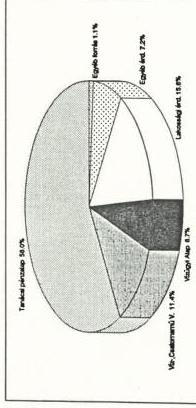

Az egészségre ártalmas ivóvízű településeknél:

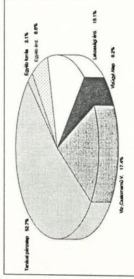

Az egészségre ártalmas ivóvízű településeknél:

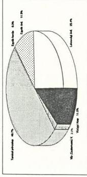

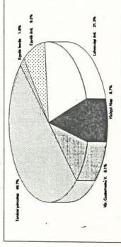

---

1. 2. 3. 4. 5. 6. 7. 8. 9. 10. 11. 12. 13. 14. 15. 16. 17. 18. 19. 20. 21. 22. 23. 24. 25. 26. 27. 28. 29. 30. 31. 32. 33. 34. 35. 36. 37. 38. 39. 40. 41. 42. 43. 44. 45. 46. 47. 48. 49. 50. 51. 52. 53. 54. 55. 56. 57. 58. 59. 60. 61. 62. 63. 64. 65. 66. 67. 68. 69. 70. 71. 72. 73. 74. 75. 76. 77. 78. 79. 80. 81. 82. 83. 84. 85. 86. 87. 88. 89. 90. 91. 92. 93. 94. 95. 96. 97. 98. 99.

---

Állami Számvevőszék  
Területi Főcsoport  
V-79-8/1990.  
V-19-8/1991.

# FÜGGELÉK

**az egészséges ivóvízellátás feltételeinek javítására  
fordított eszközök felhasználásának ellenőrzéséről  
készített jelentéshez**

## Az ivóvízellátás általános fejlődése

Az ivóvíz az emberek életfunkciójának és a higiéniaiás kulturájának nélkülözhetetlen feltétele, amely végig kíséri az emberiség fejlődését. Így történt ez Magyarországon is ahol korábban a vízellátás felszíni vizekből és ásott kutakból oldódott meg, majd az 1800-as évek közepétől elkezdődött a közműves ivóvízellátó művek építése. A vezetékes ivóvízellátás gyors ütemű fejlesztése a I. világháborúig tartott. A két világháború között lényeges fejlesztésre nem került sor, így 1937-ben az ország lakosságának 21 %-a, a II. világháború utáni károk kijavítása, és helyreállítása után pedig 1945-ben az ország összlakosságának — döntően a nagyvárosokban élő — mintegy 22 %-a részesült közműves, vagy közműves jellegű vízellátásban.

Az 1950-es években a közművesítés elsősorban a fővárosra, a nagyobb városok külső kerületeire és az új városokra koncentrálódott a lakásépítések felgyorsulásával összhangban.

A hatvanas években és a hetvenes évek elején az ország egyes térségeiben a helyi vízkészletek jelentős mértékben lecsökkentek. Ennek pótlására nagyobb üteművé vált az ötvenes évek végén megindult, a falusi lakosság egészséges ivóvíz ellátására szerveződött víziközműtársulati mozgalom fejlődése, valamint a kistérségi, majd a regionális víztermelő-szolgáltató rendszerek fokozatos kiépítése.

A hetvenes évek közepétől egyre több helyen észlelték hazánkban az ivóvízkészletek környezeti hatásokra visszavezethető szennyeződését. Ezek alapján 1977-ben az

---

— 2 —

Országos Vízügyi Hivatal és az Egészségügyi Minisztérium az egész országra kiterjedően felmérette a közegészségügyileg veszélyeztetett /nitrátos vizű/ települések vízellátásának helyzetét.

Hasonló megfontolásból a WHO nemzetközi kutatási programjának keretében az Országos Közegészségügyi Intézet 1981-ben felmérte különböző vízbázisok nyomelem /arzén/ koncentrációját. Ennek regisztrálását követően a vizsgálatot kiterjesztették az egész Dél-alföldi körzetre /Bács; Békés; Csongrád; Hajdú; Heves; Szolnok megyékre/.

A két felmérés szerint az északmagyarországi és a dunántúli területen 944 település több mint 700 ezer lakosa a megengedettnél nagyobb határértékű nitrát szennyezettség miatt, a dél-alföldi területen pedig 68 település 450.000 lakosa a határértéket meghaladó arzén szennyezés következtében közegészségügyileg veszélyeztetettnek minősült. Mindkét probléma megoldására felsőszintű határozatok születtek, /a nitrátos ivóvízű településekre az ÁTB 5005/1978. sz. határozat, az arzénés ivóvízű településekre pedig a 3365/1983. MT. sz. határozat/ amelyek hozzájárultak ahhoz, hogy a közműves ivóvízellátás fejlődési üteme ezt követően felgyorsult.

Az intenzív fejlesztési munka eredményeképpen az ivóvíz vezeték hálózat látványosan bővült és az 1945. évi 2900 km-rel szemben 1990-ben meghaladta az 52.000 km-t. A vezetékek csaknem 90 %-a az elmúlt 30 esztendőben épült és csőanyaga szerinti összetétele is ennek megfelelően korszerűsödött. Egyidejűleg a víztermelő kapacitás csaknem tízszeresére növekedve napi átlagban 5 millió köbméter fölé emelkedett, amelynek fele a lakosság által közvetlenül fogyasztott víz mennyisége. Az előzetes adatok szerint 1990-ben a magyar lakosság 91 %-a /a városiak 96 %-a, a községi lakosok 72 %-a/ — döntően felszín alatti vízkészletből — már közüzemi ivóvízellátásban részesült, ami nemzetközi összehasonlításban arányát tekintve a fejlett európai átlagszinvonalat közelíti.

A kétségtelen eredmények mellett azonban vizsgálatunk idején 442 településen a helyi vízkészletek még mindig nitráttal, harminc dél-alföldi település ivóvize pedig arzénnal szennyezett, amelyek egészséges ivóvízzel való ellátását az önkormányzati törvény értelmében 1994 végéig kellene megoldani.

---

— 3 —

## A veszélyeztetett települések helyzete 1986 előtt

### a) Nitrátszennyezettség

Az ország különböző pontjain a 0-3 éves korú gyermekek körében alkalmanként és szórványosan, de országos méretekben százas nagyságrendben már a hatvanas és hetvenes években is jelentkező u.n. “Kék betegség”-ről az egészségügyben dolgozók, és a lakosság egy része korábban is tudta, hogy annak kiváltó oka az elfogyasztott ivóvíz magas, 40 mg/l határértéket meghaladó nitrát tartalma. A tényleges veszély nagyságáról azonban 1977-ig nem állt rendelkezésre megfelelő információ. Ekkor az Egészségügyi Minisztérium és az Országos Vízügyi Hivatal felkérésére a Közegészségügyi és Járványügyi Állomások az ország valamennyi településére kiterjedő, átfogó felmérést végeztek.

A felmérés adatai szerint az ország 3156 településének közel fele, 1573 település nem rendelkezett közműves ivóvízellátással, ezen belül pedig 944 településen még egészséges ivóvizet adó közkút, vagy közcélú ivóvízellátás sem volt.

A KÖJÁL mérések adatai szerint a 944 település közegészségügyileg veszélyeztetettnek minősült, mert az ezeknél rendelkezésre álló vizek nitráttartalma rendkívül nagymértékű szóródással, de mindenütt meghaladta a 0-3 éves korú gyermekekre és a terhes anyák magzataira életveszélyt jelentő 40 mg/l határértéket. Egyes helyeken a szennyezettség mértéke a megengedett határérték tíz-húszszorosát is elérte.

A nitráttartalom nagyságától a határértéket meghaladó mértékétől függően a KÖJÁL a veszélyeztetett településeket három kategóriába: súlyosan veszélyeztetett; veszélyeztetett és mérsékelten veszélyeztetett, sorolta. /Megjegyezzük, hogy azok a kisebb települések, amelyeken legalább egy egészséges ivóvizet adó kút volt, nem kerültek e kategóriákba./

A súlyosan veszélyeztetett kategóriába sorolt közel 200 település helyzete olyan kritikus volt, hogy azonnali intézkedéseket igényelt. Ezért az OVH az EüM-mal együttesen a területi vízügyi, tanácsi és egészségügyi szervek bevonásával részletes programot dolgozott ki és terjesztett az Állami Tervbizottság elé az érintett települések egészséges ivóvízzel való ellátásának megoldására, amelyet az ÁTB az 5005/1978. sz. határozatával jóváhagyott.

---

— 4 —

A határozat szerint a program keretében e közel 200 település ivóvízellátását az V. ötéves terv hátralévő időszakában, a további csaknem 800 települését pedig a VI. ötéves tervidőszak alatt kellett megoldani. A végrehajtás V. ötéves tervi pénzügyi feltételeit a tanácsok közreműködésével kellett felülvizsgálni, a VI. ötéves tervre szóló feladatok megvalósításának költségelőirányzatáról pedig a középtávú tervezés időszakában kellett gondoskodni. Ehhez kapcsolódóan az OVH-nak rendeznie kellett a díjtételeket és az üzemeltetés többletköltségeit a Vízügyi Alapból biztosítani.

A lényegében kétlépcsős feladat első szakaszában azt kellett megoldani, hogy a leginkább veszélyeztetett településeken az érintett lakossági kör egészséges ivóvízhez jusson. Ennek megfelelően a gyors beavatkozás a kezdeti időszakban az átmeneti megoldások előtérbe kerülését eredményezte. Ilyen megoldás révén /tasakos, palackos, lajtkocsis, tartályos ivóvízszállítással/ az első ütemben 134 településre juttatták el az egészséges ivóvizet döntően terhes anyák és a 0-3 éves koru gyermekek részére. Ezzel párhuzamosan 1980 december 31-ig 94 településen végleges megoldással /vezetéképítés, kútfúrás/ biztosították az adott települések teljes lakossága számára az egészséges ivóvízhez való jutás lehetőségét.

Ezzel egyidejűleg megyénként ugyan eltérő intenzitással és módszerekkel /orvosokon, védőnőkön, tanácsi vezetőkön keresztül, falugyűléseken, hirdetőtáblán stb./, de mindenütt megkezdődött a lakosság tájékoztatása és felvilágosítása a víz nitrátszeny nyeződésének egészségre káros, kisgyermekekre kimondottan életveszélyes hatásáról. Ennek a tevékenységnek az egészséges ivóvízhez jutás technikai feltételeinek biztosítása mellett mérhető eredménye abban mutatkozik, hogy az u.n. “Kék betegség” az elmúlt évtizedben már csak elvétve fordult elő, s minden esetben bizonyítható volt a szülők gondatlansága.

Az egészségügyi felvilágosító munka azonban nem számolt az idősebbkoru lakosság konzervatívizmusával, ami abban nyilvánult meg, hogy a figyelemfelhívások ellenére továbbra is fogyasztotta a nitráttal szennyezett kutak vizét esetenként még azon kutakét is, amelyekre az egészségügyi szervek “nem ivóvíz” feliratu táblát helyeztek el. Még 1990-ben is volt olyan település, amelynek lakosai — feltehetőleg az érdekeltségi hozzájárulás magasnak tartott összege miatt is — ragaszkodtak meglévő kutjuk vizéhez.

Az 1977. évi felmérést követően a KÖJÁL tovább folytatta a települések kútjainak rendszeres ellenőrzését. A korszerű műszerekkel egyre jobban felszerelt intézmények mérési eredményei is egyre pontosabbá, megbízhatóbbá váltak. Részben erre, de döntően a nem kellő gondosságú emberi magatartásból adódó környezeti

---

— 5 —

ártalmakra visszavezethetően 1978-1985 között a KÖJÁL újabb 221 települést sorolt a közegészségügyileg veszélyeztetett kategóriába. Ez a tendencia, ha csökkenő mértékben is, de 1986-1990 között is folytatódott és újabb 30 települést kellett veszélyeztetettnek nyilvánítani. Ezért annak ellenére, hogy a hivatkozott program II. ütemében 1981-1985 években 298, a következő öt évben pedig 338 településen került sor az egészséges ivóvízellátás végleges formában való megoldására, 1990 december 31-én még 442 település 264 ezer lakosa nem jutott rendszeresen egészséges ivóvízhez.

#### **b) Az arzénszennyezettség**

Az Egészségügyi Világ Szervezet keretében /WHO/ az Országos Közegészségügyi Intézet /OKI/ által 1981-ben végzett felmérés során a Dél-alföldi térségben a mélyfúrású kutak vizében határértéket /0,05 mg/liter/ meghaladó arzénkoncentrációt észleltek. Ennek nyomán a vizsgálatokat a térség egészére kiterjesztették és megállapították, hogy a geológiai eredetű szennyeződés Békés, Bács-Kiskun, Csongrád, Hajdu-Bihar, Heves és Szolnok megyéket érinti, és 68 település 450 ezer lakosának egészséges ivóvízzel való ellátásának megoldását igényli. A veszélyeztetettség különösen Békés megyében okozott gondokat, ahol a lakosság kétharmadát érintette.

A mérési eredményekről a tanácsi vezetők informális uton tudomást szereztek ugyan, de hivatalos formában tájékoztatást a megyei vezetők először 1985 október 17-én kaptak. Ezt megelőzően és ezt követően egészen 1987-ig az arzénszennyezettséget főleg azért kezelték titkosan, hogy elkerüljék a lakosság körében az esetleges pánik hangulat kialakulását.

A lakosság ezért csak akkor értesült a problémáról, amikor az már a megoldás egy előrehaladottabb stádiumába került.

A KÖJÁL mellett más szervezetek is folytattak méréseket eseti megbízások alapján, vagy önállóan. Így pl.a JATE, a KÖRKÖVIZIG, a Vizgazdálkodási Intézet, a Vízmű vállalatok. Az egyes szervezetek műszerezettségi színvonala akkor és még ma is eltérő színvonalú és nem mindenütt megfelelő, ezért mérési eredményeik is eltérőek. A folyamatos mérések révén azonban, hasonlóan a nitrátszennyeződésnél tapasztaltakhoz, itt is hattal bővült a veszélyeztetettnek minősülő települések köre.

---

— 6 —

Az OVH az illetékes tárcákkal, főhatóságokkal és az érintett megyei tanácsok bevonásával programot dolgozott ki és terjesztett a Minisztertanács elé 1983-ban. A program hat megye 68 települését érintette, ahol a vízműkutak vizében a szabványban megengedett határértéket meghaladó volt az arzéntartalom. Ezek közül 30 településen az arzénszennyeződés mértéke elérte a 0,1 mg/liter értéket, így az "igen sürgős" kategóriába kerültek besorolásra. Ez azt is jelentette, hogy e területeken az arzéntartalmat legkésőbb 1988-ig 0,1 mg/liter alá kellett csökkenteni. Ezt követően 1995-re minden településen az ivóvízszabványnak megfelelő minőségű vizet kell szolgáltatni. A teljes program megvalósítása 1983. évi árszinten 2,1 Md Ft költséggel járt volna.

A minisztertanács 3365/1983. sz. határozatában elfogadta a Dél- alföldi települések egészséges ivóvízzel való ellátására kidolgozott programot azzal, hogy

- a legrosszabb helyzetben lévő települések vízellátásának megjavítását 1988-ig, a teljes programot 1995-ig kell megvalósítani.
- az illetékes főhatóságok, tárcák és megyei tanácsok vezetői a tanácsi tervező munka során úgy gondoskodjanak a pénzügyi feltételekről, hogy vegyék számításba a gazdálkodó szervezetek, az érdekelt tanácsok, a vízgazdálkodási ágazat pénzügyi alapjait, valamint a lakosság anyagi hozzájárulását is;
- a programhoz 1984-ben központi forrásként a vízügyi ágazat előirányzatából 30 millió Ft-ot, a költségvetésből 90 millió Ft-ot, 1985-re pedig az éves terv kidolgozásakor 200-220 millió Ft-ot kell biztosítani.

A program jóváhagyását követően további 6 településen derült ki, hogy vizük arzénnel szennyezett. Emiatt a következő években végzett arzén mentesítések ellenére 1990 december 31-én még mindig 30 település 205 ezer lakosa élt közegészségügyileg veszélyeztetett ivóvízű településeken.

# c) Az ivóvizek szennyezettségének új jelenségei

Az előzőekben jelzett nitrát, illetve arzén által szennyezett ivóvízű települések csaknem kétharmadának gondjait felszámolták, ennek ellenére még e téren is vannak további feladatok. Ugyanakkor ezzel egyidejűleg a hazai vízbázist veszélyeztető új jelenségek is mutatkoznak, amelyek megoldása a következő évek feladata.

---

— 7 —

Egyes területeken, elsősorban a Dunántulon a bauxitbányászattal összefüggésben már 1984-től csökkent a karsztvíz szintje. A Bács-Kiskun megyében végzett kutatások ugyancsak a rétegvizek szintjének csökkenését prognosztizálják. A felelőtlen, nem kellő körültekintéssel végzett mezőgazdasági kemizálásra, a szennyvízelhelyezés, elvezetés hiányosságaira vezethető vissza, hogy a magyarországi talajvizek ma már egyáltalán nem használhatók ivóvíz céljára, de az is, hogy Somogy megyében az alkalmazott vascső miatt szennyeződött átmenetileg a víz, hogy Nógrád, Baranya és Pest megyében helyenként már a vezetékes ivóvíz is nitráttal szennyezett, hogy egyes pestmegyei települések vizének jódtartalma a megengedettnél magasabb, néhol pedig ammóniával szennyezett, hogy Baranya megyében 6 helyen fordult elő a megengedettnél nagyobb mértékű vas-mangán szennyezettség a vezetékes rendszerben, hogy az ország különböző pontjain — ha szórványosan is de 10-46 %-os szélső értékek között szóródva bakteorológiai szempontból kifogásolható volt az ivóvíz, hogy Békés megyében de másutt is metángáz található az ivóvízben.

Külön is említést kell tenni arról, hogy a közelmúltban egy korszerű mérési móddal végzett vizsgálat a Tisza vizében 350 szerves vegyület jelenlétét mutatta ki, s a toxikus és ízrontó vegyületek, ha csökkent mennyiségben is, de az ivóvízben is megjelennek, mert a jelenlegi tisztítási technológiával ezeket nem képesek kiszűrni.

Az emberi gondatlanság olyan szélsőséges jeleivel is találkoztak a vizsgálók, hogy az arzén szűrésre szolgáló tartályokat leszerelték, a szűrőket nem tisztították előírásszerűen, csúcsidőszakban a magas arzéntartalmú kutakat is bekapcsolták a rendszerbe. Az egészségügyi felvilágosító munka kudarca, hogy azon településeken ahol jelentős anyagi ráfordításokkal biztosítják az arzénmentes ivóvizet, az igény fokozatosan csökken.

---

1. 2. 3. 4. 5. 6. 7. 8. 9. 10. 11. 12. 13. 14. 15. 16. 17. 18. 19. 20. 21. 22. 23. 24. 25. 26. 27. 28. 29. 30. 31. 32. 33. 34. 35. 36. 37. 38. 39. 40. 41. 42. 43. 44. 45. 46. 47. 48. 49. 50. 51. 52. 53. 54. 55. 56. 57. 58. 59. 60. 61. 62. 63. 64. 65. 66. 67. 68. 69. 70. 71. 72. 73. 74. 75. 76. 77. 78. 79. 80. 81. 82. 83. 84. 85. 86. 87. 88. 89. 90. 91. 92. 93. 94. 95. 96. 97. 98. 99.

---

# 1. sz. táblázat

# **A közegészségügyileg veszélyeztetett (nitrátos vizű)  
települések, s az itt élő lakosság számának alakulása**

|  megye | települések száma db |   |   | lakosság száma fő  |   |   |
| --- | --- | --- | --- | --- | --- | --- |
|   |  1977. XII. 31. | 1985. XII. 31. | 1990. XII. 31. | 1977. XII. 31. | 1985. XII. 31. | 1990. XII. 31.  |
|  Baranya | 185 | 163 | 116 | 58.452 | 49.173 | 34.335  |
|  Borsod-Abauj-Zemplén | 172 | 155 | 101 | 123.000 | 97.465 | 56.347  |
|  Fejér | 11 | 4 | - | 12.700 | 6.000 | -  |
|  Győr-Moson-Sopron | 35 | 32 | 7 | 24.440 | 32.970 | 3.010  |
|  Heves | 20 | 16 | 10 | 17.901 | 12.653 | 7.435  |
|  Komárom-Esztergom | 30 | 19 | 1 | 32.357 | 21.800 | 365  |
|  Nógrád | 28 | 63 | 59 | 20.000 | 46.600 | 35.100  |
|  Pest | 27 | 51 | 15 | 93.600 | 347.000 | 69.000  |
|  Somogy | 165 | 74 | 14 | 208.800 | 95.457 | 21.476  |
|  Szabolcs-Szatmár Bereg^{x} | 62 | - | - | - | - | -  |
|  Tolna | 17 | 10 | 3 | 10.940 | 7.260 | 2.390  |
|  Vas | 131 | 80 | 16 | 81.082 | 26.215 | 3.482  |
|  Veszprém | 18 | 79 | 45 | 12.820 | 37.760 | 19.920  |
|  Zala | 43 | 78 | 55 | 10.300 | 26.666 | 11.907  |
|  Összesen | 944 | 824 | 442 | 706.397 | 807.019 | 264.767  |

Megjegyzés: a KÖJÁL 1977-ben 14 megyében állapította meg az ivóvizek nitrátszennyezettségét, az ÁSZ vizsgálata 12 megyére (Fejér és Tolna megyék kivételével) terjedt ki,

x Szabolcs-Szatmár-Bereg megye településeinél az ivóvíz nitráttartalma nem haladta meg a határértéket, s így nem került bele a megyei programba

---

1

1

1

1

---

# 2. sz. táblázat

# **A dél-alföldi (arzenes vizű települések  
számának és lakosságának változása**

|  megye | települések száma db |   |   | lakosság száma fő  |   |   |
| --- | --- | --- | --- | --- | --- | --- |
|   |  1983. XII. 31. | 1985. XII. 31. | 1990. XII. 31. | 1983. XII. 31. | 1985. XII. 31. | 1990. XII. 31.  |
|  Bács-Kiskun | 11 | 11 | 1 | 37.302 | 37.302 | 8.355  |
|  Békés | 31 | 30 | 18 | 270.013 | 267.041 | 143.700  |
|  Csongrád | 12 | 11 | 2 | 27.300 | 24.100 | 8.280  |
|  Hajdú-Bihar | 7 | 10 | 7 | 69.620 | 69.620 | 19.836  |
|  Heves | 3 | 3 | 1 | 3.307 | 3.307 | 727  |
|  Jász-Nagykun-Szolnok | 4 | 3 | 1 | 42.724 | 40.303 | 25.120  |
|  Összesen: | 68^{x} | 68 | 30 | 450.266 | 441.673 | 206.018  |

Megjegyzés: $^{x}$ 1983 után — a KÖJÁL mérései alapján — Csongrád és Hajdú-Bihar megyékben további 3-3 település került a veszélyeztetettek közé.

---

1

1

1

1

---

3. sz. táblázat

# **A lakosság ivóvízellátottságának aránya néhány  
fejlett európai országban  
(1980-as évek második felében)**

|  ország | ellátottság százalékban  |
| --- | --- |
|  Belgium | 98  |
|  Németország /NSzK/ | 98  |
|  Dánia | 92  |
|  Finnország | 81  |
|  Franciaország | 99  |
|  Anglia és Wales | 99  |
|  Olaszország | 91  |
|  Hollandia | 100  |
|  Luxemburg | 99  |
|  Norvégia | 87  |
|  Svédország | 87  |
|  Svájc | 99  |
|  Spanyolország | 96  |

---

1. 2. 3. 4. 5. 6. 7. 8. 9. 10. 11. 12. 13. 14. 15. 16. 17. 18. 19. 20. 21. 22. 23. 24. 25. 26. 27. 28. 29. 30. 31. 32. 33. 34. 35. 36. 37. 38. 39. 40. 41. 42. 43. 44. 45. 46. 47. 48. 49. 50. 51. 52. 53. 54. 55. 56. 57. 58. 59. 60. 61. 62. 63. 64. 65. 66. 67. 68. 69. 70. 71. 72. 73. 74. 75. 76. 77. 78. 79. 80. 81. 82. 83. 84. 85. 86. 87. 88. 89. 90. 91. 92. 93. 94. 95. 96. 97. 98. 99.

---

# 4. sz. táblázat

# A lakosság fajlagos ivóvízfogyasztásának alakulása

|  év | liter/fő/nap  |
| --- | --- |
|  1950 | 85  |
|  1955 | 98  |
|  1960 | 105  |
|  1965 | 110  |
|  1970 | 122  |
|  1975 | 124  |
|  1980 | 133  |
|  1985 | 153  |
|  1990* | 162  |

(* Előzetes adat, KSH végleges adatok csak 1991. májusban állnak rendelkezésre)

---

1

1

1

1

1

---

# 5. sz. táblázat

# A lakosság fajlagos ivóvízfogyasztása néhány  
fejlett európai országban  
(1980-as évek második felében)

|  ország | ivóvízfogyasztás liter/fő/nap  |
| --- | --- |
|  Belgium | 108  |
|  Németország (NSzK) | 146  |
|  Dánia | 194  |
|  Finnország | 156  |
|  Franciaország | 147  |
|  Anglia és Wales | 132  |
|  Olaszország | 220  |
|  Hollandia | 159  |
|  Luxemburg | 171  |
|  Ausztria | 129  |
|  Svédország | 199  |
|  Svájc | 264  |
|  Spanyolország | 158  |

---

1. 2017年1月1日

\( \therefore m = \frac{3}{11} \)

\( \therefore m = \frac{3}{11} \)

\( \therefore m = \frac{3}{11} \)

1. 2017年1月1日

[Non-Text]

[Non-Text]

[Non-Text]

[Non-Text]

---

a./ ábra

# Magyarország közműves ivóvíztermelésének megoszlása a vízkészletek származása szerint (1989)

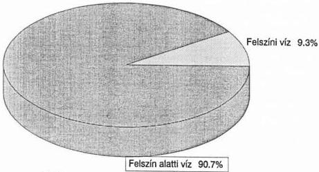

Ebből:

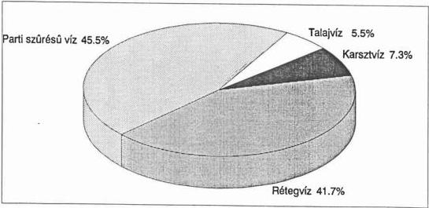

---

1. 2. 3. 4. 5. 6. 7. 8. 9. 10. 11. 12. 13. 14. 15. 16. 17. 18. 19. 20. 21. 22. 23. 24. 25. 26. 27. 28. 29. 30. 31. 32. 33. 34. 35. 36. 37. 38. 39. 40. 41. 42. 43. 44. 45. 46. 47. 48. 49. 50. 51. 52. 53. 54. 55. 56. 57. 58. 59. 60. 61. 62. 63. 64. 65. 66. 67. 68. 69. 70. 71. 72. 73. 74. 75. 76. 77. 78. 79. 80. 81. 82. 83. 84. 85. 86. 87. 88. 89. 90. 91. 92. 93. 94. 95. 96. 97. 98. 99.

---

b./ ábra

Magyarország közüzemi vízműveinek
napi ivóvíztermelő kapacitása
(Millió m3/nap)

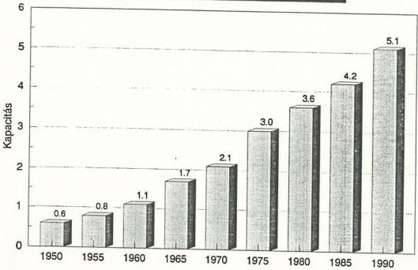

---

2

1

1

1

---

c./ ábra

# Ivóvíz értékesítés alakulása

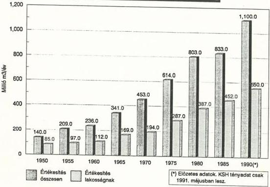

---

1. 2. 3. 4. 5. 6. 7. 8. 9. 10. 11. 12. 13. 14. 15. 16. 17. 18. 19. 20. 21. 22. 23. 24. 25. 26. 27. 28. 29. 30. 31. 32. 33. 34. 35. 36. 37. 38. 39. 40. 41. 42. 43. 44. 45. 46. 47. 48. 49. 50. 51. 52. 53. 54. 55. 56. 57. 58. 59. 60. 61. 62. 63. 64. 65. 66. 67. 68. 69. 70. 71. 72. 73. 74. 75. 76. 77. 78. 79. 80. 81. 82. 83. 84. 85. 86. 87. 88. 89. 90. 91. 92. 93. 94. 95. 96. 97. 98. 99.

---

d./ ábra

# Magyarország ivóvíz-vezetékhálózatának alakulása

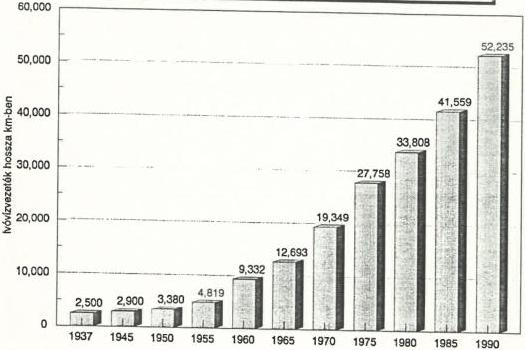

Az ivóvíz-hálózat csőanyag szerinti összetétele

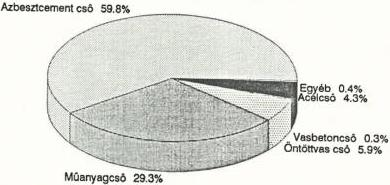

Az ivóvíz-hálózat kor szerinti összetétele

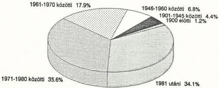

---

1

1

[Non-Text]

[Non-Text]

[Non-Text]

[Non-Text]

[Non-Text]

[Non-Text]

[Non-Text]

[Non-Text]

[Non-Text]

[Non-Text]

[Non-Text]

[Non-Text]

[Non-Text]

[Non-Text]

[Non-Text]

[Non-Text]

[Non-Text]

[Non-Text]

[Non-Text]

[Non-Text]

[Non-Text]

---

e./ ábra

# Magyarország közműves ivóvízellátásba kapcsolt településeinek száma

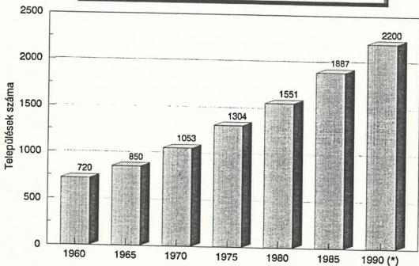

A (*) előzetes adat. KSH végleges adat csak 1991. májusban áll rendelkezésre.

---

1. 2. 3. 4. 5. 6. 7. 8. 9. 10. 11. 12. 13. 14. 15. 16. 17. 18. 19. 20. 21. 22. 23. 24. 25. 26. 27. 28. 29. 30. 31. 32. 33. 34. 35. 36. 37. 38. 39. 40. 41. 42. 43. 44. 45. 46. 47. 48. 49. 50. 51. 52. 53. 54. 55. 56. 57. 58. 59. 60. 61. 62. 63. 64. 65. 66. 67. 68. 69. 70. 71. 72. 73. 74. 75. 76. 77. 78. 79. 80. 81. 82. 83. 84. 85. 86. 87. 88. 89. 90. 91. 92. 93. 94. 95. 96. 97. 98. 99.

---

f./ ábra

# A közüzemi ivóvízzel ellátott lakosság számának alakulása

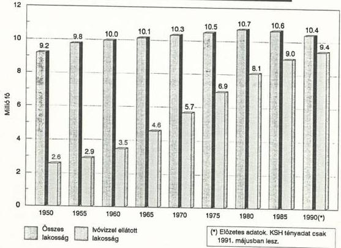

---

1

1

---

g./ ábra

# Magyarország lakosságának
ivóvízellátottsági aránya

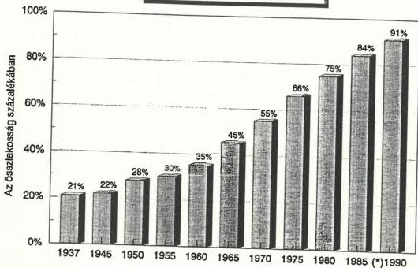

A (*) előzetes adat. KSH végleges adat csak
1991. májusban áll rendelkezésre.

---

1. 2017年1月1日

1. 2017年1月1日