# ÁLLAMI
SZÁMVEVŐSZÉK

# JELENTÉS

az Állami Számvevőszék 2006. évi tevékenységéről

0705

J/2623

2007. április

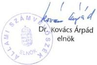

---

$$\therefore m = \frac{3}{11}$$

---

# TARTALOMJEGYZÉK

1. Az ÁSZ 2006. évi feladatai 4
1.1. Ellenőrzési feladatok, súlypontok 4
1.2. Egyéb számvevőszéki feladatok 6
1.2.1. Ellenjegyzési, véleményezési jogkör 7
1.2.2. Javaslattételi jogkör 7
2. Az ÁSZ ellenőrzési tapasztalatai 9
2.1. Főbb tapasztalatok államháztartási alrendszerenként 11
2.1.1. A központi költségvetés 11
2.1.2. Az elkülönített állami pénzalapok 17
2.1.3. A társadalombiztosítás pénzügyi alapjai 18
2.1.4. A helyi önkormányzatok 22
2.2. Az állami és az önkormányzati feladatellátásra irányuló ellenőrzések főbb tapasztalatai 30
2.3. Uniós források felhasználása 37
2.4. Államháztartáson kívüli – non-profit célú – támogatások 40
2.5. Az állami vagyon 41
3. Az ellenőrzések hasznosítása 44
3.1. A jelentések országgyűlési tárgyalása, határozatok és az országgyűlési kapcsolatok 44
3.2. A számvevőszéki javaslatok érvényesülése 46
3.2.1. Javaslatok az Országgyűlés szintjén 47
3.2.2. Javaslatok kormányzati szinten 50
3.2.3. Javaslatok a vizsgált szervezeteknél 55
3.3. Kezdeményezett büntető eljárások 56
3.4. Közérdekű bejelentések, javaslatok és panaszok intézése 58
3.5. A számvevőszéki tevékenység nyilvánossága 59
4. Az ellenőri munka minőségének fejlesztése 61
4.1. Humán erőforrás gazdálkodás és fejlesztés 61
4.2. Az ellenőrzések minőségbiztosítása 66
4.3. Nemzetközi kapcsolatok 67
5. A számvevőszéki tevékenységhez kapcsolódó kutató és módszertani munka 71
6. Az intézmény működése és gazdálkodása 73
6.1. Költségvetési gazdálkodás 73
6.2. Az infrastruktúra működtetése, fejlesztések 75
6.3. Az informatika és a telekommunikáció működtetése, fejlesztése 76
6.4. Belső ellenőrzés 78

1

---

# MELLÉKLETEK

1.számú A 2006. évi jelentések jellemzöi 1
2.számú A megyei, megyei jogú varosi és a fóvarosi kerületi önkormányzatok gazdalkodási rendszere atfogó ellenörzsének utemezese 17
3.számú ÁSZ jelentések az országyúlesi bizottságok/plenáris ülesek na-pirendjén 2006-ban 21
4.számú Az ÁSZ 2006. évi jelentéseiben a fejezetek gezetőinek megfogalmazott javaslatok és az azokra adott válaszok 25
5.számú Oszefoglalok a 2006-ban befejezett ellenörzesek tapasztalataírol 89

2

---

VE-01-018/2007

## az Állami Számvevőszék 2006. évi tevékenységéről

Az Állami Számvevőszék (ÁSZ) – az Országgyűlés pénzügyi-gazdasági ellenőrző szerve – évente beszámol előző évi tevékenységéről. Több mint tíz éves gyakorlat, hogy e jelentést több országgyűlési bizottság napirendre tűzi, és azt a plenáris ülés is minden évben megtárgyalja. Az éves tevékenységről szóló jelentés megvitatását követően az Országgyűlés határozatot hoz a munka értékeléséről, illetve a jövőbeni fejlesztési irányokról.

A legutóbbi ilyen országgyűlési határozatban foglaltak alapján állítottuk össze 2007. évi ellenőrzési tervünket, folytattuk módszertani fejlesztéseinket, készítettük el az európai uniós támogatások 2005. évi felhasználásának ellenőrzéséről szóló tájékoztatót (Trend Report), valamint kezdtük meg a közpénzügyi törvény megalkotását megalapozó tézisek kidolgozását.

2006-ban 62$^{1}$ jelentést tettünk közzé. Az országgyűlési bizottságok az előző évinél kevesebb, összesen 9 jelentésről 46 alkalommal tárgyaltak. A korábbi gyakorlatnak megfelelően néhány jelentést – mint a 2005. évi költségvetés végrehajtásának ellenőrzése, a 2007. évi költségvetési javaslat véleményezése, illetve az ÁSZ éves jelentése – több bizottság is napirendjére tűzött. Jelentéseinkben összesen 1134 javaslatot tettünk, amelyeket 1426 szervezetnél végzett helyszíni ellenőrzés lefolytatásával alapoztunk meg.

Az éves jelentés – a szervezet működésének, gazdálkodásának, fejlesztésének bemutatása mellett – lehetőséget ad az ellenőrzési tapasztalatok rendszerszemléletű értékelésére, a javaslatok alapján kibontakozó intézkedések és azok befolyásoló tényezőinek áttekintésére. A számvevőszéki tevékenységet jellemző folyamatosan bővülő feladat-tartalom mellett ésszerű terjedelmi korlát betartására törekszünk, figyelemmel az áttekinthetőség és az összevethetőség követelményére.

Ezen jelentésünk az államháztartás alrendszerei, az állami vagyon, az uniós források felhasználása, valamint az állami és önkormányzati feladatellátás szempontjából tekinti át és összegezi a 2006. évi ellenőrzések tapasztalatait. Ismerteti ezek hasznosításának főbb jellemzőit és adatait, továbbá rávilágít arra is, hogyan szolgálja az ellenőrzési munka minőségének fejlesztése az ÁSZ kiegyensúlyozott, szervezett működését. A jelentés képet ad a számvevőszéki tevékenységhez kapcsolódó, a tanácsadást megalapozó kutatómunkáról, és szól az intézményi működésről, valamint a gazdálkodásról is.

$^{1}$ Ebből 61 ellenőrzési jelentés, 1 pedig az ÁSZ éves tevékenységéről szóló jelentés.

3

---

A számvevőszéki törvény előírásának megfelelően az Országgyűlés elnöke által pályázat útján megbízott független könyvvizsgáló ellenőrzi az intézmény gazdálkodását.

# 1. Az ÁSZ 2006. ÉVI FELADATAI

Az Alkotmány és más törvények messzemenően biztosítják az ÁSZ független működéséhez és ellenőrzési tevékenységéhez szükséges jogi feltételeket, garanciákat.

Ellenőrzési tevékenységünket érintően az Alkotmányon és a számvevőszéki törvényen kívül további 26 törvény határoz meg feladatokat. Az ÁSZ felhatalmazásai azonban nem közvetlenül és kizárólag ellenőrzési jogosultságokat és kötelezettségeket jelentenek, hanem olyan tevékenységeket is, amelyek a közpénzekkel való gazdálkodás átláthatóságát erősítik.

# 1.1. Ellenőrzési feladatok, súlypontok

Az ÁSZ 2006-ban is a jóváhagyott – az Országgyűlés Számvevőszéki bizottsága által megtárgyalt – ellenőrzési tervben foglaltak szerint végezte tevékenységét.

Ellenőrzési kötelezettségeinket és jogosultságainkat 2006-ban 86 ellenőrzéssel teljesítettük. Ebből 66 ellenőrzés 2006. évi befejezési időponttal került megtervezésre. Év közben ellenőrzési tervünk 1 vizsgálattal kiegészült, 2 feladat törlésre került², így a 2006. évi befejezéssel tervezett vizsgálatok száma – a tervmódosítást követően – 65-re változott.

Két ellenőrzésről nem elnöki, hanem főigazgatói aláírással készült jelentés (SAPARD 2005. évi igazoló ellenőrzése és az Európai Unió strukturális alapjaiból nyújtott támogatásokkal kapcsolatos csalások és szabálytalanságok kezelése rendszerének és gyakorlatának ellenőrzése). Két jelentés közzététele 2007-re húzódott át³, ezzel a 2006-ban közzétett jelentések száma 61 volt.

Ellenőrzési tevékenységünket 2006-ban 64 557 közvetlen⁴ ellenőri nap felhasználásával teljesítettük, ami az előző évinél 3039 nappal kevesebb. Ez az év közben életbe lépett létszámkorlátozásra vonatkozó intézkedések következménye.

Az ellenőrzési feladatok sorában meghatározóak a törvényekben különféle rendszerességgel előírt feladatok. A 2006-ban a meghatározott gyakori-

² Év közben a terv kiegészült A kulturális közgyűjtemények kezelésére fordított pénzeszközök ellenőrzésével, törlésre került A Nemzeti Kulturális Örökség Minisztériumának, valamint A felsőoktatási kollégium beruházási programjának ellenőrzése.

³ A Magyar Demokrata Fórum 2004-2005. évi gazdálkodása és Az Antall József Alapítvány 2003-2005. évi gazdálkodása törvényességének ellenőrzése.

⁴ Közvetlen ellenőrzési nap: az ellenőrzésre fordított kapacitás, valamint az ellenőrzésre közvetlenül elszámolható jogi, minőségbiztosítási és informatikai támogatás.

4

---

sággal (évenkénti, kétévenkénti, illetve rendszeres) teljesítendő ellenőrzési feladatok az éves ellenőrzési kapacitás 65%-át vették igénybe.

Az évenkénti ellenőrzési kötelezettségek továbbra is súlyponti feladatként szerepeltek. Ebben a körben 4 jelentés készült (költségvetési vélemény, zárszámadási jelentés, az ÁPV Zrt., illetve az MTI Zrt. működésének ellenőrzése). A legnagyobb kapacitást igénylő feladat a 2005. évi költségvetés végrehajtásának ellenőrzése volt, ami az előző évhez hasonlóan az ellenőrzési kapacitás 24%-át kötötte le.

Kétévenkénti ellenőrzési kötelezettség végrehajtásáról 2006-ban 2 jelentés készült (1 párt és 1 pártalapítvány gazdálkodásának ellenőrzése).

A rendszeres ellenőrzési feladatok teljesítéseként 33 jelentést adtunk közre. Rendszeres ellenőrzési feladatot jelent a költségvetési fejezetek, a helyi önkormányzatok, a társadalombiztosítási és az elkülönített állami pénzalapok gazdálkodásának ellenőrzése.

A rendszeres feladatok meghatározó részét a helyi önkormányzatok gazdálkodásának átfogó ellenőrzése képezte. A több mint 500 települési önkormányzat átfogó helyszíni ellenőrzésénél szerzett tapasztalatokat összefoglaló jelentésen kívül 18 jelentős nagyságrendű költségvetéssel, illetve vagyonnal rendelkező önkormányzatról önálló számvevőszéki jelentés készült (5 megyei, 6 megyei jogú városi, 1 fővárosi és 6 fővárosi kerületi önkormányzat).

Az ÁSZ 2006-ban 6 központi költségvetési fejezet több évre kiterjedő átfogó ellenőrzéséről tett közzé jelentést (Miniszterelnökség, Ügyészség, Magyar Tudományos Akadémia, Belügyminisztérium, Területfejlesztés, Környezetvédelmi és Vízügyi Minisztérium.)

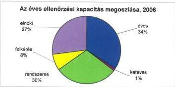

Az ÁSZ elnökének döntése alapján végzett ellenőrzésekről 21 jelentés készült. Ezek témaválasztásánál előtérbe kerültek az uniós források eredményes felhasználását segítő ellenőrzések, a PPP konstrukcióban megvalósuló beruházások, illetve további fejlesztési célú pénzeszközök ellenőrzése, valamint lezajlott több kiemelt közérdeklődésre számot tartó ellenőrzés is.

Ezek sorába tartozik a Nemzeti Fejlesztési Terv végrehajtásának, az autópálya beruházások finanszírozási megoldásainak, a Művészetek Palotája megvalósításának és működésének, az államháztartás adóssága alakulásának, kezelésének, az

5

---

egészségügyi szakellátások privatizációjának, a tartósan veszteségesen működő állami tulajdonú gazdasági társaságok gazdálkodásának, valamint az APEH működésének ellenőrzése.

Az állami oktatás működési feltételeit és egyes feladatainak megvalósítását 2006-ban 4 jelentés értékelte: a közoktatási intézmények tankönyvellátási rendszerének ellenőrzése, az iskola-előkészítés, általános iskolai oktatás feltételeinek biztosítása kistelepüléseken, a középiskolai kollégiumok fenntartásának és fejlesztésének feltételeinek, a felsőoktatási állami intézmények ingatlangazdálkodásának ellenőrzése.

**Az Országgyűlés döntése alapján 2006-ban 1 ellenőrzésre került sor.** Az Országgyűlés a 2004. évi zárszámadásról szóló törvényben határozta meg az ÁSZ számára a központi költségvetés által 2005. év végéig az önkormányzatokhoz út- és szennyvízcsatorna építés címén átutalt közműfejlesztési támogatás igénylésének és felhasználásának ellenőrzését. A törvény által előírt feladatot teljesítettük.

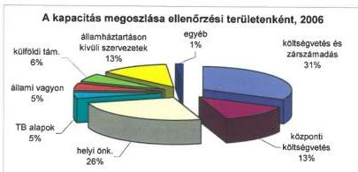

Az ÁSZ az ellenőrzéseit **három fő típusba sorolja**. 2006-ban a kapacitásának 50%-át a szabályszerűségi vizsgálatokra (költségvetés véleményezése, zárszámadás, pártok gazdálkodásának ellenőrzése, SAPARD és az EMOGA igazolászervi ellenőrzések), 33%-át az átfogó ellenőrzésekre fordítottuk. A teljesítmény-ellenőrzés módszerével végzett vizsgálatok az éves kapacitás 17%-át képviselték.

A 2006-ben elkészült jelentések jellemzőit (a jelentés tárgya, száma, a jelentést készítő igazgatóság, az ellenőrzés jogszabályi alapja és indoka, célja, a költségvetési nagyságrend) az 1. sz. melléklet tartalmazza.

## 1.2. Egyéb számvevőszéki feladatok

A szervezet egyéb tevékenységi körébe számos – a szorosan vett ellenőrzési kötelezettségen és jogosítványon túlmutató – felhatalmazás, illetve feladat tartozik, amelyeket az Alkotmány, a számvevőszéki törvény és egyéb törvények írnak elő.

6

---

Az ÁSZ elnöke **ellenjegyzi** a költségvetés hitelfelvételeire vonatkozó szerződéseket, **véleményezi** az államháztartás számviteli rendjének, belső pénzügyi ellenőrzési rendszere működésének továbbfejlesztésére vonatkozó javaslatokat. Véleményezi az állami vagyonkezelő szervezet belső ellenőrzési szabályzatát, s **javaslatot tesz** felügyelő bizottságának elnökére, könyvvizsgálójára, továbbá a jegybank könyvvizsgálójára, az elkülönített állami pénzalapok könyvvizsgálóira, valamint **előzetesen véleményezheti** az APEH elnökének kinevezését.

Az államháztartási törvény értelmében az állam legalább többségi befolyása alatt álló gazdálkodó szervezet esetében – ha a jegyzett tőke meghaladja a kétszáz millió forintot – a felügyelő bizottság elnökének személyére is az ÁSZ **tesz javaslatot**, a gazdálkodó szervezet vezetőjének megkeresése alapján.

### 1.2.1. Ellenjegyzési, véleményezési jogkör

A Magyar Köztársaság nevében a pénzügyminiszter 2003. november 28-án egy 500 millió euró összegű készenléti hitelkeretre vonatkozó szerződést írt alá az ÁSZ elnökének ellenjegyzése mellett. A hitelkeret-megállapodás 2006. november 24-én lejárt. Az Államadósság Kezelő Központ Zrt. – az eredeti összeg megtartása mellett – a szerződés meghosszabbítását kezdeményezte. A készenléti hitelkeret meghosszabbításával kapcsolatos dokumentációk – szabályszerűségre vonatkozó – áttekintése alapján a hitelszerződés ellenjegyzése megtörtént.

A számviteli rend változásával összefüggésben biztosított véleményezési jogkörünket 2006-ban az „Egyes pénzügyi tárgyú törvények módosításáról” c. előterjesztésben szereplő, a számvitelről szóló 2000. évi C. törvény módosítása, továbbá az államháztartás szervezetei beszámolási és könyvvezetési kötelezettségének sajátosságairól szóló 249/2000. (XII. 24.) Korm. rendelet, valamint a kincstári elszámolások beszámolási és könyvvezetési kötelezettségének sajátosságairól szóló 240/2003. (XII. 17.) Korm. rendelet módosításai kapcsán gyakoroltuk.

### 1.2.2. Javaslattételi jogkör

Az oktatási és kulturális miniszter felkérésére 2006-ban az ÁSZ elnöke javaslatot tett a Nemzeti Kulturális Alap könyvvizsgálójának személyére. Folyamatban volt a Magyar Nemzeti Bank és a Magyar Fejlesztési Bank könyvvizsgálójára történő javaslattétel előkészítése, amelyek 2007-re is áthúzódtak.

A közbeszerzési eljárások szabályozásának az európai közösségi joggal való harmonizációja – a közbeszerzési eljárás lefolytatása alóli kivételek további szűkítésével – érintette az egyes törvényekben (pl. MNB tv., MFB tv.) megállapított számvevőszéki könyvvizsgálói javaslattétel gyakorlásának módját is. Kétségtelen, hogy a könyvvizsgálói szolgáltatás megrendelése közbeszerzési kötelezettség alá tartozik, de a jelölési jogot biztosító törvényi előírások érintetlenül hagyása továbbra is azt kívánja, hogy független, szakmai kritériumok alapján kiválasztott könyvvizsgáló lássa el az érintett szerveknél a könyvvizsgálói feladatot. Ennek feltételeit teremtettük meg a közbeszerzési eljárásban való részvétel kereteinek – az érdekeltekkel történő – meghatározásával.

7

---

A felmerült jogalkotási problémáról – miután több törvényt is érint – tájékoztattuk az Országgyűlés elnökét és illetékes bizottságát, valamint az igazságügyi és rendészeti tárcát. Az elvégzendő felülvizsgálatig a Kbt., illetve a számvevőszéki könyvvizsgálói jelölési jogosultságot megállapító törvényi előírások együttes alkalmazása zavart nem okoz.

Az ÁSZ elnöke által gyakorolt könyvvizsgálói javaslattételt a bírálati szempontok kidolgozásában, továbbá az eljárásban megfigyelőként történő részvételünk előzi meg, amely lehetővé teszi az ÁSZ által elvárt szakmai követelmények, az ÁSZ-nak a vonatkozó törvényekben rendezett jelölési jogosultsága érvényesülését.

A felügyelő bizottsági (FB elnöki) névjegyzék frissítése érdekében – a korábbi 4 alkalmat követően – további pályázatot írtunk ki. Ennek értékelése alapján 32 eredményes pályázattal gyarapodott az általunk kezelt pályázati anyagok száma. A jelölésre alkalmas személyek száma 2006. december 31-én 642 fő volt.

A 2003. évi indulástól 2006 végéig 679 pályázati anyagot bíráltunk el. A névjegyzékbe 646 személy került felvételre. Elhalálozás miatt a névjegyzékből 4 főt töröltünk.

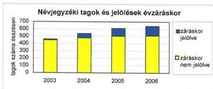

2006-ban az ÁSZ főtitkára 49 gazdálkodó szervezet részére tett jelölési javaslatot. Javaslatunk alapján – tudomásunk szerint – 2006. december 31. napján 133 személy töltött be FB elnöki megbízatást.

A 2003. évi indulástól 2006 végéig 217 gazdálkodó szervezettől érkezett kérelmet vizsgáltunk meg, és 199 névjegyzékben szereplő személy jelölésére tettünk javaslatot.

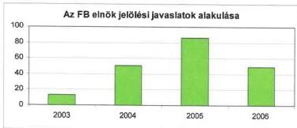

8

---

2.

## AZ ÁSZ ELLENŐRZÉSI TAPASZTALATAI

Az ÁSZ különböző területeken és témákban végzett ellenőrzései során kénytelen azzal szembesülni, hogy az államháztartási működés és gazdálkodás szervezeti és szabályrendszerére összpontosuló intézményi reformok nem kiérlelt és elfogadott átfogó fejlesztési koncepciók, összehangolt stratégiák mentén bontakoznak ki. Átfogó stratégia hiányában esetenként egymást keresztező, egymásnak ellentmondó prioritások is hatnak.

A változtatásokat nem támasztják alá előzetes hatástanulmányok és más értékelő-elemző dokumentumok. A költségvetési információs rendszer sem képes megfelelően alátámasztani a feladatellátás tényleges költségeinek és hatásainak elemzését. A források hasznosításának nyomon követése, értékelése még azokban az esetekben sem valósul meg, amelyekben a felhasználást konkrét célokhoz kötötték. **A folyamatosan változó jogszabályi környezet is gyengíti a költségvetési biztonságot.** Évek óta ismétlődően jelezzük azt is, hogy a költségvetési és zárszámadási törvényjavaslatok információ tartalma sem segíti az átláthatóságot és nem ad elegendő támogatást a megalapozott döntéshozatalhoz.

Mindezen visszatérően érvényesülő hiányosságok és okaik kiküszöbölése új szemléletet igényel a közszféra működésében, olyan felfogást és problémakezelést, ami – a jövő generációira is figyelemmel – hozzájárul a fenntartható gazdasági növekedést támogató költségvetési biztonság feltételeinek megteremtéséhez is. Ez **halaszthatatlanná teszi a közpénzügyek rendszerszemléletű áttekintését, elemzését és annak alapján teljes körű, átfogó és konzisztens újraszabályozását.**

Az ÁSZ – stratégiájának fő iránya szerint, tanácsadói szerepének keretén belül – éppen ennek érdekében kezdeményezi és támogatja az államháztartás tervezési, működési, beszámolási és ellenőrzési rendjének megújítását, s ahhoz kapcsolódóan a közvagyonnal való gazdálkodás megfelelő, teljes körű összehangolt szabályozását.

Az alapozó munka keretében áttekintettük a mértékadó nemzetközi tapasztalatokat, külső szakértők bevonásával szakmai vitákat rendeztünk és – mindezek alapján, ellenőrzési tapasztalatainkat is felhasználva – több résztanulmányt is készítettünk.

Az ÁSZ ez irányú kezdeményező szerepének alkotmányos és szakmai-ésszerűségi korlátaival is számoltunk, ezért javaslatainkat olyan formában fogalmaztuk meg, hogy azok a törvényhozási munkában minél közvetlenebbül hasznosíthatók legyenek. A „**A közpénzügyek szabályozásának tézisei**” című összeállításunk – amit a 2006. évi tevékenységünkről szóló jelentéssel egyidejűleg tárunk az Országgyűlés elé – pontokba szedve tartalmazza a javasolt szabályozás legfontosabb elveit, módszereit, áttörési pontjait, valamint a tézisek indokolását. Ezzel szeretnénk megfelelő lehetőséget teremteni arra, hogy az Országgyűlés az ÁSZ kiinduló javaslatait a további munka alapjául elfogadja. Reményeink szerint a tézis-gyűjtemény és a kapcsolódó indokolás meggyőzi a tisztelt országgyűlési képviselőket a változtatás szükségességéről, kijelöli a korszerűsítés tartalmát, irányát és hasznosításával a közpénzügyek törvényi

9

---

szabályozásának korszerűsítésére irányuló munkák felgyorsulnak, s még ebben a parlamenti ciklusban látható eredményt hoznak.

A „tézisek” legfontosabb mondanivalója, „üzenete”, hogy **a közpénzekkel való gazdálkodás szabályozását szilárd elvi alapokra kell helyezni.** Ezeket az elveket a szabályozás egészében érvényre kell juttatni. A „tézisek” rögzítik ezeket az elveket, s felvázolják a szabályozási irányokat, amelyek mentén az elveknek érvényt lehet szerezni. Alapvetőnek tartjuk, hogy az elveket illetően szakmai, politikai és társadalmi konszenzus alakuljon ki.

A „tézisek” második üzenete, hogy új szemléletű szabályozásra van szükség. Az elmúlt években kibontakozott az a tendencia, hogy a közfeladatok ellátásában egyre nagyobb részt vállaltak az államháztartáson kívüli szervezetek. Az ÁSZ ellenőrzései pedig rávilágítottak arra, hogy **a közpénzek „elfolyásának” ott a legnagyobb a veszélye, ahol a köz- és a magánszektor érintkezik. Ezt a veszélyt csak olyan szabályozással lehet kiküszöbölni, ami a közpénzek felhasználását, és nem az államháztartási szervezetet állítja a szabályozás középpontjába.**

A „tézisek” harmadik fontos üzenete, hogy a modernizáció a közpénzügyeket sem hagyta érintetlenül. Az információtechnológia fejlődése megköveteli, hogy a közpénzügyi információrendszer fő szabályai törvényi szinten is megfogalmazásra kerüljenek. Csatlakozásunk az Európai Unióhoz és más nemzetközi szervezetekhez indokolttá teszi, hogy az e szervezetek által a **közszférára kidolgozott standardok a magyar szabályozásban is tükröződjenek.** Fejlődtek a költségvetési tervezés és gazdálkodás technikái is. Ezek alkalmazásának utat kell engedni, sőt utat kell törni a magyar közpénzügyi menedzsmentben is.

Végeredményben a „tézisek” abból indul ki, hogy a közszektor reformjának kulcskérdése a közpénzügyek korszerű szabályozása, amit nemzetközileg elfogadott, hazai politikai konszenzussal megerősített elvekre kell alapozni; **a szabályozás sarokköve az állam feladatainak meghatározása.** Olyan szabályozásra van szükség, ami átfogja a közpénzekkel gazdálkodók, a közpénzügyi gazdálkodás teljes körét, az államháztartás központi és helyi szintjét különíti el, **biztosítja az Országgyűlés költségvetési jogának gyakorlását és a végrehajtó hatalom felelősségét, érvényre juttatja a fenntarthatóságot és az egyensúlyt.** Az új, korszerű szabályozásnak biztosítania kell a közpénzek beszedésének és felhasználásának átláthatóságát, az „értéket a pénzért” elv dominanciáját. Az új szabályozás keretein belül „helyére kerül” a vezetés-belső irányítás, valamint a (pénzügyi) ellenőrzés. A közpénzügyi szabályozásnak kiszámíthatónak és viszonylag stabilnak kell lennie, amihez szükséges, ezért **ajánlható az alapvető szabályok Alkotmányba foglalása is.**

Az új közpénzügyi szabályozás téziseinek kidolgozása egyáltalán nem jelenti azt, hogy az 1992-ben elfogadott és több ízben módosított államháztartási törvény korszerűsítésére irányuló, a Pénzügyminisztériumban folyó munkára ne lenne szükség. Ellenkezőleg, a **két törekvés kiegészíti egymást.**

---10

---

A közpénzügyek újraszabályozása valószínűleg nem lehetséges egyetlen törvény megalkotásával, illetve a „tézisek” néhány könnyen kivitelezhető ajánlásának a meglévő szabályozásba illesztésével. Ezért a „tézisek” a teljes törvényi szabályozás megújítása mellett a közpénzügyekkel való gazdálkodás egyes blokkjainak rendszerszemléletű újraszabályozására tesz javaslatot, de a javaslatok a vagyontörvény szabályozási tárgykörébe tartozó kérdésekre nem terjednek ki.

## 2.1. Főbb tapasztalatok államháztartási alrendszerenként$^{5}$

### 2.1.1. A központi költségvetés

A zárszámadás kapcsán minden évben foglalkozunk az államadóssággal, adósságszolgálat mutatóival. 2006-ban önálló jelentés is készült az államadósság kezelésének, alakulásának ellenőrzéséről.

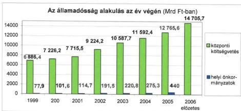

Megjegyzés: a helyi önkormányzatok 2006. évi adósságáról még nincs adat

**A központi költségvetés adósságának éves növekedése** 2000-2001-ben 500 Mrd Ft alatt volt, 2002-ben a háromszorosára emelkedett, 2003-tól pedig évi 1000 Mrd Ft körül állandósult. A központi költségvetés adóssága növekedésének 63%-át a költségvetés hitelátvállalások nélküli hiánya okozta. A hiány elsősorban olyan működési jellegű kiadásokhoz kapcsolódott, amelyek következtében nem várhatóak a jövőben bevételek és kiadás-megtakarítások. A hiány növekedése annak ellenére következett be, hogy 2003-tól a kiadások visszafogása érdekében a Kormány számos megszorító intézkedést hozott. Ezek azonban csak átmenetileg mérsékelték a hiány növekedését, mert az államháztartás túlelosztásra épülő rendszere lényegében nem változott, és elmaradt a finanszírozható állami feladatrendszer meghatározása is.

$^{5}$ A számvevőszéki ellenőrzések megállapításai – jellegükből fakadóan – a vizsgálatok lefolytatását megelőző hosszabb-rövidebb időszakra vonatkoznak, a jelentésekben a lezárt pénzügyi évek adatai jelennek meg. Ennek következtében beszámolónk a 2005. évi tényeket, folyamatokat 2006-ban vizsgáló jelentések tapasztalatain alapul, ugyanakkor a tendenciák és következtetések túlmutatnak egy-egy költségvetési éven.

11

---

A központi költségvetés egyre növekvő adóssága következtében a kamat abszolút összege is rendre emelkedett. 2000-2005 között a fizetett kamat – amely része a hiánynak – a központi költségvetés adósság növekedése 82%-ának megfelelő nagyságrendű volt.

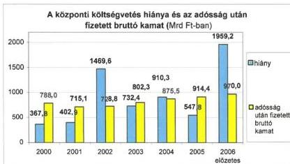

A központi költségvetés adósságát befolyásolta az is, hogy a társadalombiztosítási alapok éves hiánya 2000-ről 2005-re több mint ötszörösére emelkedett. Az adósságnövekedés 25%-át a társadalombiztosítási alapok hiánya okozta. Az alapokon belül az egészségbiztosítási alap hiánya volt a meghatározó, amelynek oka a járulékkulcsok (bevételek) csökkentése, a kieső források központi költségvetésből történő pótlásának elmaradása, illetve a kiadások gyors (pl. gyógyszertámogatások, gyógyító-megelőző ellátások), a bevételeket meghaladó ütemű növekedése volt.

Az ellenőrzött időszakban a hitelátvállalások 821,6 Mrd Ft-tal növelték az államadósságot. A Magyar Állam által a gazdálkodó szervezetektől 2005-ben átvállalt adósság jelentős részét az NA Zrt.-től átvállalt hiteltartozás jelentette.

A Kormány a Budapest Airport Zrt. értékesítésével összefüggő egyszeri, rendkívüli bevételt adósság-előtörlesztésre, illetve adósság-visszafizetésre fordította.

Az önkormányzatok adóssága – bár nem meghatározó az államadósság növekedésében – növekvő tendenciájú. Az önkormányzatok adósságán belül a fejlesztések miatti adósság a meghatározó, de kedvezőtlen tendenciát jelez az önkormányzatok gazdálkodásában a működési célú eladósodás.

**Az adósságállomány további növekedése**, különösen ha az párosul az adósság finanszírozásánál a hozamok (kamatok) emelkedésével, a kamatkiadások abszolút összegének emelkedését, és egyben **a költségvetés mozgásterének a jelenleginél is nagyobb beszűkülését okozhatja**.

Az ÁSZ-nak a 2005. évi költségvetés végrehajtásának ellenőrzéséről szóló legutóbbi zárszámadási jelentése megállapította, hogy a **központi költségvetés pénzforgalmi hiányának** – az előző évektől eltérő – **kedvező alakulását**

12

---

**a költségvetés egyensúlyi helyzetét nem tartósan javító, egyszeri tényezők idézték elő.**

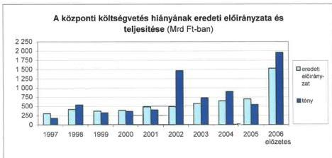

A központi költségvetés **bevételeinek** (áfa, társasági és osztalékadó, ökoadók) elmaradását csak részben ellensúlyozták egyes bevételi többletek (illetékek, adósságszolgálattal kapcsolatos bevételek, egyéb bevételek).

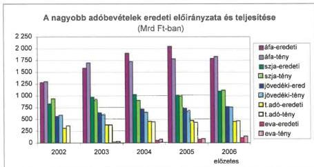

A **kiadások** közül elsősorban a költségvetési szervek és a szakmai fejezeti kezelésű előirányzatok kiadásainak előirányzathoz viszonyított emelkedése, valamint a lakásépítési támogatások, illetve az adósságszolgálat, kamattérítés többletkifizetése járult hozzá a hiány alakulásához. Kedvező, hogy a módosítási kötelezettség nélkül túlteljesíthető előirányzatok nem, vagy az előző évinél kisebb mértékben lépték túl az előirányzatot.

A 2005. évi zárszámadási ellenőrzés tapasztalatai még azt mutatták, hogy sem **a bevételi előirányzatok tervezési módszerében**, sem **a központi költségvetés kiadási struktúráját érintően nem történt előrelépés**. A néhány fejezetnél elindított szervezetkorszerűsítések pénzügyi-gazdasági hatása nem volt számszerűsíthető. Ellenőrzési jelentéseinkben folyamatosan jeleztük a

13

---

feladatok, a szervezeti keretek, valamint a költségvetési források összhangjának hiányát.

Az ÁSZ stratégiai célkitűzése volt, hogy meghatározott körben (a kiadási főösszeg közel 80%-ára) **minősítő véleménnyel záruló zárszámadási ellenőrzést végez.** A vállalt feladatunkat teljesítettük. Ahhoz, hogy az ÁSZ szakmai nyilatkozatot tegyen a költségvetés végrehajtásáról készített, az Országgyűlésnek benyújtott beszámoló megbízhatóságáról, a zárszámadás teljes körű ellenőrzése szükséges. Ez utóbbi – a számvevőszéki ellenőrzésen túl – a fejezetek belső ellenőrzése keretében végzett, az intézményi kör minősítő ellenőrzését feltételezi.

A gazdálkodási, beszámolási fegyelem területén – az előző évek kedvezőtlen tapasztalataira figyelemmel – érdemi előrelépés 2005-ben sem történt. Ebben meghatározó szerepe van a közigazgatásban szinte állandósuló, a közpénzekkel való hiteles elszámolás (vagyonátadások, pénzügyi elszámolások lezárása) igényének háttérbe szorulásával zajló, kellően nem átgondolt struktúraváltásnak.

A központi költségvetés fejezetrendjében meghatározó arányt képviselő ICSSZEM és GKM fejezetek fejezeti kezelésű előirányzatairól készült beszámoló jelentéseket elutasító véleménnyel láttuk el. A fejezetek közül az NKTH beszámolójánál tapasztaltuk, hogy a vagyoni és pénzügyi helyzetét nem megbízhatóan mutatta be. Figyelemre méltó, hogy az NKTH fejezet és a GKM fejezet fejezeti kezelésű előirányzatairól készült beszámolók adatainak megbízhatatlansága egymást követő két beszámolási évet (2004-2005) érintett.

A minősített véleménnyel zárult pénzügyi-szabályszerűségi ellenőrzések az igazgatási címek és az intézményi kör, valamint a fejezeti kezelésű előirányzatok esetében elsősorban a mérlegben kimutatott vagyoni helyzet valódiságával kapcsolatos lényeges problémákkal, illetve a belső kontroll rendszer működésének elégtelenségével, a vagyonmérleg adataiban jelentkező lényeges szintű hibákkal és a céltól eltérő felhasználásokkal voltak összefüggésben.

A központi költségvetés közvetlen kiadásainak adatai – a lakástámogatások korlátozottan megbízható elszámolása kivételével – teljes körűek és megbízhatóak.

A központi költségvetés zárszámadási törvényjavaslatában kimutatott közvetlen bevételek egészében és bevételi nemenként is megegyeztek a pénzforgalomban realizált összegekkel.

**A 2007. évi költségvetési törvényjavaslat véleményezése** kapcsán visszatérő problémaként jelentkezett az éves költségvetés tervezése során a módszertan átgondolására és szükséges változtatására irányuló törekvés hiánya.

Az ÁSZ a 2006. szeptemberi Konvergencia program véleményezése során hiányolta a programban bemutatott reformok (intézkedések) hatásait számszerűsítő kimutatásokat. **A költségvetési törvényjavaslat sem foglalta össze és vezette le a tervezett, illetve megvalósult intézkedések, folyamatok számszerűsített hatásait.**

---14

---

A korábbi évektől eltérően **a tervezést az óvatosság jellemezte**, ami nemcsak a makrogazdasági folyamatok prognózisában mutatkozott meg, hanem a központi költségvetés hiányának betartása érdekében kialakított tartalékok képzésében is. A helyszíni ellenőrzés tapasztalatai szerint a központi költségvetés 2007. évi adóbevételi előirányzatai várható teljesülésének valószínűsége – az áfa, az szja és a regisztrációs adó tekintetében – az előző évekénél kisebb kockázatú. Mindezeken túlmenően **felhívtuk a figyelmet az alkotmánybírósági beadvánnyal érintett adónemek** (a társasági adó részét képező ún. elvárt adó, hitelintézeti járadék) 2007. évi **teljesülésének kockázatára** (a bevételként így tervezett összeg 80 Mrd Ft volt)$^{6}$.

A 2007. évi központi költségvetés (és a Konvergencia program) alapját jelentő adóváltozások nem mutatnak az adórendszer évek óta ismert problémáinak megoldása és a korszerűsítés irányába. Az adóváltozások évközi bevezetése a jogbiztonságot gyengíti és ezáltal a gazdálkodás működési feltételeinek kiszámíthatóságát csökkenti.

A 2007. évi költségvetés összeállításakor **prioritást élvezett az unióból érkező források és támogatások** igénybevételét biztosító hazai társfinanszírozások előirányzatainak **megtervezése**. A támogatások igénybevételének fedezete a költségvetési törvényjavaslatban biztosított volt, azonban az uniós támogatások igénybevétele, felhasználása garanciáinak megteremtése elsősorban nem tervezési feladat, az a programok működtetését végző hatóságok gyors, szakszerű tevékenységén múlik.

**Az állami feladatokat ellátó intézményrendszer kiadásainak csökkentése** a Konvergencia program egyik kiemelt célkitűzése. A kormányprogram a „kisebb és hatékonyabb” államra vonatkozóan az átalakulás fő formáit is meghatározta. Ezzel szemben a Konvergencia programban bemutatott intézkedésekben és **a 2007. évi költségvetési törvényjavaslatban is a közszférát illetően a létszámleépítés dominált, az állami feladatellátás és szervezeti kereteinek felülvizsgálata, a feladatellátás teljesítmény követelményeinek meghatározása körvonalaiban is alig volt érzékelhető**. Mindössze három fejezetnél$^{7}$ tapasztaltuk ezen alapelvek irányába ható kezdeti lépések megtételét.

Ellenőrzéseink azt mutatták, hogy az államháztartási kondíciók javítására szolgáló kormányzati létszámcsökkentés előírása önmagában – megfelelő feladatelemzés és differenciálás nélkül – nem jelent hosszú távon megoldást. A 2007. évi költségvetési törvényjavaslat véleményezésének időszakában tapasztaltak jelzik, hogy a közszféra átszervezésére vonatkozó koncepciók előkészítetlensége hátráltathatja, későbbre halaszthatja a Konvergencia programban kitűzött határidők betartását.

$^{6}$ Számos indítvány van az Alkotmánybíróság napirendjén. Az elvárt adót a 8/2007 (II. 28.) AB határozat, a házipénztáradót a 61/2006 (XI. 15.) AB határozat tartotta alkotmányellenesnek.

$^{7}$ Ezek a fejezetek a 2007. évi költségvetési véleményünk szerint: ÖTM, FVM, EüM.

15

---

## A fejezetek átfogó ellenőrzésének főbb tapasztalatai

Meghatározott időközönként, **rendszeresen ellenőrizzük a fejezetek működését**. Az elmúlt évben 7 fejezet$^{8}$ 2002-2005 közötti időszakra vonatkozó működésének átfogó ellenőrzését végeztük el. A vizsgált időszakban fejezeteket hoztak létre, szüntettek meg, illetve fejezetek feladat- és intézményrendszerét – főként a kormányváltásokhoz köthetően – többször módosították. **Az évközi struktúraváltás, a fejezetek közötti feladat- és előirányzat-átcsoportosítás problémát okozott a feladatok folyamatos, zökkenőmentes, megfelelő szakmai szintű ellátásában**. Növelte a kockázatot, hogy a vezetésben és a munkatársak körében is nagy volt a fluktuáció.

Az átszervezéseket **nem támasztották alá olyan dokumentumok**, amelyekből egyértelműen megállapítható lett volna a kormányzati munka hatékonyságára, a költségek csökkentésére irányuló törekvés. A kiforrott, előkészített kormányzati döntések hiánya, a fejezetek közötti gyakori feladat- és intézmény-átcsoportosítások, illetve a változtatások kockázatokat növelő hatása érzékelhető volt. A formálódó, módosuló kormányzati munkamegosztás keretében az érintett fejezetek működésében nem alakult ki stabil feladat- és intézményrendszer, a működésüket, felépítésüket szabályozó kormányrendeleteket a vizsgált időszak alatt többször módosították.

Az ellenőrzés pozitív példával a Magyar Köztársaság Ügyészsége fejezetnél találkozott, ahol a törvényi feladatok növekedését, valamint az európai uniós követelményeknek való megfelelés egyidejű elvárásait összességében sikeres működési rendszer kialakítása követte, ami világos szerkezetű, a szakmai, illetve a gazdasági hatás- és jogkörök tekintetében egyaránt pontosan működő szervezetet eredményezett.

**A vizsgált időszakon belüli – köztük az évközi – struktúraváltoztatások sem az elvégzendő feladatok, sem a gazdasági, pénzügyi és számviteli folyamatok szempontjából nem voltak kellően átgondoltak**. A létszám, a munkakörök, az eszközök, a vagyontárgyak részletezése mellett a megállapodásokban nem szerepeltek feladatátadások. Az állami és egyéb vezetők (beleértve a vezetői besorolásúakat is) aránya az ellenőrzött fejezeteknél jelentős volt, magas volt a megbízási szerződések száma.

Megállapítottuk, hogy az esetek többségében **nem építették ki** a döntéshozatali mechanizmust segítő monitoringot, a megfelelően kezelt, aktualizált és ellenőrzött adatbázist. Hiányzott az elemző mélységű beszámolási rendszer, és nem helyeztek hangsúlyt a források hasznosulásának eredményességi értékelésére. Előtérbe került a rendszerellenőrzés, viszont nem kapott prioritást az intézményi beszámolók megbízhatósági ellenőrzése, és hiányoztak az intézményi belső kontrollokat értékelő ellenőrzések. Az éves ellenőrzési tervek végrehajtásához rendelt ellenőrzési kapacitás nem mindig volt elegendő.

$^{8}$ E fejezetek: Miniszterelnökség, Magyar Köztársaság Ügyészsége, Belügyminisztérium, Környezetvédelmi és Vízügyi Minisztérium, Területfejlesztés fejezet, Ifjúsági, Családügyi, Szociális és Esélyegyenlőségi Minisztérium, valamint a Magyar Tudományos Akadémia.

16

---

### 2.1.2. Az elkülönített állami pénzalapok

Az elkülönített állami pénzalapok alrendszerébe öt alap tartozik: a Munkaerőpiaci Alap, a Központi Nukleáris Pénzügyi Alap, a Wesselényi Miklós Ár- és Belvízvédelmi Kártalanítási Alap, a Kutatási és Technológiai Innovációs Alap és a Szülőföld Alap.

Az alapok beszámolóit a törvényi előírásoknak megfelelően könyvvizsgáló ellenőrzi. A 2005. évi gazdálkodásuk minősítésekor mindegyik beszámoló hitelesítő záradékokat kapott, a Munkaerőpiaci Alap esetében figyelemfelhívó minősítés kiegészítéssel.

Az alrendszer állami költségvetésen belüli súlya elsősorban bevételi, kiadási főösszegeik növekedése következtében erősödött, mértékét tekintve azonban továbbra sem számottevő. Az alapok 2005. évi pénzügyi helyzete kiegyensúlyozott volt, 30 Mrd Ft-os többletük javította az államháztartás egyensúlyi helyzetét.

A költségvetés nagyságrendjét tekintve – az alrendszert alkotó alapok közül – változatlanul a **Munkaerőpiaci Alap** (MPA) a meghatározó, amely a foglalkoztatás elősegítésével és a munkanélküliség kezelésével kapcsolatos állami feladatokat az országosan kiépített munkaerőpiaci szervezeten keresztül látja el.

Ellenőrzéseink évek óta jelzik, hogy a kiadások belső szerkezetében bekövetkezett változások egy része kedvezőtlen tendenciákat mutat, az alapból finanszírozott aktív és passzív foglalkoztatáspolitikai eszközök nagyságrendje és részaránya az utóbbiak javára változott. **Az aktív foglalkoztatáspolitikai célok támogatásának összege és aránya változatlanul csökkenő mértékű.**

Az ÁSZ több éve ismétlően felveti az MPA tervezési rendszerének, költségvetési kapcsolatainak, jogszabályi háttere felülvizsgálatának szükségességét. Nem változott az a tendencia sem, hogy az alapból mind többet fordítanak közvetlenül, illetve közvetett módon az MPA-hoz kötődő (az alap feladatait lebonyolító, pénzeszközeinek elosztásában közreműködő) szervezetek működési kiadásainak finanszírozására.

A **Központi Nukleáris Pénzügyi Alap** (KNPA) a radioaktív hulladékok végleges, valamint a kiégett üzemanyag átmeneti és végleges elhelyezésére szolgáló tárolók létesítését és üzemeltetését, illetve a nukleáris létesítmények leszerelésének finanszírozását biztosítja. Az Alap előirányzatai lényegében az előírások szerint teljesültek. **Felhalmozott egyenlege emelkedett.**

Az Alap költségvetésének törvényi előirányzatai a 2004-2006. években (és 2007-ben is) lényegesen alacsonyabbak a közép- és hosszú távú szakmai tervekben kialakított összegeknél. A forráshiány feladatok elmaradását, késedelmét okozhatja. A távlati célok és kötelezettségek megvalósulását a KNPA elkövetkező évekre meghatározandó költségvetési mozgástere – ideértve a költségvetési tartalék megnyitását is – érdemben befolyásolhatja.

17

---

A lakosságot ért ár- és belvízzel kapcsolatos káresemények enyhítésére létrehozott **Wesselényi Miklós Ár- és Belvízvédelmi Alap** érdemi működése csak 2004-ben kezdődött meg. A tapasztalatok ugyanakkor igazolni látszanak azokat a kételyeket, amelyeket az Alap működésével kapcsolatban már a 2003. évi zárszámadási jelentésben felvetettünk.

A várakozásokkal ellentétben nem kezdődött meg a veszélyeztetett településeken élők biztosítási elven működő részvétele a kárenyhítésben. **A bevételek meghatározó része költségvetési támogatás.** Megítélésünk szerint ez nem elégti ki az Áht.-ban foglalt feltételt, miszerint az elkülönített állami pénzalapok létrehozásakor a feladatellátáshoz államháztartáson kívüli forrásokat is hozzá kell rendelni. Ez a bevételeknek mindössze 1,7%-át teszi ki, ami még a jelenlegi körben sem ellentételezné egy komolyabb káresemény bekövetkezését.

Az elmúlt időszak gyakori és súlyos ár- és belvízi eseményei sem indították a veszélyeztetett területek lakosságát szerződéskötésre, aminek oka a fizetőképes kereslet, az öngondoskodási képesség hiánya. Az Alap 2005. évi működése megerősítette az elkülönített állami pénzalapként való fenntartást megkérdőjelező korábbi álláspontunkat.

**A Kutatási és Technológiai Innovációs Alap (KTIA)** célja a kutatásfejlesztésre fordítható források növelésével hazánk gazdasági versenyképességének javítása. Az Alap két fő bevételi forrása a gazdálkodó szervezetek innovációs járuléka és a költségvetési támogatás. **Az Alap pénzügyi helyzete a 2005. évben stabil volt, a tárgyévet többlettel zárta.**

Az Alap működésével és felhasználásával kapcsolatos szabályokat tartalmazó kormányrendelet nem nyújt egyértelmű eligazítást az egyedi támogatások adható mértékének és körének meghatározásához. Az Alappal kapcsolatos jogok és kötelezettségek nem érvényesültek teljes körűen.

Jeleztük, hogy **a jogi szabályozás egyes szintjei között nincs meg a kellő összhang**, illetve, hogy a működtetésben érintett szervezetek tevékenysége, döntési mechanizmusa, a pályázati rendszer működése nem minden esetben felel meg a jogszabályi előírásoknak. Az Alap 2005. évi zárszámadási ellenőrzése során ezek a problémák lényegében változatlanul fennálltak.

A **Szülőföld Alap** 2005-ben jött létre új elkülönített állami pénzalapként, 1 Mrd Ft induló tőkével. A külügyi tárca költségvetésén kívül több fejezet előirányzatai között is szerepelnek a határon túli magyarokkal kapcsolatos előirányzatok, alapítványi, közalapítványi támogatások, amelyeknek nagyságrendje 2006-ban is sokszorosan meghaladta a Szülőföld Alap költségvetését.

### 2.1.3. A társadalombiztosítás pénzügyi alapjai

Az államháztartás társadalombiztosítási alrendszerét alkotó Egészségbiztosítási Alap (E. Alap) és a Nyugdíjbiztosítási Alap (Ny. Alap) költségvetési beszámolót 2005-ben is könyvvizsgáló ellenőrizte. Mindkét alap hitelesítő záradékot kapott, ami szerint a beszámolók megbízható, valós képet nyújtanak az alapok vagyoni, pénzügyi és jövedelmi helyzetéről.

18

---

Mindkét alap pénzügyi helyzete kedvezőtlenebbül alakult a tervezettnél. Ennek következtében az együttes hiány 468,8 Mrd Ft lett, ebből az Ny. Alap hiánya 93,5 Mrd Ft, az E. Alap hiánya 375,3 Mrd Ft volt.

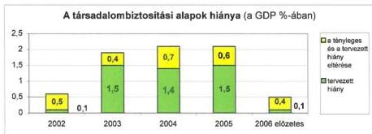

Az alapok állandósult és növekvő hiányának, a bevételek és a kiadások megbomlott egyensúlyának problémájára zárszámadási jelentéseinkben évek óta rámutattunk.

Az **egészségbiztosítás** pénzbeli ellátásainak és a gyógyító-megelőző egészségügyi ellátás jogcímcsoport 2005. évi kiadásainak előirányzatai a teljesítési adatokkal összhangban voltak. A gyógyító-megelőző egészségügyi ellátás többlete kizárólag a bérintézkedés fedezetét, illetve a háziorvosi kapacitásnál, a járó- és a fekvőbeteg ellátás területén befogadott kapacitások szintre-hozását, valamint fejlesztését szolgálta.

A lakossági felhasználáshoz kötődő **gyógyszerkiadások** visszafogására tett erőfeszítések 2005-ben sem voltak eredményesek. Ez különösen igaz a gyógyszerkassza védelmére kötött szerződésekre, ahol még a jelentős összegű gyártói befizetés (23 Mrd Ft) sem tudta a kassza túllépését ellentételezni. Szükségesnek láttuk – az egészségügyi reform lépéseihez igazodóan – a gyógyszerellátás teljes rendszerére kiterjedő, hosszabb távú koncepció kidolgozását, amelyben kiemelt szerepet kap a gyógyszerek hatástani csoportonként való áttekintése, az olcsóbb és korszerűbb gyógyszerek alkalmazását elősegítő, a lakosság egészségügyi érdekeit szem előtt tartó támogatási és befogadási rendszer kialakítása.

**Az E. Alap működése ellenőrzésének megállapításai szerint** az Alap állandósult, növekvő hiányához a járulékfizetői kör szűkülése, az ellátások járulékfizetéssel nem fedezett növekvő igénybevétele, egyes ellátási kiadások aránytalan emelkedése vezetett. A hiány növekedését legnagyobb részben a gyógyító-megelőző ellátások béremelésből adódó változása és a magas ütemben növekvő gyógyszertámogatások okozták.

19

---

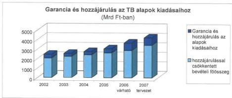

A kiadások alakulását befolyásolta, hogy nem volt követelmény az egészségügyi szolgáltatásoknak a kasszát leginkább kímélő, szakmailag lehetséges eljárás alapján történő finanszírozása, az ellátások valós költségeit a díjak megállapítója nem ismerte, átfogó költségfelmérés utoljára 1999-ben készült. A szakellátások finanszírozása sokkal inkább a meglévő ellátórendszer fenntartását, mint a lakosság egészségi állapota szerint indokolt teljesítmények reális ráfordításokon alapuló finanszírozását jelentette.

Az Alapkezelőnek a bevételek alakulására, teljesülésére nem volt érdemi ráhatása. A kiadások alakulását az OEP a finanszírozási és ellenőrzési feladatai ellátásánál legfeljebb a jogszerűtlenül igénybevett vagy nyújtott, illetve elszámolt ellátások kiszűrésével befolyásolhatta.

A szakellátások mennyiségi korlát alapján meghatározott finanszírozásának bevezetésével a gyógyító-megelőző kiadások növekedési üteme mérséklődött. A gyógyszertámogatások növekedési ütemét a gyógyszergyártókkal, forgalmazókkal kötött megállapodások nem fogták vissza. A gyógyászati segédeszközök ártámogatása növekedésének fékezésére indított lépések megakadtak.

A pénzbeli ellátásokra a személyükben járulékot fizetők jogosultak. Az ellátások igénybevételének a járulékkötelezettség alapján történő, valamint a járulék-kötelezettségnek a jogviszony nyilvántartás alapján történő, automatikus ellenőrzési rendszere nem épült ki. Ráadásul az OEP működési költségvetése alig emelkedett, ami nem volt összhangban a feladatbővülésekkel.

Az **Ny. Alap** pénzügyi helyzete 2005-ben romlott, ami alapvetően a tervezettnél magasabb nyugdíjkiadásokkal kapcsolatos.

Az Ny. Alap 2007. évi bevétele és ellátási költségvetési terve reális, megalapozott, nagy valószínűséggel nem igényel a korábbi évekhez hasonló nagyságrendben likviditási hitelt.

Az Alapnál a bevételi oldalon a munkáltatói járulékmérték növekedése csökkenti a központi költségvetés tehervállalását a nyugdíjkiadások finanszírozásában. A nyugdíjkiadások hosszú távon várhatóan növekedni fognak, de a több évre kihatással járó tervezett intézkedés-sorozat befolyásolhatja az ellátások növekedésének ütemét.

20

---

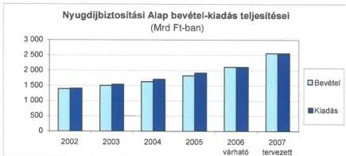

A működési kiadások engedélyezett keretének szűkössége miatt az ONYF gazdálkodása továbbra is kényszerpályán működik. A köztisztviselői besorolások előírásai csak a létszám csökkentése mellett teljesülhetnek. Megállapítottuk, hogy a dologi kiadások és a felhalmozási kiadások szűkössége az ágazat működőképességének romlása irányába hat.

**A társadalombiztosítási alapok 2007. évi költségvetései – kiadási oldalukon – továbbra is számos kockázatot hordoznak. A bevételek 2007. évi előirányzatait mindkét alap esetében – az általunk megismert dokumentumok alapján – összességében megalapozottnak tartottuk.** Kiadási oldalon a gyógyító-megelőző egészségügyi ellátás, a gyógyszertámogatási, valamint a gyógyászati segédeszköz előirányzat betartását tartjuk kockázatosnak.

A tartós kiadáscsökkentés az **egészségügy**, a **nyugdíjrendszer**, illetve a **gyógyszertámogatási rendszer** átalakítását igényli. A Konvergencia programban megfogalmazott követelmények elvi szinten a költségvetési javaslatokban érvényesültek. **A megvalósulás feltétele az E. Alap esetében a kitűzött célok, a szükséges intézkedések – ideértve a folyamatban lévő törvény és jogszabály módosítások sokaságát – következetes végrehajtása, az Ny. Alapnál az elvárt makrogazdasági mutatók teljesülése.**

Az intézkedés-sorozat elindíthatja azt az átalakulási folyamatot, amely arra kényszeríti az egészségügyi szolgáltatókat, hogy belső tartalékaikat feltárják, gazdálkodásukat racionalizálják, és a központi ösztönzőket is felhasználva strukturális átalakításokat hajtsanak végre, felesleges kapacitásokat építsenek le. Eredményeket hozhat az intézmények területi elvű (regionális) együttműködése is.

A gyógyító-megelőző előirányzat kialakítását befolyásoló tényezők közül kiemelendő, hogy a 2006. évben bevezetett országos alapdíjak előre láthatóan a 2007. évben is változatlanok maradnak. A tervek szerint a mai formájában fennmarad a teljesítmény volumenkorlátos finanszírozása is. Technikailag csak e két tényező együttes alkalmazásával érhető el a zárt kassza kockázatainak csökkentése.

21

---

## 2.1.4. A helyi önkormányzatok

Az államháztartás önkormányzati alrendszerét képező összesen 3187 helyi önkormányzat és 1825 helyi kisebbségi önkormányzat 2005. évi konszolidált bevétele (3365 Mrd Ft) és kiadása (3036 Mrd Ft) az előző évinél egyaránt mintegy 10%-kal magasabb volt. A növekedésen belül kiemelkedő a hitelfelvételek összegének emelkedése. Az önkormányzatok hitel- és kölcsönfelvétel miatti összes adóssága a 2005. év végén 385 Mrd Ft volt, amely az előző évinél 18%-kal több, a növekedés a 2006. évben is várhatóan folytatódik.

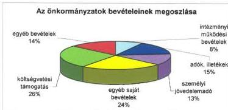

A helyi önkormányzatok könyvviteli mérleg szerinti vagyona 2005 végén 9861 Mrd Ft volt, 2006. évi összege várhatóan mintegy 10.000 Mrd Ft. Jelentősebb változás a korábbi évekhez viszonyítva az értékpapírok állományában és a kötelezettségek mértékénél következett be. Az önkormányzatok tulajdonában lévő értékpapírok állománya csökkent, amelyet jellemzően a gázközművek privatizációjához kapcsolódóan ellentételezésként kapott állampapírok értékesítése eredményezett. A kötelezettségek növekedését az emelkedő összegű hitelfelvételek miatti visszafizetési kötelezettség okozta. A hitelfelvételeken belül emelkedett a rövid lejáratú likvid hitelek aránya. A pénzeszközök a rövid lejáratú kötelezettségeket egyre kevésbé fedezték$^{9}$.

### Az államháztartás önkormányzati alrendszerének gazdálkodását befolyásoló szabályozórendszer alakulása

Az önkormányzati feladatok és a rendelkezésre álló források között évek óta fennálló feszültségek oldását a költségvetés 2005-ben sem tudta biztosítani. A feladatok és hatáskörök kormányhatározatokban elrendelt felülvizsgálata nem történt meg. Az ÁSZ által több mint 10 éve szorgalmazott finanszírozási reform előkészítésében – politikai és szakmai konszenzus hiányában – nem volt érdemi előrelépés. Nem valósult meg a helyi önkormányzatok kötelező feladatainak áttekintése, az önkormányzati feladatok és hatáskörök differenciált telepítése, átfogó módosítása, elmaradt a forrásszabályozás ezzel összehangolt továbbfejlesztése. Változatlanul jellemző, hogy az önkormányzatok számára

$^{9}$ A likviditási gyorsráta, amely a pénzeszközök és a rövid lejáratú kötelezettségek arányát jelzi, a 2004. évben 1,0, 2005 végén 0,8 volt. A tendencia várhatóan 2006-ban is folytatódott.

22

---

előírt új feladatokhoz (pl. a közszféra bérintézkedéseihez) a költségvetés nem biztosítja teljes körűen a szükséges fedezetet. Az önkormányzati gazdálkodás pénzügyi feltételeit ezen túlmenően egyéb tényezők is jelentősebb mértékben befolyásolták (pl. bázisban végrehajtott csökkentések, az államháztartási tartalékképzés, illetve elmaradt az áremelkedések és az áfa változás hatásának ellentételezése).

Az Ötv. alapján működtetett forrásszabályozási rendszerben **a normatívák fajlagos összegének alakulását elsősorban a mindenkori éves költségvetési tervezési követelmények**, valamint a szakmapolitikai preferenciák, prioritások **határozzák meg**. Mindez hátráltatta a költségelemzést, az állami támogatás és a tevékenységek ágazati szintű bekerülési összege arányának elemzését és fontosságának megfelelő kezelését. **A transzparencia fontos feltételének, a megbízható és releváns pénzügyi információs rendszernek a csaknem minden területen jellemző hiánya is nehezíti az elszámoltathatóságot, a teljesítménykövetelmények kialakítását, érvényesítését.** Az általános forráselégtelenséget az önkormányzatok jelentős hányadánál jelzi a növekvő ÖNHIKI-s támogatási igény, ugyanakkor az elmúlt 10 évben csupán 17 – a gazdasági önállósághoz korlátozottabb pénzügyi feltételekkel rendelkező – kistelepülési önkormányzatnál került sor adósságrendezési eljárás megindítására.

**Az önkormányzati feladatellátáshoz biztosított támogatások, hozzájárulások rendszere továbbra is elaprózott**, s a kapcsolódó számtalan szakmai, pénzügyi igénybevételi, felhasználási és elszámolási szabály bonyolultsága egyben jelentős hibaforrás is.

Az önkormányzatokat a 2005. évben 884,1 Mrd Ft állami támogatás és hozzájárulás, valamint 465,6 Mrd Ft személyi jövedelemadó részesedés, összesen 1349,7 Mrd Ft illette meg. A költségvetési törvény a helyi önkormányzatok számára **államháztartási tartalékképzési kötelezettséget** írt elő, amely előírás szabályozási ellentmondásokat tartalmazott, és az Áht. egyes előírásait figyelmen kívül hagyta. Kiadáscsökkentő hatása helyi szinten nem érvényesült, mivel az önkormányzatok rövidlejáratú működési hitelállománya az előző évihez képest 34%-kal növekedett. Javaslatunkat figyelembe véve a 2007. évre vonatkozó költségvetési törvény már ilyen előírást nem tartalmaz.

A normatív hozzájárulás szabályszerű igénybevételét és elszámolását nehezítette és a hibák elkövetésének kockázatát növelte, hogy az igénybevételre vonatkozó jogszabályok évről-évre lényegesen módosulnak. A szabályozás azt tükrözte, hogy érdemi előrelépés nem történt a közigazgatási szolgáltatások korszerűsítési programjáról szóló kormányhatározat vonatkozó rendelkezéseinek végrehajtásában$^{10}$. Nem vált áttekinthetőbbé a helyi önkormányzatokat megillető normatív állami hozzájárulások rendszere, az igénylési feltételek gyakori változása és a szabályozási hiányosságok nem teszik kiszámíthatóvá az önkormányzatokat megillető központi költségvetésből származó bevétel alakulását.

$^{10}$ 1113/2003. (XI. 11.) Korm. határozat a közigazgatási szolgáltatások korszerűsítési programjáról IV. Az önkormányzati rendszer korszerűsítése 2. pont.

23

---

A közigazgatás hatékonyabb működtetését, racionálisabb feladatellátását kívánja évek óta a központi költségvetés elérni azzal, hogy a létszámcsökkentéshez jelentős összegű központosított előirányzatot biztosít. **A létszámleépítéseket azonban – az önkormányzatok által ellátandó feladatok bővüléséből adódóan is – időről-időre létszámnövekedés követi.**

A pályázati rendszerben elosztott nagyszámú központosított erőirányzat igénybevételét megkönnyítené a normativitás irányába történő további elmozdulás. **A többcélú kistérségi társulások támogatási feltételei rendkívül sokrétűek, összetettek, bonyolultak, ezért nehezen kezelhetők.** Jelenlegi formájában aránytalanul munkaigényesek az ide tartozó kiegészítő támogatások igénylési, elszámolási és ellenőrzési feladatai, ami sem a hatékonyságot, sem a célszerű felhasználást nem segíti elő. Biztosítani kell, hogy a pályázati rendszerben elosztott forrásokhoz azok tárgyévi felhasználását lehetővé tevő időpontban jussanak hozzá az önkormányzatok.

**A 2007. évi költségvetési törvényjavaslattal megkezdődött a normatív hozzájárulások és támogatások rendszerének fokozatos átalakítása.** A 2007/2008-as tanévtől a közoktatási alapfeladatokhoz úgynevezett „közoktatási teljesítménymutató” alapján történik a központi költségvetési támogatás biztosítása, amely mutató egyszerre képes mind a feladat mennyiségének, szervezettségének, mind pedig a költségarányoknak a megjelenítésére. 2007-ben tovább erősödik a többcélú kistérségi társulások feladatellátásának az ösztönzése.

**A fejlesztési támogatások meghatározó elemét az elmúlt években a címzett és céltámogatások jelentették.** Ezen belül 1999-től prioritást kapott a szennyvízelvezetés és -tisztítás, segítve a közműolló zárását, az EU környezetvédelmi követelményeinek közelítésére való törekvést. A fejlesztési döntések decentralizációja tekintetében a területfejlesztésről és a területrendezésről szóló törvény hatályba lépése óta jelentős előrelépésként értékeljük, hogy a megyei területfejlesztési tanácsok mellett egyre nagyobb szerepet kaptak a regionális fejlesztési tanácsok is. A különböző jogcímű önkormányzati fejlesztési támogatások döntési jogkörének régiós szintre való telepítése elősegíti a fejlesztési célok jobb összehangolását, a beruházásokkal szembeni méretgazdaságossági követelmények érvényesítését, a szakszerűbb, gazdaságosabb és hatékonyabb feladatellátást.

A cél- és címzett támogatásokról szóló törvény 2005-től érvényes módosításai az ÁSZ korábbi javaslataival összhangban az önkormányzati beruházások „sokcsatornás” támogatási rendszerének megszüntetését, egyszerűbb és hatékonyabb „egycsatornás” támogatási rendszer megvalósítását célozták, amelynek **kedvező hatásait a 2006. évben végzett ellenőrzésünk során érzékeltük.** A korábbiaknál kisebb számú egyéb pénzforrások a beruházások 84%-ánál időben rendelkezésre álltak, biztosítva a finanszírozás folyamatosságát.

A helyi önkormányzatok részére biztosított fejlesztési támogatások igénybevételi szabályait tovább pontosították. Kedvezőnek tartjuk, hogy az ÁSZ 2004-ben tett javaslatával összhangban a TERKI és a CÉDE támogatások igénybevételére egységes szabályozást alakítottak ki, amely alapján a megyei területfejlesztési tanácsok tevékenységében **mindkét támogatás típus vonatkozásában érvényesült a folyamatba épített monitoring.**

24

---

A helyi önkormányzatok által elszámolt hozzájárulásokból, támogatásokból 200,6 Mrd Ft-ot ellenőriztünk tételesen, a megállapított hiba összege 657 M Ft, a hiba aránya 0,33% volt. A helyi önkormányzatoknak a központi költségvetésből kapott támogatásokról készített beszámolása a lényegesség figyelembevételével megbízható és valós képet mutat. A támogatások és hozzájárulások önkormányzatok részére történő átutalása szabályszerű volt.

Felhívtuk a figyelmet arra, hogy a központosított előirányzatok közül a lakosság közműfejlesztési támogatása elszámolásánál megállapított hibaarány 4,8%, az érettségi és szakmai vizsgák lebonyolításának támogatásánál 2,7%, a normatív, kötött felhasználású támogatások közül a középiskolai pedagógusok felkészülésének támogatása a kétszintű érettségizetés esetében 2,3%, a szociális továbbképzés és szakvizsga támogatásánál 2,1% volt.

### **Az önkormányzati átfogó ellenőrzések általános tapasztalatai**

Az ÁSZ a 2002-2006. évekre kidolgozott stratégiájában kiemelt célként rögzítette, hogy a jelentős nagyságrendű költségvetéssel, illetve vagyonnal rendelkező megyei, városi és fővárosi, valamint fővárosi kerületi önkormányzatokra összpontosítja ellenőrzési kapacitását, és ebben a körben választási ciklusonként egy átfogó ellenőrzést végez. Az Országgyűlés a 35/2003. (IV. 9.) OGY határozatában egyetértett a megfogalmazott céllal, majd a 47/2006. (X. 27.) OGY határozat megerősítette a feladat teljesítését. 2006 végéig az ÁSZ 2446 helyi és kisebbségi önkormányzatnál végzett átfogó és egyéb szabályszerűségi ellenőrzést.

**A helyi és helyi kisebbségi önkormányzatok gazdálkodási rendszerének átfogó és egyéb szabályszerűségi ellenőrzésébe bevont önkormányzatok száma**

|  Megnevezés | 2003. év | 2004. év. | 2005. év | 2006. év | 2003-2006. év összesen  |
| --- | --- | --- | --- | --- | --- |
|  Budapest főváros | 1 | 1 | 1 | 1 | 4  |
|  megye | 4 | 6 | 4 | 5 | 19  |
|  megyei jogú város | 6 | 4 | 6 | 6 | 22  |
|  fővárosi kerület | 6 | 6 | 5 | 6 | 23  |
|  város | 54 | 64 | 65 | 72 | 255  |
|  nagyközség | 27 | 22 | 21 | 9 | 79  |
|  község | 252 | 268 | 715 | 394 | 1 629  |
|  **Összesen:** | **350** | **371** | **817** | **493** | **2 031**  |
|  kisebbségi önkormányzatok | 123 | 150 | 71 | 71 | 415  |
|  **Mindösszesen:** | **473** | **521** | **888** | **564** | **2 446**  |

A megyei, a megyei jogú városi és a fővárosi kerületi önkormányzatok gazdálkodási rendszere átfogó ellenőrzésének ütemezését 2007-2010 között a 2. sz. melléklet mutatja be$^{11}$.

A kiemelt körbe tartozó és a városi önkormányzatok körében a gazdasági programmal rendelkező önkormányzatok aránya – az előző évekhez viszonyítva –

$^{11}$ Az ütemezés a rendelkezésre álló kapacitás függvényében változhat.

25

---

növekedett$^{12}$. Az önkormányzatok közel felénél az Áht. előírását megsértve a **költségvetési rendeletekben** a tervezett hiány összegét nem mutatták be, valamint finanszírozási célú pénzügyi műveleteket is figyelembe vettek költségvetési bevételként és kiadásként. Az elfogadott költségvetések az előző évenkénél magasabb arányban feleltek meg a szerkezetre, tartalomra vonatkozó jogszabályi előírásoknak, azonban a korábbi évekhez hasonlóan a költségvetés végrehajtásával kapcsolatos helyi szabályokat nem, vagy hiányosan határozták meg az önkormányzatok. Közel negyedüknél nem mutatták be tájékoztatásul a többéves kihatással járó döntések számszerűsítését évenkénti bontásban szöveges indoklással, valamint több mint felénél a közvetett támogatások kimutatását szöveges indoklással.

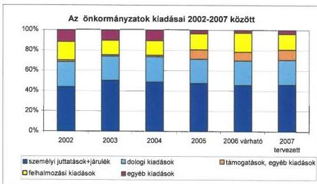

A **vagyongazdálkodással** kapcsolatos hatásköröket szinte mindegyik önkormányzat szabályozta vagyongazdálkodási rendeletében, azonban a szabályozás sok esetben az Áht. rendelkezéseivel ellentétes, egyes esetekben célszerűtlen volt. A korábbi évekhez viszonyítva nem javult a vagyongazdálkodás szabályszerűsége. Az elidegenítések során a versenytárgyalási kötelezettségre vonatkozó előírást az önkormányzatok több mint harmada nem vette figyelembe. A vagyongazdálkodás szabályozási hiányosságai és a versenytárgyalás nélkül történt elidegenítések nem segítették az önkormányzati vagyonnal történő gazdálkodás nyilvánosságát, átláthatóságát. Több önkormányzat az Ötv. és a víziközművekről szóló törvény előírásait megsértve ruházta át a törzsvagyonba tartozó víziközmű tulajdonjogát gazdasági társaságra. Az ellenőrzött önkormányzatok több mint egyharmada vásárolt, kétharmada értékesített értékpapírokat. Az adás-vételek mintegy ötöde az önkormányzat költségvetésében, vagyongazdálkodási rendeletében előírtaktól eltérő módon történt. Az Áht.-ban előírt közzétételi kötelezettségének az önkormányzatok negyede nem, vagy csak részben tett eleget. Az önkormányzatok mintegy harmadánál történt követelés elengedés, közel felénél ingyenes vagyonátruházás. Az Áht. előírása ellenére a

$^{12}$ Javaslatunkra a 2005. évben az Országgyűlés meghatározta a gazdasági program tartalmi követelményeit.

26

---

követelést elengedő önkormányzatok ötöde nem határozta meg rendeletben a követelés elengedés módját és eseteit, valamint az ingyenes vagyonátruházás eseteit.

A könyvviteli mérlegben kimutatott vagyon **leltározási** kötelezettségének teljesítése az előző évekhez viszonyítva javult. Az értékvesztés elszámolásának szükségességét az önkormányzati hivatalok több mint fele vizsgálta, de az értékvesztés elszámolását azok 15%-a a követelések esetében, harmada a részesedések esetében nem végezte el.

A Kbt.-ben előírtakat figyelmen kívül hagyva a **közbeszerzési eljárást nem folytatta le az ellenőrzött önkormányzatok közel egyharmada**. A Közbeszerzési Döntőbizottság az ellenőrzött, közbeszerzési eljárást lefolytató önkormányzatok ötödét a Kbt.-ben előírtak megsértése miatt elmarasztalta. A közbeszerzési szabályok betartása az önkormányzati gazdálkodásban magas kockázatú területnek minősül.

A helyi önkormányzatok **céljellegű támogatásként** évente növekvő összegű pénzeszközt adnak át működési és felhalmozási célra alapítványoknak, közalapítványoknak, egyéb non-profit szervezeteknek, vállalkozásoknak, háztartásoknak, az önkormányzatok saját intézményein kívüli költségvetési szerveknek, valamint külföldi közösségeknek. Az önkormányzatok a juttatott támogatások összegét, a támogatott célt, a felhasználásról a számadási kötelezettség teljesítésének módját, határidejét az előző évhez viszonyítva növekvő arányban előírták. A támogatásban részesült szervezetek közel harmada tett eleget az előírt tartalommal, határidőre számadási kötelezettségének. **A számadások ellenőrzését az Áht. előírását megsértve az önkormányzatok egyötödénél nem végezték el, közel 90%-ánál a támogatások célszerinti felhasználását nem ellenőrizték.**

Az ellenőrzött helyi **kisebbségi önkormányzatok** gazdálkodásának szabályszerűsége az előző évekhez viszonyítva javult, feladatellátásukban, az előző években ellenőrzöttekhez hasonlóan, döntően az önkormányzati testületi működés feltételeinek biztosítása, valamint a településeken élő kisebbségek érdekeinek képviselete és a nemzetiségi hagyományápolás szerepelt.

Az önkormányzatok **költségvetési egyensúlyi** helyzete az előző évekhez viszonyítva nem javult. Az ellenőrzött önkormányzatok mintegy kétharmada tervezett – az elmúlt években tapasztaltakhoz hasonlóan – költségvetésében mind a működési célú, mind a felhalmozási célú kiadásoknál hiányt. A költségvetési hiányok kialakulásában a feladatellátás módjának célszerűtlen megszervezése, az intézményi kapacitások alacsony kihasználtsága, a teherbíró képességet meghaladó önként vállalt feladatok felvállalása, valamint a tervezési hibák (saját bevételek alul-, kiadások felültervezése) is szerepet játszottak.

Az egyensúly javítására tett önkormányzati intézkedések hatására az év végére az ellenőrzött önkormányzatok egyharmadánál volt csak költségvetési hiány. A tervezett hiányt a költségvetés végrehajtása során csökkentették a pályázatok révén megszerzett források, a saját bevételek többletei, a vagyonértékesítésből származó többletbevételek, valamint a nem megalapozott tervezés miatt jelentkező többletbevételek. A kiadások csökkentése érdekében az ellenőrzött ön-

27

---

kormányzatok kétharmada különféle intézkedéseket kezdeményezett, egyes tervezett feladatainak megvalósítását átütemezte, későbbre halasztotta.

A saját bevételek között jelentős egyensúlyjavító tényező volt a **helyi adóbevétel**, amelynek a működési bevételen belüli aránya az ellenőrzött önkormányzatoknál a 2003. évi 14,6%-ról, a 2005. és 2006. években 15,8%-ra nőtt, a 2007. évben 18% körüli arány várható. A megállapított adómértékek a törvényben meghatározott adómaximumok átlag háromnegyedét érték el, az önkormányzatok különböző jogcímeken a törvényben biztosítottakon túlmenően további kedvezményeket, mentességeket is adtak. A helyi adóbevételek között változatlanul a legjelentősebb az iparűzési adó, amelynek összege 2005-ben 334 Mrd Ft volt.

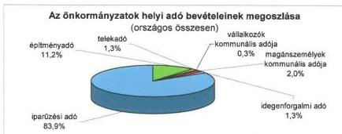

**Adósságot keletkeztető kötelezettségvállalásról** az ellenőrzött önkormányzatok kétharmada döntött, amelynek módja leggyakrabban hitelfelvétel volt. Az ellenőrzött önkormányzatoknál a tárgyévi hitel visszafizetési kötelezettséget részben újabb hitelek segítségével teljesítették, amely a pénzügyi egyensúlyi helyzetet tovább rontotta. Az év közben felvett likvid hiteleket az önkormányzatok közel fele az év végéig nem fizette vissza, ezért az a következő év gazdálkodását terhelte.

A **zárszámadási rendelettervezetek** több mint negyedét az Áht. rendelkezései ellenére nem a költségvetéssel összehasonlítható módon készítették el, több mint felénél tájékoztatásul nem mutatták be az Áht.-ban előírt mérlegeket, kimutatásokat. A pénzmaradvány összegét a zárszámadás jóváhagyásakor az önkormányzatok több mint negyedénél az Ámr. előírása ellenére nem költségvetési szervenkénti részletezésben hagyták jóvá.

Az önkormányzati hivataloknál a pénzügyi-számviteli tevékenység **informatikai** támogatottsága egyre elterjedtebb, de még csak néhány önkormányzati hivatalban épült ki integrált, rendszerezett elveken nyugvó, komplex információs rendszer. Az integrált informatikai rendszer hiányában a pénzügyi-számviteli feladatok ellátásához számítógépes programokat és manuális analitikus nyilvántartásokat egyaránt használtak.

A 2006. évben ellenőrzött önkormányzatoknál a **szociális és a közoktatási feladatok** ellátására fordított kiadások három év alatt 11%-kal nőttek. Valamennyi önkormányzati feladat esetében a működtetési kiadások emelkedésé-

28

---

ben meghatározó volt a végrehajtott közalkalmazotti bérintézkedés éves szintű hatása, a dologi kiadások növekedése (legjelentősebb az energia árának módosulása volt), valamint a közüzemi díjak áfa-kulcsának változása.

Az ellenőrzött önkormányzatoknál a kötelező feladatok végrehajtását **az önként vállalt feladatok** finanszírozása, annak mértéke nem veszélyeztette.

Az önkormányzati **gazdálkodás szabályozottsága** javult, nőtt a kötelezően előírt szabályzatokkal rendelkező önkormányzatok aránya, nem javult azonban a nagyközségi és községi önkormányzatoknál a szabályozások minősége.

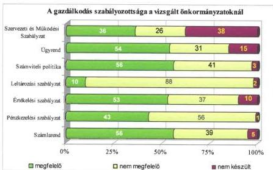

Az önkormányzatok **könyvviteli nyilvántartásaiban** a számviteli törvényben előírt bizonylatok alapján számolták el az előző évhez hasonlóan a gazdasági események döntő többségét az önkormányzati hivatalok, de valamennyi önkormányzati típusnál az alakilag, tartalmilag hibás bizonylatok aránya meghaladta az 50%-ot.

A szabályozási hiányosságok is hozzájárultak ahhoz, hogy a **munkafolyamatba épített ellenőrzés** színvonala nem javult a korábbi évekhez viszonyítva. A gazdálkodási és a folyamatba épített ellenőrzési feladatok elvégzése nem, vagy hiányosan történt meg. A tapasztalt hiányosságok miatt magas a kockázata annak, hogy az önkormányzatok belső kontrollrendszere nem képes megelőzni, vagy jelezni a lényeges hibát, szabálytalanságot.

A **belső ellenőrzési feladatok** ellátása az előző évinél kedvezőbb, mivel előrelépés történt a belső ellenőrzési szervezet kialakítása és a működéshez szükséges források biztosítása, a belső ellenőrzési kézikönyvek készítése és jóváhagyása területén, valamint a foglalkoztatott belső ellenőrök számát és szakmai felkészültségét illetően. Javult a belső ellenőrzést ellátók feladatköri és szervezeti függetlenségének biztosítása. Változatlanul nem kielégítő a belső ellenőrzések végrehajtásának színvonala, az ellenőrzések hasznosíthatósága, hasznosulása.

29

---

## 2.2. Az állami és az önkormányzati feladatellátásra irányuló ellenőrzések főbb tapasztalatai

Az elmúlt években nagy figyelmet fordítottunk arra, hogy tovább folytassuk a törvényalkotó munka elősegítése, a közpénzek hatékony felhasználása, a megtakarítási lehetőségek feltárása és a lakosság ellátásának javítása érdekében a fontosabb közszolgáltatások koncepcionális, egymásra épülő vizsgálatait.

Az ÁSZ stratégiai célkitűzésével összhangban – a már lefolytatott ellenőrzések eredményeit is felhasználva – **az autópálya beruházások finanszírozási megoldásainak összehasonlító** értékelését tűzte ki céljául. 1997-től a mindenkori Kormány meghatározta a gyorsforgalmi utak fejlesztésének középtávú programját. Nem készültek azonban az autópálya fejlesztésekhez igazodó távlati finanszírozási programok és az azokat megalapozó gazdaságossági számítások. A finanszírozási formák megválasztásáról is a mindenkori Kormány döntött. A finanszírozási formák változása a költségvetés aktuális helyzetével és az autópálya fejlesztések elhatározott ütemével volt összefüggésben. A finanszírozásban elsődleges szempont volt a folyó évi költségvetést kímélő finanszírozási megoldások alkalmazása, amely egyre erőteljesebben jelentkezett az EU-hoz történő csatlakozás után. Ennek következménye, hogy – miközben a gyorsforgalmi úthálózat építése nemzetgazdasági szinten egyre több kiadással járt – a költségvetés közvetlen szerepe csökkent.

1990-2006. június 30-ig összesen 603 km hosszúságú gyorsforgalmi utat (27 szakaszt) adtak át a forgalomnak. Ebből 1 szakasz épült PPP konstrukcióban, 8 koncesszió keretében és 18 pedig állami finanszírozásban. Az utóbbi finanszírozási forma esetében a forrást egyrészt közvetlenül a központi költségvetésből, másrészt állami kezességvállalás mellett felvett hitelekből biztosították.

Kedvező hatású volt az Aptv. megalkotása, amely azonban a hatályba lépésétől eltelt két és fél év alatt 8 alkalommal módosult, érintve a finanszírozást, valamint az autópálya építésben résztvevő szervezetek feladatait. Az ilyen gyakori törvénymódosítások nem segítik az autópálya fejlesztések törvényi szabályozásának kiszámíthatóságát és növelik a feladatok végrehajtásának kockázatát is.

A magyarországi gyorsforgalmi úthálózat fejlesztések költségét az alkalmazott finanszírozási konstrukciókon túlmenően befolyásolták és megnövelték az építés körülményei is. A pénzügyi források szűkössége, az építések időtartamának rövidítése, az építési kapacitás korlátozottsága az állami megrendeléseknél árnövelő tényezőként jelentkezett. A gyorsított ütemű autópálya építés következménye volt az is, hogy egyes útszakaszok megépítésénél pl. kiviteli tervek nem álltak rendelkezésre, ami az ár növekedésének kockázatát jelentette. **Az autópálya fejlesztések finanszírozásánál mindenkor, de különösen az ezredforduló után, visszatükröződtek az államháztartás egyensúlyi helyzetének problémái.** Az autópálya szakaszokhoz kapcsolódó finanszírozási tervek hiánya, a folyó költségvetési kiadások csökkentésének elsődleges szempontjai, az autópálya beruházások befejezési/átadási időpontjának prioritása nem segítette a költséghatékony finanszírozás megvalósulását.

30

---

**Az állami közutak fenntartásának ellenőrzése** a nem gyorsforgalmi állami közutakra és azok kezelőire terjedt ki. 2005-ben a Gazdasági és Közlekedési Minisztérium az Útgazdálkodási és Koordinációs Igazgatóság meghagyása mellett – tulajdonosi döntéssel – a megyei kht.-kat beolvasztotta az Állami Közúti Műszaki és Információs Kht.-ba. Az átalakítást, a szervezeteket illetve feladataikat teljes körűen felmérő előzetes hatástanulmány nem előzte meg, a remélt gazdaságossági célkitűzéseket, a pénzügyi hatásokat az eltelt idő rövidsége miatt értékelni nem lehet.

A vizsgált időszakban komplex fejlesztési koncepció a Széchenyi Plusz Program kivételével nem volt. A helyszíni ellenőrzés keretében 33 projektet vizsgáltunk meg. A célok megvalósulását értékelő mutatókat csak a Környezetvédelmi és Infrastrukturális Operatív Program keretében megvalósult fejlesztéseknél határoztak meg. A hazai fejlesztéseknél is **kijelöltek mutatókat, de teljesülésüket nem követték nyomon.**

Míg a közutak fejlesztése – köszönhetően az EU-forrásoknak is – kiemelt figyelmet kapott, addig az úthálózat állagmegóvására, javítására fordított pénzmennyiség mértéke nem nőtt. Ennek következtében a közutak állapotánál alapvető elvárásként csak a legalacsonyabb, – a minimálisan elvégzendő feladatokat előíró – „C” szint teljesítését határozták meg. **Az utak állapotának 30%-a sürgősen javításra szorul.** Egyetlen mutató (a teherbírás) kivételével valamennyi mutató (állapotváltozás, egyenetlenség, felületépség) romlott. Az elmaradt karbantartások következtében a beavatkozási hossz a 10 évvel korábbi 2000 km-ről 400 km-re csökkent, a beavatkozási ciklusidő pedig 20 évről legalább a kétszeresére nőtt. Kedvező intézkedés viszont, hogy – mintegy 8 évi késedelemmel, de – elkészült az állami tulajdonú közutak értéken történő vagyonnyilvántartása, azonban a földingatlanok tulajdonjoga tekintetében ez nem teljes körűen rendezett.

**A Művészetek Palotája a köz- és magánszféra együttműködésével** (PPP-konstrukció) épült. A projekt, illetve abban az állami szerepvállalás nem volt kellően átgondolt, nem készült sem gazdasági számításokkal alátámasztott hatástanulmány, sem költségelemzés. A beruházás döntően menet közben kialakított célkitűzések szerint zajlott. **A köz- és magánszféra együttműködésének szabályozottsága az ellenőrzött időszakban nem volt kielégítő. Hiányzott a PPP-típusú együttműködések jogi szabályozása, egységes eljárásrendje.**

A beruházási folyamat befejező szakaszában az állami fél a PPP-konstrukció váltását kezdeményezte a szerződéses fizetési kötelezettségek elhalasztása és a beruházás központi költségvetésen kívüli elszámolhatósága érdekében. Az **Eurostat a fejlesztést állami beruházásnak minősítette**, így a költségvetési hiány növekedésének elkerülése nem valósult meg. Az **új változat** az összehasonlítható adatok figyelembevételével nominál értéken az eredeti konstrukcióhoz képest **többletkiadással jár** a központi költségvetés számára.

A létesítmény az üzleti tervekben maximált fejlesztési keretösszegen belül, az alapterület növekedése és a műszaki tartalom egyidejű csökkentése mellett valósult meg. A fejlesztési összeg csaknem felét kitevő hangversenyterem fajlagos beruházási költsége nemzetközi összehasonlításban megfelelő, kisebb az euró-

31

---

pai átlagnál. Összességében az állami és magánszféra együttműködése magas színvonalú, többfunkciós kulturális létesítményt eredményezett. A nem megalapozott előkészítés, valamint az ebből következő funkció- és finanszírozási konstrukcióváltás azonban a megvalósítás gazdaságosságát és hatékonyságát hátrányosan befolyásolta. A létesítmény fenntartása és működtetése 30 év alatt nominálértéken áfa nélkül, 335,2 Mrd Ft költségvetési kiadást jelent.

Az állam meghatározó szereplője a tankönyvpiacnak a tankönyvvé nyilvánítás engedélyezésében és az árkialakításban betöltött szerepe, valamint a tankönyvek megvásárlására és előállítására nyújtott támogatások révén. **A közoktatási intézmények tankönyvellátási rendszerének** ellenőrzése szerint a szakmai irányítás érvényesítésének eszköze a tankönyvvé nyilvánítás hatósági eljárása költséges, így árfelhajtó hatású, valamint a folyamatban résztvevő számos intézmény, szakértő és testület miatt bonyolult és lassú volt. Az engedélyezés kritériumrendszerének változásai ellentmondásosan hatottak a szakmai minőségi követelmények érvényesülésére. A közoktatási tankönyvellátás ágazati irányításának szakmai és gazdasági elvárásai a tankönyvjegyzéken keresztül érvényesíthetőek, azonban a 2003-tól folyamatosan megszűnt kedvezmények egyre kevésbé tették érdekeltté a kiadókat abban, hogy kiadványaikat tankönyvjegyzékre vetessék.

A közoktatásban használt tankönyvek támogatása két csatornán keresztül, a tanulók normatív támogatásával, valamint a kiadóknak nyújtott közvetlen támogatással valósult meg. A normatív támogatások elve, rendszere és mértéke többször módosult, alanyi jogúból rászorultság alapúvá vált. A változásokat nem támasztották alá részletes, megalapozott háttérszámításokkal, hatáselemzések, értékelések nem készültek. A kis példányszámú tankönyvek előállítása drága, megtérülési idejük hosszú, ezért a kiadók ezek megjelentetésére nem vállaltak anyagi kockázatot. Az állami támogatással kifejlesztett tankönyvek utánnyomásánál kedvezőtlen helyzetet teremtett, hogy a jogokkal a kiadók rendelkeztek.

A felsőoktatási állami intézmények kezelésében levő ingatlan vagyon nyilvántartás szerinti értéke a kincstári ingatlan vagyon 10%-át teszi ki. **A felsőoktatási állami intézmények ingatlangazdálkodásának** ellenőrzése során megállapítottuk, hogy az állami irányítás és szabályozás alapvetően, de nem teljes körűen biztosította az állami felsőoktatási intézmények ingatlangazdálkodásának feltételeit. Az értékcsökkenés visszapótlása – a többi költségvetési intézményhez hasonlóan – nem megoldott. A képzési és fenntartási normatíva fenntartási része nem a kezelésbe adott vagyon összetételétől, műszaki állapotától függ, hanem a hallgatói létszámtól.

A központi pénzeszközök biztosításának stratégiai alapját – az integrációs fejlesztések forrásaként – a 2000-2005 közötti Felsőoktatási Fejlesztési Program képezte, amely a jóváhagyott intézményfejlesztési tervekhez nem teljes mértékben igazodott. **Egységes intézményi ingatlangazdálkodás nem érvényesült az intézményekben.** Az ingatlangazdálkodás minden részterületét (fejlesztés, állagmegóvás és hasznosítás) magába foglaló, eredményességi, gazdaságossági kritériumokat is tartalmazó **ingatlangazdálkodási stratégia nem készült.** Az ingatlan vagyon megfelelő hasznosítását, az integráció előnyeinek kihasználását gátolta a telephelyi és szervezeti tagoltság.

32

---

**Az ÁSZ a helyi önkormányzatok gazdálkodása, az általuk kötelezően ellátandó közösségi szolgáltatások között évek óta vizsgálja a közoktatás és szociális ellátás egy-egy területét.** A számvevőszéki ellenőrzésekkel elő kívántuk segíteni az államháztartás korszerűsítését, azon témák ellenőrzését tartottuk fontosnak, ahol jelentős szervezeti, tartalmi változások voltak, illetve szükségesek a közeljövőben.

A közoktatás területére irányuló vizsgálataink során kiemelt hangsúlyt kapott a méretgazdaságosság, a költséghatékonyság kérdése, a gyermek lakóhelyi és egyéb életkörülményeiből adódó hátrányainak kompenzálására, az esélyteremtésre tett intézkedések hatásának ellenőrzése. Ennek keretében vizsgáltuk az 1000 fő állandó lakónépességnél kisebb lélekszámú településeken az általános iskolai oktatás helyzetét és a középiskolai kollégiumok fenntartását, fejlesztését.

A közoktatásban ellátottak létszámának az 1980-as évek közepe óta tartó folyamatos csökkenése ellenére az államháztartás e feladatok finanszírozására fordított kiadásainak összes kiadáshoz viszonyított aránya emelkedett. Az önkormányzatok a közoktatási intézmények fenntartására, egyéb közoktatási feladataik folyó kiadásaira a 2005. évben 594,8 Mrd Ft-ot, összes folyó ráfordításaik 18%-át használták fel a 2000. évi 286,1 Mrd Ft-tal szemben, ami az összes folyó kiadások 15%-át jelentette.

**A kistelepüléseken a gyermekek, tanulók nevelése-oktatása elaprózott intézményhálózatban, alacsony létszámú intézményekben folyik.** A kistelepülések nem rendelkeznek a fenntartói irányításhoz megfelelő felkészültségű szakemberekkel. Az elaprózott oktatásirányításban gyenge a különböző irányítási szintek közötti, valamint a közoktatás irányítása és a területi regionális fejlesztéssel való kapcsolat.

**A jogszabályi környezet, az oktatásirányítás, a pénzügyi szabályozás az elmúlt években nem kényszerített ki olyan strukturális reformokat, amelyek mérsékelték volna az oktatási szektor finanszírozási igényét,** oly módon, hogy egyúttal javítják – de legalább szinten tartják – annak minőségét, eredményességét. Az önkormányzatoknak a közoktatással kapcsolatosan feladat ellátási felelősségük, és nem intézmény fenntartási kötelezettségük van. Ennek ellenére a kistelepülések részéről – gyakran a rosszul értelmezett önállóságra, a népességmegtartó, identitásmegőrző szerepre való hivatkozással – erőteljes ragaszkodás volt megfigyelhető a helyben működő intézményeik fenntartásához.

A többcélú kistérségi társulások létrejöttéig még nem volt általánosan jellemző a társulásban való feladatellátás a kistelepülések körében, nem kezdeményezték az önkormányzatok közötti koordináció keretében hatékonyan ellátható feladatok (szakmai fórumok, pedagógus-helyettesítési rendszer, mérés-értékelés, ellenőrzés, kollégiumi ellátás) közös ellátását. E feladatok társulásban való ellátásának bővítésében jelentős szerepe volt a többcélú kistérségi társulások megalakulásának, az ösztönző finanszírozási rendszer keretében elnyerhető többlettámogatásoknak. A társulások jellemzően a pályázati források továbbadása révén kerültek kapcsolatba az önkormányzatokkal, intézményeikkel. A tapasztalatok szerint – a pótlólagos támogatások reményében – **az önkormányzatok mindaddig támogatják a társulásban való feladatellátást, amíg**

33

---

**az a helyben történő oktatást nem veszélyezteti.** Ez azt eredményezte, hogy a társulásban való feladatellátás többnyire csak a tagintézmények számának növekedésével járt, így a fajlagos ráfordításokban érzékelhető elmozdulás nem volt.

**A gyermeklétszám csökkenésével a fajlagos ráfordítások ugrásszerűen emelkednek,** noha – az összességében jobb pedagógus ellátottság mellett is – az óvodások szinte teljes köre, az általános iskolai tanulók ötöde osztatlan tanulócsoportba jár. A magas fajlagos költséggel működő általános iskolák 77%-ában a tanulók létszáma nem érte el az 50 főt. Mindezek következtében a **közoktatás jelenleg működő rendszere pazarló**, egyszerre van jelen az ellátandó feladatokhoz mérten a túlzott kapacitás, s ennek következtében az indokolatlanul magas működési költség, valamint a pénzhiány, esetenként a nem megfelelő szakmai kompetencia. Az igényeket esetenként meghaladó kapacitások kiépítését a korábbi évek nem kellően átgondolt, helyzetfelmérést nélkülöző fejlesztéseket támogató központi költségvetési politikája is elősegítette. A normatívák mértékének jelentős növekedése sem tudta ellensúlyozni az ellátottak létszámának csökkenését. A fajlagos ráfordítások drasztikus növekedése, az intézmények működtetése egyre nagyobb önkormányzati támogatást, saját bevétel realizálását tett szükségessé.

A közoktatási törvény módosításával a közoktatás valamennyi szintjén nőtt a tervszerűség, a szabályozottság. Az oktatási tárca elkészítette közép- és hosszú távú fejlesztési stratégiáját. A célok, prioritások között szerepelt a közoktatás irányításának és költséghatékonyságának javítása, azonban a hátrányos helyzet összetevőit, a minőségi oktatást veszélyeztető körülményeket, a hátránykompenzálás eszközeit nem határozták meg.

**A középfokú kollégiumok alapfeladata a hátránykompenzáció és a tehetséggondozás.** Bár az esélyteremtést az oktatási kormányzat kiemelt területnek minősítette, a kollégiumi feladatellátás mégsem kapott helyet a közoktatási ágazat középtávú stratégiájában, és az ágazati minisztérium anyagi forrás hiányában nem rendelkezik a fejlesztési elképzelésekre tervvel. Az esélykiegyenlítés egyik megvalósítási területévé az Arany János Tehetséggondozó Program vált, amely bár folyamatosan bővült, de a tanulólétszám 5%-át sem érinti. Az esélyteremtés e formája szűk körű igénybevételének és az elhelyezés romló körülményeinek folytán fokozatosan csökkent a kollégiumi tanulólétszám. Az alacsony férőhely-kihasználás sem kényszerítette ki azonban a kapacitások integrálását, a fenntartók közötti koordinációt, ami a tevékenység gazdaságosságának romlását eredményezte. A kollégiumi ellátás személyi feltételeire a nagyarányú fluktuáció volt a jellemző, tárgyi eszközei pedig hosszabb távon működést akadályozó tényezőként léphetnek elő. A helyi önkormányzatok saját forrásaik terhére nem szorgalmazták a kollégiumok felújítását, rekonstrukcióját, különösen akkor nem, ha azoknak csak üzemeltetői és nem tulajdonosai voltak. A meglévő problémák együttesen fékezték a tényleges hátránykompenzációt, ezáltal az oktatás minőségének javítását is.

A korábbi években **vizsgáltuk a települési önkormányzatok szociális és gyermekjóléti szolgáltatásainak helyzetét**, a tartós bentlakásos intézményi ellátások közül az idősek otthonait, a gyermekjóléti, gyermekvédelmi szakellátási feladatokat. A hajléktalanokat ellátó intézményrendszer vizsgálatát

34

---

2006-ban fejezte be az ÁSZ, majd ezt követően indult több mint 300 kistelepülésen az önkormányzatok által biztosított szociális alapszolgáltatások helyzetének vizsgálata, amelynek helyszíni szakasza lezárult.

A szakterület felügyeletének szervezete, hovatartozása az elmúlt években több alkalommal is módosult (önálló minisztériumként vagy az egészségügyhöz kapcsolva, ezen belül változó szervezeti keretekkel), amelynek következtében, valamint hosszú távú koncepciók hiányában a megkezdett folyamatok lelassultak, esetenként módosultak.

**Az ágazati irányítást végző minisztérium nem rendelkezik az ellátó rendszerről aktuális, megbízható adatokkal, információkkal.** A szociális ellátásokkal, szolgáltatásokkal kapcsolatos statisztikai jelentések adatai utólag, jó egy éves késéssel válnak hozzáférhetővé. A gyermekvédelmi szakellátásokhoz kapcsolódó szakmai statisztikák hiányosak, nem tartalmazzák a nem állami szervek által biztosított ellátásokat fenntartói csoportosításban.

A szociális és gyermekvédelmi ellátások rendszerét meghatározó jogszabályok megalkotását, módosítását nem előzték meg hatástanulmányok, nem készültek koncepciók az ellátások fejlesztésére, átalakítására, a jogszabályok konzisztenciája esetenként nem érvényesült. A személyes gondoskodást nyújtó szociális intézmények szakmai feladatait és működésük feltételeit, valamint a hajléktalan személyek ellátására vonatkozó különös szabályokat miniszteri rendelet szabályozza. A törvényt és a miniszteri rendeletet a hatálybalépéstől eltelt időszak alatt több alkalommal módosították. Ennek ellenére az egyes ellátások feladatai nem igazodnak a szükségletekhez és a gyakorlatban nyújtott szolgáltatásokhoz.

A szociális törvényben és a gyermekvédelmi törvényben szabályozott egyes ellátási formák (a családsegítés és a gyermekjóléti szolgálatok, házi segítségnyújtás, és a jelzőrendszeres házi segítségnyújtás, támogató szolgáltatás) feladatai közel azonosak, nehezen különíthetők el. A gyermekes családok esetében a gyermek problémái csak a családon belül rendezhetők. Így a két ellátás egyidejű megszervezése, működtetése párhuzamos gondoskodást jelent. Az önkormányzatok eltérő mennyiségű és minőségű szolgáltatások biztosítása mellett látják el feladatukat, aminek alapvető oka, hogy **nincsenek meghatározva a szolgáltatások minimális mennyiségi és minőségi mutatói.**

Az alapszolgáltatások (étkeztetés, házi segítségnyújtás), a gyermekek napközbeni ellátása, amelyek szükségszerűen a szociális és gyermekvédelmi ellátások első lépcsőjét jelentik, leépültek vagy ki sem alakultak. Ezeket költségigényesebb ellátásokkal helyettesítik, így ebben az ellátásban egyszerre van jelen a pazarlás és a hiány. Nem lehet megállapítani, hogy milyen kritériumoknak (férőhelyek száma), feltételeknek való megfelelés esetén tesz eleget a fővárosi és a megyei önkormányzat a feladat-ellátási kötelezettségének. A helyi önkormányzatok számára a rászorultak szakosított ellátáshoz való hozzájutásának biztosítása, az erről való gondoskodás előírása többféleképpen értelmezhető.

Az egyes ellátási formákra vonatkozóan a forrásösszetétel elemezése, értékelése, az állami normatív támogatások célszerű és hatékony felhasználásának ellenőrzése – a megalapozott döntésekhez elengedhetetlen szakmai és pénzügyi információs rendszer hiánya miatt – akadályokba ütközött.

35

---

A **hajléktalan-ellátás szolgáltatásainak és intézményeinek** a fejlesztése nem összehangolt, ugyanis a minisztérium nem rendelkezik a hajléktalan-ellátás céljait és fejlesztési irányait meghatározó hosszú és középtávú koncepcióval. Hosszú távú stratégia hiányában nem fogalmaztak meg konkrét feladatokat a hajléktalanság megelőzésével kapcsolatosan sem, holott a nemzetközi tapasztalatok alapján is ez leghatékonyabb és legolcsóbb módja a hajléktalan-probléma kezelésének.

**A hajléktalan-ellátás jogszabályi keretei, feladatai** sem egyértelműen meghatározottak, **nem igazodnak a szükségletekhez**. Nem tisztázott, hogy mi tartozik a hajléktalan-ellátás feladatai közé, nincsenek meghatározva a hajléktalan állapotból kivezető utak. A jogszabály-módosítások nem koherensek, esetenként ellentmondásosak. A hajléktalanokat ellátó szociális intézmények az egészségügyi ellátás többletkiadásait a finanszírozási szabályozatlanságból adódóan szakmai pályázatokon elnyerhető támogatásokból, illetve az egyéb ellátási típusokhoz igénybe vehető normatív állami hozzájárulásokból fedezik.

A feladatellátáshoz a szociális intézményeknek a központi költségvetés a szolgáltatások után normatív állami hozzájárulást, a minisztérium a fejezeti kezelésű pénzeszközeiből pályázati forrásokat biztosít. A hajléktalan-ellátásban kiemelt helyet betöltő egyházi fenntartású intézmények normatív finanszírozása az átlagosnál kedvezőbb. A normatívák, valamint a rendelkezésre álló fejezeti kezelésű előirányzatok összegének alakulását alapvetően nem a szakmai igények, hanem a központi költségvetés mindenkori pozíciója határozza meg. A finanszírozás jelenlegi rendszere nem igazodik rugalmasan az ellátórendszer valós szükségleteihez, bizonytalanná teszi több szolgáltatás folyamatos működését.

Az **önkormányzati beruházások** egyik jellemzője, hogy az önkormányzatok egyedül nem képesek a helyi projektjeik megvalósítására, mert nem rendelkeznek elegendő saját forrással. Mindezeket figyelembe véve az önkormányzatok beruházásainak megvalósításához, a közműberuházások finanszírozásához az állami támogatások mellett kedvezményes víziközmű társulati hitel, különböző lakástakarékpénztári konstrukciók stb. is kapcsolódhatnak. Az önkormányzatok forráshiányát és a szinte már átláthatatlan, bonyolult szabályozást kihasználva jelentek meg az állami támogatások jogosulatlan igénybevételéhez kapcsolódó finanszírozási és beruházási konstrukciókat kezdeményező, szervező alapítványok.

Az ÁSZ 2005-ben feltárta és részletesen bemutatta **az ÖKOTÁM és hasonló rendszerű víziközmű-beruházások** finanszírozásának elemeit, a rendszer működtetésében tapasztalt jogszabálysértéseket, a kialakulását lehetővé tevő jogszabályi hiányosságokat, azok államháztartásra nézve hátrányos következményeit, továbbá a 2004. évre vonatkozóan 620,2 M Ft közműfejlesztési támogatás jogtalan igénybevételét állapította meg. Az Országgyűlés a 2004. évi zárszámadásról szóló törvény keretében felkérte az ÁSZ-t, hogy az ÖKOTÁM és más hasonló rendszerben beruházó önkormányzatok teljes körénél ellenőrizze a 2002-2005. években igénybe vett közműfejlesztési támogatások igénybevételének jogszerűségét.

36

---

Helyszíni ellenőrzést 298 önkormányzatnál végeztünk. További 554 önkormányzatot kértünk fel, hogy önellenőrzéssel – az általunk adott részletes szempontok figyelembevételével – vizsgálja felül az általa igénybe vett közműfejlesztési támogatások igénylésének és felhasználásának jogszerűségét. Az **út- és csatorna beruházások során igénybe vett közműfejlesztési támogatások vizsgálata** messze túlmutatott a 3,68 Mrd Ft jogtalanul igénybe vett közműfejlesztési támogatás megállapításán. Megerősítette a korábbi ellenőrzés tapasztalatait és sokrétű információkkal szolgált az önkormányzati beruházások állami finanszírozása során kialakult kedvezőtlen tendenciákról, a jogszabályi hiányosságokról, a pontatlan és szerteágazó szabályozásról, a jogkövető magatartás alapvető hiányáról.

Az ÖKOTÁM és a hasonló finanszírozási rendszerű beruházások megvalósítása során számos jogsértést követtek el mind az önkormányzatok, mind pedig a víziközmű-társulatok, valamint az adófizetési kötelezettség, a jogszabályok kikerülése érdekében létrehozott alapítványok.

**A vizsgálatban kimutattuk, hogy a közcélú közműberuházások megvalósításában az ÖKOTÁM és a hasonló rendszerű beruházás szervezési és finanszírozási módszerének működése kedvezőtlen hatást gyakorolt a költségvetési deficit alakulására**, mivel a közműberuházások az állam önerős – deficitfinanszírozó hitel felvételével vagy államkötvény kibocsátásával történő – beruházása esetén mindössze 75-85%-ába kerültek volna annak, mint amekkora támogatást az ÖKOTÁM rendszer alkalmazói – halmazott támogatások igénybevételével – igényeltek a központi költségvetésből. Az ÖKOTÁM és a hasonló rendszerben megvalósított közműberuházások esetén a hagyományos módon finanszírozott, lakossági forrásbevonással együtt járó beruházás finanszírozáshoz kapcsolódó állami támogatáshoz képest – ugyanolyan műszaki értékű közműberuházás megvalósításakor – több mint háromszorosára nőtt az állami tehervállalás. Ugyanakkor az Európai Unió felé tett vállalásunkkal ellentétben nem azok a beruházások valósultak meg az állam támogatásával, amelyek a Nemzeti Települési Szennyvízelvezetési és -tisztítási Megvalósítási Programban felállított prioritási sorrend alapján szükségesek lettek volna.

A fejlesztési célú állami támogatás széttagolt elosztási rendszere, összehangoltságának hiányosságai, valamint az önkormányzati saját erőt biztosító víziközmű-társulati hitelek kihelyezésének ellenőrizetlensége okozta, hogy a helyszínen ellenőrzött önkormányzatok 14%-ánál a közműberuházások – az önkormányzati bevételek nagyságával indokolatlanul megnövelt beruházási összköltségen felül is – túlfinanszírozottak voltak.

### 2.3. Uniós források felhasználása

Az Európai Unió részéről évekkel ezelőtt felmerült az igény, hogy az Európai Számvevőszék, valamint a nemzeti számvevőszékek készítsenek áttekintő értékelést az európai uniós pénzeszközök hasznosításának ellenőrzési tapasztalatairól. Ezzel összhangban az ÁSZ a 2004. évi tevékenységéről szóló jelentésében önálló pontban foglalta össze az uniós források felhasználásának ellenőrzési tapasztalatait. Az Országgyűlés 43/2005. (V. 26.) OGY határozatában írta elő az uniós támogatások pénzfelhasználásának áttekintését.

37

---

Az OGY határozatnak megfelelően – emellett eleget téve az uniós tagországok számvevőszékeinek 2005. decemberi stockholmi kapcsolattartó bizottsági ülésén elhangzottaknak – az ÁSZ 2006-ban áttekintette a teljes uniós pénzfelhasználás gyakorlatát, s ennek keretében az uniós forrásokkal összefüggő pénzmozgások ellenőrzését végző hazai szervezetek szakmai munkáját és az ellenőrzések tapasztalatait. Az európai uniós támogatások 2005. évi felhasználásának ellenőrzéséről szóló tájékoztatót (Trend Report) a zárszámadással egyidejűleg adtuk közre. A tájékoztatót megküldtük a tagállamok számvevőszékei, valamint a főbb uniós intézmények részére is.

A tájékoztató bemutatja az európai uniós források felhasználásának intézményi, jogszabályi, ellenőrzési és nyilvántartási rendszerét, valamint ismerteti az egyes alapok tényleges felhasználását a 2005. évben, merítve a támogatásközvetítő intézményrendszer szereplői által uniós előírás alapján, valamint az Európai Bizottság és az Európai Számvevőszék által végzett ellenőrzésekből. A 2005. évi ellenőrzések összességében megállapították ugyan, hogy az EU-ból érkező források fogadására, illetve lebonyolítására alkalmas – sokszereplős – intézményrendszert az EU előírásainak megfelelően, a hazai jogszabályokat figyelembe véve hozták létre, de annak működése néhány területen még további fejlesztésre szorul.

A mostantól kezdve minden évben kibocsátani tervezett tájékoztató rövid időn belül lefedi az európai uniós források felhasználásának teljes területét, és alkalmas lesz arra, hogy kimutassa a kialakult trendeket, változásokat.

A 2006. év folyamán a támogatások felhasználásának alapját képező célrendszer időarányos elérésére kiterjedően a Nemzeti Fejlesztési Terv végrehajtását ellenőriztük. Megállapítottuk, hogy a **Nemzeti Fejlesztési Terv végrehajtása**, amely intenzív pályázói aktivitás mellett folyt, a célrendszerhez tartozó területeken segítette és felgyorsította a nemzeti fejlesztési folyamatokat. A javuló tendencia ellenére a pályázatok odaítélésének, a szerződéses kötelezettségvállalás és a kifizetések aránya elmaradást jelentett az éves költségvetési törvényekben rögzített, időarányos pénzügyi felhasználási célokhoz képest.

A támogatott pályázatok kiválasztási folyamatában – a projekt kiválasztási kritériumok mellett – nem vizsgálták a támogatott projekteknek a program szintű célok teljesülésére gyakorolt hatását. Ennek eredményeként, pl. a megítélt támogatási összeg regionális megoszlása tekintetében az eddig is a legfejlettebb Közép-Magyarországi régió részesült a legnagyobb arányban, ami rontotta a területi kiegyenlítődés céljának teljesülését. A pályázatok kiválasztásának hatékonysága az időszükséglet tekintetében nem volt megfelelő, mivel a kiválasztási folyamat tényleges időszükséglete valamennyi operatív program esetében meghaladta a jogi szabályozásban a támogatási döntésig előírt időintervallumot.

A pénzügyi teljesítés felgyorsítására tett intézkedések mellett a támogatások felhasználásának hatékonysági szempontjai háttérbe szorultak: nem követték nyomon folyamatosan a támogatott projektek hozzájárulását a program szintű fizikai célok teljesítéséhez, nem vizsgálták a támogatott projektek hatékonysági illeszkedését a tervezett forrásfelhasználáshoz. Ennek következtében egyes programoknál nem alakították ki a támogatott projektek olyan portfólióját, amely

38

---

a kitűzött célokat a tervezettnek megfelelően teljesítette. Nem teremtődött meg a teljes összhang a célrendszer és a lekötött támogatási források között.

Az operatív programok végrehajtásának a specifikus és általános célokhoz kapcsolódó makrogazdasági hatásai a vizsgálat ideje alatt még nem mutatkoztak a Nemzeti Fejlesztési Terv végrehajtásának időarányos lemaradása, az előlegek aránya és a befejezett projektek számának a következő két évre esedékes felfutása miatt.

### Megállapodások alapján végzett ellenőrzések

Az Illetékes Hatóság nevében eljáró Nemzeti Programengedélyezővel a **SAPARD igazoló szervi feladatok** ellátására kötött munka-megállapodás értelmében 2003-tól folyamatosan végezzük az éves igazoló szervi ellenőrzést, féléves és éves jelentést, igazolást készítettünk, amit a Nemzeti Programengedélyező megküld az EU Bizottságnak.

A 2005. évi SAPARD igazoló szervi ellenőrzés eredményeként a SAPARD Igazoló Szerv – az ÁSZ Igazoló Osztálya – igazolásában megállapította, hogy a Mezőgazdasági és Vidékfejlesztési Hivatal (MVH) által a SAPARD támogatások kifizetéséről készített és a Bizottságnak megküldött 2005. pénzügyi évre vonatkozó elszámolásai hitelesek, hiánytalanok és pontosak voltak.

A SAPARD Igazoló Szerv számára a 2006. év igazoló ellenőrzése összetettebb feladatként jelentkezett, mint a korábbi éveké, mert a 2004-ben kezdeményezett keretbővítés során jóváhagyott forrásokból történő kifizetések gyakorlatilag 2006-ban történtek. Felhasználásuk és ebből eredően ellenőrzésük is eltérő szabályok szerint történt. Az eltérő kifizetési eljárások mellett az ellenőrzési feladat összetettségét növelte, hogy 2006. év a SAPARD Program záró éve volt. A Program kezdete óta a SAPARD Program megvalósulására, céljainak teljesülésére fordított EU-s támogatások végső elszámolásáról az Igazoló Szervnek 2007. április 15-ig kell elkészíteni összefoglaló Jelentését, illetve az MVH pénzügyi eljárásainak igazolásáról a tanúsítványt.

A SAPARD célra biztosított – megnövelt – keretek teljes egészében lekötöttek, felhasználásuk folyamatosan történik. A pénzügyi és megfelelőségi ellenőrzések során sem az EU Bizottság, sem az EU Számvevőszéke, sem pedig a SAPARD Igazoló Szerv nem tárt fel olyan hibát, illetve hiányosságot, ami 2006. év végéig pénzügyi korrekciót eredményezett volna.

**Az Európai Mezőgazdasági Orientációs és Garancia Alap Garancia Részlegből** (EMOGA GR) finanszírozott támogatások felhasználásának igazoló szervi feladatait az ÁSZ az MVH-val kötött Megállapodás alapján látta el.

Az EMOGA GR Igazoló Szerve a 2006. EMOGA pénzügyi évre vonatkozóan elkészítette a Jelentését, és „A” fenntartás nélküli Igazolást adott ki. Megállapította, hogy az EU Bizottsághoz a 2006. EMOGA GR pénzügyi évre vonatkozóan továbbított beszámolók megfelelnek a valóságnak, teljes körűek és pontosak. A biztosítékkezelés, az adósmenedzsment, a számítógépes adatbiztonság, a Közvetlen támogatások az Intervenciós intézkedések és a Kísérő intézkedések kifizet-

---39

---

tései vonatkozásában tett néhány jelentős megállapítást és fogalmazott meg ajánlást.

Az ÁSZ és az MVH az EMOGA GR-ből finanszírozott támogatások felhasználásának igazoló szervi feladatainak ellátására kötött Megállapodást közös megegyezéssel, a 2006. EMOGA pénzügyi év végével, azaz 2006. október 15-ével megszüntette.

## 2.4. Államháztartáson kívüli – non-profit célú – támogatások

A non-profit célú állami támogatás 2003-2005 között átlagosan 30 Mrd Ft növekedést mutatott. Az állami forrás a dinamikus emelkedés eredményeként a non-profit szektor finanszírozási szerkezetében a fejlett országokhoz hasonló 40-60% közötti szintre emelkedett, összege 2006-ra hozzávetőleg 400 Mrd Ft-tal teljesült.

A támogatás rendszerében a Nemzeti Civil Alapprogramból a civil szervezeteknek juttatott költségvetési támogatások felhasználását 127 alapítvány és 226 társadalmi szervezet beküldött dokumentumai alapján, valamint a támogatások szabályszerűségét, rendeltetésszerűségét 40 alapítványnál és 61 társadalmi szervezetnél a helyszínen ellenőriztük. Az **alapprogram** a korszerű szabályozás ellenére **nem biztosította az állami támogatások átfedésének megszüntetését, nem segítette a kisebb szervezetek működésének megerősítését.** A kétéves működés során a civil szervezetek 12,3 Mrd Ft támogatáshoz jutottak. A működési támogatások nem tükrözték a feladat ellátásának minőségét. A szakmai támogatások társadalmi hasznosságának megítéléséhez **hiányoztak a megfelelő teljesítménymutatók, finanszírozási normatívák.** A támogatások felhasználásának ellenőrzése nem a szabályozásnak megfelelően funkcionált, a minisztérium által tervezett monitoring nem működött.

A Kormány által alapított közalapítványok működését továbbra is csaknem teljes egészében a központi költségvetés finanszírozta. Az ellenőrzött két közalapítvány kuratóriuma a közfeladatokra szánt pénzeszközöket nyilvánosan meghirdetett pályázatok alapján osztotta szét. Ellenőrzéseink során kifogásoltuk, hogy nem rendelkeztek a pályázatás folyamatára, a pályázati feltételekre, az elbírálás rendjére, a szerződéskötés módjára vonatkozó egységes, átfogó szabályozással. A kuratóriumok esetenként nem tartották be az üvegzsebb törvény azon rendelkezését, amely szerint egymillió Ft feletti támogatás csak pályázati úton nyújtható.

Feladatkörünkben elvégeztük még 4 párt és 2 pártalapítvány előírt törvényességi, 4 országos kisebbségi önkormányzat, valamint a Magyar Vöröskereszt Országos Titkársága pénzügyi és gazdasági tevékenységének ellenőrzését.

Jelenlegi pártellenőrzési tapasztalataink továbbra is megerősítik a párttörvény módosításának szükségességét, ezen belül a pénzügyi beszámolásnak a számviteli törvénnyel összhangban álló szabályozására vonatkozó előírások indokoltságát.

---40

---

A pártalapítványok gazdálkodása megfelelt az alapító okiratban megfogalmazott céloknak. Az alapítványok elkészítették a számviteli törvény szerint kötelező gazdálkodási szabályzatokat, amelyek azonban nem tartalmazták a pártalapítványokra vonatkozó sajátosságokat.

Az országos kisebbségi önkormányzatok a költségvetési támogatások célszerű felhasználásával a nemzeti érdekek képviseletén túl ápolják az óhazával való kapcsolatot, a nemzeti értékek közvetítését, az anyanyelvi művelődés elősegítését.

## 2.5. Az állami vagyon

Az állam tulajdonában lévő, az ÁSZ által rendszeresen vizsgált MTI Zrt. éves gazdálkodásának, a Magyar Fejlesztési Bank működésének, illetve az ÁPV Zrt. éves működésének és a központi költségvetés végrehajtásához kapcsolódó tevékenységének ellenőrzése mellett a tartósan veszteségesen működő állami tulajdonú gazdasági társaságok gazdálkodásának ellenőrzése is szerepelt a 2006. évi ellenőrzési tervünkben.

**A Magyar Távirati Iroda Zrt. gazdálkodásának ellenőrzéséről** készült jelentéseinkben nyolc éve – évente – szorgalmazzuk az MTI Zrt. működtetésére 1996-97-ben kialakított speciális tulajdonosi joggyakorlás – a nemzeti hírügynökségről szóló törvény és a társaság Alapító Okirata – átfogó felülvizsgálatát, amit az irányító és ellenőrző testületek, szervezetek feladat- és hatásköri, továbbá felelősségi szabályozásának pontatlansága indokol. Hangsúlyoztuk, hogy nincs meghatározva a közszolgálati tevékenységek és az ellátásukhoz szükséges állami támogatás mértéke, igénylésének eljárási rendje. Nem átlátható a közszolgálati feladatokra juttatott állami támogatás igénylése és felhasználása.

Megfogalmaztuk 2006-ban is, hogy az MTI Zrt. Alapító Okirata több pontja nem időszerű, továbbá, hogy a tulajdonosi struktúra, valamint a működtetési megoldás nem ösztönzi a nyereséges gazdálkodásra való törekvést, illetve a veszteséges gazdálkodásnak sincs tulajdonosi döntéssel meghozott következménye. Az Országgyűlés – a társaság alapítója és közgyűlési jogainak gyakorlója – nincs napi kapcsolatban társaságával, nem hoz döntést sem a stratégiai, sem az éves üzleti tervekről.

Az MTI Zrt. először 2002-ben, majd az ezt követő években is veszteséges volt, a három év vesztesége meghaladta a 460 M Ft-ot. 2005-ben a társaság 5,3 M Ft mérleg szerinti eredményt prognosztizált és 6,5 M Ft-ot teljesített. A társaság a 2005. évi gazdálkodási tervét teljesítette, a 2004. év végén végrehajtott 111 fő létszámleépítés 2005-2006-ban eredményezett költségcsökkenést.

**A Magyar Fejlesztési Bank** feladata a Kormány közép- és hosszú távú gazdaságstratégiája által meghatározott gazdaságfejlesztési célok megvalósításához szükséges fejlesztési forrásokat biztosítsa. A Kormány gazdaságfejlesztési célkitűzéseit tartalmazó, 2004-2006. évekre szóló kormányprogramján túl részletes, elfogadott **gazdaságfejlesztési stratégia nem készült**, így kormányhatározatok jelölik meg a Bank konkrét feladatait. Ezek végrehajtása az MFB törvény módosítása nélkül nem volt lehetséges. A törvény az elmúlt években öt

41

---

alkalommal módosult. A Bank működése megfelelt a tulajdonosi jogokat gyakorló miniszter által alapítói határozatokban megfogalmazott elvárásoknak, a hatályos törvényi előírásoknak. A Bank 2003 és 2005 között eredményesen gazdálkodott, 2004-ben 6 Mrd Ft, 2005. évben 11 Mrd Ft osztalékot fizetett a Magyar Államnak.

**Az Állami Privatizációs és Vagyonkezelő Zrt. 2005. évi működésének** átfogó ellenőrzése keretében megállapítottuk, hogy a 2005. évi privatizációs tevékenységét a 2002-ben kidolgozott három éves vagyonpolitikai irányelvek utolsó évének végrehajtása keretében végezte. A vagyonpolitikai irányelvek fő célja a 700 Mrd Ft-ot meghaladó állami vagyon három év alatti egyenletes ütemű értékesítése volt.

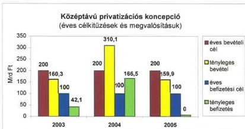

A középtávú privatizációs koncepció három esztendejében a Társaság hozzárendelt vagyona után realizált bevételek és a költségvetési befizetések időbelisége nem a célkitűzések szerint alakult. A hozzárendelt állami vagyon lebontásának üteme nem volt egyenletes, a teljesített költségvetési befizetések összességükben elmaradtak az előirányzattól. A Budapest Airport Zrt. privatizációjához kapcsolódó használati jogok bérbeadásából származó, a Kincstári Vagyoni Igazgatósághoz befolyó bevétel ellensúlyozta a költségvetési befizetés elmaradását.

A Budapest Airport Zrt. privatizációjának végrehajtását törvénymódosítások támogatták. Két törvény módosította a kizárólagos állami tulajdoni kört, és a repülőteret kivette a koncessziós törvény hatálya alól. Módosult a kizárólagos állami tulajdonú repülőtér vagyonelemeinek hasznosítására a KVI-vel kötött vagyonkezelési szerződés. A Bábolna Mg. Rt. privatizációra történő előkészítése során olyan tulajdonosi döntések születtek, amelyek gyorsították a társaság piaci értékének jelentős csökkenését, illetve olyan tulajdonosi intézkedések maradtak el, amelyekkel csökkenteni lehetett volna a veszteségeket. Az elmaradt döntések következtében a végelszámolás megindítása kárt okozott a társaságnak, és az állami veszteséget a végelszámolási díjakkal, valamint az elengedett követelésekkel csak növelte a tulajdonos.

42

---

**A tartósan veszteségesen működő állami tulajdonú gazdasági társaságok gazdálkodásának ellenőrzése** során az ÁSZ megállapította, hogy nem került sor az állami tulajdon fogalmának és a hozzá kapcsolódó jogoknak az egyértelmű meghatározására. Az állami tulajdonú gazdasági társaságoknál **nincs összehangolt tulajdonosi joggyakorlás**, annak tartalma, mélysége, formai eszközei a számos állami tulajdonosi joggyakorló esetében más és más. **Az állami tulajdonú vagyon számbavétele nem zárt.** A nyilvántartás sem naturáliában, sem összegben nem fedi a tényleges állapotokat, azt még a több nyilvántartás összesítésével sem lehet egzakt módon meghatározni.

A vizsgált 97 jelentős állami tulajdonú, tartósan veszteséges társaságban az állami tulajdon könyv szerinti értéke 2005-ben 503 Mrd Ft volt. Ez az érték a jegyzett tőkéből 99,86%-os átlagos állami tulajdoni részarányt jelentett. A vizsgált társaságok (2000-2005-ben) együttesen 6309 Mrd Ft árbevételt, 478 Mrd Ft üzemi szintű veszteséget és 290 Mrd Ft adózás előtti veszteséget termeltek.

Az állami vagy részben állami tulajdonban lévő társaságok veszteségessége részben **külső okokra** volt visszavezethető. A rendszeres állami támogatásban részesülő állami társaságok, részben a rájuk vonatkozó szabályozás hiányosságai, részben közszolgálati tevékenységük és bevételeik elégtelen volta miatt veszteségesek. Többszörösen jelentkező probléma, hogy az állam jogszabályban, társaságainak ellátandó feladatot határoz meg, de azok ellenértékét csak részlegesen biztosítja.

A társaságok mintegy 20%-ánál a veszteségek **belső okai** között a vagyonkezelési stratégia hiánya, illetve az utólag hibásnak bizonyult tulajdonosi vagy vezetői döntések húzódnak meg. A társaságok egyharmadánál a műszaki-technológiai színvonal korszerűtlensége miatt következett be hatékonyságromlás. A pénzügyi forrásaik szűkössége a társaságok negyedénél korlátozta költségcsökkentő vagy létszámkiváltó beruházások megvalósítását. A menedzsmentváltás és a szervezet-átalakítás az eredményesség csökkenésében a társaságok tizedénél játszott szerepet. A foglalkoztatottak létszáma és szakmai összetételének problémái, valamint a befektetésekben lévő vagyonvesztés is oka volt a veszteségek kialakulásának.

A 97 ellenőrzött társaság a 2000-2004. évi időszakban 1116 Mrd Ft tőke- és egyéb támogatást kapott. A támogatások formája tőke- vagy eredménytartalék növelése, működési, beruházási, létszám-leépítési, környezetvédelmi és egyéb egyedi – pl. fejlesztési, rekonstrukciós, szakképzési – támogatás volt. A támogatások meghatározó részét a helyszínen ellenőrzött társasági körben 15 társaság kapta. A társaságok részére biztosított támogatásokra jellemző, hogy azok mértéke alacsonyabb volt az igényelt összegeknél. Ennek alapvetően két oka volt: egyrészt nincs normatív rendszere a közfeladat-ellátás finanszírozásának (kivétel: árkiegészítések), másrészt a költségvetés teherbíró képessége határt szab az igények kielégítésének.

43

---

# 3. AZ ELLENŐRZÉSEK HASZNOSÍTÁSA

A Számvevőszék tevékenysége a közzétett jelentésekben realizálódik. Az elvégzett ellenőrzések eredménye, a megállapítások és javaslatok nemcsak a politikai élet szereplői, hanem mindenki számára elérhetőek, nyilvánosak. Az ellenőrzések hasznosulása, a jelentések közzétételt követő parlamenti és „közéleti utóélete” az ÁSZ munkájának egyik eredményességi mutatója. A közzétett jelentések közéleti sorsát az ÁSZ ellenőrzéseivel kapcsolatos sajtó-tevékenység tükrözi. Az ÁSZ 2006-os jelentéseinek parlamenti hasznosítását a jelentésekkel foglalkozó bizottsági és plenáris ülések, események mutatják.

A számvevőszéki ellenőrzések eredménye nagymértékben függ attól, hogy a megállapítások, javaslatok, hasznosítása (realizálása) nyomán milyen jogszabály-módosítások valósulnak meg az Országgyűlés, a Kormány és az egyes fejezetek, önkormányzatok szintjén, továbbá az ellenőrzöttek milyen intézkedéseket kezdeményeznek. Az ÁSZ nem hatóság, nem szankcionálhat és nincs lehetősége kikényszeríteni javaslatai, ajánlásai realizálását.

# 3.1. A jelentések országgyűlési tárgyalása, határozatok és az országgyűlési kapcsolatok

Az ÁSZ 2006-ban is a kijelölt határidőkre tett eleget a hatályos jogszabályok – törvények és határozatok – alapján előírt jelentéstételi kötelezettségeinek (költségvetés, zárszámadás, ÁSZ-beszámoló, ÁPV Zrt., MTI Zrt.).

2006 az országgyűlési és az önkormányzati választások éve volt, amelynek hatásai érintették a Számvevőszék jelentéseinek parlamenti/bizottsági „utóéletét” is.

A májusban induló új parlamenti ciklusban az Országgyűlés a korábbi 25 bizottság helyett 18 állandó bizottságot hozott létre. A Számvevőszéki bizottság megszűnt, a korábbi Költségvetési és pénzügyi bizottság az új ciklusban Költségvetési, pénzügyi és számvevőszéki bizottság elnevezéssel alakult meg, amelynek egyik albizottságaként működik a Számvevőszéki albizottság.

A választások miatt a korábbi évekhez viszonyítva kevesebb jelentés kerülhetett a bizottságok elé, a bizottsági struktúra átalakításával pedig kevesebb bizottsági esemény kapcsolódott egy-egy jelentéshez.

A 2006-ban közzétett 62 jelentésből 9 szerepelt a bizottságok napirendjén és ebből 3 jelentést az Országgyűlés plenáris üléseken is megtárgyalt. A legtöbb jelentést a Környezetvédelmi bizottság tárgyalta, a bizottság 5 alkalommal foglalkozott az ÁSZ jelentéseivel. A jelentések parlamenti/bizottsági tárgyalásának adatairól a 3. sz. melléklet ad tájékoztatást.

Az Országgyűlésnek benyújtott jelentések közül a 2005. évi költségvetés végrehajtásának ellenőrzéséről szóló jelentést és a 2007. évi költségvetési javaslatról szóló számvevőszéki véleményt a Mentelmi és összeférhetetlenségi bizottság kivételével valamennyi bizottság megtárgyalta.

44

---

Az Állami Számvevőszék 2005. évi tevékenységéről szóló beszámolót 6 bizottság (a Költségvetési, pénzügyi és számvevőszéki, a Gazdasági és informatikai, az Önkormányzati és területfejlesztési, az Oktatási és tudományos, az Emberi jogi, kisebbségi, civil- és vallásügyi, valamint a Foglalkoztatási és munkaügyi bizottság) tárgyalta és ajánlotta általános vitára.

A Környezetvédelmi bizottság a zárszámadási jelentésen és a költségvetési véleményen kívül külön napirend keretében foglalkozott a KVM működését ellenőrző ÁSZ jelentéssel, az ÖKOTÁM-ügy kapcsán aktuálissá vált – az önkormányzati út- és szennyvízcsatorna beruházásokhoz 2002-2005. években igénybe vett közműfejlesztési támogatások igénylésének és felhasználásának ellenőrzéséről szóló – jelentéssel és az ÁPV Zrt. 2005-ös működésének ellenőrzéséről szóló jelentéssel.

**2006-ban összesen 46 bizottsági esemény** (ülés, tárgyalás) kapcsolódott az ÁSZ jelentéseihez.

Az **ÁSZ 2007. évre vonatkozó ellenőrzési tervét** az ÁSZ elnökének előterjesztésében a Költségvetési, pénzügyi és számvevőszéki bizottság tárgyalta meg.

A Számvevőszék jól működő szakmai kapcsolatokat tart fenn az Országgyűléssel és annak egyes szervezeti egységeivel, bizottságaival. A munkakapcsolatokat megerősítendő, a választásokat követően az ÁSZ vezetői mind az öt parlamenti frakció vezetőivel találkoztak, és az ÁSZ elnöke több alkalommal is meghívást kapott a Bizottsági Elnöki Értekezletre.

2006-ban a **Számvevőszék elnöke 18 bizottsági ülés** résztvevője volt, és **4 alkalommal** kérte ki véleményét **plenáris ülésen** az Országgyűlés, számvevőszéki munkatársak mintegy **60 bizottsági ülésen vettek részt**$^{13}$.

Az **Országgyűlés** a 2004. évi zárszámadásról szóló törvényben **felkérte** az ÁSZ-t, hogy „vizsgálja meg a központi költségvetés által 2005. év végéig az önkormányzatokhoz út- és szennyvízcsatorna-építés címén átutalt közműfejlesztési támogatás igénylésének és felhasználásának jogszerűségét, különös tekintettel az ÖKOTÁM és hasonló rendszerben megvalósuló beruházásokra”. A megkeresésnek eleget téve az ÁSZ 2006 októberében tette közzé **jelentését az önkormányzati út- és szennyvízcsatorna beruházásokhoz 2002-2005. években igénybe vett közműfejlesztési támogatások igénylésének és felhasználásának ellenőrzéséről**.

Magyarország teljes jogú uniós tagságából eredő kötelezettsége az uniós támogatások felhasználásának belső ellenőrzése. Az **Országgyűlés a 43/2005. (V. 26.) OGY határozat** szerint „indokoltnak tartja és támogatja, hogy az Állami Számvevőszék a teljes uniós pénzfelhasználás gyakorlatáról átfogó képet adjon, ennek keretében az uniós forrásokkal összefüggő pénzmozgások ellenőrzését végző hazai szervezetek munkáját szakmai szempontból áttekintse és mutassa be az ellenőrzések tapasztalatait.” Az **európai uniós támogatások 2005. évi felhasználásá-**

$^{13}$ A bizottsági üléseken való részvétel nem kötődik kizárólag a közzétett jelentésekhez, így esetenként olyan bizottsági üléseken is képviseltetheti magát az ÁSZ, ahol jelentése nem szerepel a napirenden vagy a Számvevőszék csak közvetetten érintett a témában.

45

---

nak ellenőrzéséről szóló tájékoztatót (Trend Report) a Számvevőszék a zárszámadási jelentéssel egyidejűleg nyújtotta be az Országgyűlésnek.

Miniszterelnöki felkérésre az ÁSZ véleményezte a Magyar Köztársaság 2006. szeptemberi aktualizált konvergencia program tervezetét. Az elkészült véleményt augusztus végén küldte meg az ÁSZ a Miniszterelnöki Hivatalnak és tette elérhetővé honlapján keresztül az érdeklődők számára.

### 3.2. A számvevőszéki javaslatok érvényesülése

2006-ban végzett ellenőrzéseink során is arra törekedtünk, hogy megalapozott javaslatokkal segítsük az ellenőrzött szervezetekben, rendszerekben, folyamatokban rejlő kockázatok feltárását és kiküszöbölését, a szabályszerűség érvényesülését, a hatékonyság javítását. Javaslatokat tettünk jogszabályok módosítására, összehangolására, betartására is.

2006-ban is figyelmet fordítottunk a korábbi megállapításaink, ajánlásaink hasznosulására, a tett intézkedések végrehajtásának ellenőrzésére, nyomon követésére. Ehhez kapcsolódóan is figyelemmel kísértük az ellenőrzéseink javaslataival kapcsolatos intézkedéseket.

Mind az érintett fejezetek intézkedési tervei, mind az éves jelentésünkhöz kért tájékoztatások alapján javaslataink jellemzően pozitív fogadtatásra találtak. A javaslatok megvalósításának tényéről és hatásairól a legteljesebb képet az esetek többségében azonban csak célvizsgálat, utóellenőrzés keretében kaphatunk.

Több év tapasztalata alapján elmondható, hogy a pénzügyi ellenőrzés közvetlen hatásaként a korrekciós jellegű módosításokra vagy egyes, különállóan is megvalósítható szabályozási kérdésekre vonatkozó javaslataink jellemzően megvalósulnak. A belső szabályozási, nyilvántartási, elszámolási rendszerekre vonatkozó, a célszerűséget, hatékonyságot javító intézkedéseket célzó ajánlásaink fogadtatása is kedvező. Ezzel szemben a pénzügyi biztonságot szolgáló, a rendszer méretű és szemléletű változásokat igénylő felvetéseink megvalósítása szerényebb. Sikerként értékelhető azonban, ha a javasolt változtatásokkal „megcélzott” területek, folyamatok (köz)gazdasági összefüggéseinek átgondolására, tervek, programok kialakítására irányuló elemző munkák bontakoznak ki.

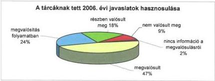

46

---

Az egyes ellenőrzési jelentésekben megfogalmazott javaslatok, illetve azok hasznosítása, megvalósítása az ÁSZ honlapján figyelemmel kísérhető.

### 3.2.1. Javaslatok az Országgyűlés szintjén

Ellenőrzéseink alapján az Országgyűlésnek címzett vagy az Országgyűlés törvényalkotási tevékenységét érintő javaslataink nagy része megvalósult, vagy részét képezi a törvényalkotási munkának.

Számos javaslatunk valósult meg a 2005. évi költségvetés végrehajtásáról szóló törvényben, a 2007. évi költségvetésről szóló törvényben, és hozzájuk kapcsolódva a Magyar Köztársaság 2007. évi költségvetését megalapozó egyes törvények módosításáról szóló 2006. évi CXXI. törvényben, illetve további törvényekben.

**A költségvetéssel kapcsolatos elszámolások átláthatóságának érdekében** 2006-ban több ellenőrzésünk jutott arra a megállapításra, és fogalmazott meg javaslatot, hogy aktualizálni kell egyes, a költségvetéssel összefüggően bemutatandó adatok tartalmát, táblázatok szerkezetét. A Magyar Köztársaság 2007. évi költségvetését megalapozó egyes törvények módosításáról szóló 2006. évi CXXI. törvény ennek jegyében

- aktualizálta – az államháztartási törvényt módosítva – a költségvetés és a zárszámadás előterjesztésekor kötelezően bemutatandó mérlegeket és kimutatásokat,
- módosította az államháztartási törvény adóssággal foglalkozó részét. A módosított Áht. meghatározza a különféle adósság-kategóriákat, negyedéves – kormányrendeletben meghatározott tartalmú – publikációs kötelezettséget ír elő az államadóssági és államháztartási adóssági adatok tekintetében. (A publikálható adósság-adatok és az egyes adósságkategóriák konszolidációjához szükséges adatok tartalmát az államháztartás működési rendjéről szóló kormányrendelet fogja meghatározni, amelynek módosítása – ismereteink szerint – folyamatban van.)

**Az Európai Unióval való kapcsolatrendszerünk teljesebb körű megismerése és az elszámolások átláthatóságának** érdekében az ÁSZ javaslatára, kétoldalú konzultációk alapján már a 2005. évi költségvetés végrehajtásáról szóló törvényjavaslatban – és a 2007. évi költségvetésről szóló törvényjavaslatban is – a pénzügyminiszter módosította az általános indoklás mellékleteiben szereplő, európai uniós költségvetési kapcsolatokat összefoglalóan bemutató tábla és az agrártámogatásokat részletező tábla szerkezetét. Így a költségvetési kapcsolatok teljes körű bemutatása céljával azon agrártámogatások is megjelenítésre kerülnek, amelyek egyébként nem képezik részét magának a költségvetési, illetve zárszámadási törvénynek.

A társadalombiztosítás pénzügyi alapjai közül az **Egészségügyi Alap működésének ellenőrzésekor** az alapkezelő jogállását meghatározó jogszabályok ellentmondásainak megszüntetésére vonatkozóan tett javaslatunk megvalósult a 2006. évi LVII. (jogállási) törvény módosításával (2006. évi CIX. tv. a kormányzati szervezetalakítással összefüggő törvénymódosításokról), valamint az

47

---

OEP feladatait és hatáskörét meghatározó új kormányrendelet (317/2006. (XII. 23.) Korm. rendelet) megalkotásával és 2007. január 1-jei hatályba léptetésével.

**A Nyugdíjbiztosítási Alap működésére vonatkozóan** megfogalmazott javaslatainkra megtett intézkedések a javaslatok részleges realizálását mutatják. A társadalombiztosítási nyugellátásról szóló törvény és a kapcsolódó törvények 2006. novemberi és decemberi módosítása rendelkezik a nyugdíjrendszer 2006 utáni működtetésének hiányzó eljárási szabályairól (pl. a keresetek valorizálásának a nyugdíjazást közvetlenül megelőző évekre való kiterjesztése, a nyugdíj alapjának kiszámítása 2012-ig). A korkedvezményes nyugdíj igénybevételi szabályainak korszerűsítése az előírt határidőre, 2006 végére ugyan elmaradt, de a korkedvezményre jogosító feltételeket külön törvény fogja 2011. januártól szabályozni. Az elfogadott módosítások elsősorban az Alap pénzügyi helyzetét javítják (pl. a járulékok Ny. Alap javára történő átcsoportosításával, az ellátásban részesülők körének szűkítésével, a nyugdíjalap számításának módosításával).

Ajánlásunkra az egészségügyi miniszter javaslatot tett a közgyógyellátás keretében igénybe vehető **gyógyászati segédeszközök ésszerűbb szabályozására**. Hatályba lépett a biztonságos és gazdaságos gyógyszer és gyógyászati segédeszköz ellátás, valamint a gyógyszerforgalmazás általános szabályairól szóló törvény, amely az ÁSZ javaslataival összhangban tartalmazza a gyógyászati segédeszközök közgyógyellátási jogcímen történő támogatásának újra-szabályozását.

A tartósan veszteségesen működő állami tulajdonú gazdasági társaságok gazdálkodásának ellenőrzése, valamint az ÁPV Zrt. 2005. évi működésének és a központi költségvetés végrehajtásához kapcsolódó tevékenységének ellenőrzése kapcsán javasoltuk a Kormánynak, hogy intézkedjen az állami vagyon egyes vagyoncsoportjaival kapcsolatos gazdálkodás összhangjáról a **vagyontörvény megalkotásával**, továbbá egységesítse az állam vállalkozói és kincstári vagyonával kapcsolatos állami követelések kezelésének rendjét. A vagyontörvény kidolgozása folyamatban van, várhatóan az Országgyűlés tavaszi ülésszakára kerül benyújtásra.

A Kormány 2006 közepén a rendszeres pártellenőrzések tapasztalatait hasznosítva az Országgyűlésnek benyújtotta **a pártok működéséről és gazdálkodásáról** szóló 1989. évi XXXIII. törvény és **a választási eljárásról szóló** 1997. évi C. törvény, valamint ezzel összefüggésben egyes más törvények módosításáról szóló T/237. számú javaslatát. Az ÁSZ támogatja a törvénymódosító indítvány elfogadását, mivel az fokozza a párt- és kampányfinanszírozás átláthatóságát, ellenőrizhetőségét. A javaslat elfogadása – erőfeszítéseinkkel és a társadalmi elvárásokkal összhangban – növekvő ellenőrzési hatáskört biztosítana a mélyebb összefüggéseket feltáró, a szabálytalanságot jobban szankcionáló alkotmányos feladat betöltésére. A javaslatról az Országgyűlés részletes vitát folytatott, arról szavazás nem történt. Az elfogadásig a hatályos rendelkezéseknek megfelelő gyakorlattal folytatjuk a pártok gazdálkodásának, valamint a választások finanszírozásának törvényességi ellenőrzését. Az ÁSZ-nak jogalkalmazói minőségében nincs joga az ellenőrzési hatáskör kiterjesztésére.

48

---

Az Adó- és Pénzügyi Ellenőrzési Hivatal (APEH) működésének ellenőrzésével kapcsolatban kezdeményeztük a 2005. évi LVI. törvény módosítását annak érdekében, hogy az APEH végelszámolás alatt álló szervezetekkel szembeni **követeléseinek engedményezését** jogszabály ne tegye lehetővé. Az APEH-ről szóló 2002. évi LXV. törvény, illetve az adózás rendjéről szóló 2003. évi XCII. törvény alapján 2007. január 1-jétől kizárólag a felszámolási eljárás alatt álló szervezetekkel szemben fennálló követelések engedményezését teszi lehetővé az adóhatóság számára, a végelszámolás alatt állók esetén nem.

A helyi és a helyi kisebbségi **önkormányzatok gazdálkodási rendszerének átfogó ellenőrzése kapcsán** tett javaslatainkat figyelembe véve kiegészült az államháztartásról szóló törvény a helyi és a helyi kisebbségi önkormányzat megállapodásának tartalmi követelményeivel, valamint a nem normatív, céljellegű működési támogatások kedvezményezettjére is kiterjed a közzétételi kötelezettség. Kezdeményezésünk alapján a törvényhozás a közbeszerzésekről szóló törvényben megállapította az önkormányzatok által helyben központosított közbeszerzésekre vonatkozó alapvető szabályokat.

A **kötött felhasználású előirányzatok** ellenőrzése kapcsán tett javaslatoknak megfelelően a 2005. évi elszámoltatásnál és a 2006. évi feltételrendszer meghatározásánál jelentős előrelépés történt a kompok, révek fenntartásának, felújításának támogatásában. Az üzemeltetési támogatások elszámoltatási rendszerét a 2006. évi szabályozás már megfelelően tartalmazza. A párhuzamosságok kiküszöbölése érdekében 2007-től megszűnt a belső ellenőrzési társulások támogatását szolgáló előirányzat, e támogatást már csak a többcélú kistérségi társulások támogatásán belül lehet igényelni. A 2004. évről 2005. évre átvitt, de a Kvtv. tiltása miatt át nem vihető támogatások visszafizettetéséről a zárszámadási törvényben történt intézkedés. A helyi önkormányzati hivatásos tűzoltóságok által visszafizetendő normatív támogatásának az elszámolásánál 2007-ben már nem vehetők figyelembe a vállalkozási vagy kiegészítő tevékenység keretében végzett térítéses munkák bevételei és kiadásai.

Változtak a **szociális normatívák** lehívhatóságának, igénybevételének szabályai a szociális és költségvetési törvényekben.

Az **önkormányzati út- és szennyvízcsatorna beruházásokhoz 2002-2005. években igénybe vett közműfejlesztési támogatások** igénylésének és felhasználásának ellenőrzését követően a 2006. évi XCIX. törvény 7. §-ának (18) bekezdése előírta a 2002-2005. években jogtalanul igénybevett közműfejlesztési támogatások visszafizettetését, a (19) bekezdés pedig újabb szabályozást fogalmazott meg a jogtalan támogatás-igénybevétel megakadályozására.

Javaslatunk hatására módosították az Áht. 101. § (10) bekezdését, a visszaélések elkerülése érdekében a módosítás pontosította a fejlesztési támogatás – kivitelezőtől közvetlenül, illetve más szervezet útján közvetve az önkormányzathoz érkező pénzeszköz miatti – arányos visszafizetésének rendjét.

A 2005. évi költségvetés végrehajtásának ellenőrzéséről készített jelentésben megfogalmazott javaslatok alapján a 2007. évi költségvetési törvényben a **helyi önkormányzatokat megillető személyi jövedelemadó megosztásának szabályozása** a valós célnak megfelelően, valamint az Áht. előírásá-

49

---

val összhangban történt, abban nem írtak elő államháztartási tartalékképzési kötelezettséget.

A pénzügyminiszter kezdeményezésére a 2005. évi költségvetés végrehajtásáról szóló törvénybe beépítették a helyi önkormányzatok támogatásainak ellenőrzése során megállapított **eltérések rendezését**.

Az **állami közutak** fenntartásának ellenőrzése kapcsán felkértük a Kormányt, hogy kezdeményezze a közlekedési törvény módosítása keretében a közúthálózat mindenkori jó állapotának fenntartásához szükséges feltételek előírását. 2006-ban a közúti közlekedésről szóló 1988. évi I. törvény a közúthálózat állapotának megőrzése, a kiépítéssel és burkolat teherbírással arányos forgalomszervezés kialakítása érdekében módosult.

### 3.2.2. Javaslatok kormányzati szinten

Javaslataink megítélése 2005-höz viszonyítva kedvezőbbé vált, 80%-ról 2006-ban **89%-ra változott azon javaslataink aránya, amelyek megvalósultak, részben valósultak meg, vagy megvalósításuk folyamatban van**.

2005-ről 2006-ra **kétszeresére növekedett** a célszerűséget, hatékonyságot, eredményességet javító intézkedésre, illetve a feltárt hibák, hiányosságok megszüntetésére vonatkozó javaslataink aránya. Ezen javaslataink kedvező fogadtatásának aránya is növekedett. A jogszabályi változtatásokra vonatkozó kezdeményezéseink részaránya kismértékben nőtt, az előző évinél kedvezőbb fogadtatásra találtak. Megvalósulásuk szinte változatlan (41-42%), azonban jelentős mértékben (33%-ról 10%-ra) csökkent egyértelmű elutasításuk. A további, a szervezeti működés szabályozottságával kapcsolatos javaslataink aránya csökkent. Ezen javaslattípusok fogadtatása továbbra is kedvező arányú, 80-90%-os.

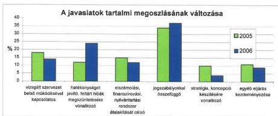

Az ÁSZ a vizsgálatai során tett ajánlások, javaslatok hasznosításának nyomon követése érdekében **a korábbi évek gyakorlatának megfelelően 2006-ban is tájékoztatást kért a Kormánytól és a tárcák vezetőitől** az ajánlások hasznosulásáról. A megkereséseknek az érintettek kivétel nélkül eleget tettek, a tárcák által adott válaszok évről-évre teljesebbé válnak. A javaslataink hasznosulásáról kapott tájékoztatás azért is fontos információ az ÁSZ számára,

50

---

mert a számvevőszéki javaslatok figyelembevételére – a törvényesség helyreállítására irányuló jogi realizálás kezdeményezésén túl – nincs általános érvényű törvényi előírás.

Válaszlevelében több tárca is jelezte, hogy ellenőrzéseink során a szakmai feladatellátásukat és gazdálkodásukat javaslatainkkal nagyban segítettük, munkánk nyomán több területen értek el a szabályszerűség, a szabályozottság és a hatékonyság tekintetében előrehaladást.

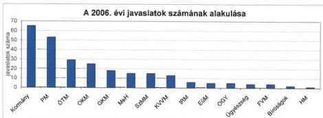

A **jogi szabályozásra irányuló** javaslataink 41%-a megvalósult, a javaslatok 10%-ára nemleges válasz érkezett, ezek a javaslataink jellemzően törvénymódosításokra vonatkoztak, néhány esetben a fennálló szabályozást megfelelőnek tartották.

A **célszerűséget, hatékonyságot, eredményességet javító** intézkedésre, illetve a feltárt hibák, hiányosságok megszüntetésére vonatkozó javaslataink 90%-a talált kedvező fogadtatásra, 61% már megvalósult.

A **belső szabályozási rendszer**, illetve a fejezeti és a belső ellenőrzés működésének felülvizsgálatát, továbbfejlesztését célzó javaslatok 83%-ával kapcsolatban konkrét intézkedések történtek, illetve az érintettek megkezdték a javaslatok hasznosításának előkészítését.

A számviteli, nyilvántartási szabálytalanságok javítását, **elszámolási, finanszírozási és nyilvántartási rendszerek** korszerűsítését célzó javaslatokra beérkezett válaszok alapján azok 43%-a megvalósult. A továbbiak realizálása folyamatban van, illetve a válaszok 10%-ban nem adtak számot egyértelműen a javaslat megvalósításáról.

A **stratégia, koncepció készítését** ajánló javaslatok 100%-ban pozitív fogadtatásra találtak, 45% már megvalósult, 55% megvalósulása folyamatban van, vagy részben valósult meg.

Az **egyéb**, egyedi jellegüknél fogva nem rendszerezhető és az előző csoportokba nem sorolható ajánlások 9%-ot tettek ki. Elfogadottságuk több mint 90%-os, és a jelentés összeállításáig 41%-uk már megvalósult.

51

---

Az ÁSZ a tárcák vezetői által tett intézkedések végrehajtását további ellenőrzései során figyelemmel kíséri, jelentéseiben rendre kitér ezek megvalósítására. Az ÁSZ által tett ajánlásokat és az ezekre adott válaszokat a 4. sz. melléklet foglalja össze.

# **Javaslataink hasznosításáról készített éves összefoglalón túl – ajánlásaink nyomán – a következő konkrét intézkedések valósultak meg az elmúlt évben:**

Az ÁSZ észrevételei alapján módosult az **államháztartás működési rendjéről** szóló 217/1998. (XII. 30.) Korm. rendelet (Ámr.), mert a kincstári körbe tartozók költségvetési előirányzatai tervezésének, módosításának és várható teljesítésének adatszolgáltatási és nyilvántartási rendjéről szóló 1997-ben kiadott pénzügyminisztériumi Tájékoztató elavult, eredeti célját, vagyis az előrejelzést, a tervezőmunkát már nem szolgálta.

Javaslatunk hatására – az Ámr. 2006. év végi módosítása nyomán – a pénzügyminiszter nélkül már nem lehet az **általános tartalék** felhasználására előterjesztést benyújtani, így csak közös, vagy pénzügyminiszteri előterjesztés kerülhet a Kormány elé.

A **Wesselényi Miklós Ár- és Belvízvédelmi Kártalanítási Alap** további működtetésének indokoltságáról, illetve a **Munkaerőpiaci Alap** tervezési rendszerének felülvizsgálatáról szóló javaslatainkat a Kormány nem támogatta.

Az államháztartás adóssága kezelésének, alakulásának ellenőrzéséről készült jelentésünkben javasoltuk, hogy a Kormány dolgozzon ki és terjessen az Országgyűlés elé a **Társadalombiztosítási Alapok mindenkori pénzügyi egyensúlyának** megteremtését szolgáló javaslatot. A Kormány intézkedései a nyugdíjreform, az egészségügyi reform, valamint a járulékszabályozás (pl. járulékmérték növelés, nemzeti kockázatközösség szabályozása, járulékalap szélesítés) területén a társadalombiztosítás pénzügyi egyensúlyának javítását szolgálják. 2007-ben tovább folytatódik a nyugdíjreform, az ápolási rendszer korszerűsítése és az egészségügyi reform kiteljesítését szolgáló további intézkedések kidolgozása.

Az **egészségüggyel** összefüggő fontosabb ÁSZ javaslatok közül a Kormány által kidolgozás alatt áll egy átfogó egészségpolitikai koncepció, amely meghatározza a magántőke, a magánvállalkozások lehetséges szerepét, szakmai területeit, az állami támogatások alapelveit, és mindezekre figyelemmel szabályozza az egészségügyi szakellátások működésének rendszerét.

A jelentésünk a Magyar Köztársaság 2005. évi költségvetése végrehajtásának ellenőrzéséről javasolta, hogy a Kormány dolgoztasson ki a **gyógyszerellátás** teljes rendszerére kiterjedő, átgondolt, hosszabb távra szóló, az egészségügy átalakításához igazodó stratégiát. Továbbá határozza meg a megvalósítás pénzügyi, szakmai, illetőleg társadalmi szintű prioritásait. A tárgyban már hatályba lépett a biztonságos és gazdaságos gyógyszer- és gyógyászati segédeszközellátás, valamint a gyógyszerforgalmazás általános szabályairól szóló törvény, továbbá a törvényhez kapcsolódó végrehajtási rendeletek is.

52

---

A Területfejlesztés fejezet működésének ellenőrzéséről készült jelentésben javasoltuk, hogy a Kormány intézkedjen a **Nemzeti Lakásprogram** kidolgozásáról. A Kormány 1139/2002. (VIII. 2.) Korm. határozatának 5. b) pontja alapján a kormánymegbízott létrehozta a Nemzeti Lakáspolitikai Tanácsadó Testületet, amely véleményező és tanácsadó szakmai és társadalmi fórumként működik.

A Művészetek Palotája megvalósításának és működésének ellenőrzése során javasoltuk a Kormánynak, hogy a **PPP-konstrukciók** alkalmazásához gondoskodjon megfelelő jogi háttérszabályozás és egységes állami eljárásrend kialakításáról. Javaslataink nyomán a Kormány 2007 februárjában határozat-tervezetet készített a PPP újszerű formáinak alkalmazásáról szóló 2098/2003. (V. 29.) Korm. határozat módosításáról, valamint rendelet-tervezetet alakított ki a hosszú távú kötelezettségek vállalásának egyes szabályairól (a tervezetek közigazgatási egyeztetése folyamatban van).

Az **önkormányzati gazdálkodás, feladatellátás** különböző területeinek ellenőrzése kapcsán a kormánynak és az ágazati minisztereknek tett javaslatainkat a szabályozások módosítása során jórészt figyelembe vették.

Elkészült a **hajléktalan-ellátás** hosszú távú átalakításának programja, amely foglalkoztatási, szociális, egészségügyi elemeket egyaránt tartalmaz. Minőségi változás, hogy a hajléktalanok lakhatását nem új intézmények létrehozásával, hanem a kihelyezett szállások körének bővítésével kívánják megoldani.

A 2005. évi **az önkormányzatok által államháztartáson kívülre nyújtott – kiemelten felhalmozási célú – támogatások, átadott pénzeszközök** felhasználása célszerűségének ellenőrzését követően az ÁSZ javaslatára a Kormány intézkedéseket tett. A lakáscélú állami támogatásokról szóló kormányrendeletben a víziközmű-társulati hitelek felvehető összegét magánszemély érdekeltenként 200 ezer Ft-ban maximalizálták, amely a jövőben megakadályozza a kamattámogatott hitel indokolatlan nagyságú felvételét. Előírták továbbá, hogy a beruházás kapcsán keletkező bevételeket a víziközmű-társulati hitel törlesztésére kell fordítani. A jogszabályváltozások a jövőre vonatkozóan előreláthatóan megakadályozzák az ÖKOTÁM és hasonló rendszerű beruházás-szervezési és finanszírozási módszer további működtethetőségét.

2007. január 1-jétől az önkormányzatok költségvetési beszámolójának kiegészítő mellékletében külön elszámoló tábla leadásával kell számot adni az egyes beruházásokhoz igénybevett központi költségvetési támogatásokról, amelyben fel kell tüntetni az állami támogatások mellett a saját forrást, valamint a realizált önkormányzati bevételt is.

A pénzügyminiszter 2006 novemberében felkérte az Adó- és Pénzügyi Ellenőrzési Hivatalt az állami kamattámogatású víziközmű-társulati hitelek igénybevételének és a lakás-takarékpénztáraknál elhelyezett megtakarítások után igénybe vett előtakarékossági támogatás jogszerűségének a vizsgálatára. A vizsgálat folyamatban van.

Az **önkormányzatok gazdálkodási rendszerének** átfogó ellenőrzése kapcsán a 2006. év végi Ámr. módosítása rögzítette a költségvetés és a zárszámadás előterjesztésekor bemutatandó közvetett támogatásokról készítendő kimu-

53

---

tatás tartalmi követelményeit. Továbbá 2008. január 1-jétől érvényesítési feladatot az önkormányzatoknál csak a jogszabályban meghatározott szakmai képesítéssel rendelkező dolgozó végezhet, valamint a helyi és a helyi kisebbségi önkormányzatok közötti megállapodásnak tartalmaznia kell a helyi kisebbségi önkormányzat gazdálkodása végrehajtásának rendjét, és az ehhez kapcsolódó feladatellátás jogosultjainak, kötelezettségeinek kijelölését is. Az önkormányzatok számára készített belső ellenőrzési kézikönyv minta kiegészült a céljelleggel nyújtott támogatások ellenőrzésére vonatkozó egyes szempontokkal. Megvalósult az a javaslat is, miszerint a számviteli politika és kapcsolódó szabályzatok előírásainak az önkormányzati hivatalhoz tartozó, részben önállóan gazdálkodó és részjogkörű költségvetési szervekre történő kiterjesztéséről a jegyző döntson. Az önkormányzatok által nyújtott működési célú támogatásokra is kiterjed az Áht.-ban meghatározott közzétételi kötelezettség.

**A középiskolai kollégiumok fenntartásának** ellenőrzésekor javasoltak alapján a Nemzeti Fejlesztési Terv II-ben a Regionális Operatív Programokba már beépült a közoktatási intézmény – mint kedvezményezett – fogalma, ami magába foglalja a kollégiumot is. A regionális közoktatási stratégiákban már megtalálhatók a kollégium fejlesztések irányai, területei, melyekről helyben döntenek.

Az ÁSZ a **területfejlesztési** tanácsok és munkaszervezeteik rendelkezésére álló támogatások igénylésének és felhasználásának korábbi években végzett ellenőrzésekor tett javaslataink alapján a forrásdecentralizáció egységes elvekre épülő rendszere, a forráskoordinációra vonatkozó javaslatunk beépült a költségvetési törvényekbe. Az akcióprogramok végrehajtása során előírás a folyamatos monitoring biztosítása. Az Új Magyarország Fejlesztési Terv Operatív programjaiban a kiegyensúlyozott területi fejlődést szolgáló beavatkozások között az elmaradott térségek felzárkóztatása, finanszírozása is kiemelten jelenik meg.

Az **önkormányzatok szociális és gyermekjóléti szolgáltatásainak** ellenőrzése kapcsán tett javaslatainkra a Kormány meghatározta az ún. „irányított területi kiegyenlítési rendszer”-be történő befogadás feltételeit, az eljárás szabályait, valamint a befogadásról szóló döntést megalapozó szakmai szempontokat. 2007-ben a nem állami fenntartók a finanszírozás szempontjából újnak minősülő szociális, gyermekjóléti és gyermekvédelmi szolgáltatások, illetve férőhelyek után normatív hozzájárulásra csak akkor jogosultak, ha a szociális ágazat irányításáért felelős miniszter az irányított területi kiegyenlítési rendszerbe befogadta azokat.

A társadalmi igazságosság és a rendelkezésre álló források hatékonyabb felhasználása érdekében a Nemzeti Család- és Szociálpolitikai Intézet a Minisztériummal kötött megállapodás szerint – hozzárendelt források biztosításával – létrehozta a munkacsoportokat, amelyek szolgáltatás típusonként készítik el a jogosultsági kritériumok meghatározásához szükséges szakmai javaslataikat.

Meghatározták további alapszolgáltatásoknál (házi segítségnyújtás, jelzőrendszeres házi segítségnyújtás, támogató szolgáltatás) a rászorultsági kritériumokat, melyeket a 2007-ben benyújtott igényeknél már érvényesíteni kell, változtak a térítési díjak megállapításának szabályai is.

54

---

Megtörtént a legsúlyosabb munkaerőpiaci-szociális problémák megoldására vonatkozó komplex programok kidolgozása, amelyek megvalósítása uniós támogatással a 2007. évben kezdődik.

A Kormány korábbi javaslatainkra figyelemmel adta ki a kormányzati **közalapítványok felülvizsgálatáról** szóló 1069/2006. (VII. 13.) Korm. határozatot.

### 3.2.3. Javaslatok a vizsgált szervezeteknél

Az egyes tárcáknál az ajánlások jellemzően megvalósultak, illetve folyamatban van a megvalósításuk. A tárcák vezetői a tennivalókról intézkedési tervet készítettek, ajánlásokat fogalmaztak meg a hozzájuk tartozó költségvetési szervek számára, valamint miniszteri utasításokat korszerűsítettek. Esetenként a hasznosítás már az ellenőrzés lefolytatása alatt elkezdődött.

A **2005. évi állami költségvetés végrehajtásának ellenőrzésekor**, illetve a **2007. évi költségvetés véleményezésekor** az ÁSZ valamennyi fejezet vezetője számára fogalmazott meg ajánlásokat, amelyek a működés, a gazdálkodás, a beszámolás szabályzatainak elkészítésére, aktualizálására, a belső ellenőrzés megfelelő működésére, a szükséges intézkedések megtételére vonatkoztak. Az ellenőrzöttek belső szabályozási rendszerére, illetve a fejezeti és a belső ellenőrzés működésére vonatkozó megállapítások, javaslatok kapcsán a konkrét intézkedések megtörténtek.

A 2005. évi költségvetés végrehajtásának ellenőrzéséről készült jelentésben javasoltuk, hogy a Miniszterelnöki Hivatalt vezető miniszter kérje számon a Nemzeti Fejlesztési Ügynökség vezetőjétől az **Egységes Monitoring Információs Rendszer** számviteli modulja teljes körű kiépítését, amely biztosítja a jogszabályban előírt követelmények teljesítését. A javaslat megvalósult.

A **Magyar Köztársaság Ügyészsége fejezet működésének ellenőrzéséről** készült jelentésünkben javasoltuk a legfőbb ügyésznek, hogy gondoskodjon az EUROJUST nemzeti tagja hazai ügyészi és egyéb jogosítványainak meghatározásáról és az intézmény igénybevétele szabályainak megalkotásáról. A Legfőbb Ügyészség két törvénymódosítási javaslat mellett kidolgozta az EUROJUST-ra vonatkozó új és részletes legfőbb ügyészi utasítás tervezetét.

A **Magyar Tudományos Akadémia fejezet működésének ellenőrzéséről** készült jelentésünkben felhívtuk a Kormány figyelmét arra, hogy kísérje figyelemmel, és rendszeresen értékelje az állami szervek együttműködését a Magyar Tudományos Akadémiával a kutatás-fejlesztés állami irányításában, valamint átfogóan szabályozza az alaptevékenységként kutatást végző költségvetési kutatóhelyek sajátos gazdálkodásának működési feltételeit. A kapott tájékoztatás szerint a Kormány készülő középtávú (2013-ig szóló) tudomány- és technológia-innováció politikai stratégiája elkészítésében az Akadémiával folyamatosan együttműködik. A MeH a sajátos gazdálkodási feladat végrehajtásához szükséges kormányzati intézkedések megtételére a Pénzügyminisztériumot hívta fel.

---55

---

Az **Állami Privatizációs és Vagyonkezelő Zrt. 2005. évi működésének és a központi költségvetés végrehajtásához kapcsolódó tevékenységének** ellenőrzéséről készült jelentésben javasoltuk a pénzügyminiszternek, hogy szabályozza az állam vállalkozói és kincstári vagyonának értékesítési, kezelési szerződéseiben vállalt kötelezettségek és követelések következetes érvényesülését a nyilvántartások és elszámolások egységesítésével. A kidolgozás alatt álló, az állami vagyon egységes jogi szabályozásának és szervezetrendszerének kialakításáról szóló törvényjavaslat – vélhetően – e téren is változásokat eredményez, amennyiben az új vagyonkezelő szervezet új belső nyilvántartási, ellenőrzési, informatikai stb. rendszert, illetve új belső szabályzatokat alakít ki. Ennek során természetesen hasznosulhatnak az ellenőrzések tapasztalatai, megállapításai. A szervezet egységesítésétől általában is azt várjuk, hogy az állami vagyongazdálkodásért felelős szervezet az állami vagyon teljes körére egységesen irányadó jogszabály, valamint egységes elvek és követelmények szerint, a jelenlegi rendszernél lényegesen hatékonyabban működjön.

A **Magyar Távirati Iroda Zrt. 2005. évi gazdálkodásának ellenőrzésekor** tett javaslatok részben hasznosultak. Az Nht. felülvizsgálata az Országgyűlés Kulturális és sajtó bizottsága albizottságában elkezdődött, de a szabályok megalkotására még nem került sor.

Az elmúlt négy évben **valamennyi helyi önkormányzatnál végzett az ÁSZ ellenőrzést**. Ellenőrzéseink során közel háromezer javaslatot fogalmaztunk meg, amelyek háromnegyedét az önkormányzatok hasznosították. Ennek eredményeként javult a költségvetési gazdálkodás szabályozottsága, a végrehajtás során előrelépés történt a helyi és központi előírások betartása tekintetében, a munkafolyamatba épített ellenőrzési feladatok ellátását a korábbiaknál szélesebb körben biztosították.

Kedvező, hogy a gazdálkodási rendszer átfogó ellenőrzésével érintett megyei, megyei jogú városi, fővárosi és kerületi önkormányzatoknak tett **ÁSZ javaslatok rövid időn belül hasznosultak, több esetben már a helyszíni ellenőrzés ideje alatt intézkedtek a feltárt hiányosságok megszüntetéséről, a mulasztások pótlásáról**. A jogkövető magatartás kialakítását, a legjobb gyakorlat átvételét megkönnyíti, hogy a kiemelt körről készült átfogó jelentések nyilvánosak, azokat bárki olvashatja az Interneten.

### 3.3. Kezdeményezett büntető eljárások

A közpénzek felhasználásához kapcsolódó büntetőjogi felelősségre vonás össztársadalmi érdek, amelynek bizonyítékokkal való alátámasztásában az ÁSZ-nak – vizsgálati hatókörében – kiemelkedő szerepe van. Különösképpen igaz ez az önkormányzati szférát illetően, amely gazdálkodásának minőségére és gyakorlatára vonatkozó – konkrét ellenőrzéseken alapuló – információt szinte kizárólag az ÁSZ tud szolgáltatni.

Az ÁSZ 2006-ban is eleget tett azon kötelezettségének, miszerint ellenőrzési megállapításait, amennyiben bűncselekmény elkövetésének gyanúja áll fenn, köteles az illetékes nyomozó hatóságokkal közölni. Az ÁSZ a büntetőeljárások kezdeményezése tekintetében továbbra is a megalapozottság elvét tartja szem előtt.

56

---

Az ÁSZ 2006-ban **14 feljelentést tett**$^{14}$, összesen **22 ismert, valamint további ismeretlen tettesek** ellen. A 14 feljelentésben megfogalmazott büntetőjogi felelősség felvetése **4 számvevőszéki vizsgálat** során feltárt tényeken, megállapításokon alapult. Az elkövetési magatartással okozott kár összege az összes feljelentés esetében több mint **1 milliárd forint volt**.

A 14 feljelentés összesen **5 bűncselekmény** törvényi tényállását merítette ki.

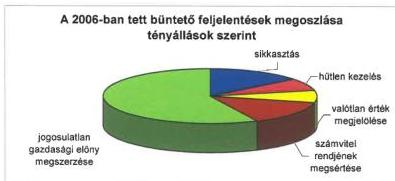

Kiugróan magas mértékű a tárgyévben a **jogosulatlan gazdasági előny megszerzése** bűncselekmény tényállásának előfordulása. Ennek oka a 2006. évben készült **ÖKOTÁM jelentést** megalapozó számvevői jelentések megállapításai következtében tett feljelentések számossága.

A jogi realizálással kapcsolatos tevékenység hatékonyságának – egyben a megtett feljelentések megalapozottságának – legfontosabb mutatója az illetékes nyomozó hatóság által megindított eljárások, a vádemelések és adott esetben a bírói ítéletek számának alakulása. A rendelkezésre álló hatósági határozatok és egyéb visszajelzések alapján a 2006-ban tett 14 feljelentésre a nyomozó hatóság már 9 esetében megindította a nyomozást, 1 esetben megszüntette a nyomozást, 4 esetben a feljelentés elbírálása még folyamatban van.

A büntetőeljárásról szóló törvény értelmében az állami szervek (így az ÁSZ is) kötelesek a nyomozó hatóságok által kezdeményezett – tájékoztatás adása, adatok közlése vagy átadása, illetve dokumentumok rendelkezésre bocsátása iránti – **megkereséseknek** határidőben eleget tenni. A tárgyévben az ÁSZ-hoz összesen 20 olyan nyomozó hatósági megkeresés érkezett, amelyek már folyamatban lévő büntetőeljáráshoz kapcsolódtak. Az ÁSZ az esetek túlnyomó többségében a lefolytatott vizsgálat során tudomására jutott tényeket tartalmazó dokumentumok megküldésével eleget tudott tenni az adatszolgáltatási kötelezettségének. Mindössze 5 megkeresés vonatkozásában tartalmazta a válasz azt a kitételt, hogy a megkeresésben szereplő kérdésben nem folyt számvevőszéki ellenőrzés.

$^{14}$ 2005-ben 5 ellenőrzés kapcsán 5 feljelentést tettünk, a feljelentéssel érintett személyek száma 7 volt.

57

---

A büntetőjogi felelősség felvetése mellett az ÁSZ a közbeszerzésekről szóló törvény alapján a **közbeszerzési jogszabályok megsértése miatti jogorvoslati eljárás** kezdeményezésére jogosult. 2006-ban az ÁSZ 21 esetben kezdeményezett a Közbeszerzési Döntőbizottság előtt jogorvoslati eljárást, ebből 17 esetben állapítottak meg jogsértést, 3 esetben került sor az eljárás megszüntetésére és 1 eljárás még folyamatban van. A közbeszerzési eljárás jogtalan mellőzése miatt kezdeményezett jogorvoslati eljárások által érintett **szerződések összértéke 781,9 millió Ft** volt, ehhez kapcsolódóan a Közbeszerzési Döntőbizottság **14,5 millió Ft értékben** szabott ki **bírságot**.

### 3.4. Közérdekű bejelentések, javaslatok és panaszok intézése

Az ÁSZ-hoz 2006-ban 304 bejelentés, panasz, javaslat és egyéb kérelem, továbbá hivatalos szervektől 50 megkeresés érkezett.

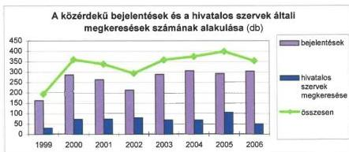

A bejelentések száma kisebb ingadozással növekvő tendenciájú. Az állampolgárok, civil szervezetek, egy-egy ügyet képviselő természetes vagy jogi személyek legtöbbször az ÁSZ eljárását – rendszerint ellenőrzési tevékenységét – kérték, illetve jogi tájékoztatást igényeltek ügyük megoldásához. A felvetéseket az ellenőrzési igazgatóságok a lehetőségeken belül figyelembe vették az operatív ellenőrzési programokban.

A **helyi, a kisebbségi önkormányzatok** működési körébe tartozott 170 bejelentés. Növekedett az önkormányzati képviselőktől és tisztségviselőktől érkezett bejelentések száma. Leggyakrabban a képviselőtestület ellenzéki képviselője, illetve a pénzügyi bizottság elnöke kért ellenőrzést. Új tartalom volt az uniós támogatások felhasználásával kapcsolatos anomáliák ellenőrzésének igénylése.

A bejelentő állampolgárok között 28% volt a **nevüket nem vállalók** aránya, akik az esetek zömében kistelepülések lakói. Bejelentéseikben jellemző volt az egyszerű gyanúra, feltételezésre, hallomásra épített, bizonyítékot mellőző tartalom.

Az őszi **önkormányzati választások** során újonnan megválasztott települési önkormányzati vezetőktől 12 megkeresés érkezett, amelyben a település gazdasági helyzetének soron kívüli ellenőrzését kérték. Ezeket a kéréseket kapacitás hiány miatt nem tudtuk teljesíteni, azonban a következő időszak ellenőrzési tervezéséhez hasznosítható információkat tartalmaznak.

58

---

Az **áttétel** folytán hozzánk érkezett bejelentések száma kissé növekedett. Az állami szervek (jellemzően ügyészség, közigazgatási hivatal) gyakran hivatkoznak az ÁSZ széles hatáskörére, amikor a hozzájuk érkezett bejelentést az ÁSZ-hoz átteszik.

Továbbra sem csökkent azon bejelentések száma, amelyekben az ÁSZ feladatkörébe nem tartozó ügyben kértek intézkedést, tanácsot, jogértelmezést, állásfoglalást. A hozzánk érkezett levelekben az állampolgárok nemegyszer számoltak be más szerveknél tett korábbi kezdeményezéseik kudarcáról. Az ilyen esetekben arra törekedtünk, hogy az ÁSZ hatáskörét és lehetőségeit figyelembe véve maximális elvi segítséget nyújtsunk a rászoruló, laikus állampolgároknak. A válaszlevelekben (55 db) köszönetüket fejezték ki és az is előfordult, hogy tájékoztattak ügyük további alakulásáról.

### 3.5. A számvevőszéki tevékenység nyilvánossága

A számvevőszéki tevékenység egyik alappillére, hogy jelentéseink, kiadványaink, munkatársaink publikációi teljes terjedelmükben nyilvánosak, és bárki által hozzáférhetőek. Erre építkezve tudjuk szervezni kommunikációnkat, segíteni az Országgyűlés ellenőrző és törvényhozó munkáját, valamint erre a nyilvánosságra alapozzuk a médiával való kapcsolattartást is.

A 2006-os esztendőt az **állandóság** és a **változás** kettőse jellemezte. Egyrészt a már kialakult és bevált kommunikációs gyakorlatot követtük az Országgyűlés, a média és az állampolgárok felé, másrészt megújítottuk arculatunkat, bemutatkozó kiadványainkat, valamint stratégiánkat.

**Egyik fő feladatunk** – az előző évekhez hasonlóan – továbbra is **az Országgyűlés tájékoztatása, munkájának segítése** volt. Az újonnan megválasztott Országgyűlés tagjainak elküldtük megújult arculatú, aktualizált bemutatkozó kiadványunkat, valamint a 2006-2010. évi stratégiánkat. A képviselők – csakúgy, mint a korábbi években – 2006 folyamán is külön figyelemfelhívó levélben kaptak értesítést jelentéseinkről (a képviselői levelek, illetve a jelentések „terítése” most már elsősorban elektronikus úton történt). Az országgyűlési bizottságok munkáját folyamatosan figyelemmel kísértük, munkatársaink szükség szerint részt vettek az üléseken, a képviselők tevékenységét szakmai észrevételeinkkel segítettük, jelentéseinket, kiadványainkat nyomtatott formában megküldtük számukra.

**Kommunikációs tevékenységünk egyik legfontosabb eleme a médiával, a szerkesztőségekkel és az újságírókkal való kapcsolattartás.** 2006-ban három alkalommal elnöki sajtótájékoztatót, valamint kilenc alkalommal az ország különböző részein a megyei, illetve megyei jogú városi önkormányzatokkal közösen rendezett sajtótájékoztatót tartottunk. Két esetben rendeztünk főigazgatói sajtótájékoztatót Budapesten: az ÁSZ Fejlesztési és Módszertani Intézetének „A környezettudatos gazdálkodás és a fenntartható fejlődés a szabályozás és az ellenőrzés tapasztalatainak tükrében” c. tanulmányát mutattuk be a média munkatársainak, majd a helyi és a helyi kisebbségi önkormányzatok gazdálkodási rendszerének ellenőrzési tapasztalataival kapcsolatban adtunk tájékoztatást.

59

---

Jelentéseink sajtó-összefoglalóját közvetlenül eljuttattuk a nemzeti hírügynökséghez, a szerkesztőségekhez és az újságírókhoz. A már kialakult gyakorlatnak megfelelően az összefoglalókat, valamint az ÁSZ-szal kapcsolatos személyügyi híreket megjelentettük a Magyar Közlöny mellékletét képező Hivatalos Értesítőben.

A munkánk iránti széleskörű érdeklődést jelzi, hogy az Observer Médiafigyelő valamint a saját feldolgozásaink alapján **2006-ban** összesen mintegy **kétszáz különböző médiumban** közel **négyezer publikáció** jelent meg az ÁSZ-szal kapcsolatban. A tendencia évről-évre emelkedő.

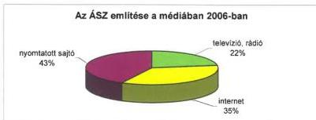

**Internetes honlapunkról** 2005 májusától állnak rendelkezésünkre részletes információk a jelentések és egyéb dokumentumok (képviselői levél, angol nyelvű jelentés-összefoglaló, stb.) letöltésével, valamint a különböző menüpontjaink látogatottságával kapcsolatban, illetve ekkortól helyeztünk el honlapunkon elégedettségmérő űrlapot.

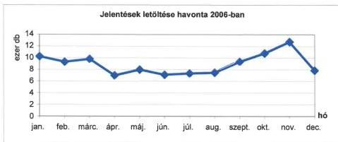

Tapasztalataink szerint honlapunk közkedvelt információforrás a tevékenységünk, illetve a jelentéseink iránt érdeklődők körében: 2006-ban több mint **97 ezren látogattak nyitóoldalunkra**, a külső látogatók összesen 107 033-szor töltöttek le jelentést$^{15}$, 4066-szor kísérőlevelet és 380 esetben nyitottak meg angol nyelvű összefoglalókat.

$^{15}$ Nem ritkán a külső látogatók több jelentést is letöltenek.

60

---

Az elégedettségmérő űrlap létrehozásának elsődleges célja az volt, hogy a honlap szolgáltatásairól visszajelzést kapjunk. Ezzel a lehetőséggel élve 2006-ban összesen 71-en fejtették ki véleményüket honlapunkról. A kapott válaszok képet adnak arról, hogy az oldalra látogatók mennyire elégedettek a fellelhető információk hasznosságával, az oldal kezelhetőségével, az információk mennyiségével és aktualitásával. A kitöltött űrlapok alapján kapott adatokat félévente részletesen elemezzük, kiértékeljük. 2006-ra vonatkozóan megállapítható, hogy a kitöltők elsősorban hivatali munkájukhoz használták az ÁSZ internetes oldalát, a leglátogatottabb rovatok a „Jelentések” és az „Ellenőrzési módszertanok” voltak, valamint a válaszadók az információk mennyiségével elégedettek voltak.

Honlapunk számos lehetőséget kínál a munkánk iránt érdeklődőknek közvetlen kapcsolat, akár párbeszéd kezdeményezésére is. A **Fórum rovat** kétféle utat biztosít a kérdések és az észrevételek feltevésére: egyrészt az „ÁSZ Fórumán”, másrészt az „Elnöki fogadóórán” keresztül.

Az „**ÁSZ Fóruma**” folyamatosan fogadja a kérdéseket, észrevételeket, és legfeljebb 8 napon belül az észrevételre adott válasz megjelenik a honlapon. Az elmúlt évben 66 kérdés érkezett: a legtöbben jogi segítséget, konkrét probléma megoldásához állásfoglalást kértek.

Az „**Elnöki fogadóóra**” az elmúlt évben háromszor került megrendezésre. A rovatot minden esetben a fogadóóra előtt egy héttel nyitottuk meg. Ettől az időponttól kezdődően lehetett a kérdéseket feltenni, amelyekre a meghirdetett időpontban válaszoltunk. Az „elnöki fogadóóra” lehetőséget kínál arra, hogy a honlapra látogatók az őket érdeklő kérdésekről élő párbeszédet folytassanak az ÁSZ vezetőivel. Meghirdetett témáink voltak: az ÁSZ 2006. évi ellenőrzései, az ÁSZ 2006-2010. évi stratégiája, az ÁSZ 2005. évi tevékenységéről szóló jelentés, a 2007. évi költségvetési javaslatról szóló ÁSZ-vélemény, az állami közutak fenntartásának ellenőrzése és az uniós támogatások 2005. évi felhasználásának ellenőrzése.

Az előző két lehetőségnél mind a kérdések, mind a válaszok nyilvánosak, az **ÁSZ központi e-mail címére** érkezett kérdések esetében a válaszok csak az érdeklődők számára elérhetők. Az elmúlt évben 183 kérdés érkezett ezen a csatornán keresztül.

## 4. AZ ELLENŐRI MUNKA MINŐSÉGÉNEK FEJLESZTÉSE

### 4.1. Humán erőforrás gazdálkodás és fejlesztés

#### Személyi feltételek

A 2006. évi személyzetpolitikai célokat és intézkedéseket az ÁSZ-stratégia és a közigazgatás-fejlesztés általános követelményeinek szem előtt tartásával alakítottuk ki. Az ellenőrzési feladatok és a rendelkezésre álló kapacitások összhangját a szervezetünket is érintő központi létszám- és bérkorlátok figyelembevételével kellett megteremteni. Áttekintettük személyi állományunk jellemzőit (korösszetétel, képzettségi sajátosságok, munkaköri feladatmegosztás), és kisebb szervezeti korrekciókkal csökkenő létszám mellett is biztosítani tudtuk a hatékony működés fenntartását, az ellenőrzési terv végrehajtását.

61

---

A viszonylag magas átlagéletkorból adódóan a létszám csökkentésének természetes útjaként a nyugdíjazások lehetőségét vizsgáltuk. Két-három évre szóló nyugdíjazási tervet készítettünk, amelynek konkrét ütemezését a munkáltató vezetők az érintettekkel személyes beszélgetések során egyeztették. Az intézkedési terv és annak végrehajtása nem mechanikusan igazodik a nyugdíjjogosultsághoz, mivel a munkaköri sajátosságokat és személyi körülményeket – leginkább az egyéni teljesítményeket – is mérlegeljük.

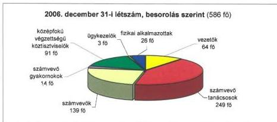

Az ÁSZ jóváhagyott állományi létszáma – a Fejlesztési és Módszertani Intézet 8 közalkalmazotti álláshelyeivel együtt – 2006-ban 618 fő. Év végéig 20 fős létszámcsökkenést irányoztunk elő, s ezt hosszabb távra tartható módon megvalósítottuk. December 31-én a ténylegesen betöltött létszám 586 fő volt.

Korábban személyzet-stratégiai célként fogalmaztuk meg az állomány átlagéletkorának csökkentését, az egyes foglalkoztatási csoportok életkori mutatóinak közelítését. A nyugdíjazások folytán az átlagéletkor 48 év. Számvevői, különösen vezetői körben ésszerű határai vannak a fiatalításnak, mivel az ellenőrzési feladatok – a megállapításokért viselt felelősség miatt – a szokásost meghaladó szakmai felkészültséget kívánnak, ami magába foglalja az adott munkakörnek megfelelő hosszabb gyakorlati idő megszerzését is.

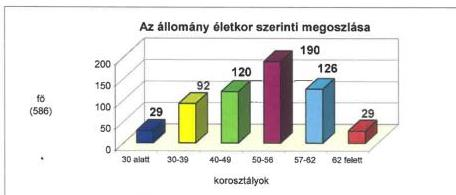

62

---

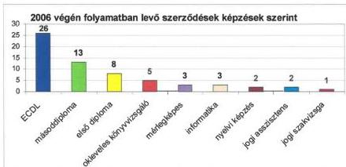

Az ÁSZ-stratégiát támogató humánpolitikai és oktatási célrendszerben kiemelten szerepel a továbbképzés elektronikus szervezési, illetve oktatási módszereinek fejlesztése. Az **e-learning** (távoktató) **projekt elemeinek tesztelésével, majd a rendszer üzembe állításával** szervezetünk élenjáró pozíciót ért el a közigazgatásban.

2006-ban a távoktató keretrendszer és a tanulási folyamatot támogató-követő menedzsmentrendszer segítségével az alábbi elektronikus tananyagokat lehetett használni: CD-jogtár oktatóanyag, CD jogtár vizsga, ECDL start csomag, financial audit alapismeretek (IDEA példával), nyelvoktató szoftverek különböző nyelveken és nyelvi szinteken.

Évek óta nagy az érdeklődés a financial audit (FA) távoktató tananyagunk iránt, az elmúlt évben 55 új hozzáféréssel a regisztráltak száma 312-re nőtt. Időközben az FA mellett elkészült a teljesítmény-ellenőrzési (TE) tananyag is, s mivel ez ugyancsak bekerült a Magyar Közigazgatási Intézet akkreditált oktatási anyagai közé, szélesebb szakmai körökben, országosan is elérhetővé válik.

Az ÁSZ módszertanait oktató elektronikus tananyagok kiegészítik, illetve helyettesítik a tanfolyami képzést, előzetes felkészülési lehetőséget, utólagos információ-frissítést nyújtanak a számvevőszék munkatársai mellett a közszférában dolgozó ellenőröknek, alkalmazva a legmodernebb képzéstámogató technológia eszköztárát és az Internet előnyeit. A felügyeleti és fejezeti ellenőrzésben dolgozó ellenőrök – előzetes regisztráció után – jelszavas belépéssel az Interneten keresztül férhetnek hozzá a módszertanokat oktató interaktív tananyagokhoz.

A hagyományos (tantermi, tanfolyami) formában 2000 óta tartunk **financial audit és teljesítmény-ellenőrzési kurzusokat** minisztériumi, intézményi belső ellenőrök, könyvvizsgálók és más pénzügyi, ellenőrzési szakemberek számára. 2006-ban is jelentős számban jelentkeztek az érdeklődők. FA képzést 4 időpontban szerveztünk 149 fő részvételével, a TE előadásokat pedig 3 alkalommal 77-en hallgatták.

65

---

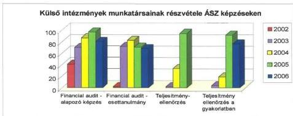

A 2006. évre az oktatásra fordítható költségvetési előirányzatot az előző évihez hasonlóan terveztük, ami a képzési célok eléréséhez elegendőnek bizonyult, sőt – ésszerű takarékossággal, illetve az oktatásszervezési eszköztár jobb kihasználásával – a tényleges felhasználás elmaradt a rendelkezésre álló összegtől.

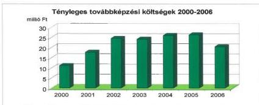

## 4.2. Az ellenőrzések minőségbiztosítása

Az ÁSZ ellenőrzések megbízhatósága, a megállapítások, következtetések és javaslatok megalapozottsága érdekében 2006-ban is hatásosan működött a **belső minőségkontroll és minőségbiztosítási rendszer**. Az ellenőrzési folyamatba épített vezetői felügyelet és a meghatározott pontokon végzett szakmai felülvizsgálat folyamatos kontroll alatt tartotta a számvevők ellenőrzési tevékenységét és a helyszíni ellenőrzések eredményeiről készített számvevői jelentéseket. Valamennyi jelentés tervezete – az ellenőrzött szervezetekkel folytatott egyeztetésekkel párhuzamosan – kétszeri ellenőrzés-szakmai és jogi felülvizsgálaton esett át. Az érintetteknek történő átadást megelőzően külön megalapozottsági felülvizsgálat alá kerültek a személyes felelősséget felvető számvevői jelentéstervezetek.

A jelentések elnöki aláírására csak az ellenőrzésekért felelős igazgatóságoktól függetlenített Minőségbiztosítási önálló osztály eredményes felülvizsgálatát igazoló tanúsítványok birtokában kerülhet sor.

66

---

A két ellenőrzési igazgatóság által 2006-ban lezárt vizsgálatok egyhatodának teljes folyamata felülvizsgálatra került. Az értékelés az ellenőrzés előkészítésétől a jelentés elkészítéséig a szakmai követelmények teljesítése és a deklarált magas szintű ellenőrzési bizonyosság elérésére vonatkozott, és egészében megnyugtató eredménnyel zárult.

2006. január 1-jén hatályba lépett a számvevőszéki ellenőrzés minőségirányítási rendszerét szabályozó elnöki utasítás. A minőségirányítási rendszer szorosan kapcsolódik az ÁSZ szakmai szabályozási rendszeréhez (Magatartásszabály-gyűjtemény, Ellenőrzési elvek és Standardok és az Ellenőrzési Kézikönyv, illetve a módszertanok). Az ezekben leírt szakmai elvek és követelmények közül kiemeli, egységes rendszerbe foglalja, és keretjelleggel szabályozza azokat az elemeket, amelyek alapvetően hozzájárulnak az ellenőrzési munka és a jelentések jó minőségéhez. Az ellenőrzési tevékenységgel összefüggésben azokra a szempontokra, követelményekre és eljárásokra összpontosít, amelyeket feltétlenül teljesíteni kell a jó minőség folyamatos biztosítása érdekében. Az elnöki utasítás előírta a Szervezeti és Működési Szabályzat, az ügyrendek, az Ellenőrzési Kézikönyv, a módszertanok, valamint az oktatási anyagok összhangba hozását és kiegészítését a számvevőszéki ellenőrzés minőségirányítási rendszerének szabályozásával. E feladat végrehajtása és a munkaköri leírások aktualizálása is nagyobb részt már megtörtént.

### 4.3. Nemzetközi kapcsolatok

Az ÁSZ évek óta aktív és a visszajelzések szerint elfogadott, elismert tagja a nemzetközi ellenőrzési közösségnek. E státuszunkat úgy értük el, illetve fejlesztettük tovább 2006-ban, hogy stratégiai céljainkkal összhangban törekedtünk az új ellenőrzési technikák, módszertanok ismeretanyagának átvételére és korszerűsítésére, valamint a számvevőszékek közötti hatékony együttműködési formák megismerésére és gyakorlati alkalmazására.

Mindemellett, 2006-ban a nemzetközi színtéren végzett kooperáció terén áttörésként értékelhető az a tény, hogy lehetőségeink és kapacitásunk határait figyelembe véve, jól kiválasztott régiókban, adott esetben tapasztaltabb külföldi kollégáink partnereként, magunk is aktív szerepet vállaltunk a korszerű ellenőrzési és intézményfejlesztési elvek átadása, illetve gyakorlati megvalósítása területén.

Két- és többoldalú nemzetközi együttműködésünk prioritásait tavaly is a Legfőbb Ellenőrző Intézmények Nemzetközi Szervezetén (INTOSAI) belül viselt tisztség, a Kormányzó Tanács elnöki funkciójának ellátása, valamint az Európai Unió tagországainak nemzeti legfőbb ellenőrző intézményei és az Európai Számvevőszék (ECA) egyre erőteljesebb közös tevékenysége határozta meg.

#### Többoldalú szakmai együttműködés

2006-ban felgyorsult az **INTOSAI** Budapesten elfogadott Stratégiai Tervének (2005-2010) végrehajtása, a dokumentumban foglalt célok megvalósítása. Az ellenőrzési standardok továbbfejlesztése kapcsán szerepet vállaltunk a Szakmai Standard Bizottság feladataiban, és hozzájárultunk ahhoz, hogy az INTOSAI és

67

---

a Könyvvizsgálók Nemzetközi Szövetsége (IFAC) ellenőrzési irányelvei közelebb kerültek egymáshoz. Ugyancsak aktívan részt vettünk a Belső Kontroll Standard Albizottság, a külső és belső környezet változásaira rugalmasan reagáló, innovatív tevékenységében.

Az ellenőrző intézmények közötti tudásmegosztás és tapasztalatcsere folyamatait illetően számos, a szakmai munka szempontjából kiemelkedően fontos területen, mint például a pénzmosás, a korrupció elleni küzdelem, vagy a cunami által okozott károk helyreállítása érdekében létrehozott alapok felhasználása terén vettünk részt a korszerű ellenőrzési elvek megalkotásában. Igen sok fórumon volt alkalmunk megosztani tapasztalatainkat kollégáinkkal a privatizáció ellenőrzésével összefüggésben is.

Eredményes munkánkhoz nagymértékben hozzájárult az a harmonikus együttműködés, amit az INTOSAI főtitkárságával, az osztrák számvevőszék elnökével és munkatársaival alakítottunk ki.

Kezdeményező szerepünk volt abban, hogy az INTOSAI regionális munkacsoportjainak együttműködése terén, a hagyományosan jó EUROSAI – OLACEFS kooperáció mellett, intézményessé vált az EUROSAI – ARABOSAI együttműködés.

Mi magunk is fokoztuk részvételünk intenzitását az **EUROSAI** munkacsoportjaiban (pl. IT, környezetvédelem). 2006-ban tagjai lettünk a szervezet képzési bizottságának. Ezzel szinte egyidejűleg megkezdtük a felkészülést az ellenőrzés minőségi követelményeit feldolgozó szeminárium megrendezésére, amely rendezvénynek az ÁSZ volt a házigazdája 2007 márciusában. Hasonlóképpen elkezdtük a felkészülést, a szükséges dokumentumok kidolgozását a soron következő, 2008. évi, lengyelországi (Krakkó) EUROSAI Kongresszusra is.

A tavalyi év során is lehetőségünk volt bekapcsolódni az európai regionális ellenőrző intézményeket tömörítő **EURORAI** tevékenységébe. A szervezet rendezvényein, amelyek témája az államadósság ellenőrzése és a kockázat alapú ellenőrzés volt, előadóként és résztvevőként egyaránt képviseltük intézményünket.

Az **Európai Unió** legfőbb ellenőrző intézményei vezetőinek együttműködési hálózata (Kapcsolattartó Bizottság – Contact Committee) tevékenységében továbbra is aktív szerepet vállaltunk. E fórum az EU alapok ellenőrzésével, valamint egyéb, a Közösség működéséhez kapcsolódó ügyekkel összefüggő szakmai tapasztalatcserére fókuszált.

A Kapcsolattartó Bizottság munkájában résztvevő számvevőszékek törekvése, hogy összegző képet nyújtsanak az EU alapok nemzeti felhasználásáról. E szándéknak megfelelően az ÁSZ 2006-ban állított össze először olyan önálló dokumentumot, amely az EU alapok hazai felhasználására irányuló ellenőrzéseit mutatja be. A kiadványt megküldtük legfontosabb hazai és külföldi partnereink számára.

---68

---

EU-csatlakozásunk óta először rendeztük meg Budapesten a szóban forgó együttműködési hálózat összekötőinek értekezletét, amelyen a tagjelölt országokkal együtt mintegy 30 nemzeti számvevőszék képviselője jelent meg. A rendezvény során megerősítettük azt a szándékunkat, hogy 2009-ben készek vagyunk megrendezni a Kapcsolattartó Bizottság ülését is.

Különböző nemzetközi rendezvények alkalmával folytattuk eredményes együttműködésünket a **NATO Nemzetközi Számvevő Testületével**, valamint az **OECD** és az Európai Unió közös szervevel, a **SIGMA**-val. Utóbbi szervezet vezetője, mint az Ellenőrzési Kézikönyvek és Módszerek Munkacsoport társelnöke, a munkacsoport tevékenységének lezárása alkalmával külön kiemelte az ÁSZ munkatársainak folyamatos és igen aktív közreműködését.

Részt vettünk, illetve az ÁSZ elnöke előadást tartott a közszféra pénzügyi gazdálkodásának fejlesztésével foglalkozó nemzetközi szervezet (**ICGFM**) soros rendezvényén az Egyesült Államokban.

A **visegrádi országcsoport** számvevőszéki elnökei 2006-ban Magyarországon találkoztak. Az ÁSZ elnökének korábbi, a környezetvédelmi témában végzett osztrák-magyar-szlovén párhuzamos ellenőrzésről szóló közös jelentés aláírása alkalmával tett javaslata alapján a résztvevők körvonalazták egy újabb párhuzamos ellenőrzés lehetőségét. A munka – előreláthatólag – az EU Strukturális Alapjainak felhasználásában érintett nemzeti intézmények belső kontrollrendszerére irányul. A tervezett ellenőrzésben valamennyi visegrádi ország számvevőszéke részt vesz.

### Kétoldalú nemzetközi kapcsolatok

2006. évi bilaterális kapcsolataink során, partnereinkkel közös elképzelések alapján a szakmai munka egy-egy részterületét (önkormányzatok ellenőrzése, minőségirányítási rendszer, IT ellenőrzés, PPP stb.) vitattuk meg. Elsősorban a közép-kelet-európai régió (visegrádi országcsoport, balti országok) számvevőszékeivel voltak intenzív kapcsolataink, de kiemelkedően hasznos együttműködést alakítottunk ki például Izrael, Svájc vagy Lichtenstein partnerszervezeteivel is.

Az ÁSZ rendszeresen fogadott delegációkat (pl. Vietnámból, Tadzsikisztánból) a hazai ellenőrzési módszertan (mindenekelőtt a szabályszerűségi ellenőrzéssel összefüggő), szemlélet és tevékenység egy-egy területének részletes bemutatása céljából.

Hagyományosan kiváló és rendszeres a szakmai együttműködésünk az Egyesült Királyság Számvevőszékével (NAO), amely 1999 óta stratégiai partnerünk. A két nemzeti legfőbb ellenőrző intézmény között érvényben lévő, a „Független külső ellenőrzések fejlesztésének támogatása a Tadzsik Köztársaság állami szektorában” témájú megállapodás alapján az ÁSZ egy munkatársa több hetes képzési program oktatójaként segítette a brit partner munkáját.

69

---

## A nemzetközi kapcsolattartás költségvetési összefüggései

Az ÁSZ nemzetközi elismertségéből adódóan folyamatosan nő a nemzetközi szereplésre történő felkérések száma és élénk érdeklődés tapasztalható az ÁSZ tevékenysége iránt a külföldi partnerintézmények részéről. 2006-ban 47 M Ft-ot költöttünk kiutazásokra.

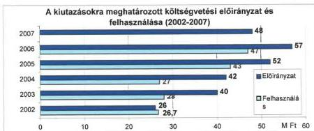

2006-ban az ÁSZ munkatársai 76$^{16}$ külföldi úton vettek részt, és azokon 147 kiküldött 343 napot töltött el. Egy külföldi kiküldetés képzésen való részvételhez kapcsolódott, összesen 29 napban. (Az egy külföldi útra eső átlag munkanapszám a hosszú időtartamú képzés nélkül 4 nap/út.) Egy külföldi kiküldetésben töltött munkanap átlagos költsége 2006-ban 131 ezer Ft volt.

Az összes tényleges ráfordításból 35 979 ezer Ft (75%) megtervezett utazás volt. A tervbe vett és megvalósított utak a kalkulált keretösszegen belül – a tervezett összes költség 98,6%-án – valósultak meg. A kiutazási terv teljesülése szempontjából kedvezőtlen jelenségként értékelhető, hogy 2006-ban 18 olyan rendezvény maradt el, amelyeket a meghívók szándékának ismeretében, illetve a korábbi évek tapasztalata alapján – de konkrét meghívás vagy időpont ismerete nélkül – szerepeltettünk a tervben. Nem tervezhetők az egyre gyakoribb felkérések sem, amelyeket előadások tartására kapunk.

A költségek alakulását nagyban befolyásolja az a tény, hogy az ÁSZ elnöke tölti be 2007-ig az INTOSAI Kormányzó Tanácsának jelentős nemzetközi szerepvállalást követelő elnöki tisztét.

2006-ban az ÁSZ elnöke 16 alkalommal utazott külföldre (2005-ben 10 alkalommal), ott összesen 59 napot töltött (2005-ben 38 nap). Ezen belül 8 alkalommal az INTOSAI Kormányzó Tanácsának elnökeként tett eleget külföldi kötelezettségének, ezek az utak összesen 32 napot vettek igénybe (2005-ben 4 alkalommal összesen 13 napot). Egy elnöki út átlagos költsége 550 ezer Ft, egy napra eső átlagos költsége 149 ezer Ft volt.

$^{16}$ Nem tartalmazza azokat az utakat, melyekkel kapcsolatban költség nem merült fel.

70

---

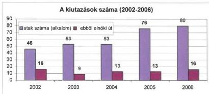

Az utazások során is messzemenően érvényesítjük a takarékosság követelményeit. Az ÁSZ vezetői és munkatársai külföldi útjaikon tolmácsot nem vesznek igénybe, a különféle szakmai konferenciákra felkért előadásokért díjat nem vesznek fel. Ezekben az esetekben a regisztrációs díjat, egyes alkalmakkor az utazási és szállásköltségeket a külföldi fél viseli. Az ÁSZ a nemzetközi kapcsolattartás terén nem alkalmazza a kölcsönös vendéglátás gyakorlatát. Saját költségén utaztatja a kiküldötteit, következképpen külföldi vendégfogadás címén sem számolja el a látogatásra érkezők utazási költségeit. A kiküldöttek az Európán belüli utazásoknál vagy gépjárművel, vagy a legolcsóbb légitársaságokkal, kizárólag turista osztályú jegyekkel utaznak. Esetenként igénybe vettük a légitársaságok által nyújtott hétvégi kedvezményt, amelynek a gazdaságosságát, hasonlóan a gépkocsival való utazáshoz, minden esetben egyedileg, előzetesen megvizsgáltuk.

Az utazásokról, azok hasznosítható tapasztalatairól minden esetben a belső szabályzatban meghatározott módon útjelentés készül. Valamennyi útjelentés mindenki számára hozzáférhetően megtalálható az ÁSZ könyvtárában.

## 5. A SZÁMVEVŐSZÉKI TEVÉKENYSÉGHEZ KAPCSOLÓDÓ KUTATÓ ÉS MÓDSZERTANI MUNKA

Az ÁSZ Fejlesztési és Módszertani Intézet (FEMI) a számvevőszéki stratégia céljait szem előtt tartva 2006-ban is arra törekedett, hogy hozzájáruljon az ellenőrzés módszereinek a nemzetközi standardokkal összhangban történő korszerűsítéséhez és a nemzetközi legjobb gyakorlat alkotó adaptációjához és elősegítse átfogó értékelő vélemény formálását a közpénzek felhasználásáról.

Az Intézetben a kutatási tervnek megfelelően több témában folyt tudományos, illetve módszertani jellegű kutatás, például a tudástársadalom és -gazdaság kiépülésének helyzetéről és feladatairól, az államháztartás pénzügyi reformjának irányairól, a közszféra és a gazdaság versenyképességéről, a privát partner bevonásával kapcsolatos döntések módszertani kérdéseiről, az adótámogatások elemzéséről, a programköltségvetésre való áttérés lehetőségéről, valamint a számvevőszéki ellenőrzés lehetőségeiről a korrupció-ellenes küzdelemben.

71

---

A számvevőszékeknek a világ legtöbb országában feladata a korrupciós kockázatok feltárása és a korrupció elleni küzdelem. 2006-ban több nemzeti számvevőszék (Kolumbia, Szerbia, Ukrajna) is nemzetközi konferenciát, szemináriumot rendezett arról, hogy a számvevőszékek mit tehetnek a korrupció megelőzése és leleplezése érdekében. Az ÁSZ lehetőségeihez mérten részt vett ezeken a rendezvényeken, képviselői ismertették a magyar tapasztalatokat, valamint igyekeztek megismerni a legújabb nemzetközi eredményeket.

Az ÁSZ ellenőrzései során minősíti a működés átláthatóságát és a gazdálkodás elszámoltathatóságát, így azonosítja és jelzi a korrupciós kockázatokat, az ilyen cselekmények lehetőségét, valamint javaslatokat fogalmaz meg a hibák, szabálytalanságok megelőzésére. Indokolt esetben törvényi felhatalmazása folytán bűncselekmények szankcionálását kezdeményezi. E mellett a korrupció okait elemző, a kockázatokra, tendenciákra rámutató összefoglaló tanulmányokat készít.

Az ÁSZ 2006-ban pályázatot nyújtott be „a korrupció-ellenes intézkedések továbbfejlesztésének és a korrupció-ellenes kormánystratégia végrehajtásának elősegítése” címmel az Európai Unió Átmeneti Támogatási keretében elkülönített Intézményfejlesztési Alap program terhére elnyerhető támogatásra, melyet az Európai Unió Bizottsága elfogadott. A projekt végrehajtásáért a FEMI a felelős. A szerződéskötésre várhatóan 2007 első félévében kerül sor. A projekt eredményeként – az e téren élenjáró európai partnerszervezetekkel együttműködve – olyan elemzési módszereket dolgozunk ki, amelyek az ellenőrzések előkészítése és lebonyolítása során elősegítik a korrupciós kockázatok, illetve a korrupcióval különösen veszélyeztetett területek azonosítását.

A FEMI 2006-os tevékenységében külön hangsúlyt kapott a közpénzügyi törvény szabályozási koncepciója kidolgozása érdekében végzett munka. Az ÁSZ tanácsadói szerepének keretein belül vállalta egy új szemléletű és tartalmú közpénzügyi törvény megalkotását megalapozó koncepció kidolgozását. E feladat megvalósítása érdekében a FEMI-ben több megalapozó résztanulmány készült. Ezek belső és szakértői megvitatását követően elkészült a közpénzügyi törvény szabályozási koncepciója főbb vonásait bemutató tanulmány.

A számvevőszéki tevékenység nélkülözhetetlen velejárója a gyakorlati ellenőrzési munkát támogató, a környezeti változásokhoz és a nemzetközi trendekhez igazodó folyamatos módszertani fejlesztés. 2006-ban elkészült és bevezetésre került a teljesítmény-ellenőrzések új módszertana, amelyhez elektronikus oktatási modul is kapcsolódik. Folyamatosan korszerűsítjük, aktualizáljuk és bővítjük a konkrét ellenőrzési munkát támogató módszertani segédletek körét.

A közszféra belső kontrollrendszerének fejlesztésével kapcsolatban – amely mind nemzetközi, mind hazai szinten kiemelt figyelemben részesül – folytattuk a belső kontrollal kapcsolatos korszerű, a „legjobb nemzetközi gyakorlatnak” megfelelő szemlélet és elvek adaptálását, a kapcsolódó módszerek fejlesztését. E munka kiterjedt az INTOSAI Belső kontroll standardok albizottságának keretében folyó együttműködésre, az államháztartás belső pénzügyi ellenőrzési rendszerének koordinációs és harmonizációs feladatait ellátó Pénzügyminisztériummal való együttműködésre, továbbá a belső kontrollrendszerek kockázatértékelésének, valamint külső, megbízhatósági ellenőrzésének módszertani fejlesztéséhez munkaanyagok, tervezetek kidolgozására, amelyek részben az átfogó ellenőrzés módszertanához kapcsolódnak.

72

---

A módszertani munkánk magában foglalta különböző oktatási anyagok kidolgozását, továbbfejlesztését és magát az oktatást is, amely utóbbi az ÁSZ-on belüli továbbképzésekben, a hazai szakirányú oktatási intézményeknél tartott előadássorozatokban nyilvánult meg.

Részt vettünk egyes társ-számvevőszékek módszertani munkájában. Ennek keretében Macedónia, Tádzsikisztán fejlesztési programjainak megvalósításában vállaltak munkatársaink oktatóként tevékeny szerepet.

Az ÁSZ elnökének vezetési tevékenységét segítő konzultatív munkaszervezet, az **Elnöki Tanácsadó Testület** 2006. évi tevékenységének gerincét a hazai közpénzügyi rendszer fejlesztésére, valamint az annak előmozdítását is szolgáló számvevőszéki ellenőrzés fő irányait és arányait meghatározó 2006-2010. évi ÁSZ stratégia kidolgozására irányuló munka támogatása képezte. Ennek keretében a testület több ízben folytatott szakmai konzultációt a számvevőszéki stratégiáról, elsősorban az elvekről és értékekről, a stratégiai irányokról, valamint a szervezetirányításról és a kapcsolati rendszerek fejlesztéséről, továbbá az államháztartás korszerűsítése és a konvergencia program kapcsán előtérbe kerülő új, átfogó közpénzügyi törvény szabályozási koncepciójának elveiről. Emellett figyelmet fordított az ÁSZ előző évi tevékenységét értékelő (éves) jelentésre, a számvevőszéki kutatóintézet, a FEMI tevékenységére, s áttekintette a Pénzügyi Szemle szerkesztésének főbb tartalmi kérdéseit is.

Az ÁSZ a pénzügyi szakma igényeinek és országgyűlési határozatban is megszabott feladatának tett eleget azzal, hogy a kétnyelvű (magyar-angol) közpénzügyi szakfolyóiratot 2006-ban ütemesen, negyedévenként megjelentette. A megújult **Pénzügyi Szemle** szerzőinek köre akadémiai tagtól, valamint levelező tagtól kezdve egyetemi tanárokon, állami szakmai vezetőkön, szakértőkön át PhD. hallgatókig terjed. A tartalom – támaszkodva a szerkesztőbizottság tevékenységére is – követte a szakfolyóirat hatókörébe tartozó pénzügyi és gazdasági folyamatok fő irányát. Az államháztartás működésének, a közpénzügyi reformnak, a konvergencia programnak, az ezekre ható háttér-összefüggéseknek az értékelése és elemzése állt tematikai palettájának centrumában. Súlyponti kérdésként kezelte a folyóirat az elmúlt évben a versenyképesség nemzetgazdasági és vállalati aspektusait, gazdaságunk integráció-érettségét, az állam és a magánszféra kooperációjának kibontakozását, az Európai Unió jövőképét, emellett figyelmet fordított olyan témákra is, mint például a hazai foglalkoztatási helyzet, az MNB inflációs célkövetési rendszere, s a pénzmosás elleni nemzetközi küzdelem paradigmaváltása. A lap külföldi, egyetemi, valamint OECD és EU-körökben is kedvező visszhangra talált.

## 6. AZ INTÉZMÉNY MŰKÖDÉSE ÉS GAZDÁLKODÁSA

### 6.1. Költségvetési gazdálkodás

A számvevőszéki törvény 2004. évi módosítása óta az ÁSZ maga állítja össze a fejezet költségvetésére és a költségvetés végrehajtására vonatkozó javaslatát. E javaslatot a Kormány – változtatás nélkül – a költségvetési, illetve a zárszámadási törvényjavaslat részeként terjeszti elő az Országgyűlésnek. A fejezet gazdálkodását az Országgyűlés elnöke által pályázat útján megbízott független

73

---

könyvvizsgáló ellenőrzi. Az ÁSZ 2006. évi gazdálkodását minősítő jelentés előreláthatólag április végére készül el.

A törvény adta felhatalmazásból eredő nagyobb felelősség okán szükségesnek tartottuk és tartjuk a jövőben is, hogy a fejezet költségvetési javaslata részletesen mutassa be az ÁSZ stratégiájának alapvető céljait, az abból fakadó szakmai feladatait, külön kiemelve az ÁSZ éves ellenőrzési tervében szereplő meghatározott gyakoriságú, illetve rendszeresen teljesítendő, törvényekben előírt ellenőrzési feladatokat. Önálló programként mutattuk be mindazon egyéb szakmai, valamint működési feladatokat, amelyek jól körülhatárolható csoportokba sorolhatók és meghatároztuk a végrehajtáshoz szükséges erőforrásokat.

Mindezek alapján az Országgyűlés részére – a Pénzügyminisztérium útján – részletes, átlátható, többszörösen egyeztetett költségvetési tervjavaslatot készítettünk, amelynek kialakításakor a Pénzügyminisztérium tervezési irányelvein túl figyelembevettük az ellenőrzési és egyéb feladatokat alapvetően befolyásoló törvények előírásait, a vonatkozó országgyűlési határozatokat. Arra törekedtünk, hogy az ÁSZ kellő körültekintéssel, takarékosan, az ország gazdasági helyzetének figyelembe vételével igyekezzen törvényi kötelezettségeinek – lehetőségeihez képest – maradéktalanul eleget tenni.

Az Országgyűlés az ÁSZ 2006. évi feladatainak ellátására a költségvetési törvényben 7719,6 M Ft-ot hagyott jóvá, amelynek fedezetét 7699,6 M Ft támogatás és 20,0 M Ft saját bevétel biztosította. Ez a megelőző év eredeti előirányzatához képest az 1%-os növekedést sem érte el. A költségvetési forrásokkal való gazdálkodás mozgásterét ez évben is csökkentette az ÁSZ előtt álló szakmai feladatok több mint 75%-ának törvényi, illetve az országgyűlési határozatok általi kötöttsége, ezzel összefüggésben a személyi juttatások és a közterhek, valamint a dologi kiadások automatizmusaiból következő determináció.

Mindezek megkövetelték, hogy tervszerű beruházási, felújítási és beszerzési politikát folytassunk, kihasználva a központosított és a saját hatáskörben lefolytatott közbeszerzési eljárások által biztosított megtakarítási lehetőségeket.

A kiadási főösszegből a személyi juttatások előirányzatai 4568,1 M Ft-ot, a munkaadókat terhelő járulékok 1424,0 M Ft-ot, a dologi kiadások 1122,1 M Ft-ot, az intézményi beruházási kiadások 321,6 M Ft-ot, a felújítási előirányzatok 123,8 M Ft-ot, a fejezeti államháztartási tartalék 160,0 M Ft-ot jelentettek.

A jóváhagyott előirányzatot az évközi módosítások 548,9 M Ft-tal növelték, a módosítások után 8268,5 M Ft állt rendelkezésre. A módosításokból 542,4 M Ft az előző évi előirányzat-maradvány jóváhagyásnak, 2,8 M Ft az OTKA támogatásával folytatandó kutatáshoz és a BM-mel kötött megállapodás alapján a továbbképzések támogatásához biztosított hozzájárulásnak, 3,7 M Ft a dolgozók részére folyósított lakásvásárlási kölcsönök törlesztésének következménye.

A felhasználás 7698,3 M Ft, amely a kiadási előirányzat 93,1%-a volt. A személyi juttatások és a munkaadókat terhelő járulékok együttes összege (6065,3 M Ft) a kiadások 78,8%-át tették ki, a dologi kiadások aránya 14,0%, a felhalmozási kiadásoké pedig 7,2% volt.

74

---

A kiadások teljesítésének alakulását befolyásolta a maradványképzési kötelezettség teljesítése, amely érdekében a megjelölt előirányzatokra csak 2007. évi kifizetésre szóló kötelezettség volt vállalható.

A tervezett 20 M Ft bevétellel szemben 15,9 M Ft teljesült. A bevételek zömében a FEMI által készített tanulmányok díjaiból, feleslegessé vált eszközök, gépjárművek értékesítéséből, helyiség bérbeadásból, továbbszámlázott szolgáltatásokból keletkezett, illetve mintegy 2 M Ft bevétel illette meg az ÁSZ-t a brit partnerintézménnyel megvalósított tadzsikisztáni együttműködés kapcsán szakértői díj, illetve költségtérítés címén.

A maradvány (amelynek összege – a 4,5 M Ft bevételi lemaradás figyelembevételével – 565,7 M Ft) 13,6%-a (77,0 M Ft) az államháztartás egyensúlyi helyzetének javítása érdekében felajánlott összeg, amely az előirányzat-maradvány elszámolása során kerül elvonásra. A fennmaradó 86,4% teljes egészében kötelezettségvállalással lekötött, a feladatok, a teljesítések, illetve a számlák (főként a maradványképzési kötelezettség miatt) 2007-re való átütemezésének, áthúzódásának következménye.

A rendelkezésre álló előirányzatok tervszerű takarékosság mellett az ésszerű beszerzésekkel összességében biztosították az intézmény zavartalan feladatellátáshoz szükséges működési, üzemeltetési feltételeket.

## 6.2. Az infrastruktúra működtetése, fejlesztések

A 2006. évben is kiemelt feladatként kezeltük a munkafeltételek megfelelő színvonalú biztosítását, a meglévő irodaépületek állagának megőrzését, illetve javítását, valamint az eszközellátottság fejlesztését.

A 2006. év legnagyobb jelentőségű fejlesztése az Apáczai Csere János utcai székház felvonóinak felújítása volt, amely magába foglalta a személyfelvonók cseréjét, a felvonótorony bővítését és az épület műemlék jellegének megfelelő kovácsoltvassal kombinált biztonsági üvegfelületű burkolat kiépítését.

Az Apáczai Csere János utcai székház fűtés korszerűsítésének előkészítése érdekében elkészítettük a műszaki terveket.

A 2006. évben tovább folytatódott az ÁSZ budapesti telephelyein az elektromos rekonstrukció és ehhez kapcsolódva az irodahelyiségek tervszerű felújítása. Az Apáczai Csere János utcai székházban és a Lónyay utcai irodaházban az elektromos rekonstrukció végrehajtása során az irodák energiaellátásáról leválasztásra került a lépcsőházak és a folyosók világítási rendszere. A leválasztás eredményeként a közös helyiségek világítása a fényerő függvényében szabályozhatóvá vált.

Mindkét irodaépületben a bejárati recepciós pult korszerű, megjelenésében az irodaépületekhez illő funkcionáltan tervezett bútorzattal átépítésre került.

Az elhelyezési feltételek javítása érdekében hat megyei irodánkban végeztettünk kisebb mértékű felújítási, átalakítási munkákat.

---75

---

Az Apáczai Csere János utcai székházban bővítettük és átalakítottuk a behatolás elhárítási rendszert.

A fűtési energiával való takarékos gazdálkodás megvalósításáért a Lónyay utcai irodaházban az utcai homlokzaton kicseréltettük az összes nyílászárót korszerű hang és hőszigetelt, külső reluxával ellátott ablakokra.

A bérleti díjak csökkentése érdekében a Dunaházban bérelt irodaterületet megvásároltuk a Magyar Állam javára. Az irodák az ÁSZ vagyonkezelésébe kerültek. Takarékossági okokból megszüntettük több irodahelyiség bérletét, ezáltal a következő évek vonatkozásában, mintegy évi 30 millió forinttal mérsékeltük működési költségeinket.

Az ingatlanok felújítási és rekonstrukciós munkáira a tárgyévben összesen 320,9 M Ft-ot használtunk fel.

Az ellenőrzési tevékenység magas színvonalú támogatása érdekében 73,9 M Ft-ot fordítottunk színes nyomtatásra is alkalmas nyomdagép beszerzésére, illetve a korábbi típusok modernizálására, fénymásoló és egyéb irodatechnikai gépek beszerzésére, valamint az elhasználódott irodabútorok cseréjére.

A gépjárműpark tervszerű megújítása érdekében 2 db hat évnél idősebb gépjármű került lecserélésre – egyéb más gépjármű tartozékok beszerzésével együtt – összesen 13,1 M Ft értékben.

### 6.3. Az informatika és a telekommunikáció működtetése, fejlesztése

Az ÁSZ IT-tevékenységének alapvető célja, hogy informatikai és a telekommunikációs eszközökkel sokoldalúan és hatékonyan támogassa az ÁSZ stratégiai küldetését és feladatainak ellátását. A Számvevőszék informatikai és telekommunikációs fejlesztései 2006-ban is az évente aktualizált, Elnöki értekezleten jóváhagyott részletes IT stratégiájában meghatározott projekt tervek szerint történtek.

Az ÁSZ – az elmúlt évek dinamikus fejlesztésének köszönhetően a változó kommunikációs igényeket rugalmasan követni képes, korszerű, egységes hálózati telekommunikációs rendszerrel rendelkezik. Ez annak is köszönhető, hogy az ÁSZ szakemberei folyamatos és megbízható kontroll alatt tartják a fejlesztéseket, így a pályázók is ennek tudatában nyújtják be ajánlataikat. A verseny és a tisztességes szakmai magatartás kordában tartja a költségeket, amely nem terheli aránytalanul a fejlesztési előirányzatokat.

Az év során új felhasználói alkalmazásokat fejlesztettünk, és folyamatosan fejlesztjük a már bevezetett rendszereket is.

Az ÁSZ 2003-ban elektronikus oktatásszervező számítógépes keretrendszert vezetett be, amely a belső képzések menedzselése és nyilvántartása mellett szabványosan fejlesztett elektronikus tananyagok futtatására és adminisztrálására is alkalmas. Az elmúlt években több elektronikus tananyagot is illesztettünk a rendszerbe, így a Microsoft Office programok használatát oktató ECDL tan-

---76

---

anyagot, a Complex Jogtár kezelését oktató programot, valamint az ÁSZ által kidolgozott financial audit módszertan távoktatási tananyagot. 2006-ban befejeztük a Teljesítmény-ellenőrzés módszertana távoktatási tananyagának fejlesztését.

2005-ben, előtanulmány és részletes helyzetfelmérést követően, elkészült a Vizsgálatok dokumentációs rendszerének projektterve. A projekt keretében az ÁSZ a számvevői munkavégzés dokumentálásának támogatására, a vizsgálatok során keletkezett, illetve begyűjtött dokumentumok nyilvántartására, tárolására szolgáló elektronikus rendszert kíván kifejleszteni. A fejlesztés megvalósításához az ÁSZ 2006-ban sikeresen pályázott a Nemzeti Fejlesztési Ügynökség közreműködésével EU Átmeneti Támogatásra. A jóváhagyott projekt tervnek megfelelően az Átmeneti Támogatásra vonatkozó szabályok szerint a Központi Pénzügyi és Szerződéskötő Egység és az ÁSZ 2007-ben közbeszerzési eljárást indít a rendszer fejlesztésére.

Az ÁSZ minden évben kiemelten kezeli honlapjának tartalmi és formai továbbfejlesztését. 2006-ban az ÁSZ új arculati terve alapján megkezdtük a honlap arculatának fejlesztését, melyet 2007-ben fejezünk be. A honlappal párhuzamosan az ÁSZ Intranet rendszerének folyamatos fejlesztésével az információk hatékony kezelése érdekében új, tematikus adatbázisokat alakítottunk ki. 2005 januárja óta működik az Elektronikus elnöki értekezlet (3E) alkalmazói rendszerünk, amelyben a vezetői értekezletek információi, a meghívók, a megtárgyalásra kerülő dokumentumok az előkészítéstől kezdődően elektronikus úton elérhetők és visszakereshetők az érintettek számára. A rendszer további szolgáltatása az értekezleten meghozott döntések tárolása, a feladatok kiadása és azok nyomon követése. A megtárgyalt napirendi pontokról készült emlékeztető az ÁSZ minden dolgozója számára elektronikusan hozzáférhető. 2006-tól a Főtitkári értekezleteket is hasonló rendszerben működtetjük.

A 2000-ben bevezetett számítógépes iktatási és ügykövetési rendszerünket 2006-ban az irattározás funkcióval bővítettük. Ennek bevezetésével teljes körűvé vált az iratkezelés számítógépes támogatása. Továbbfejlesztettük a SZEKRETER vizsgálat-nyilvántartó és nyomon követő rendszerünket, amely 2002 óta a tervezéstől a javaslatok realizálásáig minden lényeges információt tartalmaz az ÁSZ által végzett ellenőrzésekről. Ebből a rendszerből az ÁSZ Ellenőrzési terve, valamint a jelentéseinkben megfogalmazott javaslatok és az arra érkezett válaszok az ÁSZ Internetes honlapján is megtekinthetők.

Az ÁSZ IT szolgáltatásokhoz kapcsolódó hibák, problémák bejelentésére, dokumentálására és kezelésére számítógépes HelpDesk rendszert alakítottunk ki. A rendszert 2007-ben vezetjük be, amelynek eredményeképpen gyorsabb és dokumentált problémakezelést és hibaelhárítást tudunk megvalósítani. Emellett a vezetők naprakész nyilvántartással rendelkeznek a bejelentésekről, a hibaelhárítások aktuális helyzetéről, a szolgáltatást nyújtó szakemberek elfoglaltságáról. A rendszer bevezetése mérhetővé teszi az IT üzemeltetésben résztvevők tevékenységét. A rendszert összekapcsoltuk a hálózati aktív eszköz-menedzselő szoftverrel, így a hálózat felügyeleti rendszerből érkező hibajelzések és azok kezelése is dokumentált.

77

---

Az IT szolgáltatások biztonsági kockázatainak csökkentése érdekében 2006-ban az ÁSZ-ba bejövő elektronikus leveleink szűrésére (spam), illetve azok vírusmentesítésére egy új hardver-szoftver eszközt telepítettünk, amely a felesleges leveleket automatikusan törli, a spam-gyanús leveleket megjelöli. Az ÁSZ dolgozók számára egyes IT szolgáltatások biztonságos elérését az Internetről a tűzfal szoftver rendszerünk frissítésével alapoztuk meg.

Az infrastruktúra fejlesztés keretében több hónapos előkészítő munkát követően 2006-ban országos szintű hálózatfejlesztést hajtottunk végre. Az ÁSZ valamennyi telephelyén csatlakoztunk az Elektronikus Kormányzati Gerinchálózathoz. A komplex hálózat igénybevétele – a korábbinál lényegesen magasabb színvonalú és tartalmú szolgáltatások mellett – legalább 10%-kal alacsonyabb havi költséget jelent. A kialakított rendszer az ÁSZ Biztonsági Szabályrendszerében meghatározott, az ÁSZ függetlenségét garantáló követelményeknek is megfelel.

2006-ban befejeztük egy hálózati aktív eszköz felügyeleti rendszer kiépítését, amelynek segítségével az informatikai rendszergazdák folyamatosan felügyelik a számítógépes hálózatba kötött eszközeink állapotát, így a hibaelhárítás időigénye jelentősen csökkent. Teljes körűvé tettük az ÁSZ hálózatában a távmenedzser eszközök igénybevételét, ennek segítségével a rendszergazdák és technikusok a szoftver problémák túlnyomó többségét a helyszínre utazás nélkül meg tudják oldani. A fejlesztés eredményeként az IT-szakemberek vidéki telephelyekre utazásának költségeit mintegy 50%-kal tudtuk csökkenteni.

Az infrastruktúra másik fontos eleme az ÁSZ hardver eszközparkjának megfelelő színvonalú kialakítása és folyamatos fejlesztése, a munkatársaknak a feladataik hatékony elvégzéséhez szükséges hardver eszközök – elsősorban asztali és/vagy notebook számítógépek – biztosítása. 2006-ban összesen 116 db asztali PC, valamint 51 db notebook számítógépet vásároltunk központosított közbeszerzési eljárással. Ebből 18 db ún. Power PC a megyei irodákban a titkárnők feladatainak támogatása mellett központi szervergép funkciókat is ellát. Az eszközeink tervszerű cseréje keretében 4 db közepes teljesítményű, 2 db nagyteljesítményű, valamint 2 db színes, közepes teljesítményű nyomtatót telepítettünk az ÁSZ különböző telephelyeire. A központi számítógépes szolgáltatások megfelelő színvonalú kiszolgálása, valamint a rendelkezésre állás növelése érdekében 1 db új szervergépet vásároltunk.

2006-ban szoftverbeszerzésre 89,9 M Ft-ot, számítástechnikai, telekommunikációs eszközök, gépek vásárlására 58,2 M Ft-ot fizettünk ki. A december hónapban beszerzett gépek, eszközök ellenértéke 2006-ban kötelezettségvállalással terhelt maradványként jelentkezik, annak átutalására 2007. évben kerül sor.

### 6.4. Belső ellenőrzés

Az ÁSZ belső ellenőrzési feladatait 2006-ban egy fő belső ellenőr látta el.

A belső ellenőr a tevékenységét a vonatkozó jogszabályi előírásoknak, valamint az ÁSZ Belső Ellenőrzési Kézikönyvének megfelelően, **a főtitkár által jóváhagyott stratégiai és éves munkatervek** alapján végezte. Az éves munkatervben előirányzott feladatok teljesítése maradéktalanul megtörtént.

78

---

A belső ellenőrzés személyi és tárgyi feltételei az év folyamán megfelelően biztosítottak voltak, a tevékenységben teljességében érvényesült a funkcionális függetlenség.

A beszámolási időszakban a belső ellenőr fontosabb megállapításai a következők voltak:

- az ÁSZ gazdálkodása a vizsgált területeken – az előző évekhez hasonlóan – a jogszabályi és belső előírásokkal összhangban, a **takarékossági szempontok** figyelembevételével történt;
- az ellenőrzések kapcsán **felelősségre vonásra** okot adó cselekmény, mulasztás vagy hiányosság gyanúja **nem merült fel**;
- a vizsgálatok során feltárt, kisebb jelentőségű hiányosságok megszüntetése, a gazdálkodási kockázatok további csökkentése érdekében a belső szabályozás néhány részterületen **kiegészítésre, aktualizálásra** szorul;
- a folyamatba épített, előzetes és utólagos vezetői ellenőrzési rendszer hatékonyságának növelése érdekében **további vezetői intézkedések** szükségesek.

A belső ellenőri jelentésekben szereplő javaslatok megvalósítása a gazdasági igazgató által jóváhagyott intézkedési tervek alapján jó ütemben halad, 2006 végéig a javaslatok felének realizálása megtörtént, a többi javaslat pedig 2007 közepéig valósul meg.

79

---

|  Sor-szám | A jelentés tárgya, száma, az ellenőrzés típusa | Az ellenőrzés alapja | Az ellenőrzés célja | Az ellenőrzött költségvetési nagyságrend  |
| --- | --- | --- | --- | --- |
|   | 0617 |  | monitoring rendszerű ellenőrzését, valamint más, környezetvédelmi célokat szolgáló előirányzatokat is kezelő tárcákkal való együttműködést; hasznosította-e a korábbi ÁSZ ellenőrzések megállapításait és ajánlásait. |   |
|  4. | A Magyar Tudományos Akadémia fejezet működésének ellenőrzése (átfogó) | törvényekben előírt rendszeres ellenőrzési kötelezettség | annak értékelése, hogy biztosított-e az MTA hatáskörébe tartozó feladatok, az intézményi struktúra és a létszám összehangolt kialakítása; a fejezet költségvetési struktúrája összhangban állt-e a feladatok követelményeivel; érvényesült-e a belső kontrollrendszer a kockázatok feltárásában és mérséklésében; a tudományos kutatásokra előirányzott pénzeszközök kapcsolódtak-e a kutatás-fejlesztés nemzetgazdasági szintű elvárásaihoz; biztosították-e a célok megvalósítását; megfelelően hasznosultak-e a korábbi számvevőszéki ellenőrzések megállapításai és javaslatai. | teljesített kiadási előirányzat: 2002-ben: 44,3 Mrd Ft 2003-ban: 45,5 Mrd Ft 2004-ben: 44,6 Mrd Ft 2005-ben: 48,5 Mrd Ft  |
|   | 0621 |  |  |   |
|  5. | A felsőoktatási állami intézmények ingatlangazdálkodásának ellenőrzése (teljesítmény) | az ÁSZ elnökének döntése alapján végzett egyéb ellenőrzések | annak értékelése, hogy megfelelőek-e a feltételek és a szabályozási környezet az ingatlangazdálkodás folytatására az állami felsőoktatási intézményekben; a rendelkezésre álló központi költségvetési pénzeszközök és a saját bevételekből ingatlangazdálkodásra fordított összegek biztosították-e a felsőoktatási ingatlanok fejlesztését, fenntartását, a meglévő ingatlan vagyon lehetővé tette-e a felsőoktatási intézmények oktatás-képzési és kutatási feladatainak megfelelő színvonalát; a felsőoktatási ingatlanok kihasználtsága és hasznosítása megfelelő volt-e az integrációt követően. | az ingatlan vagyon bruttó értéke 2004-ben: 187,3 M Ft 2005-ben: 205,5 M Ft  |
|   | 0615 |  |  |   |
|  6. | Az Adó- és Pénzügyi Ellenőrzési Hivatal működésének ellenőrzése (átfogó) | az ÁSZ elnökének döntése alapján végzett egyéb ellenőrzések | annak értékelése, hogy a pénzügyminiszter érvényesítette-e az adóztatás törvényességi és szakmai szempontjait, megfogalmazott-e teljesítményelvárásokat és biztosította-e a bevételek beszedéséhez szükséges személyi és tárgyi erőforrásokat; a Hivatal a feladatváltozással összhangban alakította-e ki szervezeti struktúráját és működési rendjét, feladatai ellátásában, az erőforrások elosztása, illetve felhasználása során érvényesültek-e a törvényességi, célszerűségi, hatékonysági és eredményességi követelmények; érdekeltségi rendszere ösztönözött-e a feladatellátás eredményességének javítására, alkalmas volt-e az egyéni teljesítményének értékelésére; a Hivatal ellenőrzéseivel hozzájárult-e a költségvetési bevételek minél teljesebb körű realizálásához, hátralékkezelési tevékenységével, a köztartozások engedményezésére kialakított eljárásrendjével biztosította-e a kintlévőségek beszedését, a veszteségek csökkentését, az elévülések megakadályozását; informatikai fejlesztéseire kialakított-e hosszú, illetve középtávú stratégiát, megvalósítása során figyelembe vette-e a stratégiai célkitűzéseket, a szakmai, célszerűségi és költségtakarékossági szempontokat; az informatikai szakterület szervezeti, személyi és tárgyi feltételei összhangban voltak-e a fejlesztési és üzemeltetési feladataival, segítették-e azok végrehajtását; hasznosította-e a korábbi számvevőszéki ellenőrzések megállapításait, javaslatait. | teljesített kiadási előirányzat: 2002-ben: 83,0 Mrd Ft 2003-ban: 76,5 Mrd Ft 2004-ben: 71,1 Mrd Ft 2005-ben: 68,2 Mrd Ft  |
|   | 0616 |  |  |   |

4

---

|  Sor-szám | A jelentés tárgya, száma, az ellenőrzés típusa | Az ellenőrzés alapja | Az ellenőrzés célja | Az ellenőrzött költségvetési nagyságrend  |
| --- | --- | --- | --- | --- |
|  7. | A Területfejlesztés fejezet működésének ellenőrzése (átfogó) | törvényekben előírt rendszeres ellenőrzési kötelezettség | annak értékelése, hogy szervezeti, és intézményi irányítási és működési rendje biztosította-e a feladatok ellátását a fejezetbe integrált területfejlesztési programok célkitűzéseinek megvalósulását, az új programok célszerűségét, és azt, hogy ezek megfelelő alapot biztosítanak-e a programok végrehajtáshoz. Hogyan hasznosultak a korábbi ÁSZ ellenőrzések javaslatai. A megyei területfejlesztési tanácsokhoz és regionális fejlesztési tanácsokhoz decentralizált közvetlen területfejlesztési pénzügyi eszközök felhasználásának értékelése; a forráselosztás legfontosabb tényezőinek – a térségek társadalmi, gazdasági helyzetének, a stratégiai és operatív programok tervezésének a hazai finanszírozású területfejlesztések monitoring rendszerének – értékelése. | területfejlesztési célú forrás 2005-ben: 405,3 Mrd Ft  |
|  8. | A Belügyminisztérium fejezet működésének ellenőrzése (átfogó) | törvényekben előírt rendszeres ellenőrzési kötelezettség | annak értékelése, hogy a fejezetirányítás és felügyelet kontroll tevékenységei, kockázatkezelő képessége biztosították-e az eredményes működést, a feladatok hatékony ellátását, a vagyon megfelelő védelmét; a belső kontrollrendszer fejlesztésénél hasznosították-e a korábbi számvevőszéki ellenőrzések megállapításait, javaslatait; az ágazati informatikai rendszer a kormányzati államigazgatási informatikai fejlesztési koncepcióval, illetőleg a közigazgatási és rendészeti stratégiával összhangban működik-e; az Európai Uniós minőségfejlesztési eljárások adaptálása során érvényesült-e a fejezet koordináló, irányító és felügyeleti szerepe; a rendvédelmi szerveknél a minőségfejlesztési rendszer(ek) alkalmazása segítette-e a szervezetkorszerűsítést. | teljesített kiadási előirányzat 2005-ben: 364,8 Mrd Ft  |
|  9. | Az egészségügyi szakellátások privatizációjának ellenőrzése (teljesítmény) | az ÁSZ elnökének döntése alapján végzett egyéb ellenőrzések | annak értékelése, hogy az egészségügyi szakellátások privatizációjának kialakult gyakorlata illeszkedik-e az egészségpolitikai célkitűzésekhez; az egészségügyi szakellátás területén eddig megindult, illetve lezárult folyamatok hatására javult-e a betegellátás, megfelelően hasznosult-e az állami, illetve önkormányzati vagyon. | gyógyító-megelőző ellátások előirányzata 2005-ben: 679,3 Mrd Ft  |
|  **III. A HELYI ÉS HELYI KISEBBSÉGI ÖNKORMÁNYZATOKKAL KAPCSOLATOS ELLENŐRZÉSEK**  |   |   |   |   |
|  10. | A középiskolai kollégiumok fenntartásának és fejlesztésének ellenőrzése (teljesítmény) | az ÁSZ elnökének döntése alapján végzett egyéb ellenőrzések | annak megítélése, hogy biztosított-e a kollégiumok hosszú távú eredményes működésének a feltétele, hozzájárul-e az esélyegyenlőség javításához; a középiskolai kollégiumi hálózat személyi és tárgyi feltételei a jogszabályoknak, a követelményeknek, és az igényeknek megfelelnek-e, a feltételek javításához rendelkezésre álltak-e anyagi erőforrások; a meglévő kapacitás területileg hogyan fedi le a mennyiségi igényeket, a kollégiumi hálózat struktúrája elősegíti-e a képzési rendszer átalakítását, a kollégiumok és az iskolák kapcsolatában milyen szerepet kapott a gazdaságosság, a kapacitások integrálása. | a vizsgált közoktatási intézmények kiadása: 2002-ben: 7,2 Mrd Ft 2003-ban: 9,3 Mrd Ft 2004-ben: 10,2 Mrd Ft 2005. I. félévben: 5,4 Mrd Ft  |

5

---

|  Sor-szám | A jelentés tárgya, száma, az ellenőrzés típusa | Az ellenőrzés alapja | Az ellenőrzés célja | Az ellenőrzött költségvetési nagyságrend  |
| --- | --- | --- | --- | --- |
|  11. | A helyi és a helyi kisebbségi önkormányzatok gazdálkodási rendszerének átfogó és egyéb szabályszerűségi ellenőrzése (átfogó) 0634 | törvényekben előírt rendszeres ellenőrzési kötelezettség | annak értékelése, hogy az önkormányzatok a gazdálkodás törvényességét, szabályszerűségét biztosították-e a tervezés, a költségvetés végrehajtása, a vagyongazdálkodás és a zárszámadás során; a feladatok és források összhangja biztosított volt-e, különös tekintettel egyes kiemelt feladatokra; a gazdálkodás szabályszerűségét biztosító kontrollok megfelelően segítették-e a végrehajtást; gazdálkodásuk során érvényesítették-e az Áht. és a vonatkozó kormányrendeletek előírásait. | az ellenőrzött önkormányzatok teljesített kiadása 2004-ben: 500,5 Mrd Ft  |
|  12. | A kistelepülések iskola-előkészítési, általános iskolai oktatási feltételeinek ellenőrzése (egyéb szabályszerűségi) 0625 | az ÁSZ elnökének döntése alapján végzett egyéb ellenőrzések | annak megállapítása, hogy a gyermek-, illetve tanulólétszám változása a kistelepüléseken hogyan befolyásolta a feladatok ellátását; az önkormányzatok az iskola-előkészítési feladatok ellátására, az általános iskolák működtetésére a központi támogatásokon kívül milyen nagyságrendű helyi forrásokat fordítottak. A Közokt. tv-ben, egyéb jogszabályokban előírt feltételek biztosítottak-e; javult-e a költséghatékonyság, a feladatok társulásban való ellátása. Segítette-e a törekvéseket a pénzügyi szabályozás változása, a tárca szakmai irányító tevékenysége. A társulások szélesebb körben való megvalósulásának melyek az akadályozó tényezői. | a vizsgált önkormányzatok költségvetési kiadásai 2000-ben: 8,1 Mrd Ft 2004-ben: 14,1 Mrd Ft  |
|  **IV. A TÁRSADALOMBIZTOSÍTÁSI ALAPOKKAL KAPCSOLATOS ELLENŐRZÉSEK**  |   |   |   |   |
|  13. | A Nyugdíjbiztosítási Alap működésének ellenőrzése (átfogó) 0620 | törvényekben előírt rendszeres ellenőrzési kötelezettség | annak értékelése, hogy az Ny. Alap működése, kezelése összhangban volt-e a jogszabályi előírásokkal, a nemzetgazdasági paraméterek tervezett alakulásával, megfelelően érvényesült-e az Ny. Alapot érintő állami szerepvállalás, garancia; az Ny. Alap kezelője és igazgatási szervei teljesítették-e a nyugellátások megállapításával és folyósításával kapcsolatos feladatokat; az ONYF irányító, felügyeleti tevékenysége megfelelő volt-e, jó volt-e a belső kontroll, az informatikai rendszer; hasznosultak-e a korábbi számvevőszéki ellenőrzések megállapításai, ajánlásai. | az alap teljesített költségvetési kiadásai 2002-ben: 1 405,9 Mrd Ft 2003-ban: 1 540,1 Mrd Ft 2004-ben: 1 707,0 Mrd Ft előirányzat 2005-ben: 1 854,4 Mrd Ft  |
|  **V. AZ ÁLLAM VÁLLALKOZÓI ÉS KINCSTÁRI VAGYONÁVAL KAPCSOLATOS ELLENŐRZÉSEK**  |   |   |   |   |
|  14. | A Magyar Távirati Iroda Rt. 2005. évi gazdálkodásának ellenőrzése (átfogó) 0610 | törvényekben előírt évenkénti ellenőrzési kötelezettség | annak értékelése, hogy összhangban volt-e feladataival szervezeti felépítése és működési rendszere, szabályozása, mennyiben segítette azok hatékony és eredményes ellátását, belső szabályozása megfelelt-e a hatályos jogszabályoknak; miként gazdálkodott a társaság a rendelkezésére bocsátott vagyonnal és a közszolgálati feladatai ellátásához nyújtott működési célú és egyéb céltámogatásokkal; melyek voltak a tartósan veszteséges gazdálkodás okai; stratégiai és üzleti tervei a veszteség megszüntetésére irányuló célkitűzések, illetve a megvalósításukat szolgáló intézkedések megfelelőek voltak-e; hasznosultak-e az ÁSZ-jelentés megállapításai, javaslatai, ajánlásai. | költségvetési támogatás 2004-ben: 0,4 Mrd Ft 2005-ben: 2,2 Mrd Ft 2006-ban: 0,1 Mrd Ft vagyona 2004-ben: 3,8 Mrd Ft 2005-ben: 3,5 Mrd Ft  |

6

---

|  Sor-szám | A jelentés tárgya, száma, az ellenőrzés típusa | Az ellenőrzés alapja | Az ellenőrzés célja | Az ellenőrzött költségvetési nagyságrend  |
| --- | --- | --- | --- | --- |
|  15. | A tartósan veszteségesen működő állami tulajdonú gazdasági társaságok gazdálkodásának ellenőrzése (átfogó) | az ÁSZ elnökének döntése alapján végzett egyéb ellenőrzések | annak értékelése, hogy az érintett társaságok szabályozása, szervezeti és működési rendszere biztosította-e a szakmai feladataik ellátását; melyek voltak a tartósan veszteséges gazdálkodás okai; megfelelőek voltak-e stratégiai és üzleti terve-ik a veszteség megszüntetésére; eredményesek voltak-e a veszteségek minimali-zálása érdekében hozott intézkedések; a központi költségvetési támogatások felhasználása hatékony volt-e; hogyan hasznosultak az Állami Számvevőszék korábbi javaslatai és ajánlásai. | az állami tulajdon aránya a gazdasági társaságokban 2004-ben: 25%-nál nagyobb: 845,7 Mrd Ft 25%-nál kisebb: 15,4 Mrd Ft támogatások 2000-2004. között összesen: 1116,0 Mrd Ft  |
|  **VI. A KÜLFÖLDI TÁMOGATÁSOKKAL KAPCSOLATOS ELLENŐRZÉSEK**  |   |   |   |   |
|  16. | A Nemzeti Fejlesztési Terv végrehajtásának ellenőrzése (teljesítmény) | az ÁSZ elnökének döntése alapján végzett egyéb ellenőrzések | annak értékelése, hogy a Nemzeti Fejlesztési Terv végrehajtása eredményesen és hatékonyan szolgálta-e a célrendszer teljesítését és a források hasznosulását. Értékelni kellett, hogy a kialakított feltételrendszer alkalmas volt-e a hatékony lebonyolításra; eredményes volt-e az abszorpciós képesség fejlesztése; biztosították-e a projektek kiválasztásának és lebonyolításának eredményességét, a felhasznált források és az elért eredmények összhangját, valamint a források várható kihasználását, tekintettel a támogatások felhasználására vonatkozó uniós szabályozásra; hatékony volt-e az intézményi együttműködés és koordinációs tevékenység a végrehajtásban, a monitoringra és értékelésére kialakított rendszer hozzájárult-e a támogatási rendszer hatékonyságának javításához és elégedett volt-e az ügyfélkör a végrehajtással kapcsolatban. | források 2004-2006 között struktúrális alapokból: 507,9 Mrd Ft közp. költségvetésből: 178,2 Mrd Ft  |
|  **VII. AZ ÁLLAMHÁZTARTÁSON KÍVÜLI SZERVEZETEKKEL KAPCSOLATOS ELLENŐRZÉSEK**  |   |   |   |   |
|  17. | A Bolgár Országos Önkormányzat 2001-2004. évi pénzügyi-gazdasági tevékenységének ellenőrzése (pénzügyi-szabályszerűségi) | törvényekben előírt rendszeres ellenőrzési kötelezettség | annak megállapítása, hogy az országos szervezetnél a központi költségvetési támogatást a törvényben meghatározott feladatokra használták-e fel, betartották-e a vonatkozó hatályos jogszabályi előírásokat; a gazdálkodás törvényessége, szabályszerűsége biztosított volt-e; a tervezés, az operatív gazdálkodás, a beszámolási kötelezettség és a számviteli bizony-lati rend teljesítése során érvényesültek-e a jogszabályokban és a belső szabályzatokban megfogalmazott követelmények; a kontrollmechanizmusok megfelelően segítették-e a feladatok végrehajtását. | az önkormányzat kiadásai 2001-ben: 42,7 M Ft 2002-ben: 47,9 M Ft 2003-ban: 57,9 M Ft 2004-ben: 64,1 M Ft  |
|  18. | A Wesselényi Miklós Sport Közalapítvány gazdálkodásának ellenőrzése (egyéb szabályszerűségi) | az ÁSZ elnökének döntése alapján végzett egyéb ellenőrzések | törvényességi és szabályszerűségi szempontból értékelni, hogy az alapító okirat és belső szabályzatok megteremtették-e a vagyon és hozadéka, a költségvetési támogatás felhasználásának törvényes kereteit; biztosított volt-e a közalapítvány könyvvezetés és éves beszámolók törvényessége; az induló vagyon törzsvagyonon felüli részét és hozadékát, a kapott állami támogatást törvényesen és szabályosan használta-e fel. | költségvetési támogatás 2002-ben: 1,7 Mrd Ft 2003-ban: 2,4 Mrd Ft 2004-ben: 1,1 Mrd Ft 2005-ben: 1,2 Mrd Ft  |

7

---

|  Sor-szám | A jelentés tárgya, száma, az ellenőrzés típusa | Az ellenőrzés alapja | Az ellenőrzés célja | Az ellenőrzött költségvetési nagyságrend  |
| --- | --- | --- | --- | --- |
|  19. | A Magyar Fejlesztési Bank Részvénytársaság működésének ellenőrzése (átfogó) | az **ASZ elnökének döntése alapján** végzett egyéb ellenőrzések | annak értékelése, hogy a Bank működése megfelel-e a törvényi előírásoknak, az állam tulajdonosi elvárásainak, a feladatváltozás összhangban állt-e a fejlesztési banki működéssel; megvalósultak-e az EU csatlakozáshoz kapcsolódó hitelprogramok és segítette-e a Nemzeti Fejlesztési Terv időarányos teljesítését; szabályszerűen és eredményesen gazdálkodott-e, a befektetési portfólió változása pozitívan hatott-e az eredmény alakulására; miként hasznosította a korábbi számvevőszéki ellenőrzés javaslatait. | adózás előtti eredmény 2003-ban: 8,4 Mrd Ft 2004-ben: 12,8 Mrd Ft 2005-ben: 25,0 Mrd Ft  |
|  20. | A Magyar Nemzeti Bank 2005. évi működésének ellenőrzése (átfogó) | az **ASZ elnökének döntése alapján** végzett egyéb ellenőrzések | annak értékelése, hogy az MNB működése megfelel-e a törvényi előírásoknak, hatékony-e az irányítási, a döntéshozatali és az ellenőrzési rendszere; gazdálkodása megfelel-e a jogszabályoknak és a belső szabályzatoknak, érvényesült-e a működési költségeknél és a beruházási kiadásoknál a tervszerűség, a költségtakarékosság követelménye; befektetett eszközökkel való gazdálkodása törvényes és szabályszerű volt-e, összhangban volt-e tulajdonosi stratégiájával és éves célkitűzéseivel; hasznosította-e az előző évi ASZ ellenőrzés megállapításait és milyen intézkedéseket tett az ajánlások megvalósítására. | tényleges működési költségek 2003-ban: 12,7 Mrd Ft 2004-ben: 13,5 Mrd Ft 2005-ben: 14,9 Mrd Ft  |
|  21. | Az Országos Horvát Önkormányzat 2001-2004. évi pénzügyi-gazdasági tevékenységének ellenőrzése (pénzügyi-szabályszerűségi) | törvényekben előírt **rendszeres** ellenőrzési kötelezettség | annak megállapítása, hogy a központi költségvetési támogatást a Nek tv-ben meghatározott feladatokra használta-e fel, betartották-e a vonatkozó hatályos jogszabályi előírásokat; a gazdálkodás törvényessége, szabályszerűsége biztosított volt-e; a tervezési gazdálkodási, beszámolási és könyvvezetési kötelezettségek előírásai érvényesültek-e; a kontrollmechanizmusok megfelelően segítették-e a feladatok végrehajtását. | kiadások 2001-ben: 131,2 M Ft 2002-ben: 146,2 M Ft 2003-ban: 258,2 M Ft 2004-ben: 262,1 M Ft  |
|  22. | A Nemzeti Civil Alapprogramból civil szervezeteknek juttatott költségvetési támogatások ellenőrzése (pénzügyi-szabályszerűségi) | törvényekben előírt **rendszeres** ellenőrzési kötelezettség | annak értékelése, hogy az NCA-ból nyújtott támogatás törvényes volt-e; lebonyolításának rendszere szabályos volt-e; a támogatott civil szervezetek a támogatásokat szabályszerűen használták-e fel; a támogatott civil szervezeteknél rendeltetésszerű és társadalmilag hasznos volt-e a kapott támogatások felhasználása. | tényleges költségvetési forrás 2004-ben: 7,0 Mrd Ft 2005-ben: 8,2 Mrd Ft  |
|  23. | A Magyar Vöröskereszt 2003-2004. évi gazdálkodásához nyújtott költségvetési támogatások és pénzadományok Országos Titkárságnál való célszerű felhasználásának ellenőrzése (egyéb szabályszerűségi) | az **ASZ elnökének döntése alapján** végzett egyéb ellenőrzések | annak értékelése, hogy a központi költségvetési támogatást a törvényben meghatározott célokra használta-e fel, a kapott támogatások és pénzadományok felhasználása, elszámolása során betartották-e a vonatkozó jogszabályi előírásokat. | költségvetési támogatás 2002-ben: 310,0 M Ft 2003-ban: 291,2 M Ft 2004-ben: 215,0 M Ft 2005-ben: 193,5 M Ft  |

8

---

|  Sor-szám | A jelentés tárgya, száma, az ellenőrzés típusa | Az ellenőrzés alapja | Az ellenőrzés célja | Az ellenőrzött költségvetési nagyságrend  |
| --- | --- | --- | --- | --- |
|  24. | Az út és szennyvízcsatorna beruházásokhoz 2002-2005. években igénybevett közműfejlesztési támogatások igénylésének és felhasználásának ellenőrzése (egyéb szabályszerűségi) 0639 | Országgyűlési határozat és egyéb felkérés alapján végzett ellenőrzések | annak megállapítása, hogy az út- és szennyvízberuházások megvalósítása milyen szervezési, finanszírozási rendszerben történt. A közműfejlesztési támogatások igénylésének és felhasználásának rendje megfelel-e a jogszabályi előírásoknak; történt-e jogtalan támogatás igénybevétel, annak összege mekkora volt. | közműfejlesztési támogatások 2002-ben: 746,4 M Ft 2003-ban: 1072,8 M Ft 2004-ben: 1683,4 M Ft 2005-ben: 1960,2 M Ft  |
|  **VIII. ÁLLAMADÓSSÁG**  |   |   |   |   |
|  25. | Az államháztartás adóssága kezelésének, alakulásának ellenőrzése (átfogó) 0604 | az ÁSZ elnökének döntése alapján végzett egyéb ellenőrzések | annak értékelése, hogy az államháztartás adóssága kezelésének kormányzati és pénzügyminisztériumi elvárása érvényesült-e, a szervezeti, személyi, technikai feltételei törvényesek, célszerűek és eredményesek voltak-e, az intézmények közötti feladatmegosztása segíti-e az adósság és a követelések egységes kezelését, átláthatóságát; az államadósság, valamint a központi költségvetés követelésállományának nyilvántartása, összetétele törvényes volt-e; a forrásbevonásokat szabályszerűen bonyolították-e le, az adósság kezelése megfelelő volt-e; a likviditás-kezelési műveletek segítették-e a Kincstári Egységes Számla egyenlegére vonatkozó előírások betartását. | Államadósság alakulása 1999-ben: 6 964,3 Mrd Ft 2000-ben: 7 327,8 Mrd Ft 2001-ben: 7 830,2 Mrd Ft 2002-ben: 9 415,7 Mrd Ft 2003-ban: 10 808,5 Mrd Ft 2004-ben: 11 867,7 Mrd Ft 2005-ben (előzetes adat): 13 085,8 Mrd Ft  |
|  **IX. EGYÉB ELLENŐRZÉSEK**  |   |   |   |   |
|  26. | A hajléktalanokat ellátó intézményrendszer ellenőrzése (egyéb szabályszerűségi) 0613 | az ÁSZ elnökének döntése alapján végzett egyéb ellenőrzések | annak megállapítása, hogy a finanszírozási rendszer, az előirányzott költségvetési támogatás milyen eredménnyel járult hozzá a hajléktalanok ellátásához, a szakmai célok megvalósításához, az intézmények működési feltételeinek javításához, mindezt segítette-e a felügyeleti irányítás az önkormányzati és egyéb fenntartású intézmények a támogatásokat szabályszerűen használták-e, a pályázati támogatási célok teljesültek-e, a normatív állami hozzájárulás segítette-e a szakmai feladat teljesítését; a hajléktalanok egészségügyi ellátását biztosító intézményrendszer megfelelően kiépült-e, a fenntartói és az OEP finanszírozás biztosítja-e az ellátó rendszer működtetését és fejlesztését. | Az ellátás országos forrásai (támogatás) 2003-ban: 4,2 Mrd Ft 2004-ben: 5,3 Mrd Ft 2005-ben: 6,1 Mrd Ft  |

9

---

|  Sor-szám | A jelentés tárgya, száma, az ellenőrzés típusa | Az ellenőrzés alapja | Az ellenőrzés célja | Az ellenőrzött költségvetési nagyságrend  |
| --- | --- | --- | --- | --- |
|  **II. 2006-BAN INDULÓ, 2006-BAN BEFEJEZNI TERVEZETT ELLENŐRZÉSEK**  |   |   |   |   |
|  **I. A KÖLTSÉGVETÉS VÉGREHAJTÁSÁNAK ELLENŐRZÉSÉVEL ÉS A KÖLTSÉGVETÉS ELŐIRÁNYZATAINAK VÉLEMÉNYEZÉSÉVEL KAPCSOLATOS ELLENŐRZÉSEK**  |   |   |   |   |
|  27. | Vélemény a Magyar Köztársaság 2007. évi költségvetése javaslatáról (egyéb szabályszerűségi) | törvényekben előírt évenkénti ellenőrzési kötelezettség | annak megállapítása, hogy a törvényjavaslat, valamint a 2008-2010. évek irányszámai megalapozottak-e; a törvényjavaslatot a tervezés, valamint a feladatrendszer és a szabályozók módosításai megfelelően megalapozták-e; teljesültek-e az irányelvekben, illetve a tervezési környezetben foglaltak; a költségvetési javaslat megfelel-e az Áht., valamint a kormányrendeletek előírásainak; a 2007. évre kialakított költségvetés, valamint a 2008-2010. évek irányszámai kiemelten vették-e számításba az EU-tagság pénzügyi-gazdasági hatásait, számszerűsítették-e az EU-tól származó forrásokat és a társfinanszírozási követelményeket, valamint az EU költségvetésébe történő befizetési kötelezettséget; a 2007. évre kialakított költségvetés, valamint a 2008-2010. évek irányszámai harmonizálnak-e a Konvergencia programmal. | kiadási főösszeg: 8 340,4 Mrd Ft bevételi főösszeg: 6 687,5 Mrd Ft hiány: 1 653,0 Mrd Ft  |
|  **II. A KÖZPONTI KÖLTSÉGVETÉSSEL KAPCSOLATOS ELLENŐRZÉSEK**  |   |   |   |   |
|  28. | A Magyar Köztársaság Ügyészsége fejezet működésének ellenőrzése (átfogó) | törvényekben előírt rendszeres ellenőrzési kötelezettség | annak értékelése, hogy a fejezet irányítási, működtetési és szervezeti rendje összhangban volt-e a jogszabályokban meghatározott feladatokkal; a fejezeti irányítás és felügyelet kontroll tevékenységei, kockázatkezelő képessége biztosították-e az eredményes működés feltételeit (ezen belül a környezet- és természetvédelemmel kapcsolatos együttműködését); költségvetési gazdálkodási rendszere lehetővé tette-e az állam feladatainak, nemzetközi kötelezettségeinek teljesítését, a gazdálkodás előírásszerű, eredményes ellátását, az erőforrások és a vagyon védelmét; belső kontrollrendszerének fejlesztésében hasznosította-e a korábbi számvevőszéki ellenőrzések megállapításait, ajánlásait. | teljesített költségvetési előirányzat kiadás... bevétel 2002-ben: 17,5 Mrd Ft 1,0 Mrd Ft 2003-ban: 21,4 Mrd Ft 1,5 Mrd Ft 2004-ben: 28,4 Mrd Ft 1,2 Mrd Ft 2005-ben: 29,4 Mrd Ft 0,4 Mrd Ft  |
|  29. | A minisztériumok és országos hatáskörű szervek elhelyezésének és tárgyieszköz-ellátottságának ellenőrzése (teljesítmény) | az ÁSZ elnökének döntése alapján végzett egyéb ellenőrzések | annak értékelése, hogy az elhelyezés és a tárgyi eszközök biztosították-e az igazgatási feladataik ellátását, az arra fordított pénzeszközök felhasználása gazdaságos, hatékony és célszerű volt-e; rendelkeztek-e az elhelyezésükre és tárgyi eszközellátottságukra vonatkozó normatívákkal, azokat a működés során érvényesítették-e; a vonatkozó normatívák, illetve azok hiánya befolyásolta-e a vizsgált szervezetek elhelyezési viszonyait és eszközellátottságát; a takarékossági intézkedések befolyásolták-e az elhelyezést és tárgyieszköz-ellátottságot. | 2006.06.01. állapot szerint: épületek bruttó értéke: 667,7 Mrd Ft gépk. berendezések bruttó értéke: 446,6 Mrd Ft járművek bruttó értéke: 117,6 Mrd Ft  |

10

---

|  Sor-szám | A jelentés tárgya, száma, az ellenőrzés típusa | Az ellenőrzés alapja | Az ellenőrzés célja | Az ellenőrzött költségvetési nagyságrend  |
| --- | --- | --- | --- | --- |
|  30. | A közösségi és a hazai költségvetést megillető vámbevételek realizálása feltételeinek és a vámeljárások eredményességének ellenőrzése *(teljesítmény)* 0648 | az ÁSZ elnökének döntése alapján végzett egyéb ellenőrzések | annak értékelése, hogy a pénzügyminiszter vámszakterülettel kapcsolatosan érvényesítette-e a törvényességi, a célszerűségi és a szakmai szempontokat, meghatározott-e, feladatokat a VP számára az „EU-s költségtérítés” növelése, a vámbesedés hatékonyságának és eredményességének javítása érdekében; a VP eljárásrendje, a kockázatkezelési módszerek alkalmazása, ellenőrzési rendszere, informatikai támogatottsága biztosította-e a vámbevételek realizálását, a vámelkerülések feltárását; a VP megteremtette-e az összhangot a vámeljárásokkal kapcsolatos feladatai, a szervezeti struktúrája és a rendelkezésére álló humánerőforrás között; | A költségvetés felé teljesített vám és import befizetések 2004-ben: 39,9 Mrd Ft EU-s költségtérítés, jövedéki, regisztrációs bevételek 2005-ben: 738,6 Mrd Ft szabálysértések, bűncselekmények elkövetési értéke 2005-ben: 5,2 Mrd Ft  |
|  **III. A HELYI ÉS HELYI KISEBBSÉGI ÖNKORMÁNYZATOKKAL KAPCSOLATOS ELLENŐRZÉSEK**  |   |   |   |   |
|  31. | Budapest Főváros Önkormányzatánál az önkormányzati feladatok és a rendelkezésre álló források összhangjának ellenőrzése. Az önkormányzati gazdálkodás átfogó ellenőrzésének IV. üteme *(átfogó)* 0652 | törvényekben előírt rendszeres ellenőrzési kötelezettség | annak értékelése, hogy feladataikat milyen szervezeti formában látták el, azok hogyan segítették a feladatellátás szabályszerűségét; a feladatok és a források összhangja biztosított volt-e, különös tekintettel az egyes kiemelt feladatokra; a Közgyűlés értékelte-e a szervezetalakításokat a szakmai feladatellátásra és a források felhasználására vonatkozóan. | 2005. évi kiadás: 467,1 Mrd Ft bevétel: 626,3 Mrd Ft  |
|  32. | Budapest Főváros XVII. kerület Önkormányzata gazdálkodási rendszerének 2006. évi átfogó ellenőrzése *(átfogó)* 0658 | törvényekben előírt rendszeres ellenőrzési kötelezettség | annak értékelése, hogy az önkormányzati gazdálkodás törvényességét, szabályszerűségét biztosították-e a tervezés, a költségvetés végrehajtása, a vagyongazdálkodás és a zárszámadás során; a feladatok és a források összhangja biztosított volt-e, különös tekintettel egyes kiemelt feladatokra; a gazdálkodás szabályszerűségét biztosító kontrollok segítették-e a végrehajtást. | 2005. évi kiadás: 13,2 Mrd Ft bevétel: 15,0 Mrd Ft vagyon 2003-ban: 48,8 Mrd Ft 2004-ben: 54,6 Mrd Ft 2005-ben: 57,9 Mrd Ft  |
|  33. | Budapest Főváros XIV. kerület Zugló Önkormányzata gazdálkodási rendszerének 2006. évi átfogó ellenőrzése *(átfogó)* 0659 | törvényekben előírt rendszeres ellenőrzési kötelezettség | annak értékelése, hogy az önkormányzati gazdálkodás törvényességét, szabályszerűségét biztosították-e a tervezés, a költségvetés végrehajtása, a vagyongazdálkodás és a zárszámadás során; a feladatok és a források összhangja biztosított volt-e, különös tekintettel egyes kiemelt feladatokra; a gazdálkodás szabályszerűségét biztosító kontrollok segítették-e a végrehajtást. | 2005. évi kiadás: 20,1 Mrd Ft bevétel: 22,8 Mrd Ft vagyon 2003-ban: 88,1 Mrd Ft 2004-ben: 89,0 Mrd Ft 2005-ben: 87,4 Mrd Ft  |
|  34. | Budapest Főváros XII. kerület Hegyvidék Önkormányzata gazdálkodási rendszerének 2006. évi átfogó ellenőrzése *(átfogó)* 0662 | törvényekben előírt rendszeres ellenőrzési kötelezettség | annak értékelése, hogy az önkormányzati gazdálkodás törvényességét, szabályszerűségét biztosították-e a tervezés, a költségvetés végrehajtása, a vagyongazdálkodás és a zárszámadás során; a feladatok és a források összhangja biztosított volt-e, különös tekintettel egyes kiemelt feladatokra; a gazdálkodás szabályszerűségét biztosító kontrollok segítették-e a végrehajtást. | 2005. évi kiadás: 11,0 Mrd Ft bevétel: 11,8 Mrd Ft vagyon 2003-ban: 28,7 Mrd Ft 2004-ben: 29,5 Mrd Ft 2005-ben: 29,4 Mrd Ft  |

11

---

|  Sor-szám | A jelentés tárgya, száma, az ellenőrzés típusa | Az ellenőrzés alapja | Az ellenőrzés célja | Az ellenőrzött költségvetési nagyságrend  |
| --- | --- | --- | --- | --- |
|  35. | Budapest Főváros VII. kerület Erzsébetváros Önkormányzata gazdálkodási rendszerének 2006. évi átfogó ellenőrzése (átfogó) 0656 | törvényekben előírt rendszeres ellenőrzési kötelezettség | annak értékelése, hogy az önkormányzati gazdálkodás törvényességét, szabályszerűségét biztosították-e a tervezés, a költségvetés végrehajtása, a vagyongazdálkodás és a zárszámadás során; a feladatok és a források összhangja biztosított volt-e, különös tekintettel egyes kiemelt feladatokra; a gazdálkodás szabályszerűségét biztosító kontrollok segítették-e a végrehajtást. | 2005. évi kiadás: 13,6 Mrd Ft bevétel: 13,9 Mrd Ft vagyon 2003-ban: 47,8 Mrd Ft 2004-ben: 47,6 Mrd Ft 2005-ben: 47,3 Mrd Ft  |
|  36. | Budapest Főváros XXIII. kerület Soroksár Önkormányzata gazdálkodási rendszerének 2006. évi átfogó ellenőrzése (átfogó) 0661 | törvényekben előírt rendszeres ellenőrzési kötelezettség | annak értékelése, hogy az önkormányzati gazdálkodás törvényességét, szabályszerűségét biztosították-e a tervezés, a költségvetés végrehajtása, a vagyongazdálkodás és a zárszámadás során; a feladatok és a források összhangja biztosított volt-e, különös tekintettel egyes kiemelt feladatokra; a gazdálkodás szabályszerűségét biztosító kontrollok segítették-e a végrehajtást. | 2005. évi kiadás: 5,4 Mrd Ft bevétel: 5,7 Mrd Ft vagyon 2003-ban: 13,6 Mrd Ft 2004-ben: 14,9 Mrd Ft 2005-ben: 15,3 Mrd Ft  |
|  37. | Budapest Főváros XXI. Csepel kerület Önkormányzata gazdálkodási rendszerének 2006. évi átfogó ellenőrzése (átfogó) 0657 | törvényekben előírt rendszeres ellenőrzési kötelezettség | annak értékelése, hogy az önkormányzati gazdálkodás törvényességét, szabályszerűségét biztosították-e a tervezés, a költségvetés végrehajtása, a vagyongazdálkodás és a zárszámadás során; a feladatok és a források összhangja biztosított volt-e, különös tekintettel egyes kiemelt feladatokra; a gazdálkodás szabályszerűségét biztosító kontrollok segítették-e a végrehajtást. | 2005. évi kiadás: 28,0 Mrd Ft bevétel: 15,7 Mrd Ft vagyon 2003-ban: 79,4 Mrd Ft 2004-ben: 79,6 Mrd Ft 2005-ben: 88,1 Mrd Ft  |
|  38. | A Győr-Moson-Sopron Megyei Önkormányzat gazdálkodási rendszerének 2006. évi átfogó ellenőrzése (átfogó) 0623 | törvényekben előírt rendszeres ellenőrzési kötelezettség | annak értékelése, hogy az önkormányzati gazdálkodás törvényességét, szabályszerűségét biztosították-e a tervezés, a költségvetés végrehajtása, a vagyongazdálkodás és a zárszámadás során; a feladatok és a források összhangja biztosított volt-e, különös tekintettel egyes kiemelt feladatokra; a gazdálkodás szabályszerűségét biztosító kontrollok segítették-e a végrehajtást. | 2005. évi kiadás: 19,6 Mrd Ft bevétel: 20,6 Mrd Ft vagyon 2003-ban: 14,3 Mrd Ft 2004-ben: 14,3 Mrd Ft 2005-ben: 13,5 Mrd Ft  |
|  39. | Nyíregyháza Megyei Jogú Város Önkormányzata gazdálkodási rendszerének 2006. évi átfogó ellenőrzése (átfogó) 0626 | törvényekben előírt rendszeres ellenőrzési kötelezettség | annak értékelése, hogy az önkormányzati gazdálkodás törvényességét, szabályszerűségét biztosították-e a tervezés, a költségvetés végrehajtása, a vagyongazdálkodás és a zárszámadás során; a feladatok és a források összhangja biztosított volt-e, különös tekintettel egyes kiemelt feladatokra; a gazdálkodás szabályszerűségét biztosító kontrollok segítették-e a végrehajtást. | 2005. évi kiadás: 34,4 Mrd Ft bevétel: 36,1 Mrd Ft vagyon 2003-ban: 101,5 Mrd Ft 2004-ben: 104,7 Mrd Ft 2005-ben: 120,5 Mrd Ft  |
|  40. | A Baranya Megyei Önkormányzat gazdálkodási rendszerének 2006. évi átfogó ellenőrzése (átfogó) 0633 | törvényekben előírt rendszeres ellenőrzési kötelezettség | annak értékelése, hogy az önkormányzati gazdálkodás törvényességét, szabályszerűségét biztosították-e a tervezés, a költségvetés végrehajtása, a vagyongazdálkodás és a zárszámadás során; a feladatok és a források összhangja biztosított volt-e, különös tekintettel egyes kiemelt feladatokra; a gazdálkodás szabályszerűségét biztosító kontrollok segítették-e a végrehajtást. | 2005. évi kiadás: 15,7 Mrd Ft bevétel: 16,0 Mrd Ft vagyon 2003-ban: 14,9 Mrd Ft 2004-ben: 14,9 Mrd Ft 2005-ben: 14,9 Mrd Ft  |

12

---

|  Sor-szám | A jelentés tárgya, száma, az ellenőrzés típusa | Az ellenőrzés alapja | Az ellenőrzés célja | Az ellenőrzött költségvetési nagyságrend  |
| --- | --- | --- | --- | --- |
|  41. | A Somogy Megyei Önkormányzat gazdálkodási rendszerének 2006. évi átfogó ellenőrzése (átfogó) 0632 | törvényekben előírt rendszeres ellenőrzési kötelezettség | annak értékelése, hogy az önkormányzati gazdálkodás törvényességét, szabályszerűségét biztosították-e a tervezés, a költségvetés végrehajtása, a vagyongazdálkodás és a zárszámadás során; a feladatok és a források összhangja biztosított volt-e, különös tekintettel egyes kiemelt feladatokra; a gazdálkodás szabályszerűségét biztosító kontrollok segítették-e a végrehajtást. | 2005. évi kiadás: bevétel: vagyon 2003-ban: 2004-ben: 2005-ben: 23,1 Mrd Ft 24,5 Mrd Ft 17,6 Mrd Ft 21,0 Mrd Ft 24,3 Mrd Ft  |
|  42. | A Veszprém Megyei Önkormányzat gazdálkodási rendszerének 2006. évi átfogó ellenőrzése (átfogó) 0631 | törvényekben előírt rendszeres ellenőrzési kötelezettség | annak értékelése, hogy az önkormányzati gazdálkodás törvényességét, szabályszerűségét biztosították-e a tervezés, a költségvetés végrehajtása, a vagyongazdálkodás és a zárszámadás során; a feladatok és a források összhangja biztosított volt-e, különös tekintettel egyes kiemelt feladatokra; a gazdálkodás szabályszerűségét biztosító kontrollok segítették-e a végrehajtást. | 2005. évi kiadás: bevétel: vagyon 2003-ban: 2004-ben: 2005-ben: 21,6 Mrd Ft 22,4 Mrd Ft 15,1 Mrd Ft 15,7 Mrd Ft 19,7 Mrd Ft  |
|  43. | A Heves Megyei Önkormányzat gazdálkodási rendszerének 2006. évi átfogó ellenőrzése (átfogó) 0646 | törvényekben előírt rendszeres ellenőrzési kötelezettség | annak értékelése, hogy az önkormányzati gazdálkodás törvényességét, szabályszerűségét biztosították-e a tervezés, a költségvetés végrehajtása, a vagyongazdálkodás és a zárszámadás során; a feladatok és a források összhangja biztosított volt-e, különös tekintettel egyes kiemelt feladatokra; a gazdálkodás szabályszerűségét biztosító kontrollok segítették-e a végrehajtást. | 2005. évi kiadás: bevétel: vagyon 2003-ban: 2004-ben: 2005-ben: 19,2 Mrd Ft 19,3 Mrd Ft 22,5 Mrd Ft 23,2 Mrd Ft 24,2 Mrd Ft  |
|  44. | Nagykanizsa Megyei Jogú Város Önkormányzata gazdálkodási rendszerének 2006. évi átfogó ellenőrzése (átfogó) 0643 | törvényekben előírt rendszeres ellenőrzési kötelezettség | annak értékelése, hogy az önkormányzati gazdálkodás törvényességét, szabályszerűségét biztosították-e a tervezés, a költségvetés végrehajtása, a vagyongazdálkodás és a zárszámadás során; a feladatok és a források összhangja biztosított volt-e, különös tekintettel egyes kiemelt feladatokra; a gazdálkodás szabályszerűségét biztosító kontrollok segítették-e a végrehajtást. | 2005. évi kiadás: bevétel: vagyon 2003-ban: 2004-ben: 2005-ben: 17,2 Mrd Ft 18,2 Mrd Ft 34,9 Mrd Ft 35,5 Mrd Ft 38,0 Mrd Ft  |
|  45. | Tatabánya Megyei Jogú Város Önkormányzata gazdálkodási rendszerének 2006. évi átfogó ellenőrzése (átfogó) 0644 | törvényekben előírt rendszeres ellenőrzési kötelezettség | annak értékelése, hogy az önkormányzati gazdálkodás törvényességét, szabályszerűségét biztosították-e a tervezés, a költségvetés végrehajtása, a vagyongazdálkodás és a zárszámadás során; a feladatok és a források összhangja biztosított volt-e, különös tekintettel egyes kiemelt feladatokra; a gazdálkodás szabályszerűségét biztosító kontrollok segítették-e a végrehajtást. | 2005. évi kiadás: bevétel: vagyon 2003-ban: 2004-ben: 2005-ben: 16,2 Mrd Ft 17,3 Mrd Ft 18,8 Mrd Ft 20,5 Mrd Ft 21,2 Mrd Ft  |
|  46. | Békéscsaba Megyei Jogú Város Önkormányzata gazdálkodási rendszerének 2006. évi átfogó ellenőrzése (átfogó) 0650 | törvényekben előírt rendszeres ellenőrzési kötelezettség | annak értékelése, hogy az önkormányzati gazdálkodás törvényességét, szabályszerűségét biztosították-e a tervezés, a költségvetés végrehajtása, a vagyongazdálkodás és a zárszámadás során; a feladatok és a források összhangja biztosított volt-e, különös tekintettel egyes kiemelt feladatokra; a gazdálkodás szabályszerűségét biztosító kontrollok segítették-e a végrehajtást. | 2005. évi kiadás: bevétel: vagyon 2003-ban: 2004-ben: 2005-ben: 20,3 Mrd Ft 21,8 Mrd Ft 50,0 Mrd Ft 53,3 Mrd Ft 53,9 Mrd Ft  |

13

---

|  Sor-szám | A jelentés tárgya, száma, az ellenőrzés típusa | Az ellenőrzés alapja | Az ellenőrzés célja | Az ellenőrzött költségvetési nagyságrend  |
| --- | --- | --- | --- | --- |
|  47. | Sopron Megyei Jogú Város Önkormányzata gazdálkodási rendszerének átfogó ellenőrzése (átfogó) | törvényekben előírt rendszeres ellenőrzési kötelezettség | annak értékelése, hogy az önkormányzati gazdálkodás törvényességét, szabályszerűségét biztosították-e a tervezés, a költségvetés végrehajtása, a vagyongazdálkodás és a zárszámadás során; a feladatok és a források összhangja biztosított volt-e, különös tekintettel egyes kiemelt feladatokra; a gazdálkodás szabályszerűségét biztosító kontrollok segítették-e a végrehajtást. | 2005. évi kiadás: 20,2 Mrd Ft bevétel: 22,1 Mrd Ft vagyon 2003-ban: 47,3 Mrd Ft 2004-ben: 48,1 Mrd Ft 2005-ben: 51,1 Mrd Ft  |
|  48. | Hódmezővásárhely Megyei Jogú Város Önkormányzata gazdálkodási rendszerének átfogó ellenőrzése (átfogó) | törvényekben előírt rendszeres ellenőrzési kötelezettség | annak értékelése, hogy az önkormányzati gazdálkodás törvényességét, szabályszerűségét biztosították-e a tervezés, a költségvetés végrehajtása, a vagyongazdálkodás és a zárszámadás során; a feladatok és a források összhangja biztosított volt-e, különös tekintettel egyes kiemelt feladatokra; a gazdálkodás szabályszerűségét biztosító kontrollok segítették-e a végrehajtást. | 2005. évi kiadás: 17,0 Mrd Ft bevétel: 17,9 Mrd Ft vagyon 2003-ban: 25,6 Mrd Ft 2004-ben: 26,5 Mrd Ft 2005-ben: 27,7 Mrd Ft  |
|  **IV. A TÁRSADALOMBIZTOSÍTÁSI ALAPOKKAL KAPCSOLATOS ELLENŐRZÉSEK**  |   |   |   |   |
|  49. | Az Egészségbiztosítási Alap működésének ellenőrzése (átfogó) | törvényekben előírt rendszeres ellenőrzési kötelezettség | annak értékelése, hogy az E. Alap célszerűen, eredményesen működik-e; az E. Alap kezelője és igazgatási szervei miként teljesítették az ellátásokkal kapcsolatos feladatokat; az OEP irányító, felügyeleti tevékenysége, a belső kontroll, az informatikai rendszer a követelményeknek megfelelő volt-e; hogyan hasznosultak a korábbi számvevőszéki ellenőrzések ajánlásai. | az Alap kiadása bevétele 2002-ben: 1 111,2, 1 024,6 Mrd Ft 2003-ban: 1 335,4 1 025,4 Mrd Ft 2004-ben: 1 443,8 1 100,1 Mrd Ft 2005-ben: 1 579,9 1 204,6 Mrd Ft 2006. I. félévben: 848,8 744,0 Mrd Ft  |
|  **V. AZ ÁLLAM VÁLLALKOZÓI ÉS KINCSTÁRI VAGYONÁVAL KAPCSOLATOS ELLENŐRZÉSEK**  |   |   |   |   |
|  50. | Az állami közutak fenntartásának ellenőrzése (teljesítmény) | az ÁSZ elnökének döntése alapján végzett egyéb ellenőrzések | annak értékelése, hogy a kialakított kontrollrendszer biztosította-e a nem gyorsforgalmi állami közutak fejlesztésére, fenntartására fordított pénzek célszerű és szabályszerű felhasználását; a végrehajtó szervezetek működése, együttműködése, szabályozottsága lehetővé tette-e az országos közutak fejlesztésének, fenntartásnak hatékony végrehajtását; a fenntartására fordított hazai és nemzetközi források mennyiben járultak hozzá a stratégiák, és az éves tervek fejlesztési, fenntartási munkák finanszírozásához, a közutak állapotának fenntartásához; a korábbi ÁSZ ellenőrzések során tett javaslatok hasznosultak-e. | útfenntartási és fejlesztési célelőirányzat (2003-2005. között) és Útpénztár (2006-tól) kiadásai 2002-ben: 49,1 Mrd Ft 2003-ban: 28,1 Mrd Ft 2004-ben: 38,2 Mrd Ft 2005-ben: 39,8 Mrd Ft 2006. I. félévben: 19,4 Mrd Ft  |
|  51. | A Művészetek Palotája megvalósításának és működésének ellenőrzése (teljesítmény) | az ÁSZ elnökének döntése alapján végzett egyéb ellenőrzések | annak értékelése, hogy az állami és a vállalkozói szféra együttműködésében létesült projekt előkészítésekor az állami szerepvállalás eredményesen, optimális kockázatvállalással valósult-e meg; a létesítmény tervezése, kivitelezése során rövid és hosszú távon eredményesen történt-e az állami érdekek érvényesítése, gazdaságos volt-e a szerződéses konstrukció, különös tekintettel a konstrukcióváltozásra; a többfunkciós kulturális létesítmény működtetése, üzemeltetése, hasznosítása a 2005. évi átadást követően eredményes és gazdaságos-e. | 2004-2013-ig konstrukciós szerződés szerinti pénzáramlás: 52,0 Mrd Ft a projekt teljes pénzáramlása 30 évre: 335,2 Mrd Ft szakmai működtetés állami támogatása: 113,9 Mrd Ft  |

14

---

|  Sor-szám | A jelentés tárgya, száma, az ellenőrzés típusa | Az ellenőrzés alapja | Az ellenőrzés célja | Az ellenőrzött költségvetési nagyságrend  |
| --- | --- | --- | --- | --- |
|  52. | Az Állami Privatizációs és Vagyonkezelő Rt. 2005. évi működésének és a központi költségvetés végrehajtásához kapcsolódó tevékenységének ellenőrzése (átfogó) | törvényekben előírt évenkénti ellenőrzési kötelezettség | annak értékelése, hogy a Társaság szervezeti és működési rendszere biztosította-e a célok hatékony és eredményes végrehajtását; a törvény előírásainak megfelelően teljesültek-e az előirányzatok, kötelezettségek, garanciavállalások, gazdaságos, célszerű és eredményes volt-e a hozzárendelt vagyon változása és a portfóliók kezelése; az üzleti tervnek megfeleltek-e a bevételei és ráfordításai, szabályszerűen, takarékosan gazdálkodott-e, ellenőrzési rendszere összehangoltan működött-e a kormányzati-felügyeleti ellenőrzéssel és az Igazgatósággal; a 2005. évi ÁSZ-ellenőrzés megállapításai hogyan hasznosultak. | hozzárendelt vagyonának 2005. évi bevétele: 154,9 Mrd Ft hozzárendelt vagyona 713,4 Mrd Ft záró értéke: 760,7 Mrd Ft saját vagyona 12,0 Mrd Ft záró értéke: 12,7 Mrd Ft  |
|  **VII. AZ ÁLLAMHÁZTARTÁSON KÍVÜLI SZERVEZETEKEL KAPCSOLATOS ELLENŐRZÉSEK**  |   |   |   |   |
|  53. | Az autópálya beruházások finanszírozási megoldásainak összehasonlító ellenőrzése (egyéb szabályszerűségi) | az ÁSZ elnökének döntése alapján végzett egyéb ellenőrzések | annak értékelése, hogy a jogszabályi és intézményi háttér támogatta-e a beruházások gazdaságos megvalósítását; a finanszírozás biztosította-e a források rendelkezésre állását, forrásbevonás során a költséghatékonyság érvényesítését, az eltérő finanszírozási módok költségvetésre gyakorolt hatását; megvalósult-e a finanszírozás és a források felhasználásának átláthatósága; a gyorsforgalmi úthálózat fejlesztésére ható tényezők hogyan befolyásolták a költségek alakulását, az építés révén növekedett-e az állam vagyona. | építési célú költségvetési támogatások 2002-ben: 191,2 Mrd Ft 2003-ban: 87,2 Mrd Ft 2004-ben: 178,9 Mrd Ft 2005-ben: 39,7 Mrd Ft  |
|  54. | A Földhitel- és Jelzálogbank Rt. működésének ellenőrzése (átfogó) | az ÁSZ elnökének döntése alapján végzett egyéb ellenőrzések | annak értékelése, hogy működése és tevékenysége megfelelt-e a törvényi előírásoknak, belső szabályzatoknak; üzleti tevékenysége és stratégiája összhangban volt-e a Kormány lakástámogatási politikájával; szabályszerűen és üzleti tervnek megfelelően gazdálkodott-e; miként hasznosította a korábbi ÁSZ ellenőrzés tapasztalatait. | folyósított kölcsönök és hitelek 2002-ben: 106,6 Mrd Ft 2003-ban: 282,5 Mrd Ft 2004-ben: 373,5 Mrd Ft 2005-ben: 431,0 Mrd Ft  |
|  55. | A Görög Országos Önkormányzat 2001-2004. évi pénzügyi-gazdasági tevékenységének ellenőrzése (pénzügyi-szabályszerűségi) | törvényekben előírt rendszeres ellenőrzési kötelezettség | annak megállapítása, hogy a központi költségvetési támogatást a Nek. tv-ben meghatározott feladatokra használta-e fel, betartották-e a vonatkozó hatályos jogszabályi előírásokat; a gazdálkodás törvényessége, szabályszerűsége biztosított volt-e; a tervezés, a gazdálkodás, a beszámolás és a számviteli bizonylati rend során érvényesültek-e a jogszabályokban, szabályzatokban megfogalmazott követelmények; a kialakított kontrollmechanizmusok megfelelően segítették-e a feladatok végrehajtását. | kiadások bevételek 2002-ben: 37,1 M Ft 54,2 M Ft 2003-ban: 54,2 M Ft 72,5 M Ft 2004-ben: 65,3 M Ft 72,1 M Ft 2005-ben: 74,6 M Ft 82,7 M Ft  |
|  56. | A Magyarországi Románok Országos Önkormányzata 2002-2005. évi pénzügyi-gazdasági tevékenységének ellenőrzése (pénzügyi-szabályszerűségi) | törvényekben előírt rendszeres ellenőrzési kötelezettség | annak megállapítása, hogy a központi költségvetési támogatást a Nek. tv-ben meghatározott feladatokra használta-e fel, betartotta-e a vonatkozó hatályos jogszabályi előírásokat; a gazdálkodás törvényessége, szabályszerűsége biztosított volt-e; a tervezés, a gazdálkodás, a beszámolás és a számviteli bizonylati rend során érvényesültek-e a jogszabályokban, szabályzatokban megfogalmazott követelmények; a kialakított kontrollmechanizmusok megfelelően segítették-e a feladatok végrehajtását. | kiadások bevételek 2002-ben: 55,5 Mrd Ft 101,3 M Ft 2003-ban: 56,1 Mrd Ft 102,6 M Ft 2004-ben: 101,6 Mrd Ft 133,8 M Ft 2005-ben: 79,3 Mrd Ft 115,7 M Ft  |

15

---

|  Sor-szám | A jelentés tárgya, száma, az ellenőrzés típusa | Az ellenőrzés alapja | Az ellenőrzés célja | Az ellenőrzött költségvetési nagyságrend  |
| --- | --- | --- | --- | --- |
|  57. | Az Országos Szlovén Önkormányzat 2002-2005. évi pénzügyi-gazdasági tevékenységének ellenőrzése (pénzügyi-szabályszerűségi) 0637 | törvényekben előírt rendszeres ellenőrzési kötelezettség | annak megállapítása, hogy a központi költségvetési támogatást a Nek. tv-ben meghatározott feladatokra használta-e fel, betartotta-e a vonatkozó hatályos jogszabályi előírásokat; a gazdálkodás törvényessége, szabályszerűsége biztosított volt-e; a tervezés, a gazdálkodás, a beszámolás és a számviteli bizonylati rend során érvényesültek-e a jogszabályokban, szabályzatokban megfogalmazott követelmények; a kialakított kontrollmechanizmusok megfelelően segítették-e a feladatok végrehajtását. | kiadások 2002-ben: 28,6 M Ft 2003-ban: 35,2 M Ft 2004-ben: 46,3 M Ft 2005-ben: 41,2 M Ft bevételek 30,7 M Ft 42,7 M Ft 49,3 M Ft 45,0 M Ft  |
|  58. | A FIDESZ-Magyar Polgári Szövetség 2004-2005. évi gazdálkodása törvényességének ellenőrzése (pénzügyi-szabályszerűségi) 0653 | törvényekben előírt kétévenkénti ellenőrzési kötelezettség | annak megállapítása, hogy a Magyar Közlönyben közzétett éves beszámolók a törvényi előírásoknak megfelelnek-e, a könyvvezetéssel és a valósággal megegyező adatokat tartalmaznak-e; betartották-e a számviteli törvény és az egyéb jogszabályi rendelkezéseket, belső előírásokat; a Párt a működéséhez szabályszerűen igénybe vehető forrásokat használt-e fel, nem folytatott-e a párttörvény által tiltott gazdálkodó tevékenységet, nem fogadott-e el tiltott vagyoni hozzájárulást, illetőleg adományt. Rögzíteni szükséges, hogy a párttörvény 1. sz. melléklete szerinti beszámoló-mintához, kitöltési útmutatót nem készítettek a jogalkotók, így ennek kitöltése pártonként eltérő lehet; a beszámoló-minta a számviteli törvénnyel nem harmonizál, nem felel meg sem a mérleg, sem az eredménykimutatás követelményeinek. | kiadások 2004-ben: 1,8 Mrd Ft 2005-ben: 1,5 Mrd Ft bevételek 1,4 Mrd Ft 1,8 Mrd Ft  |
|  59. | A Magyar Mozgókép Közalapítványnak juttatott költségvetési támogatás felhasználásának ellenőrzése (egyéb szabályszerűségi) 0624 | az ÁSZ elnökének döntése alapján végzett egyéb ellenőrzések | törvényességi és szabályszerűségi szempontból értékelni, hogy a közalapítvány működése és gazdálkodása során a központi költségvetésből nyújtott támogatások elősegítették-e célok és feladatok megvalósítását; a támogatást rendeltetésszerűen használta-e fel a magyar filmművészet támogatása érdekében; a közalapítvány alapítója, kuratóriuma és a közalapítványi iroda megtette-e a szükséges intézkedéseket az Állami Számvevőszék 2002. évi ellenőrzése során feltárt hiányosságok megszüntetése, a megjelölt feladatok megvalósítása érdekében. | felhasznált költségvetési támogatás 2002-ben: 2,0 Mrd Ft 2003-ban: 5,0 Mrd Ft 2004-ben: 4,8 Mrd Ft 2005-ben: 3,7 Mrd Ft  |
|  60. | A Szövetség a Polgári Magyarországért Alapítvány 2003-2005. évi gazdálkodása törvényességének ellenőrzése (pénzügyi-szabályszerűségi) 0654 | törvényekben előírt kétévenkénti ellenőrzési kötelezettség | értékelni, hogy a kuratórium az induló vagyonnal, a központi költségvetési és egyéb támogatással, egyéb bevételeivel, a párttörvénynek és a pártalapítványi törvénynek megfelelően gazdálkodott-e; az alapító okirata és belső szabályzatai megteremtették-e az induló vagyon, támogatás felhasználásának törvényes kereteit; a kuratórium biztosította-e könyvvezetés és beszámolóik törvényességét. | mérleg szerinti forrásai 2003-ban: 198,1 M Ft 2004-ben: 152,6 M Ft 2005-ben: 92,9 M Ft eredménye 191,3 M Ft -64,1 M Ft -82,2 M Ft  |
|  **IX. EGYÉB ELLENŐRZÉSEK**  |   |   |   |   |
|  61. | A közoktatási intézmények tankönyvellátási rendszerének ellenőrzése (egyéb szabályszerűségi) 0649 | az ÁSZ elnökének döntése alapján végzett egyéb ellenőrzések | annak értékelése, hogy szabályszerűen, célszerűen alakították-e ki a ágazati felügyeletet és szakmai irányítást; a közoktatási tankönyvek minősítésének hatósági eljárási rendje megfelel-e a jogszabályokban előírtaknak, célszerű volt-e a belső kontrollrendszerének kialakítása és működtetése; a költségvetési támogatásának elosztási rendszere célszerű és szabályszerű-e, megfelelő-e a monitoring rendszer kiépítettsége, működésének eredményessége. | költségvetési támogatás 2002-ben: 3,7 Mrd Ft 2003-ban: 7,6 Mrd Ft 2004-ben: 9,0 Mrd Ft 2005-ben: 8,9 Mrd Ft 2006-ban: (várható) 7,9 Mrd Ft  |

16

---

# 1. számú melléklet

2006. évi jelentések jellemzői

---

1

---

## 2. számú melléklet

A megyei, megyei jogú városi és a fővárosi kerületi önkormányzatok gazdálkodási rendszere átfogó ellenőrzésének ütemezése

---

   •

---

# 3. számú melléklet

ÁSZ jelentések az országgyűlési bizottságok/plenáris
ülések napirendjén 2006-ban

---

2

1

1

---

#### **4. számú melléklet**

**Az ÁSZ 2006. évi jelentéseiben  
a fejezetek vezetőinek megfogalmazott javaslatok és  
az azokra adott válaszok**

---

P

.

.

.

---

## **5. számú melléklet**

### **ÖSSZEFOGLALÓK a 2006-ban befejezett ellenőrzések tapasztalatairól**

---

·
·

---

## 2006. évi jelentések jellemzői

|  Sor-szám | A jelentés tárgya, száma, az ellenőrzés típusa | Az ellenőrzés alapja | Az ellenőrzés célja | Az ellenőrzött költségvetési nagyságrend  |
| --- | --- | --- | --- | --- |
|  **I. 2005-BEN MEGKEZDETT, 2006-RA ÁTHÚZÓDÓ ELLENŐRZÉSEK**  |   |   |   |   |
|  **I. A KÖLTSÉGVETÉS VÉGREHAJTÁSÁNAK ELLENŐRZÉSÉVEL ÉS A KÖLTSÉGVETÉS ELŐIRÁNYZATAINAK VÉLEMÉNYEZÉSÉVEL KAPCSOLATOS ELLENŐRZÉSEK**  |   |   |   |   |
|  1. | A Magyar Köztársaság 2005. évi költségvetése végrehajtásának ellenőrzése (pénzügyi-szabályszerűségi) | törvényekben előírt évenkénti ellenőrzési kötelezettség | annak értékelése, hogy a költségvetés végrehajtása során érvényesültek-e a törvényi, egyéb vonatkozó jogszabályi előírások, az állami irányítás egyéb jogi eszközei, előírásai; az adatok valóságban tükrözik-e a pénzügyi folyamatokat; a helyi önkormányzatokat megillető előirányzatok módosítását, azok folyósítását szabályszerűen végezték-e; az önkormányzatok szabályosan igényelték, használták fel és számolták-e el a hozzájárulásokat és a támogatásokat; a pályázati kiírások tartalma és a hozott döntés összhangban van-e a kapcsolódó jogszabályokkal; a zárszámadási dokumentum előterjesztése megfelel-e a törvényi előírásoknak, adattartalma segíti-e a szükséges döntések meghozatalát. | A központi költségvetés tényleges kiadási főösszege: 7 004,5 Mrd Ft bevételi főösszege: 6 456,7 Mrd Ft hiánya: 547,8 Mrd Ft  |
|  **II. A KÖZPONTI KÖLTSÉGVETÉSSEL KAPCSOLATOS ELLENŐRZÉSEK**  |   |   |   |   |
|  2. | A Miniszterelnökség működésének ellenőrzése (átfogó) | törvényekben előírt rendszeres ellenőrzési kötelezettség | annak értékelése, hogy a fejezetnél és felügyeleti szervénél a kormányzati struktúra változtatásával összefüggő változásokhoz célszerűen módosították-e a fejezet irányítási és felügyeleti rendszerét; a kialakított kontroll környezet segítette-e a szakmai feladatok ellátását; az ellenőrzési funkciók érvényesültek-e, annak szervezeti és személyi feltételei lehetővé tették-e a szabálytalanságok, a működés nyomon követését; a költségvetési előirányzatok összhangban voltak-e a szakmai feladatokkal, biztosították-e azok ellátását; a fejezeti kezelésű előirányzatok tervezése során érvényesítettek-e prioritásokat, az előirányzatok felhasználása célszerű volt-e, beszámoltatási rendszer biztosította-e a teljes körű szakmai és pénzügyi elszámoltatást; megfelelően hasznosították-e a korábbi ÁSZ ellenőrzések megállapításait, javaslatait. | teljesített kiadási előirányzat: 2002-ben: 120,5 Mrd Ft 2003-ban: 111,2 Mrd Ft 2004-ben: 96,8 Mrd Ft 2005-ben: 32,5 Mrd Ft  |
|  3. | A Környezetvédelmi és Vízügyi Minisztérium fejezet működésének ellenőrzése (átfogó) | törvényekben előírt rendszeres ellenőrzési kötelezettség | annak értékelése, hogy szervezeti, irányítási és működési rendszere, költségvetése összhangban volt-e a szakmai feladatokkal, biztosította-e azok hatékony és eredményes ellátását, a vízgazdálkodási feladatai beépültek-e szervezeti és feladatrendszerébe; irányító teendőit eredményesen látta-e el; biztosította-e a fejezeti kezelésű előirányzatok szabályszerű felhasználását, az EU támogatások hatékony igénybevételét, az ágazati, szakmai célok elérését, és azok hatásának | teljesített kiadási előirányzat: 2002-ben: 126,2 Mrd Ft 2003-ban: 117,8 Mrd Ft 2004-ben: 112,2 Mrd Ft 2005-ben: 101,3 Mrd Ft  |

3