6405. szám

# Állami Számítvégzés

## JELENTÉS

a Magyar Köztársaság 1991. évi költségvetése végrehajtásának ellenőrzéséről

1992. augusztus

120.

---

.

.

.

.

.

---

# Tartalomjegyzék

oldal
I. A Magyar Köztársaság 1991. évi költségvetését meghatározó 1990. évi CIV. törvény végrehajtása 3
1.A zarszamadas szerkezete 3
1.1.A koltsegvetes bevetelei 3
1.2.A koltsegvetes kiadasai 4
1.3.A tórvényjvaslat melleketeiben a teljesitett bevetelek és kiadások valódisága 4
2. Pótköltségvetés keszítési kõtelezettseg 6
3.Az 1991. evi hiany finanszirozasa 6
4.Az Orszaggyulés kizarolagos hataskoreben modosithato eliranyzatok 7
5.Az eloiranyzat-modositask torynyessege 7
5.1.Az Orszaggyulés hataskoreben vegrehajtott eloiranyzat-modositask 8
5.2.A Kormany hataskoreben vegrehajtott eloiranyzat-modositask 10
5.3.Az eloiranyzat-atscsoportositask dokumentalasa 11
6.A koltsegvetes penzforgalma 13
6.1.A forgoalap szamlak penzforgalma 13
6.2.Az allami forgoalap 1991.evi likviditasa 13
6.3.Leteti szamlak 13

---

-2-

|  **II. A költségvetési előirányzatok teljesítése** | **14**  |
| --- | --- |
|  1. A bevételi előirányzatok teljesítése | 14  |
|  1.1. A vállalkozások nyereségadó befizetései | 14  |
|  1.2. A vállalkozások adókedvezményei | 14  |
|  1.3. A pénzintézetek befizetéseinél mutatkozó bevételkiesés | 15  |
|  1.4. A fogyasztással összefüggő adók teljesítése | 15  |
|  1.5. APEH-nál vezetett adószámlák | 15  |
|  1.6. Vám- és illetékbevételek | 15  |
|  2. A kiadási előirányzatok teljesítése | 16  |
|  2.1. Az állami nagyberuházások elszámolása | 16  |
|  2.2. A társadalmi közkiadások teljesítése | 16  |
|  2.3. A TB Alap és a költségvetés kapcsolata | 18  |
|  2.4. Elkülönített állami alapok | 19  |
|  3. Önkormányzatok támogatása | 20  |
|  3.1. Az 1991. évi normatív támogatások elszámolása | 21  |
|  3.2. Az Állami Számvevőszék ellenőrzése által feltárt befizetési kötelezettség | 21  |
|  3.3. Címzett és céltámogatások | 22  |
|  3.4. A címzett- és céltámogatások, valamint a központosított előirányzatok igénybevételének ellenőrzése | 22  |
|  **III. Az állami költségvetés adósságállománya** | **23**  |
|  1. Az állami költségvetés adósságállománya | 23  |
|  2. A költségvetés végrehajtásával összefüggő hitelfelvételek ellenjegyzése | 23  |
|  3. A korábban keletkezett belföldi államadósság szerződéseinek ellenjegyzése | 24  |
|  4. Nemzetközi elszámolások | 24  |
|  **IV. Az állami vagyon privatizációjából befolyt bevételek** | **25**  |

---

-3-

V. Az államháztartás gazdálkodási rendszerének további - az Országgyűlés elszámoltatási jogát korlátozó - problémái a zárszámadás tükrében

25

# AJÁNLÁSOK

29

# MELLÉKLETEK

1. sz. melleklet: A bevetelek és kiadások elterései a zárszámadas I. és V. kötetei alapján
2. sz. melleklet: Az Orszaggyulés kizarolagos hataskoreben modosfthato eliranyzatok es teljesitsuk
3. sz. melleklet: Osszefoglalo kimutatas az Orszaggyulés koltsegvetesi eliranyzatokat modosfto intezkedeseirol
4.a.sz. melleklet: Kiadasi eliranyzat-atscsoportosfások összesfese a fejezetei indoklások alapján
4.b.sz. melleklet: Bevetei eliranyzat atcsoportosfask osszesfese a fejezeti indoklask alapjan
5. sz. melleklet: Kimutatas az agazati kiadasok teljesitéserol

---

A-127-11/1992.

# B e v e z e t é s

Az Állami Számvevőszék a hatályos törvények alapján ellenőrizte a Kormány 1991. évi gazdálkodásáról készített elszámolást. Az 1991. évi költségvetési törvény a korábbiaknál részletesebben tartalmazza a pénzügyi előirányzatokat, az azok felhasználására vonatkozó szabályokat, és először adott lehetőséget a költségvetés végrehajtásának törvényességi, szabályszerűségi vizsgálatára.

Az ÁSZ - alkotmányos kötelezettségének megfelelően - az 1991. évi költségvetési törvényjavaslat ellenőrzéséről is elkészítette jelentését. Ebben néhány várható problémára előzetesen is felhívta a figyelmet. A Kormány az 1991. évi költségvetés I. negyedévi teljesítéséről beszámolót készített, amit az Állami Számvevőszék véleményezett. A véleményben foglalt javaslatokat az év hátralévő részében és a zárszámadási jelentésben is a Kormány figyelmen kívül hagyta.

Az 1991. évi zárszámadás már abban a szerkezetben készült, amit az 1992-ben hatályba lépett Államháztartási Törvény ír elő. A zárszámadás ellenőrzése ezért arra is kiterjedt, hogy az új költségvetési szerkezet, az új eljárási és gazdálkodási szabályok a gyakorlatban hogyan érvényesültek.

A költségvetési törvény részletezettsége alapvető változást jelentett az állami költségvetési rendszerben. Az új szerkezet lehetőséget ad az Országgyűlésnek arra, hogy költségvetési és zárszámadási jogát közvetlenül is gyakorolhassa, a költségvetés végrehajtását részleteiben is nyomon követhesse. Ugyanakkor az új költségvetési rend adta lehetőségekkel az alkalmazás első évében még teljeskörűen nem éltek.

A határozott előrelépés ellenére a zárszámadási törvényjavaslat és mellékletei, a kiadások és bevételek részletezése nem ad áttekinthető és valós képet a tényleges helyzetről. Az Országgyűlés által jóváhagyott előirányzatoktól a tényszámok a legtöbb címnél eltérnek. A törvényjavaslat mellékleteiből azonban nem állapítható meg, hogy a valóságban mennyi a túllépés vagy a megtakarítás. Nem állapítható meg az sem, hogy az előirányzatokhoz képest végrehajtott átcsoportosításokat mi indokolta. A különbségek oka nemcsak tartalmi,

---

— 2 —

hanem technikai jellegű is. Ezek azonban összemosódnak. Ezért az 1991. évi zárszámadás nem tükrözi a tényleges pénzügyi műveleteket, a költségvetés végrehajtásának módját, eredményét.

Az óriási mennyiségű adathalmaz feldolgozása, közreadása a zárszámadás összeállítóitól a korábbiaknál mennyiségileg és minőségileg is igényesebb munkát kívánt. A zárszámadási törvényjavaslatban és mellékleteiben, valamint a tájékoztatóul szolgáló további kötetekben az adatok egy része nem egyezik meg. Az eltérések a zárt rendszerű információs rendszer hiányából, összehangolatlanságból erednek.

Az Állami Számvevőszék nem a hibák keresését tekintette feladatának. A hibák bemutatásával az elkövetkező időszak elszámolásainak áttekinthetőségét, ellenőrizhetőségét szeretnénk javítani, illetőleg – az Országgyűlés támogatása révén – a zárt rendszerű információs rendszer mielőbbi kialakítását elérni. Ez utóbbihoz jelentésünk külön fejezetben tartalmazza a hasznosítható tapasztalatokat, amelyeket már az 1993. évi költségvetés elkészítésénél, de az 1992. évi költségvetés elszámolásánál is fel lehet használni.

Az 1991. évi zárszámadás ellenőrzésére, a kiadások törvényességi és szabályszerűségi vizsgálatára, jelentésünk elkészítésére két hónap állt rendelkezésre. Ez idő alatt az ellenőrzés elsősorban a költségvetési törvényben foglalt szabályok betartására, az adatok valódiságának vizsgálatára irányult. Az előirányzatok felhasználásának célszerűségét és eredményességét, az intézményi gazdálkodás szabályszerűségét éves tervünk alapján ellenőrizzük.

A Kormány gazdálkodásáról, az 1991. évi zárszámadás ellenőrzéséről készített jelentés két részből áll. Az 1. rész a fontosabb megállapításokat foglalja össze. Ezek segíthetik az Országgyűlést annak a döntésnek a meghozatalában, hogy a zárszámadási törvényjavaslat jóváhagyásával megadja-e a felmentést a Kormánynak 1991. évi gazdálkodására. A 2. rész a részletes megállapításokat (elemzéseket) tartalmazza.

---

- 3 -

# I. A Magyar Köztársaság 1991. évi költségvetését meghatározó
1990. évi CIV. törvény végrehajtása

# 1. A zárszámadás szerkezete

A zárszámadási törvényjavaslat 1. és 2. sz. melléklete formailag megegyezik a költségvetési törvény szerkezetével. A törvényjavaslat 1. §-ában a főösszegek, valamint a mellékletek teljesítési adatai a költségvetési törvény előírásainak nem felelnek meg. (Az 1990. évi CIV. törvény 12. § /1/ bekezdésének megfelelően a költségvetés végrehajtásáról szóló törvénynek a január 1. és december 31. közötti időszak alatt befolyt bevételeket és az ezen időszak alatt teljesített kiadásokat kell tartalmaznia.)

Ellenőrzésünk - és a törvényjavaslat indoklása - alapján is megállapítható, hogy a törvényjavaslatban (és a mellékletek "1991. évi tény" oszlopában) szereplő, az Országgyűlésnek elfogadásra javasolt összegek a költségvetési törvény hivatkozott előírásának nem felelnek meg. A költségvetési címek eredeti előirányzatai és a teljesítés adatainak egyszerű összehasonlítása a bevételeknél és kiadásoknál egyaránt valótlan következtetésekhez vezet.

# 1.1. A költségvetés bevételei

A 858.882,4 millió Ft bevétel nem egyezik meg a tárgyévben realizált bevételek összegével, mert

- a központi költségvetési szerveket illetően 13,7 milliárd Ft összegben tartalmazza az előző évek pénzmaradványából felhasznált részt; [1.1.1.]*

- nem tartalmaz 23,1 milliárd Ft olyan bevételt, amit elszámolástechnikai okokból mutatnak ki az intézményi beszámolók (a bevétel "elhagyása" azért kifogásolható, mert a 23,1 milliárd Ft valódisága nem állapítható meg, emiatt a törvényjavaslatban szereplő bevételek valódisága sem). [1.1.3.]

* A szögletes zárójelben lévő számok hivatkozások a 6405. sz. jelentés "Részletes megállapítások"-at tartalmazó mellékletére.

---

— 4 —

## 1.2. A költségvetés kiadásai

A 973.038,0 millió Ft kiadás nem egyezik meg a tárgyévben ténylegesen teljesített kiadással.

— A költségvetési címenként (fejezetenként) kimutatott kiadások összességükben 950.095,7 millió Ft-ot tesznek ki. A teljesített kiadások főösszege ezenkívül 'pénzmaradvány' címen egy összegben 22.942,3 millió Ft olyan kiadást is tartalmaz, amit még nem teljesítettek. Ez az összeg a további évek kiadási lehetőségét növeli. A zárszámadás költségvetési címenként nem tartalmaz olyan kimutatást, amely az összeg jogosságát és valódiságát igazolná. [1.1.2.]

— A kiadási főösszeg nem tartalmaz 25,2 milliárd Ft 'pénzköltésnek' nem minősülő kiadást, amit szintén elszámolástechnikai okokból tartalmaznak az intézményi beszámolók. Ezek miatt – hasonlóan a bevételekhez – a kiadások valódisága sem állapítható meg. [1.1.3.]

## 1.3. A törvényjavaslat mellékleteiben a teljesített bevételek és kiadások valódisága

A költségvetési törvényjavaslat mellékleteiben a Kormány a költségvetési címek egy részénél a teljesített bevételek és kiadások összegét a zárszámadás V. kötetében található intézményi beszámolók összevont adataival szándékozott alátámasztani. Az V. kötet adatai azonban az intézményi beszámolókkal nem egyeznek meg, a törvényjavaslatban szereplő teljesítési adatok pedig külön számítás nélkül nem ellenőrizhetők.

A számítás elvégzésére azért van szükség, mert a törvényjavaslatban az '1991. évi tény' oszlopok nem tartalmazzák a térítések – megtérülések és az átadott-átvett rovatok adatait (I. kötet 123. oldal indoklása), ezért az V. kötetben külön sorokon szereplő 'pénzeszköz átadás' és 'pénzátvétel' rovatok adatait levonni kell.

A törvényjavaslat mellékleteiben az érintett címek és a számszaki részletezést tartalmazó V. kötet az alábbiak szerint tér el egymástól:

— Az V. kötet a részletező kimutatást a legtöbb költségvetési cím esetében összevontan tartalmazza. Emiatt az azonosítás csak újabb külön számításokkal lehetséges.

---

— 5 —

— Az V. kötetből több költségvetési cím adata hiányzik.

— Az V. kötet adataiból külön számítással sem állapíthatók meg költségvetési címenként a törvényjavaslatban szereplő bevételek és kiadások. A különbség a zárszámadás adatai alapján nem magyarázható meg. (Az eltéréseket fejezetenként összesítve a Jelentés 1. sz. melléklete tartalmazza.)

— Az előzőek miatt költségvetési címenként részletezve nem állapítható meg a tárgyévi bevételnek nem minősíthető, az előző évek pénzmaradványából igénybe vett 13,7 milliárd Ft felhasználása sem.

— A teljesített kiadásként kimutatott, de még el nem költött 22.942,3 millió Ft ellenőrzéséhez a zárszámadás költségvetési címenként nem tartalmaz olyan kimutatást, amely az összeg jogosságát és valódiságát igazolná.

A zárszámadás öt kötetéből megállapítható, hogy a törvény szövege és mellékletei, valamint az ezeket alátámasztó indoklások az azonos tartalmú tételekről gyakran eltérő adatokat tartalmaznak. Az intézmények beszámolóival az azonosítás több esetben lehetetlen. [6.1.]

A minden korábbinál részletesebb 1991. évi zárszámadás sok hibalehetőségre adott alkalmat. Az első évben nem is alakulhatott még ki az elszámolások olyan rendszere, amely egyidejűleg megfelel a “világos és áttekinthető, ellenőrizhető és kellően részletes” követelményeknek. A zárszámadás köteteiben, táblázataiban a különböző szempontok szerint csoportosított, de azonos tartalmú adatok eltérései ugyanakkor az elszámolások valódiságát teszik kétségessé.

A zárszámadás teljeskörű helyszíni ellenőrzése nem valósítható meg. Az előirányzatokkal való elszámolás és az ellenőrzés egyik módja a zárszámadási törvényjavaslat és az indoklások minősítése. A számszaki eltérések azonban ezt az egyébként minden évben végrehajtható ellenőrzést lehetetlenné teszik. Az előirányzatok teljesítését csak a tájékoztatók részletes indoklásaiból lehet követni. A törvény mellékleteiben szereplő összegek és a tételes elszámolás azonban több esetben nem azonosítható. Ez azért okoz problémát, mert csak a törvényjavaslatot és mellékleteit emeli törvényerőre az Országgyűlés.

---

— 6 —

## 2. Pótköltségvetés készítési kötelezettség

A költségvetésben az előirányzottnál nagyobb hiányt alapvetően a gazdálkodó szervezetek tervezettnél kisebb befizetése és a fogyasztáshoz kapcsolt adók elmaradó teljesítése okozza.

A CIV. törvény 11. § (2) bekezdés alapján ezeknek az előirányzatoknak a teljesítésében mutatkozó eltérések költségvetési egyensúlyt rontó hatását a Kormánynak más kiadási előirányzatokban elért megtakarítással, zárolással, illetőleg saját hatáskörben megvalósítható intézkedéssel elérhető bevételi többletekkel kell ellensúlyoznia. A 11. § (3) bekezdés alapján a Kormány köteles pótköltségvetési törvényjavaslatot az Országgyűlés elé terjeszteni, ha a mutatkozó eltérések a Kormány intézkedési körében nem ellentételezhetők.

Az állami forgóalap forgalma alapján megállapítható, hogy a tervezett hiány jelentős túllépése már június hónapban látható volt. Az 1991. évi költségvetési egyensúly javítására a Kormány csak egy ízben, 1991. november közepén hozott határozatot. A központi költségvetési szervek 1991. decemberi támogatásának csökkentésével a költségvetési kiadásokat 1.500 millió Ft-tal csökkentették. Az intézkedés az 1991. évi költségvetési hiány összegét érdemben befolyásolni már nem tudta.

Összességében megállapítható, hogy a Kormány nem teljesítette a CIV. törvény 11. § (3) bekezdésében előírtakat, és a tervezett hiányt jelentős mértékben túllépte.

## 3. Az 1991. évi költségvetési hiány finanszírozása

Az 1991. évi hiány összege a törvényjavaslat 1. §-a alapján 114.155,6 millió Ft, ami a tervezett 78.786 millió Ft-ot 35.379,6 millió Ft-tal (44,9 %) haladja meg.

A CIV. törvény felhatalmazása alapján a pénzügyminiszter az 1991. évi költségvetési hiány finanszírozására 3.786,1 millió Ft-tal növelhette volna a kincstárjegyek 1990. december 31-i 10.242 millió Ft-os állományát. Az év végi állomány ily módon 14.027 millió Ft lehetett volna.

A pénzügyminiszter az év folyamán hét alkalommal összesen 158 milliárd Ft névértékű kincstárjegy kibocsátására adott engedélyt. Ennek keretében új konstrukcióként 15 milliárd Ft összegben változó kamatozású, 50 milliárd Ft összegben ún. likviditási kincstárjegy kibocsátását engedélyezte. [1.8.]

---

— 7 —

1991. júliusától a kincstárjegy állomány a törvényben meghatározott kereteken felül folyamatosan emelkedett és év végére elérte az 59.995 millió Ft-ot.

A kincstárjegyek kibocsátásával a pénzügyminiszter megsértette:

— az állami pénzügyekről szóló, többszörösen módosított 1979. évi II. törvényt, amely a hiány rendezése módjának meghatározását - kincstárjegy kibocsátás esetén is - az Országgyűlés hatáskörébe utalja;

— az 1990. évi CIV. tv. 7., 9., 11., 52. §-ait, amelyek az országgyűlési felhatalmazást tartalmazzák a hiány fedezetére, a pótköltségvetés benyújtása szükségességének eseteit, illetve a pénzügyminiszter konkrét feladatait a költségvetés végrehajtása során, különös tekintettel a tervezettől eltérő folyamatok esetére;

— a kincstárjegyekről, illetve kötvényről szóló 1987. évi 23. sz. tvr. és az 1982. évi 28. sz. tvr. rendelkezéseit, amelyek a kincstárjegyek kibocsátásának mértékét - az államkötvényekkel együtt - az éves költségvetési törvényben foglaltakhoz kötik.

# 4. Az Országgyűlés kizárólagos hatáskörében módosítható előirányzatok

Az Országgyűlés kizárólagos hatáskörében módosítható előirányzatokat a CIV. tv. 9. § (5) bekezdése tartalmazza. Indokolt lett volna, hogy a kiemelt előirányzatoknál külön elszámolás készüljön a túlteljesítés, illetve az előirányzattól való elmaradás részletes indoklásával.

A kiemelt előirányzatokból az állami felsőoktatási intézmények nappali tagozatos hallgatóinak pénzbeni juttatásánál, a centralizált alárendeltségű szervek előirányzatainál az előirányzatok módosítása, tényleges teljesítése nem állapítható meg. A kiemelten kezelendő előirányzatokat a 2. sz. mellékletben gyűjtöttük össze.

# 5. Az előirányzat-módosítások törvényessége

A zárszámadásnak tartalmaznia kell a költségvetésben jóváhagyott előirányzatoktól való eltérés indokait. A CIV. törvény 9. § (1) bekezdése előírja, hogy a törvényben foglalt kivételektől eltekintve az Országgyűlés által megállapított kiadási előirányzatokat növelni, túllépni, a fejezetek, a címek és a kiemelt előirányzatok között átcsoportosítani nem lehet.

---

— 8 —

E szabály betartását nem lehet vizsgálni, mert a CIV. törvény számos előirányzat-módosítási lehetőséget tartalmaz. Így például a CIV. tv. 9. § (9), (10) bekezdései alapján az ágazati jellegű előirányzatokat fejezeten belüli vagy kívüli költségvetési címekre átcsoportosíthatják, ezért az eredeti költségvetési címen nem szerepel pénzügyi teljesítés. Az új címen az eredeti rendeltetés nem szerepel, az ágazati-szakmai előirányzatok “eltűnnek”, beleolvadnak a többi költségvetési cím adataiba. Az átcsoportosítások törvényességét, a teljesítések eltéréseit, a túllépéseket és megtakarításokat csak akkor lehetne minősíteni, ha a törvényjavaslat mellékletei a módosított előirányzatokat is tartalmaznák. Ezek hiányában az előirányzat túllépéseket teljes körűen nem lehet ellenőrizni. A túllépés megállapítása csak egyedi mérlegeléssel, a vonatkozó intézkedések összegyűjtésével lehetséges.

A tájékoztatóként benyújtott fejezetenkénti indokolások (II.-IV. kötetek) tartalmazzák a módosított előirányzatokat is. Ezek azonban a költségvetés egésze szempontjából nem áttekinthetőek, a törvényjavaslat mellékleteivel nem is mindig azonosíthatók. Ezekből a már korábban részletezett számszaki eltérések miatt a módosított előirányzat törvényessége és szabályszerűsége nem minden esetben állapítható meg.

### 5.1. Az Országgyűlés hatáskörében végrehajtott előirányzat-módosítások

A módosítások a fejezetek közötti átcsoportosításokra, többletkiadások engedélyezésére, az Országgyűlés hatáskörébe utalt költségvetési címekre vonatkoztak. A zárszámadás áttekinthető formában nem tartalmazza az előirányzatmódosító törvényeket, országgyűlési határozatokat, ezért ezeket az ellenőrzéshez összeállítottuk és a 3. számú mellékletben közreadjuk.

A határozatokból, törvényekből megállapítható, hogy az Országgyűlés által végrehajtott előirányzat-módosítások a bevételi és kiadási főösszeget csak egy esetben érintették.

Az Országgyűlés az év folyamán 7.219,3 millió Ft kiadási pótelőirányzatot engedélyezett. Ebből 1.852 millió Ft-ot a bevételi előirányzatok megnövelésével, 800 millió Ft-ot a várható bevétellel, 4.567,3 millió Ft-ot pedig más kiadási címek zárolásával fedezett.

Az 1991. évi XLVI. törvény végrehajtása számos problémát okozott. A törvény megnövelte a költségvetési törvényben megállapított bevételi és kiadási főösszeget az önkormányzatok 1990. évi normatív támogatásainak visszafizetése miatt pótlóla-

---

— 9 —

gosan számításba vehető bevételekkel, valamint az energia árak emelésével összefüggésben 5 milliárd Ft pótelőirányzatot engedélyezett.

A törvényben a fedezet megjelölése nem volt eléggé pontos, ezért a törvény végrehajtásával a költségvetési hiány összege 800 millió Ft-tal növekedett, az önkormányzatok 1990. évi normatív támogatásának "nettósított" visszafizetési előírásával pedig a valóságot nem tükröző elszámolási megoldást tett lehetővé.

— A törvény szövege szerint a pótelőirányzat részbeni fedezete az USA kormánya által felajánlott 10 millió dollár segély, amellyel azonban a törvény a bevételi előirányzatot nem emelte meg. A 10 millió dollárnak megfelelő 800 millió Ft fedezet nélküli többletkiadás engedélyezése a költségvetési hiányt közvetlenül növelte.

A folyósítás 1991. évben meghiúsult. A Kormány a CIV. törvény 11. § (2) bekezdésében foglalt, az elmaradó bevételek ellensúlyozására vonatkozó kötelezettségét azonban elmulasztotta, az általános tartalék csökkentésére nem intézkedett.

— A törvény 1.852 millió Ft-tal növelte a CIV. törvényben elfogadott bevételi és kiadási főösszeget, amiből az 5 milliárd Ft-os pótelőirányzat részbeni fedezetéül 600 millió Ft szolgált. Az előirányzat-módosítás összegével kapcsolatban megjegyezzük az alábbiakat:

- = A bevételként számításba vett 1.852 millió Ft nettósított befizetési kötelezettség, ami 2.295,6 millió Ft befizetési és 444 millió Ft kiutalandó támogatási kötelezettség különbözete.
- = A bevétel főösszege 1.852 millió Ft-tal emelkedett. Az előirányzatból az önkormányzatok 1.698 millió Ft befizetést teljesítettek. Az indoklás szerint a különbözet rendezését a támogatások visszatartásával oldották meg. Az elszámolás teljesítésének rendezése a zárszámadásból nem állapítható meg. [8.5.]
- = A fejezetek bevételeit és kiadásait a törvény csak 600 millió Ft-tal emelte meg, ezért a fejezetenkénti módosított előirányzatok összege 1.252 millió Ft-tal eltér a főösszegektől.

---

- 10 -

— A XLVI. törvény az általános tartalék összegét 2.100 millió Ft-tal csökkentette. A tartalék felhasználásáról készített elszámolások alapján megállapítható, hogy a Kormány a XLVI. törvényre hivatkozva további 240 millió Ft-ot (a tartósan munkanélküliek egyszeri támogatására 140 millió Ft, a Gyorssegély Alapítvány támogatására 100 millió Ft) a tartalék terhére számolt el.

# 5.2. A Kormány hatáskörében végrehajtott előirányzat-módosítások

— A CIV. törvény 8. § (3) bekezdése a tartalék felhasználását a Kormány hatáskörébe utalta. Az 1991. évre jóváhagyott 7.000 millió Ft általános tartalékból 6.969,7 millió Ft összegű előirányzat felhasználást engedélyeztek. Ebből 4.600 millió Ft az Országgyűlés döntése alapján csökkentette a tartalékot. A tartalék maradványa 30,3 millió Ft.

A tartalék felhasználására vonatkozó kormányhatározatokból megállapítható, hogy négy esetben a támogatási célok fedezetének megteremtéséről a Kormány nem gondoskodott. A tartalékból történő finanszírozásról pénzügyminisztériumi államtitkárhelyettes döntött. Három határozattal összefüggésben összesen 160 millió Ft-tal csökkentették a tartalékot. A negyedik határozat teljesítése - a tartalék kimerülése miatt - a költségvetési hiány összegét növelte. [1.5.]

Ez a gyakorlat elsősorban azért kifogásolható, mert arra mutat, hogy a Kormány a pótelőirányzatok engedélyezése során nem kíséri figyelemmel a tartalékot, illetve az engedélyezéssel egyidőben nem gondoskodik másik előirányzat zárolásáról.

— A 9. § (3), (4) bekezdései alapján a Kormány meghatározott esetekben a fejezetek között átcsoportosíthat. Az átcsoportosításokról az Országgyűlést a soron következő ülésén tájékoztatni köteles. Az 1991. évi átcsoportosításokról az Országgyűlést csupán egy ízben - az I. negyedév után -, valamint a zárszámadásban tájékoztatta a Kormány.

A zárszámadás I. kötet 179. oldalán található indoklás alapján a Kormány összességében 4.278,8 millió Ft átcsoportosítást engedélyezett. Ez nem tartalmazza a bérpolitikai intézkedések előirányzatainak fejezetekre történő lebontását, valamint az általános tartalék kormányzati felhasználását. [1.4.]

---

— 11 —

(A fejezetek indoklásai alapján a kormányzati átcsoportosítások "- 3.586,2 milliárd Ft",-ot tesznek ki. A különbség az átcsoportosítások pontatlan bemutatásának a következménye - 4/a. sz. melléklet 3. oszlop adatai.)

A kiadási előirányzatok főösszegét 1.500 millió Ft-tal csökkentette az 1991. novemberében végrehajtott kormányhatározat. A december havi támogatási előirányzat 10 %-os csökkentésénél a fejezetek nem differenciáltak, illetve a határozat szándékától eltérően az ágazati feladatoknál is érvényesítették a zárolást. Az előirányzatmódosítás szabályai megkívánták volna, hogy a Kormány a zárolással megegyező összegben bevételi előirányzatot is csökkentsen, illetőleg valamely, év közben túllépett kiadási jogcím előirányzatát módosítsa.

— A 9. § (6),(7) bekezdései alapján fejezeteken belül a Kormány engedélyezhet átcsoportosítást, de ezt a jogot a fejezetek irányításáért felelősnek átengedheti. A Kormány az 52/1991. (III. 31.) rendeletében tételesen felsorolta azokat az előirányzatokat, amelyek módosítási jogát fenntartotta. Ezen kívül átcsoportosítási jogát a fejezetek irányításáért felelős miniszterekre ruházta át. A helyszíni ellenőrzés megállapította, hogy egyes fejezeteknél a címek közötti átcsoportosítást nem az arra illetékes személy engedélyezte. [1.2.1.]

### 5.3. Az előirányzat-átcsoportosítások dokumentálása

5.3.1. A Kormány előirányzatmódosító hatásköre a kormányhatározatok, az előirányzatokat tartalmazó nyilvántartási és a zárszámadási dokumentumok alapján nem követhető pontosan. A kormányhatározatokból nem minden esetben állapítható meg az átcsoportosítások célja, továbbá

- pontos költségvetési címe, és a pótelőirányzat összege,
- a pótelőirányzat fedezete, költségvetési címei és összegei.

A Kormány határozatai nem utaltak arra, hogy az adott pótelőirányzat egyszeri alkalomra szól-e, vagy szerkezeti változásként beépíthető az érintett fejezet költségvetésébe. A tárcák előterjesztései sem voltak kellően részletezettek, az igényelt összegek szükségessége azok alapján általában nem volt megítélhető. (Az Állami Számvevőszék külön kérés nélkül nem kapta meg a kormányhatározatokat.)

---

- 12 -

5.3.2. A Pénzügyminisztérium az állami költségvetés 1991-től érvényes szerkezetében az előirányzatokról folyamatos nyilvántartást nem vezet. Csak a fejezeti szintű támogatásokról van nyilvántartás, ami viszont az Országgyűlés által jóváhagyásra nem kerül, a forgóalaphoz kapcsolódó pénzforgalom kimutatására alkalmas. Az új szerkezetben a címek, kiemelt tételek aktuális előirányzatai csak külön kigyűjtéssel állapíthatók meg.

Vizsgálati tapasztalataink alapján célszerűbbnek látnánk, ha az Országgyűlés az intézmények, fejezetek költségvetési támogatását hagyná jóvá, a bevételek és kiadások bruttó összege pedig a költségvetés számítási anyagát képezné. Ezt támasztja alá az a hosszú idő alatt bevált gyakorlat, hogy a PM és a minisztériumok is nyilvántartásaikban csak a támogatások összegét követik naprakészen.

5.3.3. A CIV. tv. 9. §-ában foglalt, jogcímenként részletezett előirányzat-átcsoportosításokról összefoglaló, áttekinthető táblázatot a zárszámadás nem tartalmaz.

A fejezeti indoklásokban található, az előirányzat-módosításokat tartalmazó táblázat "összesen" sorainak kigyűjtésével (4/a-b. sz. melléklet) megállapítottuk, hogy a fejezetek által országgyűlési átcsoportosításnak minősített előirányzat-módosítások az országgyűlési határozatoknak (3. sz. melléklet) nem minden esetben feleltethetők meg.

A kormányhatáskörűnek minősített előirányzat-módosításokat a kormányhatározatokkal - mint már említettük - nem tudtuk egyeztetni. A fejezeti indoklásokban szereplő összegek nem teljesen egyeznek meg a zárszámadás I. kötet 179. oldalán kezdődő felsorolással sem.

Az indoklásokból megállapítható, hogy az előirányzat-átcsoportosítás "jogkör" szerinti minősítését a fejezetek nem egységesen értelmezték. [1.4.]

---

— 13 —

## 6. A költségvetés pénzforgalma

### 6.1. A forgóalap számlák pénzforgalma

Az állami költségvetés Magyar Nemzeti Bank által vezetett központi bankszámláinak 1991. december 31-i pénzforgalmi adatai - a szokásos zárlati műveletek végrehajtását követően - számszaki egyezőséget mutatnak az állami forgóalap bevételi és kiadási pénzforgalmának éves adataival. Ezek szerint az MNB számlakivonata 703.330 millió Ft bevételről és 834.747 millió Ft kiadásról tanúskodik. A december 30-án már befolyt, de a forgóalap megfelelő számláján még ki nem mutatott 17.258,2 millió Ft személyi jövedelemadó és 3,2 millió Ft földadó bevételekkel együtt a forgóalap számlák összevont egyenlegeként 114.155,6 millió Ft hiány állapítható meg.

A naptári év lezárását követően a Pénzügyminisztérium pótkezelést nem végzett, így a zárszámadás a forgóalap tényleges pénzforgalmát tükrözi. Az állami forgóalapról teljesített 1991. év végi és az 1992. év eleji pénzmozgások között - a költségvetés 1991. évi pozícióját befolyásoló - vitatható bevételi vagy kiadási tételeket az ellenőrzés nem talált. Ugyanakkor a költségvetési hiány összegét kisebb mértékben befolyásoló téves elszámolások történtek. [1.3.1.]

### 6.2. Az állami forgóalap 1991. évi likviditása

A forgóalap likviditása - az 1991. április 10-e körüli pénzügyi feszültség kivételével - egész évben biztosított volt. A kiadások finanszírozását - a tervezettnél tartósan alacsonyabb bevételek mellett - a CIV. törvény által biztosított forgóalapfeltöltési és hiányfinanszírozási források igénybevételén túl - mint azt már említettük - törvényi felhatalmazás nélkül, a kincstárjegy-állomány további, mintegy 46 milliárd Ft összegű növelésével valósították meg. Ezzel 1991. végére az állami költségvetés likviditási helyzete romlott, mert a forgóalap pénzkészletének szinte teljes egészét a kincstárjegyek biztosították. [1.3.]

### 6.3. Letéti számlák

A zárszámadási törvényjavaslatban a Kormány az állami forgóalaphoz kapcsolódó öt letéti számla pénzforgalma helyett csak egyről számolt el. E számlák közül három

---

— 14 —

számlán pénzforgalom is volt. A pénzforgalom néhány esetben indokolatlan és egy alkalommal szabálytalan volt. [1.3.1.]

A törvény által előírt beszámolási kötelezettség miatt a fejezetek is áttekintették letéti pénzkezelésüket és igyekeztek csökkenteni az e számlákon lebonyolított pénzforgalmukat. A számlafelülvizsgálatok eredményeként néhány fejezetnél a letéti számlák megszüntetésére, illetve számuk csökkentésére került sor. [6.8.]

(A letéti számlák megnyitásának, a számlákon végezhető pénzforgalmi műveleteknek jogszabályi szintű szabályozására - a Számvevőszék többszöri felhívása ellenére - csak 1992-ben az 1/1992. sz. PM. utasítással került sor.)

## II. A költségvetési előirányzatok teljesítése

### 1. A bevételi előirányzatok teljesítése

#### 1.1. A vállalkozások nyereségadó befizetései

Az előirányzott költségvetési hiány jelentős túllépésének egyik oka az volt, hogy a vállalkozók - a pénzintézetek nélkül - az előirányzott 101 milliárd forint nyereségadóval szemben ténylegesen csak 77,3 milliárd forintot fizettek be.

#### 1.2. A vállalkozások adókedvezményei

A vállalkozások 1991-ben az eredetileg tervezett 20 milliárd Ft adókedvezménnyel szemben 30,2 milliárd Ft-ot vettek igénybe.

Az adótörvény 1991. évi módosításának egyik célja az volt, hogy csökkentse az adókedvezmények körét és mértékét. Az 1990-91. évi adatok alapján viszont megállapítható, hogy összességében 3,5 milliárd Ft-tal növekedett az igénybevett adókedvezmények összege. Ez az új adótörvény bevezetésével megszűnt adókedvezmények (3 milliárd Ft) összegének és az újonnan bevezetett kedvezmények (6,5 milliárd Ft) egyenlege. Utóbbiak közül kizárólag a belföldi magánszemélyek vállalkozása után járó kedvezmény 6,1 milliárd Ft bevételkiesést eredményezett. Ezt az adókedvezményt az Országgyűlés a törvényjavaslat vitája során hagyta jóvá, hatását a bevételi előirányzatokon már nem vezették keresztül. [2.3.3.]

---

— 15 —

### 1.3. A pénzintézetek befizetéseinél mutatkozó bevételkiesés

A pénzintézetek az előirányzotthoz képest 7,5 milliárd Ft-tal kevesebbet fizettek be a költségvetésbe. Az elmaradást részben az okozta, hogy a kereskedelmi bankok a pénzintézetekre vonatkozó törvény alapján kétes kintlévőségeikre nagy összegű kockázati céltartalékot képeztek. Erre lehetőségük volt, mert a pénzintézeti törvény már 1991. december elsején hatályba lépett. A költségvetési előirányzatokkal összehangolt jogalkotás esetén a kereskedelmi bankoknak nem lett volna lehetőségük arra, hogy nyereségük egy részét már 1991-ben kivonják az adózás alól. [2.6.]

### 1.4. A fogyasztással összefüggő adók teljesítése

Az 1990. évi CIV. törvényben a fogyasztáshoz kapcsolódó adók - általános forgalmi adó, fogyasztási adó - az előirányzott bevételi főösszeg 36,5 %-át képezték. A havi adóbevételek - részben az energiaáremelés elhalasztása miatt - folyamatosan az előirányzott összeg alatt maradtak. Az általános forgalmi adó 9 milliárd Ft-tal, a fogyasztási adó 15,7 milliárd Ft-tal maradt el az előirányzattól. [2.7.]

### 1.5. APEH-nál vezetett adószámlák

Az adóbevételek csökkenését részben az adóhátralékok növekedése okozta. A hátralék 1991. január elsején 33,7 milliárd Ft volt, ami a folyamatos hátralék-behajtás ellenére az év végére 64,2 milliárd Ft-ra növekedett.

A hátralékállomány növekedését elsősorban a vállalkozások körében kialakult fizetésképtelenség okozta. Ugyanakkor az APEH szankcionálási és behajtási módszerei sem voltak eléggé hatékonyak. A behajtás eredményességét az 1991-ben még hatályos jogszabályok ellentmondásossága is hátrányosan befolyásolta. [2.1.]

### 1.6. Vám- és illetékbevételek

A Vám- és Pénzügyőrség számítógépes adatfeldolgozási rendszere nem működött hatékonyan. Nem volt összhangban a feladatokkal, nem teljesítette a legfontosabb követelményt: a vámkiszabásból származó bevételek határidőn belüli előírását. A tényleges kintlévőség 45,4 milliárd Ft volt a zárszámadásban szereplő 32 milliárd Ft-tal szemben. A Vám- és Pénzügyőrség az esedékességi időn túli kintlévőség keletkezésének megelőzése érdekében nem tette meg a szükséges intézkedéseket. A vám beszedésére vonatkozó előírásokat a gyakorlatban nem érvényesítette, nem élt a kezességvállaló nyilatkozatok bekérésével. [2.2.]

---

— 16 —

## 2. A kiadási előirányzatok teljesítése

### 2.1. Az állami nagyberuházások elszámolása

Az Állami Számvevőszék az 1990. évi költségvetés végrehajtásának ellenőrzéséről készített, 2914. számú jelentésében megállapította, hogy 1990-ben az Állami Fejlesztési Intézet által finanszírozott felhalmozási kiadásokból 933 millió Ft felhasználatlan maradt, amit azonban – a pótkezelés elmaradása miatt – 1990-ben tényleges kiadásként számoltak el. Ezenkívül az 1990. évi központi beruházások teljesítésénél 1.426 millió Ft maradvány keletkezett (22.115 millió Ft előirányzat és 20.689 millió Ft teljesítés különbözeteként).

A XVII. Pénzügyminisztérium fejezet 27. cím 1. alcíménél az ÁFI előző évi maradványának befizetéseként a bevételek között 1.460 millió Ft szerepel, viszont az 1990-ben teljesítésként elszámolt, de fel nem használt 933 millió Ft sorsáról nem számoltak el.

A zárszámadási törvényjavaslat indoklása a felhalmozási kiadások előirányzatának módosításáról nem tesz említést. A teljesítés kimutatása a CIV. törvényben jóváhagyott eredeti előirányzatok alapján történik. Az I. kötet 1. sz. mellékletéből és a 245. oldalon szereplő kimutatásból megállapítható, hogy olyan címeken is szerepel teljesítési adat, amelyen eredeti előirányzatot nem hagytak jóvá. A fejezeti indoklásokból derül ki, hogy az 1990. évi beruházásokból származó pénzmaradvány, illetve belső átcsoportosítás a fedezete e többletkiadásoknak. Mindezek miatt nem állapítható meg, hogy az I. kötet 245–248. oldalán szereplő kormányzati beruházások 8.202 millió forintos maradványa (41.597 millió Ft – 33.395 millió Ft) valójában milyen feladatelmaradást és előirányzat-megtakarítást jelent. [5.]

### 2.2. A társadalmi közkiadások teljesítése

Az 1991. évi költségvetési törvény az állami költségvetés körébe vonta a költségvetési szervek saját bevételeit és kiadásait. Ezért az állami költségvetés a költségvetési szervek kiadásait bruttó módon tartalmazza. Az intézmények bevételeiket közvetlenül is kiadásaik teljesítésére fordíthatják. Ezt az állami forgóalapról a nettó finanszírozás is biztosítja, mert a költségvetési szervek csak kiadásaik és bevételeik különbségét, a támogatást kapják a központi költségvetéstől. A támogatás viszont nem jelenik meg a költségvetési és a zárszámadási törvények mellékleteiben.

---

— 17 —

Az állami költségvetés pénzforgalma - amely a költségvetési hiány összegét meghatározza - csak akkor ellenőrizhető, ha a költségvetési szervek támogatása és annak változása részletesen és összegében pontosan dokumentált. Ehhez szükséges lenne - mint már említettük -, hogy a költségvetés és a zárszámadás költségvetési címenként tartalmazza a támogatást is.

A CIV. törvény mellékleteiben a központi költségvetési szervekkel kapcsolatos tételek (amelyek csak a támogatással kapcsolódnak az állami forgóalaphoz) a következő jogcímeken szerepelnek:

millió Ft-ban

|  Megnevezés | Kiadás |   | Bevétel  |   |
| --- | --- | --- | --- | --- |
|   |  Előirányzat | Teljesítés | Előirányzat | Teljesítés  |
|  1. Intézmények előirányzatai | 228.225,9 | 309.534,0 | 80.709,8 | 142.393,5  |
|  2. Ágazati feladatok, nagyjavítás | 47.695,2 | 9.811,9 | 0,0 | 0,0  |
|  3. Normatív támogatások | 2.994,4 | 652,0* | 0,0 | 0,0  |
|  4. Családi pótlék | 80.890,0 | 81.462,5 | 0,0 | 0,0  |
|  5. Családi pótlékra jogosultak kiegészítő támogatása | 0,0 | 3.282,2 | 0,0 | 0,0  |
|  **Összesen:** | **359.805,5** | **404.742,6** | **80.709,8** | **142.393,5**  |
|  6. 'Pénzmaradvány' | 0,0 | 22.942,0 | 0,0 | 0,0  |
|  **Mindösszesen:** | **359.805,5** | **427.684,6** | **80.709,8** | **142.393,5**  |

\* A teljesítés reális összege nem mutatható ki, mert az előirányzatfelhasználás más költségvetési címhez olvadt be, ahol külön nem jelenik meg a teljesítése

Az állami költségvetés végrehajtására vonatkozó érvényes szabályok szerint a bevételek és kiadások módosítására, felhasználására, az előirányzatok túlteljesítésére szinte korlátlanok a lehetőségek. A bevételek és kiadások alakulásából megállapítható, hogy az Országgyűlés által jóváhagyott előirányzatok a gazdálkodás során jelentősen megváltoztak. Az intézmények többletbevételei 61.687,7 millió Ft-tal növelték kiadási lehetőségeiket. [6.1.]

---

— 18 —

Az egyes költségvetési címek teljesítésének értékelését nehezíti, illetve lehetetlenné teszi, hogy az előirányzat-módosítások dokumentálása a zárszámadási törvényjavaslat mellékleteiből hiányzik, egyes címeknél a valós teljesítés nem állapítható meg.

A költségvetési szervek gazdálkodásában az 1991. évi költségvetési törvény – a béralapnövelési lehetőség korlátozásán kívül – jelentős változást nem okozott. 1991-ben az állami feladatok felülvizsgálata, a költségvetési intézményhálózat “karcsúsítása” eredményt alig hozott.

A közpénzek felhasználásának célszerűségét eredményességét illetően megismételhetőek lennének az Állami Számvevőszék 1990. évi zárszámadási jelentésben összefoglalt kritikus megállapítások.

A fejezetek – és egyes intézményeik – szabad pénzeszközeik egy részét szabálytalanul különböző értékpapírokba fektették. A fejezetek – tartós megtakarításuk és egyes vagyontárgyak, szolgáltatások apportvagyonként való hasznosításával – több vállalkozás résztulajdonosává is váltak, és kisebb mértékben alapítványok létrehozásához is hozzájárultak. E tevékenységük 1991. évben a törvényi szabályozással összhangban volt. [6.7. és 6.10.]

### 2.3. A TB Alap és a költségvetés kapcsolata

A Társadalombiztosítási Alap a költségvetéstől levált, de a feladatok és a finanszírozás szempontjából attól nem teljesen független. A társadalombiztosítás által finanszírozott feladatok egyértelművé tétele folyamatban van, de az előirányzatok és a kifizetések egyes esetekben még nehezen határolhatók el. A központi költségvetésből 1991-ben a különböző jogcímen fizetett vagy megtérített kifizetések előirányzata 13.563 millió Ft volt, ami – részben évközi intézkedések hatására – 14.683 millió Ft-ra teljesült. [10.]

A tisztánlátást nehezíti, és az egységes szabályozás hiányát tükrözi, hogy az állami és a társadalombiztosítási költségvetés nincs teljesen összhangban. A társadalombiztosítási kiadásoktól “elvileg” különbözik a társadalombiztosítás finanszírozásának meghatározott részét vállaló állami garancia és a megtérítési kötelezettség. Az elvi elhatárolás azonban eddig nem történt meg. Ennek hiánya a szabályozásban egybemosódásokhoz, értelmezési zavarokhoz vezetett. [10.1.]

A megtérítési kötelezettségek egy része abból származott, hogy a TB Alap a költségvetést tehermentesítette, hitelt nyújtott (pl. családi pótlék, részvényvásárlási

---

— 19 —

kötelezettség teljesítése a Lakásalappal kapcsolatban). A megtérítési kötelezettségek másik típusa az Alap által átmenetileg finanszírozott juttatások tételeihez és folyósítási költségeihez kapcsolódik (politikai rehabilitációs nyugdíjkiegészítés, GYES, GYED stb.). [10.1.]

A garanciális kötelezettséggel kapcsolatban változatlanul hatályos a társadalombiztosításról szóló 1975. évi II. törvény 5. §-a, amely szerint a bevételeket meghaladó kiadásokat az állam fedezi. Az 1990. évi CIV. törvény 2. §-ban foglalt feltételes garancia – amely szerint „a vállalt garancia nem keletkeztet fizetési kötelezettséget akkor, ha a fedezethiány abból ered, hogy a be nem hajtott követelések állománya – ide nem értve a felszámolások miatt véglegesen behajthatatlanná vált követeléseket – meghaladja az 1990. évi állományt” – ellentmond a társadalombiztosításról szóló 1975. évi törvénynek. [10.2.]

A TB Alap zárszámadásának ellenőrzéséről az Állami Számvevőszék külön jelentést készített.

## 2.4. Elkülönített állami alapok

A fejezetek kezelésében lévő, illetve az általuk felügyelt elkülönített állami pénzalapok gazdálkodásában több hiányossággal, az alapok funkciójával összhangban nem álló pénzügyi művelettel találkoztunk. Nincs áttekintés arról, hogy az egyes alapokhoz rendelt feladatok végrehajtása hol tart, ténylegesen mekkora ráfordítást igényeltek, illetve igényelnek a jövőben. A források felhasználása és a konkrét feladat sem a tervezésben, sem a beszámolási rendszerben nem kapcsolódik össze, ezért a végrehajtás célszerűsége, gazdaságossága sem ítélhető meg. [11.]

### 2.4.1. Elszámolás az 1991. évben megszűnt alapokról

A Kormány 1990. novemberében döntött a Szanálási Alap megszüntethetőségéről, és a Felszámolási Alap megszüntetéséről. Ugyanakkor 1990. végén a Felszámolási Alap részére 700 millió Ft megalapozatlan támogatás kiutalására került sor, amit az ÁSZ az 1990. évi zárszámadás ellenőrzése során kifogásolt. Az 1991. évi költségvetési javaslatban már egyik alap sem szerepelt. A Felszámolási Alap 1991-ben már nem működött. A Szanálási Alapon azonban egész évben jelentős pénzforgalom bonyolódott le annak ellenére, hogy az alap a zárszámadásban nem szerepel. A Felszámolási Alap és a Szanálási Alap 1990. végén meglévő pénzeszközeiről (390 és 700 millió Ft záróállomány) az 1991. évi zárszámadási

---

— 20 —

törvényjavaslat nem számol el. Ezért az elkülönített alapokról készült 1991. évi zárszámadás nem tekinthető teljeskörűnek. [11.1.]

A Lakásalap és az Alapot Kezelő Szervezet megszüntetése ellenőrzési tapasztalataink szerint nem volt kellően átgondolt és megfelelően előkészített. Erre utal az is, hogy a Kormány által előírt beszámolási kötelezettségének a pénzügyminiszter május 31-ig nem tudott eleget tenni, mivel a végelszámolás, illetve az átadás még mindig csak az egyeztetés szintjén áll.

A pénzintézetek részéről az 1991. évvégi elszámolás és a hitelállomány közlése megtörtént, a végelszámolás azonban a vizsgálat lezárásáig még nem fejeződött be. Ennek oka, hogy még év végén is nagy számban fizették vissza a kedvezményes hiteleket. Ma még hozzávetőlegesen sem ismert, hogy a költségvetést a már ismert támogatási igényeken felül emiatt mekkora összeg terheli. [11.7.]

#### 2.4.2. A központi költségvetésben bruttó módon szereplő elkülönített állami alapok

Az Útalap bevételeit és kiadásait a központi költségvetés teljes összegében tartalmazza a XIII. fejezet 4. címénél. Ezen a költségvetési címen szerepelnek az 1991-ben alapított közúti igazgatóságok bevételei és kiadásai is. Az igazgatóságok 15.718 millió Ft-os bevételéből 11.890 millió Ft az Útalap bevétele, a kiadásoknál szereplő 14.617,9 millió Ft-ból pedig 11.890 millió Ft az Útalap kiadása. A költségvetési címen nem különítették el az Útalap és a közúti igazgatóságok működési kiadásait. 1991-ben a benzináremelés miatt 3.404 millió Ft többletbevétel keletkezett, aminek a felhasználását, a megvalósított többletfeladatokat a zárszámadás nem tartalmazza. [11.3.]

Az 1991. évi tapasztalatok alapján hasonló elszámolási módszer alakul ki a Világkiállítási Alap esetében is. [11.2.]

### 3. Önkormányzatok támogatása

Az önkormányzatok költségvetéséhez biztosított állami hozzájárulás módosított előirányzata a törvényekkel és a kormánydöntésekkel alapvetően megegyezik. (A módosított előirányzat a zárszámadásban összefoglalva nem található meg.) Az önkormányzatok állami támogatása a CIV.törvény 9 § (5) bekezdés alapján kiemelten kezelendő, az előirányzat megváltoztatására az Országgyűlés jogosult.

---

- 21 -

Az előirányzat az évközi intézkedések alapján a következők szerint módosult:

|  Eredeti előirányzat | 189.333 millió Ft  |
| --- | --- |
|  Törvénymódosítások hatásának egyenlege | - 8.329 millió Ft  |
|  Kormánydöntések többlete | + 10.526 millió Ft  |
|  1991. évi módosított előirányzat | 191.530 millió Ft  |

Az állami támogatás módosítására, a támogatás növelésére a Kormánynak nem volt felhatalmazása. Az idézett törvényi rendelkezésben szereplő felsorolás nem teljeskörű, ezért "értelmezési lehetőséget" teremtett. Emiatt a 9. § (3) alapján kormányhatáskörben végrehajtott módosítások végül is nem kifogásolhatók. [8.1.]

Összehasonlítottuk az állami hozzájárulás zárszámadásban szereplő előirányzatait az önkormányzatok beszámolóinak összesített adataival. Az összesített adatokkal való egyeztetés során szinte valamennyi előirányzatnál eltérést találtunk. Az önkormányzatok beszámolói a módosított előirányzatoknál 373,2 millió Ft-tal, a teljesítettnél pedig 205,9 millió Ft-tal kevesebb állami hozzájárulással számolnak el, mint a zárszámadási javaslat. Az információrendszer hiányosságai miatt az eltérés okát a rendelkezésre álló adatokból megállapítani nem lehet.

# 3.1. Az 1991. évi normatív támogatások elszámolása

A törvényjavaslat 6. § /1/ bekezdése szerint az önkormányzatoknak - a normatív állami hozzájárulás tényleges mutatószámok alapján történő elszámolása miatt - 1.860,4 millió Ft befizetési kötelezettségük és 360,9 millió Ft támogatási igényük, vagyis egyenlegében 1.499,5 millió Ft tartozásuk van. A törvényjavaslat nem szól arról hogy 1992-ben teljesítendő befizetési kötelezettségből milyen feladat finanszírozható, pedig e döntés az Országgyűlés hatáskörébe tartozik. [8.2.1.]

# 3.2. Az Állami Számvevőszék ellenőrzése által feltárt befizetési kötelezettség

Az elszámolásokat 92 önkormányzatnál ellenőriztük. Ezek közül csak 18-nál volt rendben a tervezés és az elszámolás. Az eltérések a következők:

|  jogtalanul igénybevett támogatás (58 önkormányzat) | 215.134 e Ft  |
| --- | --- |
|  támogatási igény (16 önkormányzat) | - 65.955 e Ft  |
|  befizetési kötelezettség összesen: | 149.179 e Ft  |

---

— 22 —

Jelentős túlfinanszírozás mutatkozik a gyermek- és ifjúságvédelem normatíváinál, ami szabályozási hiányosságokra, értelmezési problémákra és nem megfelelő intézményi nyilvántartásra vezethető vissza. [8.2.2.]

### 3.3. Címzett és céltámogatások

A CIV. törvény 9. § (5) bekezdése szerint az Országgyűlés magának tartja fenn az önkormányzatok címzett és céltámogatási előirányzatainak megváltoztatási jogát. A törvényjavaslat 6. § (3), (4) bekezdése, illetve az 5-6. sz. mellékletek az önkormányzatoknak nyújtott címzett és céltámogatások felhasználásával foglalkozik. A 1.sz. mellékletben a VIII. Belügyminisztérium fejezet 25. cím, 2-es alcím sorában feltüntetett címzett és céltámogatások 18.024,5 millió Ft előirányzatát 17.340,0 millió Ft-ra teljesítették. Az előirányzat-maradványból 98,2 millió Ft-ról lemondtak az önkormányzatok, 586,3 millió Ft igénylése pedig 1992-re húzódik át. Ennek finanszírozási módjáról a törvényjavaslat nem rendelkezik.

A maradvány azért ilyen magas, mert a támogatásokkal kapcsolatos parlamenti döntés elhúzódott. Az önkormányzatok csak pénzügyi lehetőségeik ismeretében tudták beruházásaikat indítani. Indokolt volna a címzett és céltámogatások 1991. évi maradványának elkülönítése, hogy az fedezetül szolgálhasson a törvényben előírt kötelezettségek teljesítésére. [8.3.1.]

### 3.4. A címzett- és céltámogatások, valamint a központosított előirányzatok igénybevételének ellenőrzése

A céltámogatások igénybevételének és felhasználásának ellenőrzése alapján feltártuk, hogy az önkormányzatok 98 millió Ft olyan támogatást vettek igénybe, amelyek nem feleltek meg az 1991. évi költségvetési törvényben foglalt feltételeknek.

Az önkormányzatok egy része lemondott a jogtalanul igénybe vett támogatásról, ezért törvényes intézkedés 42,9 millió Ft visszafizetésére indokolt. [8.3.3.]

Az adósságszolgálati címzett támogatások juttatását és felhasználását teljeskörűen vizsgáltuk. Az igények számszaki ellenőrzésének hiányából eredően 5,7 millió Ft, a törvénnyel ellentétes felhasználás miatt 10 millió Ft jogtalan igénybevételt tártunk fel, amelyek visszavonására törvényes intézkedés indokolt. [8.3.2.]

A központosított előirányzatokból az Országgyűlés az 1990. évi CIV. törvény 1. § (5) bekezdésében az önhibájukon kívül hátrányos helyzetben lévő önkormányzatok

---

— 23 —

részére 5 milliárd Ft kiegészítő támogatást hagyott jóvá. A támogatási feltételek nem voltak egyértelműek. Ennek ellenére 20 millió Ft igénybevétele egyértelműen jogtalan volt, amelynek elvonását javasoljuk. Ez a támogatási forma a rendszer szubjektív elemeinek túlsúlya miatt működésképtelen. Indokolt lenne, hogy csak vis maior esetére képezzenek tartalékot. [8.4.1.]

### III. Az állami költségvetés adósságállománya

#### 1. Az állami költségvetés adósságállománya

Az államháztartás belföldi adósságállománya 1991. december 31-én 1.754,1 milliárd forint volt. Ezen belül az államadósság 932,3 milliárd Ft. A különbség nagy része a forintleértékelésekből származik (777,9 milliárd Ft). Az államháztartás belföldi adósságállományának növekedése az 1990. év végi állományhoz viszonyítva 396,7 milliárd Ft, ezen belül a költségvetési adósság növekedése 142,6 milliárd Ft.

Az ÁSz az 1990. évi CIV. törvény alapján ellenőrizte az adósságállományt. A vizsgálat többek között megállapította, hogy a CIV. törvény – mindamellett, hogy az államadósság tartalmi meghatározásával és a kezelésére vonatkozó utasításaival minőségi változást hozott – nem adott teljeskörű megoldást. [12.]

#### 2. A költségvetés végrehajtásával összefüggő hitelfelvételek ellenjegyzése

Az 1990. évi CIV. törvény 32. paragrafusa alapján a költségvetés forgóalapjának 40 milliárd Ft-os kiegészítéséről szóló kölcsönszerződést az Állami Számvevőszék elnöke 1991. január 16-án ellenjegyezte. A forgóalap likviditási gondjai miatt a kölcsön folyósítására már január 4-én sor került, jóllehet a PM-MNB szerződést csak január 7-én írták alá. [1.7.1.]

A költségvetés 1991. évi hiányának fedezetére szolgáló 60 milliárd Ft hosszú lejáratú hitelt öt részletben vették fel. A hitel visszafizetésének és kamatainak feltételeit a CIV. törvény nem rögzítette. A szerződés feltételeiben a pénzügyminiszter és a MNB elnöke állapodott meg. Ezek szerint 8 év türelmi idővel, 15 év a törlesztési idő, a kamat 1991-ben – a decemberben felvett 5 milliárd Ft kivételével – 25 %. (Az MNB-ről szóló törvény életbelépése után felvett 5 milliárd Ft hitel kamata 22 %.)

---

— 24 —

A további években a mindenkori hatályos törvények szerint kell fizetni a kamatokat. A részletekben felvett hitelek kamatai az előirányzotthoz képest 2.823 millió forint megtakarítást jelentettek. [1.7.1.]

### 3. A korábban keletkezett belföldi államadósság szerződéseire vonatkozó ellenjegyzések

Az 1991. évet megelőzően keletkezett államadósság hitelszerződéseit az 1990. évi CIV. törvény 24. §. (1) b), c) és 26. § (2) ab), ac) és b) pontjai alapján – az Állami Számvevőszék ajánlásait figyelembe véve – kötötték meg. [1.7.2.]

A belföldi államadósság vizsgálatakor nem találtunk kellőképpen dokumentáltnak 22 milliárd Ft nagyságrendű – vállalati forgóalap-juttatásból keletkezett – hitelállományt. A hitelszerződéseket e megjegyzéssel ellenjegyezte az ÁSZ elnöke. [1.7.3.]

### 4. Nemzetközi elszámolások

A költségvetést érintő nemzetközi pénzügyi kapcsolatok tervezéséhez és megbízható elszámolásához nélkülözhetetlen a kormányhitelek és a világbanki hitelek szerződéseinek nyilvántartása, ami azonban hiányzik a Pénzügyminisztériumban. A teljesítések dokumentálása – a pénzügyi elszámolás zártságának hiányában – elmaradt. Jelentős eltérések vannak a PM és az MNB által készített kimutatások között.

A kormányhitelek esetében az MNB nyilvántartásait veszik igénybe. A világbanki hitelekből a kereskedelmi bankokhoz kihelyezett összegek várható alakulásáról a Pénzügyminisztérium nem kért információt. Az állami költségvetésnek járó hitelvisszafizetés mértékét nem tervezték meg. A teljesítés 2,7 milliárd Ft volt. A Világbanknak visszafizetendő összeget 3,3 milliárd Ft-ban irányozták elő. A tényleges törlesztés 4,5 milliárd Ft volt.

A világbanki hitelszerződésekkel és az azokhoz kapcsolódó dokumentumokkal a PM rendelkezik ugyan, de ezekről megfelelő nyilvántartást nem készített. A PM – mint számlatulajdonos – a rendelkezési és ellenőrzési jogát nem gyakorolta. A nyilvántartások hiánya, a számlák dokumentálatlansága, a PM és az MNB által kimutatott eltérő összegek a pénzügyi elszámolás zártságának hiányára utalnak. A zárszámadásban megjelenő összegek valódisága ezért nem ellenőrizhető.

---

— 25 —

A PM és az MNB által készített kimutatást összevetve megállapítható, hogy sok esetben jelentős eltérések vannak. A különbségek okainak feltárását a PM nem kezdeményezte, jóllehet erre az ÁSZ felhívta a figyelmét. [13.2.]

#### IV. Az állami vagyon privatizációjából befolyt bevételek

Az állami vagyon privatizációjából 30.429,7 millió Ft, a kincstári vagyon hasznosításából 640,5 millió Ft bevétel származott. A privatizációs bevételeket a központi költségvetés nem tartalmazza. A privatizációval kapcsolatos ellenőrzési tapasztalatokat az ÁVÜ éves jelentéséhez csatolt ÁSZ jelentésben adjuk közre. [4.1.]

A privatizációs bevételekből törvényi felhatalmazás alapján a költségvetés 1990. évi családpótlék tartozása kiegyenlítésének részeként 12 milliárd Ft-ot átutaltak a Társadalombiztosítási Alapnak. Ennek tudomásul vételét a zárszámadási törvényjavaslat nem tartalmazza. Az 1991.évi XCI. törvény 17. § (1) bekezdésének végrehajtása szempontjából az 1991. évi teljesítés törvényben való rögzítése szükséges.

A privatizációs bevételekből tervezett Lakásalap kötvény visszavásárlására nem került sor. (A költségvetésben az ettől remélt 8,5 milliárd Ft kamatmegtakarítás nem realizálódott. Ennek előirányzata is megalapozatlan volt, hiszen már 1991. elején 25 milliárd Ft értékű kötvényt kellett volna visszavásárolni.)

#### V. Az államháztartás gazdálkodási rendszerének további - az Országgyűlés elszámoltatási jogát korlátozó - problémái a zárszámadás tükrében

Mint már utaltunk rá, az 1990. évi CIV. törvény az államháztartás gazdálkodásában, a költségvetési törvény végrehajtásának feltételeiben alapvető változást hozott. Érthető, hogy a törvényben előírt szabályok, elszámolási kötelezettségek teljesítését az új szerkezetű és rendszerű állami költségvetés első évében még nem sikerült teljeskörűen megvalósítani.

Az 1991. évi költségvetési törvény mellékletei - tartalmukat tekintve - a korábbi évek gyakorlata szerint készültek, a változtatás formainak tűnt. A részletek azonban felszínre

---

— 26 —

hozták azokat a rendszerbeli hibákat, amelyek az államháztartás korábbi vitelének rendjéből is fakadtak.

Az első ízben új szerkezetű zárszámadás számos ellentmondást, pontatlanságot tartalmaz. Az új szerkezet azonban magában hordozza azokat a lehetőségeket, amelyek egy áttekinthető és korrekt elszámoltatást biztosító költségvetési és beszámoltatási rendhez vezetnek.

A CIV. törvény több szakasza előírásokat tartalmaz egyes előirányzatok kötöttségére, megfogalmazza a “túlteljesítés” korlátozását. Nem tartalmaz viszont szabályokat a megtakarítások esetére. Megtakarítások két okból keletkezhetnek:

— az előirányzotthoz képest a tényleges szükséglet kisebb, ezért valódi megtakarítás keletkezik,

— az előirányzat felhasználása technikai okok miatt nem történik meg, a teljesítés áthúzódik a következő évre.

A zárszámadási törvényjavaslatok eddig nem tartalmaztak – és 1991-ben sem tartalmaznak – olyan elszámolást és “jóváhagyást”, aminek alapján egyértelmű lenne, hogy a következő évben – az előző évi feladatokkal összefüggésben – milyen címen és összegben teljesíthetők kiadások. A pénzforgalmi áthúzódások – néhány költségvetési cím esetében indokolatlanul – ellenőrizhetetlen és követhetetlen módon gördülnek tovább a költségvetési évek előirányzatai és teljesítése között.

Az 1991. évi zárszámadási törvényjavaslatban a pénzforgalmi és az eredményszemléletű elszámolások összekeveredése, valamint a CIV. törvényben rögzített gazdálkodási szabályok alapján az előirányzatmaradványoknak alapvetően kétféle sorsa lehet:

— A központi költségvetési kiadások 950 milliárd Ft-os kiadásából 428 milliárd Ft-ot a központi költségvetési szervek költöttek el. (III. 2.2. pont) Ezekre sajátos gazdálkodási szabályok érvényesek. Többletbevételüket szabadon felhasználhatják, a kiadásokat illetően kevés a kötöttség. Ha az előirányzatmaradvány ebben a gazdálkodási körben keletkezett, a maradvány sorsáról a törvényjavaslat 8. §-a értelmében a pénzügyminiszter dönt. Ide tartozik a költségvetési címek 90 %-a. Ezek pénzmaradványa a törvényjavaslat 1. sz. melléklete végén található összesítés alapján 22.942,3 millió Ft.

A törvényjavaslat 1. §-a értelmében az Országgyűlés 973.038 millió Ft teljesített kiadást hagy jóvá, amely nem a ténylegesen teljesített kiadás. Ebből a közel 23 milliárd

---

— 27 —

Ft olyan pénzmaradvány, ami a további időszakra szóló kiadási lehetőség. Ez azt jelenti, hogy az Országgyűlés közel 23 milliárd Ft maradvány felhasználásához előzetesen hozzájárul, az elszámoltatási jogáról lemond, azt teljesen a pénzügyminiszternek engedi át.

Az 1991. évi CIV. törvény körülbelül 120 milliárd Ft értékben ágazati jellegű feladatokat is meghatározott. Ezeknél indokolt lenne, hogy a teljesítés - túlteljesítés értékelése alapján az elszámolás elfogadásáról, a maradvány sorsáról a parlament döntsön. Ezeket a költségvetési címeket az 5. sz. mellékletbe kigyűjtöttük és “*”-gal jelöltük meg azokat a tételeket, amelyek felhasználásáról a fejezet nem, vagy nem elfogadható módon számolt el.

Ide tartoznak olyan normatív jellegű juttatások is, mint a családi pótlék vagy az állami megbízás alapján közfeladatokat ellátó nem állami intézmények támogatása. Ezeknél a tételeknél az Országgyűlés a normatíva összegét határozza meg és az előirányzat teljesítése a tényleges igénybevételt tükrözi. A költségvetési törvény 11. § (1) bekezdése alapján a többletigény automatikusan teljesíthető, a megtakarítás viszont az ágazatilag illetékes miniszter hatáskörében marad, illetve - a zárszámadási törvényjavaslat 8 §-a alapján - az elszámolás a pénzügyminiszter feladata.

A Művelődési és Közoktatási Minisztérium fejezetben 2.574,4 millió Ft előirányzatból 189,2 millió Ft-ról számolnak el. Az előirányzat egy részét átcsoportosították más fejezetekhez, amelyeknél a teljesítés már nem állapítható meg. Ezeknél a tételeknél indokolt a maradvány felhasználásának tilalma. (Ez az előirányzat abba a körbe tartozik, amelynek megváltoztatási jogát az Országgyűlés magának tartotta fenn.)

— Ha az előirányzatmaradvány olyan költségvetési címen keletkezett, amely nem tartozik az előző pontban részletezett körbe, akkor a pénzforgalmi szemlélet miatt a maradvány a költségvetési hiány összegét automatikusan csökkenti.

A pénzforgalmi szemlélet differenciálatlan alkalmazása miatt a paradox módon - éppen annak az 1991. évi fel nem használt, de 1992-ben bizonyosan realizálódó kötelezettségnek nincs 1992-ben törvényes fedezete, amelynek engedélyezését az Országgyűlés magának tartotta fenn.

Az önkormányzatok címzett és céltámogatásánál 18.024,5 millió Ft előirányzatból - a céltámogatás igénybevételének szabályai szerint - csak 17.340 millió Ft-ot teljesítettek. A megmaradó 684,5 millió Ft-ból 15,4 millió Ft-ról az önkormányzatok lemondtak, 679,9 millió Ft leutalási igénnyel viszont a hatályos szabályozás alapján

---

— 28 —

1992-ben jelentkezhetnek. Az 1992. évi előirányzatok erre nem tartalmaznak fedezetet.

Az 1991. és az 1992. évi költségvetés alapján keletkezett kötelezettségek összemosása, továbbgörgetése azt eredményezi, hogy a további években a tárgyévi tényleges felhasználás "kibogozhatatlanná" válik.

Ebbe a körbe tartoznak a kormányzati beruházások is, amelyekről az eddigi rendszerben elszámoltatás sohasem történt. A parlamentnek benyújtott számításokból nem lehetett megállapítani

- a teljes pénzügyi szükségletet,
- a kivitelezés várható időtartamát,
- az évenként ütemezett költségvetési terheket,
- a tárgyévi teljesítés alapján az előirányzat túllépést, megtakarítást, pénzforgalmi áthúzódást,
- a beruházás befejezését.

Indokolt, hogy a zárszámadás a kormányzati beruházások évenkénti teljesítéséről és a maradványok okáról tételes elszámolást tartalmazzon.

A költségvetési címek előirányzatai teljesítésük és elszámoltathatóságuk szerint csoportosíthatók. Ez a csoportosítás a fejezeti előirányzatokon belül végrehajtható és már az 1993. évi költségvetés tervezésénél megkövetelhető alkalmazásuk.

---

— 29 —

# AJÁNLÁSOK

## I. Az Országgyűlésnek

1. 1. Az Országgyűlés pénzügyi kihatású törvénytervezeteket, módosító indítványokat csak számításokkal alátámasztottan tárgyaljon. Ha egy törvénytervezetnek, módosító indítványnak közvetlen költségvetési kihatása nincs, akkor azt az előterjesztő nyilatkozatban rögzítse.
2. 2. Az Országgyűlés hatáskörébe tartozó előirányzat-módosítások tartalmazzák a módosítás célját, a feladatot, annak költségvetési címet, a pótelőirányzat összegét és fedezetét, a fedezet költségvetési címet és összegét.
3. 3. Az Országgyűlés kötelezze az önkormányzatokat és a Kormányt az Állami Számvevőszék ellenőrzése révén feltárt 215,1 millió Ft normatív hozzájárulás visszautalására, illetőleg 65,9 millió Ft kiutalására.
4. 4. Az Országgyűlés határozatban kötelezze a Kormányt az Állami Számvevőszék által feltárt 42,9 millió Ft céltámogatás, illetőleg 15,7 millió Ft adósságszolgálati címzett támogatás visszavonására.
5. 5. Az önhibájukon kívül hátrányos helyzetbe került önkormányzatok kiegészítő állami támogatása csak vis maior esetében legyen lehetséges.
6. 6. Az Országgyűlés döntsön az önkormányzatok címzett és céltámogatásainak maradványaiból és az önkormányzatok által 'visszatartott' 92,8 millió Ft-ból származó összeg rendeltetéséről.
7. 7. Az önkormányzatok 1991. évi normatív állami hozzájárulásának befizetéseivel kapcsolatban a zárszámadási törvényben bruttó módon szerepeljen az 1992. évi előirányzatok módosítása.
8. 8. A zárszámadási törvényjavaslatot ki kell egészíteni azzal, hogy az Országgyűlés tudomásul veszi: az 1990. évben keletkezett családi pótlék-tartozásból 1991-ben - a privatizációs bevételek terhére - 12 milliárd Ft törlesztésére került sor.
9. 9. A vám- és statisztikai illeték beszedésének, a hátralékok eredményesebb behajtása érdekében egységes, törvényi szintű jogi szabályozás szükséges.

---

— 30 —

## II. A Kormánynak

1. 1. A Kormány hatáskörébe tartozó előirányzat-módosítások tartalmazzák a módosítás célját, a feladatot, annak költségvetési címet, a pótelőirányzat összegét és fedezetét, a fedezet költségvetési címet és összegét.
2. 2. A Kormány pótlólag számoljon el az Országgyűlés hatáskörében módosítható előirányzatok teljesítéséről.
3. 3. A Kormány tételesen mutassa be az önkormányzatok 1990. évi normatív állami hozzájárulásának visszafizetésével kapcsolatos (nettó 1.852 millió Ft befizetési kötelezettségről szóló) elszámolást.
4. 4. A Kormány hozzon intézkedéseket az állami költségvetés egységes, teljeskörű és zárt nyilvántartási rendszere mielőbbi kialakítására. (E nyilvántartásnak mind a kiadási kötelezettségek, mind a bevételi előírások kezelésére alkalmasnak kell lennie.)
5. 5. A Lakásalap behajthatatlan hitelállománya mielőbb tisztázandó. A Lakásalap elszámolásait be kell fejezni, meg kell állapítani és az Országgyűlés elé terjeszteni a központi költségvetést terhelő kötelezettségeket, összhangban az 1992. évi költségvetésről szóló 1991. évi XCI. törvény 71. §-sával összhangban .
6. 6. Az elkülönített állami pénzalapok felülvizsgálatakor szem előtt kell tartani, hogy a nyilvántartási és a beszámolási rendszer tegye lehetővé a pénzforrások feladatcentrikus tervezését, felhasználását és ellenőrzését.
7. 7. A Kormány pótlólag készítsen elszámolást a Szanálási és a Felszámolási Alapokról, azok maradványáról.
8. 8. A Kormány pótlólag készítsen elszámolást a kormányzati beruházások 1991. évi teljesítéséről. Ebben el kell különíteni az 1992. évre áthúzódó kötelezettségeket, és indokolni kell a fel nem használt előirányzatokat.
9. 9. A Kormány pótlólag készítsen az 1991. évi költségvetésben címzetten jóváhagyott ágazati jellegű előirányzatokról ellenőrizhető elszámolást.
10. 10. Az 1993. évi költségvetésben az előirányzatfelhasználási hatáskörök tekintetében célszerű elkülöníteni

---

— 31 —

— a teljesítményen alapuló normatív támogatásokat;
— a címzetten jóváhagyandó ágazati - szakmai feladatokat;
— a költségvetési intézmények előirányzatait;
— az évközben felosztásra kerülő előirányzatokat - pl. bérpolitikai intézkedés fedezete.

A fentiek alapján csoportosított előirányzatokhoz ki kell dolgozni az előirányzatok jellegének megfelelő gazdálkodási szabályozókat is.

### III. A Pénzügyminisztériumnak

1. Ki kell alakítani a költségvetési előirányzatok módosításának naprakész és az új költségvetési szerkezeti rendnek megfelelő nyilvántartási rendszerét.
2. A Pénzügyminisztérium dolgozza ki (és az 1993. évi költségvetés előkészítése során foglalja törvényjavaslatba) annak mechanizmusát, hogy az ágazati és célfeladatokra előirányzott összegek - az átcsoportosítások után - az átvevő fejezetnél és költségvetési címmel az eredeti jogcímen szerepeljenek. Ezt az elszámolási és nyilvántartási rendszert a zárszámadásban és az intézmények beszámolóiban is ki kell alakítani.
3. A Pénzügyminisztérium a központi költségvetéshez kapcsolódó letéti számlák teljes körében végezzen felülvizsgálatot. A Termelőszövetkezeti Visszatérítendő Állami Juttatási Alap letéti számlát - a kezelési szabályok meghatározásával - telepítse az APEH-hez. A számlák egyenlegét - az igazolható kötelezettségek kivételével - utalja át az állami forgóalap javára.
4. Az Államháztartási Törvénnyel összhangban szabályozni kell a költségvetési szervek letéti kezelését is.
5. Meg kell valósítani a nemzetközi pénzügyi elszámolások zárt rendszerű nyilvántartását. Elő kell írni az egyeztetési kötelezettséget.
6. A belföldi államadósság fedezetét jelentő értékpapír-műveletek költségeinek előirányzatait és teljesítését a költségvetésben "a Belföldi államadósság" fejezetben célszerű szerepeltetni.

---

— 32 —

7. Ki kell alakítani az értékpapír kibocsátás szervezeti rendjét, meg kell teremteni költségeinek (gyártási és reklámköltségek) ellenőrizhető módszerét.
8. Ki kell alakítani az állami költségvetési garanciák folyamatos, naprakész nyilvántartását. Ebben el kell különíteni az államháztartás alrendszereinél vállalt garanciákat.
9. Az 1993. évi előirányzatokban áttekinthető módon ki kell mutatni a pénzforgalmilag 1992. évről áthuzódó kötelezettségek miatt tervezett előirányzatokat.

Budapest, 1992. augusztus 14.

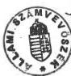

Hagelmayer István

---

.

.

.

.

---

1. sz. melléklet

# A bevételek és kiadások eltérései a zárszámadás I. és V. kötetei alapján

|  Fejezet | B E V É T E L E K  |   |   |   |   |   |   |   |
| --- | --- | --- | --- | --- | --- | --- | --- | --- |
|   |   |  Tárgatlan millió V. kötet | V. kötetben nem szerep- tő bevételek | Átlagosított V. kötet (1+2) | Átalt pénzeszköz (V. köt.kö) | Balonított fennag (3-4) | Üzletetben szereplő bevéte | I.-V. kötet kötőválogó (5-6)  |
|   |   |  1. | 2. | 3. | 4. | 5. | 6. | 7.  |
|  I | KÖZTÁRSASÁGI ELNÖKI SEVATAL | 1073.4 |  | 1073.4 | 816.4 | 252.0 | 256.5 | -4.5  |
|  II | ORSSÁGGYŰLÉS | 0.0 |  | 0.0 | 0.0 | 0.0 | 0.0 | 0.0  |
|  III | ALEDTMÁNYSTORSÁG | 13.8 |  | 13.8 | 6.9 | 7.8 | 13.8 | -6.9  |
|  IV | LEGFELDÉSS STORSÁG | 75.0 |  | 75.0 | 42.9 | 32.1 | 41.9 | -9.8  |
|  V | MAGYAR KÖZTÁRSASÁG ÜGYSSZSÁG | 42.8 |  | 42.8 | 18.9 | 23.7 | 42.8 | -18.9  |
|  VI | ÁLLAMI SZÁMVEVŐSSZK | 27.7 |  | 27.7 | 0.9 | 27.7 | 27.8 | -0.1  |
|  VII | MENSZTERELNÖRSÉG | 4105.0 | 434.2 | 4542.2 | 1697.6 | 2874.6 | 4145.1 | -1270.5  |
|  VIII | ISELÜGYMINISZTÉRSUM | 8503.3 |  | 8503.3 | 3.8 | 8509.1 | 8540.2 | 559.9  |
|  IX | SONYÁSSZAL MINISZTÉRSUM | 15659.4 |  | 15659.4 | 10003.0 | 5628.4 | 6014.5 | -2495.1  |
|  X | NEMZETKÖZI GAZDASÁGI KAPCSOLATOK MIN. | 1269.8 |  | 1269.8 | 424.5 | 968.3 | 1264.5 | -419.5  |
|  XI | NÁPÁRLÁTI MINISZTÉRSUM | 25333.2 |  | 25333.2 | 18882.0 | 6449.2 | 24209.5 | -17859.3  |
|  XII | KIADSÁGÜGY MINISZTÉRSUM | 1201.8 | 598.8 | 1598.4 | 157.9 | 1730.6 | 1888.4 | -157.9  |
|  XIII | KÖZLEKEDÉSI, BTEKÖZLÉSI, VTSÜGYI MIN. | 35090.5 |  | 35090.5 | 18993.4 | 18997.1 | 33719.8 | -14012.1  |
|  XV | KÜLÜGYMINISZTÉRSUM | 5689.2 |  | 5689.2 | 1780.1 | 3869.1 | 4471.2 | -582.1  |
|  XVI | FÖLDMŰVELŐSÉSI MINISZTÉRSUM | 12524.2 |  | 12524.2 | 2648.5 | 9975.7 | 12955.9 | -1098.0  |
|  XVII | MUNKAÜGYI MINISZTÉRSUM | 3388.8 |  | 3388.8 | 1477.0 | 1913.7 | 3225.1 | -1308.4  |
|  XVIII | PÉNZÜGYMINISZTÉRSUM | 6711.4 | 797.2 | 7598.6 | 3153.8 | 4354.5 | 5268.6 | -1203.8  |
|  XVIII | MŰVELŐSÉSI ÉS KÖZLEKZTÁSI MINISZTÉRSUM | 15498.0 |  | 15498.0 | 7918.8 | 7482.2 | 11454.4 | -3965.2  |
|  XIX | SPAIN ÉS KERESSZELES MINISZTÉRSUM | 4459.8 |  | 4459.8 | 1073.2 | 3368.8 | 3532.3 | -165.7  |
|  XX | BÖNYVESZTVÁSSZAL ÉS TERVÜLETFEJEL MIN. | 1477.8 |  | 1477.8 | 832.7 | 944.9 | 1202.6 | -357.6  |
|  XXI | MAGYAR TUDOMÁNYOS AKADÉMIA | 7965.5 |  | 7965.5 | 2923.7 | 4941.6 | 6845.3 | -1898.5  |
|  XXII | MAGYAR TÁTSKATI BOGA | 1315.9 |  | 1315.9 | 79.3 | 1245.6 | 1315.0 | -78.4  |
|  XXIII | MAGYAR BÁOS | 2101.9 |  | 2101.9 | 208.5 | 1895.4 | 2102.0 | -208.5  |
|  XXIV | MAGYAR TELEYYES | 10155.9 |  | 10155.9 | 476.1 | 9579.9 | 10155.1 | -476.2  |
|   | ÖSSZES | 163972.2 | 1828.0 | 165500.2 | 76489.6 | 95070.4 | 142393.7 | -47523.3  |

|  Fejezet | K I A D Á S O K  |   |   |   |   |   |   |   |
| --- | --- | --- | --- | --- | --- | --- | --- | --- |
|   |   |  V. kötet | V. kötetben nem szerep- tő kiadások | Átlagosított V. kötet (1 + 2) | Átalt pénzeszköz (V. köt.kö) | Balonított fennag (3-4) | Üzletetben szereplő bevéte | I.-V. kötet kötőválogó (5-6)  |
|   |   |  1. | 2. | 3. | 4. | 5. | 6. | 7.  |
|  I | KÖZTÁRSASÁGI ELNÖKI SEVATAL | 2569.5 | 1582.7 | 4092.2 | 815.4 | 3273.8 | 3275.2 | -4.4  |
|  II | ORSSÁGGYŰLÉS | 0.0 |  | 0.0 | 0.0 | 0.0 | 0.0 | 0.0  |
|  III | ALEDTMÁNYSTORSÁG | 183.3 |  | 183.3 | 3.9 | 182.3 | 183.4 | -3.1  |
|  IV | LEGFELDÉSS STORSÁG | 308.1 |  | 308.1 | 43.5 | 284.5 | 278.1 | -16.0  |
|  V | MAGYAR KÖZTÁRSASÁG ÜGYSSZSÁG | 1608.5 |  | 1608.5 | 85.1 | 1568.7 | 1508.5 | -23.1  |
|  VI | ÁLLAMI SZÁMVEVŐSSZK | 388.9 |  | 388.9 | 4.6 | 384.3 | 389.8 | -4.7  |
|  VII | MENSZTERELNÖRSÉG | 7197.1 | 4977.5 | 12174.5 | 1974.3 | 10503.3 | 11773.1 | -1272.8  |
|  VIII | ISELÜGYMINISZTÉRSUM | 50232.7 |  | 50232.7 | 3.2 | 50229.5 | 49540.5 | 858.9  |
|  IX | SONYÁSSZAL MINISZTÉRSUM | 57644.6 |  | 57644.6 | 8224.5 | 48620.1 | 50943.4 | -423.3  |
|  X | NEMZETKÖZI GAZDASÁGI KAPCSOLATOK MIN. | 2952.7 |  | 2952.7 | 10.6 | 2943.1 | 2947.7 | -5.8  |
|  XI | NÁPÁRLÁTI MINISZTÉRSUM | 122928.9 | 2882.2 | 124111.0 | 3981.7 | 122528.3 | 123048.7 | -2519.4  |
|  XII | KIADSÁGÜGYI MINISZTÉRSUM | 6198.7 | 4889.1 | 11957.8 | 309.1 | 10748.7 | 11021.3 | -272.6  |
|  XIII | KÖZLEKEDÉSI, BTEKÖZLÉSI, VTSÜGYI MIN. | 37114.3 |  | 37114.3 | 5878.3 | 31238.0 | 34507.2 | -3299.9  |
|  XIV | KÜLÜGYMINISZTÉRSUM | 8952.5 |  | 8952.5 | 1747.2 | 7205.3 | 7410.6 | -205.3  |
|  XV | FÖLDMŰVELŐSÉSI MINISZTÉRSUM | 22015.4 |  | 22015.4 | 2099.2 | 25009.2 | 25486.5 | -459.2  |
|  XVII | MUNKAÜGYI MINISZTÉRSUM | 4174.7 |  | 4174.7 | 195.6 | 4099.2 | 4018.4 | -7.2  |
|  XVIII | PÉNZÜGYMINISZTÉRSUM | 12695.7 | 3115.5 | 13811.2 | 2797.0 | 13044.2 | 13340.1 | -295.9  |
|  XVIII | MŰVELŐSÉSI ÉS KÖZLEKZTÁSI MINISZTÉRSUM | 41587.8 |  | 41587.8 | 11164.4 | 39503.4 | 37477.8 | -5974.4  |
|  XXI | SPAIN ÉS KERESSZELES MINISZTÉRSUM | 5479.7 |  | 5479.7 | 1160.8 | 5378.1 | 5487.5 | -68.4  |
|  XX | BÖNYVESZTVÁSSZAL ÉS TERVÜLETFEJEL MIN. | 3455.8 |  | 3455.8 | 392.9 | 3072.9 | 3289.1 | -215.3  |
|  XXII | MAGYAR TUDOMÁNYOS AKADÉMIA | 10955.9 |  | 10955.9 | 2398.1 | 8799.6 | 9987.7 | -1197.9  |
|  XXIII | MAGYAR TÁTSKATI BOGA | 1416.3 |  | 1416.3 | 6.5 | 1409.6 | 1416.4 | -6.8  |
|  XXIV | MAGYAR BÁOS | 3271.4 |  | 3271.4 | 9.2 | 3271.2 | 3271.4 | -6.2  |
|  XXV | MAGYAR TELEYYES | 10020.4 |  | 10020.4 | 519.5 | 9520.6 | 10020.5 | -519.7  |
|   | ÖSSZES | 412208.1 | 17787.8 | 429993.1 | 42338.5 | 387854.6 | 494742.5 | -17987.8  |

---

•

•

•

•

---

2.sz. melléklet

# Az Országgyűlés kizárólagos hatáskörében módosítható előirányzatok és teljesítésük

millió Ft.

|  Fejezet | Cím | Megnevezés | KIADÁS  |   |
| --- | --- | --- | --- | --- |
|   |   |   |  Eredeti | Teljesítés  |
|  II. |  | ORSZÁGGYŰLÉS |  |   |
|   | 4. | NEMZETESÉGI SZÖVETSÉGEK TÁMOGATÁSA | 200.0 | 200.3  |
|   | 5. | PÁRTOK TÁMOGATÁSA | 700.0 | 700.0  |
|   | 6.1. | Társadalmi szervezetek | 400.0 | 398.1  |
|   | 6.2. | Szakszerv. közművelődési intézmények | 200.0 | 225.4  |
|   | 6. | TÁRSADALMI SZERVEK TÁMOGATÁSA | 600.0 | 621.5  |
|  II. | össz. | ORSZÁGGYŰLÉS | 1500.0 | 1521.8  |
|  VIII. |  | BELÜGYMINISZTÉRIUM |  |   |
|   | 25.1. | NORMATIV TÁMOGATÁSOK | 146980.1 | 148528.4  |
|   | 25.2 | CIMZETT TÁMOGATÁS + CÉLTÁMOGATÁS | 18024.5 | 17340.0  |
|   | 25.1.+ 25.2. | ÖNKORMÁNYZATOK ÁLLAMI HOZZÁJÁRULÁSA | 165004.6 | 165868.4  |
|   | 25.5.1 | Köztársasági megbízottak hivatala | 850.0 | 71.9  |
|   | 25.5.2. | Területi államháztartási közig.inform.szolg. | 1500.0 | 250.0  |
|   | 25.5.3. | KÖJÁL-ok a hajléktalanok céltámogatásával | 2800.0 | 0.0  |
|   | 25.5.4. | Földművelésügyi hivatalok | 250.0 | 83.3  |
|   | 25.5.5. | Munkaügyi hivatalok | 400.0 | 133.3  |
|   | 25.5.6. | Fogyasztói főfelügyelet | 250.0 | 145.9  |
|   | 25.5.7. | Tűzoltóság | 5200.0 | 0.0  |
|   | 25.5.8. | Közlekedés felügyelet | 150.0 | 75.0  |
|   | 25.5. | CENTRALIZÁLT SZERVEK | 11400.0 | 759.4  |
|  VIII. | össz. | BELÜGYMINISZTÉRIUM | 176404.6 | 166627.8  |
|  XI. |  | NÉPJOLÉTI MINISZTÉRIUM |  |   |
|   | 12.1 | Vissztérítés a TB 1989. évi zárszámad.alapj. | 1800.0 | 1800.0  |
|   | 12.2. | Családi póti.1990.évi folyósít.ktg.megtérít. | 300.0 | 293.0  |
|   | 12.3. | 1990-ben elhalaszt.gyógysz.díjemelés megtér. | 300.0 | 401.0  |
|   | 12.4. | 1990-ben kifiz.polit.rehab.nyugd.kieg.megtér. | 500.0 | 219.0  |
|   | 12.5. | 1990.évi bev.többi.adidó, térít.korr.ktgv.tám | 5120.0 | 4035.3  |
|   | 12.6. | Az Alap által 1990-ben átváll.cs.pótl.kamata | 3500.0 | 3500.0  |
|   | 12.7. | A csat.pótl.1991.évi folyósít.ktg.megtérít. | 400.0 | 300.0  |
|   | 12.8. | 1991.évben kifiz.kerülő pol.rehab.nyidkieg | 1845.0 | 2168.5  |
|   | 12.9. | Alacsony összegű nyugellátások kieg.támogat. |  | 1300.0  |
|   | 12.10. | Gyógyszeréremelés elhalaszt-val kapca.térít. |  | 867.0  |
|   | 12. | TÁRSADALMINISZTOSÍTÁS TÁMOGATÁSA | 13565.0 | 14683.8  |
|   | 10.3. | Humán szolgáltatások normatív áll. támog. | 420.0 | 462.8  |
|  XI. | össz. | NÉPJOLÉTI MINISZTÉRIUM | 13965.0 | 15146.6  |
|  XVIII. |  | MŰVELŐDÉSI ÉS KÖZOKTATÁSI MINISZTÉRIUM |  |   |
|   | 19.2.1. | Felsőoktatási int.hallg. pénzbeli juttatásai | 1345.2 | 101.8  |
|   | 19.2.2. | Hitoktatók díjezása | 429.2 | 0.0  |
|   | 19.2.3. | Humánszolg.norm.tám.egyházi, alapítv-i, magánint. | 800.0 | 87.4  |
|   | 19.2. | NORMATIV FINANSZEROZÁS | 2574.4 | 189.2  |
|   | 19.5.1. | Hitétel támogatása | 561.4 | 0.0  |
|   | 19.5.2. | Egyházi ingatlanok tám. | 538.5 | 0.0  |
|   | 19.5. | EGYHÁZAK TÁMOGATÁSA | 1099.9 | 0.0  |
|  XVIII. | össz. | MŰVELŐDÉSI ÉS KÖZOKTATÁSI MINISZTÉRIUM | 3674.3 | 189.2  |
|  MINDÖSSZESEN |   |   | 195563.9 | 183485.4  |

**

A centralizált szervezetek adatai a más fejezethez történt átcsoportosítás után a törvényjavaslat 1. és 2. sz. melléklete alapján

millió Ft.

|  Fejezet | Cím | Megnevezés | KIADÁS |   | BEVÉTEL  |   |
| --- | --- | --- | --- | --- | --- | --- |
|   |   |   |  Eredeti | Zárz.tvjav. Teljesítés | Eredeti | Zárz.tvjav. Teljesítés  |
|  VIII. | 2. | Köztársasági megbízottak hivatala | 850.0 | 795.5 | 0 | 139.8  |
|  VIII. | 3. | Területi államháztartási és közig. inf. szolg. | 1500.0 | 1971.2 | 0 | 801.9  |
|  VIII. | 7. 2. | Tűzoltóság (területi) | 5200.0 | 5163.5 | 0 | 392.2  |
|  XI. | 16. | KÖJÁL - hajléktalanok támogatásával | 2800.0 | 3061.4 | 0 | 359.8  |
|  XIII. | 17. | Közlekedési Felügyelet | 150.0 | 860.3 | 0 | 928.3  |
|  XV. | 18. | Földművelésügyi Hivatalok | 250.0 | 0.0 | 0 | 0.0  |
|  XVI. | 10. | Munkaügyi Hivatalok | 400.0 | 1535.8 | 0 | 1476.8  |
|  XIX. | 23. | Fogyasztói Főfelügyelet | 250.0 | 0.0 | 0 | 0.0  |
|  CENTRALIZÁLT SZERVEK ÖSSZESEN |   |   | 11400.0 | 13367.7 | 0.0 | 4098.8  |

---

•

•

•

•

---

3. sz. melléklet

# Összefoglaló kimutatás az Országgyűlés költségvetési előirányzatokat
módosító intézkedéseiről

1. oldal

millió Ft

|  M e g n e v e z é s Fejezet Cím Alcím | K I A D Á S O K  |   |   |   |   |   |
| --- | --- | --- | --- | --- | --- | --- |
|   |   |  1990.évi CIV tv.szerinti eredeti előirányzat | Módosítás összege tv. III. OGY szerint | Jogszabály- hivatkozás | Módosított előirányzat | Teljesítés  |
|   |   |  1. | 2. | 3. | 4. | 5.  |
|  II | ORSZÁGGYŰLÉS |  |  |  |  |   |
|  6 | Társadalmi szervek támogatása |  |  |  |  |   |
|  3 | Magyar Vöröskereszt támogatása | 0.0 | 235.0 | 15/1991.OGY | 235.0 | 235.0  |
|  IV | LEGFELSŐBB BÍROSÁG |  |  |  |  |   |
|  2 | Ágazati és célfeladatok |  |  |  |  |   |
|  2 | Közigazgatási bíráskodás | 0.0 | 7.9 | XXVII. tv. | 7.9 | 0.0  |
|  VI | ÁLLAMI SZÁMVEVŐSZÉK |  |  |  |  |   |
|  1 | Állami Számvevőszék kiadásai | 388.8 ** | 6.6 | III. tv. | 395.4 | 398.0  |
|  VII | MINISZTERELNÖKSÉG |  |  |  |  |   |
|  7 | Világkiállítási Programiroda |  |  |  |  |   |
|  3 | Dologi kiadások | 20.1 | 100.0 ** | 38/1991.OGY | 120.1 | 120.5  |
|  21 | Költségvetés általános tartaléka |  |  |  |  |   |
|  1 | Címzetlen tartalék | 7000.0 | -1500.0 | XV. tv. | 5500.0 | 0.0  |
|   | FEJEZET MÓDOSÍTOTT ELŐIRÁNYZATAI ÖSSZESEN | 7020.1 | -1400.0 |  | 5620.1 |   |
|  VIII | BELÜGYMINISZTÁRSUM |  |  |  |  |   |
|  2 | Középvárosi megbízottak hivatalai | 0.0 | 778.1 | XLVII. tv. | 778.1 | 795.5  |
|  3 | Magyar, Főv., Területi Közgazdasági és Inform. Közp. | 0.0 | 1250.0 | XLVII. tv. | 1250.0 | 1971.2  |
|  7 | Tűzoltóság |  |  |  |  |   |
|  2 | Területi tűzoltóság | 0.0 | 5200.0 | XLVII. tv. | 5200.0 | 5163.5  |
|  13 | Főiskolák | 464.8 | 0.0 |  |  |   |
|  23 | Vagyonátadó bizottságok | 0.0 | 50.0 | XLVII. tv. | 50.0 | 0.0  |
|  25 | Állami hozzájárulás az önkormányzatok költségvetéséhez |  |  |  |  |   |
|  1 | Normatív támogatások |  |  |  |  |   |
|  1 | Községek állandó lakóra jutó támogatás | 5804.1 | 1.9 | XLVII. tv. | 5806.0 | 5808.0  |
|  2 | Állandó lakosok után jutó támogatás | 21094.9 | 0.1 | XLVII. tv. | 21095.0 | 21094.9  |
|  3 | Gyógy- és üdülőhelyi díjak támogatása | 770.4 | 105.0 | XLVII. tv. | 875.4 | 875.4  |
|  4 | Kommunális tevékenység után járó támogatás | 14766.5 | 0.0 | XLVII. tv. | 14766.5 | 14766.5  |
|  5 | Inaktív lakóra jutó támogatás | 13822.2 | 460.0 | XLVII. tv. | 14282.2 | 14283.1  |
|  6 | Gyermek- és ifjúságvédelmi ellátottjai támogatás | 6041.7 | -58.8 | XLVII. tv. | 5982.9 | 5982.9  |
|  7 | Szociális intézmények ellátottjainak támogatása | 5786.4 | 0.4 | XLVII. tv. | 5786.8 | 5786.8  |
|  8 | Idősek és fogyatékosok napközi otthoni ellátása | 1188.1 | -189.2 | XLVII. tv. | 998.9 | 998.9  |
|  9 | Idősek és fogyatékosok szállást bizt.int.ellát. | 109.7 | -4.1 | XLVII. tv. | 105.6 | 105.6  |
|  10 | Etügyi gyermeztyomok és gyógyped.int. támogat. | 1468.5 | 6.6 | XLVII. tv. | 1475.1 | 1475.1  |
|  11 | Óvodai ellátottakra jutó támogatás | 5682.1 | 6.9 | XLVII. tv. | 5669.0 | 5669.0  |
|  12 | Általános iskolai tanulókra jutó támogatás | 33937.7 | -203.6 | XLVII. tv. | 33734.1 | 33734.1  |
|  13 | Alsófokú zenei képzésben részesülők támogatás | 1382.9 | 35.7 | XLVII. tv. | 1418.6 | 1418.6  |
|  14 | Ált.iskolai fogyatékos gyermekök támogatása | 1729.1 | 256.3 | XLVII. tv. | 1985.4 | 1985.4  |
|  15 | Gironaútumú tanulókra jutó támogatás | 5470.6 | 32.3 | XLVII. tv. | 5502.9 | 5503.0  |
|  16 | Szakközépiskolai tanulókra jutó támogatás | 10694.7 | -6.4 | XLVII. tv. | 10888.3 | 10888.3  |
|  17 | Szakmunkásképzésben részesülők támogatása | 6678.6 | 47.7 | XLVII. tv. | 6926.3 | 6926.3  |
|  18 | Szakmunkásiskolai tanulókra jutó támogatás | 1285.8 | 70.3 | XLVII. tv. | 1356.1 | 1356.1  |
|  19 | Nemzetiségi, etnikai, kéztannyeivű okt. tám. | 676.0 | 216.8 | XLVII. tv. | 892.8 | 892.8  |
|  20 | Diákotthonban elhelyezett tanulók támogatása | 4555.6 | -21.2 | XLVII. tv. | 4534.4 | 4534.5  |
|  21 | Vidéki színházak nézőire jutó támogatás | 894.5 | 26.0 | XLVII. tv. | 920.5 | 920.5  |
|  22 | Fővárosi színházak nézőire jutó támogatás | 630.0 | 0.0 | XLVII. tv. | 630.0 | 630.0  |
|  23 | Területi igazgatás, vminit közműv. ter. tám. | 1000.0 | 0.0 | XLVII. tv. | 1000.0 | 1000.0  |
|  24 | Helyi közművelődés támogatása | 1060.0 | -5.2 | XLVII. tv. | 1054.8 | 1054.8  |
|  25 | Nemzetiségi és etnikai óvodák támogatása | 70.0 | 19.8 | XLVII. tv. | 89.8 | 89.8  |

* Az OGY az ÁSZ az 1991. évi költségvetési előirányzatát címszett tartalékként kezelte.

Időirányos felhasználását az 1990/CIV. tv., 1991/XXII. tv., 1991/XXXVII. tv.-ek szabályozták, előirányzat módosítás nélkül

** A négy cím előirányzatának együttes túllépése 186 millió Ft-ban került meghatározásra a hivatkozott határozatban

---

|  序号 | 名称 | 数量  |
| --- | --- | --- |
|  1 | 2017年1月1日 | 150  |
|  2 | 2017年1月2日 | 150  |
|  3 | 2017年1月3日 | 150  |
|  4 | 2017年1月4日 | 150  |
|  5 | 2017年1月5日 | 150  |
|  6 | 2017年1月6日 | 150  |
|  7 | 2017年1月7日 | 150  |
|  8 | 2017年1月8日 | 150  |
|  9 | 2017年1月9日 | 150  |
|  10 | 2017年1月10日 | 150  |
|  11 | 2017年1月11日 | 150  |
|  12 | 2017年1月12日 | 150  |
|  13 | 2017年1月13日 | 150  |
|  14 | 2017年1月14日 | 150  |
|  15 | 2017年1月15日 | 150  |
|  16 | 2017年1月16日 | 150  |
|  17 | 2017年1月17日 | 150  |
|  18 | 2017年1月18日 | 150  |
|  19 | 2017年1月19日 | 150  |
|  20 | 2017年1月20日 | 150  |
|  21 | 2017年1月21日 | 150  |
|  22 | 2017年1月22日 | 150  |
|  23 | 2017年1月23日 | 150  |
|  24 | 2017年1月24日 | 150  |
|  25 | 2017年1月25日 | 150  |
|  26 | 2017年1月26日 | 150  |
|  27 | 2017年1月27日 | 150  |
|  28 | 2017年1月28日 | 150  |
|  29 | 2017年1月29日 | 150  |
|  30 | 2017年1月30日 | 150  |
|  31 | 2017年1月31日 | 150  |
|  32 | 2017年1月32日 | 150  |
|  33 | 2017年1月33日 | 150  |
|  34 | 2017年1月34日 | 150  |
|  35 | 2017年1月35日 | 150  |
|  36 | 2017年1月36日 | 150  |
|  37 | 2017年1月37日 | 150  |
|  38 | 2017年1月38日 | 150  |
|  39 | 2017年1月39日 | 150  |
|  40 | 2017年1月40日 | 150  |
|  41 | 2017年1月41日 | 150  |
|  42 | 2017年1月42日 | 150  |
|  43 | 2017年1月43日 | 150  |
|  44 | 2017年1月44日 | 150  |
|  45 | 2017年1月45日 | 150  |
|  46 | 2017年1月46日 | 150  |
|  47 | 2017年1月47日 | 150  |
|  48 | 2017年1月48日 | 150  |
|  49 | 2017年1月49日 | 150  |
|  50 | 2017年1月50日 | 150  |
|  51 | 2017年1月51日 | 150  |
|  52 | 2017年1月52日 | 150  |
|  53 | 2017年1月53日 | 150  |
|  54 | 2017年1月54日 | 150  |
|  55 | 2017年1月55日 | 150  |
|  56 | 2017年1月56日 | 150  |
|  57 | 2017年1月57日 | 150  |
|  58 | 2017年1月58日 | 150  |
|  59 | 2017年1月59日 | 150  |
|  60 | 2017年1月60日 | 150  |
|  61 | 2017年1月61日 | 150  |
|  62 | 2017年1月62日 | 150  |
|  63 | 2017年1月63日 | 150  |
|  64 | 2017年1月64日 | 150  |
|  65 | 2017年1月65日 | 150  |
|  66 | 2017年1月66日 | 150  |
|  67 | 2017年1月67日 | 150  |
|  68 | 2017年1月68日 | 150  |
|  69 | 2017年1月69日 | 150  |
|  70 | 2017年1月70日 | 150  |
|  71 | 2017年1月71日 | 150  |
|  72 | 2017年1月72日 | 150  |
|  73 | 2017年1月73日 | 150  |
|  74 | 2017年1月74日 | 150  |
|  75 | 2017年1月75日 | 150  |
|  76 | 2017年1月76日 | 150  |
|  77 | 2017年1月77日 | 150  |
|  78 | 2017年1月78日 | 150  |
|  79 | 2017年1月79日 | 150  |
|  80 | 2017年1月80日 | 150  |
|  81 | 2017年1月81日 | 150  |
|  82 | 2017年1月82日 | 150  |
|  83 | 2017年1月83日 | 150  |
|  84 | 2017年1月84日 | 150  |
|  85 | 2017年1月85日 | 150  |
|  86 | 2017年1月86日 | 150  |
|  87 | 2017年1月87日 | 150  |
|  88 | 2017年1月88日 | 150  |
|  89 | 2017年1月89日 | 150  |
|  90 | 2017年1月90日 | 150  |
|  91 | 2017年1月91日 | 150  |
|  92 | 2017年1月92日 | 150  |
|  93 | 2017年1月93日 | 150  |
|  94 | 2017年1月94日 | 150  |
|  95 | 2017年1月95日 | 150  |
|  96 | 2017年1月96日 | 150  |
|  97 | 2017年1月97日 | 150  |
|  98 | 2017年1月98日 | 150  |
|  99 | 2017年1月99日 | 150  |
|  100 | 2017年1月100日 | 150  |

---

3. sz. melléklet

2. oldal

millió Ft

|  M e g n e v e z é s Fejezet Cím Alcím | K I A D Á S O K  |   |   |   |   |   |
| --- | --- | --- | --- | --- | --- | --- |
|   |   |  1990. évi CV tv.szerinti eredeti előirányzat | Módosítás összege tv. ill. OGYh szerint | Jogszabály- hivatkozás | Módosított előirányzat | Teljesítés  |
|   |   |  1. | 2. | 3. | 4. | 5.  |
|  26 | Lakásgazdálkodási tevékenység |  |  |  |  |   |
|   | 1. módosítás | 0.0 | 1500.0 | XV. tv. | 1500.0 |   |
|   | 2. módosítás | 0.0 | -750.0 | XLVI. tv. | 750.0 |   |
|   | Módosítás összesen: | 0.0 | 750.0 |  | 750.0 | 750.0  |
|  2 | Címzett és céltámogatás | 18024.5 | 0.0 | XLVII. tv. | 18024.5 | 17340.0  |
|  3 | Központosított előirányzat | 5948.5 | 813.8 | XLVII. tv. | 6762.3 | 6542.0  |
|  4 | Települések SZJA kiegészítése | 6980.0 | -49.0 | XLVII. tv. | 6931.0 | 6931.0  |
|  5 | Centrális alárendeltségű szervezetek |  |  |  |  |   |
|  1 | Közterességi megbízottak hivatalai | 850.0 | -850.0 | XLVII. tv. | 0.0 | 0.0  |
|  2 | Területi államháztartási közig, inform. szolg. | 1500.0 | -1500.0 | XLVII. tv. | 0.0 | 0.0  |
|  3 | KÜJÁL-ok (hajtóktalanokkal) | 2800.0 | -2800.0 | XLVII. tv. | 0.0 | 0.0  |
|  4 | Földművelésügyi hivatalok | 250.0 | -250.0 | XLVII. tv. | 0.0 | 0.0  |
|  5 | Munkaügyi hivatalok | 400.0 | -400.0 | XLVII. tv. | 0.0 | 0.0  |
|  6 | Fogyasztói felügyeletek | 250.0 | -250.0 | XLVII. tv. | 0.0 | 0.0  |
|  7 | Területi tűzoltóság | 5200.0 | -5200.0 | XLVII. tv. | 0.0 | 0.0  |
|  8 | Közlekedési felügyelet | 150.0 | -150.0 | XLVII. tv. | 0.0 | 0.0  |
|  9 | Centrális szervek feladataira az önkorm részére | 0.0 | 759.4 | XLVII. tv. | 759.4 | 759.4  |
|  FEJEZET MODOSÍTOTT ELŐIRÁNYZATAI ÖSSZESEN: |   | 189797.9 | -300.4 |  | 190532.7 | 188031.0  |
|  XI | NÉPJELÉTI MINISZTÁRIUM |  |  |  |  |   |
|  10 | Ágazati és célfeladatok |  |  |  |  |   |
|  2 | Központi szociálpolitikai feladatok |  |  |  |  |   |
|  2 | Mozgáskorlátozott személyek közlekedési tám. |  |  | X. tv. | (előirányzat elnevezés váll.) |   |
|  3 | Nevelési segélyezés normatív kiegészítése | 3800.0 | -750.0 | XLVI. tv. | 3050.0 | 235.0  |
|  4 | Gyorssegély alapítvány támogatása a válságvezetben élők természetbeni segélyezésére | 0.0 | 100.0 | XLVI. tv. | 100.0 | 100.0  |
|  5 | Tartósan munkanélküliek egyszeri támogatása | 0.0 | 140.0 | XLVI. tv. | 140.0 | 140.0  |
|  12 | Társadalombiztosítási alap támogatása |  |  |  |  |   |
|  2 | Állampolgári jogú családi pölt.kieg. megtérítése | 300.0 | 0.0 | XXXVI. tv. | 293.0 | 293.0  |
|  3 | Gyógyszer térdíjemelés kiadási többlet megtér. | 300.0 | 0.0 | XXXVI. tv. | 401.0 | 401.0  |
|  4 | 1990-ben kiffa.pol. rehab. nyugdíj-kieg. megté | 500.0 | 0.0 | XXXVI. tv. | 219.0 | 219.0  |
|  5 | Alap térítésekkel korrigált támogatása | 5120.0 | 0.0 | XXXVI. tv. | 4035.3 | 4035.3  |
|  9 | Alacsony összegű nyugatásban részesülők kiegészítő támogatása | 0.0 | 1300.0 | XLVI. tv. | 1300.0 | 1300.0  |
|  15 | Családi pótlékra jogosultak kiegészítő támogatása | 0.0 | 3000.0 | XLVI. tv. | 3000.0 | 3282.2  |
|  16 | Állami Népegészségügyi és Tisztkörvosi Szolgálat (hajtóktalanok céltámogatásával) | 0.0 | 2800.0 | XLVII. tv. | 2800.0 | 3061.4  |
|  FEJEZET MODOSÍTOTT ELŐIRÁNYZATAI ÖSSZESEN: |   | 10020.0 | 6590.0 |  | 10390.0 | 13066.9  |
|  XII | KAZSÁGÜGYI MINISZTÁRIUM |  |  |  |  |   |
|  6 | Ágazati és célfeladatok |  |  |  |  |   |
|  5 | Közigazgatási bíráskodás | 0.0 | 1287.6 | XXVII. tv. | 1287.6 | 0.0  |
|  XIII | KÖZLEKEDÉSI, HITRKÖZLÉSI, ÉS VÍZÜGYI MINISZTÁRIUM |  |  |  |  |   |
|  4 | Közúti és Autópálya igazgatóságok |  |  |  |  |   |
|  3 | Dologi kiadások | 8093.2 | 30.0 ** | 38/1991.OGY | 8123.2 | 12297.1  |
|  7 | Frekvenciagazdálkodási Intézet |  |  |  |  |   |
|  3 | Dologi kiadások | 812.6 | 5.9 ** | 38/1991.OGY | 818.5 | 506.4  |
|  17 | Közlekedési felügyelet | 0.0 | 75.0 | XLVII. tv. | 75.0 | 860.3  |
|  FEJEZET MODOSÍTOTT ELŐIRÁNYZATAI ÖSSZESEN: |   | 8905.8 | 110.9 |  | 9016.7 | 13663.8  |
|  XV | FÖLDMŰVELŐDÉSÜGYI MINISZTÁRIUM |  |  |  |  |   |
|  1 | PM igazgatási kiadásai | 592.2 | 0.0 |  |  | 863.7  |
|  2 | Földművügyi szakig. szolgálási intézmények | 3029.9 | 0.0 |  |  | 3969.6  |
|  6 | Mg-I. szakmunkásképző és munkástevőbbképző Intézet | 412.8 | 0.0 |  |  | 618.9  |
|  7 | Mezőgazdasági szakközépiskolák | 23.1 | 0.0 |  |  | 34.2  |
|  8 | Agrár felsőoktatás | 5289.6 | 0.0 |  |  | 7373.0  |
|  9 | Magyar Mezőgazdasági Museum | 71.5 | 0.0 |  |  | 92.7  |
|  12 | Ágazati és célfeladatok |  |  |  |  |   |
|  3 | Hozzájárulás a Tárcs Kutatási Alaphoz | 165.0 | 0.0 |  |  | 163.6  |
|  16 | Földművelésügyi hivatalok | 0.0 | 166.7 | XLVII. tv. | 166.7 | 0.0  |
|  FEJEZET MODOSÍTOTT ELŐIRÁNYZATAI ÖSSZESEN: |   | 9584.1 | 166.7 |  | 166.7 | 13115.7  |

45

---

The Ground Truth image displays a single, solid horizontal line. According to Rule 2 (UNDERSCORE & LINE RULES), this is a stylistic or background line, not a placeholder underscore. Therefore, the OCR result must ignore it and output nothing or only meaningful text. The provided OCR content is "____", which consists of four underscores. This is an incorrect interpretation of the line as a placeholder, violating the rule that stylistic lines must be ignored. The OCR has hallucinated underscores where none should exist based on the GT's visual context. Hence, the OCR result is inconsistent with the Ground Truth.

，

•

•

•

•

---

3. sz. melléklet

3. oldal

millió Ft

|  Megnevezés Fejezet Cím Alcím | K I A D Á S O K  |   |   |   |   |
| --- | --- | --- | --- | --- | --- |
|   |  1990.évi CIV tv.szerinti eredeti előirányzat | Módosítás összege tv. III. OGYh szerint | Jogszabály- hivatkozás | Módosított előirányzat | Teljesítés  |
|   |  1. | 2. | 3. | 4. | 5.  |
|  XVI MUNKAÜGYI MINISZTÁRIUM 10 Munkaügyi hivatalok | 0.0 | 266.7 | XLVII. tv. | 266.7 | 1535.8  |
|  XVII PÉNZÜGYMINISZTÁRIUM 2 Állami Bank, Biztosítás és értékpapír Felügyelet 3 Dologi kiadások | 324.5 | 44.2 ** | 38/1991.OGY | 368.7 | 191.5  |
|  XVIII MŰVELŐDÁSI ÉS KÖZOKTATÁSI MINISZTÁRIUM 24 Oktatási szakmai szolgáltató szervezetek 25 Megyei (fővárosi) sportigazgatóságok 24-25 címek összesen: | 0.0 | 100.0 | XLVII. tv. | 100.0 | 0.0  |
|  XIX IPARI ÉS KERESKEDELMI MINISZTÁRIUM 23 Fogyasztói felügyelet | 0.0 | 104.1 | XLVII. tv. | 104.1 | 0.0  |
|  XXIII MAGYAR RÁDÍÓ 1 Magyar Rádió | 2235.8 | 0.0 |  |  | 3271.4  |
|  MODOSÍTÁSOK ÖSSZESEN: | 228276.8 | 7219.3 |  | 218491.6 | 233509.1  |

** A négy cím előirányzatának együttes túllépése 188 millió Ft-ban került meghatározásra a hivatkozott határozatban

millió Ft

|  Megnevezés Fejezet Cím Alcím | B E V Á T E L E K  |   |   |   |   |
| --- | --- | --- | --- | --- | --- |
|   |  1990.évi CIV tv.szerinti eredeti előirányzat | Módosítás összege tv. III. OGYh szerint | Jogszabály- hivatkozás | Módosított előirányzat | Teljesítés  |
|   |  1. | 2. | 3. | 4. | 5.  |
|  VIII BELÜGYMINISZTÁRIUM 26 Önkormányzatok 1990. évi normatív állami hozzájárulá- sának elszámolásából adódó visszatérítés. | 0.0 | 600.0 | XLVI. tv. | 600.0 | 1698.6  |
|  FEJEZETMEGJELÖLÉS NÉLKÜLI ELŐIRÁNYZATEMELÉS | 0.0 | 1252.0 | XLVII. tv. |  |   |
|  MODOSÍTÁSOK ÖSSZESEN: | 0.0 | 1852.0 |  | 600.0 | 1698.6  |

---

.

.

.

.

---

4.a. melléklet

Kiadási előirányzat-átcsoportosítások összesítése a fejezeti indoklások alapján 1991. évben

|  Fejezet | ELŐIRÁNYZATMODOSÍTÁSOK |   |   |   |   | Összesen (2+3+4+5) | Modosított előirányzat (1 → 6) | Imálió Ft  |
| --- | --- | --- | --- | --- | --- | --- | --- | --- |
|   |  1. | 2. | 3. | 4. | 5.  |   |   |   |
|  I. KÖZTÁRSASÁGI ELNÖKI HIVATAL | 80.7 | 0.0 | 0.0 | 0.0 | 5.1 | 5.1 | 85.8 | 65.5  |
|  II. ORSZÁGGYŰLÉS | 3216.7 | 235.0 | 12.0 | 0.9 | 300.8 | 548.7 | 3765.4 | 3451.7  |
|  III. ALKÓTMÁNYDTRÁSÁG | 161.0 | 0.0 | -0.3 | 0.0 | 12.8 | 12.5 | 173.5 | 163.4  |
|  IV. LEGPELSŐBB DTRÁSÁG | 236.2 | 7.9 | 12.9 | 9.7 | 13.0 | 43.5 | 279.7 | 275.1  |
|  V. MAGYAR KÖZTÁRSASÁG ÖGYASZSÁGE | 1765.2 | 0.0 | -14.7 | 0.0 | 41.0 | 28.3 | 1791.5 | 1508.8  |
|  VI. ÁLLAMI SZÁMDEVŐSZÁK | 388.8 | 6.6 | -3.2 | 9.0 | 19.5 | 31.9 | 420.7 | 398.0  |
|  VII. MINISZTERELNÖKSÁG | 27703.5 | -2930.5 | -12703.5 | 329.8 | 1438.7 | -13867.5 | 13836.0 | 12803.1  |
|  VIII. BELÜGYMINISZTÁRHUM | 47705.3 | -258.4 | 398.6 | 1412.6 | 5233.3 | 6786.1 | 54491.4 | 51916.6  |
|  - ÖNKORMÁNYZATOK TÁMOGATÁSA | 189333.0 |  |  |  |  |  |  | 190672.2  |
|  IX. HONVÉDELMI MINISZTÁRHUM | 54444.1 | 0.0 | -301.8 | 0.0 | 1166.2 | 864.4 | 55308.5 | 53580.4  |
|  X. NEMZETKÖZI GAZDASÁGI KAPCSOLATOK MIN. | 8684.6 | 0.0 | 18.6 | 0.0 | 1125.0 | 1143.6 | 9828.2 | 9451.7  |
|  XI. NAPJÁLATI MINISZTÁRHUM | 122634.9 | 5318.3 | -692.9 | -0.5 | 4989.6 | 9613.5 | 142248.4 | 140071.5  |
|  XII. KÖZSÉGÜGYI MINISZTÁRHUM | 10070.6 | 1287.6 | -65.8 | 62.0 | 703.4 | 1987.2 | 12057.8 | 11560.3  |
|  XIII. KÖZLÉKEDÉSI, HÍTRÁSZLÉSI, VÍZÜGYI MIN. | 30684.4 | 75.0 | 95.3 | 2490.5 | 7865.7 | 10528.5 | 41210.9 | 39329.2  |
|  XIV. KÖZLÉKEMISZTÁRHUM | 5318.7 | 0.0 | -13.4 | 0.0 | 2538.2 | 2524.8 | 7843.5 | 7451.6  |
|  XV. FÖLDMŰVELŐBÉSI MINISZTÁRHUM | 17284.1 | 481.6 | 136.3 | 18.6 | 3640.3 | 4278.8 | 21560.9 | 21249.5  |
|  XVI. MUNKAÜGYI MINISZTÁRHUM | 22644.7 | 266.7 | 7564.5 | 43.9 | 2804.1 | 10679.2 | 33323.9 | 32798.4  |
|  XVII. PÁNZÜGYMINISZTÁRHUM | 182908.7 | 0.0 | 120.2 | 174.6 | 2711.6 | 3006.4 | 185915.1 | 174246.0  |
|  XVIII. MŰVELŐBÉSI ÉS KÖZOKTATÁSI MINISZTÁRHUM | 33779.0 | 30.0 | 1500.6 | -251.6 | 7378.5 | 8655.5 | 42434.5 | 39699.8  |
|  XIX. IPÁRI ÉS KERESKEDELMI MINISZTÁRHUM | 17397.7 | 104.2 | -28.9 | 18.9 | 564.8 | 659.0 | 18056.7 | 13661.2  |
|  XX. KÖRNYEZETVÁDELMI ÉS TERÜLETFEL MIN. | 3291.3 | 0.0 | 178.2 | 187.3 | 389.5 | 755.0 | 4048.3 | 3747.1  |
|  XXI. MAGYAR TUDOMÁNYOS AKADÉMIA | 8433.9 | 0.0 | 3.6 | -8.9 | 3635.2 | 3629.9 | 12063.8 | 10301.7  |
|  XXII. MAGYAR TÁVRATI IROBA | 1485.7 | 0.0 | -1.4 | 0.0 | 29.5 | 28.1 | 1513.8 | 1463.4  |
|  XXIII. MAGYAR RÁDÁ | 2377.0 | 3.2 | 47.2 | -31.4 | 706.7 | 725.7 | 3102.7 | 3370.4  |
|  XXIV. MAGYAR TELEVITÁ | 7843.1 | 0.0 | 151.7 | -45.1 | 2184.1 | 2290.7 | 10133.8 | 10150.5  |
|  ÖSSZESEN: | 809872.9 | 4627.2 | -3586.2 | 4420.3 | 49491.8 | 54952.9 | 675492.8 | 833487.1  |
|  XIV. NEMZETKÖZI ELSZÁMOLÁSOK | 19273.0 | 0.0 | 0.0 | 0.0 | 0.0 | 0.0 | 19273.0 | 9781.9  |
|  XV. BELFÖLDI ÁLLAMADÁSSÁGOK | 110100.0 | 0.0 | 0.0 | 0.0 | 0.0 | 0.0 | 110100.0 | 107067.5  |
|  MINDÖSSZESEN: | 939245.9 | 4627.2 | -3586.2 | 4420.3 | 49491.6 | 54952.9 | 804865.8 | 950336.5  |
|  CIV. T.v. III. zárszámadás szerint | 931695.9 |  |  |  |  |  |  | 950095.7  |
|  ELTÉRS | -7550.0 |  |  |  |  |  |  | -240.8  |

---

[Non-Text]

[Non-Text]

[Non-Text]

[Non-Text]

[Non-Text]

[Non-Text]

[Non-Text]

[Non-Text]

[Non-Text]

[Non-Text]

[Non-Text]

[Non-Text]

1. 2017年1月1日至2018年1月1日（含）的公司股票交易均价为4.56元/股，与前一交易日收盘价相比，涨幅为-0.97%。

[Non-Text]

1. 2017年1月1日至2018年1月1日（含）的公司股票交易均价为4.56元/股，与前一交易日收盘价相比，涨幅为-0.97%。

[Non-Text]

1. 2017年1月1日至2018年1月1日（含）的公司股票交易均价为4.56元/股，与前一交易日收盘价相比，涨幅为-0.97%。

[Non-Text]

[Non-Text]

[Non-Text]

[Non-Text]

[Non-Text]

[Non-Text]

[Non-Text]

[Non-Text]

[Non-Text]

[Non-Text]

[Non-Text]

[Non-Text]

[Non-Text]

[Non-Text]

[Non-Text]

[Non-Text]

[Non-Text]

[Non-Text]

[Non-Text]

[Non-Text]

1. 2017年1月1日至2018年1月1日（含）的公司股票交易均价为4.56元/股，与前一交易日收盘价相比，涨幅为-0.97%。

[Non-Text]

1. 2017年1月1日至2018年1月1日（含）的公司股票交易均价为4.56元/股，与前一交易日收盘价相比，涨幅为-0.97%。

[Non-Text]

[Non-Text]

[Non-Text]

[Non-Text]

[Non-Text]

[Non-Text]

[Non-Text]

[Non-Text]

[Non-Text]

[Non-Text]

---

4.b. melléklet

Bevételi előirányzat-átcsoportosítások összesítése a fejezeti indoklások alapján 1991. évben

|  Fejezet | ELŐIRÁNYZAT MÓDSÍTÁSOK |   |   |   |   | Összesen (2+3+4+5) | Módosított előirányzat (1 → 6) | Telly  |   |
| --- | --- | --- | --- | --- | --- | --- | --- | --- | --- |
|   |   |  EGY | Kormány | Fejezet | Intézmény |   |   |   |   |
|   |   |  1. | 2. | 3. | 4. | 5. | 6. | 7. | 8.  |
|  I | KÖZTÉSASÁGI ELNÖKI HIVATAL | 0.0 | 0.0 | 0.0 | 0.0 | 5.1 | 5.1 | 5.1 | 5.1  |
|  II | ORSZÁGGYÖLÉS | 6.1 | 0.0 | 0.0 | 0.0 | 300.8 | 300.8 | 306.9 | 251.4  |
|  III | ALKOTMÁNYBÍRÁSÁG | 0.0 | 0.0 | 0.0 | 0.0 | 13.8 | 13.8 | 13.8 | 13.8  |
|  IV | LEGFELSŐBB BÍRÁSÁG | 14.8 | 0.0 | 0.0 | 9.7 | 13.0 | 22.7 | 37.5 | 41.9  |
|  V | MAGYAR KÖZTÉSASÁG ÜGYÉSZSÉGE | 1.6 | 0.0 | 0.0 | 0.0 | 41.0 | 41.0 | 42.6 | 42.6  |
|  VI | ÁLLAMI SZÁMVEVŐSZAK | 6.0 | 0.0 | 0.0 | 0.0 | 19.5 | 19.5 | 25.5 | 27.8  |
|  VII | MINESZTÉRELŐNÖKSÉG | 1677.6 | 0.0 | 814.5 | 278.4 | 1456.3 | 2349.2 | 4026.8 | 4145.1  |
|  VIII | BELJÖGMINESZTÉRIUM | 1531.0 | 0.0 | 0.0 | -84.4 | 6519.3 | 6434.9 | 7965.9 | 9738.8  |
|   | - ÖNKORMÁNYZATOK TÁMOGATÁSA |  |  |  |  |  |  |  |   |
|  IX | HONVÉRELMI MINESZTÉRIUM | 7050.8 | 0.0 | 73.4 | 0.0 | 1166.2 | 1239.6 | 8290.4 | 8014.5  |
|  X | NEMZETKÖZI GAZDASÁGI KAPCSOLATOK MIN. | 193.6 | 0.0 | 0.0 | 0.0 | 1125.0 | 1125.0 | 1318.6 | 1384.8  |
|  XI | NÉPAÍLETÍ MINESZTÉRIUM | 19326.9 | 0.0 | 0.0 | 0.0 | 5055.0 | 5055.0 | 24381.9 | 24309.5  |
|  XII | IGAZSÁGÜGYI MINESZTÉRIUM | 1043.3 | 0.0 | 0.0 | 82.1 | 710.4 | 772.5 | 1815.8 | 1888.4  |
|  XIII | KÖZLÖKEDÉSI, BÍRÁDÍZÁSI, VÍZÜGYI MIN. | 20848.8 | 0.0 | 159.9 | 550.0 | 9930.4 | 10640.3 | 31489.1 | 33719.2  |
|  XIV | KÜLÜGYMINESZTÉRIUM | 306.9 | 0.0 | 0.0 | 0.0 | 2538.2 | 2538.2 | 2845.1 | 4471.2  |
|  XV | PÖLDMŰVELŐDÉSI MINESZTÉRIUM | 6778.7 | 0.0 | 0.0 | 58.6 | 3523.5 | 3582.1 | 10360.8 | 10955.9  |
|  XVI | MUNKAÜGYI MINESZTÉRIUM | 345.3 | 0.0 | 43.4 | 43.9 | 2804.1 | 2891.4 | 3236.7 | 3220.1  |
|  XVII | PÉNZÜGYMINESZTÉRIUM | 739311.5 | 0.0 | 150.0 | 178.4 | 2795.4 | 3123.8 | 742435.3 | 677160.7  |
|  XVIII | MŰVELŐDÉSI és KÖZOKTATÁSI MINESZTÉRIUM | 3942.9 | 0.0 | 0.0 | 9.2 | 7480.8 | 7490.0 | 11432.9 | 11454.4  |
|  XIX | IPARI és KERESSKEDELMI MINESZTÉRIUM | 2883.0 | 0.0 | 0.0 | 28.7 | 537.0 | 565.7 | 3248.7 | 3532.2  |
|  XX | KÖRNYEZETVÉDELMI és TERÜLÉTFEL MIN. | 761.6 | 0.0 | 0.0 | 187.3 | 389.7 | 577.0 | 1338.6 | 1302.5  |
|  XXI | MAGYAR TUDOMÁNYOS AKADÉMIA | 3239.3 | 0.0 | 0.0 | 0.5 | 3358.0 | 3358.5 | 6597.8 | 6640.3  |
|  XXII | MAGYAR TÁVIDATI IRODA | 1286.5 | 0.0 | 0.0 | 0.0 | 29.5 | 29.5 | 1316.0 | 1316.0  |
|  XXIII | MAGYAR RÁDÁ | 1050.5 | 0.0 | 0.0 | 0.0 | 706.8 | 706.8 | 1757.3 | 2102.0  |
|  XXIV | MAGYAR TELEVÍZÉ | 6793.1 | 0.0 | -402.3 | 5.7 | 2418.8 | 2022.0 | 8725.1 | 10156.1  |
|   | ÖSSZESEN | 818109.8 | 0.0 | 638.9 | 1328.1 | 52937.4 | 54904.4 | 873014.2 | 815834.3  |
|  XXV | NEMZETKÖZI ELSZÁMOLÁSOK | 7300.0 | 0.0 | 0.0 | 0.0 | 0.0 | 0.0 | 7300.0 | 11098.2  |
|  XXVI | BELFÖLDI ÁLLAMADÓSÁGOK | 27500.0 | 0.0 | 0.0 | 0.0 | 0.0 | 0.0 | 27500.0 | 31949.8  |
|   | MINDÖSSZESEN | 852909.8 | 0.0 | 638.9 | 1328.1 | 52937.4 | 54904.4 | 907814.2 | 858882.3  |
|   | QV. Tv. III. részletesebb szerint | 852909.8 |  |  |  |  |  |  | 858882.4  |
|   | ELTÉRÉS | 0.0 |  |  |  |  |  |  | 0.1  |

---

1

2

3

4

---

5. sz. melléklet

# Kimutatás az ágazati kiadások teljesítéséről

1. oldal

millió Ft

|  Költségvetési cím megnevezése | K I A D Á S |   | B E V É T É L  |   |   |
| --- | --- | --- | --- | --- | --- |
|   |   |  Eredeti | Teljesített | Eredeti | Teljesített  |
|   | Állami kitüntetések | 50.0 | 0.0 | 0.0 | 0.0  |
|  I | KÖZTÁRSASÁGI ELNÖKI HIVATAL | 50.0 | 0.0 | 0.0 | 0.0  |
|   | Nemzetiségi szövetségek támogatása | 200.0 | 200.3 | 0.0 | 0.0  |
|   | Pártok támogatása | 700.0 | 700.0 | 0.0 | 0.0  |
|   | Társadalmi szervek támogatása | 800.0 | 821.5 | 0.0 | 0.0  |
|   | Időközi választások támogatása | 0.0 | 0.9 | 0.0 | 0.0  |
|  II | ORSZÁGGYŰLÁS | 1500.0 | 1522.7 | 0.0 | 0.0  |
|   | Működési feltételek kiegészítése | 33.0 | 0.0 | 0.0 | 0.0  |
|  III | ALKOTMÁNYBTRÁSÁG | 33.0 | 0.0 | 0.0 | 0.0  |
|   | Előmeneteli bérrendszer | 55.3 | 0.0 | 0.0 | 0.0  |
|  IV | LEGFELSŐBB BTRÓSÁG | 55.3 | 0.0 | 0.0 | 0.0  |
|   | Előmeneteli bérrendszer | 537.4 | 0.0 | 0.0 | 0.0  |
|   | 12 városi ügyészség létesítése | 48.0 | 0.0 | 0.0 | 0.0  |
|   | * Büntető eljárás pénzügyi hatása | 86.4 | 0.0 | 0.0 | 0.0  |
|   | Nyomozó Hivatalok Felsőfizetés | 115.0 | 0.0 | 0.0 | 0.0  |
|  V | MAGYAR KÖZTÁRSASÁG ÜGYÉSZSÉGE | 786.8 | 0.0 | 0.0 | 0.0  |
|   | Tudománypolitikai Alap támogatása | 44.5 | 44.1 | 0.0 | 0.0  |
|   | Magyarországi Nemzeti Etnikai Kisebbségért | 50.0 | 50.0 | 0.0 | 0.0  |
|   | Határon Tüli Magyarországi | 15.0 | 15.0 | 0.0 | 0.0  |
|   | Teleki László Alapítvány | 70.0 | 83.3 | 0.0 | 0.0  |
|   | Nemzeti és etnikai kisebbségekkel kapca.fel | 17.5 | 0.0 | 0.0 | 0.0  |
|   | Műsz.és Természettud.E.-ek Szöv.támogatása | 29.6 | 29.6 | 0.0 | 0.0  |
|   | TIT támogatása | 85.7 | 85.0 | 0.0 | 0.0  |
|   | Nemzetiségi lapok támogatása | 40.0 | 70.0 | 0.0 | 0.0  |
|   | Egyh. Műsz. ép. céljellegű felúj. költs. | 80.0 | 80.0 | 0.0 | 0.0  |
|   | Szt. István Bazilika felújításának gyors. | 120.0 | 120.0 | 0.0 | 0.0  |
|   | Nemz. jelentőségű egyh. nagyrendezvények | 100.0 | 100.0 | 0.0 | 0.0  |
|   | Helyi Önkorm. egyh. kapca céljellegű kiad. | 100.0 | 100.0 | 0.0 | 0.0  |
|   | Róm. Kat. Egyh. céljell. nemz. tevékenysége | 100.0 | 98.5 | 0.0 | 0.0  |
|   | Bérpolitikai Intézked. keret Eü. és Szoc.ág | 1959.0 | 0.0 | 0.0 | 0.0  |
|   | Bérpolitikai Intézked. keret. Okt. ágaz. | 7150.0 | 0.0 | 0.0 | 0.0  |
|   | Bérp.Int.kor. műv., közműv. és közgyűjt.dolg. | 350.0 | 0.0 | 0.0 | 0.0  |
|   | * Ágazati és célfeladatok | 243.0 | 0.0 | 0.0 | 0.0  |
|   | * Fejezeti tartalék | 81.2 | 132.8 | 0.0 | 132.2  |
|  VII | MINEZTERELNÖKSÉG | 10635.7 | 1008.1 | 0.0 | 132.2  |
|   | * Ágazati és célfeladatok | 866.6 | 2090.6 | 0.0 | 2254.5  |
|   | Tő-től átvett pénzeszköz | 0.0 | 0.0 | 1031.0 | 946.6  |
|   | Fejezeti intézményi beruházás | 3341.6 | 0.0 | 0.0 | 0.0  |
|  VIII | BELÜGYMINEZTERIUM | 4208.2 | 2090.6 | 1031.0 | 3201.1  |
|   | Fejezeti intézményi beruházás | 3996.8 | 2474.1 | 0.0 | 407.7  |
|  IX | HONVÁDELMI MINEZTERIUM | 3996.8 | 2474.1 | 0.0 | 407.7  |
|   | Ágazati és célfeladatok | 55.0 | 0.0 | 0.0 | 0.0  |
|   | Fejezeti tartalék | 90.9 | 0.0 | 0.0 | 0.0  |
|  X | NEMZETKÖZI GAZDASÁGI KAPCSOLATOK MIN. | 145.9 | 0.0 | 0.0 | 0.0  |
|   | Hajléktalanok céltámogatása (KÖLÁL) | 0.0 | 180.4 | 0.0 | 0.0  |
|   | Családi pótlékra jogosultak kiegészítő támog. | 0.0 | 3282.2 | 0.0 | 0.0  |
|   | Kiemelt egészségpól szakmai célok | 297.5 | 73.5 | 0.0 | 0.0  |
|   | Új típusú szervezeti-vezetési formák kidolg. | 240.0 | 13.7 | 0.0 | 0.0  |
|   | * Int.normatív ell.követelményeinek.kidolg. | 135.0 | 51.4 | 0.0 | 0.0  |
|   | Egészségvédelmi megelőzés támogatása | 120.0 | 0.0 | 0.0 | 0.0  |
|   | AIDS program kiemelt feladatai | 125.0 | 7.3 | 0.0 | 0.0  |
|   | * Kig.megtakarítást eredményező műszerek műk. | 440.4 | 3.2 | 0.0 | 0.0  |
|   | * Közegészségügy-járványügy oltásanyag szüks. | 67.0 | 0.0 | 0.0 | 0.0  |

*-al jelölt tételeknél a fejezeti elszámolások nem kielégítőek

---

1

2

3

4

---

5. sz. melléklet

2. oldal

millió Ft

|  Költségvetési cím megnevezése | K I A D Á S |   | B E V Á T E L  |   |
| --- | --- | --- | --- | --- |
|   |  Eredeti | Teljesített | Eredeti | Teljesített  |
|  Ellszakirányok, oktatási formák kieg.tám. | 100.0 | 0.1 | 0.0 | 0.0  |
|  Tankönyvkiadás támogatása | 40.0 | 0.0 | 0.0 | 0.0  |
|  Társadalmi szervek támogatása | 25.0 | 77.2 | 0.0 | 0.0  |
|  Elérhelt szoc., gyermek és ifj.véd.kieg.tám. | 560.0 | 357.9 | 0.0 | 0.0  |
|  * Meggáborlátozottak szgk.vásárlásának tám. | 660.0 | 0.0 | 0.0 | 0.0  |
|  Nevelési segélyezés normatív kiegészítés | 3800.0 | 235.0 | 0.0 | 0.0  |
|  Humán szolgáltatások normatív támogatása | 420.0 | 462.8 | 0.0 | 0.0  |
|  Családi pótlék | 80890.0 | 81462.5 | 0.0 | 0.0  |
|  Ágazati és célfeladat | 0.0 | 0.0 | 0.0 | 203.0  |
|  Gyorssegély alapítvány a véla. övben élők | 0.0 | 100.0 | 0.0 | 0.0  |
|  Tartósan munkanélküliek egyszeri támogatása | 0.0 | 140.0 | 0.0 | 0.0  |
|  Fejezeti tartalék | 5.8 | 0.0 | 0.0 | 0.0  |
|  XI NÁPJÁLÁTI MINISZTÁRIUM | 87925.7 | 86447.2 | 0.0 | 203.0  |
|  * Társadalmi szervezetek támogatása | 3.1 | 0.0 | 0.0 | 0.0  |
|  * Gyerektartásdíjak megelőlegezése | 72.0 | 80.8 | 9.0 | 9.8  |
|  * Előmeneteli és bérrendszer fedezete | 1032.4 | 0.0 | 0.0 | 0.0  |
|  * Büntető eljárás mód.pit.-i fedezete | 119.4 | 0.0 | 0.0 | 0.0  |
|  * Íté IV-nél körletek kial., szám.tech. rendez. | 165.4 | 0.0 | 0.0 | 0.0  |
|  Ágazati és célfeladatok | 0.0 | 0.0 | 15.0 | 0.0  |
|  Közigazgatási bíráskodás | 0.0 | 0.0 | 0.0 | 0.0  |
|  Fejezeti tartalék | 307.0 | 0.0 | 0.0 | 0.0  |
|  XII ELKESÉGÜGYI MINISZTÁRIUM | 1699.3 | 80.8 | 24.0 | 9.8  |
|  * Fejezeti tartalék | 290.6 | 1931.2 | 0.0 | 1933.2  |
|  XIII KÖZLEKEDÉSI HÍRKÖZLÉSI VÍZÜGYI MIN. | 290.6 | 1931.2 | 0.0 | 1933.2  |
|  Külfögyi segélyek | 20.0 | 0.0 | 0.0 | 0.0  |
|  Európa Tanácsi tagdíj | 155.0 | 0.0 | 0.0 | 0.0  |
|  Stuttgárti főkomulátus létesítése | 16.0 | 0.0 | 0.0 | 0.0  |
|  Nagykövetség létesítése Dublinban | 51.8 | 0.0 | 0.0 | 0.0  |
|  XIV KÜLÜGYMINISZTÁRIUM | 242.8 | 0.0 | 0.0 | 0.0  |
|  * Polgári Védelmi feladatokra | 15.0 | 0.0 | 0.0 | 0.0  |
|  Tároskutatási Alap Támogatása | 165.0 | 163.6 | 0.0 | 0.0  |
|  * Földhivatalok támogatása | 476.0 | 0.0 | 0.0 | 0.0  |
|  * Fejezeti tartalék | 85.9 | 126.9 | 0.0 | 129.0  |
|  XV FÖLDMŰVELÉSI MINISZTÁRIUM | 741.9 | 290.5 | 0.0 | 129.0  |
|  * Állami Ell. stratégiai és céltartalék | 200.0 | 0.0 | 0.0 | 0.0  |
|  VFOP fejlesztési többszökre | 361.8 | 219.5 | 0.0 | 0.0  |
|  * Parlamenti prezentáció költségei | 35.0 | 0.0 | 0.0 | 0.0  |
|  Világbanki programiroda | 8.0 | 0.0 | 0.0 | 0.0  |
|  * Önkormányzati Adók Földolgozása | 100.0 | 0.0 | 0.0 | 0.0  |
|  * Fejezeti intézményi beruházás | 55.0 | 38.9 | 0.0 | 0.0  |
|  Fejezeti tartalék | 14.3 | 53.3 | 0.0 | 50.7  |
|  XVII PÉNZÜGYMINISZTÁRIUM | 774.1 | 311.7 | 0.0 | 50.7  |
|  Békéshedtest | 100.0 | 7.1 | 0.0 | 0.0  |
|  Címzett céltámogatások | 0.0 | 0.0 | 4.8 | 1758.9  |
|  Közoktatási fejl.programok | 200.0 | 146.6 | 0.0 | 0.0  |
|  * Felsőzközös az európai felsőoktatáshoz | 500.0 | 45.3 | 0.0 | 0.0  |
|  Pedagógusok továbbképzése | 44.2 | 3.0 | 0.0 | 0.0  |
|  * Címn. fakultatív tankönyv előállítása | 80.8 | 3.5 | 0.0 | 0.0  |
|  Közoktatási kutatások | 20.7 | 1.5 | 0.0 | 0.0  |
|  Kulturális mecenatura | 440.0 | 270.8 | 0.0 | 0.0  |
|  Közművelődési céltámogatások | 250.0 | 217.7 | 0.0 | 0.0  |
|  Műalkotások vásárlása | 11.0 | 0.0 | 0.0 | 0.0  |
|  Idegennyelvű lepkisdás támogatása | 52.8 | 20.6 | 0.0 | 0.0  |
|  Nemzetközi kulturális propaganda | 5.5 | 3.8 | 0.0 | 0.0  |

---

1

1

1

1

---

5. sz. melléklet

3. oldal

millió Ft

|  Költségvetési cím megnevezése | K I A D Á S |   | B E V É T E L  |   |
| --- | --- | --- | --- | --- |
|   |  Eredeti | Teljesített | Eredeti | Teljesített  |
|  Beruházásból belépő létesítményekre | 84.0 | 0.0 | 0.0 | 0.0  |
|  * Hallgatói létszám képzési többsége | 143.0 | 2.5 | 0.0 | 0.0  |
|  Felsőoktatási int.hallgatóinak normatív tám. | 1345.2 | 101.8 | 0.0 | 0.0  |
|  Hiteltaték díjasága | 429.2 | 0.0 | 0.0 | 0.0  |
|  Humán szolgáltatások normatív támogatása | 800.0 | 87.4 | 0.0 | 0.0  |
|  Felsőoktatási jegyzetek | 55.0 | 0.0 | 0.0 | 0.0  |
|  Iskolális szakemberképzés | 12.4 | 0.0 | 0.0 | 0.0  |
|  Megszínvégszint képzés | 15.0 | 0.1 | 0.0 | 0.0  |
|  Demonstrátori díjak | 11.0 | 0.9 | 0.0 | 0.0  |
|  Felsőokt.rendezvények támogatása | 3.2 | 0.8 | 0.0 | 0.0  |
|  Komerov Gimn. átvett előirányzata | 26.6 | 0.0 | 0.0 | 0.0  |
|  Kollégiumi berendezések cseréje | 10.0 | 2.2 | 0.0 | 0.0  |
|  érettségi tételek előállítása | 26.0 | 4.5 | 0.0 | 0.0  |
|  Vagyon-, munka és tűzvédelem | 5.0 | 0.0 | 0.0 | 0.0  |
|  Polgári védelem | 2.2 | 0.0 | 0.0 | 0.0  |
|  Igazgatási beruházások | 18.0 | 0.0 | 0.0 | 0.0  |
|  Társaalmi szervezetek támogatása | 54.2 | 58.5 | 0.0 | 0.0  |
|  Hitél támogatása | 581.4 | 0.0 | 0.0 | 0.0  |
|  Egyházi ingatlanok felújítása | 538.5 | 0.0 | 0.0 | 0.0  |
|  Elővés Alapítvány | 13.2 | 0.0 | 0.0 | 0.0  |
|  Osztrák-Magyar Tud. és Kooperációs Akció | 6.0 | 6.0 | 0.0 | 0.0  |
|  Feszty-körkép Alapítvány | 50.0 | 50.0 | 0.0 | 0.0  |
|  Soros Alapítvány | 85.0 | 85.0 | 0.0 | 0.0  |
|  * Magyar Olimpiai Bizottság | 48.3 | 50.9 | 0.0 | 0.0  |
|  * Sportszervezetek támogatása | 569.1 | 158.3 | 0.0 | 0.0  |
|  * Egyéb céltámogatások | 184.1 | 7.8 | 0.0 | 0.0  |
|  Európa Tanács Sportbizottsági ülésére | 1.5 | 0.0 | 0.0 | 0.0  |
|  * Beruházásból belépő létesítményekre | 7.0 | 0.0 | 0.0 | 0.0  |
|  * Honvédelmi Sportszövetség átvétele HN-től | 84.0 | 0.0 | 0.0 | 0.0  |
|  * Sportfejl. alap megsz. miatti támogatás | 50.0 | 0.0 | 0.0 | 0.0  |
|  Ágazati szakmai célfeladat | 0.0 | 0.0 | 0.0 | 7.8  |
|  * Fejezeti tartalék | 82.4 | 1838.1 | 0.0 | 0.0  |
|  XVIII MŰVELŐDÁSI ÉS KÖZOKTATÁSI MINISZTÁRIUM | 7033.5 | 3172.6 | 4.6 | 1764.7  |
|  Fejezeti tartalék | 11.7 | 0.0 | 0.0 | 0.0  |
|  XIX IPARI ÉS KERESKEDELMI MINISZTÁRIUM | 11.7 | 0.0 | 0.0 | 0.0  |
|  * Grassalkovich kastély felújítása | 110.0 | 0.0 | 0.0 | 0.0  |
|  * Egyéb műemlékvédelmi feladatok | 100.0 | 0.0 | 0.0 | 0.0  |
|  * Fejezeti tartalék | 17.6 | 195.0 | 0.0 | 137.2  |
|  XX KÖRNYEZETVÉDELMI ÉS TERÜLETFEJEL MIN. | 227.6 | 195.0 | 0.0 | 137.2  |
|  * Tudós társaságok támogatása | 10.6 | 11.6 | 0.0 | 0.0  |
|  Interkozmosz kutatások | 49.6 | 52.3 | 0.0 | 0.0  |
|  * Tudományos könyv- és folyóiratkiadás | 64.0 | 131.4 | 0.0 | 0.0  |
|  Tudóstámogatás | 221.8 | 228.3 | 0.0 | 0.0  |
|  Fejezeti tartalék | 1296.6 | 369.8 | 64.2 | 155.3  |
|  XXI MAGYAR TUDOMÁNYOS AKADÉMIA | 1642.6 | 793.4 | 64.2 | 155.3  |
|  MINDÖSSZESEN | 122001.5 | 100317.9 | 1123.8 | 8123.9  |

---

1

1

---

A 6405. sz. Jelentés  
melléklete

# Állami Számvevőszék

## RÉSZLETES MEGÁLLAPÍTÁSOK

az 1991. évi költségvetés végrehajtásáról készített jelentéshez

1992. augusztus

120.

---

# TARTALOMJEGYZÉK

# 1. A költségvetési mérleg valódisága ... 1

1.1.A zarszamadasi tvernyjavaslat fo osszegei 1
1.2. Az allami forgoalap penzforgalmahoz kapcsolodzarszamadasi adatok valodisaga 3
1.3.Az allami forgoalap szabalyozasa 5
1.4.A koltsegvetesi eloranyzatok atcsoportositasanak dokumentalasa a zarszamadasban 10
1.5.A koltsegvetes altalanos tartalékanak felhasznalasa 16
1.6.Az allami koltsegvetes garanciavallasai 18
1.7. Az allamadossaggal kapcsolatos kotelezetsgek teljesitese 20
1.8.Az allami koltsegvetes hianya es annak finanszirozasa 23

# 2. Az adó-, vám- és illetékbevételek alakulása ... 25

2.1.Az APEH altal kezelt adobevetelek 25
2.2.A vam- es illetekbevetelek alakulasa 27
2.3.A vallalkozasi nyeresegado es az allami rzesedes alakulasa 31
2.4. Allami vagyon utani rzesedes 37
2.5.A vallalkozasoknali marado nyereseg 38
2.6.Penzintezetek befizetesei 39
2.7.Fogyasztashozkapcsoltadok 40

# 3. Gazdálkodás az állami vagyonnal ... 40

3.1. Allami vagyon nyilvantartasa 40
3.2.A vagyon gazdalkodasi formak szerinti valtozasa 41
3.3. Allamigazgatasi feligyelet ala tartoz vallalatok 42
3.4. Vagyonmozgasok a kulonboz vallalkozasi formakban 43

# 4. Az állami vagyon privatizációja ... 48

4.1.A privatizacioból szarmazó bevetelek 46
4.2.A privatizaciós bevetelek felhasznalasa 47
4.3.A Kincstari Vagyonkezelo Szervezet ertekesitesi tevekenysge 47

# 5. Felhalmozási kiadások ... 49

# 6. A központi költségvetési szervek költségvetési kapcsolatai ... 53

6.1.A kozponti koltsegvetesi szervek koltsegvetesenek vegrehajtsa 54
6.2.Szervezet-korszerusitesi,takarekossagi intezkedesek 58
6.3.Letszam- es bergazdalkodas 60
6.4.A fejezetek penzmaradvanyanak alakulasa 63
6.5.Normativ tamogatasok 64
6.6.A koltsegvetesi szervek penzellatasa 65

---

6.7. Az átmenetileg szabad költségvetési pénzeszközökkel való gazdálkodás ... 66
6.8. Fejezeti kezelési letéti számlák ... 67
6.9. A központi költségvetési szervek vagyonának alakulása ... 69
6.10. A központi költségvetési szervek gazdasági társaságokban való részvétele,
alapítványok támogatása ... 70
7. Családi pótlék ... 71
8. Önkormányzatok gazdálkodása ... 72
8.1. Elszámolás az állami hozzájárulásról ... 72
8.2. Normatív támogatások elszámolása ... 73
8.3. Címzett és céltámogatások ... 77
8.4. Központosított előirányzat felhasználása ... 84
8.5. Az 1990. évi normatív támogatás visszafizetési kötelezettség teljesítése ... 89
8.6. Az 1991. évi beszámolókban a mérlegvalódiság elvének érvényesülése ... 89
8.7. Az egyes állami tulajdonban lévő vagyontárgyak önkormányzatok
tulajdonába adásának tapasztalatai ... 91
8.8. Az Állami Vagyonügynökség által értékesített vagyonból az
önkormányzatokat megillető privatizációs bevételek alakulásának tapasztalatai ... 93
8.9. A helyi adók kivetésének tapasztalatai ... 94
9. Az önkormányzati szabályozórendszer működése ... 96
9.1. A hatályos szabályozórendszer jellemzői ... 96
9.2. Az állami támogatás szabályozó funkciója ... 99
10. A Társadalombiztosítási Alap és a költségvetés
kapcsolatrendszerének alakulása ... 110
11. Elkülönített állami pénzalapok ... 115
12. Adósságszolgálat ... 123
13. A nemzetközi elszámolások alakulása ... 126
13.1. A költségvetési előirányzatok kialakítása ... 126
13.2. A nemzetközi kötelezettségek nyilvántartási rendje ... 127
14. Az állami költségvetés meghatározó bevételei és kiadásai ... 129

7.

---

1. A költségvetési mérleg valódisága

1

# 1. A költségvetési mérleg valódisága

# 1.1. A zárszámadási törvényjavaslat fő összegei

Az 1990. évi CIV. törvény 12. § /1/ bekezdés alapján a költségvetés végrehajtásáról szóló törvénynek a január 1. és december 31. közötti időszak alatt befolyt bevételeket és az ezen időszak alatt teljesített kiadásokat kell tartalmaznia.

1.1.1. A 858.882,4 millió forint bevétel nem a tárgyévben realizált bevételt mutatja. A központi költségvetési szervek tekintetében ugyanis 13,7 milliárd forint összegben tartalmazza az előző évek pénzmaradványából felhasznált részt, de nem tartalmaz 23,1 milliárd forint olyan bevételt, amelyet elszámolás-technikai okokból mutatnak ki az intézményi beszámolók.

a/ A 13,7 milliárd forintot fejezetenként és címenként az I. kötetben nem mutatják be. Az V. kötetben szereplő adatokból az előző évek felhasznált pénzmaradványa csak számítással, és megközelítő pontossággal határozható meg. Emiatt a zárszámadásban közölt adatokból címenként a tárgyévi tényleges bevétel nem állapítható meg.

A törvényjavaslat 2.sz. mellékletében az eredeti előirányzat és a teljesített bevételek adatai a tartalmi eltérés miatt nem összehasonlíthatók, illetve összehasonlításuk esetén téves következtetések vonhatók le.

A CIV. törvény 13. § /1/ bekezdés alapján a központi költségvetési szervek kiadásaikat pénzmaradványból, érdekeltségi alapokból megnövelhetik. Ennek ellenére a törvény 12. § /1/ bekezdés alapján a zárszámadási törvényben csak a tárgy évi bevételek országgyűlési jóváhagyása indokolt.

(Megjegyezzük, hogy az V. kötetből több költségvetési cím lapja hiányzik.)

b/ Az I. kötet 123. oldalán található indoklás szerint a 2.sz. melléklet nem tartalmazza a megtérülések és az átvett pénzeszközök rovatait, valamint a rövid lejáratú értékpapírok vásárlásával kapcsolatos halmozott pénzmozgást sem. Ezzel kapcsolatos kifogásunkat az 1.1.3. pontban részletezzük.

---

1. A költségvetési mérleg valódisága

2

1.1.2. A 973.038,0 millió forint kiadás nem a tárgyévben ténylegesen teljesített kiadást mutatja. Ez az összeg ugyanis tartalmazza a központi költségvetési szervek 22.942,3 millió forint még nem teljesített kiadását is, amely a központi költségvetési szerveknél csupán egy kiadási lehetőség, és csak 1992.-ben, vagy a további években realizálódik majd.

Az indoklás szerint a kiadások nem tartalmaznak 25,2 milliárd forint, pénzelkötésnek nem minősülő kiadást. Ezzel kapcsolatos kifogásunkat szintén az 1.1.3. pontban részletezzük.

A zárszámadásban teljesített kiadásként kimutatott főösszeg ellenőrzéséhez nem található olyan részletező kimutatás, amely igazolhatná a pénzmaradványként bemutatott 22.942,3 millió forint jogosságát és valódiságát.

A zárszámadás V. kötetében szereplő adatokból a törvényjavaslat mellékletében kimutatott bevételek és kiadások egységesen alkalmazott algoritmus alapján nem számíthatók ki. Ezen kívül az intézmények mérlegbeszámolóival sem egyeztethetők.

Az I. kötet 220-221. és a 222-228. oldalain található fejezetenkénti részletezések csak a mellékletekben kimutatott bevételek és kiadások különbségét mutatják. Ezek azonban a zárszámadás alátámasztására szolgáló kimutatásokban nem szerepelnek, tartalmuk és összegük címenként és fejezetenként nem igazolható és nem ellenőrizhető. Megtévesztő a bevételek és kiadások különbségeként kimutatott összegek elnevezése is, hiszen a költségvetési szervek jóváhagyásra kerülő tényleges pénzmaradványa a fejezetenként kimutatott összegekkel sem számszerűen, sem tartalmában nem egyezik.

1.1.3. A zárszámadási törvényjavaslatban a bevételek és kiadások nem a mérlegbeszámolókban kimutatott és összesített tényleges bevételekre és kiadásokra épülnek. Egyetértünk azzal, hogy a valódi bevételnek és kiadásnak nem minősíthető bevételeket és kiadásokat az Országgyűlés ne hagyja jóvá. Ugyanakkor szükséges, hogy a zárszámadásban követhető és ellenőrizhető módon szerepeljenek azok az összegek, amelyeket az Országgyűlés által jóváhagyott (v. jóváhagyandó) bevételekből és kiadásokból levontak.

Ez a gyakorlat azért sem indokolható, mert az ÁHT és a számviteli törvény alapján a gazdaság valamennyi területén a bruttó elszámolási elvet kell követni. Bár ezek

---

1. A költségvetési mérleg valódisága

3

az előírások csak 1992. évtől emelkedtek törvényerőre, semmi nem indokolja, hogy a zárszámadásban ne az intézményi mérlegbeszámolók teljeskörű adatait használják.

A költségvetési gazdálkodás információrendszerében a bruttó elszámolási rend már 1982. évtől érvényesül, tehát az intézményi dokumentumokban az adatok a bruttó elszámoláshoz rendelkezésre állnak. Nem arról van szó tehát, hogy adathiány miatt kellene a zárszámadási jelentésben a bruttó elszámolástól eltekinteni.

A bruttó elszámolás következetes alkalmazása annál is inkább indokolt lenne, mert ellenőrzésünk azt állapította meg, hogy részben a levonások miatt a különböző fejezetek, címek kiadásait és bevételeit nem egységes tartalommal számították ki. Így az állami költségvetés bevételei és kiadásai főösszegek valódisága nem igazolható.

## 1.2. Az állami forgóalap pénzforgalmához kapcsolódó zárszámadási adatok valódisága

### 1.2.1. Az állami költségvetés Magyar Nemzeti Banknál vezetett központi bankszámláinak 1991. december 30-i pénzforgalmi adatai - a zárlati műveletek szokásos végrehajtását követően - számszakilag egyezőséget mutatnak az állami forgóalap bevételi és kiadási pénzforgalmának éves adataival. Az állami forgóalap az állami költségvetés központi költségvetési szervek nélküli teljesítését tükrözi.

Az MNB számlakivonata 703.330,0 millió Ft bevételről és 834.747,0 millió Ft kiadásról tanuskodik. A december 30-án már befolyt, de még nem a forgóalap megfelelő számláján lévő 17.258,2 millió Ft személyi jövedelemadó és 3,2 millió Ft földadó bevételek közé számításával a forgóalap számlák összevont egyenlegeként 114.155,6 millió Ft hiány állapítható meg.

A Pénzügyminisztérium által összeállított hagyományos (jogcím szerinti) költségvetési mérleg ugyanezt az összegű hiányt 4.102,8 millió Ft-tal alacsonyabb bevételi és kiadási szint mellett mutatja a szocialista államközi elszámolások kiadásainak a hasonló bevételekkel történt nettósítása miatt. (E bruttó elszámolás elvét sértő gyakorlat a pénzügyi konstrukcióval együtt remélhetőleg megszűnik.)

Pótkezelést a naptári év lezárását követően a Pénzügyminisztérium nem végzett, így a zárszámadás a forgóalap tényleges pénzforgalmát tükrözi.

---

1. A költségvetési mérleg valódisága

4

1.2.2. Részleteiben vizsgálva a zárszámadási adatok valódisága nem teljeskörű. Eltérés állapítható meg a Magyar Vöröskereszt, az állami céltartalékok és a Hungaroring támogatásának elszámolásával összefüggésben az érintett fejezeti címek adatai és az állami forgóalap megfelelő bankszámláinak tényleges pénzforgalma között.

A Magyar Vöröskereszt 235 millió Ft összegű - a 15/1991. (III.26.) OGY határozattal elrendelt - támogatását a Pénzügyminisztérium a pártok, társadalmi szervek támogatása számla helyett az egyéb kiadások számla terhére folyósította. (A parlamenti határozat sem felelt meg az 1991. évi költségvetési szerkezetnek és hatásköri szabályoknak, mert csak a forrásról - az általános tartalék igénybevételéről - rendelkezett, kiadási előirányzatot nem módosított.) A költségvetési fejezetek támogatása számla helyett szintén az egyéb kiadások számláról utalták át a Pénzügyminisztérium fejezet 13. cím 1. Állami egészségügyi-, stratégiai és céltartalékok kiemelt előirányzata javára a 125,9 millió Ft támogatást. A számlák közötti pénzforgalmi rendezésre év közben sem került sor, így a XVIII. Pénzügyminisztérium fejezet 23. Egyéb költségvetési kiadások cím teljesítési adataként megjelent összeg eltér a bankszámla pénzforgalmi adatától és ugyanez a helyzet az említett másik két forgóalap számla esetében is. (A zárszámadási törvényjavaslat indoklásához mellékelt hagyományos költségvetési mérleg a számlák pénzforgalmával és nem a címrend szerinti adatokkal egyező.)

A Kormány döntése alapján a Hungaroring 65 millió Ft támogatásban részesült az Idegenforgalmi és a Kereskedelemfejlesztési Alapok terhére. A támogatást a Pénzügyminisztérium az alapok támogatása számláról utalta ugyan át, de nem az alapok, hanem közvetlenül a vállalat javára. A X. Nemzetközi Gazdasági Kapcsolatok Minisztériuma fejezet 4. címét és a XIX. Ipari és Kereskedelmi Minisztérium fejezet 18. címét érintő teljesítési adat pénzforgalmilag nem igazolható.

1.2.3. Az 1990. évi CIV. törvény 12. paragrafus (1) és (2) bekezdésében megfogalmazott bruttó elszámolási elvet sértő és emiatt a zárszámadás valódiságát is érintő megoldásként értékelhető, hogy a XVII. Pénzügyminisztérium fejezet 29. Központi költségvetési szervek befizetései címen a fejezetektől elvont 992,4 millió Ft pénzmaradvánnyal és adóbefizetéssel szemben 787,9 millió Ft nettó egyenleg szerepel. A különbségként jelentkező 204,5 millió Ft visszafizetett (továbbá a Művelődési Minisztériumnál visszahagyott 38,4 millió Ft) pénzmaradvány, tartalmát tekintve, pótlólagos támogatás volt, amelynek kedvezményezettjei - a Népjóléti Minisztériumot kivéve - nem a befizető tárcák voltak. Így a XVII. fejezet 29. címének szöveges indoklásában használt visszatérítés kifejezés nem helytálló.

---

1. A költségvetési mérleg valódisága

5

### 1.3. Az állami forgóalap szabályozása

A költségvetési törvény az állami forgóalapra vonatkozóan 1991-re új szabályozást írt elő. Az állami forgóalap 40 milliárd Ft hitelfelvétellel önállósult. Módosult a pénzellátás szabályozása. Alapelvként fogalmazódott meg, hogy az állami költségvetés likviditási szempontjait jobban figyelembe kell venni, s - a korábbi negyedéves finanszírozás helyett - általában a havi előlegek rendszerét kell érvényesíteni. A korábbi gyakorlatban a hosszabb (negyedéves) időre szóló előlegek egy része a költségvetés végrehajtásában közreműködő szervek számláin halmozódott fel, miközben az állami költségvetés likviditási hitelre szorult.

Az új szerkezetű állami forgóalap likviditásának induló feltételét teremtette meg a költségvetési törvény 40 milliárd forintos, az államadósság növelését eredményező hosszúlejáratú hitel felvételének lehetőségével, 1990. december 31-i hatállyal. A hitelfelvételi felhatalmazással a pénzügyminiszter január 7-én az MNB-vel megkötött kölcsönszerződéssel élt is. (Megjegyezzük, hogy a forgóalapszámlán az összeg már január 4-én rendelkezésre állt! A gyors ügyintézést indokolta, hogy január 3-án mindössze 3,4 milliárd összeg szerepelt a számlán.)

Az állami forgóalap likviditása - az 1991. április 10-e körüli napokban jelentkezett pénzügyi feszültség kivételével - egész évben biztosított volt. A tervezettnél tartósan alacsonyabb bevételek mellett a kiadások finanszírozhatóságát a PM az 1990. évi CIV. törvény forgóalap feltöltési és hiányfinanszírozási források igénybevételére vonatkozó felhatalmazásának érvényesítésén túlmenően a kincstárjegy állomány további mintegy 46 milliárd Ft összegű növekedésével biztosította.

Erre azonban a törvényi felhatalmazás nem vonatkozott, sőt sértette az állami pénzügyekről szóló 1979. évi II. törvény II. paragrafusát, amely szerint a hiány rendezési módjának meghatározása az Országgyűlés hatáskörébe tartozik.

Az államháztartáshoz - finanszírozási szempontból - a költségvetési szervek más kiadási jogcímtől eltérően, nettó módon kapcsolódnak. A forgóalapról nem a teljes kiadásukat, csak a költségvetésben jóváhagyott kiadások és bevételek különbségét - támogatás formájában - utalják ki számukra. A jóváhagyott bevételeket közvetlenül - külön finanszírozási csatorna nélkül - kiadásaik teljesítésére fordíthatják.

Az állami költségvetés pénzforgalmi szemlélete miatt a költségvetési hiány valós összegének megállapítása szempontjából alapvető fontosságú, hogy a költségvetési

---

1. A költségvetési mérleg valódisága

6

szervek támogatási összegének változása más előirányzatok változásával járjon együtt. Hasonló módon meghatározó az is, hogy a fejezetek által kimutatott és a forgóalapról kiutalt támogatások megegyezzenek, vagyis a valós összeget mutassák.

A zárszámadás I. kötetének 229-232. oldalain található kimutatás szerint valamennyi fejezet megkapta a módosított költségvetési támogatást. A zárszámadás V. kötete és helyszíni ellenőrzés alapján megállapítottuk, hogy néhány fejezetnél téves utalás, másoknál le nem utalt támogatás, illetőleg kerekítés miatt a zárszámadásban kimutatott támogatások leutalása a valóságban nem történt meg.

A bevételek és a kiadások ütemkülönbségének csökkentésére vonatkozó szabályozásbeli változtatásra érdemben nem került sor. Operatív intézkedésekre döntően a pénzellátási rendszerben került sor. A kiadások időleges visszafogása elsősorban az elkülönített állami pénzalapok támogatás kiutalásánál történt, de az 1990. évi CIV. törvény 17. paragrafus előírásaitól eltérően.

Az idézett törvényhely a pénzalapok havi egyenletes pénzellátásától eltérő folyósítást különösen méltányos esetekben engedélyezett a pénzügyminiszter számára.

Egyes alapok pozitív diszkriminációjával szemben más alapok finanszírozásánál év közben jelentős támogatás visszatartás történt anélkül, hogy az alapok kezelőivel a Pénzügyminisztérium megállapodott volna. A Szolidaritási Alap kivételével december hónapban került folyósításra az alapok éves támogatásának 25 %-a. Az alapok pénzellátásánál a Pénzügyminisztérium által alkalmazott negatív diszkrimináció hatásaként kedvezőtlen, az alapok gazdálkodását nehezítő gondokat nem tapasztaltunk.

Az állami forgóalapról teljesített 1991. év végi és 1992. év eleji pénzmozgások között az ellenőrzés nem talált – a költségvetés pozícióját befolyásoló – vitatható bevételi vagy kiadási tételeket.

Az állami forgóalap pénzkészletét – az 1990. év végi kb. 50 %-os aránnyal szemben – 1991. végén szinte teljes egészében a kincstárjegyek 60 milliárd Ft-os állománya biztosította. Figyelembe véve, hogy a Pénzügyminisztérium év közben a letéti számlákról a forgóalapba utalt 2 milliárd Ft-ot, továbbá, hogy a Társadalombiztosítás által nyugdíjfizetési céllal a forgóalapról igénybe vett év végi 9,5 milliárd Ft később visszatérül, a forgóalap feltöltésre felvett 40 milliárd Ft-ot teljes egészében a hiány finanszírozására fordítottak. Így az állami költségvetés rosszabb likviditási pozícióba került, mint egy évvel korábban volt, mert a 10-12 milliárd Ft, rövid lejáratú kötelezettségekkel nem terhelt saját forgóalapját már nem egészítik ki az ún. visszacsatolt számlákon lévő pénzeszközök.

---

1. A költségvetési mérleg valódisága

7

### 1.3.1. Az állami forgóalaphoz kapcsolódó letéti számlák

A költségvetési elszámolási körön kívüli pénzeszközök, ún. letéti számlákon való tartásának jogi szabályozásában - a számlák pénzforgalmáról beszámolási kötelezettség - előrelépés történt.

Az állami pénzügyekről szóló, többszörösen módosított 1979. évi II. törvény, valamint az állami költségvetési szervek gazdálkodásáról szóló, többszörösen módosított 19/1980. (IX. 27.) PM sz. rendelet a költségvetési fejezetek és intézményeik számára is lehetővé tette letéti számlák vezetését.

Ugyanakkor az 1990. évi CIV. törvény 12. paragrafus (8.) bek. megfogalmazása, valamint a korábban említett PM rendeletet felváltó 4/1991. (II.13.) PM sz. rendelet elsősorban a megfogalmazás révén ellentmondásos helyzetet teremtett. A törvény szövege úgy értelmezhető, hogy az állami költségvetésnek csak egy központi letéti számlája van.

Az állami forgóalaphoz kapcsolódó letéti számlákat a Pénzügyminisztérium kezeli. A számlák nyitásának, a számlákon végezhető pénzforgalmi műveleteknek a jogszabályi szintű szabályozása - a Számvevőszék korábbi vizsgálatai alkalmával javasoltak ellenére - csak 1992-ben valósult meg.

Az állami forgóalap mellett lévő letéti számlák vezetését végző és a pénzforgalmat lebonyolító főosztály - az előző évi zárszámadáshoz kapcsolódó vizsgálatunk hatására - az 1983-ban készült, elavult 'Ismertető'-t. 1990. augusztusban aktualizálta, kiegészítette, melyet 1991-ben tovább pontosított.

A szükséges, jogszabályi szintű pénzügyminiszteri szabályozás - mint jogi norma - azonban 1991-ben nem készült el, a szabályozás az 1/1992. sz. PM. utasítással csak ez év júniusában került kiadásra.

A zárszámadás keretében a kormányzat csak egy letéti számla pénzforgalmáról számolt el. A valóságban 5 számlával rendelkeztek, amelyből 3 számlán pénzforgalom is volt. Így a zárszámadás keretében nem tesz eleget a törvényi előírásoknak.

A költségvetés forgóalapjának likviditásával foglalkozó szövegrészben kerül csak említésre egy másik - elnevezésében nem, de jellegét tekintve - letéti számla (központi takarékossági számla) egyenlegének átvezetése a forgóalap javára.

A Pénzügyminisztériumban - főkönyvi könyvelés hiányában - a letéti számlák pénzforgalmának naplószerű, időszakos analitikus könyvelése történik. Az analitikus könyvelést 1991. I. negyedévében számítógépen, majd azt követően, az év hátralévő részében manuálisan végezték.

---

1. A költségvetési mérleg valódisága

8

a/ A 'Pénzügyi lebonyolítások', letéti számlára a legkülönfélébb pénzügyi műveletekből származó, főként eseti befizetések kerültek. A számláról olyan eseti, vagy folyamatos kiadások teljesíthetők, amelyek a költségvetésben megtervezésre kerülnek és más szakfeladatnál vagy más fejezetnél nem számolhatók el, így a számlán nem végleges jellegű bevételek és kiadások kezelése történik.

A számla 1991. I. 1-i nyitóegyenlege - az 1990. évi többszöri felülvizsgálat és költségvetésbe történő beutalás eredményeként - 1.147,9 millió Ft-ra csökkent. A számla pénzforgalmának tisztítása, a szükségtelen, felesleges átmenő tételek kiszűrése, - valamint az 1.200 millió Ft forgóalap javára történt átutalása után a - záróegyenleg 14,9 millió Ft-ra csökkent.

Az állami forgóalap javára történt jelentős összegű átutalás nem járt együtt - az 1990. I. félévihez hasonló - jogcímfelülvizsgálattal és a szükségtelen, túlhaladott jogcímek egyenlegeinek megszüntetésével. Így a letéti számla záróegyenlegének jogcímei között szerepel még pl: Részvényeladásból bevétel, Ipari Fejlesztési Bank osztalék, Co-NEXUS kamat és osztalék 613,9, illetve 29,4 millió Ft év végi záróegyenleg.

A számla állománynövekedése döntő mértékben a kétszintű bankrendszer létrehozásával kapcsolatban a kereskedelmi bankoknak nyújtott beruházási hitel törlesztése, valamint e hitelek kamatának megfizetése révén következett be.

A korábbi évek hibás gyakorlata tovább folytatódott, mivel az orosházi üveggyár Földvédelmi Alapot megillető befizetéseit a Békés megyei Földhivatal a letéti számlára teljesítette, így az átmenő tételként jelent meg.

A letéti számlán kezelték - az ellenőrzés megítélése szerint a belföldi államadósság részét képező - Hajdúsági Agráripari Egyesülés járadékköteles alapjuttatásának befizetéseit, illetve a hiteltörlesztését.

Továbbra is a számla átmenő tétele a testületi szervek /MN és BM/ gépjárműbiztosításának /3,0, illetve 1,4 millió Ft összegű/ díja, valamint a megváltozott munkaképességű dolgozók /16,9 millió Ft-os/ dotációja.

Szükségesnek tartjuk megvizsgálni a testületi szervek gépjárműbiztosításának titkossága érdekében a letéti számlán való átfuttatását. A megváltozott munkaképességű dolgozók önkormányzatokat illető dotációját is célszerű az APEH-hez telepíteni, mivel valamennyi szükséges információval ez a szervezet rendelkezik.

---

1. A költségvetési mérleg valódisága

9

A központi letéti számlán az ellenőrzés szabálytalan kiutalást is talált. Mezőtúr várost érintő belvízkárok rendezésére 7,0 millió Ft-os támogatást utaltak ki.

1991. júliusában Mezőtúr város polgármestere azzal a kéréssel fordult a Pénzügyminisztériumhoz, hogy a várost ért belvíz okozta károk helyreállításához 14,0 millió Ft támogatást biztosítson a minisztérium. A minisztérium a kérést - a letéti számla terhére - csak felerészben teljesítette.

A letéti számláról ezen címen történt kiutalás szabálytalan. Ugyanakkor megjegyezzük, hogy a XVII. Pénzügyminisztérium fejezet 23. Egyéb költségvetési kiadások cím 1. Vegyes kiadások alcímén árvíz- és belvízvédelem tartalékként 200 millió került jóváhagyásra, melyből 1991-ben nem volt kifizetés.

b/ A Termelőszövetkezeti Visszatérítendő Állami Juttatási Alap letéti számlára teljesítették a termelőszövetkezetek visszterhes állami juttatás törlesztőrészleteit, a juttatás járadékát, a részükre folyósított szanálási és veszteségrendezési hitelek felszabadult óvadék fedezeteinek visszautalásait. Ide utalják át az APEH Adóelszámolási Irodái a termelési adóból törlesztett fejlesztési hozzájárulást is.

A számlán 1991-ben csak a számla tartalmának megfelelő bevételi, illetve kiadási forgalom volt. A számla egyenlegéből az állami forgóalap javára átutalás nem történt.

A letéti számla 1991. évi vezetése helyett célszerűbb lett volna - a Számvevőszék korábbi javaslatainak megfelelően - elkülönített számla nyitása az APEH-nél. A letéti számla pénzügyminisztériumi kezelése, további fenntartása indokolatlan.

A jelenlegi gyakorlat szerint a számla tartalmának megfelelő termelőszövetkezeti igénybevétel, a felhasználás ellenőrzési tapasztalatai az APEH birtokában vannak. A Pénzügyminisztérium részére szükséges információkat - az APEH számlavezetése esetén - a Hivatal rendszeres (havi, negyed- éves) adatközléssel biztosíthatja.

Kifogásolható, hogy a jelentős összegű pénzállományból - az 1990. évitől eltérően - nem történt az állami forgóalap javára befizetés.

1990-ben - jelentősebb bevételi forgalom mellett - két alkalommal, összesen több mint 450 millió Ft összegben valósult meg átutalás a költségvetés javára.

---

1. A költségvetési mérleg valódisága

10

Az 1991. évi bevételi forgalomhoz viszonyított elenyésző mértékű téves befizetések visszautalása miatti kiadási forgalom alapján indokolatlan a számla ilyen nagyságrendű (717,8 millió Ft) egyenlege.

c/ A Központi Takarékossági számlára a különböző takarékossági intézkedések végrehajtása során a költségvetést megillető összegek folytak be a korábbi években. A számlán 1991-ben forgalom nem volt, a számla 1991. január 1-jei 790,3 millió Ft egyenlegét április 11-én utalták át az állami forgóalap javára, így a számla megszüntetésre került.

d/ A Hungarocamion Vállalat Világbanki Hitel letéti számlán csak a számla létrehozásának megfelelő pénzforgalom volt.

A számla pénzforgalmi adatai szerint 1991. év végén 1.306,8 millió Ft bevételi és 276,4 millió Ft kiadási forgalom mellett a számla év végi záróegyenlege 1.030,4 millió Ft volt.

Hazánk egyre szorosabb kapcsolatot létesít a Világbankkal, s a bank egyre több program finanszírozásában vesz részt, ahol a fenti konstrukciónak megfelelően - a visszafizetés ütemkülönbsége miatt - visszaforgatásra nyílik lehetőség, így mielőbb szükséges megvizsgálni, hogy a hitelezés és a felhasználás nyomonkövetése nem lenne áttekinthetőbb, nem oldható-e meg letéti számlák alkalmazása nélkül.

#### 1.4. A költségvetési előirányzatok átcsoportosításának dokumentálása a zárszámadásban

A zárszámadás részletesen foglalkozik a fejezetek közötti átcsoportosításokkal. Az indoklási kötetek fejezetenként tartalmaznak előirányzatmódosításokat kimutató tételes táblázatokat. Ezek tartalma azonban több esetben nincs szinkronban a zárszámadási törvényjavaslat általános indoklásával. Az I. kötet 3. fejezetének 1. pontja a fejezeti indoklások táblázatai alapján összefoglaló kimutatást nem tartalmaz. Az ellenőrzéshez az összeállítást elkészítettük, amelyet a T. Országgyűlési Képviselők tájékoztatására közreadunk. [A jelentés 4. számú melléklete]

---

1. A költségvetési mérleg valódisága

11

1.4.1. A kimutatás néhány számszaki eltérésen kívül tartalmi hibákra is felhívja a figyelmet.

a. A VII. Miniszterelnökség fejezet az eredeti kiadási előirányzatában szereplő 7.150 millió forint bérpolitikai előirányzat felhasználását az előirányzatmódosítások között nem mutatta ki.
b. A VIII. Belügyminisztérium fejezet sem a kiadási sem a bevételi előirányzatai és módosításai között nem szerepelteti az önkormányzatokat. Ezen túl a Belügyminisztérium kétszeresen szerepelteti a hatáskörébe tartozó centrális alárendeltségű szervek kiadási előirányzatát amit eltérésként mutatunk ki. A teljesítésben kimutatott 240,8 millió forint eltérés ugyancsak e fejezetnél jelentkezik.
c. A XXV. Nemzetközi elszámolások fejezet eredeti 7.300 millió forintos bevételi előirányzata helyett 11.050 millió forint szerepel.
d. A IX. Honvédelmi Minisztérium fejezet esetében a tényleges bevételi előirányzat 623,2 millió forinttal több a zárszámadás 2-es mellékletében szereplő előirányzatoknál.

A hiányosságokat korrigáltuk, hogy az eredeti és a teljesített előirányzatok megegyezzenek az 1990. évi CIV. törvény, illetve a zárszámadás 1., 2. sz. mellékleteivel. Így értékelhetők csak az előirányzatmódosítások, amelyek az eredeti kiadásokhoz és bevételekhez mérten 6,1, illetve 6,4 %-os növekedést mutatnak.

Az előirányzatmódosítások 76,7 %-át intézményi hatáskörben, a fennmaradó hányadot fejezeti, kormány, illetve országgyűlési hatáskörben hajtották végre.

1.4.2. Az Országgyűlés, illetve a Kormány hatáskörben végrehajtott előirányzatmódosítások több esetben nem a határozatnak megfelelően jelentek meg a zárszámadás fejezeti kimutatásaiban, illetve azokat nem tartották be.

a. A VIII. Belügyminisztérium fejezet 25. cím, 5. alcímében megtervezett, a centrális alárendeltségű szervezetek előirányzatainak átcsoportosításával két törvény is foglalkozik:

---

1. A költségvetési mérleg valódisága

12

- — Az 1990. évi CIV. törvény végrehajtásaként az 52/1991. (III. 31.) Korm. rendelet 1. §-a, amely a szóban forgó alcím előirányzatainak változatlan összeggel történő átcsoportosítását írja elő az illetékes fejezetek költségvetésébe.
- — Jóval később (X.15-én) az 1991. évi XLVII. törvény 4. § (17) bekezdése már az önkormányzatok által időarányosan felhasznált résszel csökkentett előirányzat átcsoportosításáról intézkedik.b. A hivatkozott jogszabályok előirányzat átcsoportosítási intézkedésével összefüggő tapasztalataink a zárszámadás alapján a következők:- — A VIII. Belügyminisztérium fejezeten belül, a minisztérium felügyelete alatt maradó szervezeteknél az előirányzatok nem módosításként hanem az eredeti előirányzatban jelentkeznek. Ebből adódik, a 7.550 millió forint kétszeres szerepeltetése. Előirányzatmódosításként negatív előjellel csak az önkormányzatokat illető rész került nyilvántartásra.
- — A Munkaügyi hivatalok cím részére átcsoportosított 266,7 millió forintból a XVI. Munkaügyi Minisztérium fejezet csak 259,2 millió forintot állított be, 7,5 millió forintot tartalék címen kezelt.
- — A XIII. Közlekedési, Hírközlési és Vízügyi Minisztérium fejezethez tartozó 17. Közlekedési felügyelet cím részére a zárszámadásban 75 millió Ft átcsoportosítás kerül rögzítésre, az 1991. évi XLVII. törvénnyel összhangban. Ezzel szemben a fejezet indokolásában ezen címen a 75 millió Ft-os összeg egyaránt megjelenik országgyűlési és kormány hatáskörű előirányzatmódosításként.c. Az 1991. évi XLVII. törvény végrehajtásával kapcsolatban a zárszámadás további megállapításokra ad okot:- — A törvény által a VIII. Belügyminisztérium fejezethez tartozó vagyonátadó bizottságok működésére biztosított 50 millió forint e cím teljesítésében nem jelenik meg. Átcsoportosítása a fejezeti kimutatásban nem követhető, így a szöveges indoklással nem összevethető.
- — A XVIII. Művelődési és Közoktatási Minisztérium 24. Oktatási szakmai kiszolgáló szervezetek és a 25. Megyei (fővárosi) sportigazgatóságok címek részére együttesen biztosított 100 millió forint helyett az előirányzatmódosítások között a fejezet indoklásban csak 30 millió forint

---

1. A költségvetési mérleg valódisága

13

szerepel teljesítési adatok nélkül. Ezeken a címeken a zárszámadás I. kötet 1. sz. melléklete sem tartalmaz teljesítést.

d. A 38/1991. (VII.1.) OGY határozat az alábbi táblázatban foglalt fejezetek címei dologi kiadásaira vonatkozóan kimondja, hogy: 'ezen költségvetési kiadási előirányzatok túlteljesítése - legfeljebb 186 millió forint összegben - bekövetkezhet'.

Ezeken a címeken a túllépés 3.865,1 millió forint, a saját bevételi források túlteljesítése miatt. A támogatás növelését jelentő 186 millió forint 'túllépés' külön nem mutatható ki.

|  F e j e z e t C í m | 1990. évi CIV. tv. szerinti eredeti dologi előirányzat | Zárszámadás 1. melléklet szerinti teljesítés | millia Ft  |
| --- | --- | --- | --- |
|   |   |   |  Eltérés  |
|  1. | 2. | 3. | 4=3-2  |
|  VII. Miniszterelnökség |  |  |   |
|  7. Világkiállítási Prog.l. | 20,1 | 120,5 | 100,4  |
|  XVII. Pénzügyminisztérium |  |  |   |
|  2. Állami bank, Bizt. Értékp. Felügy. | 324,5 | 191,5 | - 133,0  |
|  XIII. KHVM |  |  |   |
|  4. Autópálya Igazgatóság | 8.093,2 | 12.297,1 | 4.203,9  |
|  7. Frekv. gazd. Int. | 812,6 | 506,4 | - 306,2  |
|  Összesen: | 9.250,4 | 13.111,5 | 3.865,1  |

#### 1.4.3. Egyes előirányzatok átcsoportosítása helyszíni vizsgálata

A zárszámadással összefüggő helyszíni ellenőrzéseink során a költségvetési előirányzatok alakulását, átcsoportosítását, valamint dokumentáltságát is vizsgáltuk, és a következőket állapítottuk meg:

A költségvetés új szerkezeti rendjéből adódóan az előirányzatok felosztása 1991. évben problémát jelentett azokban az esetekben, amikor egy-egy, a törvényhozás

---

1. A költségvetési mérleg valódisága

14

által jóváhagyott cím önálló fejezeti gazdálkodási jogosítvánnyal rendelkező intézményt, illetve a fejezeteknél intézmények sokaságának előirányzatait is magában foglalta. Az ellenkezőjét is tapasztaltuk: önálló címek egy intézményként működtek s a gazdálkodásuk nem eléggé körültekintő elkülönítése zavarta a címenkénti felhasználás nyomon követését.

A fejezetek költségvetési előirányzatai az eredetihez képest általában növekedtek, az esetek többségében feladatváltozás következtében. A növekedés mértéke azonban a korábbi évek gyakorlatának megfelelő túlzott óvatosságra, "alultervezésre" utal.

A Központi Statisztikai Hivatal fejezetnél az eredetileg előirányzott 93,5 millió forint bevételt az év során 480,9 millió forintra módosították, amely 537 millió forintra teljesült. Az ár- és díjbevétel a 93 millió forint tervezettel szemben 209,3 millió forint volt.

A tényleges bevételek a Pénzügyminisztérium fejezetnél 24 %-kal, a Művelődési és Közoktatási Minisztériumnál 405,2 %-kal, a Környezetvédelmi és Területfejlesztési Minisztériumnál 97,4 %-kal magasabbak az eredeti előirányzatnál.

Az előirányzatok módosítása során a fejezetek egy részénél - saját bevételekkel ellensúlyozva - a béralap előirányzat számottevő emelésére is sor került.

A Magyar Tudományos Akadémiánál a béralap a módosítások után 2.829,8 millió forintra (50,8 %-kal) növekedett és 2.471,1 millió forintra teljesült.

A Központi Statisztikai Hivatal 1991. évi eredeti béralap előirányzatát 571,5 millió forintról, a 708,5 millió forintra módosították, majd 652,7 millió forintra teljesítették.

A költségvetési előirányzatok szűkössége egyes esetekben viszont arra kényszerítette a fejezeteket, hogy dologi kiadásaik fedezetére béralapjukból csoportosítsanak át.

A Legfelsőbb Bíróság - az év közben az előmeneteli bérrendszer és a közigazgatási bíráskodás bér előirányzatából, betöltetlenség miatt keletkezett - bérmegtakarításból 2 millió forintot, az Állami Vagyonügynökség 15 millió forintot csoportosított át dologi kiadásaira.

Az Állami Vagyonügynökség a béralap előirányzata terhére hajtott végre 2 millió forint kormányzati hatáskörű támogatáscsökkentést.

Az előirányzatmódosítások törvényességének vizsgálata során tapasztaltuk, hogy egyes fejezeteknél a címek közötti átcsoportosítást nem minden esetben az 1990. évi CIV. tv. 9. §-a által felhatalmazott személy engedélyezte.

---

1. A költségvetési mérleg valódisága

15

A Köztársasági Elnökség fejezetnél az ágazati és célfeladatok 50 millió Ft-os előirányzatcímek közötti átcsoportosítását a hivatalvezető; az Állami Számvevőszéknél a pénzmaradvány igénybevételét (5,6 millió Ft) a gazdasági vezető; az Állami Vagyonügynökségnél, a Népjóléti Minisztériumnál, az IM Büntetésvégrehajtás országos Parancsnokságánál, a Külfögyminisztériumnál valamennyi cím előirányzat átcsoportosítását a gazdasági vezető; az Ipari és Kereskedelmi Minisztériumnál a tartalékcímből 11,7 millió Ft-ot a költségvetési főosztályvezető engedélyezett.

Az előirányzatmódosítások törvényességének megítélését, azok nyomon követhetőségét a szükséges dokumentációk, nyilvántartások és rendszerezett kezelésük hiánya is nehezítette.

A különböző szintű (kormány, fejezeti, intézményi) előirányzatmódosításokról az Állami Vagyonügynökségnél semmiféle írásos dokumentáció nem készült. A Magyar Köztársaság Nemzetbiztonsági Hivatalánál a saját hatáskörben végzett előirányzatmódosításokat nem dokumentálták.

A fejezetek kezelésében levő előirányzatok a törvényi előírással összhangban kerültek felhasználásra. Néhány fejezetnél azonban a törvényalkotói szándéktól eltérő felhasználást is tapasztaltunk. Egyes esetekben az új szerkezeti rendnek megfelelő költségvetésben ezen előirányzatok fejezethez rendelése csak technikai jellegű volt.

— a Művelődési és Közoktatási Minisztériumnál a Békehadtest részére biztosított 100 millió forintból 43 millió forintot intézményi működési kiadások kiegészítésére, 30 millió forintot a PM zárolás fedezetére fordítottak;

— “Felzárkózás az európai felsőoktatáshoz” címen 500 millió forintból 253 millió forint maradvány van, ezen túlmenően 79 millió forint a zárolás;

A Kulturális Mecenatura 440 millió forintjából 80 millió forint a felsőoktatási intézményi előirányzatokba került beépítésre;

A felsőoktatási tankönyvek, jegyzetek jogcímen biztosított 55 millió forinttal szemben a felhasználás 179,1 millió forint, amit az előbbi két jogcímből 80, illetve 44,1 millió forint átcsoportosítása tett lehetővé.

— a Miniszterelnöki Hivatal fejezethez tartozó 7. Világkiállítási Programiroda 1991. évi bérelőirányzata 16,6 millió forint volt, melyet 23,6 millió forint összegben teljesítettek. A tényleges felhasználás azonban ennél nagyobb volt, 25,5 millió forint (az 1991. január havi kifizetéseket még a HUNGEXPO számolta el), így a bérkeret túllépés 8,9 millió forintnak felel meg, ami több, mint az eredeti előirányzat 50 %-a.

---

1. A költségvetési mérleg valódisága

16

A Miniszterelnöki Hivatal fejezetnél 1991-ben a tartalékok teljes összege (38,3 millió forint) mint bér pótelőirányzat növelte a Gazdálkodó Szervezet és a "Tárcanélküli miniszterek" címek költségvetését. Az előirányzat átcsoportosítás az 1990. évi CIV. tv. 10. § (1) bekezdés alapján nem volt szabályos.

- A Magyar Rádió 1991-ben nem tett eleget a törvényben előírt előirányzatmódosítási kötelezettségének. Kiadásai ugyanis - saját árbevétellel fedezetten - meghaladták a módosított előirányzatot.
- A Magyar Tudományos Akadémia a zárszámadás első kötetének 1. sz. mellékletében a 14. cím alatt - az 1.296,6 millió Ft eredeti előirányzatból - tartalék teljesítésként 369,6 millió Ft-ot szerepeltet. A teljesítés a jogcím funkciójától idegen, ugyanis a felhasználásnak a fejezet más címein kellene jelentkeznie. Az ellenőrzés során megállapítottuk, hogy a tartalék felhasználása a következő tételeken történt:

160 millió Ft MTA székház felújítására (közvetlenül az ÁFI-hoz utalva)
100 millió Ft könyv- és folyóirat támogatás
60 millió Ft kutatási alap támogatás
12 millió Ft tudományos társaságok támogatása
30 millió Ft Interkozmosz kutatás támogatása
7,8 millió Ft egyéb támogatás

### 1.5. A költségvetés általános tartalékának felhasználása

Az 1991. évre jóváhagyott 7 milliárd Ft általános tartalék - az előirányzathoz közelálló - felhasználásának kétharmadára (4,6 milliárd Ft) országgyűlési, egyharmadára (2,3 milliárd Ft) kormányzati hatáskörben született döntés.

A tartalék felhasználása törvényességi szempontból vitatható, a felhasználás módja pedig több szempontból kifogásolható.

Az állami pénzügyekről szóló - többször módosított - 1979. évi II. törvény 1991-ben hatályos 16. paragrafusa szerint a költségvetési bevételek és kiadások összhangjáról a Kormánynak gondoskodnia kell. E kötelezettségét az 1990. évi CIV. törvény 11. paragrafus (2) bekezdése is megerősítette. A költségvetés törvényben elfogadott pozíciójának megőrzése értelemszerűen azzal járt, hogy a tervezett bevételek elmaradását a kiadási előirányzatok - de elsősorban az általános tartalék időleges vagy végleges - zárolásával kellett volna ellensúlyozni. Más megfogalmazásban 30 millió

---

1. A költségvetési mérleg valódisága

17

Ft híján olyan pénzeszköz került teljes egészében felhasználásra, amelynek bevételi forrása év közben nem képződött meg.

A CIV. törvény 9. § (6) bekezdése és a 11. § (1), (2) bekezdése alapján a nem automatizmusszerűen jelentkező kiadások előirányzatait a Kormánynak minden olyan esetben módosítani kellett volna - a forrást jelentő bevételi vagy kiadási előirányzattal szemben - amikor az eredeti előirányzatot meghaladó teljesítésről döntött. Így például a XVII. fejezet 18/2. alcím 2. Egyéb vállalati támogatások kiemelt előirányzatnál, a 21. Magánerős lakásépítés támogatása címnél; a XI. fejezet 12. Társadalombiztosítás támogatása cím 8. kiemelt előirányzata stb. esetén.

A tartalék felhasználására irányuló kormányhatározatok többségükben nem feleltek meg a követelményeknek. Három esetben előfordult (összesen 160 millió Ft összegben), hogy az egyes támogatási célokhoz a Kormány nem rendelt pénzforrást, az általános tartalékra terhelésüket pénzügyminisztériumi államtitkárhelyettesi szinten döntötték el. A negyedik ilyen határozatot a tartalék kimerülése miatt már nem lehetett idesorolni.

Az 'Emberi erőforrások' világbanki program kiadásait a Kormány 50-70 (!) millió Ft-ban hagyta jóvá forrás megjelölése nélkül. A Magyar Reformátusok II. Világtalálkozója megrendezésének kiadásaira 20 millió Ft elvi jóváhagyás született. (A kormányhatározatban megkivánt finanszírozási konstrukciót a felelős tárcák nem alakították ki, arról a Kormány nem is dönthetett.) A szovjet csapatok által okozott környezeti károk felmérésével kapcsolatos kiadások 90 millió Ft-os pótelőirányzati forrása a vonatkozó határozatból szintén nem derül ki.

A Kormány határozatába 50 millió Ft-ot juttatott a távfűtési díjak emelkedése miatti lakossági támogatások növelésére azzal, hogy forrásról a pénzügyminiszter gondoskodjon. Miután ez nem járt eredménnyel, az intézkedés közvetlenül a hiányt növelte.

A Kormány döntését megalapozni hivatott tárcaelőterjesztések az esetek többségében nem voltak kellően részletezettek, az összegek indokoltsága azok alapján általában nem volt megítélhető. A Kormány határozatai nem tartalmazták, hogy az elfogadott pótelőirányzat egyszeri jellegű, vagy beépíthető - szerkezeti változásként - az érintett fejezet költségvetésébe. Erre nem lehetett minden esetben logikai úton következtetni.

Csak néhány határozat jelölte meg a kiadási előirányzatok címrend szerinti helyét és előfordult, hogy a fejezet számára jóváhagyott támogatás részletes felosztása a minisztériumi apparátusok szintjén történt. Egyes esetekben utólag született kormányhatározat, abban 'szentesítve' a korábbi pénzügyi forrásjuttatást.

---

1. A költségvetési mérleg valódisága

18

A Művelődési és Közoktatási Minisztérium javára megítélt 575 millió Ft-os pótigény és döntés például részletezést nem tartalmazott. Az utólagos egyeztetés a tényleges intézkedést 2 hónappal meghosszabbította. (A pótelőirányzat az 1991. évi működési zavarok elhárítását szolgálta.)

Az okmányok alapján megállapítható, hogy a Pénzügyminisztérium túllépve hatáskörét, a Kormány szeptember 4-i döntését megelőzően, már augusztus 26-án kiutalt 60 millió Ft-ot (35 millió Nemzeti Színház, 25 millió Ft Állami Hangversenyzenekar) a művelődési tárcának.

# 1.6. Az állami költségvetés garanciavállalásai

# 1.6.1. A Kormány garanciavállalásainak törvényi korlátai

A korábban vállalt költségvetési garanciák 1991-ben lejáró, valamint az állami költségvetés terhére újonnan elvállalt garanciák együttes összege (98,7 milliárd Ft) közel kétszerese az 1990. évi CIV. törvény - 1991. évi LIII. törvénnyel módosított és a 33/1991. (VI.10.) OGY határozattal kiegészített - 20. paragrafus (2.) bek.-ben megszabott mértéknek. Az 1991. évben beváltott garanciák összege is 140 millió Ft-tal több a zárszámadási törvényjavaslat indoklásában jelzettnél.

A módosított költségvetési törvény a kiadási főösszeg 3%-ában, 27.951 millió Ft-ban limitálta a garanciavállalás mértékét, az országgyűlési határozat pedig további 26,0 milliárd Ft túllépési lehetőséget biztosított.

# 1.6.2. Korábban vállalt kormánygaranciák esedékessége

Az ellenőrzés során szerzett adatok alapján a korábban vállalt garanciák 1991-ben lejáró, illetőleg esedékessé vált része 24,4 milliárd Ft volt, ebből 8,3 milliárd Ft az intézményesen, jogszabályok alapján vállalt garanciákkal függött össze. A törvényjavaslat indoklása csak a jogszabályi garanciák miatti költségvetési kifizetésekre tér ki, a be nem váltott, de esedékes részletekről nem tesz említést.

Az 1988. előtt kibocsátott vállalati kötvények 1991-ben esedékes, garanciával összefüggő visszafizetési kötelezettsége - 13%-os átlagos kamattal számolva - 8,1 milliárd Ft volt. A lakossági takarékbetétekhez kapcsolódó garancia - Szil és Vidéke Takarékszövetkezet fizetésképtelensége miatt - esedékessé vált összege 253 millió Ft-ot tett ki (ebből 110 millió Ft-ot váltottak be).

---

1. A költségvetési mérleg valódisága

19

A lejáró garanciák között nem szerepel a költségvetésnek - a Világbanktól korábban felvett hitelek visszafizetésére - az MNB felé vállalt garanciája. Ennek 1991. évi - be nem váltott - összege 11,8 milliárd Ft volt. A zárszámadás indoklása csak e hitelek kereskedelmi banki továbbhitelezéséhez kötődő garanciákat, valamint azok beváltását veszi figyelembe.

Megjegyezzük, hogy ugyanakkor, a vonatkozó egyedi szerződések nagyobb része a hitelvisszafizetés költségvetés részéről történő átvállalását tartalmazza.

Az egyes egyetemeknek és kutatóintézeteknek nyújtott - világbanki eredetű - hitelekhez kapcsolódó 9 garancia szerződés közül 6 esetben vállalta a Pénzügyminisztérium a költségvetési szervek helyett a visszafizetést. Ennek összege 1991-ben 90 millió Ft volt. Az 1987-1989. évi iratokból nem állapítható meg, hogy a törlesztés átvállalása milyen szempontok szerint történt.

### 1.6.3. Újonnan vállalt garanciák

Szintén nem szerepel az 1991-ben esedékes garanciák között a Magyar Televízió Bojtár utcai stúdiójának beruházásához felvett hitel 140 millió Ft-os törlesztőrészletének összege, amely az 1991. évi garanciabeváltások főösszegéből és felsorolásából is hiányzik.

A törlesztőrészlet fedezetét az MTV a 'Kormányzati beruházások' cím támogatásaként kapta meg az 1991. évi költségvetésből. A finanszírozás mögött - a világbanki hitel analógiájára - költségvetési kezességvállalás áll.

A törvényjavaslat szöveges indoklása nem teljeskörű az újonnan vállalt garanciák bemutatásánál sem. Itt is hiányzik az MNB-nek nyújtott garancia az 1991. évben felvett világbanki kölcsönre, amelyet a II. Szerkezetkiigazítási program céljára vett fel a jegybank 257,8 millió USD összegben. A Pénzügyminisztérium kimutatása szerint ennek kamatokkal növelt, 10 éves lejáratú potenciális terhe közel 26,5 milliárd Ft. A költségvetés 1991-ben garanciát vállalt a MVMT 35 millió ECU összegű hitelfelvételéért az Európai Beruházási Bank felé is. E szerződés 1991. évi átlagárfolyamon, kamatok és járulékok nélkül számított összege 3,2 milliárd Ft volt. (A nevezett nemzetközi pénzintézetekkel kötendő szerződésekhez a Kormány az 1992. évi költségvetési törvény alapján már összegszerű korlátozás nélkül vállalhat kezességet.)

---

1. A költségvetési mérleg valódisága

20

Az állami költségvetést terhelő garanciákról a Pénzügyminisztérium nem vezetett folyamatos, teljeskörű nyilvántartást. A garanciák beváltását is különböző forgóalap számlákról teljesítette. A kifizetések több fejezeti címet érintettek (Pénzügyminisztérium fejezet egyéb vállalati támogatások, Belföldi államadósság fejezet kiadásai, MTV fejezet kormányzati beruházások cím). Ennek is tulajdonítható, hogy a zárszámadási törvényjavaslat indoklásában, a költségvetési törvénynek megfelelő tételes beszámolás hiányos. Arra sincs garancia, hogy a fentiekkel kiegészítve teljeskörű a kép.

Fel kell hívni a figyelmet, hogy az 1990. évi CIV. törvény garanciavállalásra vonatkozó 20. paragrafusának értelmezésében bizonytalanság mutatkozik, amit az 1992. évi költségvetési törvény csak részben szüntet meg. Az intézményes, jogszabályban vállalt kezesség kiiktatása mellett ugyanis továbbra is kérdéses az újonnan vállalt kezesség teljes összegének beszámítása a maximált keretbe. Tekintve, hogy a kezesség az esetek döntő hányadában több éves lejáratú kötelezettséghez kapcsolódik, a költségvetésre csak az adott évben esedékes rész jelent reális – és akkor is csak potenciális – terhet. A költségvetési évben lejáró és újonnan vállalható kezesség mértékét mind tematikailag, mind összeghatár tekintetében célszerű lenne külön szabályozni.

## 1.7. Az államadóssággal kapcsolatos kötelezettségek teljesítése

### A költségvetés hitelfelvételeinek ellenjegyzése

Az Állami Számvevőszék ellenjegyzési kötelezettségét a Magyar Köztársaság Alkotmányának 32/c. paragrafus /1/ bekezdése, valamint az Állami Számvevőszékről szóló 1989. évi XXXIX. törvény 2. paragrafus /2/ és /8/ bekezdései írják elő. Az ellenjegyzési kötelezettség az állami költségvetés hitelszerződéseire, valamint az állami számviteli rend továbbfejlesztését célzó javaslatokra is vonatkozik.

Az 1990. évi CIV. tv. részben az 1991. évi költségvetés végrehajtásával, részben az 1991. év előtt keletkezett államadósság rendezésével hatalmazta fel a pénzügyminisztert hitelszerződések megkötésére.

Az ÁSZ 1991. évben a következő hitelfelvételek, illetve adósságszolgálati kötelezettségek szerződéseit ellenjegyezte:

---

1. A költségvetési mérleg valódisága

21

# 1.7.1. Az 1991. évi költségvetés végrehajtásával összefüggő hitelfelvételek:

a/ Az 1990. évi CIV. törvény 32. paragrafusa alapján a költségvetés forgóalapjának kiegészítése.

Az MNB az állami költségvetés folyamatos fizetőképességének biztonságossá tételéhez 1990. december 31-i hatállyal 40 milliárd Ft-os hosszú lejáratú hitelt nyújtott. A kölcsönszerződést az Állami Számvevőszék elnöke 1991. január 16-án ellenjegyezte.

b/ Az 1990. évi CIV. tv. 7. paragrafusa (2) bekezdése alapján a költségvetés 1991. évi hiányának fedezetére szolgáló hosszú lejáratú hitel.

A törvényben rögzített felhatalmazás szerint a költségvetés várható hiányának fedezetére az MNB-től 60 milliárd Ft hosszú lejáratú hitel vehető fel. A PM 1991. I. negyedévében egy összegben kívánta felvenni a rögzített összeget, azonban az előzetes tárgyalások alapján az Állami Számvevőszék ehhez nem járult hozzá. Így a költségvetés mindenkori pozícióját figyelembe véve a következő ütemezés szerint kötötték meg a kölcsönszerződéseket:

|  1991. április | 20 milliárd Ft  |
| --- | --- |
|  1991. június | 15 milliárd Ft  |
|  1991. július | 10 milliárd Ft  |
|  1991. október | 10 milliárd Ft  |
|  1991. december | 5 milliárd Ft  |

A hitel kamat- és visszafizetési kondícióját a CIV. törvény nem rögzítette. A szerződések szerint 8 év türelmi idővel, 15 év alatt kerülnek törlesztésre, a kamatok 1991. évben - a decemberi 5 milliárd Ft kivételével - 25 %-os mértékűek. Az MNB-ről szóló törvény életbelépése után kötött decemberi 5 milliárd Ft összegről szóló hitel 22 %-os kamatozású. A további években a mindenkori vonatkozó törvények határozzák meg a kamatot. A részletekben felvett hitel kamatai az előirányzathoz képest 2.823 millió forint megtakarítást jelentett.

c/ Az 1990. évi CIV. törvény 29.-30. paragrafusai alapján a belföldi államadósság esedékes kamatának negyedévenkénti törlesztései.

---

1. A költségvetési mérleg valódisága

22

A kamatterhekről 'Megállapodás' alapján negyedévente történik az elszámolás a PM és az MNB között. 1991-ben az I., a III. és a IV. negyedévekben készült 'Megállapodás'.

d/ A világbanki hitelekből a költségvetés keretén belüli felhasználások szerződései:

A Magyar Köztársaság és az MNB között a világbanki integrált állattenyésztési és feldolgozási program 2. kategóriája 'B' részének finanszírozásával összefüggésben az 1991. júliusában megkötött kölcsönszerződés módosítására került sor. Az MNB ennek alapján 500.000 USD-nak megfelelő forint összeggel, azaz - az akkori árfolyamon - 75 millió Ft-tal emelte meg a korábbi kölcsönszerződés összegét.

### 1.7.2. Az 1991. évet megelőző években keletkezett belföldi államadósságok szerződéseire vonatkozó ellenjegyzések

Az 1991. évet megelőzően keletkezett államadósság hitelszerződéseit az 1990. évi CIV. törvény alapján - az Állami Számvevőszék ellenőrzéseinek eredményét figyelembe véve - kell megkötni. Ennek alapján a következő szerződések ellenjegyzése történt meg:

|  - a törvény 26. § /2/bek. |   |
| --- | --- |
|  ab. pontja végrehajtására | 281.217 millió Ft-ról  |
|  b. pontja végrehajtására | 161.364 millió Ft-ról  |
|  ac. pontja végrehajtására | 22.007,1 millió Ft-ról  |
|  - a törvény 24. § /1/bek. |   |
|  c. pontja végrehajtására | 5.752 millió Ft-ról  |
|  b. pontja végrehajtására | 20.546 millió Ft-ról  |

készült el a kölcsönszerződés, amelyeket az ÁSZ elnöke ellenjegyzett.

### 1.7.3. Megjegyzéssel ellenjegyzett hitelszerződés

1991-ben megkezdődött, s 1992-ben befejeződött ÁSZ vizsgálat a belföldi államadósság ellenőrzésekor nem találta kellőképpen dokumentáltnak a 22,007 milliárd forint nagyságrendű - a vállalati forgóalap juttatásból keletkező - hitelál-

---

1. A költségvetési mérleg valódisága

23

lományt. Így a hitelszerződés megkötésénél a szerződést az ÁSZ elnöke e megjegyzéssel ellátva ellenjegyezte. A szerződés az 1991. évi költségvetési törvényben várhatóként szereplő (23,6 milliárd Ft) összegnél kisebb.

## 1.8. Az állami költségvetés hiánya és annak finanszírozása

### 1.8.1. A CIV. törvényben rögzített hiány finanszírozásának teljesítése.

A költségvetési törvényben a hiány fedezetét szolgáló források a következők:

- 60 milliárd forint hosszúlejáratú jegybanki hitel;
- 15 milliárd forint államkötvény;
- 3,7861 milliárd forint értékű kamatozó, illetve diszkont kincstárjegy (1990. december 31-hez viszonyított) állománynövekedése.

A pénzügyminiszter csak a 60 milliárd forint összértékű hosszúlejáratú hitelszerződéseket nyújtotta be ellenjegyzésre az Állami Számvevőszéknek.

A hitelfelvételek idejét a törvény nem rögzítette, így az egyes forrásokat elvileg már az év elején is igénybe vehették volna. Ez azonban nagyobb kamatmegterhelést jelentett volna a költségvetés számára, ezért az ÁSZ-hoz ellenjegyzésre benyújtott hitelszerződés-tervezetek esetén az ÁSZ megvizsgálta a hiány "időarányos" alakulását is. Ennek megfelelően a 60 milliárd forintos hosszúlejáratú hitel 5 részletben került felvételre (májusban 20 Mrd, júniusban 15 Mrd, júliusban 10 Mrd, novemberben 10 Mrd, és decemberben 5 Mrd forint).

A költségvetési törvényben rögzített 15 milliárd forint értékű államkötvény, ún. konzorciális államkötvényként kibocsátásra került októberi jegyzési kezdettel, s év végi teljes összegű kibocsátási befejezéssel. Az államkötvények jegyzésére az MNB vezetésével a pénzintézetekből és más - értékpapír forgalmazó - cégekből konzorcium alakult, melynek tagjai vállalták az államkötvények jegyzését, illetve másodlagos forgalmazását.

---

1. A költségvetési mérleg valódisága

24

### 1.8.2. Az előirányzott mértéket meghaladó költségvetési hiány finanszírozása

A költségvetési törvényben rögzített hiányfedezeti források a tényleges hiányt nem fedezték, ezért a pénzügyminiszter újabb és újabb értékpapírokat bocsátott ki. Ezek eredményeként az év elejei 10,242 Mrd Ft forgalomban levő kincstárjegyállomány az év végére 59,995 Mrd forintra nőtt.

Törvényi felhatalmazás alapján az év végi állomány 14,0277 Mrd Ft lehetett volna (10,2416 Mrd Ft + 3,7861 Mrd). A kibocsátott értékpapírok állománya már 1991. június második dekádjában elérte a törvényben engedélyezett felső határt. Júliusban kétszerese, augusztusban két és félszerese, szeptemberben közel háromszorosa, míg az év utolsó két hónapjában már több mint négyszerese volt a kibocsátás ahhoz képest, mint amire a felhatalmazás szólt.

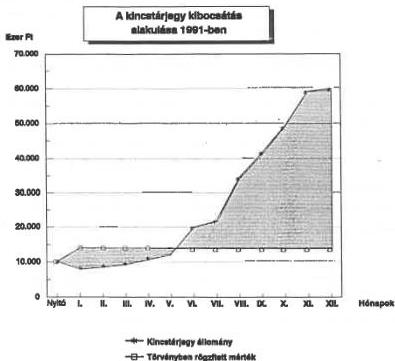

---

2. Az adó-, vám- és illetékbevételek alakulása

25

Indokolt lett volna, ha a pénzügyminiszter - legkésőbb 1992. januárban - a Kormányon keresztül az Országgyűléshez fordul, és a 'drágább' kincstárjegy kibocsátás és forgalmazás helyett 'olcsóbb' megoldásra tesz javaslatot. (Akár hosszabb lejáratú hitellel, jegybanki alapkamatozással, akár a törvényjavaslatban most szereplő egy évnél hosszabb lejáratú államkötvénnyel.)

## 2. Az adó-, vám- és illetékbevételek alakulása

### 2.1. Az APEH által kezelt adóbevételek

#### 2.1.1. Az 1991. évi gazdasági recesszió következtében a tervezett összeggel szemben 46,9 milliárd Ft-tal alacsonyabb összegű adóbevétel folyt be az állami forgóalap javára. Az elmaradás egyik részét az 1991-ben keletkezett adóhátralékok 30,5 milliárd Ft-os összege teszi ki.

Az adóhátralékok állománya 1991. január 1-én 33,7 milliárd Ft volt, amely az első negyedévben - a visszaigényelhető vállalkozási nyereségadó következtében - 27 milliárd Ft-ra csökkent, év végére viszont a hátralékok folyamatos behajtása ellenére 64,2 milliárd Ft-ra növekedett.

A kintlevőségek feléről 1992. elején megállapították, hogy behajthatatlan.

A hátralékállomány kialakulását alapvetően a gazdálkodási körülmények változásai (a KGST megszűnése miatt előállt piacvesztés, a gazdaság szerkezeti átalakításából fakadó nehézségek, az importkorlátozás megszűnése miatti értékesítési gondok következtében a kialakult kölcsönös fizetésképtelenség) okozták. A gazdálkodók - a jogszabályban rögzített, ellenük foganatosítható szankcionálási lehetőségek ellenére - elsősorban az állammal szemben fennálló kötelezettségeik teljesítését szüntették be.

#### 2.1.2. Az adóhatóság által kezelt adókkal kapcsolatos feladatok meghatározására, a hátralékok kialakulásának megelőzésére, és állományuk megszüntetésére az adózás rendjéről szóló 1990. évi XCI. törvény törvény előírásai rendelkeznek.

A törvényi szabályozás 1991. január 1-től lehetővé tette a legnagyobb adózók (mintegy 3400 adóalany) havi bevallási kötelezettségének folyamatos figyelemmel kísérését, amely a költségvetési bevételi előirányzat mintegy 70 %-ának időarányos nyomonkövethetőségét biztosította.

---

2. Az adó-, vám- és illetékbevételek alakulása

26

A költségvetés folyamatos bevétellel való ellátását biztosította az is, hogy a bevallások rendszerének változásától függetlenül az egyes adónemeknél a többi adóalanyra vonatkozóan havonta továbbra is fizetési kötelezettség állt fenn. A hátralékok kialakulásának megelőzésére a késedelmi pótlék korábbinál jelentősebb mértékét határozták meg az adózás rendjéről szóló törvényben. Ennek ellenére nagy összegű adótartozások alakultak ki. A hátralékok csökkentésére a törvényi felhatalmazások, valamint a bírósági végrehajtásról szóló jogi előírások alkalmazásával tettek intézkedéseket.

Az Adóelszámolási Iroda 32,1 milliárd Ft késedelmi pótlékot vetett ki, továbbá közel 60 milliárd Ft értékben nyújtott be azonnali beszedési megbízást.

Az adóhatóság különböző szervezeti egységei 433 millió Ft összegben alkalmaztak letiltást, 2,6 milliárd Ft összegben kezdeményeztek ingó- és ingatlan végrehajtást.

### 2.1.3. Az APEH szankcionálási és behajtási módszerei ugyanakkor nem kellően hatékonyak.

Az 1991. évre vonatkozóan 73 ezer adóalany nem adott bevallást, a 32,1 milliárd Ft értékben kivetett késedelmi pótlékból csupán 4 milliárd Ft-ot fizettek meg az adózók, a 60 milliárd Ft értékű azonnali beszedési megbízásnak csak mintegy 20%-a teljesült.

Az 1991-ben keletkezett adóhátralékok behajtásához kapcsolódóan kezdeményezett felszámolási eljárások során a 20 milliárd Ft hátralékból csak mintegy 13 milliárd Ft-ot utaltak át a vállalkozások.

A hátralékok behajtásának eredményességét a fizetőképtelenség, a jogszabályi rendelkezések ellentmondásossága és az APEH szervezeti és feladatstruktúrája hátrányosan befolyásolta.

A fizetésképtelenség továbbra is tartósnak ígérkezik, amíg a vállalkozások nem jutnak újra piacokhoz, illetve megfelelő feltételekkel hitelekhez és amíg a felszámolásra megérett cégek vagyona nem válik újra valamilyen módon működő tőkévé.

Az adózás rendjéről szóló törvény nem rendelkezett a korábban eddig megnyitott bankszámlák kötelező adatszolgáltatásáról. A végrehajtás területén gondot okoz, hogy gazdálkodó szerv esetében a végrehajtás alá eső ingatlant csak egy másik gazdálkodó szerv szerezheti meg. A 27/1972. (XII.31.) MÉM rendelet szerint nem lehet jelzálogot bejegyezni az adótartozás biztosítására stb.

---

2. Az adó-, vám- és illetékbevételek alakulása

27

2.1.4. Az adóhatóság 1991-ben nem alkalmazta a gazdálkodó szervekkel szemben a végrehajtási eljárás jogintézményét (bár belső szabályozása erre vonatkozóan egyértelmű volt). A Behajtási osztályokhoz - amelyek az Adófelügyelőségek szervezeti egységei voltak - csak az Adófelügyelőséghez tartozó adóalanyok - kisvállalkozók - végrehajtási ügyeit továbbították. Befolyásolta a végrehajtást az is, hogy az adóhatóság által lefoglalt értéktárgyak megfelelő értékesítése a kötött csatornák (BÁV, Alkalmi Áruk Háza stb.) vállalkozási érdektelensége miatt nem megoldott.

A behajtások elhúzódását okozták az APEH-en belül működő társszervek (Adóelszámolási Iroda, a megyei igazgatóságok, a Hivatal) közötti keresztintézkedések láncolatai is, továbbá, hogy az Adóelszámolási Iroda csak 2-3 hónap késéssel tudja az adófolyószámlákat elkészíteni.

A felszámolási eljárások kezdeményezésének elhúzódását jelzi, hogy az 1991-ben keletkezett hátralékállománnyal kapcsolatosan 1992. első négy hónapjában további 935 felszámolás kezdeményezésére (10,5 milliárd Ft értékben) került sor.

Az APEH 1991. évi behajtási tevékenysége összességében - valamennyi akadályozó körülményt is figyelembevéve - megfelelő volt.

Az adózás rendjéről szóló törvény módosítása 1992. január 1-től jelentősen javította az APEH adóhatósági szerepkörét; a havi bevallási kötelezettség bővítésével 6,5 ezerre növekedett azon adóalanyok száma, akik kötelezettségét az adóhatóság havonta rendszeresen figyelemmel kísérheti; információkat kérhetnek be az adózók bankszámláinak forgalmára vonatkozóan; a háttérfelelősökkel szemben nem polgári eljárás keretében jogosultak a fennálló tartozás érvényesítésére stb.

## 2.2. A vám- és illetékbevételek alakulása

Az állami költségvetés vám és import befizetések bevételi előirányzata 77 milliárd Ft volt. E jogcímen mindössze 61,6 milliárd Ft került jóváírásra az állami forgóalap 1991. december 30-ai egyenlege szerint.

A költségvetés végrehajtásáról szóló jelentés - a vámtarifa növekedés hatására - 94 milliárd Ft kivetésről számol be, melyből 32 milliárd Ft a kiegyenlítetlen tartozás.

---

2. Az adó-, vám- és illetékbevételek alakulása

28

A kivetett vám és illeték összege a jelentésben tévesen került megállapításra, az nem egyezik az 1991-ben esedékes kötelezettségekkel. A zárszámadás adatai ugyanis egyrészt a vám-statisztikai kimutatáson alapulnak, másrészt a 94 milliárd Ft-ot az 1992. 02. 03. feldolgozás összesítése adta, ami nem a teljes évre vonatkozik.

Az 1991. évben végzett feldolgozások vámbefizetési kötelezettség összegei az alkalmazott nyilvántartási rendszerben a vámkezelés és nem a vámkiszabás időpontjához igazodtak. Az 1991. évi kivetés ténylegesen - a két hónapos átfutási időt meghaladó adatfeldolgozás miatt - az 1991. 03. 12. és 1992. 03. 20. közötti fizetési kötelezettségeket tartalmazza.

A vámértékeket módosító tételek, valamint a termékazonosítási problémák miatti tarifálási hibák még nem kerültek helyesbítésre.

**2.2.1.** A Vám- és Pénzügyőrség számítógépes adatfeldolgozási rendszere nem elégítette ki a legfontosabb követelményt, a vámkiszabásból származó bevételek határidőn belüli előírását. A feldolgozás menetében a statisztikai igények kaptak nagyobb hangsúlyt a vámérdekekkel szemben. Előbb került rögzítésre a jelentős mértékben statisztikai adatokat hordozó vámokmány és a feldolgozás utolsó fázisában történt a vám kivetése.

**2.2.2.** A vámkezelés időpontja és a fizetési határidő között (a GATT-ban résztvevő országok gyakorlatában) 15-20 nap a megengedhető adatfeldolgozási idő. Ezzel szemben a vámkezelés időpontja és a pénzügyi realizálás közötti intervallum meghaladta a két hónapot, tehát a vámigazgatás jóvoltából a költségvetés mintegy 60-70 napos időtartamra kamatmentes hitelhez juttatta a vámadós vállalkozókat.

Az 1991. év novemberben történt vámkezelés utáni 11 milliárd Ft fizetési kötelezettség 1992. januárjában vált esedékessé. Az 1991. decemberi vámkezelés 75 milliárd Ft volt, a hónap utolsó dekádjának fizetési határideje 1992. március 20-ig húzódott.

A vám- és statisztikai illeték előírás tényleges kintlevősége - az 1991. évben esedékes 91,6 milliárd Ft és a késedelmes befizetések után kivetett 15,4 milliárd Ft pótlék, valamint az MNB 1991. év végi bevételi záróegyenlege alapján - 45,4 milliárd Ft.

Az 1991. évi helyesbített előírás (a feldolgozást végző Kopint-Datorg Kft 1992. évi június 17-én készített kimutatása szerint) 65,3 milliárd Ft vám (és vámkezelési díj) és 17,4 milliárd Ft statisztikai illeték, melyet növelni kell az 1990. évi hátralék újbóli (1991. évi) előírásának összegével 8,9 milliárd Ft-tal.

---

2. Az adó-, vám- és illetékbevételek alakulása

29

**2.2.3.** Az 1991. évi költségvetésben az import termékek ÁFA-jának bevételi előirányzata és az APEH hatáskörébe tartozó ÁFA egy összegben került meghatározásra, 158,0 milliárd Ft nettó összegben.

Az állami költségvetésbe befolyt ÁFA bevétel 149,5 milliárd Ft volt, melyből az import ÁFA 105,0 milliárd Ft-ot képviselt.

Az import ÁFA-nál jelentkező kintlévőség tényleges összegét az 1991. évi jogszabályi előírások alapján nem lehet megállapítani, mivel az import ÁFA számla egyenlege csak a VPOP által beszedett ÁFA egyenlegét mutatja. A forgóalap ÁFA sorának tartozik forgalma pénzügyileg rendezett (visszaigényelt) összegeket tartalmaz. Ezen összegben szerepel az APEH-tól visszaigényelt, VPOP részére megfizetett import ÁFA mellett az APEH hatáskörbe tartozó visszautalás is.

**2.2.4.** A Vám- és Pénzügyőrség az esedékességi időn túli kintlévőség keletkezésének megelőzése érdekében nem tette meg a szükséges intézkedéseket. A vám beszedésére vonatkozó előírásokat a gyakorlatban nem érvényesítette, nem élt a kezességvállaló nyilatkozatok bekérésével, ezzel jelentős mértékben hozzájárult a megnövekedett vámadós állomány kialakulásához.

A követelések behajtására tett intézkedések sem jártak kellő eredménnyel. A Vám- és Pénzügyőrség a kintlévőségek behajtására azonnali beszedési megbízásokat ugyan benyújtott a vámadósok felé, de az inkasszók mindössze 15%-ban realizálódtak.

Az eredménytelen behajtás oka egyfelől a gazdálkodó szervezetek egy részének tartós fizetőképtelensége, másfelől pedig az információhiány (bankszámla számokról nincs a VPOP-nak kellő információja).

A Vám- és Pénzügyőrség a hátralékok behajtása érdekében nem élt adóhatósági jogkörével sem.

A bankszámlával nem rendelkező egyéni vállalkozók tartozása esetén a letiltás jogintézményét nem alkalmazták, ingó és ingatlan végrehajtás lehetőségével nem éltek, végrehajtást nem kezdeményeztek, de ennek szervezeti, személyi és tárgyi feltételeit sem alakították ki.

Felszámolási eljárást önállóan nem kezdeményeztek, csupán a Magyar Közlönyben közzétett felszámolási eljárásokhoz csatlakoztak. A felszámolási eljárások egyetlen

---

2. Az adó-, vám- és illetékbevételek alakulása

30

esetben sem zárultak le, így a 9.582 millió Ft összegben benyújtott igény összege nem változott.

**2.2.5.** A központi költségvetést megillető vám- és statisztikai illeték beszedésének hatékonyságát hátrányosan befolyásolta az is, hogy a vámjog megfelelő szintű szabályozására még nem került sor, s a sok tekintetben már túlhaladottá vált jogi előírások voltak a mérvadók.

A jogalkotásról szóló 1987. évi XI. törvény értelmében a vámelőírásokat törvényben kell szabályozni. A vámjog legmagasabb szintű jogforrása jelenleg is az 1966. évi 2. tvr., de a részletes szabályokat a 39/1976 (XI. 10.) PM-KkM együttes rendelet tartalmazza. A VPOP, mint adóhatóság az import ÁFA és a statisztikai illeték vonatkozásában az adózás rendjéről szóló 1990. évi XCI. törvény előírásait köteles betartani és betartatni.

A vámfizetések jogi szabályozása – a behajtások mellett – a folyószámla nyilvántartásában is problémaként jelentkezett.

Pl. vámszámlára érkezett befizetés esetén az adószámlára történt belső átvezetést csak késedelmi pótlékvonzattal lehet megvalósítani.

Az adózás rendjéről szóló 1990. évi XCI. törvény csak az állami és az önkormányzati adóhatóságnál rögzíti a bankszámla bejelentési kötelezettséget, a vámhatóságnál nem.

A pénzforgalomról és a bankhitelről szóló 39/1984. (XI. 05.) MT rendelet 2/A paragrafus (3.) bek. szerint a pénzforgalmi jellegű bankszámlák megnyitásáról való pénzintézeti értesítést, a pénzforgalmi jelzőszámok közlését az APEH, a KSH és a Társadalombiztosítás részére kötelezővé teszi. A felsorolásban a VPOP nem szerepel.

A 3/1992. (MK. 34.) MNB rendelkezés fizetési meghagyások teljesítéséről szóló 24. paragrafus 2/d pontja az adó és TB követeléseket szerepelteti, de a vámkövetelésekre vonatkozó megbízásokat kihagyja a szabályozásból.

A zálogjog intézménye a jogszabályi ellentmondások miatt a gyakorlatban nem volt alkalmazható.

A 39/1976. (XI.10.) PM-KkM együttes rendelet 5. § szerint a törvényes zálogjog alapján visszatartott vámáru értékesíthető. Az 1966. évi 2. tvr. 2. § azonban nem tette lehetővé az áru visszatartását.

Az ÁFA rendszer jogi szabályozása sem segítette elő az adóbevételek előírásszerű fizetését és visszaélésre adott lehetőséget.

---

2. Az adó-, vám- és illetékbevételek alakulása

31

Az adózás rendjéről szóló 1990. évi XCI. törvény szerint az import termékek után kivetett ÁFA-t a VPOP részére kell megfizetni és a számlában felszámított ÁFA-t az APEH-tól visszaigényelni. Ebben az elszámolási eljárásban a gazdálkodó szerveknek lehetőségük van az adófizetés előtti visszaigénylésre. Az újonnan alakult, de egy éven belül megszűnt szervezeteknél gyakori az olyan visszaigénylés is, melyet egyáltalán nem fizettek meg a VPOP részére. Az APEH és a VPOP közötti szorosabb együttműködéssel a jogtalan visszaigénylés jelentős része kiszűrhető.

A felszámolási eljárások előkészítését a VPOP 1990-ben, majd ezt követően 1991-ben ismételten szabályozta, 1991. február 1-i határnappal un. "fekete lista" összeállítására került sor a vámadósokról, melynek alapján azonnali beszedési megbízásokat nyújtottak be. Az elért eredmények azonban azt mutatják, hogy 1991-ben a kintlévőségek beszedése, behajtása érdekében a VPOP nem tette meg minden esetben a szükséges intézkedéseket.

# 2.3. A vállalkozási nyereségadó és az állami részesedés alakulása

A vállalkozási nyereségadóból származó állami bevétel a költségvetés, a társadalmi közös kiadások fedezetének egyik legjelentősebb forrása. Az 1991. évi előirányzott költségvetési hiány jelentős túllépésének egyik oka az volt, hogy a vállalkozók a költségvetésbe az előirányzott 101 milliárd forint nyereségadóval szemben ténylegesen csak 77,3 milliárd forintot fizettek be. A pénzintézetek nyereségadója és osztaléka 8,5 milliárd forinttal maradt el a tervezettől. A 32 milliárd forint költségvetési bevétel elmaradása jelentősen hozzájárult a tervezettnél lényegesen nagyobb deficit kialakulásához.

Mindezek indokolták, hogy az Állami Számvevőszék elemzést készítsen a nyereséghez kapcsolt elvonások 1991. évi alakulásáról, az adórendszer működéséről.

# 2.3.1. A gazdálkodó szervezetek nyereségének alakulása

A vállalkozási nyereségadó rendszer 1991. évi módosításának célja:

a korabbi kétkulcsos rendszer helyett (35%, illetve 40%) egységesen 40%-os adokulcsot gezettek be,
- az adókedvezmények körét és mertékét csökkentéték, ugyanakkor új kedvezmények is életbe léptek.

A vállalkozások - pénzintézetek nélkül - 56,5 milliárd forint nyereségadó befizetési kötelezettséget mutattak ki 1991. évi mérlegbeszámolóikban. Az eltérés a befizetett

---

2. Az adó-, vám- és illetékbevételek alakulása

32

77,3 milliárd forinthoz viszonyítva a pénzforgalom és az eredményszemlélet közötti eltérés következménye.

A pénzforgalmi szemléletnek megfelelően vannak beállítva a költségvetésbe a kiadások és bevételek. Ez azt jelenti, hogy december 31-i állapotnak megfelelően jelennek meg a befizetések és kiadások, függetlenül attól, hogy ténylegesen melyik évben keletkeztek. Emiatt bevétel elmaradás, illetve túlfizetés keletkezhet, amit a következő évben korrigálni kell. A továbbiakban az elemzést az eredményszemléletű vállalkozási nyereségadó alapján készítjük, amelyet a vállalati mérlegbeszámolók tartalmaznak.

A vállalkozási nyereségadót alapvetően két tényező befolyásolta:

— a vállalkozások eredményének alakulása,

— az adókedvezmények mértéke.

A költségvetési bevételeket a nyereségadón és az állami részesedésen keresztül a vállalkozások 1991. évi nyeresége közvetlenül befolyásolja. Az alábbi grafikon az elmúlt években a nemzetgazdaság egészében keletkezett realizált nyereséget mutatja be.

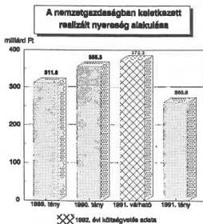

---

2. Az adó-, vám- és illetékbevételek alakulása

33

A nyereség a várhatóhoz és az előző évi teljesítéshez képest is - 100 milliárd forintos nagyságrenddel - csökkent. A nyereségalakulást ágazati szinten vizsgálva megállapítható, hogy - a vegyipar és az élelmiszeripar kivételével - az ipar minden ágazatban jelentős mértékű nyereség csökkenés következett be.

A vállalkozásokat méreteik szerint vizsgálva az tapasztalható, hogy a kisvállalkozások (250 millió forint árbevétel alatt) nyereségüket dinamikusan 54 %-kal növelték. Ebben az is közrejátszott, hogy e vállalkozások száma közel duplájára emelkedett az előző évhez viszonyítva.

A nagyobb - kettős könyvvitelt alkalmazók, 250 millió forint árbevétel feletti - vállalkozások nyeresége viszont 38 %-kal csökkent. Ez utóbbi határozta meg a nemzetgazdaság jövedelmének alakulását.

### 2.3.2. A nyereséget közvetlenül terhelő adók színvonala A nyereséget terhelő közvetlen elvonások mértéke az előirányzott 31,9 %-kal szemben 27,6 % volt.

Az adószinteket vizsgálva - a kedvezmények miatt - a nyereség adó- terhelése vállalkozásonként jelentős differenciálódást mutat. A grafikon a gazdálkodók és a nyereség megoszlását mutatja az adóterhek arányában a következő oldalon:

A vállalkozások nyereségét összességében terhelő adószinteket jellemzi, hogy a vállalkozások több mint 40 %-a (1495) 20 %-nál kevesebb nyereségadót fizet. Ezen belül 724 vállalkozás egyáltalán nem fizet adót, ugyanis teljes adómentességet kaptak. Az előző évhez hasonlóan főleg mezőgazdasági, gépipari és könnyűipari vállalkozások tartoznak ebbe a csoportba.

A 40 % feletti adót fizető vállalkozások aránya 12 %, az itt kimutatott eredmény viszont 27 %-os arányt képvisel, vagyis a nyereségesebb vállalkozások továbbra is a normatívhoz közel álló kulccsal adóztak.

Az elmúlt két év adószint szerinti struktúrája, bár közvetlenül nem hasonlítható össze, mivel eltérő vállalati kör került feldolgozásra. (1990-ben az összes vállalkozás, 1991-ben csak a kettős könyvelésű)

Az arányeltolódások az adót nem fizető vállalkozások javára azonban így is jól érzékelhető. Az 1991. évi teljeskörű feldolgozás esetén ez az arányeltolódás még

---

# A vállalkozások és a nyereségek megoszlása
az adóterhelés alapján

34

1990. évben

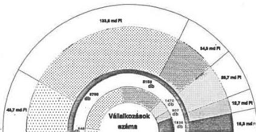

1991. évben

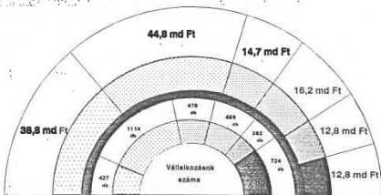

Adószint mértéke
(Elszámolt VÁNYA/nyereség)

|  Nem fizet | 20 - 30%  |
| --- | --- |
|  0 - 10% | 30 - 40%  |
|  10 - 20% | 40% felett  |

---

2. Az adó-, vám- és illetékbevételek alakulása

35

nagyobb mértékűvé vált volna, mivel az év végi tömeges Kft alapítások egyik döntő motiváló tényezője az igénybevehető adókedvezmény volt.

Összességében megállapítható, hogy a vállalkozások adószint szerinti struktúrájában az adókulcs egységesítése lényeges változást nem eredményezett, ami azt is jelenti, hogy a differenciálódás elsősorban az adókedvezmények következménye.

### 2.3.3. Nyereségadó kedvezmények hatása

A nyereségadó mértékét – az elért nyereségen túl – az adókedvezmények is befolyásolják.

A vállalkozások pénzintézetek nélkül kimutatott 1991. évi eredménye 205 milliárd forint volt, amelyből az általános szabályok szerint 64 milliárd forint nyereségadó számolható el. Az igénybevett adókedvezmények miatt azonban ténylegesen csak 37 milliárd forint befizetési kötelezettség keletkezett, ami az előző évi 84 milliárd forintnak a felét sem éri el.

A vállalkozási nyereségadó törvény – tevékenységi elv alapján – 16 jogcímen biztosít adókedvezményt a vállalkozások számára. A vállalkozások az eredetileg tervezett 20 milliárd forinttal szemben 30,2 milliárd forint adókedvezményt vettek igénybe. Gyakorlatilag minden harmadik kettős könyvvitelt vezető vállalkozás valamilyen adókedvezményben részesül.

Az adókedvezmény mintegy 10 milliárd forintos túllépése annak ellenére következett be, hogy az előző évhez képest csökkentették a jogcímeit és egyesek mértékét is.

Például, megszűnt az élelmiszer-húskereskedelem, a lakossági, fogyasztási szolgáltatások, a K+F tevékenység megvalósítását szolgáló beruházások, élelmiszeripari tevékenység utáni kedvezmények, ugyanakkor új kedvezményként léptek be a kizárólag belföldi magánszemélyek részvételével működő vállalkozás, a műemlék helyreállítás kedvezménye.

Az 1990-91. évi adatok alapján megállapítható, hogy az 1990. évvel megszűnt adókedvezmény (3 milliárd forint) és az 1991. évvel belépő kedvezmények (6,5 milliárd forint) hatásának egyenlegével – 3,5 milliárd forinttal – az adókedvezmények összege nőtt.

---

2. Az adó-, vám- és illetékbevételek alakulása

36

Megjegyezzük, hogy az új kedvezmények közül a kizárólag belföldi magánszemélyek vállalkozása után járó kedvezmény 6,1 milliárd forintos összegét az 1991. évi költségvetésben nem tervezték meg. A kedvezményt az Országgyűlés a vita során hagyta jóvá, hatását a bevételi előirányzatokon már nem vezették keresztül.

Már az előző években is jeleztük, hogy az adókedvezmények feltétel rendszere megnehezíti a tervezési munkát, különösen azoknál a jogcímeknél, ahol a kedvezmény vetítési alapja nem a nyereség.

Ezt igazolja, hogy ezeknél a jogcímeknél az előirányzattól való eltérés a legerőteljesebb.

- Az állóeszközök értékesítése után járó adóvisszatérítés előirányzata 661 millió forint volt. 1234 vállalkozás 3758 millió forintot vett igénybe.
- Az elmaradott térségekben megvalósított beruházások után járó kedvezmény 687 millió forint előirányzatával szemben ténylegesen 1972 millió forintot vettek igénybe.
- Ellenkező irányú az eltérés a mezőgazdasági beruházások kedvezményénél. 3925 millió forint kedvezményt irányoztak elő, ténylegesen ennek csak harmadát vették igénybe.

Az 1992. évben hatályba lépő társasági adó lényegében ezeket a nehezen tervezhető kedvezményeket megszüntette, és ez javíthatja a bevételek tervezésének, a költségvetés végrehajtásának biztonságát.

Az egyik legjelentősebb tervtől való eltérés 1991-ben is a gazdasági társaságok adókedvezményénél fordult elő. (Ez a jogcím a következő években is hatályban lesz.)

Az előirányzott 5725 millió forinttal szemben 8466 millió forintot vettek igénybe. A túllépést befolyásolta, hogy a számítottnál lényegesen nagyobb számban alakultak társaságok.

A korábbi években létesült külföldi részvétellel működő társaságok pedig még a régi könnyen teljesíthető feltételek alapján vehetik igénybe a kedvezményeket. Az 1991. évi szigorítások csak az új vállalkozásokra vonatkoztak. A 250 millió forint alatti árbevételt realizáló kisebb külföldi gazdasági társaságok 2,2 milliárd forint kedvezményt vettek igénybe.

---

2. Az adó-, vám- és illetékbevételek alakulása

37

A nagyobb gazdasági társaságok (250 millió forint árbevétel felett) vagyon szerinti megoszlása rámutat az adókedvezmények és a külföldi befektetések összefüggésére. A 2115 gazdasági társaságból 1797-nél a külföldi befektetés vállalkozásonként meghaladja az 50 millió forintot, és ide koncentrálódik az igénybe vett kedvezmény 70 %-a.

#### 2.4. Állami vagyon utáni részesedés

Az állami kiadások fedezetéhez szükséges bevételek, valamint a gazdasági társaságokkal való arányos teherviselés érdekében az állami vagyon után a vállalkozások 1991-ben is 25 %-os részesedést fizettek.

A vállalkozások állami részesedés címén a 18 milliárd Ft előirányzathoz képest 1991-ben 18,4 milliárd forintot fizettek a költségvetésbe. A pénzügyi teljesítés azonban csak az előlegfizetési kötelezettség miatt mutatkozik kedvezőnek. Az évvégi mérlegbeszámolók szerint ténylegesen csak 9,4 milliárd forint fizetési kötelezettség keletkezett, az eltérést a vállalkozások 1992. év elején visszaigényelték. Ez azt jelenti, hogy az elmaradás hatása lényegében az 1992. évet terheli. A tervtől való jelentős eltérés ennél a jogcímnél is a nyereség alakulásával, illetve az adókedvezményekkel függött össze.

#### 2.5. A vállalkozásoknál maradó nyereség

A vállalkozásoknak nyereségükből kell fizetni a nyereségadót, az állami vagyon utáni részesedést és a beruházások után le nem vonható ÁFA-t is. Az ezután megmaradó nyereségrésszel gazdálkodhatnak szabadon.

A nemzetgazdaság egészében az elvonások teljesítése után átlagosan 74,7 % nyereségrész marad a gazdálkodóknál. A szabadon felhasználható nyereségrész szerint erőteljes differenciálódás jött létre a vállalkozások között:

- — Az iparban a nyereségnek 70 %-a marad a vállalkozásoknál. Ennél kevesebb a kohászatban és a bányászatban, míg a többi ágazatban az átlagnál magasabb arányok alakultak ki.
- — A visszamaradó nyereségszintek differenciálódtak a vállalkozások mérete szerint is. A nagyobb - 250 millió forint árbevétel feletti - vállalkozásoknál mintegy 8 százalékponttal kevesebb nyereség maradt vissza, mint a kisvállalkozásoknál.

---

2. Az adó-, vám- és illetékbevételek alakulása

38

Összességében megállapítható, hogy a vállalkozók nagymértékű nyereség csökkenését az adószintek mérséklődése ellensúlyozni nem tudta, így a gazdálkodók szabadon felhasználható forrás helyzete is romlott az előző évhez képest.

## 2.6. Pénzintézetek befizetései

A pénzintézetek 1991-ben 53 %-kal kevesebb eredményt realizáltak, mint az előző évben. Emiatt az előirányzotthoz képest 7,5 milliárd forinttal kevesebbet fizettek be a költségvetésbe. A drasztikus nyereségcsökkenést az MNB nyereségének visszaesése, a kereskedelmi bankok nagyösszegű kockázati céltartalék képzése okozta.

Az 1991. évi mérlegbeszámolókban a ráfordításként elszámolt céltartalék összege 51 milliárd forint.

A pénzintézetekre vonatkozó törvény értelmében a bankok kintlevőségeiket a behajthatóság valószínűsége alapján minősítik. 'Az átlag alatti', 'kétes' és 'rossz' minősítésű kintlevőségekre különböző mértékű kockázati céltartalékot kötelesek képezni. Az átmeneti rendelkezések szerint az évenként elvégzett minősítés alapján megállapított céltartalék kötelező szintjét három év alatt egyenlő arányban kell biztosítani.

A pénzintézetek által kimutatott belföldi követelések összege 1631 milliárd forint, ami 14 %-kal több, mint előző évben. Ezen belül a 'kétes' minősítésű követelések összege 35 milliárd forint a 'rossz' - a 365 napon túl lejárt követelések - összege 1,8 milliárd forint. A törvényben e két minősített követelésre a kötelező tartalékolási szint 50 %, illetve 100 %. Ez azt jelenti, hogy három év alatt 19,3 milliárd Ft (a 35 milliárd forint fele 17,5 milliárd forint, illetve az 1,8 milliárd forint) a kötelező tartalék összege.

Az 1991. évi mérlegbeszámolókban a ráfordításként elszámolt céltartalék összege 51 milliárd forint. A kimutatott minősített követelések a mérlegbeszámolókban elszámolt 51 milliárd Ft kötelező céltartalék mintegy 40 %-át igazolják csak. Az előzőekből adódik, hogy a mérlegbeszámolóban külön ki nem mutatott a bankok által 'átlag alatti'-nak minősített követelések, indokolták a nagyösszegű tartalék képzést. Az éves szinten képzett 51 milliárd forint céltartalék - amennyiben ez ténylegesen az egy évre elszámolható összeget jelenti - arra utal, hogy a következő két évben is hasonló nagyságrendű nyereség, ezen keresztül társasági adó kiesésre lehet számítani.

A pénzintézeti törvény 1991. december 1.-én hatályba lépett. Így a költségvetés végrehajtásának utolsó hónapjában olyan szabályozás lépett életbe, amely lehetőséget

---

2. Az adó-, vám- és illetékbevételek alakulása

39

adott az 1991. évi befizetési kötelezettségek jelentős mértékű csökkentésére anélkül, hogy ennek ellensúlyozására intézkedtek volna. A költségvetési előirányzatokkal összehangolt jogalkotási folyamat esetén az 1991. évi nyereségadó befizetések kockázata lényegesen csökkent volna.

## 2.7. Fogyasztáshoz kapcsolt adók

A fogyasztáshoz kapcsolódó adókból (általános forgalmi adó és a fogyasztási adó) származó bevétel összességében 24,7 milliárd Ft-tal marad el az előirányzattól. Az ÁFÁ-nál 9 milliárd, a fogyasztási adónál 15,7 milliárd Ft az elmaradás. Már korán érzékelhető volt, hogy elmaradás várható külön-külön, s együttesen is. A reálfolyamatok bebizonyították, hogy ezen adóbevételek előirányzatai túlbecsültek voltak.

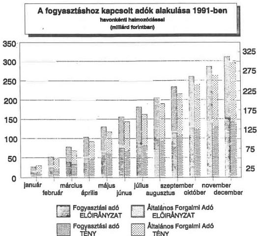

---

3. Gazdálkodás az állami vagyonnal

40

### 3. Gazdálkodás az állami vagyonnal

#### 3.1. Állami vagyon nyilvántartása

Az állami vagyonnal való gazdálkodás ellenőrzése az Állami Számvevőszék törvénybe foglalt feladatai közé tartozik. Az állami vagyonnal összefüggő központi feladatok elvégzését segítené, ha az ország rendelkezne egy teljes körű vagyonmérleggel. Az információs rendszer ismert hiányosságai azonban 1991-ben is megmaradtak. (Pl.: föld, ingatlan értéke a nyilvántartásokban sokszor nem szerepel, a piaci és a könyv szerinti értékek eltérnek stb., így hiteles vagyonmérleget továbbra sem lehet készíteni.)

Az állami vagyon értékét a jelenlegi információs rendszerben szereplő vállalatok mérlegbeszámolói és az államigazgatási szervek beszámoló jelentései alapján mutatjuk be:

|  Állami vagyon |   | 1990.dec.31. milliárd Ft | 1991. dec.31. milliárd Ft | Változás %  |
| --- | --- | --- | --- | --- |
|  1. | Állami vagyon a vállalatoknál |  |  |   |
|   |  - alapítói vagyon | 1.153,0 | 955,3 | 82,9  |
|   |  - felhalmozott és egyéb vagyon | 746,0 | 658,7 | 88,3  |
|  Összesen: |   | 1.899,0 | 1.614,0 | 85,0  |
|  2. | Költségvetési szerveknél nyilvántartott érték |  |  |   |
|   |  - ingatlanok | 174,8 | 189,3 | 108,3  |
|   |  - gépek, berendezések, felszerelések | 56,7 | 65,0 | 114,6  |
|   |  - járművek | 5,5 | 6,5 | 118,2  |
|   |  - egyéb | 1,6 | 2,4 | 150,3  |
|   |  - jóléti | 0,6 | 0,5 | 83,3  |
|  Összesen: |   | 239,2 | 263,7 | 110,2  |
|  Mindösszesen: |   | 2.138,2 | 1.877,7 | 87,8  |

Megjegyzés: A kincstári vagyonnak minősülő, a költségvetési szerveknél jelentkező vagyon bruttó értékét tüntettük fel, amely az ingatlanok, gépek beszerzéskori értékét mutatja. A költségvetési szférában 1968-ban volt az utolsó állóeszköz értékelés, ezért a vagyon jelentős része irreálisan alacsony értéken szerepel.

Az állami vagyon a nemzetgazdaság egészében 260,5 milliárd forinttal csökkent, ezen belül a vállalati vagyonban a privatizációs folyamatok, valamint a gazdálkodás

---

3. Gazdálkodás az állami vagyonnal

41

nem megfelelő jövedelmezőségének mérséklő hatása miatt 285 milliárd Ft csökkenés következett be. A kincstári vagyon viszont 24,5 milliárd Ft-tal nőtt.

### 3.2. A vagyon gazdálkodási formák szerinti változása

Az állami vagyon tetemes hányadát még mindig a vállalkozásokban lévő vagyon teszi ki. A magyar gazdaságban 1991. december 31-én a vállalkozások 3.570 milliárd Ft könyv szerinti saját vagyonnal rendelkeztek. Ezen belül az egyes gazdálkodási formába tartozó egységek vagyoni helyzetét, az állami vagyon elhelyezkedését a következő táblázat tartalmazza.

|  Gazdálkodási forma |   | Vállalkozások száma | Saját vagyon | Ebből: állami vagyon (Mrd Ft)  |
| --- | --- | --- | --- | --- |
|  1. | Vállalat | 1.510 | 1.614 | 955  |
|  2. | Gazdasági Társaság | 2.678 | 1.238 | 7  |
|  3. | Szövetkezet | 2.212 | 357 | 16  |
|  4. | Jogi személy nélküli BT | 160 | 8 | 1  |
|  5. | Egyszerűsített könyvelés | 38.390 | 353 | 20  |
|   | **Összesen:** | **44.950** | **3.570** | **999**  |

Megjegyzés: A táblázat a mérlegbeszámolót benyújtó vállalkozások adatait tartalmazza. A tröszt egy egységként szerepel.

Az átalakulások és a privatizáció hatására a vagyon gazdálkodási formák szerinti struktúrája az előző évhez képest megváltozott. A vállalatok vagyonból való részesedése 65 %-ról 45 %-ra csökkent, ugyanakkor a gazdasági társaságok súlya 20 %-ról 34 %-ra nőtt.

A vagyon jelentős része továbbra is a vállalati formában található. A következő években a privatizáció alapját a vállalati formában működő 1.614 milliárd Ft saját vagyon képezheti. A gazdasági társaságokban a kimutatott állami vagyon könyv szerinti értéke mindössze 7 milliárd Ft. Ennek értékelésénél azonban figyelembe kell venni, hogy az állami vállalatok átalakulásával létrejött társaságokban az állami vagyon jelentős része részvény vagyonná vált. A jelenlegi információs rendszerből továbbra sem állapítható meg a vagyonon belül az állami részvény mértéke, ezt csak a vállalati belső információk tartalmazzák.

---

3. Gazdálkodás az állami vagyonnal

42

### 3.3. Államigazgatási felügyelet alá tartozó vállalatok

Az Állami Számvevőszék alapvető feladatai közé tartozik az állami vagyon védelme. Az államigazgatási felügyelet alatt álló vállalatok gazdálkodása, vagyoni helyzete fokozott figyelmet érdemel még akkor is, ha a privatizációs folyamat végére számuk és a működtetett vagyon jelentősen mérséklődik.

A privatizáció szempontjából két fő gazdálkodási formában - az államigazgatási és az önkormányzati irányítású - működő vállalkozási csoport gazdálkodását külön is megvizsgáltuk.

A mérlegbeszámolók adatai alapján megállapítható, hogy 1991-ben 547 vállalat tartozott államigazgatási felügyelet alá. Saját vagyon összege 1.055 milliárd Ft. Ez az összes mérlegbeszámolót készítő vállalkozások vagyonának 29 %-a. Az előző évhez képest a vállalatok száma 38-cal, míg saját vagyonuk 155 milliárd Ft-tal csökkent, alapvetően a privatizáció hatására. Az államigazgatási felügyelet alatt álló vállalatok döntően az iparban, közlekedésben és a szolgáltatásban helyezkednek el. Az iparon belül elsősorban az élelmiszeripari és vegyipari vállalatok túlsúlya a jellemző, de ide tartoznak az úgynevezett válság ágazatok (bányászat, kohászat) vállalatai is.

A vállalatok 1991. évi gazdálkodását a következők jellemezték:

- — Az államigazgatási vállalatok nettó árbevétele 5,7 %-kal emelkedett. Ezen belül kedvező, hogy a dollár elszámolású export 21 %-kal volt több, mint az előző évben.
- — Az eredmény 1991-ben az előző évhez képest jelentősen, 35 %-kal csökkent, de ez kisebb mértékű volt, mint a nemzetgazdaság egészében (37 %). A vállalatok közül 129 veszteségesen gazdálkodott 1991-ben. A kimutatott veszteség összege 17,9 milliárd Ft, ami azt is jelenti, hogy az állami vagyon hasonló mértékben csökken. A veszteséges vállalatok 126 ezer embert foglalkoztatnak. Különösen kedvezőtlen jövedelmi helyzetbe kerültek a bányászati, kohászati és gépipari vállalatok, ezekben az ágazatokban 6,3 milliárd Ft veszteséget mutattak ki. Megjegyezzük, hogy a másik állami vállalati csoportban - az önigazgatási vállalatoknál - 346 egység lett veszteséges. A veszteség összege 41 milliárd Ft. Tehát még a privatizáció előtt ezeknél a vállalatoknál is tetemes vagyonvesztéssel lehet számolni.

---

3. Gazdálkodás az állami vagyonnal

43

— A vállalatok pénzügyi helyzete valamivel kedvezőbb a nemzetgazdasági átlagnál, fizetőképességük jobb (likviditási mutató), az eladósodottság mértéke kisebb mint a többi gazdálkodási formába tartozó vállalatnál.

Összességében megállapítható, hogy az államigazgatási felügyelet alá vont vállalatok 1991. évi gazdálkodása lényegesen nem tért el a nemzetgazdaság egyéb vállalkozásaitól. Ezen belül azonban vállalati szinten már differenciáltabb képet kapunk, mind a vagyon, mind a jövedelmezőség vonatkozásában.

### 3.4. Vagyonmozgások a különböző vállalkozási formákban

A privatizáció és az átalakulások körvonalazására, valamint az állami vállalkozások gazdálkodásának jellemzésére különböző vállalati csoportokat vizsgáltunk meg:

— a vállalkozások mérlegadatai alapján elemeztük a vagyont-vesztő vállalkozásokat,
— összehasonlítottuk az 1991. évben megszűnt és újonnan alakult vállalkozások vagyoni struktúráját.

#### 3.4.1. A vállalati rend szerint gazdálkodó kettős könyvvitelt vezető vállalkozások közül 1388-nál a saját vagyon csökkent 1991-ben az előző évhez képest.

A vagyontvesztő vállalkozások gazdálkodási formánkénti megoszlása a következő:

|  Gazdálkodási forma | Vagyontvesztő vállalatok száma | Saját vagyon  |   |
| --- | --- | --- | --- |
|   |   |  összege Mrd Ft | csökkenés mértéke Mrd Ft  |
|  1. Államigazgatási felügyelet | 144 | 94,9 | 13,5  |
|  2. Önkormányzati irányítású (VT, közgyűlés) | 332 | 213,9 | 30,3  |
|  3. Gazdasági Társaság | 237 | 46,2 | 8,3  |
|  4. Szövetkezet | 618 | 87,0 | 10,2  |
|  5. Egyéb | 58 | 3,6 | 0,6  |
|  Összesen: | 1.388 | 445,6 | 62,9  |

---

3. Gazdálkodás az állami vagyonnal

44

A 62,9 milliárd Ft-os vagyoncsökkenést ezeknél a vállalkozásoknál a tartósan veszteséges gazdálkodás, valamint az átalakulási folyamatok hatására önállósult gyáregységek, értékesített üzemrészek stb. okozták.

Az állami vagyon védelme szempontjából figyelemre méltó, hogy az összes vagyoncsökkenés 70 %-a a két állami vállalati körben következett be:

— Az 547 államigazgatási felügyelet alatt álló vállalkozás közül 144-nél összesen 13,5 milliárd Ft volt a vagyoncsökkenés. Ezeknek a vállalatoknak a vesztesége 5 milliárd Ft, ami további saját vagyonvesztést jelent.

Jellemző a pénzügyi helyzetükre, hogy hosszúlejáratú tartozásuk állománya 21,9 milliárd Ft, ami a saját vagyon 23 %-a.

— A 850 önkormányzati irányítású (VT, Közgyűlés) vállalat 40 %-ánál csökkent a saját vagyon 1991-ben. A 30 milliárd Ft-os vagyonvesztés kialakulásában a veszteséges gazdálkodás mellett közrejátszott az is, hogy ezt a gazdálkodási formát érintik a legerőteljesebben az átalakulási folyamatok, az önállósodási törekvések.

Az állami vagyon védelme érdekében az irányításnak erre a csoportra fokozottabb figyelmet kell fordítania. A privatizációs folyamatok felgyorsítása érdekében a 20 %-nál nagyobb vagyonvesztést kimutató vállalatok - az 1989. XIII. törvényben foglaltaknak megfelelően - államigazgatási felügyelet alá vonhatók, és az alapító szerv központilag elrendelheti a gazdasági társasággá történő átalakulást.

Mind a két állami vállalati csoportban meg kell tenni a szükséges intézkedéseket a további vagyonvesztések megállítására, e vállalatok gazdálkodásának javítására.

---

3. Gazdálkodás az állami vagyonnal

45

3.4.2. A vállalkozások vagyoni helyzetében 1991-ben bekövetkezett mozgásokat a következő táblázat szemlélteti (mérlegbeszámolót készítő vállalkozások, tröszt egy egységként szerepel).

# Az 1991-ben megszűnt és új vállalkozások jellemző mutatói

|  Vállalkozások száma | Saját vagyon (md Ft) | Részvénytőke | Foglalkoztatottak száma  |
| --- | --- | --- | --- |
|  **Megszűnt vállalkozás**  |   |   |   |
|  880 db | 381.7 | 35.7 md Ft | 350 ezer fő  |
|  **Új vállalkozások**  |   |   |   |
|  1515 db | 713.7 | 681.9 md Ft | 270 ezer fő  |

A magyar gazdaságban a kettős könyvvitelű (nagyvállalatok) vállalkozások közül 580 szűnt meg. A megszűnt vállalkozások között az állami vállalatok túlsúlya a jellemző, ami kétségtelenül összefügg a privatizációs, átalakulási folyamatokkal. A vállalkozások megszűnésének különböző okai voltak, így pl.:

- tartósan kedvezőtlen gazdálkodás miatt felszámolási eljárással megszűntek,
- az átalakulási törvénynek megfelelően új gazdálkodási formát választottak,
- a privatizálással létrejött új tulajdonosok más gazdálkodási formában működtették tovább a vállalkozást.

---

4. Az állami vagyon privatizációja

46

A megszűnt vállalkozások helyett 1991-ben nagyságrenddel több új vállalkozás jött létre. A nagyobb egységeknél ez közel háromszoros.

Az új vállalkozások között mind az egységek számát, mind a lekötött vagyon értékét tekintve a gazdasági társaságok súlya a meghatározó.

Az állami vagyon védelme szempontjából figyelmet érdemel, hogy a megszűnt állami vállalatok vagyona (327 MrdFt), az új vállalkozásokban már többnyire részvénytőkeként működik. Ezen belül azonban az információs rendszer továbbra sem teszi lehetővé az állami vagyonrész megkülönböztetését, és így figyelemmel kísérését.

A gazdaságban végbemenő folyamatokat jelzi, hogy a kisebb - egyszerűsített könyvvitelt vezető - vállalkozásokból 137 db szűnt meg, de 16214 új vállalkozás indult be.

## 4. Az állami vagyon privatizációja

### 4.1. A privatizációból származó bevételek

1991-re az állami költségvetés előirányzatainak meghatározásakor az Országgyűlés 35-45 milliárd Ft privatizációs bevétellel számolt. Ebből 30-40 milliárd Ft az Állami Vagyonügynökség hatáskörébe tartozó vagyon privatizációjának, hozadékának és egyéb hasznosításának bevételeként, 5 milliárd Ft a Kincstári Vagyonkezelő Szervezet /KVSZ/ által kezelt kincstári vagyon értékesítésének, hasznosításának bevételeként került jóváhagyásra.

Az állami vagyon privatizációjának tényleges bevétele alig valamivel haladta meg a tervezett alsó értéket. A kincstári vagyon hasznosításából csak 640,5 millió Ft realizálódott.

### 4.2. A privatizációs bevételek felhasználása

A teljesített bevételek döntő többségét az államadósság csökkentésére, illetve a központi költségvetés adósságának törlesztésére fordították.

---

4. Az állami vagyon privatizációja

47

Az államadósság csökkentésére 10.369 millió Ft (a vállalati forgóalap-rendezési hitelekre 3.395 millió Ft, az 1982-1985. évek költségvetési hiányát finanszírozó hitelek törlesztésére 6.974 millió Ft) került felhasználásra.

A központi költségvetésnek a Társadalombiztosítás felé fennálló, az 1989. évi XLVIII. törvény 5. paragrafus 6. bekezdésében előírt 14.722 millió Ft összegű tartozását 1992. december 31. kell teljesíteni. Kormányhatározat alapján az 1991. évben a Vagyonügynökség 12.000 millió Ft-ot 1991. december 28-án utalt át a Társadalombiztosítási Alapnak.

A zárszámadási törvényjavaslat nem tartalmazza az 1991. évi törlesztés megtörténtét és tudomásulvételét. Ennek rögzítése azért szükséges, hogy pontosan megállapítható legyen a központi költségvetésnek a Társadalombiztosítás felé 1992-ben még fennálló tartozása.

### 4.3. A Kincstári Vagyonkezelő Szervezet értékesítési tevékenysége

Az 1991. évi 5.000 millió Ft, ingatlanértékesítésből származó bevételi előirányzat a KVSZ hasznosítási kompetenciáját teljeskörűnek tételezte fel az ingó- és ingatlanvagyon hasznosításánál.

A tervezés időszakában ugyan még nem látható, de az értékesítési nehézségek felmerülése után sem került sor az előirányzat reális szintre (700,0-800,0 millió Ft) való csökkentésére.

Az eredeti előirányzat teljesíthetetlenségét jelezte a szovjet csapatkivonási tárgyalások elhúzódása (a megállapodás hiánya az értékesítést is korlátozta, illetve meghiúsította), a hátrahagyott ingatlanok állapota, szennyezettsége, az önkormányzatokkal való egyeztetési kötelezettség, a tulajdonjogi rendezetlenség, műszaki dokumentáció hiánya. Nem számoltak az időközben meghozott kormánydöntésekkel, melyek alapján jelentős értékű ingatlanok kerültek átadásra térítésmentesen, illetve később meghatározásra kerülő csereingatlanért. (pl. placképes ingatlant kapott a Belügyminisztérium 500 millió Ft, a Honvédelmi Minisztérium 2.500 millió Ft nyilvántartási értékben)

Hátrányosan befolyásolta az értékesítést, hogy az ingatlanpiacon a kül- és belföldi érdeklődés jelentősen visszaesett 1991-ben.

A Kincstári Vagyonkezelő Szervezet az állami vagyon, illetve a hátrahagyott szovjet objektumok értékesítéséből származó bevételeit a költségvetéstől elkülönített letéti számlán kezeli. A zárszámadásban a kincstári vagyon hasznosításaként jelzett 640,5

---

5. Felhalmozási kiadások

48

millió Ft a költségvetés számára e számlákról átutalt összeg. A tényleges pénzforgalom ennél nagyobb volt.

Az állami vagyon értékesítéséből származó bevételek kezelésére szolgáló letéti számla 1990 decemberében került megnyitásra. A számla 1991. január 1-jei nyitóegyenlege 11,0 millió Ft, éves bevételi forgalma 858.187,3 ezer Ft, kiadási forgalma 695.887,3 ezer Ft, év végi záróegyenlege 173,3 millió Ft volt.

A számla bevételei a volt munkásőr-ingatlanok, hátrahagyott szovjet objektumok, MAVOSZ székház értékesítéséből származtak. A bevételekből a központi költségvetésbe beutalt összegen felül 55,4 millió Ft került átutalásra a polgármesteri hivatalnak.

Az 1991-ben létrehozott kivonulási letétszámla, amely a volt szovjet vagyontárgyak értékesítéséből származó bevételek kezelését szolgálja a záróegyenlege 828 ezer Ft volt. A számláról a központi költségvetésbe beutalás nem történt.

A teljesítés alacsony szintjét befolyásolta az a tény is, hogy az érvényes elszámolási szabályok szerint a KVSZ intézményi bevételeinek részét és nem a költségvetés (ingatlanértékesítési) bevételét növelték az ideiglenes hasznosítások és az ingó vagyontárgyak értékesítésének bevételei is.

## 5. Felhalmozási kiadások

Az 1990. évi CIV. törvényben előirányzott kormányzati beruházások jelentősen mérséklődtek a korábbi évekhez viszonyítva. A zárszámadási törvényjavaslat indoklási része megfogalmazza azokat az okokat, amelyek e változást eredményezték (a beruházások egy része kikerült a kormány kompetenciájából, így a költségvetésből is, a költségvetés általános helyzete stb.).

Összességében a 41,6 milliárd forintos előirányzat 33,4 milliárd forintra teljesült. A nagyobb eltérések főként az áthúzódó beruházásoknál adódnak, amelyek elszámolása átnyúlik 1992-re, illetve a későbbi esztendőkre.

A zárszámadási törvényjavaslat I. kötetében szereplő elszámolás és a fejezetenkénti elszámolásokat tartalmazó II.-IV. kötetek között jelentős eltérések tapasztalhatók. Az I. kötet 245-248 oldalain bemutatott táblázat az Állami Fejlesztési Intézet adatait tartalmazza, a II.-IV. kötetekben az egyes fejezetek (címek) saját adatai és indoklásai szerepelnek.

Az ÁFI által kimutatott 33,4 Mrd forintos teljesítéssel szemben összesítve a fejezeti értékeléseket 32,8 Mrd teljesítést lehet kimutatni. Megjegyezzük, hogy a fejezeti

---

5. Felhalmozási kiadások

49

értékelések alapján az előirányzati, illetve módosított előirányzati összegek 40,6 Mrd Ft, illetve 40,9 Mrd Ft!

Az eltérések egy része abból adódik, hogy előző évi pénzmaradványok is szerepelnek az előirányzatoknál, illetve teljesítéseknél. Az egységes feldolgozási szemlélet hiányából adódóan nem lehet követni és értékelni az adatokat. Előfordul, hogy a szöveges értékelés és a csatolt táblázatos melléklet adatai sem egyeznek meg. A fel nem használt keretek egy részénél jelzik, hogy az elszámolás áthúzódott 1992-re, más részénél a maradvány sorsa ismeretlen. Így sem a konkrét beruházásra fordított összegek nem követhetők (különösen egy több év alatt megvalósuló beruházásnál), sem a fejezetek beruházási tevékenysége.

A kormányzati beruházásokra vonatkozó fejezetenkénti adatokat, illetve az összesített és a részjelentések közötti eltéréseket mutatja a következő oldalakon lévő táblázat:

---

5. Felhalmozási kiadások

50

Az 1991. évi kormányzati beruházások összehasonlítása a Zárászámadási Jelentés I. kötete és a fejezeti beszámolók alapján

1. oldal

millió Ft.

|  Fejezet | I. kötet 245.-248. oldalak |   |   | fejezeti beszámolók II-IV. kötet |   |   |   |   |   | megjegyzés (csetleges indoklóna hivatkozás)  |
| --- | --- | --- | --- | --- | --- | --- | --- | --- | --- | --- |
|   |  előirányzat | teljesítés | eltérés (1-1) | köt./old | előirányzat | módcél | teljesítés | eltérés 1 (1-6) | eltérés 2 (7-5)  |   |
|   |  1 | 2 | 3 | 4 | 5 | 6 | 7 | 8 | 9  |   |
|  II Országgyűlés | 0.0 | 4.0 | 4.0 | II/2 18 | 0.0 | 0.0 | 4.0 | 4.0 | 4.0 | II/2 13 Országház tel.közp.  |
|  VI Állami Számvevőszék | 0.0 | 9.0 | 9.0 | II/6 19 | 0.0 | 9.0 | 9.0 | 0.0 | 0.0 |   |
|  VII Miniszterelnökség | 1028.0 | 900.0 | -128.0 |  | 1028.0 | 1028.0 | 900.0 | -128.0 | -128.0 |   |
|  mérséklettechnikai alkalmazás | 240.0 | 223.0 | -17.0 | II/7 229 | 240.0 | 240.0 | 223.0 | -17.0 | -17.0 | KSH  |
|  OMFB | 50.0 | 50.0 | 0.0 | II/7 230 | 50.0 | 50.0 | 50.0 | 0.0 | 0.0 |   |
|  Nemzetbiztonsági Hivatal lak. tám. | 23.0 | 23.0 | 0.0 | II/7 226 | 23.0 | 23.0 | 23.0 | 0.0 | 0.0 |   |
|  Dunai Vilápos | 700.0 | 591.0 | -109.0 | II/7 227 | 700.0 | 700.0 | 591.0 | -109.0 | -109.0 |   |
|  szp. beruházás | 15.0 | 13.0 | -2.0 | II/7 227 | 15.0 | 15.0 | 13.0 | -2.0 | -2.0 |   |
|  VIII Belügyminisztérium | 1356.0 | 1335.0 | -21.0 |  | 1355.6 | 1734.7 | 1576.0 | -158.7 | 220.4 |   |
|  lakóztámogatások, lakóépítés | 877.0 | 613.0 | -64.0 | II/8 082- | 400.0 | 400.0 | 400.0 | 0.0 | 0.0 | "Bruttó elszámolás"  |
|  jog és rendbiztonság | 349.0 | 338.0 | -11.0 |  |  |  |  |  |  |   |
|  tűz és katasztrófehérítés | 330.0 | 364.0 | 34.0 |  |  |  |  |  |  |   |
|  intézményi beruházások |  |  |  | II/8 082- | 955.6 | 1334.7 | 1176.0 | -158.7 | 220.4 |   |
|  IX Honvédelmi Minisztérium | 3540.0 | 3537.0 | -3.0 | III/9 076 | 3040.0 | 2984.9 | 3036.8 | 51.9 | -3.2 | az általános táblázat szerint, az összesen sorban ez az adat szerepel  |
|  lakóztámogatás, lakóépítés | 1346.0 | 919.0 | -427.0 |  |  |  |  |  |  |   |
|  Mű Közp.Kolonai Kórház | 1890.0 | 1854.0 | -35.0 | III/9 079 | 1890.0 | 1757.7 | 1854.2 | 96.5 | -35.8 |   |
|  védelem beruházásai | 304.0 | 764.0 | 460.0 |  |  |  |  |  |  |   |
|  Kormányzati beruházások |  |  |  | III/9 079 | 3540.0 | 4158.2 | 3956.1 | -202.1 | 416.1 | külön mellékletük szerint, az összesen sorban nem ez az adat szerepel  |
|  intézményi beruházás |  |  |  | III/9 079 | 228.6 | 299.3 | 231.1 | -69.2 | 2.5 |   |
|  lakóztámogatás |  |  |  | III/9 079 | 500.0 | 1173.3 | 919.4 | -253.9 | 419.4 |   |
|  lakóépítés |  |  |  | III/9 079 | 921.4 | 927.9 | 951.4 | 23.5 | 30.0 |   |
|  X Népjóléti Minisztérium | 2800.0 | 2339.0 | -461.0 | III/11 65 | 2800.0 | 2800.0 | 2339.0 | -461.0 | -461.0 | III/11 54-56 oldalakon jelzik, hogy felhasználták az összeget de áthúzódott a kifizetés 1992-re  |
|  közp. egységügyi intézmények, járműbeszerzés, egyéb induló beruházások | 1960.0 | 1265.0 | -695.0 |  |  |  |  |  |  |   |
|  gép-, műszerbeszerzés | 840.0 | 1074.0 | 234.0 |  |  |  |  |  |  |   |
|  XII Igazságügyi Minisztérium | 563.0 | 539.0 | -24.0 | III/12 34 | 535.7 | 535.7 | 511.5 | -24.2 | -24.2 |   |
|  híriségi épületek |  |  |  |  |  |  |  |  |  |   |
|  gép-, műszerbeszerzés | 400.0 | 378.0 | -22.0 | III/12 23 | 400.0 | 400.0 |  |  |  |   |
|  Elő büntetésvégrehajtás | 163.0 | 161.0 | -2.0 | III/12 25 | 135.7 | 135.7 | 135.7 |  |  | * a szöveg nem ad pontos elszámolást  |

---

5. Felhalmozási kiadások

51

2. oldal

millió Ft.

|  Fejezet | 1. kötet 245-248. oldalak előirányzat teljesítés eltérés (7-1) |   |   | fejezetibeszámolók II-IV. kötet köt./old előirányz mótételi teljesítés eltérés 1 (7-6) eltérés 2 (7-5) |   |   |   |   |   | megjegyzés (csatlagos indokokra hivatkozás)  |
| --- | --- | --- | --- | --- | --- | --- | --- | --- | --- | --- |
|   |  1 | 2 | 3 | 4 | 5 | 6 | 7 | 8 | 9  |   |
|  XIII Közlekedési, Hírködési- és Vízügyi Minisztérium Lágyványosi Duna-hál A-D Metró legközlekedés (IRI, művészeti, intézményi beruházás (Közlekedési Főfelügyelet, műszám) kiemelt városok szemnyújtásújtása vízlelkesítés és vízminőségvédelem regionális víziközmű- hálózat fejlesztése | 5633.0 625.0 1028.0 | 4822.0 0.0 971.0 | -811.0 -625.0 -57.0 | III/13 45 III/13 45 | 5253.0 625.0 1028.0 | 5253.0 625.0 1028.0 | 4565.0 0.0 971.0 | -688.0 -625.0 -57.0 | -688.0 -625.0 -57.0 | a szöveges indoklásból a Kormány- nti beruházás cím teljesen ki- maradt  |
|  XIV Külfögyminisztérium | 380.0 | 257.0 | -123.0 |  |  |  |  |  |  |   |
|  XV Külfögyminisztérium | 1100.0 | 1100.0 | 9.0 | III/13 45 | 1100.0 | 1100.0 | 1100.0 | 9.0 | 9.0 |   |
|  XV Külfögyminisztérium | 1300.0 | 1299.0 | -1.0 | III/13 45 | 1300.0 | 1300.0 | 1299.0 | -1.0 | -1.0 |   |
|  XV Külfögyminisztérium | 1200.0 | 1186.0 | -14.0 | III/13 45 | 1200.0 | 1200.0 | 1186.0 | -14.0 | -14.0 |   |
|  XV Külfögyminisztérium | 50.0 | 41.0 | -9.0 | III/14 01 | 50.0 | 50.0 | 41.0 | -9.0 | -9.0 |   |
|  XV Külfögyminisztérium | 900.0 | 781.0 | -119.0 |  | 900.0 | 900.0 | 781.0 | -119.0 | -119.0 |   |
|  XV Külfögyminisztérium | 700.0 | 700.0 | 0.0 | III/15 39 | 700.0 | 700.0 | 700.0 | 0.0 | 0.0 |   |
|  XV Külfögyminisztérium | 200.0 | 81.0 | -119.0 | III/15 39 | 200.0 | 200.0 | 81.0 | -119.0 | -119.0 |   |
|  XV Külfögyminisztérium | 0.0 | 5.0 | 5.0 | III/16 04 | 0.0 | 0.0 | 4.6 | 4.6 | 4.6 |   |
|  XV Külfögyminisztérium | 11062.0 | 8685.0 | -2377.0 |  | 10930.5 | 10925.5 | 8671.0 | -2254.5 | -2259.5 |   |
|  XV Külfögyminisztérium | 3000.0 | 1116.0 | -1864.0 | IV/17 81 | 3000.0 | 3000.0 | 1117.0 | -1883.0 | -1883.0 |   |
|  XV Külfögyminisztérium | 3000.0 | 2524.0 | -476.0 | IV/17 81 | 3000.0 | 3000.0 | 2524.0 | -476.0 | -476.0 |   |
|  XV Külfögyminisztérium | 1500.0 | 1500.0 | 0.0 | IV/17 82 | 1500.0 | 1500.0 | 1500.0 | 0.0 | 0.0 |   |
|  XV Külfögyminisztérium | 230.0 | 230.0 | 0.0 | IV/17 82 | 230.0 | 230.0 | 230.0 | 0.0 | 0.0 |   |
|  XV Külfögyminisztérium | 760.0 | 760.0 | 0.0 | IV/17 82 | 760.0 | 760.0 | 760.0 | 0.0 | 0.0 |   |
|  XV Külfögyminisztérium | 60.0 | 60.0 | 0.0 | IV/17 82 | 60.0 | 60.0 | 60.0 | 0.0 | 0.0 |   |
|  XV Külfögyminisztérium | 2100.0 | 2100.0 | 0.0 | IV/17 81 | 2100.0 | 2100.0 | 2100.0 | 0.0 | 0.0 |   |
|  XV Külfögyminisztérium | *412 | 395.0 | -17.0 | IV/17 80 | 280.5 | 275.5 | 380.0 | 104.5 | 99.5 |   |

---

5. Felhalmozási kiadások

52

3. oldal

millió Ft.

|  Fejezet | I. kötet 245-248. oldalak |   |   | fejezetű beszámolók II-IV kötet |   |   |   |   |   | megjegyzés (csatlagos indokokra hivatkozás)  |
| --- | --- | --- | --- | --- | --- | --- | --- | --- | --- | --- |
|   |  előirányzat | teljesítés | eltérés (2-1) | ktk./old | előirányzat | módosítók | teljesítés | eltérés 1 (1-6) | eltérés 2 (1-5)  |   |
|   |  1 | 2 | 3 | 4 | 5 | 6 | 7 | 8 | 9  |   |
|  XVIII Művelődési- és Közoktatási Minisztérium | 2300.0 | 2222.0 | -78.0 |  | 2300.0 | 2300.0 | 2222.0 | -78.0 | -78.0 |   |
|  Budavári Palota | 40.0 | 33.0 | -7.0 | IV/18 05 | 40.0 | 40.0 | 33.0 | -7.0 | -7.0 |   |
|  oktatói és kulturális intézmények beruházása | 2020.0 | 1958.0 | -62.0 | IV/18 05 | 2020.0 | 2020.0 | 1958.0 | -62.0 | -62.0 |   |
|  Országos Testnevelési és Sporthivatal | 240.0 | 231.0 | -9.0 | IV/18 05 | 240.0 | 240.0 | 231.0 | -9.0 | -9.0 |   |
|  XIX Ipari- és Kereskedelmi Minisztérium | 11113.0 | 7108.0 | -4005.0 |  | 11113.0 | 11113.0 | 7108.0 | -4005.0 | -4005.0 |   |
|  szájt beruházás | 0.0 | 8.0 | 8.0 |  |  |  |  |  |  |   |
|  Vendéglátóipari |  |  |  |  |  |  |  |  |  |   |
|  Főiskola | 20.0 | 21.0 | 1.0 |  |  |  |  |  |  |   |
|  szegedi közoktatásépítés | 27.0 | 18.0 | -9.0 |  |  |  |  |  |  |   |
|  intézményi beruházások |  |  |  | IV/19 02 | 47.0 | 47.0 | 47.0 | 0.0 | 0.0 |   |
|  a menetű közoktatásépítés |  |  |  |  |  |  |  |  |  |   |
|  számlátorítás fejezeté- sének áthúzódó tételei | 53.0 | 50.0 | -3.0 | IV/19 02 | 53.0 | 53.0 | 50.0 | -3.0 | -3.0 |   |
|  Jemberg | 11000.0 | 7000.0 | -4000.0 | IV/19 02 | 11000.0 | 11000.0 | 7000.0 | -4000.0 | -4000.0 |   |
|  Központi Földtani Hivatal | 13.0 | 11.0 | -2.0 | IV/19 02 | 13.0 | 13.0 | 11.0 | -2.0 | -2.0 |   |
|  XX Környezetvédelmi- és Területfejlesztési Minisztérium | 560.0 | 458.0 | -102.0 |  | 560.0 | 560.0 | 458.0 | -102.0 | -102.0 |   |
|  társa saját és intézményi beruházása | 90.0 | 88.0 | -2.0 | IV/20 38 | 210.0 | 210.0 | 203.0 | -7.0 | -7.0 |   |
|  területfejlesztés |  |  |  |  |  |  |  |  |  |   |
|  hatósági feladatai | 20.0 | 19.0 | -1.0 |  |  |  |  |  |  |   |
|  műemlékvédelmi | 100.0 | 96.0 | -4.0 |  |  |  |  |  |  |   |
|  környezetvédelmi célokat | 350.0 | 255.0 | -95.0 | IV/20 38 | 350.0 | 350.0 | 255.0 | -95.0 | -95.0 |   |
|  szolgáló támogatások |  |  |  |  |  |  |  |  |  |   |
|  XII Magyar Tudományos Akadémia | 407.0 | 334.0 | -73.0 | IV/21 01 | 407.0 | 407.0 | 334.0 | -73.0 | -73.0 |   |
|  XXII Magyar Távirati Iroda | 35.0 | 47.0 | 12.0 | IV/22 11 | 35.0 | 35.0 | 47.0 | 12.0 | 12.0 |   |
|  XXIII Magyar Rádió | 110.0 | 99.0 | -11.0 | IV/23 15 | 110.0 | 110.0 | 99.0 | -11.0 | -11.0 |   |
|  XXIV Magyar Televízió | 140.0 | 130.0 | -10.0 | IV/24 01 | 140.0 | 140.0 | 130.0 | -10.0 | -10.0 |   |
|  Összesen | 41597.0 | 33395.0 | -8202.0 |  | 40557.8 | 40885.8 | 32836.9 | -8048.9 | -7720.9 |   |
|   | * az 1990. évi CIV. tv. adatai alapján az eltérés a PM Vám- és PG-fénykéti van! |   |   |   |   |   |   |   |   |   |

---

6. A központi költségvetési szervek költségvetési kapcsolatai

53

## 6. A központi költségvetési szervek költségvetési kapcsolatai

Az 1991. évi költségvetési törvény az állami költségvetési bevételek és kiadások körébe vonta a költségvetési szervek és feladatok saját bevételeit és az ezek terhére teljesített kiadásokat is. Így az állami költségvetés a költségvetési szervek kiadásait bruttó módon tartalmazza.

A költségvetési törvényben a költségvetési szervekre vonatkozó alábbi gazdálkodási szabályok nem változtak, így:

- a 13. § alapján a központi költségvetési szervek a tervezettet meghaladó bevételeikből, illetve pénzmaradványból, érdekeltségi alapból növelhetik kiadási előirányzataikat;
- az 54. § szerint az alaptevékenységen elért előirányzat-megtakarítást pénzmaradványként a következő évre átvihetik.

Ezért a törvény 9. § (1) bekezdésében rögzített alapelv, mely szerint a megállapított kiadási előirányzatokat túllépni nem lehet, a költségvetési címek mintegy 90 %-ára nem vonatkozik. Emiatt az állami költségvetés bevételei és kiadásai "automatikusan követik" a költségvetési szervek saját hatáskörben végrehajtott előirányzat módosulásait. A bevételek és kiadások tartalmazzák az előző évben keletkezett 14,6 milliárd Ft pénzmaradvány 13,7 milliárd Ft-os felhasznált részét is.

A teljesített adatokban - eltérően az eredeti előirányzatoktól - a kiadások és a bevételek különbsége költségvetési címenként nem a forgóalapról ténylegesen kiutalt támogatást mutatja. A különbséget növeli az a még fel nem használt 1992. évi "pénzmaradvány" is, amely a kiadási megtakarítások, bevételi többletek miatt keletkeztek. Ez 22.942,3 millió Ft, amely 1991-ben még nem teljesített kiadás, csak egy kiadási lehetőség.

A 285,3 milliárd Ft támogatás és a mintegy 23 milliárd Ft "pénzmaradvány" összege költségvetési címenként a zárszámadásból nem állapítható meg, csak fejezetenként.

A zárszámadási törvényjavaslat 8. § értelmében a költségvetési szerveknél a pénzmaradványt - a maradvány felhasználásának engedélyezését vagy elvonását - a pénzügyminiszter állapítja meg.

---

6. A központi költségvetési szervek költségvetési kapcsolatai

55

A Külügyminisztériumban (KüM) leltározás utoljára 1989. évben volt. A Külképviseleteknél 1991-ben a 89 képviseletből a leltározás dokumentációja csak 54 képviselettől érkezett be, 1992. május közepéig egy képviselet leltárának lezárása és 33 leltár értékelése történt meg. Az elkészített leltárak jellemző hiányossága, hogy az álló- és fogyóeszközök azonosítását a készített leltárbizonylatok nem biztosították.

Rendszerében nem megoldott a külföldön működő konzuli pénztárak év végi pénzkészletének jelentése, így a vonatkozó adatok vagyonmérlegben való szerepeltetése. E hiányosság a KüM fejezet év végi pénzmaradvány elszámolását is érinti.

PM iránymutatás helytelen értelmezéséből származó, a számviteli elszámolás szabályaival ellentétes és így a mérlegvalódiság elvét sértő gyakorlattal is találkoztunk.

Az Igazságügyminisztérium (IM) az épületek kezelői jogának megvételét "vagyonértékű jog" megszerzésének minősítette és úgy intézkedett, hogy ezen eszközöket az üzemkörön kívüli állóeszközök között tartsák nyilván, amely után értékcsökkenés nem számolható el. Az intézkedés következtében az állami tulajdonú, 1991. évben IM kezelésbe került ingatlanok és értékcsökkenésük hibásan kerültek elszámolásra a fejezet nyilvántartásában és éves költségvetési beszámolójában.

Egyes fejezeteknél a tapasztalt bizonylati hiány teszi kétségessé a mérleg valódiságát.

A Magyar Televízió (MTV) fejezetnél a hiányzó szállítói számlák egyenlege - mely évek óta halmozódott - 40,7 millió Ft, (50 %-a előző évek, 50 %-a 1991. évi). A hiányzó számlák másolatainak bekérésére a felszólításokat elküldték, de nem mindig érik el a megfelelő eredményt, mivel - jogutód nélkül - cégek szűntek meg.

A Miniszterelnöki Hivatalnál jelentős nagyságrendű selejtezésre (1991-ben 4,4 millió Ft összegben) került sor, nem egy esetben szabálytalanul (bútorok, védőruhák, stb). A kiselejtezett bútorok egy részét tűzifaként értékesítették, illetve elajándékozták, a selejtezési jegyzőkönyvből azonban nem derül ki a bútorok típusa, darabszáma. A védőruhák selejtezése sem volt mindig szabályos, mivel azokat a dolgozók nevéről közvetlenül selejtezték. A selejthulladék megsemmisítésének módját sem tudták mindig hitelesen igazolni.

A KÜM-nél helytelen költségelszámolás és tisztázatlan mérlegtételek is fellelhetők voltak.

A KüM és a Külképviseletek központi irányító és gazdasági szervezete közös, az ezzel kapcsolatos költségeket azonban a minisztériumnál számolják el. Az 1991.évi beszámoló jelentésben mindkét címen kimutatott költségek nem a valós ráfordításokat tartalmazzák.

A KüM és a Külképviseletek címen a függő kiadások és térítmények mérlegtételeinél jelentős összegű (5.417,0 és 2.717,0 ezer Ft) tisztázatlan tételek szerepelnek. A számlákon

---

6. A központi költségvetési szervek költségvetési kapcsolatai

54

### 6.1. A központi költségvetési szervek költségvetésének végrehajtása

A zárszámadáshoz kapcsolódóan a költségvetési szervek éves költségvetési beszámolója az előirányzatok alakulásáról és teljesüléséről készített pénzforgalmi beszámoló, amely egyúttal a költségvetési szervek eszközeit és forrásait számbavevő leltározással megalapozott mérlegbeszámolója is. Ez utóbbi jelenleg nem tárgya közvetlenül a zárszámadási törvénynek és az Országgyűlés csak tájékoztató adatok formájában informálódhat ezekről. A gazdálkodás törvényességének, szabályszerűségének megítéléséhez azonban szükséges e beszámolók valódiságának ellenőrzése is.

Az intézmények vagyonmérlegei leltárral többnyire alátámasztottak voltak, a beszámoló és a könyvelés közötti egyezőség fennállt. A fejezetek, intézményeik mérlegbeszámolóit és főkönyvi kivonatait – fő összefüggéseikben, illetve esetenként teljes mélységben – számszakilag ellenőrizték, a szükséges korrekciókat elvégezték.

Ellenőrzésünk során azonban néhány esetben találkoztunk a mérlegvalódiság elvét súlyosan sértő hiányossággal:

- Az Országgyűlés (OGY) fejezetnél a mérlegadatok valódiságát az érvényes jogszabályi előírásnak megfelelő leltárral nem támasztották alá. A frakciók által szabálytalanul, szakértői díj terhére beszerzett eszközök nyilvántartásba vétele és kimutatása elmaradt. Nem érvényesült a mérlegvalódiság elve a Képviselői testület cím szakértői díj elszámolásnál és így a maradvány elszámolással összefüggésben sem.

- Az NGKM-nél a Gazdasági Igazgatóság Gondnoksági leltárába tartozó fogyóeszközök (elsősorban irodabútorok) leltározására a minisztérium létrehozása óta nem került sor, a Népjóléti Minisztérium (NM) Gazdasági Igazgatósága által teljeskörűen elvégzett leltározások kiértékelése csak a részben önálló intézményeknél valósult meg.

Az NGKM-nél a mérleg, illetve a mérlegbeszámoló valódiságát számos, a könyvviteli rendszer több évtizedes hiányosságaira visszavezethető helytelen gyakorlat is hátrányosan befolyásolta. Többszöri kísérlet ellenére sem nyert megoldást a külszolgálatok pénzeszközeinek folyamatos, szintetikában való figyelemmel kísérése, a valós záróérték mérlegben történő kimutatása. A külképviseletektől bekért adatok alapján, a moszkvai kirendeltségen kívül, a bankszámlákon 926 millió Ft záróegyenleg szerepel, mely összeget a beszámoló nem tartalmazza. (A könyvviteli rend az árfolyamváltozás kimutatására sem volt alkalmas.)

Nem került a zárszámadási mérlegbe, illetve a pénzügyi elszámolások között kimutatásra az ún. “céltartalék” számlán szereplő 14,5 millió Ft, mely összeg a korábbi években felhalmozott gazdaság-mozgósítási készletek eladásából származott. (Az NGKM 1992. május 25-én az összeget átutalta a PM Költségvetési számla javára.)

---

6. A központi költségvetési szervek költségvetési kapcsolatai

56

szereplő könyvelési tételek nagy része bizonylat hiányában került itt elszámolásra, a Pénzügyi Osztály ezek tisztázását nem végezte el.

Az állami költségvetésen belül a költségvetési szervek kiadásai előirányzati szinten 38,6, a teljesítés szintjén 44,0 %-ot képviselnek. E kiadások finanszírozása alapvetően két forrásból történik.

A saját bevételeket az intézmények közvetlenül kiadásaik teljesítésére fordíthatják. A közvetlen felhasználási lehetőséget a gazdálkodásra vonatkozó jogszabályok, valamint az állami forgóalapról történő nettó finanszírozási rendszer is biztosítja. Ez azt jelenti, hogy a költségvetési szervek csak a kiadások és bevételek különbözetét, a támogatást kapják az állami költségvetés finanszírozási csatornáin keresztül.

millió Ft-ban

|  Megnevezés | Kiadás |   | Bevétel  |   |
| --- | --- | --- | --- | --- |
|   |  Előirányzat | Teljesítés | Előirányzat | Teljesítés  |
|  1. Intézmények előirányzatai | 228.225,9 | 309.534,0 | 80.709,8 | 142.393,5  |
|  2. Ágazati feladatok, nagyjavítás | 47.695,2 | 9.811,9 | 0,0 | 0,0  |
|  3. Normatív támogatások | 2.994,4 | 652,0* | 0,0 | 0,0  |
|  Ebből: |  |  |  |   |
|  - Felsőoktatási intézmények nappali tagozatos hallgatóinak pénzbeli juttatásai | 1.345,2 | 101,8* | 0,0 | 0,0  |
|  - Hitoktatók díjazása | 429,2 | 0,0* | 0,0 | 0,0  |
|  - Humánszolgáltatások normatív állami támogatása | 1.220,0 | 550,2* | 0,0 | 0,0  |
|  4. Családi pótlék | 80.890,0 | 81.462,5 | 0,0 | 0,0  |
|  5. Családi pótlékra jogosultak kiegészítő támogatása | 0,0 | 3.282,2 | 0,0 | 0,0  |
|  **Összesen:** | **359.805,5** | **404.742,6** | **80.709,8** | **142.393,5**  |
|  6. 'Pénzmaradvány' | 0,0 | 22.942,0 | 0,0 | 0,0  |
|  **Mindösszesen:** | **359.805,5** | **427.684,6** | **80.709,8** | **142.393,5**  |

\* A teljesítés reális összege nem mutatható ki, mert az előirányzat felhasználás más költségvetési címhez olvadt be, ahol külön nem jelenik meg a teljesítése

---

6. A központi költségvetési szervek költségvetési kapcsolatai

57

A két összetevőnek meghatározó szerepe van az állami feladatok teljesítésében és az intézményi működési feltételek biztosításában. A saját bevételeknek komplementer szerepük van. Ezek pótolják a reálértéken csökkenő támogatást. A központi költségvetési szervek tehát 1991-ben is törekedtek a bevételek növelésével ellensúlyozni a kieső támogatást.

A bevételi előirányzat jelentős mértékű túlteljesítése mögött azonban nem szabad figyelmen kívül hagyni, hogy a bevételek alultervezettek, amelyeket a jelentéseinkben rendszeresen rögzítünk és az elmúlt évi zárszámadásban is jeleztünk.

A saját bevételek, a költségvetési szervek támogatása és ezek összegeként a kiadások közel 80 %-a 24 minisztériumi, illetve országos hatáskörű fejezetből 8 között oszlik meg.

Az 1990. évi CIV. tv. 9. § (10.) bekezdés alapján a zárszámadási törvény mellékletében ágazati feladatként, nagyjavításként, tartalékként megtervezett előirányzat év közben fejezeten belül másik költségvetési címre, egyes esetekben más fejezetekhez került átcsoportosításra.

A költségvetési kiadások eredeti előirányzatokkal való összehasonlítása az alábbiak miatt hamis következtetések levonásához vezethet.

Az intézményi előirányzatoknál

- a bevételek és kiadások tartalmazzák az eredeti előirányzatokban csak töredékében szereplő, az előző években felhalmozódott pénzmaradvány terhére igénybe vett 13,7 milliárd forint összeget. Az előirányzat és a teljesítés összehasonlítása emiatt "túlteljesítést" mutat;
- a kiadások - néhány esetben a bevételek is - növekedtek az ágazati feladatok, a nagyjavítás és a tartalék előirányzatok átcsoportosítása miatt. Az intézményi kiadások látszólagos növekedése ezért mintegy 67,9 milliárd forint míg az ágazati kiadások 23,3 milliárd forinttal csökkentek;
- a kiadások növekedését okozta 1991-ben az előirányzaton felül képződött többletbevétel felhasználása is. Ez valós többletteljesítést jelent, de csak az előirányzathoz képest. A megtévesztést az okozza, hogy nagyon sok esetben a reálisan beszedhető bevételeket - s az ezzel fedezett kiadásokat - az eredeti előirányzatokban nem tervezik, a költségvetést "alátervezik".

---

6. A központi költségvetési szervek költségvetési kapcsolatai

58

### Az ágazati jellegű kiadásoknál

— teljesítés a legtöbb esetben nem a megtervezett, kiemelt címen jelentkezik, hanem egy vagy több költségvetési címen 'szétszórva'. A kiemelten jóváhagyott költségvetési címekre teljesített kiadások sok esetben a fejezeti indoklásokból pontosan nem is állapíthatók meg.

A felsoroltak miatt a törvényjavaslat 1. és 2. számú mellékleteinek a tervezettől eltérő teljesítései általánosak, amelyek okai a fejezeti indoklások alapján nem mindig követhetők.

Az intézményi támogatás alapvetően az ágazati feladatok átcsoportosítása miatt – jelentős mértékben növekedett a Belügyminisztérium (10.838,9 millió forint), a Köztársasági Ügyészség (604,4 millió forint), a Honvédelmi Minisztérium (823,6 millió forint), a Népjóléti Minisztérium (4.758,3 millió forint), az Igazságügyi Minisztérium (2.721,6 millió forint), a Földművelési Minisztérium (1.336,4 millió forint) és a Művelődési és Közoktatási Minisztérium (5.845,9 millió forint) fejezeteknél.

### 6.2. Szervezet-korszerűsítési, takarékossági intézkedések

A Kormány az elmúlt időszakban több alkalommal foglalkozott a költségvetési kiadások csökkentése érdekében az állami feladatok, a költségvetési intézményhálózat felülvizsgálatával (pl. 3459/1990. sz. és 3353/1991. sz. Kormányhatározatok). A 3353/91. sz. Kormányhatározat deklarált célja a költségvetési szervek számának és létszámának csökkentése.

Annak az előírásnak a végrehajtása, hogy a kormányelőterjesztések során be kell mutatni a költségvetési kihatásokat és az ellentételezési forrásokat, még nem kialakult gyakorlat. Az érdekeltek ezzel kapcsolatos egyeztetései nehézkesek. A Kormány azon határozata, hogy a központi költségvetési szervek felülvizsgálatát, szervezetük korszerűsítését össze kell kapcsolni a szervek mennyiségének és létszámának lehetőség szerinti csökkentésével, még csak néhány, szórványos esetben fordul elő.

Az ellenőrzés által feltárt tények – egyelőre – nem igazolják kellően a költségvetési intézményi hálózat csökkentésére irányuló kormányzati célok megvalósulását. A megszűnt, vagy megszüntetni szándékolt szervezetek számát meghaladóan jöttek létre új államigazgatási szervek (Gazdasági Versenyhivatal, Nemzeti és Etnikai Kisebbségi

---

6. A központi költségvetési szervek költségvetési kapcsolatai

59

Hivatal, Értékpapír Felügyelet, Kincstári Vagyonkezelő Szervezet, stb.). A szervezeti létszám irányszámok növekvő tendenciát mutatnak. Az államigazgatás bérköltségeinek csökkentése reális célként ki sem tűzhető az adott koncepció változatlansága esetén. A költségvetési gazdálkodást meghatározó fejezeti összevonások alátámasztottsága kétséges.

Az intézményfelülvizsgálat – a fejezetek érdekeltségének hiányában, az ellátandó feladatok egyre szűkösebb pénzügyi fedezete ellenére – csak szerény eredményeket hozott.

A Földművelésügyi Minisztériumnál kisebb intézmények összevonására (Földművelésügyi Minisztérium Gazdasági Hivatalnál bölcsőde, óvoda; az Állategészségügyi és Élelmiszerellenőrző Felügyelet Költségvetési Iroda és a Növényegészségügyi és Talajvédelmi Felügyelet Költségvetési Iroda) került sor. A Gazdálkodó Szervezetnél 13 %-os (66 fő), állategészségügy és élelmiszer ellenőrzés területén 20 %-os (kb. 300 fő) létszámleépítéssel számoltak.

Az intézmények korszerűsítési és takarékossági szempontból történt áttekintése során egyes területeken térítési díjak bevezetését (erdőtervezéssel kapcsolatos tevékenység), a meglévő térítési díjak emelését (Mezőgazdasági Minősítő Intézet fajtavizsgálat) határozták el.

A Magyar Tudományos Akadémiánál gazdasági társasággá alakult két kizárólag vállalkozási tevékenységet folytató intézmény (MTA Kutatási Ellátási Szolgálat, Sokszorosító, valamint az MTA Kutatási Ellátási Szolgálat, Akadimpex). A hasonló jellegű harmadik költségvetési intézmény (MTA Műszerügyi és Méréstechnikai Szolgálat) átalakításának munkálatai megkezdődtek, a megvalósítás – a feltételek megváltozása miatt – 1992-re húzódott át.

Befejeződött a Magyar Tudományos Akadémia Titkárság egyes funkcionális egységeinek átszervezése. Az Akadémia nemzetközi kapcsolatait ellátó főosztály önálló költségvetési szerve alakult át. Az Akadémiai Székház és Irodaház üzemeltetését az erre hivatott Kutatási Ellátási Szolgálat vette át.

Az Országos Műszaki Fejlesztési Bizottságnál a fejezeti átcsoportosítások szervezeti változásokhoz is kötődtek – intézmények, illetve szervezeti egységek megszüntetése, új egységek létrehozása együttes hatásaként – Pályázati Iroda, Nemzetközi Projekt Iroda, Nemzetközi Szervezetek Iroda – amely átszervezés az Országos Műszaki Fejlesztési Bizottság bevételi és kiadási előirányzatait 130,5 millió Ft összegben növelte.

A Miniszterelnöki Hivatalnál az intézményfelülvizsgálat eredményeként 1991. év végén megszüntették a Magyar Közvéleménykutató Intézetet (MKI). A megszüntetési eljárás több ponton kifogásolható:

---

6. A központi költségvetési szervek költségvetési kapcsolatai

60

- nem fejeződött be határidőre,
- a törzsszám megszüntetésével egyidejűleg nem szűnt meg az intézmény számlája, ennek ellenére a bevételeket a felszámolási idő alatt nemcsak erre a számlára utalták.

Célszerű lett volna a PRESSINFORM (Külföldi Újságírókat Tájékoztató Iroda) tevékenységét is a Magyar Közvéleménykutató Intézet megszüntetésével egyidejűleg áttekinteni, mivel az iroda közvetlenül nem vesz részt az állami feladatok megoldásában, szolgáltatásait díj ellenében végzi.

A Külügyminisztérium területén az intézményhálózat felülvizsgálata a korábbi években megkezdődött. 1991. szeptember 1-től utolsó háttérintézménye, a Magyar Külügyi Intézet, a kezelésében lévő eszközökkel és az időarányos költségvetési előirányzattal a Teleki Alapítványhoz került. Így a fejezetnek két intézménye maradt, a Külügyminisztérium és a külképviseletek.

### 6.3. Létszám- és bérgazdálkodás

A központi költségvetési szervek 1991. évi eredeti bérelőirányzata 95.576,9 millió Ft volt. Év közben 7.208 millió Ft-os előirányzat csökkenés és 9.715,6 millió Ft-os növekedés egyenlegeként összesen 2.506,7 millió Ft (2,6 %) összegű növekedésre került sor.

Az előirányzat csökkentés négy fejezet esetében mutatható ki: a Honvédelmi Minisztériumnál 1.964,6, a Közlekedési, Hírközlési és Vízügyi Minisztériumnál 1.870,7, a Földművelésügyi Minisztériumnál 1.850,2 és a Pénzügyminisztériumnál 1.523 millió Ft. A bérelőirányzat jelentős mértékben növekedett a Belügyminisztérium fejezetnél (3.436,2 millió Ft), a Népjóléti Minisztérium (985 millió Ft), az Igazságügyi Minisztérium (829,8 millió Ft), a Művelődési és Közoktatási Minisztérium (1.945,6 millió Ft), valamint a Magyar Tudományos Akadémia (953,2 millió Ft) fejezeteknél.

A módosított bérelőirányzat végülis az eredeti előirányzat szintje alatt (99,5 %) teljesült, és így a módosítások összegét meghaladó 2.978,4 millió Ft bérmegtakarítás képződött.

A nagyobb mértékű előirányzat növelést tartalmazó fejezetek a módosítás jelentős hányadát megtakarították: a Belügyminisztérium 9,7, a Népjóléti Minisztérium 22,8, a Művelődés és Közoktatási Minisztérium 23,6, a Magyar Tudományos Akadémia 54%-ot.

---

6. A központi költségvetési szervek költségvetési kapcsolatai

61

A zárszámadás adataiból végzett számítás szerint a béralap a támogatások 33,3 %-át, míg a kiadások 22,2 %-át képezik. A Közlekedési, Hírközlési és Vízügyi Minisztériumnál és a Magyar Távirati Irodánál a béralap összege meghaladja - 139,8, ill. 199,0 %-kal - a támogatás összegét. A Magyar Televízió esetén a támogatás éppen a béralappal azonos mértékű. E fejezeteknél egyébként a kiadás arányában kifejezett bér alacsony.

A bérfelhasználás megoszlása vonatkozásában legnagyobb arányban a Belügyminisztérium (20,9 %), a Honvédelmi Minisztérium (18,8 %), a Népjóléti Minisztérium (11,1 %), a Művelődési és Közoktatási Minisztérium (11,1 %), összesen 61,9 %-kal részesednek.

Ellenőrzési tapasztalat, hogy nincsenek hagyományai a feladatoldalról felépített szervezeti és létszámigények meghatározásának. A szervezetek központi támogatása, működési feltételeinek jóváhagyása sok tekintetben nem a feladatokból, illetve azok változásaiból kiindulva valósul meg.

Mindeddig megoldatlan a magyar költségvetési tervezés gyakorlatában a létszám- és bérigény reális megállapítása, annak ellenére, hogy az államigazgatási szervek, intézmények költségvetésében többnyire a bérköltségek teszik ki a legnagyobb arányt. Feltehetően ezzel is összefüggésben van, hogy az ellenőrzés által feltárt tények - egyelőre - nem igazolják kellően a Kormány azon határozatának megvalósulását, hogy a központi költségvetési szervek felülvizsgálatát, szervezeti korszerűsítését össze kell kapcsolni a szervek mennyiségének és létszámának lehetőség szerinti csökkentésével.

Az eddig érvényben volt érdekeltségi viszonyok inkább elrejtették a valós létszámszükségletet, semmint elősegítették volna a feltárását.

Az intenzív feladatmódosulások, bővülések ismétlődő alkalmakat teremtenek a létszám irányszámon alapuló bérkondíciók javítására. Általános gyakorlat szerint a létszámkeret átlagosan legalább 10 %-a tartósan betöltetlenül marad, de az üres álláshelyekre tervezett béralap felhasználásra kerül. Több helyen a betervezett létszámot nem is vehetnék fel, mert az arra tervezett bért már évközben felhasználják.

---

6. A központi költségvetési szervek költségvetési kapcsolatai

62

# A költségvetési támogatás és a pénzmaradvány aránya

millió Ft

|  Fejezet | TÁMOGATÁS | PÉNZMARADVÁNY  |   |   |
| --- | --- | --- | --- | --- |
|   |   |  összege | tám.arányban 3=(2/1.*100) % | megoszlása %  |
|   |  1. | 2. | 3. | 4.  |
|  I. Köztársasági Elnöki Hivatal | 80,7 | 20,3 | 25,2 | 0,1  |
|  II. Országgyűlés | 3.219,9 | 258,6 | 8,0 | 1,1  |
|  III. Alkotmánybíróság | 159,6 | 10,0 | 6,3 | 0,0  |
|  IV. Legfelsőbb Bíróság | 242,3 | 9,1 | 3,8 | 0,0  |
|  V. Magyar Köztársaság Ügyészsége | 1.748,9 | 182,7 | 10,4 | 0,8  |
|  VI. Állami Számvevőszék | 386,2 | 25,0 | 6,5 | 0,1  |
|  VII. Miniszterelnökség | 8.639,9 | 1.011,9 | 11,7 | 4,4  |
|  VIII. Belügyminisztérium | 44.119,8 | 2.619,4 | 5,9 | 11,4  |
|  IX. Honvédelmi Minisztérium | 43.478,1 | 1.449,2 | 3,3 | 6,3  |
|  X. Nemzetközi Gazdasági Kapcs. Min. | 2.009,6 | 446,7 | 22,2 | 1,9  |
|  XI. Népjóléti Minisztérium | 100.955,0 | 2.215,8 | 2,2 | 9,7  |
|  XII. Igazságügyi Minisztérium | 9.685,9 | 553,0 | 5,7 | 2,4  |
|  XIII. Közlekedési, Hírközlési, Vízügyi Min. | 4.220,4 | 3.432,4 | 81,3 | 15,0  |
|  XIV. Külföldi minisztérium | 4.948,4 | 2.009,0 | 40,6 | 8,8  |
|  XV. Földművelési Minisztérium | 10.224,3 | 711,7 | 7,0 | 3,1  |
|  XVI. Munkaügyi Minisztérium | 1.309,1 | 512,8 | 39,2 | 2,2  |
|  XVII. Pénzügyi minisztérium | 9.051,2 | 1.069,6 | 11,8 | 4,7  |
|  XVIII. Művelődési És Közoktatási Min. | 28.818,8 | 2.795,4 | 9,7 | 12,2  |
|  XIX. Ipari És Kereskedelmi Min. | 2.396,4 | 461,1 | 19,2 | 2,0  |
|  XX. Környezetvédelmi És Területfejl. Min. | 2.147,9 | 161,2 | 7,5 | 0,7  |
|  XXI. Magyar Tudományos Akadémia | 4.750,5 | 1.423,1 | 30,0 | 6,2  |
|  XXII. Magyar Távirati Iroda | 162,8 | 62,4 | 38,3 | 0,3  |
|  XXIII. Magyar Rádió | 1.266,8 | 97,4 | 7,7 | 0,4  |
|  XXIV. Magyar Televízió | 1.268,6 | 1.404,2 | 110,7 | 6,1  |
|  **MINDÖSSZESEN:** | **285.291,1** | **22.942,0** | **8,0** | **100,0**  |

---

6. A központi költségvetési szervek költségvetési kapcsolatai

63

#### 6.4. A fejezetek pénzmaradványának alakulása

A fejezetek pénzmaradványa a gazdálkodási nehézségek ellenére 22.942 millió Ft. A pénzmaradvány fejezetenkénti összegét, a támogatáshoz viszonyított arányát és megoszlását a zárszámadás adatai alapján a következő táblázat tartalmazza.

Megjegyezzük, hogy a táblázatban szereplő adatok közül több nem egyezik meg a PSZTI által rögzített maradvány összegekkel, valamint hogy a helyszíni vizsgálatok során számos esetben további változatokkal találkoztunk. Egyes fejezeteknél – a pénzmaradvány összege a zárszámadásban kimutatottnál nagyobb összegű lehetett volna az elszámolások érdemi felülvizsgálata, egyes bevételek számvitelileg helyes kimutatása esetén.

A pénzmaradvány valós kimutatását – és így a költségvetési beszámoló valódiságát is – sérti az a gyakorlat, hogy a parlamenti frakciók szakértői díj előirányzatát, a tényleges felhasználástól függetlenül, felhasználásként mutatták ki.

A Miniszterelnöki Hivatalnál az év végi pénzmaradvány felülvizsgálata nem volt körültekintő, az elszámolások érdemi felülvizsgálatára nem került sor. Az 1991. évi maradvány további 103 millió Ft-tal magasabb lehetett volna, ha a fejezet szabályosan számolja el a Magyar Közvéleménykutató Intézet bérelt helyiségeinek elhagyásáért fizetett kártalanítási összeget és annak kamatait, amelyet a fejezet letéti számlájára utaltak, ezzel megsértették az 1990. évi CIV. törvény 13. paragrafusának előírását.

A Nemzetközi Gazdasági Kapcsolatok Minisztérium fejezetnél intézményi bankszámlák egyenlege év végére 205,6 millió Ft-ra nőtt, ami a Budapest Banknál kezelt 66,2 millió Ft értékű beruházási pénzeszköz maradványából, a Gazdálkodó Szervezet pénzmaradványából (76,0 millió Ft), valamint a Külszolgálat finanszírozására szolgáló bankszámla 30,7 millió Ft-os záróegyenlegéből származik.

A korábbi, az Állami Számvevőszék által folytatott vizsgálat megállapításai értelmében a moszkvai Külképviselet bankszámlaegyenlegét – 304,6 millió Ft-ot – a zárómérlegben szerepeltették. Az ellenőrzéskor megállapított és a Pénzügyminisztérium felé befizetési kötelezettségként előírt 20,9 millió Ft azonban a Pénzügyminisztérium illetékes dolgozójának döntése alapján – tartalékolva külszolgálat esedékes fejlesztéseinek finanszírozására – nem került elvonásra.

A fejezet pénzmaradványa kedvezőbben alakult volna, ha – mint az korábban leírásra került – a Külképviseletek bankszámla egyenlege az elszámolásban szerepel.

A Külfögyminisztérium fejezet 1991. évi kimutatott pénzmaradványa 1.663.820 ezer Ft, az előző évek felhasználatlan pénzmaradványát is figyelembe véve 2.012.962 ezer Ft. A

---

6. A központi költségvetési szervek költségvetési kapcsolatai

64

konzulátusokon év végén meglévő - bevételként el nem számolt - pénzeszközök figyelembevételével e fejezet pénzmaradványa is alacsonyabb a ténylegesnél. Az önrevízió keretében elvonásként 83.267 ezer Ft-ot mutattak ki.

Elvonásként jelezték a Külfögyminisztérium igazgatási cím keretében a 79 ezer Ft működési bevételi többlet 100 %-át, a Külképviseleti címen realizált 1,5 milliárd Ft-ot viszont visszahagyásra kérték.

## 6.5. Normatív támogatások

1990. évi CIV. törvény a közkiadásokkal kapcsolatos normatív támogatásokat a XI. Népjóléti Minisztériumnál, és a XVIII. Művelődési és Közoktatási Minisztériumnál tartalmaz.

A normatív támogatások a Művelődési és Közoktatási Minisztérium fejezet eredeti kiadási előirányzatának 7,6 %-át képezik és 2.574,4 millió Ft-ot kötnek le. Az előirányzat több mint a fele - 1.345,2 millió Ft - a felsőoktatási intézmények nappali tagozatos hallgatóinak pénzbeli juttatását szolgálja. A Népjóléti Minisztérium előirányzatában a humán szolgáltatások normatív támogatása 420 millió Ft összeggel 0,3 %-ot képez.

Az előirányzatok kötöttségének törvénybe foglalása a fejezetek felelősségét a felhasználás és az elszámolás vonatkozásában is deklarálja. Az elszámolási kötelezettség a normatív támogatások esetében abból következik, hogy az 1990. évi CIV. törvény 9. paragrafus (5) bekezdése értelmében az Országgyűlés az állami felsőoktatási intézmények magyar állampolgárságú nappali tagozatos hallgatóinak pénzbeli juttatásai tekintetében is magának tartja fenn a jogot az előirányzatok megváltoztatására. Ez a felelősség a Művelődési és Közoktatási Minisztériumnál a normatív támogatások esetében nem tükröződik. A fejezet ugyanis nem ad elszámolást a hallgatók pénzbeli juttatásának felhasználásáról. Az előirányzatnak a fejezet hatáskörébe utalása nemcsak az elosztás funkcióját jelenti, hanem a fejezeten belüli és a más fejezeteknél megvalósuló felhasználás összefogását és koordinálását, majd a beszámolás kötelezettségét is. Ebből következik, hogy a törvényjavaslat 8. §-ában foglaltakkal ellentétben nem a pénzügyminiszternek kell gondoskodnia az elszámoltatásról. Az elszámolásnak a zárszámadás szerves részét kellene képeznie. A pénzügyminiszter ezzel kapcsolatos feladatának csak arra kellene irányulnia, hogy az elszámolás a zárszámadásba beépüljön.

---

6. A központi költségvetési szervek költségvetési kapcsolatai

65

A jelentős összeg felhasználásáról csak szűkszavúan, néhány viszonyszám és fajlagos mutató alkalmazásával esik szó a zárszámadásban, ugyanakkor nincs összhang az átcsoportosítások számszerű kimutatása és a szöveges rész között. A szöveges rész ugyanis 225,7 millió Ft-nak más tárcákhoz történt átadásáról ír, míg az előirányzatmódosításokról készített kimutatásokból csak annyit lehet látni, hogy az 1.345,2 millió Ft eredeti előirányzatból 70 millió Ft-ot kormányhatáskörben, 1.154,3 millió Ft-ot fejezeti hatáskörben csoportosítottak át. A normatív támogatásokról tehát hiányzik egy egységes, áttekinthető elszámolás, ezért az ide vonatkozó rész elfogadhatatlan.

Az összhang hiányát jelzi, hogy míg a művelődési tárca a 205,7 millió Ft-ot a felsőoktatási intézmények nappali tagozatos hallgatók normatív támogatása jogcímen adta át, addig az átvevő fejezeteknél az átvett összeg a 'hallgatói ellátások átszervezése', a hallgatók pénzbeli juttatásának 'emelése', illetve 'többlete' címen jelenik meg. Igen célszerű lenne, ha más hasonló célfeladatokkal együtt a nappali tagozatos hallgatók pénzbeli juttatása az átcsoportosítások során is az eredeti jogcímen jelenne meg az átvevő fejezeteknél. A felhasználás és elszámolás így nyomon követhető lenne. Ezzel függ össze az az irreális kép, hogy a zárszámadás az 1.345,2 millió Ft-os eredeti előirányzattal szemben 101,8 millió Ft teljesítést mutat ki, a különbözet pedig nem ellenőrizhető.

A Népjóléti Minisztérium a normatív támogatások előirányzatának felhasználásáról keretszerűen számol be. Ez esetben is hiányzik a tényleges mutatószámok alapján történő tételes elszámolás.

## 6.6. A költségvetési szervek pénzellátása

A költségvetési törvény rögzíti a fejezetek pénzellátási rendjét. A törvény 12.paragrafus (4) bekezdése felhatalmazta a pénzügyminisztert - meghatározott feltételek előírásával, a költségvetési fejezetek kérésére - az általános szabályoktól való eltérésre.

Tapasztalataink szerint - a kiadások és bevételek ütemkülönbsége következtében - több fejezet kérte az állami támogatás előrehozott folyósítását. A Pénzügyminisztérium - az állami forgóalap likviditásának biztosítása és költségmegtakarítás érdekében - az igényeket esetenként és csak részben teljesítette.

---

6. A központi költségvetési szervek költségvetési kapcsolatai

66

A Földművelésügyi Minisztérium 495,7 millió Ft támogatás előrehozott folyósítását kérte, a Pénzügyminisztérium július-augusztus hónapokra - egyenlő részletben, összesen - 150,0 millió Ft folyósítását engedélyezte.

A fejezet igényének megalapozottsága nem állapítható meg, mivel a Földművelésügyi Minisztérium lehetővé tette egyes intézményei számára a havi pénzellátás előrehozatalát. Az intézetek éltek ezzel a lehetőséggel, s a fejezet június 1-jei állapot szerinti kimutatásából kitűnik, hogy az agrárkutató intézetek az időarányos teljesítést meghaladó 76,4 %-os, a szakigazgatási intézetek 64,0 %-os mértékben használták fel éves támogatásukat eddig az időpontig.

Az Igazságügyi Minisztérium 1991. év során két alkalommal (februárban és szeptemberben) a támogatás folyósításának előrehozását kérte (180,0, illetve 414,5 millió Ft összegben), melyet a Pénzügyminisztérium teljesített.

A Pénzügyminisztérium részéről előirányzat visszatartásával is találkozott az ellenőrzés.

A Legfelsőbb Bíróság részére - a Kormány határozata alapján - sem került sor a 'közigazgatási bíráskodás' létrehozásához szükséges 7,9 millió Ft összegű előirányzat átutalására szeptember hónapig.

A felmerült likviditási problémák finanszírozásának sajátos megoldásával találkozunk.

A Külfögyminisztérium fejezet pénzellátása havonta az 1990. évi CIV. törvényben foglalt ütemezésnek megfelelően történt. A fejezet a pénzellátási bankszámlákról átlagosan a támogatás 90 %-ában finanszírozta az egyes címeket, a pénzellátási bankszámlán havonta jellemzően 40 millió Ft tartalékot képeztek, bár egyes hónapokban a tartalék ennek 1,5-2 szeresét is elérte. Ugyanakkor 1991. június hónapban likviditási zavarok keletkeztek, amit az állóeszköz-fenntartási alapból rendeltetés ellenesen hidaltak át.

## 6.7. Az átmenetileg szabad költségvetési pénzeszközökkel való gazdálkodás

A fejezetek pénzellátása kedvezően, nem egy esetben feladatellátásukat meghaladó mértékben alakult. Felesleges pénzeszközeikkel pénzpiaci műveleteket is végeztek.

A pénzpiaci műveletek - úgy a fejezeteknél, mint az intézményeknél - nem csak betételhelyezésben, de értékpapír vásárlásokban is megnyilvánultak annak ellenére, hogy a 4/1991.(II.13.)PM. sz. rendelet értékpapír vásárlásra nem ad lehetőséget. Ezzel együtt arra sem, hogy a befektetésekre az MNB-n kívül más bankot is igénybe vegyenek. Ezzel kapcsolatban nem fogadható el a PM Társadalmi Közkiadások

---

6. A központi költségvetési szervek költségvetési kapcsolatai

67

Főosztálya 1991. március 14.-én kiadott 23.769/2/1991. sz. körlevele sem, mely szerint 'a költségvetési szervek értékpapírokat vásárolhatnak bármely, ezek forgalmazására felhatalmazott pénzintézettől, ha azt az egyes értékpapírokról szóló jogszabályok lehetővé teszik.'

Az Országgyűlés fejezet szabad pénzeszközeit kereskedelmi bankoknál kötvény formájában hasznosította. Az értékpapírok állománya a II. félévre 220,0 millió Ft-ra növekedett és a befolyt kamatösszeg a saját bevételek közel 80 %-át képezte.

A Miniszterelnöki Hivatal fejezet bankszámláinak hó végi számlaegyenlege 1991-ben 100-500 millió Ft között mozgott. A finanszírozási számlák kivételével a szabad pénzeszközök 60-300 millió Ft között alakultak. 16 esetben történt pénzkihelyezés, ebből 10 alkalommal szabálytalan eljárással találkoztunk, ami a bankválasztással és a tőkekihelyezés módjával volt összefüggésben.

A Kormány Központi Üdülője, ingatlanértékesítésből befolyt összegből, 40 millió Ft-ot - 7,2 millió Ft kamathozadékra - tartós betétként helyezett el, míg 10 millió Ft-ért kötvényt vásárolt az OKHB-tól.

1991-ben a Központi Statisztikai Hivatal 10,8 millió Ft, a Belügyminisztérium (BM) 1.078,5 millió Ft kamatbevételt ért el.

### 6.8. Fejezeti kezelésű letéti számlák

A költségvetési fejezeteknél, illetve intézményeiknél szabályozott és nem szabályozott letétek kezelése is folyt.

A szabályozott letétek kezelését jogszabályi előírások alapján végzik az egyes fejezetek. A nem szabályozott letéti számlák vezetését az állami pénzügyekről szóló 1979. évi II. törvény végrehajtására kiadott 19/1980.(IX.27.)PM. számú, az állami költségvetési szervek gazdálkodásáról szóló, többszörösen módosított rendelet tette lehetővé a költségvetési fejezetek és kivételesen intézményeik számára.

A fejezetek az 1991-ben, illetve a zárszámadás során, a számlák pénzforgalmának törvény által előírt beszámolási kötelezettsége kapcsán áttekintették a letéti pénzkezelést és több esetben megszüntették letéti számlájukat.

A Belügyminisztérium 1991-ben szüntette meg a fejezeti kezelésben lévő letéti számlát, de a TÁKISZ Pest-, Komárom- és Győr megyei hivatalainál, valamint a köztársasági megbízotti hivataloknál meglévő letéti számlák vezetését továbbra is indokoltnak tartja, melyhez a PM a szükséges hozzájárulást megadta.

---

6. A központi költségvetési szervek költségvetési kapcsolatai

68

A Honvédelmi Minisztérium (HM) 1991-ben 16 db letéti számla elnevezésű bankszámlával rendelkezett. A számlákat - 2 db kivételével (HM letéti számla, MH letéti számla) - 1992. májusában megszüntették, az egyenlegeket a számlákat kezelő szervezet költségvetési számlájára átutalták.

A Magyar Köztársaság Nemzetbiztonsági Hivatala 1992. áprilisában szüntette meg 9,3 millió Ft záróegyenlegű letéti számláját, melyen 1991-ben pénzforgalom nem volt.

A Népjóléti Minisztérium letéti számlájának forgalma 1991-ben mind tételeiben, mind összegeiben elmarad a korábbi években tapasztaltaktól, amely a gazdasági vezetés ezirányú törekvésének eredménye. A tételes ellenőrzés során megállapítást nyert, hogy eredendően költségvetésből származó vagyoni betétek osztalékai és kamatai közel 1,1 millió Ft összege is a letéti számlára került. Az összeg, melyet célszerű lett volna közvetlenül a költségvetés részére juttatni, kiegészítve egy 1986 óta a számlán lévő eredetileg a Magyar Izraeliták Országos Szövetsége által általános adományként juttatott összeggel (0,9 millió Ft-tal), a Gazdasági Igazgatóságnál került többletbevételi teljesítésként elszámolásra.

Néhány fejezetnél megfontolandó a letéti számla megszüntetése, mivel a számla létrehozását indokló feladatok az elmúlt években lecsökkentek, illetve megszűntek.

A Környezetvédelmi és Területfejlesztési Minisztérium letéti számlája korábban a speciális vízgazdálkodási ügyletek lebonyolítására szolgált. A számlán 1991-ben a szovjet csapatok által okozott kár felmérésének finanszírozását szolgáló pénzforgalom volt, a számla létrehozását indokló funkció, feladat-átcsoportosítás miatt megszűnt.

Indokolt felülvizsgálni a Magyar Tudományos Akadémia kezelésében lévő letéti számla létjogosultságát is, mivel a számlán 1991-ben minimális forgalom volt.

A Közlekedési, Hírközlési és Vízgazdálkodási Minisztérium számláján szabályozott és nem szabályozott letéti forgalom egyaránt volt 1991-ben. A nem szabályozott letéti számla forgalmának döntő többségét a pápalátogatás költségeinek hozzájárulására a Miniszterelnöki Hivatal által átutalt összeg és felhasználása tette ki. A záróegyenleg több mint kétharmad része a Duna-Rajna víziút előkészítésének céljaira elkülönített összeg.

A szabályozott letétek esetében kedvező és hiányos letéti kezelést is tapasztalt az ellenőrzés.

Az Igazságügyi Minisztérium fejezetnél, a miniszteri utasítás szerint a megyei bíróságok az MNB-nél 2-2 letéti számlát vezetnek. A fejezetnél a szabályozott letéti számlákon évente nagyszámú be- és kifizetés bonyolódik. 1991-ben a 719 millió Ft összegű nyitóállomány - két milliárd Ft betét és 1,9 milliárd Ft kivételi forgalom mellett - év végére 883,5 millió Ft-ra növekedett.

A Büntetésvégrehajtás Országos Parancsnoksága intézeteinél 1-1 letéti számlán kezelik és mutatják ki az elítéltek pénztulajdonát. Az intézeteknél kimutatott letétkészlet az év

---

6. A központi költségvetési szervek költségvetési kapcsolatai

69

eleji 45,8 millió Ft-ról az év végi 41,0 millió Ft-ra, 4,8 millió Ft-tal csökkent. Az intézeteknél 395,2 millió Ft bevételi és 398,5 millió Ft kiadási forgalmat mutattak ki. A kimutatásban számszaki hiányosság volt megállapítható.

Egyes szervezeteknél a számla funkciójával ellentétes, a költségvetési gazdálkodási szabályokat sértő pénzforgalom is megállapítható volt.

A Művelődési és Közoktatási Minisztérium szervezete letéti számlájának nyitó egyenlege az előző években nem költségvetésből gazdálkodó művészeti intézmények pénzmaradványának részbeni elvonásából származó pénzeszközöket tartalmazta, amely év elején a fejezeti maradványszámlára átcsoportosításra került.

Kormányzati döntés alapján a Miniszterelnöki Hivatal feladatot kapott a fővárosban lakással nem rendelkező kormánytisztviselők szolgálati lakásának kialakítására, amely fedezetére szabálytalanul, a Vagyonrendezési letéti számlát vette igénybe 32,3 millió Ft összegben. Ezt követően a Miniszterelnöki Hivatal a szabálytalan kifizetést korrigálni akarta, a Pénzügyminisztérium azonban a pótelőirányzati kérelmet elutasította.

Az előleg jellegű Vagyonrendezési letéti számlát 1989 végén az MSZMP apparátus létszámleépítésével és az átvett ingatlanok kényszerű, átmeneti üzemeltetésével kapcsolatos pénzügyi feladatok lebonyolítására hozták létre. Később az ingatlanok hasznosításának előkészítésével összefüggő költségeknek és a hasznosítás bevételeinek kezelése is itt valósult meg.

## 6.9. A központi költségvetési szervek vagyonának alakulása

A fejezetek vagyoni helyzetének alakulásával a zárszámadás részletesen foglalkozik. Az ellenőrzési tapasztalataink is alátámasztják a fejezetek tárgyi eszközeinek gyarapodását jelző számadatokat. Néhány fejezetnél kiemelkedő mértékű vagyongyarapodás következett be. Egyes esetekben ez a korábbi szabálytalan (költségvetésen kívüli) elszámolási gyakorlat megszüntetésének következménye, más fejezeteknél az intenzív eszközfejlesztés (számítástechnikai fejlesztés), a megnövekedett feladatellátás ingatlanfeltételeinek (új elhelyezés), illetve egyes eszközök típusváltása megvalósításának eredménye.

A Nemzetközi Gazdasági Kapcsolatok Minisztériuma fejezet irányítása alá tartozó intézmények vagyoni helyzete 1991-ben ugrásszerűen javult. Az állóeszközök bruttó értéke 1.704,7 millió Ft-ról 3.739,5 millió Ft-ra nőtt, melynek oka, hogy a moszkvai kereskedelmi kirendeltség költségvetésen kívül nyilvántartott épülete és berendezése év közben - az Állami Számvevőszék ellenőrzése alapján - a fejezet mérlegébe került. Ennek eredményeképpen a tárca állóeszközeinek értéke 2.517,4 millió Ft-tal emelkedett.

---

6. A központi költségvetési szervek költségvetési kapcsolatai

70

Az Igazságügyi Minisztérium fejezet (Büntetésvégrehajtás nélkül) mérleg szerinti vagyó-állománya az év folyamán 45,7 %-kal növekedett és év végén 4.231,6 millió Ft volt. Az állománynövekedésen belül az állóeszközönövekedés volt a legjelentősebb (bruttó értéken 24 %), amely a megnövekedett feladatellátáshoz biztosított 13 ingatlan értékének következménye 1991-ben. Az 1991. évi ingatlan beszerzés a fejezet könyveiben tévesen üzemkörön kívüli állóeszközként került nyilvántartásba, melynek korrigálása szükséges.

A Földművelésügyi Minisztérium fejezet és intézményeinek (maradvány- és eredmény érdekeltségű szervezetek együtt) mérleg szerinti vagyona 1991. év végén meghaladta a 23,5 milliárd Ft-ot. Az év során a vagyongyarapodás több mint 1,6 milliárd Ft volt. A vagyongyarapodás többsége (1,1 milliárd Ft) az állóeszközök állományában következett be.

A Miniszterelnöki Hivatal fejezet állóeszköz állományának bruttó értékénél jelentős arányú növekedés történt a gépek, berendezések, felszerelések körében, döntően az ügyviteltechnikai fejlesztések eredményeként. A járműállomány értéke megduplázódott, főként a típusváltás következtében.

A Magyar Rádióval az állóeszközök bruttó értéke az 1987. év végéhez képest 39 %-kal növekedett, s 1991. év végén 2.248,3 millió Ft volt. A gyarapodás a járművek állománycsoportjában volt jelentős (1991. év végén, versenyeztetés után 42 db NISSAN tip. gépkocsit vásároltak 49,5 millió Ft-ért.)

#### 6.10. A központi költségvetési szervek gazdasági társaságokban való részvétele, alapítványok támogatása

1991-ben - az elmúlt években tapasztaltaknak megfelelően - a költségvetési fejezetek és intézményeik érdekeltségeket szereztek különböző vállalkozásokban. Ezek a vizsgált esetekben a törvényi előírásokkal összhangban voltak.

A Magyar Televízió Kereskedelmi Igazgatóságnak három gazdasági társaságban (kft) van érdekeltsége (az 1989-90. évektől) összesen 1,7 millió Ft összegben, de 1,5 millió Ft értékű részvénnyel is rendelkezik, melyeket az 1987-88-as években vásárolt.

A Földművelésügyi Minisztérium fejezet intézményei közül 6 szerzett tőkerészesedést a Kormány engedélyével 1991-ben különböző kft-ben.

A Belügyminisztérium fejezetnél a BM Tűzoltóság Országos Parancsnoksága területén kettő, az Országos Rendőrfőkapitányság területén öt, a BM Központi Kórház és Intézményei, az Állami Népségnyilvántartási Hivatal, a Rendőrtiszti Főiskola és a BM Jóléti Intézmények Igazgatósága egy-egy gazdasági társaságban szereztek érdekeltséget, összesen 11,7 millió Ft értékben.

A Magyar Rádió összesen 12 gazdasági társaságban (kft) vett részt, melyekben - adózott nyereségből - tőkebetétek elhelyezésére is sor került. A vagyoni részvétel 1991. év végén

---

7. Családi pótlék

71

26,2 millió Ft, tőkehozadéka 7,8 millió Ft volt. Állami vagyont a Magyar Rádió apportként nem vitt be a társaságokba. Néhány kft-ben való részvétel a gazdálkodás eredménye alapján nem előnyös (pl. Média Management, Inter Rox, Háttér kft).

A zárszámadás ellenőrzése során a vizsgált fejezeti és intézményi körben relatíve alacsony az alapítványok létrehozása, illetve működésükhöz való hozzájárulás.

A Belligyminisztérium fejezet területén az intézmények 15 alapítványt hoztak létre, vagy járultak hozzá a létrehozáshoz 5 - 1000 ezer Ft között szóródó vagyoni értékkel, illetve évi 10- 20 ezer Ft összegű támogatással.

Az Igazságügyi Minisztérium Büntetésvégrehajtás Országos Parancsnokság az 'Intézettől elvont letéti pénz' címén letéti számlán kezelt, a fogvatartottak pénzintézetben elhelyezett letéti összegeinek kamataiból 6 millió Ft tőkével hozta létre 1990-ben az 'Alapítvány a szabadságvesztésből szabadultak társadalmi beilleszkedésének támogatására' c. alapítványt.

1991. júniusában került sor a Magyar Rádió Alapítvány létrehozására, melyhez a Magyar Rádió reklámbevételének 1 %-ával kíván hozzájárulni, de ez a 4/1991.(II.13.) PM. sz. rendelet szerint csak a Kormány engedélyével volna lehetséges. Így csak a helyiség és a személyi költségek viselésével járulhat a Magyar Rádió az alapítványi célokhoz.

## 7. Családi pótlék

A törvényjavaslatban a családi pótlék kiadásának teljesítése nem egyezik meg a Társadalombiztosítás által 1991. évben ténylegesen folyósított családi pótlékkal, amely 82.191,3 millió Ft volt. A zárszámadásban bemutatott teljesítés 81.462,5 millió Ft-ból, 110,1 millió Ft az 1990. évben kifizetett családi pótlék és költségvetés által átutalt összeg különbözete (megtérítés) és 81.352,3 millió Ft a költségvetés 1991. évi átutalása. A ténylegesen folyósított családi pótlék 82.191,3 millió Ft-os összegével szemben a költségvetés 1991. évi átutalása csak 81.352,3 millió Ft volt, a 839 millió Ft kiadási többletet a költségvetés még nem térítette meg a Társadalombiztosításnak.

Az 1992. évi költségvetésre vonatkozó XCI. tv. 17. §-a a 14.722 millió forint Társadalombiztosítással szembeni tartozás kiegyenlítését az 1991-92. években képződő privatizációs bevételekből írja elő. A családi pótlék tartozás részét képezi a központi költségvetés tartozásának, ezért - amint azt legutóbb az 1992. évi költségvetési tervjavaslathoz fűzött véleményünkben már kifejtettük - a költségvetési mérleg teljességének és a bruttó elszámolás elvének megfelelően a kiegyenlítésre szolgáló forrás és a teljesített kifizetés központi költségvetésen történő átfuttatása indokolt lenne.

---

8. Önkormányzatok gazdálkodása

72

Javasoljuk, hogy az Országgyűlés az 1991. évi állami költségvetés végrehajtásáról szóló törvény külön paragrafusában rögzítse a 12.000 millió forint kiegyenlítésének tudomásulvételét az 1991. évi privatizációs bevételekből.

## 8. Önkormányzatok gazdálkodása

### 8.1. Elszámolás az állami hozzájárulásról

Az állami hozzájárulás - zárszámadásban szereplő előirányzatát - az önkormányzatok beszámolóinak összesített adataival összehasonlítottuk. Összegét a módosító törvények figyelembevételével ellenőriztük.

|  Eredeti előirányzat: | 189.333 millió Ft  |
| --- | --- |
|  1991. évi módosítások: |   |
|  Törvények alapján |   |
|  Lakásgazdálkodási tevékenység kieg. | 750 '  |
|  Mutatószám változás | 337 '  |
|  Inaktív lakosokra jutó támogatás | 460 '  |
|  Központosított feladatokra | 765 '  |
|  Centrális alárendeltségű szervek előir. átcso. | -10641 '  |
|  Kormánydöntések alapján |   |
|  Bérpolitikai intézkedés | 7426 '  |
|  Nevelési segély kiegészítés | 2800 '  |
|  Lakossági távhőszolgáltatás támogatása | 300 '  |
|  1991. évi módosított előirányzat | 191.530 millió Ft  |

A törvényjavaslatban a kiadások módosított előirányzata - bár ez egy táblázatban, összeszedetten nem található meg - a törvényekkel és a kormánydöntésekkel alapvetően megegyező. A normatív támogatáson belül az inaktív lakosokra jutó támogatásnál, valamint a céltámogatásnál kisebb számszaki eltérést találtunk, amely arra vezethető vissza, hogy nem a törvényben megállapított előirányzat került leutalásra.

Az önkormányzatok összesített adataival való egyeztetés során - mint az alábbi táblázat mutatja - szinte valamennyi előirányzatnál eltérést találtunk:

---

8. Önkormányzatok gazdálkodása

73

|  | Zárszámadási törvényjav. szerint | Önkormányzati be- számolók összesített adatai szerint/PSZTI/ | Eltérés /PSZTI-törvény- javaslat/ |
| --- | --- | --- | --- |
| Módosított Teljesítés | M | T | M | T |
| Norm.állami | 148.528,2 | 148.528,4 | 148.528,1 | 148.535,2 | - 0,1 | 6,8 |
| Céltám. | 6.210,9 | 5.568,0 | 6.210,9 | 5.570,5 | - | 2,5 |
| Címz. tám. | 11.814,5 | 11.772,0 | 12.340,6 | 12.298,5 | 526,1 | 526,5 |
| SZJA kieg. | 6.931,0 | 6.931,0 | 6.988,3 | 6.988,3 | 57,3 | 57,3 |
| Egyéb tám. | 18.047,3 | 17.872,8 | 17.090,8 | 17.073,8 | -956,5 | -799,0 |
| Állami hozzájár. |  |  |  |  |  |  |
| össz. | 191.531,9 | 190.672,2 | 191.158,7 | 190.466,3 | -373,2 | -205,9 |

Az információrendszer hiányosságai miatt az eltérés okát a rendelkezésre álló adatokból megállapítani nem lehet. Ezekre az eltérésekre részben magyarázatul szolgálhat az, hogy a megyei tanácsok megszűnésével nincs olyan hatáskörileg illetékes intézmény, amely az ellenőrző, felülvizsgáló szerepet betöltené. A TÁKISZ-ok az önkormányzatok beszámolóját az átvételnél számszakilag attól függően ellenőrzik, hogy hogyan értelmezik az önkormányzati törvényt.

## 8.2. Normatív támogatások elszámolása

### 8.2.1. Elszámolás a zárszámadási törvényjavaslatban

A 6. § /1/ bekezdésében a törvényjavaslat jelzi, hogy az önkormányzatoknak - a normatív állami hozzájárulás tényleges mutatószám alapján történő elszámolása alapján 1.860,4 millió Ft befizetési kötelezettsége és 360,9 millió Ft támogatási igénye egyenlegeként - összességében 1.499,5 millió Ft tartozása van. A zárszámadási törvényjavaslat nem rendelkezik arról hogy ez az összeg 1992. évben milyen feladat ellátására fordítható.

Ezért javasoljuk a zárszámadási törvénybe egy olyan paragrafus beiktatását, amely a fenti elszámolások teljesítése után előírja az 1992. évi költségvetés - az Országgyűlés döntése szerint - bevételi és kiadási előirányzatok módosítását és a felhasználás célját.

---

8. Önkormányzatok gazdálkodása

74

A 6. § /2/ bekezdésében a törvényjavaslat előírja, hogy a befizetési kötelezettséget, ill. a pótlólagos támogatási igényt e törvény hatálybalépését követően kell rendezni. Megjegyezzük, hogy ugyanerről a PM Önkormányzati és területfejlesztési főosztálya, valamint a BM Önkormányzati főosztálya által a megyei TÁKISZ igazgatók részére kiadott 1992. január 14-én kelt 48.026/1992. sz. ügyirat már intézkedett. A leirat szerint az elszámolt állami hozzájárulás központi költségvetést megillető részét 1992. március 15-éig a Pénzügyminisztérium 'Előző évi költségvetési maradványok' számlájára kellett átutalniuk az önkormányzatoknak. Az önkormányzatokat megillető normatív állami hozzájárulást a központi költségvetés terhére a TÁKISZ által összesített beszámolók kézhezvételét követő 15 napon belül utalja át a Pénzügyminisztérium az érintett önkormányzatoknak.

A befizetési kötelezettség törvényi szabályozása az önkormányzati törvény alapján indokolt, ellenőrzésünk is kifogásolta hiányát. Ugyanakkor a törvényben foglaltak alapján a PM és a BM illetékes főosztálya a hatásköre túllépésével az önkormányzatokat a törvényes határidő előtti teljesítésre szólította fel. Az 1990. évi CIV. tv. 1. § /1/ f) pontjában az Országgyűlés felkéri a Kormányt - hogy az 1991. évi állami költségvetés, a helyi önkormányzatok, a Köztársasági megbízottak, valamint az egyes centrális alárendeltségű szervek feladat- és hatásköréről szóló törvények elfogadását követően - azonnal mérje fel az önkormányzatoknál az új, vagy módosított normatív hozzájárulásokhoz kapcsolódó mutatószámokat. Ez a felmérés megtörtént, 337 millió Ft többlet normatív állami hozzájárulást jelentett. Ennek alapján került sor az 1990. évi CIV. törvény 3.sz. mellékletében a normatívák önkormányzatonkénti megállapítására. Az önkormányzatok normatív állami hozzájárulásának módosítása és a többlet 337 millió Ft fedezetének megjelölésére azonban utólag az 1991. évi XLVII. sz. törvényben került sor.

### 8.2.2. A normatív támogatások elszámolása helyszíni ellenőrzésének tapasztalatai

#### a/ Törvényi szabályozás

Az 1991. évben alkalmazott normatívák tartalmára és az igényjogosultság meghatározására a kormányzati szervek csak utólag, az 1992 évi költségvetési törvényben tettek intézkedéseket. Ezek, bár néhány kérdést egyértelműbbé tettek, nem oldották meg minden tekintetben a korábban felmerült problémákat. Más-más szabályok voltak érvényesek a tervezésre, az igénybevételre és az elszámolásra.

---

8. Önkormányzatok gazdálkodása

75

Nem került sor törvényi szinten annak szabályozására, hogy milyen felelősség, illetve kötelezettség terheli az állami költségvetésből jogtalanul igénybe vett pénzeszközök miatt az önkormányzatokat, illetve milyen feltételek mellett és mikor kapják meg az önkormányzatok az elszámolás után még járó állami támogatást. Ezt a kérdést a zárszámadási törvényjavaslat rendezi, de a korábban említett ellentmondást nem oldotta meg.

#### b/ A normatív támogatás számítási alapja

Az önkormányzatok és a hozzájuk tartozó intézmények által vezetett feladat- és teljesítménymutatók nincsenek összhangban a normatív állami hozzájárulás igénybevételét megalapozó mutatókkal, mert:

- Önkormányzatonként gyakran eltérő módszerekkel és ezért különböző tartalommal került sor a tervezéshez és az elszámoláshoz szükséges mutatószámok előállítására.
- Az önkormányzatok forrásainak nagyságát befolyásolja az intézményi adatszolgáltatás pontossága. Az intézmények azonban nem voltak érdekeltek a megbízható adatszolgáltatásban és a megfelelő nyilvántartások vezetésében, mivel teljesítményüket és munkájukat nem ezen szempontok szerint minősítették. Finanszírozásuk csak kis mértékben és áttételesen függ a normatív támogatásoktól.
- Az önkormányzatok az intézményektől kapott adatok valóságtartalmát általában nem ellenőrizték és az eltérések előző évi liberális elbírálása - az Állami Számvevőszék megállapításait figyelmen kívül hagyták - valamint a téves adatszolgáltatás szankcionálatlansága miatt nem érezték magukat felelősnek a megfelelő nyilvántartások kialakításáért.
- Gondot okozott az önkormányzatoknak, hogy az 1991. évi költségvetési törvény a tényleges átlaglétszámok számításához figyelembe vehető időpontokat a szakmai statisztikai jelentésekben meghatározottaktól eltérően jelölte meg.

#### c/ Az elszámolások "ön"ellenőrzése

Az önkormányzatok által készített beszámoló alapján a TÁKISZ-ok egyeztették a tervezett adatokat az 1991. évi költségvetési törvény 3. sz. mellékletében foglaltakkal. A további egyeztetés csak az elszámolási adatok számszaki

---

8. Önkormányzatok gazdálkodása

76

egyezőségére vonatkozhatott, mivel a TÁKISZ-oknak nincs módjuk meggyőződni az adatok belső tartalmának valódiságáról. Erről csak az Állami Számvevőszék helyszíni ellenőrzései adnak kellő mélységű, megalapozott információkat.

Meg kell jegyezni, hogy az önkormányzatok az intézményeiktől bekért adatokat elszámolásaikban - a veszprém megyei önkormányzat kivételével - megfelelő helyszíni felülvizsgálat nélkül összesítették és terjesztették be a TÁKISZ-oknak.

d/ A tervezés és az elszámolás összhangja

A vizsgált körben a leggyakrabban előforduló, az állami költségvetésnek többletterhet okozó tervezési hibák az alábbiak voltak:

- a férőhelynek megfelelő vagy azt jelentősen meghaladó létszámot tüntettek fel annak ellenére, hogy a korábbi évek kihasználtsági adatai azt nem támasztották alá,
- túlbecsülték az állami gondoskodásban részesülők számának növekedését,
- az oktatási normatíváknál a demográfiai hullám alakulásával nem számoltak kellő mértékben,
- az általános iskolai ellátást a település általános iskolás korú állandó népesség száma alapján tervezték,
- gondozási nap helyett az élelmezési napokat vették figyelembe.

e/ Az elszámolások helyszíni ellenőrzése alapján feltárt befizetési kötelezettségek

A 92 vizsgált önkormányzat közül csupán 18-nál volt rendben a tervezés és az elszámolás, 74 önkormányzatnál pedig eltéréseket tárt fel az ellenőrzés. Az eltérések - önkormányzatonként csak az egyenlegeket figyelembe véve - a következők:

Jogtalanul igénybe vett támogatás:

58 önkormányzat 215.134 e Ft

Jogos igények a tényleges mutatók alapján:

16 önkormányzat 65.955 e Ft

Befizetési kötelezettség összesen: 149.179 e Ft

---

8. Önkormányzatok gazdálkodása

77

Az eltéréseket normatívánként minősítve jelentős túlfinanszírozás mutatkozik a gyermek- és ifjúságvédelem normatívánál, ami szabályozási, értelmezési gondok és az intézményi nyilvántartás hiányosságára vezethető vissza.

Az ellenőrzés megállapította, hogy a normatív állami hozzájárulással kapcsolatban az önkormányzatok – nagy részt hibákkal ugyan – de eleget tettek adatszolgáltatási kötelezettségeiknek. A vizsgált körben két eset kivételével megállapítható volt az általuk kiszámított és indokoltnak tartott visszafizetési kötelezettség teljesítése is. A helyszíni vizsgálatok időpontjáig – 1992. májusáig – az önkormányzatok az elszámolásukban foglaltaknak megfelelően az őket megillető normatív állami hozzájárulásokat az állami költségvetésből még nem kapták meg.

A normatív állami támogatások új rendszerének sajátossága, hogy az önkormányzatok nem csak az állami költségvetéssel, hanem egymással is kötelesek lennének elszámolni, de ennek módszere még nem alakult ki. Ennek okát abban látjuk, hogy nem egyértelműen került meghatározásra a normatívák tartalma és az egymás közötti elszámolás kötelezettsége. Pl. a gyermek- és ifjúságvédelem normatívánál a gyermek- és ifjúságvédelmi intézeteket fenntartó önkormányzat konkrétan mely ellátási formákra köteles térítést fizetni, ha nem az általa fenntartott intézményben történik az állami gondoskodásban részesülők ellátása.

### 8.3. Címzett és céltámogatások

#### 8.3.1. A támogatások rögzítése a törvényjavaslatban

A törvényjavaslat 6. § /3-4/ bekezdése, illetve az 5-6. sz. mellékletek az önkormányzatoknak nyújtott címzett- és céltámogatások felhasználásával foglalkozik. A CIV. törvény 9. § /5/ bekezdése szerint az Országgyűlés magának tartja fenn az önkormányzatok címzett- és céltámogatási előirányzatainak megváltoztatási jogát. A zárszámadási törvényjavaslat 1.sz. mellékletében a VIII. Belügyminisztérium fejezet 25. cím, 2-es alcím sorában feltüntetett címzett- és céltámogatások 18.024,5 millió forint előirányzatát csak 17.340,0 millió forintra teljesítették.

A 684,5 millió forint előirányzat-maradvány az összeállított mérleg alapján a költségvetési hiány összegét csökkenti, holott a maradvány felhasználására a

---

8. Önkormányzatok gazdálkodása

78

Kormánynak nincs hatásköre. Az előirányzat csökkentéséről a zárszámadási törvényjavaslat nem rendelkezik.

Az előirányzat-maradvány jogtalan felhasználása az 1992. évi kötelezettségekre is kihat, hiszen az a támogatás, amiről az önkormányzatok nem mondtak le (684,5 millió maradványból a lemondott 98,2 millió Ft) az önkormányzatoknak az 1990. évi CIV. törvény, illetve az 1991. évi XXI. törvény alapján jár. Ennek fedezetét a zárszámadási törvényjavaslatban nem tartalékolják.

A maradvány a törvényjavaslat II. kötet 8060. oldalán is olvasható indoklás szerint azért ilyen magas, mert az önkormányzatok csak pénzügyi lehetőségeik ismeretében tudták beruházásaikat indítani. Az ezzel kapcsolatos parlamenti döntés pedig elhúzódott.

Javasoljuk, hogy a címzett- és céltámogatások maradványa kerüljön elkülönítésre, hogy fedezetül szolgálhasson a törvényben vállalt kötelezettségekre.

A maradvány megállapításánál figyelembe kell venni, hogy 52 önkormányzat a céltámogatásról lemondott. A lemondás miatt jelentkező 15,7 millió Ft visszafizetési kötelezettségnél pedig meg kell határozni, hogy annak milyen jogcímen és határidővel kell teljesülnie.

### 8.3.2. Címzett támogatások igénybevétele és felhasználásának helyszíni tapasztalatai

A címzett támogatás az 1991. évtől bevezetett pénzügyi szabályozási rendszer egyik új eleme. Az 1991. évi CIV. törvény 11.814,5 millió Ft-ot biztosított a helyi önkormányzatok nagy költségigényű - korábban általában megyeközponti - fejlesztési és rekonstrukciós feladataihoz kapcsolódó címzett támogatásokra. A címzett támogatások alapvetően két jogcímen illették meg az önkormányzatokat.

a/ A helyi önkormányzatok áthúzódó kötelezettségeinek fedezetére, különös tekintettel az adósságszolgálathoz kapcsolódó támogatásra 925,5 millió Ft-al rendelkeztek.

Az önkormányzatok felhalmozott adósságterhei az 1980-as évek települést fejlesztő, jórészt infrastruktúrális beruházásaival, valamint az ellátatlan területek fejlesztésével, rekonstrukciójával vannak összefüggésben.

---

8. Önkormányzatok gazdálkodása

79

A Belügyminisztérium a folyamatban lévő beruházások és az ehhez kapcsolódó támogatási igények felmérése, valamint a megyei pénzügyi vezetőkkel folytatott egyeztető tárgyalások alapján alakította ki az adósságszolgálati címzett támogatások összegét. Nem vizsgálta a benyújtott igények megalapozottságát, a számítások pontosságát, valamint az adósságszolgálati címzett támogatás juttatásának jogosultságát.

Az állami költségvetés az adósságszolgálati körben 1991. évre teljeskörűen átvállalta a volt megyei tanácsok által felvett hitelek, továbbá az általuk kibocsátott kötvények esedékes tőke- és kamatterhét.

Többek között a Csongrád megyei önkormányzat 1991. évi 633 ezer Ft összegű kötvény-kamat tartozását, amely volumenénél fogva csekély terhet jelentett volna a jelenlegi önkormányzatnak. A Nógrád megyei önkormányzat részére biztosította az állami költségvetés a Buják és Szügy községi tanácsok által kibocsátott kötvények kamatterhének fedezetét, holott a megye csak kezességvállalási garanciát adott ki a kötvényekre. Ugyanakkor a legtöbb megye által adott kezességvállalási garanciákat már nem vállalta át a költségvetés.

A Somogy megyei Nyomdaipari Vállalat által kibocsátott kötvény 1991. évi terhének visszafizetésére címzett támogatást kapott az önkormányzat, melyet a volt megyei tanács 10 millió Ft összegben vállalt fel. A kötelezettségvállalás fejében a Nyomdaipari Vállalat 10 millió Ft összegű törzsbetétet átadott a megyei önkormányzat javára. Az önkormányzat 'befektetésének' megtérülése így kétszeres.

A középírányító funkciók megszűnése megnehezíti a több mint 3000 önkormányzat igényének elbírálását, az igények objektív alapon való szűrését. Ugyanakkor a központi szervek tervelőkészítő munkája nem volt megfelelő. Ebben nem kis szerepet játszottak a számviteli rendszer hiányosságai.

A Belügyminisztérium nem intézkedett egyértelműen a kamatterhek átvállalásának mértékéről. Ezért egyes megyék számított, mások a hitelszerződésben szereplő üzleti kamatot érvényesítették a támogatási kérelemben.

Az igények számszaki ellenőrzésének hiányából adódó eltéréseket is találtunk. Emiatt összességében 5,7 millió Ft nem illeti meg az önkormányzatokat.

---

8. Önkormányzatok gazdálkodása

80

A vizsgálatok alapján javaslatot tettünk arra, hogy Békés, Vas és Veszprém megyei önkormányzatok részére többletként, Somogy megye részére pedig jogosulatlanul juttatott összességében 15,7 Ft állami támogatást a költségvetési tartalékba vonják vissza. Indokolt, hogy a szabálytalanul lehívott állami támogatásból eredő nettó kamatmegtakarításokat a költségvetési tartalékba helyezzék. A javaslatunkra a Pénzügyminisztérium az intézkedést nem tette meg.

A több mint 3000 önkormányzat adósságállománya rendszerszemléletű kezelést kívánna. Az adósságszolgálati címzett támogatási rendszer alapvető hibája az volt, hogy egy elemet - a megyei önkormányzatot - ragadta ki az összefüggő gazdasági környezetből. Ezért célszerűsége meglehetősen vitatható és a rendelkezésre álló állami támogatásnak mintegy fele nem szolgálta megfelelően az önkormányzatok érdekeit, azt nem az arra legjobban rászoruló önkormányzatok kapták.

# **b/ A helyi önkormányzatok beruházásaihoz és rekonstrukcióihoz nyújtott címzett támogatások**

A témavizsgálat keretében a CIV. törvény 5.sz. melléklete szerint valamennyi, összesen 44 feladat, illetve intézmény vizsgálatára sor került.

Megállapítottuk, hogy a címzett támogatás a vízgazdálkodási, az egészségügyi, az oktatási és a kulturális ágazatban folyó fejlesztési és rekonstrukciós munkákhoz megfelelő anyagi hátteret biztosított. A támogatás segítségével a fejlesztések felgyorsultak.

A címzett támogatás rendszerének kialakítását azonban nem előzte meg a tárcák részéről a beruházások szakmai programjának, műszaki tartalmának elemzése és a teljes költség realitásának felülvizsgálata. Így a szakmai programok és a források között az összhang nem teremtődött meg.

A címzett támogatások odaítélése feltételeként előírt engedélyokirattal, beruházási programmal és számításokkal alátámasztott költségelőirányzatokkal több önkormányzat nem rendelkezett.

A BM által kiadott adatlapok nem nyújtottak megbízható információt a megalapozott döntéshez. A BM az adatlapokat hiányos kitöltés mellett is elfogadta.

---

8. Önkormányzatok gazdálkodása

81

Az 1990. évi CIV. törvény 5.sz. melléklete nem a támogatás mértékét határozta meg, hanem azt, hogy mennyi a rekonstrukció teljes költsége és ebből mennyi az 1990-91. évi és az 1991. utáni ráfordítások összege. A törvény támogatásként csak az 1991. évi ráfordítások összegét tartalmazta. Arra vonatkozóan nem rendelkezett, hogy 1991. után az önkormányzatok a várható ráfordításokhoz milyen összegű központi támogatást vehetnek igénybe. A több éves megvalósulás esetén milyen annak évenkénti üteme. Ennek hiánya a beruházások folyamatos és ütemes megvalósítását a legtöbb esetben meghiúsítja.

A törvényi szabályozás további hiányossága, hogy a címzett támogatás igénybevételének szabályozása nem egyértelmű, a teljesítményarányosság elve nem tisztázott és nincs rendezve az eltérő arányú és célú felhasználás esetén a szankcionálás.

A teljesítménytől elszakadó állami támogatás igénybevétele általánosnak tekinthető. Az előre leigényelt támogatást az önkormányzatok tartós betétként több hónapra lekötötték, s átmenetileg a központi költségvetés finanszírozási gondjait ezzel is növelték.

A tartós letétbe elhelyezett címzett támogatások 1991-ben 54 millió Ft kamat bevételt jelentettek az érintett önkormányzatoknak.

Tapasztalataink alapján a támogatási rendszer további fenntartása indokolt, azonban az előkészítési és döntési folyamatok terén jelentkező hiányosságokat meg kell szüntetni. Alapvető gondot jelent, hogy a céltól eltérő felhasználást a törvény nem szabályozta.

### 8.3.3. A helyi önkormányzatok beruházásaihoz és rekonstrukcióihoz nyújtott céltámogatások felhasználásának helyszíni ellenőrzése

Az 1991. évi állami költségvetésről szóló 1990. CIV. törvény alapján a helyi önkormányzatok kiemelt fontosságú feladataikhoz a törvény 6.sz. mellékletében felsorolt feltételek mellett és mértékben céltámogatást igényelhettek. Erre a célra az állami költségvetésben 6,2 milliárd Ft szolgált.

A helyi önkormányzatok mintegy 2.800 db céltámogatási igénybejelentése 15,8 milliárd Ft központi támogatási szükségletet tartalmazott. Ebből az Országgyűlés 8,5 milliárd Ft összegű támogatást fogadott el. A 2,3 milliárd elismert többlet

---

8. Önkormányzatok gazdálkodása

82

céltámogatás fedezetét csak 1992. évre teremtették meg, mivel az 1991. évi állami költségvetésben erre fedezetet nem tudtak biztosítani.

A céltámogatási rendszer működtetését az indokolja, hogy a normatív állami hozzájárulás és a kiegészítő támogatás, továbbá a saját bevételek az önkormányzati feladatok ellátásának szintentartását nem fedezik. A fejlesztésekhez hiánypótló forrásokra van szükség, amit részben a cél- és címzett támogatások jelentenek.

Kiemelt célok voltak: vízgazdálkodás, egészségügyi és szociális ellátás, alapfokú és középfokú oktatás, szilárd hulladéklerakó telep fejlesztése.

Az Állami Számvevőszék 18 megyében, 13 megyei, 49 városi és 116 községi, továbbá a fővárosban 5 kerületi önkormányzatnál összesen 347 db céltámogatást, mintegy 2 milliárd Ft összeg felhasználását ellenőrizte.

A céltámogatások segítségével már az első évben számottevő, a lakosság ellátottságát és életkörülményeit előnyösen befolyásoló fontos fejlesztések valósultak meg, illetve kezdődhettek el.

A jóváhagyott céltámogatások 58 %-a a folyamatban lévő, 42 %-a pedig az új, induló fejlesztésekhez kapcsolódott.

A támogatások nyújtotta lehetőségeket a kistelepülések önkormányzatai kevésbé tudták kihasználni, elsősorban a nagy költségigényű fejlesztésekhez szükséges saját források szűkössége miatt.

Azoknál a támogatásoknál, melyek igénylés, pályázat útján jutnak el az önkormányzatokhoz általános probléma, hogy sok a szubjektív elem. A pályázatok előkészítését és a rendszer működését nehezítik a központi rendelkezések, szabályozások anomáliái is.

A költségvetési törvényben és a BM közleményben megjelent támogatás feltételei nem voltak egyértelműek és kellően konkrétak. Az önkormányzatok esélyegyenlőségét rontották az előírás pontatlanságai.

Az újonnan induló szennyvíztisztító beruházásnál az előírt támogatási arány 60 %. Szarvas város ezzel a forrással számolt, a ténylegesen biztosított támogatás aránya viszont csak 17 % volt. Így ez a beruházás a vizsgálat idejéig meg sem kezdődött. Ugyancsak Szarvason folyamatban lévő beruházásként épül a szennyvíztisztítómű, amihez az igényelhető támogatás aránya 30 %, a jóváhagyott pedig 20 %. A mérséklés indokát nem közölték.

---

8. Önkormányzatok gazdálkodása

83

Az odaítélt és ellenőrzött céltámogatások igénybenyújtásánál, felhasználásánál az önkormányzatok egy része nem tartotta be a törvényes előírásokat. A törvényesség megsértése a következő főbb okokkal jellemezhető:

- Valótlan adatszolgáltatással új, induló fejlesztést folyamatban lévőnek tüntettek fel.
- Az önkormányzatok a szükséges saját forrással nem rendelkeztek.
- A hivatkozott törvényben meghatározott mértéknél nagyobb összeget hívtak le az önkormányzatok.

Mindezek következtében az ellenőrzés összesen 98 millió Ft olyan támogatás igénybevételét tárta fel, amelyek nem feleltek meg az 1991. évi költségvetési törvényben foglalt feltételeknek. Tekintettel arra, hogy az önkormányzatok egy része a jogtalanul igénybe vett, illetve a többlet támogatás visszafizetését felajánlotta és azok folyamatban vannak, így a törvényes intézkedés csupán 42 millió Ft visszafizettetésére indokolt.

Megjegyezzük, hogy a tételek egy része az önkormányzatok önbevallása és visszafizetése alkalmával rendeződött.

Az önkormányzatok a teljesítményarányos céltámogatás lehívásában nem folytattak egységes gyakorlatot. Az ellenőrzött szervek jelentős hányadánál tapasztalható volt, hogy év közben az indokolt teljesítményarányosnál nagyobb összegű céltámogatást vettek igénybe. Azok többletterhet jelentettek az állami költségvetésnek.

Az ellenőrzések megállapításai szerint a céltámogatások felhasználása többnyire ésszerűen, takarékosan történt, de előfordultak e területen is fogyatékosságok. Helyenként a munkák szervezése és kivitelezése során tapasztalható volt a szakmai hozzáértés hiánya, az önkormányzatok szűkös anyagi lehetőségeik miatt a beruházási költségek csökkentésére törekedve, alacsonyabb műszaki színvonalú megoldásokat alkalmaztak a gazdaságosság figyelmen kívül hagyásával.

E rendszer működése legfőbb erényének tekinthető, hogy az önkormányzatok a fontosnak ítélt fejlesztésekhez nyilvános, törvényben szabályozott feltételek alapján, kiegészítő forráshoz juthatnak.

A céltámogatás rendszere alapvetően alkalmas a kitűzött célok elérésére, működési mechanizmusa azonban több tekintetben finomításra, továbbfejlesztésre szorul, amit az 1992. évben jóváhagyott szabályozás részben megoldott.

---

8. Önkormányzatok gazdálkodása

84

## 8.4. Központosított előirányzat felhasználása

### 8.4.1. Elszámolás a törvényjavaslatban

A helyi önkormányzatok 1991. évi központosított előirányzatának teljesítése 6.542 millió Ft, a keletkezett 220,3 millió Ft maradvány az állami költségvetés hiányát csökkentette.

Az önkormányzatok számára biztosított központosított előirányzat (törvényjavaslat 7.sz. melléklet) az 1990. évi CIV. törvény szerint 5.948,5 millió Ft, a módosított előirányzat az 1991. évi XLVII. törvény szerint 6.762,3 millió Ft. A különbözet összege 813,8 millió Ft.

A hivatkozott törvény szövege csak 765 millió Ft módosításra utal. A különbözet 48,8 millió Ft. Ennek átcsoportosítása csak a törvény 1.sz. mellékletéből derül ki, forrása az SZJA kiegészítésre biztosított CIV. törvény szerinti 6.980,0 millió Ft.

Csak a teljesség kedvéért jegyezzük meg, hogy szintén az 1991. évi XLVII. törvényben az önkormányzatok állami támogatása a Belügyminisztérium fejezeten belül az 1.sz. mellékletben 181.004,6 millió Ft - a tényleges módosításokkal egyezően - míg ugyanez az állami támogatás a 2.sz. mellékletben 181.104,3 millió Ft-tal szerepel.

A központosított előirányzat tartalmazza az önhibáján kívül hátrányos helyzetben lévő önkormányzatok számára az 1990. évi CIV. törvény 1. § /5/ bekezdésében meghatározott 5 milliárd Ft-ot. Az 5 milliárd Ft önkormányzatonkénti felosztása az 1991. évi XIX. törvényben 2.653 millió Ft-tal, az 1991. évi LIV. törvényben 2.117 millió Ft-tal, összességében 4.770 millió Ft-tal történt.

230 millió Ft felhasználását az Országgyűlés egy összegben, utólagosan az 1991. évi XIX. törvényben hagyta jóvá.

### 8.4.2. A központosított támogatás felhasználásának helyszíni ellenőrzése

a/ Az önhibájukon kívül hátrányos helyzetű önkormányzatok kiegészítő támogatásának felhasználása

Az 1990. évi CIV. törvény /1/ § /5/ bekezdése az önhibájukon kívül hátrányos helyzetben lévő önkormányzatok részére 5 milliárd Ft kiegészítő támogatást

---

8. Önkormányzatok gazdálkodása

85

hagyott jóvá. A törvény egyidejűleg rendelkezett arról is, hogy az állami támogatást két részletben kapják meg az önkormányzatok.

Pontos törvényi meghatározás hiányában a kormányzati intézkedés a pályáztatási formát választotta végrehajtásként. Az I. fordulóban 420 önkormányzat "ítélte magát" forráshiányosnak, 9,4 milliárd számított forráshiányra igényeltek támogatást. A PM a pályázatok elbírálása során eltért a korábban általa felállított követelményektől, feltételektől. Elsősorban a pályázatokban szereplő szöveges indoklások figyelembevételével próbálta megítélni a támogatás összegét. A pályázat második fordulójában a fennmaradó 2.117 millió Ft-ra 1.203 önkormányzat nyújtotta be igényét.

Csak példaként említjük, hogy több nagy - ezek között megyei - önkormányzat mindkét fordulóban kapott működési hiányra támogatást. A BAZ megyei önkormányzat például az első fordulóban 40 millió, a másodikban 80,4 millió, a Nógrád megyei 50,8 millió és 68,2 millió, a Szabolcs-Szatmár-Bereg megyei 188,4 millió Ft támogatást kapott. Ezzel egyidejűleg elutasították több települési önkormányzat néhány százezer vagy millió Ft-os igényét.

Az Állami Számvevőszék az Országgyűlés Önkormányzati-, közigazgatási-, belbiztonsági és rendőrségi bizottságának felkérésére 1991. október hónapban helyszíni ellenőrzés keretében megvizsgálta a pályáztatás második fordulójában részben vagy teljesen elutasított 320 pályázatot, amelyek közül 234 működési hiányra, 86 felújítási támogatásra vonatkozott.

A vizsgálat során a 234 működési hiányra irányuló elutasított pályázat közül

- 178-nál egyetértettünk a Pénzügyminisztérium bírálatával,
- 24 esetben nem értettünk egyet a Pénzügyminisztériummal, mivel a tárca nem konzekvens módon véleményezte a támogatási igényeket,
- további 32 pályázatnál nem fogadtuk el a Pénzügyminisztérium bírálatát, mivel helyszíni ellenőrzéseink során megállapítottuk, hogy az önkormányzatok forráshiányosak ugyan, de a tényleges hátrányos helyzetet nem a Pénzügyminisztérium által elfogadható szempontok okozták.

A 86 felújítási támogatásra benyújtott pályázat közül 4 esetben nem értettünk egyet a Pénzügyminisztériummal.

---

8. Önkormányzatok gazdálkodása

86

Az Állami Számvevőszék által javasolt többlet támogatási igény összesen 228 millió Ft, amit javasoltunk az önhibájukon kívül hátrányos helyzetű települések részére az 1992. évi költségvetésben előirányzott 3 milliárd Ft terhére elfogadni.

A végrehajtással kapcsolatban – általános tapasztalatként – a következőket állapítottuk meg:

Az 1991. évi állami költségvetésről szóló törvény a támogatás mértékéről döntött, feltételeiről azonban nem.

— Nem fogalmazták meg milyen ismérvek alapján lehet eldönteni az önhibáján kívül hátrányos helyzetet.

A Somogy megyei Gige község 317 fős lélekszámú, előregedett lakossággal. Az 1991. évi költségvetés 6.450 ezer Ft, látszatra a település jó pénzügyi helyzetben van, költségvetési forrástöbblettel rendelkezik, sőt céltámogatási pályázatot is benyújtott. Semmi oka és lehetősége, hogy kiegészítő támogatásra is pályázzon. A tényleges helyzet a következő: Az önkormányzat megszervezte a vízműtársulat létrehozását a közműves ivóvíz létesítéséhez. Ehhez a falu lakossága is hozzájárul, mivel az ásott kutak kiapadnak és a víz közegészségügyileg sem megfelelő. A céltámogatási pályázatukat a BM elutasította, mivel a Vízügyi Alapra nem volt garanciavállalás. Az önkormányzat az évi 6 millió Ft-jából mintegy másfél millió Ft-ot fejlesztésre fordított. A szűkös működési költségvetésére jellemző, hogy ebből felújításra 15 ezer Ft-ot kívántak fordítani, ezen belül is 5 ezer Ft-ot a polgármesteri hivatalra, amelynek összes berendezése 1 asztal és 1 db szék volt. Az önkormányzat ilyen mérvű spórolás mellett néhány év alatt képes lesz arra, hogy eredményesen pályázza meg az ivóvíz céltámogatást, azért az ivóvízét, amely az egyetlen olyan kötelező feladata, amit még a ciklus alatt meg kell valósítania. Az önkormányzat a körülmények folytán önhibáján kívül halmozottan hátrányos helyzetű, de esélye sincs arra, hogy a jelenlegi támogatási rendszerben kiegészítő támogatáshoz jusson.

Ezzel szemben bemutatjuk a Borsod-Abauj-Zemplén megyei Négyes és Tiszavalk községeket, amelyek “forráshiányuk” alapján 1,8, illetve 1,2 millió Ft kiegészítő támogatást kaptak. Indokaikban áremelkedések, idősek klubjának üzemeltetési többletei, valamint közös fenntartású intézmények működési hiány igényei szerepeltek. A vizsgálat megállapította, hogy Négyes község 2 millió Ft hitelt nyújtott egy termelőszövetkezetnek, Tiszavalk pedig 600 ezer Ft-ot tartós betétként kötött le.

A hivatkozott példák tapasztalataink szerint nem egyediek. Az önhibáján kívül hátrányos helyzet tehát pénzügyi megközelítéssel értelmezhetetlen, nem vezethető le, idegen a forrásszabályozás rendszerétől.

---

8. Önkormányzatok gazdálkodása

87

- Azt sem határozták meg, hogy forráshiány esetén milyen jogos önkormányzati igényeket lehet elismerni.

Szob önkormányzatnál 500 ezer Ft árvízkárra, Szigetújfalunál szintén 500 ezer Ft árvízkárra, Dombrád településnél 1500 ezer Ft viharkárra, Tiszakanyáron 800 ezer Ft viharkárra nem biztosítottak támogatást. Ugyanazokat a kiadási feladatokat az egyik önkormányzatnál elfogadták, a másiknál nem.

A működési hiteleket Nagymarosnál, Szobnál nem fogadták el, Kemencénél viszont elismerték. A támfal javítás igényét Aszódnál elfogadták, Ragály községnél az esőzés miatt beomlott óvodai szennyvízderítő helyreállítási költségét már nem ismerték el, holott emiatt az óvoda működésképtelenné vált.

Tiszabó község pl. mindkét fordulóban benyújtotta pályázatát. Az első fordulóban 10,5 millió Ft kiegészítő támogatást igényelt a szociális ellátás bővítésére, ebből 3,4 millió Ft-ot kapott. A második fordulóban 10,7 millió Ft-ot igényelt fenntartási célú hiteltörlesztésre. A TÁKISZ a felülvizsgálat alapján 12,4 millió Ft támogatást javasolt, amit az önkormányzat meg is kapott. Vizsgálatunk megállapította, hogy az önkormányzat három ütemben vett fel 10 millió Ft naptári éven belüli hitelt. (A Kitöltési útmutató Megjegyzések mellékletének 6/g. pontja szerint csak az 1990. XII. 31-én fennálló 1991. évi kötelezettségek vehetők figyelembe.) Az önkormányzat egy alapítvánnyal együtt tiszabói Szalmabrikett Gyártó Kft-t alapított, amelynek 4,1 milliós törzstőkéjéből 4 millió Ft az önkormányzaté volt. A törzstőkét további 4 millióval megemelte. A 4 millió Ft apport mellett a készpénzként átadott 4 millió Ft-ot működési célra átadott pénzeszközként számolta el. Ezen túlmenően 3,6 millióért sörözőt alakított ki, amelyet az üzemeltetőnek bérbe adott. Az önkormányzat tehát a vállalkozásba fektetett pénzeszközök miatt nem tudta finanszírozni intézményeit, erre működési hitelt vett fel, amelynek fedezetére kiegészítő állami támogatást kért és kapott az igényeltnél nagyobb összegben.

Az önkormányzattól a jogosulatlanul kapott állami támogatás címén 10 millió Ft visszavonását javasoltuk.

- A pályázati feltételek nem voltak közzétéve, a jogi szabályozás helyett a Pénzügyminisztérium döntötte el a forráshiány jogcímeit. (Természeti csapások, határátkelők közegészségügyi problémája stb.)
A helyszíni vizsgálatok során megállapítottuk, hogy az önhibáján kívül hátrányos helyzetet ennél szélesebb körű problémák okozták (áthúzódó kötelezettségvállalás, alapellátást nyújtó beruházások pénzügyi igénye stb.).
- A volt társközségek felújítási igényeit maximum 4 millió Ft-ig elismerték. Ezeket azonban a bírálat során nem mérlegelték.
- A pénzügyi keretek szűkössége miatt utólag kikerültek a pályázatból az energiatöbblettel kapcsolatos kiadási igények.

---

8. Önkormányzatok gazdálkodása

88

— A pályázati kimutatás (táblarendszer) nem volt alkalmas a pályázatok elbírálására, félrevezető és bonyolult volt.

Összességében megállapítható, hogy a kiegészítő támogatási rendszer nem működött célszerűen, az így juttatott támogatások hatékony felhasználása nem valósult meg.

Az önhibáján kívül hátrányos helyzetbe került önkormányzat, mint kategória, nem csak a szabályozás hiányában, de tartalmában sem tartható fenn, mivel a támogatási rendszer pénzügyi szemlélettel nem tudja kezelni ezt az elemet. A kategória valóságtartalma csak helyszíni, komplex vizsgálattal, több tényező együttes hatásaként állapítható meg, ezért a forrásorientált szabályozásban rendszeridegen.

Ennek alapján javasoljuk az önkormányzati törvény 87.paragrafus /1/ bekezdés törlését. Javasoljuk továbbá a hátrányos helyzetbe került önkormányzatok kiegészítő állami támogatásának kizárólag vis maior esetére történő fenntartását, amely esetenként is elbírálható. Az 1991. évi állami költségvetésből kiegészítő állami támogatásként juttatott 20 millió Ft visszavonását javasoljuk a központi költségvetésbe jogosulatlan igénybevétel, illetőleg az állami támogatás korlátolt felelősségű társaság törzstőkéjébe való bevitel miatt. Tiszabő községi önkormányzattól 10 millió Ft, Sényő községi önkormányzattól 10 millió Ft összegben.

b/ Központosított előirányzatokból a színházi bemutatók és az egyéb elkötelezettségek támogatási keret felhasználása

A színházi bemutatókra biztosított 100 millió Ft támogatási keret felosztására a Művelődési és Közoktatási Minisztérium Szakmai Kuratóriumának javaslata alapján került sor. A Kuratórium 1991. július 12-én 95,8 millió Ft felosztásáról döntött. A fennmaradó 4,2 millió Ft tartalék terhére a Győri Balett részére 2 millió Ft támogatást szeptember 28-án, 2,2 millió Ft támogatást Szabolcs-Szatmár-Bereg megyei, Miskolc megyei jogú városi, Békés és Zala megyei önkormányzatok részére azonos összegben 1991. november 22-én utalták ki.

Az egyéb elkötelezettség támogatása címen az 1990. évi CIV. törvény szerint 88,5 millió Ft állt rendelkezésre. Az 1991. évi XLVII. törvény a célmeghatározást egyéb támogatás címre változtatta. A támogatási keretet pedig 152,3 millió Ft-ra növelte. Az igénybevétel feltételeit “vis maior” esetek felhaszná-

---

8. Önkormányzatok gazdálkodása

89

lására engedélyezte. Az igénybevétel konkrét feltételeit nem szabályozta. Az e címen rendelkezésre álló támogatási keret felhasználására sem a Belügyminisztérium, sem a Pénzügyminisztérium nem szabályozta az igénybevétel feltételeit. Az önkormányzatok egy része év közben vélt vagy jogos problémáik megoldásához a Belügyminisztériumhoz fordultak annak reményében, hogy panaszaik ott megoldásra találnak. A Belügyminisztérium az így beérkezett kérelmek alapján döntött az egyéb támogatás címén rendelkezésre álló támogatási keret odaítéléséről. A kérelmek alapján 38 önkormányzat kapott különböző mértékű támogatást.

### 8.5. Az 1990. évi normatív támogatás visszafizetési kötelezettség teljesítése

A törvényjavaslat 7. §-a szerint az önkormányzatok 1990. évi normatív támogatásának elszámolása alapján az önkormányzatok 1.842,0 millió forintban teljesítették befizetési kötelezettségeiket. Ezzel kapcsolatban a következőkre hívjuk fel a figyelmet:

A törvényjavaslatban a VIII. Belügyminisztérium fejezet 26. címénél csak 1.698,6 millió forint teljesítés szerepel. A II. kötet 8064. oldalán található indoklás szerint 157,6 millió forint befizetési kötelezettséget az állami támogatás visszatartásával rendeztek.

Az előírt 1.852,0 millió forint befizetési kötelezettség csak egy egyenleg, amely a 2.295,6 millió forint befizetési kötelezettség és a 444,0 millió forint utólag kiutalandó támogatás különbözete. Tehát az 1.852 millió Ft egyenleg teljesítéséhez 559,7 millió Ft támogatást kellett volna visszatartani. Így a zárszámadásban szereplő 157,6 millió forint 'állami támogatás visszatartás' semmiképpen nem felelhet meg a valóságnak.

### 8.6. Az 1991. évi beszámolókban a mérlegvalódiság elvének érvényesülése

A vizsgált önkormányzatok az 1991. évi beszámolójukat a központi igények alapján határidőre elkészítették. A beszámolórendszer főbb elemei közül a legtöbb pontatlanságot a mérleg tartalmazta, mely az önkormányzatok és intézményeik vagyonát rögzíti. A hiányosságok oka, hogy a számviteli nyilvántartások rendje nem megfelelően szabályozott, s a kialakult gyakorlat sem felel meg a szabályszerűségi követelményeknek. A beszámolók adatainak alátámasztását biztosító leltározást és egyeztetést az ellenőrzött önkormányzatok többsége nem végezte el. A mérlegvaló-

---

8. Önkormányzatok gazdálkodása

90

diság elve emiatt nem érvényesülhet kellően, és a beszámolók adatai ebből következően nem a tényleges vagyoni és pénzügyi helyzetet tükrözik.

Az önkormányzatok egy része a különböző társaságokba, értékpapírokba befektetett eszközeit a mérlegben nem mutatták ki.

Az önkormányzatok több helyen még nem állapodtak meg a volt közös tanácsok vagyonmegosztásáról. Ennek hiányában a létrejött önkormányzatok vagyona továbbra is a volt székhely község beszámolójában került kimutatásra.

Az egészségügyi feladatok ellátását szolgáló 1991. évi támogatásról a Társadalombiztosítási Főigazgatóság közvetlenül csak az intézményeket értesítette, az önkormányzatokkal megállapodás megkötésére általában nem került sor. A támogatást is közvetlenül az intézményeknek utalta, így a TB támogatás az önkormányzatok hivatali beszámolójába nem épült be. Az önkormányzatok és a TB közötti együttműködés hiánya az 1991. évi költségvetés jóváhagyása során oda vezetett, hogy a TB által jóváhagyott összegek több önkormányzatnál nem, vagy nem pontosan szerepelhettek az önkormányzatok költségvetési rendeleteiben.

Az önkormányzati törvény 78. § /2/ bekezdés értelmében 'az önkormányzati vagyon külön része a törzsvagyon (79. §), melyet a többi vagyontárgytól elkülönítve kell nyilvántartani. A vagyonállapotot az éves zárszámadáshoz csatolt leltárban kell kimutatni'. A törzsvagyon elkülönítésére vonatkozó törvényi előírásoknak a vizsgálatba bevont önkormányzatok közül csak néhány önkormányzat tett eleget.

Az önkormányzati költségvetési szervek beszámolójának alapvető célja, hogy a pénzügyi és a gazdasági reálfolyamatokat hűen tükrözzék, hiteles, valós információt nyújtsanak a gazdálkodó szervek pénzügyi, vagyoni helyzetéről, azok változásairól.

A jelenlegi beszámolórendszer pénzforgalmi és költségadatai alapvetően csak arra vonatkozóan nyújtanak információt, hogy a 'pénzelköltés' a tervezetthez képest különböző jogcímeken milyen mértékű volt. Arra vonatkozóan nem nyújt kellő információt, hogy a rendelkezésre álló források felhasználása az önkormányzati feladatok mennyiségi, minőségi ellátottságát milyen mértékben és irányban változtatta.

---

8. Önkormányzatok gazdálkodása

91

Az ellátottsági mutatók hiánya olyan információhiányt jelent, amely – azon túl, hogy nem ítélhető meg az egyes önkormányzatok gazdasági helyzete – hatással van az önkormányzatok éves támogatási rendszerének, az egyes feladatok prioritási sorrendjének kialakítására. Ezt a hiányt az 1992-től bevezetésre kerülő új beszámolórendszer sem pótolja.

A beszámolórendszer alapvető problémája, hogy a központi szervek információs igényeinek minden áron történő kielégítése olyan terheket ró az önkormányzatokra, mely az esetek többségében háttérbe szorítja a saját gazdálkodásukat segítő információs rendszer kialakítását.

A központilag kialakított és kötelezően előírt beszámoló számos olyan adatot tartalmaz, mely közvetlenül sem az önkormányzatoknál, sem a központi szerveknél nem hasznosulnak. A felesleges adatok mellett a beszámolóból ugyanakkor olyan lényeges információk hiányoznak, melyek az önkormányzatok reális pénzügyi, vagyoni helyzetének megítéléséhez az állami költségvetéssel való kapcsolatuk kialakításához feltétlenül szükségesek lennének.

Az önkormányzatok költségvetésének együttes előirányzata és teljesítése táblázat (I. kötet 239. oldal) kiadási adatai az önkormányzatok összesített beszámoló adataival nem feleltethetők meg.

### 8.7. Az egyes állami tulajdonban lévő vagyontárgyak önkormányzatok tulajdonába adásának tapasztalatai

Az egyes állami tulajdonban lévő vagyontárgyak önkormányzati tulajdonba adásáról az 1991. évi XXXIII. törvényen (továbbiakban Vagyontörvény) kívül több jogszabály is rendelkezik, melyek együttesen sem tekinthetők teljeskörűnek.

A helyi önkormányzatokról szóló 1990. évi LXV. törvény 107. § /2/ bekezdése az önkormányzatok tulajdonába kerülő vagyontárgyakról, ingatlanokról rendelkezik. A vizsgálat tapasztalatai alapján sok félreértésre adott okot az 1990. évi LXV törvény 107. § /1/ bekezdésében felsorolt vagyontárgyak önkormányzati tulajdonba kerülésének kérdése.

---

8. Önkormányzatok gazdálkodása

92

Lényegében a külön törvényként megjelent Vagyontörvény rendezte csak az önkormányzatok tulajdonszerzésének lehetőségeit (műemlék ingatlanok, közüzemi vagyon, intézmények ingó vagyona stb.). Egyes esetekben azonban a feltételrendszer még mindig nem biztosított a végleges rendezéshez. A helyzetet nehezíti, hogy még néhány törvény (pl. műemléki törvény) hiányzik, a meglévő Vagyontörvény rendelkezései több helyen külön értelmezésre szorulnak.

A vagyontárgyak tulajdonjogának rendezését késlelteti, hogy:

- A meglévő ingatlan nyilvántartások mind a földhivataloknál, mind az önkormányzatoknál pontatlanok, emiatt a jogos tulajdonos megjelölése gondot okoz,
- 1991-ben nem rendeződött, hogy mely műemlékek maradnak továbbra is állami tulajdonban, melyek kerülhetnek önkormányzati tulajdonba,
- az egyházi tulajdon visszaigénylését szabályozó törvény szerinti egyeztető bizottság 1991. évben még nem működött, így az érintett ingatlanok átadására nem kerülhetett sor,
- a volt közös tanácsok szétvált társközségei sok helyen még mindig nem állapodtak meg a vagyon megosztásában,
- a közüzemi vállalatok - melyek kezelésében olyan vagyontárgyak vannak, amihez szintén valamennyi települési önkormányzatnak közvetve vagy közvetlenül érdekeltsége fűződik - átalakulása folyamatban van.

Az önkormányzatok - figyelemmel az önkormányzati vagyon gyarapításának fontosságára - intézkedéseket tettek a tulajdonjog rendezésére, azonban az eltérő feltételek hatására a megvalósulásban jelentős eltérés tapasztalható.

Az önkormányzati törvény erejénél fogva, az önkormányzatok tulajdonába kerülő önálló helyrajzi számmal rendelkező ingatlanok tulajdonjog változásának átvezetését, a vizsgálatba bevont önkormányzatok többsége az illetékes földhivatalok felé bejelentette. A tulajdonjog bejegyzése sok esetben meg is történt, de előfordult, hogy az átvezetésre még nem került sor.

---

8. Önkormányzatok gazdálkodása

93

A vagyonátadásról szóló törvény megjelenését követően az önkormányzatok a Vagyonátadó Bizottsághoz is benyújtották igényüket. A vizsgálat tapasztalatai alapján azonban a Vagyonátadó Bizottságok ezekben az ügyekben érdemi döntést még nem hoztak.

Rendezetlen a műemlékileg védett épületek, valamint a természetvédelem alatt álló területek átadásának kérdése.

A műemléképületek tulajdonjogának rendezetlensége, illetve annak elhúzódása oda vezethet, hogy tulajdonosi érdekeltség hiányában a legszükségesebb állagmegóvási munkák is elmaradnak, ami az ingatlanok lepusztulásához vezethet. Az elmaradt állagmegóvási munkák a későbbiekben csak jelentős többletköltséggel pótolhatók.

Véleményünk szerint valamennyi önkormányzat éves beszámolójának évenkénti könyvvizsgálói ellenőrzése indokolt. Különösen abban a helyzetben, amikor az önkormányzatok vagyona jogilag nem teljesen rendezett. Nem alakult ki az önkormányzati vagyon áttekinthető nyilvántartási rendszere és az a rend, amely szerint az önkormányzatok a vagyonuk hasznosításából származó bevételek figyelemmel kísérését gyakorolják.

Mindezek végrehajtását gyorsíthatják a független könyvvizsgálói jelentések, amely a megbízók - az önkormányzatok - számára jelentést tesznek az apparátus vagyonfeltáró munkájának eredményéről, a gazdálkodás és az önkormányzatok vállalkozói jellegű tevékenységének eredményéről.

### 8.8. Az Állami Vagyonügynökség által értékesített vagyonból az önkormányzatokat megillető privatizációs bevételek alakulásának tapasztalatai

Az önkormányzatokat 1991. évben az 1990. évi CIV. törvény 1. § /9/ bekezdése alapján a tanácsi alapítású nem közüzemi vállalatok ÁVÜ által történő értékesítéséből a bevételek 50 %-a illette meg, amit azonban a privatizációs költség csökkentett.

A privatizációs költség a vagyontárgyak eladási árának átlagosan 8-12 %-a, de van amikor eléri a 20-30 %-ot is. Az ÁVÜ által az önkormányzatok részére megküldött szerződésekből nem állapítható meg, hogy a privatizációs költség milyen címen merült fel.

---

8. Önkormányzatok gazdálkodása

94

A privatizációs költségeket figyelembe véve az önkormányzatok a tényleges eladási árnak - a költségek levonása után - csak 37-40 %-át kapták meg. Privatizációból általában csak a megyei és nagyobb városi, valamint a fővárosi és kerületi önkormányzatoknak származott bevétele.

Az ilyen címen realizálódott bevételek az összes bevételen belül 0,2-2 %-os arányt képviselnek. Probléma, hogy a privatizációnak az önkormányzatok csak passzív résztvevői, nincs ráhatásuk a bevételekre, valamint arra, hogy valóban reális-e a privatizációból származó bevétel.

### 8.9. A helyi adók kivetésének tapasztalatai

A települési önkormányzatoknál 1991-ben még nem vált általánossá a helyi adók bevezetése. Több helyen még a lakossági adó maradt fent. Az önkormányzatok többsége 1992-től tervezi a helyi adók bevezetését.

A lakosság teherbíróképességét figyelembe véve 1991. év végéig mintegy 1200 önkormányzat élt ezen jogkörével.

A vizsgálati tapasztalatok alapján 1991-ben a helyi adóknak hiánypótló szerepük nem volt, mivel az ebből származó bevétel 1 %-os részarányt képviselt.

---

8. Önkormányzatok gazdálkodása

95

Az 1991. évi költségvetésben, mint önkormányzati saját forrás a helyi adó előirányzata 21 milliárd forint. Az önkormányzatok támogatása ennek figyelembevételével került kialakításra. A hagyományos adók és a helyi adók címén együttesen 9,5 milliárd forint a teljesítés. Az önkormányzatok 1991. évi összesített beszámoló adataiban a helyi adók jogcímen 2,9 milliárd forint a teljesítés. Ebből a különböző település típusok részesedése a következő: (2,9 milliárd = 100 %)

A helyi adók megoszlása településtípusonként
( 2,9 milliárd Ft=100% )

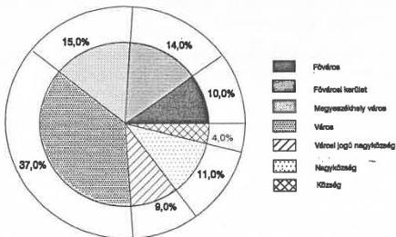

---

9. Az önkormányzati szabályozórendszer működése

96

## 9. Az önkormányzati szabályozórendszer működése

### 9.1. A hatályos szabályozórendszer jellemzői

1990-ben, még a tanácsi szabályozás keretei között elkezdődött a gazdálkodás átalakítása. A szabályozó rendszer alappillérévé egy új, a kiadási szinttől elszakadó forrásstrkútura vált. A bevezetett forrásszabályozás alapelvei 1991-ben változatlanok maradtak annak ellenére, hogy 1991-ben a forrásmegosztás változott, amely jelentős forrásátrendeződéshez vezetett. 1991-ben sem történt előrelépés az önkormányzatok és az állami feladatellátás elhatárolásának meghatározásában. Továbbra is az évtizedek óta konzerválódott feladat- és intézménystrkútura határozta meg az éves költségvetéseket.

Az önkormányzatok főbb forrásait az állami hozzájárulás, a személyi jövedelemadó, a Társadalombiztosítási Alaptól átvett pénzek, egyéb önkormányzati források és a hitelek képezték.

Az állami hozzájáruláson belül meghatározó a normatívák alapján elosztott, de felhasználási kötöttség nélkül juttatott állami támogatás. Ezenkívül az önkormányzatok kiemelt fontosságú, valamint nagy költségigényű fejlesztési és rekonstrukciós feladataik megvalósításához cél- illetve címzett támogatást vehettek igénybe. Forráskiegészítő jellegű támogatás az önhibájukon kívül hátrányos helyzetbe került önkormányzatok pályázati rendszerű támogatása is.

A bevételi érdekeltség növelésére 1991-ben életbelépett a helyi adózási rendszer. Az önkormányzatok többsége azonban még nem élt e lehetőséggel, későbbre tervezte a helyi adók bevezetését, amely a források között így nem játszott számottevő szerepet.

Az önkormányzatok forrásainak kiegészítését szolgálhatja az önkormányzati vagyon várható hozadéka. 1991-ben részben törvények hiányában még nem tudták számbavenni vagyonukat, de tapasztalataink szerint a vagyoni helyzet tisztázása után sem várható gyors előrelépés az egyes vagyonrészek hasznosításában.

Az önkormányzati források 75 %-át az állami hozzájárulás és az állam által átengedett adók jelentik. Ezek a források meghatározzák az önkormányzatok pénzügyi helyzetét, ezért fontos, hogy a források helyi allokációja elősegítse a bevételek és kiadások összhangjának megteremtését.

A Kormány a forrásszabályozás működési mechanizmusának bemutatására a szabályozórendszer bevezetésekor, 1991. évi módosításakor és az 1991. évi zárszámadásban sem hozott nyilvánosságra olyan elemzést, amely a forráselosztási rendszer

---

9. Az önkormányzati szabályozórendszer működése

97

hatását településenként, településtípusonként, megyénként bemutatta volna. Az Országgyűlés elé makroszintű számítások, elemzések kerültek.

Az állami hozzájárulás normatívái országos átlagok alapján kerültek meghatározásra. Az egyes önkormányzatok pénzügyi helyzetét viszont az határozza meg, hogy az a normatíva, amelyet a feladatellátásához hozzájárulásként megkapnak, milyen mértékben fedezi tényleges ráfordításaikat. Ezeket az eltéréseket a makroszintű számítások elfedik. A forráseloszlás szisztematikus elemzésének elmaradása, ennek alapján a szükséges korrekciók hiánya azt eredményezheti, hogy egyes önkormányzatok működése lehetetlenné válik, míg mások a forrásbőség adta lehetőség miatt – az általános gazdasági problémák közepette pazarlónak minősíthető gazdálkodást folytathatnak.

Az Állami Számvevőszék az 1991. évi adatok alapján elemzést készített az önkormányzatok forrásstruktúrájáról, kiadásairól, a normatív állami hozzájárulások szóródásairól. Nem rendelkezünk egyedi adatokkal a 3200 önkormányzatról. Jelenleg csak megyénként és településtípusonként összesített adatokkal dolgozhattunk, így ezek az adatok is átlag adatok. Az országos átlagok településtípusonként megbontott átlagai is megmutatják, hogy a forrásszabályozás működtetéséhez, módosításához részletes, elemi adatokra épülő elemzés szükséges.

Az önkormányzatok bevételi és kiadási struktúráján kívül elemzésünkben a településtípusonkénti adatok alapján megvizsgáltuk, hogy a különböző feladatokkal összefüggő állami hozzájárulások normatívái és a ténylegesen felmerülő költségek milyen kapcsolatban állnak egymással, a feladatok finanszírozása tekintetében kimutatható-e eltérés a településtípusok, megyék között.

Az alábbi grafikon az önkormányzatok főbb bevételi és kiadási struktúráját mutatja be településtípusonként.

A grafikon jól szemlélteti, hogy a bevételeknél az állami támogatás és az átengedett bevételek, a kiadásoknál pedig a működési kiadások mértéke a meghatározó, és egymással is szoros kapcsolatot mutatnak. Megállapítható az is, hogy a szoros kapcsolat ellenére arányuk az egyes településtípusok között eltérő. A szabályozó rendszer által elosztott források és a működési kiadások arányának eltérése határozottan a pénzügyi ellátottság különböző mértékére utal.

---

9. Az önkormányzati szabályozórendszer működése

98

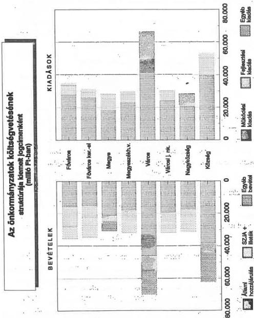

---

9. Az önkormányzati szabályozórendszer működése

99

Az összes forráson belül az egyes források arányát más összefüggésben mutatja az alábbi ábra. Az állami támogatást a bal oldalra rendeztük. Ezáltal a településtípusok között az állami támogatás megoszlása, az összes forráson belül az állami támogatás, az SZJA és a többi forrás aránya is szemléletesen megkülönböztethető.

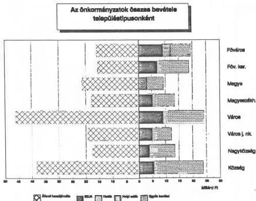

## 9.2. Az állami támogatás szabályozó funkciója

Az alábbi grafikon az állami hozzájárulás jogcímenkénti és településtípusonkénti megoszlását mutatja. A kördiagram mutatja, hogy az állami támogatáson belül az egyes támogatástípusok milyen arányt képviselnek. A vízszintes oszlopdiagram az állami támogatás megoszlását településtípusonként szemlélteti. Feltűnő, hogy a megyei önkormányzatoknál a normatív állami hozzájárulás mértéke kisebb, a címzett támogatás pedig nagyobb a többi településtípushoz viszonyítva. Ennek oka, hogy a korábban megkezdett beruházások befejezéséhez a megyei önkormányzatok kapták meg a címzett támogatások nagy részét.

---

9. Az önkormányzati szabályozórendszer működése

100

## Önkormányzatok állami támogatásának megoszlása jogcímenként

Településtípusonkénti megoszlás

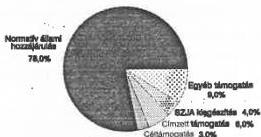

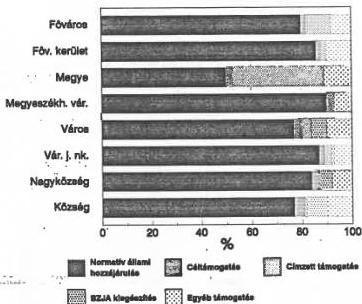

A grafikon jól szemlélteti, - amit ellenőrzéseink is alátámasztanak - hogy a megyei önkormányzatoknál a térségi működési feladatok finanszírozása nem megoldott. Az önkormányzati törvény szerint a megyei és fővárosi önkormányzatok kötelesek körzeti jellegű szolgáltatásokat biztosítani, illetve olyan feladatokat ellátni, amelyekre a települési önkormányzatok nem kötelezhetők. Ezeknek a feladatoknak a finanszírozása jelenleg nem megfelelő, több esetben csak az intézmények működésének rovására oldható meg. Az állami támogatás elosztásának jelenlegi rendszerében ez a terület a legkevésbé átgondolt és mielőbbi újraszabályozást igényel. Problémát okoz az is,

---

9. Az önkormányzati szabályozórendszer működése

101

hogy ha a megyei önkormányzatok által fenntartott intézményeket a helyi önkormányzatok igénybe veszik, ezért legfeljebb a normatív állami hozzájárulásnak megfelelő összeget térítik meg, amely a tényleges költséget rendszerint nem fedezi.

A címzett és céltámogatások az önkormányzatok fejlesztési feladatait segítik. Az alábbi grafikonon településtípusonként összegyűjtöttük az 1991. évi fejlesztési kiadásokat valamint a címzett és céltámogatások összegét. Az arányok jól tükrözik, hogy a megyei önkormányzatok a fejlesztésekhez nem rendelkeznek saját forrással. A város és község esetében a fejlesztési kiadások és a támogatás különbségénél azt is figyelembe kell venni, hogy a relatív forrás bőség miatt ennél a két településtípusnál magasabbak a fejlesztési kiadások.

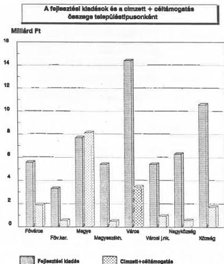

---

9. Az önkormányzati szabályozórendszer működése

102

Az önkormányzatok működési feladataihoz biztosított normatív állami hozzájárulás 149 milliárd Ft-os összegének az egyes normatívák közötti megoszlását szemlélteti a következő kördiagram. Egy-egy normatíván belül a településtípusok részesedését mutatja következő oldalon látható vízszintes oszlopdiagram. E két diagram szemlélteti, hogy a normatívák összegének megváltoztatása, új normatívák bevezetése vagy megszüntetése a településtípusok pénzügyi helyzetét milyen mértékben befolyásolja.

### A normatív támogatás megoszlása

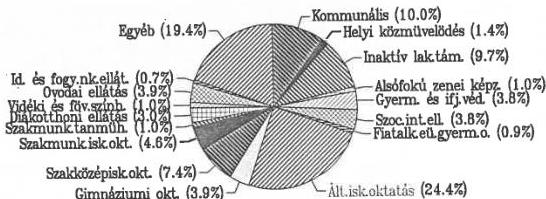

---

9. Az önkormányzati szabályozórendszer működése

103

# A normatívák megoszlása településtípusonként

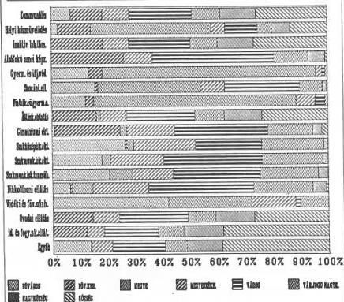

---

9. Az önkormányzati szabályozórendszer működése

104

Az alábbi ábra képet ad arról, hogy a megyék között hogyan oszlik meg a normatív hozzájárulással támogatott feladat teljes ráfordítása és a normatív állami támogatás.

# **A normatív hozzájárulások és a feladatok tényleges ráfordításának aránya megyénként**

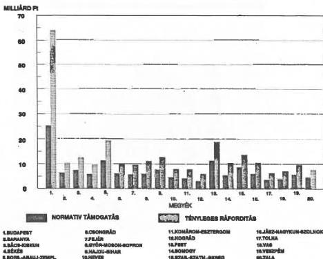

Az alábbi háromdimenziós diagram azt mutatja meg, hogy az egyes normatívákkal támogatott feladatoknál a normatív hozzájárulás és a feladat tényleges költsége (az adott feladattal összefüggő bevételekkel csökkentve) az egyes településtípusoknál hogyan aránylik egymáshoz.

---

9. Az önkormányzati szabályozórendszer működése

105

A 100 %-os arány azt jelenti, hogy az állami hozzájárulás teljes mértékben fedezi a működési költségeket. A 100 % feletti rész tulfinanszírozást jelent, a 100 % alatti rész pedig azt mutatja meg, hogy a településtípus önkormányzatainak más forrásból mennyivel kell kiegészíteniük az állami hozzájárulás összegét a feladat ellátásához.

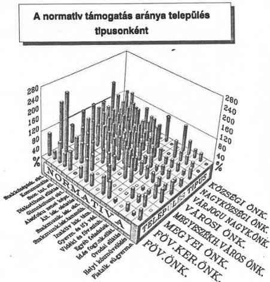

Az ábra áttekintést ad arról, hogy az egyes településtípusoknak különböző mértékben kell kiegészíteniük minden feladatnál az állami hozzájárulás összegét. Ez fordítva is igaz, minden normatívánál eltérő, hogy a településtípusok milyen mértékben egészítik ki a normatíva összegét.

---

9. Az önkormányzati szabályozórendszer működése

106

A településtípusonkénti adatok meglehetősen nagy szóródást mutatnak. Az átlagadatokból jól kivehető tendencia, hogy a községek és a városok pénzügyi helyzete viszonylag jobb. Természetesen a jelentős szóródás miatt, - elsősorban a községek között - számos halmozottan hátrányos helyzetű település is lehet. Egy megye adatait tételesen vizsgálva azt tapasztaltuk, hogy 168 településből - amelyből 150 község - 80 községben a normatív állami támogatás és a feladattal összefüggő bevétel teljes mértékben fedezetet nyújtott a működési költségekre.

Megvizsgáltuk azt is, hogy megyénként az összes normatív hozzájárulás mennyiben fedezi a feladatok kapcsán felmerült költségeket. (Lásd következő oldal) Az országos átlagot jelző vízszintes vonalhoz viszonyítottan megyénként is igen különböző az eltérés a hozzájárulás mértéke és a tényleges költség között.

A normatívákból kiemeltük az általános iskola és az inaktív lakosok normatívált. Megyénként megvizsgáltuk, hogy a tényleges ráfordításokat ( a feladat kapcsán keletkező bevételekkel csökkentve ) milyen arányban fedezi az állami hozzájárulás. Az országos átlagot itt is vízszintes vonallal jelöltük. Az átlag alatti megyéknél a más forrásokból történő kiegészítésre nagyobb mértékben van szükség, míg az átlag feletti megyéknél - ahogy a megyei adat közelít a 100%-hoz - egyre kisebb mértékű kiegészítés szükséges. A 100% feletti arányt mutató megyéknél 'túlfinanszírozás' történik, azaz a feladatra kapott forrásból az önkormányzatok elláthatják az adott feladatot és még más feladatot is finanszírozhatnak belőle. Ezeknél még az egyéb források is szabadon használhatók, hiszen nincsen szükség arra, hogy az állami hozzájárulást kiegészítsék.

---

9. Az önkormányzati szabályozórendszer működése

107

# A feladatok tényleges ráfordításának
és normatív hozzájárulásának aránya megyénként

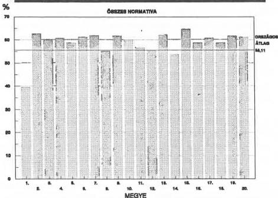

1. BUDAPEST
2. BARANYA
3. BÁCS-IOSKUN
4. BÉKÉS
5. BORL-ÁBÁJ-ZEMPL.

6. CSONORÁD
7. FEJÉR
8. GYŐR-MOSON-SOPRON
9. HAJÓÚ-BINAR
10. HEVES

11. KOMÁROM-ESZTERGOM
12. NÁGRÁD
13. FEST
14. SOMOGY
15. SZAB.-SZATIL.-BEREG

16. JÁSZ-NAGYKUN-SZOLNOK
17. TOLNA
18. VAS
19. VESZPRÉM
20. ZALA

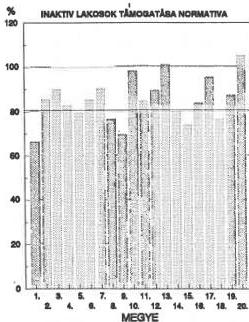

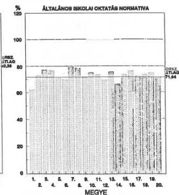

---

9. Az önkormányzati szabályozórendszer működése

108

Az önkormányzatok valós pénzügyi helyzete az összesített adatokból nehezen ítélhető meg. Az megállapítható, hogy az állami hozzájárulás rendkívül nagy szóródással fedezi az egyes feladatokkal kapcsolatban felmerülő költségeket. Az állami támogatás meghatározó mértéke miatt ez a szóródás azt eredményezi, hogy egyes önkormányzatok meglehetősen jó pénzügyi helyzetbe, míg mások a működésképtelenség határára kerülhetnek. Az alábbi grafikonon egymás mellé rendeltük az egyes településtípusok részesedését az országos önkormányzati bevételekből, valamint a működtetési feladatok miatti teherviselést.

Az önkormányzati forrásokból való részesedés és a működtetési feladatokból a teherviselés megoszlása településtípusonként

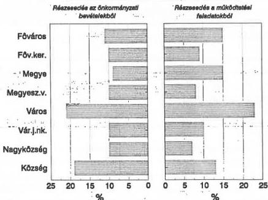

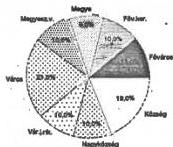

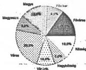

---

9. Az önkormányzati szabályozórendszer működése

109

Annak ellenére, hogy a bevételeknél és a kiadásoknál összegében más a viszonyítási alap, településtípusonként az arányok eltérése jól mutatja, hogy a bevételek és a működtetési feladatok kiadásai melyik településtípusnál nincsenek összhangban. Feltűnő a különbség a községeknél, amelyeknél az országos forrásokból való részesedés lényegesen meghaladja a működési kiadásokból való részesedést. A megyei önkormányzatok alulfinanszírozása e diagram alapján is megállapítható. Figyelmet érdemel, hogy a főváros és a fővárosi kerületek között a forrásmegosztás a kerületek javára több forrást biztosít. Ugyanez állapítható meg a normatívákat és a költségeket összehasonlító térdiagram alapján is.

Összegezve megállapítható, hogy az önkormányzatok normatív állami hozzájárulásának jelenlegi rendszere nem alkalmas forma a meghatározó mértékű forrás reális, a valós szükségleteket tükröző elosztására. Ellentmondásos a normatívák nagy száma és a felhasználás nagyfokú szabadsága. E feltételek mellett az elszámolási kötelezettség előírása – amely nem egyértelmű és pontosan nyilvántartható mutatószámrendszeren alapul – megkérdőjelezhető. Az elszámolási kötelezettség előírását az is kérdésessé teszi, hogy általában nem, vagy nem kellően szankcionált a jogosulatlan igénybevétel.

Az elaprózott normatív támogatás helyett célszerű lenne olyan rendszer kidolgozása, amely településtípusokhoz kapcsolódva az állandó lakosok számához igazodva határozná meg az állami hozzájárulás mértékét. Ennek kidolgozásához részletes elemzés szükséges. Az eddig végzett számításaink azt mutatják, hogy a településtípusonként megállapított, a lakosok számához igazított normatíva nem okozna nagyobb szóródást, mint ez a meglehetősen komplikált rendszer.

A jelenlegi szabályozó rendszer és az önkormányzati törvény között alapvető ellentmondás van. A költségvetési törvényben elszámolási kötelezettséggel terhelt normatíva felhasználását az önkormányzati törvény feloldja, mivel azt nem feltétlenül az önkormányzat által kötelezően ellátandó feladatokra kell felhasználnia. Vagyis indokolt a normatív állami hozzájárulás rendszerének áttekintése és olyan módosítása, amely az önkormányzatok gazdálkodási felelősségét növelné, az elszámolást racionális mederbe terelné.

---

10. A Társadalombiztosítási Alap és a költségvetés kapcsolatrendszerének alakulása

110

# 10. A Társadalombiztosítási Alap és az állami költségvetés kapcsolatrendszerének alakulása 1991-ben

Az állami költségvetés 1991. évben a Társadalombiztosítási Alapnak az alábbi jogcímeken utalt át összegeket:

|  I. Megtérítések | Előirányzat |   | 1991. évközi mód. M Ft | Teljesítés M Ft | Módosítás jogcímei  |
| --- | --- | --- | --- | --- | --- |
|   |  M Ft 1990/CIV.tv. | M Ft 1991/III.tv.  |   |   |   |
|  1. A TB 1989. évi zárszámadásához kötődő visszatérítés | 1.600 | 0 | 0 | 1.600 |   |
|  2. A családi pótlék folyósítási költsége - 1990. évi költségek - 1991. ' | 300 400 | 300 400 | 293 0 | 293 300 | 1991/XXXVI.tv.  |
|  3. Politikai rehabilitáció címén nyugdíjkieg. - 1990. év után - 1991. év után | 500 1.845 | 0 2.345 | 219 0 | 219 2.168 | 1991/XXXVI.tv.  |
|  4. Az 1990. évben fizetett csal.pótl. tart. kamata | 3.500 | 3.500 | 0 | 3.500 |   |
|  5. Gyógyszertérít.díjem. elhalszt. kiadtöbbl. 1990-ben | 300 | 0 | 401 | 401 | 1991/XXXVI.tv.  |
|  I. Összesen | 8.445 |  |  | 8.481 |   |
|  II. Az 1990. évre garant. korrigált bev.többlet | 5.120 | 0 | 4.035 | 4.035 | 1991/XXXVI.tv.  |
|  I+II. Összesen | 13.565 |  |  | 12.516 |   |
|  - Alacsony összegű nyug.eil.-ban rész. kieg.tám. | 0 | 0 | 1.300 | 1.300 | 1991/XLVI.tv.  |
|  - A gyógyszertér. díjem. elhalszt.miatt kel. kiadtöbbl. 1991.V.2-ig | 0 | 0 | 867 | 867 | Korm.hat.  |
|  Összesen: | 13.565 |  |  | 14.683 |   |
|  Csal.pótl.tart. törl.privatizációs bevételt (1989/XLVIII.tv.) | 0 | 0 | 0 | 12.000 26.683 | 1991/XCI.tv.  |

---

10. A Társadalombiztosítási Alap és a költségvetés kapcsolatrendszerének alakulása

111

# 10.1 A költségvetési törvényben előirányzott megtérítési kötelezettség alakulása

A megtérítési és garanciavállalási kötelezettség sajátosan keveredik a szabályozásban, ami az elvi elhatárolás hiányára utal.Az 1990.évi CIV. törvény 2.paragrafus 1.pontja az 1990.évi garantált bevételi többletre 5.420 millió forint állami hozzájárulást irányzott elő a Társadalombiztosítási Alap javára.E garantált bevételi többlet a törvény 1.sz.mellékletében a megtérítések között szereplő gyógyszertérítési díjak elhalasztása miatt felmerült kiadási többlet (300 millió forint) összegét is tartalmazta. Ezáltal a 2.paragrafus 2.pontjában a megtérítési kötelezettségek 8.145,5 millió forint összegű előirányzata korrigáltan, 8.445 millió forint, amelynek főbb tételei a következők:

- A költségvetés a megtérítési kötelezettség részeként 1991. március 5-én utalta át az 1990. évben a Társadalombiztosítási Alap által megelőlegezett 14.722 millió forint családi pótlék tartozás 3.500 millió forintos kamatát. Az 1989/XLVIII. törvényben foglaltak szerint 1992. december 31-ig a tartozást a legmagasabb lakossági betéti kamattal növelten kell megfizetni. Az ÁSZ vizsgálata az érintett szerveknél - Országos Társalombiztosítási Felügyelőség, Pénzügyminisztérium - nem talált számítást arra, hogy a visszafizetendő összeg mennyiben felel meg a "legmagasabb" kritériumnak.

- A családi pótlék folyósításának költségei megtérítésével kapcsolatos szabályozás eltérő a költségvetési és a társadalombiztosítási törvényekben. A Társadalombiztosítási Alap költségvetésére vonatkozó 1991.évi III. törvény a folyósítás összegét a családi pótlék 0,5 %-ában határozza meg. Az 1990.évi CIV. törvény tételes elszámolás alapján a 400 millió forintos előirányzat megtérítésére. Az eltérő törvényi szabályozás az érintett szervek között vitás helyzetet teremtett, ami egységes szabályozással elkerülhető lett volna.

E vitás helyzethez hozzájárult, hogy míg az 1990. évben folyósított családi pótlék átutalásakor a költségvetésaz Országos Társadalombiztosítási Felügyelőség számításait elfogadva döntött a 293 millió forint átutalásáról,az 1991. évi hasonló elven alapuló becslésre épült elszámolási módot elutasította.

A 400 millió forint megtérítéséhez 1991-ben a tételes elszámolás nem készült el az ÁSZ vizsgálata lezárásáig.

A költségvetés a jogszabályoktól eltérő harmadik megoldásként az igazgatóságok által folyósított családi pótlék hányad 1 %-ában meghatározott 300 millió forintot utalt át. Az előirányzat (400 millió) és a teljesítés 300 millió közötti 100 millió Ft nem megtakarítás, hanem ennyivel kevesebbet utalt át a költségvetés a

---

10. A Társadalombiztosítási Alap és a költségvetés kapcsolatrendszerének alakulása

112

Társadalombiztosításnak. A 100 millió Ft megtérítésével a Társadalombiztosítás zárszámadási törvénye számol a hiányok rendezésével kapcsolatban. Hasonló az eltérés az 1992. évi szabályozásban is a Társadalombiztosítási Alap és az állami költségvetés között. Az elszámolás egységes, végrehajtható jogszabályi rendezése azért is indokolt, mert a társadalombiztosítás úgynevezett profiltisztítása során növekszik a Társadalombiztosítási Alap részét nem képező, de általa folyósított állampolgári juttatások köre (anyasági ellátások, politikai rehabilitáltak nyugdíjkiegészítése).

— A politikai rehabilitáltak nyugdíjkiegészítése 1990-ben felmerült összege megtérítésére az 1990.évi CIV. törvény 500 millió forintos előirányzata lényeges eltérést mutat a teljesített 219 millió forinttól. Ennek az az oka, hogy a Társadalombiztosítási Alap 1990. évi zárszámadása időpontjában a kifizetésekkel kapcsolatos több ezer ügyben még nem született döntés és határozat.

— A politikai rehabilitációs nyugdíjkiegészítés 1991. évi megtérítésénél ugyancsak eltérés van az állami költségvetés és a Társadalombiztosítási Alap között. Míg az Alap 1991. évi III. törvénye és az e törvényt módosító 1991/LXXIV. törvény a politikai rehabilitációval összefüggő nyugdíjkiegészítés címén 2.345 millió forintot irányzott elő, az 1990. évi CIV. törvény 1.845 millió forintot. Az eltéréshez hozzájárult, hogy az 1991. évi költségvetési törvény készítése időszakában nem volt ismeretes, hogy az 1991. évi kifizetéseket mennyiben érintik az 1990. évi áthúzódások. A tényleges kifizetéseket a költségvetés térítette az Alapnak, így a költségvetés 1991. évi átutalása e címen 2.168,5 millió forint volt. A Társadalombiztosítás 1991. évi tényleges kifizetése azonban 2.443,5 millió Ft volt, a 275 millió Ft kiadási többlet átutalására 1992. áprilisában került sor. A szabályozásban mutatkozó különbségeket a költségvetési és társadalombiztosítási előirányzatok és a végrehajtásuk egyidejű Országgyűlés elé terjesztése az államháztartási törvény alapján vélhetően megszünteti.

### 10.2. A költségvetés Társadalombiztosítási Alappal szemben fennálló garanciális kötelezettségének alakulása.

A költségvetés a társadalombiztosítással kapcsolatos garanciális kötelezettségét az 1975. évi II. tv. valamint az éves költségvetési és társadalombiztosítási törvények ellentmondásosan szabályozzák.

— Az 1975. évi II. tv. szerint az állami költségvetés garanciát vállal minden olyan társadalombiztosítási kiadásra, amelyekre a bevételek nem nyújtanak fedezetet:

---

10. A Társadalombiztosítási Alap és a költségvetés kapcsolatrendszerének alakulása

113

“A bevételeket meghaladó kiadásokat az állam fedezi.” - 1989-ben a garancia érvényesítésére nem került sor, mert a társadalombiztosítás jelentős bevételi többletet realizált.

- Az 1990. évre vonatkozó törvényi szabályozás (1989. évi XLVII. tv.) szerint pedig ha a bevételi többlet nem éri el a kiadási főösszeg 1,2 %-át, annak mértékéig ki kell egészíteni. Csak fenntartással érvényesíti a garanciát az 1991. évi törvényi szabályozás. A vállalt garancia ugyanis nem keletkeztet fizetési kötelezettséget akkor, ha a fedezethiány abból ered, hogy a be nem hajtott követelések állománya - ide nem értve a felszámolás miatt végleg behajthatatlanná vált követeléseket - meghaladja a december 31-én fennálló összeget. Mivel 1991. december 31-én a követelések állománya több mint kétszerese (55 milliárd forint) az előző évinek, a Társadalombiztosítási Alap 22 milliárd forint deficitjét tartalékai terhére kénytelen finanszírozni. A zárszámadás nem tér ki a Társadalombiztosítási Alap jelenlegi anyagi helyzetében nem közömbös behajthatatlanná vált követelések összegére, amit a törvény értelmében a költségvetésnek kell vállalnia. - A garancia tovább szűkül az 1992. évre vonatkozó törvényi szabályozással, amely során az 1991. évi XCI. törvény már csak a Nyugdíjbiztosítási Alap esetében a kiadások 1 %-a erejéig érvényesíthető, az Egészségbiztosítási Alapra pedig egyáltalán nem vonatkozik. A Társadalombiztosítási ellátások folyamatos teljesítését 1992-ben az állami forgóalaphoz kapcsolt, és elvileg csak a nyugdíj megelőlegezéséhez felhasználható hitelszámla kamatmentes igénybe vétele tette lehetővé. Mivel az ÁSZ vizsgálat időszakában a Társadalombiztosítási Alapok közötti megosztás csak formális volt, nem bizonyítható, hogy a Nyugdíjmegelőlegezési Számla igénybevételére milyen okból került sor. Megjegyezzük, hogy - a Társadalombiztosítási Alap 1992. évi törvényi szabályozása ellenére - változatlanul egy alapszámla van.

### 10.3. Az 1990. évi CIV törvényben előirányzott garanciális kötelezettség teljesítése

A megtérítési és garanciális kötelezettség elvi szétválasztásának hiánya a szabályozásban egybemosódásokhoz, értelmezési zavarokhoz vezetett. Ez megmutatkozik Társadalombiztosítási Alap 1990. évi zárszámadásával kapcsolatos 1991. évi XXXVI. törvényben is, amely tételesen felsorolja, hogy a garanciális kötelezettség terhére mely címeken történt megtérítés.

---

10. A Társadalombiztosítási Alap és a költségvetés kapcsolatrendszerének alakulása

114

A költségvetés garanciális kötelezettsége alapján a Társadalombiztosítási Alap 1990. évi bevételi többlete 5.420 millió forint előirányzatát és a teljesítés alakulását az alábbi táblázat mutata be:

A Társadalombiztosítási Alap 1990. évre garantált bevételi többlete előirányzatának és teljesítésének alakulása 1991-ben

|  Garantált bevételi többletből eszközölt megtérítések jogcímei | előirányzat millió Ft (1990. évi CIV. tv.) | teljesítés millió Ft (1991. évi XXXVI. tv.)  |
| --- | --- | --- |
|  1. Gyógyszerek 1990. ápr. 1-jel térítési díjemelés elhalasztása | - | 401  |
|  2. Politikai rehabilitációs nyugdíjkiegészítések | - | 219  |
|  3. A családi pótlék folyósítási költsége | 300 | 293  |
|  4. A bevételi többletből adódó térítésekkel korrigált támogatás | 5.120 | 4.035  |
|  Bevételi többlet összesen: | 5.400 | 4.948  |

A Társadalombiztosítási Alap 1990. évi költségvetése végrehajtásával kapcsolatos 1991. évi XXXVI. tv-ben a 4.948 millió forintban meghatározott költségvetési garanciális kötelezettség összetevői a következők:

— a Társadalombiztosítási Alap 1991. évi kiadási főösszege 1.2 %-a 4.329 millió forint,

— az Alap 1990. évi 619 millió forintos hiánya. A garanciális kötelezettség keretében teljesített összeg az előirányzatnál 472 millió forinttal, megtérítésekkel korrigáltan pedig 1.084 millió forinttal alacsonyabb, eltér a zárszámadás 972 millió forintos közölt adatától.

#### 10.4. A költségvetési támogatások teljesítése

— Az 1991. évi XXXVI. tv. értelmében a költségvetés Társadalombiztosítási Alappal szembeni garanciális kötelezettségére előirányzott összeg maradványa teremtett fedezetet a gyógyszer térítési díj emelés elhalasztása miatti 1991. év május 2-áig keletkezett többletkiadások 867 millió forintos ellentételezésére.

---

11. Elkülönített állami pénzalapok

115

A Társadalombiztosítási Alappal szembeni támogatási előirányzat összegét a kétszeri rendkívüli nyugdíjemelés 1.300 millió forintos összege módosította. Ennek fedezetét az energia áremelés többletterhei ellentételezésével kapcsolatos 1991. évi XLVI. tv. teremtette meg. A költségvetés Társadalombiztosítási Alap számára folyósított közvetlen támogatása ezáltal 1.112 millió forinttal haladta meg az előirányzatot, amelynek fedezetét e törvény biztosította.

## 11. Elkülönített állami pénzalapok

Az elkülönített állami pénzalapok 1991. évi költségvetési támogatása a zárszámadás szerint megközelítően az előirányzat szerint alakult (98 %).

Az alapok működési rendszerének átfogó rendezésére az új ÁHT életbe lépését követően, 1993-ban kerül sor. Így az elkülönített állami pénzalapok elmúlt évi szabályozásában, működésében és gazdálkodásában a korábbi évek gyakorlatához képest lényeges változások nem történtek. Változatlanul jellemzőek voltak az ÁSz vizsgálatai alapján már többször jelzett hibák, hiányosságok, ellentmondások. Szabályozásuk tovább bonyolódott. Minden szinten – törvény, törvénymodosítás, országgyűlési és kormány határozattól a szakágazati utasításokig – készültek az alapokra vonatkozó szabályok, új alap létesítéséről, működő alapok pénzeszközeinek módosításáról, átcsoportosításáról, régi alapok megszüntetéséről.

Az ÁSz törvényes kötelezettsége a közpénzek felhasználásának törvényességén és szabályosságán túlmenően annak célszerűségét, gazdaságosságát is vizsgálni. A meghatározott feladatok megvalósítására létrehozott állami pénzalapok ráfordításainak célszerűségét azonban sem helyszíni vizsgálatok, sem a zárszámadás tartalmi és számszaki ellenőrzése során a jelenlegi beszámolási rendszer alapján érdemben megítélni nem lehet.

Az alapokról vezetett nyilvántartások, szöveges és számszaki beszámolók a pénzfolyamatokat rögzítik, és az egyes alapok létrehozását indokoló konkrét feladatok végrehajtásáról, az adott célra történő ráfordításokról nem, vagy hiányosan adnak számot. A forrásképzés ellenőrzése, különösen az alapok egymás közötti forgalma nehezen követhető. (Pl.: más alapoktól való végleges, vagy ideiglenes forrásátvétel, átadás, az átvevő, átadó alap megjelölése nélkül.)

A zárszámadás ellenőrzése során igazolódott, hogy az új ÁHT érvénybe lépését követően is maradt az elkülönített állami pénzalapok gazdálkodásával, szabályozásával összefüggő, további megfontolást, a későbbiekben jogi rendezést igénylő kérdés.

---

11. Elkülönített állami pénzalapok

116

### 11.1. Elszámolás a megszűnő állami alapokkal

A kormány 1990. novemberében belső határozatban döntött a Szanálási Alap megszüntethetőségéről, és a Felszámolási Alap megszüntetéséről. Az 1991. évi költségvetési javaslatban már egyik alap sem szerepelt.

Ennek ellenére a Felszámolási Alapra 1990. év végén 700 millió forint megalapozatlan, az ÁSz által túlfinanszírozásnak minősített (1990. évi zárszámadásról szóló ÁSz jelentés) támogatás kiutalása történt. Az 1991.évi zárszámadás sem az előzőkben említett 700 millió forintról, sem a Szanálási Alap 1990. évi záróállományáról - 390 millió Ft - elszámolást nem tartalmaz. Ezért a továbbiakban részletezett megállapításokat is figyelembe véve az elkülönített alapokról készült 1991. évi zárszámadás nem tekinthető teljeskörűnek.

A hivatkozott határozat ellenére 1991. évben a Szanálási Alapon jelentős pénzmozgások voltak.

#### 11.1.1. Az ÁSz 1992.évben végzett vizsgálata során a Szanáló Szervezet megszüntetése és a REORG Rt alapítása kapcsán ellenőrizte a kapcsolódó pénzforgalmi számlákat is. A Szanálási Alap 1991. decemberi számláján, az éves forgalmat tartalmazó adatok a következők voltak:

Kezdő állomány: 533,494 M Ft

Kiadási forgalom: 7.541,421 M Ft

Bevételi forgalom: 7.144,669 M Ft

Záró állomány: 136,692 M Ft

A költségvetési zárszámadás a Szanáló Szervezet gazdálkodásáról ad csupán számot. A Szanálási Alap forgalmáról a Szanálási Szervezet beszámolója nem tesz említést.

A Szanáló Szervezet 1991. évi beszámolója szerint 22,1 millió forint eredeti bevételi előirányzatával szemben 53,5 millió Ft-tal, kiadásaiban 21,7 millió forint eredeti előirányzatával, és 73,5 millió forint módosított előirányzatával szemben ténylegesen 66,1 millió forinttal gazdálkodott.

Bár a Szanáló Szervezet 1991. december 31-én megszűnt, vezetőjét a pénzügyminiszter felmentette, az újonnan létrejött, a szervezet feladatait átvevő Reorg Rt. vezetője - a Szanáló Szervezet korábbi igazgatója - a Szanálási Alap számlája

---

11. Elkülönített állami pénzalapok

117

felett rendelkezési joga nem volt és 1992-ben még összesen 965,137 millió forint kiadási forgalom tekintetében intézkedett jogosulatlanul.

Az ÁSZ vizsgálat alapján 1992. júliusában, javaslat születettöb-bek között arról, hogy a Szanálási Alap bevételeit és kiadásait a PM a mérje fel, és ennek alapján határozzák meg kihatásait az állami költségvetésre.

11.1.2. Az 1990. évi költségvetés végrehajtásának ellenőrzése kapcsán az évvégi kifizetések jogosságát, szabályszerűségét mérlegelve a Felszámolási Alapnál az év végén 700 millió forint támogatás kiutalása megalapozatlan túlfinanszírozásnak minősült. Az összeg további sorsára vonatkozóan sem az 1991. évi költségvetési javaslat, sem az 1991. évi zárszámadás nem ad információt. (Az APEH elkülönített állami pénzalapok forgalmáról készített 1991. I. félévi összegezése tartalmazza a Felszámolási Alapot. Nyitó és záróállománya 700 millió forint volt, bár az adott időszakban pénzforgalom nem volt az alapon.)

## 11.2. Világkiállítási Alap

Az ÁSz 2325. sz. véleményében, - amelyet az 1991. évi költségvetési folyamatok alakulásáról szóló kormánybeszámolóhoz adott - többek között kifogásolta, hogy a Világkiállítási Programiroda működési kiadásainak fedezetére 50 millió forintot a Világkiállítási Alapról terveztek átvenni. Ezzel a Világkiállítási Iroda és az Alap bevételei és kiadásai nem különíthetőek el. Javasoltuk, hogy az Iroda olyan részletes költségtervet mutasson be, amelyek alapján az előbbi tételek elkülöníthetőek. Tehát az Iroda és az Alap előirányzatainak módosítására a tényleges feladatok ráfordításigényei alapján kerüljön sor.

Mivel a Számvevőszék javaslatának realizálására nem került sor, a Világkiállítás megrendezésével kapcsolatos két intézmény - a Világkiállítási Programiroda és a Világkiállítási Alap - működésének szabályozása, pénzellátása, pénzforrásai alig követhetőek, számos átfedést tartalmaznak. Ugyanakkor az Alapot létesítő 80/1990.(IV.27.) Mt.számú rendeletben, valamint annak módosításaiban megfogalmazott konkrét feladatok (Pl.: a Világkiállítás területének előkészítése, kapcsolódó létesítmények, a Magyar Honfoglalás 1100. évfordulójával kapcsolatos kulturális és sportrendezvények előkészítése stb.) megvalósításának állásáról, az 1991. évi kapcsolódó ráfordításairól a törvényhozók áttekintést nem kapnak.

---

11. Elkülönített állami pénzalapok

118

Az ÁSz a Világkiállítási Programiroda elmult évi 151,6 millió forint, és a Világkiállítási Alap 60 millió forintos kiadásainak törvényességét, szabályosságát ellenőrizte.

A jelenlegi nyilvántartási és beszámolási rendszer azonban nem alkalmas a konkrét feladatokkal összefüggő ráfordítások áttekintésére, azok célszerűségének, gazdaságosságának megítélésére.

### 11.3. Útalap

Külön említést érdemel az Útalap működése. A XIII. fejezet 4. cím tartalmazza a 2/1991. KHVM utasítás alapján 1991. január 1-jén alapított Közúti Igazgatóságok zárszámadását.

A korábbi 9 területi igazgatóságot megyei igazgatóságokká szervezték át, amelyek eredményérdekeltségű gazdálkodást folytatnak. A megyei igazgatóságok alaptevékenységeinek (útügyi igazgatás, útkezelés, üzemeltetés, útfenntartás, utak fejlesztése) fedezetül az Útalap szolgál. Az Útalapból származó bevételeik saját bevételként szerepelnek, amelyek az eredeti előirányzatot csaknem 60 %-kal meghaladták, mivel az év elején az Útalapra történő befizetési díjak emelkedtek. Az igazgatóságok bevételei 75 %-át, kiadásai 81 %-át képezi az Útalap, vállalkozási tevékenysége 18, ill. 20 %-ot képvisel. A jelentős többletbevétel (3.404 millió forint) feltétlenül indokolta volna a részletes elszámolást azokról a többletfeladatokról, amelyek elvégzésére ezáltal sor kerülhetett. A közúti- és autópálya igazgatóságok esetében célszerű lenne külön, kiemelt előirányzatként meghatározni a szervezetek fenntartási költségeit. Esetükben megvalósítható, ezért különösen indokolt lenne, ha a költségvetési előirányzatokat konkrét feladatokra terveznék.

### 11.4. 'Felzárkózás az európai felsőoktatáshoz' Alap

A XVIII. fejezet előirányzatai között a meghatározott célra fordítható 1991-94. közötti időszakban 66 millió USA $ + 4 milliárd Ft (ez utóbbit vissza nem térítendő támogatásként nyújtja a költségvetés a pályázatokon nyert intézményeknek) arányos része állt rendelkezésre.

Az Alap 1991. évi 1.129,9 millió forint forrásaiból mindössze 55,5 millió forintot használt fel. Az alapkezelő XVIII. fejezet 19/1.3. címén szerepelt továbbá az Alappal azonos célokra további 500 millió Ft-os előirányzat, amelyből a teljesítés 233 millió Ft volt.

---

11. Elkülönített állami pénzalapok

119

A zárszámadásban sem az alapon, sem a nevezett költségvetési címen nem indokolják a csekély felhasználást, és nincs szó a pénzforrások későbbi felhasználásának - 1992-94. közötti - ütemezéséről sem.

### 11.5. Foglalkoztatási alap

A zárszámadásban szereplő gazdálkodásról készült beszámolóban a kiadások elszámolása és megnevezése nehezen kezelhető, több tételt nem lehet beazonosítani. Az Alapot az Állami Számvevőszék 1992-ben vizsgálja, tapasztalatainkról önálló jelentésben számolunk be.

Az 1990. évi zárszámadás ellenőrzése kapcsán megállapítottuk, hogy a Foglalkoztatási Alap részére - annak dokumentált igénylése nélkül - év végén 1,5 milliárd Ft kiutalására került sor, továbbá az Alap nyitóállományának jelentős eltérését az előző évi záróállománytól. Ennek kapcsán az Országgyűlés határozatban kérte fel a pénzügyminisztert a Foglalkoztatási Alap 1990. évi bevételeire és kiadásaira vonatkozó részletes beszámoló elkészítésére. Az elszámolás a megjelölt határidőre elkészült és azt az Országgyűlés Költségvetési, adó- és pénzügyi bizottsága tudomásul vette.

### 11.6. Befektetési Alap

Az Alap gazdálkodásáról készült zárszámadás adatainak helyessége helyszíni vizsgálatunk alapján éppúgy, mint a zárszámadás tartalmi és számszaki ellenőrzése eredményeként kétségbe vonható.

#### 11.6.1. Az ÁSZ helyszíni vizsgálat keretében megállapította, hogy a Befektetési Alap beszámolójában közölt kiadási összeg nem felel meg a tényleges teljesítésnek. A NGKM kezelésében lévő 1,5 milliárd forint költségvetési támogatásból gazdálkodó Alapról megfelelő nyilvántartási rendszer nem került kialakításra és a számlavezető pénzintézet információi sem voltak napra készek.

Az Alap mérlegbeszámoló szerinti kiadása 1.200 millió forint volt, amely ténylegesen az ÁFI, mint pénzkezelő részére átutalt összeget jelenti. A tényleges felhasználás összege csak 683,5 millió forint volt.

#### 11.6.2. A Befektetési Alapnak költségvetési zárszámadásban szereplő elszámolása a helyszíni ellenőrzés eredményétől további eltéréseket tartalmaz: ezek szerint az Alap éves kiadásainak összege 1.496 millió forint záróállománya 24 millió forint

---

11. Elkülönített állami pénzalapok

120

volt. Meglehetősen magas a "Függőben van a pénzügyi források dokumentálása miatt + kezelési költség" 152,3 millió forint összege, amelyet nem indokoltak.

### 11.7. A Lakásalap

A Lakásalap kiadási előirányzata 71,3 milliárd Ft (a IV. kötet 54. oldalán tévesen 91,3 milliárd szerepel), amely az év során 58,2 milliárd Ft-ra teljesült.

A kiadások mérséklődésének okai:

- Lakásalap fedezeti kötvény visszavásárlására 1 milliárd Ft-ot terveztek, azonban 1991-ben nem kellett ilyen kötvényt visszavásárolni. A Lakásalap kötvény kamattérítésére 72,6 milliárd Ft-ot terveztek, de a kamat és a kötvényállomány vártnál nagyobb csökkenése miatt - ténylegesen csak 54,9 milliárd Ft-ot fizettek ki,
- a privatizációs bevételből tervezett Lakásalap kötvény visszavásárlás sem teljesült, emiatt az ebből származó 8,5 milliárd Ft tervezett kamatmegtakarítás nem realizálódott. Ennek számításba vétele teljesen megalapozatlan volt, mivel már 1991. év elején - 34 %-os kamatot feltételezve - 25 milliárd Ft kötvényt kellett volna vásárolni. Az egész évben realizálódó privatizációs bevétel 31 milliárd Ft volt.

A Lakásalap bevételei - 58,2 milliárd Ft - is elmaradtak az előirányzattól (71,3 milliárd Ft).

A nagymértékű hitelvisszafizetések miatt a kamatbevétel 22,5 milliárd Ft-os előirányzatával szemben csak 12,6 milliárd Ft realizálódott. A költségvetési támogatásból az előirányzott 38,8 milliárd Ft-ból csak 30,6 milliárd Ft került átutalásra. A forrásadó és az egyéb bevételek viszont a tervezettet meghaladó mértékben emelkedtek.

A pénzintézetek részéről az 1991. évvégi elszámolás és a hitelállomány közlése megtörtént, a végelszámolás azonban a vizsgálat befejezéséig még nem készült el. Ennek oka, hogy még év végén is nagy számban fizették vissza a kedvezményes hiteleket.

Az Alap elszámolásának rendezését az előzőeken kívül még létszám problémák, valamint a Pénzügyminisztérium és a pénzintézetek között vitás kérdések is nehezítették.

---

11. Elkülönített állami pénzalapok

121

A behajthatatlan hitelek összege 1991-ben 6,5 millió Ft volt, ami a következő években növekedhet. Az OTP által tévesen kiszámolt tartozások miatt a lakosság részére 200 ezer forint túlfizetés mutatkozik. Ennek visszafizetéséről is gondoskodni kell, de még nem eldöntött, hogy milyen pénzügyi konstrukcióban.

Az előbbiek alapján nem határozható meg, hogy a költségvetést a már ismert támogatási igényeken felül még mekkora összeg terheli. Összefoglalóan megállapítható, hogy a Lakásalap elszámolása, az Alapot kezelő szervezet megszüntetése nem volt megfelelően előkészítve. A pénzügyminiszter a Kormány által 1992. május 31-éig előírt beszámolási kötelezettségének még mindig nem tett eleget, mivel a végelszámolás, illetve az átadás csak az egyeztetés szintjén áll.

### 11.8. Az alapok elszámolásáról készített beszámolók ellentmondásai

Több alapnál előfordul, hogy az alapkezelő fejezetnél a beszámoló költségvetési támogatást tartalmaz annak ellenére, hogy az alapok gazdálkodásáról készült összegezésben az adott Alap esetében ilyen támogatás nem szerepel.

- A XIII. fejezet kezelésében lévő Vízügyi Alap bevételei között 60 millió Ft költségvetési támogatás szerepel a Fejér megyei közüzemi ivóvízszolgálati lakossági díjakhoz nyújtott pótlólagos árkiegészítés fedezetére. Sem a szöveges indoklásban, sem az elkülönített alapok gazdálkodásáról készült összegező táblázatban nem szerepel a jelzett támogatás, kormányhatározatra, vagy egyéb rendelkezésre, forrására utaló információ nincs.
- Az előzőekben említettel azonos eset az FM fejezet által kezelt Erdőfenntartási Alap bevételei között szereplő 100 millió Ft költségvetési támogatás.

### 11.9. Az alapok pénzkezelésének szabályossága

A fejezetek helyszíni ellenőrzése kapcsán az egyes fejezetek által kezelt alapok gazdálkodásának áttekintésére is sor került. Összességében megerősíthető az ÁSZ korábbi vizsgálatainak tapasztalatai. Az alapok létrehozásával, rendeltetésével, felhasználásával kapcsolatos pénzügyi műveletek jelentős része a költségvetési gazdálkodás szabályaival ellentétes volt.

- A Kultúrális Alap (forrása: kultúrális járulék, költségvetési támogatásban nem részesül) pénzeszközeiből értékpapírt vásárolt, amelynek kamata 45,1 millió forinttal gyarapította az Alap állományát.

---

11. Elkülönített állami pénzalapok

122

— A Művelődési és Közoktatási Minisztérium Kutatási Alap (forrása: a maradványérdekeltségű szervek vállalkozói tevékenységéből származó befizetési kötelezettség) kutatási célra mindössze 39 millió forintot használt fel, kiadásainak közel 70 %-át értékpapír vásárlásra fordította, kamataiból gyarapodott 31,8 millió forinttal.

— A Miniszterelnöki Hivatal Tudománypolitikai Alap számlájáról tartós betétet helyeztek ki.

A PM a Miniszterelnöki Hivatalnak 50 millió forintot átutalt a Teleki Alapítvány javára, amelyet az nem használt fel. Ezt az összeget a Miniszterelnöki Hivatal átutalta a Tudománypolitikai Alap számlájára. Az Alap az összeget áprilistól novemberig bankban helyezte el és csak ezt követően került visszautalásra a fejezeti költségvetési számlára. Ezzel a fejezet megkerülte azt a tiltó intézkedést, hogy a költségvetési számláról nem helyezhető ki tartós betétbe pénzeszköz. A 11,5 millió forint kamatot a Miniszterelnöki Hivatal maradvány számlára könyvelték, azt a fejezet nem az eredetileg megjelölt Teleki Alapítvány céljára használta fel.

11.10. Sem a CIV. törvény, sem a végrehajtására készült 4/1991. (II.) PM rendelet nem szabályozta külön az államháztartás egyes alrendszereire vonatkozóan a garanciavállalás feltételeit, illetve lehetőségeit, csupán a költségvetésre tartalmazott meghatározott kötelmeket.

A későbbi szabályozást illetően külön figyelmet és rendezést igényel, hogy a Kereskedelemfejlesztési Alap 1991. évben 100 millió Ft kiadást könyvelt el a Ganz Danubius esetében tett korábbi garanciavállalása címén.

11.11. Javaslatok az Alapok törvényi szabályozásának felülvizsgálatához

— Az elkülönített állami pénzalapok 1993. évi átfogó rendezése során alapvető követelményként kell érvényesíteni, hogy az újonnan kialakított nyilvántartási és beszámolási rendszer tegye lehetővé a pénzforrások feladatcentrikus tervezését, felhasználását és ellenőrzését.

— A Kormány garanciavállalásának pénzügyi határait (mértékét) nem csupán a költségvetés, hanem az államháztartás minden alrendszerére vonatkozóan – önkormányzatok, Társadalombiztosítási Alap, elkülönített állami pénzalapok – az Országgyűlésnek a költségvetési törvényben célszerű rögzítenie.

---

12. Adósságszolgálat

123

— A Pénzügyminisztérium az elkülönített állami pénzalapok teljeskörű zárszámadásához záros határidőn belül, pótlólag készítse el a Szanálási Alap, a Felszámolási Alap és a Lakásalap pénzeszközeiről, illetve azok forgalmáról az 1991. évi elszámolást.

## 12. Adósságszolgálat

### 12.1. A z állami költségvetés belföldi államadósság fejezet 1991. évi kiadási előirányzata (110,1 milliárd Ft) 107,1 milliárd Ft-ra, a bevételi előirányzat (27,5 milliárd Ft) 31,9 milliárd Ft-ra teljesült.

A kiadási előirányzat kedvező teljesítése több ellentétes hatású tényező eredőjeként alakult ki. - A tervezett összegben teljesült a nem költségvetési hiányt finanszírozó MNB hitelek, az államkötvény adósság törlesztése, az államkölcsön törlesztése stb. kiadási előirányzat.

- — A teljesítés elmaradt az előirányzattól a vállalati forgóalap-juttatási hitelek kamatfizetése, a költségvetési hiányt finanszírozó MNB hitelek esetében, mert az 1991. évi privatizációs bevételekből való törlesztés várható mértéke a tervezés időszakában még nem volt számszűsíthető. Alacsonyabb volt a tervezettnél az 1991. évi hiányt finanszírozó hitelek kamatának (a hitelfelvételre az előirányzottnál később került sor) és az államkötvények kamatának (a II. negyedév helyett csak december 1-jével került kibocsátásra) teljesítése.
- — Az előirányzotthoz képest kisebb összegű túlteljesítésre több kiadási előirányzatnál is sor került; pl. a költségvetésnek továbbkölcsönzött világbanki hitelek kamata előirányzat felett teljesült, mivel a költségvetési törvényben előírt kamatszázalékkal (9%) a világbanki hitelek nem adhatók tovább, a Világbankkal kötött szerződések magasabb kamatokat rögzítenek,

A zárszámadás tartalmaz olyan teljesítési adatokat, amelyeknek nem volt kiadási előirányzata. Ezek egy része tervezési, adminisztrációs hiba miatt következett be, de előfordult olyan eset is, hogy a korábban másutt előirányzott összeg teljesítési adata az új költségvetési szerkezeti rendnek megfelelően került besorolásra:

- — A szerkezetátalakítási kötvény adósságtörlesztésére előirányzatot nem terveztek, mivel az előirányzatot megalapozó - a Szanáló Szervezet által a PM-be küldött - igényeket a tervezés során nem vették figyelembe.

---

12. Adósszágszolgálat

124

- A nemzetközi beruházások hiteltörlesztését sem irányozták elő, mivel ezeket a hiteleket az ÁFI-nál kimutatott refinanszírozási hitel költségvetés által történő átvállalásában kellett volna szerepeltetni. A PM-ÁFI szerződés nem jött létre, így a korábbi elszámolási szabályok tovább éltek, de a teljesítés a törvény szellemének megfelelően – a bevételek esetében is – a belföldi államadósságnál került elszámolásra.

A kincstárjegyek kamata és forgalmi jutalékai a tervezett szinten teljesültek, szükséges azonban felhívni a figyelmet arra, hogy az állami értékpapírok (kötvény, kincstárjegy) gyártási és reklámköltségei a PM fejezet egyéb pénzügyi elszámolásai számláról kerülnek kifizetésre, így a belföldi államadósság előirányzatait nem terhelik. Az értékpapírokkal kapcsolatos jutalékok azonban a belföldi államadósság fejezetben kerülnek kimutatásra. Ez megfelel az érvényes 56.659/1991. sz. PM. tájékoztató előírásainak, ugyan de az állami értékpapírok bevételének és költségének egybevetését megnehezíti.

Az említett költségeket a gyakorlati lebonyolítással megbízott Budapest Értékpapír és Befektetési Rt, illetve az MNB megbízási szerződés szerint a költségösszesítő megküldésével egyidejűleg lehívja a PM számlájáról. A költségeket a PM Állami Költségvetési Főosztálya létszámhelyzete miatt tételesen ellenőrizni nem tudja. Az MNB által az állami költségvetésnek nyújtott hitelek utáni kamatfizetés esetében hasonló a helyzet. Az elszámolások ellenőrzését a PM belső ellenőrzésének feladatává lenne célszerű tenni.

Az 1986. év végén a Hajdúsági Agráripari Egyesülés részére a PM kezességvállalása mellett az MNB által nyújtott 216 millió hitelre vonatkozó törlesztést és kamat fizetését sem tervezték meg. A Pénzügyminisztérium a hiteltörlesztést (33,3 millió Ft) a belföldi államadósság terhére fizette.

A bevételi előirányzatok az ellentétes hatású folyamatok eredményeként a tervezettnél kedvezőbben alakult, ami a bevételek 4,4 milliárd Ft-nyi növekedését jelentette.

- Az előirányzatok között jelentős túlteljesítés is tapasztalható: Pl: Az állami alapjuttatás kamata (a törvényben ez elírás, helyesen járadék) mellett a jamburgi gázszállítás árbevétele is az előirányzat felett teljesült.

Ez utóbbinál a befizetések 1991. évi rendjét, idejét a PM és az ÁFI ún. “Megállapodás” rögzítette.

---

12. Adósszágszolgálat

125

Ez az ÁFI ezirányú befizetési kötelezettségére utalást nem tartalmaz. A PM magyarázata szerint 'a megállapodás valóban nem írt elő határidőt, azonban erre vonatkozóan az aláírásra nem került megállapodás-tervezetben van megfelelő utasítás.' Az ÁFI befizetései szóbeli megegyezés alapján történtek az 1991. évben. A befizetett, illetve kimutatott árbevétel 1 % engedélyezési-, 2 % vám- és 3 % statisztikai illetéket is tartalmaz, amely teljesítési adatának nem itt kellene szerepelnie.

A törvény 24. § (1) bekezdés e., f., g., h. pontjaiban előírt szerződések megkötésére 1991-ben nem került sor.

A nemzetközi pénzügyi szervezetek alaptőkéjéhez való hozzájárulás (a várhatóként jelölt 7,9 milliárd Ft-tal szemben 6.096 millió Ft) szerződés-tervezete elkészült. Az eltérés az MNB téves számaiból adódott, amelyeket az MNB éves mérlegének zárása keretében kívánnak rendezni. Az így kimutatott adósságállományt az Országgyűlésnek kell elfogadnia, ezért a szerződés megkötésére az 1991. évi zárszámadási törvény elfogadása után kerülhet sor.

Az ÁFI adósságátvállalás szerződés-tervezetei elkészültek (PM-MNB, illetve PM-ÁFI), azonban aláírásuk nem történt meg.

Az 1989. és 1990. évi refinanszírozási hitelekről nem készült szerződés az ÁFI és az MNB között; az ÁFI kihelyezései esetenként nemcsak refinanszírozási hitelből, hanem költségvetési támogatásból is történtek, ma már azonban ez nem szétválasztható; az évek során a finanszírozási konstrukciók többször változtak, de nem mindig került módosításra a refinanszírozási hitel számla.

Az MNB könyveiben az ÁFI-t illető refinanszírozási hitelek között devizahitel tartozások (ezekről a CIV. törvény nem rendelkezett) is vannak, amelyeknél az árfolyamkülönbözet terheléseket, jóváírásokat a bank nem végezte el.

Az ÁFI nem tudott a refinanszírozási hitelállománnyal összhangban álló, kellő részletezettségű adatokat szolgáltatni. Az állami kölcsönök esetében 2 milliárd Ft-tal, az állami alapjuttatásoknál 8 milliárd Ft-tal több visszafolyást mutatott ki, mint a refinanszírozási hitelek összege.

Az ÁFI pontos, megbízható követelésállománya felméréséhez elengedhetetlen 1968. évtől a folyósítások, törlesztések, kamatok stb. iratok alapján történő tételes áttekintése.

A vissza nem vásárolt államadóssági kötvényekre vonatkozó törvényi előírás nem került végrehajtásra, mivel kamatszázaléki változtatása ezen kötvények esetében nem újbóli kinyomtatással és az MNB-ről szóló törvénnyel összhangban lehetséges. Ehhez a Országgyűlés jóváhagyását kell kérnie a PM-nek, amelyre a zárszámadás keretében kerül sor.

---

13. A Nemzetközi elszámolások alakulása

126

12.2 A zárszámadási törvényjavaslat 4.§(2) bekezdése rögzíti a hiány átmeneti finanszírozásában résztvevő 35.369,5 millió Ft értékű rövidlejáratú kincstárjegyek hosszabb lejáratú államkötvénnyé való átalakítását. A javaslat így nem fogadható el, mert pl. az 1991. évben kibocsátott 15 Mrd forint összegű államkötvény is "egy évnél hosszabb lejáratú": 3 éves futamidejű. A törvényjavaslat általános indoklásának IV. Felhatalmazások fejezetének harmadik bekezdése (I.kötet 123-124.oldal) foglalkozik a kincstárjegyek átalakításának kérdésével, s rögzíti, hogy a kincstárjegyek állománya nem jelentheti a hiány végleges finanszírozását: "Ezért indokolt, hogy az Országgyűlés felhatalmazza a Kormányt a kincstárjegyek visszaváltása mellett e rövid lejáratú források államkötvény-kibocsátásával egy évnél hosszabb lejáratúvá való átalakítására. E hosszú lejáratú állampapírok lejárati és kamatfeltételeit úgy célszerű kialakítani, hogy a következő évek költségvetését ne terheljék a túlzott mértékben." Az idézetből kiderül, hogy a Kormány lényegében egy bianco felhatalmazást kér az Országgyűléstől, ahelyett, hogy részletesen bemutatná az indoklási részben a következő évekre már eddig kialakult adósságtörlesztési és feltételezett kamattérítési kötelezettségeket, s ennek alapján kérne felhatalmazást a kincstárjegyek átváltásának konkrét megoldási módjára.

# 13. A Nemzetközi elszámolások alakulása

A nemzetközi elszámolások fejezet tételeinek döntő többsége devizához kapcsolódik. Az államot megillető, illetőleg terhelő devizát az MNB devizamonopóliuma keretében kezeli, (az állami költségvetés devizaszámláját vezeti) az állami költségvetésben a deviza forint ellenértéke kerül elszámolásra.

A költségvetési CIV. törvényben jóváhagyott (12,0 milliárd Ft-os fejezeti hiányhoz viszonyítva a tényleges teljesítés 1,3 milliárd Ft-os többlet.

# 13.1. A költségvetési előirányzatok kialakítása

A reális tervszámok kialakítását előre nem látható - csak valószínűsíthető -, gazdasági-politikai események is befolyásolhatják. Ezért a regisztrált kormányhitelek pusztán szerződés szerinti esedékesség alapján való beállítása már a tervezés időszakában is csak nagyfokú bizonytalansággal lehetséges.

Az MNB által vezetett kormányhitel statisztika szerint a Vietnámi Demokratikus Köztársaság ez évre előirányzott törlesztő részlete 713 millió Ft, a PM által megbecsült, realizálható összeg csak 200-500 millió Ft volt. A valóságban semmi sem folyt be.

---

13. A Nemzetközi elszámolások alakulása

127

Hasonló elvek figyelembevételével kerültek tervezésre a törlesztéséből származó, feltételezhetően befolyó bevételek is egyes volt szocialista országok esetében, amelyek a tényleges adatok szerint mégsem folytak be.

Ellenkező előjelű hatást fejtett viszont ki a csehszlovák kormány 277 millió Ft összegű, valamint Lengyelország előrehozott törlesztése.

A tervezést bizonytalanná tette, hogy 1991-től a rubel elszámolásról át kellett térni a dollár elszámolásra. A tervezés időszakában az átváltási árfolyam még nem volt ismeretes, így a kormányhitel statisztikában nyilvántartott összegeket az 1991. évi szinten kellett megbecsülni:

Magyarország részéről a Szovjetuniónak történő 3,2 milliárd Ft összegű hiteltörlesztés értékét 8-8,5 milliárd Ft-ra becsülték. A rubel elszámolású országokkal korábban megkötött hitel tartozások értékét közel 2,9 milliárd Ft-ra 'értékelték fel'.

A becsült számok realitását a tények nem igazolták, mivel pl. a szovjet féllel a tartozás lejárati és kamatfeltételeivel kapcsolatosan még nem jött létre megállapodás.

### 13.2. A nemzetközi kötelezettségek nyilvántartási rendje

Az objektív körülmények mellett a hiányos nyilvántartási rend is nehezítette a kötelezettségek számbavételét. A PM nem rendelkezik olyan nyilvántartással, amelyből a várható bevételek, ill. kötelezettségek kiderülhetnének.

A kormányhitelek esetében az MNB nyilvántartásait veszik igénybe. A világbanki hiteleknél a kereskedelmi bankokhoz kihelyezett összeg várható alakulásáról nem kértek információt. Így az állami költségvetésnek befizetendő hitel visszafizetés mértékét nem tervezték meg, a teljesítés 2,7 milliárd Ft volt. A Világbanknak visszafizetendő összeget 3,3 milliárd Ft-ban irányozták elő, a ténylegesen visszafizetett összeg 4,5 milliárd Ft volt.

Hasonló megállapítás tehető a vegyes bevételi, ill. kiadási előirányzatok esetében is.

A kormányhiteleknél a szerződés szerinti mindkét irányú kötelezettségek nyilvántartása hiányzik, azt teljes egészében a MNB kormányhitel statisztikájára alapozzák. Erről a Számvevőszék Vagyonkezelő Főcsoportjának részjelentése megállapította, hogy nem teljeskörű.

A PM a világbanki hitelszerződésekkel és az ahhoz kapcsolódó dokumentumokkal rendelkezik ugyan, de a pénzügyi elszámolások alapját képező, megfelelő nyilván-

---

13. A Nemzetközi elszámolások alakulása

128

tartás formájában azokat nem dolgozta fel. A PM mint számlatulajdonos a rendelkezési és ellenőrzési jogát nem gyakorolja.

A nyilvántartások, a számlák dokumentálatlansága a PM és az MNB által kimutatott eltérő összegek a pénzügyi elszámolás zártságának hiányára utalnak. Ezért a zárszámadásban megjelenő összegek valódisága nem állapítható meg.

A PM és az MNB által készített kimutatást összevetve megállapítható, hogy sok esetben jelentős eltérések vannak. A különbözőségek indokoltságát, feltárását a PM nem kezdeményezte, holott, mint számlatulajdonosnak ez alapvető feladata lenne. Erre a Számvevőszék hivatkozott részjelentése már felhívta a figyelmet.

Mindkét jogcím esetében a teljesítések alapbizonylata az MNB számlakivonata, amelyről kódszámok alapján derül ki, hogy a befolyt, ill. leemelt összeg mit takar. A bevételek, ill. kiadások könyvelése ezek alapján történik.

A PM csak utólagos értesítés alapján tudja meg, hogy a számlákról összegeket hívtak le, ill. fizetnek be.

A beérkezett bankszámlakivonatok könyvelésén kívül, annak jogosságát a megfelelő nyilvántartások hiányában ellenőrizni nem tudja. Az ellenőrzés mindössze arra terjed ki, hogy rákérdez arra, hogy ilyen hitel létezik-e, vagy sem.

A legnagyobb eltérés összege 41,3 millió Ft, amely az 1991. évre ütemezett hitelfelvételek közül a Világbank által az

“Emberi Erőforrás fejlesztése” program, az EGK által az állam részére nyújtott 870, ill. 180 millió ECU keret, és a 24-ek által nyújtott kormányhitel összegét tartalmazza.

Az utóbbi két hitel kezelése a 77/1990. (IV.25.) MT rendelet, ill. az azt módosító 77/1991. (VI.13.) Kormányrendelet értelmében a Hitelfedezeti Alap keretében történik. Az Alap konvertibilis devizatartalékok növelésére, valamint a kölcsönök és járulékai visszafizetésére használható fel.

A jelenlegi kostrukció kialakítását az indokolta, hogy a kölcsön összege ne jelenjen meg az állami forgóalap számlán, így ne mutasson a valóságosnál kedvezőbb likviditási pozíciót.

A zártkörű pénzügyi elszámolás megteremtése érdekében alapvetően munkaszervezési problémákat célszerű megoldani. A terv és “végrehajtás” visszacsatolása nincs biztosítva, ami több okra vezethető vissza.

---

14. Az állami költségvetés meghatározó bevételei és kiadásai

129

A személyi feltételek rendezése mellett, a pénzügyi elszámolások nyilvántartási és egyeztetési kötelezettségét, a teljes folyamat szabályozását, a felelősök konkrét számonkérhető teendőinek megjelölésével ajánlatos megteremteni. Gondoskodni kell továbbá a Nemzetközi elszámolások kiadási és bevételi számláinak banki aláírásbejelentésének aktualizálásáról is.

#### 14. Az állami költségvetés meghatározó bevételei és kiadásai

Döntően a bevételek kedvezőtlen alakulásából eredő költségvetési hiány túllépése feltétlenül indokolja, hogy fokozottabb figyelmet fordítsunk az utóbbi években érzékelhető tendenciákra. A vizsgált három esztendő alatt az állami költségvetés bevételei 34 %-kal (181,4 milliárd forinttal) nőttek, ebből jelentős emelkedés 1990. évre esett (105 milliárd forint).

1989-ben és 1990-ben a költségvetés bevételei meghaladták a tervezettet, az 1991. évi bevételek viszont 55,7 milliárd forinttal (7,2 %-kal) elmaradtak a tervezettől. A költségvetés egyensúlyi pozícióját alapvetően meghatározó bevételek közül a legnagyobb elmaradás (31,23 milliárd forint) a gazdálkodó szervezetek befizetéseiben, valamint a fogyasztáshoz kapcsolt adóknál (24,7 milliárd forint) keletkezett. Míg 1989-ben ez utóbbi két bevétel képezte az összes bevétel 85 %-át, - közel fele-fele arányban - addig 1991-ben a bevételek 87 %-a már három bevételi forrásból származott. A korábbi két alapforrás mellett megjelent a harmadik jelentős forrás, a lakosság befizetései (adó- és illetékbefizetések, személyi jövedelemadó).

Az utóbbi három évben a bevételek szerkezetének átalakulásában két ellentétes tendencia érdemel kiemelést. A lakosság befizetéseinek részaránya a bevételekben az 1989. évi 8,3 %-ról 18 %-ra, nagyságrendje a háromszorosára nőtt. Ebben közrejátszott az is, hogy a személyi jövedelemadó megosztása a központi költségvetés és az önkormányzatok között megváltozott ezekben az években. A másik fő bevételi forrás, a gazdálkodó szervek befizetései viszont 42 %-ról 28 %-ra esett vissza, és az előirányzatokhoz képest a teljesítések egyre jelentősebb mértékben maradtak el. (A bevételi terv 1990-ben 94 %-ra, 1991-ben 87 %-ra teljesült.) A legnagyobb növekedést a lakossági befizetéseknél tervezték 1991. évre. A csekély mértékű (közel 0,5 %-os) lemaradás ellenére az ár- és jövedelmi viszonyok alakulásának ismert tendenciái ennél a jogcímnél is óvatosságra intenek.

---

14. Az állami költségvetés meghatározó bevételei és kiadásai

130

A bevételek szerkezetében 1989-1991. között bekövetkezett szembetűnő változásokat szemlélteti a következő kördiagram:

# **Az állami költségvetés meghatározó bevételei  
(milliárd Ft-ban)**

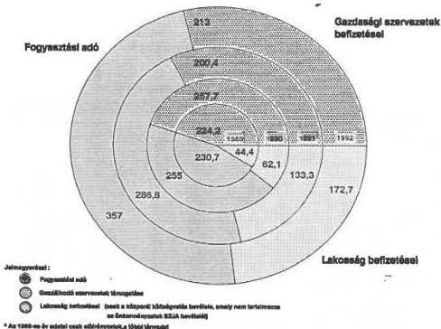

Az állami költségvetés meghatározó részét (95 %) jelentő kiadások alakulását 1989-től mutatják a következő grafikonok. Megállapítható, hogy a költségvetési kiadások közül leginkább a legnagyobb arányt képviselő kiadások növekedtek:

---

14. Az állami költségvetés meghatározó bevételei és kiadásai

131

|   | 1989.tény | 1991.tény  |
| --- | --- | --- |
|   | százalék  |   |
|  - Központi költségvetési szervek | 22 | 34  |
|  - (tanácsok), önkormányzatok | 21 | 23  |
|  - Nemzetközi pénzügyi kapcsolatokból eredő kiadás, adósságszolgálat, kamattérítés | 12 | 14  |

A költségvetés kiadási szerkezetében kisebb részt képviselő kiadások vagy csökkentek, mint a Gazdálkodó szervekhez és fogyasztáshoz kapcsolt támogatások, illetve alakulásuk stagnált: Elkülönített állami pénzalapok támogatása és Felhalmozási kiadások.

### Az állami költségvetés kiadásai (milliárd Ft-ban)

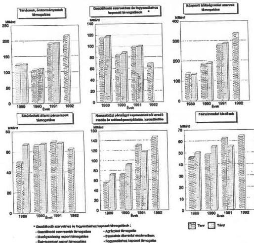

---

1. 2017年1月1日

[Non-Text]

[Non-Text]

[Non-Text]

[Non-Text]

[Non-Text]

[Non-Text]

[Non-Text]

[Non-Text]

[Non-Text]

[Non-Text]

[Non-Text]

[Non-Text]

[Non-Text]

[Non-Text]

[Non-Text]

[Non-Text]

[Non-Text]

[Non-Text]

[Non-Text]

[Non-Text]

[Non-Text]

[Non-Text]

[Non-Text]

[Non-Text]

[Non-Text]

[Non-Text]

[Non-Text]

[Non-Text]

[Non-Text]

[Non-Text]

[Non-Text]

[Non-Text]

[Non-Text]

[Non-Text]

[Non-Text]

[Non-Text]

[Non-Text]

[Non-Text]

[Non-Text]

[Non-Text]

[Non-Text]

[Non-Text]

[Non-Text]

[Non-Text]

---

2

1