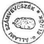
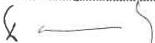
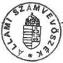
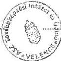

9883. szám

# BESZÁMOLÓ

az Állami Számvevőszék 1992. évi munkájáról

1993. április

144.

---

.

.

.

.

.

---

A-55-3/1993.

# BEVEZETŐ

Az Állami Számvevőszék (továbbiakban: ÁSz) harmadik alkalommal készít beszámolót éves tevékenységéről. A beszámoló elsősorban az 1992-ben lezárult vizsgálatok általánosítható tapasztalatait foglalja össze. Mindenekelőtt a célszerű gazdálkodást, a költségvetésben központosított források, az állami vagyon hatékony hasznosítását gátló főbb hiányosságokra, s azok okaira hívjuk fel a figyelmet.

Az Állami Számvevőszék működésének három éve alatt végzett ellenőrzéseiről az 1. sz. mellékletben adunk tájékoztatást. Ebben jelentéseinket a számvevőszéki törvény által előírt kötelezettségek szerint csoportosítottuk.

A számvevőszéki tevékenység célirányos összegezésével közvetlenül is segíteni kívánjuk a törvényhozói munkát. Bemutatjuk azt is, hogyan reagáltak megállapításainkra az ellenőrzött szervezetek. A beszámoló 3. sz. mellékletében röviden ismertetjük az elmúlt évben készített jelentéseink tartalmát. Remélhetőleg ez is hozzájárul ahhoz, hogy teljesebb áttekintést adjunk tevékenységünkről.

Az ÁSz működésével összefüggésben beszámolunk arról, hogyan gazdálkodtunk erőforrásainkkal, hogyan hasznosítottuk a nemzetközi kapcsolatokban rejlő lehetőségeket, s mit tettünk annak érdekében, hogy ellenőreink mindinkább megfeleljenek a számvevőszéki tevékenység magasszintű szakmai követelményeinek.

A múlt évi vizsgálatainkat 1991-hez képest is jelentősen megváltozott gazdasági környezetben végeztük. A kormányzati intézményrendszer átalakítása, kiépülése, valamint számos, korábban tervezett és 1992-ben hatályba lépett törvény nyomán is változtak a környezeti feltételek. A tavaly júniustól hatályos államháztartási törvény új kereteket teremtett a költségvetési gazdálkodásban az Országgyűlés, a Kormány, valamint a költségvetést végrehajtó minisztériumok, intézmények közötti hatáskörök megosztásához.

---

- 2 -

A költségvetés és a zárszámadás számvevőszéki vizsgálatakor elsődleges a törvények, a jogszabályok betartásának ellenőrzése. Vizsgálataink - miként világszerte a legtöbb számvevőszéknél - jellemzően utólagosak, döntően korábbi időszakra vonatkoznak. Végeztünk azonban néhány olyan ellenőrzést is, amelyek például törvények végrehajtásának előkészítésére, a végrehajtás megszervezésére irányultak.

Az elmúlt év végére megérett a helyzet arra, hogy az 1989 őszén előzmények nélkül alapított szervezetünk működési rendjét felülvizsgáljuk. Mérlegre tettük az Alkotmányban és a ránk vonatkozó törvényekben rögzített feladataink gyakorlati megvalósításának lehetőségeit, a korábban kialakított szervezeti rendszert és megújítottuk, újraszabályoztuk a feladatokat és hatásköröket. Az új szervezeti és működési szabályzat 1993. januárban lépett hatályba.

---

- 3 -

# AZ ÁLLAMI SZÁMVEVŐSZÉK
1992. ÉVI ELLENŐRZÉSI TEVÉKENYSÉGE

# 1. Az 1992. évi ellenőrzési feladatok teljesítése

Az Állami Számvevőszékről szóló törvény és más vonatkozó törvények, valamint országgyűlési határozatok alapján 1992-ben az előző évről áthúzódó 11 vizsgálat befejezését és 78 ellenőrzés megkezdését irányoztuk elő. A tervezett vizsgálatok a kapacitás döntő részét lekötötték. Ténylegesen 91 ellenőrzési feladattal foglalkoztunk. Közülük 73 vizsgálatot befejeztünk, 18 vizsgálat 1993-ban zárul le.

A múlt évre eredetileg tervezett feladatokon kívül az Országgyűlés által 1992-től biztosított létszámnövelés további vizsgálatok elvégzésére adott lehetőséget. Ez nemcsak az elvégzett feladatok számszerű növelését eredményezte, hanem - elsősorban az önkormányzatokat érintő vizsgálatoknál - lényegesen növelni tudtuk az ellenőrzött szervezetek számát is. Így 65 helyett 111 önkormányzatnál végeztük el a pénzügyi-gazdasági tevékenység törvényességi vizsgálatát.

Az ellenőrzési tervünkben eredetileg nem szereplő, a II. félévben felvett - részben még be nem fejezett - témák közül a legjelentősebbek az alábbiak voltak:

—a Szanaló Szervezet megszüntetése, a REORG Rt. alapítsa tárgyában végzett vizsgálat,
—a Szerencsejáték Rt. penzügyi-gazdasági Ellenörzese,
—a kozponti allamigazgatasi szervek letszam- es bergazdalkodasanak utol-lenorzese,
—az APEH mukodésenek és gazdalkodásanak Ellenörzese.

---

- 4 -

## 1.1 Az államháztartással kapcsolatos vizsgálatok

### 1.1.1

1992-ben először ellenőriztük egy olyan költségvetés végrehajtását, az *1991. évi zárszámadást*, amely már teljes egészében az új Kormány tevékenységéhez kötődött, új szemléletben és szerkezetben készült. A korábbinál részletesebb törvényi szabályozás alapján először volt mód arra, hogy a Kormány gazdálkodását, a gazdálkodás törvényességét érdemlegesen mérlegre tehessük. Ez a munka szinte az egész szervezetünk közreműködésével készült és nagy erőpróbát jelentett. Helyszíni ellenőrzések alapján minősítettük a mérlegvalódiságot, a gazdálkodási szabályok betartását a minisztériumoknál, önkormányzatoknál. Számszakilag ellenőriztük a fő összefüggéseket. Megvizsgáltuk, hogy a Kormány a hatályos törvényeknek megfelelően élt-e az Országgyűlés felhatalmazásával. A jelentésben tételesen bemutattuk, hogy a Kormány, a pénzügyminiszter a költségvetés végrehajtásában mely területeken, pontokon tért el a törvényi felhatalmazástól, továbbá, hogy a zárszámadásban lévő elszámolások közül melyek azok, amelyek nem a valós pénzügyi folyamatokat mutatták.

A zárszámadás kapcsán a munkaközi kapcsolatokban és a parlamenti bizottság előtt is többször tárgyaltunk a Pénzügyminisztériummal. E szakmai konzultációknak az 1991. évi zárszámadás elfogadására nem volt ugyan hatása, de a jövőre nézve számos tanulsággal szolgált.

### 1.1.2

Az államháztartási törvény hatályba lépése után tartalmilag új feladatot jelentett az *1992. évi pótköltségvetési, valamint az 1993. évi költségvetési törvényjavaslat véleményezése*. Az újszerűséget az jelentette, hogy a közpénzek kezelését egységes szerkezetben szabályozó új törvény részben tételes előírásokat tartalmaz, részben – keret jelleggel – számos olyan követelményt is támaszt, amelyek a költségvetési törvény szerkezetét, tartalmát a korábbiaknál sokkal pontosabban meghatározzák. Az ÁSz felelősségét növelte, hogy észrevételeink meghatározóak lehetnek az elkövetkező időszak költségvetéseinek szerkezetére is.

Korábban az Országgyűlés csak formálisan gyakorolhatta költségvetési jogát, és igény sem volt arra, hogy a költségvetést olyan részletezettségben állítsák össze, amelyből a képviselők a döntésük megalapozottságát biztosító, elegendő információt kaphatnak. Több év kell annak kialakulásához is, hogy egyértelmű legyen, melyek azok a hosszú távú kötelezettségvállalások, amelyek jóváhagyásához, megváltozta-

---

- 5 -

tásához az Országgyűlés döntése szükséges, s melyek azok a költségvetési tételek, amelyek a Kormány hatáskörében is módosíthatók. Nem könnyű megtalálni azt a racionális szerkezetet és részletezettséget, amely a döntésekhez elegendő, az összefüggéseket kellően megvilágító információkat tartalmaz, de nem válik áttekinthetetlen számhalmazzá.

**1.1.3** Az 1992. évi pótköltségvetés, valamint az 1993. évi költségvetési javaslat véleményezése során az államháztartási törvény előírásaitól való valamennyi eltérésre felhívtuk a figyelmet. Emiatt túlságosan kritikusnak minősítették jelentésünket. A Pénzügyminisztérium szerint irreális igényeket támasztottunk. Mindezzel összefüggésben e helyen is hangsúlyozzuk: az ÁSz a törvényesség vizsgálata során nem mérlegelheti, hogy a törvények a végrehajtókkal szemben milyen követelményeket támasztanak, illetőleg, hogy adott esetben a vizsgált szerv célszerűségi, vagy egyéb szempontból indokolhatóan tekintett-e el valamely jogszabályi előírástól. Az ÁSz-nak minden esetben és minden ponton ki kell mutatnia a törvényi előírásoktól való eltérést. Más kérdés, hogy adott esetben – ellenőrzési tapasztalatai alapján – a jogszabályok esetleges belső ellentmondásaira, megvalósításuk nehézségeire is felhívhatja a figyelmet. Kizárólag az Országgyűlés van abban a helyzetben, hogy – az ÁSz megállapításait is figyelembe véve – mérlegelje a törvényi előírások megszegéséből, a végrehajtás elmulasztásából adódó következményeket.

Az államháztartási törvény előírásainak érvényesítéséhez, értelmezéséhez, azoknak gyakorlatban történő alkalmazásához, a költségvetési szerkezet kialakításához indokolt, hogy az állami költségvetéssel hivatásszerűen foglalkozó szervezet is rögzítse véleményét. Az ÁSz az Országgyűlésnek tartozik felelősséggel. Ezért véleményében mindig meghatározóak azok az elemek, amelyek a képviselők tájékozódását segíthetik, a döntések végrehajtásának objektív ellenőrzését biztosítják. A kormányzati szerveken, illetve a képviselőkön múlik, hogy észrevételeinkből mennyit hasznosítanak.

## 1.2 A központi költségvetési szervek ellenőrzése

1992-ben 8 fejezet gazdálkodását vizsgáltuk, emellett téma- és célellenőrzéseket is végeztünk különböző költségvetési gazdálkodóknál. A fejezetek ellenőrzése elsősorban arra irányult, hogy a működésben és a költségvetési gazdálkodásban a törvényes-

---

- 6 -

ség, illetőleg a célszerűség és az eredményesség mennyiben érvényesült, a feladatok, a szervezet és a pénzügyi források összhangban voltak-e a vizsgált fejezeteknél.

A fejezeti ellenőrzések közül kiemelt jelentőségű az Országgyűlés és a Miniszterelnökség vizsgálata. Ezeknél a fejezeteknél a korábbi években független ellenőrzés nem volt. A Népjóléti Minisztérium, valamint a Művelődési és Közoktatási Minisztérium esetében jelentős intézményhálózattal rendelkező, alapvető közszolgáltatást ellátó fejezetek ellenőrzésére került sor.

A központi államigazgatási szervek létszám- és bérgazdálkodásának utóvizsgálatát nemcsak az indokolta, hogy az intézmények kiadásai között a legjelentősebb tételről van szó, hanem az is, hogy jelentős módosulások következtek be az államigazgatási szervezetek feladataiban, strukturájában is.

### 1.2.1

Megállapításaink szerint a *költségvetési gazdálkodásra vonatkozó szabályokat* a vizsgált fejezetek több területen is megsértették. A könyvvezetési kötelezettségre, a számviteli rendre és bizonylati fegyelemre vonatkozó rendelkezések be nem tartása, a vagyonra vonatkozó nyilvántartások pontatlansága, vagy adott esetben az eszközök nyilvántartásba vételének elmulasztása, az év végi pénzmaradványok valótlan kimutatása a mérlegvalódiság elvének, a vagyonvédelem követelményeinek megsértéséhez vezetett. A fejezetek egyes címléirányzatainak rendeltetéstől eltérő fölhasználásával éppúgy találkoztunk, mint fedezetlen kötelezettségvállalással, a bérkeret túllépésével, vagy szabálytalan forrásigénybevétellel. Az e téren feltárt mulasztások a személyi és szakmai-szemléletbeli hiányosságok mellett a belső ellenőrzési rendszerek kiépítettségének és működésének elégtelenségére vezethetők vissza.

A költségvetési hiány mérsékléséhez elkerülhetetlen a költségvetési kiadások ésszerű csökkentése. A kiadások csökkentését belátható időn belül az intézmények, illetve adott feladat költségvetési finanszírozásának megszüntetésével, a költségvetési gazdálkodásból történő teljes kivonásával csak egy viszonylag szűk körben lehet reálisan elérni. A korábbi években is alkalmazott átmeneti intézkedések, – amelyek a kampányszerű takarékosság jegyében általános restrikcióval igyekeztek csökkenteni a kiadási előirányzatokat – nem hoztak lényeges eredményt. Előrelépés csak a költségvetési gazdálkodás eddigi gyakorlatának megváltoztatásától várható.

---

- 7 -

**1.2.2** A költségvetési fejezeteknél végzett 1992. évi vizsgálataink rendre rámutattak arra, hogy a működésben a *célszerűség* és az ésszerű *takarékosság* követelményei csak korlátozottan jutnak érvényre. Megállapítottuk, hogy nem határozták meg teljeskörűen és egyértelműen az ellátandó feladatokat. Esetenként hiányzott a törvényi háttér, vagy a rendelkezések tág értelmezési lehetőséget hagytak. A szervezetek belső munkáját meghatározó, a feladatok és hatáskörök megosztását tartalmazó szervezeti és működési szabályzatok, belső ügyrendek és munkaköri leírások helyenként hiányoztak, vagy nem tükrözték a feladatok mennyiségét és pontos tartalmát. Ezek alapján az előirányzatok tervezése és felhasználása nem is lehet összhangban a feladatokkal.

**1.2.3** A feladatok pontos és részletes meghatározásának hiányában a kialakított *szervezetek* nem feleltek meg még ezeknek a körvonalazott feladatoknak sem. Ez akadályozza a működést, az államigazgatási munka megfelelő szakmai színvonalon történő végzését. A vizsgált fejezeteknél a szervezeti átalakításokat nem előzte meg a feladat, a szervezet és irányítás összefüggéseire épülő, átfogó koncepció kialakítása. Az átszervezés, a létszámbővítés az érintett szervezeti egységek elképzelései szerint folyt. Ennek eredményeként több helyen célszerűtlenül, párhuzamosan, részben átfedő módon látták el a feladatokat.

**1.2.4** A feladatmeghatározás hiánya meggátolja a tevékenység érdemi felülvizsgálatát, ezért az *intézményeknél a költségvetési tervezés* az intézményi érdekeket fejezi ki, általános a pénzügyi túlbiztosítás. A saját bevételek változatlan alultervezése a támogatási igény növekedését eredményezi, amit az érdekeltségi rendszer azáltal ösztönöz, hogy az intézmény saját bevételei terhére növelheti kiadásait.

1992. évi vizsgálataink jelentős – nemcsak átmeneti – szabad pénzforrásokat mutattak ki. A költségvetési gazdálkodás jelenlegi rendszerében a “pénzszűke” változatlanul együtt él a “pénzbőséggel”.

**1.2.5** A központi költségvetési szerveknél végzett vizsgálataink közül a központi államigazgatási szervezetek létszám- és bérgazdálkodásának ellenőrzése, majd pedig utóellenőrzése az intézményi kiadások legnagyobb hányadát képviselő bérek és keresetek alakulására összpontosult. Elsősorban arra kereste a választ, hogy a központi igazgatás létszám- és bérgazdálkodásában milyen változások következtek be az 1990. évi választásokat követő kormányzati munka-

---

- 8 -

megosztás és szervezeti rendszer módosulása, valamint a bérgazdálkodás 1991. évi szigorításai hatására.

A vizsgálat rámutatott arra, hogy az államigazgatási létszám 1991. I. félévében az előző év végéhez viszonyítva 25%-kal, a béralap pedig 52,5%-kal nőtt. A létszámnövekedés szinte teljes egészében a szervezeti változásokból adódott. A megszűnt vagy megszüntetni tervezett szervezetek számát meghaladóan jöttek létre új államigazgatási szervek. A létszámnövekedés a vezetők állományában volt a legjelentősebb, ami a szervezeteken belüli tagoltság növekedését is jelzi. A Kormány határozatának végrehajtása – amely szerint a központi költségvetési szervek felülvizsgálatát, szervezetük korszerűsítését össze kell kapcsolni a szervezetek mennyiségének és létszámának lehetőség szerinti csökkentésével – a vizsgálat megállapításai tükrében eredménytelen. A bér- és létszámgazdálkodás létszámirányszámokon alapuló, alapvetően bázisszemléletű tervezési és gazdálkodási gyakorlata mellett a létszám és a béralap további növekedésével kell számolni.

A valós létszámszükségletek meghatározását a bérgazdálkodási rendszer is akadályozza, mivel a tervezett álláshelyek béralapjából a betöltetlenül maradt álláshelyek bére jutalmazásra is felhasználható. (Vizsgálatunk megállapította, hogy a létszámelőirányzat legalább 10%-a tartósan betöltetlen.)

**1.2.6** A bér- és létszámgazdálkodásra vonatkozó utóvizsgálat – amellett, hogy megerősítette a korábban lefolytatott ellenőrzés eredményeit és tapasztalatait – tájékozódó jellegű helyzetfelmérése alapján rámutatott a köztisztviselők jogállásáról szóló törvény végrehajtásának számos gondjára, a várható feszültségekre. Az új törvény illetménybesorolási rendjét alkalmazva már a végrehajtás kezdeti szakaszában is magas azoknak a száma, akiknek a régi besorolás alapján járó bére meghaladja az új illetményrendszer szerint járó bért. Az érintettek széles körben fogalmazták meg, hogy a törvény hosszabb távon nem biztosít megfelelő előmeneteli lehetőségeket és anyagi megbecsülést.

**1.2.7** Az elkülönített állami pénzalapok közül a Foglalkoztatási Alap 1991. évi felhasználásának ellenőrzését nemcsak azért tartottuk fontosnak, mert jelentős költségvetési pénzeszközökkel rendelkezett, hanem azért is, mert pénzeszközei közvetlenül egy súlyos társadalmi feszültség, a rohamosan növekvő munkanélküliség mérséklését szolgálják. A vizsgálatot a Foglalkoztatási Alapra vonatkozó, 1991. évi IV. tv. hatályba lépését követő egy éves időszakra vonatkozóan végeztük el. Az ellenőrzéssel a törvényi rendelkezéseknek megfelelő

---

- 9 -

gazdálkodási gyakorlat kialakítását és a rendelkezésre álló pénzeszközök mielőbbi célszerű és hatékony felhasználását kívántuk elősegíteni.

A vizsgálat megállapította, hogy a törvény hatályba lépését követő egy éven belül sem történt meg a törvényben előírt feladatok rendszerszerű áttekintése, a döntési és végrehajtási folyamatok belső és kapcsolódó szabályozása, a végrehajtás ennek megfelelő szervezése. Nem alakították ki a Foglalkoztatási Alappal kapcsolatos feladat-, hatáskör- és felelősségmegosztására vonatkozó belső szabályzatokat, munkaköri leírásokat. Nem dolgozták ki az Alap információ-rendszerét. A vizsgálat kimutatta, hogy az Alap felhasználásáról készített beszámolók és tájékoztatók adatai megalapozatlanok és félrevezetőek, sem a hiteles tájékoztatáshoz, sem a döntések meghozatalához nem szolgáltattak kellő alapot.

Az Alap pénzeszközeinek kezelésére kialakított nyilvántartási, elszámolási és beszámolási rendszer 1991. évben nem felelt meg a vonatkozó számviteli és pénzügyi rendelkezéseknek, ezért a költségvetési beszámoló valódiságát nem biztosították.

Az Alapban rendelkezésre álló pénzügyi keretek felhasználásának hatékonyságát és eredményességét vizsgálva megállapítottuk, hogy a képzésre, átképzésre, munkahelyteremtő beruházásokra és közhasznú foglalkoztatásra fordítható támogatások töredékét használták fel. Az Alap év végére jelentős szabad pénzmaradvánnyal rendelkezett. Ebben a döntések időbeni elhúzódásának alapvető szerepe volt. A pénzeszközök eredményes és takarékos felhasználása azért sem valósulhatott meg, mert az Alapra nem dolgoztak ki - a költségmegtakarítás szempontjait érvényesítő - egységes eljárási szabályzatot.

# 1.3 Az önkormányzatok ellenőrzése

Ellenőrzéseink főként az önkormányzatok 1991. évi költségvetési támogatásának felhasználására összpontosultak.

A vizsgálatok a helyi önkormányzatok beruházásaihoz és rekonstrukcióihoz nyújtott címzett támogatások egészére -, a költségvetési törvényben meghatározott, összes (44) feladatra - terjedtek ki. A céltámogatások előirányzatának 29%-át, mintegy 2 milliárd Ft felhasználását, 173 önkormányzatnál vizsgáltuk. Az önkormányzatok 1991. évi normatív hozzájárulása igénybevételének és elszámolásának teljeskörű helyszíni ellenőrzését 92 önkormányzatnál és a hozzájuk kapcsolódó, a vizsgált

---

- 10 -

mutatókkal érintett 718 intézménynél végeztük el. Ily módon az ellenőrzés az összes normatív támogatás egyharmadára terjedt ki. Az *önhibájukon kívül hátrányos* helyzetben lévő önkormányzatok *kiegészítő támogatását* 209 helyi önkormányzatnál ellenőriztük.

Az egyes önkormányzatok gazdálkodásának törvényességi, szabályszerűségi szempontok szerinti ellenőrzését az Állami Számvevőszék 1992-ben kezdte meg. Az ellenőrzésre a költségvetési gazdálkodásra vonatkozó előírások, szabályok betartásának értékelését biztosító egységes vizsgálati program alapján 111 önkormányzatnál került sor.

Időszerűségénél fogva további két témavizsgálatot emelünk ki. Az egyik az önkormányzatok tulajdonába került vagyontárgyakkal való gazdálkodásra, a másik ellenőrzési rendszerük működésére, ellenőrzési tevékenységükre irányult.

Az önkormányzatoknak nyújtott költségvetési támogatások felhasználására vonatkozó vizsgálatok rávilágítottak a pénzeszközökhöz rendelt felhasználási célok teljesítésének, az egyes rendszerek működési mechanizmusának ellentmondásaira, lehetőséget adtak a különböző támogatási formák működésének értékelésére. A pénzügyi elszámolások ellenőrzése alapján összegszerűen is kimutattuk a jogtalanul igénybe vett támogatásokat, illetve a jogos többlettámogatási igényeket.

### 1.3.1

Az önkormányzatok beruházásaihoz és rekonstrukcióihoz nyújtott *céltámogatás* rendszere alapvetően alkalmas a kitűzött célok elérésére.

Működtetése azonban több tekintetben is kiigazításra szorul. Az ellenőrzés többek között felhívta a figyelmet arra, hogy a fejlesztési célok és támogatási arányok évenkénti meghatározása helyett a támogatás több évre történő jóváhagyásával hatékonyabb lenne a pénzeszközök felhasználása. Növekedne az önkormányzatok biztonsága, pénzügyi előrelátása, mindezek eredményeképpen megalapozottabbak lennének beruházási terveik. Másfelől a Belügyminisztérium a pályázatokat – kellő időt hagyva előkészítésükre – olyan időpontban kérhetné be, amikor még ezeket a támogatási igény meghatározásához érdemileg fel lehet használni. A céltámogatási rendszer továbbfejlesztésére vonatkozó számvevőszéki ajánlások többségét a készülő törvénytervezetbe beépítették.

---

- 11 -

**1.3.2** Az egészségügyi, az oktatási és kulturális ágazatokban a beruházásokhoz és rekonstrukciókhoz nyújtott *címzett támogatások* a fejlesztések felgyorsítását eredményezték. Ugyanakkor a támogatási rendszer működtetésében az ellenőrzések több - a céltámogatásoknál tapasztaltakhoz hasonló - hiányosságra, ellentmondásra is rámutattak. Így mindenekelőtt a támogatások évenkénti jóváhagyása a pénzforrások, s ezen keresztül a fejlesztések tervezésének bizonytalanságaihoz vezettek. Ugyanakkor a rövid határidők a támogatási igények, a beruházások szakmai programjának, műszaki tartalmának érdemi felülvizsgálatát tették lehetetlenné. A hézagos szabályozás miatt viszont a finanszírozás elszakadt a tényleges megvalósulástól, ezért a támogatást felhasználóknál hosszabb időn keresztül szabad pénzeszközök keletkeztek. Az ellenőrzés eredményeként tett javaslatokat az 1993. évi szabályozás kialakításánál már figyelembe vették.

**1.3.3** Az *önhibájukon kívül hátrányos helyzetben* lévő önkormányzatok *kiegészítő támogatásának* 1991-ben működő rendszeréről ellenőrzésünk megállapította, hogy ez a kiegészítő támogatási forma nem működött célszerűen, a támogatások hatékony felhasználása nem valósult meg. Ebben alapvetően az játszott szerepet, hogy az 1991. évi állami költségvetésről szóló törvény csak a támogatás mértékéről döntött, feltételeiről nem. A szabályozás hiánya mögött azonban mélyebb, tartalmi probléma húzódott meg, nevezetesen az, hogy az 'önhibájukon kívül hátrányos helyzetbe került önkormányzat' értelmezése, a jogcím igazolása csak helyszíni, komplex vizsgálattal, több tényező együttes hatásának mérlegelésével történhet. A támogatási rendszer pénzügyi szemlélete ezt a kategóriát nem tudja kezelni. E kiegészítő támogatási formát kizárólag vis maior esetére javasoltuk fönn tartani, aminek a feltételrendszerét pontosan kell szabályozni. Az 1993. évi költségvetési törvényben - javaslatainkkal egyező irányú - változtatások történtek a támogatási rendszerben.

**1.3.4** Az önkormányzatok 1991. évi *normatív állami hozzájárulásának*, igénybevételének és elszámolásának ellenőrzése alapján a szabályozás számos hiányosságára hívtuk föl a figyelmet. Az 1991. évben alkalmazott normatívák tartalmát, az igényjogosultságot, a jogtalanul igénybe vett pénzeszközökkel kapcsolatos önkormányzati kötelezettségeket, illetve az elszámolás alapján az önkormányzatokat megillető támogatások igénybevételének feltételeit törvényi szinten nem szabályozták. Eltérő szabályok voltak érvényesek a tervezésre, az igénybevételre és az elszámolásra, és visszamenőleges hatállyal is állapítottak meg elszámolási szabályokat. Nem határozták meg pontosan a mutatószámok kiszámításának alapját és módszerét. Önkormányzatonként ezért is eltérő módszerekkel és

---

- 12 -

különböző tartalommal került sor a tervezéshez és az elszámoláshoz szükséges mutatószámok kialakítására. A vizsgált önkormányzatoknál leggyakrabban tervezési hibákat állapítottunk meg, amelyek többségükben túlfinanszírozáshoz vezettek és így az állami költségvetésnek többletterhet okoztak.

A normatív állami támogatások rendszerében legkevésbé a körzeti-térségi feladatok finanszírozása megoldott. Az önkormányzatok legfeljebb a normatív állami hozzájárulásnak megfelelő összeget térítik meg egymásnak az elszámolás során. Így a körzeti feladatot ellátó önkormányzatok csak a helyi érdekek rovására tudják az intézmények működésének többletköltségeit fedezni.

**1.3.5** Az önkormányzatoknak 1991-ben nyújtott költségvetési támogatások ellenőrzése 1992-ben összesen 375,1 millió Ft *jogtalan támogatás igénybevételét* és 101,7 millió Ft *jogos többlettámogatási igényt* állapított meg a vizsgált önkormányzatoknál. Az önkormányzatok a megállapított összegeket nem vitatták. Nem szabályozott azonban sem az, hogy miként fizessék vissza a jogtalanul igénybe vett támogatást a központi költségvetésnek, sem pedig az, hogyan juthatnak hozzá a jogos többlettámogatáshoz. Így gyakorlatilag a központi költségvetés mintegy 275 millió Ft bevételről lemond, amennyiben az Országgyűlés, illetve a Kormány nem intézkedik.

**1.3.6** Az önkormányzatok gazdálkodásának törvényességi, szabályszerűségi ellenőrzése során a gazdálkodás szabályozottságát, a pénzügyi gazdálkodás törvényességet, a könyvvezetési kötelezettségre, a számviteli, nyilvántartási rendre vonatkozó szabályok betartását, a költségvetési beszámolókkal szemben támasztott követelmények érvényesülését, a vagyonnal való gazdálkodás törvényességét és a belső ellenőrzést vizsgáltuk. Ezek a vizsgálatok amellett, hogy jogtalanul igénybe vett költségvetési támogatásokra is rámutattak, egyidejűleg az önkormányzatok gazdálkodásának segítését szolgálják. Az ellenőrzések által feltárt hiányosságok, hibák megszüntetésére az önkormányzatok intézkedési tervet készítenek, amelyet az önkormányzat testülete hagy jóvá és kéri számon teljesítését.

**1.3.7** Az önkormányzatok tulajdonába került *vagyon tárgyak megszerzésével, nyilvántartásával és hasznosításával* kapcsolatos ellenőrzések azt mutatták, hogy a vagyonátadást érintő törvények és rendeletek viszonylag késői megjelenése ellenére 1992 végére - a főváros kivételével - a vagyonátadás döntő hányada (85-90 %-a) megtörtént. A fennmaradó rendezetlen ügyek (elsősorban műemléki, védett területeken lévő, illetve egyházaknak visszaadás-

---

- 13 -

ra kerülő ingatlanok, valamint víziközművek) valószínűleg csak hosszabb idő alatt oldhatók meg. Ezek azonban már - a főváros kivételével - nem indokolják a megyei Vagyonátadó Bizottságok további működtetését. A feladatokat egy központi szervezet is el tudja látni. Az ellenőrzött, több mint száz önkormányzatnak jelentésben összegeztük a vizsgálat eredményeit, amelyek figyelembevételével intézkedési terveket készítettek.

A társközségek szétválása miatti vagyonmegosztás lebonyolításának ellenőrzése arra is rámutatott, hogy az önkormányzatok nagy része a vagyon megosztásában még nem állapodott meg. Ebben az is közrejátszott, hogy a vonatkozó törvények nem szabtak meg határidőt. Így évekig is elhúzódhatnak a vagyonrendezési ügyek. Ez konfliktusokat szül és a vagyonnal való gazdálkodást is kedvezőtlenül befolyásolja.

# 1.4 A Társadalombiztosítási Alap ellenőrzése

A Társadalombiztosítási Alap kezelőjénél végzett utóvizsgálat mellett az államháztartási törvény alapján 1992-ben először ellenőriztük a Társadalombiztosítási Alap zárszámadását és véleményeztük az 1993. évi költségvetéséről szóló törvényjavaslatot is.

Az ellenőrzések megmutatták, hogy a társadalombiztosítás helyzete lényegesen romlott, a bevételek egyre kevésbé nyújtanak fedezetet az erősen determinált kiadásokra. Az állandósulni látszó és növekvő összegű hiány döntően az előirányzott járulékbevételek elmaradásából, a tartozás-állomány növekedéséből származik. Ugyanakkor a kiadási oldalt lényegesen befolyásoló területeken a rendszerszerűen átgondolt reformok bevezetésének késedelme, a vagyonjuttatás részleteinek kidolgozatlansága, a nem biztosítási alapon történő juttatások finanszírozása és az önálló biztosítási ágakhoz tartozó szervezeti rendszer kialakításának elhúzódása tovább mélyítik a feszültségeket.

A társadalombiztosítás reformjának kereteit a vonatkozó törvények ugyan megteremtették, de nem történt meg a tervezett ellátási rendszer szakmai, szervezeti, működési és finanszírozási kérdéseinek teljeskörű tisztázása. Ebben az a körülmény is közrejátszott, hogy a rendszer kialakításában lényegében még ma is tisztázatlan a Kormány feladatvállalása és felelőssége.

---

- 14 -

## 1.5 Az állami vagyon kezelésének ellenőrzése

Az államháztartás rendszerében a központi költségvetésnél, az önkormányzatoknál, a társadalombiztosításnál és az elkülönített állami pénzalapoknál folytatott ellenőrzések során a vagyon kezelését, a vagyonvédelem követelményei érvényesülését is vizsgáltuk.

Az *állam vállalkozói vagyonának* számvevőszéki ellenőrzése és az erre vonatkozó törvényi kötelezettségünk teljesítése sajátos feladatot jelent, tekintettel a jelenlegi társadalmi-gazdasági feltételekre és mindenekelőtt a tulajdonszerkezetre. A gazdasági rendszerváltás privatizációs folyamatának vizsgálata különösen fontos feladat. (Törvény rendelkezik arról, hogy az *Állami Vagyonügynökség* tevékenységét az Állami Számvevőszék ellenőrzi.)

1992-ben az Állami Vagyonügynökség tevékenységének ellenőrzése, valamint a tevékenységéről szóló kormánybeszámoló véleményezése mellett néhány privatizáció egyedi vizsgálatára is sor került.

### 1.5.1

Az *Állami Vagyonügynökségnél* 1992-ben lefolytatott vizsgálat megállapította, hogy a privatizáció (beleértve az előprivatizációt is) felgyorsult, jelentősen növekedtek a vállalati privatizációs kezdeményezések és az ÁVÜ által elbírált tranzakciók. Ezzel összefüggésben 1991-ben jelentősen növekedett az állam privatizációs bevétele is. Ugyanakkor az ÁVÜ közvetlen irányításával megvalósuló programok lebonyolítása általában lassan haladt, az aktív, kezdeményező tevékenység háttérbe szorult, s e téren a szervezet mindinkább konzultatív szerepre vállalkozott.

A privatizációs bevételek és kiadások szabályozása 1991-ben az 1990. évi Ideiglenes Vagyonpolitikai Irányelvek hatályának 1991. szeptember 30-ig való meghosszabbításával történt. Ezt követően hatályos Vagyonpolitikai Irányelvek nem voltak, csak terveztek készültek.

Az 1991. évi privatizációs bevételek felhasználásánál a vizsgálat több olyan kiadási tételt is kimutatott, amelyekre sem törvények, sem a hatályos Vagyonpolitikai Irányelvek nem adtak felhatalmazást. Megállapítottuk, hogy a privatizációs ügyleteknél a garanciavállalások, a tanácsadói és megbízási díjak ugrásszerűen növekedtek. A privatizációs költségek jogcímeit belső szabályzatban nem rögzítették pontosan.

---

- 15 -

Ezért fordulhatott elő, hogy az elszámolt tételek között az ÁVÜ működési kiadásait finanszírozó összegek is szerepeltek.

Az ÁVÜ tevékenységében visszatérő problémaként jelentkezett a vagyonkezelés, vagyonhasznosítás előírásoktól eltérő gyakorlata, továbbá az ÁVÜ-höz tartozó vagyon nyilvántartási rendszerének hiányossága. Az információk teljes hiánya miatt az államigazgatási felügyelet alá vont vállalatok vagyonvédelméről, az értékesítések eredményességéről nem lehetett képet alkotni. Teljes egészében hiányzott a döntések és a végrehajtás közötti kapcsolatrendszer, ellenőrzési pontokat a munkafolyamatokba nem építettek be.

Az ÁVÜ 1991. évi tevékenységére - mint arra az előző évi vizsgálatunk is rámutatott - rányomta bélyegét a feladatok színvonalas ellátásához szükséges, valamint a rendelkezésre álló szellemi és technikai erőforrások közötti ellentmondás. A szervezeti struktúra előnyére, feladatorientáltan változott, azonban továbbra is jellemző maradt az egyedi tranzakciók személyekhez kötődése.

1.5.2 Az ÁVÜ-nél szerzett tapasztalatokat kiegészítik azok a vizsgálatok, amelyek konkrét privatizációs ügyletekre, illetve a csődhelyzetbe került, felszámolásra ítélt vállalatok sorsának alakulására, az eljáró állami szervek tevékenységének értékelésére irányultak. Ezek a vizsgálatok csak részben érintették az ÁVÜ tevékenységét, ugyanakkor rámutattak az eljáró állami szervek munkájának ellentmondásaira, szabálytalanságaira is.

1.5.3 A Bős-Nagymaros beruházással kapcsolatos döntések történeti, dokumentális feldolgozásán alapul az a (minősített) jelentés, amely 1989. év végéig követi a döntési csomópontokat és megnevezi azokat a személyeket, akik a beruházás sorsát meghatározták.

# 1.6 Egyéb törvényi kötelezettségen alapuló vizsgálatok

1.6.1 Ide tartoznak egyrészt azok a - vagyonelszámolásokat hitelesítő - vizsgálatok, amelyeket a szakszervezeti tulajdon megosztása, illetve kilenc "elmúlt rendszerhez kötődő társadalmi szervezet" vagyonhelyzete tisztázása érdekében az Állami Számvevőszék lényegében megalakulása óta

---

- 16 -

törvényi rendelkezések alapján végez, igen nagy manuális munkaterheléssel és létszámigénybevétellel.

**1.6.2** A hatályos törvények szerint végeztük a politikai pártok, valamint az állami támogatásban részesülő társadalmi szervezetek gazdálkodásának törvényességi ellenőrzését. Az ellenőrzések alapján több pártnál újra kellett készíteni a zárómérleget. A hiányosságok felszámolására intézkedési tervek készültek, illetve – nem parlamenti pártoknál – kezdeményezésünkre az ügyészség útján a párt működését érintő bírósági végzésre is sor került. Az ellenőrzések tapasztalatait, javaslatait az új párttörvény megalkotása során is figyelembe vették.

**1.6.3** Az elmúlt évtizedekben keletkezett *belföldi államadósság* vizsgálata több mint 20 év dokumentumanyagát dolgozta fel. Az ellenőrzési munkát rendkívül megnehezítette az, hogy az adósság keletkezésének dokumentumai nehezen voltak megtalálhatók, azonosíthatók. A nyilvántartások, a könyvvezetés nem felelt meg az ellenőrizhetőség követelményének. A vizsgálat átfogó következtetése, hogy néhány súlyosan elhibázott beruházás mellett a fogyasztás és a gazdasági teljesítmény közti szakadék idézte elő azt a több, mint 1400 milliárd forintos adósságállományt, amelynek törlesztése különösen 1996-tól jelent nagy terhet.

## 1.7 A PHARE program ellenőrzése

Újszerű feladatot jelentett a PHARE program egy – a környezetvédelem céljait szolgáló – szeletének ellenőrzése. A vizsgálat az Országgyűlés Környezetvédelmi Bizottsága felkérése alapján került az ÁSz ellenőrzési tervébe. A vizsgálatra az Európai Közösség Számvevőszékével együttműködve került sor.

Ezen túl az EK végrehajtó szervei – megfelelő kormányzati intézmény hiányában – kormányzati, belső ellenőrzési feladatra is felkérték az ÁSz-t. Az ÁSz ideiglenes jelleggel, az Országgyűlés tájékoztatása mellett 1993. évre is elvállalta a munkát.

---

- 17 -

## 1.8 Ellenjegyzési kötelezettségünk teljesítése

**1.8.1** 1992. évi költségvetésről és az államháztartás vitelének 1992. évi szabályairól szóló, illetve az 1992. évi pótköltségvetésről szóló törvény nem tartalmazott az államadósság növelését eredményező közvetlen hitelfelvételeket. A költségvetési hiányt finanszírozó hitelfelvételre nem került sor. (A hiány finanszírozása értékpapírok kibocsátásával történt.)

**1.8.2** Az 1990. évi CIV. törvény végrehajtásával összefüggésben a PM és az MNB között 1991. decemberében több hitelszerződés megkötésére került sor, amelyeket az ÁSZ elnöke ellenjegyzett. A szerződések megkötését az 1991. évi állami költségvetés végrehajtásáról szóló törvény jóváhagyta.

**1.8.3** Az 1992. évi LXII. törvény (a Magyar Köztársaság 1991. évi állami költségvetésének végrehajtásáról) rögzítette a még megkötendő hitelszerződéseket. Ezek egyrészt a Magyar Köztársaság nemzetközi szervezetekben meglévő tagságával összefüggésben, alaptőke hozzájárulásként teljesítendő kötelezettséget jelentenek. A hitelszerződések másik csoportja az Állami Fejlesztési Intézet MNB-vel szemben fennálló refinanszírozási hitelevel kapcsolatos, illetőleg az MNB által a Nemzetközi Újjáépítési és Fejlesztési Banktól felvett és továbbkölcsönzött hitelek állami átvállalására vonatkozik. A harmadik csoportba az MNB-ről szóló 1991. évi LX. törvény által előírt rendelkezéseknek megfelelő korábbi szerződések módosítása tartozott. Ezeket a szerződéseket 1992. év decemberében megkötötték, majd 1993. január első napjaiban az ÁSz elnöke a szerződéseket ellenjegyezte.

**1.8.4** 1992. áprilisában az ÁSz elnöke ellenjegyezte az Ipari Ágazati Szerkezetkiigazítási Kölcsönegyezmény folyamányaként a Magyar Köztársaság Kormánya és az MNB között létrejött Betéti Szerződést. Ez az MNB-nél nyilvántartott – korábban szerződéssel alá nem támasztott – a Kormány által továbbkölcsönzött, illetve már visszaszármaztatott, a Világbank számára azonban még nem törlesztett összeg betétként való elhelyezésére szolgált.

1992. decemberében került sor a Nemzetközi Újjáépítési és Fejlesztési Bank és az MNB között a harmadik ipari szerkezetátalakítási program céljaira még a korábbi években felvett, s a Magyar Állam számára továbbkölcsönzött összeg hátralékára vonatkozó szerződés megkötésére, illetve ellenjegyzésére.

---

- 18 -

## 2. Az ellenőrzések eredményeinek hasznosítása, a realizálás általános jellemzői

Az Állami Számvevőszék - a hatályos törvényeknek megfelelően - vizsgálati megállapításait megküldi az ellenőrzött szerv vezetőjének, aki arra 8 napon belül írásban észrevételeket tehet, illetve intézkedéseket rendelhet el. (Az intézkedésekről 30 napon belül tájékoztatnia kell az Állami Számvevőszéket.)

**2.1** A kialakult gyakorlat szerint a Számvevőszék már az ellenőrzés folyamán is egyeztet az ellenőrzött szervezettel. Az egyeztetések nemcsak az ellenőrzési megállapítások munkaközi kontrolljára adnak lehetőséget, hanem számos esetben hozzájárulnak ahhoz, hogy az ellenőrzött szervezetek már az ellenőrzés időszakában munkájukat újragondolják, intézkedéseket tegyenek.

Ha az ellenőrzött szerv vezetője az ellenőrzés befejezésével a megküldött jelentésben foglalt megállapításokat elfogadja, elismeri a hiányosságokat és intézkedési tervet készít azok felszámolására, akkor megteremtődik az elvi lehetősége a számvevőszéki ellenőrzések gyakorlati hasznosításának. Az intézkedési tervek végrehajtását esetenként utóellenőrzéssel minősítjük. A végrehajtás azonban sokkal inkább attól függ, hogy a gazdálkodási környezet mennyire kényszeríti a szervezeteket a változtatások végrehajtására. Az ellenőrzési eredmények hasznosításában csak a teljesítménykényszer alatt álló rendszer érdekelt közvetlenül. A demokratikus államrendben ennek kialakulásában a közvéleménynek is jelentős a szerepe.

**2.2** Az Állami Számvevőszék széles körben élt a nyilvánosság lehetőségeivel az írott és elektronikus sajtóban. Az Országgyűlés Sajtóirodája szervezésében rendszeresek voltak sajtótájékoztatóink. Több riport készült az ÁSz vezetőivel és munkatársaival. Számottevő volt a vidéki, helyi sajtó reagálása is. Jelentéseinkről a tárgyszerű tájékoztatás elősegítése érdekében összefoglaló tájékoztatókat is készítünk.

**2.3** Törvényi kötelezettségünknek megfelelően minden egyes jelentést megküldünk az Országgyűlés elnökének, főtitkárának, az Országgyűlés Számvevőszéki Bizottsága minden tagjának, a parlament frakcióvezetőinek, továbbá a köztársasági elnöknek és a miniszterelnöknek. Az Országgyűlés főtitkári apparátusával rugalmas és jól szervezett a munkakapcsolatunk. Az elmúlt évben 14 vizsgálati jelentésünket minden országgyűlési képviselő megkapta (ezek az országgyűlési számmal ellátott jelentéseink, amelyeket az Országgyűlés szerve-

---

- 19 -

zési titkársága általában 800 példányban adott közre). A többi jelentést - az állandó listán szereplőkön kívül - a témában illetékes országgyűlési bizottságok kapták meg (figyelemmel az Országgyűlés elnöke által esetileg ajánlott elosztásra is), s eljutottak jelentéseink az államigazgatási szervekhez, esetenként az önkormányzatokhoz is.

**2.4** A törvényhozás jelentéseinket számos esetben közvetlenül, többségében azonban közvetetten hasznosítja. A legközvetlenebb hasznosítási mód, ha jelentéseink alapján valamely törvényjavaslathoz a képviselők módosító indítványt nyújtanak be. Ezek fontos mércéi munkánk eredményességének is. 1992. évben is több jelentésünket vitatták meg különböző parlamenti bizottságok. E vitáknak közvetlen intézkedéseket kiváltó hatása ritkán volt, hosszabb távon azonban segíthetik a törvényhozás és a Kormány munkáját is. Ebből a szempontból is jelentős a Számvevőszéki Bizottság megalakulása és működése.

**2.5** Az önkormányzatoknak 1991-ben nyújtott költségvetési támogatások ellenőrzésének eredményeit - a jogtalanul igénybe vett támogatások visszafizetésének, illetve a jogos többlettámogatások igénybevételének módját meghatározó szabályok hiányában - nem hasznosították. Ez nemcsak azt jelenti, hogy a költségvetés mintegy 275 millió forintról lemond, hanem azt is, hogy a törvényi kötelezettség alapján történő elszámolás ugyancsak törvényi kötelezettség szerinti ellenőrzésének eredménye elsikkadt. Ez azzal járhat, hogy az ellenőrzés megelőzésben betöltött szerepe, visszatartó ereje is csökken.

**2.6** Kevésbé látványos, de mégis leghatékonyabb az, ha jelentéseink megállapításait már a törvényelőkészítés szakaszában hasznosítják. Elsősorban a központi- és a TB-költségvetés (és zárszámadás) elkészítésénél, az önkormányzatok címzett- és céltámogatásai feltételrendszerének kidolgozásánál, a Vagyonpolitikai Irányelveknél, a párttörvény módosításánál vették figyelembe megállapításainkat.

**2.7** Az állami költségvetés ellenőrzésével kapcsolatos jelentések hasznosítása sajátos feladatot jelent és több problémát is felvet. Ezek a jelentések részben helyszíni ellenőrzések, részben a törvényjavaslatok számszaki és törvényességi szempontok szerinti minősítése alapján készülnek. A helyszíni ellenőrzések realizálása feszített ütemben, de megoldható. A törvényességi, szabályszerűségi és számszaki ellenőrzés alapján tett megállapításokat azonban - amelyek csak a Kormány végleges előterjesztése alapján fogalmazhatóak meg - idő hiányában, az Országgyűléshez történt benyújtás előtt eddig nem sikerült a Pénzügy-

---

- 20 -

minisztériummal egyeztetni. Elsősorban az éves zárszámadások országgyűlési napirendre tűzésénél indokolt lehet az egyeztetés időszükségletét is figyelembe venni. Megoldatlan jelenleg az is, hogy a költségvetési javaslatok véleményezése hogyan hasznosulhat. Az Állami Számvevőszék nem jogosult arra, hogy törvényjavaslatot módosító indítványokat terjesszen elő. Az eddigi tapasztalatok azonban azt mutatták, hogy konkrét szövegmódosítás hiányában az ellenőrzési munka eredményei csak korlátozottan hasznosultak. Tekintettel arra, hogy a költségvetési törvényjavaslatok normaszövegei az államháztartás gazdálkodására vonatkozó eljárási kérdéseket is szabályozzák, a számvevőszéki ellenőrzésnek, a szakvéleményeknek kitüntetett szerepe van, mert azokban rámutatunk azokra a törvényi ellentmondásokra, amelyek a végrehajtást és az ellenőrzést egyaránt bizonytalan alapokra helyezik.

---

- 21 -

# AZ ÁLLAMI SZÁMVEVŐSZÉK NEMZETKÖZI KAPCSOLATAI

Minden számvevőszék munkáját, feladatait meghatározza az a társadalmi-gazdasági környezet, amelyben működik. Ugyanakkor a számvevőszékek munkája a szakmai azonosság jegyeit is magukon viseli. Éppen ezt felismerve, a számvevőszékek több nemzetközi szervezetet hoztak létre. A nemzetközi szervezetek az ellenőrzési munka színvonalának javítására irányelveket, szabványokat dolgoznak ki és fogadnak el. Ezek nagy jelentőségűek a komoly hagyományokkal rendelkező számvevőszékek számára is, de különösen fontosak ott, ahol a demokratikus fejlődéssel együtt újonnan hozták létre a számvevőszéket.

## 1. Együttműködés a nemzetközi szervezetekkel

Nemzetközi kapcsolatainkat tekintve az 1992-es év több szempontból is sikeres volt. A legjelentősebb esemény az INTOSAI XIV. Kongresszusán való részvétel volt, ahol az Állami Számvevőszék a 'Jörg Kandutsch díj'-at is átvehette. Ezt a díjat - az erre kijelölt bizottság javaslata alapján - annak a szervezetnek ítélik oda, amely az előző három évben az ellenőrzés területén a legkiemelkedőbb teljesítményt érte el és közreműködésével elősegítette más tagszervezetek fejlődését is.

Hat éves időtartam után megszűnt Magyarország tagsága az INTOSAI Kormányzó Tanácsában. Ugyanakkor az ÁSz elnöke megbízást kapott a szervezet egyik állandó bizottsága, a Belső Ellenőrzési Irányelv Bizottság vezetésére.

Aktívan részt veszünk az EUROSAI tevékenységében is, amelynek egyik alelnöki funkcióját az ÁSz elnöke tölti be. 1992-ben részt vettünk a Kormányzó Tanács III. ülésén és aktív közreműködést vállaltunk a szervezet II. Kongresszusát előkészítő - a privatizációval és a számvevőszéki munka eredményességével foglalkozó - szemináriumok munkájában is. 1992-ben aktívan bekapcsolódtunk más nemzetközi szervezetek által szervezett és finanszírozott programokba is. Ilyen pl. a SIGMA program, amely hat közép-kelet-európai ország közigazgatásának a modernizációját támogatja anyagilag és szakmailag. Bár ennek a hivatalos magyar partnere a Miniszterelnöki Hivatal, ez év áprilisában Magyarországon szakmai szemináriumot tartanak, amelynek az ÁSz a házigazdája.

---

- 22 -

## 2. Az Állami Számvevőszék kétoldalú kapcsolatai

A nemzetközi szervezeteken kívül igen nagy segítőkészséget tapasztaltunk számos, nagy számvevőszéki hagyománnyal rendelkező ország részéről. Ezek közül különösen jelentősnek tartjuk a hosszú távú együttműködés továbbfejlesztését elősegítő kapcsolatokat.

Németország Szövetségi Számvevőszékével megállapodást kötöttünk, amelyben 1995-ig szabályoztuk az együttműködés területeit és témáit. A megállapodás keretében 1992. évben Németországban a kommunális pénzeszközök ellenőrzése és Velencén a költségvetési bevételek ellenőrzése témában tartottak a német szakemberek szemináriumot. Ezen kívül szakértői küldöttséget is fogadtak a zárszámadás ellenőrzésének tanulmányozására, továbbá 3 hónapos időtartamra az ÁSz egyik munkatársát gyakornokként foglalkoztatják. Gyakornokot más számvevőszékek is fogadnak, így pl. Kanada és az USA.

A Svéd Számvevőszékkel is megállapodásban szabályoztuk a hosszú távú együttműködést. A svéd partner a pénzügyi ellenőrzés, valamint a számítógépes ellenőrzés témakörökben tartott szemináriumot.

Nagy-Britannia Számvevőszékével is jól fejlődtek a hosszú távú együttműködés keretében kialakult kapcsolatok. Kölcsönösen szakértői tanulmányutakra került sor a munkanélküliség mérséklésére hozott intézkedések ellenőrzésével kapcsolatban, továbbá az információs rendszer és a humánpolitika körében is.

Megállapodtunk abban, hogy párhuzamos vizsgálatokat folytatunk az egyetemek pénzügyi ellenőrzésének témakörében és az ellenőrzés folyamán szakmai konzultációkra kerül sor.

Több ország számvevőszékével került sor a kapcsolatok megalapozására és elnöki szintű látogatásra. E vonatkozásban Izraelt és Portugáliát említjük meg. Néhány kelet-európai országgal is sikerült felvennünk a kapcsolatot. Albán szakértők részére szemináriumot tartottunk a számvevőszéki munka megszervezéséről.

---

- 23 -

# AZ ÁLLAMI SZÁMVEVŐSZÉK MŰKÖDÉSI FELTÉTELEI

Az 1992. évi költségvetési törvényben az Országgyűlés az Állami Számvevőszék működési kiadásaira 514,3 millió forint előirányzatot hagyott jóvá. A fejezethez tartozó ÁSz Továbbképzési Intézet és üdülő (ÁSzTI) cím előirányzatát 22,8 millió forintban, a fejezeti kezelésű állóeszközfelújítás, nagyjavítás, valamint a tartalék együttes összegét 7,9 millió forintban határozta meg. Az évközi előirányzat módosítások következtében a működési előirányzatok összege 547,913 millió forintra változott, amelyből 1992-ben 515,521 millió forint került felhasználásra. A működési költségeken belül a bér 228,188 millió forintot, járulékai 104,984 millió forintot, a dologi kiadások 182,349 millió forintot tettek ki. A fejezeti kezelésű előirányzatok 7,9 millió forintos összege az év során nem változott és a működési kiadások között teljes egészében felújítási célokra fordítottuk.

Az Állami Számvevőszék és az ÁSzTI 1992. évi gazdálkodásáról készült részletes pénzügyi beszámolót a 2. sz. melléklet és függelékei tartalmazzák.

## 1. Személyi feltételek, továbbképzés

### 1.1

1992-ben az Országgyűlés 65 fő létszámnövelésre adott lehetőséget. A korábbi és időközben megüresedett álláshelyek betöltésével együtt december végéig 87 fő felvételére került sor. Így év végére az ÁSz állományába tartozó dolgozók száma 357 fő volt, amelyből 28 fő az ÁSzTI-ban dolgozott. 1992. december 31-i állapot szerint az Elemző, Módszertani és Informatikai Igazgatóságon 28 fő, a Költségvetési Ellenőrzési Igazgatóságon 51 fő, a Vagyonellenőrzési Igazgatóságon 46 fő és az Önkormányzati és Területi Ellenőrzési Igazgatóságon 127 fő dolgozott. Az Elnökség, Elnöki Titkárság, valamint a Gazdasági Igazgatóság együttes állományi létszáma 77 fő volt.

Az alaptevékenységet végzők 234 fős állományában 37 fő vezető, 133 fő számvevő tanácsos és 64 fő számvevő beosztásban dolgozott. Az ellenőrzést végzők iskolai végzettség, szakmai képzettség szerinti összetétele a következőképpen alakult. Az egyetemi végzettséggel rendelkező 170 fő több, mint 70%-a közgazdász. Jelentősebb

---

- 24 -

arányt képviselnek még a műszaki végzettségűek és a jogászok is. A főiskolát végzett 64 főből 50 fő pénzügyi üzemgazdász végzettséggel rendelkezik.

**1. 2** Az üres álláshelyek betöltése pályázat útján történik. Az elmúlt évben többször ismételt pályázat-kiírásra kényszerültünk a fővárosban és több megyében is. Ez arra utal, hogy az ÁSz szakmai igényszintjéhez kapcsolható munkafeltételek, mindenekelőtt a bérek az elvárásainknak megfelelő szakemberek körében csak mérsékelt érdeklődést váltanak ki.

A fluktuáció mértéke az elmúlt 3 évben változó volt. Számos kitűnő szakember távozása azonban felveti, hogy tudatosan kell foglalkoznunk a kvalifikált munkaerő megtartásának, illetőleg pótlásának kérdéseivel. Ez annál inkább előtérbe kerül, mert az egyre nagyobb teret nyerő auditáló magánvállalkozások, a bankszféra és általában a vállalkozások körében a bérek szempontjából gyorsuló mértékben romlik a versenyképességünk.

A munkaerő megtartása és az utánpótlás biztosítása természetesen korántsem pusztán bérezési kérdés. E körben a képzés- továbbképzés, s mindenekelőtt a besorolások, az előmenetel szempontjai is fontos szerepet játszanak. Éppen ebben az összefüggésben tartjuk szükségesnek éves beszámolónk keretében is felhívni a figyelmet a következőkre.

A hatályban lévő ÁSz törvény csak érintőlegesen foglalkozik a számvevők jogállásával, jogviszonyával, a munkavégzéssel összefüggő tényezőkkel. Ilyen összefüggésben kiemelhető a törvény 10. §-a, amely szigorú összeférhetetlenségi előírásokat (ennek részeként gyakorlatilag a számvevőszéki munkán kívüli munkavállalást és díjazást tiltó szabályokat) tartalmaz.

Időközben hatályba lépett a köztisztviselők jogállásáról szóló törvény, amely a központi és a helyi államigazgatás körében adekvát előírásaival részletekbe menően szabályozza a munkatársak besorolását, előmenetelét, általában a közszolgálati jogviszony teljes körét. E szabályozás fordít ugyan bizonyos figyelmet az ÁSz sajátosságaira is, azonban teljes körűen nem veheti tekintetbe a számvevői tevékenység összes olyan sajátos jellemzőjét, amelyekből a kormányszerveknél, valamint az önkormányzatoknál dolgozókétől eltérő képzettségi, képesítési követelmények, besorolási és bérezési megoldások, valamint belső továbbképzési igények származnak.

Az Állami Számvevőszék a köztisztviselői törvény életbe lépése óta ellentmondásos helyzetben van. Egyrészt meg kell felelnie a munkatársak, a számvevők jogállását,

---

- 25 -

jogviszonyát érintő előírások tekintetében az ÁSz-törvénynek. Másrészt - mivel az ÁSz-törvény nem szabályozza részleteiben azokat a követelményeket és feltételeket, amelyeket a köztisztviselői törvény magában foglal - egyidejűleg a köztisztviselői törvény előírásai is törvényes kötelezettséget rónak az ÁSz-ra mindenütt, ahol attól eltérően más törvény (a hatályos ÁSz-törvény) nem rendelkezik.

A vázolt ellentmondás feloldása, áthidalása megítélésünk szerint elképzelhető az ÁSz-törvény e problémakörre összpontosuló módosításával. Ez ügyben az ÁSz elnöke levélben fordult a Számvevőszéki Bizottság elnökéhez.

### 1.3

Az ellenőrzési munka hatékonyságának növelésében különösen fontos szerepet játszik a folyamatos továbbképzés. 1992-ben nagyobb figyelmet fordítottunk arra, hogy a munkatársak szakmai előképzettségéhez és szakmai feladatához igazítsuk a továbbképzéseket. A dolgozók számítástechnikai továbbképzését kiemelt feladatként kezeltük.

A számvitel és az államháztartás gazdálkodásának új rendszerét ismertető tanfolyamainkon számvevőink jelentős hányada vett részt. Az is bebizonyosodott, hogy a továbbképzéseknél nagyobb mértékben támaszkodhatunk az ÁSZ-on belüli szakmaiszellemi erőkre és a belső együttműködésre.

Fontos feladatunk a viszonylag nagy számban bekerülő új dolgozók mielőbbi szakmai beilleszkedésének elősegítése. Három ízben rendeztünk kétnapos felkészítő előadássorozatot Velencén az újonnan felvett számvevőknek, ahol tájékoztatást adtunk az ÁSZ - és ezen belül főbb szervezeti egységeink - feladatairól, a munka módszereiről.

Az 1992. évi oktatás tapasztalatai azt mutatták, hogy az oktatásra, képzésre fordítható idő - az ÁSz vizsgálati feladatainak határidős ellátása, valamint a köztisztviselők megnövekedett szabadsága miatt - jelentősen már nem növelhető. Ahhoz, hogy a munkafeladatok elvégzése és az oktatás közötti konfliktus elkerülhető legyen, gondos tervezésre, az oktatási programok körültekintő előkészítésére és a foglalkozások hatékonyságának növelésére van szükség.

---

- 26 -

## 2. Tárgyi feltételek

**2.1** Az ÁSz létrehozásakor rendelkezésre bocsátott ingatlanok, eszközök korábban egy más struktúrájú és feladatkörű szervezet céljait szolgálták. Ezért az ÁSz számára azokat csak jelentős kiegészítéssel, illetve átalakítással lehetett alkalmassá tenni. Időközben többször változott a létszám, amely kezdetben a vidéki kirendeltségeknél okozott elhelyezési gondokat. Ezeket azonban mára már sikerült – a jogszabályi rendelkezések adta kereteken belül – megnyugtatóan megoldani. Ugyanakkor 1992. évben az ÁSz székházában 20-25 munkatárs elhelyezése megoldhatatlanná vált. Átmenetileg házon kívüli irodákat is kénytelenek vagyunk bérelni, ami a munka szervezésében nehézségeket okoz. Ezért bejelentettük igényünket egy nagyobb – az Állami Számvevőszék elhelyezését hosszabb távon is megfelelően biztosító – székház iránt.

A beszerzett iroda- és nyomdatechnikai berendezések lehetővé teszik, hogy az Országgyűlés számára folyamatosan, megfelelő példányszámban és megjelenésben szolgáltathassuk a számvevőszéki vizsgálati jelentéseket. Híradástechnikai fejlesztéseink nyomán a korszerű telefonközponton keresztül minden területi egységünkkel megbízható távbeszélő-, telefax- és számítástechnikai összeköttetés működik.

**2.2** Az Országgyűlés által évente biztosított költségvetésünk beruházási keretének túlnyomó részét a számítástechnikai rendszer kiépítésére fordítottuk. 1992-ben ez 18,7 millió forint volt. Ügyviteltechnikai és nyomdagépekre 6,3 millió forintot, híradástechnikai berendezésekre 2,7 millió forintot költöttünk. Elhasznált, korszerűtlen, környezetszennyező gépkocsijaink egy részét újra cseréltük 3,4 millió forintért, az állomány egyidejű csökkentése mellett. Épületfelújításra 11,2 millió forintot fordítottunk.

Az Állami Számvevőszék működésének kezdetétől fogva fontosnak tartottuk, hogy az ellenőrzési munkát számítástechnikai háttér létrehozásával is segítsük. Az 1992-es év legfontosabb célkitűzése az volt, hogy bővítsük az ÁSz számítógépparkját, mégpedig úgy, hogy a mennyiségi gyarapodás mellett a minőségi követelmények is érvényesüljenek. A fejlesztés eredményeként a korábbi két központi

---

- 27 -

szerver gépet felváltotta két nagyobb teljesítményű számítógép, s a hálózat gyarapodott 51 db ALR 386 típusú személyi számítógéppel. Így lehetővé vált, hogy minden vidéki kirendeltséget ellássunk egy-egy számítógéppel, valamint a régiók is kapjanak még egy gépet.

A legfontosabb változás a cc:Mail elektronikus postázó, levelező rendszer bevezetése magyar nyelven. A levelező rendszer segítségével ma már közvetlen számítógépes kapcsolat tartható a vidéki kirendeltségek dolgozóival, valamint más, elektronikus postázó rendszert használó intézményekkel is, pl a Miniszterelnöki Hivatallal.

A hálózati menü gyarapodott egy magyar nyelvű és egy profi adatbáziskezelővel (Fox Pro), a Quattro Pro táblázatkezelővel, amelynek segítségével bonyolultabb feladatokat is egyszerűen lehet megoldani. Új változata van az ÉkSzer szövegszerkesztőnek, melyben helyesírásellenőrzés, szótár program található és képes A3 méretű szöveget, táblázatot kezelni.

2.3 A múlt év végén megteremtettük annak a feltételeit is, hogy az ÁSzTI-ban kabinetszerű számítástechnikai képzés induljon, külön számítástechnikai oktatószoba áll rendelkezésre a kiscsoportos foglalkoztatásokhoz.

Az állami ellenőrzés nemzetközi szervezeteiben (INTOSAI, EUROSAI) tapasztalt megbecsültségünk részben annak is eredménye, hogy továbbképzési intézetünket nemzetközi színvonalú, korszerűen felszerelt létesítménnyé fejlesztettük. Ez egyik feltétele volt annak, hogy a magyar Állami Számvevőszék a térség értékelt szakmai centrumává válhatott.

Ezzel egyidejűleg azonban arra is rá kell irányítanunk a figyelmet, hogy a megváltozott külső környezet, a közigazgatási rendszer átszervezése, fejlődése, új szervezetek létrejötte, a szabályozás változása az Állami Számvevőszéket is folyamatosan a feladatai áttekintésére, újragondolására készteti. Az elmúlt 2-3 évben különböző új vagy módosított törvények bővítették az ÁSz ellenőrzési kötelezettségét a személyi és tárgyi feltételek változatlanul hagyása vagy csekély mértékű bővítése mellett.

Szűkösek a kapacitásaink a legtöbb ellenőrzendő területen, utalva itt az önkormányzatokra, a társadalombiztosítási alapokra, az Állami Vagyonkezelő Rt. irányítása alá tartozó vállalatokra, vagy az egyre nagyobb számban bővülő elkülönített

---

- 28 -

állami pénzalapokra. Számolnunk kell ugyanakkor a közigazgatási és vállalkozói szféra szakember-elszívó hatásaival is. Mindezek a tényezők együttesen a feladatok ismételt rangsorolását igénylik a szervezeti keretek és a működés körülményeinek áttekintése mellett.

Budapest, 1993. április

Melléklet: 3 db

Függelék: 5 db

Hagelmayer István

---

9883. sz. jelentés 1. sz. melléklete

# KIMUTATÁS

az Állami Számvevőszék 1990-1992. években végzett ellenőrzési feladatairól

---

1

---

1. oldal

1. sz. melléklet

KIMUTATÁS

AZ ÁLLAMI SZÁMVEVŐSZÉK 1990-1992. ÉVEKEN VÉGZETT ELLENŐRZÉSI FELADATAIRÓL

|  TÉMA CSOP. | SOR- SZÁM | Az ellenőrzési feladat címe | A vizsgált időszak | 1990. |   | 1991. |   | 1992.  |   |
| --- | --- | --- | --- | --- | --- | --- | --- | --- | --- |
|   |   |   |   |  I.félév | II.félév | I.félév | II.félév | I.félév | II.félév  |
|  1. |  | **A központi költségvetési javaslat és zárszámadás ellenőrzése, véleményezése** |  |  |  |  |  |  |   |
|   | 1. | Jelentés a Magyar Köztársaság 1989. évi költségvetésének végrehajtásáról készített pénzügyminiszteri előterjesztésről | 1989. |  |  |  |  |  |   |
|   | 2. | Jelentés a Magyar Köztársaság 1990. évi költségvetése végrehajtásának ellenőrzéséről | 1990. |  |  |  |  |  |   |
|   | 3. | Észrevételek az államháztartási törvényjavaslathoz | - |  |  |  |  |  |   |
|   | 4. | Vélemény az 1991. évi költségvetési folyamatok alakulásáról készített beszámolóról | 1991. I.név |  |  |  |  |  |   |
|   | 5. | Jelentés a Magyar Köztársaság 1992. évi költségvetéséről és az államháztartás vitelének szabályairól szóló törvényjavaslat megalapozottságának ellenőrzéséről | 1992. |  |  |  |  |  |   |
|   | 6. | Észrevételek a Magyar Köztársaság Kormánya 5320. számú jelentéséhez | - |  |  |  |  |  |   |
|   | 7. | Észrevételek a Kormány által az állami költségvetés I. n.évi helyzetéről készített tájékoztatóhoz | 1991. |  |  |  |  |  |   |
|   | 8. | Jelentés az 1992. évi költségvetésről szóló törvény módosítására vonatkozó javaslatok ellenőrzéséről | 1992. |  |  |  |  |  |   |
|   | 9. | Az 1991. évi XCI. törvény I.sz. mellékletének pontosításáról szóló törvényjavaslat (4735.sz.), valamint az ahhoz kapcsolódó jelentések (4754. és 4754/I. szám) | 1991. |  |  |  |  |  |   |
|   | 10. | Jelentés a Magyar Köztársaság 1991. évi költségvetés végrehajtásának ellenőrzéséről | 1991. |  |  |  |  |  |   |
|   | 11. | Részletes megállapítások az 1991. évi költségvetés végrehajtásáról készített jelentéshez (6405. sz. jelentés) | - |  |  |  |  |  |   |
|   | 12. | Válasz a Magyar Köztársaság Kormányának 6541. számú észrevételeire (6571. számú jelentés) | - |  |  |  |  |  |   |
|   | 13. | Vélemény a Magyar Köztársaság 1992. évi pótköltségvetéséről (6922. számú jelentés) | 1992. |  |  |  |  |  |   |
|   | 14. | Jelentés a Magyar Köztársaság 1993. évi költségvetési törvényjavas- latának véleményezéséről (6929. számú jelentés) | 1993. |  |  |  |  |  |   |

---

1. 2017年1月1日

---

2. oldal

1. sz. melléklet

KIMUTATÁS

AZ ÁLLAMI SZÁMVEVŐSZÉK 1990-1992. ÉVEKEN VÉGZETT ELLENŐRZÉSI FELADATAIRÓL

|  TÉKA CSOP. | SOR- SZÁM | Az ellenőrzési feladat címe | A vizsgált időszak | 1990. |   | 1991. |   | 1992.  |   |
| --- | --- | --- | --- | --- | --- | --- | --- | --- | --- |
|   |   |   |   |  I.félév | II.félév | I.félév | II.félév | I.félév | II.félév  |
|  II. |  | A központi költségvetés végrehajtásának ellenőrzése |  |  |  |  |  |  |   |
|   | 1. | A Lakásalap működésének ellenőrzése | 1989. |  |  |  |  |  |   |
|   | 2. | Az Országos Tudományos Kutatási Alap működésének pénzügyi-gazdasági ellenőrzése | 1989. |  |  |  |  |  |   |
|   | 3. | A szakképzési hozzájárulás és a Szakképzési Alap pénzügyi- gazdasági ellenőrzése | 1989-90. |  |  |  |  |  |   |
|   | 4. | A Pro Renovanda Cultura Hungariae Alapítvány rendszer ellenőrzése | 1990. |  |  |  |  |  |   |
|   | 5. | A Letelepedési Alap működésének pénzügyi-gazdasági ellenőrzése | 1988-89. |  |  |  |  |  |   |
|   | 6. | A Magyar Köztársaság helsinki, koppenhágai, prágai nagykövetségeinek és a pozsonyi főkonzulátusának 1990. évi pénzügyi-gazdasági ellenőrzése | 1987-90. |  |  |  |  |  |   |
|   | 7. | A Magyar Köztársaság helsinki, koppenhágai, prágai és pozsonyi kereskedelmi kirendeltségének 1990. évi pénzügyi-gazdasági ellenőrzése | 1987-90. |  |  |  |  |  |   |
|   | 8. | A prágai és a helsinki katonai attasák hivatalának 1990. évi pénzügyi-gazdasági ellenőrzése | 1987-90. |  |  |  |  |  |   |
|   | 9. | A prágai, a pozsonyi, valamint a helsinki kulturális központok 1990. évi pénzügyi-gazdasági ellenőrzése | 1987-90. |  |  |  |  |  |   |
|   | 10. | A Honvédelmi Minisztérium vezető tisztségviselői és a tábornoki kar szolgálati lakásaira fordított költségvetési összegek felhasználásának ellenőrzése | 1985-90. |  |  |  |  |  |   |
|   | 11. | A Nemzeti Színház felépítését szolgáló pénzforrások ellenőrzése | 1964-90. |  |  |  |  |  |   |
|   | 12. | Az 1989. évi állami költségvetés pénzeszközei banki számlavezetésének és könyvelésének ellenőrzése | 1989. |  |  |  |  |  |   |
|   | 13. | Az Ipari Minisztérium-i fejezet 1990. évi pénzügyi-gazdasági ellenőrzése | 1988-89. |  |  |  |  |  |   |
|   | 14. | A Külügyminisztérium-i fejezet 1990. évi pénzügyi-gazdasági ellenőrzése | 1987-90. |  |  |  |  |  |   |
|   | 15. | A Hungaroring építéséhez és üzemeltetéséhez felhasznált költségvetési pénzforrások ellenőrzése | 1986-90. |  |  |  |  |  |   |

---

1. 2017年，公司与上海浦东发展银行股份有限公司签订了《关于使用部分闲置募集资金进行现金管理的协议》。

[Non-Text]

，

[Non-Text]

[Non-Text]

(1) 2017年1月1日至2018年1月1日，公司与关联方累计发生关联交易的总金额为人民币45,639.87万元。

[Non-Text]

[Non-Text]

[Non-Text]

1. 2017年1月1日至2018年1月1日（含）的公司股票交易均价为4.56元/股，与前一交易日收盘价相比，涨幅为-0.97%。

[Non-Text]

1. 2017年1月1日至2018年1月1日（含）的公司股票交易均价为4.56元/股，与前一交易日收盘价相比，涨幅为-0.97%。

[Non-Text]

1. 2017年1月1日至2018年1月1日（含）的公司股票交易均价为4.56元/股，与前一交易日收盘价相比，涨幅为-0.97%。

1. 2017年1月1日至2018年1月1日（含）的公司股票交易均价为4.56元/股，与前一交易日收盘价相比，涨幅为-0.97%。

[Non-Text]

1. 2017年1月1日至2018年1月1日（含）的公司股票交易均价为4.56元/股，与前一交易日收盘价相比，涨幅为-0.97%。

[Non-Text]

[Non-Text]

[Non-Text]

[Non-Text]

[Non-Text]

[Non-Text]

[Non-Text]

[Non-Text]

1. 2017年1月1日至2018年1月1日（含）的公司股票交易均价为4.56元/股，与前一交易日收盘价相比，涨幅为-0.97%。

[Non-Text]

1. 2017年1月1日至2018年1月1日（含）的公司股票交易均价为4.56元/股，与前一交易日收盘价相比，涨幅为-0.97%。

1. 2017年1月1日至2018年1月1日（含）的公司股票交易均价为4.56元/股，与前一交易日收盘价相比，涨幅为-0.97%。

1. 2017年1月1日至2018年1月1日（含）的公司股票交易均价为4.56元/股，与前一交易日收盘价相比，涨幅为-0.97%。

1. 2017年1月1日至2018年1月1日（含）的公司股票交易均价为4.56元/股，与前一交易日收盘价相比，涨幅为-0.97%。

[Non-Text]

1. 2017年1月1日至2018年1月1日（含）的公司股票交易均价为4.56元/股，与前一交易日收盘价相比，涨幅为-0.97%。

1. 2017年1月1日至2018年1月1日（含）的公司股票交易均价为4.56元/股，与前一交易日收盘价相比，涨幅为-0.97%。

1. 2017年1月1日至2018年1月1日（含）的公司股票交易均价为4.56元/股，与前一交易日收盘价相比，涨幅为-0.97%。

1. 2017年1月1日至2018年1月1日（含）的公司股票交易均价为4.56元/股，与前一交易日收盘价相比，涨幅为-0.97%。

1. 2017年1月1日至2018年1月1日（含）的公司股票交易均价为4.56元/股，与前一交易日收盘价相比，涨幅为-0.97%。

1. 2017年1月1日至2018年1月1日（含）的公司股票交易均价为4.56元/股，与前一交易日收盘价相比，涨幅为-0.97%。

1. 2017年1月1日至2018年1月1日（含）的公司股票交易均价为4.56元/股，与前一交易日收盘价相比，涨幅为-0.97%。

[Non-Text]

1. 2017年1月1日至2018年1月1日（含）的公司股票交易均价为4.56元/股，与前一交易日收盘价相比，涨幅为-0.97%。

1. 2017年1月1日至2018年1月1日（含）的公司股票交易均价为4.56元/股，与前一交易日收盘价相比，涨幅为-0.97%。

1. 2017年1月1日至2018年1月1日（含）的公司股票交易均价为4.56元/股，与前一交易日收盘价相比，涨幅为-0.97%。

1. 2017年1月1日至2018年1月1日（含）的公司股票交易均价为4.56元/股，与前一交易日收盘价相比，涨幅为-0.97%。

1. 2017年1月1日至2018年1月1日（含）的公司股票交易均价为4.56元/股，与前一交易日收盘价相比，涨幅为-0.97%。

1. 2017年1月1日至2018年1月1日（含）的公司股票交易均价为4.56元/股，与前一交易日收盘价相比，涨幅为-0.97%。

1. 2017年1月1日至2018年1月1日（含）的公司股票交易均价为4.56元/股，与前一交易日收盘价相比，涨幅为-0.97%。

1. 2017年1月1日至2018年1月1日（含）的公司股票交易均价为4.56元/股，与前一交易日收盘价相比，涨幅为-0.97%。

[Non-Text]

---

3. oldal

1. sz. melléklet

KIMUTATÁS

AZ ÁLLAMI SZÁMVEVŐSZÉK 1990-1992. ÉVEKBEH VÉSZETT ELLENŐRZÉSI FELADATAIRÓL

|  TÉMA CSOP. | SOR- SZÁM | Az ellenőrzési feladat címe | A vizsgált időszak | 1990. |   | 1991. |   | 1992.  |   |
| --- | --- | --- | --- | --- | --- | --- | --- | --- | --- |
|   |   |   |   |  I.félév | II.félév | I.félév | II.félév | I.félév | II.félév  |
|   | 16. | Az 1990. évi országgyűlési képviselő választások előkészítésére és lebonyolítására biztosított költségvetési pénzeszközök felhasználásának ellenőrzése | 1989-90. |  |  |  |  |  |   |
|   | 17. | A Magyar Honvédség jóléti jellegű beruházásainak pénzügyi-gazdasági ellenőrzése | 1986-90. |  |  |  |  |  |   |
|   | 18. | Az 1990. július 28-i népszavazás előkészítésével és lebonyolításával kapcsolatos költségvetési pénzeszközök felhasználásának ellenőrzése | 1990. |  |  |  |  |  |   |
|   | 19. | A Magyar Távirati Iroda 1990. évi pénzügyi-gazdasági ellenőrzése | 1988-90. |  |  |  |  |  |   |
|   | 20. | A Magyar Honvédség lakásberuházási alapjának ellenőrzése (TÜK) | 1986-90. |  |  |  |  |  |   |
|   | 21. | A Magyar Köztársaság Olaszországban működő külképviseleteinek ellenőrzése (TÜK) | 1987-90. I.fév |  |  |  |  |  |   |
|   | 22. | Az APEH adószámláinak vezetése | 1990. |  |  |  |  |  |   |
|   | 23. | A Munkaügyi Minisztérium pénzügyi-gazdasági ellenőrzése | 1989-90. |  |  |  |  |  |   |
|   | 24. | A Földművelésügyi Minisztérium fejezet pénzügyi-gazdasági ellenőrzése | 1986-90. |  |  |  |  |  |   |
|   | 25. | A Központi Statisztikai Hivatal pénzügyi-gazdasági ellenőrzése | 1988-90. |  |  |  |  |  |   |
|   | 26. | A Magyar Televízió pénzügyi-gazdasági ellenőrzése | 1988-91. |  |  |  |  |  |   |
|   | 27. | Az Igazságügyi Minisztérium Büntetésvégrehajtás pénzügyi-gazdasági ellenőrzése | 1989-91. |  |  |  |  |  |   |
|   | 28. | A színházi bemutatók pályázati úton történő támogatásának ellenőrzése | 1988-90. |  |  |  |  |  |   |
|   | 29. | A Magyar Köztársaság Szovjetunióban működő külképviseleteinek 1991. évi pénzügyi-gazdasági ellenőrzése | 1989-91. |  |  |  |  |  |   |
|   | 30. | A Magyar Köztársaság Ausztriában működő külképviseleteinek pénzügyi-gazdasági ellenőrzése | 1989-91. |  |  |  |  |  |   |
|   | 31. | A Honvédelmi Minisztérium egyes gazdálkodási kérdéseinek vizsgálata | 1986-90. |  |  |  |  |  |   |
|   | 32. | A Műemlékvédelem pénzügyi-gazdasági ellenőrzése | 1986-90. |  |  |  |  |  |   |
|   | 33. | A központi államigazgatási szervezetek létszám- és bérgazdálkodásának ellenőrzése | 1990-91. |  |  |  |  |  |   |
|   | 34. | A Nemzeti Gyermek és Ifjúsági Alapítvány, valamint a helyi gyermek és ifjúsági alapítványok pénzügyi-gazdasági ellenőrzése | 1990-91. |  |  |  |  |  |   |
|   | 35. | A Központi Földtani Hivatal és a földtani kutatások pénzügyi-gazdasági ellenőrzése | 1988-90. |  |  |  |  |  |   |

---

•
•
•

•

---

4. oldal

1. sz. melléklet

KIMUTATÁS

AZ ÁLLAMI SZÁMVEVŐSZÉK 1990-1992. ÉVEKBE VÉGZETT ELLENŐRZÉSI FELADATAIRÓL

|  TEMA CSOP. | SOR- SZÁM | Az ellenőrzési feladat címe | A vizsgált időszak | 1990. |   | 1991. |   | 1992.  |   |
| --- | --- | --- | --- | --- | --- | --- | --- | --- | --- |
|   |   |   |   |  I.félév | II.félév | I.félév | II.félév | I.félév | II.félév  |
|   | 36. | A Magyar Honvédség ruházati ellátására fordított állami pénzeszközök felhasználásának ellenőrzése (TÜK) | 1989-91. |  |  |  |  |  |   |
|   | 37. | Az állami költségvetési adósság ellenőrzése | 1965-90. |  |  |  |  |  |   |
|   | 38. | A környezet-, természetvédelmi és vízügyi szervezetek szétválasztásának célvizsgálata | 1988-90. |  |  |  |  |  |   |
|   | 39. | Az Országgyűlés költségvetés fejezet pénzügyi-gazdasági ellenőrzése | 1989-91. |  |  |  |  |  |   |
|   | 40. | A Magyar Rádió pénzügyi-gazdasági ellenőrzése | 1988-91. |  |  |  |  |  |   |
|   | 41. | A Miniszterelnökség költségvetési fejezet pénzügyi-gazdasági ellenőrzése | 1990-91. |  |  |  |  |  |   |
|   | 42. | A Magyar Köztársaság Ügyészsége fejezet pénzügyi-gazdasági ellenőrzése | 1989-91. |  |  |  |  |  |   |
|   | 43. | A Magyar Köztársaság Németországban működő külképviseleteinek pénzügyi-gazdasági ellenőrzése | 1989-92. |  |  |  |  |  |   |
|   | 44. | Az állami tartalékkészletekkel való gazdálkodás ellenőrzése (TÜK) | 1989-92. |  |  |  |  |  |   |
|   | 45. | A foglalkoztatást elősegítő támogatásokra biztosított 1991. évi költségvetési pénzeszközök felhasználásának pénzügyi-gazdasági ellenőrzése | 1991. |  |  |  |  |  |   |
|   | 46. | A Magyar Köztársaság Lengyelországban működő külképviseleteinek pénzügyi-gazdasági ellenőrzése | 1990-92. I.fév |  |  |  |  |  |   |
|   | 47. | A Művelődési és Közoktatási Minisztérium fejezet pénzügyi-gazdasági ellenőrzése | 1989-91. |  |  |  |  |  |   |
|   | 48. | A Népjóléti Minisztérium fejezet pénzügyi-gazdasági ellenőrzése | 1989-91. |  |  |  |  |  |   |
|   | 49. | A központi államigazgatási szervek létszám- és bérgazdálkodásának utóvizsgálata | 1991-92. |  |  |  |  |  |   |
|   | 50. | Az MTV fejezet pénzügyi-gazdasági utóellenőrzése | 1990-92. |  |  |  |  |  |   |
|   | 51. | A fejezetek költségvetési és vállalati felügyeleti, valamint intézményeik belső ellenőrzése szervezeti feltételeinek és az általuk végzett ellenőrzések eredményességének vizsgálata | 1991-92. |  |  |  |  |  |   |
|   | 52. | Az Országos Műszaki Fejlesztési Bizottság és aközponti Műszaki Fejlesztési Alap pénzügyi-gazdasági ellenőrzése | 1991-92. |  |  |  |  |  |   |
|   | 53. | A Honvédelmi Minisztérium fejezet pénzügyi-gazdasági ellenőrzése | 1991-92. |  |  |  |  |  |   |
|   | 54. | Az APEH működésének és gazdálkodásának ellenőrzése | 1991-92. |  |  |  |  |  |   |

---

•
•

•

---

5. oldal

1. sz. melléklet

KIMUTATÁS

AZ ÁLLAMI SZÁMVEVŐSZÉK 1990-1992. ÉVEKBEN VÉGZETT ELLENŐRZÉSI FELADATAIRÓL

|  TÉMA CSOP. | SOR- SZÁM | Az ellenőrzési feladat címe | A vizsgált időszak | 1990. |   | 1991. |   | 1992.  |   |
| --- | --- | --- | --- | --- | --- | --- | --- | --- | --- |
|   |   |   |   |  I.félév | II.félév | I.félév | II.félév | I.félév | II.félév  |
|  III. |  | Az állami vagyon kezelésének és privatizálásának ellenőrzése |  |  |  |  |  |  |   |
|   | 1. | A minisztériumi, illetve tanácsi alapítású vállalatok vagyonkihelyezési és átalakulási tevékenységének ellenőrzése |  |  |  |  |  |  |   |
|   | 2. | A Légiforgalmi és Repülőtéri Igazgatóság cél ellenőrzése | 1988-89. |  |  |  |  |  |   |
|   | 3. | A MEDICOR Vállalat szervezeti átalakulása, az állami vagyon felszámolása tárgyában lefolytatott célvizsgálat |  |  |  |  |  |  |   |
|   | 4. | A Budapest V. Dorottya 1. u. szám alatti Gerbesud-ház privatizációjának vizsgálata | 1989-91. |  |  |  |  |  |   |
|   | 5. | Az Állami Vagyonügynökség vizsgálata | 1990. |  |  |  |  |  |   |
|   | 6. | Jelentés az Állami Vagyonügynökség működéséről szóló beszámolóhoz | 1990. |  |  |  |  |  |   |
|   | 7. | A COMPACK Rt. privatizációs folyamatának ellenőrzése | 1990. |  |  |  |  |  |   |
|   | 8. | Az ózdi Kohászati Üzemek átalakulásának tapasztalatai (TÜK) | 1989-90. |  |  |  |  |  |   |
|   | 9. | A Budapest V., Dorottya u. 1.szám alatti Gerbesud-ház privatizációjának utóellenőrzése | 1989-92. |  |  |  |  |  |   |
|   | 10. | A Harmonia Kereskedelmi Vállalat privatizációjának ellenőrzése | 1989-91. |  |  |  |  |  |   |
|   | 11. | A Belvárosi Vendéglátóipari Vállalat társaság alapításainak, valamint a Taverna szálloda és étterem Rt. alapításának célszerűségi és szabályszerűségi vizsgálata | 1989-91. |  |  |  |  |  |   |
|   | 12. | Az IKAHUS és a Csepel Autó Vállalatok együttes szanálásának és privatizációjának helyzete (Tájékoztató) | 1990-91. |  |  |  |  |  |   |
|   | 13. | A Szanáló Szervezet megszüntetése, a REDGR Rt. alapításának vizsgálata | 1991. |  |  |  |  |  |   |
|   | 14. | Az ÁVÜ 1991. évi tevékenységének vizsgálata | 1991. |  |  |  |  |  |   |
|   | 15. | Tanulmány a minisztériumi vállalatok vagyonellenőrzésére | 1949-92. |  |  |  |  |  |   |
|   | 16. | Magyar Posta Vállalat vizsgálata | 1990-91. |  |  |  |  |  |   |
|   | 17. | Az állam vállalkozói vagyona nyilvántartási és információs rendszerének ellenőrzése | 1988-92. |  |  |  |  |  |   |
|   | 18. | A Szerencsjáték Rt. pénzügyi-gazdasági ellenőrzése | 1991-92. |  |  |  |  |  |   |
|   | 19. | A Magyar Műsorszóró Vállalat ellenőrzése | 1991-92. |  |  |  |  |  |   |
|   | 20. | Az Észak-magyarországi Vegyiművek (Sajóbábony privatizációjának ellenőrzése) | 1991-92. |  |  |  |  |  |   |

---

•
•

•
•

---

6. oldal

1. sz. melléklet

KIMUTATÁS

AZ ÁLLAMI SZÁMVEVŐSZÉK 1990-1992. ÉVEKBEN VÉSZETT ELLENŐRZÉSI FELADATAIRÓL

| TEMA CSOP. | SOR- SZÁM | Az ellenőrzési feladat címe | A vizsgált időszak | 1990. | 1991. | 1992. |
| --- | --- | --- | --- | --- | --- | --- |
| I.félév | II.félév | I.félév | II.félév | I.félév | II.félév |
|  | 21. | Az Állami Biztosító átalakulásának vizsgálata | 1991-92. |  |  |  |  |  |  |
| IV. |  | Az állami nagyberuházások ellenőrzése |  |  |  |  |  |  |  |
| 1. | Az észak-déli metróvonal III/B/I. szakaszának 1989. évi építésére jóváhagyott költségvetési pénzeszközök felhasználásának ellenőrzése | 1989. |  |  |  |  |  |  |
| 2. | Szakvélemény a Bós-Nagymarosi Vízlépcsőrendszer nagyberuházás 1990. évi költségvetés előirányzatának jóváhagyásához | 1990. |  |  |  |  |  |  |
| 3. | A Bós-Nagymarosi Vízlépcsőrendszer nagyberuházással kapcsolatos kifizetések indokoltságának, a nagyberuházásért felelős szervek intézkedési célszerűségének vizsgálata | 1989-90. |  |  |  |  |  |  |
| 4. | A MÁV közforgalmú vasúti közlekedési hálózatának fejlesztésére szolgáló beruházási források 1989-90. évi felhasználása tárgyában folytatott vizsgálati tapasztalatok | 1989-90. |  |  |  |  |  |  |
| 5. | Az egyéb központi beruházásokra előirányzott pénzeszközök felhasználásának ellenőrzése | 1990. |  |  |  |  |  |  |
| 6. | A Bós-Nagymarosi Vízlépcsőrendszer döntési folyamata (I.rész) | 1958-89. |  |  |  |  |  |  |
| 7. | A Bós-Nagymarosi Vízlépcsőrendszer állami nagyberuházás lezárásának pénzügyi felülvizsgálata | 1990. |  |  |  |  |  |  |
| 8. | A Budapest-Bécs Világkiállítás megrendezésével kapcsolatos fejlesztési program finanszírozásának megalapozottsága | 1990. |  |  |  |  |  |  |
| 9. | Szakértői vélemény a Budapest-Bécs Világkiállítás fejlesztési programjáról és finanszírozásának megalapozottságáról | 1990. |  |  |  |  |  |  |
| 10. | A Világkiállítás megrendezésével kapcsolatos fejlesztési program előkészítésének, a finanszírozás megalapozottságának vizsgálata | 1990. |  |  |  |  |  |  |
| V. |  | A Társadalombiztosítási Alap ellenőrzése |  |  |  |  |  |  |  |
| 1. | A Társadalombiztosítási Alap 1989. évi bevételi többletének vizsgálata | 1989. |  |  |  |  |  |  |
| 2. | A Társadalombiztosítási Alapból gyógyító-megelőző egészségügyi ellátásra fordított pénzeszközök felhasználása | 1990-91. |  |  |  |  |  |  |
| 3. | A Társadalombiztosítási Alap kezelőjénél végzett számvevőszéki vizsgálatok hasznosításának utóellenőrzése | 1989-90. |  |  |  |  |  |  |

---

•
•
•

•
•

---

7. oldal

I. sz. melléklet

KIMUTATÁS

AZ ÁLLAMI SZÁMVEVŐSZÉK 1990-1992. ÉVEKBEK VÉGZETT ELLENŐRZÉSI FELADATAIRÓL

|  TEMA CSOP. | SOR- SZÁM | Az ellenőrzési feladat címe | A vizsgált időszak | 1990. |   | 1991. |   | 1992.  |   |
| --- | --- | --- | --- | --- | --- | --- | --- | --- | --- |
|   |   |   |   |  I.félév | II.félév | I.félév | II.félév | I.félév | II.félév  |
|   | 4. | A Társadalombiztosítási Alap 1991. évi zárszámadásának ellenőrzési tapasztalatai | 1991. |  |  |  |  |  |   |
|   | 5. | Tájékozódás a TB. Alap 1992. évi zárszámadásának ellenőrzéséhez | 1992. |  |  |  |  |  |   |
|  VI. |  | Partok, tömegszervezetek és szövetségek ellenőrzése |  |  |  |  |  |  |   |
|   | 1. | A Magyar Szocialista Párt (mint a Magyar Szocialista Munkáspárt jogutódja) bejegyzési kérelmével egyidejűleg a bírósághoz benyújtott vagyonnérlege vizsgálata | 1949-90. |  |  |  |  |  |   |
|   | 2. | A pártok gazdálkodása törvényességét ellenőrző vizsgálatokról készített összefoglaló jelentés | 1989. |  |  |  |  |  |   |
|   |  | A vizsgált pártok a következők (önálló jelentések): |  |  |  |  |  |  |   |
|   |  | - Magyar Demokrata Fórum | 1989. |  |  |  |  |  |   |
|   |  | - Szabad Demokraták Szövetsége | 1989. |  |  |  |  |  |   |
|   |  | - Független Kisgazda, Földmunkás és Polgári Párt | 1989. |  |  |  |  |  |   |
|   |  | - Magyar Politikai Foglyok Szövetsége | 1989. |  |  |  |  |  |   |
|   |  | - Magyar Néppárt | 1989. |  |  |  |  |  |   |
|   |  | - Münnich Ferenc Társaság | 1989. |  |  |  |  |  |   |
|   |  | - Fiatal Demokraták Szövetsége | 1989. |  |  |  |  |  |   |
|   |  | - Független Magyar Demokrata Párt | 1989. |  |  |  |  |  |   |
|   |  | - Kereszténydemokrata Néppárt | 1989. |  |  |  |  |  |   |
|   |  | - Magyar Függetlenségi Párt | 1989. |  |  |  |  |  |   |
|   |  | - Magyar Liberális Néppárt | 1989. |  |  |  |  |  |   |
|   |  | - Magyar Radikális Párt | 1989. |  |  |  |  |  |   |
|   |  | - Magyar Szocialista Párt | 1989. |  |  |  |  |  |   |
|   |  | - Magyar Szocialista Munkáspárt | 1989. |  |  |  |  |  |   |
|   |  | - Magyarországi Szociáldemokrata Párt | 1989. |  |  |  |  |  |   |
|   |  | - Magyarországi Zöld Párt | 1989. |  |  |  |  |  |   |
|   | 3. | Az elmúlt rendszerhez kötődő egyes társadalmi szervezetek vagyonelszámoltatásának vizsgálata (1990. évi LXXIII.törvény) | 1949-90. |  |  |  |  |  |   |
|   |  | A vizsgált társadalmi szervezetek (önálló jelentések): |  |  |  |  |  |  |   |
|   |  | - Társadalmi Egyesületek Szövetsége | 1949-90. |  |  |  |  |  |   |
|   |  | - Magyar Szocialista Párt | 1949-90. |  |  |  |  |  |   |

---

•

•

•

•

---

8. oldal

1. sz. melléklet

KIMUTATÁS

AZ ÁLLAMI SZÁMVEVŐSZÉK 1990-1992. ÉVEKEN VÉGZETT ELLENŐRZÉSI FELADATAIRÓL

|  TÉMA CSOP. | SOR- SZÁM | Az ellenőrzési feladat címe | A vizsgált időszak | 1990. |   | 1991. |   | 1992.  |   |
| --- | --- | --- | --- | --- | --- | --- | --- | --- | --- |
|   |   |   |   |  I.félév | II.félév | I.félév | II.félév | I.félév | II.félév  |
|   |  | - Országos Békétanács | 1949-90. |  |  |  |  |  |   |
|   |   |  - Magyar-Szovjet Baráti Társaság | 1949-90. |  |  |  |  |  |   |
|   |   |  - Magyar Nők Szövetsége | 1949-90. |  |  |  |  |  |   |
|   |   |  - Magyar Ellenállók és Antifasiszták Szövetsége | 1949-90. |  |  |  |  |  |   |
|   |   |  - Demokratikus Ifjúsági Szövetség | 1949-90. |  |  |  |  |  |   |
|   |   |  - Magyar Úttörők Szövetsége | 1949-90. |  |  |  |  |  |   |
|   |   |  - Magyar Honvédelmi Szövetség | 1949-90. |  |  |  |  |  |   |
|   |   |  Az 1991. évben végzett, a pártok gazdálkodásának törvényességét ellenőrző vizsgálatok összefoglaló jelentése | 1990. |  |  |  |  |  |   |
|   |   |  A vizsgált pártok a következők (önálló jelentések): |  |  |  |  |  |  |   |
|   |   |  - Magyarországi Szövetkezeti- és Agrárpárt | 1990. |  |  |  |  |  |   |
|   |   |  - Nemzedékek Pártja | 1990. |  |  |  |  |  |   |
|   |   |  - Magyar Republikánus Párt | 1990. |  |  |  |  |  |   |
|   |   |  - Magyar Szabadságpárti Szövetség | 1990. |  |  |  |  |  |   |
|   |   |  - Vállalkozók Pártja | 1990. |  |  |  |  |  |   |
|   |   |  - Münnich Ferenc Társaság | 1990. |  |  |  |  |  |   |
|   |   |  - Magyar Liberális Párt | 1990. |  |  |  |  |  |   |
|   |   |  - Magyar Néppárt - Nemzeti Parasztpárt | 1990. |  |  |  |  |  |   |
|   |   |  - Agrárszövetség | 1990. |  |  |  |  |  |   |
|   |   |  - Fiatal Demokraták Szövetsége | 1990. |  |  |  |  |  |   |
|   |   |  - Magyar Radikális Párt | 1990. |  |  |  |  |  |   |
|   |   |  - Magyar Demokrata Fórum | 1990. |  |  |  |  |  |   |
|   |   |  - Szociáldemokrata Párt | 1990. |  |  |  |  |  |   |
|   |   |  - Magyarországi Szociáldemokrata Párt | 1990. |  |  |  |  |  |   |
|   |   |  - Kereszténydemokrata Néppárt | 1990. |  |  |  |  |  |   |
|   |   |  - Szabadság Párt | 1990. |  |  |  |  |  |   |
|   |   |  - Természet - és Társadalomvédők Szövetsége | 1990. |  |  |  |  |  |   |
|   |   |  - Független Kisgazda Földmunkás - és Polgári Párt | 1990. |  |  |  |  |  |   |
|   |   |  - Magyar Szocialista Munkáspárt | 1990. |  |  |  |  |  |   |
|   |   |  - Független Köztársasági Párt | 1990. |  |  |  |  |  |   |
|   |   |  - Magyar Szocialista Párt | 1990. |  |  |  |  |  |   |
|   |   |  - Szabad Demokraták Szövetsége | 1990. |  |  |  |  |  |   |

---

•
•
•

•
•
•

---

9. oldal

1. sz. melléklet

KIMUTATÁS

AZ ÁLLAMI SZÁMVEVŐSZÉK 1990-1992. ÉVEKDEN VÉGZETT ELLENŐRZÉSI FEJADATAIRÓL

|  TEMA CSOP. | SOR- SZÁM | Az ellenőrzési feladat címe | A vizsgált időszak | 1990. |   | 1991. |   | 1992.  |   |
| --- | --- | --- | --- | --- | --- | --- | --- | --- | --- |
|   |   |   |   |  I.félév | II.félév | I.félév | II.félév | I.félév | II.félév  |
|   | 5. | - Hazafias Választási Koalíció Az 1991. évi XXVIII., a szakszervezeti vagyon védelméről a munkavállalók szervezkedési és szervezeteik működési esély-egyenlőségéről szóló törvény alapján tett vagyonelszámolások | 1990. 1991. |  |  |  |  |  |   |
|   | 6. | Az 1992. évben végzett, a pártok és társadalmi szervezetek gazdálkodása törvényességét ellenőrző vizsgálatok jelentései: - Voks Humana Mozgalom - Független Magyar Demokrata Párt - Vidéki Magyarország Párt - Nemzeti Kisgazda és Polgári Párt - Magyarországi Zöld Párt - Magyar Nemzeti Párt - Magyar Humanisták Pártja - Magyarországi Németek Szövetsége - Agrárszövetség - A Liberális Polgári Szövetség (Vállalkozók Pártja) - Magyarországi Szlovákok Szövetsége - Magyar Szocialista Munkáspárt - Kereszténydemokrata Néppárt - Fiatal Demokraták Szövetsége - Magyar Demokrata Fórum - Magyarországi Roma Parlament - Phralipe Cigányszervezet - AMALIPE | 1991. 1990-91. 1990-91. 1990-91. 1990-91. 1990-91. 1990-91. 1990-91. 1990-91. 1991. 1991. 1991. 1991. 1991. 1991. 1991. 1991. 1991. 1991. |  |  |  |  |  |   |
|  VII. |  | Az önkormányzatok és intézményeik ellenőrzése |  |  |  |  |  |  |   |
|   | 1. | A tanácsi alapítású vállalatok vagyonkihelyezési és átalakulási tevékenysége és hatása a tanácsok gazdálkodására | 1988-90. I.fév |  |  |  |  |  |   |
|   | 2. | A tanácsoknál bérpolitikai intézkedésekre, illetve bérfejlesztésekre szolgáló központosított előirányzatok elosztásának és felhasználásának vizsgálata | 1990. |  |  |  |  |  |   |

*p=1Y

---

•
•
•

•
•
•

---

10. oldal

1. sz. melléklet

KIMUTATÁS

AZ ÁLLAMI SZÁMVEVŐSZÉK 1990-1992. ÉVEKBE N VÉSZETT ELLENŐRZÉSI FELADATAIRÓL

|  TÍMA CSOP. | SOR- SZÁM | Az ellenőrzési feladat címe | A vizsgált időszak | 1990. |   | 1991. |   | 1992.  |   |
| --- | --- | --- | --- | --- | --- | --- | --- | --- | --- |
|   |   |   |   |  I.félév | II.félév | I.félév | II.félév | I.félév | II.félév  |
|   | 3. | Összefoglaló a tanácsok 1989. évi likviditási helyzetének ellenőrzéséről | 1989. |  |  |  |  |  |   |
|   | 4. | A normatív tanácsi támogatási rendszer kezdeti tapasztalatainak vizsgálata | 1990. |  |  |  |  |  |   |
|   | 5. | A tanácsok 1989. évi költségvetési beszámolójának ellenőrzése | 1989. |  |  |  |  |  |   |
|   | 6. | Az állami tulajdonban lévő tanácsi kezelésű ingatlanok hasznosításának ellenőrzési tapasztalatai | 1988-90. I.fév |  |  |  |  |  |   |
|   | 7. | A nagyvárosi tömegközlekedés támogatására fordított eszközök felhasználásának vizsgálata | 1986-90. I.fév |  |  |  |  |  |   |
|   | 8. | Az egészséges ivóvízellátás feltételeinek javítására fordított eszközök felhasználásának vizsgálata | 1986-90. |  |  |  |  |  |   |
|   | 9. | Az 1990. évi önkormányzati választások előkészítésével és lebonyolításával kapcsolatos állami feladatok végrehajtására biztosított költségvetési pénzeszközök felhasználásáról és az 1989-1990. évi választások pénzügyi összegezése | 1989-90. |  |  |  |  |  |   |
|   | 10. | Az önkormányzatok (tanácsok) és intézményeik 1990. évi beszámoló rendszerének vizsgálata | 1990. |  |  |  |  |  |   |
|   | 11. | A távhő és melegvíz szolgáltatás támogatási, gazdálkodási rendszerének vizsgálata | 1989-90. |  |  |  |  |  |   |
|   | 12. | A pályázati úton nyújtott szociálpolitikai támogatások ellenőrzése | 1990. |  |  |  |  |  |   |
|   | 13. | Az önkormányzati rendszerre való átállás szervezeti, gazdálkodási kérdéseinek ellenőrzési tapasztalatai | 1989-90. |  |  |  |  |  |   |
|   | 14. | Az önkormányzatoknak (tanácsoknak) 1990. évre nyújtott normatív állami támogatások elszámolásának ellenőrzése | 1990. |  |  |  |  |  |   |
|   | 15. | A települési szolgáltató vállalatok támogatásának vizsgálata | 1990. |  |  |  |  |  |   |
|   | 16. | Az önkormányzatok 1990. évi költségvetésének végrehajtásáról készített zárszámadás ellenőrzése | 1990. |  |  |  |  |  |   |
|   | 17. | Az önkormányzatok elutasított céltámogatásai, igényeinek felülvizsgálata | 1991. |  |  |  |  |  |   |
|   | 18. | A szennyvízelvezetés és tisztításra fordított pénzeszközök | 1988-91. |  |  |  |  |  |   |
|   | 19. | Összegzés a közműves ivóvízellátás, a szennyvízelvezetés és tisztítás helyzete, továbbá a közművölő alakulása | 1988-91. |  |  |  |  |  |   |

---

Page :

---

11. oldal

1. sz. melléklet

KIMUTATÁS

AZ ÁLLAMI SZÁMVEVŐSZÉK 1990-1992.ÉVEKSEN VÉGZETT ELLENŐRZÉSI FELADATAIRÓL

|  TEMA CSOP. | SOR- SZÁM | Az ellenőrzési feladat címe | A vizsgált időszak | 1990. |   | 1991. |   | 1992.  |   |
| --- | --- | --- | --- | --- | --- | --- | --- | --- | --- |
|   |   |   |   |  I.félév | II.félév | I.félév | II.félév | I.félév | II.félév  |
|   | 20. | A helyi önkormányzatok áthúzódó kötelezettségeinek vizsgálata, különös tekintettel az adósságszolgálathoz kapcsolódó 1991. évi címzett támogatása | 1990. |  |  |  |  |  |   |
|   | 21. | Az önhibáján kívül hátrányos helyzetben lévő önkormányzatok elutasított támogatási igényeinek helyszíni felülvizsgálata | 1990. |  |  |  |  |  |   |
|   | 22. | Az állami támogatások igénybevételének, felhasználásának komplex ellenőrzése | - |  |  |  |  |  |   |
|   | 23. | Az önkormányzatok kiemelt kommunális feladatai (közvilágítás, temető és útfenntartás, lakásgazdálkodás) megoldásának, s az ehhez kapcsolódó állami hozzájárulás hatásának vizsgálata | 1990-91. |  |  |  |  |  |   |
|   | 24. | Az önkormányzatok 1992. évi költségvetésének tervezési, módszertani kérdéseinek elemzése | 1992. |  |  |  |  |  |   |
|   | 25. | A helyi önkormányzatok beruházásaihoz és rekonstrukcióihoz nyújtott 1991. évi céltámogatások vizsgálata | 1991. |  |  |  |  |  |   |
|   | 26. | A helyi önkormányzatok 1991. évi beruházásaihoz és rekonstrukcióihoz nyújtott címzett támogatások vizsgálata | 1991. |  |  |  |  |  |   |
|   | 27. | Az önhibájukon kívül hátrányos helyzetben lévő önkormányzatok kiegészítő támogatásának ellenőrzése | 1991. |  |  |  |  |  |   |
|   | 28. | Az alapfokú oktatásra fordított pénzeszközök felhasználásának ellenőrzése | 1990-91. |  |  |  |  |  |   |
|   | 29. | Az önkormányzatok 1991. évi támogatásának tervezési, módszertani kérdéseinek ellenőrzése | 1991. |  |  |  |  |  |   |
|   | 30. | Az önkormányzatok 1991. évi normatív állami hozzájárulásának igénybevételének és elszámolásának ellenőrzési tapasztalatai | 1991. |  |  |  |  |  |   |
|   | 31. | A helyi önkormányzatok beruházásaihoz és rekonstrukcióihoz nyújtott címzett támogatások vizsgálata | 1991. |  |  |  |  |  |   |
|   | 32. | Az önkormányzatok tulajdonába került vagyontárgyak megszerzésével, nyil- vántartásával és gazdálkodásával kapcsolatos ellenőrzési tapasztalatok | 1990-91. |  |  |  |  |  |   |
|   | 33. | A társközségek szétválása mietti vagyonmegosztás lebonyolításának ellenőrzési tapasztalatai | 1990-91. |  |  |  |  |  |   |
|   | 34. | Az önkormányzatok ellenőrzési funkciója érvényesülésének tapasztalatai | 1991-92. |  |  |  |  |  |   |

---

•
•
•

•
•

---

12. oldal

1. sz. melléklet

KIMUTATÁS

AZ ÁLLAMI SZÁMVEVŐSZÉK 1990-1992. ÉVEKben VÉGZETT ELLENŐRZÉSI FELADATAIRÓL

|  TÉMA CSOP. | SOR- SZÁM | Az ellenőrzési feladat címe | A vizsgált időszak | 1990. |   | 1991. |   | 1992.  |   |
| --- | --- | --- | --- | --- | --- | --- | --- | --- | --- |
|   |   |   |   |  I.félév | II.félév | I.félév | II.félév | I.félév | II.félév  |
|   | 35. | Az önkormányzatok 1993. évi költségvetésének tervezése, különös tekintettel az állami támogatások tervezésére, módszertanára | 1993. |  |  |  |  |  |   |
|   | 36. | A helyi önkormányzatok beruházásaihoz és rekonstrukcióihoz nyújtott 1992. évi céltámogatások vizsgálata | 1992. |  |  |  |  |  |   |
|   | 37. | Az önkormányzatok pénzügyi-gazdasági tevékenységének átfogó törvényességi ellenőrzése | 1991-92. |  |  |  |  |  |   |
|   | 38. | A címzett támogatásokkal megvalósított egészségügyi és kulturális rekonstrukciók 1992. évi vizsgálata | 1992. |  |  |  |  |  |   |
|   | 39. | Az önhibájukon kívül hátrányos helyzetben lévő településeknek nyújtott 1992. évi támogatások hasznosításának ellenőrzése | 1992. |  |  |  |  |  |   |
|  VIII. |  | Egyéb feladatok |  |  |  |  |  |  |   |
|   | 1. | Beszámoló az Állami Szávévesk 1990. évi munkájáról | 1990. |  |  |  |  |  |   |
|   | 2. | Beszámoló az Állami Szávévesk 1991. évi munkájáról | 1991. |  |  |  |  |  |   |
|   | 3. | Gondolatok az Állami Szávéveskéről | - |  |  |  |  |  |   |
|   | 4. | A PHARE támogatásból finanszírozott magyar környezetvédelmi programok előkészítésének és megvalósításának ellenőrzése | 1990-92. |  |  |  |  |  |   |

---

•
•
•

•
•

•

---

9883. sz. jelentés 2. sz. melléklete

# BESZÁMOLÓ

az Állami Számvevőszék Gazdálkodó Szervezete és az  
ÁSZ Továbbképzési Intézet és Üdülő  
1992. évi gazdálkodásáról

---

•
•
•

•
•

---

- 3 -

# Az ÁSz Gazdálkodó Szervezet

# 1992. évi gazdálkodása

# 1) A GAZDÁLKODÁS FELTÉTELEI

# a) Költségvetési eredeti előirányzatok

Az 1991. évi XCI. törvényben jóváhagyott fejezeti költségvetési előirányzaton belül az 1992. évi számvevőszéki feladatok teljesítésére

|  ÁSZ igazgatási címen | 514.300 eFt  |
| --- | --- |
|  Felújítás | 6.000 eFt  |
|  Fejezeti tartalék | 1.900 eFt  |
|  Összesen | 522.200 eFt  |

előirányzat állt rendelkezésre.

Fenti eredeti előirányzatok az előző évhez viszonyítva

- 10 %-os berautomatizmus,
— a berautomatizmus utani TB jarulek,
-5%-os dologi automatizmus, valamint
- 65 fó fejlesztési többlet fedezetaként 120 millió Ft növekedest tartalmaztak.

A fejlesztési többlet részletezése:

|  béralap | 70.600 eFt  |
| --- | --- |
|  TB járulék | 30.400 eFt  |
|  dologi | 19.000 eFt  |

A fejlesztési többlet előirányzatból a bér és dologi kiadások meghatározása a Számvevőszék számára kedvezően alakult.

Az 522.200 eFt előirányzat bevételi oldalon a következőképpen került jóváhagyásra:

|  költségvetési támogatás | 520.200 eFt  |
| --- | --- |
|  saját bevétel | 2.000 eFt  |
|  ebből: helység bérleti díj | 750 eFt  |
|  felesleges eszközök |   |
|  értékesítése | 900 eFt  |
|  ÁFA | 350 eFt  |

---

- 4 -

b) Előző évi pénzmaradvány

Az 1991. évről áthozott összes pénzmaradvány összege 26.013 eFt, melyből a béralap maradvány 10.338 eFt volt.

A maradvány összegéből:

- 6.200 eFt a folyamatban lévő megrendelések, teljesítések fedezetére lekötött összeg,
- 4.100 eFt a szakszervezeti vagyon ellenőrzés kiadására biztosított előirányzat maradványa, és
- 15.713 eFt a gazdálkodási szabályok szerint 1992.évben felhasználható összeg.

Az a) és b) pontokban részletezettek szerint az Állami Számvevőszék Gazdálkodó Szervezete a beszámolási időszak kezdetén

252.300 eFt béralap (337 fő)

10.338 eFt jutalmazásra felhasználható pénzmaradvány és

285.575 eFt TB járulék és dologi kiadások

összesen 548.213 eFt felhasználható kerettel rendelkezett.

c) Előirányzat módosítások

1992. év során a költségvetési támogatás mérséklésére a Kormány részéről több alkalommal történt intézkedés.

A Számvevőszék felé e kezdeményezések főként önkéntes kiadás csökkentésre vonatkozó felkérések formájában nyilvánultak meg. Más esetben a havi finanszírozás Pénzügyminisztérium által történő - átmenetinek jelzett, később véglegesnek minősített - csökkentett összegű teljesítésében volt érzékelhető.

A Számvevőszék költségvetését az elmúlt évben a központi költségvetési zárolások és egyéb elvonások két esetben érintették kedvezőtlenül:

- 1992. május hóban az igazgatási kiadások csökkentéséhez kapcsolódva - több kormányzati szintről történő felkérést követően - a Számvevőszék 7.100 eFt támogatás csökkentést ajánlott fel.

- Az 1992. évi LXX.törvény 2. számú mellékletében foglaltak szerint a pénzmaradványból 5.183. eFt - a többi fejezettel azonos arányú - elvonására került sor.

---

- 5 -

Központi intézkedés, valamint saját hatáskörű előirányzat módosítás alapján az alábbiak következtében növekedtek az előirányzatok:

—Az 1992. évi LXX számú törvenyben jováhagyott összegból a TB jarulek 1 %-os novekedésenek ellentetelezésere 2.600 eFt tobblet tamogatasra került sor.
—A jováhagyott pénzmaradvány teljes mertékben felhasználásra került, 20.830 eFt összegben.
—A tervezetten felül teljesitett saját bevetelek alapján 4.200 eFt elöirányzat emelésre kerülhetett sor.

Az előirányzat módosítások együttes hatásaként az eredeti előirányzathoz viszonyítva 15.347 eFt - tal magasabb összeg felhasználására volt lehetőségünk. (A számszaki beszámolóban kimutatott módosított előirányzat ettől eltér, mivel az előirányzat módosítás technikai előírása miatt az elvont összeget előirányzat növekedésként kell kimutatni.)

A módosításokat követően rendelkezésünkre álló kiadási lehetőségek főbb kiadási csoportonként az alábbiak voltak:

|  béralap | 250.500 eFt  |
| --- | --- |
|  jutalom pénzmaradványból | 10.338 eFt  |
|  TB járulék | 114.845 eFt  |
|  dologi kiadások | 161.864 eFt  |
|   | 537.547 eFt  |
|  technikai módosítás |   |
|  (5.183 eFt elvonást fordított előjellel kell szerepeltetni) | 10.366 eFt  |
|  Összesen: | 547.913 eFt  |

d) A gazdálkodási feltételeket kedvezőtlenül befolyásoló tényezők között kell megemlíteni:

—A pénzmaradvány jováhagyásanak a korábbi évektól lenyegesen késöbbi idopontját, melynek következtébenCsak novemberben lehetett azt legkorabban felhasználni.
—A Penzügyminisztérium a majus havi támogatásból részben vissatzartott összeget (13,O millio Ft)Csak november - december hónapokban rendezte.

---

- 6 -

— A költségvetési gazdálkodást érintő jogszabály változások rendkívül nagy számát, melyek a hatálybalépéshez viszonyítva is későn jelentek meg. Ugyanakkor az alkalmazásukhoz való felkészüléshez egyáltalán nem állt rendelkezésre idő. A jogszabály változások nagy száma mellett, rendkívül sok problémát okozott a törvények, rendeletek értelmezhetősége.

Az elmúlt év gazdálkodási körülményeinél ugyanakkor pozitívan értékelendő, hogy 1991. évvel ellentétben a költségvetés parlamenti jóváhagyása teljes évre szólt.

## 2) KÖLTSÉGVETÉS TELJESÍTÉSE

### Kiadások

Az éves felhasználható 547.913 eFt módosított előirányzathoz viszonyítva a teljesített kiadások összege 515.521 eFt volt.

Az 1992. évi kiadások főösszege az eredeti tervezett összeggel azonos mértékben (100,2 %), a módosított előirányzathoz képest 94,1 % -ra teljesült. A beszámolási időszak kiadásai a bázis időszakhoz viszonyítva 44,9 %-kal emelkedtek.

A kiadások adatait az 1. számú függelék tartalmazza.

Az előirányzatok felhasználása főbb csoportonként az alábbiak szerint alakult:

#### a) Bér- és létszámgazdálkodás

Az 1992. évi költségvetésben biztosított 65 fő többlet létszám alkalmazására a szervezeti egységeknek január 1-től nyílt lehetősége.

A létszám felvétele, betöltése fokozatosan valósult meg:

|  I. hó | 4 fő  |
| --- | --- |
|  II. hó | 8 fő  |
|  III. hó | 5 fő  |
|  IV. hó | 20 fő  |
|  V. hó | 16 fő  |
|  VI. hó | 8 fő  |

---

- 7 -

A tervezett 337 fő létszámhoz viszonyítva az éves átlaglétszám (munkajogi) 316 fő volt. A létszám mozgás az év során a következőképpen alakult:
belépések száma 87
kilépések száma 22.

Év végén a munkaviszonyban lévők száma 342 fő volt (ebből 329 fő teljes munkaidős, és 13 fő nyugdíjas). A létszám alakulását szervezeti egység szerint az alábbi táblázatban mutatjuk be:

|  Szervezeti egység | Tervezett létszám | Éves átlag-létszám (munkajogi) | 1992.XII.31. létszám (munkajogi)  |
| --- | --- | --- | --- |
|  Elnök | 2 | 2 | 2  |
|  Alelnök I. | 2 | 2 | 2  |
|  Alelnök II. | 2 | 2 | 2  |
|  Elnöki Titkárság | 7 | 7 | 7  |
|  Fejezeti főcsoport | 56 | 45 | 51  |
|  Vagyonkezelő főcsoport | 47 | 43 | 46  |
|  Területi főcsoport | 128 | 115 | 127  |
|  Elvi,Módszertani főcsop. | 30 | 26 | 28  |
|  Nemzetközi Kapcsolatok o. | 4 | 4 | 4  |
|  Jogi és Igazgatási o. | 12 | 11 | 12  |
|  Személyzeti és Munkaügyi o. | 9 | 9 | 9  |
|  Gazdasági Igazgató | 2 | 2 | 2  |
|  Pénzügyi osztály | 12 | 12 | 12  |
|  Gazdasági osztály | 24 | 24 | 25  |
|  Összesen | 337 | 304 | 329  |
|  Átmeneti üres álláshelyen fogl.nyugdíjasok (8 órásra átszámítva) | - | 12 | 13  |
|  Összesen | 337 | 316 | 342  |

A rendelkezésre álló bérfejlesztési összeg felhasználására március hóban született elnöki határozat. A béremelés január 1.-i hatállyal történt.

A bérfejlesztésre fordítható összeg 3.566 eFt/hó, egyrészt tartalmazta a 10 % bérautomatizmust, másrészt a fejlesztési többletből bérfejlesztésre fordítható összeget, valamint a tartalékként kezelt keretet, mely együttesen 25,2 % - os fejlesztési lehetőséget jelentett.

A béremelést megelőzően a vezetői munkakörök kivételével minden munkakörnél többlépcsős előrehaladási rendszert kialakítására került sor.

---

- 8 -

Az egyes munkaköri kategóriák béreinek meghatározását követően történtek az átsorolások, illetve az azzal járó béremelések.

A bérfejlesztések mértéke munkakörönként és személyenként is nagy szoródást mutat.

Az alaptevékenységi munkaköröknél a korábbi és az új bérek százalékosan a következőképpen alakultak:

|  Munkakör | béremelés % - a  |
| --- | --- |
|  főcsoportfőnök | 16,2  |
|  főcsoportfőnök helyettes | 14,7  |
|  főtanácsos | 12,0  |
|  tanácsos I. (pótlékkal) | 20,0  |
|  tanácsos I. (pótlék nélkül) | 27,5  |
|  tanácsos II. (pótlékkal) | 10,5  |
|  tanácsos II. (pótlék nélkül) | 16,5  |
|  számvevő I. (pótlékkal) | 19,1  |
|  számvevő I. (pótlék nélkül) | 28,0  |
|  számvevő II. (pótlékkal) | 7,9  |
|  számvevő II. (pótlék nélkül) | 14,7  |

A személyenkénti bérnövekedés fentieknél magasabb volt, mivel szinte minden munkavállalónál előresorolás is bekövetkezett. Az állományban lévő számvevők nagyrésze a tanácsos I. és II. kategóriákba került.

A béremeléssel egyidejű kategória változás esetén a bérnövekedés mértéke a létszám jelentős részét kitevő munkaköröknél a következő volt:

|  régi besorolás | uj besorolás | átsorolás %  |
| --- | --- | --- |
|  tanácsos (pótlékkal) | tanácsos I.(pótlékkal) | 20,0  |
|  tanácsos (pótlék nélkül) | tanácsos I.(pótl.nélkül) | 27,5  |
|  tanácsos (pótlékkal) | tanácsos II.(pótlékkal) | 10,5  |
|  tanácsos (pótlék nélkül) | tanácsos II.(pótl.nélkül) | 16,5  |
|  számvevő (pótlékkal) | tanácsos I.(pótlékkal ) | 41,6  |
|  számvevő (pótlék nélkül) | tanácsos I.(pótl.nélkül) | 54,7  |
|  számvevő (pótlékkal) | tanácsos II.(pótlékkal) | 30,3  |
|  számvevő (pótlék nélkül) | tanácsos II.(pótl.nélkül) | 41,3  |
|  számvevő (pótlékkal) | számvevő I.(pótlékkal) | 19,1  |
|  számvevő (pótlék nélkül) | számvevő I.(pótl.nélkül) | 28,0  |

---

- 9 -

Az ügyintéző és fizikai munkaköröknél 13,8 - 28,6 % közötti béremelés, illetve átsorolás történt.

Intézményi szinten számítva a január 1.-i béremelésnél a fejlesztésre fordítható 25,2 %-ból 18,6 %-ot, 2.594 eFt-ot használtunk fel.

A bérfejlesztésre fennmaradó 972 eFt/hó összeg további felhasználása az alábbiak szerint alakult:

|  IV. 1-től | vezetők bérkorrekciója | 218 eFt  |
| --- | --- | --- |
|  I. 1., VII.1-től | választott vezetők bérének rendezése | 211 eFt  |
|  VII. 1-től | köztisztviselői átsorolásokból adódó kerekítések | 37 eFt  |
|  X. 1-től | számvevők, ügyviteli, ügykezelő és fizikai munkakörök bérkorrekciója | 474 eFt  |

Év végén az 1992. évi számottevő bérfejlesztések elle- nére a besorolási béreknél a köztisztviselői törvényben előírtakhoz viszonyítva 2.092 eFt-os havi elmaradás mutatkozott.

Az elmúlt évben jutalmazásra 57.954 eFt kifizetés történt, mely négy havi munkabérnek megfelelő összeg.

A jutalom tartalmazza a 13. havi illetmény (külön juttatás) címén kifizetett 14.699 eFt összeget is.

A béralapból és pénzmaradványból jutalmazásra felhasznált összegek szervezeti egységek szerinti bontását a 2. számú függelék tartalmazza.

Az elmúlt évben a havi átlagbér összege 45.345 Ft, az átlagkereset 60.628 Ft volt (1991-ben átlagbér összege 38.562 Ft, átlagkereset 52.140 Ft).

Bér és jutalom címén az összes kiadás 238.526 eFt volt, a módosított 260.838 eFt előirányzattal szemben.

(A módosított előirányzaton belül:

|  eredeti előirányzat | 252.300 eFt  |
| --- | --- |
|  pénzmaradvány felh. | 10.338 eFt  |
|  elvonásra felajánlott | - 1.800 eFt.)  |

A béralap előirányzat maradványa 22.312 eFt.

---

- 10 -

# b) Társadalombiztosítási járulék

Az előirányzat és felhasználás a béralap, valamint a pénzmaradványból felhasznált jutalom függvényében alakult.

Az előirányzathoz viszonyítva a maradvány összege 9.861 eFt.

# c) Dologi kiadások

A dologi kiadások 161.864 eFt módosított előirányzatához viszonyítva a tényleges kiadások összege 161.647 eFt-ot tett ki.

A maradvány összege 217 eFt.

Főbb kiadási csoportonként, illetve kiemelt tételenként a kiadások alakulását az alábbi tényezők befolyásolták:

# — Bérjellegű kiadások

A tényleges kiadások (23.349 eFt) eredeti előirányzattól (21.350 eFt) való eltérése zömében a tervezés, illetve költségvetés jóváhagyása után megjelenő jogszabály változásokból adódik.

Ilyen változások voltak

= a belföldi kiküldetés elszamolásánál:
IV.1-tól a saját gépkocsi használatnál 6,50 Ft/km-ról 10 Ft/km-re emelkedett a karbantartási költségterités.
VII.1-tol emelkedett a napidij összege.
= a betegszabadságra vonatkozó teritési kõtelezettseg I. hòban valt ismertte (1.413 eFt tobblet kiadás).
= a jubileumi jutalom folyositasa VII.1-tol - atmenetileg - megsztint (1.602 eFt megtakaritas).

# — Készlet beszerzése, szolgáltatások

A teljesített kiadások együttes összege 71.130 eFt melynek fedezete 75.600 eFt módosított előirányzat volt.

---

- 11 -

(A módosított előirányzaton belül:

eredeti előirányzat

80.100 eFt

elvonásra felajánlott

- 4.500 eFt)

= Fenti két kiadáscsoport tetelei kozott részben kényszerú teljesités atcsopportositásokra került sor, melyet azt tett szükségessé, hogy évközben az elhelyezési problémák részbeni megoldására uj helyiségeket kellett berendezni (Lonyai u.-i épúlet). Emiatt butor -, valamint kūlönbozó egyeb berendezésitárgyak beszerzese (2.000 eFt)Csak más elöirányzatok terhére volt teljesithetó.
A letszam novekedese, a tovabbképzések és jogszabály valtozások miatt a konyvtári dokumentumok iranti igeny jelentós mertékben megnövekedett. E jogos igeny miatti kiadások kovetkeztében az elöirányzatnál 1.100 eFt-tal forditottunk tobbet konyvbeszerzesre.
A berelt ingatlanok egy része az év folyamán az ÁSZ kezelésebe került, több esetben az önkormányzatokkal ingyenes berlet, illetve hasznalatra módositottuk a korabbi berleti szerzódéseket.

E kedvező körülmények hatására bérleti díjakra és üzemeltetési kiadásokra 5.500 eFt-tal (22 %-kal) kevesebbet kellett fordítani a tervezett előirányzathoz viszonyítva.

# — Beruházás

Tárgyi eszközök és immateriális javak beszerzésére 33.445 eFt-ot fordítottunk.
A beruházás módosított előirányzata az alábbiak szerint alakult:

eredeti előirányzat

27.200 eFt

pénzmaradvány felh.

4.482 eFt

összesen

33.682 eFt

A beruházás részletezése:

a.) számítástechnikai berendezések

18.715 eFt

b.) 1 db mikróbusz,

3 db személygépkocsi (a Miniszterelnöki Hivataltól

addig ingyenes használatú kocsik megvétele) 3.406 eFt

c.) 16 db másológép

(ebből 1 db nagyteljesítményű)

5.061 eFt

d.) írógépek, írásvetítő, bankjegyszámoló,

iratmegsemmisítő

1.268 eFt

e.) telefon alközpontok, telefax

2.681 eFt

f.) páncélszekrény, egyéb berendezések

440 eFt

g.) szoftverek

1.874 eFt

---

- 12 -

# — Felujitás

A felujítások módosított előirányzata:

|  eredeti előirányzat | 6.000 eFt  |
| --- | --- |
|  eredeti tartalék előirányzat | 1.900 eFt  |
|  pénzmaradvány felhasználás | 3.666 eFt  |
|  összesen | 11.566 eFt  |

A tárgyi eszközök felujítására a módosított előirányzattal azonos összeget fordítottunk.

A felujítási munkák részletezése:

a.) központi székház

|  festés, tapétázás, stb. | 8.006 eFt  |
| --- | --- |
|  lift | 335 eFt  |
|  riasztó berendezés | 44 eFt  |
|  villamosenergia hálózat bővítés | 554 eFt  |
|  vészkijárati ajtó | 114 eFt  |
|  telefonközpont | 328 eFt  |

b.) Lónyai u.-i helységek

festés, tapétázás, padlózat, stb. 1.877 eFt

c.) megyei kirendeltségek 308 eFt

# — Lakásalap képzés

A korábbi évekhez hasonlóan az elmúlt évben is 4.000 eFt-ot fordítottunk lakásalap képzésre.

A lakásalap felhasználását a 3.számú függelékben mutatjuk be.

A beszámolási időszakban 32 fő részére 5.179 eFt kölcsönt folyosítására került sor. 6 fő részére jóváhagyott 1.700 eFt összegű kölcsön felhasználása folyamatban van.

A kölcsönt igénybevevő dolgozók törlesztése rendben, folyamatosan bonyolódik. A kilépett dolgozók visszafizetései ugyancsak folyamatosak.

# — Szakszervezeti vagyonellenőrzésre biztosított költségvetési támogatás

Az 1991.évben fenti feladatra biztosított 6.600 eFt-ból 1992.évre áthozott összeg 4.058 eFt volt.

Az elmúlt évben e feladatra teljesített kiadásokat, illetve elszámolást a 4.számú függelék tartalmazza.

---

- 13 -

# Bevételek

Az 1.a.) pontban ismertetett eredeti előirányzatok a következőképpen módosultak:

|  eredeti előirányzat |   |
| --- | --- |
|  támogatás | 520.200 eFt  |
|  saját bevétel | 2.000 eFt  |
|  pénzmaradvány igénybevétele | 20.830 eFt  |
|  pótelőirányzat (1 % TB járulék) |   |
|  támogatás | 2.600 eFt  |
|  elvonásra felajánlott | - 7.100 eFt  |
|  terven felüli saját bevétel | 4.200 eFt  |
|   | 542.730 eFt  |
|  pénzmaradvány elvonás | 5.183 eFt  |
|  összesen | 547.913 eFt  |

A teljesített saját bevételek részletezése:

|  helyiség bérleti díjak | 1.116 eFt  |
| --- | --- |
|  eszköz értékesítés (4 db gépkocsi) | 317 "  |
|  eszköz értékesítés (kísértékű eszközök) | 42 "  |
|  kártérítési bevételek (biztosító által |   |
|  térített) | 203 "  |
|  kamatbevételek | 3.765 eFt  |
|  ÁFA | 306 "  |
|  oktatási bevételek | 442 "  |
|  (oktatási költségek dolgozókat terhelő |   |
|  befizetései) |   |
|  különféle egyéb bevételek | 372 "  |
|  pénzmaradvány felhasználás | 20.830 "  |
|  pénzmaradvány elvonás | 5.183 "  |
|  összesen | 32.576 eFt  |

# 3) Pénzmaradvány

Az 1992.évi pénzmaradvány együttes összege az alábbi:

|  Béralap | 22.312 eFt  |
| --- | --- |
|  TB járulék | 9.861 "  |
|  Dologi | 217 "  |
|   | 32.490 eFt  |

Fenti pénzmaradvány, mivel feladat elmaradás nem volt, 1993. évben a zárszámadás parlamenti jóváhagyását követően felhasználható.

---

•
•
•

•
•

---

- 15 -

# Az ÁSZ Továbbképzési Intézet és Üdülő
1992. évi gazdálkodása

Az intézet állami feladatként ellátandó alaptevékenysége

- az állami ellenőrzéssel kapcsolatban szervezett továbbképzések, tanfolyamok és szakmai programok feltételeinek megteremtése;
- az Állami Számvevőszék dolgozóinak üdültetése, megállapodások alapján csereüdültetések szervezése és biztosítása.

Az alaptevékenység mellett az intézet szabad kapacitásának hasznosítása érdekében - vállalkozási tevékenységként - szálláshelyek bérbeadását, idegenek étkeztetését és egyéb gazdasági jellegű szolgáltatásokat végez.

Az ellátandó feladatok 1992. évben az alábbiak szerint alakultak:

# OKTATÁS

Az intézetben folyó oktatási és továbbképzési tevékenységhez a megfelelő tárgyi és pénzügyi feltételek az év folyamán rendelkezésre álltak.

Az ÁSZ szervezésében, a tervezett 24 tanfolyamból 18 tanfolyam (75%) megvalósult. Ez jelentős előrelépést jelentett az előző évi 52%-os tanfolyami képzéssel szemben. Ugyanakkor azonban az optimálisan az ÁSZ által oktatási célra igénybe vehető 160 napból a ténylegesen igénybevett napok száma 56 nap volt. (35%)

Ez évben már várhatóan javulni fog a kapacitáskihasználás, hiszen a számítógépes programok oktatásához jelentős segítséget nyújt az intézet 1991. évi pénzmaradványából beszerzett és üzembehelyezett számítógépes oktatóterem.

# ÜDÜLTETÉS

Az üdültetési időszak Velencén június 16. - augusztus 31.-ig tartott.

A hétvégi üdültetéssel együtt az üdülővendégek száma 1014 fő volt, ami 5637 üdülési napnak felel meg.

---

- 16 -

Ez az elmúlt évhez viszonyítva 7,4 %-os csökkenést jelent. A tervezett 7200 vendégnap 78 %-ra teljesült. Ehhez hozzájárult az, hogy csak három főig helyezünk el családokat egy szobában az előző négy fő helyett, így kevesebb igény teljesíthető.

# VÁLLALKOZÁS

Az oktatási időszak alatt fennmaradó szabad kapacitást az intézet igyekezett hasznosítani. A tervezett 40 bérbeadási nap helyett a tényleges bérbeadási napok száma 118 napra teljesült.

A napok számával arányosan nőtt a vállalkozási tevékenységből tervezett bevétel összege is.

A bevétel és kiadás közötti különbözet, mely 1.040 e Ft volt, az alaptevékenység színvonalának növelésére évközben visszaforgatásra került, így e tevékenység eredményéből az intézetnek nyereségadó befizetési kötelezettsége nem keletkezett.

Összességében a férőhelyek kihasználtságát az alábbi táblázat mutatja:

|  Megnevezés | Naptári napok száma |   | Kihaszn. % | Férőhely kihasz. napok |   | Kih. %  |
| --- | --- | --- | --- | --- | --- | --- |
|   |  Terv | Tény |   | Terv | Tényl.  |   |
|  Oktatás | 160 | 56 | 35 | 9.600 | 1.600 | 17  |
|  Üdültetés | 92 | 87 | 95 | 7.200 | 5.637 | 78  |
|  Bérbeadás | 40 | 118 | 295 | 1.400 | 4.833 | 345  |
|  Összesen: | 292 | 261 | 89 | 18.200 | 12.070 | 66  |

Évközben az eredeti előirányzat a jóváhagyott pénzmaradványból és a terven felüli bevételekből a táblázatban foglaltak szerint került módosításra, ill. felhasználásra.

---

- 17 -

|  Kiadások megn. | Ered.l. | Előirányzat módosít |   |   | Mód el. | Telj  |
| --- | --- | --- | --- | --- | --- | --- |
|   |   |  pénzm. | váll. | egyéb  |   |   |
|  Béralap | 7.800 |  | 460 |  | 8.260 | 8.125  |
|  Bérjell. kiad. | 300 | 141 | - | - | 441 | 313  |
|  Készletbesz. | 4.600 | - | 1.800 | 900 | 7.300 | 7.259  |
|  Szolgáltatások | 5.000 | - | 600 | 192 | 5.792 | 5.343  |
|  Tb járulék | 3.400 | 62 | 214 | - | 3.676 | 3.629  |
|  Vás. szolg. és tev. |  |  |  |  |  |   |
|  ÁFA-ja | 200 | - | 1.326 | 174 | 1.700 | 3.077  |
|  Különféle egy.kia. | - | - | 100 | - | 100 | 104  |
|  ÁFA befizetés | - | - | 100 | - | 100 | 256  |
|  Fejezeti elvon. 10% | - | 561 | - | - | 561 | 561  |
|  Szellemi tev vás. | - | 359 | - | - | 359 | 359  |
|  Egyéb ép. felúj. | - | 940 | - | - | 940 | 940  |
|  Gépek, berend.,felsz | - | 3.545 | - | 726 | 4.271 | 4.263  |
|  Járművek vás. | 1.500 | - | - | - | 1.500 | 1.508  |
|  Kiadások össz. | 22.800 | 5.608 | 4.600 | 1.992 | 35.000 | 35.737  |
|  Alkalmaz.tér. | 1.900 | - | - | 292 | 2.192 | 2.336  |
|  Alaptev. összef. áru és készlet- értékesítés | 900 | - | - | 200 | 1.100 | 1.140  |
|  Kiszáml.term ÁFA | 300 | - | - | 700 | 1.000 | 1.327  |
|  Egyéb int. bev. | 200 | - | - | 500 | 700 | 711  |
|  Váll. árbev. | 2.500 | - | 4.600 | - | 7.100 | 8.182  |
|  Felügy. szerv támog. | 17.000 | - | - | - | 17.000 | 17.000  |
|  ÁFA visszaut. | - | - | - | 300 | 300 | 267  |
|  Előző évi pénzmar. | - | 5.608 | - | - | 5.608 | 5.608  |
|  Bevételek össz. | 22.800 | 5.608 | 4.600 | 1.992 | 35.000 | 36.571  |

A módosított előirányzathoz viszonyítva a kiadási teljesítés 35.737 E Ft, mely 102 %-nak felel meg.

Az előirányzat teljesítése az alábbiak szerint alakult:

# BÉRALAP

1992. évben bérfejlesztésre a felügyeleti szervtől pótelőirányzatot nem kaptunk. Vállalkozási tevékenység terhére tervezett 10%-os (700 E Ft) bérfejlesztéssel együtt 7.800 E Ft összegben került a béralap megtervezésére, mely tartalmazza a dolgozók (2 havi alapilletményének megfelelő) jutalmazásra fordítható összeget is.

---

- 18 -

Évközben a béralap a vállalkozási tevékenység többletbevételéből 460 E Ft-tal került módosításra.

A rendelkezésre álló 8.260 E Ft-ból
(98,4%) került felhasználásra.

8.125 E Ft

A felhasznált béralap 79,9%-a teljes munkaidőben foglalkoztatott dolgozók, 1,2%-a nyugdíjasok illetményére, 1%-a megbízási díjra, 17,5%-a pedig az állományban lévő dolgozók jutalmazására került kifizetésre.

A jutalmazásra fordított 1.421 E Ft-ból a 13. havi illetmény összege 505 E Ft volt.
Az 1992. évi bérmegtakarítás 135 E Ft.
Az intézet engedélyezett létszáma 28 fő.

Az egyszemélyi felelős igazgatón kívül 4 fő a pénzügyi-, számviteli-, munkaügyi-, bérelszámolási-, anyagkönyvelési feladatokat, 1 fő az igazgatási titkársági, bérbeadás szervezési, üdülési; 22 fő pedig az üzemeltetési feladatokat látja el.

1992. december 31-én betöltetlen álláshely nem volt.

Betegségből adódóan az előirányzott létszámmal szemben az átlaglétszám az év folyamán 27 fő volt.

A bérszinvonal 1992. évben 20.691,- Ft/fő/hó, mely a vállalkozási tevékenység terhére végrehajtott bérfejlesztés hatására 16%-kal haladja meg az előző (17.803,-Ft/fő/hó) évit.

A jutalmazás összege - amely az idei évben a 13. havi illetményt is tartalmazza - 9,6%-kal nőtt.

# BÉRJELLEGŰ KIADÁSOK

Az előző évi bérmegtakarítás összegével (141 E Ft) módosult.

A felhasználás

313 E Ft.

Bérmegtakarításból jutalmazásra 141 E Ft, kiküldetésre 9 E Ft, betegszabadságra 88 E Ft, tanfolyami díjra 7 E Ft, munkábajárás költségeire 11 E Ft, tanszer és egyéb segély címén 38 E Ft, reprezentációra 10 E Ft került kifizetésre.

---

- 19 -

# KÉSZLET BESZERZÉS

rovaton tervezett 4.600 E Ft kiadási előirányzat a vállalkozásból származó többlet ár- és díjbevételből 1.800 E Ft-tal egyéb bevételből 900 E Ft-tal került növelésre.

A felhasználás (99,4 %)

7.259 E Ft

A többletbevételből nyílt lehetőség arra, hogy a hiányzó konyhai eszközök, kisebb értékű berendezések, felszerelések, textíliák pótlására a tervezett 700 E Ft helyett 1.700 E Ft-ot takarítószerek, büféáruk vásárlására a tervezetten felül 1.000 E Ft-ot tudtunk fordítani.

# SZOLGÁLTATÁSOK

Szolgáltatásokra tervezett 5.000 E Ft vállalkozási bevételből 600 E Ft-tal, egyéb bevételből pedig 192 E Ft-tal került évközben módosításra.

A felhasználás (92,2%)

5.343 E Ft

Fűtési, világítási költségeknél a megtakarítás a férőhely alacsonyabb kihasználásával magyarázható, az így megtakarított összeg fedezetet nyújtott a postal és egyéb szolgáltatások emelkedése miatti többletkiadásokra. Idegen kivitelezőknek a gépkocsik, felvonók, kazánok, fénymásolók, irodagépek, számítógépek stb javítási, épület karbantartási munkáira 1.000 E Ft került kifizetésre.

Különféle egyéb szolgáltatásokra, eszközök javíttatására 59 E Ft, hirdetési, nyomdai, fordítói díjra, szinkrontolmácsokra 649 E Ft, mosásra 417 E Ft kiadás volt.

# TÁRSADALOMBIZTOSÍTÁSI JÁRULÉK

A pénzmaradványból 62 E Ft-tal, vállalkozási bevételből 214 E Ft-tal módosult.

A felhasználás (98,7%)

3.629 E Ft

A VÁSÁROLT TERMÉKEK ÉS SZOLGÁLTATÁSOK ÁFA-JÁRA

3.077 E Ft

KÜLÖNFÉLE EGYÉB KIADÁSOK CÍMÉN

a gépjárművek és - első ízben vagyonvédelmi célból -
épület biztosításra
ot fizettünk ki.

104 E Ft-

---

- 20 -

# BERUHÁZÁSRA

- a jármű vásárlására tervezett 1.500 E Ft-on felül - az előző évi pénzmaradvány jóváhagyását követően nyílt lehetőség. E célra a pénzmaradványból 4.844 E Ft, egyéb többlet bevételből pedig 726 E Ft került átcsoportosításra.

Ebből az összegből

— az elavult, lassu szamitogepek cseréje (AFA nélkül) 1.467 E Ft
— szamviteli törvény valtozása miatt program cserére és  
uj program vásárlásra 359 E Ft
- akkumulatorok vásárlására 164 E Ft
—biztonsagi rendszer kiépitésère (parkoló és körben az épûlet) 556 E Ft
— irodai berendezesek vásárlására (székek, irógép) 144 E Ft
— konyhai berendezesekre (mikrohullamú sütó és olajsütó) 69 E Ft
— szamfogepes oktatobazis kiépitésère 1.863 E Ft
— Wolkswagen kisbusz vásárlására 1.508 E Ft

Összesen 6.130 E Ft

került kifizetésre.

A kopott, balesetveszélyes teniszpálya és sportpálya felújítására 940 E Ft -ot fordítottunk.

Általános forgalmiadó befizetése 256 E Ft

Az Országgyűlési határozat alapján a pénzmaradvány 10%-a a fejezet részére visszautalásra került. 561 E Ft

KIADÁSOK ÖSSZESEN 35.737 E Ft

# BEVÉTELEK

A 35.000 E Ft módosított előirányzathoz viszonyítva a teljesítés - a pénzmaradvány igénybevételével együtt - 36.571 E Ft, amely 104,5%-nak felel meg.

# ALKALMAZOTTAK TÉRÍTÉSE

címen a dolgozók által befizetett üdültetési és étkezési térítési díj kerül elszámolásra. A tervezett 1.900 E Ft bevétel 122,9%-ra teljesült. 2.336 E Ft

---

- 21 -

# **ALAPTEVÉKENYSÉGGEL ÖSSZEFÜGGŐ ÁRU ÉS KÉSZLETÉRT.**

rovaton a büféáruk értékesítési bevétele (103,6%) 1.140 E Ft

**KISZÁMLÁZOTT TERMÉK ÉS SZOLGÁLTATÁS ÁFA-ja** 1.327 E Ft

# **EGYÉB INTÉZMÉNYI BEVÉTELEK**

teljesítése címén selejtezési, hulladék ért. bevétele 96 E Ft,

göngyöleg értékesítés bevétele 516 E Ft,

telefonhasználat térítési díja 99 E Ft,

összesen

711 E Ft

került befizetésre.

# **SZOLGÁLTATÁS**

rovaton a vállalkozási tevékenység előirányzatát (2.500 E Ft)

évközben a férőhelyek nagyobb arányú hasznosításából 4.600 E Ft-tal

módosítottuk A tényleges teljesítés (ÁFA nélkül)

8.182 E Ft

Ebből azonban 1040 E Ft az előző évben megrendezett EUROSAI szeminárium befizetéséből származik. Ezt az összeget az alaptevékenység színvonalának növelésére, felszerelések, konyhai eszközök stb vásárlására fordítottuk.

# **FELÜGYELETI SZERVTŐL KAPOTT TÁMOGATÁS**

Az előző évi (18.800 E Ft) költségvetési támogatás összege 10%-kal

csökkent, így a tervezett

17.000 E Ft

támogatást a fejezet havi ütemezése szerint számlánkra átutalta.

# **ÁFA VISSZATÉRÍTÉS**

az adóhatóságtól

267 E Ft

volt.

# **PÉNZMARADVÁNY IGÉNYBEVÉTELE**

Az intézet 1991. évi helyesbített pénzmaradványa

5.608 E Ft

A jóváhagyás után a helyesbített pénzmaradványból

- — Fejezet részére 10%-ot befizettünk 561 E Ft
- — az intézet dolgozóinak jutalmazására 141 E Ft
- — TB járulék fedezetére 62 E Ft
- — számítógépes programok vásárlására 359 E Ft

---

- 22 -

|  — elavult számítógépes rendszer cseréjére és oktatóbázis kiépítésére | 2.989 E Ft  |
| --- | --- |
|  — biztonsági rendszer kiépítésére | 556 E Ft  |
|  — teniszpálya felújítására | 940 E Ft  |
|  -ot fordítottunk. |   |
|  **BEVÉTELEK ÖSSZESEN** | **36.571 E Ft**  |

### Vállalkozási tevékenység elszámolása

|  Vállalkozási tevékenység szakfeladat bevétele | ezer Ft-ban  |
| --- | --- |
|  — Kereskedelmi szálláshely ért. | 3.016  |
|  — Étkeztetés bevétele | 3.269  |
|  — Terem bérbeadása | 329  |
|  — Szeminárium bevétele | 528  |
|  — 1991. évet érintő vállalkozási bevétel | 1.040  |
|  — Kiszámlázott term. és szolg. ÁFA-ja | 534  |
|  Bevétel összesen | 8.716  |

### Szakfeladatra felosztott kiadás

|  — Negyedévenként a vetítési alap szerint | 7.284  |
| --- | --- |

|  Vállalkozási pénzforgalom eredménye | 1.432  |
| --- | --- |

|  — Ebből a váll. tevékenységet terhelő értékcsökkenési leírás | - 329  |
| --- | --- |
|  — 1991. évi veszteség rendezése | - 63  |
|  — 1992. évben alaptev. visszaforg. | - 1.040  |

|  A vállalkozási tevékenység helyesbített eredménye | 0  |
| --- | --- |

A beszámolási időszakban az össztevékenységen belül a bevételek aránya:

|  Alaptevékenység bevételei | Tény ezer Ft-ban  |
| --- | --- |
|  — Saját bevételek | 5.514  |
|  — Felügyeleti szervtől kapott tám. | 17.000  |
|  — ÁFA visszatérülés | 267  |
|  — 1991. évi pénzmaradvány igénybevétele | 5.608  |
|  **Összesen** | **22.389 77,6 %**  |

---

- 23 -

Vállalkozási tevékenység bevétele

— Berbeadasból 1992. évi bevétel 7.142 19,5%
— Berbeadásból 1991. évi athuzódo bev. 1.040 2,9%

Összes bevétel 36.571 100 %

Az oktatási időszakban a szabad kapacitás értékesítésének, idegenek étkeztetésének, amely esetenként jelentős többletmunkával is járt, - pl állófogadások megrendezése, vagy a bérbevevők egyéb igényeinek figyelemmel kísérése, számlázási, speciális ÁFA elszámolási, könyvelési feladatok stb - kettős szerepe van. Egyrészt egész év során lehetőséget nyújt a dolgozók folyamatos foglalkoztatására, másrészt a csökkenő állami támogatás és a megnövekedett infláció hatását a bérbeadásból származó bevételből ez évben még lehetséges volt ellensúlyozni.

# 1992. ÉVI PÉNZMARADVÁNY ALAKULÁSA

Előző évekről felhasználatlan pénzmaradványa az intézetnek nincs.

A beszámolás évében keletkezett pénzmaradvány

— alaptevékenység helyesbített pénzmaradványa a korrekciós tetelek átevezetése után 362 E Ft
— vallalkozási tevekenység terhére elszámolt és tartalekba helyezett összege 329 E Ft

Összesen 691 E Ft

ebből

— beralap maradvanya - 135 E Ft
— Tb jarulek - 47 E Ft
— szállítói tartozás - 91 E Ft

A pénzmaradvány összege az elmúlt évekéhez mérten jelentősen csökkent. (1990. évben 8.659 E Ft, 1991. évben 5.608 E Ft).

Az intézmény számszaki beszámolóját az 5. sz. függelék tartalmazza.

---

.

.

.

.

---

1. sz. függelék

Fejezet megnevezése, székhelye:

Állami Számvevőszék

Budapest

A felügyeleti szerv:

Országgyűlés

|  3 | 2 | 4 | 7 | 6 | 6 | 1 | 0 | 5 | 1 | 0 | 6 | 0 | 1 | 0 | 7 | 5 | 1 | 1 | 1  |   |
| --- | --- | --- | --- | --- | --- | --- | --- | --- | --- | --- | --- | --- | --- | --- | --- | --- | --- | --- | --- | --- |
|  PIR-törzskám |   |   |   |   |   | szektor |   |   |   |   |   | fejezet |   |   | cím |   |   | szakágazat  |   |   |

A költségvetési szerv megnevezése, székhelye:

Állami Számvevőszék Gazdálkodó Szervezete

1052. Bp. Apáczai Csere János u. 10.

1992. évi

# A) INTÉZMÉNYI

# KÖLTSÉGVETÉSI BESZÁMOLÓ

Budapest, 1993. év február hó 15. nap

Dr. Csapodi Pál

a szerv gazdasági vezetője

Dr. Hagelmayer István

a szerv vezetője

Készítette, ill. felvilágosítást nyújt:

Szaniszló Mihályné

(név)

118-9710

(telefon)

A felügyeleti szerv részéről ellenőrizte:

Major Gizella

(név)

138-3310

(telefon)

271131 O - Pénzügygyomda, Budapest V., Markó utca 13-17.

---

3

.

3

.

3

---

# TARTALOM

|  Űrlapok  |   |
| --- | --- |
|  száma | megnevezése  |

|  60 | Mérleg | +  |
| --- | --- | --- |
|  63 | Pénzforgalmi előirányzat és teljesítés tevékenységenként | +  |
|  64 | Pénzforgalmi előirányzat és teljesítés tevékenységenként | +  |
|  65 | Pénzforgalmi előirányzat és teljesítés (5 lapos) | +  |
|  66 | Pénzforgalmi előirányzat és teljesítés (4 lapos) | +  |
|  74 | Pénzmaradvány-kimutatás | +  |
|  75 | Eredménykimutatás | -  |
|  71 | Költségvetési előirányzatok egyeztetése | +  |
|  72 | Pénzforgalom egyeztetése | +  |
|  68 | A bérkiadások összetételének és a munkavállalók átlagos statisztikai létszámának alakulása | +  |
|  73 | Immateriális javak és tárgyi eszközök állományának alakulása | +  |
|  70 | Feladatmutatók állománya | -  |
|  99* | Üres űrlapok jegyzéke | +  |
|   | Tájékoztató |   |

* A garnitúra nem tartalmazza

---

•

•

•

•

---

# MÉRLEG

2 4 7 6 6 1 0 5 1 0 6 0 1 0 7 5 1 1 1 6 0 1 8 9 2 2
PIR-törzsszám szektor lejárat cím szakágazat úrlap év tábornál

Állami Számvevőszék

Gazdálkodó Szervezete

szóra megnevezése

Ezer területben

|  ESZKÖZÖK | Sorszám | Előző év (nyitó) | Tárgyév  |
| --- | --- | --- | --- |
|   |   |  állományi érték  |   |
|  1 | 2 | 3 | 4  |
|  1. Vagyonl értékű jogok (111., 112-ből) | 01 |  |   |
|  2. Szaboni termékek (111., 112-ből) | 02 | 3.069 | 2.299  |
|  3. Egyéb immateriális javak összesen (111., 112-ből) | 03 |  |   |
|  II. Immateriális javak összesen (01+02+03) (111+112.) | 04 | 3.069 | 2.299  |
|  1. Ingatlanok (121., 122.) | 05 |  | 11.013  |
|  2. Gábor, berendezések és felszerelések (131., 132.) | 06 | 50.341 | 54.469  |
|  3. Járművek (141., 142.) | 07 | 4.644 | 5.958  |
|  4. Beruházások (15.) | 08 |  | 368  |
|  5. Beruházásra adott előlegek (16.) | 09 |  |   |
|  III. Tárgyi eszközök összesen (05+...+09) | 10 | 54.555 | 71.808  |
|  1. Részesedések (191.) | 11 |  |   |
|  2. Értékpapírok (192-194.) | 12 |  |   |
|  3. Adott kölcsönök (195.) | 13 | 4.940 | 8.774  |
|  4. Hosszú lejáratú bankbetárok (196.) | 14 |  |   |
|  IV. Be/aktelati pénzügyi eszközök összesen (11+...+14) | 15 | 4.940 | 8.774  |
|  V. SEFEKTETETT ESZKÖZÖK ÖSSZESEN (04+10+15) | 16 | 50.554 | 55.551  |
|  1. Anyagok (21-24., 25.) | 17 | 4.247 | 5.491  |
|  2. Áruk (26.) | 18 |  |   |
|  3. Állatok (27.) | 19 |  |   |
|  4. Be/ajzaton termelés és fűtősz. term. (28.) | 20 |  |   |
|  5. Késztermékek (29.) | 21 |  |   |
|  I. Készítőek összesen (17+...+31) | 22 | 4.247 | 5.491  |
|  1. Adások (311.) | 23 |  |   |
|  2. Követelések áruszálásból és szolgáltatásból vevők (312.) | 24 |  | 17  |
|  3. Egyéb követelések (313., 319.) | 25 |  |   |
|  II. Követelések összesen (23+24+28) | 26 |  | 17  |
|  1. Kárpótlási jegyek (321.) | 27 |  |   |
|  2. Kincstárjegyek (322.) | 28 | 300 |   |
|  3. Kötvények (323.) | 29 |  |   |
|  4. Egyéb értékpapírok (329.) | 30 |  |   |
|  III. Értékpapírok összesen (27+28+29+30) | 31 | 300 |   |
|  1. Pénztárok és betöltények (33.) | 32 | 129 | 93  |
|  2. Költségvetési bankszámlák (34.) | 33 | 22.042 | 31.094  |
|  3. Finanszírozási bankszámlák (35.) | 34 |  |   |
|  4. Idegen pénzeszközök számlái (36.) | 35 | 2.721 | 2.981  |
|  IV. Pénzeszközök összesen (32+...+35) | 36 | 4.941 | 4.168  |
|  1. Finanszírozási elszámolások (38.) | 37 |  |   |
|  2. Akik főleg és általi elszámolások (39. a 395., 398. induló) | 38 | 1.029 | 453  |
|  3. Akik közgyenlő elszámolások (395., 396.) | 39 |  | 1.116  |
|  V. Egyéb akik pénzügyi elszámolások összesen (37+38+39) | 40 | 1.029 | 1.169  |
|  III. FORRÓESZKÖZÖK ÖSSZESEN (23+25+31+36+40) | 41 | 31.268 | 41.269  |
|  ESZKÖZÖK ÖSSZESEN (18+41) | 42 | 94.262 | 104.126  |

|  FORRÁSOK | Sorszám | Előző év (nyitó) | Tárgyév  |
| --- | --- | --- | --- |
|   |   |  állományi érték  |   |
|  1 | 2 | 3 | 4  |
|  1. Induló tőke (411.) | 43 | 58.457 | 58.457  |
|  2. Tőkeváltozások (412.) | 44 |  | 32.536  |
|  D) SAJÁT TŐKE ÖSSZESEN (43+44) | 45 | 58.457 | 58.457  |
|  1. Költségvetési tartalék elszámolása (4211.) | 46 | 28.473 | 32.756  |
|  2. Költségvetési pénzmaradvány (4212.) | 47 | 6.453 |   |
|  I. Költségvetési tartalék összesen (48+47) | 48 | 34.526 | 32.756  |
|  1. Vállalkozási tartalék elszámolása (4221.) | 49 |  |   |
|  2. Vállalkozási tevékenység eredménye (4222.) | 50 |  |   |
|  II. Vállalkozási tartalék összesen (49+50) | 51 |  |   |
|  E) TARTALÉK ÖSSZESEN (48+51) | 52 | 34.526 | 32.756  |
|  1. Fejlesztési célú hitelek (431.) | 53 |  |   |
|  2. Tertozás fejlesztési célú kötvény-kibocsátásból (432.) | 54 |  |   |
|  3. Tertozás működési célú kötvény-kibocsátásból (433.) | 55 |  |   |
|  I. Hosszú lejáratú kötelezettségek összesen (53+54+55) | 56 |  |   |
|  1. Kötelezettségek áruszálásból és szolgáltatásból szállítók (441+446.) | 57 | 593 | 375  |
|  2. Működési célú hitelek (447+448.) | 58 |  |   |
|  3. Egyéb rövid lejáratú kötelezettségek (449.) | 59 |  |   |
|  II. Rövid lejáratú kötelezettségek összesen (57+58+59) | 60 | 593 | 375  |
|  1. Passzív főleg és általi elszámolások (451+454., 456.) | 61 | 256 |   |
|  2. Passzív közgyenlő kötelezettségek (456.) | 62 |  |   |
|  3. Passzív feléél elszámolások (49.) | 63 |  |   |
|  III. Egyéb passzív pénzügyi elszámolások összesen (51+52+53) | 64 | 256 |   |
|  F) KÖTELEZETTSÉGEK ÖSSZESEN (58+60+64) | 65 | 575 | 375  |
|   | 66 |  |   |
|   | 67 |  |   |
|   | 68 |  |   |
|   | 69 |  |   |
|   | 70 |  |   |
|   | 71 |  |   |
|   | 72 |  |   |
|   | 73 |  |   |
|   | 74 |  |   |
|   | 75 |  |   |
|   | 76 |  |   |
|   | 77 |  |   |
|   | 78 |  |   |
|   | 79 |  |   |
|   | 80 |  |   |
|   | 81 |  |   |
|   | 82 |  |   |
|   | 83 |  |   |
|  FORRÁSOK ÖSSZESEN (45+56+58) | 84 | 94.262 | 104.126  |

93+12+ D - Pénzmegnevezés Bajnoksó V. Vörökház 13-17

---

.

.

.

.

---

# Pénzforgalmi előirányzat és teljesítés tevékenységenként

lapszám

Állami Számvevőszék
Gazdálkodó Szervezete

szerv megnevezése

Ezer forintban

| Kiadások megnevezése | Sor-szám | talmi szerv. tel. | Szakfeladatok tényleges kiadásai |
| --- | --- | --- | --- |
| 7 | 5 | 1 | 1 | 9 | 4 | 5 | 6 | 7 | 8 | 9 | 10 | 11 |
| 1 | 2 | 3 | 4 | 5 | 6 | 7 | 8 | 9 | 10 | 11 |  |  |
| Béralap | 01 | 228.188 |  |  |  |  |  |  |  |  |  | 228.188 |
| Társadalombiztosítási járulék | 02 | 104.984 |  |  |  |  |  |  |  |  |  | 104.984 |
| Egyéb működési kiadások | 03 | 126.965 |  |  |  |  |  |  |  |  |  | 126.965 |
| Működési kiadások összesen (01+02+03) | 04 | 450.137 |  |  |  |  |  |  |  |  |  | 450.137 |
| Kamatüzetések | 05 |  |  |  |  |  |  |  |  |  |  |  |
| Folyó kiadások (04+05) | 06 | 450.137 |  |  |  |  |  |  |  |  |  | 450.137 |
| Tárgyi eszközök, föld és immateriális javak felhalmozása | 07 | 33.445 |  |  |  |  |  |  |  |  |  | 33.445 |
| Tárgyi eszközök felújítása | 08 | 11.566 |  |  |  |  |  |  |  |  |  | 11.566 |
| Egyéb felhalmozási és tőke jellegű kiadások | 09 | 4.915 |  |  |  |  |  |  |  |  |  | 4.915 |
| Felhalmozási és tőke jellegű kiadások (07+08+09) | 10 | 49.926 |  |  |  |  |  |  |  |  |  | 49.926 |
| Támogatások, elvonások és egyéb folyó útvonalak | 11 | 5.450 |  |  |  |  |  |  |  |  |  | 5.450 |
| Pénzforgalom nélküli kiadások | 12 |  |  |  |  |  |  |  |  |  |  |  |
| Hitel- és kiegyenlítő kiadások | 13 | 24.062 |  |  |  |  |  |  |  |  |  | 24.062 |
| Költségvetési kiadások (06+10+11+12+13) | 14 | 535.583 |  |  |  |  |  |  |  |  |  | 535.583 |
| Függő, átfutó és letéti kiadások | 15 | - 822 |  |  |  |  |  |  |  |  |  | - 822 |
| Kiadások összesen (14+15) | 16 | 535.781 |  |  |  |  |  |  |  |  |  | 535.781 |

F) 920575 G

---

.

.

.

.

---

# Pénzforgalmi előirányzat és teljesítés tevékenységenként

lapszám

állami Számvevőszék

Gázdálkodó Szervezete

szerv megnevezése

| Bevételek megnevezése | Sor-szám | Műszaki- mi szer- vek tev. | Szokfeladatok tényleges bevételei |
| --- | --- | --- | --- |
| 75 | 1 | 110 |  |  |  |  |  |  |  | 9 | 9 | 9 | 9 |
| 1 | 2 | 3 | 4 | 5 | 6 | 7 | 8 | 9 | 10 | 11 |  |  |  |
| Intézmények alaptevékenységének (támogatásértékű) bevételei | 01 |  |  |  |  |  |  |  |  |  |  |  |  |
| Intézmények egyéb bevételei | 02 | 2.154 |  |  |  |  |  |  |  |  |  |  | 2.154 |
| Intézmények vállalkozásainak árbevételei | 03 |  |  |  |  |  |  |  |  |  |  |  |  |
| Intézményi tevékenységek bevételei (01+02+03) | 04 | 2.154 |  |  |  |  |  |  |  |  |  |  | 2.154 |
| Komotbevételek | 05 | 3.765 |  |  |  |  |  |  |  |  |  |  | 3.765 |
| Intézmények saját folyó bevételei (04+05) | 06 | 5.919 |  |  |  |  |  |  |  |  |  |  | 5.919 |
| Felhalmozási és tőke jellegű bevételek | 07 | 317 |  |  |  |  |  |  |  |  |  |  | 317 |
| Felügyeleti szervtől kapott támogatás | 08 | 515.700 |  |  |  |  |  |  |  |  |  |  | 515.700 |
| Egyéb támogatások, visszatérülések, folyó átutalások | 09 | 2.327 |  |  |  |  |  |  |  |  |  |  | 2.327 |
| Támogatások, visszatérülések és egyéb folyó átutalások (08+09) | 10 | 518.027 |  |  |  |  |  |  |  |  |  |  | 518.027 |
| Folyó, felhalmozási (tőke-) bevételek, támogatások, átutalások (06+07+10) | 11 | 524.263 |  |  |  |  |  |  |  |  |  |  | 524.263 |
| Pénzforgalom nélküli bevételek | 12 | 23.713 |  |  |  |  |  |  |  |  |  |  | 23.713 |
| Hitel- és kiegyenlítő bevételek | 13 | 23.600 |  |  |  |  |  |  |  |  |  |  | 23.600 |
| Költségvetési bevételek (11+12+13) | 14 | 571.776 |  |  |  |  |  |  |  |  |  |  | 571.776 |
| Függő, átfutó és letéti bevételek | 15 | 286 |  |  |  |  |  |  |  |  |  |  | 286 |
| Bevételek összesen (14+15) | 16 | 571.450 |  |  |  |  |  |  |  |  |  |  | 571.450 |

PJ 900525 G

---

.

.

.

.

---

# Pénzforgalmi előirányzat és teljesítés

0:1

Állami Számvevőszék

Gazdálkodó Szervezete

Szervezete megnevezése

3 2 4 7 6 6

PIR-törzsszám

1 0 5 1

szektor

0 6

fejezet

0 1 0

cím

7 5 1 1 1

szakágazat

6 6

úriap

1 9 9 2

1

2

időszak

Ezer forintban

|  Kiadások megnevezése | Sor-szám | Eredeti | Módosított | Tényleges kiadás  |
| --- | --- | --- | --- | --- |
|   |   |  előirányzat  |   |   |
|  1 | 2 | 3 | 4 | 5  |
|  Teljes munkáldőben foglalkoztatottak összes bére | 01 | 212.600 | 210.800 | 167.859  |
|  Részmunkáldőben foglalkoztatottak összes bére | 02 |  |  | 368  |
|  Nyugdíjasok bére | 03 |  |  | 3.670  |
|  Másodállásúak, mellékfoglalkozásúak bére | 04 |  |  |   |
|  Megbízási díj | 05 | 6.000 | 6.000 | 8.625  |
|  Alkalmi munkavállalók bére | 06 |  |  | 50  |
|  Sarkatanal szolgálatot teljesítők illetménye | 07 |  |  |   |
|  Különféle illetmények | 08 |  |  |   |
|  Jutalom | 09 | 33.700 | 33.700 | 47.616  |
|  Béralap (01+02+03+04+05+06+07+08+09) | 10 | 252.300 | 250.500 | 220.188  |
|  Különféle díjak | 11 |  |  |   |
|  Jutalom pénzmaradványból, vállalkozási tevékenység eredményéből | 12 |  | 10.338 | 10.336  |
|  Belföldi kiküldetés | 13 | 4.000 | 4.000 | 6.200  |
|  Külföldi kiküldetés | 14 | 6.500 | 6.500 | 7.356  |
|  Étkezési hozzájárulás | 15 | 5.800 | 5.800 | 5.416  |
|  Kereset- és költségtérítés, -hozzájárulás | 16 | 1.750 | 1.750 | 3.070  |
|  Reprezentáció | 17 | 1.000 | 1.000 | 937  |
|  Végkielégítés | 18 |  |  |   |
|  Különféle egyéb bérjellegű kiadások | 19 | 2.300 | 2.300 | 370  |
|  Bérjellegű kiadások (11+12+13+14+15+16+17+18+19) | 20 | 21.350 | 31.600 | 33.607  |
|  Élelmiszer | 21 |  |  |   |
|  Gyógyszer, vegyszer | 22 |  |  |   |
|  Tüzelő-, hajtó- és kenőanyag | 23 | 3.000 | 3.000 | 2.391  |
|  Irodaszer, nyomtatvány | 24 | 8.500 | 8.500 | 3.645  |
|  Szakmai (termelési) anyag | 25 |  |  |   |
|  Könyv, folyóirat, napilap | 26 | 3.600 | 3.600 | 4.696  |
|  Munkaruha, védőruha, formaruha, egyenruha | 27 | 300 | 300 | 169  |
|  Egyéb készletbeszerzés | 28 | 7.600 | 7.600 | 9.553  |
|  Készlet beszerzése (21+22+23+24+25+26+27+28) | 29 | 23.000 | 23.000 | 20.454  |

PJ 520575 Q

---

.

.

.

.

---

# Pénzforgalmi előirányzat és teljesítés

0 2

lapozam

Állami Számvevőszék

Gazdálkodó Szervezete

szerv megnevezése

3 2 4 7 6 5

PIR-törzsszám

1 0 5 1

szektor

0 6

fejezet

0 1 0

cím

7 5 1 1 1

szakágazat

6 5

úrlap

1 9 9 2

év

2

időszak

Ezer forintban

|  KIADÁSOK MEGNEVEZÉSE | Sor- szám | Eredeti | Módosított | Ténytages kiadás  |
| --- | --- | --- | --- | --- |
|   |   |  előirányzat  |   |   |
|  1 | 2 | 3 | 4 | 5  |
|  Távhő-, gőz-, gőz- és villamosenergia-szolgáltatás | 30 | 3.300 | 3.300 | 1.310  |
|  Szállítás | 31 | 1.000 | 1.000 | 1.811  |
|  Vásárolt élelmezés | 32 |  |  |   |
|  Közműdíj | 33 | 700 | 700 | 115  |
|  Postal szolgáltatás | 34 | 6.900 | 6.900 | 7.641  |
|  Helyiségbérleti díj | 35 | 26.000 | 21.500 | 20.444  |
|  Tárgyi eszközök karbantartása | 36 | 4.200 | 4.200 | 5.154  |
|  Különféle egyéb szolgáltatás | 37 | 15.000 | 15.000 | 14.401  |
|  Szolgáltatások (30+31+32+33+34+35+36+37) | 38 | 57.100 | 57.600 | 57.970  |
|  Társadalombiztosítási járulék | 39 | 108.500 | 114.845 | 104.984  |
|  Hozzájárulás a tárcakutatási alaphoz | 40 |  |  |   |
|  Befizetés más különített állami pénzalapokba | 41 |  |  |   |
|  Hozzájárulás közös létesítmények fenntartásához | 42 |  |  |   |
|  Nemzetközi tagsági díjak | 43 | 200 | 200 | 189  |
|  Vásárolt termékek és szolgáltatások ÁFA-ja | 44 | 19.000 | 19.000 | 21.322  |
|  Különféle egyéb kiadások | 45 | 700 | 700 | 637  |
|  Különféle kiadások és befizetések (39+40+41+42+43+44+45) | 46 | 158.400 | 134.745 | 127.132  |
|  Működési kiadások (10+20+29+38+46) | 47 | 482.150 | 492.533 | 450.131  |
|  Kamatfizetősek | 48 |  |  |   |
|  Folyó kiadások (47+48) | 49 | 482.150 | 492.533 | 450.131  |
|  Épületek, építmények létesítése, vásárlása | 50 |  |  |   |
|  Gépek, berendezések és felszerelések létesítése, vásárlása | 51 | 22.650 | 29.132 | 28.165  |
|  Járművok vásárlása | 52 | 3.300 | 3.300 | 3.405  |
|  Egyéb javak vásárlása, felhalmozási kiadások | 53 | 1.250 | 1.250 | 1.674  |
|  Tárgyi eszközök, föld és immateriális javak felhalmozása (50+51+52+53) | 54 | 27.200 | 33.689 | 33.449  |
|  Állami készletek, tartalékok felhalmozása | 55 |  |  |   |
|  Értékpapírok vásárlása | 56 |  |  |   |

FJ 921131

---

1

•

•

•

•

---

# Pénzforgalmi előirányzat és teljesítés

03

Állami Számvevés
Gazdálkodó Szervezete

szerv megnevezése

324766

PIR-törzsszám

1051

szektor

06

fejezet

010

c/m

75111

szakágazat

65

úrlap

1992

év

2

időszak

Ezer forintban

|  Kiadások megnevezése | Sor-szám | Eredeti | Módosított | Tényleges kiadás  |
| --- | --- | --- | --- | --- |
|   |   |  előirányzat  |   |   |
|  1 | 2 | 3 | 4 | 5  |
|  Felhalmozási célú átutalások felhalmozási bankszámlára | 57 |  |  |   |
|  Felhalmozási célú átutalások a fejezetnek | 58 |  |  |   |
|  Felhalmozási célú átutalások az önkormányzatoknak | 59 |  |  |   |
|  Felhalmozási célú átutalások a Társadalombiztosítási Alapnak | 60 |  |  |   |
|  Felhalmozási célú átutalások az elkülönített állami pénzalapoknak | 61 |  |  |   |
|  Államháztartáson belüli felhalmozási célú átutalások (57+58+59+60+61) | 62 |  |  |   |
|  Felhalmozási célú átutalások a vállalkozásoknak | 63 | 600 | 600 | 915  |
|  Felhalmozási célú átutalások a lakosságnak | 64 | 4.000 | 4.000 | 4.000  |
|  Felhalmozási célú átutalások társadalmi önszerveződéseknek | 65 |  |  |   |
|  Felhalmozási célú átutalások külföldre | 66 |  |  |   |
|  Államháztartáson kívüli felhalmozási célú átutalások (63+64+65+66) | 67 | 4.600 | 4.600 | 4.915  |
|  Épületek, építmények felújítása | 68 |  | 11.566 | 11.236  |
|  Gépek, berendezések, felszerelések felújítása | 69 |  |  | 123  |
|  Járművek felújítása | 70 |  |  |   |
|  Egyéb felújítás | 71 |  |  |   |
|  Tárgyi eszközök felújítása (68+69+70+71) | 72 |  | 11.566 | 11.566  |
|  Felhalmozási és tőke jellegű kiadások (54+55+56+62+67+72) | 73 | 11.000 | 49.648 | 49.648  |
|  Vállalkozások támogatása | 74 |  |  |   |
|  Hozzájárulás leányvállalat működéséhez | 75 |  |  |   |
|  Hozzájárulás gazdasági társaság működéséhez | 76 |  |  |   |
|  Vállalkozások folyó támogatása (74+75+76) | 77 |  |  |   |
|  Állami gondozásban lévők pénzbeli juttatásai | 78 |  |  |   |
|  Középfokú oktatásban részt vevők pénzbeli juttatásai | 79 |  |  |   |
|  Felsőoktatási hallgatók pénzbeli juttatásai | 80 |  |  |   |
|  Felnőttoktatásban részt vevők pénzbeli juttatásai | 81 |  |  |   |
|  Egyéb pénzbeli juttatások | 82 |  |  |   |
|  Intézményi ellátáshoz kapcsolódó pénzbeli juttatások (78+79+80+81+82) | 83 |  |  |   |

PJ 920373 G

---

•

•

•

•

---

# Pénzforgalmi előirányzat és teljesítés

0 4

lapszám

Állami Szervezetek
Gazdálkodó Szervezete

szerv megnevezése

2 2 4 7 6 6

PIR-törzsszám

1 0 5 1

szektor

0 6

fejezet

0 1 0

cím

7 5 1 1 1

szakágazat

6 6

úrlap

1 9 9 2

év

2

időszak

Ezer forintban

|  Kiadások megnevezése | Sor-szám | Eredeti | Módosított | Tényleges kiadás  |
| --- | --- | --- | --- | --- |
|   |   |  előirányzat  |   |   |
|  1 | 2 | 3 | 4 | 5  |
|  Családi pótlék | 84 |  |  |   |
|  Szociális segélyek | 85 |  |  |   |
|  Nevelési segélyek | 86 |  |  |   |
|  Pénzbeli kárpótlás | 87 |  |  |   |
|  Egyéb pénzbeli juttatások | 88 |  |  |   |
|  Társadalom- és szociálpolitikai juttatások (84+85+86+87+88) | 89 |  |  |   |
|  Lakossági pénzbeli juttatások (83+89) | 90 |  |  |   |
|  Nemzetiségi szövetségek támogatása | 91 |  |  |   |
|  Pártok támogatása | 92 |  |  |   |
|  Társadalmi szervezetek támogatása | 93 |  |  |   |
|  Egyházak támogatása | 94 |  |  |   |
|  Alapítványok támogatása | 99 |  |  |   |
|  Magánintézmények támogatása | 96 |  |  |   |
|  Társadalmi önszerveződések támogatása (91+92+93+94+95+96) | 97 |  |  |   |
|  Vállalkozási nyereségadó befizetése | 98 |  |  |   |
|  Általános forgalmi adó befizetése | 99 | 350 | 350 | 275  |
|  Egyéb költségvetési elvonás és befizetés | 100 |  |  |   |
|  Fejezeti elvonás és befizetés | 101 |  | 5.182 | 5.182  |
|  Elvonások és befizetések (98+99+100+101) | 102 | 350 | 5.532 | 5.450  |
|  Fejezeten belüli pénzeszközátadás | 103 |  |  |   |
|  Fejezetek (költségvetési szervek) közötti pénzeszközátadás | 104 |  |  |   |
|  Ünkormányzatok részére pénzeszközátadás | 105 |  |  |   |
|  Ágazati és célfeladatok fel nem osztható kerete | 106 |  |  |   |
|  Egyéb elszámolások (103+104+105+106) | 107 |  |  |   |
|  Támogatások, elvonások és egyéb folyó átutalások (77+90+97+102+107) | 108 | 350 | 5.532 | 5.450  |
|  Folyó, felhalmozási (tőke) kiadások, támogatások, átutalások (49+73+108) | 109 | 514.300 | 547.913 | 515.521  |

P) 920575 G

---

6

.

.

.

.

---

# Pénzforgalmi előirányzat és teljesítés

05

lapozam

Állami Szövetség

Gazdálkodó Szervezete

szerv megnevezése

324765

PIR-törzsszám

1051

szektor

06

fejezet

010

cím

75111

szakágazat

65

úrlap

1992

év

2

időszak

Ezer forintban

|  Kiadások megnevezése | Sor-szám | Eredeti | Módosított | Tényleges kiadás  |
| --- | --- | --- | --- | --- |
|   |   |  előirányzat  |   |   |
|  1 | 2 | 3 | 4 | 5  |
|  Tervezett maradvány, eredmény | 110 |  |  |   |
|  Tartalék | 111 |  |  |   |
|  Alap- és vállalkozási tevékenység közötti elszámolások | 112 |  |  |   |
|  Pénzforgalom nélküli kiadások (110+111+112) | 113 |  |  |   |
|  Működési célú hitel (kötvény) visszafizetése | 114 |  |  |   |
|  Fejlesztési célú hitel (kötvény) visszafizetése | 115 |  |  |   |
|  Kiegyenlítő kiadások | 116 |  |  | 24.062  |
|  Hitel- és kiegyenlítő kiadások (114+115+116) | 117 |  |  | 24.062  |
|  Költségvetési kiadások (109+113+117) | 118 | 514.300 | 547.213 | 539.503  |
|  Függő kiadások | 119 |  |  | 817  |
|  Átfutó kiadások | 120 |  |  | 5  |
|  Letétli kiadások | 121 |  |  |   |
|  Függő, átfutó és letétli kiadások (119+120+121) | 122 |  |  |   |
|  Kiadások összesen (118+122) | 123 | 514.300 | 547.213 | 538.761  |
|  Elvonások és befizetések (102) | 124 | 350 | 5.532 | 5.469  |
|  Intézményi költségvetési kiadások (118-102) | 125 | 513.950 | 542.381 | 524.125  |

021131 - Pénzjegynyomda, Budapest V., Markó utca 13-17.

---

“

.

“

.

---

# Pénzforgalmi előirányzat és teljesítés

01

Állami Számítvány
Gazdálkodó Szervezete

szerv megnevezése

324766

PIR-törzsszám

1051

szektor

06

fejezet

010

cím

75111

szakágazat

66

úrlap

1992

év

2

időszak

Ezer forintban

|  Bevételek megnevezése | Sor-szám | Eredeti | Módosított | Tényleges bevétel  |
| --- | --- | --- | --- | --- |
|   |   |  előirányzat  |   |   |
|  1 | 2 | 3 | 4 | 5  |
|  Intézményi ellátás díja | 01 |  |  |   |
|  Alkalmozottak térítése | 02 |  |  |   |
|  Hatósági és eljárási bevételek | 03 |  |  |   |
|  Illeték jellegű bevételek | 04 |  |  |   |
|  Alaptevékenységgel összefüggő áru- és készletértékesítés | 05 |  |  |   |
|  Alaptevékenységgel összefüggő szolgáltatási díjbevétel | 06 |  |  |   |
|  Intézmények alaptevékenységének (támogatásértékű) bevételei (01+02+03+04+05+06) | 07 |  |  |   |
|  Helyiségbérleti díjbevétel | 08 | 750 | 750 | 1.116  |
|  Eszközkölcsönzési, lízing díjbevétel | 09 |  |  |   |
|  Kiszámlázott termékek és szolgáltatások ÁFA-ja | 10 | 350 | 350 | 279  |
|  Egyéb intézményi bevételek | 11 | 150 | 650 | 750  |
|  Intézmények egyéb bevételei (08+09+10+11) | 12 | 1.250 | 1.750 | 2.150  |
|  Áruértékesítés | 13 |  |  |   |
|  Szolgáltatás | 14 |  |  |   |
|  Intézmények vállalkozásainak árbevételei (13+14) | 15 |  |  |   |
|  Intézményi tevékenységek bevételei (07+12+15) | 16 | 1.250 | 1.750 | 2.150  |
|  Kamatbevételek | 17 |  | 3.700 | 3.765  |
|  Intézmények saját folyó bevételei (16+17) | 18 | 1.250 | 3.450 |   |

PJ 920575 G

---

“

“

“

“

---

# Pénzforgalmi előirányzat és teljesítés

0 2

Állami Számvásárló

Gondolkodó Szervezete

szerv megnevezése

2 2 4 7 6 6

PIR-törzsszám

1 0 5 1

szektor

0 6

fejezet

0 1 0

cím

7 5 1 1 1

szokágazat

6 6

úrlap

1 9 9 2

év

2

időszak

Ezer forintban

|  Bevételek megnevezése | Sor-szám | Eredeti | Módosított | Tényleges bevétel  |
| --- | --- | --- | --- | --- |
|   |   |  előirányzat  |   |   |
|  1 | 2 | 3 | 4 | 5  |
|  Épületek, építmények értékesítése | 19 |  |  |   |
|  Gépek, berendezések, felszerelések értékesítése | 20 | 150 | 150 |   |
|  Járművek értékesítése | 21 | 600 | 600 | 317  |
|  Egyéb javak értékesítése | 22 |  |  |   |
|  Tárgyi eszközök, föld és immateriális javak értékesítése (19+20+21+22) | 23 | 750 | 750 | 317  |
|  Állami készletek, tartalékok értékesítése | 24 |  |  |   |
|  Értékpapírok értékesítése | 25 |  |  |   |
|  Felhalmozási célú átutalások a fejezettől | 26 |  |  |   |
|  Felhalmozási célú átutalások az önkormányzatoktól | 27 |  |  |   |
|  Felhalmozási célú átutalások a Társadalombiztosítási Alaptól | 28 |  |  |   |
|  Felhalmozási célú átutalások az elkülönített állami pénzalapoktól | 29 |  |  |   |
|  Államháztartáson belüli felhalmozási célú átutalások (26+27+28+29) | 30 |  |  |   |
|  Felhalmozási célú átutalások vállalkozásoktól | 31 |  |  |   |
|  Felhalmozási célú átutalások lakosságtól | 32 |  |  |   |
|  Felhalmozási célú átutalások társadalmi önszerveződésektől | 33 |  |  |   |
|  Felhalmozási célú átutalások külföldről | 34 |  |  |   |
|  Államháztartáson kívülről származó felhalmozási célú átutalások (21+22+23+24) | 35 |  |  |   |
|  Felhalmozási és tőke jellegű bevételek (23+24+25+30+35) | 36 | 750 | 750 | 317  |

PJ 920575 G

---

“

”

“

“

---

# Pénzforgalmi előirányzat és teljesítés

03

Állami Számvevőszék

Gazdálkodó Szervezete

szerv megnevezése

324766

PIR-törzsszám

1051

szektor

06

fejezet

010

cím

75111

szakágazat

66

úrlap

1992

év

2

időszak

Ezer forintban

|  Bevételek megnevezése | Sor-szám | Eredeti | Módosított | Tényleges bevétel  |
| --- | --- | --- | --- | --- |
|   |   |  előirányzat  |   |   |
|  1 | 2 | 3 | 4 | 5  |
|  Intézményfinanszírozás | 37 | 512.300 | 515.700 | 515.700  |
|  Címzett támogatás | 38 |  |  |   |
|  Céltámogatás | 39 |  |  |   |
|  Feladatmutatóhoz kötött normatív finanszírozás | 40 |  |  |   |
|  Egyéb feladatfinanszírozás, támogatás | 41 |  |  |   |
|  Felügyeleti szervtől kapott támogatás (37+38+39+40+41) | 42 | 512.300 | 515.700 | 515.700  |
|  Címzett támogatás | 43 |  |  |   |
|  Céltámogatás | 44 |  |  |   |
|  Feladatmutatóhoz kötött normatív finanszírozás | 45 |  |  |   |
|  Egyéb feladatfinanszírozás, támogatás | 46 |  |  |   |
|  Hozzájárulás intézményfenntartási társuláshoz | 47 |  |  |   |
|  Hozzájárulás közös létesítmény fenntartásához | 48 |  |  |   |
|  Önkormányzatoktól átvett pénzeszközök (43+44+45+46+47+48) | 49 |  |  |   |
|  Egészségügy működésére átvett pénzeszközök | 50 |  |  |   |
|  Egyéb támogatás | 51 |  |  |   |
|  Társadalombiztosítási Alapból átvett pénzeszközök (50+51) | 52 |  |  |   |
|  Állami megbízás | 53 |  |  |   |
|  Állami megrendelés | 54 |  |  |   |
|  Egyéb támogatás | 55 |  |  |   |
|  Elkülönített állami pénzalapoktól átvett pénzeszközök (53+54+55) | 56 |  |  |   |
|  Közérdekű kötelezettségvállalás | 57 |  |  |   |
|  Hozzájárulás közös létesítmény fenntartásához | 58 |  |  |   |
|  Meghatározott egyéb célra átvett pénzeszközök | 59 |  |  |   |
|  Államháztartáson kívülről származó pénzeszközök (57+58+59) | 60 |  |  |   |

PJ 925575 G

---

.

.

.

.

---

# Pénzforgalmi előirányzat és teljesítés

0 4

Állami Számvevőszám

Gazdálkodó Szervezete

szerv megnevezése

2 4 7 6 6

PiR-törzsszám

1 0 5 1

szektor

0 6

fejezet

0 1 0

cím

7 5 1 1 1

szakágazat

6 6

Űrlap

1 9 9 2

év

2

Időszak

Ezer forintban

|  Bevételek megnevezése | Sor-szám | Eredeti | Módosított | Tényleges bevétel  |
| --- | --- | --- | --- | --- |
|   |   |  előirányzat  |   |   |
|  1 | 2 | 3 | 4 | 5  |
|  Általános forgalmi adó visszatérülése | 61 |  |  | 27  |
|  Egyéb költségvetési kiegészítés, visszatérülés | 62 |  | 2.300 | 2.300  |
|  Költségvetési kiegészítések és visszatérülések (61+62) | 63 |  | 2.300 | 2.300  |
|  Fejezeten belüli pénzeszközátvétel | 64 |  |  |   |
|  Fejezetek (költségvetési szervek) közötti pénzeszközátvétel | 65 |  |  |   |
|  Egyéb elszámolások (64+65) | 66 |  |  |   |
|  Támogatások, visszatérülések és egyéb folyó átutalások (42+49+52+56+60+63+66) | 67 | 512.300 | 510.000 | 515.000  |
|  Folyó, felhalmozási (tőra-) bevételek, támogatások, átutalások (18+36+67) | 68 | 514.300 | 524.200 | 524.200  |
|  Előző évi pénzmaradvány igénybevétele | 69 |  | 23.713 | 23.713  |
|  Előző évi érdekeltségi alap igénybevétele | 70 |  |  |   |
|  Alap- és vállalkozási tevékenység közötti elszámolások | 71 |  |  |   |
|  Pénzforgalom nélküli bevételek (69+70+71) | 72 |  | 23.713 | 23.713  |
|  Működési célú hitel (kötvény) bevétele | 73 |  |  |   |
|  Fejlesztési célú hitel (kötvény) bevétele | 74 |  |  |   |
|  Kiegyenlítő bevételek | 75 |  |  | 23.600  |
|  Hitel- és kiegyenlítő bevételek (73+74+75) | 76 |  |  |   |
|  Költségvetési bevételek (68+72+76) | 77 | 514.300 | 547.213 | 571.770  |
|  Függő bevételek | 78 |  |  |   |
|  Átfutó bevételek | 79 |  |  | 236  |
|  Letéti bevételek (költségvetési) | 80 |  |  |   |
|  Függő, átfutó és letéti bevételek (78+79+80) | 81 |  |  |   |
|  Bevételek összesen (77+81) | 82 | 514.300 | 547.213 | 571.770  |
|  Költségvetési támogatás (42) | 83 | 512.300 | 515.700 | 515.700  |
|  Intézményi költségvetési bevételek (77-42) | 84 | 2.000 | 32.213 | 56.076  |

E21131 - Pénzjegynyomda, Budapest V., Markó utca 13-17.

---

“

“

“

“

“

---

# A bérkiadások összetételének és a munkavállalók átlagos statisztikai létszámának alakulása

lapszám

Állami Számvevőszék
Gyakorlati Szociológiai
szerv megnevezése

324766

PIR-törzsszám

1051

szektor

06

fejezet

010

cím

75111

szakágazat

68

úrlap

1992

év

2

időszak

|  Munkaköri, besorolási csoport |   | Bérkiadás összesen (ezer forintban) | Létszám (főben) | Bérjellegű kiadásból  |   |   |
| --- | --- | --- | --- | --- | --- | --- |
|  megnevezése | száma |   |   | jutuolom (ezer forintban) pénzmarad- ványból | eredményből | Létszám (főben)  |
|  1 | 2 | 3 | 4 | 5 | 6 | 7  |
|  Vezetők | 6 0 0 0 | 32.723 | 33 | 1.950 |  |   |
|  Ügyintéző | 6 0 3 0 | 73.886 | 125 | 4.450 |  |   |
|  Ügyviteli dolgozók | 6 0 4 0 | 8.366 | 30 | 517 |  |   |
|  Fizikai dolgozók | 6 0 6 0 | 1.880 | 11 | 103 |  |   |
|  Ügyintézők | 6 2 3 0 | 44.449 | 66 | 2.688 |  |   |
|  Ügyviteli dolgozók | 6 2 4 0 | 4.123 | 15 | 207 |  |   |
|  Gépkocsi vezetők | 9 1 0 0 | 2.432 | 7 | 103 |  |   |
|   | 1 1 0 |  |  |  |  |   |
|   | 1 1 0 |  |  |  |  |   |
|   | 1 1 0 |  |  |  |  |   |
|   | 1 1 0 |  |  |  |  |   |
|   | 1 1 0 |  |  |  |  |   |
|   | 1 1 0 |  |  |  |  |   |
|   | 1 1 0 |  |  |  |  |   |
|   | 1 1 0 |  |  |  |  |   |
|   | 1 1 0 |  |  |  |  |   |
|  Desorolási csoportra nem osztható bér/létszám | 8 8 8 8 | —— | —— | —— | —— | ——  |
|  Teljes munkaidőben foglalkoztatottak összesen | 9 9 9 9 | 127.659 | 207 | 10.000 |  |   |

324766

PIR-törzsszám

1051

szektor

06

fejezet

010

cím

75111

szakágazat

69

úrlap

1992

év

2

időszak

|  Részmunkaidőben foglalkoztatottak | 01 | 368 | 2 | 103 |  |   |
| --- | --- | --- | --- | --- | --- | --- |
|  Nyugdíjas foglalkoztatottak | 02 | 3.670 | 12 | 207 |  |   |
|  13. havi bér jogcímen kifizetett összeg | 03 | 14.699 |  |  |  |   |
|  68. úrlap 1989 sor + 69. úrlap (01+03) sor technikai összesen | 04 | 106.599 | 301 | 10.000 |  |   |

PJ 921131

---

1

2

3

4

---

# Költségvetési előirányzatok egyeztetése

Állami Számvevőszék
Gazdálkodó Szervezete
szerv megnevezése

12 17 66 1 0 5 1 0 6 0 1 0 7 5 1 1 1 7 1 1 9 9 2 2
PIR-törzsszám szektor fejezet cím szakágazat űrlap év időszak

Ezer forintban

|  Megnevezés | Sor-szám | Eredeti előirányzat | Előirányzat – változások |   |   |   |   |   | Módosított előirányzat | Teljesítés  |
| --- | --- | --- | --- | --- | --- | --- | --- | --- | --- | --- |
|   |   |   |  Irányítószervi hatáskörben |   |   | saját hatáskörben  |   |   |   |   |
|   |   |   |  Országgyűlés | Kormány | felügyeleti szerv | költségvetési tartalékból | vállalkozási | egyéb  |   |   |
|  1 | 2 | 3 | 4 | 5 | 6 | 7 | 8 | 9 | 10 | 11  |
|  Kiadások összesen | 01 | 514.300 | 7.782 |  | 3.100 | 18.531 |  | 4.200 | 547.913 | 538.761  |
|  Ebből: – bérelap | 02 | 252.300 |  |  | - 1.800 |  |  |  | 250.500 | 228.188  |
|  – társadalombizt. hozzájárulás | 03 | 108.500 | 2.600 |  | - 800 | 4.545 |  |  | 114.845 | 104.984  |
|  – felhalmozási és tőke kiadások | 04 | 31.800 |  |  |  | 2.282 |  | 4.200 | 38.282 | 38.360  |
|  – felújítás | 05 |  |  |  | 10.200 | 1.360 |  |  | 11.566 | 11.566  |
|  Bevételek összesen | 06 | 514.300 | 7.782 |  | 3.100 | 18.531 |  | 4.200 | 547.913 | 571.490  |
|  Ebből: – költségvetési támogatás | 07 | 512.300 | 2.600 |  | 800 |  |  |  | 515.700 | 515.700  |
|  – Tb. Alapfői átvett pénzeszköz | 08 |  |  |  |  |  |  |  |  |   |
|  – támogatásértékű és egyéb bevételek | 09 | 1.250 |  |  |  |  |  | 500 | 1.750 | 2.154  |
|  – vállalkozási bevételek | 10 |  |  |  |  |  |  |  |  |   |
|  – felhalmozási és tőke jell. bevét. | 11 | 750 |  |  |  |  |  |  | 750 | 317  |
|  Technikai összesen (01+...+11) | 12 | 235.500 | 2.750 |  | 14.500 | 45.235 |  | 13.150 | 2.069.219 | 2.011.520  |

F. 2013

---

•

•

•

•

•

---

# Pénzforgalom egyeztetése

Állami Számvevőszék

Gazdálkodó Szervezete

szerv megnevezése

324766

PIR-törzsszám

1051

szektor

06

fejezet

010

cím

75111

szakágazat

72

úrlap

1992

év

2

időszak

Ezer forintban

|  Megnevezés | Sorszám | Összeg  |
| --- | --- | --- |
|  1 | 2 | 3  |
|  Pénzkészlet a tárgyidőszak elején — Költségvetési bankszámlák egyenlege | 01 | 22.042  |
|  — Pénztárak és betétkönyvek egyenlege | 02 | 129  |
|  — Pénzkészlet összesen (01+02) | 03 | 22.171  |
|  Bevételek és kiadások különbözete | + 04 | 547.777  |
|   |  — 05 | 538.761  |
|  Pénzkészlet a tárgyidőszak végén — Költségvetési bankszámlák egyenlege | 06 | 31.094  |
|  — Pénztárak és betétkönyvek egyenlege | 07 | 93  |
|  — Pénzkészlet összesen [06=(06+07)=(03+04-05)] | 08 | 31.167  |

# Letéti pénzforgalom egyeztetése

(1991. évi XCI. törvény 52. § (6) bekezdése alapján)

|  Letéti pénzkészlet a tárgyidőszak elején | 09 |   |
| --- | --- | --- |
|  Letéti bevételek (+) | 10 |   |
|  Letéti bevétel visszautalása (—) | 11 |   |
|  Letéti pénzkészlet a tárgyidőszak végén (09+10—11) | 12 |   |
|  Technikai összesen (00+12) | 13 | 31.167  |

PJ 921131

---

“

”

”

”

---

# Immateriális javak és tárgyi eszközök állományának alakulása

Állami Szénvevőszék
Gazdálkodó Szervezete

szerv megnevezése

|  3 | 2 | 4 | 7 | 6 | 5 | 1 | 0 | 5 | 1 | 0 | 6 | 0 | 1 | 0 | 7 | 5 | 1 | 1 | 1 | 7 | 3 | 1 | 9 | 9 | 2 | 2  |   |   |
| --- | --- | --- | --- | --- | --- | --- | --- | --- | --- | --- | --- | --- | --- | --- | --- | --- | --- | --- | --- | --- | --- | --- | --- | --- | --- | --- | --- | --- |
|  PIR-törzsszám |   |   |   |   |   |   | szektor |   |   |   |   |   |   | cím |   |   | szakágazat |   |   | úrlap |   |   | év |   |   | időszak  |   |   |

Ezer forintban

|  Megnevezés |   | Sor-szám | Immateriális javak | Ingatlanok | Gépek, berendezések és felszerelések | Járművek | Összesen  |
| --- | --- | --- | --- | --- | --- | --- | --- |
|  1 |   | 2 | 3 | 4 | 5 | 6 | 7  |
|  Előző évi záróállomány (Tárgyévi nyitóállomány) |   | 01 | 6.138 |  | 69.539 | 6.521 | 62.198  |
|  növekedések | Boszerzés, létesítés | 02 | 1.873 |  | 28.165 | 3.406 | 33.444  |
|   |  Alaptevékenységhez térítésmentes átvétel | 03 |  |  |  |  |   |
|   |  Átsorolás | 04 |  |  |  |  |   |
|   |  Egyéb növekedések | 05 |  | 11.238 | 328 |  | 11.566  |
|   |  Összes növekedés (02-05) | 06 | 1.873 | 11.238 | 28.493 | 3.406 | 45.010  |
|  Bruttó érték csökkenések | Selejtezés, megsemmisülés | 07 |  |  |  |  |   |
|   |  Térítésmentes átadás | 08 |  |  |  |  |   |
|   |  Átsorolás | 09 |  |  |  |  |   |
|   |  Egyéb csökkenések | 10 |  |  |  | 715 | 715  |
|   |  Összes csökkenés (07-10) | 11 |  |  |  | 715 | 715  |
|   |  Bruttó érték összesen (01+06-11) | 12 | 8.011 | 11.238 | 98.032 | 9.212 | 126.493  |
|  Értékcsökkenés | Előző évi záróállomány (Tárgyévi nyitóállomány) | 13 | 3.069 |  | 19.198 | 1.877 | 24.144  |
|   |  Növekedés | 14 | 2.643 | 225 | 24.365 | 1.832 | 29.065  |
|   |  Csökkenés | 15 |  |  |  | 455 | 455  |
|   |  Átsorolás | 16 |  |  |  |  |   |
|   |  Értékcsökkenés összesen (13+14-15+16) | 17 | 5.712 | 225 | 43.563 | 3.254 | 52.754  |
|   |  Eszközök nettó értéke (12-17) | 18 | 2.299 | 11.013 | 54.469 | 5.958 | 73.739  |
|  Teljesen (0-ig) leírt eszközök bruttó értéke |   | 19 |  |  | 735 | 186 | 921  |
|  Technikai összesen (18+19) |   | 20 | 2.299 | 11.013 | 55.204 | 6.144 | 74.660  |

921131 - Pénzjegyzemű, Budapest V., Markó u. 13-17

---

-

o

1

1

-

---

# Pénzmaradvány-kimutatás

Állami Szárvány

Gazdálkodó Szervezete

szerv megnevezése

4 2 4 7 6 6

PIR-törzsszám

1 0 5 1

szektor

0 6

fejezet

0 1 0

cím

7 5 1 1 1

szakágazat

7 4

úrlap

1 9 9 2

év

2

időszak

Ezer forintban

|  MEGNEVEZÉS | Sor-szám | Előző év | Tárgy-év  |
| --- | --- | --- | --- |
|  1 | 2 | 3 | 4  |
|  A költségvetési bankszámlák záróegyenlegel | 01 | —— | 31.004  |
|  Pénztárak és betétkönyvek záróegyenlegel | 02 | —— | 93  |
|  Zárópénzkészlet (01+02) | 03 |  |   |
|  Költségvetési aktív kiegyenlítő elszámolások záróegyenlege | 04 | —— | 1.116  |
|  Passzív kiegyenlítő elszámolások záróegyenlegel | (—) | 05 | ——  |
|  Költségvetési aktív átfutó elszámolások záróegyenlegel | 06 | —— | 421  |
|  Passzív átfutó elszámolások záróegyenlegel | (—) | 07 | ——  |
|  Aktív függő elszámolások záróegyenlegel | 08 | —— | 32  |
|  Passzív függő elszámolások záróegyenlege | (—) | 09 | ——  |
|  Egyéb aktív és passzív pénzügyi elszámolások összesen (04—05+06—07+08—09) | 10 |  |   |
|  Előző évben (években) képzett tartalékok maradványa | (—) | 11 | ——  |
|  Vállalkozási tevékenység pénzforgalmi eredménye | (—) | 12 | ——  |
|  Tárgyóvi helyesbített pénzmaradvány (03±10—11—12) | 13 |  |   |
|  Költségvetési befizetés többlettámogatás miatt | (±) | 14 | ——  |
|  Költségvetési kiutalás kiutalatlan támogatás miatt | (±) | 15 | ——  |
|  Pénzmaradványt terhelő elvonások | (±) | 16 | ——  |
|  Költségvetési pénzmaradvány (13±14±15±16) | 17 |  |   |
|  Költségvetési pénzmaradványt külön jogszabály alapján módosító tétel | (±) | 18 | ——  |
|  Módosított pénzmaradvány (17±18) | 19 |  |   |
|  A 17. sorból a Társadalombiztosítást Alapból folyósított pénzeszköz maradványa | 20 | —— |   |
|  Technikai összesen (19+20) | 21 |  |   |

P 921131

---

4

.

.

.

.

---

2. sz. függelék

# Bér és jutalom felhasználás  
1992. év

E Ft-ban

|  Szervezeti egység | Béralap és pénzmaradvány felhasználás összesen | Munkabér | Jutalom | Megbízási díj  |
| --- | --- | --- | --- | --- |
|  Elnök | 3 118 | 2 229 | 529 | 360  |
|  Alelnök I. | 1 954 | 1 611 | 343 | -  |
|  Alelnök II. | 2 420 | 1 962 | 458 | -  |
|  Elnöki Titkárság | 5 437 | 3 767 | 1 416 | 254  |
|  Fejezeti főcsoport | 38 079 | 28 063 | 9 397 | 619  |
|  Vagyonkezelő főcsoport | 41 135 | 27 161 | 9 448 | 4 526  |
|  Területi főcsoport | 88 607 | 66 445 | 21 611 | 551  |
|  Elvi, módszertani főcsoport | 19 636 | 13 979 | 5 296 | 361  |
|  Nemzetközi Kapcsolatok oszt. | 3 953 | 2 469 | 940 | 544  |
|  Személyzeti és Munkaügyi oszt. | 6 871 | 4 456 | 1 642 | 773  |
|  Jogi és Igazgatási oszt. | 5 574 | 4 176 | 1 351 | 47  |
|  Gazdasági Igazgatóság | 1 934 | 1 409 | 525 | -  |
|  Pénzügyi osztály | 5 906 | 4 234 | 1 526 | 146  |
|  Gazdasági osztály | 13 902 | 9 986 | 3 472 | 444  |
|  **Összesen:** | **238 526** | **171 947** | **57 954** | **8 625**  |

---

4

.

.

.

---

3.sz. függelék

# Lakásalap elszámolás
1992.év

|  Megnevezés | /Ft/  |
| --- | --- |
|  **1. Éves keretösszeg** |   |
|  Éves előirányzat | 4.000.000  |
|  Előző évi maradvány | 2.721.372  |
|  Éves kölcsöntörlesztés | 793.493  |
|  Kilépettek kölcsön visszafizetései | 610.756  |
|  **Összesen:** | **8.125.621**  |
|  **2. Éves felhasználás** |   |
|  Lakás építés | 4 950.000  |
|  Lakás /ház/ korszerűsítése | 5 690.000  |
|  Állami lakás megvásárlása | 13 2.250.921  |
|  /IKV, vállalati/ |   |
|  Öröklakás vásárlás | 1 300.000  |
|  Öröklakás csere | 1 195.000  |
|  Egyéb | 8 770.000  |
|  Dolgozókra terhelt kezelési ktg | 22.809  |
|  **Összesen:** | **32 5.178.730**  |
|  **3. Engedélyezett, de még** |   |
|  igénybe nem vett kölcsön | 1.700.000  |
|  **4. Lakásalap maradvány** | **1.246.891**  |

---

•

•

•

•

---

4.sz. függelék

# Szakszervezeti vagyon ellenőrzésével  
kapcsolatos pénzmaradvány felhasználása

|  Megnevezés | 1991.évi maradvány | 1992.évi felhasználás | 1992.évi maradvány  |
| --- | --- | --- | --- |
|  Bér és megbízási díjak | 2.172.081 | 2.436.229 | - 264.148  |
|  Belföldi kiküld. | - 1.430 | 1.380 | - 2.810  |
|  Étkezési hjár. | 54.400 |  | 54.400  |
|  Gk.üzem és kenőanyag | 522.671 | 21.590 | 501.081  |
|  Irodaszer,nyomtatv. | 137.167 | 409.298 | - 272.131  |
|  Postaköltség | 494.000 | 13.005 | 480.995  |
|  Gk.fenntartás | - 13.329 |  | - 13.329  |
|  Szám.tech.tanf.díj |  | 600.000 | 600.000  |
|  TB járulék | 808.355 | 1.071.941 | - 263.586  |
|  ÁFA | - 115.708 | 102.324 | - 218.032  |
|  **összesen** | **4.058.207** | **4.655.767** | **- 597.600**  |

---

•

•

•

•

•

---

5. sz. függelék

Fejezet megnevezése, székhelye:

ÁLLAMI SZÁMVEVŐSZÉK

BUDAPEST

A felügyeleti szerv:

ÁLLAMI SZÁMVEVŐSZÉK

BUDAPEST

|  3 | 2 | 4 | 7 | 8 | 8 | számjel | 1 | 0 | 5 | 1 | 0 | 6 | 0 | 2 | 0 | 8 | 0 | 4 | 0 | 0  |   |
| --- | --- | --- | --- | --- | --- | --- | --- | --- | --- | --- | --- | --- | --- | --- | --- | --- | --- | --- | --- | --- | --- |
|  PIR-törzsszám |   |   |   | szektor |   |   |   | fejezet |   |   |   | cím |   |   |   | szakágazat  |   |   |   |   |   |

A költségvetési szerv megnevezése, székhelye:

ÁLLAMI SZÁMVEVŐSZÉK TOVÁBBKÉPZÉSI INTÉZET ÉS ÜDÜLŐ

VELENCE

1992. évi

## A) INTÉZMÉNYI KÖLTSÉGVETÉSI BESZÁMOLÓ

Velence

199...3 év február hó 26. nap

a szerv gazdasági vezetője

a szerv vezetője

Készítette, ill. felvilágosítást nyújt:

Csurgai Sándorné (név)

22 / 368 - 022 (telefon)

A felügyeleti szerv részéről ellenőrizte:

(név)
1 - 383 - 310 (telefon)

1992. évf. Közgyűjtemény, Budapest V., Munkó utca 13-17.

---

1

---

# TARTALOM

|  Űrlapok  |   |
| --- | --- |
|  száma | megnevezése  |

60 Merleg
53 Penzforgalmi eloiranyzat es teljesités tevekenységenként
54 Penzforgalmi eloiranyzat es teljesités tevekenységenként
65 Penzforgalmi eloiranyzat es teljesités (5 lapos)
56 Penzforgalmi eloiranyzat es teljesités (4 lapos)
74 Penzmaradvany-kimutatas
75 Eredmenykimutatas
71 Koltsegvetesi eloiranyzatok egyeztete
72 Penzforgalom egyeztete
68 A berkiadasok osszeteteenek es a munkavalllok atlagos statisztkal letszamanak alakulasa
73 Immaterialis javak es targyi eszkozok allomanyanak alakulasa
70 Feladatmutatok allomanya
99* Ures urlapok jegyzeke

Tájékoztató

|  +  |
| --- |
|  +  |
|  +  |
|  +  |
|  +  |
|  +  |
|  +  |
|  +  |
|  +  |
|  +  |
|  +  |
|  +  |

* A garnitúra nem tartalmazza

---

1

2

3

4

---

# MÉRLEG

|  2 | 4 | 7 | 8 | 0 | 1 | 0 | 5 | 1 | 0 | 6 | 0 | 2 | 0 | 0 | 0 | 4 | 0 | 0 | 6 | 0 | 1 | 0 | 9 | 2 | 2  |
| --- | --- | --- | --- | --- | --- | --- | --- | --- | --- | --- | --- | --- | --- | --- | --- | --- | --- | --- | --- | --- | --- | --- | --- | --- | --- |
|  PIR-támasztam |   |   | szektor |   | típus: |   | cím |   | szakágazat |   | órtap |   | év |   | közszek  |   |   |   |   |   |   |   |   |   |   |

ÁLLAMI SZÁMVEVŐSZÖK

TOVÁBBKÉPZÉSI INTÉZET ÉS ÜGYÜLŐ

TELEKEDÉ: állam megnevezése

Ezen forintban

|  ESZKÖZÖK |   | Sorszám | Előző év (nyitó) |   | Tárgyév  |
| --- | --- | --- | --- | --- | --- |
|   |   |   | állományi érték  |   |   |
|  1 |   | 2 | 3 | 4 |   |
|  1. Nagyon éneklő jogok (111., 112-ből) |   | 01 |  |  |   |
|  2. Szellemi termékek (111., 112-ből) |   | 02 | 240 | 322 |   |
|  3. Egyéb immateriális javak összesen (111., 112-ből) |   | 03 |  |  |   |
|  4. Immateriális javak összesen (01+02+03) (111-112.) |   | 04 | 240 | 322 |   |
|  1. Ingatlanok (121., 122.) |   | 05 | 37.447 | 37.427 |   |
|  2. Gáspár, berendezések és felszerelések (121., 122.) |   | 06 | 6.753 | 7.662 |   |
|  3. Járművek (141., 142.) |   | 07 | 189 | 1.403 |   |
|  4. Beruházások (15.) |   | 08 |  |  |   |
|  5. Beruházásra adott előlegek (16.) |   | 09 |  |  |   |
|  Tárgyi eszközök összesen (05+...+09) |   | 10 | 46.909 | 46.492 |   |
|  1. Részesedések (191.) |   | 11 |  |  |   |
|  2. Értékpapírok (192-194.) |   | 12 |  |  |   |
|  3. Adott kölcsönök (195.) |   | 13 |  |  |   |
|  4. Hosszú lejáratú bankbolások (196.) |   | 14 |  |  |   |
|  5. Befektetett pénzügyi eszközök összesen (11+...+14) |   | 15 |  |  |   |
|  6. BEFEKTETETT ESZKÖZÖK ÖSSZESEN (04+10+15) |   | 16 | 44.629 | 46.614 |   |
|  1. Anyagok (21-24., 25.) |   | 17 | 433 | 627 |   |
|  2. Áruh (26.) |   | 18 | 13 | 278 |   |
|  3. Átadók (27.) |   | 19 |  |  |   |
|  4. Befejezetben termelés és tájékoztatás (28.) |   | 20 |  |  |   |
|  5. Késztermékek (29.) |   | 21 |  |  |   |
|  7. Készletek összesen (17+...+21) |   | 22 | 446 | 905 |   |
|  1. Adások (311.) |   | 23 | 110 | 49 |   |
|  2. Követelések áruszállításból és szolgáltatásból (vevők) (312.) |   | 24 | 1.612 | 639 |   |
|  3. Egyéb követelések (312., 319.) |   | 25 |  |  |   |
|  8. Követelések összesen (23+24+25) |   | 26 | 19.722 | 608 |   |
|  1. Kárpótlási jegyek (321.) |   | 27 |  |  |   |
|  2. Kincstárjegyek (322.) |   | 28 |  |  |   |
|  3. Kötvények (323.) |   | 29 |  |  |   |
|  4. Egyéb értékpapírok (326.) |   | 30 |  |  |   |
|  9. Értékpapírok összesen (27+28+29+30) |   | 31 |  |  |   |
|  *1. Pénztárak és betétfényvek (33.) |   | 32 | 77 | 94 |   |
|  *2. Költségvetési bankszámlók (34.) |   | 33 | 5.151 | 522 |   |
|  3. Finanszírozási bankszámlók (35.) |   | 34 |  |  |   |
|  4. Idegen pénzeszközök számlát (36.) |   | 35 |  |  |   |
|  IV. Pénzeszközök összesen (32+...+35) |   | 36 | 5.228 | 616 |   |
|  1. Finanszírozási elszámolások (36.) |   | 37 |  |  |   |
|  2. Aktív függő és átfutó elszámolások (35. a 395., 396. nélkül) |   | 38 | 238 | 102 |   |
|  3. Aktív kiegyenlítő elszámolások (333., 366.) |   | 39 |  | 42 |   |
|  V. Egyéb aktív pénzügyi elszámolások összesen (37+38+39) |   | 40 | 238 | 144 |   |
|  B) FORGÓESZENÜZÖK ÖSSZESEN (29-31-31-35-40) |   | 41 | 7.634 | 2.353 |   |
|  ESZKÖZÖK ÖSSZESEN (18+41) |   | 42 | 49.261 | 49.167 |   |

|  FORRÁSOK |   | Sorszám | Előző év (nyitó) |   | Tárgyév  |
| --- | --- | --- | --- | --- | --- |
|   |   |   | állományi érték  |   |   |
|  1 |   | 2 | 3 | 4 |   |
|  1. Induló tőke (411.) |   | 43 | 40.223 | 40.223 |   |
|  2. Tőkeválasztások (412.) |   | 44 |  | 8.093 |   |
|  D) SAJÁT TŐKE ÖSSZESEN (43+44) |   | 45 | 40.223 | 40.216 |   |
|  1. Költségvetési tartalék elszámolása (4211.) |   | 46 | 11.972 | - 678 |   |
|  2. Költségvetési pénzmaradvány (4212.) |   | 47 |  |  |   |
|  I. Költségvetési tartalék összesen (46+47) |   | 48 | 11.972 | - 678 |   |
|  1. Vállalkozási tartalék elszámolása (4221.) |   | 49 | - 171 | 1.432 |   |
|  2. Vállalkozási tevékenység eredménye (4222.) |   | 50 | 108 | - 63 |   |
|  II. Vállalkozási tartalék összesen (49+50) |   | 51 | - 63 | 1.369 |   |
|  E) TARTALÉK ÖSSZESEN (48+51) |   | 52 | 11.969 | 691 |   |
|  1. Fejlesztési célú hitelék (431.) |   | 53 |  |  |   |
|  2. Tervezés fejlesztési célú kötvény-kibocsátásból (432.) |   | 54 |  |  |   |
|  3. Tervezés működési célú kötvény-kibocsátásból (433.) |   | 55 |  |  |   |
|  I. Hosszú lejáratú kötelezettségek összesen (53+54+55) |   | 56 |  |  |   |
|  1. Kötelezettségek áruszállításból és szolgáltatásból (441-446.) |   | 57 | 124 | 91 |   |
|  2. Működési célú hitelék (447-448.) |   | 58 |  |  |   |
|  3. Egyéb rövid lejáratú kötelezettségek (449.) |   | 59 |  |  |   |
|  II. Rövid lejáratú kötelezettségek összesen (57+58+59) |   | 60 | 124 | 91 |   |
|  1. Passzív függő és átfutó elszámolások (481-484, 486.) |   | 61 | 7 | 69 |   |
|  2. Passzív kiegyenlítő kötelezettségek (485.) |   | 62 |  |  |   |
|  3. Passzív letéti elszámolások (48.) |   | 63 |  |  |   |
|  III. Egyéb passzív pénzügyi elszámolások összesen (61+62+63) |   | 64 | 7 | 69 |   |
|  F) KÖTELEZETTSÉGEK ÖSSZESEN (55+60+64) |   | 65 | 191 | 160 |   |
|   |   | 66 |  |  |   |
|   |   | 67 |  |  |   |
|   |   | 68 |  |  |   |
|   |   | 69 |  |  |   |
|   |   | 70 |  |  |   |
|   |   | 71 |  |  |   |
|   |   | 72 |  |  |   |
|   |   | 73 |  |  |   |
|   |   | 74 |  |  |   |
|   |   | 75 |  |  |   |
|   |   | 76 |  |  |   |
|   |   | 77 |  |  |   |
|   |   | 78 |  |  |   |
|   |   | 79 |  |  |   |
|   |   | 80 |  |  |   |
|   |   | 81 |  |  |   |
|   |   | 82 |  |  |   |
|   |   | 83 |  |  |   |
|  FORRÁSOK ÖSSZESEN (45+52+55) |   | 84 | 52.263 | 49.167 |   |

EP(13) D - Per (megnevezés, Budapest) V., Mezőtárak 13-15.

---

1

2

3

4

---

# Pénzforgalmi előirányzat és teljesítés tevékenységenként

01

ÁLLAMI SZÁMVEVŐSZÉK leprezám

TÜVŐBBKÉPZŐSI INTÉZET ÉS

ÜDÜLŐ VELENCE

szerv megnevezése[{"box_2d": [174, 46, 888, 963], "label": "table", "caption": "<table><tr><td>3</td><td>2</td><td>4</td><td>7</td><td>6</td><td>8</td><td>1</td><td>0</td><td>5</td><td>1</td><td>0</td><td>6</td><td>0</td><td>2</td><td>0</td><td>8</td><td>0</td><td>4</td><td>0</td><td>0</td><td>6</td><td>3</td><td>1</td><td>9</td><td>9</td><td>2</td><td>2</td></tr><tr><td colspan=\"4\">PIR-társzám</td><td colspan=\"4\">szektor</td><td colspan=\"4\">fejezet</td><td colspan=\"4\">cím</td><td colspan=\"4\">szakágazat</td><td colspan=\"4\">űrlap</td><td colspan=\"4\">év</td></tr><tr><td colspan=\"4\"></td><td colspan=\"4\"></td><td colspan=\"4\"></td><td colspan=\"4\"></td><td colspan=\"4\"></td><td colspan=\"4\"></td><td colspan=\"4\">időszak</td></tr><tr><td colspan=\"4\"></td><td colspan=\"4\"></td><td colspan=\"4\"></td><td colspan=\"4\"></td><td colspan=\"4\"></td><td colspan=\"4\"></td><td colspan=\"4\"></td></tr><tr><td colspan=\"4\"></td><td colspan=\"4\"></td><td colspan=\"4\"></td><td colspan=\"4\"></td><td colspan=\"4\"></td><td colspan=\"4\"></td><td colspan=\"4\"></td></tr><tr><td colspan=\"4\"></td><td colspan=\"4\"></td><td colspan=\"4\"></td><td colspan=\"4\"></td><td colspan=\"4\"></td><td colspan=\"4\"></td><td colspan=\"4\"></td></tr><tr><td colspan=\"4\"></td><td colspan=\"4\"></td><td colspan=\"4\"></td><td colspan=\"4\"></td><td colspan=\"4\"></td><td colspan=\"4\"></td><td colspan=\"4\"></td></tr></table><table><tr><th rowspan=\"2\">Kiadások megnevezése</th><th rowspan=\"2\">Sor-szám</th><th colspan=\"4\">Üdültetés</th><th colspan=\"4\">Egyéb szekmai táni táv.</th><th colspan=\"4\">Ky. szervek vállalkoz. táv.</th><th colspan=\"4\"></th><th colspan=\"4\"></th><th colspan=\"4\"></th></tr><tr><th>5</th><th>5</th><th>1</th><th>4</th><th>14</th><th>0</th><th>0</th><th>4</th><th>0</th><th>4</th><th>0</th><th>7</th><th>5</th><th>1</th><th>9</th><th>5</th><th>5</th><th></th><th></th><th></th><th></th><th></th><th></th><th></th><th></th></tr><tr><td>1</td><td>2</td><td colspan=\"4\">3</td><td colspan=\"4\">4</td><td colspan=\"4\">5</td><td colspan=\"4\">6</td><td colspan=\"4\">7</td><td colspan=\"4\">8</td></tr><tr><td>Béralap</td><td>01</td><td colspan=\"4\">2.210</td><td colspan=\"4\">3.307</td><td colspan=\"4\">2.608</td><td colspan=\"4\"></td><td colspan=\"4\"></td><td colspan=\"4\"></td></tr><tr><td>Társadalombiztosítási járulék</td><td>02</td><td colspan=\"4\">851</td><td colspan=\"4\">1.598</td><td colspan=\"4\">1.180</td><td colspan=\"4\"></td><td colspan=\"4\"></td><td colspan=\"4\"></td></tr><tr><td>Egyéb működési kiadások</td><td>03</td><td colspan=\"4\">3.109</td><td colspan=\"4\">9.411</td><td colspan=\"4\">3.496</td><td colspan=\"4\"></td><td colspan=\"4\"></td><td colspan=\"4\"></td></tr><tr><td>Működési kiadások összesen (01+02+03)</td><td>04</td><td colspan=\"4\">6.250</td><td colspan=\"4\">14.316</td><td colspan=\"4\">7.204</td><td colspan=\"4\"></td><td colspan=\"4\"></td><td colspan=\"4\"></td></tr><tr><td>Kamotfizetések</td><td>05</td><td colspan=\"4\"></td><td colspan=\"4\"></td><td colspan=\"4\"></td><td colspan=\"4\"></td><td colspan=\"4\"></td><td colspan=\"4\"></td></tr><tr><td>Folyó kiadások (04+05)</td><td>06</td><td colspan=\"4\">6.250</td><td colspan=\"4\">14.316</td><td colspan=\"4\">7.204</td><td colspan=\"4\"></td><td colspan=\"4\"></td><td colspan=\"4\"></td></tr><tr><td>Tárgyi eszközök, föld és immateriális javak felhalmozása</td><td>07</td><td colspan=\"4\"></td><td colspan=\"4\">6.130</td><td colspan=\"4\"></td><td colspan=\"4\"></td><td colspan=\"4\"></td><td colspan=\"4\"></td></tr><tr><td>Tárgyi eszközök felújítása</td><td>08</td><td colspan=\"4\"></td><td colspan=\"4\">940</td><td colspan=\"4\"></td><td colspan=\"4\"></td><td colspan=\"4\"></td><td colspan=\"4\"></td></tr><tr><td>Egyéb felhalmozási és tőke jellegű kiadások</td><td>09</td><td colspan=\"4\"></td><td colspan=\"4\"></td><td colspan=\"4\"></td><td colspan=\"4\"></td><td colspan=\"4\"></td><td colspan=\"4\"></td></tr><tr><td>Felhalmozási és tőke jellegű kiadások (07+08+09)</td><td>10</td><td colspan=\"4\"></td><td colspan=\"4\">7.070</td><td colspan=\"4\"></td><td colspan=\"4\"></td><td colspan=\"4\"></td><td colspan=\"4\"></td></tr><tr><td>Támogatások, elvonások és egyéb folyó átvitelések</td><td>11</td><td colspan=\"4\"></td><td colspan=\"4\">817</td><td colspan=\"4\"></td><td colspan=\"4\"></td><td colspan=\"4\"></td><td colspan=\"4\"></td></tr><tr><td>Pénzforgalom nélküli kiadások</td><td>12</td><td colspan=\"4\"></td><td colspan=\"4\">1.040</td><td colspan=\"4\"></td><td colspan=\"4\"></td><td colspan=\"4\"></td><td colspan=\"4\"></td></tr><tr><td>Hitel- és kiegyenlítő kiadások</td><td>13</td><td colspan=\"4\"></td><td colspan=\"4\">20</td><td colspan=\"4\"></td><td colspan=\"4\"></td><td colspan=\"4\"></td><td colspan=\"4\"></td></tr><tr><td>Különbírási kiadások (06+10+11+12+13)</td><td>14</td><td colspan=\"4\">6.250</td><td colspan=\"4\">23.263</td><td colspan=\"4\">7.204</td><td colspan=\"4\"></td><td colspan=\"4\"></td><td colspan=\"4\"></td></tr><tr><td>Függő, átfutó és letéti kiadások</td><td>15</td><td colspan=\"4\"></td><td colspan=\"4\">- 113</td><td colspan=\"4\"></td><td colspan=\"4\"></td><td colspan=\"4\"></td><td colspan=\"4\"></td></tr><tr><td>Kiadások összesen (14+15)</td><td>16</td><td colspan=\"4\">6.250</td><td colspan=\"4\">23.158</td><td colspan=\"4\">7.204</td><td colspan=\"4\"></td><td colspan=\"4\"></td><td colspan=\"4\"></td></tr></table><table><tr><td colspan=\"4\"></td><td colspan=\"4\"></td><td colspan=\"4\"></td><td colspan=\"4\"></td><td colspan=\"4\"></td><td colspan=\"4\"></td></tr><tr><td colspan=\"4\"></td><td colspan=\"4\"></td><td colspan=\"4\"></td><td colspan=\"4\"></td><td colspan=\"4\"></td><td colspan=\"4\"></td></tr><tr><td colspan=\"4\"></td><td colspan=\"4\"></td><td colspan=\"4\"></td><td colspan=\"4\"></td><td colspan=\"4\"></td><td colspan=\"4\"></td></tr></table><tr><td colspan=\"4\"></td><td colspan=\"4\"></td><td colspan=\"4\"></td><td colspan=\"4\"></td><td colspan=\"4\"></td><td colspan=\"4\"></td></tr></table><table><tr><td colspan=\"4\"></td><td colspan=\"4\"></td><td colspan=\"4\"></td><td colspan=\"4\"></td><td colspan=\"4\"></td><td colspan=\"4\"></td></tr></table><table><tr><td colspan=\"4\"></td><td colspan=\"4\"></td><td colspan=\"4\"></td><td colspan=\"4\"></td><td colspan=\"4\"></td><td colspan=\"4\"></td></tr></table><table><tr><td colspan=\"4\"></td><td colspan=\"4\"></td><td colspan=\"4\"></td><td colspan=\"4\"></td><td colspan=\"4\"></td><td colspan=\"4\"></td></tr></table><table><tr><td colspan=\"4\"></td><td colspan=\"4\"></td><td colspan=\"4\"></td><td colspan=\"4\"></td><td colspan=\"4\"></td><td colspan=\"4\"></td></tr></table><table><tr><td colspan=\"4\"></td><td colspan=\"4\"></td><td colspan=\"4\"></td><td colspan=\"4\"></td><td colspan=\"4\"></td><td colspan=\"4\"></td></tr></table><table><tr><td colspan=\"4\"></td><td colspan=\"4\"></td><td colspan=\"4\"></td><td colspan=\"4\"></td><td colspan=\"4\"></td><td colspan=\"4\"></td></tr></table><table><tr><td colspan=\"4\"></td><td colspan=\"4\"></td><td colspan=\"4\"></td><td colspan=\"4\"></td><td colspan=\"4\"></td><td colspan=\"4\"></td></tr></table><table><tr><td colspan=\"4\"></td><td colspan=\"4\"></td><td colspan=\"4\"></td><td colspan=\"4\"></td><td colspan=\"4\"></td><td colspan=\"4\"></td></tr></table><table><tr><td colspan=\"4\"></td><td colspan=\"4\"></td><td colspan=\"4\"></td><td colspan=\"4\"></td><td colspan=\"4\"></td><td colspan=\"4\"></td></tr></table><table><tr><td colspan=\"4\"></td><td colspan=\"4\"></td><td colspan=\"4\"></td><td colspan=\"4\"></td><td colspan=\"4\"></td><td colspan=\"4\"></td></tr></table><table><tr><td colspan=\"4\"></td><td colspan=\"4\"></td><td colspan=\"4\"></td><td colspan=\"4\"></td><td colspan=\"4\"></td><td colspan=\"4\"></td></tr></table><table><tr><td colspan=\"4\"></td><td colspan=\"4\"></td><td colspan=\"4\"></td><td colspan=\"4\"></td><td colspan=\"4\"></td><td colspan=\"4\"></td></tr></table><table><tr><td colspan=\"4\"></td><td colspan=\"4\"></td><td colspan=\"4\"></td><td colspan=\"4\"></td><td colspan=\"4\"></td><td colspan=\"4\"></td></tr></table><table><tr><td colspan=\"4\"></td><td colspan=\"4\"></td><td colspan=\"4\"></td><td colspan=\"4\"></td><td colspan=\"4\"></td><td colspan=\"4\"></td></tr></table><table><tr><td colspan=\"4\"></td><td colspan=\"4\"></td><td colspan=\"4\"></td><td colspan=\"4\"></td><td colspan=\"4\"></td><td colspan=\"4\"></td></tr></table><table><tr><td colspan=\"4\"></td><td colspan=\"4\"></td><td colspan=\"4\"></td><td colspan=\"4\"></td><td colspan=\"4\"></td><td colspan=\"4\"></td></tr></table><table><tr><td colspan=\"4\"></td><td colspan=\"4\"></td><td colspan=\"4\"></td><td colspan=\"4\"></td><td colspan=\"4\"></td><td colspan=\"4\"></td></tr></table><table><tr><td colspan=\"4\"></td><td colspan=\"4\"></td><td colspan=\"4\"></td><td colspan=\"4\"></td><td colspan=\"4\"></td><td colspan=\"4\"></td></tr></table><table><tr><td colspan=\"4\"></td><td colspan=\"4\"></td><td colspan=\"4\"></td><td colspan=\"4\"></td><td colspan=\"4\"></td><td colspan=\"4\"></td></tr></table><table><tr><td colspan=\"4\"></td><td colspan=\"4\"></td><td colspan=\"4\"></td><td colspan=\"4\"></td><td colspan=\"4\"></td><td colspan=\"4\"></td></tr></table><table><tr><td colspan=\"4\"></td><td colspan=\"4\"></td><td colspan=\"4\"></td><td colspan=\"4\"></td><td colspan=\"4\"></td><td colspan=\"4\"></td></tr></table><table><tr><td colspan=\"4\"></td><td colspan=\"4\"></td><td colspan=\"4\"></td><td colspan=\"4\"></td><td colspan=\"4\"></td><td colspan=\"4\"></td></tr></table><table><tr><td colspan=\"4\"></td><td colspan=\"4\"></td><td colspan=\"4\"></td><td colspan=\"4\"></td><td colspan=\"4\"></td><td colspan=\"4\"></td></tr></table><table><tr><td colspan=\"4\"></td><td colspan=\"4\"></td><td colspan=\"4\"></td><td colspan=\"4\"></td><td colspan=\"4\"></td><td colspan=\"4\"></td></tr></table><table><tr><td colspan=\"4\"></td><td colspan=\"4\"></td><td colspan=\"4\"></td><td colspan=\"4\"></td><td colspan=\"4\"></td><td colspan=\"4\"></td></tr></table><table><tr><td colspan=\"4\"></td><td colspan=\"4\"></td><td colspan=\"4\"></td><td colspan=\"4\"></td><td colspan=\"4\"></td><td colspan=\"4\"></td></tr></table><table><tr><td colspan=\"4\"></td><td colspan=\"4\"></td><td colspan=\"4\"></td><td colspan=\"4\"></td><td colspan=\"4\"></td><td colspan=\"4\"></td></tr></table><table><tr><td colspan=\"4\"></td><td colspan=\"4\"></td><td colspan=\"4\"></td><td colspan=\"4\"></td><td colspan=\"4\"></td><td colspan=\"4\"></td></tr></table><table><tr><td colspan=\"4\"></td><td colspan=\"4\"></td><td colspan=\"4\"></td><td colspan=\"4\"></td><td colspan=\"4\"></td><td colspan=\"4\"></td></tr></table><table><tr><td colspan=\"4\"></td><td colspan=\"4\"></td><td colspan=\"4\"></td><td colspan=\"4\"></td><td colspan=\"4\"></td><td colspan=\"4\"></td></tr></table><table><tr><td colspan=\"4\"></td><td colspan=\"4\"></td><td colspan=\"4\"></td><td colspan=\"4\"></td><td colspan=\"4\"></td><td colspan=\"4\"></td></tr></table><table><tr><td colspan=\"4\"></td><td colspan=\"4\"></td><td colspan=\"4\"></td><td colspan=\"4\"></td><td colspan=\"4\"></td><td colspan=\"4\"></td></tr></table><table><tr><td colspan=\"4\"></td><td colspan=\"4\"></td><td colspan=\"4\"></td><td colspan=\"4\"></td><td colspan=\"4\"></td><td colspan=\"4\"></td></tr></table><table><tr><td colspan=\"4\"></td><td colspan=\"4\"></td><td colspan=\"4\"></td><td colspan=\"4\"></td><td colspan=\"4\"></td><td colspan=\"4\"></td></tr></table><table><tr><td colspan=\"4\"></td><td colspan=\"4\"></td><td colspan=\"4\"></td><td colspan=\"4\"></td><td colspan=\"4\"></td><td colspan=\"4\"></td></tr></table><table><tr><td colspan=\"4\"></td><td colspan=\"4\"></td><td colspan=\"4\"></td><td colspan=\"4\"></td><td colspan=\"4\"></td><td colspan=\"4\"></td></tr></table><table><tr><td colspan=\"4\"></td><td colspan=\"4\"></td><td colspan=\"4\"></td><td colspan=\"4\"></td><td colspan=\"4\"></td><td colspan=\"4\"></td></tr></table><table><tr><td colspan=\"4\"></td><td colspan=\"4\"></td><td colspan=\"4\"></td><td colspan=\"4\"></td><td colspan=\"4\"></td><td colspan=\"4\"></td></tr></table><table><tr><td colspan=\"4\"></td><td colspan=\"4\"></td><td colspan=\"4\"></td><td colspan=\"4\"></td><td colspan=\"4\"></td><td colspan=\"4\"></td></tr></table><table><tr><td colspan=\"4\"></td><td colspan=\"4\"></td><td colspan=\"4\"></td><td colspan=\"4\"></td><td colspan=\"4\"></td><td colspan=\"4\"></td></tr></table><table><tr><td colspan=\"4\"></td><td colspan=\"4\"></td><td colspan=\"4\"></td><td colspan=\"4\"></td><td colspan=\"4\"></td><td colspan=\"4\"></td></tr></table><table><tr><td colspan=\"4\"></td><td colspan=\"4\"></td><td colspan=\"4\"></td><td colspan=\"4\"></td><td colspan=\"4\"></td><td colspan=\"4\"></td></tr></table><table><tr><td colspan=\"4\"></td><td colspan=\"4\"></td><td colspan=\"4\"></td><td colspan=\"4\"></td><td colspan=\"4\"></td><td colspan=\"4\"></td></tr></table><table><tr><td colspan=\"4\"></td><td colspan=\"4\"></td><td colspan=\"4\"></td><td colspan=\"4\"></td><td colspan=\"4\"></td><td colspan=\"4\"></td></tr></table><table><tr><td colspan=\"4\"></td><td colspan=\"4\"></td><td colspan=\"4\"></td><td colspan=\"4\"></td><td colspan=\"4\"></td><td colspan=\"4\"></td></tr></table><table><tr><td colspan=\"4\"></td><td colspan=\"4\"></td><td colspan=\"4\"></td><td colspan=\"4\"></td><td colspan=\"4\"></td><td colspan=\"4\"></td></tr></table><table><tr><td colspan=\"4\"></td><td colspan=\"4\"></td><td colspan=\"4\"></td><td colspan=\"4\"></td><td colspan=\"4\"></td><td colspan=\"4\"></td></tr></table><table><tr><td colspan=\"4\"></td><td colspan=\"4\"></td><td colspan=\"4\"></td><td colspan=\"4\"></td><td colspan=\"4\"></td><td colspan=\"4\"></td></tr></table><table><tr><td colspan=\"4\"></td><td colspan=\"4\"></td><td colspan=\"4\"></td><td colspan=\"4\"></td><td colspan=\"4\"></td><td colspan=\"4\"></td></tr></table><table><tr><td colspan=\"4\"></td><td colspan=\"4\"></td><td colspan=\"4\"></td><td colspan=\"4\"></td><td colspan=\"4\"></td><td colspan=\"4\"></td></tr></table><table><tr><td colspan=\"4\"></td><td colspan=\"4\"></td><td colspan=\"4\"></td><td colspan=\"4\"></td><td colspan=\"4\"></td><td colspan=\"4\"></td></tr></table><table><tr><td colspan=\"4\"></td><td colspan=\"4\"></td><td colspan=\"4\"></td><td colspan=\"4\"></td><td colspan=\"4\"></td><td colspan=\"4\"></td></tr></table><table><tr><td colspan=\"4\"></td><td colspan=\"4\"></td><td colspan=\"4\"></td><td colspan=\"4\"></td><td colspan=\"4\"></td><td colspan=\"4\"></td></tr></table><table><tr><td colspan=\"4\"></td><td colspan=\"4\"></td><td colspan=\"4\"></td><td colspan=\"4\"></td><td colspan=\"4\"></td><td colspan=\"4\"></td></tr></table><table><tr><td colspan=\"4\"></td><td colspan=\"4\"></td><td colspan=\"4\"></td><td colspan=\"4\"></td><td colspan=\"4\"></td><td colspan=\"4\"></td></tr></table><table><tr><td colspan=\"4\"></td><td colspan=\"4\"></td><td colspan=\"4\"></td><td colspan=\"4\"></td><td colspan=\"4\"></td><td colspan=\"4\"></td></tr></table><table><tr><td colspan=\"4\"></td><td colspan=\"4\"></td><td colspan=\"4\"></td><td colspan=\"4\"></td><td colspan=\"4\"></td><td colspan=\"4\"></td></tr></table><table><tr><td colspan=\"4\"></td><td colspan=\"4\"></td><td colspan=\"4\"></td><td colspan=\"4\"></td><td colspan=\"4\"></td><td colspan=\"4\"></td></tr></table><table><tr><td colspan=\"4\"></td><td colspan=\"4\"></td><td colspan=\"4\"></td><td colspan=\"4\"></td><td colspan=\"4\"></td><td colspan=\"4\"></td></tr></table><table><tr><td colspan=\"4\"></td><td colspan=\"4\"></td><td colspan=\"4\"></td><td colspan=\"4\"></td><td colspan=\"4\"></td><td colspan=\"4\"></td></tr></table><table><tr><td colspan=\"4\"></td><td colspan=\"4\"></td><td colspan=\"4\"></td><td colspan=\"4\"></td><td colspan=\"4\"></td><td colspan=\"4\"></td></tr></table><table><tr><td colspan=\"4\"></td><td colspan=\"4\"></td><td colspan=\"4\"></td><td colspan=\"4\"></td><td colspan=\"4\"></td><td colspan=\"4\"></td></tr></table><table><tr><td colspan=\"4\"></td><td colspan=\"4\"></td><td colspan=\"4\"></td><td colspan=\"4\"></td><td colspan=\"4\"></td><td colspan=\"4\"></td></tr></table><table><tr><td colspan=\"4\"></td><td colspan=\"4\"></td><td colspan=\"4\"></td><td colspan=\"4\"></td><td colspan=\"4\"></td><td colspan=\"4\"></td></tr></table><table><tr><td colspan=\"4\"></td><td colspan=\"4\"></td><td colspan=\"4\"></td><td colspan=\"4\"></td><td colspan=\"4\"></td><td colspan=\"4\"></td></tr></table><table><tr><td colspan=\"4\"></td><td colspan=\"4\"></td><td colspan=\"4\"></td><td colspan=\"4\"></td><td colspan=\"4\"></td><td colspan=\"4\"></td></tr></table><table><tr><td colspan=\"4\"></td><td colspan=\"4\"></td><td colspan=\"4\"></td><td colspan=\"4\"></td><td colspan=\"4\"></td><td colspan=\"4\"></td></tr></table><table><tr><td colspan=\"4\"></td><td colspan=\"4\"></td><td colspan=\"4\"></td><td colspan=\"4\"></td><td colspan=\"4\"></td><td colspan=\"4\"></td></tr></table><table><tr><td colspan=\"4\"></td><td colspan=\"4\"></td><td colspan=\"4\"></td><td colspan=\"4\"></td><td colspan=\"4\"></td><td colspan=\"4\"></td></tr></table><table><tr><td colspan=\"4\"></td><td colspan=\"4\"></td><td colspan=\"4\"></td><td colspan=\"4\"></td><td colspan=\"4\"></td><td colspan=\"4\"></td></tr></table><table><tr><td colspan=\"4\"></td><td colspan=\"4\"></td><td colspan=\"4\"></td><td colspan=\"4\"></td><td colspan=\"4\"></td><td colspan=\"4\"></td></tr></table><table><tr><td colspan=\"4\"></td><td colspan=\"4\"></td><td colspan=\"4\"></td><td colspan=\"4\"></td><td colspan=\"4\"></td><td colspan=\"4\"></td></tr></table><table><tr><td colspan=\"4\"></td><td colspan=\"4\"></td><td colspan=\"4\"></td><td colspan=\"4\"></td><td colspan=\"4\"></td><td colspan=\"4\"></td></tr></table><table><tr><td colspan=\"4\"></td><td colspan=\"4\"></td><td colspan=\"4\"></td><td colspan=\"4\"></td><td colspan=\"4\"></td><td colspan=\"4\"></td></tr></table><table><tr><td colspan=\"4\"></td><td colspan=\"4\"></td><td colspan=\"4\"></td><td colspan=\"4\"></td><td colspan=\"4\"></td><td colspan=\"4\"></td></tr></table><table><tr><td colspan=\"4\"></td><td colspan=\"4\"></td><td colspan=\"4\"></td><td colspan=\"4\"></td><td colspan=\"4\"></td><td colspan=\"4\"></td></tr></table><table><tr><td colspan=\"4\"></td><td colspan=\"4\"></td><td colspan=\"4\"></td><td colspan=\"4\"></td><td colspan=\"4\"></td><td colspan=\"4\"></td></tr></table><table><tr><td colspan=\"4\"></td><td colspan=\"4\"></td><td colspan=\"4\"></td><td colspan=\"4\"></td><td colspan=\"4\"></td><td colspan=\"4\"></td></tr></table><table><tr><td colspan=\"4\"></td><td colspan=\"4\"></td><td colspan=\"4\"></td><td colspan=\"4\"></td><td colspan=\"4\"></td><td colspan=\"4\"></td></tr></table><table><tr><td colspan=\"4\"></td><td colspan=\"4\"></td><td colspan=\"4\"></td><td colspan=\"4\"></td><td colspan=\"4\"></td><td colspan=\"4\"></td></tr></table><table><tr><td colspan=\"4\"></td><td colspan=\"4\"></td><td colspan=\"4\"></td><td colspan=\"4\"></td><td colspan=\"4\"></td><td colspan=\"4\"></td></tr></table><table><tr><td colspan=\"4\"></td><td colspan=\"4\"></td><td colspan=\"4\"></td><td colspan=\"4\"></td><td colspan=\"4\"></td><td colspan=\"4\"></td></tr></table><table><tr><td colspan=\"4\"></td><td colspan=\"4\"></td><td colspan=\"4\"></td><td colspan=\"4\"></td><td colspan=\"4\"></td><td colspan=\"4\"></td></tr></table><table><tr><td colspan=\"4\"></td><td colspan=\"4\"></td><td colspan=\"4\"></td><td colspan=\"4\"></td><td colspan=\"4\"></td><td colspan=\"4\"></td></tr></table><table><tr><td colspan=\"4\"></td><td colspan=\"4\"></td><td colspan=\"4\"></td><td colspan=\"4\"></td><td colspan=\"4\"></td><td colspan=\"4\"></td></tr></table><table><tr><td colspan=\"4\"></td><td colspan=\"4\"></td><td colspan=\"4\"></td><td colspan=\"4\"></td><td colspan=\"4\"></td><td colspan=\"4\"></td></tr></table><table><tr><td colspan=\"4\"></td><td colspan=\"4\"></td><td colspan=\"4\"></td><td colspan=\"4\"></td><td colspan=\"4\"></td><td colspan=\"4\"></td></tr></table><table><tr><td colspan=\"4\"></td><td colspan=\"4\"></td><td colspan=\"4\"></td><td colspan=\"4\"></td><td colspan=\"4\"></td><td colspan=\"4\"></td></tr></table><table><tr><td colspan=\"4\"></td><td colspan=\"4\"></td><td colspan=\"4\"></td><td colspan=\"4\"></td><td colspan=\"4\"></td><td colspan=\"4\"></td></tr></table><table><tr><td colspan=\"4\"></td><td colspan=\"4\"></td><td colspan=\"4\"></td><td colspan=\"4\"></td><td colspan=\"4\"></td><td colspan=\"4\"></td></tr></table><table><tr><td colspan=\"4\"></td><td colspan=\"4\"></td><td colspan=\"4\"></td><td colspan=\"4\"></td><td colspan=\"4\"></td><td colspan=\"4\"></td></tr></table><table><tr><td colspan=\"4\"></td><td colspan=\"4\"></td><td colspan=\"4\"></td><td colspan=\"4\"></td><td colspan=\"4\"></td><td colspan=\"4\"></td></tr></table><table><tr><td colspan=\"4\"></td><td colspan=\"4\"></td><td colspan=\"4\"></td><td colspan=\"4\"></td><td colspan=\"4\"></td><td colspan=\"4\"></td></tr></table><table><tr><td colspan=\"4\"></td><td colspan=\"4\"></td><td colspan=\"4\"></td><td colspan=\"4\"></td><td colspan=\"4\"></td><td colspan=\"4\"></td></tr></table><table><tr><td colspan=\"4\"></td><td colspan=\"4\"></td><td colspan=\"4\"></td><td colspan=\"4\"></td><td colspan=\"4\"></td><td colspan=\"4\"></td></tr></table><table><tr><td colspan=\"4\"></td><td colspan=\"4\"></td><td colspan=\"4\"></td><td colspan=\"4\"></td><td colspan=\"4\"></td><td colspan=\"4\"></td></tr></table><table><tr><td colspan=\"4\"></td><td colspan=\"4\"></td><td colspan=\"4\"></td><td colspan=\"4\"></td><td colspan=\"4\"></td><td colspan=\"4\"></td></tr></table><table><tr><td colspan=\"4\"></td><td colspan=\"4\"></td><td colspan=\"4\"></td><td colspan=\"4\"></td><td colspan=\"4\"></td><td colspan=\"4\"></td></tr></table><table><tr><td colspan=\"4\"></td><td colspan=\"4\"></td><td colspan=\"4\"></td><td colspan=\"4\"></td><td colspan=\"4\"></td><td colspan=\"4\"></td></tr></table><table><tr><td colspan=\"4\"></td><td colspan=\"4\"></td><td colspan=\"4\"></td><td colspan=\"4\"></td><td colspan=\"4\"></td><td colspan=\"4\"></td></tr></table><table><tr><td colspan=\"4\"></td><td colspan=\"4\"></td><td colspan=\"4\"></td><td colspan=\"4\"></td><td colspan=\"4\"></td><td colspan=\"4\"></td></tr></table><table><tr><td colspan=\"4\"></td><td colspan=\"4\"></td><td colspan=\"4\"></td><td colspan=\"4\"></td><td colspan=\"4\"></td><td colspan=\"4\"></td></tr></table><table><tr><td colspan=\"4\"></td><td colspan=\"4\"></td><td colspan=\"4\"></td><td colspan=\"4\"></td><td colspan=\"4\"></td><td colspan=\"4\"></td></tr></table><table><tr><td colspan=\"4\"></td><td colspan=\"4\"></td><td colspan=\"4\"></td><td colspan=\"4\"></td><td colspan=\"4\"></td><td colspan=\"4\"></td></tr></table><table><tr><td colspan=\"4\"></td><td colspan=\"4\"></td><td colspan=\"4\"></td><td colspan=\"4\"></td><td colspan=\"4\"></td><td colspan=\"4\"></td></tr></table><table><tr><td colspan=\"4\"></td><td colspan=\"4\"></td><td colspan=\"4\"></td><td colspan=\"4\"></td><td colspan=\"4\"></td><td colspan=\"4\"></td></tr></table><table><tr><td colspan=\"4\"></td><td colspan=\"4\"></td><td colspan=\"4\"></td><td colspan=\"4\"></td><td colspan=\"4\"></td><td colspan=\"4\"></td></tr></table><table><tr><td colspan=\"4\"></td><td colspan=\"4\"></td><td colspan=\"4\"></td><td colspan=\"4\"></td><td colspan=\"4\"></td><td colspan=\"4\"></td></tr></table><table><tr><td colspan=\"4\"></td><td colspan=\"4\"></td><td colspan=\"4\"></td><td colspan=\"4\"></td><td colspan=\"4\"></td><td colspan=\"4\"></td></tr></table><table><tr><td colspan=\"4\"></td><td colspan=\"4\"></td><td colspan=\"4\"></td><td colspan=\"4\"></td><td colspan=\"4\"></td><td colspan=\"4\"></td></tr></table><table><tr><td colspan=\"4\"></td><td colspan=\"4\"></td><td colspan=\"4\"></td><td colspan=\"4\"></td><td colspan=\"4\"></td><td colspan=\"4\"></td></tr></table><table><tr><td colspan=\"4\"></td><td colspan=\"4\"></td><td colspan=\"4\"></td><td colspan=\"4\"></td><td colspan=\"4\"></td><td colspan=\"4\"></td></tr></table><table><tr><td colspan=\"4\"></td><td colspan=\"4\"></td><td colspan=\"4\"></td><td colspan=\"4\"></td><td colspan=\"4\"></td><td colspan=\"4\"></td></tr></table><table><tr><td colspan=\"4\"></td><td colspan=\"4\"></td><td colspan=\"4\"></td><td colspan=\"4\"></td><td colspan=\"4\"></td><td colspan=\"4\"></td></tr></table><table><tr><td colspan=\"4\"></td><td colspan=\"4\"></td><td colspan=\"4\"></td><td colspan=\"4\"></td><td colspan=\"4\"></td><td colspan=\"4\"></td></tr></table><table><tr><td colspan=\"4\"></td><td colspan=\"4\"></td><td colspan=\"4\"></td><td colspan=\"4\"></td><td colspan=\"4\"></td><td colspan=\"4\"></td></tr></table><table><tr><td colspan=\"4\"></td><td colspan=\"4\"></td><td colspan=\"4\"></td><td colspan=\"4\"></td><td colspan=\"4\"></td><td colspan=\"4\"></td></tr></table><table><tr><td colspan=\"4\"></td><td colspan=\"4\"></td><td colspan=\"4\"></td><td colspan=\"4\"></td><td colspan=\"4\"></td><td colspan=\"4\"></td></tr></table><table><tr><td colspan=\"4\"></td><td colspan=\"4\"></td><td colspan=\"4\"></td><td colspan=\"4\"></td><td colspan=\"4\"></td><td colspan=\"4\"></td></tr></table><table><tr><td colspan=\"4\"></td><td colspan=\"4\"></td><td colspan=\"4\"></td><td colspan=\"4\"></td><td colspan=\"4\"></td><td colspan=\"4\"></td></tr></table><table><tr><td colspan=\"4\"></td><td colspan=\"4\"></td><td colspan=\"4\"></td><td colspan=\"4\"></td><td colspan=\"4\"></td><td colspan=\"4\"></td></tr></table><table><tr><td colspan=\"4\"></td><td colspan=\"4\"></td><td colspan=\"4\"></td><td colspan=\"4\"></td><td colspan=\"4\"></td><td colspan=\"4\"></td></tr></table><table><tr><td colspan=\"4\"></td><td colspan=\"4\"></td><td colspan=\"4\"></td><td colspan=\"4\"></td><td colspan=\"4\"></td><td colspan=\"4\"></td></tr></table><table><tr><td colspan=\"4\"></td><td colspan=\"4\"></td><td colspan=\"4\"></td><td colspan=\"4\"></td><td colspan=\"4\"></td><td colspan=\"4\"></td></tr></table><table><tr><td colspan=\"4\"></td><td colspan=\"4\"></td><td colspan=\"4\"></td><td colspan=\"4\"></td><td colspan=\"4\"></td><td colspan=\"4\"></td></tr></table><table><tr><td colspan=\"4\"></td><td colspan=\"4\"></td><td colspan=\"4\"></td><td colspan=\"4\"></td><td colspan=\"4\"></td><td colspan=\"4\"></td></tr></table><table><tr><td colspan=\"4\"></td><td colspan=\"4\"></td><td colspan=\"4\"></td><td colspan=\"4\"></td><td colspan=\"4\"></td><td colspan=\"4\"></td></tr></table><table><tr><td colspan=\"4\"></td><td colspan=\"4\"></td><td colspan=\"4\"></td><td colspan=\"4\"></td><td colspan=\"4\"></td><td colspan=\"4\"></td></tr></table><table><tr><td colspan=\"4\"></td><td colspan=\"4\"></td><td colspan=\"4\"></td><td colspan=\"4\"></td><td colspan=\"4\"></td><td colspan=\"4\"></td></tr></table><table><tr><td colspan=\"4\"></td><td colspan=\"4\"></td><td colspan=\"4\"></td><td colspan=\"4\"></td><td colspan=\"4\"></td><td colspan=\"4\"></td></tr></table><table><tr><td colspan=\"4\"></td><td colspan=\"4\"></td><td colspan=\"4\"></td><td colspan=\"4\"></td><td colspan=\"4\"></td><td colspan=\"4\"></td></tr></table><table><tr><td colspan=\"4\"></td><td colspan=\"4\"></td><td colspan=\"4\"></td><td colspan=\"4\"></td><td colspan=\"4\"></td><td colspan=\"4\"></td></tr></table><table><tr><td colspan=\"4\"></td><td colspan=\"4\"></td><td colspan=\"4\"></td><td colspan=\"4\"></td><td colspan=\"4\"></td><td colspan=\"4\"></td></tr></table><table><tr><td colspan=\"4\"></td><td colspan=\"4\"></td><td colspan=\"4\"></td><td colspan=\"4\"></td><td colspan=\"4\"></td><td colspan=\"4\"></td></tr></table><table><tr><td colspan=\"4\"></td><td colspan=\"4\"></td><td colspan=\"4\"></td><td colspan=\"4\"></td><td colspan=\"4\"></td><td colspan=\"4\"></td></tr></table><table><tr><td colspan=\"4\"></td><td colspan=\"4\"></td><td colspan=\"4\"></td><td colspan=\"4\"></td><td colspan=\"4\"></td><td colspan=\"4\"></td></tr></table><table><tr><td colspan=\"4\"></td><td colspan=\"4\"></td><td colspan=\"4\"></td><td colspan=\"4\"></td><td colspan=\"4\"></td><td colspan=\"4\"></td></tr></table><table><tr><td colspan=\"4\"></td><td colspan=\"4\"></td><td colspan=\"4\"></td><td colspan=\"4\"></td><td colspan=\"4\"></td><td colspan=\"4\"></td></tr></table><table><tr><td colspan=\"4\"></td><td colspan=\"4\"></td><td colspan=\"4\"></td><td colspan=\"4\"></td><td colspan=\"4\"></td><td colspan=\"4\"></td></tr></table><table><tr><td colspan=\"4\"></td><td colspan=\"4\"></td><td colspan=\"4\"></td><td colspan=\"4\"></td><td colspan=\"4\"></td><td colspan=\"4\"></td></tr></table><table><tr><td colspan=\"4\"></td><td colspan=\"4\"></td><td colspan=\"4\"></td><td colspan=\"4\"></td><td colspan=\"4\"></td><td colspan=\"4\"></td></tr></table><table><tr><td colspan=\"4\"></td><td colspan=\"4\"></td><td colspan=\"4\"></td><td colspan=\"4\"></td><td colspan=\"4\"></td><td colspan=\"4\"></td></tr></table><table><tr><td colspan=\"4\"></td><td colspan=\"4\"></td><td colspan=\"4\"></td><td colspan=\"4\"></td><td colspan=\"4\"></td><td colspan=\"4\"></td></tr></table><table><tr><td colspan=\"4\"></td><td colspan=\"4\"></td><td colspan=\"4\"></td><td colspan=\"4\"></td><td colspan=\"4\"></td><td colspan=\"4\"></td></tr></table><table><tr><td colspan=\"4\"></td><td colspan=\"4\"></td><td colspan=\"4\"></td><td colspan=\"4\"></td><td colspan=\"4\"></td><td colspan=\"4\"></td></tr></table><table><tr><td colspan=\"4\"></td><td colspan=\"4\"></td><td colspan=\"4\"></td><td colspan=\"4\"></td><td colspan=\"4\"></td><td colspan=\"4\"></td></tr></table><table><tr><td colspan=\"4\"></td><td colspan=\"4\"></td><td colspan=\"4\"></td><td colspan=\"4\"></td><td colspan=\"4\"></td><td colspan=\"4\"></td></tr></table><table><tr><td colspan=\"4\"></td><td colspan=\"4\"></td><td colspan=\"4\"></td><td colspan=\"4\"></td><td colspan=\"4\"></td><td colspan=\"4\"></td></tr></table><table><tr><td colspan=\"4\"></td><td colspan=\"4\"></td><td colspan=\"4\"></td><td colspan=\"4\"></td><td colspan=\"4\"></td><td colspan=\"4\"></td></tr></table><table><tr><td colspan=\"4\"></td><td colspan=\"4\"></td><td colspan=\"4\"></td><td colspan=\"4\"></td><td colspan=\"4\"></td><td colspan=\"4\"></td></tr></table><table><tr><td colspan=\"4\"></td><td colspan=\"4\"></td><td colspan=\"4\"></td><td colspan=\"4\"></td><td colspan=\"4\"></td><td colspan=\"4\"></td></tr></table><table><tr><td colspan=\"4\"></td><td colspan=\"4\"></td><td colspan=\"4\"></td><td colspan=\"4\"></td><td colspan=\"4\"></td><td colspan=\"4\"></td></tr></table><table><tr><td colspan=\"4\"></td><td colspan=\"4\"></td><td colspan=\"4\"></td><td colspan=\"4\"></td><td colspan=\"4\"></td><td colspan=\"4\"></td></tr></table><table><tr><td colspan=\"4\"></td><td colspan=\"4\"></td><td colspan=\"4\"></td><td colspan=\"4\"></td><td colspan=\"4\"></td><td colspan=\"4\"></td></tr></table><table><tr><td colspan=\"4\"></td><td colspan=\"4\"></td><td colspan=\"4\"></td><td colspan=\"4\"></td><td colspan=\"4\"></td><td colspan=\"4\"></td></tr></table><table><tr><td colspan=\"4\"></td><td colspan=\"4\"></td><td colspan=\"4\"></td><td colspan=\"4\"></td><td colspan=\"4\"></td><td colspan=\"4\"></td></tr></table><table><tr><td colspan=\"4\"></td><td colspan=\"4\"></td><td colspan=\"4\"></td><td colspan=\"4\"></td><td colspan=\"4\"></td><td colspan=\"4\"></td></tr></table><table><tr><td colspan=\"4\"></td><td colspan=\"4\"></td><td colspan=\"4\"></td><td colspan=\"4\"></td><td colspan=\"4\"></td><td colspan=\"4\"></td></tr></table><table><tr><td colspan=\"4\"></td><td colspan=\"4\"></td><td colspan=\"4\"></td><td colspan=\"4\"></td><td colspan=\"4\"></td><td colspan=\"4\"></td></tr></table><table><tr><td colspan=\"4\"></td><td colspan=\"4\"></td><td colspan=\"4\"></td><td colspan=\"4\"></td><td colspan=\"4\"></td><td colspan=\"4\"></td></tr></table><table><tr><td colspan=\"4\"></td><td colspan=\"4\"></td><td colspan=\"4\"></td><td colspan=\"4\"></td><td colspan=\"4\"></td><td colspan=\"4\"></td></tr></table><table><tr><td colspan=\"4\"></td><td colspan=\"4\"></td><td colspan=\"4\"></td><td colspan=\"4\"></td><td colspan=\"4\"></td><td colspan=\"4\"></td></tr></table><table><tr><td colspan=\"4\"></td><td colspan=\"4\"></td><td colspan=\"4\"></td><td colspan=\"4\"></td><td colspan=\"4\"></td><td colspan=\"4\"></td></tr></table><table><tr><td colspan=\"4\"></td><td colspan=\"4\"></td><td colspan=\"4\"></td><td colspan=\"4\"></td><td colspan=\"4\"></td><td colspan=\"4\"></td></tr></table><table><tr><td colspan=\"4\"></td><td colspan=\"4\"></td><td colspan=\"4\"></td><td colspan=\"4\"></td><td colspan=\"4\"></td><td colspan=\"4\"></td></tr></table><table><tr><td colspan=\"4\"></td><td colspan=\"4\"></td><td colspan=\"4\"></td><td colspan=\"4\"></td><td colspan=\"4\"></td><td colspan=\"4\"></td></tr></table><table><tr><td colspan=\"4\"></td><td colspan=\"4\"></td><td colspan=\"4\"></td><td colspan=\"4\"></td><td colspan=\"4\"></td><td colspan=\"4\"></td></tr></table><table><tr><td colspan=\"4\"></td><td colspan=\"4\"></td><td colspan=\"4\"></td><td colspan=\"4\"></td><td colspan=\"4\"></td><td colspan=\"4\"></td></tr></table><table><tr><td colspan=\"4\"></td><td colspan=\"4\"></td><td colspan=\"4\"></td><td colspan=\"4\"></td><td colspan=\"4\"></td><td colspan=\"4\"></td></tr></table><table><tr><td colspan=\"4\"></td><td colspan=\"4\"></td><td colspan=\"4\"></td><td colspan=\"4\"></td><td colspan=\"4\"></td><td colspan=\"4\"></td></tr></table><table><tr><td colspan=\"4\"></td><td colspan=\"4\"></td><td colspan=\"4\"></td><td colspan=\"4\"></td><td colspan=\"4\"></td><td colspan=\"4\"></td></tr></table><table><tr><td colspan=\"4\"></td><td colspan=\"4\"></td><td colspan=\"4\"></td><td colspan=\"4\"></td><td colspan=\"4\"></td><td colspan=\"4\"></td></tr></table><table><tr><td colspan=\"4\"></td><td colspan=\"4\"></td><td colspan=\"4\"></td><td colspan=\"4\"></td><td colspan=\"4\"></td><td colspan=\"4\"></td></tr></table><table><tr><td colspan=\"4\"></td><td colspan=\"4\"></td><td colspan=\"4\"></td><td colspan=\"4\"></td><td colspan=\"4\"></td><td colspan=\"4\"></td></tr></table><table><tr><td colspan=\"4\"></td><td colspan=\"4\"></td><td colspan=\"4\"></td><td colspan=\"4\"></td><td colspan=\"4\"></td><td colspan=\"4\"></td></tr></table><table><tr><td colspan=\"4\"></td><td colspan=\"4\"></td><td colspan=\"4\"></td><td colspan=\"4\"></td><td colspan=\"4\"></td><td colspan=\"4\"></td></tr></table><table><tr><td colspan=\"4\"></td><td colspan=\"4\"></td><td colspan=\"4\"></td><td colspan=\"4\"></td><td colspan=\"4\"></td><td colspan=\"4\"></td></tr></table><table><tr><td colspan=\"4\"></td><td colspan=\"4\"></td><td colspan=\"4\"></td><td colspan=\"4\"></td><td colspan=\"4\"></td><td colspan=\"4\"></td></tr></table><table><tr><td colspan=\"4\"></td><td colspan=\"4\"></td><td colspan=\"4\"></td><td colspan=\"4\"></td><td colspan=\"4\"></td><td colspan=\"4\"></td></tr></table><table><tr><td colspan=\"4\"></td><td colspan=\"4\"></td><td colspan=\"4\"></td><td colspan=\"4\"></td><td colspan=\"4\"></td><td colspan=\"4\"></td></tr></table><table><tr><td colspan=\"4\"></td><td colspan=\"4\"></td><td colspan=\"4\"></td><td colspan=\"4\"></td><td colspan=\"4\"></td><td colspan=\"4\"></td></tr></table><table><tr><td colspan=\"4\"></td><td colspan=\"4\"></td><td colspan=\"4\"></td><td colspan=\"4\"></td><td colspan=\"4\"></td><td colspan=\"4\"></td></tr></table><table><tr><td colspan=\"4\"></td><td colspan=\"4\"></td><td colspan=\"4\"></td><td colspan=\"4\"></td><td colspan=\"4\"></td><td colspan=\"4\"></td></tr></table><table><tr><td colspan=\"4\"></td><td colspan=\"4\"></td><td colspan=\"4\"></td><td colspan=\"4\"></td><td colspan=\"4\"></td><td colspan=\"4\"></td></tr></table><table><tr><td colspan=\"4\"></td><td colspan=\"4\"></td><td colspan=\"4\"></td><td colspan=\"4\"></td><td colspan=\"4\"></td><td colspan=\"4\"></td></tr></table><table><tr><td colspan=\"4\"></td><td colspan=\"4\"></td><td colspan=\"4\"></td><td colspan=\"4\"></td><td colspan=\"4\"></td><td colspan=\"4\"></td></tr></table><table><tr><td colspan=\"4\"></td><td colspan=\"4\"></td><td colspan=\"4\"></td><td colspan=\"4\"></td><td colspan=\"4\"></td><td colspan=\"4\"></td></tr></table><table><tr><td colspan=\"4\"></td><td colspan=\"4\"></td><td colspan=\"4\"></td><td colspan=\"4\"></td><td colspan=\"4\"></td><td colspan=\"4\"></td></tr></table><table><tr><td colspan=\"4\"></td><td colspan=\"4\"></td><td colspan=\"4\"></td><td colspan=\"4\"></td><td colspan=\"4\"></td><td colspan=\"4\"></td></tr></table><table><tr><td colspan=\"4\"></td><td colspan=\"4\"></td><td colspan=\"4\"></td><td colspan=\"4\"></td><td colspan=\"4\"></td><td colspan=\"4\"></td></tr></table><table><tr><td colspan=\"4\"></td><td colspan=\"4\"></td><td colspan=\"4\"></td><td colspan=\"4\"></td><td colspan=\"4\"></td><td colspan=\"4\"></td></tr></table><table><tr><td colspan=\"4\"></td><td colspan=\"4\"></td><td colspan=\"4\"></td><td colspan=\"4\"></td><td colspan=\"4\"></td><td colspan=\"4\"></td></tr></table><table><tr><td colspan=\"4\"></td><td colspan=\"4\"></td><td colspan=\"4\"></td><td colspan=\"4\"></td><td colspan=\"4\"></td><td colspan=\"4\"></td></tr></table><table><tr><td colspan=\"4\"></td><td colspan=\"4\"></td><td colspan=\"4\"></td><td colspan=\"4\"></td><td colspan=\"4\"></td><td colspan=\"4\"></td></tr></table><table><tr><td colspan=\"4\"></td><td colspan=\"4\"></td><td colspan=\"4\"></td><td colspan=\"4\"></td><td colspan=\"4\"></td><td colspan=\"4\"></td></tr></table><table><tr><td colspan=\"4\"></td><td colspan=\"4\"></td><td colspan=\"4\"></td><td colspan=\"4\"></td><td colspan=\"4\"></td><td colspan=\"4\"></td></tr></table><table><tr><td colspan=\"4\"></td><td colspan=\"4\"></td><td colspan=\"4\"></td><td colspan=\"4\"></td><td colspan=\"4\"></td><td colspan=\"4\"></td></tr></table><table><tr><td colspan=\"4\"></td><td colspan=\"4\"></td><td colspan=\"4\"></td><td colspan=\"4\"></td><td colspan=\"4\"></td><td colspan=\"4\"></td></tr></table><table><tr><td colspan=\"4\"></td><td colspan=\"4\"></td><td colspan=\"4\"></td><td colspan=\"4\"></td><td colspan=\"4\"></td><td colspan=\"4\"></td></tr></table><table><tr><td colspan=\"4\"></td><td colspan=\"4\"></td><td colspan=\"4\"></td><td colspan=\"4\"></td><td colspan=\"4\"></td><td colspan=\"4\"></td></tr></table><table><tr><td colspan=\"4\"></td><td colspan=\"4\"></td><td colspan=\"4\"></td><td colspan=\"4\"></td><td colspan=\"4\"></td><td colspan=\"4\"></td></tr></table><table><tr><td colspan=\"4\"></td><td colspan=\"4\"></td><td colspan=\"4\"></td><td colspan=\"4\"></td><td colspan=\"4\"></td><td colspan=\"4\"></td></tr></table><table><tr><td colspan=\"4\"></td><td colspan=\"4\"></td><td colspan=\"4\"></td><td colspan=\"4\"></td><td colspan=\"4\"></td><td colspan=\"4\"></td></tr></table><table><tr><td colspan=\"4\"></td><td colspan=\"4\"></td><td colspan=\"4\"></td><td colspan=\"4\"></td><td colspan=\"4\"></td><td colspan=\"4\"></td></tr></table><table><tr><td colspan=\"4\"></td><td colspan=\"4\"></td><td colspan=\"4\"></td><td colspan=\"4\"></td><td colspan=\"4\"></td><td colspan=\"4\"></td></tr></table><table><tr><td colspan=\"4\"></td><td colspan=\"4\"></td><td colspan=\"4\"></td><td colspan=\"4\"></td><td colspan=\"4\"></td><td colspan=\"4\"></td></tr></table><table><td colspan=\"4\"></td><td colspan=\"4\"></td><td colspan=\"4\"></td><td colspan=\"4\"></td></tr></table><table><td colspan=\"4\"></td><td colspan=\"4\"></td><td colspan=\"4\"></td><td colspan=\"4\"></td></tr></table><table><td colspan=\"4\"></td><td colspan=\"4\"></td><td colspan=\"4\"></td><td colspan=\"4\"></td></tr></table><table><td colspan=\"4\"></td><td colspan=\"4\"></td><td colspan=\"4\"></td><td colspan=\"4\"></td><td colspan=\"4\"></td></tr></table><table><td colspan=\"4\"></td><td colspan=\"4\"></td><td colspan=\"4\"></td><td colspan=\"4\"></td></tr></table><table><td colspan=\"4\"></td><td colspan=\"4\"></td><td colspan=\"4\"></td><td colspan=\"4\"></td><td colspan=\"4\"></td></tr></table><table><td colspan=\"4\"></td><td colspan=\"4\"></td><td colspan=\"4\"></td><td colspan=\"4\"></td></tr></table><table><td colspan=\"4\"></td><td colspan=\"4\"></td><td colspan=\"4\"></td><td colspan=\"4\"></td><td colspan=\"4\"></td></tr></table><tr><td colspan=\"4\"></td><td colspan=\"4\"></td><td colspan=\"4\"></td><td colspan=\"4\"></td><td colspan=\"4\"></td><td colspan=\"4\"></td><td colspan=\"4\"></td></tr></table><tr><td colspan=\"4\"></td><td colspan=\"4\"></td><td colspan=\"4\"></td><td colspan=\"4\"></td><td colspan=\"4\"></td><td colspan=\"4\"></td><td colspan=\"4\"></td></tr></table><table><td colspan=\"4\"></td><td colspan=\"4\"></td><td colspan=\"4\"></td><td colspan=\"4\"></td><td colspan=\"4\"></td></tr></table><tr><td colspan=\"4\"></td><td colspan=\"4\"></td><td colspan=\"4\"></td><td colspan=\"4\"></td><td colspan=\"4\"></td><td colspan=\"4\"></td><td colspan=\"4\"></td></tr></table><tr><td colspan=\"4\"></td><td colspan=\"4\"></td><td colspan=\"4\"></td><td colspan=\"4\"></td><td colspan=\"4\"></td><td colspan=\"4\"></td><td colspan=\"4\"></td></tr></table><tr><td colspan=\"4\"></td><td colspan=\"4\"></td><td colspan=\"4\"></td><td colspan

---

•

•

•

•

---

# Pénzforgalmi előirányzat és teljesítés tevékenységenként

lapszám

ÁLLAMI SZÁMVEVÉSZÉK

TOVÁBBKÉPZÉS*ÍRÍTÉTEL ÉS

DÜLLŐ VELENCE

szerv megnevezése

|  3 | 2 | 4 | 7 | 6 | 8 | 1 | 0 | 5 | 1 | 0 | 6 | 0 | 2 | 0 | 0 | 0 | 4 | 0 | 0 | 6 | 4 | 1 | 9 | 9 | 2 | 2  |
| --- | --- | --- | --- | --- | --- | --- | --- | --- | --- | --- | --- | --- | --- | --- | --- | --- | --- | --- | --- | --- | --- | --- | --- | --- | --- | --- |
|  PIR-törzsszám |   |   | szektor |   |   |   | fejezet |   |   | cím |   |   | szakágazat |   |   | úrlap |   |   | év |   |   | időszak  |   |   |   |   |

Ezer forintban

|  Bevételek megnevezése | Sor-szám | Üdülteletek |   |   |   | Egyéb szakmai tanf. okt |   |   |   | Kv szervek vállalkozási tevék. |   |   |   |  |   |   |   |  |   |   |   |  |   |   |   | Szakfeladatok tényleges bevételei  |   |   |   |   |   |
| --- | --- | --- | --- | --- | --- | --- | --- | --- | --- | --- | --- | --- | --- | --- | --- | --- | --- | --- | --- | --- | --- | --- | --- | --- | --- | --- | --- | --- | --- | --- | --- |
|   |   |  5 | 5 | 1 | 4 | 14 | 0 | 4 | 0 | 40 | 7 | 5 | 1 | 9 | 5 |  |  |  |  |  |  |  |  |  |  |  |  |  |  |   |   |
|  1 | 2 | 3 |   |   |   | 4 |   |   |   | 5 |   |   |   | 6 |   |   |   | 7 |   |   |   | 8 |   |   |   | 9 |   |   |   | 10  |   |
|  Intézmények alaptevékenységének (támogatásértékű) bevételei | 01 | 2.714 |   |   |   | 762 |   |   |   |  |   |   |   |  |   |   |   |  |   |   |   |  |   |   |   |  |   |   |   | 3.476  |   |
|  Intézmények egyéb bevételei | 02 | 537 |   |   |   | 967 |   |   |   | 534 |   |   |   |  |   |   |   |  |   |   |   |  |   |   |   |  |   |   |   | 2.030  |   |
|  Intézmények vállalkozásainak árbevételei | 03 |  |   |   |   |  |   |   |   | 8.182 |   |   |   |  |   |   |   |  |   |   |   |  |   |   |   |  |   |   |   | 6.182  |   |
|  Intézményi tevékenységek bevételei (01+02+03) | 04 | 3.251 |   |   |   | 1.729 |   |   |   | 8.716 |   |   |   |  |   |   |   |  |   |   |   |  |   |   |   |  |   |   |   | 13.696  |   |
|  Kamatbevételek | 05 |  |   |   |   |  |   |   |   |  |   |   |   |  |   |   |   |  |   |   |   |  |   |   |   |  |   |   |   |   |   |
|  Intézmények saját folyó bevételei (04+05) | 06 | 3.251 |   |   |   | 1.729 |   |   |   | 8.716 |   |   |   |  |   |   |   |  |   |   |   |  |   |   |   |  |   |   |   | 13.696  |   |
|  Felhalmozási és tőke jellegű bevételek | 07 |  |   |   |   |  |   |   |   |  |   |   |   |  |   |   |   |  |   |   |   |  |   |   |   |  |   |   |   |   |   |
|  Felügyeleti szervtől kapott támogatás | 08 | 3.110 |   |   |   | 13.802 |   |   |   |  |   |   |   |  |   |   |   |  |   |   |   |  |   |   |   |  |   |   |   | 17.000  |   |
|  Egyéb támogatások, visszatérülések, folyó átutalások | 09 | 119 |   |   |   | 148 |   |   |   |  |   |   |   |  |   |   |   |  |   |   |   |  |   |   |   |  |   |   |   | 267  |   |
|  Támogatások, visszatérülések és egyéb folyó átutalások (08+09) | 10 | 3.237 |   |   |   | 14.030 |   |   |   |  |   |   |   |  |   |   |   |  |   |   |   |  |   |   |   |  |   |   |   | 17.267  |   |
|  Folyó, felhalmozási (tőke-) bevételek, támogatások, átutalások (06+07+10) | 11 | 6.408 |   |   |   | 15.759 |   |   |   | 8.716 |   |   |   |  |   |   |   |  |   |   |   |  |   |   |   |  |   |   |   | 30.963  |   |
|  Pénzforgalom nélküli bevételek | 12 |  |   |   |   | 6.648 |   |   |   |  |   |   |   |  |   |   |   |  |   |   |   |  |   |   |   |  |   |   |   | 6.648  |   |
|  Hitel- és kiegyenlítő bevételek | 13 |  |   |   |   |  |   |   |   |  |   |   |   |  |   |   |   |  |   |   |   |  |   |   |   |  |   |   |   |   |   |
|  Költségvetési bevételek (11+12+13) | 14 | 6.408 |   |   |   | 22.407 |   |   |   | 8.716 |   |   |   |  |   |   |   |  |   |   |   |  |   |   |   |  |   |   |   | 37.611  |   |
|  Függő, átfutó és letéti bevételek | 15 |  |   |   |   | 69 |   |   |   |  |   |   |   |  |   |   |   |  |   |   |   |  |   |   |   |  |   |   |   | 69  |   |
|  Bevételek összesen (14+15) | 16 | 6.408 |   |   |   | 22.476 |   |   |   | 8.716 |   |   |   |  |   |   |   |  |   |   |   |  |   |   |   |  |   |   |   | 37.600  |   |

PJ 920575 G

---

4

5

6

7

---

# Pénzforgalmi előirányzat és teljesítés

0:1

lapszám

ÁLLAMI SZÁMVEVŐSZÉK

TÖVÁBBKÉPZÉSI INTÉZET ÉS...

ÜDÜLŐ 2007. 2007. 2007. 2007. 2007. 2007. 2007. 2007. 2007. 2007. 2007. 2007. 2007. 2007. 2007. 2007. 2007. 2

324788

PIR-törzsszám

1051

szektor

06

fejezet

020

cím

80400

szakágozat

65

úrlap

1992

4. 2.

2

Időszak

Ezer forintban

|  Kiadások megnevezése | Sor-szám | Eredeti | Módosított | Tényleges kiadás  |
| --- | --- | --- | --- | --- |
|   |   |  előirányzat  |   |   |
|  1 | 2 | 3 | 4 | 5  |
|  Teljes munkaidőben foglalkoztatottak összes bére | 01 | 6.612 | 7.072 | 6.492  |
|  Részmunkaidőben foglalkoztatottak összes bére | 02 |  |  |   |
|  Nyugdíjasok bére | 03 | 130 | 130 | 99  |
|  Másodállásúak, mellékfoglalkozásúak bére | 04 |  |  |   |
|  Megbízási díj | 05 | 50 | 50 | 78  |
|  Alkalmi munkavállalók bére | 06 |  |  | 35  |
|  Sarkatonai szolgálatot teljesítők illetménye | 07 |  |  |   |
|  Különféle illetmények | 08 |  |  |   |
|  Jutalom | 09 | 1.008 | 1.008 | 1.421  |
|  Bárolap (01+02+03+04+05+06+07+08+09) | 10 | 7.000 | 8.260 | 8.125  |
|  Különféle díjak | 11 | 50 | 50 |   |
|  Jutalom pénzmaradványból, vállalkozási tevékenység eredményéből | 12 |  | 141 | 141  |
|  Belföldi kiküldetés | 13 | 150 | 150 | 9  |
|  Külföldi kiküldetés | 14 |  |  |   |
|  Étkezési hozzájárulás | 15 |  |  |   |
|  Kereset- és költségtérítés, -hozzájárulás | 16 | 90 | 90 | 115  |
|  Reprezentáció | 17 | 8 | 8 | 10  |
|  Végkialégítés | 18 |  |  |   |
|  Különféle egyéb bérjellegű kiadások | 19 | 2 | 2 | 38  |
|  Bérjellegű kiadások (11+12+13+14+15+16+17+18+19) | 20 | 300 | 441 | 313  |
|  Élelmiszer | 21 | 3.000 | 3.000 | 2.401  |
|  Gyógyszer, vegyszer | 22 |  |  | 4  |
|  Tűzelő-, hajtó- és kenőanyag | 23 | 300 | 300 | 313  |
|  Iradászer, nyomtatvány | 24 | 100 | 100 | 121  |
|  Szakmai (termelési) anyag | 25 | 200 | 200 |   |
|  Könyv, folyóirat, napilap | 26 | 100 | 100 | 102  |
|  Munkaruha, védőruha, formaruha, egyenruha | 27 | 100 | 100 | 24  |
|  Egyéb készletbeszerzés | 28 | 800 | 3.500 | 4.294  |
|  Készlet beszerzése (21+22+23+24+25+26+27+28) | 29 | 4.600 | 7.300 | 7.259  |

1 2007. 0

---

4

5

6

7

---

# Pénzforgalmi előirányzat és teljesítés

012

tapszám

ÁLLAMI SZÁMVEVŐSZÉK

TOVÁBBKÉPZÉSI INTÉZET ÉS

ÜDÜLŐ

szerv megnevezése

VELENCE

324788

PIR-törzsszám

1051

szektor

06

fejezet

020

cím

80400

szakágazat

65

úrlap

1992

év

2

időszak

Ezer forintban

|  KIADÁSOK MEGNEVEZÉSE | Sor- szám | Eredeti | Módosított | Tényleges kiadás  |
| --- | --- | --- | --- | --- |
|   |   |  előirányzat  |   |   |
|  1 | 2 | 3 | 4 | 5  |
|  Távhő-, gőz-, gáz- és villamosenergia-szolgáltatás | 30 | 3.000 | 3.000 | 2.103  |
|  Szállítás | 31 |  |  |   |
|  Vásárolt élőmezés | 32 |  |  |   |
|  Közműdíj | 33 | 300 | 300 | 328  |
|  Postal szolgáltatás | 34 | 400 | 400 | 744  |
|  Helyiségbérleti díj | 35 | 50 | 50 | 43  |
|  Tárgyi eszközök karbantartása | 36 | 800 | 1.000 | 1.000  |
|  Különféle egyéb szolgáltatás | 37 | 450 | 1.042 | 1.125  |
|  Szolgáltatások (30+31+32+33+34+35+36+37) | 38 | 5.000 | 5.792 | 5.243  |
|  Társadalombiztosítási járulék | 39 | 3.400 | 3.676 | 3.629  |
|  Hozzájárulás a tárcakutatási alaphoz | 40 |  |  |   |
|  Befizetés más különített állami pénzalapokba | 41 |  |  |   |
|  Hozzájárulás közös létesítmények fenntartásához | 42 |  |  |   |
|  Nemzetközi tagsági díjak | 43 |  |  |   |
|  Vásárolt termékek és szolgáltatások ÁFA-ja | 44 | 200 | 1.700 | 3.077  |
|  Különféle egyéb kiadások | 45 |  | 100 | 104  |
|  Különféle kiadások és befizetések (39+40+41+42+43+44+45) | 46 | 3.600 | 5.476 | 6.010  |
|  Működési kiadások (10+20+29+38+46) | 47 | 21.300 | 27.269 | 27.050  |
|  Kamatfizetések | 48 |  |  |   |
|  Folyó kiadások (47+48) | 49 | 21.300 | 27.269 | 27.050  |
|  Épületek, építmények létesítése, vásárlása | 50 |  |  |   |
|  Gépök, berendezések és felszerelések létesítése, vásárlása | 51 |  | 4.630 | 4.622  |
|  Járművek vásárlása | 52 | 1.500 | 1.500 | 1.508  |
|  Egyéb javak vásárlása, felhalmozási kiadások | 53 |  |  |   |
|  Tárgyi eszközök, föld és immateriális javak felhalmozása (50+51+52+53) | 54 | 1.500 | 6.130 | 6.130  |
|  Állami készletek, tartalékok felhalmozása | 55 |  |  |   |
|  Értékpapírok vásárlása | 58 |  |  |   |

P; 621131

---

(1) 2017年1月1日，公司与关联方发生的交易金额为人民币4,000万元。

[Non-Text]

[Non-Text]

[Non-Text]

[Non-Text]

[Non-Text]

[Non-Text]

[Non-Text]

[Non-Text]

[Non-Text]

The Ground Truth image displays a single, solid horizontal line. According to Rule 2 (UNDERSCORE & LINE RULES), this is a stylistic or background line, not a placeholder underscore. Therefore, the OCR result must ignore it and output nothing or only meaningful text. The provided OCR content is "____", which consists of four underscores. This is an incorrect interpretation of the line as a placeholder, violating the rule that stylistic lines must be ignored. The OCR has hallucinated underscores where none should exist based on the GT's visual context. Hence, the OCR result is inconsistent with the Ground Truth.

[Non-Text]

[Non-Text]

1. 2017年1月1日至2018年1月1日（含）的公司股票交易均价为4.56元/股，与前一交易日收盘价相比，涨幅为-0.97%。

[Non-Text]

[Non-Text]

[Non-Text]

[Non-Text]

[Non-Text]

[Non-Text]

[Non-Text]

[Non-Text]

[Non-Text]

[Non-Text]

[Non-Text]

[Non-Text]

[Non-Text]

[Non-Text]

[Non-Text]

[Non-Text]

[Non-Text]

[Non-Text]

[Non-Text]

[Non-Text]

1. 2017年1月1日至2018年1月1日（含）的公司股票交易均价为4.56元/股，与前一交易日收盘价相比，涨幅为-0.97%。

[Non-Text]

1. 2017年1月1日至2018年1月1日（含）的公司股票交易均价为4.56元/股，与前一交易日收盘价相比，涨幅为-0.97%。

[Non-Text]

[Non-Text]

[Non-Text]

[Non-Text]

[Non-Text]

[Non-Text]

[Non-Text]

[Non-Text]

[Non-Text]

[Non-Text]

1. 2017年1月1日至2018年1月1日（含）的公司股票交易均价为4.56元/股，与前一交易日收盘价相比，涨幅为-0.97%。

[Non-Text]

[Non-Text]

---

# Pénzforgalmi előirányzat és teljesítés

0 3

ÁLLAMI SZÁNVEVŐSZÉK

lapszám

TOVÁBBKÉPZÉSI INTÉZET ÉS

ÜDÜLŐ

szerv megnevezése

VELENCE

3 2 4 7 8 8

PIR-törzsszám

1 0 5 1

szektor

0 6

fejezet

0 2 0

cím

8 0 4 0 0

szokágazat

6 5

úrlap

1 9 9 2

év

2

időszak

Ezer forintban

|  Kiadások megnevezése | Sor-szám | Eredeti | Módosított | Tényleges kiadás  |
| --- | --- | --- | --- | --- |
|   |   |  előirányzat  |   |   |
|  1 | 2 | 3 | 4 | 5  |
|  Felhalmozási célú átutalások felhalmozási bankszámlára | 57 |  |  |   |
|  Felhalmozási célú átutalások a fejezetnek | 58 |  |  |   |
|  Felhalmozási célú átutalások az önkormányzatoknak | 59 |  |  |   |
|  Felhalmozási célú átutalások a Társadalombiztosítási Alapnak | 60 |  |  |   |
|  Felhalmozási célú átutalások az elkülönített állami pénzalapoknak | 61 |  |  |   |
|  Államháztartáson belüli felhalmozási célú átutalások (57+58+59+60+61) | 62 |  |  |   |
|  Felhalmozási célú átutalások a vállalkozásoknak | 63 |  |  |   |
|  Felhalmozási célú átutalások a lakosságnak | 64 |  |  |   |
|  Felhalmozási célú átutalások társadalmi önszerveződéseknek | 65 |  |  |   |
|  Felhalmozási célú átutalások külföldre | 66 |  |  |   |
|  Államháztartáson kívüli felhalmozási célú átutalások (63+64+65+66) | 67 |  |  |   |
|  Épületek, építmények felújítása | 68 |  | 940 | 940  |
|  Gépek, berendezések, felszerelések felújítása | 69 |  |  |   |
|  Járművek felújítása | 70 |  |  |   |
|  Egyéb felújítás | 71 |  |  |   |
|  Tárgyi eszközök felújítása (68+69+70+71) | 72 |  | 940 | 940  |
|  Felhalmozási és tőke jellegű kiadások (54+55+56+62+67+72) | 73 | 1.500 | 7.070 | 7.070  |
|  Vállalkozások támogatása | 74 |  |  |   |
|  Hozájárulás leányvállalat működéséhez | 75 |  |  |   |
|  Hozájárulás gazdasági társaság működéséhez | 76 |  |  |   |
|  Vállalkozások folyó támogatása (74+75+76) | 77 |  |  |   |
|  Állami gondozásban lévők pénzbeli juttatásai | 78 |  |  |   |
|  Középfokú oktatásban részt vevők pénzbeli juttatásai | 79 |  |  |   |
|  Felsőoktatási hallgatók pénzbeli juttatásai | 80 |  |  |   |
|  Felnőttoktatásban részt vevők pénzbeli juttatásai | 81 |  |  |   |
|  Egyéb pénzbeli juttatások | 82 |  |  |   |
|  Intézményi ellátáshoz kapcsolódó pénzbeli juttatások (78+79+80+81+82) | 83 |  |  |   |

PJ 990575 O

---

6

7

8

9

---

# Pénzforgalmi előirányzat és teljesítés

0 4

lapszám

ÁLLAMI SZÁNVEVŰSZÉK

TOVÁBBKÉPZÉSI INTÉZET ÉS

ÜDÜLŐ

VELENCE

szerv megnevezése

3 2 4 7 8 8

PIR-törzsszám

1 0 5 1

szektor

0 6

fejezet

0 2 0

cím

8 0 4 0 0

szakágazat

6 5

úrlap

1 9 9 2

év

2

időszak

Ezer forintban

|  Kiadások megnevezése | Sor-szám | Eredeti | Módosított | Tényleges kiadás  |
| --- | --- | --- | --- | --- |
|   |   |  előirányzat  |   |   |
|  1 | 2 | 3 | 4 | 5  |
|  Családi pótlék | 84 |  |  |   |
|  Szociális segélyek | 85 |  |  |   |
|  Nevelési segélyek | 86 |  |  |   |
|  Pénzbeli kárpótlás | 87 |  |  |   |
|  Egyéb pénzbeli juttatások | 88 |  |  |   |
|  Társadalmi- és szociálpolitikai juttatások (84+85+86+87+88) | 89 |  |  |   |
|  Lakossági pénzbeli juttatások (83+89) | 90 |  |  |   |
|  Nemzetiségi szövetségek támogatása | 91 |  |  |   |
|  Pártok támogatása | 92 |  |  |   |
|  Társadalmi szervezetek támogatása | 93 |  |  |   |
|  Egyházok támogatása | 94 |  |  |   |
|  Alapítványok támogatása | 99 |  |  |   |
|  Magánintézmények támogatása | 96 |  |  |   |
|  Társadalmi önszerveződések támogatása (91+92+93+94+95+96) | 97 |  |  |   |
|  Vállalkozási nyereségadó befizetése | 98 |  |  |   |
|  Általános forgalmi adó befizetése | 99 |  | 100 | 256  |
|  Egyéb költségvetési elvonás és befizetés | 100 |  |  |   |
|  Fejezeti elvonás és befizetés | 101 |  | 561 | 561  |
|  Elvonások és befizetések (98+99+100+101) | 102 |  | 661 | 617  |
|  Fejezeton belüli pénzeszközátadás | 103 |  |  |   |
|  Fejezetek (költségvetési szervok) közötti pénzeszközátadás | 104 |  |  |   |
|  Önkormányzatok részére pénzeszközátadás | 105 |  |  |   |
|  Ágazati és célfaladatok fel nem osztható kerete | 106 |  |  |   |
|  Egyéb elszámolások (103+104+105+106) | 107 |  |  |   |
|  Támogatások, elvonások és egyéb folyó átutalások (77+90+97+102+107) | 108 |  | 661 | 817  |
|  Folyó, felhalmozási (tőke) kiadások, támogatások, átutalások (49+73+108) | 109 | 22.800 | 35.000 | 35.737  |

1. 2025/9 G

---

3

-

-

-

---

# Pénzforgalmi előirányzat és teljesítés

ÁLLAMI SZÁMVEVŐSZÉK

TOVÁBBKÉPZÉSI INTÉZET ÉS

ÜDÜLŐ

VELENCE

324788

PIR-törzsszám

1051

szektor

06

fejezet

020

cím

80400

szakágazat

65

úrlap

1992

év

Ezer források

|  Kiadások megnevezése | Sor-szám | Eredeti | Módosított | Ténylemet intézet  |
| --- | --- | --- | --- | --- |
|   |   |  előirányzat  |   |   |
|  1 | 2 | 3 | 4 | 5  |
|  Tervezett maradvány, eredmény | 110 |  |  |   |
|  Tartalék | 111 |  |  |   |
|  Alap- és vállalkozási tevékenység közötti elszámolások | 112 |  |  | 1.040  |
|  Pénzforgalom nélküli kiadások (110+111+112) | 113 |  |  | 1.040  |
|  Működési célú hitel (kötvény) visszafizetése | 114 |  |  |   |
|  Fejlesztési célú hitel (kötvény) visszafizetése | 115 |  |  |   |
|  Kiegyenlítő kiadások | 116 |  |  | 20  |
|  Hitel- és kiegyenlítő kiadások (114+115+116) | 117 |  |  | 20  |
|  Költségvetési kiadások (109+113+117) | 118 | 22.800 | 35.000 | 36.797  |
|  Függő kiadások | 119 |  |  | 215  |
|  Átfutó kiadások | 120 |  |  | 102  |
|  Letéti kiadások | 121 |  |  |   |
|  Függő, átfutó és letéti kiadások (119+120+121) | 122 |  |  | 113  |
|  Kiadások összesen (118+122) | 123 | 22.800 | 35.000 | 36.684  |
|  Elvonások és befizetések (102) | 124 |  | 661 | 817  |
|  Intézményi költségvetési kiadások (118-102) | 125 | 22.800 | 34.339 | 35.980  |

921131 - Pénzjegynyomda, Budapest V., Markó utca 13-17.

---

1

2

3

4

11

---

# Pénzforgalmi előirányzat és teljesítés

0 1

lapszám

ÁLLAMI SZÁMVEVŐSZÉK

TOVÁBBKÉPZÉSI INTÉZET ÉS

ÜDÜLŐ

VELENCE

szerv megnevezése

3 2 4 7 8 8

PIR-törzsszám

1 0 5 1

szektor

0 6

fejezet

0 2 0

cím

8 0 4 0 0

szakágazat

6 6

úrlap

1 9 9 2

év

2

időszak

Ezer forintban

|  Bevételek megnevezése | Sor-szám | Eredeti | Módosított | Tényleges bevétel  |
| --- | --- | --- | --- | --- |
|   |   |  előirányzat  |   |   |
|  1 | 2 | 3 | 4 | 5  |
|  Intézményi ellátás díja | 01 |  |  |   |
|  Alkalmazottak térítése | 02 | 1.900 | 2.192 | 2.336  |
|  Hatósági és eljárási bevételek | 03 |  |  |   |
|  Illeték jellegű bevételek | 04 |  |  |   |
|  Alaptevékenységgel összefüggő áru- és készletértékesítés | 05 | 900 | 1.100 | 1.140  |
|  Alaptevékenységgel összefüggő szolgáltatási díjbevétel | 06 |  |  |   |
|  Intézmények alaptevékenységének (támogatásértékű) bevételei (01+02+03+04+05+06) | 07 | 2.000 | 3.292 | 3.476  |
|  Helyiségbérleti díjbevétel | 08 |  |  |   |
|  Eszközkölcsönzési, lízing díjbevétel | 09 |  |  |   |
|  Kiszámlázott termékek és szolgáltatások ÁFA-ja | 10 | 300 | 1.000 | 1.327  |
|  Egyéb intézményi bevételek | 11 | 200 | 700 | 711  |
|  Intézmények egyéb bevételei (08+09+10+11) | 12 | 500 | 1.700 | 2.038  |
|  Áruértékesítés | 13 |  |  |   |
|  Szolgáltatás | 14 | 2.500 | 7.100 | 8.102  |
|  Intézmények vállalkozásainak árbevételei (13+14) | 15 | 2.500 | 7.100 | 8.102  |
|  Intézményi tevékenységek bevételei (07+12+15) | 16 | 5.000 | 12.092 | 13.696  |
|  Kamatbevételek | 17 |  |  |   |
|  Intézmények saját folyó bevételei (16+17) | 18 | 5.000 | 12.092 | 13.696  |

PJ 920575 G

---

1

2

3

4

5

---

# Pénzforgalmi előirányzat és teljesítés

0 2

lapszám

ÁLLAMI SZÁMVEVŐSZÉK

TOVÁBBKÉPZÉSI INTÉZET ÉS

ÜDÖLŐ

VELENCE

szerv megnevezése

3 2 4 7 8 8

PIR-törzsszám

1 0 5 1

szektor

0 6

fejezet

0 2 0

cím

8 0 4 0 0

szakágozat

6 6

úrlap

1 9 9 2

év

2

időszak

Ezer forintban

|  Bevételek megnevezése | Sor-szám | Eredeti | Módosított | Tényleges bevétel  |
| --- | --- | --- | --- | --- |
|   |   |  előirányzat  |   |   |
|  1 | 2 | 3 | 4 | 5  |
|  Épületek, építmények értékesítése | 19 |  |  |   |
|  Gépek, berendezések, felszerelések értékesítése | 20 |  |  |   |
|  Járművek értékesítése | 21 |  |  |   |
|  Egyéb javak értékesítése | 22 |  |  |   |
|  Tárgyi eszközök, föld és immateriális javak értékesítése (19+20+21+22) | 23 |  |  |   |
|  Állami készletek, tartalékok értékesítése | 24 |  |  |   |
|  Értékpapírok értékesítése | 25 |  |  |   |
|  Felhalmozási célú átutalások a fejezettől | 26 |  |  |   |
|  Felhalmozási célú átutalások az önkormányzatoktól | 27 |  |  |   |
|  Felhalmozási célú átutalások a Társadalombiztosítási Alaptól | 28 |  |  |   |
|  Felhalmozási célú átutalások az elkülönített állami pénzalapoktól | 29 |  |  |   |
|  Államháztartáson belüli felhalmozási célú átutalások (26+27+28+29) | 30 |  |  |   |
|  Felhalmozási célú átutalások vállalkozásoktól | 31 |  |  |   |
|  Felhalmozási célú átutalások lakosságtól | 32 |  |  |   |
|  Felhalmozási célú átutalások társadalmi önszerveződésektől | 33 |  |  |   |
|  Felhalmozási célú átutalások külföldről | 34 |  |  |   |
|  Államháztartáson kívülről származó felhalmozási célú átutalások (31+32+33+34) | 35 |  |  |   |
|  Felhalmozási és tőke jellegű bevételek (23+24+25+30+35) | 36 |  |  |   |

PJ 920575 G

---

1

2

3

4

---

# Pénzforgalmi előirányzat és teljesítés

03

lapszám

ÁLLAMI SZÁMVEVŐSZÉK

TOVÁBBKÉPZÉSI INTÉZET ÉS

ÜBÜLŐ

VELENCE

szerv megnevezése

324780

PIR-tárzsszám

1051

szektor

06

fejezet

020

cím

80400

szakágazat

66

úrlap

1992

év

2

időszak

Ezer forintban

|  Bevételek megnevezése | Sor-szám | Eredeti | Módosított | Tényleges bevétel  |
| --- | --- | --- | --- | --- |
|   |   |  előirányzat  |   |   |
|  1 | 2 | 3 | 4 | 5  |
|  Intézményfinanszírozás | 37 | 17.000 | 17.000 | 17.000  |
|  Címzett támogatás | 38 |  |  |   |
|  Céltámogatás | 39 |  |  |   |
|  Feladatmutatóhoz kötött normatív finanszírozás | 40 |  |  |   |
|  Egyéb feladatfinanszírozás, támogatás | 41 |  |  |   |
|  Felügyeleti szervtől kapott támogatás (37+38+39+40+41) | 42 | 17.000 | 17.000 | 17.000  |
|  Címzett támogatás | 43 |  |  |   |
|  Céltámogatás | 44 |  |  |   |
|  Feladatmutatóhoz kötött normatív finanszírozás | 45 |  |  |   |
|  Egyéb feladatfinanszírozás, támogatás | 46 |  |  |   |
|  Hozzájárulás intézményfenntartási társuláshoz | 47 |  |  |   |
|  Hozzájárulás közös létesítmény fenntartásához | 48 |  |  |   |
|  Ünkormányzatoktól átvett pénzeszközök (43+44+45+46+47+48) | 49 |  |  |   |
|  Egészségügy működésére átvett pénzeszközök | 50 |  |  |   |
|  Egyéb támogatás | 51 |  |  |   |
|  Társadalombiztosítási Alapból átvett pénzeszközök (50+51) | 52 |  |  |   |
|  Állami megbízás | 53 |  |  |   |
|  Állami megrendelés | 54 |  |  |   |
|  Egyéb támogatás | 55 |  |  |   |
|  Elkülönített állami pénzalapoktól átvett pénzeszközök (53+54+55) | 56 |  |  |   |
|  Közérdekű kötelezettségvállalás | 57 |  |  |   |
|  Hozzájárulás közös létesítmény fenntartásához | 58 |  |  |   |
|  Meghatározott egyéb célra átvett pénzeszközök | 59 |  |  |   |
|  Államháztartáson kívülről származó pénzeszközök (57+58+59) | 60 |  |  |   |

PJ 920375 G

---

1

2

3

4

---

# Pénzforgalmi előirányzat és teljesítés

0 4

ÁLLAMI SZÁMVEVŐSZÉK

tapszám

TOVÁBBKÉPZÉSI INTÉZET ÉS

BÖLÖ

VELENCE

3 2 4 7 8 8

PIR-törzsszám

1 0 5 1

szektor

0 6

fejezet

0 2 0

cím

8 0 4 0 0

szakágazat

6 6

úrlap

1 9 9 2

év

2

Időszak

Ezer forintban

|  Bevételek megnevezése | Sor-szám | Eredeti | Módosított | Tényleges bevétel  |
| --- | --- | --- | --- | --- |
|   |   |  előirányzat  |   |   |
|  1 | 2 | 3 | 4 | 5  |
|  Általános forgalmi adó visszatérülése | 61 |  | 300 | 267  |
|  Egyéb költségvetési kiegészítés, visszatérülés | 62 |  |  |   |
|  Költségvetési kiegészítések és visszatérülések (61+62) | 63 |  | 300 | 267  |
|  Fejezeten belüli pénzeszközátvétel | 64 |  |  |   |
|  Fejezetek (költségvetési szervek) közötti pénzeszközátvétel | 65 |  |  |   |
|  Egyéb elszámolások (64+65) | 66 |  |  |   |
|  Támogatások, visszatérülések és egyéb folyó átutalások (45+49+52+56+60+63+66) | 67 | 17.000 | 17.300 | 17.267  |
|  Folyó, felhalmozási (tőke-) bevételek, támogatások, átutalások (18+36+67) | 68 | 22.800 | 29.392 | 30.965  |
|  Előző évi pénzmaradvány igénybevétele | 69 |  | 5.608 | 5.608  |
|  Előző évi érdekeltségi alap igénybevétele | 70 |  |  |   |
|  Alap- és vállalkozási tevékenység közötti elszámolások | 71 |  |  | 1.040  |
|  Pénzforgalom nélküli bevételek (69+70+71) | 72 |  | 5.608 | 6.648  |
|  Működési célú hitel (kötvény) bevétele | 73 |  |  |   |
|  Fejlesztési célú hitel (kötvény) bevétele | 74 |  |  |   |
|  Kiegyenlítő bevételek | 75 |  |  |   |
|  Hitel- és kiegyenlítő bevételek (73+74+75) | 76 |  |  |   |
|  Költségvetési bevételek (68+72+76) | 77 | 22.800 | 35.000 | 37.611  |
|  Függő bevételek | 78 |  |  |   |
|  Átfutó bevételek | 79 |  |  | 69  |
|  Letétli bevételek (költségvetési) | 80 |  |  |   |
|  Függő, átfutó és letétli bevételek (78+79+80) | 81 |  |  | 69  |
|  Bevételek összesen (77+81) | 82 | 22.800 | 35.000 | 37.600  |
|  Költségvetési támogatás (42) | 83 | 17.000 | 17.000 | 17.000  |
|  Intézmányi költségvetési bevételek (77-42) | 84 | 5.800 | 18.000 | 20.611  |

021131 - Pénzjegynyomda, Budapest V., Markó utca 13-17.

---

1

1

1

1

---

# A bérkiadások összetételének és a munkavállalók átlagos statisztikai létszámának alakulása

01

lapszám

ÁLLAMI SZÁRVEVŐSZÉK

TÖVÁBRKÉPZÉSI...INTÉZET...ÉS...

szerv megnevezése

ÜDÜLŐ VELENCE

324788

PiR-törzsszám

1051

szektor

06

fejezet

020

cím

80400

szakágazat

68

úrlap

1992

év

2

Időszak

|  Munkaköri, besorolási csoport |   | Bérkiadás összesen (ezer forintban) | Létszám (főben) | Bérjellegű kiadásból  |   |   |
| --- | --- | --- | --- | --- | --- | --- |
|  megnevezése | száma |   |   | jutalom (ezer forintban) |   | Létszám (főben)  |
|  1 | 2 | 3 | 4 | 5 | 6 | 7  |
|  Vezető | 1 0 0 0 | 720 | 1 | 60 |  | 1  |
|  Ügyintéző | 1 0 2 0 | 1.190 | 4 | 81 |  | 4  |
|  Fizikai | 1 0 6 0 | 4.383 | 21 |  |  |   |
|  Gk vez. | 9 1 0 0 | 199 | 1 |  |  |   |
|   | 1 1 0 |  |  |  |  |   |
|   | 1 1 0 |  |  |  |  |   |
|   | 1 1 0 |  |  |  |  |   |
|   | 1 1 0 |  |  |  |  |   |
|   | 1 1 0 |  |  |  |  |   |
|   | 1 1 0 |  |  |  |  |   |
|   | 1 1 0 |  |  |  |  |   |
|   | 1 1 0 |  |  |  |  |   |
|   | 1 1 0 |  |  |  |  |   |
|   | 1 1 0 |  |  |  |  |   |
|   | 1 1 0 |  |  |  |  |   |
|   | 1 1 0 |  |  |  |  |   |
|  Besorolási csoportos nem osztható bér/létszám | 8 8 8 8 | —— | —— | —— | —— | ——  |
|  Teljes munkaidőben foglalkoztatottak összesen | 9 9 9 9 | 6.492 | 27 | 141 |  | 5  |

324788

PiR-törzsszám

1051

szektor

06

fejezet

020

cím

80400

szakágazat

69

úrlap

1992

év

2

Időszak

|  Részmunkaidőben foglalkoztatottak | 01 |  |  |  |  |   |
| --- | --- | --- | --- | --- | --- | --- |
|  Nyugdíjas foglalkoztatottak | 02 | 99 | 1 |  |  |   |
|  13. havi bér jogcímen kifizetett összeg | 03 | 505 | 27 |  |  |   |
|  68. úrlap 9599 sor + 69. úrlap (31+03) sor technikai összesen | 04 | 7.096 | 55 | 141 |  | 5  |

P) 921131

---

1

2

3

4

---

# Feladatmutatók állománya

ÁLLAMI SZÁMVEVŐSZÉK

TOVÁBBKÉPZÉSI INTÉZET ÉS

ÜDÜLŐ szerv megnevezése
VELENCE

|  3 | 2 | 4 | 7 | 8 | 8 | 1 | 0 | 5 | 1 | 0 | 6 | 0 | 2 | 0 | 8 | 0 | 4 | 0 | 0 | 7 | 0 | 1 | 9 | 9 | 2 | 2  |
| --- | --- | --- | --- | --- | --- | --- | --- | --- | --- | --- | --- | --- | --- | --- | --- | --- | --- | --- | --- | --- | --- | --- | --- | --- | --- | --- |
|  PIR-törzsszám szektor fejezet cím szakágazat űrlap év Időszak  |   |   |   |   |   |   |   |   |   |   |   |   |   |   |   |   |   |   |   |   |   |   |   |   |   |   |

|  Megnevezés és szám | 01 Feladatmutató  |   |   |   |   |   |   |   |   |   |
| --- | --- | --- | --- | --- | --- | --- | --- | --- | --- | --- |
|   |   |  02 Teljesítménymutató  |   |   |   |   |   |   |   |   |
|   |   |  Sor-szám | megnevezése | egy-sége | záró | záró állományból tárgyévi nettó fejlesztés | átlag  |   |   |   |
|   |   |   |   |   |  állománya  |   |   |   |   |   |
|  1 |   | 2 | 3 | 4 | 5 | 6 | 7  |   |   |   |
|  5 | 5 | 1 | 4 | 1 | 4 | 0 | 1 | Férőhelyek száma | 100 | 100  |
|  Üdültetés |   | 0 | 2 | Üdültetési napo száma |  |  |  | 5.637  |   |   |
|  8 | 0 | 4 | 0 | 4 | 0 | 0 | 1 | Képzésben részt-vevőek száma | 501 | 501  |
|  Egyéb szakmai , tanfolyami okt. |   | 0 | 2 | Tanfolyamok száma |  | 24 |  | 10  |   |   |
|   |  |  |  |  | 0 | 1 |  |  |  |   |
|   |  |  |  |  | 0 | 2 |  |  |  |   |
|   |  |  |  |  | 0 | 1 |  |  |  |   |
|   |  |  |  |  | 0 | 2 |  |  |  |   |
|   |  |  |  |  | 0 | 1 |  |  |  |   |
|   |  |  |  |  | 0 | 2 |  |  |  |   |
|   |  |  |  |  | 0 | 1 |  |  |  |   |
|   |  |  |  |  | 0 | 2 |  |  |  |   |
|   |  |  |  |  | 0 | 1 |  |  |  |   |
|   |  |  |  |  | 0 | 2 |  |  |  |   |
|   |  |  |  |  | 0 | 1 |  |  |  |   |
|   |  |  |  |  | 0 | 2 |  |  |  |   |
|  9 | 9 | 9 | 9 | 9 | 9 | 0 | 1 |  | 601 | 601  |
|  KÖLTSÉGVETÉSI SZERV ÖSSZESEN: |   | 0 | 2 |  |  |  |  |  | 24 | 5.655  |

PJ 920143 G

---

•

1

•

•

•

---

# Költségvetési előirányzatok egyeztetése

ÁLLAMI SZÁMVEVŐSZÉK
TOVÁBBKÉPZÉSI INTÉZET ÉS
ÜBÜLŐ
VELENCE
szerv megnevezése

3 2 4 7 8 0 1 0 5 1 0 6 0 2 0 8 0 4 0 0 7 1 1 9 9 2 2
PIR-törzsszám szektor fejezet cím szakágazat űrlap év Időszak

Ezer forintban

|  Megnevezés | Sor-szám | Eredeti előirányzat | Előirányzat – változások |   |   |   |   |   | Módosított előirányzat | Teljesítés  |
| --- | --- | --- | --- | --- | --- | --- | --- | --- | --- | --- |
|   |   |   |  Irányítószervi hatáskörben |   |   | saját hatáskörben  |   |   |   |   |
|   |   |   |  Országgyűlés | Kormány | felügyeleti szerv | költségvetési tartalékból | vállalkozási | egyéb  |   |   |
|  1 | 2 | 3 | 4 | 5 | 6 | 7 | 8 | 9 | 10 | 11  |
|  Kiladások összesen | 01 | 22.800 | 561 |  |  | 5.047 |  | 6.592 | 35.000 | 36.684  |
|  Ebből: – béralap | 02 | 7.000 |  |  |  |  |  | 460 | 8.260 | 8.125  |
|  – társadalombizt. hozzájárulás | 03 | 3.400 |  |  |  | 62 |  | 214 | 3.676 | 3.629  |
|  – felhalmozási és tőke kiadások | 04 | 1.500 |  |  |  | 3.904 |  | 726 | 6.130 | 6.130  |
|  – felújítás | 05 |  |  |  |  | 940 |  |  | 940 | 940  |
|  Bevételek összesen | 06 | 22.800 | 561 |  |  | 5.047 |  | 6.592 | 35.000 | 37.680  |
|  Ebből: – költségvetési támogatás | 07 | 17.000 |  |  |  |  |  |  | 17.000 | 17.000  |
|  – Tb. Alapfői átvett pénzeszköz | 08 |  |  |  |  |  |  |  |  |   |
|  – támogatásértékű és egyéb bevételek | 09 | 3.300 |  |  |  |  |  | 1.692 | 4.992 | 5.514  |
|  – vállalkozási bevételek | 10 | 2.500 |  |  |  |  |  | 4.600 | 7.100 | 8.182  |
|  – felhalmozási és tőke jell. bevőt. | 11 |  |  |  |  |  |  |  |  |   |
|  Technikai összesen (01+...+11) | 12 | 01.100 | 1.122 |  |  | 15.000 |  | 20.876 | 18.098 | 123.884  |

P1 921131

---

1

1

1

1

---

# Pénzforgalom egyeztetése

ÁLLAMI SZÁMVEVŐSZÉK
TÖVÁBBKÉPZÉSI INTÉZET ÉS
ÜBÜLŐ szerv megnevezése
VELENCE

324788

PIR-törzsszám

1051

szektor

06

fejezet

020

cím

80400

szakágazat

72

úrlap

1992

év

2

Időszak

Ezer forintban

|  Megnevezés | Sorszám | Összeg  |
| --- | --- | --- |
|  1 | 2 | 3  |
|  Pénzkészlet a tárgyidőszak elején — Költségvetési bankszámlák egyenlege | 01 | 5.151  |
|  — Pénztárak és betétkönyvek egyenlege | 02 | 77  |
|  — Pénzkészlet összesen (01+02) | 03 | 5.728  |
|  Bevételek és kiadások különbözete | + 04 | 31.032  |
|   |  — 05 | 35.644  |
|  Pénzkészlet a tárgyidőszak végén — Költségvetési bankszámlák egyenlege | 06 | 522  |
|  — Pénztárak és betétkönyvek egyenlege | 07 | 94  |
|  — Pénzkészlet összesen [08=(06+07)=(03+04-05)] | 08 | 616  |

# Letéti pénzforgalom egyeztetése

(1991. évi XCI. törvény 52. § (6) bekezdése alapján)

|  Letéti pénzkészlet a tárgyidőszak elején | 09 |   |
| --- | --- | --- |
|  Letéti bevételek | (+) 10 |   |
|  Letéti bevétel visszautalása | (-) 11 |   |
|  Letéti pénzkészlet a tárgyidőszak végén (09+10-11) | 12 |   |
|  Technikai összesen (08+12) | 13 | 616  |

PJ 921131

---

1

1

1

1

1

---

# Immateriális javak és tárgyi eszközök állományának alakulása

ÁLLAMI SZÁMVEVŐSZÉK
TOVÁBBKÖRZÉSI-INTÉZET-ÉS-ÜLÖ
SZAKV MEGNEVEZÉSE
VELENCE

|  3 2 4 7 8 8 |   | 1 0 5 1 | 0 6 | 0 2 0 | 8 0 4 0 0 | 7 3 | 1 9 9 2 | 2  |
| --- | --- | --- | --- | --- | --- | --- | --- | --- |
|  PIR-törzsszám |   | szektor | fejezet | cím | szakágazat | úrlap | év | időszak  |
|  Ezer forintban  |   |   |   |   |   |   |   |   |
|  Megnevezés |   | Sor-szám | Immateriális javak | Ingatlanak | Gépok, berendezések és felszerelések | Járművek | Összesen  |   |
|  1 |   | 2 | 3 | 4 | 5 | 6 | 7  |   |
|  Előző évi záróállomány (Tárgyévi nyitóállomány) |   | 01 | 479 | 44.403 | 11.697 | 508 | 57.007  |   |
|  növekedések | Beszerzés, létesítés | 02 | 359 |  | 42.63 | 1.508 | 6.130  |   |
|   |  Alaptevékenységhez térítésmentes átvétel | 03 |  |  |  |  |   |   |
|   |  Átsorolás | 04 |  |  |  |  |   |   |
|   |  Egyéb növekedések | 05 |  | 940 |  |  | 940  |   |
|   |  Összes növekedés (02-05) | 06 | 359 | 940 | 4.263 | 1.500 | 7.070  |   |
|  Bruttó érték csökkenések | Selejtezés, megsemmisülés | 07 |  |  |  |  |   |   |
|   |  Térítésmentes átadás | 08 |  |  |  |  |   |   |
|   |  Átsorolás | 09 |  |  |  |  |   |   |
|   |  Egyéb csökkenések | 10 |  |  |  |  |   |   |
|   |  Összes csökkenés (07-10) | 11 |  |  |  |  |   |   |
|  Bruttó érték összesen (01+06-11) |   | 12 | 838 | 45.343 | 15.960 | 2.016 | 64.157  |   |
|  Értékcsökkenés | Előző évi záróállomány (Tárgyévi nyitóállomány) | 13 | 239 | 6.956 | 4.944 | 319 | 12.458  |   |
|   |  Növekedés | 14 | 277 | 960 | 3.354 | 403 | 4.994  |   |
|   |  Csökkenés | 15 |  |  |  | 109 | 109  |   |
|   |  Átsorolás | 16 |  |  |  |  |   |   |
|   |  Értékcsökkenés összesen (13+14-15+16) | 17 | 516 | 7.916 | 8.290 | 613 | 17.343  |   |
|  Eszközök nettó értéke (12-17) |   | 18 | 322 | 37.427 | 7.662 | 1.403 | 46.814  |   |
|  Teljesen (0-ig) leírt eszközök bruttó értéke |   | 19 |  |  |  |  |   |   |
|  Technikai összesen (18+19) |   | 20 | 322 | 37.427 | 7.662 | 1.403 | 46.814  |   |

521121 - Pénzügyi nyomás, Budapest V., I. sz. u. 13-17

---

1

1

1

1

1

---

# Pénzmaradvány-kimutatás

ÁLLAMI SZÁNNEVŐSZÉK
TOVÁBBKÉPZÉSI INTÉZET ÉS
ÜDÜLŐ...VELENCE...

szerv megnevezése

324780

PIR-törzsszám

1051

szektor

06

fejezet

020

cím

80400

szakágazat

74

úrlap

1992

év

2

időszak

Ezer forintban

|  MEGNEVEZÉS | Sor-szám | Előző év | Tárgy-év  |
| --- | --- | --- | --- |
|  1 | 2 | 3 | 4  |
|  A költségvetési bankszámlák záróegyenlegel | 01 | —— | 522  |
|  Pénztárak és betétkönyvek záróegyenlegel | 02 | —— | 94  |
|  Zárópénzkészlet (01+02) | 03 |  | 416  |
|  Költségvetési aktív kiegyenlítő elszámolások záróegyenlege | 04 | —— | 42  |
|  Passzív kiegyenlítő elszámolások záróegyenlegel | (—) | 05 | ——  |
|  Költségvetési aktív átfutó elszámolások záróegyenlegel | 06 | —— | 102  |
|  Passzív átfutó elszámolások záróegyenlegel | (—) | 07 | 69  |
|  Aktív függő elszámolások záróegyenlegel | 08 | —— |   |
|  Passzív függő elszámolások záróegyenlege | (—) | 09 | ——  |
|  Egyéb aktív és passzív pénzügyi elszámolások összesen (04—05+06—07+08—09) | 10 |  | 75  |
|  Előző évben (években) képzett tartalékok maradványa | (—) | 11 | 63  |
|  Vállalkozási tevékenység pénzforgalmi eredménye | (—) | 12 | 1.432  |
|  Tárgyévi helyesbített pénzmaradvány (03±10—11—12) | 13 |  | 675  |
|  Költségvetési befizetés többlettámogatás miatt | (±) | 14 | ——  |
|  Költségvetési kiutalás kiutalatlan támogatás miatt | (±) | 15 | ——  |
|  Pénzmaradványt terhelő elvonások | (±) | 16 | ——  |
|  Költségvetési pénzmaradvány (13±14±15±16) | 17 |  | 678  |
|  Költségvetési pénzmaradványt külön jogszabály alapján módosító tétel | (±) | 18 | 1.040  |
|  Módosított pénzmaradvány (17±18) | 19 |  | 372  |
|  A 17. sorból a Társadalombiztosítást Alapból folyósított pénzeszköz maradványa | 20 | —— |   |
|  Technikai összesen (19+20) | 21 |  | 362  |

P: 021131

---

1

1

---

# Eredménykimutatás

ÁLLAMI SZÁMVEVŐSZÉK
TOVÁBBKÉPZÉSI INTÉZET ÉS
ÜDÜLŐ...VELENCE...
szerv megnevezése

3 2 4 7 8 0
PIR-törzsszám

1 0 5 1
szektor

0 6
fejezet

0 2 0
cím

8 0 4 0 0
szakágszat

7 5
úrlap

1 9 9 2
év
2
időszak

Ezer forintban

|  MEGNEVEZÉS | Sor-szám | Előző év | Tárgy-év  |
| --- | --- | --- | --- |
|  1 | 2 | 3 | 4  |
|  Vállalkozási tevékenység szakfeladaton elszámolt bevételei | 01 | —— | 8.716  |
|  Vállalkozási tevékenység pénzforgalom nélküli bevétele | 02 | —— |   |
|  Vállalkozási tevékenység szakfeladaton elszámolt kiadásai | (—) 03 | —— | 7.284  |
|  Pénzforgalom nélküli bevételből hitelvisszafizetés | (—) 04 | —— |   |
|  Vállalkozási tevékenységet érintő felhalmozási és folyó támogatások, átutalások | (±) 05 | —— |   |
|  Vállalkozási tevékenységet terhelő felhalmozási és tőkekiadások | (—) 06 | —— |   |
|  Vállalkozási tevékenység pénzforgalmi eredménye (01+02—03—04±05—06) | 07 | —— | 1.432  |
|  Vállalkozási tevékenységet terhelő értékcsökkenési leírás | (—) 08 | —— | 329  |
|  Pénzforgalmi eredményt külön jogszabály alapján módosító tétel | (±) 09 | —— | - 1.103  |
|  Vállalkozási tevékenység módosított pénzforgalmi eredménye (07—08±09) | 10 | —— |   |
|  Tárgyévről átvitt veszteség | 11 | —— |   |
|  Megelőző év(ek) el nem számolt veszteségének tárgyévre eső része | (—) 12 | —— |   |
|  Vállalkozási tevékenység helyesbített eredménye (10+11—12) | 13 | —— |   |
|  Vállalkozási tevékenységet terhelő befizetés | (—) 14 | —— |   |
|  Tartalékos helyezendő összeg | 15 | —— | 1.432  |

P. 621131

---

1

1