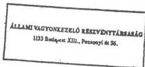

Állami Számvevőszék

# JELENTÉS

a Magyar Műsorszóró Vállalat 1990-1991-1992. évi
működéséről és gazdálkodásáról

1993. május

147.

Magyar Országos

---

**A vizsgálatot vezette:**

*dr. Kovácsné*

*dr. Pósfay Zsuzsanna*

*osztályvezető főtanácsos*

**A vizsgálatot végezte:**

*dr. Baki József*

*Benti Gabriella*

*Rideg Margit*

*számvevő tanácsos*

*számvevő tanácsos*

*számvevő tanácsos*

---

# IV. VAGYONELLENŐRZÉSI IGAZGATÓSÁG

V-36-22/1992/93.

Témaszám: 152

# J E L E N T É S

a Magyar Műsorszóró Vállalat 1990-91-92. évi működéséről és gazdálkodásáról

# I.

# BEVEZETÉS

A Minisztertanács 1989. októberében döntött a Magyar Posta három vállalattá történő szétválásáról.

A minisztertanácsi határozat alapján jött létre a Magyar Posta Vállalat, a Magyar Távközlési Vállalat és a Magyar Műsorszóró Vállalat. A Magyar Posta átszervezésével különvált a hagyományos postaszolgálat, a telefonszolgáltatás és a műsorszórás.

A Magyar Műsorszóró Vállalatot 1990. január 1-vel alapította a közlekedési, hírközlési és építésügyi miniszter. A vállalat elsődleges feladatának a rádió és televízió szolgáltatást határozta meg.

A vállalat induló vagyona a létesítő határozat szerint 3,5 Mrd Ft volt azzal a kiegészítéssel, hogy ettől eltérést tett lehetővé a határozat a hírközlési hatósági szervezet létrehozási költségeire figyelemmel.

A vállalat induló létszáma 1700 fő volt.

---

- 2 -

A vizsgálat célja a vállalat vagyonmegőrző és vagyongyarapító tevékenységének, az állami vagyonnal történő gazdálkodásnak az ellenőrzése.

A vizsgálat alapja az Állami Számvevőszékről szóló 1989. évi XXXVIII. törvény 2. §-ának (6) bekezdése volt.

A vizsgálat három tárgykör szerint történt:

- A vállalat létesítésének, átalakulásának, általános működésének kérdései, és a tágabb értelemben vett vagyonmegőrző tevékenység.
- A vállalat gazdálkodása az állami vagyonnal.
- A vállalat létesítő határozatában meghatározott elsődleges feladatának, a rádió- és televíziószolgáltatás ellátása.

A vizsgálat az 1990-91-92. évekre terjedt ki.

A vizsgálat 1993. január 28-tól 1993. március 16-ig tartott, amelyből a helyszíni vizsgálat időpontja 1993. január 28-tól február 28-ig terjedt.

# II.

# ÖSSZEFOGLALÓ MEGÁLLAPÍTÁSOK, KÖVETKEZTETÉSEK ÉS JAVASLATOK

A Magyar Műsorszóró Vállalat (továbbiakban: MMV) 1990. évi alapításának körülményeit vizsgálva megállapítható, hogy a vállalat a 3300/1989. számú minisztertanácsi határozatban előírt időpontban létrejött, a minisztertanácsi határozatban rögzített határidővel ellentétben azonban 1990. július 1-vel nem alakult át részvénytársasággá.

---

- 3 -

Az átalakulás három éven át elhúzódott és a vizsgálat időpontjában sem volt teljes egészében lezárt folyamat.

A döntéshozatalok során jogszerűtlenül jártak el az alapítói jogokat gyakorlók az átalakulás időpontjának visszamenőleges meghatározásakor. Az alapszabály visszadátumozása következtében a társaság nem tudott eleget tenni a társasági törvényben előírt 30 napon belüli bejelentési kötelezettségének.

Az Állami Vagyonügynökség (továbbiakban: ÁVÜ) 1992 októberében visszamenőleg, 1992. június 30-val határozott a részvénytársasággá alakulásról, az alapszabály aláírásáról és a vezető tisztségviselők megbízásainak kiadásáról azonban ekkor sem gondoskodott. Az alapítói jogokban bekövetkezett változásoknak megfelelően az alapszabályt az Állami Vagyonkezelő Rt. (továbbiakban: ÁV Rt) írta alá és küldte meg 1993 márciusában a vállalatnak. Az alapszabályt – az ÁVÜ korábbi határozatához igazodva – visszadátumozta 1992. június 30-ra.

Az MMV az ÁVÜ döntését követően részvénytársasági elnevezéssel kezdett működni. Érvényes alapszabály, vezető tisztségviselői megbízások, cégbírósági bejelentés hiányában a részvénytársasági működésnek nem voltak meg a jogi alapjai. Ténylegesen a vállalati jogaik szerint jártak el képviselői. Az átalakulás elhúzódásában szerepe volt a privatizációs stratégia változásainak, a jogszabályok értelmezésében kialakult vitáknak, amelyek végül is az állami tulajdonban lévő, egyszemélyes részvénytársasággá alakítás hároméves késedelmét okozták.

A vállalat vagyonmegőrző tevékenysége megfelelő volt a vizsgált időszakban. A vállalat a jogszabályokkal összhangban alakította ki belső szabályrendszerét és szervezetét. Vagyonát összességében eredményesen működtette.

Alapításkor a vállalat rendelkezésére bocsátották a működéshez szükséges induló vagyont. Az MMV az állami vagyonnal nyeresé-

---

- 4 -

gesen gazdálkodott, anyagi kötelezettségeinek eleget tett, vagyonát saját erőből növelte. Meglévő vagyonát az ésszerű határokon túl nem kockáztatta. Két rendezetlen kérdés befolyásolta a vállalat gazdálkodását a vizsgált időszakban. 1993. március 18-án a Magyar Televízióknak az MMV-vel szemben fennálló tartozása (szolgáltatási díj és késedelmi kamat) 707,8 millió Ft volt. Ugyanakkor a vizsgálat időpontjában még ismeretlenek voltak a szükséges rekonstrukciós fejlesztések forrásai.

A szolgáltatás folyamatos, vállalati szintű teljesítését megfelelő belső szabályozás és szakképzett vezetők biztosítják. A panaszok, bejelentések száma nem jelentős.

A vizsgálatnak a vállalatot mulasztásban elmarasztaló megállapítása az, hogy a panaszok, bejelentések által nyerhető információkat nem elég hatékonyan hasznosítják. Nem készült el a szolgáltatási információkat összesítő számítógépes adatbank-rendszer, a manuális információrendszer pedig már nem működik.

A vizsgálat megállapításaiból levonható következtetések:

- Az önálló vállalattá alakulással a különböző szolgáltatások (postai, telefon, műsorsugárzás) keresztfinanszírozásának lehetősége megszűnt és kialakult az önálló és felelős gazdálkodás szervezete. Ezzel azonban a Magyar Posta (továbbiakban: MP) átszervezésének és három önálló vállalattá alakításának céljai csak részben valósultak meg, mert a vizsgált időszakban a részvénytársasággá alakulás nem fejeződött be.

Ugyanakkor a részvénytársasággá alakulás is csak a privatizációs folyamat első lépcsőfokát jelenti. A részben vagy teljesen tartósan állami tulajdonban maradó gazdálkodó szervezetekről szóló 126/1992. (VIII.28.) Korm. rende-

---

- 5 -

let 50 % + 1 szavazatban határozta meg a tartós állami üzletrész arányát. A tőkebevonás ennek figyelembevételével történhet a második lépcsőben.

- A vállalatnál elmaradt fejlesztésekhez szükséges tőkebevonást célzó tényleges privatizáció egyes feltételei ma is kialakulatlanok.

A közszolgálati televíziózás és rádiózás területére kizárólag az MMV végzi a műsorsugárzást, ezért ezen a területen nem érvényesülnek a piac szabályai.

A kizárólagosan végzett műsorsugárzás egyben szolgáltatási kényszeren is alapul, a szolgáltatás ellenértéke pedig hatósági ár alapján kerül megállapításra. A műsorsugárzás műszaki-technikai fejlesztése jelentős ráfordítást igényel.

A fejlesztéshez szükséges források elvileg több úton biztosíthatók:

- a vállalat a fejlesztéshez olyan állami eszközöket kap, amelyeket célzottan használhat fel;
- a fejlesztési forrás a hatósági árba kerül beépítésre;
- a fejlesztéshez szükséges forrásokat a részvénytársasággá alakulás után külső (nem állami) tőkebevonásból biztosítják.

A megfelelő arányú kereskedelmi műsorsugárzás hiányában a fejlesztési igényekhez képest csekély nyereségtartalmú közszolgálati rádiózás-televíziózás nem elég vonzó a külső tőkebefektetőnek. A kérdés hosszútávú rendezetlensége esetén - amennyiben a külső tőkebevonás nem sikerül - közvetett módon továbbra is az állami költségvetésre hárulhat-

---

- 6 -

A ténylegesen szükséges műszaki fejlesztés és ennek időbeli ütemezése (figyelemmel a kereskedelmi műsorsugárzás későbbi megindulására is) olyan speciális szakmai kérdés, amelynek megítélésére az Állami Számvevőszék nem vállalkozhat, azonban felhívja a figyelmet arra, hogy a műszaki döntések során a közgazdasági összefüggésekre a korábbiaknál nagyobb figyelmet kell fordítani.

A fenti következtetések alapján az Állami Számvevőszék javasolja, hogy

a) a Közlekedési, Hírközlési és Vízügyi Minisztérium

- mielőbb mérje fel a közszolgálati műsorsugárzás reális műszaki fejlesztési igényeit, a fejlesztés ütemezését, és dolgozza ki arra vonatkozó javaslatát, hogy a szükséges források milyen módon biztosíthatók a leghatékonyabban;

b) az MMV vezetése

- gondoskodjon még offenzívebb magatartással arról, hogy a vállalattal szembeni tartozások behajtásra kerüljenek, a kintlévőségek ne zavarják a gazdálkodást;
- bízza meg a panaszok kivizsgálására, elbírálására, nyilvántartására, az üzemigazgatóságok műszaki-gazdasági ellenőrzésekor a műszaki ellenőrzéseik minősítésére az Üzemeltetési Főosztályt;
- közölje a szolgáltatási szerződések megkötésekor az előfizetőkkel az adott terület aktuális vételi viszonyait, és a - szerződéskötéskor ismeretes - jövőben várható műszaki fejlesztések becsülhető hatását;

---

- 7 -

- készítesse el és tartassa karban - az egykori "törzskönyvet" felváltó - számítógépes adatbankot mindazokról a műszaki információkról, amelyek gyors ismerete szükséges a folyamatos minőségi műsorszóráshoz;
- fontolja meg, hogy a Szolgáltatási Szabályzatban előírt mérési eredmények, illetve a névleges értékektől kimutatott eltérések az adatbankba betáplálásra kerüljenek.

# III.

# RÉSZLETES MEGÁLLAPÍTÁSOK

# 1. A Magyar Műsorszóró Vállalat létesítése, átalakulása és a vállalat vagyonmegőrző tevékenysége a működés során

A Magyar Műsorszóró létesítését elrendelő 3300/1989. sz. MT határozatot megelőzően 1989. októberében a közlekedési, hírközlési és építésügyi miniszter 962.191/1989. számon előterjesztést készített a Minisztertanács részére a Magyar Posta szervezetének korszerűsítéséről.

Az előterjesztéssel egyetértettek a PM, az OT, az OÁH, valamint az ÁBMH képviselői. Az előterjesztés az 1990. július 1-jei részvénytársasággá alakulást javasolta.

A 3300/1989. MT határozat megjelenését követően azonban a Közlekedési, Hírközlési és Építésügyi Minisztériumban

---

- 8 -

tizálás reális feltételei nem alakultak ki. Az 1990. szeptember 3-ai Minisztériumi Kollégium határozati javaslata szerint a Magyar Műsorszóró Vállalat privatizációjának lehetőségeiről – a távközlés privatizálásáról szóló előterjesztésben – a Gazdasági Kabinetet tájékoztatni kellett.

A Magyar Műsorszóró Vállalatnak már akkor kialakított álláspontja szerint is a vállalat biztos alapokon való működése a részvénytársasági forma. 1991-ben a vállalat saját kezdeményezésére megkezdte az átalakulás előkészítését és az átalakulási törvény alapján átalakulási tervét benyújtotta az Állami Vagyonügynökséghez.

Az átalakítás egyik akadályaként a Ptk. módosításáról szóló, 1991. évi XIV. törvény merült fel az Állami Vagyonügynökség részéről, amely szerint ha a törvény eltérően nem rendelkezik, kizárólag az állam tulajdonában van a távközlési alaphálózat és a távközlésre felhasználható frekvenciák (Ptk. 172. § e. pontja). E rendelkezés, különösen amiatt, hogy a távközlési alaphálózat fogalmát nem definiálták, értelmezési vitákra teremtett lehetőséget.

Az Állami Vagyonügynökség csak 1992. október 7-i ülésén határozott arról, hogy a Magyar Műsorszóró Vállalatot visszamenőlegesen, 1992. június 30-i hatállyal átalakítja egyszemélyes, zárt részvénytársasággá (1. sz. melléklet).

Eljárása során az Állami Vagyonügynökség nem tartotta be a gazdálkodó szervezetek és gazdasági társaságok átalakulásáról szóló 1989. évi XIII. tv. 17/A. §-át, amely szerint 30 (max. 60) napon belül meg kellett volna határoznia az átalakulás feltételeit és módját, vagy az átalakulást meg

---

- 9 -

A határozathozatalra a benyújtástól számított egy év múlva került sor. Az alapító okiratot és alapszabályt azonban még ekkor sem írták alá. Az időközbeni jogszabályváltozásokra tekintettel (1992. évi LIII. tv., 1992. évi LIV tv., 126/1992. (VIII.28.) Korm. rendelet) 1992. december 19-én már az Állami Vagyonkezelő Részvénytársaság értesítette a Műsorszóró Vállalatot (2. sz. melléklet) az alapító okirat és alapszabály elfogadásáról. Az aláírt alapító okiratot és alapszabályt csak 1993 márciusában kapta meg a vállalat. Az alapító okiratot – az ÁVÜ határozathoz igazodóan – az ÁV Rt. visszadátumozta 1992. június 30-ra. E tényből eredően az átalakult szervezet nem tudott eleget tenni a gazdasági társaságokról szóló 1988. évi VI. törvényben foglalt kötelezettségének, mely szerint a társaság alapítását a társasági szerződés megkötésétől, illetőleg az alapszabály elfogadásától számított harminc napon belül be kellett volna jelentenie a cégbíróságnak.

A létesítést követően a vállalat aktualizálta a szétválást megelőző időszakból származó belső utasításait és azokat a vizsgált időszakban újakkal egészítette ki. A belső szabályozás összességében rendezett és jól szolgálta az elsődleges tevékenységek ellátási rendszerét.

A vállalat Szervezeti és Működési Szabályzata (SZMSZ) 1991. márciusában lépett hatályba, felváltva ezzel a szétválás előtti időszak igazgatósági ügyrendjét.

Az SZMSZ-ből jól nyomon követhető az elsődleges tevékenységek ellátási rendszere is. A vizsgált időszakban a válla-

---

- 10 -

A belső szabályozás széles körűen kiterjed a vállalati folyamatokra, így az ügyvitel, szerződéskötés, utalványozás, beruházás, bizonylati rend, tűzvédelem, munkavédelem, leltározás, selejtezés stb. területére.

A vállalat belső szabályozásában megfelelő hangsúlyt kap a vállalati vagyon védelme.

A vállalatnál közvetlenül a vezérigazgató irányítása alá rendelten önálló biztonságtechnikai osztály működik. A vállalat saját polgári fegyveres őrséggel rendelkezik.

A vállalati vagyon szélesebb értelemben vett védelméhez kapcsolódóan a Szervezeti és Működési Szabályzat az Ellenőrzési osztályra és a Jogi és igazgatási osztályra vonatkozóan is tartalmaz kötelezettségeket. Így pl. az Ellenőrzési osztálynak az anyagi és pénzügyi eszközökkel való gazdálkodás ellenőrzése során vizsgálnia kell a bizonylati rend betartását stb. is.

A Jogi osztály érvényesíti a szerződésszegésből származó igényeket, ellátja a vállalat követeléseinek behajtásával kapcsolatos feladatokat stb.

A vállalati vagyon védelmét szolgálják pl. a társadalmi tulajdon fokozott védelméről, a bírságok, büntetések felmerülése esetén követendő eljárásról, a feljelentési kötelezettségről MMV utasítások. Ide sorolhatók a leltározásra, selejtezésre, felesleges vagyontárgyak hasznosítására stb. vonatkozó szabályok is.

A vizsgált időszakban a vállalati belső ellenőrzés által folytatott vizsgálatokban megfelelő helyen szerepelt a vállalati vagyon védelme.

---

- 11 -

A vállalatnál a hatályos jogi szabályozásnak megfelelően közvetlenül a vezérigazgató irányítása alatt álló függetlenített belső ellenőrzés működik. A belső ellenőrzés a vizsgált időszakban ellenőrzéseket végzett a leltározásokkal, az álló és fogyóeszközök a felesleges vagyontárgyak selejtezésével kapcsolatban, a gépkocsigazdálkodás, az alapítványokkal kapcsolatos vállalati tevékenységek körében.

Az ellenőrzésekről és egyes kapcsolódó intézkedésekről áttekinthető nyilvántartást vezetnek.

A részvénytársasággá alakulással összefüggésben tervezetek szintjén már előre foglalkoztak a belső ellenőrzés részvénytársaságon belüli új szerepével, elhelyezkedésével.

A vállalat a vizsgált időszakban, 1990-ben 17 ezer Ft, 1991-ben 359 ezer Ft, az 1992. év első félévében – pedig 26 millió Ft veszteséget írt le az eredménye terhére.

Az 1990-91-ben leírt összegek többsége felderítetlen lopások következtében keletkezett.

Az 1991-ben leírt összegből egy elhunyt dolgozó hiányaként keletkezett 210 ezer Ft-os veszteség emelkedik ki.

Ez utóbbi veszteség keletkezésében közrehatott a vállalat részéről a folyamatba épített ellenőrzés gyakorlásának elmaradása, amelyért az illetékes vezetőt figyelmeztetésben részesítették.

Az 1992. évről a vállalat csak az első félévről tudott adatokat szolgáltatni. A korábbi két évhez képest megnövekedett leírás (26 millió Ft) döntő hányadát az Ybl Bank

---

- 12 -

További összegek ugyancsak tartozások érvényesítésének eredménytelenségéből adódnak. A leírások előtti igényérvényesítés, esetleges személyi felelősségrevonások kezdeményezése a jogi és igazgatási osztály feladata.

## 2. A Vállalat gazdálkodása az állami vagyonnal

Az adózás rendjéről szóló 1990. évi XCI. törvény által előírt adóbevallási határidőket – 1993. február 15. és 1993. február 28. – a Vállalat nem tartotta be.

A késedelem okaként az ÁVÜ Igazgatótanácsának 1992. október 7-én hozott határozatát jelölte meg, amely szerint az ÁVÜ a Magyar Műsorszóró Vállalatot visszamenőlegesen – 1992. június 30-i hatállyal – részvénytársasággá alakította át.

Az átalakulással együttjáró kötelezően előírt számviteli munkálatok – az 1992. június 30-i teljeskörű leltárral alátámasztott vállalati zárómérleg elkészítése, a vagyonértékelés, az 1992. július 1-jei részvénytársasági nyitó vagyonmérleg elkészítése és hitelesítése – miatt az 1992. II. félév gazdasági eseményeinek számviteli feldolgozását csak 1993 januárjában kezdték meg a társaságnál.

Az adóbevallásokat megalapozó számviteli munkálatok a helyszíni vizsgálat végéig – 1993. február 28. – nem fejeződtek be.

A fentiek következtében az ÁSZ csak az önálló állami vállalati gazdálkodás két és fél évének eredményességét vizsgálhatta a vagyonalakulás tekintetében.

### 2.1. Az alapításkor kapott vagyon

Önálló működéséhez az MMV összességében megkapott minden olyan vagyonelemet az MP vagyonából a vagyonmegosztás során, amelyek szolgáltatásainak zavartalan ellátásához ko-

---

- 13 -

rábban is szükségesek voltak. Feladatai ellátásának színvonalában a vagyonmegosztás folyamata a vizsgált időszakban visszaesést nem okozott.

A fejlesztésre fordítható források képződését tekintve azonban, vagyonmegosztás után – a műsorszórás korábbi helyzetéhez képest – lényegesen hátrányosabb feltételek között kezdte meg önálló vállalati működését.

Az 1990. január 1-jei vagyonmegosztó mérleg szerint 4,9 milliárd Ft értékű alapítói vagyont kapott az MMV.

A nyitómérlegek azonban tartalmaztak rendezetlen, vitás tételeket is, amelyeknek végleges rendezését 1990-ben tervezték megoldani a jogutód vállalatok a felhalmozott vagyonnal szemben.

Mivel az MMV az általa használt eszközök tekintetében szinte teljes mértékben elkülönült egységből, a Posta Rádió- és Televízióműszaki Igazgatóságból jött létre, a vagyonmegosztás során neki adódott legkevesebb és legkisebb vagyonértéket érintő rendezési problémája, és azok is döntően a MATÁV-val való megegyezést igényelték.

Az MMV utólagos vagyonátadásai közül egyetlen jelentősebb tétel volt a Frekvenciagazdálkodási Intézet működését biztosító – 99 %-ban tárgyi eszközökből álló – 326 millió Ft értékű vagyonátadás 1990-ben. Az eszközátadással 1991-ben módosíttatta alapítói vagyonát.

Utólagos vagyonátvétele a Magyar Posta (továbbiakban: MP) másik két jogutód vállalatától 1990-1991-ben összesen 64 millió Ft térítésmentes eszközátvételből és 180 millió Ft véglegesen átvett pénzeszközből állt.

---

- 14 -

Az MP szétválásakor az MMV a könyvszerinti vagyonán kívül az alábbi gazdálkodási feltételeket örökölte:

- a postáról és a távközlésről szóló 1964. évi II. tv. által előírt szolgáltatási kötelezettséget a rádió és a televízió műsorainak sugárzására;
- a Magyar Rádióval és Magyar Televízióval - formálisan megállapodás alapján - fizetendő, hagyományosan alacsony nyereségtartalmú, illetve veszteséges díjakat (a legmagasabb hatósági árat (díjat) miniszteri rendelet határozta meg);
- rekonstrukcióra szoruló hálózatot;
- az MP egyéb tevékenységéből történő keresztfinanszírozás megszűnését;
- dolgozóinak alacsony kereseti színvonalát;
- normatív adózást teljes tevékenysége után.

Az MP szétválását elrendelő Kormányhatározat - az előterjesztések ajánlásai ellenére - a Magyar Műsorszóró Vállalat működőképessége feltételeivel kiemelten nem foglalkozott.

Mindössze annyi említést tett, hogy részvénytársasággá

---

- 15 -

## 2.2. A vizsgált időszakban kapott állami támogatás felhasználása

A Vállalat a vizsgált időszakban egyszer részesült állami támogatásban. 1991-ben az állami költségvetésből 230 millió Ft fejlesztési támogatást kapott.

A támogatás felhasználása az Országgyűlés által elfogadott céloknak megfelelt.

A támogatásból részesülő beruházásokat az 3. sz. melléklet tartalmazza.

## 2.3. A vállalati vagyon értékének alakulása

Az MMV 4.597 millió Ft-os induló (alapítói) vagyona az önálló gazdálkodás 2,5 éve alatt összesen 14,2 %-kal, 655 millió Ft-tal 5.252 millió Ft-ra nőtt.

A növekedés főbb összetevői voltak:

- az 1990. évi gazdálkodással elért tiszta eredmény (=adózás és az adózott eredményt terhelő kifizetések után megmaradó nyereség); 152 millió Ft
- 1991. évi gazdálkodással elért tiszta eredmény 0 millió Ft
- 1992. I. félévi gazdálkodással elért tiszta eredmény 95 millió Ft
- 1991. évben az állami költségvetésből kapott támogatás 230 millió Ft
- a szétvállással összefüggő utólagos vagyonátadások, illetve vagyonátvételek egyenlege 240 millió Ft
- egyéb vagyonátadások, vagyonátvételek egyenlege - 62 millió Ft.

---

- 16 -

A Részvénytársaság 1992. július 1-i nyitó vagyonadatai a vállalat 1992. június 30-án meglévő, de az átalakulás kapcsán átértékelt vagyonának értékét fejezik ki.

Az átalakulásra, privatizációra készülődve az MMV három alkalommal adott megbízást vagyonának átértékelésére a BONITAS Gazdasági Tanácsadó, Vagyonértékelő és Könyvszakértő Kft.-nek. Ennek eredményeképpen könyvvizsgálók által hitelesített vagyonmérlegek készültek a Vállalat

1990. december 31-én

1991. december 31-én és

1992. július 1-én

meglévő vagyonáról.

A Vállalat 1992. június 30-i könyvszerinti saját tőkéje (5.252 millió Ft) csaknem kétszeresére (10.129 millió Ft) emelkedett. Az értéknövekedésben az ingatlanok és a távközlési gépek, berendezések átértékelése a meghatározó.

A 2 milliárd Ft nettó értéken nyilvántartott ingatlanok átértékelve 4,9 milliárd Ft-ot, az 1,7 milliárd Ft nettó értéken nyilvántartott távközlési gépek, berendezések pedig 3,7 milliárd Ft-ot érnek.

Az átértékeléssel keletkezett vagyonértékkülönbözet az ÁVÜ határozata szerint részben a jegyzett tőkét (részvénytársasági alaptőkét), részben a tőketartalékot növelte. Az MMV mérleg szerinti vagyonadatainak változását a 4. sz. melléklet mutatja be.

---

- 17 -

# 3.4. Befektetett eszközök osztalékának, alapítványi célú kifizetéseknek a szerepe a vagyonváltozásban

A gazdálkodással elért tiszta eredmények (152+0+95 millió Ft) nagyságának kialakulásában sem az alapítványi célú kifizetéseknek (csökkentő tényező), sem a befektetett eszközök után kapott osztalékoknak (növelő tényező) nem volt számottevő szerepe.

# Alapítványi célokra

|  1990-ben | 9,7 millió Ft-ot  |
| --- | --- |
|  1991-ben | 15,7 millió Ft-ot  |
|  1992. I. félévben | 8,6 millió Ft-ot  |

fordított adózott eredményéből a Vállalat.

Az összesen 34 millió Ft-ból 30 millió Ft-ot tett ki az MP jogutód vállalatai által létrehozott 'postás' alapítványok (Múzeum, Zenei, Művelődési, Hűség, Sport alapítványok) működéséhez adott hozzájárulás.

Minthogy az alapítványi célú kifizetések adóalapcsökkentő tételként vehetők figyelembe, valamennyi tételnek csak a 60 %-a – összesen 20,4 millió Ft – csökkentette valójában a tiszta eredményt.

A befektetett eszközei után 1991-ben 4,5 millió Ft, 1992. I. félévében 1,7 millió Ft osztalékot kapott a Vállalat. Ezen összegek 25 %-át állami vagyon utáni részesedésként az állami költségvetésbe fizette a Vállalat, tehát együttesen, 5 millió Ft-tal sem növelték a tiszta eredményt.

A befektetett eszközök hozamaikon kívül általában vagyont-kockáztató szerepük miatt is figyelmet érdemelnek. Az MMV befektetett eszközeinek megoszlását és változását mutatja az alábbi táblázat:

---

- 18 -

# A befektetett eszközök értéke és osztaléka

|   | millió Ft-ban  |   |   |   |
| --- | --- | --- | --- | --- |
|   | 1990. jan. 1-én | 1990. dec. 31-én | 1991. dec. 31-én | 1992. jún. 30-án  |
|  **Részvények összesen** | 3 | 13,5 | 18,5 | 17,8  |
|  (1990. jan. 1-jén 1 Rt.-nél |  |  |  |   |
|  1990. dec. 31-én 2 Rt.-nél |  |  |  |   |
|  1991. dec. 31-én 3 Rt.-nél |  |  |  |   |
|  1992. jún. 30-án 3 Rt.-nél) |  |  |  |   |
|  **Kapott osztalék** | - | - | 1,2 | 1,7  |
|  **Vagyoni betét gazdasági társaságban összesen** | 41,2 | 41,2 | 40,0 | 50,9  |
|  (1990. jan. 1-jén 2 Gt.-ben |  |  |  |   |
|  1990. dec. 31-én 2 Gt.-ben |  |  |  |   |
|  1991. dec. 31-én 6 Gt.-ben |  |  |  |   |
|  1992. jún. 30-án 8 Gt.-ben) |  |  |  |   |
|  **Az összes vagyoni betétből pénztőke** | - | - | 2,3 | 18,0  |
|  **Kapott osztalék** | - | - | 3,3 | -  |
|  **Befektetett pénzeszköz összesen (részv.+pénztőke Gt.-ban)** | 3 | 13,5 | 20,8 | 35,8  |

A gazdasági társaságokba befektetett eszközök jövőbeni üzleti hasznáról egyelőre nem lehet képet alkotni, mivel értékelhető gazdasági múlttal még nem rendelkeznek.

1992. június végén még csak egyetlen nagyobb vállalkozása volt az MMV-nek, az OPERATOR MMV Személyhívó és adatátviteli Kft., amelyet 80 millió Ft értékű törzstőkével alapított a Vállalat és egy francia cég. Az MMV részesedése 51 %-os, amely 30,1 millió Ft tárgyi apportból és 10,7 millió Ft pénztőkéből áll.

Az összes befektetett eszköz súlya a vállalati vagyonon belül 1992. június 30-án 1,3 % volt. Vagyonkockáztató szerepe tehát nem jelentős.

---

- 19 -

### A Vállalat nyereségtermelő képessége

Az MMV 1990-1991. években csökkenő hatékonysággal, de nyereséges gazdálkodást folytatott. A hatékonyságromlás az indokoltnak tekinthető költségnövekedést kisebb mértékben követő árbevételnövekedésnek a következménye. Az árbevételnél nagyobb ütemben növekvő költségei mellett is mindkét évben sikerült akkora nyereséget elérnie, amely a normatív adózás után biztosította a Vállalatot terhelő kötelezettségek teljesítését.

A kötelezettségek teljesítése után 1990-ben adózott eredményéből mindössze 7,3 millió Ft-ot fordított anyagi ösztönzési célra, a fennmaradó 152 millió Ft tiszta eredmény saját vagyonát növelte.

1991-ben az adózott eredményéből a kötelezettségek teljesítése után 54 millió Ft maradt anyagi ösztönzési célra, valamint vagyonnövelésre. A Vállalat ezt az 54 millió Ft-os lehetőséget teljes egészében dolgozóinak javadalmazására fordította. Ezzel, valamint az 1990-1991. évi bérfejlesztésekkel önerőből sikerült biztosítania a Vállalat működőképességének személyi feltételeit. A műszaki fejlesztés önerőből történő megvalósításának feltételei azonban a Vállalaton kívül álló okok – árpolitikai törekvéseinek elutasítása, nyereséges üzletágak bővítésének akadályai – miatt nem teremtődtek meg a vizsgált időszakban.

A Vállalat 1990-1991-ben elért árbevételét, nyereségét, hatékonysági mutatóit az 5. sz. melléklet tartalmazza.

---

- 20 -

Összehasonlításként megemlíthető, hogy 1989-ben az MP szervezetén belül a Posta Rádió- és Televízióműszaki Igazgatóság mérlegbeszámolójában 1845 millió Ft árbevétel mellett 765 millió Ft nyereséget mutatott ki. Ez belső korrekciók után 460 millió Ft-ra csökkent. Ugyanekkor a mérlegében kimutatott saját vagyona 3.807 millió Ft volt. Ezek alapján árbevételarányos nyeresége 25 %, vagyonarányos nyeresége pedig 12,1 % volt.

A hatékonysági mutatók nagyságában szerepet játszó tényezők közül a saját vagyon változásáról a jelentés előző részei szólnak, a nyereségtermelő-képesség üzletágankénti alakulását pedig az 6. sz. melléklet tartalmazza.

A mai napig is hatályos, a postáról és a távközlésről szóló 1964. évi II. törvény 4. § (1) bekezdése kimondja, hogy 'A Magyar Posta köteles a posta és a távközlés zavartalan működése érdekében a szükséges személyi és tárgyi feltételekről gondoskodni'.

A hivatkozott törvény szerint a távközlés fogalmába tartozó rádió- és televízióműsorok sugárzása tekintetében a Magyar Posta jogutód vállalata az MMV.

Az MMV tevékenységei között legnagyobb súlya a közszolgálati rádió- és televízióműsorszórásnak van. A vállalati összes költségekből

|  1990-ben | 73 %-kal,  |
| --- | --- |
|  1991-ben | 71,3 %-kal  |

részesedett.

Ehhez képest a közszolgálati rádió- és televíziószolgálat

---

- 21 -

Az elhasználódott állóeszközök pótlásához, fejlesztéséhez ez az üzletág még az elszámolt amortizáció erejéig sem járult hozzá 1991-ben.

Ezekben az években a rádióadók mintegy 70 %-a, a televízióadók 40 %-a volt 15 évnél idősebb.

Akármeddig ez a helyzet kár nélkül nem tartható fenn. A közszolgálati műsorok sugárzásának túlságosan nagy állóeszközigénye van ahhoz, hogy a Vállalat az árbevételben esetlegesen megtérülő amortizációból és más, nyereséges üzletágakból a zavartalan működést biztosítsa.

Az MMV önállóvá válása után – már 1990-ben – elkezdődött a közszolgálati műsorsugárzási díj reális nagyságáról folytatott vita az MTV, az MR és az MMV között.

A sugárzási díjak 1990. január 1. előtt is az érdekeltek közötti megállapodásos árak voltak, bár akkor a szolgáltató szempontjából nem volt egzisztenciális súlya a közszolgálati műsorszórás jövedelmezőségének.

A klasszikus postai tevékenységhez hasonlóan a műsorszórás is keresztfinanszírozással kapta meg az MTV és az MR igényei szerinti beruházásokhoz szükséges pénzeszközök döntő részét.

A Vállalat, hogy törvényi kötelességeinek megfelelhessen – és természetesen saját jövőjét se legyen kénytelen indokolatlanul kockáztatnia – 1991-re radikális áremelési szándékot jelentett be az érdekelt intézményeknél.

A közszolgálati műsorok sugárzásában az 1990. évi 12 millió Ft helyett 1 milliárd Ft eredmény elérését célozta meg a Vállalat. Adózás után ennek fele sem maradt volna a Vállalatnál fejlesztésre. Figyelembe véve, hogy 1990-ben

---

- 22 -

a közszolgálati műsorok sugárzásán az amortizáción kívül semmi fejlesztési forrás nem képződött, az önálló gazdálkodás éves átlagában mintegy 220 millió Ft többlet fejlesztési forrást jelentett volna ez a Vállalat számára.

Az árvita látszólag a monopolhelyzetű felek között indult el, de valójában az állami költségvetés helyzete döntötte el. A vita kimenetelében kezdettől fogva különböztek a szolgáltató és a szolgáltatást igénybevevők esélyei érdekeik érvényesítésére.

A költségvetést képviselő PM 1991 áprilisában APEH vizsgálatot rendeltetett el a díjemelés indokoltságával kapcsolatosan.

Az 1991. évi díjak tekintetében az APEH-revízió megállapításai döntötték el az árvita kimenetelét.

Az APEH-revízió megállapítása szerint, ha a Vállalat a két szervnek nem számítana fel nyereséget és 1991-ben a frekvenciahasználati díj sem kerülne bevezetésre, akkor – változatlan műsoridőket feltételezve – is növelni kellene az MTV által felajánlott 600 millió Ft-ot 100 millió Ft-tal, az MR által felajánlott 761 millió Ft-ot 150 millió Ft-tal.

Az összegző megállapítás a következő:

“A revízió véleménye szerint a Magyar Televízió 600 millió Ft-os és a Magyar Rádió 761 millió Ft-os árajánlata reális kiinduló alapnak tekinthető 1991. évre. A frekvencia-használati díjak ismeretében ezt valószínűleg növelni kell mintegy 15-20 %-kal. Ugyanakkor nem tűnik teljes mértékben indokoltnak a Vállalat 1991. évre tervezett közel 1 milliárd Ft-os nyereségének szükségessége, amelyet a Televízió és a Rádió részére az alkalmazott díjakban kíván érvényesíteni”.

---

- 23 -

Az APEH által elégségesként megállapított műsorsugárzási díjemelési mértékek vitathatók, mert fontos árösszetevőket hagytak figyelmen kívül és ezt nem indokolták. Árképző tételként nem vették figyelembe, hogy

- a Vállalat önfenntartásra kötelezetté vált, és tárgyi eszközeinek mintegy 75 %-át kizárólag a közszolgálati tevékenységre használja.
Következésképpen ezen eszközök elhasználódása miatti cserét fedező díjakat kell érvényesítenie, figyelemmel az inflációra is;
- az APEH nem vizsgálta, hogy a közszolgálati műsorszórás fejlesztési célú beruházásainak mekkora a szükséges mértéke, ennek hány év alatt kell folyamatosan megtérülnie a díjakban, figyelemmel az inflációra is.

Erre a vizsgálatra azonban még az 1992. és 1993. évi díjak megállapítása előtt sem került sor.

Az APEH-vizsgálat mintha a PM Vállalkozási Főosztálya Termelő Infrastruktúra Osztályának az 1991. évi televízió és rádió sugárzási díjakkal kapcsolatosan kialakított 1991. januári álláspontját támasztaná alá.

Nevezetesen: "A frekvenciahasználat és a tömegkommunikációs médiák helyzetének törvényi rendezése a jelenlegi struktúrát (beleértve az MMV működési körülményeit is) lényegileg módosíthatja. Ezért célszerűtlen és indokolatlan jelenleg végleges, vagy 1992. évre kitekintő tarifarendezést végrehajtani. Stabil megoldás akkor alakítható ki, ha ismertek és törvényileg rögzítettek lesznek a

---

- 24 -

'szereplők', döntés születik a közszolgálati és a kereskedelmi jelleg elhatárolásában, valamint a frekvencia használati díj bevezetéséről'. A fent említett törvényi rendezés napjainkig sem történt meg.

Az árvita elhúzódása miatt 1991. I. félévben az MMV-nél állandósultak a likviditási gondok. A Vállalatot az év közepén fizetésképtelenség fenyegette.

Az 1991. évi díjfizetésről ugyanis az MTV-vel csak 1991. júniusban sikerült előzetes megállapodást kötni, az MR-rel viszont csak 1991. decemberben kötöttek végleges szerződést.

Addig az előző évi szintnek megfelelő előlegeket fizették a szolgáltatást igénybevevő intézmények. Az év közepén a biztosnak tekinthető bevételek és a folyamatosan felmerülő működési költségek különbözteként mintegy 70 millió Ft-os likviditási hiány állandósult a Vállalatnál.

Az 1991. évi súlyos pénzügyi gondok elkerülése érdekében a Vállalat elfogadta a KHVM azon javaslatát, hogy a közszolgálati rádió- és televízióműsorok sugárzásának díja 1992. évtől hatósági árként legyen biztosítva.

Bár a hatósági árak sem biztosították az MMV által jogosnak tartott nyereségszintet, azonban bevezetésüktől azt remélte a Vállalat, hogy biztonságot nyújtanak a folyamatos árbevételhez.

Az MTV fizetési készsége 1992-ben is rossz volt. 1992. decembert kivéve valamennyi hónapban kevesebb összeget utalt át a közszolgálati műsorszórás igénybevételéért, mint az esedékes számlák összege.

A számla-kiegyenlítések általában 18-142 napos késéssel követték a fizetési határidőket.

---

- 25 -

Az MTV 1992. december 31-én fennálló tartozásának összege (késedelmi kamattal együtt) 347,7 millió Ft volt. 1993. március 18-án az 1992. és 1993. években kiszámlázott szolgáltatásokért fennálló tartozása (késedelmi kamatokkal együtt) 707,8 millió Ft.

Az MMV likviditási helyzetének változását mutatja be a 7. sz. melléklet.

# 3. Az MMV szolgáltatásainak helyzete, színvonala

A létesítő határozat az MMV elsődleges feladatául a rádió- és televíziószolgáltatást jelölte ki. A vizsgálat a közszolgálati műsorszórásra koncentrálva tekintette át az MMV működését.

Ennek megfelelően a jelentés e pontjában szolgáltatáson az alábbiakat értjük:

- a Magyar Rádió műsorainak közép-, rövid és ultrarövidhullámon történő sugárzása;
- a Magyar Televízió gerincadókkal és átjátszó adókkal megvalósított TV1 és TV2 programjainak műsorsugárzása;
- a Budapesti AM-MIKRO rendszer.

Az MMV szolgáltatásainak színvonalas teljesítéséhez szükséges követelmények meghatározására, a szolgáltatási eljárások szabályozására, valamint a vállalt szolgáltatási színvonal folyamatos teljesítése érdekében a műszaki eszközök adatbank-rendszerű nyilvántartására a Szolgáltatási Osztály kötelezett. Az osztály az MMV megalakulásának évében létesült. Lényeges szervezeti módosulást jelent az a tény, hogy a korábbi évtizedek gyakorlatától eltérően a műsorszórásra

---

- 26 -

olyan szervezeti egység létesült, amely a szolgáltatások gyakorlati feladatainak megvalósítását elősegítő, azokat biztosító teendők ellátására hivatott. Az osztály 18 fős létszáma, a dolgozók képzettsége és gyakorlata, valamint bérezésük színvonala együttesen bizonyítja, hogy az MMV vezetése komoly jelentőséget tulajdonít e szervezeti egységnek.

A szolgáltatások közvetlen megvalósítói az üzemigazgatóságok, illetve a 9 üzemigazgatóság alá tartozó állomások. Az üzemigazgatók gondoskodnak üzemigazgatóságuk területén a szolgáltatások ellátásához szükséges feladatok megszervezéséről, teljesítéséről, ellenőrzéséről, a vezérigazgatói utasítások végrehajtásáról.

3.1. Az MMV külső kapcsolataiban betartotta – mindenek előtt a Frekvenciagazdálkodási Intézettel és a szolgáltatásra szerződő felekkel – a hatályos jogszabályokat, és a nemzetközi előírásokat. Ez megnyilvánult a szolgáltatási szerződések megkötésekor (a műsorszórás vállalásakor), a műszaki rendszerek megtervezésekor, a berendezések beszerzésekor, üzembe helyezésekor, valamint az üzemeltetés során keletkezett problémák rendezésekor.

A szolgáltatást irányító, szakmai felügyeletet ellátó szervezeti egységek szakember-ellátottsága, a munkatársak képzettsége és gyakorlati tapasztalata egyaránt megfelelő a munkakörükhöz. Többségük már a Magyar Posta Rádió és Televízióműszaki Igazgatóságának dolgozója volt, így szakmai gyakorlatukat és összeszokott munkakapcsolatukat tudják hasznosítani az MMV-nél.

---

- 27 -

Az elkészített utasítások, szabályzatok, valamint a személyi-vezetési feltételek biztosítják a szolgáltatás folyamatos, vállalat szintű teljesítését.

Az MMV szolgáltatásának minőségét alapvetően az adó- és antennarendszerek műszaki állapota, üzemeltetésük rendje határozza meg. A Szolgáltatási Szabályzatban részletesen előírtak mindazok a minőségi előírások és mérési módszerek, amelyek az üzemelő hírközlő berendezések műszaki paramétereiről – a szolgáltatás ellenőrzése alapján – tájékoztatnak. A mérések gyakoriságát ugyancsak a Szolgáltatási Szabályzat határozza meg. Példaként bemutatjuk a rádió és TV adóberendezések követelményeit a 9. és 10. sz. mellékletekben (a konkrét értékek mellőzésével).

A Diszpécser Szolgálat által szolgáltatott 'napi jelentések', amelyek minden eltelt 24 óráról közvetlenül az MMV felső vezetését tájékoztatják, azt bizonyítják, hogy lényegében az MMV szolgáltatása zavarmentes.

A műszaki-gazdasági szemlék alkalmával a Szolgáltatási Szabályzatban előírt műszaki ellenőrzéseket az Üzemeltetési Főosztály az üzemigazgatóságon és szűrőpróba jelleggel kiválasztott néhány állomáson elvégzi. A szemléről készített 'összefoglaló jelentések'-ben az Ellenőrzési Osztály foglalja össze a vizsgált igazgatóság valamennyi ellenőrzési tevékenységéről tapasztalatokat és a kapcsolatos minősítő megállapításokat. A műszaki tartamú megállapítások ilymódon keverednek az összefoglaló jelentés két fejezetében és nem mindig vannak összhangban (pl. az OMK 1992. évi műszaki-gazdasági szemléje).

---

- 28 -

A műszaki-gazdasági szemlék során megvizsgálják az üzemi-gazgatóságokhoz érkezett, és saját hatáskörükben elintézett panaszok és bejelentések ügyintézését is. E feladatot is az Ellenőrzési Osztály látja el. Megállapításaik statisztikai összesítő jellegűek, a tartalmi minősítés és az eljárás értékelése elmarad. Az Üzemeltetési Főosztály megállapításaival nincsen mindig összhang. Erre példa az OMK 1992. évi ellenőrzéséről készült összefoglaló jelentés.

Érthetetlen az Országos Mikrohullámú Központról készített – 29.001/1993. számú – jelentésükben az a megfogalmazás, miszerint “írásbeli lakossági panasz 1986 óta az OMK-val kapcsolatosan nem volt”. Ennek ugyanis ellentmond, hogy 1992. decemberben 411 panasz érkezett Budapestről és környékéről, s ebből “38 db indokolt volt, mert a panaszosoknál meglévő vevőantennával nem lehetett a megfelelő vételt biztosítani”. (Utóbbi információk a Mérőellenőrző Szolgálat “Statisztika az 1992. évi bejelentésekről és panaszokról” kimutatásból származnak.)

3.2. A panaszok, bejelentések száma nem jelentős, azokra a reagálás jellemzően a panaszos számára is elfogadható. Időben kivizsgálják a helyszínen a jelzett probléma okát és lehetőségek figyelembevételével intézkednek. Ugyanakkor a panaszok, bejelentések által nyerhető információkat nem elég hatékonyan hasznosítják. A panaszok összesített nyilvántartása, azok tartalmi ismerete, minősítésük helyessége, valamint ügyintézésük eredményessége nem ismeretes a legilletékesebb szervezeti egység – az Üzemeltetési Főosztály – számára.

A 9/1990. MMV. sz. utasítás szerint járnak el, amikor összesen 12 szervezeti egység érkezett, intézi a bejelentéseket és panaszokat. Az ezekről készülő éves összesítés abszolút formálissá vált.

---

- 29 -

Az ügyeket intéző szervezeti egységek ugyan készítenek a hivatkozott utasítás 21. §-sa értelmében 'szöveges értékelő jelentéssel beszámoló jelentést', de ezek gyakran csak számszerint jelzik az eseteket elhagyva tartalmuk lényegének közlését.

Az üzemigazgatósági hatáskörben intézett panaszok és bejelentések ellenőrzését nem tartalmi minősítéssel végzik (legalábbis a szemleértékelésben nem írnak róla), azokról az Üzemeltetési Főosztály nem rendelkezik elégséges tájékozottsággal.

A Közlekedési, Hírközlési és Vízügyi Minisztérium részére – a miniszter által 75059. számon elrendelt – 'Beszámoló a közérdekű bejelentésekről, javaslatokról és panaszokról ...év' címen tájékoztatás készül. 1990. évtől a szöveges értékelés csatolása nem szükséges, a statisztikai lapon egyetlen sor jelzi a 'televízió- és rádiószolgálat' bejelentéseit, javaslatait és panaszait. Az amúgy is számszerű összesített közlésre redukált jelentés tartalmi értékét tovább csökkenti, hogy a két alapszolgáltatás összevont kimutatására kerül sor. Nem tartjuk megbízhatónak az összesen jelzett darabszámból az 'alapos' kimutatást, ugyanis a vizsgálatunk során szűrőpróbaszerű jelleggel kiválasztott panaszokat megtekintve, nem minden esetben értünk egyet az MMV 'alaptalan' minősítésével. Példaként említjük az adórekonstrukciók miatt bekövetkezett vételi minőségromlásokat, amelyek felpanaszlásait azért minősítették alaptalannak, mert az eseményt az MMV előre jelezte. Szerintünk megalapozatlan a minősítés, ha az 'elkerülhetetlen', a 'szükségszerű' – az ügyiratokból kiolvas-

---

- 30 -

hatóan egyes vevőknél véglegesen kedvezőtlen változást okozott – tényeket megalapozatlannak ítélik meg. (Pl. 8-49/91.sz. levél; 8-91/91. sz. feljegyzés.)

Nem tartjuk elfogadhatónak az MMV olyan eljárását, amikor figyelmen kívül hagyja az előfizetőkkel létesített szerződéskötésekkor az adott terület vételi viszonyait. A 8-49/91. sz. levelükben az AM-MIKRO rossz vételi minőségéről írt panaszosnak adott válaszuk példa erre. ('A Vállalatnak nem kötelessége vizsgálni azt, hogy a műsort igénylő fél Budapest mely területén helyezkedik el, s ott milyenek a vételi viszonyok. Ez a kérdés kizárólag a kivitelező szaktudására és lelkiismeretességére volt bízva'.)

Megalapozottnak tekintjük azokat a panaszokat is, amelyeket környezetben jelentkező, illetve környezeti adottságként meglévő okokra lehet visszavezetni. Ezek természetesen nem az MMV terhére írandóak, de a probléma valós – megalapozott – és a jövőbeni műszaki fejlesztésekhez hasznosítható jelzéseket is szolgálhat.

1991. és 1992. években a Szolgáltatási Osztályra érkezett 25 olyan panasz, amely valójában nem az MMV hibája, de valós panaszra ad okot, mert 'ellátatlan területeket' jelez.

A panaszok műszaki fejlesztést segítő jelentőségére példa a Szob nagyközség polgármesterének 1992. június 8-i levele, amelyben az MTV1-es adásának vételi problémáira tesz panaszt. Az MMV Műszaki Iroda Mérő-Ellenőrző Szolgálata

---

- 31 -

elvégezvén a szükséges méréseket megállapította, hogy a nyári időszakban tapasztalható távolterjedés miatt 'a településen nem lehet kifogástalan vételt megvalósítani. Bár a polgármester levelében nem említette, de az MTV2-es műsor vételével is gondok vannak, amelyek valószínűleg meg fognak szűnni a Széchenyi hegyi adó új antennarendszerének üzembehelyezése után'.

A panaszok egy része egyértelműen bizonyítja az adók korszerűsítésének szükségességét. (Pl. egy miskolci lakos panaszolta 1992. szeptember 7-i levelében, hogy az URH-n a Bartók rádió műsora időnként élvezhetetlen. Ebben az időszakban folytak a miskolci URH adóhálózat felújítási munkái, azok novemberi befejeztével a panaszok nem jelentkeztek.)

A panaszok esetenként hasznosan tájékoztatják az MMV-t a szükséges műszaki eljárás megtételére, illetve műszaki fejlesztésre. (Pl. egy pécsi panaszos a Petőfi műsorának kifogásolható tisztaságú vételét sérelmezte az URH-n. Az MMV mérések során kiderült, hogy a pécsi adóállomáson a Petőfi műsort sugárzó adó segédvivőjének lökete jóval nagyobb volt a megengedettnél, amelyet a mérés során beállítottak az előírt értékre. Továbbá: az URH adóhálózat segédvivő frekvencialöketének folyamatos megfigyelése céljából intézkedés történt olyan célműszer beszerzésére Tárnok rádióállomásra, amellyel adás közben is folyamatosan ellenőrizhető lesz a frekvencialöket értéke a megfigyelő állomás körzetében. /Pécs a vehető körzetbe esik./

---

- 32 -

A Mérő-Ellenőrző Szolgálathoz és a Szolgáltatási Osztályhoz 1991-1992. évben érkezett jogosnak minősített panaszokból példák:

|  A hiba oka | A hiba orvoslása  |
| --- | --- |
|  antennarendszer meghibásodása | antennarendszer javítása  |
|  térerősség ingadozás | adóantenna panel áthelyezés  |
|  a 'Juventus' sugárzása zavarta a TV1 adását | a 'Juventus' másik toronyra került  |
|  győri anyadó jelét időszakosan cseh adó jele zavarja | vevőantenna cserével a zavar csökkent  |
|  Gerecse TV1 antennarendszer hibája | Gerecse antennarendszer javítása  |
|  idegen TV adó zavarta a Lenti TV átjátszó adót | zavarkiejtő vevőantennarendszer felszerelésével a probléma megszűnt  |

A műsorszóráshoz szükséges műszaki berendezések paramétereiről folyamatosan rendelkezésre álló, aktuális tájékoztatást nyújtó számítógépes információrendszer nem készült el. A Magyar Posta Rádió- és Televízió Műszaki Igazgatóságánál rendszeresített 'törzskönyv' manuális információtárolási és kezelési rendszerét már 1990. októberétől tervezték korszerű számítógépes adatbázis-rendszerré átalakítani. Ehhez képest jelen időpontig késik a teljesítés.

Az MMV 1992. évi cselekvési programja szerint az átfogó vezetői információs rendszerbe illeszkedő törzskönyvi adatbázis kialakításának és feltöltésének 1992. december 31-ére kellett volna elkészülni. A Szolgáltatási Osztály - a törzskönyvi adatok indokolt átdolgozását elvégezve, az input-tervet a társ-osztályokkal egyeztetve, majd az üzem-

---

- 33 -

igazgatóságoktól azokat bekérve - 1992. augusztusban adta meg az input adatokat; az 1992. december elején tartott munkaértekezleten a résztvevők még inkább brain-storming jelleggel mondtak véleményt az igényelt rendszerről; a Szervezési és Számítástechnikai Osztály 1993. évi munkaterve "a szolgáltatási törzskönyvi rendszer adatbázisának átalakítása, a rendszer megszervezése, a programrendszer kialakítása" határidejéül 1993. augusztus 31-ét jelzi.

A műsorszórást irányító, ellátó apparátusok működőképességét az biztosítja, hogy a kulcs-munkakörökben olyan szakemberek dolgoznak, akiknek tapasztalata, gyakorlata biztosítja a szükséges tájékozottságot.

Budapest, 1993. május 24.

Magelmayer István)
elnök

---

ÁLLAMI SZÁMVEVŐSZÉK

MELLÉKLETEK

1993. május

---

# MELLÉKLETEK TARTALOMJEGYZÉKE

a Magyar Műsorszóró Vállalat 1990-91-92. évi
működéséről és gazdálkodásáról szóló
V-36-13/1992/93. sz. jelentéshez

1. sz. melléklet

Kivonat az ÁVÜ Igazgatótanácsa 1992. október 7-i üléséről készült E-40/ÁVÜ/1992. sz. Emlékeztetőből

2. sz. melléklet

Az ÁV Rt. 1992. december 19-én kelt ANTENNA HUNGÁRIA
Rt.-hez írt levele

3. sz. melléklet

Az 1991. évi költségvetési juttatás előirányzata és
felhasználása

4. sz. melléklet

Mérleg szerinti vagyonadatok

5. sz. melléklet

Jövedelmezőség, hatékonyság alakulása

6. sz. melléklet

Üzletágak nyereségtermelő képessége

7. sz. melléklet

A likviditási helyzet változása

---

- 2 -

# **8. sz. melléklet**

A Magyar Rádió, a Magyar Televízió műsorainak sugárzása. Budapest AM-MIKRO rendszer.

# **8/a. sz. melléklet**

Az AM-MIKRO rendszer leírása

# **8/b. sz. melléklet**

8-49/91. sz. panaszvizsgálat

# **9. sz. melléklet**

Rádiós szolgáltatások minőségi követelményei

# **10. sz. melléklet**

TV-adóberendezések és átjátszó adók mérési elrendezései

# **11. sz. melléklet**

A műsorszórás engedélyezési eljárása

# **12./a-b. sz. melléklet**

A jelentésre tett észrevételek

---

# Kivonat

az Állami Vagyonügynökség Igazgatótanácsa 1992. október 07-i üléséről készült
E-40/ÁVÜ/92. sz. emlékeztetőből

E-40/13/ÁVÜ/92. sz. határozat:

1. Az Állami Vagyonügynökség Igazgatótanácsa a Magyar Műsorszóró Vállalatot
1992. június 30-i hatállyal átalakítja egyszemélyes zárt részvénytársasággá.

2. A részvénytársaság megalakításakor ideiglenes alapszabály készül. A végleges
alapszabály kibocsátására a Távközlési, a Média és a Frekvencia törvények elfogadása után
kerül sor.

3. Tőkestruktúra az átalakuláskor:

- Jegyzett (alap) tőke: 7.849.300 eFt
- Tőketartalék (felh.vagyon): 1.962.326 eFt
- Saját vagyon: 9.811.626 eFt

4. Tulajdonosi struktúra az átalakulás után:

- Állami Vagyonügynökség 6.475,67 mFt 82,5 %
- Területileg illetékes Önkorm. 588,70 mFt 7,5 %
- Kárpótlásra tartalékolt 784,93 mFt 10,0 %

Összesen: 7.849.300 mFt 100,0 %

5. Az átalakulást követően az ÁVÜ az önkormányzatokat megillető részvényeket (a
7.sz. melléklet szerinti bontásban) adja ki.

6. Kárpótlási célra az alaptőke 10%-át (784,930 ezer Ft-ot) el kell különíteni.

7. A munkavállalók a privatizációkor a Vagyonpolitikai Irányelvekben meghatározott
kedvezmények mellett szerezhetnek tulajdont.

8. A társaság tisztségviselői:

Igazgatótanács tagjai:

- Andics Gábor
  MMV, gazdasági igazgatóhelyettes
- Bartha József
  MMV, vezérigazgató
- dr. Bíró Tibor
  Pénzügyi és Számviteli Főiskola, tanszékvezető tanár
- Zelnyik József
  Közművelődési Vállalat, igazgató
- Seszták Emil
  Elektoakusztikai Gyár, osztályvezető
- Mészáros László
  országgyűlési képviselő
- dr. Zombory László
  Budapesti Műszaki Egyetem, dékán, tanszékvezető

Budapest, 1992. október 29.

A kiadmány hiteléül:

Cím: 1133 Budapest, Pozsonyi út 56. · Levélcím: 1399 Budapest, Pf.: 708
Telefon: 1294-650, 1294-800 · Telefax: 1402-723 · Telex: 22-5471

---

2. sz. melléklet

# **ÁLLAMI VAGYONKEZELŐ**
**RÉSZVÉNYTÁRSASÁG**

Hiv: antenna/levelek/921219

ANTENNA HUNGARIA

1107 Budapest

Száva u. 1-3.

Andics Gábor

gazd. vez.ig.h

*Tisztelt Andics Urt!*

Ezúton értesítem, az AV Rt. Igazgatóságának 32/1992 (XII. 16) sz.
határozatáól:

1. Az AV Rt. Igazgatósága elfogadta az ANTENNA HUNGARIA Rt.
Alapító Okiratát és Alapszabályát.

2. Az AV Rt. Igazgatósága felhatalmazza a társaságot, hogy a
privatizációt lebonyolító pénzügyi tanácsadó cég kiválasztásához
szükséges eljáratot 1993. január 30-ig kiírja.

3. Az IV. Igazgatósága engedélyezi, hogy a társaság 1992-ben
zártkörű törvényt bocsásson ki 1,5 Md Ft értékben, azzal a
megszorítással, hogy haladéktalanul mutassa be a
kötvénykibocsátásból befolyó pénz felhasználási tervét az AV Rt-
nek. E tájékoztató elfogadásáig a befolyt összeg maximum 20%-a
költhető előterhelhető meg.

Budapest, 1992. december 19.

Ödvözlettel és tisztelettel:

Almásí Ákos

A kiadmány hiteléül:

Éles Zsolt  
titkárságvezető

---

# 1991. évi költségvetési juttatás előirányzata és felhasználása

|  Beruházás megnevezése | eredeti | V.30-i mód. | VII.4-i mód | MFt-ban  |
| --- | --- | --- | --- | --- |
|   |   |   |   |  tény  |
|  AggtelekTV | 38,0 | 60,0 | 53,5 | 53,5  |
|  Fehérgyarmat TV | 66,0 | 70,0 | 80,0 | 80,0  |
|  Csengőd TV | 19,0 | 32,0 | 37,0 | 37,0  |
|  TV átjátszóadók | 29,0 | 30,0 | 20,0 | 20,0  |
|  TV1-2 rek. | 67,0 |  |  |   |
|  ÁFA | 11,0 |  |  |   |
|  Győr TV |  | 4,0 | 1,5 | 1,5  |
|  Csávoly TV |  | 4,0 | 2,0 | 2,0  |
|  Kabhegy TV |  | 15,0 | 15,0 | 15,0  |
|  Szentes TV |  | 15,0 | 15,0 | 15,0  |
|  Bp TV |  |  | 6,0 | 6,0  |
|  Összesen | 230,0 | 230,0 | 230,0 | 230,0  |

Budapest, 1993. február 5.

ANTENNA HUNGÁRIA  
 Magyar Műszorú és Kádiőhírközi Rt.  
 Budapest VIII., Trefort u. 2.  
 Postacím: 1440 Bp., Pf. 8.  
 Telefon: 118-1233  
 873/2

1

---

4. sz. melléklet

# **Mérleg szerinti vagyonadatok**
**(Millió Ft-ban)**

|  A könyvvitel rendjéről szóló 52/1988. (XII.24.) PM r. szerint | 1990. jan.1. | 1990. dec.31. | 1991. dec.31. | A számvitelről szóló 1991. évi XVIII. tv. szerint | 1992. I.1. (rend.mérl.) | 1992.VI.30. (A Váll. záró mérl.) | 1992.VII. (Az Rt.nyi. vagyonmérl.)  |
| --- | --- | --- | --- | --- | --- | --- | --- |
|  Alapítói vagyon | 4.923 | 3.381 | 4.597 | Jegyzett tőke | 4.597 | 4.597 | 7.849  |
|  Felhalmozott vagyon | -- | 1.362 | 571 | Tőketartalék | 204 | 197 | 2.280  |
|  Tartalékvagyon | -- | -- | -- | Eredménytartalék | 367 | 363 | --  |
|  SAJÁT VAGYON ÖSSZESEN | 4.923 | 4.743 | 5.168 | Előző évek áthozott vesztesége | -- | -- | --  |
|   |  |  |  | Mérleg szerint eredm. | -- | 95 | --  |
|   |  |  |  | SAJÁT TŐKE összesen | 5.168 | 5.252 | 10.129  |

Az 1990. január 1-jei adatok a ténylegesen rendelkezésre álló vagyonelemek értékénél többet mutatnak, mivel tartalmazzák a Frekvenciagazdálkodási Intézet rendelkezésére kocsátott 326 millió Ft értékű vagyont is. Az alapítói vagyon értékét csak 1991 augusztusában módosította az alapító.

Az 1990. december 31-i mérlegben viszont helytelen főkönyvi számlanyitás, figyelmetlen mérlegkitöltés miatt hibás az alapítói vagyon és a felhalmozott vagyon értéke is. A helyes adatok a következők lettek volna:
Alapítói vagyon 4.923 millió Ft, felhalmozott vagyon - 180 millió Ft.
"saját vagyon összesen" adat helyes.

---

5. sz. melléklet

# Jövedelmezőség, hatékonyság alakulása  
1990-1991. években

|   | 1990. évben össz. | 1991. évben össz. | Változás (MFt) 1990-91. | Változás (%) 1991/90.  |
| --- | --- | --- | --- | --- |
|  1. Nettó árbevétel | 1918 | 2546 | + 628 | 132,7  |
|  2. Értékesítés elszámolt (közvetlen) önköltsége | 843 | 1115 | + 272 | 132,3  |
|  3. Fedezeti összeg (1-2) | 1075 | 1431 | + 356 | 133,1  |
|  4. Fel nem osztott ktg.-k | 627 | 1136 | + 509 | 181,2  |
|  5. Különféle ráfordítások és bevételek egyenlege | + 20 | + 46 | + 26 | 130,0  |
|  6. Adózás előtti nyereség (3-4±5) | 468 | 341 | - 127 | 72,9  |
|  7. Saját vagyon | 4743 | 5168 | - | -  |
|  8. Vagyonarányos nyeres. (%) | 9,9 | 6,6 | - | -  |
|  9. Árbevétel-arányos nyereség (%) | 24,4 | 13,4 | - | -  |
|  10. Adózás utáni nyereség | 286 | 201 | - | -  |
|  11. Vagyonarányos adózott nyereség (%) | 6,0 | 3,9 | - | -  |

---

# 6. sz. melléklet

# Üzletágak nyereségtermelő képessége

|   | 1990. ÉV |   |   |   |   |   | 1991. ÉV  |   |   |   |   |   |
| --- | --- | --- | --- | --- | --- | --- | --- | --- | --- | --- | --- | --- |
|   |  Telj. önktg. |   | Árbevétel |   | Myer. (+) |   | Telj. önktg. |   | Árbevétel |   | Myer. (+)  |   |
|   |  Mft | % | Mft | % | Mft | % | Mft | % | Mft | % | Mft | %  |
|  Rádiószolgálat össz. | 746 | 50,8 | 795 | 41,4 | 49 | 10,9 | 904 | 40,2 | 959 | 37,7 | 55 | 11,1  |
|  Ebből: közszolgál. (MR) | (678) | (48,1) | (709) | (37,0) | (31) | (6,9) | (843) | (37,5) | (759) | (29,8) | (-64) | (-26,1)  |
|  TV-szolgálat összesen | 509 | 34,6 | 560 | 29,2 | 51 | 11,4 | 981 | 43,6 | 1032 | 40,5 | 51 | 17,1  |
|  Ebből: közszolgál. (MTV) | (395) | (26,9) | (376) | (19,6) | (-19) | (-4,2) | (781) | (33,8) | (740) | (29,1) | (-21) | (-7,1)  |
|  Távközlési szolgálat | 138 | 9,4 | 358 | 18,7 | 220 | 49,1 | 280 | -12,4 | 414 | 16,3 | 134 | 45,1  |
|  ALAPTEVÉKENYSÉG ÖSSZ. | 1393 | 94,8 | 1713 | 89,3 | 320 | 71,4 | 2165 | 96,2 | 2405 | 94,5 | 240 | 81,1  |
|  MELLÉKTEVÉK. ÖSSZ. | 77 | 5,2 | 205 | 10,7 | 128 | 28,6 | 86 | 3,8 | 141 | 5,5 | 55 | 11,1  |
|  TEVÉKENYSÉGEK ÖSSZ. | 1470 | 100,0 | 1918 | 100,0 | 448 | 100,0 | 2251 | 100,0 | 2546 | 100,0 | 295 | 100,0  |
|  KÜLÖNFÉLE BEVÉTELEK |  |  | 52 |  | +52 |  |  |  | 125 |  | +125 |   |
|  KÜLÖNFÉLE RÁFORDÍTÁSOK | 32 |  |  |  | -32 |  | 79 |  |  |  | -79 |   |
|  MINDÖSSZESEN | 1502 |  | 1970 |  | 468 |  | 2330 |  | 2671 |  | 341 |   |

---

# 7. sz. melléklet

# A likviditási helyzet változása

|  Pénzügyi műveletek | Rövidlejáratú hitelek igénybevétele |   |   | Szabad pénzeszköz kamatozó lekötése  |   |   |
| --- | --- | --- | --- | --- | --- | --- |
|   |  1990. | 1991. I. félév | 1992. | 1990. | 1991. II. félév | 1992.  |
|  Gyakorisága | 2 | 6 | 13 | 18 | 32 | 3  |
|  Nagyságrendje (mill. Ft.) | 20-45 | 20-100 | 10-200 | 5-100 | 10-120 | 3-80  |
|  Időtartama (nap) | 8-13 | 7-90 | 8-313 | 7-183 | 3-35 | 8-30  |
|  Kamata (%) | 32-33 | 32-37,5 | 27-35 | 16-33 | 15-34 | 15-28  |

---

8. sz. melléklet

## 1. A rádió és televízió műsorszóró szolgáltatások bemutatása és jellemzése

### 1.1. Az MMV sugározza a Magyar Rádió három fő nemzeti programját (Kossuth, Petőfi, Bartók), a Külföldi Adások Főszerkesztőségének műsorait, a Magyar Rádió körzeti programjait, valamint a kereskedelmi jellegű programokat (pl. Danubius, Calypso, Rádió Bridge, Rádió Juventus) a közép-, rövid- és ultrarövidhullámú műsorszóró sávokban.

A honi lakosság számára leglényegesebb Kossuth, Petőfi és Bartók műsorok sugárzása az OIRT és a CCIR sávban korszerű (főként nagyteljesítményű, teljesen félvezetős felépítésű) adóberendezésekkel történik. A Kossuth program középhullámon, URH-n és rövidhullámon kerül sugárzásra.

A középhullámú sávban a Kossuth és a Petőfi műsorok kisugárzásának folyamatos jó minőségű biztosítása – a rendszeres karbantartások költségigénye miatt – nagyobb erőfeszítést igényel az MMV-től, mint ugyanezen programok ultrarövidhullámú sávokban történő sugárzása. A középhullámú adóhálózat fizikailag és erkölcsileg egyaránt elavult.

A műsorszóró rádió adóberendezések műszaki állapotáról, korszerűségéről képet ad az a tény, hogy 1950 előtt üzembe helyezett két adó működik még (MH-207, SK-26449); 1960 előtt üzembe helyezett adók száma öt (STANDARD, 25KW, 15KW, RH40200/A, BHG 7/15); 20 évnél korábban üzembe helyezett 11 adó működik. A vizsgálatunk részére – 1993. február 18-i keltezéssel – átadott kimutatás alapján 1990-től mindössze két műsorszóró rádió adóberendezés üzembe helyezésére került sor (1990 BHG, 1991 ROHDE&SCHWARZ). Az URH adóberendezések száma névleges összteljesítménye csökkent 1990-1992. három évben (3 db-bal, 45 KW-tal).

---

- 2 -

A rövidhullámú sávban a műsorsugárzásra az MMV nagyszámú, nagytávolságú sugárzásra is alkalmas antennaparkkal felkészült. A határon túli műsorsugárzási igény csökkent az 1990. előtti évekhez viszonyítva, így a technikai lehetőségek közel sincsenek kihasználva.

A szolgáltatási követelmények konkrét, részletezett megfogalmazásával lényegében szolgáltatási színvonal emelés valósult meg a Magyar Rádióval 1993. évre készített 'Megállapodás'-ban. A megelőző évek szolgáltatási szerződéseiben a sugárzás minőségére alkalmazott megfogalmazás volt: 'az országos sugárzási normáknak megfelelő színvonalon' történő kisugárzás. Ezzel szemben az 1993. évi szerződéstervezetben a minőségi előírások sávonként részletesen meghatározásra kerültek (pl. URH adóberendezéseknél RF teljesítmény névlegestől való eltérése, frekvencia átviteli hiba.)

## 1.2. Televízió műsorsok sugárzása

Az MMV a fő TV sugárzásokat nagyteljesítményű úgynevezett gerincadókkal látja el (Budapest, Kékes, Tokaj, Kabhegy, Szentes, Sopron, stb.). A gerincadókon kívül a TV1 és TV2 műsor sugárzása kisteljesítményű úgynevezett átjátszó adókkal történik. Ezekkel főleg a kisebb településeket látják el, amelyek a domborzati, vagy egyéb viszonyok miatt a gerincadók által sugárzott jel takarásában vannak.

Az MMV önálló működését megkezdve, a műsorszórás érdekében teendő feljesztéseket igyekezett a vállalati gazdaságossággal összhangba hozni. Fontos feladatának tekintette – és jelen időpontig annak minősíti – a tartalékos üzemvitel felülvizsgálatát, lehetőség szerinti feladását. Jellemzésül: 1980-ban a TV1 hálózaton 11 gerincadó közül 9 tartalékos

---

- 3 -

lékadóval rendelkezett. A tartalékadók megszüntetését az alkalmazott berendezések megbízhatóságának növelésével teszik lehetővé. Kijelölték azokat a tartalékadókat, amelyek állapotuk és koruk alapján csakis 'vészüzem' esetén működtethetők. A fejlesztési tendencia az, hogy korszerű, teljesen félvezetős adóberendezések működjenek. Ezek közös jellemzője felépítésükből adódóan, hogy önállóan is jelentős tartalékkal rendelkeznek, mind a végerősítőket, mind a meghajtó egységeket, vagy a léghűtőmű nyomó ventilátorait tekintve. A TV2 adóhálózatban lévő klisztoron végerősítős berendezések pedig MPX öntartalékos rendszertechnikával rendelkeznek.

Az MMV által jogosnak minősített panaszok egy része az antennarendszer meghibásodása miatt következett be. Ehhez tudni kell, hogy a TV adók között van még 1960 előtt telepített is (Miskolc), és működik több mint húsz éve telepített hat TV adó (EMV, CSF gyártmányok és egy NEC gyártótól). A panaszosok és az említett TV adók földrajzi elhelyezkedése kimutatható összefüggést mutat. Kedvező ugyanakkor, hogy az MMV létesítése óta eltelt három évben 16 - főként korszerű gyártmányú (THOMSON, NEC, R/S, TOSHIBA, KATHERIN, BHG) - TV adóberendezést helyeztek üzembe (nyolc csere, nyolc új).

### 1.3. AM-MIKRO műsorszórás

Szolgáltatásbővítést jelentett az 1987-től indult, majd 1990-től a besugárzott területeket fokozottan növelő BUDAPEST AM-MIKRO Rendszer. A Budapesten megvalósult mikrohullámú műholdas műsorelosztó rendszer a kábeltelevíziós szolgáltatás vezeték nélküli megfelelője; a törzskábelek sokaságát helyettesítő átviteli közegnek felel meg. A rendszerről leírást nyújt az 8/a.. sz. melléklet.

---

- 4 -

E rendszerhez kapcsolódó panaszok okai részben egybeesnek az adóoldali rendszertechnikai módosításokkal, részben a kereskedelemben kapható vevőkészülékek nem mindig kielégítő színvonalával, valamint azzal a ténnyel, hogy a földfelszíni TV vételpanaszok és az AM-MIKRO vételpanaszok gyakran csak a helyszínen szelektálhatók a zavar forrása szempontjából. Ez utóbbi esetekben akkor is növekedtek az AM-MIKRO vételi panaszok, amikor az MTV1 vagy MTV2 adóoldali rekonstrukciójára került sor.

Az MMV felelősségvállalása a jó, kifogástalan vételi lehetőségért sajátosan értelmezett. A vállalat általánosan – hatósági engedélyhez kötve – szolgáltatási szerződéseket kötött előfizetőkkel ezen műsorsugárzás vételére. Ugyanakkor a vételi lehetőségek igen változó minőségűek a nem fő irányokba eső, illetve az adót közvetlenül nem látó előfizetőknél. A vizsgálat nem ért egyet azzal az MMV megfogalmazással, mely szerint a 'vállalatnak nem kötelessége vizsgálni azt, hogy a műsort igénylő fél Budapest mely területén helyezkedik el, s ott milyenek a vételi viszonyok. Ez a kérdés kizárólag a kivitelező szaktudására és lelkiismeretességére volt bízva'. Mindez íródott akkor, amikor – 1990 novemberében – 'számos árnyékos, ellátatlan terület maradt, melynek az a jellemzője, hogy az adott területről az adóállomásra nincs tiszta optikai átlátás'. Vizsgálatunk azt tartaná etikusnak, ha a szerződéskötéskor az MMV megállapítaná és közölné a szerződő féllel a szerződéskötéskor aktuális vételi viszonyokat, és a bekövetkezhető változásokat. E problémakörre példa a 8/b.. sz. melléklet.

---

8/a sz. m.ik.klat

# AZ AM-MIKRO RENDSZER LEÍRÁSA

A BUDAPESTEN MEGVALÓSULT MIKROHULLÁMU MŰHOLDAS MŰSORELOSZTÓ RENDSZER A KÁBELTELEVÍZIÓS SZOLGÁLTATÁS VEZETÉK-NÉLKÜLI MEGFELELŐJE.HA FOLYTATJUK AZ ÖSSZEHASONLÍTÁST, AKKOR A TÖRZSKÁBELEK SOKASÁGÁT HELYETTESÍTŐ ÁTVITELI KÖZEGNEK FELEL MEG.

ABBAN KÜLÖNBÖZIK A KÁBELTELEVÍZIÓTÓL, HOGY EGYÍRÁNYÚ KAPCSOLATOT HOZ LÉTRE A MŰSORELOSZTÓ ÉS AZ ELŐFIZETŐK KÖZÖTT.

AZ EURÓPA KÜLÖNBÖZŐ ORSZÁGAIBAN ELŐSZERETETTEL ALKALMAZOTT, GAZDASÁGOS FREKVENCIA-KIHASZNÁLÁSÚ RENDSZER-MAI FORMÁJÁBAN-EGYEDÜLÁLLÓ MÓDON VALÓSULT MEG BUDAPESTEN.

KÜLÖNLEGES-KÖSZEKÁNS-ELEVÁCIÓS KARAKTERISZTIKÁJU ANTENNÁK SEGÍTTSÉGÉVEL AZ ELLÁTOTT TERÜLETEN KÖZEL EGYENLETES VÉTELI LEHETŐSÉGET BIZTOSÍT.

A SZOLGÁLTATÁS IGÉNYBEVÉTELÉHEZ SZÜKSÉGES MŰSZAKI FELTÉTELEK:

- KÖZVETLEN OPTIKAI ÁTLÁTÁS BIZTOSÍTÁSA AZ ADÓÁLLOMÁS ÉS A VÉTELI HELY KÖZÖTT,
- MIKROHULLÁMU ANTENNA ÉS VEVŐBERENDEZÉS, AMELY KÜLSŐ MEGJELENÉSI FORMÁJÁBAN SOK HASONLÓSÁGOT MUTAT EGY MŰHOLDVEVŐ BERENDEZÉSHEZ,
- HÁZI ELŐSZTÓHÁLÓZAT (KOAXIÁLIS KÁBELHÁLÓZAT ELŐSZTŐKKAL ÉS ERŐSÍTŐKKEL),
- SZÍNES TV VEVŐKÉSZÜLÉK, ESETLEG TELETEXT VÉTELÉRE IS ALKALMAS KIVITELBEN, PAL/SECAM NORMA SZERINT, ELŐNYÖS, HA A KÁBELTELEVÍZIÓS CSATORNÁK VÉTELÉRE IS ALKALMAS.

A SZOLGÁLTATÁS IGÉNYBEVÉTELE ENGEDÉLYHEZ KÖTÖTT, TELEPÍTÉSI ÉS ÜZEMELTETÉSI ENGEDÉLYT A FREKVENCIAGAZDÁLKODÁSI INTÉZET KIREHDELTSÉGEINÉL KELL KÉRNI.ÖTNÉL NEM TÖBB ELŐFIZETŐ ESETÉBEN EGYSZERŐSÍTETT ENGEDÉLYEZÉSI ELJÁRÁST VEZETTEK BE, S A FELADATOT AZ AH RT KERESKEDELMI ÉS KÖZÖNSÉGKAPCSOLATI ÖSZTÁLYA LÁTJA EL.

AZ AH RT-VEL SZOLGÁLTATÁSI SZERZŐDÉS MEGKÖTÉSÉRE KERÜL SOR, ÁTLAGOSAN 40-50 FT/ELŐFIZETŐ A SZOLGÁLTATÁS JELENLEGI DÍJTARIFAJA

A SZOLGÁLTATÁS ELŐNYEI:

- HA AZ ADÓ-OLDAL MÁR KIÉPÜLT, AKKOR AZ IGÉNYBEVEVŐ GYAKORLATILAG EGY-KÉT NAP ALATT HOZZÁJUTHAT A SZOLGÁLTATÁSHOZ,
- NINCS SZÜKSÉG TERJEDELMES TÖRZSKÁBELEK FEKTETÉSÉRE, ÚTAK FELÁSÁSÁRA, ÉPÜLETEK KÖZÖTTI NAGY TÁVOLSÁGOK ÁTFESZÍTÉSÉRE,
- EGYÉNI, KIS-ÉS NAGYKÖZÖSSÉGI VEVŐKÉSZÜLÉKEK ÁLLNAK RENDELKEZÉSRE, IGY AZ EGY ELŐFIZETŐRE JUTÓ MEGVALÓSÍTÁSI KÖLTSÉGEK 10 EFT ALÁ SZORÍTHATÓK.
- ELVILEG TETSZÉS SZERINTI SZÁMU TV VEVŐKÉSZÜLÉKET LEHET A HÁLÓZATBAN ALKALMAZNI, S VALAMENNYI KÉSZÜLÉKKEL ELÉRHETŐ VALAMENNYI TV MŰSOR.
SZEMBEN AZ EGYÉNI MŰHOLDVEVŐVEL, AHOL ALKALMAZKODNI KELL A VEVŐKÉSZÜLÉK TULAJDONOSÁHOZ, HA TÖBB TV VEVŐKÉSZÜLÉK VAN A CSALÁDBAN, S CSAK EGYETLEN BELTÉRI EGYSÉGET VÁSÁROLTAK.

AZ AM-MIKRO SZOLGÁLTATÁS JELENLEGI JELLEMZŐ ADATAI:

KAPACITÁS: * 13 + 1 DB TELEVÍZIÓ CSATORNA (PROGRAMKÍNÁLAT: SCREENSPORT,SATI,DUNA TV,MTV,SUPER CH., RTL,SKY NEWS,ORF1,TV5)
SZABAD KAPACITÁS 4+1 TV CSATORNA.

* 10 DB MONO, VAGY SZTEREO RÁDIÓCSATORNA
PROGRAMKÍNÁLAT: KOSSUTH, PETŐFI, BARTÓK ÉS DANUBIUS RÁDIÓK.
SZABAD KAPACITÁS 6 DB RÁDIÓCSATORNA

MŰKÖDÉSI FREKVENCIATARTOMÁNY: 12.3 - 12.5 GHZ.

AZ ADÓ ÉS A SZOKÁSOS VÉTELI FREKVENCIASPEKTRUMOT A MELLÉKELT TÁBLÁZAT, MEG A VÉTELKÖRZETET A MELLÉKELT ÁBRA MUTATJA.

03.11.97.

---

Magyar Műsorszóró Vállalat

8-49/91

8/8. sz. melléklet

úr részére

Budapest

T.Cím távbeszélőn bejelentette, hogy 1991. április 8-a óta romlott az AM-MIKRO vételi minősége, s mint a Magyar Műsorszóró Vállalattal szerződéses kapcsolatban lévő ügyfél kéri a romlás okának kivizsgálása. Panaszát megvizsgáltattam, melynek eredményéről az alábbi tájékoztatás adom:

Az önök által létesített AM-MIKRO vevőrendszer kb. egy évvel ezelőtt létesült, amikor még a budapesti műsorelosztó hálózat csupán a szállod számára nyújtotta megfelelő minőséggel a műholdas műsorok vételét. Ugyanakkor már folytak azok a fejlesztési munkálatok, melyek célja az volt hogy Budapest nagy részére kiterjesszük az AM-MIKRO rendszer által nyújtott műholdas műsorok jó minőségű vételének lehetőséget.

A nagyközönség nyomására a vállalat általánosan -hatósági engedélyhez kötve- szolgáltatási szerződéseket kötött előfizetőkkel ezen műsor-sugárzás vételére. Ugyanakkor Budapesten összesen kilenc irányban - pont-pont közötti összeköttetés formájában - volt vehető az AM-MIKRO szolgáltatás. A vételi lehetőségek nagyon jók voltak a fő sugárzási irányokba eső, s az adót fizikailag is látó előfizetőknél, s igen változó minőségű a nem fő irányokba eső, illetve az adót közvetlenül nem látó előfizetőknél.

A szerződéskötéskor a vállalat nem vizsgálta, s nem kötelessége vizsgálta azt, hogy a műsort igénylő fél Budapest mely területén helyezkedik el, s ott milyenek a vételi viszonyok. Ez a kérdés kizárólag a kivitelező szaktudására és lelkiismeretességére volt bízva.

1990. november 1-én áttértünk a szállodai műsorelosztó rendszerről az új fejlesztésű, Budapest 210 fokos tartományát besugárzó antenna-rendszerre. Műszaki okokból fenntartottuk a Gellért szálló irányú, s korábban is létező sugárzó rendszert. Budapesten azonban számos árnyékos, ellátatlan lakott terület maradt melynek az a jellemzője, hogy az adott területről az adóállomásra nincs tiszta optikai átlátás. Ide is juthat azonban a kisugárzott energiából azonban a vétel minősége véletlen változásoknak van kitévelmetegőrlőgi (envezők, növényzet változása, beépítettség változása, stb.).

Szerződéses előfizetőinket írásban is értesítettük az átállásról, s

---

a szükséges és záró tájékoztatás mellett felhívtuk a figyelmet arra, hogy vegyék el a kapcsolatot a kivitelezőkkel.

A közelmúltban az előfizetőink többsége érdekében lecsökkentettük a Gellért szálló irányú antennára jutó jel szintjét, mivel ez az antenna oldalirányú sugárzása révén rontotta más területeken a vételi viszonyokat.

Tabasztalatunk szerint sokan erre az antennára irányították vevőantennáikat, s így nem is érezték a novemberi átálláskor előrejelzett változásokat. Most viszont a teljesítménycsökkentés kizárólag ezen előfizetői kért érintette negatív módon.

Azoknál az előfizetőknél, akik ellátott területre estek, egyszerű 90 fokos polarizáció forgatással helyreállíthatók voltak a korábbi vételi viszonyok.

Az ellátatlan, árnyékos területre és előfizetőknél [s ilyen az önök lakóterülete is] rontott a vétel minősége.

Tabasztalhatták, hogy munkatársaink több alkalommal jártak mérési célból a helyszínen, s műszerrel keresték azokat a helyeket, ahol a jelenleginél esetleg jobb vételi lehetőségek vannak.

A mérési eredmények birtokában fel kívánjuk venni a kapcsolatot a rendszer kivitelezőjével, hogy megkísérelhesse a jelenlegi feltétele melletti legjobb vétel biztosítását.

Amennyiben az így realizálható képminőség nem felelne meg igényeiknek, akkor az alábbi lehetőségekkel számolva látunk megoldást vételi igényeik kielégítésére:

1. A helyi kábeltelevíziós hálózathoz való csatlakozással,
2. Kisközösségi, közvetlen műholdvevő rendszer létesítésével.

Szíves megértését és türelmét kérjük a továbbiakban is, hiszen mulaszt, nem történt, s minden intézkedésünkkel az előfizetőink érdekeit kívánjuk képviselni.

Budapest, 1991. május 9.

BK

CA

E:

05. 13.

---

o. 11/1

# Rádiós szolgáltatások minőségi követelményei

- KH és RH adóberendezések minőségi előírásai
  = vívóhullámu teljesítmény
  = frekvencia átvitel
  = jel-zaj viszony
  = harmonikus torzítás
- DCC üzemű KH adóberendezésekre vonatkozó műszaki minőségi előírások
  = vívóhullámu teljesítmény
  = frekvencia átvitel
  = jel-zaj viszony
  = harmonikus torzítás
- URH műsorszóró adóberendezésekre vonatkozó műszaki minőségi előírások
  = Mono előírások
    * frekvencia átvitel
    * nemlineáris torzítás
    * FM jel/zaj viszony
    * AM zaj
    * szinkron AM
    * frekvencia pontosság
    * RF teljesítmény
  = Sztereo előírások
    * 19 kHz pilot löket
    * frekvencia átvitel
    * nemlineáris torzítás
    * FM jel/zaj viszony
    * AM zaj
    * szinkron AM
    * áthallási csillapítás
    * RF teljesítmény
    * frekvencia pontosság mérése

A műszaki ellenőrző mérések és vizsgálatok ütemezésére előírt gyakoriságok: naponta, havonta, negyedévenként, karbantartáskor az előzőekben felsoroltakra mindegyikére megadva.

A mérések eredményeit, illetve valamennyi - a mérés eseményével kapcsolatos-információt előre nyomtatott, egységesített "mérőlap" teljeskörű kitöltésével kell dokumentálnia a mérést végzőnek.

---

# TV adóberendezések és átjátszó adók mérési elrendezései

- Televízió képadó mérései

= nagyfrekvenciás teljesítmény mérése
= oldalsáv karakterisztika mérése
= teljes amplitudó-menet mérése
= 50 Hz négyszögimpulzus átvitel mérése
= jel-zaj viszony mérése
= amplitudó linearitás mérése
= differenciális fázis és amplitudó mérése
= négyszögimpulzus átvitel mérése
= a 20T impulzus mérése
= Intermodulációs torzítás mérése

- Televízió hangadó mérései

= nagyfrekvenciás teljesítmény mérése
= amplitudó-frekvencia karakterisztika mérése
= nemlineáris torzítás mérése
= szinkron amplitudó moduláció mérése
= zaj amplitudó moduláció mérése
= jel-zaj viszony mérése
= közepes vívófrekvencia eltérés mérése

- Televízió átjátszóadó mérése

= amplitudó karakterisztika mérése
= automatikus erősítés-szabályozás vizsgálata
= linearitás mérése
= 50 Hz négyszögimpulzus átvitel és szinkronjelzése mérése
= az átviteli csatornába eső és csatornán kívüli mellékhullám sugárzás mérése

A méréseket az adók ~~(kimenetére és)~~ kimenetére értendően végzik.

A mérések eredményeit előre nyomott, egységes "ellenőrző lapok" tel jelkőri kitöltésével kell megadni.

---

11. sz. melléklet

### A műsorszórás engedélyezése

A műsorsugárzás engedélyezése nagyon hosszadalmas, tehát időigényes eljárás. Az 1990. január 1-jétől végrehajtott szervezeti változás következtében a frekvenciagazdálkodás önálló szervezet – a Frekvenciagazdálkodási Intézet (a továbbiakban: FGI) hatáskörébe került. Ezen intézet hatósági jogkörébe utalt a műsorszóráshoz szükséges engedélyek megadása. A továbbiakban bemutatott eljárás jól láttatja, hogy az – 1990. évig egyetlen szervezetben működött – MMV és az FGI közötti 'menetek' mily számosak, s elvileg mindegyik 30 napos ügyintézést igénylő.

A kérelmező öt jogszabály* és egy RTV szabályzat ismeretében – az azokban foglaltak betartásával – négy intézménynél engedélyeztet, illetve jóváhagyat. Mindezt kétévenként köteles részben megismételni. A bonyolult és hosszadalmas eljárás a következők szerinti

*A postáról és a távközlésről szóló 1964. évi II. tv. (amely szerint a műsorszórás állami feladat, azt a Magyar Posta, ill. jogutódja láthatja el); 15/1964. (VI.30.) Korm. rend. (amely szerint a Közlekedési, Hírközlési és Vízügyi Minisztérium engedélyt adhat – az előző jogszabályban meghatározottól eltérően – másnak is a műsorszórásra); a sajtóról szóló 1986. évi II. tv. és ennek végrehajtásáról szóló 12/1986. (IV.22.) MT rend. (amely szerint helyi stúdiót alapítani a Művelődési és Közoktatási Minisztérium engedélyével lehet); a 2/1986. (IX.1.) MTH sz. rendelkezés a műsorkészítő helyi stúdiókra vonatkozó szabályokat rögzíti. A jogszabályismeret teljességéhez tartozik a 62/1990. (VIII.8.) OGy. határozat (amely megtiltja a rádió és Tv műsorok sugárzására és továbbítására alkalmas frekvenciák kijelölését).

---

- 2 -

A kérelmezőnek a Sajtótörvény alapján studióengedélyt kell kérnie a Művelődésügyi és Közoktatási Minisztériumtól a Frekvenciagazdálkodási Intézetnél történt előzetes tájékozódást követően.

A studióengedély birtokában a kérelmező megkeresi az MMV-t, amelynek a következő teendőket kell elvégeznie.

a) A műsor sugárzó adóberendezés üzembeállítása érdekében.
- Tervkészítési hozzájárulást kérni a Frekvenciagazdálkodási Intézettől a rendszertervek elkészítéséhez.
- A hozzájárulást követően elkészíteni a rendszertervet és azt a frekvencia kijelölése végett a Frekvenciagazdálkodási Intézetnek benyújtani.
- Jóváhagyás esetén a Frekvenciagazdálkodási Intézet a "frekvenciakijelölési határozat"-ban a frekvenciát kijelöli és a típusengedélyezett berendezés megvásárlását is engedélyezi. (A frekvenciakijelölési határozat 2 évig érvényes.) Amennyiben az alkalmazni kívánt berendezés nem típusengedélyezett, úgy a Frekvenciagazdálkodási Intézettől egyedi vizsgálatot kell kérni az engedély megadása végett.
- A kiviteli tervnek megfelelően lebonyolítani a műsort sugárzó adóberendezés telepítését és üzembehelyezését a beruházásokkal foglalkozó jogszabályok figyelembevételével.
- A Frekvenciagazdálkodási Intézettől a sugárzási engedélyt megkéri. (Az engedély maximum 2 évre szól.)

b) A studiótól az adóberendezésig szükséges modulációs vonal biztosítása érdekében.

---

- 3 -

Itt két eset lehetséges:

1. A modulációs vonalat a MATÁV Rt.-től megrendeli, és azt a MATÁV Rt., mint szolgáltatást biztosítja az MMV részére.

2. Az MMV a modulációs vonalat megépíti. Ekkor teendői ugyanazok, mint az a) pontban leírtak, de azt megelőzően a Postai és Távközlési Főfelügyelettől engedélyt kell kérni az "állandóhelyű hálózat" létesítéséhez, továbbá engedélyt kell kérni a Közlekedési, Hírközlési és Vízügyi Minisztériumtól a frekvenciasáv kijelöléséhez.

Amennyiben lehetséges, az MMV a modulációs vonalat a meglévő hálózatával biztosítja.

c) A folyamatos műsorszórás érdekében.

Az MMV a kérelmezővel, illetve a studióengedélyessel a műsorszórásra a Szolgáltatási Szerződést megköti.

A szolgáltatási szerződés tartalmazza mindazon előírásokat és teendőket, melyek a zökkenőmentes műsorsugárzáshoz szükségesek.

Az a) és b) pontokban jelzett eljárások időigényére lehet következtetni, ha valamennyi MMV és FGI, valamint MMV és MATÁV közötti ügyintézésre 30 napot számítunk. A teljes eljárás - a studióengedély megszerzésétől, egy egyedi típusengedély kérésével és elnyerésével, a szerződéskötéssel bezárólag - egy évnél hosszabb időt is igényelhet, de csak 2 évre biztosít működési engedélyt.

---

- 4 -

Az MMV lehetőségei szerint felkészült a frekvenciamoratórium feloldását követő időkben várható bővülő szolgáltatásokra. Erre példaként említhetőek az alábbiak.

A moratórium feloldását követően – az új TV műsorsugárzási igények kielégítésére – a tartalék adóhálózat egy része felhasználható. Az MMV szakembereinek véleménye szerint ez nem veszélyezteti a jelenleg üzemelő rendszer biztonságát.

További lehetőség a regionális – helyi – műsorsugárzási igények kielégítésére a gerincadóhálózat bejelentett új TV csatornáinak kiaknázása.

A körzeti TV adások sugárzására adódó lehetőséget a meglévő mikro szétosztó hálózat biztosítja. Példázza ezt az MTV csütörtöki napokon sugárzott körzeti TV-stúdiók műsora.

Az MMV az adók ellenőrzésére, a közönségszolgálati feladatok ellátására fix és mozgó mérőállomásokkal felkészült. Az ebbéli feladatok jobb ellátása végett tervezik, hogy a meglévő két állomáson kívül (Tárnok és Debrecen) további négy állomással fogják ellátni az üzemelő rádió, televízió, URH adók preventív ellenőrző méréseit, az ellátottsági méréseket, a rekonstrukcióval kapcsolatos méréseket, valamint a műsorsugárzás fejlesztését, tervezését elősegítő méréseket.