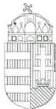
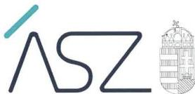
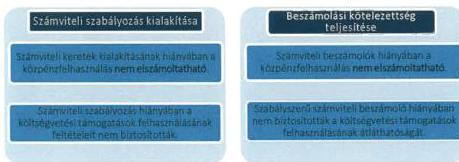
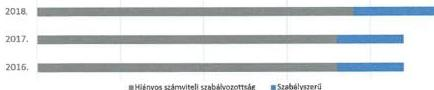
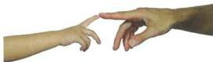
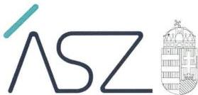
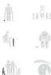
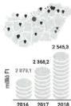

ÁLLAMI SZÁMVEVŐSZÉK

# JELENTÉS

Nem állami humánszolgáltatók ellenőrzése

A szociális és köznevelési humánszolgáltatást nyújtó intézmények, szolgáltatók államháztartáson kívüli fenntartói központi költségvetésből kapott támogatásai felhasználásának ellenőrzése – 24 intézményfenntartó

2021.

21043

www.asz.hu

---

ÁLLAMI SZÁMVEVŐSZÉK

# JELENTÉS

Nem állami humánszolgáltatók ellenőrzése

A szociális és köznevelési humánszolgáltatást nyújtó intézmények, szolgáltatók államháztartáson kívüli fenntartói központi költségvetésből kapott támogatásai felhasználásának ellenőrzése – 24 intézményfenntartó

2021. 06. hó 16. nap

21043
www.asz.hu

---

AZ ELLENŐRZÉST FELÜGYELTE:

MAKKAI MÁRIA felügyeleti vezető

AZ ELLENŐRZÉST VEZETTE ÉS A VÉGREHAJTÁSÁÉRT FELELŐS:

HOFMEISTER LÁSZLÓ ellenőrzésvezető

A PROGRAM ÖSSZEÁLLÍTÁSÁÉRT FELELŐS:

TÓTPÁL SZABOLCS ellenőrzési program készítéséért felelős vezető

FEKETE-NAGY ANDRÁS GÁBOR ellenőrzési program készítéséért felelős vezető

IKTATÓSZÁM: EL-3192-001/2021

TÉMASZÁM: 2523

ELLENŐRZÉS-AZONOSÍTÓ SZÁM: V0867297

Jelentéseink az Országgyűlés számítógépes hálózatán és az interneten a www.asz.hu címen is olvashatóak.

---

# TARTALOMJEGYZÉK

- ■ ÖSSZEGZÉS... 5
- ■ AZ ELLENŐRZÉS CÉLJA... 7
- ■ AZ ELLENŐRZÉS TERÜLETE ... 8
- ■ AZ ELLENŐRZÉS HÁTTERE, INDOKOLTSÁGA ... 9
- ■ A JELENTÉS LÉNYEGES KÉRDÉSKÖREI ... 10
- ■ AZ ELLENŐRZÉS HATÓKÖRE ÉS MÓDSZEREI ... 11
- ■ MEGÁLLAPÍTÁSOK... 13
- ■ JAVASLATOK... 14
- ■ MELLÉKLETEK... 15
  - I. sz. melléklet: Az ellenőrzött fenntartókkal kapcsolatos részletes megállapítások... 15
  - II. sz. melléklet: Az ellenőrzött fenntartók részére szociális és köznevelési közfeladat ellátásra a Kincstár által biztosított költségvetési támogatások összege 2016-2018 években (M Ft)... 22
  - III. sz. melléklet: Értelmező szótár... 23
- ■ FÜGGELÉK: ÉSZREVÉTELEK ... 25
- ■ RÖVIDÍTÉSEK JEGYZÉKE... 29

3

---

1

---

# ÖSSZEGZÉS

Az ellenőrzött 24 humánszolgáltatást nyújtó államháztartáson kívüli fenntartó közül öt fenntartó biztosította a kapott költségvetési támogatások átláthatóságát, 19 fenntartó nem biztosította a szociális és köznevelési humánszolgáltatási közfeladatok ellátására kapott költségvetési támogatások elszámoltathatóságát.

Az ÁSZ kezdeményezésére az ellenőrzött időszakot követően, a 2019. évre 19-ből, 17 intézményfenntartónál a közpénzzel való elszámoltathatóság javult.

## Az ellenőrzés társadalmi indokoltsága

A szociális gondoskodást igénylők védelme az Alaptörvényben meghatározott, a társadalom szempontjából fontos tevékenység. Jogszabályok teszik lehetővé, hogy államháztartáson kívüli szervezetek – így például az, alapítványok, egyesületek– által fenntartott intézmények is végezzenek, szociális és gyermekvédelmi, valamint köznevelési feladatokat. Mindehhez a központi költségvetés évente jelentős összegű támogatással járul hozzá. Az államháztartáson kívüli, humánszolgáltatást végző intézmények az igényelt közpénzekből társadalmilag hasznos, közösségteremtő, közérdekű, illetve közhasznú tevékenységet végeznek, illetve közfeladatokat látnak el.

Az intézményfenntartók ellenőrzésével az Állami Számvevőszék hozzájárul ahhoz, hogy ezen közpénzeket az államháztartáson kívüli szervezetek is ellenőrizhető, átlátható és elszámoltatható módon használják fel a közfeladatok ellátása során. Az ellenőrzések célja továbbá, hogy a nyilvánosság és az igénybevevők megfelelő tájékoztatást kapjanak az államháztartáson kívüli közfeladatot ellátók működéséről.

Az Állami Számvevőszék ellenőrzései arra adnak választ, hogy az intézményfenntartók szabályszerűen használták-e fel arra a közpénzeket, amire igényelték. A szabályszerű gazdálkodás elengedhetetlen a közfeladat ellátás szakmai céljainak megvalósításához, valamint a társadalmi közbizalom fenntartásához.

## Főbb megállapítások, következtetések, javaslatok

24* intézményfenntartó közpénzfelhasználásának értékelése a 2016-2018. években (db)

*a 2016-2017. évben 22 ellenőrzött fenntartó, a 2018. évben 24 ellenőrzött fenntartó részesült költségvetési támogatásban

18 fenntartó a 2016-2017. években, 19 fenntartó a 2018. évben az Alaptörvény¹ 39. cikk (2) bekezdésében foglaltak ellenére a felhasznált közpénzekre vonatkozó gazdálkodása átláthatóságát nem biztosította. Ezen fenntartók esetében felmerül annak a kockázata, hogy a jövőben a kapott támogatásokat nem szabályszerűen használják fel, és a közpénzeket nem átláthatóan kezelik. A 2016-2017. években négy, a 2018. évben öt fenntartó ellenőrzése során alapvető hibát nem tárt fel az ÁSZ² a gazdálkodásuk átláthatósága és elszámoltathatósága terén.

5

---

Összegzés

Az ÁSZ 19 intézményfenntartónál kezdeményezte, hogy az ellenőrzött időszakot követő 2019. évre vonatkozóan bemutassák a közpénzekkel való elszámolás feltételeinek meglétét, hozzájárulva ezzel a költségvetési támogatások felhasználásának elszámoltathatóságához.

A feltárt hiányosságokkal kapcsolatban a figyelemfelhívó levelekre érkezett válaszok alapján az alábbi következtetést lehet tenni.

4 intézményfenntartónál a 2019. évre vonatkozó, az ÁSZ kezdeményezésére bemutatott dokumentumok alapján a költségvetési támogatások felhasználásának és az elszámoltathatóságnak a feltételei a számviteli szabályozottság, a számviteli beszámoló készítése, illetve a költségvetési támogatások feladatonkénti elkülönítése terén lényegesen jobb helyzetet mutattak, mint az ellenőrzött időszakban.

13 intézményfenntartónál a költségvetési támogatások felhasználásának és az elszámoltathatóságnak a feltételei a számviteli szabályozottság és a beszámolási kötelezettség terén jobb helyzetet mutattak 2019-ben.

2 intézményfenntartó esetében a költségvetési támogatások felhasználásának és az elszámoltathatóságnak a feltételei nem javultak 2019-ben, változatlanul fennáll annak kockázata, hogy a közpénzeket nem átláthatóan és elszámoltathatóan kezelik. Ezért az ÁSZ az egyik intézményfenntartó tekintetében az államháztartás alrendszeréből nyújtott, az intézményfenntartót megillető támogatások folyósításának felfüggesztését kezdeményezte, a másik intézményfenntartó esetében az ÁSZ kilátásba helyezte a vagyonmegóvási intézkedést.

Az ÁSZ az ellenőrzés megállapításai alapján három fenntartó részére öt javaslatot fogalmazott meg.

6

---

# AZ ELLENŐRZÉS CÉLJA

**AZ ELLENŐRZÉS CÉLJA** annak értékelése volt, hogy a nem állami, szociális és köznevelési intézmény fenntartók központi költségvetésből kapott támogatásainak felhasználása szabályszerű volt-e.

7

---

# AZ ELLENŐRZÉS TERÜLETE

## Szociális és köznevelési humánszolgáltatási közfeladatokat ellátó államháztartáson kívüli fenntartók

Szociális szolgáltatót, illetve szociális és gyermekvédelmi, illetve köznevelési intézményt létesíthet és működtethet nem állami, nem önkormányzati intézményfenntartó a jogszabályokban meghatározott feltételek szerint. Nem állami, nem önkormányzati szociális, illetve gyermekvédelmi intézményfenntartó lehet a Szoctv.$^{3}$ és a Gyvt.$^{4}$ szerint többek között alapítvány és egyesület.

Az ellenőrzött 24 intézményfenntartó közül tíz alapítványi, 14 egyesületi formában működött. Az ellenőrzött fenntartók szociális humánszolgáltatási közfeladatokat, hat fenntartó esetében köznevelési humánszolgáltatási közfeladatokat is végeztek az ellenőrzött időszakban.

A kockázatelemzés alapján kiválasztott 24 intézményfenntartó nem reprezentálja a nem állami humánszolgáltató intézményfenntartók teljes körét, a megállapítások csak az esetükben tapasztalt hibákat, hiányosságokat és szabálytalanságokat összegzik.

Az ellenőrzött fenntartók részére a szociális, illetve köznevelési humánszolgáltatási feladat ellátásához a központi költségvetésből biztosított támogatások összege, a Magyar Államkincstár adatai alapján a II. számú mellékletben van részletezve.

8

---

# AZ ELLENŐRZÉS HÁTTERE, INDOKOLTSÁGA

A szociális és köznevelési feladatokat ellátó nem állami intézményfenntartók részére közfeladataik ellátására évente jelentős összegű pénzügyi támogatást biztosítottak a mindenkori költségvetési törvények a bennük megfogalmazott feltételek mellett. A szociális és köznevelési feladatokra felhasználható állami támogatások előirányzata a 2016-2018. években 846 Mrd Ft volt.

Az ÁSZ stratégiájában foglaltak alapján is indokolt az ellenőrzés, amely a társadalom számára jelzi, hogy a közpénz államháztartáson kívüli felhasználása sem maradhat ellenőrizetlenül. Az államháztartáson kívülre nyújtott költségvetési támogatások ellenőrzésével az ÁSZ hozzájárul ahhoz, hogy a közpénzeket a nem állami fenntartók átlátható módon használják fel a közfeladatok ellátására kötött szerződésekben vállalt kötelezettségek teljesítése érdekében. Az ÁSZ az ellenőrzés javaslataival hozzájárulhat az említett rendszerek szabályszerű támogatás-felhasználásához, javíthatja a társadalmi-gazdasági döntések megalapozottságát, amely a „jól irányított állam” feltétele.

9

---

# A JELENTÉS LÉNYEGES KÉRDÉSKÖREI

1. A közfeladatot ellátó államháztartáson kívüli fenntartók szabályszerű működési - és gazdálkodási környezet kialakításával megteremtették-e a költségvetési támogatások átlátható, elszámoltatható igénybevételének, felhasználásának feltételeit, a közpénzekre vonatkozó gazdálkodásukkal a nyilvánosság előtt elszámoltak-e?

2. Az államháztartáson kívüli fenntartók az átvállalt szociális és köznevelési közfeladathoz biztosított költségvetési támogatásokat szabályszerűen fordították-e a humánszolgáltató intézményeik működtetésére?

10

---

# AZ ELLENŐRZÉS HATÓKÖRE ÉS MÓDSZEREI

## Az ellenőrzés típusa

Megfelelőségi ellenőrzés.

## Az ellenőrzött időszak

A 2016. január 1-je és 2018. december 31-e közötti időszak azon évei, amelyben nem állami, nem önkormányzati fenntartó – köznevelési, illetve szociális – közfeladat ellátásra az államháztartásból támogatást kapott és/vagy használt fel.

## Az ellenőrzés tárgya

Az ellenőrzés a szociális és köznevelési humánszolgáltatási közfeladatokat ellátó államháztartáson kívüli Fenntartók humánszolgáltatási közfeladatai ellátásához a központi költségvetésből kapott támogatásaik humánszolgáltatási közfeladatokra való, fenntartó általi felhasználása szabályszerűségének értékelésére terjedt ki.

## Az ellenőrzött szervezet

Az államháztartásból nyújtott költségvetési támogatásban részesült, kockázatelemzés alapján kiválasztott, szociális, illetve köznevelési feladatokat ellátó intézmények nem állami, nem önkormányzati fenntartói a II. számú melléklet szerint.

## Az ellenőrzés jogalapja

Az ellenőrzés jogszabályi alapját az ÁSZ tv.⁵ 1. § (3) bekezdése, 5. § (3) bekezdésében foglalt előírások adták.

## Az ellenőrzés módszerei

Az ellenőrzést az ellenőrzési program annak szempontjai, kérdései, az ellenőrzött időszakban hatályos jogszabályok, a nemzetközi standardokat irányadónak tekintve, az ellenőrzés szakmai szabályok és módszertanok figyelembevételével rendelte elvégezni. A közpénzekkel való felelős gazdálkodás segítésére irányuló javaslatok kidolgozásakor a hatályos jogszabályok voltak az irányadók.

11

---

Az ellenőrzés hatóköre és módszerei---

Az ellenőrzés ideje alatt az ellenőrzött szervezettel történő kapcsolattartást az ÁSZ SZMSZ$^{6}$-ének vonatkozó előírásai alapján biztosította az ÁSZ.

Az ellenőrzési kérdések megválaszolásához szükséges bizonyítékok megszerzése az ellenőrzött által rendelkezésre bocsátott dokumentumokra, adatokra alapozva megfigyelés, szemle (szemrevételezés), kérdésfeltevés (információkérés), valamint elemző eljárással történt.

Az ellenőrzési bizonyítékként felhasználható adatforrások közé tartoztak egyrészt az ellenőrzési program részletes szempontjainál felsorolt adatforrások, másrészt minden – az ellenőrzés folyamán feltárt, az ellenőrzés szempontjából információt tartalmazó – dokumentum.

Az ellenőrzés lefolytatásához az ellenőrzött szervezet a kitöltött tanúsítványok, valamint az ÁSZ által kért dokumentumok elektronikus úton való megküldésével szolgáltatott adatokat, információkat. Az így rendelkezésre bocsátott adatok, információk és a tanúsítványok adatai valódiságának kontrollja az ellenőrzés keretében történt.

Az ellenőrzést az ÁSZ alapvetően a szociális és köznevelési humánszolgáltatások esetében a központi költségvetési támogatások igénylésével, módosításával, felhasználásával, elszámolásával kapcsolatos feladatokat ellátó államháztartáson kívüli fenntartóknál végezte az ÁSZ.

A szociális és köznevelési humánszolgáltatások központi költségvetési támogatásaival kapcsolatos, államháztartáson kívüli fenntartó jogszabályokban előírt feladatai betartását, továbbá a központi költségvetési támogatások szabályszerű nyilvántartását ellenőrizte az ÁSZ a Fenntartónál rendelkezésre álló nyilvántartások, beszámolók és egyéb dokumentumok alapján.

Az ellenőrzés nem terjedt ki a szociális és köznevelési humánszolgáltatások központi költségvetési támogatásai igénylése, módosítása, elszámolása valódiságának, megalapozottságának, helyességének – sem a Fenntartónál, sem a székhely intézménynél való – értékelésére (mivel ennek felülvizsgálata, ellenőrzése a finanszírozó jogszabályban előírt feladata, határozatai kiadása előtt). Továbbá nem terjedt ki az ellenőrzés e források intézmények általi szabályszerű felhasználásának értékelésére.

12

---

# MEGÁLLAPÍTÁSOK

## A JOGSZABÁLYI ELŐÍRÁSOKKAL ÖSSZHANGBAN

a 2016-2017. években négy ellenőrzött fenntartó, a 2018. évben további egy fenntartó kialakította a kapott támogatások elszámoltathatóságának alapvető feltételeinek számviteli szabályozását, elkészítette számviteli éves beszámolóit, elkülönített nyilvántartásait, mellyel biztosították a költségvetési támogatások felhasználásának átláthatóságát.

## SZÁMVITELI SZABÁLYZATOK

elkészítésére vonatkozó kötelezettségét 18 ellenőrzött fenntartó nem teljesítette a 2016-2017. években, 19 fenntartó a 2018. évben.

Tíz fenntartó az ellenőrzött időszakban a Számv. tv.⁷14. § (3) bekezdés előírása ellenére nem rendelkezett számviteli politikával.

További hét fenntartó a 2016-2017. években, kilenc fenntartó pedig a 2018. évben nem alakította ki számlarendjét a Számv. tv. 161. § (1) bekezdés rendelkezése ellenére.

További egy fenntartó nem készítette el a Számv. tv. 14. § (5) bekezdés a) pontjában előírt eszközök és a források leltárkészítési és leltározási szabályzatát a 2016-2017. években.

A számviteli szabályozás hiányában a beszámolók nem megbízhatóak, nem volt biztosított a számviteli beszámolók szabályszerű könyvvezetéssel való alátámasztása, a költségvetési támogatások felhasználásának elszámoltathatósága, átláthatósága.

Az egyes ellenőrzött intézményfenntartóra vonatkozó megállapításokat az I. számú melléklet tartalmazza.

13

---

# JAVASLATOK

Az ÁSZ tv. 33. § (1) bekezdésében foglaltak értelmében az ellenőrzött szervezet vezetője köteles a jelentésben foglalt megállapításokhoz kapcsolódó intézkedési tervet összeállítani és azt a jelentés kézhezvételétől számított 30 napon belül az ÁSZ részére megküldeni. Amennyiben az ellenőrzött szervezet vezetője nem küldi meg határidőben az intézkedési tervet, vagy továbbra sem elfogadható intézkedési tervet küld, az Állami Számvevőszék elnöke az ÁSZ tv. 33. § (3) bekezdése a) és b) pontjaiban foglaltakat érvényesítheti.

## Bölcs Mókusok Erdeje Alapítvány kuratóriumi elnökének

1. Intézkedjen a Számv. tv. előírásainak megfelelően a számlarend elkészítéséről.
(I. sz. melléklet ellenőrzöttre vonatkozó megállapítás 2. bekezdés 1. mondat utolsó tagmondata alapján)

2. Intézkedjen az Atr. és az Nkt.vhr. rendelkezéseinek megfelelően olyan nyilvántartás kialakításáról, amelyből megállapítható, hogy a költségvetési támogatás milyen célra került felhasználásra.
(I. sz. melléklet ellenőrzöttre vonatkozó megállapítás 4. bekezdése alapján)

## Egy Falat Esély Alapítvány kuratóriumi elnökének

1. Intézkedjen a Számv. tv. előírásainak megfelelően a számlarend elkészítéséről.
(I. sz. melléklet ellenőrzöttre vonatkozó megállapítás 2. bekezdése alapján)

## Chinoin Szociális és Jóléti Alapítvány kuratóriumi elnökének

1. Intézkedjen a Számv. tv. előírásainak megfelelően a számlarend elkészítéséről.
(I. sz. melléklet ellenőrzöttre vonatkozó megállapítás 2. bekezdése alapján)

2. Intézkedjen a számviteli beszámoló jogszabályi előírásoknak megfelelő elkészítéséről.
(I. sz. melléklet ellenőrzöttre vonatkozó megállapítás 3. bekezdése alapján)

14

---

# MELLÉKLETEK

## ■ I. SZ. MELLÉKLET: AZ ELLENŐRZÖTT FENNTARTÓKKAL KAPCSOLATOS RÉSZLETES MEGÁLLAPÍTÁSOK

### ■ Baranya Megyei Önkormányzat Közegészségügyi, Narkomán Fiatalokat Gyógyító- Foglalkoztató Közalapítvány

A pécsi székhelyű Baranya Megyei Önkormányzat Közegészségügyi, Narkomán Fiatalokat Gyógyító- Foglalkoztató Közalapítvány a 2016-2018. években hat nem önálló jogi személy szociális intézményt$^{8}$ tartott fenn. Az ellenőrzött Fenntartó intézményein keresztül szenvedélybetegek ellátását, rehabilitációját látta el.

A Fenntartó a 2016-2018. években a Számv. tv. 161. § (1) bekezdésében foglaltak ellenére nem rendelkezett a képviseletére jogosult által aláírt, hiteles számlarenddel. Ezáltal nem teremtette meg a költségvetési támogatások elszámoltatható, átlátható felhasználásának szabályozási feltételeit. Számlarend hiányában a Fenntartó a számviteli beszámolóit szabályszerű könyvvezetéssel nem támasztotta alá.

### ■ Bölcs Mókusok Erdeje Alapítvány

A budapesti székhelyű Bölcs Mókusok Erdeje Alapítvány a 2016-2018. években egy önálló jogi személyiséggel rendelkező szociális intézményt$^{9}$, valamint egy önálló jogi személyiséggel rendelkező köznevelési intézményt$^{10}$ tartott fenn. Az ellenőrzött Fenntartó intézményein keresztül látta el a bölcsődei gondozási és az óvodai nevelési feladatokat.

A köznevelési és szociális humánszolgáltató közfeladatot ellátó Fenntartó 2016-2018. évi működésének szabályozottsága, ennek keretében a fenntartó gazdálkodására vonatkozó belső szabályozás nem felelt meg az előírásoknak, mivel a Fenntartó nem rendelkezett 2016-2018. évben a képviseletére jogosult által aláírt, hiteles, a Számv. tv. 14. § (3), (5) bekezdésében előírt számviteli politikával és az annak keretében elkészítendő szabályzatokkal, valamint Számv. tv. 161. § (1) bekezdésében előírt számlarenddel. Ezáltal nem teremtette meg a költségvetési támogatások elszámoltatható, átlátható felhasználásának szabályozási feltételeit. Számviteli szabályozás hiányában a Fenntartó a számviteli beszámolóit szabályszerű könyvvezetéssel nem támasztotta alá.

A Fenntartó a számviteli beszámoló elkészítésére vonatkozó, a Civil tv.$^{11}$ 28. § (1) bekezdésében és a Számv. tv. 4. § (1) bekezdésében előírt kötelezettségének a 2016-2018. években nem tett eleget, mert a Számv. tv. 20. § (6) bekezdésében előírtak ellenére a képviseletére jogosult által aláírt beszámolóval nem rendelkezett, így a nyilvánosság előtt a közfeladatot ellátó intézményei működtetéséhez felhasznált közpénzekre vonatkozó gazdálkodásával nem számolt el.

Az ellenőrzött Fenntartó a 2016-2018. években, a Fenntartó a kapott támogatások felhasználását az Atr.$^{12}$ 16. § (1) bekezdésében és az Nkt. vhr.$^{13}$ 37/G. § (1) bekezdésében foglalt szabályozás ellenére nem gondoskodott olyan nyilvántartás kialakításáról, hogy abból megállapítható legyen, hogy a költségvetési támogatásokat milyen célra használta fel. Ezáltal a költségvetési támogatás felhasználásának a Számv. tv. 161/A. § (2) bekezdésében előírt ellenőrizhetőségét nem biztosította.

### ■ Captus Humanitárius Alapítvány

A miskolci székhelyű Captus Humanitárius Alapítvány a 2018. évben egy nem önálló jogi személy szociális intézményt$^{14}$ tartott fenn. Az ellenőrzött Fenntartó az intézményén keresztül szociális étkeztetési feladatot látott el. A Fenntartó csak a 2018. évben részesült költségvetési támogatásban.

A Fenntartó által az ÁSZ részére megküldött dokumentumok és az azok teljeskörűségére vonatkozó nyilatkozat alapján a 2018. évben nem alakította ki a Számv. tv. 161. § (1) bekezdésében előírtak ellenére számlarendjét. Ezáltal nem teremtette meg a költségvetési támogatások elszámoltatható, átlátható felhasználásának szabályozási feltételeit.

15

---

## Mellékletek---

A Fenntartó a számviteli beszámoló elkészítésére vonatkozó, a Civil tv. 28. § (1) bekezdésében és a Számv. tv. 4. § (1) bekezdésében előírt kötelezettségének a 2018. évben nem tett eleget, a nyilvánosság előtt a közfeladatot ellátó intézménye működtetéséhez felhasznált közpénzekre vonatkozó gazdálkodásával nem számolt el.

### ■ Chinoin Szociális és Jóléti Alapítvány

A budapesti székhelyű Chinoin Szociális és Jóléti Alapítvány a 2016-2018. években egy önálló jogi személyiséggel rendelkező többcélú köznevelési/szociális Intézményt$^{15}$ tartott fenn. Az ellenőrzött Fenntartó intézményén keresztül óvodai nevelés, valamint bölcsődel gondozás, intézményi étkeztetés szociális közfeladatokat látott el.

A számlarend nem felelt meg a Számv. tv. 161. § (2) bekezdés a) és d) pontjaiban előírtaknak a 2016-2018. években, mert nem tartalmazták a törvényben előírt minden alkalmazásra kijelölt számla számjelét és megnevezését, valamint a számlarendben foglaltakat alátámasztó bizonylati rendet. Ezáltal nem teremtette meg a költségvetési támogatások elszámoltatható, átlátható felhasználásának szabályozási feltételeit. Számviteli szabályozás hiányában a Fenntartó a számviteli beszámolóit szabályszerű könyvvezetéssel nem támasztotta alá.

A Civil tv. 29. § (2) bekezdés c) pontjában foglaltak ellenére a Fenntartó 2016-2018. évi egyszerűsített éves beszámolói kiegészítő mellékletet nem tartalmaztak, amely alapján a Civil tv. 28. § (1) bekezdésében és a Számv. tv. 4. § (1) bekezdésben foglaltak ellenére beszámoló-készítési kötelezettségének nem tett eleget.

Az ellenőrzött Fenntartó a 2016-2018. években a kapott támogatások felhasználásának nyilvántartását az Atr. 16. § (1) és a Nkt. vhr. 37/G. § (1) bekezdésében foglaltak ellenére feladatonként nem vezette elkülönítetten. Ezáltal a költségvetési támogatás felhasználásának a Számv. tv. 161/A. § (2) bekezdésében előírt ellenőrizhetőségét nem biztosította.

### ■ Csillagösvény Szociális Segítő Egyesület

A ceglédi székhelyű Csillagösvény Szociális Segítő Egyesület a 2016-2018. években egy nem önálló jogi személy szociális Intézményt$^{16}$ tartott fenn. Az ellenőrzött Fenntartó az intézményén keresztül családsegítő szociális feladatot látott el, melynek keretében otthont és átmeneti ellátást biztosított ideiglenes hatállyal vagy tartósan nevelésbe helyezett normál és különleges ellátást igénylő gyermekeknek, továbbá az utógondozói ellátásban részesülő fiatal felnőttek számára.

A Fenntartó a Számv. tv. 161. § (1) bekezdésében foglaltak ellenére a 2016-2018. években nem rendelkezett a képviseletére jogosult által aláírt, hiteles számlarenddel, valamint nem alakította ki a Számv. tv. 14. § (3) és (5) bekezdésekben előírtak ellenére számviteli politikáját és annak keretében elkészítendő szabályzatait. Ezáltal nem teremtette meg a költségvetési támogatások elszámoltatható, átlátható felhasználásának szabályozási feltételeit. Számviteli szabályozás hiányában a Fenntartó a számviteli beszámolóit szabályszerű könyvvezetéssel nem támasztotta alá.

### ■ ÉFOÉSZ Szabolcs-Szatmár-Bereg Megyei Egyesülete

A nyíregyházi székhelyű ÉFOÉSZ Szabolcs-Szatmár-Bereg Megyei Egyesülete a 2016-2018. években három nem önálló jogi személy többcélú szociális Intézményt$^{17}$, valamint egy önálló jogi személyiséggel rendelkező köznevelési Intézményt$^{18}$ tartott fenn. Az ellenőrzött Fenntartó a szociális intézményein keresztül fogyatékos személyek nappali ellátását biztosította, valamint fejlesztő nevelést-oktatást végzett a köznevelési intézményében.

A Fenntartó a 2016-2018. években a Számv. tv. 161. § (1) bekezdésében foglaltak ellenére nem rendelkezett számlarenddel. Ezáltal nem teremtette meg a költségvetési támogatások elszámoltatható, átlátható felhasználásának szabályozási feltételeit. Számlarend hiányában a Fenntartó a számviteli beszámolóit szabályszerű könyvvezetéssel nem támasztotta alá.

A Civil tv. 29. § (2) bekezdés c) pontjában foglaltak ellenére a Fenntartó 2016-2018. évi egyszerűsített éves beszámolói kiegészítő mellékletet nem tartalmaztak, amely alapján a Civil tv. 28. § (1) bekezdésében és a Számv. tv. 4. § (1) bekezdésben foglaltak ellenére beszámoló-készítési kötelezettségének nem tett eleget.

16

---

Mellékletek

# Egy Falat Esély Alapítvány

A miskolci székhelyű Egy Falat Esély Alapítvány a 2018. évben egy nem önálló jogi személy szociális Szolgáltatót¹⁹ tartott fenn. Az ellenőrzött Fenntartó szolgáltatóján keresztül ételosztást, szociális étkeztetés végzett. A Fenntartó csak a 2018. évben részesült költségvetési támogatásban.

A Fenntartó a 2018. évben a Számv. tv. 161. § (1) bekezdésében foglaltak ellenére nem rendelkezett a képviseletére jogosult által aláírt, hiteles számlarenddel. Ezáltal nem teremtette meg a költségvetési támogatások elszámoltatható, átlátható felhasználásának szabályozási feltételeit. Számlarend hiányában a Fenntartó a számviteli beszámolóit szabályszerű könyvvezetéssel nem támasztotta alá.

# ÉTELT AZ ÉLETÉRT Közhasznú Alapítvány

A budapesti székhelyű ÉTELT AZ ÉLETÉRT Közhasznú Alapítvány a 2016-2018. években intézményt nem tartott fenn, feladatainak ellátását – a telephelyeinek működtetésével – saját maga biztosította. Az ellenőrzött Fenntartó a szociálisan rászorulók számára ingyenes ételosztást végzett.

A Fenntartó a Számv. tv. 161. § (1) bekezdésében foglaltak ellenére a 2016-2018. években nem rendelkezett számlarenddel, valamint nem alakította ki a Számv. tv. 14. § (3) és (5) bekezdésekben előírtak ellenére számviteli politikáját és annak keretében elkészítendő szabályzatait. Ezáltal nem teremtette meg a költségvetési támogatások elszámoltatható, átlátható felhasználásának szabályozási feltételeit. Számviteli szabályozás hiányában a Fenntartó a számviteli beszámolóit szabályszerű könyvvezetéssel nem támasztotta alá.

# Ifjúságért Egyesület

A pécsi székhelyű Ifjúságért Egyesület a 2016-2018. években két nem önálló jogi személy szociális Intézményt²⁰ tartott fenn. Az ellenőrzött Fenntartó az intézményein keresztül a Baranya megyében élő hajlék és lakhatási lehetőség nélkül maradt családok, gyermeküket egyedül nevelő anyák támogatását, segítését, a családok átmeneti otthonának működtetését végezte.

A Fenntartó a 2016-2017. években nem alakította ki a Számv. tv. 14. § (5) bekezdés a) pontjában előírtak ellenére az eszközök és a források leltárkészítési és leltározási szabályzatát. Ezáltal nem teremtette meg a költségvetési támogatások elszámoltatható, átlátható felhasználásának szabályozási feltételeit. Számviteli szabályozás hiányában a Fenntartó a számviteli beszámolóit szabályszerű könyvvezetéssel nem támasztotta alá a 2016-2017. években.

A Fenntartó gazdálkodásának lényeges területeit – számviteli szabályozottságot, beszámolási kötelezettség teljesítését, a kapott támogatások felhasználásának szabályszerű elkülönítését – megvizsgáltuk és annak eredményeképpen kifogást nem teszünk a 2018. évre vonatkozóan.

# Kecel Időseiért Közalapítvány

A keceli székhelyű Kecel Időseiért Közalapítvány a 2016-2018. években egy önálló jogi személyiséggel rendelkező szociális Intézményt²¹ tartott fenn. Az ellenőrzött Fenntartó az intézményén keresztül végezte az étkeztetés, házi segítségnyújtás, családsegítés, nappali ellátás feladatait.

A Fenntartó a 2016-2018. években nem alakította ki a Számv. tv. 14. § (3) előírtak ellenére számviteli politikáját, valamint a Számv. tv. 14. § (5) bekezdés d) pontjában előírt pénzkezelési szabályzatát. Ezáltal nem teremtette meg a költségvetési támogatások elszámoltatható, átlátható felhasználásának szabályozási feltételeit. Számviteli szabályozás hiányában a Fenntartó a számviteli beszámolóit szabályszerű könyvvezetéssel nem támasztotta alá.

# Magyar Vöröskereszt Borsod-Abaúj-Zemlén Megyei Szervezete

A Magyar Vöröskereszt Borsod-Abaúj-Zemlén Megyei Szervezete a 2016-2018. években egy nem önálló jogi személy szociális Intézményt²² és három Bölcsődét²³ tartott fenn. Az ellenőrzött Fenntartó az intézményein keresztül biztosított szociális alapszolgáltatásokat, illetve szakosított ellátást hajléktalan személyeknek, szenvedélybetegnek, fogyatékkal élőknek és krízis helyzetbe került családoknak. A Magyar Vöröskereszt által kiadott valamennyi számviteli szabályzat országos hatáskörű, hatályos a fővárosi és a megyei szervezeti

17

---

## Mellékletek---

egységekre. A Fenntartó a Magyar Vöröskereszt jogi személyiséggel rendelkező szervezeti egysége, számviteli beszámolója az országos szervezet összevont (konszolidált) beszámolójának alkotóeleme.

A Fenntartó által az ÁSZ részére megküldött dokumentumok és az azok teljeskörűségére vonatkozó nyilatkozat alapján a 2016-2018. években nem rendelkezett a Számv. tv. 14. § (3) bekezdésében előírtak ellenére számviteli politikával. Ezáltal nem volt igazolt a Magyar Vöröskereszt minden szervezeti egységére hatályos számviteli politikájának érvényesülése.

### Magyar Vöröskereszt Komárom-Esztergom Megyei Szervezete

A Magyar Vöröskereszt Komárom-Esztergom Megyei Szervezete a 2016-2018. években egy nem önálló jogi személy szociális Intézményt$^{24}$ tartott fenn. Az ellenőrzött Fenntartó az intézményén keresztül biztosított szociális alapszolgáltatásokat, illetve szakosított ellátást hajléktalan személyeknek, szenvedélybetegnek, fogyatékkal élőknek és krízis helyzetbe került családoknak. A Magyar Vöröskereszt által kiadott valamennyi számviteli szabályzat országos hatáskörű, hatályos a fővárosi és a megyei szervezeti egységekre. A Fenntartó a Magyar Vöröskereszt jogi személyiséggel rendelkező szervezeti egysége, számviteli beszámolója az országos szervezet összevont (konszolidált) beszámolójának alkotóeleme.

A Fenntartó által az ÁSZ részére megküldött dokumentumok és az azok teljeskörűségére vonatkozó nyilatkozat alapján a 2016-2018. években nem rendelkezett a Számv. tv. 14. § (3) bekezdésében előírtak ellenére számviteli politikával. Ezáltal nem volt igazolt a Magyar Vöröskereszt minden szervezeti egységére hatályos számviteli politikájának érvényesülése.

A Fenntartó a számviteli beszámoló elkészítésére vonatkozó, a Civil tv. 28. § (1) bekezdésében és a Számv. tv. 4. § (1) bekezdésében előírt kötelezettségének a 2016-2018. években nem tett eleget, a nyilvánosság előtt a közfeladatot ellátó intézménye működtetéséhez felhasznált közpénzekre vonatkozó gazdálkodásával nem számolt el.

Az ellenőrzött Fenntartó a 2016-2018. években, a Fenntartó és a nem önállóan gazdálkodó intézménye gazdálkodásának elkülönítéséről nem gondoskodott, a kapott támogatások felhasználását az Atr. 16. § (1) bekezdésében foglaltak ellenére feladatokkénti bontásban nem vezette elkülönítetten. Ezáltal a költségvetési támogatás felhasználásának a Számv. tv. 161/A. § (2) bekezdésében előírt ellenőrizhetőségét nem biztosította.

### Magyar Vöröskereszt Nógrád Megyei Szervezete

A Magyar Vöröskereszt Nógrád Megyei Szervezete a 2016-2018. években két nem önálló jogi személy szociális Intézményt$^{25}$ tartott fenn. Az ellenőrzött Fenntartó az intézményein keresztül biztosított szociális alapszolgáltatásokat, illetve szakosított ellátást hajléktalan személyeknek, szenvedélybetegnek, fogyatékkal élőknek és krízis helyzetbe került családoknak. A Magyar Vöröskereszt által kiadott valamennyi számviteli szabályzat országos hatáskörű, hatályos a fővárosi és a megyei szervezeti egységekre. A Fenntartó a Magyar Vöröskereszt jogi személyiséggel rendelkező szervezeti egysége, számviteli beszámolója az országos szervezet összevont (konszolidált) beszámolójának alkotóeleme.

A Fenntartó által az ÁSZ részére megküldött dokumentumok és az azok teljeskörűségére vonatkozó nyilatkozat alapján a 2016-2018. években nem rendelkezett a Számv. tv. 14. § (3) bekezdésében előírtak ellenére számviteli politikával. Ezáltal nem volt igazolt a Magyar Vöröskereszt minden szervezeti egységére hatályos számviteli politikájának érvényesülése.

A Számv. tv. 20. § (6) bekezdésében foglaltak ellenére a Fenntartó a 2018. évi számviteli beszámolóját a képviseletre jogosult nem írta alá, melynek hiányában a vezető személyes felelősségvállalása nem volt igazolt.

### Magyar Vöröskereszt Pest Megyei Szervezete

A budapesti székhelyű Magyar Vöröskereszt Pest Megyei Szervezete a 2016-2018. években hat nem önálló jogi személy szociális Intézményt$^{26}$ tartott fenn. Az ellenőrzött Fenntartó az intézményein biztosított szociális alapszolgáltatásokat, illetve szakosított ellátást keresztül hajléktalan személyeknek, szenvedélybetegnek, fogyatékkal élőknek és krízis helyzetbe került családoknak. A Magyar Vöröskereszt által kiadott valamennyi

18

---

Mellékletek

számviteli szabályzat országos hatáskörű, hatályos a fővárosi és a megyei szervezeti egységekre. A Fenntartó a Magyar Vöröskereszt jogi személyiséggel rendelkező szervezeti egysége, számviteli beszámolója az országos szervezet összevont (konszolidált) beszámolójának alkotóeleme.

A Fenntartó gazdálkodásának alapvető területeit – számviteli szabályozottságot, beszámolási kötelezettség teljesítését, a kapott támogatások felhasználásának szabályszerű elkülönítését – megvizsgáltuk és annak eredményeképpen kifogást nem teszünk.

# Magyar Vöröskereszt Somogy Megyei Szervezete

A kaposvári székhelyű Magyar Vöröskereszt Somogy Megyei Szervezete a 2016-2018. években három nem önálló jogi személy szociális Intézményt²⁷ tartott fenn. Az ellenőrzött Fenntartó az intézményein keresztül biztosított szociális alapszolgáltatásokat, illetve szakosított ellátást hajléktalan személyeknek, szenvedélybetegnek, fogyatékkal élőknek és krízis helyzetbe került családoknak. A Magyar Vöröskereszt által kiadott valamennyi számviteli szabályzat országos hatáskörű, hatályos a fővárosi és a megyei szervezeti egységekre. A Fenntartó a Magyar Vöröskereszt jogi személyiséggel rendelkező szervezeti egysége, számviteli beszámolója az országos szervezet összevont (konszolidált) beszámolójának alkotóeleme.

A Fenntartó gazdálkodásának alapvető területeit – számviteli szabályozottságot, beszámolási kötelezettség teljesítését, a kapott támogatások felhasználásának szabályszerű elkülönítését – megvizsgáltuk és annak eredményeképpen kifogást nem teszünk.

# Magyar Vöröskereszt Veszprém Megyei Szervezete

A veszprémi székhelyű Magyar Vöröskereszt Veszprém Megyei Szervezete a 2016-2018. években öt nem önálló jogi személy szociális Intézményt²⁸ tartott fenn. Az ellenőrzött Fenntartó az intézményein keresztül biztosított szociális alapszolgáltatásokat, illetve szakosított ellátást hajléktalan személyeknek, szenvedélybetegnek, fogyatékkal élőknek és krízis helyzetbe került családoknak. A Magyar Vöröskereszt által kiadott valamennyi számviteli szabályzat országos hatáskörű, hatályos a fővárosi és a megyei szervezeti egységekre. A Fenntartó a Magyar Vöröskereszt jogi személyiséggel rendelkező szervezeti egysége, számviteli beszámolója az országos szervezet összevont (konszolidált) beszámolójának alkotóeleme.

A Fenntartó gazdálkodásának alapvető területeit – számviteli szabályozottságot, beszámolási kötelezettség teljesítését, a kapott támogatások felhasználásának szabályszerű elkülönítését – megvizsgáltuk és annak eredményeképpen kifogást nem teszünk.

# Magyar Vöröskereszt Zala Megyei Szervezete

A zalaegerszegi székhelyű Magyar Vöröskereszt Zala Megyei Szervezete a 2016-2018. években 11 nem önálló jogi személy szociális Szolgáltatót²⁹ tartott fenn. A Szolgáltatók hajléktalan ellátást, fogyatékkal élők ellátását, szenvedélybetegek ellátását, pszichiátriai betegek közösségi ellátását, valamint idősek ellátását végezték. A Magyar Vöröskereszt által kiadott valamennyi számviteli szabályzat országos hatáskörű, hatályos a fővárosi és a megyei szervezeti egységekre. A Fenntartó a Magyar Vöröskereszt jogi személyiséggel rendelkező szervezeti egysége, számviteli beszámolója az országos szervezet összevont (konszolidált) beszámolójának alkotóeleme.

A Fenntartó által az ÁSZ részére megküldött dokumentumok és az azok teljeskörűségére vonatkozó nyilatkozat alapján a 2016-2018. években nem rendelkezett a Számv. tv. 14. § (3) bekezdésében előírtak ellenére számviteli politikával. Ezáltal nem igazolt a Magyar Vöröskereszt minden szervezeti egységére hatályos számviteli politikájának érvényesülése.

# Medicin-Liget Egészségmegőrző- és Gondozó Alapítvány

A noszvalyi székhelyű Medicin-Liget Egészségmegőrző- és Gondozó Alapítvány a 2016-2018. években egy önálló jogi személyiséggel rendelkező szociális Intézményt³⁰ tartott fenn. Az Intézmény időskorúak elhelyezését, rehabilitációját végezte.

19

---

## Mellékletek---

A Fenntartó a Számv. tv. 161. § (1) bekezdésében foglaltak ellenére a 2016-2018. években nem rendelkezett a képviseletére jogosult által aláírt, hiteles számlarenddel. Ezáltal nem teremtette meg a költségvetési támogatások elszámoltatható, átlátható felhasználásának szabályozási feltételeit. Számviteli szabályozás hiányában a Fenntartó a számviteli beszámolóit szabályszerű könyvvezetéssel nem támasztotta alá.

A Civil tv. 29. § (2) bekezdés c) pontjában foglaltak ellenére a Fenntartó 2016-2018. évi egyszerűsített éves beszámolói kiegészítő mellékletet nem tartalmaztak, amely alapján a Civil tv. 28. § (1) bekezdésében és a Számv. tv. 4. § (1) bekezdésben foglaltak ellenére beszámoló-készítési kötelezettségének nem tett eleget.

### ■ Mozgáskorlátozottak Békés Megyei Egyesülete Békéscsaba

A békéscsabai székhelyű Mozgáskorlátozottak Békés Megyei Egyesülete Békéscsaba a 2016-2018. években három, nem önálló jogi személyként működő szociális közfeladatot – fogyatékos személyek nappali ellátását, rehabilitációját – ellátó Intézményt$^{31}$, valamint egy köznevelési, önálló jogi személyiséggel rendelkező, sajátos nevelésű gyermekek nevelését-oktatását végző Intézményt$^{32}$ működtetett.

A Fenntartó gazdálkodásának alapvető területeit – számviteli szabályozottságot, beszámolási kötelezettség teljesítését, a kapott támogatások felhasználásának szabályszerű elkülönítését – megvizsgáltuk és annak eredményeképpen kifogást nem teszünk.

### ■ Mozgáskorlátozottak Somogy Megyei Egyesülete

A kaposvári székhelyű Mozgáskorlátozottak Somogy Megyei Egyesülete a 2016-2018. években három, nem önálló jogi személyként működő szociális közfeladatot – fogyatékos személyek nappali ellátását, rehabilitációját – ellátó Intézményt$^{33}$, valamint egy köznevelési, önálló jogi személyiséggel rendelkező, sajátos nevelésű gyermekek nevelését-oktatását végző Intézményt$^{34}$ működtetett.

A Fenntartó által az ÁSZ részére megküldött dokumentumok és az azok teljeskörűségére vonatkozó nyilatkozat alapján a 2016-2018. években nem alakította ki a Számv. tv. 14. § (3) bekezdésében előírtak ellenére számviteli politikáját. Ezáltal nem teremtette meg a költségvetési támogatások elszámoltatható, átlátható felhasználásának szabályozási feltételeit. Számviteli szabályozás hiányában a Fenntartó a számviteli beszámolóit szabályszerű könyvvezetéssel nem támasztotta alá.

Az ellenőrzött Fenntartó a 2016-2018. években a szociális humánszolgáltatási közfeladatok ellátására kapott támogatások felhasználását az Atr. 16. § (1) bekezdésében foglaltak ellenére feladatokkénti bontásban nem vezette elkülönítetten. Ezáltal a költségvetési támogatás felhasználásának a Számv. tv. 161/A. § (2) bekezdésében előírt ellenőrizhetőségét nem biztosította.

### ■ 'SZENTLÉLEK' Templom és Otthonfenntartó Alapítvány

A győri székhelyű 'SZENTLÉLEK' Templom és Otthonfenntartó Alapítvány a 2016-2018. években egy nem önálló jogi személy szociális Intézményt$^{35}$ tartott fenn. Az Intézmény időskorúak elhelyezését, rehabilitációját végezte.

A Fenntartó a 2016-2018. években az ÁSZ részére megküldött dokumentumok és az azok teljeskörűségére vonatkozó nyilatkozata alapján nem alakította ki a Számv. tv. 14. § (3) bekezdésében előírtak ellenére számviteli politikáját, valamint nem rendelkezett a képviseletére jogosult által aláírt, hiteles, a Számv. tv. 14. § (5) bekezdés b) pontjában előírt eszközök és a források értékelési szabályzatával. Ezáltal nem teremtette meg a költségvetési támogatások elszámoltatható, átlátható felhasználásának szabályozási feltételeit. Számviteli szabályozás hiányában a Fenntartó a számviteli beszámolóit szabályszerű könyvvezetéssel nem támasztotta alá.

### ■ 'Szimbiózis' A Harmónikus Együtt-Létért Alapítvány

A miskolci székhelyű 'Szimbiózis' A Harmónikus Együtt-létért Alapítvány a 2016-2018. években két nem önálló jogi személy szociális Intézményt$^{36}$ tartott fenn, mely fogyatékos személyek ápolását-gondozását, nappali ellátását, fejlesztését végezte és támogatott lakhatását biztosította.

20

---

## Mellékletek---

A Fenntartó a Számv. tv. 161. § (1) bekezdésében foglaltak ellenére a 2016-2018. években nem rendelkezett a képviseletére jogosult által aláírt, hiteles számlarenddel. Ezáltal nem teremtette meg a költségvetési támogatások elszámoltatható, átlátható felhasználásának szabályozási feltételeit. Számviteli szabályozás hiányában a Fenntartó a számviteli beszámolóit szabályszerű könyvvezetéssel nem támasztotta alá.

A Fenntartó a számviteli beszámoló elkészítésére vonatkozó, a Civil tv. 28. § (1) bekezdésében és a Számv. tv. 4. § (1) bekezdésében előírt kötelezettségének a 2016-2018. években nem tett eleget, mert a Számv. tv. 20. § (6) bekezdésében előírtak ellenére a képviseletére jogosult által aláírt beszámolóval nem rendelkezett, így a nyilvánosság előtt a közfeladatot ellátó intézményei működtetéséhez felhasznált közpénzekre vonatkozó gazdálkodásával nem számolt el.

### ■ Tiszamenti Emberek Lelki Segítő Egyesülete

A tiszavasvári székhelyű Tiszamenti Emberek Lelki Segítő Egyesülete a 2016-2018. években két, nem önálló jogi személy szociális intézményt$^{37}$ tartott fenn, mely fogyatékkal élő személyek lakhatását, fejlesztést biztosította.

A Fenntartó a Számv. tv. 161. § (1) bekezdésében foglaltak ellenére nem rendelkezett a képviseletére jogosult által aláírt, hiteles számlarenddel a 2016-2018. években. Ezáltal nem teremtette meg a költségvetési támogatások elszámoltatható, átlátható felhasználásának szabályozási feltételeit. Számviteli szabályozás hiányában a Fenntartó a számviteli beszámolóit szabályszerű könyvvezetéssel nem támasztotta alá.

Az ellenőrzött Fenntartó a 2016-2018. években a nem önállóan gazdálkodó intézménye gazdálkodásának elkülönítéséről nem gondoskodott, a kapott támogatások felhasználását az Atr. 16. § (1) bekezdésében foglaltak ellenére feladatonkénti bontásban nem vezette elkülönítetten. Ezáltal a költségvetési támogatás felhasználásának a Számv. tv. 161/A. § (2) bekezdésében előírt ellenőrizhetőségét nem biztosította.

### ■ Vésztői Sérült Gyermekekért Egyesület

A vésztői székhelyű Vésztői Sérült Gyermekekért Egyesület a 2016-2018. években két intézményt működtetett, egy nem önálló jogi személyként működő szociális közfeladatot – fogyatékos személyek nappali ellátását, rehabilitációját – ellátó intézményt$^{38}$, valamint egy köznevelési, önálló jogi személyiséggel rendelkező, sajátos nevelésű gyermekek nevelését-oktatását végző intézményt$^{39}$.

A Fenntartó a Számv. tv. 161. § (1) bekezdésében foglaltak ellenére nem rendelkezett a képviseletére jogosult által aláírt, hiteles számlarenddel a 2016-2018. években. Ezáltal nem teremtette meg a költségvetési támogatások elszámoltatható, átlátható felhasználásának szabályozási feltételeit. Számviteli szabályozás hiányában a Fenntartó a számviteli beszámolóit szabályszerű könyvvezetéssel nem támasztotta alá.

A Fenntartó a számviteli beszámoló elkészítésére vonatkozó, a Civil tv. 28. § (1) bekezdésében és a Számv. tv. 4. § (1) bekezdésében előírt kötelezettségének a 2016-2018. években nem tett eleget, mert a Számv. tv. 20. § (6) bekezdésében előírtak ellenére a képviseletére jogosult által aláírt beszámolóval nem rendelkezett, így a nyilvánosság előtt a közfeladatot ellátó intézményei működtetéséhez felhasznált közpénzekre vonatkozó gazdálkodásával nem számolt el.

21

---

Mellékletek

# ■ II. SZ. MELLÉKLET: AZ ELLENŐRZÖTT FENNTARTÓK RÉSZÉRE SZOCIÁLIS ÉS KÖZNEVELÉSI KÖZFELADAT ELLÁTÁSRA A KINCSTÁR ÁLTAL BIZTOSÍTOTT KÖLTSÉGVETÉSI TÁMOGATÁSOK ÖSSZEGE 2016-2018 ÉVEKBEN (M FT)

|  sorszám | Fenntartó | 2016. | 2017. | 2018.  |
| --- | --- | --- | --- | --- |
|  1. | Baranya Megyei Önkormányzat Közegészségügyi, Narkomán Fiatalokat Gyógyító-Foglalkoztató Közalapítvány | 86,9 | 116,8 | 123,8  |
|  2. | Bölcs Mókusok Erdeje Alapítvány | 19,6 | 70,3 | 74,7  |
|  3. | Captus Humanitárius Alapítvány | - | - | 139,4  |
|  4. | Chinoin Szociális és Jóléti Alapítvány | 70,1 | 84,4 | 89,1  |
|  5. | Csillagösvény Szociális Segítő Egyesület | 59,8 | 46,7 | 88,0  |
|  6. | ÉFOÉSZ Szabolcs-Szatmár-Bereg Megyei Egyesülete | 297,5 | 315,5 | 294,6  |
|  7. | Egy Falat Esély Alapítvány | - | - | 506,9  |
|  8. | ÉTELT AZ ÉLETÉRT Közhasznú Alapítvány | 119,9 | 134,0 | 149,5  |
|  9. | Ifjúságért Egyesület | 50,4 | 61,3 | 66,2  |
|  10. | Kecel Időseirért Közalapítvány | 63,5 | 75,9 | 83,2  |
|  11. | Magyar Vöröskereszt Borsod-Abaúj-Zemlén Megyei Szervezete | 203,9 | 220,3 | 222,5  |
|  12. | Magyar Vöröskereszt Komárom-Esztergom Megyei Szervezete | 54,1 | 60,6 | 64,0  |
|  13. | Magyar Vöröskereszt Nógrád Megyei Szervezete | 69,6 | 78,4 | 85,5  |
|  14. | Magyar Vöröskereszt Pest Megyei Szervezete | 149,1 | 163,9 | 159,6  |
|  15. | Magyar Vöröskereszt Somogy Megyei Szervezete | 104,7 | 112,3 | 114,2  |
|  16. | Magyar Vöröskereszt Veszprém Megyei Szervezete | 98,4 | 128,2 | 132,7  |
|  17. | Magyar Vöröskereszt Zala Megyei Szervezete | 285,1 | 322,8 | 347,5  |
|  18. | Medicin-Liget Egészségmegőrző- és Gondozó Alapítvány | 36,8 | 50,1 | 56,1  |
|  19. | Mozgáskorlátozottak Békés Megyei Egyesülete Békéscsaba | 180,0 | 206,0 | 209,4  |
|  20. | Mozgáskorlátozottak Somogy Megyei Egyesülete | 160,3 | 187,5 | 221,2  |
|  21. | 'SZENTLÉLEK' Templom és Otthonfenntartó Alapítvány | 322,9 | 341,8 | 381,5  |
|  22. | 'Szimbiózis' A Harmónikus Együtt-Létért Alapítvány | 68,8 | 99,7 | 113,8  |
|  23. | Tiszamenti Emberek Lelki Segítő Egyesülete | 45,5 | 55,7 | 69,5  |
|  24. | Vésztői Sérült Gyermekekért Egyesület | 60,1 | 69,7 | 68,9  |

22

---

Mellékletek

# III. SZ. MELLÉKLET: ÉRTELMEZŐ SZÓTÁR

|  humánszolgáltatás | Külön törvényben meghatározott szociális, gyermekjóléti, gyermekvédelmi, közoktatási, felsőoktatási, kulturális közfeladatok (2014. évi Kvtv. 34. § (1), (4) bekezdés, 1. számú melléklet XX/20/2. alcím, 19. alcím, 2015. évi Kvtv. 43. § (1), (4) bekezdés, 1. számú melléklet XX/20/2/3. jogcím csoport, 19. alcím, 2016. évi Kvtv. 41. § (1), (4) bekezdés, 1. számú melléklet XX/20/2/3. jogcím csoport, 19. alcím.  |
| --- | --- |
|  költségvetési támogatás | a társadalombiztosítás pénzügyi alapjai kivételével az államháztartás központi alrendszeréből ellenérték nélkül, pénzben nyújtott támogatások (Áht. 1. § 14. pont) A költségvetési törvényekben (2013. évi CCXXX. törvény 33-34. §, 2014. évi C. törvény 42-43. §, 2015. évi C. törvény 40-41. §) megállapított támogatás. A 2015. évi C. törvény 40-41. § szerint többek között: Az Országgyűlés a szociális, gyermekjóléti, gyermekvédelmi közfeladatot ellátó intézményt, szolgáltatást fenntartó egyházi jogi személy, civil szervezet, közalapítvány, országos nemzetiségi önkormányzat, települési vagy területi nemzetiségi önkormányzat, gazdasági társaság, és a humánszolgáltatást alaptevékenységként végző, az Szja tv. hatálya alá tartozó egyéni vállalkozó (a továbbiakban együtt: nem állami szociális fenntartó) részére támogatást állapít meg a következők szerint: a támogatás a nem állami szociális fenntartót a települési önkormányzatok 2. melléklet III. pont 3. alpont c)-k) pontjában és III. pont 5. alpont a) pontjában meghatározott támogatásaival azonos jogcímeken, összegben és feltételek mellett illeti meg.  |
|  köznevelési közfeladat | A köznevelési intézmény alapító okiratában foglalt feladat: óvodai nevelés, nemzetiséghez tartozók óvodai nevelése, általános iskolai nevelés-oktatás, nemzetiséghez tartozók általános iskolai nevelése-oktatása, kollégiumi ellátás, nemzetiségi kollégiumi ellátás, gimnáziumi nevelés-oktatás, szakközépiskolai nevelés-oktatás, szakiskolai nevelés-oktatás, nemzetiség gimnáziumi nevelés-oktatása, nemzetiség szakközépiskolai nevelés-oktatása, nemzetiség szakiskolai nevelés-oktatása, Köznevelési Hídprogramok keretében folyó nevelés-oktatás, felnőttoktatás, alapfokú művészetoktatás, fejlesztő nevelés, fejlesztő nevelés-oktatás, pedagógiai szakszolgálati feladat, a többi gyermekkel, tanulóval együtt nevelhető, oktatható sajátos nevelési igényű gyermekek, tanulók óvodai nevelése és iskolai nevelése-oktatása, azoknak a sajátos nevelési igényű gyermekeknek, tanulóknak az óvodai, iskolai, kollégiumi ellátása, akik a többi gyermekkel, tanulóval nem foglalkoztathatók együtt, a gyermekgyógyüdülőkben, egészségügyi intézményekben, rehabilitációs intézményekben tartós gyógykezelés alatt álló gyermekek tankötelezettségének teljesítéséhez szükséges oktatás, pedagógiai-szakmai szolgáltatás.  |
|  köznevelési intézmény | A nevelési- oktatási intézmény, pedagógiai szakszolgálati intézmény, pedagógiai-szakmai szolgáltatást nyújtó intézmény.  |
|  nem állami, nem önkormányzati (államháztartáson kívüli) intézmény fenntartó | A szociális közfeladatokat/humánszolgáltatásokat ellátó intézményt fenntartó egyházi jogi személy, társadalmi szervezet, alapítvány, közalapítvány, civil szervezet, országos nemzetiségi önkormányzat, nonprofit gazdasági társaság, gazdasági társaság és a humánszolgáltatást alaptevékenységként végző, Szja tv. hatálya alá tartozó egyéni vállalkozó. (2013. évi Kvtv. 35. § (1), (3) bekezdés, 2014. évi Kvtv. 33. §, 34. § (1), (4) bekezdés, 2015. évi Kvtv. 42. §, 43. § (1), (4) bekezdés, 2016. évi Kvtv. 40. §, 41. § (1), (4) bekezdés)  |

23

---

Mellékletek

szociális szolgáltató, szociális intézmény

A 1993. évi III. törvény a szociális igazgatásról és szociális ellátásokról 4. § g) pontja alapján szociális szolgáltató: az a személy vagy szervezet, amely kizárólag a törvény 60-65/E. §-ban meghatározott szociális alapszolgáltatásokat nyújtja. Ha jogszabály másként nem rendelkezik, a szociális szolgáltatókra a szociális intézményekre vonatkozó szabályokat kell megfelelően alkalmazni.

A 1993. évi III. törvény a szociális igazgatásról és szociális ellátásokról 4. § h) pontja alapján szociális intézmény: az e törvényben meghatározott nappali, illetve bentlakásos ellátást vagy támogatott lakhatást nyújtó szervezet.

szociális szolgáltatások

Az 1993. évi III. törvény a szociális igazgatásról és szociális ellátásokról 57. § (1) bekezdése alapján szociális alapszolgáltatások: a falugondnoki és tanyagondnoki szolgáltatás, az étkeztetés, a házi segítségnyújtás, a családsegítés, a jelzőrendszeres házi segítségnyújtás, a közösségi ellátások, a támogató szolgáltatás, az utcai szociális munka, a nappali ellátás.

24

---

## FÜGGELÉK: ÉSZREVÉTELEK

A jelentéstervezetet a Számvevőszék 15 napos észrevételezésre megküldte az ellenőrzött szervezetek vezetőinek az ÁSZ tv. 29. §* (1) bekezdése előírásának megfelelően.

Az ÁSZ tv. 29. § (3) bekezdésével összhangban a függelék az alábbiakban tartalmazza az ellenőrzés megállapításaival kapcsolatban tett, figyelembe nem vett észrevételeket, és annak indoklását, hogy azokat az Állami Számvevőszék miért nem fogadta el.

* 29. § (1) Az Állami Számvevőszék az ellenőrzési megállapításait megküldi az ellenőrzött szervezet vezetőjének vagy az általa megbízott személynek, és annak, akinek személyes felelősségét állapította meg.

(2) Az ellenőrzött szervezet vezetője és a felelősként megjelölt személy az ellenőrzés megállapításaira tizenöt napon belül írásban észrevételt tehet.

(3) Az Állami Számvevőszék az észrevételre a beérkezésétől számított harminc napon belül írásban válaszol. A figyelembe nem vett észrevételeket köteles a jelentésben feltüntetni, és megindokolni, hogy azokat miért nem fogadta el.

25

---

Függelék: Észrevételek

# ÉFOÉSZ Szabolcs-Szatmár-Bereg Megyei Egyesülete

Az észrevétel szerint az ÉFOÉSZ Szabolcs-Szatmár-Bereg Megyei Egyesülete rendelkezik „számlarenddel, számviteli politikával, számlatükörrel” és a számviteli beszámolókat az Országos Bírósági Hivatalnál letétbe helyezik.

Az ellenőrzés során az arra nyitva álló határidőben az ÁSZ rendelkezésére bocsátott számviteli politika szerint a számlarend a számviteli politika mellékletét képezi. A számviteli politika a számlarendet mellékletként nem tartalmazta. A számviteli politikától elkülönítetten – külön fájlban – rendelkezésre bocsátott számlarend aláírást nem tartalmazott, ezért nem tekinthető hiteles dokumentumnak. A számviteli beszámolók esetében az ÁSZ megállapítása arra vonatkozott, hogy a fenntartó 2016-2018. évi egyszerűsített éves beszámolói a Civil tv. 29. § (2) bekezdés c) pontjában foglaltak ellenére kiegészítő mellékletet nem tartalmaztak, ezért a Fenntartó a Civil tv. 28. § (1) bekezdésében és a Számv. tv. 4. § (1) bekezdésben foglaltak ellenére a beszámoló-készítési kötelezettségének nem tett eleget. Az ÁSZ megállapítását a beszámoló letétbe helyezése nem érinti.

# ÉTELT AZ ÉLETÉRT Közhasznú Alapítvány

Az észrevétel szerint az ÉTELT AZ ÉLETÉRT Közhasznú Alapítvány ÁSZ részére teljesített adatszolgáltatása tartalmazta a 2016. január 1-től hatályos számviteli politikát.

Az ellenőrzés során az arra nyitva álló határidőben az ÁSZ rendelkezésére bocsátott számviteli politika 2019. január 1-én lépett hatályba. Ezt az észrevétel is megerősíti azzal, hogy a „2019-ben a szervezeti változások miatt a módosításokkal egységes szerkezetbe foglalt számviteli politikát” töltötték fel az ÁSZ részére teljesített adatszolgáltatás során. A szabályzat első oldala azt tartalmazza, hogy „Jelen szabályozásban foglaltak végrehajtását 2019. január 1-i hatállyal elrendelem”. Az adatszolgáltatás teljes körűségét a 2020. május 19-én kelt teljességi és hitelességi nyilatkozatban igazolták.

# Medicin-Liget Egészségmegőrző- és Gondozó Alapítvány

Az észrevétel szerint a rendelkezésre bocsátott nem aláírt „számlarend (számlatükör) nem önálló számviteli szabályzat”, hanem „a számviteli politika része”, amelyek hitelességét, valódiságát a teljességi és hitelességi nyilatkozat igazolja. Továbbá az ellenőrzött időszakra vonatkozó beszámolók kiegészítő mellékletének hiányával kapcsolatban az észrevétel rögzíti, hogy az adatbekérés hibás értelmezése miatt az ÁSZ részére teljesített adatszolgáltatás azokat nem tartalmazta.

Az ellenőrzés során az arra nyitva álló határidőben az ÁSZ rendelkezésére bocsátott számlarend nem aláírt és tartalma szerint „számlatükör”, amely nem felel meg a Számv. tv. 161. § (2) bekezdés b)-d) pontjában foglalt tartalmi követelményeknek. Az észrevételben foglaltakkal ellentétben a számviteli politikának nem volt része az adatszolgáltatásban szereplő számlatükör.

A kiegészítő melléklet hiányával összefüggésben az észrevétel megerősíti, hogy az alapítvány adatszolgáltatása kiegészítő mellékletet nem tartalmazott. Az adatszolgáltatás teljes körűségét a 2020. május 19-én kelt teljességi és hitelességi nyilatkozat igazolta.

26

---

Függelék: Észrevételek

# Mozgáskorlátozottak Somogy Megyei Egyesülete

Az észrevétel szerint a számviteli politikával az ellenőrzött időszakban rendelkeztek, amelyet az adatszolgáltatás során az ÁSZ rendelkezésére bocsátottak. Az elkülönített nyilvántartással kapcsolatban az észrevétel kifejti, hogy feladatonkénti bontásban vezetett nyilvántartással rendelkeztek, amelyet feltöltöttek az adatbekérési felületre.

Az ellenőrzés során az arra nyitva álló határidőben az ÁSZ rendelkezésére bocsátott dokumentumok nem tartalmaztak az ellenőrzött időszakban hatályos számviteli politikát. Az adatszolgáltatás teljes körűségéről 2020. május 15-én kiállított teljességi és hitelességi nyilatkozat nem tartalmazza az észrevételben hivatkozott 2015-től, illetve 2017-től hatályos számviteli politikát.

Az elkülönített nyilvántartással összefüggésben az adatszolgáltatás keretében rendelkezésre bocsátott dokumentumokból látható a részlegszámonkénti főkönyvi elkülönítés. Az ellenőrzés során rendelkezésre bocsátott főkönyvi nyilvántartások önmagukban, vonatkozó analitika nélkül, amely az elkülönítés tartalmát, terjedelmét rögzíti, a feladatonkénti elkülönítést nem igazolták.

# "Szimbiózis" A Harmónikus Együtt-Létért Alapítvány

Az észrevétel első része azt jelzi, hogy az Alapítvány számlarendjében foglaltak szerint „a számviteli politikával együtt lép érvénybe és a számviteli politika aláírásra került”, ezért nem írták külön alá a számlarendet. Az észrevétel második része tájékoztat arról, hogy az Alapítvány 2016-2018. évre vonatkozó aláírt beszámolói az irattárban megtalálhatóak.

Az ÁSZ az EL-2631-001/2020. iktatószámú adatbekérő levél 3. számú melléklete szerint kérte a fenntartó képviseletre jogosult által aláírt 2016-2018. évi számviteli beszámolóit, valamint az EL-2631-008/2020. iktatószámú adatbekérő levél 2. számú melléklete szerint kérte az aláírt és hiteles számlarendet. Az Alapítvány által szolgáltatott adatok teljes körűségét a 2020. május 15-én és 2020. június 5-én kelt teljességi és hitelességi nyilatkozatban igazolták.

# Vésztői Sérült Gyermekekért Egyesület

Az észrevétel szerint a Vésztői Sérült Gyermekekért Egyesület a 2016-2018. években rendelkezett számlarenddel. Továbbá rögzíti, hogy az ellenőrzött időszakra vonatkozó számviteli beszámolók aláírt formában rendelkezésre állnak, amelyek ÁSZ részére való megküldése elmaradt.

Az ellenőrzés során az arra nyitva álló határidőben az ÁSZ rendelkezésére bocsátott számlarend a „Főkönyvi törzs listája”, amely nem felel meg a Számv. tv. 161. § (2) bekezdés b)-d) pontjában foglalt tartalmi követelményeknek, emiatt nem tekinthető a Számv. tv. 161. § (1) bekezdésében foglalt számlarendnek.

Az EL-2641-001/2020. iktatószámú adatbekérő levél 3. számú mellékletének 1.5. pontja tartalmazta az aláírt 2018. évi számviteli beszámoló bekérését. Az adatszolgáltatás keretében megküldött 2016-2018. évi beszámolók a Számv. tv. 20. § (6) bekezdésében foglalt előírás ellenére nem tartalmazták a képviseletre jogosult személy aláírását. Az adatszolgáltatás teljes körűségét a 2020. május 14-én kelt teljességi és hitelességi nyilatkozatban igazolták.

27

---

                                                                                    ---

---

# RÖVIDÍTÉSEK JEGYZÉKE

|  ^{1} Alaptörvény | Magyarország Alaptörvénye (hatályos: 2012. január 1-jétől)  |
| --- | --- |
|  ^{2} ÁSZ | Állami Számvevőszék  |
|  ^{3} Szoctv. | 1993. évi III. törvény a szociális igazgatásról és szociális ellátásokról (hatályos: 1993. január 27-étől)  |
|  ^{4} Gyvt. | 1997. évi XXXI. törvény a gyermekek védelméről és a gyámügyi igazgatásról (hatályos: 1997. május 8-ától)  |
|  ^{5} ÁSZ tv. | 2011. évi LXVI. törvény az Állami Számvevőszékről (hatályos: 2011. július 1-jétől)  |
|  ^{6} ÁSZ SZMSZ | az Állami Számvevőszék Szervezeti és Működési Szabályzata  |
|  ^{7} Számv. tv. | 2000. évi C. törvény a számvitelről (hatályos: 2001. január 1-jétől)  |
|  ^{8} Intézmény | Tükörkép Addiktológiai Konzultációs Központ (Kaposvár) Tisztás Drogkonzultációs Központ (Pécs) Rehabilitációs Otthon Pécsvárad (Pécsvárad) INDIT Közalapítvány Szenvedélybetegek Integrált Alacsonyküszöbű Szolgáltatója (Pécs) "Egyenlítő" Addiktológiai Alacsonyküszöbű és Közösségi Szolgálat (Komló) Alternatíva Ifjúsági Iroda (Pécs)  |
|  ^{9} Intézmény | Még töbB Mesét – Műegyetemi Dolgozók és Hallgatók Gyermekeiért Alapítvány Bölcsődéje (Budapest)  |
|  ^{10} Intézmény | Még töbB Mesét – Műegyetemi Dolgozók és Hallgatók Gyermekeiért Alapítvány Óvodája (Budapest)  |
|  ^{11} Civil tv. | 2011. évi CLXXV. törvény - az egyesülési jogról, a közhasznú jogállásról, valamint a civil szervezetek működéséről és támogatásáról (hatályos: 2011. december 22-étől)  |
|  ^{12} Atr. | 489/2013. (XII. 18.) Korm. rendelet az egyházi és nem állami fenntartású szociális, gyermekjóléti és gyermekvédelmi szolgáltatók, intézmények és hálózatok állami támogatásáról (hatályos: 2014. január 1-jétől)  |
|  ^{13} Nkt. vhr. | 229/2012. (VIII. 28.) Korm. rendelet a nemzeti köznevelésről szóló törvény végrehajtásáról (hatályos: 2012. szeptember 1-jétől)  |
|  ^{14} Intézmény | Észak-Borsodi Szociális Étkeztetési Központ (Selyeb)  |
|  ^{15} Intézmény | Chinoin Vadgeztenye Óvoda-Bölcsőde (Budapest)  |
|  ^{16} Intézmény | Csillagösvény Nevelőszülő Hálózat (Cegléd)  |
|  ^{17} Intézmény | ÉFOÉSZ Szabolcs-Szatmár-Bereg Megyei Egyesülete Gyógypedagógiai és Szociális Szolgáltató Központ (Újfehértó) ÉFOÉSZ Támogató Szolgálat (Nyíregyháza) Szatmári Gyógypedagógiai és Szociális Szolgáltató Központ Fogyatékkal Élők Nappali Intézménye (Nábrád)  |
|  ^{18} Intézmény | ÉFOÉSZ Egységes Pedagógiai Szakszolgálat (Nyíregyháza)  |
|  ^{19} Szolgáltató | Egy Falat Esély Alapítvány Szociális Szolgáltató (Miskolc)  |
|  ^{20} Intézmény | Családok Átmeneti Otthona I. (Pécs) Családok Átmeneti Otthona II. (Pécs)  |
|  ^{21} Intézmény | Csendes Ősz Idősek Otthona (Kecel)  |
|  ^{22} Intézmény | Hajléktalanokat Gondozó Központ (Miskolc)  |
|  ^{23} Bölcsőde | Minimánóház Családi Bölcsőde Hálózat – Széltoló Családi Bölcsőde (Miskolc)  |

29

---

Rövidítések jegyzéke

|  24 Intézmény | Minimanóház Családi Bölcsőde Hálózat – Csiporgó Családi Bölcsőde (Miskolc)  |
| --- | --- |
|  25 Intézmény | Minimanóház Családi Bölcsőde Hálózat – Picinke Családi Bölcsőde (Miskolc)  |
|  26 Intézmény | "Segítő kezek" Vöröskereszt Szociális Intézménye (Tatabánya)  |
|   | Hajléktalanokat Ellátó Egyesített Intézmény (Balassagyarmat)  |
|   | Magyar Vöröskereszt „Menedék” Családok Átmeneti Otthona (Salgótarján)  |
|   | Gondoskodás Hajléktalanokat Ellátó Intézmény (Cegléd)  |
|   | Hajléktalanokat Ellátó Integrált Intézmény (Százhalombatta)  |
|   | „Érted” Hajléktalan Menedékhely (Szentendre)  |
|   | Nappali Melegedő (Dunakeszi)  |
|   | Családok Átmeneti Otthona I. (Százhalombatta)  |
|   | Családok Átmeneti Otthona II. (Százhalombatta)  |
|  27 Intézmény | Nyitott kapu - Magyar Vöröskereszt Somogy Megyei Szervezetének Hajléktalan Gondozási Központja (Kaposvár)  |
|   | Fogyatékkal Élők Nappali Intézménye (Tab)  |
|   | Családok Átmeneti Otthona (Nagyatád)  |
|  28 Intézmény | Szenvedélybetegek Alacsonyküszöbű Ellátó Szolgálata (Veszprém)  |
|   | Magyar Vöröskereszt Családok Átmeneti Otthona (Várpalota)  |
|   | Szenvedélybetegek Közösségi Ellátó Szolgálata (Veszprém)  |
|   | Fogyatékkal Élők Veszprémi Támogató Szolgálata (Veszprém)  |
|   | Várpalota Térségi Összevont Szociális Intézménye (Várpalota)  |
|  29 Szolgáltató | Hajléktalanok Átmeneti Gondozási Központja (Zalaegerszeg)  |
|   | Magyar Vöröskereszt Családok Átmeneti Otthona (Zalaegerszeg)  |
|   | Átmeneti Szálló és Éjjeli Menedékhely (Nagykanizsa)  |
|   | Magyar Vöröskereszt Családok Átmeneti Otthona (Nagykanizsa)  |
|   | Fogyatékkal Élők Nappali Intézménye (Zalaszentgrót)  |
|   | Fogyatékkal Élők Támogató Szolgálata (Zalaegerszeg)  |
|   | Fogyatékkal Élők Támogató Szolgálata - Pacsa (Nagykanizsa)  |
|   | Idősgondozási Központ (Nagykanizsa)  |
|   | Szenvedélybetegek Közösségi Ellátó Szolgálata (Zalaegerszeg)  |
|   | Pszichiátriai Betegek Közösségi Ellátó Szolgálata (Zalaegerszeg)  |
|   | Szenvedélybetegek Alacsonyküszöbű Ellátó Szolgálata (Nagykanizsa)  |
|  30 Intézmény | Kincses Sziget Szépkorúak Otthona és Kistérségi Gondozási Centrum (Noszvaj)  |
|  31 Intézmény | MKBME Napraforgó Központ Fogyatékosok Nappali Intézmény (Békéscsaba)  |
|   | Önálló Életvitel Központ és Támogató Szolgálat (Békéscsaba)  |
|   | Csillag Szociális Szolgáltató Központ, Lakóotthon és Integrált Támogató Szolgáltatás (Csorvás)  |
|  32 Intézmény | Mozgáskorlátozottak Békés Megyei Egyesülete Napraforgó Központ Fogyatékosok Nappali Intézménye (Békéscsaba)  |
|  33 Intézmény | Mozgáskorlátozottak Somogy Megyei Egyesülete Napsugár Rehabilitációs és Habilitációs Központ Napsugár Integrált Szociális Intézménye (Kaposvár)  |
|   | Mozgáskorlátozottak Somogy Megyei Egyesülete Napsugár Rehabilitációs és Habilitációs Központ Fészek Szociális Szolgáltató Központ (Nagyatád)  |
|   | Mozgáskorlátozottak Somogy Megyei Egyesülete Napsugár Rehabilitációs és Habilitációs Központ Aquaponiás Foglalkoztató, Képzőközpont, Fogyatékos Emberek Nappali Intézménye és Támogatott Lakhatás (Kaposvár)  |

30

---

Rövidítések jegyzéke

|  ^{34} Intézmény | Mozgáskorlátozottak Somogy Megyei Egyesülete Napsugár Pedagógiai Szakszolgálat, Óvoda és fejlesztő Nevelési Oktatást végző Iskola, Egységes Gyógypedagógiai Módszertani Intézmény (Kaposvár)  |
| --- | --- |
|  ^{35} Intézmény | Szent Anna Otthon (Győr)  |
|  ^{36} Intézmény | Szimbiózis Habilitációs Központ Integrált Intézmény (Miskolc) Szimbiózis Támogató Szolgálat Integrált Intézmény (Miskolc)  |
|  ^{37} Intézmény | Telse Támogatott Lakhatás - Lehetőségek Háza (Tiszavasvári) TELSE-Szociális Szolgáltató (Tiszavasvári)  |
|  ^{38} Intézmény | Sérültek Integrált Intézménye (Vésztő)  |
|  ^{39} Intézmény | Vésztői Sérült Gyermekekért Egyesület "Lépegető" Fejlesztő Nevelés- oktatást Végző Iskolája (Vésztő)  |

31

---

---

---

ÁLLAMI SZÁMVEVŐSZÉK

# JELENTÉS

Nem állami humánszolgáltatók ellenőrzése

A szociális és köznevelési humánszolgáltatást nyújtó intézmények, szolgáltatók államháztartáson kívüli fenntartói központi költségvetésből kapott támogatásai felhasználásának ellenőrzése – 24 intézményfenntartó

2021.

21043

www.asz.hu

---

ÁSZ
ÁLLAMI SZÁMVEVŐSZEK

## HUMÁNSZOLGÁLTATÓK GAZDÁLKODÁSÁT
ERŐSÍTI AZ ÁSZ

Összefoglaló a sajtó számára

24 szociális és köznevelési humánszolgáltatást nyújtó, államháztartáson kívüli intézményfenntartó 2016-2018. közötti közpénzfelhasználását értékelte az ÁSZ. A 24 fenntartó közül öt biztosította a kapott költségvetési támogatások átláthatóságát, 19 fenntartó nem biztosította a szociális és köznevelési humánszolgáltatási közfeladatok ellátására kapott költségvetési támogatások elszámoltathatóságát. Az ÁSZ kezdeményezésére az ellenőrzött időszakot követően, a 2019. évre 19-ből, 17 intézményfenntartónál a közpénzzel való elszámoltathatóság javult.

### Mit ellenőriztünk?

Szociális, gyermekvédelmi és köznevelési tevékenységeket végezhetnek nem állami, illetve nem önkormányzati közben lévő szervezetek is, mely feladatok ellátásáért a központi költségvetésből évente jelentős összegű támogatásban részesülnek. Az Állami Számvevőszék ellenőrzései erős adnak választ, hogy az ellenőrzött szervezetek ezeket a költségvetési támogatásokat 2016-2018. években szabályozva, és arra használták-e fel, amire igényeltek.

### Kiket ellenőriztünk?

A most ellenőrzött 24 szervezet és intézményei az ország különböző pontjain végezték tevékenységüket.

Az ellenőrzöttek mindegyike szociális közfeladatot látott el 2016-2018. években, voltak köztük biztosítók, időscsothonok, szenvedélybetegeket, fogyatákkal élő személyeket ellátó intézmények, hajléktalan otthonok, krízishelyzetbe került családokat coghők, szociális átkeztetést nyújtók stb.

A szociális feladatokon kívül hat szervezet köznevelési tevékenységet is végzett, óvodai nevelés, sajátos nevelésű gyermekek nevelése stb. formájában.

A 24 szervezet a 2 ellenőrzött három évben közel 7 milliárd forint költségvetési támogatást kapott.

### Mit tapasztaltunk?

Ellenőrzött időszak
megállapítása

Ellenőrzött időszakot
követő változások

#### Az ellenőrzött időszakra vonatkozóan

azt állapítottuk meg, hogy az ellenőrzöttök közül

- ☑ csak 5 biztosította a kapott költségvetési támogatások átláthatóságát,
- 19 fenntartó nem biztosította a közfeladatok ellátására kapott költségvetési támogatások elszámoltathatóságát.

#### 2019. évre vonatkozóan javult az összkép

19 szervezetből

- 17 szervezetből a közpénzzel való elszámoltathatóság javult;
- 2 ellenőrzött esetében változatlanul fennáll annak kockázata, hogy a közpénzeket nem átláthatóan és elszámoltathatóan kezelik, ezért az ÁSZ az illetékes hatóságoknál intézkedést kezdeményezett.

Matthai Mária s.k. - adActa-ban átszáva

Honvéd Bálint dr.
2021.06.11. 11:22
AdActában átszáva

ÁSZ
www.asz.hu
www.asztérportal.hu

További információ, sajtóképzéseket:
Honvéd Bálint, szlovéd:
Tel.: +36 1 484 9145, +36 20 228 6939
Email: sajt@asz.hu