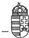
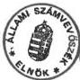

*Állami Számvevőszék*

# **JELENTÉS**

a Ceglédi Állami Tangazdaságnál végzett  
(jelenleg: Dél-Pest Megyei Mezőgazdasági Rt.)  
az állami vagyonnal történő gazdálkodás ellenőrzéséről

1994. november

222.

Magyar Országos  
Levéltár

XIX-A-126-a-1-9t-V-27-41/1993-94

223d-1

---

A vizsgálatot vezette:

dr. Kovácsné

dr. Pósfay Zsuzsanna

osztályvezető főtanácsos

A vizsgálatot végezték:

Koós Lászlóné

Podonyi László

Tímár József

Turnheimné Lakos Zsuzsa

számvevő

számvevő

számvevő tanácsos

számvevő

---

- 3 -

# T A R T A L O M J E G Y Z É K

|  I. BEVEZETÉS | 1.  |
| --- | --- |
|  II. ÖSSZEFOGLALÓ MEGÁLLAPÍTÁSOK, AJÁNLÁSOK | 3.  |
|  1. Összefoglaló megállapítások | 3.  |
|  2. Ajánlások | 9.  |
|  III. RÉSZLETES MEGÁLLAPÍTÁSOK | 11.  |
|  1. Jogi és belső szabályozás | 11.  |
|  1.1. A részvénytársaság alapításának folyamata, törvényessége | 11.  |
|  1.2. Az Rt. szervezett működését biztosító belső szabályzatok, a vezérigazgató jogállása, érdekeltsége | 13.  |
|  1.3. Az állami vagyon védelme, károk rendezése | 14.  |
|  2. Gazdálkodás a vagyonnal | 17.  |
|  2.1. A cég vagyoni helyzete, vagyonváltozása | 17.  |
|  2.2. Gazdálkodás a befektetett eszközökkel | 19.  |
|  2.3. A vagyonértékelés hatása | 21.  |
|  2.4. A gazdálkodás rentabilitása, a cég likviditása | 22.  |
|  3. A kárpótlási törvények végrehajtásának, a föld- kérdés rendezetlenségének hatása | 27.  |
|  3.1. A kárpótlási törvények termőterületre gyakorolt hatása | 27.  |
|  3.2. A földtulajdon rendezetlenségének hatása | 28.  |
|  4. A gazdaság szakmai (működési-termelési) tevékeny- ségének alakulása | 29.  |
|  4.1. A gazdaság működésére vonatkozó tulajdonosi elvárások és azok teljesítése | 29.  |
|  4.2. Az ágazatok jövedelemtermelő képessége | 32.  |
|  5. Belső ellenőrzés | 34.  |
|  6. Környezetvédelem | 35.  |

---

ÁLLAMI SZÁMVEVŐSZÉK

V-37-44/1993/1994.

Témaszám: 207.

# J E L E N T É S

a Ceglédi Állami Tangazdaságnál végzett  
(jelenleg: Dél-Pest Megyei Mezőgazdasági Rt.)  
az állami vagyonnal történő gazdálkodás ellenőrzéséről

## I.

### B E V E Z E T É S

A Ceglédi Állami Tangazdaság jelenlegi szervezete és tevékenységi köre 1950. és 1985. között többszöri centralizációs intézkedések nyomán alakult ki. A térség meghatározó mezőgazdasági üzemévé 1992-re vált, amely technikában, technológiában és termelés integrálásban kiemelkedő szerepet játszott. Összes területe 17,8 e hektár, amelyből 10,5 e hektár szántó.

Alapvető tevékenységi köre : mezőgazdasági termelés és az ehhez kapcsolódó feldolgozás és értékesítés (vetőmag, sertés, stb.).

Az 1985-től vállalati tanács irányítású gazdaságot az Állami Vagyonügynökség 1992. február 12-én államigazgatási felügyelet alá vonta a privatizáció érdekében.

Részvénytársasággá 1992. december 31-én alakult át, az alapítói jogokat időközben átvevő Állami Vagyonekezelő Rt. útmutatásainak megfelelően. A több, mint egy év után bejegyzett Rt. zártkörű alapítású, 100 %-ban állami tulajdonú, a Ceglédi Állami Tangazdaság általános jogutódja.

---

- 2 -

Az Rt. vagyona/saját tőkéje az alapításkor – a vagyonértékelés négyszeri átdolgozása után – 820.180 E Ft jegyzett tőkéből és 1.028.464 E Ft tőketartalékból állt. A teljes munkaidőben foglalkoztatott dolgozók létszáma: 1.044 fő volt.

A cég árbevétele, támogatások, kedvezmények és adózás előtti eredmény adatai a vizsgált időszakban:

|  Megnevezés | millió Ft-ban  |   |   |
| --- | --- | --- | --- |
|   |  1992.év | 1993.év | 1994.év terv  |
|  Értékesítés nettó árbev. | 1.863 | 1.805 | 1.825  |
|  Támogatás, kedvezmény | 25,7 | 74,6 | 18,5  |
|  Adózás előtti eredmény | – 93,7 | 16,1 | 50,5  |

A Ceglédi Állami Tangazdaság az 1972-es szanálási évet követően 1991-ig nyereségesen gazdálkodott. 1985–1989. évek között kedvező kamatozású hitelkonstrukcióban beruházott és fejlesztett, így a vizsgálat időpontjában a fő tevékenységet jelentő vetőmagtermesztéshez kapcsolódó feldolgozóüzem, valamint a sertéstelep műszaki állapota és technikai színvonala, a működés infrastruktúrája kedvezőnek minősíthető.

A nyereség 1990-től a négy éven keresztül tartó aszály, a drasztikusan megemelkedett kamatköltségek, az általános csődhullám, a keleti piacok összeomlása, az új számviteli törvényhez kapcsolódó céltartalék képzési kötelezettség következtében folyamatosan csökkent. A gazdaság mélypontra 1992-ben 93,7 millió Ft-os veszteséggel jutott. 1993-ban, illetve 1994. I. félévében szolid fejlődés, nyereséges gazdálkodás indult meg, miközben végre kellett hajtani – a Pest megyei Kárrendezési és Kárpótlási Hivatal és a Földkiadó Bizottságok közreműködésével – a kárpótlási törvényekben előírt feladatokat és az átalakulást is, egymást követően három tulajdonosi jogokat gyakorló szervezet irányítása és koncepciói alapján (FM, ÁVÜ, ÁV Rt.).

---

- 3 -

A vizsgálat arra irányult, hogy a cég a kezelésében lévő állami vagyonnal hogyan gazdálkodott, átalakulása Részvénytársasággá (továbbiakban: Rt.) a jogszabályoknak megfelelően történt-e, a tulajdonosok által meghatározott működési-termelési tevékenységét megfelelően látta-e el, a kárpótlás kártalanítás okozott-e feszültségeket, biztosított-e az Rt. hosszabb távú működése, a tevékenységére vonatkozó előírásoknak mennyiben felelt meg, a környezetvédelem vonatkozásában hogyan ítélhető meg. A vizsgálat 1992–93. évekre, illetve a várható tendenciák tekintetében az 1994. I. félévre terjedt ki. A helyszíni vizsgálat 1994. április 1-től május 31-ig tartott.

## II.

### ÖSSZEFOGLALÓ MEGÁLLAPÍTÁSOK, AJÁNLÁSOK

#### 1. Összefoglaló megállapítások

A korábbi Ceglédi Állami Tangazdaság – a mai Dél-Pest Megyei Mezőgazdasági Rt. (DPMGRt) – vizsgálata abba az ellenőrzéssorozatba illeszkedik bele, amelynek átfogó célja, hogy az Állami Számvevőszék a fő gazdasági tendenciákat feltárja és a vagyongazdálkodásáról az általánosítható tapasztalatokat foglalja össze. Az Állami Számvevőszék egyidejűleg vizsgálta a Komáromi Állami Gazdaságot, majd 1995-ben további két gazdaság vizsgálata után készíti el összegező tanulmányát.

Az összegzésben foglaltakat nem megelőzve van azonban jónéhány olyan általánosítható tapasztalat, amely már most jelzi a közérdek (vetőmag, szaporítóanyag ellátás biztonsága) jobb érvényesítésének igényét, valamint a napi “szűken értelmezett” gazdaságossági követelmények és a távlati, szélesebb érdekek összhangja biztosításának szükségességét.

---

- 4 -

A DPMGRt. ma még működőképes és ezt az adott körülmények között eredményként kell értékelni. A tulajdonosi jogokat gyakorló ÁVÜ, majd az ÁV Rt. a törvényben kijelölt szerepkörében járt el, de a kialakult helyzet arra int, hogy a holding nem volt képes önmagában feloldani a tulajdonosi jogok és kötelességek, valamint a nemzetgazdasági érdekütközésből származó gondokat.

A jogszabályok, az alapítói jogok gyakorlójának többszöri változása meghosszabbította és megdrágította a cég átalakulását. Az átalakulás nem eredményezett hatékonyságjavulást, nem lett kedvezőbb a gazdaság vagyoni, pénzügyi helyzete. Az irányítási szintek növekedése és a tulajdonosi jogokkal élő ÁV Rt. gyakorlata a törvényekben és az alapító okiratban foglaltaknál jobban megkötötte a management kezét, lassította a döntések meghozatalát és többlet adminisztrációs terheket rótt a végrehajtásában érintett dolgozókra.

Az államiból leválasztott önkormányzati tulajdonrész helyzete még nem rendezett. Az önkormányzatok tulajdonosi jogainak későbbi érvényesíthetőségére az alapító okirat sem utal.

A gazdaság az 1990. évi VIII. (vagyonvédelmi) törvény előírásait betartotta. Valamennyi megkötött szerződést az ÁV Rt. jóváhagyását követően tekintettek érvényesnek.

A gazdaság szokásos üzleti tevékenységével összefüggő szerződései segítették a károk megelőzését. A késedelmes teljesítésből eredő kamatfizetésnek, a vitás kérdések rendezésénél alkalmazandó eljárásoknak, egyéb jogi garanciáknak szerződésben történő rögzítése, azonban nem teljeskörű. A határidőn túli követelések nagysága, a folyamatban lévő peres és nem peres eljárások száma indokolja a cég jogi és pénzügyi munká-

---

- 5 -

A DPMGRt. Szervezeti és Működési Szabályzata és az azt kiegészítő Igazgatói Ügyrend részletesen szabályozza a döntési szinteket, a feladatokat és hatásköröket, a felelősséget. Az Igazgatói Ügyrend azonban már több pontjában elavult, átdolgozásra szorul.

A gazdaság a számviteli törvény alapján – de részben hiányosan – készítette el Számvitel Politikáját és ehhez kapcsolódó számlarendjét és a számlatükröt. A Kollektív Szerződés és mellékletei összhangban vannak a Munka Törvénykönyvével.

Az átalakulási végleges vagyonmérleg adatai szerint a tárgyi eszközöket 80,2 %-kal fel, a befektetett pénzügyi eszközöket 39 %-kal leértékelték, a mérleg főösszeg 27,1 %-kal nőtt. Összességében a vagyon felértékelése lényeges változást nem eredményezett, 'formailag' lettek jobbak, kedvezőbbek a mutatók.

A vizsgált időszakban többszörös változások együttes hatásával kellett számolni. Ennek következtében a gazdaság vagyoni helyzete, a vagyon változása csak évenként értelmezhető. 1992. december 31-én a gazdaság saját tőkéje 111 millió Ft-tal volt kevesebb, mint 1992. január 1-jén. A vagyonvesztés oka alapvetően és döntő mértékben az 1992. évi 93,7 millió Ft veszteség volt. 1993-ban a cég saját tőkéje 5,5 millió Ft-tal nőtt, elsősorban a 8,1 millió Ft nyereséges gazdálkodás következményeként.

A cég saját vagyonán felül idegen forrást is kénytelen volt igénybe venni. Tőkeellátottsági mutatója 1993-ban 1992. évhez viszonyítva javult, kötelezettségei folyamatosan csökkentek. A kötelezettségek csökkentése érdekében az ún. decentralizációs privatizációs körből eszközöket is értékesített. Az eszközértékesítésből 1992-ben 36,8 millió Ft, 1993-ban 36,7 mil-

---

- 6 -

A cég 1992-ben 3 új részesedést vásárolt, ebből kettőt kényszer részesedéssel, 1993-ban társaság alapításban nem vett részt, de egy társaságban részesedését 100 %-ra növelte. A pénzügyi befektetések a vizsgált két évben sem osztalékot, sem bérleti díjban mérhető hozamot nem biztosítottak. A befektetések célszerűsége elemzésével nem foglalkoztak, olyan helyzet alakult ki, mely a befektetések egy részének teljes leértékeléséhez vezet.

Az 1992. évi 93,7 millió Ft-os vesztesége az aszály miatti hozamkiesés, a céltartalék képzési kötelezettség, a csődhelyzetbe jutott partnerek fizetésképtelensége, a 30-36 %-os kamatlábak, az átalakuláshoz kapcsolódó többletkiadások miatt következett be. A bevételek 2,5 %-os emelkedése mellett, a költségeket 5 %-kal csökkentették 1993-ban, 16,2 millió Ft nyereséget realizáltak, amelynek 50 %-át az ÁV Rt. osztalék címén elvonta.

A DPMGRt. tőkeállatottsága rossz, így a legnagyobb volumenű ráfordítás mindkét évben a fizetett kamatok összege volt, amely 1992-ben az üzemi eredmény kétszerese, 1993-ban pedig közel azzal azonos nagyságrendű volt. A DPMGRt. gyakorlatilag a hitelkamatok megfizetésére termelt.

Az évek óta tőkehiánnyal küzdő cég kötelezettségeinek 90 %-a 1992-ben és 1993-ban rövid lejáratú kötelezettség volt. A folyamatos működéshez mindkét évben 300-500 millió Ft-os hitel és év végén 100 millió Ft-os váltókibocsátás volt szükséges. A tapasztalt helyzet az ÁSZ tájékozódása szerint általános a mezőgazdaságban. Finanszírozása, támogatása nem kielégítő. Önerőből a gazdaságok hosszabb távú nyereséges működé-

---

- 7 -

oldása, a kamatköltség csökkentése tőkebevonás nélkül nem megoldható. Nincs olyan hitelkonstrukció sem, amelynek kamatköltségei, lejárati ideje elviselhetőek. Ezek nélkül, önmagában a privatizáció sem jelenthet hosszabb távú gazdálkodásra lehetőséget adó megoldást.

Az 1991. évben alkotott, majd többször módosított kárpótlási törvény végrehajtása az elmúlt években nem fejeződött be, a tulajdonviszonyok végleges rendezésének időpontja meg sem becsülhető. A kialakult helyzetben a Ceglédi Állami Tangazdaság kb. 3.500 ha földhiányt a kárpótoltaktól történő bérbevétellel kénytelen pótolni. A bérleti díj 13-14 millió Ft többletköltséget jelent. Ma még kalkulálni sem lehet, hogy a földnek később megállapított értéke (tulajdon- vagy bérleti jog) milyen hatást gyakorol a gazdaság eredményességére, az általa termelt mezőgazdasági termékek árára.

A gazdaság a nagy mennyiségű minőségi vetőmag előállítása és sertéshús termelése miatt maradt tartósan állami tulajdonban. Az állami tulajdoni hányadnak a korábbi 50 % +1 szavazatról 25 % +1 szavazatra történő későbbi leszállítását külön a gazdaságra irányított elemzésekkel nem támasztották alá.

A tulajdonos ÁV Rt. nem tudott olyan közgazdasági környezetet kialakítani a gazdaság számára, amelyben a szakmai feladatok ellátása mellett megfelelő jövedelem is képződik. A Ceglédi Állami Tangazdaság az ÁV Rt. tulajdonosi igényeinek szakmai tevékenysége során eddig eleget tett, azonban legjelentősebb ágazatánál, a vetőmag előállításnál problémát jelent a privatizáció, illetve a felaprózódott területek miatt a védőtávolság (izolációs távolság) biztosítása.

A szántóföldi növénytermesztésben és gyümölcstermesztésben a gazdaság fajlagos hozamai, az aszályos éveket kivéve, meghaladták az országos átlagokat. Az állattenyésztésben a hozamok

---

- 8 -

az országos csökkenéssel ellentétben, szinten maradtak. Az ágazatok fedezeti összeg termelése heterogén, de hosszabb távon jó. Ágazati szinten általában megfelelő jövedelem képződik. Gazdasági szinten az alacsony jövedelmezőség oka az, hogy az ágazatok a ráosztott költségeket, elsősorban a magas hitelkamatokat nem bírják el.

A gazdaságban veszélyes hulladékok a gépjárművek üzemeltetése, javítása, tisztítása, az állattenyésztési és növényvédelmi munkák, valamint a mezőgazdasági termékek üzemi feldolgozása során keletkeznek. A veszélyes hulladékok kezelése, tárolása, ártalmatlanítása, a légszennyezés határértéken belüli biztosítása megoldott. A szükséges hatósági vizsgálatokat rendszeresen elvégeztették, az engedélyeket megkérték, a megállapított hiányosságokat megszüntették, de ennek tényét jegyzőkönyvben nem rögzítették.

## 2. Ajánlások

### a. Az Állami Számvevőszék az Országgyűlés figyelmébe ajánlja, hogy

- igényelje a Kormánynál az agrárszférában a tartósan állami tulajdonban maradó gazdálkodó szervezetek feletti tulajdonosi jogok gyakorlásának a speciális szakmai szempontokra is figyelmet fordító következetes, hosszú távra érvényes egyértelmű rendezését;
- dolgoztasson ki a kormányzattal az állami vagyon működtetése, a mezőgazdasági tevékenység fenntartása, a biológiai alapok megőrzése érdekében olyan mezőgazdasági hitelkonstrukciókat, amelyek megoldják a mezőgazdasági üzemek finanszírozását a termelési ciklus alatt;

---

- 9 -

- fontolja meg a termőföld szaporítóanyag, vetőmag termelésre hasznosításánál a megfelelő védőtávolság biztosíthatósága érdekében a földtörvény vagy a növénytermesztésről szóló törvény ilyen tartalmú kigészítését vagy módosítását.

b. Javasolja a Kormánynak, hogy

- az ÁV Rt.-vel dolgoztasson ki olyan konstrukciókat, melyek elősegítik a mezőgazdasági nagyüzemekben a tőkebevonást;
- tegyen intézkedéseket annak érdekében, hogy a legfontosabb mezőgazdasági termékek körében (hús, gabona, stb.) a termelési biztonságot zavaró áringadozások mérséklődjenek;
- kezdeményezze az illetékes minisztériumoknál, hogy a környezetvédelmi felülvizsgálatra vonatkozó szabályozást a mezőgazdasági gépekre is terjesszék ki.

c. Felhívja az Állami Vagyonkezelő Rt. figyelmét, hogy

- kezdeményezze a gazdaság működésének, likviditásának javítását, a munkahelyek megtartására is figyelemmel a privatizációs folyamat felgyorsítását;
- rendezze a DPMGRt. vezetőivel függőben lévő munkaszerződést;
- a vagyonelidegenítés belső szabályainak pontosítása során rögzítsék, hogy a könyv szerinti érték alapján milyen értékhatárok között mozoghat az egyes döntéshozók hatásköre.

---

- 10 -

d. Felhívja a Dép-Pest Megyei Mezőgazdasági Rt.-t, hogy

- erősítse meg a "decentralizált" privatizáció lebonyolítására, a különféle szerződéskötések jelentős számára, valamint a folyamatban lévő peres és nem peres eljárásokra figyelemmel a DPMGRt. jogi munkáját, a jogi és pénzügyi apparátus együttműködését;
- gondoskodjon a belső ellenőrzés hatékonyabb működtetéséről;
- dolgozza át és szükség szerint egészítse ki az elavult, a kiegészítésre szoruló, valamint az eddig felül nem vizsgált belső szabályzatait;
- rögzítse jegyzőkönyvben a hatósági vizsgálatok által megállapított környezetvédelmi hiányosságok megszüntetését.

III.

# RÉSZLETES MEGÁLLAPÍTÁSOK

# 1. Jogi és belső szabályozás

# 1.1. A Részvénytársaság alapításának, folyamata, törvényessége

A gazdaság egy éven belüli társasággá való átalakítása érdekében az Állami Vagyonügynökség Igazgatótanácsa a gazdaság 1992. február 12-i hatályú államigazgatási felügyelet alá vonásáról döntött.

---

- 11 -

A cég 1992. június 30-ára nyújtotta be átalakulási tervét az ÁVÜ-nek, amelyhez mellékelte 1991. december 31-i átértékelt vagyonmérlegét is. Az ÁVÜ Privatizációs Koordinációs Bizottsága (PKB) először nem javasolta az anyag elfogadását, majd 1992. szeptember 23-i ülésén végül a decentralizált privatizáció mellett döntött, miszerint értékesítse a cég, azokat a vagyontárgyakat amelyek hiánya nem zavarja a jogutód társaság működését.

Az ÁV Rt. megalakulását követően 1992. november 30-ára az ÁV Rt-nek benyújtott dokumentumok tartalmilag megfelelőek voltak, de a vagyonleltárban nem jelölték meg a törzstökében elhelyezendő vagyontárgyakat. Az átalakulási tervhez csatoltak vagyonmérleg tervezetet is.

Az alapítók között az ÁV Rt.-n kívül a belterületi földértékkel érintett 3 önkormányzat is szerepelt.

1993. április végére készült el az ÁV Rt könyvszakértőjének többszöri felülbírálata alapján javított, az 1992. novemberi - a szeptember 30-i mérlegadatokból kiinduló - vagyonértékelés alapján készített vagyonmérleg.

Az ÁV Rt. elnök-vezérigazgatója 1993. május 21-én adott nyilatkozata szerint az ÁV Rt. ügyvezetése a cég átalakulását jóváhagyta. A nyilatkozat nem tért ki az átalakulási tervvel kapcsolatos, a törvényben előírt döntésre (ingyenes vagyonjegyek dolgozói részvénnyé alakítása). A nyilatkozaton kívül 1992. december 31-i dátummal aláírta az elnök-vezérigazgató a részvénytársaság alapító okiratát, amelyben az alapítók között már nem szerepeltetett egy önkormányzatot sem. Május végén a vagyonmérleg-tervezet 180 napnál régebbi volt, ezért az 1992. december 31-i időpontra vonatkozó újabb végleges vagyonmérleget kellett összeállítani.

---

- 12 -

Az ÁV Rt. mezőgazdasági portfólió igazgatója 1993. július 14-én értesítette a gazdaságot, hogy a vagyonmérleg és az apportlista a cégbírósághoz benyújtható.

A cégbírósági bejelentés – 1992. július 20. – mind az 1992. december 31-i, mind az 1993. május 21-i dátumhoz képest 30 napon túl történt meg. A cégbíróság a gazdaságot hiánypótlásra szólította fel, és arra is következtetett, hogy az alapító okirat visszadátumozott. A hiányokat pótolták, az ÁV Rt. vezérigazgatója pedig a cégbíróság rendelkezésére bocsájtott egy 1992. december 31-i dátumú alapítási nyilatkozatot.

A Cégbíróság 1994. január 18-án jegyezte be 1992. december 31-i alapítási időponttal a gazdaság jogutódjaként átalakulással létrehozott Dél-Pest Megyei Mezőgazdasági Részvénytársaságot.

Az első közgyűlés 1994. január 13-án visszamenőlegesen döntött az Igazgatóság és a Felügyelő Bizottság ügyrendjéről, a tisztségviselők javadalmazásáról.

Összefoglalva megállapítható, hogy a jogszabályok, illetve az alapítói jogok gyakorlójának többszöri változása szükségtelen módon meghosszabbította és megdrágította a gazdaság átalakulását.

### 1.2. Az Rt. szervezett működését biztosító belső szabályzatok, a vezérigazgató jogállása, érdekeltsége

A cég Szervezeti és Működési Szabályzata és az Igazgatói Ügyrend részletesen szabályozta a döntési szinteket, a feladatokat és hatásköröket, a felelősséget. Az Igazgatói Ügyrend azonban már több pontjában elavult, átdolgozásra szorul.

---

- 13 -

A gazdaság számviteli politikája nem utal

- a terven felüli amortizáció és az értékvesztés elszámolásának, a céltartalék képzésének módjára,
- a számviteli munka ellenőrzésének rendjére (erre a Belső Ellenőrzési Szabályzatban található utalás),
- a könyvviteli zárlat, valamint fordulónap és a mérlegkészítés napja között elvégzendő feladatok ütemezésére,
- a könyvvezetés bizonylataira és a könyvvezetésért felelős személyek megjelölésére,
ezért ezek pótlólagos szabályozása szükséges.

A számlarend nem tér ki az alkalmazandó analitikus nyilvántartásokra, nem nevesíti - vagy nem a számlatükörrel azonos módon nevezi meg - a használandó számlákat, illetve alszámlákat, ezért a számlarend és a számlatükör több ponton nincs összhangban.

A vizsgált időszak Kollektív Szerződése 1991. július 1-től hatályos, amelyet 7 alkalommal módosítottak. A Kollektív Szerződés a Munka Törvénykönyvével ellentétes szabályokat nem állapított meg, ugyanakkor - a törvény adta lehetőségen belül a dolgozóknak - többletjuttatásokat biztosított.

A munkaszerződéseket, munkaköri leírásokat szükség szerint módosították, illetve kiegészítették és a dolgozókkal átvetették.

A cég Vállalati Tanácsa a vezérigazgatóval 1990. november 20-tól öt évre szóló határozott idejű munkaviszonyt létesített.

A vezérigazgatót az ÁVÜ csak 1992. októberében erősítette meg állásában. Az intézkedés elhúzódásával a vezérigazgatót mintegy fél évig állásában bizonytalanságban tartották. Az

---

- 14 -

ÁV Rt. az Alapító Okiratban 1993. december 31-ig, a közgyűlés határozatlan időre hosszabbította meg a vezérigazgató munkaviszonyát, munkaszerződést azonban sem az ÁVÜ, sem az ÁV Rt nem kötött vele.

A vezérigazgató ösztönzési rendszerének középpontjában mindhárom évben (1992., 1993., 1994.)

- a privatizációs program megvalósítása,
- a nyereségterv teljesítése és túlteljesítése állt, illetve áll.

A prémiumfeladatokat késedelmesen tűzték ki, a privatizációval kapcsolatos elvárásokat nem egyértelműen határozták meg. A prémium kiértékelés objektivitását kérdésessé tette, hogy, pl. az 1992. évi elvárásokat decemberben közölték. Az 1994. évi 50 %-os prémium kitűzés ösztönző hatása jelentősen csökkent.

### 1.3. Az állami vagyon védelme, károk rendezése

A gazdaság által megkötött szerződések jelentős köre vagyonát érintette.

Az 1990. évi VIII. (vagyonvédelmi) törvény előírásait figyelembe véve 1991. májusában egy német céggel létrehozandó közös kft-be apportálandó 24,5 millió Ft könyv szerinti értékű ingatlan ügyében a megyei Vagyonellenőrző Bizottság jóváhagyását kérték és meg is kapták. Nem pénzbeni hozzájárulás gazdasági társaságba vitelére ezt követően nem került sor.

Az ÁVÜ Privatizációs Koordinációs Bizottsága (PKB) 1992 szeptemberében döntött a gazdaság 391 millió Ft-os vagyontömegének a decentralizált privatizációs program keretében történő értékesítéséről.

---

- 15 -

Kikötötte, hogy a szerződések létrejöttéhez – a törvényileg előírt vagyonvédelmi értékhatár felett – az ÁVÜ hozzájárulása szükséges. A szerződésekhez csatolandó adatlapokon – annak ellenére, hogy 1992. őszén már az 1992. évi LIV. törvény III. fejezete vonatkozott a vagyonvédelmi előírásokra – még az 1990. évi vagyonvédelmi törvényre hivatkozva kérték az adatokat.

1992. októbere és 1993. augusztusa között négy pályázatot írtak ki. A pályázatok, árverések megfeleltek a jogszabályi, illetve ÁVÜ előírásoknak.

Szerződésfajtánként vizsgálva megállapítható, hogy csak az értékesített befektetett pénzügyi eszközök könyv szerinti értéke érte el a törvényben megjelölt határértéket (ez összesen 20,2 millió Ft-ot tett ki), mégis minden egyes szerződést megküldtek jóváhagyás végett az ÁV Rt.-nek. Az ÁV Rt. döntés általában 30 napon túl született meg.

Itt kell említést tenni a gazdaság 5,2 millió Ft könyv szerinti értékű Kossuth-telepéről. Az ÁVÜ, majd az ÁV Rt. döntése és szerződés-jóváhagyása alapján a vagyonérték 1%-áért az ingatlanok kezelői jogát adták át az iskolát fenntartó önkormányzatnak. A 450 ezer Ft összegért való átadás következtében a gazdaság 1992. évi vagyonvesztése 4,8 millió Ft.

1993-tól a vagyonvédelemre vonatkozó előírásokat a társaság alapító okirata tartalmazta. Eszerint 50 millió Ft-os értékhatárig az igazgatóságé a döntés joga.

Az 1993-ban értékesített vagyontárgyak értéke sem szerződésfajtánként, sem összesen nem érte el az 50 millió Ft-ot, mégis a megkötött adásvételi szerződéseket csak az ÁV Rt. jóváhagyását követően tekintették érvényesnek.

---

- 16 -

A szerződésekben 12 %-os meghiúsulási kötbér kifizetését rögzítették, de azt a vevők nem fizették meg, így a gazdaság 3,6 millió Ft-ra fizetési meghagyást nyújtott be, néhány esetben nem a területileg illetékes bírósághoz.

A gazdaság szokásos üzleti tevékenységével összefüggő szerződések több esetben segítették a károk megelőzését. Bizonytalan fizetőképességű vevő esetén árucserében állapodtak meg. A takarmányigényes sertéságazatban termelés előfinanszírozási, árubiztosítéki megállapodásokat is kötöttek.

Nem általános még, hogy késedelmes teljesítés esetére kamatfizetési kötelezettséget kötnének ki, vagy a szerződésben nem utalnának a felmerülő vitás kérdések rendezésénél alkalmazandó eljárásra.

A jogi garanciák esetenkénti hiányát mutatja az 1992. évi 2,7 millió Ft, valamint az 1993. évi 4,8 millió Ft hitelezési veszteség elszámolása.

Jelentős veszteséget okozhat a DPMG Rt. számára a FRUTTA Kft-nek 1992-ben nem kellő körültekintéssel nyújtott 130 millió Ft-os kezesség.

Az Igazgatói Ügyrend és a Kollektív Szerződés szabályozza a fegyelmi és kártérítési eljárást, az anyagi felelősség mértékét. A Kollektív Szerződés nem tartalmazza a felelősségvállalási nyilatkozatra kötelezett munkakörök jegyzékét.

Jelentősebbek a gazdaság külső károkozásból eredő veszteségei: mezőrendészeti szabálysértés, rongálás, betörés miatt 1992-93-ban 48 esetben tettek feljelentést, összesen 2,7 millió Ft kárértékben. Az esetek többségében a rendőrségi nyomozás eredménytelen volt, 2 ügy bírósági szakaszban van, 4 esetben a kár részben megtérült.

---

- 17 -

A különböző károk enyhítése érdekében biztosításra évi 7,6-8,4 millió Ft-os összeget fordítottak, a kártérítés mértéke elmaradt a tényleges kártól.

A gazdaságnak nincs biztosítása természeti károkra. Ezekre ugyanis a biztosító csak a biztosítási díj mértékéig fizet.

## 2. Gazdálkodás a vagyonnal

### 2.1. A cég vagyoni helyzete, vagyonváltozása

A vizsgált időszakban többszörös változások együttes hatásával kellett számolni. Változott a

- tulajdonosi (illetve a tulajdon formája),
- jogszabályi,
- számviteli

közeg.

A változások együttes hatása következtében a gazdaság vagyoni helyzete, a vagyon változása csak évenként értelmezhető.

Az új számviteli törvény bevezetése, az Rt.-vé alakulással együtt járó vagyonértékelés miatt valós vagyonnövekedés vagy csökkenés a vizsgált időszakban és az alapítói vagyonhoz viszonyítva nem mutatható ki.

Mindezek figyelembe vételével 1992. december 31-én a Gazdaság-saját tőkéje 111 millió Ft-tal volt kevesebb, mint 1992. január 1-jén (rendező mérleg adatai). A vagyonvesztés oka alapvetően és döntő mértékben az 1992. évi 93,7 millió Ft veszteség volt. A veszteség okai: aszálykárok, magas hitelkamatok a céltartalék képzési kötelezettség, valamint az átalakulás és a decentralizációs privatizáció ráfordításai voltak.

---

- 18 -

1993-ban a cég saját tőkéje szolid mértékben ugyan, de 13,6 millió Ft-tal nőtt, elsősorban a 16,2 millió Ft nyereséges gazdálkodás következményeként. A tulajdonos ÁV Rt. osztalékpolitikája miatt (mérleg szerinti eredmény 50 %-át elvonta) azonban a növekedés még kisebb mértékű lett, 5,5 millió Ft, miután a mérleg szerinti nyereség a felére csökkent.

A vizsgált két évben a mérleg szerinti eredményen kívül a gazdaság managementjének közvetlen döntése alapján, sem számottevő vagyoncsökkenés, sem számottevő vagyonnövekedés nem következett be. (A több, mint 100 millió Ft-os 1992. évi kezességvállalásból adódó peres ügy elvesztése esetén, mind a vagyonváltozás, mind a management minősítése új helyzetet jelent.)

Az összes eszközérték

|  1992-ben | 183,6 millió Ft-tal,  |
| --- | --- |
|  1993-ban | 103,1 millió Ft-tal  |
|  csökkent.  |   |

A csökkenés 1992-ben kisebb mértékben a befektetett eszközökben 54,7 millió Ft (az eszközérték 2,4 %-a), nagyobb mértékben a forgóeszközökben 122,1 millió Ft (az eszközérték 5,3 %-a) következett be. Pl.: a beruházásokat visszafogták, illetve az aszály miatt kisebb lett a készletérték.

1993-ban a befektetett eszközök értéke 47,9 millió Ft-tal (az eszközérték 1,8 %-ával) a forgóeszközök értéke 56,4 millió Ft-tal (az eszközérték 2,1 %-ával) csökkent.

A csökkenés a befektetett eszközök közül nagymértékben a tárgyi eszközökben (61,1 millió Ft) a decentralizált privatizációs értékesítés miatt, a forgóeszközök között a pénzeszközökben (105 millió Ft), kötelezettség visszafizetése miatt következett be.

---

- 19 -

## 2.2. Gazdálkodás a befektetett eszközökkel

A cég saját vagyonán (saját tőkéjén) felül idegen forrást is kénytelen igénybe venni folyamatos működéséhez, Tőkeellátottsági mutatója (saját tőke összes forráshoz viszonyított aránya) 1993-ban azonban 1992-höz viszonyítva 3,3 %-kal javult.

A kötelezettségek alakulása:

|  1992. január 1. | 898,8 M Ft (saját tőke 64,8 %-a)  |
| --- | --- |
|  1992. december 31. | 787,1 M Ft (saját tőke 61,6 %-a)  |
|  1993. december 31. | 666,3 M Ft (saját tőke 35,8 %-a)  |

A kötelezettségek folyamatos csökkentése érdekében a gazdaság eszközöket is értékesített. A befektetett eszközök értékesítése a vizsgált időszakban az ÁVÜ és ÁV Rt. engedélyével történt.

Értékesítésre került:

- 1992-ben könyv szerinti értéken 28,5 M Ft,
  vagyonértéken 81,0 M Ft,
  szerződés szerinti értéken 42,1 M Ft,
  értékű eszköz (a 42,1 M Ft-ból befolyt 36,8 M Ft).
- 1993-ban könyv szerinti értéken 37,4 M Ft,
  vagyonértéken 44,2 M Ft,
  szerződés szerinti értéken 40,8 M Ft
  értékű eszköz (a 40,8 M Ft-ból 36,7 M Ft realizálódott).

A vizsgált időszak elején - 1992. január 1-jén - a cégnek 18 társaságban volt részesedése (befektetett eszközök 15 %-a). 1992-ben 3 új részesedést, üzletrészt vásárolt, ebből kettőt "kényszerűen", adósság fejében. 1993-ban társaság alapításban nem vett részt, részesedést nem vásárolt, de egy társaságban részesedését 100 %-ra növelte.

---

- 20 -

### Értékesített viszont

1992-ben 4,

1993-ban is 4

részesedést, 1992-ben 95 %-os, 1993-ban 108 %-os könyv szerinti értéken.

1993. december 31-én a még meglévő 13 társasági részesedés értéke a befektetett eszközök 6,7 %-ára csökkent, a részesedések drasztikus leértékelése, kismértékű értékesítése és a tárgyi eszközök jelentős felértékelése következtében.

A pénzügyi befektetések a vizsgált két évben gyakorlatilag sem osztalékot, sem bérleti díjban mérhető hozamot nem biztosítottak, leértékelésük is a 'gazdaságtalan befektetés' minősítést igazolja. A befektetések egy részéről, a társaságok törzstőkéjéről, működéséről a cégnek adata, információja nincs, szükségesnek látszik a befektetések felülvizsgálata, helyzetük feltárása, szükség esetén az egyes befektetések teljeskörű leértékelése is, kivéve a nonprofit jellegű, partnerkapcsolatot erősítőket.

### 2.3. A vagyonértékelés hatása

Az átalakulási végleges vagyonmérleg adatai szerint a tárgyi eszközöket felértékelték 632 M Ft-tal fel (80,2 %), a befektetett pénzügyi eszközöket (részesedéseket) 54 M Ft-tal (39 %) leértékelték.

A forgóeszközökben lényeges változás nem történt. A saját tőke összesen 572 M Ft-tal, a mérleg főösszeg 27,1 %-kal nőtt. A tőketartalékba a decentralizált privatizcióra kijelölt vagyonelemek kerültek 322 M Ft értékben, továbbá a jelzáloggal terhelt ingatlanok (hitelkeret igénybe vétele miatt) 396 M Ft értékben, mint lényegesebb vagyonelemek.

---

- 21 -

Összességében megállapítható, hogy a vagyon felértékelése lényeges változást nem eredményezett. Formailag kedvezőbbek, jobbak az egyes mutatók, mint pl. saját tőke aránya, viszonya a kötelezettségekhez. A decentralizációs privatizációs értékesítés pénzügyi eredményei sem jelentettek döntő változást, két év alatt az eredetileg 372 M Ft-ban megállapított értékesítésre szánt eszközökből, mindössze egyharmadát értékesítették 66 %-os áron, ebből befolyt 73,5 M Ft.

A jelenlegi kamatkondíciók melletti nagy hitelállománnyal működő cég szempontjából szükséges lenne a decentralizációs privatizáció gyorsabb ütemű végrehajtása, amelynek egyelőre a fizetőképes kereslet hiánya, esetenként a viszonylag magas árak, az eszközök folyamatos értékvesztése a gátja.

#### 2.4. A gazdálkodás rentabilitása, a cég likviditása

##### A gazdálkodás rentabilitása

A cég működésének rentabilitását a vizsgált két évben és fő számaiban az alábbi összefoglaló táblázat szemlélteti:

adatok: millió Ft-ban

|  Megnevezés | 1992. év |   | 1993. év |   | Index 93/92. %  |
| --- | --- | --- | --- | --- | --- |
|   |  érték | megoszl. % | érték | megoszl %  |   |
|  Össz. bevétel | 1.964,8 | 100,- | 2.014,8 | 100,- | 102,5  |
|  ebből: |  |  |  |  |   |
|  tám. kedv. | 25,7 | - | 74,6 | - | 290,3  |
|  Össz. ktg. | 1.704,6 | 86,8 | 1.618,8 | 80,3 | 95,-  |
|  Össz. ráford. | 353,9 | 18,- | 380,- | 18,9 | 107,4  |
|  Adózás előtti eredmény | - 93,7 | - 4,8 | + 16,2 | 0,8 | -  |

---

- 22 -

Az 1992-es év a gazdálkodás mélypontját jelentette. Az általános csődhullám, a keleti piacok összeomlása, a számviteli törvényből fakadó változások, az átalakuláshoz kapcsolódó többletkiadások, az ismétlődő és még súlyosabb aszálykár következtében a cég 93,7 millió Ft-os veszteséget ért el.

Röviden számszerűsítve:

- az aszály miatti hozamkiesés nagysága meghaladta a 180 millió Ft-ot (eredménytartalma több mint 50 millió Ft),
- céltartalék képzési kötelezettség 43 millió Ft,
- a csődhelyzetbe jutott partnereknél több mint 50 millió Ft követelés vált behajthatatlanná, a pénzügyi helyzet, a 30-36 %-os kamatlábak miatt tovább romlott, a pénzügyi műveletek vesztesége meghaladta a 170 millió Ft-ot,
- az átalakuláshoz kapcsolódó kiadások meghaladták a 15 millió Ft-ot.

A veszteség nagyobb volumenű lett volna, ha a gazdaság az előző öt évben nem halmoz fel vagyont, nem képez nyereségtartalékot.

A gazdálkodás során 1992-ről, 1993-ra a bevételek szerény növekedése mellett (+2,5 %) a cég költségei 5 %-kal csökkentek. Ha figyelembe vesszük az inflációt, a cég költség-gazdálkodása kedvező tendenciát mutat.

A bevételnövekedés oka a támogatások és kedvezmények 48,9 millió Ft-os növekedése és az 1992-ben képzett céltartalék. Összességében megállapítható, hogy a cég üzemi tevékenységének eredménye kedvező irányba változott,

|  1992-ben | + 81,2 M Ft, |   |
| --- | --- | --- |
|  1993-ban | + 189,2 M Ft | volt.  |

---

- 23 -

A ráfordítások között vannak azok az eredményt rontó tételek, amelyek a működéshez nem, vagy ilyen mértékben nem szükségesek. Így:

|  Megnevezés | millió Ft-ban  |   |
| --- | --- | --- |
|   |  1992. év | 1993. év  |
|  hitelezési veszteség | 2,7 | 4,8  |
|  bírság, kamat | 1,5 | 0,5  |
|  korengedményes nyugdíj | 3,- | 3,5  |
|  fizetett kamatok | 173,4 | 152,7  |
|  ebből: pénzintézeti | 155,7 | 140,1  |
|  árfolyamveszteség | 24,7 | 2,9  |
|  egyéb rendkívüli ráford. | 42,7 | 97,9  |

A táblázatból látható, hogy a legnagyobb volumenű ráfordítás mindkét évben a fizetett kamatok összege volt, amely 1992-ben az üzemi eredmény kétszerese, és 1993-ban majdnem elérte azt. A cég gyakorlatilag a hitelkamatok megfizetésére termelt. A vizsgált két évben negatív adóalap miatt a cégnek adófizetési kötelezettsége nem volt.

#### A cég likviditása

A cég tőkeellátottsága rossz, évek óta tőkehiánnyal küzd. Az átalakulás azonban valós változást nem jelentett, tőkebevonás nem történt. A hitelhányad (eladósodottság) mutatója 1993-ban 6,8 %-kal javult, de még mindig saját tőkéjének 35,8 %-át terhelik kötelezettségek.

A kötelezettségek döntő többsége (több, mint 90 %-a) rövid lejáratú kötelezettség volt mindkét évben, egyrészt a beruházások visszafogása, (saját forrás hiánya, bizonytalanság) másrészt a mezőgazdaság speciális, hosszú termésciklusa miatti termelésfinanszírozási kényszer következtében. A folyamatos működéshez mindkét évben 300-500 millió Ft-os

---

- 24 -

hitel és év végén 100 millió Ft-os váltókibocsájtás volt szükséges. (A cégnek a BB-nál lévő 640 millió Ft-os hitelkeretét teljes mértékben nem kellett igénybe venni, a hitelkeret igazolását nem tudták bemutatni.)

A hitelállomány nagysága, az ehhez kapcsolódó magas kamatköltség miatt a pénzügyi műveletek vesztesége

1992-ben 170,5 M Ft,

1993-ban 139,2 M Ft

a gazdálkodás nagyon lényeges negatív tényezője.

A mezőgazdaság támogatása, az adott kedvezmények a pénzintézeti kamatoknak és árfolyamveszteségnek

1992-ben 14,3 %-át,

1993-ban 52,2 %-át

kompenzálták.

De tekintve, hogy az aszálykár miatt adott kamatkedvezmény a termést, illetve a hozamkiesést, továbbá a magasabb takarmányárakból adódó többletköltséget nem pótolta, így a cég, illetve a mezőgazdasági tevékenység finanszírozása, támogatása nem megoldott. Önerőből – figyelembe véve a pénzügyi helyzet kedvező változását, a rövid lejáratú kötelezettségek csökkenését, a határidőn túli követelések csökkentését, a pénzügyi fegyelem javítását, a decentralizált privatizáció bevételeit (két év alatt mindössze 73,5 M Ft), az ÁV Rt. osztalékpolitikáját – a gazdaság nyereséges működése, fejlesztése hosszabb távon nem biztosítható.

A likviditási helyzet megoldása, a kamatköltség csökkentése érdekében a tulajdonosnak meg kell teremteni a tőkebevonás lehetőségét, vagy olyan hitelkonstrukciót kell kidolgozni, amelynek kamatköltségei, lejárati ideje elviselhetőek. Ezek nélkül önmagában a privatizáció sem jelent megoldást, mert

---

- 25 -

a cég vagy leértékelődik, vagy a tulajdonosok tevékenységét a legkisebb és legnyereségesebb keresztmetszetre szűkítve, a vagyontárgyakat eladják, a mezőgazdasági munkanélküliséget pedig növelik.

A cég pénzügyi (likviditási) helyzetének értékelése, minősítése kapcsán ki kell térni a management 1992. április 14-i, illetve 1992. június 8-i kezességvállalásaira, amelynek következményeként a Pest megyei Bíróságon 5.G.40164/1993. sz. per van folyamatban. (Peres felek: felperes - Dél-Pest megyei Mezőgazdasági Rt., alperes - Budapest Bank Rt. Ceglédi fiókja, kötelezett - FRUTTA Gyümölcs Kereskedelmi Kft., amellyel a Ceglédi Állami Tangazdaság az 1992-es gazdasági évre gyümölcshasznosítási bérleti szerződést kötött és akinek a Budapest Bank Rt. export előfinanszírozási hitelt nyújtott. A kézfizető kezesség tárgya az export előfinanszírozási hitel volt. A per tárgya: 130 millió Ft tőke és járulékai, amely a kézfizető kezességvállalás érvényesítése miatt indult. A kezességvállalás érvényesítésének eredményeként eddig 20,3 millió Ft-ot fizetett ki a cég, 10 millió Ft tőkét és 10,3 millió Ft kamatot), amelyet számlavezető bankja emelt le folyószámlájáról.

Az ellenőrzéshez rendelkezésre bocsájtott iratanyag áttanulmányozása alapján nem volt egyértelműen megállapítható az, hogy a két különböző időpontú kézfizető kezességvállalás egyszer, vagy kétszer 130 millió Ft-ra vonatkozik-e, továbbá az sem, hogy kezesi minőségben ténylegesen - többszöri banki leemelések, átvezetések miatt - milyen összeget teljesíttetett a bank a gazdasággal. A peres eljárás során ilyen jellegű egyeztetésre nem került sor. A per tárgyára és a perértékre a gazdaság és a bank nyilatkozata áll rendelkezésre.

---

- 26 -

A rendelkezésre bocsájtott iratanyagból az látható, hogy a kezes

- a FRUTTA Kft.-vel kötött bérleti szerződéshez nem csatoltatott 30 napnál nem régebbi cégkivonatot (különös tekintettel az aláírási jogosultságra);

- a kézfizető kezességvállalási nyilatkozat érvényesíthetőségét nem kötötte feltételekhez, nevezetesen ahhoz, hogy milyen hitelszerződésre vonatkozik (összeg, lejárat, ütemezés), továbbá hogy azok csak a már aláírt hitelszerződések cég által történő záradékolása után legyenek érvényesíthetőek.

A per jogerős befejezésével dől el a cég készfizető kezességének fennállása, vagy annak hiánya. Ezt követően vethető fel a management felelősségének, illetve felelősségre vonhatóságának kérdése, amennyiben az eljáró bíróság az előzőekben foglalt tényeket és körülményeket figyelembe veszi, és azt állapítja meg, hogy felperes nem a tőle elvárható gondossággal járt el a szerződés megkötésekor.

### 3. A kárpótlási törvények végrehajtásának a földkérdés rendezetlenségének hatása

#### 3.1. A kárpótlási törvények termőterületre gyakorolt hatása

Az 1991. évi XXV. törvény és a végrehajtására kiadott 104/1991. (VIII.3.) Kormányrendelet 'a tulajdonviszonyok rendezése érdekében az állam által az állampolgárok tulajdonában igazságtalanul okozott károk részleges kárpótlásáról' többszöri módosításaival együttesen érvényes végrehajtása az elmúlt közel 3 év alatt sem fejeződött be. A tulajdonviszonyok végleges rendezésének – az új földtulajdonosok

---

- 27 -

földhivatali bejegyzése, a megmaradó állami tulajdon földhivatali rendezése - várható időpontja pedig meg sem becsülhető.

Az ún. Kárpótlási törvények végrehajtása az 1992. február 14-i - Pest Megyei Kárpótlási Hivatal - földalap kijelölési határozattal kezdődött, majd többszöri törvénymódosítások, földalapcserék pótlólagos kijelölések következtek.

Folyamatában:

- földalap kijelölések előterjesztése, viták 11 Érdekegyeztető Fórummal,
- tanintézeteknek történő átadás,
- dolgozói földalapok kijelölése, jogosultság megállapítása után (jogosultság vitatása, állásfoglalás kérés, újbóli átdolgozás),
- földkijelölések módosítása (tanyatulajdonosok miatt),
- pótlólagos kárpótlási földalap kijelölése, viták.

Végeredményben a mai napig nincs véglegesített, csak várható adat, az Rt. kezelésében maradó földterületről.

A kárpótlás végrehajtása után az Rt. használatában marad

|  - az összes földterültet | 59,8 %-a és  |
| --- | --- |
|  - az összes AK érték | 50,8 %-a.  |

A vetőmagtermeléshez és az állattenyésztéshez legfontosabb művelési ágak közül

|  - a szántóterület | 42 %-a (4.410 ha)  |
| --- | --- |
|  - a rét, legelő | 77 %-a (1.839 ha)  |

marad meg.

A kárpótlási folyamat elhúzódása miatt, (az első földárverések 1993 februárjában kezdődtek) 1992-ben valamennyi földterületet művelték, így földkérdésből adódó feszültség-

---

- 28 -

gel (földhiánnyal) számolni nem kellett. A használatban lévő földterület nagysága 1993-ban sem változott lényegesen, bár az év tavaszán árverezett, de már korábban bevetett földek után bérleti díjat kellett fizetniük (szántó után 5,8 millió Ft).

1994-től, tekintettel a közel 8.000 ha-os szántószükségletre, igényre, a 3.500 ha hiányt a kárpótoltaktól történő bérbevétellel kénytelen a gazdaság pótolni. Ennek várható pluszköltsége 13-14 millió Ft lesz, amelyet a terményárakban kellene érvényesíteni a nyomott piacokon.

### 3.2. A földtulajdon rendezetlenségének hatása

Az Rt. használatában maradó földterületek tulajdonosa a Magyar Állam. A termelés, működés alapját képező földterületek értéke sem a gazdaság, sem pedig az Rt. nyilvántartásában nem szerepel. Ma még kalkulálni sem lehet, hogy a földnek később megállapított értéke (tulajdon- vagy bérleti jog), milyen hatást gyakorol az Rt. eredményességére, a mezőgazdasági termékek árára. Ez várhatóan 10.662 hektárnyi, 155.591 AK értékű földterületre vonatkozik.

## 4. A gazdaság szakmai (működési-termelési) tevékenységének alakulása

### 4.1. A gazdaság működésére vonatkozó tulajdonosi elvárások és azok teljesítése

A rendszerváltásig 121 állami gazdaság működött önállóan. A gazdaságok nagyobb része a szakminisztérium felügyeletéből az ÁVÜ portfóliójába került, s ezek teljeskörű privatizálása, illetve néhány felszámolása, végelszámolása folyamatban van.

---

- 29 -

Jelenleg 24 gazdaság van az ÁV Rt. portfóliójában, amelyek tartós állami tulajdonban maradnak 25 % +1, illetve 50 % +1 szavazat mértékéig. A tartósan állami tulajdonban maradó kör meghatározási szempontja a biológiai alapok fenntartásának szükségessége volt (vetőmag-termelő vertikumok és növényi-állati törzsállományok). Ezen gazdaságokban az átalakulás lezajlott, a privatizáció most kezdődik.

A Dél-Pest Megyei Mezőgazdasági Rt. elsősorban nagy volumenű vetőmag előállítása és sertéshús termelése miatt került a tartósan állami tulajdonba maradó gazdaságok körébe.

A kiválasztásban szerepet játszott, hogy adott volt a korszerű nagyüzemi technológia, a körzetben már elért koordináló szerepkör és a tanfeladatok ellátása is.

Az Rt. a 126/1992. (VIII.28.) Kormányrendeletben foglaltak alapján először 50 % +1 szavazat arányú állami tulajdonú kijelölést kapott az előbb leírt szempontok alapján. Később a 185/1993. (XII.31.) Kormányrendelet 25 % +1 szavazatra csökkentette az állami tulajdon arányát.

A módosítás oka egyértelműen nem követhető nyomon, hiszen a gazdaság felépítésében lényegi változás nem történt, csupán a tanfeladatok egy része került az Rt.-n kívülre.

A gazdaság állami feladatot azáltal lát el, hogy mint az agrárszféra egy sejtje, közvetlen beavatkozási lehetőséget teremt az államnak a biológiai alapok védelme, az állattenyésztés, a szaporítóanyag ellátás és a vetőmagtermelés stratégiai jelentőségére tekintettel.

A tulajdonos feladata, hogy olyan közgazdasági környezetet alakítson ki, ahol az elvárt feladatok megfelelő jövedelem termelésével együtt végrehajthatók. Az ilyen környezet ki-

---

- 30 -

alakítása eddig nem sikerült. Az ÁV Rt. részéről a fő hangsúly a jövedelemtermelő képesség fokozásán (osztalék) és a mielőbbi privatizáció végrehajtásán van.

A rövid idő alatt lezajlott tulajdonosváltozások nem használtak az Rt. fejlődésének. Az eltérő hangsúlyú szakmai elvárások fokozott terhelést jelentettek a gazdaságnak az egyéb objektív problémák (aszály, átalakulás, kereslet változás) mellett. Az ÁV Rt. 'lehetősége és tehetsége' mértékéig megpróbál igazi tulajdonos lenni, de a szakmai specialitásokat nem képes figyelembe venni, s szerepe elsősorban az osztalék megszerzésében van. Az átszervezések során az FM szakmai javaslatai nem minden esetben kerültek előtérbe.

Indokolt hosszútávra a tartósan állami tulajdonban maradó agrár társaságok (így a DPMG Rt.) tulajdonosának olyan szervezetet kijelölni, amely képes a szakmai irányításra és összeegyezteti az országos ellátó szerepet a gazdaságossággal. Az Rt. szakmai tevékenysége során összességében eleget tett a tulajdonos elvárásainak. Ez a következőkben realizálódott.

a) Vetőmag: a gazdaság országosan is jelentős vetőmag előállítást végez. Elsősorban a hibridkukorica vetőmag előállítása területén van szerepe, de folyamatosan fejleszti, fokozza a kalászos vetőmagok előállítását is.

A vertikálisan kialakított rendszer jól szervezett és irányított. A vetőmagtermelés minősége néhány kedvezőtlen külső körülmény ellenére sem csökkent.

A vetőmag előállítást hátrányosan érinti a nem megfelelően végrehajtott privatizáció és földosztás. A vetőmagtermesztésben megfelelő izolációs távolság (védőtávol-

---

- 31 -

növénytől, táblától csak meghatározott távolságon kívül lehet azonos fajú növény a nem kívánt keveredés elkerülése miatt. Ezt egyre nehezebb biztosítani. A tagoltabb földterületeken nehezebb kijelölni az elegendő és megfelelő részeket.

**Az izolációs távolságok biztosítására sincs hathatós törvényi szabályozás.**

Az elfogadott földtörvény ugyan szabályozza a védőtávolságot 'A termőföld szaporítóanyag-termeléssel történő hasznosítása során a földhasználó köteles vetéstervét – a külön jogszabályban előírt mértékű védőtávolságok érdekében – egyeztetni a szomszédos földhasználóval. Egyebekben a Ptk.-nak a szomszédjogra vonatkozó rendelkezéseit a termőföldek esetében is megfelelően alkalmazni kell.' Ez azonban elsősorban a vetőmag előállítóra szab ki feladatot, de a szomszédokat érdemben nem tudja befolyásolni. Ha az előzetes egyeztetés sikerrel is jár, nincs megfelelő garancia arra, hogy a szomszéd a tenyészidőszak alatt ne váltson fajtát.

A keleti vetőmagpiacok csökkenése kiszolgáltatottabbá teszi a gazdaságot a nagyobb nyugati 'fajta tulajdonosok'-kal szemben. Ez később a hazai ellátást is veszélyeztetheti, ezért szükséges az itthoni fajtatulajdonosok szerepét megnövelni.

# **b) Sertés:**

A gazdaság működteti az ország egyik legnagyobb hízókibocsájtású sertéstelepét. A telep átvészelte a többi ágazat keresztfinanszírozása segítségével a hatalmas áringadozásokat, amelyet az előállat előállítás nehezen tud elviselni, tekintettel a magas és állandó költségigényű kiépített technológiára, továbbá a technológia változtatásának hosszú időintervallumára. A termelési

---

- 32 -

szerkezet változtatása (állománynövelés, csökkentés, átalakítás) az agrár ágazat nagyobb területén nem mehet végbe rövid idő alatt, a megfelelő termelési szerkezet csak évek alatt alakítható ki. Az ország több nagy telepe és kisgazdasága beszüntette a sertéshízlalást, így néhány év alatt 10 millió db-ról felére csökkent a sertésállomány. A gazdaság telepe évi 4 ezer tonna sertéshúst állít elő. A telep állománya megfelelő, igaz néhány szakértő a fajtaváltás mellett foglal állást. A hízóllatok kibocsájtási átlagsúlya 10-20 %-kal meghaladja az optimálisnak tartott értéket, de amíg a gazdaság ezen a nagyobb hízlalási átlagsúlyon is kiváló minősítéssel értékesíti áruját, ez a gyakorlat nem kifogásolható. Az állatelhullás a nagyüzemi tartás átlagértéke alatt van. A telep szakmai irányítása kiemelkedő, s ez párosul a vevőkör jó megválasztásával és a bevételek kézben tartásával is.

#### 4.2. Az ágazatok jövedelemtermelő képessége

Az agrárágazatban a jövedelemtermelő képesség megítélése nehéz, a megközelítés módszerétől függően változik.

A megítélés hagyományos módszere a fajlagos mennyiségi hozamok összehasonlítása. Ebből ugyan lehet következtetni a termelés színvonalára, de a jövedelemtermelő képesség megítélését nagyban torzítja.

Elterjedt módszer a mezőgazdaság ágazatai jövedelemtermelő képességének vizsgálatánál a fedezeti összegek összehasonlítása. A fedezeti összegek összehasonlítása azt jelenti, hogy az értékesített termékek árbevételéből levonják az értékesített termékek szűkített önköltségét, s az így kapott összeg mint ágazati jövedelem kerül összehasonlításra.

---

- 33 -

A két módszer kombinálása javítja az elemzés pontosságát. Az évek közötti (időszak vizsgálata) összehasonlításnál a KSH-ban is elfogadott módszer, hogy az agrárszféra szempontjából konszolidált 1986-90-es évek átlaga kerül összevetésre az utána következő évek átlagával. Az összehasonlításoknál főleg a növénytermelésben figyelembe kell venni az 1992. év 1993. évben jelentkező aszályt. Országosan a műtrágya-felhasználás jelentős csökkenése (ez a vizsgált gazdaságnál nem jellemző) torzítja a bázist.

A szántóföldi növénytermesztésben és a gyümölcstermesztésben a gazdaság átlagtermései az aszályos éveket kivéve meghaladták az országos átlagokat. (Az Alföldön az aszály nagyobb volt és fokozottabban jelentkezett.)

Az állattenyésztésben a hízómarha kivételével a hozamok nem csökkentek az országos csökkenéssel szemben.

Gazdasági szinten a fedezeti összeg alakulása az ágazatok között igen változatos képet mutat összetételében és az évek között.

A gazdaság adatait vizsgálva megállapítható, hogy a szántóföldi növénytermesztésnél csupán az idei évben várható a bázisnak megfelelő 20-50 %-os fedezeti összeg. A bázishoz képest a fedezeti összeg a cukorrépa ágazatnál esett vissza a legjobban. Itt az 1986-90. évek átlagában a 71 %-os jövedelmezőségi szint jelenleg 0 körül alakul.

A gyümölcstermesztés fedezeti összege a bázisnál 40 % körüli volt. Ez a szint az aszályos években is megmaradt, amely nem a jó termés, hanem az áruhiány miatt bekövetkezett áremelkedés eredménye.

---

- 34 -

Az állattenyésztésben a 10-20 %-os fedezeti összeg stabilnak mondható a tej és sertéshús értékesítés vonatkozásában, a vágómarha előállítás viszont veszteséges.

Az egyéb ágazatokban a hibridkukorica előállítás és az erdőgazdálkodás fedezeti összege kimagasló 40-50 %, mind a bázisban, mind a vizsgált időszakban.

A fedezeti összegeket vizsgálva megállapítható, hogy az Rt-nél néhány ágazatot kivéve még az aszályos években is megfelelő az ágazati jövedelem. Ez a gazdaság jó szakmai színvonalú mezőgazdasági termelésének az eredménye. A piaci kamatok jelenlegi magas szintjét az ágazatnál képződött jövedelmek alig fedezik, így fejlesztésre egyre kevesebb fordítható.

A jövedelemtermelő képesség országosan is csökken a mezőgazdaságban. Az agrárolló 1990. után tovább nyílt. Az alacsony jövedelmezőség miatt a mezőgazdasági termelést egyre kisebb ráfordítással végzik a gazdaságok. A fejlesztések minimális szintje mellett a már meglévő eszközök kihasználtsága, és állapota is romlik. A nagyértékű biológiai alapok megőrzése nincs biztosítva. A gazdálkodóknál a vagyon felélése folytatódik, ha a közgazdasági környezet, feltételei jelentősen nem javulnak.

A DPMG Rt. helyzete kedvezőbb az országos átlagnál a jó színvonalú nagyüzemi gazdálkodása miatt, de ha a pénzhez jutás feltételei nem javulnak, később itt is, az országos mezőgazdasági helyzethez hasonlóan, súlyos problémák alakulhatnak ki.

---

- 35 -

## 5. Belső ellenőrzés

A gazdaság 1983-ban készítette el Belső Ellenőrzési Szabályzatát, amelyet több esetben módosítottak. Az átalakulás miatt 1994 márciusában adták ki az új szabályokat.

Általános vezetői ellenőrzési forma a beszámoltatás, amelyet szükség szerinti helyszíni ellenőrzés és az adatszolgáltatások értékelése egészít ki.

A folyamatba épített ellenőrzés a gazdasági-, műszaki-, és az ügyviteli folyamatok rendszeres ellenőrzését foglalja magába.

A belső ellenőrzés szervezete az átalakulásig közvetlenül a vezérigazgató irányítása alatt működött, a Rt. megalakulásával pedig a Felügyelő Bizottság irányítása és ellenőrzése alá került.

A belső ellenőrzés a szervezet leépülése, valamint az ellenőr egyéb – az átalakulással kapcsolatos – feladatokkal való megbízása miatt az előírt ellenőrzéseket nem teljeskörűen tudta elvégezni.

Az ÁVÜ, illetve az ÁV Rt. ezirányú tevékenységét a vizsgált időszakban elsősorban a gazdaság átadás-átvételével (FM-ÁVÜ-ÁV Rt. közötti), átalakításával és működésével kapcsolatos feladatokat ellenőrizte.

Az Igazgatóság és a Felügyelő Bizottság ellenőrzési tevékenységét az 1993. június 16-áig elkészített ügyrendek szabályozzák, amelyeket a közgyűlés azonban csak az 1994. január 13-i alakuló ülésén hagyott jóvá.

Az ÁVÜ, az ÁV. Rt, az Igazgatóság és a Felügyelő Bizottság ellenőrzési tevékenységét elsősorban a beszámoltatáson keresztül érvényesítette.

---

- 36 -

## 6. Környezetvédelem

A Dél-Pest Megyei Mezőgazdasági Rt. tevékenységi körében – a környezetre káros anyagok tekintetében – veszélyes hulladékok keletkeznek, légszennyező anyagok képződnek.

Veszélyes hulladékok a mezőgazdasági gépek, gépjárművek üzemeltetése, javítása, tisztítása, az állattenyésztési és a növényvédelmi munkák, valamint a feldolgozó üzemek működése során keletkeznek.

Az átalakulási terv 6. pontja tartalmazza a környezetvédelem és a decentralizált privatizáció összefüggéseit, amelyet előzetesen a Környezetvédelmi és Területfejlesztési Minisztérium 1992. január 13-án jóváhagyott.

A veszélyes hulladékot eredményező tevékenységeket ellenőrzik, a hulladékok részbeni hasznosítását biztosítják.

A veszélyes hulladékokról az alapbejelentési és az évente előírt részletes változás jelentési kötelezettségének a gazdaság eleget tett. A veszélyes hulladékokat fajtánként elkülönítve, környezet károsítást megelőző módon tárolják.

Veszélyes hulladékszállítást nem végeznek, ezeket szakcégekkel szállíttatják el, illetve kerületenként és üzemenként saját kazánjaikban helyben elégetik.

A Rt. légszennyező pontforrásai (kibocsátási helyei) által kibocsátható légszennyezés határértékeit a KTV-KVF, mint I. fokú környezetvédelmi hatóság több esetben határozatban állapította meg.

---

- 37 -

A légszennyezés mérését évente elvégeztetik pontforrásonként erre kijelölt szakcégekkel. A mérési eredmények a megengedett mérték alatti értékeket mutattak.

A gazdaság a légszennyezés mértékéről éves bejelentési kötelezettségeinek eleget tett.

A gazdaság a gépkocsik környezetvédelmi felülvizsgálatáról és ellenőrzéséről szóló 18/1991. (XII.18.) KHVM rendeletben foglaltaknak megfelelően eleget tett.

A rendelet hiányossága, hogy a mezőgazdasági gépek felülvizsgálatára nem terjed ki, holott ez célszerű lenne, mivel e gépek is jelentős környezetszennyezést okozhatnak.

A környezetvédelemmel kapcsolatos feladatokat 1983 óta egy fő környezetvédelmi vezető látja el.

A vizsgált időszakban a gazdaság, csak egy alkalommal fizetett bírságot 1.000 Ft-os minimális összegben.

Budapest, 1994. november "15".

(Hagelmayer István)
elnök