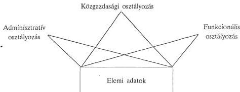
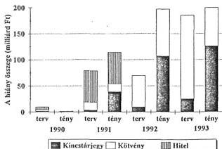

Állami Számvevőszék

# AZ ÁLLAMI SZÁMVEVŐSZÉK JELENTI ...

Az ellenőrzési tapasztalatok áttekintése

1994. november

233.

---

A-359/1994.

# AZ ÁLLAMI SZÁMVEVŐSZÉK JELENTI ...

Az ellenőrzési tapasztalatok áttekintése

---

# E L Ő S Z Ó

Amikor a tisztelt Olvasó kezébe kerül ez a kötet, minden bizonnyal “célegyenesben” van az 1995. évi költségvetési törvényjavaslat parlamenti vitája, sőt talán már el is fogadta a törvényt az Országgyűlés. A költségvetés minden ország életében kitüntetett jelentőségű, s általában tartalmas viták során, nem kevés kompromisszum árán születhet meg a döntés. Nincs ez másképpen nálunk, a demokráciát fokozatosan kiteljesítő Magyarországon sem, ahol az ezredforduló közeledtével számos gazdasági és társadalmi kihívással kell szembenéznünk.

Aligha kétséges, hogy az egyik kulcskérdés a felhalmozódott gazdasági ellentmondások, feszültségek fokozatos feloldása, a határozott előrelépés reális lehetőségeinek feltárása és kiaknázása. Ma már tanúi lehetünk a gazdasági struktúra bizonyos fokú változásának, gazdaságunk nemzetközi versenyképessége azonban sajnos még viszonylag gyenge, ennél fogva egyelőre romló tendenciájú a külső egyensúly, s jellemző a költségvetés növekvő hiánya, túlköltekezése, nemzetközi összehasonlításban is túlzottan magas jövedelemcentralizációja. Ilyen körülmények között, a jelenlegi felhasználási arányok mellett növekszik az adósság is. Kézenfekvő, hogy a gazdaság mozgástere, nem kevésbé a kormányzati vezetés manőverezési lehetősége szűkre szabott, miközben egyre bonyolultabb és drágább a költségvetés, illetőleg a gazdaság finanszírozása.

A kivezető út nyilvánvalóan a versenyképesség javítását előmozdító gazdaságszerkezeti modernizáció, az ennek talaján bővítendő export és beruházási tevékenység, a valóban kreatív, jól menedzselt vállalkozások hatékony működése, valamint a túlköltekezéstől mentes, korszerű finanszírozási rendszerrel céltudatosan megvalósuló költségvetési gazdálkodás körülményei között található meg. Természetesen a konkrét megoldások körültekintő kimunkálása átgondolt vonalvezetést, megalapozott stratégiát feltételez, aminek - sok más mellett - egyik előfeltétele a kor követelményeinek megfelelő nemzetgazdasági és pénzügyi információs rendszer kifejlesztése. (Ellenőrzéseink ismételten arra engednek következtetni, hogy a jelenlegi információs rendszer nem teszi lehetővé a döntések megfelelő előkészítését és végrehajtásuk szisztematikus “követését”, ezért a komplex értékelés és a pénzügyi-gazdasági ellenőrzés megbízható támpontjai is gyakorta hiányoznak.)

Az Állami Számvevőszék ellenőrzési tapasztalatai is megerősítik: a kivezető útra, az előnyöket hordozó növekedési pályára akkor állhat majd nemzetgazdaságunk, ha - több más ehhez szükséges fejlemény mellett - érdemi lépések történnek az államháztartási reform kibontakoztatásában. A reform azt feltételezi, illetőleg eredményezheti, hogy sikerül a mai Magyarországon kiépítendő piacgazdaság körülményei között megtalálni az állami szerepvállalás legmegfelelőbb terét, tartalmát és terjedelmét (ami kétségkívül a társadalom, a lakosság különböző rétegeinek mindennapi életviteli lehetőségeit differenciáltan befolyásoló politikai jellegű döntéseket is igényel) és kiépül ehhez az adekvát költségvetési-pénzügyi működési és gazdálkodási rendszer.

A napjainkban végbemenő demokratizálódási folyamat egyik szignifikáns megnyilvánulása az “önkormányzatiság” megjelenése, amely a társadalombiztosítás, valamint a helyi közigazgatás körében válik meghatározóvá, sok tekintetben átformálva az államháztartást is. A társadalombiztosítás

---

ii

önkormányzati megoldása fokozatosan új alapokra helyezheti a hozzátartozó nagy ellátási rendszereket, ez idő szerint azonban előttünk áll még a hiányfinanszírozás, a kinnlevőségek és a vagyonellátás feszítő gondjainak feloldása is. A demokratikus államrendszer építésének jelentős állomásai, a demokratikus politizálásnak egyben sajátos fórumai a közigazgatási önkormányzatok. Számuk - mintegy 3200 - szinte folyamatosan bővül, ezúton bekövetkező viszonylagos elaprózódásuk eltér az uralkodó európai tendenciáktól. (Ennek, illetőleg az önkormányzatok fokozatos "magára találásának" a mindennapi gazdálkodással meglévő összefüggéseit, gondjait is kifejezésre juttatják ellenőrzési tapasztalataink.)

A kiépülő piacgazdaság sikere, a nemzetgazdaság új pályára állítása nem képzelhető el az állami tulajdon tudatos lebontása nélkül. A tulajdonszerkezet átalakulása, a privatizáció sajátos lendítője is lehet (pontosabban: lehetne) a gazdaság modernizálásának. Ám ehhez kiérlelt privatizációs stratégia, ahhoz igazodó szabályozás- és eljárástechnika, valamint céltudatos és a szükségessé váló korrigáló, esetenként szankcionáló intézkedéseket intézményesített módon maga után vonó ellenőrzés is szükséges. (Mindezt azonban - amint arra ellenőrzési tapasztalataink hangsúlyozottan hívják fel a figyelmet - lényegében még nélkülözni vagyunk kénytelenek, bár remélhetőleg a kormány új privatizációs stratégiája, majd pedig az új törvény hatályba lépése kedvező irányú fordulatot hozhat.)

Az előbbi néhány - pusztán utalásszerű, vázlatos - megjegyzésem, kiegészítve természetesen a költségvetési intézmények széles körével, azt a közeget, "mezőnyt" érinti, amelyben az állam szükségképpen jelentős mértékben az adófizető polgárok pénzét használja fel. Jellemzően, számottevő részben közhatelem alapon megszerzett pénzekről van szó, amelyek hatékony hasznosításához megfelelő garanciák is szükségesek. E garanciák - egyebek mellett - az Országgyűlés, a helyi önkormányzatok és a társadalombiztosítási önkormányzatok megfelelő működésével lehetnek adottak, amennyiben a közpénzekkel és a közvagyonnal való ésszerű és szabályszerű gazdálkodást megfelelő kondíciók és institutionális rendszer szolgálják.

Aligha szükséges részletesebben taglalnom, mégis ehelyütt is elmondom, hogy az Állami Számvevőszék az Országgyűlés pénzügyi-gazdasági ellenőrző szerve, az állami ellenőrzés legfőbb szerve, amely csak az Országgyűlésnek és a törvényeknek van alárendelve, s mint ilyen nem elhanyagolható jelentőségű eleme a szóbanforgó intézményi rendszernek. Az Állami Számvevőszék az államháztartás forrásainak, azok felhasználásának és az állami vagyonnal való gazdálkodásnak az ellenőrzését végzi; ellenőrzést végezhet mindenütt, ahol állami pénzt használnak fel, vagy kezelnek. Az állami ellenőrzés legfőbb szerve minősítés garanciális tartalmú: kizárja, hogy a törvényhozás ellenőrző szerve fölé, vagy mellé más államhatalmi ágak azonos szintű ellenőrző szerveet hozzanak létre. Az Állami Számvevőszék feladatainak megvalósítása során figyelembe veszi az ENSZ Közgazdasági és Jogi Tanácsa mellé rendelt nem kormányközi konzultatív jogú szervezet, a Legfőbb Ellenőrző Intézmények Nemzetközi Szervezete (INTOSAI, International Organization of Supreme Audit Institutions) 1977.évi kongresszusán Limában elfogadott nyilatkozatot (Lima Declaration of Guidelines on Auditing Precepts).

Nem szeretném részletekbe menő szakmai tudnivalókkal terhelni az Olvasót, ám nem kerülhettem el az INTOSAI-ra való utalást, annál is kevésbé, mert ez a szervezet bizonyos fokig koordinálja és rendszerbe foglalja, szakmai és metodikai tanácsokkal látja el a parlamenteket szolgáló ellenőrző szervezetek tevékenységét. (Az INTOSAI belső ellenőrzéssel foglalkozó szakbizottságának elnöke, európai regionális szervezetének az EUROSAI-nak pedig alelnöke e sorok írója. Ez is közrejátszik az

---

iii

Állami Számvevőszék sokrétű és gyümölcsöző nemzetközi szakmai kapcsolatrendszerének kiépülésében.)

A mai parlamenti ellenőrzés előfutárai már mintegy 250 évvel ezelőtt megjelentek a korabeli Európában. Hazánkban a kiegyezés után, 1870-ben kezdte meg működését az Állami Számvevőszék. Mintegy 40 év (1949-1989) esett ki a hazai parlamenti pénzügyi ellenőrzés történetéből, ebben az időben az Országgyűlés nem rendelkezett saját ellenőrző szervezettel. 1990. január 1-én kezdte meg működését az Állami Számvevőszék, amely a demokratikus államberendezkedés és alkotmányosság egyik alappillére, az Országgyűlés törvényhozó és ellenőrző funkciójának segítője. A Számvevőszék hozzájárul ahhoz, hogy a demokratikus parlament képviselői folyamatosan figyelemmel kísérhessék, ellenőrizhessék az államháztartás működését, s az állami vagyonnal való gazdálkodást.

A parlamenti ellenőrző szervezetek évszázados működését, fejlődését az utóbbi évtizedekben már az jellemzi, hogy nem pusztán és elsődlegesen a törvényesség, a szabályszerűség ellenőrzésére összpontosítanak, hanem munkájukban - a Limai Nyilatkoznak megfelelően - egyre inkább teret nyer a vizsgálandó területek, témák közgazdasági kérdéseinek, a reálfolyamatokkal való összefüggéseiknek, hatásmechanizmusuknak a feltárására irányuló vizsgálati metódus, az u.n. value for money auditing (az elterjedő hazai szóhasználattal: teljesítményellenőrzés). A Limai Nyilatkozat kimondja, hogy a politikailag teljes mértékben független és objektív számvevőszékek mindenekelőtt a parlamentek tevékenységét szolgálják, s ellenőrzéseik során a törvényesség és a szabályszerűség vizsgálata mellett elsősorban a hatékonyság, a célszerűség és eredményesség szempontjai szerinti vizsgálatokat valósítják meg.

Az Állami Számvevőszék ez év késő őszéig mintegy 230 ellenőrzési jelentést készített, adott át az Országgyűlésnek, illetőleg hozott nyilvánosságra. Kiadványunk az ezekben fellelhető ellenőrzési tapasztalatok gazdag tárházából válogat, s a legfontosabb - lehetőleg tipikusnak tekinthető, általánosan jellemző - megállapítások, következtetések kaleidoszkópszerű bemutatásával igyekszik szolgálni az érdeklődő Olvasót. A Számvevőszék törvényben megszabott súlyponti feladatait átfogó, önmagukban is kerek egészként értékelhető 7 önálló összegezéssel, résztanulmánnyal törekszünk tapasztalataink bemutatására, miközben a szerzők tudatosan nem kísérlik meg a tapasztalatok közgazdasági igényű szintetizálását (mivel az ÁSZ sajátos pozíciója, függetlensége nem teszi lehetővé a gazdaságpolitikai töltetű eszmefuttatásokat, állásfoglalásokat).

Kiadványunk mindenekelőtt az országgyűlési képviselők bonyolult és felelősségteljes munkájához kíván információival és figyelemfelhívásaival hozzájárulni, arra is tekintettel, hogy a jelenlegi parlamenti ciklusban számottevő az új képviselők jelenléte, akik korábban szükségképpen csak keveset, vagy egyáltalán nem találkozhattak az Állami Számvevőszék jelentéseivel. Éppen ezért vállaltuk azt, hogy mondanivalónk helyenként bizonyos fokig ismeretterjesztő jellegű is, ami nem utolsósorban szemléletformálási célokat szolgál.

Abban a reményben, hogy a Számvevőszék tapasztalatainak áttekintése a parlamenti képviselők mellett más szakemberek és az adófizető polgárok érdeklődésére is számot tarthat, köszönti a tisztelt Olvasót

( Dr. Hagelmayer István )  
 az Állami Számvevőszék elnöke

---

\[ \left\{ \begin{array}{l} \left\{ \begin{array}{l} \left\{ \begin{array}{l} \left\{ \begin{array}{l} \left\{ \begin{array}{l} \left\{ \begin{array}{l} \left\{ \begin{array}{l} \left\{ \begin{array}{l} \left\{ \begin{array}{l} \left\{ \begin{array}{l} \left\{ \begin{array}{l} \left\{ \begin{array}{l} \left\{ \begin{array}{l} \left\{ \begin{array}{l} \left\{ \begin{array}{l} \left\{ \begin{array}{l} \left\{ \begin{array}{l} \left\{ \begin{array}{l} \left\{ \begin{array}{l} \left\{ \begin{array}{l} \left\{ \begin{array}{l} \left\{ \begin{array}{l} \left\{ \end{array} \right. \end{array} \right. \end{array} \right. \end{array} \right. \end{array} \right. \end{array} \right. \end{array} \right. \end{array} \right. \end{array} \right. \end{array} \right. \end{array} \right. \end{array} \right. \end{array} \right. \end{array} \right. \end{array} \right. \end{array} \right. \]

---

i

# Tartalomjegyzék

|   | oldal  |
| --- | --- |
|  **I. ELGONDOLÁSOK A KÖZPONTI KÖLTSÉGVETÉSI INTÉZMÉNYEK TERVEZÉSI, GAZDÁLKODÁSI ÉS INFORMÁCIÓS RENDSZERÉNEK MEGVÁLTOZTATÁSÁHOZ** (Egri Péterné számvevő igazgató) | 1  |
|  Bevezető: az államháztartási reform és az Országgyűlés költségvetési jogának gyakorlása | 1  |
|  1. A Számvevőszék ellenőrzési tapasztalatai | 3  |
|  2. A jelenlegi érdekviszonyok kialakulása a költségvetési szférában | 5  |
|  3. Az állami költségvetés funkciói, adattartalma | 8  |
|  3.1. A központi költségvetés szerkezete, ellenőrzése | 8  |
|  3.2. A költségvetés szerepe az állami élet irányításában | 10  |
|  3.3. Bevételek és kiadások a költségvetésben | 12  |
|  3.4. A zárszámadás jelentősége | 13  |
|  3.5. A feladatok, előirányzatok teljesítése és ellenőrzésük | 14  |
|  4. Az állami feladatok jellege, csoportosítása | 16  |
|  4.1 Intézményrendszerek az államháztartásban | 17  |
|  5. A költségvetés szerkezete és az állami feladatok közötti kapcsolat | 19  |
|  5.1. A költségvetés adattartalmának különböző vetületei | 19  |
|  5.2. Az adminisztratív osztályozás jelentősége a költségvetésben | 21  |
|  5.3. Funkcionális osztályozási lehetőség az állami költségvetésben | 21  |
|  6. Az államháztartással kapcsolatos adatok | 23  |
|  7. Az államháztartási reform megvalósításának lépései | 24  |
|  **II. A KÖZPONTI KÖLTSÉGVETÉS HIÁNYÁNAK FINANSZÍROZÁSA ÉS A BELFÖLDI ÁLLAMADÓSSÁG** (Trautmann János számvevő igazgatóhelyettes és Háda Lajosné számvevő főtanácsos) | 33  |
|  1. A költségvetési hiány finanszírozása | 33  |
|  2. A központi költségvetés belföldi adósságállományának alakulása | 35  |
|  3. A központi költségvetés adósságszolgálata | 37  |
|  4. Következtetések | 39  |

---

ii

|  **III. A KÖZPONTI KÖLTSÉGVETÉSI SZERVEK ÉS AZ ELKÜLÖNÍTETT ÁLLAMI PÉNZALAPOK MŰKÖDÉSÉVEL, GAZDÁLKODÁSÁVAL KAPCSOLATOS ELLENŐRZÉSI TAPASZTALATOK** (Bihary Zsigmond számvevő igazgató és Kolossváry György számvevő igazgatóhelyettes) | 43  |
| --- | --- |
|  Bevezető: néhány átfogó következtetés | 43  |
|  **A) A központi költségvetési szervek működése és gazdálkodása** | 44  |
|  1. A feladatok és a szervezeti rendszer összhangja, a működés szabályozottsága | 44  |
|  2. A költségvetés tervezése, módosítása és a finanszírozás gyakorlata | 48  |
|  2.1. A költségvetés szerkezetének változásai | 48  |
|  2.2. A költségvetési tervezés néhány főbb jellemzője | 49  |
|  2.3. Előirányzat módosítás és átcsoportosítás | 50  |
|  2.4. Pénzellátás | 51  |
|  3. A költségvetési eszközökkel való gazdálkodás | 52  |
|  3.1. A költségvetési gazdálkodás főbb vonásai és azok minősítése | 52  |
|  3.2. Létszám- és bérgazdálkodás | 54  |
|  3.3. Fejlesztések, beruházások | 55  |
|  3.4. Készletgazdálkodás | 56  |
|  3.5. Egyéb működési kiadások | 57  |
|  3.6. Alapítványok támogatása | 57  |
|  3.7. A számviteli törvény érvényesítése | 57  |
|  3.8. Vállalkozásokban való részvétel | 58  |
|  4. Ellenőrzési tevékenység | 58  |
|  4.1. Költségvetési ellenőrzés | 58  |
|  4.2. Belső ellenőrzés | 59  |
|  4.3. Az ellenőrzési tevékenységet befolyásoló tényezők | 60  |
|  **B) Az elkülönített állami pénzalapok működése és gazdálkodása** | 61  |
|  1. Az elkülönített állami pénzalapok helye és szerepe az államháztartásban | 61  |
|  2. Az alapok jogi szabályozottsága | 62  |
|  3. Az alapot kezelő szervezetek működése | 63  |
|  4. Az alapok forrása | 64  |
|  5. Az alapok pénzeszközeinek felhasználása | 65  |
|  6. Az alapok működésének pénzügyi-gazdasági ellenőrzése | 67  |
|  **IV. A TÁRSADALOMBIZTOSÍTÁS ELLENŐRZÉSI TAPASZTALATAI** (dr. Csépán Magdolna számvevő főtanácsos) | 69  |
|  1. A társadalombiztosítás működési feltételeinek alakulása | 69  |
|  1.1. A társadalombiztosítás gazdálkodása | 69  |
|  1.2. A társadalombiztosítási ellátások változásai | 70  |

---

iii

|  1.3. A társadalombiztosítás irányítása | 70  |
| --- | --- |
|  1.4. A társadalombiztosítás működésének biztonsága | 71  |
|  1.5. A társadalombiztosítás költségvetése | 71  |
|  2. A társadalombiztosítás számvevőszéki ellenőrzésének jogi keretei | 71  |
|  3. Az Állami Számvevőszék társadalombiztosítási ellenőrzései | 72  |
|  3.1. A Társadalombiztosítási Alap 1989. évi bevételi többletének vizsgálata | 72  |
|  3.2. A Társadalombiztosítási Alapból gyógyító-megelőző egészségügyi ellátásra fordított pénzeszközök felhasználása (1991) | 73  |
|  3.3. A Társadalombiztosítási Alap kezelőjénél végzett számvevőszéki vizsgálatok hasznosulásának utóellenőrzése (1992.) | 73  |
|  3.4. Zárszámadási ellenőrzések a társadalombiztosításnál | 74  |
|  3.5. A társadalombiztosítás éves költségvetéseinek véleményezése | 75  |
|  4. A főbb tapasztalatok, következtetések, az ellenőrzések lehetséges jövőbeni irányai | 76  |
|  **V. A HELYI ÖNKORMÁNYZATOK ELLENŐRZÉSE** | **79**  |
|  Bevezető: az önkormányzatok ellenőrzésének néhány sajátossága | 79  |
|  (Dömötör Gyula számvevő igazgató) | 79  |
|  **A) Az önkormányzati gazdálkodás általánosítható tapasztalatai** |   |
|  **(dr. Sallai Antal számvevő főtanácsos)** | **82**  |
|  1. Az önkormányzatok gazdálkodásának főbb jellemzői | 82  |
|  2. A költségvetés tervezése | 83  |
|  3. A zárszámadás szabályossága | 85  |
|  4. Számviteli rend, a számviteli törvény érvényesülése | 85  |
|  5. Pénzkezelés, pénzgazdálkodás | 86  |
|  6. A belső ellenőrzés és az intézményi felügyeleti ellenőrzés | 88  |
|  **B) Az önkormányzatok központi költségvetési kapcsolatai** | **90**  |
|  BA) A normatív állami hozzájárulások tervezése, igénybevétele és elszámolása |   |
|  (dr. Saly Ferenc számvevő főtanácsos és dr. Nagy Ágnes számvevő tanácsos) | 90  |
|  1. A rendszer működésének főbb jellemzői | 90  |
|  2. Az igénybevétel és az elszámolás | 91  |
|  3. A normatív hozzájárulások hatása az önkormányzatok működésére | 92  |
|  4. Az ÁSZ javaslatai, az ellenőrzések hasznosítása | 93  |
|  BB) A cél- és címzett támogatások rendszerének ellenőrzési tapasztalatai |   |
|  (dr. Farkas László számvevő főtanácsos) | 95  |
|  1. A források elosztása | 95  |
|  2. A kiemelt fejlesztések | 96  |
|  3. Az önkormányzatok magatartása a döntési folyamatban | 96  |

---

iv

BC) Az önhibájukon kívül hátrányos helyzetbe került önkormányzatok
kiegészítő támogatása
(Németh Péterné számvevő főtanácsos) 97

1. A kiegészítő támogatások rendszerének értékelése 98

C) Az önkormányzatok vagyongazdálkodása
(Csecserits Imréné számvevő tanácsos és
Szilágyi Sándor számvevő tanácsos) 100

1. A vagyonatadási-átvételi folyamat 100
2. A vagyonnyilvantartas 104
3. A vagyongazdalkodás szabályozottsága 104
4. Az onkormányzati vagyon hasznositasa 105
5. A vagyon vallalkozasi celu mobilizasa 107

VI. A PRIVATIZÁCIÓ ÉS AZ ÁLLAMI VÁLLALATOK VAGYON-
GAZDÁLKODÁSÁNAK ELLENŐRZÉSE
(dr.Kovács Árpád számvevő igazgató) 111

Bevezető: mit, miért és hogyan ellenőrzött az ÁSZ? 111

1. A tulajdonszerkezet átalakításának feltételei 112

1.1.A tórvények 112
1.2.A privatizacio es a vagyonkezelis intezmenyinek tevekenysge 113

1.2.1. Szervezeti, szemelyi feltetelek 114
1.2.2. Informaciós rendszer 115
1.2.3.A dontesek elokeszitese es vegrehajtsuk fegyelme 116
1.2.4.A belso ellenorzés es a folyamatba epitett ellenorzés 118
1.3.A vagyon iranti kereslet alakulasa 119

2. A társasággá alakult állami vállalatok vagyonhasznosítása és működésük
feltételei 120

2.1.A tarsasagalakitask 121
2.2.A tarsasagok helyzete 122
2.3.A szolgaltatasokat mukodtetó allami vallalatok tevekenysége 123

3. A vizsgálatok hasznosítása 124

3.1.Az allami fegyelem 124
3.2.A tapasztalatok figylembeveetele 125

4. Kovetkeztetesek 126
5.Javaslatok 128

VII. A PÁRTOK GAZDÁLKODÁSÁNAK ELLENŐRZÉSE
(dr. Elek János számvevő főtanácsos) 131

1. Az ÁSz felhatalmazása, feladata 131
2. A fobb, altalanosithato tapasztalatok 132

---

v

2.1. A pártok éves beszámolói 132
2.2. Könyvvezetés 134
2.3. Gazdálkodás 134
2.4. A felhasznált források 134
3. A jogi realizálás 135

# FÜGGELÉKEK

137

1. sz. Függelék (az I. fejezethez) Kivonat az Állami Számvevőszék költségvetési és zárszámadási ellenőrzési jelentéseiben foglalt, az államháztartási rend átalakítására vonatkozó javaslataiból; Részletek a közigazgatás fejlesztése és szervezése tanulmánykötetből.
2. sz. Függelék (a VI. fejezethez) A magánosítást vezénylő intézmények működési feltételei és tevékenységük alakulása.
3. sz. Függelék Az Állami Számvevőszék jelentései

---

。

1

[Non-Text]

[Non-Text]

[Non-Text]

[Non-Text]

[Non-Text]

[Non-Text]

[Non-Text]

[Non-Text]

[Non-Text]

[Non-Text]

[Non-Text]

[Non-Text]

[Non-Text]

[Non-Text]

[Non-Text]

[Non-Text]

[Non-Text]

[Non-Text]

[Non-Text]

[Non-Text]

[Non-Text]

[Non-Text]

[Non-Text]

[Non-Text]

[Non-Text]

[Non-Text]

[Non-Text]

[Non-Text]

[Non-Text]

[Non-Text]

[Non-Text]

[Non-Text]

[Non-Text]

[Non-Text]

[Non-Text]

---

1

# I. ELGONDOLÁSOK A KÖZPONTI KÖLTSÉGVETÉSI INTÉZMÉNYEK TERVEZÉSI, GAZDÁLKODÁSI ÉS INFORMÁCIÓS RENDSZERÉNEK MEGVÁLTOZTATÁSÁHOZ

**Bevezető: az államháztartási reform és az Országgyűlés költségvetési jogának gyakorlása**

Napjainkban a közpénzek takarékos, hatékony és eredményes felhasználása valamennyi nemzetgazdaságban a figyelem középpontjába került. A megvalósításhoz a számvevőszékek azzal járulnak hozzá, hogy ellenőrzéseikkel a közpénzek elköltésének minősítésére vállalkoznak. A 'minősítés' egyaránt vonatkozhat a közpénzekkel való elszámolásra, annak szabályszerűségére, de a feladatellátás milyenségére is. Az elvárás mindig az, hogy a számvevőszék derítse fel, ha a köztulajdon, a közpénzek, az adófizetők rovására pazarolnak. A pazarlások egyes esetekben könnyebben tettenérhetők, mert egyben a közpénzek felhasználására vonatkozó szabályokat is megsértik. Nehezebben mutatható ki a teljesítményekben mutatkozó pazarlás, hiszen azt kell megítélni és bizonyítani, hogy az állami szolgáltatások 'előállítása' során éppen elegendő - se több, se kevesebb - központosított forrást használtak-e fel, s megfelel-e a szolgáltatás minősége az adott követelményeknek. Az ellenőrzés alapfeltétele - akár szabályosságra, akár teljesítményre vonatkozik - hogy a végrehajtók és ellenőrök számára egyaránt mértékül szolgáló működési normán, követelményrendszeren alapuljon.

Magyarországon az állami intézményrendszer működését a központosított források egyre kevésbé tudják fedezni, a szolgáltatások színvonala pedig nem megfelelő, a lakosság elégedetlenségét váltja ki. Lassan évtizedes az az elhatározás, amely az államháztartás reformját ígéri, sürgeti. Kétségtelenül történtek lépések, de a költségvetési intézményrendszert érintően kedvező változásra eddig nem került sor, a legtöbb reformkísérlet kudarcba fulladt.

A Számvevőszék megalapítása egyike a megvalósult reformlépéseknek. Az alapítás előkészítése során, 1989-ben olyan vélemények is elhangzottak, hogy a Számvevőszék addig nem tudja zökkenőmentesen ellátni feladatát, ameddig a költségvetési rendszert nem alakítják át, s nincs államháztartási törvény, amely a működési normát, a követelményrendszert hivatott felállítani. A Számvevőszék több mint négyéves működése bebizonyította, hogy ezek az aggodalmak nem voltak teljesen alaptalanok, annak ellenére, hogy a gyakorlat azt is igazolta, a 'rendetlenség' felszámolásában, a működési rend átalakításában a Számvevőszék jelentős szerepet játszik.

Az is kétségtelen, hogy az ellenőrzések sokszor kényszerűen 'megakadnak', a megállapítások egyértelműen, élesen nem marasztalják el a 'józan paraszti ész' szerint is elítélendő gyakorlatot. A szabályossági, törvényességi minősítés ugyanis gyakran a jogszabályi háttér hézagai, ellentmondásai, a közpénzek felhasználására vonatkozó egyértelmű szabályok hiánya miatt nem lehet eléggé markáns és hatékony, s ezért nem mindig teljesítheti alapvető rendeltetését.

Az államháztartás megreformálása köztudottan több szempontból és több területen aktuális. Az egyik legnehezebben megközelíthető terület az állami szolgáltatásokat végző intéz-

---

2

ményrendszer. Az elmúlt évtizedekben az intézményi gazdálkodásban sajátos érdekviszonyok alakultak ki, amelyek mindenféle reform-kísérletnek ellenállnak. A változtatáshoz tisztán kell látni az érdekviszonyok hatásmechanizmusát, hiszen az ellenállás csak a helyzet pontos ismeretében gyűrhető le.

A hivatalba lépett minisztereknek tisztában kell lenniük azzal, hogy a felügyeletük alá tartozó területen számtalan fölösleges és pazarló dologra elfolyik a pénz, míg más területeken alkalmasint valóban szükséges a támogatások növelése. A csapda az, hogy míg a pazarlás tételei elvésznek az átláthatatlan "bázis előirányzatok" között, s felderítésükben nem segít az apparátus, ugyanakkor élen járnak a többlet igények indoklásában, a támogatás-növelés elmaradása drámai következményeinek ecsetelésében. Ezért a kormánynak óvakodnia kellene attól a korábbi hibától, hogy miniszterei a felügyeletük alá tartozó szervezetek sajátos érdekképviselőjeként akarva-akaratlanul akadályozzák az ésszerűtlen költekezés felszámolását.

A változtatási szándék csak rendkívül elszánt és következetes akarattal, erős kézzel lehet eredményes, amennyiben az Országgyűlés és a kormány együttműködik abban, hogy szigorú elvek szerint vizsgálják felül az intézmények feladatait, előirányzatait. Az együttműködés praktikus feltétele, hogy a fiskális érdekeket képviselő, a kiadások lefaragásáért felelős pénzügyminiszter olyan javaslatokat tegyen, amelyek nem "általában" csökkentik a kiadásokat, hanem a tényleges feladattal ki nem töltött, vagy a fölösleges kiadásokat célozzák meg. A szakmai feladatokért felelős minisztereknek viszont apparátusukat visszafogva "tűrnie kell" a különféle érdekeket sértő, de valóban pazarlónak minősíthető kiadások csökkentését.

Meggyőződésem, hogy a sokszor hangoztatott megállapítás, amely szerint a költségvetési szférában a szűkösség és pazarlás egyszerre tapasztalható, részben arra vezethető vissza, hogy az Országgyűlés költségvetési joga még mindig nem érvényesül. A rendszerváltozás előtt nem érvényesülhetett, azt semmilyen mechanizmus nem helyettesíthette, az elmúlt négy évben pedig érdemben nem sikerült érvényt szerezni e jognak.

A kialakult helyzet értékelése kapcsán óhatatlanul korábbi, a rendszerváltozást megelőző időszakra kell visszanyúlni, hiszen a problémák nem az elmúlt négy évben keletkeztek. (Az elmúlt négy év rovására csupán az írható, hogy a helyzeten nem sikerült változtatni.) Természetesen a korábbi időszakra visszanyúló tapasztalatokra számvevőszéki ellenőrzési bizonyítékok nincsenek, nem is lehetnek. Ma már csak a visszás helyzet jelenségeire hívhatják fel ellenőrzéseink a figyelmet.

A helyzet kialakulásának ismertetésére azért merek vállalkozni, mert az érintett időszakot az államigazgatásban, a végrehajtásban töltöttem. Magam is gyakoroltam azokat a technikákat, amelyekkel az állami költségvetésből egyre több pénzt lehetett kicsikarni, az egyedileg fontosnak ítélt feladatok támogatásait elrejteni. A Számvevőszéken eltöltött négy év - valamint a polgári demokráciák fejlett ellenőrzési gyakorlatának megismerése - hozzásegített korábbi ismereteim felülvizsgálatához. Az ellenőrzések tapasztalatai is azt bizonyítják, hogy a végrehajtók túlzott gazdálkodási és feladatvállalási önállósága a közpénzek kezelésénél nem fogadható el.

Az államháztartásról szóló 1992. évi XXXVIII. törvény (Áht.) előterjesztésekor a kormány javasolta, hogy az Országgyűlés küldjön ki egy ad-hoc bizottságot, amely áttekinti az állami feladatok rendszerét és javaslatokkal segíti a kormány ezirányú munkáját. A határozati javaslatot az Országgyűlés és bizottságai elutasították, azzal az indoklással, hogy e felülvizsgálat a

---

3

kormány belügye. Ez a döntés az intézményrendszer, az állami feladat-felülvizsgálat végrehajtását elodázta. Az állami feladatok kiterjedt köre miatt ugyanis lehetetlen az éves költségvetések megtárgyalásának keretében mérlegelni a közszükségletek kielégítendő körét. A felülvizsgálatot egyszeri alkalommal teljeskörűen el kell végezni s ez a munka nem bízható teljesen a végrehajtó államigazgatásra sem. Egyrészt azért nem, mert csak politikai döntés alapján lehet egyes tevékenységeket elhagyni, elhagyásukat a lakossággal elfogadtatni. Másrészt azért nem, mert az államigazgatásban dolgozók - alapvetően egzisztenciális okokból - ellenérdekeltek a felülvizsgálatban.

A rendszerváltás elején - akkor egyébként megmagyarázható és érthető okokból - nem történt meg a költségvetés funkciójának, tartalmának értékelése és felülvizsgálata. A kisebb-nagyobb módosítások megváltoztatták ugyan a költségvetési törvények szerkezetét, mellékleteit, ezek azonban inkább gyakorlati megfontolások alapján születtek-születnek, mintsem a parlament költségvetési jogának érdemi érvényesítése következtében, érdekében.

Az Országgyűlés és a helyi önkormányzati testületek úgy kapták meg a költségvetés jóváhagyásának - a "költségvetés megállapítási jog" gyakorlásának - súlyos terhét, hogy elméletileg és gyakorlatilag sem volt tisztázott és köztudott a költségvetés megváltozott tartalma. Úgy tűnik, döntéshozók és végrehajtók egyaránt bizonytalanok abban, hogy mit jelent pontosan a költségvetési jog érvényesítése.

E tanulmány a költségvetési jog érvényesítésének gyakorlati szempontjaira hívja fel a figyelmet. Elsősorban a költségvetési problémák iránt érdeklődő politikusok, parlamenti és önkormányzati képviselők számára készült, vállalva helyenként a didaktikus ismeretterjesztést. Nem véletlenül. Az elmúlt négy év tapasztalatai azt bizonyították, hogy a költségvetési jog tényleges gyakorlásával együttjáró hatalmat a végrehajtók csak akkor adják át, ha a jogot az Országgyűlés gyakorolni kívánja és meg is követeli e jog átadását.

# 1. A Számvevőszék ellenőrzési tapasztalatai

A több, mint négy éves ellenőrzési tapasztalatok alapján az éves költségvetések és zárszámadások ÁSZ jelentéseiből a javaslatokat, teendőket összegyűjtöttem, (1. sz. Függelék) hogy a t. Olvasó meggyőződhessen arról: a tipikus javaslatok évről-évre ismétlődnek, bizonyítva, hogy konkrét intézkedések nem történtek. Az ellenőrzések tapasztalatait úgy lehet összefoglalni, hogy

- a költségvetésben szereplő tételek mögött nem, vagy nehezen állapítható meg az a feladat, amelynek érdekében a kiadásokat teljesítik. A költségvetésből megvalósítandó és a ténylegesen meg is valósított feladatokról az Országgyűlésnek ennél fogva nem lehet megfelelően teljes informáltsága.
- az Országgyűlés elé kerülő költségvetési dokumentumok áttekinthetetlenek, legalábbis a képviselők számára átláthatatlan adathalmazt jelentenek, nem derülnek ki a döntési pontok, de az ezekből származó, a végrehajtást korlátozó kötelmek sem.

Nem tartozik közvetlenül az ellenőrzési tapasztalatokhoz, de itt jegyzem meg, hogy előbbiek miatt a költségvetést megtárgyaló, jobbítani kívánó képviselők számára nem derül ki, mely

---

4

pontokon lehetséges a változtatás, hol vannak a döntési alternatívák. Ezért indokolatlan, a végrehajtásban zavart okozó módosításokra is sor kerülhet.

- a költségvetésből ellátandó feladatok tekintetében az Országgyűlés rendszeresen szinte kész helyzet elé kerül. A korábbi időkből származó örökségen túl a beterjesztett, újonnan megalkotott törvényjavaslatok költségvetési vonzatait sem ismeri meg. Az előkészítés hiányosságai miatt az Országgyűlés úgy kényszerül döntéseket hozni, hogy azok pénzügyi következményeit nem mérlegelheti.
- a költségvetés végrehajtása során a pénz elköltését végző szervezeteknek meglehetősen nagy a döntési, gazdálkodási szabadsága, többféle indok alapján módosíthatják a költségvetést. A hatályos szabályozás szerint nem vonható senki felelősségre azért, mert a költségvetéstől eltérően használták fel az állami támogatásokat.

Mindezek azt mutatják, hogy az Országgyűlés költségvetési joga csak formálisan érvényesül, holott a költségvetési jognak éppen azért kellene érvényt szerezni, mert a kormány és a minisztériumok számára csak a parlamenti döntés jelent számonkérhető kötelmet. Az ellenőrzés csak a törvényi erejű szabályozás alapján kifogásolhatja, ha olyan feladatra költenek, amely a költségvetésben nem szerepel. A költségvetéshez igazodó, azt mérceként alkalmazó gazdálkodási- és ellenőrzési gyakorlat az évek során fokozatosan átalakítja az államháztartást. A jelenlegi helyzetben a változások kikényszerítéséhez ez önmagában nem elegendő, enélkül viszont az államháztartás megváltoztatására irányuló szándék valószínűleg ismét kudarcba fullad.

Az államháztartási törvény hatását, alkalmazását több, az állami költségvetést közvetlenül érintő számvevőszéki véleményezési, ellenőrzési munka kapcsán kísértem figyelemmel. Éppen e munkák során tapasztaltam, hogy ebben a törvényben sokkal "több" van, mint amennyi első olvasásra nyilvánvalónak látszik. El kell ismerni, hogy hiányosságai ellenére a törvény a változásokhoz az első fontos lépést jelentette, s megteremtette a keretet az államháztartási rend reformjának elindításához. Az Áht. "reform-értéke" a jóváhagyást követően azért nem érvényesülhetett, mert- úgy vélem - eddig lényegében nem került sor a törvény végrehajtására! A viszonylag egyszerűnek látszó előírások csak a költségvetési információs rendszer és gazdálkodási szemlélet teljes átalakításával lettek volna teljesíthetők. Erre nem került sor, s a végrehajtó apparátus a törvényt végrehajthatatlannak minősítette.

Valóban, néhány előírás pontatlan, nem értelmezhető, de alapvető változásként az Áht. a költségvetési procedúrában az Országgyűlésnek meghatározó szerepet biztosít. A korábbi gyakorlathoz képest a megváltozott hatásköri megosztás, az új előírások éppen a politikusokat, a költségvetéseket jóváhagyó testületeket támogatják egyik legdöntőbb hatáskörük, a "költségvetési jog" gyakorlásában. A végrehajtáshoz szükséges szemléletváltozás elméleti alapjainak közzététele helyett a több évtized alatt kialakult érdekviszonyok olyan nyomást gyakoroltak a rendszerváltozás levezénylésén dolgozó kormányra, amely a költségvetés vonatkozásában a parlament érdemi hatáskörét nem engedte érvényre jutni. Ennek keretében - megítélésem szerint- az Áht. végrehajtási rendeleteiként olyan kormányrendeletek születtek, amelyek legális felhatalmazást adnak a korábbi, a tényleges döntéseket a végrehajtó-hatalomra átruházó gyakorlat továbbviteléhez. Igaz, sokkal bürokratikusabb eljárással, lényegesen több "papírgyártással" lehet csak az Országgyűlés döntéseit - jóváhagyását - megváltoztatni.

---

5

Az Áht. szabályai megteremtették az elvi feltételeit, hogy a költségvetés a korábbinál áttekinthetőbb - döntéselőkészítő - dokumentummá váljék. A törvény előírta azt is, hogy ki kell alakítani az államháztartás információs- és mérlegrendszerét. Rögzített határidő hiányában ez a munka meglehetősen lassan halad, pedig a költségvetési adatok csak az érdekeltek által elfogadott és viszonylag állandó felépítésű táblázatrendszerben tölthetik be alapvető funkcióikat.

Mindezeket úgy foglalhatjuk össze, hogy az egyik reformlépésként meg kellene végre teremteni a feltételeket az 1992-ben megalkotott államháztartási törvény végrehajtásához.

## 2. A jelenlegi érdekviszonyok kialakulása a költségvetési szférában

Az új gazdasági mechanizmus az 1970-es években a vállalati gazdálkodásban indirekt irányítási mechanizmusra váltotta a tervutasításos rendszert. Ez a vállalati szférában előremutató volt, hiszen a piaci verseny hiányában egy objektívebb módszerrel mérő, normatív elemeket tartalmazó szabályozórendszert alakított ki. Ma már valószínűleg nehéz lenne kideríteni milyen megfontolások alapján, de akkoriban úgy találták, hogy a klasszikus költségvetési területen is alkalmazható az indirekt irányítási rendszer. A pénzügyi szabályozókon, érdekeltségi rendszeren keresztül, irányelvekkel kívánták a feladatokat befolyásolni. A “tételes” irányítás, feladatmeghatározás fokozatos feladásával a makroszintre aggregált adatokból próbáltak visszakövetkeztetni a középszintű és intézményi döntések alapján alakuló feladatellátásra, természetesen sikertelenül. A központosított források a politikai elhatározások egyre növekvő finanszírozási igényét nem tudták kielégíteni, ezért egyidejűleg az állami feladatokat ellátó intézményi körben is ösztönöztek pénzügyi eredményt hozó tevékenységekre. Ehhez fokozatosan kiterjesztették a gazdálkodási önállóságot. Lényegében a vállalati gazdálkodás elemeit csempészték a költségvetési szférába. Ehhez igazodott az 1982-ben bevezetett, a kereskedelmi könyvvezetéshez hasonlító könyvelési metodika, amely azonban a “fölösleges adminisztrációként” egyúttal a hagyományos költségvetési nyilvántartásokat megszüntette. Ma már tudjuk, hogy ez végsősoron a költségvetés információs rendszerét döntötte össze.

Az utóbbi két évtizedben is a központi költségvetés folyamatosan egyensúlyi problémákkal küszködött, a formális egyensúly, az elfogadható mértékű hiány csak matematikai bűvészkedések - egyes tételek látszólag technikai jellegű elrejtése - árán volt fenntartható. Ezek a “bűvészkedések” teljesen fellazították a költségvetési fegyelmet, áttekinthetetlenné tették a bevételeket és a kiadásokat. A költségvetés tervezése szinte kizárólag a végösszeg - ezen belül néhány, a makroszinten megállapított sarokszám - “betartására” irányult. Az előirányzott összegeket az érintettek sem összegszerűen, sem feladattartalmában nem vették komolyan. Ahogy a gazdasági feszültségek növekedtek, paradox módon a dolog érdemi része, a költségvetési szféra reálfolyamatai kaptak egyre kevesebb figyelmet. A felhasználható összegek a pártprogramokra épülő, a szakminisztériumok által meghirdetett célokkal közelítőleg sem álltak arányban. Így a közigazgatás a kitűzött célokat irányként elfogadta, de csak annyit hajtott azokból végre, amennyit az adott intézmény helyzete, élelmes vagy kevésbé élelmes gazdálkodása alapján tudott. ( Ez volt a “ki kell gazdálkodni” korszak.) Az intézményi önállóságot kiterjesztő központi irányítás a feladatokat ellátó intézményeket eleinte nem is akarta, később már nem tudta kézben tartani.

---

6

A tervezési mechanizmusban - amely alapjaiban ma is hasonlóképpen működik - a költségvetési keretszámok, a megkaparintható támogatások egyfajta alku alapján kerültek a végrehajtókhoz. Az alku tárgya azonban rendszerint nem az volt, hogy valamely feladatot elvégezzenek, vagy sem. Ezek legfeljebb a költségvetések feledésbe merülő számítási anyagai maradtak. Az egyeztetések során szinte kizárólagosan az összegek, a támogatások nagysága került mérlegelésre. Ebben az időben a pártprogramokra épülő szakmai feladatokat meghirdető szakminisztériumok és a pénzügyi tervezést-végrehajtást vezénylő szervezetek mintha nem lettek volna beszélőviszonyban. A politikai szempontok vezérelte gyakorta irreális elképzelések és a pénzügyi realitások - a "túlelosztás" ellenére - a költségvetés végrehajtásának legalsó szintjén "csaptak össze", s állították szinte lehetetlen feladat elé az állami feladatokat ellátó intézményrendszert. A kialakodott támogatásokból megvalósítandó és megvalósítható feladatokat tehát végsősoron a költségvetés végrehajtásának legalsó szintjén határozták meg, s a feladatok teljesítésének számonkérése, "elemzése" alapvetően a pénzügyi teljesítések bemutatására hagyatkozott. A szakmai beszámoltatás, a feladatok teljesítésének tételes számonkérése - részben azért, mert a pénzügyi szükségleteket nem elégíthették ki - fokozatosan elmaradt. Az intézmények konkrét feladatainak átalakulásában, pénzügyi helyzetében meghatározóak voltak a személyi adottságok és kapcsolatok.

Ebben az időszakban a különböző szolgáltatás jellegű áruk - mennyiség és minőség szempontjából - hiánycikkek voltak. Kézenfekvő volt ezek kiváltásaként a saját rezsis szolgáltatások feltételeinek megteremtése. A "puha költségvetési korlát" segítette a kapacitások kiépítését, s az így keletkező szabad kapacitásokat azután bevétel fejében értékesítették. Teljesen elfogadott, sőt ösztönzött gyakorlat volt mindent önerőből működtetni, kivitelezni, amelyhez a résztvevők "többletmunkájának" díjazására többletjövedelmet biztosító személyi érdekeltségi rendszert, saját hatáskörű bérnövelési lehetőséget kellett kialakítani. A gazdálkodó szervezetekhez viszonyítva a különbség annyi volt, hogy az állami feladatellátás ürügyén folytatott vállalkozások tényleges költségei nem derültek ki, mint ahogy az sem, hogy a megszerzett és a költségvetési döntési lánc legalsó szintjén szabadon elkölthető bevétel milyen áron "mentesítette" a költségvetést. A sikertelen ötletek veszteségeit természetesen állami források fedezték.

A pénzpiac fejlődésével - többek között a "vállalkozások" bevételei nyomán rendelkezésre álló - átmenetileg szabad készpénzek betéti elhelyezése újabb pénzteremtési lehetőséggel kecsegtetett. Az állami intézmények finanszírozását végző kincstári rendszer fejletlensége, rugalmatlansága miatt ez összekeveredett az állami támogatások nagyvonalú - nem a tényleges kifizetésekhez igazodó - leutalása miatt az intézményi szférában keletkező, átmenetileg likvid pénzeszközök "fialtatási" igényével. Így aztán napjainkban már állami intézmény állami értékpapírt vásárol, amelyet többek között az állam azért bocsát ki, hogy a költségvetési szféra támogatásait le tudja utalni. (Akkor is, ha adott időszakban a költségvetési intézmény működéséhez az nem is szükséges.)

Az is jellemző volt, hogy az intézmények rendelkezésére bocsátott előirányzatok, támogatások együttesen tartalmazták az éves folyamatos működésre szolgáló, valamint az egyszeri jellegű feladatok fedezetét. Ez utóbbi megvalósítása után azonban csak ritkán csökkentették a költségvetési keretszámokat. Általános a gyakorlat, hogy minden évben újabb és újabb "egyszeri" feladatokkal, illetve a folyamatos működés kiadási szükségletével "kitöltik" azt a bázist, ami az éves tervezések alapjául szolgál. Az Áht-ban foglalt terminológia szerint tehát nem

---

7

különítik el a folyamatos működés rendes és az egyszeri jellegű feladatok rendkívüli bevételeit és kiadásait. Ezzel a kormányzat, illetve az Országgyűlés lemondott és jelenleg is lemond arról a lehetőségéről, hogy a rendkívülinek minősíthető feladatokkal kapcsolatos kiadásokat évenként átcsoportosítsa az intézmények között, illetve az adott évi költségvetési pozíció függvényében mérlegelje elhagyásukat.

Mindezek az állami feladatokat ellátó intézményrendszerben sajátos helyzetet teremtettek. A költségvetési szervek a politikai rendszerváltást megelőző húsz év fejlődése során a gyakorlatban jóformán teljes önállóságot kaptak, az állami feladatokról a tényleges döntések ezen a szinten születnek. A költségvetési szférában a “megbízott” szerep helyett a “feladatválasztás” tekintetében is “tulajdonosi” szemlélet alakult ki. Különböző, egymásra épülő és a hatásokat erősítő folyamatok eredményeképpen reménytelenné vált a “vállalkozó” intézmények kordában tartása, a szakmai és pénzügyi követelmények érvényesítése. Áttekinthetetlen a költségvetési szféra által végzett tevékenység, felborult a gazdálkodási normarendszer.

Amikor az államháztartás átalakítása a feladat, nem lehet ezektől az alapoktól, szokásoktól, beidegződött normarendszertől eltekinteni.

Nem lehet azt sem számításon kívül hagyni – amit az államháztartás reformmunkálatai kapcsán ritkán említenek és vesznek figyelembe – hogy az állami bürokrácia óriási gépezetében az alkalmazottaknak egyáltalán nem érdeke a változás. Egyrészt a kockázat mentes gazdasági és szakmai önállóság egyfajta hatalmat jelent. Másrészt többségük számára megfoghatatlan és érdektelen, hogy a költségvetési kiadások csökkentése, de legalább szintentartása hosszabb távon az egész gazdaságot támogatja, viszont a jelenlegi tendencia folytatása, az adósságok további halmazása működésképtelenséget okoz. Reálisan gondolkodva nehéz is elvárni bárkitől, hogy egy távlati, számára homályos cél érdekében saját munkahelye, létbiztonsága megszüntetésére tegyen javaslatot akkor, amikor a megélhetésre, a változtatásra igen korlátozottak a lehetőségei.

Az utolsó 25 év hagyományait, szemléletét örökölve költségvetésünkben még mindig érvényesül az a felfogás, hogy elsődlegesen a “pénz határozza meg a feladatot” s nem a feladat a pénzt. Természetesen a pénz meghatározó voltát nem lehet vitatni, de azt sem, ha nincs feladat, pénz sem kell hozzá, ám ha a feladatot törvény vagy más szándék előírja, az pénzbe kerül.

A feladatok érintetlenül hagyása mellett a kiadások közvetlen vagy lineáris csökkentésére irányuló elképzelések éppen ezért rendszerint csak formális megoldásokat, látszateredményeket hoznak, s nemhogy nem oldják meg a helyzetet, de azzal, hogy a “szőnyeg alá söprik a problémákat” még inkább összezavarják az amúgy is átláthatatlan képet. A költséggazdálkodás (költségcsökkentés) mechanizmusa az árutermelő szférában másként működik, mint a költségvetési szférában. Az árutermelésben a költségcsökkentéssel járó esetleges teljesítmény csökkenés nyilvánvaló. A költségvetési szférában a formális költségcsökkentési kényszer – az amúgy is nehezebben megfogható teljesítmények miatt – valószínűsíthetően éppen a teljesítmények csökkentésére kényszerít. Ugyanakkor a ténylegesen szükségtelen és pazarlást jelentő, a “hivatallal” együttjáró “státusz szimbólumok” határozott és konkrét intézkedés hiányában fennmaradnak és növekednek.

Az előbbi – meglehet hangvételét, de nem tartalmát tekintve helyenként talán kissé szubjektív – gondolatsorból egyértelműen adódik a következtetés: el kell érni, hogy a köz

---

8

céljaira elvont jövedelmekből a pénzköltés valóban a köz céljait szolgálja. Az első lépés csak az lehet, hogy a célok, elvárt eredmények ismertek, a közakaratot kifejező törvényhozás által elfogadottak legyenek, s az elfogadott céloktól eltérő felhasználás tiltott, büntetendő cselekmény legyen.

# 3. Az állami költségvetés funkciói, adattartalma

Az állam által elköltött pénz olyan jövedelemtulajdonosoktól származik, akik abban a reményben mondanak le jövedelmük egy részéről, hogy abból az állam, az önkormányzat a társadalmi közös fogyasztásról (közrend, védelem, oktatás, közlekedés stb.) megfelelően gondoskodik.

Ki vitatná, hogy az állami költségvetés által elköltött minden fillér esetében valamennyi állampolgárnak joga van megtudni mit akarnak megvalósítani a központosított jövedelemből, miért centralizált jövedelemből kell megvalósítani egy adott feladatot, és ha megvalósítás mellett döntöttek, akkor hogyan akarják azt végrehajtani?

# 3.1. A központi költségvetés szerkezete, ellenőrzése

Az utóbbi években a költségvetési törvényben jóváhagyott előirányzatok mennyisége, a tájékoztató mellékletek, a publikált számítási anyag röviden az "állami költségvetés" formájában és tartalmában óriási változáson ment keresztül. Mindenekelőtt szembetűnő, hogy a dokumentum évről-évre terjedelmesebb, s a közölt számítások, a részletezettség kétségtelenül betekintést enged a költségvetésben megtervezett előirányzatok tartalmába, s néhol még a teljesítendő feladatok is nyomon követhetők. Mindezek ellenére sem az előkészítő apparátus, sem a jóváhagyó testületek számára nem egészen világos a terjedelemre megnőtt költségvetési dokumentáció értelme ebben a formában. A minisztériumi apparátusok "kételkednek" abban, miért is kell ezeket a részletes adatokat az Országgyűlés elé terjeszteni. Kételkedésüket látszólag visszaigazolta pl. a zárszámadások iránti viszonylagos képviselői érdektelenség. Ugyanakkor a tervezés nagyvonalasága, a jelenlegi gazdálkodási szabadság következtében a meglehetősen részletes adatokon nyugvó parlamenti jóváhagyás ellenére az Állami Számvevőszék csak ritkán tud kifogást emelni a tervezettől eltérő felhasználások esetében.

Az alapvető probléma nem az, hogy nem kell a képviselőket a költségvetés részleteibe bevezetni. A megoldás az, hogy nem ezekkel az adatokkal tudják a képviselők a költségvetést értékelni, döntéseiket megalapozni.

Amint arra a számvevőszéki jelentések szinte mindegyike rávilágít, az utóbbi évek pozitív változásai ellenére a költségvetési dokumentumok még mindig nem eléggé áttekinthetők, nem tükrözik világosan az állam feladatait, s a publikált hatalmas adathalmazban keverednek a fontos, valamint a politikusok számára követhetetlen és értékelhetetlen adatok. A költségvetés mérlegéből egyszerű rátekintéssel még mindig nem állapítható meg a folyó kiadások és bevételek egyenlege, azok összemosódnak az egyszeri jellegű, nem ismétlődő bevételekkel és kiadásokkal. Így az egész államháztartás valódi, "akut" hiánya sem állapítható meg, azaz hogy mekkora bevétel tömeg fedezné az államháztartás folyamatos vitelét. Az előre számításba

---

9

vehető adatok alapján a költségvetési pozíció 2-3 évre sem prognosztizált, prognosztizálható. A költségvetés által finanszírozott feladatokról még átláthatatlanabb a kép, de az államadósság, a különböző kötelezettségek nagysága, alakulása sem állapítható meg egyszerűen.

A költségvetés szerkezetében megmutatkozó “látélet” a különböző politikai-társadalmi berendezkedésekben a költségvetés eltérő funkciójából ered. Ha változtatni kívánunk a szerkezeten, a képviselők elé terjesztett adatok tartalmán, feltétlenül tisztázni kell a különbséget. Különben csak a költségvetés terjedelme növekszik, s a mennyiség még nem feltétlenül okoz minőségi változást.

Csupán emlékeztetőül: a szocialista típusú állami berendezkedésben a költségvetés a nemzeti jövedelem újraelosztásának szinte egyetlen eszköze. A jövedelemtermelőknél csak annyi jövedelem marad, amennyi személyes szükségleteik kielégítését szolgálja, “minden egyéb szükségletről” az állam gondoskodik, s “természetben” adja vissza az állampolgárnak. A költségvetés szerkezetére ez úgy hat, hogy az állami feladatok tömegét terjedelme miatt is reménytelen vállalkozás egy dokumentumban összefoglalni. Ezt egészíti ki az a tény, hogy a kormány irányítását kizárólag a hatalmon lévő párt végzi, az Országgyűlés csak formálisan gyakorolja jogait. A kontroll hiányából fakadó lehetőségek és következmények közismertek. A témához mindössze az kapcsolódik, hogy a nyilvánosság nem szükséges, de nem is kívánatos eleme a költségvetéssel kapcsolatos ügyeknek sem. A “nagy döntések” nem a költségvetésekkel együtt, annak keretében születnek, hanem a színfalak mögött. Ezért az ebben a rendszerben kialakult információ igény nem felel meg sem a nyilvánosság, sem a “tételes” elszámoltatás követelményeinek.

A piacgazdaságra jellemző, hogy a költségvetés csak annyi jövedelmet centralizál, amennyi a piaci alapon nem működtethető társadalmi közös kiadások finanszírozásához szükséges. Elvárás, hogy a magántulajdontól csak annyi jövedelmet vonjanak el, amennyi a hosszú távú állami érdekeket szolgáló feladatok ellátásához szükséges. Az, hogy adott időszakban melyek legyenek a közpénzekből finanszírozott társadalmi közös kiadások, részben történelmi hagyományokon, az állami alapfunkciókat rögzítő, hosszabb távon érvényesülő törvényeken múlnak, emellett pedig kézenfekvő, hogy a választási szavazatok többségét elnyerő párt programjától függenek. A konkrét feladatokról rendszerint terjedelmes dokumentumok alapján, hosszúra nyúló tételes és érdemi költségvetési vitában döntenek. A közpénzek kezelőinek a rendelkezésre bocsátott összegekkel évente “tételesen” el kell számolniuk. Az elszámoltatás a gyakorlatban úgy történik, hogy az intézmények beszámolóit könyvvizsgálói ellenőrzés minősíti, amely kimutatja, ha költségvetési felhatalmazás nélkül költekeztek.

A társadalmi munkamegosztás és gondoskodás igénye a piacgazdaságokban is az állami feladatok növekedését okozta. A legtöbb országban az adófizető állampolgárok – akik megteremtik a feltételeket a közösen ellátott feladatok finanszírozásához – már arról is bizonyosságot akartak kapni, hogy az általuk befizetett pénzek elköltésével valóban teljesülnek-e azok a célok, amelyek kedvéért jövedelmükről lemondanak. Ennek az igénynek alapján fejlődött ki az ún. teljesítményellenőrzés, amely általában hosszabb időszakot tekint át, s a működés körülményeit összefüggésében is, a következményekre, a hatámechanizmusra is figyelmet fordítva vizsgálja. A teljesítményellenőrzés célja, hogy megállapítsa: meghatározott állami szolgáltatás “előállítása” során gazdaságosan és hatékonyan használták-e fel a rendelkezésre álló erőforrásokat, s a meghatározott állami szolgáltatás valóban a kívánt, elvárt eredményt és hatást váltotta-e ki a

---

10

megcélzott területen. (Az ellenőrzés sokszor kényes területet érinthet, mert - amint azt a fejlett országok számvevőszékeinek gyakorlatából megismerhettük - nem ritkán bebizonyosodik, hogy végsősoron nem, vagy nem kizárólag a végrehajtás, hanem a megelőző politikai döntés miatt nem eredményes valamely részterületen a közpénzek felhasználása.) A legtöbb országban az utóbbi 15 évben hatalmazták fel a számvevőszékeket ilyen típusú ellenőrzésre. A társadalmi ellenőrzés az ellenzéki pártok tevékenysége kapcsán is érvényesül, tehát a törvényi erővel garantált nyilvánosság hosszú távon valamennyi politikai szereplőnek érdeke.

### 3.2. A költségvetés szerepe az állami élet irányításában

Általánosságban a kiadások és bevételek részletes jogcímenkénti megtervezését, “előirányzását” nevezzük költségvetésnek. Az állami - államháztartási - költségvetés azonban ennél sokkal többet jelent. Az állami költségvetés a kormány által kielégíteni javasolt közszükségletek Országgyűlés általi mérlegelése, annak elfogadása vagy elutasítása. Költségvetési döntésükkel a képviselők - választóik nevében - az állami célokat, feladatokat szükségesség és hasznosság szerint elbírálják, ezzel az állam működési programját állítják fel.

Az Országgyűlés a költségvetés jóváhagyásának aktusával adja meg a felhatalmazást a költségvetésben szereplő feladatok végrehajtására, ezzel nyilvánítja ki a költségvetési javaslatot előterjesztő kormány iránti bizalmát, meghatározza a kormány cselekvési programját, s cselekvési szabadságának terjedelmét. A cselekvési programra a jóváhagyást az Országgyűlés azzal adja meg, hogy az előirányzott összegek teljesítéséhez megajánlja azokat az adókat, terheket is, amelyeket a jövedelemtulajdonosoknak a köz érdekében viselniük kell. Az előirányzatok nagyságának meghatározásával az Országgyűlés azt a szándékát is kinyilvánítja, hogy az általa meghozott szakmai törvények végrehajtására milyen mértékben hajlandó áldozni, azok feltételeit mennyire képes biztosítani.

A végrehajtók számára a költségvetés tehát a “megbízólevél” az éves munkára, a szervezési teendőkre, a felhatalmazás szerint történő végrehajtás biztosítékaként pedig egyben az ellenőrzés viszonyítási alapja is.

A költségvetési felhatalmazás tartalmában elsősorban felhatalmazás a költségvetésben tervezett feladatok végrehajtására, amellyel csak együttjár a felhatalmazás a közpénzek elköltésére. Ez egészen más tartalmú mint a jelenlegi gyakorlat, amely szerint “a költségvetés = felhatalmazás a költségvetésben szereplő összegek elköltésére”.

A háború előtti magyar költségvetési felhatalmazás, az úgynevezett appropriáció a bevételek megajánlásán túl azt is tartalmazta, hogy a megajánlott jövedelmek kizárólag a törvényben megállapított kiadásokra fordíthatók. Ez az a jogi formula, amely megalapozza a költségvetés végrehajtásában a kötelezettségeket, ezen alapul a törvényességi ellenőrzés, s a tervezettől eltérő felhasználás esetén a jogi felelősségrevonás alapja. Mindez azonban érdemi változást csak akkor jelent, ha a megállapított kiadások meghatározott feladatokhoz kötődnek.

A továbblépéshez célszerű röviden összefoglalni, milyen funkciókat is tölt be a költségvetés:

- a tervezett politikához megszerzi az Országgyűlés támogatását

---

11

- a politikát konkrét feladatokra bontja le, "aprópénzre" váltja, azaz a tervezett programok végrehajtásához "egyenként" is megszerzi az Országgyűlés jóváhagyását
- a végrehajtás vezérfonala és az elszámoltatás alapja
- meghatározza, hogy melyek azok a dolgok, amelyekről a döntést az Országgyűlés magának fenntartja, ezzel a kormány mozgásterét korlátozza.

Mindezekből következik, hogy az Országgyűlés a központi költségvetés jóváhagyásával összességében is meghatározza, hogy

- a társadalmi közös szükségletek finanszírozására milyen forrásokat vesz igénybe,
- az államháztartást alkotó alrendszerek részére milyen forrásokat, milyen mértékben enged át,
- az alrendszereket közvetlenül mennyivel támogatja,
- meghatározza a központi kormányzat és intézményei feladatait, s azt, hogy ezekkel kapcsolatban mennyit költhetnek az adott évben.

A költségvetések tartalmát mindig a politika határozza meg, amelyben elsődlegesek, de nem kizárólagosak a gazdaságpolitika szempontjai. Az éves költségvetésnek éppen az a feladata, hogy bemutassa: az éves ráfordításoktól milyen eredményt várnak, az előirányzatok teljesítésével a közszolgáltatásokban történik-e változás, s az milyen jellegű. Aráfordítások növekedése a szolgáltatás előállításának esetleg csak a drágulását jelenti, vagy pedig az állami szolgáltatás minősége, terjedelme is növekszik.

Mindenki, aki az állami pénzek elköltésével, ellenőrzésével valamilyen kapcsolatban áll, megegyezik abban, hogy követelmény, sőt törvényi kötelezettség a célszerű, hatékony gazdálkodás.

A köz érdekében és nevében végzett tevékenységek esetében azonban mit jelenthet a célirányos, hatékony gazdálkodás? Mi az, ami arra kényszeríti a végrehajtókat, hogy célirányosan cselekedjenek? Mit jelent a hatékony gazdálkodás és hogyan kérhető számon?

A célirányos, "célszerű" gazdálkodáshoz mindenekelőtt célok kellenek. Ezeket a köz érdekében és a köz pénzéből elérendő célokat a korábbiakban kifejtett okokból a kormány előkészítő munkája alapján kizárólag az Országgyűlés állapíthatja meg, állíthatja fel a társadalmi konszenzust tükröző prioritásokat, adhatja jóváhagyását a végrehajtáshoz.

Hatékony a gazdálkodás akkor, ha a célokat minél kisebb ráfordítással érik el. A köz nevében végzett szolgáltatások teljesítésekor az alkalmazottak megbízottakként járnak el. A megbízottnak viszont mindig tisztában kell lennie azzal, hogy a megbízatás meddig terjed. Ennek alapján szervezheti feladatait, s tud elszámolni a megbízással kapcsolatos kiadások teljesítéséről. Az önálló "feladatvállalásnak" korlátozott a lehetősége, hiszen nem biztos, hogy a megbízott szerint szükséges és fontos tevékenységre az arra jogosult Országgyűlés meg is adná a megbízást. (Ez persze nem jelenti azt, hogy nincsen szükség arra, hogy a végrehajtók jelezzék a szükségleteket.)

A kiadási előirányzatokat úgy kell meghatározni, hogy az éppen elegendő legyen a cél eléréséhez. Az államháztartási kiadások "éppen elegendő" összegét csak alapos, az adott mennyiségű és minőségű tevékenység folytatásához szükséges munkaerő, szolgáltatás, anyag számbevé-

---

12

telével, azaz körültekintő tervezéssel lehet megállapítani. A végrehajtó alkalmazottak számára - akik már nem feltétlenül vannak tisztában azzal, hogy mi miért történik, s csak a közvetlen személyükre kiszabott feladatért felelősek - a hatékonyságot kikényszerítő egyetlen eszköz az adott, körültekintően megtervezett összeg betartásával számonkért teljesítmény.

Senki nem vitatja, hogy a költségvetést végrehajtó alkalmazottak "hatékony gazdálkodásával" a meghatározott előirányzatokból több, vagy más feladatok is teljesíthetők. Csakhogy nem biztos, hogy ezek a külön-külön hasznosnak minősíthető kiadások az általános pénzügyi feltételek korlátaihoz rendelve is az ország érdekeit szolgálják. Lehet, hogy a "saját hatáskörben" felvállalt feladatok a költségvetés jóváhagyása során szükségszerűen elvégzett rangsorolásban az utolsó helyre, vagy "kiselejtezésre" kerülnének. Ha többletfeladatok vállalására intézményi hatáskörben sor kerülhet, nincs mód a "selejtezést" központi akarat szerint elvégezni, dönteni arról, hogy adott pénzügyi viszonyok között a hasznosság, az elérhető eredmény, a társadalmat érintő változás alapján valóban elkerülhetetlen-e a ráfordítás.

A mai költségvetési rendszerben és szerkezetben nem könnyű megállapítani, hogy a tervezettet meghaladó teljesítés, kiadás többletfeladat vagy többletköltség miatt keletkezett. A korábbi gyakorlat szerint a költségvetés végrehajtói nem is tesznek különbséget e két jogcím kapcsán keletkezett többletkiadás között. Pedig az Országgyűlés költségvetési jogát sérti, s a kiadások ellenőrizhetetlen növekedését okozza ez a nagyvonalú kezelés, a többletfeladatok szinte automatikus befogadása. Ezzel az Országgyűlést kész helyzet elé állítják abban az esetben is, amikor sem a sürgősség, sem más ok ezt nem indokolja. A költségvetésben nem tervezett feladatra az Országgyűlés hozzájárulása nélkül - a költségvetési tartalékon kívül - más forrásból fordítani nem lehet, nem lehetne még akkor sem, ha a bevételek kedvező alakulása erre lehetőséget adna.

Amikor az Állami Számvevőszék szigorú gazdálkodási rend alkalmazását szorgalmazza, akkor ezt éppen a fenti követelmények és logika alapján teszi.

### 3.3. Bevételek és kiadások a költségvetésben*

A pontatlan tervezés másként hat a költségvetés teljesítésére a bevételi és a kiadási oldalon.

A bevételek "fölétervezése", túlbecslése az utóbbi évek általános - s sajnos nagyon veszélyes - tervezési gyakorlata. Oka nagyon egyszerű: a költségvetés jóváhagyásának idején a valóságosnál kedvezőbb kép bemutatása. A bevételek költségvetési előirányzatainak minősítésénél tudni kell, hogy a ténylegesen teljesíthető bevételek a legtöbb esetben nem az előirányzott összeg nagyságán, hanem a hosszabb távú elképzeléseken alapuló adó- és illeték fizetési törvényeken, egyéb, az állami bevételek nagyságát befolyásoló törvényeken alapulnak. Az éves költségvetési törvényben felvett előirányzat tehát a legtöbb bevétel esetében nem lehet "kötelező" jellegű. Az előirányzás célja az, hogy a reálisan befolyó bevételek összegét számbavegye, hogy ezáltal a kiadások tervezhető szintje megállapítható legyen. Ha a számbavétel a valósá-

* Ellenőrzési kézikönyv I. kötet — Saldo Pénzügyi Tanácsadó és Informatikai Rt 1994.

---

13

gosnál optimistább eredményt mutat, ez a tényleges teljesítést nem, vagy alig befolyásolja, a kiadások tervezett szintje viszont ehhez a magasabb összeghez igazodik. Tehát a hiány évközi növekedése szinte “garantált”.

A bevételek reális tervezését valóban megnehezíti, hogy az utóbbi években a vállalkozások száma és összetétele teljesen megváltozott, tehát a tervezésnek nincs összehasonlítható bázisa, másrészt az adóalapok és adókulcsok állandó változtatása – amelyek célja általában a bevételek növelése – szinte lehetetlenné teszi a kellően gondos tervezést.

**A költségvetési kiadások – szemben a bevételekkel – a jóváhagyás után kötelező jellegűek**, tehát az Áht. és az éves költségvetési törvények alapján az alrendszereket megilletik azok a kiadások, támogatások amelyeket az Országgyűlés számukra megállapított. Tehát – néhány automatikusan teljesülő, normatív jellegű kiadási tételtől eltekintve – a jóváhagyott előirányzatok teljesítése szinte biztosan bekövetkezik. **Kiadási megtakarítás elsősorban akkor keletkezik, ha a feladat teljesítése kellően nem volt előkészített, tehát a tervezett összeget nem sikerül elkölteni.** (Ez jellemző például a negyberuházásokra). Másrészt a megtakarítás oka a pontatlan feladatmeghatározás, a laza tervezés lehet, tehát a valóságos szükségletnél több előirányzat megtervezése. Ennek eredményeképpen úgymond a “takarékos gazdálkodással” megtakarítás keletkezik. A jelenlegi gazdálkodási szabályok szerint ezek az összegek a következő évben az intézmények által felhasználhatók, tehát az állami költségvetés szempontjából elköltöttnek tekinthetők. Ezek a többlettervezések az állami költségvetés hiányát hosszú távon növelik, szinte kimutathatatlan és visszavonhatatlan módon.

### 3.4. A zárszámadás jelentősége

Az Országgyűlés csak a zárszámadás alapján állapíthatja meg, hogy a kormány teljesítette-e akaratát, a kitűzött célok teljesültek-e. Enélkül a költségvetés “írott malaszt” marad, amelynek tartalmát a végrehajtók könnyen megváltoztathatják. Ezáltal végül az adófizetők pénzét nem a parlamenti konszenzussal elfogadott célokra, feladatokra fordítják, s mindezt különösebb magyarázkodás és retorzió nélkül megtehetik.

A költségvetések ezernyi tétele, a speciális szakértelem szükségessége miatt a parlament zárszámadási jogának biztosítékaként a polgári demokráciákban számvevőszékeket alapítanak, amelyek a parlament nevében ellenőrzik a kormány gazdálkodását, a költségvetések szerinti költekezést. (Néhány országban a kormány gazdálkodásáról a zárszámadási jelentést is ők készítik el.) Ellenőrzéseikről az Országgyűlésnek jelentést készítenek, amely egyrészt tanúsítja a szabályos gazdálkodást, másrészt alapot szolgáltat arra, hogy indokolt esetben a parlament felelősségrevonást kezdeményezzen.

(A korabeli, háború előtti magyar, s számos jelenlegi költségvetési rendszerben akkor teljesíthető a tervezetten felüli kifizetés, ha a költségvetésben elfogadott feladat végrehajtásának költségei igazolhatóan meghaladják a tervezettet. Ez esetben a kormány a kifizetéseket teljesítheti, s a számvevőszék véleménye alapján a zárszámadási törvényben kapja meg a felmentést a tervezettet meghaladó, indokolt teljesítésre.)

A számvevőszékek alkotmányos garanciákkal biztosított függetlensége és hangsúlyozottan politikamentes működése a biztosíték arra, hogy – amint az a fejlett országok demok-

---

14

ratikus államberendezkedésében jellemző - a számvevőszékek véleménye, jelentései objektívek, tárgyszerűek, s ezért azokat a kormánypártok és az ellenzék egyaránt bizalommal fogadja.

A számvevőszék zárszámadásra vonatkozó szabályossági ellenőrzése akkor lehet hatékony, ha a 'szabálytalanság' megállapítása nem önmagáért való, hanem feladatcentrikus. Ha tehát az ellenőrizhető szabályok elsősorban (csak) az eljárási rendre vonatkoznak, akkor a megállapítások ugyan hasznosak, de mégsem biztosíthatják, hogy az állam pénzköltése feladatcentrikus legyen. Ha egyértelmű a feladat, s az is szabály, hogy csak a jóváhagyott feladat érdekében szabad pénzt költeni, akkor szabálytalannak minősíthető, ha az adott kiadás bizonyíthatóan nem szolgálta a feladatot, vagy éppen elkerülhető lett volna.

Az államháztartási reform részeként tehát az erőforrások korlátait számbavevő makroökonomiai tervezés mellett olyan feladatcentrikus tervezési rendet és technikát kell kialakítani, amely alkalmas arra, hogy a költségvetés az állami feladatellátás, az államigazgatás tükre legyen, s segítségével megállapítható, hogy a hatalmon lévő kormány a választási program alapján kialakított kormányprogram szerint intézi-e a gazdaság, az állami élet irányítását. Ehhez az államháztartás gazdálkodási, s ezen belül is a költségvetés szerkezeti, szerkesztési rendjének olyan irányú megváltoztatása szükséges, melynek eredményeként a költségvetések tartalma világos és áttekinthető lesz, s a költségvetésben meghatározott összegek kötelmet jelentenek a végrehajtók számára.

### 3.5. A feladatok, előirányzatok teljesítése és ellenőrzésük*

Az Áht. tételesen rögzítette az Országgyűlés hatáskörét a költségvetés megállapításával, végrehajtásával kapcsolatban. Ennek ellenére a jelenlegi gazdálkodási szabályok a gyakorlatban még mindig nem ismerik el e meghatározó szerepet. Ennek szemléltetésére az Országgyűlés költségvetési jogából levezetve a kiadási előirányzatok tervezettől eltérő teljesítésének elvi - kizárólag a költségvetési törvény szempontjából lefolytatott törvényességi - ellenőrzési lehetőségeit az eltérések okozatai alapján csoportosítottam. (Figyelmen kívül hagytam, hogy a gazdálkodás során természetesen nemcsak a költségvetési törvényt kell alkalmazni.) Megjegyzendő az is, hogy bár az alábbi logika egyértelműen következik az Áht. 24.§ /2-3/ bekezdéseiből - amelyek szerint a célfeladatok célját a költségvetési törvény határozza meg, s a jóváhagyott előirányzatok csak a meghatározott feladatokra használhatók fel - mindezeket a hatályos átcsoportosítási és gazdálkodási szabályok gyakorlatilag figyelmen kívül hagyják. Azaz a gazdálkodás során az előirányzatok felhasználási célját országgyűlési hozzájárulás és különösebb akadály nélkül módosítani lehet.

Az Országgyűlés költségvetésmegállapítási jogából levezethető politikai és jogi felelősség alapján a feladatok és előirányzatok teljesítését a következők szerint csoportosíthatjuk, a kapcsolódó ellenőrzési lehetőségekkel kiegészítve:

* Ellenőrzési kézikönyv I. kötet — Saldo Pénzügyi Tanácsadó és Informatikai Rt 1994.

---

15

### 1./ A feladat teljesül - a kifizetés a tervezettek szerint alakul

Ez elméletileg azt jelenti, hogy a végrehajtás a törvényhozás akarata szerint megtörtént, tehát törvényességi kifogás ebben az esetben nem tehető. Csak teljesítményellenőrzés alapján emelhető kifogás, ha megállapítható, hogy az előírt feladatot nemcsak a legszükségesebb ráfordítások igénybevételével teljesítették.

### 2./ A feladat teljesül - előirányzat maradvány keletkezik

Ebben az esetben a teljesítés a törvényhozás akarata szerint megtörtént, a megmaradt előirányzatok elköltésére nincsen szükség, a maradvány ezért a központi költségvetést illeti, illetné meg. A mai gyakorlat ezt a lehetőséget figyelmen kívül hagyja, mert maradvány úgymond a 'takarékos' gazdálkodás eredményeképpen keletkezik. Így a legtöbb esetben a maradvány a következő évben intézményi hatáskörben felhasználható.

Az *ellenőrzés* megegyezik az 1./ pontban írotakkal, azzal a kiegészítéssel, hogy különös figyelmet kell fordítani arra: a rendelkezésre álló, bőségesnek bizonyult források terhére nem folyósítottak-e más feladatra kiadásokat, mert emiatt törvényességi kifogás is emelhető. Fel kell tenni azt a kérdést is, mi volt az oka a szükségesnél több előirányzat megtervezésének, amely a kiadási előirányzatot időlegesen indokolatlanul lekötötte, azaz növelte a tervezett hiányt, illetve más feladattól vonta el a forrásokat, s tisztázandó, hogy ezért ki a felelős.

### 3./ A feladat teljesül - de többlet előirányzat szükséges

Ebben az esetben a többletteljesítés miatt a Kormányt politikai felelősség nem terheli, hiszen a feladat elvégzéséhez az Országgyűlés a hozzájárulását megadta. (A háború előtti hazai költségvetési gyakorlatban a többletkiadás teljesíthető volt, azonban a Számvevőszék minden ilyen tételnél ellenőrizte és tanúsította annak szükségességét. Ezekben az esetekben a Kormány - a pénzügyminiszter - a Számvevőszék jelentése alapján kaphatta meg a gazdálkodás felelőssége alól a felmentést.)

A mai gyakorlatban a tervezetthez viszonyított többletteljesítés többletforrással, pótelőirányzattal, belső átcsoportosítással fedezve (előirányzatmódosítási- vagy felhasználási hatáskörben) teljesíthető. A megtervezett kiadási előirányzatok megváltoztatása, a különböző jogcímen végrehajtott belső átcsoportosítások olyan gyakori és engedélyezett gazdálkodási fogások, hogy jogosságuk ellenőrzése a laza feladatmeghatározások és a pontatlan tervezés miatt szinte lehetetlen feladat. E látszólag hatékony, ösztönző megoldás teljesen követhetetlenné és ellenőrizhetetlenné teszi a költségvetési kiadások valódi szükségességének, mértékének megítélését.

Az *ellenőrzési lehetőség* ugyanaz mint az 1./pontnál, de további különböző típusú teljesítményellenőrzésre van lehetőség, amely azonban konkrét célja és az időbeli korlátok miatt a zárszámadási ellenőrzésnek nem lehet része.

### 4./ A feladat nem teljesül - előirányzat maradvány keletkezik

Ebben az esetben a Kormányt politikai felelősség is terheli, mert nem gondoskodott arról, hogy az Országgyűlés által elhatározott feladat a döntés szerint végrehajtásra, a megtervezett előirányzat elköltésre kerüljön.

---

16

Az ellenőrzésnek meg kell állapítania: mi volt az oka annak, hogy a feladat teljesítése nem történt meg, emiatt milyen kár keletkezett, s mindezekért ki a felelős; miért terveztek előirányzatot a költségvetésben, ha az előkészítés - előkészítetlenség -miatt annak elköltése nem reális, s ezért ki a felelős; a kifizetett ráfordítások és az elvégzett feladat arányban áll-e egymással; mi történjen a maradvánnyal; a feladat elhúzódása miatt aktuális-e még a feladat egyáltalán?

#### 5./ Eredetileg nem tervezett feladat teljesül - fedezetét a Kormány belső intézkedéssel teremtette meg

Erre az esetre elméletileg csak rendkívüli és sürgős esetben kerülhetne sor, amikor nincsen idő és mód az Országgyűlés hozzájárulását megszerezni a feladat végrehajtásához. Az előirányzat nélküli feladatteljesítés miatt a Kormányt politikai felelősség is terheli, hiszen parlamenti felhatalmazás nélkül, új feladatra kiadás nem teljesíthető.

A mai gyakorlatban ez sajnos nem is ritka esemény, amelynek az a következménye, hogy a végrehajtó hatalom döntésével több évig tartó, nagy terhet jelentő költségvetési kötelezettséget vállalnak. Az országgyűlési döntés megkerülésével bizonyos értelemben a törvényhozó hatalmat kész helyzet elé állítják.

Az ellenőrzésnek ki kell terjednie arra, hogy valóban előre tervezhetetlen volt-e az évközben beiktatott feladat, s milyen esemény váltotta ki a sürgős intézkedést? Tisztázni kell mi volt az akadálya az országgyűlési döntés megszerzésének, s a következő évekre milyen pénzügyi hatás húzódik át, illetőleg a teljesített kifizetések csak az elvárható legalacsonyabb szinten történtek-e?

A felsorolt esetek tanúsítják, hogy a költségvetés megkerülése, figyelmen kívül hagyása a hatályos gazdálkodási szabályok miatt nem kerülhet olyan szigorú elbírálás alá, mint az a parlament költségvetési joga alapján megkövetelhető lehetne. Emiatt az ellenőrzéssel feltárt esetek is tulajdonképpen büntetlenül maradnak. Addig, ameddig a gazdálkodási szabályok alapján az előirányzatok módosítására, a tervezettől való eltérésre minden különösebb indok nélkül joga van a gazdálkodóknak, addig a Számvevőszéknek sokszor nincsen elégséges jogi alapja a konkrét kifogások emelésére.

#### 4. Az állami feladatok jellege, csoportosítása

Az államháztartás alrendszerei részt vállalnak a társadalmi közös fogyasztás keretében megvalósítandó állami feladatok ellátásában. Az alrendszerek a köztulajdont, a közpénzeket aszerint csoportosítják, hogy milyen társadalmi-gazdasági formáció gyakorolja a köz nevében a tulajdonosi jogokat.

Mit nevezhetünk állami feladatnak?

Leegyszerűsítve azt mondhatjuk, hogy mindaz állami feladat, amit centralizált jövedelemből finanszíroznak. Ez általában így is van, hiszen ha valamely feladat ellátására a költségvetésből áldoznak, azaz közpénzekből finanszírozzák, azt állami feladatnak kell tekinteni.

Az utolsó negyven év fejlődése során a magántulajdon elsőbbségét elismerő piacgazdaságokban az állami feladatok vállalása terén mindig alapelv volt, hogy mindaz a tevékenység,

---

17

amely piaci alapon működtethető, az piaci alapon működjék. A megoldások az egyes országokban a történelmi hagyományoktól függően igen sokfélék, és állandóan változnak. Jelenleg a fejlett piacgazdaságokban is az egyik központi kérdés, hogy az állam közvetlenül mely feladatok ellátását végezze, s a közcélú tevékenységeket miként lehet a legkisebb ráfordítással, de megfelelő színvonalon elvégezni.

Nálunk - ahol a piacgazdaság csak alakulóban van - a kormányzatnak a korábban "begyűjtött" feladatok szűkítésére alig van lehetősége, mozgástere korlátozott. Gátolja ebben a lakosság átlagosan szűkös jövedelme, s az a tény is, hogy egyelőre nincsenek olyan tőkeerős vállalkozók sem, akik "ugrásra készen" várnak, hogy a gazdaságosnak ígérkező tevékenységeket az államtól átvegyék. A kialakult helyzetben a fedezet, a finanszírozás alapján államnak minősíthető feladatok rendkívül széleskörűek, áttekinthetetlenek. A társadalmi-gazdasági alapok, valamint a korábban részletezett érdekviszonyok miatt a felülvizsgálat csak tételes, intézményenkénti lehet. A felülvizsgálat szempontjainak kialakításánál figyelembe kell venni a következőket:

- a szocialista állami berendezkedésben a közintézmények által ellátott feladatokat szinte teljes egészében állami támogatás finanszírozta, s az intézmények egésze, nem pedig adott feladatok élvezték a támogatást,
- az intézmények feladatai az elmúlt évtizedek során törvények, rendeletek, miniszteri leiratok, valamint saját döntéseik alapján alakultak ki és bővültek. Ma pontosan meg sem lehet állapítani az intézmények működésének, feladatának jogszabályi alapját. Az utóbbi évtizedben már világossá vált, hogy a közkiadások támogatása nem növekedhet az igények szerint. Ennek "orvoslására" egyrészt szinte teljesen felszámolódott a szakmai követelményrendszer, másrészt pedig a közintézmények szinte teljesen szabad kezet kaptak a gazdálkodásban. A rendszerváltás előtt, az államigazgatást érintő többszöri átszervezések, a feladatokat is befolyásoló dereguláció, majd a rendszerváltás következtében aktuális intézményi átalakítások még jobban összekuszálták a képet,
- a vállalkozási tevékenység ösztönzésének hatására az intézmények által elért "saját" bevételek összege ugrásszerűen növekedett. Éppen a bevételnövelés érdekében számos, talán nem feltétlenül indokolt és szükséges feladat ellátásába kezdtek, kapacitásokat építettek ki. Ebben az időszakban "ösztönözték" az intézményeket saját forrásból történő beruházásokra is. Ezek fenntartása, működtetése ma már állami feladat lett, hiszen valószínű, hogy a működtetésre már nem voltak elegendőek a "saját" források,
- az önkormányzati rendszer jelenlegi formája miatt számos intézmény született. Ezek egy része középszintű ágazati feladatokat lát el. Az intézmények alapítását önkormányzati és kormányzati szinten sem előzte meg a közigazgatás hatásköri megosztásának tudatos felmérése és megszervezése, ezért valószínűsíthető az átfedés, a felesleges munkavégzés.

# 4.1. Intézményrendszerek az államháztartásban

A történelmi fejlődés során az állam feladata sokáig csak a közhatalommal kapcsolatos szükségletek - rendészet, igazságszolgáltatás, honvédelem - kielégítése volt. Később minden

---

18

államban bővült az állami feladatok köre, s a lakosság általános jóléte, műveltsége érdekében újabb feladatok vállalására került sor.

Az állami feladatokat ellátó intézmények tevékenységük szerint két nagy csoportba sorolhatók:

- a közhatalom gyakorlását megtestesítő intézmények.

A közhatalom gyakorlása az állam kiváltsága, monopóliuma, tehát a feladat nem választható. Ebbe a körbe tartoznak a honvédelem, a rendőrség, az adóhivatal, a hatósági feladatokat ellátó, a jogrendszer működésével összefüggő intézmények. Ezek között vannak olyanok is, amelyek nem hatóságok, de a közigazgatás működésének elengedhetetlen részesei, mint például a statisztikai feladatot ellátó hivatal.

A működtetésüket nem minden esetben kell teljesen a központosított jövedelmekből finanszírozni. Ha az valamely megfontolás alapján indokolt és lehetséges, a szolgáltatás igénybevevőjével a felmerülő költségek egésze vagy egy része megfizettethető. Ezeknél az intézményeknél a működtetés legjelentősebb tényezője általában a bérköltség.

- a közérdekű szükségleteket kielégítő intézmények.

Ezek rendszerint az állam jóléti, szociális, kulturális feladatait látják el. A mindenkori politikától függ, hogy az állam ezekből milyen terjedelmű ellátást vállal közvetlenül magára. Az ellátás "terjedelme" többféleképpen szabályozható. Úgy is, hogy milyen mértékig ingyenes az igénybevétel vagy fordítva: a költségek mekkora részét fizettetik meg az igénybevevővel, de úgy is, hogy a feladatellátásba milyen mértékig engedik be a magánvállalkozásokat.

A fenti intézményekre jellemző, hogy rendszerint költségigényesek, működésükhöz a bérköltségen kívül jelentős ingatlan és egyéb eszközre, anyagra is szükség van.

A szocialista társadalmi rendszer filozófiai alapjai miatt a két alapvető funkció szerinti megkülönböztetésnek korábban nem volt jelentősége. Tudatos megkülönböztetés hiányában azonban előfordulhat, hogy az intézményfelülvizsgálat során közhatalmi funkciót ellátó intézményeket is "államtalanítanak" csupán azért, mert szolgáltatásaik költsége megfizettethető az igénybevevőkkel. A "költségvetési felügyelet" megszűnésével viszont az állam eleshet olyan jogainak érvényesítésétől, amely a közhatalmi funkciókból fakad. Az elkülönítéssel világos lenne, hogy mekkora az az összeg, amely a közhatalmi funkciót gyakorló intézmények működtetéséhez kell.

A jelenleg finanszírozott közérdekű tevékenységek csokorba gyűjtésével viszont az lenne egyértelmű, hogy elméletileg mely területen "választhat" az állam a finanszírozás módja és mértéke tekintetében.

Előrelépést jelentene tehát, ha a központi költségvetési szerveket, s azon belül is a résztvevényességeket a két nagy intézménycsoportba - közhatalmi és közérdekű szükségleteket ellátók - sorolnák. Az állami monopóliumként működtetendő intézményeknél vizsgálandó a tevékenységi átfedés egymás között és a minisztériumokkal, s hogy mely tevékenységek fizethetők meg az igénybevevőkkel. Ebben a körben tehát elsősorban racionalizálni kell.

A közérdekű szükségleteket ellátó intézményeknél is ésszerűsíteni kell a tevékenységeket és a szervezeti rendszert, de ott a legfontosabb feladat a többszatornás finanszírozási lehetősé-

---

19

gek feltárása, ehhez a jogszabályi háttér biztosítása. Ebben a körben a többszatornás finanszírozás különösebb állami beavatkozás nélkül is javíthatja a feladatellátását, hiszen az államon kívüli finanszírozók közvetlenebb kapcsolatban állnak a szolgáltatást nyújtókkal, adott mennyiségű szolgáltatást és megfelelő minőséget követelnek a pénzükért.

# 5. A költségvetés szerkezete és az állami feladatok közötti kapcsolat

# 5.1. A költségvetés adattartalmának különböző vetületei

A költségvetési intézmények annyiban feltétlenül a vállalkozásokhoz hasonlíthatók, hogy a költségvetési támogatásból "vásárolt", a tevékenységükhöz szükséges bért, különböző szolgáltatásokat, vásárlásokat stb. mint "bemenő erőforrást", inputot hasznosítják, s az input felhasználásának eredményeképpen valamilyen teljesítményt, outputot állítanak elő. Hogy a "bemenő erőforrás" és a "kijövő teljesítmény" követhető és ellenőrizhető legyen, a költségvetést legalább két dimenzióban kell elkészíteni. Olyanban, amely az inputokat tartalmazza, de olyanban is, amelynek alapján a tervezett outputok teljesítéséről számot lehet adni.

A nemzetközileg ma már elterjedt és elfogadott normák szerint a költségvetéseket nem is kétféle, hanem háromféle osztályozás szerint készítik el. A három dimenzió 1) a közgazdasági, 2) funkcionális, 3) az adminisztratív osztályozási rend.

A közgazdasági szemléletű költségvetés a "bemenő erőforrások" felhasználása, rendeltetése szerint épül fel.

A funkcionális az output-ok, a teljesítmények alapján csoportosítja az előirányzott összegeket.

Az adminisztratív osztályozás a parlament és a végrehajtó hatalom kapcsolatát tükrözi, azaz az Országgyűlés ennek segítségével költségvetési címenként engedélyezi az előirányzatokat.

Mindegyik vetület más célt szolgál. Ebből következik, hogy a különböző osztályozási rendben csoportosított adatok egyenértékűek. Egyik osztályozási rendet sem lehet fontosságban a másik elé helyezni. A költségvetés - a számítástechnika elterjedésével - az elemi adatokon nyugvó adatbázison egy munkamenetben mindhárom vetületben viszonylag könnyen összeállítható megfelelő kódszámok alkalmazásával.

---

20

Vegyük sorra a nemzetközileg elfogadott költségvetési osztályozási rend jellemzőit

a) a közgazdasági osztályozás a bevételeket a nemzetgazdasági jövedelemfolyamatok elemzéséhez szükséges rendszerben csoportosítja. Különválasztandók a folyó, illetőleg a tőke bevételek. A kiadások területén az inputok jellege szerint történik a csoportosítás bér, TB, járulék, szolgáltatások, beszerzések stb.

Ezek az adatok elsősorban a makroszintű tervezést segítik. A kormány, az irányítást végző minisztériumok, az önkormányzati gazdálkodást technikailag összefogó önkormányzati hivatalok számára jelentenek fontos információt.

A nálunk használatos költségvetési, számviteli és beszámolási rendszerben a rovat-tételenként csoportosított pénzforgalmi adatok felelnek meg a közgazdasági osztályozásnak.

b) a funkcionális osztályozáshoz kapcsolhatók az ellátott feladatok. Ebből állapítható meg, hogy az adófizetők mit kapnak a pénzükért, azaz mennyit fordítanak oktatásra, az egészségügyre stb. Ezekhez az adatokhoz teljesítménymutatók rendelhetők. Ezért ez az osztályozás mondhatja a legtöbbet a parlament, a képviselők, az adófizetők számára.

A hazai költségvetési, számviteli és beszámolási rendben a szakfeladatonként (tevékenységenként) csoportosított adatok alapján állítható össze a funkcionális szemléletű költségvetés.

Az 1992-ben hatályba lépett számviteli rend a szakfeladatonkénti bevételeket és kiadásokat pénzforgalmi szemléletben mutatja be. Ezek végösszege a közgazdasági tartalom szerint csoportosított pénzforgalmi adatokkal megegyezik. Szakfeladatonként megállapíthatók tehát a támogatások, amelyek már valóban kiindulási alapot szolgáltatnak ahhoz, hogy megmondhassuk milyen feladatokra fordították az adófizetők pénzét.

c) az adminisztratív osztályozás a végrehajtásért felelős szervezeti rendnek megfelelően csoportosítja a bevételeket és kiadásokat. E csoportosítás alapján állapítható meg, hogy melyik szervezetnek kell a kiadásokat - bevételeket teljesíteni, ennek alapján kérhető számon az elszámolási felelősség.

A magyar költségvetési rendben a fejezet - cím - alcím szerinti csoportosítás felel meg az adminisztratív osztályozásnak.

Amint a fenti összeállításból látható a magyar költségvetési szerkezetben, számviteli rendben a három dimenziós költségvetéshez rendelkezésre állnak az azonos adatbázison nyugvó elemi adatok, méghozzá olyan módon, hogy a tervezett összegek teljesítése a számvitel, a könyvviteli nyilvántartások alapján összehasonlíthatók, számonkérhetők és ellenőrizhetők.

Annak ellenére, hogy intézményi szintű adatok rendelkezésre állnak, a jelenlegi állami költségvetési információs- és mérlegrendszer nem teremt követhető, ellenőrizhető kapcsolatot az adatok között. Jelenleg a funkcionális osztályozás adatait a költségvetésben egyáltalán nem, s a zárszámadáskor is csak "funkció nélkül" tájékoztató jelleggel terjesztik az Országgyűlés elé. Költségvetési rendünkben ma meghatározó az adminisztratív osztályozás, amely elsősorban a végrehajtó és az ellenőrző szervezeteknek szolgáltat adatot munkájukhoz. Ezek azonban a

---

21

politikai döntéshozók számára nehezen mérlegelhetők, hiszen sem az előirányzatokból ellátott feladatok, sem azok pénzügyi szükségletei nem állapíthatók meg az adminisztratív osztályozás alapján.

# 5.2. Az adminisztratív osztályozás jelentősége a költségvetésben

Az adminisztratív osztályozás az államigazgatás szervezeti - felelősségi rendszeréhez igazodva tartalmazza a költségvetési előirányzatokat, a költségvetési becsléseket, azaz az input adatokat. Jelenleg az adminisztratív osztályozásnak megfelelően költségvetési fejezetenként, címenként állapítja meg az Országgyűlés az előirányzatokat.

Az Országgyűlés költségvetési joga, de az egyszerű logika szerint is az Országgyűlés által megállapított összegek a végrehajtásban kötelmet kell jelentsenek.

A mai költségvetési rendben ezek a követelmények egyáltalán nem érvényesülnek. A gazdálkodási szabályok szerint az előirányzatokat az Országgyűlésen kívül számos esetben módosíthatja a kormány, a miniszterek, az intézmények. A módosítások egyes esetekben technikai jellegűek, más esetekben megtakarított források átrendezését, illetve többletbevétel előirányzatosítását, igénybevételét jelentik. Ezeket az eseteket az eljárási rend azonban közel azonosan kezeli, így helyszíni vizsgálat nélkül megkülönböztetésük szinte lehetetlen feladat.

Az Országgyűlés által tételesen megállapított összeghez viszonyított, a teljesítésben mutatkozó eltéréseket részletesen indokolni kellene, annak jogosságát a zárszámadásban a számvevőszéknek minősítenie kell, kellene. Ehhez járul, hogy az előirányzatok megváltoztatása elméletileg csak meghatározott és általában rendkívüli esetekben indokolt. Mindezek a biztosítékai annak, hogy csak az Országgyűlés által elfogadott célokra, feladatokra teljesítsenek kifizetéseket.

Ezzel szemben jelenleg az előirányzatoktól való eltérés annyira megszokott, hogy szinte nincs olyan előirányzat, amelyet a tervezettek szerint teljesítenének. Az eltérések miatt semmiféle szankciót nem lehet érvényesíteni, már csak azért sem, mert mindez a gazdálkodási szabályok szerint történik így. Ez azt jelenti, hogy a költségvetés jelenleg a meglehetősen részletes mélységű jóváhagyási rend ellenére a kormány, a végrehajtók számára tényleges kötelmet nem jelent, a gyakorlatban egyáltalán nem határozza meg a cselekvési szabadság kereteit.

# 5.3. Funkcionális osztályozási lehetőség az állami költségvetésben

A költségvetésben meghatározott előirányzatok bizonyos eredmények reményében kerülnek a végrehajtó szervezetekhez. Az eredmények kizárólag a tevékenységekhez kapcsolhatók, hiszen a költségvetési szférában kifizetett valamennyi forint az állam által nyújtott szolgáltatás, tevékenység "előállítási költsége".

Az alkalmazott számviteli rendben a költségvetési intézmények tevékenységeit a KSH ágazati besorolási rendjéhez igazodva is csoportosítják, úgynevezett szakfeladatokon számolják el a bevételeket, kiadásokat. A szakfeladatok többsége egy-egy költségvetési programként is felfogható, amelyet az ország különböző pontjain hajtanak végre.

---

22

A hatályos számviteli rendszerint azonos szakfeladaton csak azonos cél érdekében beszedett bevételek és teljesített kifizetések számolhatók el. Pl. a

74222-3 Földmérés és térképészeti szolgáltatás szakfeladaton kell tervezni és elszámolni a földmérési, térképészeti tevékenységek, szolgáltatások bevételeit és kiadásokat

75112-0 Kormányzati szervek igazgatási tevékenysége szakfeladaton a Miniszterelnökség és a minisztériumok igazgatási tevékenységével összefüggő bevételeket és kiadásokat kell tervezni és elszámolni.

**A szakfeladatokon elszámolt kiadások tehát tevékenységenként csoportosítva mutatják be a kiadásokat.** Ez azonban önmagában még mindig nem ad értékelhető és összehasonlítható információt a közvélemény és a politikusok számára. A teljesítések kiadásai csak akkor értékelhetők, ha olyan teljesítményeket prezentáló mutatókkal egészülnek ki, amelyek a legtöbb állampolgár számára érthetőek és világosak.

Például egy adóhivatal esetében az adóbevallások száma, az ügyiratok elintézésének átlagos időtartama, egy adózó ügyiratkezelésének átlagos költsége, átlagos várakozási idő az ügyfélszolgálatban stb. lehetnek a teljesítményeket is prezentáló mutatók.

A legtöbb közszolgáltatásra nagyon nehéz olyan mutatókat találni, amelyek kifejezik a teljesítményeket, a szolgáltatás valós, értékelésre alkalmas mennyiségét, s amelyek a költségigényt is meghatározzák. Könnyebben találhatunk megoldást, ha megpróbálunk arra a kérdésre választ adni, hogy az adott állami szolgáltatást, állami feladatot *miért*, milyen társadalmi igény miatt kell teljesíteni, és arra is, hogy *hogyan*, milyen és mekkora teljesítményt kell nyújtani a jelentkező igény kielégítésére.

Mindebből az következik, hogy egy-egy tevékenység színvonalát, terjedelmét csak több mutató együttesen képes “leképezni”. A mutatók egy része változik az előirányzatok nagyságának függvényében, mások viszont nem. A fontos az, hogy a “mutatócsokor” a költségvetés, a költségvetési indoklások része legyen.

A “mutatócsokor” által bemutatható teljesítmények tulajdonképpen a költségvetési gazdálkodás “outputjai”, amelyeket a képviselők is megértenek, mérlegelni tudják szükségességüket. Visszatérve a korábbi adóhivatali példára, míg az adóhivatal teljes előirányzata nem sokat mond a döntéshozók számára, legfeljebb soknak tűnik, addig az valószínűleg könnyebben belátható, hogyha bizonyos küszöb fölött növekszik az adóbevallást készítők száma, új adónemet vezetnek be, akkor növekszik az ügyintézési költség, vagy ha rövidíteni akarják az átfutási időt, akkor az valószínűleg pénzbe kerül. Az adóhivatali példákhoz hasonló teljesítmények megvalósításáról a döntés a valódi – legtöbbször politikai hatású – döntés. A költségvetésnek ez az a vetülete, amely a döntések megalapozásához szükséges, amely érzékelteti a képviselőkkel döntésük súlyát.

A számszerűsíthető mutatók ahhoz is kellenek, hogy a végrehajtó szervezetek saját maguk tisztán lássák működésük hatékonyságát, évről-évre kényszerítve legyenek a változások, a költséggazdálkodásuk értékelésére. Arról nem is beszélve, hogy a költségvetésben és zárszámadásban publikált teljesítmények mutatói adják a kiindulási alapot az ún. teljesítményellenőrzésekhez. A konkrét teljesítmények függvényében a teljesítményellenőrzés konkrétan ki

---

23

tudja mutatni, ha a feltétlenül szükségesnél többet, vagy kevesebbet fordítanak egy adott feladatra, illetve az is ellenőrizhető, hogy az intézmény valóban a költségvetési-zárszámadási dokumentumokban szereplő teljesítményt nyújtja-e, amely az állampolgárok 'közérzetén' kívül egyetlen objektív mércéje a közpénzek hasznosulásának.

**Az eredményesség másik alkotóeleme - a minőség - szintén fontos szempont az állami feladatok ellátásában.** A minőség meghatározása és számonkérése a költségvetés jóváhagyásának alkalmával általánosan nem oldható meg, mert számszerűsíthető mutatókkal ritkán bizonyítható. Bár egyes állami szolgáltatások gyakorisága egyben a szolgáltatás minőségét is meghatározza, mégis a minőség rendszerint csak gondos feltáró és elemző munkát igénylő vizsgálatokkal állapítható meg, tekintettel arra, hogy legtöbbször ebben a szolgáltatások igénybevevőinek a véleménye a meghatározó. A fejlett polgári demokráciák számvevőszéki gyakorlatában meghonosodott - már említett - teljesítményellenőrzések a közpénzek elköltésének minősítésekor a 'minőség' ellenőrzésére, az ezzel kapcsolatos ráfordítások szükségességének megítélésére is irányulnak.

A költségvetés tervezéséhez és a számonkéréshez - főleg a kezdeti - időben nem célszerű országosan kötelező mutatókat elrendelni, mivel az egységes mutatószámrendszer sohasem tudja az ellátás sokszínűségét figyelembevenni. A mutatók értékeinek országos összehasonlítására általában erős az irányítók hajlama, kényszere. A mindenáron való egységesítés azonban az egész rendszer halálát jelentheti. A végrehajtókra - s a felügyeletüket ellátó, a szakmai tevékenységet jól ismerő szervezetekre - kell bízni, hogy megtalálják azokat a mutatókat, amelyek munkájuk, teljesítményeik outputjának igazolását jelentik.

Határozott előrelépést jelentene, ha a költségvetési indoklás részeként ezekből a mutatókból, s a különféle mutatókra jutó ráfordításokból az évek során az intézmények idősoros összeállításokat készítenének. A fontos csak az, hogy a mutatók fajtái, s prezentálásuk formai megoldása - a kezdeti próbálkozáson túljutva - állandóak legyenek, mert a ráfordítás- és teljesítmény változások bemutatására csak így alkalmasak.

**Mindezekből következik, hogy a döntéshozók elsősorban a funkcionális osztályozás alapján képesek érdemben értékelni, megítélni, s szükség esetén módosítani a beterjesztett költségvetési javaslatot.**

Azonos adatbázis esetén a funkcionális és az adminisztratív osztályozás adatainak automatikus, kódszámrendszeren keresztül történő összekötésével lehet előállítani az adminisztratív kötelmet jelentő jóváhagyandó előirányzatokat, amelyeket viszont felhasználási kötöttséggel kell az intézményeknek kezelnie.

## 6. Az államháztartással kapcsolatos adatok

Fejlődő demokráciánk egyik legfontosabb pillére a költségvetéssel közvetlenül vagy közvetve foglalkozó adatok nyilvánossága. A közvélemény befolyásolhatja leginkább a parlament, a kormány tevékenységét, terelheti valamely irányba, vagy éppen visszatarthatja. Egy hiteles információkkal rendelkező közvélemény a kormányzás igen megbízható kontrollja lehet. A közvélemény azonban - a számvevőszéki jelentéseken kívül - csak a nyilvánosság segítségével juthat hiteles információkhoz.

---

24

Az államháztartással kapcsolatos adatok nyilvánosságát legelőször az Áht. rögzítette, amelyet az adatvédelmi, valamint a statisztikáról szóló időközben megjelent törvények megerősítettek, s az adatok hozzáférhetőségének módját is szabályozták.

A korábbiaktól eltérően tehát, az államtitkokat képező adatokon kívül valamennyi költségvetéssel kapcsolatos adat nyilvános, és elvileg bárki által megszerezhető, az adatokba való betekintést biztosítani kell. Fontos új szabály, hogy az adatvédelmi törvényben felsorolt szervezetek kötelesek működésükről rendszeresen tájékoztatni a közvéleményt. Ez az előírás a költségvetésből megvalósítandó feladatok közzétételére is érthető és értendő, hiszen ezeknek a szervezeteknek a létét, szervezeti felépítését és működését éppen az a szakirányú tevékenységük indokolja, amelyet a köz érdekében jelentős állami támogatással valósítanak meg.

A közvélemény azonban - akárcsak a politikusok - nem tudnak mit kezdeni például a könyvviteli adatokkal, hiszen a nyilvánosság nem az esetleges visszaélések felderítését szolgálja. Ez az intézményvezetés és az ellenőrzés feladata. A valódi nyilvánossághoz olyan adatok kellenek, amelyek közvetítik az állampolgárok számára az állami intézményrendszer által ellátott feladatokat, bemutatják az aktuális helyzetet, a mennyiségben vagy minőségben tervezett változásokat.

## 7. Az államháztartási reform megvalósításának lépései

A reform megvalósítása oly nagy horderejű, több területet érintő több évig tartó munka, amelynek végrehajtása csak az Országgyűlés, valamint a kormány és szervezetei összehangolt munkájával lehetséges. A következő néhány gondolattal a reform megvalósításának olyan szempontjaira, megoldására szeretnék rámutatni, amely elsősorban az állami feladatokat ellátó intézményi kört érintik, a parlament költségvetési jogából vezethetők le, s az eddigi munkálatok során talán kevesebb figyelmet kaptak.

Általában a nagy ellátórendszerek reformjától várják a problémák megoldását, holott az ezekre vonatkozó, törvényerőre emelkedett, vagy előkészítés alatti törvények különösebb beavatkozás nélkül nem csökkenteni, hanem éppen ellenkezőleg; növelni fogják a költségeket. Tudomásul kell venni, hogy ezek a törvények - hosszú távon mindenképpen helyesen - nem az államháztartási egyensúly helyreállításának igényével születnek, hanem a szakmai tevékenység fejlesztésének ez idő szerint ismert és helyesnek tartott igényességével. E törvények az állami feladatok finanszírozása szempontjából abban előremutatóak, hogy rendszerint tartalmazzák a feladat ellátásával kapcsolatos, az egyes szolgáltatás igénybevételéért fizetendő díjakat, illetve megnyitják a lehetőséget a magánszféra részesedéséhez. Ezek elsődleges forrásai a finanszírozásnak, annak ellenére, hogy szociális megfontolások miatt bevezetésük rendszerint elhúzódik. A jelenlegi időszakot azonban túl kell élni, a tevékenységeket a finanszírozhatóság határán belül tartani. Ezért - véleményem szerint - mindenképpen átmeneti intézkedésekre van szükség.

A közelmúltban megjelent szakcikkek, nyilatkozatok egységesek abban a tekintetben, hogy az államháztartási reform végrehajtását elodázhatatlannak tartják, mindazok ellenére, hogy nagyjából abban is megegyeznek a vélemények, hogy a reformoktól számottevő megtakarítás nem várható. Ez utóbbival csak részben értek egyet, pontosabban az a véleményem, hogy a megtakarítható kiadások összegét egyszerűen nem lehet tudni. Az államháztartási reformot több területen és szempontból kell végrehajtani. Van azonban egy olyan megközelítés is, ami

---

25

látszólag túlságosan is leegyszerűsíti a dolgot. Ezt pedig úgy foglalhatjuk össze, hogy jelenleg minden nagyon drága az ország számára, ami fölösleges. A típus-esetek:

- fölösleges lehet valami, mert rossz szervezés miatt dupla-tripla munkát jelent;
- fölösleges, mert a feladat a múltból öröklődött, csak senki nem jött még rá, vagy nem merte kimondani, hogy nem szükséges;
- fölösleges, mert nem a megfelelő időre, nem a megfelelő helyen áll rendelkezésre valami, s végül is senki nem tudja igazán hasznosítani;
- fölösleges, mert bár hasznos az a valami, de a jelenlegi pénzügyi helyzetünkben egyszerűen nem engedhetjük meg magunknak.

Minden bizonnyal folytatni lehet még a sort, de az nem vitatható, hogy a "fölösleges ügyek"-nek csak egy része szüntethető meg, redukálható egyszeri, jól előkészített intézkedéssel. Az igazi tartalékok - az állami munkaszervezésben rejlő feleslegek - csak hosszasabb, az államigazgatás egészét átölelő felmérési, adatgyűjtési, divatos szóval átvilágítás jellegű munkával deríthetők fel, s megszüntetésük rendszerint komoly ellenállásba ütközik. Ezeken a területeken a kapkodás csak kárt okoz, mert a kellően át nem gondolt akciók nemhogy nem oldják meg a dolgot, hanem egyenesen tovább fokozzák a zavart.

A fenti logika alapján az államháztartási reform keretében végrehajtandó feladatokat tehát rövid és hosszabb távú feladatokra kell osztani.

A rövid távú feladatok hatálybaléptetését az 1995. évi költségvetési törvény előkészítésénél és végrehajtásánál meg lehet - és kell - oldani. Ezt az elhatározást a koalíciós megállapodás, és a kormányprogram is tartalmazza. A Pénzügyminisztérium keretében működő Államháztartási Reform Bizottság előkészített megoldási módokat, ajánlásokat, amelyek politikai támogatás, kormányzati elhatározás esetén segítik a gyors intézkedéseket.

A hosszabb távú feladatoknál csak az elképzelések kidolgozása, s a politika jóváhagyása esetén a megvalósításhoz szükséges adatgyűjtés, felmérés kezdődhet meg.

Az államigazgatást az utóbbi tíz évben különböző megfontolások alapján folyamatosan átszervezték. Megváltozott a politikai rendszer, új feladatok jöttek, a régieket azonban komolyan, meghatározott szemlélettel és szándékkal nem vizsgálták felül. "Sarkosan" fogalmazva: ma jónéhány intézményről egyszerűen nem is lehet igazán tudni, hogy miért és milyen jogszabályi alapon működik, mit csinál, milyen bevételei lehetnek. Ha meg akarjuk állapítani, hogy ezek közül mi a fölösleges, akkor megfelelően ismerni kell, hogy egyáltalán mi a jelenlegi helyzet. Az államháztartási reformnak éppen az az egyik célja, hogy az állam által jelenleg finanszírozott feladatok között rendet teremtsen. Tudatos döntéssel és törvényi garanciával kell szabályozni az állam által finanszírozott feladatokat, ezek mennyiségi és minőségi terjedelmét.

Itt kell megjegyezni, hogy javaslatként sokszor megfogalmazzák, - a kormányprogram is tartalmazza - a "nulla bázisú" költségvetés készítési rend bevezetésének szándékát. Gyakorlott költségvetési szakemberek tudják, hogy ez a módszer nálunk használható eredményeket eddig nem hozott. Ennek éppen az az oka, hogy a teljesítmények mennyisége és minősége tekintetében nem határozták meg a "nulla bázisú" tervezés teljesítmény alapját, így aztán az érintett szervezetek szakmai álmaikat árazták be, amelyet nagyon nehéz költségvetési szakembereknek opponálni. Nyilvánvaló, hogy a költségek függenek az elvárt teljesítmény mennyiségétől és

---

26

minőségétől egyaránt. Ha ezek meghatározása továbbra is intézményi feladat lesz, a “nulla bázisú” költségvetések végösszege a “csillagos ég” lesz.

Véleményem szerint az elvárt teljesítmény meghatározása nélkül a “nulla bázisú” költségvetésektől önmagában semmiféle előrelépés nem várható. A teljesítmények rögzítése azonban nem tartozik a rövid távon megvalósítható feladatok közé. Az is előrelépést jelentene, ha teljesítményük mérésére, értékelésére, rákényszerítenék az intézményeket.

Egyébként a polgári demokráciák nagyon kötött gazdálkodásához szokott költségvetési rendszerei éppen a teljesítménykövetelményeken keresztül kívánják oldani a náluk problémát okozó túlzott gazdálkodási merevséget, amely nemegyszer szintén pazarláshoz vezet. Nálunk azért érdemel megfontolást ez a megoldás, mert hagyományaink alapján a szervezetek többségében él a “jó gazda” szemlélet. A különbség jelenleg annyi, hogy nálunk kimondatlanul, de az a feladat, hogy adott támogatásból minél több feladatot oldjanak meg, míg a kötetlenebb gazdálkodásra áttérőknél az a feltétel, hogy adott teljesítményt a legkevesebb ráfordítással oldjanak meg, s a támogatások korlátozott növekedési lehetőségének ellensúlyozására szabadabb gazdálkodással használják ki a költségcsökkentési lehetőségeket. A kötöttségek enyhítése éppen ennek érdekében történik. (Tehát ez nagyon hasonlít ahhoz az úthoz, amelyet mi bejártunk. A különbség annyi, hogy ott a kötöttségek enyhítésének ellensúlyozására a teljesítményeket fokozottan figyelemmel kísérik, míg nálunk ez az intézményi döntés kategóriájába tartozott s tartozik ma is.)

A korábbi gazdálkodási rend kialakult értékeit megtartva, a túlzott kötöttségeket elkerülve a beidegződések ellensúlyaként a szigorúbb tervezési rendet szigorú végrehajtási szabályoknak kellene követnie. A kulcsszó továbbra is: el kell kerülni, ami felesleges, illetve ami elkerülhető.

Évek óta az a szemlélet, hogy a rendelkezésre álló pénzeket el kell, de legalábbis célszerű elkölteni, hátha elvonják. A szabad forrásokat, “kigazdálkodott” összegeket részben éppen olyan “státusz szimbólumokra” költik, amelyek az intézmények általános ellátottságát, helyzetét nem is javítják. (Hivatali gépkocsiktól kezdve a kihasználatlan eszközökön keresztül a külföldi utazásokig.) Tehát, ha az elkövetkezendő időszakban a hiány további növekedését meg akarjuk akadályozni, a költségvetési szférában határozott takarékossági intézkedéseket kell foganatosítani. A kulcskérdés: “elkerülhető-e a kiadás?” Végrehajtó és ellenőrző szervezetek legfőbb szempontjának kell, kellene lennie, hogy előzetesen, illetőleg utólag megállapítsák adott feladattal összefüggésben elkerülhető-e valamely ráfordítás vagy sem. S ha a végrehajtásban egy-egy vásárlás kapcsán az a válasz, hogy elkerülhető az adott kiadás, vagy a tervezett feladat végrehajtása kellően nincs előkészítve, a pénzt nem szabad elkölteni, meg kell maradnia. Ha pedig adott kiadásról az ellenőrzés bebizonyítja, hogy az elkerülhető lett volna, ahhoz büntető jellegű konzekvenciának kellene kapcsolódnia. Ez a módszer nem hozná rosszabb helyzetbe azokat a szervezeteket, amelyek korábbi “ügyetlenségük” miatt amúgy is a működésképtelenség határán vannak, viszont komoly érvágást jelent a korábbi “legügyesebbeknek”. Bár ez nem csodaszer, s hosszútávon nem megoldás, de az elkövetkezendő két-három évben látványos eredményeket hozhat.

---

27

Egymással párhuzamosan, egymásra épülve, azonos kört érintve a reform legfontosabb feladatai:

- a jelenlegi elemi adatbázis hasznosításával olyan központi információs és finanszírozási rendszer kialakítása, amely a költségvetés prezentációs rendjét, mérlegrendszereit is magában foglalja, tehát a parlament költségvetési jogát a megfelelő adatok előterjesztésével támogatja,
- tevékenység felülvizsgálat, amelynek kapcsán meg kell teremteni az intézményi teljesítmény követelmények rendszerét. Ennek tapasztalatai segítik a nagy ellátórendszerek reformját, illetve annak előkészítéseként fogható fel,
- a gazdálkodás eljárási rendjének átalakítása úgy, hogy az előző két feladat célkitűzései teljesüljenek.

Mindhárom feladatot átfogja, meghatározza, hogy a költségvetésnek és a zárszámadásnak vissza kell kapnia a kötelezettséget jelentő és beszámoltató jellegű funkcióját.

Javaslataim nem tartalmazzák mindazokat a teendőket, amelyek nem halaszthatók. A javaslatok némelyike talán túlságosan szigorúnak és kivihetetlennek tűnik. Meggyőződésem, hogy vállalva az érintett intézményi kör ellenállását, kifogásait, az állami költségvetés helyzete miatt indokolt "rendkívüli állapotot" hirdetni a költségvetési gazdálkodás területén, s végre rendkívüli intézkedésekkel megakadályozni a helyzet további romlását.

Véleményem szerint - a teljesség igénye nélkül - logikai és időrendi sorrendben a teendők a következők:

1. Létre kell hozni azt a szervezetet, amelyik felelős a reformok keretében végrehajtandó intézkedések előkészítéséért. Ez a szervezet semmiképpen nem lehet a minisztériumok mellé rendelt szervezet, az előkészítés nem bízható a minisztériumokra sem. Ez az összeférhetetlenség legnyilvánvalóbb esete, hiszen nem várható el senkitől, hogy pl. saját munkájának megszüntetésére tegyen javaslatot.

A szervezet jogállásának kialakítása nem könnyű feladat, hiszen az államigazgatás munkáját nem egyszer igénybe véve, de függőség nélkül kell a feladatát ellátnia. Azt is garantálni kell, hogy a miniszterelnök és a miniszterek, akik a javaslatok megszületésének idején már érintettek lesznek a "fennmaradni és növekedni" mechanizmusban, miképpen kötelesek akceptálni a javaslatokat.

A szervezet aktív működése mintegy 3-5 évre tehető, erre az időszakra az államigazgatás legjobb szakembereit lenne célszerű átirányítani, kellő erkölcsi és anyagi elismerés fejében a meghatározott idejű megfeszített és számonkért munkáért. Az idő rövidsége miatt pályázatokat kellene kiírni, s azokat bevenni a csapatba, akiknek pályázata életképes elképzeléseket, javaslatokat tartalmaz.

A szervezetnek csak azokkal a feladatokkal kellene foglalkoznia, amelyek érdekellentétek miatt nem bízhatók az államigazgatásra. Ez tehát elsősorban a tényfeltárás, s a tények alapján a javaslatok kidolgozása, ahol szintén kizárólag az ésszerűség lehet az egyetlen meghatározó szempont. Természetesen biztosítani kellene, hogy a tényfeltáráshoz az államigazgatás köteles legyen adatot szolgáltatni.

---

28

(Az államháztartás felülvizsgálatának, takarékossági intézkedéseknek hasonló szervezeti megoldása nem példa nélküli a magyar történelemben. Az első világháború után, az ország csökkent területe és teherviselő képessége miatt az államháztartás racionalizálása szintén égető feladat volt. Az abban az időben aktuális problémák sok tekintetben hasonlatosak jelenlegi helyzetünkhöz. Az MTA Államtudományi Kutatások Programirodája 1988-ban összeállítást készített Magyary Zoltán professzor közigazgatás tudományi iskolájának szellemi hagyatékából. A gyűjtemény számos napjainkban is hasznosítható tanulmányt tartalmaz, amelyből aktualitása miatt az írásomhoz kapcsolódó 1. sz. függelék két szemelvényt tartalmaz.)

2. A szervezetnek először is ki kellene dolgoznia a rövid és hosszú távú elképzeléseket, s a megvalósíthatóság tartalma, terjedelme és időtartama vonatkozásában célszerű változatokat. Ezek alapján a Kormány, az Országgyűlés meghatározná azokat a célokat és feladatokat, illetve azokat az eredményeket, amelyeket a szervezet működésétől elvár.

3. A parlament költségvetési jogának érdemi érvényesítéséhez már az 1995. évi költségvetési törvényjavaslat előirányzatainak kidolgozásánál meg kell követelni a "feladat, ahol arra mód van mennyiségi teljesítménykövetelménnyel

tartalmú előkészítést. Az így kidolgozott előirányzatokon kívül másra költeni nem lehet. (Ez a szigor csak bizonyos határokon belül érvényesíthető, hiszen az utóbbi időben ez a tervezési gyakorlat nem volt kötelező.) Természetesen ennek nem az az elsődleges célja, hogy a képviselők ezek alapján tekintsék át, módosítsák az intézményi költekezés részleteit. A cél, hogy a parlamenti jóváhagyás alapján az ellenőrző szervek törvényességi kifogást, felelősségre vonást kezdeményezhessenek, ha a végrehajtásban a jóváhagyott költségvetést nem veszik figyelembe.

A költségvetési döntéshez, a célirányos felhasználás ellenőrzéséhez az előirányzatok indoklása legyen rövid, célratörő. Tartalmazza, hogy mit, miért, és hogyan - milyen módszerrel és ráfordítással - kívánnak megvalósítani. Már 1995. évre megkövetelhető az intézményi szinten kidolgozott teljesítménymutatók kötelező bemutatása még akkor is, ha ezek a kezdeti próbálkozás jegyeit viselik magukon. Az 1994-95 évi teljesítmény adatok alapulvételével a képviselői fogadtatás is értékelhető lenne.

A speciális költségvetési feladatokhoz, a nagyobb összegű beruházásokhoz, a több évig tartó költségvetési programokhoz költség-haszon elemzést, megvalósítási (megvalósíthatósági) tanulmányt kell megkövetelni. Az indoklásokban ezek eredményét szintén szükséges közzé tenni. Ugyanakkor indokolt, hogy az ország jövőjét jelentősen befolyásoló több éves költségvetési terhet jelentő beruházásokat a költségvetéstől elkülönítve, azt megelőzően terjesszék az Országgyűlés elé. Meg kell határozni azokat a kritériumokat, amelyeknek megfelelő beruházásokat az Országgyűlés előzetes hozzájárulása nélkül nem lehet a költségvetésbe betervezni.

Tapasztalataink szerint a benyújtott dokumentumok a Pénzügyminisztérium előírásai ellenére sokszor nem azonos szerkezetben készülnek, növelve az áttekinthetetlenséget. A költségvetés előkészítésének színvonala, az előirányzatok összegének megalapozottsága nagymértékben növekedne, ha a minisztériumok előterjesztett hiányos költségvetési indoklásait az

---

29

Országgyűlés egyszerűen nem fogadná el, az előirányzatot törölné a költségvetési javaslatból. Ennek a látszólag rigorózus eljárásnak egyszerűen az az alapja, hogy "ha nem tudod - vagy nem akarod - pontosan megmondani mire kell a pénz, és mit nyújtasz érte, akkor nem is érdemled azt meg."

4. Az állami költségvetésben és az intézményi költségvetésekben egyaránt meg kell követelni az Áht. szerint a rendes és rendkívüli bevételek és kiadások szétválasztását, a költségvetési mérlegek olyan összeállítását, amelyből megállapítható, hogy a rendes bevételek milyen mértékben fedezik a rendes kiadásokat, s a rendkívüli bevételek mennyiben fedeznek rendes, illetve rendkívüli kiadásokat, hiteltörlesztést. A szétválasztást az 1995. évi költségvetés előkészítésekor el kell kezdeni. Ez kettős célt szolgál:

- — végre nyilvánvaló lenne, hogy mennyi az államháztartás folyamatos akut hiánya. Ennek alapján reálisabb elképzelés dolgozható ki a finanszírozásra.
- — A költségvetés megtárgyalásának procedúrájában a "rendkívüli kiadások" szükségességének, halaszthatóságának mérlegeléséhez megteremti az alapfeltételt. Ezáltal már az 1995. évi költségvetési vita érdemi kérdésekkel foglalkozhatna, s a költségvetési pozíció is javítható lenne.

El kell érni, hogy a privatizációs bevétel és az ebből fedezett kiadás az állami költségvetés része legyen, a megfelelő rendkívüli, illetve egyes kiadásoknál a rendes tételek között.

Ahhoz, hogy a végrehajtó apparátus komolyan vegye és végre is hajtsa a feladatot, a kapcsolódó ellenőrzési és felelősségre vonási elemeket is ki kell dolgozni.

5. Az intézményeket már az 1995. évi költségvetésben be kell sorolni aszerint, hogy közhatalmi vagy közérdekű feladatot teljesítenek. Ennek segítségével az államháztartási struktúra a korábbinál jobban áttekinthető, értékelhető, előkészíti és megkönnyíti a további felülvizsgálatot.

6. A takarékossági intézkedések foganatosításához ki kell alakítani a működési, fenntartási kiadásoknak azt a körét, amelyre 1995. évben nem szabad tervezni. (Meghatározott intézményi körben gépkocsi vásárlás, külföldi utak szűkítése - nem megszüntetése - stb.) Célszerű lenne, ha a központi költségvetéshez tartozó mintegy 700 költségvetési szervezet költségvetését az előkészítés szakaszában az 1-2. pontokban említett szervezet felülvizsgálná, s törölné a költségvetésből a támogatás egyidejű csökkentésével azokat a tételeket, amelyek a tervezési irányelvek értelmében nem tervezhetők, (noha a javaslatok mégis tartalmazzák). Hangsúlyozom, mindez csak akkor hozhat eredményt, ha a felülvizsgálat a minisztériumi apparátustól, de a Pénzügyminisztériumtól is független. Előbbi óhatatlanul "cinkosságot" vállalhat, utóbbi jelenlegi státuszát tekintve nem eléggé erős és független a felülvizsgálathoz.

7. Olyan gazdálkodási szabályokat kell bevezetni, amelyek a végrehajtókat a költségvetés végrehajtására kötelezik, s nem adnak lehetőséget módosításra. Ezzel a "tervezés" is visszakapná eredeti funkcióját, hiszen a végig nem gondolt kiadási szükségletet nem lehetne teljesíteni.

8. Előbbi feladattal összefügg, de külön pontot érdemel, hogy az államigazgatásban minden hadra fogható ellenőrző apparátust könyvvizsgálói típusú ellenőrzésre kell kötelezni. El kellene érni, hogy valamennyi központi költségvetési szerv beszámolóját dokumentálisan ellenőrizzék, s megállapítsák: a beszámoló adatai valódiak-e, s nem teljesítettek-e a költségvetési törvény felhatalmazásától eltérő kiadásokat, s olyanokat, amelyek az adott feladat érdeké-

---

30

ben nyilvánvalóan fölöslegesek, vagy elkerülhetők lettek volna; beszedték-e a jogos bevételeket, elkülönítették-e a rendes és rendkívülinek minősített tételeket, azok besorolása megfelelő-e.

A szigorú tervezési követelményeket tehát szigorú költségvetés felülvizsgálattal, a beszámoló és éves gazdálkodás könyvvizsgálói típusú ellenőrzésének kilátásba helyezésével, a személyi felelősségrevonás jogi alapjának megteremtésével kell kiegészíteni.

A könyvvizsgálói típusú ellenőrzéshez 1995. év elejére a személyi, szervezeti feltételeket - a jelenlegi ellenőrző szervezetek tevékenységének újra gondolásával - meg kell teremteni.

Megfelelő büntető szankciókkal együtt ezzel az eljárással viszonylag belátható időn belül kialakulna az az éves előirányzat, amely a teljesítménykövetelményekkel együtt a további időszakra a bázist jelentheti. Ha a megfelelő szankciókat sikerül kidolgozni, az az egész rendszerre óriási visszatartó erőt jelentene.

9. Az intézményi üres kapacitásokat hasznosító vállalkozási lehetőséget meg kell szüntetni. Ez automatikusan biztosítaná, hogy kiderüljön, hol vannak felesleges kapacitások, hiszen valószínűsíthető, hogy a többletbevétel nélkül a kapacitások nem tarthatók fenn. A felesleges kapacitások átirányításáról, hasznosításáról az ésszerűséget figyelembevéve kell gondoskodni. Ezzel kapcsolatban sokféle a teendő:

- Először is el kell különíteni a kereskedelmi, felesleges kapacitásokra épülő tevékenységeket a hosszú távon vegyes finanszírozási rendben működtetendő tevékenységektől. Pl. az egyetemek, kutató intézetek, színházak bevételszerző tevékenysége nem igazi "vállalkozás", másként minősítendő, mint egy minisztériumi szervezethez tartozó továbbképző központ szállodai - kereskedelmi szolgáltató tevékenysége. Természetesen differenciáltan értelmezve, de a közérdekű tevékenységet ellátó szervezeteknél természetes a bevételnövelési törekvés, a többszatornás finanszírozásra az áttérés. Ugyanakkor ezekben az intézményekben is lehetnek kereskedelmi tevékenységet ellátó vállalkozások, amelyeket részben az alkalmazottak indokolatlan és nem hatékony jóléti juttatása miatt tartanak fenn, amelyek indokolatlanul állami támogatást fogyasztanak.
- Ki kell dolgozni a szabad kapacitásokat képviselő kincstári ingatlanok privatizációs feltételeit, a privatizációval kapcsolatos bevételek sorsát. Meg kell találni azt a megoldást, hogy a kapacitások időleges kihasználatlansága következtében kieső bevételek miatt az állami vagyon állaga ne romoljon.
- Gondoskodni kell arról, hogy a "racionalizálás" jegyében az államigazgatás ne okozzon többletköltséget magának. Tehát pl. a folyamatos továbbképzések helyét, feltételeit, esetleg nyomdai kapacitást stb. továbbra is biztosítani kell, de kormányzati szinten gazdaságos módon.
- Gondoskodni kell a felesleges kapacitások korábbi fenntartása, hasznosítása miatt alkalmazott dolgozók további sorsáról, a munkajogi viták elkerüléséről.

10. Valamennyi beterjesztett törvényjavaslatnál be kell mutatni, hogy az előterjesztés költségvetési vonzatai miként alakulnak. Arról is nyilatkozatot kellene kérni az előterjesztőtől, ha vélelmezhetően nem lesz bevételi vagy kiadási költségvetési vonzata a javaslatnak. Ez a miniszterek személyi felelősségre vonásának alapja. A vázolt megoldás rákényszerít, és hozzásegít a szakmai alaptörvényekben rejlő "időzített bombák" felderítéséhez. El kell érni, hogy a

---

31

rendszerint többletköltséget okozó új előírások hatálybalépése csak a költségvetési teherviseléssel arányosan történhessen.

11. Az 1996. évi költségvetés előkészítését megelőzően ki kell dolgozni az államháztartási mérlegrendszert. Ehhez kapcsolódóan, illetve szervesen együttműködve kell kialakítani az államháztartási információs rendszert, amelyet az 1996. költségvetési évben alkalmazni kell. Mindezeket úgy kell kialakítani, hogy a rendszer támogassa a költségvetés finanszírozásának információ igényét. Meg kell valósítani a Pénzügyminisztérium által is szorgalmazott utólagos - az intézményi szinten egyes időszakokban jelentkező pénzbőséget megakadályozó - finanszírozási rendszert. (E tanulmány csak áttételesen utal az állami intézmények finanszírozását végző kincstári intézmény hiányára, a feladat jelenlegi megoldásának fejletlenségére.)

Az információs rendszer részeként felfogható országgyűlési költségvetési prezentációt úgy kell kialakítani, hogy az tartalmazza a költségvetések nemzetközileg elfogadott három dimenziós adatait, az adminisztratív, a közgazdasági és a funkcionális osztályozást.

12. A költségvetési intézmények tevékenységét a meghatározott ütemterv szerint, a 1-2. pontban javasolt, az államháztartási reform gondozását, összefogását végző szervezet által felül kell vizsgálni, s javaslatot kidolgozni a további működésre, finanszírozására, s ezeket döntésre az Országgyűlés elé kell terjeszteni.

---

i

•

---

33

## II. A KÖZPONTI KÖLTSÉGVETÉS HIÁNYÁNAK FINANSZÍROZÁSA ÉS A BELFÖLDI ÁLLAMADÓSSÁG

*(Trautmann János számvevő igazgatóhelyettes és Háda Lajosné számvevő főtanácsos)*

Az Állami Számvevőszék az elmúlt négy évben a költségvetés véleményezése, a zárszámadás ellenőrzése keretében foglalkozott a hiány finanszírozásának, az államadósság alakulásának vizsgálatával, értékelésével. 1992-ben célvizsgálat keretében átfogóan ellenőrizte az 1990. év végéig kialakult belföldi államadósság összetevőit, az elszámolások helyességét és dokumentáltságát. A megállapításokról és a feltárt hiányosságok nyomán megteendő intézkedésekről jelentés készült az Országgyűlés számára.

Az ellenőrzések, elemzések tapasztalatait felhasználva bemutatjuk a hiány finanszírozásának jellemző tendenciáit, valamint az egyéb tényezők miatt kialakult államadósságot. Értékelésünkben elsősorban a költségvetési gazdálkodás és az államadósság összefüggéseire, a várható hatásokra szeretnénk a figyelmet felhívni.

### 1. A költségvetési hiány finanszírozása

A költségvetési hiány finanszírozásának rendje 1990-92. között alapvetően megváltozott. Az MNB-ről szóló 1991. évi LX. törvény (Jegybanktörvény) hatályba lépésével megszűnt a költségvetés hitelgyűjtését automatikusan kielégítő közvetlen jegybanki finanszírozás. A hiány finanszírozása 1992-től piaci feltételekkel és módszerekkel - államkötvények és kincstárjegyek kibocsátásával - történt.

Az 1992-93. évi költségvetési (pótköltségvetési) törvények már konkrétan rendelkeztek arról, hogy a hiány pénzügyi forrásait döntően egy évnél hosszabb lejáratú államkötvények kibocsátásával kell biztosítani. A törvényben rögzített kincstárjegy állomány növekedés a hiány csak mintegy 10%-ára nyújtott fedezetet, mivel alapvető funkciója a költségvetés átmeneti likviditási problémáinak áthidalása és nem a tartós hiány finanszírozása.

Az elmúlt négy év költségvetési hiányát és finanszírozását a következő ábra szemlélteti:

**A hiány finanszírozási forrásainak alakulása 1990 és 1993 között**

---

34

- — **1990-ben** az év végére kialakult **hiány 1,4** milliárd forintot tett ki, ez 8,5 milliárd forinttal volt kevesebb a költségvetési törvényben megállapított összegnél. A hiányt a kincstárjegyek állománynövekedése finanszírozta és nem volt szükség a törvényben megállapított hitel felvételére, illetve az államkötvények kibocsátására.
- — Az **1991. évi** költségvetési törvényben megállapított **78,8** milliárd forint **hiány** az év végére elérte a **114,2** milliárd forintot. A **35,4** milliárd forintos növekmény forrásait a pénzügyi kormányzat **törvénysértő módon** biztosította, mivel úgy bocsátotta ki a finanszírozáshoz szükséges többlet kincstárjegyet, hogy törvényi felhatalmazást nem kért a z Országgyűlésétől. A Kormány a hiány jelentős növekedése ellenére nem nyújtotta be az államháztartási törvény által előírt **pótköltségvetést**. A törvénysértés tényét az Állami Számvevőszék az Országgyűlés számára készített jelentésében megállapította. Az Országgyűlés az 1991. évi zárászámadási törvény elfogadásával a törvényességet helyreállította. E törvény értelmében a korábban törvényi felhatalmazás nélkül kibocsátott kincstárjegyekből 35 milliárd forint értékűt államkötvényekkel kellett átalakítani. Erre 1992. IV. negyedévében kerülhetett sor.
- — **1992-ben** a költségvetési **hiány** igen nagymértékben - a költségvetési törvényben megállapított 69,8 milliárd forintról **197,1** milliárd forintra - nőtt. A Kormány által beterjesztett **pótköltségvetés** - az államháztartási törvény előírásaitól eltérően - a hiány összegét nem tartalmazta, csak a megnövekedett hiány államkötvényekkel történő finanszírozásához kért felhatalmazást. E kötvények kibocsátására a pótköltségvetés viszonylag késői elfogadása, valamint a pénzügyi viszonyok alakulása miatt csak részben (30 milliárd forint összegben) kerülhetett sor. Így az év végi hiány jelentős részét a bankok által megvásárolt rövid lejáratú likviditási kincstárjegyek fedezték, aminek jelentős része a következő (1993.) év februárjában járt le. A 100 milliárd forint éven túli lejáratú kötvény kibocsátása áthúzódott a következő évre.
- — Az **1993. évre** vonatkozó költségvetési törvényben **185,4** milliárd forint **hiányt** mutattak ki, ezt az év során benyújtott pótköltségvetéssel 213,3 milliárd forintra növelték. A zárászámadás szerinti **tényleges hiány 199,7** milliárd forint, ami kevesebb a pótköltségvetéssel korrigált összegnél. A hiány finanszírozására 190 milliárd forint kötvény kibocsátást és 23,3 milliárd forint kincstárjegy állomány növekedést irányoztak elő.

A tőkepiaci viszonyok miatt a kötvény kibocsátások ütemezése egyenetlenül alakult. Az év közepére a likvid (a hiány finanszírozására bevonható) források jelentősen beszűkültek. Ezért a pénzügyi fedezetet biztosító kötvények kibocsátásából a tárgyévben mindössze 73,6 milliárd forint forrás keletkezett, ami azt is jelentette, hogy az év végére kialakult hiány döntő hányadát (közel 70 %-át) **ismét kincstárjegyekkel** kellett finanszírozni. A költségvetési törvényben biztosított kötvény kibocsátási keret jelentős része áthúzódott 1994-re.

Az előzőekben vázolt folyamatokból látható, hogy az **elmúlt két évben** a pénzügyi viszonyok nem tették lehetővé, hogy a költségvetési törvényekben előirányzott finanszírozási struktúra betartását, és az **éves hiányok jelentős részét** az év végén rövid lejáratú forrásokkal kellett fedezni.

---

35

— Az 1994. első felében kibocsátott 80 milliárd forint összegű kötvény jelentős része az előző évi hiányt finanszírozó rövid lejáratú értékpapírok hosszabb lejáratúra cserélését jelentette. Az ez évi hiány finanszírozásának forrásait pedig nagyrészt a kincstárjegyek kibocsátásával biztosították, miközben a költségvetési törvény 300 milliárd forint értékű kötvény kibocsátását irányozta elő.

Az 1994. évben kialakult tőkepiaci folyamatok - a kamatok növekvő tendenciája és az ezek nyomán kialakult inflációs várakozások - arra engednek következtetni, hogy a hiány fedezetére megállapított kötvény kibocsátás jelentős része nem teljesülhet és így az eddigieknél is nagyobb mértékben szükséges a kincstárjegyeket a hiány finanszírozásába bevonni. Ezért a kincstárjegyek év végi várható záróállománya elérheti a 400 milliárd forintot.

## 2. A központi költségvetés belföldi adósságállományának alakulása

Az elemzésben alapvetően a **bruttó belföldi adósságállománnyal** foglalkozunk, vagyis az állami **követelésekkel** nem csökkentjük. Az adósság költségvetésre gyakorolt hatását természetesen a **nettó adósság** alapján pontosabban lehet értékelni, ennek megbízható **számbavételéhez** azonban a **követeléseket minősíteni kellene** abból a szempontból, hogy behajthatók-e vagy sem. Ezt a minősítést a **Kormány még** teljeskörűen **nem végezte el**.

A központi költségvetés belföldi államadóssága 1990-1993 között az alábbiak szerint változott

|  Megnevezés | milliárd forint  |   |   |   |
| --- | --- | --- | --- | --- |
|   |  1990. | 1991. | 1992. | 1993.  |
|  1. Kamatozó hiányt finanszírozó hitel | 442,6 | 492,3 | 489,4 | 472,7  |
|  2. Kamatozó egyéb hitel | 333,8 | 44,9 | 3326,2 | 307,1  |
|  3. Kamatozó hitel össz: | 3.776,4 | 837,2 | 815,6 | 779,8  |
|  Államkötvény, ebből |  |  |  |   |
|  4. Hiányt finanszírozó | 13,0 | 26,3 | 149,5 | 319,4  |
|  5. Egyéb | 28,1 | 30,0 | 159,7 | 442,5  |
|  6. Államkötvény össz: | 41,1 | 56,3 | 309,2 | 761,9  |
|  7. Kincstárjegy | 10,2 | 60,0 | 157,3 | 220,7  |
|  I. Kamatozó belföldi adósság össz: | 827,7 | 953,5 | 1282,1 | 1762,5  |
|  II. Nem kamatozó hitelek (forint leértékelés) | 519,2 | 777,9 | 888,9 | 1182,0  |
|  Összes belföldi adósság | 1346,9 | 1731,4 | 2171,0 | 2944,4  |
|  A központi költségvetés külföldi adóssága /* | 37,4 | 118,8 | 133,9 | 202,7  |

\*/ Ez nem azonos az ország összes devizatartozásával.

A külföldi adósság egyes elemei csak elszámolástechnikailag tekinthetők adósságnak, a valóságban ez a Kormány követelése. (Például: a kormányhitelek 1993. évi 164,9 milliárd forint állományából 141,4 milliárd forint a devizatartalék feltöltését szolgálta és az MNB-nél devizabetétként van elhelyezve.)

A központi költségvetés **bruttó belföldi adóssága** 1993. december 31-én **2944,4 milliárd forint, több, mint kétszerese az 1990 évinek**.

---

Ha figyelembe vesszük az 1994. évi költségvetés előirányzatait, akkor a hiány finanszírozására további 330 milliárd forint, ezen kívül a hitelkonszolidációs rendszer működtetésére legfeljebb 125 milliárd forint értékpapír kibocsátás várható, ami növeli az államadósságot. A kamatozó adósságot további 59 milliárd forinttal emeli az úgynevezett 'nullás' állomány kamatozó adóssággá való átalakítása, amit az 1994. év januárjában módosított jegybanktörvény tesz lehetővé.

Az adósság növekedését csak kis mértékben ellensúlyozza az 1994. évi előirányzott törlesztések összege (69 milliárd forint), valamint a privatizációs bevételekből az adósság csökkentésére fordítható összeg. (Ez utóbbi az eltelt években összesen 41,2 milliárd forint volt.)

Az Állami Számvevőszék a zárszámadás ellenőrzése keretében rendszeresen vizsgálta a belföldi adósságszolgálat teljesítését. Már 1991-ben javasolta a Kormánynak - amit az Országgyűlés az 51/1991. számú határozatával is megerősített -, hogy a belföldi államadósság menedzselésére készítsen programot.

1992-ben célvizsgálat keretében ellenőriztük az államadósság 1990. évi állományát. Az ellenőrzés megállapításai alapján 20 milliárd forinttal növelni kellett az államadósságot. A legjelentősebb megállapítás az volt, hogy a kormányhitelek között az Európai Gazdasági Közösségtől felvett 472,5 millió USD, amely az évvégi középárfolyamon számolva 29 milliárd forint hitel, nem szerepelt az adósság között. Ezenkívül még több kisebb tétel korrekciójára volt szükség.

Az adósság elemeinek összetételében lényeges elmozdulások következtek be az elmúlt négy év alatt:

- A hiány fedezésében egyre nagyobb hangsúlyt kapott a költségvetés tőkepiaci finanszírozása. Ez azt eredményezte, hogy az adósság állományon belül a kötvények, kincstárjegyek értékének aránya az 1990. évi 3,8%-ról 1993-ra 33,6%-ra emelkedett.

Ez a struktúrális változás a következő évek költségvetésének kiadási oldalát a kamatterheken és a törlesztési kötelezettségen keresztül jelentősen befolyásolja. A kötvények 1993. évi állománya alapján a törlesztési kötelezettség 1995-96-ban eléri a 125 milliárd, illetve 71 milliárd forintot.

A kötvények döntő részét a kereskedelmi bankok és az intézményi befektetők vásárolták meg.

- A kincstárjegyek állományának aránya és volumene is számottevően emelkedett, az 1990. évi közel 1%-os arány 1993-ra már 7,5%-ra nőtt. Ez a tendencia az 1994. évi előirányzat szerint tovább folytatódik. A tőkepiacon az inflációs várakozások miatt a kereslet a kincstárjegyek, rövid lejáratú értékpapírok felé tolódik el.

A kincstárjegyek arányának növekedése, valamint a kamatlábak év elejéhez képest kimutatható 5-6%-os átlagos növekedése fokozza a költségvetés ez évi kamatterheit. (A 30 és 90 napos lejáratú diszkont kincstárjegyek átlaghozama a januári 22 és 23%-ról augusztusra 30, illetve 31%-ra emelkedett.)

- Az adósságállományon belül egy másik típusú változás is tapasztalható. A hiány finanszírozása mellett megnőtt az egyéb állami kötelezettségek finanszírozása miatti eladósodottság. Az egyéb, tehát nem a hiány finanszírozására fordított kötvények állománya az 1990. évi 28 milliárd forintról 1993-ra 442,5 milliárd forintra emelkedett. Ennek okai

---

37

között a legjelentősebb az adós-hitel konszolidáció működtetéséhez szükséges kötvénykibocsátások voltak. Ezenkívül a lakásfinanszírozás változása miatti kötvénykibocsátás is jelentős.

- A nem kamatozó "nullás" hitelek állománya a forint többszöri leértékelése miatt több mint kétszeresére emelkedett 1993-ban 1990-hez képest és elérte az 1182 milliárd forintot. A jegybanktörvény előírásai szerint a hitelállomány legalább 5%-át kell 1994-től piaci kamatozású kötvényekké átalakítani, ami további súlyos kamatterheket jelent a következő években a költségvetés számára.
- Az MNB-vel szemben fennálló kamatozó hitelállomány a törlesztések és az újabb hitelfelvételek, illetve a finanszírozásban történt változások hatására 14,5 milliárd forinttal csökkent az elmúlt időszakban az 1990. évihez képest.

A bruttó belföldi adósság állomány struktúrájában tehát az elmúlt négy év alatt radikális változások következtek be. A költségvetés finanszírozása döntően a piaci kamatozású értékpapírokkal valósul meg, ami viszont a kamat és törlesztési kötelezettségeken keresztül növeli a költségvetés determinációját, és csökkenti az irányítás mozgásterét.

A központi költségvetés bruttó belföldi adósság állományát célszerű kiegészíteni az államháztartás többi alrendszerénél kimutatható adósság elemekkel, még akkor is, ha az információs rendszer hiányosságai ezt csak korlátozottan teszik lehetővé.

Az államháztartás egyéb adósság elemei:

- Az önkormányzatok és elkülönített alapok, valamint a költségvetési intézmények adóssága az 1990. évi 27,6 milliárd forintról 1993-ra várhatóan 42 milliárdra nő! Az önkormányzatoknál lényegében megduplázódott az eladósodottság. (1993-ban 24,5 milliárd forint) Az elkülönített alapok közül az Útalap 1993. évi 16 milliárd forintos adósságát, valamint az 1994. évi 13,5 milliárd forint összegű hitelfelvételét kell megemlíteni.
- A Társadalombiztosítási Alapok-nál 1992-ben a hiány 31,4 milliárd forint, 1993-ban 33,1 milliárd forint. A finanszírozásra kötvényeket kell kibocsátani, amely csak részben valósult meg. (1993. végéig 16 milliárd forint összegű kötvénykibocsátásra került sor.)
- A tartós állami tulajdonban lévő vállalatok 1993. évi hosszú lejáratú kötelezettségei várhatóan 1993-ban elérik a 95 milliárd forintot. További vizsgálatok szükségesek ahhoz, hogy e kötelezettség tömegnek mekkora hányada olyan, melynek fedezetét a vállalatok hosszabb távon sem tudják megteremteni, vagyis az államnak kell átvállalnia.

Az államadósság menedzselésének kimunkálása során az államháztartás alrendszereinek eladósodottságát is célszerű figyelembe venni, mivel ezek az adósságok közvetlenül vagy közvetve a központi költségvetésben csapódhatnak le.

### 3. A központi költségvetés adósságszolgálata

A központi költségvetés belföldi államadósságokkal összefüggő adósságszolgálata (kamatok és törlesztések) az elmúlt négy évben dinamikusan - az 1990. évi 70,7 milliárd forintról 1993. végére 178,6 milliárd forintra - nőtt. (Az 1990-94. évi adósságszolgálati kiadásokat a 2. számú táblázat tartalmazza.)

---

38

Az elmúlt időszakban az adósságszolgálati kiadások nagyobb része (több mint 80 %-a) a kamatfizetési kötelezettségekből, kisebb része a törlesztési kötelezettségekből tevődött össze. Az 1993. év végéig teljesített törlesztések nagyrészt a korábban felvett kedvezményes kamatozású hitelek és az államkötvények visszafizetéséből adódott, összegük a kamatoknál mérsékeltebben emelkedett.

A kamatkiadások az elmúlt négy évben 93,2 milliárd forinttal nőttek, összegük elérte az éves költségvetési hiány mintegy 80 %-át. A törlesztéseket is magában foglaló adósságszolgálat a hiány összegével közel azonos nagyságrendűnek mondható.

A kamatok összetevőinek elemzése előtt célszerű az adósságállomány szerkezeti változásait előidéző folyamatokról rövid áttekintést adni.

Az előző pontban részletesebben elemzett tendenciáknak megfelelően az elmúlt négy évben jelentős átrendeződés ment végbe a központi költségvetés bruttó belföldi tartozásaiban. A tőkepiaci finanszírozásra történt átállás következtében az MNB-től felvett kedvezményes kamatozású hitelek részaránya az 1990. év végi 57,6%-ról 1993. végére 26,5%-ra esett vissza, miközben az állami értékpapírok (kötvények, kincstárjegyek) részesedése közel 10-szeresére nőtt. Más megközelítésben ez azt jelenti, hogy miközben az 1992. előtt felvett hosszú lejáratú MNB hitelek - a privatizációs bevételekből való törlesztést is figyelembe véve - 1993. év végére lényegében az 1990. év végi szintre csökkentek, addig az államkötvények állománya 720 milliárd forinttal nőtt és a rövid lejáratú kincstárjegyek állománynövekedése elérte a 210 milliárd forintot. (Lásd.: 2. pont szövegközi táblát)

Az elmúlt időszak kamatkiadásai a következőkkel jellemezhetők:

- A kamatok 1990-93. évi növekedését mindenek előtt a megnövekedett hiány és annak piaci alapon történő finanszírozása okozta. Az összes kamatkiadáson belül a hiányt finanszírozó államkötvényeknél mintegy 26 milliárd forint, a kincstárjegyeknél pedig mintegy 29 milliárd forint kamatemelkedés mutatható ki. Megjegyezhető, hogy a kincstárjegyek kamatainál tapasztalható növekedés nemcsak a hiány emelkedésével, hanem egyéb tényezőkkel is összefügg.

A társadalombiztosítási alapok forgóalapot terhelő igénybevételei az utóbbi két évben egyre fokozódtak. 1993-ban már a TB alapok hiányának nagy részét is tartós jelleggel az állami forgóalapból kellett finanszírozni. (Az 1993. december havi átlagos igénybevétel elérte a 60 milliárd forintot, a hővégi igénybevétel összege több mint 30 milliárd forint volt.) Mindezekből adódóan az állami forgóalap folyamatos likviditását csak egyre növekvő értékpapír kibocsátásokkal lehetett biztosítani.

- A kamatok növekedésének másik tényezője a múltból örökölt finanszírozási-, elszámolási rendszerek átalakításának következményei. Például: a lakásgazdálkodás támogatási rendszerének megváltoztatása, az 1991-ig kialakult rubel elszámolású kötelezettségek megvásárlása, a hitel-, adós- és bankkonszolidáció. Ez utóbbiak kamatterhei elsősorban 1994-től jelentkeznek.

Az 1994. évi költségvetésben szereplő adósságszolgálat 347,7 milliárd forint, amely az előző évi kiadások megkétszereződését jelenti és meghaladja az 1994. évre jóváhagyott hiány

---

39

összegét. Az adósságszolgálati kiadások összege ebben az évben várhatóan eléri a kiadási főösszeg 21%-át, míg az előző években ez az aránya 10,6-12,2% között alakult.

A kiadások jelentős része (80%-a) a kamatokból, kisebb része (20%-a) pedig a törlesztési kötelezettségekből tevődik össze. A törlesztések 46 milliárd forinttal, a kamatelőirányzatok pedig 123 milliárd forinttal magasabbak az előző évi teljesítések összegénél.

A kamat kiadásokon belül mintegy négyszeresére (61 milliárd forinttal) nőtt az egyéb, nem hiányt finanszírozó kötvények kamatterhe, amely jelentős részben a kereskedelmi bankok feltőkésítése érdekében kibocsátott piaci kamatozású kötvények kamataival függ össze.

A hiányt finanszírozó kötvények kamatai az előző évinek közel a duplájára emelkedtek, mivel ebben az évben már az 1992-ről 1993-ra áthúzódó 100 milliárd forintnyi kötvény és az 1993-ban kibocsátott kötvények kamatait is viselni kell a központi költségvetésnek.

A kincstárjegyek kamatainak megduplázódása (a várható kamatkiadások összege 65,2 milliárd forint), az 1993. végére kialakult magas állományok (ennek okait az előző pont részletesen elemzi) megújításával és az 1993. második felében beindult kamatszínvonal emelkedés áthúzódó hatásával indokolható. Mivel az 1994. évi kamatszínvonal átlagos növekedése mintegy 5-6%-kal meghaladja a tervezéskor számított kamatmértéket, e kiadások túlteljesülésével kell számolni.

# 4. Következtetések

1) A központi költségvetés bruttó belföldi adóssága az elmúlt négy évben több, mint kétszeresére nőtt, és 1994-ben várhatóan eléri a 3500 milliárd forintot (nem számolva az esetleges további forint leértékelés hatásával). Az adósságállományon belül - a megnövekedett hiány és a finanszírozás változása miatt - ugyanilyen arányban nőtt a kamatozó belföldi adósságállomány tömege, melynek összetétele a magasabb piaci kamatozású kötvények felé tolódott el. E változások az adósságszolgálaton keresztül - kamatok és törlesztés - jelentősen meghatározzák a következő években a költségvetés kiadásait, a gazdaságpolitika mozgásterét.

2) A költségvetés várható kamat és törlesztési kötelezettségeit az alábbiak jellemzik:

- Az 1994. évi költségvetési előirányzat szerint az adósságszolgálat 348 milliárd forint, melyből 279 milliárd forint a kamatkiadás. Ez az 1993. évi kötelezettségekhez képest kétszeres növekedést jelent.
- A kamatozó adósságállomány várható növekedése alapján a következő évek adósságszolgálatát - jegybanki alapkamattal (25%) - számolva az alábbi tényezők befolyásolják:
  - a hiányt finanszírozó kötvények állományának növekedése 78-80 milliárd forint többlet kamatkiadást okozhat;
  - az egyéb állami kötelezettségek miatti kötvényállomány bővülése (például: adós- és bankkonszolidáció) további 30-40 milliárd forinttal növelheti a kamatkiadásokat;
  - a nem kamatozó (0-ás) hitelek állománya a forint leértékelés következtében mintegy kétszeresére nőtt az elmúlt négy évben. A módosított jegybanktörvény előírásainak megfelelően évenként az előző évi állomány legalább 5%-át kötvényekké alakítják át. Ez a konstrukció már 1995-ben 10-15 milliárd forintos nagyságrendben növeli a kamatkiadásokat.

---

40

A kamatterhek a felsorolt tényezők miatt összességében mintegy 110-130 milliárd forintos többletkiadást okoznak már a következő évben. (Ez a számítás nem tartalmazza az 1995. évi hiány folyó évi finanszírozásával összefüggő kincstárjegy kamatainak összegét.) A törlesztési kötelezettségek (az 1993. évi adósság alapján) 1995-ben mintegy 70 milliárd forinttal növelik az adósságszolgálatot az előző évhez képest.

Mindezek alapján megállapítható, hogy az 1995. évi adósságszolgálat összege meghaladhatja az 500 milliárd forintot, ami az 1994. évi kiadási főösszeg mintegy harmadának felel meg. A számítások bizonytalansága és a nem teljeskörű számbavétel ellenére is megállapítható, hogy a következő években az adósságszolgálati terhek jelentősen determinálják a költségvetés mozgásterét. A költségvetés jövőbeni finanszírozása ilyen feltételek mellett már nem nélkülözheti az adósság hosszabb távú menedzselésének kialakítását.

3) A kincstárjegyek állományának nagymértékű bővülése nemcsak a pénzpiac kiegyensúlyozott működését zavarhatja, hanem az elkövetkező (1995.) évi költségvetés pénzellátását is bizonytalanná teheti. A folyamatosan lejáró kincstárjegyek megújításával egyidejűleg gondoskodni kell a jövő évben képződő hiány folyamatos finanszírozásáról is. A rövid lejáratú értékpapírok állandó megújítási kényszere és az új finanszírozási igények nagy valószínűséggel igen megterhelik a pénzpiacot és ezek nyomán a kamatok magas szinten való stabilizálódására lehet számítani.

---

# 1. számú tábla

A költségvetési hiányok és a finanszírozás forrásai 1990-1993.

milliárd forint

|   | 1990. év | 1991. év | 1992. év | 1993. év  |
| --- | --- | --- | --- | --- |
|  1. Költségvetési törvény szerinti hiány | 9,9 | 78,8 | 69,8 | 185,4  |
|  2. Pótköltségvetéssel módosított hiány | - | - | x | 213,3  |
|  3. Költségvetési törvény szerinti finanszírozási források |  |  |  |   |
|  - hitel | 5,0 | 60,0 | - | -  |
|  - kötvény | 3,0 | 15,0 | 60,0 | 160,0  |
|  - kincstárjegy állománynöv. | 1,9 | 3,8 | 9,8 | 25,4  |
|  4. Pótköltségvetési törvény szerinti finanszírozási források |  |  |  |   |
|  - kötvény |  |  | +130,0 | 190,0  |
|  - kincstárjegy állománynöv. |  |  | +3,0 | 23,3  |
|  5. Zárszámadási hiány | 1,4 | 114,2 | 197,1 | 199,7  |
|  6. Hiány változása (5-1) | -8,5 | +35,4 | +127,3 | +14,3  |
|  7. A finanszírozás forrásai |  |  |  |   |
|  - hitel |  | 60,0 | - |   |
|  - kötvény |  | 15,0 | 90,0 | 73,6  |
|  - kincstárjegy | 1,4 | 39,2 | 107,1 | 126,1  |
|  8. Kincstárjegy felhatalmazás és teljesítés (+-) eltérése | -0,5 | +35,4 | +94,3 | +102,8  |

x/ Az 1992. évi LXX. törvény nem módosította a hiány összegét.

41

---

# 2. számú tábla

A központi költségvetés adósságszolgálati kiadásai 1990-94. évben

|   | milliárd forint  |   |   |   |   |
| --- | --- | --- | --- | --- | --- |
|   |  1990. | 1991. | 1992. | 1993. | 1994.  |
|   | évi tényleges teljesítés |   |   |   | terv  |
|  1. MNB kamatozó hitel | 56,8 | 81,2 | 83,0 | 73,2 | 76,6  |
|  Ebből: |  |  |  |  |   |
|  Hiányt finanszírozó | 35,3 | 46,9 | 51,5 | 47,0 | 49,8  |
|  Egyéb | 21,5 | 34,3 | 31,5 | 26,2 | 26,8  |
|  2. Államkötvények | 2,5 | 2,6 | 43,2 | 50,4 | 136,7  |
|  Ebből: |  |  |  |  |   |
|  Hiányt finanszírozó | 2,5 | 2,6 | 11,4 | 28,6 | 54,0  |
|  Egyéb | - | - | 31,8 | 21,8 | 82,7  |
|  3. Kincstárjegyek | 2,9 | 5,8 | 27,3 | 31,8 | 65,2  |
|  4. Kamatkiadások összesen (1+2+3) | 62,2 | 89,6 | 153,5 | 155,4 | 278,5  |
|  5. Törlesztések | 8,5 | 14,3 | 20,6 | 23,2 | 69,2  |
|  6. Adósságszolgálat (4+5) | 70,7 | 103,9 | 174,1 | 178,6 | 347,7  |
|  7. Egyéb támogatás jellegű kiadások/1 | - | 3,2 | 16,4 | 6,1 | 6,8  |
|  8. Összes fejezeti kiadás | 70,7 | 107,1 | 190,5 | 184,7 | 354,5  |
|  9. Kiadási főösszeg | 642,3 | 973,0 | 1189,6 | 1466,2 | 1637,7  |
|  10. Hiány | 1,4 | 114,2 | 197,1 | 199,7 | 329,6  |
|  11. Adósságszolgálat a kiadási főösszeg %-ában | 11,0 | 10,7 | 14,6 | 12,2 | 21,2  |
|  12. Kamatkiadás a kiadási főösszeg %-ában | 9,7 | 9,2 | 12,9 | 10,6 | 17,0  |

1/ Ezen a soron a fejezeti kiadások azon tételeit különítettük el, amelyek nem kapcsolódnak az államadósság elemekhez. Így például: a kedvezményes kamatozású lakáshitelek kamatkiegészítését, az MNB részére nyújtott egyszeri támogatást és az egyéb technikai, átfutó tételeket.

42

---

43

### III. A KÖZPONTI KÖLTSÉGVETÉSI SZERVEK ÉS AZ ELKÜLÖNÍTETT ÁLLAM PÉNZALAPOK MŰKÖDÉSÉVEL, GAZDÁLKODÁSÁVAL KAPCSOLATOS ELLENŐRZÉSI TAPASZTALATOK

*(Bihary Zsigmond számvevő igazgató és Kolossváry György számvevő igazgatóhelyettes)*

#### Bevezető: néhány átfogó következtetés

Az Állami Számvevőszék megalakulása óta átfogóan 18 fejezetet, kiemelten 5 költségvetési címet, illetve alcímet, 9 országban mintegy 35 külképviseleti egységet, továbbá 12 elkülönített állami pénzalapot ellenőrzött, emellett a központi költségvetési szerveknél 9 téma-, 9 cél- és 2 önálló utóvizsgálatot végzett. Fejezeti ellenőrzéseink során a korábbi téma-, illetve célvizsgálatok utóellenőrzésére is sor került.

A törvényességi, célszerűségi és eredményességi szempontok alapján végzett vizsgálataink tapasztalatai alátámasztják az átfogó államháztartási reform szükségességét. A következőkben tézisszerűen összegezzük főbb következtetéseinket, ajánlásainkat. (Hangsúlyozottan ajánlásokról van szó, a 'kell'-típusú interpretáció a tézis-jellegből adódik.)

A költségvetés jövedelem központosító és újraelosztó szerepének átalakítása, visszaszorítása érdekében tovább nem halasztható az állami feladatok felülvizsgálata és azok egyértelmű kijelölése. Ehhez kapcsolódóan fel kell gyorsítani a közigazgatás korszerűsítésének végrehajtását is. Figyelmet kell fordítani egyben arra, hogy szervezeti keretek módosítása a feladatokkal összhangban, átgondoltan és hosszabb távú koncepcióra építve valósuljon meg.

Új alapokra kell helyezni a közfeladatok tervezési és finanszírozási rendszerét. Az indokolatlan ellátásbeli különbségek megszüntetéséhez, a feladatokhoz igazodó pénzellátás biztosításához, a teljesítményorientált és normatív tervezési, finanszírozási rendszer széles körű - megfelelően megalapozott és előkészített - bevezetésére van szükség. Az előzőekhez kell igazítani a költségvetési gazdálkodás jogi szabályozását.

Az elkülönített állami pénzalapok nagy száma indokolatlan, zavarja az államháztartás rendszerében a tisztánlátást, a szakmai feladatok kiadásigényeinek tényleges megismerését, sőt megnehezíti - a költségvetés feladatainak átvállalásával - a központi költségvetés deficitjének meghatározását. Ezek az alapok ma már nem elsősorban kiemelt fontosságú állami feladatokat finanszíroznak, hanem parciális (ágazati) érdekeket szolgálnak, ami önmagában igen fontos is lehet, de nem feltétlenül igényli az elkülönített kezelést. Ténylegesen előállt az a helyzet, hogy a központi költségvetés és az alapok kapcsolata rendkívül szorossá vált (feladatátvállalások, finanszírozás, kötetlenebb gazdálkodás lehetősége miatt). Éppen ezért érthető, hogy a vizsgált időszakban a kormányzati szervek nem igényelték a vázolt gyakorlat radikális változtatását, sőt - tekintettel a fejezeti érdekekre -, új alapok létrehozását, a kialakult állapotok konzerválását igyekeztek elérni.

Mindez sürgetően veti fel az alapok számának radikális csökkentését, azok néhány valóban fontos állami feladat köré koncentrálását (pl. gazdaság, kultúra, tudomány, oktatás). Véleményünk szerint indokolatlan, hogy az alapok 'működéssel' (költségvetési szervek, államigazgatási feladatok finanszírozásával) kapcsolatos kiadásokat teljesítsenek, mivel ez a köz-

---

44

ponti költségvetés feladata. Szükségesnek tartjuk azt is, hogy az alapok szabályozását közgazdasági és jogi szempontból zárttá és ellenőrizhetővé tegyék.

Megkockáztatható az az ajánlás is, hogy **egy pontosan megfogalmazott állami feladat-rendszer mellett nincs szükség elkülönített állami pénzalapokra**, mivel működési területük, szakmai feladatuk részét képezi a kormányzati államigazgatási feladatoknak, amelyek fedezetét a központi költségvetés biztosítja. Ez az elképzelés egyébként a jelenlegi szerkezeti rend keretébe is beilleszthető (pl. cím, alcím) és nem zárja ki a költségvetésen kívüli felhasználás lehetőségét sem (pl. természetes és jogi személyek felé pályázat keretében).

**Az intézményi erőforrásokkal való gazdálkodás gyakorlatát korszerűsíteni szükséges.** A feladattal összehangolt létszám normatívákhoz kell igazítani az intézmények bérellátottságát. Az eszközgazdálkodásban is indokolt erősíteni a normativitást. A jelentős értékű, sajátos szolgáltatásokat nyújtó tárgyi eszközök kihasználtságát, azok integrált igénybevételével (koordinációs rendszer kiépítésével) lehetséges javítani.

**Az állami vagyon megkülönböztetett védelme érdekében** a kincstári vagyonnal való gazdálkodásra és annak ingyenes átruházására vonatkozóan egyértelmű és **szigorú előírásokat kell törvényi szinten megalkotni.**

Az államháztartás reformjához kapcsolódóan át kell tekinteni az **államháztartás ellenőrzési rendszerét**, és annak jogi szabályozását a **költségvetési gazdálkodás új követelményeihez kell igazítani.**

A költségvetési és belső ellenőrzés fokozottabban kényszerítse ki a gazdálkodás törvényességét, szabályszerűségét és hatékonyságát. Ennek érdekében - az ellenőrzések megállapításai alapján - szigorítani kell a személyi felelősség megállapításának, valamint az ehhez kapcsolódó felelősségre vonások gyakorlatát.

A továbbiakban ellenőrzési tapasztalataink alapján rövid értékelést adunk a fejezetek és az elkülönített állami pénzalapok működéséről és gazdálkodásáról.

## A) A KÖZPONTI KÖLTSÉGVETÉSI SZERVEK MŰKÖDÉSE ÉS GAZDÁLKODÁSA

### 1. A feladatok és a szervezeti rendszer összhangja, a működés szabályozottsága

A feladat- és szervezeti rendszer kapcsolatában a szabályozottság, célszerűség és a szabályszerűség követelménye nem érvényesült maradéktalanul. Ebben az egyes tényezők a vizsgált szerv állami intézményrendszerben elfoglalt helyétől (szintjétől), az állami feladatellátásban betöltött szerepétől függően - s az adott időszakon belül is - változó hatásokkal játszottak szerepet.

A központi államigazgatás intézményrendszerében végbement **feladat- és szervezeti változások** meghatározóan a társadalmi-gazdasági átalakulással, a **rendszerváltással függtek össze.** Ezek általában **nem jelentették az állami feladatok** - államháztartási reform keretében összehangolt, szükséges és célirányos - **felülvizsgálatát és szűkítését.** A feladatok átrendezését, szerkezetbe foglalását alapvetően a korábbi, majd a felvállalt állami feladatok kormányzati munkamegosztása, a demokrácia intézményrendszeréhez kapcsolódó újszerű tennivalók, illetve a 'profilisztítás' szándéka indukálta.

---

45

A központi államigazgatásban a rendszerváltást megelőzően végrehajtott, illetve elhatározott átszervezésekhez koncepcionálisan nem illeszkedett az új kormányzati struktúra. Ez olykor az adott feladatok szervezeti kereteinek, felügyeleti rendjének ismételt (esetenként elhúzódó) átszervezéséhez vezetett, ily módon közvetett vagy közvetlen hatásaiban gyengítette a feladatellátást (OKTH+OVH-KVM-KTM, KHVM; ÁISH-OSH-OTSH; OT+PM).

A vizsgált fejezetek döntő hányadának feladatai, struktúrája jelentősen és többször is módosult az eltelt időszakban. Általában a feladatok bővülése volt a jellemző, s nőtt a felügyeletük alá vont intézmények száma. Ez utóbbiban közrejátszott, hogy az új feladatok ellátására a Kormány jellemzően új költségvetési szervek alapítását rendelte el (PM, ME). Ugyanakkor egyes feladatok központi összehangolására hozott döntések is a fejezetek felügyelete alá tartozó intézmények számát gyarapították (pl. centrális alárendeltségű szervezetek, így az NM-ÁNTSZ, OTSH-megyei sporthivatalok).

A korábbiakhoz képest bővülő vagy jellegében módosult feladatok, a feladatrendszeren belüli súlypont eltolódások, illetve a felügyelet alá tartozó intézményi körben bekövetkezett változások indokolttá tették az új követelményeknek megfelelő szervezeti, irányítási rendszer kialakítását, működése szabályozottságának megteremtését. Egyes fejezeteknél megkezdődtek a szervezet átvilágítások (MTA), esetenként nemzetközi megállapodás alapján (NM).

A feladat- és szervezeti rendszer összehangolásának folyamata azonban lassan haladt, az átszervezések általában még nem, illetve csak szűkebb körben hoztak érzékelhető eredményt. Tapasztaltuk, hogy igen összetett intézményi komplexumhoz célszerűtlenül további szervezeti egységeket integráltak (egyetemek), más területen a kezdeményezett vagy saját elhatározású átvilágítások racionálisabb szervezeti, gazdálkodási keretek kialakításához vezettek (MTA egyes kutatási intézményei).

A nagykövetségek és a kirendeltségek tevékenységében - elsősorban kereskedelmi, kulturális területen - tapasztalhatók átfedések, a működtetés azonosságai, a hagyományos munkamegosztású külképviseleti rendszer áttekintését, feladataik és működési feltételeik összehangolását igényelnék. A külképviseletek között indokolatlanul eltért gazdálkodásuk pénzügyi és elszámolási rendje, illetve azonos relációban a kiküldöttek juttatásai.

Szorgalmazásunk ellenére a külképviseletek tevékenységének reláción belüli összehangolására az egyes fejezetek között csak kétoldalú (pl. HM-KÜM), részleges döntések születtek és azok következetes végrehajtása is többnyire elmaradt. Ennek hiányában csak helyenként születtek eredményes intézkedések. Az anyagi, technikai feltételek létrehozásában és működtetésében is ritka a koordináció. A gazdasági és kereskedelmi feladatok egy külképviseleten való koncentrálásának kedvező - modell értékű - példája volt tapasztalható Nagy-Britanniában.

A közigazgatás korszerűsítésére született kormányintézkedések - így az 1026/V.12./1992. Kormányrendelet - végrehajtása helyenként késedelmet szenvedett (PM), másutt nem volt kellően eredményes. Ebben közrejátszott az is, hogy a célokat megfogalmazó, illetve kapcsolódó rendelkezések nem jelöltek meg koncepcionálisan egységes vagy differenciált szempontokat a felülvizsgálattal megalapozandó feladat, illetve intézmény csökkentéshez.

Többször tapasztaltuk, hogy a fejezetgazda szervezetén, illetve a minisztériumon belüli feladatmegosztást, a szervezet struktúráját, hierarchiáját célszerűtlenül építették ki. A főosztályok és egyéb szervezeti egységek számának növekedése esetenként túltagoltsághoz vezetett (NM, PM, KEH, stb.). Bővült a létszámukban elaprózódott szervezeti egységek, a vezetői

---

46

munkakörök aránya, ami egyúttal növelte a feladatellátás koordinációs igényét. Jellemző volt ez olyan fejezeteknél is, ahol egyébként a létszámnövekedés korlátozására hozott intézkedések nyomán az apparátus korábbi túlméretezettsége mérséklődött (NM, PM). Előfordult párhuzamos, részben átfedő feladatellátás egyes szervezeti egységek között (OGY, PM). Másutt a szervezetek között a gazdálkodási tevékenységet érintően kialakított közbeeső vezetési, döntési szintek bizonyultak kedvezőtlennek az irányítás, az operatív beavatkozás területén (HM).

A célszerűtlenül elaprózott szervezeti struktúra kialakításában a sajátos (egyedi) ok, hogy a köztisztviselői törvény előírásaihoz nem illeszthető maradéktalanul a központi államhatalmi apparátus - társadalmi presztízséből következő - besorolási igénye. A beosztás rangját, a kvalifikáltságot ezért vezetői besorolással kívánták elismerni (KEH).

Több esetben közrejátszott ebben az is, hogy a szervezet kiépítését vagy az átszervezést nem alapozták meg a feladatok, a szervezeti, irányítási rendszer helyzetelemzésére épülő, átfogó koncepcióval, hanem az az egyes szervezeti egységek önálló elképzelése szerint, részben szakaszosan folyt (OGYH, PM, KEH).

Az állami feladatellátás és ennek részeként a központi költségvetési szervek tevékenységi körének felülvizsgálatában szerény és elszigetelt részeredmények születtek. Az érdemi előrelépést nem tudta kikényszeríteni az 1991. évi XCI. törvénynek az intézmények alapító okiratának felülvizsgálatára, pontosítására vonatkozó előírása sem.

Megállapításaink szerint több minisztérium nem tett eleget e törvényi kötelezettségnek, és nem határozta meg intézményei alap- és vállalkozási tevékenységének körét.

Nem okozott ebben érzékelhető változást az Áht. hatályba lépése sem, részben a vonatkozó kapcsolódó kormányrendeletek megjelenésének késedelme miatt.

A fejezetek a feladat- és intézményi rendszer felülvizsgálata keretében ritkán hoztak intézmény megszüntetésére irányuló döntéseket. Általában ezek sem jártak feladatcsökkenéssel, s a feladatok intézmények közötti átrendezése, a szervezeti összevonások az állami pénzeszközök felhasználásában nem eredményezett megtakarítást.

A központi államigazgatási intézmények alapító okirata általában hiányzik, bár többségük feladatát, hatáskörét jogszabály rögzíti. Véleményünk szerint a minisztériumoknál az alapító okiratot nem helyettesítheti a feladat- és hatáskörükre vonatkozó jogszabály, mivel az nem elégíti ki teljeskörűen az Áht-ben rögzített tartalmi kritériumokat.

Esetenként a feladat- és hatásköröket jogszabályban nem, vagy nem megfelelően rögzítették, bár a korábbiakhoz képest egyes területeken volt előrelépés (KÜM feladat és hatáskörének 1990. évi szabályozása).

- A köztársasági elnök közjogi méltósághoz tartozó - az előző államfői teendőkhöz képest - újszerű és bővülő feladatrendszer intézményi hátterének (KEH) alapítására nem született semmilyen jogszabály vagy határozat.

- A polgári titkos szolgálatok (NBH és IH) működését, alaprendeltetését átmeneti jogszabályok határozták meg.

Az intézményi szervezeti keretek korszerűsítését megalapozó számos törvény életbe léptetése késett, illetve késik, amelyek az állami feladatvállalást, a finanszírozás mechanizmusát is kellően behatárolják.

---

47

- Az MTA-ról készült törvény elfogadásának elhúzódása hátráltatta a szervezet korszerű átalakítását és belső fejlesztésének 1990-ben megindult folyamatát. A felsőoktatási törvény jóváhagyásának elválasztása az akadémiai törvénytől ma még nem megítélhető hatású.
- A tudományosan megalapozott hosszútávú energia- és kutatási koncepció hiányán kívül a tevékenységet szabályozó új bányatörvény megalkotásának elmaradása miatt sem különülnek el megfelelően az állami és teremlő szféra kutatási területei, feladatai.
- Az MTV és az MR működésének jogszabályi feltételei szintén hiányosak, ebben szerepet játszott a média törvény megalkotásának elhúzódása is. A két intézmény nem rendelkezett alapító okirattal sem, annak ellenére, hogy ezt több ÁSZ vizsgálat is kifogásolta.
- A műemlékvédelem elavult, korszerűtlen törvényi szabályozása is hozzájárult ezen a területen a feladatellátásban tapasztalt anarchikus állapotokhoz.
- Megkezdődött az új iskolarendszer kialakítása, de a végrehajtást megalapozó, koordináló törvény hiánya a gyakorlatban zavarokat okozott. A felsőoktatási törvény elfogadásának elhúzódása késleltette a felsőoktatás finanszírozási rendjének változtatását és a hozzá kapcsolódó alapok létrehozását.

A szabályszerű működést, gazdálkodást gyakran hátráltatta, hogy a működés és a pénzügyi, számviteli folyamatok belső szabályozása - az esetenként tapasztalt javuló tendencia ellenére - nem volt megfelelő.

Sok esetben a gyakori és jelentős mértékű feladat, illetve szervezeti változásokkal, új jogszabályokkal a központi költségvetési szervek szabályozási tevékenysége nem tartott lépést. Ez egyrészt a szabályzatok hiányában, hiányosságaiban, másrészt a korszerűsítés, illetve az egyes részszabályzatok közötti összhang biztosításának elmaradásában nyilvánult meg.

Előfordult, hogy a központi költségvetési szervek nem, vagy átmenetileg nem rendelkeztek jóváhagyott szervezeti működési szabályzattal. Azokban sokszor nem vagy nem megfelelően rögzítették a szervezet felépítését, feladatát, működési rendjét, illetve nem határolták el kellően vezetői szinten a feladatokat, a hatás- és felelősségi köröket, a pénzügyi jogköröket. A minisztériumoknál több esetben nem rendezték egyértelműen a fejezeti szintű költségvetési gazdálkodáshoz kapcsolt jogosítványokat (tervezés, előirányzat-módosítás, pénzügyi, ellenőrzési teendők, stb.). A fejezeti, intézményi feladatok összemosódtak (PM, KEH, OGY), néha összeférhetetlen módon (PM).

Mindezek helyenként hatáskör elvonáshoz, döntési szintek feljebb tolódásához vezettek, koordinációs zavarokat okoztak, illetve erősítették azokat. Összességében a feladatellátást, annak szabályszerűségét rontották.

A pénzügyi és számviteli folyamatok szabályozottságának hiányosságai számos esetben járultak hozzá a gazdálkodás rendjének, fegyelmének megsértéséhez, s okozták esetenként a mérlegvalódiság követelményének megsértését. Szélsőséges eset volt, hogy szabályozás hiánya miatt törvényi előírásokat szegtek meg (PM-KVSZ).

---

48

## 2. A költségvetés tervezése, módosítása és a finanszírozás gyakorlata

### 2.1. A költségvetés szerkezetének változásai

A központi költségvetés parlamenti prezentációjában az 1990. év meghatározó változást hozott, melyet később az államháztartásról szóló 1992. évi XXXVIII. tv. (Áht.) tartósan megerősített.

Szerkezetileg a bevételek és a kiadások fejezeti (és cím rend szerinti) besorolást kaptak, ami növelte a fejezetek irányítóinak kormányzati felelősségét. Egyidejűleg szigorodtak a fejezeten belüli és a fejezetek közötti előirányzat átcsoportosítások kötöttségei. A restrikciós pénzügypolitika fő eszközéül változatlanul a kiadások (támogatások) általános csökkentése szolgált (zárolás, automatizmusok csökkentése, elmaradása, stb.). Ugyanakkor 1991-től a liberális, egységes pénzalapszemléletű gazdálkodást a kiemelt előirányzatokkal való fokozatosan kötöttebb gazdálkodás váltotta fel.

Tartalmi vonatkozásban az előző időszakhoz mérten újszerű, hogy a bevételi és kiadási előirányzatokkal a központi költségvetési szervek bruttó módon beépültek az állami költségvetésbe. Így az államháztartásnak ez az alrendszere teljeskörűvé vált. Ezt a célt szolgálta az is, hogy az állami beruházások a korábbi nettó költségvetési kapcsolatok helyett szintén bruttó elv alapján - teljes támogatási és törlesztési előirányzataikkal - képezik a költségvetés részét.

Hiányolható, hogy az Áht. nem rögzít kritériumot a fejezeti és címbesoroláshoz, illetve rendező elveket a feladatok, szervezetek (címek) fejezetbe sorolásához, a konkrét fejezet- és címrendet az éves költségvetési törvényekre bízta. Ez a szabályozási mód szabad mozgásteret biztosít a központi költségvetés struktúrájának - a nem minden esetben célszerű és átgondolt - átrendezéshez. A nem kellően stabil fejezetrend az egyes fejezetek tevékenységének idősoros értékelését nehezítette. A túlzottan heterogén összetételű fejezetek kialakítása esetén gyengült a fejezet szintű irányítás. Egyes fejezeteknél - meghatározóan a ME-nél - kifogásoltuk, hogy számos olyan intézmény, feladat tartozott a fejezethez, amelyek felett nem, vagy csak korlátozottan gyakoroltak szakmai, pénzügyi jogosítványokat, jogkörük formális, jórészt operatív nyilvántartásra korlátozódott.

Indokolatlan volt a Köztársasági Elnökség 1991. évi fejezeti besorolása, mivel az azt követő két évben nem rendelkezett a jogosítványai gyakorlásához szükséges feltételekkel. (Az OGYH részben önálló költségvetési szerveként működött, még bankszámlája sem volt).

Ellentmondásos helyzetet teremt az, hogy államhatalmi funkcióhoz kapcsolódó fejezetek (I-VI) speciális közjogi helyzetét (szakmai tevékenységük független a kormánytól) az Áht., illetve az éves költségvetési törvények előirányzat megállapításra, módosításra vonatkozó szakaszai nem ismerik el. Ezt az általános eljárási rend keretei között a Kormány, illetve a pénzügyi kormányzat - a részére biztosított hatáskörben tanúsított - liberális magatartással oldotta fel. Következményként tapasztaltuk, hogy az óvatos, túlbiztosításra törekvő fejezeti tervezés - esetenként nem a kellően megalapozott pótelőirányzat biztosítása - olykor túlfinanszírozást, illetve jelentős pénzmaradványt eredményezett.

Célszerű lenne ezen szervezetek központi költségvetési rendszerbe épülését a parlamenthez, illetve azok bizottságaihoz kapcsolódó eljárások kidolgozásával, szabályozásával megoldani.

---

49

# 2.2. A költségvetési tervezés néhány főbb jellemzője

Az államháztartás - azon belül a központi költségvetés - szerkezetében végbement változások azonban nem jelentették egyben a költségvetési tervezés átfogó reformját. A költségvetési tervezés módszertani megújítására a fejezeti (intézményi) javaslatok összeállításánál nem került sor. A tervezést meghatározóan a bázis szemlélet jellemezte, a mindenkori tervezési irányelvek megszabta kötöttségek között. Részben eltérő lehetőségekkel és hangsúlyokkal változatlanul működött az alkumechanizmus.

Az előirányzatok tervezése mind fejezeti, mind intézményi szinten - a bázis szemléletű tervezési rendszer keretei között - többnyire mechanikus volt: a központilag rögzített sarokszámokhoz igazították a kiemelt előirányzatokat, a részlelőirányzatok kevésbé voltak megalapozottak, azokat sokszor irreálisan alacsony összegben határozták meg. Leggyakrabban a különböző beszerzések, szolgáltatások előirányzatait mérsékelték, illetve hagyták el.

Ez az eljárás az intézményi, illetve a fejezeti költségvetések kiadási szerkezetének eltorzulásához vezetett. A feladatok és a megvalósításukhoz szükséges források összhangjának hiánya fokozódott. Egyes fejezeteknél az előirányzatokat a feladatoktól elszakadva alakították ki (KÜM), illetve a költségvetési támogatás - normatív alap hiányában - teljesen függetlenül alakult a közszolgálati feladatoktól (MTV, MR). Előfordult, hogy a túlméretezett előirányzatok miatt - amelyek részben vagy egészben beépültek a bázisba és a következő évi automatizmus alapjává váltak - jelentős, fölös pénzforrások képződtek (OGYH). Több esetben előfordult - a tervezési irányelvek szabta korlátok miatt - hogy a magasszintű jogszabályok által elrendelt feladatok forrásszükségletét nem biztosította a fejezet javasolt költségvetése (1994-ben PM-VP, KHVM, KTM, stb.).

A pénzügyi lehetőségek által meghatározott korlátozások több esetben a felújítási, beruházási pénzügyi lehetőségeket szűkítették. A szükséglettől rendre elmaradó előirányzatok, az indokolt rekonstrukciók, pótlások és fejlesztések elhalasztása, elhúzódása a következő évek költségvetésének lökésszerű terhelésével járhat.

Az intézményi finanszírozás rendszeréhez igazodó tervezés keretei között a feladatok és források összehangolásának eszközéül a zárolás, a pótelőirányzat és a szerkezeti változás címen való átcsoportosítás szolgált azokban az esetekben is, amikor a feladatok jellegének, tartalmának jelentős változása, szervezeti kereteinek módosulása 0 bázison felépített javaslat összeállítását indokolt volna.

A költségvetési tervező munkában csak csekély súllyal és helyenként voltak tapasztalhatók a normatív elemek (NM, MKM).

Jellemző volt a bevételek alátervezése, különösen a jóváhagyottat meghaladó saját bevételnövekedés 50%-ára vonatkozó befizetési kötelezettség törlését követően. A költségvetési szervek, fejezetek érdekeltsége így még markánsabban kötődött a saját források alacsony tervszámához, mivel a túlteljesítés viszonylag szabadabban felhasználható pótforrást jelentett. Ezt a tényt és a szabályozásbeli fék hiányát rendszeresen jeleztük. A feloldás szándékát az Áht-hez kapcsolódó kormányrendelet már hordozza. Hatását a hatálybalépését követően eltelt idő rövidsége miatt megfelelően értékelni nem tudtuk. (Az 1994. évi költségvetési javaslatok a bevételek tervezésében a korábbihoz képest kedvező elmozdulást még nem tükröznek.)

---

50

A fejezetek költségvetésében a fejezeti kezelésű előirányzatok mértéke, súlya általában emelkedett, azon belül jelentős és növekvő arányt képviseltek az ágazati célfeladatok. Tapasztalataink szerint a szakmai vagy egyéb célokhoz kapcsolt előirányzatok gyakran nem voltak kellően megalapozottak. A jóváhagyott pénzügyi keretek mögött nem volt elegendő feladattartalom (NM, KEH). Ebben egyes területeken (pl. egészségügy) közrejátszott az is, hogy a több évre meghatározott programok költségigényét előre nem dolgozták ki. Az előző évi szakmai, pénzügyi teljesítés figyelmen kívül hagyásával finanszírozták tovább az eredetileg - egyszeri jelleggel - támogatott ágazati, illetve célfeladatokat.

A fejezetnek ítélt fejlesztési többletek - felhasználás tükrében - sem voltak mindig kellően megalapozottak. Az újonnan létrehozott költségvetési szervek működéséhez szükséges ráfordításokat előzetesen nem mindig mérték fel jól, illetve rosszul prognosztizálták.

Előfordult, hogy a végleges feladattartalom ismerete nélkül alakították ki a fedezetül szolgáló pénzügyi előirányzatot (új létesítmények: ÁNTSZ).

A többlépcsős tervezési folyamatban ugyanakkor esetenként hiányzott, illetve nem volt teljeskörű az előirányzatok egyeztetésének, a tisztázott és befogadott eltéréseknek a dokumentálása, így azok indokoltságát nem, vagy nehezen lehetett elbírálni. Ez a gyakorlat az előírások megsértéséhez és az alkumechanizmus további éléséhez teremt lehetőséget.

A költségvetési feszültségek kezelésére fejezeti tartalékot az ellenőrzöttek közül csak néhányan és általában az utóbbi években terveztek. Az eredeti tartalék előirányzatok mértéke csekély volt, nem adott elégséges mozgásteret az évközben keletkező egyensúlytalanságok oldására. A fejezeti tartalék tervezésének elmaradása vagy a szükségesnél alacsonyabb szintje a jelzett restrikciós pénzügypolitikával és az alkumechanizmussal függött össze. Ez a fejezeteket arra késztette, hogy a költségvetési feszültségek kezelésére szolgáló forrásokat az elvonástól vagy kedvezőtlen alkupozíciótól tartva - a költségvetési előirányzat átcsoportosítás szabályainak kötöttségeire figyelemmel - rejtve tartsák.

Sajátos megoldásként tapasztaltuk, hogy a fejezet (NM) az intézményi pótigényekre, adott címen belül - felhasználás korlátozással - kihelyezett forrást képzett, így az indokoltnak ítélt pótforrás juttatást címen belül, saját hatáskörű átcsoportosítással oldották meg. További tartalék forrásként kezelték sok helyen a fejezeti kezelésű ágazati célfeladatokat vagy a felújítási pénzeszközöket.

A feszültségek oldására nem egy esetben szabálytalan, törvényi előírásokat sértő megoldásokkal éltek mind az előirányzat-átcsoportosítás, mind a pénzellátás tekintetében.

# 2.3. Előirányzat módosítás és átcsoportosítás

A költségvetési gazdálkodásra a jelentős és növekvő mértékű előirányzat módosítás volt jellemző, amelyben a meghatározó a fejezeti és az intézményi hatáskörben végrehajtott átcsoportosítás volt.

Fejezeti hatáskörben elsősorban a tartalék, a pénzmaradvány és ágazati célfeladatok képzéséhez és felhasználásához, míg intézményi hatáskörben a többletbevételhez, a pénzmaradvány felhasználásához kötődően hajtottak végre előirányzat-átcsoportosításokat. Ezek közül növekvő számban és bővülő körben több nem felelt meg a törvényi előírásoknak. A törvénysértő előirányzat-átcsoportosítások gyakran a céltól eltérő felhasználásokhoz, eseten-

---

51

ként társadalmi szervezetek támogatásához kötődtek, illetve nem ritkán tapasztalható volt kormányengedély nélküli alapítvány támogatás is. Az intézmények saját hatáskörű előirányzat módosításában feltárt szabálytalanságok többnyire a béralap előirányzatának növelésére irányultak.

A fejezetet érintő pótforrások juttatására vonatkozó kormányzati intézkedések sem voltak minden esetben szabályszerűek, illetve indokoltak. Ez összefügg azzal, hogy a központi költségvetést megillető pénzmaradvány fejezetek közötti részbeni visszaosztásának gyakorlatát a Pénzügyminisztérium - a jogszabályi alap hatályon kívül helyezése után - az 1990. évi pénzmaradvány jóváhagyásánál is folytatta.

Az előirányzat-módosítások dokumentálása, nyilvántartása a fejezetek, illetve az intézmények egy részénél nem volt kielégítő, így a költségvetési beszámolókban közölt előirányzat-módosítások - a hibás számbavétel miatt - elemzésre alkalmatlanok voltak.

#### 2.4. Pénzellátás

A **pénzellátás rendje** 1991-től megváltozott, **szigorúbbá vált** a működési kiadások időarányos havi és a feladatfinanszírozás körébe sorolt támogatási előirányzatok teljesítményarányos folyósításának bevezetésével.

A támogatás kiutalásának megváltozott módja a finanszírozási tervek szerepét növelte a feladatokhoz igazodó pénzellátás biztosítása érdekében. Az érzékelhető javulás ellenére a **pénzellátási tervek** mind fejezeti, mind intézményi szinten **gyakran formálisak voltak**, főként a saját források számbavételének, ütemezésének hiányosságai miatt.

A fejezetek pénzellátása nagyrészt megfelelő a jogszabályi követelményeknek, de a költségvetési egyensúlytalanságok miatt tapasztalható volt a törvényi előírásokat megsértő, illetve indokolatlan előfinanszírozás is (PM).

Előfordult az is, hogy a feladatok fedezetbiztosítására nemcsak a költségvetésben rendelkezésre álló pénzeszközöket, hanem az e területen kívül eső (letéti számlák) bevételeket is felhasználtak (MEH, PM-KVSZ).

A rendelkezésre álló források és az intézményi kiadások ütemkülönbségei, illetve a tartalékok lehetőséget adtak a fejezetek jelentős hányadának pénzeszközeik tartós lekötésére. Az átmenetileg szabad pénzeszközöket értékpapír vásárlásra és betétként történő kihelyezés útján hasznosították leggyakrabban, ezek azonban nem bizonyultak minden esetben eredményesnek. A pénzkihelyezéseknél nem mindig jártak el kellő gondossággal és/vagy a jogszabályi előírásoknak megfelelően. Ennek következtében egyes fejezetek befektetés megtérülése kétsé vált (PM, BM, HM, MKM).

A költségvetési tartalék képzés sajátos és szabálytalan módja a külképviseletek költségvetési gazdálkodásához, pénzellátási rendszeréhez kapcsolódott. A kialakított elszámolási rendből következően előfordult, hogy a külképviseleteknél - esetlegesen pénzbefektetés eredményeként - felhalmozódott pénzforrások a központi költségvetés előtt hosszabb távon szabálytalanul rejtve maradtak. Így nem nyertek beszámítást a forrás elosztásnál, illetve kikerültek a költségvetés egyensúlyát javító zárolások köréből (pl. HM).

Az **egészségügy reformjához kapcsolódóan elindult** az új egészségügyi struktúra alapjául szolgáló **teljesítményarányos finanszírozási rendszer kialakításának** folyamata. Kezdeti lépés-

---

52

ként a társadalombiztosítási finanszírozás körébe vont gyógyító-megelőző ellátásoknak a központi és a TB költségvetés között végrehajtott forráscseréje 1990-ben nem volt kellően megalapozott. Az egységes módszertani előkészítés hiányában - a nem egyértelműen meghatározott szakfeladat-tartalom, a kiadás és költségszemlélet eltérése, stb. következtében - az alkalmazott kalkuláció számos torzító tényezőt tartalmazott. Nem volt egyezőség az adott év költségvetési törvénye és a TB törvény vonatkozó előirányzatai között. Eltérésre adott lehetőséget az állami költségvetés és a TB költségvetés tervezésének, jóváhagyásának kifogásolt eltérő időpontja is.

A kezdeti tapasztalatok azt mutatták, hogy az életbelépett változás a korábbi finanszírozási rendszer gondjait nem oldotta fel. A finanszírozás - szűkebb körtől eltekintve - változatlanul nem feladatonként valósul meg, hanem az intézményi működés egészére irányul. Az intézmények ellátási szintkülönbségeit az új finanszírozási rendszer nem tudta csökkenteni. A működési és a fejlesztési feladatok szétválasztása erőltetettnek mondható. E kettősségből eredően előfordult, hogy az elfogadott fejlesztés működési költségei - koordinálatlanság miatt - a TB támogatásában nem jelentek meg.

### 3. A költségvetési eszközökkel való gazdálkodás

Ellenőrzéseink 1991-től a Kormány pénzügyi-gazdasági tevékenységét érintették. A Kormány költségvetési gazdálkodását nyilvánvalóan befolyásolta a korábbi évek helytelen gyakorlata, az örökölt rendszer számos fogyatékossága.

#### 3.1. A költségvetési gazdálkodás főbb vonásai és azok minősítése

Az 1980-as években egyértelművé vált, hogy a költségvetésben a nagyarányú forrásközpontosítás és az újraelosztás mechanizmusa tovább nem tartható. A közfeladatok és a hozzárendelt pénzeszközök kapcsolata mindinkább lazult. A feladatok struktúrája, terjedelme és valós forrásigénye az állami költségvetés minden szintjén áttekinthetetlen volt. Egyszerre volt jelen a pénzszűke és a pazarlás. A korábbi költségvetési rend ellentmondásossága megnyilvánult abban, hogy egyfelől túlszabályozás érvényesült, másfelől 'fehér foltok' voltak a szabályozásban. A szabályozás gyakran változott, a költségvetési gazdálkodásban végül is túlzott liberalizmussal akarták a pénzszűkét feloldani. Mindezek azt eredményezték, hogy a gazdálkodásban szabálytalan, pazarló, célszerűtlen megoldások terjedtek el.

Az elmúlt négy évi tapasztalataink szerint a költségvetési gazdálkodásban az igazi előrelépés előfeltétele az állami feladatok felülvizsgálata, egyértelmű meghatározása, valamint a költségvetési eszközök elosztási mechanizmusának korszerűsítése (a feladatfinanszírozás általános bevezetése), amelyekre eddig még nem került sor.

A költségvetés korlátozott kiadási lehetősége mind ez ideig csak egy általános, 'minden támogatást egyformán csökkentő' restrikció végrehajtását kényszerítette ki, ami több területen inkább elmélyítette az ellátó rendszerek működésében mutatkozó válságjelenségeket, mintsem hogy segítette volna a hatékonyabb feladatellátást.

---

53

Az 1990-1994. években a restrikciós pénzügy politika ellenére a fejezetek költségvetési kiadásai és - kevés kivétellel - annak támogatási fedezete jelentősen emelkedtek. A gazdálkodás feszültségei ellenére a fejezetek szintjén általában sikerült fenntartani a pénzügyi egyensúlyt, a fizetőképességet, sőt helyenként bizonyos mértékű pénzbőség is kimutatható volt. Az intézmények pénzügyi egyensúlya differenciált képet, esetenként viszonylagos szélsőségeket mutatott.

Azok az intézmények, amelyek saját bevételek elérésében jobb lehetőségekkel rendelkeztek, vagy bázis-adataik kedvezőbbek voltak, esetleg szakfeladataik bővültek vagy erősen változtak, előnyösebb helyzetben voltak az ilyen feltételekkel nem rendelkező intézményekkel szemben. A minisztériumok, országos hatáskörű szervek saját forrásaik terhére a likviditási gondokkal küszködő intézményeik segítségére siettek és így komolyabb pénzügyi konfliktushelyzet a vizsgált területeken tartósan nem alakult ki.

A fejezetek és az intézmények egy része viszonylag jelentős pénzfelesleggel rendelkezett. Az ellenőrzés megállapításai szerint indokolatlan többletforrásokat több esetben a lazán megállapított költségvetési juttatások, a céltámogatások céltól eltérő felhasználása (pl. tartalékképzésre, elhúzódó döntések miatti felhasználatlanság, egyéb zárolási kötelezettség teljesítése), a költségvetési támogatás növelését sikerrel 'kikövetelő' magatartás, a pénzügyi keretek szükségtelen túlbiztosítása tették lehetővé.

A Pénzügyminisztérium fejezetnél minden évben jelentős, milliárd Ft körüli nagyságrendben képződtek pénzmaradványok.

A Miniszterelnökség fejezet kiadási előirányzata 1988-1991. között csaknem megháromszorozódott, amelynek csak részbeni indoka a feladatok bővülése.

A Külügyminisztérium kiadásainak egy részét - indokolatlanul - átterhelték a külképviseletekre és az ott jelentkező többletfelhasználást viszont támogatási igényként jelenítették meg a költségvetéssel szemben.

Az Országgyűlés fejezet megalapozatlan pótelőirányzatok következtében jelentős összegű - szükségletét meghaladó - többlet forráshoz jutott.

Az egészségügyi, az oktatási és a kulturális intézményeknél ugyanakkor fokozódó finanszírozási nehézségeket érzékeltünk. Az éves költségvetési törvények a felsőfokú oktatás, valamint a felsőfokú oktatáshoz kapcsolódó kutatások kiemelt fejlesztését irányozták elő. A költségvetési támogatások, a külföldi forrásokra is támaszkodó segélyprogramok, valamint a kedvezményes hitelkonstrukciók azonban nem fedezték az igényeket. Egyes egészségügyi és kulturális intézményeknél súlyos pénzügyi feszültségek alakultak ki.

A vizsgált időszakban a költségvetési szervek gazdálkodásában törvényességi szempontból a javulás jeleit tapasztaltuk. Ennek ellenére még számos hiányosságot tártak fel ellenőrzéseink.

Célszerűségi szempontból a gazdálkodás egyes alrendszereinél, így a létszám- és bérgazdálkodásnál, valamint az eszközgazdálkodásnál a tradicionális gyakorlat korszerűsítési szükségességét állapítottuk meg. A vizsgált szervezetek gazdálkodásának eredményessége - a jelenlegi rendszerben - az esetek többségében nehezen volt mérhető.

Az eredményességi szempontot így elsősorban a költségvetési szervek gazdasági átalakításának, illetve vállalkozásokban való részvételének az értékelésénél érvényesítettük.

---

54

A költségvetések végrehajtása során az eredeti előirányzatok és a teljesítések között többnyire jelentős eltérések voltak, ami alapvetően a költségvetések nem kellő megalapozottságára vezethető vissza.

Ellenőrzéseink során a gazdálkodást fő összetevői, illetve a költségvetés meghatározó (kiemelt) előirányzatai szerint is értékeltük.

Az ágazati és célfeladatok előirányzatainak szabályszerű és cél szerinti felhasználása a pénzjuttatás elemi feltétele. Néhány esetben mégis azt tapasztaltuk, hogy a fejezetek e meghatározott célra szolgáló juttatást nem elkülönítve, áttekinthetően és szabályosan kezelték, hanem a szabályoktól eltérően összemoszták a fejezet egyéb pénzeszközeivel és sajátjukként, egyéb célokra, illetve az eredeti céltól eltérő feladatokra is felhasználták. A pénzmaradvány elszámolása során arra törekedtek, hogy visszafizetésére ne kerüljön sor (ME, NM, MKM, PM).

A Művelődési és Közoktatási Minisztériumnál egyes egyházi célú támogatásokról parlamenti felhatalmazás nélkül a kormányzat rendelkezett.

### 3.2. Létszám- és bérgazdálkodás

A költségvetési szervek kiadásai között a bér általában meghatározó arányú, ezért 1991-ben témavizsgálat keretében ellenőriztük a központi államigazgatási szervezetek létszám- és bérgazdálkodását.

A témavizsgálat megállapítása szerint az 1991. I.félévi államigazgatási létszám az 1990. évi létszámhoz viszonyítva 25%-kal volt nagyobb. A béralap ugyanezen időszak alatt több, mint 52%-kal növekedett. A létszámnövekedés szinte teljes egészében a szervezeti változásokból adódott, mivel a megszűnt szervezetek számát meghaladóan jöttek létre új államigazgatási szervek. A szervezeteken belüli tagoltság növekedésével a létszámnövekedés a vezetők állományában volt a legjelentősebb.

A szerkezeti változások leginkább a Miniszterelnökség fejezetet és a Belügyminisztériumot érintették. Az átszervezések gazdasági kihatással járó működési ellentmondásokat is okoztak. Az anomáliákat érzékelve a Kormány már az ellenőrzés előtt több intézkedést tett, de ezek eredményessége még nem volt érzékelhető.

A Kormány határozatának végrehajtása - amely szerint a központi költségvetési szervek korszerűsítését össze kell kapcsolni a szervezetek mennyiségének és létszámának lehetőség szerinti csökkentésével - a vizsgált időszakban eredménytelen volt.

Kedvezőtlen, hogy az ÁSZ ellenőrzését nem követték eredményes intézkedések a belső szervezettség növelésére (MKM, PM).

Megállapításunk szerint az államigazgatási szerveknél sem a létszámtervezésnek, sem a bérarányok kialakításának nem volt objektív alapja, a bér- és létszámgazdálkodásban alkalmazott módszerek elavultak és eredménytelenek.

Az 1992. évi utóvizsgálatunk érdemi változásokat nem tapasztalt. Megállapításaink kiegészültek a köztisztviselők jogállásáról szóló 1992. évi XXIII. törvény, továbbá a közigazgatás korszerűsítésére hozott 1026/1992. (V.12.) sz. Kormányhatározat végrehajtásának tapasztalataival. A köztisztviselők jogállásáról szóló törvény végrehajtása során számos ellentmondás, rendezetlenség tárult fel, amelyeket, vagy a törvény módosításával, vagy végrehajtási rendelkezésekkel lehet célszerűen elrendezni. A közigazgatás korszerűsítésére addig tett intéz-

---

55

kedések csak mérsékelt eredménnyel jártak. A témavizsgálatot követő fejezet szintű ellenőrzések is a létszám- és bérgazdálkodás nem megfelelő hatékonyságát állapították meg.

A fejezetek, intézmények elmúlt négy évi létszám- és bérgazdálkodására kihatott az 1991. előtti “rugalmas” szabályozás, amelynek keretei között nem kényszerültek feladataik folyamatos felülvizsgálatára, létszámuk indokolt csökkentésére, sőt saját elhatározásuk alapján újabb és újabb feladatra vállalkoztak. A felügyeleti szervek a megszűnő feladatok miatt a legritkább esetben csökkentették a bért és a létszámot, míg az új feladatok esetében a többletigényt általában kielégítették. Az ily módon keletkezett forrásokból teljesen esetleges és indokolatlan mértékű bérszínvonal-különbségek jöttek létre. A létszám és béralap elemző vizsgálata az intézményeknél alig fordult elő.

Az üres állások átlagos aránya az intézményeknél 10-20% közötti volt, ennek előirányzata terhére igyekeztek a bérfeszültségeket enyhíteni. A különböző időpontokban végrehajtott, különböző rétegeket érintő központi bérintézkedések általában nem oldották fel a korábbi ellentmondásokat, többnyire konzerválták azokat (MR, MTA, MKM).

Az ösztönzési rendszer hiányossága, hogy helyenként ott sincsenek teljesítmény követelmények, ahol ilyenek alkalmazhatók lennének, így a bérc és jövedelmek alakulása szinte független a teljesítményektől (pl. MTV).

Szabálytalan volt, hogy az intézmények saját munkatársaiknak gyakran bérkiegészítő jelleggel fizettek ki megbízási díjakat.

### 3.3. Fejlesztések, beruházások

A fejezetek 1990-1994. években az intézmények fejlesztésre, beruházásokra a központi források elégtelensége miatt viszonylag szerény összegeket tudtak fordítani.

Az 1991. évi témavizsgálatunk során megállapítottuk, hogy a fejezetek az egyéb központi beruházásokra az előirányzatok nominális növekedése ellenére reálértéken csökkenő pénzügyi forrásokkal rendelkeztek.

Valamivel kedvezőbb helyzetben csak azok az intézmények voltak (kutatóbázisok, felsőoktatási intézmények), amelyek egyéb fejlesztési forrásokhoz (pl. OTKA, FEFA stb) hozzájuthattak. A pályázati támogatások többnyire egy-egy eszköz beszerzését tették lehetővé, ritkábban eszközrendszerekét. Az ellenőrzött fejezetek legnagyobb eszközrendszerfejlesztése volt az Információs Infrastruktúra Fejlesztési Program, amely a Magyar Tudományos Akadémiát és intézményeit kapcsolja egy nagyobb országos rendszerbe és a nemzetközi hálózatba.

A fejezeteknél a beruházások irányítása, szervezése és ellenőrzése általában nem kapott jelentőségének megfelelő hangsúlyt, így gyakran célszerűtlen megoldásokra került sor, a költségvetés terhére. A beruházások előkészítésének hiányosságai, a pénzügyi, műszaki megalapozatlanság esetenként jelentősen növelte a megvalósítás átfutási idejét és számottevő többletköltséget okozott. Ezek a többletköltségek más szükséges beruházások pénzügyi alapjait szűkítették.

A beruházások veszteségforrásai közé tartozott a kellő megalapozottság hiánya a kivitelezők kiválasztásánál és szerződéses kapcsolatokban, valamint a műszaki ellenőrzés helyenkénti hanyagsága. A költségvetési szervek esetenként likviditásukat rontó feltételekkel nyújtottak előleget a kivitelezőknek.

---

56

Az 1990-1991. évi beruházások nagy része korábbi döntéseken - hosszútávú programokon (pl. KHVM), vagy ötéves terveken - alapult, amelyek felülvizsgálatára általában nem került sor.

Egyes esetekben az elkészült létesítmények, valamint a gépek, berendezések (főként az egészségügyben) kihasználtsága nem volt megfelelő. A szükséges, de nem kellően kihasznált eszközök kapacitását a tapasztalhatónál nagyobb arányban lehetne értékesíteni akár intézményen belül, akár azon kívül.

Az ellenőrzések általában azt állapították meg, hogy az eszközállomány nettó értéke a költségvetési szférában az alacsony amortizációs kulcsok ellenére csökkent. Az eszközigényes, illetve a korszerű eszközök alkalmazásának néhány kulcsterületén (egészségügy, kutatás, oktatás) a romlás már helyenként a feladatellátás színvonalát is befolyásolja.

Az eszközállomány működésének fenntartása szempontjából fontos nagyjavítások, felújítások és karbantartások a vizsgált időszakban szintén visszaszorultak. Az abszolút és relatív csökkenő előirányzatok egy részét is esetenként más célokra fordították a gazdálkodó szervezetek. Különösen veszélyes precedenst teremtett az az átmeneti intézkedés, amely liberalizálta a pénzeszközök felhasználását pl. bérfejlesztésre.

Több esetben jellemző volt, hogy az intézmények szabad pénzeszközeiket a fejlesztések, nagyjavítások, felújítások helyett inkább - még a jogszabályok megsértésével is - kamatozó betétekbe, értékpapírokba fektették.

A felújítások, nagyjavítások szervezettségét, szabályszerűségét és célszerűségét illetően gyakoriak voltak a hiányosságok. A szabályszerű lebonyolítástól kezdve a kisebb-nagyobb szabálytalanságokig minden előfordult, nem ritkán azonos fejezeteknél, vagy intézményeknél is (Országgyűlés Hivatala, Külügyminisztérium). Az egyes intézményeknél végzett ellenőrzések során feltárt szabálytalanságok között előfordult nagyjavításként elszámolt beruházás, nem egyértelmű tartalommal megkötött szerződés, helyszíni ellenőrzés nélküli teljesítmény igazolás, túlzottan költséges kivitelezés.

### 3.4. Készletgazdálkodás

Az intézmények készletgazdálkodása ellentmondásos volt. A beszerzési előirányzatok megalapozottsága gyakran a gazdálkodásban is éreztette hatását. A készletbeszerzésekre helyenként az esetlegesség volt jellemző, az igényeket az indokoltság vizsgálata nélkül kielégítették. Főként a számítástechnikai eszközök beszerzésénél hiányzott a fejezet szintű koordináció. Több helyen ugyanakkor a beszerzések annyira lecsökkentek, hogy csak operatív beszerzésekre került sor.

Az intézmények vagyonvédelmét sokszor a leltározás, selejtezés rendje meghatározásának, illetve szükséges újraszabályozásának elmaradása veszélyeztette.

Gyakori hiányosság volt emellett a leltározás elmulasztása, vagy szabálytalan végrehajtása, ami kétségessé tette a számvitelben (mérlegben) kimutatott tárgyi eszközállomány valódiságát. Az állami tulajdon gondatlan kezelésére utal, hogy sok intézménynél alapvető eszköznyilvántartások hiányoztak. A Külügyminisztériumban jelentős értékű eszközök holléte - nyilvántartás hiányában - megállapíthatatlan volt.

---

57

A felesleges eszközök selejtezése, értékesítése helyenként megengedhetetlenül laza. A Miniszterelnöki Hivatal székházának átvétele után 6 M Ft értékű eszközt selejteztek, a bútorokat tűzifaként.

### 3.5. Egyéb működési kiadások

A rendszerváltással együtt hatályukat vesztették azok a korábbi rendelkezések és utasítások, amelyek az egyéb működési kiadások körébe tartozó bel- és külföldi kiküldetéseket, reprezentációs kiadásokat részletekbe menően szabályozták.

Az ellenőrzések során észlelhető volt, hogy bizonytalanná vált az e kiadásokkal kapcsolatos magatartás. A fejezetek egy részénél - a fokozott nemzetközi kapcsolatokra hivatkozva - a felhasználások megtöbbszöröződtek (Országgyűlési Hivatal, Miniszterelnöki Hivatal). Az időszak második felében (1992-94) a szabályozottság javult és bizonyos takarékossági törekvések is jelentkeztek (Országgyűlési Hivatal, Magyar Rádió).

A reprezentációs kiadásoknál jelentősebb szabálytalanságokat az ellenőrzés nem tapasztalt. Helyenként törekedtek a lehetőségek szerinti olcsóbb megoldásokra. Gyakorlati problémát jelentett az ajándékozás mértéke, az érintettek belátásán múlt, hogy az milyen összeghatárig terjedt.

A belföldi kiküldetési kiadások több helyen csökkentek. A magángépkocsik hivatali használata a különböző korlátozó intézkedések hatására általában visszaszorult, van ahol egyáltalán nem is engedélyezték (MKM). Ennek ellenére a hivatali gépjárművek kihasználtsága többnyire elégtelen és részben e miatt is, a legköltségesebb országon belüli közlekedtetési forma.

### 3.6. Alapítványok támogatása

A központi költségvetési szervek az alapítványok pénzbeni támogatásánál a korlátozó rendelkezéseket, a jogszabályi előírásokat több esetben nem tartották be. Az esetenkénti vagyonátadásokat kormányhatározatok alapján hajtották végre. Az alapítványok - mint nem állami szervek - részére az ingyenes vagyonátruházás gyakorlata megítélésünk szerint nem volt összhangban az Áht-nak az állami vagyon megkülönböztetett védelmét szolgáló céljával. Mindez szükségessé teszi, hogy az állami (kincstári) vagyonnal való gazdálkodásra, annak ingyenes átruházására egyértelmű és szigorú szabályokat kell érvényesíteni. Mivel az állami vagyon átadásánál a kormányzati szervek az Áht-t 'puhábban' értelmezik, különösen indokolt lett volna a kincstári vagyonról szóló törvény megalkotása.

### 3.7. A számviteli törvény érvényesítése

A költségvetési szervek számviteli rendjét is új alapokra helyezte 1992. január 1-jétől a számvitelről szóló 1991. XVIII. törvény.

A törvény hatálybalépését követő időszakban kiemelt szempont volt a számviteli törvény végrehajtásának értékelése.

---

58

A költségvetési szervek különböző színvonalon és eredményességgel hajtották végre a törvényben foglaltakat. Több esetben nem megfelelően alkalmazkodtak az új számviteli követelményekhez, nem szabályozták a számviteli rendet, így ezekben az esetekben nyilvántartásaik nem elégítették ki a folytatólagosság, a teljesség, az áttekinthetőség, a valódiság és a bruttó elszámolás elvét. Ennek következményeként az 1992. évi zárszámadás adatainak valódiságát kétségessé tevő, a mérlegvalódiság elvét sértő hiányosságokat tapasztaltunk több fejezetnél (MK Ügyészsége, KÜM, MTV, OMFB /OMIKK/, FM, PM /KVSZ/, KFH, Országos Kárpótlási és Kárrendezési Hivatal). Ahol a számviteli számítógépes rendszerben végezték, ott az átállás a piacon bő választékban kapható rutin átállási programokkal valamivel könnyebben végrehajtható volt.

Mindenütt nehézséget okozott az új fogalmak tisztázása és értelmezése, s az ezzel kapcsolatos végrehajtási rendelkezések késedelme. A Magyar Tudományos Akadémia és a Művelődési és Közoktatási Minisztérium a funkcionális irányító szervek tevékenységének hiányosságát ellensúlyozta azzal, hogy intézményei számára az átálláshoz alapos elméleti és gyakorlati útmutatást adott. Megfelelő volt a Magyar Rádió számviteli átállása is.

### 3.8. Vállalkozásokban való részvétel

A költségvetési szervek gazdasági társaságokban való részvétele - legalábbis a fejezetek szintjén - viszonylag kivételesnek tekinthető. Ennek oka a gazdálkodási szabályok gyakori változása, bizonytalansága, valamint a vállalkozásokban való járatlanság. A vizsgált fejezetek közül a legtöbb gazdasági társaság a Magyar Tudományos Akadémia intézményeinél létesült, részben akadémiai kezdeményezésre.

Az intézmények vállalkozásokban való részvételére nagyrészt jellemző, hogy annak gazdasági eredménye csekély, sokszor nem fedezi a ráfordításokat sem (MTA, OMFB intézményei).

Több esetben az intézmények szerepe a vállalkozásokban formális, vagy a vállalkozások működtetéséhez a jogi, szervezeti keretek biztosítására korlátozódott (MTA intézményei).

## 4. Ellenőrzési tevékenység

A központi költségvetési szervek vezetői a feladatok és forrásuk közötti növekvő feszültségek ellenére - sok esetben még most sem ismerték fel az ellenőrzésnek - mint az irányítás egyik alapvető eszközének - a jelentőségét.

A költségvetési és a belső ellenőrzés így összességében nem lépett előre, rendeltetésének igen mérsékelten felelt meg.

### 4.1. Költségvetési ellenőrzés

A költségvetési ellenőrzés a felügyeleti irányítás részét képezi, amelyet a felügyeleti szervek az állam tulajdonjogát érvényesítve gyakorolnak. Feladata, hogy az intézmények gazdálkodását teljes keresztmetszetben értékelje.

---

59

A központi államigazgatási szervek jelentős hányadánál az ellenőrzés gyakoriságára vonatkozó jogszabályi előírásnak (módosított 23/1979. (VI.28.) MT rendelet 97. §), a két évenkénti költségvetési ellenőrzési kötelezettségnek nem tettek eleget a felügyeletük alá tartozó költségvetési intézmények egy részénél (vagy egészénél). A két évnél régebben ellenőrzött szervek aránya évente összességében mintegy 20% volt.

A költségvetési ellenőrzést több esetben nem a jogszabályi előírásoknak megfelelően - az abban rögzített tartalommal - szervezték meg. Helyenként huzamosabb időt át nem működtették az ellenőrzést (pl. OMMF, KTM, OTSH), máshol cél- vagy témavizsgálatokkal próbálták helyettesíteni az átfogó értékelést (pl. NGKM, MM).

Az átfogó-, a cél-, a téma- és utóvizsgálatok egymást kiegészítő tervszerű alkalmazása általában nem volt jellemző.

Az ellenőrzések tartalmi színvonala a vizsgált esetek számottevő hányadánál nem elégti ki a követelményeket.

Az ellenőrzések gyakran lényeges gazdálkodási területek értékelését mellőzték, ezért az intézményi gazdálkodás teljeskörű megítélésére hosszabb távon sem került sor. Így több esetben elmaradt a feladat- és a szervezetrendszer (létszámok) összhangjának, a költségvetési tervezés és az előirányzat módosítási igények megalapozottságának, a költségvetési beszámoló és mérleg valódiságának, a belső ellenőrzési rendszer működésének, valamint az intézmények - vállalkozásba befektetése esetén - tulajdonosi ellenőrzésének értékelése. Egyes minisztériumoknál még a létszám- és bérgazdálkodást is alig érintették.

Az a tény, hogy az ellenőrzés huzamosabb időn keresztül tartalmilag hézagos volt, magában rejti annak veszélyét, hogy az érintetlen területeken a célszerűtlen és szabálytalan gazdálkodás feltáratlan maradt, számottevően rontva így a költségvetési eszközök hasznosulását.

Az ellenőrzések realizálási gyakorlata, annak határozatlansága helyenként nem segítette kellően a megállapítások minél jobb hasznosítását, az ellenőrzés súlyát nem növelte. Esetenként elmaradt az intézkedési tervek összeállítása vagy azok felülvizsgálata, továbbá az intézkedések végrehajtásának következetes számonkérése.

A felelősség megállapításának gyakorlata, az erre vonatkozó jogszabályi előírások (96/1987. (XII.30.) PM rendelet 18. §) figyelmen kívül hagyása, esetenként az elfogadhatatlan liberalizmus gátolták az ellenőrzési tapasztalatok megfelelő hasznosítását és a gazdálkodás rendjének, fegyelmének megszilárdítását. Az eljáró revizorok többször, indokolt esetekben, a jogszabály által meghatározott mulasztások alkalmával sem állapították meg a felelősséget.

Az ellenőrzések hatásfokát rontotta, hogy a jelentésekben rögzített mulasztásokat és felelősségfelvetéseket nem mindig követte a tényleges felelősségre vonás.

#### 4.2. Belső ellenőrzés

Az intézményi belső ellenőrzés működése - bár helyenként tapasztalható előrelépés - viszonylag széles körben nem felelt meg a követelményeknek.

Az intézmények jelentős részében nem építettek ki olyan rendszert, amelyben az ellenőrzés három eleme - a vezetői, a munkafolyamatba épített és a függetlenített (időszakos) ellenőr-

---

60

zés - egymást erősítő és kiegészítő módon működne. Így az a szükségesnél és elvártnál kisebb szerepet töltött be a belső rend és fegyelem fenntartásában, valamint az intézményi irányításban.

Csak korlátozottan valósult meg az az elvárás, hogy az ellenőrzés előre szabályozottan, közvetlenül kapcsolódjon az intézményi feladatellátási, gazdasági, ügyviteli és vezetési folyamatokhoz.

A vezetői ellenőrzés többnyire a követelmények irányában - de nem mindenütt egységesen és valamennyi eszközében - fejlődött. Hatékonyságát azonban rontotta, hogy a döntések, utasítások végrehajtásának ellenőrzése gyakran elmaradt. Az aláírási jogkör gyakorlásában a vezetői ellenőrzést nem ritkán a szabályozatlanság, illetve esetenként szabályellenes gyakorlat gyengítette.

A munkafolyamatba épített ellenőrzés eredményessége a vizsgált szerveknél változó volt, helyenként színvonala javult, másutt nem működött megfelelően. Az ügyviteli szabályzatokban, munkaköri leírásokban az ellenőrzési feladatok rögzítésének az elmaradása, a számviteli, pénzügyi folyamatok szabályozásának hiánya, hiányosságai számos helyen hátráltatták a folyamatba épített ellenőrzés szervezettebb működését.

A függetlenített belső ellenőrzés általában nem fejlődött kielégítően, tevékenységének színvonala, hatékonysága az intézmények nagyobb hányadánál elmaradt a követelményektől. Általában a gazdálkodás egy-egy részterületét és elsősorban szabályszerűségi szempontból vizsgálták, az átfogó célszerűségi és eredményességi szempontú értékelés csak szűkebb körben segítette a vezetést.

A függetlenített belső ellenőrzés egyik leggyengébb pontja a realizálás volt. A vizsgálatokat gyakran nem követte a hiányosságok, szabálytalanságok megszüntetését következetesen és eredményesen szolgáló vezetői intézkedés.

### 4.3. Az ellenőrzési tevékenységet befolyásoló tényezők

A költségvetési és a belső ellenőrzés nem megfelelő működése több okra vezethető vissza.

Az ellenőrzés szervezeten belüli helye, szerepe, jogállása meghatározza annak érdemi működését, függetlenségét és feltételrendszerét.

Az ellenőrzés államigazgatási szerveken, illetve intézményeken belüli felügyeleti rendje sok helyen - a belső ellenőrzésnél a jogszabályi előírás ellenére - nem biztosította a törzskari jellegét, a tevékenység viszonylagos függetlenségét.

A központi államigazgatási szerveknél a vizsgált években gyakori volt, hogy a költségvetési ellenőrzés felügyeletét államtitkár helyettesnél alacsonyabb szintre helyezték. (Ez az államigazgatási szervek több mint 40%-ánál fordult elő még 1992-ben is.) Az ellenőrzés jelentőségének felismerését mutatja ugyanakkor, hogy a PM-nél, az FM-nél és az IKM-nél - a korábbi évekkel szemben - magasabb rangra, államtitkári felügyelet alá helyezték a költségvetési ellenőrzést.

Intézményi körben kedvezőtlen, hogy nőtt a gazdasági vezetők felügyeletéhez, vagy az alacsonyabb irányítási szinthez rendelt belső ellenőrök száma, aránya (31-36%).

Az ellenőrzési tevékenység személyi feltételei többnyire romlottak. A költségvetési ellenőrzési feladatok növekedése mellett több helyen csökkent az ellenőrzést ellátók létszáma, illetve az tartósan elégtelen volt. Az intézmények függetlenített belső ellenőri álláshelyei növekvő arányban voltak tartósan betöltetlenek.

---

61

Az ellenőrzést ellátók felkészültsége csak részben felelt meg a jogszabályban előírt iskolai és szakmai képesítési követelményeknek. Az ellenőrzési tevékenység hatékonyságának általános fékezője az is, hogy - az utóbbi időben tapasztalható előrelépés ellenére - nem megoldott az ellenőrök iskolarendszerű képzése.

Az ellenőrök anyagi elismerésének mértéke - az esetenként dinamikus - emelkedés ellenére a szakmai átlagtól elmaradt, ez sokszor meghatározó ok az álláshelyek betöltetlenségében, a helyenként tapasztalt fluktuációban. A bérezési lehetőségek gyakran korlátot szabtak a kvalifikáltabb munkaerő foglalkoztatásának.

A költségvetési szervektől függő tényezők mellett kedvezőtlenül hatott, hogy a költségvetési ellenőrzést és a belső ellenőrzést meghatározó jogszabályok az elmúlt évek során többször módosultak, de az államháztartás reformjához kapcsolódóan nem került sor az ellenőrzési rendszer átfogó felülvizsgálatára.

Az Áht. meghatározta az államháztartási ellenőrzés célját, de az ellenőrzésre vonatkozó szakaszai csak keretül szolgálnak egy részletesebb szabályozáshoz. A törvény ugyanakkor nem szabályozta az államháztartás alrendszereihez kapcsolódó vállalkozói vagyon ellenőrzését (tulajdonosi ellenőrzés).

A fejezet irányításáért felelős szerv költségvetési ellenőrzése céljának, feladatának felülvizsgálatát indokolják az államháztartás reformjával összefüggő feladat- és eszközrendszer, valamint fogalmi kategória változások.

Az Áht-ban rögzítettek szerint a Kormány a 12/1993. (I.19.) sz. rendeletével létrehozta ellenőrző szervezetét, a Központi Számvevőségi Hivatalt. E rendelet hiányossága, hogy a Hivatal feladatait nem illesztették mindenben a Számvevőszékről szóló 1989. évi XXXVIII. törvényhez és így a fejezetek és az elkülönített állami pénzalapok esetében párhuzamos ellenőrzésekre ad lehetőséget.

A Kormány 1994. november 1-jével - a Központi Számvevőségi Hivatal átszervezésével - létrehozta a Kormányzati Ellenőrzési Irodát. Az Iroda ellenőrzési kompetenciája - kisebb módosításoktól eltekintve - azonos jogelődjével. Ebből következően továbbra is fennáll a párhuzamos ellenőrzés lehetősége.

## B) AZ ELKÜLÖNÍTETT ÁLLAMI PÉNZALAPOK MŰKÖDÉSE ÉS GAZDÁLKODÁSA

### 1. Az elkülönített állami pénzalapok helye és szerepe az államháztartásban

Az államháztartás alrendszerei között sajátos szerepet töltenek be az alapok, amelyek pontos definícióját először az Áht. fogalmazta meg. Céljukat tekintve állami feladatokat látnak el, amelyhez az államháztartáson kívüli forrásokat is igénybe vehetnek. Működésük, gazdálkodásuk elkülönített finanszírozás keretében valósul meg (Áht 4. §).

Kezelésük is speciális, mivel az alrendszerek közül egyedül az alapok nem rendelkeznek önálló kezelő szervezettel. A 'kezelő szervezetek' ugyanis a központi költségvetéshez tartozó minisztériumok, illetve országos hatáskörű szervek.

A törvényi szabályozás pozitívuma lehetne, hogy egy-egy exponált állami feladatvállalás finanszírozására alapszerű gazdálkodás mellett kerülhet sor. Mindez nagyobb önállóságot, for-

---

62

rásbiztonságot, áttekinthetőséget adhat a gazdálkodóknak. Emellett lehetőséget nyújthat arra is, - ha az alap működési területe ezt megengedi - hogy vállalkozók, gazdálkodó szervezetek is hozzájuthassanak állami forrásokhoz, befizetésekkel támogathassák az alap működését.

Az alapok működését vizsgálva ezek az elvárások csak részlegesen teljesültek. Mindez összefüggésben volt azzal, hogy nem következett be az átfogó államháztartási reform, az állami feladatok kijelölése. Nem csökkent az állami szintű jövedelemkoncentráció (1994-ben az Áht kiadásai csaknem megközelítik a GDP háromnegyedét), a központi költségvetés deficitje pedig az elmúlt négy évben nagyobb volt a tervezettnél.

A vizsgált időszakban jelentősen megnőtt az alapok száma, míg 1990-ben 22 volt - ebből egyet, a Kutatási Alapot 8 fejezet kezelt - addig 1994-ben már 30 működött.

Az alapok kiadásai ebben az időszakban mindössze háromszorosára, míg a bevételei négyszeresére nőttek, ami önmagában is arra utal, hogy gazdálkodásukra nem volt jellemző a pénzszűke. (Jellemző, hogy az alrendszerek közül itt volt a legmagasabb forrásnövekedés, miközben az államháztartás bevételei csak kétszeresükre emelkedtek.)

## 2. Az alapok jogi szabályozottsága

Az Áht tartalmazza azt az alapvető előírást (korlátot), hogy alapot csak törvénnyel lehet létrehozni (54. §). Életbe lépése előtt (1992. évet megelőzően) ilyen törvényi szintű korlátozó előírás nem volt. Ezért az elmúlt négy évben az alapok jogi szabályozása nem volt egységes, annak ellenére, hogy már 1993. előtt is volt olyan alap, amelyet törvény szabályozott (pl. Foglalkoztatási Alap, Szakmunkásképzési Alap), előfordult azonban, hogy jogszabálynak nem minősülő felső szintű állami intézkedés keretében működtek (pl. Országos Tudományos Kutatási Alap /OTKA/, Idegenforgalmi Alap /IFA/, Kereskedelemfejlesztési Alap /KFA/ 1991-ig). A magas szintű jogszabály, a törvényi háttér ellenére nem tapasztaltuk azt, hogy a gazdálkodás, a szakmai feladatellátás egyértelműen, mindenre kiterjedően szabályozott lett volna.

Az 1992. év végétől felgyorsuló törvénykezési hullám keretében általában egy-egy szakterület finanszírozását szolgáló pénzügyi alap működéséről döntöttek, amelynek során a finanszírozás szabályozására helyezték a hangsúlyt. Így a törvényalkotás során az állami feladatvállalás nem került korszerűsítésre, vagyis háttérbe szorult az a követelmény, hogy az alapok működése pozitív irányú változást okozzon a nemzetgazdaságban. Megjegyezzük, hogy az Áht. által szabályozott határidő miatt érzékelhetően a formai és nem a tartalmi követelmények kaptak hangsúlyt a törvényalkotás folyamatában. Ekkor "született meg" az 1992. évi LXXXIII. tv. is, amely 7 egymástól különálló szakterületre vonatkozó alapot szabályozott. Közülük kettőnél (IFA, KFA) vizsgálatunk során több hiányosságot is tapasztaltunk, de alapvetően a feladat- és eszközrendszer egységes szemléletű szabályozásának hiányát vetettük fel. Hasonló problémákat észleltünk az Erdőfenntartási Alapnál is.

Előfordult, hogy a törvények egy-egy paragrafusában megfogalmazott feladat nem ösztönzött kellően a hatékony és eredményes gazdálkodásra (pl. Foglalkoztatási Alap, Szakképzési Alap, IFA). Gondot okozott az is, hogy a jogszabályok nem, vagy nem teljeskörűen intézkedtek az alap, illetve az alapból kiutalt pénzeszközök felhasználásának ellenőrzéséről (pl. Szakképzési Alap, Foglalkoztatási Alap, Központi Műszaki Fejlesztési Alap /KMÜFA/, KFA, IFA).

---

63

Kifogásoltuk, hogy a törvények által nem szabályozott kérdéseket a kezelő tárcák több esetben nem “pótolták” saját tárca szintű szabályozással, ezzel ugyanis egyértelművé tehették volna a gazdálkodást (pl. Foglalkoztatási Alap, IFA).

Összességében csaknem valamennyi alapnál felvetettük a felső szintű szabályozás hiányosságait, ezért indokoltnak tartjuk, hogy az Áht 56. paragrafusában foglaltak végrehajtása során az Országgyűlés ne csak “az alap működésének indokoltságáról” és “további működéséről” döntsön, hanem a rendszerbeni hiányosságok megoldásáról is, és kezdeményezze a jogi szabályozás hiányosságainak megszüntetését.

### 3. Az alapot kezelő szervezetek működése

A vizsgált alapokat a központi költségvetéshez tartozó tárcák, illetve országos hatáskörű szervek kezelték. A felhasználásban esetenként önkormányzatok (tanácsok) is részt vettek.

A kezelő szervezetek feladata volt, hogy alakítsák ki az alapok működési, gazdálkodási, számviteli és információs rendjét. Ennek a követelménynek csak részben tettek eleget. Előfordult, hogy a tárca szintű szabályozást (Szervezeti Működési Szabályzat) nem részletezte tovább az ügyrend, a munkaköri leírás (pl. Foglalkoztatási Alap, KFA, IFA). Így az alap kezelésével kapcsolatos feladatok, hatáskörök, jogkörök tisztázatlanok maradtak, vagy a működési szabályozás kidolgozása éveken keresztül folyt, ami nehezítette a szakmai és a gazdálkodási feladatok ellátását (Országos Műszaki Fejlesztési Bizottság /OMFB/).

Az áttekinthetőség rovására ment, hogy az alap kezelésének, felhasználásának számviteli és információs rendjét gyakran hiányosan szabályozták (pl. OTKA, Letelepedési Alap, Foglalkoztatási Alap, Szakképzési Alap, IFA, KFA). Emiatt egyes esetekben az alap tényleges forrásait, felhasználását nem lehetett megállapítani, a jelentős nagyságrendű bevételek, kiadások összetétele, tartalma ellenőrizhetetlenné vált. Találkoztunk olyan gyakorlattal is, ahol két elkülönített állami pénzalapot “egybe” kezeltek, egy beszámolót és egy költségvetést készítettek róluk (pl. KFA, Sevillai Alap).

A számviteli nyilvántartások megalapozottságára kedvezőtlenül hatott az is, hogy néhány alapnál a pénzforgalmat lebonyolító bank információ-szolgáltatási kötelezettségét nem határozták meg, sőt volt példa arra is, hogy a bankra tulajdonosi funkciót is áthárítottak (pl. Szakképzési Alap, IFA). A gazdálkodási események könyvviteli nyilvántartása is szélsőségeket mutatott. Az áttekinthetően vezetett kettős könyvviteli nyilvántartás mellett (KMÜFA), az “egyszeres”, esetenként a folyamatosságot, áttekinthetőséget is nélkülöző nyilvántartások is jellemzőek voltak, ahol a bizonylati alátámasztás sem volt mindig kielégítő (IFA, KFA). Sőt előfordult olyan eset is, hogy a területi felhasználók sem évközi, sem éves beszámolót nem készítettek (Foglalkoztatási Alap). Mindezek következményeként az Országgyűlés nem ismerhette meg az alapok gazdálkodásának tényleges működését. Ezért három alapnál a mérlegvalódiság hiányát állapítottuk meg (Foglalkoztatási Alap, KFA, IFA).

Tapasztalataink szerint az alapkezelők - bár eltérő mértékben - törekedtek a nyilvántartási és információs rendjük korszerűsítésére, a számítógépes adatfeldolgozás bevezetésére, ezek azonban még csak kezdeti lépések voltak, érdemi változást nem lehetett megállapítani (pl. Letelepedési Alap, KMÜFA, KFA). A számviteli törvény és a végrehajtását segítő rendelet ma már egyértelműen szabályozza az alapok számviteli rendjét, ahoz azonban, hogy ez a gyakor-

---

64

latban is érvényesüljön és általánossá váljon, az alapkezelő szervezetek határozott intézkedése szükséges. Néhány alapnál ugyanis a törvény bevezetését követő egy év elteltével sem tértek rá a kettős könyvvitelre.

#### 4. Az alapok forrása

A vizsgált alapok forrása alapvetően költségvetési támogatásból, szabályozott bevételből, illetve az alapból nyújtott visszterhes támogatások visszafizetéséből állt. Emellett önkéntes hozzájárulásra is lehetőség nyílt, ez azonban nem vált széleskörűvé.

Az Áht hatályba lépését követően érezhetővé vált a költségvetési támogatás mérséklésének igénye. (Míg 1991. évben a forrásokon belül 52% volt a költségvetési támogatás, addig 1994. évre 15%-ra mérséklődött, ebben az alapok összetételének változása is közrejátszott.) A törvény 55. §-a ugyanis kimondja, hogy nem működhet olyan alap, melyet kizárólag központi költségvetésből finanszíroznak. Ennek ellenére ma is van olyan alap (pl. a KFA), amelynek forrása csaknem kizárólag költségvetési támogatás, mivel ezen felül forrásait csak a visszterhes támogatások visszafizetése, illetve a kamatbevételek képezik. Ez utóbbi két bevétel is eredetileg a költségvetési támogatásból "származott".

Az IFA is hasonló jelleggel működött 1993-ig annak ellenére, hogy forrásainak nagyságrendjét az idegenforgalomból származó, dollárban kimutatott konvertibilis devizabevételhez kellett volna kötni. Ez a jogszabályi előírás azonban 1990-tól nem "működött". Az 1993-tól bevezetett idegenforgalmi díj változtatott a források összetételén. Kifogásoltuk viszont, hogy az új forrásnem bevezetéséhez, meghatározásához sem az alapkezelők, sem a PM nem rendelkezett megfelelő információbázissal.

Az alapok támogatásával kapcsolatban jogos az a követelmény, hogy a központi költségvetés terhe, kiadása csökkenjen, deficitje mérséklődjön. Ezt fejezi ki az Áht előzőekben hivatkozott 55. §-án túl a 4. § is, miszerint az alap "államháztartáson kívüli forrásokat is felhasznál". Éppen ezért vitatható az olyan szabályozás, hogy az alap forrásaként privatizációs bevételt (pl. Foglalkoztatási Alap), vagy olyan hozzájárulást jelölnek meg, amit a gazdálkodó szervezetek az adózatlan nyereség terhére fizetnek. Ez esetben indirekt költségvetési támogatásról van szó, ugyanis a központi költségvetés "lemond" ezekről a bevételekről, és azt átengedi az alapoknak. Ezzel a költségvetés saját bevételeit csökkenti.

A vizsgált alapok többségénél forrásbőséget tapasztaltunk, ami megnyilvánult pl.:

- az indokolatlan tartalékképzésben (OTKA)
- pénzkihelyezésben, értékpapír-műveletben, vállalkozási tevékenységben (KMÜFA)
- alapítvány támogatásában (KMÜFA, KFA)
- jelentős nagyságrendű év végi pénzmaradványban (Foglalkoztatási Alap, KFA)
- előre hozott pénzkifizetésekben (Foglalkoztatási Alap, OTKA)
- túlfinanszírozásban (KFA).

A forrásbőség összefüggésben volt azzal, hogy a bevételeket nem az alap céljait jelentő feladatokkal összhangban határozták meg. A források nagyságrendje és a szakmai feladatok

---

65

kiadási szükséglete között nem volt szoros kapcsolat. A költségvetési támogatás nagyságáról bázisszemlélettel, a "tervalku" keretében döntöttek. Ugyanakkor a szabályozott források mértékére, nagyságrendjének várható alakulására a kezelő szerveknek nem volt érdemi ráhatása, tudomásul vették a befolyt összegeket.

A forrásbőség - azaz a túlfinanszírozás - időben egybeesett az államháztartás másik alrendszerének, a központi költségvetés likviditási, forgóalap finanszírozási gondjával, deficitjének növekedésével. Mindez sürgetően veti fel azt az igényt, hogy biztosítani kell a törvényben rögzített feladatok és a források összhangját, vagyis a szakmai célokhoz kell rendelni a bevételeket és nem fordítva. Ez az alapok esetében - áttekinthetőségük, méretük miatt - már ma sem jelent irreális követelményt.

# 5. Az alapok pénzeszközeinek felhasználása

A vizsgált alapok működési irányultságát, pénzeszközeinek célirányos felhasználását, felső szintű állami intézkedés vagy jogszabály szabályozta. Ennek ellenére vizsgálataink során a kijelölt szakmai céloktól eltérő felhasználást is tapasztaltunk, mivel az alapba befolyt források egy része nem a kijelölt állami feladat finanszírozását szolgálta.

E körbe tartozott a ( jórészt titkos minősítésű) kormánydöntéssel elrendelt, az alap céljaitól idegen feladatok támogatása (pl. Forma 1, Expo 96).

Ugyancsak csökkentették a forrásokat azok a pénzátadások, amelyeket működésre, elsősorban költségvetési szervek támogatására utaltak át. Ezek viszont jogszabállyal - törvénnyel - összhangban álló intézkedések voltak. Mivel azonban az átadható keret nagyságát, esetleg annak számítási módját a jogalkotás során nem szabályozták, így nem volt korlátja az ilyen címen átadott pénzeszközöknek, ami jelentősen csökkentette az alap forrásait (KMÜFA, IFA). Az ily módon finanszírozott költségvetési szervek viszont egyre kevésbé függtek a központi költségvetéstől. Ez a támogatási forma rámutat a szabályozás pontatlanságára. Az Áht 59. § (2) bekezdése ugyanis tiltja a "költségvetési szervek alapítását", "felügyeletét", viszont nem dönt azok "finanszírozásáról", mivel nem határozta meg pontosan a "felügyelet" fogalmát. Ezért néhány alapnál gyakorlattá vált az, hogy folyamatosan "támogatásban" részesít költségvetési szerveket.

# A működés finanszírozása több szempontból is vitatható:

- Az államháztartás alrendszereiben nem egységes a gazdálkodás "szigora". A központi költségvetési szervek ugyanis sokkal kötöttebb szabályok szerint működtek, mint az elkülönített állami pénzalapok. (Elsősorban a bérgazdálkodás, a tervezés, beszámolás területén, sőt 1994-ig a szabad bankválasztás miatt is). Mivel mindkét alrendszert minisztérium, illetve országos hatáskörű szerv kezeli, így gyakori, hogy egy tárcának két "pénzforrása" is van (központi költségvetés, elkülönített állami pénzalap), vagyis két "büdzsével" gazdálkodik. Amit nem tud megoldani a költségvetés szigora miatt (pl. bérkeret növelés), azt könnyen végrehajthatja az alap segítségével, mivel azt a fejezeti költségvetés "alköltségvetésének" tekinti.
- Az elmúlt négy évben nem csökkentek a központi költségvetés feladatai, ezzel szemben csökkent az e célra fordítható pénzeszközök nagyságrendje, nőtt a költségvetés deficitje.

---

66

A fedezet nélkül maradt feladatokra más forrást kellett találni pl. az alapokat (az alrendszerek közötti pénzmozgást egyébként jogszabály nem tiltotta). Ez időben egybe esett az alapból finanszírozható feladatok szélesedésével, ezen belül tág teret kapott a működési költségvetés finanszírozása is. Az elmúlt években egyre gyakrabban vált az is, hogy az alapok költségvetési szervek “támogatásán” túl államigazgatási feladatokat is átvállaltak. Ez utóbbit a fejezet gazdálkodó szerveinek kellett volna fedezni (készletbeszerzés, minisztériumi döntést előkészítő tanulmánykészítés).

Az előbbiekben bemutatott “csökkentő tényezők” után a **megmaradt forrásokat általában pályázat, vagy közvetlen támogatás keretében használták fel.**

A pályázatok útján elnyert támogatások vissza nem térítendő, vagy visszterhes formában jelentek meg. Ez utóbbit kamattal, vagy kamatmentesen is megkaphatták a pályázók. Bármelyik változat érvényesült – a minimális kamat és igen nagy futamidő miatt – tulajdonképpen ingyen hitelhez jutottak a “nyertesek”. Az **állami kezelésben lévő alapok** – melyeket az adófizetők finanszíroztak – az újraelosztás módszerével “puha” **támogatásként funkcionáltak**. Ennek ellenére néhány alapnál jelentős kintlevőségek halmazódtak fel, részben az alapkezelők mulasztása miatt, (mivel a kintlevőségek beszedésére nem fordítottak kellő figyelmet), részben tőlük független okok (csőd, felszámolás) miatt.

Az alapok között nincs kiépült információs rendszer, felhasználási **céljaik között viszont átfedések vannak, ezért az sincs kizárva, hogy ugyanaz a természetes vagy jogi személy ugyanazon célra több alapból is támogatást kapjon.**

A pályázati rendszer tapasztalt hiányosságai megkérdőjelezték a rendszer működésének hatékonyságát (OTKA, Foglalkoztatási Alap, KMÜFA, IFA, KFA). Előfordult, hogy a pályázat kiírása nagyon általános volt, nemcsak az előírt feltételekkel benyújtott pályázatokat fogadták el, a benyújtott költségvetéseket érdemben nem bírálták, a szerződéskötéseket időben “elhúzták”, a szerződéskénti támogatási összeget “elaprózták”.

Sorozatosan kifogásoltuk azt a gyakorlatot, amely lehetővé tette, hogy az alapból kiutalt összegeket érdemi pénzügyi, esetenként szakmai ellenőrzés nélkül használják fel a pályázók. Ennek következményeként a szerződésben megjelölt célirányos felhasználás, az előírt saját forrás megléte nem mindig volt bizonyítható. Előfordult, hogy teljesítés igazolása nélkül történtek kifizetések. Helyszíni vizsgálataink során céltól eltérő felhasználást, szabálytalan pénzátadást, átmeneti forgóeszköz-finanszírozást tapasztaltunk, volt példa arra is, hogy az állami pénzeszközök hasznosulásának nyomaival sem találkoztunk (IFA, falusi turizmus).

Az alapok működésének jelenleg a leggyengébb pontja a felhasznált pénzeszközök ellenőrzése, pontosabban az elengedhetetlenül szükséges ellenőrzés hiánya, ami egyben a pazarlás lehetőségét is magában hordja. Ez önmagában is megkérdőjelezi az alapok működésének hatékonyságát, esetenként még az indokoltságát is. Az alapkezelők ellenőrzési kötelezettségeiket a feltételek hiányára való hivatkozással vagy teljes körűen elhanyagolták, vagy csak formálisan tettek annak eleget. Megjegyezzük, hogy erre az alapkezelők többségét jogszabály nem kötelezte, így saját belső szabályzatukban ezt a követelményt nem rögzítették, vagyis nem jártak el a “jó gazda” gondosságával.

Az alapokból történő gyakran ellenőrizetlen pénzkiáramlás, annak **bizonytalan hasznosulása** – ami esetenként az objektíven nem mérhető szakmai célokkal volt összefüggésben – ugyancsak vitathatóvá tette az alapok hatékony és eredményes működését.

---

67

Az elvont szakmai célok miatt például nem volt mérhető az OTKA működésének eredményessége. Csak áttételeken keresztül a nemzetgazdasági környezetbe építve lehetett vélelmezni - meglehetősen közvetett módszerekkel - a KMÜFA hasznosulását, hatékonyságát. A KFA és az IFA működésének megítéléséhez nem rendelkeztek az alapkezelők objektív mérőszámokkal (nyilvántartási rendjüket nem alakították ki ilyen igénnyel). Az IFA esetében az ellenőrzés következtetése az volt, hogy az alap jelenlegi formájában nem alkalmas az idegenforgalom állami irányításának hatékony és eredményes befolyásolására. Hasonló következtetésre jutottunk a Foglalkoztatási Alapnál, amihez a stratégiai alrendszer hiánya is hozzájárult. Ennél az alapnál sem rendelkeztek teljeskörű áttekintéssel az elért eredményekről.

## 6. Az alapok működésének pénzügyi-gazdasági ellenőrzése

Az alapok működésének felügyeleti jellegű ellenőrzése alapvetően a minisztérium, illetve az országos hatáskörű szerv feladata, a belső ellenőrzés megszervezése pedig az alapkezelő hatáskörébe tartozik.

**Az ellenőrzési rendszer - mind a felügyeleti, mind a belső ellenőrzés - hiányosságokkal működött. Az esetenkénti ellenőrzések színvonala (néhány kivételtől eltekintve) igen kedvezőtlen volt.**

Az alapok működtetése elsődlegesen a minisztériumok, illetve az országos hatáskörű szervek vezetőjének a feladata. Ezért - ha jogszabály nem is írja azt mindig elő - nélkülözhetetlen, hogy a vezető az alap teljes körű ellenőrzését megszervezze. Tapasztalataink szerint ennek nem mindig, illetve nem megfelelően tettek eleget. A vizsgált kezelő szervek egyikénél sem volt hiánytalan és teljes körű a belső ellenőrzési rendszer működése.

Az IFA esetében a felügyelő tárca megfelelő témaválasztás és gyakoriság mellett végezte vizsgálatait, azonban a megállapítások realizálása sorra elmaradt, a jogszabályban kijelölt Országos Idegenforgalmi Tanács pedig érdemi ellenőrzést nem végzett. A KMÜFA-t kezelő OMFB is törekedett a felügyeleti ellenőrzés kialakítására, erre a munkára azonban mindössze egy főt neveztek ki, aki tevékenységét elsősorban törvényességi, szabályszerűségi szempontok szerint végezte, hatékonysági kérdésekkel nem foglalkozott. A felügyeleti jellegű ellenőrzések színvonalát rontotta az is, hogy ezt az egy személyt esetenként még a hivatal belső ellenőrzési feladataival is megbízták.

A Foglalkoztatási Alap ellenőrzését szolgáló szervezetet a Munkaügyi Minisztérium és az Országos Munkaügyi Központ csak késve alakította ki, így azok érdemi működését nem lehetett minősíteni. A Letelepedési Alap ellenőrzésénél is hasonló helyzetet tapasztaltunk, a megkésve létrehozott szervezet ezt követően sem végzett rendszeres ellenőrzést. A KFA esetében nem tapasztaltunk törekvést arra, hogy a tárca kiépítse az alap ellenőrzési rendjét.

---

1

[Non-Text]

[Non-Text]

[Non-Text]

[Non-Text]

[Non-Text]

[Non-Text]

[Non-Text]

[Non-Text]

[Non-Text]

[Non-Text]

[Non-Text]

[Non-Text]

[Non-Text]

[Non-Text]

[Non-Text]

[Non-Text]

[Non-Text]

[Non-Text]

[Non-Text]

[Non-Text]

[Non-Text]

[Non-Text]

[Non-Text]

[Non-Text]

[Non-Text]

[Non-Text]

[Non-Text]

[Non-Text]

[Non-Text]

[Non-Text]

[Non-Text]

[Non-Text]

[Non-Text]

[Non-Text]

[Non-Text]

[Non-Text]

[Non-Text]

[Non-Text]

[Non-Text]

[Non-Text]

[Non-Text]

[Non-Text]

[Non-Text]

[Non-Text]

[Non-Text]

[Non-Text]

[Non-Text]

[Non-Text]

[Non-Text]

[Non-Text]

[Non-Text]

[Non-Text]

[Non-Text]

[Non-Text]

[Non-Text]

[Non-Text]

[Non-Text]

[Non-Text]

[Non-Text]

[Non-Text]

[Non-Text]

[Non-Text]

[Non-Text]

[Non-Text]

[Non-Text]

---

69

## IV. A TÁRSADALOMBIZTOSÍTÁS ELLENŐRZÉSI TAPASZTALATAI

*(dr. Csépán Magdolna számvevő főtanácsos)*

Az Állami Számvevőszéknek létrejötte óta feladatát képezi a Társadalombiztosítási Alap (1992-től Alapok) kezelésének, felhasználásának ellenőrzése. Az eltelt idő alatt a számvevőszéki munkára is hatást gyakorló számos esemény, változás következett be.

### 1. A társadalombiztosítás működési feltételeinek alakulása

#### 1.1. A társadalombiztosítás gazdálkodása

A társadalombiztosítási reform első állomásaként 1989. január 1-jétől a társadalombiztosítás pénzügyileg levált az állami költségvetéstől, amelynek addig egy 'fejezetét' képezte. Az 1988. évi XXI. törvény (kezdetben inkább keretjellegű szabályozás) a társadalombiztosítást olyan önálló pénzalapként fogalmazta meg, ami állami garancia mellett tartalékkal, valamint forgóalappal működik.

A Társadalombiztosítási Alap szabályozása fokozatosan fejlődött ki, elsőként 1991-ben jelentősen kibővült. Meghatározták az Alap tartalékait, s a velük való gazdálkodás legfőbb szabályait. A likviditási tartalék (gyakorlatilag forgóalap) eredeti funkciójának betöltésére egyre kevésbé alkalmas, az elmúlt évek pénzügyi hiányának finanszírozásába való bevonása, a visszapótlási kötelezettség elmaradása miatt. Ezért volt/van szükség az állami forgóalap - fokozódó mértékű - igénybevételére. A tartósan befektetett pénzügyi eszközök tartaléka a társadalombiztosítás vagyoni pozícióit kívánta erősíteni. E tartalék-elem forrását alapvetően az alap 1989. évben keletkezett bevételi többlete képezte. A befektetések hozama tartalék azokat a hozamokat tartalmazza - átmeneti időre -, amelyeknek tartós lekötésére nem került sor. E pénzeszközök tartós befektetésükig rövidlejáratú pénzpiaci műveletekre felhasználhatók.

Ugyancsak 1991-ben mutatták be külön, első alkalommal az alapkezelő Országos Társadalombiztosítási Főigazgatóság (OTF) működési költségvetését. A társadalombiztosítás ellátórendszerének működésével, annak fejlesztésével kapcsolatos kiadások (bér és dologi költségek) elkülönültek magukra az ellátásokra (nyugellátások, egészségügyi ellátások) fordított összegektől, illetve az ezek fedezetére befolyt járulékbevételektől. Az Alap kezdetben a bevételek 1%-ával járult hozzá a működési költségvetéshez, majd ez a mérték 1,5 %-ra emelkedett, sőt beruházási célokra un. egyszeri támogatásokkal is kiegészült.

A Társadalombiztosítási Alap szabályozásában 1992-ben is jelentős változások mentek végbe. A társadalombiztosítási rendszer megújításának koncepciójáról szóló (60/1991. X.29.) országgyűlési határozat alapján az alapon belül létrejött a Nyugdíjbiztosítási, valamint az Egészségbiztosítási Alap. Az éves költségvetési törvény már ágazatok szerint határozta meg az előirányzatokat. Ezzel egyidejűleg a társadalombiztosításról szóló 1975. évi II. törvénybe is beépültek az ágazatonkénti munkáltatói és egyéni járulékmértékek, a biztosítási jogviszony módosulásával együttjáró változások.

---

70

Az ellátási feladatoknak a két ág közötti megosztásával egyidejűleg törvényben határozták meg azt is, hogy melyek azok a feladatok, amelyeket hosszabb távon is a társadalombiztosításnak kell finanszíroznia és melyek a valójában állami szociálpolitikai feladatok, amelyeknek “profil-tisztítással” át kell kerülniük a központi költségvetésbe.

Az 1992. évi X. törvény értelmében gyakorlatilag megszűnt a Társadalombiztosítási Alap, helyébe az ágazati Alapok léptek. A Nyugdíjbiztosítási és az Egészségbiztosítási Alap, továbbá ezek - kezdetben még közös - működési költségvetése együttesen alkották az államháztartás társadalombiztosítási alrendszerét. Az erre vonatkozó speciális pénzügyi, gazdálkodási szabályok 1993-tól az éves költségvetési törvényben, illetőleg azzal közös törvényi kereteken belül fogalmazódtak meg. Az alapokra és a működési költségvetésre is a költségvetési előírásokat kell alkalmazni (ami egyébként a gyakorlatban számos gondot vetett fel).

### 1.2. A társadalombiztosítási ellátások változásai

A társadalombiztosítás ellátórendszerének legjelentősebb változása 1990-ben történt, amikor a költségvetés és a társadalombiztosítás közötti forráscsere keretében a gyógyító-megelőző egészségügyi ellátások működési költségeinek finanszírozása a társadalombiztosításhoz került, a családi pótlék pedig - mint szociális ellátás - a költségvetést terheli. A családi pótlékot egyébként (más ellátásokkal együtt) változatlanul a társadalombiztosítási szervek folyósítják. A folyósított ellátásokat a költségvetés, az előirányzatok 1/12-ét figyelembevéve, havonta átutalja. Az egészségügyi ellátások esetében tehát a társadalombiztosítás feladata a folyamatos működési kiadások (bér és dologi költségek) finanszírozása, de nem feladata - ehhez forrásokkal nem is rendelkezik - a beruházási jellegű fejlesztések fedezetének biztosítása, továbbá az ilyen eszközök pótlása (amortizáció). Ez egyúttal azt is jelenti, hogy az egészségügyi szolgáltatásokat több (társadalombiztosítás, költségvetési, önkormányzati) forrásból kell fedezni.

Az egészségügyi reform célkitűzéseinek megvalósítása keretében változott a társadalombiztosítási finanszírozás formája is. Az 1992. évben a változások az alapellátást érintették. Létrehozták a háziorvosi szolgálatokat és azok finanszírozásába már beépültek a “teljesítmény”-elemek is, majd 1993-tól így - igaz, még nem teljeskörűen - módosult az egészségügyi szakellátás társadalombiztosítási támogatása is. Az 1994-re tervezett további lépések az egészségügyben elhatározott központi bérpolitikai intézkedések miatt halasztódtak.

### 1.3. A társadalombiztosítás irányítása

Megváltozott a társadalombiztosítás irányítási rendszere is. A társadalombiztosítás önkormányzati irányításáról már 1991. végén született törvény, ám az önkormányzatok csak 1993. közepétől kezdték meg működésüket. Az önkormányzatok megalakulását nem előzte meg az igazgatási szervezet átalakítása, szétválasztása (a biztosítási ágakhoz kapcsolódóan), hanem azokkal egyidejűleg szűnt meg az Országos Társadalombiztosítási Főigazgatóság és jött létre az Országos Nyugdíjbiztosítási Főigazgatóság, illetőleg az Országos Egészségbiztosítási Pénztár, mindkettő országos hatáskörű költségvetési szerveként. Az alapkezeléssel kapcsolatos jogosítványok a munkavállalókat és a munkáltatókat képviselő érdekvédelmi szervezetek tagjainak

---

71

testülete - az önkormányzat - szintjére emelkedett. Az igazgatási szervek feladata a döntéselőkészítés, a végrehajtás, az ellátásokkal kapcsolatos ügyintézés.

### 1.4. A társadalombiztosítás működésének biztonsága

A társadalombiztosítás pénzügyi helyzete az első év (1989) 27 milliárdos többletbevételét követően évről-évre nehezebbé vált. A költségvetési évek növekvő összegű hiánnyal zárultak (1991 = 22 Mrd., 1992 = 31,4 Mrd., 1993 = 33,1 Mrd forint). A hiány finanszírozása felemésztette az alapok likviditási tartalékát, a törvényben előírt értékpapír kibocsátásra csak részlegesen került sor. Fokozatosan szűkült a társadalombiztosítással szembeni állami garancia, bár az ellátások folyamatos biztosítását az állami forgóalap használatának lehetősége tulajdonképpen eddig megoldotta. Lényeges körülmény, hogy 1992-ben törvény írta elő a társadalombiztosítás ingyenes - 300 milliárd forintos - vagyonjuttatását. Ez azonban egyedi csetektől eltekintve elmaradt, többletforrás, hozambevétel ezen az 'ágon' sem keletkezett. A gazdaságban végbement folyamatok és a járulékfizetési fegyelem romlásának következtében óriási mértékben emelkedett a társadalombiztosítás kintlévőségeinek állománya is, 1993. végén már megközelítette a 150 milliárd forintot. A tartozások mérséklésére hozott intézkedések kevés eredménnyel jártak, s a társadalombiztosítás saját ellenőrzési rendszerének sincs visszatartó ereje.

### 1.5. A társadalombiztosítás költségvetése

A társadalombiztosítás éves költségvetés alapján folytatja gazdálkodását. Ezt mindig törvény határozza meg, hasonlóan a költségvetés végrehajtását is. A társadalombiztosítás pénzügyi alapjainak költségvetéséről és annak végrehajtásáról alkotott törvénynek tartalmaznia kell a biztosítási alapok elkülönített költségvetési mérlegét, a bevételi többletet és annak felhasználását, illetve a kiadási többletet és annak fedezetét, az alapok tartalékainak alakulását, az egyes alapok működési költségvetése kiadásainak és bevételeinek fő összegét, a vagyonkimutatást, a társadalombiztosítás által átmenetileg finanszírozott ellátások kiadásait, a társadalombiztosítási szervek által folyósított, de külső forrásból megtérített ellátások kiadásait.

A Nyugdíjbiztosítási Alap kiadásainak összege 1993-ban megközelítette a 334 milliárd forintot, az Egészségbiztosítási Alapból 306 milliárd forintot fordítottak a különféle ellátásokra. A társadalombiztosítási ellátásokra együttesen tehát 640 milliárd forintot használtak fel. Ezen kívül a folyósított ellátások 1993. évi kiadásai közel 130 milliárd forintot tettek ki. Az 1994. évi kiadási előirányzat együttesen 707 milliárd forint, a külső forrásokból finanszírozott ellátások esetében pedig 188 milliárd forint.

## 2. A társadalombiztosítás számvevőszéki ellenőrzésének jogi keretei

Az ÁSZ ellenőrzéseit 1992-ig csupán az ÁSZ-ról szóló 1989. évi XXXVIII. törvény szabályozta. E szerint 'az Állami Számvevőszék ellenőrzi a Társadalombiztosítási Alap kezelését és felhasználását'. Ily módon az ÁSZ ellenőrzési kompetenciája a társadalombiztosítás egészére kiterjed, vizsgálhatja a gazdálkodás bármely kérdését és az ellátási feladatok teljesítését is. A

---

72

törvény ugyanakkor rendszeres és kötelező vizsgálatokat nem írt elő, ellenőrzési feladatait az ÁSZ saját maga határozhatta meg.

Az ellenőrzési feladat jellegében a legnagyobb változást eddig az államháztartási törvény 1992. évi megszületése hozta magával, amely úgy definiálja a számvevőszéki ellenőrzést, hogy az 'az államháztartás forrásainak, azok felhasználásának és vagyonnal való gazdálkodásának ellenőrzését' jelenti. A társadalombiztosítás - amely egészében az államháztartás egyik alrendszere - költségvetési, illetőleg zárszámadási törvényjavaslatát a központi költségvetési törvénnyel együtt kell az Országgyűlés elé terjeszteni, melyet az ÁSZ véleményével, a zárszámadás esetén pedig jelentésével együtt tárgyal meg. Ez a törvényi kötelezettség immár rendszeresen ismétlődő, igen felelősségteljes feladatot fogalmaz meg az ÁSZ számára, azonos módon a központi költségvetéssel összefüggő - az ÁSZ-törvényben és az Áht-ban is rögzített - feladatokkal.

A társadalombiztosítás önkormányzati irányításáról szóló törvény értelmében a biztosítási önkormányzatok állami felügyeletét az Országgyűlés az Állami Számvevőszék segítségével és a Kormánnyal együttműködve gyakorolja. Az ÁSZ feladata az önkormányzatok gazdálkodásának ellenőrzése. Ennek gyakoriságát a törvény nem írja elő. Súlyosan törvénysértő gazdálkodás esetén az ÁSZ indítványozhatja az Országgyűlésnek a biztosítási önkormányzatok gazdálkodási jogosítványainak felfüggesztését vagy az önkormányzat választott szervének (közgyűlés, elnökség, felügyelő bizottság, tagozatok, bizottságok) feloszlatását.

### 3. Az Állami Számvevőszék társadalombiztosítási ellenőrzései

#### 3.1. A Társadalombiztosítási Alap 1989. évi bevételi többletének vizsgálata

Az államháztartási törvény életbe lépéséig az ÁSZ a társadalombiztosítást érintően átfogó témavizsgálatokat végzett. A témaválasztást mindig az aktualitás, az adott kérdés iránt megnyilvánuló szakmai- és közérdeklődés határozta meg.

Így került sor 1990-ben a Társadalombiztosítási Alap 1989. évi ellátási kötelezettségekkel nem terhelt bevételi többlete felhasználásának ellenőrzésére. Az első vizsgálat természetesen az ÁSZ számára is alkalom volt a feladattal való 'ismerkedésre', a társadalombiztosítás ellátórendszerének, működésének, irányítási és szervezeti rendszerének, a gazdálkodás szabályozási kéréseinek áttekintésére, hiszen e téren az ÁSZ munkatársai még nem rendelkezhettek konkrét ismeretekkel.

Az 1989. évben 26,9 milliárd forintos bevételi többlet keletkezett. Mivel a Társadalombiztosítási Alap tartalékalap-képzését és felhasználását részleteiben nem szabályozták, tulajdonképpen 'spontán' módon ment végbe a bevételi többlet felhasználása, azonban kétségtelenül ekkor teremtődtek meg a társadalombiztosítás mai tartalékainak alapjai. A jelzett összegből 0,5 milliárd forintot fordítottak részben egészségmegőrzéssel kapcsolatos célokra, részben költségvetési teherátvállalásra. Kötvény és részvény formájában 15,9 milliárd forintot tartósan lekötöttek és 10,5 milliárd forint finanszírozta az Alap forgóalap szükségletét.

Az ÁSZ vizsgálata feltárta, hogy az Alap szabad pénzeszközeinek egy részét a kormányzat szándékának érvényesítése mellett kötötték le, 13,1 milliárd forint értékben kellett ugyanis

---

73

Lakásalap-kötvényt vásárolni, ami utóbb nem bizonyult rossz befektetésnek, hiszen ennek révén eddig már csaknem 10 milliárd forintos hozambevételhez jutott a társadalombiztosítás. Megállapítást nyert az is, hogy 1,3 milliárd forint indokolatlanul került át a költségvetéshez, mely összeget később vissza kellett fizetni. Szabályozási pontatlanságból eredően nem volt egyértelmű, hogy a működési költségvetést a saját ár- és díjbevételei teljes mértékben megilletik-e? Az ÁSZ ellenőrzése nyomán ez a kérdés is tisztázódott, a szabályozás módosult.

Már az első vizsgálat során felmerültek az Alap elszámolási, számviteli rendjével, illetve annak szabályozatlanságával kapcsolatos problémák. Ez - a tett intézkedések, az időközben született szabályozások ellenére - később is visszatérő gondként mutatkozott.

### 3.2. A Társadalombiztosítási Alapból gyógyító-megelőző egészségügyi ellátásra fordított pénzeszközök felhasználása (1991)

A gyógyító-megelőző egészségügyi ellátás finanszírozása 1990-ig állami feladat volt.

A finanszírozás megváltoztatásának irányába több tényező is hatott. Egyfelől az egészségügyi szolgáltatások biztosítási alapokra való helyezésének koncepcionális szándéka, ezzel összefüggésben a teljesítmények mérésére szolgáló módszerek kialakítására, bevezetésére való törekvés. Másfelől azonban - és erre az ÁSZ vizsgálata egyértelműen rámutatott - az 1990. évi forráscsere a költségvetési érdekeknek alárendelve, meglehetősen előkészítetlenül, az Országos Társadalombiztosítási Főigazgatóságot felkészületlenül érve történt meg. A finanszírozás szervezeti keretei először csak a központban alakultak ki. Az előkészítetlenség, a feladat méretei miatt a finanszírozás első két évében még változatlan formája (hagyományos, bázis-alapú intézményi költségvetési tervezés) mellett is a munkavégzést a kapkodás jellemezte, vezetői szinten pedig a "kézi vezérlés" eluralkodása.

A társadalombiztosításnak nem volt (és ma sem) feladata beruházások finanszírozása. Ennek ellenére az ellenőrzés során meg kellett állapítani, hogy az OTF nagyértékű orvosi műszereket és informatikai fejlesztéseket is támogatott, melyeknek odaítélése is zömmel szubjektív alapon történt, nem számolva ezen fejlesztések későbbi működési többleteivel.

A vizsgálat idején a finanszírozás tervezési, beszámolási és pénzellátási rendszere is kialakulatlan, illetve ellentmondásos volt, amit csak súlyosbított az, hogy amíg a feladatcsere idején az OTF 25 fejezettel állt közvetlen pénzügyi kapcsolatban, addig az önkormányzati és intézményi finanszírozásra való átállás a szereplők számát megsokszorozta.

Az egészségügy-finanszírozás 1991. évi vizsgálata idején a teljesítmény szerinti finanszírozás szabályainak kidolgozása még csak előkészítő stádiumban volt, a Népjóléti Minisztérium irányítása mellett folytak a kísérletek.

### 3.3. A Társadalombiztosítási Alap kezelőjénél végzett számvevőszéki vizsgálatok hasznosulásának utóellenőrzése (1992.)

Az Országgyűlés Szociális, Családvédelmi és Egészségügyi Bizottságának felkérése alapján az ÁSZ a megelőzően elvégzett vizsgálatainak hasznosulása tárgyában utóellenőrzést tartott. Ennek során fő cél a korábbi megállapítások nyomán született intézkedések, a társa-

---

74

dalombiztosítás átalakítási folyamatának és az ezt szolgáló jogi szabályozások áttekintése, értékelése volt. A vizsgálat kiterjedt az Alap legfontosabb elszámolási kérdéseire, a működési költségvetés alakulására, a pénzügyi helyzet értékelésére, valamint a gyógyító-megelőző egészségügyi ellátás finanszírozásának aktuális kérdéseire. Az elkészült összefoglaló jelentés tartalmát a több témára kiterjedő utóvizsgálati jelleg és az határozta meg, hogy a helyzetértékelésben az előremutató szándék jusson kifejezésre.

Az utóvizsgálat egyik fő tapasztalata az volt, hogy a korábbi hiányosságok jelentős része továbbra is fennáll. A társadalombiztosítás átalakításának folyamatához kapcsolódva ugyan óriási jogalkotói munkát végeztek, de az Alap működését, gazdálkodását, vagyonát, kapcsolatait egyértelműen (az államháztartás alrendszereként kezelve) továbbra sem szabályozták. Nem tisztázódott az állami szerepvállalás és felelősség a társadalombiztosítás szakmai, pénzügyi, szervezeti és működési kérdéseiben.

Az ÁSZ hiányolta, hogy az alapkezelő OTF nem rendelkezik pénzügyi ellenőrzési joggal az általa nyújtott támogatások rendeltetésszerű felhasználása felett. (Nem sokkal később az 1975. évi II. törvényben szereplő ellenőrzési jogosítványok kibővültek ezzel, más kérdés, hogy azzal eddig nem éltek.)

Az egészségügyi intézményeknek a működési költségek terhére nyújtott beruházási jellegű támogatással az utóellenőrzés nem találkozott. Újabb gondként ugyanakkor felmerült, hogy a működési kiadások értelmezése, tárgyi eszközök beszerzése, pótlása, amortizációja, a beruházások fogalmát illetően nincs összhang a társadalombiztosítási jogszabályok és a számviteli törvény között. Az összhang megteremtésén túl az ÁSZ megítélése szerint a teljes egészségügyi ágazat finanszírozását, forrásszükségletét egyértelműen meg kell határozni. A társadalombiztosítás - 1992-től már az Egészségbiztosítási Alap - járulékbevételektől függő és más ellátási kiadások alakulásától is determinált pénzügyi keretei nem viselik el a tisztázatlanságot, ami a társadalombiztosítási önkormányzatok működését is megnehezítő újabb feszültségek forrásává válhat.

A társadalombiztosítás pénzügyi helyzetét érintően az ÁSZ foglalkozott az állami garancia kérdésével, az Alap 1991. évi hiányának fedezetlenségével, a vizsgálat idején még teljesen kidolgozatlan ingyenes vagyonátadással, s végül javaslatokat fogalmazott meg a Kormány és az OTF számára.

### 3.4. Zárszámadási ellenőrzések a társadalombiztosításnál

Az ÁSZ eddig az 1991., az 1992. és az 1993. évi zárszámadást ellenőrizte.

Az alapok és az alapkezelő (1993-tól a biztosítási önkormányzatok) gazdálkodására, beszámolási és könyvvezetési kötelezettségére alapvetően a költségvetési szabályok vonatkoznak. A zárszámadás a lezárt évre elkészített költségvetési beszámolók adattartalmából áll össze, így az ellenőrzés súlypontját is a beszámolók felülvizsgálata jelenti. Ez egyébként részben szükségszerű, részben pedig kényszerű gyakorlat, mert eddig még mindig benyújtott zárszámadási törvény-javaslat hiányában kellett a munkát elvégezni, bár az ÁSZ - a vonatkozó törvényi előírás szerint - azt köteles ellenőrizni, így jelentése "hivatalosan" csak ahhoz csatlakozhat. A helyszíni vizsgálatok és a "végső munkaszakasz" között gyakorlatilag több hónapos az időeltérés.

---

75

A zárszámadási ellenőrzések során nagy figyelmet kell fordítani a törvényességi szempontok érvényesítésére. Vizsgálni kell, hogy az alapok kezelői a számviteli törvényben, illetőleg a költségvetési szervekre vonatkozó szabályokban foglaltaknak megfelelően jártak-e el. A zárszámadás adattartalmát össze kell vetni a beszámolók adataival, hasonlóan az előirányzatok összegeivel, s az eltéréseket értékelni, minősíteni kell. Különösen fontos a járulékbevételek tervezettől való jelentős (+,-) eltérésének, valamint a pénzügyi tevékenység eredményességének vizsgálata. Az ellátási kiadások esetében a tervezettet lényegesen meghaladó tételeket kell a túllépés okainak feltárása céljából elemezni.

Mivel 1991 óta a költségvetési év rendszeresen hiánnyal zárul, a zárszámadási törvényjavaslatnak ki kell térnie a hiány-finanszírozás javasolt megoldására is, aminek a társadalombiztosítás jövőbeni gazdálkodási stabilitására van/lehet nagy hatása.

Az ÁSZ eddigi ellenőrzéseinek során arra törekedett, hogy minden olyan körülményt, eseményt megvizsgáljon, ami az adott év folyamataival kapcsolatban van, akkor is, ha az a zárszámadásban nem jelenik meg. Így jelentéseiben lehetőség szerint igyekezett bemutatni a társadalombiztosítás aktuális helyzetét is. Azt tapasztaltuk, hogy ez a komplex megközelítési mód (túllépve a "száraz" számszaki tényeken) az országgyűlési képviselők részéről kedvező fogadtatásra talált. Így például rendszeresen foglalkoztunk a társadalombiztosítási tartozások állományának alakulásával, az alapok likviditási helyzetével, hitelfelvételeivel, az évközben végrehajtott pénzügyi műveletek mögöttes tartalmával, a vagyonjuttatás kérdéseivel, a költségvetéssel és más szervekkel való pénzügyi elszámolásokkal, a társadalombiztosítás ellenőrzési tevékenységével, stb.

Az alapkezelők működési költségvetése is tárgya a zárszámadási ellenőrzésnek. A gazdálkodás szabályszerűsége mellett vizsgáljuk a bevételek és a kiadások, továbbá a pénzmaradvány előirányzotthoz viszonyított alakulását, az eltérések okait, a végrehajtott fejlesztéseket, az igazgatási apparátus bér- és jövedelmi helyzetét.

Noha a működés céljaira jelenleg a társadalombiztosítási bevételeknek "alig" több, mint 2 %-át fordítják, a költségvetés immár 15 milliárd forintos keretösszege nem kevés. Mivel a járulékfizetők befizetéseinek nem ellátási célú felhasználásáról van szó, a működés kérdéseiben a szokásosnál talán kritikusabbak vagyunk. Azt tapasztaljuk, hogy a költségvetési szféra más területeihez hasonlóan itt is erőteljes a pótlólagos források iránti igény, ugyanakkor fellelhetők a pazarlás jelei is.

# 3.5. A társadalombiztosítás éves költségvetéseinek véleményezése

Az ÁSZ eddig három alkalommal véleményezte a társadalombiztosítás költségvetéseit, 1993-ra és 1994-re vonatkozóan (utóbbi esetben külön a pénzügyi alapokra és az Országgyűlés döntése alapján, külön a később hozott működési költségvetési törvényre). A költségvetési előirányzatok megalapozottságát illetően az ellenőrzés nehezebb helyzetben van, mint amikor tényeket kell minősíteni. Az ellátási kérdésekhez, a tervbevett intézkedésekhez csak "visszafogottan" szólhat hozzá, szakmailag kevésbé, inkább a pénzügyi realitás oldaláról. Mindezek szem előtt tartása mellett az ÁSZ a társadalombiztosítás tárgyévben várható helyzetének alakulása, a főbb tendenciák alapján vizsgálja a biztosítási alapok bevételi és kiadási előirányzatainak megalapozottságát. A bevételi tételek megítélésénél nagy szerepe van annak,

---

76

hogy a figyelembe vett gazdasági és jövedelmi prognózis mennyire képes az elkövetkező időszak folyamatait előrevetíteni. Az alapok tervezett kiadásainak oldaláról előzőek mellett az ellátási szabályok változásainak a kiadásokra gyakorolt hatását, realitását kell megítélni.

#### 4. A főbb tapasztalatok, következtetések, az ellenőrzések lehetséges jövőbeni irányai

A társadalombiztosítási ellenőrzések megállapításait tartalmazó vizsgálati jelentéseket minden esetben megküldjük az igazgatási szervezet/ek/ részére véleményezés, illetőleg intézkedés céljából. Az ellenőrzéseket követően a feltárt hiányosságok megszüntetésére intézkedési terveket állítottak össze. Az ezekben foglaltak megvalósítására azonban már kevesebb figyelmet fordítottak.

A társadalombiztosítási költségvetések véleményezése, illetőleg az éves zárszámadások ellenőrzése kapcsán tett megállapítások főként a törvénykezés során hasznosulnak a parlamenti bizottságok munkájában és a plenáris ülések vitáin. Volt alkalom, amikor az ÁSZ jelentését országgyűlési határozattal fogadták el, az abban tett javaslatokkal együtt. Igaz, annak végrehajtása már csak részleges és bizonyos tekintetben formális volt. Több esetben születtek olyan jogszabályi intézkedések, amelyekben az ÁSZ javaslatai is kifejezésre jutottak.

Az ellenőrzési munka “igazi” eredménye az, ha a vizsgált területen - az ellenőrzés által feltárt hiányosságokat és a tett javaslatokat elfogadva - megfelelő intézkedéseket hoznak, megváltoztatják az addigi helytelen gyakorlatot. Mivel az ellenőrzések észrevételeinek figyelembe vétele nem kötelező és a társadalombiztosítás esetében az Országgyűlésen, valamint és a társadalombiztosítási önkormányzatokon kívül nincs is olyan testület, szervezet, amelyik a működést érdemben befolyásolhatná, az ÁSZ javaslatait is gyakorta csak késlelkedve, s nem teljeskörűen valósítják meg.

A társadalombiztosítási önkormányzatok létrejötte mindenképpen igényli az Állami Számvevőszék feladatainak felfogásbeli átgondolását. A társadalombiztosítás önkormányzati irányításáról szóló törvény az ÁSZ feladatát általános jelleggel fogalmazza meg, a munka konkrét tartalmát azonban nem részletezi. Nehezen kezelhető a több területen meglévő szabályozatlanság és az “önkormányzatiság”-ból adódó sajátos helyzet. A költségvetési gazdálkodás szabályainak általános alkalmazása kötelező, de hiányoznak a sajátosságokat kifejezésre juttató külön szabályok. Emiatt gyakorta az alapkezelő/k/ egyéni megítélésétől függ a végrehajtás, ami viszont ellenőrzési szempontból vitatható. Gondot okoz az is, hogy nem határozható meg pontosan a “súlyosan törvénysértő gazdálkodás” fogalma, amikor az ÁSZ-nak a “végső eszközhöz” kell/szabad nyúlnia.

Ellenőrzési tapasztalataink alapján - összességében - súlyponti rendezendő kérdésnek tartjuk, hogy egyértelműen meghatározzák az önkormányzatok jogi helyzetét, az Országgyűlés /az ÁSZ/ és a társadalombiztosítási önkormányzatok viszonyát, az államháztartási törvény módosítása során a társadalombiztosítási alrendszer működésének alapvető szabályait és kapcsolatrendszerét. Ki kell dolgozni a társadalombiztosítás működési-gazdálkodási kérdéseinek külön, törvényi szintű szabályait. Mielőbbi áttekintést igényel a teljes ellátórendszer, beleértve annak jogi kereteit is.

A társadalombiztosítás közeli és távolabbi jövője szempontjából egyértelműen megfogalmazhatók azok a gondok is, amelyeknek megoldásától nem lehet eltekinteni.

---

77

A társadalombiztosítással szembeni adósságok nagyságrendje immár meghaladja a 180 milliárd forintot. Ennek kezelése a biztosítási önkormányzatok rendelkezésére álló eszközökkel aligha képzelhető el. Itt a társadalombiztosításnak a hatékonyabb behajtási és ellenőrzési tevékenységre, az ezt (is) szolgáló megbízható nyilvántartási rendszer kialakítására kell erőit összpontosítania. Mindez azonban a remélhető eredményt illetően nem sokkal biztat, hiszen a kintlévőségek nagyságrendje, növekedési üteme, keletkezésének körülményei főként a biztosítási rendszeren kívüli okokkal függenek össze. Nem szabad megfeledkezni a meglévő tartozásállománnyal kapcsolatos állami felelősségről sem. Ez megnyilvánul a tartósan állami tulajdonban maradó szervezetek (pl. MÁV) tartozásainak rendezési igényében, abban, hogy a privatizáció folyamatában a társadalombiztosítással szembeni kötelezettségeket nem kezelték, illetőleg kezelik megfelelő komolysággal, gyakran a költségvetési szervek sem fizetik meg a járulékokat és a kintlévőségek növekedéséhez hozzájárulnak a foglalkoztatáspolitikai intézkedések is.

Hasonló súlyos kérdés a hiányfinanszírozás megoldatlansága, amit a társadalombiztosítás évek óta maga előtt “görget”. A társadalombiztosítás eladósodási folyamata – ez kétséget kizáróan megindult – a biztosítottak jövőjét veszélyezteti.

A harmadik témakör a társadalombiztosítás vagyonhoz juttatásának kérdése. A korszerű biztosítási rendszerek általában vagyoni háttérrel működnek, bár az ellátások finanszírozásában mindig a járulékbevételek a meghatározóak. A magyar társadalombiztosítás ingyenes vagyonjuttatását ugyan törvény írja elő, ennek azonban már évek óta nem sikerült érvényt szerezni. Ma már az is nyilvánvaló, hogy 1992-ben a 300 milliárd forintos vagyonátadás “ötletszerűen” épült a szabályozásba, s az egész ügy újragondolása nélkül nem lehet érdemi döntéseket hozni.

Látni kell azt is, hogy e kérdéseket tisztán csak szakmailag nem lehet megközelíteni, felvetésük már a politika határait súrolja.

A zárszámadási ellenőrzés és a költségvetés véleményezése mellett a jövőben többet kell a társadalombiztosítási ellátások vizsgálatával foglalkozni. Az egészségügy finanszírozás kérdései mellett meg kell ismerni az egészségbiztosítás más ellátásait, a nyugellátások rendszerét, az ellátások “működési” rendszerét.

Az egységes társadalombiztosítás (önkormányzati irányítás melletti) szétválása nyugdíjbiztosításra és egészségbiztosításra az ÁSZ-nál is igényli az ágazati vizsgálati szempontok érvényesítését. Az ellenőrzéseket egy helyett két helyszínen kell elvégezni, ami nem csak munkaszervezési szempontból jelent többletfeladatot, hiszen 1994-től az Alapok költségvetése, pénzügyi folyamatai is teljesen elkülönülnek.

---

，

。

。

。

。

。

。

。

:

:

:

。

:

:

[Non-Text]

[Non-Text]

[Non-Text]

[Non-Text]

[Non-Text]

[Non-Text]

[Non-Text]

[Non-Text]

---

79

# V. A HELYI ÖNKORMÁNYZATOK ELLENŐRZÉSE

Bevezető: az önkormányzatok ellenőrzésének néhány sajátossága

(Dömötör Gyula számvevő igazgató)

Az Állami Számvevőszék önkormányzatoknál végzett ellenőrzéseit az államháztartási törvény, az önkormányzati törvény, valamint a számvevőszékről szóló törvény előírásai határozzák meg. A törvényi előírások alapján az önkormányzatok gazdálkodására irányuló ellenőrzések főbb "csomópontjai":

- a központi költségvetésből nyújtott támogatások, kiegészítések felhasználásának szabályszerűsége, célszerűsége, eredményessége;
- az önkormányzati gazdálkodás törvényességének és szabályszerűségének átfogó elemzése;
- a kötelező önkormányzati alapfeladatok - oktatás, egészségügy, kommunális ellátás, stb - szabályszerűsége és minősége;
- az önkormányzati vagyonnal való gazdálkodás (önkormányzati vállalatok, a föld, lakó- és egyéb épületállomány, befektetések és tőkeérdekeltség, stb.) szabályszerűsége és eredményessége;
- a saját bevételek megteremtésével összefüggő feladatok végrehajtásának szabályszerűsége és eredményessége, különös tekintettel az adóztatásra, valamint az illetékek kiszabására és beszedésére;
- az önkormányzati költségvetés tervezésének, valamint zárszámadásának szabályszerűsége és törvényessége.

A fenti témakörökben a Számvevőszék eddig több mint 5000 konkrét vizsgálatot végzett a helyi önkormányzatoknál. A reprezentatív módon kiválasztott vizsgált önkormányzatok együttvéve az összes önkormányzat mintegy kétharmadát képviselték, további egyharmadukhoz az ÁSZ ellenőrzései eddig nem tudtak eljutni.

Az önkormányzatok - említett - kétharmadát több ízben is vizsgáltuk. A vizsgált kör alapvetően a megyei központokból, megyeszékhelyekből, a városokból és a nagyközségekből tevődik össze, mivel ezek használják fel az állami támogatások túlnyomó hányadát, széles intézményhálózattal rendelkeznek, s a fejlesztések is a szóbanforgó településekre összpontosulnak. Noha ilyenformán az ellenőrzések végülis az önkormányzatok központi költségvetéssel való pénzkapcsolatainak számottevő hányadát "lefedték", a szerteágazó tapasztalatok mélyebb és átfogó makroökonómiai értékelésre nem nyújtanak elégséges alapot, ugyanakkor azonban lehetővé teszik a meglévő támogatási konstrukciók működésének, illetőleg az önkormányzatok gazdálkodásának megítélését.

Jelentős eredmény, s ezért hangsúlyozandó ellenőrzési tapasztalat, hogy az önkormányzatok jelenlegi finanszírozási rendszere végsősoron lehetővé tette a települések üzemeltetését, az intézményrendszer működését. Mindamellett egyszerre volt tapasztalható a pénzszűke és az

---

80

erőforrások "nagyvonalú", nem eléggé gondos és ésszerű kezelése. Minderről az ÁSZ vizsgálati jelentései számot adtak.

Jelentéseink nem voltak hatástalanok. A javaslatok tekintélyes része járult hozzá a szabályozások korrekciójához, "finomításához". Arra azonban érdemes felfigyelni, hogy az önkormányzatok gazdálkodási, pénzügyi fegyelmének javítására, szigorítására irányuló számvevőszéki javaslatok nem jártak kellő eredménnyel (példa erre - egyebek mellett - a jogalap nélkül igénybe vett központi támogatások visszavonásának ügye).

A helyi önkormányzatok gazdálkodását - a hatályos önkormányzati törvény szerint - az Állami Számvevőszék ellenőrzi. Az ÁSZ személyi feltételei - a nagyszámú önkormányzatból adódó számottevő ellenőrzési feladatokhoz képest - korlátozottak, annak ellenére, hogy a Számvevőszék szakképzett számvevőinek mintegy felét az önkormányzati ellenőrzések foglalkoztatják. A kormányzati szervek, illetőleg az Országgyűlés nem alkottak olyan törvényt, amely - akár korlátozott körben - lehetővé tenné, hogy a Kormány közvetlen ellenőrzést folytasson a helyi önkormányzatoknál. Az Állami Számvevőszéknél pedig a meglévő feladatokhoz viszonyított ellenőrzési teljesítőképesség (értsd: ellenőrzési kapacitás) relatíve csökkent, mivel az önkormányzati törvény legutóbbi módosítása további - potenciális - vizsgálati kötelezettségeket ró az ÁSZ-ra anélkül, hogy a szóbanforgó feladatbővülés többlet-kapacitás igényéről a jogalkotó (illetőleg az Országgyűlés) gondoskodott volna. Az új feladat a következő:

- A módosító törvényi rendelkezés 48.§. (4) bekezdése szerint (Magyar Közlöny 1994.évi 98.szám)

"(4) A pénzügyi bizottság vizsgálati megállapításait a képviselő-testülettel haladéktalanul közli. Ha a képviselő-testület a vizsgálati megállapításokkal nem ért egyet, a vizsgálati jegyzőkönyvet az észrevételeivel együtt megküldi az Állami Számvevőszéknek."

- Az 52.§. (2) bekezdés e./ pontja kimondja, hogy a köztársasági megbízottak jogutódjaként funkcionál BM megyei közigazgatási hivatal vezetője

" (e) a törvényességi ellenőrzés során szerzett tapasztalatai alapján az önkormányzat gazdálkodását érintő vizsgálat lefolytatását kezdeményezheti az Állami Számvevőszéknél;"

Az ellenőrzést kezdeményezők körébe tehát törvényi felhatalmazással belépnek a BM közigazgatási hivatalok (megyei és fővárosi). Figyelembe véve a 20 hivatalt és szerény becslések szerint évenként 5 vizsgálati felkérést; hozzá számvítva a tapasztalati úton ismert évi 50-60 önkormányzati szintű megkeresést, reálisan évi 150-160 vizsgálati felkéréssel lehet számolni már a kezdeti időszakban.

A feladat normatív követelményeket ugyan nem támaszt, azonban a törvényi előírás értelmezése során az ÁSZ-nak választ kell adnia arra, hogy ezeket a megkereséseket miként kezeli.

Az önkormányzatok mind ez ideig nem teremtették meg a tulajdonosi és a belső ellenőrzés feltételeit, noha bevételeiknek mintegy 80 %-a a központi költségvetésből, illetőleg az államháztartás más alrendszereiből származik. Mivel az ÁSZ ellenőrzési kapacitásai a vizsgálati feladatokhoz képest nem elégségesek, ezért mi magunk vagyunk kénytelenek hangsúlyozni, hogy a 3149 helyi önkormányzatnál, valamint az irányításuk alá tartozó kereken 15000 intézménynél ez idő szerint az ellenőrzés nem kielégítő mértékű és hatásfokú.

Mindehhez járul, hogy az önkormányzati autonómiából adódóan az államnak lényegében nincs beleszólása abba, hogy az általa adott támogatásokat szabályosan költik-e el az önkor-

---

81

mányzatok. Érdekes módon, amikor az ÁSZ szabálytalannak minősíthető felhasználásokra hívja fel a figyelmet, a tárcák rendre különböző kifogásokkal élnek (pl. azt hangsúlyozzák, hogy a vizsgálatok nem terjedtek ki minden egyes önkormányzatra, vagy - szerintük - a nem szabályos pénzfelhasználás is a település érdekeit szolgálja), s azt az álláspontot képviselik, hogy a jogalap nélkül igénybe vett, vagy a céloknak nem megfelelően felhasznált pénzeket az önkormányzatoktól nem szükséges visszavonni.

Ezt a nézetet gyakran osztotta az illetékes parlamenti bizottság is. Nem születtek ugyanis döntések az éves zárszámadásokhoz kapcsolódó jelentésekben tett visszavonási javaslatokra sem. Így adódott az a helyzet, hogy 1991. óta több, mint egy milliárd forint jogalap nélküli támogatás igénybevételét voltak kénytelenek regisztrálni a számvevőszéki ellenőrzések.

Ezt a folyamatot az Országgyűlés Számvevőszéki bizottsága törte meg azáltal, hogy a Házszabály adta lehetőséget kihasználva az 1992.évi zárszámadási törvény vitája alkalmával a normatív állami hozzájárulások elszámolására vonatkozó ÁSZ javaslat alapján módosító indítványt terjesztett elő, amelyet a Ház elfogadott.

Az önkormányzatiság kiteljesedése az önkormányzatok szétaprózottságát és a rendelkezésre álló pénzügyi erőforrások nagymértékű diverzifikálását vonta maga után. Ez jelentősen megdrágította a hatósági, közigazgatási szolgáltatásokat anélkül, hogy azok szakszerűsége és hatékonysága növekedett volna. Ugyanez érzékelhető egyes alapvető szolgáltatások tekintetében is. Elég itt utalni arra, hogy a levált és önállóvá lett önkormányzatok tanteremfejlesztésekbe kezdtek és esetenként az egy tanulóra jutó fajlagos költségek átlagát kétszeresen, háromszorosan meghaladó anyagi tehervállalással oktatnak nem ritkán 10-15-25 általános iskolás gyereket, miközben a volt anyaközségben levő több tantermes általános iskola kihasználatlan.

Szinte általánossá vált a polgármesterek és a testületek körében "az én településem az én váram" szemlélet. Ésszerű összefogásra való hajlandóságot a közszolgáltatások jobb megoldása érdekében csak kevés helyen tapasztaltak a számvevők.

Általános jelenség az az önkormányzati magatartás, amely a szabályok "megkerülésével", ügyeskedéssel minél több pénzt igyekezett megszerezni a központi költségvetésből. Érzékelhető volt ez valamennyi támogatási formánál. Gyakran nem létező feladatokhoz kértek és vettek igénybe különböző önkormányzatok központi támogatást.

Egyik "eredménye" e szemléletnek, magatartásnak, hogy - természetesen törvényes alapon -, a fejlesztéseket szolgáló címzett- és céltámogatások fedezetéül jelenleg 11 milliárd forint kamatozik az ÁFI-nál az önkormányzati beruházások előkészítetlensége miatt.

Miközben az önkormányzatok egymással versenyezve törekedtek a központi erőforrásokból pénzt szerezni, saját költségvetési bevételeiket igyekeztek "alultervezni", hitelfelvétellel egyensúlyba hozni, azzal a várakozással, hogy a különböző pályázati pénzekkel a hitelfelvételi szándék kiváltható.

A gazdálkodásban lépten nyomon tetten érhető volt a belső hatáskörök tisztázatlansága, a számviteli törvény, valamint az ehhez kapcsolódó kormányrendeletek előírásainak megsértése. Kétségtelenül közrejátszik a vázolt helyzetben az a tény is, hogy különösen a kisebb önkormányzatok nem rendelkeznek megfelelő gazdasági szakemberekkel és képtelenek a kettős könyvvitel követelményein nyugvó gazdálkodási adminisztrációt maradéktalanul megvalósítani.

---

84

Az önkormányzatokról szóló 1990. évi LXV. törvény 87. §. (2) bekezdésében foglalt előírás - 'Új önkormányzati feladat megállapítása esetén az Országgyűlés egyidejűleg biztosítja az ellátáshoz szükséges pénzügyi fedezetet' - ellenére esetenként központi forrásból nem finanszíroztak több törvény által előírt feladatot, amely jelentősen befolyásolta az önkormányzatok költségvetését.

Az önkormányzatokra 1994-ben komoly teher hárult a közalkalmazotti törvény végrehajtása miatt. Az új illetményrendszer bevezetéséhez szükséges pénzügyi fedezetet nem biztosították a normatívákban, az önkormányzatok viszont a hitelfelvételt nem mindenhol tudják vállalni a magas kamatterhek miatt.

A helyi önkormányzatok az éves költségvetés készítése során az önkormányzati törvény alapján számbaveszik a kötelező és önként vállalt feladatokat. A vizsgálattal érintett **önkormányzatok meghatározó részénél** azonban **nem készült gazdasági program**, így az nem orientált a tervszámok kialakításánál. A gazdasági program elkészítésével kapcsolatban nem segítette az önkormányzatok munkáját a törvényi szabályozás sem. A gazdasági program elkészítését előíró **önkormányzati törvény ugyanis nem határozza meg annak tartalmi követelményeit**.

Az ellenőrzések során találkoztunk olyan esettel is, amikor a polgármester választási programját (beszédét) tekintette a hivatal - testületi döntés nélkül - az önkormányzat gazdasági programjának.

**Az éves költségvetések összeállításánál alapvetően a bázisszemléletű tervezési gyakorlat érvényesült.** A kiadási tervszámok kialakításánál a meglévő intézményhálózat fenntartása, működése kapott prioritást. Bizonyítja ezt az is, hogy **az éves kiadások 70-75%-a működési célokat szolgál**.

A szabályozó rendszer és a költségvetés helyzete bizonyos mértékig ösztönzőleg hat a gazdálkodás racionális átszervezésére az önkormányzatoknál, mely az éves költségvetés tervezési munkáiban is megmutatkozik. Több önkormányzatnál tapasztalható a hatékonyabb feladatellátás érdekében az intézmények átvilágítása, a szakmai feladatok, s a pénzügyi lehetőségek összhangjának biztosítása. Számos helyen azonban jelentős érdekek hatnak a gazdaságtalanul működő intézmények fenntartására, a nem feltétlen szükséges racionalizálásból adódó társadalmi konfliktusokat kénytelenek összevetni az elérhető anyagi előnyökkel.

**Az önkormányzatok bevételi struktúrája az elmúlt időszakban nem változott jelentősen.** A bevételi források között **továbbra is meghatározó az állami hozzájárulás.** A legjelentősebb állami forrás, a normatív állami hozzájárulás mértékének alapjául szolgáló mutatószámokat az intézmények által jelzett adatok alapján határozzák meg. **A mutatószámok egységes nyilvántartására és kötelező ellenőrzésére törvényi előírás nincs.** Ennek következtében **jelentős eltérés mutatkozik a tervezésnél figyelembe vett és a tényleges mutatószámok között.**

Gondot okoz a saját bevételek tervezésénél az önkormányzatok egyre nagyobb és emelkedő tendenciát mutató kinnlevősége. Ez egyaránt jelentkezik a helyi adó bevételeknél, a lakásbérleti díjaknál is. A helyi adók szélesebb körű kiterjesztésének éppen ez az egyik legfőbb akadálya, ugyanis a hátralék növelése nem lehet cél egyetlen önkormányzatnál sem.

Az önkormányzatok által összeállított részletes **költségvetések szerkezete nem minden esetben felelt meg az Áht-ban foglalt előírásoknak.** Jellemző hiányosság, hogy a költségvetési rendeletekben nem szerepelnek elkülönítetten az intézmények kiemelt (bér, TB, dologi) előirányzatai.

---

85

Összeségében a vizsgálatokkal érintett önkormányzatoknál a költségvetés egyensúlya az elmúlt években többnyire biztosított volt. Ez annak ellenére alakult így, hogy az SZJA átengedés mértéke csökkent, a dologi- és bérautomatizmus megszűnt, valamint az infláció és az ÁFA törvény módosítása is fokozatosan rontotta az önkormányzatok pénzügyi pozícióit. A bevételi források kiegészítéseként a tervek összeállítása során az önkormányzatok hitelfelvétellel számoltak. A pótlólagos pénzügyi forrás megteremtésénél kötvénykibocsátási szándék nem fogalmazódott meg.

Az Áht. előírásai szerint a költségvetés előterjesztésekor a törvényben meghatározott mérlegeket tájékoztatásul be kell mutatni a képviselő-testületnek. A vizsgált önkormányzatok többsége ezen törvényi kötelezettségnek nem tett eleget. Ez azonban részben a szabályozás hiányosságára is visszavezethető, mivel a törvény nem rögzíti a mérlegek tartalmát.

### 3. A zárszámadás szabályossága

Az önkormányzatok a költségvetési évre vonatkozó beszámolási kötelezettségüknek általában határidőben eleget tettek, azt kivétel nélkül elkészítették, és az információs rendszer szerkezetének megfelelő formában továbbították a TÁKISZ-okhoz.

Megállapításaink szerint azonban az államháztartás információs rendszerébe olyan adatok kerülnek be, illetve olyan adatokat dolgoznak fel, amelyeket a testületek sok esetben még nem tárgyaltak, zárszámadási rendelettel nem fogadtak el.

Ennek oka, hogy a beszámolási és könyvvezetési kötelezettségről szóló kormányrendelet előírása szerint a beszámolót a tárgyévet követő év február 28-ig kell elkészíteni. Az Áht-ban foglalt szabályozás szerint viszont a zárszámadási rendelettervezetet a polgármester a költségvetési évet követően 3 hónapon belül terjeszti a képviselő-testület elé.

A TÁKISZ-hoz továbbított tárgyévi költségvetési beszámolók felülvizsgálata során megállapítottuk, hogy azok nem minden esetben tükröznek valós képet az önkormányzatok vagyoni, pénzügyi helyzetéről. A beszámoló és az annak részét képező mérleg adatai nem egyeznek meg a könyvelési adatokkal.

A beszámoló és a könyvviteli nyilvántartások között egyezőség hiányának elsődleges okai, hogy:

- a könyvviteli rend kialakítása és a számviteli szabályok betartása területén gyakran fordulnak elő szabálytalanságok,
- a vagyon teljes körű számbavétele és kimutatása nem történt meg minden önkormányzatnál,
- nagy bizonytalanság, pontatlanság tapasztalható a pénzmaradvány megállapítása és elszámolása területén.

### 4. Számviteli rend, a számviteli törvény érvényesülése

Az 1992. január 1-től működő új számviteli rendszer egységes törvényi szabályozása a költségvetési szervekre is kiterjed, de - tevékenységük jellegére tekintettel - sajátos szabályokkal egészült ki. Az alapvetően megváltozott előírásokat kiegészítő jogi osztályozás, a szakem-

---

86

berek felkészítése, a technikai háttér kialakítása jelentős késéssel, abban az időszakban történhetett meg, amikor az új eljárásokat már régen alkalmazni kellett volna.

Az áttérés gyakorlati végrehajtására 1992. II. negyedévét megelőzően azért sem kerülhetett sor, mert a mérlegrendezésre vonatkozó rendelet március hónapban jelent meg.

Ilyen körülmények között lehetetlen követelmény volt, hogy a költségvetési szervek saját számlarendjüket a törvényben előírt határidőre (1992. március 31.) megfelelő tartalommal kidolgozzák.

A törvényi előírásnak azonban több önkormányzat polgármesteri hivatala egyáltalán nem tett eleget és a vizsgálat időpontjáig nem készített számlarendet.

Az önkormányzatok körében bizonytalanság volt tapasztalható abban a kérdésben is, hogy a jegyző vagy a polgármester hagyja jóvá a polgármesteri hivatal számlarendjét.

A bizonytalanságot az okozta, hogy a számvitelről szóló 1991. XVIII. tv. szerint a számlarend összeállításáért és a folyamatos könyvvezetés helyességéért a költségvetés alapján gazdálkodó szervek a vezetője a felelős. Ugyanakkor a helyi önkormányzatok és szerveik feladat- és hatásköréről szóló 1991. évi XX. törvény előírása alapján a jegyző kialakítja a saját, valamint intézményei számviteli rendjét. Az Áht-ban rögzített előírások szerint a költségvetési szerv vezetője (polgármesteri hivatal esetén a polgármester) felelős a számviteli rendért. A nem egyértelmű központi szabályozás következtében eltérő gyakorlat alakult ki az önkormányzatok körében. Még az is - nemegyszer - előfordult, hogy sem a polgármester, sem a jegyző nem hagyta jóvá a számlarendet.

Az önkormányzatok vagyoni, pénzügyi helyzetükről, valamint azok változásairól az éves, valamint a féléves beszámoló keretében szolgáltatnak adatot az államháztartás információs rendszer számára. A beszámoló, valamint az annak részét képező mérleg összeállításához a számviteli rendszernek kell megbízható, valós adatokat adni.

Több esetben azt tapasztaltuk, hogy a számviteli rendszer ezen követelményeknek nem felel meg. A számviteli nyilvántartás és annak vezetése sok esetben nincs összhangban a számviteli törvény, valamint a vonatkozó kormányrendelet előírásaival. Az elterjedtebb tipikus hiányosságok:

- pontatlan a pénzmaradvány elszámolása,
- a beszámolóban szereplő adatok nem egyeznek meg a főkönyvi könyvelés adatával,
- a befektetett társaságokba bevitt vagyon értéke nem a befektetett pénzügyi eszközök között, hanem pénzeszköz átadásként jelenik meg a könyvviteli nyilvántartásban,
- a gazdasági eseményeket nem teljeskörűen könyvelik,
- a beruházással, felújítással kapcsolatos kiadás gyakran karbantartásként jelenik meg a könyvviteli nyilvántartásban.

# 5. Pénzkezelés, pénzgazdálkodás

Az önkormányzatok pénzgazdálkodásának, pénzkezelésének szabályozottsága nem kielégítő. A pénzgazdálkodási feladatokat az önkormányzatok nagy része még a tanácsok által kialakított módszer szerint rutinból végezte a vizsgált időszakban. A helyi szabályozás követel-

---

87

ményének az egyértelmű jogi előírások, kellő útmutatások hiányában az önkormányzatok jelentős része nem tudott megfelelő színvonalon eleget tenni, főleg azokon a kisebb településeken, ahol gyakorlati tapasztalatokkal sem rendelkeztek. A pénzgazdálkodás szabályszerű ellátásának feltételei a nagyobb településeken lényegesen jobbak. Ennek ellenére a gazdálkodási jogkörök szabályozatlansága, a pénzkezelésre vonatkozó egyértelmű, részletes előírások hiánya, valamint a helyenként fellelhető helyi szabályozások be nem tartása miatt valamennyi önkormányzatnál tártunk fel olyan hiányosságokat, amelyek a számviteli rendre, bizonylati fegyelemre, vagyonvédelemre vonatkozó jogszabályi előírások figyelmen kívül hagyásában jutottak kifejezésre.

Mindez arra utal, hogy az önkormányzatok a kötelezettségvállalás, ellenjegyzés, érvényesítés és utalványozás feladatait nem kezelték jelentőségüknek megfelelően sem a gazdálkodás ellátása, sem a belső ellenőrzés megvalósítása terén.

A vizsgált önkormányzatok több mint felénél a kötelezettségvállalás, ellenjegyzés, érvényesítés, utalványozás gyakorlata nincs összhangban az Áht. előírásaival, a meglévő helyi szabályzatokkal.

A kötelezettségvállalást, mint a pénzgazdálkodás egyik alapelemét az önkormányzatok nem szabályozták egyértelműen. A feladatköröket több esetben nem határolták el. A szabályzatokban nincs rögzítve, hogy az azonos jogkörrel feljogosítottak milyen sorrendben és értékben jogosultak a kötelezettségvállalás gyakorlására. Más esetben a szabályzatok csupán a törvényi szöveget tartalmazták a kötelezettségvállalásra jogosultak nevesítése és felhatalmazása nélkül.

A kötelezettségvállalásokat általában nem tartják nyilván, ezért nem rendelkeznek a költségvetés végrehajtásával kapcsolatos információval.

A kötelezettségvállalás és ellenjegyzés szabályozásánál és gyakorlásánál valamennyi önkormányzatnál tapasztalhatók hiányosságok, amelyek arra utalnak, hogy a szabályozást többnyire formai kötelezettségként kezelték.

A pénzgazdálkodási feladatok közül a legtöbb hiányosság az érvényesítés során jelentkezett. A kisebb településeken az érvényesítéshez szükséges pénzügyi szakképesítés és a jogszabályok ismerete, a változások figyelemmel kísérésére sok esetben nem biztosított.

A kiadások és bevételek teljesítését elrendelő utalványozást több ellentmondás jellemezte. Az önkormányzatok még a saját szabályozásukat sem tartották be. Az utalványozásra olyan utalványrendeletet alkalmaztak, amely többnyire nem felelt meg a tartalmi és formai követelményeknek (hiányzott a befizető és a kedvezményezett neve, a fizetés időpontja, a terhelendő bankszámla száma és megnevezése stb.).

A házipénztárakban végzett vizsgálataink tapasztalatai is kedvezőtlenek. A pénzforgalom bonyolítására az önkormányzatok alig több, mint fele alkalmazta a bevételi és kiadási pénztárbizonylatokat, amelyeken a legtöbb esetben az érvényesítés és az ellenjegyzés is elmaradt, gyakran utólag történt az aláírás. A vizsgált önkormányzatok közel 50%-a pénztárbizonylatok nélkül bonyolította le a pénzforgalmat. Megszaporodtak a több százezer forintos készpénzben történő kifizetések. A növekedés a vállalkozások likviditási problémái miatt kialakult bizalmatlanság, a gazdaság problémái, az elszámolási utalvány megszűnése, a bank- és postaköltségek jelentős emelkedése hatására következett be.

---

88

## 6. A belső ellenőrzés és az intézményi felügyeleti ellenőrzés

A jelenleg érvényben lévő jogszabályok - tiszteletben tartva az önkormányzatok önállóságát, önszabályozási hatáskörét - nem tartalmaznak direkt előírásokat az ellenőrzési rendszerük kialakítására, illetve működtetésére.

**Az önkormányzati törvény** olyan garanciális szabályokat, kötelezettségeket állapít meg a gazdálkodásra, amelynek megvalósítása igényli, feltételezi a hatékony önkormányzati ellenőrzési rendszer kialakítását.

Az önkormányzati törvény kimondja az ellenőrzési kötelezettséget, de nem rendelkezik az intézményi vizsgálatok tartalmáról, mélységéről, gyakoriságáról és nem adnak eligazítást egyéb jogszabályok sem.

Az elmúlt években lefolytatott vizsgálatok tapasztalatai azt mutatják, hogy az önkormányzatok ellenőrzési tevékenysége területén tapasztalható a legkisebb előrelépés. Az önkormányzatoknál még nem alakult ki a tulajdonosi szemléletből fakadó igény az ellenőrzés szükségessége iránt. Nem vált általánossá a belső, valamint az intézményi felügyeleti ellenőrzés feladatainak, gyakoriságának valamint módszereinek kialakítása, e tevékenység szabályozása. Az elkészített szabályzatok gyakran túl általánosak (elsősorban az általános kérdéseket rögzítik), nem határozzák meg a személyekre (belső szervezeti egységre) vonatkozó konkrét ellenőrzési feladatokat.

Az önkormányzatok meghatározó részénél - gyakran a szervezet nagysága miatt indokoltan - nem foglalkoztatnak függetlenített belső ellenőrt. Emiatt a gazdálkodás belső ellenőrzése - csaknem kizárólag - a vezetői és a munkafolyamatba épített ellenőrzés keretében valósítható meg.

A belső ellenőrzési rendszer e két ágának hatékony működése csak a teljeskörű szabályozottság és az ellenőrzési feladatok pontos megfogalmazása mellett biztosítható. A munkaköri leírások azonban nem tartalmazzák az ellenőrzési feladatokat, a különböző belső szabályzatok pedig nem minden esetben szolgálnak megfelelő alapul az egyes pénzügyi- gazdasági folyamatok megszakítás nélküli, folyamatos ellenőrzéséhez.

**Mindezek miatt a munkafolyamatba épített ellenőrzés nem működik megfelelő hatékonysággal, a vezetői ellenőrzés pedig szinte kizárólag a kiadmányozáson, valamint az utalványozáson és ellenjegyzésen keresztül érvényesül.**

Az önkormányzatok jelenlegi ellenőrzési rendszere csak kevés esetben biztosítja, hogy

- — időben és megfelelő tartalommal felszínre kerüljenek a gazdálkodás területén előforduló szabálytalanságok,
- — a testület döntéseinek gyakorlati végrehajtása nyomon követhető, ellenőrizhető legyen,
- — az ellenőrzések tapasztalatai megfelelően segítsék a vezetői, valamint a testületi döntések előkészítését, meghozatalát.

Az ellenőrzési feladat megoldását a jelenlegi jogi szabályozás lényegében a Pénzügyi Ellenőrző Bizottságtól (PEB) várja. Az alapvetően társadalmi munkában, gyakran megfelelő szakértelem hiányában működő bizottság azonban nem képes megoldani az önkormányzatok ellenőrzési feladatát. Ennek ellenére szakértők felkérését csak ritkán tapasztaltuk. Megállapí-

---

89

tásaink szerint a PEB-ek tevékenysége elsősorban a gazdálkodással kapcsolatos testületi előterjesztések véleményezésére terjed ki.

Az 1991. évi XX. törvény előírásai szerint a képviselő-testület feladata és hatásköre meghatározott időszakonként áttekintetni az általa alapított és fenntartott költségvetési szervek ellenőrzésének tapasztalatait. A képviselő-testületek döntő része azonban

- nem határozta meg azt az időszakot, amelynek elteltével áttekinti az ellenőrzés helyzetét, illetve annak megállapításait,
- a megalakulás óta nem tárgyalta az önkormányzati ellenőrzés helyzetét.

Mindezek miatt a testületek gyakran nem rendelkeznek az ellenőrzésre vonatkozó átfogó információval, tapasztalattal.

A vizsgálatok során tett megállapításokat, javaslatokat a polgármesterek elfogadták, az esetek döntő részében megtették a szükséges intézkedéseket a hiányosságok megszüntetése érdekében.

Az elkészített intézkedési tervek - a feltárt hiányosságok kijavítására - jellemzően az alábbiakat tartalmazták:

- a polgármester, a jegyző és a bizottságok feladat- és hatáskörét meghatározzák;
- a polgármesteri hivatal működését részletesen szabályozó ügyrendet készítenek, amely tartalmazza az egyes belső szervezeti egységek részletes feladat- és hatáskörét;
- a törzsvagyon körébe tartozó forgalomképes és korlátozottan forgalomképes vagyonról az önkormányzat rendeletet alkot és a törzsvagyon a nyilvántartásokban elkülönítetten kezeli;
- az éves zárszámadáshoz a vagyoni állapotot alátámasztó leltárt elkészítik, annak érdekében, hogy a mérlegben teljeskörűen és hitelesen szerepeljenek az eszközök és a források;
- az önkormányzat tulajdonába lévő vagyontárgyakkal történő gazdálkodás hatékonyságának fokozása érdekében javaslatokat dolgoznak ki a képviselőtestület számára pl. Vagyonkezelő Iroda létrehozására;
- az önkormányzat számlarendjében rögzítik:
  - a főkönyvi számlák és az analitikus nyilvántartások kapcsolatát, valamint;
  - az analitikus nyilvántartások formáját, tatalmát és vezetésének módját, továbbá;
  - a leltározás és a selejtezés részletes szabályait;
- az ellenőrzések rendjéről ellenőrzési szabályzatot dolgoznak ki.

---

90

## B) AZ ÖNKORMÁNYZATOK KÖZPONTI KÖLTSÉGVETÉSI KAPCSOLATAI

### BA) A normatív állami hozzájárulások tervezése, igénybevétele és elszámolása

Az ÁSZ vizsgálatok minden évben - kezdettől fogva - alapvetően arra irányultak, hogy a szabályszerűségi kérdéseken túlmenően a helyszíni vizsgálatok tapasztalataira alapozottan jelezzük az Országgyűlésnek, illetve a rendszer működtetésében érintett tárcáknak a szabályozásban, a bizonylatolásban, az alkalmazott gyakorlatban mutatkozó hiányosságokat, problémákat.

A vizsgálati módszerek fejlődésével évről évre növekedett a vizsgálat körébe vont önkormányzatok és intézményeik száma. Az utóbbi két évben a vizsgálatokkal érintett önkormányzatok ezirányú pénzfelhasználása (országosan) az összes hozzájárulásnak jóval több, mint egyharmadát tette ki.

#### 1. A rendszer működésének főbb jellemzői

A normatív állami hozzájárulás intézményének bevezetése óta eltelt időszakban az önkormányzatok részére juttatott állami támogatások belső struktúrájában jelentős változások következtek be. A bevezetés évében, 1990-ben a normatív állami hozzájárulás és a személyi jövedelemadó nagyságrendje közel azonos mértékű volt (80, illetve 74,5 milliárd forint). A személyi jövedelemadó önkormányzatokat megillető hányada 1991-92. években 50%-ra, 1993-ban 30%-ra csökkent, ennek következtében ez a forrás 55,4 milliárd forintra mérséklődött. Ezzel szemben a normatív állami hozzájárulások együttes összege 207,5 milliárd forintra (1990-hez képest 159%-kal) nőtt és az önkormányzatok támogatási rendszerében kiemelkedő szerephez jutva az összes állami támogatás mintegy 2/3-át képviselte.

Megváltozott a normatív állami hozzájárulások odaítélésének alapjául szolgáló mutatószámok köre is. Az 1990-ben 12 jogcímen adott hozzájárulás többségét finanszírozási szempontból logikusan a népesség, vagy meghatározott korcsoport létszáma alapján osztották el. Elmaradt azonban a normatív állami hozzájárulások tervezéséhez, igénybevételéhez, elszámolásához szükséges alapelvek és működési szabályok hosszabb távú, rendszerszemléletű, egységes jogszabályba foglalása.

Alapvető gondot jelentett és jelent ma is, hogy a normatívákra meghatározott előirányzatokat nem az előírt feladatok szakmailag indokolt költségigényéből - mint egzakt költségmodellből - kiindulva alakították ki, hanem jórészt a tervezett előirányzatok és a feladatmutatók hányadosaként kerültek kiszámításra. A normatív állami támogatások előirányzatainak meghatározása alapvetően bázisszemlélettel, az 1989. évi tervelőirányzatok szintezésével (szintrehozásával) történt. Az így létrejött normatívák az elmúlt évtizedek esetenként alacsony hatékonyságú költségstruktúráját takarták, az alkumechanizmus, az ellátási különbségek hatásait tükrözték.

A korábbi - a kormányzat és a tanácsok viszonylatában kialakult - 'alkumechanizmust' felváltotta a Pénzügy- és a Belügyminisztérium, valamint a szaktárcák közötti, az utóbbiak által az egyre növekvő támogatási igényüket szakmai szempontokkal 'alátámasztott' alkudozás. A

---

91

normatív állami hozzájárulások jogcímeinek száma 1993-ra úgy nőtt 26-ra, hogy a mértékek az alku eredményének megfelelően magukban hordozták az adott év központi költségvetésének helyzetéből adódó kompromisszumokat is.

A differenciálás szakmai indokoltságának elemzése nem képezte a vizsgálatok tárgyát. A finanszírozás terén tapasztalható anomáliák azonban önmagukban is megkérdőjelezik annak célirányosságát, szükségességét. Felvetik az aggregált, az adott feladatcsoport ellátását a jelenleginél jobban szolgáló, könnyebben tervezhető normatív hozzájárulási jogcímekhez való visszatérést.

A helyi önkormányzatokról szóló 1990. évi LXV. törvény 92. paragrafus (2) bekezdése előírja az önkormányzatok számára saját intézményeik pénzügyi ellenőrzését, amelybe a finanszírozásuk alapjául szolgáló adatok ellenőrzése is beletartozik. Az önkormányzatok azonban az igénylés alapját képező mutatószámok valódiságáról, az előírt bizonylatok meglétéről, vezetéséről nem győződtek meg sem az intézményeknél végzett felügyeleti ellenőrzések során, sem az elszámolásuk elkészítésekor.

Az önkormányzatok - néhány kivételtől eltekintve - a korábbi évek helytelen, az ÁSZ által minden évben kifogásolt gyakorlatát követték és nem szabályozták az igénybevétel alapját képező adatszolgáltatás tartalmát, nyilvántartásának módját. Ennek következménye, hogy - amint azt az intézményeknél végzett helyszíni ellenőrzések során szerzett tapasztalataink mutatják - a közölt adatok pontatlanok, hiányosak, a vonatkozó törvényi előírásoktól eltérő tartalmúak. Egységes eljárási szabályok hiánya miatt a tervezésnél, az igénybevételnél és az elszámolásnál is értelmezési gondok merültek fel, az önkormányzatok eltérő gyakorlatot követtek.

Az elmúlt években az éves költségvetési törvényekben meghatározottakhoz sem végrehajtási rendeletként, sem pedig kiegészítő célzattal kormányrendeletek nem készültek, a központi szervek az éves költségvetési törvényekben megfogalmazott szabályozást próbálták - az ÁSZ ellenőrzési tapasztalatait is felhasználva - évről-évre tökéletesíteni, finomítani.

## 2. Az igénybevétel és az elszámolás

A részletes ellenőrzéssel érintett önkormányzatok közül 1991-ben 80 %-uk, 1992-ben 55%-uk, és 1993-ban - amikor minden olyan kistelepülésre kiterjedt a vizsgálat, amelyeknél korábban ÁSZ vizsgálat még egyáltalán nem volt - 60 %-uk elszámolása nem felelt meg a törvényi előírásoknak. Minden évben általános jelenség volt, hogy ugyanannál az önkormányzatnál a normatív állami hozzájárulás egyik jogcíme alapján túlfinanszírozást, a másiknál pedig alulfinanszírozást tártak fel a számvevők. Ez egyértelműen azt bizonyítja, hogy az önkormányzatoknál - még a szakmailag jobban felkészülteknél is - az egyes normatív hozzájárulások jogcímeinek tartalmát a még mindig hiányos vagy nem kellően konkrét megfogalmazás miatt eltérően értelmezik. Esetenként előfordult az is, hogy tudatosan magyarázták félre a törvény szövegét, hogy ilymódon többlet hozzájáruláshoz jussanak. Ebből adódik, hogy a "tévedések" nagyobb hányada - az ÁSZ által vizsgált körben - minden évben a költségvetést terhelte.

A legtöbb probléma az elmúlt években mind gyakoriságát, mind mértékét tekintve három jogcímnél (gyermek- és ifjúságvédelem, általános iskolai, valamint óvodai ellátás) mutatkozott. A hibákat többnyire az okozta, hogy félreértelmezték a törvény szövegét. Kezdetben nem volt

---

92

megfelelően meghatározva a gyermek- és ifjúságvédő intézeteknél (GYIVI) a gondozási napok fogalma, számítási módja. Később az önmagáról gondoskodni nem tudók (18-24 évesek) fogalmi meghatározása jelentett és jelent értelmezési problémát. Külön gond a gyermek- és ifjúságvédelemnél az un. oktatási normatíva eljuttatása az érintett önkormányzathoz. Itt ugyanis nem volt és ma sincs meg mindenütt a megfelelő kapcsolat a GYIVI-t működtető megyei önkormányzat és az oktatási intézményt fenntartó önkormányzat között. Ezért gyakori a kétszeres igénybevétel, ami a költségvetést indokolatlanul terheli. Az óvodákban az előfelvételis gyermekek nyilvántartásba vétele, az általános iskolában az iskolába járás alól felmentettek számításba vétele okozott eltéréseket.

Hasonló problémák és gondok, ha kisebb mértékben és elszórtan is, a többi un. feladatmutatóhoz kötött normatív hozzájárulásnál is tapasztalhatók voltak. Így pl. az időskorúak nappali ellátását szolgáló kluboknál nem vezették, vagy hibásan vezették az előírt alapdokumentumokat. Az üdülőhelyi hozzájárulást az ingatlanokra kivetett adók után is elszámolták. A színházaknál a külföldi előadások után is igénybe vették a támogatást, illetve a tájelőadások esetében mind a színház, mind a művelődési ház elszámolta a hozzájárulást.

Zavarólag hatott, hogy a költségvetési törvények normatív állami hozzájárulásával foglalkozó mellékletei kezdetben nem, a későbbiekben pedig nem mindig utaltak pontosan azokra a szakmai statisztikákra, alapdokumentumokra, amelyek a finanszírozás alapjául szolgáltak. A normatívák kialakításánál nem gondolhattak minden esetben előre az új igények megjelenésére (pl. kísérleti oktatási formák, kiegészítő támogatások hajléktalanok, menekültek stb.). Egyes önkormányzatok a törvényi szabályozás hiányosságainak feloldására a tárcáktól “szakmai állásfoglalást” kértek. A tárcák véleményét pedig saját érdeküknek megfelelően használták fel. Ha kedvező volt elképzeléseikhez akkor elfogadták, ha nem, akkor – az Alkotmánybíróság állásfoglalását alapul véve, amely szerint a szakmai állásfoglalások nem tekinthetők jogszabálynak – figyelmen kívül hagyták az abban foglaltakat.

Az évente feltárt és az ÁSZ jelentésekben bemutatott problémák ellenére – amelyek száma évről évre mérséklődött, de egy részük változatlanul megmaradt (pl: GYIVI) – a normatív állami hozzájárulási rendszer a bevezetésétől eltelt időtartam alatt hatékonyabbá vált. A hibaszázalék (a plusz és mínusz eltérések együttesen) a TÁKISZ országosan összesített adatai szerint a négy év alatt 3,9 %-ról 1 %-ra csökkent. Egyes megyei önkormányzatok a jobb szakemberellátottság folytán az utóbbi két évben már hiba nélkül számoltak el. Ez azt is jelzi, hogy kellő gondosság esetén a jelenlegi rendszer “bonyolultsága” ellenére is működőképes.

### 3. A normatív hozzájárulások hatása az önkormányzatok működésére

Ma már látható, hogy a rendszer működése számos problémát hozott felszínre és hatása nem egyformán érvényesül minden településen. A működést zavaró jelenségek, és azok negatív hatásai eltérő módon jelennek meg a községekben, a kisvárosokban, a nagyvárosokban és a megyékben.

A normatív állami hozzájárulások összegei 1993-ig évente szerény mértékben növekedtek, de 1994-től már csak a szinten tartás tapasztalható egy-egy normatívánál. Az elmúlt években a működési kiadások szerkezetében jelentős változások történtek. Rendkívüli mértékben növekedtek a dologi kiadások között az un. üzemeltetésre fordított költségek (pl. energia-, víz, egyéb

---

93

közüzemi szolgáltatások díjai). Az intézmények költségvetési támogatásában erőteljesen nőttek a bérek és azok járulékaira fordítandó összegek. Ezek egyenes következménye, hogy az **intézmények többségénél az ellátásban színvonalbeli romlás következett be.**

A feladatok kötelező jellege miatt az önkormányzatok egy része alacsony kihasználtság mellett is működtet intézményt, még akkor is, ha saját forrásaiból aránytalanul magas kiegészítést kell biztosítania a normatív állami hozzájárulásból kapott összeghez.

Az 1992. évi állami normatív hozzájárulás vizsgálata során bemutattuk, hogy a **normatív állami hozzájárulás összegét eltérő mértékben, de csaknem mindenhol ki kellett egészíteni az intézmények zavartalan működése érdekében.** Az elmúlt években az intézményfinanszírozás tekintetében nem sikerült az ellentmondásokat megszüntetni, legfeljebb azok hatásának tompítására tapasztalhatók törekvések. Több helyen vezették be kísérleti jelleggel az intézményfinanszírozásban is a helyi sajátosságok figyelembe vételével a normatívitást, ezzel is ösztönözve az intézményeket a takarékosabb gazdálkodásra.

**A normatív elosztási rendszeren belül neuralgikus pont a körzeti és a térségi feladatok ellátásához szükséges pénzügyi fedezet biztosítása.** Kétségtelenül az ilyen feladatokat ellátó intézményeket működtető önkormányzatok az elmúlt években hátrányba kerültek.

A közös tulajdonú és közös fenntartású intézmények esetében gondot okoz, hogy az önkormányzatok a normatív állami hozzájárulásokat saját ellátottjaikra közvetlenül igényelhetik. A tényleges kiadások és a normatív állami hozzájárulások közötti különböző megosztását a jogszabályok az önkormányzatok megállapodására bízták. A gyakorlatban az ilyen pénzügyi terhek megosztása nagyon sok vitát, érdekkellentétet eredményezett. A megyék és a nagyobb városok, városkörzetek esetében gyakran előfordult, hogy az erre irányuló tárgyalások nem vezettek eredményre. Úgy tűnik, hogy e téren megoldást csak az ellátási kötelezettség és felelősség ismételt bevezetése, a településtípusokhoz kötődő konkrétabb kötelező feladatellátás szabályozása hozhatna.

**A pénzügyi finanszírozás és az önkormányzati törvényi szabályozás sajátosságai miatt az önkormányzatok közül elsősorban a megyei önkormányzatok kerültek nehéz helyzetbe.** Ezek pénzügyi finanszírozásában egyre nagyobb gondot okoz az intézmények működtetéséhez szükséges fedezet megteremtése, ugyanis a települési önkormányzatok a 'legdrágább' intézményektől igyekeztek megszabadulni, és csak a hatékonyabban működtethető intézményekre tartottak igényt.

#### 4. Az ÁSZ javaslatai, az ellenőrzések hasznosítása

Minden évben ismételten hangsúlyoztuk az elszámolás mutatószámai és a beszámoló feladatmutatói, valamint az ágazati- szakmai statisztikák adatai közötti összhang megteremtésének szükségességét. Az összhang hiánya még ma is jelentős mértékben hozzájárul az eltérések nagy számához. Javasoltuk az ehhez kapcsolódó nyilvántartások rendszerének kialakítását; az elszámolásban közvetlenül, vagy közvetetten érintettek adatszolgáltatási kötelezettségének előírását; a tényleges pénzügyi rendezés módjának és határidejének meghatározását.

Ajánlottuk annak egyértelmű megfogalmazását, hogy mikor, hogyan kell elszámolniuk az önkormányzatoknak; milyen felelősség és kötelezettség terheli az állami költségvetésből jogtalanul igénybe vett pénzeszközök miatt az önkormányzatot, illetve milyen feltétellel igényelheti

---

94

az önkormányzat az elszámolás után még járó összegeket. Felhívtuk a figyelmet arra, hogy az elszámolási hiányok számottevő része azáltal oldható meg, ha a normatívákkal kapcsolatos információk beépülnek a költségvetési beszámoló nyomtatványgarnitúrákba és a többlet igénybevételhez szankciók fűződnek.

Fontosnak tartottuk, hogy a normatív állami hozzájárulások rendszerének főbb elemeit az önkormányzati, illetve az államháztartási törvényben határozzák meg.

Az ÁSZ a törvényesség és preventív hatás érdekében évről-évre szorgalmazta az ellenőrzéseivel feltárt, jogosulatlanul igénybe vett összegek visszafizettetését és a jogos folyósítási igények teljesítését.

Javasoltuk a normatívák jogcímei tartalmának, a mutatószámok fogalmának pontos meghatározását, a jogosultság alapját képező konkrét és egyértelmű szabályozást, az alapdokumentumok megjelölésével. Fontosnak tartottuk, hogy ezeket hosszabb távra érvényes szabályozás révén oldják meg.

Kiemeltük annak szükségességét, hogy határozzák meg az önkormányzatok által ellátandó feladatok között az állami szerepvállalás mértékét és ebből következően az állami támogatás nagyságrendjét.

Az 1992. évi állami normatív hozzájárulások vizsgálatának befejezését követően - a korábbi javaslataink megismétlésén túl - felvetettük a gyermek- és ifjúságvédelem korszerűsítésének szükségességét. Javasoltuk, hogy a finanszírozást az önkormányzati körből emeljék ki és az kerüljön a Népjóléti Minisztérium hatáskörébe.

A normatív hozzájárulások jogcímeinek - véleménnyünk szerint - nem mindig megfelelően indokolható növekedése miatt felvetettük, hogy célszerűbb lenne visszatérni a korábbi, jól áttekinthető aggregált mutatószámokhoz.

Ajánlásaink, javaslataink kedvező fogadtatását igazolják, hogy azokat figyelembe véve az érintett tárcák évről-évre folyamatosan javították a költségvetési törvények normatív állami hozzájárulásra vonatkozó részeit. Számos jogcím tartalmának értelmezését egyértelműbbé tették, szigorították az igénybevétel feltételeit, szankcionálták az elszámolásnál mutatkozó nagyarányú eltéréseket (pl. 5 %-os büntető kamat). Az Országgyűlés az évek óta ismétlődő javaslatainkat figyelembe véve első alkalommal az 1992. évi zárszámadási törvényben előírta az önkormányzatok számára a jogosulatlanul igénybe vett állami hozzájárulás összegének visszafizetését, illetve a pótlólagos járandóság kiutalását.

A kistelepüléseknél - javaslatunkra - enyhítették a szankciókat olymódon, hogy amennyiben a jogosulatlan igénybevétel összege nem éri el az 500 e Ft-ot, úgy nem kell büntető kamatot fizetniük.

Az érintett tárcák az elmúlt évek során konstruktívan kezelték az Állami Számvevőszék normatív állami hozzájárulásokkal kapcsolatos vizsgálatait. Minden alkalommal a szakmai konzultáció, az esetenként szükségszerűen felvetődő viták lezárását követően szakmai és finanszírozási oldalról egyaránt igyekeztek a jelentésekben rögzített hibákat felszámolni. Javaslataink, észrevételeink folyamatosan hasznosultak. Ez alól kivétel a normatívák számának mérséklésére irányuló törekvésünk, valamint a gyermek- és ifjúságvédelem vonatkozásában tett azon javaslatunk, hogy a finanszírozás kerüljön a Népjóléti Minisztérium hatáskörébe. A tárcáktól kapott, az 1993. évre vonatkozó vizsgálatunkra tett észrevételekből kitűnik, hogy napirenden van a GYIVI kérdésének - javaslatunkkal összhangban álló - rendezése.

---

95

# **BB) A cél- és címzett támogatások rendszerének ellenőrzési tapasztalatai**  
*(dr. Farkas László számvevő főtanácsos)*

Az önkormányzati törvény szerint az önkormányzatok egyes nagy költségigényű fejlesztési és rekonstrukciós feladatainak megvalósításához az Országgyűlés címzett támogatást nyújthat, míg a társadalmilag kiemelt célok megvalósításához meghatározott mértékben és feltételek mellett céltámogatásra jogosultak. Ez utóbbihoz az önkormányzatoknak saját erőforrást is biztosítaniuk kell.

Az önkormányzatok első alkalommal az 1991. évi költségvetésről szóló 1990. évi CIV. tv. alapján az ott felsorolt feltételek mellett és mértékben igényelhettek céltámogatást, ugyanakkor a törvény rendelkezett arról is, hogy erre a célra az állami költségvetésben 6,2 milliárd forint szolgált. Ugyanezen törvényben a **támogatási feltételek és célok előzetes meghirdetése nélkül döntés** született az önkormányzatok 1991. évi címzett támogatásának odaítéléséről is. A nagy költségigényű általában megyeközponti fejlesztési és rekonstrukciós feladatokhoz kapcsolódóan 11 814,5 millió forint címzett támogatást biztosítottak, továbbá a megyei önkormányzatoknak 400 Ft/fő fejlesztési célú támogatást irányoztak elő a térségi feladatokkal összefüggő, folyamatban lévő beruházások és rekonstrukciók, illetve az 1991. előtt keletkezett, de a címzett- és céltámogatási körbe nem vont fejlesztési kötelezettségek teljesítésére.

Az érdekelt tárcák a támogatások meghatározását és az arányok kialakítását megelőzően az **igénylés mechanizmusát** nem dolgozták ki, a **címzett támogatás igénylésének konkrét feltételeit sem szabályozták**. A döntést megelőző igényfelmérések adatai általában 10-15 évvel korábbi - nem aktualizált - szakmai programokon és költségeken alapultak.

### 1. A források elosztása

Az ÁSZ évenként lefolytatott vizsgálatai rávilágítottak a cél- és címzett állami támogatás finanszírozási rendszerének néhány alapproblémájára, nevezetesen arra, hogy a **címzett támogatás igénybevételének szabályozása nem egyértelmű, a teljesítményarányosság elve nem tisztázott és törvényi szinten nem szabályozták a szabályoktól eltérő felhasználás szankcionálását. A beérkezett igényeket - a rendszer bevezetésekor - utólag meghirdetett rendező elvek alapján szelektálták.** A döntés során a legfontosabb szempont a költségvetési keretnek való megfeleltetés volt és a **szakmai szempontok háttérbe szorultak.** A feladatok és források összhangjának megteremtése érdekében az elosztási mechanizmus szélsőségesen centralizálttá vált. Az Országgyűlés az előterjesztők által benyújtott támogatások esetében formailag döntött a több száz címzett -, illetve több ezer céltámogatási kérelemről.

A döntéselőkészítő munkában a szaktárcákkal való egyeztetés során nem minden esetben sikerült a törvényi előírásoknak való megfelelést biztosítani. Ez többnyire az időzavarra, a megfelelő helyismeret, a szakmai koncepció hiányára, továbbá a szakmai irányítás tisztázatlanságára utalt.

A támogatási rendszer bevezetésekor **nem tisztázták előre, hogy a teljesítményarányosság műszaki vagy pénzügyi teljesítést jelent-e.** A műszaki teljesítéstől eltérő támogatás igénybevétele esetenként másirányú likviditási gondok enyhítésére szolgált. Emellett gyakori volt,

---

96

hogy a vállalkozók részére nagyösszegű előlegeket fizettek ki. A teljesítménytől elszakadó finanszírozás lehetőségével néhány önkormányzat szélsőséges módon élt és kihasználta a törvényi szabályozás hézagait. A teljesítménytől eltérő támogatás igénybevételével hosszabb időre szabad pénzeszközhöz jutottak, amelyet néhányan tartós kamatozó betétként több hónapra lekötöttek. Tapasztalható volt ugyanakkor néhány önkormányzatnál, hogy a finanszírozás ütemtelensége miatt a fejlesztési feladatok teljesítését a társadalombiztosítás által intézmény működtetésre biztosított források terhére oldották meg.

## 2. A kiemelt fejlesztések

Az önkormányzatok kiemelt feladata a lakosság egészséges ivóvízzel való ellátása. Ezen a területen a céltámogatások hatására jelentős fejlődés tapasztalható. A környezet, a vízbázisok védelme miatt létfontosságú csatornázás és szennyvíztisztítás javítása terén nem sikerült a megfelelő szintű fejlődést elérni, az ún. “közmű-olló” még jobban “kinyílt”. Egyes területeken még mindig hiányoznak a megfelelő kapacitású komplex szennyvíztisztító telepek. Az ún. szippantott szennyvizek kielégítő elhelyezése sem megoldott, ami növeli a talaj, valamint az ivóvíz készleteink szennyeződését. Ezt a folyamatot gyorsíthatja, hogy a szennyvíztisztítás időközben kimaradt a támogatott körből.

Az egészségügyi ágazatban az ágyszám-fejlesztéssel együttjáró kórházrekonstrukciókkal összefüggésben a vizsgálatok rámutattak a döntési folyamat egyik kritikus pontjára, miszerint sem a tényleges igényeket, sem pedig a pénzügyi forrásokat figyelembe vevő szakmai programok aktualizálása nem történt meg. Még a nagy volumenű 1,5-4 milliárd forint nagyságrendű beruházások szakmai programjainak elemzését, műszaki tartalmát, valamint a kimutatott teljes költségek realitásának felülvizsgálatát sem végezték el. Ennek elmaradása azt “eredményezte”, hogy a szakmai ellátás oldaláról nem határozták meg pontosan, milyen konkrét feladatot finanszírozzon a címzett támogatás. Ennek következtében a költségvetés szempontjából nagyrészt alultervezett szakmai programok miatt a műszaki és technológiai követelmények, valamint a pénzügyi források között az összhang hiányzott.

## 3. Az önkormányzatok magatartása a döntési folyamatban

A céltámogatások jelenlegi mechanizmusa nem mindig kedvezően befolyásolja az önkormányzatok fejlesztési stratégiáit. A meghirdetett támogatási célok egyrészt arra ösztönöznek, hogy e célok közül válasszák ki a maguk fejlesztési céljait, még akkor is, ha esetleg másra nagyobb szükségük lenne, de ahhoz nem kapnak támogatást. Másrészt a központi fejlesztési prioritásokhoz kell hozzárendelniük saját forrásaikat is annak érdekében, hogy az állami támogatáshoz hozzájussanak.

Kedvező esetben a támogatási rendszer összességében országosan hatékony is lehetne, racionális irányokba terelhetné a helyi elképzeléseket. A gyakorlat azonban azt mutatja, hogy az országos prioritások számos esetben nem felelnek meg a tényleges helyi szükségleteknek és ami különösen nagy gond: célszerűségi, hatékonysági követelmények sincsenek a támogatási célokhoz rendelve.

---

97

A támogatások odaítélése során általában figyelmen kívül maradt, hogy a beruházást megvalósítani szándékozó önkormányzat alkalmas és képes-e pénzügyileg és szakmailag a beruházással megvalósítandó objektum fenntartására és üzemeltetésére.

A céltámogatási rendszer hibájából adódóan ésszerűtlen megoldásokra is sor került, ugyanis a céltámogatás nagysága az önkormányzat által közölt fejlesztési költségektől, mint számítási alaptól függött, így a ráfordításokban szélsőségek voltak tapasztalhatók. Ezt várhatóan mérsékli az, hogy a fajlagos költségnormák bevezetése 1995-től kötelező.

Az ÁSZ vizsgálatai nyomán a műszaki teljesítés és a pénzügyi felhasználás ellenőrzésére szigorító szabályozások születtek. Ez önmagában még nem vezethetett az állami pénzek hatékony felhasználásához. Továbbra sem megnyugtató a céltól eltérő felhasználás kiszűrése. Nem megoldott a jogtalanul igénybe vett állami támogatások költségvetésbe történő visszafizettetése.

Ellentmondás és pazarlás is, hogy az igényekhez képest korlátozottan rendelkezésre álló központi forrásokból országos szinten az 1993.évre folyamatban lévő beruházásoknál 22% (5371,8 millió forint), az új induló beruházásoknál 71,3% (5677,0 millió forint) maradt felhasználatlanul. A központi költségvetés szempontjából kedvezőtlen, hogy az Állami Fejlesztési Intézet Rt. a teljes támogatási összeget lehívta és a 11048,8 millió forint maradvány ott kamatozik.

A tapasztalatok alapján javasoltuk, hogy az érdekelt tárcák a támogatandó célokat, feltételeket vizsgálják felül, annak érdekében, hogy azok a gazdaság teljesítőképességéhez, a központi költségvetés anyagi lehetőségeihez igazodjanak. Ajánlottuk, hogy a célok meghatározásába az önkormányzatokat fokozottabban vonják be. Indokolt az alanyi jogosultság finomítása. A fejlesztési célok "választékának" szűkítésével, a helyi szükségletek regionális szintű koordinációjával, a település-típusonként felmért ellátottsági szinthez képest az ágazati szempontok érvényesítése révén történjen a prioritások meghatározása. A fejlesztési célokhoz kapcsolódjanak hatékonysági, működtetési követelmények és garanciák.

A pénzeszközökkel való hatékonyabb gazdálkodás előmozdítására a címzett támogatások esetében az állami pénzeszközök mellett saját forrás igénybevételének kikötését is javasoltuk.

## BC) Az önhibájukon kívül hátrányos helyzetbe került önkormányzatok kiegészítő támogatása

(Németh Péterné számvevő főtanácsos)

Az új szabályozási rendszerre való áttérés során bebizonyosodott, hogy a normatívitásra épített forrásorientált rendszer nem képes valamennyi önkormányzatnál automatikusan biztosítani a feladatok és a források összhangját. A támogatási rendszer elemeinek módosítása, az előre nem látható természeti károk keletkezése stb. miatt több olyan tényezővel kellett számolni, melyek az önkormányzatok körében önerőből nem rendezhető működési problémákat, forráshiányt okozó hátrányos helyzetet idézhetnek elő.

A kiegészítő állami támogatási rendszer működésének megfogalmazására a helyi önkormányzatokról szóló 1990. évi LXV- törvény 87.§-ában került sor a következők szerint: "önállósága és működőképessége védelme érdekében kiegészítő állami támogatás illeti meg az

---

98

önhibájukon kívül hátrányos pénzügyi helyzetben lévő települési önkormányzatokat. A támogatás feltételeiről és mértékéről az Országgyűlés az állami költségvetési törvényben dönt.”

## 1. A kiegészítő támogatások rendszerének értékelése

Az önkormányzati törvény az önhibájukon kívül hátrányos helyzetű önkormányzatok működőképességének megőrzése céljából a finanszírozási rendszerbe egy tartós támogatási formát iktatott be és az elmúlt három évben ezen a címen a központi költségvetés kereken 9 milliárd forint támogatást folyósított. A rendszer önmagában progresszív támogatási elemet hordozna, mivel elsősorban az elmaradott, alapvető működési és fejlesztési gondokkal, egyéb társadalmi, gazdasági problémákkal küzdő, hátrányos helyzetű önkormányzatok kapnának kiegészítő támogatást, amennyiben a külső körülmények hatására, önhibájukon kívül jutottak ebbe a helyzetbe. Az évenként rendelkezésre álló keret, ha nem is oldotta volna meg, de enyhítette volna a gondokat. Ezt azonban az egymásnak ellentmondó, hiányos törvényi előkészítés és szabályozás folytán nem sikerült a szándékoknak megfelelően megvalósítani.

Alapvető gondot jelentett, hogy a törvények az “önhibáján kívül hátrányos helyzetben lévő önkormányzat” fogalmának meghatározásával mindvégig adósak maradtak. Egzakt feltételrendszer hiányában a végrehajtó kormányzati mechanizmus minden igyekezete ellenére sem tudta a rendszert úgy alakítani, hogy objektív elosztás valósuljon meg.

A kiegészítő támogatás feltételeinek, az elosztás szempontjainak meghatározásánál a törvény-előkészítők általában igyekeztek figyelembe venni az előző év tapasztalatait. A támogatás összegének és az elosztás feltételeinek tervezhetőségét, meghatározását nagymértékben nehezítette, hogy a szabályozási rendszer változását követően a közigazgatási rendszer is alapvetően átalakult. Az átalakulás - részben előre nem látható - problémát hozott felszínre, amelyek egy része közrejátszott abban, hogy egyre több önkormányzat forráshiányossá, kiegészítő támogatásra jogosulttá vált.

Mindemellett a központi támogatási rendszer egyes elemeinek alkalmazásánál jelentkező problémák utólagos kezelésére is e keret nyújtott lehetőséget.

Így a költségvetésekben meghatározott keret és a - gyakran évenként változó - különböző okok miatt az önkormányzatoknak a keretet lényegesen felülmúló igényeinek összehangolására az elbírálás során került sor. Mindez nem tette lehetővé, hogy célirányosan meghatározott információkra alapozva objektív elosztás valósuljon meg.

1991-től a tartalékképzési kötelezettség abból a megfontolásból épült be a szabályozás körébe, hogy az évközben felmerülő rendkívüli események, károk hatásait mérsékelni lehessen. A feltételeket azonban nem határozták meg egyértelműen. Az önkormányzatok és a központi szervek is éltek azzal a lehetőséggel, hogy legkülönbözőbb támogatási igényeket e keretből elégítsék ki. Jellemző volt, hogy az igények túlnyomórészt a tartósan fennálló problémák megoldására irányultak (beruházás, felújítás). Az önkormányzatok által előre nem látható kiadások ellensúlyozására vagy mérséklésére 1992-ben a keretnek csak 9,5%-át, 1993-ban 26,5%-át fordították. E keretből elégítették ki a megyei önkormányzatok térségi feladatainak ellátásához kapcsolódó igényeket is.

Az a tény, hogy az önkormányzatok a törvényi megfogalmazást figyelmen kívül hagyva jövőbeni feladataikhoz kértek és kaptak támogatást, azt mutatja, hogy e keret többnyire “pénz-

---

99

szerzési lehetőségként” funkcionált, és nem a váratlanul nehéz pénzügyi helyzetbe került önkormányzatok megsegítésére. A támogatási összegek odaítélése lényegében egyfajta “osztogatás”-t jelentett.

Az önhibájukon kívüli hátrányos helyzetben lévő önkormányzatok működtetési feladatainak támogatását és a vis maior esetek megoldását szolgáló kiegészítő támogatás rendszere a gyakorlatban nem eredeti céljának megfelelően funkcionált.

A kiegészítő támogatás alkalmazott formája feloldhatatlan ellentmondásban van az önkormányzatok forrásszabályozási rendszerével, és azzal ellentétes hatást fejt ki. Nem ösztönöz a források és a kiadások egyensúlyának a megteremtésére, a gazdálkodás racionalizálására és a tényleges szükségletekhez, teherviselő képességhez igazodó fejlesztésekre. Sőt önhibán kívüli helyzetként fogadja el az utóbbi évek túlméretezett intézményeinek működtetési problémáit is. Annak megítélése, hogy az önkormányzat valóban mindent megtett-e, hogy az összes bevételnövelés, illetve kiadáscsökkentés lehetőségeit feltárja, az ellenőrzés részéről mindaddig külső beavatkozást jelent, amíg nincsenek meghatározva a kötelező feladat ellátásának követelményei és az ahhoz rendelt finanszírozás mértéke.

E támogatási forma mindvégig kiemelten kezelte az 1990. december 31. előtt keletkezett adósságszolgálati (hiteltörlesztési) kötelezettségeket. Az ellenőrzési tapasztalatok azonban azt mutatják, hogy a forráshiányos önkormányzatok között egyre kisebb arányban fordulnak elő olyanok, amelyek a tanácsrendszertől örökölt adósság miatt váltak forráshiányossá. Növekszik viszont azoknak a száma, amelyek hátrányos helyzetében közrejátszanak: a romló társadalmi-gazdasági helyzet, a pénzügyi szabályozás anomáliái, a rosszul értelmezett önkormányzati autonómiából eredő okok (társulási készség hiánya, közös fenntartású intézmények költségeinek rendezetlensége, több évre szóló megalapozatlan elkötelezettség) valamint egyes törvényekből (szociális tv., közalkalmazotti tv.) fakadó többletkötelezettségek.

A támogatásokkal a forráshiányt kiváltó okok nem szűntek meg, ezért főleg az alacsony lélekszámú települések forrásainak kiegészítése a továbbiakban is fenntartandó.

A rendszer gyökeres megváltoztatásáig is szükség van egy objektívebb, következetesen alkalmazott felülvizsgálati módszer kidolgozására.

A várhatóan növekvő számban jelentkező forráshiány kezelését azonban nem célszerű az egyedi mérlegelések, kiszámíthatatlan döntések körébe utalni, hanem e támogatási formában is nagyobb szerepet kellene kapnia a normatívításnak.

A pályázó önkormányzatok zöme a társadalmilag-gazdaságilag elmaradottnak minősített települések közül került ki. Ezért mérlegelendő, hogy az önkormányzatok e körbe való pontosabb besorolásával, illetve az elmaradott településeknek juttatott külön normatív támogatás összegének felemelésével a forráshiányos helyzet - a jelenleginél objektívebb módon- nem szüntethető-e meg. A támogatási igények és a viszonylag kislétszámú oktatási, szociális intézmények magas fajlagos költségei között szoros összefüggés tapasztalható. Ezt a körülményt a javasolt normatív támogatás mértékének meghatározásánál célszerű lenne figyelembe venni.

Az 1994. évi szabályozás az 1993. évihez képest alapvetően nem változott, sőt kiszámíthatatlanabbá vált mind az elbírálók, mind az önkormányzatok számára. Az igényeket az év során folyamatosan lehet benyújtani, és az elbírálás a beérkezés sorrendjében történik. A rendelkezésre álló keret felhasználása után jelentkező jogos igényeket is ki kell elégíteni az önkormányzati törvény értelmében.

---

100

A jelenlegi szabályozó rendszerben vitathatatlanul szükséges, hogy a pénzügyileg gyengébb helyi önkormányzatok védelmében kiegyenlítő finanszírozási eljárások működjenek, amelyek célja a potenciális pénzügyi források egyenetlen eloszlásából fakadó hatások, valamint az így keletkező pénzügyi terhek korrekciója, csökkentése. Erre kötelez az Európa Tanács részéről ajánlott és a Kormány által is aláírt Helyi Önkormányzatok Európai Chartája is. Ilyen kiegyenlítő eljárások azonban - a kiegészítő támogatáson túlmenően - jelenleg is működnek (pl. SZJA elosztáshoz kapcsolódó kiegészítés). A kiegészítő támogatás iránt ennek ellenére jelentkező nagyszámú igények arra utalnak, hogy egyrészt a kiegyenlítő eljárások nem kellően hatékonyak, másrészt - a kiegészítő támogatás elosztásának lehatárolatlan jogi feltételei miatt - az önkormányzatok azt remélik, hogy pénzügyi nehézségeik bemutatásával pótlólagos állami forrásokhoz juthatnak.

Az ellenőrzések tapasztalatai alapján évről-évre ismételten hangsúlyozta az ÁSZ, hogy az egyedi elbíráláson alapuló kiegészítő támogatást csak az önkormányzatokat sújtó rendkívüli helyzetek kezelésére indokolt fenntartani, a kapott támogatás elszámolási kötelezettsége mellett.

Ugyanakkor a forráshiányt kiváltó okok ismeretében a szabályozó rendszerben olyan normatívitáson alapuló kiegyenlítő eljárások működtetése szükséges, amelyek alkalmasak a potenciális erőforrások egyenetlen elosztásából fakadó hátrányok ellensúlyozására. Ezek hiányában jelenlegi formájában ez a támogatás alkalmatlan arra, hogy kizárólag a valóban rászorulókat támogassa és kiszűrje az ügyeskedőket, az ellenőrzések tapasztalatai alapján tehát ez a támogatási konstrukció jelenlegi működési mechanizmusával nem felel meg céljának, a jogalkotó szándékának, ezért elfogadhatatlan.

### C) AZ ÖNKORMÁNYZATOK VAGYONGAZDÁLKODÁSA

*(Csecserits Imréné számvevő tanácsos és Szilágyi Sándor számvevő tanácsos)*

Az állami vagyon meghatározott körének önkormányzati tulajdonba adásával a központi szervek az addig 'alanytalan' és így lényegileg senkihez közvetlenül nem tartozó vagyontárgyak korábbiaknál gondosabb kezelését és megóvását, valamint a vagyongyarapítás érdekeltségének fokozását kívánták elérni. Az önkormányzati tulajdon alanya a vagyonátadások révén a települések lakossága lett. A tulajdonosokat megillető jogokkal az állampolgárok által megválasztott képviselőtestületek rendelkeznek. A vagyonnal való gazdálkodás biztonságáért a képviselőtestület, a gazdálkodás szabályszerűségéért a polgármester a felelős.

#### 1. A vagyonátadási-átvételi folyamat

Az önkormányzatok létrehozását elrendelő 1990. évi LXV. törvény megalkotásakor még nem voltak megfelelően rendezve a végrehajtás módozatai valamennyi érintett vagyonféleség vonatkozásában, ezért a folyamat lebonyolítása időrendileg kétfelé vált:

- Az első lépcsőben, az önkormányzati törvény hatálybalépésének napján, e törvény erejénél fogva, azaz külön eljárások nélkül az önkormányzatok tulajdonába kerültek a tanácsok és szerveik, valamint intézményeik kezelésében álló állami ingatlanok, erdők, vizek (kivé-

---

101

ve a természetvédelmi területeket és a műemlékileg védett épületeket, építményeket, területeket) továbbá a pénzeszközök és értékpapírok. Ugyanezen törvényben meghatározott jogutódlás alapján a tanácsok és szerveik kezelésében álló gépek, berendezések és felszerelési tárgyak, járművek, raktári, valamint munkahelyi anyag- és árukészletek, követelések és egyéb elszámolások is önkormányzati tulajdonba kerültek.

- A második lépcsőben a tanácsi alapítású, illetve tanácsi felügyelet alatt álló vállalkozások és egyéb, a tanácsi érdekszférán kívüli szervezetek (vízügyi igazgatóságok, vízgazdálkodási társulatok, stb.) kezelésében lévő állami vagyon átadására kapott felhatalmazást a Kormány azzal, hogy a megyékben és a fővárosban létrehozott vagyonátadó bizottságok döntsenek az átadások lebonyolításáról és a vagyoni terhek rendezéséről. Az idetartozó vagyonátadások részletes szabályait az egyes állami tulajdonban lévő vagyontárgyak önkormányzati tulajdonba adásáról rendelkező 1991. évi XXXIII. törvény írta elő.

Megállapításaink szerint nem volt kellően átgondolva és előkészítve a jogszabályalkotó munka. Ennek bizonyítékai:

- Jelentősen késtek az önkormányzati törvényben meghatározott vagyoni körök teljeskörű felméréséhez szükséges és az átadandó vagyon nagyságrendjét befolyásoló előírások. Így: az egyházi vagyonról és a vagyonátadásról rendelkező törvényeket az önkormányzati törvényt követően csaknem egy év múlva, a kárpótlásról, a szövetkezetekről és az államháztartásról szóló törvényeket, valamint az ideiglenesen állami tulajdonban maradó műemlékek körét meghatározó kormányrendeletet közel két év múlva adták ki.
- A megjelent jogszabályok hiányosak és pontatlanok voltak. Az ebből fakadó értelmezési problémák akadályozták, illetve késleltették a lebonyolítást, egyes esetekben pedig jogosulatlan tulajdonszerzésekhez is vezettek. Ezt példázza, hogy az önkormányzati törvény megjelenése után nem volt megfelelő információja az önkormányzatoknak, de a végrehajtásban érintett földhivataloknak sem arról, hogy milyen módon jegyeztessék, illetve jegyezzék be az állami tulajdont önkormányzatívá: mi a változás jogcíme, ki az alanya és hivatalból, vagy kérelemre indulhat-e az eljárás.
- Nem vették figyelembe a jogszabályalkotásnál, hogy sem az önkormányzatok, sem pedig a földhivatalok nem rendelkeztek az átírandó ingatlanokra vonatkozó teljeskörű, naprakész és megbízható nyilvántartásokkal.
- Nem volt kellően tisztázva a jogutódlás konkrét tartalma. Ez a közös tanácsok megszűnését követően önálló önkormányzatokat megválasztó települések esetében okozott gondot a korábbi közös tulajdon megosztásánál.
- Figyelmen kívül hagyták azt a körülményt is, hogy az önkormányzatok megválasztása utáni időszakban az új szervezetek kialakításával, a testületek, bizottságok és a hivatalok működésével kapcsolatos feladatok kötötték le elsősorban az önkormányzatok figyelmét és energiáját.
- Az előírások nem tartalmaztak határidő megjelöléseket. Ebből adódóan igen sok önkormányzat még a számvevőszéki ellenőrzés időpontjában sem rendelkezett a tulajdonos-változások bejegyzését igazoló földhivatali határozatokkal. Ezt nem csak az önkormány-

---

102

zatok által késedelmesen indított vagyonátadási kérelmek okozták, hanem jelentősen közrehajtott ebben az ugyanezen időszakban a kárpótlási ügyek miatt a földhivatalok nagyarányú leterheltsége is. E munkatorlódásokra sem technikailag, sem pedig személyi állományuk vonatkozásában nem voltak felkészülve.

Mindezek együttesen oda vezettek, hogy a vizsgált önkormányzatok mintegy 40%-a a "törvény erejénél fogva" az előírásokat úgy értelmezte, hogy a tulajdonszerzéssel kapcsolatosan nincs tennivalója. Ugyanakkor több önkormányzat olyan ingatlanokat is a saját tulajdonaként jegyeztetett be, amelyek nem illették meg őket. Pl. műemléki épületeket, egyházak által visszaigényelt ingatlanokat. Ezek utólagos rendezései külön eljárásokat igényeltek.

A hiányzó jogszabályi előírások pótlására az egyes minisztériumok jogszabálynak nem tekinthető útmutatókat és leiratokat adtak ki:

- a Belügyminisztérium 1991-92. években több részletben együttesen több, mint 100 oldal terjedelmű útmutatót juttatott el a vagyonátadó bizottságokhoz, de ezeket az önkormányzatoknak nem küldte meg,
- a Művelődési és Közoktatási Minisztérium az egyházi tulajdoni igények rendezéséhez, a Környezetvédelmi és Területfejlesztési Minisztérium a védett természeti területekre és a műemlék jellegű épületekre vonatkozóan, a Közlekedési, Hírközlési és Vízügyi Minisztérium pedig a víziközművek, vizek és vízilétesítmények átadásával kapcsolatos kérdésekre adott ki jogszabálynak nem tekinthető leiratokat.

A vagyonátadások-átvételek végrehajtásának ellenőrzései során az alábbiak voltak megállapíthatók:

- Számos helyen feszültséget okozott, hogy az átalakuló állami vállalatok jelentős része nem küldte meg a vagyonmérlegében szereplő belterületi föld értékéről szóló tájékoztatást a föld fekvése szerint illetékes önkormányzatok részére, és így nem volt lehetőségük a vagyonátadási törvény által biztosított véleményezésre. Hasonló ok miatt a beépítetlen belterületi földek értékével kapcsolatos egyetértési jogukat sem tudták érvényesíteni. Az esetenként kapott tájékoztatásokra küldött ellenvéleményüket az érintett vállalatok és az átalakításukat bonyolító Állami Vagyonügynökség figyelmen kívül hagyták.
- A tanácsi alapítási körön kívüli állami vállalatok értékesítéséről, illetve gazdasági társasággá történt átalakításáról az önkormányzatok rendszerint csak utólagosan kaptak tájékoztatást az ÁVÜ-től, és így nem volt lehetőségük kellő időben vitatni a belterületi földek értékmegállapításait. Ez hátrányosan érintette az önkormányzatokat, mivel az ÁVÜ által figyelembe vett értékadatok lényegesen alacsonyabbak voltak az önkormányzatok által reálisnak tartott értékadatoknál. Ebből következően a vételár, illetve az apport érték csökkenése az önkormányzatoknál bevételkiesést eredményezett.
- A privatizációval kapcsolatos viták megoldását a Belügyminisztérium több alkalommal is szorgalmazta. Ennek hatására az ÁVÜ 1992. szeptember végén kidolgozta a belterületi földek értékmegállapításának önkormányzati egyeztetésére vonatkozó eljárásrendjét. Ennek gyakorlati megvalósítását azonban 1992. és 1993. évi vizsgálataink nem tapasztalták.

---

103

- — A védett műemlék-épületek átadását-átvételét lassította az állami tulajdonból ideiglenesen ki nem adható műemlékekről szóló kormányrendelet késedelmes megjelenésén kívül az is, hogy az Országos Műemlékvédelmi Hivatal késve határozta meg az egyedi átadási feltételeket és az elbíráláshoz előírt adatszolgáltatás összeállítása rendkívül időigényes volt. Gondot jelent, hogy az ilyen jellegű épületek egy részére az egyházak is igényt tartanak.
- — A muzeális emlékek átadás-átvételét nehezítette, hogy a törvényileg előírt újszemléletű, az idetartozó nagyszámú vagyontárgy származási adatait tartalmazó nyilvántartások elkészítése hosszadalmas időt vett igénybe.
- — A védett természeti területek vonatkozásában több önkormányzat elállt az átvételtől a központilag előírt fenntartási és fejlesztési kötelezettségek pénzügyi fedezetének hiánya miatt.
- — A megyei tanácsok által alapított víz- és csatornamű vállalatok vagyonának önkormányzatok közötti felosztása jelentette az egyik legnagyobb problémát a vagyonátadó bizottságok számára, mivel ezeknél nagyon sok település igényének összehangolására volt szükség. Gondot jelentett az üzemeltetést végző önállóvá, vagy kistérségi szervezetté váló egységek gazdálkodási formájának és nagyságrendjének kialakítása, az ivóvízszolgáltatással összefüggő követelmények teljesítése és a beszedendő víz- és csatornadíjak összegszerűségének meghatározása. Tapasztalataink szerint az önkormányzatok jelentős része nem foglalkozott kellő mélységben az üzemeltetés technikai- és költségvonzataival. A nagyobb fogyasztású és így rendszerint alacsonyabb fajlagos költséggel működő települések kiválása várhatóan a kisebb településeknél jelentős vízdíj növekedéssel fog járni.
- — A minisztériumi alapítású regionális víziközmű és gázszolgáltató vállalatok esetében a kizárólag, illetve nagyobb részben lakosság által finanszírozott létesítmények az önkormányzatok tulajdonába kerülnek. Ugyanakkor az áramszolgáltatók körében a korábban kialakított és jelenleg is folytatott gyakorlat szerint a hasonló módon finanszírozott létesítmények a területileg illetékes szolgáltatók tulajdonába adandók, amit az önkormányzatok és a lakosság is kifogásolnak.
- — A vízügyi igazgatóságok és vízgazdálkodási társulatok kezelésében álló vizek és vízilétesítmények közül átadható vagyontárgyakat csak igen kevés önkormányzat vette át, mivel azok üzemeltetése, fenntartása és felújítása jelentős anyagi ráfordításokat igényel. Ezen túlmenően árvíz, vagy belvízveszély esetén a védekezési költségek is az önkormányzatokat terhelnék, amire fedezet nem áll rendelkezésükre.
- — A költségvetési üzemeket az önkormányzatok 1991. év végéig csaknem mindenütt megszüntették. Az ellátandó feladatokat a kisebb településeken a hivatal szervezetében végzik csökkentett létszámmal, illetőleg külső gazdálkodó egységeknek adnak erre esetenkénti, vagy folyamatos megbízásokat. A nagyobb településeken gazdasági társaságot (egyszemélyes, vagy társulásos Kft-t és Rt-t), illetve intézményt alapítottak a költségvetési üzemek vagyonából.

---

104

— Az 1991. évi XXXIII. törvény előírása szerint a megyei és fővárosi vagyonátadó bizottságok feladata lett volna az önkormányzatok tulajdonába átadandó vagyontárgyak körének és az átadás feltételeinek közlése. Ennek azonban nem tudtak eleget tenni, mert a telekkönyvekben található adatok pontatlanok voltak. Utóbbi fő oka az volt, hogy a tanácsok, a későbbiekben pedig az önkormányzatok sem tettek eleget a 26/1987. (VI.3.) MT rendeletben előírt azon kötelezettségüknek, hogy a kezelői jogukat vezetessék be a telekkönyvekbe. Ezen túlmenően az érintett minisztériumoknál és országos főhatóságoknál sem álltak rendelkezésre az állami vagyon nagyságrendjét és összetételét tükröző nyilvántartások.

A vagyonátadó bizottságok munkavégzése az említett hátrányosan befolyásoló tényezők és az esetenként előfordult hiányosságok ellenére is összességében végeredményben körültekintő volt. Határozataik döntő többsége is megalapozottnak minősíthető.

A vagyonátadások 1994. év elejéig csaknem teljes mértékben befejeződtek. Így a vagyonátadó bizottságok működése a továbbiakban csak néhány jogvitás ügy rendezésére terjed ki.

## 2. A vagyonnyilvántartás

A tanácsok megszűnésének és az önkormányzatok megalakulásának időszakában - néhány kivételtől eltekintve - kölcsönösen elmulasztották a tanácsok és szerveik kezeléséből átkerülő vagyontárgyak átadásának-átvételének írásbeli rögzítését. Jegyzőkönyvek felvételére általában csak a közös tanácsok kezelésében álló vagyontárgyak különváló önkormányzatokhoz kerülése esetében került sor.

Az átadási-átvételi jegyzőkönyvek, valamint a kapcsolódó leltárak és egyéb kimutatások hiánya miatt az önkormányzatok induló vagyona a legtöbb helyen nem volt megfelelően dokumentálva.

Számos önkormányzat nem tett eleget az 1991. szeptember 1-jével hatályba lépő vagyonátadási törvény azon előírásának, hogy leltározni kell az intézmények ingó vagyonát és a leltárakat a polgármester aláírásával hitelesíteni kell. A ténylegesen meglévő vagyonállomány számbavételére és ennek alapján a nyilvántartások rendezésére általában csak 1992. évben, a számviteli törvény hatálybalépése után került sor, de a végrehajtás ez esetben is hiányos volt.

A vázolt hiányosságok összességében oda vezettek, hogy a vizsgált önkormányzatok több, mint 70%-a nem tett megfelelően eleget az önkormányzati törvényben előírt azon kötelezettségének, hogy: “A vagyonállapotot az éves zárszámadáshoz csatolt leltárban kell kimutatni.” Ez sérti a számviteli törvény és a végrehajtására vonatkozó kormányrendelet előírásait is. Ugyancsak hiányosan valósították meg az önkormányzati törvényben előírt törzsvagyon többi vagyontárgytól történő elkülönített nyilvántartását is.

## 3. A vagyongazdálkodás szabályozottsága

A felsőszintű jogszabályok csak részlegesen határozták meg az önkormányzatok tulajdonára vonatkozó előírásokat és utalnak arra, hogy kiegészítésüket helyi rendeletekkel kell megvalósítani. Így:

---

105

- az önkormányzati törvény 79. §-a a törzsvagyon forgalomképtelen, illetve korlátozottan forgalomképes tárgyai egy részét jelöli csak meg és a helyi önkormányzat hatáskörébe adja azok további ingatlanokkal és ingóságokkal való kiegészítését, valamint a korlátozottan forgalomképes vagyontárgyak feletti rendelkezés feltételeinek meghatározását,
- az államháztartási törvény 108. §-a a vagyon elidegenítése, illetve használati, vagy hasznosítási jogának átengedése, valamint ingyenes átruházása, továbbá az önkormányzatnak járó követelésekről való lemondás eseteinek és módjának meghatározását adja a helyi rendelet hatáskörébe.

**Megállapításaink szerint csak a vizsgált önkormányzatok 80%-a tett eleget rendeletalkotási kötelezettségének, de ezek is jelentős késedelemmel, hiányosan.**

- Számos önkormányzat csak az önkormányzati törvény követelményeit vette figyelembe és nem szabályozta az államháztartási törvény által érintett területeket.
- A helyi előírások túlságosan általánosak, nem határozták meg a helyi sajátosságokat, ezek megoldási módozatait.
- A törzsvagyon körébe csaknem kizárólag ingatlanokat soroltak be, az ott működő gépek, berendezések, felszerelések és egyéb eszközök kimaradtak a lakossági közszolgáltatásokra rendelt vagyonállományból.

#### 4. Az önkormányzati vagyon hasznosítása

A vizsgálati tapasztalatok alapján megállapítható hogy az önkormányzatok a tulajdonukba került vagyon hosszabb távú hasznosítását célzó gazdálkodási tevékenységet általában nem folytatnak. A kapott vagyon egy részét az alaptevékenységhez kapcsolódó feladatellátáson túlmenően elsősorban bérbeadás útján hasznosítják, más részével pedig (pl. telek, lakás) nem gazdálkodnak, hanem értékesítik. A vagyontárgy eladásával szerzett összegeket döntő részben alaptevékenységük ellátásához használják fel, kisebb részben betétként kamatoztatják. Az állami vállalatok átalakulása révén kapott részvényekkel, a lakásértékesítéshez kapcsolódóan átvett kárpótlási jegyekkel még szintén nem indult meg a gazdálkodás.

**Az önkormányzatok vagyongazdálkodására az egyes vagyoni köröknél az alábbiak jellemzőek:**

**A bérlakásokat** az önkormányzatok többsége elsősorban bérbeadás útján hasznosítja. Néhány városban és a fővárosi kerületekben viszont 1992-93. évben jelentősen felgyorsult a lakásértékesítés. Az értékesítés azonban nem tekinthető vállalkozási jellegűnek, mivel részben a bérlők fokozódó vételi törekvéseinek tesz ezáltal eleget az önkormányzat, másrészt az egyre halmozódó felújítási igény miatti feladatokat kerüli el az egyszeri hasznosítással. A nagyközségekben is kisszámú lakásértékesítésre került sor, a testületek többsége az új lakásrendeletig felfüggesztette az eladást.

Gazdasági társaságba apportként bérlakások beviteléről nem döntöttek a testületek. (Egy városban, bár erre testületi döntés nem született, mégis az önkormányzat által alapított egyszemélyes Kft mérlegében szerepel a lakásállomány.)

---

106

Ahol a lakásértékesítés folytatódott vagy felgyorsult, az értékesítés során a kormányrendeletben és a helyi önkormányzati rendeletben előírtakat általában betartották.

**A nem lakás céljára szolgáló helyiségek** hasznosításánál nem az elidegenítés, hanem a bérbeadás a meghatározó. A fővárosi kerületeknél volt tapasztalható, hogy a korábbi szinte teljes elzárkózással szemben 1993. év vége felé közeledve egyre több szabad rendelkezésű nem lakás céljára szolgáló helyiséget értékesítettek, többnyire szabálytalanul, versenytárgyalás nélkül.

Az egyéb épületek, építmények, vegyes rendeltetésű épületek értékesítése szintén mérsékelt volt.

A lakásokat és a nem lakás céljára szolgáló helyiségeket, valamint az egyéb épületeket általában a számviteli nyilvántartási érték felett, esetenként annak öt-tízszeresét is meghaladó áron értékesítették.

Számos önkormányzatnál az eladást értékbecslés, az áruba bocsátást nyilvános felhívás, pályázatás, licitálás előzte meg. Az ár kialakításánál a testületek esetenként eltekintettek az előzetes értékbecslés készíttetésétől és az ingatlan fekvése, műszaki állapota, valamint a helyi forgalmi értékek figyelembevételével saját maguk alakították ki az árat.

**Az építési és üdülési célt szolgáló telkek** értékesítésénél a nagyközségekben, községekben a túlkínálat volt a jellemző. Ilyen esetben az eladási árat a helyi forgalmi érték figyelembevételével a képviselőtestület alakította ki. A népesség-csökkenés megakadályozására több önkormányzat az építési telek megvásárlásához hosszú lejáratú kölcsönt, árkedvezményt, támogatást nyújtott. Pl. a közművesítési költségek megtérítését és + 1 Ft/m² árat kért az önkormányzat, vagy 5 év elidegenítési tilalommal térítésmentesen adtak át a jelentkezőknek építési telket.

A telekértékesítés az előzmények, helyi adottságok figyelembevétele esetén nem minden esetben tekinthető vállalkozási tevékenységnek. Amennyiben az önkormányzati törvény, vagy vagyon törvény alapján kapott beépítetlen terület nem rendszeres és nem vagyonszerzési célú értékesítéséről van szó, úgy az nem minősül vállalkozásnak. Előfordul azonban, hogy az önkormányzat építési telekalakítási céllal, pl. közművesítés utáni értékesítési szándékkal vásárol területet, ilyenkor a vétel és a közművesítés is vállalkozási tevékenység.

A telkek a számviteli nyilvántartásban általában érték nélküliek (értékkel az 1992. január 1. után vásárolt, vagy közművesítési ráfordítás összegével növelt, vagy megfelelően záradékolt értékbecsléssel felértékelt esetben szerepelnek, mely utóbbi azonban jelentős költségkihatással jár). Így az értékesítés eredményességét csupán az esetlegesen elvégzett előzetes értékbecsléshez lehet viszonyítani. Az összehasonlítás során az esetek jelentősebb részénél a licitálás utáni ár is csak az eredeti kikiáltási, értékbecslés szerinti ár maradt, de előfordultak e fölötti értékesítések is.

**A külterületi földek értékesítése nem jellemző**, általában a tartós haszonbérbeadás a hasznosítás módja.

Vállalkozási céllal ingatlan vétel csak néhány önkormányzatnál fordult elő. Pl.Mgtsz-től ingatlant vásároltak tovább-értékesítési, illetve munkahelyteremtő beruházási céllal.

Az ingatlan-lizingelés gyakorlata az önkormányzatoknál nem alakult ki, ilyen hasznosítási, értékesítési megoldást a vizsgálat nem tárt fel.

---

107

Az állami vállalatok átalakulása során szerzett gazdasági társasági érdekeltségek nagyságrendje a korábban leírtak miatt nem pontosítható. A kapott részesedés általában a társaság törzstőkéjének kis hányadát 0,1-1,5 %-át képviseli, csak a nagyobb tőkével rendelkező társaságok székhely szerinti önkormányzatai kaptak 5-6 %-os érdekeltséget, azonban az önkormányzat vagyonán belül ez a mérték is jelentősnek ítélhető.

Az önkormányzatok elsősorban az illetékes Vagyonátadó Bizottság által részben, vagy egészben részükre átadott közmű-üzemeltetési és kommunális szolgáltatások ellátását végző, a korábbi tanácsi szervezetekből átalakított vállalatokban, gazdasági társaságokban vesznek részt. Ezen társaságokban a tulajdon mértékének pontosítása, a tulajdonosi jogok gyakorlásának módja még nem megoldott. A legtöbb hiányosság ezek működtetésénél volt tapasztalható.

Az önkormányzati törvény 8. paragrafusában foglalt alapfeladatokon kívül vállalt tevékenységek ellátására több önkormányzat alapított egyedül, vagy más önkormányzattal közösen gazdasági társaságot. A közös összefogás a regionális jellegű tevékenységhez (pl. telefonhálózat, gázhálózat, déli-autópálya beruházás) kapcsolódott. Több dél-alföldi önkormányzat összefogásával vállalkozások fejlesztésére foglalkoztatottságot elősegítő regionális fejlesztési társaság alakult.

Az önkormányzatok Kft. és Rt. részesedést, valamint betéti társaságban kültagként való részvételt vállaltak vállalkozásaik során. Olyan társaságban való részvétel, amelyben felelősségük a befektetett tőke mértékét meghaladta volna - a vízművállalatoknál átmenetileg még meglévő közös vállalati formát kivéve - nem fordult elő.

Mind a vállalati átalakulás révén kapott, mind a saját elhatározás alapján létrejött gazdasági társasági érdekeltségek hozadéka 1992. évben és 1993. évben is alacsony volt. A kapott osztalékok együttes összege nem haladta meg az önkormányzati költségvetések éves bevételi előirányzatának 0,8%-át.

Az önkormányzatok tartós pénzbetét elhelyezése nem volt jellemző, általában 3-6 hónapos lekötésekkel törekednek a kamatbevétel, illetve saját forrásuk növelésére. A nagyobb összegű rövid lejáratú és tartós betéteket többnyire az OTP-nél helyezték el, részben államilag garantált állampapírokba fektetéssel. Kedvezőtlen, hogy esetenként előfordul a képviselőtestület előzetes felhatalmazása nélküli államilag nem garantált betét is.

Az önkormányzatok a lakásértékesítés során kapott kárpótlási jegyeket általában nem használták fel, jellemző, hogy még nem döntöttek a hasznosítási célkitűzés tartalmáról sem.

## 5. A vagyon vállalkozási célú mobilizálása

Az önkormányzatok a tulajdonukat képező vagyonból elsődlegesen az alapfeladataikhoz szükséges tárgyi eszközöket biztosítják. Az önkormányzati törvény és az államháztartási törvény egyaránt lehetőséget nyújt arra, hogy az önkormányzati feladatok ellátásához szűkösen rendelkezésre álló költségvetési forrásokat a vállalkozási tevékenység során elért eredményből kiegészítsék. Az erre való törekvés azonban nem jellemző.

A vállalkozáshoz szükséges mobilizálható vagyonnal a kisebb önkormányzatok általában nem rendelkeznek. Többen az állami vállalatok átalakulása során jutottak olyan forgatható

---

108

vagyonrészekhez, amelyek osztalékra, részesedésre, vagy a gazdasági társaság veszteséges tevékenységének csupán tudomásulvételére “jogosítja” őket.

Az államháztartási törvény alapján az önkormányzatokra is vonatkozik az az előírás, hogy “a vállalkozásokba fektetett vagyonnal a legnagyobb jövedelmet, vagyongyarapodást biztosító módon kell gazdálkodni”. Ez az előírás “elvileg” nem teszi lehetővé, hogy az önkormányzat vállalkozási tevékenysége során ne a vagyongyarapodást, hanem különböző, elsősorban helyileg fontos, de nem nyereségorientált célkitűzést helyezzen előtérbe. (Pl. foglalkoztatottság biztosítása; vagy vállalkozó hiányában olyan beruházások, amelyek csak hosszabb távon biztosíthatnak eredményt.)

Az önkormányzatok vállalkozási tevékenységet elsősorban nem nyereségszerzés, illetve vagyongyarapítás céljából, hanem a kereskedelmi ellátás javítása, foglalkoztatottság elősegítése, közüzemi szolgáltatások (szennyvízszippantás, fürdő üzemeltetés) és más - pl. szociálpolitikai - megfontolások miatt végzik. Tekintettel arra, hogy az alap- és vállalkozási tevékenységek tételes, országosan egységes önkormányzati minősítésének követelményét a hatályos jogszabályok nem írják elő, a képviselőtestületek saját belátásuk szerint eltérően minősítenek. Ugyanazon tartalmú tevékenységet (pl. piac, fürdő, parkoló üzemeltetés, gázcseretelep-, háztartási tüzelőolaj-kút működtetés, tejbegyűjtés) az egyik önkormányzat alaptevékenységnek, miga másik vállalkozási tevékenységnek minősíti.

Az alaptevékenység egységes meghatározásának hiánya lehetővé teszi, hogy az alaptevékenységen túlmenően önként vállalt, vállalkozásszerű tevékenység költségei-bevételei, valamint eredménye, vagy vesztesége nem kerül elkülönítetten nyilvántartásra és a költségvetésben, zárszámadásban bemutatásra.

A tevékenységekhez kapcsolódó tényleges költségek és bevételek reális kimutatása nélkülözhetetlen a képviselőtestületek számára az értékelés elvégzéséhez, a további döntések meghozatalához. A vállalkozási és igazgatási kiadások-bevételek keveredése, a vállalkozási tevékenység önköltségszámítási szabályai szervezeten belüli meghatározásának elmaradása nagymértékben hátráltatja az önkormányzati gazdálkodás hatékonysági, célszerűségi szempontból történő ellenőrzését is.

Problémát jelent továbbá az önkormányzatok polgármesteri hivatalai és intézményei un. kiegészítő tevékenységének (nyomdai kapacitás, helyiség bérbeadás, konyhai kapacitás stb.) besorolása, amelyeket alap- és vállalkozási tevékenységként egyaránt végeznek. Ebben az esetben az alaptevékenységeknél számolják el a szabad kapacitás kihasználtságát javító vállalkozási jellegű bevételt is. Az eszközök elhasználódásának vállalkozási jellegű tevékenységgel összefüggő amortizációját azonban nem különítik el. Ennek következtében az elhasználódásból fakadó gyorsabb felújítási, pótlási igény kielégítéséhez a szükséges forrás még részben sem képződik.

Az önkormányzatoknak jelenleg nincs megfelelő szervezetük vállalkozások beindításához, működtetéséhez. Tekintettel arra, hogy a közpénzt, a közvagyon teszik kockára, ha azt vállalkozásokba fektetik, ez fokozott óvatosságot követel. Amennyiben a tevékenységet az önkormányzat - egyébként megfelelő gyakorlattal nem rendelkező - munkatársára bízzák, annak döntéseit az esetenkénti túlzott óvatosság, máskor pedig a közgazdasági összefüggések ismeretének hiánya, illetve figyelmen kívül hagyása jellemzi.

---

109

A helyszíni ellenőrzések alkalmával csak elvétve találkoztak a számvevők azzal, hogy a vagyonrendeletben az önkormányzat a vagyonhasznosításhoz előírta volna gazdaságossági számítások készítését. A gyakorlati munka során egyetlen esetben sem tapasztaltuk, hogy döntéselőkészítő felméréseket végeztek, vagy alternatív megoldásokat dolgoztak ki egy-egy vagyontárgy gazdasági társaságba vitelét, vagy a pénzbeli hozzájárulás folyósítását megelőzően.

Mindezek alapvetően járultak hozzá, hogy a vizsgált önkormányzatok költségvetési beszámolójában kimutatott vállalkozási tevékenység összességében veszteséges volt. A kimutatott vállalkozási eredmény többsége sem reális. Az esetek nagyobb hányadában ugyanis az elszámolások nem feleltek meg a jogszabályi előírásnak.

Az ellenőrzések tapasztalatai alapján megállapítható, hogy az önkormányzatok még nem készültek fel a vállalkozási tevékenységgel kapcsolatos kiadások, bevételek pontos nyilvántartására, hiányoznak az önkormányzati képviselőtestületek által meghatározott alapító okiratok, amelyekben a végezhető vállalkozási tevékenység tartalmát és mértékét meghatároznák.

A helyszíni vizsgálatok megállapításai nyomán a polgármesterek intézkedtek az alapító okiratok elkészítéséről és jóváhagyásáról; az önköltség-számítási szabályzatok kidolgozásáról, az alap- és vállalkozási tevékenységek egyértelmű, következetes különválasztásáról, a számviteli nyilvántartások pontos vezetéséről, illetve a feltárt egyéb hiányosságok megszüntetéséről.

Az ÁSZ több szabályozási javaslatot tett az illetékes tárcák vezetőinek is, s egyúttal felhívta figyelmüket arra, hogy a vonatkozó jogszabályok betartását az önkormányzatoknál fokozottabban kísérjék figyelemmel.

---

1

[Non-Text]

[Non-Text]

[Non-Text]

[Non-Text]

[Non-Text]

[Non-Text]

[Non-Text]

[Non-Text]

[Non-Text]

[Non-Text]

[Non-Text]

[Non-Text]

[Non-Text]

[Non-Text]

[Non-Text]

[Non-Text]

[Non-Text]

[Non-Text]

[Non-Text]

[Non-Text]

[Non-Text]

[Non-Text]

[Non-Text]

[Non-Text]

[Non-Text]

[Non-Text]

[Non-Text]

[Non-Text]

[Non-Text]

[Non-Text]

[Non-Text]

[Non-Text]

[Non-Text]

[Non-Text]

[Non-Text]

[Non-Text]

[Non-Text]

[Non-Text]

[Non-Text]

[Non-Text]

[Non-Text]

[Non-Text]

[Non-Text]

[Non-Text]

[Non-Text]

[Non-Text]

[Non-Text]

[Non-Text]

[Non-Text]

[Non-Text]

[Non-Text]

[Non-Text]

[Non-Text]

[Non-Text]

[Non-Text]

[Non-Text]

[Non-Text]

[Non-Text]

[Non-Text]

[Non-Text]

[Non-Text]

[Non-Text]

[Non-Text]

[Non-Text]

[Non-Text]

[Non-Text]

[Non-Text]

[Non-Text]

[Non-Text]

[Non-Text]

[Non-Text]

[Non-Text]

[Non-Text]

[Non-Text]

[Non-Text]

[Non-Text]

[Non-Text]

[Non-Text]

[Non-Text]

[Non-Text]

[Non-Text]

[Non-Text]

[Non-Text]

[Non-Text]

[Non-Text]

[Non-Text]

[Non-Text]

[Non-Text]

[Non-Text]

[Non-Text]

[Non-Text]

[Non-Text]

[Non-Text]

[Non-Text]

[Non-Text]

[Non-Text]

---

111

## VI. A PRIVATIZÁCIÓ ÉS AZ ÁLLAMI VÁLLALATOK VAGYONGAZDÁLKODÁSÁNAK ELLENŐRZÉSE

*(dr.Kovács Árpád számvevő igazgató)*

Bevezető: mit, miért és hogyan ellenőrzött az ÁSZ?

A gazdasági átalakulás törvényei az Állami Számvevőszéknek kiemelt szerepet adtak a tulajdonszerkezet megváltoztatásáért folyó kormányzati tevékenység, az állami vagyon hasznosítása ellenőrzésében. Az ÁSZ egyrészt a kormányzati intézmények tevékenységének évente ismétlődő ellenőrzésén keresztül adott képet a vagyonnal való gazdálkodásról, az állami tulajdon lebontásáról. Másrészt kiválasztott privatizációs tranzakciók és vállalatok vagyonkezelésének vizsgálatával, az ellenőrzés eszközeivel is igyekezett elősegíteni, hogy a gazdálkodás megfeleljen a törvényi előírásoknak, s az állami érdekek érvényre jussanak.

Az ÁSZ a magánosítást irányító szervezetek munkájáról eddig 6, az éves tevékenységet átfogó jelentést készített. Ezek közül 4 az ÁVÜ és 2 az ÁV Rt. tevékenységéről szólt.

Az ÁVÜ-nél folytatott átfogó vizsgálatok során az ÁSZ évente több, mint 100 ügyletet folyamatában tekintett át. Külön cél-ellenőrzésekkel részleteiben feldolgozta 12 nagyvállalat társasággá átalakulásának és egyedi privatizációjának történetét, s kapcsolódóan foglalkozott az állami tulajdonú szanáló szervezet munkájával is.

A társasággá átalakítás és a magánosítás előrehaladását kísérte figyelemmel az a 7 vizsgálat is, amely a postai, műsorszórási, közhasznú közúti közlekedési szolgáltatásban érdekelt nagyvállalatok vagyongazdálkodására irányult. Elkerülhetetlenül érintette a kárpótlás problémakörét 2 állami gazdaságnál végzett ellenőrzés.

Az ÁSZ időről-időre visszatért korábbi megállapításai hasznosulására, a változásokra. Tapasztalatanyagát olyan átfogó jelentések egészítették ki, mint a társasági és átalakulási törvény - az általános szóhasználat szerint 'spontán privatizáció' - hatásait feltáró, közel 200 vállalatot érintő vizsgálat, vagy a vagyongazdálkodás információs rendszerei helyzetének ellenőrzése. Ide kapcsolódnak a magánosításban a környezetvédelmi követelmények érvényesülését, a szénbányászati szerkezet-átalakításra fordított pénzeszközök hasznosítását, a PHARE segélyek felhasználását, valamint a alapítványoknak juttatott támogatásokat feltáró jelentések, illetve tájékozódások is.

A magánvállalkozások ellenőrzésére az ÁSZ-nak nincs hatásköre. Így ezen összefoglaló csak közvetett információk alapján utal röviden arra, hogy a már teljes egészében magántulajdonú vállalatok tevékenységének eredményessége és gazdaságban betöltött szerepe miként alakult.

A jelen, 1994. november első napjaiban lezárt összefoglaló, amely már tartalmazza az ÁV Rt. időközben befejezett vizsgálatának főbb tanulságait is, noha alapvetően a vizsgálati jelentések és más számvevőszéki elemzések tapasztalataira épít, nem tekinthető a korábbi ÁSZ jelentések összegzésének. A törvényi környezet főbb változásainak bemutatásával és néhány kapcsolódó gazdasági folyamat érzékeltetésével, valamint az értékesítendő állami vagyon iránti kereslet jelzésével a körülményeket és a folyamatokat összefüggéseikben szándékozik bemutatni. A néhány átfogó következtetés és javaslat is ebből indul ki. Ennek érdekében hasznosítja

---

112

az érintett kormányszervek és az ÁV Rt. különböző jelentéseit és az ÁSZ néhány korábbi, belső használatra készített elemzésének tanulságait is.

(A jelen szintetizáló részhez kapcsolódó 2. sz. Függelék arra vállalkozik, hogy a korábbi ÁVÜ - ÁV Rt. vizsgálatok megállapításait folyamatokba rendezze, rámutatva az ismétlődő jelenségekre, a tipikus eredményekre és a hibákra. Egyrészt választ ad arra, hogy az állami vagyonkezelés központi intézményeinek szervezeti, személyi, szakmai, belső szabályozási, információs felkészültsége hogyan alakult; másrészt bemutatja, hogyan tett eleget a Kormány a magánosítással kapcsolatos törvényi kötelezettségeinek és az országgyűlési határozatoknak. Összefoglalja, hogy a rendelkezésre álló eszközökkel élve az irányító szervezetek, vállalati menedzsmentek a privatizáció és a vagyonkezelés során betartották-e a jogszabályokat, országgyűlési- és kormány-határozatokat és az önmaguk alkotta belső előírásokat; teljesítették-e feladataikat és lépéseik milyen következményekkel jártak.)

Az ÁSZ jogállása, az Országgyűlés ellenőrző munkáját segítő szerepe nem terjed ki az állami vagyon sorsával kapcsolatos politikai indíttatású, koncepcionális döntések közvetlen minősítésére. Ezért ezen összefoglaló nem foglal állást közvetlenül olyan kérdésekben, mint a Kormány gazdaságpolitikája és a privatizáció összehangolása, a privatizáció vezénylése Országgyűléshez, illetve kormányhoz kapcsolásának célszerűsége, vagy a tulajdonosi szervezetek, a különböző tulajdonszerzési formák - munkavállalói résztulajdonlás, kárpótlás, ingyenes vagyonjuttatás stb. - megválasztása és azok aránya.

A témakörben eddig végzett közel 30 önálló vizsgálat és az ezen belül áttekintett mintegy 150 - 200 privatizációs tranzakció ismerete alapján az ÁSZ tapasztalatai a következőkben foglalhatók össze.

## 1. A tulajdonszerkezet átalakításának feltételei

A tulajdonszerkezet átalakításának három fő feltétele van: az elérendő célt és az eljárási gyakorlatot egyértelműen és következetesen vállaló stratégiai koncepció és az azt kifejező törvényi keret, a jól artikulált elképzeléseket megvalósítani képes intézményrendszer és nem utolsó sorban - ha nem szétosztásról vagy visszaadásról van szó - az értékesítendő vagyon iránti fizetőképes kereslet. A tulajdonosváltás ütemét ezek közül mindig a 'szűk keresztmetszet' határozza meg.

### 1.1. A törvények

Az állami vagyon hasznosításának, a magánosításnak meghatározó feltétele az egyértelmű, hosszabb távon iránymutatást adó, hatásaiban átgondolt törvényi keret. A politikai-gazdasági rendszerváltás alapvetően érintette a vagyon hasznosításának szabályait. Ezzel összefüggésben ötven törvény és több, mint száz rendelet született. Bevezetésük időigényével, a-kapcsolódó feltételek és hatások felmérésével sem az előkészítés, sem a megalkotás során nem foglalkoztak érdemben.

A magánosítás még a politikai-társadalmi rendszerváltás előtt megalkotott társasági és átalakulási törvények első változatai alapján, 'spontán' módon indult meg. Habár az állam

---

113

gazdálkodói vagyona hasznosításának koncepciója és az irányítás rendszere 1990-ben alapvetően megváltozott, az utóbb hozott törvények csak 1992 nyarán határozták meg egyértelműen a vagyoni alrendszereket, tulajdonosi jogokat gyakorló intézményeket és azok kötelezettségeit, a kapcsolódó hatásköröket és feladatokat. A vagyon tulajdonosokhoz rendeléséhez azonban nem alkottak rendező elveket. Az meglehetősen esetlegessé vált, a kormányzaton belüli erőviszonyokat tükrözte.

Az Országgyűlés 1990 júniusától - megváltoztatva a néhány hónappal korábban hozott döntést - már nem tartotta szükségesnek az állami vagyongazdálkodás közvetlen ellenőrzését, de fenntartotta az átfogó útmutatás és a beszámoltatás jogát. Az ún. **Vagyonpolitikai Irányelveknek (VPI)** évről-évre rögzítenie kellett volna a privatizáció aktuális céljait, az értékesítési feltételeket, a tulajdonszerzés, az osztalékpolitika követelményeit, a vagyonátadási kötelezettségeket, stb. A Kormánynak pedig az ÁVÜ, majd az ÁV Rt. munkájáról szóló beszámolóját - csatolva az ÁSZ véleményét - a költségvetés végrehajtásáról szóló törvényjavaslattal egyidejűleg ugyancsak évente kellett volna benyújtania.

Az iránymutatás jogát a gyakorlatban az Országgyűlés nem igényelte. A VPI nem épült bele a jogforrási hierarchiába. Előbb a korábbi privatizációs elképzelésekhez tartozó, 1990. évi ún. Ideiglenes VPI hatályát hosszabbították meg, majd 1991 szeptember végétől egy évig semmiféle iránymutatás nem volt, végül visszamenőleges hatállyal születtek határozatok. Az előírásokkal összhangban csak 1994-re nézve jártak el, bár ez sem oldotta fel azt az alapvető problémát, hogy a VPI hatóköre nem terjed ki az állami vagyon teljes körére. A beszámolókat és a kapcsolódó ÁSZ jelentéseket az Országgyűlés pedig csak 1990-re nézve tárgyalta meg. Következményként az elmúlt években nem volt az Országgyűlés látókörében az állami vagyon jelentős része, megoldatlan maradt a teljes vagyoni kör kezelésének összehangolt irányítása. Az Országgyűlés ellenőrző funkcióját e területen nem érvényesíthette teljeskörűen.

*A VPI hiányából származó problémákra az ÁSZ jelentéseiben felhívta a figyelmet. Tapasztalatai alapján a VPI tervezeteihez ismétlődően javaslatokat tett és részt vett a Országgyűlés illetékes bizottságainak témához kapcsolódó vitáiban. Megjegyzései esetenként, a részleteket illetően, egyéni képviselői figyelem nyomán az indítványokhoz és a kezdeményezésekhez kapcsolódva meghallgatásra találtak és hasznosultak.*

A különböző előírások között csak fokozatosan szűntek meg az ellentmondások és a joghézagok. Gondot okozott, hogy az információs rendszerek szabályait hatályon kívül helyezték és a tulajdonosi jogokat gyakorló intézményeket csak 1992 augusztus végén, a 'privatizációs törvénycsomaggal' kötelezték vagyonmérlegek készítésére.

A hatályos jogi előírások szerint, ha az államot képviselő tulajdonosok döntései - ÁVÜ Igazgatótanács és ÁV Rt. Igazgatóság - nem sértettek törvényt, akkor azokat célszerűtlenségük, gondatlanságuk vagy egyoldalúságuk miatt még bírói úton sem lehetett megtámadni és módosítani. Így a hibás lépések utólagos korrekciójára semmiféle lehetőség nem maradt.

## 1.2. A privatizáció és a vagyonkezelés intézményeinek tevékenysége

A tulajdonszerkezet átalakításának további feltétele, hogy a Kormány privatizációs és vagyonkezelési elképzeléseit megvalósító intézmények döntési önállósága és felelőssége, vala-

---

114

mint teljesítőképessége feladataikkal összhangban legyen, a vagyonról, annak szerkezetéről a megfelelő információk rendelkezésre álljanak, valamint a döntések előkészítésében és megvalósításában érvényesüljön az állami fegyelem.

A Vagyonpolitikai Irányelvek kiadásának zavarai és a hosszabb távú, az összefüggésekre figyelemmel lévő stratégiai kormány-koncepció és az ágazati elképzelések hiánya, a tett elhatározások utólagos külső felülvizsgálhatóságának kizárása elvben az ÁVÜ-nek és később az ÁV Rt.-nek nagyfokú döntési szabadságot adott. Az Ügynökség és a holding vezető testületei azonban - a munkajogi összefüggések miatt is - valójában a tárca nélküli privatizációs miniszter személyes belátását és utasításait követve a Kormány napi elképzeléseit érvényesítették.

*A privatizáció alapkérdéseinek tisztázását az ÁSZ már 1991-ben sürgette. Jelezte, hogy az adott, torz vagyonszerkezet körülményei között csak egy körültekintően kialakított privatizációs stratégia pontos végrehajtásával gyorsítható meg az állami tulajdon leépítése.*

A döntési önállóság és felelősség kérdése eltérő vetületekben merül fel az ÁVÜ és az ÁV Rt. vonatkozásában. Az ÁVÜ költségvetési szervként, kormányügynökségként dolgozott, s így részben elfogadható, hogy döntéseiben közvetlenül jutott érvényre a Kormány akarata. Más a helyzet az ÁV Rt. vonatkozásában. A szabályozás és az alapító okirat szerint e szervezetet a teljes gazdálkodói önállóságra, érdekre és felelősségre építve, részvénytársaságként hozták létre. Valójában azonban csak igen korlátozottan volt arra módja, hogy működésében üzleti megfontolásokat érvényesítsen. A privatizációs tevékenység legnagyobb akcióiban tulajdonosi autonómiája nem érvényesül. A meghatározó döntések rajta kívül születtek. A beavatkozások vezetésbeli és üzletpolitikai zavarokat okoztak. Kizárták a gazdálkodói önállóság és felelősség érvényesítését. Bizonyították, hogy az eddigi irányítási gyakorlat mellett, “kvázi” tulajdonosként az ÁV Rt. működésképtelen.

### 1.2.1. Szervezeti, személyi feltételek

A tapasztalatok azt mutatják, hogy az irányítási koncepciók eldöntésekor, a törvények életbeléptetésekor nem gondolták át megfelelően a gyakorlati bevezetés és megvalósítás feltételeit, az emberi és tárgyi erőforrások biztosításának lehetőségeit és időszükségletét. A végrehajtás gondjait tapasztalva ezért nehéz megmondani, hogy mi róható fel a tulajdonosi jogokat gyakorló intézményeknek és mi az, ami nem rajtuk múlt.

*Az ÁVÜ-ről és a nagyobb privatizációs tranzakciókról 1991-92-ben készült ÁSZ jelentések az Ügynökség működésének személyi, szabályozottsági és információs-rendszer problémáit és az ezzel járó kockázatokat nyomatókosan kifogásolták. Felhívták a figyelmet a Kormány által elfogadott szervezeti-működési szabályzat hiányára, a folyamatba épített ellenőrzés kiépítésének fontosságára, a döntések végrehajtásáról a visszajelzések elmaradásának veszélyére.*

Az ÁVÜ, bár munkaszervezete fejlesztése érdekében jelentős erőfeszítéseket tett, csak lassan tudott változtatni. Átcsoportosították a feladatokat, fokozatosan egységesítették az eljárási gyakorlatot és egyszerűsítették az irányítási szinteket. Mindez 1992-től érzékelhetően egyenletesebb terhelést és rendezettebb hatásköröket eredményezett.

---

115

Az ÁV Rt.-nél 1993-ban tapasztaltak a szervezet kiépülésének hasonló zavarait és azt a koncepcionális bizonytalanságot mutatták, mely az ÁVÜ tevékenységének kezdetét jellemezte. Hasonlóság volt abban is, hogy az önmaga megszervezésével elfoglalt szervezettől a Kormány olyan problémák megoldását várta, amelyekre az még nem lehetett felkészülve.

Az ÁVÜ-nél másfél, az ÁV Rt.-nél mintegy egy évet vett igénybe a kiegyensúlyozott működés megindítása. A privatizációs folyamat lényegében négy év után jutott el oda, hogy a vezénylő szervezetek teljesítménye már nem közvetlen korlát az előrehaladásban. Elmondható: mire a magánosítás - korábban reméltnél több évvel hosszabb - folyamata a végére ér, akkorra fejeződik be az a 'betanulás', mely a kapcsolódó feladatok színvonalas ellátásához szükséges.

### 1.2.2. Információs rendszer

A tulajdonosi intézmények megfelelő színvonalú munkája, a folyamatok irányítása a hozzájuk tartozó vagyon nagyságának, összetételének és értékének megfelelő ismerete nélkül elképzelhetetlen. Az állam vagyonát nemzetgazdasági szinten tükröző régi információs rendszer az állami-gazdasági intézményrendszer változása során gyakorlatilag azonnal felbomlott, az új, a piacgazdaság logikájának megfelelő pedig még ma sem teljes. Az utóbbi két évben részeredmények születtek.

*A problémára az ÁSZ számos alkalommal felhívta az illetékes kormányszervek figyelmét. Az információs rendszerekkel kapcsolatos, 1993. márciusában publikált számvevőszéki jelentés javaslatosorában pedig kiemelten szerepelt e kérdés. A kezdeményezés indokoltságát illetően teljes volt az egyetértés, de változtatás érdekében csak igen lassan történtek lépések.*

Folyik az adatgyűjtés és annak rendszerezése, hogy a privatizációs kormány-intézmények (ÁVÜ, ÁV Rt., minisztériumok) milyen bevételekre tesznek szert, s azt miképpen költik el. Ezt ma már a legkülönbözőbb változatokban képesek összeállítani és publikálni. Az ÁVÜ ez ideig egyetlen és 1993. évi helyzetet tükröző vagyonmérlege elkészült és rendelkezésre áll az ÁV Rt. pénzügyi beszámolója is. Ezen adatgyűjtemények alapdokumentumokra támaszkodó, az egykori állami vállalati vagyonra visszavezethető megbízhatósága azonban kérdéses és számviteli hibák miatt az ÁV Rt. pénzügyi beszámolója nem tekinthető hitelesnek.

A tájékoztató, nagyságrendi összegzések 1994-ben már az állam gazdálkodói vagyonára nézve elkészíthetők. Az állami vagyon egészére kiterjedő vagyonmozgások kimutatásához azonban továbbra sincs olyan szervezet, ahol a változásokat folyamatosan követő nyilvántartás működne. Az átfogó és konzisztens kimutatások készítésének lehetősége nem biztosított: a különböző tulajdonosokhoz tartozó vagyoni alrendszereket képviselő adatok eltérő idő-dimenziójának és rendszerezettségűek. Nem készült arról megbízható kimutatás, hogy mit ér az önkormányzatoknak átadott több tízezer épület, út, híd, vízmű-berendezés vagy, hogy mekkora értéket képvisel a föld- és erdőterület, ami kárpótlási jegy fejében vagy esetenként minden ellenszolgáltatás nélkül jutott az egykori szövetkezetek és állami gazdaságok dolgozóinak tulajdonába. Az sem ismert, mekkora vagyon került magánkézbe a csődbe jutott állami vállalatok felszámolásával.

---

116

A vagyonmozgások összetevőiről a kellő differenciáltságú, makrogazdasági összefüggésekbe illeszthető és ellenőrizhető adatsorok hiánya megnehezíti a tulajdonszerkezet-változás átfogó értékelését és az ok-okozati összefüggések megértését. Fenntartja, sőt növeli a bizonytalanságot és a bizalmatlanságot.

### 1.2.3. A döntések előkészítése és végrehajtásuk fegyelme

A magánosítás belső folyamat-kontrollja a nyilvánosságtól, a versenyre alapozott döntés-előkészítéstől, a döntési mechanizmus következetességétől, s a belső ellenőrzés hatékonyságától függ. Az adott törvényi megoldás - vagyis a tartalmilag elhibázott, előnytelen, de 'szabályszerű' értékesítések elleni fellépés kizárása - külön hangsúlyt adott az említett feltételek teljesülésének. Utólagos külső vizsgálatokkal ugyanis nem pótolható a folyamatok szabályozottsága, az átláthatóság és a közvetlen beavatkozás lehetőségével felhatalmazott és így a döntésekben a hibák, mulasztások hatásainak kiszűrésére is alkalmas belső ellenőrzés.

A privatizációs lépések nem megfelelő átláthatóságát mind az üzleti partnerek, mind a közvélemény ismétlődően kifogásolta. Tény, a döntések hátterét és a szerződések tartalmát gyakran a vevők határozott kívánságának engedve tartották titokban.

Az ÁVÜ munkájáról, a privatizációs lehetőségekről 1992-től több információt hozott nyilvánosságra. A legkülönbözőbb sajtóhírek, ismertető füzetek és számsorok - elfogadott kormányzati stratégia és érvényes VPI-k hiányában - nem adhattak azonban abban megnyugtatóan eligazítást, hogy mit és miért privatizálnak, s mi a végső cél. A piaci érdekekkel csak részben magyarázható, hogy nem tértek az ismertetésekben vissza arra: milyen pozíciókból jutottak el azokhoz a szerződéses feltételekhez, amelyek végül - a nagyobb ügyek esetében - szélesebb nyilvánosságot kaptak.

A kapcsolódó garancia-vállalások, foglalkoztatási és fejlesztési feltételek nyilvánossága és az eredeti pályázati feltételekre való visszahivatkozás nélkül a vételár és néhány más lényegtelen adat közlése inkább a bizalmatlanságot növelte, mintsem orientálta a potenciális vásárlókat és megnyugtatta a közvéleményt.

Az ajánlatok versenyeztetésének rendszere 1992-ben épült be az ÁVÜ döntési mechanizmusába. A versenyeztetés és a verseny azonban nem azonos fogalmak. Utóbbi csak a kiskereskedelmi üzletek árveréses értékesítése során érvényesült, mert itt a versenyhez versenyzők is voltak. Inkább arról volt szó, hogy fokozatosan megteremtették a versenyeztetés szabályozott kereteit, mint lehetőséget. Verseny a klasszikus értelemben azért nem alakulhatott ki, mert bár a pályázati kiírások megszülettek, s azokat viszonylag szélesebb kör vásárolta meg, de átlagban csak minden harmadik tranzakcióra jutott 2 pályázat. Ez a kereslet mértékére is utal. Jelzi azt is, hogy azok a korábbi elképzelések, melyek a magyar privatizációt széles üzleti érdeklődés alapján piaci alapon képzelték el, csak részben valósultak meg és az elmúlt években nemcsak az értékesítendő vagyoni kör ismerete volt hiányos, hanem a keresletről sem készült elemzés.

- A tulajdonosi szervezetek közti együttműködés az ÁV Rt. létrehozását követően hosszú ideig rossz volt. Az általa átvett ügyek többségénél a megkezdett döntés-előkészítés félbemaradt. Az ÁV Rt. 1993. évi tevékenységében a vagyonrészek értékesítése nem foglalt el jelentős helyet, újrakezdték az előkészítő munkát. Így miközben kárba veszett a korábban kifizetett

---

117

tanácsadói díj és munka, az ÁV Rt. több, mint száz vállalatra készített és tekintett át privatizációs “stratégiai” tanulmányokat. Az erről a kormánynak készített, de meg nem tárgyalt összefoglaló a privatizációs kínálat bemutatásaként is értékelhető.

Már az ÁVÜ működésének kezdeti tapasztalatai alapján nyilvánvalóvá vált, hogy olyan tömegű döntésre van szükség, mely jogosultsági szintek bevezetése nélkül kezelhetetlen. Az első szabályozásra 1991-ben került sor. Végül az illetékesség és felelősség két szintje alakult ki: az igazgatóságok vezetői és az Igazgató Tanács voltak jogosultak dönteni, az Ügyvezetésre pedig a koordináló, előkészítő, javaslattevő, illetve végrehajtást szervező szerep maradt.

Kezdetben, a fizetőképes külföldi érdeklődés csúcspontján, egy-egy munkatársra olyan sok ügy intézése jutott, hogy az a részletekbe menő, körültekintő munkát kizárta. Tetézte ezt, hogy rutin, biztonságot adó eljárási szabályozás és információs rendszer sem volt, miközben a külföldi befektetők felkészült szakembereivel kellett “megmérkőzni”, akik – magától értetődően – kizárólag saját érdekeik érvényesítésére törekedtek. Később a túlterhelés némileg enyhült, de még így is átfoghatatlanul sok jutott egy-egy ügyintézőre. Annak hatása sem volt elhanyagolható, hogy az ÁVÜ-höz tartozó vagyon összetétele az ÁV Rt. részére történt vagyonátadás után megváltozott. Az ÁVÜ-nél nehezen értékesíthető, sőt csőd szélén álló vállalatok tömege maradt.

Az ÁSZ által vizsgált olyan egyedi tranzakciók, ahol súlyos eljárási hibák, személyi mulasztások derültek ki, szinte mind ezekre az időszakokra estek. Zárt eljárási rend mellett is előfordulhattak volna a szakszerűtlen, rossz intézkedések, hiszen a szakmai igénytelenség és a korrupció sohasem zárható ki teljesen; az adott helyzet azonban felerősítette a hibák következményeit és kizárta a visszaélések bizonyíthatóságát. Az Igazgatótanács (IT) ülésein tárgyalt ügyek mennyisége mutatja – még akkor is, ha egy-egy bonyolultabb kérdést többször is tárgyaltak –, hogy igen rövid idő jutott sokmilliós kihatású lépések mérlegelésére. A dömpingszerűség és a minden vállalatra egységes, átlátható elvek hiánya lehetőséget adott a szubjektív hatásoknak.

Részben a hozzáértési és kapacitás-gondok enyhítésére foglalkoztatott az ÁVÜ (és később az ÁV Rt. is) tanácsadókat. Az ÁVÜ-nél 1992-ben a tanácsadói díjak az előző évhez képest kétszeresére, másfél milliárd Ft-ra emelkedtek, majd 1993-ban a felülvizsgálat és csökkentési szándék nyomán a korábbi magas szinttől elmaradtak, de még így is meghaladták a milliárdos összeget. A nagyságrendeket csak részben magyarázza, hogy ezek egyben ún. “siker-díjak” – közvetítői honoráriumok –, hiszen egyre kevesebb fizetőképes befektető jelentkezett, a portfólió összetétele romlott.

A tanácsadói szerződések megkötése és teljesítésük számonkérése – bár a kiválasztás az ún. önprivatizációs programok esetében pályázat útján történt – nem volt mindig körültekintő. A kifizetés esetenként eltért a szerződéstől, a teljesítést rosszul dokumentálták és a foglalkoztatásban szélsőséges eltérések voltak. (Például 1992-ben egy külföldi tanácsadó cégnek jutott az összes ilyen kifizetés 23 %-a.)

Az ÁVÜ Igazgatótanácsának döntései azokban az években sem követték a Vagyonpolitikai Irányelvekben foglalt prioritásokat, amikor erre lehetőség lett volna. Több milliárdos összegekkel tértek el az Országgyűlés által meghatározott felhasználási sorrendtől. Sőt az IT a Kormány döntéseit sem hajtotta végre mindig teljes következetességgel és az apparátus részéről is előfordultak fegyelmezetlenségek.

---

118

Sem az ÁVÜ, sem az ÁV Rt. nem tett eleget 1993. évi költségvetési befizetési kötelezettségeinek és az ÁV Rt. az 1992. (tört)évi gazdálkodásához kapcsolódó osztalék-befizetési kötelezettségét is csak 1994-ben teljesítette. A részvénytársaság eredmény kimutatása - a tulajdonosi jogok gyakorlójának, az 'egyszemélyes' közgyűlésnek a jóváhagyásával - milliárdokkal tér el az 1993. évi költségvetési törvény előírásaitól. Hasonlóan a tulajdonosi jogok gyakorlójának jóváhagyásával történt, hogy az általa képzett reorganizációra fordítható eredménytartalék pedig majdnem milliárdnyival haladja meg az ÁV Rt.-re vonatkozó szabályok szerint képezhető nagyságrendet.

A megkötött szerződések gyakran eltértek az ÁVÜ IT határozatban foglalt eredeti feltételektől. A döntés után kényszerítve érezték magukat a 'győztessel' a szerződés megkötésére. Egy-két tranzakció kivételével még azokban az esetekben sem gondoltak arra, hogy összevessék a diktáló pozícióba került győztesnek a szerződés előkészítésekor közölt új igényeit az eredetileg hátrább sorolt ajánlatok kondícióival, ahol ezt az érdeklődés lehetővé tette. Egyes esetekben az Ügyvezetés - ellenőrzés nélkül elfogadva a jogi apparátus véleményét - arról sem gondoskodott, hogy a változtatáshoz - legalább utólag - megszerezze az IT jóváhagyását.

Az eltéréseknek részben természetes oka, hogy a döntést követően elhúzódtak a tárgyalások, és e sokszor félévet is meghaladó időszakban az értékesítendő vállalat piaci helyzete - néha alapvetően - megváltozott. Az eltérések egy-két kivételtől eltekintve nem vezettek az állam részére kedvezőbb feltételekhez.

Az ÁVÜ ismétlődően vállalt olyan kötelezettségeket, amelyekről a pályázatok meghirdetésekor nem volt szó. Az ÁVÜ és az ÁV Rt. majd félszáz jogcímen - a partnerek elvárható üzleti kockázatát esetenként a nullára csökkentve - több mint százötven esetben, hatvan milliárdos nagyságrendben vállalt garanciát, melyből eddig tizenegy milliárd forintot kellett kifizetnie. A kötelezettség- vállalásokkal kapcsolatban fokozatosan elkészültek a belső szabályozások, de ezek nem rendezték megfelelően, hogy mikor, milyen esetben nyújtható garancia és az valójában mit jelent, továbbá a hatályos ÁVÜ belső eljárási utasítás és gyakorlat - a pénzügyminisztériumi egyetértés követelményének helytelen értelmezése miatt - sérti a törvényi előírásokat.

A garanciavállalások problémáira és a törvénysértő eljárási gyakorlatra a számvevőszéki jelentés 1993-ban már felhívta a figyelmet és kérte a változtatást. A törvénysértő gyakorlat megszüntetésének szükségességével a pénzügyminiszter egyetértett, a privatizációs miniszter azonban nem. A kialakult gyakorlat, mint ezt az 1993-ról szóló jelentés megállapítja, változatlanul ment tovább, s a kifogásolást az ÁVÜ ekkor már visszautasította.

#### 1.2.4. A belső ellenőrzés és a folyamatba épített ellenőrzés

Az ÁVÜ belső ellenőrzését másfél évi működés után hozták létre. Csekély létszámával valós szerepe azonban ekkor még nem lehetett, munkája kezdetben nem az ÁVÜ-re, hanem a 'spontán privatizáció' korábbi mulasztásainak feltárására irányult, szükségszerűen minden visszatartó hatás nélkül.

---

119

*A belső ellenőrzés hiánya - különösen 1991-ben és 1992-ben - az ÁSZ jelentéseiben ismétlődő kritika tárgya volt. Létrehozásában és kapacitásai fejlesztésében az ÁSZ sürgetéseinek is szerepe volt.*

A belső ellenőrzés kapacitása csak 1993. második felétől tette lehetővé, hogy érdemleges hatása legyen. Tevékenységének kiterjedése az általa tett munka - és büntetőjogi kezdeményezésekben kifejezésre is jutott. Sőt a szakértők tevékenységének vizsgálatával, vagy a szerződéses vállalások betartatása teljes körű áttekintésével bizonyos kényszerítő és megelőző szerepe is volt. A belső ellenőrzés ÁVÜ által hozott döntésekre gyakorolt hatása még így is csak közvetett, a döntések előkészítésének menetében a hibák kiszűrésére nincs lehetősége.

Az ÁV Rt. tevékenysége és jogállása egy más típusú ellenőrző rendszer kiépítését, a tulajdonosi ellenőrzés megvalósítását igényli. Ma már van belső, sőt 'etikai' ellenőr. Ugyanakkor itt is hiányzik a folyamatba épített kontroll-mechanizmus, ami a vezetői ellenőrzésen túl a maga eszközeivel segíthetné a megbízhatóbb döntés-előkészítést. Részben ennek tulajdonítható, hogy a Felügyelő Bizottság közvetlen feladatkörénél többet vállalt. Számos hibafeltáró kezdeményezést tett, indokolt esetben a tulajdonosi jogokat gyakorló tárca nélküli miniszterhez fordult. Felvetéseire azonban a Kormány képviselője egyetlen esetben sem reagált.

### 1.3. A vagyon iránti kereslet alakulása

A magánosítás előrehaladása a kereslet alakulásnak is függvénye. A 90-es évek elején nagyobb volt a fizetőképes kereslet, mint az értékesítésre felkínált vagyon, majd később ez megfordult, újabban pedig a kárpótlás és az ingyenes vagyonjuttatások hatásával kell számolni.

Az eredetileg ún. 'könyvszerinti' értéken 2000 milliárd Ft vállalati vagyonból 1990. és 1994. III. negyedéve között készpénzért, hitelbe és kárpótlási jegyért megközelítően 350 milliárdnyit értékesítettek. Ennek 60 %-a devizáért külföldiekhez, zömében szakmai befektetőkhöz került. A magyar befektetők 15 %-os arányban 'szálltak be' készpénzzel és az eladott vagyon további 10 %-át kárpótlási jegyért, 15 %-át hitelre vásárolták meg.

Az ún. vagyonvédelmi ügyekben nem a vállalatokat, hanem bizonyos részeiket értékesítették. A pénz nagyobb hányada ekkor a vállalatokat illette. Az ebből származó összes ÁVÜ bevétel közel 10 milliárdot tett ki. E mellett mintegy 50 milliárd Ft-hoz közelít a különböző regionális alapoknak, befektetési társaságoknak, intézményeknek ingyenesen adott vagyon, miközben nem teljesítették a társadalombiztosítás részére törvényileg előírt 300 milliárdos vagyonjuttatást.

Ha a privatizációs és reorganizációs költségeket, garancia-vállalásokat levonjuk, s csak a befolyt készpénzhányadot vesszük, akkor mindössze 100 milliárd forintnyi az az összeg, ami ténylegesen elosztható és felhasználható állami bevételt jelentett.

A privatizációs bevételeken belül 1993-ban egyaránt csökkent a deviza - és készpénzbevétel mennyisége és aránya. Ezen belül is az adott eredmény főként egy tranzakciónak köszönhető. A devizabevétel az ÁVÜ-nél a négy év átlagában 50 %-hoz közelít. A bevételeken belüli aránya azonban 1993-ban az előző évi 55 %-ról 30-35 %-ra csökkent. Külföldi vásárló az ÁVÜ által bonyolított 507 tranzakció közül csupán 39-nél volt és a készpénzbevételek részesedése 1993-ban a korábbi 85 %-ról 55 %-ra mérséklődött. Ha a forint folyamatos értékvesztését is figye-

---

120

lembe vesszük, akkor az derül ki, hogy 1993-ban már mintegy harmadával csökkent a kereslet 1992-hez képest. A bevétel-növekmény a kedvezményes konstrukciókkal megvalósított, valamint a kárpótlási jegyekkel fedezett privatizációkból származott. Az ilyen konstrukciók gyors térhódítása figyelhető meg: míg ezek 1992-ben a bevételeknek csupán 15%-át, addig 1993-ban már több, mint 50 %-át adták.

A szakértők szerint 1990-1994 között megközelítően 200-300 milliárd forint nagyságrendű a vagyon leértékelődése. Csak évek múlva lesz látható, hogy a leértékelődésben a különböző tényezők valójában milyen arányban játszottak közre és mi lesz a végeredmény. Annyi azonban már ma is érzékelhető, hogy az objektív, külső körülmények nyomán – a korábbi, összehasonlító előnyöket kínáló piacok összeomlása és külföldi fizetőképes kereslet csökkenése – következett be, de hatása volt a vállalati vezetők rugalmatlanságának és annak is, hogy a vezetői kivásárlás vagy alacsonyabb ár reményében egyesek személyesen is a vagyon leértékelődésében voltak érdekeltek.

A vagyon-összetétel miatt főként az ÁVÜ mozgástere szűkült. Az ismert adatok alapján nem ítélhető meg egyértelműen, hogy a hozzá tartozó vagyon mely részei és milyen arányban piacképesek vagy értéktelenek. A kialakult helyzet az Ügynökséget a vagyonvesztés fékezése rövidtávú előnyeinek vállalására, a kárpótlási jegyre és a hitelbe történő értékesítésre késztette.

Mindez 1994. év elejére azt eredményezte, hogy az ÁVÜ készpénz-bevételei már a privatizációs költségeket is alig fedezték. A kedvezményes értékesítés kétségtelenül pillanatnyilag fékezi az állami vagyon értékvesztését, ugyanakkor a működtetés gondjait nem oldja, és az általános – a magyar- és a külgazdaság helyzetéből származó – tőkehiány fékezi a termelési szerkezet gyors korszerűsítését.

## 2. A társasággá alakult állami vállalatok vagyonhasznosítása és működésük feltételei

Az ÁSZ részletesen vizsgálta, hogy a tulajdonosi intézmények az átalakításokkal kapcsolatos kötelezettségeiket miként teljesítették és a vállalatok társasággá alakulásáról, majd az átalakulást követő időszakban a rájuk bízott vagyon hasznosításáról az ipar, a szénbányászat, a közúti közlekedés, a műsorszórás, a posta, a mezőgazdaság és a biztosításügy valamint a szerencsejáték területén szerzett tapasztalatokat.

Az ÁVÜ-höz 1994 októberében 653 társaság tartozott, míg az ÁV Rt.-hez 171. A társasággá alakítási folyamat azonban még így sem lezárt. Az ÁVÜ-nél 24, az ÁV Rt. hatókörében pedig 14 olyan vállalat volt, melyek átalakítása még nem történt meg. Az ÁVÜ a hozzá tartozó társaságok csaknem 70 %-ában jelenleg is többségi tulajdonos. Az ÁV Rt. nél ez az arány természetesen jóval meghaladja 90 %-ot. Az ÁVÜ által eddig értékesített vagyonrészek általában az átalakulási vagyonérték alatt, 70 %-os értéken keltek el, míg az ÁV Rt.-nél jóval e felett.

Az egykor 2200 szervezetet magában foglaló állami vállalati állományból az önkormányzatokhoz és a minisztériumokhoz mintegy 400 vállalat került; 620-at teljes egészében eladtak; valamivel több, mint 820 szervezet részben vagy teljes egészében még állami tulajdonú társaság, melyből közel 220 még az ÁVÜ megalapítása előtt jött létre: mintegy 40 szervezet még a “régi típusú” vállalati formában működik, miközben 520, korábban állami tulajdonú gazdálkodó

---

121

szervezet fel -és végelszámolása megtörtént, illetve folyamatban van. Utóbbi egyben azt is jelenti, hogy a tulajdoni szerkezetváltás eddigi folyamatában a vállalatok negyede tönkrement, s mint termelési tényező elveszettnek tekinthető, még akkor is, ha tudjuk, hogy egyes berendezéseik előbb vagy utóbb ismét hasznosíthatók lesznek.

## 2.1. A társaságalakítások

A vizsgált vállalatok állami tulajdonú társasággá, vagy társaságokká alakulása elhúzódóan, az érdekelt irányító szervek és tulajdonosi intézmények esetenkénti következetlen, egymásnak ellentmondó lépéseket tartalmazó eljárásával és nem mindig a törvények betartásával ment végbe. Különösen a földtörvény jóváhagyásának elhúzódása, majd a kárpótlási célú földkijelölések lassúsága volt az, ami a társasággá alakítást, majd a részvények értékesítését negatívan befolyásolta.

Az időzavar kényszerében kockáztatta meg az ÁVÜ az akkor hatályos törvénnyel összeegyeztethetetlen ún. 'listás' átalakulásokat: százas nagyságrendben, a megalakítandó társaságok saját vagyonértékeit felsorolva, érdemi vizsgálódás nélkül, kampányszerűen foglalkozott a társasággá alakulásokkal.

Az ÁVÜ és az ÁV Rt. az adott átalakulási tervek jóváhagyásánál minden esetben iparpolitikai döntések meghozatalára is rákényszerült. Ehhez azonban nem állt rendelkezésre kormányzati szinten jóváhagyott privatizációs stratégia és még azok a szaktárcák is, amelyek készítettek szakmai koncepciót, azt 1993-ban és 1994 első hónapjaiban hozták nyilvánosságra és érdekeik képviselete is ettől kezdve vált határozottabbá.

A társasági átalakulásoknál az ÁVÜ nem szervezte meg kielégítően és metodikailag nem megfelelően irányította a belterületi földingatlan utáni önkormányzati tulajdon megváltást. Az önkormányzatok a társasági átalakulásoknál a vonatkozó vagyonértékelésekről csak hézagos információkkal rendelkeztek és érdemben nem tudtak részt venni jogosultságuk érvényesítésében.

A vizsgált társasági átalakulásoknál szinte minden belterületi földingatlan-megváltásnál az ÁVÜ a pénzbeni megoldás mellett döntött. Még azokban az esetekben is, amikor a célszerű közösségi tulajdonlásból adódó önkormányzati igények - a törvényi lehetőségeken belül - társasági tulajdonrészre, vagy vagyonelem átadásra irányultak. A társasági átalakulások ezért nem segítették a lehetőségekkel arányban a termeléssel nem összefüggő - szociális és közösségi célú - vagyonrészek leválasztását a vállalatoktól, illetve a közösségi célú létesítményekkel való ellátottság javítását a településeken.

Az ÁVÜ általi bonyolítás egyszerűsítése érdekében előnyben részesített pénzbeni megváltási forma az önkormányzatok számára gazdálkodási szempontból sem volt egyértelműen előnyös. Az összegszerűség és a pénz időbeli befolyása nem volt tervezhető, mert ez a társaságok későbbi privatizációja - értékesítése - folyamatában alakult ki.

---

122

## 2.2. A társaságok helyzete

Az átalakulás lassúsága, az időveszteség minden esetben rontotta a gazdálkodási feltételeket. Az elhúzódó átalakulási folyamatoknak is tulajdonítható, hogy az új társaságok gyakran nem voltak képesek megőrizni és az alapítási céllal összhangban hasznosítani a rájuk bízott vagyont, s közülük minden tizedik csődbe ment.

A gépipar, a kohászat és a szénbányászat vállalatai között ez az arány még rosszabb. Jelentősebb külső tőkebevonásra csak szűk körben került sor, ott ahol a társaság alapítását szakmai befektető bevonásával a privatizáció követte.

A gazdasági jogalkotás helyzete - késése és egyes területeken kezdetlegessége - továbbá a hatóságok és a minisztériumok nem eléggé körülhatárolt funkciói nehezítették az ÁVÜ és az ÁV Rt. tulajdonosi jogainak gyakorlását. A különböző vállalatcsoportok jövője - például a gáz- vagy áramszolgáltatóké - csak nagy bizonytalansággal körvonalazható.

A gazdasági szerkezet átalakítására irányuló kormányzati intézkedések között - társadalmi, politikai és gazdasági összefüggései miatt is - különös figyelmet érdemel a **szénbányászat szerkezet átalakítási programja**. A szerkezet átalakítása, ha több, mint egy éves késéssel és ismételt koncepció-váltással is, de végső megvalósulási szakaszába lépett. Az állami költségvetést 1992-93-ban 7 milliárd Ft-al megterhelő program során szervezetten történtek meg a felszámolások, a társaság alakítások és a villamos-erőművekkel való integráció. A bányavállalatok vagyoni viszonyainak alakulását jellemző főbb folyamatok arra utalnak, hogy a vállalatok felszámolása során a rendelkezésre álló vagyonból mintegy 24 milliárd Ft összegű felhalmozott adósság és kötelezettség nem egyenlíthető ki. Ennek túlnyomó része az állami költségvetést fogja terhelni.

A jogelődöktől rossz gazdálkodási pozíciót öröklő, illetve a szabályozási bizonytalanságok következtében nehéz helyzetű állami tulajdonú (tulajdoni többségű) társaságok működőképességének fenntartása, a térségi foglalkoztatás csak újabb és újabb költségvetési tehervállalásokkal, illetve a privatizációs bevételek milliárdjainak ilyen célokra történő átadásával, az adósságok átütemezésével, elengedésével és a társadalombiztosítási járulékfizetés elmulasztásának eltűrésével volt megoldható, bár esetenként még ez sem volt elég, hogy a felszámolást elkerüljék.

Elmaradt annak átfogó elemzése, hogy a kialakult helyzet mennyiben tulajdonítható a gazdaság általános helyzetének, a piacvesztésnek, vagy a korábbi támogatások leépítésének és az összesített pénzügyi kihatásokról sem készült átfogó kimutatás. Rész-információk alapján megközelítően 100 milliárd forintra becsülhető az az összeg, amelyet 1990-től eddig e célra áldoztak.

Az átalakult vállalatok reorganizációjára az ÁVÜ eddig összesen különböző címeken 20 milliárd forint körüli összeget utalt át és további tízmilliárdokat emészthet fel az adósság-konszolidáció. A pénzek odaítélésnek elvei azonban hiányoztak. Ebben, amint az a borsodi kohászat reorganizációja ügyében is történt, a támogatások mikéntje és összehangoltsága körüli kormányzaton belüli viták is közrejátszottak.

Eseti döntéseken alapult, hogy melyik vállalatot 'mentették meg' és melyiket hagyták sorsára. Az ilyen kiadások körébe olyan - vitatható és még az utólag jóváhagyott VPI-ktől is eltérő - tételek kerültek, mint az Állami Vállalkozásfejlesztési Bank megmentéséhez való,

---

123

milliárdot meghaladó hozzájárulás, vagy a sikertelen DIMAG privatizáció következményei nyomán szükségessé váló több milliárdos pénzügyi támogatás. Sőt, végül itt az állt elő, hogy a DIMAG Rt.-t húsz-milliárdos adósság-halmazzal felszámolták, s kormánydöntéssel utasították az ÁV Rt.-t arra, hogy újabb milliárdért vásárolja vissza a hitelezőktől azt, ami egykor az államé volt.

A következetes elvek alkalmazásának hiánya és a szubjektív hatásoktól sem mentes döntési mechanizmus következménye, hogy ma nem lehet megalapozott közgazdasági érvekkel alátámasztani, hogy az eredetileg 2200 állami vállalat közül miért éppen az az 500 az, melyeknek fel-, illetve végelszámolása elkerülhetetlen napi ügyé vált.

Bár arányaiban az állami tulajdonú társaságokban lévő vagyon nagyságrendjéhez képest nem meghatározó, de nagyságát tekintve, összességében mégis jelentős az a 14 milliárd Ft-os összeg, melyet az állami tulajdonú társaságok eszközeikből különböző alapítványoknak engedtek át az elmúlt négy évben. Ebben nem korlátozta őket jogszabály. A legnagyobb támogatók az állami tulajdonú kereskedelmi bankok, a MATÁV és a Szerencsejáték Rt. voltak. Mintegy 2 milliárdos összeget utaltak át olyan pénzintézetek, amelyek egyidejűleg bank-konszolidációs támogatásokat kaptak. A Szerencsejáték Rt.-nél pedig az átutalásokra - 1993 -ig, az ÁSZ vizsgálatáig - a korábbi vezérigazgató szubjektív vezetői döntései alapján került sor. Három olyan bank van, amely bankkonszolidációs támogatásokban részesült és ugyanakkor jelentős összegeket juttatott alapítványoknak. A Magyar Hitelbank, a Kereskedelmi és Hitelbank, valamint a Budapest Bank együttesen 1,4 milliárd Ft -ot adott át 1990 és 1994 évek között.

### 2.3. A szolgáltatásokat működtető állami vállalatok tevékenysége

Azok a szolgáltató vállalatok, ahol az ÁSZ vizsgálatokat végzett (Posta, Antenna Hungária, Volánok) megőrizték a rájuk bízott vagyont. Tőkenövekedésre azonban csak elvétve került sor. A vállalatok alapította társaságokba kivitt vagyonnal azonban a felélés tapasztalható. A befolyt lízing és bérleti díjakat a működőképesség fenntartására fordítják. Ez azonban elégtelen az elhasznált eszközök cseréjéhez. A hosszú távú működőképesség feltételei nem javultak, mindenütt likviditási gond és beruházási forráshiány van.

A romló feltételek ellenére a szolgáltatások működőképesek maradtak, de az azokat igénybevevő állampolgár az egyre drágább díjért nem kapott sem jobbat, sem többet. Sőt az állami szerepvállalás csökkenése, a felelősségi körök átrendezése és a piac szerepére hivatkozás valójában azt jelentette, hogy egyenértékű helyettesítő megoldást nem kínálva megszűnnek, vagy már meg is szűntek a szolgáltatások egyes munkaigényes részei.

A szolgáltatások megújításának céljaira - például az autóbusz állomány részleges cseréjére - biztosított támogatás csak eseti megoldás, nem oldja meg a tarifa-politika következtében újra és újra felhalmozódó gazdálkodási gondokat, és vannak olyan vállatok, amelyek korábbi terheik törlesztése miatt nem tudnak pályázni a kormánygaranciával nyújtandó rekonstrukciós hitelre. Törvényi szintű intézkedés és nem csak eseti támogatás szükséges a helyzet tartós javításához.

---

124

A tapasztalt problémákra és a szükséges ágazati lépések megtételére az ÁSZ felhívta az érintett tárca figyelmét és javaslatot tett az Országgyűlésnek a jelzett finanszírozási probléma törvényi szabályozás útján történő megoldása kezdeményezésére.

A szolgáltatások körében sajátos módon vetődik fel a döntést hozó felelőssége. Nincs lehetőség a felelősség felvetésére abban az esetben, ha valamely lakossági ellátás biztosításáért felelős testület úgy szünteti meg azt, hogy nem gondoskodik egyenértékű helyettesítéséről. Sajátos feladatot kell megoldani, s nincs megalapozott követelmény-rendszere a határok kijelölésének: hol van a gazdasági és a társadalmi optimum, hol vannak a tűrés-határai az állami feladatvállalás és az ellátás szűkítésének.

A tulajdonszerkezet átalakulásának sokféleségét mutatja, hogy a tehergépjármű park magánosítása külön szervezés nélkül megtörtént. A közhasznú közúti közlekedés vállalatainak részvénytársasággá átalakulásakor a tehergépkocsipark döntő hányadát a Volánok alapította Kft-kbe vitték ki, míg más részüket különböző (szolgáltatási és építőipari) gazdasági társaságok vették meg és az eladott teherautóknak 10-12 % -a magánszemélyek tulajdonába került.

A változások új - köztük környezetvédelmi - problémákat hoztak. Például a tehergépjármű állománynak csak egy részét tárolják az anyavállalattól bérelt, vagy apportként bevitt telephelyen, így környezetvédelmi ellenőrzésük folyamatos és megoldott, továbbá javításuk sem okoz növekvő környezetkárosítást. Azok a gépjárművek, amelyeket magánszemélyek vettek meg, kikerültek a rendszeres környezetvédelmi ellenőrzés hatóköréből és javításuk körülményei sem megfelelőek.

# 3. A vizsgálatok hasznosítása

A vizsgálatok hasznosulásának formai elemei az ÁSZ javaslatai alapján elkészített intézkedési tervek kiterjedtségében, a kezdeményezett büntető ügyek, a személyi felelősség megállapítására irányuló kezdeményezések és perek alakulásában, a törvénysértő eljárás és intézkedés orvoslására irányuló felhívásokban mérhetők, s időről-időre készülnek is ilyen kimutatások. Végső soron azonban a kezdeményezések tartalmi hasznosulása a változásokban, a fegyelmezettebb, sz. kserübb munkában jut érvényre.

Az ÁSZ elnöke az itt tárgyalt feladatkörben közel kétszáz különféle fontosságú, súlyú javaslatot tett, melyek közül néhányra példaszerűen az előzőekben már hivatkoztunk. A javaslatok egy része - a szabályok megsértése esetén - lényegében kötelező érvényű volt, nagyobb hányaduk azonban a tapasztalt hibák kijavítására tett ajánlás, hasznosulásuk az érintett menedzsmentek megfontolásától függött.

Az ÁVÜ-vel és az ÁV Rt.-vel kapcsolatban tett fontosabb javaslatokra és azok hasznosulására a tapasztalatokat részletesebben bemutató 2. sz. Függelék a megfelelő helyeken külön is utal.

# 3.1. Az állami fegyelem

Az állami fegyelem helyzetét mutatja, hogy bár a tényeket az érintettek nem vitatták és a felhívásokat indokoltnak tartották, de a kifogásolt - esetenként törvénysértő - gyakorlat a gazdasági szükségszerűségre, az ÁSZ kifogásainak "formai jellegére" hivatkozva tovább folyt.

---

125

Ennek egyik példája a Vagyonpolitikai Irányelvek ügye, de említhető egy vállalati biztos tevékenysége nyomán előállt helyzet, ahol a “törvényes állapot” visszaállítása a kialakult helyzetben már fizikailag nem volt megoldható, vagy az IKARUS privatizációjának vizsgálatát követő állapot, ahol az ÁSZ felhívása után újabb egy év telt el és nem szüntették meg a “kiürült”, funkció nélküli volt állami vállalat működését.

Az ÁSZ-nak az e témakörben készült jelentései közül az ÁVÜ és az ÁV Rt. tevékenységét tárgyalókat évről-évre felvették az Országgyűlés napirendjére, s így minden bizottság foglalkozott velük. Plenáris ülés azonban csak 1991-ben tárgyalta a Kormány beszámolóját és az ÁSZ kapcsolódó jelentését. A javaslatok figyelembevétele és tartalmi hasznosítása elmaradt.

A Számvevőszéki Bizottság 1993 tavaszi létrehozásával az Országgyűlés figyelve szélesebbé vált. Az állami vagyon hasznosításához kapcsolódó jelentéseket tárgyaló üléseken az ÁSZ -t arra bíztatták, hogy tények rögzítésén túl, széles összefüggésekbe helyezve a problémákat, bátrabban vállalja következtetések levonását, s ezzel is segítse a vagyonkezelés eredményessége megítélését.

A vagyonkezelő szervezetek jogállása befolyásolta ellenőrizhetőségüket, az ÁVÜ IT döntései felett elvben a Kormány vonatkozó beszámolóinak és a VPI -knek az érdemi megvitatásán keresztül érvényesülhetett volna az Országgyűlés ellenőrző szerepe. Ennek azonban - mint a VPI -ktől való eltérések ÁSZ általi jelzésével kapcsolatban is bemutattuk - határozott, gyakorlati korlátai voltak.

### 3.2. A tapasztalatok figyelembevétele

A tapasztalatok jelzik: a szándék kevés a változáshoz, a hibák ismétlődnek, a személyi konzekvenciák levonása szerény és esetenként a kivizsgálás is elmarad. (Például: CO-NEXUS szerződés, DIMAG-ügy, IKARUS állami vállalattal kapcsolatos intézkedések elmulasztása). Két-három olyan eset volt, ahol a vizsgálati jelentés tervezetét megismerve a PM, az ÁVÜ és az ÁV Rt. a kifogásolt pénzösszegek behajtására intézkedett, vagy minden külön belső vizsgálat nélkül levonta a szükséges személyi következtetéseket, mint tették ezt a REORG, a Szerencsejáték Rt esetében.

Az ÁSZ jelentéseit az érintett szervezeteken és a felelős kormányszerveken kívül megküldte a legfőbb ügyésznek, sőt több nagyobb ügyben - például MEDICOR, GERBEAUD, DIMAG, HARMÓNIA, TAVERNA, REORG vizsgálatok - külön is kérte tapasztalatainak ügyészi szempontból történő - polgári -és büntetőjogi - minősítését és a szükséges lépések megtételét. A törvényi keretek alakulásának is tulajdonítható, hogy bár ilyen kezdeményezések történtek, polgári jogi és büntetőjogi következményei végül egyetlen ügynek sem lettek. Előfordult, a rosszhiszemű vevői magatartás alapos gyanúja miatt indított büntető eljárást az ÁVÜ által kötött szerződés kellékihiányára hivatkozva szüntették meg.

Mint több eset is bizonyította, az állami tulajdonosi jogok visszaállítása nem jelentette a kialakult helyzet rendezését. Sok milliárdos vagyonvesztés után, a “romokon” adta meg az újrakezdés esélyét és esetenként újabb milliárdokat követelt. A felelősök ekkor már más munkahelyre távoztak, ellenük nem indult meg a munkajogi felelősséget érvényesítő eljárás sem.

---

126

Kedvező ugyanakkor, hogy ahol nem kellett átfogó intézkedéseket tenni, ott érzékelhető volt a “nem kötelező” ajánlások hasznosításának szándéka is. Ez részben a javaslatok ésszerűsége és hasznossága elfogadásának, a számvevői munka tárgyszerűségének és segítő szándéka felismerésének, valamint ÁSZ és az érintett szervezetek közti munkakapcsolatok kiépülésének tulajdonítható. De annak is, hogy az ÁSZ az évente ismétlődő vagyonügynökségi vizsgálatok vagy az egyedi privatizációs ügyletek utóellenőrzésekor visszatér a korábbiakra, az intézkedési tervek, a kért személyi-felelősségi vizsgálatok végrehajtására.

#### 4. Következtetések

Abban közmegegyezés alakult ki, hogy az állami tulajdon lebontása nélkül a gazdaság új pályára állítása elképzelhetetlen. Ugyanakkor az ütem, a területek, módszerek, eljárási technikák, irányítási megoldások és kapcsolódó vezénylő intézmények szerepe körül, s nem utolsó sorban abban, hogy kik és mennyiért lesznek az új tulajdonosok, már éles véleménykülönbségek voltak. A megosztottság a törvények és az éves vagyonpolitikát körvonalazó országgyűlési határozatok megszületésének körülményeiben és ellentmondásaiban is visszatükröződött. Mindez – miközben mindenki a kontroll szigorítását követelte – a magánosítás pontos, tárgyszerű és jogszabályi alapokra megbízhatóan támaszkodó ellenőrizhetőségét nehezítette, s kevés figyelem fordult arra, hogy valójában mekkora és milyen összetételű az az érdeklődés, amely fizetőképes, a vagyontárgyakért valós versenyben megmérkőző keresletet jelent.

A magánosítás hatékony és gyors megvalósításához a zárt stratégiai koncepcióra támaszkodó jogi szabályozásnak, a feladatok megoldására képes intézmény-rendszernek és a fizetőképes keresletnek nagyjából egyidejűleg kellett volna rendelkezésre állnia. Ez azonban nem így történt. Mindezek miatt a privatizáció nem tölthette be olyan mértékben a “motor” szerepét a gazdaság átalakításban, mint azt korábban remélték és társadalmi-szakmai megítélése sem erősítette a gyors fellendülésbe vetett bizalmat. A kiérleletlen elképzelések, a privatizációs stratégia hiánya előnytelenül befolyásolták a megvalósításra hivatott szervezetek kiépítésének tudatosságát és annak időigényét növelték.

A vállalatok vezetésének saját, az államétól szükségszerűen eltérő érdekeltségét nem vették megfelelően figyelembe vagy rosszul reagálták le. A feladatok végrehajtása esetenként fegyelmezetlen, mulasztásokkal terhelt volt, melyhez kezdetben a hozzáértés hiánya és a munkatársak túlterheltsége is hozzájárult. Ugyanakkor a hatályos előírások szerint, ha az államot képviselő tulajdonosok – ÁVÜ Igazgatótanács és ÁV Rt. Igazgatóság – döntései nem sértettek törvényt, akkor azokat célszerűtlenségük, gondatlanságuk vagy egyoldalúságuk miatt még bírói úton sem lehetett megtámadni és módosítani. Így a hibás lépések utólagos korrekciójára semmiféle lehetőség nem maradt. Az a helyzet állt elő, hogy miközben az újabb és újabb szabályokkal egyre jobban egy központosított, bürokratikus kényszerpályára került a privatizáció vezénylése, s lemondott a “rend” jelszavával a rugalmasságról és gyorsaságról, az adott körülmények között éppen a “rend” érvényesíthetősége szenvedett csorbát.

Azt, hogy mit, mikor és mennyiért adtak el, 1992-től már többé-kevésbé nyomon lehetett követni. Az azonban nem volt átlátható, hogy egy vállalatot miért és milyen arányban soroltak “tartósan állami tulajdonban maradó” vagy “értékesítendő” körbe, illetve, hogy miért “javítot-

---

127

ták fel” vagy hagyták csődbe jutni. Az egyértelmű elvek hiánya módot adott az “erőviszonyokat” tükröző személyi behatásokra.

Ha minden állami vállalatot teljes egészében eladnának, 1000 milliárd forintot meghaladó értékesítésről lehetne beszélni. A hatályos rendeletek szerinti tulajdoni arányokból kiindulva és a törvényileg előírt társadalombiztosítási vagyonátadás teljesítését figyelembe véve ma 400 - 500 milliárd Ft-ra becsülhető ÁV Rt. által értékesíthető vagyon, míg az ÁVÜ-nél ez a 200 milliárdos nagyságrend közelében lehet. Utóbbinál azonban az így megmaradó portfólió összetétel kevesebb reményt ad a nagyobb arányú készpénzes értékesítésre, de még a kárpótlási hasznosításra is, hiszen a jegyek névértékhez közeli árfolyamának fenntartása miatt csak “jó cégeket” lehet e körbe bevonni. Alapvetően az sem változtat a helyzetet, ha a felszámolásra váró és a végelszámolással megszüntethető mintegy 400 vállalat vagyontárgyait részben sikerül értékesíteni.

Jelenleg kevésbé ítélhetők meg a különböző gazdálkodási formák, tulajdonosok, területek közötti átrendeződések távlati hatásai. A magánosítás folyamatának megítélésében háttérbe szorult, hogy az sokkal szélesebb területre terjedt ki, mint amit a reflektorfényben álló vezénylő intézmények átfogtak. A koncessziós jogok adásával vagy például az egykori Volán tehergépkocsipark értékesítésével, s a felszámolt állami vállalatok hasznosítható eszközei eladásával bekövetkezett vagyonmozgások nagyságáról nincs hasznosítható információ.

Annak megítélésében, hogy a magyar vállalatok milyen áron keltek el, akkor is óvatosnak kell lenni, ha figyelembe vesszük, hogy az ÁVÜ magatartása egyes üzleteknél bizonytalan volt és hibázott, nem mindig indokolhatók az általa adott kedvezmények, s néhol magasabb árat is elérhetett volna. Ha a nagyobb külföldi kereslet időszakában felkészültebb az ÁVÜ és képes gyorsabban értékesíteni, akkor a pénzügyi eredmény kedvezőbb, de nagyságrendileg jobbat – valószínűsíthetően – csak úgy lehetett volna elérni, ha a piaci folyamatok hatása alól a magyar vállalatok értékesítését ki lehetett volna vonni, vagy értékesítésüket elhalasztani. Ezért nem lehet leegyszerűsítve azt állítani, hogy a magyar vállalatok általában áron alul keltek el. A szinte felbecsülhetetlen kelet-európai kínálattal szemben mind szerényebb a vásárlási szándék. A külföldi szakmai befektetők, ha vállalatot vettek, akkor - bebizonyosodott - valójában a piacot akarták.

Az ellentmondásos helyzet a közvélemény szemében az egész állami vagyonkezelést kedvezőtlen beállításba helyezte, melyet az intenzív propaganda munka és a marketing célokra fordított mintegy milliárdos összeg sem változtathatott meg.

A negatívumok mellett az is tény, hogy a privatizációs folyamat feltartóztathatatlanul előrehaladt, a tulajdonszerkezet nagymértékben átalakult. A bruttó hazai termék több, mint felét már a magánszektor állítja elő, és szerepük nő az exportban. Helyesnek bizonyult az is, hogy sokrétű privatizációs gyakorlatot alkalmaztak, s ez a tulajdonszerkezet visszafordíthatatlan és viszonylag gyors átalakítást szolgálta. A magánkézbe került vállalatok működnek. Elindult a termelési szerkezet átalakulása, s látható az értékesítési, vagyonkezelési technikákba való fokozatos “beletanulás”.

Mindez akkor ad esélyt a hibák kijavításra és az új fejlődési pályára állásra, ha a magánosítási folyamatot átgondolt stratégia alapozza meg és a végrehajtásért felelős intézményrendszer ennek megfelelő kialakítása megtörténik. Ebben nem lehet nélkülözni sem az értékesítendő vagyon iránti valóságos kereslet ismeretét, sem pedig az államháztartás alrend-

---

128

szerei (önkormányzatok, társadalombiztosítás, költségvetési befizetések) működtetéséhez való kapcsolódások megoldását. Így a változások tervezése nem választható el az államháztartás reformjának előrehaladásától.

A bemutatott folyamatokat, kritikai megállapításokat értékelve nem lehet figyelmen kívül hagyni, hogy a világ gazdaságtörténete, de az ellenőrző szervezetek feladatai sem ismernek hasonló vállalkozást és a Számvevőszék maga is fokozatosan tudja kifejleszteni a kapcsolódó ellenőrzési technikákat és ilyen értelemben e "tanulási" folyamatot korántsem tekinti lezártnak.

Nyilvánvalóvá vált, hogy csak kivételesen lehet indokolt ellenőrzés ott, ahol nincs tulajdoni többség, s az ilyen vizsgálat legfeljebb csak arra terjedhet ki, hogy a kisebbségi tulajdon hasznosításáért felelő szervezet lehetőségei között mit tett az állam érdekei képviseletében. Ehhez is azonban pontos információval kell rendelkeznie a gazdálkodó szervezetek állami vagyonhányadáról. Jelenleg ezek az adatok nem teljeskörűek, nincs megoldva a naprakész karbantartásuk és általában ismeretlen az ÁSZ számára a változások oka és célja. E korlátok feloldása sürgető feladat.

Az állami tulajdon lebontása hosszabb távú feladat és ennek végén jóval nagyobb, és valószínűleg gazdaságilag rosszabb helyzetben lévő állami tulajdon marad fenn, mint az ÁSZ létrehozásakor előre látható volt. Ennek az a következménye, hogy az állam vállalkozásokban működő vagyona hasznosítását feltáró vizsgálatok fontossága, aránya a belátható időben inkább növekedik, mint csökken.

# 5. Javaslatok

Már a bevezető is hangsúlyozta, hogy az ÁSZ-nak az Országgyűlés ellenőrző munkáját segítő szerepe nem terjed ki az állami vagyon sorsával kapcsolatos politikai indíttatású, koncepcionális döntések közvetlen minősítésére. Vannak azonban olyan alapkérdések, amelyekre a választ bármilyen privatizációs politika és stratégia esetén meg kell adni, s ha ez hiányzik, akkor az előrehaladást súlyos zavarok fékezik.

Áttekintve a jelen összefoglalóban leírtakat, a jövőre nézve hat olyan átfogó feladat fogalmazható meg, melyek az eredményesebb vagyonkezeléshez és privatizációhoz nélkülözhetetlennek látszanak.

- El kell készíteni a lehető legrövidebb időn belül a Kormány tulajdonosi jogokkal rendelkező intézményeinek együttműködésével azt a forgalomképes kincstári vagyonra és a minisztériumokhoz tartozó vállatokra is figyelmet fordító vagyonmérleget, mely képes választ adni arra, hogy mi van még az állam birtokában és magánosítása érdekében milyen előkészítő lépésekre került sor, a vagyon egészét milyen kötelezettségek terhelik, beleértve a felszámolási eljárások átgyűrűző hatásait, a kárpótlás igényeit és a társadalombiztosítási vagyonátadás által lekötött tulajdont is.
- Ki kell dolgozni és széles körben közzé kell tenni a tényhelyzetet mutató vagyonkép ismeretében azt a stratégiát, mely a realitásokból indul ki, számba veszi a megvalósítás minden külső- és belső feltételét, valamint az idő-tényezőt is, és képes kormányzati szinten egységes, távlatokban ható vezérfonalat adni a további cselekvéshez.

---

129

- Gondoskodni kell arról, hogy a megvalósítás szabályozási és szervezeti eszközrendszere összhangban legyen a célokkal. Annak működése áttekinthető és egyszerű, cselekvési elveiben következetes, a személyi ráhatásokat kizáró, belső kontroll-mechanizmusaiban zárt és egységes legyen, biztosítsa a magánosítás költségeiben a takarékosságot.
- Célszerű megvizsgálni a javaslatok előző pontjai megvalósítása érdekében - a szervezés időigényére, várható gondjaira és előnyeire is figyelemmel -, hogy milyen vagyonkezelő szervezetek működjenek. Eldöntendő, hogy a rendszer egységesebb működése egy vagy több - gazdálkodó szervezetként működő - vagyonkezelő funkcionálását igényli, beleértve a minisztériumokhoz tartozó vállalati kört is. Gondoskodni kell arról, hogy a jelenlegi rendszer átalakítása során ne ismétlődjenek meg a korábbi információs, adatközlési és dokumentációs hibák, az átalakítással járó veszteségek minimálisak legyenek
- Meg kell fontolni, hogy privatizációs bevételek elosztásáról, felhasználásáról csak a tényleges bevételek ismeretében szülessen döntés, és az országgyűlési útmutatás ne a tervezett, vagy reménybeli bevételek elosztását tartalmazza. Ennek érdekében meg kell vizsgálni, hogy milyen további törvénymódosításokra van szükség, s miként kell a döntési mechanizmusokat átalakítani.
- Meg kell oldani a vagyonkezelő szervezetek legfelső döntési fórumainak gyakorlati országgyűlési kontrollját. Szakítani kell azzal a gyakorlattal, amely a törvények érvényesítését lazán kezeli vagy figyelmen kívül hagyja a benne foglaltakat, az eltérések kifogásolásakor azok formai jellegére hivatkozva nem változtat, eltűri a szabálytalanságokat, nem szankcionálja a döntésektől való eltéréseket, s ezzel bátorít a mulasztásokra.

---

1

1

1

1

1

1

1

1

1

1

1

1

1

1

1

1

1

1

1

---

131

## VII. A PÁRTOK GAZDÁLKODÁSÁNAK ELLENŐRZÉSE

(dr. Elek János számvevő főtanácsos)

### 1. Az ÁSZ felhatalmazása, feladata

A pártok közhatalomhoz való különleges viszonyából adódik, hogy a párttörvény garanciális szabályként határozza meg: valamennyi politikai párt gazdálkodása ellenőrzésére a végrehajtó hatalomtól független, az Országgyűlésnek alárendelt szervezet, az ÁSZ jogosult. Erre figyelemmel mondja ki a párttörvény azt is, hogy államigazgatási szerv a pártok gazdasági, pénzügyi ellenőrzésére nem jogosult. Az ÁSZ tehát az egyedüli szervezet, amely törvényességi szempontból a pártok teljes gazdasági-pénzügyi ellenőrzését elvégezheti.

Az ÁSZ elsődlegesen - a párttörvény előírásának megfelelően - az állami költségvetési támogatásban részesült pártok gazdálkodásának törvényességét ellenőrizte. Ezen időszakban a pártok állami költségvetési támogatása a következőképpen alakult:

- Az Országgyűlés 1989. november 24-i ülésén elfogadott döntése értelmében - a pártok előzetes megállapodása alapján - az állami költségvetési támogatás az 1990. évi általános országgyűlési választásokig, az általuk bevallott taglétszám figyelembe: ételével normatív alapon történt. Így 1989-ben az újonnan alakuló pártok közül 15 részére több, mint 100 M Ft, míg 1990-ben 42 szervezet részére több, mint 200 M Ft állami költségvetési támogatás jutott.
- A pártok állami költségvetési támogatása az 1990. évi általános országgyűlési képviselői választások után már a párttörvény szabályai szerint alakult. Így a választásokon elért eredmények alapján 1990. májusától a 42 párt közül már csak 11 (Magyar Demokrata Fórum, Szabad Demokraták Szövetsége, Független Kisgazda-, Földmunkás- és Polgári Párt, Magyar Szocialista Párt, Fiatal Demokraták Szövetsége, Kereszténydemokrata Néppárt, Munkáspárt, Magyar Szociáldemokrata Párt, Agrárszövetség, Liberális Polgári Szövetség [Vállalkozók Pártja], Demokrata Koalíció) részesült - a párttörvényben előírt megosztás szerint - rendszeres állami költségvetési támogatásban az 1994. évi választási ciklus befejezéséig terjedő időszakra.

Az ÁSZ ellenőrzései során arra kereste a választ, hogy:

- a párt gazdálkodása mennyiben felel meg a párttörvény előírásainak, továbbá
- betartotta-e a gazdálkodással összefüggő egyéb (pl. számvitelre, adóra, Tb-re vonatkozó) hatályos jogszabályi rendelkezéseket.

A pártok gazdálkodása törvényességének ellenőrzése a Magyar Közlönyben is megjelent (1991. évi 28. szám) általános ellenőrzési programban foglaltak szerint történt, amely meghatározta az ellenőrzés módszerét is. A jogszabályokban foglaltakra tekintettel az ÁSZ tehát különösen ellenőrizte:

- a lezárt, előző gazdálkodási évről készített éves beszámoló teljeskörűségét, pontosságát, a beszámoló bizonylati alátámasztottságát, a könyvvezetés gyakorlatát,

---

132

- a párt működéséhez - a párttörvénnyel összhangban - szabályszerűen igénybevehető forrásokat használt-e fel, (a párttörvény ugyanis szabályozza, hogy egy pártnak milyen bevételei lehetnek, valamint azt a kört, akiktől támogatást nem fogadhatnak el),
- a párttörvényben előírt gazdálkodó tevékenységet folytatott-e, valamint
- betartotta-e a gazdálkodással, vállalkozással összefüggő pénzügyi, számviteli és egyéb jogszabályokat.

A párttörvény szerint az ÁSZ - szemben a többi ellenőrzött szervezetekkel, ahol az ellenőrzéseit törvényességi, célszerűségi és eredményességi szempontok alapján végzi - a pártok gazdálkodását kizárólag törvényességi, szabályszerűségi szempontok szerint ellenőrizhette. A párt gazdálkodásának célszerűsége és eredményessége tekintetében a párt vezetése tehát a tagsága felé tartozott felelősséggel. Így a párt tagjainak és a választott tisztségviselőknek volt közös érdeke, hogy a párt pénzfelhasználása és gazdálkodása a párt érdekeit szem előtt tartva, racionálisan valósuljon meg.

## 2. A főbb, általánosítható tapasztalatok

Az 1990. óta végzett ellenőrzések tapasztalatai alapján általános érvénnyel állapítható meg, hogy a pártok gazdasági életében a legtöbb gondot az előző gazdasági évről készített éves beszámoló összeállítása, a könyvvezetés rendszerének kialakítása, az azzal összefüggő feladatok gyakorlati alkalmazása okozta. Kevesebb probléma volt viszont a pártok gazdálkodása, illetve a működéshez igénybevehető források körében.

### 2.1. A pártok éves beszámolói

Az éves gazdálkodásról készült beszámolók ellenőrzésének tapasztalataiból leszűrhető, hogy a vizsgált pártok egyikének sem volt megfelelő, teljeskörű és pontos pénzügyi beszámolója. Pártonként nézve változatos kép alakult ki. A kisebb pontatlanságtól a beszámoló valamennyi sorának, adatának a tényleges állapottól való eltéréséig - kivéve az állami támogatás összegét - minden megállapítható volt. Az ellenőrzési megállapítások többnyire az éves beszámolók teljeskörűségével, pontosságával, valamint tartalmával kapcsolatos hibákról, hiányosságokról szóltak.

A legtöbb észrevétel az éves beszámoló tartalmát illetően vetődött fel. Ennek alapvető oka: az éves beszámolóra vonatkozóan nem egyértelmű, sőt szakmailag vitatható a párttörvényben a szabályozás. A párttörvény 1. sz. melléklete szerinti beszámolási forma kialakításánál ugyanis elsődlegesen nem a szakmai szempontok, hanem a nyilvánosság tájékoztatása volt a meghatározó. Ebből következően:

- a beszámoló formájában és tartalmában se nem mérleg, se nem eredménykimutatás;
- keveredik a beszámolóban a bevételeket és kiadásokat szembeállító pénzforgalmi, illetve a költségeket és árbevételeket szembeállító üzemgazdasági, vagy eredményességi szemlélet;

---

133

- a párttörvény által előírt éves beszámoló, - éppen a kivétel miatt - nem illeszkedik a számviteli törvényben meghatározott éves beszámoló készítésére vonatkozó tételes szabályokhoz, a beszámoló kategóriái (pl. eszközbeszerzés) nincsenek összhangban a könyvvezetési szabályokkal, így azok kitöltése csak külön kigyűjtéssel lehetséges;
- nem minden gazdasági eseményt lehet egyértelműen besorolni a beszámoló által meghatározott kategóriák közé.

A jelzett ellentmondások minden ellenőrzésnél tapasztalhatóak voltak, számos gondot okozva ezzel mind a pártoknak mind az ellenőrzésnek. E nem megfelelő beszámolási formát ráadásul megerősítette a számviteli törvény végrehajtására készült, jelenleg is hatályban lévő 157/1992. (XII. 24.) Kormányrendelet, amely szerint "A társadalmi szervezetek közé tartozó pártok a beszámolókészítési kötelezettségnek a párttörvény előírásai szerint kötelesek eleget tenni". A fenti szabályozással olyan ellentmondás keletkezett a párttörvény 1. sz. mellékletében előírt beszámolók elkészítése és a számviteli törvényben foglalt szabályok alkalmazása között, amely a gyakorlatban szakmailag nem oldható fel.

Az egyértelmű szabályozás azt kívánná, hogy a pártokra nézve is érvényesüljenek a társadalmi szervezetekre vonatkozó éves beszámoló elkészítésével kapcsolatos számviteli szabályok. Ez természetesen nem zárja ki azt, hogy a közvélemény tájékoztatására, a párttörvény mellékletében szabályozott módon külön kimutatás készüljön. Ez utóbbi viszont csak a tájékoztatást szolgálná és nem a párt éves beszámolójaként funkcionálna.

Az említett ellentmondásokra és azok kiküszöbölésére az ÁSZ már több ízben hívta fel az érintett állami szervek figyelmét, mindezideig sikertelenül.

Az éves beszámolók teljeskörűségével, pontosságával összefüggően az alábbi tipikus hibák merültek fel:

- Az éves beszámoló nem minden esetben tartalmazta a párt valamennyi szervezetének gazdasági adatait. Az önálló jogi személyiségű - s így önálló könyvvezetési kötelezettséggel rendelkező - helyi szervezetek nem mindegyike bocsátotta a központ rendelkezésre a közzétételre megadott határidőig gazdasági adatait tartalmazó információkat. Így azok adatai az összesítéskor nem szerepeltek az éves beszámolóban. Nem volt meg a teljeskörűség azon pártoknál sem, ahol a központ végezte a párt egészének könyvvezetését. Ezek helyi szervezetei nem jogi személyek. A helyi szervezetek nem adták át a saját forrásokból származó, esetenként nem számottevő nagyságú bevételeik és kiadásaik bizonylatait.
- Egyes helyeken a szakértelem hiányából adódóan tapasztalta az ellenőrzés a könyvvezetés és a bizonylatok rendezetlenségét, a helyi szervezetek gazdálkodási adatait tartalmazó részjelentések nem megfelelő összegzését, a tényleges állapottól eltérő adatok szerepeltetését. Mindez természetesen hátrányosan befolyásolta az éves beszámoló pontosságát, teljeskörűségét is.

A közvélemény megfelelő tájékoztatását is szem előtt tartva az ÁSZ több esetben felszólította az érintett pártokat, hogy éves gazdálkodásukról a Magyar Közlönyben közzétett beszámolójukat - az említett hiányosságok miatt - helyesbítsék. Az ismételt közzétételek többségében megtörténtek. A többszöri pontosítások, késői közzétételek azonban megnehezítették a tájékoztatások követhetőségét.

---

134

## 2.2. Könyvvezetés

Neuralgikus terület a pártok gazdasági életében a könyvvezetési rendszer kialakítása, az azzal összefüggő feladatok teljesítése. A pártok ezzel kapcsolatos munkáját rendszerint az adott párt helyzete, valamint az befolyásolta, hogy a párt gazdasági ügyeinek intézését mennyire segítették a párton belül. Szintén hatással volt a pártok gazdálkodására az a jogszabályi háttér, amiben dolgoztak és amely nem minden esetben adott egyértelmű választ az e területen dolgozóknak. Az említettek függvényében több-kevesebb sikerrel tettek eleget a pártok a könyvvezetésre és az ezzel összefüggő egyéb feladatokra vonatkozó előírásoknak. Az ÁSZ a vizsgálat során szinte minden elképzelhető szakmai jellegű hibával találkozott. Általánosságban megállapítható, hogy azon pártok könyvvezetése - és az ahhoz kapcsolódó feladatok teljesítése - volt elfogadható, amelyek külön is gondot fordítottak a szakmailag megfelelő személyi és technikai feltételek biztosítására.

## 2.3. Gazdálkodás

A párttörvény külön is szabályozza, hogy a párt milyen gazdálkodó tevékenységet végezhet, abból milyen bevételre tehet szert. A vizsgált pártok mindenütt a párttörvény előírásaitól kisebb-nagyobb mértékben eltérő gazdálkodási tevékenységet folytattak.

A párttörvény e tekintetben nem egyértelmű: a pártok gazdálkodásának vitelében többféle felfogás érvényesítésére ad lehetőséget. Ezért az ÁSZ csak azokat a gazdasági eseményeket kifogásolhatta és tett ilyen esetekben a törvényesség helyreállítására felhívást, amelyek vitathatatlan módon nem voltak összhangban a párttörvény szabályaival (pl. hitelek nyújtása, belkereskedelmi tevékenység folytatása, vendéglátóipari és egyéb büfé üzemeltetése, nem a párt tulajdonában álló helyiségek bérbeadása).

A párttörvény a legutóbbi módosítást megelőzően, 1993. január 1-e előtt nem szankcionálta azokat az eseteket, amikor szabálytalan gazdálkodási tevékenységet végzett a párt és annak következtében jutott bevételhez. Így az ÁSZ felhívása csak a tiltott tevékenység felhagyására irányulhatott. A jelenlegi szabályozás szerint, - amelynek kialakítása során az ÁSZ ellenőrzési tapasztalataiból eddigi javaslatait is hasznosította a jogalkotó - ugyanazokat a jogkövetkezményeket kell alkalmazni, mintha tiltott bevételi forrást fogadott volna el a párt. Amennyiben tehát a párt tiltott gazdálkodói tevékenységből bevételre tesz szert, úgy azt a költségvetésbe be kell fizetnie, továbbá, ha költségvetési támogatással rendelkezik, akkor azt a bevétel mértékének megfelelő összeggel csökkentenie kell. További közvetett szankció az, hogy nem vonatkozik az adómentesség a párt tiltott gazdasági tevékenységére. Így az abból keletkező adókötelezettségének eleget kell tennie. A módosítást követő időszakban e szankció alkalmazására nem volt szükség.

## 2.4. A felhasznált források

A pártok - az ellenőrzés tapasztalatai szerint - működésükhöz alapvetően szabályszerűen igénybevető forrásokat használtak fel. Egyes adományok névtelen adományként való minősítése vet fel e körben problémát.

---

135

Az ÁSZ minden olyan adományt névtelennek tekintett, amelynél a vagyoni hozzájárulást adó (adományozó) kiléte nem volt megállapítható egyértelműen. Ebből következően névtelen adománynak minősült például a bevétel:

- ha a banki átutalásból - a banki műveleteket lebonyolítókon kívül - nem derült ki a tényleges átutaló személye;
- bármilyen rendezvényen gyűjtött adomány az esetben, ha nem állt rendelkezésre olyan lista, amelyből tételesen megállapítható az adományozó;
- ha a bevételi bizonylatokból nem volt megállapítható egyértelműen a befizető személye és címe.

Az ÁSZ ilyenkor további pontosításokat kért. A pártok ezeket pótlólag teljesítettek. Így végül mindössze egyetlen esetben kellett élni a párttörvényben előírt szankcióval. E konkrét eset kapcsán jelezni kényszerülünk egy rendszerbeni hiányosságot. Az Országgyűlés még nem hozta létre azt a párttörvényben előírt alapítványt, ahova a névtelennek minősülő adományokat be kell fizetni.

### 3. A jogi realizálás

Az ÁSZ általános intézkedési lehetőségeit (iratlefoglalás, zárolás stb.) alapvetően az ÁSZ-ról szóló törvény szabályozza, amelyeket a pártok esetében további jogosítványokkal egészít ki a párttörvény. Ennek megfelelően, ha az ÁSZ a párt ellenőrzése során azt észleli, hogy a párt gazdálkodása körében jogellenesen jár el, felhívhatja a pártot a törvényes állapot helyreállítására. Amennyiben súlyosabb törvénysértést követ el a párt, úgy az ÁSZ elnöke bírósági eljárást indítványozhat. Ezt a jogát az egyesülési jogról szóló törvény értelmében az ügyészség útján gyakorolja, amely szerint a párt törvénysértése esetében az ügyész indít keresetet a párt ellen. Ugyancsak bírósági eljárást indítványozhat az ÁSZ elnöke, ha a párt az ÁSZ törvényességi felhívásának nem tesz eleget.

Az említett hiányosságokra való tekintettel az ÁSZ az ellenőrzés eredményeként - különösen a megelőző gazdasági évről szóló beszámolók vizsgálatai nyomán - több ízben élt törvényességi felhívással. Két esetben fordult elő, hogy a párt nem tett eleget az ÁSZ által tett törvényességi felhívásnak. Esetükben az ÁSZ elnöke kezdeményezte a bírósági eljárás megindítását. A Bíróság az érintett pártokat a felhívás teljesítésére, valamint közgyűlések összehívására kötelezte.

A gazdálkodásban tapasztalt súlyos törvénysértés miatt az ÁSZ elnöke 2 esetben élt azzal a jogával, hogy közvetlenül kezdeményezze az Ügyészségnél a bírósági eljárás megindítását. A Bíróság egyik esetben alaposnak találta a keresetet és felügyelőbiztost rendelt ki az adott párt gazdálkodásának ellenőrzésére. A másik esetben még nem született döntés, jelenleg a per szünetel.

---

1

1

1

1

1

1

1

1

1

1

1

1

1

1

1

1

1

1

1

1

1

1

1

1

1

1

1

1

1

1

1

1

1

1

1

1

1

1

1

1

1

1

1

1

1

1

1

1

1

1

1

1

1

1

1

---

137

# FÜGGELÉKEK

---

1

---

139

# 1. sz. Függelék
(az I. fejezethez)

Kivonat az Állami Számvevőszék költségvetési és zárszámadási ellenőrzési jelentéseiben foglalt, az államháztartási rend átalakítására vonatkozó javaslataiból

1989. évi

zárszámadás

* A jogszabályi keretek között adott adómentességek esetében a mentességet biztosító államigazgatási szerv mindig mutassa ki az általa "elengedett" adó nagyságát. Ennek tényleges összegéről a kedvezményezett az év végi mérlegbeszámolójában adjon számot.
* A költségvetés tehervállalásának egyértelművé tétele érdekében az Országgyűlés csak olyan kiadásnövelő javaslatokat fogadjon el, amelyek konkrétan megnevezik, hogy milyen források igénybevételével lehet a javasolt többletkiadásokat finanszírozni.
* Az államháztartási törvény megalkotása egyre sürgetőbb feladat. E törvény keretei között elvi döntést kell hozni arról is, hogy mit tekint az Országgyűlés állami feladatnak. Meg kell határozni az e feladatok finanszírozására fordítható összeg nagyságát és a felosztás módját. Dönteni kell az ehhez szükséges pénzügyi forrásokról is.
* Elkerülhetetlen az elkülönített alapok működési rendszerének átfogó, elvi és gyakorlati felülvizsgálata. Nem tartható az a gyakorlat, ami szerint az egyes alapok központi költségvetési támogatása a pénzeszközök tényleges felhasználásától függetlenül, a tartalékok számbavétele nélkül, automatikusan történik. Az elkülönített alapok működésének rendszerszemléletű átdolgozását a jogi szabályozás korszerűsítése, valamint az államigazgatás átszervezése is indokolja. Vizsgálni kell az alapok egy részének alapítvánnyá történő átalakítási lehetőségeit és feltételeit.
* Az állami intézmények finanszírozását a mainál kötöttebb formában kell előírni. El kell kerülni az olyan helyzetet, amelyben az intézmények egy része bő pénzforrásokkal rendelkezik, az állami költségvetés - likviditásának fenntartására - viszont tartósan hitelfelvételre kényszerül.

---

140

# 1990. évi
zárszámadás

* Mielőbb készüljön el a költségvetés és a beszámoló mérlegrendszerének tervezete. Ezzel párhuzamosan olyan beszámolási rendszer kialakítása indokolt, amely alapján a Kormány gazdálkodása, a végrehajtási felhatalmazások teljesítései nyomonkövethetők.

Meg kell oldani:

* Az állami feladatvállalás teljes rendszerének, a költségvetés és a társadalombiztosítás kiadási struktúrájának pénzügyi lehetőségekhez igazodó felülvizsgálatát.
* A feladatokra épülő, alulról induló részletes költségvetési tervezési tematika kidolgozását.
* A feladatok ellátásához szükséges létszám-, bérkategóriák meghatározását, ezzel együtt a bérgazdálkodás új alapokra helyezését.
* A szervezeti változásokkal együttjáró feladat, hatáskör és felelősség, valamint a költségvonzatok pontos dokumentálásának előírását.
* A meghatározott célokra elkülönített költségvetési pénzeszközök felhasználásának pénzügyi lebonyolítására vonatkozó rendelkezések megalkotását, a felhasználásban együttműködő szervezetek munkamegosztásának, hatáskörének, felelősségének egyértelmű meghatározását.

# 1991. évi
költségvetés

* A költségvetési kiadásokkal kapcsolatosan összefoglalóan megállapíthatjuk, hogy miután a költségvetési gazdálkodás alapját képező - korábban részletezett - feltételekben nem következtek be azok a változások, amelyek lehetővé tették volna a kiadási struktúra érdemi újragondolását, illetve módosítását, a kiadások csökkentését csakis a címzett feladatok kritikus fölülvizsgálatával tudjuk elérni. Ebben a helyzetben a konkrét feladatok közötti határozott szelekcióval lehet csak biztosítani a valóban elengedhetetlenül szükséges tevékenységek, illetve feladatok finanszírozását, s ugyanakkor a költségvetési hiány csökkentését.
* A költségvetési hiány csökkentése érdekében tételes felülvizsgálatra javasoljuk a nagyjavítások, intézményi-ágazati feladatok, beruházások és tartalékok tervezett előirányzatait. Célszerű minden olyan konkrét feladatot elhalasztani, amelynek a jövőre vonatkozó kihatása nem eredményez helyrehozhatatlan károkat. A tartalékokra vonatkozó előirányzatok több helyen is túlzottnak tűnnek, részletes (tételes) áttekintésük, indokolásuk során is felszabadíthatók összegek. Ezek vállalása még mindig

---

141

elviselhetőbb veszteségeket okoz, mint a költségvetés kezelhetetlen mértékű hiánya.

- Javaslat a központi költségvetési intézmények támogatásának felülvizsgálatára:

A jelenlegi költségvetési mechanizmusunkban a jóváhagyásra kerülő feladatok megalapozása több lépcsőben történik. Először a fejezetek, ezen keresztül az intézmények támogatására vonatkozó döntés születik meg. A költségvetés készítésének következő szakaszában az intézmények a támogatások mellé hozzárendelik az ellátandó feladatokat. Ez a mechanizmus egy olyan rendszerben, ahol a támogatott feladatok köre a gazdasági lehetőségekre alapozódva a társadalmi érdekegyeztetés folyamatában létrejövő konszenzus eredményeképpen alakul ki - természetes folyamat.

Nálunk azonban a támogatások rendszere a paternalista állam feladatvállalásra épül és a kialakított intézményhálózat hivatott arra, hogy ezt közvetítse, illetve a különböző területeken realizálja. Ezt a helyzetet - az elméleti kutatások eredményeit felhasználva, de elsősorban a gazdasági-pénzügyi nehézségek jelentkezésének hatására - a pénzügyi kormányzat már korábban felismerte, s többször kísérletet tett az állami feladatok és azok támogatási szükségletének meghatározására.

Ezt a munkát - a szakértelem szükségességére hivatkozva - a szakminisztériumokkal, s magukkal az intézményekkel kívánták elvégezteni. Az érdemi felülvizsgálat, s a támogatás csökkentése azonban éppen nekik nem érdekük, hiszen létük kérdőjeleződhet meg a felülvizsgálat következményeként.

A költségvetési szervek többsége közvetlen szolgáltatásokat nyújt a lakosságnak, illetve “állami megrendelésre” dolgozik. A tevékenységek pontos tartalmát felmérni nem tudjuk, ennek ellenére a támogatás megszüntetése feltétlenül az állami szolgáltatás csökkentését jelenti és azonnal elégedetlenséget vált ki. Annak eldöntése, hogy az állami szolgáltatás beszüntetése, csökkentése mely területen elviselhető, esetleg éppen kívánatos, végső soron politikai döntést igényel, amely egy többpárti demokráciában kizárólag a parlament hatáskörébe tartozik.

Ilyen tömegű intézményszám mellett (közel 500 intézmény) belátható idő alatt ez a felülvizsgálat csak évenként ütemezetten, szigorúan meghatározott tartalommal vezethet eredményre.

A parlamenti döntés előkészítéséhez fel kell tárni, hogy az intézmények által nyújtott szolgáltatások csökkentése, megvonása milyen társadalmi

---

142

hatást vált ki. Ezt a végső soron az intézmény működési területének szükségességét feltáró - előkészítő munkát azonban nem lehet magukra az érdekeltekre bízni.

E probléma áthidalására a következő a javaslatunk:

- Szakmai tagozódás szerint hozzanak létre parlamenti munkabizottságokat, amelyek az előkészítő munkát elvégzik.
- A munkabizottságok a parlamenti döntés előkészítéséhez valamennyi költségvetési szervezet vezetőjét előre meghatározott tematika és ütemterv szerint számoltassák be.
- A beszámoltatás tematikáját független szakértők állítsák össze. A tematika alapján minden intézmény esetében választ kell kapni arra, hogy:
  = Az adott intézmény kinek, milyen szolgáltatást nyújt.
  = Ez a szolgáltatás részben, vagy egészben nem végezhető-e el a vállalkozói szférában. A jelenlegi helyzetben indokolt-e a szolgáltatás fenntartása.
  = A szolgáltatás megszüntetése milyen foglalkoztatási problémát vet fel a költségvetési szerveknél dolgozók, közalkalmazottak körében.
- A munkabizottságok éves munkatervét a költségvetés készítésének menetéhez célszerű igazítani. Így minden évben a költségvetési vitában érdemi döntés születhetne az adott időszak munkatervében szereplő intézményekre vonatkozóan.

Az Állami Számvevőszék felajánlja segítségét a munka elvégzéséhez. Munkatársaink készséggel részt vesznek a beszámoltatás tematikájának előkészítésében és rendelkezésre bocsátja az adatbankunkban meglévő költségvetési szervek célirányosan csoportosított gazdálkodási adatait.

Ez a gyorsított ütemű felülvizsgálat megalapozhatja egy képviselői referencia rendszer kialakítását, amely a későbbiekben az új feladatok elbírálásánál segíti a parlament munkáját.

**1991. évi**
**zárszámadás**

* Az Országgyűlés pénzügyi kihatású törvénytervezeteket, módosító indítványokat csak számításokkal alátámasztottan tárgyaljon. Ha egy törvénytervezetnek, módosító indítványnak közvetlen költségvetési kihatása nincs, akkor azt az előterjesztő nyilatkozatban rögzítse.

---

143

- \* Az Országgyűlés hatáskörébe tartozó előirányzat-módosítások tartalmazzák a módosítás célját, a feladatot, annak költségvetési címet, a pótelőirányzat összegét és fedezetét, a fedezet költségvetési címet és összegét.
- \* A Kormány pótlólag számoljon el az Országgyűlés hatáskörében módosítható előirányzatok teljesítéséről.
- \* A Kormány hozzon intézkedéseket az állami költségvetés egységes, teljeskörű és zárt nyilvántartási rendszere mielőbbi kialakítására. (E nyilvántartásnak mind a kiadási kötelezettségek, mind a bevételi előírások kezelésére alkalmasnak kell lennie.)
- \* Az elkülönített állami pénzalapok felülvizsgálatakor szem előtt kell tartani, hogy a nyilvántartási és a beszámolási rendszer tegye lehetővé a pénzforrások feladatcentrikus tervezését, felhasználását és ellenőrzését.
- \* A Kormány pótlólag készítsen elszámolást a kormányzati beruházások 1991. évi teljesítéséről. Ebben el kell különíteni az 1992. évre áthúzódó kötelezettségeket, és indokolni kell a fel nem használt előirányzatokat.
- \* A Kormány pótlólag készítsen az 1991. évi költségvetésben címzetten jóváhagyott ágazati jellegű előirányzatokról ellenőrizhető elszámolást.
- \* Az 1993. évi költségvetésben az előirányzatfelhasználási hatáskörök tekintetében célszerű elkülöníteni
  - — a teljesítményen alapuló normatív támogatásokat;
  - — a címzetten jóváhagyandó ágazati - szakmai feladatokat;
  - — a költségvetési intézmények előirányzatait;
  - — az évközben felosztásra kerülő előirányzatokat
    - - pl. bérpolitikai intézkedés fedezet.
- \* Ki kell alakítani a költségvetési előirányzatok módosításának naprakész és az új költségvetési szerkezeti rendnek megfelelő nyilvántartási rendszerét.
- \* A Pénzügyminisztérium dolgozza ki (és az 1993. évi költségvetés előkészítése során foglalja törvényjavaslatba) annak mechanizmusát, hogy az ágazati és célfeladatokra előirányzott összegek - az átcsoportosítások után - az átvévő fejezetnél és költségvetési címmel az eredeti jogcímen szerepeljenek. Ezt az elszámolási és nyilvántartási rendszert a zárszámadásban és az intézmények beszámolóiban is ki kell alakítani.
- \* Ki kell alakítani az állami költségvetési garanciák folyamatos, naprakész nyilvántartását. Ebben el kell különíteni az államháztartás alrendszereinél vállalt garanciákat.

---

144

* Az 1993. évi előirányzatokban áttekinthető módon ki kell mutatni a pénzforgalmilag 1992. évről áthúzódó kötelezettségek miatt tervezett előirányzatokat.

# 1992. évi
zárszámadás

* A költségvetés tervezési, elszámolási rendszerének továbbfejlesztése keretében célszerű lenne biztosítani, hogy a többlet saját bevételek egy része a költségvetési támogatások csökkentését eredményezze.
* A kormányzat gazdasági döntési folyamatának minden szakaszában biztosítani szükséges a jogi előírások maradéktalan betartását, a zárszámadás valódiságát sértő gyakorlat megszüntetését, a felelősség érvényesítését.
* Szabályozni szükséges az előirányzatok változtatásának követelményeit. Meg kell követelni, hogy az előirányzatok változtatására - minden döntési szinten - előterjesztés csak akkor legyen fogadható, akkor hozható döntés, ha a pénzügyi forrást és valamennyi, a változtatásban érintett költségvetési előirányzatot, azok mértékét az előterjesztő bemutatja.
* Ki kell alakítani a központi költségvetés előirányzataihoz kapcsolódó felhasználások nyilvántartásának és naprakész vezetésének feltételeit.
* Ki kell alakítani a központi költségvetést terhelő garanciák nyilvántartásának naprakész vezetési feltételeit.

# 1993. évi
költségvetés

* A Kormány dolgozza át és pótlólag terjessze az Országgyűlés elé a központi költségvetés mérlegét. Az átdolgozás során az Áht. és a közgazdasági tartalom szempontjait egyaránt érvényesítse:
— különítse el a központi költségvetés rendes, és rendkívüli bevételeit és kiadásait, az adósságtörlesztést;
— egyértelműen különítse el a központi költségvetés különböző mérlegsoraiban az állami vagyonból származó jövedelmeket.
* Az Országgyűlés a költségvetési szerveknél a támogatásokat is határozza meg és a költségvetési törvényben hagyja jóvá.
* A törvényjavaslat 2. sz. mellékletében mutassák ki az intézményi alaptevékenységekből és a vállalkozási tevékenységből származó bevételeket.
* A költségvetési szerveknél határozzák meg a rendkívüli bevételek és kiadások körét. Az Áht. előírásainak következetes alkalmazása révén az intézményi körben is különüljenek el a folyamatos működést biztosító és az egyszeri jellegű feladatok előirányzatai.

---

145

* A törvényjavaslat 5. § (1) bekezdésében felsorolt rendkívüli kiadásokat tételesen vizsgálják felül, ennek során érvényesítsék a költségtakarékossági szempontokat.
* A Kormány az Áht. 124. § (2) bekezdésében kapott felhatalmazás alapján az Országgyűlés által meghatározott határideig rendeletben állapítsa meg a törvény 116. §-ban említett mérlegek tartalmának részletes szabályait, és azokat az Állami Számvevőszékkel egyeztesse.
* A fejezetek előző évekből származó beruházási keretmaradványainak kimutatását és kezelési módjának szabályozását alakítsák ki.

# 1994. évi költségvetés

* A központi költségvetési mérleg egyes sorainak közgazdasági tartalom szerinti pontosítása
— a rendkívüli kiadások és bevételek, valamint
— a társadalmi önszerveződéseknek adandó támogatások teljeskörű számbavételével oldható meg.
* A többéves elkötelezettséggel járó kiadási tételek későbbi évekre vonatkozó hatásait be kellene mutatni a törvényjavaslatban (beruházások, kezességvállalás, garanciavállalás, adósságszolgálat kamata). Ezen kívül az 1994-ben esedékessé váló várható kezességvállalási fizetési kötelezettségek tételes kimutatását is el kell készíteni.
* Időszerűnek tartjuk, hogy a Kormány az Áht. 124. § (2) bekezdése alapján a költségvetési év során az államháztartási mérlegrendszer tartalmának részletes szabályait kialakítsa.
* A Kormánynak rendelkezni kellene 1994-ben arról, hogy az ágazati és célfeladatok az Áht. 24. § (3) bekezdésének megfelelően csak az adott célra legyenek felhasználhatók. Megoldást jelentene, ha az ágazati és célfeladatokra elszámolási, a nem teljesített vagy elmaradt feladatokra pedig visszafizetési kötelezettség érvényesülne.
* A fejezeti kezelésű előirányzatok és a rendkívüli kiadások tételes kimutatása hozzájárulhat a költségvetési kiadások mérsékléséhez.
* A Kormány az Áht.-ban foglalt határidők betartásához igazítva hozza meg a következő évi költségvetés megalapozottságát szolgáló kormányzati döntéseket.
* Az 1994. évi költségvetés előirányzatai tervezésének tapasztalatai is felhívják a figyelmet, hogy
a) fel kell gyorsítani az államigazgatás korszerűsítésének, az állami feladatok, és intézmények felülvizsgálatának folyamatát, érvényt szerezve

---

146

az e témában hozott kormányhatározatok következetes végrehajtásának;

b) alapos szakmai előkészítés, elvi és koncepcionális megalapozás kialakításával kell megteremteni a költségvetés tervezési rendszerének megújítását eredményező tervezés szakmai és szabályozási feltételeit.

* A hiányzó törvények, kormányrendeletek pótlásával, illetve módosításával meg kell teremteni az önkormányzati költségvetés tervezésének komplex, hosszabb távra szóló hátterét.
* Célszerű lenne központilag egységesen szabályozni a mutatószám nyilvántartást, ezen belül az önkormányzatok és az intézmények közötti kötelező adatszolgáltatás körét és gyakoriságát.
* A TÁKISZ-ok hatáskörét és feladatkörét a szükségletekhez lenne célszerű igazítani a hatályos 19/1991. (I. 29) kormányszámú rendelet módosításával, egyidejűleg szakértő szervezetekké kellene válniuk, hogy szellemi kapacitásuk birtokában - az önkormányzati önállóság megsértése nélkül - a központi és a helyi döntésekhez érdemi segítséget tudjanak biztosítani.

# Részletek a közigazgatás fejlesztése és szervezése tanulmánykötetből

(Magyar Tudományos Akadémia Államtudományi Kutatások Programirodája kiadásában Budapest, 1988. Közigazgatás-szervezési tanulmányok c. sorozat 1. szám)

71-74. oldalak: Részlet Mártonffy Károly a Magyar közigazgatás megújulása c. művéből

13-16. oldalak: A m. kir. minisztériumnak 1931. évi 370. M.E. számú rendelete a Közigazgatás egyszerűsítését előkészítő munkálatok megszervezése tárgyában

---

147

14. §.

# AZ ORSZÁGOS TAKARÉKOSSÁGI BIZOTTSÁG

Az 1924: IV. törvényeikk felhatalmazása alapján szervezte meg¹ a kormány az Országos Takarékossági Bizottságot² azzal a céllal, hogy közigazgatásunkat az ország csökkent teherviselőképességének megfelelően átszervezze. A Bizottság munkálkodását 1925. évi február hó 6-án kezdte meg és 1932. évi január hó 5-ig működött.³

Az Országos Takarékossági Bizottságot újjászervező rendelet szerint „az állam közigazgatási szervezetének és üzemeinek az ország megmaradt területéhez való célszerű arányosítása és a változott viszonyokkal összhangbahozatala, az állami közigazgatásnak és üzemvitelnek a nem feltétlenül szükséges feladatoktól és szervektől való mentesítése, továbbá az említett szempontoknak az önkormányzati szerveknél és üzemeknél való megfelelő alkalmazása céljából létesített Országos Takarékossági Bizottság ezekkel a kérdésekkel rendszeresen, tárgyilagosan és mélyrehatóan foglalkozik és a szükségesnek ítélt változtatásokra javaslatot tesz.”⁴

Az Országos Takarékossági Bizottság hatáskörébe tartozik:

„a) megvizsgálni az állam közigazgatási szervezetét és üzemeit, valamint az önkormányzati szerveket és üzemeket a takarékosság és gazdaságosság elveinek érvényítése szempontjából, továbbá javaslatot tenni a beszerzéseknek, munkálatoknak és beruházásoknak a közszállítási szabályzat, illetőleg közszállítási szabályrendeletek alapján való gazdaságos megoldására;

¹ 7300/1924. M. E. sz. rendelet. Az alaprendeletet a 8100/1924. M. E. sz. rendelet és az 5800/1925. M. E. sz. rendelet egészítette ki. Végül a 610/1928. M. E. sz. rendelet újjászervezte a Bizottságot.

² Az Országos Takarékossági Bizottság első elnöke Vértessy Sándor pénzügyminiszteri államtitkár volt, akit később Ugron Gábor b. t. i. nyug. belügyminiszter váltott fel. A Bizottság főtitkára előbb Bárczy Dezső h. államtitkár, majd Gerlóczy Gyula nyug. államtitkár volt. Tagjai voltak: Ernszt Sándor, Follért Károly, báró Hazay Samu, Homonnay Tivadar, Ivády Béla, Jalsoviczky Sándor, Kállay Tibor, Ladik Gusztáv, Lakatos Gyula, Marschall Ferenc, Máriássy Barna, Medve Zoltán, Naményi Imre, id. Némethy Károly, Ottlik Iván, Örffy Imre, Papp Antal, báró Pap Géza, Ráth Zsigmond, Rubinek István, Sebes Dénes, Simonits Elemér, Schreiber Lajos, báró Szterényi József, Tamássy Árpád, Tamássy József, Teleszky János, Temesváry Imre, Tolnay Kornél, Tomcsányi Vilmos Pál, Wodisner Rudolf.

³ A kormány az Országos Takarékossági Bizottság működését a 6654/1931. sz. rendelettel szüntette meg.

⁴ 610/1928. M. E. sz. rendelet, 2. §.

71

---

148

b) megvitatni és letárgyalni azokat az irányelveket és szükséges intézkedéseket, amelyek az állami és önkormányzati közigazgatás és üzemek vitelének lehető egyszerűsítése és összevonása, a jogorvoslatok lehetőségének a legkisebb mérvre való korlátozása, az eddig magasabbfokú hatóságok vagy hivatalok által ellátott tennivalóknak alsóbbfokú hivatalokra vagy szervekre való átruházása s általában a takarékosság és gazdaságosság elvének érvényrejuttatása útján a kiadások apasztására, a vagyon állagának megőrzésére s a jövedelmek fokozására alkalmasak; végül

c) véleményt nyilvánítani az a) és b) alattiakra vonatkozólag a kormányzóhoz intézett javaslatokban.”¹

Az Országos Takarékossági Bizottság eljárása a következő volt:

„Költségvetési előirányzatok alapján az elnöki tanács részéről kijelölt vizsgálóbiztosok a szervezet célszerűsége, arányossága és költségei szempontjából, szükség esetén a helyszínen is, megvizsgálták az egyes állami kormányzati ágazatokat és önkormányzati szervezeteket, valamint a hozzájuk tartozó vállalatokat.

Az Országos Takarékossági Bizottság elnöki tanácsa részéről kijelölt vizsgálóbiztosok jelen lehettek az önkormányzatok költségvetésének a belügyminiszter és a pénzügyminiszter részéről az 1927. V. törvénycikk értelmében történő megvizsgálásánál abból a célból, hogy az Országos Takarékossági Bizottság általános jellegű javaslatok megtételére adatokat és anyagot szerezhessen.

... A vizsgálatok folyamán az összes katonai és polgári hatóságok, hivatalok és intézmények teljes betekintést tartoztak engedni a számadásokba és minden olyan okiratba, amelyben az állami (önkormányzati) igazgatás és gazdálkodás takarékossága és gazdaságossága érdekében szükségesnek látszik betekinteni.”²

A Bizottság működésének irányelveit a következőkben foglalta össze:

„A Bizottságot tárgyalásainál és javaslatainál mindenkor magasabb gazdaságpolitikai szempontok vezették. Gondosan óvakodva mindig a közigazgatási és különösen a szociális szempontokból jelentős kiadások csökkentésétől, munkájában az a meggyőződés hatotta át, hogy a közháztartások tartalmának és keretének a terület és gazdasági lehetőségekben megfogyatkozott ország teherbíróképességéhez kell igazodnia, és amikor összes javaslataiban az előrelátó és észszerű gazdaságosság követelményeinek igyekezett érvényt szerezni, azokban ez a vezérelv jutott kifejezésre.

Bár éber figyelmet fordított a közháztartások egyensúlyának megóvásához fűződő nagy gazdasági és közhiteli érdekekre, mégis törekvése a közterheknek lehető apasztására, kíméletes kezelésére és arányosság érdekeinek érvényrejuttatására irányult. Ezért abból indulva ki, hogy a bevételek és közterhek leszállításának kulcsát elsősorban a közkiadások terén kell keresnie, főtevékenységét ezek bírálatában összpontosította.

Ebben a munkakörben az államháztartásnak a nem szorosan állami feladatok költségeitől való tehermentesítése, mindennemű, szorosan a magánvállalkozás körébe tartozó tevékenységtől való megszabadítása és az egész közigazgatási apparátusnak gyorsabbá és olcsóbbá tétele lebegett főleg szeme előtt. Ezek érdekében szükségesnek jelezte mindazoknak az anyagi és alaki jogszabályoknak tüzetes revízióját, amelyek egész közigazgatásunkat költségessé teszik s egyben megjelölte azokat a módozatokat is, amelyek egyes,

¹ 610/1928. M. E. sz. rendelet, 3. §.

² U. o., 11. §.

72

---

149

ma már mellőzhető közhivatali tennivalók megszüntetésével, a jogorvoslatok korlátozásával, az alsó- és középfokú fórumok intézkedési jogkörének kiszélesítésével és közigazgatási és egyéb intézményeink tagolásának gazdaságosabbá tételével, közhattósági, igazságszolgáltatási, hivatali és üzemi berendezéseink költségeit lényegesen apasztanák.$^{1}$

A Bizottság által készített és az állami és önkormányzati igazgatásnak, valamint ezek üzemeinek ügyszólván minden ágát felölelő javaslatoknak oly nagy a száma, hogy teljes felsorolásukat e helyütt mellőznünk kell. Az alábbiakban csupán azokra a fontosabb kérdésekre mutatunk rá, amelyekkel a Bizottság több ízben is behatóan foglalkozott és amelyekre vonatkozólag részletes javaslatokat készített. Ezek a kérdések:

Egyes minisztériumok összevonása, a minisztériumokban működő bizottságok és tanácsok apasztása, a főhatóságoknak a nem szorosan vett kormányzati tennivalóktól való mentesítése, a központi hatóságok ügyosztályainak apasztása és a hatáskör decentralizálása, az állam jogügyi képviseleteinek egységesítése, a diplomáciai levelezés egyszerűsítése, a közhivatalok ügyrendjének átdolgozása, az előadványok revíziójának korlátozása, . . . [ . . . ]

A Bizottság javaslatai alapján az 1929. év végén nagyszabású és pénzügyi kihatásában is jelentős revízióális kormányzati akció indult meg, amelynek hivatása volt összes közhivatali ágazatainkat egységes elvi alapon és a végrehajtóhatalom összes felelős tényezőinek átdolgozásával mindennemű fölösleges tennivalótól tehermentesíteni, másrészt közintézményeink igazgatását és ügyvitelét minden vonatkozásban egyszerűbbé, gyorsabbá, tehát korszerűvé és gazdaságosabbá alakítani. A Bizottság ilyirányú javaslatai alapján tett kormányzati intézkedés az 1929. év vége felé kiadott 5500/1929. M. E. sz. rendelet.

A Bizottság az állami és önkormányzati költségvetések előirányzatával évről-évre foglalkozott, azokat tételenként érdemleges elbírálás alá vette, de mellőzte a kiadások mechanikus vagy lineáris apasztásának rendszerét. Nemcsupán gazdasági, hanem a legkülönbözőbb egyéb szempontokat is figyelembe véve, mindig mérlegelte egyes közintézményeink létjogosultságát és azok megszüntetésének, redukálásának vagy másokkal való egybeolvasztásának lehetőségét.

De kiterjedt ezzel kapcsolatban a figyelme arra is, hogy a különböző ágazatoknál folyó azonos munkáknak egy kézben, egyhelyütt való egyesítése, az ügyeknek az eddiginél szakszerűbb intézése, a gazdasági érdekeket érintő munkáknak pillanatnyi áldozatok árán való siettetése is mind olyan mozzanatok, amelyek végeredményben a közháztartások terheinek könnyítéséhez vezetnek.

Mindezeknek az elveknek a Bizottság nemcsupán a már fennálló rendelkezések, intézmények és kiadások keretében, hanem a jövőre vonatkozólag is érvényt igyekezett szerezni, gondosan elbírálván magasabb gazdasági szempontokból a törvényhozás elé kerülő törvénytervezeteket és a pénzügyi szempontból jelentős kormányrendeletek tervezeteit is.

Az Országos Takarékossági Bizottság működésének minden fázisáról, munkásságának eredményeiről a közvélemény nem volt, de nem is lehetett tájékozott. A Bizottság elnöke, főtitkára és összes tagjai ugyanis megbízatások elfogadásakor esküvel kötelezték

$^{1}$ Pesti Napló, 1929. december 3-i szám.

73

---

，

[Non-Text]

[Non-Text]

[Non-Text]

[Non-Text]

[Non-Text]

[Non-Text]

[Non-Text]

[Non-Text]

[Non-Text]

[Non-Text]

[Non-Text]

[Non-Text]

[Non-Text]

[Non-Text]

[Non-Text]

[Non-Text]

[Non-Text]

[Non-Text]

[Non-Text]

[Non-Text]

[Non-Text]

[Non-Text]

[Non-Text]

[Non-Text]

[Non-Text]

[Non-Text]

[Non-Text]

[Non-Text]

[Non-Text]

[Non-Text]

[Non-Text]

[Non-Text]

[Non-Text]

[Non-Text]

[Non-Text]

[Non-Text]

[Non-Text]

[Non-Text]

[Non-Text]

[Non-Text]

[Non-Text]

[Non-Text]

[Non-Text]

[Non-Text]

[Non-Text]

[Non-Text]

[Non-Text]

[Non-Text]

[Non-Text]

[Non-Text]

[Non-Text]

[Non-Text]

[Non-Text]

[Non-Text]

[Non-Text]

[Non-Text]

[Non-Text]

[Non-Text]

[Non-Text]

[Non-Text]

[Non-Text]

[Non-Text]

[Non-Text]

[Non-Text]

[Non-Text]

[Non-Text]

[Non-Text]

[Non-Text]

[Non-Text]

[Non-Text]

[Non-Text]

[Non-Text]

[Non-Text]

[Non-Text]

[Non-Text]

[Non-Text]

[Non-Text]

[Non-Text]

[Non-Text]

[Non-Text]

[Non-Text]

[Non-Text]

[Non-Text]

[Non-Text]

[Non-Text]

[Non-Text]

[Non-Text]

[Non-Text]

[Non-Text]

[Non-Text]

[Non-Text]

[Non-Text]

[Non-Text]

[Non-Text]

[Non-Text]

[Non-Text]

[Non-Text]

[Non-Text]

[Non-Text]

[Non-Text]

[Non-Text]

[Non-Text]

[Non-Text]

[Non-Text]

[Non-Text]

[Non-Text]

[Non-Text]

[Non-Text]

[Non-Text]

[Non-Text]

[Non-Text]

[Non-Text]

[Non-Text]

[Non-Text]

[Non-Text]

[Non-Text]

[Non-Text]

[Non-Text]

[Non-Text]

[Non-Text]

[Non-Text]

[Non-Text]

[Non-Text]

[Non-Text]

[Non-Text]

[Non-Text]

[Non-Text]

[Non-Text]

[Non-Text]

[Non-Text]

[Non-Text]

[Non-Text]

[Non-Text]

[Non-Text]

[Non-Text]

[Non-Text]

[Non-Text]

[Non-Text]

[Non-Text]

[Non-Text]

[Non-Text]

[Non-Text]

[Non-Text]

[Non-Text]

[Non-Text]

[Non-Text]

[Non-Text]

[Non-Text]

[Non-Text]

[Non-Text]

[Non-Text]

[Non-Text]

[Non-Text]

[Non-Text]

[Non-Text]

[Non-Text]

[Non-Text]

[Non-Text]

[Non-Text]

[Non-Text]

[Non-Text]

[Non-Text]

[Non-Text]

[Non-Text]

[Non-Text]

[Non-Text]

[Non-Text]

[Non-Text]

[Non-Text]

[Non-Text]

[Non-Text]

[Non-Text]

[Non-Text]

[Non-Text]

[Non-Text]

[Non-Text]

[Non-Text]

[Non-Text]

[Non-Text]

[Non-Text]

[Non-Text]

[Non-Text]

[Non-Text]

[Non-Text]

[Non-Text]

[Non-Text]

[Non-Text]

[Non-Text]

[Non-Text]

[Non-Text]

[Non-Text]

[Non-Text]

[Non-Text]

[Non-Text]

[Non-Text]

[Non-Text]

[Non-Text]

[Non-Text]

[Non-Text]

[Non-Text]

[Non-Text]

[Non-Text]

[Non-Text]

[Non-Text]

[Non-Text]

[Non-Text]

[Non-Text]

[Non-Text]

[Non-Text]

[Non-Text]

[Non-Text]

[Non-Text]

[Non-Text]

[Non-Text]

[Non-Text]

[Non-Text]

[Non-Text]

[Non-Text]

[Non-Text]

[Non-Text]

[Non-Text]

[Non-Text]

[Non-Text]

[Non-Text]

[Non-Text]

[Non-Text]

[Non-Text]

[Non-Text]

[Non-Text]

[Non-Text]

[Non-Text]

[Non-Text]

[Non-Text]

[Non-Text]

[Non-Text]

[Non-Text]

[Non-Text]

[Non-Text]

[Non-Text]

[Non-Text]

[Non-Text]

[Non-Text]

[Non-Text]

[Non-Text]

[Non-Text]

[Non-Text]

[Non-Text]

[Non-Text]

[Non-Text]

[Non-Text]

[Non-Text]

[Non-Text]

[Non-Text]

[Non-Text]

[Non-Text]

[Non-Text]

[Non-Text]

[Non-Text]

[Non-Text]

[Non-Text]

[Non-Text]

[Non-Text]

[Non-Text]

[Non-Text]

[Non-Text]

[Non-Text]

[Non-Text]

[Non-Text]

[Non-Text]

[Non-Text]

[Non-Text]

[Non-Text]

[Non-Text]

[Non-Text]

[Non-Text]

[Non-Text]

[Non-Text]

[Non-Text]

[Non-Text]

[Non-Text]

[Non-Text]

[Non-Text]

[Non-Text]

[Non-Text]

[Non-Text]

[Non-Text]

[Non-Text]

[Non-Text]

[Non-Text]

[Non-Text]

[Non-Text]

[Non-Text]

[Non-Text]

[Non-Text]

[Non-Text]

[Non-Text]

[Non-Text]

[Non-Text]

[Non-Text]

[Non-Text]

[Non-Text]

[Non-Text]

[Non-Text]

[Non-Text]

[Non-Text]

[Non-Text]

[Non-Text]

[Non-Text]

[Non-Text]

[Non-Text]

[Non-Text]

[Non-Text]

[Non-Text]

[Non-Text]

[Non-Text]

[Non-Text]

[Non-Text]

[Non-Text]

[Non-Text]

[Non-Text]

[Non-Text]

[Non-Text]

[Non-Text]

[Non-Text]

[Non-Text]

[Non-Text]

[Non-Text]

[Non-Text]

[Non-Text]

[Non-Text]

[Non-Text]

[Non-Text]

[Non-Text]

[Non-Text]

[Non-Text]

[Non-Text]

[Non-Text]

[Non-Text]

[Non-Text]

[Non-Text]

[Non-Text]

[Non-Text]

[Non-Text]

[Non-Text]

[Non-Text]

[Non-Text]

[Non-Text]

[Non-Text]

[Non-Text]

[Non-Text]

[Non-Text]

[Non-Text]

[Non-Text]

[Non-Text]

[Non-Text]

[Non-Text]

[Non-Text]

[Non-Text]

[Non-Text]

[Non-Text]

[Non-Text]

[Non-Text]

[Non-Text]

[Non-Text]

---

151

A m.kir. minisztériumnak
1931. évi 370. M.E. számú rendelete

# A KÖZIGAZGATÁS EGYSZERŰSÍTÉSÉT
ELŐKÉSZÍTŐ MUNKÁLATOK MEGSZERVEZÉSE.
TÁRGYÁBAN

A m.kir. minisztérium a közigazgatás egyszerűsítésének előkészítése érdekében a következőket rendeli:

1.§.

Az állami és önkormányzati közigazgatás egyszerűsítését (racionalizálását) előkészítik:

- a) a közigazgatás egyszerűsítésének előkészítésére kinevezett kormánybiztos,
- b) az ugyanerre a célra alakított tárcaközi bizottság,
- c) az állami hatóságoknak, hivataloknak, intézeteknek és üzemeknek erre a célra kiküldött előadói.

2.§.

A közigazgatás egyszerűsítésének előkészítésére a kormánybiztost a m.kir. miniszterelnök nevezi ki. Állása tiszteletbeli, e működéséért sem fizetést sem tiszteletdíjat nem kap. Közvetlenül a miniszterelnöknek van alárendelve.

A kormánybiztos működésének megkezdésekor a miniszterelnök előtt esküvel kötelezi magát arra, hogy a működése körében tudomására jutott hivatalos titkot megőrzi.

A kormánybiztos a hivatalos titok megőrzésének kötelessége szempontjából a köztisztviselővel esik egy tekintet alá.

3.§.

A kormánybiztos feladata, hogy

- a) a magyar állami és önkormányzati közigazgatás jóságának és korszerű színvonalának, valamint a fennálló anyagi és alaki közigazgatási jognak bírálata alapján a közigazgatás szervezetében, az eljárásban és a jogszabályokban megjelölje azokat a rendelkezéseket, amelyeknek megváltoztatása a közigazgatás célszerű egyszerűsítése érdekében szükségesnek látszik;

13

---

152

b) különösen, hogy a közigazgatás szervezetét és működését a maga egészében tartsa állandóan szemmel, rámutasson a közigazgatás szervezetében előállott aránytalanságokra, felhívja a figyelmet az aránytalanságok kiegyenlítésére, a különböző igazgatási ágakban mereven elkülönült azonos természetű ügyek egységes intézésére;

c) a szükséges reformok tárgyában törvényjavaslatok és rendeletek készítésére a miniszterelnöknek javaslatot tegyen, ilyen tervezeteket maga is készítsen és a munkájában az érdekelt minisztériumok közreműködését a miniszterrel előre megállapított módon igénybevegye;

d) a közigazgatás modern külföldi fejlődését és a közigazgatás racionalizálásának külföldi mozgalmát figyelemmel kísérje;

e) figyelemmel kísérje a reformoknak az életbe való átvitelét, különösen abból a szempontból, nincs-e szükség különös intézkedésekre (pl. egyes tisztviselőcsoportok begyakorlására, átképzésére, stb.), általában ügyel arra, hogy a közigazgatás reformjának érvényesülése érdekében célszerű intézkedések történjenek;

f) az egyes minisztériumok közreműködésével megállapítja az illető minisztériumok egész ügykörében az egyszerűsítés szempontjainak érvényesülését akadályozó okokat és az akadályok elhárításának módjait;

g) a m.kir. Központi Statisztikai Hivatal kebelében szervezeti bizottságban (3600/1929. M.E. számú rendelet) közreműködik az országgyűlés elé terjesztendő évi kormányjelentés szerkesztésében.

#### 4. §.

A kormánybiztos feladatának betöltése érdekében az összes állami és önkormányzati hatóságok, hivatalok és üzemek működésébe az érdekelt miniszterekkel előre megállapított módozatok szerint betekinthet és működésüket személyesen vagy kiküldöttje útján a helyszínen tanulmányozhatja. A hatóságok, hivatalok, üzemek főnökei (igazgatói, stb.) kötelesek a kormánybiztosnak az illetékes minisztertől megállapított keretek között minden kívánt felvilágosítást magadni, illetve megadni és őt működésében minden tekintetben támogatni.

A kormánybiztos az egyszerűsítéssel kapcsolatos kérdések megvilágítása végett a közigazgatás keretében adatgyűjtéseket rendelhet el, szakértőkkel és érdekképviseletekkel tanácskozásokat (ankétokat) tarthat.

#### 5. §.

A kormánybiztos a miniszterelnök kívánságára tapasztalatait és javaslatait a minisztertanács ülésén adja elő.

A kormánybiztos az Országos Takarékossági Bizottságnak és elnöki tanácsának tagja. A kormánybiztos továbbá tagja az Országos Statisztikai Tanácsnak s kívánságára meg-

14

---

153

hívandó minden állandó tárcaközi bizottságba, az egyes minisztériumok mellett szervezett tanácsokba vagy bizottságokba és az egyes minisztériumok kebelében alakított racionalizálási bizottságokba.

Az egyes miniszterek a kormánybiztossal közlik, hogy tárcájuk ügykörében milyen törvényjavaslatok készülnek.

#### 6. §.

A kormánybiztos elsősorban saját személyes munkájával látja el feladatát. Munkájának megkönnyítése és munkaerejének jobb kihasználása végett előterjesztésére a miniszterelnök tisztviselőket oszthat be melléje szolgálattételre. E célra azonban új állások nem rendszeresíthetők.

#### 7. §.

A kormánybiztos és munkatársainak működésével kapcsolatosan felmerülő kiküldetési és dologi kiadások fedezéséről a miniszterelnökség költségvetési fejezetének keretében történik gondoskodás.

#### 8. §.

A Tárcaközi Bizottság tagjai: a kormánybiztos, a minisztériumok kiküldött előadói és azok helyettese, továbbá az Országos Takarékossági Bizottság elnöke, főtitkára és két állandó kiküldöttje. A bizottság elnökét a miniszterelnök nevezi ki.

A Tárcaközi Bizottság feladata, hogy az egyes minisztériumokban folyó egyszerűsítési munkát ellenőrizze és a miniszterelnök, egyes miniszterek vagy a kormánybiztos által eléje utalt kérdéseket megvitassa.

#### 9. §.

Minden minisztérium fogalmazói munkát végző személyzetének tagjai közül e rendelet életbeléptetésétől számított 15 nap alatt előadót és annak helyettesét kell kijelölni, akiknek nevét és állását a miniszterelnökkel és a kormánybiztossal közölni kell.

Az előadó feladata annál a hatóságnál, amelynek személyzetéhez tartozik, továbbá az e hatóság alá rendelt hatóságoknál, hivataloknál, intézeteknél és üzemeknél a helyi előadóknak (lásd a következő bekezdést) közreműködésével az illető minisztérium közigazgatási szervezetének és működésének az egyszerűsítés szempontjából való állandó vizsgálata útján jobb megoldásokat keresni és azokra a Tárcaközi Bizottság és a kormánybiztos figyelmét felhívni.

A kormánybiztossal közvetlenül érintkeznek s ugyanígy érintkezik a kormánybiztos ővelük. A kormánybiztos felhívásaira a kívánt felvilágosításokat megadni és

15

---

154

működésükben a kormánybiztos irányításait követni tartoznak. A minisztériumok előadói, illetve helyetteseik tagjai a Tárcaközi Bizottságnak.

A miniszterek az alájuk rendelt különböző hatóságok, hivatalok, intézetek és üzemek közül jellegzetesség szerint kiválasztott hatóságnál, hivatalnál, intézetnél és üzemnél, egy-egy helyi előadót és a szükséghez képest helyettest jelölnek ki és azoknak nevét és állását a kormánybiztossal közlik. (Pl. a pénzügyminiszter nem minden pénzügyigazgatóságnál jelöl ki helyi előadót, hanem csak egynél vagy kettőnél, aszerint, hogy melyiknek működése jellegzetes, vagy melyiknek személyzetében van e célra legmegfelelőbb tisztviselő.) A belügyminiszter helyi előadót jelöl ki a vármegyék, a törvényhatósági és megyei városok és a községek igazgatásának szakértői közül is. A helyi szakértők a miniszteri előadó irányítása mellett járnak el, a kormánybiztos azonban velük közvetlenül is érintkezhetik és ők a kormánybiztosnak a kívánt felvilágosításokat közvetlenül is megadni tartoznak. E helyi előadók, illetve szakértők szükség szerint a Tárcaközi Bizottság üléseire is meghívhatók.

10. §.

Ez a rendelet kihirdetésének napján lép élebe.

Budapest 1931. január 24. napján

Gróf Bethlen István s.k.

m.kir. miniszterelnök

Megjelent a Budapesti Közlöny 1931 évi január 30. 24. számában.

A m.kir. miniszterelnök a m.kir. minisztériumnak a közigazgatás egyszerűsítését előkészítő munkálatok megszervezése tárgyában kiadott 1931. évi 370. M.E. számú rendelete értelmében Magyary Zoltán dr.-t, a budapesti kir. magyar Pázmány Péter Tudományegyetemen a közigazgatási és pénzügyi jog ny.r. tanárát a közigazgatás egyszerűsítésének (racionalizálásának) előkészítésére kormánybiztossá kinevezte.

Megjelent a Budapesti Közlöny 1931. évi január hó 30-ki, 24-ik számában.

16

---

155

# 2. sz. Függelék  
(a VI. fejezethez)

# A magánosítást vezénylő intézmények működési feltételei és tevékenységük alakulása

Az ÁVÜ és az ÁV Rt. tevékenységét valamint a kapcsolódó ellenőrzéseket szabályozó törvényekről, az intézmények működési mechanizmusáról, a kapcsolódó személyi-tárgyi feltételek alakulásáról a döntési rendszerről, s a hozott döntések végrehajtásáról, a privatizációval és vagyonkezeléssel kapcsolatos főbb tapasztalatokról, s eredményükként jelentkező pénzügyi-vagyoni folyamatokról változásukban szól a Függelék, mely utal a korábban tett számvevőszéki javaslatokra és figyelembevételükre is. A Függelékben foglaltak egyes területeken az összefoglaló anyag (lásd: VI. fejezet) alátámasztásával is szolgálnak, így bizonyos ismétlődések, részletesebb kifejtések is vannak benne; az itt leírtak minden esetben korábbi jelentésekben foglalt vizsgálati megállapításokon, illetve dokumentumokon alapulnak: az ÁVÜ megalapításától az 1994. március végéig, illetve néhány részletet tekintve júliusig terjedő időszakot fogják át, nem tartalmazzák azonban az ÁV Rt. 1994 októberében lezárt vizsgálata alapján készült ÁSZ jelentés részletesebb megállapításait.

## 1. A törvények változása és hatásuk az ellenőrzésre

A számvevőszéki ellenőrzés a szabályoknak való megfelelés, a kitűzött célok teljesítése mellett a végrehajtás hatékonyságát is vizsgálja. A vizsgálhatósághoz, a tevékenység minősítéséhez nélkülözhetetlenek az egyértelmű és hosszabb távon azonos jogszabályi feltételek, az időtávlatban azonos rendszerbe szervezhető, összehasonlítható adatsorok és a számonkérhető iránymutatások, teljesítmény előírások és követelmények. Mindez az elmúlt években – részben a politikai és gazdasági rendszerváltással magyarázhatóan – hiányzott.

Egyetlen fontosabb jogszabály, egyetlen vizsgált szervezet sem volt azonos 1990-ben és 1994-ben. Nem annyira a változás mértéke, hanem annak koncepcionális hullámzása és elhúzódása volt a gond. A törvények bevezetésének időigényére, a kapcsolódó feltételek és közvetett hatások felmérésére megalkotásuk során kevés figyelem fordult. Mindez a végrehajthatóságot erőteljesen befolyásolta. Nehezen elválasztható, hogy mi róható fel a tulajdonosi jogok gyakorlóinak és mi az, ami a végrehajtásban közreműködők lehetőségein kívüli objektív okokra vezethető vissza.

### 1.1. A tulajdonosi jogok változása

Az ÁSZ megalakulásakor tisztázatlan volt, hogy mi tartozik a “vállalkozói” vagyon körébe, s az ÁVÜ létrejöttéig a gazdálkodói felelősség kizárólag a vállalati vezetést terhelte. Az ÁVÜ megalakulását követően a felelősség megosztottá vált, de ennek pontos szabályozási feltételei csak fokozatosan jöttek létre. A törvények 1992 nyarán határozták meg egyértelműen a vagyoni

---

156

alrendszereket, a tulajdonosi jogokat gyakorló intézményeket, és ezek kötelezettségeit, valamint a kapcsolódó ellenőrzési hatásköröket és feladatokat.

A tulajdonosi jogok gyakorlói 1992. év végétől

|  ORSZÁGGYŰLÉS és felhatalmazása alapján a KORMÁNY  |   |
| --- | --- |
|  KINCSTÁRI VAGYON | VÁLLALKOZÓI VAGYON  |
|  az adott költségvetési fejezet felügyeletét ellátó szerv vezetője (miniszter) | az Állami Vagyonügynökség az teljes egészében privatizálásra kerülő vállalatok tekintetében  |
|   | az Állami Vagyonkezelő Rt. az egészében vagy részben tartós állami tulajdonban maradó vállalatok meghatározott körében  |
|  Kincstári Vagyonkezelő Szervezet | minisztériumokban tartó, egyes kiemelt fontosságú, közszolgáltatásokban, ellátásban, kutatásban, pénzpolitika megvalósításában közreműködő vállalatok  |

Az állam gazdálkodásokban működő vagyonát két főbb alrendszerbe szervezték: "időlegesen" és "tartósan" állami tulajdoni kategóriába. Hiányzott azonban a következetesség abban, hogy a tulajdonosi jogok gyakorlói egyik vagy másik területen maguk is gazdálkodó szervezetek vagy költségvetési gazdálkodást folytató intézmények legyenek. A keveredésnek a gyakorlati irányító munkában igen előnytelen hatásai voltak.

A minisztériumok vagyongazdálkodását az ÁSZ az ún. fejezeti ellenőrzéskor vizsgálta. (lásd: III. fejezet) A Kincstári Vagyonkezelő Szervezetnél pedig, bár voltak kapcsolódó vizsgálódások, például a bősi létesítmények értékesítésével, vagyaz elmúlt rendszerhez kötődő társadalmi szervezetek vagyonelszámolásai ellenőrzéseivel valamint a KVSZ saját költségvetési gazdálkodásával kapcsolatban, tevékenységéről azonban átfogó összegzést az ÁSZ még nem készített.

Az Állami Vagyonügynökség felelősségi körébe tartozó, "időlegesen" állami tulajdonú "privatizálásra" szánt vagyon a vonatkozó törvény 1992. augusztus 28-i hatályba lépésekor magában foglalta az állami vállalatok, az ezek által létesített leányvállalatok vagyonát és a már gazdasági társasággá átalakult állami vállalatok valamennyi - külső vállalkozók tulajdonába nem került - üzletrészét (részvényét), valamint a törvény hatálybalépésekor az ÁVÜ-höz tartozó üzletrészeket (részvényeket), továbbá az ÁVÜ-t megillető egyéb vagyoni értékű jogokat, illetve

---

157

az azokat terhelő kötelezettségeket. Az ÁVÜ felelősségi körében 1500 kisebb- nagyobb vállalat volt 1000 milliárd forintos - könyvszerinti - vagyon értékkel.

Bár korábban nem volt egyértelmű, hogy mely szervezetek tartoznak az ÁVÜ-höz, a kimutatások áttekinthetősége és az összehasonlíthatóság érdekében az ÁSZ is követi azt a gyakorlatot, hogy ugyanazt vállalati kört tekinti 1990-re nézve, melyről a rendelkezés csak 1992-ben született meg. Ténylegesen azonban e szervezetek nem tartoztak az ÁVÜ alapítói hatáskörébe.

A “tartósan állami vagyont”, a tulajdonosi jogok gyakorlása szerint ismét két részre bontották: az Állami Vagyonkezelő Részvénytársasághoz, illetve a minisztériumokhoz sorolt vagyonra. Ide tartozik - részben vagy teljesen -tartósan az, amelyet gazdaság-stratégiai, nemzetgazdasági, közszolgáltatási és egyéb indokok, szempontok figyelembevételével a Kormány törvényi felhatalmazás alapján rendeletileg ide sorol, s mely vagyoni kört legalább két évente felülvizsgálja.

Az 1992 őszi ÁVÜ - ÁV Rt. vagyonátadást követően, 1993-tól a tartósan állami tulajdonban maradó vagyon 80 %-a - felett a tulajdonosi jogokat az ÁV Rt.gyakorolja. Bár azóta voltak jelentősebb átrendezések a nagyságrendek érdemben nem változtak. Az ÁV Rt. hatáskörében 170 vállalat van, 700 milliárdos “könyvszerinti” értékkel, míg a minisztériumokhoz 92 állami társaság és mintegy 50 milliárdos vagyon tartozik.

A privatizációs törvények szétválasztották az állam tulajdonosi és közhatalmi, szabályozási funkcióit. A tulajdonosokhoz sorolás meglehetősen esetleges volt. A Kormány nem alkotott rendező elveket. A minisztériumok évekig külső, felelősség nélküli bíráló szerepbe szorultak. Összehangolatlanul és következetlenül próbálták meg ágazatuk érdekeit érvényesíteni. Ez különösen igaz a közszolgáltatásokat ellátó társaságokra. Az, hogy mely vállalatot milyen arányban terveztek állami kézben tartani, az alkumechanizmusok és “erőviszonyok” eredménye volt. Következésképpen a szolgáltatásokban érdekelt társaságok egy része minisztériumi irányítású, mások az ÁV Rt.-hez tartoznak.

## 1.2. Az ellenőrzés törvényi feltételei

Az Alkotmány az állami vagyon ellenőrzéséről rendelkezve az ÁSZ hatáskörébe helyezi az állami vagyon kezelésének, az állami tulajdonban lévő vállalatok, vállalkozások vagyonérték-megőrző és vagyongyarapító tevékenységének vizsgálatát. A számvevőszéki törvény az Alkotmány feladat meghatározását azzal a kiegészítéssel veszi át, hogy az ÁSZ ellenőrzési hatáskörébe vonja az állami résztulajdonban lévő vállalatokat is.

Az állami tulajdonlás, a privatizáció kiterjedtsége, jellege, technikája, intézményei, jogi keretei az ÁSZ megalakítását követő első két évben oly mértékben változtak, hogy még a viszonylag könnyebben megoldható - az előírások betartására irányuló - “szabályszerűségi” vizsgálatra sem lehetett ismétlődően alkalmazható, elvi alapokon nyugvó eljárási ajánlásokat kialakítani, s csakhamar értelmezhetetlenné vált a számvevőszéki törvénynek az az előírása, mely a vagyonérték-megőrzés és -gyarapítás követelményét fogalmazta meg.

A gazdaság átalakítása alapvetően érintette az állami vagyon hasznosításának szabályait. A változások mértékét mutatja, hogy mintegy 50 törvény és több száz olyan kormányrendelet született (némelyik többször is változva), amely az állami tevékenységet valamilyen formában

---

158

módosította. Változtak a vállalatok társasággá alakulásának feltételei, szigorúbb kötöttségeket vezettek be az állami vagyon védelme érdekében. 1992 nyarától az állam vállalkozói vagyonához kapcsolódó tulajdonosi jogok és kötelezettségek újraszabályozásával a követelmények és a tények összehasonlítása zártabbá vált, nagyobb lehetőség nyílt az egyértelmű minősítésre.

**Kivételt képez a Földtörvény, a Kincstári-, és az Erdőtörvény. Előbbi jóváhagyásának halogatása, utóbbiak hiánya a társaságalakításokat és az érdekelt társaságok részvényeinek értékesítését kedvezőtlenül befolyásolta.**

Az átalakulások gondjait vizsgálva tűnt ki, hogy az állam vállalatokra bízott vagyonának védelméről szóló törvény a nem nevesített szerződések esetén nem gátolja meg a korábban jelzáloggal terhelt vagyonrészek elidegenítését. A helyzet úgy jött létre, hogy a hitelező, számlalevezető bank kényszer-értékesítést írt elő nem fizetés esetére. Az óvadéki szerződésekre a vagyonvédelmi törvény nem vonatkozik, mert azok az értékhatárt nem érték el. Ez a lehetőség ma is fennáll.

A törvények végrehajtásának elhúzódása is rontotta a gazdálkodás feltételrendszerét. Ez utóbbiak közül a kárpótlási célú pótlólagos földkijelöléseket szükséges elsősorban kiemelni. Akkor kellett több, mint 12 ezer ha területet kárpótlási célra kijelölni, amikor már befejeződött az állami gazdaságok társasággá alakítása, vagyis amikor - jelentős tanácsadói és értékbecslői költségekkel - véglegesítették azt a vagyoni kört és értéket, amit a társaságoknak működtetni kell.

A jogalkotás folyamatának “furcsaságai” közé tartozik, hogy mivel közgazdasági érdek volt a tömeges “kényszerátalakulások” következtében beinduló felszámolási hullám elkerülése, az 1994. évi költségvetési törvénnyel módosították a vállalati átalakulások szabályait, s bővítették ki az ÁVÜ hatáskörét a “vagyonértékelés előírásának” jogával. Mindezzel lehetővé tették azt az “átmeneti” ügyintézési formát, mellyel a vállalatok nagy csoportjainak átalakulását “listán”, kampányszerűen intézték.

Az Országgyűlés 1990. júniusától nem tartott igényt az állami vagyongazdálkodás irányításának közvetlen hatáskörében tartására, de fenntartotta magának az átfogó iránymutatás jogát. A Vagyonpolitikai Irányelveknek évről-évre, a költségvetési törvényben foglalt kötelezettségek figyelembevételével kellett volna rögzítenie a privatizációs stratégia céljait, az értékesítési feltételeket, a kedvezményes tulajdonszerzést, az osztalékpolitika követelményeit és a vagyonátadási kötelezettségeket, stb. Ugyancsak e dokumentumoknak kellett volna rendelkeznie az éves privatizációs bevételek képződéséről és felhasználásáról, s (először 1992-re nézve) megjelölni az ÁV Rt. osztalékbefizetési kötelezettségét.

A VPI előírásainak részletei az idővel módosultak, de a lényeg - az előretekintő iránymutatást, a költségvetési évre irányítottságot és az országgyűlési határozattal érvénybeléptetést - nem. A törvény érvényesítésére azonban éveken át maga az Országgyűlés sem törekedett. Előbb a korábbi privatizációs elképzelésekhez tartozó, 1990. évi ún. Ideiglenes VPI hatályát hosszabbították meg 1991 szeptember végéig, ezt követően egy évig csak terveztek felett folytak viták, majd visszamenőleges hatállyal születtek határozatok.

A VPI-hez való viszonyítást 1992-ben nem csak a “visszamenőlegesség” korlátozta, hanem az, hogy még ez a “jóváhagyó” tartalom sem volt következetes. A döntés pillanatában a valóság már milliárdokkal mutatott mást, mint a határozat. 1993-ban a költségvetési törvény részben

---

159

rendezte a kiadási előirányzatokat, azonban az év végén jóváhagyott VPI-ben foglaltak nem voltak összhangban a tényleges helyzettel. Jóval felülmúlták az arányosan számítható értékeket.

Az előírásoknak megfelelő határozatot csak 1994-re hoztak de még ez sem oldotta meg azt az alapvető dilemmát, hogy a VPI hatóköre nem terjed ki az állami vagyon teljes körére. Az 1990. évi Ideiglenes Vagyonpolitikai Irányelvek csak az ÁVÜ-höz tartozó vagyonra vonatkoztak, majd az utóbbi VPI-k kiegészültek az ÁV Rt.-hez tartozóval. A VPI továbbra sem fogta át a kincstári vagyont, a költségvetési szervek, a minisztériumokhoz tartozó vállalatok Vagyonát, valamint az Állami Fejlesztési Intézet Rt.-hez és a Magyar Befektetési és Fejlesztési Bank Rt.-hez tartozó állami vagyont. Ennek kettős következménye volt. Egyrészt kizárta a teljes állami vagyoni kör változásának és együttes működésének áttekintését, így irányítását is, másrészt kivonta az Országgyűlés látóköréből az állami vagyon igen jelentős részét.

*A VPI hiányából származó problémákra az ÁSZ jelentéseiben felhívta a figyelmet. Tapasztalatai alapján a VPI tervezeteihez javaslatokat tett és részt vett a OGY illetékes bizottságainak témához kapcsolódó vitáiban, megjegyzései esetenként, a részleteket illetően, képviselői indítványokhoz kapcsolódva meghallgatásra találtak.*

További problémákat okozott, hogy az adatszolgáltatásokra, információs rendszerekre kihatóan is átgondolatlan “deregulációkra” került sor. Ennek legelőnytelenebb következménye, hogy a tulajdonosi jogokat gyakorló intézmények egy része (ÁVÜ, ÁV Rt. minisztériumi vállalatok) számára csak az 1992 augusztus végén hatályba lépő “privatizációs törvénycsomag” írta elő vagyonmérlegek készítését.

A törvényi keretekkel való összevetés nem ad eligazítást az “eredményesség” megítéléséhez. Arról, hogy sikeresek vagy sikertelenek voltak e az egyes magánosítási akciók, vagy milyen hatékonyságú volt az ÁVÜ és az ÁV Rt. tevékenysége, megalapozottan csak a kapcsolódó hatások ismeretében, bizonyos időtávlat után lehet nyilatkozni.

E mellett a tulajdonszerkezet átalakításának hatékonyságában, s ezen belül a vállalatok értékében, a tőkeáramlásban, a privatizáció előrehaladásában olyan politikai, világgazdasági összefüggések is hatottak és hatnak, melyek minősítése kívül esik a Számvevőszék felhatalmazásán. A privatizáció következményei vizsgálhatóságában az is korlátozó tényező, hogy az ÁSZ-nak a magántulajdonba került vállalatokra nézve nincs vizsgálati hatásköre.

Az előzőekben vázoltak nem zárták ki, de megnehezítették a vagyon hasznosításáért felelős intézmények tevékenységére vonatkozó – előírásokba csak részben foglalható – hatékonysági következtetések levonását.

### 1.3. Az ÁSZ munkájára közvetlenül ható törvényváltozások

Az ÁSZ megalakulásakor az állami vagyon kezelése és hasznosítása ellenőrzésének feladatát nem részletezték további törvények, kötött vizsgálati feladatok nem voltak előírva. A tulajdonszerkezet átalakítása az 1990 előtt alkotott ún. társasági és az átalakulási törvények alapján “spontán” módon indult meg. Az ÁSZ 1990-ben e törvények hatásait vizsgálta.

A privatizációs koncepció megváltozása és az ÁVÜ létrehozása után a középpontba e kormányzati intézmény átfogó, éves ellenőrzése került. Ezen keresztül – tehát közvetett módon – mutatja be az ÁSZ a magánosítás folyamatát és az “ideiglenesen” állami vagyon kezelését. A

---

160

kormányzat vagyonhasznosító tevékenységének ellenőrzésében 1993-tól a kötöttségek növekedtek, az ÁSZ feladata az ÁV Rt. tevékenységének éves ellenőrzésével bővült.

### 1.3.1. Az “ideiglenesen” állami tulajdonú vagyon hasznosításának vizsgálata és a törvényi feltételek

Az ÁVÜ-törvény első, 1990. tavaszán - még a “régi” Országgyűlés által - alkotott szövege az intézményt az Országgyűlés hatáskörébe helyezte, mondván, hogy így a “végső tulajdonos” közvetlenül tudja vagyona értékesítését ellenőrizni, illetve az ÁSZ-al ellenőriztetni. Ez azonban csak mintegy két hónapig volt így. A privatizációs koncepció változásával az ÁVÜ a Kormány irányítása alatt álló, jogi személyiséggel rendelkező, közszolgálati feladatokat ellátó költségvetési szerv lett, amely a hozzá tartozó vagyon tekintetében az állam tulajdonosi jogait gyakorolta és gyakorolja. Ez azonban nem változtatta meg az ÁSZ alapvető ellenőrzési feladatait.

Az ÁVÜ első, 1991. évi vizsgálata különös súllyal foglalkozott a működés megszervezésére tett intézkedésekkel és azok eredményével. Az 1991-1994. évi ellenőrzések pedig a legfontosabb feladatok teljesítésének kontrolljára (privatizáció üteme, vagyonvédelem, a vagyonhasznosítás, a vállalatok átalakításában betöltött meghatározó szerep, a bevételi-kiadási előirányzatok alakulása), a tendenciák feltárására irányultak.

Az ÁVÜ-nek, mint költségvetési szervnek a gazdálkodását az induló, 1990-es évben vizsgálta az ÁSZ és a zárszámadáshoz kapcsolódóan minden évben ellenőrizte a költségvetési kapcsolatok alakulást. Újabb átfogó vizsgálatot az ÁSZ 1994. második felében végzett.

Az ÁVÜ tevékenysége megítélését nehezítette, hogy a munkája keretét adó szabályok között csak fokozatosan szűntek meg ellentmondások és joghézagok. A létrehozásától számított egy év alatt tevékenységét közvetlenül érintően 16 törvényi módosítás következett be, de ennek ellenére nem volt elmondható, hogy működésének keretei megfelelően rendezettek lettek volna.

Például az ÁVÜ-ről szóló törvény és az ún. vállalati törvény 1992-ig a vállalati biztosok jogállásáról ellentmondó előírásokat tartalmaztak és teljesíthetetlen volt a határideje az államigazgatási felügyelet alá vont vállalatok társasággá alakításának.

Az állami tulajdon adott arányai és a törvények bármiféle hatékonysági “felülbírálatot” kizáró előírásai mellett nem volt értelme kontroll könyvvizsgálatokat, vagyonértékeléseket készíteni. Az ÁSZ azonban, ahol a feladat ezt kívánta, könyvvizsgálati módszereket alkalmazott és nagy figyelmet fordított ugyanakkor a könyvvizsgálati, vagyonértékelési megbízások kiadásának körülményeire, a ilyen közreműködés szabályszerűségére és az elkészített dokumentumok hasznosítására.

Egyes külföldi számvevőszékek szakértők bevonásával maguk is készítenek kontroll-vagyonértékeléseket, kockázat elemzéseket, sőt esetenként felülvizsgálati fórumként is működnek az állami vállalatoknál végzett könyvvizsgálatoknál. Ezen országokban azonban néhány vállalatról, s évente 1-2, többségében szolgáltató szektorban működő vállalat értékesítéséről van szó. A magyar Számvevőszéknek ilyen típusú tevékenységekre nincs törvényi felhatalmazása.

A törvények szerint a rendelkezési jog és a kapcsolódó felelősség a tulajdonosé. Az állam nevében hozott tulajdonosi döntések - ha azok egyébként a törvényi előírásoknak megfeleltek

---

161

- célszerűtlenség, alacsony ár vagy előnytelen szerződés miatt még bírói úton sem támadhatók meg. Ennek elvi alapja, hogy a tulajdonost nem lehet rendelkezési jogában korlátozni, gyakorlati meggondolása pedig - vélhetően - az, hogy a döntések elleni fellebbezések kezelésére fórumrendszert kellett volna alkotni, s ez lelassította volna az értékesítési folyamatokat.

*Az adott helyzetet az ÁSZ-nak is tudomásul kellett vennie. A hibák feltárása elsősorban arra volt jó, hogy az elkövetők - ha akartak - okulhattak belőle. Az egyedi privatizációs ügyletek utólagos, részletekbe menő, folyamatokat rekonstruáló külső vizsgálatainak tapasztalatai alapján az ÁSZ - ha szabálytalanságot talált - mindenkor javasolta az állam tulajdonosi jogainak gyakorlói számára a korrekciós lépéseket, s minden ilyen jelentését megküldte a Legfőbb Ügyésznek, hogy az esetleges büntető -és polgári-jogi minősítést és kezdeményezést megtehesse.*

### 1.3.2. A 'tartósan' állami tulajdonban, vagy résztulajdonban maradó vagyon hasznosítása ellenőrzésének jogi keretei

E vagyoni körön belül a meghatározó szerepű ÁV Rt. tevékenységének kereteit alapvetően érintette a gazdasági társaságokról, a számvitelről, az általános forgalmi adóról, a koncesszióról, a kárpótlásról szóló törvények, melyek időben korábban keletkeztek, mint az ÁV Rt.-t létrehozó, annak speciális, az általánostól eltérő tevékenységének eszközrendszerét - alapítói követelményeket tartalmazó - szabályozó törvény. A különböző törvények egyes paragrafusai között az összhang itt sem volt teljes, míg mások, mint az ún. konszolidált mérleg elkészítésének határideje, teljesíthetetlenek voltak.

Az Alapító Okirat szerint az ÁV Rt. alaptevékenysége a hozzá tartozó vagyonkezelő társaságok (holdingok) irányítása, egyéb vagyonkezelés, a privatizálódó állami vagyonhányad értékesítése. Meghatározott tulajdoni arányok eléréséig az ÁV Rt. is értékesíti a hozzá tartozó vagyont. E körben az ÁV Rt.-re is vonatkoznak mindazok a jogok, melyek az ÁVÜ-t az 'időleges' vagyon értékesítésével kapcsolatban megilletik.

**Döntő különbség, hogy az ÁV Rt.-nél a közvetlen vagyonkezelés súlya sokkal nagyobb és, hogy az ÁV Rt. - szemben a költségvetési intézményi gazdálkodást folytató ÁVÜ-vel - maga is saját gazdálkodói érdeket hordozó állami vállalkozás.**

Az ÁV Rt. legfontosabb feladatainak törvényi megfogalmazásán kívül a vizsgálatok számára az is kiindulást adott, hogy a Kormány az ÁV Rt.-ről szóló törvény felhatalmazása alapján meghatározta az Rt.-hez tartozó gazdálkodó szervezetekben a részvénytársaság tartós tulajdonába kerülő üzletrészeknek (részvényeknek) a gazdálkodó szervezet jegyzett tőkéjéhez viszonyított arányát, a kisebbségi tartós állami tulajdon esetében az állami tulajdon legalacsonyabb mértékét.

Az ÁV Rt.-ről szóló törvény fizetésképtelenség, vagy a nyereség (osztalék) nemzetgazdaságban jellemzően elfogadottól lényeges elmaradása esetén soron kívüli ellenőrzést és a tapasztalatokról - beleértve az okok feltárását is - külön jelentés benyújtását írja elő az ÁSZ kötelezettségeként. A végrehajthatóság - az éves vagyonmozgásokat összegező kimutatások elkészítésének és ellenőrzésének időigényén kívül - azért is aggályos, mert nincs értelmezve, hogy mi tekinthető a nemzetgazdaságban jellemzően elért nyereség (osztalék) szintnek.

---

162

A problémára az ÁSZ számos alkalommal felhívta az illetékes kormányszervek figyelmét. Az információs rendszerekkel kapcsolatos 1993. márciusában publikált számvevőszéki jelentés javaslatsorában pedig kiemelten, a szükséges törvényhely módosítását kérve szerepelt e kérdés. A kezdeményezés jogosságát illetően teljes volt az egyetértés, de nem történt változtatás.

Az ÁV Rt. tevékenységére is visszautaltak azok a vizsgálatok, melyek egyes társaságainak vagyonhasznosító tevékenységét fogták át. Ezen ellenőrzések alapját képező szabályok között is voltak olyanok, ahol az előírás - az ellenőrzés viszonyítási lehetőségeit zavaróan - ellentmondásos volt.

A közszolgáltató vállalatokban megtestesülő vagyon hasznosításának vizsgálhatóságát korlátozta, hogy az ellátási felelősség köre nagymértékben csökkent és az új normák nem, vagy késve születtek meg. Az állami kötelező feladatok köre szűkült, volt amit ebből az önkormányzatokhoz csoportosítottak, de sok mindent a "piac" szabályozására bíztak.

# 2. A vagyon hasznosításáért felelős intézmények tevékenysége

A következőkben ez az összeállítás a tulajdonosi szervezetek felkészültségének személyi-szabályozási-információs feltételeit, s ezek tükrében főbb feladataik teljesítését folyamatában, az ÁSZ kezdeményezéseire és hasznosításukra is hivatkozva mutatja be. Utal az állami vagyon változásaira. Jelzi, hogy a vagyonhasznosítás, magánosítás egyedi eseteinek vizsgálataiban szerzett tapasztalatok alapján milyen általános felkészültségi és eljárásbeli problémákra lehet következtetni.

# 2.1. A szervezeti, szabályozási és információs feltételek változása

A tulajdonosi szerepkörhöz, a magánosításhoz kapcsolódó feladatok gyakorlati végrehajtása három éven keresztül kizárólag az ÁVÜ-höz kapcsolódott. A kormányzati elképzelések végrehajtásának teljes terhe erre a szervezetre nehezedett. Nulláról kellett mindent kezdenie.

Az Országgyűlésnek benyújtott ÁSZ beszámolók ismétlődően jelezték, hogy az ÁVÜ feladatkörre szélesebb, mint a létrehozásakor számításba vett, és így teljesítőképessége nincs összhangban az elvárttal.

Felkészültsége és feladatai között a szakadék az évek alatt fokozatosan csökkent, de a kormányzat privatizációs elképzeléseinek változásai kizárták, hogy a szervezet kiegyensúlyozott körülmények között, több évre előretekintő, stabil fejlesztési koncepció alapján tudjon dolgozni. Amikor az ÁV Rt. 1992. október végén megkezdte működését, az ÁVÜ-nél - a hibák ismeretéből is okulva - már jelentős szabályozási, eljárási rutín halmozódott fel. Ennek kiaknázására és adaptálására - bár az ÁVÜ munkatársai köréből toborozták a vezetők és munkatársak többségét - azonban csak késve, a holding "különállásának" hangsúlyozása és egy év kudarcso-rozata után - részben a személyi változások nyomán - 1994-től került sor.

---

163

Az ÁVÜ és az ÁV Rt. irányító tevékenységét, tulajdonosi szerepe betöltését az elmúlt években hátráltatta a feladat színvonalas ellátásához szükséges és a rendelkezésre álló feltételek közötti ellentmondás.

### 2.1.1. Személyi feltételek

#### 2.1.1.1. Személyi feltételek az ÁVÜ-nél

Az ÁVÜ működésének első két évében a személyi feltételek sem a létszámot sem a szakmai hozzáértést tekintve nem voltak összhangban azzal a feladattal, amelyet a Kormány az ügynökségre osztott, s amelyet a privatizáció vezénylése, s a napi vagyonkezelési értékesítési ügyek megfelelő megoldása igényelt volna. Gazdaságtörténeti előzmény hiányában pedig egyáltalán nem lehetett találni felkészült és gyakorlott embert.

|  ÁVÜ | 1990. | 1991. | 1992. | 1993. | 1994.  |
| --- | --- | --- | --- | --- | --- |
|  Össz-létszám (átl.) | 49 | 118 | 216 | 334 | 356  |
|  Érdemi ügyintézői létszám: * | 34 | 83 | 131 | 235 | 248  |
|  Belépők száma: | 96 | 88 | 208 | 164 | 35  |
|  Kilépők száma: | 13 | 17 | 68 | 86 | 49  |
|  Érdemi ügyintézők havi jövedelme:** | 73 eFt | 98 eFt | 135 eFt | 180 eFt | 191 eFt  |

* Az összes létszámban csak a teljes munkaidőben foglalkoztatottak szerepelnek

** Az érdemi ügyintézői kategória tartalmazza a vezető beosztásúak (ügyvezető igazgató, a helyettesek) létszám és bér adatait is

Ráadásul rövid - 1-2 éves - ismeretszerzés után az új 'privatizációs szakemberek' csakhamar kiléptek. A magántulajdonú vagyonkezelő és tanácsadó társaságoknál kínált jövedelmekkel az ÁVÜ - az államigazgatás más intézményeinél juttatottat meghaladó - fizetései is versenyképtelenek voltak. Igen jelentős volt a cserélődés. Ez egyrészt azzal a következménnyel járt, hogy az ügyek intézésében szakadások voltak, elmosódott a felelősség. Másrészt az újabb és újabb munkatársak kiképzése növelte a költségeket.

A feltételek 1992-ben az elvándorlás robbanásszerű megindulása ellenére javultak. A képzés és a tapasztalatszerzés nyomán a 'képesség' közelebb került a követelményekhez, s a jelentős létszám-fejlesztés a munkatársak terhelésében szerény csökkenést okozott. A viszonylagos egyensúly azonban nem tartottá soká. A privatizációs törvények, a kárpótlás, a társasággá alakítások, a kisbefektetői résztulajdonosi program megszervezése nagyobb és tartalmában új feladatot hoztak. A 'felkészültségi rést' a gyakorlott munkatársaknak az ÁV Rt. még kedvezőbb fizetései miatt is erőteljesebbé vált elszívó hatása tovább növelte.

---

164

# NÉHÁNY FONTOSABB SZABÁLYZAT HATÁLYBA LÉPÉSE

|   | 1990. | 1991. | 1992. | 1993. | 1994. III. 31.  |
| --- | --- | --- | --- | --- | --- |
|  Átfogó hatályos szervezeti (ideiglenes/vég-loges) működési szabályzat és módosítás |  | SZMSZ tervezet 1991. november |  | Kormány SZMSZ 1993. június 3. | →  |
|  Utasítás a döntéselőkészítés tartalmi és formai követelményeiről és módosításai |  | 11/1991. Ügyvez. Igazg. Ut. előterjesztések tartalmi, formai követelményei hatályba lépett 1991. aug. 1. | 1/1992. Ügyvez. Igazg. Ut. önkorm.-i és munkavállalói tulajdoni hányad számlálás IT határozat kötelező minta Hatályba lépett 1992. jan. 13. |  | →  |
|  A tranzakciókhoz kapcsolódó döntési szintek értékhatár szerinti szabályozásai (módosítások időpontjai is) |  | SZMSZ tervezet 1991. november |  | Kormány SZMSZ 1993. június 3. | →  |
|  Etikai ködes, összeférhetetlenségi előírások, módosítások |  | SZMSZ tervezet 1991. november | 1992. évi LIV. tv. 11§. 1992. aug. 27. | Kormány SZMSZ. 1993. június 3. | →  |
|  A szakértők, tanácsadók kiválasztásának belső szabályozásai és módosításai |  | 7/1991. Ügyvez. Igazg. Ut. privatizációs tanácsadói szerződésekkel való megbízás. Hatályba lépett: 1991. július 1. | 7/1992. Ügyvez. Igazg. Ut. társaságok vezető tisztségv. tanácsadó cégekkel tört. kiválasztása. Hatályba lépett: 1992. június 1. | 15/1993. Ügyvez. Igazg. Ut. 7/1991. Ügyvez. Igazg. Ut. módosítása. Hatályba lépett: 1993. aug. 1. | →  |
|  Az előadó állam érdekeit védő, valamint az általa vállalható garanciák szabályozása és módosítása |  | 8/1991. Ügyvez. Igazg. Ut. az ÁVÜ által szerződés szerint vállalt anyagi kihatással bíró kötelezettségek szabályai. Hatályba lépett: 1991. július 1. | 8/1992. Ügyvez. Igazg. Ut. az ÁVÜ által szerződés szerinti vállalt anyagi kihatással bíró kötelezettségek szabályai. Hatályba lépett: 1992. július 1. | ÁVÜ-PM megállapodás 1993. márc. 19. | 3/1994. Ügyvez. Igazg. Ut. az ÁVÜ által szerződés szerint vállalt anyagi kihatással bíró kötelezettségek szabályai. Hatályba lépett: 1994. jan. 19.  |
|   |   |   | 1992. évi LIV tv. 17.§. Hatályba lépett: 1992. aug. 27. | 11/1993. Ügyvez. Igazg. Ut. az ÁVÜ által szerződés szerint vállalt anyagi kihatással bíró kötelezettségek szabályai. Hatályba lépett: 1992. dec. 1. | →  |
|   |   |   | 16/1992. Ügyvez. Igazg. Ut. az ÁVÜ által szerződés szerint vállalt anyagi kihatással bíró kötelezettségek szabályai. Hatályba lépett: 1992. dec. 1. | → | →  |
|  Belső ellenőrzés szervezetének működésének kiépítése |  | Belső Ellenőrzési Ig. 1991. szeptember |  |  | →  |
|  Az értékesítési pályáztatásra, ajánlatok versenyezettésére vonatkozó belső eljárási szabályok kiadására és módosításai |  |  | Az ÁVÜ szabályzata a pályázatok kiírási rendjéről (PER) IT döntés 1992. május. Hatályba lépett: 1992. jún. 22. | PER módosítások 1./ Hatályba lépett 1993. ápr. 2./ Hatályba lépett 1993. szept. 3. 3./ Hatályba lépett 1993. dec. | →  |
|  Belső eljárási szabályok a tulajdonosi jogok gyakorlásában |  |  | 5/1992. Ügyvez. Igazg. Ut. a társaságok közgyűlésének előkészítése, 1991. évi beszámoló, 1992. évi üzleti terv. Hatályba lépés: 1992. ápr. 15. | Ügyvez. Igazg. körlevél az ÁVÜ 1992. évi osztalékpolitikája. 1993. ápr. 8. | →  |
|  Vezetési monitoring rendszer szabályozása |  |  | 13/1992. Ügyvez. Igazg. Ut. Privatizációs Inform. Rendszer I. verzió. Hatályba lépett: 1992. november 2. | Privatizációs Inform. Rendszer II. verzió. Hatályba lépett: 1993. január 8. | →  |
|  Átfogó marketing adatbázis működésének szabályozása |  |  |  | Vezetői értekezlet 1993. szeptember 6. Tényleges funkci. kezdete: 1993. dec. 15. | →  |
|  A potenciális vevőkről a gazdasági és egyéb információ szerzés szabályozása |  |  |  |  | 3/1994. Ügyvez. Igazg. Ut. a pályázatok elbírálásának segítése, a befektetők kontrollálása. Hatályba lépett: 1994. márc. 1.  |

---

165

### 2.1.1.2. A személyi feltételek alakulása ÁV Rt. -nél

Az ÁV Rt.-nél a személyi feltételek alakulása eltért az ÁVÜ -étől. Felkészült munkatársak beállítása a szakmai tevékenységi körökbe - a kiemelkedően jó, havi 150 ezer forintot meghaladó induló átlagjövedelemnek is köszönhetően - nem okozott problémát. A létszám így gyorsan felfutott és 1993 végén a tervezett 80 helyett 100 fő körül alakult, mely jóval nagyobb, mint amit szervezet megalakításakor terveztek. A teljes állomány közel harmada vezetői besorolású munkatársak mellett dolgozó adminisztratív alkalmazott.

A működés első félévében e felkészültségi-szakmai alap hatása alig volt érzékelhető. Az ÁV Rt. felső vezetésében állandósultak a személycserék. A vezérigazgató háromszor, de a helyettesek köre is többször cserélődött és 1 - 2 kivételtől eltekintve, az ügyvezető igazgatók szintjén is teljes volt a változás. Ilyen körülmények között az átgondolt, folyamatos irányítás lehetetlen volt, mely a szervezet lassú, ellentmondásos kiépülését és a feladatok ellátásának alacsony szintjét eredményezte. Változás 1994. első negyedévében következett be.

A vezetés rendeződésével a működés szervezettebbé vált, de ezen időszakot is az ismétlődő - vezetői etikát sértő - esetek terhelték meg, ami kulcsterületek irányításában - például a hozzá tartozó kereskedelmi bankok - okozott zavarokat.

## 2.2. A szervezeti, szabályozási rend

### 2.2.1. Az ÁVÜ szervezete és működésének szabályozottsága

A szervezet állandó változásban volt. Ez egyrészt a központi vezénylő-adminisztráló szerep fokozatos kiépülésének, a privatizációs megoldások változásának, másrészt az új feladatoknak köszönhető. Alapvetően a kormányzati tulajdonpolitika vezénylésével kapcsolatos koncepcionális vitákkal függ össze - melyek végül az ÁV Rt. létrehozásához vezettek -, hogy az ÁVÜ végleges szervezeti és működési és szabályzatát csak 1993 elején hagyták jóvá, s természetszerű, hogy a törvényváltozásokat a belső előírások újabb és újabb módosításai követették.

A szabályozásra váró tennivalók jelentős része azonban nem kapcsolódott koncepcionális kérdésekhez. Majd két év telt el, mire az alaptevékenység ellátásának olyan fontos szabályait elkészítették, mint a vagyonkezelés vagy a versenyeztetés.

*A hiányosságokra az ÁSZ ismétlődően felhívta a figyelmet: például az 1991-es évről szóló, 1992 augusztusában nyilvánosságra hozott jelentés sürgette a szervezeti működés általános szabályozását, a vagyonkezelés, a versenyeztetés és a privatizációs költségek elszámolásának szabályozását.*

A helyzet 1992-ben változott. Az ÁVÜ a munkaszervezés keretében szabályozta az ügyintézés folyamatát. A szabványosítás megteremtette a lehetőségét a tevékenység egységessége növelésének, a személyhez kötődő megoldások kiszűrésének és a szakszerűség javításának.

Gyenge pont maradt azonban a módosítások átvezetése, ami az ügyintézés fegyelmére, a tett lépések számonkérhetőségére is kedvezőtlenül hatott vissza. 1994-ben, azt követően készült el a végelszámolási eljárások belső szabályozása, hogy a lényegi döntések megszülettek és bár a garanciavállalás mechanizmusa szabályozott, nem felel meg annak a törvényi

---

166

előírásnak, hogy a kötelezettség vállalást megelőzően - összeghatártól függetlenül - a pénzügyminiszter egyetértését is be kell szerezni. A szabályzat általánosan fogalmaz, nincs meghatározva, hogy mikor, milyen esetben alkalmazható.

## 2.2. Az ÁV Rt. szervezetének kiépítése és tevékenysége szabályozottsága

A szervezet kiépítése és működése szabályozása hasonló egyenetlenségekkel kezdődött meg, mint ami négy évvel korábban az ÁVÜ-nél volt tapasztalható. A szervezeti felépítés egy éven belül többször, alapvető irányítási, hatásköri megoldásokban változott. A mai rendszer - a különböző blokkokba szervezett vagyonkezelés - 1993 végére vált működőképessé.

A működés megindulását követően több mint fél évig hiányzott még az ideiglenes szervezeti és működési szabályzat, és a véglegesnek tekinthető, a működést megfelelően szabályozó SZMSZ a mai napig nem készült el.

A vontatottan készülő működési szabályzatok használhatóságát - egyeztetések elmaradásából származó - ellentmondó előírások, pontatlanságok korlátozták, sőt még a hatályos utasítások egységes nyilvántartása sem volt hónapokig megoldott. Változás 1993 közepétől tapasztalható.

## 2.3. Információs rendszer

Az állami vagyonról szóló korábbi információs rendszer, mely a tervgazdaság igényeit szolgálta, a piacgazdaságra való áttéréskor elvesztette létjogosultságát. A magánosítás kezdetén csak töredék információk álltak rendelkezésre. A privatizációs döntéseknek, az ÁVÜ működésének kezdetben egyáltalán nem, majd mintegy két évig nem megfelelő szinten volt adatbázisra támaszkodó megalapozottsága.

Mindezért a felelősség a kormányszervek között megoszlik. Az ÁVÜ - nek legfeljebb csak az a lehetősége lett volna, hogy addig nem privatizál, amíg a központi vezénylési szerepnek megfelelő logikájú adatbázis nem épül ki. Az ÁVÜ feladatainak folyamatos változása - döntően növekedése - információs oldalról csak jelentős időbeni fáziskéssel volt követhető. Ezt a helyzetet a jogi szabályozás soha nem vette figyelembe, ezért az ellenőrzés ezt 'állandó hibaként' észlelte.

Érdemben az adatbázisok problémájával a kormányzat szintjén 1992-ig nem foglalkoztak. A különböző kormányzati intézmények között - a céginformációs rendszer, KSH, az ÁVÜ és az ÁVÜ - nem volt szervezett kapcsolat, és a merev szabályok - például az adótitok kezelése - még a meglévő adatok hasznosítását is korlátozta, a tulajdonosi szervezeteket költséges adatgyűjtésekre kényszerítette, az adattartalom tisztázása nélkül.

*Az ÁSZ egy 1992-ben végzett vizsgálata alapján kezdeményezte az információs rendszer fejlesztését és felhívta figyelmet a kialakult helyzet veszélyeire. A jelentést tárgyalta az Országgyűlés Számvevőszéki Bizottsága, támogatta a benne foglalt javaslatok megvalósítását. Bár azokkal az érdekelt kormányszervek is egyetértettek, kevesebb történt és az is lassabban, mint azt a probléma súlya kívánta volna. Előrelépés a koordináció ügyében, az ÁVÜ saját rendszere fejlesztésében, a belső adattartalom ellentmondásainak felszámolásában és bizonyos metodikai kérdések megoldásában mutatkozott.*

---

167

Az államháztartásról, az időlegesen állami tulajdonban levő vagyon értékesítéséről, hasznosításáról és védelméről, valamint a tartósan állami tulajdonban maradó vállalkozói vagyon kezeléséről és hasznosításáról szóló törvények, bár előírták a tulajdonosi szervezeteknek az állami vállalkozói vagyon nyilvántartási rendszere kiépítésének kötelezettségét, de további tartalmi, formai iránymutatást nem adtak. Hiányzik az a szervezet, amelynek az adattartalom minimális egysége biztosításához koordinációs felhatalmazása lett volna. Az alapkérdés t.i., hogy mekkora, milyen összetételű és értékű az állam gazdálkodói vagyona, megoldatlan maradt.

1993-ig az ÁVÜ azonban csak a hozzá tartozó gazdálkodó szervezetek azon csoportjának saját tőke adatbázisával rendelkezett, amely közreműködésével alakult át gazdasági társasággá, és még nem értékesítették teljes vagyonát. Nem lehetett kimutatni, hogy az értékesítés belső struktúrája a törvényi előírásoknak miként felel meg, továbbá, hogy miként alakult az ún. “zárt” és “nyílt” pályázatok száma, a munkavállalói tulajdon, a kivásárlás névértéke és összetétele.

Az ÁVÜ tranzakciós számítástechnikai rendszer adatfeltöltési hiányosságai fokozatosan szűntek meg. 1993-ban tették lehetővé az egyedi ügyletek egyébként meglévő információinak megfelelő összesítését és a vezetői monitoring rendszer működtetését. 1994 első hónapjaira alakult ki olyan adatbázis, mely jellemzi a hozzá tartozó vagyont és megfelel az 1992-ben törvényben előírt vagyonmérleg követelményeinek.

Az 1993. évi vagyonmérleg elkészítése csak az 1993. december 31-ig lezárt tranzakciók pontos feldolgozása útján volt lehetséges. Ez történt meg 1994. április 30-ig, mely a gazdálkodó szervezetek május 31-i mérlegkészítési határidejére figyelemmel nem tekinthető későinek.

Az ÁV Rt.-nél a 160 - 170 vállalat vagyona viszonylag kezelhetőbb nagyságrendet jelent. Az 1993-ban már meglévő - bár hiányos és más szerkezetű - adatbázis jobb induló feltételeket adott az információs rendszer kiépítéséhez, mint amilyennel korábban az ÁVÜ szembekerült.

Az adott körülmények között a holding mintegy egy év alatt megfelelő adatbázis-kezelő rendszert épített ki, valamint elkészítette a tulajdonosi körébe tartozó vállalatok céginformációs rendszerét. 1993 év végétől olyan vezetői információs rendszert működtet, amely az adatok feltöltése után biztosítja az információk korszerű tárolását, visszakeresését, feldolgozását és továbbítását. E rendszer ma már kapcsolatban van az ÁVÜ-éval. A tulajdonosi jogokat gyakorló minisztériumokkal azonban ez még hiányzik.

#### 2.4. A döntések előkészítése és végrehajtása

Az elmúlt időszakban - mint a vagyonpolitikai irányelvek ügye is bizonyítja - az Országgyűlés a gyakorlatban meglehetősen ellentmondásosan érvényesítette az állam gazdálkodásokban működő vagyona hasznosításával kapcsolatban fenntartott átfogó irányítási és ellenőrzési jogkörét. A Kormány sem készített olyan hosszabb távú vagyonhasznosítási koncepciót, amely a különböző részterületek összefüggéseire gondolva, a piaci pozíciókra figyelemmel iránymutatást adott volna.

*A privatizáció alapkérdéseinek tisztázását az ÁSZ már 1991-ben sürgette. Jelezte, hogy az adott, torz vagyonszerkezet körülményei között csak egy körültekintően kialakított privatizációs stratégia pontos végrehajtásával gyorsítható meg az állami tulajdon leépítése.*

---

168

Az adott helyzetben az ÁVÜ vezetésének (itt nem lehet az Ügyvezetésben az Igazgatótanács elhatározásainak puszta végrehajtóját látni), valamint a később az ÁV Rt. Igazgatóságának döntési szabadsága nagyfokú volt. Ez azonban - miközben törvények és rendeletek folyamatosan módosították magát a tevékenységi kereteket - azt is jelentette, hogy hiányzott a döntésekben az évekre előretekintő célirányosság, egységes elvekbe rendezés, melyhez az eljáró munkatársak rutinszerűen kapcsolódhattak volna.

Az ÁVÜ Igazgatótanácsa (és sok tekintetben hasonlóan később az ÁV Rt. Igazgatósága) a magyar jogban példátlan gazdasági hatalomkoncentráció helye volt. Azzal, hogy az IT elnökét és tagjait négy évre a miniszterelnök nevezi ki és tiszteletdíjait is ő állapítja meg, e téren a munkajogi viszony kizárólag a miniszterelnöktől függött. Az a körülmény, hogy az Igazgatótanács döntései még bírói úton sem támadhatók meg, páratlan a magyar jogban. Az a helyzet, hogy az IT deklaráltan sem volt köteles a vagyonügynökség belső, saját szabályait betartani, erősítette az előbbi pozíciót. A privatizációs döntéseken túl a befolyt összegek felett is - mint a gyakorlat mutatja - szinte kötöttségek nélkül rendelkezett.

Az ÁVÜ és az ÁV Rt. munkájában a Kormány napi döntései tükröződtek. Ezt az ÁVÜ-nél az Igazgatótanács miniszteri, majd államtitkári vezetése, a testületben a tárcák államtitkári és helyettes-államtitkári képviselete, majd a “privatizációs miniszteri” funkció létesítése is kifejezte.

*A kormánytisztviselők IT tagsága vitathatón illeszkedik az államtitkárok jogállásáról szóló előírásokhoz, mivel az tiltja igazgató-tanácsi részvételüket. Ezért az ÁSZ elnöke 1993 elején a miniszterelnökhöz fordult, aki a jelzést formai kérdésként kezelte és elhárította. Időközben az ügy - állampolgári kezdeményezésre - az Alkotmánybíróság elé került, mely 1994. februári határozatában 1994. június 30-i határidővel megsemmisítette a törvénysértő miniszterelnöki rendelkezést. Az új helyzetben az ÁSZ elnöke ismét megkereste a Kormány elnökét. A Kormány elnöke nem tartotta szükségesnek intézkedést tenni. Helytelenítette a döntést és kifogásolta, hogy annak meghozatala előtt nem konzultáltak vele.*

Az ágazati törekvéseket a vagyonkezelő szervezetek létrehozása korlátozta. A Kormány általános tulajdonosi szerepén belül 1993 második felétől az ágazati érdekek erőteljesebb érvényesítésének szándéka vált érzékelhetővé. Erre utalnak a vállalatok tulajdonosi irányítási szempontú besorolásának felülvizsgálatai során az ágazat működtetésnek szakmai felelősségére való hivatkozás, privatizációs bizottságok alakítása, koncepciók kidolgozása, az ÁVÜ IT döntéseinek nem ritkán indokolt opponálása.

A döntési fórumok az ÁV Rt.-nél a múlt év második felétől épültek ki, s az egy évnyi működés után vált zárt rendszerré. Hatása a jövőben lesz. Így a négy évre visszatekintő összefoglaló csak az ÁVÜ-nél tapasztaltakat mutatja.

#### 2.4.1. Az ÁVÜ döntési mechanizmusának működése és a végrehajtás

##### 2.4.1.1. A szabályozottság és a döntések fórumrendszere

Kezdetben az ÁVÜ munkatársi szinten, szabályozás nélkül hozott értékesítési döntéseket. A döntés előkészítésének átláthatósága és fórumrendszere, amely szűrő szerepével a kockázatok

---

169

elemzésére, a szubjektív tényezők csökkentésére lett volna hivatott, jó ideig megoldatlan maradt.

Működésének kiteljesedésével nyilvánvalóvá vált, hogy olyan tömegű tulajdonosi döntésre van szükség, mely jogosultsági szintek bevezetése nélkül kezelhetetlen. Az első szabályozására 1991-ben került sor. Mivel az ÁVÜ-nek 1993-ig nem volt Kormány által jóváhagyott szervezeti és működési szabályzata, az értékesítésre vonatkozó döntések értékhatárait az IT által elfogadott ideiglenes SZMSZ rendezte. Az illetékes igazgató 100, az ügyvezetés 500 millió Ft-os értékhatárig vállalhatott kötelezettséget. E felett pedig az IT volt az illetékes. 1993-ban az ügynökséget ágazati igazgatóságokba szervezték. Az illetékesség és felelősség két szintje alakult ki: 250 millió Ft-ig az Igazgatóságok vezetői, afelett az IT volt jogosult dönteni.

|   | 1990. III. tól |   | 1991. |   | 1992. |   | 1993. |   | 1994. III. vége  |   |
| --- | --- | --- | --- | --- | --- | --- | --- | --- | --- | --- |
|   |  db | MdFt | db | MdFt | db | MdFt | db | MdFt | db | MdFt  |
|  10 M Ft alatti | 46 | 0.5 | 4023 | 3.6 | 3726 | 5.5 | 1950 | 4.6 | 576 | 1.0  |
|  10-50 MFt | 26 | 0.8 | 188 | 4.3 | 297 | 6.7 | 501 | 11.7 | 95 | 2.5  |
|  50-250 MFt | 45 | 5.2 | 93 | 10.4 | 143 | 14.2 | 267 | 30.3 | 49 | 6.3  |
|  250-500 MFt | 7 | 2.4 | 18 | 6.5 | 31 | 10.4 | 63 | 22.6 | 22 | 7.6  |
|  500-10000 MFt | 4 | 3.1 | 17 | 10.8 | 18 | 13.5 | 21 | 13.9 | 3 | 2.2  |
|  10000 MFt felett | 6 | 20.5 | 10 | 36.5 | 18 | 33.1 | 20 | 46.4 | 6 | 11.7  |
|  Lebonyolított tranzakciók üzleti lépések összesen (átalakítás+privatizáció) | 134 |  | 4349 |  | 4233 |  | 2822 |  | 753 |   |

A fenti adatok hangsúlyozottan tájékoztató jellegűek. A tranzakciós-informatikai rendszer hiányossága miatt egyetlen évre sem mutatható ki pontosan - még a két lépcsőre bontott hatásköri szinten sem -, hogy milyen megoszlás alakult ki a döntési szintek szerint, s az, hogy az ÁVÜ az értékesítést közvetlenül, vagy más szerv/személy közreműködésével végezte. A pénzügyi mutatók nem csak az értékesítési döntéseket tartalmazzák, hanem azt is, hogy az adott döntésnek körülbelül hány milliárdos vagyonra volt kihatása, a számok nem adhatók össze.

A döntések előkészítését előnytelenül befolyásolta a fegyelmezetlen iratkezelés, mely az óriási iratforgalom ( 30 ezer levél például 1994. I. negyedévében! ) mellett állandó, időrabló 'visszakeresési' gondokat okozott.

Az ÁVÜ egy-egy munkatársára egyidejűleg 1991-ben és 1992-ben 112, illetve 52 tranzakció intézése jutott. Ez a gondosságot éppen akkor veszélyeztette, amikor a tranzakciók, vagyonkezelési, vagyonvédelmi ügyek előkészítésének rutinjai nem alakultak ki és hiányzott a biztonságot adó eljárási szabályozás és a megfelelő információs rendszer. Ugyanakkor a fizetőképes - külföldi - érdeklődés ekkor volt a legnagyobb.

---

170

|   | 1990. | 1991. | 1992. | 1993. | 1994.III.31.  |
| --- | --- | --- | --- | --- | --- |
|  Érdemi ügyintézői létszám: | 26 | 63 | 127 | 201 | 209  |
|  - ebből: | 15 | 41 | 89 | 118 |   |
|  Egy tranzakciós ügyintézőre hány tranzakció kezelése jutott: | 11 | 112 | 52 | 28 | 7  |
|  Ülésenként hány ügyet tárgyalt az IT (átlag): | 6 | 11 | 14 | 28 | 32  |

A tájékoztató, nagyságrendi adatokat tartalmazó táblázatok mutatják, hogy miközben az egy tranzakcióra jutó bevétel 1992-ben volt a legmagasabb, a munkatársak leterheltsége némileg enyhült. Mindez utal a kapacitások és a feladatok nagysága közötti feszültségekre és arra, hogy az ÁVÜ-höz tartozó vagyon összetétele az ÁV Rt. részére történt vagyonátadást követően megváltozott. Az ÁVÜ-nél maradt a nehezebben értékesíthető vállalatok tömege.

Az IT üléseken tárgyalt ügyek mennyisége arra utal - még akkor is, ha egy-egy bonyolultabb üzleti lépést többször is tárgyalt -, hogy **néhány perc jutott sokmilliós kihatású lépések mérlegelésére.**

Az ÁVÜ-nek mélyebb véleménykülönbségei az egyes privatizációs döntésekre nézve főleg az Ipari -és Kereskedelmi Minisztériummal, elsősorban a kereskedelmi-vendéglátóiparral kapcsolatban tett privatizációs lépések során voltak, de például az ÁVÜ -től és a PM -től eltérően ítélték meg az IKARUS - Csepel Autó értékesítés koncepcióját is. Utóbbi esetben az IKM álláspontja az érvényes kormánydöntésnek felelt meg, melyet a tulajdonosi szervezet és a PM figyelmen kívül hagyott. Az illetékes minisztériumokkal hol hosszas egyeztetés folyt a döntések meghozatala előtt, máskor pedig ez elmaradt vagy véleményüket nem vették figyelembe.

#### 2.4.1.2. A tanácsadók és a vagyonértékelők munkája

A döntések megalapozásához közvetlenül kapcsolódik az ÁVÜ tanácsadóinak és a vagyonértékelőknek a munkája. Az országos fontosságú, jelentős vagyonnal rendelkező cégeket közvetlenül az ÁVÜ apparátusa -egyedi pályázat és kritériumrendszer alapján kiválasztott tanácsadó-szakértő cég bevonásával - alakította át és értékesítette, míg a kis és közepes vállalatok esetében az ún. 'önprivatizációs' (egyszerűsített átalakítási eljárás) megoldást alkalmazták, melyhez pályáztatás alapján szakértői névjegyzék készült, s az ÁVÜ nevében a szakértő járt el és az értékesítés után a befolyó bevételből sikerdíjat kapott. (1991-ben 1, 1992- ben 34, 1993-ban 128 ilyen szakértő volt.)

Az ÁVÜ nagyobb arányban 1991-től foglalkoztatott tanácsadókat, abban az évben 26-ot. A tanácsadói munka 1992-ben 78 cég között oszlott meg, de ezen belül igen nagy eltérések voltak. Egy külföldi cégnek az összes díj negyede - 0,4 milliárd Ft - jutott, míg egy másik egyetlen megbízásért 100 millió Ft -ot kapott. 1993-ban a foglalkoztatás még szélesebb körű, de kiegyenlítettebb volt.

Az ÁVÜ a tanácsadói szerződések megkötésénél és a teljesítések számonkérésénél nem mindig járt el kellő körültekintéssel, s ez a PHARE támogatásból finanszírozott szerződéseknél is hasonlóan alakult. A tanácsadók tevékenységének minősítésére kezdetben kevés figyelmet fordítottak. Nehéz kívülről és utólag megítélni, hogy az egyes szakértők munkája mennyire volt hasznosítható. Munkájuk ugyanis nem egyszerűsíthető le az általuk benyújtott dokumen-

---

171

tumok gondosságára, közgazdasági tartalmára, hiszen mint ezt a “sikerdíj” ki is fejezi, a nekik kifizetett összegek egy része közvetítői honoráriumot is jelentett.

Az ÁSZ-nak, mint utaltunk rá, nincs hatásköre a vagyonértékelések tartalmi megítélésére. Az áttanulmányozott dokumentumok alapján azonban - miközben megállapította a formai követelményeknek való megfelelést és a vagyon értékelésére irányuló szerződés szabályosságát - érzékelhette a bizonytalanságokat, s néha az engedményeket a menedzsment megrendelői igényének.

Azok a külföldiek, akik vásárlási szándékkal jelentkeztek, ragaszkodtak a könyvvizsgáló világcégek közreműködéséhez, s így azok e piacon fokozatosan meghatározóvá váltak. A helyismeret hiányát úgy hidalták át, hogy magyar alkalmazottakkal végeztették el a munkát, melyhez a cég - mondhatni - pusztán a “nevét adta”.

#### 2.4.1.3. A versenyeztetés

A versenyeztetés, mint az objektív döntés egyik feltétele - mint szabályozott döntéselőkészítési csatorna - 1992 júniusának végén épült be az ÁVÜ döntési mechanizmusába. Ettől kezdve kellett alkalmazni a pályázati eljárások szabályzatát, melyet később a törvényi változásoknak megfelelően módosítottak. Az ún. vállalati vagyonvédelmi ügyekben azonban nem volt kötelező a versenyeztetés megkövetelése.

*Az ÁSZ a korábbi, az egyedi tranzakciókat és az éves munkát érintő vizsgálatai során a versenyeztetés, illetve a valós verseny hiányát ismétlődően kifogásolta és kérte a szükséges szabályozások és bírálati rendszer kidolgozását.*

A legnagyobb érdeklődés a kiskereskedelmi üzletek értékesítésekor volt tapasztalható. Itt a versenyeztetés lehetősége jól érvényesült, más kérdés, hogy az árverések szervezését és az azt követő eljárást számos kritika érte. A tízezernyi üzlet értékesítéséből származó bevétel azonban alig 4%-a az összes privatizációs bevételnek.

Más területeken azonban - bár versenyeztetésről igen - valós versenyről nem lehetett beszélni. Esetenként a pályázati kiírást 10-12 érdeklődő is megvette, pályázatot azonban csak töredékük nyújtott be. 1993-ban átlagban minden harmadik tranzakcióra jutott 2 pályázat, mely a kereslet mértékére is utal. Jelzi, hogy azon elképzelések nem voltak megfelelően megalapozottak és gazdaságirányítás adott rendszerével összhangban állók, melyek a magyar magánosítást a klasszikus értelemben csak üzleti alapon, széles, fizetőképes kereslet, érdeklődők széles körének versenyeztetésével képzelték el.

A Függelékben foglaltak nem kívánnak e kérdés politikai összefüggéseivel foglalkozni, de készítői nem kerülhetik meg, hogy jelezzék: a marketing munka sokkal magasabb szintje, az 1990-es, 1991-es szervezeti kapacitások és koncepcióváltás miatti időveszteségek elkerülése sem ellensúlyozhatta volna teljes mértékben azokat a hatásokat, melyek a kelet - európai piac összeomlásából, a komparatív előnyök elveszéséből, a környezetben jelentkező háborús feszültségekből és nem utolsó sorban a figyelembe vehető tőke más irányú, kockázatmentesebb magyarországi lekötöttségéből származtak.

---

172

Így inkább arról volt szó, hogy az ÁVÜ fokozatosan megteremtette a versenyeztetés intézményes feltételrendszerét és - az ismétlődő kritikák hatására is - törekedett a vele járó átláthatóság biztosítására. Előfordult azonban, hogy az IT néhány esetben - az érdemi, dokumentumokba foglalt indoklást mellőzve - nem a legjobbnak minősített pályázatot hirdette ki nyertesnek (például a PORÁN Kft.- Sajóbábonyi Vegyiművek esetében).

#### 2.4.2. A döntések végrehajtásának fegyelme

A vizsgálatok évről évre találkoztak olyan esetekkel, ahol az Igazgatótanács döntéseit az ÁVÜ munkatársai illetve a nevében eljáró vállalati biztosok **nem hajtották** végre. Ennek egy része - főként a működés első időszakában - abból származott, hogy az apparátus és a számítástechnikai háttér sem volt felkészült arra, hogy a vevők által vállalt feltételek és az IT döntések teljesítését ellenőrizze. 1993 májusáig a szerződések nyilvántartása, a vevők kötelezettségeinek figyelemmel kísérése és a szerződéstől eltérő esetekben a követendő eljárás nem volt szabályozott, gyakran a szerződések magyar nyelvű változata nem állt rendelkezésre, sőt **esetenként még az alapdokumentumok is hiányoztak**.

Az ÁVÜ képviseletében eljáró **vállalati biztosok** tevékenysége kezdetben hasonlóan szabályozatlan, beszámoltatásuk megoldatlan volt. személyi kiválasztásuk is gyakran hibának bizonyult. E miatt az ÁVÜ 1991-ben és részben még 1992-ben is, **nem tudta tulajdonosi jogait e mintegy száz vállalatot érintő körben hatékonyan érvényesíteni**.

*E problémákra az ÁSZ jelentései ismétlődően felhívták a figyelmet. Az észrevételeket az ÁVÜ elfogadta. A Harmónia ügy vizsgálata során 1992-ben az ÁSZ olyan - állami vagyon sérelmét okozó - mulasztásait tárta fel a vállalati biztosnak, hogy bűncselekmény alapos gyanúja merült fel, s az ÁVÜ illetékes munkatársaival szemben is munkajogi felelősségre vonásra került sor. Több év után végül a vállalati biztos elleni eljárást - bűncselekmény hiányára hivatkozva - a közelmúltban szüntették meg.*

Az ÁVÜ szabályzatok kiadásával a beszámoltatás rendszerének kialakításával igyekezett változtatni. **Jelentősebb fejlődés a belső ellenőrzés hatásosabb működése és az információs rendszer kiépülésével tapasztalható**. Utóbbi lehetővé tette a szerződések teljesítésének technikai figyelemmel kísérését. Az ún. Szerződéstárban működő számítástechnikai rendszer 1993. év közepétől heti gyakorisággal jelzi a vevői kötelezettségek beállását és ennek alapján az esetleges fizetési elmaradások esetén a szükséges intézkedések kezdeményezését.

Nem megfelelő azonban ma még a számviteli nyilvántartás és szerződéstár közötti összhang, melynek következtében az értékesítés és a bevétel összhangja sem mutatható ki. Az előző évről áthúzódó tételekről és a tárgyévi vevőtartozásokról nem tudnak megfelelően számot adni.

A befejezés előtt álló számítástechnikai fejlesztés eredményeként a közeljövőben lehetővé válik a pénzügyi rendszerrel való közvetlen összekapcsolás, a két rendszer közötti automatikus összhang megteremtése.

Egyes esetekben az ÁVÜ IT (NIKEX, OMKER, Kőbányai Sörgyár, Földgép) a pályázati kiírástól eltérően a győztes vevőt további kedvezményekben részesítette. A DIMAG-ügyben előfordult, hogy az ügyvezetés arról sem gondoskodott, hogy a változtatáshoz - legalább utólag - megszerezze az IT jóváhagyását.

---

173

Az eltérések - egy-két kivételtől eltekintve - nem vezettek az állam számára kedvezőbb feltételekhez és esetenként - mint például a Földgép, a Magyar Kábel Művek vagy az OMKER értékesítésekor - olyan garanciákat és kedvezményeket illetve menet-közbeni 'reorganizációs' támogatásokat adtak, melyekről a meghirdetéskor és az ajánlattételkor szó sem volt.

A Földgép Rt.-nél a pályázat nyertesének kihirdetett PORRAG -ot az ajánlat elfogadása után az IT kedvezményekben részesítette. 56 millió Ft-al csökkentette a 706 milliós ajánlati árat, 210 millió Ft-os garanciális kiadásra hagyott fedezetet és 200 millió Ft-ot gázhálózat építésének támogatására különített el, mely utóbbi ellentétes volt a VPI-ben rögzítettekkel is.

A Magyar Kábel Művek Rt.-nél a vétel után a részvénytársasági részvényeinek 14 %-ára opciót adott az IT a vételár 130 %-os árfolyamának alig felét kitevő árfolyamon.

Az OMKER Rt.-nél a pályázat győztese 765 millió Ft-os részvényre 11 millió USD vételárat ajánlott fel. A nyertes pályázó a kihirdetés után módosítást kért az IT ebbe beleegyezett és a vételár változatlan tartása mellett az eladott részvények névértékét 870 millió Ft-ra módosította.

A Kőbányai Sörgyár Rt.-nél a pályázat nyertesének kihirdetése után a vevő ajánlatát módosította, ezt az IT elfogadta. Az eredeti vételárat 229 USD/részvényről 200 USD/részvényre csökkentette az ÁVÜ és emellett 780 millió Ft szavatossági kötelezettséget is vállalt.

Ezek a versenyeztetés tisztaságát kétségessé tevő esetek csak részben magyarázhatók azzal, hogy az IT döntésének meghirdetését követően az ÁVÜ kényszerítve érezte magát a szerződés megkötésére: vagy enged vagy nem jön létre az üzlet. Egy ügy - a BULIV értékesítése - kivételével, még azokban az esetekben sem merült fel, ahol az érdeklődés ezt lehetővé tette volna, hogy a diktáló pozícióba került 'győztes' szerződés előkészítésekor közölt új igényeit összehasonlítsák más, eredetileg hátrább sorolt ajánlatok kondícióival.

Az adott lépésekre csak részben ad magyarázatot, hogy a szerződéskötési eljárás általában - részben az ÁVÜ felkészültségi problémái miatt - meghaladta a fél évet, de voltak sokkal hosszabbak is. Ezen időszak a gyorsan változó - romló - általános körülmények között az adott vállalatok kondícióira sem volt hatástalan, a vagyon leértékelődött.

Az ÁSZ az éves vizsgálatok keretében 1991-ben 20, 1992-ben 22, 1993-ban 38, 1994-ben 53 ÁVÜ tranzakció lebonyolítását nézte át és külön célvizsgálat keretében tucatnyi ún.'nagy üggyel' foglalkozott.

A többségében véletlenszerűen kiválasztott ügyekből mintegy kétharmad volt olyan, ahol az ellenőrzés kisebb-nagyobb hibával találkozott, s ezen belül, nem kevés, mintegy 10 % az egészen durva, az értékesítés feltételeit érintő szabálytalanság, vagy felületes intézkedés, de akad példa a törvénysértő vagyonelvonásra is.

Ilyen a budai Várhegy oldalában, igen értékes helyen fekvő reprezentatív irodaház ügye. A régi tulajdonos, a Számítástechnikai és Innovációs Kutatóintézet és Innovációs központ (SZKI) 1991. december 31-el alakult át társasággá. A cég 1992. júliusi csődbejelentése után, de annak közzététele előtt az ÁVÜ, mint többségi tulajdonos 'elvonta' a cég Budapest I.kcr. Donáti u. 30 - 45. sz. irodaházat, 1993. augusztus 12 -én haszonkölcsön-szerződés keretében ingyenes használatra hivatali célra átengedte. Az ÁVÜ lépései során mind a csődeljárás bejelentésének tényét, mind azt a törvényi előírást figyelmen kívül hagyta, hogy vagyont csak hozzá tartozó, államigazgatási felügyelet alatt álló vállalattól vonhat el, s ez az akció - mint erre az ÁVÜ hivatkozott - nem fogható fel ingatlancsere részeként. Az ingatlan

---

174

elvétele miatt az SZKI Rt. -nél alaptőke csökkentésre került sor, és az ÁVÜ kézfizető kezesi felelősséget vállalt, melynek alapján megközelítően eddig már 500 millió Ft-ot kifizetett.

A hibák aránya az évek folyamatában lényegében nem változott. A privatizációs lépések során szinte minden részleteiben átvizsgált ügynél előfordult a belső előírások megsértése.

*Gyakorlatilag minden egyedi privatizációs ügyletről szóló jelentés átkerült az ügyészségre. Vizsgálat több esetben indult, polgárjogi kezdeményezések történtek. A bíróság szintjén azonban ezeket az ügyészségi lépéseket is elutasították, mint történt ez a REORG, Harmónia, MEDICOR, Ikarus-Csepel Autó és a Gerbeaud-ház ügyében. Büntető vagy más szankció négy év alatt egyetlen esetben sem született. Például a Gerbeaud ház ügyében a ügyészség megtette a szükséges törvényességi kezdeményezést az ÁVÜ jogszerűtlen társaság-alapításával kapcsolatban, de mivel időközben megszületett a hiányzó kormányzati hozzájárulás, így az elmarasztalás és reparáció a bíróság szerint okafogyottá vált. Ez ügyben egyébként még 1992. júniusában a Számvevőszék azt kérte az APEH-tól, hogy kapcsolódóan egy 2 millió dolláros összeg adó-vonzatait vizsgálja ki. Az APEH elnöke fél év múlva arról tájékoztatta az ÁSZ-t, hogy a vizsgálat keretében a Német Adóhivatalt keresték meg, de választ nem kaptak, majd újabb másfél év múlva azt kérte, hogy az ÁSZ folytasson további, kiegészítő vizsgálatot az ügygel kapcsolatban az ÁVÜ-nél, a kifizetések jogcímének megállapítása céljából.*

A néha szinte megmagyarázhatatlan hibákra a gyorsan változó előírások, normák hatásának és a beletanulás időigényének elismerése sem adhatott indokot. Felmerült a korrupció lehetősége, de a dokumentumokat ismétlődően átvizsgálva nyilvánvalóvá vált, hogy a gyanú nem bizonyítható.

Tudomásul kellett venni - s ez is igen nyugtalanító -, hogy a hivatalnoktól csak ennyire telt, s munkáját folyamatában senki nem ellenőrizte. A balul sikerült tranzakciókban - utólag már kibogozhatatlanul - szövevényként volt jelen a kétes tisztaságú és a silány közhivatalnoki, közalkalmazotti és menedzseri munka, valamint a rosszul értelmezett bizalmi elv.

## 2.5. A belső ellenőrzés

### 2.5.1. Az ÁVÜ belső ellenőrzése

Az ÁVÜ belső ellenőrzést másfél évi működés után, részben az ÁSZ ismétlődő sürgetéseire hozták létre. Csekély létszámával azonban 1993 -ig valós ellenőrző szerepe nem volt. Munkája kezdetben nem az ÁVÜ re, hanem az ún. 'spontán' privatizáció korábbi mulasztásainak - utólagos - feltárására irányult, szükségszerűen minden visszatartó és korrekciós hatás nélkül.

---

175

|   | 1990. | 1991. | 1992. | 1993. | 1994.III.31.  |
| --- | --- | --- | --- | --- | --- |
|  Belső ellenőrzés létszáma: | 0 | 1 | 6 | 14 | 18  |
|  Hány üggyel foglalkozott a belső ellenőrzés összesen: |  | 9 | 142 | 1146 | 230  |
|  – saját hatáskörben: |  |  | 105 | 1054 | 214  |
|  – külső szakértő megbízása útján: |  |  | 37 | 92 | 16  |
|  A belső ellenőrzés vizsgálati megállapítások realizálása: (összesen) |  | 5 | 86 | 354 | 120  |
|  Ebből: |  |  |  |  |   |
|  – a feltárt vagyoni hátrány rendezésére peres eljárás kezdeményezése: |  | 1 | 3 | 4 | -  |
|  – bűncselekmény alapos gyanúja alapján büntető feljelentés: |  | 1 | 12 | 24 | 4  |
|  – ügyintézési mulasztások miatt fegyelmi eljárás i. kártérítési kiszabása, egyéb fegyelmező eljárás: |  | 0 | 0 | 4 | 1  |
|  – tanácsadó cég kizárása: |  |  | 3 | 11 | 4  |
|  Igazgatótanács határozatok végrehajtásának ellenőrzése |  |  | 120 | 1401 | 469  |

**Három év kellett a hatékony belső ellenőrzés kiépítéséhez.** Kapacitása csak 1993. második felétől tette lehetővé, hogy érdemleges hatása legyen. Tevékenységének kiterjedése az általa tett munka- és büntetőjogi kezdeményezésekben is kifejezésre jutott, sőt a szakértők tevékenységének vizsgálatával és a szerződéses vállalások betartatása áttekintésével bizonyos fegyelmező szerepet teremtett.

A belső ellenőrzés megállapításainak és javaslatainak figyelembevétele nem volt kötelező. Az ügyvezetés a feltárt hibák szankcionálásában, vagy a szükséges jogi lépések megtételében nem mutatott kellő határozottságot. A belső ellenőrzésnek az ÁVÜ által hozott döntésekre gyakorolt hatása szerény, még akkor is, ha a vezetői értekezletek állandó résztvevője. **A döntések előkészítése során a hibák kiszűrésében nincs szerepe, erre ma sincs külön kontrollmechanizmus.**

### 2.5.2. Ellenőrzés az ÁV Rt. -nél

Az ÁV Rt. tevékenysége - a tulajdonosi szerep és a részvénytársasági működés miatt - más típusú ellenőrzési rendszer kiépítését és működtetést igényli mint amilyen az ÁVÜ-nél végül - ha nem is teljeskörűen - de létrejött. Az ÁV Rt.-nek a hozzá tartozó társaságoknál a tulajdonos jogán vizsgálatokat kellene végeznie és saját gazdálkodásának igen széles kihatású folyamatai is jelentős belső ellenőrzési feladatot jelentenek.

**A tulajdonosi ellenőrzés** egyes feltételei 1993-ban létrejöttek. Az ÁV Rt. képviselete a hozzá tartozó társaságok irányító és ellenőrző testületeiben már túlnyomórészt biztosított és ennek lényeges szervezeti, alapszabályi keretei is kialakultak. **Itt is hiányzik azonban a döntési folyamatba épített külön kontroll-mechanizmus**, ugyanakkor ún. 'etikai ellenőri' funkciót létesítettek, s a holding-szervezeten belül az Felügyelő Bizottság irányításával ma már belső ellenőr tevékenykedik.

---

176

A holding ellenőrzési mechanizmusai gyengeségeinek tulajdonítható, hogy a Felügyelő Bizottság igen széles körű, a gazdálkodó szervezetek körében tapasztalt gyakorlatot meghaladó tevékenységet végez. Számos hibafeltáró vizsgálatot végzett, kezdeményezéseket tett.

A Felügyelő bizottság többek között felhívta a figyelmet a tanácsadókkal kötött szerződések szabályozására, a formai, tartalmai követelmények kidolgozására, s annak betartására. Ilyen szabályozás megléte esetén - az FB szerint - ugyanis nem történhetett volna meg például, hogy a MATÁV privatizációjában közreműködő tanácsadó cégnek már több százmillió forintot kifizettek, miközben a kifizetések alapját képező szerződést még magyar nyelvre sem fordították le. Ezt a más esetekben is előfordult problémát - a hiteles magyar fordítások hiányát - az ÁSZ az ÁVÜ gyakorlatában is ismétlődően kifogásolta.

Tapasztalatairól az FB rendszeresen tájékoztatta az Igazgatóságot és a vezérigazgatót, sőt egyes esetekben arra kényszerült, hogy a tulajdonosi jogokat gyakorló tárca nélküli miniszterhez forduljon, jelzéseire azonban a Kormány képviselőjétől egyetlen alkalommal sem kapott választ.

## 2.6. A privatizációs programok és a vagyon kezelése

### 2.6.1. Az ÁVÜ által irányított privatizációs programok megvalósulása és a vagyonkezelés

Az ÁVÜ-nek 1990-91-ben gazdaságtörténeti előzmények és felkészülés nélkül, a személyi, a szabályozási és az adatbázis feltételek teljes hiányában, koncepcionális bizonytalanságok mellett kellett vállalkoznia arra, hogy szervezetének kiépülésével egyidejűleg milliárdos értékesítéseket valósítson meg. Az a feltételezés, hogy a magánosítással az állami költségvetés hiánya számottevően csökkenthető, s a válságba jutott nagyvállalatokon, iparágakon értékesítésükkel, állami terhek nélkül lehet segíteni, erősebb volt mint az óvatosság.

A következő táblázat bemutatja az ÁVÜ által irányított főbb programok alakulását. Az adatok értékelésekor figyelembe kell venni, hogy a programok számsoraival részben keverednek azok az egyedi privatizációs döntések, amelyek alapján az ún. “stratégia befektetők” részére értékesítettek vállalatokat, vagy vállalat-részeket. Az ún. aktív programok alakulásáról nincs számszerű adat. Arról, hogy az ilyen iparági, piaci dominanciát szerző vásárlás milyen arányú - a besorolási gondok miatt is - nincs pontos adat, de az összes külföldi befektetés kétharmada - 150-200 milliárd Ft - valószínűleg ilyennek tekinthető.

---

177

# Az ÁVÜ által irányított programok alakulása

|   | 1990. III. |   | 1991. |   | 1992. |   | 1993. |   | 1994. III.  |   |
| --- | --- | --- | --- | --- | --- | --- | --- | --- | --- | --- |
|   |  db | MdFt | db | MdFt | db | MdFt | db | MdFt | db | MdFt  |
|  Önprivatizáció: | - | - | 3 | 0,3 | 55 | 2,7 | 281 | 21 | 67 | 5,6  |
|  Privatizációs lízing: |  |  |  |  |  |  | 9 | 3,0 | 8 | 2,2  |
|  Munkavállalói kivásárlás és az | 6 | 0,1 | 23 | 1,1 | 86 | 3,3 | 95 | 5,1 | 27 | 6,1  |
|  MRP: |  |  |  |  | 6 | 1,8 | 117 | 22,5 |  |   |
|  Tőzsdei bevezetés: |  |  | 2 |  | 3 |  | 20 | 8,1 |  |   |
|  Előprivatizáció (kisker. üzletek értékesítése): | 30 | 0,1 | 4036 | 5,0 | 3571 | 6,1 | 1428 | 4,5 | 416 | 0,8  |

### 2.6.1.1. Az ún. 'aktív' programok megvalósulása

Az ÁVÜ jogállásának megváltoztatása, a koncepcióváltás a tulajdonszerkezet megváltoztatásának vezénylésében magával hozta, hogy hasonló adottságú nagyobb vállalatcsoportokat emeljenek ki és értékesítsenek ún. aktív programok keretében.

Az első privatizációs program (EPP), a második privatizációs program (MPP), az építőipari privatizációs program (ÉPP), az ún. extra privatizációs program (ExPP), a külkereskedelmi vállalatok privatizációs programja, az ún. bor program tartozott ebbe a körbe.

A közvetlen vezénylés vállalása elsősorban 1990 második felében és 1991-ben volt a jellemző. Az 1989 -90-ben még kedvező helyzetben lévő 20 nagyvállalat értékesítését magában foglaló EPP sikertelennek bizonyult, mindössze 1 - 2 vállalatot lehetett később a remélt kondíciókkal stratégiai befektetőknek eladni. Ebben a keleti piac összeomlása mellett az is közrejátszott, hogy a programok lebonyolítása lassan haladt és az ÁVÜ nem tudott élni az aktivizálás lehetőségeivel, nem gyakorolt érdemi hatást a kialakult folyamatokra.

A befolyásolás körülményeit és nehézségeit figyelembe véve az ÁVÜ igyekezett a programszerű lebonyolítás tartalmi és formai határait elmosni. Az 'aktív' programokba eredetileg felvett mintegy 250 vállalat többségét nem ilyen megoldás keretében értékesítették. A privatizáció ezen megoldása fokozatosan elhalt.

### 2.6.1.2. Az 'önprivatizáció'

Az 1992-től meghirdetett önprivatizációs programba 749 kis -és közepes vállalkozást vettek fel. Átsorolások és egyéb okok miatt menet közben 230 cég kikerült a programból. A megvalósításban összesen 137 tanácsadó cég vett részt. A koordinációt az ÁVÜ megbízásából a PRI-MAN Kft. végezte.

A program végrehajtása összességében eredményes volt. 480 cég alakult át 1994 márciusáig, 406-ot eladtak és az ebből származó bevétel elérte a 29 milliárd forintot, melyből azonban csak 2 milliárd a készpénz. A rosszul sikerült ügyletek aránya nem jelentős, jelenleg mintegy 40 ilyen ügyet tartanak számon. A programból - a követelmények nem teljesítése miatt -

---

178

viszonylag kevés, 5 szakértőt kellett törölni. Az értékesítések közül 17 haladta meg azt a 250 millió Ft-os értékhatárt, ahol az IT döntött.

### 2.6.1.3. A privatizációs lízing

A hazai befektetések támogatására és a nehezen értékesíthető társasági tulajdonrészek privatizálásának szándékára hivatkozva 1992 tavaszán kezdték el a privatizációs lízingtechnika kidolgozását.

A törvényi háttér 1992. nyarán teremtődött meg, majd szeptemberre elkészültek azok az iratminták és eljárási szabályok, amelyek a technikai megvalósításhoz voltak szükségesek. További hónapok múlva a “kísérleti lízingprivatizáció” beindult, de az érdeklődés szerény volt, a “kísérletileg” meghirdetett - előzetesen a készpénzes értékesítésre már sikertelenül felajánlott - 30 vállalatra 15 ajánlat érkezett. Az érdeklődés később növekedett, a meghirdetett 9 vállalatra 18 ajánlat érkezett. Eddig összesen 17 lízingszerződést kötöttek, 5 milliárd Ft-os névértékkel.

A privatizációs lízing meghatározó eleme az üzleti terv, melynek teljesítése biztosítéka a lízingdíj kifizetésének. Az ÁVÜ kiépítette azokat a biztosítékokat, amelyek ebben a konstrukcióban az állami vagyon védelmét szolgálják. A tételesen átvizsgált lízingszerződések a törvényi feltételeknek megfeleltek, s az esedékes lízingdíjak az ÁVÜ számlájára beérkeztek.

### 2.6.1.4. A dolgozói kivásárlás és a Munkavállalói Résztulajdonosi Program (MRP)

A dolgozói kivásárlás lehetősége 1991-től adott volt, de a szervezés nehézsége és a kedvezményes hitel hiánya miatt - az érdeklődés ellenére - meglehetősen lassan terjedt és az ilyen értékesítések átfutási ideje igen hosszúra nyúlt.

Az MRP törvényi feltételeit 1992 júniusában teremtették meg. Az ÁVÜ apparátusának további 2 hónapra volt szüksége a programból eredő feladatok megszervezésére. az MRP szervezetek részére segédletet adtak ki alapszabályuk megalkotásához. Ezt követően már az új privatizációs törvények, az összes vonatkozó jogszabály, a hézagos MRP törvény és a késői VPI-jóváhagyása és az összhang hiánya okozta, hogy újabb hónapok teltek el, mire az első MRP szervezetek jelentkeztek.

A változás a hazai befektetők részére történő értékesítést segítő figyelem mellett (a jelzett problémák 1993-ra feloldódtak) az okozta, hogy a készpénzes kereslet csökkent és egyre többen éltek az MRP nyújtotta lehetőséggel. Ugrásszerűen növekedett az ebben a konstrukcióban értékesített, és ezen belül is jelentős a többségi dolgozói tulajdonú cégek száma.

Az eddigi mintegy 150 ügylet 30 milliárdos névértékű üzletrészét kb. 70 %-os árfolyamon értékesítették. A befolyt összeg 20 %-a készpénz, 30 %-a kárpótlási jegy és 50 %-a kedvezményes “E” hitel.

---

179

### 2.6.1.5. A Kedvezményes Részvényvásárlási Program

A KRP hosszas előkészületek után 1994-ben indult meg. Hatása ma még nem mérhető. Az azonban a politikai szándékok minősítését és a program célszerűsége elemzését mellőzve rögzíthető, hogy az rövid távon inkább az állami terheket növeli, mintsem bevételt eredményez.

### 2.6.1.6. A tőzsdei bevezetés és a kárpótlás

#### 2.6.1.6.1. Tőzsdei bevezetés

Az ÁVÜ eddig 24 cég részvényeit hirdette meg nyilvános ajánlattétel útján. A szám elenyésző a tranzakciók összességéhez viszonyítva és az ebből származó mintegy 10 milliárd Ft-os értékesítés sem jelentős. Ennek egyik oka, hogy igen kevés olyan vállalat volt, mely az ezzel járó szigorú kritériumoknak megfeleltethető volt. Az ebből származó bevétel 1994-ben várhatóan nem nő, mert a nyilvános ajánlattétellel értékesíthető vagyon átkerült az ÁV Rt.-hez.

Az elterjedés további akadálya, hogy a tőzsdei értékesítés fejlett értékpapír piacot tételez fel és a stratégiai befektetők számára előnytelen a cég nyilvánossá tétele. A kockázatot egyrészt a részvénypiac maga, másrészt a döntések nyilvánossága hozta. A tapasztalatok szerint lényegesen jobb volt az ár azonos feltételek mellett ott, ahol az értékesítés nem nyilvános ajánlattétellel valósult meg.

#### 2.6.1.6.2. A kárpótlási jegyek tőzsdei bevezetése

A kárpótlási jegyek különböző sorozatait 1992 végétől kezdték a tőzsdén is bevezetni. A kárpótlási jegyek első sorozatai forgalomban tartása feltételeként az ÁVÜ előre meghatározta a nyilvános kárpótlási jegy részvénycserebe bevont társaságokat és a részvények mennyiségét. Nyilvánvalóvá vált, hogy csak olyan vállalat részvényeit érdemes kárpótlási jegy ellenében forgalomba hozni, amelyet már sikeresen privatizáltak és az ezt követő jövedelmező működés a részvényeket forgalomképessé tette. E nélkül nem lehetett biztosítani a részvények értékállóságát. Ez azt eredményezte, hogy az újabb és újabb kibocsátásokkal felduzzadt kárpótlási jegy-tömeg fedezeteként egyre több olyan vállalat részvényét kellett piacra dobni - hasonlóan mint az ÁV Rt. nél -, melyet készpénzért is értékesíthettek volna.

A kárpótlási jegy ellenében történő értékesítés mennyisége 1993-ban kereken 13 milliárd Ft volt, mely nem éri el a VPI-ben meghatározott összeget, a teljesítés mintegy 65 %-os mértékű.

A lehetőségek azonban így is végesek. 1994 tavaszán még mintegy 80 milliárd forint címletű kárpótlási jegy tulajdonosai vártak befektetési, privatizációs lehetőségre. Az ÁVÜ-nél azonban már kevés, cserére felkínálható vagyon volt, a kereslet kielégítése lényegében az ÁV Rt.-re hárul.

A múlt év során 12 alkalommal kínált fel az ÁV Rt. részvényeket kárpótlási jegy ellenében. A bruttó felkínált részvénymennyiség 3,8 milliárd Ft volt, a felhasznált kárpótlási jegy mennyisége címletértéken 1,9 milliárd. Az ÁV Rt. 40 milliárdos csomagban gondolkodott 1994-re,

---

180

azonban 10 - 12 milliárd forintnál nagyobb összegben - más kötelezettségekre figyelemmel-nem valószínű, hogy képes lesz részvénycsomagokat összeállítani.

#### 2.6.1.7. Az “előprivatizáció” (kiskereskedelem, vendéglátóipar, szolgáltatások)

Az ún. “előprivatizáció” a kezdeti bizonytalanságok után 1991 -ben lendületet vett. A nehézkes indulásban annak is szerepe volt, hogy az akkor még hivatalban lévő régi vállalati menedzsmentek mindent megtettek annak érdekében, hogy a törvény hatálya alól üzleteiket kivonják és az önkormányzatok a sokszor irreálisan emelt bérleti díjaikkal szemben álltak.

*A program kezdeti zavarait az ÁSZ 1991-ben nyilvánosságra hozott jelentése részletesen ismertette. Tapasztalatait képviselői interpellációban, majd az Országgyűlés Gazdasági bizottsága kezdeményezésében karolták fel, jogszabály-módosításokra került sor, melyek - kedvezményes hitel mellett - a felgyorsuló végrehajtáshoz vezettek.*

A program döntő része összességében kétéves határidőn belüli meghirdetéssel, az eredetileg számítottnál - az árveréses megoldásoknak és valós versenyt eredményező érdeklődésnek köszönhetően - jobb pénzügyi eredménnyel lényegében befejeződött. Az árverések szervezettségét és az azt követő ÁVÜ magatartást számos bírálat érte. A kormányzaton belül az Ipari és Kereskedelmi Minisztérium is kifogásokat emelt. Mintegy 10 ezer bolt, szolgáltató üzlet és vendéglátóipari egység hozzávetőlegesen 17 milliárd forintért kelt el.

#### 2.6.1.8. Ingyenes vagyonjuttatások

Az önkormányzatok, a Kincstári Vagyonkezelő Szervezet majd az ÁV Rt. és a minisztériumok részére történő - törvényi alapokon nyugvó - vagyonátadások mellett az ÁVÜ 1992-től kezdve növekvő mértékben volt a Kormány határozataival arra kötelezve, hogy különböző bankoknak, regionális és fejlesztési társaságoknak, társadalmi -és politikai szervezeteknek, az államapparátus intézményeinek ingyenesen adjon át portfólió-csomagokat és vagyontárgyakat.

E körben 1992-ben 3,4, 1993-ban 3,6 milliárd forintnyi portfóliót adtak át úgy, hogy arról nem törvényben és nem a VPI-ben határoztak. Ugyanakkor a társadalombiztosítás részére a - törvényileg előírt - vagyonátadási kötelezettségét nem teljesítették, az ÁVÜ IT önhatalmúlag eltért a vonatkozó 1993-as Kormányhatározatban foglaltaktól, s az abban meghatározott nagyságrend alig több, mint egyharmadát ajánlotta fel a TB-nak. Majd pedig azt követően, hogy a tárgyalások legalább e vagyontömegről megindultak, a TB egy újabb 40 milliárdos csomag összeállítását kérte, hogy változatok alapján dönthessen, azonban a Kormány egy újabb határozattal az eredetileg felajánlott vállalatok döntő többsége feletti rendelkezési jogot az ÁV Rt.-hez csoportosította át.

A Kormány vonatkozó határozata szerint 1993. december 31-ig 100 milliárd forint értékű vagyont kellett volna átadni a társadalombiztosításnak. Az ÁVÜ Igazgatótanácsa azonban - kormányzati felhatalmazás nélkül -úgy döntött, hogy ezt a nagyságrendet 40 milliárd forintra csökkenti, s ennek megfelelően ilyen összegű portfólió átadásának előkészítésére utasította az ügyvezetést. A Vagyonügynökség e portfólió többségét a hálózati áramszolgáltató társaságoktól külö-

---

181

nítette el, s az átadásra feladattervet dolgozott ki. Ennek megfelelően a TB rendelkezésére bocsátotta a kért információkat, és nyilatkozatot kértek arról, hogy a kiválasztott társaságokban kívánnak-e részesedést szerezni.

A társadalombiztosítás kiegészítéseket igényelt és az alternatív döntések kiválasztása érdekében további 40 milliárdos portfólió-csomag összeállítását is kérte. A tárgyalások azonban megszakadtak, mert a Kormány módosította rendeletét, s az erőművi, alaphálózati és áramszolgáltató 'al'-részvénytársaságok átkerültek az ÁV Rt.-hez, s az ÁVÜ közölte a TB-vel, hogy a rendelkezésére álló vagyonból nem tud újabb portfólió-csomagot összeállítani.

Az ÁV Rt.-hez került részvények átadásával kapcsolatban - a korábbi kormányhatározatokkal nem törődve - az ÁVÜ IT úgy döntött, hogy ezzel a vagyonügynökségi portfóliót terhelő kötelezettségek is ilyen arányban csökkentettnek tekinti. Határozata értelmében az ÁV Rt.-nek legalább 154 milliárd forintos kötelezettséget kellene átvállalnia, mely - szerintük - tartalmazná a TB-vel szembeni kötelezettségvállalás egy részét is.

Megegyezés azonban eddig nem született. Az egymást keresztező, felsőbb rendelkezéseket figyelmen kívül hagyó lépések következtében az ÁVÜ ténylegesen eddig csak 651 millió forintnyi OMKER és RICO részvényt adott át és bár a TB vagyonmérlegében szerepelnek e részvények, az ÁVÜ nem vezette ki őket nyilvántartásából.

Az ÁVÜ Igazgatótanácsa 1992 végén hozzájárulását adta regionális társaságok létrehozásához. Az IT döntése értelmében az ÁVÜ a társaságokban alapítóként is részt vesz, úgy, hogy az adott régióba tartozó és nyereséget termelő egyes társaságai részvényeit, üzletrészeit a regionális társaságba apportálja. Eddig 3 társaságot hoztak létre, a tervezett 8-ból, melyekbe összesen 0,5 milliárd forintnyi vagyon vitt be az ÁVÜ.

A vagyonátadások dokumentáltsága nem volt megfelelő. Így az ÁV Rt. részére történt vagyonátadás során nem vettek fel átadás-átvételi jegyzéket, hiányosak voltak az iratlisták, utólag rekonstruálhatatlan, hogy hol, s milyen iratoknak kellett volna lenni.

Az 1991 novemberében alapított Magyar Befektetési és Fejlesztési Rt.-be vitt ÁVÜ részesedést csak nagy késéssel vezették ki az ÁVÜ nyilvántartásából és a részvények cseréje és átadása még 1993-ban is tartott.

*Az ÁSZ ezeket a hibákat ismétlődően kifogásolta. Az ÁVÜ az ÁSZ figyelemfelhívásai nyomán intézkedéseket tett, de az ÁVÜ-ÁV Rt. vagyonátadás utólagos, 'rekonstruáló' végrehajtására már nem volt lehetőség. Az ÁV Rt. lényegében minden adatot újra bekért, illetve a korábbi előzményeket figyelmen kívül hagyta.*

## 2.6.1.9. Vagyonvédelem, az ÁVÜ-höz tartozó vagyon kezelése

### 2.6.1.9.1. Vagyonvédelem

Az állami vagyon védelme érdekében az ÁVÜ-t a törvények arra is kötelezték, hogy a társasággá még át nem alakult állami vállalatok vagyonmozgásait kontrollálja. Az ÁVÜ-nél a vagyonvédelmi törvény hatálya alá tartozó szerződések elbírálásával 1992-ben már közel 60 fő érdemi privatizációs ügyintéző foglalkozott. E munkatársak munkaidejük egy részében intézték

---

182

az ilyen ügyeket, miközben feladatuk volt az egyes gazdálkodó szervezetek átalakulásával és privatizációjával, valamint a tulajdonosi jogok gyakorlásával kapcsolatos teendők ellátása.

A törvények az ügyintézésre 30 napos határidőt írnak elő. Ennek betartását a következő adatok illusztrálják.

|   | 1990. | 1991. | 1992. | 1993  |
| --- | --- | --- | --- | --- |
|  Harminc napon belül elintézve: | 62 | 162 | 145 | 287  |
|  Harminc napon túl elintézve: | 33 | 92 | 112 | 480  |
|  Nem értékelhető ügyek: | 8 | 14 | 1 | -  |
|  Összesen: | 103 | 268 | 258 | 767  |

A vizsgált években a vagyonvédelmi ügyek elbírálása megfelelt a törvényes előírásoknak. A harminc napon túli ügyintézés - mint ez 1993-ban kiugró volt - alapvetően a hiányos vállalati adatszolgáltatásokra és kisebb részben a munkatársak leterhelésére vezethető vissza.

Az ÁVÜ-höz tartozó vállalatok 1993-ban 29,3 milliárd Ft értékben értékesítettek e törvény hatálya alá tartozó eszközöket és 11,3 milliárd Ft értékben üzletrészt. Vállalati átalakulások befejezésével az e törvény hatálya alá tartozó szerződések száma az elkövetkező időszakban csökkenni fog, illetve döntő részben az üzletrészek mozgására korlátozódik.

#### 2.6.1.9.2. Vagyonkezelés

Vagyonkezelés és természetesen társasággá átalakítás majd értékesítés céljából 1990-ben 1844 vállalat került az ÁVÜ hatókörébe. Ebből - törvényi előírások alapján - döntően 1992-ben 188 -at adott át, 398 felszámolás, végelszámolási eljárás alatt áll, 1115-öt 1993 december 31-ig társasággá alakított és még 143-nak az átalakítása maradt 1994-re. További 100 olyan társaság tartozik az ÁVÜ vagyonkezelésébe, mely még az ügynökség megalapítása előtt jött létre.

Az ÁVÜ a portfóliójába tartozó társaságok közül 438-at teljes egészében értékesített, míg a nem, vagy csak részben értékesített társaságok száma 772. A még át nem alakult vállalatokban az ÁVÜ tulajdon 63,5, a hozzá tartozó társaságokban pedig 362,3 milliárd forint. az ÁVÜ-höz tartozó összvagyon értéke 430,0 milliárd forint. A vállalatok saját tőkéje 1991- hez viszonyítva 20 %-kal csökkent, míg a társaságoknál lényegében szinten maradt. A még át nem alakult vállalatok jellemzően veszteségesek voltak és általában növekvő adósságot halmoztak fel.

Az elmúlt három évben az ÁVÜ elemzései szerint megkétszereződött a Vagyonügynökséghez tartozó veszteséges cégek száma. A mérlegek összesítése szerint a vizsgált cégek közül a nyereségesek 1991-ben közel 9 milliárd, 1993-ban pedig majd 10 milliárd forint nyereséget értek el. A veszteségek összege azonban ennél jóval nagyobb, az 1991-ben több mint 24 milliárdot, 1993-ban pedig mintegy milliárdot tett ki.

A rendelkezésre álló adatok szerint a nyereség, a tőkearányos jövedelem, a foglalkoztatottak számának alakulása szempontjából a legkedvezőbb helyzetben a többségében már magántulajdonú cégek, s azok között is elsősorban azok, ahol megfelelő tőke áll rendelkezésre (készpénzes vásárlás). Rosszabb a kép a még állami tulajdoni többségű társaságoknál - az ÁVÜ a hozzá

---

183

tartozó társaságok 70 %-ában még többségi tulajdonos -, majd a sort a még állami tulajdonú társaságok zárják, még akkor is, ha a csődhelyzetbe kerültektől itt eltekintünk.

Az 1993-ban beindult felszámolások és végelszámolások, valamint a társasággá történő - nem mindig körültekintő és kampányszerű - átalakítások eredményeként az átalakításra váró vállalatok száma bár a múlt év végére 143-ra csökkent, azonban igen jelentős az feladat-tömeg, amely az 1992. évi ÁVÜ törvény által eredetileg előírt határidőre nem teljesült. Nem volt a gyakorlatban érvényesíthető az ún. “kényszer- átalakítások” szabályrendszere, mert az - az ÁVÜ megítélése szerint - ágazatilag fontos, esetenként stratégiai vállalatok körében csődhullámot eredményezett volna. Ezért - annak kockázatát vállalva, hogy az eljárást az Országgyűlés utólag nem jogszerűsíti - “átmeneti” ügyintézési formát választva az ún. “listás” átalakítást alkalmazták.

A kapcsolódó IT döntés formális jellegét és felelősségi szintjét mutatja, hogy az Igazgatótanács két lépcsőben összesen 151 vállalat átalakulási tőkeszerkezetét határozta meg. Később készültek el a “listás” átalakításban szereplő gazdálkodó egységekre az egyedi előterjesztések, melyekre nézve az IT - a törvényi határidő formális betartása érdekében - visszamenőleges, június 30-i átalakulási időpontokat fogadott el, majd az átalakulás általános szabályait alkalmazó határozatai azzal a feltétellel születtek, hogy azok csak az Országgyűlés törvénymódosítását követően hatályosulnak. Erre az 1994. évre vonatkozó költségvetési törvény keretében került sor.

Az átalakítás teljesíthetetlenül rövid - a feladat méretével és tartalmával nem törődő - határideje mellett a késéseknek további okai is voltak: például a meglévő menedzsment ön-érdek érvényesítési szándéka, a rendezetlen pénzügyi és vagyoni helyzet, a csőd és felszámolás-közeli állapot, továbbá a privatizációval kapcsolatos illetékességi viták elhúzódása, mint az a gyógyszertárak körül kialakult, továbbá a “tartós” állami tulajdonba való átsorolási igények, stb.

A társaságok közgyűléseinek előkészítése során követendő eljárást, az ÁVÜ többségi tulajdonában álló társaságok beszámoltatására vonatkozóan 1992-óta szabályozza belső utasítás, míg az osztalékpolitika elveit, a vezetői bérezés követelményeit, az igazgatóságokba, felügyelő bizottságokba delegáltak teendőit csak 1993-ban rendezték.

Az információs rendszer fokozatos kiépülésével az ÁVÜ Igazgatótanácsa 1993 októberében került abba a helyzetbe, hogy áttekinthesse az ügynökségi hatáskörbe tartozó állami vállalatok és társaságok helyzetét.

Mintegy 100 cégre nézve alkalmazták az ún. “előminősítés” rendszerét. E gyors átvilágítás segítségével - egy 30 oldalas kérdőív kitöltésével - ebben a körben sémát adtak, melynek alapján kialakítható volt az eladásra, decentralizálásra, feljavításra és likvidálásra vonatkozó végső döntési javaslat és a megvalósítása módja. Mindez azonban az IT döntések előkészítésében még kevésbé hasznosulhatott és az e körbe bevont cégek száma is csak mintegy egyharmada annak, melyek sorsa az adott időszakban eldőlt.

A felszámolás alatt lévő 294 gazdálkodó szervezet 106 milliárdos vagyona “elveszett” az ÁVÜ által vezényelt privatizáció számára. A hitelezők - köztük az állam - csak részlegesen, arányosan jutottak és jutnak hozzá követeléseikhez. Azt, hogy miért és mikor kezdődött felszámolásuk, az ÁVÜ információs rendszere alapján nem lehet megállapítani, mint ahogy ismeretlen az a tovagyűrűző hatás is, amelyet a gazdaságban a tömeges felszámolási folyamat elindít.

---

184

Az ÁVÜ 94 vállalat esetében döntött a végelszámolás mellett. A végelszámolás megkezdésének tényleges időpontjai itt sem voltak a nyilvántartásokból megállapíthatók. Az ÁVÜ a döntések időpontjában nem rendelkezett eljárási szabályozással a végelszámolásokra vonatkozóan. Így azok változatos formában, eltérő megoldásokkal kerültek elterjesztésre és elfogadásra. Esetenként elvonták a 'felesleges' (más megoldással értékesíthető) vagyont még az eljárás megindítása előtt, máskor azt a vállalatoknál hagyták.

Előfordult olyan is - az állami vállalatként megmaradt CENTRUM esetében - ahol az ügyvezetői utasítással ellentétben többet vontak el, mint a 7,5 milliárd Ft-os saját tőke, s így a negatív saját tőkével rendelkező vállalat végelszámolásáról határoztak, holott itt a szabályok szerint felszámolást kellett volna kezdeményezni.

A törvényi előírások az ÁVÜ számára a tulajdonosi jogok közvetlen gyakorlását csak kivételesen, átmeneti időre teszik lehetővé. Alapvetően a vagyonkezelő szervezeten keresztül történő tulajdonosi joggyakorlást határozzák meg. Ezzel szemben az ÁVÜ a tulajdonosi jogokat megbízottain keresztül, vagy közvetlenül gyakorolta. Az általa kiírt 8 vagyonkezelési pályázat közül csak 3-at követett szerződés. Ezek közül a legnagyobb, a CO-NEXUS Rt.-vel 1991 decemberében létesült szerződés előkészítése során nem jártak el az ÁVÜ részéről kellő gondossággal, ugyanis az az ügynökségre nézve túlzott kockázatot tartalmaz.

*Ez az ügy évek óta az ÁSZ kritikájának a tárgya. Az ÁVÜ elismerte az időközben eltávozott vezető munkatársának felelősségét és a feltárt hibák kijavítására intézkedési tervet készített, de végül nem tett semmit. A belső ellenőrzés végül 1994-ben megvizsgálta a vagyonkezelő által benyújtott beszámolót és az ÁSZ korábbi véleményéhez hasonló következtetésre jutott a szerződéses összeg megfizetésének biztosítékairól. Időközben az ÁSZ a Kereskedelmi Bank Rt.-vel és a Bábolnai Mezőgazdasági Termelő Fejlesztő és Kereskedelmi Rt.-vel kötött szerződéssel kapcsolatban is hasonló problémákat talált.*

A szerződéskötéskor elkövetett hibák orvoslására csak a szerződések módosításával nyílna lehetőség, amelyre azonban a partnerek - saját szemszögükből érthető - elzárkózása miatt kevés az esély, vagy egyáltalán nem lehetséges.

## 2.6.2. Az ÁV Rt. privatizációs és vagyonkezelési tevékenysége

### 2.6.2.1. Értékesítések

Az ÁV Rt. - a kész MALÉV szerződés aláírásától és Herendi Porcelán manufaktúra Rt. privatizációjától eltekintve, ahol 'E' hitel és kárpótlási jegy felhasználásával a dolgozók lettek az új tulajdonosok - nem folytatta azon vállalatok részleges értékesítését, amelyeket az ÁVÜ már megkezdett. Az addig végzett munka, a megfelelő dokumentáltságot mellőző iratátadás és a múlt év első felében tapasztalható koncepcionális bizonytalanságok miatt nem hasznosult; az ÁVÜ által megkezdett döntéselőkészítés félbemaradt.

Százmillió forintnyi a kifizetett és feleslegessé vált tanácsadói díj és munkaráfordítás, melyhez a késedelemből és az érintett vállalatoknál szükségszerűen kialakult bizonytalanságból származó közvetett veszteségek járultak.

---

185

*A kialakult helyzet veszélyességére az ÁV Rt.-ről készített első számvevőszéki jelentés felhívta a figyelmet. A múlt év nyarán kinevezett új vezérigazgató az OGY Gazdasági és Számvevőszéki bizottságainak együttes ülésén is elfogadta a kritikát, és a hibák kijavítására intézkedési tervet készített, melyet azonban az ÁSZ az érdemi tartalom hiánya miatt nem fogadott el.*

Miközben az elmúlt időszakban ÁVÜ tízezres nagyságrendben hozott értékesítési és vagyonvédelmi ügyekben döntéseket, ez az ÁV Rt. -nél néhány tucatnyira tehető. Bár az általa hozott tulajdonosi döntések között több igen nagy jelentőségű, ezek olyan kivételes, egyedi döntések voltak, amelyek lényegüket tekintve a Kormány szintjén dőltek el.

Az ÁV Rt. 1993. évben szerepet kapott felső vezetése hangsúlyozta, hogy teljesen más elvek alapján kíván ilyen tevékenységeket folytatni. Ezt azonban koncepcionálisan nem alapozta meg. Szervezeti, szabályozási felkészültsége, számviteli rendszere és elsősorban a minimálisan szükséges üzleti tervek hiánya sem engedte meg mintegy fél évig, hogy érdemi és megalapozott döntéseket hozzon.

A holding vezetésével gyorsabb ütemű magánosítás a múlt év végén indult meg. A magánosítás az év folyamán - az összes ebbe a körbe sorolható lépést számításba véve - valamilyen formában 12 céget érintett. A tranzakciók közül a legnagyobb a MATÁV év végén megvalósított privatizációja volt. A társaság 30 %-át adták el szakmai befektetőknek és további 10 % jutott egy pénzügyi befektetőnek elsőbbségi részvények formájában.

A mintegy négy hónap alatt végrehajtott és összességében 82 milliárd forintos tranzakció a magyarországi privatizáció minden jellegzetességét - beleértve a koncessziót - és gondját tartalmazta: a versenyeztetés ellentmondásosságát, a lobbizást, a vállalati vezetés érdekeltségi megnyilvánulását, az illetékes szaktárca és az ÁV Rt. véleménykülönbségét, a pénzátutalások, önkormányzati részvények átadása körüli manővereket.

E mellett 5, nagyságrendileg jóval kisebb privatizációs tranzakciót bonyolított az ÁV Rt., összesen 5 milliárd Ft-os bevétellel.

### 2.6.2.2. Vagyonkezelés

Az ÁV Rt. vagyonkezelési tevékenységét 1993 -ban a vállalatok társasággá történő átalakítása jelentette. A már korábban társaságként működő és hozzá sorolt szervezeteken túl a múlt év végéig további 100-at alakítottak át társasággá, és 30 szervezet maradt 1994-re.

Az átalakulási folyamatot gátló tényezőkről, így a kárpótlás hatásáról az állami gazdaságok átalakítására, már szóltunk. Az átalakítást több cég esetében megelőzte az alaptevékenységhez szorosan nem kapcsolódó, illetve nélkülözhető tevékenységek, eszközök leválasztása, majd külön történő értékesítése. Az ezekből származó bevételeket általában visszahagyták a fejlesztés finanszírozására és az adósság-törlesztés céljaira.

Mind az ÁV Rt., mind az ÁVÜ által vezényelt átalakulások során a tulajdonszerkezetben jellemzően benne maradtak azok a jóléti létesítmények, amelyek fenntartása egy korábbi gazdasági-politikai struktúra igényeit szolgálta.

Ezekben a megoldásokban kétségtelenül közrejátszik, hogy az 1992-ben alkotott ún. privatizációs törvénycsomag egyetértési jogot adott a munkavállalói érdekképviseleteknek ezen vagyon-

---

186

részeket illetően. További működtetésük – miközben az önkormányzatok közcéljait szolgálhatnák és beépíthetők lennének a nekik kötelezően nyújtott vagyonjuttatásokba – terheli az új társaságok gazdálkodását.

Az ÁV Rt.-hez tartozó társaságok pénzügyi helyzete jobb, mint az ÁVÜ portfóliójába tartozóké, de az 1993-ban hozzá tartozó cégek közül 60 veszteséges volt. Az adózás előtti eredmény alapján 3,9 milliárd Ft-os osztalék-befizetés megfelelt a Vagyonpolitikai Irányelvekben és a költségvetési törvényben foglalt igényeknek.

Ingyenes vagyonjuttatást az ÁV Rt. 1993-ban nem teljesített. Elmaradt a társadalombiztosítás részére történő vagyonátadás teljesítése. A különböző vitákból érzékelhető volt, hogy a Kormány nem a törvény szerint kívánta teljesíteni ezt a kötelezettséget. Új helyzetet teremtett az az 1993-as felismerés, hogy az ÁVÜ-nél maradt vagyonrészek alacsony értékűek, a vagyonátadás fő terhe az ÁV Rt. portfóliójára nehezedik.

Az ÁV Rt. vagyonkezelési tevékenysége, valamint a társasági gazdálkodás feltételrendszerének kialakítása 1993. negyedik negyedévében vált érdemivé. Ekkor kezdődött meg a társaságok stratégiai-, reorganizációs terveinek kidolgoztatása, a vagyonkezelési feladatok társaságonkénti meghatározása.

### 3. A privatizációs bevételek és költségek alakulása

#### 3.1. A privatizált vagyon és a magánosítás előrehaladása

##### 3.1.1. Az ÁVÜ és az ÁV Rt. vagyona

Az állam vállalkozásokban működő vagyonának “könyvszerinti” értéke a privatizáció megkezdése előtt a vállalati mérlegek alapján viszonylag pontosan ismert volt. Megközelítően 2 ezer milliárd Ft-öt tett ki. Az, hogy ennek mennyi volt az üzleti értéke, s valójában mekkora a privatizált vagyon, egyrészt ma már nem állapítható meg, másrészt a magánosítás csatornái között csak az ÁVÜ és az ÁV Rt. saját értékesítései követhetők viszonylag elfogadható pontossággal.

*A magánosítási folyamat kezdetén, amikor még a régi információs rendszer lehetővé tette, az ÁSZ összefoglaló kigyűjtést készített és juttatott el minden országgyűlési képviselőhöz. Ez a dokumentum volt évekig az ÁVÜ-nél is a visszaszámlálás alapja.*

##### 3.1.1.1. Az ÁVÜ vagyon változása

Az ÁVÜ hatáskörében irányított tranzakciók és az abból származó bevétel következők szerint, a vagyonváltozásra is kihatóan az alábbiak szerint jellemezhetők:

---

187

milliárd Ft

|  Az ÁVÜ által ellátott tranzakciók | 1990. III.-től |   | 1991. év |   | 1992. év |   | 1993. év |   | 1994. III.31.  |   |
| --- | --- | --- | --- | --- | --- | --- | --- | --- | --- | --- |
|   |  db | összes érték | db | összes érték | db | összes érték | db | összes érték | db | összes érték  |
|  - vállalatok átalakítása (saját vagyon) | 30 | 52,6 | 232 | 448,5 | 435 | 956,3 | 430 | 199,5 | 59 | 20,3  |
|  — Vagyonvédelem (szerződés szerinti érték) | értékesítés | 37 | 3,6 | 183 | 15,3 | 332 | 11,5 | 696 | 25,4 | 185  |
|   |  apport | 53 | 26,1 | 79 | 19,5 | 96 | 11,2 | 76 | 11,3 | 4  |
|  - a privatizáció, ÁVÜ hat. körébe tartozó vagyon társasági vagyon magánosítása (szerződés szerinti érték) | társasági vagyon | 14 | 2,3 | 51 | 31,7 | 198 | 51,4 | 507 | 79,7 | 115  |
|   |  elvont vagyon | - | - | 1 | 0,6 | 36 | 3,2 | 115 | 8,6 | 31  |
|  -előprivatizáció (üzletek értékesítése) | 30 | 0,1 | 4036 | 5,0 | 3571 | 6,1 | 1428 | 4,5 | 416 | 0,8  |
|  Vagyon elidegenítése összesen (privatizáció): | 134 | 32,1 | 4349 | 72,1 | 4233 | 83,4 | 2822 | 129,5 | 751 | 31,3  |

Az ÁVÜ adatszolgáltatása alapján hatókörébe, illetve a hozzá tartozó vállalatok és társaságok száma és saját vagyona - nagyságrendileg - a következők szerint alakult a mérési időpontokban, az ügynökség megalakításának éve és 1993. december 31-én.

|   | 1990. |   | 1993.  |   |
| --- | --- | --- | --- | --- |
|   |  db | MDFt | db | MDFt  |
|  Állami vállalatok | 2197 | 1881 | 249 | 113  |
|  Társaságok | 55 | 80 | 733 | 366  |
|  Összesen | 2252 | 1961 | 982 | 479  |

A táblázat értelmezése érdekében meg kell jegyezni, hogy ez a szerepeltetés és megfogalmazás csak az összehasonlíthatóság érdekében indokolt. Az ÁVÜ ugyanis csak az 1992-ben kapta meg a hozzá sorolt gazdálkodó szervezetekkel kapcsolatos alapítói jogokat, az 1990. évi számsor statisztikai információra épül.

### 3.1.1.2. Az ÁV Rt. vagyona

Az ÁV Rt. tevékenysége lényegében csak egy teljes évet fogott át, az 1993. évi gazdálkodás folyamatát a bevételek két forrása határozta meg: az értékesítésekből származó privatizációs bevételek és a tulajdonosi jogok gyakorlása során a részvények utáni osztalék.

---

188

Az ÁV Rt. saját vagyona a december 31-i mérési időpontokban:

|   | 1992. |   | 1993.  |   |
| --- | --- | --- | --- | --- |
|   |  db | MDFt | db | MDFt  |
|  Állami vállalatok | 123 | 162 | 24 | 18  |
|  Társaságok | 39 | 592 | 149 | 970  |
|  Összesen | 162 | 754 | 173 | 988  |

Az 1993. évi működés eredményeként az ÁV Rt.-nek 91,4 milliárd Ft bevétele származott, ebből a MATÁV privatizációjából 82,5 milliárd Ft, míg az osztalékbevétel 3,9 milliárd Ft-ot tett ki. Ez biztosítja a vállalkozás eredményes folytatását, fedezetet nyújt a működési költségekre és az előírt és vállalt - például garanciák - kötelezettségek teljesítésére.

### 3.1.2. Az ÁVÜ és az ÁV Rt. bevételei együttesen

A különböző táblázatok forint adatai közvetlenül nem összehasonlíthatók és még kevésbé lehet összeadásokkal és kivonásokkal levezetni az egykori 'könyvszerinti' nyilvántartásból a jelenlegi helyzetet. Ez nemcsak azért kivihetetlen, mert a szükséges - alapadatokra támaszkodó és a mozgásokat követő - vagyonkataszter hiányzik, hanem az át -és felértékelések - a piaci folyamatok következtében nem mutatnak önmagában valós értéket.

**A magánosítás előrehaladását közelítő becslésekkel, s az egykori 'könyvszerinti' vagyonból való - szükségszerűen csak a tendenciák és a nagyságrendek érzékeltetésére alkalmas - levezetésekkel lehet követni.**

Meglehetős biztonsággal az mutatja a helyzetet, hogy hány vállalat kelt el és mennyiért, vagy mi maradt meg és mit kell fel-, vagy végelszámolni. Ezekbe az összefüggésekbe helyezve az információkat, kitűnik, hogy az ÁVÜ-höz egykor került mintegy 1800 vállalatból 450-et teljes egészében értékesítettek, 250 az ÁV Rt.-hez, a minisztériumokhoz és az önkormányzatokhoz került, 400 fel-, illetve végelszámolásra vár és további 700 az, melyben még kisebb nagyobb mértékben van ÁVÜ által privatizálható vagyon. Ebből azonban a társadalombiztosítási vagyonátadási kötelezettség miatt további - a kötelezettség-megosztás hiányában csak nagyságrendileg jelezhető - 100 - 150 vállalat nem vehető figyelembe.

milliárd Ft

|  Bevétel | 1990. | 1991. | 1992. |   | 1993. |   | 1994.I-III.  |   |
| --- | --- | --- | --- | --- | --- | --- | --- | --- |
|   |  ÁVÜ | ÁVÜ | ÁVÜ | ÁV Rt | ÁVÜ | ÁV Rt | ÁVÜ | ÁV Rt  |
|  Vagyon hozadék: | - | 0,9 | 4,6 | 3,5 | 2,4 | 3,9 | 0,1 | —  |
|  Forint: | 0,1 | 4,8 | 17,5 | - | 15,3 | 2,3 | 2,9 | —  |
|  Deviza: | 0,5 | 24,6 | 41,0 | - | 25,5 | 85,1 | 1,1 | —  |
|  Hitel: | - | 1,0 | 9,1 | - | 21,7 | 8,1 | - | —  |
|  Kárpótlási jegy: | - | - | 2,3 | - | 13,0 | - | 8,6 | —  |
|  Összesen: | 0,6 | 31,3 | 74,5 | 3,5 | 77,9 | 91,3 | 20,8 | —  |

---

189

A felszámolások során eddig magánkézbe került vagyonról, az állami vállalatok által - a vagyonvédelmi törvény értékhatárai alatt - eladott vagyonrészek értékéről vagy az önkormányzatoknak átadott, s az ő hatókörükben értékesített egykori állami vagyon magánosításáról semmiféle összesítő információ nincs. Így még nagyságrendi becslésekre sem nyílik lehetőség.

Az ÁVÜ-nek több bevételi számlája volt és van az MNB-nél. az átutalók téves egyszámlaszám megjelölései, illetve a bevételi számlákról történt kiadás teljesítések miatt a számlák alapján a tényleges bevételek teljes pontossággal nem állapíthatók meg. Mindezek miatt a privatizációs bevételek még az ÁVÜ-re nézve is csak számítással határozhatók meg. Azok a banki bevételi számlák záróegyenlegeivel, valamint az Igazgatóságok szerinti megosztást tartalmazó bevételi nyilvántartásokkal nem egyeznek. Ez azonban a folyamatok érzékeltetéséhez mért nagyságrendi hibát nem okoz.

A magyarországi privatizáció lendületét alapvetően meghatározó külföldi befektetők érdeklődése csökkenőben van, illetve a befektetések a "zöldmezős" beruházások, közös vállalatok alapítása irányában mozdultak el. Figyelembe kell továbbá azt is venni, hogy a külföldiek jelentős része ma már belföldi céget hoz létre a privatizációs tranzakció bonyolítására és így az országba bejövő deviza nem közvetlenül az ügylet során jelenik meg. A kiugró, 1993. évi adat - a 653 millió dolláros bevétel - jórészt egyetlen, többször hivatkozott tranzakciónak, a MATÁV részleges privatizációjának köszönhető. Az Áv Rt. által realizált bevételek több, mint 50 % - a tőkeemelésből származott.

Az állami tulajdonból 1990. és 1992. között 150 milliárdos vagyontömeg került ki, és eközben ennek kétharmadát kitevő - százmilliárd forintnyi - privatizációs bevétel keletkezett.

Az eltérés részben abból adódott, hogy az ún. vagyonvédelmi ügyletekben nem vállalatokat, hanem vagyonrészeiket értékesítették, s a bevétel vagy ennek egy része a vállalatoké, s nem az ÁVÜ-é lett. Legfeljebb csak abban rendelkezhetett, hogy a kapott ellenértéket a vállalat mire fordítsa, például adósság rendezésére vagy más célra.

A privatizált vagyonállomány 1993-ban és 1994. első hónapjaiban hasonló 150 milliárdos nagyságrenddel gyarapodott, de ennek már csak a fele, 80 milliárd forint volt bevétel.

Mindez azt mutatja, hogy a központi szerepkörű ügynökség és holding által vezényelt privatizáció 1993-ban érte el csúcspontját. Az állami vállalatok felén összesen 300 milliárd forintért már túladtak, melyből az ÁVÜ-nél a készpénz (deviza és forint) 1993 évre nézve már csökkenő mértékű és bár a két szervezet privatizációs bevétele összesen 180 milliárd forintot tesz ki, ennek döntő részét egy kivételes tétel - a többször hivatkozott MATÁV tranzakció - hozta.

Az ÁVÜ és az ÁV Rt. adatai szerint a hazai befektetők egyre kevésbé fizetnek készpénzzel a felkínált állami vagyonért. Ha a forint folyamatos értékvesztését is figyelembe vesszük, akkor az derül ki, hogy 1993-ban már 30 %-kal csökkent a fizetőképes kereslet 1992-höz képest, mely azért is veszélyes, mert csak ebből származik további célokra felhasználható készpénz.

# 3.1.3. Az ÁVÜ és az ÁV Rt. kiadásainak alakulása

A privatizációs bevételekről és azok felhasználásáról - beleértve a privatizációval járó költségeket is - évről évre a VPI-ben előre kellett volna határozni. Mint más összefüggésekben ismertettük, ez az elmúlt években egyetlen alkalommal sem történt meg.

---

190

Kiindulási alapot a költségvetési törvények adtak, ezek részletezettsége azonban nem pótolhatta az előzetes útmutatást. A különböző eltérések az Országgyűlési és kormányzati előkészítési mechanizmus egyenetlenségeinek, a törvényi előírások (betű szerinti) betartása hiányának voltak tulajdoníthatók. A VPI-k kiadási jogcímei között megjelentek a korábban költségvetési törvényekben előírt kiadások, s ezen felül további előirányzatokat tartalmaztak.

milliárd Ft

|  Kiadás | 1990. | 1991. | 1992. |   | 1993. |   | 1994.I-III.  |   |
| --- | --- | --- | --- | --- | --- | --- | --- | --- |
|   |  ÁVÜ | ÁVÜ | ÁVÜ | ÁV Rt | ÁVÜ | ÁV Rt | ÁVÜ | ÁV Rt  |
|  Privatizáció és vagyonkezelés: | 0,07 | 1,1 | 5,7 |  | 4,3 |  | 1,5 |   |
|  Garanciális | - | - | 5,8 |  | 5,6 |  | 0,4 |   |
|  Reorganizáció | - | - | 6,8 |  | 5,9 |  | 0,6 |   |
|  Összesen: | 0,07 | 1,1 | 18,3 |  | 15,8 | 38,8* | 2,5 |   |

\* Az adatok nem hasonlíthatók össze, mert az ÁV Rt. a privatizációs költségek között szerepelteti az eladott részvények névértékét is.

### 3.1.3.1. Az ÁVÜ privatizációs és vagyonkezelési költségei

A privatizációs és vagyonkezelési költségek körébe a vagyonkezelők részére kifizetett díjak, az értékesítéssel közvetlenül összefüggő költségek és tanácsadói díjak és a marketing munka kiadásai tartoznak.

A privatizációval összefüggő közvetlen és közvetett költségek miatt 1993-ban 3,9 milliárd Ft kiadás volt. Ennek 60 %-át három jogcím jelentette: tanácsadói díjak 1,1 milliárd Ft, ÁFA 0,7 milliárd Ft és PR (közönségkapcsolat) és marketing munkával összefüggő vállalkozói díj 0,5 milliárd Ft.

A legnagyobb tételt évek óta a tanácsadói díjak képezik. Az ügynökség 1990-ben még nem fizetett ki tanácsadói díjat, bár már az alapítás idején is foglalkoztatott három szakértőt, azonban a szerződések és kifizetések a következő évre húzódtak át, ezért az adatokban ez is 1991-es foglalkozásként van nyilvántartva. Így 1991-ben 26 tanácsadói szerződést kötött, s e célra - a 300 milliós világbanki kölcsön felhasználásával együtt - 990 millió forintot fizetett ki, zömében külföldi magáncégeknek. A díjösszeg 1992-ben tovább emelkedett és 1,4 milliárdjával messze meghaladta a bevételek növekedési ütemét és a privatizációs költségeknek több, mint kétharmadát tette ki.

Az erőteljes emelkedés csak bizonyos mértékig magyarázható azzal, hogy ezek részben - a 'sikeridíjas' önprivatizációs tanácsadói munkánál nyíltan, míg más esetekben burkoltan - közvetítői honoráriumok is voltak, hiszen egyre kevesebb készpénz fizetésre képes befektető jelentkezett és a portfólió összetétele romlott. Nem érvényesült megfelelően a takarékosság.

*Az ÁSZ felkérte az ÁVÜ-t, hogy vizsgálja felül a tanácsadói szerződések körülményeit, a díjak megállapításának alapját, a mérséklés lehetőségeit és tegye meg a szükséges intézkedéseket.*

---

191

Az ÁSZ felhívására is figyelemmel az ÁVÜ 1993-ban némileg szerényebben összeggel, 1,1 milliárd Ft-ért foglalkoztatott tanácsadókat. Összességében azonban a foglalkoztatás - a romló portfólió miatt is - változatlanul magas. A tanácsadókkal kötött szerződések teljesítésének dokumentáltsága nem mindig megfelelő és esetenként az abban foglaltaktól - indoklás nélkül - pozitív és negatív irányban eltérő kifizetés történt.

A vagyonértékelés költségei a legkülönbözőbb címeken jelentkeztek. Egy részét fizette csak az ÁVÜ, az éves teljes összeg 1-2 milliárd Ft-ot tett ki.

### 3.1.3.2. Az ÁVÜ garancia-vállalási és reorganizációs költségei

#### 3.1.3.2.1. Grancia-vállalás

A szerződésszerűen vállalt kötelezettségeket az 1992. évi ÁVÜ törvény szabályozza. Előírja, hogy az ÁVÜ a kezesség-vállalását vagy jótállási, illetve szavatossági felelősségét eredményező döntéseit megelőzően köteles a pénzügyminiszter egyetértését megszerezni.

A kötelezettség-vállalásokat már az 1992. évi törvény hatályba lépése előtt is belső utasítások szabályozták. Arról azonban, hogy garanciák mikor, milyen esetben használhatók, az utasítások nem szóltak.

Az ÁVÜ e szerint ún. 'bankgarancia' jellegű kötelezettségvállalásokat, meghatározott vagy kiszámítható - például foglalkoztatottak elbocsátásával járó - költségekre és jog -vagy kellékszavatosságként adta, illetve jótállásként, ahol a pontos mértéke (összege) előre nem ismert és bizonytalan annak bekövetkezése, mint például a környezeti károké.

A fő típusokon belül 1992-ben 47, a múlt évben pedig már 49 jogcímen történt garanciavállalás. Az ügyvezető igazgatói utasítás és az 1993-ban folytatott gyakorlat - hasonlóan, mint az 1992.évi - nem felelt meg a törvényi előírásoknak, tekintettel arra, hogy csak az 500 millió Ft feletti garanciáknál kérték a PM előzetes egyetértését.

*Az ÁVÜ 1992. évi tevékenységének ellenőrzésekor az ÁSZ ajánlásában megfogalmazta, hogy az ÁVÜ állítsa helyre a törvényi szabályozásnak megfelelő helyzetet, vagy kezdeményezze a törvényhely olyan módosítását, amely az ÁVÜ részére rugalmasabb garanciavállalási lehetőséget biztosít. A törvényes előírások betartására irányuló felhívással a pénzügyminiszter egyetértett, a tárca nélküli privatizációs miniszter azonban nem. Így figyelmen kívül hagyták a számvevőszéki kezdeményezést, s végül a két kormánytag hónapok múlva abban állapodott meg, hogy a pénzügyminisztériumot képviselő államtitkár nyilatkozata felel meg a minisztérium állásfoglalásának.*

Az ÁVÜ az 500 millió Ft alatti kötelezettségvállalásoknál ügyletenként (gazdálkodó megnevezése, jogcím, összeg) továbbra is saját hatáskörben döntött, amelyekről utólag tájékoztatta a Pénzügyminisztériumot. Az 1993. évi garanciavállalások közül mindössze egy, a Papíripari Vállalatnak nyújtott 1,5 milliárd forintos garanciavállalás volt az, ahol a pénzügyminiszter egyetértését az ÁVÜ előzetesen megszerezte és így az - a pénzügyminiszter és privatizációért felelős tárca nélküli miniszter írásos megállapodása alapján -megfelelt a törvényi előírásoknak.

---

192

Az ÁVÜ megalakulásától 152 esetben vállalt kötelezettséget és a mérték az évek előrehaladtával rohamosan növekedett: 1991-ben 12 milliárd Ft és 19 gazdálkodó szervezet, 1992-ben 17 milliárd Ft és 48 gazdálkodó szervezet, majd 1993-ban több mint 22 milliárd Ft és 85 gazdálkodó szervezet.

A kötelezettség vállalások között a legnagyobb súllyal, mintegy 10 %-kal a várható környezeti károk elhárításával összefüggő összegek szerepelnek. A tapasztalatok hiányának tulajdonítható, hogy a környezetvédelmi garanciavállalások - főleg a kezdetben - nem voltak mindenben megalapozottak, kellően átgondoltak. E hiányosságok megszüntetésére - a negatív tapasztalatok alapján - intézkedések történtek, azonban az összegszerűségek emelkedését ez nem állíthatta meg.

A garanciák között nem voltak ritkák azok - például a LEHEL Hűtőgépgyár, az Egri Dohánygyár, a Kőbányai Gyógyszergyár, a Telefongyár vagy a Növényolajipar - melyek nagysága a vételárhoz közeleső. Az eddig vállalt, összesen 51 milliárdos összeg 55 - 60 %-át külföldi vevőknek nyújtották. A kötelezettségvállalások - például a hitelgarancia - mögött növekvő mértékben vannak olyanok, amelyek az egyedi vállalati problémák rendezési kísérletei során keletkeztek. 1993-ban megnövekedett a nem értékesítéssel összefüggő, hanem a vagyonelvonások miatti garancia-vállalások aránya. A legtöbb esetben a vagyonelvonással érintett cég hiteleinek kifizetéséről volt szó még az értékesítést megelőzően.

A kötelezettségvállalások nyilvántartása 1993-tól szabályozott és megoldott. Az adatbevitel azonban esetenként hibás, s ez végigfut a rendszeren. Ilyenkor nem lehet a valós helyzetet rekonstruálni és az eltérések milliárdos nagyságrendek, mint ez történt a Centrum Áruházak (állami) Vállalat és a Telefongyár esetében is. Az értékesítési szerződésekben a kötelezettségek jogcíme és mértéke nem mindenkor - mint a COMPACK, LEHEL esetében - található meg. Az IT határozataiból és előkészítő előterjesztéseikből követhető nyomon a tényleges kötelezettségvállalás.

### 3.1.3.2.2. Az ÁVÜ által adott ún. reorganizációs támogatások

A vagyonrészek értékesítéséből származó bevételek egy részét az ÁVÜ a vállalatok reorganizációja - termelési szerkezete korszerűsítése, újrászervezése - érdekében visszaforgatta. Ugyanakkor a hozzá tartozó vállalatok - élve a vagyonvédelmi törvény lehetőségeivel - mintegy 70 milliárd forintot költöttek el működőképességük fenntartására, s ennek csak kimutathatatlan töredékét jelentette a termelés fejlesztése.

Valójában hitelek visszafizetésére, a legszükségesebb karbantartások elvégzésére és burkoltan, vagy kevésbé burkoltan a menedzsment személyi igényei kielégítésére - értékes irodaberendezés, reprezentatív, személyi használatú autó - fordítódtak ezek az összegek.

Az ÁVÜ 1990-ben és 91-ben még nem, azonban 1992-ben 6,8 1993-ban pedig 5,9 milliárd Ft-ot fordított ilyen célokra és 1994-re már 11 milliárdos ez az előirányzat. Az 5,9 milliárd Ft-os reorganizációs célú kifizetéseknek közel felét (42,5 %) a Hungarohotels kapta. A DIMAG Rt.-vel és a Magyar Viscosa -val a legjobban támogatott első három cég a támogatási összeg több, mint 80 %-át kapta. A reorganizációs keret elosztása - hasonlóan az 1992. évihez - gyakorlatilag néhány cégre koncentrálódott.

---

193

A vállalatok tőkéjüket felélve igyekeztek tartozásaikat kiegyenlíteni. A reorganizációk valóságos funkciója a csőd és felszámolási eljárások megindulásának késleltetése. Ez sokszor - mint az ÁSZ által vizsgált kohászati komplexumok esetében szembetűnt - milliárdos és évente megkétszereződő állami tehervállalások mellett eredménytelennek bizonyult.

Az ÁVÜ-nél nem szabályozott, hogy mi minősül reorganizációnak. A gyakorlat szerint minden, amit az IT annak minősít, így például annak minősítette az elsőbbségi részvény lejegyzést az Ipari Szövetkezeti Kereskedelmi Banknál 0,5 milliárdért, a Hungária Szálloda és Étterem Vállalat külföldi hiteleinek kiegyenlítését a Duna-Intercontinental értékesítéséből befolyt bevételből 2,5 milliárdért, vagy a gabonaforgalmi regionális vállalatoknak a gabonafelvásárlás finanszírozásához adott forgóeszköz kiegészítést 0,6 milliárdért.

# 3.1.3.3. Az ÁV Rt.vagyonkezelési és privatizációs kiadásai

Az ilyen költségek az 1992-es tört évben 0,4 milliárd Ft-ot, 1993-ban pedig 38,8 milliárd Ft-ot tettek ki. Tartalmazzák a vagyonkezeléssel, a tanácsadói díjakkal, a tőkeemelésre és a privatizációs ügyletekre fordított összegekkel kapcsolatos kiadásokat.

Az eladott részvények névértéke az ÁV Rt.-nél privatizációs ráfordításként jelentkezik, ennek értéke 37,1 milliárd Ft volt.

A tanácsadói és vagyonértékelésre fordított díjak eddig 1,1 milliárd Ft-ot tettek ki, mely összeg egy része a szervezettebb ÁVÜ - ÁV Rt. vagyonátudással és a korábbi munka felhasználásának igényével megtakarítható lett volna.

Az ÁV Rt. bevételeiből a költségvetési törvénynek megfelelően 28 milliárd Ft kiadást állított be éves beszámolója eredmény kimutatásába költségvetési befizetésként és 8 milliárd Ft-ot osztalékfizetési kötelezettségként.

---

1

[Non-Text]

[Non-Text]

[Non-Text]

[Non-Text]

[Non-Text]

[Non-Text]

[Non-Text]

[Non-Text]

[Non-Text]

[Non-Text]

[Non-Text]

[Non-Text]

[Non-Text]

[Non-Text]

[Non-Text]

[Non-Text]

[Non-Text]

[Non-Text]

[Non-Text]

[Non-Text]

[Non-Text]

[Non-Text]

[Non-Text]

[Non-Text]

[Non-Text]

[Non-Text]

[Non-Text]

[Non-Text]

[Non-Text]

[Non-Text]

[Non-Text]

[Non-Text]

[Non-Text]

[Non-Text]

[Non-Text]

[Non-Text]

[Non-Text]

[Non-Text]

[Non-Text]

[Non-Text]

[Non-Text]

[Non-Text]

[Non-Text]

[Non-Text]

[Non-Text]

[Non-Text]

[Non-Text]

[Non-Text]

[Non-Text]

[Non-Text]

[Non-Text]

[Non-Text]

[Non-Text]

[Non-Text]

[Non-Text]

[Non-Text]

[Non-Text]

[Non-Text]

[Non-Text]

[Non-Text]

[Non-Text]

[Non-Text]

[Non-Text]

[Non-Text]

[Non-Text]

[Non-Text]

[Non-Text]

[Non-Text]

[Non-Text]

[Non-Text]

[Non-Text]

[Non-Text]

[Non-Text]

[Non-Text]

[Non-Text]

[Non-Text]

[Non-Text]

[Non-Text]

[Non-Text]

[Non-Text]

[Non-Text]

[Non-Text]

[Non-Text]

[Non-Text]

[Non-Text]

[Non-Text]

[Non-Text]

[Non-Text]

[Non-Text]

[Non-Text]

[Non-Text]

[Non-Text]

[Non-Text]

[Non-Text]

[Non-Text]

[Non-Text]

---

195

3. sz. Függelék

# Az Állami Számvevőszék jelentései

1990.

Jelentés a Magyar Szocialista Párt (mint a Magyar Szocialista Munkáspárt jogutódja) bejegyzési kérelmével egyidejűleg a bírósághoz benyújtott vagyonmérlege vizsgálatáról

Jelentés a Lakásalap működésének ellenőrzéséről

Jelentés az Országos Tudományos Kutatási Alap (OTKA) működésének pénzügyi-gazdasági ellenőrzéséről

Jelentés a szakképzési hozzájárulás és a Szakképzési Alap pénzügyi-gazdasági ellenőrzéséről

Jelentés a Pro Renovanda Cultura Hungariae alapítványrendszer ellenőrzéséről

Jelentés a Letelepedési Alap működésének pénzügyi-gazdasági ellenőrzéséről

Jelentés a Magyar Köztársaság 1989. évi költségvetésének végrehajtásáról készített pénzügyminiszteri előterjesztésről

Tájékoztató a tanácsi alapítású vállalatok vagyonkihelyezési és átalakulási tevékenysége és hatása a tanácsok gazdálkodására c. vizsgálat tapasztalatairól

Jelentés a Társadalombiztosítási Alap 1989. évi bevételi többletének vizsgálatáról

Jelentés a Magyar Köztársaság helsinki, koppenhágai, prágai nagykövetségeinek és a pozsonyi főkonzulátusának 1990. évi pénzügyi-gazdasági ellenőrzéséről

Jelentés a Magyar Köztársaság helsinki, koppenhágai, prágai és pozsonyi kereskedelmi kirendeltségeinek 1990. évi pénzügyi-gazdasági ellenőrzéséről

Jelentés a prágai és a helsinki katonai attasék hivatalának 1990. évi pénzügyi-gazdasági ellenőrzéséről

Jelentés a prágai, a pozsonyi, valamint a helsinki kulturális központok 1990. évi pénzügyi-gazdasági ellenőrzéséről

Jelentés a Honvédelmi Minisztérium vezető tisztségviselői és a tábornoki kar szolgálati lakásaira fordított költségvetési összegek felhasználásáról

Jelentés a Nemzeti Színház felépítését szolgáló pénzforrások ellenőrzéséről

---

196

Jelentés a tanácsi normatív támogatási rendszer bevezetésének kezdeti tapasztalatairól

Jelentés az 1989. évi állami költségvetés pénzeszközei banki számlavezetésének és könyvelésének ellenőrzéséről

Jelentés az Ipari Minisztérium fejezet 1990. évi pénzügyi-gazdasági ellenőrzéséről

Jelentés a Külügyminisztérium fejezet 1990. évi pénzügyi-gazdasági ellenőrzéséről

Jelentés a Hungaroring építéséhez és üzemeltetéséhez felhasznált költségvetési pénzforrások ellenőrzéséről

Jelentés a minisztériumi, illetve tanácsi alapítású vállalatok vagyonkihelyezési és átalakulási tevékenységének ellenőrzéséről

Jelentés a pártok gazdálkodásának törvényességét ellenőrző vizsgálatokról

Jelentés az észak-déli metróvonal III/B/I. szakaszának 1989. évi építésére jóváhagyott költségvetési pénzeszközök felhasználásának ellenőrzéséről

Jelentés a tanácsok 1989. évi likviditási helyzetének ellenőrzéséről

Szakvélemény a Bős-Nagymarosi Vízlépcsőrendszer nagyberuházás 1990.évi költségvetési előirányzatának jóváhagyásához

Jelentés az 1990. évi országgyűlési képviselő választások előkészítésével és lebonyolításával kapcsolatos állami feladatok végrehajtására biztosított költségvetési pénzeszközök felhasználásának ellenőrzéséről

Jelentés a volt KISZ KB székház eladásának ügyében

Jelentés a Magyar Honvédség jóléti jellegű beruházásainak pénzügyi-gazdasági ellenőrzéséről

Jelentés az 1990. július 28-i népszavazás előkészítésével és lebonyolításával kapcsolatos állami feladatok végrehajtására biztosított költségvetési pénzeszközök felhasználásának ellenőrzéséről

Jelentés a Magyar Távirati Iroda (MTI) 1990. évi pénzügyi-gazdasági ellenőrzéséről

Jelentés a Légiforgalmi- és Repülőtéri Igazgatóság (LRI) célellenőrzéséről

Jelentés a MEDICOR Vállalat szervezeti átalakulása, az állami vagyon felszámolása tárgyában lefolytatott célvizsgálat tapasztalatairól

Vélemény a Magyar Köztársaság 1991. évi állami költségvetéséről készített előterjesztésről

Az Állami Számvevőszék 1990. évi beszámoló jelentése

---

197

1991.

Jelentés a tanácsoknál bérpolitikai intézkedésekre, illetve bérfejlesztésekre szolgáló központosított előirányzatok elosztásának és felhasználásának vizsgálatáról

Jelentés az 1990. évi LXXIII. törvény alapján a Társadalmi Egyesületek Szövetsége vagyonelszámolása hitelességének ellenőrzéséről

Jelentés az 1990. évi LXXIII. törvény alapján a Magyar Szocialista Párt vagyonelszámolása hitelességének ellenőrzéséről

Jelentés az 1990. évi LXXIII. törvény alapján az Országos Békatanács vagyonelszámolása hitelességének ellenőrzéséről

Jelentés az 1990. évi LXXIII. törvény alapján a Magyar-Szovjet Baráti Társaság vagyonelszámolása hitelességének ellenőrzéséről

Jelentés az 1990. évi LXXIII. törvény alapján a Magyar Nők Szövetsége vagyonelszámolása hitelességének ellenőrzéséről

Jelentés az 1990. évi LXXIII. törvény alapján a Magyar Ellenállók és Antifasiszták Szövetsége vagyonelszámolása hitelességének ellenőrzéséről

Jelentés az 1990. évi LXXIII. törvény alapján a Demokratikus Ifjúsági Szövetség vagyonelszámolása hitelességének ellenőrzéséről

Jelentés az 1990. évi LXXIII. törvény alapján a Magyar Úttörők Szövetsége vagyonelszámolása hitelességének ellenőrzéséről

Jelentés az 1990. évi LXXIII. törvény alapján a Magyar Honvédelmi Szövetség vagyonelszámolása hitelességének ellenőrzéséről

Jelentés a Bős-Nagymarosi Vízlépcsőrendszer nagyberuházással kapcsolatos kifizetések indokoltságának, a nagyberuházásért felelős szervek intézkedései célszerűségének vizsgálatáról az 1989.V.13-i felfüggesztéstől 1990.VI.1-ig

Jelentés az állami tulajdonban lévő tanácsi kezelésű ingatlanok hasznosításának ellenőrzéséről

Jelentés a nagyvárosi tömegközlekedés támogatására fordított eszközök felhasználásának vizsgálatáról

Jelentés a Budapest, V.ker. Dorottya utca 1.sz. alatti Gerbeaud-ház privatizációjának vizsgálata során tett ténymegállapításokról

Jelentés a Budapest, V.ker. Dorottya u.1.sz. alatti Gerbeaud-ház privatizációs folyamatának ellenőrzéséről

Jelentés az 1990. évben végzett, a pártok gazdálkodásának törvényességét ellenőrző vizsgálatról

Jelentés az egészséges ivóvízellátás feltételeinek javítására fordított eszközök felhasználásának vizsgálatáról

---

198

Jelentés az 1990. évi önkormányzati választások előkészítésével és lebonyolításával kapcsolatos állami feladatok végrehajtására biztosított költségvetési pénzeszközök felhasználásáról és az 1989. - 1990. évi választások pénzügyi összegezéséről

Jelentés a Munkaügyi Minisztérium pénzügyi-gazdasági ellenőrzéséről

Vélemény az 1991. évi költségvetési folyamatok alakulásáról készített beszámolóról

Jelentés a pályázati úton nyújtott szociálpolitikai támogatások ellenőrzéséről

Jelentés az önkormányzati rendszerre való átállás szervezeti, gazdálkodási kérdéseinek ellenőrzési tapasztalatairól

Jelentés az Állami Vagyonügynökségnél végzett vizsgálatról

Jelentés az Állami Vagyonügynökség működéséről szóló beszámolóhoz

Jelentés a Földművelésügyi Minisztérium fejezet pénzügyi-gazdasági ellenőrzéséről

Jelentés a Központi Statisztikai Hivatal pénzügyi-gazdasági ellenőrzéséről

Jelentés a Társadalombiztosítási Alapból gyógyító-megelőző egészségügyi ellátásra fordított pénzeszközök felhasználásáról

Jelentés a Magyar Televízió pénzügyi-gazdasági ellenőrzéséről

Jelentés a távfűtés és melegvizszolgáltatás támogatási és gazdálkodási rendszerének vizsgálatáról

Jelentés az Igazságügyi Minisztérium Büntetés-végrehajtás pénzügyi-gazdasági ellenőrzéséről

Jelentés a színházi bemutatók pályázati úton történő támogatásának ellenőrzéséről

Jelentés a Magyar Köztársaság 1990. évi költségvetése végrehajtásának ellenőrzéséről

Észrevételek az Államháztartási törvényjavaslathoz

Jelentés a Compack Rt privatizációs folyamatának ellenőrzéséről

Hozzászólás az 1996. évben megrendezendő Világkiállításról szóló (3127.számú) törvényjavaslathoz

Jelentés az önkormányzatoknak (tanácsoknak) 1990. évre nyújtott normatív állami támogatások elszámolásának ellenőrzéséről

Jelentés az önkormányzatok 1990. évi költségvetésének végrehajtásáról készített zárszámadás ellenőrzéséről

Jelentés az önkormányzatok elutasított céltámogatási igényeinek felülvizsgálatáról

Jelentés a MÁV közforgalmú vasúti közlekedési hálózatának fejlesztésére szolgáló beruházási források 1989-90. évi felhasználása tárgyában lefolytatott vizsgálat tapasztalatairól

---

199

Jelentés a Magyar Köztársaság Szovjetunióban működő külképviseleteinek 1991. évi pénzügyi-gazdasági ellenőrzéséről

Jelentés a szennyvízelvezetésre és -tisztításra fordított eszközök felhasználásának vizsgálatáról

Jelentés az Ózdi Kohászati Üzemek átalakulásának eddigi tapasztalatairól

Jelentés a közműves ivóvízellátás, a szennyvízelvezetés és tisztítás helyzetéről, továbbá a közmű olló alakulásáról

Jelentés a helyi önkormányzatok áthúzódó kötelezettségeinek vizsgálatáról, különös tekintettel az adósságszolgálathoz kapcsolódó 1991. évi címzett támogatásokra

Jelentés a szakszervezeti vagyon védelméről, a munkavállalok szervezkedési és szervezeteik működési esély-egyenlőségéről szóló 1991. évi XXVIII. sz. törvény alapján tett vagyonelszámolásokról

Jelentés az egyéb központi beruházásokra előirányzott pénzeszközök felhasználásának ellenőrzéséről

Jelentés az 1991. november 20-ig végzett, a pártok gazdálkodása törvényességének ellenőrzési tapasztalatairól

Jelentés az önhibáján kívül hátrányos helyzetben lévő önkormányzatok elutasított támogatási igényeinek helyszíni felülvizsgálatáról

Jelentés a Magyar Köztársaság Ausztriában működő külképviseleteinek pénzügyi-gazdasági ellenőrzéséről

Jelentés a Magyar Köztársaság 1992. évi költségvetéséről és az államháztartás vitelének szabályairól szóló törvényjavaslat megalapozottságának ellenőrzéséről

Jelentés az önkormányzatok kiemelt kommunális feladatai (közvilágítás, temető és útfenntartás, lakásgazdálkodás) megoldásának s az ehhez kapcsolódó állami hozzájárulás hatásának vizsgálatáról

Jelentés a Honvédelmi Minisztérium egyes gazdálkodási kérdéseinek vizsgálatáról

Jelentés a műemlékvédelem pénzügyi-gazdasági ellenőrzéséről

Jelentés a központi államigazgatási szervezetek létszám- és bérgazdálkodásának ellenőrzéséről

Jelentés a Nemzeti Gyermek- és Ifjúsági Alapítvány, valamint a helyi gyermek- és ifjúsági alapítványok pénzügyi-gazdasági ellenőrzéséről

---

200

1992.

Vélemény az 1991. évi XCI. törvény 1.sz. mellékletének pontosításáról szóló törvényjavaslatról (4753.szám), valamint az ahhoz kapcsolódó jelentésekről (4754. és 4754/1. számok)

Jelentés a Központi Földtani Hivatal és a földtani kutatások pénzügyi-gazdasági ellenőrzéséről

Beszámoló az Állami Számvevőszék 1991. évi munkájáról

Észrevételek a Magyar Köztársaság kormánya 5320.számú jelentéséhez

Jelentés a helyi önkormányzatok beruházásaihoz és rekonstrukcióihoz nyújtott 1991. évi céltámogatások vizsgálatáról

Jelentés az elmúlt rendszerhez kötődő egyes társadalmi szervezetek vagyonelszámoltatásának vizsgálatáról

Jelentés az állami költségvetési adóság ellenőrzéséről

Gondolatok az Állami Számvevőszékről

Az ÁSZ észrevételei a kormány által az állami költségvetés I.n.évi helyzetéről készített tájékoztatóhoz

Jelentés a környezet-, természetvédelmi és vízügyi szervezetek szétválasztásának célvizsgálatáról

Jelentés a Budapest, V.ker. Dorottya u.1.sz. Gerbeaud-ház privatizációs folyamatának utóellenőrzéséről

Jelentés az Országgyűlés költségvetési fejezet pénzügyi-gazdasági ellenőrzéséről

Jelentés az önhibájukon kívül hátrányos helyzetben lévő önkormányzatok kiegészítő támogatásának ellenőrzéséről

Jelentés a Harmónia Kereskedelmi Vállalat privatizációjának ellenőrzéséről

Jelentés a Magyar Rádió pénzügyi-gazdasági ellenőrzéséről

Jelentés az alapfokú oktatásra fordított pénzeszközök felhasználásának ellenőrzéséről

Jelentés az önkormányzatok 1991. évi normatív állami hozzájárulásának, igénybevételének és elszámolásának ellenőrzési tapasztalatairól

Jelentés a Belvárosi Vendéglátóipari Vállalat társaságalapításainak, valamint a Taverna Szálloda és Étterem Rt alapításának célszerűségi és szabályszerűségi vizsgálatáról

Jelentés az IKARUS és Csepel Autó Vállalatok együttes szanálásának és privatizálásának helyzetéről

Jelentés a Magyarországi Németek Szövetségének 1991. évben juttatott állami költségvetési támogatás felhasználásának ellenőrzéséről

---

201

Jelentés az Agrárszövetség 1991. évi gazdálkodása törvényességének vizsgálatáról

Jelentés a Szanáló Szervezet megszüntetése, a REORG Rt alapítása tárgyában végzett vizsgálatról

Jelentés a Liberális Polgári Szövetség (Vállalkozók Pártja) 1991. évi gazdálkodása törvényességének vizsgálatáról

Jelentés a Magyarországi Szlovákok Szövetségének 1991. évben juttatott állami költségvetési támogatás felhasználásának ellenőrzéséről

Jelentés a helyi önkormányzatok beruházásaihoz és rekonstrukcióihoz nyújtott címzett támogatások vizsgálatáról

Jelentés a Bős-Nagymaros Vízlépcsőrendszer állami nagyberuházás lezárásának pénzügyi felülvizsgálatáról

Jelentés a Miniszterelnökség költségvetési fejezet pénzügyi-gazdasági ellenőrzéséről

Jelentés a Társadalombiztosítási Alap kezelőjénél végzett számvevőszéki vizsgálatok hasznosításának utóellenőrzéséről

Jelentés a Társadalombiztosítási Alap 1991. évi zárszámadásának ellenőrzési tapasztalatairól

Jelentés az 1992. évi költségvetésről szóló törvény módosítására vonatkozó javaslatok ellenőrzéséről

Jelentés az ÁVÜ 1991. évi tevékenységéről

Jelentés a Magyar Köztársaság Ügyészsége fejezet pénzügyi-gazdasági ellenőrzéséről

Jelentés a Magyar Köztársaság Németországban működő külképviseleteinek pénzügyi-gazdasági ellenőrzéséről

Jelentés az MSZMP 1991. évi gazdálkodása törvényességének vizsgálatáról

Vélemény a Társadalombiztosítási Alap 1992. évi költségvetéséről, valamint a társadalombiztosítási alapról szóló 1988. évi XXI. törvény módosításáról szóló 1992. évi X. törvény módosításáról készített 6916. számú törvényjavaslatról

Vélemény a társadalombiztosítás pénzügyi alapjairól és azok 1993. évi költségvetéséről szóló 6813. számon benyújtott előterjesztéshez

Jelentés a foglalkoztatást elősegítő támogatásokra biztosított költségvetési pénzeszközök felhasználásának ellenőrzési tapasztalatairól

Jelentés a Magyar Köztársaság 1991. évi költségvetése végrehajtásának ellenőrzéséről

Válasz a Magyar Köztársaság Kormányának 6541. számú észrevételeire

Vélemény a Magyar Köztársaság 1992. évi pótköltségvetéséről

---

202

Jelentés a Magyar Köztársaság 1993. évi költségvetési törvényjavaslatának véleményezéséről

Jelentés a társközségek szétválása miatti vagyonmegosztás lebonyolításának ellenőrzési tapasztalatairól

Jelentés a FIDESZ 1991. évi gazdálkodása törvényességének vizsgálatáról

Jelentés az önkormányzatok (belső) ellenőrzési funkciójának érvényesüléséről

Jelentés a központi államigazgatási szervek létszám- és bérgazdálkodásának 1991. évi ellenőrzése utóvizsgálatáról

Jelentés a Kereszténydemokrata Néppárt 1991. évi gazdálkodása törvényességének vizsgálatáról

Jelentés a Népjóléti Minisztérium pénzügyi-gazdasági ellenőrzéséről

Jelentés a Művelődési és Közoktatási Minisztérium fejezet pénzügyi-gazdasági ellenőrzéséről

Jelentés a Magyarországi ROMA Parlament 1991. évi gazdálkodásának ellenőrzéséről

Jelentés a környezetvédelmi PHARE program vizsgálatáról

Jelentés a Phralipe Független Cigány Szervezetnek 1991. évben juttatott állami költségvetési támogatás felhasználásának ellenőrzéséről

Jelentés a Magyar Köztársaság Lengyelországban működő külképviseleteinek pénzügyi-gazdasági ellenőrzéséről

Jelentés a Magyar Demokrata Fórum 1991. évi gazdálkodása törvényességének ellenőrzéséről.

Jelentés az önkormányzatok tulajdonába került vagyontárgyak megszerzésével, nyilvántartásával és gazdálkodásával kapcsolatos feladatokról

## 1993.

Jelentés az állam vállalkozói vagyona nyilvántartási és információs rendszerének ellenőrzéséről

Jelentés a Magyar Posta Vállalat 1991-92. évi működéséről és gazdálkodásáról

Jelentés az AMELIPE Cigány Kultúra és Hagyományőrző Egyesületnek 1991. évben juttatott állami költségvetési támogatás felhasználásának ellenőrzéséről

Jelentés a Magyarok Világtalálkozója-Magyarok Világszövetségéért Alapítvány pénzügyi-gazdasági ellenőrzéséről

Jelentés a minisztériumok, országos hatáskörű szervek költségvetési és vállalati felügyeleti ellenőrzési tevékenységének, valamint a belső ellenőrzési rendszere működésének vizsgálatáról

Jelentés a Szerencsejáték Rt 1991-92. évi működéséről és gazdálkodásáról

---

203

Beszámoló az Állami Számvevőszék 1992. évi munkájáról

Jelentés az Északmagyarországi Vegyiműveknél létesített gazdasági társaságokról és a Porán Poliuretán Gyártó és Értékesítő Kft. privatizálásának szabályszerűségéről

Jelentés a szakszervezeti vagyon védelméről, a munkavállalók szervezkedési és szervezeteik működési esélyegyenlőségéről szóló - többször módosított - 1991. évi XXVIII. törvény alapján 1992-ben pótlólagosan benyújtott elszámolások ellenőrzéséről, illetve azok hitelességének eredményéről

Jelentés a Magyar Műsorszóró Vállalat 1990-91-92. évi működéséről és gazdálkodásáról

Jelentés az Országos Műszaki Fejlesztési Bizottság és a Központi Műszaki Fejlesztési Alap pénzügyi-gazdasági ellenőrzéséről

Jelentés a helyi önkormányzatok beruházásaihoz, rekonstrukcióihoz nyújtott 1992. évi céltámogatások vizsgálatáról

Jelentés a Magyar Televízió pénzügyi-gazdasági utóellenőrzéséről

Jelentés a Honvédelmi Minisztérium fejezet pénzügyi-gazdasági ellenőrzéséről

Jelentés a helyi önkormányzatok fejlesztéseihez és rekonstrukcióihoz nyújtott címzett támogatások vizsgálatáról

Jelentés az önkormányzatok pénzügyi-gazdasági tevékenységének vizsgálatáról

Vélemény a Magyar Köztársaság 1993. évi pótköltségvetéséről

Jelentés a Magyar Köztársaság Nagy-Britanniában működő külképviseleteinek pénzügyi-gazdasági ellenőrzéséről

Jelentés az MSZP 1991. évi gazdálkodása törvényességének ellenőrzéséről

Jelentés az Állami Vagyonkezelő Rt tevékenységének ellenőrzéséről (a jelentés angol nyelven is rendelkezésre áll)

Jelentés az Állami Vagyonügynökség 1992. évi tevékenységének ellenőrzéséről

Jelentés az Állami Biztosító privatizációjának ellenőrzéséről

Jelentés a Független Szociáldemokrata Párt 1990-91. évi gazdálkodása törvényességének ellenőrzéséről

Jelentés a Szabad Demokraták Szövetsége 1991. évi gazdálkodása törvényességének ellenőrzéséről

Jelentés a Társadalombiztosítási Alap 1992. évi zárszámadásának ellenőrzési tapasztalatairól

Jelentés az önkormányzatok 1992. évi normatív állami hozzájárulás igénybevételének és elszámolásának ellenőrzési tapasztalatairól

---

204

Jelentés az önkormányzatok felnőtt szociális alapellátási tevékenységéről

Vélemény a Magyar Köztársaság 1994. évi állami költségvetéséről szóló törvényjavaslat (12200/1-3 szám) ellenőrzéséről (I.rész)

Vélemény a Magyar Köztársaság 1994. évi költségvetéséről szóló törvényjavaslatról (II.rész)

Jelentés a Magyar Köztársaság 1992. évi költségvetése végrehajtásának ellenőrzéséről

Jelentés az APEH működésének és gazdálkodásának ellenőrzéséről

Jelentés az önhibájukon kívül hátrányos helyzetben lévő önkormányzatok kiegészítő támogatásának ellenőrzéséről

Jelentés a Volánbusz Vállalatnál az országos menetrend szerinti személyszállításra rendelt állami vagyonnal való gazdálkodásról

Jelentés a Vasi Volán Vállalatnál az országos menetrend szerinti személyszállításra rendelt állami vagyonnal való gazdálkodásról

Jelentés a Kisalföld Volán Vállalatnál az országos menetrend szerinti személyszállításra rendelt állami vagyonnal való gazdálkodásról

Jelentés a Vértes Volán Vállalatnál az országos menetrendszerinti személyszállításra rendelt állami vagyonnal való gazdálkodásról

Jelentés az Alba Volán Vállalatnál a menetrendszerinti személyszállításra rendelt állami vagyonnal való gazdálkodásról

Jelentés a Magyar Tudományos Akadémia pénzügyi-gazdasági ellenőrzéséről

Jelentés a társadalombiztosítási alapok 1994. évi költségvetéséről szóló 1379.számú törvényjavaslathoz

Jelentés az Idegenforgalmi Alap pénzügyi-gazdasági ellenőrzéséről

Jelentés a Pénzügyminisztérium fejezet pénzügyi-gazdasági ellenőrzéséről

Ellenjegyzés a számvitelről szóló 1991. évi XVIII.törvény módosításához benyújtott 14196.számú törvényjavaslathoz

Jelentés a Demokrata Koalíció 1991-93. évi gazdálkodása törvényességének ellenőrzéséről

Jelentés a Magyarországi Szociáldemokrata Párt 1991-93. évi gazdálkodása törvényességének ellenőrzéséről

Jelentés a Független Kisgazda-, Földmunkás- és Polgári Párt 1991-93. évi gazdálkodása törvényességének ellenőrzéséről

Jelentés a Kereskedelemfejlesztési Alap pénzügyi-gazdasági ellenőrzéséről

---

205

Jelentés a KSH részére juttatott PHARE forrásból nyújtott pénzügyi támogatások felhasználásának vizsgálatáról (a jelentés angol nyelven is rendelkezésre áll)

Jelentés az önkormányzatok pénzgazdálkodásának (pénzügyi folyamatának), pénzkezelésének törvényességei, szabályszerűségi vizsgálatáról

Jelentés a DIMAG Rt privatizációjáról, a kohászati vertikumhoz tartozó társaságok működési támogatásának felhasználásáról

Jelentés az IKARUS és a Csepel Autógyár állami vállalatok együttes szanálása és privatizálása tárgyában végzett ellenőrzés utóvizsgálatáról

Jelentés a helyi és területi államigazgatási szervek létszám- és bérgazdálkodásának ellenőrzéséről

Jelentés a Magyarországi Cigányok Igazság Szövetsége 1992. évi állami költségvetési támogatás felhasználásának ellenőrzéséről

Jelentés a Magyarországi Románok Szövetsége 1992. évi állami költségvetési támogatás felhasználásának ellenőrzéséről

#### 1994.

Jelentés a Köztársasági Elnökség fejezet pénzügyi-gazdasági ellenőrzéséről

Vélemény a társadalombiztosítás pénzügyi alapjainak 1994. évi működési költségvetéséről

Jelentés a Magyarországi Horvátok Szövetsége 1993. évi állami költségvetési támogatás felhasználásának ellenőrzéséről

Jelentés a Szerb Demokratikus Szövetség 1993. évi állami költségvetési támogatás felhasználásának ellenőrzéséről

Jelentés a Volánbusz, az Alba, a Kisalföld, a Vasi és a Vértes Volán Vállalatoknál az országos menetrend szerinti személyszállításra rendelt állami vagyonnal való gazdálkodásról - az 1993. évben végzett vizsgálatok összefoglaló tapasztalatai

Jelentés a környezetvédelmi követelmények érvényesüléséről az 1996. évi Világkiállítás előkészítése során

A LUNGO DROM Érdekvédelmi Cigányszövetség 1993. évi állami költségvetési támogatás felhasználásának ellenőrzéséről

Jelentés a Cigány Ifjúsági Szövetség 1993. évi állami költségvetés támogatás felhasználásának ellenőrzéséről

Jelentés az önkormányzatok vagyonhasznosítási, vállalkozási tevékenységének ellenőrzéséről

---

206

Jelentés a Magyar Madártani és Természetvédelmi Egyesület 1993. évi központi költségvetési támogatás felhasználásának ellenőrzéséről

Jelentés az Országos Ómagyar Kultúra Baráti Társaság 1993. évi állami költségvetési támogatás felhasználásának ellenőrzéséről

Jelentés a családban nevelhető fiatalkorúak szociális ellátásáról

Jelentés az Illetékhivatalok tevékenységének ellenőrzéséről

Jelentés az önkormányzatok pénzügyi-, gazdasági tevékenységének törvényességi ellenőrzéséről

Jelentés a központi költségvetési szerveknél az alapítványoknak juttatott állami pénzek és vagyon ellenőrzéséről

Jelentés az állami tulajdonú vállalatok, gazdasági társaságok és az önkormányzatok alapítványi hozzájárulásairól

Jelentés a szénbányászati szerkezetátalakítási program keretében megvalósult bányabezárásokra fordított költségvetési pénzeszközök felhasználásának ellenőrzéséről

Jelentés az önkormányzatok 1993. évi normatív állami hozzájárulás igénybevételének és elszámolásának ellenőrzési tapasztalatairól

Jelentés a Magyar Vállalkozásfejlesztési Alapítvány tevékenységének vizsgálatáról, különös tekintettel a PHARE program megvalósítására (a jelentés angol nyelven is rendelkezésre áll)

Jelentés az Állami Vagyonügynökség 1993. évi tevékenységének ellenőrzéséről

Jelentés a helyi önkormányzatok beruházásaihoz nyújtott 1993. évi címzett- és céltámogatások vizsgálatáról

Jelentés az önhibájukon kívül hátrányos helyzetben lévő önkormányzatok 1993. évi kiegészítő támogatásának ellenőrzéséről

Jelentés a magyar egyetemi felsőoktatás ellenőrzéséről

Vélemény a Magyar Köztársaság 1994. évi pótköltségvetéséről

Jelentés a sport céljait szolgáló központi állami és egyéb forrásból származó pénzeszközök felhasználásának pénzügyi-gazdasági ellenőrzéséről

Jelentés a Komáromi Mezőgazdasági Kombinátnál az állami vagyonnal történő gazdálkodás ellenőrzéséről

Jelentés a Dél-Pest megyei Mezőgazdasági Rt-nél (Ceglédi Állami Tangazdaság) az állami vagyonnal történő gazdálkodás ellenőrzéséről

Jelentés a Magyar Köztársaság 1993. évi költségvetése végrehajtásának ellenőrzéséről

Jelentés az Állami Vagyonkezelő Rt. 1993. évi tevékenységének ellenőrzéséről

---

207

Jelentés a társadalombiztosítás pénzügyi alapjainak 1993. évi zárszámadásához kapcsolódó ellenőrzések tapasztalatairól

Vélemény a Magyar Köztársaság 1995. évi költségvetéséről

- - - - -

A jegyzék az Állami Számvevőszék nyilvánosságra hozott jelentéseit tartalmazza, lezárva 1994. november 15-én.

---

*Készült az Állami Számvevőszék házinyomdájában, 600 példányban.*

*A kiadásért felel: dr. Csapodi Pál számvevő igazgató*

*A szerkesztésben közreműködött, olvasó-szerkesztő: dr. Lévai János számvevő igazgató*

---

，

，

。

。

。

。

。