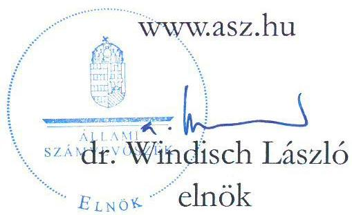
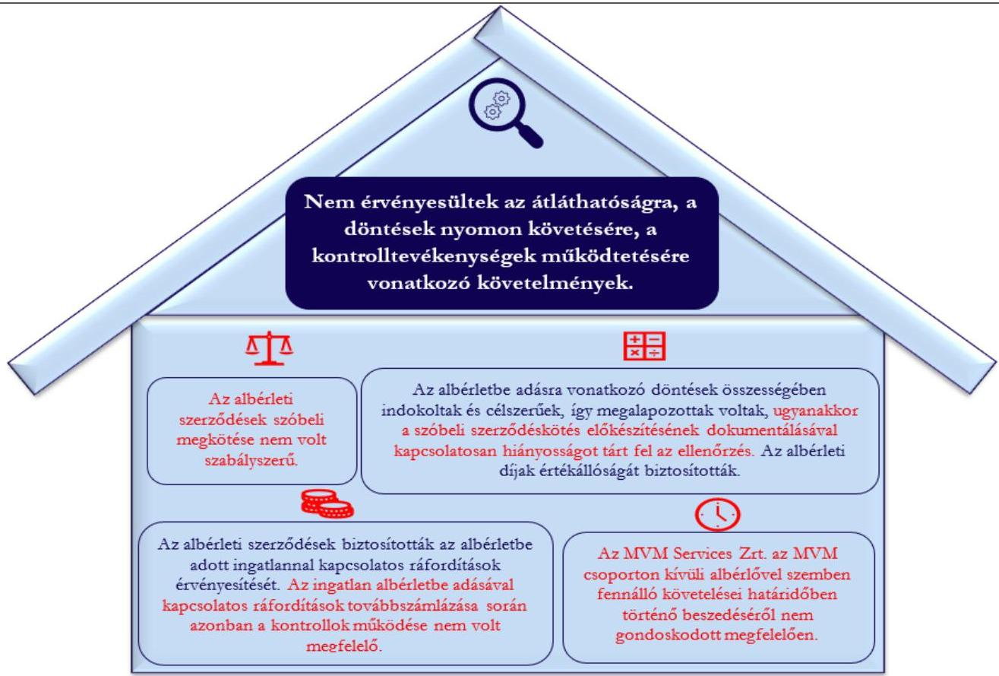

ÁLLAMI SZÁMVEVŐSZÉK

# JELENTÉS

A többségi állami tulajdonú gazdasági társaságok ingatlan bérbeadásának célzott ellenőrzése

MVM Services Zártkörűen Működő Részvénytársaság
2025.

24180

www.asz.hu

---

ÁLLAMI SZÁMVEVŐSZÉK

# JELENTÉS

A többségi állami tulajdonú gazdasági társaságok ingatlan bérbeadásának célzott ellenőrzése

MVM Services Zártkörűen Működő Részvénytársaság

2025.

24180

---

Jelentéseink az interneten a www.asz.hu címen olvashatók.

ELLENŐRZÉSI IGAZGATÓSÁG:
ÁLLAMI VAGYONGAZDÁLKODÁST ELLENŐRZŐ
IGAZGATÓSÁG

ELLENŐRZÉSI IGAZGATÓ:
HERCZEGH ZSOLT ellenőrzési igazgató

ELLENŐRZÉSVEZETŐ:
IMRE ZSUZSANNA ellenőrzésvezető

IKTATÓSZÁM: EL-4095-003/2025
TÉMASORSZÁM: 38
ELLENŐRZÉS-AZONOSÍTÓ SZÁM: V1107

---

TARTALOMJEGYZÉK

- AZ ELLENŐRZÉS ALAPADATAI ... 5
- MEGÁLLAPÍTÁSOK ÉS KÖVETKEZTETÉSEK ... 7
- JAVASLATOK ... 13
- MELLÉKLETEK ... 14
- I. sz. melléklet: Értelmező szótár ... 14
- II. sz. melléklet: Ellenőrzési kritériumok ... 15
- FÜGGELÉK: ÉSZREVÉTELEK ... 16
- RÖVIDÍTÉSEK JEGYZÉKE ... 18

---

“哈，你是个小伙子，你是个小伙子，你是个小伙子，你是个小伙子，你是个小伙子，你是个小伙子，你是个小伙子，你是个小伙子，你是个小伙子，你是个小伙子，你是个小伙子，你是个小伙子，你是个小伙子，你是个小伙子，你是个小伙子，你是个小伙子，你是个小伙子，你是个小伙子，你是个小伙子，你是个小伙子，你是个小伙子，你是个小伙子，你是个小伙子，你是个小伙子，你是个小伙子，你是个小伙子，你是个小伙子，你是个小伙子，你是个小伙子，你是个小伙子，你是个小伙子，你是个小伙子，你是个小伙子，你是个小伙子，你是个小伙子，你是个小伙子，你是个小伙子，你是个小伙子，你是个小伙子，你是个小伙子，你是个小伙子，你是个小伙子，你是个小伙子，你是个小伙子，你是个小伙子，你是个小伙子，你是个小伙子，你是个小伙子，你是个小伙子，你是个小伙子，你是个小伙子，你是个小伙子，你是个小伙子，你是个小伙子，你是个小伙子，你是个小伙子，你是个小伙子，你是个小伙子，你是个小伙子，

---

AZ ELLENŐRZÉS ALAPADATAI

## AZ ELLENŐRZÉS CÉLJA

Az ellenőrzés célja a gazdasági társaságnál az ingatlan bérbeadási szerződések szabályszerűségének és a kapcsolódó döntések megalapozottságának, valamint a bérleti díj értékállóságának, a bérleti jogviszonyból eredő követelések érvényesítésének értékelése volt.

## AZ ELLENŐRZŐTT IDŐSZAK

A 2022-2023. évek, a követelések tekintetében a 2022. január 1-től az ellenőrzés megkezdéséről szóló tájékoztató levél kézhezvételének napjáig 2024. június 26-ig terjedő időszak.

## AZ ELLENŐRZÉS TÁRGYA

Az MVM Services Zrt.¹ ingatlan albérletbe adásra szóló szerződéseinek szabályszerűsége, a kapcsolódó döntések megalapozottsága, valamint az albérleti díjak értékállóságának, az ingatlannal kapcsolatos költségek érvényesítésének biztosítása, az albérleti jogviszonyból eredő követelések érvényesítése volt.

Az ellenőrzés kiterjedt minden olyan körülményre és adatra, amely az ÁSZ² jogszabályban meghatározott feladatainak teljesítéséhez, valamint a program végrehajtása folyamán felmerült újabb összefüggések feltárásához szükséges volt.

## AZ ELLENŐRZÉS JOGALAPJA

Az ellenőrzés jogszabályi alapját az ÁSZ tv.³ 1. § (3) bekezdése és az 5. § (4) bekezdése képezik.

## AZ ELLENŐRZÉS MÓDSZERE

Az ellenőrzést az ÁSZ a nemzetközi standardokat irányadónak tekintve az ellenőrzési program szempontjai, az ellenőrzött időszakban hatályos jogszabályok, az ellenőrzés szakmai szabályok és módszertanok figyelembevételével folytatta le.

Az ellenőrzési kérdések megválaszolásához szükséges bizonyítékok megszerzése az ellenőrzött szervezet által rendelkezésre bocsátott dokumentumokra és adatokra alapozva, a következő ellenőrzési eljárások alkalmazásával történt: kérdésfeltevés (interjú), szemrevételezés, megfigyelés, összehasonlítás, mintavételezés, elemző eljárás. Az ellenőrzési bizonyítékként felhasználható adatforrások közé tartoztak egyrészt az ellenőrzéshez kért dokumentumok, adatforrások, másrészt adatforrás volt még minden – az ellenőrzés folyamán feltárt, az ellenőrzés szempontjából releváns információt tartalmazó – dokumentum.

Az ellenőrzés lefolytatásához az ellenőrzött szervezet a tanúsítvány kitöltésével, valamint az ÁSZ által kért dokumentumok, adatok, információk megküldésével és az ellenőrzés során szolgáltatott adatokat.

5

---

Az ellenőrzés alapadatai

A tanúsítvány adatai alapján az MVM Services Zrt. az ellenőrzött időszakban hét darab ingatlan bérbeadási szerződéssel rendelkezett, melyekből a mintavételezés keretében két darab albérleti szerződés került kiválasztásra.

Az ellenőrzés értékállónak minősítette az ellenőrzött albérleti szerződésekben rögzített albérleti díjakat, amennyiben azok a közzétett releváns fogyasztói árindex figyelembevételével módosításra kerültek.

Az ÁSZ ellenőrzése a mintatételek vonatkozásában tesz megállapítást, ad értékelést.

# AZ ELLENŐRZŐTT SZERVEZET

# MVM SERVICES ZÁRTKÖRÜEN MŰKÖDŐ RÉSZVÉNYTÁRSASÁG

Az MVM Services Zrt. 2015.02.13-án alakult, egyedüli tulajdonosa a Magyar Állam 100 %-os tulajdonában lévő MVM Energetika Zártkörűen Működő Részvénytársaság.

Az MVM Services Zrt. fő tevékenysége a számviteli, könyvvizsgálói, adószakértői tevékenység. Az MVM Services Zrt. elsődleges célja az MVM csoport társaságai

Forrás: A; MVM Services Zrt. honlapja

belső szolgáltatási igényeinek biztosítása 8 szolgáltatási szakterületen nyújtott közel 20 szolgáltatásával. Az MVM Services Zrt. által az MVM csoport társaságai számára nyújtott szolgáltatások: holdingtámogató szolgáltatások, létesítményüzemeltetés, flottamenedzsment stb. Az MVM Services Zrt. székhelye, valamint öt telephelye Budapesten található, továbbá nyolc fiókteleppel rendelkezik Szegeden, Pakson, Békéscsabán, Nagykörösön, Kecskeméten és Baján.

Az MVM Services Zrt. 2023. évi beszámolója alapján a mérlegfőösszege 14 921,9 M Ft, a saját tőke összege 6513,1 M Ft, az értékesítés nettó árbevétele 23 439,3 M Ft, a foglalkoztatottak átlagos statisztikai állományi létszáma 972 fő volt.

Az MVM Services Zrt. az ellenőrzött időszakban a Taktv.⁴ 7/J. § (1) bekezdése és így a Gbkr.⁵ hatálya alá tartozott.

Az ellenőrzés az MVM Services Zrt. által a Dorkan Property Kft.-től bérelt, a Budapest II. kerület, Árpád fejedelem útja 26-28. szám alatti ingatlan 6. emeletén található, bruttó 779,6 m² alapterületű irodahelyiségekre és kapcsolódó 6 db parkolóhelyre vonatkozó két albérleti szerződésre irányult.

---

# MEGÁLLAPÍTÁSOK ÉS KÖVETKEZTETÉSEK

1. ábra

AZ ELLENŐRZÉS MEGÁLLAPÍTÁSAINAK ÖSSZEGZÉSE
Forrás: Az ellenőrzés során rendelkezésre bocsátott dokumentumok alapján ÁSZ saját szerkesztés

Az ellenőrzésre kiválasztott albérleti szerződésekkel érintett összesen bruttó 779,6 m² alapterületű ingatlan és a kapcsolódó parkolóhelyek tulajdonosa az ellenőrzött időszakban a Dorkan Property Kft. volt. Az MVM Services Zrt. és a Dorkan Property Kft. közötti bérleti szerződésben foglaltak alapján az MVM Services Zrt. a bérleti szerződésben rögzítettekkel azonos feltételek mellett volt jogosult az ingatlant albérletbe, vagy használatba adni.

Az ingatlanra és a kapcsolódó parkolóhelyekre vonatkozóan az MVM Services Zrt. 2019.04.01-én bérleti szerződést kötött az MVM csoportba tartozó Grape Solutions Zrt. elhelyezési igényeinek biztosítása céljából. Az MVM Services Zrt. és a Grape Solutions Zrt. között e célból megkötött albérleti szerződés 2019.04.10-tól 2021.12.31-ig volt hatályban.

Az MVM Services Zrt. a Grape Solutions Zrt.-vel kötött albérleti szerződés megszüntetését követően, 2022.01.01-i hatállyal két albérlőnek adta albérletbe az ingatlant: az MVM csoportba tartozó MVM Optimum Zrt.-nek 744,52 m² irodaterületet és a kapcsolódó 6 db parkolóhelyet és egy, az MVM csoporton kívüli albérlőnek 35,08 m² irodaterületet.

Az ÁSZ ellenőrzésével érintett, 2022.01.01-től fennálló albérleti jogviszony az MVM Services Zrt. és az MVM Optimum Zrt. között, valamint az MVM Services Zrt. és az MVM csoporton kívüli albérlő között szóban megkötött megállapodásokkal jött létre. A szóbeli megállapodások írásba foglalására 2023.02.28-án került sor az albérleti szerződések aláírásával.

---

Megállapítások és következtetések

Az MVM Services Zrt. a szerződéskötések rendjét kialakította a szerződéskötési szabályzat⁶ megalkotásával. A szerződéskötési szabályzatban meghatározták a szerződések kötelező tartalmi elemeit, a szerződéskötés módját, a szóbeli szerződéskötés lehetőségét, véleményezésének folyamatát. Az MVM Services Zrt. a cégjegyzésről, aláírási jogosultságokról szóló belső szabályzat⁷-ban előírta a kötelezettségvállalás mértékétől függően az aláírásra jogosultak körét. Az MVM Services Zrt.-nél a szerződéskötések rendjének szabályozásával érvényesültek a szerződéskötések tekintetében a Gbkr.-ben foglalt, a kontrollkörnyezet kialakítására vonatkozó követelmények.

Az MVM Services Zrt. az ellenőrzött időszakban hatályos szerződéskötési szabályzatában főszabályként írásban történő szerződéskötést írt elő a szerződések visszamenőleges hatályú aláírásának tiltása mellett. E körben a szabályzat kivételként határozta meg a szóban megköthető és igazoltan megkötött szerződések utolsó írásba foglalásának esetét. Az MVM Services Zrt. a szerződéskötési szabályzatában 2022.12.09-től azt is rögzítette, hogy a szóban megkötött szerződéseket minden esetben írásba kell foglalni, ugyanakkor nem határozta meg az írásba foglalás határidejét.

# Az MVM Services Zrt. ellenőrzéssel érintett albérleti szerződéseinek szóbeli megkötése nem volt szabályszerű, nem biztosította az átláthatóságot.

Az MVM Services Zrt. és az MVM Optimum Zrt. közötti, valamint az MVM Services Zrt. és az MVM csoporton kívüli albérlet közötti albérleti szerződések 2022.01.01-i hatállyal szóbeli szerződéskötéssel jöttek létre. Az MVM Services Zrt. a szóbeli szerződéskötés időpontjában hatályos szerződéskötési szabályzata csak a szóban megköthető szerződések tekintetében biztosított lehetőséget a szóbeli szerződéskötésre, valamint az Ltv.⁸ a helyiségek albérletbe adása esetén a vonatkozó szerződés írásba foglalási kötelezettségét írta elő. Az MVM Services Zrt. az albérleti szerződések szóban történő megkötésével egyrészt nem tartotta be az Ltv. 42. § (1) bekezdésében foglaltakat, figyelmen kívül hagyta a 2022.01.01. időpontjában hatályos szerződéskötési szabályzata 5.4.1.c) és d) pontjaiban foglaltakat, másrészt nem érvényesültek a Taktv. 7/J. § (3) bekezdésének e) pontjában rögzített átláthatóságra vonatkozó követelmények.

A szóban megkötött albérleti szerződéseket a szerződő felek 2023.02.28-án foglalták írásba. A szóban megkötött szerződések írásba foglalásának kötelezettségét a korábbi szabályozási környezetet módosítva a 2022.12.09-én hatályba lépett szerződéskötési szabályzat is előírta.

Az MVM Optimum Zrt.-vel, valamint az MVM csoporton kívüli albérletvel kötött, írásba foglalt albérleti szerződések tartalmazták a szerződő felek adatait, az albérlet tárgyát, az albérleti díj összegét, az albérlet időtartamát, az albérlet és a főbérlet jogait és kötelezettségeit, a késedelmes fizetés esetén alkalmazandó eljárásokat, a felmondás módját és idejét, valamint rögzítésre került, hogy a szerződésben nem szabályozott, a szerződéssel kapcsolatos kérdések tekintetében a Ptk.⁹ előírásai az irányadóak, amelyre tekintettel az írásba foglalt albérleti szerződések megfeleltek a Ptk. 6:331-6:341. §-ban foglaltaknak.

Az MVM Services Zrt. albérletbe adására vonatkozó írásba foglalt döntései összességében indokoltak és célszerűek, így megalapozottak voltak, ugyanakkor a szóbeli szerződéskötés előkészítésének dokumentálásával kapcsolatosan hiányosságot tárt fel az ellenőrzés. Az MVM Services Zrt. döntései biztosították az albérleti díjak értékállóságát.

Az MVM Services Zrt. a szóban megkötött albérleti szerződések hatálybalépésekor az ingatlanok albérletbe adására vonatkozó döntéseit a szóbeli szerződéskötés előkészítése, megkötése során nem dokumentálta, így nem biztosította a döntései végrehajtásával kapcsolatos kontrollok és nyomon követési rendszer működtetését, figyelmen kívül hagyva a Gbkr. 3. § (1) bekezdés c), valamint a 6. § (2) bekezdés a) pontjában foglaltakat.

---

Megállapítások és következtetések

Az MVM Services Zrt. a szóbeli szerződéskötésre vonatkozó döntéseivel összefüggő körülményeket utólag az albérleti szerződések írásba foglalását megelőzően készített, 2023.01.30-án jóváhagyott előterjesztésben rögzítette. Az előterjesztés tartalmazta a szerződéskötések indokoltságát, mely szerint a korábbi – az MVM csoportozóhoz tartozó – albérlet, a Grape Solution Zrt. 2020. nyarán felülvizsgálta az elhelyezési igényeit, majd jelezte, hogy nem kívánja tovább bérelni a bérleményt. Az MVM Services Zrt. és a Grape Solution Zrt. a fennálló jogviszonyt közös megegyezéssel megszüntette – az előterjesztésben rögzítettek alapján 2021. 12. 31-i hatállyal –, miután az MVM Services Zrt. újabb albérletet talált.

Az MVM Services Zrt. az írásba foglalt albérleti szerződésekben rögzítette az MVM Optimum Zrt. és az MVM csoporton kívüli albérlet albérleti díjon felüli fizetési kötelezettségeit (üzemeltetés, villamosenergia, takarítás, higiénia, az MVM Optimum Zrt. -vel kötött albérleti szerződés esetében a biztosítási díj is).

A határozott időtartamra kötött albérleti szerződésekben rendelkeztek az albérleti díjak 2023.01.01-i indexálásáról. Az MVM Services Zrt. az albérleti szerződések alapján az albérleti díjak összegét az Euró Övezet tekintetében közzétett Monetáris Unió Fogyasztói Árindexével megegyező mértékben, 2023.01.01-től 8,4 %-kal megemelte, így biztosítva az albérleti díjak értékállóságát.

Az MVM Services Zrt. által megkötött, ellenőrzött albérleti szerződések biztosították az albérletbe adott ingatlannal kapcsolatos ráfordítások érvényesítését. Az ingatlan albérletbe adásával kapcsolatos ráfordítások tovább számlázása során azonban a kontrollok működése nem volt megfelelő.

Az albérleti szerződésekben rögzített rendelkezések biztosították az MVM Services Zrt. számára a bérleti díjakkal, az üzemeltetéssel, a villamosenergia fogyasztással, valamint a takarítással, higiénával kapcsolatban felmerült ráfordítások területarányos felosztását követő tovább számlázását az MVM Optimum Zrt. és az MVM csoporton kívüli albérlet részére.

Az ÁSZ ellenőrzése azonban az MVM Services Zrt. albérleti szerződésekkel összefüggő számlázási gyakorlata területén hiányosságokat tárt fel.

Az MVM Services Zrt. analitikus nyilvántartásai alapján az ellenőrzött időszakban a bérleti díjak és az egy hónapra jutó becsült üzemeltetési költségek tovább számlázására nem az albérleti szerződések 9.1. pontjában foglaltak szerinti határidőben – legkésőbb a tárgyhó megelőző hónap 8. napjáig – került sor. A további felmerült egyéb ráfordítások (villamosenergia, takarítás, higiénia) bizonylatának dátuma és azok tovább számlázása (tovább számlázott tételek könyvelési dátuma) között jelentős időbeli eltérés mutatkozott. Az MVM Services Zrt. felmerült ráfordításait tartalmazó bérbeadói, illetve egyéb ráfordításokat tartalmazó bizonylatainak dátuma és a tovább számlázás könyvelési dátuma között eltelt időszakra vonatkozó adatokat az 1. táblázat szemlélteti.

1. táblázat
AZ MVM SERVICES ZRT. 2022. ÉS 2023 ÉVEKRE VONATKOZÓAN KIBOCSÁTOTT SZÁMLÁI (DB)

|   | TOVÁBBSZÁMLÁZÁS AZ MVM |   |   |   | TOVÁBBSZÁMLÁZÁS AZ MVM OPTIMUM  |   |   |   |
| --- | --- | --- | --- | --- | --- | --- | --- | --- |
|   |  CSOPORTON KÍVÜLI ALBÉRLŐ RÉSZÉRE |   |   |   | ZRT. RÉSZÉRE  |   |   |   |
|   |  30 NAPON BELÜL | 31-150 NAP | 151-365 NAP | 365 NAPON TÚL | 30 NAPON BELÜL | 31-150 NAP | 151-365 NAP | 365 NAPON TÚL  |
|  albérleti díjak | - | 7 db | 15 db | 2 db | 4 db | 7 db | 9 db | 4 db  |
|  üzemeltetési költségek | 1 db | 7 db | 11 db | 4 db | 10 db | 2 db | 11 db | 2 db  |
|  egyéb ráfordítások | 2 db | 12 db | 26 db | 13 db | 4 db | 32 db | 39 db | 35 db  |
|  Összesen: | 3 db | 26 db | 52 db | 19 db | 18 db | 41 db | 59 db | 41 db  |

Forrás: MVM Services Zrt. az ingatlan albérletbe adásból származó bevételekről, illetve a kapcsolódó ráfordításokról szóló analitikus nyilvántartásai alapján
ASZ saját szerkesztés

---

Megállapítások és következtetések

Mindezen tényekre tekintettel az MVM Services Zrt. az ellenőrzött időszakban a Gbkr. 3. § (1) bekezdés e) pontjában előírtakkal ellentétben nem biztosította az ingatlan albérletbe adása tekintetében a megfelelő nyomon követési rendszert, sem a Gbkr. 3. § (1) bekezdés c) pontjában meghatározott kontrolltevékenységek működtetését.

A számlázási gyakorlatot érintő hiányosságot az MVM Zrt. belső ellenőrzése is megállapította. A belső ellenőrzés rögzítette, hogy az MVM Services Zrt. albérleti szerződéseket érintő tovább számlázása során a fizikai teljesítéstől a vevői számla kiállításáig terjedő időszak jelentősen, akár éven túl is elhúzódott, valamint a tovább számlázási folyamat kapcsán kontrollhiányosságot állapított meg. Az MVM Services Zrt. vezérigazgatója által 2023.06.28-án jóváhagyott intézkedési terv alapján a folyamat javítása érdekében az MVM Services Zrt. intézkedéseket tett, melyek még – az MVM Services Zrt. nyilatkozat³⁰-a alapján – nem zárultak le, azok folyamatban voltak.

Az ÁSZ ellenőrzése azt is feltárta, hogy az MVM Services Zrt. a felmerült ráfordításait az MVM csoporton kívüli albérletű részére a 2022. évben néhány tétel tekintetében nem érvényesítette. Az albérleti szerződésekhez kapcsolódó bevételeket és tovább számlázott ráfordításokat a 2. táblázat szemlélteti.

2. táblázat
A MINTATÉTELEKHEZ KAPCSOLÓDÓ 2022. ÉS 2023. ÉVI BEVÉTELEK ÉS RÁFORDÍTÁSOK (NETTÓ ADATOK EZER FORINTBAN)

|  ÉV | MEGNEVEZÉS | MVM CSOPORTON KÍVÜLI ALBÉRLŐVEL KÖTÖTT ALBÉRLETI SZERZŐDÉS | MVM OPTIMUM ZRT.-VEL KÖTÖTT ALBÉRLETI SZERZŐDÉS  |
| --- | --- | --- | --- |
|  2022. | Az ingatlan albérletbe adásból származó bevételek | 2830,7 | 72 952,6  |
|   |  Az ingatlan albérletbe adása kapcsán felmerült ráfordítások | 3104,4 | 72 952,6  |
|   |  A ráfordítások bevételekkel nem fedezett összege | 273,7 | 0,0  |
|   |  A ráfordítások bevételekkel nem fedezett hányada | 8,8% | 0,0%  |
|  2023. | Az ingatlan albérletbe adásból származó bevételek | 3139,3 | 72 782,3  |
|   |  Az ingatlan albérletbe adása kapcsán felmerült ráfordítások | 3139,3 | 72 782,3  |
|   |  A ráfordítások bevételekkel nem fedezett összege | 0,0 | 0,0  |
|   |  A ráfordítások bevételekkel nem fedezett hányada | 0,0% | 0,0%  |

Forrás: Az MVM Services Zrt. által rendelkezésre bocsátott dokumentumok alapján ÁSZ saját szerkesztés

A 2022. és 2023. évek vonatkozásában az MVM Services Zrt. ingatlan albérletbe adásából származó bevételei az MVM Optimum Zrt.-vel kötött albérleti szerződés tekintetében teljeskörűen, az MVM csoporton kívüli albérővel kötött albérleti szerződés tekintetében a következőkben részletezett tételek kivételével fedezetet nyújtottak az albérletbe adott ingatlannal kapcsolatosan felmerült ráfordításaira.

Az MVM Services Zrt. által az MVM csoporton kívüli albérletű részére a 2022. április és május havi bérleti díjak nem kerültek tovább számlázásra, valamint a 2022. február havi bérleti díj nem az albérleti szerződés 6.2.1. pontja szerinti kedvezményes időszakra vonatkozó 50 %-os mértékben került tovább számlázásra. Ezen bérleti díj összegek, valamint a 2022. évet érintően tovább nem számlázott villamosenergia fogyasztás értéke összesen 273,7 E Ft összegű kárt okozott.

Az MVM Services Zrt. által az MVM csoporton kívüli albérővel kötött albérleti szerződéssel összefüggő tovább számlázási hiányosságok miatt teljeskörűen nem érvényesültek sem a Taktv. 7/J. § (3) bekezdés

10

---

Megállapítások és következtetések

d) pontjában, sem a Gbkr. 3. § (1) bekezdés c) és d) pontjaiban rögzített, a kontrollok megfelelő működtetésére vonatkozó előírások.

Az MVM Services Zrt. az MVM csoporton kívüli albérlővel kötött albérleti szerződés esetében nem gondoskodott megfelelően követeléseinek határidőben történő beszedéséről.

Az MVM Services Zrt. az ingatlan albérletbe adási tevékenysége során előforduló vagyoni, pénzügyi, jövedelmi helyzetére kiható gazdasági eseményeket a mintatételekhez kapcsolódó követelésekről vezetett analitikus nyilvántartásaiban rögzítette.

Az MVM Services Zrt. által rendelkezésre bocsátott analitikus nyilvántartások az ellenőrzött időszakra vonatkozóan tételen tartalmazták az MVM Optimum Zrt. és az MVM csoporton kívüli albérlő részére kiállított számlák nettó és bruttó összegét, a számla keltét, a teljesítés időpontját, a számla esedékességét és a kiegyenlítés dátumát, megfelelve a Számv. tv.¹¹-ben foglaltaknak.

Az MVM Services Zrt.-nek az MVM Optimum Zrt.-vel szemben az ellenőrzött időszak vonatkozásában – az ellenőrzés rendelkezésére bocsátott dokumentumok alapján – nem volt 15 napos késedelmet meghaladó lejárt esedékességű követelése.

Az MVM Services Zrt.-nek az ellenőrzött időszakban az MVM csoporton kívüli albérlővel kötött albérleti szerződésből eredően keletkezett határidőn túli követelése 2023.12.31-én bruttó 6719,0 E Ft (nettó 5290,5 E Ft) volt, mely az ellenőrzött (2022-2023. évek) időszakban kiszámlázott (bruttó 7581,9 E Ft, nettó 5970,0 E Ft) követelésállomány 89 %-át tette ki.

Az MVM Services Zrt. az MVM csoporton kívüli albérlővel szemben fennálló lejárt esedékességű követelései behajtásáról késedelmesen gondoskodott, első alkalommal 2022.11.02-i, majd 2023.11.06-i, valamint 2024.04.11-i keltezéssel küldött fizetési felszólításokat. Az első fizetési felszólításban bruttó 267,4 E Ft értékben 145-205 nap késedelemmel érintett számlákról, majd a második felszólításban bruttó 2317,9 E Ft értékben lejárt követelésekről 77-574 nap késedelemmel érintett számlákról, a harmadik felszólításban bruttó 6032,1 M Ft értékben 30-731 nap késedelemmel érintett számlákról értesítette az MVM csoporton kívüli albérlőt. Az MVM Services Zrt. az első fizetési felszólítást 6,5 hónappal, a második fizetési felszólítást több, mint 1,5 évvel, a harmadik fizetési felszólítást több, mint 2 évvel a fizetési határidő lejártát követően küldte ki az MVM csoporton kívüli albérlőnek.

Az MVM Services Zrt. az ellenőrzött időszakban a követelések tekintetében az ellenőrzés megkezdéséről szóló tájékoztató levél kézhezvételének napjáig (2024.06.26-ig) további intézkedéseket nem tett követelése behajtása érdekében.

Az MVM Services Zrt. az MVM csoporton kívüli albérlővel az albérleti szerződés 2024.07.01-i megszűnését követően, 2024.07.12-én kötött tartozáskiegyenlítési megállapodást, 7129,8 E Ft összegű tőketartozás, valamint további 2024. január-június hónapra vonatkozóan keletkezett 1292,5 E Ft, összesen 8422,3 E Ft összegű követelés havi egyenlő összegű részletekben történő megfizetéséről 2024. december 31-ig. A tartozáskiegyenlítési megállapodásban rögzítettek alapján amennyiben az MVM csoporton kívüli albérlő a teljes tőketartozás megfizetését a megállapodásban rögzítettek szerinti határidőben maradéktalanul teljesíti, az MVM Services Zrt. a késedelmi kamat követelését nem érvényesíti. A tartozáskiegyenlítési megállapodás ugyanakkor nem tartalmazta a korábbiakban részletezett, az MVM csoporton kívüli albérlőnek ki nem számlázott tételeket összesen 273,7 E Ft összegben.

Az MVM Services Zrt. az albérleti szerződésben meghatározta az albérleti díjak MVM csoporton kívüli albérlő általi megfizetésének módját és határidejét, valamint a késedelmes vagy nem fizetés esetén alkalmazandó eljárásokat, ugyanakkor az ellenőrzött időszakban nem élt az albérleti szerződésben rögzített

11

---

Megállapítások és következtetések

jogaival. Az MVM Services Zrt. által az esedékességet követő 6,5 hónap, 1,5 év, illetve 2 éven túl kiküldött fizetési felszólításokkal az MVM Services Zrt. nem gondoskodott megfelelően a lejárt esedékességű követelései határidőben történő beszedéséről, mely révén nem érvényesültek a Taktv. 7/J. § (3) bekezdés a), c), f) és g) pontjaiba foglalt követelmények.

12

---

13

# JAVASLATOK

Az ÁSZ tv. 33. § (1) bekezdésében foglaltak értelmében az ellenőrzött szervezet vezetője köteles a jelentésben foglalt megállapításokhoz kapcsolódó intézkedési tervet összeállítani és azt a jelentés kézhezvételétől számított 30 napon belül az ÁSZ részére megküldeni. Amennyiben az ellenőrzött szervezet vezetője nem küldi meg határidőben az intézkedési tervet, vagy továbbra sem elfogadható intézkedési tervet küld, az Állami Számvevőszék elnöke az ÁSZ tv. 33. § (3) bekezdése a) és b) pontjaiban foglaltakat érvényesítheti.

## AZ MVM SERVICES ZRT. VEZÉRIGAZGATÓJÁNAK

1. Gondoskodjon a Gbkr. 6. § (2) bekezdésében, valamint a Taktv. 7/J. § (3) bekezdés e) pontjában foglaltak alapján a döntések megfelelő határidőben történő dokumentálásáról az átláthatóság, a kontrolltevékenységek működtetése és a nyomon követhetőség érdekében.

2. Gondoskodjon a Gbkr. 3. § (1) bekezdés c) pontjában foglaltak alapján a Taktv. 7/J. § (3) bekezdés d) pontjának megfelelő kontrolltevékenységek kialakításáról és működtetéséről annak érdekében, hogy az ingatlan albérletbe adással kapcsolatosan felmerülő ráfordítások a szerződésekben rögzített határidőig az albérletű részére kiszámlázásra kerüljenek.

---

MELLÉKLETEK

## I. SZ. MELLÉKLET: ÉRTELMEZŐ SZÓTÁR

gazdasági társaság

A gazdasági társaságok üzletszerű közös gazdasági tevékenység folytatására, a tagok vagyoni hozzájárulásával létrehozott, jogi személyiséggel rendelkező vállalkozások, amelyekben a tagok a nyereségből közösen részesednek, és a veszteséget közösen viselik.

(Forrás: Ptk. 3:88. § (1) bekezdése)

többségi állami tulajdon

Az állam tulajdonában lévő tagsági jogviszonyt megtestesítő értékpapír, illetve az állam tulajdonában lévő egyéb társasági részesedés, amennyiben a társaságban a Magyar Állam közvetlenül vagy közvetetten a szavazatok több mint felével rendelkezik.

(ÁSZ definíció a Vtv.¹² 1. § (2) bekezdés c) pontja és a Ptk. 8:2. § (1), (3)-(4) bekezdései alapján)

többségi befolyás

Olyan kapcsolat, amelynek révén a befolyással rendelkező egy jogi személyben a szavazatok több mint ötven százalékával – közvetlenül vagy a jogi személyben szavazati joggal rendelkező más jogi személy (köztes vállalkozás) szavazati jogán keresztül – rendelkezik, azzal, hogy a közvetett módon való rendelkezés meghatározása során a jogi személyben szavazati joggal rendelkező más jogi személyt (köztes vállalkozást) megillető szavazati hányadot meg kell szorozni a befolyással rendelkezőnek a köztes vállalkozásban, illetve vállalkozásokban fennálló szavazati hányadával, ha azonban a köztes vállalkozásban fennálló szavazatainak hányada az ötven százalékot meghaladja, akkor azt egy egészént kell figyelembe venni. A befolyás számításánál nem kell figyelembe venni a huszonöt százalékot el nem érő közvetett befolyást.

(Forrás: Taktv. 1. § b) pont)

---

Mellékletek

## II. SZ. MELLÉKLET: ELLENŐRZÉSI KRITÉRIUMOK

|  ELLENŐRZÉSI KRITÉRIUMOK  |
| --- |
|  Nvtv. 7. § (1), (2) bekezdés  |
|  Taktv. 7/J. § (3) bekezdés a), c), d), e), f) és g) pontok  |
|  Ptk. 6:331-6:341. §  |
|  Számv. tv. 12. § (1), 14. § (5) bekezdés c.) pont, 16 § (1) bekezdés, 29. §, 164 § (1), (2) bekezdés  |
|  Ltv. 42. § (1) bekezdés  |
|  Gbkr. 3. § (1) bekezdés c) és e) pontok, 4. § (1) bekezdés c) pont, (3) bekezdés, 6. § (1), (2) bekezdés, 8. §  |
|  Az MVM Services Zrt. szerződéskötésekre vonatkozó belső szabályzata  |
|  Az MVM Services Zrt. cégjegyzésről, aláírási jogosultságokról szóló belső szabályzata  |

---

FÜGGELÉK: ÉSZREVÉTELEK

A jelentéstervezetet a Számvevőszék 15 napos észrevételezésre megküldte az ellenőrzött szervezet vezetőjének az ÁSZ tv. 29. §* (1) bekezdése előírásának megfelelően.

A jelentéstervezet megállapításaira az MVM Services Zrt. vezérigazgatója észrevételt tett. Az ÁSZ tv. 29. § (3) bekezdésével összhangban az ÁSZ a Függelékben feltünteti a megállapításokkal kapcsolatban tett, el nem fogadott észrevételeket, illetve az el nem fogadott észrevételek indokolását.

A jelentéstervezet megállapításaira az MVM Services Zrt. vezérigazgatója észrevételt tett. Az ÁSZ tv. 29. § (3) bekezdésével összhangban az ÁSZ a Függelékben feltünteti a megállapításokkal kapcsolatban tett, el nem fogadott észrevételeket, illetve az el nem fogadott észrevételek indokolását.

# Az MVM Services Zrt. az alábbi észrevételt tette a 2. számú javaslathoz:

„[...]a számlázási gyakorlatot érintő hiányosságok kiküszöbölésére [...] A folyamatok javítása érdekében az MVM Services Zrt. megkezdte a szükséges intézkedések megtételét e körben belső szabályzatainkat kiegészítettük, a tovább számlázással érintett kollégáinknak oktatási anyagot készítettünk és oktatásokat szerveztünk, az érintett szakterületeket havi rendszerességgel tájékoztatjuk a nyitott, tovább számlázandó tételekről és felkérjük őket a függő feladatok végrehajtására, azonban kiemelendő, hogy a folyamatok javítása érdekében tett intézkedések végrehajtása még nem zárult le. Mindezt amiatt tartjuk fontosnak hangsúlyozni, mivel a T. Állami Számvevőszék által Társaságunk Vezérigazgatójának megfogalmazott 2. javaslata ezzel összefüggésben utal a megfelelő kontrolltevékenységek kialakítására és működtetésére. Hangsúlyozni szeretnénk, hogy Társaságunk számára is kiemelten fontos a megfelelő működés biztosítása, azonban – ahogy azt a helyszíni ellenőrzés keretében is jeleztük – 2025. január 1. napjától Társaságunk ingatlan albérletbe adási tevékenységének megszüntetését tervezzük. Minderre tekintettel kérjük a T. Állami Számvevőszéket, hogy a Társaságunk Vezérigazgatójának megfogalmazott 2. javaslat fenntartását – esetlegesen módosítását – ezen információ alapján megfontolni szíveskedjenek.”

* 29. § (1) Az Állami Számvevőszék az ellenőrzési megállapításait megküldi az ellenőrzött szervezet vezetőjének vagy az általa megbízott személynek, és annak, akinek személyes felelősségét állapította meg.
(2) Az ellenőrzött szervezet vezetője és a felelősként megjelölt személy az ellenőrzés megállapításaira tizenöt napon belül írásban észrevételt tehet.
(3) Az Állami Számvevőszék az észrevételre a beérkezésétől számított harminc napon belül írásban válaszol. A figyelembe nem vett észrevételeket köteles a jelentésben feltüntetni, és megindokolni, hogy azokat miért nem fogadta el.

16

---

Függelék: Észrevételek

## El nem fogadás indoka:

Az MVM Services Zrt.-nél az ellenőrzés által feltárt hiányosságok megszüntetésére tett intézkedések még nem zárultak le. Az MVM Services Zrt. vezérigazgatója észrevételében az ingatlan albérletbeadási tevékenységének tervezett, jövőbeni megszüntetéséről adott tájékoztatást. A jelentéstervezet 10. oldalán szereplő megállapítás az észrevételben foglaltakkal egyezően rögzíti, hogy "Az MVM Services Zrt. vezérigazgatója által 2023.06.28-án jóváhagyott intézkedési terv alapján a folyamat javítása érdekében az MVM Services Zrt. intézkedéseket tett, melyek még – az MVM Services Zrt. nyilatkozat10-a alapján – nem zárultak le, azok folyamatban voltak." Az MVM Services Zrt. az észrevételezés során sem bocsátott az ellenőrzés rendelkezésre olyan dokumentumot, mely igazolja az észrevételben jelzett intézkedések megtételét a ráfordítások tovább számlázására vonatkozó kontrolltevékenységek kialakítása és működtetése érdekében.

## Az MVM Services Zrt. az alábbi észrevételt tette a jelentéstervezet 12. oldal 4. bekezdéséhez:

A jelentéstervezet 12. oldalán szereplő állítást, miszerint „az MVM Services Zrt. az ellenőrzött időszakban a követelések tekintetében az ellenőrzés megkezdéséről szóló tájékoztató levél kézhezvételének napjáig (2024.06.26-ig) további intézkedéseket nem tett követelése behajtása érdekében” vitatjuk, tekintettel arra, hogy a Társaság már 2024.06.26-a előtt is folyamatosan dolgozott azon, hogy hogyan kezelje a lehető leggyorsabban és legoptimálisabban a CEF-fel fennálló követelést, aminek eredményeként 2024.06.03-án megküldtük a részletfizetési megállapodás tervezetét a CEF ügyvezetője részére. Kiemelnénk, hogy fennállt annak a reális kockázata, hogy amennyiben a CEF ellen felszámolási eljárás indult volna és annak következtébe a CEF jogutód nélkül megszűnik, úgy a Társaság követelése kielégítetlen maradt volna, ezért is kerestünk olyan megoldást, amivel a Társaság gazdasági érdekei nem károsultak és le tudtuk zárni a Társaság, illetve a CEF közötti jogügyletet. Megjegyezzük továbbá azt is, hogy a CEF-fel szóban többször is egyeztettünk a fennálló tartozás rendezéséről.”

## El nem fogadás indoka:

A számvevőszéki jelentés 12. oldalán vitatott bekezdést megelőző harmadik bekezdésben az MVM Services Zrt. által küldött 2022.11.02-i, majd 2023.11.06-i, valamint 2024.04.11-i fizetési felszólítások – azaz a követelés behajtására tett intézkedések – kerültek felsorolásra, ugyanakkor a vitatott 4. bekezdésben szereplő megállapítás arra vonatkozott, hogy ezen felül további intézkedéseket az ellenőrzött nem tett 2024.06.26-ig (az ellenőrzött időszak végéig). A vitatott bekezdést követő bekezdés egyébiránt tartalmazza, hogy az MVM Services Zrt. 2024.07.12-én tartozáskiegyenlítési megállapodást kötött, melyre az ellenőrzés megkezdéséről szóló tájékoztató levél kézhezvételének napját (2024.06.26.) követően került sor. Az MVM Services Zrt. nem bocsátott rendelkezésre olyan dokumentumot, mely igazolja az észrevételében jelzett intézkedéseket.

---

RÖVIDÍTÉSEK JEGYZÉKE

1. MVM Services Zrt.
MVM Services Zártkörűen Működő Részvénytársaság, hatályos: 2020.10.31.-tól
NKM Nemzeti Közművek Zártkörűen Működő Részvénytársaság, hatályos: 2017.06.01. - 2020.10.31.
ENKSZ Első Nemzeti Közműszolgáltató Zártkörűen Működő Részvénytársaság, hatályos: 2015.02.18. - 2017.06.01.

2. ÁSZ
Állami Számvevőszék

3. ÁSZ tv.
2011. évi LXVI. törvény az Állami Számvevőszékről

4. Taktv.
2009. évi CXXII. törvény a köztulajdonban álló gazdasági társaságok takarékosabb működéséről

5. Gbkr.
339/2019. (XII. 23.) Korm. rendelet a köztulajdonban álló gazdasági társaságok belső kontrollrendszeréről

6. szerződéskötési szabályzat
Az MVM Services Zrt. „Jogi és regulációs belső szabályzata” hatályos 2021.05.20-tól 2022.12.08-ig
módosítása: hatályos 2022.12.09-tól 2023.05.30-ig
módosítása: hatályos 2023.05.31-tól 2023.09.15-ig
módosítása: hatályos 2023.09.16-tól

7. cégjegyzésről, aláírási jogosultságokról szóló belső szabályzat
Az MVM Services Zrt. „Cégjegyzésről, aláírási jogosultságokról szóló belső szabályzata” hatályos 2021.02.03-tól 2023.07.14-ig, módosítása 2023.07.15-tól

8. Ltv.
A lakások és helyiségek bérletére, valamint az elidegenítésükre vonatkozó egyes szabályokról szóló 1993. évi LXXVIII. törvény

9. Ptk.
2013. évi V. törvény a Polgári Törvénykönyvről

10. nyilatkozat
Az MVM Services Zrt. által a 2024.09.11-i helyszíni ellenőrzési jegyzőkönyvben rögzítettek szerint tett nyilatkozatai

11. Számv. tv.
2000. évi C. törvény a számvitelről

12. Vtv.
2007. évi CVI. törvény az állami vagyonról

18

---

ÁLLAMI SZÁMVEVŐSZÉK

1052 Budapest, Apáczai Csere János u. 10. | 1364 Budapest 4., Pf. 54

www.asz.hu | szamvevoszek@asz.hu

telefon: +36 1 484 9100