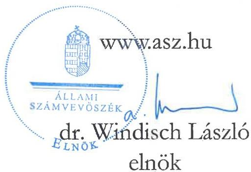
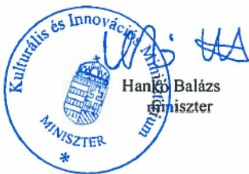
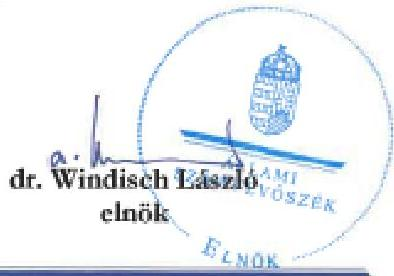
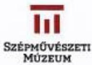
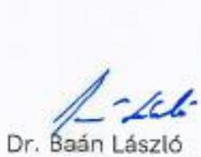
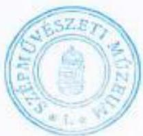
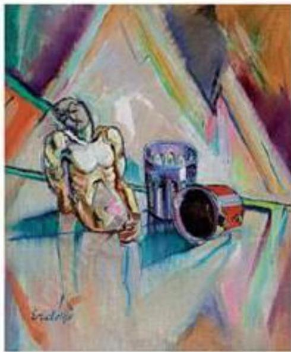
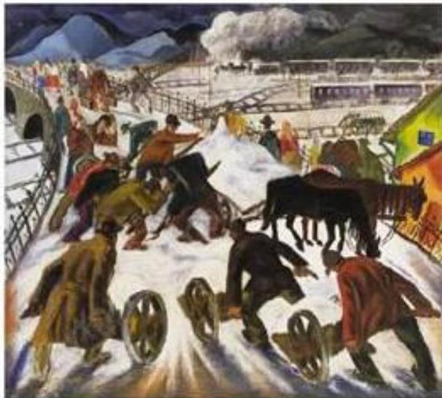
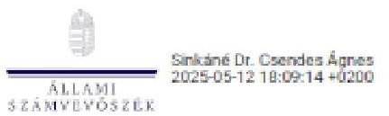
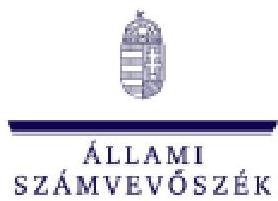

ÁLLAMI SZÁMVEVŐSZÉK

# JELENTÉS

Az országos múzeumok kulturális javakkal történő gazdálkodásának ellenőrzése

Szépművészeti Múzeum

2025.

25057

www.asz.hu

---

ÁLLAMI SZÁMVEVŐSZÉK

# JELENTÉS

Az országos múzeumok kulturális javakkal történő gazdálkodásának ellenőrzése

Szépművészeti Múzeum

2025.

25057

---

Jelentéseink az interneten a www.asz.hu címen olvashatók.

ELLENŐRZÉSI IGAZGATÓSÁG:
ELLENŐRZÉSI IGAZGATÓSÁG I.

ELLENŐRZÉSI IGAZGATÓ:
SINKÁNÉ DR. CSENDES ÁGNES ellenőrzési igazgató

ELLENŐRZÉSVEZETŐ:
RENKÓ ZSUZSANNA ellenőrzésvezető

IKTATÓSZÁM: EL-4073-002/2025

TÉMASORSZÁM: -

ELLENŐRZÉS-AZONOSÍTÓ SZÁM: V-106501

---

TARTALOMJEGYZÉK

- AZ ELLENŐRZÉS ALAPADATAI ... 5
- AZ ELLENŐRZŐTT SZERVEZET ... 8
- ÖSSZEFOGLALÁS ... 14
- AZ ELLENŐRZÉS FÓKUSZTERÜLETEI ... 18
- MEGÁLLAPÍTÁSOK ... 19
- JAVASLATOK ... 32
- MELLÉKLETEK ... 35

I. sz. melléklet: Értelmező szótár ... 35
II. sz. melléklet: Az ellenőrzött szervezetek jegyzéke ... 38
III. sz. melléklet: Ellenőrzési kritériumok ... 39
IV. sz. melléklet: Vétel révén történt gyűjteménygyarapítás mintatételei ... 40
V. sz. melléklet: Ajándék révén történt gyűjteménygyarapítás mintatételei ... 42
VI. sz. melléklet: Kölcsönzéshez kapcsolódó mintatételek ... 43
VII. sz. melléklet: Selejtezéshez kapcsolódó mintatételek ... 44
VIII. sz. melléklet: Gyűjteményeknél végrehajtott revíziók ... 45
IX. sz. melléklet: Korábbi aukción történt eladások kikiáltási/leütési árai ... 46
X. sz. melléklet: Eredet, tulajdonjog igazolása ... 47
XI. sz. melléklet: Uniós értékhatárt elérő beszerzések mintatételei ... 49
XII. sz. melléklet: Kölcsönzések nyilvántartásban szereplő, illetve tényleges időtartama közötti eltérések ... 50

- FÜGGELÉK: ÉSZREVÉTELEK ... 51
- RÖVIDÍTÉSEK JEGYZÉKE ... 97

---

“哈，你是个小伙子，你是个小伙子，你是个小伙子，你是个小伙子，你是个小伙子，你是个小伙子，你是个小伙子，你是个小伙子，你是个小伙子，你是个小伙子，你是个小伙子，你是个小伙子，你是个小伙子，你是个小伙子，你是个小伙子，你是个小伙子，你是个小伙子，你是个小伙子，你是个小伙子，你是个小伙子，你是个小伙子，你是个小伙子，你是个小伙子，你是个小伙子，你是个小伙子，你是个小伙子，你是个小伙子，你是个小伙子，你是个小伙子，你是个小伙子，你是个小伙子，你是个小伙子，你是个小伙子，你是个小伙子，你是个小伙子，你是个小伙子，你是个小伙子，你是个小伙子，你是个小伙子，你是个小伙子，你是个小伙子，你是个小伙子，你是个小伙子，你是个小伙子，你是个小伙子，你是个小伙子，你是个小伙子，你是个小伙子，你是个小伙子，你是个小伙子，你是个小伙子，你是个小伙子，你是个小伙子，你是个小伙子，你是个小伙子，你是个小伙子，你是个小伙子，你是个小伙子，你是个小伙子，

---

AZ ELLENŐRZÉS ALAPADATAI

## AZ ELLENŐRZÉS CÉLJA

Az ellenőrzés célja annak értékelése volt, hogy az országos múzeum szakmai besorolású muzeális intézménynél a kulturális javak vétel és ajándékozás révén történő gyűjteménygyarapításának, valamint a selejtezési és kölcsönadási tevékenységek belső szabályozása és gyakorlatban történő alkalmazása megfelelt-e a jogszabályi és egyéb ágazati előírásoknak.

Az ellenőrzés célja volt továbbá a gyarapítások célszerűségének vizsgálata a gyűjteménygyarapításra vonatkozó stratégiák, az éves tervek és az elvégzett tevékenységekről készített beszámolók, teljesítményértékelések összhangjának elemzésén keresztül, valamint az ezekhez kapcsolódó fenntartói és ágazati feladatellátás értékelése figyelemmel a szakfelügyeleti ellenőrzésekre.

## AZ ELLENŐRZÉS TÍPUSA

Kombinált ellenőrzés.

## AZ ELLENŐRZŐTT IDŐSZAK

A gyűjteménygyarapítás, a selejtezés, a kölcsönadás, a kapcsolódó nyilvántartások és a tevékenységek szabályozottságának ellenőrzése, valamint a gyűjteménygyarapítás célszerűségi vizsgálata tekintetében 2019. január 1-jétől 2024. évben a helyszíni ellenőrzés lezárásáig (2024. szeptember 25.) terjedő időszak.

A gyűjteménygyarapításra vonatkozó stratégiák, az éves tervek, valamint a tevékenységről készített beszámolók összhangjának elemzése, a kapcsolódó fenntartói feladatellátás és az ágazati irányítás értékelése tekintetében 2019. január 1-jétől 2023. december 31-ig terjedő időszak.

## AZ ELLENŐRZÉS TÁRGYA

A Szépművészeti Múzeumnál:

- A gyűjteménygyarapítási tevékenységgel (adásvétel, ajándékozás útján bekerült kulturális javak) és a selejtezéssel, a kölcsönadással kapcsolatos belső szabályok megalkotása.
- A gyűjteménygyarapításhoz kapcsolódó feladatok elvégzése, szakmai, számviteli nyilvántartások vezetése.
- A kulturális javak kölcsönadásával, valamint selejtezésével és ezek nyilvántartásával kapcsolatos dokumentumok rendelkezésre állása.
- Küldetésnyilatkozat, stratégiai, állományvédelmi, gyűjteménygyarapítási és revíziós tervek, a digitalizációs stratégiák, az éves szakmai munkatervek, az elvégzett tevékenységekről készített éves szakmai munkajelentések, éves számviteli beszámolók, fejlesztési és beruházási tervek, teljesítményértékelések rendelkezésre állása.

---

Az ellenőrzés alapadatai

KIM¹-nél, mint fenntartónál:
- Intézményi alapító okiratok, működési engedélyek, szervezeti és működési szabályzatok felülvizsgálatával, jóváhagyásával, engedélyezésével kapcsolatos feladatok elvégzése.
- Küldetésnyilatkozat, stratégiai, állományvédelmi, gyűjteménygyarapítási és revíziós tervek, digitalizációs stratégiák, éves szakmai munkatervek, az elvégzett tevékenységekről készített éves szakmai munkajelentések, éves számviteli beszámolók, fejlesztési és beruházási tervek, teljesítményértékelések felülvizsgálatával, jóváhagyásával kapcsolatos dokumentumok rendelkezésre állása.
- Irányítószervi/fenntartói ellenőrzések elvégzése.

KIM-nél, mint ágazati irányítónál:
- Stratégia kialakítása.
- Szakfelügyeleti ellenőrzések elvégzése.

Az ellenőrzés kiterjedt minden olyan körülményre és adatra, amely az ÁSZ² jogszabályban meghatározott feladatainak teljesítéséhez, valamint a program végrehajtása folyamán felmerült újabb összefüggések feltárásához szükséges volt.

# AZ ELLENŐRZÉS JOGALAPJA

Az ellenőrzés jogszabályi alapját az ÁSZ tv.³¹. § (3) bekezdés, 5. § (2)-(3) bekezdés, (4) bekezdés a) pontjának, valamint az Áht.⁴ 61. § (2) bekezdésének előírásai képezték.

# AZ ELLENŐRZÉS MÓDSZERE

Az ellenőrzést az ellenőrzési program szempontjai, az ellenőrzött időszakban hatályos jogszabályok, az ellenőrzés szakmai szabályok és az ellenőrzésre irányadó ÁSZ módszertanok figyelembevételével végezte el az ÁSZ.

Az ellenőrzési kérdések megválaszolásához szükséges bizonyítékok megszerzése az ellenőrzött szervezetek által rendelkezésre bocsátott dokumentumokra, adatokra alapozva a következő ellenőrzési eljárások alkalmazásával történt: adatbekérés, megfigyelés, szemle (szemrevételezés), kérdésfeltevés (információkérés), interjú, mintavétel, valamint elemző eljárás útján.

Mintavétellel a vétel (mintatételek az IV. sz. mellékletben) és ajándék (mintatételek az V. sz. mellékletben) révén történő gyűjteménygyarapítás, a kölcsönadási (mintatételek a VI. sz. mellékletben) tevékenységek kerültek ellenőrzésre, kockázati szempontok szerinti kiválasztással. Továbbá, az ellenőrzött időszakban végrehajtott selejtezések (mintatételek a VII. sz. mellékletben) és revíziós tevékenységek (VIII. sz. mellékletben) is értékelésre kerültek. A mintatételek kiértékelésének eredménye nem került kivetítésre a teljes sokaságra.

---

Az ellenőrzés alapadatai

Az ellenőrzési bizonyítékként felhasználható adatforrások közé tartoztak egyrészt az ellenőrzéshez kért dokumentumok, adatforrások, másrészt az ellenőrzés folyamán feltárt, az ellenőrzés szempontjából információkat tartalmazó dokumentumok.

Az ellenőrzés lefolytatásához az ellenőrzött szervezet a tanúsítványok kitöltésével, valamint az ÁSZ által kért dokumentumok, adatok, információk megküldésével és az ellenőrzés során szolgáltatott adatokat.

7

---

AZ ELLENŐRZÖTT SZERVEZET

Az SZM⁵-et 1896. június 2. napján a Magyar Országgyűlés törvényel alapította, majd 1906. december 1-én avatták fel és december 5. napján a nagyközönség előtt is megnyitották.

Alapító okiratban meghatározott alaptevékenysége volt többek között a gyűjtőkörébe tartozó kulturális javak felkutatása, gyűjtése, szakszerű nyilvántartása, műtárgyvédelemi követelmények teljesítése, tudományos, kutató és publikációs munkák végzése, a műtárgyak vizsgálata (archaeometriai vizsgálatok, festmények, szobrászati alkotások különböző képi diagnosztikai módszerekkel történő vizsgálata). Feladata volt továbbá kiállításokkal, a kapcsolódó múzeumpedagógiai tevékenységgel, különböző programokkal, rendezvényekkel szolgálni a társadalom művelődését, oktatását. A gyűjtőkörébe tartozó témákkal összefüggésben a fenntartó felkérésére szakvéleményezési tevékenységet folytatott.

Az SZM vagyonkezelőként látta el az Nvtv.⁶-ben és a Vtv.⁷-ben meghatározott feladatokat az állami tulajdonban álló ingó és ingatlan vagyon elemek, a nemzetgazdasági szempontból kiemelt jelentőségű nemzeti vagyonnak minősülő vagyon elemek és a saját gyűjteményében nyilvántartott kulturális javak tekintetében.

Az SZM kilenc telephelyen működött, a telephelyek közül 5 működési engedély alapján önálló szakmai besorolással is rendelkezett:

1. táblázat

TELEPHELYEK SZAKMAI BESOROLÁSA MŰKÖDÉSI ENGEDÉLY ALAPJÁN

|  SORSZÁM | TELEPHELY MEGNEVEZÉSE | SZAKMAI BESOROLÁSA (MŰKÖDÉSI ENGEDÉLY ALAPJÁN)  |
| --- | --- | --- |
|  1. | Szépművészeti Múzeum | országos múzeum  |
|  2. | Magyar Nemzeti Galéria | országos múzeum  |
|  3. | Hopp Ferenc Ázsiai Művészeti Múzeum | országos szakmúzeum  |
|  4. | Vasarely Múzeum | múzeumi kiállítóhely  |
|  5. | Zichy Mihály Emlékház | közérdekű muzeális kiállítóhely  |
|  6. | Országos Múzeumi Restaurálási és Raktározási Központ | nincs  |
|  7. | Közép-Európai Művészettörténeti Kutatóintézet, Artpool Művészetkutató Központ | nincs  |
|  8. | Szépművészeti Múzeum Könyvtára | nincs  |
|  9. | Hopp Ferenc Ázsiai Művészeti Múzeum raktára | nincs  |

Forrás: ÁSZ saját szerkesztés KIM adatok alapján

Az MNG⁸, mint önálló költségvetési szerv 2012. augusztus 31. napján szűnt meg az SZM-be történő beolvadással, és ezt követően az SZM az MNG általános jogutódjaként működött tovább.

Az SZM szakmai besorolása szerint országos múzeum szakmai besorolású intézmény, amely kiemelkedő jelentőségű gyűjteményeket gondoz.

Az SZM, mint országos múzeum gyűjteményei:

- SZM Egyiptomi Gyűjtemény
- SZM Antik Gyűjtemény
- SZM Régi Képtár
- SZM Régi Szobor Gyűjtemény
- SZM Grafikai Gyűjtemény

---

Az ellenőrzött szervezet

- SZM 1800 utáni Gyűjtemény

Az MNG, mint országos múzeum gyűjteményei:

- Régi Magyar Osztály
- Festészeti Osztály
- Grafikai Osztály
- Grafikai Osztály (rajz)
- Grafikai Osztály (sokszorosított grafika)
- Grafikai Osztály (plakát)
- Szobor Osztály és Éremtár
- Szobor Gyűjtemény
- Érem Gyűjtemény
- Jelenkori Osztály

Az SZM által a 2014. január 1. utáni időszakban beszerzett kulturális javak az Egyéb tárgyi eszköz beszerzése, létesítése rovaton jelennek meg. A 2. táblázat összefoglalóan tartalmazza az Egyéb tárgyi eszközök beszerzése, létesítése rovaton az előirányzatok alakulását, valamint a teljesített kiadásoknak a megoszlását a múzeumi tevékenységekre vonatkozó kormányzati funkciók szerinti bontásban:

2. táblázat

|  EGYÉB TÁRGYI ESZKÖZÖK  |   |   |   |   |   |   |
| --- | --- | --- | --- | --- | --- | --- |
|  ÉV | EGYÉB TÁRGYI ESZKÖZ BESZERZÉSE | EGYÉB TÁRGYI ESZKÖZ BESZERZÉSE, LÉTESÍTÉSE KORMÁNYZATI FUNKCIÓNKÉNT (FT)  |   |   |   |   |
|   |   |  MÚZEUMI GYŰJTEMÉNYI TEVÉKENYSÉG (082061) | MÚZEUMI TUDOMÁNYOS FELDOLGOZÓ ÉS PUBLIKÁCIÓS TEVÉKENYSÉG (082062) | MÚZEUMI KIÁLLÍTÁSI TEVÉKENYSÉG (082063) | MÚZEUMI KÖZMŰVELŐDÉSI, KÖZÖNSÉGKAPCSOLATI TEVÉKENYSÉG (082064) |   |
|  2019. | eredeti előirányzat | 9 133 000 |  |  |  |   |
|   | teljesítés | 5 947 845 297 | 5 785 304 649 | 13 923 813 | 115 037 753 | 12 411 698  |
|  2020. | eredeti előirányzat | 9 133 000 |  |  |  |   |
|   | teljesítés | 1 316 787 410 | 1 255 225 190 | 14 657 074 | 24 589 433 | 8 252 346  |
|  2021. | eredeti előirányzat | 22 795 000 |  |  |  |   |
|   | teljesítés | 1 244 325 047 | 1 171 428 450 | 1 830 549 | 56 685 980 | 1 716 550  |
|  2022. | eredeti előirányzat | 0 |  |  |  |   |
|   | teljesítés | 1 822 760 128 | 1 749 003 747 | 7 188 764 | 41 449 302 | 10 464 752  |
|  2023. | eredeti előirányzat | 33 000 000 |  |  |  |   |
|   | teljesítés | 1 825 789 757 | 1 680 674 528 | 2 626 396 | 94 425 855 | 34 083 791  |

Forrás: ÁSZ saját szerkesztés éves pénzügyi beszámolók adataiból

---

Az ellenőrzött szervezet

# ÁGAZATI IRÁNYÍTÁS

Az SZM ágazati irányítását a kultúráért felelős miniszter látta el. A kulturális ágazatok egységes kormányzati stratégiai irányításának szakmai alapjait a Nemzeti Kulturális Tanács biztosította, melynek elnökét a Kormány nevezte ki, a társelnöke pedig a kultúráért felelős miniszter volt. A Nemzeti Kulturális Tanács tagjai voltak többek között a kultúrstratégiai intézmények vezetői, így az SZM főigazgatója is. A Nemzeti Kulturális Tanács feladata volt többek között, hogy javaslatot tegyen a Kormány részére a kultúra kormányzati stratégiájára.

A kötelezően elkészítendő stratégiai tervdokumentumok közé tartozott a miniszteri program, amely az összkormányzati célkitűzések érvényesítését szolgáló, a miniszter vezetése alatt álló minisztérium által megvalósítandó középtávú feladatokat meghatározó, a miniszterelnök megbízatásának idejére szóló stratégiai tervdokumentum.

A KIM gyűjteménygyarapítási tevékenységgel kapcsolatos ágazati irányítási feladata volt, hogy

a) szabályozza:

- a muzeális intézmények kiemelt feladatait – többek között a gyűjtemények gyarapítását – és azok ellátásának a rendjét,
- a muzeális intézmények éves munkatervéhez szükséges kiemelt szakmai mutatókat,
- a muzeális intézményekben őrzött kulturális javak papíralapú és elektronikus nyilvántartásának szabályait, valamint az elektronikus nyilvántartásra történő átállás feltételeit és eljárásrendjét,
- a muzeális intézmények nyilvántartásában szereplő kulturális javak revíziójával és selejtezésével összefüggő kérdéseket,

b) gondoskodik:

- a muzeális intézményekben folyó szakmai munka ellenőrzéséről, értékeléséről,

c) ellenőrzi:

- a muzeális intézményekre vonatkozó jogszabályok, kiemelten a muzeális intézmények működési engedélyében meghatározott szakmai követelmények betartását,
- a kulturális javak védelmének, biztonságának kérdéseit,
- a tevékenységüket szabályozó egyéb jogszabályokban foglaltak megvalósulását és betartását,
- a muzeális intézményeknek nyújtott központi támogatások elosztását, felhasználását.

A KIM az ágazati irányítási jogkörét muzeológiai szakfelügyelet közreműködésével látja el. Az országos múzeumok esetében a szakfelügyelőknek legalább háromévente kellett elvégezni a szakfelügyeleti ellenőrzést. A szakfelügyelők a munkájukat a miniszter által jóváhagyott éves munkaterv és a miniszter által meghatározott munkaterven kívüli feladatok szerint végezhetők, a vizsgálatok tapasztalatait jelentésben kellett összefoglalniuk. A szakági szakfelügyelők a vizsgálat befejezését követő harminc napon belül kötelesek voltak a jelentést a szakági vezető szakfelügyelőn keresztül megküldeni a KIM-be. A szakági vezető szakfelügyelőknek az előző éves munkáról összefoglaló jelentést kellett készíteni, amelyet a tárgyévi munkaterv-javaslattal együtt minden év január 31-ig kellett benyújtani a KIM részére.

A KIM-nek részt kellett vennie a Magyar Nemzeti Múzeum OMMIK® szakpolitikai irányítási feladatainak ellátásában. Az OMMIK végezte a muzeális intézményekben őrzött kulturális javak nyilvántartásához szükséges dokumentumok (naplók, szakléltárkönyvek) előállításával, tárolásával és igénylésével kapcsolatos feladatokat.

---

Az ellenőrzött szervezet

## FENNTARTÓI FELADATELLÁTÁS

Az SZM fenntartója a vizsgált időszakban 2022. május 24-ig az EMMI¹⁰, majd ezt követően a KIM volt.

Az SZM a szakmai tevékenységét a fenntartó által jóváhagyott küldetésnyilatkozat, stratégiai terv, állományvédelmi terv, gyűjtemény gyarapítási és revíziós terv, valamit a múzeumi digitalizálási stratégia alapján folytathatta. Az SZM feladatait éves szakmai – és pénzügyi terv alapján végezhette, az elvégzett tevékenységről munkajelentést, pénzügyi beszámolót, és teljesítményértékelést kellett készítenie, amely szintén a fenntartói jóváhagyás körébe tartozott.

A műtárgyak vétel jogcímen történő beszerzésével kapcsolatosan 2014. október 1-ig elkészített vásárlási szabályzatot az SZM köteles volt jóváhagyásra a fenntartónak bemutatni.

## GYŰJTEMÉNYGYARAPÍTÁSI TEVÉKENYSÉG

A muzeális intézmény a működési engedélyében meghatározott gyűjtőköre szerinti szakágra, korszakra vagy tematikára vonatkozóan folytathatta a gyűjteménygyarapítási tevékenységét. A gyűjteménygyarapításra Magyarország teljes közigazgatási területén, illetve azon kívül is sor kerülhetett, amennyiben az adott ország jogrendje azt lehetővé tette.

A muzeális intézmény gyűjteménye az alábbi módokon volt gyarapítható:

- régészeti feltárás,
- természettudományi feltárás,
- helyszíni gyűjtés,
- vétel,
- ajándékozás,
- öröklés,
- csere,
- a muzeális intézmények nyilvántartási szabályzatáról szóló miniszteri rendeletben meghatározott átadás,
- saját előállítás vagy saját célú előállítás, valamint
- egyéb – jogszabály alapján történő – muzeális intézményi elhelyezés

## KÖLCSÖNZÉS

Az SZM gyűjteményeiben nyilvántartott kulturális javak nemzeti vagyonnak minősültek. A nemzeti vagyon ingyenesen kizárólag közfeladat ellátása vagy a lakosság közszolgáltatásokkal való ellátása céljából volt hasznosítható, a nemzeti vagyon a közfeladat vagy a lakosság közszolgáltatásokkal való ellátásától eltérő célra kizárólag visszterhesen lehetett hasznosítani.

A muzeális intézmények közötti kölcsönzés esetén mentesítés volt adható a kölcsönzési díj megfizetése alól. A nem muzeális intézmények számára és külföldre történő kölcsönzéséhez a kultúráért felelős miniszter hozzájárulása kellett. A jogalkotó az állami vagy önkormányzati fenntartású muzeális intézmények közötti, országhatáron belüli kölcsönzés esetén mentességet adott a kölcsönzési díj megfizetése alól, minden más esetben a kölcsönzési díj megfizetése alóli mentességhez mentesítési kérelmet kellett benyújtani a kölcsönzési szerződés megkötése előtt a kultúráért felelős miniszterhez.

---

Az ellenőrzött szervezet

## REVÍZIÓ

Az intézmény adott gyűjteményre vonatkozóan hét évente köteles volt teljes revízió lefolytatására, valamint teljes revíziót kellett lefolytatnia többek között abban az esetben is, ha a gyűjteményért felelős muzeológus vagy gyűjteménykezelő személyében változás állt be.

A revízió célja volt a vagyon- és tulajdonvédelem, a kulturális javak hitelességének folyamatos fenntartása, és a tudományos meghatározásuk során feltárt eredmények átvezetése az intézmény által vezetett nyilvántartásban, a vagyongazdálkodás alapelveinek teljesüléséről való gondoskodás.

Azon kulturális javakról, amelyek szerepeltek a leltárkönyvben, de a gyűjteményben nem fellelhetők, hiányjegyzéket kellett összeállítani. Csatolni kellett továbbá a hiányzáshoz kapcsolódóan a bűncselekmény vagy annak gyanúja esetén az eljárás megindítását vagy lezárását igazoló dokumentumot.

A védett kulturális javak kezelője az eltulajdonítást vagy eltűnést haladéktalanul köteles volt bejelenteni a kulturális javak hatóságának. Ezáltal az együttműködő szervek tudomással bírhattak az eltűnt kulturális javakról, amely a kulturális javak megtalálásának és visszaszerzésének hatékonyságához nélkülözhetetlen.

## KULTURÁLIS JAVAK SELEJTEZÉSE

Selejtezni és megsemmisítéssel el kellett távolítani azokat az alapleltárban szereplő kulturális javakat, amelyek

- állagukat tekintve oly mértékben megrongálódtak, hogy restaurálás útján sem menthetők meg,
- az egészséget veszélyeztetik, vagy
- állományvédelmi szempontból súlyosan veszélyeztetnek más kulturális javakat.

A kulturális javak selejtezését három főből álló bizottságnak kellett végeznie, selejtezési jegyzőkönyvbe foglalnia, és azt jóváhagyás céljából a miniszterhez felterjeszteni. A nyilvántartásból a miniszter által kiadott selejtezési engedély alapján voltak törölhetők a kulturális javak, a leltárkönyvben feltüntetve a selejtezési engedély keltét és számát. A selejtezésről és annak végrehajtásáról 15 napon belül írásban kellett tájékoztatni a fenntartót és a tulajdonost, mellékelve a selejtezésről felvett jegyzőkönyvet és a selejtezési engedélyt.

## VAGYONKEZELÉS

A külön jogszabály alapján szakmai nyilvántartásban szereplő képzőművészeti alkotásokat, régészeti leleteket, kép- és hangarchívumokat, gyűjteményeket, egyéb eszközöket 2014. január 1. előtt a 249/2000. (XII. 24.) Korm. rendelet¹¹ alapján a könyvviteli mérlegben nem kellett kimutatni, a muzeális célú gyűjtemények vásárlására fordított kiadásokat a dologi kiadások számlacsoportban kellett elszámolni.

A 2014. január 01-től hatályba lépett Áhsz.¹² 10. § (1) bekezdés előírta, hogy a mérlegben nem lehet kimutatni az Nvtv. 1. § (2) bekezdés g) pontja szerinti kulturális javakat, ha azok bekerülési értéke nem állapítható meg. Ugyanakkor nem tekinthető a bekerülési érték megállapíthatatlannak, ha 2014. január 1-jét követően a kulturális javak vásárlás vagy olyan térítés nélküli átvétel, cseréi útján váltak a nemzeti vagyon részévé, amely során az átadó annak nyilvántartási értékét közölte.

A múzeumot a vagyonnyilvántartás hiteles vezetése és a tulajdonosi joggyakorlók beszámolókészítési kötelezettségének megalapozottsága érdekében az állami vagyon vagyonkezelésére kötött szerződése szerinti adatszolgáltatási kötelezettség terhelte. A jogszabályi előírás alapján az MNV Zrt.¹³, mint tulajdonosi joggyakorló által vezetett vagyonnyilvántartás, tartalmazta a nemzeti vagyon, annak értékét és változásait. A nyilvántartott vagyonelemek teljes körű és részletes adatait a vagyonkezelők főkönyvi könyvelése és analitikus nyilvántartása tartalmazta. Az MNV Zrt. vagyonnyilvántartása részére az SZM-nek a 2014. előtt beszerzett

---

Az ellenőrzött szervezet

kulturális javakról nem kellett adatot szolgáltatnia, ezáltal a Vtv-ben meghatározott egységes állami vagyonnyilvántartás, valamint az Országleltár nem tartalmazta ezeket a kulturális javakat.

## KULTURÁLIS JAVAK NYILVÁNTARTÁSA

A muzeális intézmény nyilvántartást vezetett mindazon kulturális javakról, melyek őrzésében, kezelésében, illetve birtokában vannak, nyilvántartásában nem szereplő kulturális javakat nem őrizhetett. A múzeumi nyilvántartásokat a Magyar Nemzeti Múzeum OMMIK-tól kellett beszerezni.

Hagyományos nyilvántartási formák voltak az alapleltárak, leírókartonok, mutatórendszerek, valamint a külön nyilvántartások.

- Gyarapodási napló: A saját gyűjtemény számára beérkező, egyedileg kezelhető kulturális javak első nyilvántartásba vételére szolgált, azok további feldolgozásáig. A gyarapodási naplóra az intézménynek egy közös vagy az egyes szervezeti egységekben vagy gyűjteményekben külön-külön használt, több gyarapodási naplója lehetett. Egy gyűjtemény azonban ez utóbbi esetben is legfeljebb egy be nem telt gyarapodási naplót használhatott.
- Szakléltárkönyv: A tudományosan már meghatározott kulturális javak nyilvántartására szolgált.
- Mozgatási napló: A gyűjteményből ideiglenesen kikerült kulturális javak intézményen belüli mozgatásának nyomon követésére szolgált.
- Kölcsönadott tárgyak naplója: A gyűjteményekből ideiglenesen kikerült, az intézményen kívülre kölcsönadott tárgyak nyilvántartását tartalmazta.
- Letéti napló: A letétként kezelt kulturális javakról vezetett külön nyilvántartás.

13

---

14

# ÖSSZEFOGLALÁS

A kulturális értékek a nemzet közös örökségét képezik, amelynek védelme, fenntartása és a jövő nemzedékek számára való megőrzése az állam és mindenki kötelessége. A kulturális javak a múltunk és jelenünk megismerésének pótolhatatlan forrásai, nemzeti és egyetemes kulturális örökségünk elválaszthatatlan összetevői, amelyek védelme minden állampolgár feladata. Az országos múzeumok szerepe kulcsfontosságú a kulturális értékek megőrzése és a társadalom kulturális tudatosságának elősegítése terén. Az országos múzeumok hatással vannak az állami vagyonnal való gazdálkodás minőségére, a kormányzati (szak)politikák végrehajtására.

## A GYŰJTEMÉNYGYARAPÍTÁS SZABÁLYSZERŰSÉGÉNEK ÉS CÉLSZERŰSÉGÉNEK ÉRTÉKELÉSE

A múzeumok szakmai tevékenységüket több, a feladatellátás egységességét, átláthatóságát biztosító, kötelezően előírt alapdokumentum alapján folytatják, ilyenek a stratégiai terv, az állományvédelmi a gyűjteménygyarapítási és revíziós terv. Ezek biztosítják a feladatellátás teljesítésének alapjait, meghatározva a gyűjteménygyarapítás és a kulturális javakhoz való hozzáférés terén elérni kívánt stratégiai célokat, valamint a megvalósítás személyi, tárgyi és költségvetési feltételrendszerét. Az SZM a múzeum stratégiai feladatait megalapozó stratégiai és tervezési dokumentumokat – a 2019-2020. évekre vonatkozó állományvédelmi terv és múzeumi digitalizálási stratégiai terv kivételével – elkészítette, és a fenntartónak jóváhagyásra benyújtotta.

Emellett több előírás vonatkozik belső szabályok megalkotására, annak érdekében, hogy a Kult. tv. céljai a gyűjteménygyarapítás során a gyakorlatban is érvényesüljenek. Az SZM vásárlási szabályzatában rögzítette a beszerzés folyamatának lépéseit, azonban nem szabályozta az értékbecslés megállapításával összefüggő eljárásrendet, ennek keretében nem határozta meg a vételárat megállapító értékbecslés módszerét, az értékmeghatározáshoz szükséges adatok körét, nem írta elő követelményként a vételár meghatározásában részt vevő, valamint a szerzeményezési javaslat anyagi indokolását készítő személyekkel kapcsolatosan az összeférhetetlenség kizárását, valamint az ezt igazoló dokumentumokat. Nem szabályozta továbbá az előtörténet ellenőrzését és dokumentálását sem.

Az ellenőrzött mintatételek vonatkozásában az ÁSZ azt állapította meg, hogy a szerzeményezés folyamatában részt vevő alkalmazottak összeférhetetlenségét nem vizsgálták, a vételárat nem a jogszabályi előírásoknak megfelelően határozták meg és a vételár kialakítását nem dokumentálták, így az aukciókon beszerzett műtárgyak kivételével a vételár piaci értéknek való megfelelése a gyűjteménygyarapítás során nem volt igazolható. Az ellenőrzéssel érintett műtárgyak eredetiségét és eredetét a beszerzések során ellenőrizték, azonban a tulajdonjog alátámasztásához elfogadott dokumentumok köre nem volt egységes. Az előtörténet ellenőrzését nem minden vizsgált beszerzésnél végezték el. Az átlátható és felelős gazdálkodás követelményének teljesítéséhez kiemelten fontos, hogy a kulturális javak előtörténetének ellenőrzését és dokumentálásának szabályait a muzeális intézmény rögzítse. Két mintatétel esetében a Szerzeményezési Bizottság összetétele nem felelt meg a belső szabályzatban foglalt előírásoknak.

Az SZM azoknak a kulturális javaknak a beszerzésénél, ahol a beszerzési érték meghaladta az uniós értékhatárt, a Kbt. előírása ellenére közbeszerzési eljárás mellőzésével kötött szerződést. A Kbt.-ben az uniós értékhatárt elérő beszerzésekre vonatkozó, közbeszerzési eljárás lefolytatásának kötelezettségét előíró szabályok elősegítik a közpénzek felhasználásának átláthatóvá tételét, és széleskörű nyilvános ellenőrizhetőségét.

Kiemelendő, hogy az egyedi műalkotások beszerzésére speciális, hirdetmény nélküli tárgyalásos eljárás vonatkozik, annak is egy kivételes esete. Ezen eljárás lefolytatásának szabályai lényegesen egyszerűbbek és

---

Összefoglalás

gyorsabbak, mint az egyéb közbeszerzési eljárásoké, pl.: nincs meghatározva minimum ajánlattételi határidő; nem kötelező közbeszerzési dokumentáció készítése; nincs szerződéskötési moratórium; az ajánlatkérő jogosult a műalkotás tulajdonosát közvetlenül felhívni ajánlattételre további feltételek vizsgálata nélkül. A konkrét művészeti alkotások beszerzése esetén alkalmazandó hirdetmény nélküli tárgyalásos eljárás tehát olyan kivételes eljárás, amely esetén a verseny feltételei nyilvánvaló, objektív okokból nem érvényesülhetnek, azonban a nyilvánosság és átláthatóság elveinek teljesülését a Kbt. alapján a 2014/24/EU irányelv rendelkezéseivel összhangban biztosítani szükséges.

Ugyanakkor ezeknek a szabályoknak a végrehajthatósága aukción történő beszerzés esetén, annak természetéből adódóan megvalósíthatósági kérdéseket vet fel. Ezért az ÁSZ célszerűnek tartja, hogy aukción történő beszerzés esetén a közbeszerzési eljárás lefolytatásának életszerűségét, a múzeumok gyakorlatának tapasztalatait a KIM, mint szakpolitikai felelős értékelje, és arra jogosultként – szükség esetén – jogszabálymódosítást kezdeményezzen.

A gyűjteménygyarapítás finanszírozása több esetben egy ügyvédi iroda által kezelt letéti számláról történt. A letétbe átutalt 2 Mrd Ft szabad maradványt az éves költségvetési beszámolóban az Ávr. előírása ellenére, mint kötelezettségvállalással terhelt maradványt tüntették fel, jóllehet ennek igazolására kötelezettségvállalási dokumentummal nem rendelkeztek.

Egy műalkotás beszerzésénél a műalkotás tulajdonosa az SZM-mel haszonélvezeti és vételi jog egyidejű alapítására vonatkozóan kötött szerződést. Az SZM később élve vételi jogával, megszerezte a műtárgy tulajdonjogát. Az ÁSZ értékelése szerint az adott konstrukcióhoz kapcsolódóan a vizsgálat rendelkezésére bocsátott dokumentumok nem tartalmaztak garanciális elemet arra nézve, hogy ha az SZM nem szerzi meg a műtárgy tulajdonjogát, akkor az SZM által megfizetett haszonélvezeti jog ellenértéke megterül. Az ÁSZ szakmai álláspontja szerint egy a fentiek szerinti garanciális elem hasonló típusú konstrukcióban való szerepeltetése különösen fontos abban az esetben, ha a vevő államháztartáson kívüli szervezet vagy személy.

Az ajándékozás révén megvalósult gyűjteménygyarapítások szabályszerűek voltak.

Az SZM a gyűjteménygyarapítások célját megfelelően dokumentálta, a célok összhangban voltak az intézményi stratégiában, valamint a belső szabályzatokban, így a gyűjteménygyarapítási és revíziós tervben, valamint a munkatervekben foglaltakkal.

# A KÖLCSÖNZÉSI TEVÉKENYSÉG ÉRTÉKELÉSE

A kölcsönzésnek, a kölcsönzési díj megállapításának keretrendszerét a jogszabályban előírtak ellenére az SZM nem alakította ki, ezáltal a kontrollkörnyezet nem volt megfelelő, a kontrollrendszer működtetése nem volt biztosított. Az SZM az ellenőrzött mintatételek vonatkozásában a nem muzeális és a külföldi intézmények részére úgy adta kölcsön a műtárgyakat, hogy a kölcsönvevők nem rendelkeztek a kölcsönzési díj megfizetése alóli miniszteri mentesítéssel.

Az ÁSZ álláspontja szerint a kapcsolódó szabályok nem teremtenek diszkrecionális jogkört a muzeális intézmény számára a kölcsönzési díj kikötése tekintetében. A jogszabályi rendelkezések logikai értelmezése is ezt az olvasatot támasztja alá, és az ettől eltérő jogértelmezés a miniszter műtárgykölcsönzéssel kapcsolatos – díj elengedési – jogkörét csorbítaná. Ugyanakkor a kölcsönzési díj szükségessége körében a KIM véleménye az, hogy a vonatkozó jogszabályi rendelkezés „eseti mérlegelés tárgyává teszi, azaz megengedi, de nem kötelezi a múzeumokat kölcsönzési díj alkalmazására". Tekintettel arra, hogy a KIM a címzettje a műtárgykölcsönzéssel kapcsolatos minisztériumi döntési jogkörnek, az előbbi jogértelmezése általános felhatalmazást ad a múzeumoknak a kölcsönzési díjak meghatározása, illetve az azoktól való eltekintés vonatkozásában.

15

---

Összefoglalás

Az ÁSZ véleménye szerint a célszerűségi elvárások figyelembevételével az a gyakorlat elfogadható lenne, mely pl. államháztartási körön belüli szereplők között szükségtelené teszi a díj megfizetését, tekintve, hogy ezen esetben a díj megfizetése vagy elmaradása az államháztartás szintjén nem bír relevanciával. Azonban – egyéb szempontok dokumentálása hiányában – célszerűtlennek tűnik a pénzügyi ellenszolgáltatás nélküli kölcsönadás olyan szervezetek esetében, akik a műalkotásokat profittermelés céljából használják fel.

Az SZM által követett gyakorlat az átláthatóságot nem biztosította, mert a belső szabályozási környezetet nem alakította ki, így egyértelműen nem voltak megállapíthatóak és nyomon követhetőek az ellenőrzés során azok az indokok, melyek az egyedi műtárgyak szintjén a kölcsönzési díj felszámításának mellőzését megalapozták. Mindennek az ad különös jelentőséget, hogy a minisztériumi teljes körű felhatalmazással ebben a körben különösen széles körű mérlegelési lehetősége volt a múzeumoknak, ugyanakkor ez nem jelenthet önkényes és eshetőleges döntéshozatalt. A jövőben ebben a tárgykörben kialakítandó szabályozás tekintetében a minisztériumnak jóváhagyási jogkört kellene gyakorolnia.

A legjobb megoldás az ÁSZ véleménye szerint az lenne, ha a jogszabályokban egyértelműen rögzítésre kerülne a díj elengedésére jogosult döntési jogkör alanya, az ilyen döntés keretei és mérlegelési szempontjai.

## A SELEJTEZÉSI ÉS A REVÍZIÓS TEVÉKENYSÉG ÉRTÉKELÉSE

Az ellenőrzött időszakban a műtárgyak selejtezése, a selejtezés dokumentálása a jogszabályi előírásoknak megfelelt, a selejtezést a miniszteri engedély birtokában hajtották végre, azonban a tulajdonosi joggyakorlót a selejtezésről az SZM a jogszabályban foglaltak ellenére 15 napon belül nem értesítette. Az SZM a revíziót a jogszabályban előírtak ellenére az abban meghatározott gyakorisággal nem hajtotta végre.

A lezárt revíziós jegyzőkönyvek alapján az alapleltárból olyan műtárgyakat is csak az ellenőrzött időszakban végrehajtott revízió során töröltek, amelyeket már több revízió is hiányzóként, illetve egy részét még háborús veszteségként azonosított. Az SZM a hiányzó műtárgyak miatt nem tett feljelentést az illetékes hatóságok felé, és a műtárgyak hiányát nem jelentette be a jogellenesen eltulajdonított kulturális javakról vezetett hatósági nyilvántartásba. Az SZM azzal, hogy a feljelentés megtételét saját hatáskörben mérlegelve nem tette meg és erre hivatkozva a jogellenesen eltulajdonított kulturális javakról vezetett nyilvántartásba a hiányzó műtárgyakat sem jelentette be, nem támasztotta alá azt, hogy a nemzeti vagyon védelmét megfelelően biztosította.

## A NYILVÁNTARTÁS ÉRTÉKELÉSE

Az SZM a nyilvántartásokra vonatkozó szabályokat teljeskörűen nem alkotta meg. A beszerzett kulturális javak tárgyieszköz nyilvántartásba felvétele szabályszerűen megtörtént.

A szerzeményezéseknek a gyarapodási naplót többnyire nem alkalmazta, a nyilvántartások év végi záradékolása hiányosan tartalmazta a jogszabályban előírt adatokat.

Az előírt kölcsönzési naplót nem használta, az általa alkalmazott szerződéskezelési rendszer nem volt alkalmas a kölcsönzések időtartamának pontos nyilvántartására, a jogszabályban előírtak ellenére a naplóban nyilvántartott őrzési hely több esetben nem az aktuális helyszínt jelölte.

## ÁGAZATI ÉS FENNTARTÓI FELADATELLÁTÁS ÉRTÉKELÉSE

Az ágazati irányító 2021. évtől nem készítette el az ágazati stratégiai dokumentumot, szabályozási tevékenysége körében nem aktualizálta a muzeális intézmények nyilvántartási szabályzatát, valamint a szakfelügyeleti ellenőrzés keretében az SZM kiemelt feladatellátását nem vizsgálta.

---

Összefoglalás

A fenntartói jóváhagyás körébe tartozó feladatait – a 2021. évi munkajelentés és a 2022. évre vonatkozó munkaterv jóváhagyásának kivételével – ellátta. Egy alkalommal rendszerellenőrzést végzett, amelynek keretében azonban nem észlelte a szabályozások hiányosságát, illetve nem hívta fel a figyelmet a szabályzatok aktualizálásának szükségességére.

A jelentéstervezetre érkezett észrevételben a Szépművészeti Múzeum a következő már megtett intézkedésekről adott tájékoztatást:

- A nyilvántartási szabályokat felülvizsgálták, amelynek eredményeként elfogadásra került a Szépművészeti Múzeum muzeális nyilvántartási szabályzatáról szóló 2/2024. (XII. 18.) főigazgatói utasítás.
- A revízió és a selejtezés gyakorlati lefolytatásához készítettek egy belső használatú, tesztsorral kiegészített oktatóanyagot, megkezdték a selejtezési protokoll kialakítását, elkészült a revíziós jegyzőkönyv sablonja.
- Folyamatosan zajlik a revízió, a jelentésben említett revíziók óta újabbak lezárására került sor.
- A leltárkönyvben szereplő, de nem fellelhető műtárgyakat az Építési és Közlekedési Minisztérium adatbázisa részére bejelentették és megtették a rendőrségi feljelentéseket is.

## ÖSSZEGZÉS

A kulturális örökség megfelelő gyarapításához, őrzéséhez, kezeléséhez kapcsolódó tevékenység az ÁSZ megítélése szerint részletesen szabályozott. Számos olyan jogszabályi rendelkezés azonosítható, melyek a gyűjteménykezelés egységességét, átláthatóságát és ellenőrizhetőségét hivatottak biztosítani, emellett az intézményi szintű belső szabályok is jelentősen hozzájárulhatnak ezek megvalósulásához. A kiválasztott mintatételek ellenőrzési tapasztalatai is rávilágítottak arra, hogy valamennyi részletszabály betartása, legyen az szakmai vagy éppen adminisztratív, a nemzet közös örökségének megőrzése, a nemzeti vagyon védelmének biztosítása érdekében kiemelten fontos.

17

---

18

# AZ ELLENŐRZÉS FÓKUSZTERÜLETEI

1. A gyűjteménygyarapítás keretrendszerének kialakítása, a gyűjteménygyarapítási tevékenység ellátása
2. A kölcsönzési tevékenység keretrendszerének kialakítása, a kölcsönzési tevékenység és nyilvántartásának vezetése
3. A selejtezési és revíziós tevékenység keretrendszerének kialakítása, a selejtezési és revíziós tevékenység végrehajtása és a nyilvántartás vezetése
4. Ágazati, fenntartói ellenőrzés

---

MEGÁLLAPÍTÁSOK

## 1. A gyűjteménygyarapítás keretrendszerének kialakítása, a gyűjteménygyarapítási tevékenység ellátása

### Összegző megállapítás

A kulturális ágazat a jövőképét és konkrét céljait tartalmazó ágazati stratégiával 2021. óta nem rendelkezett. A gyűjteménygyarapítás keretrendszerét az SZM nem alakította ki megfelelően. Az ajándékozással történő gyűjteménygyarapítás a jogszabályoknak megfelelően történt. A gyűjteménygyarapítás során használt nyilvántartások vezetése részben felelt meg a jogszabályi előírásoknak.

## A GYŰJTEMÉNYGYARAPÍTÁSI TEVÉKENYSÉG KERETRENDSZERE

A kultúráért felelős miniszter által 2006. január hónapban kiadott „A szabadság kultúrája – Magyar kulturális stratégia” 2020-ig volt hatályban. A dokumentumban meghatározott magyar kulturális politika és stratégia fő célja az volt, hogy erősítse a kultúra közösségteremtő szerepét, megőrizze és ápolja a nemzet kulturális örökségét, valamint elősegítse a kortárs kulturális alkotások létrejöttét. Fontos alapelv volt a kulturális javakhoz való egyenlő hozzáférés biztosítása, valamint a tiszteletben tartott átlátható támogatási rendszerek kialakítása a demokrácia elvei alapján.

A kultúráért felelős miniszter 2021. évtől a 38/2012. (III. 12.) Korm. rendelet¹⁴ 7. § 2. pontjában megjelölt és a 28. § a) pontjában meghatározott miniszteri programot, mint a kulturális ágazatra vonatkozó stratégiai tervdokumentumot nem készítette el, ezáltal nem került meghatározásra a kulturális területre vonatkozóan se jövőkép, se konkrét célok.

Az SZM szakmai tevékenysége folytatásához a Kult. tv.¹⁵-ben előírt és a fenntartó által jóváhagyott intézményi stratégiai tervvel, küldetésnyilatkozattal, gyűjteménygyarapítási és revíziós tervvel rendelkezett.

Az SZM állományvédelmi és múzeumi digitalizálási stratégiai tervvel a Kult. tv. 42. § (4) bekezdés b) pontban foglaltak ellenére 2019-2020. évekre nem rendelkezett. Az állományvédelmi terv és a múzeumi digitalizálási stratégia hiányára a fenntartó a 2019. évi, majd a 2020. évi szakmai beszámoló értékelésekor is felhívta az SZM figyelmét, és a pótlásra 2021. június 30-ig adott haladékot. Az SZM a hiányzó stratégiai dokumentumokat 2021-2024. évre vonatkozóan e határidőben elkészítette, azokat a fenntartó jóváhagyta.

Az SZM a vizsgált időszakban két – a 2017. évben készített, valamint a 2021-2024. évekre a Kult. tv.-ben előírtaknak megfelelően készített – Gyűjteménygyarapítási és revíziós tervvel rendelkezett. A 2017. évben készített terv a Kult. tv. 1. számú melléklet p) pontjában foglaltak ellenére nem tartalmazta a gyűjteménygyarapításra vonatkozó jogi és etikai elvárásokat.

Az SZM évente elkészítette és a fenntartónak jóváhagyásra megküldte az éves feladatokat összegző munkaterveket, és az elvégzett tevékenységekről készített munkajelentéseket. A fenntartó jóváhagyta a 2019-2021., és a 2023. éves munkaterveket és 2019-2020., és 2022. évi munkajelentéseket (beszámolókat), azonban a 2022. évre vonatkozó munkaterv és a 2021. évről készített munkajelentés (beszámoló)

19

---

Megállapítások

jóváhagyásáról a Kult. tv. 50. § (2) bekezdés a) pontjában foglaltak ellenére nem gondoskodott. A 2023. évi munkajelentés jóváhagyása az ellenőrzött időszakot követően volt esedékes.

## ADÁSVÉTEL RÉVÉN TÖRTÉNŐ GYŰJTEMÉNYGYARAPÍTÁS

## A vételár meghatározása

Az SZM rendelkezett a fenntartó által jóváhagyott vásárlási szabályzattal¹⁶, azonban az a 254/2007. (X. 4.) Korm. rendelet¹⁷ 54. § (10) bekezdésében foglaltak ellenére nem szabályozta az értékbecslés megállapításával összefüggő eljárásrendet, így a vételár megállapításánál alkalmazott értékbecslés módszerét és az értékmeghatározáshoz szükséges adatok körét, nem írta elő követelményként a vételár meghatározásában részt vevő, valamint a szerzeményezési javaslat anyagi indokolását készítő személyekkel kapcsolatosan az összeférhetetlenség kizárását, valamint az ezt igazoló dokumentumokat.

Az összeférhetetlenségre vonatkozó követelményeket több belső szabályzat, egyéb dokumentum is tartalmazott. Az SzMSz 3.2.8 pontjában foglalt előírások alapján az SZM magára nézve kötelezően alkalmazza az ICOM etikai kódexét¹⁸, amely az 5.2. Értékelés pontjában az összeférhetetlenség tágabb értelmezésében, az értékbecslést végző személy függetlenségéről rendelkezett. Az Etikai Kódex¹⁹ 5. pontja a munkavállalók összeférhetetlenségét, míg a 2021-2024. évekre vonatkozó Gyűjteménygyarapítási és revíziós terv a gyűjteménygyarapítás jogi és etikai kereteit rögzítette. A vonatkozó etikai elvárások betartásához szükséges meghatározni, hogy azokat milyen dokumentumok alapján lehetséges ellenőrizni, azonban az összeférhetetlenség kizárásának igazolására elfogadható dokumentumok körét egyik szabályzatban sem határozták meg, ezáltal a kontrollkörnyezet Bkr. 6. § (1) – (2) bekezdésében foglaltak szerinti kialakítása nem történt meg, és így a kontrollrendszer Bkr. 4. § b) pontjában foglaltaknak megfelelő működtetése nem volt biztosított.

Az, hogy a gyűjteménygyarapítással kapcsolatban az értékbecslés rendjét és az értékbecslő összeférhetetlensége igazolásának szabályait nem határozták meg azt eredményezte, hogy nem volt ellenőrizhető és igazolható sem a vételi eljárás folyamatában, sem utólagosan a vételár megállapításának jogossága.

Az SZM a vásárlásokat megelőzően szerzeményezési javaslatot készített, azonban a javaslatok a vásárlási szabályzat 5. pontjában foglaltakkal ellentétben nem tartalmazták a szerzeményezési javaslat anyagi indokolását.

Az ellenőrzött mintatételek vonatkozásában a vételár meghatározására értékbecslés nélkül került sor, a vételár megalapozottságát, a vételárat meghatározó személy összeférhetetlenségének kizárását nem igazolták, ezáltal nem volt alátámasztott az Áht. céljaként megfogalmazott, a közpénzekkel való hatékony gazdálkodásra vonatkozó előírás teljesülése.

A vétel révén történt gyűjteménygyarapítási mintatételek 11%-a korábban már szerepelt aukciókon, és a leütési árak – egy tétel kivételével – lényegesen alacsonyabbak voltak az SZM által fizetett vételárnál, ami felhívja a figyelmet az elmaradt értékbecslések fontosságára. A korábban aukciókon már megjelent mintatételek adatait a IX. sz. melléklet tartalmazza.

Az esetleges összeférhetetlenségek megelőzése érdekében nem ellenőrizték és nem nyilatkoztatták a vásárlások folyamatában résztvevő muzeológusokat a magányújtesi tevékenységükről, vagy az egyes eladókkal (galériákkal, aukciósházakkal, magánszemélyekkel) fennálló egyéb, összeférhetetlenséget eredményező kapcsolataikról. A 3/2015. (VIII. 25.) számon kiadott főigazgatói utasítás – SZMSZ – a 3.2.8. pontban tartalmazta, hogy kötelezően alkalmazni kellett az ICOM kódexet és a múzeumi szakemberrel a

20

---

Megállapítások

magángyűjteményre vonatkozóan megállapodást kellett kötni. Az SZM az ICOM tagja, melynek alapszabálya a 2.2. pontjában rögzítette, hogy taggá az az intézmény válhat, amely elfogadta az ICOM Etikai Kódexét. Az ICOM Etikai Kódex 8.16. pontja is előírta a magángyűjteményre vonatkozó megállapodás megkötését. Az SZM belső szabályzókban az objektív vételár meghatározása érdekében, az összeférhetetlenség esetei között a szerzeményezésben a vételár kialakításában részt vevők esetében, ezeket a kapcsolatok nem sorolta fel. A kontrollkörnyezet Bkr. 6. § (1) – (2) bekezdésében foglaltak szerinti kialakítása nem történt meg, a kontrollrendszer működtetése nem volt biztosított, ezáltal nem teljesült az Áht. céljaként meghatározott, a közpénzekkel való áttekinthető, hatékony és ellenőrizhető gazdálkodásra vonatkozó előírás.

Egy mintatétel esetében (IV. sz. melléklet 29. sorszámú tétele) az SZM nem állapította meg az összeférhetetlenséget annak ellenére, hogy a vételárat meghatározó muzeológus – a nyilvánosan elérhető adatok alapján – jelentős magángyűjteményvel rendelkezett a festőművész alkotásaiból, így a vételár meghatározása hatást gyakorolhatott a saját magángyűjteményének értékére is. Ez a magatartás hátrányosan befolyásolja az SZM és a múzeumi szakma jó hírnevét, amely ellentétben áll az Etikai Szabályzat preambulumában megfogalmazott intézményi érdekkel.

Mivel a vizsgált mintatételeknél az értékbecsléshez a piaci árat nem igazolták, (az adatszolgáltatás során átadott szerzeményezési bizottsági jegyzőkönyvekhez nem csatoltak sem értékbecslési dokumentumokat, sem aukciós jegyzőkönyveket, sem más olyan dokumentumot, amely bármilyen módon is dokumentálta volna a vételár piaci értéknek való megfelelőségét) ezért nem bizonyított, hogy a gyűjteménygyarapításra kifizetett összegek a műtárgypiac valós értékviszonyait tükrözték, így nem volt alátámasztott a beszerzésekre fordított közpénzekkel való hatékony és felelős gazdálkodás.

## Előtörténet és eredet vizsgálata

A vásárlási szabályzatban előírták a szerzeményezések döntéselőkészítésének részeként az eredet és eredetiség ellenőrzésének kötelezettségét, azonban a 254/2007. (X. 4.) Korm. rendelet 2/A. § (3) bekezdésében foglaltak teljesítéséhez a beszerezni tervezett kulturális javak előtörténete ellenőrzésének és dokumentálásának szabályait nem határozták meg, ezáltal a kontrollkörnyezet Bkr. 6. § (1) – (2) bekezdésében foglaltak szerinti kialakítása nem történt meg, a kontrollrendszer működtetése nem volt biztosított.

A beszerzéseket megelőzően az SZM a vásárlási szabályzatban foglaltaknak megfelelően ellenőrizte a műtárgyak eredetét, a tulajdonjog átruházásához az érvényes jogcím meglétét, azonban ennek alátámasztásaként elfogadott dokumentumok köre nem volt egységes. Az egyes mintatételeknél az eredetet és a tulajdonjogot igazoló elfogadott információkat és dokumentumokat a X. sz. melléklet mutatja be.

Négy mintatételnél (X. sz. melléklet 2., 7., 8. és 29. sorszámú tételei) magánszemélytől (akik nem a műalkotások alkotói voltak) történtek a vásárlások, ennek ellenére az eredet és tulajdonjog igazolására elfogadott dokumentumok köre eltérő volt. Három tételnél (X. sz. melléklet 2., 7., 8. sorszámú tételei) az alátámasztáshoz az eladók – az eredetre, eredetiségre és tulajdonjogra vonatkozó nyilatkozaton kívül – a nyilatkozatokat alátámasztó dokumentumokat is becsatoltak. Egy tételnél (X. sz. melléklet 29. sorszámú tétele) azonban, a vásárlási szabályzat 5.1. pontjában foglaltak ellenére az eladó tulajdonjogáról és a tulajdon átruházására vonatkozó jogosultságáról dokumentumokkal nem rendelkeztek, kizárólag az eladó nyilatkozata állt rendelkezésre arról, hogy a festmény az ő tulajdona, így a tulajdonjog hitelt érdemlő igazolására nem került sor. Sem a vásárláskor, sem a későbbiekben nem rögzítették, hogy miért nem kértek ezen tétel esetében is az eladótól a tulajdonjogát igazoló dokumentumot úgy, ahogy a többi vásárlásnál.

21

---

Megállapítások

Az SZM az ellenőrzött, és a 254/2007. (X. 4.) Kormányrendelet 2/A. § (3) bekezdésének időbeli hatálya alá tartozó mintatételek esetében, ahol a beszerzés nem az alkotótól történt (IV. sz. melléklet 22. – 24. valamint 26. – 29. sorszámú tételei), a jogszabályban foglaltak ellenére nem kért adatszolgáltatást, ezáltal nem végezte el az előtörténet ellenőriztetését a Magyarország területén jogellenesen eltulajdonított, valamint a Magyarországról jogtalanul kivitt vagy ilyen módon behozott kulturális javakról vezetett központi nyilvántartásokban.

Az átlátható és felelős gazdálkodás követelményének teljesítéséhez kiemelten fontos, hogy a kulturális javak előtörténetének ellenőrzését és dokumentálásának szabályait a muzeális intézmény rögzítse.

## Szerzeményezési döntés

A vásárlási szabályzat előírásai alapján a gyűjtemény vásárlás útján történő gyarapításáról a Szerzeményezési Bizottság írásbeli álláspontja alapján a főigazgató döntött. A Szerzeményezési Bizottság, mint az SZM eseti javaslattevő-véleményező bizottsága végezte a szerzeményezéssel elérhető tudományos, szakmai érdekek értékelését. A Szerzeményezési Bizottságot a tudományos főigazgató-helyettes hívta össze.

Két mintatétel beszerzéséhez kapcsolódóan (IV. sz. melléklet 2. és 4. sorszámú tételei) a Szerzeményezési Bizottság összetétele nem felelt meg a vásárlási szabályzat 6. pontjában foglaltaknak, mert a Szerzeményezési Bizottság ülésén nem vett részt a bizottság elnöki pozícióját betöltő tudományos főigazgató-helyettes, sem az SzMSz Melléklet V.3.2.3. d) pontjában foglaltak szerinti helyettese.

## Gyűjteménygyarapítási döntések végrehajtása

Az ellenőrzés során vizsgált 35 műtárgybeszerzés 24 szerződéshez kapcsolódott.

A. A kötelezettségvállalás 21 szerződés esetében az Áht., az Ávr.²⁰ és a belső szabályzatok előírásainak megfelelően történt.

B. Egy mintatétel esetében egy Alapítvánnyal kötöttek szerződést „Haszonélvezeti és vételi jog alapításáról” (IV. sz. melléklet 26. sorszámú tétele). A műtárgy szerződésben meghatározott értéke 1 348 124 400 + Áfa, összesen 1 712 117 988 Ft volt. A szerződés szerint az Alapítvány a megállapodás hatályba lépésével egyező kezdő időponttal 10 évre haszonélvezeti jogot és 5 évre vételi jogot alapított a műtárgy tekintetében az SZM javára. A haszonélvezeti jog ellenértékét nettó 655 000 000 Ft + Áfa, mindösszesen 831 850 000 Ft összegben határozták meg. A szerződésben meghatározott időn belül, 2023. május 02-án az SZM élt vételi jogával és az Alapítvánnyal adásvételi szerződést kötött a műtárgy megvásárlására 693 124 400 Ft + Áfa, mindösszesen 880 267 988 Ft összegben.

Az ÁSZ véleménye szerint sem a szerződés, sem más az ÁSZ részére megküldött egyéb dokumentum nem tartalmazott olyan rendelkezést, mely garantálta volna azt, hogy ha az SZM nem szerzi meg a műtárgy tulajdonjogát, akkor az SZM által megfizetett haszonélvezeti jog ellenértéke megterüljön. Ilyen rendelkezés hiányában az adott konstrukció nem tartalmazott garanciális elemet arra nézve, hogy úgy menjen végbe egy ilyen jogügylet, hogy az Nvtv-ben foglalt felelős gazdálkodás és nemzeti vagyon védelmének elve érvényesüljön. Az ÁSZ álláspontja szerint egy a fentiek szerinti garanciális elem hasonló típusú konstrukcióban való szerepeltetése különösen fontos abban az esetben, ha a vevő államháztartáson kívüli szervezet/személy.

Két festmény megvásárlására egy aukciósházzal 2021. december 11-én kötött bizományosi keretszerződés keretében került sor (IV. sz. melléklet 23. és 25. sorszámú tételei).

22

---

Megállapítások

A bizományosi keretszerződés a vételi bizomány tárgyára vonatkozóan rögzítette, hogy a megvásárlásra tervezett műtárgyakat a szerződés 1. számú melléklete tartalmazta, az SZM nyilatkozata szerint azonban a szerződésnek nem volt melléklete. A bizományosi keretszerződés 1. pontja két konkrét műtárgy vásárlását nevesítette vagylagosan (9 millió USD, illetve 8,5 millió USD), és tartalmazta továbbá, hogy a Szerződés tárgyát képezi még „ezen túlmenően Múzeum gyűjtőkörébe tartozóan olyan, a két konkrétan megnevezett műalkotáshoz hasonló kvalitású, a nemzetközi műtárgypiacon a jelen megállapodás hatálya alatt beszerezhetővé váló egyéb műtárgy megvásárlása, amelyekre nézve Felek kapcsolattartói között egyezség jön létre.”

A műtárgyak vételárának a kifizetése egy Ügyvédi Irodával kötött megbízási szerződés, illetve letéti szerződés alapján az Ügyvédi Iroda által nyitott letéti számláról történt, amelyre az SZM 2021. december hónapban 2 Mrd Ft-ot 3 részletben utalt át.

A műtárgyak beszerzésével kapcsolatos megállapítások:

- A 2021. év végi maradványkimutatásban a letéti számlára átutalt 2 Mrd Ft összeget műtárgyvásárlások megelőlegezésére szolgáló, kötelezettségvállalással terhelt maradványként mutatták be. Az aukciósházzal kötött bizományosi szerződés a megvásárolni kívánt műtárgyakra vonatkozóan 2021. december 31-én nem minősült kötelezettségvállalásnak, mivel az Áht. 1. § 15 pontja ellenére nem tartalmazta az Ávr. 50. § (1) bekezdésében és a Szerződéskötési szabályzat III. fejezetében előírtak közül a teljesítés határidejét, a pénzügyi teljesítés módját és feltételeit, valamint a kifizetés határidejét. Ennek megfelelően az SZM is a bizományosi szerződésből szabályszerűen kizárólag a bizományosi díjat vette kötelezettségvállalásként nyilvántartásba. Ezáltal a letétként átutalt, követelésként lekönyvelt 2 Mrd Ft nem minősült az Ávr. 150. § (1) bekezdés (i) pontjában foglalt kötelezettségvállalással terhelt maradványnak.

- Az SZM azáltal, hogy a szabad maradványt kötelezettségvállalással terhelt maradványként tüntette fel, az Ávr. 150. § (4) bekezdésében foglaltakat nem teljesítette, mivel a Maradványelszámolási Alap előirányzat javára a letétként átutalt összeget nem fizette be.

- Az Áht. 79. § (1) bekezdésében foglaltak alapján a kincstári körbe tartozók fizetési számláit a Kincstár vezeti. Az egyes beszerzésekhez kapcsolódóan az átutalásokat az SZM a kincstári fizetési számlájáról is lebonyolíthatta volna, ezért a letét őrzésére, illetve kezelésére kötött szerződés alapján az Ügyvédi Irodának járó megbízási díj indokolatlan kiadás, amely ellentétes az Áht. céljaként meghatározott, a közpénzekkel történő hatékony gazdálkodásra vonatkozó előírással, és az Nvtv. 7. § (1)-(2) bekezdéseiben meghatározott felelős és rendeltetésszerű vagyonhasználattal.

- A bizományosi díj (nettó 12 millió Ft) részletekben történő kifizetéséről a bizományosi keretszerződés nem rendelkezett, ennek ellenére mindkét tételhez kapcsolódóan részösszegeket fizettek ki. A részösszegeket a szerződéshez beszerzésenként elkészített „Egyeztetésről készült emlékeztető” című dokumentumban rögzítették:

- A IV. sz. melléklet 23. tételében szereplő műalkotást a galéria 141 185 280 Ft vételáron szerezte meg az SZM részére, amelynek beszerzéséért a galéria részére nettó 7 millió Ft díjazást fizettek ki.

- A IV. sz. melléklet 25. tételében szereplő műalkotást a galéria 28 000 000 Ft vételáron szerezte meg az SZM részére, amelynek beszerzéséért a galéria részére nettó 2 millió Ft díjazást fizettek ki.

Az emlékeztetőkben rögzített, és az aukciósház részére kifizetett megbízási díj részletek nem voltak összhangban a keretszerződésben meghatározottakkal, mivel a keretszerződésben meghatározott díj a műtárgy értékének kb. 0,4%-a, míg az emlékeztetőkben meghatározott

23

---

Megállapítások

bizományosi díj a műtárgyak 4,9%, illetve 7,1%-a volt, így nem teljesült a felelős vagyongazdálkodás követelménye.

C. Egy műtárgy megvásárlására 2020. december 04-én kötöttek szerződést (IV. sz. melléklet 6. sorszámú tétele). A kifizetéshez kapcsolódó utalványrendeleten az érvényesítés dátuma 2020. december 14., az utalványozás dátuma 2020. december 11. volt. A kifizetés 2020. december 16-án történt. Az utalványozásra az Áht. 38. § (1) bekezdésében, valamint az Ávr. 58. § (3) bekezdésében foglaltak ellenére az érvényesítést megelőzően került sor, így a kifizetés elrendelése már azelőtt megtörtént, hogy a számla összegszerűségét, a fedezet meglétét, és a megelőző ügymenetben a jogszabályok és a belső szabályzatok betartását ellenőrizték volna.

## Kulturális javak közbeszerzése

Az uniós értékhatárt elérő kulturális javak beszerzésére a Kbt. 21 4. § (1) bekezdésében, 19. § (3) bekezdésében, valamint a 111. § n) pontban foglaltak alapján, kizárólag közbeszerzési eljárás lefolytatását követően lehetett szerződést kötni. Az SZM a Kbt. 27. § (1) bekezdésében foglaltak ellenére nem szabályozta a kulturális javak közbeszerzésére vonatkozó eljárásrendet. Szabályozás hiányában az uniós értékhatárt elérő kulturális javak beszerzésére vonatkozó kontrollkörnyezet Bkr. 6. § (1) - (2) bekezdésében foglaltak szerinti kialakítása nem történt meg, a közpénzek szabályszerű felhasználása nem volt biztosított.

Az SZM-nél az adásvétellel történő gyűjteménygyarapítás mintatételeinek 31%-ánál (11 db) a vételárak meghaladták az uniós értékhatárt, ennek ellenére az SZM - mint a Kbt. 5. § (1) bekezdés cb) pontja szerint közbeszerzési eljárás lefolytatására köteles szerv - a Kbt. 4. § (1) bekezdésében, valamint a 111. § n) pontban foglaltak ellenére közbeszerzési eljárás mellőzésével kötött szerződést. A XI. sz. melléklet tartalmazza az uniós értékhatárt elérő beszerzések adatait.

A hatályos közbeszerzési törvény (Kbt.) a közpénzek hatékony felhasználásának átláthatósága és nyilvános ellenőrizhetőségének biztosítása érdekében, a 2014/24/EU irányelvvel összhangban került megalkotásra. Az átláthatóság, azaz a transzparencia alapelve közvetlenül az uniós irányelvből származik.

Az egyedi műalkotások beszerzésére a Kbt.-ben szabályozott speciális közbeszerzési eljárások közül a hirdetmény nélküli tárgyalásos eljárás vonatkozik, amely a legszűkebb körben és a Közbeszerzési Hatóság ellenőrzése mellett alkalmazható eljárási fajta. Kivételes jellegét az adja, hogy törvényes lehetőséget biztosít a verseny nagymértékű korlátozására, egyes esetekben kizárására. A jogalkotó e hirdetmény nélküli eljárási fajta létevel elismeri, hogy vannak olyan esetek, amikor a beszerzés jellege miatt a nyílt verseny korlátozása vagy kizárása szükségszerűvé válik, viszont ezen esetekben is szükséges a közpénz felhasználás átláthatóságát biztosítani.

A hirdetmény nélküli tárgyalásos eljárás egyik kivételes esete a művészeti alkotások beszerzése, amennyiben a beszerzés értéke meghaladja az uniós értékhatárt (a tárgyi műtárgy beszerzések kapcsán 214 000 EUR, illetve 215 000 EUR). Kiemelendő, hogy az uniós értékhatár alatti értékű műkincs beszerzéseket a Kbt. kivételi körbe sorolja, azokra nem kell egyáltalán közbeszerzési eljárást lefolytatni. Tehát a jogalkotó az uniós előírásokra figyelemmel szándékosan tett különbséget a műkincsbeszerzések szabályai között az értékhatárra tekintettel.

Az egyedi művészeti alkotások esetében a művész személye lényegileg meghatározza a műalkotás egyedi jellegét és értékét, így az ajánlatkérő jogosult a művészt vagy a műalkotás tulajdonosát közvetlenül felhívni ajánlattételre további feltételek vizsgálata nélkül. Az eljárás kivételes jellegét mutatja, hogy a lefolytatása lényegesebben egyszerűbb és gyorsabb a többi eljárásformához képest. Az ajánlatkérő az eljárás során nem köteles közbeszerzési dokumentumokat (szerződéstervezet, információk, igazolások, nyilatkozatok

---

Megállapítások

stb.) rendelkezésre bocsátani, a szükséges információkat elegendő az ajánlati felhívásban feltüntetni. A határidők tekintetében kiemelendő, hogy a Kbt. nem ír elő minimális kötelező határidőt az ajánlattételre, továbbá nem ír elő szerződéskötési moratóriumot az ajánlattételt követően, azaz a szerződést a felek a tárgyalás lefolytatását követően azonnal megköthetik.

Mivel a hirdetmény nélküli forma alkalmazása a versenynek szinte teljes kizárását jelenti és a nyilvánosság elve is korlátozottan érvényesül, a jogalkotó két oldalról is biztosította, hogy az ajánlatkérő valóban csak akkor vehesse igénybe ezt az eljárási formát, ha az a speciális tartalmú beszerzésének megvalósításához elengedhetetlenül szükséges. Az egyik biztosíték, hogy a hirdetményes forma mellőzésére kizárólag a törvényben meghatározott esetekben kerülhet sor. A másik oldalról a hirdetmény nélküli eljárási forma alkalmazásának jogszerűségét közvetlen jogi kontroll alá veti: az ajánlatkérő az eljárás megindításáról, a Kbt.-ben meghatározott feltételek teljesüléséről, továbbá felhívás tartalmáról köteles a Közbeszerzési Hatóságot tájékoztatni.

Az átláthatóságot biztosítja ezen eljárások esetén, hogy minden dokumentum – így a Közbeszerzési Hatóság indoklással ellátott döntése is – a közbeszerzésekért felelős miniszter által üzemeltetett központi nyilvántartásban (EKR rendszerben) közzétételre kerül.

A konkrét művészeti alkotások beszerzése esetén alkalmazandó hirdetmény nélküli tárgyalásos eljárás tehát olyan kivételes eljárás, amely esetén a verseny feltételei nyilvánvaló, objektív okokból nem érvényesülhetnek, azonban a nyilvánosság és átláthatóság elveinek teljesülését a Kbt. a 2014/24/EU irányelv figyelembevételével biztosítani köteles.

A nyilvánosság és átláthatóság alapelvének érvényesülésének garanciáját a Közbeszerzési Hatóság felé fennálló tájékoztatási kötelezettség, valamint a dokumentumok (felhívás, szerződéstervezet stb.) eljárás lefolytatását követő EKR-en történő közzétételé biztosítja. A Hatóság ellenőrzése azért fontos, hogy a verseny kizárásával történő eljárás jogalapját részletes indoklásával alátámassza és jóváhagyja, a közzététel pedig a közpénz felhasználás átláthatóságát (indokoltság, érték, szerződő felek személye stb.) igazolja és teszi követhetővé.

Ugyanakkor ezeknek a szabályoknak a végrehajthatósága aukción történő beszerzés esetén, annak természetéből adódóan megvalósíthatósági kérdéseket vet fel. Ezért az ÁSZ célszerűnek tartja, hogy aukción történő beszerzés esetén a közbeszerzési eljárás lefolytatásának életszerűségét, a múzeumok gyakorlatának tapasztalatait a KIM, mint szakpolitikai felelős értékelje, és arra jogosultként – szükség esetén – jogszabálymódosítást kezdeményezzen.

# AJÁNDÉKOZÁS RÉVÉN TÖRTÉNŐ GYŰJTEMÉNYGYARAPÍTÁS

Az ajándékozás révén történt gyűjteménygyarapításoknál a szerződéskötés, az eredet, az eredetiség és a tulajdonjog átruházásához az érvényes jogcím meglétének ellenőrzése a Kult. tv.-nek és a vásárlási szabályzatnak megfelelően megtörtént.

# GYŰJTEMÉNYGYARAPÍTÁS CÉLSZERŰSÉGE

Az SZM a vétel és ajándék révén történt gyűjteménygyarapításokat a Kult. tv. és az intézményi stratégiában, valamint belső szabályzatokban, a gyűjteménygyarapítási és revíziós tervben, valamint a munkatervekben meghatározott célok szerint végezte. A szerzeményezés célját, szakmai indokolását a szerzeményezés folyamán dokumentálta, igazolta, hogy a szerzeményezett kulturális javak a gyűjtőkörébe tartoztak és összhangban voltak a stratégiai és tervezési dokumentumokban foglaltakkal.

---

Megállapítások

# NYILVÁNTARTÁS

A kulturáért felelős miniszter a Kult. tv. 100. § (3) bekezdés f) pontjában foglaltak ellenére – figyelemmel a Jat. tv.²² 5. § (8) bekezdésében foglaltakra – nem szabályozta és nem írta elő a 20/2002. (X. 4.) NKÖM rendelet²³ 19. §-ában foglalt nyilvántartásokra vonatkozó adatok tartalmát.

Az SZM nyilatkozatában jelezte, hogy jelen ellenőrzés során feltárt – a nyilvántartások vezetésével kapcsolatos – szabálytalanságok megszüntetésére intézkedéseket kezdeményezett, miszerint belső használatra közzétettek egy oktatóanyagot, melynek jogszabályi háttere a 20/2002. (X. 4.) NKÖM rendelet, továbbá megkezdték a Nyilvántartási szabályzat²⁴ átfogó felülvizsgálatát.

A beszerzett kulturális javak tárgyieszköz nyilvántartásba felvétele szabályszerűen megtörtént.

A vásárlási mintatételek 26%-ánál (IV. sz. melléklet 1-6., 14-15. és 21. sorszámú tételei) és az ajándékozási mintatételek 91%-ánál (V. sz. melléklet 1-20. sorszámú tételei) a műtárgyakat közvetlenül a gyűjteményi szakléttárkönyvekbe vették fel, azokat a 20/2002 NKÖM rendelet 4. § (1) bekezdésében foglaltak ellenére a gyarapodási naplóban nem vették nyilvántartásba.

Az ellenőrzött nyilvántartások részben feleltek meg a jogszabályi előírásoknak:

- A Régi Képtár KL017 nyilvántartási számú leltárkönyvében a 2019. és 2020. évek lezárásánál a záradék a 20/2002. (X. 4.) NKÖM rendelet 1. számú melléklet 9. pontjában foglaltak ellenére nem tartalmazta a leltározás tételszámát és darabszámát.
- A Grafikai Gyűjtemény KL003 nyilvántartási számú leltárkönyvében a 2021. évek, az 1800 Utáni Gyűjtemény (Festmények) KL004 nyilvántartási számú leltárkönyvében a 2019. és 2022. évekre, a Festészeti Osztály KL007 nyilvántartási számú leltárkönyvében 2020., 2021., 2022 évek lezárásánál a záradék a 20/2002. (X. 4.) NKÖM rendelet 1. számú melléklet 9. pontjában foglaltak ellenére nem tartalmazta a leltározás tételszámát.
- A Festészeti Osztály szakanyagának nyilvántartására szolgáló GYN008 nyilvántartási számú gyarapodási napló 2020. év lezárásánál a záradék a 20/2002. (X. 4.) NKÖM rendelet 1. számú melléklet 2. pontjában foglaltak ellenére nem tartalmazta a vásárlások összértékét.

# 2. A kölcsönzési tevékenység keretrendszerének kialakítása, a kölcsönzési tevékenység és nyilvántartásának vezetése

## Összegző megállapítás

Az SZM a kölcsönadási tevékenységek belső szabályait nem alakította ki. A műtárgykölcsönzéshez szükséges miniszteri engedélyeket nem minden esetben szerezték be, a nem muzeális és a külföldi intézmények kölcsönzési díjának elengedéséhez a jogszabályi előírások ellenére miniszteri hozzájárulást nem kértek.

# A KÖLCSÖNZÉS KERETRENDSZERÉNEK KIALAKÍTÁSA

Az SZM a vagyonkezelésébe tartozó kulturális javak kölcsönzését a hatályos jogszabályok, mindenekelőtt a Kult. tv., a 377/2017. (XII. 11.) Korm. rendelet²⁵, valamint a Ptk.²⁶ és az Nvtv. alapján bonyolította, azonban Kult. tv. 38/A § (1) bekezdésében foglalt kölcsönzésre, valamint a 377/2017. (XII. 11.) Korm. rendelet 2. §-ban meghatározott kölcsönzési díj megállapításra vonatkozó – az intézmény sajátosságait

26

---

Megállapítások

figyelembe vevő, az intézményi struktúrához igazodó, konkrét feladatokat tartalmazó - eljárásrenddel nem rendelkezett, ezáltal a kontrollkörnyezet Bkr. 6. § (1) – (2) bekezdésében foglaltak szerinti kialakítása nem történt meg, a kontrollrendszer működtetése nem volt biztosított.

## A KÖLCSÖNZÉSI TEVÉKENYSÉG

A 10 ellenőrzött mintatételből 8 esetben a kölcsönadásra a Kult. tv. előírásainak megfelelően miniszteri hozzájárulás birtokában került sor.

A műtárgy kölcsönzésekkel kapcsolatos megállapítások:

- Az SZM 2019. július 05-én 23 db műtárgy kölcsönadására kötött szerződést egy nem muzeális intézménnyel (VI. sz. melléklet 1. sorszámú tétele). A műtárgyak elszállítására a Kult. tv. 38/A. § (6) bekezdésében foglaltak ellenére 2019. július 08-án miniszteri hozzájárulás nélkül került sor, mivel az EMMI a műtárgykölcsönzésre vonatkozó engedélyt 2019. július 09-én, 2019. július 09. – 2019. október 04. közötti időtartamra adta ki. A Szerződés II. pontja rögzítette, hogy „A Kölcsönvevő tudomásul veszi, hogy jelen Haszonkölcsön-szerződés hatályba lépésének feltétele a kultúráért felelős miniszter által kiadott engedély.” Tekintettel arra, hogy a felek a szerződés hatályának beálltát bizonytalan jövőbeli eseménytől tették függővé, a Ptk. 6:116. § (1) bekezdésében foglaltak alapján a szerződés hatálya a feltétel bekövetkeztével áll be, így a kölcsönzés megkezdésére hatálytalan szerződés alapján került sor.

- Az SZM 2022. január 13-án a Kult. tv. 38/A § (6) bekezdésében foglaltak ellenére miniszteri hozzájárulás nélkül kötött haszonkölcsön szerződést egy muzeális intézménynek nem minősülő Művészeti Egyesülettel (VI. sz. melléklet 4. sorszámú tétele). A szerződés IV. pontja alapján a felelősségvállalás biztosítással történt, a kölcsönadott műtárgyak megegyezés szerinti biztosított összértéke 10 552 000 Ft volt. A biztosítás a kölcsönzés időtartamára, 2022. január 10. – 2022. április 02. időszakra vonatkozott. A kölcsönzés időtartama később 2022. január 10. – 2022. április 29-re módosult, azonban a Művészeti Egyesület a biztosítást nem módosította, ezáltal az SZM a Kult. tv. 38/A. § (4) bekezdésének előírása ellenére a kölcsönadott tárgyakra 2022. április 03. – 2022. április 29. közötti időtartamban pénzügyi biztosítékkal nem rendelkezett.

- Az SZM a Kult. tv. 38/A § (6) bekezdésében foglaltak ellenére – figyelemmel a 377/2017. (XII. 11.) Korm. rendelet 2. § (2) bekezdésében foglaltakra – a nem muzeális, illetve külföldi intézmények részére kölcsönzési díj kikötése nélkül úgy adta kölcsön a nyilvántartásában szereplő kulturális javakat, hogy a kölcsönzési díj megfizetése alól a kultúráért felelős miniszter által kiadott mentesítéssel nem rendelkezett. Az ÁSZ szakmai véleménye szerint a kölcsönzési díj kikötésének elmaradása ellentétes az Nvtv. 7. § (2) bekezdésében előírtakkal.

A kölcsönzésnek, a kölcsönzési díj megállapításának keretrendszerét a jogszabályban előírtak ellenére az SZM nem alakította ki, ezáltal a kontrollkörnyezet nem volt megfelelő, a kontrollrendszer működtetése nem volt biztosított. Az SZM az ellenőrzött mintatételek vonatkozásában a nem muzeális és a külföldi intézmények részére úgy adta kölcsön a műtárgyakat, hogy a kölcsönvevők nem rendelkeztek a kölcsönzési díj megfizetése alóli miniszteri mentesítéssel.

Az ÁSZ álláspontja szerint a kapcsolódó szabályok nem teremtenek diszkrécionális jogkört a muzeális intézmény számára a kölcsönzési díj kikötése tekintetében. A jogszabályi rendelkezések logikai értelmezése is ezt az olvasatot támasztja alá, és az ettől eltérő jogértelmezés a miniszter műtárgykölcsönzéssel kapcsolatos – díj elengedési – jogkörét csorbítaná. Ugyanakkor a kölcsönzési díj szükségessége körében a KIM véleménye az, hogy a vonatkozó jogszabályi rendelkezés „eseti mérlegelés tárgyává teszi, azaz

27

---

Megállapítások

megengedi, de nem kötelezi a múzeumokat kölcsönzési díj alkalmazására”. Tekintettel arra, hogy a KIM a címzettje a műtárgykölcsönzéssel kapcsolatos minisztériumi döntési jogkörnek, az előbbi jogértelmezése általános felhatalmazást ad a múzeumoknak a kölcsönzési díjak meghatározása, illetve az azoktól való eltekintés vonatkozásában.

Az ÁSZ véleménye szerint a célszerűségi elvárások figyelembevételével az a gyakorlat elfogadható lenne, mely pl. államháztartási körön belüli szereplők között szükségtelené teszi a díj megfizetését, tekintve, hogy ezen esetben a díj megfizetése vagy elmaradása az államháztartás szintjén nem bír relevanciával. Azonban – egyéb szempontok dokumentálása hiányában – célszerűtlennek tűnik a pénzügyi ellenszolgáltatás nélküli kölcsönadás olyan szervezetek esetében, akik a műalkotásokat profittermelés céljából használják fel.

Az SZM által követett gyakorlat az átláthatóságot nem biztosította, mert a belső szabályozási környezetet nem alakította ki, így egyértelműen nem voltak megállapíthatóak és nyomon követhetőek az ellenőrzés során azok az indokok, melyek az egyedi műtárgyak szintjén a kölcsönzési díj felszámításának mellőzését megalapozták. Mindennek az ad különös jelentőséget, hogy a minisztériumi teljes körű felhatalmazással ebben a körben különösen széles körű mérlegelési lehetősége volt a múzeumoknak, ugyanakkor ez nem jelenthet önkényes és eshetőleges döntéshozatalt. A jövőben ebben a tárgykörben kialakítandó szabályozás tekintetében a minisztériumnak jóváhagyási jogkört kellene gyakorolnia.

A legjobb megoldás az ÁSZ véleménye szerint az lenne, ha a jogszabályokban egyértelműen rögzítésre kerülne a díj elengedésére jogosult döntési jogkör alanya, az ilyen döntés keretei és mérlegelési szempontjai.

# A KÖLCSÖNZÉSEK NYILVÁNTARTÁSA

A Nyilvántartási Szabályzatban az SZM a kölcsönadott tárgyak naplójaként nyomtatvány használatát írta elő, melynek rendjéről a Műtárgymozgatási Szabályzat²⁷ IV. 2. pontja rendelkezett.

Az SZM a kölcsönadások nyilvántartására a Nyilvántartási Szabályzat II.1. pontjában foglaltak ellenére nem alkalmazta a Magyar Nemzeti Múzeum által kiadott kölcsönadott tárgyak naplóját. Az SZM a kölcsönadott tárgyak nyilvántartására egy szerződéskezelési rendszert használt, amely – a Magyar Nemzeti Múzeum által rendelkezésre bocsátott nyomtatvánnyal ellentétben – nem volt alkalmas a kölcsönzések tényleges időszakának a rögzítésére azokban az esetekben, amikor a kölcsönadás kezdő és/vagy záró napja eltért a szerződésben megadott időszaktól. A használt szerződéskezelési rendszerben a kölcsönzés időtartamára vonatkozóan rögzített adatokat és a tényleges időszakot a XII. sz. melléklet tartalmazza.

A Műtárgymozgatási Szabályzat VI.1. c) pontjában megjelölt bizonylaton rögzítették a műtárgy SZM-be történő be-, illetve kiszállításának időpontját.

---

Megállapítások

# 3. A selejtezési és revíziós tevékenység keretrendszerének kialakítása, a selejtezési és revíziós tevékenység végrehajtása és a nyilvántartás vezetése

## Összegző megállapítás

Az SZM a selejtezési tevékenység belső szabályait nem alakította ki. A selejtezési tevékenység megfelelő volt, de a selejtezésről a tulajdonosi joggyakorlót nem tájékoztatták. Az alapleltárban szereplő gyűjtemények revízióját az előírt gyakorisággal nem végezték el, a revízió során feltárt hiányzó tárgyakat a hatósági nyilvántartásba nem jelentették be.

## A SELEJTEZÉS ÉS A REVÍZIÓ KERETRENDSZERÉNEK KIALAKÍTÁSA

Az SZM 12/2018. (XII. 20.) főigazgatói utasításban kiadott Selejtezési szabályzatának II.1. pontja rögzíti, hogy annak hatálya nem terjedt ki a szakmai osztályok nyilvántartásában szereplő műtárgyakra.

Az egyes gyűjteményekre vonatkozó ügyrendek és a gyűjteménygyarapítási és revíziós terv a gyűjteményrevíziós feladatellátásra vonatkozó kötelezettséget tartalmazták, a feladatellátás részletszabályait azonban nem határozták meg.

Az SZM a kulturális javak selejtezése és revíziója végrehajtásának eljárásrendjét nem határozta meg, ezáltal a Bkr. 6. § (1) – (2) bekezdésében foglaltak ellenére a revízióra és a selejtezésre vonatkozóan a kontrollkörnyezetet nem alakította ki megfelelően, így a kontrollrendszer működtetése nem volt biztosított.

## A SELEJTEZÉSI TEVÉKENYSÉG

Az SZM-nél az ellenőrzött időszakban egy alkalommal került sor selejtezésre. Az alapleltárban szereplő – az MNG alagsorában tárolt kiegetetlen agyagszobrok – káreseményt követően kerültek selejtezésre, mivel olyan mértékben megrongálódtak, hogy helyreállításuk restaurálás útján sem volt lehetséges. (A selejtezéshez kapcsolódó mintatételek adatait a VII. sz. melléklet tartalmazza.)

A selejtezést az SZM a Kult. tv. és az 51/2015. (XI. 13.) EMMI rendelet²⁸ előírásai alapján miniszteri engedély birtokában hajtotta végre. Az alapleltári nyilvántartásból a 20/2002. (X. 4.) NKÖM rendeletben foglaltaknak megfelelően a selejtezett műtárgyakat törölték. A fenntartót a selejtezésről a selejtezési jegyzőkönyv megküldésével egyidejűleg értesítették, a selejtezés végrehajtásáról azonban az 51/2015. (XI. 13.) EMMI rendelet 10. § (5) bekezdésében foglaltak ellenére az MNV Zrt-t, mint tulajdonosi joggyakorlót 15 napon belül nem tájékoztatták.

## A REVÍZIÓS TEVÉKENYSÉG

Az SZM a kulturális javak revízióját az 51/2015. (XI. 13.) EMMI rendelet 2. § (2) bekezdés a) és c) pontjában foglaltak ellenére gyűjteményenként 7 évente, illetve a gyűjteményért felelős muzeológus személyében beállott változás esetén nem folytatta le. Az ellenőrzött időszakban két olyan gyűjteményi revízió fejeződött be, amelyekről a végleges revíziós jegyzőkönyv is elkészült (SZM – Régi Képtár Gyűjtemény, SZM – 1800 utáni Gyűjtemény, Éremgyűjtemény). (A gyűjteményi revíziók összefoglaló adatait a VIII. sz. melléklet tartalmazza.)

---

Megállapítások

A kulturális javakra vonatkozó Áhsz. előírások alapján a 3 évenkénti mennyiségi felvétellel történő leltározási kötelezettség kizárólag a 2014. január 01. után beszerzett kulturális javakra vonatkozott, ezáltal a 2014. január 01-e előtt beszerzett kulturális javak fellelhetősége, megléte kizárólag a revízió keretében volt ellenőrizhető. Többek között az 51/2015. (XI. 13.) EMMI rendelet 2. § (2) bekezdés a) és c) pontjában foglalt előírásoknak nem megfelelő gyakoriságú gyűjteményi revíziók miatt a hiányzó műtárgyak eltűnése időben nem volt észlelhető, az esetleges bűncselekmények felderítésére emiatt nem volt lehetőség.

A revízió 51/2015. (XI. 13.) EMMI rendeletben megfogalmazott egyik célja a vagyon- és tulajdonvédelem, ezért a revízió elmulasztásával az SZM az Nvtv. 7. § (2) bekezdésében foglaltak ellenére a nemzeti vagyon védelmét nem biztosította.

A revíziós jegyzőkönyvekben több olyan hiányzó műtárgy szerepelt, amelyeket már korábban háborús veszteségként azonosítottak, illetve – véleményük szerint – évtizedekkel a revízió előtt tűnhettek el. A hiányzó és eltűnt műtárgyak nyilvántartásból való törlését a jogszabályi előírásnak megfelelően a miniszteri engedély birtokában elvégezték. Az SZM tájékoztatta a fenntartót, hogy a hiányzó kulturális javakkal kapcsolatosan bűncselekmény elkövetésére utaló gyanú nem merült fel, ezért büntetőfeljelentésről nem intézkedett. Az SZM a hiányzó műtárgyakat a 68/2018. (IV. 9.) Korm. rendelet 29 112. § (2) bekezdésében foglaltak ellenére, a jogellenesen eltulajdonított kulturális javakról az ÉKM³⁰ által vezetett, a Kövtv. 31 71. § (2) bekezdés c) pontja szerinti nyilvántartásba nem jelentette be.

Amennyiben az alapnyilvántartásban lévő védett tárgy, annak kezelőjének szándékától és tudomásától függetlenül, ismeretlen helyre kerül, az felveti a jogellenesség gyanúját. A jogellenesen eltulajdonított kulturális javakról vezetett hatósági nyilvántartásba a hiányzó műtárgyaknak a 68/2018. (IV. 9.) Korm. rendelet 112. § (2) bekezdése szerinti bejelentése kötelező, mivel a büntethetőség elvülésének ellenére az eltűnt tárgy előkerülésének esetére a visszaszerzés „igénye” továbbra is fennáll.

A kulturális javak megtalálásának és visszaszerzésének hatékonyságához, a felelős vagyongazdálkodáshoz nélkülözhetetlen, hogy a Rendőrség, a Nemzeti Adó- és Vámhivatal, valamint a Kulturális Örökségvédelmi Hivatal között kötött fennálló együttműködési megállapodás alapján tudomással bírjanak az eltűnt kulturális javakról azok megtalálása és visszaszerzése érdekében. A bejelentés elmulasztása miatt nem támasztható alá az Nvtv. 7. § (1) bekezdésében a felelős vagyongazdálkodásra vonatkozó elvárás teljesülése. Az SZM-nek, mint védett kulturális javak körébe tartozó tárgy kezelőjének, amennyiben a gyűjteményébe tartozó tárgy hiányát észleli (eltulajdonítás vagy eltűnés), az Nvtv. 7. § (1) bekezdésében előírt felelős vagyongazdálkodás keretében haladéktalan bejelentési kötelezettsége van a hatóság felé, és ez esetben a jogellenességre figyelemmel a feljelentés megtétele nem képezheti mérlegelés tárgyát, mivel annak elbírálása az illetékes hatóságok hatáskörébe tartozik.

30

---

Megállapítások

# 4. Ágazati, fenntartói ellenőrzés

## Összegző megállapítás

Az ágazati irányító a szakfelügyeleti ellenőrzési kötelezettségét a jogszabályban előírt gyakorisággal nem végezte el. A fenntartó által lefolytatott ellenőrzés jelen ÁSZ ellenőrzés során feltárt hiányosságokat nem állapította meg, ezáltal a jogszabályban előírt célokat nem teljesítette.

## ÁGAZATI SZAKFELÜGYELETI ELLENŐRZÉS

A miniszter az éves szakfelügyeleti ellenőrzések munkaterveit a 3/2009. (II. 18.) OKM rendeletnek³² megfelelően jóváhagyta. A 2019-2024. éves munkatervekben az SZM-nél szakfelügyeleti ellenőrzést nem terveztek, ezáltal az ágazati ellenőrzésre, illetve annak keretében az SZM kiemelt feladatellátásának ellenőrzésére a 30/2014. (IV. 10.) EMMI rendelet³³ 1. § (4) bekezdésében foglaltak ellenére a jogszabályban előírt 3 éves gyakorisággal nem került sor.

## FENNTARTÓ ÁLTAL VÉGZETT ELLENŐRZÉSEK

A 2021. évben a KIM Belső Ellenőrzési Főosztálya a 2021. éves ellenőrzési terve alapján rendszerellenőrzést végzett „a Szépművészeti Múzeum működése, a belső kontrollrendszer működtetése, a 20/12/07/07 Közgyűjteményi Digitalizálási Stratégia megvalósítása program keretében történő feladatellátás” tárgyban. Az ellenőrzés célja az irányítási, végrehajtási, beszámolási és ellenőrzési rendszerek működésének értékelése volt a 2021. január 15-2021. április 14 közötti időszakban.

A revízióra vonatkozóan ellenőrizték a 2020. évben a Régi Képtár törzsgyűjteménye kapcsán lefolytatott revíziót, annak jegyzőkönyvét, a jóváhagyását továbbá a revízió eredményeként szükségessé vált leltári nyilvántartásból való törlést és annak EMMI általi engedélyezését.

A vagyonnal való gazdálkodás szabályszerűségét vizsgálták, így a tárgyi eszközök, gyűjtemények nyilvántartását, a selejtezési és leltározási tevékenység végrehajtását.

Javaslatként a gazdálkodási szabályzat módosítását, a kötelezettségvállaláshoz kapcsolódóan a kontrollfolyamatok megerősítését írták le, továbbá a belső ellenőri feladatellátásra, a honlap adattartalmára és egyéb konkrét mintatételhez kapcsolódóan fogalmaztak meg feladatokat. Az ellenőrzés megállapításai alapján tett javaslatokra figyelemmel az SZM intézkedési tervet készített és az annak végrehajtásáról szóló beszámolót a Fenntartónak megküldte.

A rendszerellenőrzés során a kontrollkörnyezet felmérésekor és értékelésekor a belső ellenőrzés nem állapította meg – a jelen ÁSZ ellenőrzés által feltárt – a selejtezésre, a revízióra és a kölcsönzésre vonatkozó szabályzatok hiányát, továbbá nem hívta fel a figyelmet a meglévő szabályzatok, így a nyilvántartási és vásárlási szabályzatok aktualizálásának szükségességére, téves következtetést vont le a belső kontrollrendszer megbízhatóságára vonatkozóan, ezáltal nem járult hozzá a Bkr. 2. § 3. pontjában meghatározott célok teljesüléséhez.

31

---

JAVASLATOK

Az ÁSZ tv. 33. § (1) bekezdésében foglaltak értelmében az ellenőrzött szervezet vezetője köteles a jelentésben foglalt megállapításokhoz kapcsolódó intézkedési tervet összeállítani és azt a jelentés kézhezvételétől számított 30 napon belül az ÁSZ részére megküldeni. Amennyiben az ellenőrzött szervezet vezetője nem küldi meg határidőben az intézkedési tervet, vagy továbbra sem elfogadható intézkedési tervet küld, az Állami Számvevőszék elnöke az ÁSZ tv. 33. § (3) bekezdése a) és b) pontjaiban foglaltakat érvényesítheti.

## A KULTURÁLIS ÉS INNOVÁCIÓS MINISZTERNEK

1. Intézkedjen a 38/2012. (III. 12.) Korm. rendelet 7. § 2. pontjában megjelölt és a 28. § a) pontjában meghatározott stratégiai tervdokumentum elkészítéséről.
2. Intézkedjen a Kult. tv. 100. § (3) bekezdés f) pontja alapján – figyelemmel a Jat. tv. 5. § (8) bekezdésében foglaltakra – a 20/2002. (X. 4.) NKÖM rendelet 19. §-ában foglalt nyilvántartásokkal kapcsolatos szabályok meghatározásáról.
3. Intézkedjen, hogy az SZM kiemelt feladatellátásának szakfelügyeleti ellenőrzése a 30/2014. (IV. 10.) EMMI rendelet 1. § (4) bekezdésében foglalt gyakorisággal megtörténjen.
4. Értékelje ki az aukción beszerzett kulturális javak közbeszerzése végrehajthatóságának tapasztalatait, és szükség esetén kezdeményezzen jogszabálymódosítást.
5. Vizsgálja felül a kulturális javak kölcsönzéséhez kapcsolódóan a Kult. tv. és a 377/2017. (XII. 11.) Korm. rendelet vonatkozó előírásainak koherenciáját, és intézkedjen a jogszabálymódosítás kezdeményezéséről az egyértelmű és következetes megfogalmazás érdekében.

## A SZÉPMŰVÉSZETI MÚZEUM FŐIGAZGATÓJÁNAK

1. Intézkedjen a vásárlási szabályzat kiegészítésére a 254/2007. (X. 4.) Korm. rendelet 54. § (10) bekezdésében foglaltak szerint az értékbecslés megállapításával összefüggő eljárásrenddel. A valós piaci érték megállapítása érdekében belső szabályzatban rendelkezzen a szerzeményezés folyamatában részt vevők esetében, az összeférhetetlenség kizárásának ellenőrzésére és dokumentálására, valamint a 254/2007. (X. 4.) Korm. rendelet 2/A. § (3) bekezdésében foglalt előtörténet ellenőriztetésének és dokumentálásának rendjére.
2. Intézkedjen, hogy minden beszerzést megelőzően kerüljön sor a 254/2007. (X. 4.) Korm. rendelet 2/A. § (3) bekezdésében foglalt előtörténet ellenőrzésére.
3. Intézkedjen, hogy a Szerzeményezési Bizottság csak akkor hozzon döntési javaslatot, ha összetétele megfelel a vásárlási szabályzat 6. pontjában előírtaknak.

---

Javaslatok

4. Intézkedjen, hogy az Etikai Szabályzatban a magángyűjtésre vonatkozó előírások az ICOM Etikai Kódexében meghatározottakkal összhangban kerüljenek szabályozásra, különös tekintettel az ICOM Etikai Kódex 8.16. pontjában a magángyűjteményre vonatkozó előírásokra.

5. Intézkedjen, hogy a Kbt. 27. § (1) bekezdésében előírtak szerint határozza meg a kulturális javak beszerzéséhez kapcsolódó közbeszerzési eljárás előkészítésének, lefolytatásának, belső ellenőrzésének felelősségi rendjét.

6. Intézkedjen, hogy az uniós értékhatárt elérő, nem aukció keretében beszerzett kulturális javak beszerzésekor a Kbt. 111. § n) pontban foglaltak szerint folytassák le a közbeszerzési eljárást.

7. Intézkedjen, hogy a kötelezettségvállalással terhelt maradvány kimutatására csak az Áht. 1. § 15. pontjában, az Ávr. 50. § (1) bekezdésében és a Szerződéskötési szabályzat III. fejezetében előírtak szerint szabályszerűen kiállított kötelezettségvállalási dokumentum alapján, az Ávr. 150.§ előírásainak megfelelően kerüljön sor.

8. Gondoskodjon, hogy az utalványozásra az Áht. 38. § (1) bekezdésében, valamint az Ávr. 58. § (3) bekezdésében foglaltaknak megfelelően az érvényesítést követően kerüljön sor.

9. Intézkedjen a 20/2002. (X. 4.) NKÖM rendelet 3. § (1) bekezdésében meghatározott gyarapodási napló 4. § (1) bekezdésben meghatározott használatáról.

10. Gondoskodjon, hogy a gyarapodási napló és a leltárkönyvek év végi záradéka tartalmazzon valamennyi, a 20/2002. (X. 4.) NKÖM rendelet 1. számú melléklet 2. és 9. pontjában foglalt adatot.

11. Intézkedjen a Bkr. (1) – (2) bekezdésében foglaltak teljesülése érdekében a Kult. tv. 38/A. § (1) bekezdésében meghatározott kölcsönzési tevékenység belső szabályozására, amely magába foglalja a 377/2017. (XII. 11.) Korm. rendelet 2. §-ban meghatározott kölcsönzési díj megállapításának szabályozását.

12. Gondoskodjon arról, hogy a kulturális javak nem muzeális intézmények részére történő kölcsönbe adására a Kult. tv. 38/A. § (6) bekezdésében foglalt miniszteri hozzájárulással kerüljön sor.

13. Gondoskodjon arról, hogy a kölcsönadott tárgyakra a kölcsönvevő a kölcsönzés teljes időtartamára rendelkezzen a Kult. tv. 38/A. § (4) bekezdés szerinti pénzügyi biztosítékokkal.

14. Gondoskodjon az SZM Nyilvántartási Szabályzatának II.1. pontjában foglalt kölcsönadott tárgyak naplójának használatáról.

15. Intézkedjen a Bkr. (1) – (2) §-ban foglaltak alapján az 51/2015. (XI. 13.) EMMI rendeletben meghatározott, a kulturális javak revíziója és selejtezése végrehajtásának belső szabályozására.

16. Gondoskodjon arról, hogy a selejtezés végrehajtásáról az MNV Zrt-t, mint tulajdonosi joggyakorlót értesítése az 51/2015. (XI. 13.) EMMI rendelet 10. § (5) bekezdésében foglaltaknak megfelelően megtörténjen.

17. Gondoskodjon arról, hogy a revízió végrehajtása az 51/2015. (XI. 13.) EMMI rendelet 2. § (2) bekezdés a) és c) pontjában foglaltaknak megfelelően gyűjteményenként 7 évente, illetve a gyűjteményért felelős muzeológus személyében beállott változás esetén megtörténjen.

33

---

Javaslatok

18. Intézkedjen, hogy az ismeretlen helyen lévő, hiányzó műtárgyak a 68/2018. (IV. 9.) Korm. rendelet 112. § (2) bekezdése alapján mérlegelés nélkül, haladéktalanul bejelentésre kerüljenek a hatóság felé. Intézkedjen továbbá, hogy a bejelentés az ÉKM által a Kövtv. 71. § (2) bekezdés c) pontja alapján, a jogellenesen eltulajdonított kulturális javakról vezetett hatósági nyilvántartásba is megtörténjen.

19. Kezdeményezzen a Bkr. 31. § (6) bekezdése alapján soron kívüli belső ellenőrzést a jelen ellenőrzés során feltárt szabálytalanságok kialakulása okainak feltárása, illetve a szabálytalanságok megszüntetése érdekében.

20. A Bkr. 3. § c) pontja alapján tegyen intézkedéseket azon kontrolltevékenységek kiépítésére és/vagy megfelelő működtetésére, amelyek megelőzik a jelentésben leírt szabálytalanságok ismételt előfordulását.

34

---

MELLÉKLETEK

## I. SZ. MELLÉKLET: ÉRTELMEZŐ SZÓTÁR

ajándékozás
Ajándékozási szerződés alapján az ajándékozó dolog tulajdonjogának ingyenes átruházására, a megajándékozott a dolog átvételére köteles. (Forrás: Ptk.)

archaeometriai vizsgálat
A műtárgy készítési technikájának, alapanyagának, provenienciájának, eredetiségének meghatározására irányuló vizsgálat.

ágazati stratégia
Az ágazati stratégia egy olyan kormányzati szinten elfogadott hosszabb időtávú alapdokumentum, amely bemutatja egy adott ágazattal kapcsolatos legfontosabb problémákat és feladatokat, és kijelöli az adott ágazatra vonatkozó elérendő jövőképet. Meghatározza a jövőkép eléréséhez szükséges rövid, közép- és hosszú távú célokat, valamint a szükséges beavatkozási területeket, eszközöket és szereplőket. A megvalósításhoz forrást rendel és alapelveket definiál. Meghatározza a monitorozás módszerét és idejét. Illeszkedik az összkormányzati célkitűzésekhez, a nemzeti érdek és nemzetpolitikai célkitűzések megvalósítását szolgálja. (Forrás: Nemzeti Közszolgálati Egyetem)

belső ellenőrzés
Független, tárgyilagos bizonyosságot adó és tanácsadó tevékenység, amelynek célja, hogy az ellenőrzött szervezet működését fejlessze és eredményességét növelje, az ellenőrzött szervezet céljai elérése érdekében rendszerszemléletű megközelítéssel és módszeresen értékeli, illetve fejleszti az ellenőrzött szervezet irányítási és belső kontrollrendszerének hatékonyságát. (Forrás: Bkr. 2. § b) pontja)

éves szakmai munkaterv
A Kult. tv. szerint a múzeum a feladatait éves szakmai munkaterv alapján végzi, amelynek kötelező adattartalmát az 51/2014. (XII. 10.) EMMI rendelet³⁴ szabályozza.

éves szakmai munkajelentés és teljesítményértékelés
Az éves teljesítményről készített, az 51/2014. (XII. 10.) EMMI rendelet szerinti adattartalommal bíró szakmai jelentés és értékelés.

fenntartó
A muzeális intézmény fenntartója az a természetes személy vagy jogi személy, amely biztosítja a muzeális intézmény folyamatos és rendeltetésszerű működéséhez szükséges feltételeket. (Forrás: Kult. tv.)

gyűjtemény
Gyűjtői tevékenység eredményeként létrejött, ritkaságából vagy jellegéből adódóan különös jelentőséggel bíró javak összessége, amelynek egységességében megnyilvánuló kulturális értéke meghaladja egyes darabjainak együttes értékét. (Forrás: Kövtv. 7. §)

gyűjteménygyarapítási és revíziós terv
A múzeumok gyűjtemény gyarapítási tevékenységét megalapozó írott dokumentum, amely a törvényben meghatározott feladatok teljesítése érdekében – a gyűjtőkörökhöz illeszkedve – bemutatja a múzeumi gyűjteményben őrzött kulturális javak jellegét, nyilvántartását és a hasznosítás céljait, valamint rögzíti a kulturális javak tervezett gyarapításának céljait és prioritásait, hosszú távú tárolásának feltételeit, a selejtezéssel és revízióval kapcsolatos feladatokat, továbbá a gyűjteménygyarapításra vonatkozó jogi és etikai elvárásokat. (Forrás: Kult. tv.)

intézményi stratégia
Olyan szakmai és szervezeti feladatokat megfogalmazó középtávú stratégiai tervdokumentum, amely tartalmazza:

- a szervre vonatkozó mérhető működési és fejlesztési célokat és az ezek alapján az elvégzendő feladatokat,
- a fentiekben meghatározottak megvalósítását szolgáló beavatkozások célterületeit és ezek eszközeit,
- a szükséges források meghatározását és ütemezését,
- a nyomon követés elvégzéséért felelős szerv, szervezeti egység vagy személy meghatározását. (Forrás: NKE tananyag)

35

---

Mellékletek

integritás
Az integritás az elvek, értékek, cselekvések, módszerek, intézkedések konzisztenciáját jelenti, vagyis olyan magatartásmódot, amely meghatározott értékeknek megfelel. (Forrás: Nemzetgazdasági Minisztérium: Magyarországi államháztartási belső kontroll standardok Útmutató 1.6.1. pontja, 2012. december)

irányító szerv
A költségvetési szerv tekintetében az Áht.-ban meghatározott irányítási hatáskört gyakorló szerv. (Forrás: Áht. 1. § 9. pontja)

kontrolltevékenységek
A költségvetési szerv vezetője által a szervezeten belül kialakított (kontroll)tevékenységek, melyek biztosítják a kockázatok kezelését, hozzájárulnak a szervezet céljainak eléréséhez. (Forrás: Bkr. 8. § (1) bekezdés)

kölcsönzés
A muzeális intézmény vagy fenntartója a kulturális javakat határozott időre szóló, írásbeli szerződés alapján adhatja vagy veheti kölcsön. A szerződésnek tartalmaznia kell a Kult. tv.-ben meghatározott adattartalmakat, előírásokat. A kölcsönzés történhet a felek megegyezésével vagy miniszteri kijelöléssel, amelynek szabályait a 377/2017. (XII. 11.) Korm. rendelet tartalmazza. (Forrás: Kult. tv.)

közbeszerzés
A Kbt.³⁵ hatálya alá tartozó beszerzés. Közbeszerzési eljárást az ajánlatkérőként meghatározott szervezetek visszterhes szerződés megkötése céljából kötelesek lefolytatni megadott tárgyú és értékű beszerzések megvalósítása érdekében. (Forrás: Kbt.)

kulturális javak
Az élettelen és élő természet keletkezésének, fejlődésének, az emberiség, a magyar nemzet, Magyarország történelmének kiemelkedő és jellemző tárgyi, képi, hangrögzített, írásos emlékei és egyéb bizonyítékai – az ingatlanok kivételével –, valamint a művészeti alkotások. (Forrás: Kövtv. 7. §)

megfelelőségi ellenőrzés
A számvevőszéki ellenőrzés azon típusa, amely annak megállapítására irányul, hogy az ellenőrzés tárgyát képező tevékenységek, pénzügyi műveletek, információk és adatok minden lényeges szempontból megfelelnek-e az ellenőrzött szervezetre vonatkozó szabályozásoknak és követelményeknek. (Forrás: A számvevőszéki ellenőrzés általános alapelvei)

muzeális intézmény
A muzeális intézmény
a) a társadalom szolgálatában áll,
b) a közösség számára nyilvános,
c) a közösségekkel, településsel aktív kapcsolatot tart,
d) alaptevékenysége körében nem gazdasági haszonszerzés céljából jön létre,
e) a kulturális javakhoz széles körű és egyenlő hozzáférést biztosít. (Forrás: Kult. tv. 37/A. § (2) bekezdés)

nyilvántartás
Muzeális intézmény által a birtokában, kezelésében, őrzésében lévő kulturális javakról vezetett, rendeletben meghatározott adattartalommal bíró hagyományos és/vagy számítógépes nyilvántartás. (Forrás: 20/2002 (X. 4.) NKÖM rendelet)

országos múzeum
Az országos múzeum átfogó, egy vagy több alaptudományra támaszkodó, szakterületén kiemelkedő jelentőségű, művelődéstörténeti, tudományos teljességre törekvő gyűjteményt gondoz; gyűjtőterülete – a Budapesti Történeti Múzeum kivételével – az egész országra kiterjed. (Forrás: Kult. tv. 43. §)

proveniencia
Egy tárgy teljes története felfedezésének vagy létrehozásának pillanatától a mai napig, amelynek alapján az autentikusság és a tulajdonlás megállapítható. (Forrás: ICOM³⁶ etikai kódexe)

36

---

Mellékletek

revízió
A Kult. tv. szerinti muzeális intézményekben a meghatározott alapletárakban nyilvántartott, az alapletárakban való nyilvántartástól függetlenül a gyűjteményben fellelhető, vagy a Letéti rendelet³⁷ alapján letétként megőrzésre átvett kulturális javak meglétének és állapotának vizsgálata, az alapletárak és külön nyilvántartások adataival való egyeztetése, a muzeológiai információk kiegészítése, javítása, új tudományos eredmények, valamint a szerzeményezés módjára vonatkozó új adatok rögzítése a 20/2002. (X. 4.) NKÖM rendeletnek megfelelően az intézmény által vezetett nyilvántartásban. (Forrás: 51/2015. (XI. 13.) EMMI rendelet)

selejtezés
A muzeális intézmény alapletárában szereplő azon kulturális javakat, amelyek
a) állagukat tekintve oly mértékben megrongálódtak, hogy restaurálás útján sem menthetők meg,
b) az egészséget veszélyeztetik, vagy
c) állományvédelmi szempontból súlyosan veszélyeztetnek más kulturális javakat
selejtezési eljárás lefolytatása után, megsemmisítéssel kell eltávolítani. A selejtező bizottsági eljárásról jegyzőkönyvet kell készíteni. (Forrás: 51/2015. (XI. 13.) EMMI rendelet)

szakfelügyelet
Az ágazati irányításért felelős miniszter által ellátott, az ágazati irányítási feladatok ellátásában közreműködő szakfelügyelői testület, amelynek feladatait és tagjait a muzeális intézmények szakfelügyeletéről szóló OKM rendelet határozza meg. (3/2009. (II. 18.) OKM rendelet)

szerzeményezési bizottság
Az SZM eseti javaslattevő-véleményező bizottsága. Műtárgyak szerzeményezése esetén a szerzeményezéssel elérhető tudományos, szakmai érdekek értékelését, valamint a szerzeményezés anyagi ráfordításait illetően a főigazgató döntése alapján – a Szépművészeti Múzeum, illetve a Magyar Nemzeti Galéria gyűjteményében külön-külön – az illetékes tudományos főigazgató- helyettes által összehívott bizottság.

védett kulturális javak
Védettnek minősülnek a muzeális intézményekben az alapletárakban nyilvántartott kulturális javak (Forrás: Kövtv. 46. § (1) és (2) bekezdés a) pontja alapján).

vétel
A muzeális intézmények adásvételi szerződéssel történő gyűjteménygyarapításának egyik módja. (Forrás: Kult. tv.) Adásvételi szerződés alapján az eladó dolog tulajdonjogának átruházására, a vevő a vételár megfizetésére és a dolog átvételére köteles. (Forrás: Ptk.)

37

---

Mellékletek

- II. SZ. MELLÉKLET: AZ ELLENŐRZŐTT SZERVEZETEK JEGYZÉKE

**ELLENŐRZŐTT SZERVEZETEK MEGNEVEZÉSE**

- Szépművészeti Múzeum
- Kulturális és Innovációs Minisztérium

38

---

Mellékletek

## III. SZ. MELLÉKLET: ELLENŐRZÉSI KRITÉRIUMOK

|  FÓKUSZTERÜLET | ELLENŐRZÉSI KRITÉRIUMOK  |
| --- | --- |
|  1. A gyűjteménygyarapítás keretrendszerének kialakítása, a gyűjteménygyarapítási tevékenység ellátása | 38/2012. (III. 12.) Korm. rendelet, Nvtv., Áht., Ávr., Bkr., Kult. tv., 254/2007. (X. 4.) Korm. rendelet, Kbt., ICOM Etikai kódex, 20/2002. (X. 4.) NKÖM rendelet., Jat. tv.  |
|  2. A kölcsönzési tevékenység keretrendszerének kialakítása, a kölcsönzési tevékenység és nyilvántartásának vezetése | Áht., Ávr., Áhsz., Kult. tv., 377/2017. (XII. 11.) Korm. rendelet, Ptk., Nvtv., Kult. tv., Bkr.  |
|  3. A selejtezési és revíziós tevékenység keretrendszerének kialakítása, a selejtezési és revíziós tevékenység végrehajtása és a nyilvántartás vezetése | Kult. tv., Kövtv., 51/2015. (XI. 13.) EMMI rendelet, Bkr., Nvtv., 68/2018. (IV. 9.) Korm. rendelet, 20/2002. (X. 4.) NKÖM rendelet, Áhsz.  |
|  4. Ágazati, fenntartói ellenőrzés | 3/2009. (II. 18.) OKM rendelet, 30/2014. (IV. 10.) EMMI rendelet, Bkr.  |

39

---

Mellékletek

IV. SZ. MELLÉKLET: VÉTEL RÉVÉN TÖRTÉNT GYÜJTEMÉNYGYARAPÍTÁS MINTATÉTELEI

|  SORSZÁM | MINTATÉTEL AZONOSÍTÓ | ÁLKOTÓ – MÚALKOTÁS CÍME | VÉTELÁR  |
| --- | --- | --- | --- |
|  1. | 1. tétel - 2019/1 | Anthonis van Dyck: Stuart Mária Henrietta hercegnő | 2.088.237.013,-Ft (5.858.750 GBP)  |
|  2. | 2. tétel - 2019/2 | Johann Michael Rottmayr: Allegória a török háborúk korából | 26.500.000  |
|  3. | 3. tétel - 2019/3 | Pierre-Auguste Renoir: Fekvő női akt (Gabrielle) | 3.494.192.750,-Ft (12 250 000 USD)  |
|  4. | 4. tétel - 2019/4 | Friedrich Vordemberge-Gildewart: Composition No. 212 | 52.161.200,-Ft (140.000 GBP)  |
|  5. | 5. tétel - 2020/1 | Jacob van Loo: Danae | 85.596.500,-Ft (275.000 USD)  |
|  6. | 6. tétel - 2020/2 | Gerrit ( Gerard ) van Honthorst: bűnbánó Mária Magdolna | 88.072.750,-Ft (265.000 CHF)  |
|  7. | 7. tétel - 2020/3_1 | Mattis Teutsch János: Lélekvirág | 76.372.300,-Ft (215.000 EUR)  |
|  8. | 7. tétel - 2020/3_2 | Szolnay Sándor: Nagybányai részlet | 1.776.100,-Ft (5.000 EUR)  |
|  9. | 8. tétel - 2020/4_1 | Erdélyi Béla: Avantgárd csendélet | 6.500.000  |
|  10. | 8. tétel - 2020/4_2 | Mágori Varga Béla: Hólapátolás | 9.500.000  |
|  11. | 8. tétel - 2020/4_3 | Mattis Teutsch János: Kompozíció | 25.000.000  |
|  12. | 8. tétel - 2020/4_4 | Szolnay Sándor: Kalapos nő | 7.000.000  |
|  13. | 8. tétel - 2020/4_5 | Vásárhelyi Z.Emil: Nő könyvvel | 8.500.000  |
|  14. | 9. tétel - 2021/1_1 | Maurer Dóra: IXEK 22/ Disputa 1 | 15.000.000  |
|  15. | 9. tétel - 2021/1_2 | Maurer Dóra: IXEK 22/ Disputa 2 | 15.000.000  |
|  16. | 10. tétel - 2021/2_1 | Maurer Dóra: IXEK 22 / Disputa 3 | 15.000.000  |
|  17. | 10. tétel - 2021/2_2 | Maurer Dóra: IXEK 22 / Disputa 4 | 15.000.000  |
|  18. | 10. tétel - 2021/2_3 | Maurer Dóra: IXEK 22 / Disputa 5 | 15.000.000  |
|  19. | 10. tétel - 2021/2_4 | Maurer Dóra: IXEK 22 / Disputa 6 | 15.000.000  |
|  20. | 11. tétel - 2021/3 | Kádár Béla: Eladják a szürkét | 95.000.000  |
|  21. | 12. tétel - 2021/4 | Paul Cezanne: A Château Colombier lát képe | 244.031.000,-Ft (750.000 USD)  |
|  22. | 13. tétel - 2022/1 | Adriaen Coorte: Csendélet kőpárkányon álló Wan-Li edénybe helyezett erdei szamócákkal | 845.216.000,-Ft (2.440.000 USD)  |
|  23. | 14. tétel - 2022/2 | Szinyei Merse Pál: Fürdőházikó | 141.185.280,-Ft (406.400 GBP)  |
|  24. | 15. tétel - 2022/3 | Lorenzo di Mariano és Angelo Mariano: Mária szobor | 79.825.200,-Ft (195.000 EUR)  |
|  25. | 16. tétel - 2022/4 | Huszár Vilmos: A fészer | 28.000.000,- Ft  |
|  26. | 17. tétel - 2023/1 | El Greco: Gonzaga Szt. Alajos képmása | 1.348.124.400.-Ft  |
|  27. | 18. tétel - 2023/2 | Juan de Zurbarán: Csendélet őszibarackokkal, körtekkel, almákkal és szilvákkal | 88.132.000,-Ft (200.000 GBP)  |
|  28. | 19. tétel - 2023/3 | Molnár Sándor: Metamorfózis I. | 69.000.000,-Ft  |
|  29. | 20. tétel - 2023/4 | Korniss Dezső: Vörös csendélet | 59.000.000,-Ft  |

---

Mellékletek

|  SORSZÁM | MINTATÉTEL AZONOSÍTÓ | ALKOTÓ - MŰALKOTÁS CÍME | VÉTELÁR  |
| --- | --- | --- | --- |
|  30. | 21. tétel - 2024/1 | Katharina Grosse: Untitled, 2019 | 15.521.200,-Ft
(40.000 EUR)  |
|  31. | 22. tétel - 2024/2 | Szinyova Gergő: Cím nélkül, 2022 | 3.200.000,-Ft  |
|  32. | 23. tétel - 2024/3 | Süveges Rita: Agrokémia, 202 | 2.500.000,-Ft  |
|  33. | 24. tétel - 2024/4_1 | Szij Kamilla: Cím nélkül, 1993, Technika: hidegtű,
papír, Mérete: 300 x 300 cm | 2.000.000,-Ft  |
|  34. | 24. tétel - 2024/4_2 | Szij Kamilla: Cím nélkül, 2022, Technika: szita,
papír, Mérete: 150 x 300 cm | 1.400.000,-Ft  |
|  35. | 24. tétel - 2024/4_3 | Szij Kamilla: Cím nélkül, 2022, Technika: szita,
papír, Mérete: 150 x 150 cm | 600.000,-Ft  |

Forrás: ÁSZ saját szerkesztés tanúsítvány adatok alapján

41

---

Mellékletek

V. SZ. MELLÉKLET: AJÁNDÉK RÉVÉN TÖRTÉNT GYŰJTEMÉNYGYARAPÍTÁS MINTATÉTELEI

|  SORSZÁM | MINTATÉTEL AZONOSÍTÓ | ALKOTÓ - MŰALKOTÁS CÍME | NYILVÁNTARTÁSI ÉRTÉK  |
| --- | --- | --- | --- |
|  1. | 1. tétel - 2019/1_1 | Gus Kayafas - Fan and Smoke Vortices | 1.643.730,-Ft
(5.500 USD)  |
|  2. | 1. tétel - 2019/1_2 | Gus Kayafas - Ouch | 1.643.730,-Ft
(5.500 USD)  |
|  3. | 1. tétel - 2019/1_3 | Gus Kayafas - Moving Skiprope | 1.494.300,-Ft
(5.000 USD)  |
|  4. | 1. tétel - 2019/1_4 | Gus Kayafas - Billet Through Banana | 1.344.870,-Ft
(4.500 USD)  |
|  5. | 1. tétel - 2019/1_5 | Gus Kayafas - Cutting the Card Quickly | 1.344.870,-Ft
(4.500 USD)  |
|  6. | 2. tétel - 2020/1_1 | Lakner László - Celan (Schwarze Milch) | 40.483.200,-Ft
(120.000 EUR)  |
|  7. | 2. tétel - 2020/1_2 | Lakner László Töredék Raoul Hausmann verséből I-III. | 33.736.000,-Ft
(100.000 EUR)  |
|  8. | 2. tétel - 2020/1_3 | Lakner László- Isa pur, 1983 | 33.736.000,-Ft
(100.000 EUR)  |
|  9. | 2. tétel - 2020/1_4 | Lakner László - Rimbaud (Bateau ivre), 1985 | 33.736.000,-Ft
(100.000 EUR)  |
|  10. | 2. tétel - 2020/1_5 | Lakner László Pöttyös | 26.988.800,-Ft
(80.000 EUR)  |
|  11. | 3. tétel - 2021/1_1 | Tót Endre - Emigráns művészek New Yorkban | 12.289.550,-Ft
(35.000 EUR)  |
|  12. | 3. tétel - 2021/1_2 | Tót Endre - Futuristák Párizsban | 10.533.900,-Ft
(30.000 EUR)  |
|  13. | 3. tétel - 2021/1_3 | Tót Endre - Szocialista testvéri csók | 10.533.900,-Ft
(30.000 EUR)  |
|  14. | 3. tétel - 2021/1_4 | Tót Endre - Krisztus mennybemenetele | 10.533.900,-Ft
(30.000 EUR)  |
|  15. | 3. tétel - 2021/1_5 | Tót Endre- Meztelen jelenet a főoltár előtt | 8.778.250,-Ft
(25.000 EUR)  |
|  16. | 4. tétel - 2022/1_1 | Bernd Richter-Rolf Münzner: Illusztráció Jonathan Swift szatíráihoz | 3.080.240,-Ft  |
|  17. | 4. tétel - 2022/1_2 | Bernd Richter-Richter-Fülep Anna: Ilusztráció, Bulgakov: Mester és Margarita | 770.060,-Ft  |
|  18. | 4. tétel - 2022/1_3 | Bernd Richter-Rolf Münzner: Félelem | 770.060,-Ft  |
|  19. | 4. tétel - 2022/1_4 | Bernd Richter-Rolf Münzner: Kerékpársport | 770.060,-Ft  |
|  20. | 4. tétel - 2022/1_5 | Bernd Richter-Rolf Münzner: Veranderter Bildausschnitt | 770.060,-Ft  |
|  21. | 5. tétel - 2023/1 | Sean Scully : Kibefordítva | 1.073.370.000,-Ft
(3.000.000 USD)  |
|  22. | 6. tétel - 2024/1 | Vera Molnár: Vonalból faragott | 150.000.000,-Ft  |

Forrás: ÁSZ saját szerkesztés

---

Mellékletek

## VI. SZ. MELLÉKLET: KÖLCSÖNZÉSHEZ KAPCSOLÓDÓ MINTATÉTELEK

|  SORSZÁM | MINTATÉTEL AZONOSÍTÓ | KÖLCSÖNVEVŐ | NVILVÁNTARTÁSI ÉRTÉK  |
| --- | --- | --- | --- |
|  1. | 1. tétel | Kieselbach Galéria Kereskedelmi Kft. | 65.000.000,-Ft  |
|  2. | 2. tétel | Agence comptable du musée du Louvre | 31.500.000 EUR  |
|  3. | 3. tétel | Area Soprintendenza Castello Musei Archeologici e Musei Storici Castello Sforzesco - Milano | 31.500.000 EUR  |
|  4. | 4. tétel | Nyílt Struktúrák Művészeti Egyesület | 10.552.000,-Ft  |
|  5. | 5. tétel | Mű-Terem Képzőművészeti Galéria és Aukciósház Kft. | 94.000.000,-Ft  |
|  6. | 6. tétel | Kieselbach Galéria Kereskedelmi Kft. | 845.000.000,-Ft  |
|  7. | 7. tétel | Városliget Ingatlanfejlesztő Zrt. | 30.000.000,-Ft  |
|  8. | 8. tétel | Kieselbach Galéria Kereskedelmi Kft. | 845.000.000,-Ft  |
|  9. | 9. tétel | Muzeum umeni Olomouc | 1.690.000 EUR  |
|  10. | 10. tétel | Várkapitányság Nonprofit Zrt. | 566.873.900,-Ft  |

Forrás: ÁSZ saját szerkesztés

---

Mellékletek

## VII. SZ. MELLÉKLET: SELEJTEZÉSHEZ KAPCSOLÓDÓ MINTATÉTELEK

|  MINTATÉTEL AZONOSÍTÓ | KULTURÁLIS JAVAK MEGNEVEZÉSE | KULTURÁLIS JAVAK ÉRTÉKE  |
| --- | --- | --- |
|  S1 | Pásztor János: Fej | nincs értéken nyilvántartva (2014. év előtti beszerzés)  |
|  S2 | Pásztor János: Lovas szobros emlékműterv | nincs értéken nyilvántartva (2014. év előtti beszerzés)  |

Forrás: ÁSZ saját szerkesztés

---

Mellékletek

VIII. SZ. MELLÉKLET: GYŰJTEMÉNYEKNÉL VÉGREHAJTOTT REVÍZIÓK

|  GYŰJTEMÉNY MEGNEVEZÉSE | RÉSZGYŰJTEMÉNYEK MEGNEVEZÉSE | GYŰJTEMÉNYÉRT FELELŐS MÚZEOLÓGUS SZEMÉLYÉBEN TÖRTÉNT VÁLTOZÁS IDŐPONTJA | UTOLSÓ LEZÁRT REVÍZIÓ DÁTUMA  |
| --- | --- | --- | --- |
|  SZM Egyiptomi Gyűjtemény |  | 2022.11.01 | 2007.  |
|  SZM Antik Gyűjtemény |  | 2020.08.10.
2021.01.01. | 1983.  |
|  SZM Régi Képtár |  | 2015.09.01 | 2019/2020  |
|  SZM Régi Szobor Gyűjtemény |  | 2009.09.01 | 2023/2024  |
|  SZM Grafikai Gyűjtemény |  | 2006.04.15.
2020.08.09 |   |
|   | rajzok |  | 1994/1995  |
|   | metszetek |  | 1968-1976 között  |
|  SZM 1800 utáni Gyűjtemény |  | 2017.06.01 |   |
|   | Érem és Plakettgyűjtemény |  | 2022.  |
|   | Montgomery Gyűjtemény |  | 2023.  |
|   | Szobrászati Gyűjtemény |  | 2010.  |
|   | Fotó- és Médiagyűjtemény |  | nem volt  |
|   | Festészeti Gyűjtemény |  | 2010.  |
|  Vasarely Múzeum |  | 2016.10.15
2017.09.16 | 2016.  |
|  Hopp Ferenc Ázsiai Művészeti Múzeum |  | 2014.03.01 | 1996. illetve 2010  |
|  MNG Régi Magyar Osztály |  | 2015.05.15 | 2017.  |
|  MNG Festészeti Osztály |  | 2013.02.15 | 2010.  |
|  MNG Grafikai Osztály |  | 2020.01.15 | 2005.-2009.  |
|   | Rajzgyűjtemény |  |   |
|   | Sokszorosított gyűjtemény |  |   |
|   | Plakátgyűjtemény |  |   |
|  MNG Szobor Osztály és Éremtár |  | 2011.02.15 |   |
|   | Éremtár |  | 2017.  |
|   | Szobor Osztály |  | 2011.  |
|  MNG Jelenkori Osztály |  | 2011.09.01 | 2012.  |

Forrás: ÁSZ saját szerkesztés

---

Mellékletek

## IX. SZ. MELLÉKLET: KORÁBBI AUKCIÓN TÖRTÉNT ELADÁSOK KIKIÁLTÁSI/LEÜTÉSI ÁRAI

|  SORSZÁM | MINTATÉTEL AZONOSÍTÓ | VÉTELÁR | KORÁBBI ÁRVERÉSI ADATOK  |   |   |
| --- | --- | --- | --- | --- | --- |
|   |   |   |  ÁRVERÉS DÁTUMA | KIKIÁLTÁSI ÁR (FT) | LEÜTÉSI ÁR*  |
|  1. | 8. tétel - 2020/4_1 | 6.500.000 | 2014.10.06 (Kieselbach őszi aukció, 58. tétel) | 4 000 000 | 7 000 000  |
|  2. | 8. tétel - 2020/4_2 | 9.500.000 | 2008.12.19 (Kieselbach őszi aukció, 37. tétel) | 2 200 000 | 5 500 000  |
|  3. | 8. tétel - 2020/4_3 | 25.000.000 | 2019.12.16 (Kieselbach téli aukció 77. tétel) | 8 500 000 | 11 000 000  |
|  4. | 8. tétel - 2020/4_4 | 7.000.000 | 2016.10.17 (Kieselbach őszi képaukció 154. tétel) | 650 000 | 850 000  |

* A vételár a leütési áron felül az aukciós ház 20%-os jutalékát is tartalmazza.
Forrás: ÁSZ saját szerkesztés

46

---

Mellékletek

X. SZ. MELLÉKLET: EREDET, TULAJDONJOG IGAZOLÁSA

|  SORSZÁM | MINTATÉTEL AZONOSÍTÓ | PROVENIENCIA KUTATÁS IGAZOLT | MEGJEGYZÉS  |
| --- | --- | --- | --- |
|  1. | 1. tétel - 2019/1 | Igen | Dokumentumokat csatolták.  |
|  2. | 2. tétel - 2019/2 | Igen | Magánszemélytől vásárolták, aki dokumentumokkal igazolta (szerződés, számla), hogyan került a műtárgy a tulajdonába.  |
|  3. | 3. tétel - 2019/3 | Igen | Dokumentumokat csatolták.  |
|  4. | 4. tétel - 2019/4 | Igen | Dokumentumokat csatolták.  |
|  5. | 5. tétel - 2020/1 | Igen | Dokumentumokat csatolták.  |
|  6. | 6. tétel - 2020/2 | Igen | Dokumentumokat csatolták.  |
|  7. | 7. tétel - 2020/3_1 | Igen | Magánszemélytől vásárolták, az eladó nyilatkozott, hogy a műtárgy megvásárlásáról nem készült szerződés, de közjegyző által hitelesített nyilatkozatban megjelölte, hogy kitől, hogyan jutott hozzá a műtárgyhoz.  |
|  8. | 7. tétel - 2020/3_2  |   |   |
|  9. | 8. tétel - 2020/4_1 | Nem | Az eladó Galéria korábbi árverésén szerepelt a kép, kizárólag a Galéria nyilatkozata igazolta a provenienciát.  |
|  10. | 8. tétel - 2020/4_2 | Igen | Korábbi adatok igazolják.  |
|  11. | 8. tétel - 2020/4_3 | Igen | Korábbi adatok igazolták.  |
|  12. | 8. tétel - 2020/4_4 | Nem | Az eladó Galéria korábbi árverésén szerepelt a kép, kizárólag a Galéria nyilatkozata igazolta a provenienciát.  |
|  13. | 8. tétel - 2020/4_5 | Igen | Korábbi adatok igazolták.  |
|  14. | 9. tétel - 2021/1_1 | Igen | Alkotó nyilatkozata igazolta.  |
|  15. | 9. tétel - 2021/1_2 | Igen | Alkotó nyilatkozata igazolta.  |
|  16. | 10. tétel - 2021/2_1 | Igen | Alkotó nyilatkozata igazolta.  |
|  17. | 10. tétel - 2021/2_2 | Igen | Alkotó nyilatkozata igazolta.  |
|  18. | 10. tétel - 2021/2_3 | Igen | Alkotó nyilatkozata igazolta.  |
|  19. | 10. tétel - 2021/2_4 | Igen | Alkotó nyilatkozata igazolta.  |
|  20. | 11. tétel - 2021/3 | Igen | Korábbi adatok igazolták.  |
|  21. | 12. tétel - 2021/4 | Igen | dokumentumokat csatoltak  |
|  22. | 13. tétel - 2022/1 | Igen | Dokumentumokat csatolták.  |
|  23. | 14. tétel - 2022/2 | Igen | Dokumentumokat csatolták.  |
|  24. | 15. tétel - 2022/3 | Igen | Dokumentumokat csatolták.  |
|  25. | 16. tétel - 2022/4 | Igen | Dokumentumként kizárólag a Galéria nyilatkozata áll rendelkezésre.  |
|  26. | 17. tétel - 2023/1 | Igen | Dokumentumokat csatolták.  |
|  27. | 18. tétel - 2023/2 | Igen | Független szakvélemény is rendelkezésre áll az eredetre vonatkozóan.  |

47

---

Mellékletek

|  SORSZÁM | MINTATÉTEL AZONOSÍTÓ | PROVENIENCIA KUTATÁS IGAZOLT | MEGJEGYZÉS  |
| --- | --- | --- | --- |
|  28. | 19. tétel - 2023/3 | Igen | A Vásárlási bizottsági jegyzőkönyv szerint az eladó Galéria közvetlenül az alkotótól vásárolta a műtárgyat.  |
|  29. | 20. tétel - 2023/4 | Igen | Magánszemélytől vásárolták, de nem kérték, hogy az eladó dokumentumokkal igazolja, hogyan jutott a műtárgyhoz, kizárólag a tulajdonszerzés módjáról nyilatkozott.  |
|  30. | 21. tétel - 2024/1 | Igen | Alkotó nyilatkozata igazolta.  |
|  31. | 22. tétel - 2024/2 | Igen | Alkotó nyilatkozata igazolta.  |
|  32. | 23. tétel - 2024/3 | Igen | Alkotó nyilatkozata igazolta.  |
|  33. | 24. tétel - 2024/4_1 | Igen | Alkotó nyilatkozata igazolta.  |
|  34. | 24. tétel - 2024/4_2 | Igen | Alkotó nyilatkozata igazolta.  |
|  35. | 24. tétel - 2024/4_3 | Igen | Alkotó nyilatkozata igazolta.  |

Forrás: ÁSZ saját szerkesztés

48

---

Mellékletek

XI. SZ. MELLÉKLET: UNIÓS ÉRTÉKHATÁRT ELÉRŐ BESZERZÉSEK MINTATÉTELEI

|  SORSZÁM | MINTATÉTEL AZONOSÍTÓ | ALKOTÓ - MÜALKOTÁS CÍME | KIFIZETÉS DÁTUMA | VÉTELÁR | UNIÓS ÉRTÉKHATÁR  |
| --- | --- | --- | --- | --- | --- |
|  1. | 1. tétel - 2019/1 | Anthonis van Dyck: Stuart Mária Henrietta hercegnő | 2019.01.11 | 2.088.237.013,-Ft (5.858.750 GBP) | 68 655 860  |
|  2. | 3. tétel - 2019/3 | Pierre-Auguste Renoir: Fekvő női akt (Gabrielle) | 2019.04.16 | 3.494.192.750,-Ft (12 250 000 USD) | 68 655 860  |
|  3. | 5. tétel - 2020/1 | Jacob van Loo: Danae | 2020.07.03 | 85.596.500,-Ft (275.000 UDS) | 68 171 840  |
|  4. | 6. tétel - 2020/2 | Gerrit ( Gerard ) van Honthorst: bűnbánó Mária Magdolna | 2020.12.16 | 88.072.750,-Ft (265.000 CHF) | 68 171 840  |
|  5. | 7. tétel - 2020/3_1 | Mattis Teutsch János: Lélekvirág | 2020.12.11 | 76.372.300,-Ft (215.000 EUR) | 68 171 840  |
|  6. | 11. tétel - 2021/3 | Kádár Béla: Eladják a szürkét | 2021.12.27 | 95.000.000 | 68 171 840  |
|  7. | 12. tétel - 2021/4 | Paul Cezanne: A Château Colombier látképe | 2021.12.15 | 244.031.000,-Ft (750.000 USD) | 68 171 840  |
|  8. | 13. tétel - 2022/1 | Adriaen Coorte: Csendélet kőpárkányon álló Wan-Li edénybe helyezett erdei szamócákkal | 2022.03.18 | 845.216.000,-Ft (2.440.000 USD) | 75 245 700  |
|  9. | 14. tétel - 2022/2 | Szinyei Merse Pál: Fürdőházikó | 2022.05.16 | 141.185.280,-Ft (406.400 GBP) | 75 245 700  |
|  10. | 17. tétel - 2023/1 | El Greco : Gonzaga Szt. Alajos képmása | 2023.05.11 | 1.348.124.400.-Ft | 75 245 700  |
|  11. | 18. tétel - 2023/2 | Juan de Zurbarán: Csendélet őszibarackokkal, körtékkel, almákkal és szilvákkal | 2023.12.28 | 88.132.000,-Ft (200.000 GBP) | 75 245 700  |

Forrás: ÁSZ saját szerkesztés

---

Mellékletek

XII. SZ. MELLÉKLET: KÖLCSÖNZÉSEK NYILVÁNTARTÁSBAN SZEREPLŐ, ILLETVE TÉNYLEGES IDŐTARTAMA KÖZÖTTI ELTÉRÉSEK

|  MINTATÉTEL AZONOSÍTÓ | KÖLCSÖNVEVŐ | THEREFORE RENDSZERBEN RÖGZÍTETT KÖLCSÖNZÉSI IDŐTARTAM | KÖLCSÖNZÉS TÉNYLEGES IDŐTARTAMA  |
| --- | --- | --- | --- |
|  1. tétel | Kieselbach Galéria Kereskedelmi Kft. | 2019.07.01 - 2019.10.04 | 2019.07.08 - 2019.09.16  |
|  2. tétel | Agence comptable du musée du Louvre | 2020.09.22.-. 2021.06 03 | 2020.10.15 - 2021.06.21  |
|  3. tétel | Area Soprintendenza Castello Musei Archeologici e Musei Storici Castello Sforzesco - Milano | 2021.02.01 - 2021.07.06 | 2021.07.06 - 2021.11.03  |
|  4. tétel | Nyílt Struktúrák Művészeti Egyesület | 2022.01.10 - 2022.04.02 | 2022.01.17 - 2022.04.25  |
|  5. tétel | Mű-Terem Képzőművészeti Galéria és Aukciósház Kft. | 2023.01.25 - 2023.03.30 | 2023.02.03 - 2023.03.28  |
|  6. tétel | Kieselbach Galéria Kereskedelmi Kft. | 2023.07.17 - 2023.09.30 | nem került sor a kölcsönzésre  |
|  7. tétel | Városliget Ingatlanfejlesztő Zrt. | 2023.08.01 - 2028.06.30 | 2023.08.08 - folyamatban  |
|  8. tétel | Kieselbach Galéria Kereskedelmi Kft. | 2023.10.10 - 2023.11.25 | 2023.10.30 - 2023.11.23  |
|  9. tétel | Muzeum umeni Olomouc | 2024.02.05 - 2024.06.19 | 2024.02.29 - 2024.05.19  |
|  10. tétel | Várkapitányság Nonprofit Zrt. | 2021.12.22 - 2026.06.30 | korábban kölcsönadott (ott lévő) műtárgyakra vonatkozó szerződést hosszabbították  |

Forrás: ÁSZ saját szerkesztés

50

---

FÜGGELÉK: ÉSZREVÉTELEK

A jelentéstervezetet a Számvevőszék 15 napos észrevételezésre megküldte az ellenőrzött szervezet vezetőjének az ÁSZ tv. 29. §* (1) bekezdése előírásának megfelelően.

A jelentéstervezet megállapításaira az ellenőrzött szervezetek vezetői észrevételt tettek. A részben elfogadott észrevételek alapján a Számvevőszék módosította a jelentést. A függelék tartalmazza az ellenőrzőttek észrevételeit, illetve az el nem fogadott észrevételek elutasításának indoklását.

* 29. § (1) Az Állami Számvevőszék az ellenőrzési megállapításait megküldi az ellenőrzött szervezet vezetőjének vagy az általa megbízott személynek, és annak, akinek személyes felelősségét állapította meg.
(2) Az ellenőrzött szervezet vezetője és a felelősként megjelölt személy az ellenőrzés megállapításaira tizenöt napon belül írásban észrevételt tehet.
(3) Az Állami Számvevőszék az észrevételre a beérkezésétől számított harminc napon belül írásban válaszol. A figyelembe nem vett észrevételeket köteles a jelentésben feltüntetni, és megindokolni, hogy azokat miért nem fogadta el.

51

---

Függelék: Észrevételek

# KULTURÁLIS ÉS INNOVÁCIÓS MINISZTÉRIUM MINISZTER

Iktatószám: X/23-1/2025/ELL
Hiv. szám: EL3998-205/2025
Melléklet: 2 db
Tárgy: Észrevétel jelentéstervezetre

Dr. Windisch László Elnök Úr
részére

Állami Számvevőszék

Budapest
Apáczai Csere János u 10.
1052

Tisztelt Elnök Úr!

„Az országos múzeumok kulturális javakkal történő gazdálkodásának ellenőrzése — Szépművészeti Múzeum” című számvevőszéki jelentés tervezetét köszönettel megkaptam. Hivatkozással az Állami Számvevőszékről szóló 2011. évi LXVI. törvény. 29. § (2) bekezdésére a tervezettel kapcsolatban az alábbi észrevételeket teszem:

- A jelentés 28. oldalán a Javaslatok a kulturális és innovációs miniszternek egyes pontjaihoz:

1. Intézkedjen a 38/2012 (III. 12.) Korm. rendelet 7. §. 2. pontjában megjelölt és a 28. § a) pontjában meghatározott stratégiai tervdokumentum elkészítéséről.

Álláspontunk szerint a feladatot az ágazat teljesítette, ugyanis a Korm.rendeletnek megfelelően 2014-ben az Államreform Operatív Program 1.1.19. keretében központi koordinációval a kulturális ágazat is elkészítette az ágazatonkénti stratégiákat, a közzététel azonban nem minisztériumi hatáskör volt.

2. Intézkedjen a Kult. tv. 100. § (3) bekezdés f) pontja alapján - figyelemmel a Jat. tv. 5. § (8) bekezdésében foglaltakra a 20/2002. (X. 4.) NKÖM rendelet 19. §-ában foglalt nyilvántartásokkal kapcsolatos szabályok meghatározásáról.

A nyilvántartási rendeletre vonatkozó észrevételt tudomásul vettük, az intézkedési tervben ki fogunk térni a jogszabály módosítására.

Cím: Kulturális és Innovációs Minisztérium, 1054 Budapest, Szemere utca 6.
Postafiók: 1884 Budapest, Pf. 1. Tel: +36 1 896 2203.
E-mail: ugyfelszolgalat@kim.gov.hu

---

Függelék: Észrevételek

3. Intézkedjen a SZM kiemelt feladatellátásának szakfelügyeleti ellenőrzése a 30/2014. (IV. 10.) EMMI rendelet 1. § (4) bekezdésében foglalt gyakorisággal megtörténjen.

A szakfelügyeletre vonatkozó észrevételt tudomásul vesszük, az intézkedési tervben ki fogunk térni arra, hogy a Szépművészeti Múzeum szakfelügyeletére 2025 második felében sor kerüljön.

- Az ÁSZ vizsgálat 11. oldalán található, a kölcsönzési díjra vonatkozó megállapítással kapcsolatban álláspontunk szerint a Szépművészeti Múzeum gyakorlata szintén megfelelt a jogszabályi követelményeknek. A belföldre történő műtárgykölcsönzésnél az intézmény országos és kultúrstratégiai szerepköréből adódóan ösztönzi az olyan színvonalas kiállítások megvalósítását, amelyek növelik a vidéki képzőművészeti gyűjtemények szaktudományos feltártását és hozzájárulnak széles körű megismertetésükhöz. A vizsgált időszakban 300-nál is több olyan kölcsönzési szerződés volt, amelyhez miniszteri hozzájárulás volt szükséges, ezért a 10 darabos, azaz a teljes engedélyköteles szerződésállomány 3%-ára kiterjedő mintavétel nem biztosít kellő alapot az általános következtetések levonására.

Indoklás:

A műtárgykölcsönzés a múzeumok egyik legfőbb közfeladatához, az általuk őrzött javak közzétételéhez kapcsolódik, a műtárgykölcsönzés terén pedig a fő vagyongazdálkodási prioritás a gyűjteményi vagyon rendeltetésének megfelelő működtetése. Ez az oka annak, hogy a műtárgykölcsönzés garanciális szabályait tartalmazó A muzeális intézményekről, a nyilvános könyvtári ellátásról és a közművelődésről szóló 1997. évi CXL. törvény (a továbbiakban: Kultv.) eseti mérlegelés tárgyává teszi, azaz megengedi, de nem kötelezi a múzeumokat kölcsönzési díj alkalmazására. A gyakorlatban is ez tekinthető az általánosan elfogadott jogértelmezésnek, hiszen a kölcsönzési rendelet 2018. január 1-jei hatályba lépése óta – kölcsönadói oldalról – egyetlen mentesítési kérelem sem érkezett a kulturális tárcához.

Részletes indoklás:

A Kultv. 38/A. § (4) bekezdése a nem muzeális intézményi vagy külföldi kölcsönzésnél kötelező szabályként előírja a pénzügyi biztosíték kikötését, azonban a műtárgykölcsönzési szolgáltatás ellenértékét jelentő kölcsönzési díjat kizárólag lehetőségként említi ("kölcsönzési díj köthető ki"), azaz egyetlen esetben sem teszi kötelezővé. A Kultv. 38/A. § (5) bekezdése pedig azt is világossá teszi, hogy állami tulajdonú kulturális javak muzeális intézmények közötti kölcsönzése esetén a kölcsönvevő muzeális intézmény fordulhat a kölcsönadó által megállapított kölcsönzési díj és a pénzügyi biztosíték megfizetése alóli mentességért a miniszterhez. A Kormány a Kultv. 100. § (1) bekezdés r) pontjában így csak a fentiek szerinti kölcsönzések esetén kapott felhatalmazást a mentesség szabályainak megalkotására, amit a 377/2017. (XII. 11.) Korm. rendelet a muzeális intézményekben őrzött kulturális javak kölcsönzési díjáról, valamint a kijelölési eljárásról 2. §-a rögzített. A műtárgyat kölcsönadónak ebben a viszonyrendszerben semmiféle mentességkérési kötelezettsége nincs, mivel sem a nemzeti vagyonról szóló 2011. évi CXCVI. törvény, sem más jogszabály nem teszi

53

---

Függelék: Észrevételek

kötelezővé kölcsönzési díj megállapítását, vagyis kölcsönadóként nincs mi alól mentességet kérnie. Ekképpen a kölcsönzési rendelet 2. §-ában megfogalmazott eljárás kizárólag a kölcsönvevő által a miniszterhez benyújtható mentesítési kérelemre vonatkozik.

- A jelentés 27. oldalán a 4. Ágazati, fenntartói ellenőrzés, Fenntartó által végzett ellenőrzések első bekezdése: A KIM Belső Ellenőrzési Főosztálya 2021.évi éves ellenőrzési terve szerint az ellenőrzés tárgya „A Szépművészeti Múzeum működésének, valamint a 20/12/07/07 Közgyűjteményi Digitalizálási Stratégia (KDS) megvalósítása program ellenőrzése”, ami nem tartalmazta a belső kontrollrendszer működtetésére vonatkozó ellenőrzési feladatot.

A fentiek alapján kérjük az ellenőrzés tárgyának pontosítását.

- A jelentés 27. oldalán a 4. Ágazati, fenntartói ellenőrzés, Fenntartó által végzett ellenőrzések pontját kérjük kiegészíteni az alábbiakkal:

„A Szépművészeti Múzeumnál a gyűjtemények, a tárgyi eszközök nyilvántartásának szabályszerűsége, valamint a selejtezési és leltározási tevékenység végrehajtásának vizsgálata volt az ellenőrzés tárgya a vagyongazdálkodást érintően, melynek során a muzeális intézmények nyilvántartásában szereplő kulturális javak revíziójáról és selejtezéséről szóló 51/2015. (XI. 13.) EMMI rendelet előírásai, valamint a muzeális intézmények nyilvántartási szabályzatáról szóló 20/2002. (X. 4.) NKÖM rendelet alapján történt a működés ellenőrzése. Az ellenőrzés programja nem terjedt ki a gyűjteménygyarapításra, ebből következően a kapcsolódó beszerzési eljárásra (vásárlási szabályzat), értékbecslésre és a kölcsönzésre és ennek belső szabályozásaira.”

A fentiek alapján az utolsó bekezdés megállapítását kérjük módosítani az alábbiak szerint:

„...a belső ellenőrzés nem terjedt ki — a jelen ASZ ellenőrzés által feltárt — a selejtezésre...”

Kérjük észrevételeink szíves figyelembe vételét.

Budapest, 2025. április 10.”

Üdvözlettel:

---

Függelék: Észrevételek

ÁLLAMI SZÁMVEVŐSZÉK

DR. WINDISCH LÁSZLÓ
ÉLNÖK

Ikt. szám: EL-3998-220/2025.

Dr. Hankó Balázs
miniszter
Kulturális és Innovációs Minisztérium

Budapest

Tárgy: Válaszlevél ellenőrzéssel kapcsolatos észrevételek kezeléséről

Tiszelt Miniszter Úr!

„Az országos múzeumok kulturális javakkal történő gazdálkodásának ellenőrzése — Szépművészeti Múzeum” című ellenőrzéssel kapcsolatos, 2025. április 10-ei keltezésű észrevételét köszönettel megkaptam.

Az Állami Számvevőszének (a továbbiakban: ÁSZ) Miniszter Úr észrevételeire vonatkozó álláspontjáról az alábbiakban tájékoztatom:

- A jelentéstervezet kölcsönzési díjra vonatkozó megállapításaival kapcsolatos koncepcionális észrevételük szerint a Szépművészeti Múzeum ÁSZ által kifogásolt gyakorlata megfelelt a jogszabályi követelményeknek.

A kölcsönzési díj szükségessége körében a minisztérium álláspontja az, hogy a vonatkozó jogszabályi rendelkezés „eseti mérlegelés tárgyává teszi, azaz megengedi, de nem kötelezi a múzeumokat kölcsönzési díj alkalmazására”.

Az irányadó jogszabályok alapján a kulturális javak körébe tartozó dolog nemzeti vagyonnak minősül, azt ingyenesen hasznosítani, pl. kölcsönbe adni, közfeladat vagy közszolgáltatáshoz kapcsolódó feladat ellátása céljából lehetséges. Minden más hasznosításra kizárólag visszterhesen, a konkrét esetben kölcsönzési díj megállapítása mellett kerülhet sor. A megállapított kölcsönzési díj megfizetése alól mentesítés adható, melyhez nem muzeális intézmények számára és külföldre történő kölcsönzés esetén a kultúráért felelős miniszter hozzájárulása szükséges.

A kapcsolódó szabályok együttes értelmezése alapján az ÁSZ fenntartja szakmai véleményét, miszerint az észrevételel érintett rendelkezés (a muzeális intézményekről, a nyilvános könyvtári ellátásról és a közművelődésről szóló 1997. évi CXL. törvény 38/A § (4) bekezdése) a szabályok közötti összhangot biztosítja, és nem teremt diszkrecionális jogkört a muzeális intézmény számára a kölcsönzési díj kikötése tekintetében.

1052 Budapest, Apáczsi Csere János u. 10. | www.asz.hu
elnok@asz.hu | 1364 Budapest 4., Pf. 54 | telefon: +36 1 484 9100

---

Függelék: Észrevételek

Véleményünk szerint az állami tulajdonú kulturális javak kölcsönzése esetén a hatályos rendelkezések alapján a kultúráért felelős miniszter mentesítése hiányában a kölcsönzési díj kölcsönvevő általi megfizetésétől a Múzeumnak nincs lehetősége eltekinteni. Az ettől eltérő jogértelmezés Miniszter Úr műtárgykölcsönzéssel kapcsolatos fenti jogkörét csorbítaná.

Egyebekben az ÁSZ véleménye szerint a kölcsönzési díj megállapítása nem csupán szabályozási, hanem a nemzeti vagyont érintő gazdálkodási kérdés is.

Mindemellett elfogadjuk, hogy a kulturális tárca a kölcsönzési díjjal kapcsolatosan eltérő álláspontot képvisel. Az ÁSZ sem kifogásolja azt a gyakorlatot, mely szerint a döntéshozó eltekint a kölcsönzési díj megfizetésétől akkor, ha annak megfizetése vagy elmaradása az államháztartás szintjén nem bír relevanciával, mert pl. az állami körön belül kölcsönadott műalkotásokhoz kapcsolódik. Ugyanakkor aggályosnak tartjuk a mentesítés általános gyakorlatát pl. művészeti galériák esetében, akik a műalkotásokat profittermelés céljából használják fel.

A fentiek alapján az ÁSZ célszerűnek tartja a vonatkozó jogszabályi rendelkezések pontosítását, a kölcsönzési díj felszámítása mellőzésének, a megállapított díj elengedésére jogosult szervezetnek az egyértelmű meghatározását.

A leírtak alapján a jelentésben meg fog jelenni, hogy az ÁSZ szakmai véleménye szerint a nem múzeális és a külföldi intézmények részére kölcsönzési díj felszámítása nélkül kölcsönözni kulturális javakat ellentétes az Nvtv. 7. § (2) bekezdésében előírtakkal, és különösen indokolatlan a művészeti galériák esetében, akik a műalkotásokat profit termelés céljából használják fel. Együttal javaslatot is megfogalmazunk a minisztérium részére a vonatkozó jogszabályok áttekintésére, szükség szerinti módosítására.

Jelezték továbbá, hogy véleményük szerint a teljes engedélyköteles szerződésállomány 3 %-ra kiterjedő mintavétel nem biztosít kellő alapot általános következtetések levonására.

Az észrevétellel kapcsolatban jelezzük, hogy a jelentéstervezet 6. oldalán, az ellenőrzés módszere részben rögzítettük, hogy „A mintatételek kiértékelésének eredménye nem került kivetítésre a teljes sokaságra.”

- A jelentéstervezetben az ÁSZ javasolja Miniszter úr részére, hogy intézkedjen a kormányzati stratégiai irányításról szóló 38/2012. (III. 12.) Korm. rendeletben (a továbbiakban: Korm.rendelet) meghatározott stratégiai tervdokumentum elkészítése iránt.

Miniszter Úr ezzel összefüggésben az észrevételében jelezte, hogy a feladatot az ágazat teljesítette, 2014-ben központi koordinációban elkészültek ágazatonként a stratégiák, azonban a közzététel nem minisztériumi hatáskör volt.

Tájékoztatom Miniszter Urat arról, hogy az ÁSZ az ellenőrzés során a stratégiai tervdokumentumnak az elkészítését hiányolta, a minisztérium helyettes államtitkára által 2024. május 29-én tett Hitelességi nyilatkozatra alapozva, mely szerint „az ÁSZ vizsgálat 1/2 témájában – Stratégiai tervdokumentum az országos múzeumokat érintően – a vizsgált időszakban nem keletkezett ügyirat”. A közzététellel kapcsolatban nem tettünk megállapítást.

2

56

---

Függelék: Észrevételek

A 2014-ben elkészített és – az észrevétel alapján – közre nem tett stratégia nem tekinthető a Korm.rendelet 7. §. 2. pontjában megjelölt és a 28. § a) pontjában meghatározott stratégiai tervdokumentumnak. A Korm.rendelet 28. § szerint „A miniszteri program az összkeresőnyezi célkitűzések érvényesítését szolgáló, a miniszter vezetése alatt álló minisztérium által megvalósítandó kiegészítő feladatokat meghatározó, a miniszterelnök megbízatásának idejére szóló stratégiai tervdokumentum”. A miniszterelnök megbízatása egy-egy választási ciklusra vonatkozik, így az ÁSZ az ellenőrzés során a 2018-2022., illetve a 2022-2026. évekre vonatkozó stratégiai tervdokumentumok léteét vizsgálta. A leírtak alapján a jelentéstervezet módosítása nem indokolt.

- A jelentéstervezetben a nyilvántartási szabályok megalkotásával és a szakfelügyeleti ellenőrzés gyakoriságával kapcsolatban javasolt intézkedések megvalósításával összefüggő tájékoztatását köszönettel vettem.

- Miniszter Úr kezdeményezte, hogy a jelentéstervezetben az ÁSZ pontosítsa a KIM Belső Ellenőrzési Főosztálya által végzett ellenőrzés tárgyát, tekintve, hogy az nem tartalmazza a belső kontrollrendszer működtetésére vonatkozó ellenőrzési feladatot.

Az ellenőrzés tárgyát a megküldött dokumentumok alapján pontosítjuk, azonban a jelentéstervezet egyéb tartalmi módosítása nem indokolt. Az észrevétel mellékleteként megküldött ellenőrzési program, valamint jelentés címe valóban nem tartalmazza a belső kontrollrendszer működtetését, ugyanakkor jelentéstervezet nem a program címére, hanem az ellenőrzés tárgyára hivatkozott, amely a program 2. oldalának 4. bekezdése, valamint az ellenőrzési jelentés 2. oldal 5. bekezdése szerint: „a Szépművészeti Múzeum működése, a belső kontrollrendszer működtetése, a 20/12/07/07 Közgyűjteményi Digitalizálási Stratégia megvalósítása program keretében történő feladatellátás”.

- Miniszter Úr, szintén a KIM Belső Ellenőrzési Főosztálya által végzett ellenőrzés alapján szükségesnek tartja a jelentéstervezet kiegészítését.

A kiegészítési javaslat kapcsán utalok az ellenőrzés tárgyát érintően az előző pontban leírtakra. Az ellenőrzés programja kiterjedt a gyűjteménygyarapításra, a selejtezésre, a revízióra és a kölcsönzésre vonatkozó szabályzatokra, hiszen az ellenőrzési program szerint értékelni kell – többek között – a kötelezettségvállalás és a kontrolltevékenységek működését, a kontrollkörnyezet módosulását, a szabályzatok aktualizálását. Ezen témakörök szűkítésére vonatkozóan kitétel a programban nem szerepelt. A leírtak alapján a megállapítás helytálló, a jelentéstervezet módosítása nem indokolt.

Tájékoztatom Miniszter urat, hogy a számvevőszéki jelentésben a figyelembe nem vett észrevételeket szerepeltetjük az elutasítás indokának feltüntetésével.

Felmerülő kérdés esetén írásban Renkó Zsuzsanna ellenőrzésvezetőtől a mualkotas@asz.hu e-mail címen vagy a +36 1 484 9189 telefonszámon kérhetnek segítséget.

Budapest, 2025. 04.05. 17.

Tisztelettel:

---

Függelék: Észrevételek

FŐIGAZGATÓ

Iktatószám: SZM/444-3/2025/109
Hiv. szám: EL-3998-209/2025
Melléklet: 1 db

Sinkáné Dr. Csendes Ágnes igazgató asszony részére

Állami Számvevőszék
Ellenőrzési Igazgatóság I.

Budapest
Apáczai Csere János u. 10.
1052

Tárgy: Jelentéstervezettel kapcsolatos korrigált észrevételek megküldése

Tisztelt Igazgató Asszony!

Köszönettel megkaptuk „Az országos múzeumok kulturális javakkal történő gazdálkodásának ellenőrzése” témakörben elrendelt számvevőszéki ellenőrzés jelentéstervezetét.

Az Állami Számvevőszékről szóló 2011. évi LXVI. törvény 29. § (2) bekezdésére figyelemmel mellékleten küldöm az ellenőrzési megállapításokra vonatkozó, korrigált észrevételeinket. Kérem, hogy a jelentéstervezet véglegesítése során – a 2025. április 10. napján küldött dokumentum helyett – a jelen levélhez csatolt észrevételeket szíveskedjenek figyelembe venni.

A továbbiakban is bármely felvetés esetén állunk szíves rendelkezésükre.

Budapest, 2025. április 11.

Üdvözlettel,

1146 Budapest, Dózsa György út 41. | levélcím: 1396 Budapest, 62. Pf. 463. | adószám: 15321202-2-42
telefon: +36 1 469 7100 | info@szepmuveszeti.hu | www.szepmuveszeti.hu

58

---

Függelék: Észrevételek

Ad. SZM/444-3/2025/109

A Szépművészeti Múzeum észrevételei

„Az országos múzeumok
kulturális javakkal történő gazdálkodásának ellenőrzése”

című számvevőszéki jelentéstervezethez

I. PREAMBULUM

A megküldött jelentéstervezet „Az országos múzeumok kulturális javakkal történő gazdálkodásának ellenőrzése” címet viseli.

Teljesen egyetértünk a tervezet azon felvezető megállapításával, hogy a gyűjteményeinkben nyilvántartott kulturális javak (több, mint negyedmillió műtárgy) nemzeti vagyonnak minősülnek, mint ahogy nemzeti vagyon képez valamennyi állami tulajdonú, a vagyonkezelésünkben lévő ingó és ingatlan vagyonelem. Éppen ezért őszintén sajnáljuk, hogy a vizsgálat a címben megjelölt vizsgálati fókuszát a valóságban erőteljesen szűkítette, s nem, vagy csak érintőlegesen foglalkozott a nemzeti vagyonnal történő gazdálkodás olyan, a nemzeti vagyonról szóló törvényben a nemzeti vagyonnal való felelős gazdálkodás alapelvei között lefektetett, s az országos múzeumok működése szempontjából legalapvetőbb feladatokkal, mint „a nemzeti vagyon megőrzése, értékének és állagának védelme, rendeltetésének megfelelő... működtetése és értéknövelő használata”, holott a vizsgálat címében jelzett intézményi feladatkörnek ezek a legalapvetőbb aspektusai, amelyeknek prioritása van például a jövedelemszerző hasznosítással szemben. (S amelyben egyébként a Szépművészeti Múzeum szintén kiemelkedően teljesít: erre a legbiztosabb és jól összehasonlítható teljesítménymutató intézményünk működési bevételeinek akár a konkrét nagysága, akár annak az éves működési kiadásainkhoz viszonyított aránya, a vizsgálat fókusza azonban sajnos erre sem terjedt ki.)

Büszkék vagyunk arra, hogy közel 120 éves intézményünk napjainkra százezreket vonzó, hosszútávú nemzetközi együttműködésekben megvalósuló kiállításaival, évente sokszáz műtárgyának hazai és nemzetközi tárlaton való szerepeltetésével, főépületének a vizsgált időszakban teljeskörűen befejezett nagyrekonstrukciójával, a szintén a vizsgált időszakban átadott és azóta a mindennapi működésben is kimagaslóan teljesítő - százezernyi műtárgyunknak a korábbiakhoz képest összehasonlíthatatlanul jobb állagvédelmet, értékőrző otthont és értéknövelő restaurálási lehetőséget biztosító - Országos Múzeumi Restaurálási és Raktározási Központunkkal (amely feladatkörében ma Európa egyik legnagyobb és legkorszerűbb múzeumi háttérintézménye), a nemzeti vagyon folyamatos - saját bevételeinkből valamint magántámogatásokból és ajándékozás útján, a vizsgált időszakban többmilliárd forint értékben és több ezer műtárggyal történt, a hazai és az európai közgyűjteményi szintéren is kiemelkedő léptékű - gyarapításával a 21. századi szakmai

59

---

Függelék: Észrevételek

Ad. SZM/444-3/2025/109

és látogatói elvárásoknak megfelelő, s egyben intézményé vált, így – mind a szakmai-tudományos eredmények, mind a korszerű látogatófogadás szempontjából – Európa legdinamikusabban fejlődő közgyűjteményei közé került.

Emiatt sajnálatosnak tartjuk, hogy a vizsgálat fókusza nem adott lehetőséget arra, hogy a Szépművészeti Múzeumnak a gondjaira bízott nemzeti vagyon kezelésében, megőrzésében, védelmében és működtetésében, de akár hasznosításában és gyarapításában is teljesített, megítélésünk szerint – úgy a hazai, mint a nemzetközi múzeumi intézményrendszerrel való összevetésben – kiemelkedően komplex, elkötelezett és jelentős eredményekkel járó vagyonkezelői tevékenységéről átfogó jelentés születhessen.

Meggyőződésünk, hogy az átlátható és felelős gazdálkodás követelményét a költségvetési szervi működés egészére kell vizsgálni, így ennek rendszerszintű érvényesülését alacsony reprezentativitású minta alapján nem lehet objektíven megítélni. Megítélésünk szerint a kontrollrendszer működtetése a Szépművészeti Múzeum egészére nézve biztosított és a jelentéstervezetben jelzett hiányosságok jelentős része nem éri el az intézmény kockázati tűréshatárát, mint ahogy jogsérelmet, hátrányt vagy kárt sem okoznak, így kérjük azokat valós jelentőségüknek megfelelően értékelni.

Részletes észrevételeinket is ezen álláspont mentén fogalmaztuk meg, kérjük azok szíves figyelembevételét a jelentéstervezet véglegesítése során.

---

Függelék: Észrevételek

Ad. SZM/444-3/2025/109

## II. A GYŰJTEMÉNYGYARAPÍTÁS KERETRENDSZERÉNEK KIALAKÍTÁSA, A GYŰJTEMÉNYGYARAPÍTÁSI TEVÉKENYSÉG ELLÁTÁSA

### 1. Adásvétel révén történő gyűjteménygyarapítás

a) A vételár meghatározása (14. oldal, 18-19. oldal, valamint a javaslatok 1. és 3-4. pontja)

Az Állami Számvevőszék megállapításai szerint

- a Szépművészeti Múzeum vásárlási (szerzeményezési) szabályzata „nem szabályozta az értékbecslés megállapításával összefüggő eljárásrendet, így a vételár megállapításánál alkalmazott értékbecslés módszerét és az értékmeghatározáshoz szükséges adatok körét, nem írta elő követelményként a vételár meghatározásában részt vevő, valamint a szerzeményezési javaslat anyagi indokolását készítő személyekkel kapcsolatosan az összeférhetetlenség kizárását, valamint az ezt igazoló dokumentumokat”,
- „a vételár meghatározására értékbecslés nélkül került sor, a vételár megalapozottságát, a vételárat meghatározó személy összeférhetetlenségének kizárását nem igazolták, ezáltal nem teljesült az Áht. céljaként megfogalmazott, a közpénzekkel való hatékony gazdálkodásra vonatkozó előírás”,
- „az összeférhetetlenség kizárásának igazolására elfogadható dokumentumok körét egyik szabályzatban sem határozták meg, ezáltal a kontrollkörnyezet Bkr. 6. § (1) – (2) bekezdésében foglaltak szerinti kialakítása nem történt meg, és így a kontrollrendszer Bkr. 4. § b) pontjában foglaltaknak megfelelő működtetése nem volt biztosított”.

Az Állami Számvevőszék a vételár meghatározásával kapcsolatban teljességgel figyelmen kívül hagyja az állami vagyonnal való gazdálkodásról szóló 254/2007. (X. 4.) Korm. rendelet (a továbbiakban: Ávtv. vhr.) értékbecslésre vonatkozó speciális szabályozását, amellyel a Kormány több mint tíz évvel ezelőtt rendeletben ismerte el az állami múzeumok (közte a Szépművészeti Múzeum) műtárgyvásárlásokkal és különösen a műtárgyak szakértői értékbecslésével kapcsolatos speciális szakértelmét (mind az adott múzeumi akvizíció, mind a múzeumokon kívüli állami műtárgyvásárlások terén).

Az Ávtv. vhr. 2/A. § (1) bekezdése egyértelműen rögzíti, hogy – az egyébként általánosan előírt igazságügyi szakértői értékbecslés helyett – a közgyűjtemény költségvetéséből a fenntartó által jóváhagyott vásárlási szabályzat alapján történő beszerzésekre az adott vásárlási szabályzatban foglaltakat kell alkalmazni. A Szépművészeti Múzeum 2014. szeptember 1-től hatályos és a

3

---

Függelék: Észrevételek

Ad. SZM/444-3/2025/109

kultúráért felelős minisztérium által is jóváhagyott vásárlási (szerzeményezési) szabályzata – annak lényegét illetően – jog szerűen és célszerűen szabályozza a szakértői értékbecslés megállapításának eljárásrendjét, amikor a Szerzeményezési Bizottságot (a továbbiakban: Bizottság) nevezi meg a szakértői értékbecslés meghatározására hivatott testületnek.

A Bizottság a Szépművészeti Múzeum eseti javaslattevő és véleményező szerve, tagjai minden egyes szerzeményezés esetében azok a Szépművészeti Múzeum gyűjteményeiben dolgozó szakemberek, akik a legteljesebb körűen rendelkeznek az adott műtárgy tudományos szakmai értékeléséhez és anyagi értékének meghatározásához szükséges ismeretekkel. Kollektív szakértői testületként széleskörű információk alapján hozza meg az értékbecslésre vonatkozó döntését, minden egyes akvizíciónál kiemelten és egyedileg vizsgálva az állami vagyon gyarapításának múzeumszakmai célszerűségét, amit egyébként az Állami Számvevőszék is elismert a jelentéstervezet 22. oldalának alján.

A bizottsági üléseken részletesen megtárgyalásra kerül az adott műtárgyra vonatkozó szerzeményezési javaslat, melynek művészettörténeti vonatkozásait a legspeciálisabb szaktudással rendelkező gyűjteményi szakértő készíti el. A restaurátor bizottsági tag a mű állapotáról ad alapos tájékoztatást, a Jogi Főosztály képviselője pedig a mű előtörténete és jogi státusza vonatkozásában adja meg a releváns információkat. A szerzeményezésre vonatkozó javaslatot a Bizottság kötött eljárásrend szerinti ülésen tárgyalja meg, figyelembe véve minden releváns körülményt (beleértve a szóban forgó műtárgyra és annak alkotójára vonatkozó aukciós előtörténetet is a világ legnagyobb online aukciós adatbázisának naprakész és folyamatosan hozzáférhető adatai alapján), majd az elhangzott információkra és érvekre figyelemmel szavaz a vételi felajánlásról.

A Bizottságnak a fenti eljárásrendben tehát nem az a feladata, hogy konkrét árat nevezzen meg a vásárlásra ajánlott műtárgy értékeként, hanem (a testület kumulatív, vagyis több személy eltérő területekre vonatkozó, összegzett szakmai ismeretei alapján) azt kell megvizsgálnia, hogy az ajánlati ár megfelel-e az adott műtárgy becsült piaci értékének, vagy pedig felette helyezkedik-e el. A Bizottság csakis akkor fogadja el az ajánlati árat, ha az nem haladja meg azt az értéket vagy értéksávot, amelyet a Bizottság a műtárgy piaci értékének tekint, így a Szépművészeti Múzeum kizárólag a Bizottság által becsült piaci áron vagy esetleg az alatt vásárol műtárgyat.

A műtárgy értékének vizsgálata során a Bizottság több szempontot is mérlegel: az alkotó személye és az attribúció egyértelműsége; a műtárgynak az alkotó életművében belül elfoglalt helye; a műtárgy állapota; a műtárgy kulturális jelentősége; proveniencia, tulajdonosi előtörténet. Erősen meghatározó

4

---

Függelék: Észrevételek

Ad. SZM/444-3/2025/109

tényezőként vesszük figyelembe az ismert aukciós árakat és a korábbi eladási árakat (a konkrét műtárgy mellett az alkotói életmű egészének viszonylatában is), a műtárgy múzeumi gyűjteményben betöltött helyét, súlyát, hiánypótló jellegét, valamint a kvalitását (különös tekintettel az állandó és időszaki kiállításokban való bemutatásának lehetőségére).

Ami az aukciós vásárlások vételárát illeti, felhívjuk a figyelmet arra, hogy a jelentéstervezet egy műtárgy árának megállapításához referenciapontnak tekinti ezen műtárgynak egy korábbi aukción meghatározott kikiáltási árat. Egy aukciós kikiáltási ár azonban semmilyen relevanciával nem bír egy műtárgy piaci értékét illetően, az csupán az aukció technikai lebonyolításának eszköze, így azok feltüntetése a jelentéstervezetben, egy piaci értéket elemezni kívánó táblázatban teljesen értelmezhetetlen. (Az aukciós folyamat minimális ismeretében különösképpen abszurd rosszallólag megjegyezni, hogy valamely műtárgy korábbi aukciója során annak „kikiáltási ára lényegesen alacsonyabb volt" a múzeum által egy későbbi vásárlási eljárásban a műtárgyért fizetett vételárnál.) A leütési ár ugyancsak nem felel meg a vételárnak (amely az aukció eredményeként kialakított piaci árat ténylegesen jelenti), ugyanis a leütési áron felül az aukciós ház jutaléka szintén a vételár részét képezi. (Ez konkrétan ellenőrizhető piaci adat: a jelentés IX. sz. mellékletében szereplő ügyletek esetében jelenleg ez a leütési ár 23%-a.) A jelentéstervezet IX. számú melléklete ráadásul három esetben is releváns tárgyi tévedést tartalmaz, amikor hiányzó adatként tünteti fel a leütési árat, mert ezek az adatok – a jelentéstervezet állításával ellentétben – a nemzetközileg releváns online aukciós adatbázisokban könnyen hozzáférhetők.

Az összeférhetetlenség szabályozott kizárásával természetesen egyetértünk, ezért – az intézkedési javaslatok 4. pontjának eleget téve – a hivatkozott ICOM szabályozást be fogjuk építeni az intézményi folyamatokba és szabályzatokba. Azt ugyanakkor hangsúlyozzuk, hogy az összeférhetetlenség rendszerű problémát soha nem jelentett, hiszen ilyen körülmény csak kivételesen és egyedileg állhatott fenn a vizsgált időszakban adásvétel útján megszerzett több mint 1800 db műtárgy esetében. A tervezet a 19. oldalának második bekezdése egy jelentős tárgyi tévedést is tartalmaz: a „vételárat meghatározó muzeológus" ugyanis nemlétező szereplő a Szépművészeti Múzeum műtárgyvásárlási eljárásrendjében. A vételárat, pontosabban a műtárgy becsült piaci árát soha nem egyetlen muzeológus, hanem minden esetben a testületként eljáró Bizottság határozza meg; az összeférhetetlenség tehát, még ha ritka esetben személyi szinten elő is fordulhatott, érdemben és rendszerszinten nem befolyásolta a Bizottság túlnyomórészt konszenzualis döntésen alapuló döntéshozatali folyamatát.

5

63

---

Függelék: Észrevételek

Ad. SZM/444-3/2025/109

Fentiek alapján tehát összességében és az egyes részmegállapítások szintjén is megalapozatlan és téves a jelentéstervezet 19. oldalán található keretes megállapítás, hiszen a Szépművészeti Múzeum minden szerzeményezés során a hatályos jogszabályok és a vonatkozó intézményi szabályzat alapján, a lehető legnagyobb körültekintéssel és alapossággal jár el, vagyis rendszerszerűen és komplex módon biztosítja a beszerzésekre fordított közpénzekkel való hatékony és felelős gazdálkodást. A szerzeményezési javaslat, a Bizottság ülésén elhangzott szóbeli információk és a jegyzőkönyvben foglalt megállapítások, valamint a folyamatosan hozzáférhető nemzetközi aukciós adatbázisok (aktuálisan és retrospektív módon is) igazolják a vételár megalapozottságát, vagyis a piaci árat, s ezzel együtt azt, hogy „a gyűjteménygyarapításra kifizetett összegek a műtárgypiac valós értékviszonyait tükrözik". A vételár megállapításának (a jelentés szóhasználatával élve) „jogossága" tehát úgy az eljárás folyamatában, mint utólag is igazolható: a rendelkezésre álló dokumentumokból éppúgy, mint a szerzeményezési eljárás és a bizottsági munka során használt, folyamatosan naprakész online adatbázisokból.

Erre figyelemmel kérjük a jelentéstervezet fentiekben hivatkozott, téves premisszákból levont és így nem helytálló következtetéseinek korrigálását, valamint a 19. oldal közepén lévő keretes megállapítás törlését.

b) Előtörténet és eredet vizsgálata (14. oldal, 19-20. oldal, valamint a javaslatok 2. pontja)

A jelentéstervezet szerint az Ávtv. vhr. „2/A. § (3) bekezdésében foglaltak teljesítéséhez a beszerezni tervezett kulturális javak előtörténete ellenőrzésének és dokumentálásának szabályait nem határozták meg, ezáltal a kontrollkörnyezet Bkr. 6. § (1) – (2) bekezdésében foglaltak szerinti kialakítása nem történt meg, a kontrollrendszer működtetése nem volt biztosított".

A megállapítás a valós tényeknek ellentmond, ezért vitatjuk az abban foglaltakat. A Szépművészeti Múzeum Szerzeményezési szabályzatának 5.1. pontja ugyanis kifejezetten előírja, hogy minden szerzeményezésre javasolt műtárgy esetében kiemelten vizsgálandó annak jogi helyzete (az eredet és eredetiség tisztázására szolgáló dokumentumok beszerzésével és értékelésével), amely feladatot – rendszerszerűen és körültekintően – a Jogi Főosztály látja el.

A Bizottság ülésén tény szerűleg minden részletre kiterjedően áttekintjük az adott műtárgy hozzáférhető előtörténetét és amennyiben a provenienciát nem tartjuk alátámasztottnak, a szerzeményezési javaslat nem kerül elfogadásra. A proveniencia vizsgálata kapcsán azt a meghatározó körülményt is hangsúlyozni

6

---

Függelék: Észrevételek

Ad. SZM/444-3/2025/109

kell, hogy a legkülönbözőbb korú és típusú tárgyakról beszélünk, így nem realis elvárás, hogy minden esetben azonos eljárást kövessünk. (Egy kortárs alkotás szerzőtől való megvásárlása esetén ugyanis teljesen máshogy kell eljárni, mint egy antik görög váza megvásárlásakor.) Ezért minden egyes tárgy esetében a Bizottság egyedi mérlegelését igényli, hogy a rendelkezésre álló, a tulajdonjog alátámasztására szolgáló információk, bizonyítékok milyen körét tartja kielégítőnek; így nem tartjuk ésszerű, indokolt és hatékony elvárásnak, hogy – a műtárgyak egyediségét mellőzve – egységes eljárásrendet kövessünk.

Az Ávtv. vhr. 2/A. § (3) bekezdésében hivatkozott elvárás szerepel a Szerzeményezési szabályzatban is, így minden olyan műtárgy esetében, amelynél ez indokolt, megvizsgáljuk, hogy az adott műtárgy szerepel-e a kulturális örökség védelméről szóló 2001. évi LXIV. törvény 71. § (2) alapján vezetett releváns nyilvántartásokban. Az Ávtv. vhr. 2/A. § (3) bekezdése azt fogalmazza meg, hogy a „tulajdonjog tisztázása... érdekében" kell kérni a kulturális örökség védelméért felelős miniszter adatszolgáltatását, vagyis a minisztert csak abban az esetben kell megkeresni, ha a tulajdonjog nem tisztázott vagy esetleg azzal összefüggésben vitás kérdések merülhetnek fel. Amennyiben a tulajdonjog kérdése egyértelműen tisztázott, akkor azt nem szükséges tovább tisztázni, vagyis indokolatlan, szükségtelen a miniszter tárgyban megkeresése.

Az előtörténet ellenőrzése tehát (a Szerzeményezési szabályzatban előírtak szerint) minden esetben megtörténik, így önmagában nem jelenti az ellenőrzés elmaradását, ha külön okiratként csak a tulajdonos nyilatkozata áll rendelkezésre. Sőt, a Polgári Törvénykönyv által biztosított szerződési biztosítékok és szerződésszegési szankciók rendszerére figyelemmel a hatályos és érvényes szerződés mellett, amely önmagában is teljeskörű garanciát nyújt a jogszerzés ügyében, bármely egyéb dokumentum beszerzése csak opcionális.

Az ellenőrzött időszakban egyetlen megvásárolt műalkotás esetében sem merült fel sem a tulajdonjog vitatott jellege, sem a műalkotás eredetiségét érintő kétség, ami szintén alátámasztja, hogy kellő gondossággal és a felelős gazdálkodás elvének betartásával jártunk el, ezzel is biztosítva a nemzeti vagyon védelmét.

Fentebbiekre figyelemmel kérjük a jelentéstervezet fentiekben hivatkozott megállapításainak korrigálását a 20. oldal tetején lévő keretes szövegrész törlését.

c) Gyűjteménygyarapítási döntések végrehajtása (14. oldal, 20-22. oldal, valamint a javaslatok 7-8. pontja)

---

Függelék: Észrevételek

Ad. SZM/444-3/2025/109

A jelentéstervezet 14. oldalán tévesen szerepel, hogy „a letétbe átutalt 2 Mrd Ft szabad maradványt az éves költségvetési beszámolóban az Ávr. előírása ellenére, mint kötelezettségvállalással terhelt maradványt tüntették fel, jóllehet ennek igazolására kötelezettségvállalási dokumentummal nem rendelkeztek.” A megállapítást vitatjuk és kérjük annak törlését, mert a hiányolt kötelezettségvállalási dokumentum létezett (lásd a jelentéstervezet IV. sz. mellékletének 23. és 25. tételére vonatkozó lentebbi észrevételünket).

A IV. sz. melléklet 26. tételére vonatkozó, a jelentéstervezet 20. oldalának B) pontjában rögzített számvevőszéki megállapítás, miszerint „a szerződés nem tartalmazott olyan rendelkezést, mely garantálta volna azt, hogy ha az SZM nem szerzi meg a műtárgy tulajdonjogát, akkor az SZM által megfizetett haszonélvezeti jog ellenértéke megterüljön”, nincs tekintettel arra az igen lényeges körülményre, hogy a megszerzett haszonélvezeti jog (mint dologi jog) mindenkire kiterjedő hatályú, azaz a haszonélvezeti jog mindenkivel szemben megilleti a jogosultat, a mindenkori tulajdonossal szemben is. Ebből következően a haszonélvezeti jog értéke egy későbbi tulajdonosváltás esetén nem veszik el, ezért megtéríteni sem szükséges. A szerződéssel megszerzett haszonélvezeti jog fenntartásáról külön rendelkezni a haszonélvezettel terhelt vagyonelem átruházása esetére teljességgel indokolatlan, mert egy esetleges későbbi átruházás ténye semmilyen formában és a legcsekélyebb mértékben sem érinti/érintette volna a haszonélvezeti jogot. Éppen ellenkezőleg, a létező haszonélvezeti jog rontja le az ingóság értékesíthetőségét, gyakorlatilag forgalomképtelenné téve azt.

Ugyanígy vitatjuk azt a megállapítást, miszerint a „vevőállítási jog kikötése és ennek gyakorlása esetén megfelelő garanciális elemek hiányában fennáll a kockázata annak, hogy sérül a felelős közpénzfelhasználás és az államot veszteség éri”. Álláspontunk szerint a Szépművészeti Múzeum a saját haszonélvezeti joga és az esetlegesen gyakorolandó saját vevőkijelölési joga mellett semmilyen kockázatot nem vállalt a haszonélvezet elvesztése tekintetében. A haszonélvezeti jog a Szépművészeti Múzeumtól különböző jogalany tulajdonszerzése esetén sem szűnik meg/szűnt volna meg, azaz a felelős közpénzfelhasználás szempontjából a haszonélvezeti jog alapítása optimális megoldás volt. Fentiek alapján javasoljuk a vitatott megállapítások törlését, mivel azok téves jogértelmezésen alapulnak, nem létező kockázatra nézve pedig indokolatlan garanciális elemek hiányát számonkérni.

A IV. sz. melléklet 23. és 25. tételére vonatkozó, a jelentéstervezet 14. és 21. oldalán szereplő számvevőszéki álláspont szerint „az aukciósházzal kötött bizományosi szerződés a megvásárolni kívánt műtárgyakra vonatkozóan 2021.

8

---

Függelék: Észrevételek

Ad. SZM/444-3/2025/109

december 31-én nem minősült kötelezettségvállalásnak, mivel az Áht. 1. § 15 pontja ellenére nem tartalmazta az Ávr. 50. § (1) bekezdésében és a Szerződéskötési szabályzat III. fejezetében előírtak közül a teljesítés határidejét, a pénzügyi teljesítés módját és feltételeit, valamint a kifizetés határidejét".

Rögzíteni kívánjuk, hogy a vizsgálat e tárgyban tett fenti megállapítása álláspontunk szerint téves jogértelmezésen alapul. A bizományosi keretszerződés tárgya konkrétan, illetve minőség szerint meghatározott műtárgyakra vonatkozó adásvételi szerződések létrehozására vonatkozó megbízást tartalmazó keretmegállapodás volt. A vételi bizományi megbízással a Szépművészeti Múzeum azt kötötte ki, hogy az egyes átruházó szerződéseket a bizományos a saját nevében, de a megbízó javára szólóan, a megbízó fizetési kötelezettségével hozza létre. A vételi bizomány keretében létrejött szerződések tehát két szinten és két jogcímen jelennek meg: az első szint a megbízásról szóló keretmegállapodás, míg a második szintet az ennek teljesítése körében létrejött adásvételi szerződések jelentik. Ezek a szerződések együttesen alkotják a jogügyletet, ezért nem az Ávr. 50. § (1) bekezdése szerint kell a megfelelőségüket vizsgálni (amely csak a már megkötött szerződésekre vonatkozik), hanem az Ávr. 45. § (1) bekezdésében foglaltak alapján. E rendelkezés kimondja, hogy „... minden olyan nyilatkozat, harmadik személlyel szemben vállalt kötelezettség, amely feltételeesen, valamely személy nyilatkozatától függő fizetési kötelezettséget tanúsít, ...kötelezettségvállalásnak tekintendő".

A Szépművészeti Múzeum tehát jog szerűen jár el, amikor a vételi bizományi szerződés fedezetét kötelezettségvállalással terhelt maradványként tüntette fel. Az Ávr. 45. § (1) és (2) bekezdésében foglalt rendelkezések helyes értelmezése nyilvánvalóvá teszi, hogy a jogalkotó vizsgálta és szabályozta a kötelezettségvállalás lehetőségét keretszerződések esetén is, eltérően a már megkötött egyedi szerződések szabályaitól (Ávr. 50. § (1) bekezdés). Amennyiben a Szépművészeti Múzeum a megbízás kiadásakor a megbízás teljesítésének fedezetéről nem gondoskodhatott volna, úgy fedezet nélkül vállalt volna kötelezettséget, amely jogsertő eljárás lett volna; mint ahogy jogsertő lett volna az is, ha fedezet hiányában nem fizeti ki a megbízás alapján létrejött adásvételi szerződésekben foglalt ellenértéket. Fentiekre figyelemmel a téves megállapítás, valamint a javaslatok 7. pontjának törlését javasoljuk.

A fenti (téves) megállapításra egy másik, szintén téves számvevőszéki megállapítás épül, amely szerint „az SZM azáltal, hogy a szabad maradványt kötelezettségvállalással terhelt maradványként tüntette fel, az Ávr. 150. § (4) bekezdésében foglaltakat nem teljesítette, mivel a Maradványelszámolási Alap előirányzat javára a letétként átutalt összeget nem fizette be."

---

Függelék: Észrevételek

Ad. SZM/444-3/2025/109

A téves jogértelmezésen alapuló következtetés a fentiek szerint nem helytálló, így a megállapítás törlését javasoljuk. Jelezni kívánjuk azt is, hogy a Szépművészeti Múzeum a Kormánnyal kötött kultúrstratégiai támogatási szerződésben vállalt műtárgy-szerzeményezési feladatok ellátása során a 2 Mrd forint összegű maradvány teljes összegét műtárgy gyarapodási célra fordította. A kifizetések a 2022. évben megtörténtek és a megvásárolt műtárgyak a felelős gazdálkodás követelményét szem előtt tartva, leltári számokkal ellátva bekerültek a gyűjtőköri profil szerint érintett gyűjtemény nyilvántartásába.

Vitatjuk azt a megállapítást is, amely szerint „a letét őrzésére, illetve kezelésére kötött szerződés alapján az Ügyvédi Irodának fizetett megbízási díj indokolatlan kiadást jelentett, amely ellentétes volt az Áht. céljaként meghatározott, a közpénzekkel történő hatékony gazdálkodásra vonatkozó előírással, és az Nvtv. 7. § (1)-(2) bekezdéseiben meghatározott felelős és rendeltetésszerű vagyonhasználattal". Az ügyvédi iroda ugyanis a letét kezelését díjmentesen látta el és a letét után a pénzintézet kamatot fizetett, amelyet letevőként a Szépművészeti Múzeum kapott meg, így a közpénzekkel történő hatékony gazdálkodás szempontjai nem sérültek, az eljárás felesleges költségeket nem generált és a tranzakció nem mondott ellent az Nvtv. 7. § (1) és (2) bekezdéseinek sem, így a megállapítás törlését javasoljuk.

Végezetül felhívnánk a figyelmet a 20. oldal közepén szereplő megállapításra, amely szerint a kötelezettségvállalás a vizsgált 24 szerződés közül 21 esetben, vagyis a mintatételek közel 90%-ában az Áht., az Ávr. és a belső szabályzatok előírásainak megfelelően történt (az előzőekben részletezett, a tervezet szerint jogsértő, de a Szépművészeti Múzeum álláspontja szerint jogszerű eseteket nem számítva is).

d) Kulturális javak közbeszerzése (22. oldal közepe, valamint a javaslatok 5-6. pontja)

A jelentéstervezet rögzíti, hogy „az uniós értékhatárt elérő kulturális javak beszerzésére (...) kizárólag közbeszerzési eljárás lefolytatását követően lehetett szerződést kötni", ennek ellenére a Szépművészeti Múzeum „nem szabályozta a kulturális javak közbeszerzésére vonatkozó eljárásrendet", így „a szabályozás hiányában az uniós értékhatárt elérő kulturális javak beszerzésére vonatkozó kontrollkörnyezet Bkr. 6. § (1) - (2) bekezdésében foglaltak szerinti kialakítása nem történt meg, a közpénzek szabályszerű felhasználása nem volt biztosított".

A XI. sz. mellékletben felsorolt 16 tétel közül 5 tétel (1., 3., 4., 11., 12.) aukciós vétel volt. Ezekben az esetekben teljesen egyértelmű, hogy egy aukción a vevőket versenyezteti az eladó, abból a célból, hogy a legtöbbet fizető licitáló szerezze

10

---

Függelék: Észrevételek

Ad. SZM/444-3/2025/109

meg az adott művészeti alkotás, – vagyis egy, az egész világon egyedülálló tárgy – tulajdonjogát, s nem pedig a vevők mint ajánlatkérők versenyeztetik a műtárgy eladóját, hogy adjon számukra minél kedvezőbb ajánlatot. Mivel a közbeszerzési eljárás ez utóbbi cél elérésére lenne hivatott, a közbeszerzés céljaival, alapelveivel, eljárásrendével és szabályrendszerével nyilvánvalóan nem lehet összhangba hozni egy műtárgyaukció révén történt műtárgyvásárlást – vagyis egy aukciós műtárgyvásárlás per definitionem nem tartozik a közbeszerzési törvény hatálya alá.

Az Európai Unióban működő közgyűjteményeknek – a valósággal köszönőviszonyban sem lévő módon – hirdetmény közzététele nélküli tárgyalásos közbeszerzési eljárásban kellene a jelenleg 143.000 EUR feletti műtárgyvásárlásaikat lefolytatniuk (pontosabban azt imitálniuk, mintha valóban egy közbeszerzési eljárásban valósítanák meg a versenytárs nélküli műtárgy tulajdonosának tendereztetésé) – miközben teljesen egyértelmű, hogy egy ilyen eljárás lefolytatása valójában nem felel meg a közbeszerzés céljainak és alapelveinek, vagyis az ajánlattevők versenyeztetésének. Egy adott műtárgy esetében az egész földkerekségen kizárólag egyetlen ajánlattevő van, a műtárgy tulajdonosa, akit az ajánlatkérő nem tud versenyeztetni senkivel. Természetesen ez nem jelenti azt, hogy egy múzeumnak ne lenne mozgástere egy műtárgy megvételé során, csakhogy ezt az eljárást (ár)alkunak és nem közbeszerzésnek hívják. Ismereteink szerint az EU-n belül a múzeumok, bár a kötelezetti körbe tartoznak, gyakorlatilag nem közbeszerzési eljárás keretében vásárolnak műtárgyakat.

Mindezek alapján úgy ítéljük meg, hogy az intézményi gyakorlat nem jelent sem joghátrányt, sem érdeksérelmet, ezért az 5. és 6. javaslatot nem tartjuk racionális és végrehajtható megoldásnak. A legésszerűbb az volna, ha a jogalkotó – legyen az nemzeti vagy európai szintű – döntést hozna arról, hogy a műalkotások megvásárlása, tekintve, hogy egyedi, egymással nem összehasonlítható és nem versenyeztethető termékek kínálatáról van szó, értékhatártól függetlenül és általános érvénnyel kikerülnek a közbeszerzés hatálya alól, hasonlóan például az ingatlanok vételéhez, vagy az azokra vonatkozó egyéb jogok megszerzéséhez. A hazai jogalkotó ezt már egyértelműen fel- és elismerte, így uniós értékhatár alatti műtárgyvásárlások esetében a közbeszerzésekről szóló 2015. évi CXLIII. törvény (a továbbiakban: Kbt.) 111. § n) pontja szerint nem szükséges s közbeszerzési eljárás lefolytatása. A Szépművészeti Múzeum Állami Számvevőszék részére megküldött, SZM/203-43/2024/109 iktatószámú nyilatkozatának mellékletében a Kbt. érintett szakaszainak módosítására javaslatot tettünk (konkrét normaszöveg formájában).

2. Nyilvántartás (22-23. oldal, valamint a javaslatok 9-10. pontja)

---

Függelék: Észrevételek

Ad. SZM/444-3/2025/109

A jelentéstervezetben foglaltakat megerősítve jelezzük, hogy a nyilvántartási szabályok még 2024-ben felülvizsgálatra kerültek, amelynek eredményeként elfogadásra került a Szépművészeti Múzeum muzeális nyilvántartási szabályzatáról szóló 2/2024. (XII. 18.) főigazgatói utasítás. (Ennek gyakorlati alkalmazását egy belső használatú, tesztsorral kiegészített oktatóanyag segíti elő, amelynek elsajátítását minden érintett kolléga számára kötelezővé tettük.)

A nyilvántartás kapcsán fontos körülmény, hogy a Szépművészeti Múzeum gyűjtőkörébe tartozó műtárgyak egyedi alkotások, amelyeket – a szerzeményezési eljárás során feltárt tudományos tényekre és információkra figyelemmel – a gyarapodási napló felesleges közbeiktatása nélkül közvetlenül a leltárkönyvbe is fel tudnánk vezetni, ahogy tettük azt a korábbi években. Ugyanakkor nem látjuk értelmét annak, hogy a 23 évvel ezelőtt kihirdetett és azóta számos pontjában elavulttá váló nyilvántartási rendelet előírásainak célszerűségét vitassuk, így a gyarapodási napló használatát valamennyi gyűjteményben kötelező jelleggel megkezdtük és a napló vezetését év közben is ellenőrizzük.

A leltárkönyvek év végi záradékának szövegére is kiemelten figyelünk és az intézményvezetői jóváhagyás előtt szükség szerint kiegészítést kérünk, hogy a záradékban valamennyi tartalmi elem megjelenjen.

70

---

Függelék: Észrevételek

Ad. SZM/444-3/2025/109

## III. A KÖLCSÖNZÉSI TEVÉKENYSÉG KERETRENDSZERÉNEK KIALAKÍTÁSA, A KÖLCSÖNZÉSI TEVÉKENYSÉG ÉS NYILVÁNTARTÁSÁNAK VEZETÉSE

1. Kölcsönzés keretrendszerének kialakítása (11. oldal utolsó előtti bekezdése, 15. oldal első bekezdése, 23. oldal utolsó bekezdése, valamint a javaslatok 11. pontja)

A Szépművészeti Múzeum a vagyonkezelésébe tartozó kulturális javak kölcsönzését a mindenkor hatályos jogszabályok, mindenekelőtt a muzeális intézményekről, a nyilvános könyvtári ellátásról és a közművelődésről szóló 1997. évi CXL. törvény (a továbbiakban: Kultv.), a muzeális intézményekben őrzött kulturális javak kölcsönzési díjáról, valamint a kijelölési eljárásról szóló 377/2017. (XII. 11.) Korm. rendelet (a továbbiakban: kölcsönzési rendelet), valamint a Polgári Törvénykönyvről szóló 2013. évi V. törvény és a nemzeti vagyonról szóló 2011. évi CXCVI. törvény (a továbbiakban: Nvtv.) alapján bonyolítja.

A műtárgykölcsönzési tevékenység keretrendszerének kialakítása, ill. a kölcsönzések lebonyolítása során arra törekszünk, hogy az Nvtv-ben foglalt vagyongazdálkodási alapelveket – országos múzeumként és kultúrstratégiai intézményként – a Kultv. és a kölcsönzési rendelet speciális rendelkezéseivel összehangolva alkalmazzuk.

A jelentéstervezet 11. oldal utolsó előtti bekezdése azt fogalmazza meg, hogy „a nemzeti vagyon ingyenesen kizárólag közfeladat ellátása vagy a lakosság közszolgáltatásokkal való ellátása céljából volt hasznosítható, a nemzeti vagyon a közfeladat vagy a lakosság közszolgáltatásokkal való ellátásától eltérő célra kizárólag visszterhesen lehetett hasznosítani".

Az ezt követő szövegrészekből kiderül, hogy a jelentéstervezet a műtárgykölcsönzést – téves módon – szűken értelmezett vagyongazdálkodási feladatnak és ezen belül is „hasznosítás"-nak tekinti, holott az Nvtv. a 4. fejezetében, a nemzeti vagyonnal való gazdálkodás alapelveit leszögezve a 7. § (1) bekezdésben megállapítja, hogy „a nemzeti vagyon alapvető rendeltetése a közfeladat ellátásának biztosítása..." A közfeladat fogalmát az államháztartásról szóló 2011. évi CXCV. törvény 3/A. § (1) bekezdése határozza meg, amely szerint „közfeladat a jogszabályban meghatározott állami vagy önkormányzati feladat", míg a (2) bekezdés rögzíti, hogy „a közfeladatok ellátása költségvetési szervek alapításával és működtetésével (...) valósul meg, de azok ellátásában államháztartáson kívüli szervezet jogszabályban meghatározott rendben közreműködhet."

71

---

Függelék: Észrevételek

Ad. SZM/444-3/2025/109

Ahogy azt a jelentéstervezet is írja a 10. oldalon, a Szépművészeti Múzeumot 1896. június 2. napján a Magyar Országgyűlés törvénnyel alapította meg, így intézményünk az Áht 3/A. § (1) és (2) bekezdése alapján egyértelműen közfeladatot, közfeladatokat lát el. Ezen belül nemzeti közgyűjteményként a Szépművészeti Múzeum egyik legalapvetőbb közfeladata a gyűjteményébe tartozó műtárgyak kiállításokon történő bemutatása, nemcsak a saját falain belül, hanem a műtárgykölcsönzések révén – határainkon innen és túl – bármely más olyan helyszínen, amely megfelel a jogszabályban megfogalmazott kritériumoknak.

Az Nvtv. 7. § (1) bekezdése kimondja, hogy a közfeladatellátás keretében „a nemzeti vagyonnal felelős módon, rendeltetésszerűen kell gazdálkodni”, de rögtön utána, a (2) bekezdésben egyértelműsíti, hogy a felelős vagyongazdálkodásnak nem a jövedelemszerzés, vagyis a „hasznosítás” az egyetlen, avagy elsődleges célja. Az Nvtv. 7. § (2) bekezdése ugyanis úgy fogalmaz, hogy „a nemzeti vagyongazdálkodás feladata a nemzeti vagyon megőrzése, értékének és állagának védelme, rendeltetésének megfelelő, (...) elsődlegesen a közfeladatok ellátásához és a mindenkori társadalmi szükségletek kielégítéséhez szükséges, (...) átlátható, hatékony és költségtakarékos működtetése, értéknövelő használata, hasznosítása, gyarapítása.”

A közfeladatot ellátó múzeumok tekintetében az elsődleges fontosságú nemzeti vagyonelem nyilvánvalóan a gyűjtemény, amelyek tekintetében egyértelmű, hogy a vagyongazdálkodás prioritásai az Nvtv. 7. § (2) bekezdésének prioritásait követik, vagyis megőrzés, érték- és állagvédelem, a rendeltetésnek megfelelő működtetés, értéknövelő használat s csak ezután következik a „hasznosítás”, vagyis a gyűjtemény által elérhető jövedelemszerzés. A műtárgykölcsönzés a múzeumok egyik legfőbb közfeladatához, az általuk őrzött javak közzétételéhez kapcsolódik, ezért a műtárgykölcsönzés terén a fő vagyongazdálkodási prioritás a gyűjteményi vagyon rendeltetésének megfelelő működtetése, vagyis a falainkon belül és kívül létrejövő, magas színvonalú kiállítások létrehozása, s nem pedig a műtárgykölcsönzés révén beszedhető kölcsönzési díj kivétele. Ezt elismerve és ezzel összhangban a műtárgykölcsönzés garanciális szabályait tartalmazó Kultv. eseti mérlegelés tárgyává teszi, azaz megengedi, de nem kötelezi a múzeumokat kölcsönzési díj alkalmazására.

A Kultv. 38/A. § (4) bekezdése a nem muzeális intézményi vagy külföldi kölcsönzésnél kötelező szabályként előírja a pénzügyi biztosíték kikötését, de a műtárgykölcsönzési szolgáltatás ellenértékét jelentő kölcsönzési díjat egyetlen esetben sem tesz kötelezővé, azt kizárólag lehetőségként tartalmazza

72

---

Függelék: Észrevételek

Ad. SZM/444-3/2025/109

(„kölcsönzési díj köthető ki”). Ez teljességgel megfelel az európai múzeumi gyakorlatnak: egyetlen általunk ismert európai közgyűjtemény sem alkalmaz általánosan kötelező jelleggel kölcsönzési díjat a kölcsönvevő kiállítóhelyek felé.

A Kultv. 38/A. § (5) bekezdése pedig azt is világossá teszi, hogy állami tulajdonú kulturális javak muzeális intézmények közötti kölcsönzése esetén a kölcsönvevő muzeális intézmény fordulhat a kölcsönadó által megállapított kölcsönzési díj és a pénzügyi biztosíték megfizetése alóli mentességért a miniszterhez. A Kormány a Kultv. 100. § (1) bekezdés r) pontjában így csak a fentiek szerinti kölcsönzések esetén kapott felhatalmazást a mentesség szabályainak megalkotására, ami a kölcsönzési rendelet 2. §-ában nyert megfogalmazást. A műtárgyat kölcsönadónak ebben a viszonyrendszerben semmiféle mentességkérési kötelezettsége nincs, hisz sem az Nvtv., sem más jogszabály nem teszi kötelezővé kölcsönzési díj megállapítását, vagyis kölcsönadóként nincs mi alól mentességet kérnie. Ekképpen a kölcsönzési rendelet 2. §-ában megfogalmazott eljárás kizárólag a kölcsönvevő által a miniszterhez benyújtható mentesítési kérelemre vonatkozik.

A gyakorlatban is ez tekinthető az általánosan elfogadott jogértelmezésnek (a muzeális intézmények és a hatáskörrel rendelkező kulturáért felelős minisztérium részéről egyaránt), hiszen a kölcsönzési rendelet 2018. január 1-jei hatályba lépése óta – kölcsönadói oldalról – egyetlen mentesítési kérelem sem érkezett a kulturális tárcához.

Álláspontunk szerint nincs kógens jogszabályi előírás a kölcsönzési díj kötelező alkalmazására, sőt pont fordítva, a vonatkozó jogszabályok külön-külön és együttes értelmezésük alapján is egyértelműen lehetővé teszik a jövedelemszerzés nélküli, tehát kölcsönzési díjat nem tartalmazó műtárgykölcsönzést (mindaddig, amíg az a közfeladatok ellátását szolgálja).

Fentiek nyomán a jelentéstervezet 23. oldalának utolsó bekezdése korrekciót igényel, mert a kölcsönzések eljárásrendje szabályozott a Szépművészeti Múzeumban: arra a Szépművészeti Múzeum integrált kockázatkezelési szabályzatáról szóló 1/2020. (VI.22.) számú főigazgatói utasításban, a Szépművészeti Múzeum ellenőrzési nyomvonaláról, valamint egyes ügyrendek hatályon kívül helyezéséről szóló 4/2022. (X. 28.) számú főigazgatói utasításban, a Szépművészeti Múzeum szerződéskötési és szerződéskezelési szabályzatáról szóló 10/2021. (VI. 30.) számú főigazgatói utasításban, továbbá a műtárgymozgatási szabályokról szóló 11/2018. (XI. 3.) számú főigazgatói utasításban foglaltakat kell alkalmazni. A kulturális javak kölcsönzésekor a Szépművészeti Múzeum által kidolgozott, részletes feltételeket tartalmazó műtárgykölcsönzési szerződéseket használjuk, amely garantálja a Magyar Állam

73

---

Függelék: Észrevételek

Ad. SZM/444-3/2025/109

tulajdonában és a Szépművészeti Múzeum vagyonkezelésében lévő műtárgyak stabil jogi és magas szakmai sztenderdek szerinti kölcsönzését. A kölcsönzési renddel kapcsolatos további, elsősorban az operatív lebonyolítás körébe tartozó szabályokat a múzeumi honlapokon tettük elérhetővé, ahonnan az általános alapelvek mellett a műtárgyszállítási követelmények, az általános szállítási feltételek és az épületdokumentációs adatlap (ún. facilities report) is letölthető és mindenki számára nyilvános megismerhető, segítve ezzel az átláthatóságot és az egyértelmű kommunikációt.

A fenti szabályok együttes alkalmazása kellően részletes és biztonságos keretet ad a műtárgykölcsönzéseknek, ugyanakkor kifejezetten kölcsönzési szabályzat megalkotását egyetlen jogszabály sem írja elő. Kérjük a kontrollkörnyezet kialakításának hiányára utaló megállapítások törlését, mert az téves jogértelmezésen – a jelentéstervezet által kötelezőnek tételezett kölcsönzési díj figyelmen kívül hagyásán – alapul: nem létező kockázat tekintetében pedig indokolatlan garanciális elemek hiányát számonkérni. Ugyanezen okból törlésre javasoljuk a javaslatok 11. pontját is.

2. Kölcsönzési tevékenység (24. oldal teteje, valamint a javaslatok 12-13. pontja)

A kölcsönzési tevékenység kapcsán mindenekelőtt rögzíteni kívánjuk, hogy a vizsgált időszakban 488 műtárgykölcsönzési szerződést kötöttünk, amelyek közül az Állami Számvevőszék mindössze 10 mintatételt választott ki. A mintatételek száma a teljes sokaságnak csak 2%-a, amelyekből általánosító, a kölcsönzési tevékenység egészét érintő, rendszerszintű kritikát tartalmazó megállapításokat megítélésünk szerint kellő megalapozottsággal nem lehet megfogalmazni.

A VI. sz. mellékletben szereplő, konkrét mintatételekkel kapcsolatban az alábbiakat kívánjuk jelezni:

1. számú mintatétel: A Kieselbach Galéria Nagy István kiállítása az addigi legátfogóbb tárlat volt az erdélyi mester életművéből, s így méltó közfeladat volt a Magyar Nemzeti Galéria vonatkozó anyagának azon való részvétele. A műtárgykölcsönzéshez kapcsolódó szállítás már meg volt szervezve 2019. július 8-ára, amit csak jelentős nehézséggel lehetett volna átszervezni. Mivel a tárca kérdésünkre a mindennapi munkakapcsolat keretében megerősítette, hogy nem látják sem tartalmi, sem formai akadályát annak, hogy a már régebben benyújtott kérelmünkre másnap kiadásra kerüljön az engedély, s tekintve, hogy a kölcsönzéshez szükséges pénzügyi biztosíték is rendelkezésre állt, ezért a szállításra az eredeti ütemezésnek megfelelően sor került. Másnap a minisztériumi engedély megérkezett, így a Magyar Nemzeti Galéria időben hozzá

16

---

Függelék: Észrevételek

Ad. SZM/444-3/2025/109

tudott járulni az egyébként ingyenesen látogatható Nagy István kiállítás megrendezéséhez. Amennyiben az előzetes kollegiális egyeztetés ellenére a fenntartó bármilyen okból mégsem adta volna meg a műtárgykölcsönzéshez a hozzájárulást, úgy a Szépművészeti Múzeumtól 10 percre lévő címről természetesen azonnal visszaszállításra kerültek volna a kölcsönadott műtárgyak, így – a rendelkezésre álló pénzügyi biztosítékra is figyelemmel – a kölcsönadott műtárgyvagyon épségét, integritását semmiféle veszély nem fenyegette.

2. számú mintatétel: A Nyílt Struktúrák Művészeti Egyesület mint kurátor által rendezett kiállításnak a Szépművészeti Múzeum tagintézményeként működő Vasarely Múzeum biztosított helyszínt. A kölcsönzés tárgyát képező kulturális javak a Szépművészeti Múzeum Grafikai Gyűjteményébe tartoznak, amelyek a Szépművészeti Múzeum főépületéből kerültek átszállításra a Vasarely Múzeumba, így azok a kiállítás időszaka alatt nem kerültek ki a Szépművészeti Múzeum birtokából, vagyis a műtárgyak számára szükséges állományvédelmi és vagyonbiztonsági feltételeket a kiállítás teljes időtartamában, a meghosszabbítás alatt is, maga a Szépművészeti Múzeum biztosította. Ezért a pénzügyi biztosíték alkalmazása (amit a jogszabály a vagyonkezelő birtokából való kikerülésre figyelemmel ír elő) a kiállítás megnyitását követően okafogyottá vált. A fenti körülményeket az Állami Számvevőszék számára is jeleztük. Mivel a szerződés teljesítése során a Szépművészeti Múzeum vagyonkezelésében álló műtárgyak a Szépművészeti Múzeum telephelyén (tagintézményében) kerültek kiállításra (avagy jogi értelemben még pontosabban: a Szépművészeti Múzeum gyűjteményi anyaga a Szépművészeti Múzeumban került kiállításra), az engedély hiányával és a pénzügyi biztosíték időtartamával kapcsolatos megállapítások sem relevánsak, mert nem volt olyan körülmény, amely a miniszteri engedélyt és a meghosszabbítás idejére szóló pénzügyi biztosítékot ténylegesen szükségessé tette volna.

A konkrét körülmények ismeretében mindkét hivatkozott esetben rögzíthető, hogy a kölcsönzés szokásos rendjében bekövetkező átmeneti eltérés jogsérelmet, hátrányt vagy kárt nem okozott és egyéb negatív következménnyel sem járt, a projektek viszont eredményes közfeladatellátásként zajlottak le.

A fentieket leszámítva az egyébként kisszámú minta többi eleme kapcsán probléma nem merült fel, így az intézkedési javaslatok 12-13. pontjában foglaltakat jelenleg is teljesítjük: a miniszteri engedélyeket megkérjük és a pénzügyi biztosítékot minden olyan esetben kikötjük, amikor az kötelező.

A kölcsönzési díjjal kapcsolatos általános jogértelmezésünket a fentiekben már kifejtettük, így annak ismétlésétől eltekintünk, de a 24. oldal harmadik francia

17

---

Függelék: Észrevételek

Ad. SZM/444-3/2025/109

bekezdése kapcsán megjegyezzük, hogy a galériák nem-aukciós kiállításai közhasznú és hiánypótló kulturális célokat szolgálnak és ismereteink szerint ingyenesen látogathatók, így az arra műtárgyakat kölcsönző múzeumok a jogszabályok figyelembevételével, a közfeladatellátásuk keretében működnek együtt a galériákkal.

3. Kölcsönzések nyilvántartása (24. oldal alja, valamint a javaslatok 14. pontja)

A muzeális intézmények nyilvántartási szabályzatáról szóló 20/2002. (X. 4.) NKÖM rendelet (a továbbiakban: NKÖM rendelet) 19. § (1) bekezdés b) pontja a külön nyilvántartások között sorolja fel a kölcsönadott tárgyak naplóját.

A külön nyilvántartások tekintetében az NKÖM rendelet 19. § (2) bekezdése rögzíti, hogy azokat hagyományos vagy számítógépes formában kell vezetni, de nem definiálja sem a kezelésük módját, sem azok adattartalmát. A jogszabály e kérdésekben ugyanis visszautal a muzeális közgyűjtemények ügyrendi szabályzatának kiadásáról szóló 117/1984. (Műv. K. 14.) MM utasításra, amely – az egyes jogszabályok és jogszabályi rendelkezések hatályon kívül helyezéséről szóló 2007. évi LXXXII. törvény alapján – 2008. január 1-jével hatályát vesztette.

A dereguláció okán jelenleg nincs olyan jogszabály, amely direkt módon tartalmazná a külön nyilvántartásokra vonatkozó előírásokat, így jogalapot nélkülöző a jelentéstervezet azon megállapítása, miszerint a kölcsönzések tényleges időszakát a naplóban kellene rögzíteni. A kölcsönzések számosságát és időszakos jellegét, a gyors kereshetőséget és az adatok pontosságát szem előtt tartva a kölcsönadott műtárgyak listáját, ill. lokációs adatait (szükség szerinti gyakorisággal és az adott helyzethez igazított adattartalommal) több adatbázis együttes alkalmazásával generaljuk. Távlatilag arra törekszünk, hogy biztonságosan össze tudjuk vezetni az egymástól elkülönülten működő adatbázisok tartalmát, megteremtve ezzel a digitális formában és intézményi szinten egységes rendszerben vezetett kölcsönzési napló informatikai alapjait.

A nyilvántartási szabályzatunkat – részben az ÁSZ ellenőrzés tapasztalataira reflektálva – még tavaly megújítottuk (lásd: a Szépművészeti Múzeum muzeális nyilvántartási szabályzatáról szóló 2/2024. (XII. 18.) főigazgatói utasítás), amely szerint a kölcsönvett tárgyak naplóját, valamint a kölcsönadott tárgyak naplóját – az aktuális lekérdezéshez szükséges adatkör szerint – a Regisztrári Osztály esetileg, igény szerint generálja a Therefore szerződéskezelő rendszerben tárolt adatok alapján. A szabályzatban az is rögzítésre került, hogy a korábban megnyitott és a gyűjtemények által vezetett kölcsönadott, illetve kölcsönvett tárgyak naplói a továbbiakban is vezethetők azzal, hogy a műtárgykölcsönzést

18

---

Függelék: Észrevételek

Ad. SZM/444-3/2025/109

érintő vitás kérdés vagy eltérő adat esetén a kölcsönszerződésben és a szerződéskezelő rendszerben tárolt adatokat kell irányadónak tekinteni. Az intézményi szabályozás álláspontunk szerint megfelel a nyilvántartási rendeletben foglaltaknak, hiszen ott a kölcsönadott tárgyak naplójának vezetésére semmilyen konkrét előírás nincs.

Azt is fontos rögzíteni, hogy a kölcsönzésnek és a műtárgyak múzeumi birtokból való kikerülésének időtartama nem fedi egymást szükségszerűen: a nemzetközi kölcsönzések során is gyakori, hogy a kölcsönzéses időtartamot hosszabb időben rögzítik a felek, amelynek időtartamában kerül sor a műtárgy el- és visszaszállítására, aminek a pontos időpontját nem a szerződés, hanem a szállítmányozás dokumentumai, ill. a nyilvántartási rendszer lokációs adatmezője dokumentál.

Fentiek okán kérjük a 24. oldal alján közölt megállapítások korrekcióját, valamint az intézkedési javaslatok 14. pontjának törlését.

77
19

---

Függelék: Észrevételek

Ad. SZM/444-3/2025/109

## IV. A SELEJTEZÉSI ÉS REVÍZIÓS TEVÉKENYSÉG KERETRENDSZERÉNEK KIALAKÍTÁSA, A SELEJTEZÉSI ÉS REVÍZIÓS TEVÉKENYSÉG VÉGREHAJTÁSA ÉS A NYILVÁNTARTÁS VEZETÉSE

1. Selejtezés és revízió keretrendszerének kialakítása (12. oldal második blokkja, 25. oldal első blokkja, javaslatok 15. pontja)

A muzeális intézmények nyilvántartásában szereplő kulturális javak revíziójáról és selejtezéséről szóló 51/2015. (XI. 13.) EMMI rendelet (a továbbiakban: revíziós rendelet) a revízió és a selejtezés valamennyi lényeges szabályát rögzíti, így álláspontunk szerint sem a revíziónak, sem a selejtezésnek nincs olyan általános kérdésköre, amit önálló intézményi szabályzatban kellene rögzíteni.

A gyűjteménygyarapítási és revíziós tervben természetesen kitérünk a revízióval kapcsolatos feladatokra, emellett a revízió és a selejtezés gyakorlati lefolytatásához elkészült egy belső használatú, tesztsorral kiegészített oktatóanyag, valamint megkezdtük a selejtezési protokoll kialakítását is, amely – az egészséget vagy más kulturális javak állapotát veszélyeztető műtárgyak esetében – elsősorban műtárgyvédelmi-restaurátori szakkérdés. A revíziós tevékenység megkönnyítése és a szabályozottság növelése érdekében a revíziós jegyzőkönyv sablonja is elkészült és a revízió folyamatában rendszeres konzultációkkal segítjük a gyűjtemények munkáját.

Fenti intézkedések nyomán a jelentéstervezetben foglaltakkal ellentétben kialakításra került az a kontrollkörnyezet, amely biztosítani tudja a nemzeti vagyon védelmét, ezért kérjük a javaslatok 15. pontjának törlését.

2. Selejtezési tevékenység (12. oldal második blokkja, 25. oldal második blokkja, javaslatok 16. pontja)

A jelentéstervezetben foglaltakkal ellentétben a 2024. május 13-án végrehajtott selejtezésről 2024. július 3-án (SZM/667-2/2024/703 iktatószámon) az MNV Zrt. is értesítésre került, ezért kérjük a javaslatok 16. pontjának törlését.

3. Revíziós tevékenység (12. oldal második blokkja, 25. oldal harmadik blokkja, javaslatok 17-18. pontja)

A kulturális javak revíziójával és selejtezésével kapcsolatos kérdéseket korábban az 1984-es ügyrendi szabályzat tartalmazta, amely a revíziót még tízéves ütemezésben írta elő és a gyűjteményért felelős muzeológusok személyének változása esetén nem tette azt kötelezővé. A muzeális intézmények nyilvántartásában szereplő kulturális javak revíziójáról és selejtezéséről szóló

---

Függelék: Észrevételek

Ad. SZM/444-3/2025/109

51/2015. (XI. 13.) EMMI rendelet viszont a revíziós feladat gyakoriságát 7 évre csökkentette, ill. a gyűjteményért felelős muzeológus személyének változását is kötelező revízióhoz kapcsolta.

A Szépművészeti Múzeum a tagintézményekkel együtt több mint negyedmillió műtárgyat őriz, így a hétéves revíziós kötelezettség határidőre történő teljesítése egy munkanapra vetítve átlagosan 150 műtárgy ellenőrzését jelentené. A revízió nem egyszerűen egy műtárgy fizikai meglétének ellenőrzését jelenti: a szabályos revízió során megtörténik a hagyományos (papír alapú) leltárkönyvekben és a TMS nyilvántartásban szereplő adatok ellenőrzése (szükség szerinti pontosítása vagy kiegészítése), valamint elkészül a műtárgyak komplex állapotfelmérése is – könnyen belátható, hogy a múzeumi feladatok teljes spektrumának magas színvonalú ellátása mellett a hét évenkénti teljeskörű revízió lefolytatása nem végrehajtható elvárás a többszázéves darabszámú nemzeti közgyűjtemények esetében, ezért konzultációt kezdünk a kultúráért felelős tárcával a szabályozás célszerű pontosítása érdekében.

Ezzel együtt az ÁSZ vizsgálat során rögzített ütemezésnek megfelelően folyamatosan zajlik a revízió, amit a továbbiakban kiemelt prioritású feladatként rögzítünk a gyűjteményi munkatervekben. A jelentéstervezetben említett revíziók után 2025. március 31-ig lezárásra került a Szépművészeti Múzeum Egyiptomi Gyűjteményének, az Antik Gyűjtemény kőszobrászati anyagának, a Régi Szobor Gyűjteménynek és az 1800 utáni Gyűjtemény Montgomery-gyűjteményének, valamint a Magyar Nemzeti Galéria Szobor Osztály és Éremtára szobrászati anyagának revíziója is. Véglegesítés alatt áll a Vasarely Múzeum, valamint az 1800 utáni Gyűjtemény szobrászati anyagának, ill. Fotó- és Médiagyűjteményének revíziós jegyzőkönyve és az év végéig lezárásra kerül a Magyar Nemzeti Galéria Régi Magyar Osztályának revíziója is.

Az elmúlt hat évben közel 15.000 műtárgyat vontunk revízió alá, amelyek közül a leltárkönyvben szereplő, de nem fellelhető műtárgyak aránya csak 1% volt. Ezek – az Állami Számvevőszék kérésének megfelelően – az Építési és Közlekedési Minisztérium (a továbbiakban: ÉKM) adatbázisa részére bejelentésre kerültek, emellett megtettük a rendőrségi feljelentéseket is, így kérjük a javaslat 18. pontjának törlését.

Ami a jelentéstervezetben említett második világháborús veszteségeket illeti, a Jeszenszky Sándor miniszteri biztos által koordinált kárfelmérés eredményeként az 1950-es évek elején nyomtatásban is megjelentek a háborús veszteségjegyzékek. Ennyi év távlatából a második világháború végére szétbombázott Budapesten megállapíthatatlan a pusztulás mikéntje, de a Jeszenszky által összeállított műtárgyveszteségjegyzékek, valamint az elődök

21

---

Függelék: Észrevételek

Ad. SZM/444-3/2025/109

leltárkönyvi bejegyzéseinek valóságtartalmában nincs okunk kétségbeesni: megalapozottan feltételezhető, hogy azok a műtárgyak, amelyek a II. világháború után háborús veszteségként kerültek törlésre, valóban eltűntek vagy megsemmisültek a háborús események során, így ezek feltalálása iránt az elmúlt évek revíziói során kifejezett intézkedést (bármilyen be- vagy feljelentést, a fentebb részletezett előzményekre és a 80 éves időmúlásra tekintettel) nem tettünk.

A leltárkönyvben szereplő, de nem fellelhető műtárgyak körében sem számolunk a világháborús veszteségként nyilvántartott művekkel és ezeket a lopott vagy eltűnt műtárgyak adatbázisába se jelentettük be: ez teljességgel ésszerűtlen volna, hiszen ezek a veszteségek a Jeszenszky-listák alapján a hatóságok számára is ismertek. Az ÉKM által vezetett online listában egyébként 1960. évi az első bejegyzés, vagyis egyetlen más magyarországi múzeum sem vezette fel ide a háborús veszteségeit.

---

Függelék: Észrevételek

Ad. SZM/444-3/2025/109

V. A SZÉPMŰVÉSZETI MÚZEUM FŐIGAZGATÓJÁNAK CÍMZETT JAVASLATOKRA VONATKOZÓ ÉSZREVÉTELEK

2. Intézkedjen, hogy minden beszerzést megelőzően kerüljön sor a 254/2007. (X. 4.) Korm. rendelet 2/A. § (3) bekezdésében foglalt előtörténet ellenőrzésére. Elfogadjuk, jelenleg is teljesítjük.

3. Intézkedjen, hogy a Szerzeményezési Bizottság csak akkor hozzon döntési javaslatot, ha összetétele megfelel a vásárlási szabályzat 6. pontjában előírtaknak. Elfogadjuk, jelenleg is teljesítjük.

7. Intézkedjen, hogy a kötelezettségvállalással terhelt maradvány kimutatására csak az Áht. 1. § 15. pontjában, az Ávr. 50. § (1) bekezdésében és a Szerződéskötési szabályzat III. fejezetében előírtak szerint szabályszerűen kiállított kötelezettségvállalási dokumentum alapján, az Ávr. 150.§ előírásainak megfelelően kerüljön sor. Kérjük a vonatkozó észrevételeink elfogadását és a javaslat törlését.

8. Gondoskodjon, hogy az utalványozásra az Áht. 38. § (1) bekezdésében, valamint az Ávr. 58. § (3) bekezdésében foglaltaknak megfelelően az érvényesítést követően kerüljön sor. Elfogadjuk, jelenleg is teljesítjük.

9. Intézkedjen a 20/2002. (X. 4.) NKÖM rendelet 3. § (1) bekezdésében meghatározott gyarapodási napló 4. § (1) bekezdésben meghatározott használatáról. Elfogadjuk, jelenleg is teljesítjük.

10. Gondoskodjon, hogy a gyarapodási napló és a leltárkönyvek év végi záradéka tartalmazzon valamennyi, a 20/2002. (X. 4.) NKÖM rendelet 1. számú melléklet 2. és 9. pontjában foglalt adatot. Elfogadjuk, jelenleg is teljesítjük.

11. Intézkedjen a Bkr. (1) – (2) bekezdésében foglaltak teljesülése érdekében a Kult. tv. 38/A. § (1) bekezdésében meghatározott kölcsönzési tevékenység belső szabályozására, amely magába foglalja a 377/2017. (XII. 11.) Korm. rendelet 2. §-ban meghatározott kölcsönzési díj megállapításának szabályozását. Kérjük a vonatkozó észrevételeink elfogadását és a javaslat törlését.

23

---

Függelék: Észrevételek

Ad. SZM/444-3/2025/109

12. Gondoskodjon arról, hogy a kulturális javak nem muzeális intézmények részére történő kölcsönbe adására a Kult. tv. 38/A. § (6) bekezdésében foglalt miniszteri hozzájárulással kerüljön sor.
Elfogadjuk, jelenleg is teljesítjük.

13. Gondoskodjon arról, hogy a kölcsönadott tárgyakra a kölcsönvevő a kölcsönzés teljes időtartamára rendelkezzen a Kult. tv. 38/A. § (4) bekezdés szerinti pénzügyi biztosítékokkal.
Elfogadjuk, jelenleg is teljesítjük.

14. Gondoskodjon az SZM Nyilvántartási Szabályzatának II.1. pontjában foglalt kölcsönadott tárgyak naplójának használatáról.
Kérjük a vonatkozó észrevételeink elfogadását és a javaslat törlését.

15. Intézkedjen a Bkr. (1) – (2) §-ban foglaltak alapján az 51/2015. (XI. 13.) EMMI rendeletben meghatározott, a kulturális javak revíziója és selejtezése végrehajtásának belső szabályozására.
Kérjük a vonatkozó észrevételeink elfogadását és a javaslat törlését.

16. Gondoskodjon arról, hogy a selejtezés végrehajtásáról az MNV Zrt-t, mint tulajdonosi joggyakorlót értesítése az 51/2015. (XI. 13.) EMMI rendelet 10. § (5) bekezdésében foglaltaknak megfelelően megtörténjen.
Az MNV értesítése 2024.07.03. napján, SZM/667-2/2024/703 iktatószámon megtörtént, ezért kérjük a javaslat törlését.

18. Intézkedjen, hogy az ismeretlen helyen lévő, hiányzó műtárgyak a 68/2018. (IV. 9.) Korm. rendelet 112. § (2) bekezdése alapján mérlegelés nélkül, haladéktalanul bejelentésre kerüljenek a hatóság felé. Intézkedjen továbbá, hogy a bejelentés az ÉKM által a Kövtv. 71. § (2) bekezdés c) pontja alapján, a jogellenesen el tulajdonított kulturális javakról vezetett hatósági nyilvántartásba is megtörténjen.
A rendőrségi feljelentéseket 2025. április 7-én kelt, SZM/79-2/2025/703, SZM/410-2/2025/703, SZM/414-5/2025/703, SZM/434-3/2025/703, SZM/439-2/2025/703 iktatószámú, míg az ÉKM adatbejelentéseket 2025. április 8-án kelt, SZM/79-3/2025/703, SZM/410-3/2025/703, SZM/414-6/2025/703, SZM/434-2/2025/703, SZM/439-3/2025/703 iktatószámú leveleinkkel megtettük, ezért kérjük a javaslat törlését.

24

---

Függelék: Észrevételek

Ad. SZM/444-3/2025/109

FÜGGELÉK

IX. számú mellékletből hiányzó leütési árak

IX. sz. melléklet 1. sora

Mintatétel azonosító: 8. tétel – 2020/4_1

Erdélyi Béla: Avantgárd csendélet

SZM által megfizetett vételár: 6.500.000 Ft

2014.10.06 (Kieselbach őszi aukció, 58. tétel)

Vételár: 8.400.000 Ft (leütési ár: 7.000.000 Ft + 20% jutalék: 1.400.000 Ft)

Adatok forrása: www.artprice.com, www.kieselbach.hu

Béla ERDELYI (1891-1955) Fölösi

Avantgarde Still-Life

Lot # 58

Painting

Oil/canvas

57 x 48 cm

Hammer price: € 22,610 (HUF 7.000.000)

Estimate: € 22,610 - € 32,300 (HUF 7.000.000 - HUF 10.000.000)

Őszi képaukció

06 oct 2014

Kieselbach Gallery

Marriott Hotel, Budapest, Hungary

Details

signed Erdélyi lower left

Illustrated on page 52 of the catalog

---

Függelék: Észrevételek

Ad. SZM/444-3/2025/109

IX. sz. melléklet 2. sora

Mintatétel azonosító: 8. tétel – 2020/4_2

Mágori Varga Béla: Hólapátolás

SZM által megfizetett vételár: 9.500.000 Ft

2008.12.19 (Kieselbach őszi aukció, 37. tétel)

Vételár: 6.600.000 Ft (leütési ár: 5.500.000 Ft + 20% jutalék: 1.100.000 Ft)

Adatok forrása: www.artprice.com, www.kieselbach.hu

Béla MAGORI VARGA (1897-1979) Follow

Winter Commotion (1933)

Lot # 37

Painting

Oitrcarvas

86 x 95.5 cm

Hammer price: € 20,680 (HUF 5.500.000)

Estimate: € 8,272 (HUF 2.200.000)

19 dec 2008

Kieselbach Gallery

Budapest, Hungary

Details

signed Magori Varga 1933 lower left

illustrated on page 55 of the catalog

---

Függelék: Észrevételek

Ad. SZM/444-3/2025/109

IX. sz. melléklet 3. sora

Mintatétel azonosító: 8. tétel – 2020/4_3

Mattis Teutsch János: Kompozíció

SZM által megfizetett vételár: 25.000.000 Ft

2019.12.16 (Kieselbach téli aukció 77. tétel)

Vételár: 13.200.000 Ft (leütési ár: 11.000.000 Ft + 20% jutalék: 2.200.000 Ft)

Adatok forrása: www.artprice.com, www.kieselbach.hu

Hans János MATTIS-TEUTSCH (1884-1960) Follow

St. George (Composition) (1922)

Lot # 77

Painting

Acrylic/paper/camas

36 x 29 cm

Hammer price: € 33,440 (HUF 11.000.000)

Starting price: € 25,840 (HUF 8.500.000)

Estimate: € 30,400 - € 54,720 (HUF 18.000.000 - HUF 18.000.000)

16 dec 2019

Kieselbach Gallery

Marriott Hotel, Budapest, Hungary

Details

Monog. « M1 » lower right

Illustrated on page 84 of the catalog

---

Függelék: Észrevételek

ELLENŐRZÉSI IGAZGATÓSÁG I.

Bz. szám: EL-3998-222/2025.
Ügyintéző: Renkó Zsuzsanna
Telefonszám: +36 1 484 9189

Dr. Baán László
főigazgató
Szépművészeti Múzeum

Budapest

Tárgy: Válaszlevél ellenőrzéssel kapcsolatos észrevételek kezeléséről

Tisztelt Főigazgató Úr!

„Az országos múzeumok kulturális javakkal történő gazdálkodásának ellenőrzése — Szépművészeti Múzeum” című ellenőrzéssel kapcsolatos, 2025. április 10-ei keltezésű észrevételeit köszönettel megkaptam.

Az Állami Számvevőszék (a továbbiakban: ÁSZ) észrevételekre vonatkozó álláspontjáról az alábbi tájékoztatást adom:

Az általános észrevételeit érintően:

- Az ellenőrzéssel és a jelentéssel összefüggő általános észrevételként jelezte, hogy véleménye szerint a vizsgálat fókuszát az ÁSZ jelentősen leszűkítette. Kifogásolta, hogy a nemzeti vagyonnal való gazdálkodásnak azon területeit ellenőrizte, amely nem foglalta magába például a vagyonkezelői tevékenységet, így nem kerülhetett értékelésre a Múzeum komplex, elkötelezett és jelentős eredményekkel járó ezen tevékenysége. Tájékoztatom arról, hogy az ÁSZ az Állami Számvevőszékről szóló 2011. évi LXVI. törvény (a továbbiakban: ÁSZ tv.) szabályai alapján jár el ellenőrzései során, így az ellenőrzés célja, módszere és tárgya meghatározása tekintetében is. Ez utóbbiakról a konkrét vizsgálatok során az ellenőrzési programban is részletes tájékoztatást nyújt. Jelen ellenőrzésben kifejezetten a kulturális javakkal való gazdálkodást vizsgálta. A jelentéstervezet „Az ellenőrzés alapadatai” és „Az ellenőrzött szervezet” című fejezetei is pontosan meghatározzák az ellenőrzés célját, tárgyát és módszerét valamennyi ellenőrzött szervezet tekintetében. Az ellenőrzés tárgykörével

1052 Budapest, Apáczai Csere János u. 10. | www.asz.hu
elig1@asz.hu | 1364 Budapest 4., Pf. 54 | telefon: +36 1 484 9100

---

Függelék: Észrevételek

kapcsolatban általánosságban tett észrevétele a jelentéstervezet megállapításait érdemben nem érinti, az észrevétel alapján a jelentéstervezet módosítása nem indokolt.

- Az észrevételében jelezte, hogy meggyőződése szerint az átlátható és felelős gazdálkodás követelményét a költségvetési szervi működés egészére, kellő reprezentativitású mintatételen keresztül kell vizsgálni.

Észrevételével kapcsolatban egyrészt utalok az előző pontban már hivatkozott Ász tv. szerinti eljárásra. Emellett jelzem, hogy az átlátható és felelős gazdálkodásnak a gazdálkodás bizonyos területein/részterületein egyenként is érvényesülnie kell. Könnyen belátható, hogy ha ez a követelmény bármely részterületen nem érvényesül, úgy annak teljesülése az a szervezet egészére nyilvánvalóan nem jelenthető ki. Az általános értelmezésen túl az ellenőrzéssel érintett Szépművészeti Múzeum esetében a gyűjteménydarabok anyagi és eszmei értéke sokszorosa a többi vagyontárgy értékének, így alappal kijelenthető, hogy a kulturális javakkal történő gazdálkodás szükségszerűen és alapvetően meghatározza a gazdálkodás egészének a színvonalát. Az észrevétel alapján a jelentéstervezet módosítása nem indokolt.

Az alacsony reprezentativitású mintára tett észrevételével kapcsolatban jelzem, hogy a jelentéstervezet 6. oldalán, az ellenőrzés módszere részben rögzítettük, hogy „A mintatételek kártékelésének eredménye nem került kivettésre a teljes sokaságra". A jelentéstervezetben szereplő következtetések és kockázatok egyértelműen a mintatételekre vonatkozó megállapításokhoz kapcsolódtak. Ebből következően az ellenőrzés nem értékelte sem a gazdálkodást, sem a kontrollrendszer működtetését a Szépművészeti Múzeum egészére nézve, és nem is tett ilyen megállapítást. Az észrevétel alapján a jelentéstervezet módosítása nem indokolt.

Az ellenőrzés egyedi kockázatokat tart fel, nem értékelte a belső kontrollrendszer részét képező integrált kockázatkezelési rendszer kialakítását és működtetését, így azt sem, hogy a jelentéstervezetben jelzett hiányosságok elérik-e vagy sem az intézmény kockázati tűréshatárát. A jelentéstervezet nem tartalmaz olyan megállapítást, hogy valakinek megsértették vagy korlátozták volna a törvényileg biztosított jogait (jogserem), vagy hátrányt, kárt okoztak volna. Az észrevétel alapján a jelentéstervezet módosítása nem indokolt.

Részletes észrevételeit érintően:

- Az észrevételében leírtak szerint az ellenőrzés nem vette figyelembe a Szépművészeti Múzeum műtárgyvásárlásokkal és különösen a műtárgyak szakértői értékbecslésével kapcsolatos speciális szakértelmét. Észrevétele nem megalapozott, mert a jelentéstervezet nem tesz olyan megállapítást, hogy az értékbecslést ne végezhették volna el az intézmény dolgozói. A jelentéstervezetben az értékbecslés megtörténtének dokumentálását, valamint a vételárat meghatározó személy összeférhetetlenségének igazolását hiányoltuk. Az észrevétel alapján a jelentéstervezet módosítása nem indokolt.

- Az észrevételében foglaltak szerint jogszertűen és célszerűen szabályozták a szakértői értékbecslés megállapításának eljárásrendjét, amikor az ingó kulturális javak szerzeményezésének szabályairól szóló 17/2014. (VIII. 6.) főigazgatói utasítás (továbbiakban vásárlási szabályzat) a Szerzeményezési Bizottságot nevezi meg a szakértői értékbecslés meghatározására hivatott testületnek. Hivatkozásával szemben a vásárlási szabályzat a Szerzeményezési Bizottságot nem nevezi meg a szakértői értékbecslés meghatározására hivatott testületnek. A vásárlási szabályzat azt mondja ki, hogy „A

87

---

Függelék: Észrevételek

Bizottság ülésén a szerzeményezésre vonatkozó álláspontot alakít ki egyszerű szótöbbséggel történő szavazás alapján.”, valamint, hogy „Árverés útján történő vásárlás esetén … javaslatot tesz a szerzeményezésre (adott esetben a vételármeccímmra)”. A vásárlási szabályzat továbbá egyáltalán nem határozza meg az értékbecslés megállapításának eljárásrendjét. Az értékbecslést az 5. pontban említi: „Szerzeményezésre javaslatot írásban … bárki tehet… A javaslatnak tartalmaznia kell: … a műtárgy becsült értékét (adásvétel esetén a vételárat)…”. A fentiek alapján az ellenőrzés azon megállapítása megalapozott, hogy a vásárlási szabályzatban az állami vagyonnal való gazdálkodásról szóló 254/2007. (X. 4.) Korm. rendelet (továbbiakban 254/2007. (X. 4.) Korm. rendelet) 54. § (10) bekezdésében foglaltak ellenére nem szabályozták az értékbecslés megállapításával összefüggő eljárásrendet, így a vételár megállapításánál alkalmazott értékbecslés módszerét és az értékmeghatározáshoz szükséges adatok körét, nem írták elő követelményként a vételár meghatározásában részt vevő, valamint a szerzeményezési javaslat anyagi indokolását készítő személyekkel kapcsolatosan az összeférhetetlenség kizárását, valamint az ezt igazoló dokumentumokat. Az észrevétel alapján a jelentéstervezet módosítása nem indokolt.

Észrevételében a Szerzeményezési Bizottság működésének leírását köszönettel vettük. A Szerzeményezési Bizottság működésének leírása azonban nem cáfolja meg azt a tényt, miszerint a mintatételeknél nem volt értékbecslési dokumentum, így nem lehetett bizonyítani az értékbecslés elvégzésének tényét. A fentiek alapján az ellenőrzés azon megállapítása megalapozott, hogy a vételár meghatározására értékbecslés nélkül került sor, a vételár megalapozottságát, a vételárat meghatározó személy összeférhetetlenségének kizárását nem igazolták.

- Az észrevételében leírtak szerint az aukciós kikialtási ár semmilyen relevanciával nem bír egy műtárgy piaci értékét illetően, így azok szerepeltetése a jelentéstervezetben értelmezhetetlen. Nyilvánvaló, hogy a leütési ár és a kikialtási ár között jelentős különbség is lehet, de a kikialtási ár azt az árat jelenti, amelyért az eladó már hajlandó eladni a terméket, így nem valós az az állítás, hogy semmilyen relevanciával nem bír a piaci értéket illetően. (Ezt támasztja alá a Szépművészeti Múzeum későbbi észrevétele is: „A szerzeményezésre vonatkozó javaslatot a Bizottság kötött eljárásrend szerinti ülésen tárgyalja meg, figyelembe véve minden releváns körülményt (beleértve a szóban forgó műtárgyra és annak alkotójára vonatkozó aukciós előtörténetet is a világ legnagyobb online aukciós adatbázisának naprakész és folyamatosan hozzáférhető adatai alapján), majd az elhangzott információkra és érvekre figyelemmel szavaz a vételi felajánlásról.”). A jelentéstervezet az adatokat – az értékbecslés hiánya miatt – tájékoztató jelleggel mutatta be, és az észrevételben leírtakkal ellentétben nem elemezte a piaci értéket. Az adatok tényeket rögzítettek, és nem tartalmaztak negatív megállapítást, csak felhívták a figyelmet az elmaradt értékbecslés fontosságára.

Az észrevétel szerint a hiányzó adatként feltüntetett leütési ár az online aukciós adatbázisokban hozzáférhető. A jelentéstervezetben bemutatott aukciós adatokat az Azúoart fizetős adatbázisa alapján szerepeltettük, a jelzett tételeknél az adatbázis szerint nem volt leütési ár. A jelentéstervezetben egyértelműen rögzítettük, hogy ezeket az információkat az adatbázisok tartalmazták. Az észrevételhez mellékelték a leütési árakat tartalmazó dokumentumokat, így a jelentéstervezetet ez alapján kiegészítettük.

Az észrevétel szerint a leütési ár nem felel meg a vételárnak, ugyanis a leütési áron felül az aukciós ház jutaléka szintén a vételár részét képezi. A mellékletben a korábbi árverési adatoknál nem a vételárat, hanem a leütési árat szerepeltettük, de a mellékletbe lábjegyzetként beírtuk, hogy a vételár a leütési áron felül a jutalékot is tartalmazza.

88

---

Függelék: Észrevételek

- Az észrevételében leírtak szerint az összeférhetetlenség szabályozott kizárásával egyetért, és a szabályozást be fogják építeni az intézményi folyamatokba és szabályzatokba, így az észrevétel alapján a jelentéstervezet módosítása nem indokolt.

Az észrevétel szerint a vételárat soha nem egyetlen muzeológus határozza meg, hanem a Szerzeményezési Bizottság, mivel a muzeológus nem létező szereplő a műtárgyvásárlási eljárásrendben. A fent már leírtak alapján azonban a vételár meghatározását a szabályzat nem sorolta a Szerzeményezési Bizottság feladatkörébe, továbbá az is tény, hogy attól nem lesz valótlan és meg nem történt egy esemény, hogy a szabályzatban az nem szerepel. Az észrevétel alapján a jelentéstervezet módosítása nem indokolt.

Az észrevétel szerint az összeférhetetlenség rendszerszerű problémát nem jelentett, hiszen ilyen körülmény csak kivételesen és egyedileg állhatott fent, így még ha ritka esetben elő is fordulhatott érdemben és rendszerszinten nem befolyásolta a Bizottság túlnyomórészt konszenzualis döntésen alapuló döntéshozatali folyamatát. A jelentéstervezet az összeférhetetlenséget nem rendszerszintű problémaként, hanem egy konkrét mintatétellel kapcsolatban jelezte, így az észrevétel alapján a jelentéstervezet módosítása nem indokolt.

- Az észrevételében foglaltak szerint a Szépművészeti Múzeum minden szerzeményezés során a hatályos jogszabályok és a vonatkozó intézményi szabályzat alapján, a lehető legnagyobb körültekintéssel és alapossággal jár el, vagyis rendszerszerűen és komplex módon biztosítja a beszerzésekre fordított közpénzekkel való hatékony és felelős gazdálkodást. A jelentéstervezetben szereplő értékelést a mintatételek beszerzéséhez csatolt dokumentumok alapján végeztük el, amelyeket a Szépművészeti Múzeum adott át az ellenőrzés részére. Az adatszolgáltatás során átadott szerzeményezési bizottsági jegyzőkönyvekhez nem csatoltak sem értékbecslési dokumentumokat, sem aukciós jegyzőkönyveket, sem más olyan dokumentumot, amely bármilyen módon is dokumentálta volna a vételár piaci értéknek való megfelelőségét, és ilyen dokumentumok az észrevétel mellékleteként sem érkeztek, így a jelentéstervezet észrevételnek megfelelő módosítása nem indokolt. A megállapítás megfogalmazását a fentieknek megfelelően pontosítjuk.

- Az észrevételében leírtak szerint az eredet és az eredetiség ellenőrzését a szabályzatok tartalmazza, a kialakult gyakorlat alapján nem tartja ésszerű, indokolt elvárásnak egységes eljárásrend követését. Ez a megállapítás szerepel a jelentéstervezetben is: „A vásárlási szabályzatban előírták a szerzeményezések döntéselőkészítésének részének az eredet és eredetiség ellenőrzésének kötelezettségét”. Az észrevételben leírtak tehát nem mondanak ellent a jelentéstervezet megállapításának. A jelentéstervezet azt tartalmazta, hogy „a beszerezni tervezett kulturális javak előtörténete ellenőrzésének és dokumentálásának szabályait nem határozták meg”. Észrevétele a megállapítás vonatkozásában nem releváns, mivel a megállapítás nem arra vonatkozott, hogy a kötelezettséget nem írták elő, hanem hogy a kötelezettség végrehajtásának részletszabályait nem határozták meg. A Szerzeményezési Bizottság működésének leírását köszönjük, de a szabályozási tevékenység hiányosságait az nem befolyásolja, így az észrevétel alapján a jelentéstervezet módosítása nem indokolt.

Észrevételeben leírtak szerint az előtörténet jogszabályban előírt egyeztetését csak indokolt esetben – tehát ha a tulajdonjog nem tisztázott – szükséges elvégezni. Az észrevétele nem tény szerű, mert a 254/2007. (X. 4.) Korm. rendelet 2/A. § (3) bekezdésében foglaltak szerint az egyeztetést nem akkor kell elvégezni, ha a tulajdonjog nem tisztázott, hanem „Ha a jogügglet tárgyát képező dolog a kulturális javak körébe tartozik”, így az észrevétel alapján a jelentéstervezet módosítása nem indokolt.

89

---

Függelék: Észrevételek

Az észrevétele szerint a tulajdonjog ellenőrzésének az elmaradását nem bizonyítja, ha csak a tulajdonos nyilatkozata áll rendelkezésre. Az észrevétel az ellenőrzési megállapításhoz nem releváns, mivel a megállapítás nem az ellenőrzés elmaradására, hanem arra vonatkozott, hogy a Szépművészeti Múzeum főigazgatójának 17/2014. (VIII. 6.) főigazgatói utasítása az ingó kulturális javak szerzeményezésének szabályairól 5.1. pontjában előírt dokumentumokat („az eredet és eredetiség tisztázására vonatkozó dokumentumok – így különösen kiviteli engedély, bírósági vagy hatósági döntés, szerződés, végintézkedés, leltár, fotó, családi levelezés, aukciós katalógus, jegyzet”) nem szerezték be, és így a tulajdonjog hitelt érdemlő igazolására nem került sor. Az észrevétel alapján a jelentéstervezet módosítása nem indokolt.

- Észrevételében hivatkozik arra, hogy rendelkeztek kötelezettségvállalási dokumentummal a letétbe utalt 2 Mrd Ft-hoz, mivel a szerződéseket nem az államháztartásról szóló törvény végrehajtásáról szóló 368/2011. (XII. 31.) Korm. rendelet (továbbiakban Ávr.) 50. § (1) bekezdése, hanem az Ávr. 45. § (1) bekezdésében foglaltak alapján kell megítélni. Az Ávr. 45. § (1) bekezdése azonban nem rendelkezik arról, hogy az ott leírt esetekben nem kell teljesülnie az Ávr. 50. § (1) bekezdésében leírtaknak. A jelentéstervezetben hivatkozott Ávr. 50. § (1) bekezdése az államháztartásról 2011. évi CXCV. törvény (továbbiakban: Áht.) 36. § (6) bekezdéséhez határoz meg részletszabályokat. Az Áht. 36. § (6) bekezdése szerint „Kormányrendelet meghatározhatja a kötelezettségvállalás további feltételeit.”, ami nem vagylagos, hanem együttes értelmezését jelenti a két jogszabályi rendelkezésnek.

A fenti nem teljes terjedelmében idézett jogszabályhelyből vezette le azt is, hogy a 2 Mrd Ft-os maradványa kötelezettségvállalással terhelt, így nem helytálló az az állítása, hogy a keretszerződése kötelezettségvállalásnak minősül, ezért a 2 Mrd Ft-os maradványa sem kötelezettségvállalással terhelt, így az észrevétel alapján a jelentéstervezet módosítása nem indokolt.

A fentiek miatt nem megalapozott azon észrevétele sem, hogy azért nem kellett befizetnie a maradványát, mert az kötelezettségvállalással terhelt volt, így az észrevétel alapján a jelentéstervezet módosítása nem indokolt.

Az észrevétel a maradvány visszafizetésével kapcsolatban arra is hivatkozott, hogy amennyiben a Szépművészeti Múzeum a megbízás kiadásakor a megbízás teljesítésének fedezetéről nem gondoskodhatott volna, úgy fedezet nélkül vállalt volna kötelezettséget. Az észrevétel nem vette figyelembe, hogy a megbízási szerződés 9 millió USD-ról szólt, amely lényegesen több, mint a 2 Mrd Ft letétbe átutalt maradvány, ezért az észrevétel logikája szerint fedezet nélkül vállaltak kötelezettséget több milliárd forint értékben.

Az észrevételben jelzett azon tényt, miszerint a 2 Mrd Ft értékű maradvány teljes összegét műtárgybeszerzésre fordította és azok bekerültek a gyűjtemény nyilvántartásába a jelentéstervezet is tartalmazza, így az észrevétel alapján a jelentéstervezet módosítása nem indokolt.

Az észrevételében leírtak szerint a haszonélvezeti joggal kapcsolatos megállapításunk nem vesz figyelembe minden körülményt, a haszonélvezeti jog tulajdonosváltás esetében is megmarad, és a haszonélvezeti jog alapítása optimális megoldás volt. A haszonélvezeti jogra vonatkozó megállapításokat a haszonélvezeti és vételi jog alapításáról szóló szerződés alapján tettük. Az ÁSZ véleménye szerint sem a szerződés, sem más az ÁSZ részére megküldött egyéb dokumentum nem tartalmazott olyan rendelkezést, mely garantálta volna azt, hogy ha az SZM nem szerzi meg a műtárgy tulajdonjogát, akkor az SZM által megfizetett haszonélvezeti jog ellenértéke megterüljön. Ilyen rendelkezés hiányában az

90

---

Függelék: Észrevételek

adott konstrukció nem tartalmazott garanciális elemet arra nézve, hogy úgy menjen végbe egy ilyen jogügylet, hogy az Nvtv-ben foglalt felelős gazdálkodás és nemzeti vagyon védelmének elve érvényesüljön. Az ÁSZ álláspontja szerint egy a fentiek szerinti garanciális elem hasonló típusú konstrukcióban való szerepeltetése különösen fontos abban az esetben, ha a vevő államháztartáson kívüli szervezet/személy. A haszonélvezeti jogra vonatkozó megállapítás megfogalmazását pontosítjuk.

A jelentéstervezet nem tartalmazott negatív megállapítást arra, hogy haszonélvezeti jogot alapítani "a felelős közpénzfelhasználás szempontjából ... optimális megoldás" volt-e. A vásárlás időkorlát nélküli tulajdonjogot jelent, a 10 évre szóló haszonélvezeti jogért viszont a vételár felét (mindösszesen 831 850 000 Ft-ot) fizettek ki, így jogos érdek lett volna, hogy a szerződés tartalmazzon olyan garanciákat, amelyek biztosítják, hogy ha nem a Szépművészeti Múzeum szerzi meg a műtárgy tulajdonjogát, akkor a Szépművészeti Múzeum által megfizetett haszonélvezeti jog ellenértéke részben vagy egészben megterüljön. A fentiekből következően az észrevétel alapján a jelentéstervezet módosítása nem indokolt.

Észrevétele szerint az ügyvédi iroda a letét kezelését díjmentesen látta el. A letéti szerződés 4.1. pontja szerint „A Letéteményes a Megbízási Szerződés szerint jogosult a díjazásra, illetve számolja el a Letető felé a letétkezeléssel kapcsolatos költségeket”. Az észrevételben leírtakat – miszerint az ügyvédi iroda a letétkezelést díjmentesen látta el – dokumentumokkal sem az ellenőrzés, sem az észrevételezés során nem támasztották alá, így az észrevétel alapján a jelentéstervezet módosítása nem indokolt. A letéti díjjal kapcsolatos megállapítás megfogalmazását pontosítjuk.

- Észrevételében kifejti, hogy a kulturális javak közbeszerzését azért nem végezték el, mert nem életszerű. Ez az észrevétele a megállapítások szempontjából nem releváns, mert az ÁSZ a jogszabályok előírásait tekinti kritériumnak, és ennek megfelelően tette meg megállapításait. A közbeszerzésekről szóló 2015. évi CXLIII. törvény (továbbiakban: Kbt.) 27. § (1) bekezdésében foglaltak szerint a kulturális javakra vonatkozó közbeszerzési eljárásrendet el kellett volna készíteni, továbbá a Kbt. 4. § (1) bekezdésében, valamint a 111. § n) pontban foglaltak szerint a kérdéses tételek esetében a közbeszerzési eljárást le kellett volna folytatni, így az észrevétel alapján a megállapítás módosítása nem indokolt. Azonban a jelentés kiegészítésre kerül azzal, hogy az ÁSZ szakmai véleménye szerint a közbeszerzési eljárás lefolytatása az aukción beszerzett kulturális javak esetében végrehajthatósági kérdéseket vet fel. Ezekben az esetekben a közbeszerzési eljárás lefolytatásának életszerűségét, célszerűségét, a múzeumok gyakorlatának tapasztalatait a KIM, mint szakpolitikai felelős jogosult értékelni, és szükség esetén a jogszabálymódosítást kezdeményezni.

- Észrevételében a nyilvántartási hiányosságokkal kapcsolatban tett intézkedéseiről adott tájékoztatást köszönöm, azonban azok a megállapításokat és így a javaslatokat nem befolyásolják, azonban az intézkedések a jelentéstervezet összefoglalójában bemutatásra kerülnek.

- Észrevételében kifejti, hogy véleménye szerint a múzeumok kölcsönzési tevékenysége közfeladat, és ezekhez a kölcsönzési díj megállapítását nem írja elő a jogszabály kötelező jelleggel. A jelentéstervezet nem tartalmaz olyan megállapítást, hogy a múzeum kölcsönzési tevékenysége nem volt közfeladat, és ezért kellett volna kölcsönzési díjat felszámítani. A kölcsönzési tevékenységgel kapcsolatos szabályokat több jogszabály együttesen határozza meg, és a kölcsönzési díj felszámítása ezen együttes szabályoknak nem felelt meg.

91

---

Függelék: Észrevételek

A nemzeti vagyonról szóló 2011. évi CXCVI. törvény (a továbbiakban: Nvtv.) 1. § (2) bekezdés g) pontja alapján az állami vagy helyi önkormányzati fenntartású közgyűjtemény saját gyűjteményében nyilvántartott kulturális javak körébe tartozó dolog nemzeti vagyonnak minősül, kivéve, ha a dolog más tulajdonában áll. Az Nvtv. 11. § (13) bekezdése alapján a nemzeti vagyon ingyenesen kizárólag közfeladat ellátása vagy a lakosság közszolgáltatásokkal való ellátása, valamint az ezen feladatok ellátásához szükséges infrastruktúra biztosítása céljából – az ahhoz szükséges mértékben – hasznosítható, ezért a nemzeti vagyon a közfeladat vagy a lakosság közszolgáltatásokkal való ellátásától, illetve az ezekhez szükséges infrastruktúra biztosításától eltérő célra kizárólag visszterhesen hasznosítható. Az Nvtv. 3. § (1) bekezdés 4. pontja alapján hasznosításnak minősül a nemzeti vagyon birtoklásának, használatának, hasznok szedése jogának bármely jogcímen – a muzeális intézményekről, a nyilvános könyvtári ellátásról és a közművelődésről szóló 1997. évi CXL. törvény (a továbbiakban: Kult. tv.) szerinti kölcsönzési szerződés vagy a 2013. évi V. törvény a Polgári Törvénykönyvről szerinti bérelti szerződés, haszonkölcsön-szerződés – történő átengedése.

A Kult. tv. 38/A. § (5) bekezdése alapján a muzeális intézmények közötti kölcsönzés esetén mentesítés adható a kölcsönzési díj megfizetése alól. A Kult. tv. 38/A. § (6) bekezdése alapján a nem muzeális intézmények számára és külföldre történő kölcsönzéséhez a Kult. tv. 6/A. § (1) bekezdése szerint a kultúráért felelős miniszter – jelenleg a kultúráért és innovációért felelős miniszter – hozzájárulása szükséges, amely hozzájárulás megadása során vizsgálat tárgyát képezi a kölcsönzési díj mértéke, vagy az alóla való mentesítés is.

A muzeális intézményekben őrzött kulturális javak kölcsönzési díjáról, valamint a kijelölési eljárásról szóló 377/2017. (XII. 11.) Korm. rendelet (a továbbiakban: 377/2017. (XII. 11.) Korm. rendelet) 2. § (1) bekezdése – összhangban az Nvtv. 11. § (13) bekezdése szerinti ingyenességgel – az állami vagy önkormányzati fenntartású muzeális intézmények közötti, országhatáron belüli kölcsönzés esetén mentességet ad a kölcsönzési díj megfizetése alól, minden más esetben a 377/2017. (XII. 11.) Korm. rendelet 2. § (2) bekezdése szerint a kölcsönzési díj megfizetése alól mentességhez mentesítési kérelmet kell benyújtani a kölcsönzési szerződés megkötése előtt a kultúráért felelős miniszterhez.

A Kult. tv. 38/A. § (4) bekezdése alapján a kölcsönzési szerződésben kölcsönzési díj köthető ki, amely rendelkezés nem a muzeális intézménynek a nyilvántartásában szereplő kulturális javak feletti diszkrecionális jogkörét, hanem egyrészt – az Nvtv. 11. § (13) bekezdésével összhangban – a 377/2017. (XII. 11.) Korm. rendelet 2. § (1) bekezdése szerinti ingyenességgel, a kölcsönzési díjtól való jogszabályi mentességgel, másrészt a Kult. tv. 38/A. § (5) bekezdése és a 377/2017. (XII. 11.) Korm. rendelet 2. § (2) bekezdése alapján a kikötött kölcsönzési díj megfizetése alól mentesüléssel való jogszabályi összhangot teremti meg.

A 377/2017. (XII. 11.) Korm. rendelet 2. § (1) bekezdés alapján biztosított jogszabályi mentesség alá nem tartozó kölcsönzési szerződésekben – az Nvtv. 11. § (13) bekezdésével összhangban – a kölcsönzési díj kikötése kötelező, amely kölcsönzési díj megfizetése alól a Kult. tv. 38/A. § (5) bekezdése és a 377/2017. (XII. 11.) Korm. rendelet 2. § (2) bekezdése alapján a kölcsönvevő – az elengedésre kerülő mértékben – mentesülhet.

A kultúráért felelős miniszter mentesítése alapján létrejött kölcsönzési szerződés megkötésével elengedésre kerülő kölcsönzési díj összege minősül a 377/2017. (XII. 11.) Korm. rendelet 2. § (6) bekezdése szerinti kulturális célú állami támogatásnak.

---

Függelék: Észrevételek

A Kult. tv. 38/A. § (6) bekezdése alapján a nem muzeális intézmény számára és a külföldre történő kölcsönzéshez a kultúráért felelős miniszter hozzájárulása szükséges, ezért a kultúráért felelős miniszter hozzájárulása nélkül a muzeális intézmény nyilvántartásában szereplő kulturális javak nem muzeális intézmény számára továbbá külföldre nem kölcsönözhetők. Az állami tulajdonú kulturális javak kölcsönzése esetén – tekintettel a 377/2017. (XII. 11.) Korm. rendelet 2. § (2) bekezdésére – a kultúráért felelős miniszter mentesítése hiányában a kölcsönzési díj megfizetésétől a Múzeumnak nincs lehetősége eltekinteni.

A Kult. tv. 38/A. § (6) bekezdése alapján a nem muzeális intézmény számára és a külföldre történő kölcsönzéshez a kultúráért felelős miniszter hozzájárulása szükséges, amennyiben a kölcsönvevő a kölcsönzési díj megfizetése alól mentesülni szeretne, akkor a 377/2017. (XII. 11.) Korm. rendelet 2. § (2) bekezdése alapján a kölcsönzési díj megfizetése alól mentesség iránti kérelmét a kölcsönzési szerződés megkötése előtt kell a kultúráért felelős miniszter részére benyújtania. A 377/2017. (XII. 11.) Korm. rendelet 2. § (4) bekezdés b) pontja szerint a mentesítési kérelem csatolmánya a kölcsönzési díj összegét igazoló dokumentum vagy a kölcsönzési szerződés tervezete, amely csatolmányok figyelembevételével a 377/2017. (XII. 11.) Korm. rendelet 2. § (6) bekezdése szerint a kultúráért felelős miniszter mentesítése alapján létrejött kölcsönzési szerződésnek már nem szükségszerű tartalmi eleme a kölcsönzési szerződés megkötésével elengedésre kerülő kölcsönzési díj meghatározása.

Az ettől eltérő jogértelmezés a miniszternek a műtárgykölcsönzéssel kapcsolatos fenti jogkörét csorbítaná.

A leírtak alapján a jelentésben meg fog jelenni, hogy a nem muzeális és a külföldi intézmények részére kölcsönzési díj felszámítása nélkül kölcsönözni kulturális javakat az ÁSZ jogértelmezése szerint szabálytalan. Ugyanakkor javaslatot is megfogalmazunk a szakminisztérium részére a vonatkozó jogszabályok normavilágosság szempontjából történő áttekintésére

Észrevétele szerint a kölcsönzések eljárásrendje négy különböző szabályzatban is szabályozott, valamint a honlapon is vannak elérhető információk az operatív lebonyolításra, továbbá kölcsönzési szabályzat megalkotását nem írja elő jogszabály. Az észrevétele nem releváns, mert a jelentéstervezet nem tartalmaz olyan megállapítást, hogy kifejezetten kölcsönzési szabályzatot kellett volna készítenie az ellenőrzöttnek, a jelentéstervezetben hiányolt eljárásrendi szabályok megalkotását a Bkr. 6. § (1) – (2) bekezdésében meghatározottak írják elő, és a szabályok megalkotása bármilyen más belső szabályzatban is elfogadható lett volna. Másrészt észrevétele nem tény szerű, mert a hivatkozott belső szabályzatok nem tartalmaznak előírásokat a kölcsönzési tevékenység eljárásrendjére, és az észrevételben sem jelölik meg, hogy ezen szabályzatok mely pontjait gondolják a kölcsönzési tevékenységre vonatkoztatni, továbbá a honlapon közzétett információk nem számítanak belső szabályzatnak. A leírtak szerint az észrevétel alapján a jelentéstervezet módosítása nem indokolt.

- Az alacsony reprezentativitású mintára tett észrevételével kapcsolatban jelzem, hogy a jelentéstervezet 6. oldalán, „Az ellenőrzés módszere” részben rögzítettük, hogy „A mintatételek kiértékelésének eredménye nem került kivetésére a teljes sokaságra”. A jelentéstervezetben a mintatételekre vonatkozó megállapításokhoz kapcsolódott a következtetés, az ellenőrzés nem tett rendszerszintű megállapításokat. Az észrevétel alapján a jelentéstervezet módosítása nem indokolt.

93

---

Függelék: Észrevételek

Észrevételében a Nagy István kiállításhoz kölcsönadott műalkotásokkal kapcsolatban jelezte, hogy a kölcsönadott műtárgyvagyon épségét, integritását semmi nem fenyegette. Észrevétele a jelentéstervezet megállapítása szempontjából nem releváns, mert a jelentéstervezet a műtárgyvagyon épségére, integritására vonatkozó megállapítást nem tett. A jelentéstervezet azt a tényt rögzítette, hogy a műtárgyakat előbb szállították el, mint ahogy a miniszter az engedélyt megadta, és ezt a tényt az észrevétel is elismeri, így az észrevétel alapján a jelentéstervezet módosítása nem indokolt.

Észrevételében a Művészeti Egyesületnek kölcsönadott műalkotásokkal kapcsolatban jelezte, hogy a kölcsönadáshoz véleménye szerint nem kellett sem miniszteri engedély, sem pénzügyi biztosíték, mert a kölcsönzött tárgyakat saját tagintézményében állította ki, így nem került ki a vagyonkezelő birtokából. Észrevétele a jelentéstervezet megállapítása szempontjából nem releváns, mert a Kult. tv. 38/A. § (4) bekezdésének előírása a pénzügyi biztosíték kikötését nem az alapján írja elő, hogy hol állítják ki a kölcsönadott műtárgyakat, hanem hogy a kölcsönvevő fél muzeális intézmény-e vagy sem. A kölcsönzési szerződést egy művészeti egyesülettel és nem saját tagintézményükkel kötötték, így a jogszabály előírása alapján pénzügyi biztosítékot kellett kikötniük. Megjegyezzük, hogy a kölcsönzési szerződésben feltétel volt biztosítás kötése, amit a kölcsönvevő teljesített is. A jelentéstervezetben azt a megállapítást tettük, hogy a kölcsönzési idő meghosszabbításakor a biztosítást nem hosszabbították meg, így a meghosszabbítás időtartamára pénzügyi biztosítékkal nem rendelkeztek. Az észrevétel alapján a jelentéstervezet módosítása nem indokolt.

- Észrevétele szerint nem írja elő jogszabály, hogy a kölcsönzésekről szóló nyilvántartásban szerepelnie kellene a kölcsönzés konkrét időpontjának. Észrevétele a jelentéstervezet megállapítása szempontjából nem releváns, mert saját belső szabályzata alapján kellett a kölcsönzési naplóban rögzíteni a kölcsönzés konkrét időpontját, és a jelentéstervezetben a belső szabályzatnak való megfelelést hiányoltuk. A 10/2016. (XII. 15.) főigazgatói utasítás az SZM muzeális nyilvántartási szabályzatáról II.1. pontja egyértelműen kimondja, hogy a Magyar Nemzeti Múzeum által kiadott kölcsönadott tárgyak naplóját kell használni, és a Magyar Nemzeti Múzeum által kiadott kölcsönadott tárgyak naplójában egyértelműen szerepel a kölcsönzés konkrét időpontja. Észrevételében szerepel, hogy a nyilvántartási szabályzatokat 2024. december 18-án megújították, azonban ez az ellenőrzött mintatételek esetében nem volt hatályos, így az abban szereplő előírások a jelentéstervezetben megjelenő megállapításokkal kapcsolatban nem relevánsak. Az észrevétel alapján a jelentéstervezet módosítása nem indokolt, azonban az intézkedések a jelentéstervezet összefoglalójában bemutatásra kerülnek.

- Észrevétele szerint sem a revíziónak, sem a selejtezésnek nincs olyan általános kérdésköre, amit önálló intézményi szabályzatban kellene rögzíteni, a központi jogszabályok minden lényeges szabályt rögzítenek. Észrevétele a jelentéstervezet megállapítása szempontjából nem megalapozott, mert a jogszabályok csak a feladatot határozzák meg, annak a megvalósításával kapcsolatos részszabályokat nem írják elő. A Bkr. 6. § (1) bekezdés a)-b) pontjai szerint „A költségvetési szerv vezetője köteles olyan kontrollkörnyezetet kialakítani, amelyben világos a szervezeti struktúra, a folyamatok átláthatók, egyértelműek a felelősségi, hatásköri viszonyok és feladatok”. A jogszabályok nem határozzák meg szervezeti szinten a feladatok végrehajtását, tehát hogy a szervezet mely egységének kell ellátni az adott feladatot, melyik munkakör milyen határidővel látja el a részfeladatokat, a folyamatban résztvevő egyes dolgozók milyen hatáskörrel és felelősséggel bírnak, a feladat elvégzése során milyen output jön létre, a feladatellátás során milyen információs kapcsolatokat építenek ki, ki rendelkezik

94

---

Függelék: Észrevételek

irányítási hatáskörrel, milyen ellenőrzési pontok (kontrollpontok) épülnek ki a feladatellátás folyamatában stb. Az észrevétel alapján a jelentéstervezet módosítása nem indokolt.

Észrevételében szerepel, hogy a revízió és a selejtezés gyakorlati lefolytatásához elkészült egy belső használatú, tesztsorral kiegészített oktatóanyag, valamint megkezdték a selejtezési protokoll kialakítását, elkészítették a revíziós jegyzőkönyv sablonját. Az észrevételben ezek dátuma nem szerepelt, de ezen intézkedéseket az ellenőrzés lefolytatásakor hozták meg, így ezek az ellenőrzött mintatételek esetében nem voltak hatályban, így a jelentéstervezetben megjelenő megállapításokkal kapcsolatban nem relevánsak, azonban az intézkedések a jelentéstervezet összefoglalójában bemutatásra kerülnek.

- Észrevétele szerint a 2024. május 13-án végrehajtott selejtezésről az MNV ZRT-t 2024. július 3-án értesítették. Észrevétele nem tényszerű, mert a selejtezést nem 2024. május 13-án hajtották végre. A Selejtezési jegyzőkönyvet 2023. augusztus 28-án vették fel, a selejtezési engedélyt a Kulturális és Innovációs Minisztérium 2023. október 18-án adta ki, és ezzel a nappal a leltárkönyv nyilvántartásból a selejtezett műalkotást törölték. A műalkotások megsemmisítésére 2024. május 13-án került sor, azonban nem a megsemmisítés a selejtezés napja, hanem a selejtezett műalkotások leltárkönyvből való törlésének napja. Az észrevételében leírtak alapján a jelentéstervezetet kiegészítettük azzal, hogy a selejtezés végrehajtásáról a muzeális intézmények nyilvántartásában szereplő kulturális javak revíziójáról és selejtezéséről szóló 51/2015. (XI. 13.) EMMI rendelet (továbbiakban: 51/2015. (XI. 13.) EMMI rendelet) 10. § (5) bekezdésében foglaltak ellenére az MNV Zrt-t, mint tulajdonosi joggyakorlót 15 napon belül nem tájékoztatták.

- Észrevétele szerint a hét évenkénti teljeskörű revízió lefolytatása nem végrehajtható elvárás. Észrevétele a megállapítások szempontjából nem releváns, mert az ÁSZ a jogszabályok előírásait tekinti kritériumnak, és ennek megfelelően tette meg megállapításait. Az 51/2015. (XI. 13.) EMMI rendelet 2. § (2) bekezdés a) és c) pontjában foglaltak szerint gyűjteményenként 7 évente, illetve a gyűjteményért felelős muzeológus személyében beállott változás esetén a revíziót le kell folytatni. A folyamatban lévő revíziókról szóló tájékoztatása a jelentéstervezet ellenőrzött időszakra vonatkozó megállapítását nem befolyásolja, de a tájékoztatásában szereplő intézkedései a jelentéstervezet összefoglalójában bemutatásra kerülnek.

Észrevétele szerint a világháborús veszteségek bejelentése a lopott vagy eltűnt műtárgyak adatbázisába ésszerűtlen volna. Észrevétele a megállapítások szempontjából nem releváns, mert az ÁSZ a jogszabályok előírásait tekinti kritériumnak, és ennek megfelelően tette meg megállapításait. A hiányzó műtárgyakat a kulturális örökség védelmével kapcsolatos szabályokról szóló 68/2018. (IV. 9.) Korm. rendelet 112. § (2) bekezdésében foglaltak szerint „A védett kulturális javak tulajdonosa, kezelője vagy birtokosa az elutalajdonítást vagy eltűnést haladéktalanul köteles bejelenteni a kulturális javak hatóságának". Semmi nem igazolja, hogy a háború alatt a műalkotások megsemmisültek, így nem zárható ki teljes bizonyossággal azok felbukkanása sem. A bejelentés elmulasztásáról szóló megállapítás továbbá nem csak a világháborús veszteségekre vonatkozott. Tájékoztatásában szereplő intézkedései a jelentéstervezet összefoglalójában bemutatásra kerülnek.

- Észrevétele szerint egyes javaslatok törlése indokolt az észrevételekre, vagy a javaslatok időközbeni teljesülésére tekintettel. A 7., 11., 14., 15., 16., számú javaslatoknál a vonatkozó észrevételük nem volt megalapozott, így a javaslatok módosítása nem indokolt. A 2., 3., 8., 9., 10., 12., 13., 18. számú javaslatok esetében elfogadják a javaslatokban foglaltak indokoltságát, így a javaslatok módosítása nem indokolt. A 18. számú javaslattal

10
95

---

Függelék: Észrevételek

kapcsolatban a megtett intézkedéseket az ÁSZ tv. 33. § (1) bekezdése szerinti intézkedési tervben szerepeltetheti, az ÁSZ azokat az intézkedési terv részeként értékelni fogja.

Tájékoztatom Főigazgató urat, hogy a számvevőszéki jelentésben a figyelembe nem vett észrevételt szerepeltetjük az elutasítás indokának feltüntetésével.

Budapest, időbélyegző szerint.

Tisztelettel:

Sinkáné Dr. Csendes Ágnes
igazgató, kiadmányozó
Állami Számvevőszék
Ellenőrzési igazgatóság I.

11
96

---

RÖVIDÍTÉSEK JEGYZÉKE

1 KIM
2 ÁSZ
3 ÁSZ tv.
4 Áht.
5 SZM
6 Nvtv.
7 Vtv
8 MNG
9 OMNIK
10 EMMI
11 249/2000. (XII. 24.) Korm. rendelet
12 Áhsz.
13 MNV Zrt.
14 38/2012. (III. 12.) Korm. rendelet
15 Kult. tv.
16 Vásárlási szabályzat
17 254/2007. (X. 4.) Korm. rendelet
18 ICOM Etikai kódex
19 Etikai Kódex
20 Ávr.
21 Kbt.
22 Jat. tv.
23 20/2002. (X. 4.) NKÖM rendelet
24 Nyilvántartási Szabályzat
25 377/2017. (XII. 11.) Korm. rendelet
26 Ptk.
27 Műtárgymozgatási Szabályzat
28 51/2015. (XI. 13.) EMMI rendelet
29 68/2018. (IV. 9.) Korm. rendelet
30 ÉKM
31 Kővtv
32 3/2009. (II. 18.) OKM rendelet
33 30/2014. (IV. 10.) EMMI rendelet

Kulturális és Innovációs Minisztérium
Állami Számvevőszék
2011. évi LXVI. törvény az Állami Számvevőszékről
2011. évi CXCV. törvény az államháztartásról
Szépművészeti Múzeum
2011. évi CXCVI. törvény a nemzeti vagyonról
2007. évi CVI. törvény az állami vagyonról
Magyar Nemzeti Galéria
Országos Muzeológiai Módszertani és Információs Központ
Emberi Erőforrások Minisztériuma
249/2000. (XII. 24.) Korm. rendelet az államháztartás szervezetei beszámolási és könyvvezetési kötelezettségének sajátosságairól
4/2013. (I. 11.) Korm. rendelet az államháztartás számviteléről
Magyar Nemzeti Vagyonkezelő Zártkörűen Működő Részvénytársaság
38/2012. (III. 12.) Korm. rendelet a kormányzati stratégiai irányításról
1997. évi CXL. törvény a muzeális intézményekről, a nyilvános könyvtári ellátásról és közművelődésről
Szépművészeti Múzeum főigazgatójának 17/2014. (VIII. 6.) főigazgatói utasítása az ingó kulturális javak szerzeményezésének szabályairól
254/2007. (X. 4.) Korm. rendelet az állami vagyonnal való gazdálkodásról
ICOM Múzeumok etikai kódexe 2004
2023. december 31-ig a 3/2021. (II. 26.) főigazgatói utasítás a Szépművészeti Múzeum Etikai Kódexéről; 2024. január 1-től a 7/2023. (XII. 5.) főigazgatói utasítás a Szépművészeti Múzeum Etikai Kódexéről
368/2011. (XII. 31.) Korm. rendelet az államháztartásról szóló törvény végrehajtásáról
2015. évi CXLIII. törvény a közbeszerzésekről
2010. évi CXXX. törvény a jogalkotásról
20/2002. (X. 4.) NKÖM rendelet a muzeális intézmények nyilvántartási szabályzatáról
10/2016. (XII. 15) főigazgatói utasítás az SZM muzeális nyilvántartási szabályzatáról
377/2017. (XII. 11.) Korm. rendelet a muzeális intézményekben őrzött kulturális javak kölcsönzési díjáról, valamint a kijelölési eljárásról
2013. évi V. törvény a Polgári Törvénykönyvről
a műtárgymozgatási szabályokról szóló 11/2018. (XII. 3.) főigazgatói utasítás
51/2015. (XI. 13.) EMMI rendelet a muzeális intézmények nyilvántartásában szereplő kulturális javak revíziójáról és selejtezéséről
68/2018. (IV. 9.) Korm. rendelet a kulturális örökség védelmével kapcsolatos szabályokról
Építésügyi és Közlekedési Minisztérium
2001. évi LXIV. törvény a kulturális örökség védelméről
3/2009. (II. 18.) OKM rendelet a muzeális intézmények szakfelügyeletéről
30/2014. (IV. 10.) EMMI rendelet az országos múzeum, az országos szakmúzeum, a nemzeti könyvtár, az országos szakkönyvtár és az állami egyetem könyvtárának kiemelt feladatairól

97

---

Rövidítések jegyzéke

34 51/2014. (XII. 10.) EMMI rendelet
51/2014. (XII. 10.) EMMI rendelet a múzeum, valamint az országos szakkönyvtár és a megyei könyvtár éves munkatervéhez szükséges szakmai mutatókról

35 Kbt.
2015. évi CXLIII. törvény a közbeszerzésekről

36 ICOM
Múzeumok Nemzetközi Tanácsa (International Council of Museums)

37 Letéti rendelet
19/2015. (IV. 2.) EMMI rendelet a múzeumi letétról

98

---

ÁLLAMI SZÁMVEVŐSZÉK

1052 Budapest, Apáczai Csere János u. 10. | 1364 Budapest 4., Pf. 54

www.asz.hu | szamvevoszek@asz.hu

telefon: +36 1 484 9100