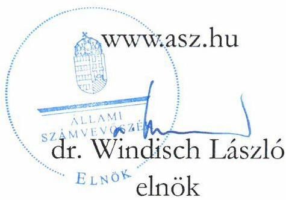
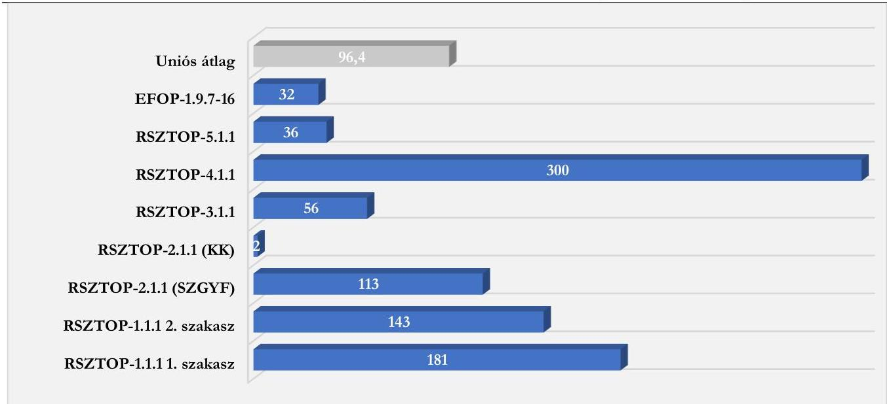
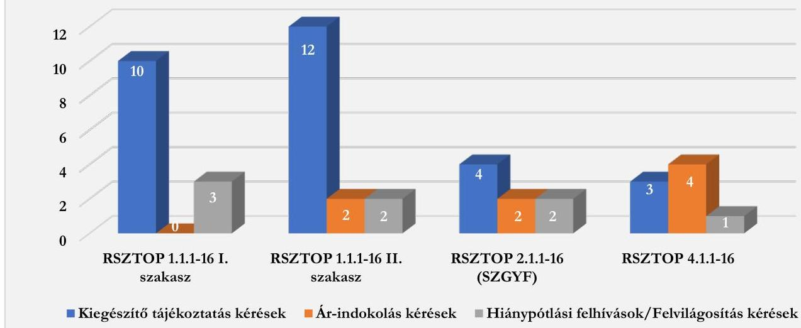
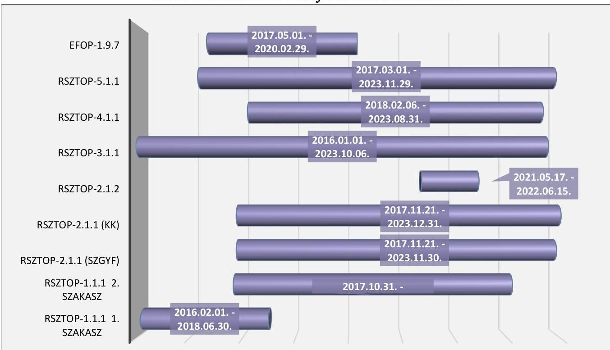
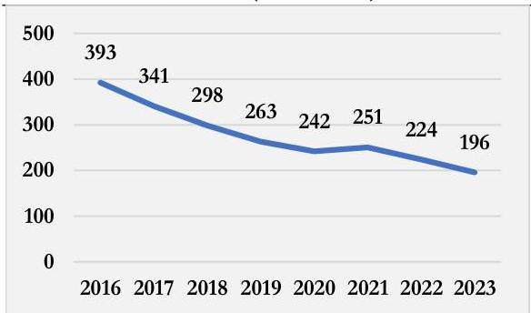
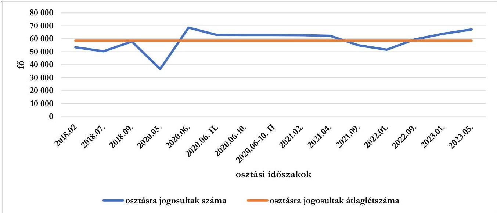
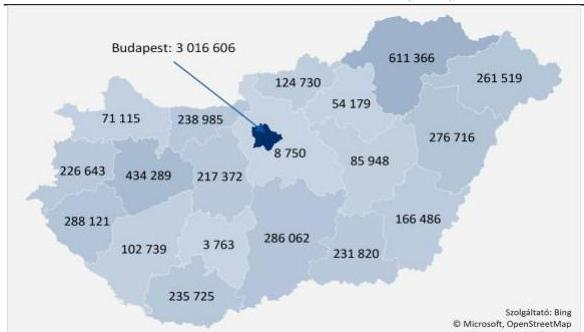
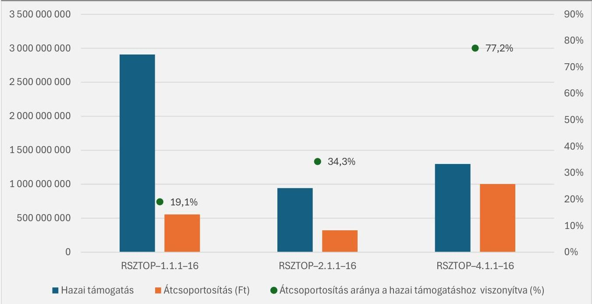

ÁLLAMI SZÁMVEVŐSZÉK

# JELENTÉS

A rászoruló személyeket támogató operatív programokból nyújtott támogatások felhasználásának ellenőrzése

2025.

25069

www.asz.hu

---

ÁLLAMI SZÁMVEVŐSZÉK

# JELENTÉS

A rászoruló személyeket támogató operatív programokból nyújtott támogatások felhasználásának ellenőrzése

2025.

25069

---

Jelentéseink az interneten a www.asz.hu címen olvashatók.

ELLENŐRZÉSI IGAZGATÓSÁG:
ELLENŐRZÉSI IGAZGATÓSÁG I.

ELLENŐRZÉSI IGAZGATÓ:
SINKÁNÉ DR. CSENDES ÁGNES igazgató

ELLENŐRZÉSVEZETŐ:
DR. KOVÁCS DIÁNA ellenőrzésvezető

IKTATÓSZÁM: EL-4309-001/2025

TÉMASORSZÁM: -

ELLENŐRZÉS-AZONOSÍTÓ SZÁM: V1063

---

TARTALOMJEGYZÉK

- AZ ELLENŐRZÉS ALAPADATAI ... 5
- AZ ELLENŐRZÉS HATÓKÖRE ÉS TERÜLETE ... 8
- ÖSSZEFOGLALÁS ... 10
- AZ ELLENŐRZÉS FÓKUSZTERÜLETEI ... 12
- MEGÁLLAPÍTÁSOK ... 13
- JAVASLATOK ... 39
- MELLÉKLETEK ... 40
- I. sz. melléklet: Értelmező szótár ... 40
- II. sz. melléklet: Az ellenőrzött szervezetek jegyzéke ... 43
- III. sz. melléklet: Ellenőrzési kritériumok ... 44
- IV. sz. melléklet: Az ellenőrzött RSZTOP projektek célértékeinek és teljesítéseinek összehasonlítása ... 46
- FÜGGELÉK: ÉSZREVÉTELEK ... 47
- RÖVIDÍTÉSEK JEGYZÉKE ... 53

---

“哈，你是个小伙子，你是个小伙子，你是个小伙子，你是个小伙子，你是个小伙子，你是个小伙子，你是个小伙子，你是个小伙子，你是个小伙子，你是个小伙子，你是个小伙子，你是个小伙子，你是个小伙子，你是个小伙子，你是个小伙子，你是个小伙子，你是个小伙子，你是个小伙子，你是个小伙子，你是个小伙子，你是个小伙子，你是个小伙子，你是个小伙子，你是个小伙子，你是个小伙子，你是个小伙子，你是个小伙子，你是个小伙子，你是个小伙子，你是个小伙子，你是个小伙子，你是个小伙子，你是个小伙子，你是个小伙子，你是个小伙子，你是个小伙子，你是个小伙子，你是个小伙子，你是个小伙子，你是个小伙子，你是个小伙子，你是个小伙子，你是个小伙子，你是个小伙子，你是个小伙子，你是个小伙子，你是个小伙子，你是个小伙子，你是个小伙子，你是个小伙子，你是个小伙子，你是个小伙子，你是个小伙子，你是个小伙子，你是个小伙子，你是个小伙子，你是个小伙子，你是个小伙子，你是个小伙子，

---

AZ ELLENŐRZÉS ALAPADATAI

## AZ ELLENŐRZÉS CÉLJA

Az ellenőrzés célja annak értékelése volt, hogy a rászoruló személyeket támogató operatív programokhoz kapcsolódó beszerzések, kifizetések és pénzügyi elszámolások megfelelőek voltak-e, a programok keretében nyújtott támogatások, beszerzések felhasználása célszerű, hatékony és eredményes volt-e.

## AZ ELLENŐRZÉS TÍPUSA

kombinált ellenőrzés

## AZ ELLENŐRZŐTT IDŐSZAK

2016-2023. évek, a helyszíni ellenőrzés lezárásának időpontjáig, 2024. szeptember 30-ig.

## AZ ELLENŐRZÉS TÁRGYA

Az ellenőrzés tárgyát képezte a rászoruló személyeket támogató operatív programok szabályszerű, eredményes, hatékony és cél szerinti megvalósítása. Az ellenőrzés kiterjedt minden olyan körülményre és adatra, amely az ÁSZ¹ jogszabályban meghatározott feladatainak teljesítéséhez, valamint a program végrehajtása folyamán felmerült újabb összefüggések feltárásához szükséges volt.

## AZ ELLENŐRZÉS JOGALAPJA

Az ellenőrzés jogszabályi alapját az ÁSZ tv.² 5. § (2)-(3) bekezdései képezték.

## AZ ELLENŐRZÉS MÓDSZERE

Az ellenőrzést a nemzetközi standardokat irányadónak tekintve az ellenőrzési program szempontjai, az ellenőrzött időszakban hatályos jogszabályok, az ellenőrzés szakmai szabályok, valamint az ÁSZ módszertanok figyelembevételével végezte az ÁSZ.

Az ellenőrzési kérdések megválaszolásához szükséges bizonyítékok megszerzése az ellenőrzött szervezetek, valamint további adatszolgáltató szervezetek által rendelkezésre bocsátott dokumentumokra és adatokra alapozva, valamint megfigyelés, szemle (szemrevételezés), kérdésfeltevés (információkérés), mintavétel és elemző eljárás útján történt.

Az ellenőrzési bizonyítékként felhasználható adatforrások közé tartoztak egyrészt az ellenőrzéshez kért dokumentumok, adatforrások, másrészt adatforrás volt minden, az ellenőrzés folyamán feltárt, az ellenőrzés szempontjából információkat tartalmazó dokumentum.

5

---

Az ellenőrzés alapadatai

Az ellenőrzés lefolytatásához az ellenőrzött szervezetek, valamint az ellenőrzést támogató szervezetek tanúsítványok kitöltésével, valamint az ÁSZ által kért dokumentumok, információk megküldésével szolgáltattak adatokat.

A 2. fókuszterület mintavétellel ellenőrzendő részterülete a rászoruló személyeknek biztosítandó természetbeni juttatások közbeszerzése volt. A közbeszerzések ellenőrzéséhez szükséges mintatételek a projekteket érintő közbeszerzési eljárásokból kockázati alapon kerültek kiválasztásra. Kockázatként került azonosításra az eljárás időtartama, a becsült érték és a szerződéses érték közötti eltérés, az aránytalanul alacsony ár eljárásban történő megállapítása, vitarendezés vagy jogorvoslat igénybevétele, továbbá az eredménytelen eljárás. Az ellenőrzött hét projekt tekintetében egy-egy közbeszerzési eljárás – az RSZTOP-2.1.1-16 projekt tekintetében kedvezményezettenként egy-egy – került kiválasztásra, így az SZGYF³-et érintően hat, a HKA⁴-nál és a KK⁵-nál pedig egy-egy közbeszerzési eljárás ellenőrzésére került sor. Az MMSZ⁶ közbeszerzési eljárást nem folytatott le, így a 2. fókuszterületet érintő ellenőrzésre esetében nem került sor.

A 3. fókuszterületnél az RSZTOP-1.1.1 2. szakasz, a 2.1.1 és a 4.1.1 projekt tekintetében az ellenőrzés során projektenként, illetve kedvezményezettenként véletlenszerűen 10 osztási hely, az RSZTOP-1.1.1 1. szakasz tekintetében véletlenszerűen három osztási hely, majd az osztási helyeken belül egy-egy osztási nap került mintatételként kiválasztásra. Az adott osztási helyen és napon valamennyi csomagátadás ellenőrzésre került. Az RSZTOP-3.1.1 projekt ellenőrzése során véletlenszerűen három osztási hely, azon belül öt-öt osztási nap került mintatételként kiválasztásra. Az adott osztási helyen és napon valamennyi ételosztás ellenőrzésre került. Az RSZTOP-2.1.2 projekt ellenőrzése során véletlenszerűen öt osztási hely került mintatételként kiválasztásra. A kiválasztott osztási helyeken mindhárom osztási időpont valamennyi csomagátadása ellenőrzésre került.

A csomagok selejtezésének ellenőrzése az SZGYF projektjei közül az RSZTOP-1.1.1 1-2. szakasz, az RSZTOP-2.1.1 és az RSZTOP-4.1.1 projekteket érintette, melynek során projektenként az öt legmagasabb selejtezési értékű tétel került mintatételként kiválasztásra.

A 4. fókuszterület esetében az EFOP-1.9.7 projekt személyi juttatásai, az RSZTOP-1.1.1 1-2. szakasz, a 4.1.1. és az 5.1.1 projekt dologi kiadásai tekintetében összeg/érték szerinti mintavétel történt. Az RSZTOP-5.1.1 és az EFOP-1.9.7 projektek ellenőrzött tárgyi eszköz beszerzései elemző célú, kockázatalapú (szakértői) mintavétellel kerültek kiválasztásra. Az RSZTOP-2.1.1 projektben a KK-t érintően, valamint az RSZTOP-3.1.1 projektnél partnerenként a legnagyobb összegű tétel került kiválasztásra. Az RSZTOP-2.1.2 projekt tekintetében az egyik partner három legnagyobb összegű számlájának ellenőrzésére került sor.

A megállapítások az ellenőrzött mintatételekre vonatkozóan kerültek megfogalmazásra, kivetítés nem történt.

Tételes ellenőrzés történt az RSZTOP-2.1.1 projektnél az SZGYF dologi kiadásait, az RSZTOP-5.1.1 és az EFOP-1.9.7 projektek felhalmozási kiadásait érintően, valamint az RSZTOP 2.1.2 projektnél egy szállító számlája tekintetében.

Az RSZTOP⁷ projektek keretében megkötött támogatási szerződések mindegyikének 1. pontja tartalmazta, hogy „...a Felhíváson és a támogatási kérelmen túl a Szerződés mellékletét képezi, és a Szerződő Felekre kötelező érvényű minden olyan tanulmány, elemzés, hatósági engedély, műszaki terv és tartalom, nyilatkozat, beszerzési terv, társulási megállapodás és egyéb dokumentum, valamint ezek módosításai, amelyet a Kedvezményezett a támogatási kérelemmel együtt vagy a későbbiekben benyújtott, akkor is, ha azok fizikai értelemben nem kerültek csatolásra a Szerződéshez.” Ennek megfelelően mind a Felhívás¹⁻⁵-öt, mind az MVT¹⁻¹³⁶-at kritériumként vette figyelembe az ÁSZ az ellenőrzés során.

---

Az ellenőrzés alapadatai

Az ÁSZ az ellenőrzés során az RSZTOP-1.1.1, -2.1.1, -2.1.2, -3.1.1, -4.1.1 projektek eredményességét értékelte. A projektet az ÁSZ akkor tekintette eredményesnek, ha a projekt végrehajtása során a Felhívásokban, valamint a támogatási szerződésekben meghatározott célértékek a célértékek elérésére meghatározott időpontig teljesültek. Az ÁSZ a támogatások felhasználását akkor tekintette hatékonynak, ha az ellenőrzött szervezet a projekt végrehajtási idejében a termékek beszerzésének rendszerességét a közbeszerzési eljárások lefolytatásával az igény felmerülésének megfelelően folyamatosan biztosította. Az ÁSZ a közpénz felhasználását akkor tekintette gazdaságosnak, ha az igénybe vett erőforrások a megfelelő időben, helyen, mennyiségben és minőségben, valamint a legkedvezőbb áron álltak rendelkezésre.

7

---

AZ ELLENŐRZÉS HATÓKÖRE ÉS TERÜLETE

Az Európai Unió egyik célja, hogy csökkenjen a szegénységben és kirekesztettségben élők száma. Az ehhez kapcsolódó magyar vállalás szerint Magyarország 2020-ra mintegy félmillió fővel kívánta csökkenteni a szegénységben élők számát. A Nemzeti Társadalmi Felzárkózási Stratégiában⁹ megfogalmazott intézkedések alapeleme az együttműködés, a társadalmi kohézió, a közösségért, a személyes sorsért vállalt felelősség megerősítése.

Az ellenőrzés a 2014-2020-as programozási időszakban megvalósított, a következő táblázatban megjelölt projektekre terjedt ki.

1. táblázat

AZ ELLENŐRZŐTT PROJEKTEK FŐBB ADATAI

|  PROJEKTEK KODSZÁMA | KEDVEZME-NYEZETT | FELHÍVÁS CÍME | TÁMOGATÁSI SZERZŐDÉS SZERINTI TÁMOGATÁS (FT)  |
| --- | --- | --- | --- |
|  RSZTOP-1.1.1 1. szakasz | SZGYF | Élelmiszersegély biztosítása szegény gyermekes családok számára | 1 054 976 329  |
|  RSZTOP-1.1.1 2. szakasz |   |   | 18 336 636 435  |
|  RSZTOP-2.1.1 | KK | Alapvető fogyasztási cikkek biztosítása szegény gyermekes családok számára | 2 229 854 396  |
|   |   |   |  4 054 213 363  |
|  RSZTOP-2.1.2 | MMSZ | Alapvető fogyasztási cikkek biztosítása szegény gyermekes családok számára II. | 959 718 527  |
|  RSZTOP-3.1.1 | HKA | Közterületen élők számára természetbeni juttatás biztosítása | 5 566 739 910  |
|  RSZTOP-4.1.1 | SZGYF | Élelmiszersegély biztosítása szociálisan rászoruló megváltozott munkaképességű, valamint rendkívül alacsony jövedelmű időskorú személyek számára | 8 657 792 437  |
|  RSZTOP-5.1.1 |   | Rászoruló Személyeket Támogató Operatív Program - technikai segítségnyújtás | 169 000 000  |
|  EFOP-1.9.7 |   | Kísérő szolgáltatások nyújtása a rászoruló személyek számára | 764 250 864  |

Forrás: Felhívás J. J., és az ellenőrzött szervezetek adatszolgáltatása alapján ÁSZ saját szerkesztés

Az ellenőrzés a pályázati kiírások, a pályázati eljárások során született döntések, a kiállított támogatási okiratok (szerződések) előírásokkal való összhangját, a rászoruló személyeknek biztosítandó természetbeni juttatások közbeszerzéseinek – a lefolytatott eljárások időigénye, eredményességi aránya és a beszerzett termékek ár-érték szempontú elemzésével – gazdaságosságát vizsgálta. Az ellenőrzés kiterjedt továbbá a természetbeni juttatásban részesülő rászoruló személyek kiválasztásának és a természetbeni juttatás rászoruló személyek részére való eljuttatásának folyamatára, annak eredményességére, a biztosított juttatások pályázati céllal való összhangjára, valamint a támogatási projektekhez kapcsolódó kifizetések és pénzügyi elszámolások megfelelőségére.

Az ellenőrzés az ellenőrzött projektek kedvezményezettjeire – az SZGYF-re, a KK-ra, a HKA-ra és az MMSZ-re – terjedt ki, az ellenőrzött projektekben a támogatás keretösszege összesen 41,8 milliárd Ft volt (ld. 1. táblázat), melynek háromnegyedével az SZGYF rendelkezett. A támogatások finanszírozása 85%-ban EU-s, 15%-ban hazai forrásból történt.

Az ellenőrzést támogató szervezet az irányító hatóság $2.4^{10}$ volt.

8

---

Az ellenőrzés hatóköre és területe

Az SZGYF a belügyminiszter irányítása alá tartozó, központi hivatalként működő központi költségvetési szerv volt, amely az állam Szoc. tv.¹¹ és a Gyvt.¹² szerinti fenntartói feladatait látta el. Intézményfenntartói feladat- és hatáskörében ellátta a 316/2012. (XI. 13.) Korm. rendelet¹³ 4. §, 4/A. §-ok szerinti tevékenységeket, gyakorolta a 2012. évi CXCII. törvényből¹⁴ eredő fenntartói és tulajdonosi jogokat.

A KK az oktatásért felelős miniszter irányítása alá tartozó, központi hivatalként működő, 2012. szeptember 1-jén alapított központi költségvetési szerv volt. Közfeladata a Köznev. tv.¹⁵-ben meghatározott oktatási központ feladatainak ellátása, valamint a 134/2016. (VI.10.) Korm. rendelet¹⁶ 5. § (1) bekezdése alapján a Kormány által kijelölt középirányító szervként a tankerületi központok tekintetében az Áht.¹⁷ 9. § b) és g)–j) pontjában meghatározott irányítási, valamint a 9. § e) pontja és a 9/A. § (3) bekezdése szerinti hatékonysági, pénzügyi ellenőrzési hatáskörök gyakorlása volt.

A HKA-t a Kormány és egy minisztérium hozta létre 2004-ben. Az alapító képviseletét és jogainak gyakorlását a szociális területért felelős miniszter látta el. A HKA átvette és jelentősen kiegészítve folytatta az 1992-ben létrehozott Hajléktalanokért Alapítvány korábbi tevékenységét. A HKA célja volt a hajléktalan emberek szociális problémáinak enyhítése, a társadalomba való visszatérésük elősegítése, valamint a szociális gondozásukat végző más hajléktalan-ellátó szervezetek országos támogatása.

Az MMSZ 1989-ben alakult civil szervezet, az 1990-es évek közepére építette ki országos szervezetét. A budapesti országos központ mellett hét regionális szervezetben, számos helyi csoportban, több ezer önkéntessel végezték munkájukat. Az MMSZ feladata volt, hogy segítséget nyújtson a szükségben lévőknek, betegeknek, öregeknek, fogyatékkal élőknek, hátrányos helyzetűeknek, hajléktalanoknak, menekülteknek, zarándokoknak, valamint katasztrófák és háborús események áldozatainak, amelynek érdekében a társadalom és az egyén közös érdekeinek kielégítésére irányuló, az alapszabályában részletesen rögzített cél szerinti tevékenységeket végezte. Munkáját önkéntesen tevékenykedő és alkalmazotti jogviszonyban lévő személyek összefogásával látta el, akik a római katolikus vallás és a Máltai Lovagrend szellemében együttműködtek e feladatok teljesítésében.

9

---

ÖSSZEFOGLALÁS

Az ÁSZ a rászoruló személyeket támogató operatív programokhoz kapcsolódó beszerzések, kifizetések, pénzügyi elszámolások, valamint a programok keretében nyújtott támogatások felhasználásának ellenőrzésével kívánt hozzájárulni a Nemzeti Társadalmi Felzárkózási Stratégiában foglalt célok hatékony és eredményes teljesüléséhez.

Az ellenőrzött projektek pályázati kereteinek kialakítása – a kedvezményezettek kijelölésénél feltárt hiányosság mellett – megfelelő volt. A Kormány mindegyiket kiemelt projektnek minősítette és kijelölte azokat a szervezeteket, amelyek egyedülként voltak jogosultak támogatási kérelmet benyújtani. Az irányító hatóság: a kormányhatározatokban nevesített támogatást igénylők körének biztosította a hozzáférést a felhívásokhoz, valamint a pályázati rendszerek kereteinek kialakítása során olyan objektív és mérhető kritériumokat határozott meg, amelyek alkalmasak voltak a támogatói döntések megalapozásához, egyúttal biztosíthatták a projektcélok eredményes és hatékony megvalósítását is.

A közbeszerzési eljárások során a sorozatosan elhúzódó eljárási cselekmények, az eredménytelenül, vagy a szerződés teljesítése nélkül záródó eljárások nem járultak hozzá a támogatások hatékony felhasználásához, ezáltal nemcsak a projekt célcsoportjait érintették hátrányosan, de az Európai Unió és Magyarország céljainak teljesítését – miszerint csökkenjen a szegénységben és kirekesztettségben élők száma – sem segítették elő. Az SZGYF a közbeszerzési eljárást megindító felhívásban azt kérte a közbeszerzési pályázaton induló beszállítóktól, hogy ajánlati áraikat úgy határozzák meg, hogy azok az élelmiszerek, illetve fogyasztási cikkek tényleges árán felül egyéb költségeket (szállítás, csomagolás, raktározás stb.) is tartalmazzanak. A nagyobb tételben történő kiosztáshoz, egységcsomagok kialakításához szükséges további költségek az élelmiszerek és fogyasztási cikkekért fizetendő ellenértéket a piaci viszonyokban ezen költségek nélkül számított árhoz képest jelentősen növelték.

Az elszámolásra benyújtott számlákból nem volt megállapítható, hogy mekkora részt képviselt a csomagba került termékek ára és a kapcsolódó költségek, ezáltal az SZGYF-nél sérült a közpénzek felhasználásának átláthatósága.

Az ezzel összefüggésben felmerült költségvetési csalás bűntett elkövetésének gyanúja miatt a helyszíni ellenőrzés lezárásakor a NAV Bűnügyi Főigazgatósága előtt már büntetőeljárás volt folyamatban egyes projektek vonatkozásában.

Az SZGYF által megvalósított RSZTOP-1.1.1, -2.1.1 és -4.1.1 projektek mindegyikénél előfordult a Felhívás₁ előírásaitól eltérő támogatott célcsoportok meghatározása. Az SZGYF az RSZTOP-1.1.1 projektben a csomagok egyedi azonosítására az MVT₁,₃-ban előírtakat nem alkalmazta, így a csomagok egyedi nyomon követése nem volt biztosított. Az RSZTOP-4.1.1 projekt esetében – habár a teljes végrehajtási idő öt és fél év volt, abból másfél évig szünetelt a csomagosztás – a közbeszerzési eljárás elhúzódása miatt nem volt biztosított a Felhívás₁-ben előírt rendszeresség. Az EFOP 1.9.7 projekt közel hároméves végrehajtási idején túl a kísérő szolgáltatások nem voltak elérhetők az SZGYF csomagosztásai alkalmával, így a rászorulók nem kaphattak tanácsadói segítséget a helyzetükből való kilábalás érdekében. Az SZGYF az RSZTOP-1.1.1, -2.1.1 és -4.1.1 és az EFOP-1.9.7 projekteknél a kötelező projektszintű könyvvizsgálatot nem végeztette el.

A KK által megvalósított RSZTOP-2.1.1 projektben az első három osztás során a folyamatleírás₁₋₃¹⁸ szerinti célcsoportmeghatározás nem felelt meg a Felhívás₁-ben meghatározottaknak, továbbá nem minden esetben tudta az ellenőrzött szervezet igazolni a támogatásban részesített gyermek támogatásra jogosultságát.

10

---

Összefoglalás

A HKA az RSZTOP-3.1.1 projekt végrehajtása során szabályszerűen járt el, az étkeztetés lebonyolítása, dokumentáltsága megfelelt a Felhívás₃-ban és az MVT₁₁-ben foglaltaknak.

Az MMSZ az RSZTOP-2.1.2 projekt végrehajtása során a Felhívás₂ címe és célja szerinti támogatásra jogosultak körét kiterjesztően értelmezte. Az MMSZ Szakmai terve¹⁹ a célcsoport lehatárolásában nem határozta meg, hogy a FETE²⁰ településen lakók tekintetében a Felhívás₂ célcsoportra vonatkozó követelményének milyen módon tesz eleget, mivel abból indultak ki, hogy a FETE településen élők mindegyike rászorult a csomagra.

Az ellenőrzött projektek összességében eredményesnek tekinthetők abból a szempontból, hogy a támogatási szerződéseken előírt célértékeket az érintett szervezetek – az MMSZ kis mértékű elmaradása mellett – teljesítették.

Az ellenőrzött hét projektból négy esetében került sor szabálytalanság miatti pénzügyi korrekcióra. A szabálytalanságok kizárólag a központi költségvetési szerveket érintették. A szabálytalanságokból eredő átcsoportosítások összesen 1 881,5 M Ft többletterhet jelentettek a központi költségvetés számára, amely a hét projekt támogatási szerződéseiben szereplő összes támogatás 4,5%-a volt.

Az ÁSZ által vizsgált projektek célja az volt, hogy segítsék a szegénységben vagy társadalmi kirekesztettségben élők mindennapjait. A támogatások szabályszerű és eredményes felhasználása különös jelentőséggel bír, hiszen a támogatások célcsoportjaiba a leginkább rászoruló személyek tartoztak. A közterületen élők számára biztosított napi ételadagok képesek voltak a hajléktalanok csoportjának megkönnyíteni a mindennapjaikat, de emellett rendkívül fontosak voltak a kilábalást segítő kísérő intézkedések és szolgáltatások is, amelyek nélkül a programok hosszú távú pozitív hatása nem várható. Az ellenőrzés alapján megállapítható, hogy azok a szervezetek, amelyek egyébként is jelen voltak akár a hajléktalan-ellátásban, akár a felzárkózó településeken, sikeresebben tudták végrehajtani a projektjeiket, mint azok a szervezetek, amelyek bár a szociális ellátásban jelen voltak, de nem volt közvetlen kapcsolatuk a támogatások célcsoportjaival. Az ÁSZ által ellenőrzött programok végrehajtásában feltárt hiányosságok hátráltatták a programok hatékony végrehajtását.

11

---

12

# AZ ELLENŐRZÉS FÓKUSZTERÜLETEI

1.  A projektek pályázati kereteinek kialakítása
2.  Közbeszerzési eljárások lefolytatása
3.  Szakmai feladatellátás
4.  Pénzügyi elszámolások

---

MEGÁLLAPÍTÁSOK

# 1. A projektek pályázati kereteinek kialakítása

## Összegző megállapítás
A projektek pályázati kereteinek kialakítása – a kedvezményezettek kijelölésénél feltárt hiányosság mellett – megfelelő volt.

Az ellenőrzött projektek tekintetében a pályázati rendszer kereteit az irányító hatóság, alakította ki a Felhívás.¹² és támogatási szerződés-minták összeállításával, valamint a kijelölt kedvezményezettekkel történő támogatási szerződések megkötésével. Az irányító hatóság, rendelkezett az ellenőrzéssel érintett időszakra vonatkozóan az Áht. előírása szerint SZMSZ-szel²², amely alapján az európai uniós fejlesztéspolitikáért felelős államtitkár irányítása alá tartozó szervezeti egységek feladatai és eljárásrendje²³ külön utasításokban kerültek meghatározásra.

Az irányító hatóság, a 272/2014. (XI. 5.) Korm. rendelet²⁴ 20. §-ának 13. pontja szerinti lehetőséget nem alkalmazta, így közreműködő szervezet nem került kijelölésre.

A 223/2014/EU rendelet²⁵ 19. cikk (6) bekezdésének d) pontja akként rendelkezik, hogy az irányító hatóság biztosítja, hogy a potenciális kedvezményezettek hozzáférjenek a finanszírozási lehetőségekre, a pályázati felhívások kiírására és feltételeire, valamint a támogatni kívánt műveletek kiválasztására vonatkozó információkhoz.

A Kormány az 1037/2016. (II. 9.) Korm. határozatban²⁶, illetőleg az 1347/2016. (VII. 6.) Korm. határozatban²⁷ valamennyi projektet kiemelt projektként nevesítette és valamennyi projekt tekintetében kijelölte azokat a szervezeteket, akik egyedüliként jogosultak voltak támogatási kérelmet benyújtani. A kormányhatározatok támogatást igénylőként az RSZTOP-1.1.1, 2.1.1, 4.1.1, 5.1.1, valamint EFOP-1.9.7 projektek tekintetében az SZGYF-et, az RSZTOP-2.1.2 projekt tekintetében az MMSZ-t, az RSZTOP-3.1.1 projekt tekintetében a HKA-t nevesítették. Az 1321/2019. (V. 30.) Korm. határozat²⁸ az RSZTOP 2.1.1 projekt tekintetében konzorciumi partnerként a KK-t határozta meg. Az irányító hatóság, a kormányhatározatokban nevesített támogatást igénylők körének biztosította a hozzáférést a felhívásokhoz.

Az MMSZ kijelölésére nem az RSZTOP 1.1²⁹ 3.2. pontjában leírtakkal összhangban került sor, ugyanis a projekt fő kedvezményezettjei kizárólag közfeladatot ellátó szervezetek (központi állami szervek és közalapítványok) lehettek.

Az irányító hatóság, -nek a 272/2014. (XI. 5.) Korm. rendelet 48. § (1) bekezdésében rögzített, a kiemelt projektekre vonatkozó kivételi szabályra tekintettel, nem kellett a felhívások tervezetét társadalmi egyeztetésre bocsátania.

A projektek pályázati kereteinek kialakítása során nagyobb hangsúlyt érdemes fordítani a kiemelt projektek kedvezményezettjeinek kiválasztási szempontjaira, mivel a szakmai feladatellátásra kiválasztott szervezet a projektek megvalósítását nagy mértékben befolyásolja.

13

---

Megállapítások

A kijelölt támogatást igénylők köré meghatározta a projektek elbírálásának eredményeként kihirdetett kedvezményezetteket is, azonban az egyedüli igénylők körülménye mellett az irányító hatóság: a Felhívás₁₋₅-ben objektív és mérhető kritériumokat határozott meg a támogatási kérelmekről való döntés megalapozásához. A Felhívás₁ 4.4.3. pontjában, a Felhívás₂, a Felhívás₄, illetőleg a Felhívás₅ 4.4.2.3. pontjában szereplő elemek a támogatást igénylő szervezetre, a támogatási célokhoz való illeszkedésre, a pályázat szakmai tartalmára és a pénzügyi tervre tartalmaztak objektíven mérhető értékelési szempontokat.

Az irányító hatóság: a támogatási kérelmek elbírálásakor az azokban, illetőleg az azok mellékleteként benyújtott megvalósíthatósági tanulmányokban, pénzügyi tervekben, felmérési összefoglalókban és közbeszerzési tervekben szereplő adatok és információk alapján vizsgálta a Felhívás₁₋₅-ben előírt objektív és mérhető kritériumoknak való megfelelést.

A Felhívás₁ kilenc, a Felhívás₃ négy, a Felhívás₄ hat, a Felhívás₅ pedig három esetben került módosításra. A módosításokra a keretösszegek változása, valamint az indikátorok és a kapcsolódó mérföldkövek változása miatt volt szükség.

A Felhívás₁ 3.2.2 pontja az RSZTOP-1.1.1, -2.1.1 projektek tekintetében a célcsoport meghatározásánál 2. számú prioritásként jelölte meg a leghátrányosabb helyzetű térségben élők támogatását, azonban a leghátrányosabb helyzetű térség fogalmát sem a Felhívás₁, sem jogszabály nem határozta meg. A 290/2014. (XI. 26.) Korm. rendelet³⁰ nem tartalmazta a leghátrányosabb helyzetű térségek fogalmát, azonban az SZGYF – az irányító hatóság útmutatása alapján – a végző kedvezményezetti célcsoport kialakításánál ezen kormányrendelet szerinti besorolást vette figyelembe.

A 223/2014/EU rendelet 5. cikk (12) bekezdése alapelvként rögzítette minden ellenőrzött projektre vonatkozóan, hogy a támogatott műveleteknek egyaránt meg kell felelniük az alkalmazandó uniós jognak és az uniós jog alkalmazásához kapcsolódó nemzeti jognak.

Az irányító hatóság: által kibocsátott Felhívás₁₋₅ 8. pontja a projektkiválasztási eljárással és a projektmegvalósítással kapcsolatos irányadó szabályként jelölte meg a 223/2014/EU rendeletet, az 532/2014/EU rendeletet³¹, valamint az 1255/2014/EU rendeletet³².

A Felhívás₁ 3.2.8. pontja, a Felhívás₂,₄,₅ 3.5.1. pontja, valamint a Felhívás₃ 3.3.1. pontja rögzítette, hogy a kedvezményezett a projekt végrehajtása során a projekt megvalósításának időpontjában hatályos, az uniós joggal összhangban megalkotott és alkalmazott közbeszerzési törvény, illetve annak vonatkozó végrehajtási rendeletei, továbbá a 272/2014. (XI. 5.) Korm. rendeletben foglaltak szerint köteles eljárni. Az irányító hatóság – az élelmiszer-ipari termékek és áruk kiválasztási szempontjainak éghajlati és környezeti vonatkozásai kivételével – a projektek kereteinek összeállítása során figyelembe vette az uniós előírásokban rögzített – az uniós jognak való megfelelés, az elérni tervezett célcsoport bemutatása, és a rászoruló személyek méltóságának tiszteletben tartása – alapelvek megvalósulását.

A 223/2014/EU rendelet 5. cikk (13) bekezdésében szereplő alapelvi előírás – miszerint az élelmiszer-ipari termékek és áruk kiválasztási szempontjai esetében az éghajlati és környezeti vonatkozásokat az élelmiszer-pazarlás csökkentése céljából figyelembe veszik – nem jelent meg a Felhívás₁₋₅-ben.

A támogatási kérelmek és mellékleteik a 272/2014. (XI. 5.) Korm. rendelet szerint valamennyi projekt tekintetében rendelkezésre álltak. A támogatási kérelmeket valamennyi projekt tekintetében a Felhívás₁₋₅-ben és a 272/2014. (XI. 5.) Korm. rendeletben meghatározottak szerint, a Felhívás₁₋₅-ben meghatározott módon nyújtották be az irányító hatóság₁-hez.

14

---

Megállapítások

Az irányító hatóság: a 272/2014. (XI. 5.) Korm. rendelet szerint valamennyi projekt tekintetében elvégezte a támogatási kérelmek jogosultsági ellenőrzését a Felhívás₁₋₅ 4.1-4.2. pontjaiban előírt tartalmi feltételek vizsgálatával.

A 272/2014. (XI. 5.) Korm. rendelet szerinti döntés előkészítő bizottságok felállítására nem került sor, mivel a kedvezményezettek valamennyi projekt esetében a 272/2014. (XI. 5.) Korm. rendelet X. fejezete szerinti kiemelt kiválasztási eljárásrend alapján kerültek kiválasztásra.

A kedvezményezettek részére a 272/2014. (XI. 5.) Korm. rendelet szerint valamennyi projekt tekintetében kibocsátották a támogatási szerződéseket. A támogatási szerződések a 272/2014. (XI. 5.) Korm. rendelet előírásainak eleget téve tartalmazták a támogatott tevékenység meghatározását, a projektszintű mérföldköveket, a műszaki-szakmai tartalom leírását, a teljesítendő indikátorokat és azok célértékeit, teljesítésük határidejét, a projektre vonatkozó horizontális követelmények egyértelmű, nyomon követhető meghatározását, a projekt fizikai befejezésének, megvalósításának határidejét, a támogatás rendelkezésre bocsátásának módját és feltételeit, a támogatás – ideértve az előleget is – igényléséhez benyújtandó alátámasztó dokumentumok felsorolását, valamint a beszámolással és az ellenőrzéssel kapcsolatos szabályokat. A támogatási szerződések tartalmazták továbbá a jogosulatlanul igénybe vett támogatás jogkövetkezményeit, visszafizetésének rendjét, a visszafizetés biztosítékait és a biztosíték-mentesség tényét a biztosíték-mentesség alapjául szolgáló jogszabályi rendelkezés egyértelmű megjelölésével, a támogatással kapcsolatos iratok, valamint a támogatás felhasználását alátámasztó bizonylatok teljes körű megőrzésének határidejét, az adatszolgáltatásokhoz szükséges adatok és az azokban bekövetkező változások irányító hatóság felé történő bejelentésének kötelezettségét, valamint a bejelentési kötelezettség elmulasztásának következményeit.

15

---

Megállapítások

# 2. Közbeszerzési eljárások lefolytatása

## Összegző megállapítás

Az KK-nál és a HKA-nál az ellenőrzéssel érintett közbeszerzési eljárások lefolytatása szabályszerű volt. Az SZGYF-nél a közbeszerzések lefolytatásánál sérült a közpénzek felhasználásának átláthatósága.

Az SZGYF, a KK és a HKA az ellenőrzött időszakban a Kbt.³³ előírásainak megfelelően rendelkezett közbeszerzési szabályzattal.¹,³⁴, amelyekben meghatározták a közbeszerzési eljárások előkészítésének, lefolytatásának, valamint belső ellenőrzésének felelősségi rendjét, az ajánlatkérő nevében eljáró, illetve az eljárásba bevont személyek, szervezetek felelősségi körére, a közbeszerzési eljárások során hozott döntésekért felelős személyekre, az eljárások dokumentálási rendjére, valamint az összeférhetetlenségre vonatkozó előírásokat. A KK – az ellenőrzött eljárás megkezdésének időpontjára tekintettel – a közbeszerzési szabályzat-ban meghatározta az EKR³⁵ alkalmazására vonatkozó jogosultságok gyakorlásának rendjét is.

Az SZGYF, a KK és a HKA az ellenőrzött eljárások időszakában rendelkeztek a Kbt.-ben előírtaknak megfelelően elfogadott közbeszerzési tervvel, amelyet határidőben, legkésőbb a tárgyév március 31. napjáig elkészítettek és amely minden esetben tartalmazta az ellenőrzött közbeszerzési eljárásokat. A KK 2023. évi közbeszerzési terve a 424/2017. (XII. 19.) Korm. rendelet³⁶ előírásainak megfelelő adattartalommal – közbeszerzés tárgya, tervezett mennyisége, irányadó eljárási rend, eljárás fajtája, megindítás tervezett időpontja, szerződés teljesítésének várható időpontja – került az EKR rendszerbe feltöltésre. A Kbt.-ben előírtakkal összhangban minden ellenőrzött közbeszerzési eljárásnál felelős akkreditált közbeszerzési szaktanácsadó került bevonásra, az eljárásokban résztvevők mindannyian tettek összeférhetetlenségi nyilatkozatot, továbbá rendelkezésre álltak az ajánlatkérő nevében eljáró, illetve az eljárásba bevont személyek és szervezetek megbízólevél, amelyben a közbeszerzés tárgya szerinti – szakmai, pénzügyi, jogi, közbeszerzési – szakértelem megjelölésével és a közbeszerzési szabályzat-¹⁻⁵-ban foglaltak szerint az eljárások belső felelősségi rendjével összhangban kerültek kijelölésre a bírálóbizottság tagjai.

Az SZGYF a jogszabályi rendelkezésekkel összhangban a szükséges közbeszerzési eljárásokat lefolytatta. A közbeszerzési eljárás megindítását megelőzően az SZGYF az uniós értékhatárt elérő közbeszerzései tekintetében a 272/2014. (XI. 5.) Korm. rendelet előírásainak megfelelően kezdeményezte a közbeszerzési dokumentumok támogathatósági, elszámolhatósági, valamint műszaki szempontú minőségellenőrzését az irányító hatóság-nek, valamint a közbeszerzésekért felelős miniszter általi ellenőrzését, amely feladatot a KFF³⁷ látta el.

A közbeszerzési eljárás lefolytatása során az ajánlattevők által írásban kért kiegészítő tájékoztatásokat az SZGYF a Kbt. előírásai szerint minden esetben határidőben teljesítette és az eljárást lezáró döntését egy eljárás kivételével a 272/2014. (XI. 5.) Korm. rendeletben foglaltak szerint hozta meg. Az SZGYF az RSZTOP-4.1.1 projekt keretében ellenőrzött közbeszerzési eljárása során megsértette a 272/2014. (XI. 5.) Korm. rendelet 106. § (2) bekezdésben foglaltakat, mert az eljárást lezáró döntését nem a közbeszerzésekért felelős miniszter által kiállított záró tanúsítvány megküldését követően, hanem azt megelőzően hozta meg. Az ajánlatok elbírálásáról szóló írásbeli összegezés a jogszabályi előírásokkal összhangban megküldésre került a KFF felé.

16

---

Megállapítások

A beszerzési eljárás eredményéről szóló hirdetmény közzétételét – az EFOP-1.9.7 projekt kivételével, amely központosított beszerzés lévén a központi beszerző szervet érintő kötelezettség volt – az SZGYF minden ellenőrzött projekt esetében a Kbt.-ben foglaltaknak megfelelően teljesítette. Eredményes közbeszerzési eljárás alapján – kivéve az RSZTOP-5.1.1-16 projekt keretében ellenőrzött eljárást, amely eredménytelen volt – a szerződést az ajánlati kötöttség Kbt.-ben meghatározott időtartama alatt és a nyertes ajánlattevővel kötötték meg, a közbeszerzési eljárásban közölt végleges feltételek, a szerződéstervezet és az ajánlat tartalmának megfelelően.

Az RSZTOP-1.1.1 1-2. szakasz, valamint RSZTOP-2.1.1 projektek keretében ellenőrzött közbeszerzési eljárások eredményeként megkötött szerződések módosítására kerültek, amelyek megkötését megelőzően az SZGYF az irányító hatóság; és azt követően a közbeszerzésekért felelős miniszter írásbeli véleményét minden esetben megkérte. A szerződésmódosítások az érintett eljárások tekintetében a Kbt. hatályos rendelkezéseivel összhangban történtek.

Kötbérigény érvényesítésére egy ellenőrzött eljárás – RSZTOP-4.1.1 projekt – tekintetében került sor, amely eljárásban az SZGYF a nem szerződésszerű teljesítéssel kapcsolatos, Kbt.-ben előírt jelzési kötelezettségének eleget tett a Közbeszerzési Hatóság felé. A kötbérigény érvényesítésére ajánlattevő felé tett többszöri eredménytelen felszólítást követően az SZGYF polgári peres úton kezdeményezte a kötbérigény teljesítésének kikényszerítését. Az RSZTOP-4.1.1 projekt 2023. november 28-án kelt záró szakmai beszámolójában az SZGYF az irányító hatóság-t a polgári peres eljárás le nem zárásáról tájékoztatta, valamint arról, hogy az ajánlattevő az adásvételi szerződés felmondása jogellenességének megállapítása iránt szintén polgári peres eljárást indított az SZGYF-fel szemben.

A Felhívás: nem tartalmazott kötelező rendelkezést – pl. a termékek szállítását ellátó – közreműködő szervezet igénybevételére, de nem is tiltotta azt. A Felhívás: általános megfogalmazású 3.2.3. pontja szerint a kedvezményezettnek együtt kell működnie az adott projekt megvalósításban közreműködő ellátórendszer szereplőivel és a hivatalos szervekkel. Az SZGYF által benyújtott támogatási kérelmekben nem szerepelt szállító közreműködő igénybevétele, a helyi gyermekjóléti szolgálatok, és esetlegesen a tanyagondnokok, védőnők segítségével határozta meg elérni az érintett célcsoport tagjait, a csomagok átadás-átvételéről való gondoskodást, és az ezzel járó adminisztrációt.

Az SZGYF a támogatási szerződések megkötését követően megindított közbeszerzési eljárások ajánlattételi felhívásaiban a nyertes ajánlattevő feladataként az élelmiszer/fogyasztási cikk egységcsomagok összeállítását és a megadott helyszínekre történő leszállítását határozta meg. Az eljárásokhoz készített ajánlati dokumentáció előírta, hogy az ajánlati árnak tartalmaznia kell a szerződésszerű teljesítéshez szükséges valamennyi felmerülő munka-, szállítási, illetve kiszállási és egyéb költségeket – ideértve fuvarozás, tárolás, rakodás, csomagolás, hatósági engedélyek költségeit is – valamint a különféle vámköltségeket és adókat az általános forgalmi adó kivételével.

Az ajánlati dokumentációk mellékletét képező szerződéstervezetekben szerepelt, hogy eladó az árut (a megrendelt termékeket) a megrendelt mennyiségben, szerződésszerű minőségben, saját gépjárműveivel köteles a teljesítési helyre leszállítani. A leszállítás magában foglalta az áru teherautókról történő lepakolását, és a konkrét átvétel helyszínéig (raktárhelyiségekig) történő berakodást is.

Az RSZTOP 1.1.1 1. szakasz szerződéstervezeteiben rögzítették, hogy a szerződéses ellenérték tartalmazza mindazt, amely a komplettséghez, a szerződésszerű, és hibátlan teljesítéshez hozzátartozik; így különösen:

- „a termékekkel kapcsolatos mindennemű adó-, vám-, illeték-, járulékfizetési kötelezettséget, árfolyamkockázatot,

---

Megállapítások

- a szükséges import és export engedélyek beszerzésével kapcsolatos költségeket, a belföldiesítéshez és a magyarországi forgalomba hozatalhoz szükséges összes tevékenység ellenértékét,
- a termékek előállításával, feldolgozásával, bármely harmadik személytől történő beszerzésével összefüggő költségeket és kockázatát,
- továbbá a csomagolási költség, a raktározási, fuvarozási, a fuvarjárműről történő lerakodási és onnan vevő raktárába berakodási költségeket és kockázatát.”

Az RSZTOP 1.1.1 2. szakasz, az RSZTOP 2.1.1, valamint az RSZTOP 4.1.1 tekintetében a szerződéstervezetek a következőképpen rendelkeztek:

- „eladó kötelezettsége a termékek tulajdonjogának átruházásán túl a műszaki leírásban és jelen szerződésben rögzített egyéb kötelezettségek ellátása, melyek teljes ellenértékét tartalmazza az érintett termék(ek) egységára,
- eladó feladata a vevő által megadott teljesítési helyen az élelmiszercsomag szállító járműről történő lerakása és – vevő kérése esetén – az élelmiszercsomag a teljesítési helyen található, vevő által megjelölt helyiségbe történő bevitele, eladó saját (vagy más) megfelelő fuvareszközén köteles biztosítani a terméknek a teljesítés helyére történő fuvarozását. Eladó köteles a lerakodáshoz a megfelelő személyi, illetve tárgyi feltételeket biztosítani,
- eladó a lehívott élelmiszercsomagokat az előírt élelmiszertermékekből, az előírt mennyiségben és minőségben köteles összeállítani és a megadott teljesítési helyre leszállítani. Az egységcsomagokat a közbeszerzési eljárás dokumentumaiban előírt feliratozással kell ellátni,
- eladó a termékek fentiekben meghatározott egységárán túl a szerződés teljesítésével kapcsolatban további ellenszolgáltatási igényt nem érvényesíthet vevővel szemben (általányár).”

A fentiek alapján a projektek megvalósítása során beszerzett termékek egységárainak tartalmaznia kellett a fentiek szerint részletezett valamennyi költséget, díjat és ráfordítást, beleértve a szállító dobozok, a csomagolás, a feliratozás, valamint az országos kiterjedésű szállítás költségeit is.

A közbeszerzésre vonatkozó ajánlati felhívások alapján megállapítható, hogy a közbeszerzés nyertes beszállítók az ajánlati árat úgy határozták meg, hogy az az élelmiszer, illetve fogyasztási cikk tényleges árán felül egyéb költségeket (szállítás, csomagolás, raktározás stb.) is tartalmazott. Az SZGYF által elszámolásra benyújtott számlákból nem volt megállapítható, hogy mekkora részt képviselt a csomagba került termékek ára és a kapcsolódó költségek. Ezáltal az SZGYF nem biztosította az elszámolások átláthatóságát.

A HKA a 272/2014. (XI. 5.) Korm. rendelet előírásai szerint a közbeszerzési eljárás megindítását megelőzően a közbeszerzési dokumentumokat megküldte mind az irányító hatósági-nak, mind pedig a KFF-nek ellenőrzésre. A közbeszerzési eljárás lefolytatása során a kiegészítő tájékoztatás kérés megválaszolása, az eljárást lezáró döntés meghozatala, az ajánlatok elbírálásáról szóló írásbeli összegezés megküldése, valamint a beszerzési eljárás eredményéről szóló hirdetmény közzététele is a Kbt. rendelkezéseivel összhangban történt.

Az ellenőrzött közbeszerzési eljárás eredményeként a szerződést a nyertes ajánlattevővel kötötték meg, amely a Kbt. előírásai szerint tartalmazta a nyertes ajánlat elemeit. A 272/2014. (XI. 5.) Korm. rendelettel összhangban, a megkötött szerződés az irányító hatósági részére megküldésre került, a szerződésmódosításokat megelőzően a HKA minden esetben kérte az irányító hatósági és a KFF írásbeli véleményét. Kötbér, vagy egyéb nem szerződésszerű teljesítéssel összefüggő igény érvényesítésére az ellenőrzéssel érintett eljárásban nem került sor.

A KK-nál a közbeszerzési eljárás megindítását megelőzően a közbeszerzési dokumentumok ellenőrzésének kezdeményezése a KFF felé a 272/2014. (XI. 5.) Korm. rendeletben foglaltak szerint

18

---

Megállapítások

megtörtént. A Kbt.-vel összhangban az eljárásba bevont személyek eljárási cselekményenként összeférhetetlenségi nyilatkozatot tettek, az ajánlatok elbírálása érdekében hiánypótlásra és felvilágosítás nyújtására vonatkozó felszólítás került megküldésre az ajánlattevők részére.

A közbeszerzési eljárás eredményeként, az ajánlati kötöttség Kbt.-ben meghatározott időtartama alatt kötötték meg a szerződést a közbeszerzési eljárásban közölt végleges feltételek, szerződéstervezet és ajánlat tartalmának megfelelően. A projekt keretében ellenőrzött eljárás tekintetében szerződésmódosításra, valamint kötbér, vagy egyéb nem szerződésszerű teljesítéssel összefüggő igény érvényesítésére nem került sor. A KFF utólagos ellenőrzését követő, az irányító hatóság: által lefolytatott szabálytalansági eljárása „szabálytalanság történt” megállapítással zárult, mert ajánlatkérő nem biztosított megfelelő ésszerű határidőt az ajánlattevőknek a hiánypótlási felhívásban foglaltak teljesítésére, amelynek jogkövetkezményeként a szállítói szerződésben szereplő csomagok 10%-os mértékű, valamint a hozzá kapcsolódó átalány költség 10%-os mértékű pénzügyi korrekcióját írta elő.

## Az ellenőrzött közbeszerzési eljárások jellemzői

Az ellenőrzött közbeszerzési eljárások lefolytatásának időtartamát az ajánlattételi felhívás közzétételétől/megküldésétől az eredményről szóló tájékoztatás közzétételéig/megküldéséig az alábbi ábra szemlélteti.

1. ábra

AZ ELLENŐRZŐTT ELJÁRÁSOK IDŐTARTAMA (NAPTÁRI NAP)

Forrás: Az ellenőrzött szervezetek adatszolgáltatása és az Európai Számvevőszék 28/2023 külön jelentése alapján ÁSZ saját szerkesztés

Az ellenőrzött eljárások időtartama az eljárások felénél meghaladta az uniós átlagot³⁸. Az uniós átlagon belüli időtartamúak kizárólag a központosított közbeszerzés keretében a verseny újranyitásával végrehajtott közbeszerzések (RSZTOP-2.1.1 (KK) és EFOP-1.9.7 projektekben), valamint a hirdetmény közzététele nélküli tárgyalásos eljárással (RSZTOP-3.1.1 projekt) és az eredménytelenséggel záródó (RSZTOP-5.1.1 projekt) beszerzési eljárások voltak.

Az európai uniós támogatásokból finanszírozott közbeszerzési eljárásokra speciális közösségi és hazai szabályok vonatkoztak, amelyek többletkötelezettségeket róttak a kedvezményezettekre, ajánlatkérőkre, ezáltal az eljárások időtartama lényegesen meghosszabbodott a további ellenőrzési cselekmények hatására. Az ellenőrzött szervezetek az uniós értékhatárt elérő vagy meghaladó értékű közbeszerzési eljárásai – RSZTOP-1.1.1 1-2. szakasz, RSZTOP-2.1.1 (SZGYF), RSZTOP-4.1.1 projektek keretében ellenőrzött

---

Megállapítások

eljárások – tekintetében az irányító hatóság és a közbeszerzésekért felelős miniszter támogathatósági, elszámolhatósági, valamint műszaki szempontú minőségellenőrzésének kezdeményezésére voltak kötelezettek. A kétszintű ellenőrzési folyamatok mellett, minden ellenőrzött eljárásban több alkalommal is sor került kiegészítő tájékoztatás kérésre, hiánypótlási felhívásra továbbá egy eljárás – RSZTOP-1.1.1 1. szakasz projekt – kivételével ár-indokolás kérésekre is, amely eljárási cselekmények megalapozták a KFF – tájékoztatási kötelezettség melletti – további ellenőrzéseit, ezáltal az eljárási idő további növekedését is jelentették.

A kiugró eltérést eredményező – RSZTOP-4.1.1 projekt keretében lefolytatott – eljárás tekintetében mind ajánlatkérői, mind ajánlattevői oldalról jogorvoslati eljárás kezdeményezésére került sor, amelynek elbírálása alatt az eljárás felfüggesztésre került. A jogorvoslati eljárás eredményeként az SZGYF a korábban meghozott döntésének felülvizsgálatával új döntést hozott, azonban a megkötött szerződést az ajánlattevő szerződésszegésére hivatkozva azonnali hatállyal felmondta. A teljesítés elmaradásának következményeként a csomagkiosztás közel másfél évig – 2019. január és 2020. június között – szünetelt, amely a rendkívül hosszan lefolytatott, de végül teljesítéssel nem zárult eljárásban azt eredményezte, hogy a projekttel megszólított – szociálisan rászoruló, megváltozott munkaképességű személyek, valamint a rendkívül alacsony jövedelmű időskorú személyek – célcsoport tekintetében a források hatékony felhasználása, valamint az ajánlattételi felhívásban megfogalmazott, rendszeres időközönként a természetbeni támogatás juttatása nem volt biztosított.

A következő táblázat az ellenőrzött közbeszerzési eljárások lényeges eljárási cselekményeinek időpontját mutatja be.

2. táblázat

ELLENŐRZŐTT KÖZBESZERZÉSI ELJÁRÁSOK LÉNYEGES ELJÁRÁSI CSELEKMÉNYEINEK IDŐPONTJAI

|  PROJEKTAZONOSÍTÓ | ELJÁRÁS MEGINDÍTÁSA | BONTÁS | DÖNTÉS | SZERZŐDÉSKÖTÉS  |
| --- | --- | --- | --- | --- |
|  RSZTOP-1.1.1 1. szakasz | 2016.10.07 | 2016.12.08 | 2017.04.06 | 2017.04.25  |
|  RSZTOP-1.1.1 2. szakasz | 2017.05.30 | 2017.07.14 | 2017.10.20 | 2017.10.31  |
|  RSZTOP-2.1.1 (SZGYF) | 2017.07.19 | 2017.08.24 | 2017.11.09 | 2017.11.21  |
|  RSZTOP-2.1.1 (KK) | 2023.08.28 | 2023.08.30 | 2023.08.30 | 2023.08.30  |
|  RSZTOP-3.1.1 | 2017.11.10 | 2017.11.17 | 2017.12.08 | 2017.12.30  |
|  RSZTOP-4.1.1 | 2018.10.04 | 2018.10.15 | 2019.07.31 | 2019.09.02  |
|  RSZTOP-5.1.1 | 2017.12.06 | 2017.12.13 | 2018.01.11 | -  |
|  EFOP-1.9.7 | 2017.07.31 | 2017.08.09 | 2017.08.31 | 2017.09.25  |

Forrás: Az ellenőrzött szervezetek adatszolgáltatása alapján ÁSZ saját szerkesztés

A táblázatból látható, hogy az eljárások lefolytatását tekintve az RSZTOP-1.1.1 1-2. szakasz és az RSZTOP-2.1.1 (SZGYF) projektek esetében három-négy hónap alatt hozott döntést az ajánlatkérő, míg az RSZTOP-4.1.1 projektnél a döntés meghozatalára (a jogorvoslati eljárás elhúzódása miatt) az ajánlatok bontását követő kilenc hónappal később került sor. A korábbiakban kifejtettekkel összhangban az eljárási idő hossza a megindított és ezáltal az eljárás felfüggesztését eredményező jogorvoslati eljárások hatására jelentős mértékben növekedett, azonban a közbeszerzési eljárás célja ennek ellenére mégsem teljesült és új eljárást kellett lefolytatni.

---

Megállapítások

Az RSZTOP-2.1.1 (KK) projekt keretében ellenőrzött eljárás tekintetében a szerződés megkötésére az eljárás lefolytatásakor hatályos 357/2022. (IX. 19.) Korm. rendelet³⁹ 2. § és 3. § b) pontja alapján a Kbt. 131. § (6) bekezdésben meghatározott szerződéskötési moratórium letelte előtt is sor kerülhetett, amely az eljárást lezáró döntés meghozatalát jelentősen lerövidítette. Mindamellett a központosított közbeszerzés keretében a verseny újranyitásával – RSZTOP-2.1.1 (KK) és EFOP-1.9.7 projektek –, valamint az ajánlattételi felhívás közvetlen megküldésével indított, hirdetmény közzététele nélküli tárgyalásos – RSZTOP-3.1.1 projekt – közbeszerzési eljárások lényegesen gyorsabb döntéshozatalt eredmények.

Kiemelendő, hogy a döntéshozatalig eltelt hosszú idő mellett az ajánlatkérőknek a közbeszerzési eljárások megindítását megelőzően is elegendő idő állt rendelkezésükre a közbeszerzési dokumentumok előkészítésére, míg ajánlattevői oldalon, a sokszor igen

A közbeszerzési eljárások sikeressége az eljárások előkészítési szakaszában dől el. Már az előkészítés során fel kell mérnie az ajánlatkérőknek minden olyan körülményt, feltételt és lehetőséget, amely az eljárások lefolytatását a lehető leghatékonyabban mozdítja előre és az ajánlatkérőnek a döntéseit ezek figyelembevételével kell meghoznia.

bonyolult és sokrétű feltételeket figyelembe véve mindössze egy-két hónapjuk volt arra, hogy érvényes és értékelhető ajánlataikat benyújtsák. Tekintettel arra, hogy a közbeszerzési eljárások célja a közpénzek hatékony és átlátható elköltése, jelentős közérdek fűződik ahhoz, hogy a közbeszerzési eljárások lefolytatása és annak eredményeként megkötött szerződések teljesítése jogszerűen megtörténjen, ehhez azonban elengedhetetlen, hogy az ajánlattevőknek a megalapozott ajánlattételhez megfelelő idő álljon a rendelkezésükre ajánlataik benyújtására.

A következő ábra az uniós átlagot meghaladó időtartamú eljárásokban benyújtott kiegészítő tájékoztatás kérések, az ajánlatkérő által kibocsátott ár-indokolás kérések, valamint a hiánypótlási felhívások és felvilágosítás kérések számát mutatja be.

2. ábra

AZ UNIÓS ÁTLAGOT MEGHALADÓ IDŐTARTAMÚ ELJÁRÁSOKBAN BENYÚJTOTT KIEGÉSZÍTŐ TÁJÉKOZTATÁS KÉRÉSEK, ÁR-INDOKOLÁS KÉRÉSEK, VALAMINT HIÁNYPÓTLÁSI FELHÍVÁSOK/FELVILÁGOSÍTÁS KÉRÉSEK SZÁMA (DB)

Forrás: Az ellenőrzött szervezetek adatszolgáltatása alapján ÁSZ saját szerkesztés

---

Megállapítások

Az uniós átlagot meghaladó időtartamú eljárásokban benyújtott kiegészítő tájékoztatás kérések, hiánypótlási felhívások, valamint ár-indokolás kérések száma ugyan nem minden esetben volt jelentős,

A Kbt. előírja, hogy az ajánlatkérő köteles a közbeszerzési eljárást megfelelő alapossággal előkészíteni, melynek keretében a közbeszerzési dokumentumoknak biztosítaniuk kell, hogy az eljárásban a gazdasági szereplők képesek legyenek műszakilag megfelelő, fizikailag megvalósítható és gazdasági szempontból reális ajánlatot adni. A jogszabályban előírt alapos előkészítés a közbeszerzési, pénzügyi, jogi és a beszerzés tárgya szerinti műszaki szakértelemmel rendelkező személyeknek a közbeszerzés tervezési szakaszától kezdődő bevonásával biztosítható.

azonban előfordulásuk összefüggésbe hozható a közbeszerzési eljárások előkészítésének minőségével. A megfelelő szakmai, pénzügyi, jogi és közbeszerzési szempontok szerint összeállított ajánlattételi felhívások és ajánlati dokumentációk ugyanis jelentősen csökkenthetik az eljárások elhúzódásának kockázatait.

Az eljárási időtartamok megnövekedését nem kizárólag a kiegészítő tájékoztatás kérések okozták, mégis összefüggésbe hozható számosságuk az ajánlattételi határidő, illetőleg az ajánlati kötöttség meghosszabbításával. Ugyanezen analógia mentén bár a hiánypótlási felhívások és felvilágosítás kérések száma sem volt kiemelkedően magas, mégis hatással voltak az eljárási idők alakulására.

Az elemzéssel érintett közbeszerzési eljárások tekintetében valamennyi uniós átlagot meghaladó időtartamú eljárásban – RSZTOP-1.1.1.1. szakasz projekt keretében ellenőrzött eljárás kivételével – bocsátott ki az ajánlatkérő az alacsony ár tekintetében indokolás-kérést, akár több alkalommal is. Az ár-indokolás kérések elbírálása az objektív, számszerűsíthető, és gyakran üzleti titokként kezelt árképző körülmények, adatok és információk feldolgozása és értékelése miatt önmagában is időigényes eljárási cselekmény, mert azon túl, hogy az esetek többségében az ajánlattételi határidő, illetőleg az ajánlati kötöttség meghosszabbításával jár, az indokolás elfogadása, vagy el nem fogadása esetén szinte valamennyi ajánlattevő tekintetében jogvita kockázatát hordozza.

A jogintézmény alkalmazásában rejlő nehézségeket jól tükrözi, hogy az RSZTOP-4.1.1 projekt keretében ellenőrzött eljárás során az ajánlatkérő SZGYF saját maga ellen nyújtott be jogorvoslati kérelmet a Közbeszerzési Döntőbizottság felé, mert úgy ítélte meg, hogy az esélyegyenlőség és egyenlő bánásmód elvének sérelmével alkalmazta a Kbt. 72. §, aránytalanul alacsony árra vonatkozó indokolás-kérését, mivel míg az egyik ajánlattevő esetében a piaci átlagárakhoz történő összehasonlítás alapján kérte megindokolni a nettó ajánlati összár megalapozottságát, addig a másik ajánlattevő tekintetében az eljárás becsült értékéhez viszonyítva állapította meg az aránytalanul alacsony ár meglétét és ezáltal kérte az árak megindokolását. Ajánlatkérő kérelmében saját maga is egyértelműen rámutatott arra, hogy az eljárásban az előzetes becslés eredményeképpen meghatározott és valószínűsített – becsült – érték jelentősen eltér a piaci átlagáraktól, azokat számottevő mértékben – 46%-kal – meghaladta. Annak ellenére, hogy a Közbeszerzési Döntőbizottság a jogorvoslati eljárást – a kérelem nem határidőben történt beterjesztése miatt – végzésben⁴⁰ megszüntette, a közbeszerzési eljárást lezáró döntés meghozatalának határidejét az ajánlatkérő – az ajánlati kötöttség határidejének lejárata napján benyújtott jogorvoslati kérelemmel együtt a közbeszerzési eljárás felfüggesztésével – meghosszabbította. A jogorvoslati eljárás megszüntetése ellenére az ÁSZ véleménye szerint azzal, hogy ajánlatkérő az átlagos piaci árakat jóval meghaladó mértékben állapította meg a beszerzés becsült értékét, a közpénz gazdaságos elköltését súlyosan veszélyeztette.

Az előbbiekben bemutatott jogorvoslati kérelem mellett az ajánlattevői oldalon történő jogorvoslati kezdeményezés jelentősebb hatást gyakorolt az érintett közbeszerzés eljárási cselekményeinek további

22

---

Megállapítások

alakulására, ugyanis ajánlatkérő első körben az ajánlattevő által benyújtott ajánlatot érvénytelennek minősítette, mert az aránytalanul alacsony ellenszolgáltatást tartalmazott. Ajánlattevő az eljárást lezáró döntés közlését követően előzetes vitarendezési kérelem keretében kívánta rendezni a számára jogsértő helyzetet, azonban ajánlatkérő válaszában az eszközölt eljárási cselekményeket, a keletkezett dokumentumokat, valamint az ajánlat érvénytelenségére vonatkozó döntését is fenntartotta. Az ajánlattevő újabb előzetes vitarendezési kérelmének ismételt eredménytelenségére tekintettel jogorvoslati eljárást kezdeményezett a Közbeszerzési Döntőbizottságnál. A Közbeszerzési Döntőbizottság határozatában⁴¹ megsemmisítette az ajánlatkérő eljárást lezáró döntését, valamint valamennyi ezt követően, a közbeszerzési eljárás során hozott döntését és 6 M Ft bírságot szabott ki. Ajánlatkérő új döntésében a jogorvoslati kérelmet benyújtó ajánlattevő ajánlatát érvényesnek tekintette és nyertesként hirdette ki, azonban a fentiekben már részletezettek szerint a közbeszerzési eljárás eredményeként megkötött szerződés teljesítése elmaradt.

# 3. Szakmai feladatellátás

## Összegző megállapítás

Az ellenőrzött projektek esetében a szakmai feladatellátás során az SZGYF-nél, a KK-nál és az MMSZ-nél a célcsoportra vonatkozó követelmények betartására vonatkozó hiányosságokat tart fel az ellenőrzés. A szakmai feladatellátás a HKA-nál szabályszerű volt. Az ellenőrzött projektek végrehajtása összességében eredményes volt.

Az ellenőrzött RSZTOP és EFOP⁴² támogatások idővonalát a következő ábra szemlélteti:

3. ábra

AZ ELLENŐRZÖTT PROJEKTEK IDŐVONALA

Forrás: Az ellenőrzött szervezetek adatszolgáltatása alapján ÁSZ saját szerkesztés

---

Megállapítások

Az ábra alapján látható, hogy a leghosszabb ideig a HKA projektje (RSZTOP-3.1.1) működött, legrövidebb végrehajtási ideje az MMSZ projektjének (RSZTOP-2.1.2) volt.

Az SZGYF a 378/2016. (XII. 2.) Korm. rendelet⁴⁴ alapján az NRSZH⁴⁵ által kezelt, európai uniós forrásból finanszírozott projektekben (RSZTOP-1.1.1, -2.1.1, -4.1.1, -5.1.1, EFOP-1.9.7) ellátott feladatokat átvevő jogutód szervezet volt.

Az RSZTOP-1.1.1 projekt 1. szakasza három vármegyében (Borsod-Abaúj-Zemplén, Szabolcs-Szatmár-Bereg és Hajdú-Bihar vármegye) valósult meg, a 2. szakasz megvalósítási helyszíne országos volt. Az RSZTOP-1.1.1 célja élelmiszersegély biztosítása, az RSZTOP-2.1.1. célja alapvető fogyasztási cikkek biztosítása volt szegény gyermekes családok számára. A KK konzorciumi partnerként történő – 1321/2019. (V. 30.) Korm. határozat szerinti – bevonásával az RSZTOP-2.1.1 célcsoportja az RGYK-ra jogosult 1-8. évfolyamos gyermekekkel egészült ki.

Az SZGYF az RSZTOP-1.1.1 és az RSZTOP-2.1.1 projektekben – a Felhívás; 3.2.2 pontjában foglaltaktól eltérően – kizárólag a 2. prioritási csoportban meghatározott leghátrányosabb helyzetű térségekben (kedvezményezett járásokban) élőknek nyújtott támogatást, akik

- RGYK-ra jogosult, 0-3 éves (intézményi ellátások kiszűrésével) – illetve az RSZTOP-1.1.1 projekt esetében évi egy-két osztási alkalommal 7-14 éves korú – gyermeket nevelő családok voltak, valamint
- azoknak a várandós anyáknek, akik aktív korúak ellátására jogosult személlyel éltek közös háztartásban (a magzat 3 hónapos korától).

Így azok a 0-3 éves RGYK-ra jogosult családok, akik nem a kedvezményezett járásokban éltek, – a Felhívás;-ben foglaltak ellenére – nem részesülhettek támogatásban.

A támogatásban részesíthetők célcsoportjánál meghatározó volt az RGYK-ra jogosultak száma, amelynek feltételeit a Gyvt. határozta meg. Az RGYK-ban részesültek átlagos számának alakulását a projektek végrehajtási időszakában a 4. ábra szemlélteti. Az ábrából látható, hogy a jogosultak számánál folyamatos csökkenés volt tapasztalható, a 2016. évi 393 ezer főhöz képest a projektek zárásának évében, 2023. évben átlagosan 196 ezer fő részesült RGYK-ban, a számuk közel felére csökkent. A csökkenésben jelentős szerepet játszott az, hogy a 2016-2023 közötti időszakban nem változott a jogosult értékhatár vetítési alapja, továbbá a 2016. évben érvényes értékhatárok

4. ábra

RGYK-BAN RÉSZESÜLTEK ÁTLAGOS SZÁMA (EZER FŐ)

Forrás: KSH 25.1.1.23. Rendszeres szociális támogatások táblája alapján ÁSZ saját szerkesztés

(37 050 Ft, illetve 39 900 Ft) és a 2023. évben érvényes értékhatárok (47 025 Ft, illetve 51 300 Ft) közötti (27%, illetve 29%-os) különbség az eltelt hét évet tekintve nem volt jelentős, így a család jövedelmének

---

Megállapítások

minimális emelkedése is azt eredményezhette, hogy kiestek a támogatotti körből. A jelentős csökkenés azonban nem veszélyeztette a támogatási programokban meghatározott célértékek elérését.

Az RGYK-ra jogosultság alapján csomagban részesíthetők adatait a Szoc. tv. 24/B. §-a szerinti felhatalmazás alapján a Kincstár⁴⁶ biztosította az SZGYF részére. A Kincstár a PTR⁴⁷-ben rögzített adatok alapján kérdezte le és továbbította a rászorulók adatait az SZGYF felé, 2020. évtől az RSZTTNYR⁴⁸ bevezetését követően közvetlenül a rendszerbe töltötte fel azokat. Az adatbázisok megküldése az osztások üteméhez igazodott. A várandós anyák tekintetében nem állt rendelkezésre egységes, közhiteles adatbázis. A várandósokat a családsegítők és a védőnők tájékoztatták a támogatás lehetőségéről, ezen túl az SZGYF saját honlapján, az osztások során kihelyezett információs anyagokon, valamint munkatársai által a helyszínen nyújtott tájékoztatást a jogosultsági feltételekről. A támogatási kérelmet a várandós anya nyújtotta be az SZGYF vármegyei kirendeltsége⁴⁹ felé. Ha a támogatásra a várandós anya jogosult volt, a vármegyei kirendeltségek vették fel jogosultként a rendszerbe az osztás előtt. Ha a várandós a védőnőn, a családsegítő szolgálaton, az SZGYF honlapján, munkatársain, vagy a településen élő más rászorulókon keresztül nem kapott információt a támogatási lehetőségről, és nem nyújtott be kérelmet, akkor előfordulhatott, hogy kimaradt a támogatásból, mivel a várandós anyák tekintetében nem állt az SZGYF rendelkezésére egységes, közhiteles adatbázis. A várandósok adatait a jogosultság ellenőrzése után a vármegyei kirendeltségek vezették fel az osztási adatlapokra, 2020. évtől pedig az RSZTTNYR-be töltötték fel. Az SZGYF a fenti eljárással – a prioritási szabályok helytelen alkalmazása ellenére – biztosította, hogy a csomagosztásban kizárólag a Felhívás: szerint jogosult rászorulók részesüljenek. A támogatással ténylegesen elért személyek számát mérföldkővenként a IV. sz. melléklet mutatja be, melyből látható, hogy az RSZTOP 1.1.1 és az RSZTOP 2.1.1 projektek végrehajtási ideje alatt a támogatással elért személyek száma is csökkent, összhangban a jogosult létszám csökkenésével.

Az RSZTOP-1.1.1 projekteknél az élelmiszerek osztása havonta, az RSZTOP-2.1.1. projektnél a fogyasztási cikkek osztása évenként egy alkalommal valósult meg, amely megfelelt az MVT₁-₇-ben foglaltaknak.

Az RSZTOP-4.1.1 projekt tekintetében a projekt megvalósítási időszaka alatt jelentősen megváltozott a célcsoportba tartozók köre. A következő ábra mutatja az RSZTOP célcsoportjának változását az RSZTOP 4.1.1 projekt tekintetében:

---

Megállapítások

5. ábra

## AZ RSZTOP 4.1.1 PROJEKT CÉLCSOPORTJA AZ RSZTOP VÁLTOZATAIBAN

### RSZTOP 1.1, 2.0

A szociálisan rászoruló megváltozott
munkaképességű személyek, valamint rendkívül
alacsony jövedelmű időskorú személyek,
legfeljebb a mindenkori nyugdíjminimum 130%-ának – 37 050 Ft-nak – megfelelő havi
jövedelemmel rendelkező rokkantsági vagy
nyugellátásban részesülő, továbbá időskorúak
járadékában részesülő személyek.

A jövedelem meghatározása személyenként vagy háztartáson belül számolva (a kedvezőbb, vagy alacsonyabb érték)

A tartós bentlakásos ellátást igénybe vevő
személyek nem képezik a célcsoportot.

### RSZTOP 3.0

A szociálisan rászoruló megváltozott
munkaképességű személyek, valamint a rendkívül
alacsony jövedelmű időskorú személyek, például
1. rokkantsági, vagy rehabilitációs ellátásban, vagy
rokkantsági járadékban részesülő személyek,
2. nyugellátásban részesülő személyek,
3. időskorúak járadékában részesülők,
4. egészségkárosodási és gyermekfelügyeleti
támogatásban részesülő személyek

A tartós bentlakásos ellátást igénybe vevő
személyek nem képezik a célcsoportot.

Forrás: RSZTOP programok alapján ÁSZ saját szerkesztés

Az SZGYF – az RSZTOP 2.0⁵⁰-ban és a Felhívás¹-ben foglaltakkal ellentétesen – a 2019. július 26. napjától hatályos MVT⁹. oldala szerint a rehabilitációs ellátásban részesülőket is célcsoportba tartozónak jelölte meg.

A projekt indulásakor meghatározott jövedelemkorlát miatt az osztási ciklusokban folyamatosan csökkent a támogatásban részesíthetők létszáma. Az RSZTOP 3.0⁵¹-ban megszűnt a felső jövedelemkorlát, így könnyebb volt az indikátorok teljesítéséhez a szükséges létszám biztosítása.

A 6. ábra mutatja a támogatásra jogosultak létszámának változását az egyes osztási ütemekben, valamint a jogosult létszám átlagát a teljes projektre vonatkozóan.

---

Megállapítások

6. ábra

AZ RSZTOP-4.1.1 PROJEKT KERETÉBEN A TÁMOGATÁSRA JOGOSULTAK SZÁMÁNAK VÁLTOZÁSA AZ EGYES OSZTÁSI ÜTEMEKBEN

Forrás: Az ellenőrzött szervezet adatszolgáltatása alapján ÁSZ saját szerkesztés

A 6. ábrából látható, hogy a 2020. májusi osztásig jelentősen csökkent az osztásra jogosultak száma, 2020. júniusától az operatív program módosításának hatására (RSZTOP 3.0) közel duplájára emelkedett. Az ábrából látható az is, hogy 2018. szeptember és 2020. május között, több mint másfél évig nem történt csomagosztás, amellyel nem biztosították a Felhívás₁-ben foglalt rendszerességet, így sérült az MVT₈-9 2.1. pontjában leírt elvárás, amely az osztás várható gyakoriságát évente legalább 2-4 alkalommal írta elő.

A célcsoportba tartozók listáját ellátási típusonként külön adatbázisban küldte meg a Kincstár az SZGYF részére, amely adatbázisokból további szűrések után (területi lehatárolás, tartós intézményi ellátás igénybevétele) állította elő a támogatásban részesíthetők csoportját. A területi lehatárolás azt jelentette, hogy az SZGYF az RSZTOP 4.1.1 projekt keretében is kizárólag a kedvezményezett járásokban osztott csomagot, figyelembe véve a rendelkezésre álló forrás nagyságát. A területi szűkítés nem volt ellentétes a Felhívás₁-ben foglaltakkal.

Az RSZTOP-1.1.1 1-2. szakasz, az RSZTOP-2.1.1, valamint az RSZTOP 4.1.1 ellenőrzött mintatételeinél az ÁSZ megállapította, hogy:

- az SZGYF az MVT₁-9-ben foglaltak szerint megkötötte az önkormányzatok család- és gyermekjóléti szolgálataival/központjaival a projektek közvetlen megvalósításában való részvételre vonatkozó együttműködési megállapodásokat,
- a kiszállított csomagokat az együttműködő partnerek dokumentáltan vették át,
- az átadott csomagok tartalma minden esetben megfelelt a Felhívás₁-ben foglaltaknak,
- a támogatásban részesült személyek megfeleltek a Felhívás₁-ben foglalt, célcsoportra vonatkozó követelményeknek,
- az osztáskor a csomagot az MVT₁-9-nek megfelelően a támogatott részére minden esetben az átvétel igazolásával adták át. Az RSZTTNYR rendszer bevezetése után az átvétel dokumentálása a rendszerben elektronikusan történt,
- az RSZTOP-1.1.1 1. szakasz esetében a csomagok átvételénél nem teljesült a hatályos MVT₁ 7. oldalának előírása – mely szerint a kiszállított csomagokat az önkormányzat/család-és

27

---

Megállapítások

gyermekjóléti szolgálat illetékes munkatársai QR-kód⁵² alapján veszik át, amely jelzi a csomag szavatossági idejét is –, mivel az átadás-átvételt igazoló szállítóleveleken nem volt utalás arra, hogy mely QR-kóddal rendelkező csomagok átvételére került sor. A szavatossági idő az MVT₁ 7. oldalán leírtak ellenére egy mintatétel (1. számú) esetében nem került jelzésre. A csomagok átvételekor a csomagok tartalmára vonatkozó szúrópróbaszerű ellenőrzést minden esetben elvégezték, melyet az MVT₁ szerint megfelelően dokumentáltak, azonban két mintatétel (3, 5. számú) esetében az ellenőrzött csomagok száma nem érte el az MVT₁ 7. oldala szerinti 5%-os mértéket,

- az RSZTOP-1.1.1 2. szakasz esetében a csomagok átvételénél nem teljesült a hatályos MVT₃ 8. oldalának előírása – mely szerint a kiszállított csomagokat az önkormányzat/család-és gyermekjóléti szolgálat illetékes munkatársai elektronikus azonosító alapján veszik át, amely jelzi a csomag szavatossági idejét is –, mivel az átadás-átvételt igazoló dokumentumokon erre vonatkozó utalás nem volt. A szavatossági idő jelzése valamennyi szállítólevélen megtörtént, az minden esetben a Felhívás₁-nek megfelelően az osztáshoz képest három hónapon túli volt. A csomagok átvételekor a csomagok tartalmára vonatkozó szúrópróbaszerű ellenőrzést minden esetben elvégezték, melyet az MVT₃ szerint megfelelően dokumentáltak, azonban hét mintatétel (12., 14., 15., 16., 17., 19., 20. számú) esetében az ellenőrzött csomagok száma nem érte el az MVT₃ 12. oldala szerinti 10%-os mértéket,

A rászorulóknak papírdobozokban kiosztott csomagok súlya jellemzően 8-12 kg volt, esetenként a 12 kg-ot is meghaladta. A papírdobozok méretéből és súlyából adódóan azok kézbevétele, hazaszállítása nem volt zökkenőmentes.

- az RSZTOP-2.1.1 és RSZTOP 4.1.1 mintatételeinél a csomagok átvételekor a csomagok tartalmára vonatkozó szúrópróbaszerű ellenőrzést minden esetben elvégezték az MVT₅₋₉-ben és a módszertanban meghatározott arányban, melyet az MVT₅₋₉ szerint, megfelelően dokumentáltak.

Az RSZTOP-1.1.1, -2.1.1, -4.1.1 projektek végrehajtása során az SZGYF több alkalommal végzett selejtezést a csomagok sérülése, valamint lopás miatt. A sérülés legtöbbször elázás, beázás és rágcsálók miatt, vagy szállítás, rakodás közben történt. A selejtezésekről minden esetben jegyzőkönyvet készítettek, azonban a jegyzőkönyvek alapján nem volt megállapítható, hogy a selejtezett termékek megsemmisítésre, esetlegesen további hasznosításra kerültek-e, mivel a jegyzőkönyv érintett rovatai nem kerültek értelemszerűen kitöltésre. Több esetben a fényképes dokumentáció alapján úgy tűnik, hogy a dobozokban lévő termékek egy része sértetlen maradt, így azok esetlegesen tovább hasznosíthatók lettek volna, pl. karitatív célra. Az SZGYF-et érintő projekteknél a támogatási összeg és a selejtezett csomagok értékének arányát a következő táblázat mutatja:

---

Megállapítások

3. táblázat
SZGYF-ET ÉRINTŐ PROJEKTEKNÉL A SELEJTEZETT CSOMAGOK KIMUTATÁSA

|  PROJEKT MEGNEVEZÉSE | TÁMOGATÁSI ÖSSZEG (MFT) | SELEJTEZETT CSOMAGOK ÉRTEKE (MFT) | SELEJTEZETT CSOMAGOK ARÁNYA A TÁMOGATÁSI ÖSSZEGHEZ KÉPEST  |
| --- | --- | --- | --- |
|  RSZTOP-1.1.1 1. szakasz | 1 107,75 | 1,94 | 0,18%  |
|  RSZTOP-1.1.1 2. szakasz | 18 336,64 | 2,28 | 0,01%  |
|  RSZTOP-2.1.1 | 2 229,85 | 2,35 | 0,11%  |
|  RSZTOP-4.1.1 | 9 619,77 | 1,79 | 0,02%  |
|  Összesen | 31 294,01 | 8,36 | 0,03%  |

Forrás: Az ellenőrzött szervezet adatszolgáltatása alapján ÁSZ saját szerkesztés

A táblázatból látható, hogy a pilot időszak (RSZTOP-1.1.1 1. szakasz) után az élelmiszerek tekintetében jelentősen csökkent a selejtezett csomagok aránya. A pilot időszak kivételével a fogyasztási cikkek tekintetében többszörös (3-10 szeres) volt a selejtezett csomagok aránya az élelmiszerekéhez képest. A selejtezéseket végrehajtó 18 vármegyei kirendeltség közül a legmagasabb értékben Borsod-Abaúj-Zemplén Vármegyében történt selejtezés, amely az országosan összesített selejtezett érték 36%-a volt.

Az EFOP-1.9.7 projektben a Felhívás-bén meghatározott cél elérését az SZGYF mint konzorciumvezető az ONYF⁵³ mint konzorciumi partner (2017. november 1. napjától a jogutód Kincstár) részvételével valósította meg.

A projekt célja az volt, hogy az RSZTOP keretében megvalósuló élelmiszer és fogyasztási cikk osztása mellé a rászoruló személyek egyénre szabott információkhoz jussanak, hozzájárulva ezzel a gyermekszegénység visszaszorításához, a társadalmi együttműködés előmozdításához, valamint a szegénység és a hátrányos megkülönböztetés elleni küzdelemhez. Ennek megfelelően a projekt keretében támogatható tevékenységek a következők voltak:

- tanácsadó rendszer kiépítése és fenntartása,
- szakmai támogatás és kommunikáció a rászoruló személyeknek,
- informatikai rendszer kiépítése az osztási folyamatok digitalizációjának elősegítésére.

A támogatási szerződésben és a Felhívás-bén előírt tevékenységeket az SZGYF elvégezte, a projekt 2020. február 29-én lezárult. A tanácsadások száma 2019. október 31-én elérte a célként megjelölt 10 000 főt, a projekt végéig, 2020. február 29-ig 20 317 db tanácsadást valósítottak meg.

2020. évtől az EFOP 1.9.7 projekt keretében az SZGYF által kiosztott csomagok mellé a rászorulók nem kaphattak tanácsadói segítséget a helyzetükből való kilábalás érdekében, a tanácsadók képzésére, a módszertanok kidolgozására fordított erőforrások sem hasznosultak tovább.

Az SZGYF által megvalósított, a 7. ábrán feltüntetett RSZTOP projektekben a rászorulók részére összesen 2,6 millió db csomagot osztottak ki, vagyis ennyi találkozás történt a csomagot osztók és a rászorulók között. Az összesített csomagszám alapján elmondható, hogy a kísérő szolgáltatások a találkozások mindössze 8 ezrelékében valósultak meg. Az SZGYF által az RSZTOP-1.1.1, -2.1.1 és a -

7. ábra
AZ SZGYF ÁLTAL AZ RSZTOP PROJEKTEKBEN KIOSZTOTT CSOMAGOK SZÁMA

|  PROJEKT AZONOSÍTÓ | KIOSZTOTT CSOMAGSZÁM ÖSSZESEN (DB)  |
| --- | --- |
|  RSZTOP-1.1.1 1. szakasz | 150 567  |
|  RSZTOP-1.1.1 2. szakasz | 1 614 027  |
|  RSZTOP-2.1.1 | 115 119  |
|  RSZTOP-4.1.1 | 716 913  |
|  Összesen: | 2 596 626  |

Forrás: Az ellenőrzött szervezet adatszolgáltatása alapján ÁSZ saját szerkesztés

---

Megállapítások

4.1.1 projektben történt osztásokat a tanácsadási szolgáltatások a dokumentumok szerint 2019. október 31-ig, illetve legkésőbb 2020. február 29-ig kísérték. Az RSZTOP-1.1.1, a -2.1.1 és a -4.1.1. projektekben mintatételként kiválasztott osztási alkalmak (helyben és időben) egyikénél sem történt az osztással egyidejűleg kísérő szolgáltatás nyújtása. Hosszabb távú eredménye a projektnek a kiépített informatikai rendszer volt, amely az RSZTOP projektek végrehajtása során, 2020 után is biztosította a csomagosztások digitalizációját.

Az RSZTOP-5.1.1 Felhívás4 szerint az RSZTOP technikai segítségnyújtás kerete hozzájárul az irányító hatóság1-3 működéséhez, segítséget nyújt az RSZTOP projektek megvalósításához és támogatja az Európai Bizottsággal esedékes rendszeres konzultációs fórumok megvalósítását. Ezen túlmenően a technikai segítségnyújtás keret támogatja a partnerszervezetek szükséges mértékű felkészítését és a partnerszervezetek együttműködésének elősegítését, valamint az ehhez és a közvélemény tájékoztatásához szükséges rendezvényszervezési, kommunikációs- és kiadványkészítési költségeket.

A Felhívás4 meghatározta a támogathatók körét, és azon belül a támogatható tevékenységeket. Támogatható szervezetek az EMMI54, az SZGYF, és a HKA voltak. Az ÁSZ ellenőrzése a projekten belül az SZGYF-et érintette.

A következő táblázat tartalmazza a projektben az SZGYF-fel mint kedvezményezettel megkötött eredeti és módosított támogatási szerződések, valamint a szerződésben foglaltak teljesítési adatok összehasonlítását.

4. táblázat
AZ RSZTOP-5.1.1 PROJEKT TÁMOGATÁSI SZERZŐDÉSEINEK ÉS TELJESÍTÉSÉNEK ADATAI (FT)

|  TEVÉKENYSÉG NEVE | EREDETI TÁMOGATÁSI SZERZŐDÉS | MÓDOSÍTOTT TÁMOGATÁSI SZERZŐDÉS | EREDETI ÉS A MÓDOSÍTOTT SZERZŐDÉS KÖZÖTTI KELÖVÉG | TELJESÍTÉS | TELJESÍTÉS AZ EREDETI SZERZŐDÉSHEZ KÉPEST | TELJESÍTÉS A MÓDOSÍTOTT SZERZŐDÉSHEZ KÉPEST  |
| --- | --- | --- | --- | --- | --- | --- |
|  Általános (rezsi) költség | 11 069 800 | 11 830 000 | 760 200 | 11 830 000 | -760 200 | 0  |
|  Projekt előkészítés közbeszerzési költségek | 2 286 000 | 634 069 | -1 651 931 | 356 122 | 1 929 878 | 277 947  |
|  Projekt szakmai megvalósítása, ebből: | 152 977 200 | 156 535 931 | 3 558 731 | 104 496 299 | 48 480 901 | 52 039 632  |
|  <Egyéb szakértői szolgáltatás | 101 161 200 | 56 600 088 | -44 561 112 | 48 996 000 | 52 165 200 | 7 604 088  |
|  <Eszközök, immat. javak beszerzése | 35 280 600 | 52 432 280 | 17 151 680 | 34 633 782 | 646 818 | 17 798 498  |
|  <Képzési költségek | 6 096 000 | 6 096 000 | 0 | 6 096 000 | 0 | 0  |
|  <Marketing, kommunik. költségek | 5 715 000 | 5 715 000 | 0 | 2 472 690 | 3 242 310 | 3 242 310  |
|  <Szakmai megvalósítás anyagköltség | 1 270 000 | 35 692 563 | 34 422 563 | 12 297 827 | -11 027 827 | 23 394 736  |
|  <Szakmai megvalósítás útiköltség | 3 454 400 | 0 | -3 454 400 | 0 | 3 454 400 | 0  |
|  Tájékoztatás, nyilvánosság | 2 667 000 | 0 | -2 667 000 | 0 | 2 667 000 | 0  |
|  Mindösszesen: | 169 000 000 | 169 000 000 | 0 | 116 682 421 | 52 317 579 | 52 317 579  |

Forrás: Az ellenőrzött szervezet adatszolgáltatása alapján ÁSZ saját szerkesztés

A 4. táblázatból látható, hogy a projekt tervezett összköltségének változatlansága mellett az egyes tevékenységeken belül jelentős átrendeződés történt. A projekt szakmai megvalósításához kapcsolódóan a szakértői szolgáltatások költségeinek közel felét eszközbeszerzésre, anyagköltségre csoportosították át. A legjelentősebben a pandémiához kapcsolódó költségek emelkedtek. A kialakult

---

Megállapítások

egészségügyi helyzet miatt az osztások átszervezésére, valamint jelentős mennyiségű fertőtlenítőszerre és védőeszközökre volt szükség. Emellett – az eredeti költségvetéstől eltérően – a budapesti központi projektiroda számára is nagy összegű eszközfejlesztés valósult meg, amely asztali számítógépek, laptopok, nagy értékű mobiltelefonok és hozzá tartozó szoftverek beszerzését jelentette. Ezzel az SZGYF a projekt végrehajtásában jelentkezett jelentős összegű tartalékot olyan eszközök beszerzésére is fordította, amelyek beszerzését az eredeti költségvetés szerint nem tartotta indokoltnak, így egyes beszerzések projektekhez kötöttsége, valamint szükségessége nem volt egyértelműen alátámasztott.

A 2016. október 1. napjától indult RSZTOP-2.1.1. projekthez – a támogatási szerződés 2019. július 15-i módosításával – az SZGYF mellé konzorciumi partnerként a KK is bekapcsolódott. A projekt célcsoportját az RGYK-ra jogosult 1-8. évfolyamos gyermekeket nevelő személyek képezték. A projekt keretében a KK tanszercsomagokat szerzett be és osztott ki az általános iskola 1-8. évfolyamán tanuló gyermekek részére. A tanszerek osztása a 2019/2020-as tanév kezdetén történt először pilot jelleggel területi korlátozással a hátrányos helyzetű településeken, majd a következő négy tanévben megvalósult osztás országos lefedettségű volt. A tanszercsomagok osztása mind az állami, mind a nem állami intézmények esetében megvalósult. A KK az első két osztás során partnerszervezeteket nem vont be a feladat végrehajtásába, a 3. osztástól partnerszervezetként a tankerületi központok kerültek bevonásra.

A célcsoportonhoz tartozó rászorulók létszámára vonatkozó információkat az Oktatási Hivatal, valamint a KIR⁵⁵ és a KRÉTA⁵⁶ rendszerek szolgáltatták. A későbbi osztásoknál a KK fel tudta használni az előző osztásoknál szerzett információkat is. Az osztást az oktatási intézmények végezték, ők rendelkeztek név szerinti információval a rászoruló gyermekekről.

A 2019/2020, a 2020/2021, és a 2021/2022. tanévet érintően a tanszercsomagok osztásának folyamatleírás¹,³⁻ai szerint – a Felhívás¹ 3.2.2. pontjában foglaltakkal ellentétesen – a tanszercsomagokból az RGYK-ra jogosultak helyett a hátrányos és a halmozottan hátrányos tanulók részesülhettek. Ezzel olyan tanulók is a támogatottak közé kerülhettek, akiket nevelésbe vettek. A nevelésbe vett tanulók RGYK-ra nem voltak jogosultak, így nem képezték a Felhívás¹ célcsoportját. A célcsoport hibás meghatározása szabálytalansági eljáráshoz és pénzügyi korrekcióhoz vezetett.

Az ellenőrzött mintatételek tekintetében az ellenőrzés a következő megállapításokat tette:

- a KK által osztott csomagok minden esetben megfeleltek a Felhívás¹-ben foglalt tartalmi előírásoknak. A KK az MVT⁵⁻-ben foglaltaknak megfelelően az oktatási intézmények vezetőin keresztül valósította meg a célcsoport tájékoztatását, az osztások során a csomagokat a támogatottak részére az átvétel megfelelő igazolásával adták át.

A támogatásban részesített személyek nem mindegyike felelt meg a Felhívás¹ 3.2.2. pontjában foglalt, célcsoportra vonatkozó követelményeknek a következők miatt:

- az 1. sz. mintatételnél a csomagot átvevő gyerekek közül kilencen nevelésbe voltak véve, így RGYK-ra nem voltak jogosultak,
- a 2. számú mintatételnél 13 tanszerjuttatásban részesített gyermek esetében nem állt rendelkezésre az RGYK-t megállapító határozat. Az iskola nyilatkozata szerint őket rászorultsági alapon (nagycsaládos, család anyagi és szociális helyzete) részesítették támogatásban, mivel RGYK-ra nem voltak jogosultak,
- a 7. számú mintatételnél három gyermek nem rendelkezett az osztás időpontjában érvényes RGYK-ra jogosító határozattal, három gyermek pedig nevelésbe volt véve, így ők nem voltak jogosultak a tanszercsomagra,

31

---

Megállapítások

- a 10. mintatételnél a KK nyolc gyermek esetében nem igazolta az RGYK-ra való jogosultságot, mivel két esetben hiányzott az RGYK határozat utolsó – aláírást tartalmazó – oldala, hat esetben pedig aláírás nélküli RGYK határozat került bemutatásra.

- A csomagokat minden esetben eljuttatták a rászorulók részére, ha a szülő valamilyen oknál fogva nem vette át a csomagot, az iskolában közvetlenül a gyermek részére adták át. A KK-nál csomagok selejtezésére nem került sor.

A HKA által megvalósított RSZTOP-3.1.1 projekt Felhívás₃ eredetileg 2016-2020 között 4 000 fő közterületen élők csoportjába tartozó személy napi egyszeri étkezés ellátására vonatkozott, a projekt keretében továbbá felzárkózási célú kísérő intézkedéseket nyújthattak a rászoruló személyek számára. A projekt szakmai megvalósítása a támogatási szerződésnek megfelelően a kedvezményezett részéről történt, partnerszervezetek nem vettek részt a megvalósításban.

A HKA a projekt kezdetén felmérte a célcsoportot, de pontos adattal nem rendelkezett a hajléktalanok számáról, mindössze becsléseik voltak. A hajléktalanok létszámának becsléséhez a hajléktalanellátó szervezetek által az ellátást igénybe vevők KENYSZI⁵⁷-ben rögzített adatait is felhasználták. Emellett a HKA-nak – tevékenységéből adódóan – rálatása volt a magyarországi hajléktalan ellátás helyzetére. Ennek eredményeként a napi adagszámot rugalmasan, 3 800 és 5 000 adag/munkanap közé tervezték, figyelembe véve a téli és a nyári időszak eltérő igényeit.

Az MVT₁₁-nek megfelelően a 2017-2020. években az együttműködő szervezeteket nyílt, átlátható pályázati eljárás alapján választotta ki a HKA, a nyertes szervezetekkel a projekt tervezett befejezésének végéig (2020. év végéig) tartó együttműködési megállapodást kötött. Az együttműködő szervezetek az élelmiszerek raktározását, szétosztását és a kapcsolódó adminisztratív feladatok ellátását végezték. A HKA maga is végezte a saját intézményeiben az ételek kiosztását. A 2020. utáni időszakban a már szerződött együttműködő szervezetek körében igényfelméréssel történt a maradványösszegek és többletforrások felhasználása.

A HKA a projekt megvalósítása során munkanapokon, előre csomagolt, hűtött, melegítendő készételt tartalmazó étkezési csomagokat biztosított a rászorulók részére, amely a pályázati célnak megfelelő volt. Az ételek Felhívás₃ szerinti minőségének biztosítása érdekében az étlapot dietetikus közreműködésével állították össze, az ételek minőségét átvételkor ellenőrizték, a felmerült panaszokat kivizsgálták, és a szükséges intézkedéseket megtették.

Az ellenőrzött mintatételek tekintetében az ÁSZ megállapította, hogy:

- a Felhívás₃-ban és az MVT₁₁-ben előírtak szerint a HKA rendelkezett az együttműködő szervezetekkel megkötött, érvényes együttműködési megállapodásokkal,
- az ételosztásban részesült személyek megfeleltek a Felhívás₃ célcsoportra vonatkozó követelményeinek, a személyek dokumentálása beazonosításra alkalmas adatok rögzítése mellett történt.

A HKA a projekt teljes időszakára vonatkozóan teljesítette a minimálisan elvárt munkanaponkénti átlagos 4 000 db adag – célértéket, mivel a projekt teljes időtartama alatt munkanapokon átlagosan 4 065 adag

8. ábra
RSZTOP-3.1.1 PROJEKT TELJESÍTÉSE

|  TELJESÍTÉS MUNKANAPJA | KIOSZTOTT ÉTKEZÉSI CSOMAGOK | ÉTKEZÉSEK ÁTLAGOS SZÁMA MUNKANAPONKÉNT | ÁSGALÁRR ÁSKALOMMAL ÉTKEZŐK SZÁMA  |
| --- | --- | --- | --- |
|  1 708 nap | 6 942 936 db | 4 065 fő | 31 521 fő  |

Forrás: Az ellenőrzött szervezet adatszolgáltatása alapján ÁSZ saját szerkesztés

---

Megállapítások

ételt osztott ki, melyből összesen 31 521 különböző személy részesült. Az 5. táblázat mutatja, hogy a projekt teljes időszaka alatt kiosztott ételadagszámok miként oszlottak meg az egyes ellátási típusok között.

5. táblázat

AZ RSZTOP-3.1.1 PROJEKT TELJESÍTÉSE ELLÁTÁSI TÍPUS SZERINT

|  ELLÁTÁS TÍPUSA | KIOSZTOTT ÉTELADAGSZÁMOK (DB)  |   |   |   |   |   |   |   |
| --- | --- | --- | --- | --- | --- | --- | --- | --- |
|   |  2017. ÉV | 2018. ÉV | 2019. ÉV | 2020. ÉV | 2021. ÉV | 2022. ÉV | 2023. ÉV | ÖSSZESEN  |
|  Átmeneti szállás | 327 330 | 436 492 | 436 727 | 452 799 | 449 735 | 474 166 | 287 745 | 2 864 994  |
|  Éjjeli menedékhely | 434 726 | 562 912 | 570 912 | 585 918 | 588 356 | 647 139 | 393 541 | 3 783 504  |
|  Nappali melegedő | 40 423 | 19 026 | 19 079 | 18 013 | 25 433 | 25 296 | 15 169 | 162 438  |
|  Integrált intézmény | 98 843 | 5 994 |  |  |  |  |  | 104 837  |
|  Utcai szolgálat | 27 162 |  |  |  |  |  |  | 27 162  |
|  Összesen | 928 484 | 1 024 423 | 1 026 718 | 1 056 730 | 1 063 524 | 1 146 601 | 696 455 | 6 942 935  |

Forrás: Az ellenőrzött szervezet adatszolgáltatása alapján ÁSZ szerkesztés

A 2017. évben az együttműködő szervezetek kiválasztására indított pályázatban még az utcai szolgálatok is részt vehettek. 2018. évtől kezdve prioritásként került meghatározásra, hogy a hajléktalan személyek intézményi keretek közé kerüljenek behívásra, valamint kiemelendő volt az élelmiszerbiztonsági szabályok betartása, mivel az étel elfogyasztásához a megfelelő körülmények leginkább intézményi keretek között biztosíthatók.

Budapesten a nappali melegedőknek nem volt pályázati lehetőségük az ételosztási helyszínek közötti könnyű átjárás miatt, és mivel az ellátást igénybe vevők nyilvántartása sem valós időben történt, akár több helyen is igénybe vehető lett volna az étkezés. Vidéken azon nappali melegedők pályázhattak ételosztásra, amelyeknél biztosítható volt, hogy egyedi ellátók a térségben.

Az integrált intézményekben kiosztott adagszámokat 2018. évtől jellemzően a telephely, az adott feladat ellátási típusa szerint, és nem az integrált intézmények adagszámai között szerepeltette a HKA a statisztikában. Mindezek következtében a táblázatban is látható, hogy az átmeneti szálláson és az éjjeli menedékhelyeken történt a legtöbb – az összes osztás 96%-a – ételosztás.

9. ábra

AZ ÉTELOSZTÁSOK ALAKULÁSA VÁRMEGYÉNKÉNT (FŐ)
Forrás: Ellenőrzött szervezet adatszolgáltatása. alapján ÁSZ saját szerkesztés

Az ételosztások vármegyénkénti megoszlását bemutató 9. ábra alapján látható, hogy a melegételek majdnem fele Budapesten került kiosztásra. A fővároson kívül a legtöbb ételadagot Borsod-Abaúj-Zemplén vármegyében osztották ki, a legkevesebbet pedig Tolna vármegyében.

A program az étkeztetés mellett, az étkeztetés kapcsán megszólítható hajléktalan emberek mentális állapotjavítása és reintegrációs törekvéseik támogatása céljából lehetőséget biztosított kísérő intézkedések végrehajtására.

A kísérő intézkedések megvalósítására a HKA az étkeztetésre fordított kiadások 5%-át fordította átalányösszegként. Ebből kiindulva azok tervezése az ételosztással párhuzamosan, az ételcsomagokra

33

---

Megállapítások

felhasznált támogatástól függően történt. A HKA a kísérő intézkedéseket három szakaszban valósította meg. Az $\mathrm{MVT}_{11}$-gyel összhangban az első szakaszban a pszichiátriai és addiktológiai betegségekkel érintett hajléktalan emberek kezelésbevétele történt, a második szakaszban a mentális és addiktológiai állapotfelmérésre helyezték a hangsúlyt állapotfelmérő tesztek segítségével. A harmadik szakaszban a pszichiátriai, addiktológiai és mentális betegségben érintett hajléktalan személyekkel végzett interjú felvételek voltak a célzottabb szakirányú segítségnyújtás érdekében. A HKA mindhárom szakasz tapasztalatairól szakmai összegzést készített. A kísérő intézkedéseket a HKA és az együttműködő szervezetek az $\mathrm{MVT}_{11}$-nek megfelelően, – a személyes azonosítást lehetővé tévő adatok nélkül – dokumentálták.

Az MMSZ által megvalósított RSZTOP-2.1.2 projekt a Felhívás₂ szerint az ország 300 leghátrányosabb helyzetű településén élő, az 1404/2019. (VII.5.) Korm. határozat⁵⁸, valamint a 105/2015. (IV.23.) Korm. rendelet⁵⁹ alapján meghatározott, a legalacsonyabb komplex mutatóval rendelkező településeken élő, óvodai nevelésre kötelezett gyermekeket támogatta az óvodáztatáshoz szükséges alapvető fogyasztási cikkek biztosításával.

Az MMSZ a célcsoport becsült létszámát a KSH adatbázisaiból nyert adatokra építette, később az Oktatási Hivatal által adott adatokra alapozva, az érintett óvodák megkeresésével jutottak pontos létszámadatokhoz a célcsoportot tekintve. A projekt végrehajtásában az MMSZ mellett a már meglévő partnerhálózata működött közre.

A projekt keretében a FETE településeken összesen három ütemben történt csomagosztás. A gyermekek 2021-ben két alkalommal, összel és télen kaptak egységcsomagot. Ezen túlmenően 2022. március végéig vitamin egységcsomagok kerültek kiosztásra. Az egységcsomagok osztása a FETE települések óvodáiban történt, azok a gyermekek, akik nem a FETE településen jártak óvodába, a lakóhelyükön kapták meg a csomagokat. A FETE településeken lakó minden óvodás kapott rászorultságtól függetlenül csomagot, a rászorultságot az MMSZ nem vizsgálta. Mindebből következően az MMSZ a projekt végrehajtása során nem vette figyelembe, hogy a Felhívás₂ címe és célja szerint a támogatás szegény gyermekes családok részére volt nyújtható. Az MMSZ Szakmai terve a célcsoport lehatárolásában nem határozta meg, hogy a FETE településen lakók tekintetében a Felhívás₂ e követelményének milyen módon tesz eleget, mivel abból indultak ki, hogy a FETE településen élők mindegyike rászorul a csomagra. Az osztás során a gyermekek lakcímének ellenőrzésére az MMSZ-nek nem volt lehetősége jogszabályi felhatalmazás hiányában, így nem tudott meggyőződni arról, hogy a gyermek valóban FETE településen él-e.

A mintatételek ellenőrzése alapján az ÁSZ ellenőrzése megállapította, hogy:

- a támogatás keretében kiosztott csomagok tartalma – óvodáztatáshoz szükséges alapvető fogyasztási cikkek – megfelelt a Felhívás₂-ben foglalt előírásoknak,
- a kiszállított csomagokat a Szakmai tervnek megfelelően az MMSZ, valamint a partnerszervezetei dokumentáltan adták át a célcsoport részére, az átvevő aláírása minden esetben rendelkezésre állt,
- Somogyszentpál helyszínen hét, Tunyogmatolcs helyszínen két olyan gyermek részesült támogatásban, akik az osztás időpontjában a Köznev. tv. 5. § (1) bekezdés a) pontja, és 8. § (2) bekezdése szerint nem voltak óvodai nevelésre kötelezettek, továbbá Somogyszentpálon két esetben fordult elő, hogy a támogatásban részesült gyermek lakóhelye nem a FETE település volt. Mindezek következtében az MMSZ ezekben az esetekben nem tett eleget a Felhívás₂ 1.1. pontjában előírt, célcsoportra vonatkozó követelményeinek.

34

---

Megállapítások

# Az ellenőrzött RSZTOP-1.1.1, -2.1.1, -2.1.2, -3.1.1, -4.1.1 projektek eredményessége

Az RSZTOP -1.1.1, -2.1.1, -2.1.2, -3.1.1, -4.1.1 projektek tekintetében a támogatási szerződésekben előírt célértékek teljesítését a IV. sz. melléklet tartalmazza. A melléklet bemutatja egyrészt az eredeti támogatási szerződésben meghatározott célértékeket, a támogatási szerződések módosítása után a véglegesen teljesítendő célértékeket, valamint a tényleges teljesítési adatokat.

Az egyes projektek esetén a teljesítendő célértékeket a támogatási szerződések mellékleteiben írták elő. Az ellenőrzött projektek közül két esetben, az RSZTOP-3.1.1. és az RSZTOP-2.1.1 KK-t érintő projektje esetében a projekt végrehajtási ideje alatt nem módosult az elérendő célérték. Az RSZTOP-1.1.1 1. szakaszában a célérték nem változott, azonban a célérték elérési határideje fél évvel meghosszabbodott. A többi projekt esetében mind a célérték, mind a célérték elérésének időszaka módosításra került a projekt végrehajtási idejében. Az RSZTOP-1.1.1 2. szakaszában a megvalósítási szakasz hét évről hat évre csökkent. Az SZGYF által megvalósított RSZTOP-2.1.1 projektrésznél az elérendő létszám 29%-kal csökkent, miközben a megvalósítás vége 2023. év vége helyett 2022. év végére módosult. Az MMSZ 2.1.2 projektje tekintetében a célérték 31%-kal nőtt, míg a megvalósítási időszak fél évvel tolódott ki. Az RSZTOP-4.1.1. projekt tekintetében a több mint hét éves megvalósítási idő megközelítőleg öt és fél évre csökkent, ezzel együtt az elérendő célérték is csökkent 29%-kal.

A támogatási szerződések módosításával csökkentett célértékeket, valamint az RSZTOP-1.1.1 1. szakaszában meghatározott célértéket az érintett szervezetek teljesíteni tudták. Az MMSZ RSZTOP-2.1.2 projektje tekintetében ugyan az eredeti támogatási szerződésben meghatározott mutató – 40 000 csomag – teljesült, azonban a szerződés-módosítás során megemelt célértéknek – 52 500 csomag – a 95%-a került kiosztásra. A támogatási szerződés értelmében a teljesítés kis mértékű elmaradása nem eredményezett támogatási összeg csökkenést.

35

---

Megállapítások

# 4. Pénzügyi elszámolások

## Összegző megállapítás

A támogatási projektekhez kapcsolódó kifizetések és pénzügyi elszámolások kisebb hiányosságok mellett a számviteli szabályoknak megfeleltek. Az SZGYF a kötelező projektszintű könyvvizsgálatot nem végeztette el.

Az ellenőrzött projektek vonatkozásában a kedvezményezettek a 272/2014. (XI. 5.) Korm. rendelet előírásának megfelelően projektszintű elkülönített számviteli nyilvántartást vezettek. Ezen nyilvántartások alapján megállapítható és ellenőrizhető volt a projektekre kapott támogatások felhasználása.

Az MMSZ az RSZTOP-2.1.2 támogatási program keretében a 2022. évben végleges jelleggel felhasznált összeget a Civil tv.⁶⁰ 29. § (4) bekezdése előírása ellenére a kiegészítő mellékletében nem mutatta be.

A HKA egy esetben (8. mintatétel) a számviteli bizonylatot a 272/2014. (XI. 5.) Korm. rendelet 122. § (2) bekezdés, valamint 4. melléklet előírása ellenére nem látta el záradékkal, a bizonylaton nem jelezte, hogy azt a támogatási programhoz kapott támogatás részeként számolták el.

Az SZGYF és a KK ellenőrzött mintatételei alapján az ÁSZ a következő megállapításokat tette:

- a kötelezettségvállalási jogköröket minden esetben az arra jogosult személyek gyakorolták. Az SZGYF-nél egy esetben (EFOP-1.9.7, személyi juttatások, 1. mintatétel) az Áht. 37. § (1) bekezdésében előírtak ellenére a kötelezettségvállalásra pénzügyi ellenjegyzés nélkül került sor,
- a teljesítés igazolását, az érvényesítést, és az utalványozást az Ávr. előírásainak megfelelően a jogkör gyakorlására jogosult, vagy az általa írásban kijelölt személy, szabályszerűen végezte el,
- az SZGYF-nél a beszerzett tárgyi eszközök nyilvántartásba vétele, főkönyvi elszámolása megfelelt az Áhsz.⁶¹ előírásainak.

A következő táblázat az ellenőrzött projektek legfontosabb támogatási adatait, valamint az EUTAF⁶² által feltárt szabálytalanságokkal érintett összegeket tartalmazza.

4. táblázat
AZ ELLENŐRZŐTT PROJEKTEK TÁMOGATÁSI ÉS SZABÁLYTALANSÁGI ADATAI (FT)

|  FELHÍVÁS KODSZÁM/FELHÍVÁS- SAL ÉRINTETT SZERVEZET | RSZTOP-1.1.1 |   | RSZTOP-2.1.1 |   | RSZTOP-2.1.2 | RSZTOP-3.1.1 | RSZTOP-4.1.1 | RSZTOP-5.1.1 | EFOP-1.9.7  |
| --- | --- | --- | --- | --- | --- | --- | --- | --- | --- |
|   |  SZGYF (1. szakasz) | SZGYF (2. szakasz) | SZGYF | KK | MMSZ | HKA | SZGYF | SZGYF | SZGYF  |
|  Támogatási szerződés szerinti támogatási összeg | 1 054 976 329 | 18 336 636 435 | 2 229 854 396 | 4 054 213 363 | 959 718 527 | 5 566 739 910 | 8 657 792 437 | 169 000 000 | 764 250 864  |
|  Projekt keretében elszámolt összeg | 1 107 725 144 | 18 838 992 687 | 2 291 431 247 | 3 865 824 558 | 959 266 560 | 5 562 279 408 | 9 660 617 370 | 116 682 421 | 764 848 453  |
|  Maradvány | -52 748 815 | -502 356 252 | -61 576 851 | 188 388 805 | 451 967 | 460 502 | -1002 824 933 | 52 317 579 | -597 589  |
|  Szabálytalansággal érintett összeg (EUTAF) | 52 748 815 | 502 356 260 | 61 576 851 | 261 948 265 | - | - | 1 002 834 892 | - | 597 589  |
|  XIX. Fejezetből átesoportosított összeg | 52 748 815 | 502 356 260 | 61 576 851 | 261 948 265 | - | - | 1 002 834 892 | - | -  |

Forrás: Az ellenőrzött szervezetek által szolgáltatott adatok alapján ÁSZ saját szerkesztés

---

Megállapítások

A projektek nagy többségében a támogatási szerződés szerinti összeg felhasználásra került, jelentős maradvány az RSZTOP-2.1.1 és az RSZTOP-5.1.1 projekteknél keletkezett. Többletfelhasználás (negatív maradvány) abban az esetben volt kimutatható, ha a szabálytalansággal érintett összeg magasabb volt, mint a fel nem használt támogatás összege.

Az RSZTOP-5.1.1. projekt lehetőséget biztosított az RSZTOP-1.1.1, -2.1.1 és -4.1.1 projektekhez kapcsolódóan a projektszintű könyvvizsgálat költségeinek megtérítésére is. Ennek ellenére az SZGYF-nél sem az RSZTOP projektekkel, sem az EFOP-1.9.7 projekttel kapcsolatban **nem történt meg a projektszintű könyvvizsgálat** a Felhívás₁ 3.1.3. IV. pontjában, a Felhívás₅ 3.1.2.1. c) pontjában foglaltak ellenére, melyek szerint „A projekt befejezésekor kötelező a projektszintű könyvvizsgálat elvégzése, az erről szóló könyvvizsgálói jelentést a záró elszámolás részeként szükséges benyújtani.”

Az ellenőrzött hét projektből négy esetében került sor – az EUTAF ellenőrzések eredményeként – szabálytalanság miatti **pénzügyi korrekcióra, összesen 1 882,1 M Ft összegben**, ami a hét projekt támogatási szerződéseiben szereplő összes támogatás 4,5%-a volt. A szabálytalanságok az ellenőrzött szervezetek közül a központi költségvetési szervek – az RSZTOP-5.1.1 kivételével – valamennyi projektjét érintették.

- Az SZGYF-et érintően az RSZTOP-1.1.1 és RSZTOP-2.1.1 projektek esetében a szabálytalansággal érintett összeg összesen 616,7 M Ft volt, amely a partnerszervezeteknél felmerült adminisztratív, szállítási és tárolási költségek 5%-ának megfelelő átalányösszeg nem igazolt költségként történt elszámolásához kapcsolódott. Az 5% átalányösszeg a nyílt pályázat eredményeként kiválasztott partnerszervezetekre volt elszámolható, azonban ilyennel az SZGYF nem rendelkezett. A szabálytalansággal érintett összeg az RSZTOP-4.1.1 projekt esetében volt a legmagasabb, 1 002,8 M Ft, amely a projekt keretében elszámolt összeg 10%-a volt. A szabálytalanság indokolatlan és jogosulatlan kiadások felmerüléséhez, valamint az SZGYF másik két projektjéhez hasonlóan az 5%-os átalányösszeg nem igazolt költségként történt elszámolásához kapcsolódott.

- A KK által lebonyolított RSZTOP-2.1.1 projekt szabálytalanságai jogosulatlan kifizetésekhez és közbeszerzési szabálytalansághoz kapcsolódtak, összesen 261,9 M Ft összegben.

- Az SZGYF az EFOP-1.9.7 projektben a tanácsadók részére kifizetett 597,6 E Ft esetében a valós munkavégzést nem igazolta, mivel 15 fő tanácsadó munkavégzését nem tudta megfelelő dokumentumokkal alátámasztani, a tanácsadásokról készített szakmai beszámoló, illetve tanácsadói feljegyzés nem állt rendelkezésre. A szabálytalanság következményeként az EFOP-1.9.7 projekt támogatási összegét 597,6 E Ft-tal lecsökkentették.

A szabálytalanságok eredményeként végrehajtott korrekciók miatt csökkentett támogatási összeget három projekt esetében – RSZTOP-1.1.1, -2.1.1, és -4.1.1 – a XIX. Fejezet fejezeti általános tartalék előirányzata terhére biztosították összesen 1 881,5 M Ft összegben, mivel az érintett intézmények azokat saját költségvetésükből nem tudták finanszírozni. A projektenként átcsoportosított összegek hazai támogatási összeghez viszonyított arányát a következő ábra szemlélteti.

37

---

Megállapítások

10. ábra

A XIX. FEJEZETBŐL ÁTCSOPORTOSÍTOTT ÖSSZEGEK ÉS A HAZAI TÁMOGATÁSOK

Forrás: Az ellenőrzött szervezetek adatszolgáltatása alapján ÁSZ saját szerkesztés

Az átcsoportosítás összege az RSZTOP-4.1.1 projekt esetében elérte a hazai támogatási összeg 77%-át, az RSZTOP-2.1.1 projekt esetében a 34%-át, az RSZTOP-2.1.1 projekt esetében a 19%-át. A szabálytalanságokból eredő átcsoportosítások összesen 1 881,5 M Ft többletterhet jelentettek a központi költségvetés számára.

38

---

JAVASLATOK

Az ÁSZ tv. 33. § (1) bekezdésében foglaltak értelmében az ellenőrzött szervezet vezetője köteles a jelentésben foglalt megállapításokhoz kapcsolódó intézkedési tervet összeállítani és azt a jelentés kézhezvételétől számított 30 napon belül az ÁSZ részére megküldeni. Amennyiben az ellenőrzött szervezet vezetője nem küldi meg határidőben az intézkedési tervet, vagy továbbra sem elfogadható intézkedési tervet küld, az Állami Számvevőszék elnöke az ÁSZ tv. 33. § (3) bekezdése a) és b) pontjaiban foglaltakat érvényesítheti.

## A SZOCIÁLIS ÉS GYERMEKVÉDELMI FŐIGAZGATÓSÁG FŐIGAZGATÓJA RÉSZÉRE

1. A Bkr. 3. § c) pontja alapján tegyen intézkedéseket azon kontrolltevékenységek kiépítésére és megfelelő működtetésére, amelyek megelőzik a jelentésben leírt szabálytalanságok ismételt előfordulását.
2. Intézkedjen, hogy az Áht. 37. § (1) bekezdésében előírtak szerint kötelezettségvállalásra kizárólag a pénzügyi ellenjegyzés után kerüljön sor.
3. Kezdeményezzen a Bkr. 31. § (6) bekezdése alapján soron kívüli belső ellenőrzést a jelen ellenőrzés során feltárt szabálytalanságok kialakulása okainak feltárása, illetve a szabálytalanságok megszüntetése érdekében.

39

---

MELLÉKLETEK

## I. SZ. MELLÉKLET: ÉRTELMEZŐ SZÓTÁR

aktív korú

a 18. életévét betöltött, de a rá irányadó nyugdíjkorhatárt be nem töltött személy (Forrás: Szoc. tv. 4. § (1) bekezdés k) pont)

aktív korúak ellátása

Az aktív korúak ellátása a hátrányos munkaerő-piaci helyzetű aktív korú személyek és családjuk részére nyújtott ellátás.

A járási hivatal aktív korúak ellátására való jogosultságot állapít meg annak az aktív korú személynek,

a) aki munkaképességét legalább 67%-ban elvesztette, aki legalább 50%-os mértékű egészségkárosodást szenvedett, vagy akinek az egészségi állapota a rehabilitációs hatóság komplex minősítése alapján nem haladja meg az 50%-os mértéket, vagy

b) aki vakok személyi járadékában részesül, vagy

c) aki fogyatékossági támogatásban részesül [az a)–c) pont szerinti személy a továbbiakban együtt: egészségkárosodott személy], vagy

d) akinek esetében a munkanélküli-járadék, álláskeresési járadék, nyugdíj előtti álláskeresési segély, álláskeresési segély, vállalkozói járadék (a továbbiakban együtt: álláskeresési ellátás) folyósítási időtartama lejárt, vagy

e) akinek esetében az álláskeresési ellátás folyósítását keresőtevékenység folytatása miatt a folyósítási idő lejártát megelőzően szüntették meg, és a keresőtevékenységet követően az Flt. alapján álláskeresési ellátásra nem szerez jogosultságot, vagy

f) aki az aktív korúak ellátása iránti kérelem benyújtását megelőző két évben az állami foglalkoztatási szervvel vagy a rehabilitációs hatósággal legalább egy év időtartamig együttműködött, vagy

g) akinek esetében a gyermekek otthongondozási díja, az ápolási díj, a Cst. szerinti gyermekgondozási támogatás, a rendszeres szociális járadék, a bányász dolgozók egészségkárosodási járadéka, az átmeneti járadék, a rehabilitációs járadék, a rokkantsági nyugdíj, a baleseti rokkantsági nyugdíj, a megváltozott munkaképességű személyek ellátása, az ideiglenes özvegyi nyugdíj folyósítása megszűnt, illetve az özvegyi nyugdíj folyósítása a Tny. 52. §-ának (3) bekezdése szerinti okból szűnt meg, és közvetlenül a kérelem benyújtását megelőzően az állami foglalkoztatási szervvel vagy a rehabilitációs hatósággal legalább három hónapig együttműködött,

feltéve, hogy saját maga és családjának megélhetése más módon nem biztosított, és keresőtevékenységet nem folytat. (Forrás: Szoc. tv. 33. § (1) bekezdés)

célszerűség

A célszerűség követelménye azt jelenti, hogy a bevételeket a közfeladat megvalósítása érdekében, a kiadásokat a közfeladatok megfelelő ellátásához szükséges mértékben, a költségvetési célrendszer érdekében, a meghatározott célra (közfeladat ellátására), továbbá ésszerűen, racionálisan használták fel. (Forrás: Az Állami Számvevőszék ellenőrzési alapelvei és módszertana 2024. október)

40

---

Mellékletek

eredményesség

Az eredményesség elve a kitűzött célok és a tervezett eredmények (hatások) elérését jelenti, azt, hogy az ellenőrzött terület (tevékenység, folyamat, projekt, beruházás, informatikai rendszer stb.) vagy szervezet a kitűzött célokat és a szándékolt eredményeket (hatásokat) elérte. A gazdálkodás, a feladatellátás eredményességét a szervezet által kitűzött célok és a szándékolt eredmények (hatások) elérésének (a tényleges és a tervezett eredmények) összevetése révén lehet meghatározni. Az eredményesség, a társadalmi hatás értékelésekor fontos szem előtt tartani azt az időtartamot is, amely alatt a változás bekövetkezik, ezért rövid, közép- és hosszútávon egyaránt értelmezhető. (Forrás: Az Állami Számvevőszék ellenőrzési alapelvei és módszertana 2024. október)

gazdaságosság

A gazdaságosság az elért eredményekhez igénybe vett erőforrások költségeinek minimalizálását jelenti. Az igénybe vett erőforrásoknak a megfelelő időben, helyen, mennyiségben és minőségben, valamint a legkedvezőbb áron kell rendelkezésre állniuk. A költség-minimalizálás nem egyenlő a legolcsóbb megoldással, a ráfordításokat mindig a ténylegesen elért eredményekhez viszonyítva kell minősíteni, figyelembe véve a mennyiségi, minőségi szempontokat és az időtényezőt. (Forrás: Az Állami Számvevőszék ellenőrzési alapelvei és módszertana 2024. október)

halmozottan hátrányos helyzetű gyermek

Halmozottan hátrányos helyzetű

a) az a rendszeres gyermekvédelmi kedvezményre jogosult gyermek és nagykorúvá vált gyermek, aki esetében a Gyvt. 67/A. § (1) bekezdés a)-c) pontjaiban meghatározott körülmények közül legalább kettő fennáll,

b) a nevelésbe vett gyermek,

c) az utógondozói ellátásban részesülő és tanulói vagy hallgatói jogviszonyban álló fiatal felnőtt. (Forrás: Gyvt. 67/A. § (2) bekezdés)

hatékonyság

A hatékonyság elve a rendelkezésre álló erőforrásokkal a lehető legjobb teljesítmény elérését, az igénybe vett erőforrások és az elért eredmények mennyiségben, minőségben és időben kifejezett kapcsolatát jelenti. A hatékonyság az egységnyi erőforrásra jutó teljesítményt hivatott meghatározni, figyelembe véve a mennyiségi, a minőségi szempontokat és az időtényezőt. (Forrás: Az Állami Számvevőszék ellenőrzési alapelvei és módszertana 2024. október)

hátrányos helyzetű gyermek

Hátrányos helyzetű az a rendszeres gyermekvédelmi kedvezményre jogosult gyermek és nagykorúvá vált gyermek, aki esetében az alábbi körülmények közül egy fennáll:

a) a szülő vagy a családbafogadó gyám alacsony iskolai végzettsége, ha a gyermeket együtt nevelő mindkét szülőről, a gyermeket egyedül nevelő szülőről vagy a családbafogadó gyámról – önkéntes nyilatkozata alapján – megállapítható, hogy a rendszeres gyermekvédelmi kedvezmény igénylésekor legfeljebb alapfokú iskolai végzettséggel rendelkezik,

b) a szülő vagy a családbafogadó gyám alacsony foglalkoztatottsága, ha a gyermeket nevelő szülők bármelyikéről vagy a családbafogadó gyámról megállapítható, hogy a rendszeres gyermekvédelmi kedvezmény igénylésekor az Szt. 33. §-a szerinti aktív korúak ellátására jogosult vagy a rendszeres gyermekvédelmi kedvezmény igénylésének időpontját megelőző 16 hónapon belül legalább 12 hónapig álláskeresőként nyilvántartott személy,

c) a gyermek elégtelen lakókörnyezete, illetve lakáskörülményei, ha megállapítható, hogy a gyermek a településre vonatkozó integrált településfejlesztési stratégiában szegregátumnak nyilvánított lakókörnyezetben vagy félkomfortos, komfort nélküli vagy szükséglakásban, illetve olyan lakáskörülmények között él, ahol korlátozottan biztosítottak az egészséges fejlődéséhez szükséges feltételek. (Forrás: Gyvt. 67/A. § (1) bekezdés)

41

---

Mellékletek

irányító hatóság

Az irányító hatóság kijelölését a 272/2014. (XI. 5.) Korm. rendelet 3. melléklete tartalmazta, mely szerint az RSZTOP és az EFOP projekteknél:

- a programok indulásától a Kormány európai uniós források felhasználásával kapcsolatos irányító hatósági feladatok ellátására kijelölt tagja az emberi erőforrások minisztere volt.

- 2022. május 25. napjától a Kormány európai uniós források felhasználásával kapcsolatos irányító hatósági feladatok ellátására kijelölt tagja által vezetett vagy tevékenységének segítésére kijelölt minisztérium a Miniszterelnökség, a Kormány európai uniós források felhasználásával kapcsolatos irányító hatósági feladatok ellátására kijelölt tagja a területfejlesztési miniszter volt.

- 2024. január 1. napjától a Kormány európai uniós források felhasználásával kapcsolatos irányító hatósági feladatok ellátására kijelölt tagja által vezetett minisztérium a Közigazgatási és Területfejlesztési Minisztérium, a Kormány európai uniós források felhasználásával kapcsolatos irányító hatósági feladatok ellátására kijelölt tagja a közigazgatási és területfejlesztési miniszter volt.

- 2024. augusztus 1. napjától az irányító hatósági feladatokat ellátó szervezet a Nemzeti Fejlesztési Központ lett.

(Forrás: 272/2014. (XI. 5.) Korm. rendelet 3. melléklete)

nevelésbe vétel

A nevelésbe vétel célja a gyermek otthont nyújtó ellátásának és törvényes képviseletének biztosítása, amíg a gyermek a) családja képessé válik a gyermek visszafogadására, b) számára családbafogadó gyám rendelése kerülhet sor, c) örökbe fogadása megtörténik, vagy d) eléri nagykorúságát, ha az a)–c) pontban foglaltak teljesülésére nincs lehetőség. (Forrás: Gyvt. 77. § (1) bekezdés)

rendszeres gyermekvédelmi kedvezményre való jogosultság

A rendszeres gyermekvédelmi kedvezményre való jogosultság megállapításának célja annak igazolása, hogy a gyermek szociális helyzete alapján jogosult

a) a Gyvt. 21/B. §-ban meghatározott ingyenes vagy kedvezményes intézményi gyermekétkeztetésnek és – ha megfelel a 21/C. §-ban foglalt feltételeknek – a szünidei gyermekétkeztetésnek,

b) a Gyvt. 20/A. §-ban meghatározott pénzbeli támogatásnak,

c) a Gyvt-ben és más jogszabályban meghatározott egyéb kedvezményeknek az igénybevételére. (Forrás: Gyvt. 19. § (1) bekezdés)

42

---

Mellékletek

- II. SZ. MELLÉKLET: AZ ELLENŐRZŐTT SZERVEZETEK JEGYZÉKE

|  MEGNEVEZÉS  |
| --- |
|  Szociális és Gyermekvédelmi Főigazgatóság  |
|  Klebelsberg Központ  |
|  Magyar Máltai Szeretetszolgálat Egyesület  |
|  Hajléktalanokért Közalapítvány  |

---

Mellékletek

## III. SZ. MELLÉKLET: ELLENŐRZÉSI KRITÉRIUMOK

|  FÓKUSZTERÜLET | ELLENŐRZÉSI KRITÉRIUMOK  |
| --- | --- |
|  1. A projektek pályázati kereteinek kialakítása | Áht.
272/2014. (XI. 5.) Korm. rendelet 20. § 13. pont, 23. § (2) bekezdés, 46. § (1) bekezdés b), d), f), i) pontok, 47. § (3) bekezdés, 48. § (1) bekezdés, 58. § (1)-(2) bekezdés, 60. § (1) bekezdés, 64. § (2) bekezdés, 65. § (1) bekezdés, 68. §, 79. § (1) bekezdés a)-i) pontok, 1. melléklet 8.2., 44.1., 42.2. a), b), e), 45., 63.1., 181.9. pontok
481/2021. (VIII. 13.) Korm. rendelet^{63} 43. § a)-e) pontok
590/2022. (XII. 28.) Korm. rendelet^{64} 60. § a)-e) pontok
Ávr. 60. § (3) bekezdés
424/2017. (XII. 19.) Korm. rendelet
357/2022. (IX. 19.) Korm. rendelet
378/2016. (XII. 2.) Korm. rendelet
1347/2016. (VII. 6.) Korm. határozat
1037/2016. (II. 9.) Korm. határozat
1321/2019. (V. 30.) Korm. határozat
1255/2014/EU rendelet 5. cikk (12)-(13) bekezdések
532/2014/EU rendelet
1255/2014/EU rendelet
közbeszerzési szabályzat_{1-3}
Felhívás_{1-5},  |
|  2. Közbeszerzési eljárások lefolytatása | Kbt. 4. §, 16. §, 19. §, 25. § (1)-(3) bekezdés, 27. § (1)-(3) bekezdés, 28. § (1)-(2) bekezdés, 37. § (1) bekezdés h), j) pontok, (2), (4) bekezdés, 42. §, 43. § (1) bekezdés a)-ce) pontok, 46. § (1)-(2) bekezdés, 56. §, 80. §, 131. §, 134. §, 135. §, 141. §, 142. §
424/2017. (XII. 19.) Korm. rendelet 7. § (3), (5) bekezdés
272/2014. (XI. 5.) Korm. rendelet 101. § (1), (5) bekezdés, 106. § (2)-(3) bekezdés, 106/B. § (1) bekezdés, 108. § (1) bekezdés, 108. § (1a) bekezdés, 110. § (2) bekezdés  |
|  3. Szakmai feladatellátás | Gyvt. 19. § (1) bekezdés, 67/A. § (1)-(2) bekezdés, 77. § (1) bekezdés
Szoc. tv. 4. § (1) bekezdés k) pont, 24/B §, 33. § (1) bekezdés
Köznev. tv. 5. § a) pont, 8. § (2) bekezdés
RSZTOP 1.1-6.0
1321/2019. (V. 30.) Korm. határozat
1404/2019. (VII.5.) Korm. határozat
105/2015. (IV.23.) Korm. rendelet
Felhívás_{1-5}
MVT_{1-13}  |

---

Mellékletek

4. Pénzügyi elszámolások

Áht. 36. § (1), (6), (7) bekezdés, 37. § (1)-(2) bekezdés, 38. § (1)-(2) bekezdés

Civil tv. 20. § (4) bekezdés, 29. § (3)-(4) bekezdés, 46. § (1) bekezdés

Számv. tv.⁶⁵ 16. § (3) bekezdés, 17. § (1) bekezdés, 28. §, 44. § (2) bekezdés, 47. §, 52. § (2) bekezdés, 78-79. §, 93. § (3) bekezdés, 153. § (1) bekezdés, 161/A. § (1)-(2) bekezdés, 165. § (1)-(2), (4) bekezdés, 166. § (1)-(4) bekezdés, 167. § (1), (3), (5), (7) bekezdés

Kttv.⁶⁶ 38. § (1) bekezdés, 54. §, 96. § (1), (2), (4) bekezdés, 97. § (1), (5) bekezdés, 98. §, 115. §, 130. § (1), (4) bekezdés, 148. § (1) bekezdés, 150. § (1) bekezdés, 151. § (1), (3) bekezdés, 152. § (1), (2) bekezdés, 154. § (1)-(2) bekezdés, 226. § (1) bekezdés

Ávr. 50. § (1) bekezdés a)-d) pont, (1a) bekezdés, 52. § (1), (2) bekezdés a), b), c), j) pontok, (4), (9) bekezdés, 53. § (1) bekezdés, 55. § (1), (2) bekezdés a), c), j) pontok, (3)-(4) bekezdés, 56. § (1)-(2), (5)-(6) bekezdés, 57. § (1), (3)-(5) bekezdés, 58. §, 59. § (1), (1b), (2) bekezdés, (3) bekezdés g), h) pont, (4) bekezdés, 60. § (1), (3)-(4) bekezdés

272/2014. (XI. 5.) Korm. rendelet 46. § (1) bekezdés, 110/A. §, 112. § (3) bekezdés, 122. § (2) bekezdés, 4. melléklet, 5. melléklet 2.3.2.8. pont

223/2014/EU 26. cikk (2) bekezdés c) pont

Felhívás: 3.2. pont

Áhsz. 1. § (1) bekezdés, 15-16/A §, 17. § (1) bekezdés, 39. § (1)-(3) bekezdés, 40. § (1) bekezdés, 45.§, 51. §, 52. §, 14-16. melléklet

Eszkr.⁶⁷ 7. § (1) bekezdés, 14. §, 24. § (2) bekezdés

Civil vhr.⁶⁸ 12. § és melléklet

45

---

Mellékletek

IV. SZ. MELLÉKLET: AZ ELLENŐRZŐTT RSZTOP PROJEKTEK CÉLÉRTÉKEINEK ÉS TELJESÍTÉSEINEK ÖSSZEHASONLÍTÁSA

|  FELHÍVÁS AZONOSÍTÓ JELE | TÁMOGATÁST IGÉNYLŐ NEVE | ÉREDETI TÁMOGATÁSI SZERZŐDÉS SZERINTI CÉLÉRTÉKEK |   |   |   | MÓDOSÍTOTT, UTOLSÓ VERZIÓS TÁMOGATÁSI SZERZŐDÉS SZERINTI CÉLÉRTÉKEK |   |   |   | ELÉRT INDIKÁTOR ÉRTÉK TANÚSÍTVÁNYBÓL |   | TERV - TÉNY ELTÉRÉS  |
| --- | --- | --- | --- | --- | --- | --- | --- | --- | --- | --- | --- | --- |
|   |   |  Mértékegység | Minimálisan elvárt célérték | Célérték elérésének időpontja/ Cél dátuma | Cél kumulált | Mértékegység | Minimálisan elvárt célérték | Célérték elérésének időpontja/ Cél dátuma | Cél kumulált | Tényleges teljesítés | Kumulált teljesítés  |   |
|  RSZTOP-1.1.1 1. szakasz | Szociális és Gyermekvédelmi Főigazgatóság | fő/alkalom, minimum 3 alkalom | 10 000 | 2017.12.31 | 30 000 | fő/alkalom, minimum 3 alkalom | 10 000 | 2018.06.30 | 10 000 | 18 758 | 18 758 | 8 758  |
|  RSZTOP-1.1.1 2. szakasz | Szociális és Gyermekvédelmi Főigazgatóság | fő/időszak | 100 000 | 2016.10.01-2017.12.31 |  |  |  |  |  |  |  |   |
|   |   |  fő/időszak | 100 000 | 2018.01.01-2018.12.31 |  | fő/időszak | 100 000 | 2017.12.01-2018.09.30 |  | 116 019 |  |   |
|   |   |  fő/időszak | 100 000 | 2019.01.01-2019.12.31 |  | fő/időszak | 100 000 | 2018.10.01-2019.09.30 |  | 117 515 |  |   |
|   |   |  fő/időszak | 100 000 | 2020.01.01-2020.12.31 | 700 000 | fő/időszak | 100 000 | 2019.10.01-2020.12.29 |  | 112 098 |  |   |
|   |   |  fő/időszak | 100 000 | 2021.01.01-2021.12.31 |  | fő/időszak | 100 000 | 2020.12.30-2021.12.31 |  | 107 229 |  |   |
|   |   |  fő/időszak | 100 000 | 2022.01.01-2022.12.31 |  | fő/időszak | 100 000 | 2022.01.01-2022.12.31 |  | 106 428 |  |   |
|   |   |  fő/időszak | 100 000 | 2023.01.01-2023.12.31 |  | fő/időszak | 11 111 | 2023.01.01-2023.12.31 |  | 14 856 |  |   |
|  RSZTOP-2.1.1 | Szociális és Gyermekvédelmi Főigazgatóság | fő/időszak | 20 000 | 2016.10.01-2017.12.31 |  |  |  |  |  |  |  |   |
|   |   |  fő/időszak | 20 000 | 2018.01.01-2018.12.31 |  | fő/időszak | 20 000 | 2018.06.30 |  | 25 890 |  |   |
|   |   |  fő/időszak | 20 000 | 2019.01.01-2019.12.31 |  | fő/időszak | 20 000 | 2018.07.01-2019.06.30 |  | 26 543 |  |   |
|   |   |  fő/időszak | 20 000 | 2020.01.01-2020.12.31 | 140 000 | fő/időszak | 20 000 | 2019.07.01-2020.09.28 | 100 000 | 21 922 |  |   |
|   |   |  fő/időszak | 20 000 | 2021.01.01-2021.12.31 |  | fő/időszak | 20 000 | 2020.09.29-2021.12.31 |  | 20 553 |  |   |
|   |   |  fő/időszak | 20 000 | 2022.01.01-2022.12.31 |  | fő/időszak | 20 000 | 2022.01.01-2022.12.31 |  | 20 211 |  |   |
|   |   |  fő/időszak | 20 000 | 2023.01.01-2023.12.31 |  |  |  |  |  |  |  |   |
|   |  Klebelsberg Központ | fő/időszak | 20 000 | 2019.07.01-2019.12.31 |  | fő/időszak | 20 000 | 2019.07.01-2019.12.31 |  | 30 400 |  |   |
|   |   |  fő/időszak | 100 000 | 2020.12.31 |  | fő/időszak | 100 000 | 2020.12.31 |  | 106 000 |  |   |
|   |   |  fő/időszak | 100 000 | 2021.12.31 | 410 000 | fő/időszak | 100 000 | 2021.12.31 | 410 000 | 110 480 |  |   |
|   |   |  fő/időszak | 100 000 | 2022.12.31 |  | fő/időszak | 100 000 | 2022.12.31 |  | 101 200 |  |   |
|   |   |  fő/időszak | 90 000 | 2023.11.30 |  | fő/időszak | 90 000 | 2023.11.30 |  | 90 000 |  |   |
|  RSZTOP-2.1.2 | Magyar Máltai Szeretetszolgálat Egyesület | csomag | 40 000 | 2021.12.31 | 40 000 | csomag (vitamin csomaggal) | 52 500 | 2022. június 15. | 52 500 | 49 640 | 49 640 | -2 860  |
|  RSZTOP-3.1.1 |   | fő/munkarap | 4 000 | A projekt fizikai befejezése | 4 000 | fő/munkarap | 4 000 | A projekt fizikai befejezése | 4 000 | 4 065 | 4 065 | 65  |
|  RSZTOP-4.1.1 | Szociális és Gyermekvédelmi Főigazgatóság | fő/időszak | 50 000 | 2016.10.01-2017.12.31 |  |  |  |  |  |  |  |   |
|   |   |  fő/időszak | 50 000 | 2018.01.01-2018.12.31 |  |  |  |  |  |  |  |   |
|   |   |  fő/időszak | 50 000 | 2019.01.01-2019.12.31 |  | fő/időszak | 50 000 | 2018.04.01-2019.05.31 |  | 55 550 |  |   |
|   |   |  fő/időszak | 50 000 | 2020.01.01-2020.12.31 | 350 000 | fő/időszak | 50 000 | 2019.06.01-2020.08.29 |  | 53 815 |  |   |
|   |   |  fő/időszak | 50 000 | 2021.01.01-2021.12.31 |  | fő/időszak | 50 000 | 2020.08.30-2021.08.31 | 250 000 | 66 334 |  |   |
|   |   |  fő/időszak | 50 000 | 2022.01.01-2022.12.31 |  | fő/időszak | 50 000 | 2021.09.01-2022.08.31 |  | 50 540 |  |   |
|   |   |  fő/időszak | 50 000 | 2023.01.01-2023.12.31 |  | fő/időszak | 50 000 | 2022.09.01-2023.08.31 |  | 66 998 |  |   |

Fornás: Az ellenőrzés szempontú adatszolgáltatása alapján ÁIZ saját szerkesztés

---

FÜGGELÉK: ÉSZREVÉTELEK

A jelentéstervezetet a Számvevőszék 15 napos észrevételezésre megküldte az ellenőrzött szervezet vezetőjének az ÁSZ tv. 29. §* (1) bekezdése előírásának megfelelően.

A jelentéstervezet megállapításaira a Hajléktalanokért Közalapítvány és a Klebelsberg Központ nem tett észrevételt, a Magyar Máltai Szeretetszolgálat Egyesület érdemi észrevételt nem tett.

A jelentéstervezet megállapításaira a Szociális és Gyermekvédelmi Főigazgatóság főigazgatója észrevételt tett. Az elfogadott észrevételek alapján az ÁSZ módosította a jelentést. A függelék tartalmazza az ellenőrzött megállapításokkal kapcsolatban tett, el nem fogadott észrevételeket, illetve azok elutasításának indokolását.

1.

Észrevétellel érintett megállapítás:

Jelentéstervezet 16. oldal: „A közbeszerzési eljárás lefolytatása során az ajánlattevők által írásban kért kiegészítő tájékoztatásokat az SZGYF a Kbt. előírásai szerint minden esetben határidőben teljesítette és az eljárást lezáró döntését egy eljárás kivételével a 272/2014. (XI. 5.) Korm. rendeletben foglaltak szerint hozta meg. Az SZGYF az RSZTOP-4.1.1 projekt keretében ellenőrzött közbeszerzési eljárása során megsértette a 272/2014. (XI. 5.) Korm. rendelet 106. § (2) bekezdésben foglaltakat, mert az eljárást lezáró döntését nem a közbeszerzésekért felelős miniszter által kiállított záró tanúsítvány megküldését követően, hanem azt megelőzően hozta meg.”

Észrevétel tartalma:

Nem vitatva, hogy az eljárást lezáró döntését az SZGYF nem a 272/2014. (XI. 5.) Korm. rendeletben foglaltak szerint hozta, kérnénk annak megjelenítését, hogy a Kbt 165. § (12) és a Kormányrendelet 106. § (2) szabályainak egyidejű teljesítése lehetetlenné vált a KFF záró tanúsítvány kiadásának csúszása miatt, így az SZGYF a Kbt – mint a jogforrási hierarchia szerint magasabb szintű jogszabály -rendelkezéseinek betartása érdekében hozta meg döntését.

* 29. § (1) Az Állami Számvevőszék az ellenőrzési megállapításait megküldi az ellenőrzött szervezet vezetőjének vagy az általa megbízott személynek, és annak, akinek személyes felelősségét állapította meg.
(2) Az ellenőrzött szervezet vezetője és a felelősként megjelölt személy az ellenőrzés megállapításaira tizenöt napon belül írásban észrevételt tehet.
(3) Az Állami Számvevőszék az észrevételre a beérkezésétől számított harminc napon belül írásban válaszol. A figyelembe nem vett észrevételeket köteles a jelentésben feltüntetni, és megindokolni, hogy azokat miért nem fogadta el.

47

---

Függelék: Észrevételek

Az „RSZTOP-4.1.1-16-2017-00001 azonosítószámú projekt 2. csomagmegrendelés” tárgyú közbeszerzési eljárás esetén a Közbeszerzési Döntőbizottság D.151/2019 számú jogorvoslati eljárásában az ajánlatkérő eljárást lezáró döntését és az azt követő eljárási cselekményeit határozatával megsemmisítette. A Kbt. 165. § (12) bekezdés alapján ajánlatkérőnek 30 napon belül új döntést kellett hoznia, mely határidő 2019. augusztus 1. napján lejárt. Az ügyben eljáró felelős akkreditált közbeszerzési szaktanácsadó ezt a tényt 2019.07.17-i tájékoztatásában jelezte a KFF-nek és kérte, hogy a 320/2015 (X.30.) Kormányrendelet 13. §-a szerinti zárótanúsítványt ezen új döntés tekintetében is kiállítani szíveskedjen a fentiekben megjelölt határidőig. A KFF a záró tanúsítványt a Kbt. 165. § (12) bekezdés alapján meghatározott határidőig 2019. augusztus 1-ig nem állította ki, azonban hiánypótlási felhívást küldött az SZGYF-nek. A felelős akkreditált közbeszerzési szaktanácsadó 2019.08.01-én nyilatkozatot küldött a KFF-nek (a dokumentumot korábban csatoltuk az ÁSZ számára) arról, hogy „a tárgyi eljárásban a legutóbbi jogorvoslati kérelem 2019. 07.31. napján került benyújtásra, így a jogorvoslati kérelem kívül további dokumentum az eljárásban még nem keletkezett, figyelemmel arra, hogy a Kbt. 165. § (12) bekezdésében meghatározott 30 napos határidő a mai napon lejár, ezért szíveskedjenek a tanúsítványt soron kívül megküldeni”. A KFF a kétszeri tájékoztatás ellenére csak 2019. augusztus 14-én küldte meg a záró tanúsítványt, ezzel olyan helyzetet teremtett az SZGYF számára, amelyben a Kbt és a Kormányrendelet szabályainak egyidejű teljesítése lehetetlenné vált. Az SZGYF a Kbt rendelkezéseinek betartása érdekében kénytelen volt meghozni döntését, amely így sértette a 272/2014 (XI.5) Kormányrendelet – mint a jogforrási hierarchia szerint a törvénynél alacsonyabb szintű jogszabály – 106. § (2) bekezdésben foglaltakat, mert az eljárást lezáró döntését nem a záró tanúsítvány megküldését követően hozta meg.

Az el nem fogadás indoka:

Az észrevétellel érintett megállapítás megtétele során az ÁSZ objektív szempontok szerint értékelte a kapcsolódó jogszabályi rendelkezések betartását, az az észrevételben előadottak alapján is helytálló. Bár tőle független külső körülmények akadályozták az SZGYF jogkövető magatartását, a tény szerű megállapítás módosítása nem indokolt.

2.

Észrevétellel érintett megállapítás:

Kérjük annak felülvizsgálatát, hogy eredményes közbeszerzés lefolytatásáért az ajánlatkérő objektív felelőssége megállapítható, hiszen az RSZTOP-4.1.1 projekt keretében lefolytatott eljárás tekintetében mind ajánlatkérői, mind ajánlattevői magatartás okozhatja az eljárás elhúzódását, eredménytelenségét.

Észrevétel tartalma:

Kiemeljük, hogy a Vállalkozó által megajánlott olyan alacsony ár, amelyen teljesítésre nem képes, illetve az ezt követően a 3. versenyújranyitás során jelentkező Eladói áruhiány miatti

48

---

Függelék: Észrevételek

termékcseréhez kapcsolódó szerződésmódosítás időigénye az SZGYF-en kívül álló körülmény.

Az el nem fogadás indoka:

Az SZGYF az észrevételében nem jelölte meg egyértelműen, hogy a jelentéstervezet mely részével kapcsolatban tett észrevételt. A felülvizsgálni kért szövegrészt: „objektív felelősség” nem tartalmazza a jelentéstervezet. Az ÁSZ a jelentéstervezetben az alapos előkészítői feladatok fontosságára hívja fel a figyelmet, amire ajánlatkérő hatással bír. Mindezek miatt a jelentéstervezet módosítása nem indokolt.

3.

Észrevétellel érintett megállapítás:

Jelentéstervezet 25. oldal: Az SZGYF az RSZTOP-1.1.1 és az RSZTOP-2.1.1 projektekben – a Felhívás 1 3.2.2 pontjában foglaltaktól eltérően – kizárólag a 2. prioritási csoportban meghatározott leghátrányosabb helyzetű térségekben (kedvezményezett járásokban) élőknek nyújtott támogatást, akik

☐ RGYK-ra jogosult, 0-3 éves (intézményi ellátások kiszűrésével) – illetve az RSZTOP-1.1.1 projekt esetében évi egy-két osztási alkalommal 7-14 éves korú – gyermeket nevelő családok voltak, valamint

☐ azoknak a várandós anyáknek, akik aktív korúak ellátására jogosult személlyel éltek közös háztartásban (a magzat 3 hónapos korától).

Így azok a 0-3 éves RGYK-ra jogosult családok, akik nem a kedvezményezett járásokban éltek, – a Felhívás1-ben foglaltak ellenére – nem részesülhettek támogatásban.

Észrevétel tartalma:

Véleményünk szerint ez nem mond ellent a Felhívásnak, figyelembe véve, hogy az 1. prioritás nem tartalmaz kifejezetten területi szűkítésre vonatkozó nevesítést (az 1. szakasz 3 vármegyére meghatározott megvalósításán túl), azonban annak kizárását sem tartalmazza, különös tekintettel arra, hogy a projekt fő célját a Felhívás is a leginkább rászoruló személyek élethelyzetének javításában határozza meg.

Az Európai Parlament és a Tanács 223/2014/EU rendelete a leginkább rászoruló személyeket támogató európai segítségnyújtási alapról 2. cikk 2. Fogalommeghatározás szerint a „leginkább rászoruló személyek”: olyan természetes személyek, legyenek azok egyének vagy az e személyekből álló családok, háztartások vagy csoportok, (...) akiknek rászorultságát a nemzeti illetékes hatóságok által megállapított objektív kritériumokkal összhangban, (...) állapították meg, és amelyek lehetővé tehetik a leginkább rászoruló személyek bizonyos földrajzi területeken történő megcélozását.” Ez a fogalom-meghatározás, a program céljával összhangban, nem zárja ki, hogy a leginkább rászoruló személyek elérését a 2. prioritáson kívüli célcsoportok esetében is egy Kormány-rendeletben meghatározott, objektív mutatószámokkal alátámasztott területi lehatároláshoz kössük,

---

Függelék: Észrevételek

annak érdekében, hogy a leginkább rászoruló gyermekes családokat a lehető leghosszabb ideig támogatni tudjuk a rendelkezésre álló forrásból. (Hasonlóan: a jelentéstervezet 28. oldalán az RSZTOP-4.1.1-re vonatkozó megállapításban szerepel, hogy „a területi szűkítés nem volt ellentétes a Felhívás1-ben foglaltakkal”, ugyanakkor a célcsoport meghatározás ott sem tartalmazott sem megengedést, sem kizárást a területi szűkítést tekintve).

Kérjük, hogy a jelentés 14. oldalán szereplő, az irányító hatóság útmutatására vonatkozó részt jelen megállapításban is szerepeltetni szíveskedjenek a szövegben található koherencia érdekében az alábbiak szerint

„... azok a 0-3 éves RGYK-ra jogosult családok, akik nem a kedvezményezett járásokban éltek, – a Felhívás1-ben foglaltak ellenére, azonban az irányító hatóság útmutatása alapján – nem részesülhettek támogatásban”

Az el nem fogadás indoka:

Az ÁSZ fenntartja azt a megállapítását, hogy a területi szűkítés ellentétes volt a felhívással, mivel a felhívás kifejezetten meghatározta azt, hogy a célcsoport tekintetében milyen prioritási szabályok érvényesek, valamint meghatározta azt is, hogy a prioritási sorrend alkalmazása kötelező. Mivel a felhívásban nevesítve, 2. számú prioritásként jelent meg a területi szűkítés, ezért nem fogadható el, hogy az SZGYF a területi szűkítést az 1. helyen alkalmazta. Az RSZTOP-1 felhívás 2. szakasz keretében készített – 2016. március 30-tól hatályos – megvalósíthatósági tanulmány 3. pontja – a felhívással összhangban – azt tartalmazza, hogy a projekt második szakaszában országos szinten nyújt támogatást. Az RSZTOP-4.1.1 projektnél a felhívás a célcsoport tekintetében nem tartalmaz prioritási előírást, így a területi szűkítés alkalmazása – figyelembe véve, hogy a rendelkezésre álló forrásokból a leginkább rászorulók támogatása történjen meg – nem ellentétes a felhívással.

4.

Észrevétellel érintett megállapítás:

Jelentéstervezet 29. oldal: „az RSZTOP-1.1.1 1. szakasz esetében a csomagok átvételénél nem teljesült a hatályos MVT1 7. oldalának előírása – mely szerint a kiszállított csomagokat az önkormányzat/család-és gyermekjóléti szolgálat illetékes munkatársai QR-kód alapján veszik át, amely jelzi a csomag szavatossági idejét is –, mivel az átadás-átvételt igazoló szállítóleveleken nem volt utalás arra, hogy mely QR-kóddal rendelkező csomagok átvételére került sor. A szavatossági idő az MVT1 7. oldalán leírtak ellenére egy mintatétel (1. számú) esetében nem került jelzésre. (...) két mintatétel (3, 5. számú) esetében az ellenőrzött csomagok száma nem érte el az MVT1 7. oldala szerinti 5%-os mértéket,”

Észrevétel tartalma:

A csomagok átvételének dokumentálását és az ellenőrzéskor bontandó csomagok számát az SZGYF megvalósításban résztvevő munkatársai számára kötelező érvénnyel a minden vármegye számára rendelkezésre bocsátott, mindenkor elfogadott, kialakított módszertani eljárás rögzítette és szabályozta. Bár nem egyedi azonosítóval, de minden csomag

50

---

Függelék: Észrevételek

igazolhatóan a rászorulókhoz került, így a QR kód hiánya hátrányt, jogsérelmet nem okozott, emiatt megállapítást az EUTAF sem tett.

A bontandó mennyiségre vonatkozó utasítást szintén a projekt időszakában több alkalommal módosított módszertani dokumentum tartalmazta: az RSZTOP-1.1.1. 1. szakasz 2017.05.30-án kelt módszertani útmutatója még a leszállított csomagok 5%-ában határozta meg az ellenőrizendő csomagok számát, azonban a 2017. 07. 04-én kelt módosítás (ikt.sz.: RSZTOP-57-1/2017.) 3. Munkafolyamatok a) pontja már azt tartalmazza, hogy „A leszállított csomagok 1%-át kell ellenőrizni a helyszínen.” Ez az előírás az 1. szakasz projektzárásáig nem módosult, ezért kérjük a 2 tétel vonatkozásában tett megállapítás - nem érte el az MVT 7. oldala szerinti 5%-os mértéket- törlését.

Lényeges, hogy a 2014–2020 programozási időszakban az egyes európai uniós alapokból származó támogatások felhasználásának rendjéről szóló 272/2014. (XI. 5.) Korm. rendelet kizárólag egyetlen esetben, a befejezést követően nettó bevételt termelő projektek esetén írja elő a Megvalósíthatósági tanulmány módosításának kötelezettségét a 87. § 2. (b) pontban. A Megvalósíthatósági tanulmány módosítására a www.palyazat.gov.hu oldalon elérhető útmutatók, így például az Általános útmutató sem tartalmaz előírást.

A Megvalósíthatósági tanulmány egy projekt elindítása előtt készített tanulmány, ami objektív és racionális módon feltárja a projekt erősségeit és gyengeségeit, a környezet jelentette lehetőségeket és veszélyeket, a végrehajtáshoz szükséges erőforrásokat, és végső soron a siker esélyeit. A Megvalósíthatósági tanulmány legfőbb szerepe a döntés-előkészítésben van. Amennyiben a projekt végrehajtása során alkalmazott módszertan eltérő szabályozást fogalmaz meg, a projekt végrehajtását a hatályos módszertan szerint kell végrehajtani.

Fentiek alapján, hivatkozva a 272/2014. (XI. 5.) Korm. rendeletre is, a Megvalósíthatósági tanulmány módosításának kötelezettsége nem állt fent, amely tényt az EUTAF is elfogadott az ellenőrzése során, ezért kérjük a Megvalósíthatósági tanulmányban foglalt eltérésekre alapított valamennyi megállapítás törlését a jelentésből.

Az el nem fogadás indoka:

A megvalósíthatósági tanulmány is a támogatási szerződés szerves részét képezi, amelyben foglaltak kötelező érvényűek.

Az SZGYF észrevétele tartalmazta, hogy a megvalósíthatósági tanulmány egy projekt elindítása előtt készített tanulmány, ami többek között feltárja a projekt végrehajtáshoz szükséges erőforrásokat.

A projekt megvalósítására biztosított támogatás a megvalósíthatósági tanulmányban foglaltak szerinti megvalósításra nyújtott fedezetet. A megvalósíthatósági tanulmányban foglalt egyes feladatok nem teljesítése azt is jelentheti, hogy az azok megvalósítására igényelt forrás mögött nincs valós teljesítmény. Az ÁSZ a jelentéstervezetben nem kifogásolta, hogy nem került sor a megvalósíthatósági tanulmány módosítására, ilyen kötelezettségre sem hivatkozott. Az észrevétel ugyanakkor nem vitatta, hogy az SZGYF – a

51

---

Függelék: Észrevételek

csomagok egyedi azonosítása, valamint a csomagok ellenőrzése tekintetében – nem teljesítette maradéktalanul a megvalósíthatósági tanulmányban foglaltakat. Mindezek miatt a vonatkozó megállapítások módosítása nem indokolt.

5.

Észrevétellel érintett megállapítás:

1. számú javaslat:

A Bkr. 3. § c) pontja alapján tegyen intézkedéseket azon kontrolltevékenységek kiépítésére és megfelelő működtetésére, amelyek megelőzik a jelentésben leírt szabálytalanságok ismételt előfordulását.

4. számú javaslat:

Kezdeményezen a Bkr. 31. § (6) bekezdése alapján soron kívüli belső ellenőrzést a jelen ellenőrzés során feltárt szabálytalanságok kialakulása okainak feltárása, illetve a szabálytalanságok megszüntetése érdekében.

Észrevétel tartalma:

Fentiek alapján kérjük a Jelentésben megfogalmazott 1., 4. számú javaslat törlését.

Az el nem fogadás indoka:

Az ÁSZ az 1. és 4. javaslatot fenntartja, mivel az SZGYF 1-4. és 7-8. észrevételei alapján nem került sor a jelentéstervezet módosítására, így a kontrolltevékenységek kiépítését és megfelelő működtetését, valamint a soron kívüli belső ellenőrzés elvégzését továbbra is indokoltnak tartjuk.

52

---

RÖVIDÍTÉSEK JEGYZÉKE

|  1 ÁSZ | Állami Számvevőszék  |
| --- | --- |
|  2 ÁSZ tv. | 2011. évi LXVI. törvény az Állami Számvevőszékről  |
|  3 SZGYF | Szociális és Gyermekvédelmi Főigazgatóság  |
|  4 HKA | Hajléktalanokért Közalapítvány  |
|  5 KK | Klebelsberg Központ  |
|  6 MMSZ | Magyar Máltai Szeretetszolgálat Egyesület  |
|  7 RSZTOP | Rászoruló Személyeket Támogató Operatív Program  |
|  8 MVT_{1} | Megvalósíthatósági tanulmány a Szegény gyermekes családok számára természetbeni juttatás biztosítása Borsod-Abaúj-Zemplén, Hajdú-Bihar és Szabolcs Szatmár-Bereg megyékben, az RSZTOP-1.1.1. felhívás 1. szakasz keretében (hatályos 2015. december 28-tól 2019. július 17-ig)  |
|  MVT_{2} | Megvalósíthatósági tanulmány a Szegény gyermekes családok számára természetbeni juttatás biztosítása Borsod-Abaúj-Zemplén, Hajdú-Bihar és Szabolcs Szatmár-Bereg megyékben, az RSZTOP-1.1.1. felhívás 1. szakasz keretében (hatályos 2019. július 18-tól)  |
|  MVT_{3} | Megvalósíthatósági tanulmány a Rászoruló személyek számára természetbeni juttatás biztosítása az RSZTOP-1 felhívás 2. szakasz keretében (hatályos 2016. március 30-2023. január 26-ig)  |
|  MVT_{4} | Megvalósíthatósági tanulmány a Rászoruló személyek számára természetbeni juttatás biztosítása az RSZTOP-1.1.1. felhívás 2. szakasz keretében (hatályos 2023. január 27-től)  |
|  MVT_{5} | Megvalósíthatósági tanulmány az Alapvető fogyasztási cikkek biztosítása szegény gyermekes családok számára – RSZTOP-2.1.1-16-2017-00001 (hatályos 2017. január 16-tól 2019. július 03-ig)  |
|  MVT_{6} | Megvalósíthatósági tanulmány az Alapvető fogyasztási cikkek biztosítása szegény gyermekes családok számára – RSZTOP-2.1.1-16-2017-00001 (hatályos 2019. július 04-től 2022. december 14-ig)  |
|  MVT_{7} | Megvalósíthatósági tanulmány az Alapvető fogyasztási cikkek biztosítása szegény gyermekes családok számára – RSZTOP-2.1.1-16-2017-00001 (hatályos 2022. december 15-től)  |
|  MVT_{8} | Megvalósíthatósági tanulmány Élelmiszersegély biztosítása szociálisan rászoruló megváltozott munkaképességű, valamint rendkívül alacsony jövedelmű időskorú személyek számára – RSZTOP-4.1.1-16-2017-00001 (hatályos 2017. január 16-tól 2019. július 25-ig)  |
|  MVT_{9} | Megvalósíthatósági tanulmány Élelmiszersegély biztosítása szociálisan rászoruló megváltozott munkaképességű, valamint rendkívül alacsony jövedelmű időskorú személyek számára – RSZTOP-4.1.1-16-2017-00001 (hatályos 2019. július 26-tól)  |
|  MVT_{10} | Szakmai terv – RSZTOP-2.1.2-21 – Magyar Máltai Szeretetszolgálat (hatályos 2021. május 03-tól)  |
|  MVT_{11} | Megvalósíthatósági tanulmány a Közterületen élők számára természetbeni juttatás biztosítása, RSZTOP 2. projektbe (hatályos 2015. decembertől)  |
|  MVT_{12} | Megvalósíthatósági tanulmány az EFOP-1.9.7-16 Kísérő szolgáltatások nyújtása a rászoruló személyek számára (hatályos 2017. február 08-tól 2019. augusztusig)  |
|  MVT_{13} | Megvalósíthatósági tanulmány az EFOP-1.9.7-16 Kísérő szolgáltatások nyújtása a rászoruló személyek számára (hatályos 2019. augusztusól)  |
|  9 Nemzeti Társadalmi Felzárkózási Stratégia | Magyar Nemzeti Társadalmi Felzárkózási Stratégia 2030, melyet a Magyar Nemzeti Társadalmi Felzárkózási Stratégia 2030 elfogadásáról szóló 1605/2021. (VIII. 18.) Korm. határozat fogadott el  |
|  10 irányító hatóság_{1} | Emberi Erőforrások Minisztériuma (2022. május 24-ig)  |
|  irányító hatóság_{2} | Miniszterelnökség (2022. május 25-től 2023. december 31-ig)  |
|  irányító hatóság_{3} | Közigazgatási és Területfejlesztési Minisztérium (2024. január 1-től 2024. július 31-ig)  |
|  irányító hatóság_{4} | Nemzeti Fejlesztési Központ (2024. augusztus 1-től)  |

53

---

Rövidítések jegyzéke

|  11 Szoc. tv. | 1993. évi III. törvény a szociális igazgatásról és szociális ellátásokról  |
| --- | --- |
|  12 Gyvt. | 1997. évi XXXI. törvény a gyermekek védelméről és a gyámügyi igazgatásról  |
|  13 316/2012. (XI. 13.) Korm. rendelet | 316/2012. (XI. 13) Korm. rendelet a Szociális és Gyermekvédelmi Főigazgatóságról  |
|  14 2012. évi CXCII. törvény | 2012. évi CXCII. törvény egyes szakosított szociális és gyermekvédelmi szakellátási intézmények állami átvételéről és egyes törvények módosításáról  |
|  15 Köznev. tv. | 2011. évi CXC. törvény a nemzeti köznevelésről  |
|  16 134/2016. (VI.10.) Korm. rendelet | 134/2016. (VI. 10.) Korm. rendelet az állami köznevelési közfeladat ellátásában fenntartóként részt vevő szervekről, valamint a Klebelsberg Központrol  |
|  17 Áht. | 2011. évi CXCV. törvény az államháztartásról  |
|  18 folyamatleírás1 | Az RSZTOP-2.1.1-16-2017-00001 azonosítószámú „Alapvető fogyasztási cikkek biztosítása szegény gyermekes családok számára” című projekt keretében történő tanszercsomagok kiosztásának folyamata, 2019. július 30.  |
|  folyamatleírás2 | Az RSZTOP-2.1.1-16-2017-00001 azonosítószámú „Alapvető fogyasztási cikkek biztosítása szegény gyermekes családok számára” című projekt keretében történő tanszercsomagok kiosztásának folyamata, 2020. augusztus 12.  |
|  folyamatleírás3 | Az RSZTOP-2.1.1-16-2017-00001 azonosítószámú „Alapvető fogyasztási cikkek biztosítása szegény gyermekes családok számára” című projekt keretében történő tanszercsomagok osztásának folyamata 2021/2022 tanév, 2021. augusztus  |
|  19 Szakmai terv | Az RSZTOP 2.1.2. projekt Megvalósíthatósági tanulmánya  |
|  20 FETE | Felzárkózó települések  |
|  21 Felhívás1 | FELHÍVÁS – Szegény gyermekes családok és rendkívül alacsony jövedelmű személyek számára természetbeni juttatás biztosítása. A felhívás kódszáma: RSZTOP-1.1.1-16, RSZTOP-2.1.1-16, RSZTOP-4.1.1-16.  |
|  Felhívás2 | FELHÍVÁS – Alapvető fogyasztási cikkek biztosítása szegény gyermekes családok számára II. A Felhívás kódszáma: RSZTOP-2.1.2.-21  |
|  Felhívás3 | FELHÍVÁS – Közterületen élők számára természetbeni juttatás biztosítása. A felhívás kódszáma: RSZTOP-3.1.1-16  |
|  Felhívás4 | FELHÍVÁS – Rászoruló Személyeket Támogató Operatív Program - technikai segítségnyújtás. A Felhívás kódszáma: RSZTOP-5.1.1.-16  |
|  Felhívás5 | FELHÍVÁS – Kísérő szolgáltatások nyújtása a rászoruló személyek számára. A felhívás kódszáma: EFOP-1.9.7-16  |
|  22 SZMSZ | 33/2014. (IX. 16.) EMMI utasítás az Emberi Erőforrások Minisztériuma Szervezeti és Működési Szabályzatáról  |
|   | 41/2016. (VIII. 31.) EMMI utasítás az Emberi Erőforrások Minisztériuma Szervezeti és Működési Szabályzatáról szóló 33/2014. (IX.16.) EMMI utasítás módosításáról  |
|   | 16/2018. (VII. 26.) EMMI utasítás az Emberi Erőforrások Minisztériuma Szervezeti és Működési Szabályzatáról  |
|   | 40/2019. (XII. 23.) EMMI utasítás az Emberi Erőforrások Minisztériuma Szervezeti és Működési Szabályzatáról szóló 16/2018. (VII. 26.) EMMI utasítás módosításáról  |
|  23 eljárásrendek | 48/2016. (X. 14.) EMMI utasítás az Emberi Erőforrások Minisztériuma európai uniós fejlesztéspolitikáért felelős államtitkárának irányítása alá tartozó szervezeti egységek feladatairól és eljárásuk rendjéről  |
|   | 17/2018. (VIII. 14.) EMMI utasítás az Emberi Erőforrások Minisztériuma európai uniós fejlesztéspolitikáért felelős államtitkárának irányítása alá tartozó szervezeti egységek feladatairól és eljárásuk rendjéről  |
|  24 272/2014. (XI. 5.) Korm. rendelet | 272/2014. (XI. 5.) Korm. rendelet a 2014–2020 programozási időszakban az egyes európai uniós alapokból származó támogatások felhasználásának rendjéről  |
|  25 223/2014/EU rendelet | az Európai Parlament és a Tanács 223/2014/EU rendelete (2014. március 11.) a leginkább rászoruló személyeket támogató európai segítségnyújtási alapról  |
|  26 1037/2016. (II. 9.) Korm. határozat | 1037/2016. (II. 9.) Korm. határozat az Emberi Erőforrás Fejlesztési Operatív Program éves fejlesztési keretének megállapításáról  |
|  27 1347/2016. (VII. 6.) Korm. határozat | 1347/2016. (VII. 6.) Korm. határozat a Rászoruló Személyeket Támogató Operatív Program éves fejlesztési keretének megállapításáról  |

54

---

Rövidítések jegyzéke

|  28 1321/2019. (V. 30.) Korm. határozat | 1321/2019. (V. 30.) Korm. határozat a Rászoruló Személyeket Támogató Operatív Program éves fejlesztési keretének megállapításáról szóló 1347/2016. (VII. 6.) Korm. határozat módosításáról  |
| --- | --- |
|  29 RSZTOP 1.1 | Rászoruló Személyeket Támogató Operatív Program - élelmiszert és/vagy alapvető anyagi támogatást biztosító OP, (hatályos: 2014. december 11-től 2016. november 9-ig)  |
|  30 290/2014. (XI. 26.) Korm. rendelet | 290/2014. (XI. 26.) Korm. rendelet a kedvezményezett járások besorolásáról  |
|  31 532/2014/EU rendelet | A Bizottság 532/2014/EU felhatalmazáson alapuló rendelete (2014. március 13.) a leginkább rászoruló személyeket támogató európai segítségnyújtási alapról szóló 223/2014/EU európai parlamenti és tanácsi rendelet kiegészítéséről  |
|  32 1255/2014/EU rendelet | A Bizottság 1255/2014/EU felhatalmazáson alapuló rendelete (2014. július 17.) a leginkább rászoruló személyeket támogató európai segítségnyújtási alapról szóló 223/2014/EU európai parlamenti és tanácsi rendeletnek az éves és a záró végrehajtási jelentések tartalmának és ezen belül a közös mutatók listájának a megállapítása révén történő kiegészítéséről  |
|  33 Kbt. | 2015. évi CXLIII. törvény a közbeszerzésekről  |
|  34 közbeszerzési szabályzat1 | A Szociális és Gyermekvédelmi Főigazgatóság 22/2016. (IX. 15.) SZGYF szabályzata a közbeszerzések lefolytatásáról  |
|   | A Szociális és Gyermekvédelmi Főigazgatóság 6/2017. (III. 13.) SZGYF szabályzata a közbeszerzések lefolytatásáról  |
|   | A Szociális és Gyermekvédelmi Főigazgatóság 14/2018. (V. 22.) SZGYF szabályzata a közbeszerzések lefolytatásáról  |
|   | A Szociális és Gyermekvédelmi Főigazgatóság 20/2019. (XI. 29.) SZGYF szabályzata a közbeszerzések lefolytatásáról  |
|  közbeszerzési szabályzat2 | Hajléktalanokért Közalapítvány Közbeszerzési Szabályzat (hatályos: 2012.01.30-tól, jóváhagyta a HK 79/2012 (06.27.) sz. határozata alapján a HKA kuratóriuma)  |
|   | A Hajléktalanokért Közalapítvány szabályzata a közbeszerzésekről (hatályos: 2020.05.28-tól, jóváhagyta a HK 7/2020 (05.28.) sz. határozatával a HKA kuratóriuma)  |
|  közbeszerzési szabályzat3 | A Klebelsberg Központ 4/2017. (VI.27.) szabályzata A Klebelsberg Központ – módosításokkal egységes szerkezetbe foglalt – a közbeszerzések lebonyolításával kapcsolatos eljárásrendről szóló szabályzata (hatályos: 2018. június 25. napjától)  |
|  35 EKR | Elektronikus Közbeszerzési Rendszer  |
|  36 424/2017. (XII. 19.) Korm. rendelet | 424/2017. (XII. 19.) Korm. rendelet az elektronikus közbeszerzés részletes szabályairól  |
|  37 KFF | A Miniszterelnökség Közbeszerzési Felügyeletért Felelős Helyettes Államtitkárságának Közbeszerzési Felügyeleti Főosztálya az ellenőrzött időszakban a közbeszerzésekért felelős miniszter feladatkörébe tartozó, uniós értékhatárokat elérő vagy meghaladó értékű közbeszerzési eljárásokra vonatkozó ellenőrzéseket végző szerve volt. (1/2014. (VII. 23.) MvM utasítás - a Miniszterelnökség Szervezeti és Működési Szabályzatáról 19.2.1. e) pontja, a 14/2018. (VII. 3.) MvM utasítás a Miniszterelnökség Szervezeti és Működési Szabályzatáról 19.2.1. e) pontja;  |
|  38 uniós átlag | A 28/2023. sz. különjelentés: Közbeszerzés az Európai Unióban (europa.eu) szerinti uniós átlag (2012-2021. évek átlaga)  |
|  39 357/2022. (IX. 19.) Korm. rendelet | 357/2022. (IX. 19.) Korm. rendelet a közbeszerzési eljárás veszélyhelyzeti eltérő szabályairól  |
|  40 Közbeszerzési Döntőbizottság végzés | D.36/9/2019. iktatószámú Közbeszerzési Döntőbizottsági végzés  |
|  41 Közbeszerzési Döntőbizottság határozata | D.151/41/2019. iktatószámú Közbeszerzési Döntőbizottsági határozat  |
|  42 EFOP | Emberi Erőforrás Fejlesztési Operatív Program  |
|  43 RGYK | Rendszeres gyermekvédelmi kedvezmény  |
|  44 378/2016. (XII. 2.) Korm. rendelet | 378/2016. (XII. 2.) Korm. rendelet egyes központi hivatalok és költségvetési szervi formában működő minisztériumi háttérintézmények felülvizsgálatával összefüggő jogutódlásáról, valamint egyes közfeladatok átvételéről  |
|  45 NRSZH | Nemzeti Rehabilitációs és Szociális Hivatal  |
|  46 Kincstár | Magyar Államkincstár  |
|  47 PTR | Pénzbeli és természetbeni ellátások rendszere  |

55

---

Rövidítések jegyzéke

|  48 RSZTTNYR | Rászoruló Személyeket Támogató és Tanácsadási Nyilvántartó Rendszer  |
| --- | --- |
|  49 vármegyei kirendeltségek | a Szociális és Gyermekvédelmi Főigazgatóság 19 vármegye székhelyén működő területi szervei  |
|  50 RSZTOP 2.0 | Rászoruló Személyeket Támogató Operatív Program - élelmiszert és/vagy alapvető anyagi támogatást biztosító OP (hatályos: 2016. november 10-tól 2020. május 24-ig)  |
|  51 RSZTOP 3.0 | Rászoruló Személyeket Támogató Operatív Program élelmiszert és/vagy alapvető anyagi támogatást biztosító OP (hatályos: 2020. május 25-től 2020. július 19-ig)  |
|  52 QR-kód | Quick Response-kód, kétdimenziós vonalkód  |
|  53 ONYF | Országos Nyugdíjbiztosítási Főigazgatóság  |
|  54 EMMI | Emberi Erőforrások Minisztériuma  |
|  55 KIR | Köznevelés információs rendszere  |
|  56 KRÉTA | Köznevelési Regisztrációs és Tanulmányi Alaprendszer  |
|  57 KENYSZI | Központi Elektronikus Nyilvántartási és Szolgáltatási Információs Rendszer  |
|  58 1404/2019. (VII.5.) Korm. határozat | 1404/2019. (VII.5.) Korm. határozat a „Felzárkózó települések” hosszú távú programjának megalapozásáról  |
|  59 105/2015. (IV.23.) Korm. rendelet | 105/2015. (IV.23.) Korm. rendelet a kedvezményezett települések besorolásáról és a besorolás feltételrendszeréről  |
|  60 Civil tv. | 2011. évi CLXXV. törvény az egyesülési jogról, a közhasznú jogállásról, valamint a civil szervezetek működéséről és támogatásáról  |
|  61 Áhsz. | 4/2013. (I. 11.) Korm. rendelet az államháztartás számviteléről  |
|  62 EUTAF | Európai Támogatásokat Auditáló Főigazgatóság  |
|  63 481/2021. (VIII. 13.) Korm. rendelet | 481/2021. (VIII. 13.) Korm. rendelet a Gazdaság-újraindítási Alap uniós fejlesztései fejezetbe tartozó fejezeti és központi kezelésű előirányzatok felhasználásának rendjéről  |
|  64 590/2022. (XII. 28.) Korm. rendelet | 590/2022. (XII. 28.) Korm. rendelet az Uniós fejlesztések fejezetbe tartozó fejezeti és központi kezelésű előirányzatok felhasználásának rendjéről  |
|  65 Számv. tv. | 2000. évi C. törvény a számvitelről  |
|  66 Kttv. | 2011. évi CXCIX. törvény a közszolgálati tisztviselőkről  |
|  67 Eszkr. | 479/2016. (XII. 28.) Korm. rendelet a számviteli törvény szerinti egyes egyéb szervezetek beszámoló készítési és könyvvezetési kötelezettségének sajátosságairól  |
|  68 Civil vhr. | 350/2011. (XII. 30.) Korm. rendelet a civil szervezetek gazdálkodása, az adománygyűjtés és a közhasznúság egyes kérdéseiről  |

56

---

ÁLLAMI SZÁMVEVŐSZÉK

1052 Budapest, Apáczai Csere János u. 10. | 1364 Budapest 4., Pf. 54

www.asz.hu | szamvevoszek@asz.hu

telefon: +36 1 484 9100