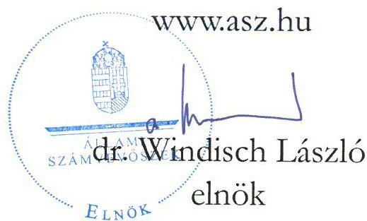
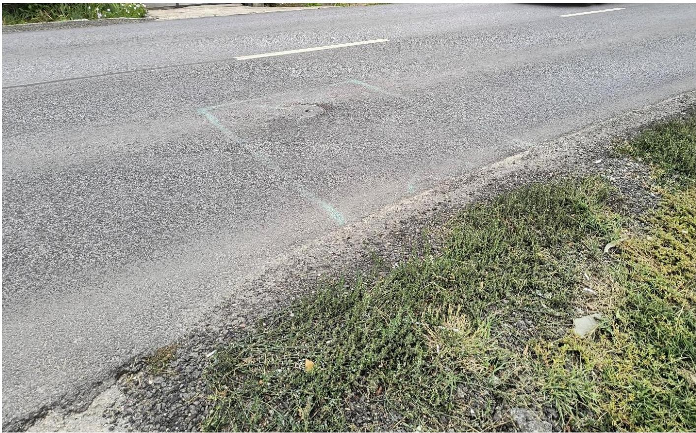
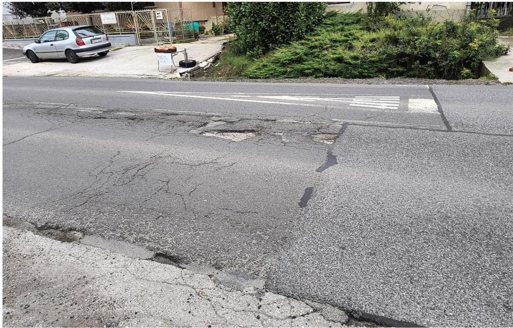
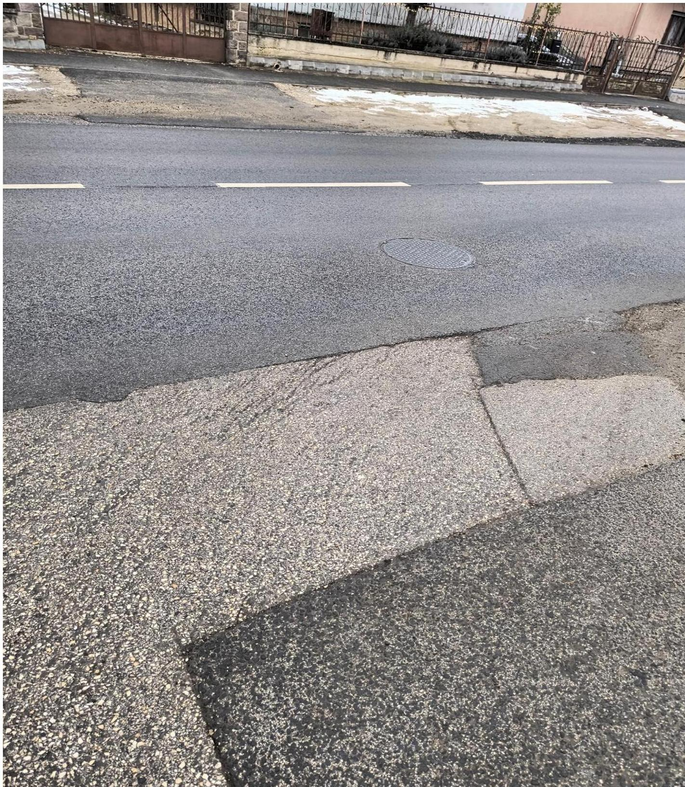

ÁLLAMI SZÁMVEVŐSZÉK

# JELENTÉS

A 2104. jelzésű közút Szada nagyközségen áthaladó szakaszán 2023. novemberétől végzett útfenntartás ellenőrzése

2025.

25070

www.asz.hu

---

ÁLLAMI SZÁMVEVŐSZÉK

# JELENTÉS

A 2104. jelzésű közút Szada nagyközségen áthaladó szakaszán 2023. novemberétől végzett útfenntartás ellenőrzése

2025.

25070

---

Jelentéseink az interneten a www.asz.hu címen olvashatók.

ELLENŐRZÉSI IGAZGATÓSÁG:
ELLENŐRZÉSI IGAZGATÓSÁG IV.

ELLENŐRZÉSI IGAZGATÓ:
GORECZKY GERGELY ellenőrzési igazgató

ELLENŐRZÉSVEZETŐ:
KANYÓ LÓRÁNT ISTVÁN ellenőrzésvezető

IKTATÓSZÁM: EL-4169-003/2025

TÉMASORSZÁM: -

ELLENŐRZÉS-AZONOSÍTÓ SZÁM: V1125

---

TARTALOMJEGYZÉK

- AZ ELLENŐRZÉS ALAPADATAI ... 5
- AZ ELLENŐRZÉS FÓKUSZTERÜLETE ... 8
- MEGÁLLAPÍTÁSOK ÉS KÖVETKEZTETÉSEK ... 9
- JAVASLATOK ... 15
- MELLÉKLETEK ... 17
- I. sz. melléklet: Értelmező szótár ... 17
- II. sz. melléklet: Ellenőrzési kritériumok ... 19
- III. sz. melléklet: Az Önkormányzat és a Társaság közti útfenntartási tevékenységre vonatkozó feladatmegosztás ... 20
- IV. sz. melléklet: Képek ... 21
- FÜGGELÉK: ÉSZREVÉTELEK ... 24
- RÖVIDÍTÉSEK JEGYZÉKE ... 26

---

“哈，你是个小伙子，你是个小伙子，你是个小伙子，你是个小伙子，你是个小伙子，你是个小伙子，你是个小伙子，你是个小伙子，你是个小伙子，你是个小伙子，你是个小伙子，你是个小伙子，你是个小伙子，你是个小伙子，你是个小伙子，你是个小伙子，你是个小伙子，你是个小伙子，你是个小伙子，你是个小伙子，你是个小伙子，你是个小伙子，你是个小伙子，你是个小伙子，你是个小伙子，你是个小伙子，你是个小伙子，你是个小伙子，你是个小伙子，你是个小伙子，你是个小伙子，你是个小伙子，你是个小伙子，你是个小伙子，你是个小伙子，你是个小伙子，你是个小伙子，你是个小伙子，你是个小伙子，你是个小伙子，你是个小伙子，你是个小伙子，你是个小伙子，你是个小伙子，你是个小伙子，你是个小伙子，你是个小伙子，你是个小伙子，你是个小伙子，你是个小伙子，你是个小伙子，你是个小伙子，你是个小伙子，你是个小伙子，你是个小伙子，你是个小伙子，你是个小伙子，你是个小伙子，你是个小伙子，你是个小伙子，

---

AZ ELLENŐRZÉS ALAPADATAI

## AZ ELLENŐRZÉS CÉLJA

Az ellenőrzés célja – figyelemmel az ÁSZ¹ „Pénzért értéket” ellenőrzési elvére – annak értékelése volt, hogy a 2104 jelzésű közút Szada nagyközség illetékességi területén áthaladó szakaszán 2023 novemberétől végzett útfenntartás eredményes volt-e, az Ellenőrzött szervezetek² által hozott döntések szabályszerűek, célszerűek, valamint gazdaságossági, hatékonysági és eredményességi szempontból megalapozottak voltak-e. Az Ellenőrzött szervezetek útfenntartással kapcsolatos kontrolltevékenysége biztosította-e a szabályszerű, szerződésszerű és célszerű megvalósítást.

## AZ ELLENŐRZÉS TÍPUSA

Kombinált ellenőrzés.

## AZ ELLENŐRZÖTT IDŐSZAK

A 2104 jelzésű közút Szada nagyközség illetékességi területén áthaladó szakaszán 2023 novemberében végzett útfenntartási tevékenység előkészítésének megkezdésétől a 2025. február 5-ig terjedő időszak.

## AZ ELLENŐRZÉS TÁRGYA

Az ellenőrzés tárgya a 2104 jelzésű közút Szada nagyközség illetékességi területén áthaladó szakaszán 2023 novemberétől végzett útfenntartási tevékenység keretében hozott döntések szabályszerűsége, célszerűsége, eredményessége, valamint gazdaságossági, hatékonysági és eredményességi szempontú megalapozottsága, továbbá az útfenntartással kapcsolatos kontrolltevékenység volt.

Az ellenőrzés kiterjedt minden olyan körülményre és adatra, amely az ÁSZ jogszabályban meghatározott feladatainak teljesítéséhez, valamint a program végrehajtása folyamán felmerült újabb összefüggések feltárásához szükséges volt.

## AZ ELLENŐRZÉS JOGALAPJA

Az ellenőrzés jogszabályi alapját az ÁSZ tv.³ 1. § (3) bekezdése, 5. § (4) bekezdés a) pontja, valamint a 5. § (5) bekezdése előírásai képezték.

---

Az ellenőrzés alapadatai

# AZ ELLENŐRZÉS MÓDSZERE

Az ellenőrzést az ellenőrzés fókuszterületének kritériumai, az ellenőrzött időszakban hatályos jogszabályok, az ellenőrzés általános szakmai szabályai és az ellenőrzésre irányadó ÁSZ módszertanok alapján végezte az ÁSZ.

Az ellenőrzési kérdések megválaszolásához szükséges bizonyítékok megszerzése az Ellenőrzött szervezetek által rendelkezésre bocsátott dokumentumokra, adatokra alapozott megfigyelés, szemle (szemrevételezés), helyszíni interjú (információkérés) útján történt. Emellett az ellenőrzési bizonyítékként felhasználható adatforrások közé tartozott minden egyéb – az ellenőrzés folyamán feltárt, az ellenőrzés szempontjából információt tartalmazó – releváns dokumentum (ideértve különösen a helyszínen felvett jegyzőkönyvet is).

Az ellenőrzés lefolytatásához az ellenőrzött szervezetek az ÁSZ által kért dokumentumok elektronikus megküldésével szolgáltattak adatokat.

Az ÁSZ akkor tekinti eredményesnek az útfenntartást, ha az ellenőrzés tárgyát képező útszakasz a rendeltetésszerű használatra és biztonságos közlekedésre alkalmas, továbbá, ha az ellenőrzött szervezetek feladatellátása (ideértve az útfenntartás tervezését, műszaki ellenőrzését, kivitelezését) garantálta, hogy az útszakasz az útfenntartás műszaki átadás-átvételének napjától számított legalább öt évnyi időszakban – további útfenntartási munka végzése nélkül – alkalmas legyen.

A Kkt.⁴ 34. § (1) bekezdése értelmében a közút kezelője köteles gondoskodni arról, hogy a közút a biztonságos közlekedésre alkalmas legyen. A közút biztonságos közlekedésre való alkalmasságának fogalmát az irányadó jogszabályok nem határozzák meg. Az ÁSZ ellenőrzés szakmai véleménye szerint az ellenőrzés tárgyát képező útfenntartást követően a 2104 számú országos közút útfenntartással érintett szadai útszakasza akkor alkalmas a biztonságos közlekedésre, ha annak állapota – rendeltetésszerű használat esetén – nem okozhatott olyan helyzetet, mely a közlekedők személy- és vagyonbiztonsága sérelmének a kockázatával járt.

# AZ ELLENŐRZŐTT SZERVEZET

Magyar Közút Nonprofit Zrt.

Szada Nagyközség Önkormányzat

A Társaság⁵ – az építési és közlekedési miniszter tulajdonosi joggyakorlása mellett – a 2023. évben, több mint 5 600 munkavállalóval, 5 259 026 000 ezer Ft befektetett eszközzel, 12 312 000 ezer Ft árbevétel és 4 940 000 ezer Ft adózás előtti eredmény elérésével működött. A Társaság a 6/1998. (III. 11.) KHVM rendelet⁶ alapján, a közlekedésért felelős miniszterrel kötött szerződés alapján látta el – 2023. évben 97 800 000 ezer Ft támogatás ellenében – a közútkezelési (azon belül útfenntartási) feladatokat 30 129 km úthálózaton és 1 136 km kerékpárúton, közte a 2104 jelű országos főút teljes szakaszán. A Társaság útfenntartási feladatellátása keretében köteles gondoskodni arról, hogy a kezelésében lévő közút a biztonságos közlekedésre alkalmas, közvetlen környezete esztétikus és kulturált legyen.

Szada nagyközség Pest vármegyében, a Gödöllői járásban, a budapesti agglomerációban fekszik, állandó lakosainak száma a BM⁷ adatai szerint 2023. december 31-én 6 522 fő volt, az egy főre jutó személyi

---

Az ellenőrzés alapadatai

jövedelemadóalap összege a 2023. évben 3 216 ezer Ft volt¹, amely a 12. legmagasabb összeg Pest vármegyében. Az Önkormányzat⁸ zárszámadása szerint az Önkormányzat költségvetési bevétele a 2023. évben 1 849 365 ezer Ft volt, melyből a közhatalmi bevételek (főképp a helyi adóbevételek) összege 970 666 ezer Ft, pénzmaradványa 1 191 884 ezer Ft volt.

¹ Összehasonlításul: az országos átlagos egy főre jutó személyi jövedelemadó-alap összege: 2 268,8 ezer Ft

7

---

8

# AZ ELLENŐRZÉS FÓKUSZTERÜLETE

A 2104. jelzésű közút Szada nagyközség illetékességi területén áthaladó szakaszán 2023 novemberétől végzett útfenntartás előkészítése, döntéshozatali folyamata és kivitelezése.

---

MEGÁLLAPÍTÁSOK ÉS KÖVETKEZTETÉSEK

Előzmények, az Útfenntartási Tevékenység megalapozottsága, előkészítése

A 2104 jelzésű országos közút Pest Vármegyében Vácot köti össze Gödöllővel, Csörög, Vácrátót, Órbottyán, Veresegyház, Szada településeken áthaladva, 29 km hosszan. A közút Szada belterületét több mint 3 km-es szakaszon érinti.

A Társaság 2023. és 2024. évi munkatervében a vizsgált Útfenntartási Tevékenység⁹ nem szerepelt. A Társaság nyilatkozata szerint a működési források és a géplánc-kapacitás hiánya miatt az útfenntartási feladatokat kézi kátyúzással volt módja ellátni. Erre a körülményre, valamint az Útszakaszok¹⁰ burkolatállapotára, a szadai lakossági panaszokra, a Társaság gépi kapacitáshiányára figyelemmel a Társaság és az Önkormányzat két Megállapodást¹¹ kötött. A Megállapodások lényege, hogy a kézi kátyúzásnál magasabb műszaki színvonalat eredményező Útfenntartási Tevékenységet közösen, az egyes részfeladatok Ellenőrzött szervezetek közötti megosztásával valósítják meg². Az Önkormányzat az általa vállalt részfeladatok teljesítése érdekében – saját gépi erőforrások hiányában – több Alvállalkozóval¹² is megállapodott.

Az Útfenntartási Tevékenység az Első Útszakaszon¹³ 2023. november 14. és november 23. között, a Második Útszakaszon¹⁴ 2024. október 4. és október 18. között, összesen 1133 méter hosszan valósult meg.

Az ÁSZ helyszíni szemléjén tapasztaltak, valamint a Google Street View visszakeresett vagy több időszakban rögzített felvételeit megvizsgálva, figyelemmel az Útszakaszok állapotára, indokolt volt az Útfenntartási Tevékenység elvégzése.

Az Útfenntartási Tevékenység során hozott döntések szabályszerűsége

Az Önkormányzat két határozatban³ rendelkezett a Megállapodások szerinti, az Útfenntartási Tevékenység kapcsán az Önkormányzatra háru ló feladatok anyagi fedezetéről. A határozatok és az azok alapján kötött Megállapodások célja és az aszerinti forrásfelhasználás összhangban állt az Mótv.¹⁵ rendelkezéseivel⁴.

Az Önkormányzat – az Áht.¹⁶-nak megfelelően – a Költségvetési rendeletekben¹⁷ az Útszakaszok tervezett költségeit szerepeltette.

Az Önkormányzat az Útszakaszon útfenntartási munkát végző, a meglévő aszfaltburkolat marását és az új aszfaltrétegek beépítését végző gépláncot biztosító Alvállalkozó személyéről – Beszerzési Szabályzatának¹⁸ megfelelően – három írásos ajánlatot kérve, s a legkedvezőbb ajánlati ár alapján döntött.

2 Az Ellenőrzöttek által a Megállapodásokban vállalt kötelezettségeket a III. melléklet mutatja be.
3 2023. október 26-án a 132/2023. (X. 26.) KT. határozatot, 2024. augusztus 15-én a 98/2024. (VIII. 15.) KT. határozatot fogadta el.
4 Az Mótv. 10.§-ának (2) bekezdése értelmében a helyi önkormányzat – a helyi képviselő-testület vagy a helyi népszavazás döntésével – önként vállalhatja minden olyan helyi közügy önálló megoldását, amelyet jogszabály nem utal más szerv kizárólagos hatáskörébe.

9

---

Megállapítások és következtetések

Az Önkormányzat az Áht. 41. § (6) bekezdését sértve nem győződött meg arról, hogy az Alvállalkozók átlátható szervezetnek minősülnek és az Ávr.¹⁹ 50. § (1a) bekezdésével ellentétben nem gondoskodott arról, hogy a szerződések tartalmazzák az Alvállalkozók átlátható szervezet minőségre vonatkozó jognyilatkozatát.

Az Önkormányzat az Alvállalkozók kötelezettségei teljesítését – szemben az Ávr. 57. § (1) bekezdésével – nem ellenőrizhető okmány (hanem a Társaság szóbeli közlése) alapján igazolta, így a Második Útszakaszon munkát végző Alvállalkozóval kötött szerződés által előírt tételes felmérés (felmérési napló) sem állt rendelkezésre. Az Önkormányzat által 2023. december 7-én kiadott, teljesítésigazolás elnevezésű irat nem tartalmazta a teljesítés tényére történő utalást, ami ellentétes az Ávr. 57. § (3) bekezdésével és az Önkormányzat Pénzgazdálkodási Szabályzatának²⁰ 2.3. pontjával. E körülmények is azt igazolják, valamint az Önkormányzat nyilatkozata is azt támasztja alá, hogy az Önkormányzat – a Ptk.²¹ 6:238. §-ában foglaltak⁵ ellenére – az Alvállalkozók által végzett munkát nem vette át.

A Társaság a 6/1998. (III. 11.) KHVM rendelet Melléklete 3.1. pontjának megfelelően az Útszakaszokon az útellenőrzést elvégezte⁶.

A Társaság a 2104 jelzésű közúton foglalt útbeutazási kötelezettségét évente csak egy alkalommal teljesítette. Bár ez a gyakorlat megfelelt az Útbeutazási Szabályzatának²², de sértette a 6/1998. (III. 11.) KHVM rendelet Melléklete 3.3. pontjában foglaltakat⁷.

Az Útbeutazási Szabályzatának IV.2. pontjában foglaltakkal szemben a 2024. évben az útbeutazáson az útbeutazásra kötelezett személyek közül csak a mérnökségvezető vett részt⁸.

A Társaság évente ellenőrizte az útfenntartással érintett útszakaszon az út víztelenítésének állapotát.

A Társaság által kezelt országos utak – melyek sokszor főutcaként szelnek át egy-egy települést – 53%-a rossz vagy nem megfelelő minősítésű volt 2023-ban. Az ÁSZ álláspontja szerint az útminőség és így a településen élők életminősége javulásához vezetne, ha szabályozott formában lenne lehetőség arra, hogy a települési önkormányzatok a kötelező feladatok ellátásának fedezetén túli (saját) bevételük terhére, önkéntes döntésük alapján adhatnának át forrást a Társaság számára a település lakott területén lévő országos közútszakaszokon tervezett karbantartási munkához képest magasabb minőségű, tartósabb útfenntartási munkákra. Mindez nemcsak a településen lakók, hanem az azon átutazók utazási komfortját is növelné.

5 A Ptk. hivatkozott rendelkezése szerint vállalkozási szerződés alapján a vállalkozó tevékenységgel elérhető eredmény (a továbbiakban: mű) megvalósítására, a megrendelő annak átvételére és a vállalkozói díj megfizetésére köteles.

6 Társaságnak a közútfenntartási feladat szükségességéről és a beavatkozás határidejéről, módjáról való döntés érdekében a 6/1998. (III.11.) KHVM rendelet Mellékletének 3.1. pontja alapján rendszeres út- és műtárgy-ellenőrzési, valamint az útvizsgálati feladatokat kell ellátnia. A KHVM rendelet 3.1 pontja a 2104-es országos közúton napi egyszeri útellenőrzést ír elő.

7 A 6/1998. (III.11.) KHVM rendelet Melléklete 3.3. pontjának rendelkezése alapján a közútkezelőnek a közutakon meghatározott időszakonként, de legalább a tavaszi, illetve őszi időszakban, azaz legalább évente kétszer útbeutazást kell végeznie.

8 Az útbeutazáson részt kellett volna vennie az üzemeltetési és fenntartási osztály munkatársának és a forgalomtechnikai és kezelői osztály munkatársának

10

---

Megállapítások és következtetések

Az útfenntartási tevékenység célszerűsége, a kontroll-tevékenység

Az Önkormányzat úgy kötött szerződést az Alvállalkozókkal, hogy **nem állt módjában a szerződésben foglalt egyes kitételek teljesítése** (sem a munkavégzés helyszínen való ellenőrzése, sem az elvégzett munka műszaki átvétele), mert – nyilatkozata szerint – az Alvállalkozók szerződésszerű teljesítésének ellenőrzésére nem rendelkezett szakképzett tisztviselővel, és nem merült fel az sem, hogy ilyen feladatra más személyt bízzon meg.

A Társaságot nem jogosította fel szerződés⁹ az Alvállalkozók feladat-ellátásának ellenőrzésére, munkájuk műszaki átvételére, a hibás teljesítés megállapítására és a hiba javítására vonatkozó felszólítás megtételére sem.

A Társaság nem járt el kellő gondossággal a Megállapodások megkötésekor, mert a Megállapodások nem tartalmaztak kitételt az Önkormányzat, valamint az általa megbízott Alvállalkozók feladatellátásának minőségére, az átadás-átvételi folyamatok megvalósulásának kritériumaira, folyamataira. Ez a gyakorlat veszélyezteti a Kkt. 34. § (1) bekezdésében előírtak teljesülését.

Az Önkormányzat és az Alvállalkozók közötti szerződések több esetben hiányosak voltak, nem biztosították a célszerű feladat-ellátást az alábbiak miatt:

- nem rendelkeztek pontos eredménykritériumról (például arról, mit értenek a szerződő felek a sikeres műszaki átadáson, illetve az I. osztályú minőségen, az mennyiben felel meg vagy tér el az Ütügyi Műszaki Előírásokban²³ foglalt követelményektől¹⁰);
- nem rendelkeztek arról, hogy az Önkormányzatot, mint megrendelőt megillető műszaki átadás-átvételi feladatokat, – az Önkormányzat kompetenciája hiányában – az Alvállalkozók teljesítésének igazolását ki végzi (ezt – az Önkormányzat nyilatkozata szerint – a Társaság végezte az Önkormányzat helyett, mert az Útfenntartási Tevékenységet saját munkaként, az Alvállalkozókat saját erőforrásnak tekintette);
- a Második Útszakaszon aszfaltozási munkát végző Alvállalkozóval létrejött szerződés tételés elszámolású volt, de ennek ellenére a vállalkozói díj keretösszegét nem határozta meg, s ezért azt sem, hogy ettől a keretösszegtől milyen mértékben lehet eltérni.

⁹ A Megállapodás vagy más szerződés.

¹⁰ Az Aszfaltburkolat Fenntartása elnevezésű e-UT 08.02.12:2022 számú Ütügyi Műszaki Előírás rögzíti az úthibák besorolását és javításának módját, a javítás kritériumait https://ume.kozut.hu/dokumentum/1357

11

---

Megállapítások és következtetések

Az Alvállalkozók az Önkormányzattal álltak jogviszonyban, de a Társaság kezelésében lévő Útszakaszokon végeztek munkát. Az Önkormányzat ezért nem ellenőrizte az Alvállalkozók Útszakaszokon végzett feladat-ellátását, kontrolltevékenységet nem gyakorolt. A Megállapodások tárgya nem fedte le teljes mértékben az ügylet tényleges tartalmát, az Önkormányzat szerződéses akarata ugyanis valójában az volt, hogy az Útfenntartási Tevékenység költségei egy részét az Önkormányzat viselje ellentételezés nélkül (vagyis nem az Útfenntartási Tevékenységből fakadó munka-feladatok megosztására irányult). Erre is figyelemmel – az Önkormányzat nyilatkozata szerint – részéről valójában nem merült fel, hogy az Önkormányzat érvényesítse az Alvállalkozókkal szembeni, a köztük létrejött jogviszonyból fakadó jogosultságát (ezért például műszaki átadás-átvétel nem történt, a teljesítésigazolást anélkül adta ki az Önkormányzat).

A Társaságnak pedig – szerződéses felhatalmazás hiánya miatt – nem volt jogi lehetősége az Alvállalkozók ellenőrzésére, bár nyilatkozata szerint az Alvállalkozók munkáját felügyelte.

Az Útfenntartási Tevékenység célszerű elvégzését tehát nem biztosította az Önkormányzat és a Társaság által alkalmazott jogi konstrukció, mert az Alvállalkozók hibás teljesítésének számonkérését és a hiba kijavításának kikényszerítését nem tartalmazta.

## Az Útfenntartási Tevékenység eredményessége

Az ÁSZ több alkalommal, helyszíni szemlén, szemrevételezéssel vizsgálta az Útfenntartási Tevékenység eredményességét¹¹ és a következőket tapasztalta:

- az ÁSZ a 2024. szeptember 17-ei helyszíni szemlén azt tapasztalta, hogy a Szada, Dózsa György út 4. szám alatti ház előtt, az Első Útszakasz Gödöllőre vezető (jobb oldali) sávjában, a sáv közepén lévő közműakna-fedél kb. 1,5-2 cm-rel a közút síkja alatt helyezkedett el, környezetében, kb. $10\mathrm{m}^2$ területen az úttest a környező útfelülethez képest „megsüllyedt”. A hiba az úttest egyenletességét megtörte, azonban – tekintve, hogy nem a keréknyomvonalban található – közvetlen balesetveszélyt nem okozott, előzés, kikerülés esetén ugyanakkor az azon való áthaladás csak kisebb zökkenővel volt lehetséges, ami negatívan befolyásolta az utazási komfortot (IV. számú melléklet első kép);
- az Első Útszakaszon, a Szada, Dózsa György út 11/A. számú házzal szemben az újonnan lefektetett aszfalt-réteg és a régi útfelület találkozásánál (keresztben) elhelyezett bitumenszalag hiányos, deformált volt, ami az ÁSZ megítélése szerint szakszerűtlen elhelyezésére utalt, valamint az autóbuszöböl síkja az aszfaltozás miatt 1-2 cm-rel az út síkja alatt helyezkedett el (IV. számú melléklet második kép). Mindazonáltal e hiányosságok a Második Útszakaszon végzett Útfenntartási Tevékenység végzésével megszűntek;
- az ÁSZ 2025. január 19-én azt állapította meg, hogy az Első Útszakaszon, a Szada, Dózsa György út 8. szám alatti ház előtt, a Buckai utca kereszteződésében, az út Gödöllő felé haladó sávjában lévő, a jobboldali keréknyomvonalba eső csatornafedél nem volt a közút síkjában, az azon való áthaladás esetén a gépjármű – csatornafedélre ráhajtó – kerekei zökkentek, ez az utazási komfortot rontotta, továbbá növelte az úthasználat okozta zajhatást és keltett rezgéseket. Ez az úthiba az azon áthaladó gépjármű műszaki állapotára kockázatot jelent (IV. számú melléklet harmadik kép).

¹¹ Az eredményességi kritériumokat az Ellenőrzés Módszere rész (6. o.) tartalmazza.

---

Megállapítások és következtetések

Az Első Útszakasz 2024. év szeptember 17-én történt helyszíni bejárásakor az ÁSZ azt is észlelte, hogy a Második Útszakaszon, a Szada, Dózsa György út 11/A. számú házzal szemben a közút Gödöllőre vezető sávjában, az ÁSZ megítélése szerinti a 6/1998. (III.11.) KHVM rendelet Melléklete 5.2.1. pontjában definiált¹² 2. fokozatú javítást igénylő úthiba alakult ki (IV. számú melléklet második kép). Ennek javítása – sértve a 6/1998. (III.11.) KHVM rendelet 5.2.3. pontját – 3 napon túl, a Második Útszakaszon 2024. novemberében végzett Útfenntartási Tevékenységgel történt meg.

Az Első Útszakaszon végzett Útfenntartási Tevékenység – figyelemmel arra, hogy a feltárt hiányosságok a vagyonbiztonság sérelmének kockázatát hordozták – részben volt eredményes, a Második Útszakaszon végzett Útfenntartási Tevékenység eredményes volt.

Az Útszakaszok az Útfenntartási Tevékenység eredményeként létrejött állapotukban, a Társaság nyilatkozata szerint, változatlan gépjárműforgalom és megszokott időjárási körülmények között – figyelemmel a felhasznált anyagokra, a munkavégzésre és az alkalmazott technológiára – 10 évig alkalmasak lesznek rendeltetésszerű használatra. Ugyanakkor az ÁSZ álláspontja szerint az Útszakaszok jövőbeni élettartama tekintetében (például extrapolálva a múltbeli adatokat) figyelembe kell venni azt is, hogy az útszakaszon a gépjárműforgalom miképp változik a jövőben.

Az Útfenntartási Tevékenység költségei, azok összevetése

Az Útfenntartási Tevékenység az Útszakaszokon összesen (együttesen a Társaság és az Önkormányzat által felhasznált erőforrásokat) 60 542,8 ezer Ft költséggel járt, melyből az Önkormányzatra 31,2%-nyi költség jutott. Az 1. táblázat mutatja be a vizsgált Útfenntartási Tevékenység során felmerült különféle költséget, külön-külön a két Útszakaszon.

1. táblázat

ÚTFENNTARTÁSI TEVÉKENYSÉG SORÁN FELMERÜLT KÖLTSÉGEK, ÚTSZAKASZONKÉNT (EZER FORINT)

|   | ELSŐ
ÚTSZAKASZ | MÁSODIK
ÚTSZAKASZ  |
| --- | --- | --- |
|  1. Közvetlen anyagköltség | 14 306,7 | 20 576,7  |
|  2. Személyi jellegű ráfordítás | 1 384,8 | 2 081,5  |
|  3. Gépköltség | 1 022,2 | 1 053,5  |
|  4. Összes közvetlen költség (1.+2.+3.) | 16 713,7 | 23 711,7  |
|  5. Munkahelyi általános költség | 599,1 | 644,8  |
|  6. Összes szűkített önköltség (4.+5.) | 17 312,8 | 24 356,5  |
|  7. Szada Nagyközség vállalkozói díj | 7 022,0 | 11 851,5  |
|  8. Közvetlen költségek mindösszesen (6.+7.) | 24 334,8 | 36 208,0  |

Forrás: A Társaság és az Önkormányzat által szolgáltatott adatok alapján ÁSZ szerkesztés

¹² A hivatkozott rendelkezés szerint az 1. fokozatú hibák a szokásos használat következtében alakulnak ki, az éves javítási terv alapján javítandók. A 2. fokozatú balesetveszélyes helyzetet eredményező úthiba esetén a hibát haladéktalanul jelezni kell a közlekedők számára és 3 napon belül javítani kell.

---

Megállapítások és következtetések

Az ellenőrzés tárgyát képező Útfenntartási Tevékenység fajlagos, egy folyóméternyi (hat méter széles) útra jutó költsége kisebb volt, mint a benchmark fajlagos költsége (lásd: 2. táblázat), ugyanakkor a Társaság kizárólag saját kivitelezésben végzett fenntartási munkája fajlagos költségéhez képest 6,7%-kal magasabb volt. A 2. táblázat tartalmazza az Útfenntartási Tevékenység és az azzal összevethető műszaki tartalmú más útfenntartási munkák fajlagos költségeit.

2. táblázat

AZ ÚTFENNTARTÁSI TEVÉKENYSÉG ÉS A BENCHMARK FAJLAGOS KÖLTSÉGEI, VALAMINT EZEK KÜLÖNBSÉGE A BENCHMARK KÖLTSÉGEK %-ÁBAN

|  MEGNEVEZÉS
1. | FAJLAGOS
KÖLTSÉG
(NETTÓ
FT/FOLYÓ-
MÉTER)
2. | FAJLAGOS
KÖLTSÉG-
ELTÉRÉS
(NETTÓ
FT/FOLYÓ-
MÉTER)
3. | TÉNY-
KÖLTSÉG
ELTÉRÉSE A
BENCHMARK
%-ÁBAN
(3./2.)  |
| --- | --- | --- | --- |
|  1. Útfenntartási tevékenység tényleges fajlagos költsége
(összes szűkített közvetlen önköltség + önkormányzati
költségek) | 53 435,8 | - | -  |
|  2. Útfenntartási tevékenység saját kivitelezésben, társaság
kalkulációja alapján* | 50 065,2 | 3 370,6 | 6,7%  |
|  3. Útfenntartási tevékenység legolcsóbb alvállalkozóval** | 83 902,0 | -30 466,2 | -36,3%  |
|  4. Útfenntartási tevékenység alvállalkozóval, átlagáron* | 113 639,2 | -60 203,5 | -53,0%  |
|  5. Útfenntartási tevékenység 2022-2023. évi fajlagos
átlagköltsége*** | 115 527,6 | -62 091,8 | -53,7%  |
|  6. 24080(V1031) számú korábbi ÁSZ ellenőrzés adatai
alapján a Budapest Közút Zrt. 2023. évben saját
kivitelezésben végzett nagyfelületű burkolatjavítás fajlagos
költsége | 70 874,2 | -17 438,4 | -24,6%  |

*A Társaság vácí üzemmérnöksége 2023-2024. évre vonatkozó teljes éves teljesítményét tartalmazó utókalkuláció adatai alapján
***Társaság által rendelkezésre bocsátott kalkuláció, ellenőrzött időszaki keretmegállapodások árai alapján
***Az ÁSZ értékarányossági módszertani útmutató szerinti, 1. technológiai csoportba sorolt útfelújítási munkák költsége

Forrás: A Társaság és az Önkormányzat által szolgáltatott adatok alapján ÁSZ szerkesztés

Az Útfenntartási Tevékenység a benchmark adatokhoz képest alacsonyabb szűkített közvetlen költséggel, hatékonyan valósult meg.

Figyelemmel a Társaság szűk keresztmetszetű kapacitására, az Útszakaszok minőségére, a választott útfenntartási műszaki megoldás tartósságára és annak magasabb utazási komfortot biztosító állapotára, az Útfenntartási Tevékenység az úthasználók érdekeinek megfelelően, gazdasági értelemben véve összességében racionálisan valósult meg.

---

15

# JAVASLATOK

Az ÁSZ tv. 33. § (1) bekezdésében foglaltak értelmében az ellenőrzött szervezet vezetője köteles a jelentésben foglalt megállapításokhoz kapcsolódó intézkedési tervet összeállítani és azt a jelentés kézhezvételétől számított 30 napon belül az ÁSZ részére megküldeni. Amennyiben az ellenőrzött szervezet vezetője nem küldi meg határidőben az intézkedési tervet, vagy továbbra sem elfogadható intézkedési tervet küld, az Állami Számvevőszék elnöke az ÁSZ tv. 33. § (3) bekezdése a) és b) pontjaiban foglaltakat érvényesítheti.

## A POLGÁRMESTERNEK

1. Gondoskodjon arról, hogy a Társasággal való, útfenntartási tevékenységre vonatkozó jövőbeni együttműködés esetén, az azt szabályozó szerződés tartalmazza, miszerint

a) ha az Önkormányzat a szándéka szerint más személyt (alvállalkozót) bíz meg az általa vállalt résztevékenység végzésével, akkor az alvállalkozó feladat-ellátásának koordinálása, ellenőrzése, az alvállalkozói teljesítmény műszaki átadás-átvétele az Önkormányzat nevében a Társaság feladata;
b) a közúton lévő műtárgyak aknafedeleinek a közút síkjában való elhelyezése az útfenntartási tevékenység során biztosított legyen, egyértelmű legyen, hogy annak kapcsán a Társaság vagy az Önkormányzat egyeztet a közműtársaságokkal, s eredménytelen egyeztetés esetén az aknafedelek szintbehozása az Önkormányzat vagy a Társaság feladata-e.

2. Gondoskodjon arról, hogy ha a Társasággal útfenntartási tevékenységre megállapodást köt és saját teljesítéséhez más személyt (alvállalkozót) vesz igénybe, akkor

a) az alvállalkozó számára pontosan határozza meg az elvárt eredményt, valamint utalást arra, hogy az alvállalkozó teljesítését a Társaság koordinálja, ellenőrzi és veszi át vagy
b) a Ptk. 6:238. §-ában foglaltakkal összhangban az alvállalkozók teljesítését vegye át;
c) az Ávr 57. § (1) bekezdésének eleget téve a teljesítés igazolása ellenőrizhető okmányokon és annak ellenőrzésén alapuljon.

3. Gondoskodjon arról, hogy a teljesítés igazolása megfeleljen az Ávr. 57. § (3) bekezdésében és az Önkormányzat Pénzgazdálkodási Szabályzatának 3.2. pontjában foglaltaknak és tartalmazza a teljesítés tényére történő utalást.

4. Építsen ki kontrollokat arra, hogy ha gazdasági társaságot bíz meg feladat ellátásával, akkor – összhangban az Áht. 41. § (6) bekezdésével – győződjön meg arról, hogy a megbízott átlátható szervezetnek minősül-e és – az Ávr. 50. § (1a) bekezdésének érvényesítése érdekében – gondoskodjon arról, hogy a gazdasági társasággal kötött szerződések tartalmazzák a megbízottnak az átlátható szervezet minőségre vonatkozó jognyilatkozatát.

---

Javaslatok

# A MAGYAR KÖZÜT NZRT. VEZÉRIGAZGATÓJÁNAK

1. Gondoskodjon arról, hogy ha valamely önkormányzattal Útfenntartási Tevékenység közös végzésére együttműködést köt, és az önkormányzat harmadik személyt von be közreműködőként kötelezettségei teljesítésére, akkor az ezt szabályozó szerződés tartalmazza, hogy a közúton való feladat-ellátás koordinálása, ellenőrzése, a teljesítmény műszaki átadás-átvétele az Önkormányzat nevében a Társaság feladata legyen.

2. Gondoskodjon arról, hogy a Társaság az útbeutazási kötelezettségének a 2104 jelzésű közúton a 6/1998. (III.11.) KHVM rendelet Melléklete 3.3. pontjában foglaltak alapján évente legalább két alkalommal, tavasszal és ősszel, az Útbeutazási Szabályzatban megjelölt útbeutazásra kötelezettek részvételével tegyen eleget.

3. Hozza összhangba útbeutazási szabályzatát a 6/1998. (III.11.) KHVM rendelet Melléklete 3.3. pontjában foglaltakkal.

4. Gondoskodjon arról, hogy az Első Útszakaszon, Szada, Dózsa György út 8. szám alatti ház előtt, a Buckai utca kereszteződésében az út Gödöllő felé haladó sávjában lévő, a jobboldali keréknyomvonalba eső csatornafedél a közút síkjában legyen.

16

---

MELLÉKLETEK

## I. SZ. MELLÉKLET: ÉRTELMEZŐ SZÓTÁR

közút:
a Magyar Közút Nonprofit Zrt. kezelésében lévő országos közút (Forrás: 6/1998. (III.11.) KHVM rendelet 1. § (2) bekezdés b) pont)

közútkezelés:
a Magyar Közút Nonprofit Zrt.-nek az országos közutak kezelésének szabályozásáról szóló 6/1998. (III.11.) KHVM rendelet szerinti tevékenysége

útfenntartás:
a felújítási és karbantartási beavatkozások együttese, a forgalmi igénybevételből és az időjárási, valamint egyéb természeti hatásokból származó természetes leromlás ellensúlyozásához szükséges tevékenységek ellátása; (Forrás: 6/1998. (III.11.) KHVM rendelet 2. § 3. pont) ideértve a nagyfelületű útburkolatjavítást is;

útfelújítás:
a forgalmi igénybevételtől, az időjárástól vagy más természeti hatástól elhasználódott úttesten, azok tartozékain, az út környezetében, valamint a környezetvédelmi építményeken végzendő azon tevékenységek összessége, amelyek az út használati értékét növelik és a forgalmi igényeknek megfelelő, eredeti műszaki állapot helyreállítását szolgálják (Forrás: 6/1998. (III.11.) KHVM rendelet 2. § 2. pont)

az út tartozéka
a várakozóhely, pihenőhely, a vezetősszlop, a korlát, az útfenntartási és közlekedésbiztonsági célokat szolgáló műszaki és egyéb létesítmény, berendezés (így különösen jelzőtábla, jelzőlámpa, segélykérő telefon, parkolójegy-kiadó automata, sorompó) – a Komplex Közlekedési Ellenőrző Pont kivételével –, a zajárnyékoló fal és töltés, hóvédő erdősáv, fasor vagy cserjesáv (védelmi rendeltetésű erdő), valamint a közút határától számított két méter távolságon belül ültetett fa – az összefüggő üzemi gyümölcsöshöz tartozó fák kivételével, az út üzemeltetéséhez szükséges elektronikus hírközlő eszközök és hálózatok (Forrás: a közúti közlekedésről szóló 1988. évi I. törvény 47. § 10. pont)

az út műtárgya:
a híd, a pontonhíd, a hajóhíd, a felüljáró, az áteresz, az alagút, az aluljáró, a támfal, a bélésfal, az út víztelenítését szolgáló árok, csatorna vagy más vízelvezető létesítmény; a két méternél nagyobb nyílású áthidaló műtárgy: híd, a két méternél kisebb nyílású áthidaló műtárgy: áteresz; (Forrás: a közúti közlekedésről szóló 1988. évi I. törvény 47. § 9. pont)

nagyfelületű útburkolat javítás:
a közútként szolgáló útszakasz felszíni aszfalt-kopórétegének komplett cseréjével megvalósuló útjavítás (ÁSZ saját fogalom)

célszerűség:
arra vonatkozó követelmény, hogy a bevételeket a közfeladat megvalósítása érdekében, a kiadásokat a közfeladatok megfelelő ellátásához szükséges mértékben, a költségvetési célrendszer érdekében, a meghatározott célra (közfeladat ellátására), továbbá ésszerűen, racionálisan használták fel (Forrás: ÁSZ ellenőrzési alapelvei és módszertana https://www.asz.hu/files/Ellenorzési-alapelvek_modszertan.pdf).

eredményesség:
az eredményesség elve a kitűzött célok és a szándékolt eredmények (hatások) elérését jelenti. A gazdálkodás, feladatellátás eredményességét mutatja a tényleges és a tervezett eredmények (hatások) összevetése. (Forrás: ÁSZ ellenőrzési alapelvei és módszertana, https://www.asz.hu/files/Ellenorzési-alapelvek_modszertan.pdf).

17

---

Mellékletek

gazdaságosság:
a gazdaságosság az elért eredményekhez igénybe vett erőforrások költségeinek minimalizálását jelenti. Az igénybe vett erőforrásoknak a megfelelő időben, helyen, mennyiségben és minőségben, valamint a legkedvezőbb áron kell rendelkezésre állniuk. A költség-minimalizálás nem egyenlő a legolcsóbb megoldással, a ráfordításokat mindig a ténylegesen elért eredményekhez viszonyítva kell minősíteni, figyelembe véve a mennyiségi, minőségi szempontokat és az időtényezőt (Forrás: ÁSZ ellenőrzési alapelvei és módszertana, https://www.asz.hu/files/Ellenorzési-alapelvek_modszertan.pdf).

hatékonyság:
a hatékonyság elve azt jelenti, hogy a rendelkezésre álló erőforrásokkal a szervezet a lehető legtöbbet érje el. Ez a elv az igénybe vett erőforrások és az elért eredmények mennyiségben, minőségben és időben kifejezett kapcsolatát jelenti. (Forrás: ÁSZ ellenőrzési alapelvei és módszertana, https://www.asz.hu/files/Ellenorzési-alapelvek_modszertan.pdf).

pénzért értéket elv:
az ellenőrzött tevékenység biztosítja-e, hogy az adófizetők használható, jó minőségű terméket, közszolgáltatást kapjanak (Forrás: ÁSZ ellenőrzési alapelvei és módszertana, https://www.asz.hu/files/Ellenorzési-alapelvek_modszertan.pdf).

18

---

Mellékletek

## II. SZ. MELLÉKLET: ELLENŐRZÉSI KRITÉRIUMOK

|  ELLENŐRZÉSI KRITÉRIUMOK  |
| --- |
|  Kkt.  |
|  Taktv.  |
|  Ptk.  |
|  774/2021. (XII. 23.) Korm. rendelet  |
|  Gbkr.  |
|  6/1998. (III.11.) KHVM rendelet  |
|  12/1988. (XII. 27.) ÉVM-IpM-KM-MÉM-KVM együttes rendelet  |
|  16/2017. (V. 25.) NFM rendelet  |
|  Gbkr. IRÁNYELV  |
|  Gbkr. KÉZIKÖNYV  |
|  KHEM tájékoztató az útügyi műszaki előírásokról  |
|  Útügyi Műszaki Előírások  |
|  Ellenőrzött szervezetek belső szabályozórendszerének dokumentumai  |
|  Ellenőrzött szervezetek ellenőrzés tárgyában létrejött döntéselőkészítő dokumentumai  |
|  Ellenőrzött szervezetek ellenőrzés tárgyában megkötött megállapodásai, szerződéseit és annak teljesítésével kapcsolatos dokumentumok  |
|  Az ÁSZ akkor tekinti eredményesnek az útfenntartást, ha az ellenőrzés tárgyát képező útszakasz a rendeltetésszerű használatra és biztonságos közlekedésre alkalmas, továbbá, ha az ellenőrzött szervezetek feladatellátása (ideértve az útfenntartás tervezését, műszaki ellenőrzését, kivitelezését) garantálta, hogy az útszakasz az útfenntartás műszaki átadás-átvételének napjától számított legalább öt évnyi időszakban – további útfenntartási munka végzése nélkül – alkalmas legyen.  |

---

Mellékletek

■ III. SZ. MELLÉKLET: AZ ÖNKORMÁNYZAT ÉS A TÁRSASÁG KÖZTI ÚTFENNTARTÁSI TEVÉKENYSÉGRE VONATKOZÓ FELADATMEGOSZTÁS

Az Első Útszakaszon való Útfenntartási Tevékenységre vonatkozó feladatmegosztás a Társaság és az Önkormányzat 2023. november 3-án létrejött Megállapodása alapján

|  ÖNKORMÁNYZAT | TÁRSASÁG  |
| --- | --- |
|  • Munka elvégzéséhez szükséges géplánc és kezelő személyzet biztosítása
• A Magyar Közút által biztosított melegaszfaltnak a keverőtelepől (SWIETELSKY Magyarország Kft.) a beépítés helyéig történő szállítása
• A munkavégzéshez szükséges bitumen emulzió helyszínen történő biztosítása és kiszórása
• Felveszi a kapcsolatot a DMRV Zrt.-vel a javítással érintett útszakaszon lévő aknák szintbehelyezése érdekében
• Felveszi a kapcsolatot OPUS Tigáz Zrt.-vel a szerelvények szintbehelyezése érdekében | • A projekt során keletkező mart aszfalt elszállítása
• A munka elvégzéséhez szükséges melegaszfalt mennyiség keverőtelepi átvétellel történő biztosítása legfeljebb 390 tonna mennyiség erejéig
• A javítás alatti szakfelügyelet
• Az ideiglenes forgalomtechnika kiépítése és jelzőőr biztosítása
• A projekt során szükséges bitumen szalag biztosítása és fektetése  |

A Második Útszakaszon való Útfenntartási Tevékenységre vonatkozó feladatmegosztás a Társaság és az Önkormányzat által 2024. szeptember 27-én létrejött Megállapodás alapján

|  ÖNKORMÁNYZAT | TÁRSASÁG  |
| --- | --- |
|  • Aszfalt felület profilmarása 2-3 cm mélységben 4 410 nm²
• Mart aszfalt szállítása, amennyiben a Magyar Közút Nzrt. tehergépkocsi kapacitása nem elegendő 1 v. 2 tgk. 25 t. kapacitású
• Emulzió gépi kiszórása a felületre 1 rétegben 0,5 kg/nm
• AC11F aszfalt beépítése és hengerlése személyzettel 4-5 cm tömör vastagságban (géplánc)
• AC11F aszfalt szállítása keverőtelepről (Dunakeszi keverőtelepről) 3 v. 4 tgk. 25 t. kapacitású
• Felületzáráshoz bitumenes szalag terítése kb. 700 méter hosszon
• A szakaszon 2 db kijelölt gyalogos átkelőhely található, ezek burkolatjeleinek, valamint piktogramok, felezővonal visszafestése is szükséges lehet
• A szakaszon található nem szabványos víznyelők szintre emelése és cseréje max. 5 db 48*48 méretben.
• DMRV felé jelezni: szükséges a 13 db szennyvízakna szintbeemelése
• MAGAZ felé jelezni: szükséges 11 db elzáró szerelvény szintbehelyezése „szükség szerint" | • Aszfalt felület profilmarása során kikerülő martaszfalt szállítása a veresegyházi telepre
• Emulzió biztosítása 1 rétegben 0,5 kg/nm 2,2 tonna mennyiségben helyszíni kiszállítással, vagy telephelyi átvétellel (kivitelező által használt emulzió ismeretében)
• AC11F aszfalt biztosítása 551 tonna mennyiségben keverőtelepi átadással (SWIETELSKY Magyarország Kft.)
• Felületzáráshoz bitumenes szalag biztosítása helyszíni kiszállítással kb. 700 méter hosszban
• Víznyelők cseréjéhez a szükséges mennyiség helyszíni kiszállítással max. 5 db 48*48 méretben
• Ideiglenes forgalomkorlátozás kiépítése és jelzőőrös forgalomirányítás a munkavégzés során
• Aszfaltterítés után mart aszfaltból útpadka visszaépítése  |

---

Mellékletek

## IV. SZ. MELLÉKLET: KÉPEK

### 1. KÉP

---

Mellékletek

## 2. KÉP

---

Mellékletek

## 3. KÉP

---

FÜGGELÉK: ÉSZREVÉTELEK

A jelentéstervezetet a Számvevőszék 15 napos észrevételezésre megküldte az ellenőrzött szervezet vezetőjének az ÁSZ tv. 29. §* (1) bekezdése előírásának megfelelően.

A Társaság vezérigazgatója a jelentéstervezet megállapításaira érdemi észrevételeket tett. Az Önkormányzat nem tett észrevételt.

Az elfogadott észrevételek alapján a Számvevőszék módosította a jelentést.

Az ÁSZ tv. 29. § (3) bekezdésével összhangban az ÁSZ a Függelékben feltünteti a megállapításokkal kapcsolatban tett, el nem fogadott észrevételeket, illetve az el nem fogadott észrevételek indokolását.

„Az Útfenntartási Tevékenység során hozott döntések szabályszerűsége” cím alatti részhez tett észrevétel (10. oldalon szereplő megállapításokhoz tett észrevétel – útbeutazás gyakorisága, azon részt vevők személye)

10. oldal „A Társaság a 2104 jelzésű közúton foglalt útbeutazási kötelezettségét évente csak egy alkalommal teljesítette. Bár ez a gyakorlat megfelelt az Útbeutazási Szabályzatának-, de sértette a 6/1998. (III. 11.) KHVM rendelet Melléklete 3.3. pontjában foglaltakat...Az Útbeutazási Szabályzatának IV.2. pontjában foglaltakkal szemben a 2024. évben az útbeutazáson az útbeutazásra kötelezett személyek közül csak a mérnökségvezető vett részt”".

pontosítást szeretnénk kén, mivel a vizsgálat során megadott válaszainkat (vizsgálati kérdéssor 5. tételé) nem teljeskörűen vették figyelembe:

A Társaság a 2104 jelzésű közúton végzendő útbeutazási kötelezettségét nyilatkozata szerint teljesítette a jogszabály és a vonatkozó belső útbeutazási szabályzata általi gyakoriságban és résztvevőkkel, azonban a bekért dokumentumokból az tűnik ki, hogy csak a mérnökségvezető végezte a tevékenységet. A Társaság nyilatkozata szerint a szabályzatban előírt személyek által megtörténik a részükre előírt számú útbeutazás, de írásban csak anomália tapasztalása esetén rögzül. Az útbeutazás nem állapotfelmérés, és nem is útellenőrzés. A mellékutakra évi egyszeri útbeutazási kötelem van előírva, mely a dokumentumok alapján teljesült.

# ÁSZ álláspont az észrevételre:

A közútkezelési közfeladatellátás fontos részét képezi, hogy – az országos közutak kezelésének szabályozásáról szóló 6/1998. (III. 11.) KHVM rendelet (a továbbiakban: KHVM rendelet) mellékletének 3.3 pontja értelmében – a közútkezelői feladatokat ellátó Társaságnak külön szabályzatban meghatározott időszakonként, de legalább a tavaszi, illetve őszi időszakban útbeutazást kell végeznie. Az útbeutazási szabályzat a Társaság a KHVM rendelet előírásainak megfelelően elkészítette, azonban az abban rögzítettek a mellékutak esetében megvalósuló útbeutazás gyakoriságára vonatkozó jogszabályi előírással nincsenek összhangban. Míg ugyanis a KHVM rendelet mellékletének

* 29. § (1) Az Állami Számvevőszék az ellenőrzési megállapításait megküldi az ellenőrzött szervezet vezetőjének vagy az általa megbízott személynek, és annak, akinek személyes felelősségét állapította meg.
(2) Az ellenőrzött szervezet vezetője és a felelősként megjelölt személy az ellenőrzés megállapításaira tizenöt napon belül írásban észrevételt tehet.
(3) Az Állami Számvevőszék az észrevételre a beérkezésétől számított harminc napon belül írásban válaszol. A figyelembe nem vett észrevételeket köteles a jelentésben feltüntetni, és megindokolni, hogy azokat miért nem fogadta el.

24

---

Függelék: Észrevételek

3.3 pontja valamennyi közút esetében legalább kétszeri, tavasszal és ősszel megvalósítandó útbeutazást ír elő, addig a Társaság Útbeutazási Szabályzata a mellékutak, s így a 2104 jelzésű közút esetében évente egy útbeutazási kötelezettséget rögzít.

A legalább kétszeri útbeutazás kötelezettségét támasztja alá a KHVM rendelet szóhasználata, az ugyanis az útbeutazás gyakoriságának előírásánál nem „az ősszel vagy tavasszal” szókapcsolatot használja, hanem az „illetve” kötőszó alkalmazásával él, mely kötőszó jelentése – a vonatkozó szövegkörnyezet és a KHVM rendelet „illetve” kifejezés alkalmazására vonatkozó jellemző szóhasználata alapján – az „és” kötőszó jelentésével azonos. Mindezek alapján ugyan a Társaság a jelen ellenőrzés szempontjából releváns 2022-2024 időszakban a 2104 jelzésű közút tekintetében az Útbeutazási Szabályzatában foglalt útbeutazási kötelezettségének eleget tett, viszont a KHVM rendelet szerinti útbeutazási kötelezettségét nem teljesítette.

Az Útbeutazási szabályzat IV.5. pontja előírja az útbeutazásokhoz tartozó munkalapok rögzítését az útbeutazás dokumentálásához használandó jogcímkódok megjelölésével. A rendelkezés nem fogalmaz meg kivételt. A munkalapokon ugyanakkor csak a mérnökségvezető szerepel, mint aki részt vett az útbeutazáson. A rendelkezésre álló dokumentumokból tehát nem következik az, hogy az útbeutazáson valamennyi azon részt venni köteles részt vett volna.

Erre tekintettel a jelentéstervezet módosítása nem indokolt.

25

---

RÖVIDÍTÉSEK JEGYZÉKE

1 ÁSZ
2 Ellenőrzött szervezetek
3 ÁSZ tv.
4 Kkt.
5 Társaság
6 6/1998. (III.11.) KHVM rendelet
7 BM
8 Önkormányzat
9 Útfenntartási Tevékenység

10 Útszakaszok
11 Megállapodás(ok)

12 Alvállalkozó
13 Első Útszakasz
14 Második Útszakasz
15 Mótv.
16 Áht.
17 Költségvetési rendeletek

18 Beszerzési Szabályzat
19 Avr.
20 Pénzgazdálkodási Szabályzat
21 Ptk.
22 Útbeutazási Szabályzat
23 Ütügyi Műszaki Előírások

Állami Számvevőszék
Magyar Közút Nonprofit Zrt. és Szada Nagyközség Önkormányzata együttesen
2011. évi LXVI. törvény az Állami Számvevőszékről
1988. évi I. törvény a közúti közlekedésről
Magyar Közút Nonprofit Zrt.
6/1998. (III.11.) KHVM rendelet az országos közutak kezelésének szabályozásáról
Belügyminisztérium
Szada Nagyközség Önkormányzata
Az Útszakaszok teljes felületén a kopóréteg gépi eltávolítása és új 5 cm-es (tömörítve 4 cm-es), AC11 (F) jelű aszfaltal történő kopóréteg kialakítása, az úttesten lévő műtárgyak javításával, szintbe helyezésével, a Második Útszakasz egy szakaszán AC22 jelű aszfalt lefektetésével
Az Első Útszakasz és a Második Útszakasz
A Társaság és az Önkormányzat között 2023. november 3-án létrejött, és 2023. novemberében az Első Útszakaszon megkezdett Útfenntartási Tevékenységre vonatkozó Együttműködési megállapodás és a 2024. szeptember 27-én létrejött, a Második Útszakaszon megkezdett Útfenntartási Tevékenységre vonatkozó Együttműködési megállapodás
Az Önkormányzat Megállapodásokban foglalt kötelme teljesítése érdekében megbízott vállalkozó
A 2104 jelű országos közút Szada belterületén futó, 21+300–21+803 kilométerszelvények közötti szakasza
A 2104 jelű országos közút Szada belterületén futó, 20+670–21+334 kilométerszelvények közötti szakasza
2011. évi CLXXXIX. törvény Magyarország helyi önkormányzatairól
2011. évi CXCV. törvény az államháztartásról
Szada Nagyközség Önkormányzat Képviselő-testületének 18/2023. (XI.15.) önkormányzati rendelete az Önkormányzat 2023. évi költségvetésről szóló 5/2023. (II.24.) önkormányzati rendelet III. számú módosításáról és Szada Nagyközség Önkormányzat Képviselő-testületének 12/2024. (X.25.) önkormányzati rendelete az Önkormányzat 2024. évi költségvetésről szóló 3/2024. (III.1.) önkormányzati rendelet III. számú módosításáról
Szada Nagyközség Önkormányzat beszerzési szabályzata. Beszerzési szabályzat 1 hatályos: 2017.06.01-tól; Beszerzési szabályzat 2 hatályos: 2023.04.01-tól; Beszerzési szabályzat 3 hatályos: 2023.10.04-tól; Beszerzési szabályzat 4 hatályos: 2024.01.03-tól
368/2011. (XII. 31.) Korm. rendelet az államháztartásról szóló törvény végrehajtásáról
Az Önkormányzat pénzgazdálkodással kapcsolatos kötelezettségvállalás, utalványozás, érvényesítés és ellenjegyzés hatásköri rendjéről szóló 2023. április 1-jétől hatályos szabályzata
2013. évi V. törvény a Polgári Törvénykönyvről
A Társaság KMU/2024/28. sz. munkautasítása az Útbeutazási Szabályzatról
Az Ütügyi Műszaki Szabályozási Bizottság által elfogadott útügyi műszaki előírások, melyek a https://ume.kozut.hu/statusz/ervenyben-levo-utugyi-muszaki-eloirasok oldalon érhetők el

26

---

ÁLLAMI SZÁMVEVŐSZÉK

1052 Budapest, Apáczai Csere János u. 10. | 1364 Budapest 4., Pf. 54

www.asz.hu | szamvevoszek@asz.hu

telefon: +36 1 484 9100