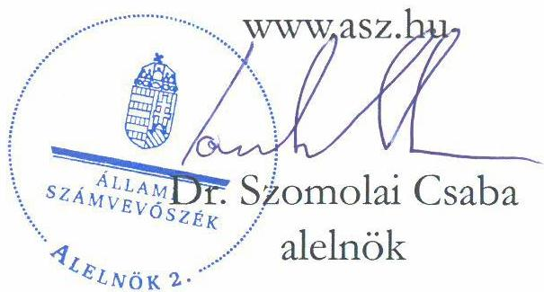

ÁLLAMI SZÁMVEVŐSZÉK

# JELENTÉS

A többségi állami tulajdonban lévő gazdasági társaságok beszerzéseinek ellenőrzése

MVM Mobiliti Kft.

2025.

25073

www.asz.hu

---

ÁLLAMI SZÁMVEVŐSZÉK

# JELENTÉS

A többségi állami tulajdonban lévő gazdasági társaságok beszerzéseinek ellenőrzése

MVM Mobiliti Kft.

2025.

25073

---

Jelentéseink az interneten a www.asz.hu címen olvashatók.

ELLENŐRZÉSI IGAZGATÓSÁG:
ELLENŐRZÉSI IGAZGATÓSÁG III.

ELLENŐRZÉSI IGAZGATÓ:
HERCZEGH ZSOLT igazgató

ELLENŐRZÉSVEZETŐ:
VEREBESNÉ SZABÓ ERZSÉBET ellenőrzésvezető

IKTATÓSZÁM: EL-4022-007/2025
TÉMASORSZÁM: 39/2024
ELLENŐRZÉS-AZONOSÍTÓ SZÁM: V1076

---

TARTALOMJEGYZÉK

- AZ ELLENŐRZÉS ALAPADATAI ... 5
- AZ ELLENŐRZŐTT SZERVEZET ... 7
- ÖSSZEFOGLALÁS ... 8
- AZ ELLENŐRZÉS FÓKUSZTERÜLETE ... 9
- MEGÁLLAPÍTÁSOK ... 10
- JAVASLATOK ... 14
- MELLÉKLETEK ... 15
- I. sz. melléklet: Értelmező szótár ... 15
- II. sz. melléklet: Az ellenőrzött szervezetek jegyzéke ... 16
- III. sz. melléklet: Ellenőrzési kritériumok ... 17
- FÜGGELÉK: ÉSZREVÉTELEK ... 18
- RÖVIDÍTÉSEK JEGYZÉKE ... 23

---

“哈，你是个小伙子，你是个小伙子，你是个小伙子，你是个小伙子，你是个小伙子，你是个小伙子，你是个小伙子，你是个小伙子，你是个小伙子，你是个小伙子，你是个小伙子，你是个小伙子，你是个小伙子，你是个小伙子，你是个小伙子，你是个小伙子，你是个小伙子，你是个小伙子，你是个小伙子，你是个小伙子，你是个小伙子，你是个小伙子，你是个小伙子，你是个小伙子，你是个小伙子，你是个小伙子，你是个小伙子，你是个小伙子，你是个小伙子，你是个小伙子，你是个小伙子，你是个小伙子，你是个小伙子，你是个小伙子，你是个小伙子，你是个小伙子，你是个小伙子，你是个小伙子，你是个小伙子，你是个小伙子，你是个小伙子，你是个小伙子，你是个小伙子，你是个小伙子，你是个小伙子，你是个小伙子，你是个小伙子，你是个小伙子，你是个小伙子，你是个小伙子，你是个小伙子，你是个小伙子，你是个小伙子，你是个小伙子，你是个小伙子，你是个小伙子，你是个小伙子，你是个小伙子，你是个小伙子，

---

AZ ELLENŐRZÉS ALAPADATAI

## AZ ELLENŐRZÉS CÉLJA

Az ellenőrzés célja annak értékelése volt, hogy a gazdasági társaság – ellenőrzés során kiválasztott – beszerzéseire szabályszerűen került-e sor, a kapcsolódó döntéshozatal szabályszerű és megalapozott volt-e, valamint a beszerzéshez kapcsolódóan érvényesültek-e a célszerűség és az eredményesség szempontjai.

## AZ ELLENŐRZÉS TÍPUSA

Kombinált ellenőrzés

## AZ ELLENŐRZŐTT IDŐSZAK

A 2023. év.

## AZ ELLENŐRZÉS TÁRGYA

Az ellenőrzés tárgya az MVM Mobiliti Kft. 2023. évben megvalósult beszerzéseire irányuló döntések szabályszerűsége, megalapozottsága és célszerűsége, a megvalósult beszerzések szabályszerűsége, eredményessége, a beszerzett eszközök és szolgáltatások (köz)feladat ellátás során történt hasznosulása, azaz a beszerzések megfelelősége volt. Az ellenőrzés kiterjedt a beszerzések előkészítésének, a beszerzésekre vonatkozó megrendelés létrejöttének és tartalmának ellenőrzésére is.

Az ellenőrzés kiterjedt minden olyan körülményre és adatra, amely az ÁSZ¹ jogszabályban meghatározott feladatainak teljesítéséhez, valamint a program végrehajtása folyamán felmerült újabb összefüggések feltárásához szükséges volt.

## AZ ELLENŐRZÉS JOGALAPJA

Az ellenőrzés jogszabályi alapját az ÁSZ tv.² 1. § (3) bekezdésének és 5. § (4) bekezdésének előírásai képezték.

## AZ ELLENŐRZÉS MÓDSZERE

Az ellenőrzés végrehajtása a nemzetközi standardokat irányadónak tekintve az ellenőrzési program szempontjai, az ellenőrzött időszakban hatályos jogszabályok, az ellenőrzés szakmai szabályok és a jelen ellenőrzésre irányadó ÁSZ módszertan figyelembevételével történt.

---

Az ellenőrzés alapadatai

Az ellenőrzési kérdések megválaszolásához szükséges bizonyítékok megszerzése az ellenőrzött szervezet által rendelkezésre bocsátott dokumentumokra és adatokra alapozva, továbbá megfigyelés, szemle (szemrevételezés), kérdésfeltevés (információkérés), valamint elemző eljárás útján valósult meg.

Az ellenőrzés lefolytatásához az ellenőrzött szervezet a 2023. évben megvalósult beszerzéseire vonatkozó főkönyvi és analitikus nyilvántartások, valamint az ÁSZ által kért további dokumentumok, adatok, információk megküldésével és a helyszíni ellenőrzés során szolgáltatott adatokat. A rendelkezésre álló adatok alapján az MVM Mobiliti Kft. a 2023. évben közelítőleg bruttó 3 502 millió forint összértékben hajtott végre beszerzéseket. A mintavételezés keretében két egymással szorosan összefüggő beszerzés került kiválasztásra, melyek tárgyévben számlázott bruttó összértéke mintegy 207 millió forintot tett ki.

Az ellenőrzési bizonyítékként felhasználható adatforrások közé tartoztak egyrészt az ellenőrzéshez kért dokumentumok, adatállományok, nyilatkozatok, másrészt adatforrás volt minden – az ellenőrzés folyamán – feltárt, az ellenőrzés szempontjából információkat tartalmazó dokumentum.

A tények feltárása és azok összegzése során a megállapítások az ellenőrzött mintatételekre vonatkozóan kerültek megfogalmazásra. A mintatételek ellenőrzésének eredményei nem kerültek kivetítésre. Az ÁSZ akkor tekintette megfelelőnek a mintatételként kiválasztott beszerzést, ha a beszerzési eljárás teljes folyamata a lényegi elemeiben szabályszerű, célszerű és – amennyiben értékelhető – eredményes volt, illetve a beszerzés tekintetében érvényesültek a nemzeti vagyonnal való felelős gazdálkodás elvei.

Az ellenőrzés kitért minden olyan körülményre, amely a program végrehajtása kapcsán felmerült és az ellenőrzés céljaival összhangban volt.

---

AZ ELLENŐRZÖTT SZERVEZET

Az MVM Mobiliti Kft.-t 2011. július 11-én alapította a – Budapest Főváros Önkormányzata és az RWE Gas International B. V. tulajdonában álló – FŐGÁZ Zrt.³ FŐGÁZ CNG Kft.⁴ elnevezéssel. A Társaság⁵ elnevezése 2021. január 1-jei hatállyal változott MVM Mobiliti Kft-re. A Társaság 2014. október 9-én került teljes egészében közvetett állami tulajdonba. Az ellenőrzött időszakban az MVM Mobiliti Kft. az MVM Csoport⁶ tagja volt, egyedüli részvényese a Magyar Állam 100 százalékos tulajdonában álló MVM Zrt.⁷.

A Társaságnál 2023. évben taggyűlés nem működött, az Alapító Okirat¹,⁸ rendelkezése értelmében hatáskörét az Egyedüli Tag gyakorolta. A Társaságnak az ellenőrzött időszakban két együttes cégjegyzési joggal rendelkező ügyvezetője és háromtagú felügyelőbizottsága volt, valamint a Társaság választott könyvvizsgálóval rendelkezett.

Az MVM Mobiliti Kft. cégjegyzékbe bejegyzett főtevékenysége mérnöki tevékenység, műszaki tanácsadás volt. A Társaság Üzleti tervében⁹ megfogalmazott üzletpolitikai cél Magyarország piacvezető alternatív közlekedési szolgáltatójaként az elektromos és gázalapú környezetbarát közlekedés részarányának növelése és ezen keresztül az állam kibocsátáscsökkentési céljai megvalósulásának elősegítése volt. A Társaság fő tevékenysége az országos sűrített földgáz (CNG) és elektromos töltőinfrastruktúra fejlesztése és működtetése, elektromobilitás szolgáltatás nyújtása, valamint műszaki és technológiai megoldások értékesítése volt.

A Társaság 2023. évi nettó árbevételének 55%-a elektromos töltők értékesítéséhez, telepítéséhez, üzemeltetéséhez kapcsolódott, 41%-a CNG üzemanyag értékesítésből és sűrítési szolgáltatásból, további 4%-a egyéb szolgáltatásokból származott. A Társaság beszerzéseit az elektromos töltő szolgáltatásokhoz szükséges villamos energia, a technológiai gáz és földgáz vásárlás, ingatlan, töltőállomás és egyéb bérelti díjak, valamint az elektromos töltőállomások vásárlásához, üzembehelyezéséhez, telepítéséhez és karbantartásához kapcsolódó tételek határozták meg.

1. táblázat
(adatok: E Ft-ban)

AZ MVM MOBILITI KFT. BESZÁMOLÓJÁNAK FŐBB ADATAI

|   | 2022. év | 2023. év  |
| --- | --- | --- |
|  Értékesítés nettó árbevétele | 1 918 669 | 2 845 820  |
|  Anyagjellegű ráfordítások | 1 920 125 | 2 203 064  |
|  - ebből anyagköltség | 1 332 432 | 1 388 614  |
|  - ebből igénybe vett szolgáltatások | 319 349 | 597 162  |
|  - ebből eladott áruk beszerzési értéke | 187 974 | 107 573  |
|  Személyi jellegű ráfordítások | 238 456 | 255 020  |
|  Értékesítési leírás | 206 475 | 245 926  |
|  Tárgyi eszközök | 1 146 026 | 1 121 223  |
|  Készletek | 140 033 | 326 448  |
|  Adózott eredmény | - 435 366 | 136 802  |

Forrás: ÁSZ saját szerkesztés az e-beszámoló adatok alapján

A Társaság a megelőző két üzleti év beszámolóadatai alapján az ellenőrzött időszakban nem volt köteles a Taktv.¹⁰ szerinti belső kontrollrendszer kialakítására és működtetésére, és az Egyedüli Tag, valamint a felügyelőbizottság sem élt ilyen javaslattal.

---

8

# ÖSSZEFOGLALÁS

A Magyar Állam gazdasági társaságokban lévő részesedései a nemzeti vagyon, ezen belül az állami vagyon részét képezik. E részesedések értékére, ezáltal az állami vagyon értékének megőrzésére, növelésére alapvető befolyást gyakorol az állami tulajdonban álló gazdasági társaságok gazdálkodási tevékenysége.

A gazdasági társaságokkal szemben elvárás, hogy beruházásaikat és egyéb beszerzéseiket megfelelő tervezéssel hajtsák végre, mérjék fel annak szükségességét, pénzügyi vonzatát, valamint értékeljék a beszerzés gazdálkodásra vonatkozó várható hatásait, elemezzék azok következményeit, és alapozzák meg döntéseiket. Az Alaptörvény¹¹ is alapelvi szinten rögzíti, hogy az állam tulajdonában álló gazdálkodó szervezetek törvényben meghatározott módon, önállóan és felelősen gazdálkodnak a törvényesség, célszerűség és eredményesség követelményei szerint.

A gazdálkodás egyes kérdéseire kiterjedő belső szabályozók a gazdasági társaságok működési sajátosságainak figyelembevételével alkotott részletes rendelkezéseikkel hivatottak biztosítani a jogszabályokban meghatározott általános normák végrehajtását, így – többek között – a felelős gazdálkodás elveinek érvényesülését. A gazdasági társaságok a tevékenységük során kötelesek a belső szabályozóikban foglaltakat betartani.

A Társaság ellenőrzött beszerzései a döntéshozatal tekintetében feltárt szabálytalanságok miatt – az eljárások lényegi elemeit együttesen értékelve – részben voltak megfelelőek.

AZ ELLENŐRZÉS MEGÁLLAPÍTOTTA, hogy az MVM Mobiliti Kft. beszerzési döntései a vevői igény kielégítése érdekében indokoltak voltak, azok az Üzleti tervben meghatározott célokkal összhangban merültek fel. A Társaság a beszerzési igényeit a belső szabályozásnak megfelelően gazdaságossági számításokkal megalapozta.

A Társaság a beszerzési döntést a belső szabályozókban foglalt előírások ellenére saját hatáskörben hozta meg, és a beszerzési igényt szabálytalanul csak utólagosan, a beszerzés megvalósítását követően terjesztette jóváhagyás céljából a felügyelőbizottság és az Egyedüli Tag elé.

A Társaság ellenőrzött beszerzési eljárásai során ártárgyalásokat folytatott a szállítóval a beszerzési ár leszorítása érdekében. Az elért árengedmény lehetővé tette három beszerzett eszköz profittal történő értékesítését. Két beszerzett berendezést a Társaság a saját elektromos töltőinfrastruktúra beruházási tevékenységéhez használt fel.

A Társaság az általa megkötött szerződésekkel kapcsolatban fennálló közzétételi kötelezettségének a jogszabályi előírások ellenére nem tett eleget.

---

9

# AZ ELLENŐRZÉS FÓKUSZTERÜLETE

1. A többségi állami tulajdonban álló gazdasági társaság beszerzésének megfelelősége

---

MEGÁLLAPÍTÁSOK

# 1. A többségi állami tulajdonban álló gazdasági társaság beszerzésének megfelelősége

## Összegző megállapítás

Az MVM Mobiliti Kft. ellenőrzött beszerzései a döntéshozatal tekintetében feltárt szabálytalanságok miatt – az eljárások lényegi elemeit együttesen értékelve – részben voltak megfelelőek.

Az ÁSZ ellenőrzése a 2023. évben megvalósult beszerzések közül 5 db, két tételben megrendelt és megvásárolt elektromos töltőberendezés beszerzésének megfelelőségére terjedt ki.

## 2. táblázat

AZ ELLENŐRZŐTT BESZERZÉSEK FŐBB ADATAI

|  SORSZÁM | BESZERZÉS TÁRGYA | BESZERZÉS ALAPJÁT KÉPEZŐ MEGRENDELÉS KÉLTE | TELJESÍTÉS IDŐPONTJA | BESZERZÉS NETTÓ ÉRTÉKE  |   |
| --- | --- | --- | --- | --- | --- |
|   |   |   |   |  (EUR) | (Ft)*  |
|  1. | 3 db elektromos gépjármű töltőberendezés + szállítási költség | 2023.11.28. | 2023.12.08. | 254 149 | 97 234 866  |
|  2. | 2 db elektromos gépjármű töltőberendezés + 4 db töltőcsatlakozó visszavásárlási opcióval + szállítási költség | 2023.11.28. | 2023.12.08. | 170 886 | 65 379 275  |

*A Ft-ra való átszámítás a teljesítés napján érvényes 382,59 Ft/EUR árfolyamon történt
Forrás: ÁSZ saját szerkesztés az MVM Mobiliti Kft. adatszolgáltatása alapján

Az ÁSZ által feltárt tények és körülmények alapján az ellenőrzött beszerzések vonatkozásában felmerült, hogy a Társaság a Kbt.¹² 5. § (1) bekezdés e) pontja szerinti ajánlatkérőnek minősülhetett, ezért közbeszerzési eljárás lefolytatására lett volna szükség. Ezen kérdéssel kapcsolatban az ÁSZ a hatáskörrel rendelkező Közbeszerzési Hatóság felé jelzéssel élt. Az ÁSZ jelentése a közbeszerzéssel kapcsolatos megállapításokat nem tartalmazza, az ÁSZ a III. számú mellékletben meghatározott ellenőrzési kritériumok figyelembevételével folytatta le az ellenőrzését.

# A BESZERZÉSEKHEZ KAPCSOLÓDÓ BELSŐ SZABÁLYOZÓ ESZKÖZÖK

Az MVM Mobiliti Kft. beszerzéseire vonatkozó eljárásokat az Alapító Okirat₁,₄, az SzMSz₁,₂¹³, a Beszerzési Szabályzat₁,₂¹⁴ és a Szerződéskötési Ügyrend₁,₂¹⁵ szabályozták. A Társaság a beszerzési eljárásaira vonatkozó belső szabályozói környezetét kialakította.

---

Megállapítások

# A BESZERZÉSI IGÉNYEK FELMERÜLÉSE

A Társaság Üzleti terve tartalmazta a piacvezető pozíció megtartásához szükséges elektromos töltőberuházások nagyságrendjét, valamint az elektromos üzletág kiemelt mutatói között a töltő értékesítés tárgyévre – és kitekintésként a következő négy évre – tervezett árbevételét. Az Üzleti tervben megfogalmazott elvárás a termékkör értékesítéséből származó árbevétel dinamikus növekedése volt.

Az MVM Mobiliti Kft. stratégiai vevő partnere 2023. április 11-én elektronikus levélben érdeklődött a Társaságnál elektromos gépjármű töltőberendezések leszállítása és üzembe helyezése tárgyban, majd a műszaki paraméterek több körös egyeztetését követően a vevő képviseletében eljáró mérnöki iroda a Társaság által kiajánlott töltőtípusokra 2023. július 5-én árajánlatot kért.

Mindezek alapján a Társaság beszerzési igényei a vevői igény kielégítése és az Üzleti tervben megfogalmazott célkitűzések elérése érdekében indokoltan merültek fel.

# A BESZERZÉS FOLYAMATA ÉS A BESZERZÉSRE IRÁNYULÓ DÖNTÉS

A Társaság által az ellenőrzés során tett nyilatkozat és a töltőberendezés külföldi gyártójával folytatott levelezés alapján a vevő által igényelt töltőtípust csupán két cég forgalmazta Magyarországon. A két lehetséges szállító közül az egyik a vevő közvetlen piaci versenytársa volt, így a berendezések megrendelése kizárólag a másik partnertől volt lehetséges. A Társaság a potenciális szállítók körének bővítése érdekében több alkalommal is megkísérlete felvenni a kapcsolatot közvetlenül a gyártóval, azonban a megkeresés a Társaság nyilatkozata és a rendelkezésre álló dokumentumok alapján a gyártó érdektelensége miatt nem járt sikerrel. A bemutatott piaci viszonyok következtében a Társaság az egyedüli szóba jöhető szállítóval kezdett tárgyalásba a vevői megrendelés teljesítéséhez szükséges 3 db elektromos gépjármű töltőberendezés beszerzéséről. A rendelkezésre álló adatok és információk alapján – az ellenőrzés megállapítása szerint – a szállító kiválasztása megalapozott volt.

A szállító által 2023. szeptember 1-jén tett árajánlat alapján a Társaság elküldte az első árajánlatát a vevő részére, amelyet a vevő nem fogadott el, ezért a Társaság folytatta a tárgyalásokat a versenyképes ár elérése érdekében. Az ártárgyalások során a Társaság gazdaságossági számításokat végzett. A szállító 2023. szeptember 28-án plusz 2 db töltőberendezéssel kiegészítve küldte meg új ajánlatát. Az árajánlattal megküldött levélben a szállító kifejtette, hogy az ajánlatban feltüntetett árak egy speciális egyedi kedvezményes projekt árazás keretében kerültek meghatározásra a gyártó részéről. Ennek megfelelően az 5 db töltőberendezés együttes megrendelése esetén voltak érvényesek. A vevőnek leszállítandó 3 db berendezés esetében az előző árajánlathoz képest 15%-kal kevesebb volt a szállító által kiajánlott ár. A Társaság több eredménytelen árajánlatot követően 2023. november 21-én küldte meg a vevőnek végző ajánlatát, amelyet a vevő elfogadott, és 2023. november 23-án megrendelte a 3 db töltőberendezést 2024. január 31-i szállítási határidővel. A Társaság a plusz 2 db töltőberendezés értékesítéséről és telepítéséről tárgyalásokat folytatott egy másik potenciális vevő partnerrel. A 2 db töltőberendezés az értékesítés meghiúsulása esetén a Társaság saját elektromos töltő infrastruktúra fejlesztési tevékenységéhez is felhasználható volt.

A Társaság a vevő megrendelését követően további kedvezményeket ért el a szállítónál: ugyanakkora végző árért cserébe az 5 db töltőberendezés mellett 4 db töltőcsatlakozót is kapott, és a töltőberendezések átlagos egységára az eredeti ajánlathoz képest 23%-kal lett kevesebb. A töltőcsatlakozókra a szállító a 2023. november 28-i ajánlatában 6 hónapos visszavásárlási garanciát is nyújtott.

---

Megállapítások

A végső, kötelező érvényű szállítói ajánlat csak 3 napig volt érvényes. A Társaság az ellenőrzés során tett nyilatkozat szerint a vevői megrendelés birtokában vezetői értekezleten döntött a töltőberendezések megrendeléséről, és a megrendeléseket megelőzően szóban tájékoztatta az Egyedüli Tag képviselőit a beszerzésekről. A Beszerzési Szabályzat₂ 7.3. pontjában foglalt – a beszerzési eljárás rekonstruálhatóságát és utólagos ellenőrizhetőségét szolgáló – előírás ellenére a vezetői döntésről és az Egyedüli Tag tájékoztatásáról nem készült írásos dokumentum.

A Társaság a 2023. november 28-i szállítói árajánlat beérkezésének napján az Egyedüli Tag döntése nélkül rendelte meg a töltőberendezéseket és vállalt kötelezettséget a szállítóval szemben – a két megrendelés alapján – összesen 425 035 EUR, azaz a 2023. november 28-án érvényes 380,12 Ft/EUR MNB árfolyammal átszámítva 161 564 304 Ft értékben. Az Egyedüli Tag döntése hiányában történő megrendelések ellentétesek voltak az Alapító Okirat, 7.3. (u) pontjában, valamint a Beszerzési Szabályzat₂ 6.3.9.1. pontjában és 2. számú mellékletét képező Beszerzési Döntési Hatásköri Lista 9.1. pontjában foglalt rendelkezésekkel, így a beszerzésekre irányuló döntéshozatal nem volt szabályszerű. A Társaságnak a versenyeztetés nélkül, ugyanazon szállítótól nettó 100 millió forintot meghaladó értékben történő beszerzésekre egyedi szerződéskötési engedélyt kellett volna kérnie az Egyedüli Tagtól.

A Társaság és a szállító közötti szerződéses jogviszony a szállító által tett ajánlatban foglaltak szerint, a Társaság megrendelései alapján jött létre. További szerződéses feltétel (például ÁSZF¹⁶) nem kapcsolódott a beszerzésekhez. A felek a Ptk.¹⁷ előírásainak megfelelően meghatározták a beszerzések tárgyát képező eszközök típusát, mennyiségét, ellenértékét, a fizetési és jótállási feltételeket. A megrendelések ügyvezetői aláírását megelőzően a kereskedelmi és gazdasági vezető szignója igazolta a megrendelések szakmai és pénzügyi megfelelőségét. A megrendelések jogi szignálása a Szerződéskötési Ügyrend₂ 5.3.2.3. pontja ellenére nem történt meg.

A Társaság csak utólag, 2024. február 5-én készített előterjesztést a felügyelőbizottság számára a szállítóval kötött szerződések jóváhagyása tárgyában. A felügyelőbizottság 4/2024. (II.08.) számú határozatában jóváhagyásra javasolta az Egyedüli Tagnak a töltőberendezések megrendelését. A felügyelőbizottság elnöke felhívta a Társaság ügyvezetésének figyelmét, hogy az Egyedüli Tag hatáskörébe tartozó tárgykörök esetén a jövőben törekedjen arra, hogy valamennyi döntés előzetesen, az ügylet létrejöttét megelőzően, a megfelelő hatásköri szabály betartása mellett kerüljön jóváhagyásra, és tartózkodjon az utólagos jóváhagyásra történő előterjesztéstől. Megfontolásra javasolta továbbá az Egyedüli Tag részére történő javaslattételt az Alapító Okirat, hatásköri szabályainak módosítására annak érdekében, hogy rugalmasabb módon történhessen a szerződéskötés a Társaság részéről, megfelelve a piaci körülményeknek és működésnek. Az Egyedüli Tag 110/2024. számú határozatában 2024. február 23-án jóváhagyta a töltőberendezések beszerzésére vonatkozó adásvételi jogügyleteket. A 2024. április 3-tól hatályos Alapító Okirat-ban az Egyedüli Tag a Társaság ügyvezetésének hatáskörébe tartozó kötelezettségvállalás felső határát 250 millió Ft értékre emelte fel.

## A BESZERZÉSEK ELSZÁMOLÁSA

A szállító 2023. november 30-án bocsátotta ki a díjbekérőket 2023. december 8-ai fizetési határidővel nettó 254 149 EUR (3 db töltőberendezés) és nettó 170 886 EUR (plusz 2 db töltőberendezés) értékben, összhangban a Társaság megrendeléseiben foglaltakkal. A Társaság által 2023. december 8-án kiegyenlített díjbekérők alapján a szállító még aznap, 2023. december 8-án kiállította a számlákat. A befogadott számlák alaki és tartalmi szempontból mindkét ellenőrzött tétel esetében megfeleltek az Áfa tv.¹⁸ és a Számv. tv.¹⁹

12

---

Megállapítások

előírásainak. A szállító a számlák kiállításával egy napon tárolási nyilatkozatot bocsátott ki, melynek értelmében saját kockázatára tárolta a megvásárolt 5 db töltőberendezést 2023. december 8-ától kezdve. A Társaság 2023. december 29-én készletre vette a berendezéseket. A 3 db töltőberendezést a Társaság 2024. évben értékesítette. A további 2 db töltőberendezés értékesítése a tárgyalópartner visszalépése miatt meghiúsult, ezért azokat a Társaság saját elektromos töltő infrastruktúra fejlesztési tevékenységéhez használta fel.

# KÖZZÉTÉTELI KÖTELEZETTSÉG TELJESÍTÉSE

A 18/2005. IHM rendelet²⁰ értelmében a közzétételre szolgáló honlap megnyitásakor megjelenő oldalon az adatközlő köteles elhelyezni a közzétételi listák által előírt adatokat tartalmazó jegyzékre vagy felületre mutató hivatkozást. A hivatkozást jól látható módon kell elhelyezni, „Közérdekű adatok” elnevezéssel. Ezzel szemben az MVM Mobiliti Kft. által a Taktv. 2. §-a alapján közzétett közérdekű adatok a honlap „E-mobilitás” részében, az „Információk” menüpont lenyitásával, a „Cégvezetés” feliratra kattintva voltak elérhetők. Ezáltal a Társaság a közzététel során nem tartotta be a 18/2005. IHM rendelet 2. § (1) bekezdésében előírtakat.

A Társaság az Info tv.²¹ 33. § (1) és (3) bekezdéseiben, 37. § (1) bekezdésében és 1. melléklet III. gazdálkodási adatok 4. pontjában foglaltakkal ellentétben az általa 2023. évben megkötött szerződésekkel kapcsolatban fennálló közzétételi kötelezettségének nem tett eleget, így az ellenőrzött beszerzések alapját képező szerződésekre vonatkozó adatokat sem hozott nyilvánosságra.

---

14

# JAVASLATOK

Az ÁSZ tv. 33. § (1) bekezdésében foglaltak értelmében az ellenőrzött szervezet vezetője köteles a jelentésben foglalt megállapításokhoz kapcsolódó intézkedési tervet összeállítani és azt a jelentés kézhezvételétől számított 30 napon belül az ÁSZ részére megküldeni. Amennyiben az ellenőrzött szervezet vezetője nem küldi meg határidőben az intézkedési tervet, vagy továbbra sem elfogadható intézkedési tervet küld, az Állami Számvevőszék elnöke az ÁSZ tv. 33. § (3) bekezdése a) és b) pontjaiban foglaltakat érvényesítheti.

## AZ MVM MOBILITI KFT. ÜGYVEZETŐI RÉSZÉRE

1. Az Alapító Okiratban és a Beszerzési Szabályzatban előírtak érvényesülése érdekében tegyenek intézkedéseket olyan kontrolltevékenységek kialakítására és működtetésére, fejlesztésére, amelyek a beszerzési döntéshozatal folyamatában biztosítják a hatásköri szabályok betartását.

2. A Beszerzési Szabályzatban előírtak érvényesülése érdekében tegyenek intézkedéseket olyan kontrolltevékenységek kialakítására és működtetésére, fejlesztésére, amelyek biztosítják a beszerzési eljárások során hozott döntések megfelelő dokumentálását.

3. A Szerződéskötési Ügyrendben előírtak érvényesülése érdekében tegyenek intézkedéseket olyan kontrolltevékenységek kialakítására és működtetésére, fejlesztésére, amelyek biztosítják, hogy a jövőben az egyedi szerződések előzetes jogi véleményezése és szignálása megtörténjen.

4. Az Info tv. vonatkozó előírásai érvényesülése érdekében vizsgálják felül a közérdekű adatok honlapon történő – a 18/2005. (XII. 27.) IHM rendeletnek megfelelő – közzétételét, és tegyék meg a szükséges intézkedéseket.

---

MELLÉKLETEK

I. SZ. MELLÉKLET: ÉRTELMEZŐ SZÓTÁR

gazdasági társaság
A gazdasági társaságok üzletszerű közös gazdasági tevékenység folytatására, a tagok vagyoni hozzájárulásával létrehozott, jogi személyiséggel rendelkező vállalkozások, amelyekben a tagok a nyereségből közösen részesednek, és a veszteséget közösen viselik.
(Ptk. 3:88. § (1) bekezdés)

beszerzés
Eszközök és/vagy szolgáltatások visszterhes megszerzésére (vásárlására) irányuló (keret)szerződés/(keret)megállapodás létrehozását célzó és azt eredményező eljárás.
(ÁSZ saját definíció)

eszköz
A vásárolt immateriális javak (Számv. tv. 25. § (1)-(2) bekezdés) és tárgyi eszközök (Számv. tv. 26. § (1) bekezdés) valamint – a közvetített szolgáltatások kivételével – a vásárolt készletek (Számv.tv. 3. § (6) bekezdés 5. pont).

szolgáltatás
A gazdasági társaság által igénybe vett/megrendelt, harmadik felek által nyújtott/számlázott, nem anyagi javak termelésére irányuló tevékenységek, különös tekintettel az igénybe vett, egyéb és közvetített szolgáltatásokra (Számv. tv. 3. § (7) bekezdés 1-2. pont, (4) bekezdés 1. pont).

többségi állami tulajdon
Az állam tulajdonában lévő tagsági jogviszonyt megtestesítő értékpapír, illetve az állam tulajdonában lévő egyéb társasági részesedés, amennyiben a társaságban a Magyar Állam közvetlenül vagy közvetetten a szavazatok több mint felével rendelkezik.
(ÁSZ definíció a Vtv.22 1. § (2) bekezdés c) pontja és a Ptk. 8:2. § (1), (3)-(4) bekezdései alapján)

vagyongazdálkodás alapelvei
A nemzeti vagyon alapvető rendeltetése a közfeladat ellátásának biztosítása, ideértve a lakosság közszolgáltatásokkal való ellátását és e feladatok ellátásához szükséges infrastruktúra biztosítását. A nemzeti vagyonnal felelős módon, rendeltetésszerűen kell gazdálkodni.

A nemzeti vagyongazdálkodás feladata a nemzeti vagyon megőrzése, értékének és állagának védelme, rendeltetésének megfelelő, az állam, az önkormányzat mindenkori teherbíró képességéhez igazodó, elsődlegesen a közfeladatok ellátásához és a mindenkori társadalmi szükségletek kielégítéséhez szükséges, egységes elveken alapuló, átlátható, hatékony és költségtakarékos működtetése, értéknövelő használata, hasznosítása, gyarapítása, továbbá az állam vagy a helyi önkormányzat feladatának ellátása szempontjából feleslegessé váló vagyontárgyak elidegenítése, azzal, hogy a nemzeti vagyon megőrzése érdekében végzett bontás vagy átalakítás nem minősül az állag védelmi kötelezettség megszegésének.
(Nvtv.23 7. § (1)-(2) bekezdése alapján)

célszerűség
A célszerűség elve a felhasznált eszközök, közpénzek, erőforrások elérni kívánt célnak való megfelelését jelenti, továbbá, hogy azokat ésszerűen, racionálisan, a kitűzött cél elérése (közfeladat ellátása) érdekében használták-e fel.
(Forrás: ÁSZ ellenőrzési alapelvei és módszertana)

eredményesség
Az eredményesség elve a kitűzött célok és a szándékolt eredmények (hatások) elérését jelenti. A gazdálkodás, feladatellátás eredményességét mutatja a tényleges és a tervezett eredmények (hatások) összevetése.
(Forrás: ÁSZ ellenőrzési alapelvei és módszertana)

15

---

Mellékletek

- II. SZ. MELLÉKLET: AZ ELLENŐRZŐTT SZERVEZETEK JEGYZÉKE

**ELLENŐRZŐTT SZERVEZET NEVE**

MVM Mobiliti Kft.

16

---

Mellékletek

## III. SZ. MELLÉKLET: ELLENŐRZÉSI KRITÉRIUMOK

|  FÓKUSZTERÜLET | ELLENŐRZÉSI KRITÉRIUMOK  |
| --- | --- |
|  1. A többségi állami tulajdonban álló gazdasági társaság beszerzésének megfelelősége | Vtv. 2. § (1) bekezdés, 5. § (2) bekezdés,
Nvtv. 7. § (1)-(2) bekezdés,
Taktv. 2. § (3)-(4) bekezdés,
Ptk. 6:215-234. §, 6:238-271. §, 6:272 - 6:279. §,
Számv. tv. 165-167. §,
Áfa tv. 169. §,
Info tv. 33. § (1) és (3) bekezdés, 37. §, 1. melléklet III. gazdálkodási adatok 4. pont
18/2005 (XII. 27.) IHM rendelet 2. § (1) bekezdés,
belső szabályozó eszközök (Alapító Okirat, SzMSz, Beszerzési Szabályzat, Szerződéskötési Ügyrend)
Célszerűség: a beszerzésre irányuló döntés akkor célszerű, ha az megalapozott, továbbá a rendelkezésre álló erőforrások ésszerű, racionális, a gazdasági társaság (köz)feladatának megvalósítása érdekében álló, az ahhoz szükséges mértékű felhasználásával jár.
Eredményesség: a beszerzés akkor eredményes, ha összhangban áll a társaság céljaival és támogatja azok elérését, megvalósulását, valamint a beszerzés tárgya a társaság (köz)feladat ellátása során ténylegesen hasznosításra kerül, betölti eredetileg elvárt funkcióját.
A beszerzés eredményessége kizárólag akkor értékelhető, ha a beszerzési eljárás teljes folyamata a lényegi elemeiben szabályszerű, a beszerzési döntés megalapozott és célszerű volt.  |

---

FÜGGELÉK: ÉSZREVÉTELEK

A jelentéstervezet a Számvevőszék 15 napos észrevételezésre megküldte az ellenőrzött szervezet vezetőjének az ÁSZ tv. 29. §* (1) bekezdése előírásának megfelelően.

A függelék tartalmazza az ellenőrzött észrevételeit, illetve az el nem fogadott észrevételek elutasításának indokolását.

## A Társaság észrevétele a jelentéstervezet 10. oldal „Megállapítások” alcím 2. bekezdéséhez kapcsolódóan:

Észrevételezzük, hogy az ÁSZ az eljárása során nem tájékoztatta a Társaságot arról, hogy olyan körülmény vagy információ került a birtokába, amely alapján a vizsgálat tárgyát képezte a Társaság közbeszerzési ajánlatkérői minőségének kérdése is, így az eljárás során a Társaság nem került abba a helyzetbe, hogy ennek kapcsán – álláspontját kifejezésre juttató, azt megvédő – nyilatkozatot tegyen.

Észrevételezzük továbbá, hogy sem a jelentéstervezetből, sem az ÁSZ megkeresése folytán a Közbeszerzési Hatóság részéről küldött felhívásból nem derül világosan ki, hogy pontosan mi az a körülmény vagy feltételezés, amely alapján a Társaság ajánlatkérői minőségének vizsgálata felmerül, így a Társaság a Közbeszerzési Hatóság felé csupán általános, de nem kellően adekvát választ tudott – rövid határidőn belül, kapacitásán és erején felül – megfogalmazni.

Az ügy érdemében előadjuk, hogy a közbeszerzési kötelezettség vizsgálata az MVM cégcsoport belső szabályozása szerint minden tagvállalat, így a Társaság számára is kötelezettség a beszerzések megvalósítását megelőzően. Ezen saját belső vizsgálatok eredményei azt mutatják, hogy a Társaság sem jelenleg, sem korábban nem tartozott a Kbt. hatálya alá, mint klasszikus ajánlatkérő vagy közszolgáltató ajánlatkérő, mert sem a Kbt. 5. § (1) bekezdése szerinti klasszikus ajánlatkérői minőség, sem a Kbt. 6-7. § szerinti közszolgáltatói ajánlatkérői minőség fogalmi elemei nem állnak fenn a Társaság esetén, és a Társaság a saját döntése alapján önkéntes csatlakozást sem választott vagy arra szerződés/ létesítő okirat nem kötelezte. A Társaság kizárólag a Kbt. 5. § (4) bekezdése alapján, eseti jelleggel, meghatározott beszerzések esetén tartozik ajánlatkérőként a Kbt. hatálya alá, mivel egyes központosított (köz)beszerzésekre vonatkozó jogszabályok ezt közvetett állami tulajdonú társaságként – gyakorlatilag kötelezően önkéntes alapon – előírják a számára. A Társaság a közbeszerzési ajánlatkérői nyilvántartásban is ennek megfelelően szerepel. A fentiek további részletes kifejtésére tájékoztatásul csatoljuk a 2025. június 23. napján a Közbeszerzési Hatóság részére is megküldött válaszlevelünköt szíves tájékoztatásul.

## El nem fogadás indoka:

Az ÁSZ az ellenőrzés megkezdéséről szóló EL-4024-037/2024. iktatószámú értesítő levelének mellékleteként megküldte az MVM Mobiliti Kft. számára az EL-4022-002/2024. iktatószámú ellenőrzési programot. A Társaság az elektronikus úton kézbesített küldeményt a hivatalos elérhetőséget biztosító szolgáltató visszaigazolása szerint 2024. május 28-án vette át. Az ellenőrzési program alapján a beszerzések

* 29. § (1) Az Állami Számvevőszék az ellenőrzési megállapításait megküldi az ellenőrzött szervezet vezetőjének vagy az általa megbízott személynek, és annak, akinek személyes felelősségét állapította meg.
(2) Az ellenőrzött szervezet vezetője és a felelősként megjelölt személy az ellenőrzés megállapításaira tizenöt napon belül írásban észrevételt tehet.
(3) Az Állami Számvevőszék az észrevételre a beérkezésétől számított harminc napon belül írásban válaszol. A figyelembe nem vett észrevételeket köteles a jelentésben feltüntetni, és megindokolni, hogy azokat miért nem fogadta el.

18

---

Függelék: Észrevételek

szabályszerűségének vizsgálata az ellenőrzés egyik deklarált célja volt, a beszerzések szabályszerűsége az ellenőrzés tárgyát képezte. A szabályszerűség megítéléséhez hozzátartozott annak a körülménynek az ellenőrzése is, hogy a kiválasztott beszerzést a Társaság – amennyiben annak feltételei fennálltak – a közbeszerzésre irányadó szabályok szerint folytatta-e le. Ezért az ellenőrzési program II. számú melléklete a fő ellenőrzési kritériumok között a Kbt.-t is tartalmazta. Az ellenőrzési programból az ellenőrzés célja, tárgya, fő kritériumai a Társaság által az ellenőrzés megkezdésekor megismerhetőek voltak. Az ÁSZ az ellenőrzés során beszerezte az ellenőrzés lefolytatásához, a megállapítások megtételéhez szükséges információkat, adatokat és dokumentumokat. Az ellenőrzési kérdések megválaszolása érdekében több alkalommal meghallgatta a Társaság képviselőit is. Az ÁSZ-nak nincs olyan eljárási kötelezettsége, hogy az ellenőrzés során birtokába került ellenőrzési bizonyítékok értékeléséről az ellenőrzött szervezetet a jelentéstervezet észrevételezésre történő kiküldését megelőzően tájékoztassa. Ezt nem befolyásolja az sem, ha a folyamatban lévő ellenőrzés során az ÁSZ más szerv vagy hatóság bevonását, értesítését vagy eljárásának kezdeményezését tartja indokoltnak vagy azt kezdeményezte.

A 2024. július 17-én lefolytatott helyszíni ellenőrzés során a Társaság képviselői az észrevétel tárgyával összefüggésben elmondták, hogy a Társaság az ellenőrzött időszakban rendelkezett beszerzési és közbeszerzési szabályzattal is, azonban az MVM Mobiliti Kft. nem volt közbeszerzési ajánlatkérő és a 2023. évben nem folytatott le önkéntes közbeszerzési eljárást sem (EL-4024-087/2024 iktatószámú jegyzőkönyv 4. számú kérdésére adott válasz). A 2024. december 5-én lefolytatott helyszíni ellenőrzés során az ellenőrzés feltette a kérdést, hogy a Társaság közbeszerzési ajánlatkérőnek tekinti-e magát. A Társaság jelenlévő képviselői ekkor szintén kifejthették, és ki is fejtették álláspontjukat. Elmondásuk szerint azért nem tekintették a Társaságot Kbt. szerinti ajánlatkérőnek, mert az MVM Mobiliti Kft. piaci alapon végezte a tevékenységét, közbeszerzési szabályzattal azért rendelkeztek, hogy adott esetben önkéntes ajánlatkérőként el tudjanak járni (EL-4024-195/2024. iktatószámú jegyzőkönyv 7. kérdésére adott válasz).

Fentiekre tekintettel nem helytálló az az észrevételben rögzített állítás, mely szerint a Társaságnak – az ÁSZ-tól kapott tájékoztatás hiánya, elmaradása miatt – nem lett volna tudomása arról, hogy az ÁSZ ellenőrzésének tárgyát képezte a Társaság közbeszerzési ajánlatkérői minőségének kérdése is, továbbá nem helytálló, hogy a Társaság az ellenőrzés során nem került abba a helyzetbe, hogy álláspontját kifejezésre juttassa vagy nyilatkozatot tegyen. A Társaság számára az ÁSZ tv. 29. §-a is garanciát és egyben lehetőséget is biztosít álláspontjának bemutatására.

Mivel az ellenőrzés során feltárt tények és körülmények alapján – ideértve a Társaság nyilatkozataiban foglaltakat is – a Kbt. 5. § (1) bekezdés e) pontja szerinti ajánlatkérői minőség konjunktív feltételeinek fennállása az ÁSZ ellenőrzés hatáskörében teljes bizonyossággal nem volt megállapítható, ugyanakkor nem is volt kizárható, a Kbt. 26. § (1)-(2) bekezdéseire tekintettel indokolttá vált a kérdésben a Közbeszerzési Hatóság megkeresése. A kérdést a továbbiakban a hatáskörrel rendelkező Közbeszerzési Hatóság fogja saját eljárása keretében megítélni, ezért az ÁSZ jelentése a közbeszerzéssel kapcsolatos megállapításokat nem tartalmazza, az ÁSZ a Közbeszerzési Hatóságnak címzett, az észrevétel 1. számú mellékleteként csatolt levélben foglaltakat nem értékelte. Mindezek alapján a jelentéstervezet módosítása nem indokolt.

Ugyanakkor figyelemmel arra, hogy az észrevételben foglaltak alapján az a következtetés vonható le, hogy a Közbeszerzési Hatóság nem ismertette a Társasággal az ÁSZ jelzésének részleteit, tájékoztatásul indokoltnak látjuk a lényegi elemek összefoglaló bemutatását az alábbiak szerint:

19

---

Függelék: Észrevételek

Az MVM Mobiliti Kft. tevékenysége esetében a közérdekűséget alapozza meg, hogy:

- A 182/2022. (V. 24.) Korm. rendelet²⁴ külön feladatként nevesíti a hazai elektromobilitás elterjedését elősegítő döntések meghozatalát, ezért az elektromobilitás hazai elterjesztésével kapcsolatos egyes állami feladatokat érintően több kormányzati döntés született. Példaként említve a hazai e-mobilitás gazdasági környezetének növelése érdekében a kis- és középvállalkozások az e-mobilitási rendszer fejlesztési rendszerébe történő bevonásának lehetőségének vizsgálatáról [1]²⁵, az elektromos üzemű gépjárművek használatához szükséges töltő-infrastruktúra fejlesztése érdekében az elektromos üzemű gépjárművek töltő berendezéseinek beszerzésére központosított közbeszerzés lefolytatásáról [2]²⁶, a hazai elektromos töltőhálózat bővítését célzó támogatási program kidolgozásáról és elindításáról, figyelembe véve Magyarország nemzetközi kötelezettségeit, az elektromos hálózat adottságait, valamint a gazdaságos és megújuló forrásból történő energiafelhasználás célkitűzését [3]²⁷.

- A Kormány a 443/2017. (XII. 27.) Korm. rendelet²⁸-tel az elektromobilitás hazai elterjesztésével kapcsolatos közfeladatok ellátására az e-Mobi Nonprofit Kft.-t jelölte ki, majd a 245/2019. (X. 22.) Korm. rendelet²⁹-tel az elektromobilitási tevékenység ellátásának biztonsága érdekében az e-Mobi Nonprofit Kft. 100%-os üzletrészének az NKM Mobilitás Kft. (MVM Mobiliti Kft.) általi megvásárlását nemzetstratégiai jelentőségűnek minősítette.

- Az elektromobilitás hazai elterjesztésével kapcsolatos közfeladat ellátására az e-Mobi Nonprofit Kft. a Kormány által kijelölt szerv, ugyanakkor a hazai elektromobilitás elterjedésében való szerepvállalással megvalósulhat más gazdasági szereplők feladatellátásában is a tágabb közösség érdekében végzett közérdekű cél. Ezen megközelítésben az EUB³⁰ esetjogára is figyelemmel az állami feladat fogalmának értelmezése funkcionális megközelítéssel bír, azaz az ellátandó feladat jellege és nem az azt ellátó szervezet jogi formája a meghatározó, abban az esetben is, ha a közcélok szolgálata csak áttételes (C-393/06. Ing. Aigner ügy).

- A C-44/96. sz. EUB-ügyben a Bíróság kimondta, miszerint az a feltétel, hogy egy szervezetet kifejezetten nem ipari vagy kereskedelmi, közérdekű szükségletek céljából hoztak létre, nem foglalja magában azt, hogy a szervezet kizárólagos feladata lenne az ilyen szükségletek kielégítése, közömbös, hogy végez-e más, közérdekűnek nem minősülő tevékenységeket.

Az MVM Mobiliti Kft. tevékenysége esetében a nem ipari vagy kereskedelmi jellegét alapozza meg:

- Az, hogy egy gazdasági társaság az alapító döntései szerint, vagy adott időszakban veszteségesen működik, és az alapító a működést tőkeemeléssel biztosítja, nem kizárólag a közjogi szervezetek sajátossága. A közjogi intézmények speciális jellemzője ugyanakkor, hogy a közérdekű szükségletek kielégítése az elsődleges cél, ezért a közérdekű tevékenység ellátása érdekében ezen döntéseket a gazdasági megfontolásoktól eltérő megfontolások (is) vezérlik.

Az Országgyűlés vagy a Kormány által az MVM Mobiliti Kft. felett közvetlen vagy közvetett meghatározó befolyásgyakorlását megalapozza:

- Az MVM Mobiliti Kft. gazdasági társaságban közvetetten, az MVM Zrt.-n keresztül megvalósul a meghatározó állami befolyás.

Az ÁSZ véleményének összegzése:

Az ÁSZ véleménye szerint az MVM Mobiliti Kft. legalább részben közérdekű tevékenységet folytat, ugyanakkor a közérdekű tevékenység nem ipari, kereskedelmi jellege a fentiekben rögzített szempontok mentén teljes bizonyossággal nem állapítható meg, ugyanakkor nem is zárható ki. Erre tekintettel az ÁSZ megkereste a kérdés eldöntésére hatáskörrel rendelkező Közbeszerzési Hatóságot.

20

---

Függelék: Észrevételek

# A Társaság észrevétele a jelentéstervezet 13. oldal „Közzétételi kötelezettség teljesítése” alcímhez kapcsolódóan:

Álláspontunk szerint – ahogy azt 2024. október 21. napján megküldött nyilatkozatunkban is jeleztük – a Társaság nem tartozik az Info tv. közérdekű adatok közzétételének tárgyi hatályát szabályozó 33. §-a, és ekképpen annak 37. §-ának hatálya alá, tekintettel arra, hogy nem minősül a 33. § (2) bekezdés a)-d) pontjai alatt megnevezett szerveknek, és nem lát el közfeladatot sem [33. § (3) bekezdés]. Ebből következően a 18/2005. (XII.27.) IHM rendelet hatálya is kizárólag az Info tv. 33. § (2) és (3) bekezdésében meghatározott szervekre terjed ki, az MVM Mobiliti Kft. vonatkozásában nem alkalmazandó.

Tájékoztatjuk az ÁSZ-t, hogy az MVM Zrt. részére a NAIH¹¹ 2024. december 19. napján cégek kapun keresztül kézbesítésre került levelében arról tájékoztatta az MVM Zrt.-t, hogy vele szemben az Info tv. 38. § (3) bekezdés a) pontja alapján, az Info tv. 33. §-37.§-a szerinti, általános és különös közzétételi lista szerinti közzétételi kötelezettség teljesítésének ellenőrzése tekintetében hivatalból eljárást indított. Jelenleg a hivatalból eljárás keretében egyeztetés van folyamatban az MVM Zrt. és a NAIH között az Info tv. szerinti közzétételi kötelezettség teljesítésének kereteit és tartalmát illetően, a hivatalból eljárás eredménye az MVM Zrt. többségi tulajdonában álló tagvállalatok közzétételi kötelezettsége szempontjából is meghatározó lehet.

A fentiekre tekintettel a hivatalból eljárás lezárásáig, és annak megállapításáig az MVM Mobiliti Kft. az eddigi gyakorlatnak megfelelően tesz eleget közzétételi kötelezettségeinek.

Fentiek miatt tisztelettel kérjük az ÁSZ-t, hogy a NAIH, mint az Info tv. szerinti közzétételi kötelezettség tekintetében illetékes hatóság hivatalos állásfoglalásának megbízataláig szíveskedjen a közzétételi kötelezettség tárgykörében megállapított határidőt az MVM Mobiliti Kft. tekintetében meghosszabbítani.

# El nem fogadás indoka:

Az ellenőrzött időszakban az MVM Mobiliti Kft. az MVM cégcsoport tagja volt, egyedüli részvényese a Magyar Állam 100%-os tulajdonában álló MVM Zrt. Így a Társaság közvetetten 100%-os állami tulajdonban állt. Az MVM Mobiliti Kft. cégjegyzékbe bejegyzett főtevékenysége mérnöki tevékenység, műszaki tanácsadás volt. A Társaság Üzleti tervében megfogalmazott üzletpolitikai cél Magyarország piacvezető alternatív közlekedési szolgáltatójaként az elektromos és gázalapú környezetbarát közlekedés részarányának növelése és ezen keresztül az állam kibocsátáscsökkentési céljai megvalósulásának elősegítése volt. A Társaság fő tevékenysége az országos sűrített földgáz (CNG) és elektromos töltőinfrastruktúra fejlesztése és működtetése, elektromobilitás szolgáltatás nyújtása, valamint műszaki és technológiai megoldások értékesítése volt.

Az Alaptörvény 38. cikk (1) bekezdése értelmében az állam és a helyi önkormányzatok tulajdona nemzeti vagyonnak minősül. Az Alaptörvény 39. cikk (2) bekezdése pedig kimondja, hogy a közpénzekkel gazdálkodó minden szervezet köteles a nyilvánosság előtt elszámolni a közpénzekre vonatkozó gazdálkodásával. A közpénzeket és a nemzeti vagyon az átláthatóság és a közélet tisztaságának elve szerint kell kezelni. A közpénzekre és a nemzeti vagyonra vonatkozó adatok közérdekű adatok.

Az Nvtv. 7. § (1) bekezdése alapján a nemzeti vagyon alapvető rendeltetése a közfeladat ellátásának biztosítása. A Vtv. 5. § (2) bekezdése szerint az állami vagyonnal gazdálkodó vagy azzal rendelkező szerv vagy személy a közérdekű adatok nyilvánosságáról szóló törvény szerinti közfeladatot ellátó szervnek vagy személynek minősül. A fentiek alapján mivel a Társaság állami vagyonnal rendelkezik és gazdálkodik, így a Vtv. 5. § (2) bekezdése alapján az Info tv. 26. § (1) bekezdése szerinti közfeladatot ellátó szerv, mely következtében az Info tv. 33. § (3) bekezdésében rögzített rendelkezést a Társaság vonatkozásában is alkalmazni kell. Ennek keretében a közzétételi kötelezettségre az Info tv. 37. § (1) bekezdése az irányadó.

A jogszabályi hivatkozások alapján az MVM Mobiliti Kft.-nek az ellenőrzés tárgyát képező szerződéseket közzé kellett volna tennie, figyelemmel az Info tv. 1. sz. melléklet szerinti általános közzétételi lista III. fejezet 4. pontjában rögzített értékhatárra (5 millió Ft). Felhívom a szíves figyelmét a NAIH információszabadság

21

---

Függelék: Észrevételek

honlapján (infoszab.hu) megtalálható dokumentumra – https://infoszab.hu/sites/default/files/2022-12/Adatközlő_Kisokos.pdf –, amely tájékoztatást nyújt az Info tv. hatálya alá tartozó gazdasági társaságok közzétételi kötelezettségének teljesítésére vonatkozóan is. Mindezek alapján a jelentéstervezet módosítása nem indokolt.

Az intézkedési terv megküldésére rendelkezésre álló 30 napos törvényi határidő meghosszabbítására az ÁSZ tv. nem ad lehetőséget. A NAIH észrevételben hivatkozott eljárását, illetve annak eredményét a Társaság az ÁSZ tv. 33. § (1) bekezdésében előírt intézkedési terv összeállításakor, az abban előírt feladatok és határidők meghatározása során veheti figyelembe.

22

---

RÖVIDÍTÉSEK JEGYZÉKE

1. ÁSZ
2. ÁSZ tv.
3. FÓGÁZ Zrt.
4. FÓGÁZ CNG Kft.
5. Társaság
6. MVM cégcsoport
7. MVM Zrt., Egyedüli Tag
8. Alapító Okirat₁,₂,₃,₄,₅

9. Üzleti terv
10. Taktv.
11. Alaptörvény
12. Kbt.
13. SzMSz₁,₂

14. Beszerzési Szabályzat₁,₂
15. Szerződéskötési Ügyrend₁,₂

16. ÁSZF
17. Ptk.
18. Áfa tv.
19. Számv. tv.
20. 18/2005. IHM rendelet
21. Info tv.
22. Vtv.
23. Nvtv.
24. 182/2022. (V. 24.) Korm. rendelet
25. [1]
26. [2]

Állami Számvevőszék
2011. évi LXVI. törvény az Állami Számvevőszékről
Fővárosi Gázművek Zártkörűen Működő Részvénytársaság
FÓGÁZ CNG Korlátolt Felelősségű Társaság
MVM Mobiliti Kft.
MVM Zrt. és leányvállalatai
MVM Energetika Zártkörűen Működő Részvénytársaság
Alapító Okirat₁: az MVM Mobiliti Kft. Alapító Okirata módosításokkal egységes szerkezetben (hatályos: 2022. december 01-től 2023. május 31-ig)
Alapító Okirat₂: az MVM Mobiliti Kft. Alapító Okirata módosításokkal egységes szerkezetben (hatályos: 2023. június 01-től 2023. június 16-ig)
Alapító Okirat₃: az MVM Mobiliti Kft. Alapító Okirata módosításokkal egységes szerkezetben (hatályos: 2023. augusztus 17-től 2023. augusztus 02-ig)
Alapító Okirat₄: az MVM Mobiliti Kft. Alapító Okirata módosításokkal egységes szerkezetben (hatályos: 2023. augusztus 03-tól 2024. április 02-ig)
Alapító Okirat₅: az MVM Mobiliti Kft. Alapító Okirata módosításokkal egységes szerkezetben (hatályos: 2024. április 03-tól)

az MVM Mobiliti Kft. 2023. évi üzleti terv és 2024-2027. évi kitekintés

2009. évi CXXII. törvény a köztulajdonban álló gazdasági társaságok takarékosabb működéséről

Magyarország Alaptörvénye (2011. április 25.)
2015. évi CXLIII. törvény a közbeszerzésekről

SzMSz₁: az MVM Mobiliti Kft. Szervezeti és Működési Szabályzata (hatályos: 2020. december 14-től 2023. szeptember 30-ig)
SzMSz₂: az MVM Mobiliti Kft. Szervezeti és Működési Szabályzata (hatályos: 2023. október 01-től)

Beszerzési Szabályzat₁: az MVM Mobiliti Kft. Beszerzési Szabályzata (hatályos: 2021. október 27-től 2023. augusztus 03-ig)
Beszerzési Szabályzat₂: az MVM Mobiliti Kft. Beszerzési Szabályzata (hatályos: 2023. augusztus 04-től)

Szerződéskötési Ügyrend₁: az MVM Mobiliti Kft. Szerződéskötési Ügyrendje (hatályos: 2022. november 29-től 2023. május 29-ig)
Szerződéskötési Ügyrend₂: az MVM Mobiliti Kft. Szerződéskötési Ügyrendje (hatályos: 2023. május 30-tól)

általános szerződési feltételek

2013. évi V. törvény a Polgári Törvénykönyvről
2007. évi CXXVII. törvény az általános forgalmi adóról
2000. évi C. törvény a számvitelről

18/2005. (XII. 27.) IHM rendelet a közzétételi listákon szereplő adatok közzétételéhez szükséges közzétételi mintákról
2011. évi CXII. törvény az információs önrendelkezési jogról és az információszabadságról
2007. évi CVI. törvény az állami vagyonról
2011. évi CXCVI. törvény a nemzeti vagyonról

182/2022. (V. 24.) Korm. rendelet a Kormány tagjainak feladat- és hatásköréről
2042/2017. (XII. 27.) Korm. határozat az elektromobilitás hazai elterjesztésével kapcsolatos egyes állami feladatok megvalósításáról
1027/2016. (II. 9.) Korm. határozat az elektromobilitás elterjesztését szolgáló további intézkedésekről

23

---

Rövidítések jegyzéke

|  27 [3] | 1385/2023. (VIII. 31.) Korm. határozat az elektromobilitás elterjedésének ösztönzéséről  |
| --- | --- |
|  28 443/2017. (XII. 27.) Korm. rendelet | 443/2017. (XII. 27.) Korm. rendelet az elektromobilitás hazai elterjesztésével kapcsolatos egyes állami feladatokról  |
|  29 245/2019. (X. 22.) Korm. rendelet | 245/2019. (X. 22.) Korm. rendelet az e-Mobi Elektromobilitás Nonprofit Korlátolt Felelősségű Társaság 100%-os üzletrészének az NKM Mobilitás Kft. általi megvásárlása nemzetstratégiai jelentőségűnek minősítéséről  |
|  30 EUB, Bíróság | Európai Unió Bírósága  |
|  31 NAIH | Nemzeti Adatvédelmi és Információszabadság Hatóság  |

24

---

ÁLLAMI SZÁMVEVŐSZÉK

1052 Budapest, Apáczai Csere János u. 10. | 1364 Budapest 4., Pf. 54

www.asz.hu | szamvevoszek@asz.hu

telefon: +36 1 484 9100