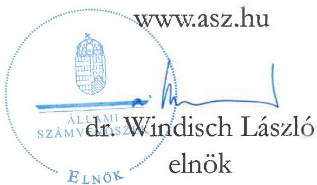
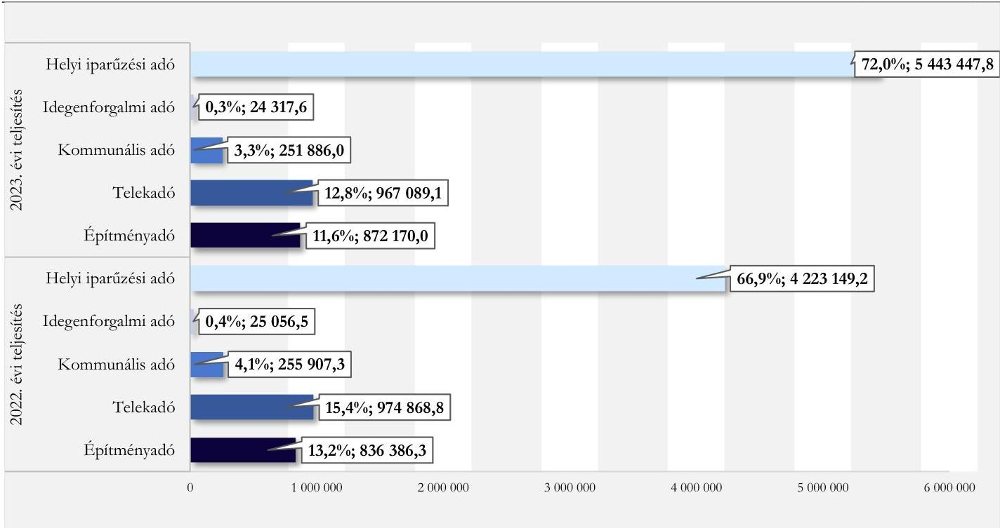
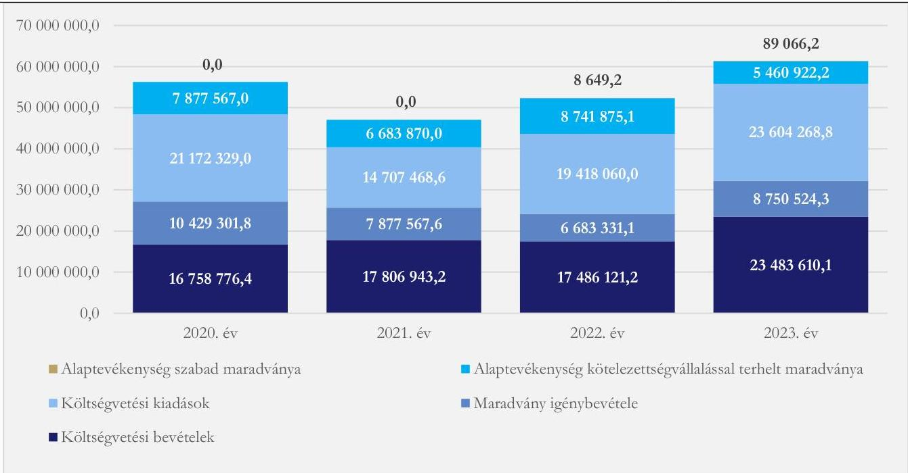
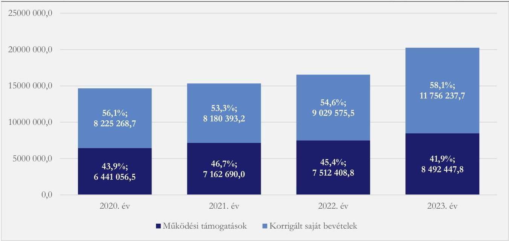
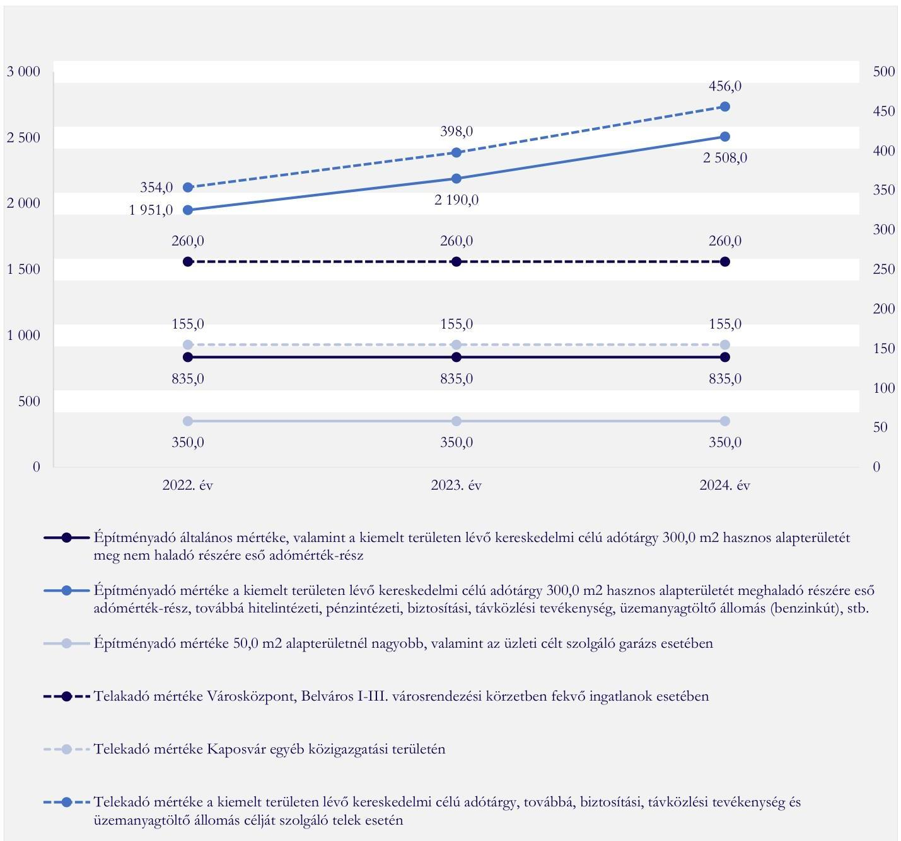
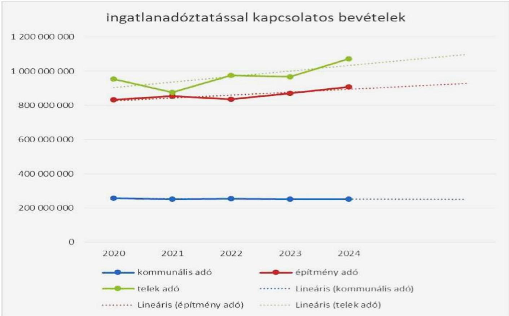
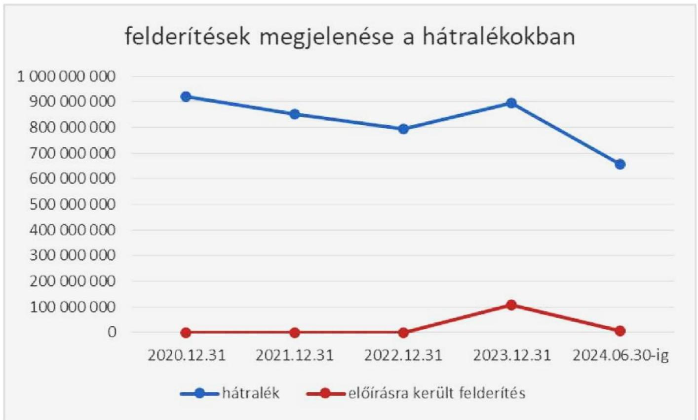

ÁLLAMI SZÁMVEVŐSZÉK

# JELENTÉS

Az önkormányzatok helyi adóztatási tevékenységének ellenőrzése - Ingatlanadóztatás

Kaposvár Megyei Jogú Város Önkormányzata

2025.

25076

www.asz.hu

---

ÁLLAMI
SZÁMVEVŐSZÉK

# JELENTÉS

Az önkormányzatok helyi adóztatási tevékenységének ellenőrzése - Ingatlanadóztatás

Kaposvár Megyei Jogú Város Önkormányzata

2025.

25076

---

Jelentéseink az interneten a www.asz.hu címen olvashatók.

ELLENŐRZÉSI IGAZGATÓSÁG:
ELLENŐRZÉSI IGAZGATÓSÁG II.

ELLENŐRZÉSI IGAZGATÓ:
DR. BAFFIA GERGELY GÁBOR ellenőrzési igazgató

ELLENŐRZÉSVEZETŐ:
KANYÓ LÓRÁNT ISTVÁN ellenőrzésvezető

IKTATÓSZÁM: EL-4100-101/2025
TÉMASORSZÁM: 54
ELLENŐRZÉS-AZONOSÍTÓ SZÁM: V-1084

---

TARTALOMJEGYZÉK

- AZ ELLENŐRZÉS ALAPADATAI ... 5
- AZ ELLENŐRZÉS TERÜLETE ÉS AZ ELLENŐRZŐTT SZERVEZET ... 7
- ÖSSZEFOGLALÁS ... 10
- AZ ELLENŐRZÉS FÓKUSZKÉRDÉSEI ... 12
- MEGÁLLAPÍTÁSOK ... 13
- JAVASLATOK ... 37
- MELLÉKLETEK ... 40
- I. sz. melléklet: Értelmező szótár ... 40
- II. sz. melléklet: Az ellenőrzött szervezetek jegyzéke ... 41
- III. sz. melléklet: Ellenőrzési kritériumok ... 42
- IV. sz. melléklet: Kaposvár megyei jogú város ingatlanadó mértékei a 2022-2024. években ... 45
- V. sz. melléklet: Építmény- és telekadó mértékeinek alakulása 2022. és 2024. között (Ft/m²) 46
- VI. sz. melléklet: A helyi ingatlanadótárgyak és adóalanyok a 2023. és a 2024. évben ... 47
- FÜGGELÉK: ÉSZREVÉTELEK ... 48
- RÖVIDÍTÉSEK JEGYZÉKE ... 81

---

.

---

AZ ELLENŐRZÉS ALAPADATAI

## AZ ELLENŐRZÉS CÉLJA

Az ellenőrzés célja az volt, hogy értékelje Kaposvár megyei jogú város helyi ingatlanadóztatásának és adóhatósága feladatellátásának szabályszerűségét, célszerűségét és eredményességét. További cél volt, hogy az ellenőrzés megállapításai és következtetései segítsék az önkormányzati képviselő-testületeket a jogszabályokkal és a helyi sajátosságokkal összhangban álló helyi adópolitika kialakításában és az azt végrehajtó adóigazgatási szervezet megszervezésében. Az ellenőrzés célja volt továbbá annak megállapítása is, hogy az Önkormányzat által bevezetett, ingatlanokat terhelő helyi adókra vonatkozó rendeleti szabályok összhangban vannak-e a helyi adópolitikai célokkal, tartalmuk tükrözi-e a település helyi sajátosságait és az adóhatósági feladatellátás biztosítja-e az önkormányzati bevételek feltárását és beszedését.

Ennek keretében az ÁSZ² értékelte, hogy az Önkormányzat által bevezetett, ingatlanokat terhelő helyi adókról szóló adórendeletei (építményadó-rendelet³, telekadó-rendelet⁴ és kommunálisadó-rendelet⁵), valamint az adóhatóság⁶ döntései, adóztatási gyakorlata a vonatkozó jogszabályokkal összhangban álltak-e.

## AZ ELLENŐRZÉS TÍPUSA

Kombinált ellenőrzés.

## AZ ELLENŐRZŐTT IDŐSZAK

Az 1. fókuszkerésnél a 2023. év, valamint a 2024. évnek az ellenőrzés megkezdését megelőző napjáig (2024. június 13.) tartó időszaka.

A 2. és 3. fókuszkerésnél a 2023. év, valamint a 2024. évnek az ellenőrzés megkezdését megelőző napjáig (2024. június 13.) tartó időszaka, a 2020-2022. évek adatainak bázisadatként való felhasználásával.

## AZ ELLENŐRZÉS TÁRGYA

Az Önkormányzat képviselő-testületének ingatlanokat terhelő helyi adókkal, azaz az építményadóval, a telekadóval és a magánszemély kommunális adójával kapcsolatos rendeletalkotási tevékenységének és az adóhatóság tevékenységének az ellátása.

Az ellenőrzés kiterjedt minden olyan körülményre és adatra, amely az ÁSZ jogszabályban meghatározott feladatainak teljesítéséhez, valamint az ellenőrzési program végrehajtása folyamán felmerült újabb összefüggések feltárásához szükséges.

## AZ ELLENŐRZÉS JOGALAPJA

Az ellenőrzés jogszabályi alapját az ÁSZ tv. ⁷ 5. § (8) bekezdésének előírásai képezték.

---

Az ellenőrzés alapadatai

# AZ ELLENŐRZÉS MÓDSZERE

Az ÁSZ az ellenőrzést az ellenőrzési program szempontjai, az ellenőrzött időszakban hatályos jogszabályok, az ellenőrzés általános szakmai szabályai és az ellenőrzésre irányadó ÁSZ módszertanok alapján végezte.

Az ellenőrzési kérdések megválaszolásához szükséges bizonyítékok megszerzése az ellenőrzött szervezetek által rendelkezésre bocsátott dokumentumokra, adatokra és az ASP⁸ Adó és az Iratkezelő szakrendszerek, illetve a KGR-K11⁹ számviteli adatgyűjtő rendszer adataira alapozva megfigyelés, szemle (szemrevételezés), kérdésfeltevés (információkérés), mintavételezés, valamint elemző eljárás útján történt. Emellett az ellenőrzési bizonyítékként felhasználható adatforrások közé tartozott minden egyéb – az ellenőrzés folyamán feltárt, az ellenőrzés szempontjából információt tartalmazó – releváns dokumentum (ideértve különösen a helyszíni ellenőrzésről készült jegyzőkönyvet) is.

Az ellenőrzés lefolytatásához az ellenőrzött szervezet a tanúsítványok kitöltésével, valamint az ÁSZ által kért dokumentumok, adatok, információk megküldésével és az ellenőrzés során szolgáltatott adatokat.

Az ÁSZ az adómegállapítás, a fizetési kedvezmények engedélyezése, az adóellenőrzés és a hátralékok beszedésének szabályszerűségét mintavételi eljárással ellenőrizte. Ennek során az adóhatósági adómegállapítási feladatellátás ellenőrzése keretében 27 mintatétel (1-15., 17., 19-28. és 39. mintatételek, közte 87 adómegállapító határozat és öt törlő határozat), a fizetési kedvezmények engedélyezése tárgykörben öt mintatétel (16. és 29-32. mintatételek, közte két adómérés, valamint három részletfizetés iránti kérelem elbírálásának), továbbá az adóhatóság által lefolytatott adóellenőrzés tárgykörében egy mintatétel (40. mintatétel) értékelése történt meg. Hat mintatételben (33-38. mintatételek) az ÁSZ a hátralékkezelés teljes dokumentációját is ellenőrizte.

A mintatételek kiválasztása véletlenszerűen történt az adóhatóság nyilvántartásában lévő adótárgyak és ügyek közül 15 – adómegállapításra vonatkozó – mintatétel kivételével, amelyek esetében a kiválasztás címadatok alapján történt annak érdekében, hogy feltárható legyen, volt-e olyan adótárgy, amelyet nem adóztatott az adóhatóság. Az ellenőrzött mintatételekre vonatkozó megállapítások nem vetíthetők ki a teljes sokaságra, a megállapításokat az ÁSZ az adott ellenőrzött mintatételek vonatkozásában tette meg.

Az ÁSZ a helyi adópolitikai elképzelések és a települési sajátosságok feltárásával értékelte, hogy az adórendeletek e szempontoknak mennyiben feleltek meg. Az ÁSZ a helyi adópolitikai célokkal akkor tekintette összhangban állónak az adórendeleteket, ha azok hatásukat tekintve támogatták az adópolitikai célok teljesülését.

Az ÁSZ az adóhatósági feladatellátás szabályszerűségéből, a meglévő kapacitásokból, valamint az ezer forint adóbevételre jutó adóhatósági költségek alakulásából következtetett arra, hogy az adóhatóság rendelkezett-e azzal a potenciállal, amellyel eredményesen tudta a helyi adópolitikát végrehajtani.

Az ÁSZ – az adórendeletek szabályainak érvényre juttatása körében – az eredményesség véleményezésekor a III. számú melléklet 2. pontjában foglalt szempontokat tekintette mérvadónak.

---

# AZ ELLENŐRZÉS TERÜLETE ÉS AZ ELLENŐRZÖTT SZERVEZET

Kaposvár megyei jogú város a Dél-dunántúli Régióban fekvő Somogy vármegye megyeszékhelye és együttal legnagyobb lélekszámú települése. Kaposvár állandó lakossága a BM¹⁰ adatai alapján 2020. január 1-jén 62 611 fő, 2024. január 1-jén 59 722 fő volt. A megyei jogú város a Kapos folyó két partján, a Somogyi dombság területén, a Zselic lankái között hét dombra épült. A Balaton 50 kilométerre, a szomszédos megyeszékhely, Pécs 60 kilométerre, míg a főváros megközelítőleg 200 kilométerre található.

Kaposvár – egyetemvárosként – a vármegye meghatározó gazdasági-, kulturális-, oktatási- és sportközpontja. A település az 1990. évben kapta meg újra megyei jogú városi rangját.

Városháza, Kaposvár
Forrás: Önkormányzat

A TeIR¹¹ adatai alapján 2023. december 31-én 12 836 regisztrált gazdasági szervezet volt Kaposvárott, melyből az 1-9 fős regisztrált vállalkozások száma 5 978 darab volt. A 2023. év végén regisztrált vállalkozások 13,6%-a mezőgazdasági-, 14,5%-a ipari-, illetve építőipari tevékenységet folytatott. A szolgáltatási szektorban regisztrált vállalkozások száma és aránya volt a legmagasabb a 2023. év végén, 8 285 darab, illetve 64,5% volt.

Az Önkormányzat az ellenőrzött időszakban – Hivatala¹² mellett – hat óvodát¹, egy sportközpont és sportiskolát², egy humánszolgáltatási gondnokságot³, egy városi könyvtárat⁴ és egy városi múzeumot⁵ tartott fenn. Emellett az Önkormányzat tagja volt a Kaposvár-Sántos Szociális Intézményfenntartó Társulásnak.

---

¹ Kaposvári Festetics Karolina Központi Óvoda, Kaposvári Fésűs Éva Központi Óvoda, Kaposvári Nemzetőr Sori Központi Óvoda, Kaposvári Petőfi Sándor Központi Óvoda, Kaposvári Rét Utcai Központi Óvoda és Kaposvári Tar Csatár Központi Óvoda.

² Kaposvári Sportközpont és Sportiskola.

³ Kaposvári Humánszolgáltatási Gondnokság.

⁴ Takáts Gyula Vármegyei Hatókörű Városi Könyvtár.

⁵ Rippl-Rónai Vármegyei Hatókörű Városi Múzeum.

---

Az ellenőrzés területe és az ellenőrzött szervezet

Az Önkormányzat az ellenőrzött időszakban közvetlenül nyolc gazdasági társaságban⁶, közvetetten – a KAPOS HOLDING Közszolgáltató Nonprofit Zártkörűen Működő Részvénytársaságon keresztül – további 12 gazdasági társaságban rendelkezett részesedéssel.

Az Alaptörvény¹³ értelmében a helyi önkormányzat a helyi közügyek intézése körében törvény keretei között döntött a helyi adók fajtájáról és mértékéről. Az Mötv.¹⁴ rögzíti, hogy a helyi adóval kapcsolatos feladatok ellátása a helyi önkormányzatok feladata.

Az Önkormányzat Közgyűlése¹⁵ a Htv.¹⁶-ben foglalt felhatalmazással élve az Önkormányzat illetékességi területén – építményadó-rendeletével, telekadó-rendeletével és kommunálisadó-rendeletével – mindhárom, ingatlanokat terhelő helyi adót bevezette.

Az Önkormányzat mind az építményadó-rendelet, mind a telekadó-rendelet megalkotásakor élt a Htv. adta azon lehetőséggel, hogy az általánostól eltérő adómértékek alá eső övezeteket alakítson ki. Az így megalkotott speciális mértékrendszer hatálya alá eső szektorokba sorolható vállalkozások adótárgyait⁷ magasabb adómérték terhelte. Emellett az építményadó-rendelet meghatározott olyan városrészeket, ahol a kereskedelmi célra használt, hasznosított épületekre, épületrészekre savosan progresszív adómérték vonatkozott. Az építményadó-rendelet mentességet biztosított azon lakás és nem lakás céljára szolgáló építmény után, amelyet a vállalkozónak nem minősülő adóalany tulajdonosa nem vállalkozás céljára használt, hasznosított, illetve használatba adott, és amely után magánszemély kommunális adóját fizette, továbbá az 50,0 m² alapterületet meg nem haladó garázs után, feltéve, hogy az nem üzleti célt szolgált.

A telekadóban a használati módtól függetlenül magasabb, de az adómaximumnál alacsonyabb adómérték terhelte a város központi területein fekvő ingatlanokat. Mentes volt a telekadó alól a beépítetlen belterületi földrészletek (telkek) közül az, amelyet a vállalkozónak nem minősülő adóalany tulajdonosa nem vállalkozás céljára használt, hasznosított, illetve használatba adott, és amely után magánszemély kommunális adóját fizette.

⁶ Csiky Gergely Színház és Kulturális Központ Közhasznú Nonprofit Korlátolt Felelősségű Társaság (100,0%), Kaposvári Fejlesztési Központ Közhasznú Nonprofit Korlátolt Felelősségű Társaság (100,0%), KTIP Kaposvári Tudományos és Innovációs Park Nonprofit Korlátolt Felelősségű Társaság (2023. október 12-től, 25,0%), Kaposvári Turisztikai Marketing Nonprofit Korlátolt Felelősségű Társaság (66,1%), Kaposvári Informatika Ágazati Képzőközpont Nonprofit Korlátolt Felelősségű Társaság (2023. június 22-től, 15,0%), Somogy Temetkezési Korlátolt Felelősségű Társaság (28,9%), KAVÍZ Kaposvári Víz- és Csatornamű Korlátolt Felelősségű Társaság (2023. november 15-től, 23,6%), KAPOS HOLDING Közszolgáltató Nonprofit Zártkörűen Működő Részvénytársaság (100,0%).

⁷ Az építményadóban magasabb adómérték terhelte a tényleges használati mód alapján hitelintézeti, pénzintézeti, biztosítási, távközlési tevékenység, üzemanyagtöltő állomás (benzinkút) céljára használt, hasznosított épületet, épületrészt, a játékkaszinóként vagy kártyateremként üzemeltetett, valamint a hitelintézeti, pénzintézeti, biztosítási, távközlési, üzemanyagtöltő állomás (benzinkút), villamos energia- és földgáz egyetemes szolgáltatói, kereskedői és elosztó hálózati engedélyes tevékenységet ellátó által iroda céljára használt, hasznosított épületeket, épületrészeket. Magasabb telekadómérték vonatkozott a biztosítási, távközlési tevékenység és üzemanyagtöltő állomás célját szolgáló telek tulajdonosára.

8

---

Az ellenőrzés területe és az ellenőrzött szervezet

A magánszemély kommunális adójának mértéke 6 500,0 Ft/év volt, melyből 200,0 Ft/év adókedvezmény illette meg az adóalanyt a garázs, a nem lakás célú épület, a beépítetlen telek, valamint 900,0 m²-t meghaladó beépített belterületi telek után⁸.

Az Önkormányzat által bevezetett, ingatlanokat terhelő helyi adókban alkalmazott mértékrendszert és a mértékváltozást részletesen a *IV. számú melléklet* mutatja be, az építmény- és telekadó mértékeinek 2022. és 2024. közötti alakulását az *V. számú melléklet* szemlélteti.

Az adóhatóság által beszedett, végleges bevételként elszámolt ingatlanokat terhelő adókból származó helyi adóbevétel a 2022. évről a 2023. évre 1,2%-os emelkedést mutatott. A 2023. évi 2 091 145,1 ezer Ft ingatlandó-bevétel az Önkormányzat korrigált konszolidált költségvetési bevételének¹⁷ 10,3%-át, a korrigált konszolidált saját bevételének¹⁸ 17,8%-át, a befizetett szolidaritási hozzájárulással csökkentett helyi adóbevételének pedig a 31,6%-át tette ki.

Az Önkormányzat helyi adóbevételei 2022. és 2023. évi összetételére vonatkozó adatokat az *1. ábra*, a helyi ingatlanadók 2023. és 2024. évre vonatkozó jellemző naturális adatait pedig a *VI. számú melléklet* mutatja be.

1. ábra
AZ ÖNKORMÁNYZAT HELYI ADÓBEVÉTELEINEK MEGOSZLÁSA A 2022-2023. ÉVEKBEN (%, EZER FT)

Forrás: KGR-K11 2022-2023. évi költségvetési beszámoló adatai alapján ÁSZ saját szerkesztés

⁸ Mindemellett mentes volt a magánszemély kommunális adója alól az adóalany által vállalkozás céljára használt, hasznosított, illetve használatba adott belterületi földrészlet, amely után telekadót fizetett, valamint a magánszemély tulajdonában álló építmény – feltéve, ha azt a tulajdonos vállalkozás céljára használta, hasznosította, illetve használatba adta –, amely után építményadót fizetett. Adómentes volt továbbá a 900,0 m²-t meg nem haladó beépített belterületi telek és a magánszemély tulajdonában álló egyéb nem lakás céljára szolgáló épület esetében a melléképület, melléképületrész, valamint az 50,0 m²-nél nagyobb alapterületű, valamint az üzleti célt szolgáló garázs, továbbá a CSOK igénybevételével vásárolt ingatlan. A magánszemély kommunális adójának mértékét a Képviselő-testület az ellenőrzött időszakban nem emelte.

---

ÖSSZEFOGLALÁS

Az ÁSZ tv. értelmében az ÁSZ feladatkörébe tartozik az önkormányzatok adóztatási tevékenységének ellenőrzése. A helyi adók az önkormányzatok saját, el nem vonható bevételét képezik, így az önkormányzatok gazdasági önállósága szempontjából különös fontossággal bír, hogy a helyi adórendeleti szabályok összhangban álljanak a magasabb szintű jogszabályokkal, továbbá az önkormányzati adóhatósági tevékenység jogszerű, eredményes és hatékony legyen. Erre figyelemmel volt tárgya az ÁSZ ellenőrzésének az Önkormányzat adórendelet-alkotási tevékenysége és az adóhatósági feladatellátás is.

Az adórendeletek **nem voltak összhangban** a magasabb szintű jogszabályokkal, s egyes pontjaik nem feleltek meg az Önkormányzat jogalkotói szándékának. A rendeleti szabályozás nem támogatta teljes mértékben az Önkormányzat adópolitikai céljainak elérését. Az adóhatóság **adóalany- és adótárgyfeltárásra irányuló feladatellátása nem volt eredményes**. Az adóhatósági döntések nem minden esetben voltak szabályszerűek. Az adóhatóság által lefolytatott **adóellenőrzés nem volt szabályszerű**. Az adóbehajtási tevékenység nem minden esetben volt szabályszerű, illetve célszerű, továbbá nem volt eredményes. Az adóhatóság adatszolgáltatási- és közzétételi kötelezettségének eleget tett. Az **adóztatási kiadások** magasak voltak az adóbevételhez képest, de nem haladták meg az adóztatási kiadások referencia-érték maximumát. Az adóhatóság ingatlanadóztatással összefüggő feladatellátási mutatói kedvezőbbek voltak a nyolc megyei jogú város⁹ feladatellátási mutatóinak átlagos értékéhez képest.

## Adórendelet, adórendelet-alkotás

Az építményadó- és a kommunálisadó-rendelet nem volt összhangban a törvényi előírással, mert a szabályai nem zárták ki valamennyi adótárgy esetén azt, hogy mindkét adónemben fizetési kötelezettség álljon fenn. A telekadó-rendelet egyik szabálya egyedi telkekre biztosított kivételt a magasabb adóterhet eredményező szabályok hatálya alól. Emellett az adórendeletek több, nem egyértelmű, ezáltal vitatható, illetve a jogalkotói szándékot nem tükröző rendelkezést is tartalmaztak.

A szabályozás megalkotása során az Önkormányzat figyelembe vette az adóalanyok széles körének **teherviselő képességét**, de csak részben mérlegelte a helyi sajátosságokat, az Önkormányzat gazdálkodási követelményeit pedig nem vizsgálta.

## Az adóhatóság adóigazgatási feladatellátásának jogszerűsége, eredményessége

Az adóhatóság **adótárgy- és adóalany-feltárási feladatellátása** (ezáltal az adómegállapítási feladatellátása) nem volt eredményes, azonban célszerű volt. Az adómegállapító határozatok a vizsgált mintatételek 88,9%-a tekintetében nem voltak szabályszerűek, indokolásuk pedig nem volt megfelelő, a fizetendő adó összegét a mintatételek 59,3%-ában tartalmazták helyesen.

⁹ Az ÁSZ által jelen ellenőrzés alapjául szolgáló ellenőrzési program alapján két megyei jogú város önkormányzata, továbbá a KGR-K11-ben az adóztatási tevékenységet leíró adatokat rögzítő megyei jogú városi önkormányzatok közül kiválasztott hat önkormányzat: Salgótarján Megyei Jogú Város Önkormányzata, Szekszárd Megyei Jogú Város Önkormányzata, Székesfehérvár Megyei Jogú Város Önkormányzata, Nagykanizsa Megyei Jogú Város Önkormányzata, Békéscsaba Megyei Jogú Város Önkormányzata, Eger Megyei Jogú Város Önkormányzata.

10

---

Összefoglalás

A hatósági döntések kiadmányozása egy eset kivételével szabályszerű volt. Kézbesítésük – azon esetektől eltekintve, ahol a közlés dokumentuma nem állt rendelkezésre – szabályszerű volt.

Az adóhatóság adatszolgáltatási és közzétételi kötelezettségének eleget tett, ugyanakkor a magánszemély kommunális adójára vonatkozó adatbejelentésre rendszeresített nyomtatvány tartalma nem felelt meg a Pénzügyminisztérium¹⁰ honlapján közzétett mintának. Az Önkormányzat a jelentéstervezet észrevételezése során arról nyilatkozott, hogy a nyomtatványt javította, ezzel az ÁSZ ellenőrzés megállapítása hasznosult.

Az adóhatóság által az ellenőrzött időszakban lefolytatott két adóellenőrzés bár növelte az önkormányzat bevételeit, egy vizsgált mintatétel esetében nem volt szabályszerű.

A fizetési kedvezmények elbírálása – egy adótartozás méltányosságból történt eltörlésének kivételével – nem volt szabályszerű.

Az adótartozások beszedése érdekében megtett intézkedések nem minden esetben voltak szabályszerűek, illetve célszerűek, továbbá nem voltak eredményesek.

Az adórendelet adópolitikai célokkal való összhangja, az adórendelet hatása

Az Önkormányzat adórendeleti szabályai csak részben támogatták a helyi adópolitikai célok megvalósulását (a helyi lakosságot és a kis- és középvállalkozásokat kevésbé terhelje, a nagy helyigényű vállalkozási tevékenység a város külső területein valósuljon meg, adófizetői hajlandóság erősítése, adóemelés nélkül).

A korrigált konszolidált költségvetési bevételeken belül a korrigált konszolidált saját bevételek aránya a 2023. évben 58,1% volt, amely kissé alacsonyabb a megyei jogú városokra átlagosan jellemző 65,2%-os aránytól. Míg a megyei jogú városok esetén az ingatlanadókból származó bevételek¹⁹ korrigált konszolidált költségvetési bevételeken belüli aránya 7,5%, addig az Önkormányzat esetében ez 10,3% volt a 2023. évben, azaz az Önkormányzat gazdálkodását az ingatlanadókból származó bevételek a többi megyei jogú városhoz képest erőteljesebben befolyásolták.

Az adóhatósági kiadások

Az adóhatóság a 2023. évben 7 566 046,7 ezer Ft helyi adóbevételt mutatott ki költségvetési beszámolójában. Minden 1000 Ft beszedett helyi adóbevételre 18,2 Ft adóztatási kiadás esett. A nyolc megyei jogú város átlaga 13,1 Ft, az adóztatási kiadás tapasztalati referencia-érték maximuma kivetéses adóztatás esetén 50 Ft volt.

Az Önkormányzat egy adótisztviselőjére a 2023. évben 472 877,9 ezer Ft helyi adóbevétel, 3 497,8 adótárgy és 2 539,7 adózó jutott, két feladatellátási mutató tehát kedvezőbbek volt, az egy adótisztviselőre jutó adóbevétel azonban kedvezőtlenebb volt a nyolc megyei jogú város átlagánál (613 578,2 ezer Ft/adótisztviselő, illetve 2 068,8 adótárgy, 1 334,1 adózó/adótisztviselő).

---

¹⁰ 2025. január 1-jétől megszűnt a Pénzügyminisztérium, feladatait a Nemzetgazdasági Minisztérium vette át.

¹¹ Helyi adóbevétel körébe tartozik az adóztatási kiadások esetében: az ingatlanadókból származó bevétel, a helyi iparűzési adóbevétel, az idegenforgalmi adóbevétel, a magánszemélyek jövedelemadóiból származó bevétel, a beszedett talajterhelési díj; mivel a kapcsolódó feladatokat az önkormányzati adóhatóság látta el.

11

---

12

# AZ ELLENŐRZÉS FÓKUSZKÉRDÉSEI

1. Az önkormányzat ingatlanokat terhelő helyi adókra vonatkozó rendeleti szabályozása megfelelt-e a magasabb szintű jogszabályoknak?

2. Az önkormányzati adóhatóság megfelelően és eredményesen látta-e el az ingatlanok adóztatásával kapcsolatos adóhatósági tevékenységeit?

3. A településen megvalósuló helyi adóztatás támogatta-e a helyi adópolitikai célok teljesülését?

---

MEGÁLLAPÍTÁSOK

# 1. Az önkormányzat ingatlanokat terhelő helyi adókra vonatkozó rendeleti szabályozása megfelelt-e a magasabb szintű jogszabályoknak?

## Összegző megállapítás
Az adórendeletek több rendelkezése nem felelt meg a Htv. és a Jat.²⁰ előírásainak.

### 1.1. számú megállapítás
Az adórendeletek több ponton nem voltak összhangban a Htv. előírásaival, valamint csak részben feleltek meg az Önkormányzat jogalkotói szándékának, szövegezésük több ponton sértette az egyértelmű értelmezhetőség Jat.-ban megfogalmazott követelményét.

Az építményadó-rendelet 2. §-a és 4. §-a valamint a kommunálisadó-rendelet 2. §-a és 6. §-a összevetése alapján – a Htv. 7. § a) pontjában¹² foglaltak ellenére – a lakáson vagy nem lakáscélú épületen, épületrészen fennálló vagyoni értékű jog magánszemély jogosultjának az építményadóban és a magánszemély kommunális adójában is fizetési kötelezettsége állt fenn, tekintettel arra, hogy mindkét adónem személyi hatálya kiterjedt az adótárgyon fennálló vagyoni értékű jog magánszemély jogosítottjára, de egyik adórendelet sem tartalmazott erre a személyi körre vonatkozó mentességi szabályt.

A telekadó-rendelet mellékletének 8. és 9. pontja és az építményadó-rendelet mellékletének 9. pontja nem volt összhangban a Htv 7. § e) pontjával, mert kiemelte az ott szabályozott magasabb adómérték alá eső övezetekből a 2112/2 helyrajzi számú, valamint a 2118/5, 2340 és 2368/1 helyrajzi számú ingatlanokat¹³.

Az adórendeletek az alábbi okokból fakadóan sértették – a Jat. 2. § (1) bekezdéséből következő – egyértelmű értelmezhetőség követelményét:

---

¹² A Htv. hivatkozott rendelkezése szerint egy adott adótárgy (épület, épületrész, telek) után csak egyféle ingatlant terhelő adóban keletkezhet fizetési kötelezettség (adótöbbszörözés tilalma). Ha az önkormányzat működteti az építményadót és a magánszemély kommunális adóját, akkor vagy mentességi szabállyal, vagy direkt rendelkezéssel kell biztosítania, hogy ne álljon elő többszörös adófizetés.

¹³ A telekadó-rendelet és az építményadó-rendelet csak a vállalkozó számára fogalmaz meg fizetési kötelezettséget. Egy adott helyrajzi szám alatt lévő ingatlan objektív szempontok nélkül való kiemelése a főszabály (magasabb adómérték) alól előnyben részesíti (kedvezményezi) ezen ingatlan utáni adó (vállalkozó) alanyát.

13

---

Megállapítások

a) a telekadó-rendelet 3. § (4) és (5) bekezdés a jogalkotói szándék ellenére alanyi és nem tárgyi oldalról fogalmazta meg a magasabb adómérték alkalmazási körét¹⁴;

b) az építményadó-rendelet mellékletének 4. pontja és a telekadó-rendelet mellékletének 4. pontja szerint kiemelt adómérték alá eső övezet az „Előd vezér u. - Álmos vezér u. - Kós Károly u. által határolt terület a 2886/6 helyrajzi számú ingatlan kivételével”, ugyanakkor 2886/6 helyrajzi számú ingatlant az ingatlan-nyilvántartás nem tartalmazott;

c) az építményadó-rendelet 3. § (1) bekezdés a) pontja szerint az adó alapja „a külön jogszabályban meghatározott esetben” az építmény m²-ben számított hasznos alapterülete, de a rendelet nem utalt arra, hogy mi ez a külön jogszabály, s így az sem volt megállapítható, hogy ez az adóalap-szabály valamennyi építményadó-köteles adótárgyra vonatkozik-e;

d) az építményadó-rendelet 3. § (4) bekezdése használja a „pénzintézet” fogalmat, ugyanakkor erre értelmező rendelkezést nem ad (s más magasabb szintű jogszabály sem definiálja ezt a fogalmat).

1.2. számú megállapítás

Az Önkormányzat mindhárom adónem esetén figyelembe vette az adóalanyok széles körét illetően a teherviselő képességet, a telekadó szabályozásának alakítása során részben mérlegelte a helyi sajátosságokat, a gazdálkodási követelményeit azonban nem vizsgálta a jogalkotás során.

A Htv. 7. § g) pontjában rögzített adómegállapítási korlátokból az következik, hogy a rendelet hatályossága idején is érvényre kell jutnia az e pontban szabályozott rendeletalkotási elveknek, azaz annak, hogy települési önkormányzat az adóalap fajtáját, az adó mértékét, a rendeleti adómentességet és adókedvezményt úgy állapíthatja meg, hogy azok összességükben egyaránt megfeleljenek

a) a helyi sajátosságoknak,
b) az önkormányzat gazdálkodási követelményeinek és
c) az adóalanyok széles körét érintően az adóalanyok teherviselő képességének.

¹⁴ A normaszöveg szerint a kereskedelmi tevékenység célját szolgáló telek tulajdonosát, illetve a biztosítási, távközlési tevékenység és üzemanyagtöltő állomás célját szolgáló telek tulajdonosát terheli az ott rögzített, az általános mértéknél magasabb telekadófizetési kötelezettség (azaz az emelt adómérték e tulajdonos bármely adótárgy esetén alkalmazandó). Ugyanakkor az Önkormányzat nyilatkozata szerinti jogalkotói szándék csak a kereskedelmi tevékenység, illetve a biztosítási, távközlési tevékenység és üzemanyagtöltő állomás célját szolgáló telek emelt mértékű adóztatására irányult.

---

Megállapítások

## A helyi sajátosságok figyelembevétele

Az Önkormányzat a helyi adórendszer (az adómérték-rendszer, az övezetek és az adóelőny-szabályok kialakítása) elemeinek kialakítása során a helyi sajátosságokat részben figyelembe vette. Ennek keretében a telekadó-rendeletben Városközpontot és a Belváros egyes körzeteit – az itt található ingatlanok magasabb forgalmi értéke, jobb hasznosíthatósága okán – magasabb adómérték alá eső övezetként jelölte meg. Az Önkormányzat mind a telekadó, mind az építményadó esetén további adózási övezeteket is kijelölt, ezek azonban közös objektív jellemzőkkel nem bírtak, egyetlen közös ismérvük volt, hogy határaikon belül található volt kereskedelmi tevékenység célját szolgáló telek vagy 300,0 m²-nél nagyobb alapterületű kereskedelmi célra használt, hasznosított épület. A kijelölt övezetek közvetlen közelében is megtalálhatóak voltak azonban e jellemzőknek megfelelő, de az övezethez mégsem csatolt ingatlanok. Az Önkormányzat azt tekintette helyi sajátosságnak, hogy az építmény- és telekadó rendelet szerkezete régóta változatlan¹⁵.

&gt; Az ÁSZ megítélése szerint jó gyakorlat, ha az önkormányzat a helyi sajátosságokat övezetek kialakítása útján juttatja érvényre az adószabályozásban. Ennek során ugyanakkor egységes, objektív szempontokat kell kialakítania. Ilyen szempont lehet például az övezethez tartozó ingatlanok átlagos forgalmi értéke, az önkormányzat környezetvédelmi vagy városrendezési szempontjainak érvényre juttatása. Nem tekinthető azonban ilyen objektív indoknak a kijelölt övezetekben található adótárgyak utáni adókötelezettséget viselő adóalanyok személye. Az ÁSZ felhívja a figyelmet arra, hogy a Kúria gyakorlata (lásd: EBH2019. K.12., EBH2017. K.13.) szerint hátrányosan megkülönböztető a (telek)adó mértéke akkor, ha az önkormányzati rendeletben szabályozott díjövezet az adóztatott vagyon értékétől, sajátosságaitól függetlenül, meghatározott adózó, más díjövezetekhez képest számottevően magasabb adókötelezettségéről rendelkezik. Az ilyen rendeletek bevételi kockázatot is jelentenek, mert, ha a Kúria megállapítja, hogy az önkormányzati rendelet vagy annak valamely rendelkezése más jogszabályba ütközik, az önkormányzati rendeletet vagy annak rendelkezését megsemmisíti.

## Az önkormányzat gazdálkodási követelményeinek szempontja

Az adómértékek 2023. és 2024. évben megvalósított emeléséhez készült rendeleti indokolás szerint a város óvodáinak, iskoláinak, egyéb intézményeinek működtetéséhez, a szociálisan rászorulók támogatásához, fejlesztésekhez kívánták felhasználni az adóbevételeket. Az ellenőrzés nem talált olyan dokumentumot, és az ellenőrzés során nem bocsájtottak olyan dokumentumot az ÁSZ rendelkezésére, mely az e célok finanszírozásához szükséges összeg nagyságát figyelembe vette az adórendelet módosításának előkészítése során. Az Önkormányzat a költségvetési rendeleteiben:²¹,²² az építményadó esetén 2023. évre 5,0%, a 2024. évre 5,1%, telekadó esetén a 2023. évre 2,4%, a 2024. évre 3,4% bevétel növekményt tervezett¹⁶, azonban a 2024. évi költségvetési rendelet előterjesztésében írtak szerint az előirányzatok megemelése

---

¹⁵ A Htv. 7. § g) pontja alapján a helyi adókat – többek között – a helyi sajátosságoknak megfelelően kell kialakítani, ezért kérdéses, hogy mennyiben tekinthető helyi sajátosságnak a meglévő adószerkezet.

¹⁶ Nominálisan kifejezve, az Önkormányzat az építményadóból a 2023. évre 37 000,0 ezer Ft, a 2024. évre további 40 000,0 ezer Ft; telekadóból a 2023. évre 20 000,0 ezer Ft, a 2024. évre további 30 000,0 ezer Ft; a két adónem tekintetében együttesen a 2023. évre 57 000,0 ezer Ft, a 2024. évre 70 000,0 ezer Ft többletbevételt várt.

15

---

Megállapítások

nem a speciális adómértékek növelése miatt, hanem az „adófelderítések szintre hozására” tekintettel történt, vagyis azért, mert az adóhatóság azt tervezte, hogy növeli az adótárgy- és adóalanyfeltárásra irányuló tevékenységét.

A 2023. évben a helyi adókból származó befizetett – szolidaritási hozzájárulással csökkentett – 6 612 697,4 ezer Ft bevétel az Önkormányzat korrigált konszolidált költségvetési bevételének (20 248 685,5 ezer Ft) 32,7%-át tette ki, mely elmaradt a 25 megyei jogú városra vonatkozó 38,6%-os értéktől. A 2023. évben ingatlanadókból származó bevétel a korrigált költségvetési bevétel 10,3%-át tette ki, mely magasabb a 25 megyei jogú városra vonatkozó 7,5%-os értékhez viszonyítva.

Az Önkormányzat és intézményeinek főbb gazdálkodási adataiból (2. ábra) megfigyelhető, hogy a konszolidált maradvány a 2023. évben 5 549 988,4 ezer Ft volt, amely 5 460 922,2 ezer Ft kötelezettségvállalással terhelt maradványból és 89 066,2 ezer Ft szabad maradványból tevődött össze. A 2023. évben az Önkormányzat a kötelező feladatok ellátása mellett, 1 479 610 ezer Ft kiadást teljesített önként vállalt feladatokra, ez azonban a gazdálkodási helyzetét nem érintette negatívan, mert az önként vállalt feladatokból származó bevételek 1 689 749 ezer Ft-tal meghaladták a feladatellátáshoz kapcsolódó költségeket. A 2023. évi konszolidált beszámolójában az Önkormányzat 613 407,2 ezer Ft értékben mutatott ki költségvetési évet követően esedékes kötelezettségeket.

Az Önkormányzat gazdálkodási helyzete összességében nem tette szükségessé az adórendelet módosítását.

2. ábra

AZ ÖNKORMÁNYZAT ÉS INTÉZMÉNYEI 2020-2023. ÉVI KONSZOLIDÁLT BESZÁMOLÓINAK FŐBB ADATAI (EZER FT)

Nem tartalmazza a hitel-és kölcsönfelvételeket és azok törlesztését, a pénzeszközök lekötött bankbetétként való elhelyezését és azok megszüntetését, az államháztartáson belüli megelőlegezéseket és azok visszafizetését, a vállalkozási tevékenység maradványát.

Forrás: KGR-K11 és zárszámadási rendelet²¹,²⁴,²⁵,²⁶ alapján ÁSZ saját szerkesztés

---

Megállapítások

Az adóalanyok teherviselő képességének figyelembevétele

A teherviselőképességet illetően az Önkormányzat – nyilatkozata szerint – azt a szempontot emelte ki, hogy a helyi kis- és középvállalkozások, valamint a magánszemélyek terheit nem kívánták növelni.

Ezt támasztja alá, hogy az építményadó általános mértéke (és a kereskedelmi célú épületek adóalapjának 300,0 m²-t meg nem haladó részére eső adómérték-rész), a telekadó általános mértéke és belvárosi körzetekre eső telekadó-mérték 2013. január 1-je, a magánszemély kommunális adója és a garázsok utáni építményadó mértéke 2015. január 1-je óta nem változtak.

Az Önkormányzat – nyilatkozata szerint – abból a véleményből indult ki, hogy egyes – az építményadó-rendeletben és a telekadó-rendeletben meghatározott – ágazatok jövedelmezősége kiemelkedik a többihez képest, így az ilyen tevékenységet végzők teherviselő képessége magasabb. Ezért az általuk használt, hasznosított épület, épületrész¹⁷ (és a kereskedelmi célú épületek adóalapjának 300,0 m²-t meghaladó részére eső adóalaprész) utáni építményadó mértéke a 2022. évről a 2023. évre 12,3%-kal, azaz 1 951,0 Ft/m²-ről 2 190,0 Ft/m²-re, a 2023. évről a 2024. évre további 14,5%-kal, 2 508,0 Ft/m²-re emelkedett.

Ezzel együtt meghatározott esetben¹⁸ a telekadó mértéke – az önkormányzat adóztatási koncepciójának megfelelően – a 2022. évről 2023-ra 12,4%-kal, 354,0 Ft/m²-ről 398,0 Ft/m²-re, a 2024. évre további 14,6%-kal, 456,0 Ft/m²-re emelkedett.

¹⁷ Magasabb és évről-évre emelkedő építményadó-mérték vonatkozott a hitelintézeti, pénzintézeti, biztosítási, távközlési tevékenység, üzemanyagtöltő állomás (benzinkút) céljára használt, hasznosított épület, épületrész után, a játékkaszinóként vagy kártyateremként üzemeltetett, valamint a hitelintézeti, pénzintézeti, biztosítási, távközlési, üzemanyagtöltő állomás (benzinkút), villamos energia- és földgáz egyetemes szolgáltatói, kereskedői és elosztó hálózati engedélyes tevékenységet ellátó iroda után.

¹⁸ Magasabb volt és emelkedett a telekadó mértéke a biztosítási, távközlési tevékenység és üzemanyagtöltő állomás célját szolgáló telek, valamint a kereskedelmi tevékenység célját szolgáló telek tulajdonosa esetén.

17

---

Megállapítások

## 2. Az önkormányzati adóhatóság megfelelően és eredményesen látta-e el az ingatlanok adóztatásával kapcsolatos adóhatósági tevékenységeit?

### Összegző megállapítás

Az adóhatóság adómegállapítási feladatellátása nem volt eredményes, az adóhatósági döntések többsége és az adóhatóság által lefolytatott adóellenőrzés nem felelt meg a Htv., az Air.²⁷ és az Art.²⁸ előírásainak. Az adóhatóság az adótartozások végrehajtása során nem az Avt.²⁹ szerint járt el, emellett az adótartozások beszedése érdekében megtett intézkedések nem voltak eredményesek, illetve nem minden esetben voltak célszerűek. Az adóhatóság az iratkezelési tevékenysége során nem tett eleget az Ltv.³⁰ előírásainak.

### 2.1. számú megállapítás

Az adóhatóság adótárgy- és adóalanyfeltárási feladatellátása nem volt eredményes, azonban célszerű volt. Az adóhatóság adómegállapítási feladatellátása nem volt eredményes, az adómegállapító határozatok többsége szabályszerűtlen volt. Az adóhatóság által lefolytatott és az ÁSZ által ellenőrzött adóellenőrzés nem volt szabályszerű.

### Adótárgy- és adóalanyfeltárás

Az adóhatóság a 2023. és a 2024. évben is élt az Art. 83. § (2) bekezdésében foglaltak alapján az ingatlanügyi hatóság megkeresésének lehetőségével. Ezen, a települési ingatlanokról és tulajdonosaikról, valamint az ingatlanokon fennálló vagyoni értékű jog jogosítottairól szóló adatokat összevetette saját nyilvántartásával. Emellett az adóhatóság az építésügyi hatóság által az Art. 86. §-a szerint szolgáltatandó adatokat is felhasználta az adatbejelentést elmulasztó adóalanyok beazonosítására, továbbá az adótárgyak feltárása érdekében térinformatikai eszközt is igénybe vett. Ennek ellenére az ÁSZ tárt fel olyan ingatlant (12. mintatétel), amelyet az adóhatóság – a Htv. 17. és 24. §-aiban, valamint a kommunálisadó-rendelet 3. § b) pontjában foglaltak ellenére – nem adóztatott, az adatbejelentési kötelezettség teljesítésére az ÁSZ ellenőrzés megindítását követően hívta fel az adózót.

Az ÁSZ jó gyakorlatnak tartja, ha egy adóhatóság használja az ingatlanügyi hatóságnál rendelkezésre álló adatokat az adóztatás során. Az ÁSZ véleménye szerint az ingatlanadókban célravezető az adóhatóság adónyilvántartási adatainak társhatósági hiteles adatokkal való összevetése és ezek alapján szükség szerint adatbejelentésre, hiánypótlásra felhívás, majd az információk alapján a tényállás rögzítése és az adómegállapítási eljárás mielőbbi befejezése. Részint azért, mert az adótárgy jellege miatt erre lehetőség van (tipikusan évente nem változnak a kivetési adatok), részint azért, mert így az adóhatóság időben korábban jut az adóbevételhez, részint pedig azért, mert négy-öt év távlatában – utólagos adómegállapítás keretében – sokszor nehezen lehet bizonyítani, hogy az adóév első napján mi volt az adómegállapítás kapcsán releváns tényállás.

18

---

Megállapítások

Mindezek alapján összességében az adótárgy- és adóalanyfeltárási adóhatósági feladatellátás nem volt eredményes, azonban – figyelemmel arra, hogy a más hatóságtól kapott hiteles információt azok megszerzése céljának megfelelően használta fel – célszerű volt.

## Adómegállapítás (kivetés)

Az adómegállapítási feladatellátás ellenőrzése keretében vizsgált 27 mintatétel közül az adóhatóság három esetben, a mintatételek 11,1%-a esetében látta el szabályszerűen, a Htv.-nek és az adórendeleteknek³¹ megfelelően az ingatlanokat terhelő helyi adókkal kapcsolatos adóhatósági feladatait.

Az adóhatóság 16 mintatétel (1-5., 7., 9-11., 13., 15., 17., 19., 23-24., és 39. mintatételek) esetében, a mintatételek 59,3%-ában helyesen, a Htv.-nek és az adórendeleteknek megfelelően számította ki a fizetendő adó összegét.

A 21. mintatétel esetében az adóhatóság – az Air. 58. §-ában foglaltak ellenére – a tényállás tisztázása érdekében nem járt el megfelelően, mivel nem tisztázta, hogy ki a tulajdonos, s ezáltal az adó alanya, melyből adódóan a Htv. 12. § (1) bekezdésében, 18. és 24. §-aiban, valamint 52. § 7. pontjában foglaltak ellenére két jogalany részére is előírta az adófizetési kötelezettséget a 2024. adóévre. Az ellenőrzött jelentéstervezet ÁSZ tv. szerinti észrevételezés időszakában azt nyilatkozta, hogy az adóalanynek nem minősülő adózó nem teljesített adófizetési kötelezettséget az adótárgy után 2024-ben fizetendő adóra.

Négy mintatétel (6., 10., 14. és 27. mintatételek) esetében az adóhatóság – szemben az Air. 2. §-ában foglaltakkal – külön határozatba foglalta ugyanazon adótárgy 300,0 m²-t meg nem haladó és 300,0 m²-t meghaladó alapterületére vonatkozó építményadó megállapításait.

Az adóhatóság öt mintatétel¹⁹ esetében az adómegállapító határozatok rendelkező részeiben az Air. 73. § (1) bekezdés b) pontjában foglaltak ellenére a fizetendő adó összegét nem határozta meg. E határozatokban csak azt rögzítette, hogy a fizetendő adó összegét külön határozatban közli, ilyen határozatot azonban nem adott ki. Ennek eredménye, hogy az adóhatóság – az Art. 48. § (1) bekezdése, az Art. 141. § (2) bekezdése és az Air. 72. §-a, az Air. 73. § (1) bekezdésében foglaltak ellenére – nem adott ki olyan határozatot, amely az adófizetési kötelezettség összegét tartalmazta

- a 20. és a 28. mintatételek esetében;
- a 22. mintatétel esetében az egyik adózó vonatkozásában;
- a 14. mintatétel esetében az építményadó tekintetében az adótárgy 300,0 m²-t meghaladó alapterületére vonatkozóan a 2023. adóévre, az adótárgy 300,0 m²-t meg nem haladó alapterületére vonatkozóan sem a 2023. adóévre, sem a 2024. adóévre vonatkozóan; továbbá
- a 27. mintatétel esetében az építményadó tekintetében az adótárgy 300,0 m²-t meghaladó alapterületére vonatkozóan és a telekadó tekintetében a 2023. adóévre, az építményadó tekintetében az adótárgy 300,0 m²-t meg nem haladó alapterületére vonatkozóan sem a 2023., sem a 2024. adóévre vonatkozóan.

---

¹⁹ A 14. és 27. mintatételekben az építmény- és telekadót 2023. adóévtől megállapító határozatok, a 20. és 28. mintatételekben a magánszemély kommunális adóját megállapító határozatok, a 22. mintatételben az egyik adóalany vonatkozásában az építmény- és telekadót a 2024. adóévtől módosító határozat.

19

---

Megállapítások

A 25. mintatétel esetén az adóhatóság – szemben a Htv. 12. § (2) bekezdésében foglaltakkal – a nyolc tulajdonostárs közül két tulajdonostárs adóját egy tulajdonostárs részére állapította meg²⁰.

A 21. mintatétel esetében az adótárgynak több tulajdonosa volt, ugyanakkor az adóhatóság által – az adóalanyok megállapodása alapján – a 2024. adóévtől kezdődő adókötelezettségről szóló adómegállapító határozat rendelkező része kizárólag az adó fizetésére kötelezett által fizetendő adó összegét tartalmazta.

A Hivatal az Ltv. 9. § (1) bekezdés e) pontjában foglaltak²¹ ellenére hat mintatétel esetében (5., 7., 9. és 11. mintatételek, továbbá a 8. mintatétel esetében két adóalany és a 22. mintatétel esetében egy adóalany vonatkozásában) adómegállapító dokumentációval nem rendelkezett, így nem volt megállapítható, hogy folytatott-e le adómegállapító eljárást, illetve hozott-e az Art. és az Air. szabályai alapján a Htv.-nek és az adórendeletnek megfelelő adómegállapító határozatot, és annak közlése az Air.-nak és az Eüsztv.³²-nek megfelelően²² szabályszerűen megtörtént-e.

Az Ltv. 9. § (1) bekezdés e) pontját az is sértette, hogy a

- 2. mintatétel esetében a 30 darab építményadót megállapító határozat közül egy határozat;
- 24. mintatétel esetében az egyik tulajdonos vonatkozásában az adómegállapító határozat;
- 28. mintatétel esetében

az adómegállapító határozat közlését igazoló dokumentumok megőrzéséről nem gondoskodott, így nem volt megállapítható az sem, hogy az adómegállapító határozatok közlése szabályszerűen megtörtént-e.

Szintén az Ltv. 9. § (1) bekezdés e) pontjában foglaltak sérelmével járt, hogy a Hivatal

- az 1. mintatétel esetében az adatbejelentő dokumentumok;
- a 10. mintatétel esetén az építményadót a 300,0 m²-t meg haladó részre vonatkozóan a 2023. adóévre, továbbá a telekadót a 2023. adóévre megállapító határozatok;

Ha az adótárgynak több tulajdonosa van, akkor ők tulajdoni illetőségük arányában adóalanyok. Ekkor, mindegyikük egyetértése esetén köthetnek arról megállapodást, hogy az adóalanyisággal kapcsolatos jogokat és kötelezettséget az adóhatóság előtt közülük egy adóalany kapcsolattartóként gyakorolja. Az ÁSZ jó gyakorlatnak azt tekinti, ha az adómegállapító határozat nemcsak a fizetési kötelezettséget és a fizetésre kötelezettet (a kapcsolattartót), hanem az egyes adóalanyokat terhelő adót és annak jogalapját, kiszámítását is tartalmazza, annak érdekében, hogy az egyes adóalanyok számára egyértelmű legyen az őket terhelő adó összege.

²⁰ A Htv. hivatkozott rendelkezése értelmében csak arra van jogszabályi lehetőség, hogy a valamennyi adóalanyt terhelő adót egy adóalany fizesse meg (abban az esetben, ha valamennyien írásban megállapodnak abban, hogy közülük egy adóalany teljesíti az adózási kötelezettségeket és gyakorolja a jogokat).

²¹ A közfeladatot ellátó szerv Ltv. 9. § (1) bekezdés e) pontjából fakadó kötelessége, hogy az elintézett ügyek iratait – az irattári terv szerinti rendszerezés és válogatás pontosságának ellenőrzése mellett – irattárában elhelyezze, az irattári anyagot szakszerűen és biztonságosan megőrizze, valamint használatra bocsátásáról gondoskodjon.

²² Az Eüsztv. 2024. szeptember 1-je óta hatálytalan, a jogterület szabályozását a digitális államról és a digitális szolgáltatások nyújtásának egyes szabályairól szóló 2023. évi CIII. törvény tartalmazza.

20

---

Megállapítások

- a 26. mintatétel esetében a magánszemély adóját megállapító határozat;
- a 6. mintatétel esetében az adatbejelentő dokumentumok, valamint az adótárgy hasznos alapterülete 300,0 m²-t meg nem haladó részére vonatkozó építményadót 2023. és 2024. adóévekre megállapító határozatok;
- a 13. mintatétel esetében az építményadót a korábbi tulajdonos részére 2023. adóévre megállapító határozat, annak adózóval történt közlését igazolódó dokumentum, valamint adózó kapcsolódó adatbejelentése

megőrzéséről nem gondoskodott.

Az adóhatóság három mintatétel (1. és 6. mintatételek, továbbá a 10. mintatétel esetében az építményadót a 300,0 m²-t meghaladó részre vonatkozóan 2024. évtől megállapító határozat) esetében az adómegállapító határozatok indokolásaiban – az Air. 73. § (1) bekezdés c) pontjában foglaltak ellenére az ügyintézési határidő leteltének napját nem tüntette fel.

Az adóhatóság 12 mintatétel esetében

- a 2., 20., 25., 27. és 28. mintatételek mindegyik határozat;
- a 8. mintatétel esetében az egyik adózó részére építményadót megállapító határozatok;
- a 10. mintatétel esetében az építményadót a 300,0 m²-t meg nem haladó részre vonatkozóan a 2020. adóévtől megállapító határozat;
- a 13. mintatétel esetében az adókötelezettséget megszüntető határozat;
- a 15. mintatétel esetében az építményadót a magánszemély adózó részére megállapító határozat;
- a 21. mintatétel esetében az építmény- és telekadót megállapító határozatok;
- a 23. mintatétel esetében a 2024. évi építményadót megállapító határozat és a telekadót megállapító határozat;
- a 24. mintatétel esetében mindkét magánszemély adózó magánszemély kommunális adóját megállapító határozat

indokolási részében az ügyintézési határidőt az adatbejelentés adóhatósághoz való érkezése napjától számította. Azokban az esetekben pedig, ahol az Ltv. 9. § (1) bekezdés e) pontjában foglaltak ellenére a határozat és az adatbejelentés megőrzéséről nem gondoskodott, az ügyintézési határidő számításának módja a dokumentumokból nem volt megállapítható. Az adómegállapító eljárás ugyanakkor nem kérelemre, hanem hivatalból indított eljárás, ezért az adóhatóság gyakorlata ellentétes volt az Air. 50. § (1) bekezdésében foglaltakkal²³.

Az adóhatóság a 2. mintatétel esetében az adómegállapító határozatok indokolásaiban – annak ellenére, hogy ezek fellebbezhető döntések, az Air. 74. § (2) bekezdésében foglaltaktól eltérően – tévesen rögzítette, hogy a véglegesség a döntések közlésével áll be.

²³ Az Air. e rendelkezése szerint hivatalból való eljárás esetén az első eljárási cselekmény megkezdése napjától – azaz a konkrét esetekben (mivel egyéb eljárási cselekmény nem történt) a határozat kiadmányozása napjától – kell számítani az ügyintézési határidőt.

---

Megállapítások

Az adóhatóság az Air. 73. § (1) bekezdés c) pontjában foglaltak ellenére

- a 15. mintatétel esetében az építményadót megállapító határozatokban nem tüntette fel az adó alapját;
- a 23. mintatétel esetében a telekadót megállapító határozatban nem tüntette fel az adó mértékét, melyből adódóan a határozatok indokolásai nem tartalmazták az adótárgy utáni adó és az adóalany(ok)ra jutó adó összegének egyértelmű számszaki levezetését.

Az adóhatóság az Air. 73. § (1) bekezdés c) pontjában foglaltak sérelmét valósította meg azáltal, hogy

- az 1. és 6. mintatételek adómegállapító határozatainak;
- a 2. mintatétel esetében az építményadót megállapító határozatok,
- a 8. mintatétel esetében az egyik adózó vonatkozásában építményadót megállapító, az adóalapot nem tartalmazó határozatok;
- a 10. és 27. mintatételek esetében az építményadót a 300,0 m²-t meghaladó részre vonatkozóan a 2024. adóévtől és a telekadót a 2024. adóévtől megállapító határozatok; továbbá
- a 21. mintatétel esetében az építmény- és telekadót a korábbi tulajdonos részére megállapító, az adómértéket nem tartalmazó határozatok

indokolásaiban tényállási elemként nem tüntette fel az adótárgy utáni adó és az adóalany(ok)ra jutó adó összegének egyértelmű számszaki levezetését, továbbá jogcímét, miszerint adózó tulajdonosként vagy vagyoni értékű jog jogosítottjaként alanya-e az adónak.

A 2. mintatétel esetében az adóhatóság a telekadót megállapító határozat indokolásában – szintén az Air. 73. § (1) bekezdés c) pontjában foglaltak ellenére – tévesen tüntette fel az adó alapját, s nem vezette le egyértelműen az adótárgy utáni adó és az adóalany(ok)ra jutó adó összegét.

Az Air. 73. § (1) bekezdés c) pontjában foglaltak ellenére:

- a 17. mintatétel esetében a magánszemély kommunális adóját eredetileg megállapító határozatok indokolásai;
- a 21. mintatétel esetében a magánszemély kommunális adóját az új tulajdonosok részére megállapító határozatok indokolásai; valamint
- a 25. és 28. mintatételek esetében

az adómegállapító határozatok indokolásai nem rögzítették egyértelműen azt, hogy a fizetésre kötelezett tulajdonosként vagy vagyoni értékű jog jogosítottjaként alanya-e az adónak.

A 17. mintatétel esetében a magánszemély kommunális adóját megszüntető határozatok indokolásai – az Air. 73. § (1) bekezdés c) pontjában foglaltak ellenére – nem rögzítették egyértelműen, hogy az adóalanyiság megszűnése milyen jogcímen történt.

A 19. mintatétel esetében a telekadó fizetési kötelezettséget a Htv. 3. § (2)-(3) bekezdéseire tekintettel törlő határozat indokolása – az Air. 73. § (1) bekezdés c) pontjában foglaltak ellenére – feleslegesen és zavaró módon tartalmazta az adórendelet telekadófizetési kötelezettségre vonatkozó rendelkezéseit, mint nem releváns jogszabályhelyek megjelölését.

A 20. mintatétel esetében a magánszemély kommunális adóját megállapító határozatok indokolásai – lakásról lévén szó – az Air. 73. § (1) bekezdés c) pontjában foglaltak ellenére nem releváns jogszabályhelyként tartalmazták a kommunálisadó-rendelet nem lakás céljára szolgáló adótárgy esetében alkalmazandó adómértékre vonatkozó rendelkezéseit.

22

---

Megállapítások

A 27. mintatétel esetében – az Air. 73. § (1) bekezdés c) pontjában foglaltak ellenére – az építményadót a 300,0 m²-t meghaladó részre vonatkozóan a 2024. évre megállapító határozat indokolása nem releváns jogszabályhelyként tartalmazta az építményadó-rendelet pénzintézetre, garázsra vonatkozó adómértékeket meghatározó rendelkezéseit, a telekadót a 2024. évre megállapító határozat indokolása nem releváns jogszabályhelyként tartalmazta a telekadó-rendelet nem kereskedelmi tevékenység céljára szolgáló telkekre vonatkozó adómértékeket meghatározó rendelkezéseit.

A határozatok indokolása kapcsán észlelt hiányosságok a határozatokban foglalt fizetési kötelezettség jogszerűségét azonban nem érintették. A világos, követhető magyarázat ugyanakkor érthetővé teheti az adózó számára, hogy milyen jogalapon és miért az adómegállapító határozat szerinti összeget kell fizetnie. Ezen túlmenően az adóhatóságnak és az Önkormányzatnak is előnyös lehet, ha az adózó fizetési hajlandósága javulhat azáltal, hogy számára is világos és érthető az adómegállapító határozat.

A 23. mintatétel esetében az építményadót 2022. évtől megállapító – az ellenőrzött időszak tekintetében joghatással bíró – határozat az Air. 73. § (1) bekezdés d) pontjában foglaltak ellenére nem tartalmazta a döntés kiadmányozójának a nevét és hivatali beosztását, tekintve, hogy azt a kiadmányozóként feltüntetett irodavezető helyett „h.” jelöléssel más kiadmányozta.

## Adóellenőrzés

Az adóhatóság az ellenőrzött időszakban két adóellenőrzést folytatott le, melyek eredményeképp a 2023. évre vonatkozóan összesen 6 140,0 ezer Ft adókülönbözetet állapított meg az adózók terhére.

A kiválasztott mintatétel (40. mintatétel) esetében az adóhatóság az adóellenőrzést nem szabályszerűen végezte, mivel az Art. 217. § (1) bekezdésében foglaltak ellenére adóhiányt nem állapított meg, továbbá az Art. 215. § (1) bekezdésében és 219. § (1)-(2) bekezdésében foglaltaktól eltérően adóbírságot nem szabott ki adózó terhére, vagy az adóbírság kiszabásának mellőzéséről nem rendelkezett. Emellett az adóhatóság – az Art. 207. § (1) és (3) bekezdésében, valamint 210. § (1)-(3) bekezdésében foglaltaktól eltérően – a késedelmi pótlék felszámításáról, vagy annak mérsékléséről sem rendelkezett, valamint a határozat rendelkező részében az Air. 124. § (1) bekezdését megsértve 30 nap helyett 15 napos fellebbezési határidőt jelölt meg, míg az indokolási részben az Air. 74. § (2) bekezdésében foglaltak ellenére tévesen (és a határozat rendelkező részének ellentmondóan) rögzítette, hogy a döntés a közléssel végleges.

## A megállapított adó csökkentése: fizetési kedvezmények, adókötelezettség változás, elévülés miatti törlés

A fennálló adókövetelést csökkentő intézkedések ellenőrzése öt mintatétel (három részletfizetés és két adómérseklés) alapján történt.

Az adóhatóság a 29. mintatétel esetében az Art. 199. § (2a) bekezdésében foglaltak ellenére automatikus részletfizetésként kezelte az egymillió forintot meghaladó összegű adótartozás részletfizetése iránti kérelmet, melyből adódóan a részletfizetést engedélyező határozat rendelkező része nem az Air. 122. § (1) bekezdésében foglaltaknak megfelelően tartalmazta a jogorvoslat igénybevételével kapcsolatos tájékoztatást. Az adóhatóság az Art. 200. §-ában foglaltak szerint rendelkezett a részletfizetést engedélyező határozat rendelkező részében a pótlékfizetési kötelezettségről, a határozat indokolásában ugyanakkor pótlékmentességről tájékoztatta az adózót. Az Air. 73. § (1) bekezdés c) pontjában foglaltak ellenére a határozat indokolása nem a releváns jogszabályhelyeket tartalmazta, továbbá nem tartalmazta a pótlék összegének levezetését.

23

---

Megállapítások

A 31. mintatétel esetében a részletfizetést engedélyező határozat indokolása az Air. 73. § (1) bekezdés c) pontjában foglaltak ellenére nem tartalmazta a pótlék levezetését, valamint azt, hogy az adózó kérelmével ellentétben az adóhatóság miért nem mellőzte a pótlék kiszabását, továbbá a jogorvoslat lehetőségéről és módjáról szóló jogszabályhelyeket.

A 32. mintatétel esetében az automatikus részletfizetést engedélyező határozat rendelkező részében írt, a jogorvoslat igénybevételével kapcsolatos tájékoztatás nem felelt meg az Art. 199. § (4) bekezdésében foglaltaknak, tekintve, hogy az Art. 199. § (1) bekezdése szerinti automatikus részletfizetési kedvezmény engedélyezése tárgyában hozott határozat ellen fellebbezésnek nincs helye. A határozat indokolása rögzítette, hogy a részletfizetés engedélyezése az Art. 199. § (1) és (3) bekezdései alapján történt, de – az Air. 6. §-ában foglaltak ellenére – külön a pótlékmentességre nem hívta fel adózó figyelmét.

A 30. mintatétel kapcsán vizsgált, magánszemély kommunális adója tekintetében fennállt adótartozás méltányosságból történt törlése – az Art. előírásainak megfelelve – szabályszerű volt. A 16. mintatétel esetében a magánszemély kommunális adója kapcsán fennállt adótartozás méltányosságból történt törlése iránti kérelem elbírálására irányuló eljárás azonban nem volt szabályszerű, mivel az adóhatóság az Air. 50. § (1)-(2) és (4)-(5a) bekezdéseiben foglaltak ellenére nem tartotta be a kérelem elbírálására vonatkozó ügyintézési határidőt.

Az ellenőrzött időszakban megtett adókövetelést csökkentő intézkedések számszaki összefoglalását az 1. táblázat mutatja be.

1. táblázat

A 2023-2024. ÉVEKBEN TÖRTÉNT ADÓKÖVETELÉS TÖRLÉSEK FŐBB ADATAI (DARAB ÉS EZER FT)

|  MEGNEVEZÉS | 2023. |   | 2024.*  |   |
| --- | --- | --- | --- | --- |
|   |  ESETSZÁM | ÖSSZEG | ESETSZÁM | ÖSSZEG  |
|  Téves adómegállapítás | 0 | 0,0 | 1 | 32,5  |
|  Méltányosságból törölt adókövetelés | 55 | 688,3 | 16 | 144,1  |
|  Adókötelezettség változás^{24}
okán törölt adókövetelés | 1 736 | 80 909,5 | 1 131 | 84 900,5  |
|  Elévülés miatt törölt adókövetelés | 1 251 | 23 401,7 | 241 | 7 272,2  |

*2024. június 13-ai állapot szerint.
Forrás: Az Önkormányzat és a Hivatal tanúsítványokon megadott adatai alapján ÁSZ saját szerkesztés

24 Adózó az ingatlant értékesítette/elhunyt, kedvezmény/mentesség igénybevétele vagy megszűnése, korábbi adatbejelentés módosítása (önellenőrzés), hasznos alapterület módosulása, építmény átminősítése, adótárgy megsemmisülése.

---

Megállapítások

## Adatszolgáltatási, közzétételi kötelezettség

Az adóhatóság a Htv.-ben foglalt adatszolgáltatási kötelezettségének a jogszabályi előírásoknak megfelelően eleget tett. Az adóhatóság a Htv.-ben foglalt közzétételi kötelezettségének eleget tett, ugyanakkor az adóhatóság a magánszemély kommunális adója megállapításához rendszeresített adatbejelentési nyomtatványt – a Htv. 42/I. § (1)-(2) bekezdéseiben foglaltak ellenére – nem a Pénzügyminisztérium honlapján közzétett minta nyomtatványnek megfelelően rendszeresítette²⁵. Az Önkormányzat a jelentéstervezet észrevételezése során nyilatkozott arról, hogy a nyomtatványt javította, ezzel az ÁSZ ellenőrzés hasznosult.

## 2.2. számú megállapítás

Az adóhatóságnak az adótartozások beszedése érdekében tett intézkedései nem voltak eredményesek, és öt esetben sem célszerűnek, sem szabályszerűnek nem bizonyultak.

Az adóhatóság az ingatlant terhelő adóban fennálló tartozás behajtásához kapcsolódóan a 2023. évben mindösszesen öt esetben, a 2024. évben az ellenőrzés megkezdéséről való értesítés átvételének (2024. június 13.) napjáig csupán három esetben indított az Avt.-ben foglaltak alapján végrehajtási eljárást. A 2024. július 16-án adóhátralékkal rendelkezők száma 4 330,0 darab volt, melynek kevesebb, mint 0,1%-ában járt el az adóhatóság az adótartozás végrehajtása érdekében. A megindított végrehajtási eljárások közül a 2023. évben egy esetben az adóhatóság maga járt el, négy esetben az Avt. 117. § (1) bekezdése alapján az állami adó- és vámhatóságot kereste meg a tartozás végrehajtása céljából. A 2024. évben indított végrehajtási cselekmények közül mind a három esetben az adóhatóság az állami adó- és vámhatóságot kereste meg a felhalmozódott adótartozás végrehajtása céljából. Az adóhatóság a végrehajtások eredményeképpen a 2023. évben 4 679,1 ezer Ft adótartozást, a 2022. december 31-én fennálló adótartozás 0,6%-át, míg a 2024. évben – az ellenőrzés megkezdéséről való értesítés átvételének (2024. június 13.) napjáig – 4 023,0 ezer Ft adótartozást, a 2023. december 31-én fennálló adótartozás 0,4%-át szedte be.

Az adóhatóság az adófizetés első esedékessége előtt felhívta az adózók figyelmét az adókötelezettség teljesítésére. Az ingatlant terhelő adókból származó bevételek 2023. évi előirányzatai teljesültek. Az adóbehajtási feladatellátás azonban mégsem volt eredményes, mert:

- az adóhatóság által nyilvántartott 2023. évi hátraléknak (896 885,8 ezer Ft) a 2023. évi beszámolóban szereplő ingatlanadó-bevételhez viszonyított aránya (42,9%) magasabb volt, mint a megyei jogú városok ingatlanadó-bevétel-arányos hátraléka (14,6%);
- a 2023. december 31-i hátralékok összege 12,9%-kal magasabb volt, mint a 2022. december 31-én fennálló hátralékok összege.

Az ÁSZ az adóhatóság adóbehajtási (adóbeszedési) tevékenysége ellenőrzése keretében hat mintatétel (33-38. mintatételek) ellenőrzését végezte el.

---

²⁵ Az adóhatóság által rendszeresített magánszemély kommunális adója adatbejelentési nyomtatvány fólapján, a „VIII. Egy helyrajzi számon található adótárgyak fajtája és száma” elnevezésű részben az adótárgyak fajtáinak kategóriái nem egyeznek meg a Pénzügyminisztérium honlapján közzétett minta nyomtatványon szereplő kategóriákkal.

---

Megállapítások

Az adóhatóság a hat mintatétel (33-38. mintatételek) mindegyike esetében egyenlegértesítők keretében hívta fel az adózókat a tartozás megfizetésére.

Az ÁSZ jó gyakorlatnak tartja, ha az adóhatóság az adóbehajtásra irányuló eljárásának megkezdése előtt fizetési felszólító levélben tájékoztatja az adóalanyt a fizetési kötelezettsége elmulasztásáról, valamint a pótlólagos teljesítés lehetőségéről, és a teljesítés elmaradásának következményeiről. Ez a gyakorlat elektronikus kapcsolattartás esetén az adóhatóság számára költségmentes megoldást nyújt, hiszen nem merül fel postaköltség, az adóalany szempontjából pedig mind elektronikus, mind postai formában kedvezőbb megoldás, mert – ha a felszólításnak eleget tesz – nem merül fel végrehajtási költség-átalány.

Az adóhatóság mind a hat mintatétel esetében az Avt. 30. § (1) bekezdése szerinti végrehajtási eljárás megindításáról a NAV³³ Avt. 117. §-a szerinti megkeresése útján gondoskodott.

Az adóhatóság – megsértve az Ltv. 9. § (1) bekezdés c) pontjában foglaltakat – a 33., 34., 36. és 38. mintatételek esetében nem intézkedett az adómegállapító határozatok, a 35. mintatétel esetében nem intézkedett az adómegállapító határozat közlését alátámasztó dokumentum megőrzéséről. Öt mintatétel (33-36. és 38. mintatételek) esetében az adóhatóság behajtási tevékenysége nem volt szabályszerű, mert az adóhatóság – az Avt. 29. § (1) bekezdés 1. pontjában foglaltakkal ellentétben – a 33-34., a 36. és a 38. mintatételek esetében nem rendelkezett végrehajtható okirattal, illetve a 35. mintatétel esetén a végrehajtható okirat közlését alátámasztó dokumentummal.

A 34. mintatétel esetében az adóhatóság a NAV által behajtott tartozást az Avt. 13. § (1) bekezdésében foglaltak ellenére nem a tartozás esedékességének sorrendjében számolta el.

A 38. mintatétel esetében az adóhatóság – az Avt. 19. § (1) bekezdésében foglaltak ellenére – olyan adótartozás kapcsán is megkereste a NAV-ot az adótartozásnak az Avt. 117. §-a szerinti végrehajtása céljából, mely adótartozás tekintetében (amellett, hogy végrehajtható okirat sem állt rendelkezésre) a végrehajtáshoz való jog már elévült.

Az adótartozás behajtására irányuló első (végrehajtási) cselekmény foganatosításáról²⁶ a 33. mintatétel esetében 39 nappal, a 34. mintatétel esetében 819 nappal, a 36. mintatétel esetében 446 nappal, a 37. mintatétel esetében 847 nappal, míg a 38. mintatétel esetében 1 897 nappal az esedékességet²⁷ követően intézkedett az adóhatóság. Az adóhatóság a 35. mintatétel esetében az adótartozás behajtására irányuló (végrehajtási) cselekmény foganatosításáról a korábbi végrehajtási cselekmény eredménytelenségét követően megküldött fizetési felhívástól számított 258 nap elteltével intézkedett. Az adóbehajtási tevékenység elhúzódása eredményeképp az Önkormányzat később jut az adóbevételhez, ami kamat-elmaradással vagy kamatkiadással jár, ezért az adóbehajtás öt mintatétel (34-38. mintatételek) esetén – tekintve, hogy az első végrehajtási cselekmény megindításra az adótartozás esedékességétől számított 60. napon túl került sor – nem volt célszerű.

A 2. táblázat tartalmazza az adóhátralékokra vonatkozó főbb adatokat a 2022-2024. július 16-ig terjedő időszakban.

26 A 33-34. és 38. mintatételek esetében ingatlanfoglalás, a 35-37. mintatételek esetében a NAV Avt. 117. §-a szerinti megkeresése.

27 A 33. mintatétel esetében a korábbi végrehajtási cselekmény megszüntetésétől.

26

---

Megállapítások

2. táblázat
AZ ADÓHÁTRALÉKOK FŐBB ADATAI (DARAB ÉS EZER FT)

|  MEGNEVEZÉS | NAPTÁRI NAP | ÉPÍTMÉNYADÓ | TELEKADÓ | MAGÁNSZEMÉLY KOMMUNÁLIS ADÓJA | ÖSSZESEN  |
| --- | --- | --- | --- | --- | --- |
|  Hátralékos adózók száma* | 2024.07.16. | 447 | 142 | 3 741 | 4 330  |
|  Adóhátralék összege | 2022.12.31. | 328 463,7 | 417 005,2 | 49 134,5 | 794 603,4  |
|   |  2023.12.31. | 359 336,8 | 482 532,5 | 55 016,5 | 896 885,8  |
|   |  2024.06.30. | 324 422,6 | 273 448,9 | 59 854,9 | 657 726,4  |

Forrás: Az Önkormányzat és a Hivatal tanúsítványokon és nyilatkozatában megadott adatai alapján ÁSZ saját szerkesztés

Az adóhatóság – nyilatkozata szerint²⁸ – a hátralékos adózók száma tekintetében historikus, a 2022. és 2023. évek utolsó napjaira vonatkozó adatokkal nem rendelkezik. 2024. július 16-án az építményadó alanyainak 22,1%-a, a telekadó alanyainak 13,6%-a, a magánszemély kommunális adó alanyainak 11,9%-a, összességében az adóalanyok 12,5%-a rendelkezett adóhátralékkal.

A 2022. december 31-ei 794 603,4 ezer Ft-os adóhátralék összege a 2023. év végére 12,9%-kal – 896 885,8 ezer Ft-ra – emelkedett, a 2023. évben a költségvetési bevételként elszámolt ingatlanadó-bevétel 42,9%-át tette ki. A hátralékos állomány 2023. évi emelkedésében közrejátszott, hogy az adóhatóság a 2023. év során mindössze öt esetben indított végrehajtási eljárást, melyek kapcsán a 2022. év végén

Az ÁSZ álláspontja szerint az adóvégrehajtási cselekmények célja nem pusztán az önkormányzatot megillető bevétel beszedése. Legalább annyira tekinthető a fizetési kötelezettségüket rendben teljesítők melletti kiállásnak is. Összességében az adómorál és a fizetési hajlandóság növelését szolgálja valamennyi adózó esetén.

fennálló adótartozás csupán 0,6%-át szedte be. A hátralékállomány 2024. első félévben tapasztalt jelentősebb, a 2023. év végi 896 885,8 ezer Ft adóhátralékhoz képest 26,7%-os csökkenése – tekintve, hogy a Jegyző nyilatkozata szerint a 2024. év folyamán az ellenőrzés megindításáig, azaz 2024. június 13. napjáig még nem küldtek ki fizetési felhívást, és a végrehajtási eljárásokból 4 023,0 ezer Ft, a 2023. december 31-én fennálló adótartozás 0,4%-a folyt be – elsősorban nem az adóhatóság behajtási tevékenységének eredményére vezethető vissza.

Összességében értékelve az adóbehajtási tevékenységet, az – amellett, hogy nem minden esetben volt szabályszerű – a végrehajtási cselekmények alacsony száma, és az ebből kifolyólag magas hátralékállomány következtében nem volt eredményes, továbbá a végrehajtás késedelmes megkezdése és elhúzódása miatt nem minden esetben volt célszerű.

28 Az adóhatóság nyilatkozata szerint a hátralékos adózók számára vonatkozó adatokat visszamenőlegesen az ASP-ból nem tudták kinyerni.

---

Megállapítások

# 3. A településen megvalósuló helyi adóztatás támogatta-e a helyi adópolitikai célok teljesülését?

## Összegző megállapítás

Az Önkormányzat ingatlanokat terhelő helyi adókra vonatkozó adórendeleti szabályozása nem minden elemében támogatta a helyi adópolitikai célok megvalósulását. Az adóhatósági feladatellátás kiadása az elért adóbevételhez képest a többi megyei jogú város kiadási arányához képest magas volt, a feladatellátás mutatói összességében az ÁSZ által vizsgált megyei jogú városok mutatóinak értékeinél kedvezőbbek voltak.

## 3.1. számú megállapítás

A településen megvalósuló helyi adóztatás csak részben támogatta az adópolitikai célokat.

Az Önkormányzat által ismertetett adópolitikai célok, az azokat segítő és ellenük ható adórendeleti eszközök az alábbi fő pontok köré rendezhetőek (3. táblázat).

3. táblázat
AZ ÖNKORMÁNYZAT ADÓPOLITIKAI CÉLJAI ÉS ALKALMAZOTT ESZKÖZRENDSZERE

|  ADÓPOLITIKAI CÉL | TÁMOGATÓ ESZKÖZ | ELLENE HATÓ ESZKÖZ  |
| --- | --- | --- |
|  A lakosság és a helyi kis- és középvállalkozók adóterhelése minimális legyen. | Kiemelt jövedelmet termelő szektorokba sorolható vállalkozók magasabb adómértékkel való terhelése. | A magasabb adómérték alá tartozó szektorokban működő kis- és középvállalkozók esetén nem hatékony.
A bérlet útján használt ingatlanok esetén a magasabb adó csak közvetetten – a tulajdonos, vagy vagyoni értékű jog jogosultja által a bérleti díjban érvényesítve – célozza az ingatlan használóját.  |
|  Nagy helyigényű iparűzési tevékenységet a kevésbé frekventált, inkább külvárosi városrészeken végezzenek. | Ezen városrészeken a legalacsonyabb az adómérték. | A magasabb adómérték alá eső körzetek kijelölése esetleges.  |
|  Nem cél az adózók túlzott terhelése, viszont elvárás, hogy mindenki fizesse meg az őt terhelő adót. | Az ellenőrzött nyilatkozata szerint kiemelt figyelmet fordítanak a felderítési tevékenységre, céljuk annak növelése. | A hátralékok aránya ennek ellenére is magas, ami az ÁSZ megítélése szerint kevés és szabálytalan végrehajtási eljárásra vezethető vissza.  |

Forrás: az Önkormányzat helyszíni ellenőrzés során tett nyilatkozata alapján ÁSZ saját szerkesztés

---

Megállapítások

Az ingatlant terhelő adók szabályai – a fentiek alapján – csak részben voltak alkalmasak a kitűzött adópolitikai célok támogatására. Az összetett ingatlanadó-szabályrendszer helyes végrehajtása, az adókötelezettségekkel kapcsolatos – különösen a speciális adómérték alkalmazásának feltételeinek vizsgálata, nyomon követése – adóhatósági feladatok nyilvántartása és elvégzése jelentős adóhatósági kapacitásokat kötött le.

## 3.2. számú megállapítás

Az Önkormányzat nagyobb mértékben támaszkodott az ingatlanadókból származó bevételekre, mint a többi megyei jogú város. Az ellenőrzött időszakban az Önkormányzat saját bevételei nőttek, a támogatásoktól való függősége csökkent. Az adóteher összhangban volt az adóalanyok széles körének teherviselő képességével.

## Az adórendelet (módosítás) hatása az önkormányzat gazdálkodására

Az Önkormányzat korrigált konszolidált költségvetési bevételeinek összege a 2022. évhez képest 22,4%-kal, 3 706 701,2 ezer Ft-tal 20 248 685,5 ezer Ft-ra nőtt a 2023. évben. Az Önkormányzatnál maradó korrigált konszolidált saját bevételek 2023. évi növekedése a 2022. évihez képest 30,2% (2 726 662,2 ezer Ft-ot kitevő) volt, amelynek legfőbb oka, hogy a helyi iparűzési adóbevétel jelentősen (1 220 298,6 ezer Ft-tal, 28,9%-kal) nőtt (függetlenül attól, hogy a szolidaritási hozzájárulás fizetési kötelezettség még jelentősebben, 87,2%-kal 946 213,0 ezer Ft-ra emelkedett). Ezzel szemben az ingatlanadó-bevétel ugyanezen időszakban mindösszesen 1,2%-kal emelkedett.

Összességében a korrigált konszolidált költségvetési bevételeken belül a korrigált konszolidált saját bevételek aránya a 2020-2023. közötti időszakban érdemben nem változott, a 2020-2022. években – a működési támogatások saját bevételekhez képest nagyobb arányú növekedése miatt – (56,1%-ról 54,6%-ra) csökkenő, 2023. évre valamelyest növekvő (58,1%-os) értéket mutatott.

Az Önkormányzat központi költségvetéstől való függősége – a működési támogatások saját bevételek emelkedését meghaladó növekedése következtében – a 2021. évig növekedett, utána viszont csökkent. Az ingatlanadókból származó bevételek a 2021. évre 3,1%-os csökkenést, azt követően pedig lassú (a 2022. évre 4,3%-os, a 2023. évre további 1,2%-os) emelkedést mutattak.

A telekadóból származó bevétel a 2023. évben 967 089,1 ezer Ft volt, amely a 2022. évhez képest pedig 0,8%-kal kevesebb bevételt jelentett, annak ellenére, hogy a telekadó-tárgyak száma 4,2%-kal emelkedett, és a telekadó speciális adómértéke is emelkedett. A telekadó-bevétel csökkenése így a telekadóban fennállt adóhátralék megemelkedésére vezethető vissza, mely a 2022. év végéről 2023. év végére 15,7%-kal, 65 527,3 ezer Ft-tal nőtt.

Az építményadóból származó bevétel a 2023. évre a 2022. évihez képest 4,3%-kal, 836 386,3 ezer Ft-ról 872 170,0 ezer Ft-ra emelkedett, melyhez hozzájárult egyrészt az adómérték-emelés, másrészt az építményadó alá bejelentett adótárgyak számának 2,0%-os növekedése, mely ellensúlyozta az építményadó-hátralék 2023. év végére bekövetkezett 9,4%-os növekedését.

A magánszemély kommunális adójából származó bevétel 1,6%-kal, 251 886,0 ezer Ft-ra csökkent a 2022. évhez képest. Mivel az adómérték nem módosult és az adótárgyak száma érdemben nem változott (0,4%-kal emelkedett a 2023. évre), ez arra vezethető vissza, hogy az adóhátralék az előző év végéhez képest 2023. év végére 12,0%-kal növekedett.

Összességében az építmény- és a telekadóban a meghatározott ágazatok kapcsán alkalmazott speciális adómértékek 2023. január 1-jei hatályal történt (12,3%-os, illetve 12,4%-os) megemelése nem

29

---

Megállapítások

eredményezte az ingatlandó-bevételek jelentősebb növekedését, az ingatlanadó-hátralék 2022. december 31-ei állapotról 2023. év végére 12,9%-kal való növekedése felemésztette a mérték-növelés bevételnövekményét.

A konszolidált bevételek jogcímenkénti összegét éves bontásban a 4. táblázat, az Önkormányzat és intézményei saját bevételeinek és államháztartáson belülről kapott működési támogatásainak a 2020-2023. évi megoszlását pedig a 3. ábra mutatja be.

4. táblázat
AZ ÖNKORMÁNYZAT ÉS INTÉZMÉNYEI 2020-2023. ÉVEKRE VONATKOZÓ KONSZOLIDÁLT KÖLTSÉGVETÉSI BEVÉTELEI (EZER FT, %)

|  Ssz. | Jogcím | 2020. | 2021. | 2022. | 2023.  |
| --- | --- | --- | --- | --- | --- |
|  1. | Működési célú támogatások államháztartáson belülről | 6 441 056,5 | 7 162 690,0 | 7 512 408,8 | 8 492 447,8  |
|  2. | Felhalmozási célú támogatások államháztartáson belülről | 2 092 451,1 | 1 961 139,3 | 438 685,8 | 2 288 711,6  |
|  3. | Közhatalmi bevételek | 5 341 159,2 | 5 560 476,4 | 6 368 730,1 | 7 636 436,9  |
|  3.1. | ebből: ingatlanadókból származó bevétel | 2 046 309,2 | 1 981 868,7 | 2 067 162,4 | 2 091 145,1  |
|  3.2. | ebből: magánszemélyek jövedelemadói | 245,8 | 182,4 | 339,3 | 281,6  |
|  3.3. | ebből: helyi iparűzési adóbevétel | 3 253 838,2 | 3 538 174,5 | 4 223 149,2 | 5 443 447,8  |
|  3.3.1. | Tájékoztató adat: befizetett szolidaritási hozzájárulás | 0,0 | 502 720,8 | 505 451,1 | 946 213,0  |
|  3.3. | ebből: idegenforgalmi adóbevétel | 5 255,9 | 11 253,9 | 25 056,5 | 24 317,6  |
|  3.4. | ebből: egyéb közhatalmi bevételek | 35 510,1 | 28 997,0 | 53 022,8 | 77 244,9  |
|  4. | Egyéb saját bevételek* | 2 884 109,5 | 3 122 637,5 | 3 166 296,5 | 5 066 013,8  |
|  5. | Saját bevételek³⁴ (3+4) | 8 225 268,7 | 8 683 113,9 | 9 535 026,6 | 12 702 450,7  |
|  6. | Költségvetési bevételek (1+2+5) | 16 758 776,4 | 17 806 943,2 | 17 486 121,2 | 23 483 610,1  |
|  7.1. | Saját bevételek aránya a költségvetési bevételeken belül (5/6) (%) | 49,1 | 48,8 | 54,5 | 54,1  |
|  7.2. | Korrigált saját bevételek aránya a korrigált költségvetési bevételeken belül ((5-3.3.1)/(6-2-3.3.1)) (%) | 56,1 | 53,3 | 54,6 | 58,1  |

* Működési bevételek, felhalmozási bevételek, működési célú átvett pénzeszközök, felhalmozási célú átvett pénzeszközök.
Forrás: KGR-K11 és zárszámadási rendelet: 4 alapján ÁSZ saját szerkesztés

---

Megállapítások

3. ábra

AZ ÖNKORMÁNYZAT ÉS INTÉZMÉNYEI MŰKÖDÉSI TÁMOGATÁSAINAK ÉS KORRIGÁLT SAJÁT BEVÉTELEINEK MEGOSZLÁSA A 2020-2023. ÉVEKBEN (% , EZER FT)

Forrás: KGR-K11 és zárszámadási rendelet 1-4 alapján ÁSZ saját szerkesztés

Országos összevetésben vizsgálva, míg az ingatlanadó-bevételek aránya a korrigált konszolidált költségvetési bevételeken belül a megyei jogú városokra vonatkozó országos, 2023. évi átlag szerint 7,5% volt, addig az Önkormányzat esetében ez az arány 10,3% volt. Az ingatlanadó-bevételek korrigált konszolidált saját bevételeken belüli aránya a 2022. évi 22,9%-ról 5,1 százalékponttal 17,8%-ra csökkent a 2023. évre, de még mindig jelentősen meghaladta a megyei jogú városokra vonatkozó 11,6%-os értéket. A 2023. évben a szolidaritási hozzájárulással csökkentett helyi adóbevétel 31,6%-át tették ki az ingatlanadó-bevételek az Önkormányzat esetében, a 25 megyei jogú város összesített adatai alapján ez az érték 19,5% volt.

Lakosságarányosan a helyi adóztatás összességében kevésbé fontos szerepet töltött be az Önkormányzat gazdálkodásában, a megyei jogú városok adataival való összevetésben, s a helyi adóbevételeken belül a helyi iparűzési adó is kevésbé volt meghatározó.

Az Önkormányzat ugyanakkor a megyei jogú városok átlagánál nagyobb mértékben támaszkodott az ingatlanadó-bevételekre, tekintettel arra is, hogy míg a megyei jogú városok esetében az egy állandó lakosra jutó ingatlanadó-bevétel átlagosan 28,0 ezer Ft-ot tett ki, addig ez az érték az Önkormányzat esetében 35,0 ezer Ft volt a 2023. évben. Érdemes azonban megjegyezni, hogy az Önkormányzat ingatlanadókból származó bevétel 1,2%-kal növekedett a 2023. évre az előző évhez képest, mely elmaradt a megyei jogú városok összesített 19,1%-os együttes növekedésétől annak ellenére, hogy az Önkormányzat az építmény- és telekadó tekintetében alkalmazott speciális adómértékeket az adómaximumhoz igazította.

Az Önkormányzat, illetve a megyei jogú városok egy állandó lakosára eső konszolidált bevételt jogcímenként és összetételét az 5. táblázat mutatja be.

31

---

Megállapítások

5. táblázat
A 2023. ÉVBEN AZ ÖNKORMÁNYZAT, ILLETVE A MEGYEI JOGÚ VÁROSOK EGY ÁLLANDÓ LAKOSÁRA JUTÓ KONSZOLIDÁLT BEVÉTEL JOGCÍMENKÉNTI ÖSSZETÉTELE (EZER FT, %)

|  Jogcím | ÖNKORMÁNYZAT |   | MEGYEI JOGÚ VÁROSOK ÖSSZESEN  |   |
| --- | --- | --- | --- | --- |
|   |  Egy állandó lakosra (ezer Ft) | Költségvetési bevételeken belüli részesedés (%) | Egy állandó lakosra (ezer Ft) | Költségvetési bevételeken belüli részesedés (%)  |
|  Költségvetési bevétel* | 377,4 | - | 429,6 | -  |
|  Államháztartáson belüli működési támogatás | 142,2 | 37,7 | 129,4 | 30,1  |
|  Államháztartáson belüli felhalmozási támogatás | 38,3 | 10,2 | 57,8 | 13,5  |
|  Saját bevétel* | 196,8 | 52,2 | 242,4 | 56,4  |
|  Helyi adóbevétel* | 110,7 | 29,3 | 143,6 | 33,4  |
|  Ingatlanadókból származó bevétel | 35,0 | 9,3 | 28,0 | 6,5  |
|  Helyi iparűzési adóbevétel* | 75,3 | 20,0 | 114,6 | 26,7  |

* Az érintett jogcímek esetében a K3022 rovatszámon teljesített szolidaritási hozzájárulással csökkentve. Forrás: KGR-K11 és BM adatai alapján ÁSZ saját szerkesztés

Az adóalanyok teberviselő képességével való összevetés

Az adóhatósághoz – a 2022. évben 121 alkalommal, a 2023. évben 115 alkalommal, a 2024. évben az ellenőrzés megkezdéséig 38 alkalommal – a 2022-2024. években összesen 274 alkalommal nyújtottak be fizetési kedvezmény iránti kérelmet, ami az ellenőrzött által közölt adózók éves átlagos számának (34 581 fő) 0,8%-a volt. Az építményadóhoz kapcsolódó fizetési kedvezmények iránti kérelmek száma a 2022-2023. évek tekintetében hasonlóan alakult. A 2022. évben 30 darab, a 2023. évben 29 darab, a 2024. évben az ellenőrzés megindításáig 8 darab kérelem érkezett az adóhatósághoz. A telekadó tekintetében beérkezett fizetési kedvezmények iránti kérelmek száma csökkent, a 2022. évben 25 darab, a 2023. évben 22 darab, míg a 2024. évben az ellenőrzés megindításáig 11 darab kérelem került benyújtásra az adóhatósághoz. A magánszemély kommunális adója tekintetében az adóhatósághoz a 2022. évben 66 darab, a 2023. évben 64 darab, míg a 2024. évben az ellenőrzés megindításáig 19 darab fizetési kedvezmény iránti kérelem érkezett.

Az ingatlanadókban fennálló hátralék összege a 2022. december 31-ei 794 603,4 ezer Ft-ról 2023. utolsó napjára 12,9%-kal, 102 282,4 ezer Ft-tal 896 885,8 ezer Ft-ra emelkedett, majd 2024. június 30. napjára 26,7%-kal, 657 726,4 ezer Ft-ra csökkent. Az ingatlanadóban fennálló adóhátralék költségvetési bevételként elszámolt ingatlanadókból származó bevételhez viszonyított aránya a 2022. évben 38,4% volt, ami a 2023. évre 42,9%-ra emelkedett. A 2024. június 30-ai állapot szerinti 657 726,4 ezer Ft adóhátralék a KGR-K11 szerinti ingatlanadó-bevétel eredeti előirányzatának 33,5%-a volt.

A magánszemély kommunális adója tekintetében az adómérték és így az egy magánszemélyre jutó adóteher nem változott, az Önkormányzat magánszemély kommunális adójából származó bevétel a 2022. évről a 2023. évre 1,6%-kal csökkent. Az egy lakosra jutó belföldi nettó jövedelem a

32

---

Megállapítások

2020. évi 1 037,4 ezer Ft-ról a 2022. évre 1 425,1 ezer Ft-ra (37,4%-kal) emelkedett. Figyelembe véve, hogy a településen a TeIR adatai alapján a 2022. évben 30 757 darab lakás volt található, és egy lakásra átlagosan 2,0 lakos jutott, az egy lakásra jutó éves nettó jövedelem 2 850,2 ezer Ft volt. Egy adótárgy esetén az egy háztartásra jutó 6,5 ezer Ft magánszemély kommunális adója e jövedelem 0,2%-át tette ki. Mindezek alapján a magánszemély kommunális adójának ellenőrzött időszakban változatlan szintje nem haladta meg a jogalanyok többsége körében az adóalanyok teherbíró képességét.

Az Önkormányzat az építményadóból a 2023. évre 37 000,0 ezer Ft, a 2024. évre további 40 000,0 ezer Ft; a telekadóból a 2023. évre 20 000,0 ezer Ft, a 2024. évre további 30 000,0 ezer Ft; a két adónem tekintetében együttesen a 2023. évre 57 000,0 ezer Ft, a 2024. évre 70 000,0 ezer Ft többletbevételt irányzott elő. A 2024. évi költségvetési rendelet előterjesztésében írtak szerint az előirányzatok megemelésére az adóhatóság által folytatott adófelderítésekre tekintettel került sor.

Az építmény- és telekadó mértékének 2023. január 1-jei és 2024. január 1-jei hatállyal történt megemelése, valamint az adótárgyak számának (az építményadó alá bejelentett adótárgyak száma 2022. január 1-jéről a 2024. év elejére 2,5%-kal nőtt, a telekadó alá bejelentett adótárgyak száma 4,8%-kal emelkedett) és az adóalanyok számának növekménye (az építményadó alanyainak száma a 2022. január 1-jéről a 2024. év elejére 0,4%-kal, a telekadó alanyainak száma 4,8%-kal nőtt) következtében az egy adóalanyra jutó ingatlant terhelő adók adóévben esedékes összege az építményadó tekintetében a 2022. évi 437,4 ezer Ft-ról a 2024. évre 6,2%-kal, 464,7 ezer Ft-ra, a telekadó tekintetében a 2022. évi 941,7 ezer Ft-ról a 2024. évre 3,6%-kal, 976,1 ezer Ft-ra emelkedett.

Az adómérték-emelés csak az Önkormányzat szerint kiemelt jövedelmet termelő szektorokba sorolható vállalkozásokat, valamint a kereskedelmi célra használt, 300,0 m² alapterületet meghaladó épületek és kereskedelmi célra használt telkek adóalanyait érintette, amelyek esetében feltételezhető, hogy a mértéknövekmény (2023. évre az építményadóban 12,3%, a telekadóban 12,4%; 2024. évre az építményadóban 14,5%, a telekadóban 14,6%) az adóalany tevékenységére és az adótárgy méretére tekintettel nem eredményez el lehetetlenülést. Az ingatlanokat terhelő adóhátralék 2022. évről 2023. évre tapasztalt 5%-ot meghaladó mértékű emelkedése ellenére a fizetési kedvezmények iránti kérelmek száma csökkent, így az építményadó-rendelet és a telekadó-rendelet 2023. és 2024. évi módosításai nem érintették hátrányosan az adóalanyok túlnyomó többsége körében az adóalanyok teherviselő képességét.

3.3. számú megállapítás

Az adóztatási kiadások összege az elért adóbevételhez mérten magasabb volt, mint az ÁSZ által kiválasztott nyolc megyei jogú város átlagos értéke, de nem haladta meg a referencia-érték maximumát. Az adóhatóság feladatmutatóinak értékei összességében kedvezőbbek voltak, mint az ÁSZ által kiválasztott megyei jogú városok ugyanezen feladatmutatóinak átlagos értékei.

Személyi és tárgyi, informatikai feltételek

Az adóigazgatási feladatellátás személyi feltételei az ellenőrzött időszakban biztosítottak voltak. Az Önkormányzat adóigazgatási feladatait a Hivatal Közigazgatási Igazgatósága alatt önálló belső szervezeti egységként működő Adóügyi Iroda látta el az irodavezető mellett 15 fő adóügyi ügyintézővel. Az adóigazgatási feladatokat ellátó köztisztviselők valamennyien felsőfokú végzettséggel rendelkeztek és 1-36 év szakmai tapasztalattal bírtak.

33

---

Megállapítások

Az Önkormányzat – élve a Htv. által biztosított lehetőséggel – rendelkezett az önkormányzati adóhatóság anyagi érdekeltségéről szóló rendelettel³⁵, mely tartalmazta az adóérdekeltségi alap létrehozásával és felhasználásával kapcsolatos részletszabályokat. A 2021-2023. évi teljesítmények alapján a jegyző tekintetében a polgármester, az aljegyző és az adóigazgatási feladatokat ellátó köztisztviselők részére a jegyző döntött az adóérdekeltségi alap terhére történő kifizetésekről

- a 2021. évi teljesítmény alapján összesen 22 903,2 ezer Ft összegben;
- a 2022. évi teljesítmény alapján összesen 27 528,8 ezer Ft összegben;
- a 2023. évi teljesítmény alapján összesen 30 131,9 ezer Ft összegben.

A Hivatalnál az adóügyi feladatok ellátásához szükséges tárgyi, informatikai feltételek biztosítottak voltak (például az adóhatóság számára a TAKARNET Földhivatali Információs Rendszer alapján az ingatlan-nyilvántartási adatok elérhetősége biztosított volt, emellett az adóházsági munkatársai jogosultsággal bírtak az Önkormányzat térinformatikai rendszeréhez is).

Az ÁSZ jó gyakorlatnak tartja olyan önkormányzati rendelet alkotását, amely növeli az adóigazgatási feladatokat ellátó tisztviselők beszedési, végrehajtási, adóellenőrzési tevékenység végzésben való érdekeltségét. Egy ilyen rendelet a különféle hatósági intézkedések nyomán befolyó bevétel egy részére fogalmazhat meg – külön döntés esetén – forrást a többletmunkát végző adótisztviselők premizálására. A befolyó bevételi többlet javítja az önkormányzat pénzügyi helyzetét, továbbá elősegíti az adófizetési hajlandóságot. Évente azonban szükséges e rendeletet is felülvizsgálni, és az adóérdekeltségi alap felhasználására vonatkozó feltételrendszert finomítani, például az adóbevételi struktúra változásához, a hátralékos állomány alakulásában tapasztalható tendenciákhoz igazítani.

Az adóztatás kiadásai

A Hivatal az Áht.³⁶ és a 15/2019. (XII. 7.) PM rendelet³⁷ előírása alapján az éves költségvetési beszámolóiban az adóigazgatási tevékenységgel összefüggő kiadásokat és a kapcsolódó átlagos statisztikai létszámadatokat kimutatta.

Az adóztatás 2023. évi költségeivel kapcsolatos adatokat a 6. táblázat tartalmazza.

Az adóztatás kiadásai (költségei) egyfelől az adóhatóság költségeiben, másfelől az adózó költségeiben öltenek testet. Önadózás esetén az adóztatási költségek nagyobb része az adózónál merül fel, mert az adót az adóalany számítja ki, vallja be és fizeti meg. Kivétéssedő adóztatás esetén ellenben az adózó költsége az adó megfizetésének költségét jelenti (például a gépjárműadó vagy a hatósági nyilvántartás alapján megállapított helyi adók esetén) vagy – az adófizetési költség mellett – legfeljebb csak az adómegállapításhoz szükséges adatszolgáltatás költsége merül fel. Ha az összes bevétel több, mint 10%-át teszi ki a kivétéssedő adózás, hatósági adómegállapítás, azaz az ingatlanadóztatás alapján befolyó bevétel, akkor az adóztatási kiadás referencia-érték maximuma 50 Ft 1000 Ft adóbevételre vetítve (a szinte kizárólag önadózásos adókat beszedő adóhatóságoknál ez az érték 10 és 20 Ft közötti).

---

Megállapítások

6. táblázat
AZ ADÓZTATÁS 2023. ÉVI KÖLTSÉGEINEK KIMUTATÁSA (EZER FT, FŐ, DB)

|  MEGNEVEZÉS | ÖNKORMÁNYZAT ÉS HIVATAL ADATAI | NYOLL MEGYEI JOGÚ VÁROS ÖNKORMÁNYZATÁNAK ÉS HIVATALÁNAK ADATAI (ÖSSZESEN, ÁTLÁG)  |
| --- | --- | --- |
|  KGR-K11 5/A - 011220 - Személyi juttatások és munkaadói közterhek (ezer Ft) | 137 767,1 | 915 874,5  |
|  KGR-K11 5/A - 011220 - Átlagos statisztikai állományi létszám (fő) | 16 | 114  |
|  Egy adóigazgatási dolgozóra jutó személyi juttatás és munkaadói közterhelés KGR-K11 5/A alapján (ezer Ft) | 8 610,4 | 8 034,0  |
|  KGR-K11 – Helyi adóbevétel (ezer Ft) | 7 566 046,7 | 69 947 909,8  |
|  1000 Ft helyi adóbevételre jutó személyi juttatás és munkaadói közterhelés (Ft) | 18,2 | 13,1  |
|  Egy adóigazgatásban dolgozóra jutó helyi adóbevétel (ezer Ft) | 472 877,9 | 613 578,2  |
|  Egy adóigazgatásban dolgozóra jutó ASP szerinti adózó^{29} (db) | 2 539,7 | 1 334,1  |
|  Egy adóigazgatásban dolgozóra jutó ASP szerinti adótárgy^{30} (db) | 3 497,8 | 2 068,8  |

Forrás: KGR-K11, ASP önkormányzati adattárház és a Hivatal adatszolgáltatása alapján ÁSZ saját szerkesztés

Az adóhatóság adatszolgáltatása alapján a 2023. évben egy adótisztviselőre 8 610,4 ezer Ft tényleges személyi juttatás és munkaadókat terhelő közteher jutott. Amennyiben ezt az adatot a nyolc megyei jogú városi önkormányzat adatával vetjük össze, akkor a 8 034,0 ezer Ft-os átlagos értéket 7,2%-kal meghaladta (ugyanez az adat az állami adóhatóság esetén a 2022. évben 9700,0 ezer Ft volt).

A 2023. évben 1000 Ft helyi adóbevételt 18,2 Ft adóztatási kiadással (személyi juttatások és annak közterhei) érték el. Ez az érték a nyolc megyei jogú város önkormányzatának az átlagos adóztatási kiadásához (13,1 Ft) képest magasabb, az adóztatási kiadás referencia-érték maximumához (50 Ft 1000 Ft adóbevételre) képest alacsonyabb volt.

A 2023. évben az egy adóigazgatási dolgozóra eső 472 877,9 ezer Ft helyi adóbevétel a nyolc megyei jogú város 613 578,2 ezer Ft-os átlagához képest alacsonyabb, annak 77,1%-a volt (összehasonlításként az önadózásos nagy adónemeket beszedő állami adóhatóság esetén egy tisztviselőre 901 300,0 ezer Ft³¹ adó jutott).

Az Önkormányzat egy adótisztviselőjére – ASP szerint – 3 497,8 adótárgy és 2 539,7 adózó jutott, amely mind a két esetben meghaladta a nyolc megyei jogú város átlagos értékeit (adótárgy esetében

29 ASP szerinti adózó: az ASP önkormányzati adattárház 2023. évi zárási összesítőjén (I.) az ingatlanadók, a helyi iparűzési adó (a teljesített szolidaritási hozzájárulás levonása nélkül), az idegenforgalmi adó, a magánszemélyek jövedelemadói és a talajterhelési díj számlákon kimutatott adózok, mivel a kapcsolódó feladatokat a helyi adóhatóság látta el.

30 Az ASP szerinti adótárgy tartalmazza egyrészt az ingatlanadó-tárgyakat, másrészt tartalmazza az ASP önkormányzati adattárház 2023. évi zárási összesítőjén (I.) a helyi iparűzési adó, az idegenforgalmi adó, a magánszemélyek jövedelemadói és a talajterhelési díj számlákon kimutatott adózok értékét, mivel a kapcsolódó feladatokat a helyi adóhatóság látta el.

31 A Magyarország 2022. évi központi költségvetéséről szóló 2021. évi XC. törvény végrehajtásáról szóló 2023. évi LXXIII. törvénynek a XLII. A költségvetés közvetlen bevételei és kiadásai fejezetében feltüntetett közterhek összesen.

35

---

Megállapítások

2068,8, míg adózó esetében 1334,1), sőt az adóalanyok száma tekintetében a legmagasabb értékeket, míg az adótárgyak száma vonatkozásában a második legmagasabb értéket képviselte.

3.4. számú megállapítás
Az adóhatóság jogszabályban előírt adóhatósági eszközökön kívüli eszközökkel is támogatta a településen az adózók önkéntes jogkövetését.

Az adóalanyokat az Önkormányzat honlapján is tájékoztatták a helyi adókkal kapcsolatos általános tudnivalókról, a helyi adó fizetési határidőkről.

36

---

JAVASLATOK

Az ÁSZ tv. 33. § (1) bekezdésében foglaltak értelmében az ellenőrzött szervezet vezetője köteles a jelentésben foglalt megállapításokhoz kapcsolódó intézkedési tervet összeállítani és azt a jelentés kézhezvételétől számított 30 napon belül az ÁSZ részére megküldeni. Amennyiben az ellenőrzött szervezet vezetője nem küldi meg határidőben az intézkedési tervet, vagy továbbra sem elfogadható intézkedési tervet küld, az Állami Számvevőszék elnöke az ÁSZ tv. 33. § (3) bekezdése a) és b) pontjaiban foglaltakat érvényesítheti.

## A POLGÁRMESTERNEK

1. Intézkedjen a jelentés nyilvánosságra hozatalát követő 15 napon belül annak az Önkormányzat képviselő-testülete elé terjesztéséről. A jelentést a napirend tárgyalásáról szóló jegyzőkönyvvel együtt tájékoztatásul küldje meg a Somogy Vármegyei Kormányhivatal részére is.

## A JEGYZŐNEK

1. Vizsgálja felül az építményadó-rendelet 2. és 4. §-ait, valamint a kommunálisadó-rendelet 2. és 6. §-ait a tekintetben, hogy azok összhangban állnak-e a Htv. 7. § a) pontjával.
2. Vizsgálja felül az építményadó rendelet mellékletének 9. pontját és a telekadó rendelet mellékletének 8. pontját a tekintetben, hogy azok összhangban állnak-e a Htv. 7. § e) pontjával.
3. Vizsgálja felül
a) a telekadó-rendelet 3. § (4) és (5) bekezdéseit,
b) az építményadó-rendelet mellékletének 4. pontját és a telekadó-rendelet mellékletének 4. pontját,
c) építményadó-rendelet 3. § (1) bekezdés a) pontját,
d) építményadó-rendelet 3. § (4) bekezdését
a tekintetben, hogy azok megfelelnek-e a Jat. 2. § (1) bekezdésében foglaltaknak.

---

Javaslatok

4. Alakítsa ki úgy az ingatlanadó-megállapítási gyakorlatát, és alkosson arra belső szabályokat, hogy

a) a jövőben a Htv. 17. és 24. §-ainak megfelelve végezze az adótárgy- és adóalany feltárási feladatait;
b) a jövőben az ingatlanokat terhelő helyi adó megállapítása során – az Air. 58. § (1) bekezdésében foglaltakkal összhangban – gondoskodjon a tényállás tisztázásáról;
c) több adóalany esetén – figyelemmel a Htv. 12. § (2) bekezdésére – csak a valamennyi adóalany által írásban megkötött megállapodást fogadja el;
d) a jövőben az Art. 48. § (1) bekezdésében, az Art. 141. § (2) bekezdésében, az Air. 72. §-ában, és az Air. 73. § (1) bekezdésében foglaltaknak megfelelően az adókötelezettséget érintő, az adózó, az adó megfizetésére kötelezett személy jogát, kötelezettségét megállapító döntéseit határozatban hozza meg;
e) az ingatlanokat terhelő helyi adókötelezettség tárgyában kiadott adómegállapító határozatok rendelkező része – az Air. 73. § (1) bekezdés b) pontjában foglaltakkal összhangban – tartalmazza a fizetendő adó összegét;
f) a jövőben az ingatlanokat terhelő helyi adókötelezettség tárgyában kiadott adómegállapító határozatok indokolási része – az Air. 73. § (1) bekezdés c) pontjának hatályosulása érdekében – tartalmazza a megállapított tényállás alapjául elfogadott bizonyítékokat, a tényálláson belül helyesen tartalmazza az adó alapját, tartalmazza az adó alapját és az adó mértékét, továbbá az adótárgy utáni adó és az adóalany(ok)ra jutó adó kiszámításának a folyamatát, valamint kizárólag az adómegállapító határozat tárgyát képező adókötelezettség szempontjából releváns jogszabályhelyekre utaljon; az Air. 50 § (1)-(2) és (4)-(5a) bekezdéseinek megfelelően, helyesen tartalmazza az ügyintézési határidő számítását; továbbá az Air. 74. § (2) bekezdésében foglaltakkal összhangban tartalmazza a döntés véglegessé válásáról szóló tájékoztatást;
g) a jövőben az ingatlanokat terhelő helyi adókötelezettség tárgyában kiadott adómegállapító határozatok az Air. 73. § (1) bekezdés d) pontjában foglaltaknak megfelelően tartalmazzák a döntés kiadmányozójának a nevét, hivatali beosztását;
h) a jövőben az adóellenőrzések eredményeképp az adózó terhére megállapított adókülönbözet esetén gondoskodjon az Art. 217. § (1) bekezdésében foglaltakkal összhangban az adóhiány megállapításáról, az Art. 215. § (1) bekezdésében és 219. §-ában foglaltakkal összhangban az adóbírság kiszabásáról vagy annak mellőzéséről, továbbá az Art. 207. § (1) és (3) bekezdéseiben és 210. § (1)-(3) bekezdéseiben foglaltakkal összhangban a késedelmi pótlék felszámításáról vagy annak mérsékléséről.

5. Alakítson ki kontroll arra nézve, hogy az Ltv. 9. § (1) bekezdés e) pontjában foglaltaknak megfelelően az adóhatósági adómegállapítás iratai, így az adatbejelentések, adómegállapító határozatok, azok adózókkal való közlésének dokumentuma legalább a kapcsolódó határozatok joghatálya időszakában (a határozatban rögzített adófizetési kötelezettség végrehajthatóságának véghatáridejéig) rendelkezésre álljanak.

38

---

Javaslatok

6. Alakítsa ki úgy a fizetési kedvezmények iránti kérelmek elbírálásának gyakorlatát, hogy

a) az Art. 199. § (2a) bekezdésében foglaltak szerint automatikus részletfizetés iránti kérelemnek nem megfelelő részletfizetési iránti kérelmeket érdemben bírálja el;

b) a fizetési könnyítések engedélyezése során hozott határozatok – az Art. 200. §-ában, valamint az Air. 6. §-ában foglaltakkal összhangban – tartalmazzanak rendelkezést a pótlékfizetési kötelezettségről vagy annak méltányosságból történt elengedéséről;

c) a fizetési kedvezmények engedélyezése során hozott határozatok indokolásai az Air. 122. § (1) bekezdésében, továbbá – automatikus részletfizetési kedvezmény esetén – az Art. 199. § (4) bekezdésében foglaltaknak megfelelően tartalmazza a jogorvoslat igénybevételével kapcsolatos tájékoztatást;

d) a fizetési kedvezmények engedélyezése során hozott határozatok – az Air. 73. § (1) bekezdés c) pontjának hatályosulása érdekében – tartalmazzák a mérlegelés és a döntés indokaira, valamint a döntést megalapozó, releváns jogszabályhelyek megjelölésére kiterjedő indokolást;

e) a fizetési kedvezmények engedélyezése során hozott határozatok indokolása – az Air. 73. § (1) bekezdés c) pontjának hatályosulása érdekében – ne tartalmazzon a rendelkező részben foglaltakkal ellentétes kijelentést, megokolást.

7. Alakítson ki kontrollt arra nézve, hogy a fizetési könnyítések vonatkozó kérelem elbírálása az Air. 50. § (1)-(2) és (4)-(5a) bekezdéseiben foglalt ügyintézési határidőn belül megtörténjen.

8. Alakítsa ki úgy az adóbehajtási, adóvégrehajtási adóhatósági feladatellátás gyakorlatát, hogy

a) az Avt. 29. § (1)-(3) bekezdésének megfelelően végrehajtható okirat alapján indítson végrehajtási eljárást;

b) az Avt. 19. § (1) bekezdésében foglaltakkal összhangban kizárólag olyan adótartozás végrehajtásáról intézkedjen, mely adótartozás tekintetében a végrehajtáshoz való jog még nem évült el;

c) a végrehajtott összeget az Avt. 13. § (1) bekezdésében foglaltaknak eleget téve a tartozás esedékességének sorrendjében számolja el.

39

---

MELLÉKLETEK

## I. SZ. MELLÉKLET: ÉRTELMEZŐ SZÓTÁR

adóhatóság
Az önkormányzat jegyzője. (Forrás: Air. 22. § b) pont)

adóhatósági ellenőrzés
Az adóhatóság az adótörvényekben és más jogszabályokban előírt kötelezettségek teljesítésének vagy megsértésének megállapítása, a kötelezettségek teljesítésének előmozdítása érdekében ellenőrzést folytat. (Forrás: Air. 86. §)

adótartozás
Az esedékességkor meg nem fizetett adó. (Forrás: Art. 7. § 6. pont)

adóbehajtási tevékenység
Az adótartozás beszedésére irányuló adóhatósági tevékenység, így különösen a fizetési felhívás kibocsátása és a végrehajtási cselekmények.

adózó, adóalany
Az a személy, akinek vagy amelynek adókötelezettségét a Htv. és önkormányzati rendelet előírja. (Forrás: Air. 11. § (1) bekezdés, Htv. 12. §, 18. §, 24. §)

adótárgy
Az az ingatlan vagy lakásbérleti jog, amelynek adókötelezettségét a Htv. és önkormányzati adórendelet előírja. (Forrás: Htv. 11. §, 17. §, 24. §)

fizetési kedvezmény
A fizetési halasztás, részletfizetés, valamint az adómérés: (Forrás: Art. 198.-201. §)

ASP rendszer
Az önkormányzati feladatellátást támogató, számítástechnikai hálózaton keresztül távoli alkalmazásszolgáltatást (Application Service Provider) nyújtó elektronikus információs rendszer. (Forrás: az önkormányzati ASP rendszerről szóló 257/2016. (VIII. 31.) Korm. rendelet 1. § 6. pont)

ingatlanokat terhelő helyi adók
Építményadó, telekadó, magánszemély kommunális adója. (Forrás: Htv. II. fejezet, III. fejezet 1.1. pont)

a vállalkozó üzleti célt szolgáló ingatlana
Üzleti célra szolgál a vállalkozó vagy vállalkozás minden olyan ingatlana, amely kapcsán akár a tulajdonjoga, akár az ingatlan-nyilvántartásba bejegyzett vagyoni értékű joga alapján adóalanynek tekintendő, figyelemmel arra, hogy egy vállalkozás esetében bármilyen, ingatlanhoz kapcsolódó jog megszerzésének és fenntartásának oka és célja nem lehet más, mint üzleti jellegű. (Forrás: dr. Heizer-Kiss Zsófia-Kanyó Lóránd: a helyi adók jogmagyarázata 2014 Saldo).

adóztatási kiadás
Az adóigazgatási feladatellátással kapcsolatos kiadások közül a személyi juttatások és közterheik (az egyéb, dologi kiadások elhatárolása módszertanilag megfelelő módon nem volt lehetséges, ezért csak a kiadások mintegy 80%-át kitevő személyi juttatásokat vette az ÁSZ figyelembe adóztatási kiadásként).

adóztatási kiadás referencia-érték maximuma
Szakértői tapasztalaton alapuló becsült érték, amely megmutatja, hogy 1000 Ft közteher beszedésével mekkora kiadása merült fel a beszedő szervnek. A nemzetközi (OECD) tapasztalatok szerint ez az érték 10-20 Ft (1-2%) között mozgott 2011-ben, a NAV esetén 10,8 Ft, a dologi kiadásokkal együtt 13,5 Ft 2022-ben. Ezek a számadatok olyan adóhatóságokra vonatkoznak, amelyek önadózásos adónemeket szednek be (a NAV által beszedett adók 97%-a önadózással teljesítendő), amelyek esetén a hatósági kiadások kisebbek. Szakértői összevetés alapján 50 Ft (5%) alatti érték fogadható el. (Forrás: https://www.oecd-ilibrary.org/governance/government-at-a-glance-2011/efficiency-of-tax-administrations_gov_glance-2011-64-en és KGR-K11 és szakértői becslés).

40

---

Mellékletek

- II. SZ. MELLÉKLET: AZ ELLENŐRZŐTT SZERVEZETEK JEGYZÉKE

|  ÁZ ELLENŐRZŐTT SZERVEZET MEGNEVEZÉSE  |
| --- |
|  Kaposvár Megyei Jogú Város Önkormányzata  |
|  Kaposvár Megyei Jogú Város Polgármesteri Hivatala  |

41

---

Mellékletek

## III. SZ. MELLÉKLET: ELLENŐRZÉSI KRITÉRIUMOK

|  FÓKUSZKÉRDÉS | ELLENŐRZÉSI KRITÉRIUMOK  |
| --- | --- |
|  1. Az önkormányzat ingatlanokat terhelő helyi adókra vonatkozó rendeleti szabályozása megfelelt-e a magasabb szintű jogszabályoknak? | Magyarország Alaptörvénye 32. cikk (1) bekezdés a), h) pontjai, 32. cikk (3) bekezdés
Hatásköri tv.38 138. § (3) bekezdés a)-f) pontok
Stabilitási tv.39 31-32. §
Jat. 2. § (1) bekezdés
Mötv. 47. § (1)-(2) bekezdés, 50. §, 51. § (1)-(2) bekezdés, 52. § (1) bekezdés
Htv. 1. § (1) bekezdés, 2. §-7. §, 9. § (1) bekezdés, 11. §-26/A. §, 42/B. §, 42/I. §, 43. §, 52. § 3-20. pontjai, 43-50. pontjai, 60. pont
Pénzügyminisztérium tájékoztató az egyes tételes helyi adómérték valorizációjáról
Art., Air., Avt.
Itv.40 102. § (1) bekezdés e) pont
61/2009. (XII. 14.) IRM rendelet a jogszabályszerkesztésről.  |
|  2. Az önkormányzati adóhatóság megfelelően és eredményesen látta-e el az ingatlanok adóztatásával kapcsolatos adóhatósági tevékenységeit? | Htv. 1. § (1) bekezdés, 2. §-7. §, 9. § (1) bekezdés, 11. §-26/A. §, 42/B. §, 42/I. §, 43. §, 52. § 3-20. pontjai, 43-50. pontjai, 60. pont
Art. 48. § (1) bekezdése 49. §, 58. § (1) bekezdés, 59. §, 83. § (2) bekezdés, 141. § (2), (6)-(7) bekezdések, 221. § (1) bekezdés b) és c) pontja
2. számú melléklet II. A/4. pont, 3. sz. mell. II. A. 4. pont
Air. 22. § b) pont, 50. § (1)-(2), (4)-(5a) bekezdések, 72. §, 73. §-74. §, 76-78. §, 79. § (2) bekezdés, 81. § (6) bekezdés, 82. § (4), (6) bekezdés, 124. § (1)-(2) bekezdés, 125. §, 134. § (1) bekezdés, 135. § (3) bekezdés
Avt. 18. §, 19. §, 29. §, 30. §
465/2017. (XII. 28.) Korm. rendelet41 84. §
Eüsztv. 14. §, 15. § (1)-(2) bekezdés
451/2016. (XII. 19.) Korm. rendelet42 54. §
335/2005. (XII. 29.) Korm. rendelet43 52. § (1)-(2) bekezdések, 53. § (1) bekezdés, (3) bekezdés a) pont
Az önkormányzati hivatal Szervezeti és Működési Szabályzata
A kiadmányozás rendjéről szóló szabályzat  |

---

Mellékletek

ingatlanokat terhelő helyi adókról szóló települési szabályokat tartalmazó önkormányzati rendelet(ek)

Az adómegállapítási feladatellátás esetén az ÁSZ álláspontja szerint akkor eredményes a feladatellátás, ha:

- az adóhatóság megkérte az Art. 83. §-a (2) bekezdése alapján az ingatlanügyi hatóságtól a településen található ingatlanokról és azok tulajdonosairól szóló adatszolgáltatást és ezen adatokat összevetette az adónyilvántartásban szereplő adótárgyakkal és adóalanyokkal;
- az ÁSZ ellenőrzés nem tár fel olyan adótárgyat, amely után az adóhatóság nem állapított meg adót, noha kellett volna.

Az adóbeszedési feladatellátás esetén akkor eredményes a feladatellátás, ha:

- 2023-ban és 2024-ben az adófizetés első esedékessége előtt az adóhatóság az adózókat felhívta a fizetési kötelezettségük teljesítésére;
- a 2023. évi adóbevételhez viszonyított, 2023. december 31-én fennálló hátralék (határidőben meg nem fizetett adó) aránya nem haladta meg a településtípusra jellemző arányszámot 30%-nál nagyobb mértékben;
- ha a 2022. december 31-ei hátralék összegéhez képest a 2023. december 31-ei hátralék összege legfeljebb 10%-kal emelkedett, és az adóhatóság legalább a hátralék-növekedéssel érintett adózóknál emelte a beszedési cselekmények (fizetési felhívás, végrehajtási cselekmény) számát;
- az ingatlanokat terhelő adónemekből származó 2023. évi tényleges, adónemenkénti adóbevétel a 2023. évi bevétel eredeti előirányzatának legalább 90%-ában teljesült.

3. A településen megvalósuló helyi adóztatás támogatta-e a helyi adópolitikai célok teljesülését?

Kaposvár Megyei Jogú Város Önkormányzatának Gazdasági Programja

Htv. 1. § (1) bekezdés, 2. §-7. §, 9. § (1) bekezdés

Htv., Art., Air., Avt. helyi adóhatóság feladatellátására vonatkozó rendelkezései

Áht.

15/2019. (XII. 7.) PM rendelet

A rendeleti szabályoknak az önkormányzat gazdálkodására

43

---

Mellékletek

gyakorolt hatása kapcsán az ÁSZ az alábbiakat veszi figyelembe:

- a helyi ingatlanadókból eredő bevételek saját bevételeken belüli arányának alakulása, összehasonlítása az azonos településtípusba tartozó települések ugyanezen arányszámával;
- pozitív/negatív a gyakorolt hatás, ha az arányszám növekszik/csökken a korábbi időszakhoz képest;
- pozitív/negatív a gyakorolt hatás, ha a települési arányszám magasabb/alacsonyabb, mint a településtípusra jellemző arányszám.

A rendeleti szabályoknak az adóalanyok adófizetésére gyakorolt hatását az alábbiak alapján ítéli meg az ÁSZ:

Az adóalanyok adófizetési képességét a rendelet hátrányosan érintette, ha a korábbi rendeleti szabályok hatálya alatti időszakhoz képest (azonos hosszúságú időszakokat figyelembe véve)

- az ingatlanokat terhelő helyi adóhátralék összege 5%-nál magasabb mértékben emelkedett vagy;
- az ingatlanokat terhelő helyi adókra vonatkozó fizetési könnyítésekre benyújtott kérelmek száma 5%-nál nagyobb mértékben emelkedett vagy;
- az ingatlanokat terhelő helyi adókra vonatkozó fizetési könnyítések alapjául szolgáló adó összege 5%-nál nagyobb mértékben emelkedett vagy;
- a fizetési felhívások száma 5%-nál nagyobb mértékben emelkedett.

Az arányszámokat annak figyelembevétel is értékeli az ÁSZ, hogy a települési ingatlanállományon belül mekkora arányt képvisel az:

- adótárgyak száma;
- adófizetési kötelezettség alá eső adótárgyak száma, és ezen arányszámok változása hogyan alakult a korábbi rendeleti szabályok hatálya alatti időszakhoz képest.

---

Mellékletek

■ IV. SZ. MELLÉKLET: KAPOSVÁR MEGYEI JOGÚ VÁROS INGATLANADÓ MÉRTÉKEI A 2022-2024. ÉVEKBEN

|  MEGNEVEZÉS | ADÓMÉRTÉK 2022. ÉVBEN | ADÓMÉRTÉK 2023. ÉVBEN | ADÓMÉRTÉK 2024. ÉVBEN  |
| --- | --- | --- | --- |
|  Építményadó adómértékek (Ft/m²/év)  |   |   |   |
|  ■ általános adómérték | 835,0 | 835,0 | 835,0  |
|  ■ építményadó-rendelet mellékletében feltüntetett területen lévő kereskedelmi célra használt, hasznosított épületek, épületrészek esetén az adótárgy hasznos alapterülete 300 m²-t meg nem haladó része után | 835,0 | 835,0 | 835,0  |
|  ■ építményadó-rendelet mellékletében feltüntetett területen lévő kereskedelmi célra használt, hasznosított épületek, épületrészek esetén az adótárgy hasznos alapterülete 300 m²-t meghaladó része után | 1 951,0 | 2 190,0 | 2 508,0  |
|  ■ hitelintézeti, pénzintézeti, biztosítási, távközlési tevékenység, üzemanyagtöltő állomás (benzinkút) céljára használt, hasznosított épület, épületrész, játékkaszinóként vagy kártyateremként üzemeltetett, valamint a hitelintézeti, pénzintézeti, biztosítási, távközlési, üzemanyagtöltő állomás (benzinkút), villamos energia- és földgáz egyetemes szolgáltatói, kereskedői és elosztó hálózati engedélyes tevékenységet ellátó által iroda céljára használt, hasznosított épület, épületrész esetén | 1 951,0 | 2 190,0 | 2 508,0  |
|  ■ 50 m² alapterületnél nagyobb, valamint az üzleti célt szolgáló garázs esetében | 350,0 | 350,0 | 350,0  |
|  Telekadó adómértékek (Ft/m²/év)  |   |   |   |
|  ■ a helyi építési szabályzatról szóló önkormányzati rendeletben meghatározott Városközpont, Belváros I, Belváros II, Belváros III. városrendezési körzetben fekvő ingatlanok esetében | 260,0 | 260,0 | 260,0  |
|  ■ Kaposvár egyéb közigazgatási területén | 155,0 | 155,0 | 155,0  |
|  ■ telekadó-rendelet mellékletében feltüntetett területen lévő és kereskedelmi tevékenység célját szolgáló telek esetében | 354,0 | 398,0 | 456,0  |
|  ■ biztosítási, távközlési tevékenység és üzemanyagtöltő állomás célját szolgáló telek esetében | 354,0 | 398,0 | 456,0  |
|  Magánszemély kommunális adója adómértékek (Ft/év)  |   |   |   |
|  ■ általános adómérték | 6 500,0 | 6 500,0 | 6 500,0  |
|  ■ garázs, nem lakás célú épület, beépítetlen telek, valamint 900 m²-t meghaladó beépített belterületi telek esetén | 6 300,0 | 6 300,0 | 6 300,0  |

Forrás: Az Önkormányzat korábban és az ellenőrzött időszakban hatályos építményadó-rendelete, telekadó-rendelete és kommunálisadó-rendelete alapján ÁSZ saját szerkesztés

45

---

Mellékletek

# V. SZ. MELLÉKLET: ÉPÍTMÉNY- ÉS TELEKADÓ MÉRTÉKEINEK ALAKULÁSA 2022. ÉS 2024. KÖZÖTT (FT/M²)

Forrás: Az Önkormányzat korábban és az ellenőrzött időszakban hatályos építményadó-rendelete, telekadó-rendelete és kommunálisadó-rendelete alapján ÁSZ saját szerkesztés

46

---

Mellékletek

VI. SZ. MELLÉKLET: A HELYI INGATLANADÓTÁRGYAK ÉS ADÓALANYOK A 2023. ÉS A 2024. ÉVBEN

|  MEGNEVEZÉS | ÉV | ÉPÍTMÉNYADÓ | TELEKADÓ | MAGÁNSZEMÉLY KOMMUNÁLIS ADÓJA | ÖSSZESEN  |
| --- | --- | --- | --- | --- | --- |
|  Adótárgyak száma
január 1-jén (db) | 2023. | 3 294 | 1 036 | 41 235 | 45 565  |
|   |  2024. | 3 309 | 1 042 | 41 260 | 45 611  |
|  Adóalanyok száma
január 1-jén (db) | 2023. | 2 021 | 1 036 | 31 563 | 34 620  |
|   |  2024. | 2 021 | 1 042 | 31 447 | 34 510  |

Forrás: Az Önkormányzat adatszolgáltatása alapján ÁSZ saját szerkesztés

---

FÜGGELÉK: ÉSZREVÉTELEK

A jelentéstervezet a Számvevőszék 15 napos észrevételezésre megküldte az ellenőrzött szervezet vezetőjének az ÁSZ tv. 29. §* (1) bekezdése előírásának megfelelően.

A polgármester a jelentéstervezet megállapításaira érdemi észrevételt tett.

Az elfogadott észrevétel alapján a Számvevőszék módosította a jelentést.

Az ÁSZ tv. 29. § (3) bekezdésével összhangban az ÁSZ a Függelékben feltünteti a megállapításokkal kapcsolatban tett, el nem fogadott észrevételeket, illetve az el nem fogadott észrevételek indokolását.

# 1. A Jelentéstervezettel kapcsolatban tett általános észrevételek

Az Állami Számvevőszék jelentése iránymutatás az önkormányzati adóhatóság működésének hatékonyabbá, eredményesebbé és célszerűbbé tételére szempontjából. Az abban megfogalmazott megállapítások végrehajtása a hivatal adó ügyintézői számára kötelező érvényűek.

Ezért jelentett volna nagyobb segítséget, ha a mintatétel hivatkozások esetén azok konkretizálásra kerültek volna az adóhatóságunk ügyiratszámaira hivatkozott megjelöléssel. Szinte mindegyik mintatétel több, akár 55-60 darab határozatot tartalmaz, beazonosíthatatlan, és a szükséges tanulságok levonására sem alkalmasak a jelentéstervezet olyan megfogalmazásai, hogy pl.: „2. mintatétel esetében az egyik adózó vonatkozásában” szabálytalanságot állapít meg.

A jelentéstervezet 3. pontjában „A településen megvalósuló helyi adóztatás támogatta-e a helyi adópolitikai célok teljesülését” vizsgálati kérdésnél a megállapítások következtetlenül ból a megyei jogú városok adatainak átlaga alapján, ból nyolc kiválasztott megyei jogú város adatainak átlaga alapján számol. A jelentéstervezetben nincs magyarázat arra, hogy miért nem a 23 megyei jogú város képviseli az összebasonlítás alapján. Arra sincs indokolás, hogy a nyolc városból álló fókuszcsoport mi alapján került kiválasztásra, különösen arra tekintettel, hogy abban Székesfehérvár Megyei Jogú Város is szerepel, amelynek mutatói, a város kedvezőbb helyzetéből adódóan, jelentősen eltér a többi megyei jogú város mutatóitól. A jelentéstervezet az ingatlanadóztatást vizsgálja, ennek ellenére az adóztatási adatoknál az iparűzési adót is figyelembe veszik. Itt Székesfehérvár adatai különösen torzítóan hathatnak.

A Jelentéstervezet jogalapját az ÁSZ Tv. 5. § (8) bekezdése képezte¹, amely szerint „Az Állami Számvevőszék ellenőrzi az állami adóhatóság és a helyi önkormányzatok adóztatási és egyéb bevételezettségének tevékenységét, valamint a vámhatóság tevékenységét.” A Jelentéstervezet így kizárólag az önkormányzat adóztatási tevékenységét (hatékonyság, eredményesség, célszerűség) vizsgálhatta volna, azonban az kiterjedt az önkormányzat rendeletalkotási tevékenységére (Jelentéstervezet megállapítások 1. pont) és az adóhatóság határozatainak törvényességi vizsgálatára (Jelentéstervezet megállapítások 2. pont) is.

* 29. § (1) Az Állami Számvevőszék az ellenőrzési megállapításait megküldi az ellenőrzött szervezet vezetőjének vagy az általa megbízott személynek, és annak, akinek személyes felelősségét állapította meg.
(2) Az ellenőrzött szervezet vezetője és a felelősként megjelölt személy az ellenőrzés megállapításaira tizenöt napon belül írásban észrevételt tehet.
(3) Az Állami Számvevőszék az észrevételre a beérkezésétől számított harminc napon belül írásban válaszol. A figyelembe nem vett észrevételeket köteles a jelentésben feltüntetni, és megindokolni, hogy azokat miért nem fogadta el.
¹ JELENTÉSTERVEZET Az önkormányzatok helyi adóztatási tevékenységének ellenőrzése – Ingatlanadóztatás-Kapcsvár Megyei Jogú Város Önkormányzata (tosabbítókban: Jelentéstervezet) 5. oldal

48

---

Függelék: Észrevételek

A Jelentéstervezet ezen vizsgálatai segítik jövőbeli munkánkat, amire köszönettel tartozunk, de szükségesnek tartom megjegyezni, hogy Magyarország helyi önkormányzatairól szóló 2011. évi CLXXXIX. törvény szerint az önkormányzatok törvényességi felügyeletét a vármegyei kormánybivatal, jelen esetben a Somogy Vármegyei Kormánybivatal látja el. Az Állami Számvevőszék törvényességi szempontok szerinti ellenőrzést kizárólag az ÁSZ Tv. 5. § (11) bekezdésében meghatározott szervezetek vonatkozásában végezhet, amelyek körébe az önkormányzatok nem tartoznak. Természetesen az ellenőrzés jogalapján túlterjeszkedő megállapításokra is megteszem észrevételeimet.

## ÁSZ álláspont a jelentéstervezettel kapcsolatban tett általános észrevételekre

A mintatételekben ellenőrzött határozatok megítéléseink szerint beazonosíthatóak (pl.: ha a mintatételeben lévő több határozat között egy telekadó-határozat található, akkor az adónem megnevezése az azonosításra lehetőséget adó információ). Ahol külön azonosító információ nincs, ott a megállapítás a mintatételeben ellenőrzött valamennyi határozatra vonatkozik.

Az Állami Számvevőszék (a továbbiakban: ÁSZ) mind a 20 település ellenőrzése során következetesen és egységesen járt el, amikor összehasonlító viszonyszámot képzett. Meghatározott esetben a településtípus adatát (pl.: a hátralék aránya a bevételhez), más esetben (adóhatósági feladatmutatók) nyolc település adatát használta az ÁSZ, attól függően, hogy mennyiben álltak rendelkezésre megbízható adatok. Az összevetett nyolc település a községek és a városok esetén a nyolc ellenőrzött település volt, a megyei jogú városok esetén nyolc véletlenszerűen választott megyei jogú város, a fővárosi kerületek esetén pedig nyolc véletlenszerűen választott fővárosi kerület.

Az észrevétel összemossa az Állami Számvevőszékről szóló 2011. évi LXVI. törvény (a továbbiakban: ÁSZ tv.) szerinti törvényességi ellenőrzés és a Magyarország helyi önkormányzatairól szóló 2011. évi CLXXXIX. törvény (a továbbiakban: Mótv.) szerinti törvényességi felügyelet fogalmát. Ez azonban két egymástól teljesen elkülönülő, de párhuzamosan egymás mellett élő jogintézmény. Az ÁSZ ellenőrzéseit az Alaptörvény 43. cikke szerint törvényességi, célszerűségi és eredményességi szempontok szerint végzi, s az ÁSZ tv. 1. § (3) bekezdése alapján általános hatáskörrel végzi a közpénzekkel és az önkormányzati vagyonnal való felelős gazdálkodás ellenőrzését. Az ÁSZ általános hatáskörét törvényi rendelkezés szűkítheti, ezért az Alaptörvény 43. cikkével összhangban megalkotott ÁSZ tv. 5. §-a az Állami Számvevőszék ellenőrzési szempontjait differenciáltan szabályozza.

Az ÁSZ tv. 5. § (11) bekezdése az ÁSZ általános hatáskörét szűkítő rendelkezést tartalmaz, ezért az ÁSZ tv. 5. § (11) bekezdésében felsorolt szervezetek felett az Állami Számvevőszék kizárólag törvényességi szempontok szerint végezhet ellenőrzést. A jelen ellenőrzés jogalapját képező ÁSZ tv. 5. § (8) bekezdése azonban nem

2 Magyarország helyi önkormányzatairól szóló 2011. évi CLXXXIX. törvény 132. §

1 ÁSZ Tv. 5. § (11) bekezdés „Az Állami Számvevőszék – törvény rendelkezéseinek megfelelően – törvényességi szempontok szerint ellenőrzi
a) a pártok gazdálkodását,
b) a pártok országgyűlési képviselőcsoportjai számára az Országgyűlés által folyósított hozzájárulás felhasználását,
c) a vallási egyesület, az egyházi jogi személyek vagy azok nevelési-oktatási, felsőoktatási, egészségügyi, karitatív, szociális, család-, gyermek- és ifjúságrédelmi, kulturális vagy sporttevékenység végzésére létrehozott, a jogi személyiséggel rendelkező vallási közösség belső szabálya szerint jogi személyiséggel nem rendelkező intézménye részére az állambáz tartásból nem hiteleti célra nyújtott támogatás felhasználását,
d) a nemzetbiztonsági szolgálatok speciális működési költségkeret felhasználására vonatkozó adatait, valamint
e) a közlét befolyásolására alkalmas tevékenységet végző civil szervezetek átláthatóságáról szóló 2021. évi XLIX. törvény szerinti egyesületet és alapítványt.”

49

---

Függelék: Észrevételek

tartalmaz az ÁSZ általános hatáskörét szűkítő rendelkezést, ezért a helyi önkormányzatok adóztatási és egyéb bevételszerző tevékenységét az ÁSZ – az Alaptörvény 43. cikkével összhangban – törvényességi, célszerűségi és eredményességi szempontok szerint ellenőrizheti.

Az is lényeges körülmény, hogy az ÁSZ tv. 5. § (8) bekezdése kifejezetten „a helyi önkormányzatok” adóztatási bevételszerző tevékenységének ellenőrzésére kötelezi az ÁSZ-t. A helyi önkormányzatok kifejezés elsődlegesen a képviselő-testületre vonatkozik. Márpedig a képviselő-testületek bevételszerző tevékenysége a rendelet megalkotásában ölt testet. Másodlagosan tartozik ide az önkormányzat adóhatóságának az adóztatási feladatellátása is. Mindettől függetlenül módszertanilag és szakmailag is hibás lett volna a „bevételszerző” tevékenység alatt csak és kizárólag az adóhatósági feladatellátást érteni, hiszen a helyi adóbevétel csak és kizárólag az önkormányzat döntéséből fakadhat, amihez önkormányzati adórendeletet kell alkotni.

Fentiekre tekintettel a jelentéstervezet módosítása nem indokolt.

## 2. Az 1./ számú észrevétel

1./ A tervezet 13. oldalán található „Az építményadó- és a kommunálisadó-rendelet nem volt összhangban a törvényi előírással, mert a szabályai nem zárták ki valamennyi adótárgy esetén azt, hogy mindkét adónemben fizetési kötelezettség álljon fenn. A telekadó-rendelet egyik szabálya egyedi telkekre biztosított kivételt a magasabb adóterbet eredményező szabályok hatálya alól. Emellett az adórendeletek több, nem egyértelmű, ezáltal vitatható, illetve a jogalkotói szándékot nem tükröző rendelkezést is tartalmaztak.” állítás és a 13. oldalán szereplő megállapítás – építményadó rendeletünk és magánszemélyek kommunális adója rendeletünk alapján a lakáson vagy nem lakás célú épületén, épületrészen fennálló vagyoni értékű jog magánszemély jogosultnak építményadóban és kommunális adóban is fizetési kötelezettsége állt fenn – nem helytálló. A magánszemélyek kommunális adójáról szóló 76/2008. (XII. 15.) önkormányzati rendeletünk 6. § a) és b) pontja egyértelműen megfogalmazza, hogy nem kell kommunális adót fizetni az adóalany által vállalkozás céljára használt, hasznosított, illetve használatba adott belterületi földrészlet után, amely után telekadót fizet. Az építményadóról szóló 77/2008. (XII. 15.) önkormányzati rendelete pedig a 4. § (1) bekezdése szerint rendelkezik arról, hogy az építményadó alól mentes a lakás és nem lakás céljára szolgáló építmény közül az, amelyet a vállalkozónak nem minősülő adóalany tulajdonosa nem vállalkozás céljára használ, hasznosít, illetve használatba ad, és amely után magánszemélyek kommunális adóját fizeti.

Mindkét rendeletünk az adó alanyiságnál hivatkozik a helyi adókról szóló 1990. évi C. törvény (továbbiakban: Htv.) 12. §-ára⁴ és 24. §-ára⁵. A két rendelet egyértelműen kizárja valamennyi adótárgy esetében a kettős adóztatást.

⁴ Kaposvár Megyei Jogú Város Önkormányzatának 78/2008. (XII. 15.) önkormányzati rendelete a telekadóról (továbbiakban: telekadó rendelet) 2. § „Az adó alanya a külön jogszabályban * meghatározott adóalannyal azonos.” A rendelet lábjegyzete(*) szerint a külön jogszabály a helyi adókról 1990. évi C. törvény 18. §-a, amely szerint „Az adó alanya (3. §) az, aki az év első napján a telek tulajdonosa. Ingatlannyilvántartásba bejegyzett vagyoni értékű jog, illetőleg több tulajdonos esetén a 12. §-ban foglaltak az irányadók.”

⁵ Kaposvár Megyei Jogú Város Önkormányzatának 76/2008. (XII. 15.) önkormányzati rendelete a magánszemélyek kommunális adójáról (továbbiakban: kommunálisadó rendelet) 2. § Az adó alanya a külön jogszabályban * meghatározott adóalannyal azonos. A rendelet lábjegyzete(*) szerint a külön jogszabály a helyi adókról 1990. évi C. törvény 24. §-a, amely szerint „Kommunális adókötelezettség terbeli a 12. §-ban, valamint a 18. §-ban meghatározott magánszemélyt, továbbá azt a magánszemélyt is, aki az önkormányzat illetékességi területén nem magánszemély tulajdonában álló lakás bérleti jogával rendelkezik. Amennyiben a lakásbérleti jogviszony alanyai bérletársak, akkor valamennyi bérletárs által írásban megkötött és az adóhatósághoz benyújtott megállapodásban megjelölt magánszemély tekintendő az adó alanyának. Ilyen megállapodás hiányában a bérletársak egyenlő arányban adóalanyok.”

50

---

Függelék: Észrevételek

A Htv. 12. §-a és 24. §-a az adó alanyánál tartalmazzák a tulajdonos mellett a több tulajdonos és vagyoni értékű jogosult felsorolást is. A Htv. 12. § (1) bekezdés utolsó mondata az alábbiakat tartalmazza: „A tulajdonos, a vagyoni értékű jog jogosítottja (a továbbiakban együtt: tulajdonos.)”. A rendelet „tulajdonos” megfogalmazása így a 12. § (1) bekezdés egészének, mint egységes jogszabályi helynek az összefoglaló megnevezését tartalmazza.

## ÁSZ álláspont az 1./ számú észrevételre

A rendeletek – helyesen – nem definiálják az adóalanyak minősülő tulajdonos fogalmát, hiszen azt a helyi adókról szóló 1990. évi C. törvény (a továbbiakban: Htv.) 52. § 7. pontja rögzíti. Eszerint az ingatlan tulajdonosa – főszabály szerint – az a személy vagy szervezet, aki/amely az ingatlan-nyilvántartásban tulajdonosként szerepel. Emellett a Htv. 12. § (1) bekezdésének harmadik mondata azt is rögzíti, hogy amennyiben az építményt az ingatlan-nyilvántartásba bejegyzett vagyoni értékű jog terheli, az annak gyakorlására jogosult az adó alanya. A Htv. 12. § (1) bekezdésének utolsó zárójeles mondata, mely szerint „a tulajdonos, a vagyoni értékű jog jogosítottja a továbbiakban együtt: tulajdonos”, csak a Htv. adóalanyra vonatkozó rendelkezései keretein belül értelmezhető, a fentebb említett értelmező rendelkezés szövegét nem írja felül, ennél fogva az adórendelet alkalmazásában a Htv. értelmező rendelkezése szerinti tartalommal lehet és kell értelmezni a tulajdonos fogalmát. Minderre tekintettel megállapítható, hogy az építményadó-rendelet 4. § (1) bekezdése szerinti mentességi szabályban említett „vállalkozónak nem minősülő adóalany tulajdonos” kifejezés nem fedi le a vállalkozónak nem minősülő azon személyeket, akik vagyoni értékű jog jogosítottjaként alanyai az építményadónak. Így – csak a rendeleti szövegét vizsgálva – e személyeknek mind a magánszemély kommunális adójában, mint az építményadóban fizetési kötelezettsége keletkezhet.

Fentiekre tekintettel a jelentéstervezet módosítása nem indokolt.

## 3. A 2./ számú észrevétel

2./ A tervezet 13. oldalán szereplő állítás – A telekadó rendelet mellékletének 8. és 9. pontja és az építményadó rendelet mellékletének 9. pontja nem voltak összhangban a Htv. 7. § e) pontjával – nem helytálló.

A rendelet kifogásolt mellékletei a kiemelt övezeti besorolásokat határozzák meg. A kifogásolt helyrajzi számok a két övezet határán találhatók, viszont út, úttest megnevezésének hiányában kizárólag a helyrajzi számok feltüntetésével volt lehetséges elhatárolni a kiemelt övezeti határokat.

## ÁSZ álláspont a 2./ számú észrevételre

Annak érdekében, hogy az ingatlanadókról szóló rendeletekben a helyi sajátosságok érvényre jussanak, az ÁSZ meglátása szerint helyes megoldás különféle földrajzi értelemben lehatárolt övezetek létrehozása, feltéve, hogy az övezetek kialakítása objektív szempontok mentén történik. E körben nem kizárt jogtechnikai megoldás az sem, ha az övezeteket helyrajzi számokra hivatkozással határolnak körül. Az övezeten belül elhelyezkedő, egyedi, értékbefolyásoló, objektív sajátosságokkal bíró földrészletet az adórendelet szintén kiemelhet az övezetre vonatkozó szabályozás alól, éppen arra tekintettel, hogy csak az azonos vagy hasonló jellemzőkkel bíró földrészletre vonatkozzék az övezeti szabályozás.

Jelen esetben a telekadó-rendeletben és az építményadórendeletben lévő, kivételként említett három ingatlanból kettő a közterületek (az utcák) által lehatárolt (körülrajzolt) övezet sarkaiban, míg a harmadik az egyik oldal középvonalán, az övezeten belül helyezkedik el, nem az övezet határát adja meg. Az ÁSZ megállapítása épp arra vonatkozott, hogy az ellenőrzés nem tárt fel olyan objektív körülményt sem, és az észrevétel sem említi olyan szempontot, mely a kivételként felsorolt ingatlanok magasabb adómértékű övezetből való kiemelését indokolná.

51

---

Függelék: Észrevételek

Erre tekintettel a jelentéstervezet módosítása nem indokolt.

## 4. A 3./ számú észrevétel

3./ A tervezet 13. oldalán a) pontban szereplő állítás „A telekadó rendelet 3. § (4) és (5) bekezdés a jogalkotói szándék ellenére alanyi és nem tárgyi oldalról fogalmazta meg a magasabb adómérték alkalmazási körét.” - nem helytálló.

A 13. oldal a) pontja tekintetében a telekadó rendeletünk tartalmazza az adótárgyat is a kereskedelmi célú telek vagy a biztosítási, távközlési, üzemanyag töltő állomás célú telek megnevezésekkel.

## ÁSZ álláspont a 3./ számú észrevételre

Ahogy a megállapításhoz fűzött lábjegyzet is rögzíti, normaszöveg szerint a kereskedelmi tevékenység célját szolgáló telek tulajdonosát, illetve, a biztosítási, távközlési tevékenység és üzemanyagtöltő állomás célját szolgáló telek tulajdonosát terheli az ott rögzített, az általános mértéknél magasabb telekadó fizetési kötelezettség. E szöveg értelme az, hogy a kereskedelmi tevékenység célját szolgáló telek tulajdonosát, illetve, a biztosítási, távközlési tevékenység és üzemanyagtöltő állomás célját szolgáló telek tulajdonosát, mint adóalanyt valamennyi adótárgyaután az ott említett magasabb mértékű adó terheli. Vagyis a normaszöveg nem az adótárgyhoz, hanem az adóalany személyéhez rendeli az magasabb adómértéket. Az ÁSZ megállapítása éppen arra mutat rá, hogy a szöveg ellentétben áll a jogalkotói akarattal. A megállapítás helyességét (a jogalkotói szándék a meghatározott tevékenység helyszínéül szolgáló ingatlanra és nem a meghatározott tevékenységet végző valamennyi ingatlanára vonatkozott) az észrevétel is erősíti.

Fentiekre tekintettel a jelentéstervezet módosítása nem indokolt.

## 5. A 4./ számú észrevétel

4./ A tervezet 14. oldalán b) pontban szereplő állítás „Építményadó rendelet és telekadó rendelet mellékletének 1. pontjaiban az övezet nem egyértelműen jelöl ki egy zárt területet.” - nem helytálló.

A 14. oldal b) pontja teljes mértékben és egyértelműen beazonosítható területet ír körül. A téves megállapítás alapja az lehet, hogy a megállapítást tévő személy Google térkép alapján tájékozódott, így nem vette figyelembe, hogy a Berzsenyi utca és a 67-es út érintett szakasza természetben azonos. Az övezet utca szerinti határolódását az észrevételhez fűzött mellékletben az alaptérképen is bemutatjuk.

## ÁSZ álláspont a 4./ számú észrevételre

Az érintett megállapítást töröljük a jelentés-tervezetből, mert a beküldött térkép alapján valóban beazonosíthatóak az övezet határai. Megjegyezzük azonban, hogy a beküldött térképvázlaton a 67-es út lehajtó ága van lila színnel és „67-es út felhajtó ága” felirattal jelölve. Javasoljuk felülvizsgálni az övezet határt, annak megfelelően, hogy az eredeti jogalkotói szándék a 67-es főút lehajtó vagy felhajtó ágának a jelölésére vonatkozott-e.

## 6. Az 5./ számú észrevétel

5./ A tervezet 14. oldalán c) pontban szereplő állítás helytálló, a 2886/6 hrsz.-ú ingatlan valóban megszűnt, azt a rendeletből törölni fogjuk, az adóztatási tevékenységre érdemi kihatása nincs.

## ÁSZ álláspont az 5./ számú észrevételre

Nem érdemi észrevétel, mert nem vitatja a megállapítást, ezért nem indokolt a jelentéstervezet módosítása.

---

Függelék: Észrevételek

## 7. A 6./ számú észrevétel

6./ A tervezet 14. oldalán d) pontban szereplő állítás „Az építményadó rendelet 3. § (1) bekezdése a) pontja nem utal arra mi a külön jogszabály” - nem helytálló.

**Nyilvánvalóan téves megállapítás!** Az építményadó rendeletünk 3. § (1) bekezdés a) pontja lábjegyzeténél tartalmazza, hogy a „külön jogszabályban meghatározott eset” a Htv. 11. §-a szerint tekintendő, ahol az építményeket (lakás és a nem lakás céljára szolgáló épület, épületrész) nevesíti, tehát ezek hasznos alapterülete adja az adó alapját.⁶

## ÁSZ álláspont a 6./ számú észrevételre

A jogszabályszerkesztésről szóló 61/2009. (XII. 14.) IRM rendelet 3. § (1) bekezdése rögzíti, hogy a jogszabály normatív tartalmú rendelkezéseit a jogszabály szakaszai és mellékletei tartalmazzák. Az e jogszabályhelyhez kapcsolódó kommentár ezzel összefüggésben azt is kifejti, hogy „... a jogszabály szövegében lábjegyzetben, megjegyzésben vagy más szöveg – a jogszabály szakaszaiba, mellékleteibe nem foglalható – formában a normatív tartalom rögzítésére nem alkalmazható”. Ezt tükrözi az a tény is, hogy az njt.hu oldalon közzétett normaszöveg még kiegészítésként sem tartalmazza az említett hivatkozást. Ugyanakkor, ha a normaszöveg részének is tekintenék a lábjegyzetben szereplő kiegészítést, az sem adna egyértelmű iránymutatást a Htv. 11. §-a ugyanis úgy szól, hogy „adóköteles az önkormányzat illetékességi területén lévő építmények közül a lakás és a nem lakás céljára szolgáló épület, épületrész (a továbbiakban együtt: építmény)”, illetve, hogy „az adókötelezettség az építmény valamennyi helyiségére kiterjed, annak rendeltetésétől, illetőleg hasznosításától függetlenül”. Ez a szabály minden építményadóköteles adótárgyra vonatkozik, azaz nem szerepel benne valamely „külön eset”, amely miatt annak felhívásának helye lenne. A „külön jogszabályban meghatározott esetben” betoldás tehát több szempontból jogbizonytalanságot okoz, miközben nem ad többet a jogszabályhely tartalmához, mint amit az e betoldás nélkül jelentene.

Fentiekre tekintettel a jelentéstervezet módosítása nem indokolt.

## 8. A 7./ számú észrevétel

7./ Az építményadó rendelet 3. § (4) bekezdésében szereplő „pénzintézet” fogalma:

Az e) pont tekintetében a „pénzintézet” fogalma ismert, a magyar nyelv értelmező szótára⁷ szerint bank, takarékpénztár vagy más olyan intézmény, amely pénzügyi műveleteket bonyolít le. Az adóztatás során „pénzintézetek” részéről jogorvoslati kérelem nem került benyújtásra, amely alátámasztja a megfogalmazás közérthetőségét.

Kaposvár Megyei Jogú Város Önkormányzatának törvényességi felügyeletét a Somogy Vármegyei Kormányhivatal (továbbiakban: Kormányhivatal) látja el, amely az elmúlt időszakban évente tart ellenőrzést az önkormányzat Adóügyi Irodáján. A Kormányhivatal SO/02/00731-5/2023 számú témavizsgálati ellenőrzése során 2023 évben 100 ügyiratos mintavétellel vizsgálta az elsőfokú adóhatóság eljárásainak anyagi jogi és eljárás jogi megfelelőségét. Ennek összegzésében megállapította, hogy

⁶ Az építmény adó rendelet a Kaposvár Megyei Jogú Város Önkormányzatának 77/2008. (XII. 15.) önkormányzati rendelete - 1. oldal - Önkormányzati rendelettár linken elérhető, a külön jogszabály megjelölése 3. § (1) bekezdéséhez fűzött lábjegyzetben található. (https://or.njt.hu/onkormanyzati-rendelet/2008-77-SP-2554)

⁷ A magyar nyelv értelmező szótára, szerk.: Magyar Tudományos Akadémia Nyelvtudományi Intézete link: pénzintézet | A magyar nyelv értelmező szótára | Kézikönyvtár (https://www.arcanum.com/hu/online-kiadvanyok/Lexikonok-a-magyar-nyelv-ertelmezo-szotara-1BE8B/p-44572/penzintezet-455E3/?list=eyJmaWx0ZXJzIogeyJNVSI6IFuTkZPX0xFWF9MZXhpa29ub2tfMUJFOEIiXX0sICJxdWVyeSI6ICJwXHUwMGU5bnppbnRcdTAwZTI6ZXQifQ)

53

---

Függelék: Észrevételek

az elsőfokú adóhatóság tevékenysége során a vonatkozó jogszabályi rendelkezéseket betartja, a hozott döntések jogszerűek, az iratok rendezettek, nyomon követhetőek, illetve az adóhatóság tevékenysége kiváló.

2024. évben a SO/02/00672-4/2024 számon készült ellenőrzési feljegyzésének összegzésében az adóhatóság tevékenységét jónak értékelte.

A határozatok meghozatala és indokolása során a Kormányhivatal útmutatása szerint járunk el, mivel adóügyekben a Kormányhivatal a másodfokú hatóság, amelynek határozata ellen bírósági jogorvoslatnak van helye adó ügyekben. Az elmúlt három évben nem volt az adóhatóságnak olyan jogorvoslattal támadott határozata, amelyet akár a Kormányhivatal, akár a Bíróság megváltoztatott volna. A vizsgált időszakban összesen hét darab fellebbezés érkezett a határozatainkkal kapcsolatban, melyből a vizsgálat lezárásáig hat darabot az elbírálásra jogosult kormányhivatal helyben hagyott, egy pedig folyamatban volt.

A törvényességi felügyeletet ellátó Kormányhivatal az ingatlanadóztatásra vonatkozó három adórendelettel kapcsolatban sem emelt kifogást. Erre azért sem volt szükség, mert egy konkrét ügy kapcsán telekadó rendeletünket a Kúria Önkormányzati Tanácsa is megvizsgálta, és a rendeletet jogszerűnek ítélte. A Kúria Önkormányzati Tanácsa a Kőf.5.007/2018/4. számú határozatában⁶ kifejezetten a Jelentéstervezetben (1.1. számú megállapítás a), d) és e) pont) jogszabálysértőnek minősített 3. §-ról mondta ki, hogy az jogszerű és utasította el az adózó beadványát.

## ÁSZ álláspont a 7./ számú észrevételre

A magyar értelmező kéziszótár nem minősül jogforrásnak. Az a tény pedig, hogy az értelmező kéziszótárból lehet tájékozódni a kifejezés pontos jelentését illetően, arra enged következtetni, hogy annak köznyelvi jelentése nem egyértelmű. Annál is inkább nem, mert korábban a jogrendszerben a pénzintézetekről és a pénzintézeti tevékenységről szóló 1991. évi LXIX. törvény alapján 1996. december 31-ig volt önálló tartalma a pénzintézet fogalmának, amely nem egyezett az észrevétel szerinti fogalommal.

Az észrevételben szereplő Kúria Önkormányzati Tanácsa hivatkozott döntés a telekadó-mérték konfiskáló jellegét vizsgálta, nem volt eljárásában kérdés az építményadó-rendelet vagy más adórendelet a jogalkotásról szóló 2010. évi CXXX. törvénynek (a továbbiakban: Jat.) való megfelelősége.

Fentiekre tekintettel a jelentéstervezet módosítása nem indokolt.

## 9. Az 1.2. számú megállapítás alatt tett szöveges indokolásban rögzített, „Az Önkormányzat gazdálkodási helyzete összességében nem tette szükségessé az adórendelet módosítását.” megállapítás kapcsán tett észrevétel

A megállapítás alatt tett szöveges indokolásban az alábbiak kerültek rögzítésre: „Az adómértékek 2023. és 2024. évben megvalósított emeléséhez készült rendeleti indokolás szerint a város óvodáinak, iskoláinak, egyéb intézményeinek működtetéséhez, a szociálisan rászorulók támogatásához, fejlesztésekhez kívánták felhasználni az adóbevételeket. Az ellenőrzés nem talált olyan dokumentumot, és az ellenőrzés során nem bocsájtottak olyan dokumentumot az ÁSZ rendelkezésére, mely az e célok finanszírozásához szükséges összeg nagyságát figyelembe vette az adórendelet módosításának előkészítése során... Az Önkormányzat gazdálkodási helyzete összességében nem tette szükségessé az adórendelet módosítását.”

⁶ A határozatot a Kúria honlapján a „Határozatok egyedi ügyekben” cím alatt közzétette link: Kőf.5.007/2018/4. számú határozat | Kúria (https://kuria-birosag.hu/hu/onkugy/kof500720184-szamu-hatarozat)

⁷ JELENTÉSTERVEZET Az önkormányzatok helyi adóztatási tevékenységének ellenőrzése – Ingatlanadóztatás-Kaposvár Megyei Jogú Város Önkormányzata 15-16. oldalak

54

---

Függelék: Észrevételek

A jelenlegi finanszírozási struktúra alapján a kötelezően ellátandó feladataink 58 %-át finanszírozzák az állami támogatások, valamint az intézményi és önkormányzati működési bevételek. A feladatokkal kapcsolatos kiadások fennmaradó része csak saját erőből finanszírozható, ami nem más, mint a helyi adók. Az adórendeletek önkormányzat gazdálkodására vonatkozó hatásainak elemzésénél négy éves időtávot vizsgáltak, amely időszakban nem vették figyelembe, nem szűrték ki az iparűzési adó csökkentés hatását (1 %-ra csökkent), valamint az állami finanszírozás változásának hatását (a beszámítás helyett szolidaritási hozzájárulási fizetési kötelezettség bevezetése). Csak az elmarasztalás szempontjait alátámasztó adatok kerültek kiemelésre a vizsgált 4 éves időtávban.

Az önkormányzat és intézményeinek konszolidált beszámolója alapján a kötelezettségvállalással nem terhelt szabad maradvány a négy év során két évben negatív volt, egy évben minimális, közel nulla és egy évben 89 millió Ft. Csak a 89 millió Ft-os összeg került kiemelésre a jelentésben, amely összeg az alaptevékenység kiadásainak 0,4 %-a. Ha az időszak szabad maradványait megvizsgáljuk, láthatjuk, hogy az önkormányzat nem rendelkezik tartalékokkal, amelyből a kötelező feladatellátás le nem finanszírozott hiánya hosszú távon, folyamatosan pótolható, biztosítva ezzel a kötelező feladatellátás biztonságát.

# ÁSZ álláspont az 1.2. számú megállapítás alatt tett szöveges indokolásban rögzített, „Az Önkormányzat gazdálkodási helyzete összességében nem tette szükségessé az adórendelet módosítását.” megállapítás kapcsán tett észrevételre

Az észrevétel nem vitatja az ÁSZ 1.2. számú megállapítását (amely a Htv. 7. § g) pontja rendeletalkotásra vonatkozó általános szabályai érvényesülésére vonatkozott), mindösszesen a jelentéstervezet azon következtetését kifogásolja, ami az Önkormányzat gazdálkodási helyzetét jellemezte 2023-ban.

E tekintetben az ÁSZ értékelése egységes és következetes volt valamennyi önkormányzat adóztatásának ellenőrzése során: amennyiben az önkormányzat rendelkezett szabad pénzmaradvánnyal, akkor az ÁSZ nem tekintette az önkormányzat gazdálkodási körülményeit olyannak, mint amely önmagában véve kiváltana az adórendelet módosítását. Ez a következtetés az Önkormányzat zárszámadással lezárt és az ellenőrzés időszakába eső 2023. évre vonatkozott, illetve vonatkozhatott, s nem az ellenőrzés időbeli hatályán kívül eső, 2023. évet megelőző évekre. A jelentéstervezet egyébként a szélesebb idősíkra való kitekintés érdekében 2020-tól tartalmazza az észrevételben foglalt tényeket és adatokat, valamint az önkormányzat gazdálkodását jellemző pénzmaradvány összegét, melyből kitűnik, hogy az önkormányzatnak 2020-2021-ben nem volt, 2022-ben pedig volt szabad pénzmaradványa.

Fontos összefüggés ugyanakkor, hogy egy önkormányzatnak a helyi adószabályozás kialakítása során a Htv. értelmében nemcsak a gazdálkodási körülményeket, hanem a jogszabály szerinti hármas – adott esetben egymásnak ellentmondó – szempontrendszert kell figyelembe vennie és e szempontokat egymással szinkronizálnia. Így például a helyi sajátosságok és/vagy az adóalanyok teherviselő képessége mérlegelése alapján juthat egy önkormányzat arra a döntésre, hogy változtasson a rendeleten abban az esetben is, ha nincs gazdálkodási ok a módosítás mellett.

Ezért az ÁSZ kifogásolt következtetése nem „elmarasztálás”, semmiféle jogsértésre nem utal. Az egyes szempontok súlyát, egymáshoz való viszonyát – az ÁSZ álláspontja szerint – ugyanis csak az önkormányzat mérlegelheti és hozhat döntést egy-egy konkrét adószabályról. Ezért az ÁSZ ellenőrzés megállapítása is csak arra terjedt ki és arra vonatkozott, hogy az önkormányzat mérlegelte-e e szempontokat, az ellenőrzés nem tett megállapítást arra nézve, hogy a mérlegelés eredménye megfelelő volt-e, ugyanis annak egyetlen mércéje a választópolgár döntése lehet.

Fentiekre tekintettel a jelentéstervezet módosítása nem indokolt.

55

---

Függelék: Észrevételek

## 10. A 7.a./ számú észrevétel

7.a./ Az adótárgy –és az adóalany feltárási adóhatósági feladatellátás nem volt eredményes. A megállapítás nem helytálló. Az adóhatóság jelenleg 41086 db adótárgyat adóztat kommunális adó címen, illetve 3266 db adótárgyat építmény-, valamint 804 adótárgyat telekadó címen¹⁰.

A jelentéstervezet 3.3. pontjában a 35. oldalon tett megállapítása szerint: „Az Önkormányzat egy adótisztviselőjére – ASP szerint – 3 497,8 adótárgy és 2 539,7 adózó jutott, amely mind a két esetben meghaladta a nyolc megyei jogú város átlagos értékeit (adótárgy esetében 2068,8, míg adózó esetében 1334,1), sőt az adóalanyok száma tekintetében a legmagasabb értékeket, míg az adótárgyak száma vonatkozásában a második legmagasabb értéket képviselte.

A 2022. évben 101 db telek és építmény került felderítésre a földkönyv adatainak ASP adózási adatokkal való manuális összehasonlításával. A jelentéstervezetben jelzett kiemelkedően magas ügyintézői leterheltség mellett ez kimagasló eredményesség! A 2022. és 2023. években építmény- és telekadó tekintetében felderített adótárgyak után 108.790.957.- Ft adókivétés történt.

A mintavétel során egy darab kommunális adótárgy adózásának elmaradására derült fény, melyet követően az adó kivétésre került.

## ÁSZ álláspont a 7.a./ számú észrevételre

Az észrevétel nem vitatja, hogy az ellenőrzés tart fel olyan adótárgyat, melyet az adóhatóság az ellenőrzött időszakban nem adóztatott.

A jelentéstervezet III. számú mellékletének 2. pontjában az adómegállapítási feladatellátás kapcsán megfogalmazott eredményességi kritérium értelmében az adóhatóság adómegállapítási feladatellátása csak abban az esetben lehet eredményes, ha „az ÁSZ ellenőrzés nem tár fel olyan adótárgyat, amely után az adóhatóság nem állapított meg adót, noha kellett volna”. A hivatkozott eredményességi kritérium szempontjából egyaránt irreleváns az adóhatóság által adóztatott adótárgyak számossága, továbbá az is, hogy az adóhatóság által adóztatott adótárgyak közül az adóhatóság mennyi adótárgyat tart fel az ellenőrzött időszakon kívül eső 2022. évben, s azok után mekkora összegben vetett ki adót a 2022. és 2023. években. Sőt, mindez erősíti az ÁSZ megállapítását, mert arra mutat rá, hogy az ellenőrzött által feltárt adótárgyak száma mellett is talált az ÁSZ ellenőrzés nem adóztatott adótárgyat.

Ahogy azt a jelentéstervezet is rögzíti, az adóhatóság a szóban forgó adótárgy tekintetében az ÁSZ ellenőrzés megindítását követően hívta fel az adózót az adatbejelentési kötelezettség teljesítésére.

A fentiek alapján az adóhatóság adómegállapítási (adótárgy- és adóalany feltárási) feladatellátása nem minősülhetett eredményesnek, így a jelentéstervezet módosítása sem indokolt.

## 11. A 7.b./ számú észrevétel

7.b./ Az „adóhatóság 16 mintatétel (1-5., 7., 9-11., 13., 15., 17., 19., 23-24., és 39. mintatételek) esetében, a mintatételek 59,3%-ában helyesen, a Htv.-nek és az adórendeleteknek megfelelően számította ki a fizetendő adó összegét”. A megállapítás nem helytálló. A vizsgált minták mindegyikében a pontos és jogszerű adóösszeg került közlésre és beszedésre.

A fizetendő adó összegét az adózó által tett bevallás szerint az ASP-ben rögzített négyzetméter, valamint a vonatkozó adómérték alapján maga a program számítja ki. A vizsgált esetekben sem az adó mértékére, sem összegére, sem pedig az eljárásra jogorvoslati kérelem nem érkezett, az adóztatás jogszerű volt.

¹⁰ ASP adóztatási összesítők alapján 2025. május 13. napján lekérdezett állapot szerint.

56

---

Függelék: Észrevételek

## ÁSZ álláspont a 7.b./ számú észrevételre

A jelentéstervezet a 2. fókuszkerés alatt részletesen taglalja, hogy az ÁSZ ellenőrzése az egyes mintatételek kapcsán milyen hiányosságokat tárt fel. Az észrevételben kifogásolt megállapítás a fizetendő adó összege helyessége szempontjából hibákkal nem érintett mintatételek arányát rögzíti.

A fizetendő adó összegének megállapítása nem lehet helyes, ha

- az adómegállapítás jogszerűtlenül nem történt meg az adótárgy után vagy valamely adóalany terhére;
- az adóhatóság ugyanazon időszakra, ugyanazon adótárgy után több jogalany részére is előírta (többször) az adófizetési kötelezettséget;
- az adómegállapító határozatok rendelkező részei az adóigazgatási rendtartásról szóló 2017. évi CLI. törvény (a továbbiakban: Air.) 73. § (1) bekezdés b) pontjában foglaltak ellenére nem tartalmazták a fizetendő adó összegét, vagy
- az adó összege helyességének ellenőrzése az iratok (adatbejelentés és/vagy adómegállapító határozat) hiányára tekintettel nem volt lehetséges.

Az észrevételben hivatkozott megállapításból következik, hogy az ÁSZ álláspontja szerint az adóhatóság 11 mintatétel (6., 8., 12., 14., 20-22., és 25-28. mintatételek) esetében nem az érvényes és hatályos helyi adórendeletek szerint alkalmazandó adómértéknek és kedvezményi, mentességi szabályoknak megfelelően állapította meg a fizetendő adó összegét. Az ÁSZ a megállapítását az alábbiakra alapozta:

- Egy mintatétel, a 12. mintatétel esetében az adómegállapítás jogszerűtlenül nem történt meg, így az adóösszeg megállapítása sem volt ezen mintatétel tekintetében megfelelő.
- Egy mintatétel, a 21. mintatétel esetében az adóhatóság – a Htv. 12. § (1) bekezdésében, 18. és 24. §-aiban, valamint az építményadó-rendelet 2. §-ában, a telekadó-rendelet 2. §-ában, valamint a kommunálisadó-rendelet 2. §-ában foglaltak ellenére – mind a korábbi, nem magánszemély tulajdonos részére előírta az építmény- és telekadó fizetési kötelezettséget, mind az új, magánszemély tulajdonosok részére előírta a magánszemély kommunális adója fizetési kötelezettséget a 2024. adóévre, így az adómegállapítás nem az érvényes és hatályos jogszabálynak, valamint helyi adó rendeleteknek megfelelően valósult meg.
- Öt mintatétel esetében (14., 20., 27. és 28. mintatételek, valamint a 22. mintatétel esetében egy adózó vonatkozásában) az adómegállapító határozatok rendelkező részei az Air. 73. § (1) bekezdés b) pontjában foglaltak ellenére nem tartalmazták a fizetendő adó összegét.
- További négy mintatétel esetében (6., 8. és 26. mintatételek, valamint a 22. mintatétel esetében egy másik adózó vonatkozásában) az adó összege helyességének ellenőrzése az iratanyagok hiányosságára tekintettel nem volt lehetséges.
- A 25. mintatétel esetében egy tulajdonostárs adóalany számára nem állapított meg adót.

Fentiekre tekintettel a jelentéstervezet módosítása nem indokolt.

## 12. A 9./ számú észrevétel

9./ 21. mintatétel esetében nem tisztázta ki a tulajdonos, két jogalany részére is előírta az adófizetési kötelezettséget. A megállapítás nem helytálló.

A 21. mintatétel esetén egy gazdasági társaság „tulajdonjog fenntartással” értékesítette ingatlanát, melyet egy magánszemély vásárolt meg 2023. október 5. napján. Az eladás tényét a gazdasági társaság csak 2024. február 2. napján, hiányosan jelentette

57

---

Függelék: Észrevételek

be, ráadásul a korábbi, 2022. évben bekövetkezett szerzést sem jelentette be, így a 2023. év január első napjától adófizetési kötelezettségét is meg kellett állapítani.

Az ügyben így két hiánypótlást kellett elrendelni, az egyik a tulajdonjog tisztázása céljából, mivel a földhivatali tulajdoni lapon továbbra is a gazdasági társaság szerepelt tulajdonosként. A másik hiánypótlás pedig a gazdasági társaság korábbi, 2022-es szerzésének bevallására irányult. A hiánypótlásra 2024. februárban sor került, így az adóhatóság ügyintézője a 2023. évre és a 2024. évre is előírta a fizetendő építményadót, majd az eladás tárgyában kért hiánypótlás alapján a 2024. év január elsejétől előírt építményadót törölte.

Eközben 2024. év február 15. napján a magánszemély vevő szintén késve, de megtette bejelentését a 2023. októberi szerzésről, így részére a magánszemélyek kommunális adója 2024. év január első napjától előírásra került.

A két ügyintézés eltérő időpontja miatt egy rövid ideig előírás tekintetében létezett ugyan a kettősség, ám adóztatás szempontjából nem valósult meg kettős adóztatás. A 2023. évben is és a 2024. évben is jogilag csak egy adóalany fizetett helyi adót az építmény után. A vizsgált ügyben részt vevő mindkét ügyintéző kellő alapossággal és jog szerűen végezte munkáját.

A két külön bejelentés feldolgozását követően az egyik adóalany adóztatása megszüntetésre került eladás miatt, visszamenőleg 2023. december 31-ével, míg a másik adóalany részére 2024. január 1. napjától került előírásra az építményadó, így 2023. évben is és a 2024. évben is jogilag csak egy adóalany fizetett helyi adót az építmény után.

## ÁSZ álláspont a 9./ számú észrevételre

Az észrevételben leírtak szerint az adóhatóság elismerte, hogy egyidejűleg ugyanazon adótárgy ugyanazon tulajdoni illetőségére két adóalany számára is előírta az adófizetési kötelezettséget. Az észrevétel tehát semmiképp sem cáfolja a megállapítás helytálló voltát.

A kétszeres adóztatás oka az észrevételben is bemutatott tényállás alapján az volt, hogy – ahogy erre a jelentéstervezet szövege is rámutat – az adóhatóság a tényállás-tisztázási kötelezettségét elmulasztotta azáltal, hogy úgy írta elő 2024 februárjában az adótárgy ingatlan 2023. októberi értékesítését bejelentő adóalany adókötelezettségét a 2024. évre, hogy az adózói bejelentésből ekkor már ismerte, illetve az ingatlan-nyilvántartás adatai alapján ismerhette azt a tényállást, miszerint ezen adóalany adókötelezettsége 2023. december 31-ével megszűnt, az adó alanya 2024. január 1-jétől a 2023. októberi értékesítési ügyletben az ingatlant szerző személy. Az a körülmény, hogy az adót az adott adótárgy esetében végső soron ezen adóalanynek nem kellett megfizetnie, nem írja felül az adóhatóság tényállás-tisztázási kötelezettségének az elmulasztását, s azt a körülményt, hogy egy időszakra két személy terhére is fennállt ugyanazon ingatlan utáni adókötelezettség.

A jelentéstervezetben – a teljesség érdekében – megemlítjük, hogy az ellenőrzött nyilatkozata szerint az adóalanynek nem minősülő adózó nem teljesített fizetési kötelezettséget.

## 13. A 10./ számú észrevétel

10./ Négy mintatétel (6., 10., 14. és 27. mintatételek) esetében az adóhatóság – szemben az Air. 2. §-ában foglaltakkal – külön határozatba foglalta ugyanazon adótárgy 300,0 m²-t meg nem haladó és 300,0 m²-t meghaladó alapterületére vonatkozó építményadó megállapításait. A megállapítás nem helytálló.

A vizsgált minták esetében az Air. 2. §-ban foglalt szakszerű és hatékony eljárás elve nem sérült. Az adóhatóság a vizsgált határozatokat az ASP adó szakrendszerben egyszeri legyűjtéssel készült tömegesen generált, „év eleji" elektronikus

11 Air. 2. § „[Szakszerű és hatékony eljárás elve] Az adóhatóság a szakszerűség, a hatékonyág és a költségtakarékosság érdekében úgy szervezi meg a tevékenységét, hogy – a tényállás tisztázására vonatkozó követelmények sérelme nélkül – az eljárás a lehető leggyorsabban lezárható legyen, és az adózónak, az eljárás egyéb résztvevőjének és az adóhatóságnak a legkevesebb költséget okozza.”

58

---

Függelék: Észrevételek

határozatokként állította elő, melyet elektronikus úton küldött ki az adózóknak. Így az adóhatóságnak semmilyen plusz költsége sem keletkezett (hatékony eljárás), a folyamat automatizmusából és a kiküldés elektronikus mivoltából adódóan szinte azonnal megtörtént a kézbesítés (gyors eljárás). Továbbá az ugyanazon adótárgy 300,0 m²-t meg nem haladó és 300,0 m²-t meghaladó alapterületére vonatkozó építményadó mértéke eltérő. Ez egyrészt az ASP sajátosságából adódóan eleve külön határozat generálásával kerül kivétésre, továbbá az adózó részére lehetővé teszi, hogy az emelt összeggel adózó részre külön élhessen a jogorvoslat lehetőségével (szak szerű eljárás).

Az eljárások során így sem az adóhatóságot, sem pedig az adózókat semmilyen hátrány nem érte.

## ÁSZ álláspont a 10./ számú észrevételre

Az Air 2. §-a szerint az adóhatóság a szakszerűség, a hatékonyság és a költségtakarékosság érdekében úgy szervezi meg a tevékenységét, hogy – a tényállás tisztázására vonatkozó követelmények sérelme nélkül – az eljárás a lehető leggyorsabban lezárható legyen, és az adózónak, az eljárás egyéb résztvevőjének és az adóhatóságnak a legkevesebb költséget okozza.

Az észrevétel azt sugallja, hogy a határozat generálása, elektronikus úton való postázása, a küldemény átvétele időpontjának ellenőrzése semmilyen erőforrást nem igényel. Nyilvánvaló azonban, hogy mindez téves (a határozat-kiadás kapcsán ugyanis nem csak postai, nyomtatási költségek merülnek fel, hanem a felhasznált gépi és emberi erőforrás költsége is). Ezzel együtt a két irat átvétele, értelmezése az adózó oldalán is több időráfordítást igényel, ahogy adott esetben a két fellebbezés benyújtása is. Ha pedig az adózó az egy adótárgy utáni adót két részletben megállapító két határozat ellen külön-külön nyújt be fellebbezést, akkor azok felterjesztése is többleterőforrást igényel az adóhatóságtól.

Az ASP Adó szakrendszer ad mozgásteret az adóhatóságnak arra, hogy egy adótárgyra nézvést egy határozatba foglalja egy adott adóalany fizetési kötelezettségét abban az esetben is, ha egy adótárgy utáni adó kiszámításához több adótételt is alkalmazni kell (sőt, arra is lehetőség van, hogy ha több adótárgy található egy helyrajzi szám alatt, amelyekre több különböző adómértéket vonatkozik, egy határozat készüljön). Amennyiben ez megtörténik, akkor a későbbi, adómérték-változás miatti új határozat kiadása történhet automatikusan.

Fentiekre tekintettel a jelentéstervezet módosítása nem indokolt.

## 14. A 11./ számú észrevétel

11./ Az adóhatóság öt mintatétel esetében az adómegállapító határozatok rendelkező részeiben az Air. 73. § (1) bekezdés b) pontjában foglaltak ellenére a fizetendő adó összegét nem határozta meg. E határozatokban csak azt rögzítette, hogy a fizetendő adó összegét külön határozatban közli, ilyen határozatot azonban nem adott ki. Ennek eredménye, hogy az adóhatóság – az Art. 48. § (1) bekezdése, az Art. 141. § (2) bekezdése és az Air. 72. §-a, az Air. 73. § (1) bekezdésében foglaltak ellenére – nem adott ki olyan határozatot, amely az adófizetési kötelezettség összegét tartalmazta. A megállapítás nem helytálló.

A 20. és 28. mintatételek kommunális adókötelezettséget megállapító határozatok. Ezek akkor készülnek, amikor az adózók az adóalanyiság változását bejelentik az adóhatósághoz, ugyanakkor az adókötelezettség csak a következő év január első napjával keletkezik. Amennyiben az adóalany a szerzés tényét tárgy év márciusában bejelenti az adóhatóság részére, akkor az adókötelezettséget meg kell állapítani, viszont az adófizetési kötelezettség csak a következő év január elsejétől terheli az adóalanyt. Tárgy év márciusában nem lehet meghatározni számára a következő évre esedékes adóját, mivel az adómértékek változhatnak annak esedékességéig. Az adóhatóság így a következő évre vonatkozó, esetleg változó kommunális-, építmény-, vagy telekadó mértékét nem tudja előre határozatban kiközőlni.

Az adóalanyok a fizetendő adó (a vizsgált két határozat esetében magánszemélyek kommunális adója) pontos összegéről és a fizetési határidőkről a befizetések esedékességét megelőzően kerülnek kiértesítésre.

59

---

Függelék: Észrevételek

A fenti megállapítás igaz a 22. mintatételre is.

A 14. és 27. mintatételeknél a 300 m² meg nem haladó alapterületre – mivel az adómérték (835,- Ftr/m²) tíz éve változatlan – nem volt ok év eleji határozat készítésnek, hiszen az adózó tekintetében nem volt adómérték változás. Az adóztatáshoz kötelezően használt ASP adó szakrendszer év elején azoknál az adóalanyoknál generálja le az „év eleji” határozatot, ahol az adó mértéke változott.

## ÁSZ álláspont a 11./ számú észrevételre

Az észrevétel két jogkérdést érint.

Az egyik az adóalanyt terhelő adókötelezettség keletkezésének időpontjára vonatkozik. Év közbeni tulajdonszerzés esetén – figyelemmel a Htv. 12. § (1) bekezdésére és 24. § bekezdésére – az ingatlant szerző fél adóalanyisága csak a következő év első napján keletkezik. Tekintettel arra, hogy év közben az adóhatóság nem állapíthatja meg teljes bizonyossággal, hogy a következő év első napján ki lesz az ingatlan tulajdonosa (ki lesz az adó alanya), valamint mekkora lesz az adó mértéke (változtat-e az önkormányzat) ezért az ezeket az objektív tényeket figyelmen kívül hagyó adóhatósági gyakorlatból automatikusan következik, hogy az idő előtt (az adókötelezettség keletkezése előtti évben) kiadott határozat szükségképpen nem a tényeknek és nem a Htv. szövegének megfelelően állapítja meg az adókötelezettséget.

Valójában az észrevétel is elismeri, hogy nincs mód „idő előtt”, azaz valamennyi, csak a jövőben ismertté váló tény hiányában adómegállapító határozatot hozni. Ahelyett azonban, hogy e körülményt úgy oldaná fel, hogy nem hoz idő előtt határozatot, azt a „megoldást” alkalmazza, hogy az idő előtt kiadott határozat nem tartalmazza a fizetési kötelezettséget, azaz azt, hogy az adózónak mikor, mekkora összeget kell megfizetnie a határozatban jelölt módon. Ez azonban a következő eljárásjogi kérdést veti föl.

Az adóigazgatási rendtartásról szóló 2017. évi CLI. törvény (a továbbiakban: Art.) 141. § (2) bekezdése, illetve az Air 72. §-a értelmében az adóhatósági adómegállapítás akkor alkalmas joghatás kiváltására, ha az határozat formájában történik. Az adómegállapító határozat pedig – figyelemmel az Air. 73. § (1) bekezdés b) pontjára is – szükségszerűen tartalmazza a fizetési kötelezettség valamennyi elemét, különös tekintettel a fizetendő adó összegére. Amennyiben az adóhatóság határozati formában csak az adókötelezettség keletkezésének tényét rögzíti, de a fizetendő adó összegét ebben az iratban nem közli, joghatályosan sem az adóról, sem a fizetési kötelezettségről nem hoz döntést. Mindezekből az is következik, hogy az adó összegéről szóló, határozatnak nem minősülő irat szintén nem alkalmas joghatás kiváltására. Ilyen irat alapján az adózó adófizetésre nem köteles, az adóhatóság végrehajtást nem indíthat.

Fentiekre tekintettel a jelentéstervezet módosítása nem indokolt.

## 15. A 12./ számú észrevétel

12./ A 25. mintatétel esetén az adóhatóság a nyolc tulajdonostárs közül két tulajdonostárs adóját egy tulajdonostárs részére állapította meg. A megállapítás nem helytálló.

A 25. mintatételnél a nyolc tulajdonosból két tulajdonostárs férj és feleség, a tulajdonszerzés oka a földkönyv adatai szerint házassági vagyonközösség. A két tulajdonostárs a tulajdonrészük vonatkozásában megállapodott, hogy melyiküket terhelje az adófizetési kötelezettség. Életszerűtlen a többi, önálló tulajdoni hányaddal bíró, számukra „idegen” és tőlük független tulajdonost is nyilatkozatra felhívni a házastársak adózása tekintetében. A házastársak nyilatkozata pedig, figyelemmel a Polgári Törvénykönyvről szóló 2013. évi V. törvény 4:37. § (2) bekezdésére – közös vagyon terhei is a közös vagyonba tartoznak – adóztatási előírást nem sért.

60

---

Függelék: Észrevételek

A megállapítás téves jogértelmezésen alapulhat, ugyanis ha a több tulajdonossal bíró ingatlan teljes adóterbét vállalja el egy tulajdonos, akkor valóban az összes tulajdonos nyilatkozata szükséges, itt viszont arról van szó, hogy minden tulajdonos a saját tulajdoni hányadának megfelelően adózik, a házastársak pedig egymás között állapodtak meg, hogy a kettejükre eső tulajdoni hányadot a házastársi vagyonközösség egyik tagja fogja fizetni. A házastársak a többi hat tulajdonos adóterbét nem vállalták át, ezért volt szükségtelen a többiek nyilatkozata.

## ÁSZ álláspont a 12./ számú észrevételre

A Htv. 12. § (1) bekezdése szerint az adótárgy tulajdonosa vagy azon fennálló vagyoni értékű jog jogosítottja az adó alanya. A Htv. 12. § (1) bekezdésének második mondata főszabályként rögzíti, hogy több tulajdonos esetén a tulajdonosok tulajdoni hányadaik arányában adóalanyok. Ebből következik, hogy a tulajdonostársak a tulajdoni hányaduk arányában kötelesek az adó megfizetésére. Az adóalanyiságot illetően nem kivételt, hanem adminisztrációs egyszerűsítést fogalmaz meg a Htv., amikor 12. § (2) bekezdésében lehetővé teszi, hogy valamennyi tulajdonos által írásban megkötött és az adóhatósághoz benyújtott megállapodásban a tulajdonosok az adóalanyisággal kapcsolatos jogokkal és kötelezettségekkel egy tulajdonost is felruházhatnak. Sem a Htv., sem más releváns adózási jogszabály nem ismeri a „családi” esetleg „házastársi közös” adózás intézményét, így a házastársak adókötelezettségét a többi tulajdonostárs adókötelezettségétől eltérően, közösen kezelő gyakorlat jogszabályi alappal nem támasztható alá.

Fentiekre tekintettel a jelentéstervezet módosítása nem indokolt.

## 16. A 13./ számú észrevétel

13./ A 21. mintatételnél az adótárgynak több tulajdonosa volt, az adómegállapító határozat rendelkező része kizárólag az adó fizetésére kötelezett által fizetendő adó összegét tartalmazta:

A 21. mintatételnél két magánszemély a tulajdonosa a kommunális adóval terhelt ingatlanoknak. Az egyik tulajdonos nyilatkozott, hogy az adófizetést egy személyben, mint tulajdonostárs vállalja. Így a teljes fizetendő adó egy lakás és garázs után részére került előírásra, melynek összege 6500.-Ft + 6300.-Ft = 12800.-Ft. Az adófizetésre nem kötelezett adóalanyt semmilyen formában sem tájékoztatjuk arról, hogy mekkora az adó összege, mivel a nyilatkozat szerint ő annak nem viselője, annak megfizetését nem neki kell teljesíteni.

## ÁSZ álláspont a 13./ számú észrevételre

Ha az adótárgynak több tulajdonosa van, akkor ők tulajdoni illetőségük arányában adóalanyok. Ekkor, mindegyikük egyetértése esetén köthetnek arról megállapodást, hogy az adóalanyisággal kapcsolatos jogokat és kötelezettséget az adóhatóság előtt közülük egy adóalany kapcsolattartóként gyakorolja. Mivel a megjelölt kapcsolattartó nem válik egyedüli adóalannyá, csak a többiek adóhatóság felé megjelölt képviselőjévé (kapcsolattartóvá), így az adómegállapító határozatnak nemcsak a fizetési kötelezettséget és a fizetésre kötelezettet (a kapcsolattartót), hanem az egyes adóalanyokat terhelő adót és annak jogalapját, kiszámítását is tartalmaznia kell annak érdekében, hogy az egyes adóalanyok számára egyértelmű legyen az őket terhelő adó összege. Amennyiben ugyanis az adóhatóság kizárólag a kapcsolattartásra megjelölt fél terhére állapítja meg az adót, az nem rendelkezik majd végrehajtható okirattal a többi szintén tulajdonos vagy haszonélvező adóalannyal szemben.

Természetesen nincs szükség arra, hogy a megállapodás alapján a nem kapcsolattartó adóalanyt az adóhatóság közvetlenül „tájékoztassa”. Számára nem kell kézbesíteni a határozatot, az adminisztrációs egyszerűsítés lényege éppen a kapcsolattartó adóalanyon keresztül való („egycatornás”) adóhatósági-adózói kommunikáció. Ez azonban nem változtat azon a tényen, hogy az ÁSZ azt tekinti jó gyakorlatnak, ha a határozat rendelkező része magában foglalja az adóalanyokra jutó, őket terhelő adó összegét, az adómegállapítást magát.

Fentiekre tekintettel a jelentéstervezet módosítása nem indokolt.

---

Függelék: Észrevételek

## 17. A 14./ számú észrevétel

14./ A Hivatal az Ltv. 9. § (1) bekezdése e) pontjában foglaltak ellenére hat mintatétel esetében adómegállapító dokumentációval nem rendelkezett. A megállapítás nem helytálló, az téves jogszabály értelmezésen alapul.

A 20. oldal 5., 7., 9., 11., 8., mintatétele esetében a közokiratokról, a közlevéltárakról és a magánlevéltári anyag védelméről szóló 1995. évi LXVI. törvény (továbbiakban: Ltv.) 9. § (1) bekezdése f) pontja alapján az irattári anyag selejtezhető részét az irattári tervben megjelölt őrzési idő letelte után az illetékes közlevéltár engedélyével kiselejtezheti a közfeladatot ellátó szerv.

A Polgármesteri Hivatal – a levéltár által jóváhagyott – iratkezelési szabályzata alapján folyamatosan végzi a megőrzési idő elteltét követően az iratanyagok selejtezését. A mintavételek 2002. 2012, 2015 évi iratokat érintenek, ezek selejtezése a jóváhagyott iratkezelési szabályzat alapján már megtörtént, amit Az önkormányzati hivatalok egységes irattári tervének kiadásáról szóló 78/2012. (XII. 28.) BM rendelet alapján a MNL Somogy Vármegyei Levéltára ellenőrzött. A hivatkozott rendelet szerint az adóigazgatási ügyek megőrzési ideje 5-10 év irattári tételszámtól függően. Kizárólag az A105 irattári tételszám alatt nyilvántartott „Adózók egyéni törzsadatai” nem selejtezhetők. A vizsgált mintatételek egyike sem A105 irattári tételszám alatt nyilvántartott irat.

## ÁSZ álláspont a 14./ számú észrevételre

Az adómegállapítást alátámasztó dokumentumokat (bevallás, határozat, azok kézbesítését igazoló dokumentumok) az adómegállapításhoz, adótartozás végrehajtásához való jog elévülésének végző időpontjáig az adómegállapítás, adóvégrehajtás jogalapjának bizonyítása, ellenőrzése érdekében, az Ltv. 9. § (1) bekezdés e) pontjában foglaltak értelmében meg kell őrizni, azok csak akkor selejtezhetők, ha az iratok már joghatást nem fejtenek ki. Ezen dokumentumok hiányában ugyanis sem az adókivétés, sem az adóvégrehajtás megalapozottsága nem igazolható. Ez az iratmegőrzési kötelezettség attól függetlenül fennáll, hogy az Önkormányzat a dokumentumok megőrzésére vonatkozóan milyen belső eljárásrendet ír elő.

Az önkormányzati hivatalok egységes irattári tervének kiadásáról szóló 78/2012. (XII. 28.) BM. rendelet melléklete KÜLÖNÖS RÉSZ/ (ÁGAZATI IRÁNYÍTÁS, SZAKIGAZGATÁS) /A) PÉNZÜGYEK/A.1. Adóigazgatási ügyek cím A103 sorában az „Adóellenőrzés, adategyeztetés, adókedvezményi-mentességi ügyek, adókivétés elleni jogorvoslatok, adóbevallás és adókivétés, adóbátralék, túlfizetés, téves befizetés” irataira vonatkozó 10 éves selejtezési idő kezdete – értelemszerűen – csak az adómegállapításhoz, adótartozás végrehajtásához való jog elévülésének végző időpontjától számított 10 év lehet. A megállapítás indoka tehát az, hogy az adóhatóság helytelenül, azaz nem az adómegállapításhoz, adótartozás végrehajtásához való jog elévülésének végző időpontjától számította a selejtezés időpontját.

Erre tekintettel a jelentéstervezet módosítása nem indokolt.

## 18. A 15.a./ számú észrevétel

15.a./ Az adóhatóság a 2. mintatétel 30 darab építményadó határozata közül egy, a 24. mintatétel esetében az egyik tulajdonos esetében, a 28. mintatétel esetében az adómegállapító határozat közlését igazoló dokumentumok megőrzéséről nem gondoskodott:

A 2. mintatétel 30 darab építményadó határozatot tartalmazott, melyből egyetlen esetben valóban nem került csatolásra az iratanyaghoz a közlést igazoló dokumentum (tertivevény). Ugyanakkor az érintett ügyben az adózó megfizette az előírt adót, adóhiány nem keletkezett.

A 24. mintatétel esetében a határozat adózó általi átvételét igazoló letöltési igazolás az iratainkhoz annak bekérésekor csatolásra került.

A leírt 28. mintatétel esetében a határozat adózó általi átvételét igazoló letöltési igazolás az iratainkhoz annak bekérésekor csatolásra került (átvétel 2022. december 21. napján).

62

---

Függelék: Észrevételek

## ÁSZ álláspont a 15.a./ számú észrevételre

Az észrevétel a 2. mintatétel esetében a megállapítást nem vitatta. A megállapítás megfogalmazása eleve rögzítette, hogy az észrevétellel érintett mintatétel esetében a 30 darab építményadót megállapító határozat közül egy esetben nem állt rendelkezésre a közlést igazoló dokumentum. A megállapítás szempontjából nem releváns, hogy adózó az előírt adót megfizette, s adóhiány nem keletkezett.

A 24. mintatétel esetében két adóalany magánszemély kommunális adója megállapításának iratanyagait bocsátotta az ÁSZ ellenőrzés rendelkezésére az adóhatóság, melyből az egyik (17/25 tulajdoni hányaddal rendelkező) adóalany részére a magánszemély kommunális adóját megállapító határozat adózó általi átvételét igazoló letöltési igazolás valóban rendelkezésre állt, azt a megállapítás nem vitatta. Ellenben a másik (8/25 tulajdoni hányaddal rendelkező) adóalany részére a kommunális adót megállapító, elektronikusan hitelesített határozat adózóval való közlése kapcsán sem a feladási igazolást, sem a határozat átvételét igazoló letöltési igazolást nem bocsátotta az ÁSZ ellenőrzés rendelkezésére az adóhatóság, s azt észrevételéhez sem csatolta, így a jelentéstervezet vonatkozó megállapítása helytálló.

A 28. mintatétel esetében az adóhatóság – az észrevételben foglaltak ellenére – nem a határozat adózó általi átvételét igazoló letöltési igazolást, csupán az iratkezelő rendszerből kinyomtatott, a küldemény továbbítási, valamint kézbesítési/átvételi jellemzőit rögzítő adatlapját bocsátotta az ÁSZ ellenőrzés rendelkezésére. Az ÁSZ rendelkezésére bocsátott, iratkezelő rendszerből kinyert adatlap azonban nem tartalmazza a mintatétel keretében vizsgált határozat beazonosítására alkalmas ügyiratszámot vagy egyéb hivatkozási számot, így annak adózóval történt közlésnek alátámasztására sem alkalmas. Az észrevétellel érintett mintatétel esetében azért sem állhat az ÁSZ rendelkezésére az elektronikus úton történt közlést igazoló letöltési igazolás, mert az ellenőrzés részére papíralapú iratként kiadmányozott (s az iratkezelő rendszerből kinyert adatlap szerint is papír alapon expedált) határozatot adott át az adóhatóság. A határozat adózóval való közlését igazoló dokumentumot sem az ellenőrzés során, sem az észrevételhez mellékletben nem bocsátotta rendelkezésre az adóhatóság, így a jelentéstervezetben szerepeltetett megállapítás helytálló.

Fentiekre tekintettel a jelentéstervezet módosítása nem indokolt.

## 19. A 15.b./ számú észrevétel

15.b./ Sérlemezte továbbá az 1., 10., 26., 6., és 13. minták esetében egyes iratok hiányát.

A 21. oldal 1. mintatétele selejtezésre került az iratkezelési szabályzat alapján.

A 10. mintatétel esetében az Irka programban rendelkezésre áll a 2023-as kivetési határozat és annak átvételét igazoló letöltési igazolás, melyet az ellenőrzéskor nem észleltünk. Ennek oka az iratkezelő programunk hibás működése lehetett.

A 21. oldal 26. mintatétele esetén az ellenőrzés során megküldött anyagban ott található a hiányzónak velt feladási igazolás. Az ÁSZ felületén ellenőrizhetően fellelhető az [...] számú magánszemély kommunális adó (26.2. fájl 89. oldala) határozat feladási igazolása.

A 6. mintatétel esetében a 300 m²-t meg nem haladó építményadó mértéke nem változott, így új határozat kiadására 2023. évben nem volt ok. Amennyiben nincs változás, az ASP adó szakrendszerben nem kerül generálásra „év eleji” határozat.

A 13. mintatétel esetén rendelkezésre áll a [...] számon a törlésre okot adó adatbejelentés és az adókötelezettséget törlő határozat.

63

---

Függelék: Észrevételek

# ÁSZ álláspont a 15.b./ számú észrevételre

Az 1. mintatétel esetében az észrevétel a megállapításban foglaltakat nem cáfolja, a 18. számú (az ellenőrzött szervezet észrevételében 14./ sorszámmal ellátott) észrevételre adott válaszban részletezettek szerint az önkormányzati hivatalok egységes irattári tervének kiadásáról szóló 78/2012. (XII. 28.) BM. rendelet melléklete KÜLÖNÖS RÉSZ/ (ÁGAZATI IRÁNYÍTÁS, SZAKIGAZGATÁS) /A) PÉNZÜGYEK/A.1. Adóigazgatási ügyek cím A103 sorában az „Adóellenőrzés, adategyeztetés, adókedvezményi-mentességi ügyek, adókivétés elleni jogorvoslatok, adóbevallás és adókivétés, adóbátralék, túlfizetés, téves befizetés” irataira vonatkozó 10 éves selejtezési idő kezdete – értelemszerűen – csak az adómegállapításhoz, adótartozás végrehajtásához való jog elévülésének végző időpontjától és nem az irat beérkezése napjától számított 10 év lehet. A megállapítás indoka tehát az volt, hogy az adóhatóság helytelenül, azaz nem az adómegállapításhoz, adótartozás végrehajtásához való jog elévülésének végző időpontjától számítja a selejtezés időpontját.

A 10. mintatétel esetében az észrevétel a megállapításban foglaltakat nem vitatta. Az adóhatóság azonban az észrevételben hivatkozott iratokat az észrevételhez mellékletben sem bocsátotta az ÁSZ rendelkezésre, így ellenőrzési bizonyíték hiányában a megállapítás módosítása nem indokolt.

A 26. mintatétel esetében az észrevételben hivatkozott megállapítás nem az észrevételben írt feladási igazolás, hanem a magánszemély kommunális adóját megállapító határozat megőrzését hiányolta. Az észrevételben hivatkozott, s az ellenőrzés részére valóban rendelkezésre bocsátott határozat (és annak adózóval történt közlését igazoló feladási igazolás) nem a mintatétel tárgyát képező adótárgy, hanem adózó más (az ingatlan-nyilvántartásban más helyrajzi számon nyilvántartott) tulajdonát képező utáni adómegállapítást tartalmazta. A 26. mintatétel tárgyát képező adótárgy vonatkozásában a magánszemély adóját megállapító határozat nem áll az ÁSZ rendelkezésre, így a megállapítás módosítása nem indokolt.

A 6. mintatétel kapcsán az észrevétel nem a hivatkozott megállapításban írottakra ad választ. Attól, hogy az észrevételben foglaltak szerint – adómérték-változás hiányában – új határozat kiadása a 2023. évben nem volt indokolt, a korábban kiadott, s a 2023. és 2024. évek tekintetében joghatással bíró adóhatározatok megőrzése lett volna szükséges a jelen észrevétel kapcsán az 1. mintatétel tekintetében írottak szerint.

A 13. mintatétel tekintetében az észrevétel nem a hivatkozott megállapításban foglaltakra reflektál, az abban rögzítetteket nem kifogásolja. Az ÁSZ ellenőrzése a 2023. év, valamint a 2024. évnek az ellenőrzés megkezdését megelőző napjáig (2024. június 13.) tartó időszaka tekintetében ellenőrizte az adóhatóság adómegállapítási feladatellátását. A 13. mintatétel esetében azonban – a megállapításban foglaltak szerint – a 2023. évi adómegállapítás iratanyaga (az építményadót a korábbi tulajdonos részére 2023. adóévre megállapító határozat, annak adózóval történt közlését igazolódó dokumentum, valamint adózó kapcsolódó adatbejelentése) nem állt az ellenőrzés rendelkezésére.

Fentiekre tekintettel a jelentéstervezet módosítása nem indokolt.

---

Függelék: Észrevételek

## 20. A 16./ számú észrevétel

16./ Az adóhatóság 12 mintatétel esetében az ügyintézési határidőt az adatbejelentés adóhatósághoz való érkezése napjától számította:

A 21. oldal 12 mintatétele esetében az ügyintézési határidő számításával kapcsolatosan az Air. 50. § (1) bekezdése a kérelemre induló eljárás ügyintézési határidejét az adóhatósághoz történő megérkezését követő nappal, hivatalból indított eljárásnál az első eljárási cselekmény napjával indítja.

**A megállapítás nem helytálló!** Az adatbejelentéssel induló eljárás nem minősül hivatalból indított eljárásnak, mert az ingatlantulajdonos bejelentése alapján indul. A bejelentés alapjául szolgáló nyomtatvány az Air. 44. § (1) bekezdésében foglalt kérelemnek minősül, hiszen az adózó az eljárás lefolytatására okot adó beadvánnyal él adókötelezettsége tekintetében. Az adatbejelentéssel induló eljárás első eljárási cselekménye a határozat meghozatala ami az esetek többségében egyben az utolsó eljárási cselekmény is. Ha ez az eljárás hivatalból indított eljárásnak minősülne, akkor az adózó adóbejelentését követően – attól függetlenül – a határozat meghozatalára bármikor sor kerülhetne. A jogalkotó szándéka nyilvánvalóan nem volt, hanem az, hogy a bejelentés időpontjától számított legrövidebb határidő alatt szülessen meg a határozat.

A 22. oldal tetején tett, „Az adóhatóság a 2. mintatétel esetében az adómegállapító határozatok indokolásaiban – annak ellenére, hogy ezek fellebbezhető döntések, az Air. 74. § (2) bekezdésében foglaltaktól eltérően – tévesen rögzítette, hogy a véglegesség a döntések közlésével áll be.” megállapítással egyetértünk, **a megállapítás helytálló**.

## ÁSZ álláspont a 16./ számú észrevételre

Az adatbejelentés és a kérelem az adóigazgatási eljárás terminológiájában egymástól elkülönült fogalmak. Az adatbejelentési kötelezettség egy önálló adókötelezettség, melynek teljesítésére az adózó köteles, míg a kérelem benyújtása minden esetben az adózó döntésétől függ, annak elmaradásáért így nem is szankcionálható. Az észrevételben hivatkozott Air. 44. § (1) bekezdésének fontos részlete az is, hogy kérelemmel az adózó jogának vagy jogos érdekeinek érvényesítése érdekében kéri hatósági eljárás lefolytatását, illetve a hatóság döntését. Az adómegállapítás pedig – figyelemmel az Art. 141. § (2), (6) és (7) bekezdésire – az adóhatóság feladata, melyet egyes esetekben akár adatbejelentés hiányában is teljesítenie kell. Igaz ugyan, hogy főszabály szerint az adómegállapítás az adatbejelentés adatain alapul, de ez nem teszi az adatbejelentést adómegállapítás iránti kérelemmé. Az adómegállapítás hivatalból lefolytatandó eljárás, melyre igaz, hogy – amennyiben más hatósági cselekményre (például helyszíni szemlére) nincs szükség – az adó megállapításához, az első és egyben utolsó eljárási cselekmény az adómegállapító határozat kiadása, így ezen esetekben a határidő ab ovo megtartott. Az adóhatóságnak feladata és – különösen helyi adók esetén – érdeke az adók mielőbbi beszedése, így a jogalkotó ezen eljárások határidejét ily módon nem rögzíti.

Fentiekre tekintettel a jelentéstervezet módosítása nem indokolt.

## 21. A 17./ számú észrevétel

17./ Az adóhatóság az Air. 73. § (1) bekezdés c) pontjában foglaltak ellenére a 15. mintatétel esetében az építményadót megállapító határozatok; a 23. mintatétel esetében a telekadót megállapító határozat indokolásában nem rögzítette az adótárgy utáni adó és az adóalany(ok)ra jutó adó összegének egyértelmű számszaki levezetését. **A megállapítás nem helytálló.**

A 15. mintatétel indokolásának 6. bekezdése tartalmazza a tárgyévben érvényes adómértéket, a rendelkező rész a fizetendő adót, így az adóalany számára nem okoz nehézséget számszakilag hogy adókivétele helyes-e. Ezt alátámaszthatja az is, hogy fellebbezés nem történt, az adót megfizették.

A 23. mintatételnél a határozatban szerepel az adó összege és az adókötelezés terület is, így ebben a mintaelem esetében is megállapítható az adózó számára az adóztatás számszaki helyessége.

---

Függelék: Észrevételek

## ÁSZ álláspont a 17./ számú észrevételre

A 15. mintatétel esetében az építményadót megállapító határozatok indokolásai valóban tartalmazták az adó mértékét, s a határozatok rendelkező részei – ugyan az első- és második félévi adófizetési határidő szerinti megbontásban, de – tartalmazták a fizetendő adó összegét, továbbá a határozatok indokolásai tartalmazták az adóalanyok tulajdoni hányadait, azonban nem tartalmazták az adó alapját.

A 23. mintatétel esetében a telekadót megállapító határozat a rendelkező részében – az első- és második félévi adófizetési határidő szerinti bontásban – tartalmazta a fizetendő adó összegét, valamint az adó alapját, azonban a határozatban nem tüntették fel az adó mértékét.

Az adótárgy utáni adó és az adóalany(ok)ra jutó adó összegének egyértelmű számszaki levezetése alatt az értendő, ha az adóhatóság az adómegállapító határozat indokolásában egyértelműen levezeti a fizetendő adó kiszámításának módját, azaz a határozat indokolása tartalmazza az adó alapját, az adó mértékét – szükség szerint az adóalany tulajdoni hányadával – összeszorozva.

Tekintettel arra, hogy a 15. mintatétel esetében az építményadót megállapító határozatok indokolásai nem tartalmazták az adó alapját, és a 23. mintatétel esetében a telekadót megállapító határozat indokolása nem tartalmazta az adómértéket, a határozatok indokolásai sem tartalmazhatták a fizetendő adó számszaki levezetését. Erre tekintettel az észrevételt nem áll módunkban elfogadni. A megállapítást azonban a 15. mintatétel esetében az adóalap, a 23. mintatétel esetében az adómérték feltüntetésének hiányára tekintettel pontosítjuk.

## 22. A 18.a./ számú észrevétel

18.a./ Az adóhatóság az Air. 73. § (1) bekezdés c) pontjában foglaltak sérelmét valósította meg azáltal, hogy az 1. és 6. mintatételek adómegállapító határozatainak; a 2. mintatétel esetében az építményadót megállapító határozatok, a 8. mintatétel esetében az egyik adózó vonatkozásában építményadót megállapító határozatok; a 10. és 27. mintatételek esetében az építményadót a 300,0 m²-t meghaladó részre vonatkozóan a 2024. adóévtől és a telekadót a 2024. adóévtől megállapító határozatok; továbbá a 21. mintatétel esetében az építmény- és telekadót a korábbi tulajdonos részére megállapító határozatok indokolásaiban tényállási elemként nem tüntette fel az adótárgy utáni adó és az adóalany(ok)ra jutó adó összegének egyértelmű számszaki levezetését, továbbá jogcímét, miszerint adózó tulajdonosként vagy vagyoni értékű jog jogosítottjaként alanya-e az adónak: **A megállapítás nem helytálló!**

A 2. mintatétel 70 darab határozatot tartalmaz. A jelentés alapján nem beazonosítható, hogy melyik határozatra gondoltak.

Az 1. és 6. mintatételek esetén szerepel a határozat indokolásában „tulajdonjogával rendelkezik” szóösszetétel.

A 8. mintatétel esetében az [...] számon alszámozott határozatban a rendelkező részben szerepel az összegszerűség, az indokolási részben pedig a „tulajdonát képezi” szöveg és az érintett adóévre vonatkozó Ft/m² adómérték került feltüntetésre.

Az [...] és az [...] számú határozatokban a rendelkező részben a m² és fizetendő adó, míg az indokolási részben a „tulajdonában áll” szöveg szerepel. A 21. mintatételnél az [...] határozatban a rendelkező részben az összeg, az indokolási részben a „tulajdonos” megnevezés és a m² területmérték szerepel.

A 25. mintatételnél az [...] számú és az [...] számú határozatokban szerepel a „tulajdonosa” szó, így az adóalanyiság megállapítható.

## ÁSZ álláspont a 18.a./ számú észrevételre

A 2. mintatétel kapcsán 30 darab építményadót megállapító és egy darab telekadót megállapító határozatot bocsátott az ÁSZ ellenőrzés rendelkezésére az adóhatóság. A megállapítás valamennyi, építményadót megállapító határozat vonatkozásában rögzíti, hogy az adóhatóság a határozatok „indokolásaiban tényállási elemként

66

---

Függelék: Észrevételek

nem tüntette fel az adótárgy utáni adó és az adóalany(ok)ra jutó adó összegének egyértelmű számszaki levezetését, továbbá jogcímét, miszerint adózó tulajdonosként vagy vagyoni értékű jog jogosítottjaként alanya-e az adónak".

Az észrevételben foglaltakkal összhangban az 1. és 6. mintatételek esetében valóban szerepel az adómegállapító határozatok indokolásaiban a „tulajdonjogával rendelkezik" szösszetétel. Az észrevétel azonban nem emeli ki, hogy a határozatok az alábbi kontextusban tartalmazzák a hivatkozott szösszetételt: „az alábbi ingatlan(ok) tulajdonjogával (résztulajdonával, haszonélvezeti, használati, kezelői) jogával rendelkezik, mely(ek) után építményadó fizetési kötelezettsége al fenn". Mindezek alapján helytálló a jelentéstervezetben foglalt azon megállapítás, hogy az adóhatóság a határozatok indokolásaiban tényállási elemként nem tüntette fel az adóalanyiság jogcímét, azaz, hogy az adózó tulajdonosként vagy vagyoni értékű jog jogosítottjaként alanya-e az adónak.

A 8. mintatétel esetében az észrevételben hivatkozott határozatok indokolásainak első bekezdései valóban rögzítik, hogy az ingatlanok adózó tulajdonát képezik („... ingatlan ... napjától képezi tulajdonát"), ugyanakkor az indokolások harmadik bekezdései a tulajdonjog mellett – a határozat rendelkező részétől eltérően, s a határozat értelmezhetőségét zavaró módon – vagylagos jelleggel két helyütt is utalnak az adózó vagyoni értékű jog jogosított minőségére. A 8. mintatétel esetében az észrevételben hivatkozott határozatok rendelkező részei valóban tartalmazták – igaz megbontva az első félévben, valamint a második félévben esedékes – adó összegeit, az indokolásaik pedig tartalmazták az adó mértékét, azonban e határozatok nem tartalmazták az adóalapokat, s így a fizetendő adó számszaki levezetéseket az adó alapjának adómértékkel történő felszorzását sem tartalmazhatták. Erre tekintettel az észrevétel elfogadása nem indokolt, a megállapítást azonban a 8. mintatétel tekintetében az adóalap hiányára tekintettel pontosítjuk.

A 21. mintatétel kapcsán az észrevételben hivatkozott ügyiratszámmal nem bocsátott az ÁSZ ellenőrzés rendelkezésére határozatot az adóhatóság, és azt az észrevételhez mellékelt sem küldte meg. Az ellenőrzés során a 21. mintatétel kapcsán az észrevételben hivatkozott ügyiratszámmal eggyel magasabb alszámon iktatott, telekadót megállapító határozatot bocsátotta az ÁSZ rendelkezésére az adóhatóság. A 21. mintatétel keretében az ellenőrzés rendelkezésére bocsátott határozat rendelkező része tartalmazta a fizetendő adó összegét, indokolása pedig tartalmazta az adó alapját, azonban nem tartalmazta az adó mértékét, így az a fizetendő adó számszaki levezetéseket az adó alapjának adómértékkel történő felszorzását sem tartalmazhatta. Erre tekintettel az észrevétel elfogadása nem indokolt, a megállapítást azonban a 21. mintatétel tekintetében az adómérték hiányára tekintettel pontosítjuk.

A 21. mintatétel kapcsán az ellenőrzés rendelkezésére bocsátott telekadót megállapító határozat, valamint a 25. mintatétel kapcsán az észrevételben hivatkozott határozatok indokolásai csak a Htv. 18. §-ára történő utalás kapcsán tartalmazzák, hogy „az adó alanya, aki az év első napján a telek tulajdonosa". A Htv. hivatkozott szakasza azonban az ingatlannyilvántartásba bejegyzett vagyoni értékű jog esetén visszautal a 12. §-ra. A határozatok – a megállapításban foglaltakkal összhangban – arról nem rendelkeznek, hogy adózók tulajdonosként vagy vagyoni értékű jog jogosítottjaiként alanyai-e az adónak, az indokolások az adófizetési kötelezettségek megállapítása kapcsán csak a következőket rögzítik: „Az adózó által benyújtott adatbejelentés, valamint a(z e-)hiteles tulajdoni lap alapján megállapítottam, hogy a ... telek után ... év január 1. napjától telekadó fizetési kötelezettsége keletkezett."

Fentiekre tekintettel a jelentéstervezet módosítása nem indokolt.

## 23. A 18.b./számú észrevétel

18.b./ A 2. mintatétel esetében az adóhatóság a telekadót megállapító határozat indokolásában – szintén az Air. 73. § (1) bekezdés c) pontjában foglaltak ellenére – tévesen tüntette fel az adó alapját, s nem vezette le egyértelműen az adótárgy utáni adó és az adóalany(ok)ra jutó adó összegét.

---

Függelék: Észrevételek

A 2. mintatétel 70 darab határozatot tartalmaz. A jelentés alapján nem beazonosítható, hogy melyik határozatra gondoltak.

## ÁSZ álláspont a 18.b./ számú észrevételre

A 2. mintatétel kapcsán 30 darab építményadót és egy darab telekadót megállapító határozatot bocsátott az ÁSZ ellenőrzés rendelkezésére az adóhatóság. A jelentéstervezet egyértelműen a telekadót megállapító határozat – melyből csupán egy darabot bocsátott a jelen mintatétel kapcsán az ellenőrzés rendelkezésére az adóhatóság – vonatkozásában rögzíti a megállapítást, így a jelentéstervezet módosítása nem indokolt.

## 24. A 18.c./ számú észrevétel

18.c./ Az Air. 73. § (1) bekezdés c) pontjában foglaltak ellenére: a 17. mintatétel esetében a magánszemély kommunális adóját eredetileg megállapító határozatok indokolásai; a 21. mintatétel esetében a magánszemély kommunális adóját az új tulajdonosok részére megállapító határozatok indokolásai; valamint a 25. és 28. mintatételek esetében az adómegállapító határozatok indokolásai nem rögzítették egyértelműen azt, hogy a fizetésre kötelezett tulajdonosként vagy vagyoni értékű jog jogosítottjaként alanya-e az adónak. A 17. mintatétel esetében a magánszemély kommunális adóját megszüntető határozatok indokolásai – az Air. 73. § (1) bekezdés c) pontjában foglaltak ellenére – nem rögzítették egyértelműen, hogy az adóalanyiság megszűnése milyen jogcímen történt.

Az állítás nem helytálló, ugyanis az ASP által felkínált határozatminta indokolása tartalmazza a teljes adóalanyi, jogszabályi kör felsorolását, így az adóalany tájékoztatása teljes, az Air. 73. § (1) c.) pontból nem következik közvetlenül az adóalanyi minőség egyedi közlése.

## ÁSZ álláspont a 18.c./ számú észrevételre

Az Air. 73. § (1) bekezdés c) pontja alapján az adóhatóság határozatainak – ideértve mind az adómegállapító, mind az adókötelezettség megszűnését rögzítő határozatokat is – tartalmaznia kell – többek között – a megállapított tényállásra kiterjedő indokolást. A tényállásnak pedig minden esetben részét képezi az, hogy mi a jogalapja az adókivételnek, illetve az adókötelezettséget megszüntető adóhatósági döntésnek. Ez azt jelenti, hogy az Air. 73. § (1) bekezdés c) pontja alapján csak az az adómegállapító határozat jogszerű, amely rögzíti, hogy az adóalany adóalanyisága milyen jogcímen áll fenn, azaz nevesíti, hogy az adókötelezettség jogalapját az adóalany tulajdonjoga vagy vagyoni értékű joga képezi-e. Ugyanezen okból az adókötelezettséget megszüntető adóhatósági határozat indokolása is csak akkor jogszerű, ha abban az adóhatóság kifejti, milyen körülmény vagy esemény bekövetkezte generálta az adókötelezettség megszűnését.

Ha az adóhatóság az adókötelezettséget megszüntető valamennyi lehetséges körülményt felsorol a határozatában, azzal nem nyújt érdemi segítséget az adózó számára annak megértésében, hogy miért született a rendelkező rész szerinti döntés. A jogszabályi elvárás tehát épp arra vonatkozik, hogy a határozat indokolása a rendelkező részben foglalt döntés levezetéséről tájékoztassa az adózót. Ezen jogszabályi elvárást nem írja felül az sem, ha a konkrét ügyben alkalmazandó ASP mintahatározat indokolása tartalmazza a teljes potenciális adóalanyi kör felsorolását, illetve valamennyi, az adókötelezettség vagy annak megszűnése szempontjából potenciálisan releváns jogszabályhely felsorolását. A mintahatározatok léte ugyanis nyilvánvalóan azt szolgálja, hogy valamennyi lehetséges adójogi tényállás tekintetében segítséget adjanak az adóhatóság számára, ugyanakkor e határozatokat az adóhatóság a jogszerű adómegállapítási tevékenység gyakorlása érdekében az egyes tényállásokat alapul véve úgy köteles egyediesíteni, hogy az egyediesítés eredményeképp valamennyi ügyben törvényes, jogszerű határozat szülessen.

Fentiekre tekintettel a jelentéstervezet módosítása nem indokolt.

68

---

Függelék: Észrevételek

## 25. A 19./ számú észrevétel

19./ A 19. mintatétel telekadó törlő határozata feleslegesen és zavaró módon tartalmazta az adórendelet telekadó fizetési kötelezettség vonatkozó rendelkezéseit. **A megállapítás nem helytálló!**

A vizsgált törlő határozatban adófizetési kötelezettség módosításról van szó. Az érintett határozatban épp a korábban hiányolt, számszaki ellenőrizhetőséget az adózó részére segíti, ha bent szerepel az adómérték is. A többletinformáció az adóztatást nem befolyásolta negatívan, **jogszabály nem tiltja**.

## ÁSZ álláspont a 19./ számú észrevételre

Az Air. 73. § (1) bekezdés c) pontja szerinti felsorolás a döntést megalapozó, valamint a hatóság hatáskörét és illetékességét megállapító jogszabályokat említi, mint a határozat kötelező tartalmi elemeit. A megállapítás arra mutat rá, hogy az e körön kívül eső – vagyis a döntés tekintetében irreleváns – jogszabályhelyek feltüntetése egyrészt szükségtelen, másrészt nehezíti a döntés adózó általi értelmezését. **Erre tekintettel a megállapítás módosítása nem indokolt**.

## 26. A 20./ számú észrevétel

20./ A 20. mintatétel nem releváns jogszabályhelyként tartalmazta a kommunális adó rendelet nem lakás céljára szolgáló adótárgy esetében alkalmazandó adómértékre vonatkozó rendelkezéseit. **A megállapítás nem helytálló!**

A határozatok minden esetben tartalmazzák a kommunális adófizetéssel kapcsolatos összes adómértéket. A jelentéstervezet 36. oldalán, a 3.3. megállapítás tartalmazza, hogy egy adótisztviselőre 3497,8 adótárgy és 2539,7 adózó jutott, amely a vizsgált önkormányzatok közül a legmagasabb. Ilyen mutatók mellett nem lehetséges hatékonyan egyediesített határozatot hozni. A többletinformációtól az adózó jogai nem sérülnek, az adófizetést pedig nem befolyásolja.

Ugyanez érvényes a 27. mintatétel esetében is.

## ÁSZ álláspont a 20./ számú észrevételre

Az Air. 73. § (1) bekezdés c) pontja szerinti felsorolás a döntést megalapozó, valamint a hatóság hatáskörét és illetékességét megállapító jogszabályokat említi, mint a határozat kötelező tartalmi elemeit. A megállapítás arra mutat rá, hogy az e körön kívül eső – vagyis a döntés tekintetében irreleváns – jogszabályhelyek feltüntetése egyrészt szükségtelen, másrészt nehezíti a döntés adózó általi értelmezését. **Erre tekintettel a jelentéstervezet módosítása nem indokolt**.

## 27. A 21./ számú észrevétel

21./ A 23. oldalon szerepel: „a 23. mintatétel építményadó megállapító 2022. évi határozat nem tartalmazta a döntés kiadmányozójának nevét és hivatali beosztását, irodavezető helyett b. jelöléssel más kiadmányozta” megállapítás. **A megállapítás nem helytálló!**

A határozat egy gazdasági társaság részére került kiadásra, amely a vonatkozó jogszabályok alapján (Eüsztv., később Dáp. tv.) elektronikus kapcsolattartásra kötelezett. Így részére 2022. évben elektronikusan került kiadásra a vizsgált határozat, amelyen a Polgármesteri Hivatal SZMSZ-e¹² szerint az irodavezető akadályoztatása esetén kiadmányozási joggal bíró, valamint e-aláírási jogosultsággal is rendelkező irodavezető helyettes elektronikus aláírása szerepel.

---

¹² Kaposvár Megyei Jogú Város Polgármesteri Hivatala Szervezeti és Működési Szabályzata, 47. oldal 5.4. pontja

69

---

Függelék: Észrevételek

## ÁSZ álláspont a 21./ számú észrevételre

A 23. mintatétel kapcsán az ÁSZ ellenőrzés rendelkezésére papíralapon kiadmányozott határozatot bocsátott az adóhatóság. Az észrevételben írt, elektronikus úton kiadmányozott határozatot sem az ellenőrzés során, sem az észrevételhez mellékleten nem bocsátotta rendelkezésre az adóhatóság. A megállapítás nem kérdőjelezi meg a kiadmányozó kiadmányozási jogosultságát, mindössze – az Air. 73. § (1) bekezdés d) pontjában foglaltak alapján – a határozatot ténylegesen kiadmányozó személy nevének és hivatali beosztásának feltüntetését hiányolja (például: …… irodavezetőt helyettesítő …… irodavezető helyettes). Erre tekintettel a jelentéstervezet módosítása nem indokolt.

## 28. A 22./számú észrevétel

### 22./ Adóellenőrzés:

Az adóellenőrzés körében a jelentéstervezet megállapítása (40. mintatétel), hogy az adóhatóság az adóellenőrzést nem szabályszerűen végezte, és a jogszabályi előírások ellenére adóhiányt nem állapított meg nem helytálló. A 40. mintatétel esetében egy alapítvány adatbejelentést tett, hogy tulajdonosa lett az érintett teleknek, de a Htv. vonatkozó része alapján mentességi körülményként adómentességi okra hivatkozott, mivel állítása szerint a telek az alapítvány elsődleges céljához szükséges. Itt az adóvizsgálat nem az adóhiány megállapítására, hanem a mentességi körülmények feltárására irányult. A későbbi jogvita alapja az volt, hogy az adóhatóság szerint az alapítvány nem az elsődleges cél szerinti tevékenységre használta az ingatlant. Az ügyben a Somogy Vármegyei Kormányhivatal az SO/02/00635-2/2023 ügyiratszámú döntésében, majd ezt követően a Pécsi Törvényszék a 2.K.701.184/2023/8. ítéletében is adóhatóságunk javára döntött.

Adózó a döntést követően az adókötelezettség keletkezésétől megállapított adót megfizette, adóhiány nem keletkezett.

A döntés közlésével kapcsolatos megállapítás helytálló, az elírás miatt került a határozatba, az ügy érdemére nem volt hatással. Határozataink szabályszerűtlenségével kapcsolatban megjegyeznék, hogy az illetékes Kormányhivatal témavizsgálat keretében az előfokú adóhatóság által hozott döntések jogszerűségét is vizsgálta, évente. Jelentéseikben az adóhatóság tevékenységét „kiváló” illetve „jó” minősítéssel jellemezték.

## ÁSZ álláspont a 22./ számú észrevételre

Az Air. 86. §-a szerint az adóhatóság az adótörvényekben és más jogszabályokban előírt kötelezettségek teljesítésének vagy megsértésének megállapítása, a kötelezettségek teljesítésének előmozdítása érdekében ellenőrzést folytat. Ezen ellenőrzési célokat – az Air. 89. § (1) bekezdése értelmében – ellenőrzéssel lezárt időszakot eredményező, az adó, költségvetési támogatás alapjának és összegének vizsgálatára irányuló adóellenőrzéssel, vagy egyéb adókötelezettségek teljesítésére irányuló, ellenőrzéssel lezárt időszakot nem keletkeztető jogkövetési vizsgálattal valósítja meg. Ebből következik, hogy az adóhatóság számára a mentességre való jogosultság vizsgálata egyben a mentességre hivatkozással meg nem fizetett adó összegének megállapítására is vonatkozik. Az adóellenőrzés keretében a jogkérdés valójában az volt, hogy az adómentesség ténye miatt az adótárgy utáni adó összege nulla vagy az adómentességre jogosultság hiányában az adótárgy utáni adót, amit az adóhatóságnak meg kellett állapítani, meg kellett-e fizetni.

A Pécsi Törvényszék az adózó kezdeményezésére indult jogorvoslati eljárásban hozta az észrevételben hivatkozott döntését. A közigazgatási perben az eljáró bíróság a kereseti kérelem keretei között vizsgálja az előtte fekvő ügyet. Az ügyben az adózó kereseti kérelme a mentességre való jogosultság vizsgálatához kapcsolódott, ezért az ügyben az adó összegszerűségének megállapítása nem merült fel, az adó összege kérdésben a bíróság nem foglalt, nem foglalhatott állást. Mindezeket összevetve az ÁSZ jelentéstervezet módosítása nem indokolt.

70

---

Függelék: Észrevételek

## 29. A 23./ számú észrevétel

23./ A megállapított adó csökkentése: fizetési kedvezmények, adókötelezettség változás, elévülés miatti törlés

Az adóhatóság a 29. mintatétel esetében az Art. 199. § (2a) bekezdésében foglaltak ellenére automatikus részletfizetésként kezelte az egymillió forintot meghaladó összegű adótartozás részletfizetése iránti kérelmet, melyből adódóan a részletfizetést engedélyező határozat rendelkező része nem az Air. 122. § (1) bekezdésében foglaltaknak megfelelően tartalmazta a jogorvoslat igénybevételével kapcsolatos tájékoztatást. Az adóhatóság az Art. 200. §-ában foglaltak ellenére nem rendelkezett a részletfizetést engedélyező határozatban a pótlékfizetési kötelezettségről vagy annak méltányosságból történt elengedéséről.

Az állítást a hibás sablon használata tekintetében elfogadjuk, azzal hogy csak formai hiba történt. Ügyintézői hiba miatt az ASP automatikus részlet iratsablonja került bebívásra a fizetési könnyítés sablon helyett. A hibából adódóan sem az adóhatóságot, sem az adózót nem érte hátrány, mivel az adóhatóság ügyintézője a rendelkező részben a részletfizetést pótlékkal növelten állapította meg! Adózó a kérelemben nem kért pótlékmentességet.

A 31. mintatétel esetében a részletfizetést engedélyező határozat indokolása az Air. 73. § (1) bekezdés c) pontjában foglaltak ellenére nem tartalmazta a pótlék levezetését, valamint azt, hogy az adózó kérelmével ellentétben az adóhatóság miért nem mellőzte a pótlék kiszabását, továbbá a jogorvoslat lehetőségéről és módjáról szóló jogszabályhelyeket. A megállapítás nem helytálló, a rendelkező rész tartalmazza a jogorvoslat lehetőségét!

A pótlék az Art. 200. § (1) bekezdés b) pontjában meghatározottak szerint egy összegben megállapításra került, a határozat keltének napján érvényes alapkamat figyelembevétele mellett. A határozatban az adóhatóság a kérelemnek csak részben adott helyt.

A 32. mintatétel esetében az automatikus részletfizetést engedélyező határozat rendelkező részében írt, a jogorvoslat igénybevételével kapcsolatos tájékoztatás nem felelt meg az Art. 199. § (4) bekezdésében foglaltaknak, tekintve, hogy az Art. 199. § (1) bekezdése szerinti automatikus részletfizetési kedvezmény engedélyezése tárgyában hozott határozat ellen fellebbezésnek nincs helye. A határozat indokolása rögzítette, hogy a részletfizetés engedélyezése az Art. 199. § (1) és (3) bekezdései alapján történt, de – az Air. 6. §-ában foglaltak ellenére – külön a pótlékmentességre nem hívta fel adózó figyelmét.

Az állítást elfogadjuk azzal a kitétellel, hogy sem az adóhatóságnak, sem pedig az adóalanynek hátránya nem keletkezett.

A 30. mintatétel kapcsán vizsgált, magánszemély kommunális adója tekintetében fennállt adótartozás méltányosságból történt törlése – az Art. előírásainak megfelelve – szabályszerű volt.

## Az állítást elfogadjuk.

A 16. mintatétel esetében a magánszemély kommunális adója kapcsán fennállt adótartozás méltányosságból történt törlése iránti kérelem elbírálására irányuló eljárás azonban nem volt szabályszerű, mivel az adóhatóság az Air. 50. § (1)-(2) és (4)-(5a) bekezdésében foglaltak ellenére nem tartotta be a kérelem elbírálására vonatkozó ügyintézési határidőt.

Az állítást elfogadjuk azzal a kitétellel, hogy adóalany a méltányosságot megkapta, őt anyagi hátrány nem érte.

## ÁSZ álláspont a 23./ számú észrevételre

A 29. mintatétel esetében az észrevételt abban a tekintetben, hogy az adóhatóság a részletfizetést a határozat rendelkező részében pótlékkal növelten állapította meg, elfogadjuk. Ennek megfelelően a megállapítást módosítjuk.

A határozat indokolásában írt pótlékmentesség azonban nincs összhangban a határozat rendelkező részével, és az eredeti megállapítás a tekintetben továbbra is helytálló, hogy a határozat rendelkező része nem az Air. 122. § (1) bekezdésében foglaltaknak megfelelően tartalmazta a jogorvoslat igénybevételével kapcsolatos tájékoztatást. Az észrevétel kapcsán megegyezzük, hogy a részletfizetést engedélyező határozat tartalma, így az ÁSZ megállapítás szempontjából is irreleváns, hogy a helytelen tartalmú, s a rendelkező, valamint indokolási részek tekintetében ellentmondásokat tartalmazó határozat nem megfelelő iratsablon kiválasztásából eredő ügyintézői hibára vezethető vissza.

71

---

Függelék: Észrevételek

A 31. mintatétel esetében a megállapítás – az észrevételben foglaltakkal szemben – nem azt sérelmezi, hogy a részletfizetést engedélyező határozat rendelkező része nem tartalmazta volna a jogorvoslat lehetőségét, hanem arra irányult, hogy a határozat indokolása az Air. 73. § (1) bekezdés c) pontjában foglaltak ellenére nem tartalmazta a jogorvoslat lehetőségét biztosító, s annak módját meghatározó jogszabályhelyeket, mint a döntést megalapozó jogszabályhelyek megjelölésére is kiterjedő indokolást. Erre tekintettel a megállapítás módosítása nem szükséges.

A 16., 30. és 32. mintatételek esetében az észrevétel nem érdemi, a megállapítást elfogadja.

## 30. A 24./számú észrevétel

24./ Adatszolgáltatási, közzétételi kötelezettség: magánszemélyek kommunális adója adatbejelentési nyomtatvány nem a PM. honlapján közzétett minta nyomtatvány:

Az állítást elfogadjuk azzal a kitétellel, hogy ez sem az adózó, sem pedig az adóhatóság részére hátrányt nem okozott, mivel a hiányzó adótárgy megfogalmazások városunkban nem kerültek bevezetésre. Álláspontunk szerint az adóztatás alá nem eső adótárgyi megfogalmazások jelölési lehetősége megzavarja az adózót a bejelentés teljesítése közben, és hibaforrás lehetősége csupán. Mindezek ellenére a nyomtatvány tekintetében az eltérés javításra került.

## ÁSZ álláspont a 24./ számú észrevételre

Nem érdemi észrevétel, a kifogásolt tartalmú nyomtatvány korrekciójáról tájékoztat az ellenőrzött.

A jelentéstervezet Összefoglalás részét és a részletes megállapítást kiegészítjük, mégpedig arra utalással, hogy a megállapítás elfogadása eredményeként az ellenőrzött arról adott tájékoztatást, hogy az adóhatóság az általa alkalmazott nyomtatványt javította, ezáltal az ÁSZ ellenőrzés hasznosult. Ezt az ÁSZ utóellenőrzés keretében ellenőrizheti.

## 31. A 25./számú, több részből álló észrevétel

A 2.2. számú megállapítással, valamint az alatti „Az adóbehajtási tevékenység elhúzódása eredményeképp az Önkormányzat később jut az adóbevételhez, ami kamat-elmaradással vagy kamatkiadással jár” megállapítással kapcsolatos észrevétel

25./ 2.2 számú megállapítás: Az adóhatóságnak az adótartozások beszedése érdekében tett intézkedései nem voltak eredményesek és öt esetben sem célszerűnek, sem szabályszerűnek nem bizonyultak. Az állítás nem helytálló.

Az önkormányzat adótartozások beszedése érdekében tett intézkedései eredményesek voltak. Az adómegállapító határozatok és a fizetendő adó összegéről kiküldött értesítések elektronikus úton kerültek kiküldésre, így kellően megalapozták a későbbi behajtási tevékenységeket.

Az a megállapítás, hogy „Az adóbehajtási tevékenység elhúzódása eredményeképp az Önkormányzat később jut az adóbevételhez, ami kamat-elmaradással vagy kamatkiadással jár” nem helytálló. Az önkormányzatot kamatkiadás nem terbeli, a behajtási cselekmény elhúzódása pedig nem csökkenti, hanem növeli a kamatbevételt, ugyanis eredményes behajtás esetén az összes addig felszámított pótlékkal kerül megfizetésre.

Az adóhatóság által foganatosítandó végrehajtási eljárásokról szóló 2017. évi CLIII. törvény 5. §-a alapján a végrehajtási cselekmények sorrendjét, időpontját az adóhatóság a törvény keretei között maga határozza meg. Adóhatóságunk ennek figyelembevételével járt el. A végrehajtási eljárás során a NAV végrehajtási eljárásának igénybevétele csupán lehetőség, arra jogszabály nem kötelezi az önkormányzati adóhatóságot, így azt sem írja elő, hogy ezzel a lehetőséggel az esedékességtől számítva mikor élhetünk. A 34.-38. minták esetében az adóhatóságunknál jellemző eljárási

72

---

Függelék: Észrevételek

gyakorlat szerint jártunk el. Minden hátralékos esetében elsőként a felszólítás módszerét követjük, majd a hátralékokat saját hatáskörben indított végrehajtási cselekményekkel igyekszünk beszédni. A saját hatáskörben végzett végrehajtási cselekmények sikertelensége esetén vesszük igénybe a NAV segítségét további végrehajtási eljárás lefolytatásához.

A vizsgálat a konkrét végrehajtási cselekményekre kérdezett rá, a fizetési felszólításra nem tért ki. Adóhatóságunk 2023. évben 14 842 db elektronikus fizetési felhívást küldött ki, mely az összes adónemre vonatkozóan tartalmazta a hátralékokat. A fizetési felszólítás hatására a befizetések alakulása az éves előirányzatok teljesüléséhez elegendőnek bizonyultak. Az adóhatóság az előirányzatot és az éven túli hátralékok behajtását is a tervezett szintek felett teljesítette minden évben.

A jelentéstervezet azon állítása, hogy „Az adóhatóság az adófizetés első esedékessége előtt felhívta az adózók figyelmét az adókötelezettség teljesítésére. Az, ingatlant terhelő adókból származó bevételek 2023. évi előirányzatai teljesültek. Az adóbehajtási feladatellátás azonban mégsem volt eredményes, mert: az adóhatóság által nyilvántartott 2023. évi hátraléknak (896 885,8 ezer Ft) a 2023. évi beszámolóban szereplő ingatlanadó-bevételhez viszonyított aránya (42,9%) magasabb volt, mint a megyei jogú városok ingatlanadó-bevétel-arányos hátraléka (14,6%)” helytálló, de az állítás nem veszi figyelembe a helyi egyedi adottságokat. Kaposvár tekintetében kimagasló, mintegy 26% az ingatlanadóztatásból származó bevételi részarány. Továbbá egyetlen adózó mintegy 300 milliós hátralékot görget maga előtt. A végrehajtási eljárás ellenőrizhet a folyamatosan, a NAV több alkalommal megkísérlete a vállalkozás ingatlanainak értékesítését, ami nem járt sikerrel.

Forrás: költségvetési főkönyvi kivonatok alapján, saját szerkesztés

A grafikon bemutatja az önkormányzat ingatlanadóztatással kapcsolatos bevételeinek alakulását a 2020-2024 években. Míg a kommunális adó stagnált, az építményadó is és a telekadó is emelkedett. A lineáris trendvonalak jól szemléltetik, hogy babár egyik vagy másik adónemben időszakos visszaesés tapasztalható a bevételek tekintetében, de a bevételek növekedése folyamatos. A növekedés elsősorban az ipartelepeink bővülésével, illetve a felderítésekkel származó többlettel magyarázható.

A megállapítások között szerepel, hogy „a 2023. december 31-i hátralékok összege 12,9%-kal magasabb volt, mint a 2022. december 31-én fennálló hátralékok összege.” A 2022. évben és a 2023. évben az Adóügyi Iroda 144 adófelderítést végzett építmény- és telekadó tekintetében. Ezek előírásai zömében a 2023. évben realizálódtak. A felderített tételek (több, mint

73

---

Függelék: Észrevételek

100 millió Ft) adóelőírásai időszakosan megnövelték a kimutatott hátralék tömegét. Ezek azonban a 2024. évre vagy befizetéssel, vagy részletfizetés formájában kikerültek a hátraléktömegből.

ÁSZ álláspont a 25./ számú, több részből álló észrevétel kapcsán a 2.2. számú megállapítással, valamint az alatti „Az adóbehajtási tevékenység elhúzódása eredményeképp az Önkormányzat később jut az adóbevételhez, ami kamat-elmaradással vagy kamatkiadással jár” megállapítással kapcsolatos észrevételre

Az észrevétel az ÁSZ megállapítását indokokkal alátámasztva nem cáfolja.

Az ÁSZ az adóbeszedés (adóbehajtás) eredményességét a III. melléklet 2. pontja (43. oldal) szerinti szempontok és feltételek teljesülése alapján értékelte. Az ÁSZ az említett mutatók értéke alapján jutott a jelentésben foglalt következtetésre (a 2023. év végi hátralék 2023. évi bevételhez viszonyított aránya értéke közel háromszorosa volt a megyei jogú városok ugyanezen értékének, továbbá a 2023. december 31-ei hátralék 12,9%-kal volt magasabb, mint a 2022. december 31-ei hátralékok összege). A fizetési felszólítások kiküldésével, az adózók figyelem-felhívásával az ÁSZ, mint jó gyakorlattal egyetért, ugyanakkor az eredményességi kritériumok is jelzik: nem tekinthető elégségesnek a 2023. évi öt darab végrehajtási eljárás, mely közül négy a NAV felé küldött adóbehajtási megkeresés volt.

Amennyiben az adóhatóság az adótartozás végrehajtásával késlekedik, az önkormányzat – sikeres adóbehajtás esetén is – később jut hozzá a települést megillető adóbevételhez, az vagy nem fektethető be (kamatbevétel-elmaradás következik be), vagy a közfeladatok finanszírozásához forrást kell bevonni (a forrás igénybevétele kamatkiadással jár). A felszámított és behajtott késedelmi pótlék csökkentheti ugyan a kamat-veszteséget, ugyanakkor az adóbehajtás megindításának jelentős késedelme növeli az adóbehajtás sikertelenségének kockázatát (az adózó jövedelmi helyzete változik, megszűnik), ennél fogva az adóbehajtási intézkedések késedelme nem célszerű.

Az ÁSZ jelentéstervezet nem kifogásolta a NAV adóhatóság általi megkeresését, s nem állította azt sem, hogy az jogszabályi kötelezettség lenne. Sőt – figyelemmel a hátralék-arányra – abból az következik, hogy adott esetben más végrehajtási módszerek alkalmazása is lehetséges. Kötelessége ugyanis az adóhatóságnak az esedékességkor meg nem fizetett adó behajtása iránt intézkedni. A végrehajtási intézkedéseket megelőző lépcsőként lehetséges és célravezető lehet a fizetési felhívások kibocsátása. Azok eredménytelensége esetén ugyanakkor meg kell indítani a végrehajtási eljárást. Az önkormányzati adóhatóság által nyilvántartott adóbevétel-arányos hátralék értéke a településtípusba tartozó önkormányzatok között megfigyelt ugyanezen értékhez képest önmagáért beszél, miképp – ezen mutatókkal összevetve – az indított végrehajtási eljárások száma is.

Az észrevétel kifogásolta, hogy a jelentéstervezet nem veszi figyelembe, hogy Kaposvár ingatlanadóbevétele kiemelkedő arányú a megyei jogú városok között, továbbá, hogy 300 millió forint adótartozás egy adózóhoz köthető, valamint 100 millió forint adótartozás annak tudható be, hogy az adóhatóság 2022. és 2023. évben 144 adótárgyat tart fel, s az adófeltárásból 2024. évben származott bevétel.

A jelentéstervezet több helyütt (16. oldal második bekezdés, 31. oldal) utal arra, hogy az ingatlanadóbevétel jelentősebb szerepet tölt be Kaposvár költségvetésében a többi megyei jogú városhoz képest. E körülmény azonban nem érinti azt a tényt, hogy az adóhatóság által 2023. december 31-én nyilvántartott ingatlanadó-hátralék összege 896 885,8 ezer Ft volt, ami a 2023. évi ingatlanadóbevétel (2 091 145,1 ezer Ft) 42,9%-a, miközben a megyei jogú városok ugyanezen tartalmú mutatója 14,6%.

Az ÁSZ az adóbeszedési (adóbehajtási) tevékenység eredményességének megítélése során más ellenőrzött esetén sem vette figyelembe, hogy a hátralék egy része régóta nem hajtható be vagy, hogy az adótárgy-feltárás

74

---

Függelék: Észrevételek

is hozzájárult a hátralék növekményéhez, az eredményességi kritérium mutatóit az ÁSZ ellenőrzés nem korrigálta a különféle egyedi körülmények alapján. Ez az egységes megítélés tette lehetővé, hogy össze lehessen hasonlítani az adott település adóbehajtására jellemző mutatót a településtípusra vonatkozó mutató értékével.

Fentiekre tekintettel a jelentéstervezet módosítása nem indokolt.

## A 2.2. számú megállapítás alatti, a 33-36. és 38. számú mintatételek kapcsán tett megállapításokhoz kapcsolódó észrevétel

Az „Öt mintatétel (33-36. és 38. mintatételek) esetében az adóhatóság behajtási tevékenysége nem volt szabályszerű, mert az adóhatóság – az Avt. 29. § (1) bekezdés 1. pontjában foglaltakkal ellentétben – a 33-34., a 36. és a 38. mintatételek esetében nem rendelkezett végrehajtható okirattal, illetve a 35. mintatétel esetén a végrehajtható okirat közlését alátámasztó dokumentummal.” megállapítás nem helytálló, mivel a vizsgálatban szereplő mindegyik minta esetében évente küldtünk felhívást a tartozásról, illetve annak mértékéről. Az adókivétésről az adózó korábban határozatban értesült, mely határozatot átvett és jogerőssé vált, így végrehajtható okiratnak számít. A kivételek a vizsgált időszakot megelőzően történtek, mivel folyamatos kivétésről, előírásról beszélünk.

A 34. mintatétel esetében az adóhatóság a NAV által behajtott tartozást az Avt. 13. § (1) bekezdésében foglaltak ellenére nem a tartozás esedékességének sorrendjében számolta el.

A végrehajtás során befolyt összeg először a Helyi Iparűzési Adó számlára került elszámolásra a pótlék helyett. A megállapítás helytálló.

A 38. minta esetében a NAV megkeresésének időpontjában – 2024. május 27. napján – az átjelentett hátralék (2019. évi) még nem évült el, mert az Avt. 19. § (1) értelmében: „Ha az adóhatóság végrehajtási cselekményt foganatosított, az elévülés 6 hónappal meghosszabbodik”. A 2019. évi hátralék ezért az átjelentés időpontja (2024. május 27.) után évült csak el, 2024. június 30. napjával, így a végrehajtási eljárás jogszerű volt.

## ÁSZ álláspont a 25./ számú, több részből álló észrevétel kapcsán a 2.2. számú megállapítás alatti, a 33-36. és 38. számú mintatételek kapcsán tett megállapításokhoz kapcsolódó észrevételre

Az adóhatóság által foganatosítandó végrehajtási eljárásokról szóló 2017. évi CLIII. törvény (a továbbiakban: Avt.) 29. § (1) bekezdése taxatíve nevesíti a végrehajtható okiratokat. Az észrevételben írt fizetési felhívás az Avt. 29. § (1) bekezdése alapján nem minősül végrehajtható okiratnak. Ahogy az észrevétel is írja, végrehajtható okiratnak az adókivétésről hozott, adózóval közölt, véglegessé vált határozat, mint az Avt. 29. § (1) bekezdés 1. pontja szerinti fizetési kötelezettséget megállapító, véglegessé vált hatósági döntés minősül. A hivatkozott 33-36. és 38. mintatételek kapcsán az ellenőrzés során az ÁSZ rendelkezésére bocsátott nyilatkozat szerint ezen adómegállapító határozatokat, mint végrehajtható okiratokat az adóhatóság selejtezte, tehát azok már nem állnak az adóhatóság rendelkezésére. Végrehajtható okiratok hiányában pedig a végrehajtási eljárás, s így az adóhatóság behajtási tevékenysége sem minősülhetett szabályszerűnek. Ezt támasztják alá – egyebek mellett – az Avt. következő rendelkezései is: Az Avt. 29. § (3) bekezdése értelmében a tartozás után felszámított pótlék, kamat, a végrehajtási költségátalány és költségminimum is az adótartozásra vonatkozó végrehajtható okirat alapján hajtható végre. Amennyiben az adóhatóság a jövedelemletiltást, illetve a hatósági átutalási megbízást nem valós tartalmú végrehajtható okirat alapján, végrehajtható okirat hiányában nyújtotta be, úgy – az Avt. 41. § (3) bekezdése, valamint a 42. § (2) bekezdése alapján – a jogosulatlanul beszedett adó visszatérítése napjáig a késedelmi pótlékkal azonos mértékű kamatot fizet.

Az adófizetési kötelezettséget összegszerűen tartalmazó végrehajtható okiratra és annak közlését igazoló iratra azért van szükség, mert az adóhatóság végrehajtási eljárásában ezek azok az iratok, amelyek bizonyítják a követelés összegét, fennállását és annak adózóval való ismertetését.

75

---

Függelék: Észrevételek

A 34. mintatétel esetében az észrevétel nem érdemi, a megállapítást az ellenőrzött elfogadta.

A 38. mintatétel esetében az állami adó- és vámhatóság (a továbbiakban: NAV) észrevételben is hivatkozott 2024. május 27-ei megkereséséhez kapcsolódóan a NAV megkeresésével azonos napon, 2024. május 27-én készült adószámla kivonatot is az ÁSZ rendelkezésére bocsátotta az adóhatóság. A 2024. május 27-én készült adószámla kivonat alapján a megkereséssel érintett legrégebbi adótartozás 2019. március 18-án vált esedékessé, melynek tekintetében a végrehajtási jog az Avt. 19. § (1) bekezdése alapján – főszabály szerint – 2023. december 31-én elévült. Az adóhatóság az észrevételhez mellékeltén nem bocsátott rendelkezésre olyan iratot, mely a 2019. március 18-án esedékessé vált adótartozás kapcsán az adótartozás esedékessé válása óta a NAV 2024. május 27-ei megkereséséig foganatosított végrehajtási cselekményt igazolná, s ezáltal az Avt. 19. § (1) bekezdésének második mondata alapján az elévülési idő hat hónappal történt meghosszabbodását alátámasztaná. Erre tekintettel a megállapítás módosítása – ellenkező ellenőrzési bizonyíték hiányában – nem indokolt. Minderre tekintettel a jelentéstervezet módosítása nem indokolt.

## A 2.2. számú megállapítás alatti, a 34-38. számú mintatételek kapcsán a végrehajtási cselekmények megindításáig eltelt napok száma kapcsán tett megállapításokhoz kapcsolódó észrevétel

38. minta: (1897 nap) Az eredeti NAV-os megkeresés 2014. július 03. napján történt, akkor még az OKO-VH1 adatlapon. Az adós építményadó és telekadó vonatkozásában folyamatos kivetéssel rendelkezik. Az évek folyamán a hátralék összege folyamatosan változott, ezért folyamatosan módosítani kellett a NAV felé. Az elévült hátralék mindig törlésre került. A 2024. május 27-i NAV-os megkeresés is egy „pontosító“, módosító megkeresés volt, most már az új VKAPU-s rendszeren keresztül.

A 34.-38. minták esetében az adóhatóságunknál jellemző eljárási gyakorlat szerint jártunk el. Minden hátralékos esetében elsőként a felszólítás módszerét követjük, majd a hátralékokat saját hatáskörben indított végrehajtási cselekményekkel igyekszünk beszedni. A saját hatáskörben végzett végrehajtási cselekmények sikertelensége esetén adjuk csak át a NAV-nak végrehajtásra az ügyeket.

34. minta: (819 nap) Minden évben kapott több fizetési felszólítást, illetve inkasszó is került elrendelésre, saját hatáskörben, eredménytelenül. Ezt követően jelentettük át a NAV-hoz.

35. minta: (258 nap) A tartozás 2021. április 26-án is át volt már jelentve a NAV-hoz. A NAV a végrehajtási eljárást lefolytatta, de eredménytelenül, a lezáró jegyzőkönyvet 2021. szeptember 16. napján küldte meg.

36. minta: (446 nap) Az eredeti NAV-hoz történő átjelentés a vizsgált időszaktól jóval korábban történt (2016. július 27.). Mivel a NAV folyamatosan hajtotta végre a tartozást – esetekben részletfizetés megadásával, de közben az adós folyamatos adókivételével rendelkezett, így mindig keletkezett új tartozása. Több alkalommal történt módosítás a hátralék összegét tekintve a NAV felé, tehát ez egy folyamat volt. Nem történt időbeli csúszás.

37. minta: (847 nap) Nem volt időbeli csúszás, mert az adós minden évben kapott fizetési felhívást, illetve minden évben – saját hatáskörben – inkasszó került elrendelésre, eredménytelenül. Ezek után döntöttünk úgy, hogy megkeressük a NAV-ot.

## ÁSZ álláspont a 25./ számú, több részből álló észrevétel kapcsán a 2.2. számú megállapítás alatti, a 34-38. számú mintatételek kapcsán a végrehajtási cselekmények megindításáig eltelt napok száma kapcsán tett megállapításokhoz kapcsolódó észrevételre

A 38. mintatétel esetében az adóhatóság valóban az ÁSZ ellenőrzés rendelkezésére bocsátotta az adózó adótartozása kapcsán 2014. július 3-án történt megkeresését, s a NAV 2024. május 27-ei megkeresését. A 2024. május 27-ei megkereséséhez mellékelt, a NAV megkeresésével azonos napon, 2024. május 27-én készült adószámla kivonat alapján a megkereséssel érintett legrégebbi adótartozás 2019. március 18-án vált esedékessé.

76

---

Függelék: Észrevételek

A NAV 2024. május 27-ei megkereséséről az ÁSZ ellenőrzés rendelkezésre bocsátott, VKAPU rendszeren keresztül benyújtott adatlap alapján az adóhatóság a 2024. május 27-én készült adószámla kivonat alapján nyilvántartott adótartozások végrehajtása céljából kereste meg a NAV-ot. Az adatlapon a változtatás okaként „Új” megjegyzés, és az alapmegkeresés dátumaként a 2024. május 27-ei dátum szerepel. Az adóhatóság sem az ellenőrzés során, sem az észrevételhez mellékeltén nem bocsátott rendelkezésre olyan iratot, mely a NAV eredeti, 2014. július 3-ai megkeresésének folytonosságát, vagy akár a 2019. március 18-án esedékessé vált adótartozás kapcsán az adótartozás esedékessé válása óta a NAV 2024. május 27-ei megkereséséig egyéb végrehajtási cselekmény foganatosítását igazolná. Erre tekintettel a megállapítás módosítása – egyéb ellenőrzési bizonyíték hiányában – nem indokolt.

A 34. és 37. mintatételek kapcsán az észrevételben írt fizetési felszólítások – az Avt. 30. § (1) bekezdése, valamint 31. § (1) bekezdése alapján – nem minősülnek végrehajtási cselekmények. Az észrevételben írt inkasszók, mint saját hatáskörben indított végrehajtási cselekmények elrendelését igazoló dokumentumokat az adóhatóság nem bocsátott az ÁSZ rendelkezésére, így – ellenkező ellenőrzési bizonyíték hiányában – a megállapítás módosítása nem indokolt.

A 35. mintatétel esetében a NAV 2023. november 16-ai megkeresésével egy napon kelt adószámla kivonat alapján adózó végrehajtással érintett legrégebbi tartozása 2019. március 18-án vált esedékessé. Az ÁSZ rendelkezésre álló dokumentumok alapján az adóhatóság első alkalommal valóban 2021. április 26-án kereste meg a NAV-ot az adóhátralék behajtása érdekében. Az észrevételben írtak szerint a NAV a végrehajtási eljárást lefolytatta, de az eredménytelenül zárult, a lezáró jegyzőkönyvet 2021. szeptember 16. napján küldte meg az adóhatóság részére. Az adóhatóság az ÁSZ ellenőrzés rendelkezésére bocsátott – fizetési felhívást tartalmazó – egyenlegértesítő alapján 2023. március 3-án felhívta adózót telekadó- és pótléktartozása megfizetésére. Tekintettel a korábbi, 2021. április 26-án történt NAV megkeresésre, az ÁSZ a megállapítását a behajtási tevékenység célszerűsége tekintetében – ahogy az a jelentéstervezetben a kapcsolódó lábjegyzetben is szerepelt – eleve a 2023. március 3-ai fizetési felhívástól a NAV 2023. november 16-ai ismételt megkereséséig eltelt 258 napra vonatkozóan tette meg.

Ennek ellenére a megállapítást pontosítjuk akként, hogy az abban hivatkozott végrehajtási cselekmény nem az első végrehajtási cselekmény volt az ügyben. Mivel a NAV korábbi megkeresése kapcsán lefolytatott végrehajtási eljárás észrevételben írt lezáró jegyzőkönyve ellenőrzési bizonyítékként nem áll az ÁSZ rendelkezésére, a megállapításban feltüntetett eltelt napok számítását sem módosította akként, hogy az a korábbi végrehajtási eljárás 2021. szeptember 16-án lezárultától eltelt 791 napot vegye figyelembe.

A 36. mintatétel esetében az adóhatóság a NAV 2015. október 29-ei megkeresését és annak megszüntetéséről szóló, 2023. augusztus 16-ai tájékoztatást és végzést, továbbá a NAV 2023. december 5-ei ismételt megkeresését bocsátotta az ÁSZ rendelkezésre.

Az adóhatóság az észrevételben hivatkozott 2016. július 27-ei NAV megkeresését sem az ellenőrzés során, sem az észrevételhez csatoltan nem bocsátotta az ÁSZ rendelkezésére. Az ÁSZ rendelkezésére bocsátott dokumentumok alapján a NAV az adóhatóság 2015. október 29-ei megkeresésére indított végrehajtási eljárást 2023. augusztus 16-án, a tartozás rendezésére tekintettel megszüntette. Az adóhatóság adózó adótartozása végrehajtása céljából 2023. december 5-én kereste meg ismételten a NAV-ot. A NAV 2023. december 5-ei megkeresésével egyező napon készült adószámla kivonat alapján a megkereséssel érintett legrégebbi tartozás 2022. szeptember 15-én vált esedékessé. Tekintettel arra, hogy a NAV a 2015. november 3-án indított végrehajtási eljárást a tartozás rendezése okán szüntette meg, az nem tekinthető a NAV 2023. december 5-ei ismételt megkeresésével egy folyamat alá tartozó végrehajtási eljárásnak. Az adóhatóság sem az ellenőrzés során,

77

---

Függelék: Észrevételek

sem az észrevételhez mellékleten nem bocsátott rendelkezésre olyan iratot, mely a megállapításnál figyelembe vett 2022. szeptember 15-én mint legkorábban esedékessé vált adótartozás kapcsán a NAV 2023. december 5-ei megkeresését megelőzően egyéb végrehajtási cselekmény foganatosítását igazolná.

Erre tekintettel a megállapítás módosítása – egyéb ellenőrzési bizonyíték hiányában – nem indokolt.

A 2.2. számú megállapítás alatti, „A hátralékállomány 2024. első félévben tapasztalt jelentősebb, a 2023. év végi 896 885,8 ezer Ft adóhátralékhoz képest 26,7%-os csökkenése [...] elsősorban nem az adóhatóság behajtási tevékenységének eredményére vezethető vissza” megállapítással kapcsolatos észrevétel

A hátralékok időleges megnövekedése, majd a 2024. évben való csökkenése kapcsán tett megállapítás, mely szerint „A hátralékállomány 2024. első félévben tapasztalt jelentősebb, a 2023. év végi 896 885,8 ezer Ft adóhátralékhoz képest 26,7%-os csökkenése... elsősorban nem az adóhatóság behajtási tevékenységének eredményére vezethető vissza”, abban a tekintetben helytálló, hogy az valóban nem a konkrét végrehajtási cselekményeknek köszönhető, sokkal inkább a felderítéseknek.

Forrás: ASP zárási összesítők, és a felderítések összesítése

A grafikon jól szemlélteti, hogy az ingatlan adóztatással kapcsolatos adók hátralékát (kék vonal) a felderített mintegy 108 millió Ft előírása miként növelte. A 2024. év csökkenését pedig az is befolyásolta, hogy a 2023. évben előírt tételek rendezésre kerültek, azaz vagy befizették, vagy pedig részletfizetést kérték és kaptak az adózók, így ezek a tételek az esedékes hátralék összegében már nem szerepelnek.

ÁSZ álláspont a 25./ számú, több részből álló észrevétel kapcsán a 2.2. számú megállapítás alatti, „A hátralékállomány 2024. első félévben tapasztalt jelentősebb, a 2023. év végi 896 885,8 ezer Ft adóhátralékhoz képest 26,7%-os csökkenése [...] elsősorban nem az adóhatóság behajtási tevékenységének eredményére vezethető vissza” megállapítással kapcsolatos észrevételre

Az észrevétel nem tartalmaz érdemi cáfolatot.

78

---

Függelék: Észrevételek

A jelentéstervezet a 25. oldalon tartalmazza, miszerint az adóhatóság által nyilvántartott 2023. évi hátraléknak (896 885,8 ezer Ft) a 2023. évi beszámolóban szereplő ingatlanadó-bevételhez viszonyított aránya (42,9%) magasabb volt, mint a megyei jogú városok ingatlanadó-bevétel-arányos hátraléka (14,6%). Ez közel háromszoros értéket mutat.

Fentiekre tekintettel a jelentéstervezet módosítása nem indokolt.

## 32. A 3. fókuszkérdés összegző megállapítása, valamint a 3.1. számú megállapítás kapcsán tett észrevétel

Az összegző megállapítás és a 3.1. számú megállapítás nem helytálló.

Az ingatlanokat terhelő helyi adókra vonatkozó rendeleteink kifejezetten támogatják a város adópolitikai céljait.

## 1. A lakosság és a helyi kis- és középvállalkozók adóterhelése minimális legyen.

Az 1. számú cél teljesült, hiszen a lakosságot terhelő magánszemélyek kommunális adója 10. éve változatlan, lakóingatlanok esetében 6500,- Ft, a nem lakás célú ingatlanok esetében 6300.- Ft. A megállapított adómaximum 2025. évben 45.592,6 Ft/adótárgyanként, ehhez képest a lakások esetében ez 14,25%-os beállási szintet, míg a kedvezményes adómérték esetén 13,81%-ot jelent! Ennél méltányosabb adómérték megállapítása nehezen elképzelhető.

## 2. A Nagy helyigényű iparűzési tevékenységet a kevésbé frekventált, inkább külvárosi városrészeken végezzenek.

A 2. számú cél teljesült. Ennek érdekében alakítottuk ki a kiemelt övezeti besorolásokat, ami az első célkitűzés megvalósulását is támogatja. A jelentéstervezet kritikaként hozta fel, hogy a kiemelt övezetekben működő kis- és középvállalkozásokat (KKV) negatívan érinti az övezeti besorolás. A KKV-k jellemzően kis alapterületű építményekkel rendelkeznek a kiemelt körzetekben, így őket a magasabb adómérték sem terheli meg jelentősen. A körzetek kijelölésekor fokozott figyelmet fordítottunk arra, hogy a körzethatárokon belül jellemzően ne a KKV szektor szereplői rendelkezzenek üzleti célú ingatlannal, illetve hogy újonnan nyíló vállalkozások inkább a peremterületeket válasszák.

## 3. Nem cél az adózók túlzott terhelése, viszont elvárás, hogy mindenki fizesse meg az őt terhelő adót.

A 3. számú cél is teljesült. Ennek érdekében felderítéseket végeztünk, a vizsgált időszakban mintegy 108 millió forint adóhiányt tartunk fel, 144 adóalany esetében. Ezeket az adóteleket megállapítottuk, ami értelmeszerűen 5 évre visszamenő adóelőírást jelentett, ezáltal a 2023. évben ugrásszerűen növelte a hátralékunkat is. A 2024. évre a rendezett tételek kikerültek az esedékes hátralék összegéből. A jelentéstervezet megállapítása szerint városunkban magasabb az ügyintézők leterheltsége az átlagosnál, az adóbevételi előirányzatok mégis teljesültek, továbbá a felderítési munkával több bevételt képeztünk, mint amennyi az intenzívebb végrehajtási cselekményekkel elérhető lenne. Ha pedig nem csak a kiragadott rövid időszak eredményeit vizsgáljuk, látható, hogy az ingatlanadóztatásban keletkezett hátralékok mértéke a 2023. évi, felderítésből adódó kiugrást kivéve folyamatosan csökken.

## ÁSZ álláspont a 3. fókuszkérdés összegző megállapítása, valamint a 3.1. számú megállapítás kapcsán tett észrevételre

A jelentéstervezet 28. oldalán lévő 3. táblázat harmadik oszlopa tartalmazza azokat az adórendeleti körülményeket, amelyek az adópolitikai célok ellenében hatnak. Ezeket az észrevétel érdemben nem cáfolja, a táblázatban utalás a magánszemély kommunális adójára nincs.

A meghatározott ágazatokhoz rendelt magasabb építmény-adómérték egyaránt vonatkozik a helyi középvállalkozók és nagyvállalkozók üzleti célú ingatlanaira, a fizetendő adó ugyanakkor valóban az általuk tulajdonolt ingatlan méretétől függ. Az ellenőrzött az észrevételezés során nem bocsátott rendelkezésre számításokat arra nézve, hogy a kis- és középvállalkozások jövedelempozícióját kevésbé érintené hátrányosan

79

---

Függelék: Észrevételek

a fajlagosan azonos mértékű adó, mint a nagyvállalkozásokat (az adóterhelés nemcsak az összegétől, hanem az érintett adózók jövedelem-termelő képességétől is függ). Ilyen számításokat az adórendelet módosításával összefüggésben készített, az ÁSZ ellenőrzés keretében értékelt, az önkormányzathoz benyújtott előterjesztés sem tartalmazott.

Az adót nem fizetők teherviselésbe való bevonásának szándékához tartozó tény, hogy az ÁSZ 15 darab véletlenszerűen választott cím közül talált 1 db (6,7%) olyan ingatlant, amelyet az adóhatóság nem adóztatott, továbbá 2023-ban öt darab végrehajtási eljárás indult, 2024. május 27-ig szintén öt, miközben a hátralék aránya a bevételhez képest közel háromszorosa (!) volt a megyei jogú városok ugyanezen mutatójának. Mindezek a körülmények, tények az ÁSZ meglátása szerint arra utalnak, hogy Kaposvárott – az adófeleterítések ellenére – a „mindenki fizesse meg az őt terhelő adót” adópolitikai cél korlátozottan érvényesül.

Fentiekre tekintettel a jelentéstervezet módosítása nem indokolt.

## 33. A 3.3. számú megállapítás kapcsán tett észrevétel

A referenciaként kiválasztott Székesfehérvár jelentősen torzítja az átlagot, mivel az ingatlanadók tekintetében közel kétszeres, míg a HIPA tekintetében ötszörös adóbevétellel bíró város. Az nagyméretű, erősen iparosodott városok esetében jellemző az egy adótárgyra vagy adóalanyra jutó magasabb adóösszeg, nagyobb vállalatok esetében sokkal költséghatékonyabb az adóztatás, mint a nagyszámú, ám de kisebb adókötelezettséggel bíró vállalkozások esetén. Az adóalanyok mérete és gazdasági jellemzői is befolyásolják az adóztatás hatékonyságát. Ilyen aspektusban pedig nem történt összehasonlítás sem a 8 kiválasztott megyei jogú város, sem pedig a 25 megyei jogú város esetében, így az adóztatás hatékonyságának a vizsgálatban szereplő módon torz következtetések levonását eredményezheti.

Az adóztatás kiadásainak mérésére felállított referenciaérték maximumának (50 Ft 1000 Ft adóbevételre) még a felét sem éri el önkormányzatunknál a jelentéstervezetben kiszámított referenciaérték. Az a körülmény, hogy ez magasabb a nyolc megyei jogú város átlagos adóztatási kiadásainál, hátrányként nem értékelhető, sőt azt mutatja, hogy kollégáim személyi juttatásai jobbak a csoportban vizsgált önkormányzatok dolgozóinál.

## ÁSZ álláspont a 3.3. számú megállapítás kapcsán tett észrevételre

Az ÁSZ ellenőrzés által kimunkált adóhatósági feladatmutatókat és a feladatellátás minőségét jelző 2. fókuszkerítéshez tartozó megállapításokat együttesen, egymásra figyelemmel kell értékelni. Ebből az a kép rajzolódik ki, hogy az önkormányzat esetében az adóhatósági feladatellátás összességében nem volt megfelelő színvonalú, miközben az adóztatási kiadások relatíve magasak voltak a bevételhez képest, továbbá egy adótisztviselőre jelentősen több adótárgy és adóalany, ám jóval kevesebb helyi adóbevétel jutott, az adótisztviselők juttatásai meghaladták a nyolc megyei jogú város átlagát.

A nyolc megyei jogú városhoz képest jelentősen magasabb, egy adótisztviselőre jutó adótárgyszám és adóalany-szám részben magyarázhatja a nem megfelelő színvonalú és szabályszerűtlen adóhatósági feladatellátást (az adótisztviselők a jelentéstervezet 3.3. pontjában foglaltak alapján megfelelő iskolai végzettséggel, tapasztalattal rendelkeztek, továbbá juttatásaik magasabbak, mint a vizsgált nyolc megyei jogú város esetén) és utalhat a nem megfelelő adóhatósági kapacitásra és/vagy nem elégséges szakmai kompetenciára. Az egy tisztviselőre jutó, a többi megyei jogú városhoz képest jóval alacsonyabb helyi adóbevétel és az egy tisztviselőre jutó magasabb adótárgy-szám, adóalany-szám, s részben az 1000 Ft adóbevételre jutó magasabb adóztatási kiadás háttérében a magánszemély kommunális adója működtetése és az abból származó, egy adótárgyra jutó alacsony összeg állhat.

Az Önkormányzat feladata, joga, hogy mindezt értékelje és döntést hozzon: fenntartja a jelenlegi helyzetet a helyi sajátosságokra tekintettel, vagy változtat. Minderre tekintettel a jelentéstervezet módosítása nem indokolt.

80

---

RÖVIDÍTÉSEK JEGYZÉKE

1. Önkormányzat
2. ÁSZ
3. építményadó-rendelet
4. telekadó-rendelet
5. kommunálisadó-adórendelet
6. adóhatóság
7. ÁSZ tv.
8. ASP
9. KGR-K11
10. BM
11. TelIR
12. Hivatal
13. Alaptörvény
14. Mótv.
15. Közgyűlés
16. Htv.
17. korrigált költségvetési bevétel
18. korrigált saját bevétel
19. ingatlanadókból származó bevétel
20. Jat.
21. költségvetési rendelet1
22. költségvetési rendelet2
23. zárszámadási rendelet1
24. zárszámadási rendelet2

Kaposvár Megyei Jogú Város Önkormányzata
Állami Számvevőszék

Kaposvár Megyei Jogú Város Önkormányzat Közgyűlésének 77/2008. (XII. 15.) önkormányzati rendelete az építményadóról

Kaposvár Megyei Jogú Város Önkormányzat Közgyűlésének 78/2008. (XII. 15.) önkormányzati rendelete a telekadóról

Kaposvár Megyei Jogú Város Önkormányzat Közgyűlésének 76/2008. (XII. 15.) önkormányzati rendelete a magánszemélyek kommunális adójáról

Kaposvár Megyei Jogú Város Polgármesteri Hivatala jegyzője, mint önkormányzati adóhatóság

2011. évi LXVI. törvény az Állami Számvevőszékről

Az önkormányzati feladatellátást támogató, számítástechnikai hálózaton keresztül távoli alkalmazásszolgáltatást nyújtó elektronikus információs rendszer (Application Service Provider).

A Kincstár egyik alapfeladatként működtetett államháztartás információs rendszer eleme, számviteli adatgyűjtő rendszer, amely az államháztartás egészének aktuális vagyoni és pénzügyi helyzetéről gyűjt adatokat a pénzügyi kormányzat számára.

Belügyminisztérium

Országos Területfejlesztési és Területrendezési Információs Rendszer

Kaposvár Megyei Jogú Város Polgármesteri Hivatala

Magyarország Alaptörvénye (2011. április 25.)

2011. évi CLXXXIX. törvény Magyarország helyi önkormányzatairól

Kaposvár Megyei Jogú Város Önkormányzata Közgyűlése

1990. évi C. törvény a helyi adókról

Az éves költségvetési beszámolóban a K0522 rovatszámon kimutatott szolidaritási hozzájárulás teljesítésének összege a költségvetési bevételekből levonásra került. Továbbá nem tartalmazza az éves költségvetési beszámolóban a B2 rovatszámon kimutatott felhalmozási célú támogatások államháztartáson belülről teljesítésének összegét.

Az éves költségvetési beszámolóban a K0522 rovatszámon kimutatott szolidaritási hozzájárulás teljesítésének összegével csökkentett saját bevétel.

Az államháztartás számviteléről szóló 4/2013. (I. 11.) Korm. rendelet szerinti fogalom: vagyoni típusú adók bevétele, mely magába foglalja a telekadó-, az építményadó- és a magánszemély kommunális adójának bevételét.

2010. évi CXXX. törvény a jogalkotásról

Kaposvár Megyei Jogú Város Önkormányzata Közgyűlésének 1/2023. (I. 30.) önkormányzati rendelete az Önkormányzat 2023. évi költségvetéséről

Kaposvár Megyei Jogú Város Önkormányzata Közgyűlésének 2/2024. (II. 21.) önkormányzati rendelete az Önkormányzat 2024. évi költségvetéséről

Kaposvár Megyei Jogú Város Önkormányzata Közgyűlésének 14/2021. (V. 17.) önkormányzati rendelete az Önkormányzat 2020. évi zárszámadásáról és maradvány elszámolásáról

Kaposvár Megyei Jogú Város Önkormányzata Közgyűlésének 8/2022. (V. 10.) önkormányzati rendelete az Önkormányzat 2021. évi költségvetésének végrehajtásáról és maradvány elszámolásáról

81

---

Rövidítések jegyzéke

|  25 zárszámadási rendelet_{3} | Kaposvár Megyei Jogú Város Önkormányzata Közgyűlésének 11/2023. (V. 10.) önkormányzati rendelete az Önkormányzat 2022. évi költségvetésének végrehajtásáról és maradvány elszámolásáról  |
| --- | --- |
|  26 zárszámadási rendelet_{4} | Kaposvár Megyei Jogú Város Önkormányzata Közgyűlésének 9/2024. (V. 29.) önkormányzati rendelete az Önkormányzat 2023. évi költségvetésének végrehajtásáról és maradvány elszámolásáról  |
|  27 Air. | 2017. évi CLI. törvény az adóigazgatási rendtartásról  |
|  28 Art. | 2017. évi CL. törvény az adózás rendjéről  |
|  29 Avt. | 2017. évi CLIII. törvény az adóhatóság által foganatosítandó végrehajtási eljárásokról  |
|  30 Ltv. | 1995. évi LXVI. törvény a köziratokról, a közlevéltárakról és a magánlevéltári anyag védelméről  |
|  31 adórendeletek | Építményadó-rendelet, telekadó-rendelet és kommunálisadó-rendelet  |
|  32 Eüsztv. | 2015. évi CCXXII. törvény az elektronikus ügyintézés és a bizalmi szolgáltatások általános szabályairól  |
|  33 NAV | Nemzeti Adó- és Vámhivatal  |
|  34 saját bevétel | az Mótv. 106. § (1) bekezdése szerint  |
|  35 az önkormányzati adóhatóság anyagi érdekeltségéről szóló rendelet | Kaposvár Megyei Jogú Város Önkormányzatának 59/1996. (XII. 20.) önkormányzati rendelete a Polgármesteri Hivatal köztszítviselői anyagi érdekeltségi és jutalmazási rendszeréről  |
|  36 Áht. | 2011. évi CXCV. törvény az államháztartásról  |
|  37 15/2019. (XII. 7.) PM rendelet | 15/2019. (XII. 7.) PM rendelet a kormányzati funkciók és államháztartási szakágazatok osztályozási rendjéről  |
|  38 Hatásköri tv. | 1991. évi XX. törvény a helyi önkormányzatok és szerveik, a köztársasági megbízottak, valamint egyes centrális alárendeltségű szervek feladat- és hatásköreiről  |
|  39 Stabilitási tv. | 2011. évi CXCIV. törvény Magyarország gazdasági stabilitásáról  |
|  40 Itv. | 1990. évi XCIII. törvény az illetékekről  |
|  41 465/2017. (XII. 28.) Korm. rendelet | 465/2017. (XII. 28.) Korm. rendelet az adóigazgatási eljárás részletszabályairól  |
|  42 451/2016. (XII. 19.) Korm. rendelet | 451/2016. (XII. 19.) Korm. rendelet az elektronikus ügyintézés részletszabályairól  |
|  43 335/2005. (XII. 29.) Korm. rendelet | 335/2005. (XII. 29.) Korm. rendelet a közfeladatot ellátó szervek iratkezelésének általános követelményeiről  |

82

---

ÁLLAMI SZÁMVEVŐSZÉK

1052 Budapest, Apáczai Csere János u. 10. | 1364 Budapest 4., Pf. 54

www.asz.hu | szamvevoszek@asz.hu

telefon: +36 1 484 9100