ÁLLAMI SZÁMVEVŐSZÉK

# JELENTÉS

Egyházi fenntartású kórházak közfeladat ellátással kapcsolatos támogatásai felhasználásának ellenőrzése és az államháztartásból nem hitéleti célra nyújtott támogatások vonatkozásában a pénzügyi és ellátási tevékenységének, adósságállomány alakulásának elemzése

Betegápoló Irgalmas Rend Budai Irgalmasrendi Kórház

2025.

25078

www.asz.hu

---

ÁLLAMI SZÁMVEVŐSZÉK

# JELENTÉS

Egyházi fenntartású kórházak közfeladat ellátással kapcsolatos támogatásai felhasználásának ellenőrzése és az államháztartásból nem hitéleti célra nyújtott támogatások vonatkozásában a pénzügyi és ellátási tevékenységének, adósságállomány alakulásának elemzése

Betegápoló Irgalmas Rend Budai Irgalmasrendi Kórház

2025.

25078

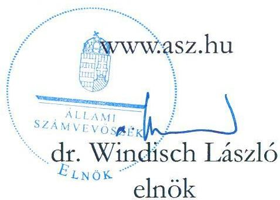

---

Jelentéseink az interneten a www.asz.hu címen olvashatók.

ELLENŐRZÉSI IGAZGATÓSÁG:
ELLENŐRZÉSI IGAZGATÓSÁG V.

ELLENŐRZÉSI IGAZGATÓ:
KLINGA LÁSZLÓ ellenőrzési igazgató

ELLENŐRZÉSVEZETŐ:
VARGA EDIT ellenőrzési igazgatóhelyettes, ellenőrzésvezető

IKTATÓSZÁM: EL-4090-012/2025
TÉMASORSZÁM: 24
ELLENŐRZÉS-AZONOSÍTÓ SZÁM: V1108

---

TARTALOMJEGYZÉK

- AZ ELLENŐRZÉS ALAPADATAI ... 5
- AZ ELLENŐRZÉS HATÓKÖRE ÉS TERÜLETE ... 7
- ÖSSZEFOGLALÁS ... 10
- AZ ELLENŐRZÉS FÓKUSZTERÜLETEI ... 12
- MEGÁLLAPÍTÁSOK ... 13
- JAVASLATOK ... 21
- ELEMZÉS A BETEGÁPOLÓ IRGALMAS REND BUDAI IRGALMASRENDI KÓRHÁZ PÉNZÜGYI ÉS ELLÁTÁSI TEVÉKENYSÉGÉNEK, ADÓSSÁGÁLLOMÁNYÁNAK ALAKULÁSÁRÓL AZ ÁLLAMHÁZTARTÁSBÓL NEM HITÉLETI CÉLRA NYÚJTOTT TÁMOGATÁSOK VONATKOZÁSÁBAN ... 24
- ELEMZÉS ... 30
- MELLÉKLETEK ... 64
- I. sz. melléklet: Értelmező szótár ... 64
- II. sz. melléklet: Az ellenőrzött szervezetek jegyzéke ... 68
- III. sz. melléklet: Ellenőrzési kritériumok ... 69
- IV. sz. melléklet: a Kórház főbb működési jellemzői az összes elemzett kórházhoz viszonyítottan ... 70
- FÜGGELÉK: ÉSZREVÉTELEK ... 75
- RÖVIDÍTÉSEK JEGYZÉKE ... 80

---

“哈，你是个小伙子，你是个小伙子，你是个小伙子，你是个小伙子，你是个小伙子，你是个小伙子，你是个小伙子，你是个小伙子，你是个小伙子，你是个小伙子，你是个小伙子，你是个小伙子，你是个小伙子，你是个小伙子，你是个小伙子，你是个小伙子，你是个小伙子，你是个小伙子，你是个小伙子，你是个小伙子，你是个小伙子，你是个小伙子，你是个小伙子，你是个小伙子，你是个小伙子，你是个小伙子，你是个小伙子，你是个小伙子，你是个小伙子，你是个小伙子，你是个小伙子，你是个小伙子，你是个小伙子，你是个小伙子，你是个小伙子，你是个小伙子，你是个小伙子，你是个小伙子，你是个小伙子，你是个小伙子，你是个小伙子，你是个小伙子，你是个小伙子，你是个小伙子，你是个小伙子，你是个小伙子，你是个小伙子，你是个小伙子，你是个小伙子，你是个小伙子，你是个小伙子，你是个小伙子，你是个小伙子，你是个小伙子，你是个小伙子，你是个小伙子，你是个小伙子，你是个小伙子，你是个小伙子，

---

AZ ELLENŐRZÉS ALAPADATAI

## AZ ELLENŐRZÉS CÉLJA

Az ellenőrzés célja a Magyarországon egyházi fenntartásban működő aktív fekvőbeteg-szakellátást is végző kórházak esetében annak értékelése volt, hogy az államháztartásból nem hitéleti célra nyújtott támogatások vonatkozásában a támogatás felhasználásának szabályozási környezetét szabályszerűen alakították-e ki. Értékeltük továbbá a könyvvezetési és beszámoló készítési és közzétételi kötelezettség teljesítésének szabályszerűségét, belső szabályzatoknak való megfelelését, továbbá az államháztartásból kapott, nem hitéleti célú támogatások felhasználásának és elszámolásának szabályszerűségét, a felhasználás támogatás céljának való megfelelését.

Ellenőrzési cél volt továbbá annak megállapítása, hogy az egyház (mint a közfeladatot ellátó intézmény fenntartója) a jogszabályi előírásoknak és belső szabályzatainak megfelelően gondoskodott-e a kórházzal kapcsolatos fenntartói kötelezettségei teljesítéséről.

## AZ ELLENŐRZÉS TÍPUSA

Törvényességi ellenőrzés.

## AZ ELLENŐRZÖTT IDŐSZAK

A 2023. év.

## AZ ELLENŐRZÉS TÁRGYA

Az ellenőrzés tárgyát képezte – az államháztartásból nem hitételi célra nyújtott támogatások vonatkozásában – a Magyarországon egyházi fenntartásban működő aktív fekvőbeteg-szakellátást is végző kórházak tekintetében a 2023. évre vonatkozóan a számviteli szabályozási keretek kialakításának, a könyvvezetési és beszámoló készítési és közzétételi kötelezettség teljesítésének szabályszerűsége és belső szabályzatoknak való megfelelése. Az ellenőrzés kiterjedt a kórházak esetében az államháztartásból nem hitéleti célra nyújtott támogatás tekintetében a támogatás-felhasználás célhoz kötöttségének ellenőrzésére is.

Az egyház, mint fenntartó tekintetében az ellenőrzés tárgyát képezte a kórházzal kapcsolatos fenntartói tevékenység szabályszerűségének értékelésére figyelemmel a kórházat megillető államháztartási forrásból nem hitéleti célra nyújtott támogatások kezelése/átadása.

Az ellenőrzés kiterjedt minden olyan körülményre és adatra, amely az ÁSZ jogszabályban meghatározott feladatainak teljesítéséhez, valamint a program végrehajtása folyamán felmerült újabb összefüggések feltárásához szükséges volt.

5

---

Az ellenőrzés alapadatai

## AZ ELLENŐRZÉS JOGALAPJA

Az ellenőrzés jogszabályi alapját az ÁSZ tv.¹ 1. § (3) bekezdés, az 5. § (11) bekezdés c) pont, (13) bekezdés és az Ehtv.² 19/D. § (2) bekezdés előírásai képezték.

## AZ ELLENŐRZÉS MÓDSZERE

Az ellenőrzést a nemzetközi standardokat irányadónak tekintve az ellenőrzési program szempontjai, az ellenőrzött időszakban hatályos jogszabályok, az ÁSZ³ ellenőrzés-szakmai szabályok és irányadó módszertanok figyelembevételével végezte az ÁSZ.

Az ellenőrzési kérdések megválaszolásához szükséges bizonyítékok megszerzése az ellenőrzött szervezetek által rendelkezésre bocsátott dokumentumokra és adatokra alapozva megfigyelés, helyszíni szemle (szemrevételezés), kérdésfeltevés (információkérés), illetve mintavételezés útján történt. Kockázati alapon kiválasztott mintatételeken keresztül történt a kórházak esetében az államháztartásból nem hiteleti célra nyújtott támogatások felhasználása, számviteli elszámolása szabályszerűségének ellenőrzése, az egyházi fenntartóknál pedig a fenntartón keresztül folyósított – kórházat megillető – támogatások kezelése (intézmény részére történő átadás, elszámolás) szabályszerűségének ellenőrzése. A mintatételek kiértékelése nem került a sokaságra kivitelésre, az ellenőrzött támogatásokra vonatkozó összegző és részletes következtetések az adott területhez kapcsolódó értékelésben kerültek megjelenítésre.

Az ellenőrzés lefolytatásához az ellenőrzött szervezetek a tanúsítványok kitöltésével, valamint az ellenőrzött és az ellenőrzést támogató szervezetek az ÁSZ által kért dokumentumok, adatok, információk megküldésével szolgáltattak adatokat.

Az ellenőrzési bizonyítékként felhasználható adatforrások közé tartoztak egyrészt az ellenőrzéshez kért dokumentumok, adatforrások, másrészt adatforrás volt még minden – az ellenőrzés folyamán – az ellenőrzés szempontjából információkat tartalmazó dokumentum. Az ellenőrzési kritériumok részletes felsorolását a III. sz. melléklet tartalmazza.

---

7

# AZ ELLENŐRZÉS HATÓKÖRE ÉS TERÜLETE

Az ÁSZ tv. 5. § (11) bekezdés c) pontja értelmében az ÁSZ törvényességi szempontok szerint ellenőrzi a vallási egyesületek, az egyházi jogi személyek vagy azok nevelési-oktatási, felsőoktatási, egészségügyi, karitatív, szociális, család-, gyermek- és ifjúságvédelmi, kulturális vagy sporttevékenység végzésére létrehozott, a jogi személyiséggel rendelkező vallási közösség belső szabálya szerint jogi személyiséggel nem rendelkező intézménye részére az államháztartásból nem hitéleti célra nyújtott támogatás felhasználását.

Az ellenőrzés kiterjedt arra, hogy az egyházi fenntartó a jogszabályi előírásoknak és belső szabályzatainak megfelelően gondoskodott-e a nem hitéleti célra nyújtott támogatások felhasználása során az általa fenntartott aktív fekvőbeteg-szakellátást is végző kórházzal kapcsolatos fenntartói kötelezettségei teljesítéséről, ami magában foglalta az intézmény könyvvezetési és beszámolókészítési kötelezettsége megállapításának-, a kórház részére a fenntartón keresztül folyósított, államháztartásból nem hitéleti célra nyújtott támogatások könyvvezetési rendszerében történő elszámolásának-, átadásának ellenőrzését.

A kórház működési keretei kialakításának szabályszerűségére vonatkozó ellenőrzés az államháztartásból nem hitéleti célra nyújtott támogatások felhasználásának belső szabályozási környezete kialakításának szabályszerűségére terjedt ki. Az ellenőrzés és értékelés a beszámolót alátámasztó számviteli nyilvántartási rendszer kialakításának és működésének szabályozottságára; az elkülönített kimutatások szabályozottságára továbbá a beszámoló közzététele módjának meghatározására vonatkozott.

A beszámolási és közzétételi kötelezettség teljesítésének szabályszerűsége keretében értékelésre került, hogy a kórház a jogszabályi előírásoknak és belső szabályzataiban meghatározottaknak megfelelően eleget tett e beszámolási kötelezettségének, gondoskodott-e a beszámoló közzétételéről, amennyiben számviteli politikájában meghatározta a közzététel módját. Ellenőrzésre került, hogy az államháztartási forrásból származó, nem hitéleti célú támogatást felhasználó kórház számviteli beszámolójának mérlegtételeit a Számv. tv.⁴ előírása szerinti leltárral alátámasztotta-e, továbbá, hogy gondoskodott-e a közfeladatellátással kapcsolatos közérdekű vagy közérdekből nyilvános adatok közzétételéről.

A könyvvezetési kötelezettség teljesítésének ellenőrzése keretében értékelésre került, hogy a kórház betartotta-e a jogszabályi és vonatkozó belső szabályozások előírásait, továbbá a bizonylatolásra vonatkozó előírások, a kiadási tételek besorolását. Az ellenőrzés kiterjedt arra, hogy a kórház a könyvvezetési rendszerében biztosította-e az alaptevékenységből és vállalkozási tevékenységből származó bevételeinek, költségeinek és ráfordításainak elkülönített kimutatását, hogy a kapott támogatásokat bevételként elszámolta-e, az államháztartából nem hitéleti célra folyósított támogatások felhasználása a támogatási célnak megfelelő és szabályszerű volt-e.

A 2023. évben Magyarországon működő kilenc egyházi fenntartású fekvőbeteg-szakellátást végző intézményből a V1108 ellenőrzés-azonosító számú ellenőrzés keretében öt aktív fekvőbeteg-szakellátást is végző intézmény került ellenőrzésre. Közülük jelen ÁSZ jelentés a Betegápoló Irgalmas Rend Budai Irgalmas-rendi Kórház (Kórház)⁵, és fenntartójaként a Betegápoló Irgalmas Rend, mint ellenőrzött szervezetek ellenőrzéséről készült.

---

Az ellenőrzés hatóköre és területe

# BETEGÁPOLÓ IRGALMAS REND

A magyarországi kórházi hálózat kiépítésében jelentős szerepet játszó Betegápoló Irgalmas Rendet (BIR)⁶ 1950-ben felszámolták, kórházait és intézményeit államosították. A lelkiismereti és vallásszabadságról, valamint az egyházakról szóló 1990. évi IV. tv.⁷ alapján a szerzetesrendet ismét nyilvántartásba vették Magyarországon. A BIR három kórházat igényelt vissza. Az egyházakkal való kapcsolattartás koordinációjáért felelős miniszter által vezetett nyilvántartás szerint a BIR a Magyar Katolikus Egyház belső egyházi jogi személye, nyilvántartási száma: 00001/2012-053.

A BIR, mint egészségügyi szolgáltató az SZMSZ-e szerint három, önálló adószámmal nem rendelkező egészségügyi intézményt (Budai Irgalmasrendi Kórház, Pécsi Irgalmasrendi Kórház, Váci Irgalmasrendi Kórház) tartott fenn a 2023. évben. Az egészségügyi intézmények nem minősültek belső egyházi jogi személynek, önálló jogalanyisággal nem rendelkeztek.

A kórházakat megillető támogatásokat a BIR főszámlájáról átvezették az egészségügyi intézmények önálló bankszámláira, így biztosították az egészségügyi intézmények működését, költségeik finanszírozását, a támogatások intézmények önálló gazdálkodási keretei közötti felhasználását.

Az egészségügyi intézmények gyógyító-megelőző tevékenységének költségvetési finanszírozását biztosító NEAK finanszírozási szerződéssel egészségügyi szolgáltatóként a BIR rendelkezett. Az egészségügyi szolgáltatások nyújtására jogosító működési engedély szerint a BIR összesen 751 ágyon biztosított aktív- és krónikus fekvőbeteg ellátást.

A BIR nyilatkozata szerint a 2023. évben végzett vállalkozási tevékenységet, közforgalmú patikát, büféket, kávézót és fürdőt üzemeltetett, kettős könyvvitelt vezetett, a naptári évről egyszerűsített éves beszámolót készített.

# BETEGÁPOLÓ IRGALMAS REND BUDAI IRGALMASRENDI KÓRHÁZ

Az 1124/1999. (XII. 13.) Korm. határozat⁸ alapján a Magyar Állam tulajdonában és az ORFI⁹ kezelésében lévő Budapest, Frankel Leó utcai ingatlanok egészségügyi funkció céljából a BIR tulajdonába kerültek. A BIR a fekvőbeteg-ellátás, mint főtevékenység végzésére alapított egészségügyi intézményt 2000. július 01-étől 10 éven át nonprofit közhasznú szervezetként működött. A 2011. március 07-én kelt

ÁNTSZ¹⁰ határozat szerint a BIR megállapodások alapján jogutódlással átvette a Budai Irgalmasrendi Kórház Nonprofit Kft.-től az összes járóbeteg szakellátási területet, valamint a patológiai szakmán kívül 477 fekvőbeteg ágyra vonatkozó szolgáltatói feladatát.

A BIR 2023. július 19-étől hatályos SZMSZ¹¹-e szerint „a BIR HU¹² intézményeinek önálló adószáma, önálló számviteli beszámolója nincs”, továbbá „a BIR HU intézményei önállóan gazdálkodó intézmények, melyek – jelen dokumentumban foglalt korlátozásokkal – meghatározzák működési rendjüket, kialakítják szervezetüket, működési folyamataikat”. A Kórház működési formáját tekintve egyedi és eltérő a többi egyházi fenntartású kórháztól, mivel az egyházi

---

Az ellenőrzés hatóköre és területe

fenntartó és a kórház jogalanyként nem különült el egymástól, a Kórház önálló jogi személyiséggel nem rendelkező, a BIR önálló gazdálkodási jogkörrel rendelkező szervezeti egységeként működött.

A BIR SZMSZ előírásai szerint a Kórház „alapfeladata minden olyan tevékenység, amely az egészségügyi fekvőbeteg és járóbeteg szakellátás területén, valamint az egészségügyi alapellátás egyes területein az egyén egészségének megőrzésére, kezelésére, egészségi állapotának megőrzésére, javítására irányul”. A Kórház honlapja szerint „A Budai Irgalmasrendi Kórház az Irgalmasrend legnagyobb hazai intézménye. Vácott és Pécsett elsősorban krónikus, felnőtt hospice és ápolási osztályokkal segít a rászoruló betegeken, míg a budapesti intézményben poliklinika-jellegű az ellátás.

A Kórház – mint a BIR önálló adószámmal és beszámolási kötelezettséggel nem rendelkező intézménye – a 2023. évi gazdálkodásáról, a BIR adószámával és a 11-es szervezeti egységkóddal – az intézmény saját belső szabályozása alapján – készített beszámolója szerint a Kórház 2023. évi a bevételeinek főösszege 14,19 Mrd Ft, ráfordításainak összege 13,49 Mrd Ft, tevékenységének eredménye pedig 0,70 Mrd Ft volt.

A BIR – mint egészségügyi szolgáltató – részére 2023. évben az egészségügyi feladatokhoz folyósított NEAK¹³ finanszírozás 11,40 Mrd Ft-os összegéből a Kórházat megillető összeg 8,40 Mrd Ft volt, a pályázat és egyedi döntés alapján folyósított támogatásainak együttes összege 4,91 Mrd Ft volt.

A Kórház 2023. évben alaptevékenysége mellett vállalkozási tevékenységet (közforgalmú gyógyszertár üzemeltetés) is végzett, melyből származó árbevétele 0,10 Mrd Ft, a kapcsolódó költségvetési támogatás összege pedig 0,65 Mrd Ft volt. A vállalkozási tevékenység bevételei az összes bevétel 5,3%-át tették ki 2023. évben.

9

---

ÖSSZEFOGLALÁS

Magyarország Alaptörvényének¹⁴ XX. cikke szerint mindenkinek joga van a testi és lelki egészséghez, melynek érvényesülését Magyarország többek között az egészségügyi ellátás megszervezésével segíti elő. Az Ehtv. előírása szerint „a jogi személyiséggel rendelkező vallási közösség részt vállalhat a társadalom értékteremtő szolgálatában, ennek érdekében önmaga vagy e célra létrehozott intézménye útján olyan közcéltú tevékenységet is elláthat, amelyet törvény nem tart fenn kizárólagosan az állam vagy annak intézménye számára”. A közcéltú tevékenység ellátásához az állam az Ehtv. 19. § (1)-(2) bekezdése szerint költségvetési támogatást nyújt.

1. álma

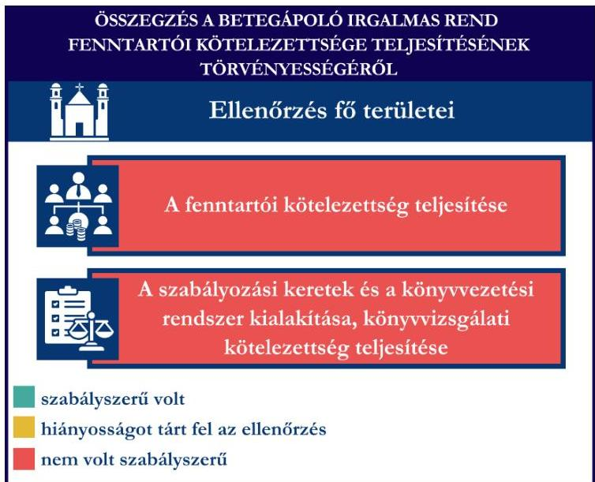
Forrás: ÁSZ megállapítások alapján ÁSZ saját szerkesztés

A BIR Kórházzal kapcsolatos fenntartói kötelezettségének teljesítése nem felelt meg a jogszabályi előírásoknak. A BIR nem megfelelően gyakorolta az Eütv.¹⁵ előírása szerinti fenntartói hatáskörét a Kórház működésének szakmai ellenőrzése tekintetében, mivel a Kórház nem rendelkezett a szervezetét, működési rendjét és folyamatait szabályozó dokumentumokkal.

A BIR a jogszabályban előírt, a szabályszerű gazdálkodás feltételeit biztosító, a számviteli kereteit és könyvvezetési rendszerét meghatározó belső szabályzatokkal nem rendelkezett, könyvvezetési rendszerének kialakítása – az államháztartásból nem hitéleti célra nyújtott támogatások tekintetében – nem volt szabályszerű. A Számv. tv. előírásai szerinti, a szervezet sajátosságainak megfelelően kialakított számviteli szabályzatok hiányában a BIR nem rögzítette a szervezet egészére vonatkozóan a BIR által készítendő, de az önállóan gazdálkodó intézmények könyvvezetésének adatait is tartalmazó számviteli beszámoló összeállításának szabályait és eljárásrendjét.

A BIR, mint egészségügyi szolgáltató a jogszabályi előírás ellenére a számviteli beszámolóját könyvvizsgálóval nem ellenőriztette.

A Kórház szabályszerű gazdálkodásának feltételei nem voltak biztosítottak, mert a BIR nem alakította ki az önállóan gazdálkodó szervezeti egységként működő, de önálló jogalanyisággal nem rendelkező Kórházra is érvényes gazdálkodási szabályokat. A Kórház a szervezeti felépítését, működési rendjét meghatározó dokumentummal nem rendelkezett.

A BIR nem alakította ki az önállóan gazdálkodó szervezeti egységek könyvvezetésének adatait is tartalmazó számviteli beszámoló összeállításának szabályait és eljárásrendjét.

A Kórház nem rendelkezett önálló jogalanyisággal, így jogszabályi kötelezettsége sem volt önálló számviteli beszámoló elkészítésére. Ennek ellenére a Kórház a Számviteli Politikájában a Számv. tv. szerinti éves beszámoló készítését írta elő, de a 2023. évi számviteli beszámolóját az egyházi jogi személyek beszámolási kötelezettségét meghatározó jogszabályi előírásoknak megfelelő, a vállalkozási tevékenységet is végző egyházi jogi személyek számára előírt formában készítette el. A beszámolókészítésre vonatkozó belső szabályozás és a tényleges beszámolókészítési gyakorlat közötti összhang nem volt biztosított.

10

---

Összefoglalás

2. ábra

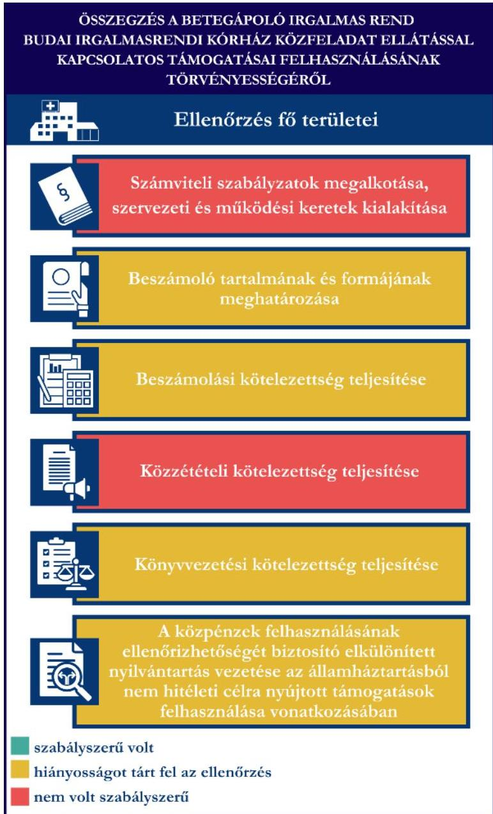

Forrás: ÁSZ megállapítások alapján ÁSZ saját szerkesztés

Az egészségügyi közfeladat ellátással kapcsolatos, közérdekű és közérdekből nyilvános adatok jogszabályokban előírt közzétételi kötelezettségének sem a Kórház, mint a közfeladatot ténylegesen ellátó szervezet, sem pedig a BIR, mint fenntartó nem tett eleget.

A BIR jogszabályi kötelezettségeinek teljesítését a Kórház könyvvezetése nem támogatta az alaptevékenység és vállalkozási tevékenységhez közvetlenül nem kapcsolódó költségek és az általános költségek teljeskörű felosztásának elmaradása, továbbá a támogatások felhasználásáról vezetett elkülönített nyilvántartás hiányosságai miatt.

A Kórház által a támogatások felhasználásáról vezetett elkülönített nyilvántartás nem támogatta teljeskörűen a BIR jogszabályi előírásoknak való megfelelését, mivel a támogatások elszámolásának számlaösszesítőkben kimutatott kiadások egyösszegű, utólagos elkülönítése a támogatások felhasználásának ellenőrizhetőségét nem biztosította. Az államháztartásból nem hitéleti célra nyújtott támogatások felhasználása nem minden mintatétel esetében felelt meg teljeskörűen a jogszabályi előírásoknak. A hiányosságok többsége a mintatételekhez kapcsolódó szerződések adatainak helytállóságával, továbbá a számviteli bizonylatok alaki és tartalmi követelményeivel kapcsolatban került feltárásra. Az államháztartásból nem hitéleti célra nyújtott támogatások

felhasználása az ellenőrzött mintatételek esetében a támogatói okiratban meghatározott célnak megfelelő volt, azonban nem minden esetben tartották be a támogatói okiratban meghatározott előírásokat.

---

AZ ELLENŐRZÉS FÓKUSZTERÜLETEI

1. Az egyház fenntartói kötelezettsége teljesítésének szabályszerűsége
2. A kórház működési keretei kialakításának szabályszerűsége az államháztartásból nem hitéleti célra nyújtott támogatások vonatkozásában
3. A kórház beszámolási és közzétételi kötelezettsége teljesítésének szabályszerűsége az államháztartásból nem hitéleti célra nyújtott támogatások vonatkozásában
4. A kórház könyvvezetési kötelezettsége teljesítésének, az államháztartásból nem hitéleti célra nyújtott támogatások felhasználásának és elszámolásának szabályszerűsége

12

---

MEGÁLLAPÍTÁSOK

# 1. Az egyház fenntartói kötelezettsége teljesítésének szabályszerűsége

## Összegző megállapítás

A BIR a Kórházzal kapcsolatos fenntartói hatáskörét a Kórház működésének szakmai ellenőrzése tekintetében nem megfelelően gyakorolta. A BIR, mint egészségügyi szolgáltató, a jogszabályban előírt könyvvizsgálati kötelezettségnek nem tett eleget.

## A BIR Kórházzal, mint egészségügyi intézménnyel kapcsolatos fenntartói kötelezettsége teljesítésére vonatkozó megállapítások:

A BIR, mint fenntartó és egyben egészségügyi szolgáltató az önállóan gazdálkodó szervezeti egységeként működő, önálló jogalanyisággal nem rendelkező Kórház, mint közfeladatot ellátó egészségügyi intézmény esetében a fenntartói kötelezettségének nem tett eleget.

A BIR a szervezeti felépítését és működését meghatározó belső szabályozással 2023. január 01 - 2023. július 18. közötti időszakban nem rendelkezett. A BIR ellenőrzött időszak végén hatályos SZMSZ-e 2023. július 19-én lépett hatályba, amely szerint a „BIR HU az Országgyűlés által elismert Katolikus Egyház, mint bevett egyház belső egyházi jogi személye, mint egy jogalany működik”, így Számv. tv. és a 296/2013. Korm. rendelet¹⁶ előírásai alapján beszámolókészítésre volt kötelezett.

A Kórház, mint a BIR által fenntartott egészségügyi intézmény az SZMSZ 15. § (1) és 16. § (1)-(2) bekezdése szerint önálló adószámmal nem rendelkezett, ezáltal önálló számviteli beszámolókészítési kötelezettsége nem volt, de a rendtartományi vezetés által jóváhagyott Gazdasági Terv keretein belül önállóan gazdálkodott. Az SZMSZ 4. § (2) bekezdése előírta, hogy a „BIR HU intézményei önállóan gazdálkodó intézmények, amelyek – jelen dokumentumban foglalt korlátozásokkal – meghatározzák működési rendjüket, kialakítják szervezetiüket, működési folyamataikat”. Az előírás ellenére a Kórház nem készítette el a működését szabályozó dokumentumokat, amely dokumentumokat a BIR az Eütv. 155. § (1) bekezdés g) pontjában biztosított – a Kórház működésére vonatkozó – szakmai ellenőrzési hatásköre ellenére nem hiányolt.

A BIR a Kórháznál, mint egészségügyi közfeladatot ellátó intézménynél a 2023. évben és a 2023. évre vonatkozóan költségvetési ellenőrzést nem végzett.

A Kórház az 507/2023. Korm. rend.¹⁷ előírásai szerint 1 944 611 E Ft összegű adósságcsökkentési célú működési támogatásban részesült a 2023. évben. A jogszabályi előírásnak megfelelően a BIR, mint fenntartó döntött az 507/2023. Korm. rend. 2. § (1) bekezdés e) pontja szerinti tartozások kiegyenlítési sorrendjéről.

## A BIR számviteli kereteinek, belső szabályainak, könyvvezetési rendszerének kialakítására vonatkozó megállapítások:

A BIR a 2023. évben a Számv. tv. 14. § (3) bekezdés előírása ellenére nem rendelkezett számviteli politikával. A számviteli politika hiányában a BIR nem tett eleget a Számv. tv. 14. § (3)-(4) bekezdésében foglaltaknak, mivel nem alakította ki a gazdálkodó adottságainak, körülményeinek leginkább megfelelő

13

---

Megállapítások

szabályzatot, továbbá nem rögzítette a gazdálkodóra jellemző szabályokat előírásokat módszereket, így nem határozta meg a szervezet egészére – beleértve az intézményeit – a BIR által, mint belső egyházi jogi személy által készítendő, de az önállóan gazdálkodó intézmények könyvvezetésének adatait is tartalmazó egyszerűsített éves beszámoló összeállításának szabályait és eljárásrendjét.

A BIR továbbá nem rendelkezett a Számv. tv. 14. § (5) bekezdés a)-b) pontjai szerinti, az eszközök és források leltárkészítési és leltározási szabályzatával, valamint az eszközök és források értékelési szabályzatával. A Számv. tv. 14. § (5) bekezdés d) pontja szerinti pénzkezelési szabályzattal¹⁸ a BIR a 2023. évben szintén nem rendelkezett, de a szabályzatot az ellenőrzés időszakában elkészítették, és 2024. október 01-én hatályba lépett.

A BIR a 296/2013. Korm. rend. 5. § (1) bekezdésében előírt beszámoló készítését maradéktalanul biztosító könyvvezetésre, bizonylatolásra vonatkozó 161/A. § (1) bekezdése szerinti részletes belső szabályokat nem alakította ki, a Számv. tv. 161. § (1) bekezdése szerinti számlarendet nem készítette el. Belső szabályozásként csak a 2023. évre vonatkozóan a BIR által alkalmazandó, az alkalmazásra kijelölt számlák számjelét és megnevezését tartalmazó BIR Számlatükörlista – Számlarend¹⁹ állt rendelkezésre. A dokumentum tartalma nem felelt meg teljeskörűen a BIR SZMSZ-ében meghatározott szabályozásnak sem, mivel a főkönyvi számlák alábbontásai nem tartalmaztak a BIR által fenntartott összes intézményre vonatkozó alszámlákat.

A BIR, mint egészségügyi szolgáltató könyvvizsgálatra volt kötelezett, az Eftv.²⁰ 12. § (1) bekezdés a) és b) pontjában előírtak ellenére a számviteli beszámolóját könyvvizsgálóval nem ellenőriztette.

A BIR a Kórházat megillető továbbutalási célú támogatásban nem részesült, így ennek nyilvántartásával, elszámolásával kapcsolatos kötelezettségek teljesítésének ellenőrzésére nem került sor.

# 2. A kórház működési keretei kialakításának szabályszerűsége az államháztartásból nem hitéleti célra nyújtott támogatások vonatkozásában

|  Összegző megállapítás | A Kórház szabályszerű gazdálkodásának feltételei nem voltak biztosítottak, mivel a BIR nem alakította ki a Kórházra is érvényes gazdálkodási szabályokat. A Kórház a szervezeti felépítését és működési rendjét meghatározó szabályozással nem rendelkezett.  |
| --- | --- |

A Kórház számviteli kereteinek, belső szabályainak és könyvvezetési rendszerének kialakítására vonatkozó megállapítások:

A sajátos működési formából adódóan a Kórház nem rendelkezett önálló jogalanyisággal, ebből adódóan jogszabályi kötelezettsége sem volt a gazdálkodásra vonatkozó szabályzatok elkészítésére. A szabályszerű gazdálkodás feltételeit biztosító, a számviteli kereteket és könyvvezetési rendszert meghatározó belső szabályzatok készítésének jogszabályi kötelezettje a BIR volt, amely kötelezettségnek a BIR nem tett eleget.

Annak ellenére, hogy jogszabályi kötelezettsége nem volt a Kórháznak, rendelkezett a 2023. évben hatályos Számviteli Politikával²¹, továbbá annak részeként elkészítette az eszközök és források értékelési

---

Javaslatok

szabályzatát, azonban a Számv. tv. 14. § (5) bekezdés a) pontjában előírt eszközök és források leltárkészítési és leltározási szabályzatával nem rendelkezett.

A Kórház a 2023. évben végezett vállalkozási tevékenységet (közforgalmú gyógyszertár üzemeltetés), azonban a BIR a 296/2013. Korm. rend. 4. §-ában előírt jogszabályi kötelezettség ellenére – a Kórházra is vonatkozóan – az alaptevékenység és vállalkozási tevékenység bevételekeinek, költségekeinek és ráfordításainak, továbbá a kapott adományok (közcélú adományok) és azok felhasználása elkülönített bemutatását biztosító szervezeti szabályokat, eljárásrendet nem alakított ki, továbbá a BIR a 296/2013. Korm. rend. 7. § (5) bekezdésében előírtak ellenére – a Kórházra is vonatkozóan – az általános költségek, továbbá az alap- és vállalkozási tevékenységhez közvetlenül nem kapcsolódó költségek és ráfordítások felosztását biztosító szervezeti szabályokat, eljárásrendet sem alakított ki.

A Kórház egészségügyi tevékenységét meghatározó, ellenőrzött alapdokumentumaira vonatkozó megállapítások:

A Kórház a 2023. évben a BIR által fenntartott, önálló adószámmal nem rendelkező egészségügyi intézmény volt, amely a BIR-tól szervezetileg nem különült el. A BIR SZMSZ-e tartalmazta a Kórház alapfeladatát, továbbá a képviseletével és gazdálkodásával kapcsolatban is tartalmazott előírásokat és meghatározta azt is, hogy az intézmény az SZMSZ-ben foglalt korlátozásokkal működési rendjét, szervezetét, működési folyamatait maga alakítja ki, határozza meg. A Kórház a BIR SZMSZ 4. § (2) bekezdés előírása ellenére nem határozta meg a működési rendjét, nem alakította ki szervezetét és működési folyamatait.

# 3. A kórház beszámolási és közzétételi kötelezettsége teljesítésének szabályszerűsége az államháztartásból nem hitéleti célra nyújtott támogatások vonatkozásában

## Összegző megállapítás

A BIR nem alakította ki az önállóan gazdálkodó intézmények könyvvezetésének adatait is tartalmazó számviteli beszámoló összeállításának szabályait és eljárásrendjét. A jogszabályi előírások ellenére közérdekű és közérdekből nyilvános adatok közzétételi kötelezettségének sem a Kórház, mint a közfeladatot ténylegesen ellátó szervezeti egység, sem pedig a BIR, mint fenntartó nem tett eleget.

A Kórház beszámolási kötelezettsége teljesítésére vonatkozó megállapítások:

A Számv. tv. előírásai szerinti, a szervezet sajátosságainak megfelelően kialakított számviteli szabályzatok hiányában a BIR nem rögzítette a szervezet egészére vonatkozóan a BIR által készítendő, de az önállóan gazdálkodó intézmények könyvvezetésének adatait is tartalmazó számviteli beszámoló összeállításának szabályait és eljárásrendjét.

A Kórház nem rendelkezett önálló jogalanyisággal, ebből adódóan jogszabályi kötelezettsége sem volt önálló számviteli beszámoló elkészítésére. Ennek ellenére a Kórház egyszerűsített éves beszámolót készített, amelyet az ÁSZ ellenőrzés alá vont, mivel a Kórház ezen dokumentumban mutatta be a támogatásainak felhasználását. A BIR Egészségbiztosítási Alapból származó finanszírozása a 2023. évben 11,4 Mrd Ft volt, amelyből a Kórház 8,4 Mrd Ft-ot használt fel.

---

Megállapítások

Annak ellenére, hogy a Kórháznak önálló számviteli beszámoló készítési kötelezettsége a jogszabályi előírások alapján nem volt, a Számviteli Politikájában kettős könyvvitellel alátámasztott, a Számv. tv. szerinti éves beszámoló készítését írta elő: a Számv. tv. 1. számú melléklete szerinti „A” típusú mérleg, a 2. számú melléklete szerinti összköltség eljárással készített eredménykimutatás és kiegészítő melléklet mellett a Számv. tv.-ben előírt tartalmú üzleti jelentés készítéséről rendelkezett. A belső szabályozástól eltérően, viszont a helyes gyakorlatot követve a Kórház a 2023. évi számviteli beszámolóját a 296/2013. Korm. rend. előírásainak megfelelően, mint vállalkozási tevékenységet is végző intézmény, a jogszabály 1. melléklete szerinti formában és tartalommal (egyszerűsített éves beszámoló) készítette el. Mindezek alapján a Kórház beszámolókészítési kötelezettségre vonatkozó saját belső szabályozása és a tényleges beszámolókészítési forma és tartalom közötti összhang nem volt biztosított.

A Kórház a számviteli beszámoló mérlegében és eredménykimutatásában az előző évi és tárgyévi adatokat elkülönítetten mutatta ki, a Számviteli Politika előírását betartva a beszámoló nyitó (előző év) adatai megjegyztek az előző évi beszámoló záró adatával. A Kórház a Számviteli Politikájának könyvvezetés módjára vonatkozó előírásainak megfelelően a beszámoló adatainak alátámasztására könyveit a kettős könyvvitel rendszerében vezette.

A Kórház esetében a számviteli beszámoló mérlegének adatait a főkönyvi kivonat nem teljeskörűen támasztotta alá, a követelések és kötelezettségek összegét a főkönyvi kivonat szerinti értéknél alacsonyabb értékben (64 181 E Ft) mutatta be a 2023. évi mérlegben, megsértve ezzel a Számviteli Politika 2.1.6 és a 2.2.3. pontjainak előírását.

A Kórház a beszámoló mérlegsorait a Számviteli Politika 1.4. pontja előírásainak megfelelő teljeskörű letárral nem támasztotta alá, megsértve ezzel a számviteli alapelvek közül a Számviteli Politika céljánál hivatkozott valódiság alapelvét. A hosszú és rövid lejáratú kötelezettségek és a passzív időbeli elhatárolások mérlegsorok adatait teljeskörűen alátámasztó leltár nem készült, a befektetett eszközök és anyagok esetében az analitikus nyilvántartásból kinyomtatott „lista” került beküldésre, ami a mérlegben szereplő befektetett eszközök és készletek értékét nem támasztotta teljeskörűen alá.

## A Kórház közzétételi kötelezettsége teljesítésére vonatkozó megállapítások:

A Kórház Számviteli Politikája alapján készítendő számviteli beszámoló közzétételéről nem rendelkezett. Az Ehtv. 19. § (3) bekezdése szerinti, az Info tv.²² 33. § (3) és 37. § (1) bekezdésében meghatározott, az Info tv. 1. melléklete szerinti – az egészségügyi közfeladatellátással összefüggő, általános közzétételi listában szereplő – közérdekű és közérdekből nyilvános adatokkal kapcsolatos közzétételi kötelezettségnek sem a Kórház – mint a közfeladatot ténylegesen ellátó szervezeti egység, sem pedig a BIR, mint fenntartó nem tett eleget.

16

---

Javaslatok

# 4. A kórház könyvvezetési kötelezettsége teljesítésének, az államháztartásból nem hitéleti célra nyújtott támogatások felhasználásának és elszámolásának szabályszerűsége

## Összegző megállapítás

A BIR jogszabályi előírásoknak való megfelelését a Kórház könyvvezetése nem támogatta az alaptevékenység és vállalkozási tevékenységhez közvetlenül nem kapcsolódó költségek és az általános költségek teljeskörű felosztásának elmaradása miatt, továbbá a támogatások felhasználásáról vezetett elkülönített nyilvántartás hiányosságai miatt. Az ellenőrzött tételek alapján az államháztartásból nem hitéleti célra nyújtott támogatások felhasználása nem felelt meg teljeskörűen a jogszabályi előírásoknak.

## A Kórház könyvvezetési kötelezettsége teljesítésére vonatkozó megállapítások:

A Kórház könyvvezetési rendszerében a bevételek számviteli elszámolása során – a 296/2013. Korm. rend. előírásainak való BIR megfelelését támogatva – a támogatásokat, a térítés nélkül átvett eszközök, ajándékok értékét bevételként számolta el.

A zárás előtti főkönyvi kivonat adatai alapján 2023. évben a Kórház az alaptevékenységhez közvetlenül nem kapcsolódó és az általános költségeinek tevékenységek közötti teljeskörű felosztása nem történt meg, nem támogatva ezzel a 296/2013. Korm. rend. 7. § (5) bekezdés előírásának való BIR megfelelését. A főkönyvi kivonat szerint a 6. Költséghelyek, általános költségek számlaosztály főkönyvi számláinak egyenlege 4 874 144 E Ft volt, amelyet át kellett volna vezetni, felosztani a 7. számlaosztályra.

A Kórház nem támogatta a Számv. tv. 159. §-ának való BIR megfelelését, mivel nem biztosította a könyvviteli nyilvántartások folyamatos, áttekinthető és zárt rendszerben történő vezetésére vonatkozó előírásának és a BIR 2023. július 19-étől hatályos SZMSZ 4 § (3) bekezdés rendelkezéseinek teljeskörű betartását, mivel önálló szervezeti egységkóddal rendelkező, a könyvvezetési rendszerben önálló divíziókként kezelt Kórház nyilvántartása (7. főkönyvi számlaosztály alszámlái, továbbá a 6. számlaosztályban elszámolt és fel nem osztott közvetett költségek) tartalmazott a könyvvezetési rendszerben szintén önálló divízióként kezelt pécsi és váci egészségügyi, és az érdi szociális intézménnyel, valamint a Budai, illetve a Pécsi Házzal kapcsolatban felmerült költséget.

A Kórház könyvviteli nyilvántartási rendszerében az alap- és vállalkozási tevékenység bevételeit, költségeit és ráfordításait – a 296/2013. Korm. rend. előírásainak való BIR megfelelését támogatva – elkülönítetten mutatta ki, a költségek és ráfordítások esetében szakmák, tevékenységek, osztályok, szolgáltatások, ellátások szerinti elkülönítést alkalmazott.

A Kórház a támogatások esetében a bevételek elkülönített kimutatását könyvvezetési rendszerében biztosította, a támogatások felhasználásáról is vezetett elkülönített nyilvántartást, azonban az nem felelt meg teljeskörűen a Számviteli Politikájában foglaltaknak., mivel a kiadási jogcímek szerinti felhasználás ellenőrizhetőségét nem biztosította.

17

---

Megállapítások

A BIR, mint támogatott szervezet részére folyósított és általa elszámolt, a Kórházi felhasználással érintett, államháztartásból nem hitéleti célra nyújtott támogatásai felhasználásának mintatételes ellenőrzésére vonatkozó megállapítások:

## Az egészségügyi szakellátási tevékenységhez kapcsolódó, Egészségbiztosítási Alapból folyósított finanszírozás:

A 2023. évben a BIR, mint fenntartó és egészségügyi szolgáltató részére folyósított, összesen 11 364 802 E Ft finanszírozásból a Kórházat megillető összeg 8 404 123 E Ft volt. Az egészségügyi szakellátási tevékenységhez kapcsolódó finanszírozás felhasználása során a Számv. tv.-ben meghatározott, a bizonylati alátámasztottságra vonatkozó előírásokat valamennyi ellenőrzött tétel esetében (20 db) betartották, viszont a bizonylatok alaki és tartalmi követelményeire vonatkozó előírások kapcsán egy mintatétel esetében hiányosságokat tárt fel az ellenőrzés:

- A szolgáltatás teljesítésének igazolását nem a szerződés szerint arra jogosult személy végezte (A_15, értéke: 1 817 135 Ft).

## Pályázat vagy egyedi döntés alapján folyósított támogatások:

A BIR a 2023. évben három jogalanyisággal nem rendelkező, de önállóan gazdálkodó egészségügyi intézményt tartott fenn. E sajátos szervezeti felépítés és könyvvezetés következménye, hogy a BIR részére folyósított egészségügyi feladatokhoz kapcsolódó nem hitéleti célú támogatások felhasználását a három egészségügyi intézmény könyvviteli nyilvántartási rendszerében elszámolt gazdasági események támasztják alá. A támogatások pénzügyi elszámolásának részét képező számláösszesítőkben a három egészségügyi intézmény könyvviteli rendszerében elszámolt kiadások szerepelnek.

A BIR 2023. évben hat olyan pályázati vagy egyedi döntés alapján folyósított támogatásban részesült, melyek felhasználásában a Kórház is érintett volt és amelyből öt támogatás került ellenőrzésre. A támogatások energia-növekedésből eredő többletkiadások ellentételezésére, működési költségek, személyi juttatások és járulék kiadások finanszírozására, a csádi orvosi misszió gyógyszer és felszerelés költségeinek támogatására, továbbá a 2022. december 31-ig lejárt tartozásállomány utólagos kiegyenlítésére szolgáltak. A támogatások ellenőrzött mintatételeiből (BM/10951-1/2023. támogatás 1-3 mintatétele, BM/12962-2/2023. támogatás 1-6 mintatétele, BM/19958-2/2023. támogatás 1-3 mintatétele, BM/8792-2/2023. támogatás 1-5 mintatétele, BM/9038-3/2023.) támogatás 1-7 mintatétele) a Kórház általi felhasználással kapcsolatban az ellenőrzés az alábbiakat állapította meg:

- A Kórház a támogatások felhasználása során nem minden esetben támogatta a BIR megfelelését a Számv. tv. bizonylatolásra, a bizonylatok alaki és tartalmi követelményeire vonatkozóan. A személyi juttatások és kapcsolódó járulékköltségek elszámolásához kapcsolódóan a BM/8792-2/2023 támogatás öt mintatételével kapcsolatban, továbbá egészségügyi szolgáltatás igénybe vételéhez kapcsolódóan a BM/9038-3/2023. támogatás egy mintatétele esetében került hiányosság feltárásra:

- BM/8792-2/2023. támogatás:

- A személyi juttatások és kapcsolódó járulékkiadások esetében Számv. tv. 167. § (1) bekezdés h) és i) pontja szerinti adatokat (könyvelés módjára, könyvviteli számlák történő hivatkozás, nyilvántartásokban történő rögzítés időpontja) a mintatételek dokumentumai nem tartalmazták (bérlista a havi számfejtésről, bakszámlakivonat, munkaidő nyilvántartás, kontírozás nyomtatása,

18

---

Javaslatok

541101 és 561201 főkönyvi számlák forgalma). (BM8792_01 - BM/8792_5, értékük összesen 2 392 933 Ft).

- A támogatás felhasználásának elkülönített nyilvántartásába helyesbítéssel történt költségátvezetés összesítő bizonylata nem felelt meg a Számv. tv. 167. § (1) bekezdés g) pontja előírásának, mert nem tartalmazta az összesítés alapjául szolgáló bizonylatok körét, és annak az időszaknak a megjelölését, amelyre az összesítés vonatkozott (BM8792_01 - BM/8792_5, értékük összesen 2 392 933 Ft).

- A Kórház egy, a BM/3038-3/2023. támogatás felhasználásához kapcsolódó mintatétel esetében számla alátámasztására szolgáló teljesítésigazolás az összegen kívül a számlán szereplő adatokat nem támasztotta alá (BM9038_07 értéke: 5 295 981 Ft).

- A bérköltség besorolása nem felelt meg a 2023. évben használatra kijelölt számláknek a támogatás felhasználásának elkülönített nyilvántartásba történt átvezetése során a Számv. 161. § (2) bekezdés a) pontja előírása ellenére. A személyenkénti bérlisták szabályszerűen az alapbér összegén kívül vezetői pótlék, illetve jogszabály alapján járó pótlék is számfejtésre, elszámolásra került, viszont a támogatás terhére történő elkülönítés egyösszegben az alapbérből történt (BM8792_01 - BM/8792_4, értékük összesen 2 315 736 Ft).

- A támogatások felhasználását alátámasztó dokumentumok záradékolására nem felelt meg a támogatói okiratban vagy támogatási szerződésben meghatározottaknak a BM/8792-2/2023. támogatás öt mintatétele esetében, mivel azok nem tartalmazták a bizonylatokon szereplő összegből a támogatás terhére felhasznált teljes összegeket (személyi juttatás+járulék) (BM8792_01 - BM/8792_5, értékük összesen 2 392 933 Ft).

- A Kórház kettő, a BM/3038-3/2023 támogatás felhasználásához kapcsolódó mintatétel esetében a támogatási célnak megfelelő felhasználás ellenére nem tartotta be a támogatói okiratban meghatározott előírásokat.

- Egy mintatétel esetében a felhasználás nem felelt meg a támogatói okirat támogatási időszakra vonatkozó előírásának, mivel a dokumentum szerint (5.2. és 5.4. pont) a támogatás a támogatott tevékenység érdekében 2022. január 01. és 2022. december 31. között felmerült, de 2022. december 31-ig ki nem fizetett számlák kiegyenlítésére volt felhasználható. A számlához kapcsolódó teljesítésigazolás és a gazdasági esemény időbeli hatálya alapján a mintatétel szerinti tevékenység a támogatói okiratban megjelölt támogatási időszakot megelőzően, 2021. decemberben merült fel. (BM9038_04 értéke: 10 455 168 Ft).

- Egy mintatétel esetében a tartozás 2022. december 31-én nem minősült lejárt szállítói tartozásnak. A támogatói okirat 2.1. pontja szerint „a Támogatást a Kedvezményezett kizárólag 2022. évi adósságállomány kiegyenlítése érdekében a 2022. január 1-je és 2022. december 31-e közötti időszakra vonatkozóan, a 2022. december 31-ig lejárt szállítói számlák kiegyenlítésére használhatja fel”. A számla szerinti fizetési határidő 2023. február 06. volt. (BM9038_06 értéke: 3 317 139 Ft)

A BM/10951-1/2023. támogatás 5 mintatétele, BM/19958-2/2023 támogatás 4-5 mintatétele esetén a BIR, mint támogatott szervezet által elkészített pénzügyi elszámolásban szereplő, a váci vagy pécsi egészségügyi intézmény által felhasznált mintatételekkel kapcsolatban feltárt hiányosságok:

19

---

Megállapítások

- A BIR váci egészségügyi intézménye által felhasznált és ellenőrzés alá vont két támogatási mintatétel esetében a gazdasági eseményt alátámasztó számla nem felelt meg a Számv. tv. 166. § (2) bekezdése – számviteli bizonylat hiteles, megbízható és helytálló adattartamára vonatkozó – előírásának, továbbá a mintattételek bizonylati alátámasztottsága sem felelt meg a Számv. tv. 166. § (1) bekezdése előírásának.

- A BM10951_5 mintatétel esetében (értéke: 3 294 562 Ft) a számlán a vevőként a „Váci Irgalmasrendi Kórház” szerepelt az Irgalmasrendi Kórház Alapítványa adószámával, továbbá a gázszolgáltatási szerződés helyett villamosenergia vásárlásra vonatkozó szerződés szerepelt a mintatételt alátámasztó dokumentumok között, megsértve a Számv. tv. 166. § (1) és (2) bekezdése előírását.

- A BM19958_4 mintatétel esetében (értéke: 320 429 Ft) a számlán a vevőként a „Váci Irgalmasrendi Kórház” szerepelt a Magyar Máltai Szeretetszolgálat Alapítvány adószámával, továbbá a mintatételt alátámasztó dokumentumok között szereplő villamosenergia vásárlásra vonatkozó szerződés hatálya 2023. szeptember 30-án lejárt, a számla szerinti teljesítés pedig 2023. november 01. és 2023. november 30. közötti időszakra vonatkozott (a szerződésmódosítás már nem volt hatályos), megsértve a Számv. tv. 166. § (1) és (2) bekezdése előírását.

- A BIR pécsi egészségügyi intézménye által felhasznált és ellenőrzés alá vont BM/19958-2/2023. támogatás 2 180 949 Ft értékű, BM19958_5 mintatételből 436 190 Ft felhasználás nem lett volna a támogatás terhére elszámolható, mivel az nem egészségügyi intézmény működésével kapcsolatos költség volt. A 436 190 Ft összegű felhasználás nem felelt meg a támogatói okirat 2.2. pontja előírásának, mivel a számlán szereplő költségelosztás szerint a költség a BIR szerzetesi közösségként működő Pécsi Háza működésével kapcsolatban merült fel.

## 507/2023. Korm. rendelet alapján folyósított támogatás:

A BIR részére folyósított adósságcsökkentési célú működési támogatás felhasználása során a Kórház támogatta a BIR 507/2023. Korm. rend. előírásainak való megfelelését.

A támogatás felhasználásához kapcsolódóan a C_17 mintatétel esetében (értéke: 1 429 332 Ft) a számla kiállítását megalapozó teljesítésigazolást nem a szerződés szerint arra jogosultsággal rendelkező személy végezte.

---

21

# JAVASLATOK

Az ÁSZ tv. 33. § (1) bekezdésében foglaltak értelmében az ellenőrzött szervezet vezetője köteles a jelentésben foglalt megállapításokhoz kapcsolódó intézkedési tervet összeállítani és azt a jelentés kézhezvételétől számított 30 napon belül az ÁSZ részére megküldeni. Amennyiben az ellenőrzött szervezet vezetője nem küldi meg határidőben az intézkedési tervet, vagy továbbra sem elfogadható intézkedési tervet küld, az Állami Számvevőszék elnöke az ÁSZ tv. 33. § (3) bekezdése a) és b) pontjaiban foglaltakat érvényesítheti.

# BETEGÁPOLÓ IRGALMAS REND FŐIGAZGATÓJA

1. Gondoskodjon a Kórház vonatkozásában az Eütv. 155. § (1) bekezdés g) pontjában biztosított – a Kórház működésére vonatkozó – szakmai ellenőrzési hatásköre gyakorlásáról.

2. A szabályszerű gazdálkodási feltételek megteremtése érdekében a Számv. tv-ben előírt szabályzatok elkészítésével gondoskodjon a BIR jogszabályi előírásoknak megfelelő számviteli keretei kialakításáról:

- a Számv. tv. 14. § (3) bekezdésében előírt, a törvény 14. § (3)-(4) bekezdésében előírtaknak megfelelő tartalmú számviteli politika kialakításáról,
- a BIR által, mint belső egyházi jogi személy által készítendő, de az önállóan gazdálkodó intézmények könyvvezetésének adatai is tartalmazó egyszerűsített éves beszámoló összeállítása szervezeti szabályainak és eljárásrendjének meghatározásáról, a 296/2013. Korm. rendelet előírásainak megfelelő beszámolókészítési gyakorlat kialakításáról;
- a Számv. tv. 14. § (5) bekezdés a) és b) pontjaiban előírt, az eszközök és források leltárkészítési és leltározási szabályzatának, valamint az eszközök és források értékelési szabályzatának elkészítéséről;
- a Számv. tv. 161. § (1) és 161/A. § (1) bekezdéseiben foglaltak betartása érdekében a könyvvezetésre, bizonylatolásra vonatkozó részletes belső szabályait tartalmazó, a 296/2013. Korm. rend. 5. § (1) bekezdésében előírt beszámoló készítését maradéktalanul biztosító, a Számv. tv. 161. § (2) bekezdésében előírt tartalmi követelményeknek megfelelő számlarend elkészítéséről.

3. A BIR, mint egészségügyi szolgáltató beszámolója vonatkozásában gondoskodjon az Eftv. 12. § (1) bekezdés a)-c) pontjában meghatározott könyvvizsgálati kötelezettség teljesítéséről.

---

Javaslatok

# BETEGÁPOLÓ IRGALMAS REND BUDAI IRGALMASRENDI KÓRHÁZ IGAZGATÓJA

1. Gondoskodjon a BIR SZMSZ 4. § (2) bekezdés előírása szerint a Kórház a működési rendjének, szervezetét és működési folyamatainak kialakításáról.

2. Amennyiben a BIR Számv. tv.-ben előírt szabályzatainak hatálya nem terjed ki az adószámmal nem rendelkező Kórházra, vagy a Kórházra is kiterjedő hatályú szabályzatok az egészségügyi intézmény szervezeti sajátosságainak megfelelő (speciális), a Kórház esetében alkalmazandó belső szabályokat, módszereket, előírásokat nem tartalmazzák, a BIR SZMSZ-ének 4. § (2) bekezdés előírása alapján – a szabályszerű gazdálkodás feltételeinek megteremtése érdekében – gondoskodjon a Kórház valamennyi, jogszabályban előírt belső szabályzatainak elkészítéséről.

A – BIR belső előírásait is figyelembe véve – a Kórházra vonatkozóan gondoskodjon:

- a Számv. tv. 14. § (5) bekezdés a) pontja szerinti, az eszközök és források leltárkészítési és leltározási szabályzatának elkészítéséről;
- belső szabályzatban a 296/2013. Korm. rend. 4. §-a szerinti, az alaptevékenység és vállalkozási tevékenység bevételeinek, költségeinek és ráfordításainak, továbbá a kapott adományok (közcelű adományok) és azok felhasználása elkülönített bemutatását biztosító szervezeti szabályok, eljárásrend kialakításáról;

a 296/2013. Korm. rend. 7. § (5) bekezdése szerinti, az általános költségek, továbbá az alap- és vállalkozási tevékenységhez közvetlenül nem kapcsolódó költségek és ráfordítások felosztását biztosító szervezeti szabályok, eljárásrend belső szabályzatban történő meghatározásáról; e költségek jogszabályi előírásoknak és belső szabályozásnak megfelelő felosztásáról.

3. A Kórház vonatkozásában gondoskodjon – a belső szabályozás alapján készített – számviteli beszámoló mérlegében szereplő adatok főkönyvi kivonattal történő alátámasztásáról, különös tekintettel a követelések és kötelezettségek Számviteli Politika 1.4., valamint 2.1.6. és 2.2.3. pontjaiban meghatározottaknak megfelelő bemutatására.

4. Gondoskodjon a Számviteli politika 1.4. pontjában meghatározottaknak megfelelően a Kórház saját belső szabályzata alapján elkészített számviteli beszámoló mérlegének leltárral történő alátámasztásáról.

5. Az Ehtv. 19. § (3) bekezdése előírásának betartása érdekében gondoskodjon az Info tv. 33. § (3) és 37. § (1) bekezdésében meghatározott, az Info tv. 1. melléklete szerinti – az egészségügyi közfeladatellátással összefüggő, általános közétételi listában szereplő – közérdekű és közérdekből nyilvános adatok közétételéről.

22

---

Javaslatok

6. A BIR SZMSZ 4. § (3) bekezdés szerint önállóan gazdálkodó, önálló szervezeti egységkóddal rendelkező, a könyvvezetési rendszerben önálló divíziókként kezelt, ezért önálló könyvviteli nyilvántartással rendelkező Kórház és további intézmények gazdasági eseményei vonatkozásában, a felmerülő költségek és ráfordítások megfelelő könyvviteli nyilvántartási rendszerben történő rögzítésével, a Kórház könyvviteli nyilvántartásainak folyamatos, áttekinthető és zárt rendszerben történő vezetésével támogassa a Számv. tv. 159. §-ának való BIR megfelelését.

7. A Kórház a Számviteli politika 1.5. és 1.6. pontja szerint tovább részletesebb könyvvezetési rendszerében biztosítsa a központi költségvetésből folyósított finanszírozás, valamint a pályázati és egyedi döntés alapján folyósított nem hitéleti célú támogatások felhasználása ellenőrizhetőségét biztosító nyilvántartását, támogatva ezzel a Számv. tv. 161/A. § (2) bekezdése előírásának való BIR megfelelését.

8. A Kórház számviteli nyilvántartási rendszerében biztosítsa, hogy:

- a Számv. tv. 166. § (2) bekezdése előírásainak megfelelően valamennyi gazdasági esemény könyvviteli elszámolását alátámasztó bizonylat alaki és tartalmi szempontból hiteles, megbízható és helytálló legyen (a bizonylatok minden esetben feleljenek meg a Számv. tv. 167. § (1) és (7) bekezdése alaki és tartalmi követelményekre vonatkozó előírásainak; valamennyi alátámasztó dokumentum, bizonylat a megrendelő hatályos adatokat tartalmazza);
- a költségek és ráfordítások – támogatások felhasználásának ellenőrizhetőségét biztosító – elkülönített nyilvántartásba történő átvezetése során biztosítsa a Számv. tv. 161. § (2) bekezdés a) pontja szerinti alkalmazásra kijelölt számlák használatát, különös tekintettel a személyi juttatások számfejtésnek és könyvviteli elszámolásnak (alapbér, vezetői pótlék, jogszabály alapján járó pótlékok) megfelelő átvezetésére.

23

---

ELEMZÉS A BETEGÁPOLÓ IRGALMAS REND BUDAI
IRGALMASRENDI KÓRHÁZ PÉNZÜGYI ÉS ELLÁTÁSI
TEVÉKENYSÉGÉNEK, ADÓSSÁGÁLLOMÁNYÁNAK
ALAKULÁSÁRÓL AZ ÁLLAMHÁZTARTÁSBÓL NEM HITÉLETI
CÉLRA NYÚJTOTT TÁMOGATÁSOK VONATKOZÁSÁBAN

VEZETŐI ÖSSZEFOGLALÓ

Az államháztartásból nem hitéleti célra nyújtott támogatás-felhasználás törvényességének ellenőrzésével egyidőben az ÁSZ elemzést is készített öt³ aktív fekvőbeteg-szakellátást is végző egyházi fenntartású kórház vonatkozásában, amely a pénzügyi és ellátási tevékenységére vonatkozó adatok alakulására és az adósságállomány változásának összefüggéseire, továbbá a kórházi adósságállomány összetételére és alakulására fókuszált. Ennek keretében került sor a Betegápoló Irgalmas Rend Budai Irgalmasrendi Kórház tevékenységének elemzésére is, ahol a szakmailag megalapozott esetekben az elemzéssel érintett más kórházak adatai képeztek benchmark alapot, továbbá egyes esetekben országos adatokkal egészült ki az elemzés. Az ellenőrzött időszak vonatkozásában a Kórház működésére vonatkozó adatokat, mutatószámokat – az összes elemzett kórházhoz viszonyítottan – a IV. számú melléklet tartalmazza.

A KÓRHÁZ BEMUTATÁSA

A magyarországi kórházak hálózatának kiépítésében nagy szerep jutott a hazánkban 1650-ben megtelepedő Irgalmasrendnek. A rend a budai kórházat 1806-ban alapította. A magyar rendtartomány 1920-ban elvesztette számos intézményét, fenntartásában az egri, pápai, váci, pécsi és budai helyszíneken üzemelő intézmények maradtak. 1950 szeptemberében a Betegápoló Irgalmasrendet felszámolták, kórházait és intézményeit államosították. A Baranya Megyei Bíróság 1996. szeptember 06-án a BIR-t, mint szerzetesrendet nyilvántartásba vette. A BIR három kórházat (Buda, Pécs, Vác) igényelt vissza állami fenntartásból. Az ORFI kezelésében lévő Kórházat a BIR 2000. július 1-ével kapta vissza, melyet 10 éven át nonprofit közhasznú szervezetként működtetett. A 2011. március 7-én kelt ÁNTSZ határozat szerint a BIR jogutódlással átvette a Budai Irgalmasrendi Kórház Nonprofit Kft.-tól a Kórház fenntartói és szolgáltatási feladatát.

A BIR által fenntartott Kórház 2023. évben 439 db ággyal működött, amelyből az aktív besorolású ágyak száma 284 db, az krónikus besorolású ágyak száma pedig 155 db volt.² A Kórházon belül 2023-ban összesen 13 kórházi osztály működött, amelyből három osztály I.-, öt-öt osztály II. és III. progresszivitási szintű volt. A többi elemzett kórházhoz viszonyítva lényegesen több szervezeti egységet működtetett a Kórház, hiszen az átlag 9,8 szervezeti egység volt.

A Kórház az intézmény üzemeltetésével kapcsolatos tevékenységek ellátását saját foglalkoztatottak alkalmazásával és külső szolgáltató tevékenységének igénybevételével biztosította. A rendészeti, portaszolgálati, kert-rendezési és kisebb karbantartási feladatokat saját alkalmazottai látták el; a takarítási, mosodai szolgáltatási étkeztetési, jelentősebb karbantartási és speciális szaktudást igénylő feladatokra vállalkozási szerződést kötöttek. Magánegészségügyi ellátást a Kórházban a vizsgált időszakban nem végeztek.

1 Magyarország Református Egyház Bethesda Gyermekkórháza; Betegápoló Irgalmas Rend Budai Irgalmasrendi Kórház; Budapesti Szent Ferenc Kórház; Magyarország Zsidó Hitközösségek Szövetsége Szeretetkórháza; Szent Damján Görögkatolikus Kórház
2 NEAK adatközlés.

24

---

Elemzés a Betegápoló Irgalmas Rend Budai Irgalmasrendi Kórház pénzügyi és ellátási tevékenységének, adósságállományának alakulásáról az állambáz tartásból nem hiteleti célra nyújtott támogatások vonatkozásában

# Összefoglalás – a pénzügyi helyzet jellemzői

Az elemzett időszakban a Kórház biztonságos működése jelentős erőfeszítések árán, a BIR - mint egészségügyi szolgáltató és fenntartó - számára pályázati és egyedi döntés alapján folyósított támogatások segítségével volt biztosított. A Kórház a nehézségek ellenére likviditását a célzott költségvetési támogatásoknak is köszönhetően meg tudta őrizni a 2019-2020. és a 2022. évek veszteséges gazdálkodása ellenére. Pénzügyi és jövedelmezőségi mutatói kedvezőtlenül alakultak, azonban 2023. évben már javulás volt érzékelhető a mutatók értékeiben. A pénzügyi biztonságot növelő célzott támogatások fenntartói igényléseinek eredményeként a likviditási helyzet 2023. évben javult, a pénzügyi stabilitás növekedett.

A Kórház a 2019-2020. és a 2022. években a gazdálkodását veszteséggel zárta, annak ellenére, hogy 2020-2021. és 2023. években a bázisértékhez (2019. évhez) viszonyítva bevételek főösszegének növekedése meghaladta a kiadások emelkedési mértékét. A bázisévhez viszonyítva 2023. évben a bevételek növekedése 17,4 %-kal haladta meg a kiadások növekedését, a tevékenység során elért 706 260 E Ft-os nyereség pedig a bevételi főösszeg közel 5,0 %-a volt. A Kórházat teljesítménye alapján megillető NEAK finanszírozás nem fedezte az intézmény tevékenységével kapcsolatban felmerült kiadásokat. A Kórház esetében a lejárt kötelezettségállomány elemzésére a 2021. július és 2024. július közötti időszakra vonatkozóan került sor, mely időszakban lejárt kötelezettségállomány folyamatos növekedést mutatott.

3. ábra

A működési és tőkebefektetési folyamatok 2019-2022. években több tőkelekötéssel jártak, mint amekkora összegű "pénz" termelésre volt képes a Kórház, ez a tendencia 2023. évben megfordult, a Kórház képes volt tőke felszabadításra („pénz” terelésre).

A Kórház bevételei és kiadásai folyamatosan emelkedtek a bázisidőszakhoz viszonyítva, azonban a 2022. év kivételével a bevételek növekedési üteme meghaladta kiadások emelkedését, a bázisidőszakhoz képest 2013. évben a bevételek 118,0 %-os emelkedésével szemben a kiadások főösszege csak 100,6%-kal nőtt.

A Kórház gazdasági és pénzügyi feltételei a 2019. évihez viszonyítva nem javultak, gazdasági stabilitása, likviditása jelentős erőfeszítéssel volt biztosítható, melyben jelentős szerepe volt a pályázati és egyedi döntés alapján, a fenntartó számára folyósított költségvetési támogatásoknak.

A bázisidőszakhoz viszonyítva a mérleg és jövedelmezőségi mutatók kedvezőtlenül alakultak, de az adatok többségében 2023. évben javulás következett be.

Gyógyszerek és szakmai anyagok beszerzésére fordított összegek együttesen, a bázisidőszakhoz viszonyítva 2023. évre 76,1 %-kal emelkedtek.

A Kórház tevékenysége 2021. és 2023. években nyereséges volt. A nyereség 2023. évben a bevételi főösszeg közel 5,0 %-a volt.

A lejárt kötelezettségállomány - kiugróan magas értékeket is tartalmazva - folyamatosan növekedett, átlagos változása 2021. júliusa és 2024. júliusa közötti időszakban 8,6 % volt. A havi átlagos lejár kötelezettségállomány értéke a legmagasabb volt a többi kórházhoz viszonyítva.

A fenntartó számára folyósított NEAK finanszírozásból teljesítménye alapján a Kórházat megillető, és számára biztosított összeg jelentős mértékű (49,6 %) növekedése ellenére egyik évben nem fedezte a Kórház tevékenységével kapcsolatban felmerült kiadásokat

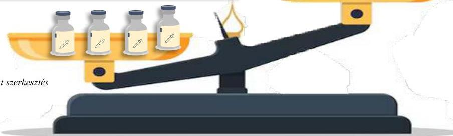

Forrás: ÁSZ megállapítások alapján ÁSZ saját szerkesztés

---

Elemzés a Betegápoló Irgalmas Rend Budai Irgalmasrendi Kórház pénzügyi és ellátási tevékenységének, adósságállományának alakulásáról az államháztartásból nem hiteleti célra nyújtott támogatások vonatkozásában

# Összefoglalás – a Kórház főbb működési jellemzői

4. ábra

A járóbeteg szakellátásban
mindvégig jellemző volt a nagy
arányú kihasználatlan TÉK kapacitás.

Az alkalmazottak fluktuációja a 2023. évben az 74,4 %-kal az átlag felett volt, ami labilisabb munkaerő-megtartó helyzetre utal

A Kórház aktív és krónikus ágykihasználtsági adatai az elemzett többi kórház kihasználtsági adatainál lényegesen alacsonyabbak voltak.

2020-tól a teljesített súlyszámhoz viszonyítottan minimális mértékű volt a TÉK felett jelentett súlyszám.

Az 1 súlyszámra jutó gyógyszerkiadás adatai jelentősen az öt kórház adatai alatt voltak, 2023-ban 81,4%-kal.

A Kórház TÉK feletti labor teljesítménye a többi kórház-hoz képest kiemelkedően magas volt.

A Kórház aktív fekvőbeteg szakellátás kihasználhatatlan kapacitása 2023. évben 130,2%-kal volt több a többi kórház átlagnál.

Forrás: ÁSZ megállapítások alapján ÁSZ saját szerkesztés

26

---

Elemzés a Betegápoló Irgalmas Rend Budai Irgalmasrendi Kórház pénzügyi és ellátási tevékenységének, adósságállományának alakulásáról az állambáz tartásból nem hiteleti célra nyújtott támogatások vonatkozásában

A Kórház teljesítményét, gazdálkodását nagymértékben meghatározza a kapacitások kihasználása. A vizsgált ellátás-típusokban a volumen korlátot a Tervezett Éves Keret (TÉK1) biztosítja, optimális esetben a teljesítmény eléri, vagy megközelíti azt. Amennyiben a teljesítmény jócskán a TÉK alatt van az elmaradt teljesítményt (bevételkiesést) jelent, ha a teljesítmény TÉK felett van, az degresszált finanszírozást vonz.

- A Kórház aktív fekvőbeteg-szakellátási teljesítménye vonatkozásában a vizsgált időszakban nagymértékű kihasználatlan kapacitással működött, ami lényegesen meghaladta a többi kórház átlagos adatait, a TÉK feletti teljesítése minimális volt.
- Járóbeteg szakellátás esetén 2019-ben és 2023-ban volt a Kórháznak TÉK feletti teljesítménye és a teljes vizsgált időszakban volt kihasználatlan TÉK kapacitása.
- A laboratóriumi ellátás vonatkozásában a Kórház TÉK feletti teljesítménye kiemelkedően az öt elemzett kórház átlaga felett volt valamennyi évet érintően.
- A TÉK felett jelentett teljesítmény és a kihasználatlan TÉK éven belüli együttes jelenléte tervezési hibára, a szezonális nem megfelelő felmérésére, a szakmánkénti kapacitásfelosztás anomáliájára utalhat.
- Az aktív ágyak kihasználtsága az országos átlagot megközelítette ugyan, de az öt kórház átlaga alatt volt a teljes elemzett időszakban.
- A krónikus ágyak tekintetében szintén nagy arányban elmaradt azok kihasználtsága az országos átlaghoz és a többi vizsgált kórházhoz képest is.
- A kórház gyógyszerkiadása kisebb mértékű volt az öt kórház átlagához viszonyítva, ami szigorú kontroll alatt tartott gyógyszer gazdálkodásra utal.

27

---

Elemzés a Betegápoló Irgalmas Rend Budai Irgalmasrendi Kórház pénzügyi és ellátási tevékenységének, adósságállományának alakulásáról az államháztartásból nem hiteleti célra nyújtott támogatások vonatkozásában

# AZ ELEMZÉS CÉLJA

Az elemzés célja volt az egyházi fenntartásban működő aktív fekvőbeteg-szakellátást is végző kórház pénzügyi és ellátási tevékenységére vonatkozó adatok alakulásának, a kórházi adósságállomány változásával való összefüggéseinek-, továbbá az adósságállomány összetételének és alakulásának bemutatása az államháztartásból nem hiteleti célra nyújtott támogatások vonatkozásában.

Az ÁSZ célja volt, hogy elemzéssel hozzájáruljon ahhoz, hogy a társadalom képet kapjon az egyházi fenntartású kórház adósságállományának alakulásáról és összetételéről, valamint mutatókon keresztül a fekvőbeteg-szakellátás területén végzett egészségügyi ellátási, pénzügyi tevékenységéről. Mindez elősegíti, támogatja az ellenőrzött szervezet működésének javulását, a közpénzfelhasználás átláthatóságát.

# AZ ELEMZÉS ADATFORRÁSAI MÓDSZERE ÉS TERÜLETE

Az elemzés végrehajtása az elemzési programban meghatározott szempontok, fókuszterületek, illetve az elemzett időszakban hatályos jogszabályok mentén történt.

Az elemzési kérdések megválaszolásához szükséges bizonyítékként felhasználható adatforrások közé tartoztak a V1108 ellenőrzés-azonosító számú ellenőrzési program alapján végrehajtott törvényességi ellenőrzés-, valamint tárgyi elemzés vonatkozásában – az ellenőrzöttek és a közfeladatot ellátó szervek (finanszírozó szervezetek) által – az ÁSZ rendelkezésére bocsátott adatok, dokumentumok, adatforrások, valamint az elemzés folyamán feltárt, az elemzés szempontjából információkat tartalmazó dokumentumok. Az elemzési kérdések megválaszolásához szükséges bizonyítékok megszerzése ezen adatokra és dokumentumokra alapozva megfigyelés, helyszíni szemle (szemrevételezés), kérdésfeltevés (információkérés), elemző eljárás útján történt. Az egyes fókuszterületek kidolgozásánál alkalmazott módszerek eltértek egymástól, ezért azok külön, fókuszterületenként kerültek rögzítésre.

Az elemzett időszak: az államháztartásból nem hiteleti célra nyújtott támogatások felhasználásához kapcsolódóan a Kórház pénzügyi és ellátási tevékenységének ismertetése vonatkozásában a 2019-2023. közötti időszak, azzal, hogy a kórházi adósságállomány adatainak bemutatása kiterjedt a 2024. I. félévére is.

# Az elemzés az alábbi fókuszterületekre, kérdéskörökre épül:

1. fókuszterület: Bevételi, kiadási struktúra elemzése
1.1. kérdéskör: Eredménykimutatás adatainak alakulása, a bevételi és kiadási struktúráváltozás elemzése
1.2. kérdéskör: Generált Cash flow és a beszámolóban jelzett pénzeszköz változás összehasonlítása
2. fókuszterület: Pénzügyi helyzet és a kötelezettségállomány elemzése
2.1. kérdéskör: Pénzügyi helyzet, mérlegadatok elemzése
2.2. kérdéskör: A kórházi lejárt kötelezettségállomány változásának bemutatása
3. fókuszterület: A kórház működésének bemutatása
3.1. kérdéskör: Input/humán erőforrás mutatók elemzése
3.2. kérdéskör: Output/működési-, teljesítmény-, kapacitáskihasználtság mutatók elemzése
3.3. kérdéskör: Menedzsmenthatás vizsgálata
3.4. kérdéskör: Várólista, előjegyzési idők alakulása, elemzése

---

Elemzés a Betegápoló Irgalmas Rend Budai Irgalmasrendi Kórház pénzügyi és ellátási tevékenységének, adósságállományának alakulásáról az államháztartásból nem hitéleti célra nyújtott támogatások vonatkozásában

Az elemzés a Kórház pénzügyi és ellátási tevékenységére vonatkozó adatok alakulására és az adósságállomány változásának összefüggéseire fókuszál. Ennek keretében mutatja be, hogy a könyvviteli nyilvántartási rendszerben biztosított-e a bevételek, költségek és ráfordítások olyan kimutatása, mely alapja lehet a bevételek, költségek és ráfordítások elemzésének, értékelésének, továbbá az államháztartásból nem hitéleti célra kapott támogatások struktúráját, valamint az ehhez kapcsolódó költségszerkezetet, az éves beszámolók adatait és azok alakulását. Az elemzés az államháztartásból nem hitéleti célra nyújtott támogatások felhasználásához kapcsolódóan bemutatja a kórházi adósságállomány összetételét és alakulását évenkénti összehasonlításban, továbbá az adósságállomány éveken belüli változását is.

29

---

ELEMZÉS

# 1. Bevételi, kiadási struktúra elemzése

## 1.1. Eredménykimutatás adatainak alakulása, a bevételi és kiadási struktúra változás elemzése

A bevétel, kiadások³ és ráfordítások alakulásának és összetételének elemzése a Kórház főkönyvi kivonataiban és a kapcsolódó adatszolgáltatásaiban szereplő adatok felhasználásával az ÁSZ által kialakított formátumú eredménykimutatás alapján került elvégzésre. A főkönyvi kivonatok adatai a szerkesztett eredménykimutatásokat alátámasztották. A különböző formátumú beszámolókat készítő egyházi fenntartású kórházak adatainak összehasonlíthatóságát az ÁSZ szerkesztésben összeállított eredménykimutatás képezte, melyben az Egészségbiztosítási Alapból származó finanszírozásként a NEAK adatszolgáltatás szerint a BIR számára, adott években kiutalt finanszírozás összegéből a BIR – mint egészségügyi szolgáltató és egyben fenntartó – kimutatása alapján a Kórházat megillető NEAK finanszírozás szerepelt.

Az értékeléshez bázisul a 2019. év adatai szolgáltak, a 2023. évi bevétel, kiadások és ráfordítások alakulása a kórház esetében a 2019. évi, 100 %-nak tekintett adatokhoz viszonyítva került %-os formában is bemutatásra az 1. táblázatban.

1. táblázat
EREDMÉNYKIMUTATÁS 2019-2023. ÉVEKRE

|  MEGNEVEZÉS | KÓRHÁZ ADATAI (E F T) |   |   |   |   | ADATOK A 2019. ÉV 3+ABAN  |
| --- | --- | --- | --- | --- | --- | --- |
|   |  2019. év | 2020. év | 2021. év | 2022. év | 2023. év  |   |
|  Összes bevétel | 6 511 261 | 6 714 284 | 9 466 102 | 11 196 035 | 14 195 978 | 218,0%  |
|  Ebből: |  |  |  |  |  |   |
|  1. Értékesítés nettó árbevétele (9.) | 619 916 | 526 235 | 420 055 | 480 192 | 679 537 | 109,6%  |
|  2. Aktivált saját teljesítmények értéke (5.) | -1 795 | -3 016 | -1 010 | -2 377 | 0 | 0,0%  |
|  3. Egyéb bevétel | 5 893 043 | 6 189 763 | 9 047 057 | 10 717 391 | 13 516 438 | 229,4%  |
|  3.a. Gyógyító, megelőző ellátások NEAK finanszírozása (OEP támogatás) (9.) | 5 615 387 | 5 513 849 | 7 211 244 | 7 019 505 | 8 404 123 | 149,7%  |
|  3.b. Központi költségvetési támogatás NEAK finanszírozás nélkül (9.) | 255 606 | 630 311 | 1 516 710 | 3 473 847 | 4 906 398 | 1919,5%  |
|  3.c. Egyházi (fenntartói) támogatás (9.) | 0 | 0 | 0 | 0 | 0 | -  |
|  3.d. Egyéb bevétel (9.) | 10373 | 26 481 | 177606 | 127746 | 38579 | 371,9%  |
|  3.e. Egyéb támogatás (9.) | 11677 | 19122 | 141497 | 96293 | 167338 | 1433,1%  |
|  4. Pénzügyi műveletek bevétel (9.) | 97 | 1302 | 0 | 829 | 3 | 3,1%  |
|  Összes kiadás | 6 724 283 | 6 872 115 | 9 380 286 | 11 724 536 | 13 489 718 | 200,6%  |
|  1. Anyagi jellegű ráfordítások | 3 104 891 | 2 971 397 | 3 351 815 | 4 972 738 | 5 572 431 | 179,5%  |
|  Ebből: |  |  |  |  |  |   |
|  a. Gyógyszer költségek (gyógyszerek, vér-készítmények, radioaktív anyagok...) (5.) | 1 548 216 | 1 447 190 | 1 537 943 | 1 955 367 | 2 032 493 | 131,3%  |
|  b. Szakmai anyagköltségek (szakmai egyszer használatos és egyéb anyagok, kötszerek, szakmai alkatrészek, orvosi gázok...) (5.) | 209 920 | 307 850 | 372 068 | 1 004 907 | 1 064 458 | 507,1%  |
|  c. Üzemeltetési anyagok (áram, gáz, víz...) (5.) | 54 159 | 62 805 | 97 688 | 97 455 | 102 789 | 189,8%  |
|  d. Textilák, védőrubák, felszerelések (5.) | - | 409 | 4054 | 1 133 | 1 445 | -  |

3 Az elemzés a kiadás szó alatt a költségek és ráfordítások együttes összegét érti.

---

Elemzés

|  MEGNEVEZÉS | KÓRHÁZ ADATAI (E F T) |   |   |   |   | ADATOK A 2019. ÉV %-ÁBAN  |
| --- | --- | --- | --- | --- | --- | --- |
|   |  2019. év | 2020. év | 2021. év | 2022. év | 2023. év  |   |
|  e. Közüzemi szolgáltatások (víz és csatorna, távfűtés, bő, áram, gáz, telefon...) | 156 505 | 188 353 | 263 888 | 380 564 | 330 611 | 211,2%  |
|  (5.) |  |  |  |  |  |   |
|  f. Vásárolt egészségügyi szolgáltatások (külső labor, CT, szerződés alapján végzett egészségügyi szolgáltatások, sterilizálás, egyéb vizsgálati díjak...) | 399 880 | 336 793 | 385 071 | 584 192 | 600 790 | 150,2%  |
|  g. Vásárolt üzemeltetési szolgáltatások (épület karbantartás, egyéb gépek, berendezések, járművek karbantartása...) | 97 528 | 177 061 | 208 776 | 238 026 | 264 735 | 271,4%  |
|  b. Anyagjellegű ráfordítások (ELÁBÉ, EKSZBÉ...) | - | 7 453 | 229 752 | 366 096 | 718 675 | -  |
|  2. Személyi jellegű ráfordítások | 3 150 480 | 3 468 631 | 5 613 954 | 6 323 266 | 7 504 637 | 238,2%  |
|  Ebből: |  |  |  |  |  |   |
|  a. Rendszeres személyi juttatások...) | 2 049 271 | 2 071 168 | 3 629 591 | 4 870 864 | 5 571 870 | 271,9%  |
|  b. Munkáltatót terhelő bérjárulékok (SZOCHO, munkáltatót terhelő SZJA, rehabilitációs hozzájárulás...) | 447 516 | 432 108 | 644 357 | 615 302 | 752 652 | 168,2%  |
|  3. Értékcsökkenési leírások (5.) | 330 956 | 344 119 | 344 953 | 400 249 | 276 517 | 83,6%  |
|  4. Egyéb ráfordítások (8.) | 137 856 | 63 557 | 69 534 | 28 283 | 135 865 | 98,6%  |
|  5. Pénzügyi műveletek ráfordítása (8.) | 100 | 24 411 | 30 |  | 268 | 268,0%  |
|  Adózás előtti eredmény (Összes bevétel-Összes kiadás) | -213 022 | -157 831 | 85 816 | -528 501 | 706 260 | -331,5%  |
|  Adófizetési kötelezettség |  |  |  |  |  |   |
|  Adózott eredmény (Adózás előtti eredmény - Adófizetési kötelezettség) | -213 022 | -157 831 | 85 816 | -528 501 | 706 260 | -331,5%  |
|  Pénzügyi műveletek eredménye (Pénzügyi műveletek bevétele - Pénzügyi műveletek ráfordítása) | -3 | -23 109 | -30 | 829 | -265 | 8833,3%  |
|  Üzemi (üzleti) tevékenység eredménye (Összes bevétel-Pénzügyi műveletek bevétele) - (Összes kiadás-Pénzügyi műveletek ráfordítás) - Eredmény a pénzügyi műveletek eredménye nélkül | -213 019 | -134 722 | 85 846 | -529 330 | 706 525 | -331,7%  |

Forrás: A Kórház 2022-2023. évi számított eredménykimutatás adatai alapján ÁSZ saját szerkesztés

A táblázat adatai alapján megállapítható, hogy a kórház esetében mind a bevételek mind pedig a kiadások főösszege növekedett a 2019. évről a 2023. évre. A bevételek 118,0 %-os emelkedése mellett a kiadások főösszege 17,4 százalékponttal kisebb mértékben, 100,6 %-kal nőtt a bázisidőszakhoz viszonyítva. A bevételek kiadásokat meghaladó mértékű növekedése a Kórház likviditási körülményeinek 2019. événél kedvezőbb alakulására, javulására utal. Az elemzéssel érintett időszakban folyamatosan növekedő bevételek és kiadások emelkedési üteme hullámzó volt, melynek kialakulásában a Kórház teljesítményén, kapacitáskihasználtságán kívül szerepet játszott a gazdasági körülmények alakulása – pandémia, átlagfinanszírozás bevezetése, az energiaválság, a magas infláció, majd annak mérséklődése – is. A NEAK finanszírozásból származó bevételek a Kórház összes kiadásának 60-84 %-át fedezték a 2019-2023. években. A Kórház gazdálkodására nézve kedvezőtlen, hogy a NEAK finanszírozással fedezett összes kiadás aránya a 2019. évi 84 %-ról 2022. évre 60 %-ra csökkent, de a 2023. évi 62 %-os finanszírozási arány már kis mértékű javulást mutatott. A NEAK finanszírozás összes kiadás

4 Az infláció mértéke 2023. januárban 25,7%, júliusban 17,6%, decemberben 5,5% volt. A fogyasztói árak az előző évhez képest 2023. évben átlagosan 17,6%-kal nőttek.

---

Elemzés

finanszírozásában betöltött szerepének romlását azonban ellensúlyozta a központi költségvetési támogatások jelentős mértékű növekedése (2019-ben 255 606 E Ft, 2020-ban 630 311 E Ft, 2021-ben 1 516 710 E Ft, 2022-ben 3 473 847 E Ft, 2023-ban 4 906 398 E Ft).

A Kórház esetében az „1. Értékesítés nettó árbevétele” a pandémia miatt kialakult egészségügyi veszélyhelyzet következményeként sajátosan alakult. A bevétel 2020. és 2021. években csökkent (2020-ban 15,1%-kal, 2021-ben 32,2%-kal), a kedvezőtlen tendencia 2022. évtől megszűnt, az értékesítés nettó árbevétele növekedésnek indult, a 2019. évi bevétel 77,5%-át kitéve. A 2023. évben a „Értékesítés nettó árbevétele” a Kórháznál 679 537 E Ft volt, amely a 2019. évi bevétel 109,6%-a volt. A bevételi jogcímen belül elszámolt gyógyszer-értékesítésből, egészségügyi szolgáltatásból (ápolási és vizsgálati díjak, járóbeteg ellátás, krónikus ellátás), bérleti díjaktól, egyéb szolgáltatásokból (sterilizáló, szállói díjak), dolgozói befizetésekből származó bevételek 2019-ben 619 915 E Ft-ot, míg 2023. évben 679 537 E Ft-ot tett ki.

A „3. Egyéb bevételek” jogcímcsoporthoz belül elszámolt bevételek összegében a 2020. évtől jelentős és folyamatos értéknövekedés következett be (2023. évi 13 516 438 E Ft-os összegük a 2019. évi bevétel 229,4%-a volt). A bevételi jogcímcsoporthoz belül meghatározó jelentőségű a NEAK finanszírozás volt, de egyre növekvő szerep jutott a pályázati vagy egyedi döntés alapján folyósított központi költségvetési támogatásoknak is, mivel a Kórház jelentős mértékű támogatásokat kapott az adósságának csökkentésére, energiahatékonyság fejlesztésére és egyedi döntések alapján projektek és programok (Keresztény Családi Centrum, Természetes úton történő fogantatást elősegítő szakemberek képzése, Csádi orvosi misszió gyógyszer és felszerelés), valamint a járványügyi többletköltségek finanszírozására. A Kórház könyveiben egyházi (fenntartói) támogatást nem mutatott ki, egyéb támogatásban valamennyi évben részesült, továbbá keletkeztek egyéb bevételei (térítés nélkül átvett készletek értéke, adományok, utólag kapott engedmények) is, azonban utóbbi bevételek nem képviseltek jelentős arányt az „Egyéb bevételek” jogcímcsoporthoz belül.

A Kórház csak a 2021. és 2023. évek során ért el pozitív eredményt, a többi időszakot veszteséggel zárta. A Kórház a 2021. évben a bevételi főösszegének 0,9%-át „nyereségként” realizálta, az elért eredmény a 2023. évben a bevételi főösszeg 5,0%-át tette ki. A Kórháznak 2019., 2020. és 2022. években jelentős összegű vesztesége keletkezett (2019. évben a bevételi főösszeg 3,3%-a; 2020-ban 2,4%-a, 2022-ben 4,7%-a). A 2020. és 2022. évi veszteséget magyarázza a COVID 19 járvány miatt 2020 októberétől bevezetett átlagfinanszírozás, ami hátrányosan érintette a Kórházat, továbbá a pandémia miatt felmerült többletkiadások és az energiaválság miatti (áram, gáz) jelentős költségnevekedés, melyek hatását az állam egyedi döntések alapján folyósított költségvetési támogatásokkal, többségében utólag próbált ellensúlyozni. A 2021. és 2023. évi eredmény kialakulásában jelentős szerepet játszott, hogy a központi költségvetés a pandémia és az energiaválság miatt keletkezett többletkiadások fedezetét biztosító forrásokat az egészségügyi intézmények számára utólag térítette meg. A BIR, mint egészségügyi szolgáltató és egyben fenntartó 2021. évben a 2020. július és 2021. szeptembere között felmerült járványügyi többletköltségek utólagos finanszírozására két részletben összesen 378 977 E Ft, 2022. évben három részletben 275 021 E Ft, az energiaár-növekedés eredményezte többletkiadások utólagos kompenzációjaként 2022. évben 113 514 E Ft, 2023. évben pedig két részletben további 2 378 708 E Ft költségvetési támogatásban részesült. E támogatásokon felül 2023. évben a BIR a 2020. december 31-én lejárt tartozásállománya utólagos kiegyenlítéséhez (329 971 E Ft), az 507/2023. Korm. rendelet alapján pedig 1 944 611 E Ft adósságcsökkentési célú működési támogatásban részesült. A felsorolt támogatások meghatározó része a tevékenységi kör és az intézményi méret alapján a Kórháznál került felhasználásra. A 2023. évben az infláció csökkenése hozzájárult a gazdasági környezet stabilizálódásához, továbbá egyedi döntés vagy pályázat alapján folyósított költségvetési támogatásokon kívül a 2023. évben megszűnt átlagfinanszírozás és a pandémia miatt

32

---

Elemzés

jelentősen lecsökkent kórházi kapacitáskihasználtság javulása mellett megemelkedett összegű NEAK finanszírozás együttes hatására csökkentette a Kórház pénzügyi nehézségeit.

A Kórház adózott eredményének alakulását és összetételét az 5. ábra mutatja be. A Kórház tevékenységének eredménye 2019., 2020. és 2022. években veszteség, míg 2021. és 2023. években nyereség volt. A tevékenységi körébe tartozó feladatok ellátása során 2021. évben 85 846 E Ft, 2023. évben pedig 706 525 E Ft üzemi (üzleti) eredménye keletkezett, amelyet mindkét időszakban csökkentett az összegében elhanyagolható mértékű, a Kórház likviditási helyzetét érdemben nem befolyásoló pénzügyi műveletek eredménye, amely 2021. évben - 30 E Ft, 2023. évben pedig - 265 E Ft volt

5. ábra

A KÓRHÁZ ADÓZOTT EREDMÉNYÉNEK ALAKULÁSA, ÖSSZETÉTELE (ADATOK E FT-BAN)
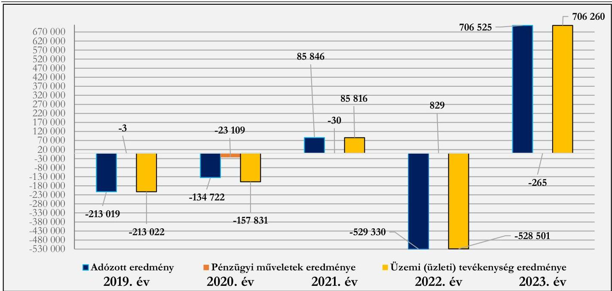
Forrás: Beszámolók, főkönyvi kivonatok alapján ÁSZ szerkesztés

# Bevételi struktúra

Az 1. számú, Eredménykimutatás elnevezésű táblázat adatai alapján a vizsgált időszakban a Kórház bevételi struktúrájában jelentős változás nem történt. A bevételi forrásokon belül az egyéb bevételek bírtak meghatározó jelentőséggel. E jogcím rendkívül magas bevételi arányának oka, hogy a Kórház tevékenységéhez kapcsolódó NEAK finanszírozáson és a központi költségvetési támogatásokon kívül az egyéb támogatások (magánszemélyek, vállalkozások, helyi önkormányzatok), adományok, térítés nélküli eszköz átvételek, kártérítések összege is e jogcím keretében került elszámolásra.

A bevételek összetétele alapján a Kórház által ellenérték fejében végzett tevékenységek/szolgáltatások bevételei (értékesítés nettó árbevétele – többek között: gyógyszer értékesítés, ápolási és vizsgálati díjak, bérleti díjak, dolgozói térítések) elenyésző nagyságrendet képviseltek. A pénzügyi műveletek bevételei elhanyagolható arányt és összeget képviseltek.

A Kórház folyamatos működését, az egészségügyi közfeladatok ellátását 2019-2023 években az egyéb bevételek biztosították, melyek 2019. évben a bevételi főösszeg 90,5 %-át, 2023. évben pedig a 95,2 %-át tették ki. A Kórház működését megalapozó egyéb bevételek jogcímcsoporthoz többféle bevételi forrás elszámolására szolgált, ilyen a gyógyító, megelőző ellátások NEAK finanszírozása, a központi költségvetési támogatások összege, az egyéb támogatások és adományok, továbbá az egyéb bevételek (tárgyi eszközök és készletek értékesítésének bevételei, a biztosításokból származó bevételek (kártérítések), térítés nélkül kapott készletek értéke).

33

---

Elemzés

Az egyéb bevételek meghatározó részét a gyógyító, megelőző ellátások NEAK finanszírozása (1. táblázat - 3.a. pont), valamint a központi költségvetési támogatások NEAK finanszírozás nélküli összege (1. táblázat - 3.b. pont) képezte. A NEAK finanszírozás 2019. évben az összes bevétel 86,2 %-át, 2023. évben pedig a 59,2 %-át tette ki. A finanszírozási bevétel aránya összes bevételen belül ugyan 27,0 százalékponttal csökkent, összege ennek ellenére 2 788 736 E Ft-tal (49,7 %) növekedett 2019-ról 2023. évre, ezzel párhuzamosan a költségvetési támogatások NEAK finanszírozás nélküli összege a 2019. évi 3,9 %-kal szemben, 2023. évben az összes bevétel 34,6 %-át tette ki. Az arányok eltolódásának oka, hogy az elemzéssel érintett időszak második felében (2021-2023. évek) a BIR, mint a Kórház fenntartója egyedi projektek megvalósításához, valamint az egészségügyi veszélyhelyzet és az energia válság miatt felmerült többlet költségek finanszírozásához rendkívül jelentős mértékű pályázati és egyedi döntés alapján folyósított támogatásban részesült, melyek többségének felhasználója a Kórház volt. A központi költségvetési támogatások NEAK finanszírozás nélküli összege a 2019. évi 255 606 E Ft-tal szemben 2021. évben 1 516 710 E Ft-ot, 2022. évben 3 473 847 E Ft-ot, 2023. évben 4 906 3987 E Ft-ot tett ki. E források a NEAK finanszírozást kiegészítve szolgálták az egészségügyi közfeladatellátást, a működési kiadások finanszírozását, jelentős mértékben segítve a Kórház likviditását. A 2022. és 2023. években egyházi (fenntartói) támogatásban a Kórház nem részesült (2. táblázat - 3.c. pont), az egyéb támogatásokból (kapott adományok, önkormányzati támogatások, magánszemélyek és egyéb szervezetek támogatásai) származó bevételek összege pedig a 2019. évi 11 677 E Ft-tal szemben 2023. évben 167 338 E Ft volt (2. táblázat - 3.e. pont). Az egyéb bevételek jogcímcsoporthoz belül az 1. táblázat - 3.d. pontja szerinti egyéb bevételek képviselték az összes bevételhez viszonyítva a legkisebb arányt, értékük a 2019. évi 10 373 E Ft-tal szemben 2023. évben 35 579 E Ft volt. Az összeg nagyságát alapvetően a biztosításból eredő kártérítések és a tárgyi eszközök és készletek értékesítésének bevétele, valamint a térítés nélkül átvett készletek értéke határozta meg. Az egyéb támogatások és egyéb bevételek aránya (2. táblázat – 3. e. és 3.d. pont) sem az egyéb bevételek jogcímcsoporthoz, sem pedig az összes bevételen belül nem volt jelentős, átlagosan a jogcímcsoporthoz bevételi összegének 0,8-0,8 %-át tették ki. A bevételi források 2022. évről 2023. évre történő változását a 6. ábra mutatja be. 6. ábra

A BEVÉTELI FORRÁSOK VÁLTOZÁSA (ADATOK E FT-BAN)
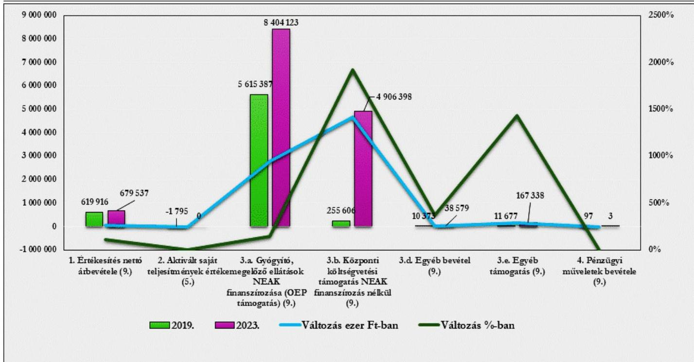
Forrás: Beszámolók, főkönyvi kivonatok alapján ÁSZ szerkesztés

---

Elemzés

A bevételék elemzéséhez tartozó fajlagos mutató az egy ellátott esetszámra (aktív és krónikus egyben) jutó összes bevétel alakulása. Ez 2019-ben 394,5 E Ft, 2020-ban 690,7 E Ft volt, ami 2021-re 1 128,3 E Ft-ra nőtt, 2022-re 1 120,9 E Ft-ra módosult, majd 2023-ra 1 167,5 E Ft-ra emelkedett. E fajlagos mutató értéke 2019. és 2020. években alacsonyabb, 2021-2023. években pedig magasabb volt az öt elemzett kórház átlagos fajlagos értékeinél. A Kórház mutatójának értéke 2019-ben 14,0 %-kal, 2020-ban 21,4 %-kal maradt el, míg 2021-ben 24,1%-kal, 2022-ben 8,1 %-kal, 2023-ban pedig 20,7 %-kal haladta meg az elemzéssel érintett kórházak átlagos értékét.

## NEAK finanszírozás összetételének elemzése

A BIR sajátos szervezeti felépítése miatt a NEAK finanszírozás jogcímenkénti összetétele a fenntartó szintjén ismert, viszont az is rendelkezésre áll, hogy a fenntartó számára évenként folyósított NEAK finanszírozásból mekkora összeg illette meg a Kórházat. A Kórház bevételeinek jelentős részét kitevő NEAK finanszírozás összegét, illetve a tételét, finanszírozási jogcímek szerinti alakulását a 2. táblázat tartalmazza.

2. táblázat
NEAK FINANSZÍROZÁS ÖSSZETÉTELE, FINANSZÍROZÁSI JOGCÍMEK SZERINTI ALAKULÁSA

|  MEGNEVEZÉS | 2019. ÉV | MEGOSZ-LÁS 2019. ÉVRE | 2020. ÉV | MEG-OSZLÁS 2020. ÉVRE | 2021. ÉV | MEG-OSZLÁS 2021. ÉVRE | 2022. ÉV | MEGOSZ-LÁS 2022. ÉVRE | 2023. ÉV | MEGOSZ-LÁS 2023. ÉVRE  |
| --- | --- | --- | --- | --- | --- | --- | --- | --- | --- | --- |
|  Aktív fekvőbeteg-szakellátás | 3 709 077 | 61,4% | 3 571 998 | 54,2% | 3 741 362 | 44,2% | 3 796 474 | 39,2% | 3 609 842 | 31,8%  |
|  Krónikus fekvőbeteg-szakellátás | 1 113 175 | 18,4% | 1 036 678 | 15,7% | 1 039 422 | 12,3% | 1 107 878 | 11,4% | 932 519 | 8,2%  |
|  Járóbeteg szakellátás | 590 763 | 9,8% | 590 735 | 9,0% | 592 426 | 7,0% | 603 787 | 6,2% | 592 142 | 5,2%  |
|  Laboratóriumi ellátás | 131 313 | 2,2% | 134 103 | 2,0% | 130 162 | 1,5% | 129 447 | 1,3% | 132 196 | 1,2%  |
|  Fogászat | 7 418 | 0,1% | 7 116 | 0,1% | 18 733 | 0,2% | 18 732 | 0,2% | 15 377 | 0,1%  |
|  Extrafinanszírozás | 1 150 | 0,0% | 0 |  | 0 |  | 2 482 | 0,0% | 2 754 | 0,0%  |
|  Spec.fin. | 267 385 | 4,4% | 138 404 | 2,1% | 150 991 | 1,8% | 226 311 | 2,3% | 154 272 | 1,4%  |
|  Nagyértékű gyógyszerfin. | 20 184 | 0,3% | 72 574 | 1,1% | 19 061 | 0,2% | 199 786 | 2,1% | 115 481 | 1,0%  |
|  Célőirányzatok | 200 566 | 3,3% | 1 034 092 | 15,7% | 2 777 536 | 32,8% | 3 597 565 | 37,2% | 5 810 219 | 51,1%  |
|  BIR NEAK finanszírozása összesen | 6 041 031 | 100,0% | 6 585 700 | 100,0% | 8 469 693 | 100,0% | 9 682 462 | 100,0% | 11 364 802 | 100,0%  |
|  Kórház által felhasznált NEAK finanszírozás | 5 615 387 | 93,0% | 5 513 849 | 83,7% | 7 211 244 | 85,1% | 7 019 505 | 72,5% | 8 404 123 | 73,9%  |

Forrás: NEAK adatbázis alapján ÁSZ saját szerkesztés (adatok E Ft-ban)

Az adatok alapján látható, hogy a BIR számára folyósított NEAK finanszírozás összegszerű növekedése mellett a Kórház finanszírozási szerkezetében a vizsgált éveket egymáshoz viszonyítva jelentős átrendeződés volt tapasztalható. A szakellátásokhoz (aktív- és krónikus fekvőbeteg-, járóbeteg-szakellátás) és a laboratóriumi ellátáshoz kapcsolódó finanszírozások tették ki 2019-2020. években a folyósított összeg meghatározó részét, azonban NEAK bevételeken belüli arányuk a finanszírozási összegek abszolút értékének stagnálása miatt (melynek oka a pandémia következtében bevezetett átlagfinanszírozás) 2020-tól folyamatosan csökkent, a 2019. évi

35

---

Elemzés

91,8%-kal szemben 2023. évben 46,3%-ot tett ki. A fogászati ellátás NEAK finanszírozásának összege a 2019. évi 7 418 E Ft-ról 2023. évre 15 377 E Ft-ra emelkedett (megduplázódott), az összegszerű növekedés ellenére a finanszírozási főösszegen belüli aránya változatlan, 0,1% maradt. A BIR számára folyósított speciális és extrafinanszírozás, valamint a nagyértékű gyógyszerfinanszírozás változó összegű volt, de a NEAK finanszírozáson belül jelentős nagyságrendet nem képviseltek, mivel arányuk 2,0% és 4,7% között mozgott. Előzőkkel szemben a célelőirányzatok (egészségügyi dolgozók 2018-2024. évi béremelésének fedezete, a fix összegű bérkiegészítés, a pénzellátást helyettesítő jövedelemkiegészítés, a fiatal szakorvosok támogatása, működési támogatás) NEAK finanszírozáson belüli aránya ellenkező tendenciát mutatott, összegük évről évre növekedett, ezáltal finanszírozásban betöltött szerepük folyamatosa növekedett, és 2023-ra meghatározó jelentőségűvé vált. A célelőirányzatok NEAK bevételeken belüli aránya a 2019. évi 3,3%-ról 2023. évre 51,1%-ra emelkedett.

A BIR számára folyósított, az egészségügyi intézményei által ellátott közfeladatokhoz kapcsolódó NEAK finanszírozáson belül az aktív fekvőbeteg-szakellátás finanszírozásának meghatározó jellege az elemzéssel érintett időszak végére megszűnt, és helyette a célelőirányzatként folyósított finanszírozás vált meghatározóvá. A NEAK finanszírozáson belül a célelőirányzatok jelentőségének növekedése valamennyi, az elemzéssel érintett Kórház esetében megfigyelhető (jellemző) volt 2019-2023. között. A 2. számú táblázat adatai alapján jól látható, hogy a BIR számára folyósított NEAK finanszírozás jelentős részét (2019. évben 93,0%, 2023. évben 73,9%) a Kórház használta fel. A finanszírozás Kórházat megillető, és általa felhasznált része – a felhasználási arány 11,9%-os csökkenése ellenére – összegszerűen jelentős mértében növekedett (2019. év 5 615 387 E Ft, 2023. év 8 404 123 E Ft).

A 2019-2023. években a NEAK finanszírozás szerkezeti alakulását a finanszírozás módja, és annak változása mellett alapvetően a bérekhez kapcsolódó támogatások egyre növekvő szerepe befolyásolta. A COVID 19 járvány miatti egészségügyi veszélyhelyzetre tekintettel az intézmények pénzügyi stabilitásának biztosítása érdekében a 2020 októberi teljesítmények elszámolásától a teljesítményfinanszírozás helyett átlagfinanszírozás³ került bevezetésre. Az átlagfinanszírozás a 2023. január havi teljesítmények elszámolásáig volt érvényben, a 2023. február havi teljesítmények elszámolásától (2023. április havi kifizetés) visszaállt a teljesítmény alapján történő finanszírozás. A BIR által fenntartott kórházak teljesítménymutatói a járvány elmúltával elkezdtek javulni. A finanszírozás tekintetében a betegforgalmi adatok kedvező alakulását azonban negatívan befolyásolta, hogy a teljesítményfinanszírozás alapját jelentő súlyszámok/szorzók/pontértékek karbantartása/felülvizsgálata nem történt meg, így az ellátások alulfinanszírozottak maradtak. Mindezek hiányában a központi költségvetés a megnövekedett szakmai és működtetési kiadások ellensúlyozása, a közfeladatellátás biztosítása érdekében célhoz kötött költségvetési támogatások (energia beszerzés támogatása, adósságcsökkentési célú működési támogatások) folyósításával támogatta a kórházak pénzügyi helyzetének stabilizálását, fizetőképességének fenntartását.

A BIR számára folyósított NEAK finanszírozás Kórházat megillető része és a Kórház kiadásai adatainak összehasonlítása alapján megállapítható, hogy a gyógyító, megelőző ellátások NEAK finanszírozása 2022. illetve 2023. évben nem fedezte a Kórház tevékenységével kapcsolatban felmerült kiadásokat. A 2022. évben elszámolt összes kiadás 87,0%-át fedezte a NEAK finanszírozás, míg a 2023. évben már csak a 83,9%-át. A kiadások és a NEAK finanszírozás alakulását a 2022. és 2023. évben a 3. táblázat foglalja össze.

5 Az átlagfinanszírozás a megelőző időszak teljesítménye alapján került meghatározásra
36

---

Elemzés

3. táblázat
A KIADÁSOK ÉS A NEAK FINANSZÍROZÁS ALAKULÁSA (E FT)

|  Megnevezés | 2019. év | 2020. év | 2021. év | 2022. év | 2023. év  |
| --- | --- | --- | --- | --- | --- |
|  NEAK finanszírozás összesen | 5 615 387 | 5 513 849 | 7 211 244 | 7 019 505 | 8 404 123  |
|  1. Anyagjellegű ráfordítások | 3 104 891 | 2 971 397 | 3 351 815 | 4 972 738 | 5 572 431  |
|  2. Személyi jellegű ráfordítások | 3 150 480 | 3 468 631 | 5 613 954 | 6 323 266 | 7 504 637  |
|  3. Értékcsökkenési leírások (5.) | 330 956 | 344 119 | 344 953 | 400 249 | 276 517  |
|  4. Egyéb ráfordítások (8.) | 137 856 | 63 557 | 69 534 | 28 283 | 135 865  |
|  5. Pénzügyi műveletek ráfordítása (8.) | 100 | 24 411 | 30 |  | 268  |
|  Kiadás összesen | 6 724 283 | 6 872 115 | 9 380 286 | 11 724 536 | 13 489 718  |
|  Összes kiadás finanszírozottsági aránya | 83,51% | 80,24% | 76,88% | 59,87% | 62,30%  |
|  Anyag jellegű és személyi jellegű ráfordítások finanszírozottsági aránya | 89,77% | 85,62% | 80,43% | 62,14% | 64,27%  |
|  Anyag jellegű és személyi jellegű ráfordítások aránya az összes kiadáshoz mérten | 93,03% | 93,71% | 95,58% | 96,34% | 96,94%  |

Forrás: Beszámolók, főkönyvi kivonatok, NEAK adatbázis alapján ÁSZ szerkesztés

Az adatok szemléletesen mutatják az egészségügyi ellátás finanszírozási problémáját, látható, hogy az elemzéssel érintett öt évben a NEAK finanszírozás összege jelentős mértékben növekedett ugyan, de nem nyújtott fedezet a Kórház kiadásainak meghatározó részét kitevő anyag és személyi jellegű ráfordítások együttes összegére sem. A pénzügyi helyzet könnyítése érdekében a központi költségvetés a veszélyhelyzet és az energiaválság miatt jelentős mértékben megnövekedett energiaköltségek kompenzálására, továbbá az adósságállomány csökkentéséhez a NEAK finanszírozáson felül – az egyéb bevételeknél már ismertettek szerint – egyedi döntés alapján támogatást nyújtott a kórház számára. 2023. évben, 2021. és 2022. évben pedig a járványügyi veszélyhelyzetből adódó többlet költségek utólagos kompenzációja címen folyósított a pénzügyi helyzetet javító támogatást.

## Kiadási struktúra elemzése

Az 1. számú, Eredménykimutatás elnevezésű táblázat adatai alapján jól látható a Kórház kiadásainak növekedése. Az előző időszakhoz viszonyítva a költségnevekedés mértéke a 2021. évben (2 508 171 E Ft) és a 2022. évben (2 344 250 E Ft) kiemelkedően magas volt, a 2023. évben az emelkedés mértéke lassult, de az 1 765 182 171 E Ft-os növekedés a 2022. évi kiadási főösszeg 13,1 %-a volt. A Kórház kiadási struktúrájában meghatározó arányt képviseltek az anyagi jellegű ráfordítások, ezen belül a gyógyszer- és szakmai anyag költségek -, valamint a személyi jellegű ráfordítások.

Az anyagi jellegű ráfordítások az összes kiadás 46,2 %-át tették ki 2019-ben, 2023. évre arányuk a kiadásokon belül 41,3 %-ra csökkent. A személyi jellegű ráfordítások aránya az összes kiadások belül a 2019. évi 46,8 %-ról 2023. évre 55,6 %-ra emelkedett. Az egyéb ráfordítások (0,2 % és 2,1 % között) és a pénzügyi műveletek ráfordításai (0,0 % és 0,4 % között) arányukat tekintve elhanyagolható nagységrendet képviseltek a Kórház kiadási szerkezetében. Az értékcsökkenési leírás súlya az összes kiadáson belül alacsony volt, aránya a 2019. évi 4,9 %-ról 2023. évre 2,1 %-ra csökkent, amelynek oka, hogy az összes kiadás mértéke évről évre emelkedett, 2019-ról 2023-ra 100,6 %-kal, míg az értékcsökkenés 2019-ről 2023-ra 16,4 %-kal csökkent.

Az összes kiadáson belül az egyéb ráfordítások aránya a 2019. évi 2,1 %-kal szemben 2023. évben 1,0 % volt. A pénzügyi műveletek ráfordításai a Kórház összes kiadásán belül elhanyagolható nagyságrendet képviseltek, arányuk a 2020. év (0,4 %) kivételével nem érte el a 0,1 %-ot. A jogcímcsoporthoz belül kiadásként a főkönyvi kivonat tanúsága szerint a Kórház a devizás műveletek árfolyamveszteséget számolta el.

Az anyagjellegű ráfordítások (ötéves átlagarány 41,8 %) a 2019. évi 46,2 %-os, és a 2023. évi 41,3 %-os arányukkal az összes kiadáshoz viszonyítva a személyi jellegű ráfordításokat követően (ötéves átlagarány 53,4 %)

---

Elemzés

a Kórház második legnagyobb kiadási jogcímcsoporthát tették ki. Az e jogcímcsoporthon belüli meghatározó jelentőségű kiadások alakulását a 7. ábra mutatja be.

7. ábra

AZ ANYAGJELLEGŰ RÁFORDÍTÁSOK ALAKULÁSA (ADATOK E FT-BAN)
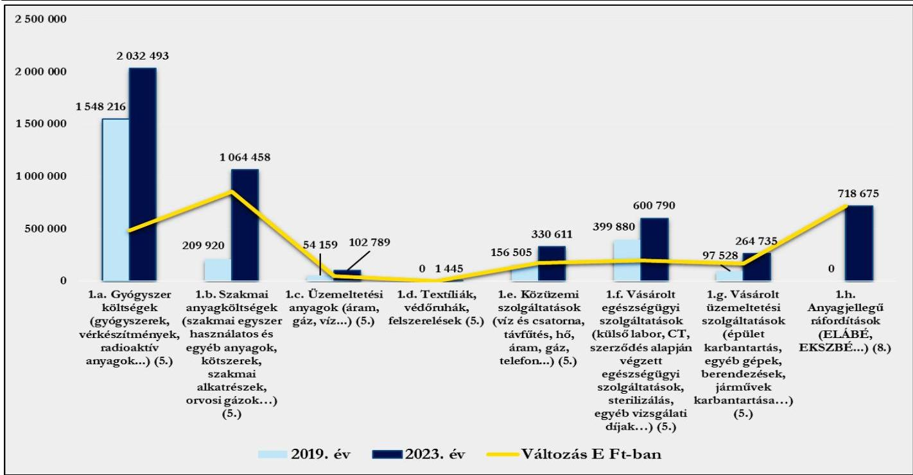
Forrás: főkönyvi kivonatok alapján ÁSZ saját szerkesztés

Az adatok szemléletesen mutatják, hogy 2019-ről a 2023. évre a Kórház anyagi jellegű ráfordításain belül a meghatározó jelentőségű kiadások mindegyike tekintetében költségnövekedés következett be. Az egészségügyi tevékenységhez kapcsolódó gyógyszerek és szakmai anyagok beszerzésére fordított összegek együttes, 76,1 %-os növekedésében az infláció mellett szerepet játszott a gyógyító, megelőző ellátások szakmai igényeinek változása, új eljárások, gyógyszerek, kezelések alkalmazása is. Az 1. táblázat adataiból látható, hogy a Kórház esetében a gyógyszerköltségek az ellátások gyógyszerigénye függvényében, az infláció hatását is figyelembe véve növekedtek, jelentős költségnövekedés 2022. évben volt tapasztalható, mivel 2021-hez viszonyítva a költségnövekedés 27,3 % volt. A 2023. évben a gyógyszerköltségek az előző évhez viszonyítva mérsékelt ütemben, mindössze 3,9 %-kal emelkedtek. A szakmai anyagok esetében is hasonló tendencia volt tapasztalható, kiugróan magas növekedés (170,1 %) 2022. évben következett, de 2023. évben a szakmai anyagok esetében is mérséklődött a költségnövekedés, 2022. évhez viszonyítva az emelkedés 5,9 % volt. Az előzőek alapján a Kórház által az egészségügyi tevékenységhez felhasznált gyógyszerek és szakmai anyagok tekintetében a pandémia és az infláció miatt bekövetkezett drágulás hatására 2022. évben növekedtek meg kiugró mértékben a kiadások. A 7. ábra adatai alapján megállapítható, hogy az anyagjellegű ráfordításokon belül közüzemi szolgáltatások („c. Üzemeltetési anyagok” és „e. Közüzemi szolgáltatások”) esetében következett be a legmagasabb költségnövekedés. A közüzemi díjak és szolgáltatások a 105,7 %-os növekedéssel a 2019. évi 210 664 E Ft-ról a 2023. évre 433 400 E Ft-ra nőttek. A költségnövekedésben szerepet játszott a magas inflációs környezet (2023. év januárban 25,7%, júliusban 17,6%, decemberben 5,5%) mellett az orosz-ukrán háború kirobbanása miatt kialakult világméretű energiaválság is. A Kórház esetében az anyagi jellegű kiadásokon belül 4,1% és 5,6% közötti arányt képviselt a vásárolt egészségügyi szolgáltatások díja.

38

---

Elemzés

Az 1. táblázat adatai alapján a Kórház kiadási szerkezetében jelentősebb aránya a **személyi jellegű ráfordításoknak** volt az összes kiadáson belüli 2019. évi 46,9 %-os, és a 2023. évi 55,6%-os aránnyal. A személyi jellegű kiadások növekedése jelentős nagyságrendet képviselt, e kiadások a Kórház esetében 2019-ről a 2023. évre 4 354 157 E Ft-os növekedéssel a 2019. évi 3 150 480 E Ft-os összeg közel 2,4 szeresére (7 504 637 E Ft) emelkedtek. A kiadások alakulásában meghatározó jelentőségű az egészségügyi dolgozók bérrendezéséből származó költségek összege volt, de szerepet játszott a természetes úton történő fogantatást elősegítő tevékenység keretében a Keresztény Családi Centrum működtetésével kapcsolatban felmerült személyi jellegű kiadások 2021-2023. évi összege is.

A rendszeres személyi juttatásokon belül az alapilletmények a 2019. évi összeg több mint háromszorosára, a jogszabály által előírt kötelező pótlékok pedig duplájára emelkedtek 2023. évre (alapilletmény: 5 413 670 E Ft; jogszabály alapján kötelező pótlék: 152 496 E Ft). A nem rendszeres juttatásokon és személyi jellegű egyéb kifizetéseken belül az elemzés a jogszabályból eredő jutalmak, megbízási díjak, study, kutatási és egyéb megbízási díjak alakulásának értékelésre terjedt ki. Az egészségügyi szolgálati jogviszonyról szóló 2020. évi C. törvény hatályba lépését követően az egészségügyi szolgálati jogviszonyban álló személyek egészségügyi szolgálati jogviszonyuk alapján – a jubileumi jutalom helyett – a jogszabályban meghatározottak szerint szolgálati elismerésre váltak jogosulttá.

A Kórház a 2019-2023. években a dolgozók számára jutalom, továbbá 2021. és 2023. évben egyéb jogszabályból⁶ eredő jutalom (főkönyvi kivonatok szerint: jubileumi jutalom) címen teljesített kifizetéseket. Az elemzéssel érintett években jutalom, és jubileumi jutalom címen elszámolt költségek összege, és az összes kiadáson belüli aránya is hullámzó volt. A 2019. évi 37 663 E Ft a kiadási főösszeg 0,6 %-át tette ki, 2020. évben jutalmakra a kiadási főösszeg 4,1 %-át, 2021. évben 5,6 %-át, 2022-ben 0,4 %-át fordították, 2023. évben pedig a 235 986 E Ft-os költség a kiadás főösszeg 1,7 %-a volt. A kifizetett összeg nagyságát a jogszabályból eredő jutalom esetében alapvetően a foglalkoztatottak – jogszabályban meghatározottak alapján számított – szolgálati jogviszonyának időtartama határozza meg, munkáltatói döntésen alapuló jutalom kifizetéséről pedig a pénzügyi lehetőségek függvényében a munkáltatói rendelkezik.

A főkönyvi kivonatok adatai alapján feltételtől függő pótlékokra (műszakpótlék, túlóra, ügyelet, egyéb feltételtől függő pótlék) a 2019. évben a Kórház 459 779 E Ft-ot, míg az elemzéssel érintett időszak utolsó, 2023. évében 438 310 E Ft-ot fizetett ki.

Kutatási és egyéb díjak (ösztöndíj, tutori díj), valamint külsős személyek részére megbízási díjak kifizetése a 2022. év kivételével az elemzéssel érintett időszak minden évében történt. E kifizetések aránya az összes kiadáson belül a 2019. évi 1,7 %-ról 2023. évben 0,2 %-ra csökkent. A kifizetések összetétele változó volt, az elemzéssel érintett időszak első három évben a Kórház kutatási díjak kifizetésére évenként 22 931 E Ft és 31 637 E Ft közötti összeget fordított, amely ezt követően 2022. évben 5 602 E Ft-ra, 2023. évben pedig mindössze 37 E Ft-ra csökkent. Külsős megbízási díjaktól származó kifizetése a Kórháznak 2019-2021. és 2023. évben volt. Az e jogcímen realizált költség a 2019. évi 67 164 E Ft-ról 2023. évre 3 130 E Ft-ra csökkent.

6 664/2021. (XII. 1.) Korm. rendelet⁶
39

---

Elemzés

## 1.2. Generált Cash flow és a beszámolóban jelzett pénzeszköz változás összehasonlítása

A CF²³ a készpénzáramlást mutatja be; az eszközök, kötelezettségek és eredmények készpénz állományt érintő változásait foglalja magába; nem azonos az intézmény által végzett tevékenység során keletkező eredménnyel/profittal. A CF kimutatás az intézmény forrásairól és készpénzfelhasználásáról ad képet a beszámolónak megfelelő naptári évre vonatkozóan. Az adatok segítségével következtetések vonhatók le az intézmény pénzügyi helyzetéről, több év adatának elemzésével, összehasonlításával lehetővé válik a pénzügyi helyzet alakulásának értékelése.

A CF elemzés célja a pénzügyi helyzet értékelése, valamint az egymás követő időszak adataik összehasonlításával annak elemzése, hogy a kórházak a tevékenységüket meghatározó belső és külső körülmények változása milyen hatást gyakorolt a pénzügyi helyzetük alakulására.

A CF mutatók elemzésének célja, annak értékelése, hogy a kórház:

- alacsony, esetleg negatív üzleti eredmény (veszteség) ellenére képes volt-e tevékenysége során „pénz” cash termelésre (Bruttó CF);
- működési folyamatai tőkét kötöttek le (-), vagy tőkét szabadítottak fel (+), milyen volt a működés tőkeszükséglete (Működési CF);
- a működés tőkeszükségletét is figyelembe véve tevékenysége során mekkora „pénz” cash előállítására volt képes (Nettó Működési CF);
- az adott üzleti évben mekkora összegben pótolta befektetett eszközeit (Tőkebefektetés – CAPEX²⁴);
- az adott üzleti évben – a működés tőkeszükségletét és figyelembe véve – előállított „pénzből” a tőkebefektetést levonása után mekkora szabadon felhasználható cash maradt (Szabad CF – Free CF);
- az adott üzleti évben mekkora összegű, hosszú távon az intézmény rendelkezésére álló külső forrásban részesült (Finanszírozási CF).

Az egyházi jogi személyek által fenntartott kórházak sajátos könyvvezetési és beszámolókészítési kötelezettségét⁷ figyelembe véve a CF elemzés alapját – a zárás előtti főkönyvi kivonatok, az éves beszámolók (mérlegek és eredménykimutatások) és a kiegészítő információk felhasználásával – az ÁSZ által összeállított adattáblák adatai képezték. Az adattáblák sorainak adatai indokolt esetben – a halmozódások kiszűrése érdekében – tartalmazzák a Számv. tv. előírásai alapján figyelembe vehető, ismertté vált, azonnal pénzeszköz-változással nem járó korrekciós tételeket.

---

⁷ Az egyházi jogi személyek a 296/2013. Korm. rend. 5. § (1) bekezdésének előírása alapján egyszerűsített éves beszámoló készítésére kötelezett szervezetek, melyek a jogszabály 5. § (5) bekezdése szerint a beszámoló részeként kiegészítő mellékletet nem készítenek. A könyvvezetési és beszámolókészítési sajátosságokat figyelembe véve a generált CF számításához szükséges kiegészítő információk az adatbekérések, illetve a helyszíni ellenőrzés keretében kerültek bekérésre

40

---

Elemzés

# Cash flow mutatók

4. táblázat
GENERÁLT CASH FLOW ADATAI (ADATOK E FT-BAN)

|  MÉGNEVEZÉS | 2019. ÉV | 2020. ÉV | 2021. ÉV | 2022. ÉV | 2023. ÉV  |
| --- | --- | --- | --- | --- | --- |
|  1. Üzemi eredmény | -213 019 | -148 201 | 85 846 | -529 330 | 706 525  |
|  2. Elszámolt amortizáció | 330956 | 344119 | 344 953 | 400 249 | 276 517  |
|  3. Elszámolt értékvesztés és visszaírás | 0 | 7597 | 5464 | 0 | 0  |
|  4. Céltartalék képzés és felhasználás különbözete | 0 | 0 | -30300 | 0 | 0  |
|  I. Bruttó CF (non cash tételekkel korrigált üzemi eredmény) (1.+2. +/-3. +/-4.) | 117 937 | 203 515 | 405 963 | -129 081 | 983 042  |
|  5. Befektetett eszközök értékesítésének eredménye | 0 | 0 | 0 | 0 | 0  |
|  6. Készletek változása | 43874 | -8202 | -63 821 | -32 817 | 15 975  |
|  7. Vevőkövetelés változása | -52594 | 51814 | 39 613 | -48 662 | -57 763  |
|  8. Forgóeszközök (készlet, vevőkövetelés és pénzeszköz nélkül) változása | -497815 | -497815 | -822 198 | 454 842 | -223076  |
|  9.1. Bevételek aktív időbeli elhatárolása | -172 428 | 172428 | 0 | 0 | -413453  |
|  9.2. Költségek, ráfordítások aktív időbeli elhatárolása | -17820 | 3880 | 11071 | 1 605 | 1334  |
|  9.3. Halasztott ráfordítások | -264927 | 264927 | 0 | 0 | 0  |
|  10. Szállítói kötelezettség változása | 112 034 | -232 896 | 29 095 | 710 047 | 45 561  |
|  11. Egyéb rövid lejáratú kötelezettség változása | 45 705 | -94 807 | 684 537 | -404 226 | 202 789  |
|  12.1. Bevételek passzív időbeli elhatárolása | -170837 | -998147 | -155202 | -513356 | -53816  |
|  12.2. Költségek, ráfordítások passzív időbeli elhatárolása | -3168 | 43865 | -19908 | -34108 | 19 774  |
|  12.3. Halasztott bevételek | 264927 | 994060 | -28083 | -264 258 | -322 926  |
|  13. Pénzügyi műveletek bevételei | 97 | 1302 | 0 | 829 | 3  |
|  14. Pénzügyi műveletek ráfordításai | -100 | -24411 | -30 | 0 | -268  |
|  15. Fizetett, fizetendő adó (nyereség után) | 0 | 0 | 0 | -7714 | 0  |
|  II. Működési CF (a működés tőkeszükséglete) | -713 052 | -324 002 | -324 926 | -137 818 | -785 866  |
|  III. Nettó működési CF (bruttó CF + működési CF) | -595 115 | -120 487 | 81 037 | -266 899 | 197 176  |
|  IV. CAPEX (tőkebefektetés) | 161 636 | 561 339 | 207 872 | 169 485 | 113 371  |
|  V. Free CF (nettó működési CF - CAPEX) | -756 751 | -681 826 | -126 835 | -436 384 | 83 805  |
|  16. Fizetett, fizetendő osztalék, részesedés | 0 | 0 | 0 | 0 | 0  |
|  17. Részvénykibocsátás, tőkebevonás, illetve részvénybevonás, tőkekivonás | 0 | 0 | 0 | 0 | 0  |
|  18. Kötvény, hitelviszonyt megtestesítő értékpapír változása | 0 | 0 | 0 | 0 | 0  |
|  19. Beruházási hitel és hosszúlejáratú kölcsönök változása | 0 | 24 214 | -351 | 0 | 0  |
|  20. Hosszú lejáratra nyújtott kölcsönök és elhelyezett bankbetétek változása | 0 | 0 | 0 | 0 | 0  |
|  21. Véglegesen kapott pénzeszköz / elszámolt támogatás | 0 | 0 | 0 | 0 | 0  |
|  VI. Finanszírozási CF | 0 | 24214 | -351 | 0 | 0  |
|  Számított pénzeszköz változás | -756 751 | -657 612 | -127 186 | -436 384 | 83 805  |

Forrás: a Kórház 2019-2023.évi főkönyvi kivonata, mérlege és eredménykimutatása alapján ÁSZ saját szerkesztés

A 2019-2023. évben az üzemi eredmény 2021. és 2023. évek kivételével negatív előjelű, tehát veszteség volt. Az üzemi eredmény pénzmozgást nem eredményező tételekkel (értékcsökkenés, értékvesztés és annak visszaírása) történő korrigálását követően a bruttó cash flow a 2022. év kivételével (bruttó CF -129 081 E Ft) már pozitív értéket mutatott. A Kórház a 2019-2021. és 2023. években tevékenysége során az azonnali pénzkiadással nem járó ráfordítások CF módosító hatása nélkül képes volt „pénz” termelésre. A működési cash flow értéke az elemzéssel érintett évek mindegyikében negatív volt, 2019. éviről 2023-ra kiemelkedően nagy

---

Elemzés

mértékben nem változott (+10.2%), de rendkívül hullámzóan alakult (2019. - 713 052 E Ft; 2020. - 324 002 E Ft; 2021. - 324 926 E Ft; 2022. - 137 818 E Ft; 2023. - 785 866 E Ft). A 4. táblázatban szereplő adatok jól szemléltetik, hogy a működés tőkeszükséglete és a gazdálkodás eredményessége nem függ össze. A nettó működési cash flow negatív értékei azt mutatják, hogy a Kórház tőke felszabadítására nem volt képes, működési folyamatainak biztosítása tőkét kötött le, a működési kiadások finanszírozásához, bár változó mértékű, de jelentős összegű tőkefelhasználás (eszköz, eredmény) vált szükségessé. A bruttó cash flowt és a működés tőkeszükségletét figyelembe véve a Kórház 2019-2020. és 2022. években „pénz” termelésre nem volt képes, mivel a működés tőkeszükséglete meghaladta a bruttó cash flow értékét, így a **nettó működési cash flow** ezen években negatív volt. A 2021. és 2023. évben az előzővel ellentétes tendencia érvényesült, a működését meghatározó tevékenységekkel a Kórház „pénz” termelésre volt képes, a működés tőkeszükséglete nem haladta meg a bruttó cash flow értékét, 2021. évben ugyan nem túl magas összegű (81 037 E Ft), míg 2023. évben már jelentős, 197 176 E Ft **nettó működési cash flow** előállításra volt képes. 2021. és 2023. években a működés fedezete a pénzeszköz-változás alapján biztosított volt. Az intézmény a 2019. évi 161 636 E Ft-tal szemben befektetett eszközei pótlására 2023. évben 113 371 E Ft -ot használt fel. A mutató értékes 2020. évben volt a legmagasabb, 561 339 E Ft, majd jelentősen lecsökkent, és 2023. évben volt a legalacsonyabb. A Kórház esetében sajátosságot jelentett – a már sokszor jelzett, sajátos szervezeti felépítés miatt –, hogy könyveiben az ingatlanokat érintő beruházási, felújítási kiadások nem jelentek meg, azok a fenntartó könyveiben kerültek elszámolásra. (A fenntartó az egészségügyi intézmények elhelyezését biztosító ingatlanok felújításához, fejlesztéséhez a közreműködő szervezetek adatszolgáltatása alapján jelentős összegű (11 811 879 E Ft) beruházási célú költségvetési támogatásban részesült). A **tőkebefektetés** (CAPEX) mutató értéke alapján arra lehet következtetni, hogy az intézmény hangsúlyt fektet a tevékenységéhez szükséges gépek, berendezések, felszerelések pótlásra. A **finanszírozási cash flow** értéke a 2019. 2022. és 2023. évben 0 E Ft, 2020-ban 24 214 E Ft, 2021-ben pedig – 351 E Ft volt. A főkönyvi kivonatban szereplő adatok szerint a Kórház számára a BIR, mint fenntartó – a 2019-ben a könyvekben már hosszú lejáratú kötelezettségként kimutatott 139 161 E Ft-on felül – hosszú lejáratú hitelként 24 214 E Ft rendi támogatást biztosított, mely összegből a Kórház 2021. évben visszafizetett 351 E Ft-ot. A fenntartó által biztosított, a Kórház könyveiben hosszú lejáratú hitelként kimutatott rendi támogatáson, és annak visszafizetéseként elszámolt összegen kívül a finanszírozási cash flowt érintő tétel a Kórház könyveiben nem szerepelt. A Kórház számított pénzeszköz változása 2019. és 2023. között rendkívül nagy eltéréseket mutatott. A CF kimutatás adatai szerint az intézmény számított pénzeszköz változása 2019.-2022. években egyaránt negatív előjelű volt. A működési, fejlesztési és finanszírozási tevékenységeinek teljes spektrumát figyelembe véve az azonnali pénzeszköz-változással járó bevételek nem érték el az ennek megfelelő kiadások/rafordítások összegét, de kedvező, hogy 2023. évben a pénzeszközváltozás pozitív volt, az intézmény pénzeszközei 83 805 E Ft-tal növekedtek.

A CF mutatók értékének változása alapján összességében arra lehet következtetni, hogy a 2019. évről a 2023. évre az intézmény folyamatos működéséhez szükséges pénzügyi feltételek nem romlottak. A gazdasági környezet romlását a kormány az egészségügyi intézmények esetében célzott támogatások folyósításával próbálta ellensúlyozni. A Kórház a nehéz körülmények között a működés biztonságát csak jelentős erőfeszítések árán tudta megtartani. Az üzemi (üzleti) tevékenység 2019-2020. és 2022. évi veszteségével szemben 2021. és 2023. évben az üzemi tevékenység eredménye nyereség volt. Az azonnali pénzeszköz-változást nem eredményező tételekkel módosított üzemi eredmény (**bruttó cash flow**) a 2021. és 2023. években meghaladta a működés tőkeigényét. A működés tőkeszükséglete az elemzéssel érintett valamennyi évben negatív volt, a működési tevékenységek biztosítása tőkelekötéssel járt. A **nettó működési cash flow** az előzőek alapján jelentős mértékben ingadozott, de 2021. és 2023. évben a Kórház már képes volt pozitív pénzeszköz változás elérésére. A CAPEX (tőkebefektetési) mutató alapján a Kórház 2023-ban az elemzett időszak évei átlagának

42

---

Elemzés

(242 741 E Ft) kevesebb, mint a felét (113 371 E Ft) fordította a működéséhez szükséges gépek, berendezések, felszerelések eszközök pótlására, fejlesztésére. A CF kimutatás adatai alátámasztják, hogy az intézmény 2019-2022. években tevékenysége során szabadon felhasználható pénzeszközt nem termelt, azonban kedvezően értékelhető, hogy az addigi pénzeszköz csökkenéssel szemben 2023. évben a kedvezőtlen tendencia megfordult, és a Kórház 83 805 E Ft-os pénzeszköz növekedést ért el.

A 2023. évi CF mutatók többségének kedvező változása következhetett a külső körülmények (pl. gazdasági környezet, kormányzati döntések...) előző időszaknál kedvezőbb alakulásából, de a fenntartó és az intézményvezetés gazdálkodást érintő döntései is hozzájárulhattak.

## Mérleg mutatók

A kórház mérlegadatai alapján a számított szolvencia ráta értéke a 2019. évi 0,710-ról (71,0%) 2023. évben 0,737-re (73,7%) változott. A mutató a forrásokon belül a saját tőke arányát hivatott bemutatni. A mutató értékének növekedése a forrásokon belül a saját tőke arányának növekedéséből adódott, mely annak az eredménye, hogy a 2019-2020. és 2022. évek veszteségének saját tőke csökkentő hatását a 2021. és 2023. évi nyereség képes volt ellensúlyozni, tehát a forrásokon belül a saját tőke értéke a 2019. évihez viszonyítva kis mértékben, mindössze 1,3%-kal, de növekedett, továbbá források szerkezeti összetétele átalakult. A céltartalékok felhasználásra kerültek, a passzív időbeli elhatárolások értéke a 2019. évi 41,2%-ára csökkent, és ezzel párhuzamosan a kötelezettségek összege megnövekedett. A mutató értékének kis mértékű növekedése mellett megállapítható, hogy a Kórház esetében a forrásokon belül saját tőke meghatározó jelentőségű, eladósodottsága alacsony. A nettó működő tőke összege a 2019. évi - 774 891 E Ft-ról a 2023. évre - 376 178 E Ft-ra módosult. A mutató negatív értékének csökkenése (javulása) ellenére az adat arra ural, hogy a Kórház finanszírozási szerkezete nem volt „egészséges”, a mobil és gyorsan mobilizálható eszközök (követelések, értékpapírok, pénzeszközök) nem biztosították a működés (rövid lejáratú kötelezettségek) finanszírozását. A fent leírtakat támasztja alá a szervezet likviditási helyzetét legjobban jellemző likviditási ráta és likviditási gyorsráta értéke is (likviditási ráta: 2019. év 1,99 2023. év 1,08; likviditási gyorsráta: 2019. év 1,84 2023. év 0,95). A mutatók értékei az ideálisnak tekinthető (likviditási ráta esetén az 1,2-1,5, gyorsráta esetén a 0,8-1,0) érték körül alakultak, és a kórház tevékenységi körét is figyelembe véve a gazdálkodásának biztonságát mutatták, tekintve, hogy a kórház egyház által fenntartott, egészségügyi közfeladatot ellátó intézmény, melynek elsődleges célja az egészségügyi közfeladatok minél magasabb színvonalú ellátása, nem pedig a minél magasabb profit elérése. Figyelmeztető jelként kell azonban értékelni, 2020. évtől, hogy mind a két mutató értéke folyamatosan romlott, a mutatók további romlása esetén veszélybe kerülhet a rövid lejáratú kötelezettségek kiegyenlítési képessége, a Kórház nagy erőfeszítéssel megtartott működési biztonsága. Likviditási ráta és gyors ráta alakulását a 8. ábra mutatja be.

43

---

Elemzés

8. ábra

Likviditási ráta és gyors ráta alakulása
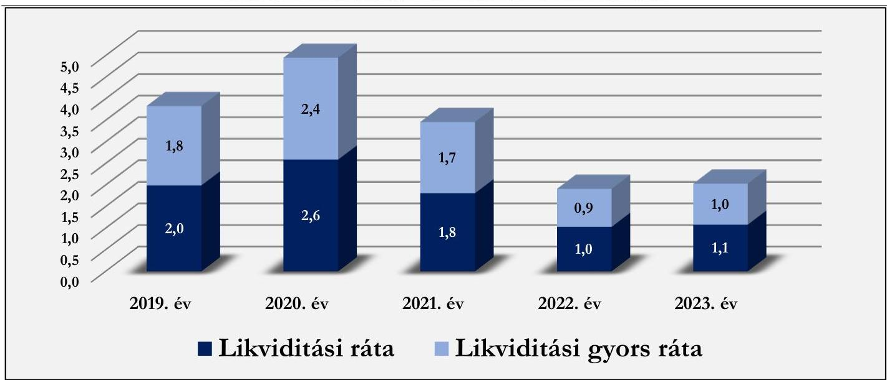
Forrás: Beszámolók alapján ÁSZ saját szerkesztés

## Jövedelmezőség

Az eszközarányos jövedelmezőség (ROA) mutatójának értéke a 2019. évi -1,8 %-ról 2023. évben 6,1%-ra emelkedett. A saját tőke arányos jövedelmezőség mutatója (ROE) szintén kedvezően alakult, értéke a 2022. évi -2,4 %-ról (0,024) 2023. évben 8,4% ra (0,084) emelkedett.⁸ A mutatók értékének alakulását nagy mértékben befolyásolták a kórház gazdálkodására ható külső és belső körülmények, melyek az előzőek során bemutatásra kerültek. Mivel a Kórház 2021. és 2023. években „nyereségesen” gazdálkodott, eredménye keletkezett, ezekben az években a két mutató pozitív volt. A 2019-2020. és 2022. években a Kórház gazdálkodásának eredménye veszteség volt, így mind a ROA, mind pedig a ROE mutató értéke negatív volt. A mélypont – a legmagasabb veszteség miatt – 2022. évben volt, majd a gazdasági folyamatok kedvező alakulásának hatására 2023-ban a ROA és ROE mutatók a megelőző évhez képest sokkal kedvezőbben alakultak. A ROA és ROE mutatók mozgásának trendjéből azt a következtetést lehetett levonni, hogy a Kórház 2023-ban kiegyensúlyozott gazdálkodást folytatott, eszközeit megfelelően hasznosította.

## 2. Pénzügyi helyzet és a kötelezettségállomány elemzése

### 2.1. Pénzügyi helyzet, mérlegadatok elemzése

5. táblázat

A KÓRHÁZ 2019. ÉS 2023. ÉVI MÉRLEGADATAINAK ALAKULÁSA (ADATOK E FT-BAN)

|  MEGNEVEZÉS | 2019. ÉV | 2020. ÉV | 2021. ÉV | 2022. ÉV | 2023. ÉV | 2023. ÉVI ADATOK A 2019. ÉT %-ÁBAN  |
| --- | --- | --- | --- | --- | --- | --- |
|  A. Befektetett eszközök | 9 579 048 | 9 796 268 | 9 659 187 | 9 446 394 | 9 283 248 | 96,9%  |
|  I. Immateriálisjavak | 26 694 | 20 935 | 67 268 | 56 181 | 45993 | 172,3%  |
|  II. Tárgyi eszközök | 9 552 354 | 9 775 333 | 9 591 919 | 9 390 213 | 9 237 255 | 96,7%  |
|  III. Befektetett pénzügyi eszközök | 0 | 0 | 0 | 0 | 0 | -  |
|  B. Forgóeszközök | 2 121 237 | 1 915 716 | 2 631 721 | 1 821 652 | 2 168 897 | 102,2%  |
|  I. Készletek | 165 869 | 174 071 | 237 893 | 270 710 | 254 735 | 153,6%  |

⁸ Iparágtól függően a ROA 8-10% a ROE pedig 10-15% között jelent jó teljesítményt.

---

Elemzés

|  MEGNEVEZÉS | 2019. ÉV | 2020. ÉV | 2021. ÉV | 2022. ÉV | 2023. ÉV | 2023. ÉVI ADATOK A 2019. ÉV %-ÁBAN  |
| --- | --- | --- | --- | --- | --- | --- |
|  II. Követelések | 704 541 | 1 148 430 | 1 927 799 | 1 521 296 | 1 800 711 | 255,6%  |
|  III. Értékpapírok | 0 | 0 | 0 | 0 | 0 | -  |
|  IV. Pénzeszközök | 1 250 827 | 593 215 | 466 029 | 29 646 | 113 451 | 9,1%  |
|  C. Aktív időbeli elhatárolások | 455245 | 14 010 | 2 939 | 1 334 | 413 453 | 90,8%  |
|  Eszközök összesen | 12 155 530 | 11 725 994 | 12 293 847 | 11 269 380 | 11 865 598 | 97,6%  |
|  D. Saját tőke | 8 634 696 | 8 480 470 | 8 566 287 | 8 037 786 | 8 744 046 | 101,3%  |
|  I. Jegyzett tőke | 0 | 0 | 0 | 0 | 0 | -  |
|  II. Jegyzett, de még be nem fizetett tőke (-) | 0 | 0 | 0 | 0 | 0 | -  |
|  III. Tőketartalék | 0 | 0 | 0 | 0 | 0 | -  |
|  IV. Eredménytartalék | 1485881 | 1 276 464 | 1 118 633 | 1 204 450 | 675 948 | 45,5%  |
|  V. Lekötött tartalék | 0 | 0 | 0 | 0 | 0 | -  |
|  VI. Értékelési tartalék | 7361837 | 7361837 | 7361837 | 7361837 | 7361837 | 100,0%  |
|  VII. Adózott eredmény | -213 022 | -157 831 | 85 817 | -528 501 | 706 261 | -331,5%  |
|  1. Alaptevékenység eredménye | -251011 | -189093 | 57683 | -751360 | 696189 | -277,4%  |
|  2. Vállalkozási tevékenység eredménye | 37989 | 31262 | 28134 | 222859 | 10072 | 26,5%  |
|  E. Cél tartalékok | 30300 | 30300 | 0 | 0 | 0 | 0,0%  |
|  F. Kötelezettségek | 1 203 367 | 901 759 | 1 617 288 | 1 933 043 | 2 179 969 | 181,2%  |
|  I. Hátrasorolt kötelezettségek | 0 | 0 | 0 | 0 | 0 | -  |
|  II. Hosszú lejáratú kötelezettségek | 139161 | 163375 | 163024 | 163024 | 163024 | 117,1%  |
|  III. Rövid lejáratú kötelezettségek | 1 064 206 | 738 384 | 1 454 264 | 1 770 019 | 2 016 945 | 189,5%  |
|  G. Passzív időbeli elhatárolások | 2 287 167 | 2 313 465 | 2 110 272 | 1 298 551 | 941 583 | 41,2%  |
|  Források összesen | 12 155 530 | 11 725 994 | 12 293 847 | 11 269 380 | 11 865 598 | 97,6%  |

Forrás: Beszámolók, Főkönyvi kivonatok alapján ÁSZ saját szerkesztés

A Kórház feladatellátásának gazdasági és pénzügyi feltételei a 2019. évihez viszonyítva nem javultak, figyelembe véve, hogy a 2019. évi 1 250 827 E Ft-os záró pénzkészlettel szemben a pénzeszközök 2023. évi záró értéke mindössze 113 451 E Ft volt, az áruszállításból és szolgáltatásnyújtásból származó kötelezettségek összege a 2019. évi 657 337 E Ft-ról a 2023. évre 1 210 952 E Ft-ra emelkedett, a 2019. évi 213 022 E Ft-os veszteséggel szemben 2023. évben a Kórháznak 706 261 E Ft nyeresége keletkezett.

A Kórház mérlegfőösszege a 2019. évi 12 155 530 E Ft-ról 2023. évben 11 865 598 E Ft-ra csökkent. A minimális, 2,4 %-os vagyoncsökkenés oka a mérlegfőösszeg eszköz- és forrásoldali szerkezeti összetételének elemzéssel érintett időszakban bekövetkezett változása volt. A mérleg eszközoldalán a befektetett eszközök értékének kis mértékű csökkenése volt tapasztalható, melynek alapvető oka, hogy a Kórház működését biztosító, ingatlanokat érintő, a folyósított költségvetési támogatások alapján jelentős összegű fejlesztés nem a Kórház hanem a BIR, mint fenntartó könyveiben került kimutatásra. A Kórház a CAPEX mutató alapján a működését biztosító gépek, berendezések, felszerelések pótlására minden éveben költött, de az összeg nem érte le az elszámolt értékcsökkenést, így befektetett eszközök értéke szükségszerűen csökkent. A forgóeszközökön belül a pénzkészlet jelentős mértékben csökkent, azonban ezt ellensúlyozta a készletek értékének növekedése, valamint a követelésállomány jelentős mértékű emelkedése. A mérleg forrásoldal szerkezeti változásának oka a kötelezettségek emelkedése mellett a passzív időbeli elhatárolások csökkenése volt. Fontos megjegyezni, hogy a Kórház mérlegfőösszegének 62,0 %-a az tárgyi eszközök felértékeléséből adódott, az értékhelyesbítés (és értékelési tartalék) összege 7 361 837 E Ft volt.

45

---

Elemzés

A 2023. évben a mérleg eszközoldalának meghatározó elemét a befektetett eszközök (78,2%) adták, azonban a tárgyi eszközök értékeléséből származó értékelési tartalék nélkül a módosított mérlegfőösszegen belül szinte azonos arányt képviselnének a befektetett eszközök (42,7) és a forgóeszközök (48,1 %), míg az aktív időbeli elhatárolások aránya 9,1 % lenne. A forgóeszközök 2 168 897 E Ft-os összegén belül meghatározó jelentőségű volt a követelések 1 800 711 E Ft-os értéke, melynek 86,7 %-át a költségvetési kiutalási igények (NEAK finanszírozás), 8,4%-át az áruszállításból és szolgáltatásnyújtásból származó követelések tették ki. A Kórház pénzeszközeinek mérleg szerinti értéke a 2019. évi 1 250 827 E Ft-tal szemben a 2023. év végén 113 451 E Ft volt. A mérleg eszköz oldalán az aktív időbeli elhatárolások összege alig változott, a 2019. évi 455 245 E Ft-tal szemben 2023. év végén összegük 413 453 E Ft volt.

A mérleg forrásoldalán belül a saját tőke volt meghatározó jelentőségű a 73,7 %-os arányával, azonban összegének jelentős részét (84,2 %) az eszközöknek már említett értékelési tartalék tette ki. Az értékelési tartalék nélkül a saját tőke aránya a források módosított összegén belül 30,7 % lenne, a forrásokon meghatározó eleme a 48,4%-os aránnyal a kötelezettségek lennének, a passzív időbeli elhatárolások pedig 20,1 %-os arányt képviselnének. A forrásokon belül a kötelezettségek összege a 2019. évi 1 203 367 E Ft-ról 2023. december 31-ére 2 179 969 E Ft-ra emelkedett, melyből a rövid lejáratú kötelezettségek 2 016 945 E Ft-ot tettek ki. A Kórháznak hátrasorolt kötelezettsége nem volt, a hosszú lejáratú kötelezettségek a 2019. évi 139 161 E Ft-tal szemben 2023. év végé 163 024 E Ft-ot tettek ki. A Kórház főkönyvi kivonatai szerint hosszú lejáratú kötelezettségként a fenntartó által a Kórház számára az elemzéssel érintett időszakot megelőzően, illetve 2020. évben folyósított összegeket mutatta ki. A rövid lejáratú kötelezettségek kimutatását a 6. táblázat tartalmazza.

6. táblázat
A RÖVID LEJÁRATÚ KÖTELEZETTSÉGEK KIMUTATÁSA (ADATOK E FT-BAN)

|  MEGNEVEZÉS | 2019. ÉV |   | 2020. ÉV |   | 2021. ÉV |   | 2022. ÉV |   | 2023. ÉV  |   |
| --- | --- | --- | --- | --- | --- | --- | --- | --- | --- | --- |
|   |  ÖSSZE-SEN | EBBŐL LEJÁRT KÖTELEZETTSÉG | ÖSSZE-SEN | EBBŐL LEJÁRT KÖTELEZETTSÉG | ÖSSZE-SEN | EBBŐL LEJÁRT KÖTELEZETTSÉG | ÖSSZE-SEN | EBBŐL LEJÁRT KÖTELEZETTSÉG | ÖSSZE-SEN | EBBŐL LEJÁRT KÖTELEZETTSÉG  |
|  Kötelezettségek áruszállításból, szolgáltatásból | 657 337 |  | 424 276 |  | 455 296 |  | 1 167 815 |  | 1 210 952 |   |
|  Egyéb rövid lejáratú kötelezettségek | 406 685 | 0 | 314 108 | 0 | 998 644 | 0 | 602 204 | 329 971 | 805 992 | 441 831  |
|  Vevőktől kapott előlegek | 185 |  | 0 |  | 324 |  | 0 |  | 0 |   |
|  Rövid lejáratú kötelezettségek összesen | 1 064 207 | 0 | 738 384 | 0 | 1 454 264 | 0 | 1 770 019 | 329 971 | 2 016 944 | 441 831  |
|  Lejárt kötelezettségek aránya a rövid lejáratú kötelezettségeken belül összesen | 0,00% |   | 0,00% |   | 0,00% |   | 18,64% |   | 21,91%  |   |

Forrás: Beszámolók, Főkönyvi kivonatok alapján ÁSZ saját szerkesztés

A táblázat adatai alapján megállapítható, hogy amíg a Kórház rövid lejáratú kötelezettségeinek összege szinte megduplázódott: 2019. évről a 2023. évre 1 064 207 E Ft-ról 2 016 944 E Ft-ra emelkedett, addig a rövid lejáratú kötelezettségeken belül a lejárt határidejű tartozások összege 0 E Ft-ról 441 831 E Ft-ra emelkedett. A Kórház könyveiben halasztott bevételként, költségek és ráfordítások passzív időbeli elhatárolásaként és bevételek passzív időbeli elhatárolásaként kimutatott összegek jelentős mértékben csökkentek, a 2019. évi 2 287 167 E Ft-tal szemben 2023. év végén 941 583 E Ft-ot tettek ki.

---

Elemzés

## 2.2. A kórházi lejárt kötelezettségállomány változásának bemutatása

Az ÁSZ által egyidőben elemzett öt egyházi fenntartású kórházak adósságállomány összetételének, változásának és alakulásának bemutatása során a kórházi lejárt kötelezettségállomány⁹ havi adatai kerültek felhasználásra. Az elemzett öt kórház adósságpozicionálása két dimenzió mentén történt:

- a lejárt kötelezettségállomány havi szintű relatív változásának átlaga, valamint
- az átlagos lejárt kötelezettségállomány átlagos havi kiadási főösszeghez (költségek és ráfordítások együttes összegének havi átlaga) viszonyított aránya.

Az elemzés adósságállománynak a lejárt kötelezettségállományt tekinti. A Kórház esetében az elemzett időszak (2019. január – 2024. június) tört éves adatokat is tartalmazott, a tört időszak (2024. január – 2024. június) a teljes évek adataival való arányosítással váltak összemérhetővé. A relatív változások matematikai jellegű torzító és annak magyarázó tényezői külön bemutatásra kerültek.

Az első dimenzió meghatározásakor az öt kórház esetén kiszámításra került a lejárt kötelezettségállomány havi változása, majd a havi változások átlaga. Korrigáltuk az átlagot a kiugró havi változások kiszűrésével, majd az öt kórházra kiszámított korrigált átlagnak vettük az átlagát (dimenziós átlag). Ez alapján meghatározhatóvá vált, hogy az egyes kórházak az első dimenziós átlag alatt vagy felett pozicionálódnak.

A második dimenzió meghatározásakor minden évre vonatkozóan kiszámítottuk az éves kiadási főösszegből az átlagos havi kiadási főösszegeket (ezzel biztosítva az összemérhetőséget), tört év esetén arányosítást alkalmaztunk. Az átlagos havi lejárt kötelezettségállomány adatokat az átlagos havi kiadási főösszegekhez viszonyítottuk, ezáltal meghatározhatóvá váltak az éves második dimenziós értékek minden évre. Az öt kórház második dimenziós értékeit 2019-től 2023-ig évenként átlagoltuk, megkapva a második dimenziós átlagokat. Ez alapján meghatározhatóvá vált, hogy az egyes kórházak a második dimenziós átlag alatt vagy felett pozicionálódnak.

Az első, valamint a második dimenziós átlag alatti és feletti lehetséges kombinációból 2x2-es mátrixot készítettünk négy lehetséges kategóriát létrehozva (kiegyensúlyozott; mérsékeltén dinamikus; agresszív dinamikus; statikus). Az egyes kórházak a számított dimenziós értékek alapján a 4 kategória valamelyikébe besorolhatóvá váltak. A kórházak adósságpozicionálását a 9. ábra mutatja be. A kategóriák által jellemzett adósságkezelési együttmozgás (volatilitás és viszonyított mérték) mellett az adósság trend változását (dinamikáját) is figyelembe kell venni, mely a dimenziós átlagok változását (pl. évről évre való százalékpontos növekedését) jelenti.

⁹ NEAK adatközlés
47

---

Elemzés

9. ábra

A LEHETŐSÉGES KATEGÓRIÁK A DIMENZIÓK EGYÜTTES ÉRTÉKELÉSÉVEL (ADÓSSÁGKEZELÉSI EGYÜTTMOZGÁS)
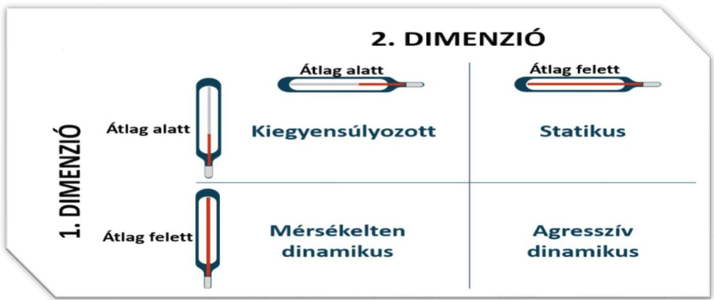
Forrás: ÁSZ saját szerkesztés

# Első dimenzió

A Kórház havi szintű lejárt kötelezettségállományának átlagos változása (adósságvolatilitás) 2019. január és 2024. június közötti időszakban 26,4% volt, azonban a kórház 2019. január és 2021. május közötti időszakban – a 2019. május havi 10 323 E Ft-os lejárt kötelezettségen kívül – 0 E Ft lejárt kötelezettséget tartott nyilván, melynek oka helytelen adatszolgáltatásra vezethető vissza. Így a vizsgált időszak megbontására, vizsgálatára volt szükség a torzítás nélküli, számszerű adósságállomány értékelése érdekében. A teljes vizsgált időszakban jellemző 26,4%-os havi szintű átlagos lejárt kötelezettségállomány változás értéke a helytelenül vezetett adósságnyilvántartási időszak (2019. január – 2021. május) nélkül 46,3%-ra nőtt. Az így vizsgált három év adósságvolatilitása jelentősen magasabb volt a többi kórház átlagos havi lejárt kötelezettségállomány változásához képest.

A teljes vizsgált időszakban 2022 márciusában 681,0%-os, 2022. júniusában 731,4%-os arányú kiugró értékű havi szintű lejárt kötelezettségállomány változás történt, melyek esetén a három év lejárt kötelezettségállományi adatok átlagos nominális értékéhez képest jelentősen alacsonyabb értéket képviseltek, azonban kiugróan magas arányukkal az értékelést torzították. Így ezen két érték torzító tényezőként kiszűrésre került. A torzító arányok kiszűrése mellett a teljes időszak esetén a lejárt kötelezettségállomány átlagos változása 4,8%, míg a külön vizsgált három év esetében 8,6% volt.

Annak ellenére, hogy a volatilitási értékek, az adósságállomány változásának átlagos aránya a vizsgált egyházi fenntartású kórházakhoz képest alacsonyabb értéket mutatott, a Kórház lejárt kötelezettségállománya nominálisan véve 2022. második félévétől a legnagyobb összegben nőtt, a vizsgált kórházak közül a legmagasabb adósságállományi adatokat elérve.

A Kórház teljes vizsgált időszakának első közel két és fél évében (2019. január – 2021. május) intézményi adatszolgáltatás hiányában lejárt kötelezettségállomány – 1 hónap kivételével – nem szerepelt a NEAK nyilvántartásában. A Kórház 2021. júniusában tartotta először nyilván lejárt kötelezettségét, amely bázis lejárt kötelezettségállomány 427 041 E Ft volt. A 2021. év végéig a többi elemzett kórház viszonylatában rendkívül magasnak számító bázis érték 0 E Ft-ra (-100,0%-kal) csökkent, konszolidálásra került.

---

Elemzés

A 2021. évben arányát és mértékét tekintve az első nyilvántartásba vett, júniusi adósságállomány volt a legmagasabb érték, mely a legnagyobb arányban (-80,7%) augusztusban mérséklődött 79 497 E Ft-ra. Az adósságrendezést követő hónapban, szeptemberre ismét nagy arányú (84,9%-os) adósságállomány növekedés történt, melynek közel kétharmadát (64,3%-át) októberben, a fennmaradt részét decemberben egyenlítették ki.

A 2022. évben a 2021. évi bázis értékhez képest (87,7%-kal) alacsonyabb 52 498 E Ft bázis (2022. január) érték 2022 júniusára közel háromszorosára emelkedett, 2022 augusztusában nem került rögzítésre a nyilvántartásba lejárt kötelezettségállomány. Az adathiánnyal jellemezhető augusztusi hónaptól kezdődően egy éven át a kórház lejárt kötelezettségállománya meredeken, nominálisan is emelkedni kezdett 2023. szeptemberéig. Az adathiányt követő 2022. szeptemberi hónapban nyilvántartott 149 760 E Ft-ról 2022. decemberéig 329 971 E Ft-ra (2,2-szeresére) nőtt a lejárt kötelezettségállomány.

A 2023. év januári bázis érték a 2022. decemberi adósságállományhoz képest 79,9%-kal 593 486 E Ft-ra emelkedett. Ez a bázis érték februárban és márciusban is átlagosan 50,3%-kal tovább nőtt 1 339 986 E Ft-ra. A második negyedévet 10,7%-os havi átlagos adósságállomány növekedés jellemezte, míg a harmadik negyedévet 4,3%-os havi átlagos növekedés, mely eredményeképp a Kórház 2023. szeptemberében elérte a teljes vizsgált időszak legmagasabb 1 951 848 E Ft-os havi lejárt kötelezettségállományát, mely valamennyi egyházi fenntartású kórház havi adósságállományához viszonyítva is a legmagasabb havi értéknek számít a teljes vizsgált időszakon belül.

A 2023. év utolsó negyedévében rendre csökkent a rekord magas adósságállomány (októberben 9,3%-kal, novemberben 21,8%-kal, decemberben 68,1%-kal), melyet a 2023. év végére 441 831 E Ft-ra, a 2023. évi bázis érték alatti összegre sikerült konszolidálni.

A 2024. törtév januári bázis értéke közel azonos összegű (604 714 E Ft) volt, mint a 2023. évi bázis érték. Ez a bázisérték az első fél évben ismételten, havonta átlagosan 25,4%-kal nőtt, mely során érdemi konszolidáció egyetlen hónapban sem volt. A vizsgált időszak utolsó hónapján ismételten rekordközeli 1 640 906 E Ft-ra duzzadt a lejárt kötelezettségállomány. A 2024. évet a második félévi lehetséges konszolidációs hatás mértéke nagyban befolyásolja.

10. ábra

A KÓRHÁZ LEJÁRT KÖTELEZETTSÉGÁLLOMÁNYÁNAK ALAKULÁSA A VIZSGÁLT IDŐSZAKBAN
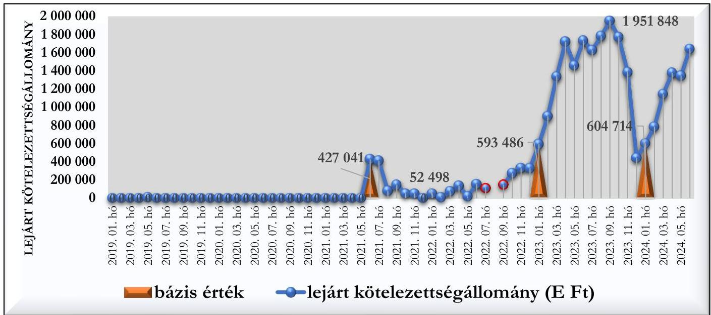
Forrás: NEAK adatszolgáltatás alapján ÁSZ saját szerkesztés

---

Elemzés

# Második dimenzió

A második dimenzió elemzéséhez az éves lejárt kötelezettségállomány havi átlaga került kiszámításra. A 2024. évi tört (fél éves) adatok esetén az első dimenzióban feltárt ciklikus változást, illetve hasonlóságot feltételezve becsült átlagos havi adatok kerültek kiszámításra, melyek külön értékelendők.

A lejárt havi átlagos kötelezettségállomány a 2021. évben 97 515 E Ft, a 2022. évben 149 437 E Ft, a 2023. évben 1 392 253 E Ft, a 2024. évben 1 150 319 E Ft volt, így a 2023. és a 2024. évi (tört) félévében a legmagasabb átlagnak számított a vizsgált többi kórházhoz képest. A 2019. és 2020. évben tapasztalt alacsony átlagos lejárt kötelezettségállomány trendszerűen a havi adathányok miatt nem értelmezhetők, így a 2021. júniusától 2021 decemberéig és 2024 januárjától 2024 júniusáig tört évek, míg 2022-2023 évek esetében egész évek adatai határozták meg a dimenziós értékeket, trendeket. A 2021. évi 97 515 E Ft-os havi szintű átlagos lejárt kötelezettségállomány tört év figyelembevétele esetén (átlag számítás során a hiányzó adatok kiszűrésével) 167 169 E Ft-ra emelkedett. A 2021. évi és a 2024. évi törtév adatainak összehasonlításából hasonlóan dinamikusan növekvő átlagos lejárt kötelezettségállomány trend rajzolódott ki, mint a 2022. és 2023. egész évek esetén.

A Kórház éves kiadási főösszege mértékét tekintve a 2019. évről a 2020. évre nagyságrendileg hasonlóan alakul 6 253 558 E Ft-ról 6 569 668 E Ft-ra (5,1%-kal) nőtt, azonban az átlagos lejárt kötelezettségállományhoz való viszonyítása – hiányos adatszolgáltatás miatt – helytelen következtetéshez vezet.

A 2021. évben az éves kiadási főösszeg a 2020. évhez képest 42,8%-kal 9 380 266 E Ft-ra nőtt, amely átlagosan havi 781 689 E Ft-ot jelentett. Az átlagos havi kiadási főösszeghez viszonyított – hiányzó adatok kiszűrésével módosított – lejárt kötelezettség havi átlaga (2. dimenziós értéke) 21,4% volt a 2021. évben. A 2022. évben az éves kiadási főösszeg 24,9%-os növekedése és a módosított átlagos lejárt kötelezettség havi átlagának csökkenése a második dimenziós érték 15,3%-ra való csökkenését eredményezte.

A 2023. évben a 2022. évhez képest további 15,0%-kal, 11 478 930 E Ft-ra nőtt a Kórház éves kiadási főösszege, mellyel párhuzamosan az éves lejárt kötelezettségállomány havi átlaga nagyobb arányban 831,7%-kal nőtt. Így a 2023. évi második dimenziós érték 15,3%-ról 123,9%-ra emelkedett, ami az egyházi fenntartású kórházak éves második dimenziós átlagai közül a legmagasabb a vizsgált időszakban.

Az éves kiadási főösszeg 2020-ról 2021-re 15,5%-kal, majd 2022-re további 15,1%-kal emelkedett. A 2020., a 2022. és 2023. évben nagyobb arányban emelkedett az átlagos lejárt kötelezettségállomány, mint az éves kiadási főösszeg. A 2023. évben az éves kiadási főösszeg csökkenése mellett közel duplájára nőtt a lejárt havi átlagos kötelezettségállomány.

7. táblázat
LEJÁRT HAVI ÁTLAGOS KÖTELEZETTSÉGÁLLOMÁNY ARÁNYA AZ ÁTLAGOS HAVI KIADÁSI FŐÖSSZEGHEZ (%) 2023. ÉVBEN

|  KÓRHÁZ ADATA | AZ ELEMZETT KÓRHÁZAK ÁTLAG ADATA | ÁTLAGTÓL VALÓ ELTÉRÉS  |
| --- | --- | --- |
|  123,9% | 54,2% | 128,6%  |

8. táblázat
A KÓRHÁZ ÉVES KIADÁSI FŐÖSSZEG ÉS ÁTLAGOS LEJÁRT KÖTELEZETTSÉGÁLLOMÁNY VÁLTOZÁSOK ÖSSZEHASONLÍTÁSA

|  IDŐSZAK | ÉVES KIADÁSI FŐÖSSZEG VÁLTOZÁSA | LEJÁRT HAVI ÁTLAGOS KÖTELEZETTSÉGÁLLOMÁNY VÁLTOZÁSA  |
| --- | --- | --- |
|  2020* | 5,1 % | -100,0 %  |
|  2021** | 42,8 % | 100,0 %  |
|  2022 | 24,9 % | -10,6 %***  |
|  2023 | 15,0 % | 831,7 %  |

*Hiányzó adatok **Tört év hiányzó adatok miatt ***Hiányzó adatok kiszűrése előtt 53,2%
Forrás: NEAK adatok alapján ÁSZ saját szerkesztés

---

Elemzés

A kórház második dimenziós pozíciója, azaz a kiszámított átlagos lejárt kötelezettségállományhoz viszonyított átlagos havi kiadási főösszege, a 2021. évi - hiányzó adatok kiszűrésével - magasabb, 21,4%-os aránya a 2022. évre 6,1% ponttal ugyan csökkent, azonban a 2023. évre 123,9%-ra nőtt, ami azt jelentette, hogy amíg a 2022. évben az átlagosan lejárt kötelezettségállomány éppen meghaladta az átlagos havi kiadási főösszeg 15%-át, addig a 2023. évben az átlagosan lejárt kötelezettségállomány az átlagos havi kiadási főösszeget közel egynegyedével meghaladta, ami az egyházi fenntartású kórházak tekintetében a legmagasabb arány, negatív jelenség. Az ellenőrzött kórházak közül a technikai szűrések miatt másik három kórház második dimenzióbeli arányát volt mód meghatározni, amely átlagosan a 2019. évben 25,2%, a 2020. évben 23,7%, a 2021. évben 20,4%, a 2022. évben 19,8%, a 2023. évben 36,8% volt, így a kiválasztott kórházakhoz képest a 2021. évben -hiányzó adatok kiszűrésével módosított érték szerint – enyhén magasabb, 2022-ben alacsonyabb, majd 2023-ban kiemelkedően magas, a kórházi átlag értékeket messze meghaladó második dimenzióbeli arány jellemezte a Kórházat.

9. táblázat
A KÓRHÁZ 2. DIMENZIÓBELI ARÁNYAI AZ ELLENŐRZŐTT KÓRHÁZAKHOZ VISZONYÍTOTTAN

|  IDŐSZAK | 2. DIMENZIÓBELI ARÁNY | ELLENŐRZŐTT KÓRHÁZAK 2. DIMENZIÓBELI ARÁNYÁNAK ÁTLAGA^{10}  |
| --- | --- | --- |
|  2019 | 0,2 % | 25,2 %  |
|  2020 | 0,0 % | 23,7 %  |
|  2021 | 21,4 %* | 20,4 %  |
|  2022 | 15,3 % | 19,8 %  |
|  2023 | 123,9 % | 36,8 %  |

* Hiányzó értékek kiszűrésével módosított arány
Forrás: NEAK adatok alapján ÁSZ saját szerkesztés

# Adósság-pozicionálás

A kórházat a két adósságdimenzió együttes értékelése alapján 2021-2022 közötti időszakban átlag alatti dimenziós értékek jellemezték, mely kiegyensúlyozott pozícióknak írható le. A kiegyensúlyozott pozíció a vizsgált kórházak átlagos havi volatilitásához képest alacsonyabb adósság volatilitásnak és annak kórházi átlagtól alacsonyabb átlagos havi kiadási főösszeghez viszonyított arányának volt köszönhető. A kezdeti kiegyensúlyozott pozíció a 2023. évben statikus pozícióra fordult, hiszen a kórházi átlag alatti átlagos havi lejárt kötelezettségállomány változás (első dimenzió) mellett jelentősen a kórházi átlag feletti átlagos havi kiadási főösszeghez viszonyított átlagos lejárt kötelezettségállomány (második dimenzió) jellemezte a kórházat. A kórházak összes lejárt kötelezettségállomány változásait torzító tényezők, valamint hiányzó adatok kiszűrését követően is az öt kórház átlagos értéke (22,1%) alatt maradt a kórház lejárt kötelezettségállomány havi átlagos változása, azonban a kiadási főösszeghez viszonyított aránya a dinamikusan emelkedő lejárt kötelezettségállomány és ezzel lépést tartani nem tudó év végi konszolidációs hatás miatt 2023-ban jelentősen (69,7% ponttal) meghaladta az 5 kórház dimenziós átlagát. A lejárt kötelezettségállomány és arány növekedésének trendjét figyelembe véve – a vizsgált kórházak pozíciójának változatlansága, esetleg javulása mellett – fenn áll a veszélye annak, hogy a kórház a statikus pozíciója hosszú távon fennmarad.

10 2019-2020 között három, 2021-2023 között négy kórházi számított érték alapján kalkulálva

---

Elemzés

# 3. A kórház működésének bemutatása

## 3.1. Input/humán erőforrás mutatók elemzése

A humán erőforrás helyzet elemzéséhez a NEAK adatai kerültek felhasználásra¹¹, amelyek 2021 márciusától¹² álltak rendelkezésre, ami meghatározta az elemzett időszakot. A főbb adatokat a 10. táblázat tartalmazza.

10. táblázat
A HUMÁN ERŐFORRÁSHELYZET FŐBB MUTATÓSZÁMAI

|  MUTATÓSZÁM NEVE | KÓRHÁZ ADATA | ÁZ ELEMZETT KÓRHÁZAK ÁTLAG ADATA | ÁTLAGTÓL VALÓ ELETRÉS  |
| --- | --- | --- | --- |
|  2021 |  |  |   |
|  Foglalkoztatott orvosok aránya az összlétszámból (havi átlag) (%) | 24,2% | 21,5% | 12,3%  |
|  Foglalkoztatott szakdolgozók aránya az összlétszámból (havi átlag) (%) | 75,8% | 78,5% | -3,4%  |
|  Alkalmazottak fluktuációja intézményi szinten (havi átlag) (%) | 0,0%* | 0,6% | -100,0%  |
|  ezen belül orvosok (havi átlag) (%) | 0,0%* | 1,6% | -100,0%  |
|  ezen belül szakdolgozók (havi átlag) (%) | 0,0%* | 0,4% | -100,0%  |
|  1 orvosra jutó szakdolgozó (havi átlag) (fő) | 3,1 | 4,6 | -32,2%  |
|  1 szakdolgozóra jutó teljesített ápolási nap (havi átlag) | 26,5 | 24,7 | 7,2%  |
|  1 orvosra jutó ágyak száma (havi átlag) | 5,3 | 7,0 | -24,5%  |
|  1 szakdolgozóra jutó ágyak száma (havi átlag) | 1,7 | 1,5 | 16,4%  |
|  2022 |  |  |   |
|  Foglalkoztatott orvosok aránya az összlétszámból (havi átlag) (%) | 28,0% | 23,4% | 19,9%  |
|  Foglalkoztatott szakdolgozók aránya az összlétszámból (havi átlag) (%) | 72,0% | 76,6% | -6,0%  |
|  Alkalmazottak fluktuációja intézményi szinten (havi átlag) (%) | 0,0%* | 0,2% | -100,0%  |
|  ezen belül orvosok (havi átlag) (%) | 0,0%* | 0,5% | -100,0%  |
|  ezen belül szakdolgozók (havi átlag) (%) | 0,0%* | 0,1% | -100,0%  |
|  1 orvosra jutó szakdolgozó (havi átlag) (fő) | 2,6 | 4,0 | -35,3%  |
|  1 szakdolgozóra jutó teljesített ápolási nap (havi átlag) | 29,1 | 23,3 | 25,0%  |
|  1 orvosra jutó ágyak száma (havi átlag) | 4,5 | 5,7 | -21,1%  |
|  1 szakdolgozóra jutó ágyak száma (havi átlag) | 1,8 | 1,4 | 27,5%  |
|  2023 |  |  |   |
|  Foglalkoztatott orvosok aránya az összlétszámból (havi átlag) (%) | 26,5% | 24,0% | 10,5%  |
|  Foglalkoztatott szakdolgozók aránya az összlétszámból (havi átlag) (%) | 73,5% | 76,0% | -3,3%  |
|  Alkalmazottak fluktuációja intézményi szinten (havi átlag) (%) | 1,6% | 0,9% | 74,4%  |
|  ezen belül orvosok (havi átlag) (%) | 1,6% | 1,0% | 55,5%  |
|  ezen belül szakdolgozók (havi átlag) (%) | 2,0% | 1,0% | 101,8%  |
|  1 orvosra jutó szakdolgozó (havi átlag) (fő) | 2,8 | 3,7 | -25,9%  |
|  1 szakdolgozóra jutó teljesített ápolási nap (havi átlag) | 35,4 | 29,1 | 21,6%  |
|  1 orvosra jutó ágyak száma (havi átlag) | 5,1 | 5,0 | 1,9%  |
|  1 szakdolgozóra jutó ágyak száma (havi átlag) | 1,8 | 1,3 | 38,6%  |

*Adatközlési hiba valószínűsíthető, ezért nem került elemzésre
Forrás: NEAK adatszolgáltatás alapján ÁSZ saját szerkesztés

Az orvosok aránya az összlétszámhoz viszonyítva 2021. évről 2022. évre 3,8 százalékponttal emelkedett, a 2022. évről a 2023. évre 1,5 százalékponttal csökkent. A szakdolgozók aránya azonban 2021. évről 2022. évre ugyanolyan mértékben (3,8 százalékponttal) csökkent, mint amennyivel az orvosok aránya növekedett és 2023-ra ugyanolyan mértékben emelkedett (1,5 százalékponttal), mint amennyivel az orvosok aránya csökkent. A változások tükrözik az 1 orvosra jutó szakdolgozói létszám mozgását is: 2021. évi 3,1 főről 2022-re 2,6 főre

---

¹¹ Az elemzést megelőzően humán erőforrásra vonatkozó adatkérést küldtünk az elemzett kórházak részére. A beérkezett adatok feldolgozásánál megállapítottuk, hogy azok összehasonlításra alkalmatlanok, az eltérő adatstruktúra miatt, továbbá eltérnek a NEAK által szolgáltatott adatoktól. Ennek okán kerültek a NEAK adatok felhasználásra a humán erőforrás helyzetének elemzéséhez.

¹² Az egészségügyi szolgálati jogviszonyról szóló 2020. évi C. törvény értelmében 2021. március 01-től történik adatgyűjtés az egészségügyi szolgálati jogviszonyban foglalkoztatott orvosok, szakdolgozók számát illetően. A gazdasági, műszaki területen foglalkoztatott dolgozók létszámára vonatkozóan 2023. július 1-től rendelkeznek adatokkal (erre az elemzés nem tér ki).

---

Elemzés

csökkent, majd 2023-ra 2,8 főre emelkedett. Ezek az arányok – kivéve a foglalkoztatott orvosok arányát az összlétszámhoz – a többi elemzett kórházhoz képest alulmaradtak, az 1 orvosra jutó szakdolgozói létszám 2021-2023. évek között 25,9 % - 35,3 %-kal tért el az öt elemzett kórház átlag adatától. Az alkalmazottak fluktuációja (orvosok és szakdolgozók együttvéve) intézményi szinten a 2023. évben az 74,4 %-kal az átlag felett volt, ami labilisabb munkaerő-megtartó helyzetre utal.

Az 1 orvosra jutó ágyak száma (havi átlag) 2021-ben 5,3; 2022-ben 4,5; 2023-ban 5,1 volt, míg az 1 szakdolgozóra jutó ágyak száma 1,7-1,8 körül alakult. Megállapítható, hogy az 1 orvosra jutó átlagos ágyszám a vizsgált évek alatt – kivéve a 2023. év – az átlag alatt volt, viszont szakdolgozói leterheltség nagyobbnak bizonyult az átlagnál, mivel az egy főre jutó ágyak száma 2021-ben 16,4 %-kal; 2022-ben 27,5 %-kal; míg 2023-ban 38,6 %-kal volt magasabb az elemzett kórházak átlagánál.

Az 1 szakdolgozóra jutó teljesített ápolási napok vonatkozásában szintén az átlagtól nagyobb leterheltség mutatkozott, 2021-ben 7,2 %-kal; 2022-ben 25,0 %-kal; 2023-ban 21,6 %-kal volt magasabb annál.

Fontos megjegyezni, hogy az elemzés nem tért ki sem az orvosok, sem a szakdolgozók vonatkozásában a képzettségi szint szerinti megoszlásra, ami tovább árnyalná a humán erőforrás helyzet megítélését.

53

---

Elemzés

11. táblázat

A FŐBB MŰKÖDÉSI-, TELJESÍTMÉNY-, KAPACITÁSKIHASZNÁLTSÁG ADATOK

|  MUTATÓSZÁM NEVE | KÓRHÁZ ADATA | ÁZ ELEMZETT KÓRHÁZAK ÁTLAG ADATA | ÁTLAGTÓL VALÓ ELTÉRÉS  |
| --- | --- | --- | --- |
|  2019 |  |  |   |
|  Éves ágykihasználtsági mutató aktív (%) | 65,4% | 67,2% | -2,6%  |
|  Éves ágykihasználtsági mutató krónikus (%) | 64,2% | 65,2% | -1,5%  |
|  Egy aktív ágyra jutó elszámolt súlyszám | 72,1 | 41,6 | 73,4%  |
|  Case-mix index | 1,7 | 1,1 | 54,9%  |
|  Egy súlyszámra jutó gyógyszerkiadás (Ft) | 10 705,1 | 182 601,8 | -94,1%  |
|  Egy esetszámra jutó gyógyszerkiadás - (aktív és krónikus) (Ft) | 12 846,3 | 57 941,0 | -77,8%  |
|  Teljesített súlyszám (fekvő) | 15 047,7 | 5 463,9 | 175,4%  |
|  TÉK felett elszámolt súlyszám (degresszált súlyszám) (fekvő) | 225,0 | 56,3 | 300,0%  |
|  Kihasználatlan TÉK súlyszám (fekvő) | 408,0 | 281,0 | 45,2%  |
|  Teljesített pont (járó) | 280 850 486,0 | 116 013 088,0 | 142,1%  |
|  TÉK feletti elszámolt pont (degresszált pont) (járó) | 11 072 198,0 | 3 027 851,3 | 265,7%  |
|  Kihasználatlan TÉK pont (járó) | 62 858 733,0 | 93 833 410,5 | -33,0%  |
|  Teljesített pont (labor) | 196 136 693,0 | 54 796 183,8 | 257,9%  |
|  TÉK felett teljesített, lebegő ponton elszámolt pont (labor) | 140 464 807,0 | 39 377 726,8 | 256,7%  |
|  Kihasználatlan TÉK pont (labor) | 0,0 | 0,0 | 0,0%  |
|  Egynapos súlyszám | 32,0 | 8,0 | 300,0%  |
|  Standardizált naphányados | 0,9 | 0,9 | -0,8%  |
|  2020 |  |  |   |
|  Éves ágykihasználtsági mutató aktív (%) | 44,0% | 58,3% | -24,5%  |
|  Éves ágykihasználtsági mutató krónikus (%) | 28,4% | 45,1% | -37,0%  |
|  Egy aktív ágyra jutó elszámolt súlyszám | 30,3 | 23,8 | 27,0%  |
|  Case-mix index | 1,7 | 1,1 | 51,2%  |
|  Egy súlyszámra jutó gyógyszerkiadás (Ft) | 20 293,0 | 260 193,7 | -92,2%  |
|  Egy esetszámra jutó gyógyszerkiadás - (aktív és krónikus) (Ft) | 29 265,2 | 195 760,6 | -85,1%  |
|  Teljesített súlyszám (fekvő) | 10 605,8 | 4 170,4 | 154,3%  |
|  TÉK felett elszámolt súlyszám (degresszált súlyszám) (fekvő) | 9,0 | 2,3 | 300,0%  |
|  Kihasználatlan TÉK súlyszám (fekvő) | 4 371,0 | 1 445,3 | 202,4%  |
|  Teljesített pont (járó) | 210 516 944,0 | 89 381 390,0 | 135,5%  |
|  TÉK feletti elszámolt pont (degresszált pont) (járó) | 0,0 | 0,0 | 0,0%  |
|  Kihasználatlan TÉK pont (járó) | 220 249 677,0 | 236 127 391,8 | -6,7%  |
|  Teljesített pont (labor) | 151 685 291,0 | 42 475 960,0 | 257,1%  |
|  TÉK felett teljesített, lebegő ponton elszámolt pont (labor) | 97 268 794,0 | 27 512 234,8 | 253,5%  |
|  Kihasználatlan TÉK pont (labor) | 0,0 | 0,0 | 0,0%  |
|  Egynapos súlyszám | 24,0 | 6,0 | 300,0%  |
|  Standardizált naphányados | 0,8 | 0,9 | -10,9%  |
|  2021 |  |  |   |
|  Éves ágykihasználtsági mutató aktív (%) | 45,3% | 56,4% | -19,7%  |
|  Éves ágykihasználtsági mutató krónikus (%) | 23,0% | 42,2% | -45,5%  |
|  Egy aktív ágyra jutó elszámolt súlyszám | 41,7 | 30,5 | 36,7%  |
|  Case-mix index | 1,6 | 1,0 | 66,7%  |
|  Egy súlyszámra jutó gyógyszerkiadás (Ft) | 24 917,9 | 212 802,2 | -88,3%  |
|  Egy esetszámra jutó gyógyszerkiadás - (aktív és krónikus) (Ft) | 35 939,6 | 126 752,3 | -71,6%  |
|  Teljesített súlyszám (fekvő) | 9 771,5 | 4 232,4 | 130,9%  |
|  TÉK felett elszámolt súlyszám (degresszált súlyszám) (fekvő) | 0,0 | 4,4 | -100,0%  |
|  Kihasználatlan TÉK súlyszám (fekvő) | 5 624,0 | 1 986,8 | 183,1%  |
|  Teljesített pont (járó) | 187 187 274,0 | 123 521 458,0 | 51,5%  |
|  TÉK feletti elszámolt pont (degresszált pont) (járó) | 0,0 | 9 566 249,8 | -100,0%  |
|  Kihasználatlan TÉK pont (járó) | 703 493 376,0 | 380 169 604,0 | 85,0%  |
|  Teljesített pont (labor) | 183 774 698,0 | 58 953 874,0 | 211,7%  |
|  TÉK felett teljesített, lebegő ponton elszámolt pont (labor) | 126 832 771,0 | 38 986 296,4 | 225,3%  |
|  Kihasználatlan TÉK pont (labor) | 0,0 | 0,0 | 0,0%  |
|  Egynapos súlyszám | 32,0 | 12,4 | 158,1%  |
|  Standardizált naphányados | 0,8 | 1,0 | -21,6%  |

---

Elemzés

|  MUTATÓSZÁM NEVE | KÓRHÁZ ADATA | ÁZ ELEMZETT KÓRHÁZAK ÁTLAG ADATA | ÁTLAGTÓL VALÓ ELTÉRÉS  |
| --- | --- | --- | --- |
|  2022 |  |  |   |
|  Éves ágykihasználtsági mutató aktív (%) | 49,4% | 54,9% | -10,1%  |
|  Éves ágykihasználtsági mutató krónikus (%) | 37,7% | 45,6% | -17,3%  |
|  Egy aktív ágyra jutó elszámolt súlyszám | 43,9 | 33,9 | 29,5%  |
|  Case-mix index | 1,5 | 1,0 | 56,3%  |
|  Egy súlyszámra jutó gyógyszerkiadás (Ft) | 32 303,7 | 130 781,7 | -75,3%  |
|  Egy esetszámra jutó gyógyszerkiadás - (aktív és krónikus) (Ft) | 41 610,5 | 53 697,1 | -22,5%  |
|  Teljesített súlyszám (fekvő) | 11 004,3 | 5 351,3 | 105,6%  |
|  TÉK felett elszámolt súlyszám (degresszált súlyszám) (fekvő) | 0,0 | 4,4 | -100,0%  |
|  Kihasználatlan TÉK súlyszám (fekvő) | 4 583,0 | 2 491,6 | 83,9%  |
|  Teljesített pont (járó) | 236 931 390,0 | 192 261 988,4 | 23,2%  |
|  TÉK feletti elszámolt pont (degresszált pont) (járó) | 0,0 | 18 842 002,6 | -100,0%  |
|  Kihasználatlan TÉK pont (járó) | 495 177 329,0 | 284 324 272,6 | 74,2%  |
|  Teljesített pont (labor) | 211 003 087,0 | 83 787 329,2 | 151,8%  |
|  TÉK felett teljesített, lebegő ponton elszámolt pont (labor) | 154 055 748,0 | 56 309 751,0 | 173,6%  |
|  Kihasználatlan TÉK pont (labor) | 0,0 | 0,0 | 0,0%  |
|  Egynapos súlyszám | 31,0 | 12,2 | 154,1%  |
|  Standardizált naphányados | 0,8 | 1,0 | -20,0%  |
|  2023 |  |  |   |
|  Éves ágykihasználtsági mutató aktív (%) | 56,7% | 61,9% | -8,4%  |
|  Éves ágykihasználtsági mutató krónikus (%) | 36,8% | 54,2% | -32,1%  |
|  Egy aktív ágyra jutó elszámolt súlyszám | 61,3 | 33,7 | 81,8%  |
|  Case-mix index | 1,7 | 1,1 | 58,2%  |
|  Egy súlyszámra jutó gyógyszerkiadás (Ft) | 28 282,0 | 151 655,2 | -81,4%  |
|  Egy esetszámra jutó gyógyszerkiadás - (aktív és krónikus) (Ft) | 33 949,8 | 69 990,1 | -51,5%  |
|  Teljesített súlyszám (fekvő) | 14 371,0 | 6 665,8 | 115,6%  |
|  TÉK felett elszámolt súlyszám (degresszált súlyszám) (fekvő) | 41,0 | 24,2 | 69,4%  |
|  Kihasználatlan TÉK súlyszám (fekvő) | 1 735,0 | 753,6 | 130,2%  |
|  Teljesített pont (járó) | 275 679 430,0 | 228 596 480,0 | 20,6%  |
|  TÉK feletti elszámolt pont (degresszált pont) (járó) | 612 035,0 | 7 164 085,4 | -91,5%  |
|  Kihasználatlan TÉK pont (járó) | 66 810 250,0 | 100 051 940,0 | -33,2%  |
|  Teljesített pont (labor) | 186 629 200,0 | 85 735 806,6 | 117,7%  |
|  TÉK felett teljesített, lebegő ponton elszámolt pont (labor) | 129 857 251,0 | 58 219 064,4 | 123,0%  |
|  Kihasználatlan TÉK pont (labor) | 0,0 | 0,0 | 0,0%  |
|  Egynapos súlyszám | 26,0 | 13,6 | 91,2%  |
|  Standardizált naphányados | 0,8 | 0,9 | -6,7%  |

Forrás: NEAK adatszolgáltatás alapján ÁSZ saját szerkesztés

A NEAK adatszolgáltatás alapján a Kórház összes ágyszáma minimális változást mutatott az elemzett időszakban, ugyanis 2019. évi 430 db ágyról 2023. évre 439-re változott az ágyszám. Az összes ágyból 2019-ben 255 volt aktív ágy, ami 2023-ra 284-re nőtt, a krónikus ágyak száma ezen időszakban 175-ről 155-re csökkent.

Az aktív ágyak kihasználtsága 2019. évben 65,4 %, 2020. évben 44,0 %, 2021. évben 45,3 %, 2022. évben 49,4 %, míg a 2023. évben 56,7 % volt. Az aktív ágykihasználtsági adatokról megállapítható, hogy 2023-ra az országos átlaghoz¹³ közelített (az országos átlag 57,6% volt), de az elemzett időszakban végig a többi kórház kihasználtsági adatai alatt maradt. Az aktív ágyak kihasználtsági adatait a 11. ábra tartalmazza, az országos átlaghoz, valamint a többi elemzett kórház adataihoz viszonyítottan. A Kórházban működtetett osztályok közül a legmagasabb aktív ágykihasználtság a Belgyógyászaton, valamint a Belgyógyászati Centrumban történt, az aktív esetszám azonban a Kardiológiai osztályon és a Reumatológiai osztályon volt jellemzően magasabb. A Kórház Belgyógyászati Centrum részlegén 2019. évben 15 db ággyal, 2020 – 2023. évek során 20 db ággyal rendelkezett, amely ágyak, valamint belgyógyászati aktív ágy ellátására vonatkozó szaktevékenység elvégzése

¹³ https://www.neak.gov.hu/felso_menu/szakmai_oldalak/publikus_forgalmi_adatok/gyogyito_megelozo_forgalmi_adat/fekvobeteg_szakellatas_stat/korhazi_agyszám

55

---

Elemzés

kapcsán a Kórház közreműködési szerződéses viszonyban áll az Assisi Szent Ferenc Leányai Kongregáció által működtetett Szent Ferenc Kórházzal.

11. ábra

A KÓRHÁZ AKTÍV ÁGYAINAK KIHASZNÁLTSÁGI ADATAI
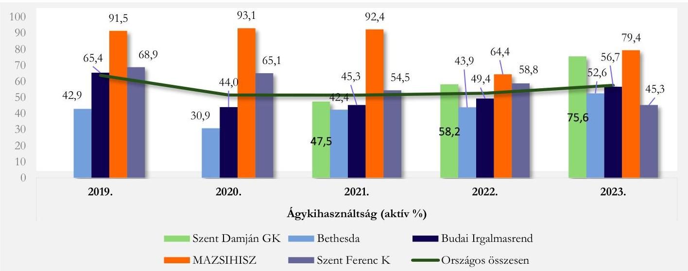
Forrás: NEAK adatszolgáltatás alapján ÁSZ saját szerkesztés

A krónikus ágyak kihasználtsága hasonlóan az aktív ágyakéhoz a vizsgált években mindvégig az országos átlag értékek és a többi elemzett kórház adatai alatt maradtak. 2023-ban az ágyak kihasználtsága csupán 51,5 %-át képezte az országos átlagnak, a 2019-2023. évi ágykihasználtsági átlagérték 38,0 % volt. A krónikus ágykihasználtsági adatokat a 12. ábra tartalmazza az országos átlag-, illetve a többi elemzett kórház adatainak relevanciájában.

12. ábra

A KÓRHÁZ KRÓNIKUS ÁGYAINAK KIHASZNÁLTSÁGI ADATAI
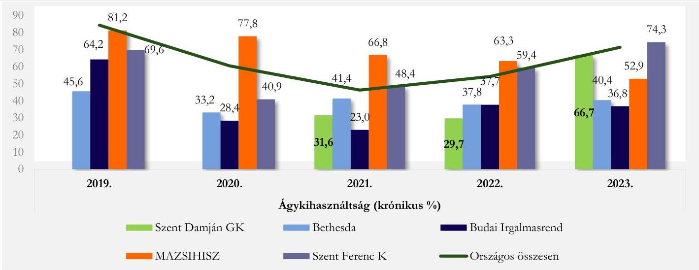
Forrás: NEAK adatszolgáltatás alapján ÁSZ saját szerkesztés

Az ágykihasználtsági adatok többi elemzett kórház adataihoz való viszonyítása alapján megállapítható, hogy az aktív ágyak kihasználtsága 2019-ben -2,6 %-kal, 2020-ban -24,5 %-kal, 2021-ben -19,7 %-kal, míg 2022-ben -10,1 %-kal, 2023-ban -8,4 %-kal elmaradt az átlagtól. A krónikus ágyak tekintetében 2019. évet kivéve a többi elemzett évben nagy arányú elmaradás volt detektálható a többi kórházhoz viszonyítottan, 2020-ban -37,0 %-kal, 2021-ben -45,5 %-kal, míg 2022-ben -17,3 %-kal, 2023-ban -32,1 % volt az elmaradás.

56

---

Elemzés

Az aktív fekvőbeteg szakellátás elszámolt teljesítményét vizsgálva megállapíthatjuk, hogy a Kórház teljesített súlyszáma lényegesen meghaladta minden évben a vizsgált kórházak teljesített súlyszámait. A Kórház 2019., 2020., és 2023. években jelentett TÉK²⁵ feletti súlyszámot, a 2019-ben lejelentett 225,0 súlyszámát eltekintve 2020-ban és 2023-ban a teljesített súlyszámhoz viszonyítottan minimális mértékű volt a TÉK felett jelentett súlyszám, amely után a Kórház degresszált finanszírozási összeget kapott. A Kórház bevételére mindenképp negatív hatással volt az a tény, hogy mind az öt vizsgált évben nagymértékű és átlag feletti volt a kihasználhatatlan kapacitása (2019: 408,0 súlyszám; 2020: 4 371,0 súlyszám; 2021: 5 624,0 súlyszám; 2022: 4 583,0 súlyszám; 2023: 1 735,0 súlyszám), ami a 2023. évben 130,2%-kal volt nagyobb a többi kórház átlagánál. Megjegyzendő, hogy 2019-ról 2023-ra a kihasználatlan súlyszám aránya 9,4 százalékponttal emelkedett a teljesített súlyszámhoz viszonyítva, ezzel együtt is fokozott figyelem szükséges a kapacitások tervezésénél, elosztásánál.

A case-mix index adott időszak alatt ellátott finanszírozási esetek összetételét költségigényesség szempontjából jellemző mutató, amely az elszámolt súlyszám és az elszámolt finanszírozási esetszám hányadosa. Így a Kórházra vizsgálva mutatja az ellátott kórházi ápolási esetek átlagos költségigényesség szerinti súlyosságát. Általában az átlagos kórházi eset súlyszáma 1,0. Ennek megfelelően az ennél magasabb case-mix index az átlagot meghaladó, a kisebb pedig az átlagnál alacsonyabb normatív költségigényű esetek ellátását jelzi. A Kórház esetében a case-mix index 1,5 és 1,7 között mozgott, a magasabb indexérték többlet költségigényű betegség típusok ellátására utal.

A Kórház adatainak sorában figyelmet érdemelnek az 1 súlyszámra jutó gyógyszerkiadás adatai. Ennek mértéke ugyanis 2019-ben 94,1 %-kal; 2020-ban 92,2 %-kal, 2021-ben 88,3 %-kal; 2022-ben 75,3 %-kal; 2023-ban 81,4%-kal volt kevesebb az öt kórház átlagához viszonyítva. Ha a gyógyszerkiadást esetszámra vetítjük (aktív és krónikus együtt), akkor szintén azt állapíthatjuk meg, hogy annak mértékei szintén az átlagok alatt maradtak: 2019-ben 77,8 %-kal; 2020-ban 85,1 %-kal; 2021-ben 71,6 %-kal; 2022-ben 22,5 %-kal; 2023-ban 51,5%-kal volt kevesebb az öt kórház átlagához viszonyítva, mindez a Kórház szigorú kontroll alatt tartott gyógyszer gazdálkodására utal.

A standardizált naphányados (SNH²⁶) az átlagos ápolási idő viszonyát mutatja a normatív naphoz. Amennyiben a SNH értéke kisebb, mint 1, akkor a vizsgált intézmény átlagos ápolási ideje rövidebb, mint az adott HBCS²⁷-khez tartozó normatív ápolási idő. A Kórház esetében a SNH értéke 0,8 - 0,9 volt, tehát az intézmény átlagos ápolási ideje rövidebb volt, mint az adott HBCS-khez tartozó normatív ápolási idő, ami szintén költségcsökkentő tényezőként értelmezhető.

A Kórház járóbeteg szakellátás teljesítménye vonatkozásában megállapítható, hogy a 2019. évben és a 2023. évben volt jelen TÉK feletti teljesítmény, a TÉK felett elszámolt pont 2019-ben 11 072 198,0; 2023-ban 612 035,0 volt, ami után degresszált finanszírozási összeget fizetett ki a NEAK. Megjegyzendő, hogy a teljesített ponthoz viszonyítottan is magas arányú TÉK feletti teljesítmény 2019-ben 265,7 %-kal haladta meg az öt kórház átlagát, viszont 2023-ban jellemzően megemelkedett valamennyi kórház esetén a TÉK felett elszámolt pont, így a Kórház értéke 91,5 %-kal volt kevesebb az öt kórházi átlagnál. A fekvőbeteg szakellátáshoz hasonlóan a járóbeteg szakellátásban is minden elemzett évben jellemző a nagy arányú kihasználatlan TÉK, amelynek értéke 2019-ről (62 858 733,0) 2021-re 640 634 643,0 ponttal növekedett, 2023-ra (66 810 250,0) viszont majdnem ugyanezzel az értékkel visszaesett a 2019. évi adathoz közelítve. Az öt kórházhoz viszonyítva a mutató értéke 2021-ben 85,0 %-kal, 2022-ben 74,2 %-kal haladta meg az öt kórház átlagát.

57

---

Elemzés

13. ábra:

A JÁRÓBETEG SZAKELLÁTÁS KIHASZNÁLATLAN TÉK PONTJAINAK ALAKULÁSA
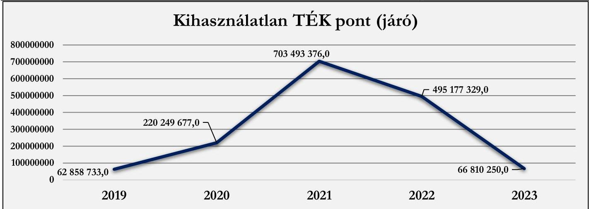
Forrás: NEAK adatszolgáltatás alapján ÁSZ saját szerkesztés

A TÉK felett jelentett teljesítmény és a kihasználatlan TÉK éven belüli együttes jelenléte tervezési hibára, a szezonalitás nem megfelelő felmérésére, a szakmánkénti kapacitásfelosztás anomáliájára utalhat.

A laboratóriumi ellátás finanszírozására jellemző, hogy a leginkább „túlteljesített” kassza, ezt igazolja vissza, hogy a Kórház esetében nem jelent meg (és a másik 4 kórháznál sem) kihasználatlan kapacitás, viszont TÉK feletti teljesítmény annál inkább. A Kórház esetében minden évben a TÉK feletti teljesítmény és a teljesített labor pont is kiemelkedően az öt elemzett kórház átlaga felett volt. A Kórház a TÉK feletti labor-teljesítménye után degresszált, úgynevezett lebegőponton elszámolt forintértéket kapott, ami a volumenre tekintettel kifejezett negatív hatással bírt a gazdálkodására. A többi kórház átlagához viszonyítottan 2019-ben 256,7 %-kal, 2020-ban 253,5 %-kal, 2021-ben 225,3 %-kal, 2022-ben 173,6 %-kal, 2023-ban 123,0 %-kal volt több a TÉK felett elszámolt pontja a Kórháznak. A Kórház 100,0%-on finanszírozott pontjának 2019. évben 71,6 %-át, 2023. évben mintegy 69,6%-át jelentette le TÉK feletti teljesítményként. Fontos megjegyezni, hogy az elemzés nem tért ki a TÉK felett leadott teljesítmény összetételének vizsgálatára, ami tovább árnyalhatná a helyzet megítélését. A 14. ábra a Kórház elszámolt pontjainak alakulását illusztrálja, a TÉK feletti elszámolt pontokkal kiegészítve, a többi elemzett kórház adataival való összehasonlításban.

14. ábra

A KÓRHÁZ ELSZÁMOLT LABOR PONTJAINAK ALAKULÁSA
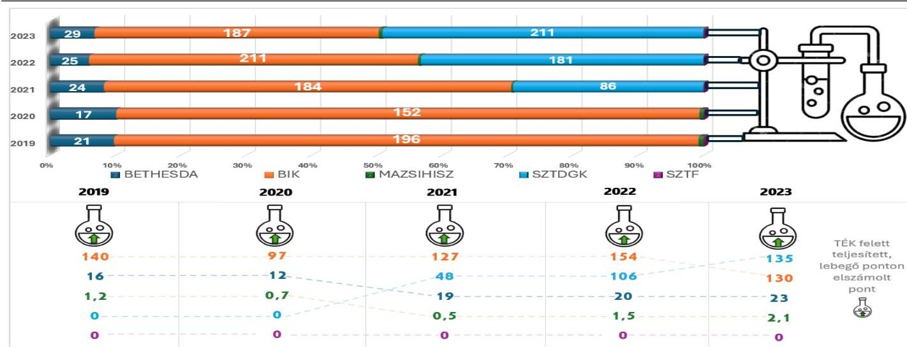
Forrás: NEAK adatszolgáltatás alapján ÁSZ saját szerkesztés

---

Elemzés

A Kórház 2019-ben 32,0; 2020-ban 24,0; 2021-ben 32,0; 2022-ben 31,0; 2023-ban 26,0 egynapos súlyszámot számolt el a NEAK e költséghatékony ellátási formára, ami 91,2 % - 300,0 % között haladta meg az öt kórházi átlagot az öt év során.

A kapacitások kihasználásának vizsgálatakor meg kell említenünk az épületek kihasználtságára, állapotára vonatkozó adatokat is¹⁴. A Kórház 2019-2022. között 5 db működő műtővel üzemelt. A vizsgált időszakban a műtők száma 2023-ban eggyel csökkent, a műtők kihasználtsága 2019-ben (48,0 %) és 2023-ban (49,0 %) volt a legmagasabb. Az összes műtét száma 2023-ban érte el a „csúcspontját” (7 065 db). 2021-hez képest 2023-ban 5119 műtéttel többet végeztek el, oka a 2020-2021. évi COVID járvány miatti csökkentett működés volt. Az intenzív osztályos ágyak számában, valamint a közfinanszírozott ágyak számában kiemelt változás nem következett be, arányukat vizsgálva 2019-2023. évek között átlagosan 1,55 % volt. A Kórház komplex felújítása 2017-ben kezdődött, a beruházást a Kórház a folyamatos betegellátási funkciók fenntartása mellett több ütemben hajtotta végre, mely magába foglalta az új hotelszárnny „C” épületet, a Központi „B” épület, továbbá a műtőblokk, intenzív osztály és orvosi képalkotó felújítását és a műemléki régi „A” épület renoválását.

## 3.3. Menedzsment hatásvizsgálata

A Kórház vezetőségének kiemelt felelőssége van a hitvallásuk és elhivatottságuk mellett mások tevékenységének koordinálására, a különböző erőforrások tervezésére, szervezésére, irányítására és összehangolására, továbbá a menedzsment funkciója közé sorolható a beosztottak elkötelezetté válása és ösztönzése. Mindezek elérése függ az állami és egyéb támogatások mértékétől, annak megfelelően történő kezelésétől és optimalizálásától. Az elemzett időszak számos globális és magyarországi kihívást hozott, mely külső és belső tényezőként nagyban befolyásolták a betegek ellátásának minőségét és az intézmény fenntarthatóságát. A 2021. év második felében a legjelentősebb feladatot az akkor még javában tartó COVID-19 világjárvány okozta nyomás hatékony kezelése jelentette. A járvány okozta leterheltség, késleltetett vagy elmaradó műtétek a várólisták növekedését eredményezték, az árak emelkedése pedig a gyógyszerköltségek megemelkedéséhez vezetett, amire a menedzsmentnek hatékonyan és rugalmasan kellett reagálnia. A 2022. évben továbbra is jelenlévő COVID-19 mellett egy új külső tényező jelent meg: kirobbant az orosz-ukrán háború, mely nagymértékű gazdasági kihívást jelentett az energiaipiacok instabilitása és a növekvő inflációs környezet miatt. A 2023. évben e tényezők által okozott problémák továbbra is jelentősek voltak és befolyásolták a Kórház stabil működését, úgy, mint az orvos szakmában az utánpótlás biztosítása országszerte nehézségeket okozott.

A Kórház szakmai beszámolóiban foglaltak alapján a menedzsment szem előtt tartotta az intézmény fejlesztését is, infrastruktúrájának fejlesztéséhez több állami támogatásban is részesült.¹⁵ A Kormányhatározatok alapján finanszírozott beruházások a korszerű gyógyítás kereteit hivatottak megteremteni. A beruházás érintette a Kórház infrastrukturális-, eszköz- és épületkorszerűsítését, új épületszárny elkészültét, műtőblokk, intenzív osztály és orvosi képalkotó egységénél a technológiai berendezések tervezett beépítését.

A Kórház a vizsgált évek során a teljesítményfinanszírozásból származó bevételek arányát nem növelte, a NEAK bevételek aránya csökkent az összes bevételeken belül, azaz a Kórház kiadásainak kezelése továbbra is folyamatos kihívással jár.

---

¹⁴ Adatközlő a Kórház.

¹⁵ Az 1231/2016. (V. 12.) „a Betegápoló Irgalmas Rend egyes projektjeinek finanszírozásához szükséges intézkedésekről” és az 1576/2020. (IX. 9.) „a Betegápoló Irgalmas Rend Budai Irgalmasrendi Kórház beruházásának megvalósításához szükséges többlet-forrás nyújtásáról” szóló Kormányhatározatok.

59

---

Elemzés

## 3.4. Várolista, előjegyzési idők alakulása, elemzése¹⁶

A NEAK nyilvántartása szerint a Kórház különböző típusú várólistakódokkal 11 fajta várólistát vezetett:

1. Szürkehályog műtétei
2. Mandula, orrmandula műtét
3. Gerincsérű műtétek
4. Prosztata jóindulatú megnagyobbodásának műtétei I. (Prostatectomia)
5. Prosztata jóindulatú megnagyobbodásának műtétei II. (Transurethralis prostataműtét)
6. Térdprotezis műtét
7. Csípőprotezis műtét
8. Coronária intervenciók
9. Gerincstabilizáló műtétek, gerincdeformitás műtétek
10. Nőgyógyászati műtétek nem malignus folyamatokban
11. A szív elektrofiziológiai vizsgálata, nagy és radiofrekvenciás ablációk

A Kórház 11 típuskódú várólistáján az ellátott várakozók száma a 2019. évben a Coronária intervenciók esetében meghaladta az 1000 főt. Ezt követte a csípőprotezis műtét 493 fővel, majd a szürkehályog műtét kapcsán 469 fővel. A várakozók tényleges átlagos várakozási ideje a 11 várólistát egybe véve 1-15 napok között ingadozott, a legtöbb várakozási idő a prosztata műtétekhez és a mandula, orrmandula műtétekhez kapcsolódott. A medián várakozási idő a térd- és csípőprotezis műtétek kapcsán 8-8 nap volt. A 60 napon túli várakozók a csípőprotezis műtétre várakozókat jellemezte, számuk 2019-ben 5 fő volt. Az ellátott előjegyzettek száma elsősorban a Coronária intervenciók (323 fő) és a szív vizsgálathoz (68 fő) voltak köthetőek. Az ellátottak száma, illetve azok tényleges várakozási ideje megegyeztek az ellátott várakozók és azok tényleges várakozási idejével, ez alól kivételt képez szintén a Coronária intervenciók várólista, a prosztata műtétek és a szív műtétek, ahol az ellátottak száma meghaladta az ellátott várakozók számát.

A 2020-2023. években a tendencia hasonló volt a 2019. évhez. A várólistán továbbra is a Coronária intervenciók műtétre várakozók száma volt a legtöbb, majd szürkehályog és csípőprotezis műtétre várakozók követték a sorban. A Coronária intervenciók műtétre várakozók száma évről évre növekedett, 2023-ban meghaladta az 1400 főt. A szürkehályog műtétre várakozók száma 2020-2021-ben kevesebb volt, azonban 2022-re ismét 485 fő került az ellátott várakozók száma közé. A térd- és csípőprotezis műtétek száma 2023-ban – 2020-2022. évi csökkenést követően – ismét 300-400 főre emelkedett. A 60 napon túli várakozók száma 2020-2021. évben nem volt releváns, viszont 2022-2023. évben már a térdprotezis műtétre várakozók száma 47 fő volt, a csípőprotezisre várakozók száma 56 fő volt.

A Kórház adatait a tényleges átlagos várakozási idő, valamint a tényleges medián várakozási idő vonatkozásában a 12. táblázat tartalmazza az országos adatokkal kiegészítve.

¹⁶ Az elemzett időszak a 2022-2023. évek.

---

Elemzés

12. táblázat
A KÖRHÁZ VÁRÓLISTA ADATAI ORSZÁGOS ADATOK VISZONYLATÁBAN

|  Év | VÁRÓLISTA NEVE | ELLÁTOT-TAK ÖSSZESEN (FŐ) | ELLÁTOTTAK ÖSSZESEN TÉNYLEGES ÁTLAGOS VÁRAKOZÁSI IDŐ (NAP) |   | ÖSSZESEN TÉNYLEGES MEDIÁN VÁRAKOZÁSI IDŐ (NAP)  |   |
| --- | --- | --- | --- | --- | --- | --- |
|   |   |  KÖRHÁZ | KÖRHÁZ | ORSZÁGOS ÁTLAG | KÖRHÁZ | ORSZÁGOS ÁTLAG  |
|  2019 | Szürkehályog műtétei | 469 | 3 | 35 | 2 | 30  |
|   |  Mandula, orrmandula műtét | 26 | 14 | 16 | 5 | 9  |
|   |  Gerincsérv műtétek | 23 | 1 | 5 | 0 | 1  |
|   |  Prosztata jóindulatú megnagyobbodásának műtétei I. (Prostatectomia) | 23 | 15 | 11 | 13 | 10  |
|   |  Prosztata jóindulatú megnagyobbodásának műtétei II. (Transurethralis prostataműtét) | 87 | 9 | 12 | 8 | 8  |
|   |  Térdprotézis | 317 | 9 | 121 | 8 | 91  |
|   |  Csípőprotézis műtét | 493 | 10 | 74 | 8 | 29  |
|   |  Coronária intervenciók | 1527 | 0 | 9 | 0 | 0  |
|   |  Gerincstabilizáló műtétek, gerinedeformitás műtétek | 3 | 2 | 28 | 0 | 0  |
|   |  Nőgyógyászati műtétek nem malignus folyamatokban | 0 | 0 | 6 | 0 | 0  |
|   |  A szív elektrofiziológiai vizsgálata, nagy és radiofrekvenciás ablációk | 380 | 0 | 23 | 0 | 1  |
|   |  Szürkehályog műtétei | 317 | 2 | 46 | 1 | 32  |
|  2020 | Mandula, orrmandula műtét | 4 | 1 | 17 | 1 | 8  |
|   |  Gerincsérv műtétek | 18 | 0 | 4 | 0 | 1  |
|   |  Prosztata jóindulatú megnagyobbodásának műtétei I. (Prostatectomia) | 5 | 7 | 11 | 4 | 7  |
|   |  Prosztata jóindulatú megnagyobbodásának műtétei II. (Transurethralis prostataműtét) | 44 | 6 | 13 | 1 | 6  |
|   |  Térdprotézis | 177 | 9 | 135 | 8 | 85  |
|   |  Csípőprotézis műtét | 305 | 8 | 73 | 8 | 8  |
|   |  Coronária intervenciók | 1279 | 0 | 7 | 0 | 0  |
|   |  Gerincstabilizáló műtétek, gerinedeformitás műtétek | 0 | 0 | 31 | 0 | 0  |
|   |  Nőgyógyászati műtétek nem malignus folyamatokban | 0 | 0 | 6 | 0 | 0  |
|   |  A szív elektrofiziológiai vizsgálata, nagy és radiofrekvenciás ablációk | 260 | 0 | 18 | 0 | 0  |
|   |  Szürkehályog műtétei | 281 | 3 | 67 | 1 | 35  |
|   |  Mandula, orrmandula műtét | 13 | 1 | 20 | 1 | 8  |
|   |  Gerincsérv műtétek | 15 | 0 | 5 | 0 | 1  |
|   |  Prosztata jóindulatú megnagyobbodásának műtétei I. (Prostatectomia) | 1 | 0 | 12 | 0 | 6  |
|   |  Prosztata jóindulatú megnagyobbodásának műtétei II. (Transurethralis prostataműtét) | 37 | 1 | 15 | 1 | 5  |
|   |  Térdprotézis | 91 | 8 | 244 | 7 | 99  |
|  2021 | Csípőprotézis műtét | 194 | 8 | 110 | 7 | 3  |
|   |  Coronária intervenciók | 1296 | 0 | 8 | 0 | 0  |
|   |  Gerincstabilizáló műtétek, gerinedeformitás műtétek | 0 | 0 | 30 | 0 | 0  |
|   |  Nőgyógyászati műtétek nem malignus folyamatokban | 1 | 0 | 7 | 0 | 0  |
|   |  A szív elektrofiziológiai vizsgálata, nagy és radiofrekvenciás ablációk | 226 | 0 | 22 | 0 | 0  |
|   |  Szürkehályog műtétei | 485 | 2 | 61 | 2 | 46  |
|  2022 | Mandula, orrmandula műtét | 21 | 2 | 24 | 1 | 13  |
|   |  Gerincsérv műtétek | 15 | 0 | 6 | 0 | 1  |
|   |  Prosztata jóindulatú megnagyobbodásának műtétei I. (Prostatectomia) | 12 | 2 | 12 | 1 | 8  |
|   |  Prosztata jóindulatú megnagyobbodásának műtétei II. (Transurethralis prostataműtét) | 65 | 2 | 16 | 1 | 7  |
|   |  Térdprotézis | 202 | 13 | 224 | 8 | 129  |
|   |  Csípőprotézis műtét | 268 | 14 | 125 | 8 | 30  |
|   |  Coronária intervenciók | 1337 | 0 | 13 | 0 | 0  |
|   |  Gerincstabilizáló műtétek, gerinedeformitás műtétek | 0 | 0 | 52 | 0 | 0  |
|   |  Nőgyógyászati műtétek nem malignus folyamatokban | 0 | 0 | 9 | 0 | 2  |
|   |  A szív elektrofiziológiai vizsgálata, nagy és radiofrekvenciás ablációk | 222 | 0 | 40 | 0 | 0  |

---

Elemzés

|  Év | VÁRÓLISTA NEVE | ELLÁTOTTÁK ÖSSZESEN (FŐ)
KÓRHÁZ | ELLÁTOTTÁK ÖSSZESEN TÉNYLEGES ÁTLAGOS VÁRAKOZÁSI IDŐ (NAP) |   | ÖSSZESEN TÉNYLEGES MEDIÁN VÁRAKOZÁSI IDŐ (NAP)  |   |
| --- | --- | --- | --- | --- | --- | --- |
|   |   |   |  KÓRHÁZ | ÖRSZÁGOS ÁTLAG | KÓRHÁZ | ÖRSZÁGOS ÁTLAG  |
|  2023 | Szürkehályog műtétei | 393 | 2 | 45 | 2 | 31  |
|   |  Mandula, orrmandula műtét | 31 | 2 | 29 | 1 | 15  |
|   |  Gerincsérű műtétek | 24 | 0 | 5 | 0 | 1  |
|   |  Prosztata jóindulatú megnagyobbodásának műtétei I. (Prostatectomia) | 18 | 2 | 8 | 1 | 8  |
|   |  Prosztata jóindulatú megnagyobbodásának műtétei II. (Transurethralis prostataműtét) | 88 | 2 | 17 | 1 | 9  |
|   |  Térdprotézis | 316 | 39 | 220 | 22 | 173  |
|   |  Csípőprotézis műtét | 389 | 33 | 116 | 19 | 34  |
|   |  Coronária intervenciók | 1482 | 0 | 13 | 0 | 0  |
|   |  Gerincstabilizáló műtétek, gerincdeformitás műtétek | 0 | 0 | 43 | 0 | 0  |
|   |  Nőgyógyászati műtétek nem malignus folyamatokban | 0 | 0 | 7 | 0 | 1  |
|   |  A szív elektrofiziológiai vizsgálata, nagy és radiofrekvenciás ablációk | 299 | 0 | 31 | 0 | 1  |

Forrás: NEAK adatszolgáltatás alapján ÁSZ saját szerkesztés

A Kórház 2019-ben 3348-, 2020-ban 2409-, 2021-ben 2155-, 2022-ben 2627-, és 2023-ban 3040 fő beteget, azaz összesen 13 579 fő beteget látott el. A Kórháznál a legtöbb beteg a szürkehályog műtétre, a Coronária intervenciókra, a térd- és csípőprotézis műtéti beavatkozásokra várakozott.

A szürkehályog műtét vonatkozásában ténylegesen ellátottak száma kiemelkedő volt 2019-2023. években Pest vármegyében (99-147 fő) és Budapest (160-316 fő) körzetében, a többi vármegyéből érkező beteg száma elenyésző volt (10 fő alatti). Az ellátott betegek száma 2019-ben (összesen 469 fő) és 2022-ben (összesen 485 fő) volt a legtöbb. A Coronária intervenciók az egyik legkritikusabb műtéti beavatkozás, szinte az összes vármegyét érintette, azonban az alábbi vármegyékben volt érintett a legtöbb beteg: Komárom-Esztergom vármegye, Pest vármegye és Budapest térsége. A térdprotézis műtét jellemző volt úgyszintén Pest vármegyében (összesen 445 fő) és Budapesten (összesen 408 fő), 2020-2022. évek között az ellátottak száma a COVID járvány miatt visszaesett, azonban Budapesten 2023-ra a betegek száma (128 fő) a 2019. évi adatot (113 fő) is meghaladta. A csípőprotézis műtét szintén gyakori volt országos szinten. A legtöbb műtétet továbbra is Pest vármegyében (összesen 599 fő) és Budapesten (összesen 669 fő) végezték, azonban az ellátott betegek száma 10-24 fő között volt Bács-Kiskun, Győr-Moson-Sopron, Nógrád és Komárom-Esztergom vármegyékben. Az ellátottak száma 2020-2022. között szintén kevesebb volt, mint a 2019. és a 2023. évek során.

A várakozók és előjegyzettek számában megállapítható, hogy a Kórháznál 4 típusú várólista volt a jellemző a vizsgált években, ezek közül is a legtöbb beteget a térd- és csípőprotézis műtétre jegyeztek elő.

62

---

Elemzés

15. ábra

A KÓRHÁZBAN AZ ELLÁTOTTAK SZÁMA (FŐ) 2019-2023. ÉVEK KÖZÖTT 4 TÍPUSÚ VÁRÓLISTA KAPCSÁN (CORONARIA INTERVENCIÓ, SZÜRKEHÁLYOG, CSÍPŐPROTÉZIS, TÉRDPROTÉZIS MŰTÉTEI)
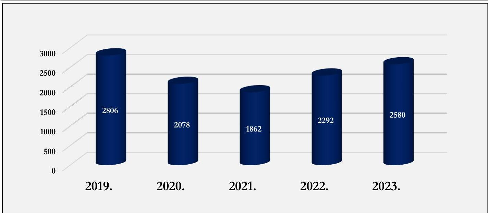
Forrás: NEAK adatszolgáltatás alapján ÁSZ saját szerkesztés

A NEAK a várólistán regisztráltak esetében vizsgálja a sorrendiségi hibák¹⁷ előfordulását. A Kórház a 2019-2023. évek között minden hónapban részesült a várólistához kapcsolódó NEAK szankcióban. Míg 2019-ben 92 hibát vétettek, ami 3 643 E Ft büntetést jelentett, addig 2023-ban 195 hibát vétettek, ami 7 722 E Ft büntetést vont maga után.¹⁸ A legtöbb hibaszámot (201) 2022-ben érték el 7 960 E Ft szankcióval.

A Kórház a vizsgált időszakban nem vett részt várólistával kapcsolatos többletprogramban.

¹⁷ Az esetek nagyrészében adminisztratív, regisztrációs hiba.
¹⁸ 1 db hibapont szankcionálási mértéke 39,6 E Ft volt.

---

MELLÉKLETEK

## I. SZ. MELLÉKLET: ÉRTELMEZŐ SZÓTÁR

Aktív fekvőbeteg szakellátás
Az az ellátás, amelynek célja az egészségi állapot mielőbbi helyreállítása. Az aktív ellátás időtartama, illetve befejezése többnyire tervezhető, és az esetek többségében rövid időtartamú.
(Forrás: https://www.neak.gov.hu/felso_menu/szakmai_oldalak/gyogyito_megelezo_ellatas/szakellatas/fekvobeteg_szakellatas)

Ágykihasználási százalék
Teljesített ápolási napok száma osztva a teljesíthető ápolási napok számával és szorozva 100-zal.
(Forrás: https://www.neak.gov.hu/felso_menu/szakmai_oldalak/publikus_forgalmi_adatok/gyogyito_megelzo_forgalmi_adat/fekvobeteg_szakellatas_stat/korhazi_agyszám)

Ápolás átlagos tartama
A tárgyévben távozott betegek teljes ápolási idejére számított ápolási napjainak száma osztva az osztályokról a tárgyévben elbocsátott betegek számával. A teljes ápolási idő a tárgyévben távozott betegek összes ápolási napját tartalmazza, így a tárgyévben távozott, de az előző évben (években) felvett beteg esetén az ápolás előző évre (évekre) eső részét is. Az ápolás átlagos tartama nem egyezik meg a teljesített ápolási napok számának és az elbocsátott betegek számának hányadosával.
(Forrás: https://www.neak.gov.hu/felso_menu/szakmai_oldalak/publikus_forgalmi_adatok/gyogyito_megelzo_forgalmi_adat/fekvobeteg_szakellatas_stat/korhazi_agyszám)

Beszámoló
A gazdálkodó működéséről, vagyoni, pénzügyi és jövedelmi helyzetéről az üzleti év könyveinek zárását követően, a Számv. tv-ben meghatározott könyvvezetéssel alátámasztott beszámolót köteles – magyar nyelven – készíteni. A beszámolónak megbízható és valós összképet kell adnia a gazdálkodó vagyonáról, annak összetételéről (eszközeiről és forrásairól), pénzügyi helyzetéről és tevékenysége eredményéről.
Az egyéb szervezet beszámolási kötelezettségének, beszámolót alátámasztó könyvvezetési kötelezettségének sajátosságait a vonatkozó külön jogszabály és a Számv. tv. alapján kormányrendelet szabályozza. A gazdálkodó, illetve a természetes személy által alapított egészségügyi, szociális, kulturális és oktatási intézmény könyvvezetési, beszámolókészítési kötelezettségét – a Számv. tv. és a vonatkozó külön jogszabály rendelkezései alapulvételével – a létrehozó szervezet állapítja meg azzal, hogy a létrehozott szervezet – jogi személyiségének megfelelően – a Számv. tv. 3. § (1) bekezdése 2-4. pontjai szerinti szervezetek közé kell besorolnia
(Forrás: Számv. tv. 4 § (1)-(2) bek., 6. § (2)-(3) bek.)

Brutto CF (non cash tételkékel korrigált üzemi eredmény)
A Brutto Cash Flow értékét a befektetett tőke és a várható gazdasági profit jelenértékének összege adja. Várható gazdasági profit jelenértéke lehet: pozitív, negatív, nulla. Egy gazdálkodó csak annyival ér többet a befektetett tőkénél, amennyivel a befektetett tőke jövedelmezősége meghaladja a tőkeköltséget. Azt mutatja meg, hogy mekkora összegű a gazdálkodó üzemi eredménye azok a számviteli elszámolások nélkül, melyek az adott gazdálkodási évben nem jártak sem pénzkiadással sem annak az előírásával.
(Forrás: http://ecopedia.hu/brutto-cash-flow)

CAPEX (tőkebefektetés)
Azt mutatja meg, hogy a gazdálkodó az adott évben mekkora összegben pótolta a befektetett eszközeit.
A tőkebefektetés nem minősül sem hitelnek, sem pedig támogatásnak. A tőkebefektetés során az idegen tőkét a szervezet alaptőkéjének emelésével hajtják végre.
(Forrás: http://ecopedia.hu/tokebefektetes)

Case-mix Index (CMI)
Adott időszak alatt ellátott finanszírozási esetek összetételét költségigényesség szempontjából jellemző mutató, amely az elszámolt súlyszám és az elszámolt finanszírozási esetszám hányadosa. Az adott kórházra (osztályra, korcsoportra, területre) vizsgálva mutatja az ellátott kórházi ápolási esetek átlagos költségigényesség szerinti súlyosságát (az előfordult homogén betegségcsoportok súlyszámának az esetszámmal súlyozott átlaga). Általában az átlagos kórházi esetet súlyszáma 1,000. Ennek megfelelően az ennél magasabb case-mix index az átlagot meghaladó, a kisebb pedig az átlagnál alacsonyabb normatív költségigényű esetek ellátását jelzi.
(Forrás: a 43/1999. (III. 3.) Korm. rendelet²⁸ 2.§ l) pont)

64

---

Mellékletek

Egyházi jogi személy
A vallási közösség az egyház megjelölést elnevezésében és a tevékenységére való utalás során önmeghatározása céljából – a saját hitelvei szerinti tartalommal – használhatja. (Forrás: Ehtv. 7/B §)

Egyházi jogi személy
Egyházi jogi személy a bevett egyház, a bejegyzett egyház és a nyilvántartásba vett egyház, továbbá azok belső egyházi jogi személye.
(Forrás: Ehtv. 10. §)

Egynapos ellátási esetek száma
Azon betegek száma, akiknek az ápolási ideje a 24 órát nem érte el, és a 9/1993 NM rendelet 9. számú mellékletében meghatározott egynapos beavatkozások valamelyikében részesültek.
(Forrás: https://www.neak.gov.hu/felso_menu/szakmai_oldalak/publikus_forgalmi_adatok/gyogyito_megelozo_forgalmi_adat/fekvobeteg_szakellatas_stat/korhazi_agyszam)

Eszközarányos jövedelmező-ség (ROA)
Azt mutatja meg, hogy 1 Ft átlagos eszköz értékre mekkora adózott eredmény jut. Eszközarányos eredmény = Adózott eredmény / Összes eszköz
(Forrás: https://ofi.oh.gov.hu)

Fekvőbeteg szakellátás
Klinikán, kórházban, szakápolási intézményben, valamint fekvőbeteg-ellátást nyújtó országos intézetben végzett minden ellátási esemény, amelynek során a biztosítottat az intézménybe felvették, és ott legalább 24 órán keresztül – nappali kórházi ellátás esetén legalább 6 órán keresztül – tartózkodik.
(Forrás: https://www.neak.gov.hu/felso_menu/szakmai_oldalak/gyogyito_megeleozo_ellatas/szakellatas/fekvobeteg_szakellatas)

Fenntartó
Fenntartó:
- költségvetési szerv egészségügyi szolgáltató esetén az alapító okiratban irányító szervként megjelölt állami szerv, helyi önkormányzat vagy önkormányzati társulás,
- egyházi jogi személy vagy vallási egyesület által fenntartott egészségügyi szolgáltató esetében az egészségügyi szolgáltató alapító okiratában fenntartóként megjelölt ilyen jogalany,
- alapítványi, közalapítványi egészségügyi szolgáltató esetén az alapítvány, közalapítvány,
- a nemzeti felsőoktatásról szóló 2011. évi CCIV. törvény 97. § (1) bekezdés a) és b) pontja szerinti esetben az egészségügyi felsőoktatási intézmény,
- más szervezet esetén a tulajdonosi jogokat gyakorló szervezet.
(Forrás: Eütv. 3. § w) pont)

Finanszírozási CF
A finanszírozási tevékenységgel kapcsolatos, de eredményt nem módosító (hiteltörlesztés hitelfelvétel, tőkeemelés, osztalékfizetés) pénz be- és kiáramlást mutatja. Megmutatja, hogy mekkora összegű, hosszútávon a gazdálkodó rendelkezésére álló külső forrás érkezett az adott évben a gazdálkodóhoz.
(Forrás: https://www.nive.hu/Downloads/Szakkepzesi_dokumentumok/Bemeneti_kompetenciak_meresi_ertekelesi_eszkozrendszerenek_kialakitasa/15_1969_014_101030.pdf)

Free CF (nettó működési CF - CAPEX)
A szabad cashflow azt mutatja meg, hogy mennyi szabad készpénze marad a szervezetnek a befektetések fejlesztése után. Azaz megmutatja, hogy az adott évben előállított cash-ból a tőkebefektetés után mekkora további szabadon felhasználható cash áll rendelkezésre.
(Forrás: https://elemzeskozpont.hu)

Hierarchák Tanácsa
A keleti egyházakban az ország összes részegyházának főpásztorait magába foglaló állandó testület. (Forrás: Magyar Katolikus Lexikon)

Kórház
A fekvőbeteg-szakellátás körében több szakmai főcsoportba tartozó szakmában aktív és krónikus, illetve aktív vagy krónikus betegellátást nyújtó, diagnosztikai háttérrel működő egészségügyi szolgáltató esetén az adott intézmény a kórház elnevezésre jogosult.
(Forrás: 60/2003. (X. 20.) ESzCsM rend.²⁹. 5. § (1) bek. c) pont cb) alpont)

Kórházi ágyak száma
A NEAK szerződés-nyilvántartási állományában szereplő, ÁNTSZ működési engedéllyel rendelkező ágyak száma, tárgyév december 31-én. A kórházi ágyak száma az egészségügyi ellátás kapacitásáról nyújt információt, mégpedig azon betegek maximális létszámáról, akik a kórházakban ellátásban részesülhetnek.
(Forrás: https://www.neak.gov.hu/felso_menu/szakmai_oldalak/publikus_forgalmi_adatok/gyogyito_megelozo_forgalmi_adat/fekvobeteg_szakellatas_stat/korhazi_agyszam)

65

---

Mellékletek

|  Költségvetési támogatás | A társadalombiztosítás pénzügyi alapjai kivételével az államháztartás központi alrendszeréből ellenérték nélkül, pénzben nyújtott támogatások.
(Forrás: Áht.30 1. § 14. pont)  |
| --- | --- |
|  Közfeladat | A jogszabályban meghatározott állami vagy önkormányzati feladat. A közfeladat ellátásban államháztartáson kívüli szervezet jogszabályban meghatározott rendben közreműködhet.
(Forrás: Áht. 3/A. § (1) - (2) bekezdés)  |
|  Lebegő pont | A laboratóriumi ellátás vonatkozásában a labor finanszírozás szabályának értelmében a teljesítmények teljesítményvolumen korlát feletti része lebegő pont-forint értékkel kerül elszámolásra.
(Forrás: https://www.parlament.hu/irom41/17188/adatok/fejezetek/72.pdf)  |
|  Működési CF
(a működés tőkeszükséglete) | A gazdálkodó azon pénztermelése, mely közvetlenül a főtevékenységhez köthető (eredmény, értékcsökkenés, forgóeszköz beszerzés).
A működési cashflow alatt találjuk meg, hogy a szervezet mennyi pénzt képes termelni a szervezeti tevékenysége során. Ez az operating cashflow, tehát a szervezethez befolyt összes pénzt jelenti, de ide köthető a működéssel kapcsolatos költségek is. A legnagyobb tétel a működési cashflow alatt az árbevétel, de az amortizáció, értékcsökkenés is itt követhető nyomon. Megmutatja, hogy az adott évben a működés folyamata tőkét kötött le vagy szabadított fel.
(Forrás: https://www.nive.hu/Downloads/Szakkepzesi_dokumentumok/Bemeneti_kompetenciak_meresi_ertekelesi_eszkozrendszerenek_kialakitasa/15_1969_014_101030.pdf
https://elemzeskozpont.hu)  |
|  Nem vallási tevékenység | Önmagában nem tekinthető vallási tevékenységnek a politikai és érdekvényesítő, a pszichikai vagy parapszichikai, a gyógyászati, a gazdasági-vállalkozási, a nevelési, az oktatási, a felsőoktatási, az egészségügyi, a karitatív, a család-, gyermek- és ifjúságvédelmi, a kulturális, a sport-, az állat-, környezet- és természetvédelmi, a hitéleti tevékenységhez szükségesen túlmenő adatkezelési, valamint a szociális tevékenység.
(Forrás: Ehtv. 7/A § (3) bek.)  |
|  Nettó működési CF (bruttó CF + működési CF) | A nettó cash-flow segítségével eldönthető, hogy egy szervezet mennyivel növelte vagy csökkentette likviditását, vagyis likvid eszközeit. Számítása történhet direkt vagy indirekt módon. A direkt mód szerinti meghatározáskor a be- és kiáramló vagy a nyitó és záró pénzeszközök különbségéből számítható. Indirekt módon történő számításánál a pénz összetevőnkénti forrásnövekményét csökkentjük a területenkénti felhasználás összegével.
Azt mutatja meg, hogy az adott évben a gazdálkodó a működés tőkeszükségletét is figyelembe véve mekkora összegű cash előállítására volt képes.
(Forrás: http://ecopedia.hu/netto-cash-flow)  |
|  Nettó működő tőke | A működő tőke a szervezet rövid távú pénzügyi helyzetét méri. Jelzi, hogy a társaság képes-e forgóeszközeivel teljesíteni az aktuális követelményeket, hogy a rövid források mennyire képesek a működés finanszírozására.
A működő tőke nagyon hasonló a likviditási mutatóhoz. A likviditási mutató a forgóeszközök és a rövid lejáratú céltartalékok aránya. A működő tőke viszont a forgóeszközök és a rövid lejáratú szolgáltatások közötti különbség.
A magas működő tőke azt jelzi, hogy a szervezet pénzügyileg stabil növekedési potenciállal rendelkezik.
Működő tőke = forgóeszközök - rövidlejáratú kötelezettségek
(Forrás: https://afakalkulator.com/econ?p=mukodotoke)  |
|  Osztályokról elbocsátott betegek száma | Kórházból eltávozott, továbbá ugyanazon gyógyintézet más osztályára áthelyezett és a meghalt betegek száma összesen.
(Forrás: https://www.neak.gov.hu/felso_menu/szakmai_oldalak/publikus_forgalmi_adatok/gyogyito_megelozo_forgalmi_adat/fekvobeteg_szakellatas_stat/korhazi_agyszam)  |

66

---

Mellékletek

Progresszív ellátás - Progresszivitási szintek
Az egészségügyi ellátások rendszere az eltérő egészségi állapotú egyének differenciált ellátását szolgáló, a munkamegosztás és a fokozatosság elvének alapuló intézményrendszerre épül, amelyben az egyén egészségi állapotának összes jellemzője együttesen határozza meg a szükséges ellátási szintet.

Az eltérő egészségi állapotú betegek differenciált ellátását a fokozatosság elvének egymásra épülő, a szakmai tevékenységeknek a szakmai tapasztalat és a technikai feltételek alapján csoportosított progresszivitási szinteken működő ellátórendszer biztosítja. A fekvőbeteg-szakellátás – az ellátáshoz szükséges eltérő személyi és tárgyi feltételek alapján szakmánként meghatározott progresszivitási szinteken (I.; II.; III.) történik.

(Forrás: az egészségügyi szolgáltatások nyújtásához szükséges szakmai minimumfeltételekről szóló 60/2003. (X. 20.) ESzCsM rendelet 9. § (1) és (4) bekezdései és az Eütv. 75. § (3) bekezdés).

Saját tőke arányos jövedelmezőség mutatója (ROE)
Azt mutatja meg, hogy 1 Ft átlagos tőkebefektetés mekkora adózott eredményt generál. Saját tőke-arányos jövedelem (ROE) = Adózott eredmény / Saját tőke

(Forrás: https://ofi.oh.gov.hu)

Standardizált naphányados (SNH)
Egy intézmény, vagy osztály átlagos ápolási idejét lehet viszonyítani az adott HBCS normatív ápolási idejéhez. E két érték hányadosa adja meg a standardizált naphányadost. Amennyiben az SNH értéke kisebb, mint 1, akkor a vizsgált intézmény átlagos ápolási ideje rövidebb, mint az adott HBCS-hez tartozó normatív ápolási idő, ebben az esetben a kórház nem ápolja túl a betegeit.

(Forrás: https://www.etk.pte.hu/protected/OktatasiAnyagok/!Palyazati/EubenHasznalatos-Kodrendszerek_20151117_.pdf)

Szolvencia rátá
A szolvencia méri a szervezet képességét a fizetési kötelezettségek teljesítésére. Megmutatja, hogy a forrásokon belül mekkora a saját tőke aránya, az adósság milyen része van saját eszközökkel fedezve.

Szolvencia = Mérlegfőösszeg, azaz az összes eszköz / Összes kötelezettség

(Forrás: https://rankia.hu/vallalati-penzugyi-mutatok-eladosodottsag-szolvencia-es-likviditas/)

Támogatás
Az államháztartás központi vagy önkormányzati alrendszeréből, bármilyen formában, ellenérték nélkül nyújtott juttatás.

(Forrás: Áht. 1. § 19. pont)

Teljesítménydíj
Az alapdíj és a teljesítmény szorzata, amely a NEAK-nak leadott teljesítményjelentéseken alapul.

(Forrás: a 43/1999. (III. 3.) Korm. rendelet 2.§ h) pont)

Tervezett éves keret (TÉK)
Önálló elszámolási tételként elszámolható, jogszabályban meghatározott szolgáltatási egységek teljesítményértékeinek mennyisége, amelyre a szakellátást nyújtó egészségügyi szolgáltató a jelen rendeletben foglalt szabályok szerint jogosult

(Forrás: az egészségügyi szolgáltatások Egészségbiztosítási Alapból történő finanszírozásának részletes szabályairól szóló 43/1999. (III. 3.) Korm. rendelet 2.§ t) pont)

Volatilitás
Egy adat változékonysága. A kórházi lejárt kötelezettségállomány változásának bemutatásához használt kifejezés (azt vizsgálva, hogy egy bizonyos idő alatt mennyit változott az adósságállomány).

(Forrás: https://www.neak.gov.hu/pfile/file?path=/letoltheto/altfin_dok/altfin_virt_dok2/hirek_mappa/ONKOLOGIAI_ELLATASOK_FINANSZIROZASA_1_&amp;inline=true)

67

---

Mellékletek

## II. SZ. MELLÉKLET: AZ ELLENŐRZŐTT SZERVEZETEK JEGYZÉKE

|  ELLENŐRZŐTT SZERVEZET NEVE | ELLENŐRZŐTT SZERVEZET SZÉKHELYE  |
| --- | --- |
|  Betegápoló Irgalmas Rend Budai Irgalmasrendi Kórház | 1023 Budapest, Frankel Leo út 54.  |
|  Betegápoló Irgalmas Rend | 1023 Budapest, Frankel Leo út 54.  |
|  ELLENŐRZÉST TÁMOGATÓ SZERVEZETEK  |
| --- |
|  Nemzeti Egészségbiztosítási Alapkezelő  |
|  Belügyminisztérium  |
|  Miniszterelnökség  |

---

Mellékletek

## III. SZ. MELLÉKLET: ELLENŐRZÉSI KRITÉRIUMOK

|  FÓKUSZTERÜLET | ELLENŐRZÉSI KRITÉRIUMOK  |
| --- | --- |
|  1. Az egyház fenntartói kötelezettsége teljesítésének szabályszerűsége | Számv. tv. 6. § (3) bek., 14. § (3). (5) és (11)-(12) bek., 161. § (1) és (4) bek.,
Eütv. 155. § (1) bek. g) pont,
Áht. 53. §
296/2013. Korm. rend. 5. § (4) bek., 7. § (2)-(4) és (6) bek., 11. §,
507/2023. Korm. rend. 2. § (2) bek.,  |
|  2. A kórház működési keretei kialakításának szabályszerűsége az államháztartásból nem hitéleti célra nyújtott támogatások vonatkozásában | Számv. tv. 8. § (2)-(3) bek., 14. § (3), (5)-(7) és (11)-(12) bek., 159. §, 161. § (1)-(2) és (4) bek., 162. §(II1)-(2) bek.,
Eütv. 155. § (1) bek. a)-b) és d)-g) pont,
155. § (1a) bek. a) pont,
Ehtv. 7/A. § (1) bek., 11/A. § a) pont,
296/2013. Korm. rend. 3. § (1)-(5) bek., 4. §, 5. §, 7. § (5)-(6) bek., 9. § (1) bek. a) pont, 11. §, 1. és 2. melléklet
Belső szabályzatok  |
|  3. A kórház beszámolási és közzétételi kötelezettsége teljesítésének szabályszerűsége az államháztartásból nem hitéleti célra nyújtott támogatások vonatkozásában | Számv. tv. 8. § (2)-(3) bek., 15. § (6) bek., 17. § (1) bek., 69. § (1) bek., 155. § (2) bek., 159. §, 162. § (1)-(2) bek.,
Ehtv. 19. § (3) bek.,
Info tv. 33. § (3) bek., 37. § (1) bek., 1. melléklet,
296/2013. Korm. rend. 3. § (1)-(5) bek., 5. § (1)-(4) bek., 6. § (1) bek. a)-b) pont, 9. § (1) bek. a)-b) pont,
9. § (4) bek., 10. § (2) bek., 11. §, 1. és 2. melléklet
Belső szabályzatok  |
|  4. A kórház könyvvezetési kötelezettsége teljesítésének, az államháztartásból nem hitéleti célra nyújtott támogatások felhasználásának és elszámolásának szabályszerűsége | Számv. tv. 22-28. §, 69. § (1) bek., 78-81. §, 101. §, 110-114. §, 160. § (2) bek. a)-b) pont, 160. § (3a)-(3b) bek., 161/A. § (2) bek., 162. § (1)-(2) bek., 166. § (1) bek., 167. § (1) bek. a), d), h)-i) pont, 167. § (7) bek.,
Ehtv. 11/A. § a) pont,
Ptk³¹ 3:29. § és 3:30. §, 3:77-3:79. §, 3:397. §,
296/2013. Korm. rend. 4. §, 5. § (4) bek., 7. § (1) és (5) bek.,
507/2023. Korm. rend. 1. § (1) bek., 2. § (1), (3) és (5) bek., 3. § (1) bek., 1. melléklet
Belső szabályzatok
Támogatói okirat/Támogatási szerződés  |

69

---

Mellékletek

## IV. SZ. MELLÉKLET: A KÓRHÁZ FŐBB MŰKÖDÉSI JELLEMZŐI AZ ÖSSZES ELEMZETT KÓRHÁZHOZ VISZONYÍTOTTAN

2019. év

|  ADAT/ MUTATÓSZÁM TÍPUSA | MUTATÓSZÁM/ADAT NEVE | KÓRHÁZ ADATA | AZ ELEMZETT KÓRHÁZAK ÁTLAG ADATA | ÁTLAGTÓL VÁLO ELTÉRES  |
| --- | --- | --- | --- | --- |
|  Pénzügyi | NEAK bevétel aránya az összes bevételben (%) | 86,2% | 62,5% | 38,0%  |
|   |  Lejárt havi átlagos kötelezettségállomány aránya az átlagos havi kiadási főösszeghez (%) | 0,2% | 18,9% | -98,9%  |
|   |  Egy esetszámra (aktív és krónikus) jutó összes bevétel (E Ft) | 394,5 | 458,9 | -14,0%  |
|  INPUT/ Erőforrás | Foglalkoztatott orvosok aránya az összlétszámból (havi átlag) (%) |  |  |   |
|   |  Foglalkoztatott szakdolgozók aránya az összlétszámból (havi átlag) (%) |  |  |   |
|   |  Alkalmazottak fluktuációja intézményi szinten (havi átlag) (%) | 2021. év márciustól áll rendelkezésre NEAK adatszolgáltatás.  |   |   |
|   |  1 orvosra jutó szakdolgozó (havi átlag) (fő) |  |  |   |
|   |  1 szakdolgozóra jutó teljesített ápolási nap (havi átlag) |  |  |   |
|   |  1 orvosra jutó ágyak száma (havi átlag) |  |  |   |
|   |  1 szakdolgozóra jutó ágyak száma (havi átlag) |  |  |   |
|  Szakmai profil | Összes szervezeti egység (db) |  |  |   |
|   |  - ebből a kórházi osztályok progresszivitási szint szerinti besorolása: | 13,0 | 8,0 | 62,5%  |
|   |  I. progresszivitási szintű osztályok (db) | 3,0 | 1,5 | 100,0%  |
|   |  II. progresszivitási szintű osztályok (db) | 5,0 | 3,0 | 66,7%  |
|   |  III. progresszivitási szintű osztályok (db) | 5,0 | 3,5 | 42,9%  |
|  OUTPUT/ Működési és teljesítmény | Éves ágykihasználtsági mutató aktív (%) | 65,4% | 67,2% | -2,6%  |
|   |  Éves ágykihasználtsági mutató krónikus (%) | 64,2% | 65,2% | -1,5%  |
|   |  Egy aktív ágyra jutó elszámolt súlyszám | 72,1 | 41,6 | 73,4%  |
|   |  Case-mix index | 1,7 | 1,1 | 54,9%  |
|   |  Egy súlyszámra jutó gyógyszerkiadás (Ft) | 10 705,1 | 182 601,8 | -94,1%  |
|   |  Egy esetszámra jutó gyógyszerkiadás - (aktív és krónikus) (Ft) | 12 846,3 | 57 941,0 | -77,8%  |
|   |  Teljesített súlyszám (fekvő) | 15 047,7 | 5 463,9 | 175,4%  |
|   |  TÉK felett elszámolt súlyszám (degresszált súlyszám) (fekvő) | 225,0 | 56,3 | 300,0%  |
|   |  Kihasználatlan TÉK súlyszám (fekvő) | 408,0 | 281,0 | 45,2%  |
|   |  Teljesített pont (járó) | 280 850 486,0 | 116 013 088,0 | 142,1%  |
|   |  TÉK feletti elszámolt pont (degresszált pont) (járó) | 11 072 198,0 | 3 027 851,3 | 265,7%  |
|   |  Kihasználatlan TÉK pont (járó) | 62 858 733,0 | 93 833 410,5 | -33,0%  |
|   |  Teljesített pont (labor) | 196 136 693,0 | 54 796 183,8 | 257,9%  |
|   |  TÉK felett teljesített, lebegő ponton elszámolt pont (labor) | 140 464 807,0 | 39 377 726,8 | 256,7%  |
|   |  Kihasználatlan TÉK pont (labor) | 0,0 | 0,0 | 0,0%  |
|   |  Egynapos súlyszám | 32,0 | 8,0 | 300,0%  |
|   |  Standardizált naphányados | 0,9 | 0,9 | -0,8%  |

---

Mellékletek

2020. év

|  ADAT/MUTATÓ-SZÁM TÍPUSA | MUTATÓSZÁM/ADAT NEVE | KÓRHÁZ ADATA | AZ ELEMZETT KÓRHÁZAK ÁTLAG ADATA | ÁTLAGTÓL VÁLÓ ELFERÉS  |
| --- | --- | --- | --- | --- |
|  Pénzügyi | NEAK bevétel aránya az összes bevételben (%) | 82,1% | 60,9% | 34,9%  |
|   |  Lejárt havi átlagos kötelezettségállomány aránya az átlagos havi kiadási főösszeghez (%) | 0,0% | 17,8% | -100,0%  |
|   |  Egy esetszámra (aktív és krónikus) jutó összes bevétel (E Ft) | 690,7 | 879,2 | -21,4%  |
|  INPUT/ Erőforrás | Foglalkoztatott orvosok aránya az összlétszámból (havi átlag) (%) |  |  |   |
|   |  Foglalkoztatott szakdolgozók aránya az összlétszámból (havi átlag) (%) |  |  |   |
|   |  Alkalmazottak fluktuációja intézményi szinten (havi átlag) (%) | 2021. év márciustól áll rendelkezésre NEAK adatszolgáltatás.  |   |   |
|   |  1 orvosra jutó szakdolgozó (havi átlag) (fő) |  |  |   |
|   |  1 szakdolgozóra jutó teljesített ápolási nap (havi átlag) |  |  |   |
|   |  1 orvosra jutó ágyak száma (havi átlag) |  |  |   |
|   |  1 szakdolgozóra jutó ágyak száma (havi átlag) |  |  |   |
|  Szakmai profil | Összes szervezeti egység (db) |  |  |   |
|   |  - ebből a kórházi osztályok progresszivitási szint szerinti besorolása: | 13,0 | 8,0 | 62,5%  |
|   |  I. progresszivitási szintű osztályok (db) | 3,0 | 1,5 | 100,0%  |
|   |  II. progresszivitási szintű osztályok (db) | 5,0 | 3,0 | 66,7%  |
|   |  III. progresszivitási szintű osztályok (db) | 5,0 | 3,5 | 42,9%  |
|  OUTPUT/ Működési és teljesítmény | Éves ágykihasználtsági mutató aktív (%) | 44,0% | 58,3% | -24,5%  |
|   |  Éves ágykihasználtsági mutató krónikus (%) | 28,4% | 45,1% | -37,0%  |
|   |  Egy aktív ágyra jutó elszámolt súlyszám | 30,3 | 23,8 | 27,0%  |
|   |  Case-mix index | 1,7 | 1,1 | 51,2%  |
|   |  Egy súlyszámra jutó gyógyszerkiadás (Ft) | 20 293,0 | 260 193,7 | -92,2%  |
|   |  Egy esetszámra jutó gyógyszerkiadás - (aktív és krónikus) (Ft) | 29 265,2 | 195 760,6 | -85,1%  |
|   |  Teljesített súlyszám (fekvő) | 10 605,8 | 4 170,4 | 154,3%  |
|   |  TÉK felett elszámolt súlyszám (degresszált súlyszám) (fekvő) | 9,0 | 2,3 | 300,0%  |
|   |  Kihasználatlan TÉK súlyszám (fekvő) | 4 371,0 | 1 445,3 | 202,4%  |
|   |  Teljesített pont (járó) | 210 516 944,0 | 89 381 390,0 | 135,5%  |
|   |  TÉK feletti elszámolt pont (degresszált pont) (járó) | 0,0 | 0,0 | 0,0  |
|   |  Kihasználatlan TÉK pont (járó) | 220 249 677,0 | 236 127 391,8 | -6,7%  |
|   |  Teljesített pont (labor) | 151 685 291,0 | 42 475 960,0 | 257,1%  |
|   |  TÉK felett teljesített, lebegő ponton elszámolt pont (labor) | 97 268 794,0 | 27 512 234,8 | 253,5%  |
|   |  Kihasználatlan TÉK pont (labor) | 0,0 | 0,0 | 0,0%  |
|   |  Egynapos súlyszám | 24,0 | 6,0 | 300,0%  |
|   |  Standardizált naphányados | 0,8 | 0,9 | -10,9%  |

71

---

Mellékletek

2021. év

|  ADAT/MUTATÓ-SZÁM TÍPUSA | MUTATÓSZÁM/ADAT NEVE | KÓRHÁZ ADATA | ÁZ ELEMZETT KÓRHÁZAK ÁTLAG ADATA | ÁTLAGTÓL VALÓ ELTÖRÉS  |
| --- | --- | --- | --- | --- |
|  Pénzügyi | NEAK bevétel aránya az összes bevételben (%) | 76,2% | 65,7% | 16,1%  |
|   |  Lejárt havi átlagos kötelezettségállomány aránya az átlagos havi kiadási főösszeghez (%) | 12,5% | 18,8% | -33,4%  |
|   |  Egy esetszámra (aktív és krónikus) jutó összes bevétel (E Ft) | 1 128,3 | 909,6 | 24,1%  |
|  INPUT/ Erőforrás | Foglalkoztatott orvosok aránya az összlétszámból (havi átlag) (%) | 24,2% | 21,5% | 12,3%  |
|   |  Foglalkoztatott szakdolgozók aránya az összlétszámból (havi átlag) (%) | 75,8% | 78,5% | -3,4%  |
|   |  Alkalmazottak fluktuációja intézményi szinten (havi átlag) (%) | 0,0% | 0,6% | -100,0%  |
|   |  1 orvosra jutó szakdolgozó (havi átlag) (fő) | 3,1 | 4,6 | -32,2%  |
|   |  1 szakdolgozóra jutó teljesített ápolási nap (havi átlag) | 26,5 | 24,7 | 7,2%  |
|   |  1 orvosra jutó ágyak száma (havi átlag) | 5,3 | 7,0 | -24,5%  |
|   |  1 szakdolgozóra jutó ágyak száma (havi átlag) | 1,7 | 1,5 | 16,4%  |
|  Szakmai profil | Összes szervezeti egység (db) |  |  |   |
|   |  - ebből a kórházi osztályok progresszivitási szint szerinti besorolása: | 13,0 | 9,8 | 32,7%  |
|   |  I. progresszivitási szintű osztályok (db) | 3,0 | 2,8 | 7,1%  |
|   |  II. progresszivitási szintű osztályok (db) | 5,0 | 4,0 | 25,0%  |
|  OUTPUT/ Működési és teljesítmény | Éves ágykihasználtsági mutató aktív (%) | 45,3% | 56,4% | -19,7%  |
|   |  Éves ágykihasználtsági mutató krónikus (%) | 23,0% | 42,2% | -45,5%  |
|   |  Egy aktív ágyra jutó elszámolt súlyszám | 41,7 | 30,5 | 36,7%  |
|   |  Case-mix index | 1,6 | 1,0 | 66,7%  |
|   |  Egy súlyszámra jutó gyógyszerkiadás (Ft) | 24 917,9 | 212 802,2 | -88,3%  |
|   |  Egy esetszámra jutó gyógyszerkiadás - (aktív és krónikus) (Ft) | 35 939,6 | 126 752,3 | -71,6%  |
|   |  Teljesített súlyszám (fekvő) | 9 771,5 | 4 232,4 | 130,9%  |
|   |  TÉK felett elszámolt súlyszám (degresszált súlyszám) (fekvő) | 0,0 | 4,4 | -100,0%  |
|   |  Kihasználatlan TÉK súlyszám (fekvő) | 5 624,0 | 1 986,8 | 183,1%  |
|   |  Teljesített pont (járó) | 187 187 274,0 | 123 521 458,0 | 51,5%  |
|   |  TÉK feletti elszámolt pont (degresszált pont) (járó) | 0,0 | 9 566 249,8 | -100,0%  |
|   |  Kihasználatlan TÉK pont (járó) | 703 493 376,0 | 380 169 604,0 | 85,0%  |
|   |  Teljesített pont (labor) | 183 774 698,0 | 58 953 874,0 | 211,7%  |
|   |  TÉK felett teljesített, lebegő ponton elszámolt pont (labor) | 126 832 771,0 | 38 986 296,4 | 225,3%  |
|   |  Kihasználatlan TÉK pont (labor) | 0,0 | 0,0 | 0,0%  |
|   |  Egynapos súlyszám | 32,0 | 12,4 | 158,1%  |
|   |  Standardizált naphányados | 0,8 | 1,0 | -21,6%  |

72

---

Mellékletek

2022. év

|  ADAT/MUTATÓ-SZÁM TI-PUSA | MUTATÓSZÁM/ADAT NEVE | KÓRHÁZ ADATA | AZ ELEM-ZETT KÓRHÁZAK ÁTLAG ADATA | ÁTLAGTÓL VÁLLÓ ÉLETEK RES  |
| --- | --- | --- | --- | --- |
|  Pénzügyi | NEAK bevétel aránya az összes bevételben (%) | 62,7% | 62,2% | 0,8%  |
|   |  Lejárt havi átlagos kötelezettségállomány aránya az átlagos havi kiadási főösszeghez (%) | 15,3% | 18,9% | -19,2%  |
|   |  Egy esetszámra (aktív és krónikus) jutó összes bevétel (E Ft) | 1 120,9 | 1 036,9 | 8,1%  |
|  INPUT/ Erőforrás | Foglalkoztatott orvosok aránya az összlétszámból (havi átlag) (%) | 28,0% | 23,4% | 19,9%  |
|   |  Foglalkoztatott szakdolgozók aránya az összlétszámból (havi átlag) (%) | 72,0% | 76,6% | -6,0%  |
|   |  Alkalmazottak fluktuációja intézményi szinten (havi átlag) (%) | 0,0% | 0,2% | -100,0%  |
|   |  1 orvosra jutó szakdolgozó (havi átlag) (fő) | 2,6 | 4,0 | -35,3%  |
|   |  1 szakdolgozóra jutó teljesített ápolási nap (havi átlag) | 29,1 | 23,3 | 25,0%  |
|   |  1 orvosra jutó ágyak száma (havi átlag) | 4,5 | 5,7 | -21,1%  |
|   |  1 szakdolgozóra jutó ágyak száma (havi átlag) | 1,8 | 1,4 | 27,5%  |
|  Szakmai profil | Összes szervezeti egység (db) | 13,0 | 10,0 | 30,0%  |
|   |  - ebből a kórházi osztályok progresszivitási szint szerinti besorolása |  |  |   |
|   |  I. progresszivitási szintű osztályok (db) | 3,0 | 2,8 | 7,1%  |
|   |  II. progresszivitási szintű osztályok (db) | 5,0 | 4,2 | 19,0%  |
|   |  III. progresszivitási szintű osztályok (db) | 5,0 | 3,0 | 66,7%  |
|  OUTPUT / Működési és teljesítmény | Éves ágykihasználtsági mutató aktív (%) | 49,4% | 54,9% | -10,1%  |
|   |  Éves ágykihasználtsági mutató krónikus (%) | 37,7% | 45,6% | -17,3%  |
|   |  Egy aktív ágyra jutó elszámolt súlyszám | 43,9 | 33,9 | 29,5%  |
|   |  Case-mix Index | 1,5 | 1,0 | 56,3%  |
|   |  Egy súlyszámra jutó gyógyszerkiadás (Ft) | 32 303,7 | 130 781,7 | -75,3%  |
|   |  Egy esetszámra jutó gyógyszerkiadás - (aktív és krónikus) (Ft) | 41 610,5 | 53 697,1 | -22,5%  |
|   |  Teljesített súlyszám (fekvő) | 11 004,3 | 5 351,3 | 105,6%  |
|   |  TÉK felett elszámolt súlyszám (degresszált súlyszám) (fekvő) | 0,0 | 4,4 | -100,0%  |
|   |  Kihasználatlan TÉK súlyszám (fekvő) | 4 583,0 | 2 491,6 | 83,9%  |
|   |  Teljesített pont (járó) | 236 931 390,0 | 192 261 988,4 | 23,2%  |
|   |  TÉK feletti elszámolt pont (degresszált pont) (járó) | 0,0 | 18 842 002,6 | -100,0%  |
|   |  Kihasználatlan TÉK pont (járó) | 495 177 329,0 | 284 324 272,6 | 74,2%  |
|   |  Teljesített pont (labor) | 211 003 087,0 | 83 787 329,2 | 151,8%  |
|   |  TÉK felett teljesített, lebegő ponton elszámolt pont (labor) | 154 055 748,0 | 56 309 751,0 | 173,6%  |
|   |  Kihasználatlan TÉK pont (labor) | 0,0 | 0,0 | 0,0%  |
|   |  Egynapos súlyszám | 31,0 | 12,2 | 154,1%  |
|   |  Standardizált naphányados | 0,8 | 1,0 | -20,0%  |

73

---

Mellékletek

2023. év

|  ADAT/MUTATÓ-SZÁM TI-PUSA | MUTATÓSZÁM/ADAT NEVE | KÓRHÁZ ADATA | ÁZ ELEM-ZETT KÓRHÁZAK ÁTLAG ADATA | ÁTLAGTÓL-VALÓ ELTÉR RÉS  |
| --- | --- | --- | --- | --- |
|  Pénzügyi | NEAK bevétel aránya az összes bevételben (%) | 59,2% | 64,8% | -8,6%  |
|   |  Lejárt havi átlagos kötelezettségállomány aránya az átlagos havi kiadási főösszeghez (%) | 123,9% | 54,2% | 128,6%  |
|   |  Egy esetszámra (aktív és krónikus) jutó összes bevétel (E Ft) | 1 167,5 | 967,2 | 20,7%  |
|  INPUT/ Erőforrás | Foglalkoztatott orvosok aránya az összlétszámból (havi átlag) (%) | 26,5% | 24,0% | 10,5%  |
|   |  Foglalkoztatott szakdolgozók aránya az összlétszámból (havi átlag) (%) | 73,5% | 76,0% | -3,3%  |
|   |  Alkalmazottak fluktuációja intézményi szinten (havi átlag) (%) | 1,6% | 0,9% | 74,4%  |
|   |  1 orvosra jutó szakdolgozó (havi átlag) (fő) | 2,8 | 3,7 | -25,9%  |
|   |  1 szakdolgozóra jutó teljesített ápolási nap (havi átlag) | 35,4 | 29,1 | 21,6%  |
|   |  1 orvosra jutó ágyak száma (havi átlag) | 5,1 | 5,0 | 1,9%  |
|   |  1 szakdolgozóra jutó ágyak száma (havi átlag) | 1,8 | 1,3 | 38,6%  |
|  Szakmai profil | Összes szervezeti egység (db) |  |  |   |
|   |  - ebből a kórházi osztályok progresszivitási szint szerinti besorolása: | 13,0 | 9,8 | 32,7%  |
|   |  I. progresszivitási szintű osztályok (db) | 3,0 | 2,8 | 7,1%  |
|   |  II. progresszivitási szintű osztályok (db) | 5,0 | 4,0 | 25,0%  |
|   |  III. progresszivitási szintű osztályok (db) | 5,0 | 3,0 | 66,7%  |
|   |  Éves ágykihasználtsági mutató aktív (%) | 56,7% | 61,9% | -8,4%  |
|   |  Éves ágykihasználtsági mutató krónikus (%) | 36,8% | 54,2% | -32,1%  |
|   |  Egy aktív ágyra jutó elszámolt súlyszám | 61,3 | 33,7 | 81,8%  |
|   |  Case-mix index | 1,7 | 1,1 | 58,2%  |
|   |  Egy súlyszámra jutó gyógyszerkiadás (Ft) | 28 282,0 | 151 655,2 | -81,4%  |
|   |  Egy esetszámra jutó gyógyszerkiadás - (aktív és krónikus) (Ft) | 33 949,8 | 69 990,1 | -51,5%  |
|   |  Teljesített súlyszám (fekvő) | 14 371,0 | 6 665,8 | 115,6%  |
|   |  TÉK felett elszámolt súlyszám (degresszált súlyszám) (fekvő) | 41,0 | 24,2 | 69,4%  |
|   |  Kihasználatlan TÉK súlyszám (fekvő) | 1 735,0 | 753,6 | 130,2%  |
|   |  Teljesített pont (járó) | 275 679 430,0 | 228 596 480,0 | 20,6%  |
|   |  TÉK feletti elszámolt pont (degresszált pont) (járó) | 612 035,0 | 7 164 085,4 | -91,5%  |
|   |  Kihasználatlan TÉK pont (járó) | 66 810 250,0 | 100 051 940,0 | -33,2%  |
|   |  Teljesített pont (labor) | 186 629 200,0 | 85 735 806,6 | 117,7%  |
|   |  TÉK felett teljesített, lebegő ponton elszámolt pont (labor) | 129 857 251,0 | 58 219 064,4 | 123,0%  |
|   |  Kihasználatlan TÉK pont (labor) | 0,0 | 0,0 | 0,0%  |
|   |  Egynapos súlyszám | 26,0 | 13,6 | 91,2%  |
|   |  Standardizált naphányados | 0,8 | 0,9 | -6,7%  |

74

---

FÜGGELÉK: ÉSZREVÉTELEK

A jelentéstervezetet a Számvevőszék 15 napos észrevételezésre megküldte az ellenőrzött szervezet vezetőjének az ÁSZ tv. 29. §*

(1) bekezdése előírásának megfelelően.

A jelentéstervezet megállapításaira a Betegápoló Irgalmas Rend főigazgatója 11 db észrevételt tett, amelyből egy észrevétel elfogadásra került, egy pedig részben.

Az elfogadott észrevételek alapján a Számvevőszék módosította a jelentést.

A Számvevőszék az ÁSZ tv. 29. § (3) bekezdésével összhangban a Függelékben feltünteti a megállapításokkal kapcsolatban tett, el nem fogadott észrevételeket, illetve azok indokolásait.

1. Az észrevétellel érintett megállapítás (jelentéstervezet 10. oldalán rögzített megállapítás):

„A BIR Kórházzal kapcsolatos fenntartói kötelezettségének teljesítése nem felelt meg a jogszabályi előírásoknak. A BIR nem gyakorolta az Eütv. előírása szerinti fenntartói hatáskörét a Kórház működésének szakmai ellenőrzése tekintetében, mivel a Kórház nem rendelkezett a szervezetét, működési rendjét és folyamatait szabályozó dokumentumokkal.”

Észrevétel: „A fentiekhez szeretnénk hozzáfűzni, hogy a Betegápoló Irgalmas Rend új szervezeti struktúrájának átalakítása – a 2022-ben megkezdett munka eredményeként – 2023-ban kezdődött meg, függetlenül bármely hatóság vizsgálatától, abban az évben, amelyre az ÁSZ vizsgálat is vonatkozik. A szervezeti változások egyik eleme, hogy a Budai Irgalmasrendi Kórház kórházigazgatói pozíciója is kiírásra került, de annak elbírálása – figyelembe véve annak fontosságát –, több hónapig elhúzódott, így csak az év második felében, 2023 augusztusában tudtuk kinevezni az új kórházigazgatót. Ebben az átmeneti és a betanulási időszakban is, azaz 2023-ban a fenntartói jogok és fenntartói érdekek teljes egészében érvényesültek azáltal, hogy a rendi főigazgató közvetlen irányítása alá tartozott a BIK irányítása, aki akkor is és jelenleg is a fenntartót képviseli Magyarországon. Továbbá szeretnénk azt is jelezni, hogy a rendi főigazgató a korábbi években a gazdasági igazgató pozíciót töltötte be, ezáltal biztosított volt a jogfolytonosság, így véleményünk szerint megfeleltünk az Eütv. ide vonatkozó rendelkezéseinek.”

Az ÁSZ álláspontja: Az ÁSZ által végzett törvényességi ellenőrzés a 2023. évet érintette. Rendi Főigazgató Úr észrevételében többször kihangsúlyozta, hogy a Betegápoló Irgalmas Rend szervezeti struktúrájának átalakítása és a folyamatok kialakítása szintén a 2023. évben kezdődött meg. A szervezeti átalakítások azonban nem mentesítik a szervezetet a jogszabályok által előírt kötelezettségek teljesítése alól. Az ÁSZ a jelentésében tett megállapításokat a vizsgált évre vonatkozóan, a hiányosságokat feltárva az ellenőrzési bizonyítékok, az ellenőrzés során megismert tények, megszerzett adatok, információk és dokumentumok alapján tette meg.

* 29. § (1) Az Állami Számvevőszék az ellenőrzési megállapításait megküldi az ellenőrzött szervezet vezetőjének vagy az általa megbízott személynek, és annak, akinek személyes felelősségét állapította meg.
(2) Az ellenőrzött szervezet vezetője és a felelősként megjelölt személy az ellenőrzés megállapításaira tizenöt napon belül írásban észrevételt tehet.
(3) Az Állami Számvevőszék az észrevételre a beérkezésétől számított harminc napon belül írásban válaszol. A figyelembe nem vett észrevételeket köteles a jelentésben feltüntetni, és megindokolni, hogy azokat miért nem fogadta el.

75

---

Függelék: Észrevételek

A jelentéstervezet összefoglaló fejezetében rögzített ÁSZ megállapításra tett 1. sz. észrevételt a BIR szervezeti változásokra való hivatkozása nem támasztja alá, ugyanis a BIR 2023. évi SZMSZ-e is előírta a Kórház számára azt, hogy meg kell határozni a működési rendet, ki kell alakítani a szervezetet, működési folyamatait, így továbbra is fenntartjuk azon megállapítást, hogy BIR nem gyakorolta az Eütv. 155. § (1) bekezdés g) pont előírása szerinti fenntartói hatáskörét a Kórház működésének szakmai ellenőrzése tekintetében, mivel hiányoztak a Kórház szervezeti, működési rendjét és folyamatait szabályozó dokumentumok.

A fentiek alapján a jelentéstervezet módosítása nem indokolt.

2. Az észrevétellel érintett megállapítás (jelentéstervezet 10. oldalán rögzített megállapítás):

„A BIR, mint egészségügyi szolgáltató a jogszabályi előírás ellenére a számviteli beszámolóját könyvvizsgálóval nem ellenőriztette.”

Észrevétel: „Valóban a 2023. évben könyvvizsgáló nem ellenőrizte a beszámolás dokumentumait, ugyanakkor szeretnénk jelezni, hogy annak a folyamatnak az eredményeként, ami 2022-ben elkezdődött, a 2024. évi beszámoló már könyvvizsgálói jelentés alátámasztott. Bár tudjuk, hogy jelen jelentés értékelése során ez nem mérvadó, ugyanakkor nagyon fontosnak tartjuk, hogy Önök is lássák azt a folyamatot, annak az eredményét, ami szervezetünknek zajlik.”

Az ÁSZ álláspontja: A Rendi Főigazgató Úr észrevétele a jelentéstervezetben szereplő ténymegállapítás helytállóságát nem vitatta, a megállapítás kapcsán adott tájékoztatását tudomásul vettük. Az ÁSZ ellenőrzése, így a tárgyi megállapítás is a 2023. évre vonatkozott, a későbbi időszakban tett intézkedések igazolására a számvevőszéki jelentés nyilvánosságra hozatalát követően az intézkedési terv készítése során, illetve esetleges utóellenőrzés során lesz szükség.

A fentiek alapján a jelentéstervezet módosítása nem indokolt.

3. Az észrevétellel érintett megállapítás (jelentéstervezet 13. oldalán rögzített megállapítás):

„A Kórház, mint a BIR által fenntartott egészségügyi intézmény az SZMSZ 15. § (1) és 16. § (1)-(2) bekezdése szerint önálló adószámmal nem rendelkezett, ezáltal önálló számviteli beszámolókészítési kötelezettsége nem volt, de a rendtartományi vezetés által jóváhagyott Gazdasági Terv keretein belül önállóan gazdálkodott. Az SZMSZ 4. § (2) bekezdése előírta, hogy a „BIR HU intézményei önállóan gazdálkodó intézmények, amelyek jelen dokumentumban foglalt korlátozásokkal – meghatározzák működési rendjüket, kialakítják szervezetüket, működési folyamataikat. Az előírás ellenére a Kórház nem készítette el a működését szabályozó dokumentumokat, amely dokumentumokat a BIR az Eütv. 155. § (1) bekezdés g) pontjában biztosított – a Kórház működésére vonatkozó – szakmai ellenőrzési hatásköre ellenére nem hiányolt.”

Észrevétel: „A Betegápoló Irgalmas Rend Magyarország szervezeti átalakításának megkezdésekor a Betegápoló Irgalmas Rend vezetése új utakon járt. Nem voltak tapasztalatok, követhető példák, ezért fordulhatott elő, hogy a Betegápoló Irgalmas Rend Magyarország Szervezeti és Működési Szabályzata kisebb korrekciókra szorul. Néhány módosítást már elvégeztünk, ugyanakkor mivel azt – rendi szabályokból fakadóan – kötelező a Tartományi Tanács elé terjesztenünk, ehhez vártuk az Önök jelentését, mivel szeretnénk, hogy a Betegápoló Irgalmasrend Magyarország szervezeti felépítése és működése teljes egészében megfeleljen az Önök által megfogalmazott elvárásoknak, észrevételeknek is, azok beépítésre kerüljenek a módosított SZMSZ-be.”

Az ÁSZ álláspontja: A Rendi Főigazgató Úr a szervezeti átalakításokat jelölte meg a szervezeti és működési szabályzók kialakításának elmaradása okaként.

Az 1. számú észrevételnél leírtak alapján a jelentéstervezet módosítása nem indokolt.

76

---

Függelék: Észrevételek

4. Az észrevétellel érintett megállapítás (jelentéstervezet 13. oldalán rögzített megállapítás):

„A BIR a Kórháznál, mint egészségügyi közfeladatot ellátó intézménynél a 2023. évben és a 2023. évre vonatkozóan költségvetési ellenőrzést nem végzett.”

Észrevétel: „A Betegápoló Irgalmas Rend Magyarország az osztrák rendtartományhoz tartozik, bécsi vezetéssel. Az elmúlt években kialakult eljárásrend szerint a tartományi vezetés évente megterveztette és elfogadta az Intézmények gazdálkodását, majd negyedévente visszaellenőrizte az apostoli intézmények gazdálkodási adatait. A szervezeti átalakulás megkezdésekor a tartományi vezetés a főigazgatóval, mint a fenntartó magyarországi képviselőjével egyeztetve kimondta, hogy a magyarországi intézmények gazdálkodását, működését folyamatosan fent kell tartani, addig is, amíg az új szervezet (Főigazgatóság) teljes egészében nem válik képessé az apostoli intézmények működésének ellenőrzésére, szabályozására. Az állandó ellenőrzés fokozása érdekében 2022 szeptemberétől folyamatosan – még a mai napon is – Magyarországon tartózkodik a tartományi vezetés megbízottja, aki a gazdálkodást ellenőrzi, illetve felügyeli a folyamatok kialakítását. Különösen figyel arra, hogy a fenntartói ellenőrzés biztosított legyen és minden apostoli intézmény a rend belső szabályzatának megfelelően működjön.”

Az ÁSZ álláspontja: Az ellenőrzés során az adatbekérés alkalmával (1. fókuszterület 8. pont) kértük az alábbi Eütv. 155. § (1) bek. g) pontja szerinti dokumentumot: „Az egyházi fenntartó által a kórháznál végzett költségvetési ellenőrzés dokumentuma (feljegyzés, jegyzőkönyv stb.)”. Rendi Főigazgató Úr 2024.09.16-án kelt nyilatkozata tartalmazta: „Az adott ponttal kapcsolatban nem rendelkezünk dokumentummal. Nem releváns.”

Az észrevétel megtételét követően 2025.06.26-án megküldött főkönyvi kivonatok ellenőrzését igazoló dokumentumok nem feleltethetőek meg az Eütv. 155. § (1) bek. g) pontja által előírt költségvetési ellenőrzés elvégzésének.

A fentiek alapján a jelentéstervezet módosítása nem indokolt.

5. Az észrevétellel érintett megállapítás (jelentéstervezet 14. oldalán rögzített megállapítás):

„A sajátos működési formából adódóan a Kórház nem rendelkezett önálló jogalanyisággal, ebből adódóan jogszabályi kötelezettsége sem volt a gazdálkodásra vonatkozó szabályzatok elkészítésére. A szabályszerű gazdálkodás feltételeit biztosító, a számviteli kereteket és könyvvezetési rendszert meghatározó belső szabályzatok készítésének jogszabályi kötelezettje a BIR volt, amely kötelezettségnek a BIR nem tett eleget.”

Észrevétel: „A korábban már említett, jelenleg is zajló szervezetfejlesztésre a Betegápoló Irgalmas Rend megpróbál minél nagyobb erőforrásokat koncentrálni. Ugyanakkor tény, hogy a teljes átalakítás, a teljes szabályrendszer kialakítása hosszabb időt vesz igénybe.”

Az ÁSZ álláspontja: A Rendi Főigazgató Úr észrevétele a jelentéstervezetben szereplő ténymegállapítás helytállóságát nem vitatta, a megállapítás kapcsán adott tájékoztatását tudomásul vettük.

A fentiek alapján a jelentéstervezet módosítása nem indokolt.

6. Az észrevétellel érintett megállapítás (jelentéstervezet 15. oldalán rögzített megállapítás):

„A Kórház nem rendelkezett önálló jogalanyisággal, ebből adódóan jogszabályi kötelezettsége sem volt önálló számviteli beszámoló elkészítésére. Ennek ellenére a Kórház egyszerűsített éves beszámolót készített, amelyet az ÁSZ ellenőrzés alá vont, mivel a Kórház ezen dokumentumban mutatta be a támogatásainak felhasználását.”

---

Függelék: Észrevételek

Észrevétel: „A Magyarországon hatályos és vonatkozó jogszabályok nem írják elő a Betegápoló Irgalmas Rend apostoli intézményei számára az egyszerűsített éves beszámoló elkészítését, ugyanakkor a Rend belső szabályzata nagyon szigorúan veszi az apostoli intézmények gazdálkodásának ellenőrzését a már korábban leírtaknak megfelelően.”

Az ÁSZ álláspontja: Rendi Főigazgató Úr észrevétele a jelentéstervezetben szereplő ténymegállapítás helytállóságát nem vitatta, a megállapítás kapcsán adott tájékoztatását tudomásul vettük.

A fentiek alapján a jelentéstervezet módosítása nem indokolt.

7. Az észrevétellel érintett megállapítás (jelentéstervezet 15. oldalán rögzített megállapítás):

„A BIR Egészségbiztosítási Alapból származó finanszírozása a 2023. évben 11,4 Mrd Ft volt, amelyből a Kórház 8,4 Mrd Ft-ot használt fel.”

Észrevétel: „A Betegápoló Irgalmas Rend, mint fenntartó számára nagyon fontos, hogy az apostoli intézmények megkapják az őket megillető támogatásokat és bevételeket, ezért a források felosztása az egyes intézmények között azok tényleges teljesítménye alapján megtörtént. Ezért kérjük pontosítani ezt a mondatot oly módon, hogy 8,4 Mrd Ft illette meg a Budai Irgalmasrendi Kórházat.”

Az ÁSZ álláspontja: Az ÁSZ ellenőrzése többek között a támogatások felhasználására vonatkozott, továbbá a megállapítás nem vonja kétségbe, hogy a Kórházat megillette-e az adott támogatás. Rendi Főigazgató Úr nem vitatta az összegszerűséget.

A fentiek alapján a jelentéstervezet módosítása nem indokolt.

8. Az észrevétellel érintett megállapítás (jelentéstervezet 16. oldalán rögzített megállapítás):

„A belső szabályozástól eltérően, viszont a helyes gyakorlatot követve a Kórház a 2023. évi számviteli beszámolóját a 296/2013. Korm. rend. előírásainak megfelelően, mint vállalkozási tevékenységet is végző intézmény, a jogszabály 1. melléklete szerinti formában és tartalommal (egyszerűsített éves beszámoló) készítette el. Mindezek alapján a Kórház beszámolókészítési kötelezettségre vonatkozó saját belső szabályozása és a tényleges beszámolókészítési forma és tartalom közötti összhang nem volt biztosított.”

Észrevétel: „Szeretnénk megjegyezni, hogy az apostoli intézmények, így a Budai Irgalmasrendi Kórház is a belső Rendi szabályozások alapján készíti a beszámolóját, így a külső és belső összhang véleményünk szerint biztosított volt, illetve jelenleg is biztosított.”

Az ÁSZ álláspontja: A Kórháznak önálló számviteli beszámoló készítési kötelezettsége a jogszabályi előírások alapján nem volt, azonban a Számviteli Politikájában kettős könyvvitellel alátámasztott, a Számv. tv. szerinti éves beszámoló készítését írta elő. Ennek ellenére (ettől eltérően) a 296/2013. Korm. rend. előírásait vette figyelembe és egyszerűsített éves beszámolót készített el, tehát az összhang nem volt biztosított.

A fentiek alapján a jelentéstervezet módosítása nem indokolt.

9. Az észrevétellel érintett megállapítás (jelentéstervezet 17. oldalán rögzített megállapítás):

„A BIR jogszabályi előírásoknak való megfelelését a Kórház könyvvezetése nem támogatta az alaptevékenység és vállalkozási tevékenységhez közvetlenül nem kapcsolódó költségek és az általános költségek teljeskörű felosztásának elmaradása miatt, továbbá a támogatások felhasználásáról vezetett elkülönített nyilvántartás hiányosságai miatt. Az ellenőrzött tételek alapján az államháztartásból nem hiteleti célra nyújtott támogatások felhasználása nem felelt meg teljeskörűen a jogszabályi előírásoknak.”

78

---

Függelék: Észrevételek

Észrevétel: „Ezen a területen a vizsgált időszakhoz képest már jelentős előrelépés történt. A SZtv. és a 296/2013. Korm.r. előírásai szerint a BIR kötelezett főkönyvi kivonat, mérleg és eredménykimutatás összeállítására. Továbbra is fenntartjuk azt a véleményünket mely szerint a jogszabályoknak maximálisan megfelel a BIR által készített főkönyvi kivonat, és az ebből összeállított eredménykimutatás és mérleg. A Kórház önállóan nem kötelezett egyedi főkönyvi kivonat készítésére. Az a tény, hogy a kórház főkönyvi kivonata tartalmaz esetlegesen hibásan paraméterezett költségeket az a Rend főkönyvi kivonata szempontjából nem releváns, mivel az egyes részlegek főkönyvi kivonata és beszámolója összesítve kerül kimutatásra a BIR főkönyvi kivonatában és beszámolójában. Emiatt a kórház könyveléséből a teljes Rend főkönyvi kivonatára és beszámolójára vonatkozó következtetést nem lehet levonni.”

Az ÁSZ álláspontja: Az észrevétel 4. fókuszterület összegző megállapítására irányul, amelyet a jelentéstervezet az alábbiak szerint támaszt alá:

„A zárás előtti főkönyvi kivonat adatai alapján 2023. évben a Kórház az alaptevékenységhez közvetlenül nem kapcsolódó és az általános költségeinek tevékenységek közötti teljeskörű felosztása nem történt meg, nem támogatva ezzel a 296/2013. Korm. rend. 7. § (5) bekezdés előírásának való BIR megfelelését.”

„A Kórház a támogatások esetében a bevételek elkülönített kimutatását könyvvezetési rendszerében biztosította, a támogatások felhasználásáról is vezetett elkülönített nyilvántartást, azonban az nem felelt meg teljeskörűen a Számviteli Politikájában foglaltaknak, mivel a kiadási jogcímek szerinti felhasználás ellenőrizhetőségét nem biztosította.”

A fenti alátámasztás alapján a jelentéstervezet szövegezésének módosítása nem indokolt.

10. Az észrevétellel érintett megállapítás (jelentéstervezet 21. oldalán rögzített megállapítás):

„Betegápoló Irgalmas Rend Budai Irgalmasrendi Kórház igazgatója gondoskodjon a BIR SZMSZ 4. § (2) bekezdés előírása szerint a Kórház a működési rendjének, szervezetét és működési folyamatainak kialakításáról.”

Észrevétel: „Kérjük, ezen intézkedéseket ne a kórházigazgató, hanem a fenntartó képviselője, a rendi főigazgató részére írják elő, mivel a Betegápoló Irgalmas Rend SZMSZ-ét fogjuk oly módon módosítani, hogy az megfeleljen a jelen jelentésben foglaltaknak is. A szabályzatok rendi szinten íródnak, ezáltal azokat a rendi főigazgató terjesztheti elő a Bécsben működő osztrák rendtartományi vezetés számára.”

Az ÁSZ álláspontja: A javaslat címzettjének módosítása nem indokolt, mivel az ÁSZ tárgyi ellenőrzés során a 2023. évet vizsgálta, és a megküldött BIR SZMSZ 4. § (2) bekezdés előírása szerint a Kórház kötelessége lett volna a szervezeti és működési folyamatok kialakítása. Az ellenőrzött szervezet a későbbiekben dönthet arról, hogy a számvevőszéki jelentésben tett javaslatok alapján készített intézkedési tervben ki lesz a felelős az adott intézkedés végrehajtásáért.

A fentiek alapján a jelentéstervezet módosítása nem indokolt.

---

RÖVIDÍTÉSEK JEGYZÉKE

1 ÁSZ tv.
2 Ehtv.
3 ÁSZ
4 Számv. tv.
5 Kórház
6 BIR
7 1990. évi IV. tv.
8 1124/1999. (XII. 13.) Korm. határozat
9 ORFI
10 ÁNTSZ
11 SZMSZ
12 BIR HU
13 NEAK
14 Alaptörvény
15 Eütv.
16 296/2013. Korm. rend.
17 507/2023. Korm. rend.
18 BIR Pénzkezelési szabályzat
19 BIR Számlatükör lista – Számlarend
20 Eftv.
21 Kórház Számviteli politika
22 Info tv.
23 CF
24 CAPEX
25 TÉK
26 SNH
27 HBCS
28 43/1999. (III. 3.) Korm. rend.
29 60/2003. (X. 20.) ESzCsM rend.
30 Áht.
31 Ptk.

2011. évi LXVI. törvény az Állami Számvevőszéről
2011. évi CCVI. törvény a lelkiismereti és vallásszabadságról, valamint az egyházak, vallási felekezetek és vallási közösségek jogállásáról (Hatályos: 2012. 01. 01-jétől)
Állami Számvevőszék
2000. évi C. törvény a számvitelről (Hatályos: 2001. 01. 01-jétől)
Betegápoló Irgalmas Rend Budai Irgalmasrendi Kórház
Betegápoló Irgalmas Rend
1990. évi IV. törvény – a lelkiismereti és vallásszabadságról, valamint az egyházakról (Hatálytalan: 2021. 01. 01-jétől)
1124/1999. (XII. 13.) Korm. határozat a Magyar Állam tulajdonában és az Országos Reumatológiai és Fizioterápiás Intézet vagyonkezelésében lévő korábbi irgalmasrendi tulajdon visszaadásáról
Országos Reumatológiai és Fizioterápiás Intézet
Állami Népegészségügyi és Tisztiorvosi Szolgálat
Szervezeti és működési szabályzat Betegápoló Irgalmas Rend Magyarország Hatályos: 2023. 07. 19-étől).
Betegápoló Irgalmas Rend Magyarország – Betegápoló Irgalmas Rend Magyarországon működő szervezete, intézményei
Nemzeti Egészségbiztosítási Alapkezelő
Magyarország Alaptörvénye (2011. április 25.)
1997. évi CLIV. törvény az egészségügyről (Hatályos: 1998. 07. 01-jétől)
296/2013. (VII. 29.) Korm. rendelet az egyházi jogi személyek beszámolókészítési és könyvvezetési kötelezettségének sajátosságairól (Hatályos: 2014. 01. 01-jétől)
507/2023. (XI. 17.) Korm. rendelet az egészségügyi fekvőbeteg-szakellátást nyújtó közfinanszírozott szolgáltatók gazdálkodását segítő intézkedésekről
Pénzkezelési szabályzat Betegápoló Irgalmas Rend (Hatályos: 2024. 10. 01-jétől)
Betegápoló Irgalmas Rend Számlatükör lista – Számlarend (Helyszíni ellenőrzés során tett nyilatkozat szerint a BIR által 2023. évben alkalmazott számlákat tartalmazza.)
2006. évi CXXXII. törvény az egészségügyi ellátórendszer fejlesztéséről (Hatályos: 2007. 01. 01-jétől)
Számviteli politika Betegápoló Irgalmas Rend Budai Irgalmasrendi Kórház (Hatályos: 2020. 01. 01-jétől)
2011. évi CXII. törvény az információs önrendelkezési jogról és az információszabadságról (Hatályos: 2011. 07. 27-étől)
Cash flow
Capital expenditure (tőkebefektetés)
Tervezett éves keret
Standardizált naphányados
Homogén Betegség Csoport
43/1999. (III. 3.) Korm. rendelet az egészségügyi szolgáltatások Egészségbiztosítási Alapból történő finanszírozásának részletes szabályairól (Hatályos: 1999. 03. 08-ától)
60/2003. (X. 20.) ESzCsM rendelet az egészségügyi szolgáltatások nyújtásához szükséges szakmai minimumfeltételekről (Hatályos: 2003. 11. 04-étől)
2011. évi CXCV. törvény az államháztartásról (Hatályos: 2011. 12. 31-étől)
2013. évi V. törvény a Polgári Törvénykönyvről (Hatályos: 2014. 03. 15-étől)

80

---

ÁLLAMI SZÁMVEVŐSZÉK

1052 Budapest, Apáczai Csere János u. 10. | 1364 Budapest 4., Pf. 54

www.asz.hu | szamvevoszek@asz.hu

telefon: +36 1 484 9100