ÁLLAMI SZÁMVEVŐSZÉK

# JELENTÉS

# A munkavédelem területének ellenőrzése

2025

25079

www.asz.hu

---

ÁLLAMI SZÁMVEVŐSZÉK

# JELENTÉS

# A munkavédelem területének ellenőrzése

2025.

25079

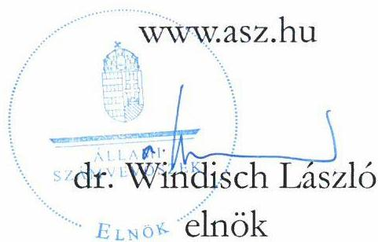

---

Jelentéseink az interneten a www.asz.hu címen olvashatók.

ELLENŐRZÉSI IGAZGATÓSÁG:
ELLENŐRZÉSI IGAZGATÓSÁG I.

ELLENŐRZÉSI IGAZGATÓ:
SINKÁNÉ DR. CSENDES ÁGNES igazgató

ELLENŐRZÉSVEZETŐ:
DR. KOVÁCS DIÁNA ellenőrzésvezető

IKTATÓSZÁM: EL-4330-001/2025
TÉMASORSZÁM: 22.
ELLENŐRZÉS-AZONOSÍTÓ SZÁM: V1067

---

TARTALOMJEGYZÉK

- AZ ELLENŐRZÉS ALAPADATAI...5
- AZ ELLENŐRZÖTT SZERVEZETEK...7
- ÖSSZEFOGLALÁS...9
- AZ ELLENŐRZÉS FÓKUSZTERÜLETEI...11
- MEGÁLLAPÍTÁSOK...12
- JAVASLATOK...45
- MELLÉKLETEK...47
- I. sz. melléklet: Értelmező szótár...47
- II. sz. melléklet: Az ellenőrzött és támogató szervezetek jegyzéke...49
- III. sz. melléklet: Ellenőrzési kritériumok...50
- FÜGGELÉK: ÉSZREVÉTELEK...52
- RÖVIDÍTÉSEK JEGYZÉKE...67

---

“哈，你是个小伙子，你是个小伙子，你是个小伙子，你是个小伙子，你是个小伙子，你是个小伙子，你是个小伙子，你是个小伙子，你是个小伙子，你是个小伙子，你是个小伙子，你是个小伙子，你是个小伙子，你是个小伙子，你是个小伙子，你是个小伙子，你是个小伙子，你是个小伙子，你是个小伙子，你是个小伙子，你是个小伙子，你是个小伙子，你是个小伙子，你是个小伙子，你是个小伙子，你是个小伙子，你是个小伙子，你是个小伙子，你是个小伙子，你是个小伙子，你是个小伙子，你是个小伙子，你是个小伙子，你是个小伙子，你是个小伙子，你是个小伙子，你是个小伙子，你是个小伙子，你是个小伙子，你是个小伙子，你是个小伙子，你是个小伙子，你是个小伙子，你是个小伙子，你是个小伙子，你是个小伙子，你是个小伙子，你是个小伙子，你是个小伙子，你是个小伙子，你是个小伙子，你是个小伙子，你是个小伙子，你是个小伙子，你是个小伙子，你是个小伙子，你是个小伙子，你是个小伙子，你是个小伙子，

---

5

# AZ ELLENŐRZÉS ALAPADATAI

## AZ ELLENŐRZÉS CÉLJA

Az ellenőrzés célja annak értékelése volt, hogy megfelelő volt-e a munkavédelmi hatósági tevékenység szakmai irányítása, a munkavédelmi hatósági tevékenység kialakítása és ellátása. Az ellenőrzés további célja volt a munkavédelmi ellenőrzések eredményességének, hatékonyságának értékelése.

## AZ ELLENŐRZÉS TÍPUSA

Kombinált ellenőrzés

## AZ ELLENŐRZŐTT IDŐSZAK

Az 1. és 2. fókuszterületnél 2022-2023. év, a 3. és 4. fókuszterületnél 2021-2023. év, kitekintéssel a helyszíni ellenőrzés lezárásának időpontjáig, 2025. február 3-ig.

## AZ ELLENŐRZÉS TÁRGYA

Az ellenőrzés tárgyát képezte a szakmai irányító szerv irányítói tevékenysége, továbbá a munkavédelmi hatósági tevékenység jogszabályi megfelelősége, annak eredményessége, hatékonysága.

## AZ ELLENŐRZÉS JOGALAPJA

Az ellenőrzés jogszabályi alapját az Állami Számvevőszékről szóló 2011. évi LXVI. törvény 5. § (2)-(3) bekezdései képezték.

## AZ ELLENŐRZÉS MÓDSZERE

Az ellenőrzést az ellenőrzési program szempontjai, fókuszterületei, az ellenőrzött időszakban hatályos jogszabályok, az ellenőrzés szakmai szabályai, és a jelen ellenőrzésre irányadó ÁSZ módszertanok alapján végezte az ÁSZ.

Az ellenőrzési kérdések megválaszolásához szükséges bizonyítékok megszerzése az ellenőrzött és az ellenőrzést támogató szervezetek által rendelkezésre bocsátott dokumentumokra alapozva megfigyelés, szemle (szemrevételezés), kérdésfelvetés (információkérés), mintavételezés, valamint elemző eljárás útján történt.

Az ellenőrzési bizonyítékként felhasználható adatforrások közé tartoztak egyrészt az adatbekérő levelek dokumentumok jegyzéke mellékletében rögzített adatforrások, másrészt minden, az ellenőrzés folyamán feltárt, az ellenőrzés szempontjából információt tartalmazó dokumentum.

---

Az ellenőrzés alapadatai

A kormányhivatalok ellenőrzésre kiválasztása a munkabalesetek, munkavédelmi ellenőrzések, panasz vagy közérdekű bejelentések ellenőrzött időszaki adatainak figyelembevételével történt.

A hatósági tevékenység jogszabályi megfelelőségét statisztikai mintavételi eljárással kiválasztott 100 db, az ellenőrzött kormányhivatalok által lefolytatott munkavédelmi ellenőrzés tekintetében ellenőrizte az ÁSZ. A kiválasztott mintatételek ellenőrzésének eredménye nem került kivetítésre a teljes sokaságra, a megállapítások az adott ellenőrzött mintatételekre vonatkoznak.

A törvényességi ellenőrzési kérdések a munkavédelmi hatóság Mvt.¹-ben rögzített hatósági jogkörire terjedtek ki.

Az ellenőrzésre nem kiválasztott kormányhivatalok a munkavédelmi tevékenységükre vonatkozó kérdésekre adott válaszokkal támogatták az ellenőrzést.

A munkavédelmi ellenőrzés eredményességének értékelését három véletlenszerűen kiválasztott gazdálkodó szervezet ÁSZ által összeállított kérdőívre adott válaszai segítették.

Az ellenőrzés nem terjedt ki az európai uniós források felhasználásának értékelésére.

---

AZ ELLENŐRZÖTT SZERVEZETEK

Az egészséget nem veszélyeztető és biztonságos munkavégzéshez való jogok és kötelezettségek érvényesülését az állam a munkavédelem irányításával és szervezésével biztosítja, a munkavédelmi hatóság szervezetén keresztül ellenőrzi.

A 320/2014. (XII. 13.) Korm. rendelet² alapján az ellenőrzött időszakban az általános hatáskörű munkavédelmi hatóság a foglalkoztatáspolitikáért felelős miniszter³, valamint a fővárosi és megyei kormányhivatalok voltak. 2023. január 1-től a megyei kormányhivatalok vármegyei kormányhivatalok lettek.

A kormányhivatalok⁴ munkavédelmi hatóságként folytatott tevékenységének szakmai irányítását a foglalkoztatáspolitikáért felelős miniszter látta el.

A foglalkoztatáspolitikáért felelős miniszter munkaszervezete 2022. május 24-ig az Innovációs és Technológiai Minisztérium, majd 2022. május 25-től 2022. november 30-ig a Technológiai és Ipari Minisztérium volt. A 2022. december 1. és 2022. december 31. közötti időszakban a foglalkoztatáspolitikáért felelős miniszter tevékenységét a Miniszterelnöki Kabinetiroda segítette. 2023. január 1-től 2023. december 31-ig a foglalkoztatáspolitikáért felelős miniszter munkaszervezete a Gazdaságfejlesztési Minisztérium, 2024. január 1-től a Nemzetgazdasági Minisztérium volt.

A kormányhivatalok munkavédelmi hatósági feladatait – a KH SZMSZ₄₋₈⁵-ban foglaltak szerint – 2022. évben a kormányhivatalok Foglalkoztatási, Munkaügyi és Munkavédelmi Főosztályai, 2023. január 1-től a Foglalkoztatási, Foglalkoztatás-felügyeleti és Munkavédelmi Főosztályai látták el. A (vár)megyei kormányhivatal illetékessége a székhelye szerinti (vár)megyére, Budapest Főváros Kormányhivatalának illetékessége Budapest területére terjedt ki.

Az Mvt.-ben foglaltaknak megfelelően a kormányhivatalok mint munkavédelmi hatóság feladata volt ellenőrizni a munkáltatók és munkavállalók munkavédelemmel kapcsolatos feladatainak és kötelezettségeinek teljesítését, a munkavédelmi követelmények érvényesítését, az eljárási, nyilvántartási és megelőző tevékenységet.

A munkavédelmi ellenőrzési tevékenységhez kapcsolódó szervezeteket és fontosabb feladataikat az 1. ábra mutatja be.

7

---

Az ellenőrzött szervezetek

1. ábra

A MUNKAVÉDELMI ELLENŐRZÉSI TEVÉKENYSÉGHEZ KAPCSOLÓDÓ SZERVEZETEK ÉS FONTOSABB FELADATAIK

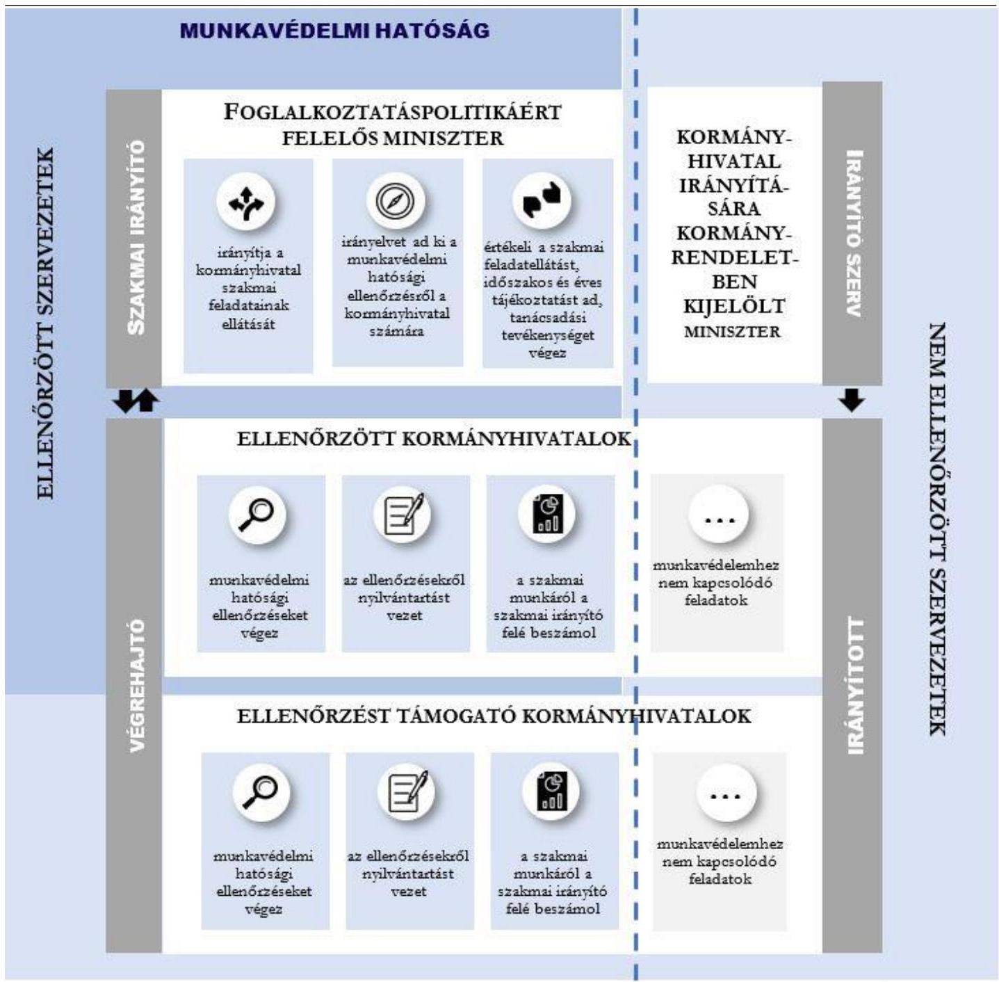

Forrás ÁSZ saját szerkesztés

---

ÖSSZEFOGLALÁS

Magyarországon a 2021-2023. években átlagosan évente 21174 munkabaleset, ezen belül évente átlagosan 71 halálos munkabaleset történt. A munkavédelem célja, hogy a szervezett munkavégzésre vonatkozó biztonságos és egészséges munkafeltételek követelményrendszerének kialakításával és szabályozott végrehajtásával támogassa a munkát végzők munkaképességének és egészségének megőrzését, a munkabalesetek és foglalkozási megbetegedések megelőzését. Az ÁSZ 1111. sz., a munkaügyi és munkavédelmi ellenőrzésről szóló jelentése a munkavédelmi folyamatokat a 2006 és 2010 közötti időszakra vonatkozóan értékelte. A gazdasági és jogi környezet változása, a gazdasági, társadalmi szereplők széles körű érintettsége indokolta a munkavédelem aktuális helyzetének ellenőrzését.

A munkavédelem területének szakmai irányítottsága összességében megfelelő volt az ellenőrzött időszakban. A munkavédelmi ellenőrzések eredményességének fokozása érdekében a szakmai irányítónál a teljesítménycélkitűzések felülvizsgálata, a teljesítménycélok nem teljesítése esetén kormányhivatali szinten indokolt az okok feltárása.

A foglalkoztatáspolitikáért felelős miniszter mint szakmai irányító⁶ az ellenőrzött időszakban a munkavédelmi hatóság szervezeti és működési kereteit a jogszabályi előírások szerint kialakította, a munkavédelmi hatósági feladatkörben eljáró kormányhivatalok hatósági tevékenységének szakmai irányítását megfelelően ellátta. Az ellenőrzés során feltárt hiányosság volt, hogy elmaradt a munkavédelmi hatóság feladatellátását szabályozó normatív utasítások közül több felülvizsgálata és aktualizálása, továbbá – a jogszabályi előírás ellenére – a nevelés és az oktatás területén a biztonságos életvitelre, a szakmai oktatás és a szakmai képzés területén az egészséget nem veszélyeztető és a biztonságos munkavégzés szabályaira vonatkozó ismeretanyag elkészítése.

A szakmai irányító jogszabályi előírások szerint működtette a munkavédelmi feladatok ellátásához, az adatok nyilvántartásához szükséges egységes informatikai rendszert, és – a feltárt hiányosságok mellett – megfelelően megszervezte a kormányhivatalok munkavédelmi hatósági tevékenységével kapcsolatos szakmai képzést és a hatósági ellenőrzésre jogosító vizsga lebonyolítását.

A szakmai irányító az országos hatósági ellenőrzési terv kiadásával és teljesüléséről szóló beszámoló elkészítésével, a munkavédelmi ellenőrzési irányelvek és kapcsolódó teljesítménycélok meghatározásával és visszamérésével megfelelően biztosította a kormányhivatalok munkavédelmi ellenőrzési és tájékoztatási tevékenységének szakmai irányítását. A teljesítménycélok nem teljes körű teljesítése indokolttá teszi a teljesítménycélok és azok teljesítése számonkérési rendszerének felülvizsgálatát a szakmai irányítónál, illetve a kormányhivataloknál.

A szakmai irányító az ellenőrzött időszakban ellátta az Mvt. szerinti, a munkavédelem nemzeti politikájának kialakításával kapcsolatos állami irányítási feladatot, és gondoskodott az abban részére meghatározott feladatok megvalósításáról. Szakmai irányítói tevékenysége illeszkedett a munkavédelem nemzeti politikájában meghatározott célokhoz és feladatokhoz. A munkabalesetek és foglalkozási megbetegedések megelőzése érdekében tájékoztatási, kommunikációs, képzési és kutatási tevékenységet látott el. A prevenciót középpontba állító, a baleseti veszélyforrások csökkentését célul kitűző általános és tevékenységspecifikus kiadványok segítették a munkáltatókat és munkavállalókat a munkabalesetek és foglalkozási megbetegedések megelőzésében, az átfogó tanulmányok támogatták a munkavédelem aktuális helyzetének feltárását, a kockázatok csökkentését, az egészséget nem veszélyeztető és biztonságos munkavégzés feltételeinek kialakítását

9

---

Összefoglalás

elősegítő intézkedések kidolgozását. A munkáltatók munkavédelmi tevékenységével összefüggő adminisztratív terhek csökkentésére irányuló törekvések eredményeként 2024. február 1-én hatályba lépett az Mvt. módosítása, mely egyszerűsítette az egyes irodai munkavállalók kötelező munkavédelmi oktatását.

Három (kettő budapesti, egy miskolci székhelyű), eltérő tevékenységet folytató gazdálkodó szervezet tapasztalatai a munkavédelmi hatóság tevékenységével kapcsolatosan alátámasztották a munkavédelmi hatóság munkavédelmi balesetek megelőzése érdekében végzett kommunikációs és tájékoztatási tevékenységének hasznosságát.

A munkavédelmi hatóság részére a munkavédelmi hatósági feladatok ellátásához a központi költségvetésben biztosított kiadási előirányzatok mellett pályázati erőforrások is rendelkezésre álltak. Az európai uniós források hozzájárultak a szakmai irányító tájékoztatási, képzési, kutatási tevékenységének finanszírozásához, a munkavédelmi hatóság ellenőrzést támogató eszközállományának növeléséhez.

A munkavédelmi hatóság működésével összefüggő kiadások az éves költségvetési beszámolókban a munkaügyi hatóság kiadásaival összevontan, egy kormányzati funkciószámon kerültek bemutatásra, továbbá a kiadások elkülönített nyilvántartására az NGM és a kormányhivatalok egységes gyakorlattal nem rendelkeztek, holott az ÁSZ szakmai véleménye szerint ezek megléte jelentősen támogatná a munkavédelmi hatóság tevékenységével összefüggő kiadások átláthatóságát.

A szakmai irányító a munkavédelmi ellenőrzések célterületeit a munkabaleseti statisztikák adatainak figyelembevételével határozta meg, továbbá a munkáltatók ellenőrzésre történő kiválasztását kidolgozott szempontrendszerrel támogatta. A kormányhivatalok a munkavédelmi hatósági ellenőrzésekre vonatkozóan az ellenőrzött munkáltatók kiválasztására vonatkozó szempontrendszert egységesen nem alkalmazták, az ellenőrzőttek kiválasztását nem támogatta kockázatelemzés, ezért a kormányhivataloknál a munkavédelmi ellenőrzések kapcsán nem volt biztosított az ellenőrzőttek következetes kiválasztása.

A 2022-2023. években lefolytatott munkavédelmi hatósági ellenőrzéseik során az ellenőrzött kormányhivatalok betartották a vonatkozó jogszabályi előírásokat. Hiányosságot az ügyintézési határidőkre vonatkozó előírások betartása kapcsán – az ellenőrzött mintatételek mintegy 4%-a esetében – állapított meg az ellenőrzés. A kormányhivatalok szabályszerűen dokumentálták munkavédelmi hatósági ellenőrzéseiket, azonban az eljárást lezáró határozatok nem tartalmaztak eljárási költséggel kapcsolatos rendelkezést a jogszabályi előírás ellenére. A Budapest Főváros Kormányhivatala és a Heves Vármegyei Kormányhivatal észrevételében jelezte, hogy a munkavédelmi hatósági ellenőrzéseket lezáró határozataiba 2024. év folyamán beépítésre került az eljárási költséggel kapcsolatos rendelkezés. Ezáltal az ÁSZ 24033 sz., a Foglalkoztatásfelügyelet hatósági tevékenységének ellenőrzése c. jelentése során tett javaslata hasznosult.

A kormányhivatalok a munkavédelmi ellenőrzéseket csökkenő munkavédelmi felügyelői létszám mellett, növekvő ellenőrzésszámokkal, összességében hatékonyan látták el. Az ÁSZ véleménye szerint az utóellenőrzésekre rendelkezésre álló munkavédelmi felügyelői létszám növelése lehetővé tenné a munkavédelmi intézkedéseket végre nem hajtó munkáltatók arányának csökkentését, ezáltal a munkavédelmi ellenőrzések visszatartó erejének, eredményességének növelését.

A munkavédelmi hatóság szabályozó, tájékoztató és ellenőrzési tevékenysége preventív módon támogatta a biztonságos munkavégzés munkáltatók és munkavállalók általi megvalósítását. A 2021-2023. években a munkabalesetek száma 4,3%-kal, a munkabaleseti rátá 6,2%-kal csökkent, amelyhez a munkavédelmi hatóság tevékenysége is hozzájárult.

10

---

AZ ELLENŐRZÉS FÓKUSZTERÜLETEI

1. A munkavédelem hatósági tevékenységének szakmai irányítása
2. A munkavédelmi hatósági tevékenység megfelelősége
3. A munkavédelemmel kapcsolatos egyes bevételek és kiadások alakulása
4. A munkavédelmi ellenőrzés eredményessége

11

---

MEGÁLLAPÍTÁSOK

# 1. A munkavédelem hatósági tevékenységének szakmai irányítása

## Összegző megállapítás

A foglalkoztatáspolitikáért felelős miniszter a jogszabályoknak megfelelően kialakította a munkavédelmi hatósági tevékenység kereteit, szabályozta, – kisebb hiányosságok mellett – támogatta és ellenőrizte a munkavédelmi hatóság tevékenységének ellátását. A foglalkoztatáspolitikáért felelős miniszter a munkavédelmi hatósági ellenőrzéssel kapcsolatos állami irányítási feladatait és a munkavédelmi hatóság tevékenységével összefüggő beszámolási kötelezettségét összességében a jogszabályi előírásoknak megfelelően teljesítette.

## A munkavédelmi hatóság szervezeti kereteinek kialakítása a szakmai irányítónál

A foglalkoztatáspolitikáért felelős miniszter a munkavédelmi hatósági tevékenység kereteit, azaz a minisztérium munkavédelmi hatósági feladatait ellátó szervezeti egységet, a szervezeti egység feladatai ellátásának részletes belső rendjét és módját, vezetőinek és alkalmazottainak feladat- és hatáskörét, továbbá a minisztériumon belüli belső és azon kívüli külső kapcsolattartás módját, szabályait az ellenőrzött időszakban az Ávr.⁷ előírásának megfelelően az ITM SZMSZ⁸-ben, a TIM SZMSZ⁹-ben és GFM SZMSZ¹⁰-ben, 2024. február 7-től az NGM SZMSZ¹¹-ben alakította ki.

A foglalkoztatáspolitikáért felelős miniszter a munkavédelmi hatósági feladatai ellátásának szakmai irányítására az ITM SZMSZ-ben és a GFM SZMSZ-ben a foglalkoztatáspolitikáért felelős államtitkárt és a Munkavédelmi Irányítási Főosztályt, a TIM SZMSZ-ben az iparért és munkaerőpiacért felelős államtitkárt és a Munkavédelmi Irányítási Főosztályt jelölte ki. Az ITM SZMSZ, a GFM SZMSZ és az NGM SZMSZ a munkavédelmi hatósági ellenőrzés ellátásának irányítását a foglalkozáspolitikáért felelős államtitkár feladatkörébe, a munkavédelem hatóság tevékenységének szakmai irányításával összefüggő, államtitkári hatáskörbe nem tartozó feladatokat a Munkavédelmi Irányítási Főosztály feladat- és hatáskörébe utalta.

A Munkavédelmi Irányítási Főosztály Ügyrend₁₋₂¹²-jében – az Ávr. előírásának megfelelően – meghatározták a szervezeti egység munkafolyamatainak leírását, a szervezeti egység vezetőinek és alkalmazottainak munkakör szerinti részletes feladat- és hatáskörét, a helyettesítés rendjét.

## A munkavédelmi hatóság tevékenységének szakmai irányítása

Az ellenőrzött időszakban a szakmai irányító – a 320/2014. (XII. 13.) Korm. rendeletben, valamint 2022. december 31-ig a 86/2019. (IV. 23.) Korm. rendeletben¹³, 2023. január 1-től 568/2022. (XII.23.) Korm. rendeletben¹⁴ foglalt előírásoknak megfelelően – normatív utasítások, módszertani útmutatók, szakmai ajánlások, tájékoztató anyagok kiadásával támogatta a kormányhivatalok tevékenységét. Az ÁSZ helyszíni ellenőrzésének végéig a 3/2012. (VIII. 14.) NMH utasítást¹⁵, a

---

Megállapítások

- 320/2014. (XII. 13.) Korm. rendelet 14/A. § (2) bekezdés 2023. január 1-i hatályba lépésével jogalapját vesztett – 7/2012. (XI. 13.) NMH utasítást¹⁶, a 2017. január 1-jén tárgyi hatályát vesztett 9/2012. (XI. 23.) NMH utasítást¹⁷ és a 10/2012. (XI. 30.) NMH utasítást¹⁸ nem helyezték hatályon kívül és nem aktualizálták, azok továbbra is a 2014. december 31-i hatállyal megszűnt Nemzeti Munkaügyi Hivatalra, valamint a kormányhivatalok 2015. április 1-től megszűnt munkavédelmi és munkaügyi szakigazgatási szerveinek munkavédelmi és munkaügyi felügyelőseire vonatkozó rendelkezéseket tartalmaztak. A 2008. évben készült Felügyelői Kézikönyv és a 2018. január 1-től hatályos, a munkavédelmi hatósági ellenőrzések és hatósági eljárások lefolytatásához¹⁹, valamint a munkabalesetek hatósági vizsgálatához²⁰ készült módszertani útmutatók aktualizálása megtörtént 2022. évben.

A szakmai irányító a 320/2014. (XII. 13.) Korm. rendelet előírásának megfelelően 2022. évre és 2023. évre vonatkozóan értékelte a kormányhivatalok szakmai feladatellátását. Ennek keretében elemezte, értékelte a kormányhivataloknál foglalkoztatott munkavédelmi felügyelői állomány létszámát, egy főre jutó teljesítményét, a munkavédelmi ellenőrzések vonatkozásában megfogalmazott elvárások teljesülését, a kormányhivatalok tájékoztatási és tanácsadási tevékenységét, a szankciók alkalmazását, a munkabalesetek nyilvántartását és feldolgozását.

A szakmai irányító 2022. december 31-ig a 86/2019. (IV. 23.) Korm. rendelet, 2023. január 1-től a 568/2022. (XII.23.) Korm. rendelet előírásának megfelelően elkészítette a 2022-2024. évi országos hatósági ellenőrzési terveket²¹ és gondoskodott azok közzétételéről a munkavédelmi hatóság honlapján²². A 2022-2024. évi országos ellenőrzési tervek meghatározták a fővárosi és vármegyei kormányhivatalok munkavédelmi hatósági ellenőrzést végző szakterületei részére a 2022. évi, a 2023. évi, illetve 2024. évi hatósági ellenőrzési tervük összeállításához szükséges szakmai követelményeket, az alkalmazandó ellenőrzési típusokat (célvizsgálat, akcióellenőrzés, a komplex ellenőrzés, előre bejelentett ellenőrzés, közérdekű bejelentés, panasz vizsgálata), az elvégzendő ellenőrzéseket (1. táblázat).

1. táblázat

|  2022-2024. ÉVI ORSZÁGOS HATÓSÁGI ELLENŐRZÉSI TERVEKBEN, A KORMÁNYHIVATALOKNAK MEGHATÁROZOTT ELLENŐRZÉSEK  |   |   |
| --- | --- | --- |
|  ÉV | SSZ. | ELLENŐRZÉS TÁRGYA  |
|  2022 | 1. | Kézi és gép anyagmozgatási tevékenységek célvizsgálata  |
|   |  2. | III. fokú hősegriád esetén a munkafeltételek ellenőrzésére irányuló célvizsgálat  |
|   |  3. | Saját kezdeményezésű megyei célvizsgálat  |
|   |  4. | Előre bejelentett ellenőrzés  |
|  2023 | 1. | Faipari tevékenységek célvizsgálata  |
|   |  2. | III. fokú hősegriád esetén a munkafeltételek ellenőrzésére irányuló célvizsgálat  |
|   |  3. | Saját kezdeményezésű vármegyei célvizsgálat  |
|   |  4. | Előre bejelentett ellenőrzés  |
|  2024 | 1. | Veszélyes anyaggal végzett tevékenységek célvizsgálata  |
|   |  2. | Fémipari tevékenységek célvizsgálata  |
|   |  3. | Saját kezdeményezésű vármegyei célvizsgálat  |
|   |  4. | Előre bejelentett ellenőrzés  |

Forrás: Munkavédelmi hatóság 2022-2024. évi országos hatósági ellenőrzési tervei alapján ÁSZ saját szerkesztés

A szakmai irányító a 320/2014. (XII. 13.) Korm. rendeletben foglaltaknak megfelelően kiadta a 2022-2024. évre vonatkozó munkavédelmi ellenőrzési irányelveket²³, és a munkavédelmi hatóság honlapján eleget tett az Mvt. szerinti közzétételi kötelezettségének. A 2022-2024. évekre vonatkozó munkavédelmi ellenőrzési irányelvek az Mvt. előírásának megfelelően tartalmazták az adott év kiemelt ellenőrzési, vizsgálati céljait, valamint azokkal összhangban a kiemelten ellátandó feladatokat, továbbá az ellenőrizendő főbb tevékenységi köröket, szakmákat vagy ágazatokat. Az ellenőrzött időszakban az Mvt.

---

Megállapítások

szerinti, a kiemelten ellátandó feladatokhoz kapcsoló teljesítmény mutatókat a munkavédelmi hatóságok részére az éves munkavédelmi szakmai teljesítménycélkitűzések²⁴ tartalmazták. (2. ábra)

2. ábra

A MUNKAVÉDELMI HATÓSÁGOK RÉSZÉRE 2022-2023. ÉVEKRE VONATKOZÓAN MEGHATÁROZOTT CÉLKITŰZÉSEK
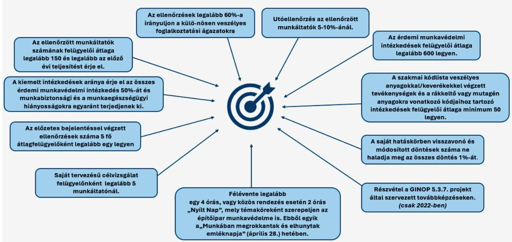
Forrás: A munkaügyi és munkavédelmi ellenőrzést végző hatóságok tevékenységére vonatkozó teljesítmény célkitűzések, 2022 és 2023 alapján ÁSZ saját szerkesztés

A szakmai irányító a 320/2014. (XII. 13.) Korm. rendeletben foglalt előírásnak megfelelően a kormányhivatalok bevonásával működtette a munkavédelmi feladatok ellátásához, az adatok nyilvántartásához szükséges egységes informatikai rendszert, a FEIR²⁵-t. A FEIR egyrészt a munkavédelmi hatósági eljárások nyilvántartását, másrészt a munkavédelmi hatósághoz beérkezett bejelentések, jegyzőkönyvek iktatását és feldolgozását biztosította. A FEIR rendszer üzemeltetését az ellenőrzött időszakban közszolgáltatási szerződés keretében a NISZ Zrt.²⁶ látta el. A helyszíni ellenőrzés lezárásakor a FEIR rendszer elektronikus adatszolgáltatások automatikus feldolgozására irányuló informatikai fejlesztése folyamatban volt.

A szakmai irányító a munkavédelmi hatóság honlapján közzétette az Mvt.-ben foglalt bejelentési kötelezettségek teljesítése során alkalmazandó bejelentőlapokat az Mvt. előírásának megfelelően. A szakmai irányító közzétette továbbá a munkavédelmi hatóság honlapján az 5/1993. (XII. 26.) MüM rendelet²⁷ előírásával összhangban a munkabalesetek bejelentése során alkalmazandó jegyzőkönyvet, valamint a 27/1996. (VIII. 28.) NM rendelet²⁸ rendelkezésével összhangban a fokozott expozíciós esetek bejelentése során alkalmazandó jegyzőkönyvet, továbbá az Mvt.-ben foglalt, a munkavállaló vélelmezett sérelmének bejelentésére szolgáló bejelentőlapot.

A munkavédelmi hatóság rendelkezett az Mvt. előírása szerinti nyilvántartásokkal, amelyek vezetését kombinált módon, egyrészt a FEIR rendszer alkalmazásával, másrészt a belső informatikai hálózaton kormányhivatalonként vezetett nyilvántartások alkalmazásával valósítottak meg. A munkavédelmi hatóság által a rákkeltővel, mutagén vagy reprodukciót károsító anyaggal végzett tevékenységek bejelentett adatai alapján vezetett nyilvántartás az Mvt. 63/C. § (3) bekezdés előírása ellenére nem tartalmazott az Mvt. 83/A. § (2) bekezdés b) pontja szerinti, munkavállalóra vonatkozó adatmezőket.

14

---

Megállapítások

Az azbeszttel végzett tevékenység bejelentett adatai alapján a munkavédelmi hatóság által vezetett nyilvántartás nem tartalmazta a bejelentőlap az Mvt. – 2023. január 1-től hatályos – 63/G. § (2) bekezdésében meghatározott adatai közül az azbesztexpozíció korlátozására megtett, vagy tervezett intézkedéseket, a munkahelyen, illetve annak közvetlen környezetében egyidejűleg folytatott tevékenységet, és az expozíciómérést végző szervezet nevét, elérhetőségét.

A foglalkoztatási megbetegedésekre vonatkozóan vezetett nyilvántartás nem tartalmazta az Mvt. 64/D. § (2) bekezdés b) pont előírása ellenére a megbetegedett munkavállaló nemét, TAJ számát, születési dátumát, születési helyét, anyja nevét, lakóhelyét vagy tartózkodási helyét.

Az Mvt. 64/E. § (1) bekezdése szerinti, a fokozott expozíciós esetről felvett jegyzőkönyvekben rögzített adatokról vezetett nyilvántartás nem tartalmazta a az Mvt. 64/E. § (2) bekezdés b) pont előírása ellenére az exponált munkavállaló nemét, TAJ számát, születési helyét, idejét, anyja nevét, lakóhelyét vagy tartózkodási helyét.

Az Mvt. 63/C. § (3) bekezdés előírása, a 2023. január 1-től hatályos 63/G. § (3) bekezdés előírása, a 64/D. § (1) bekezdés előírása, valamint a 64/E. § (1) bekezdés előírása alapján vezetett nyilvántartások szűkített adattartalma miatt fennáll a kockázata, hogy e nyilvántartások nem hasznosulnak az Mvt.-ben megfogalmazott céloknak megfelelően, azaz nem támogatják a munkavédelmi hatóságot abban, hogy a kockázatok minimálisra csökkentésével elősegítse a munkavállalók védelmét a rákkeltő anyagok, illetve az azbeszt okozta foglalkozási eredetű egészségkárosodásokkal, valamint daganatos megbetegedésekkel szemben, nem támogatják a foglalkozási betegségek okainak, illetve a fokozott expozíciós esetek okainak feltárását, a hasonló esetek megelőzését, valamint a munkavállalók védelmét.

A munkavédelmi hatóság biztosította, hogy az Mvt. szerinti bejelentések teljesítésére a kötelezettek számára rendelkezésre álljon az elektronikus adatszolgáltatás lehetősége 2024. augusztus 31-ig a 2015. évi CCXXII. törvény²⁹, 2024. szeptember 1-től a 2023. évi CIII. törvény³⁰ előírásának megfelelően.

A munkavédelmi hatóság az Mvt. előírásának megfelelően rendelkezett a munkavédelmi szabályok munkáltatók általi megtartásának más szerv előtti, külön jogszabály szerinti eljárásban történő igazolása céljából közhitel-es hatósági nyilvántartással és gondoskodott annak nyilvánosságra hozataláról a honlapján történő közzététel útján.

A 2022. és 2023. években a szakmai irányító a 320/2014. (XII. 13.) Korm. rendelet előírásának megfelelően megszervezte a kormányhivatalok munkavédelmi hatósági tevékenységével kapcsolatos szakmai képzést és a hatósági ellenőrzésre jogosító vizsga lebonyolítását. A szakmai irányító a vizsgára való felkészítés, a zárvizsga, valamint a vizsgakötelezettség alóli mentesülés részletes szabályait a 7/2012. (XI. 13.) NMH utasításban, 2023. január 31-től – a 320/2014. (XII. 13.) Korm. rendelet rendelkezésének megfelelően – Vizsgaszabályzatban³¹ határozta meg.

Az ellenőrzött időszakban a szakmai irányító gondoskodott a munkavédelmi felügyelők 320/2014.*(XII.*13.) Korm. rendelet előírása szerinti továbbképzéséhez szükséges tananyagokról, továbbá lehetőséget biztosított a munkavédelmi felügyelők számára a folyamatos önképzésre, melynek érdekében az elkészült szakmai tananyagokat, a kapcsolódó ellenőrző kérdéseket és a megoldókulcsokat elérhetővé tette a munkavédelmi hatóság honlapján és a kormányhivatalok által is elérhető belső intranetes felületén.

2022. december 31-ig a 86/2019. (IV. 23.) Korm. rendelet, 2023. január 1-től a 568/2022. (XII.23.) Korm. rendelet előírásának megfelelően a szakmai irányító 2022-2023. évekre vonatkozóan tájékoztatta a fővárosi és vármegyei kormányhivatal irányítására kijelölt minisztert a fővárosi és vármegyei

15

---

Megállapítások

kormányhivatalokat érintő szakmai tervekről és a megvalósítás szervezeti és költségvetési feltételeire vonatkozó javaslatairól.

A szakmai irányító a Miniszterelnökség átfogó ellenőrzése keretében 2022. évben a TVKH³²-nál és a GYMSVKH³³-nál, 2023. évben az FVKH³⁴-nál, a HBVKH³⁵-nál és a VVKH³⁶-nál végzett a munkavédelmi hatósági feladatok ellátására vonatkozó törvényességi és szakszerűségi ellenőrzéseket, melyek lefolytatását követően a munkavédelmi eljárások jogszerűségének javítása, a munkavédelmi ellenőrzések szakmai színvonalának javítása és a súlyos munkabalesetek kivizsgálásának javítása érdekében, illetve a munkabaleseti jegyzőkönyvek feldolgozásához fogalmazott meg javaslatot a kormányhivatalok részére (3. ábra)

A kormányhivatalok 2022-2023. évi törvényességi és szakszerűségi ellenőrzéseiről készült jelentésekben a szakmai irányító a megállapításokat összevetette az adott kormányhivatalnál végzett előző ellenőrzés során tett megállapításokkal. Ennek eredményeként a szakmai irányító megállapította – többek között – 4 kormányhivatal (GYMSVKH, HBVKH, VVKH, FVKH) esetén a vezetői és szakmai kontroll megerősítésének szükségességét, 2 kormányhivatal (VVKH és TVKH) esetén a szakmai munkában tapasztalható visszalépést, 2 hivatal esetén (GYMSVKH és HBVKH) a szakmai irányító javaslatainak a hatósági feladatellátásba történő beépítésének hiányosságát.

## A munkavédelemi hatósági ellenőrzéssel kapcsolatos állami feladatok ellátása

A foglalkoztatáspolitikáért felelős miniszter az ellenőrzött időszakban a 320/2014. (XII. 13.) Korm. rendeletben foglalt előírásnak megfelelően ellátta az Mvt. szerinti, a munkavédelem nemzeti politikájának kialakításával kapcsolatos állami irányítási feladatot.

A 2016-2022 évekre vonatkozó munkavédelem nemzeti politikája a 2016-tól 2022-ig terjedő időszakra fogalmazta meg a munkavédelem hosszútávú fejlesztési irányait.

## 3. ábra

## ELLENŐRZŐTT KORMÁNYHIVATALOK RÉSZÉRE TETT JAVASLATOK SZÁMA

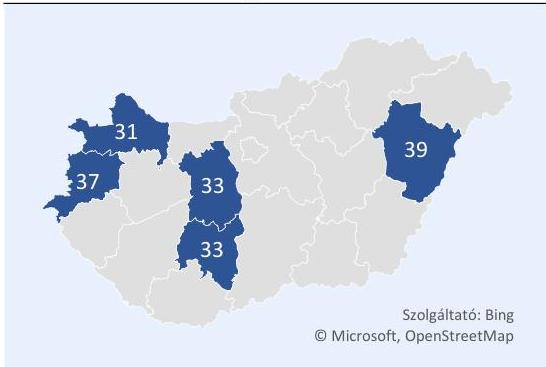
Forrás: Kormányhivataloknál 2022-2023. években végzett törvényességi és szakszerűségi ellenőrzésekről a szakmai irányító által készített jelentések alapján ASZ saját szerkesztés

A 2023. évben a szakmai irányító kialakította a 2022. évet követő – összhangban az Európai Unió munkahelyi biztonsággal és egészségvédelemmel kapcsolatos 2021–2027 évekre szóló stratégiájával – 2027. évvel záródó időszakra a munkavédelem nemzeti politikáját, melynek során előzetes kormányzati szintű egyeztetést végzett, továbbá az Mvt. előírásával összhangban egyeztetett az Országos Munkavédelmi Bizottsággal. A szakmai irányító az egyeztetések eredményét a munkavédelem nemzeti politikájában érvényre juttatta. A 2016-2022. évekre vonatkozó, illetve a 2024-2027. évekre vonatkozó munkavédelem nemzeti politikája a 1581/2016. (X. 25.) Korm. határozat, illetve a 1003/2024. (I. 11.) Korm. határozat előírásának megfelelően a Kormány honlapján³⁷ közzétételre került.

Az ellenőrzött időszakban teljesült a foglalkoztatáspolitikáért felelős miniszter 320/2014. (XII. 13.) Korm. rendeletben foglalt, az Mvt. szerinti szabályozási kötelezettsége, az 5/1993. (XII. 26.) MüM rendelet meghatározta az egészséget nem veszélyeztető és biztonságos munkavégzés alapvető követelményeit, továbbá az ehhez kapcsolódó jogokat és kötelezettségeket.

A foglalkoztatáspolitikáért felelős miniszter az ellenőrzött időszakban a 320/2014. (XII. 13.) Korm. rendelet 6. § a) bekezdésében foglalt előírás ellenére **nem határozta meg** az Mvt. 14. § (1) bekezdés

16

---

Megállapítások

d) pontja szerinti, a nevelés és az oktatás területén a biztonságos életvitelre, a szakmai oktatás és 2023. január 1-től a szakmai képzés területén az egészséget nem veszélyeztető és a biztonságos munkavégzés szabályaira vonatkozó ismeretanyagot.

Az ellenőrzött időszakban a foglalkoztatáspolitikáért felelős miniszter a 320/2014. (XII. 13.) Korm. rendelet előírásának megfelelően biztosította az Mvt. rendelkezése szerinti munkavédelmi tanácsadást. A 2021-2023. években összesen 11522 esetben nyújtottak ingyenes munkavédelmi tanácsadást a fővárosi és vármegyei kormányhivatalok, valamint a Munkavédelmi Irányítási Főosztály (4. ábra). Ez utóbbi a szolgáltatás biztosítása érdekében ingyenesen hívható zöldszámot működtetett, valamint elektronikus levelezési címet tartott fent a felmerülő kérdések beküldéséhez. A beérkezett kérdésekre adott válaszok a további érdeklődők számára elérhetők voltak a munkavédelmi hatóság honlapján is.

A foglalkoztatáspolitikáért felelős miniszter a 320/2014. (XII. 13.) Korm. rendelet 2023. január 1-től hatályos előírásának megfelelően a munkavédelmi hatóság honlapján közzétette a munkavédelmi képviselők alapképzése és továbbképzése képzési követelményeit³⁸, valamint a képzések szakmai felügyeletének részletes szabályairól a munkavédelmi képviselő alapképzés és továbbképzés szakmai felügyeletéről szóló szabályzatban³⁹ rendelkezett.

A 320/2014. (XII. 13.) Korm. rendelet előírásának megfelelően az ellenőrzött időszakban a szakmai irányító elkészítette a Mvt. előírásának megfelelő, a munkavállalók biztonságát és egészségét érintő közösségi szabályok végrehajtásáról szóló jelentést. A 89/391/EGK irányelv⁴⁰ 17a. cikk (1) bekezdés, a 2009/148/EK irányelv⁴¹ 22. cikk, a 91/383/EGK irányelv⁴² 10a. cikk, a 92/29/EGK irányelv⁴³ 9a. cikk és a 94/33/EK irányelv⁴⁴ 17a. cikk rendelkezései szerint a tagállamoknak ötévente jelentést kell benyújtaniuk az Európai Bizottságnak ezen irányelvek gyakorlati végrehajtásáról. A „Magyarország jelentése az Európai Bizottság részére a 2018-2022-es időszakra vonatkozóan a 89/391/EGK irányelv, annak egyedi irányelvei, valamint a 2009/148/EK, a 91/383/EGK, a 92/29/EGK és a 94/33/EK irányelvek gyakorlati végrehajtásáról” című 2023. évi jelentés elkészült.

## Szakmai irányító beszámolási kötelezettségének teljesítése

4. ábra

MUNKAVÉDELMI TANÁCSADÁSOK ESET SZÁMA 2021-2023. ÉVEKBEN
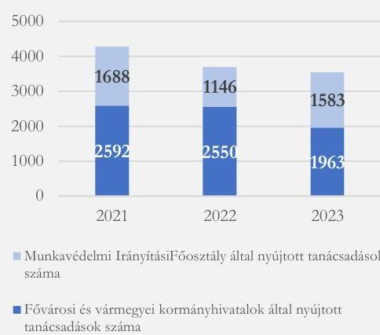
Forrás: a nemzetgazdaság 2021-2023. évi munkavédelmi helyzetéről szóló jelentések alapján ÁSZ saját szerkesztés

A 2022. évre vonatkozóan a 320/2014. (XII. 13.) Korm. rendelet és az Mvt. előírásának megfelelően a munkavédelmi hatóság honlapján közzétették a munkavédelmi hatóság 2022. I. félévi, 2022. évi és 2023. évi ellenőrzési tapasztalatairól szóló jelentéseket. A szakmai irányító a 320/2014. (XII. 13.) Korm. rendelet 13. § (2) bekezdés ellenére a munkavédelmi feltételek betartása, az Mvt. 82/A. § előírása ellenére a munkavédelemre vonatkozó szabályok betartásának ellenőrzése céljából tartott vizsgálatok tapasztalatairól a 2023. I. félévére vonatkozó beszámolót nem tette közzé.

A foglalkoztatáspolitikáért felelős miniszter az ellenőrzött időszakban a 320/2014. (XII. 13.) Korm. rendelet előírásának megfelelően eleget tett az Mvt. rendelkezése szerinti kötelezettségnek, azaz a nemzetgazdaság munkavédelmi helyzetét évenként áttekintette és a megállapításokat a nemzetgazdaság 2021. évi, 2022. évi, illetve 2023. évi munkavédelmi helyzetéről szóló jelentésekben⁴⁵ összegezte. A

17

---

Megállapítások

nemzetgazdaság 2021-2023. évi munkavédelmi helyzetéről szóló jelentések az Mvt. előírásának megfelelően kitérnek a munkavédelmi hatóság tárgyévi ellenőrzési tapasztalatairól szóló jelentésekben foglalt megállapításokra. A foglalkoztatáspolitikáért felelős miniszter 2022-2023. években eleget tett az Mvt.-ben foglalt, a nemzetgazdaság munkavédelmi helyzetéről készült jelentésekre vonatkozó közzétételi kötelezettségének, azonban 2022. évben a Nemzetgazdaság 2021. évi munkavédelmi helyzetéről szóló jelentést az Mvt. 14. § (4) bekezdésében előírt tárgyévet követő szeptember 30-i határidőn túl, annak a 2022. december 15-i jóváhagyását követően tették közzé a munkavédelmi hatóság honlapján.

A foglalkoztatáspolitikáért felelős miniszter az ellenőrzött időszakban eleget tett a 86/2019. (IV. 23.) Korm. rendelet, 2023. január 1-től a 568/2022. (XII. 23.) Korm. rendelet szerinti beszámolási kötelezettségének: elkészítette a munkavédelmi hatóság 2021. évi, 2022. évi, illetve 2023. évi országos ellenőrzési tervének megvalósulásáról szóló jelentéseket⁴⁶ és gondoskodott azok közzétételéről a munkavédelmi hatóság honlapján.

## 2. A munkavédelmi hatósági tevékenység megfelelősége

### Összegző megállapítás

Az ellenőrzött kormányhivataloknál a munkavédelmi hatósági tevékenység szabályozási keretei megfeleltek a jogszabályi előírásoknak. Az ellenőrzött kormányhivatalok munkavédelmi hatósági feladatellátása kapcsán az ellenőrzés hiányosságot tart fel a munkavédelmi feladatkörben eljáró kormánytisztviselők képzése, továbbképzése, a munkavédelmi ellenőrzések tervezése vonatkozásában. A 2022-2023. években lefolytatott munkavédelmi hatósági ellenőrzéseik során az ellenőrzött kormányhivatalok betartották a vonatkozó jogszabályi előírásokat a BFKH⁴⁷ és az SVKH⁴⁸ kivételével, amelyek az ügyintézési határidőkre vonatkozó előírásokat nem tartották be minden esetben. A munkavédelmi ellenőrzések végrehajtása során az ellenőrzött kormányhivatalok szabályszerűen dokumentálták munkavédelmi hatósági ellenőrzéseiket, azonban az eljárást lezáró határozatok – az Ákr.⁴⁹-ben előírtak ellenére – nem tartalmaztak eljárási költséggel kapcsolatos rendelkezést.

### A munkavédelmi hatósági tevékenység kereteinek kialakítása az ellenőrzött kormányhivataloknál

Az ellenőrzött kormányhivataloknál munkavédelmi hatósági tevékenység szervezeti keretei megfeleltek a jogszabályi előírásoknak. Az ellenőrzött időszakban a fővárosi és vármegyei kormányhivatalok munkavédelmi hatósági tevékenységének szervezeti kereteit a fővárosi és vármegyei hivatalok irányítására kijelölt miniszter⁵⁰ az Áht.-ban foglaltaknak megfelelően a KH SZMSZ₄-₃-ban állapította meg.

Az ellenőrzött kormányhivatalok szervezeti egységei által ellátott feladatok munkafolyamatainak leírását, a szervezeti egység vezetőinek és alkalmazottainak feladat- és hatáskörét, a helyettesítés rendjét, továbbá a szervezeti egység költségvetési szerven belüli belső és azon kívüli külső kapcsolattartásának módját,

---

Megállapítások

szabályait az Ávr. előírásának megfelelően a kormányhivatalok vezetői által kiadmányozott ügyrendek tartalmazták.

## Az ellenőrzött kormányhivatalok munkavédelmi feladatkörben eljáró kormánytisztviselői kötelező képzése, továbbképzése

2022-2023. években az ellenőrzött kormányhivataloknál munkavédelmi feladatkörben eljáró kormánytisztviselők (munkavédelmi felügyelők) – 2022. évben egy fő HVKH-nál foglalkoztatott kormánytisztviselő kivételével – rendelkeztek a hatósági ellenőrzésre jogosító önálló munkavégzéshez szükséges záróvizsgával, melyet a szakmai irányító a FEIR rendszerben rögzített felügyelői igazolványszám alapján tartott nyilván. A záróvizsgát nem tett kormánytisztviselő jogviszonya 2022. február 4-én megszüntetésre került.

2022. évben a BFKH két, valamint a PVKH⁵¹ egy munkavédelmi felügyelőként eljáró kormánytisztviselője az NMH utasítás 3. § (2) bekezdése előírása ellenére a kinevezésétől számított hat hónapot – a BFKH kormánytisztviselői esetében 194 nappal, illetve 169 nappal, a PVKH esetében 26 nappal – meghaladóan tett eleget a hatósági ellenőrzésre jogosító önálló munkavégzéshez szükséges vizsga tételi kötelezettségének. A BFKH és a PVKH a 7/2012. (XI. 13.) NMH utasítás 3. § (2) bekezdése szerinti, a záróvizsga kinevezésétől számított hat hónapos határidejének módosítására irányuló kérelemmel nem élt, a BFKH a késedelmes záróvizsgát azzal indokolta, hogy a kormánytisztviselők időlegesen a COVID-19 világjáránnyal kapcsolatos feladatok támogatására kerültek kijelölésre.

A 320/2014. (XII. 13.) Korm. rendelet 14/A. § (1) bekezdésben foglaltak ellenére az ellenőrzött kormányhivatalok munkavédelmi feladatkörben eljáró kormánytisztviselői – egy fő kivételével – 2023. évben szakmai továbbképzésen nem vettek részt. A kormánytisztviselői jogviszonyhoz kötött általános szabályokat tartalmazó 273/2012. (IX. 28.) Korm. rendeletben, 86/2019. (IV. 23.) Korm. rendeletben, illetve 568/2022. (XII. 23.) Korm. rendeletben előírt továbbképzési kötelezettség mellett 2023. január 1-től fennállt a kormányhivatalok munkavédelmi feladatkörben eljáró kormánytisztviselői 320/2014. (XII. 13.) Korm. rendelet 14/A. § (1) bekezdésében előírt, feladatkörhöz kötött továbbképzési kötelezettsége.

## A munkavédelmi ellenőrzések tervezése az ellenőrzött kormányhivataloknál

A 2022. évben a 86/2019. (IV.23.) Korm. rendelet, 2023. évben a 568/2022. (XII.23.) Korm. rendelet kötelezettségként írta elő a kormányhivatalok számára, hogy a szakmai irányító miniszter által kiadott országos hatósági tervek alapján hatósági ellenőrzési tervet készítsenek az ellenőrzési időszakot megelőző 15. napig. Az Mvt. szerinti, a munkavédelmi hatóság ellenőrzési tevékenységét megalapozó munkavédelmi ellenőrzési irányelveket a foglalkoztatáspolitikáért felelős miniszter tárgyévet megelőzően, 2021. november 22-én, 2022. november 21-én, illetve 2023. november 14-én tette közzé, melyek így munkavédelmi hatósági tervek elkészítési határidejét megelőzően rendelkezésre álltak.

A 2022. évi munkavédelmi ellenőrzéseket 2021. évben az ellenőrzött kormányhivatalok közül a BEVKH⁵², az NVKH⁵³ és az SVKH a 86/2019. (IV.23.) Korm. rendelet előírásainak megfelelően tervezte meg.

A BAZVKH⁵⁴, a BFKH és a HVKH és a PVKH 2022. évi éves hatósági ellenőrzési terve a 86/2019. (IV. 23.) Korm. rendelet 29. § (2) bekezdés előírása ellenére nem teljes mértékben a szakmai irányító miniszter által kiadott irányelvek figyelembe vételével, a 2022. évi országos

19

---

Megállapítások

hatósági terv alapján készült, mivel nem tartalmazott a BAZVKH, a BFKH, a HVKH esetében az 2022. évi országos hatósági ellenőrzési tervben foglalt előre bejelentett ellenőrzést, a PVKH esetében saját kezdeményezésű vármegyei célvizsgálatot.

A BFKH 2022. évi hatósági ellenőrzési tervét a BFKH vezetője a 86/2019. (IV.23.) Korm. rendelet 29. § (2) bekezdésében foglalt határidőn túl, 2022. január 17-én hagyta jóvá. PVKH munkavédelmi szakterületre vonatkozó 2022. évi éves hatósági ellenőrzési tervé nem tartalmazza az aláírás dátumát, ezáltal nem állapítható meg, hogy azokat a 86/2019. (IV.23.) Korm. rendelet 29. § (2) bekezdés előírásának megfelelően az ellenőrzési időszakot megelőző 15. napig készítette-e el.

A 2023. évi munkavédelmi ellenőrzéseket 2022. évben a BAZVKH, a BEVKH és az NVKH a 86/2019. (IV.23.) Korm. rendelet előírásainak megfelelően tervezte meg.

A BFKH, a HVKH, a PVKH és az SVKH 2023. évi éves hatósági ellenőrzési tervé a 86/2019. (IV.23.) Korm. rendelet 29. § (2) bekezdés előírása ellenére nem teljes mértékben a szakmai irányító miniszter által kiadott irányelvek figyelembe vételével, a 2023. évi országos hatósági terv alapján készült, mivel nem tartalmazott a BFKH esetében a 2023. évi országos hatósági ellenőrzési tervben foglalt előre bejelentett ellenőrzést és III. fokú hősegíriadó esetén a munkafeltételek ellenőrzésére irányuló célvizsgálatot, a HVKH és az SVKH esetében előre bejelentett ellenőrzést, a PVKH esetében saját kezdeményezésű vármegyei célvizsgálatot.

A BFKH 2023. évi hatósági ellenőrzési tervét a BFKH vezetője a 86/2019. (IV.23.) Korm. rendelet 29. § (2) bekezdésében foglalt határidőn túl 2023. január 23-án hagyta jóvá. A PVKH munkavédelmi szakterületre vonatkozó 2022. évi éves hatósági ellenőrzési tervé nem tartalmazza az aláírás dátumát, ezáltal nem állapítható meg, hogy azokat a 86/2019. (IV.23.) Korm. rendelet 29. § (2) bekezdés előírásának megfelelően az ellenőrzési időszakot megelőző 15. napig készítette-e el.

A 2024. évi munkavédelmi ellenőrzéseket 2023. évben a BAZVKH, a BEVKH és az NVKH a 568/2022. (XII.23.) Korm. rendelet előírásoknak megfelelően tervezte meg.

2. táblázat

# ELLENŐRZŐTT KORMÁNYHIVATALOK 2022-2024. ÉVI HATÓSÁGI ELLENŐRZÉSI TERVÉNEK MEGFELELŐSÉGE

|  KORMÁNY-HIVATAL | 2022. évi HATÓSÁGI ELLENŐRZÉSI TERV | 2023. évi HATÓSÁGI ELLENŐRZÉSI TERV | 2024. évi HATÓSÁGI ELLENŐRZÉSI TERV  |
| --- | --- | --- | --- |
|  BAZVKH | ! | ✓ | ✓  |
|  BEVKH | ✓ | ✓ | ✓  |
|  BFKH | ! | ! | !  |
|  HVKH | ! | ! | ×  |
|  NVKH | ✓ | ✓ | ✓  |
|  PVKH | ! | ! | !  |
|  SVKH | ✓ | ! | !  |

Forrás: ÁSZ saját szerkesztés

A BFKH, a PVKH és az SVKH 2024. évi éves hatósági ellenőrzési tervé a 568/2022. (XII.23.) Korm. rendelet 28. § (2) bekezdés előírása ellenére nem teljes mértékben a szakmai irányító miniszter által kiadott irányelvek figyelembe vételével, a 2024. évi országos hatósági terv alapján készült, mivel nem tartalmazott a BFKH és az SVKH esetében az 2023. évi országos hatósági ellenőrzési tervben foglalt előre bejelentett ellenőrzést a PVKH esetében saját kezdeményezésű vármegyei célvizsgálatot.

A HVKH 2024. évre vonatkozó munkavédelmi ellenőrzési tervvel nem rendelkezett.

A BFKH és a PVKH 2024. évi hatósági ellenőrzési tervé nem tartalmazta az aláírás dátumát, ezért nem volt megállapítható, hogy azt az 568/2022. (XII.23.) Korm. rendelet 28. § (2) bekezdés előírásának megfelelően, az ellenőrzési időszakot megelőző 15. napig készítették-e el. (2. táblázat)

20

---

Megállapítások

# A munkavédelmi hatósági ellenőrzések végrehajtása az ellenőrzött kormányhivataloknál

A munkavédelmi hatósági ellenőrzés általános menete szerint a kormányhivatal – mint munkavédelmi hatóság – akkor indít hatósági eljárást, ha a helyszíni ellenőrzés során a munkáltatónál, szervezett munkavégzés keretében munkavédelmi szabálytalanságot, hiányosságot tár fel. Ha a munkavédelmi ellenőrzés a helyszíni ellenőrzés során, a szervezett munkavégzéssel összefüggésben hiányosságot, szabálytalanságot nem tapasztal, akkor a munkavédelmi hatóság az ellenőrzést lezárja, hatósági eljárást nem indít. Abban az esetben, ha a munkáltatónál – a helyszíni ellenőrzés során tapasztaltak alapján – nem történik szervezett munkavégzés, akkor a munkavédelmi hatóságnak nincs hatásköre és az ellenőrzés ennek rögzítésével kerül lezárásra.

Az ellenőrzött kormányhivatalok a 2022-2023. években – a jogszabályi előírások figyelembevételével – szabályszerűen dokumentálták munkavédelmi hatósági ellenőrzéseiket. Az eljárást lezáró határozatok – az Ákr. 81. § (1) bekezdésben előírtak ellenére – nem tartalmaztak eljárási költséggel kapcsolatos rendelkezést.

Az ÁSZ ellenőrzése során megállapításra került, hogy az ellenőrzött 100 mintatételből 17-nél (BAZVKH 16, NVKH 1) nem került sor munkavédelmi hatósági ellenőrzés lefolytatására, mert azok esetében a munkavédelmi hatóság munkabaleset munkáltató általi bejelentésének nyilvántartásba vételét és azt megelőző felülvizsgálatát végezte el, amelyekhez ellenőrzés nem kapcsolódott. Az érintett munkavédelmi hatóságok munkabaleset munkáltató általi bejelentésének nyilvántartásba vételére vonatkozó tevékenysége az ellenőrzött 17 tétel tekintetében megfelelt a Mvt.-ben előírtaknak.

A 83 munkavédelmi hatósági ellenőrzés lefolytatásával érintett mintatételből 2 esetében (SVKH 1, BAZVKH 1) a helyszíni ellenőrzés során tapasztaltak alapján a munkáltatónál nem történt szervezett munkavégzés, emiatt a munkavédelmi felügyelők ezekben az esetekben – az Mvt.-ben foglaltak figyelembevételével – a munkavédelmi hatóság hatáskörének hiányát állapították meg. A 83 munkavédelmi hatósági ellenőrzés lefolytatásával érintett mintatételből hét esetében (BFKH 4, NVKH 1, BEVKH 1, BAZVKH 1) a helyszíni ellenőrzés során a munkavédelmi felügyelők a szervezett munkavégzéssel összefüggésben hiányosságot, szabálytalanságot nem tapasztaltak, emiatt ezekben az esetekben – az Mvt.-ben foglaltak figyelembevételével – hatósági eljárás megindítására nem került sor. A 83 mintatételből 74 esetében (PVKH 18, BFKH 14, SVKH 12, NVKH 7, HVKH 8, BEVKH 7, BAZVKH 8) a helyszíni ellenőrzés során munkavédelmi szabálytalanságot, hiányosságot tártak fel, amelyekkel összefüggésben – az Mvt.-ben foglaltak figyelembevételével – mind a 74 esetben hatósági eljárást indítottak. A munkavédelmi felügyelők minden helyszíni ellenőrzéshez kapcsolódóan – munkavédelmi felügyelőnként – kiállított látogatási lapon rögzítették a helyszíni ellenőrzés alapadatait. A 83 munkavédelmi hatósági ellenőrzésből kilenc esetben társhatóságokkal (foglalkoztatás-felügyeleti hatóság, rendőrség, fogyasztóvédelmi hatóság, katasztrófavédelem, Nemzeti Élelmiszerlánc-biztonsági Hivatal) közösen került sor a helyszíni ellenőrzés lefolytatására.

Az ellenőrzött kormányhivatalok munkavédelmi hatósági ellenőrzés lefolytatásával érintett 83 mintatételből 55 esetben terv szerinti ellenőrzést, 17 esetben céllenőrzést, öt esetben közérdekű bejelentés és egy esetben panasz bejelentés alapján ellenőriztek, négy esetben súlyos baleset kivizsgálását és egy esetben munkabalesethez kapcsolódó, nem tervezett ellenőrzést végeztek. Szakhatóság bevonására egyik mintatétel esetében sem került sor. A balesetvizsgálatok során tanú meghallgatásra is sor került, amelyet minden esetben jegyzőkönyvben rögzítettek.

21

---

Megállapítások

Az ÁSZ ellenőrzése során megállapítást nyert, hogy az ellenőrzött munkavédelmi hatóságként eljáró kormányhivatalok a helyszíni ellenőrzéseik során, az érintett 83 mintatételnél minden esetben jegyzőkönyvet, illetve – ha a munkáltató képviseletére jogosult személy nem volt jelen, akkor – feljegyzést készítettek. A munkavédelmi hatósági ellenőrzések során készült jegyzőkönyvek, illetve feljegyzések az Ákr.-ben és az Mvt.-ben foglaltak figyelembe vételével tartalmazták az elkészítésének helyét és idejét, az eljárási cselekményen résztvevő személyek azonosításához szükséges adatokat, a cselekmény lefolytatása során a tényállás tisztázásával összefüggő ténymegállapításokat, nyilatkozatokat és a feljegyzés készítőjének aláírását, valamint – a BFKH kettő mintatétele kivételével – a jogokra és kötelezettségekre való figyelmeztetést. Minden jegyzőkönyv/feljegyzés tartalmazta továbbá – annak minden oldalán – az eljárási cselekményen részt vevő személyek aláírását és annak egy példányát a munkáltatónak, távollétében a munkáltató részéről jelen lévő személynek átadták.

Az ellenőrzött kormányhivatalok munkavédelmi hatósági ellenőrzéseik során a 83 helyszíni ellenőrzéssel érintett mintatételből 74 esetében munkavédelmi szabálytalanságot, hiányosságot tartak fel, amelyekkel összefüggésben minden esetben hoztak eljárást lezáró határozatot. Kettő esetben a helyszínen szervezett munkavégzés nem folyt, ezek esetében hatáskör hiányában, míg hét esetben azért, mert az ellenőrzés során hiányosságot nem tapasztaltak, munkavédelmi hatósági eljárás megindítására nem került sor. A kormányhivatalok a munkavédelmi eljárások megindításáról mind a 74 esetben végzés kiadmányozásával értesítették az ellenőrzött munkáltatókat.

Az ellenőrzött kormányhivatalok 74 érintett mintatétele esetében az eljárást lezáró döntést rögzítő határozatok rendelkező része az Ákr.-ben előírtak szerint tartalmazott a hatóság döntésével és a jogorvoslat igénybevételével kapcsolatos tájékoztatást. Az ellenőrzött kormányhivatalok által kiadott 74 eljárást lezáró döntést rögzítő határozat rendelkező részében azonban, az Ákr. 81. § (1) bekezdésében előírtak ellenére nem szerepelt a felmerült eljárási költséggel kapcsolatos rendelkezés.

Az eljárást lezáró döntést rögzítő határozatok indokolás része – az érintett 74 mintatétel esetében – az Ákr.-ben előírtak szerint tartalmazott a megállapított tényállásra, a bizonyítékokra, a mérlegelés és a döntés indokaira, valamint az azt megalapozó jogszabályhelyek megjelölésére is kiterjedő indokolást. Az eljárást lezáró döntések közlése megfelelt az Ákr.-ben előírtaknak.

A munkavédelmi hatósági ellenőrzésre öt mintatétel esetében (BFKH 1, PVKH 1, HVKH 1, SVKH 1, BEVKH 1) közérdekű bejelentés, egy esetben (BAZVKH) panasz bejelentés alapján került sor. Az érintett kormányhivatalok a közérdekű és panasz bejelentéseket a Panasz tv.1.2⁸⁸-ben előírtak szerint kezelték, a lefolytatott ellenőrzéssel és a szükséges intézkedések megtételével kapcsolatos tájékoztatási kötelezettségüket teljesítették.

A 2022-2023. években lefolytatott munkavédelmi hatósági ellenőrzéseik során az ellenőrzött kormányhivatalokból a BAZVKH, a BEVKH, a PVKH, a HVKH és az NVKH betartotta az Mvt.-ben foglalt előírásokat. A BFKH és az SVKH az Mvt. 83/D. § (3) bekezdése szerinti ügyintézési határidők kivételével betartotta az Mvt.-ben foglalt előírásokat a 2022-2023. években lefolytatott munkavédelmi hatósági ellenőrzések során.

Az ÁSZ ellenőrzése során megállapítást nyert, hogy az ellenőrzött kormányhivatalok munkavédelmi hatósági ellenőrzéseinek kiterjedése – a munkavédelmi hatósági ellenőrzéssel érintett 83 mintatétel mindegyike esetében – megfelelt az Mvt. vonatkozó előírásainak, továbbá munkavédelmi hatósági ellenőrzéseiket az Mvt.-ben előírtak figyelembevételével folytatták le.

22

---

Megállapítások

Az ellenőrzött kormányhivatalok a munkavédelmi hatósági ellenőrzéseik során feltárt hiányosságok megszüntetése érdekében az érintett 74 mintatétel tekintetében az Mvt.-ben meghatározott intézkedéseket alkalmazták. A hatósági eljárások lezárásaként – a súlyos munkabalesetek és a súlyos veszélyeztetés kivételével – figyelmeztetést tartalmazó és munkavédelmi hiányosságok megszüntetésére kötelező határozatok kerültek kiállításra. Az ellenőrzött kormányhivatalok a munkavédelmi hatósági ellenőrzéseik során feltárt jogszabálysértő hiányosságok és szabálytalanságok esetén 67 mintatételnél (BFKH 11, PVKH 18, SVKH 10, BEVKH 6, BAZVKH 8, NVKH 7, HVKH 7) alkalmazták szankcióként a munkáltató figyelmeztetését, amely minden esetben megfelelt az Mvt.-ben és a Szankció tv.⁵⁶-ben előírtaknak.

Az ellenőrzött kormányhivatalok munkavédelmi hatósági ellenőrzései során feltárt hiányosságokkal összefüggésben hét mintatétel (BFKH 3, SVKH 2, BEVKH 1, HVKH 1) esetében került sor – munkavédelmi hiányosságok megszüntetésére kötelezés mellett – munkavédelmi bírság alkalmazására, amely mind a hét esetben megfelelt az Mvt.-ben és a 273/2011. (XII.20.) Korm. rendeletben előírtaknak. A jogsértést megállapító és munkavédelmi bírságot kiszabó végleges hatósági határozatokat az Mvt.-ben előírtak szerint bevezették a hatósági nyilvántartásba. Munkavédelmi bírság alkalmazására kettő mintatétel (BFKH 2) esetében súlyos munkabaleset vizsgálata során feltártakkal, öt mintatétel (BFKH 1, SVKH 2, BEVKH 1, HVKH 1) esetében munkavállaló(k) egészségének, testi épségének súlyos veszélyeztetésével összefüggésben került sor.

A munkavédelmi hatósági ellenőrzéseik során a munkavédelmi hatóság hivatalból eljárásával összefüggésben, az Mvt.-ben rögzített ügyintézési határidőt az érintett 74 mintatételből 71 esetében betartották. A BFKH kettő, az SVKH egy mintatétele esetében azonban az ügyintézés ideje meghaladta az Mvt. 83/D. § (3) bekezdésében előírt 60 napos ügyintézési határidőt.

A munkavédelmi hatósági ellenőrzések a 83 mintatételből 69 esetében kiterjedtek az Mvt.-ben, a munkavédelmi oktatásra vonatkozóan előírtak munkáltatók általi teljesítésére.

A munkavédelmi hatósági ellenőrzések a helyszíni ellenőrzésen tapasztaltak által indokolt esetekben – a 83-ból három mintatétel (BFKH 2, PVKH 1) esetében – tartalmaztak az egészséget nem veszélyeztető és biztonságos munkavégzés követelményeinek megvalósításával összefüggő, munkavállalókat terhelő kötelezettségek teljesítésével összefüggő megállapításokat is.

Az ellenőrzött mintatételek alapján a BFKH, a HVKH, a BEVKH és az NVKH nem alkalmazta az Ákr. 99. §-ában rögzítetteket, a munkavédelmi ellenőrzései során feltártakkal összefüggésben hozott végrehajtható döntéseiben foglaltak teljesítését egy mintatétel esetében sem ellenőrizte utólag. Az SVKH, a PVKH és a HVKH az Ákr. szerint a munkavédelmi ellenőrzései során feltártakkal összefüggésben hozott végrehajtható döntéseiben foglaltak teljesítését – az SVKH egy, a PVKH négy, a HVKH egy mintatétel esetében – utólag ellenőrizte.

# Az ellenőrzött kormányhivatalok munkavédelmi hatósági ellenőrzésekhez kapcsolódó beszámolási kötelezettsége

Az ellenőrzött kormányhivatalok a szakmai irányító részére féléves gyakorisággal jelentést készítettek munkavédelmi hatósági tevékenységükről, mellyel eleget tettek – az Mt. 82/A. § előírásának megfelelően – a munkavédelemre vonatkozó szabályok betartásának ellenőrzése céljából tartott vizsgálatok tapasztalatairól, valamint a munkabalesetek alakulásáról szóló beszámolási kötelezettségüknek, továbbá – 2022. évben a 86/2019. (IV. 23.) Korm. rendelet, 2023. évben a

23

---

Megállapítások

568/2022. (XII.23.) Korm. rendelet előírásának megfelelően – a tárgyidőszakban végzett hatósági ellenőrzésekről szóló jelentéskészítési kötelezettségüknek.

A szakmai irányító a 320/2014. (XII. 13.) Korm. rendelet felhatalmazása alapján a 2021-2023. években körlevelet küldött a fővárosi és vármegyei kormányhivatalok részére, mely tartalmazta a munkavédelmi hatósági tevékenységről szóló jelentések megküldésének határidejét, formai és tartalmi követelményeit. A 2021-2023. évekre vonatkozóan a szakmai irányító a hatósági ellenőrzések tapasztalatairól féléves gyakorisággal, a nemzetgazdaság munkavédelmi helyzetéről éves gyakorisággal kért adatszolgáltatást. A kormányhivatalok kisebb hiányosságokkal eleget tettek a szakmai irányító által előírt követelményeknek.

A szakmai irányító a kormányhivatalok részére a súlyos munkabalesetekre vonatkozóan, valamint a tervezett nyílt napok és rendezvények időpontjáról, helyszínéről, témaköréről soron kívüli jelentési kötelezettséget írt elő, mely adatszolgáltatási kötelezettség teljesítését a szakmai irányító teljesítettnek fogadta el.

# 3. A munkavédelemmel kapcsolatos egyes bevételek és kiadások alakulása

## Összegző megállapítás

A 2021-2023. években a munkavédelmi hatóság részére rendelkezésre álló források biztosították a munkavédelmi hatósági feladatok finanszírozását, hozzájárultak a munkavállalók egészségmegőrző, biztonságos munkavégzése feltételeinek kialakításához.

Az ITM, majd a TIM, ezt követően a GFM, illetve az NGM szervezetében működő, a szakmai irányítói feladatok ellátásában közreműködő Munkavédelmi Irányítási Főosztály létszáma a 2021-2023. években egyaránt 25 fő volt, a személyi juttatások, munkaadókat terhelő járulékok és szociális hozzájárulási adó, valamint dologi kiadásai 2021. évben 211,0 M Ft, 2022. évben 230,2 M Ft, 2023. évben 219,4 M Ft összegben realizálódott. (3. táblázat).

A munkavédelem állami feladatainak fejlesztéséhez további pénzügyi forrást biztosított a szakmai irányító által a Széchenyi 2020 program keretében a

3. táblázat
SZAKMAI IRÁNYÍTÁSI FELADATOKAT ELLÁTÓ
MUNKAVÉDELMI IRÁNYÍTÁSI FŐOSZTÁLY KIADÁSAI
(MILLIÓ FORINT)

|  KIADÁS | 2021. ÉV | 2022. ÉV | 2023. ÉV | 2022/2021 | 2023/2022 | 2023/2021  |
| --- | --- | --- | --- | --- | --- | --- |
|  Személyi juttatások | 182,8 | 201,9 | 192,9 | 10,4 % | -4,5% | 5,5%  |
|  Munkaadókat terhelő járulékok és szociális hozzájárulási adó | 26,9 | 26,9 | 25,1 | - | -6,7% | -6,7%  |
|  Dologi kiadások | 1,3 | 1,4 | 1,4 | 7,7 % | - | 7,7%  |
|  Összesen | 211,0 | 230,2 | 219,4 | 9,1 % | -4,7% | 4,0%  |
|  Létszám (fő) | 25 | 25 | 25 | - | - | -  |

Forrás: NGM kimutatás alapján ÁSZ saját szerkesztés

Gazdaságfejlesztési és Innovációs Operatív Programból támogatott, 2017. évben megjelent, a „Jogszerű foglalkoztatás fejlesztése” című (GINOP-5.3.7 – VEKOP-17 kódszámú) pályázat keretében elnyert 3 796,1 M Ft összegű vissza nem térítendő támogatás. A 2018. évben indult és a 2023. évben zárult projekt általános célja a munkavállalók foglalkoztatási körülményeinek fejlesztése volt annak érdekében, hogy

---

Megállapítások

képesek legyenek hosszú távon értékteremtésre és öngondoskodásra munkájuk során, mely az egyéni érdekeik mellett Magyarország versenyképességét is szolgálja. A projekt a munkaügyi/foglalkoztatás-felügyeleti és a munkavédelmi hatósági területet támogatta. Részét képezte többek között a munkavállalók egészségét és biztonságát veszélyeztető kockázatok megelőzését célzó ismeretek terjesztése, és a munkavédelmi feladatellátás szakszerűségének és hatékonyságának fejlesztése. A projekt munkavédelemmel összefüggő támogatható tevékenységei közé tartoztak a munkavédelem területén dolgozó munkatársak szakmai felkészültségének szinten tartását és fejlesztését szolgáló képzések, az azokhoz kapcsolódó korábbi tananyagok felülvizsgálata, új tananyagok készítése, a készségfejlesztő képzések, a hatósági munka technikai támogatottságának fejlesztése, a munkavédelmi szakemberek kötelező továbbképzési rendszerének és adatbázisának létrehozása, új – a munkaügyi (2021. március 1-től foglalkoztatás-felügyeleti) hatósággal közös – honlap létrehozása, a társadalom figyelmének felhívása érdekében kommunikációs kampányok folytatása (kiadványok és szóróanyagok készítése, előadások, nyílt napok, konferenciák szervezése, részvétel szakkiallításokon, állásbörzéken, közösségi médiaoldal léthozósa, játékok fejlesztése), továbbá kutatások, tanulmányok készítése, publikálása. A támogatásból beszerzésre került többek között 40 db gépjármű 250,7 M Ft, notebookok és asztali számítógépek 176,5 M Ft, zajszint mérő műszer 138,8 M Ft, klíma- és légtéchnikai munkavédelmi mérőműszer 73,7 M Ft, 450 db okostelefon 47,2 M Ft, 40 db multifunkciós nyomtató 43,7 M Ft bruttó összegben. Honlap és adatbázisfejlesztésre 209,4 M Ft, munkavédelmi témájú tanulmányok készítésére 41,9 M Ft, munkavédelmi rendezvényekre 66,7 M Ft került felhasználásra.

A FEIR rendszer üzemeltetését az ellenőrzött időszakban ellátó NISZ Zrt. számára 2021. évben 140,6 M Ft, 2022. évben 166,6 M Ft, 2023. évben 166,9 M Ft került kifizetésre a munkavédelmi feladatok ellátását támogató informatikai rendszerek üzemeltetése érdekében.

A kormányhivataloknál nem volt általános és egységes gyakorlat a munkavédelmi hatósági feladatok kiadásainak és bevételeinek, létszámának tervezésére. A 20 kormányhivatal közül öt kormányhivatal (CSCSVKH⁵⁷, JNSZVKH⁵⁸, KEVKH⁵⁹, NVKH és a ZVKH⁶⁰) rendelkezett 2021-2023. években munkavédelmi hatósági tevékenység (munkavédelmi szakterület) kiadásaira és bevételeire, létszámára vonatkozóan készült tervekkel, számításokkal, melyeket az elemi költségvetés készítése során határoztak meg. A szakmai irányító nem élt 2022. december 31-ig a 86/2019. (IV. 23.) Korm. rendelet 6. § (2) bekezdés a) pontja, illetve 2023. évtől a 568/2022. (XII. 23.) Korm. rendelet 7. § (2) bekezdés a) pontja szerinti jogkörével, a 2021-2023. évekre vonatkozóan a fővárosi és vármegyei kormányhivatal irányítására kijelölt miniszter részére a fővárosi és vármegyei kormányhivatalokat érintő szakmai terveket és a megvalósítás szervezeti és költségvetési feltételeire vonatkozó javaslatot nem küldött.

A kormányhivatalok a munkavédelmi hatósági feladataikkal kapcsolatos kiadásaikat éves költségvetési beszámolójukban a munkaügyi/foglalkoztatás-felügyeleti hatósági tevékenységgel összevontan, a 15/2019. (XII. 7.) PM rendelet szerinti 041210 Munkaügy igazgatása kormányzati funkciószámon mutatják be. A kormányhivatalok nyilvántartásai alapján a munkavédelmi hatósági tevékenység kiadásai 2021. évben 1228,7 M Ft, 2022. évben 1257,4 M Ft, 2023. évben 1294,6 M Ft volt (5. ábra). A kiadások legnagyobb részét – 2021. évben 90,8%-t (964,4 M Ft), 2022. évben 90,6%-át (1 000,0 M Ft), 2023. évben 86,7%-át (1 122,0 M Ft) – a személyi állomány kiadásai, a személyi juttatások és a munkaadókat terhelő járulékok és szociális hozzájárulási adó képezte. Ezzel egyidejűleg a munkavédelmi felügyelők személyi állománya 2021. december 31. és 2023. december 31. között 17,6%-kal, 125 főről 103 főre csökkent. A munkavédelmi hatósági tevékenység dologi kiadásaira a kormányhivatalok összesen 2021. évben

25

---

Megállapítások

96,6 M Ft -ot, 2022. évben 112,9 M Ft -ot, 2023. évben 139,8 M Ft -ot, a felhalmozási kiadásokra 2021. évben 16,2 M Ft -ot, 2022. évben 5,0 M Ft -ot, 2023. évben 32,7 M Ft -ot fordítottak.

5. ábra

KORMÁNYHIVATALOK MUNKAVÉDELMI TEVÉKENYSÉGÉNEK KIADÁSAINAK (MILLIÓ FORINT) ÉS MUNKAVÉDELMI FELÜGYELŐK LÉTSZÁMÁNAK (FŐ) ALAKULÁSA 2021-2023 ÉVEKBEN
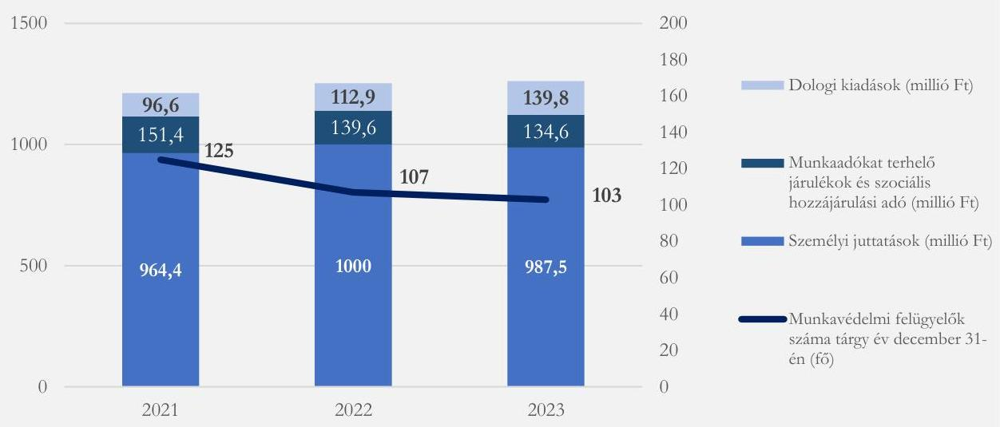
Forrás: Kormányhivatalok adatszolgáltatása alapján ÁSZ saját szerkesztés

A munkavédelmi hatósági feladatok ellátására 2021. és 2022. évben öt-öt, 2023. évben hat kormányhivatalnál igényeltek többlet erőforrást, létszámot, illetve eszközt. 2021-2023. években az igénylő kormányhivataloknál – 2023. évben a CSCSVKH kivételével – részesültek többlet erőforrásban, létszámban vagy eszköz bővítésben. 2021. évben 14, 2022. évben 11, 2023. évben hét kormányhivatalnál a munkavédelmi hatósági tevékenység külön igénylés nélkül részesült többlet erőforrásban, létszámban vagy eszközben. A munkavédelmi hatósági feladatellátás fejlesztését biztosító többletek elsődleges forrása a GINOP-5.3.7 – VEKOP-17 kódszámú pályázatból az NGM által elnyert támogatás volt, melynek keretében a szakmai irányító hordozható számítógépeket, gépjárműveket, mobiltelefonokat, a feladatellátáshoz szükséges műszereket, egyéb eszközöket biztosított a kormányhivatalok számára. Forráselvonás 2021. évben egy, 2022-2023. években négy-négy kormányhivatal munkavédelmi szakterületét érintette – jellemzően közvetetten, a kormányhivatal teljes szervezetére vonatkozó forráselvonás részeként.

A kormányhivatalok munkavédelmi hatósági tevékenységének kiadásai 2021. évről 2023. évre összességében 5,4 %-kal nőttek. A rendelkezésre álló költségvetési források – az eszköz állomány szakmai irányító által biztosított bővítése mellett – lehetővé tették az ellenőrzött szervezetek számának 4,8%-os, a munkavédelmi ellenőrzések (látogatások) számának 8,3%-os növekedését (6. ábra).

26

---

Megállapítások

6. ábra

KORMÁNYHIVATALOK MUNKAVÉDELMI HATÓSÁGI TEVÉKENYSÉGÉNEK KIADÁSAI (MILLIÓ FORINTBAN) ÉS A MUNKAVÉDELMI ELLENŐRZÉSEK SZÁMÁNAK (DB) ALAKULÁSA 2021-2023. ÉVEKBEN
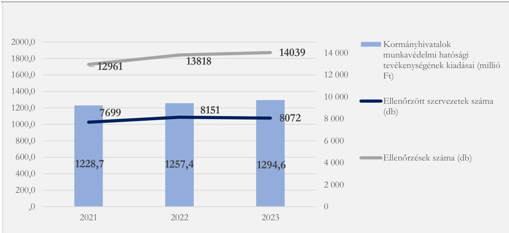
Forrás: A munkavédelmi hatóság 2021-2023. évi ellenőrzési tapasztalatairól szóló jelentések és a kormányhivatalok adatszolgáltatása alapján ÁSZ saját szerkesztés

A helyszíni ellenőrzés időszakában, 2024. július 29-én került kiírásra a Széchenyi Terv Plusz részét képező Gazdaságfejlesztési és Innovációs Operatív Program keretében a GINOP PLUSZ-3.2.5-24 azonosító számú „Munkakörülmények fejlesztése” elnevezésű, 8 610 M Ft keretösszegű pályázati felhívás, melynek célja a szervezett munkával összefüggő balesetek és megbetegedések, a munkaképtelenség bekövetkezésének megelőzése, a munkavállalók egészségét és biztonságát tiszteletben tartó munkafeltételek biztosítása fejlesztések és munkavédelmi célú eszközök beszerzésének támogatása révén. A támogatásra az NGM és a kormányhivatalok nyújthattak be pályázatot konzorciumot alkotva.

Az Mvt. felhatalmazása alapján a munkavédelmi hatóság munkavédelmi bírságot alkalmaz az egészséget nem veszélyeztető és biztonságos munkavégzésre vonatkozó követelmények teljesítését elmulasztó, és ezzel a munkavállaló életét, testi épségét vagy egészségét súlyosan veszélyeztető munkáltatóval szemben, illetve olyan munkahelyen, ahol a különböző munkáltatók alkalmazásában álló munkavállalókat egyidejűleg foglalkoztatnak, azzal a személlyel vagy szervezettel szemben, aki felel a munkavégzés összehangolásáért, hogy az az ott dolgozókra és a munkavégzés hatókörében tartózkodókra az veszélyt ne jelentsen. Továbbá a munkavédelmi hatóság közigazgatási bírsággal sújtja azt a természetes személyt, aki munkájával a tevékenységével összefüggő munkavédelemre vonatkozó kötelezettségét megszegi. A kiszabható munkavédelmi bírság mértéke az Mvt. előírása alapján az ellenőrzött időszakban 2024. február 29-ig – 2002. február 1. óta változatlanul – 50 000 Ft-tól 10 000 000 Ft-ig terjedt, és alapösszege munkavállalónként 50 000 Ft volt. 2024. március 1-től a munkavédelmi bírság mértékét a 25/2024. (II.14.) Korm.rendelet szabályozza, összege 100 000 Ft-tól 100 000 000 Ft-ig terjedhet, alapösszege a súlyosan veszélyeztetett munkavállalónként 100 000 Ft lett. A közigazgatási bírság mértéke az ellenőrzött időszakban legfeljebb 500 000 Ft volt. Az Ákr. felhatalmazása alapján eljárási bírság kiszabására került sor azon ellenőrzötték esetében, akik kötelezettségüket önhibájukból megszegték, így azoknál a munkáltatóknál, akik esetében az utóellenőrzés feltárta, hogy a munkavédelmi hatósági intézkedéseket nem hajtották végre. Az eljárási bírság mértéke az Ákr. 2018. január 1-i hatálybalépését

27

---

Megállapítások

követően nem változott, 2021-2023. években legkisebb összege esetenként 10 000 Ft, legmagasabb összege természetes személy esetén 500 000 Ft, jogi személy vagy egyéb szervezet esetén 1 000 000 Ft volt.

Az ellenőrzött időszakban a munkavédelmi hatóság által kiszabott bírságok összege növekedett. A munkavédelmi hatóság 2021-2023. évi ellenőrzési tapasztalatairól szóló jelentések alapján 2021. évben a munkavédelmi hatóság által kiszabott munkavédelmi bírság, közigazgatási bírság és eljárási bírság együttes összege 209,4 M Ft volt, 2022. évben 246,8,0 M Ft, 2023. évben 259,6 M Ft volt.

Az ellenőrzött időszakban az Áht. rendelkezése alapján a munkavédelmi hatóság által kiszabott bírságok, a kapcsolódó késedelmi kamatok és pótlékok a XLII. a Költségvetés közvetlen bevételei és kiadásai fejezet javára elszámolandó költségvetési bevételt képeztek.

A munkavédelem nemzeti politikája 2016-2022 végrehajtásához kapcsolódóan tervezett és teljesített költségvetési kiadásokról és bevételekről kimutatások, nyilvántartások, beszámolók, illetve jelentések nem készültek. A munkavédelem nemzeti politikája 2024-2027 előkészítése során a szakmai irányító azzal tervezett, hogy a kitűzött feladatokban érintett intézmények alapfeladatként, az adott fejezeti keretszámon belül saját költségvetésük terhére, valamint a megvalósítás időszakára eső munkavédelmi tartalmú EU-s projektek támogatásával látják el a munkavédelem nemzeti politikájában megfogalmazott feladatokat, és azok végrehajtása nem generál többlet költségvetési forrásigényt. A 2024–2027-es időszakra vonatkozó munkavédelem nemzeti politikája előkészítése során a szakmai irányító költségvetési terveket, számításokat nem készített. A munkavédelem nemzeti politikájában megfogalmazott feladatok költségvetésre gyakorolt hatása a feladatokhoz rendelt költségvetési tervezés és beszámolás hiányában nem átlátható.

# 4. A munkavédelmi ellenőrzés eredményessége

## Összegző megállapítás

A munkavédelmi hatóság által lefolytatott ellenőrzések, összhangban a munkabalesetek megelőzése érdekében tett további intézkedésekkel, eredményesek voltak, hozzájárultak a munkavédelem fejlesztéséhez, az egészséget nem veszélyeztető és biztonságos munkavégzéshez való jogok és kötelezettségek érvényesüléséhez. Az ellenőrzöttek kiválasztása során az egységes módszertan és a kockázatelemzés alkalmazásának hiánya miatt a kormányhivataloknál a munkavédelmi ellenőrzések kapcsán nem volt biztosított az ellenőrzöttek következetes kiválasztása.

## A munkavédelmi ellenőrzési célterületek és az ellenőrzött munkáltatók kiválasztása

A szakmai irányító a munkavédelmi ellenőrzések célterületeit a munkabaleseti statisztikák adatainak figyelembevételével határozta meg. Az ellenőrzési időszakban a foglalkoztatáspolitikáért felelős miniszter által közzétett ellenőrzési irányelvek a 2021. évben az építőipari kivitelezési tevékenységek, 2022. évben a kézi és gépi anyagmozgatási tevékenységek, 2023. évben a faipari tevékenységek célvizsgálatának előírásával irányította rá a figyelmet a munkavédelmi szempontból leginkább veszélyesnek számító ágazatokra. (7. ábra)

---

Megállapítások

7. ábra

MUNKAHELYI BALESETEK (M) ÉS AZON BELÜL A HALÁLOS BALESETEK (H) ÁGAZATI MEGOSZLÁSA 2020 – 2023. ÉVEKBEN (%)

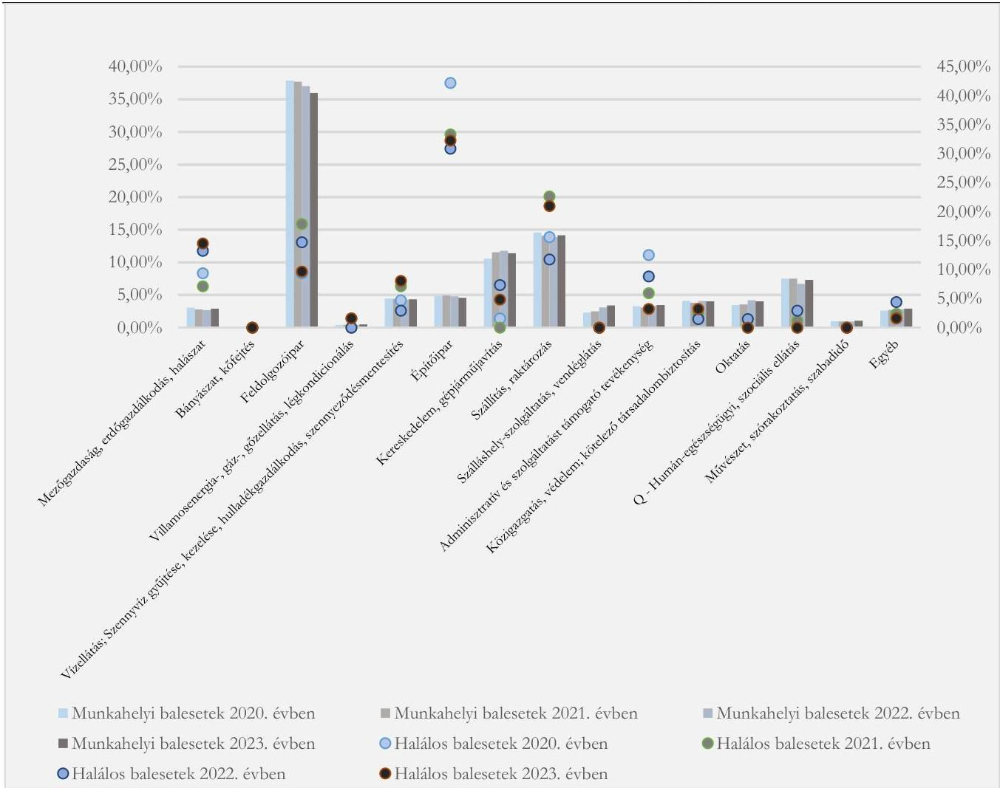

Forrás: Munkavédelmi hatóság éves értékelése alapján ÁSZ saját szerkesztés

A 2021. évi országos hatósági ellenőrzési terv előírta az építőipari kivitelezési tevékenységek célvizsgálatát, melynek célja az építőipari kivitelezési tevékenység biztonságának javítása és az építőipari ágazatban bekövetkezett munkabalesetek és foglalkozási megbetegedések számának csökkentése volt. A célvizsgálatot indokolta, hogy a munkavédelmi hatóság nyilvántartása alapján a 2021. évi országos hatósági ellenőrzési terv kiadását megelőző időszakban (2020. I. félévben) a szabálytalan munkavégzés miatt bekövetkezett súlyos munkabalesetek aránya a legmagasabb az építőipari ágazatban volt (35 súlyos és abból 14 halálos kimenetelű eset történt).

A 2022. évi országos hatósági ellenőrzési tervben a kézi és gépi anyagmozgatási tevékenységek célvizsgálata került előírásra a bekövetkezett munkabalesetek és mozgásszervi foglalkozási megbetegedések számának csökkentése érdekében. Az indokolásként a gépi anyagmozgatás esetében a munkavédelmi hatóság nyilvántartása alapján a 2022. évi országos hatósági ellenőrzési terv kiadását megelőző időszakban (2021. I. félévben), a szabálytalan munkavégzés miatt bekövetkezett súlyos munkabalesetek számának emelkedése szerepelt (14 halálos és további 21 súlyos kimenetelű eset történt).

A 2023. évben a célvizsgálatként a faipari tevékenység során bekövetkezett munkabalesetek és egészségkárosodások csökkentése, illetve a III. fokú hősegriadó esetén a munkafeltételek ellenőrzésére került meghatározásra az éves országos hatósági ellenőrzési tervben. A célvizsgálatokat indokolta

29

---

Megállapítások

egy részről az 5/1993. (XII.26.) MüM rendeletben nevesített veszélyesnek minősülő munkaeszközök között több faipari gép szerepel és a faipari technológiák munkavédelmi hiányosságai miatt jellemzőek a csonkolásos balesetek, másrészről a hóségriasztás idején a munkavállalók megterhelése, illetve igénybevétele jelentősen megnő, amely egészségüket és biztonságukat fokozottan fenyegeti (pl.: a hőártalom kockázat megemelkedik).

Az ellenőrzési tevékenység hatékony és eredményes lebonyolításának alapvető eleme az ellenőrzött munkáltatók kiválasztása. A hatékony kiválasztási rendszer eredményesen járulhat hozzá az ellenőrzési célok megvalósulásához, a súlyos szabálytalanságok feltárásához, a munkabalesetek és a foglalkozási megbetegedések megelőzéséhez. Az ellenőrzött munkáltatók kiválasztásának szempontrendszerére vonatkozóan a szakmai irányító módszertani útmutatókban⁸¹ fogalmazott meg ajánlást a kormányhivatalok számára. A 2022. évben az ITM által kiadott módszertani útmutatóban felsorolt, az ellenőrizendő munkáltatók kiválasztását támogató adat-, illetve információforrások a munkavédelmi hatósági tevékenység során keletkező információk, nyilvántartások, adatai mellett tartalmazták a nyilvános adatbázisokból és egyéb forrásokból (pl. sajtóhírek) nyerhető információkat. Továbbá információforrásként jelöték meg az ellenőrzési célpont kiválasztási rendszert, ami a helyszíni ellenőrzés lezárásáig nem került bevezetésre. (8. ábra).

8. ábra

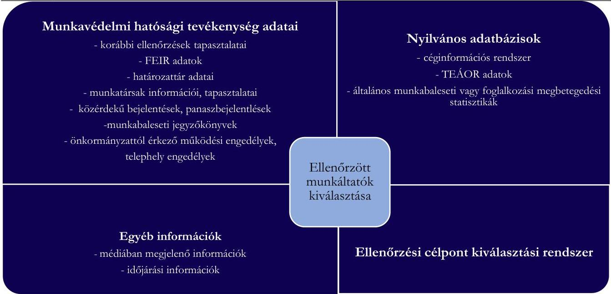
ELLENŐRZŐTT MUNKÁLTATÓK KIVÁLASZTÁSÁNAK SZAKMAI IRÁNYTÓ ÁLTAL
AJÁNLOTT SZEMPONTRENDSZERE A MUNKAVÉDELMI ELLENŐRZÉSEKBEN

Forrás: Munkavédelmi hatósági tevékenység adatai
- korábbi ellenőrzések tapasztalatai
- FEIR adatok
- határozattár adatai
- munkatársak információi, tapasztalatai
- közérdekű bejelentések, panaszbejelentések
- munkabaleseti jegyzőkönyvek
- önkormányzattól érkező működési engedélyek, telephely engedélyek

Egyéb információk
- médiában megjelenő információk
- időjárási információk

Nyilvános adatbázisok
- céginformációs rendszer
- TEÁOR adatok
- általános munkabaleseti vagy foglalkozási megbetegedési statisztikák

Ellenőrzött munkáltatók kiválasztása

Ellenőrzési célpont kiválasztási rendszer

A kormányhivatalok a munkavédelmi hatósági ellenőrzéseikre vonatkozóan nem alkalmazták egységesen a módszertani útmutatót, továbbá a kormányhivataloknál az ellenőrzöttek kiválasztását nem támogatta kockázatelemzés. Az ellenőrzöttek kiválasztása során az egységes módszertan és a kockázatelemzés alkalmazásának hiánya miatt a kormányhivataloknál a munkavédelmi ellenőrzések kapcsán nem volt biztosított az ellenőrzöttek következetes és a munkavédelmi hatósági ellenőrzések eredményességét, hasznosulását támogató kiválasztása. Ez a gyakorlat felveti annak kockázatát, hogy nem azok a munkáltatók kerülnek kiválasztásra, ahol a legnagyobb szükség lenne a munkavédelmi előírások betartásának ellenőrzésére.

---

Megállapítások

Teljesítménycélok megvalósulása a kormányhivataloknál

A szakmai irányító a munkavédelmi ellenőrzések és a tájékoztatási tevékenység vonatkozásában a kormányhivatalok számára 2021-2023. évekre azonos teljesítménycélokat határozott meg, melyek országos szinten 2022. évben 90%-ban 2023. évben 80%-ban teljesültek. Az egyes teljesítménycélokat elérő kormányhivatalok arányát a 13. ábra mutatja be.

Az egy munkavédelmi felügyelőre jutó ellenőrzött munkáltatók átlagos száma az ellenőrzött időszakban emelkedő tendenciát mutatott, azonban nem érte el a célkitűzésként meghatározott, egy munkavédelmi felügyelőre jutó legalább 150 munkáltató célértéket. Országos szinten 2021-ben 96,5 db, 2022-ben 112,7 db, 2023-ban 120,1 db ellenőrzött munkáltató jutott egy munkavédelmi felügyelőre. Vármegyei szinten a 2021. évben 2 kormányhivatal (BAVKH⁶² és BKVKH⁶³), 2022-2023. években négy kormányhivatal (BAVKH, BKVKH, HVKH, SVKH) érte el az egy munkavédelmi felügyelőre jutó 150 db ellenőrzött munkáltató célértéket.

Az ellenőrzött időszakban országos szinten megvalósult az a célkitűzés, hogy az ellenőrzések legalább 60%-a irányuljon a különösen veszélyes foglalkoztatási ágazatokra, úgy mint az építőiparra, a mezőgazdaságra, a feldolgozóiparra, a bányászatra és az egészségügyre. 2021-ben 73%, 2022-ben 66%, 2023-ban 67% volt a hatósági ellenőrzések aránya a különösen veszélyes foglalkoztatási ágazatokban. Vármegyei szinten a célkitűzés teljesítése nem valósult meg 2021. évben FVKH (59,7%), 2022-ben a CSCSVKH (58%), az FVKH (58%) és a BAZVKH (59%) 2023-ban a BAZVKH (49%) és az NVKH (55%) esetében.

Az utóellenőrzések területén országos szinten megvalósult az a célkitűzés, hogy a hatóság az ellenőrzött munkáltatók 5-10%-ánál tartson utóellenőrzést. Az összes ellenőrzéshez képest az utóellenőrzések aránya 2021. évben 7,0%, 2022. évben 7,9%, 2023-ban 6,7% volt. Az utóellenőrzések aránya nem érte el az összes ellenőrzés 5%-át 2022. évben a GYMSVKH (0,6%) és VEVKH (2,8%) esetében, 2023. évben az FVKH (4,6%), a GYMSVKH (2,1%), a HBVKH (0,0%), a TVKH (1,8%), és a VEVKH (4,7%) esetében.

Az egy munkavédelmi felügyelőre jutó munkavédelmi intézkedések átlagos értéke mind 2022-ben, mind 2023-ban országos szinten elérte a teljesítménycélként kitűzött 600 db/főt (2022. évben 631,5 db/fő, 2023. évben 675,8 db/fő volt), azonban vármegyei szinten jelentős eltérések mutatkoztak. 2022-ben 9 kormányhivatal (BFVKH, BEVKH, BAZVKH, CSCSVKH, GYMSVKH, NVKH, TVKH, VEVKH, ZVKH) míg 2023-ban 7 kormányhivatal (BFVKH, BAZVKH, FVKH, HBVKH, NVKH, VEVKH, ZVKH) nem teljesítette a kijelölt teljesítménycélát.

31

---

Megállapítások

13. ábra

# SZAKMAI IRÁNYÍTŐ ÁLTAL MEGHATÁROZOTT TELJESÍTMÉNYCÉLOKAT MEGVALÓSÍTÓ KORMÁNYHIVATALOK ARÁNYA

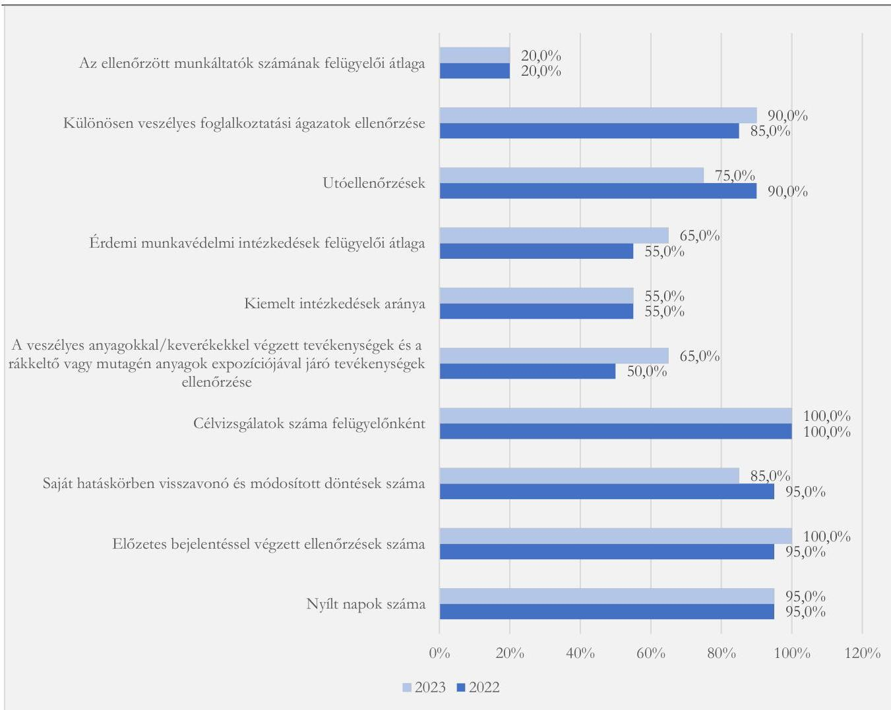

Forrás: Munkavédelmi hatóság 2022 és 2023. évi értékelései alapján ÁSZ saját szerkesztés

Országos szinten teljesült a munkavállalók életét, testi épségét, egészségét jelentősen veszélyeztető munkáltatói szabályszegésekkel összefüggésben tett kiemelt intézkedések arányára vonatkozó teljesítmény cél. A kiemelt intézkedések aránya 2022-ben és 2023-ban is elérte az összes munkavédelmi intézkedés 50%-át: 2022. évben 53,4%, 2023. évben 53,7%. Azonban vármegyei szinten jelentős eltérések mutatkoztak. 2022-ben és 2023-ban 9 kormányhivatal nem teljesítette a kívánt 50%-os célt, közülük hét kormányhivatal (BEVKH, CSCSVKH, FVKH, GYMSVKH, NVKH, VEVKH, ZVKH) mindkét évben elmaradt az 50%-os céltól, továbbá 2022. évben a BAZVKH, PVKH, 2023. évben KEVKH, SZSZBVKH⁶⁴ nem teljesítette a célkitűzést.

A veszélyes anyagokkal/keverékekkel végzett tevékenységek és a rákkeltő vagy mutagén anyagok expozíciójával járó tevékenységek ellenőrzéséhez kapcsolódó intézkedésekre vonatkozó, évenként átlagosan 50 db/munkavédelmi felügyelő teljesítménycél a kormányhivatalok országos átlagban 2022. évben nem érték el (48,9 db/fő), 2023. évben elértek (56,7 db/fő). A teljesítménycél megvalósításában vármegyenként jelentős eltérés mutatkozott. 2022. évben 10 kormányhivatalnál (BFKH, BEVKH, BAZVKH, CSCSVKH, GYMSVKH, NVKH, PVKH, TVKH, VEVKH, ZVKH), 2023-ban hét kormányhivatalnál (BFKH, FVKH, GYSMVKH, KEVKH, NVKH, VEVKH, ZVKH) nem sikerült megvalósítani a célkitűzést.

32

---

Megállapítások

A célvizsgálatokra vonatkozó célkitűzés, amely szerint „a munkavédelmi ellenőrzést végző hatóság az illetékességi területének gazdasági szerkezete, munkabaleseti helyzete és az ellenőrzési tapasztalatai figyelembevétele alapján tartson saját tervezésű célvizsgálatot az indokolt tevékenység, szakma vagy ágazat ellenőrzésére és a célvizsgálatot felügyelőnként – átlag létszámot figyelembe véve – legalább 5 munkáltatónál végezzék el”, mind 2022-ben mind 2023-ban megvalósult minden kormányhivatal esetében. 2022-ben az országos felügyeleti átlagot (72,3 fő) figyelembe véve az előírt mennyiség a saját tervezésű célvizsgálatra országos szinten 362 db került meghatározásra, ami 140%-os szinten (508 db) teljesült. 2023-ban – az országos felügyeleti átlag (67,2 fő) mellett – 336 saját tervezésű célvizsgálat került célkitűzésként meghatározásra, ami 149%-os szinten teljesült (500 db).

A saját hatáskörben visszavonó és módosított döntések számára vonatkozó célkitűzés, amely szerint a saját hatáskörben visszavonó és módosított döntések száma ne haladja meg az összes döntés 1%-át, mind 2022-ben, mind 2023-ban teljesült országos szinten. 2022-ben a 11 284 döntésből a saját hatáskörben visszavonó és módosító döntések száma 16 (0,1%), 2023-ban a 11 023-ból 21 (0,2%) volt. Vármegyei szinten 2022-ben a BAZVKH (1,3%), 2023-ban a BAVKH (1,1%), a CSCSVKH (1,1%), és TVKH (1,2%) esetében nem valósult meg a célkitűzés.

Az előzetes bejelentéssel végzett ellenőrzésekre vonatkozó teljesítménycél, mely előírta, hogy – olyan munkáltatók esetében, ahol a munkavállalók egészségének, biztonságának veszélyeztetése annak gyakorisága, mértéke, illetve az érintett munkavállalói kör szempontjából fokozott figyelmet érdemel – az előzetes bejelentéssel végzett ellenőrzések száma 5 fő átlagfelügyelőként legalább egy legyen, országos szinten 2022-ben és 2023-ban is megvalósult. A kormányhivatalok 2022. évben összesen 26 db előzetes értesítés alapján történt átfogó ellenőrzést végeztek (a szakmai irányító által előírt 23 db volt), 2023. évben a 23 darabot (előírt 22 db volt). 2022. évben a BFVKH nem tudta maradéktalanul teljesíteni a meghatározott teljesítménycél, az előírt három előzetes értesítés alapján történő átfogó ellenőrzésből kettő valósult meg.

A nyílt napok és tanácsadásokra vonatkozó célkitűzés az ellenőrzési időszakban összességében megvalósult. A munkavédelemmel és a hatósági tevékenységgel kapcsolatban a munkáltatók, a munkavállalók és az érdekképviseleti szervek részére a tájékoztatás megtörtént. Az egyes kormányhivatalok évente kétszer saját vagy közös rendezésű „Nyílt Napot” tartottak – kivétel 2022. évben VVKH (egy nyílt napra került sor), illetve 2023. évben GYMSVKH (nyílt nap szervezésére nem került sor) esetében.

A teljesítménycélok megvalósulásáról készült értékelések alapján a szakmai irányító a célkitűzéseket nem teljesítő a kormányhivatalok felé – a főispánok tájékoztatásán túl – további intézkedést nem tett.

## A munkavédelmi ellenőrzések hatékonysága

A 2021. év és 2023. év között a munkavédelmi ellenőrzéssel érintett munkaadók száma összességében 4,8%-kal, a munkavédelmi ellenőrzéssel érintett és munkavállalók száma 28,1%-kal növekedett. A munkavédelmi ellenőrzések lefedettsége a foglalkoztatottak, illetve az alkalmazásban álló munkavállalók vonatkozásában az ellenőrzött időszakban növekedett: 2021. évben a munkavédelmi ellenőrzések az összes foglalkoztatott 3,1%-át, az alkalmazásban állók 4,1%-át, 2022. évben 4,9%, illetve 6,2%-át, 2023. évben 4,0%, illetve 5,1%-át érintették. 2021. év és 2023. év között a munkavédelmi szabálytalanságok feltárási aránya növekedett: munkavédelmi ellenőrzések 2021. évben az ellenőrzött munkáltatók 70,4%-ánál, 2022. évben 69,9%-ánál, 2023. évben 72,5%-ánál tartak fel szabálytalanságot.

33

---

Megállapítások

(9. ábra) 2021. évben az ellenőrzéssel érintett munkavállalók 55,7%-a, 2022. évben 54,7%-a, 2023. évben 52,8%-a volt szabálytalansággal érintett.

9. ábra

ELLENŐRZŐTT ÉS SZABÁLYTALANSÁGGAL ÉRINTETT MUNKÁLTATÓK (DB) ILLETVE MUNKAVÁLLALÓK (FŐ) ARÁNYA
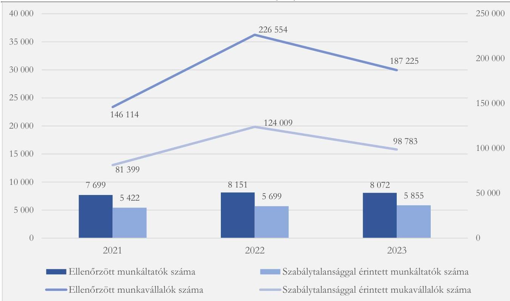
Forrás: A munkavédelmi hatóság 2021-2023. évi ellenőrzési tapasztalatairól szóló jelentések alapján ÁSZ saját szerkesztés

A munkavédelmi hatóság 2021-2023. évi országos ellenőrzési tervének megvalósulásáról szóló jelentések alapján a munkavédelmi hatóság 2021-2023. évi országos ellenőrzési terveiben meghatározott ellenőrzési célterületeken a szabálytalansággal érintett munkáltatók aránya 2021. évben az építőipari kivitelezési tevékenységek vonatkozásában 89,9%, 2022. évben a kézi és gépi anyagmozgatási tevékenységek esetében 90,3%, a III. fokú hősgriadó során a munkafeltételek ellenőrzésére irányuló célvizsgálat esetében 45,5%, a 2023. évben a faipari tevékenységek ellenőrzése során 97,8% volt (4. táblázat). A szabálytalansággal érintett munkáltatók aránya alátámasztja, hogy a munkavédelmi hatóság a 2021-2023. évi országos ellenőrzési terveiben – a III. fokú hősgriadó során végzett célvizsgálat kivételével – megfelelően határozták meg a munkavédelmi ellenőrzési célterületeket.

34

---

Megállapítások

4. táblázat
CÉLELLENŐRZÉSEK SORÁN ELÉRT EREDMÉNYEK 2021-2023. ÉVEKBEN

|  CÉLELLENŐRZÉS | FELTÁRT HIÁNYOSSÁGOK SZÁMA (DB) | ELLENŐRZÉSBEN RÉSZT VETT ELLENŐRÖK SZÁMA (DB) | ELLENŐRZŐTT MUNKÁLTATÓK SZÁMA (DB) | MUNKÁLTATÓKNÁL FELTÁRT SZABÁLYTALANSÁGOK SZÁMA (DB) | SZABÁLYTALANSÁGGAL ÉRINTETT MUNKÁLTATÓK ARÁNYA(%)  |
| --- | --- | --- | --- | --- | --- |
|  2021. év: Építőipari kivitelezési tevékenységek munkavédelmi célvizsgálata | 5128 | 92 | 1095 | 984 | 89,9%  |
|  2022. év: A kézi és gépi anyagmozgatási tevékenységek célvizsgálata | 6260 | 93 | 901 | 817 | 90,3%  |
|  2022. év: III. fokú hősegriadó esetén a munkafeltételek ellenőrzésére irányuló országos munkavédelmi célvizsgálata | 620 | n.a. | 255 | 116 | 45,5%  |
|  2023. év: Faipari tevékenységek célvizsgálata | 3832 | 77 | 406 | 397 | 97,8%  |

Forrás: A munkavédelmi hatóság 2021-2023. évi hatósági ellenőrzési tervének megvalósulásáról szóló jelentések

A munkavédelmi hatóság ellenőrzési feladatait 2021-2023. években növekvő hatékonysággal látta el. A munkavédelmi ellenőrzésekre rendelkezésre álló tényleges humánerőforrást jelentő munkavédelmi felügyelői átlaglétszám⁶⁵ 15,5%-os csökkenése (79,8 fő értékről 67,2 fő értékre) mellett 2021. évről 2023. évre az ellenőrzött munkáltatók száma 4,8%-kal növekedett. (10. ábra) Ezáltal országos átlagban a – munkavédelmi felügyelői átlaglétszám alapján számolt – egy munkavédelmi felügyelőre jutó ellenőrzött munkáltatók száma 24,5%-kal 96,5 fő/munkavédelmi felügyelő értékről 120,1 fő/munkavédelmi felügyelő értékre emelkedett.

Az egyes kormányhivatalok esetében a – munkavédelmi felügyelői átlaglétszám alapján számolt – egy munkavédelmi felügyelőre jutó ellenőrzött munkáltatók számának alakulásában jelentős eltérés volt tapasztalható. A 2021. év és a 2023. év között 7 – 2021. évben az országos átlag alatt teljesítő – kormányhivatal (BFKH, BAZVKH, GYMSVKH, KEVKH, SVKH, TVKH, ZVKH) 50%-nál nagyobb hatékonyság növekedést ért el, míg 5 – 2021. évben az

10. ábra

MUNKAVÉDELMI FELÜGYELŐK
ÁTLAGLÉTSZÁMÁNAK (FŐ) ÉS AZ
ELLENŐRZŐTT MUNKÁLTATÓK
SZÁMÁNAK (DB) VÁLTOZÁSA A 2021-
2023. ÉVEKBEN
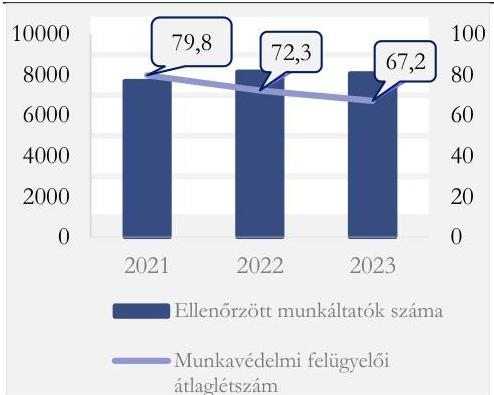
Forrás: A munkavédelmi hatóság 2021-2023. évi ellenőrzési tapasztalatairól szóló jelentések és a Munkavédelmi hatóság 2021-2023. évi értékelése alapján ÁSZ saját szerkesztés

---

Megállapítások

országos átlag felett teljesítő – kormányhivatalnál az egy munkavédelmi felügyelőre jutó ellenőrzött munkaadók létszáma csökkent.

Az ellenőrzött időszakban az egy ellenőrzésre jutó munkavédelmi intézkedések száma 13,5%-kal növekedett, mely a jogsértések hatékonyabb feltárására utal. A – munkavédelmi felügyelői átlaglétszám alapján számolt – egy munkavédelmi felügyelőre munkavédelmi döntések száma 23,6%-kal, az intézkedések száma 34,8%-kal emelkedett. (5. táblázat)

5. táblázat
A MUNKAVÉDELMI ELLENŐRZÉSEK EREDMÉNYE 2021-2023. ÉVEKBEN

|  Év | MUNKAVÉDELMI DÖNTÉSEK SZÁMA | INTÉZKEDÉSEK SZÁMA | EGY ELLENŐRZÉSRE JUTÓ INTÉZKEDÉSEK SZÁMA | EGY MUNKAVÉDELMI FELÜGYELŐRE JUTÓ MUNKAVÉDELMI DÖNTÉSEK SZÁMA (DB) | EGY MUNKAVÉDELMI FELÜGYELŐRE JUTÓ MUNKAVÉDELMI INTÉZKEDÉSEK SZÁMA (DB)  |
| --- | --- | --- | --- | --- | --- |
|  2021 | 10 492 | 39 988 | 7,38 | 131,6 | 501,4  |
|  2022 | 11 095 | 45 681 | 8,02 | 153,4 | 631,5  |
|  2023 | 10 927 | 45 404 | 7,75 | 162,6 | 675,8  |

Forrás: A munkavédelmi hatóság 2021-2023. évi ellenőrzési tapasztalatairól szóló jelentések és a Munkavédelmi hatóság 2021-2023. évi értékelése alapján ÁSZ saját szerkesztés

A munkavédelmi ellenőrzések eredményeként kiadmányozott munkavédelmi döntések 2021-2023. években csökkenő mértékben tartalmaztak bírságra vonatkozó döntést. A munkavédelmi bírság, az eljárási bírság és a közigazgatási bírság együttes száma 2021. évről 2023. évre 19,2%-kal (647 db-ról 523 db-ra) csökkent. Ezzel párhuzamosan 11,8 %-kal (5116 db-ról 5718 db-ra) növekedett a hiányosság megszüntetését előíró munkavédelmi döntések száma. (11. ábra) A kiszabott bírságok együttes és egy határozatra jutó összege is növekedett az ellenőrzött időszakban, azonban a kiszabott bírságok egy határozatra jutó összege megkérdőjelezte a bírság visszatartó erejét. 2021. évben a kiszabott bírságok együttes összege 209,4 M Ft, az egy – bírságot tartalmazó – határozatra jutó összege 323,6 E Ft, míg 2023. évben 259,6 M Ft, illetve 496,4 E Ft volt.

36

---

Megállapítások

11. ábra

MUNKAVÉDELMI HATÓSÁG ÁLTAL KIADMÁNYOZOTT MUNKAVÉDELMI DÖNTÉSEKBEN FOGLALT INTÉZKEDÉSEK (DB)
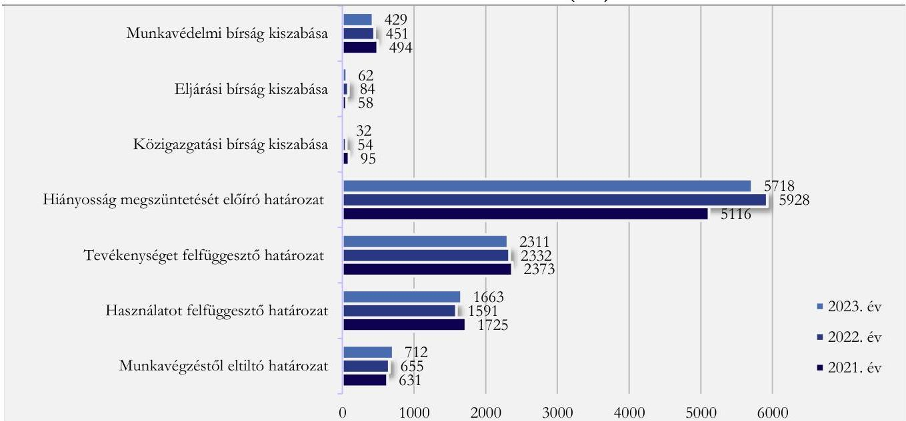
Forrás: A munkavédelmi hatóság 2021-2023. évi ellenőrzési tapasztalatairól szóló jelentései alapján ÁSZ saját szerkesztés

A munkavédelmi hatóság munkavédelmi ellenőrzések keretében integrált módon ellenőrizte a munkabiztonsági és munkaegészségügyi előírások betartását. Az ellenőrzések eredmény eként meghozott munkavédelmi döntésekben foglalt munkavédelmi intézkedéseken belül a munkabiztonsági intézkedések aránya 2021. évben 37,1%, 2022. évben 28,3%, 2023. évben 29,4%, a munkaegészségügyi intézkedések aránya 2021. évben 9,1%, 2022. évben 8,6%, 2023. évben 8,6%, a – munkabiztonsági és munkaegészségügyi intézkedéseket egyaránt tartalmazó – integrált munkavédelmi intézkedések aránya 2021. évben 59,2%, 2022. évben 63,1%, 2023. évben 62,0% volt. Az egyes munkavédelmi intézkedés típusok számának alakulását a 2021-2023. években a 6. táblázat tartalmazza.

Az utóellenőrzések összes ellenőrzött munkáltatóhoz viszonyított aránya 2021. évben 7,0% volt, amely a 2022. évi 7,9%-ra történő emelkedést követően 2023. évre 6,7%-ra csökkent. Az utóellenőrzések tapasztalatai alapján a 2021-2023. években a munkavédelmi ellenőrzések visszatartó hatása korlátozottan érvényesült, tekintettel arra, hogy az előírt intézkedéseket végre nem hajtó, utóellenőrzéssel érintett munkáltatók aránya 2021. évben 9,3%, 2022. évben 10,9%, 2023. évben 9,8% volt. (12. ábra)

6. táblázat
AZ EGYES MUNKAVÉDELMI INTÉZKEDÉS TÍPUSOK SZÁMÁNAK ALAKULÁSA A 2021-2023. ÉVEKBEN (DB)

|  INTÉZKEDÉS TÍPUSA | 2021. ÉV | 2022. ÉV | 2023. ÉV  |
| --- | --- | --- | --- |
|  Munkabiztonsági intézkedések | 12 665 | 12 925 | 13 355  |
|  Munkaegészségügyi intézkedések | 3 640 | 3 916 | 3 901  |
|  Integrált munkavédelmi intézkedések | 23 683 | 28 839 | 28 148  |
|  Munkavédelmi intézkedések összesen | 39 988 | 45 680 | 45 404  |

Forrás: A munkavédelmi hatóság 2021-2023. évi ellenőrzési tapasztalatairól szóló jelentések alapján ÁSZ saját szerkesztés

37

---

Megállapítások

12. ábra

MUNKAVÉDELMI UTÓELLENŐRZÉSEK 2021-2023. ÉVEKBEN
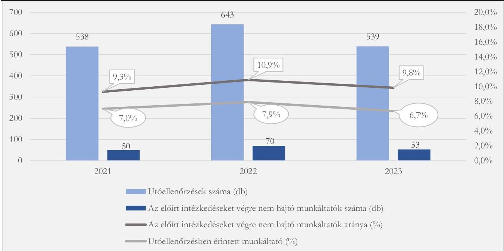
Forrás: A munkavédelmi hatóság 2021-2023. évi tapasztalatairól szóló jelentések alapján ÁSZ saját szerkesztés

## A munkavédelmi helyzet értékelése

Az ellenőrzött időszakban a munkabalesetek száma csökkent (-4,3%), a FEIR rendszerben 2021. évben 21 591 munkahelyi balesetet, 2022. évben 21 273 esetet, 2023. évben 20 658 esetet regisztráltak.

A munkahelyi baleseti és a foglalkoztatotti számadatok összevetése a munkabiztonság pozitív változását mutatják (14. ábra). A munkabaleseti ráta országosan a 2021. évi 4,7 eset/ezer fő értékről a 2023. évre 4,4 eset/ezer fő értékre csökkent (-6,2%).

A 2021. évről 2023. év végére a kiemelt ágazatokban a – a bányászat és kőfejtés kivételével – a munkabaleseti ráta az ellenőrzött időszakban csökkent. (15. ábra) Kiemelkedő a csökkenés az építőipar esetében, ahol 14,3%-kal (2,8 eset/ezer fő értékről 2,4 eset/ezer fő értékre) csökkent a munkabaleseti ráta,

14. ábra

A MUNKAHELYI BALESETEK ÉS A FOGLALKOZTATOTTAK SZÁMÁNAK ALAKULÁSA 2021-2023. ÉVEKBEN
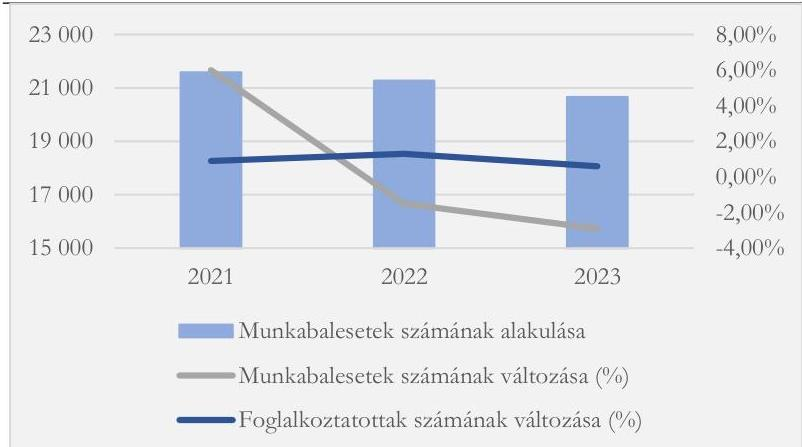
Forrás: KSH adatok és munkabalesetek alakulásáról szóló 2021-2023. évi tájékoztatók alapján ÁSZ saját szerkesztés

továbbá a feldolgozóipar esetében, ahol a csökkenés mértéke 8,5% volt (8,3 eset/ezer fő értékről 7,6 eset/ezer fő értékre) Ugyanakkor a bányászatban az utóbbi évek jelentős rátanövekedése figyelemfelhívó, és további munkavédelmi intézkedéseket tesz szükségessé.

38

---

Megállapítások

15. ábra

MUNKABALESETI RÁTA NEMZETGAZDASÁGI ÁGAK SZERINTI ALAKULÁSA 2021-2023. ÉVEKBEN (MUNKABALESET/EZER FŐ)
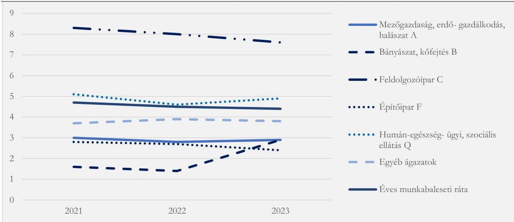
Forrás: KSH adatok alapján ÁSZ szerkesztés

## A munkavédelmi hatóság által a munkabalesetek megelőzése érdekében tett intézkedések

A munkavédelem nemzeti politikája 2016-2022 és a munkavédelem nemzeti politikája 2024-2027 is a munkavállalók biztonságát és egészségét veszélyeztető kockázatok csökkentésére, valamint a munkabalesetek és a foglalkoztatási betegségek kialakulásának megelőzésére helyezte a hangsúlyt.

A szakmai irányító munkabalesetek megelőzése érdekében tett intézkedései illeszkedtek a munkavédelem nemzeti politikája 2016-2022 célkitűzéseihez, hozzájárultak azok megvalósításhoz. A munkavédelem nemzeti politikája 2016-2022 által megfogalmazott feladatok megvalósítását támogatta a GINOP-5.3.7 – VEKOP-17 kódszámú pályázat, valamint a munkáltatói és munkavédelmi érdekképviseleti szervezetek számára a Széchenyi 2000 fejlesztési program keretében 2000,0 MFt keretösszeggel meghirdetett GINOP-5.3.4-16 pályázat is.

A vállalkozások versenyképességének növelése területen a munkavédelmi feladatokat támogató ingyenes online eszközök bevezetésének támogatása feladat megvalósítása érdekében Magyarország 2022. év végén csatlakozott az Európai Munkahelyi Biztonsági és Egészségvédelmi Ügynökség által fejlesztett és működtetett online interaktív kockázatértékelés platformhoz (OiRA - Online interactive Risk Assessment), melynek célja ingyenes, gyakorlati, online kockázatértékelést támogató eszközök biztosítása a mikro- és kisvállalkozások számára. A helyszíni ellenőrzés végén az OiRA honlap adatai szerint a magyar OiRA-eszközök kidolgozás alatt voltak.

A szakmai irányító által a munkavédelmi hatóság honlapján közzétett kiadványok, a rendezvények, a kommunikációs kampányok támogatták a jögyakorlatok ismertetését, cseréjét, valamint a hatékony munkahelyi egészségvédelmi és biztonsági irányítási rendszer kialakítását. Ez utóbbi megvalósítását támogatták a továbbá a GINOP 5.3.4-16 „A munkahelyi egészség és biztonság fejlesztése” projekt keretében megvalósult szakmai kiadványok.

A munkavállalók munkavégző képességének megőrzése területen belül a pszichoszociális kockázatokra visszavezethető munkahelyi hiányzások csökkentését támogatta e témakör integrálása a szakmai irányító kiadványaiba, valamint a pszichoszociális kockázatértékelés elvégzéséhez 2021. évben

39

---

Megállapítások

aktualizált útmutató. Az új ergonómiai módszerek kidolgozásának ösztönzése és támogatása tájékoztató anyagokon, konferenciákon, a munkáltatók munkavédelmi szakmai elismerésén keresztül valósult meg.

A Munkavédelem Nemzeti Programja 2016-2022 időszakát követően, a Munkavédelem Nemzeti Programja 2024-2027 elfogadását megelőző időszakban 2023 februárjában a szakmai irányító pályázatot hirdetett „Perspektíva és tudatosság - új fejlesztések a munkavédelem területén" címmel. A pályázat célja az volt, hogy bemutassa azokat a munkáltatókat, akik újszerű, hatékony módszerek, eszközök alkalmazásával csökkentik a munkavállalókat érő fizikai, kémiai, biológiai, ergonómiai, pszichoszociális megterheléseket a munkahelyeken, így a jogszabályokban kötelezően előírt követelményeket meghaladó műszaki, szervezési intézkedésekkel javítják az egészséget nem veszélyeztető, biztonságos munkavégzés feltételeit. A benyújtott pályázatok elbírálását követően a szakmai irányító két pályázót elismerő oklevélben részesített.

A munkavédelmi képzés, oktatás területén a munkavédelemre, a munkahelyek kémiai biztonságára vonatkozó ismeretek bővítése az oktatásban a középiskolai diákok, illetve a pedagógusok számára készült munkavédelmi kiadványok66 elkészítésével és közzétételével valósult meg. A sérülékeny csoportba tartozó, valamint az atipikus foglalkoztatási formákkal érintett munkavállalókat érintő foglalkozási kockázatok csökkentése érdekében a szakmai irányító tanulmányt készítettett az atipikus munkavállalási formák munkavédelmi vonatkozásairól67. A munkavédelmi szakemberek kötelező továbbképzési rendszere helyett a Munkavédelem nemzeti politikája 2016-2022 időszakát követően, 2024. évben a munkavédelmi szakemberek esetében az önkéntes továbbképzés feltételrendszerének kialakítására került sor, melyet a 2024. március 1-től hatályos 25/2024. (II. 14.) Korm. rendelet68 rögzít.

A tájékoztatás, kommunikáció körében a munkabalesetek megelőzését a munkavédelmi hatóság az egészséges és biztonságos munkakörnyezet kialakításához szükséges ismeretek széles körű átadásával támogatta. Ennek keretében általános és ágazatspecifikus munkavédelmi tárgyú tanulmányokat, útmutatókat, kiadványokat, szórólapokat tett közzé, folyamatos tanácsadási tevékenységet látott el, konferenciák, szakmai napok, képzések szervezésével támogatta a tudásátadást a munkáltatók, munkavállalók és munkavédelmi szakemberek számára. A szakmai irányító a kormányhivatalok 2021-2023. évi teljesítménycélkitűzéseinek között rögzítette a nyílt napok tartásának követelményét, melynek eredményeként az egyes kormányhivatalok 2021-2023. években 47 sajátszervezésű és 93 közös szervezésű nyílt napot tartottak, továbbá 9 konferencián, egyéb szakmai rendezvényen vettek részt.

A munkavédelmi kutatás, fejlesztés területén kitűzött célok megvalósítása érdekében a szakmai irányító tanulmányt adott ki a klímaváltozás egészségre gyakorolt hatásáról69 és a munkavállalók átlagéletkorának emelkedésével kapcsolatos munkavédelmi kihívásokról70. Az integrált munkavédelmi hatóság szakmai, működési feltételeinek erősítését a szakmai irányító a tananyagfejlesztéssel, képzések tartásával, gépjárművel, munkakörnyezeti mérőműszerek és informatikai eszközök biztosításával valósította meg a GINOP-5.3.7 – VEKOP-17 kódszámú pályázatból kapott támogatás terhére. Az egészséget nem veszélyeztető és biztonságos munkakörülmények és a jogszerű foglalkoztatás fenntartásában érdekelt szervezetek együttműködésének fejlesztéséhez a szakmai irányító rendezvényein keresztül biztosított platformot.

A szakmai irányító – a munkavédelmi tárgyú NMH utasítások kivételével – gondoskodott a munkahelyi biztonságra és egészségvédelemre vonatkozó hazai joganyag értékeléséről, és a munkáltatók munkavédelemmel összefüggő adminisztratív terhei csökkentésének és a munkavédelem jogi szabályozása egyszerűsítésének lehetőségeiről, az intézkedések hatásainak előrejelzéséről 2022. évben tanulmányt71 jelentett meg. A jogszabályok egyszerűsítésére irányuló törekvések eredményeként a 2023. szeptember 18-án az Országgyűlés elé terjesztett, az állam működésének további egyszerűsítésével összefüggő rendelkezésekről szóló törvényjavaslat már tartalmazott a vállalkozói terhek egyszerűsítésére vonatkozó

40

---

Megállapítások

javaslatot, így a törvény jóváhagyását követően 2024. február 1-én hatályba lépett az Mvt. 55. § (2a) bekezdése egyszerűsítette a munkavállalók kötelező munkavédelmi oktatását. A törvénymódosítás következtében lehetővé vált a kötelező munkavédelmi oktatás teljesítése a foglalkoztatáspolitikáért felelős miniszter által rendeletben meghatározott általános oktatási tematikának a munkavállaló részére történő átadásával is, mely átadás megvalósulhatott az oktatási tematikának a munkavállaló számára elérhető belső elektronikus hálózaton történő közzétételével is. A 2024. február 9-től hatályos 6/2024. (II. 8.) NGM rendelet előírása alapján a munkavédelmi oktatás az általános oktatási tematika átadásával az információtechnológiai és számítástechnikai eszközzel végzett irodai munkahelyi tevékenység, munkakör, álláshely, illetve az információtechnológiai és számítástechnikai eszközzel végzett távmunkavégzés esetén volt teljesíthető. A foglalkoztatáspolitikáért felelős miniszter az általános oktatási tematikát – a 6/2024. (II. 8.) NGM rendeletben foglaltaknak megfelelően – a munkavédelmi hatóság honlapján közzétette.

A szakmai irányító – a munkavédelem nemzeti politikája 2016-2022 programozási idején túl – gondoskodott a munkavédelmi szakemberek adatbázisának létrehozásáról, melyet – a 2024. március 1-től hatályos 25/2024. (II. 14.) Korm. rendeletnek megfelelően – a munkavédelmi hatóság honlapján közzétett. Az adatbázisba 2024. március 1-től regisztrálhatnak az érintettek. Az adatbázis lehetőséget nyújthat a munkáltatók számára, hogy munkavédelmi feladataik ellátáshoz megtalálják a szükséges ágazatspecifikus tudással rendelkező munkavédelmi szakembert. A helyszíni ellenőrzés során, 2024. szeptember 20-án a nyilvántartásból 289 fő munkavédelmi szakember adatai voltak lekérdezhetők a végzettség, a végzettség foka, a végzettség szakterülete, a szakértői jogosultság, a szakértői terület, a szabad kapacitás, a vállalt terület, a preferált szakterület, illetve a vállalkozás neve szerint.

A szakmai irányító közreműködött a helyszíni ellenőrzés időszakában a Gazdaságfejlesztési és Innovációs Operatív Program keretében a GINOP PLUSZ-3.2.5-24 azonosító számú „Munkakörülmények fejlesztése” elnevezésű, 8 610 M Ft keretösszegű pályázati felhívás összeállításában és a vonatkozó megvalósíthatósági tanulmány elkészítésében. A pályázat támogatta a munkavédelem nemzeti politikája 2024-2027 programban a foglalkoztatáspolitikáért felelős miniszter számára megfogalmazott feladatok megvalósítását. Célja a szervezett munkával összefüggő balesetek és megbetegedések, a munkaképtelenség bekövetkezésének megelőzése, a munkavállalók egészségét és biztonságát tiszteletben tartó munkafeltételek biztosítása fejlesztések és munkavédelmi célú eszközök beszerzésének támogatása révén. A támogatásra az NGM és a kormányhivatalok nyújthattak be pályázatot konzorciumot alkotva. A projekt megvalósítása során támogatható tevékenységek közé tartoznak a projekt előkészítési tevékenységek, a projekt szakmai megvalósításához kapcsolódó tevékenységek (a vállalkozásoknak továbbadott támogatások lebonyolítása, nyomon követése), hatósági ügyintézés támogatása, hatósági képzési programok, a projekt menedzsmenti feladatok ellátása, kötelező tájékoztatás és nyilvánosság, a projekt menedzsmentjével kapcsolatos tevékenységek, a projekt megvalósításához szükséges egyéb fejlesztések, tevékenységek, a megvalósítás tapasztalatainak strukturált feldolgozása. A projekt részét képezi – legalább 4 500 M Ft keretösszegben – a KKV-knek munkavédelmi eszközbeszerzésre továbbadott támogatás, melyre vonatkozó feltételrendszer – munkavédelmi ellenőrzések tapasztalataira épülő – kialakítása során a szakmai irányító felmérte a KKV-k munkavédelmi eszköz szükségleteit, javaslatot készített a támogatásra javasolt eszközök körére és a kedvezményezettek körére.

A munkavédelmi hatóság tevékenységének, illetve a munkavédelmi ellenőrzések eredményességének, hasznosulásának elemzéséhez az ÁSZ ellenőrzése három, kettő budapesti és egy miskolci székhelyű,

41

---

Megállapítások

tevékenységét tekintve eltérő gazdálkodó szervezet munkavédelmi hatósági tevékenységével kapcsolatos tapasztalatait dolgozta fel.

Az ellenőrzött időszakban mind a három gazdálkodó szervezetnél hasznosult a munkavédelmi hatóság munkavédelmi balesetek megelőzése érdekében végzett kommunikációs, tájékoztatási tevékenysége. Mindhárom gazdálkodó szervezet ismerte és visszatérő jelleggel (napi, havi rendszerességgel, illetve szükség szerint) látogatta a munkavédelmi hatóság honlapját. A honlapon elérhető tartalmak közül a gazdálkodó szervezetek kiemelték a jogszabályi változásokat, iránymutatásokat, a munkavédelmi előírásokkal és ellenőrzésekkel kapcsolatos információkat, a balesetekkel kapcsolatos információkat, az oktatófilmeket, valamint a kötelező dokumentumok elérhetőségét. Az ellenőrzött időszakban a gazdálkodó szervezetek kaptak a munkavédelmi hatóságtól szakmai rendezvényekre meghívókat. Egy gazdálkodó szervezet arról tájékoztatta az ÁSZ-t, hogy lehetőség szerint minden, a munkavédelmi hatóság által megrendezésre kerülő, szakirányú konferencián és továbbképzésen részt vett. Egy gazdálkodó szervezet arról nyilatkozott, hogy a munkavédelmi hatóság által szervezett rendezvényen nem vett részt, de vármegyei munkavédelmi hatósággal 2022-2023-ban nagyjából heti rendszerességgel léptek kapcsolatba. A munkavédelmi hatóság által készített szakmai kiadványok, tájékoztatók elsősorban elektronikus formában, a munkavédelmi hatóság honlapján keresztül jutottak el a kérdőívet kitöltő gazdálkodó szervezetekhez, továbbá egy gazdálkodó szervezethez szórólapot is eljuttattak. A munkavédelmi hatóság honlapján közzétett jelentések, tájékoztató anyagok, a munkavédelmi hatóság által kiadott szakmai anyagokat a gazdálkodó szervezetek munkavédelmi tevékenységük során figyelembe vették. A munkavédelmi hatóság által közzétett szakmai anyagok és jelentések – gazdálkodó szervezettől függően – támogatták a jogszabályváltozások követését, a munkavédelmi tevékenység fejlesztését, a munkavédelmi oktatási tematikák kialakítását, ezáltal az oktatások lebonyolítását, a szabályozások betartását és a hatékonyság növelését.

A munkabalesetekről és a munkavédelmi ellenőrzésekről egy gazdálkodó szervezet nem tudott pontos információt adni. Két gazdálkodó szervezet esetében 2022-2023. években egyaránt volt munkabaleset és munkavédelmi ellenőrzés is, azonban ezek aránya jelentős eltérés mutat: mindkét gazdálkodó szervezet esetében hat munkavédelmi ellenőrzésre került sor 2022-2023. években, azonban a miskolci székhelyű gazdálkodó szervezetnél 2022-2023. években havonta átlagosan 2-3 munkabaleset bejelentésére került sor, a budapesti székhelyű gazdálkodó szervezetnél havonta átlagosan 17 bejelentés történt a munkavédelmi hatóság felé. A munkabalesetek bejelentését a munkáltatók végezték, munkavállaló által tett bejelentésről a gazdálkodó szervezeteknek nem volt tudomásuk. A részletes információkkal rendelkező két gazdálkodó szervezet tájékoztatása alapján a munkavédelmi ellenőrzések során eljáró munkavédelmi felügyelők rendelkeztek a gazdálkodó szervezet/intézmény tevékenységéhez illeszkedő, megfelelő munkavédelmi ismeretekkel, az eljárások tárgyilagosak és részrehajlásmentesek voltak. A miskolci székhelyű gazdálkodó szervezet a munkavédelmi hatóság segítőkészségéről, a felmerült problémák megoldására tett javaslatairól számolt be. A két gazdálkodó szervezet elfogadta a munkavédelmi hatóság határozatát, bírósághoz nem fordultak. Tájékoztatásuk alapján a munkavédelmi ellenőrzések hozzájárultak a gazdálkodó szervezetek munkavédelmi tevékenységéhez: a munkavédelmi tevékenység hibáinak, hiányosságainak feltárása egyrészt a munkáltatók azok megszüntetéséhez szükséges intézkedését eredményezte, másrészt a hozzájárult a munkavédelmi rendszer fejlesztéséhez.

## Tárhatalósági együttműködések

A munkavédelmi hatóság tevékenysége során érvényesült az Mvt. előírása, mely szerint a munkavédelem irányításában, hatósági tevékenységében jogkörrel rendelkező állami szervek feladataik ellátása során

---

Megállapítások

együttműködnek egymással, a közigazgatási szervekkel, a munkáltatók és munkavállalók érdekképviseleti szerveivel.

Az ellenőrzött időszakban a társhatósági együttműködések hangsúlyos részét képezte a területi munkavédelmi hatósági feladatokat ellátó kormányhivatalok által az egyes társhatóságokkal közösen végzett ellenőrzések. A társhatóságok közreműködésével 2021. évben összesen 1657 ellenőrzés, 2022. évben 1430 ellenőrzés, 2023. évben 1148 ellenőrzés zajlott.

A legnagyobb arányban a 2021-2023. években a foglalkoztatás-felügyeleti hatóság vett részt a közös ellenőrzésekben. Az összes társhatósági ellenőrzésből a foglalkoztatás-felügyeleti hatósággal közös ellenőrzések aránya 2021. évben 43%-ot 2022. évben 56%-ot, 2023. évben 52%-ot tettek ki. Az egyes társhatóságok részvételi arányát a 2021-2023. évi társhatósági munkavédelmi ellenőrzésekben a 17. számú ábra tartalmazza.

17. ábra

TÁRSHATÓSÁGI ELLENŐRZÉSEK 2021-2023
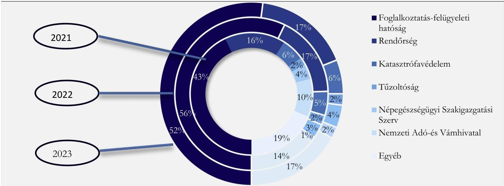
Forrás: A nemzetgazdaság 2021-2023. évi munkavédelmi helyzetéről szóló jelentések

A munkavédelmi hatóság és a társhatóságok együttműködése a közös ellenőrzéseken túl kiterjed a kölcsönös tájékoztatásra, az adatszolgáltatásokra, melynek kereteit az egészségbiztosítási szerv (a helyszíni ellenőrzés időszakában a Nemzeti Egészségbiztosítási Alapkezelő), a Belügyminisztérium Országos Katasztrófavédelmi Főigazgatóság, a Honvédelmi Minisztérium Hatósági Főosztálya és a Szabályozott Tevékenységek Felügyeleti Hatósága esetében együttműködési megállapodások tartalmazták, a fogyasztóvédelmi hatóság tekintetében normatív utasítás tartalmazta.

A 10/2012. (XI. 30.) NMH utasítás alapján a biztonsági követelményeknek nem megfelelő termék esetében a kormányhivataloknak adatot kellett szolgáltatniuk a KPIR⁷² rendszerbe, azonban a rendelkezés végrehajtása az ellenőrzött időszakban akadályba ütközött, tekintettel arra, hogy a KPIR rendszer teljes körűen 2017. évig működött, a rendszerbe adatfeltöltés a 2017. évig bezárólag történt, az Európai Unió ICSMS⁷³ rendszerének bevezetésével a KPIR rendszer okafogyottá vált.

Az ellenőrzött időszakban a szakmai irányító kormányzati oldalról részt vett az egészséget nem veszélyeztető és biztonságos munkavégzéssel kapcsolatos országos munkavállalói, munkáltatói, kormányzati érdekegyeztetést ellátó Országos Munkavédelmi Bizottság tevékenységében. Az ellenőrzött időszakot megelőzően a kölcsönös tájékoztatásra irányuló kétoldalú együttműködési megállapodásokat kötött a Vállalkozók és Munkáltatók Országos Szövetsége Közép-magyarországi Regionális Szervezetével,

---

Megállapítások

a Gépjármű Márkakereskedők Országos Szövetségével, a Magyar Mérnöki Kamara Munkabiztonsági Tagozatával, a Nonprofit Humánszolgáltatók Országos Szövetségével.

44

---

JAVASLATOK

Az ÁSZ tv. 33. § (1) bekezdésében foglaltak értelmében az ellenőrzött szervezet vezetője köteles a jelentésben foglalt megállapításokhoz kapcsolódó intézkedési tervet összeállítani és azt a jelentés kézhezvételétől számított 30 napon belül az ÁSZ részére megküldeni. Amennyiben az ellenőrzött szervezet vezetője nem küldi meg határidőben az intézkedési tervet, vagy továbbra sem elfogadható intézkedési tervet küld, az Állami Számvevőszék elnöke az ÁSZ tv. 33. § (3) bekezdése a) és b) pontjaiban foglaltakat érvényesítheti.

## NEMZETGAZDASÁGI MINISZTER RÉSZÉRE

1. Gondoskodjon a munkavédelmi hatóság tevékenységére vonatkozó NMH utasítások felülvizsgálatáról.
2. Intézkedjen a munkavédelmi hatóság által vezetett nyilvántartások tartalmi felülvizsgálatáról annak érdekében, hogy azok megfeleljenek az Mvt. 63/C. § (3) bekezdésben, 63/G. § (2) bekezdésben, 64/D. § (2) bekezdésben, 64/E. § (2) bekezdés előírásainak.
3. Gondoskodjon a nevelés és az oktatás területén a biztonságos életvitelre, a szakmai oktatás és a szakmai képzés területén az egészséget nem veszélyeztető és a biztonságos munkavégzés szabályaira vonatkozó ismeretanyag meghatározásáról a 320/2014. (XII. 13.) Korm. rendelet 6. § a) bekezdésében foglalt előírásnak megfelelően.
4. Intézkedjen a munkavédelem nemzeti politikája végrehajtásához kapcsolódó költségvetési tervezési és beszámolási folyamatok kialakításáról.
5. Intézkedjen a munkavédelem igazgatásával összefüggő bevételek és kiadások átlátható nyilvántartásáról és beszámolásáról.
6. Intézkedjen a munkavédelmi hatósági ellenőrzések során az ellenőrzötték kiválasztását megelőző rendszerszerű kockázatelemzés kialakításáról.
7. Intézkedjen a kormányhivatalok mint munkavédelmi hatóság részére meghatározott teljesítménycélok meghatározása és teljesítése számonkérési rendszerének felülvizsgálatáról.

45

---

Javaslatok

# HEVES VÁRMEGYEI KORMÁNYHIVATAL FŐISPÁNJA RÉSZÉRE

1. Gondoskodjon arról, hogy a munkavédelmi feladatkörben eljáró kormánytisztviselők minden esetben rendelkezzenek hatósági ellenőrzésre jogosító vizsgával a 320/2014 (XII.13.) Korm.rendelet 14/A. § (1) bekezdés előírásának megfelelően.

# BÉKÉS VÁRMEGYEI KORMÁNYHIVATAL, BORSOD-ABAÚJ-ZEMPLÉN VÁRMEGYEI KORMÁNYHIVATAL, BUDAPEST FŐVÁROS KORMÁNYHIVATALA, HEVES VÁRMEGYEI KORMÁNYHIVATAL, NÓGRÁD VÁRMEGYEI KORMÁNYHIVATAL, PEST VÁRMEGYEI KORMÁNYHIVATAL, SOMOGY VÁRMEGYEI KORMÁNYHIVATAL FŐISPÁNJA RÉSZÉRE

1. Gondoskodjon, hogy a munkavédelmi feladatkörben eljáró kormánytisztviselők évente szakmai továbbképzésen vegyenek részt a 320/2014 (XII.13.) Korm.rendelet 14/A. § (1) bekezdés előírásának megfelelően.

# BÉKÉS VÁRMEGYEI KORMÁNYHIVATAL, BORSOD-ABAÚJ-ZEMPLÉN VÁRMEGYEI KORMÁNYHIVATAL, BUDAPEST FŐVÁROS KORMÁNYHIVATALA, SOMOGY VÁRMEGYEI KORMÁNYHIVATAL FŐISPÁNJA RÉSZÉRE

1. Intézkedjen, hogy a kormányhivatal által lefolytatott munkavédelmi ellenőrzések során az Mvt. 83/D. §-ban foglalt határidők betartásra kerüljenek.

# BÉKÉS VÁRMEGYEI KORMÁNYHIVATAL, BORSOD-ABAÚJ-ZEMPLÉN VÁRMEGYEI KORMÁNYHIVATAL, NÓGRÁD VÁRMEGYEI KORMÁNYHIVATAL, PEST VÁRMEGYEI KORMÁNYHIVATAL, SOMOGY VÁRMEGYEI KORMÁNYHIVATAL FŐISPÁNJA RÉSZÉRE

1. Intézkedjen, hogy a munkavédelmi hatósági ellenőrzéseket lezáró határozatok az Ákr. 81. § (1) bekezdés előírásának megfelelően tartalmazzanak az eljárási költséggel kapcsolatos rendelkezést.

46

---

MELLÉKLETEK

## I. SZ. MELLÉKLET: ÉRTELMEZŐ SZÓTÁR

munkavédelmi hatóság
A foglalkoztatáspolitikáért felelős miniszter, továbbá a fővárosi és vármegyei kormányhivatal. (Forrás: 320/2014. (XII. 13) Korm. rendelet 2. §)

munkabaleset
Munkabaleset az a baleset, amely a munkavállalót a szervezett munkavégzés során vagy azzal összefüggésben éri, annak helyétől és időpontjától és a munkavállaló (sérült) közrehatásának mértékétől függetlenül. (Forrás: Mvt. 87.§ 3. pont)

súlyos munkabaleset
Súlyos az a munkabaleset, mely

a) a sérült halálát (halálos munkabaleset az a baleset is, amelynek bekövetkezésétől számított egy éven belül a sérült orvosi szakvélemény szerint a balesettel összefüggésben életét vesztette), magzata vagy újszülöttje halálát, önálló életvezetését gátló maradandó károsodását;

b) valamely érzékszerv, érzékelőképesség, illetve a reprodukciós képesség elvesztését vagy jelentős mértékű károsodását okozta;

c) orvosi vélemény szerint életveszélyes sérülést, egészségkárosodást;

d) hüvelykujj vagy kéz, láb két vagy több ujja nagyobb részének elvesztését, továbbá ennél súlyosabb csonkulást okozott, illetve;

e) beszélőképesség elvesztését vagy feltűnő eltorzulást, bénulást, illetőleg elmezavart okozott. (Forrás: Mvt. 87. § 3. pont)

közérdekű bejelentés
A közérdekű bejelentés olyan körülményre hívja fel a figyelmet, amelynek orvoslása vagy megszüntetése a közösség vagy az egész társadalom érdekét szolgálja. A közérdekű bejelentés javaslatot is tartalmazhat. (Forrás: Panasztv. 1. § (3) bekezdés)

panasz
A panasz olyan kérelem, amely egyéni jog- vagy érdeksérelem megszüntetésére irányul, és elintézése nem tartozik más – így különösen bírósági, közigazgatási – eljárás hatálya alá. A panasz javaslatot is tartalmazhat. (Forrás: Panasztv. 1. § (2) bekezdés)

foglalkoztatott
Foglalkoztatott, aki a kérdezés hetét megelőző héten legalább 1 órányi, jövedelmet biztosító munkát végzett vagy rendelkezett munkával, de abban átmenetileg (pl. betegség, szabadság, ideértve a szülési szabadságot és gyermekgondozás miatti tartós távollétet is) nem dolgozott. A gyermekgondozás miatt tartósan távollevők közül csak azok számítanak foglalkoztatottnak, akik az ellátás igénybevétele előtt dolgoztak utoljára, a távollét idején pénzbeli juttatásban részesülnek, és az ellátás igénybevételét követően visszatérhetnek korábbi munkahelyükre. 2021. évben 4609,7 ezer fő, 2022. évben 4669,7,6 ezer fő, 2023. évben 4697,5 ezer fő (forrás: KSH)

alkalmazásban álló munkavállaló
Alkalmazásban állónak tekintendő az a munkavállaló, aki a munkáltatóval munkavégzésre irányuló jogviszonyban áll, s munkaszerződése, munkavégzésre irányuló megállapodása alapján havi átlagban, munkadíj ellenében legalább 60 munkaóra teljesítésére kötelezett/kötelezhető. Alkalmazásban állók száma 2021. évben 3554,6 ezer fő, 2022. évben 3637,6 ezer fő, 2023. évben 3672,0 ezer fő (Forrás: KSH)

47

---

Mellékletek

hatékonyság

A hatékonyság elve a rendelkezésre álló erőforrásokkal a lehető legjobb teljesítmény elérését, az igénybe vett erőforrások és az elért eredmények mennyiségben, minőségben és időben kifejezett kapcsolatát jelenti. A hatékonyság az egységnyi erőforrásra jutó teljesítményt hivatott meghatározni, figyelembe véve a mennyiségi, a minőségi szempontokat és az időtényezőt. (Forrás: Az Állami Számvevőszék ellenőrzési alapelvei és módszertana, 2024. október)

eredményesség

Az eredményesség elve a kitűzött célok és a tervezett eredmények (hatások) elérését jelenti, azt, hogy az ellenőrzött terület (tevékenység, folyamat, projekt, beruházás, informatikai rendszer stb.) vagy szervezet a kitűzött célokat és a szándékolt eredményeket (hatásokat) elérte. A gazdálkodás, a feladatellátás eredményességét a szervezet által kitűzött célok és a szándékolt eredmények (hatások) elérésének (a tényleges és a tervezett eredmények) összevetése révén lehet meghatározni. Az eredményesség, a társadalmi hatás értékelésekor fontos szem előtt tartani azt az időtartamot is, amely alatt a változás bekövetkezik, ezért rövid, közép- és hosszútávon egyaránt értelmezhető. (Forrás: Az Állami Számvevőszék ellenőrzési alapelvei és módszertana 2024. október)

48

---

Mellékletek

## II. SZ. MELLÉKLET: AZ ELLENŐRZŐTT ÉS TÁMOGATÓ SZERVEZETEK JEGYZÉKE

|  ELLENŐRZŐTT SZERVEZET MEGNEVEZÉSE  |
| --- |
|  Foglalkoztatás politikáért felelős miniszter  |
|  innovációs és technológiai miniszter és Innovációs és Technológiai Minisztérium 2022. május 23-ig  |
|  technológiai és ipari miniszter és Technológiai és Ipari Minisztérium 2022. május 24-től 2022. november 21-ig  |
|  gazdaságfejlesztési miniszter és Miniszterelnöki Kabinetiroda 2022. november 22-től 2022. december 31-ig  |
|  gazdaságfejlesztési miniszter és Gazdaságfejlesztési Minisztérium 2023. január 1-jétől 2023. december 31-ig  |
|  nemzetgazdasági miniszter és Nemzetgazdasági Minisztérium 2024. január 1-jétől  |
|  Kormányhivatalok  |
|  Budapest Főváros Kormányhivatala  |
|  Békés Vármegyei Kormányhivatal  |
|  Borsod-Abaúj-Zemplén Vármegyei Kormányhivatal  |
|  Heves Vármegyei Kormányhivatal  |
|  Nógrád Vármegyei Kormányhivatal  |
|  Pest Vármegyei Kormányhivatal  |
|  Somogy Vármegyei Kormányhivatal  |
|  TÁMOGATÓ SZERVEZET MEGNEVEZÉSE  |
| --- |
|  Kormányhivatalok  |
|  Baranya Vármegyei Kormányhivatal  |
|  Bács-Kiskun Vármegyei Kormányhivatal  |
|  Csongrád-Csanád Vármegyei Kormányhivatal  |
|  Fejér Vármegyei Kormányhivatal  |
|  Győr-Moson-Sopron Vármegyei Kormányhivatal  |
|  Hajdú-Bihar Vármegyei Kormányhivatal  |
|  Jász-Nagykun-Szolnok Vármegyei Kormányhivatal  |
|  Komárom-Esztergom Vármegyei Kormányhivatal  |
|  Szabolcs-Szatmár-Bereg Vármegyei Kormányhivatal  |
|  Tolna Vármegyei Kormányhivatal  |
|  Vas Vármegyei Kormányhivatal  |
|  Veszprém Vármegyei Kormányhivatal  |
|  Zala Vármegyei Kormányhivatal  |

---

Mellékletek

## III. SZ. MELLÉKLET: ELLENŐRZÉSI KRITÉRIUMOK

|  FÓKUSZTERÜLET/FÓKUSZKÉRDÉS | ELLENŐRZÉSI KRITÉRIUMOK  |
| --- | --- |
|  1. A munkavédelem hatósági tevékenységének szakmai irányítása | Áht., Ávr., Mvt., 320/2014. (XII. 13.) Korm. rendelet; 86/2019. (IV. 23.) Korm. rendelet; 568/2022. (XII.23.) Korm. rendelet, 182/2022. (V. 24.) Korm. rendelet, 1581/2016. (X. 25.) Korm. határozat, 1003/2024. (I. 11.) Korm. határozat, 2/2022 (XI.14.) ME rendelet, 5/1993. (XII.26.) MüM rendelet, 89/391/EGK irányelv, 2009/148/EK irányelv, 91/383/EGK irányelv, 92/29/EGK irányelv, 94/33/EK irányelv  |
|  2. A munkavédelmi hatósági tevékenység megfelelősége | Áht., Ávr., Mvt., Ákr., Kit., Panasz tv.1-2, Szankció tv., Ávr., 320/2014. (XII.13.) Korm. rendelet, 86/2019. (IV.23.) Korm. rendelet, 568/2022. (XII.23.) Korm. rendelet, 273/2011. (XII.20.) Korm. rendelet, 273/2012. (IX. 28.) Korm. rendelet, 7/2012. (XI. 13.) NMH utasítás  |
|  3. A munkavédelemmel kapcsolatos egyes kiadások és bevételek alakulása | Áht., Ávr., Mvt., Ebtv., Tbj., Tny., 2022. évi költségvetési tv., 2023. évi költségvetési tv., 2024. évi költségvetési tv., 2022. évi zárszámadási tv.,  |

---

Mellékletek

|  320/2014. (XII. 13.) Korm. rendelet,  |
| --- |
|  25/2024. (II.14.) Korm.rendelet  |
|  86/2019. (IV. 23.) Korm. rendelet,  |
|  1581/2016. (X. 25.) Korm. határozat,  |
|  1003/2024. (I. 11.) Korm. határozat,  |
|  568/2022. (XII. 23.) Korm. rendelet  |
|  Mvt.,  |
|  320/2014. (XII. 13.) Korm. rendelet,  |
|  86/2019. (IV.23.) Korm. rendelet,  |
|  568/2022. (XII. 23.) Korm. rendelet,  |
|  25/2024. (II. 14.) Korm. rendelet,  |
|  5/1993. (XII.26.) MüM rendelet  |
|  10/2012. (XI. 30.) NMH utasítás  |

4. A munkavédelmi ellenőrzés eredményességének értékelése

51

---

FÜGGELÉK: ÉSZREVÉTELEK

A jelentéstervezetet a Számvevőszék 15 napos észrevételezésre megküldte az ellenőrzött szervezet vezetőjének az ÁSZ tv. 29. §* (1) bekezdése előírásának megfelelően.

A jelentéstervezet megállapításaira a Nógrád Vármegyei Kormányhivatal és a Pest Vármegyei Kormányhivatal nem tett észrevételt.

A jelentétervezet megállapításaira észrevételt tett a nemzetgazdasági miniszter, a Budapest Főváros Kormányhivatala főispánja, a Borsod-Abaúj-Zemplén Vármegyei Kormányhivatal főispánja, a Békés Vármegyei Kormányhivatal főigazgatója, a Heves Vármegyei Kormányhivatal főispánja és a Somogy Vármegyei Kormányhivatal főispánja. Az ÁSZ tv. 29. § (3) bekezdésével összhangban az Állami Számvevőszék a jelentésben feltünteti a megállapításokkal kapcsolatban tett, el nem fogadott észrevételeket, és megindokolja, hogy azokat miért nem fogadta el.

## A Nemzetgazdasági Miniszter észrevétele:

„Jelezni kívánjuk, hogy az Ákr. 81. § (1) bekezdése értelmében:

„A döntés tartalmazza az eljáró hatóság, az ügyfelek és az ügy azonosításához szükséges minden adatot a zártan kezelt és védett adatok kivételével, a rendelkező részt – a hatóság döntésével, a szakhatóság állásfoglalásával, a jogorvoslat igénybevételével kapcsolatos tájékoztatással és a felmerült eljárási költséggel –, továbbá a teljes eljárásra történő áttérés esetén az áttérés okára, a megismerhetetlenné tett zártan kezelt és védett adatokkal együtt megállapított tényállásra, a bizonyítékokra, a szakhatósági állásfoglalás indokolására, a mérlegelés és a döntés indokaira, valamint az azt megalapozó jogszabályhelyek megjelölésére is kiterjedő indokolást.

A munkavédelmi hatósági eljárásban nem merül fel eljárási költség, ezért nem szerepel az iratmintákban sem, kérjük a megállapítás elhagyását.”

## Észrevétellel érintett megállapítás:

Összefoglalás 10. oldal 5. bekezdés 3. mondat: „A kormányhivatalok szabályszerűen dokumentálták munkavédelmi hatósági ellenőrzéseiket, azonban az eljárást lezáró határozatok nem tartalmaztak eljárási költséggel kapcsolatos rendelkezést a jogszabályi előírás ellenére.”

Megállapítások fejezet, 18. oldal összegző megállapítás: „A munkavédelmi ellenőrzések végrehajtása során az ellenőrzött kormányhivatalok szabályszerűen dokumentálták munkavédelmi hatósági ellenőrzéseiket, azonban

* 29. § (1) Az Állami Számvevőszék az ellenőrzési megállapításait megküldi az ellenőrzött szervezet vezetőjének vagy az általa megbízott személynek, és annak, akinek személyes felelősségét állapította meg.
(2) Az ellenőrzött szervezet vezetője és a felelősként megjelölt személy az ellenőrzés megállapításaira tizenöt napon belül írásban észrevételt tehet.
(3) Az Állami Számvevőszék az észrevételre a beérkezésétől számított harminc napon belül írásban válaszol. A figyelembe nem vett észrevételeket köteles a jelentésben feltüntetni, és megindokolni, hogy azokat miért nem fogadta el.

52

---

Függelék: Észrevételek

az eljárást lezáró határozatok – az Ákr.51-ben előírtak ellenére – nem tartalmaztak eljárási költséggel kapcsolatos rendelkezést."

Megállapítások fejezet, 21. oldal 4. bekezdés, 2. mondat: „Az eljárást lezáró határozatok – az Ákr. 81. § (1) bekezdésben előírtak ellenére – nem tartalmaztak eljárási költséggel kapcsolatos rendelkezést."

Megállapítások fejezet, 22. oldal 4. bekezdés, 2. mondat: „Az ellenőrzött kormányhivatalok által kiadott 74 eljárást lezáró döntést rögzítő határozat rendelkező részében azonban, az Ákr. 81. § (1) bekezdésében előírtak ellenére nem szerepelt a felmerült eljárási költséggel kapcsolatos rendelkezés."

## El nem fogadás indoka:

Az Ákr. 81. § (1) bekezdésében előírtak szerint a hatóság döntése – egyebek mellett – tartalmazza a rendelkező részt a hatóság döntésével, a szakhatóság állásfoglalásával, a jogorvoslat igénybevételével kapcsolatos tájékoztatással és a felmerült eljárási költséggel. A felmerült eljárási költséggel kapcsolatban a rendelkező rész jogszabályban felsorolt tartalmát az Ákr. nem feltételhez kötötten határozza meg, amiből következően a hatóságnak minden döntésében rendelkeznie kell a felmerült eljárási költséggel kapcsolatban, még abban az esetben is, ha nem merült fel eljárási költség a hatósági eljárás során. Ennek hiányában nem derül ki, hogy az eljárás költségeiről való rendelkezés elmaradt vagy ténylegesen nem merült fel eljárási költség.

## A Nemzetgazdasági Miniszter észrevétele:

„NGM észrevétel:

A felügyelői létszám kérdése a funkcionális irányítás körét érintő, nem szakmai kompetencia. Tekintettel azonban arra, hogy észleljük, hogy a folyamatosan csökkenő létszám hatással van a teljesítménymutatókra, rendszeresen javaslatot teszünk a fővárosi és vármegyei kormányhivatalok felé a létszám növelésére vonatkozóan.

Fenti tárgyban az NGM-KTM közös előterjesztést nyújtott be a felügyelői létszám és illetmények emelésére vonatkozóan 2024. évben, azonban az előterjesztés nem került elfogadásra.

KTM észrevétel:

A fővárosi és vármegyei kormányhivatalok álláshelyeinek számát a Kormány határozza meg, a működési költségek pedig a központi költségvetésben biztosítottak, így a feladat a meglévő keletek között látható el. A kormányhivatali feladattalás feltételeinek biztosítására mind a szakmai, mind a funkcionális irányító minisztérium kiemelt figyelmet fordít, és megteszi mindazokat az intézkedéseket, amelyeket saját hatáskörbe vagy együttesen lehetősége van megtenni. A két irányító szerv a minimálisan biztosítandó alaplétszám fenntartása érdekében megállapodást kötött, azonban elsősorban a jelenlegi költségvetési helyzet eredményezi azt, hogy a kormányhivatalok által kiírt munkavédelmi felügyelői álláshely pályázatok sikertelenek, a versenyszféra elszívó hatása miatt. A felügyelői létszám rendezéséhez központi többletforrás és többlet lésám biztosítása szükséges, mely intézkedések megtörténtéig a kormányhivatalok és az irányadó minisztériumok a rendelkezésre álló erőforrások felhasználásával mindent megtesznek a munkavédelmi intézkedéseket végre nem hajtó munkáltatók arányának csökkentése érdekében."

53

---

Függelék: Észrevételek

## Észrevétellel érintett megállapítás:

Összefoglalás 10. oldal 5. bekezdés 3. mondat: „A kormányhivatalok a munkavédelmi ellenőrzéseket csökkenő munkavédelmi felügyelői létszám mellett, növekvő ellenőrzésszámokkal, összességében hatékonyan látták el. Az ÁSZ véleménye szerint az utóellenőrzésekre rendelkezésre álló munkavédelmi felügyelői létszám növelése lehetővé tenné a munkavédelmi intézkedéseket végre nem hajtó munkáltatók arányának csökkentését, ezáltal a munkavédelmi ellenőrzések visszatartó erejének, eredményességének növelését."

## El nem fogadás indoka:

A tájékoztatás a jelentéstervezet megállapításait nem módosítja.

## A Nemzetgazdasági Miniszter észrevétele:

„A javaslatok 4. pontjához kapcsolódóan:

Az Mvt. - kiragadott - 14. § (1) bekezdés d) pontjának kontextuális értelmezése alapján állami feladat a fent nevesített ismeretanyag meghatározása:

**II. FEJEZET AZ ÁLLAM MUNKAVÉDELMI FELADATAI ÉS A VÉGREHAJTÁSÉRT FELELŐS SZERVEK**

Az állam feladatai

14. § (1) A munkavédelem irányításának keretében állami feladat

d) a nevelés és az oktatás területén a biztonságos életviletre, a szakmai oktatás és a szakmai képzés területén az egészséget nem veszélyeztető és a biztonságos munkavégzés szabályaira vonatkozó ismeretanyag meghatározása;

Az Mvt. 17. § (4) bekezésére: A munkavédelem ágazati feladatait a feladatkörében érintett miniszter látja el.

Az állami feladatok végrehajtásáért felelős szerveket a Kormány tagjainak feladat- és hatásköréről szóló 182/2022 (V.24.) Kormányrendelet határozza meg. A Kormányrendelet alapján a Belügyminiszter határkörébe utalt feladat a köznevelés (általános és középfokú oktatás), míg a felsőoktatás, a szakképzés és felnőttképzés a Kultúráért és innovációért felelős miniszter feladat- és hatáskörét képezi, ezáltal az oktatási anyag meghatározása is.

Az Mvt. 79. § (1) bekezdés g) pontja értelmében "Az Országos Munkavédelmi Bizottság az egészséget nem veszélyeztető és biztonságos munkavégzésre vonatkozó érdekegyeztető tevékenysége keretében véleményező a nevelés és oktatás területén a biztonságos életvitelre, a szakmai oktatás és a szakmai képzés területén az egészséget nem veszélyeztető és a biztonságos munkavégzé szabályaira vonatkozó ismeretanyagot."

A Nemzetgazdasági Minisztérium Munkavédelmi Irányítási Főosztálya, mint az ellenőrzéssel érintett szakmai irányító, az Országos Munkavédelmi Bizottság szakmai oldalát képviselve vesz részt az oktatási anyag véleményezésében.

A fentiekre tekintettel kérjük a javaslat ezen pontjának törlését."

54

---

Függelék: Észrevételek

## Észrevétellel érintett megállapítás:

Összefoglalás 10. oldal 3. bekezdés 2. mondat: „Az ellenőrzés során feltárt hiányosság volt, hogy elmaradt a munkavédelmi hatóság feladatellátását szabályozó normatív utasítások közül több felülvizsgálata és aktualizálása, továbbá – a jogszabályi előírás ellenére – a nevelés és az oktatás területén a biztonságos életvitelre, a szakmai oktatás és a szakmai képzés területén az egészséget nem veszélyeztető és a biztonságos munkavégzés szabályaira vonatkozó ismeretanyag elkészítése.”

Megállapítások fejezet 17. oldal 1. bekezdés: „A foglalkoztatáspolitikáért felelős miniszter az ellenőrzött időszakban a 320/2014.°(XII.°13.)° Korm.° rendelet 6. § a) bekezdésében foglalt előírás ellenére nem határozta meg az Mvt. 14. § (1) bekezdés d)” pontja szerinti, a nevelés és az oktatás területén a biztonságos életvitelre, a szakmai oktatás és 2023. január 1-től a szakmai képzés területén az egészséget nem veszélyeztető és a biztonságos munkavégzés szabályaira vonatkozó ismeretanyagot.”

## El nem fogadás indoka:

A 320/2014. (XII.13.) Korm. rendelet 6. § a) bekezdés előírása alapján az ellenőrzött időszakban a foglalkoztatásért felelős miniszter feladata volt az Mvt. 14. §-ában meghatározott állami irányítási feladatok ellátása, és ennek keretében az Mvt. 14. § (1) bekezdés d) pontja szerinti, a nevelés és az oktatás területén a biztonságos életvitelre, a szakmai oktatás és 2023. január 1-től a szakmai képzés területén az egészséget nem veszélyeztető és a biztonságos munkavégzés szabályaira vonatkozó ismeretanyag meghatározása is. A munkavédelem állami irányítási feladatait egyértelműen meghatározzák a 320/2014. (XII. 13.) Korm. rendelet és az Mvt. hivatkozott szakaszai. A munkavédelem ágazati tevékenységének keretében ellátandó állami feladatokat az Mvt. 15. § rögzíti, ezért az Mvt. 17. § (4) bekezdése az Mvt. 15. §-ban felsorolt feladatok – mint a munkavédelem ágazati feladatai – ellátására jelöli ki „a feladatkörében érintett minisztert”. Az NGM Munkavédelmi Irányítási Főosztályának részvételé az oktatási anyag véleményezésében nem teljesíti az Mvt. 14. § (1) bekezdés d) pontjában foglalt feladat ellátását.

## A Nemzetgazdasági Miniszter észrevétele:

„A 2024-2027-es időszakra vonatkozó Munkavédelmi Nemzeti Politikáról szóló előterjesztés nevesíti, hogy a kitűzött feladatokban érintett intézmények alapfeladatként, az adott fejezeti keretszámon belül saját alapköltségvetésük terhére valamint a megvalósítás időszakára eső munkavédelmi tartalmú EU-s projektek (pl. GINOP-5.3.7. - VEKOP-17) támogatásával látják el a munkavédelem nemzeti politikájában megfogalmazott feladatokat, azok végrehajtása nem generál költségvetési többletforrásigényt.

A beszámolási folyamat a Nemzetgazdaság munavédelmi helyzetéről szóló éves jelentés szerint valósul meg, a beszámolás rendszeres, nyilvános.

A fentiekre tekintettel kérjük a javaslat ezen ponjának törlését.”

## Észrevétellel érintett megállapítás:

Megállapítások fejezet 28. oldal 3. bekezdés: „A munkavédelem nemzeti politikája 2016-2022 végrehajtásához kapcsolódóan tervezett és teljesített költségvetési kiadásokról és bevételekről kimutatások, nyilvántartások, beszámolók, illetve jelentések nem készültek. A munkavédelem nemzeti politikája 2024-2027 előkészítése során

55

---

Függelék: Észrevételek

a szakmai irányító azzal tervezett, hogy a kitűzött feladatokban érintett intézmények alapfeladatként, az adott fejezeti keretszámon belül saját költségvetésük terhére, valamint a megvalósítás időszakára eső munkavédelmi tartalmú EU-s projektek támogatásával látják el a munkavédelem nemzeti politikájában megfogalmazott feladatokat, és azok végrehajtása nem generál többlet költségvetési forrásigényt. A 2024–2027-es időszakra vonatkozó munkavédelem nemzeti politikája előkészítése során a szakmai irányító költségvetési terveket, számításokat nem készített. A munkavédelem nemzeti politikájában megfogalmazott feladatok költségvetésre gyakorolt hatása a feladatokhoz rendelt költségvetési tervezés és beszámolás hiányában nem átlátható."

## El nem fogadás indoka:

A munkavédelem nemzeti politikája során felmerülő, az egyes intézmények által végrehajtandó intézkedések végrehajtása kiadással jár, függetlenül attól, hogy a vonatkozó kiadási előirányzat az éves intézményi költségvetés részeként, illetve európai uniós forrásból nyújtott támogatásból keletkezik. A munkavédelem nemzeti politikájában megfogalmazott feladatok erőforrásigénye feladatalapú költségvetési tervezés és beszámolás hiányában nem átlátható, nem nyújt teljeskörű tájékoztatást a döntéshozók számára.

## A Nemzetgazdasági Miniszter észrevétele:

„A javaslatok 6. pontjához kapcsolódóan:

(…)

NGM észrevétel:

Funkcionális feladatellátást érintő kérdés.

KTM észrevétel:

Tekintettel arra, hogy a központi költségvetés tervezése nem feladat alapján, hanem bázis alapon történik az egyes szakmai területek kiadásainak és bevételeinek, létszámának tervezése vonatkozásában külön nem kerül egységes eljárásrend, gyakorlat kialakításra. A kormányhivatalok éves költségvetésének tervezése 2021–2023. években a Pénzügyminisztérium által kiadott tervezési köriratokban (https://kormany.hu/nemzetgazdasagi-minisztérium/koltsegvetes) foglaltaknak megfelelően történt, ezért kérjük a javaslat ezen pontjának törtlését.”

## Észrevétellel érintett megállapítás:

Összefoglalás 10. oldal 3. bekezdés: „A munkavédelmi hatóság működésével összefüggő kiadások az éves költségvetési beszámolókban a munkaügyi hatóság kiadásaival összevontan, egy kormányzati funkciószámon kerültek bemutatásra, továbbá a kiadások elkülönített nyilvántartására az NGM és a kormányhivatalok egységes gyakorlattal nem rendelkeztek, holott az ÁSZ szakmai véleménye szerint ezek megléte jelentősen támogatná a munkavédelmi hatóság tevékenységével összefüggő kiadások átláthatóságát.”

Megállapítások fejezet 25. oldal 3. bekezdés, 4. bekezdés 1. mondat: „A kormányhivataloknál nem volt általános és egységes gyakorlat a munkavédelmi hatósági feladatok kiadásainak és bevételeinek, létszámának tervezésére. A 20 kormányhivatal közül öt kormányhivatal (CSCSVKH, JNSZVKH, KEVKH, NVKH és a ZVKH) rendelkezett 2021–2023. években munkavédelmi hatósági tevékenység (munkavédelmi szakterület) kiadásaira és

56

---

Függelék: Észrevételek

bevételére, létszámára vonatkozóan készült tervekkel, számításokkal, melyeket az elemi költségvetés készítése során határoztak meg. A szakmai irányító nem élt 2022. december 31-ig a 86/2019. (IV. 23.) Korm. rendelet 6. § (2) bekezdés a) pontja, illetve 2023. évtől a 568/2022. (XII. 23.) Korm. rendelet 7. § (2) bekezdés a) pontja szerinti jogkörével, a 2021-2023. évekre vonatkozóan a fővárosi és vármegyei kormányhivatal irányítására kijelölt miniszter részére a fővárosi és vármegyei kormányhivatalokat érintő szakmai terveket és a megvalósítás szervezeti és költségvetési feltételeire vonatkozó javaslatot nem küldött. A kormányhivatalok a munkavédelmi hatósági feladataikkal kapcsolatos kiadásaikat éves költségvetési beszámolójukban a munkaügyi/foglalkoztatásfelügyeleti hatósági tevékenységgel összevontan, a 15/2019. (XII. 7.) PM rendelet szerinti 041210 Munkaügy igazgatása kormányzati funkciószámon mutatják be."

## El nem fogadás indoka:

Az államháztartásról szóló törvény végrehajtásáról szóló 368/2011. (XII. 31.) Korm. rendelet 16. § (2) bekezdés a költségvetés tervezési feladatai között rögzíti, hogy a tervezett bevételek és kiadások között meg kell tervezni mindazokat a bevételeket és kiadásokat, amelyek az ellátott közfeladatokkal kapcsolatosak, a tapasztalatok alapján rendszeresen előfordulnak, vagy eseti jelleggel várhatóak, jogszabályon, magánjogi kötelmen alapulnak, vagy az eszközök hasznosításával függenek össze. A kormányzati funkciók és államháztartási szakágazatok osztályozási rendjéről szóló 15/2019. (XII. 7.) PM rendelet 1. § előírása alapján az államháztartás szervezetei közfeladataikat, azok bevételeit és kiadásait kötelesek a rendeletben foglaltak szerint nyilvántartani és elszámolni. A munkavédelmi hatósági feladatokkal kapcsolatos kiadások és bevételek nyilvántartására, elszámolására jelenleg – a foglalkoztatás-felügyeleti hatósági tevékenységgel összevontan – a 041210 Munkaügy igazgatása kormányzati funkciószám szolgál. A munkavédelem igazgatása kiadásainak és bevételeinek a foglalkoztatás-felügyeleti területtől elkülönített nyilvántartása hozzájárulna a munkavédelmi terület kiadásainak átláthatóságához, különös tekintettel a jogszabályi környezet megváltozására.

## A Nemzetgazdasági Miniszter észrevétele:

„A teljesítmény-célkitűzésben meghatározott feladatok teljesítésének mérése folyamatos, külön számonkérést nem igényel. Fenti tárgyban az ÁSZ ellenőrzés során a 2. feltöltési szakaszban az alábbi nyilatkozatot töltöttük fel az EAR rendszerbe a dokumentumjegyzék 32. pontjához kapcsolódóan:

„A dokumentumjegyzék 8. pontja szerint feltöltött szakmai értékelések egyben felhívást is tartalmaznak az útmutatás szerinti teljesítésre. Az értékelésben a teljesülések szintjét színskálával jelöljük.

A szakmai értékelést a főispánok keresztül továbbítjuk a vármegyei munkavédelmi hatóságok részére.”

A szakmai értékeléseket negyedévente megküldi a szakmai irányító a főispánok részére, amely esetenként személyi következménnyel is jár. Volt rá precedens, hogy a szakmai teljesítmények teljesülésének többszöri elmaradása osztályvezetői felmentést vont maga után.

A teljesítménykitűzés nem teljesülése közjogi értelemben nem szankcionálható, erre való tekintettel kérjük a javaslat ezen pontjának törlését.”

---

Függelék: Észrevételek

## Észrevétellel érintett megállapítás:

Összefoglalás 9. oldal 5. bekezdés 2. mondat: „A teljesítménycélok nem teljes körű teljesítése indokolttá teszi a teljesítménycélok és azok teljesítése számonkérési rendszerének felülvizsgálatát a szakmai irányítónál, illetve a kormányhivataloknál."

Megállapítások fejezet 31. oldal 1. bekezdés 1. mondat: „A szakmai irányító a munkavédelmi ellenőrzések és a tájékoztatási tevékenység vonatkozásában a kormányhivatalok számára 2021-2023. évekre azonos teljesítménycélokat határozott meg, melyek országos szinten 2022. évben 90%-ban 2023. évben 80%-ban teljesültek."

## El nem fogadás indoka:

A munkavédelmi hatóságok részére „A munkavédelmi és foglalkoztatás-felügyeleti ellenőrzést végző hatóságok teljesítménycélkitűzések tevékenységére vonatkozó teljesítménycélkitűzések 2022.” (2022. Telj kitűzés_kész.doc), valamint „A munkavédelmi és foglalkoztatás-felügyeleti ellenőrzést végző hatóságok tevékenységére vonatkozó teljesítménycélkitűzések 2023.” (2023. Teljesítmény célkitűzés kész.doc) dokumentumokban 2022. évre, illetve 2023. évre 10 azonos teljesítmény mutató került meghatározásra, mely 2022. évben kiegészült a GINOP-5.3.7. projekt keretében szervezett továbbképzéseken való részvétellel. A 2022. évre, illetve 2023. évre vonatkozó „Munkavédelmi hatóság értékelése” (Vezetőire 2022. év.pdf és Vezetőire 2023. év NGM MV.pdf) dokumentumok alapján a teljesítménycélok 2022. évben 90%-ban 2023. évben 80%-ban teljesültek. A teljesítménycélok nem teljes körű teljesítése indokolttá teszi a teljesítménycélok és azok teljesítése számonkérési rendszerének felülvizsgálatát. Az észrevételben leírt szankcionálási nehézség szintén felveti a rendszer felülvizsgálatának szükségességét annak minél jobb működése érdekében.

## A Nemzetgazdasági Miniszter észrevétele a főispánoknak címzett javaslatokkal összefüggésben:

„A 20/2014 (XII.13.) Korm.rendelet 14/A. § (1)-(2) bekezdései értelmében: „A munkavédelmi feladatkörében eljáró kormányhivatal kormánytisztviselője a hatósági ellenőrzésre jogosító önálló munkavégzéshez a kinevezésétől számított hat hónapon belül vizsgát tesz, valamint évenként részt vesz szakmai továbbképzésen. A vizsgára való felkészítés, a zárvizsga, valamint a vizsgakötelezettség alóli mentesülés részletes szabályait a miniszter vizsgaszabályzatban állapítja meg."

A Kormányrendelet 14/A.§-a 2022-ben lépett hatályba, míg a probono képzéseket előíró, a kormányzati igazgatási szervek kormánytisztviselőinek kötelező képzéséről, továbbképzéséről, átképzéséről, valamint a közigazgatási vezetőképzéséről szóló 338/2019 (XII.23.) Kormányrendeletet 2019-ben hirdették ki, amely alapján a kormánytisztviselők általános továbbképzése 1 éves képzési időszakokban történik.

A kormánytisztviselők általános továbbképzési kötelezettségén túl a szakmai továbbképzések megvalósításának továbbképzését emelte jogszabályi szintre a Kormányrendelet 14. §-a. Az online szakmai továbbképzések a probono felületen elérhetőek, emellett projektfinanszírozott jelentléti képzések lebonyolítására is sor került az ellenőrzéssel érintett időszakban.

58

---

Függelék: Észrevételek

A fentiek megvalósulásáról az ÁSZ jelentés 3. pontjában az alábbi olvasható:

"(...) A projekt a munkaügyi/foglalkoztatás-felügyeleti és a munkavédelmi hatósági területet támogatta. Részét képezte többek között a munkavállalók egészségét és biztonságát veszélyeztető kockázatok megelőzését célzó ismeretek terjesztése, és a munkavédelmi feladatellátás szakszerűségének és hatékonyságának fejlesztése. A projekt munkavédelemmel összefüggő támogatható tevékenységei közé tartoztak a munkavédelem területén dolgozó munkatársak szakmai felkészültségének szinten tartását és fejlesztését szolgáló képzések, az azokhoz kapcsolódó korábbi tananyagok felülvizsgálata, új tananyagok készítése, a készségfejlesztő képzések (...)"

## Észrevétellel érintett megállapítás:

Megállapítások fejezet 18. oldal összegző megállapítás: „Az ellenőrzött kormányhivatalok munkavédelmi hatósági feladatellátása kapcsán az ellenőrzés hiányosságot tárt fel a munkavédelmi feladatkörben eljáró kormánytisztviselők képzése, továbbképzése, a munkavédelmi ellenőrzések tervezése vonatkozásában."

Megállapítások fejezet 19. oldal 3. bekezdés: „A 320/2014. (XII. 13.) Korm. rendelet 14/A. § (1) bekezdésben foglaltak ellenére az ellenőrzött kormányhivatalok munkavédelmi feladatkörben eljáró kormánytisztviselői – egy fő kivételével – 2023. évben szakmai továbbképzésen nem vettek részt. A kormánytisztviselői jogviszonyhoz kötött általános szabályokat tartalmazó 273/2012. (IX. 28.) Korm. rendeletben, 86/2019. (IV. 23.) Korm. rendeletben, illetve 568/2022. (XII. 23.) Korm. rendeletben előírt továbbképzési kötelezettség mellett 2023. január 1-től fennállt a kormányhivatalok munkavédelmi feladatkörben eljáró kormánytisztviselői 320/2014. (XII. 13.) Korm. rendelet 14/A. § (1) bekezdésében előírt, feladatkörhöz kötött továbbképzési kötelezettsége."

## El nem fogadás indoka:

Az észrevételben foglalt jogszabályi hivatkozások alátámasztják a jelentéstervezetben foglaltakat, mely szerint „a kormánytisztviselői jogviszonyhoz kötött általános szabályokat tartalmazó 273/2012. (IX. 28.) Korm. rendeletben, 86/2019. (IV. 23.) Korm. rendeletben, illetve 568/2022. (XII. 23.) Korm. rendeletben előírt továbbképzési kötelezettség mellett 2023. január 1-től fennállt a kormányhivatalok munkavédelmi feladatkörben eljáró kormánytisztviselői 320/2014. (XII. 13.) Korm. rendelet 14/A. § (1) bekezdésében előírt, feladatkörhöz kötött továbbképzési kötelezettsége". Az észrevétel összhangban van továbbá a jelentéstervezet megállapításával, mely az ellenőrzött időszakon belül kizárólag a 2023. évre vonatkozóan tartalmazza az alábbi megállapítást: „a 320/2014. (XII. 13.) Korm. rendelet 14/A. § (1) bekezdésben foglaltak ellenére az ellenőrzött kormányhivatalok munkavédelmi feladatkörben eljáró kormánytisztviselői – egy fő kivételével – 2023. évben szakmai továbbképzésen nem vettek részt". A szakmai továbbképzések elérhetősége nem garantálja a továbbképzések teljesítését.

## Budapest Főváros Kormányhivatala főispánja által tett észrevétel:

„A jelentéstervezet megállapítása alapján a 320/2014. (XII. 13.) Korm. rendelet 14/A. § (1) bekezdésben foglaltak ellenére az ellenőrzött kormányhivatalok munkavédelmi feladatkörben eljáró kormánytisztviselői – egy fő kivételével – 2023. évben szakmai továbbképzésen nem vettek részt.

Szakmai továbbképzés a szakmai irányító által meghatározott szempontok alapján valósítható meg. Budapest Főváros Kormányhivatala (továbbiakban: BFKH) munkavédelmi feladatkörben eljáró kormánytisztviselői

59

---

Függelék: Észrevételek

2022. évben a szakmai irányító által szervezett jelenléti, 2024. évben szintén a szakmai irányító által szervezett on-line továbbképzésen vettek részt. 2023. évben a szakmai irányító által továbbképzés nem került megszervezésre, elmaradásáról értesítés a kormányhivatal felé nem érkezett.”

## Észrevétellel érintett megállapítás:

Megállapítások fejezet 18. oldal összegző megállapítás: „Az ellenőrzött kormányhivatalok munkavédelmi hatósági feladatellátása kapcsán az ellenőrzés hiányosságot tárt fel a munkavédelmi feladatkörben eljáró kormánytisztviselők képzése, továbbképzése, a munkavédelmi ellenőrzések tervezése vonatkozásában.”

Megállapítások fejezet 19. oldal 3. bekezdés: „A 320/2014. (XII. 13.) Korm. rendelet 14/A. § (1) bekezdésben foglaltak ellenére az ellenőrzött kormányhivatalok munkavédelmi feladatkörben eljáró kormánytisztviselői – egy fő kivételével – 2023. évben szakmai továbbképzésen nem vettek részt. A kormánytisztviselői jogviszonyhoz kötött általános szabályokat tartalmazó 273/2012. (IX. 28.) Korm. rendeletben, 86/2019. (IV. 23.) Korm. rendeletben, illetve 568/2022. (XII. 23.) Korm. rendeletben előírt továbbképzési kötelezettség mellett 2023. január 1-től fennállt a kormányhivatalok munkavédelmi feladatkörben eljáró kormánytisztviselői 320/2014. (XII. 13.) Korm. rendelet 14/A. § (1) bekezdésében előírt, feladatkörhöz kötött továbbképzési kötelezettsége.”

## El nem fogadás indoka:

Az észrevétel a jelentéstervezetben a munkavédelmi feladatkörben eljáró kormánytisztviselői szakmai továbbképzésével kapcsolatosan megfogalmazott megállapítások helytállóságát nem vitatta.

## Budapest Főváros Kormányhivatala főispánja által tett észrevétel:

„A jelentéstervezet megállapítása szerint az ügyintézési határidőkre vonatkozó előírások nem minden esetben kerültek betartásra.

Az eljárási határidők betartására a hatóság természetesen, mint garanciális, tiszteletben tartott ügyintézéshez való jogot biztosító előírásra, kiemelt figyelmet fordít.

Megjegyezni kívánjuk azonban, hogy a hivatalból eljárások ügyintézési határidejére vonatkozó jogszabálysértés jogkövetkezményét az Ákr. 103. § (4) bekezdése tartalmazza, amelynek alkalmazhatósága egyetlen esetben sem merült fel.

A munkavédelmi hatóság hivatalból kiadott határozatai életet, testi épséget, egészséget véd, illetve biztonságot, jogvédelmet nyújt az ügyben érintett kisebb vagy nagyobb közösség számára. Az 1993. évi XCIII. törvény a munkavédelemről (Mvt.). által előírt 45 nap vizsgálati, és 60 nap ügyintézési határidő túllépése az ügyfelet jogainak gyakorlásában hátrányosan nem befolyásolta.”

## Észrevétellel érintett megállapítás:

Megállapítások fejezet 18. oldal összegző megállapítás: „A 2022-2023. években lefolytatott munkavédelmi hatósági ellenőrzéseik során az ellenőrzött kormányhivatalok betartották a vonatkozó jogszabályi előírásokat a BFKH és az SVKH kivételével, amelyek az ügyintézési határidőkre vonatkozó előírásokat nem tartották be minden esetben.”

Megállapítások fejezet 22. oldal utolsó bekezdés: „A 2022-2023. években lefolytatott munkavédelmi hatósági ellenőrzéseik során az ellenőrzött kormányhivatalokból a BAZVKH, a BEVKH, a PVKH, a HVKH és az

60

---

Függelék: Észrevételek

NVKH betartotta az Mvt.-ben foglalt előírásokat. A BFKH és az SVKH az Mvt. 83/D. § (3) bekezdése szerinti ügyintézési határidők kivételével betartotta az Mvt.-ben foglalt előírásokat a 2022-2023. években lefolytatott munkavédelmi hatósági ellenőrzések során."

Megállapítások fejezet 23. oldal 5. bekezdés: „A munkavédelmi hatósági ellenőrzéseik során a munkavédelmi hatóság hivatalból eljárásával összefüggésben, az Mvt.-ben rögzített ügyintézési határidőt az érintett 74 mintatételt 71 esetében betartották. A BFKH kettő, az SVKH egy mintatétele esetében azonban az ügyintézés ideje meghaladta az Mvt. 83/D. § (3) bekezdésében előírt 60 napos ügyintézési határidőt."

## El nem fogadás indoka:

Az észrevétel a jelentéstervezetben az ügyintézési határidők betartásával kapcsolatosan megfogalmazott megállapítások helytállóságát nem vitatta.

## Budapest Főváros Kormányhivatala főispánja által tett észrevétel:

„A jelentéstervezetben kifogásolásra került, hogy az éves hatósági ellenőrzési tervek (2022, 2023, 2024) a 568/2022. (XII.23.) Korm. rendelet 28. § (2) bekezdés előírása ellenére nem teljes mértékben a szakmai irányító miniszter által kiadott irányelvek figyelembevételével, a hatósági ellenőrzési terv alapján készült, mivel nem tartalmazott országos hatósági ellenőrzési tervben foglalt előre bejelentett ellenőrzést.

A szakmai irányító az ÁSZ által vizsgált időszakra vonatkozó előzetes bejelentéssel végzett ellenőrzések tekintetében kiadott módszertani útmutatója, ahogyan az a jelentésben is szerepel célkitűzésként „5 fő átlagfelügyelőként legalább egy legyen” mennyiségi előírást tartalmaz. A hatósági ellenőrzési terv készítésének idején az egész évre vonatkozó átlagfügyelői létszám nem ismert, így az előzetes bejelentéssel történő ellenőrzések száma nem határozható meg év elején teljes biztonsággal. Az ellenőrzésre a figyelembe veendő szakmai szempontok alapján a hatóság által kiválasztott munkáltatók a módszertani útmutatónak megfelelően az ellenőrzést megelőzően 30 nappal kiértesítésre kerülnek.”

## Észrevétellel érintett megállapítás:

Megállapítások fejezet 20. oldal 2. bekezdés: „A BAZVKH, a BFKH és a HVKH és a PVKH 2022. évi éves hatósági ellenőrzési terve a 86/2019. (IV. 23.) Korm. rendelet 29. § (2) bekezdés előírása ellenére nem teljes mértékben a szakmai irányító miniszter által kiadott irányelvek figyelembe vételével, a 2022. évi országos hatósági terv alapján készült, mivel nem tartalmazott a BAZVKH, a BFKH, a HVKH esetében az 2022. évi országos hatósági ellenőrzési tervben foglalt előre bejelentett ellenőrzést, (...)”

Megállapítások fejezet 20. oldal 5. bekezdés: „A BFKH, a HVKH, a PVKH és az SVKH 2023. évi éves hatósági ellenőrzési terve a 86/2019. (IV.23.) Korm. rendelet 29. § (2) bekezdés előírása ellenére nem teljes mértékben a szakmai irányító miniszter által kiadott irányelvek figyelembe vételével, a 2023. évi országos hatósági terv alapján készült, mivel nem tartalmazott a BFKH esetében a 2023. évi országos hatósági ellenőrzési tervben foglalt előre bejelentett ellenőrzést és III. fokú hősegíriadó esetén a munkafeltételek ellenőrzésére irányuló célvizsgálatot, (...)”

61

---

Függelék: Észrevételek

## El nem fogadás indoka:

Az észrevétel a jelentéstervezetben az éves hatósági ellenőrzési tervekkel kapcsolatosan megfogalmazott megállapítások helytállóságát nem vitatta.

## A Borsod-Abaúj-Zemplén Vármegyei Kormányhivatal főispánja által tett észrevétel:

„A tervezet 20. oldalán szereplő megállapítás:

A BAZVKH, a BFKH és a HVKH és a PVKH 2022. évi éves hatósági ellenőrzési terve a 86/2019. (IV. 23.) Korm. rendelet 29. § (2) bekezdés előírása ellenére nem teljes mértékben a szakmai irányító miniszter által kiadott irányelvek figyelembe vételével, a 2022. évi országos hatósági terv alapján készült, mivel nem tartalmazott a BAZVKH, a BFKH, a HVKH esetében az 2022. évi országos hatósági ellenőrzési tervben foglalt előre bejelentett ellenőrzést, a PVKH esetében saját kezdeményezésű vármegyei célvizsgálatot.

Javaslatom a megállapítás kiegészítésére:

2022. évben két munkáltatónál (2022. év november 2. és 2022. november 8. napján kezdett ellenőrzésekkel) került ténylegesen megtartásra előre bejelentett ellenőrzés – a szakmai irányító véleményezése alapján mindkét esetben eredményes minősítéssel. A szakmai irányító 2022. éves értékelése („Munkavédelmi hatóság értékelése a 2022.01.01. – 2022.12.31. időszakban bevitt FEIR adatok alapján” című PPT értékelés, 32. dia) alapján a Borsod-Abaúj-Zemplén Vármegyei Kormányhivatal a 2022. évre előírt 1 munkáltató érintő ilyen ellenőrzésen felül további ellenőrzést is végzett. Tekintettel arra, hogy az adminisztratív hiányosság ellenére kormányhivatalunk teljes mértékben figyelembe vette a 2022. évi országos hatósági ellenőrzési tervet is, lehetőség szerint, a megállapításból az előírt ellenőrzési követelmény esetleges nem teljesítésére vonatkozó téves következtetés lehetőségének kizárása céljából kérném a jelentés szövegének kiegészítését a következő mondattal:

A BAZVKH a 2022. évben az országos hatósági ellenőrzési tervben előírt, előzetes értesítéssel történő ellenőrzésre vonatkozó követelményt a gyakorlatban teljesítette.”

## Észrevétellel érintett megállapítás:

Megállapítások fejezet 20. oldal 2. bekezdés: „A BAZVKH, a BFKH és a HVKH és a PVKH 2022. évi éves hatósági ellenőrzési terve a 86/2019. (IV. 23.) Korm. rendelet 29. § (2) bekezdés előírása ellenére nem teljes mértékben a szakmai irányító miniszter által kiadott irányelvek figyelembe vételével, a 2022. évi országos hatósági terv alapján készült, mivel nem tartalmazott a BAZVKH, a BFKH, a HVKH esetében az 2022. évi országos hatósági ellenőrzési tervben foglalt előre bejelentett ellenőrzést, (...)”

Megállapítások fejezet 20. oldal 5. bekezdés: „A BFKH, a HVKH, a PVKH és az SVKH 2023. évi éves hatósági ellenőrzési terve a 86/2019. (IV.23.) Korm. rendelet 29. § (2) bekezdés előírása ellenére nem teljes mértékben a szakmai irányító miniszter által kiadott irányelvek figyelembe vételével, a 2023. évi országos hatósági terv alapján készült, mivel nem tartalmazott a BFKH esetében a 2023. évi országos hatósági ellenőrzési tervben foglalt előre bejelentett ellenőrzést és III. fokú hősegriadó esetén a munkafeltételek ellenőrzésére irányuló célvizsgálatot, (...)”

62

---

Függelék: Észrevételek

## El nem fogadás indoka:

Az észrevétel az előre bejelentett ellenőrzések 2022. évi végrehajtására és a kapcsolódó követelmény (teljesítménycél) teljesítésére vonatkozik. A szakmai irányító által a kormányhivatalok számára kitűzött teljesítménycélok megvalósulását a jelentéstervezet 4. A munkavédelmi ellenőrzés eredményessége fókuszterülete tartalmazza. Ebben – az észrevétellel egyezően – szerepel a BAZVKH-ra is vonatkozó megállapítás, mely szerint „az előzetes bejelentéssel végzett ellenőrzésekre vonatkozó teljesítménycél, mely előírta, hogy – olyan munkáltatók esetében, ahol a munkavállalók egészségének, biztonságának veszélyeztetése annak gyakorisága, mértéke, illetve az érintett munkavállalói kör szempontjából fokozott figyelmet érdemel – az előzetes bejelentéssel végzett ellenőrzések száma 5 fő átlagfelügyelőként legalább egy legyen, országos szinten 2022-ben és 2023-ban is megvalósult”. A jelentéstervezet a BAZVKH-ra vonatkozóan az előzetes bejelentéssel végzett ellenőrzésekre vonatkozó teljesítménycél kapcsán további megállapítást nem tett.

## A Heves Vármegyei Kormányhivatal főispánja által tett észrevétel:

„A szakmai irányítást ellátó Nemzetgazdasági Minisztérium Munkavédelmi Irányítási Főosztálya a 2023. évben nem szervezett szakmai továbbképzést a kormányhivatalok munkavédelmi feladatkörben eljáró kormánytisztviselői részére, azonban a munkavédelmi szakügyintézők az éves rendszerességgel összeállított képzési tervük alapján a Probono rendszerben kiválasztott képzések teljesítésével eleget tettek a 2023. évre vonatkozó képzési kötelezettségüknek.

Egyedül (...) munkavédelmi szakügyintéző nem vett részt továbbképzésen, mivel a rá irányadó öregségi nyugdíjkorhatár eléréséhez az ő esetében már öt évnél kevesebb idő volt hátra 2023 évben. Erre tekintettel a fővárosi és vármegyei kormányhivatalokról, valamint a járási (fővárosi kerületi) hivatalokról szóló 568/2022. (XII.23.) Korm. rendelet 15. § (5) bekezdése alapján (...) továbbképzési kötelezettsége már megszűnt.

A Nemzetgazdasági Minisztérium Munkavédelmi Irányítási Főosztálya Hivatalunkhoz 2024. április 8-án megküldött (Hiánypótlás kérése ÁSZ vizsgálat kapcsán - NGM/898/16/2024. tárgyú) e-mailben kért a munkavédelmi felügyelők 2022-2023. évi zárvizsga és szakmai továbbképzés teljesítéséről adatszolgáltatást. A megkeresésnek a Heves Vármegyei Kormányhivatal 2024. április 11. napján tett eleget, melynek igazolásaként az elektronikus válaszlevelet, valamint a kért adatokkal feltöltött táblázatot (2. számú tanúsítvány) mellékleten megküldjük.

Az Állami Számvevőszék 2024. június 12-én az EL-3995-051/2024 számú megkeresésében (3. számú melléklet, dokumentumok jegyzéke 7. sorszám alatt) kérte Hivatalunktól a 2022-2023. évekre vonatkozó kötelező továbbképzések teljesítésének megtörténtét alátámasztó dokumentumok feltöltését az Elektronikus Adatbekérési Rendszerbe. A továbbképzések megtörténtét igazoló tanúsítványok az elektronikus rendszerbe 2024. június 21-én feltöltésre kerültek.”

## Észrevétellel érintett megállapítás:

Megállapítások fejezet 18. oldal összegző megállapítás: „Az ellenőrzött kormányhivatalok munkavédelmi hatósági feladatellátása kapcsán az ellenőrzés hiányosságot tárt fel a munkavédelmi feladatkörben eljáró kormánytisztviselők képzése, továbbképzése, a munkavédelmi ellenőrzések tervezése vonatkozásában.”

---

Függelék: Észrevételek

Megállapítások fejezet 19. oldal 3. bekezdés: „A 320/2014. (XII. 13.) Korm. rendelet 14/A. § (1) bekezdésben foglaltak ellenére az ellenőrzött kormányhivatalok munkavédelmi feladatkörben eljáró kormánytisztviselői – egy fő kivételével – 2023. évben szakmai továbbképzésen nem vettek részt. A kormánytisztviselői jogviszonyhoz kötött általános szabályokat tartalmazó 273/2012. (IX. 28.) Korm. rendeletben, 86/2019. (IV. 23.) Korm. rendeletben, illetve 568/2022. (XII. 23.) Korm. rendeletben előírt továbbképzési kötelezettség mellett 2023. január 1-től fennállt a kormányhivatalok munkavédelmi feladatkörben eljáró kormánytisztviselői 320/2014. (XII. 13.) Korm. rendelet 14/A. § (1) bekezdésében előírt, feladatkörhöz kötött továbbképzési kötelezettsége.”

## El nem fogadás indoka:

A HVKH által az ÁSZ Elektronikus Adatbekérési Rendszerébe 2024. június 21-én feltöltött, a munkavédelmi hatósági feladatkörben eljáró kormánytisztviselő éves szakmai továbbképzés teljesítését igazoló, a Teljességi és hitelességi nyilatkozat 1.7. pontjában felsorolt dokumentumok 2023. év vonatkozásában az alábbi, nem munkavédelem specifikus továbbképzések elvégzését igazolták:

- Információbiztonság-tudatossági képzés a Heves Vármegyei Kormányhivatalban (nyilvántartási szám: PM-2505-1811-BS, igazolt részvétel: 5 fő)
- A hivatásetikai eljárás folyamata (nyilvántartási szám: PN-0829-2105-MS, igazolt részvétel: 1 fő)
- Bemutatkozik az EESZT – az Elektronikus Egészségügyi Szolgáltatási Tér (nyilvántartási szám: PN-0846-2110-MS, igazolt részvétel: 1 fő)
- Integritás-alapismeretek (nyilvántartási szám: PN-0478-1712-MK-C1, igazolt részvétel: 1 fő)
- A pszichológia szerepe a korrupciómegelőzésben: Szemelvények a korrupció pszichológiájából (nyilvántartási szám: PN-0457-1710-MK-C3, igazolt részvétel: 1 fő)
- Közigazgatási alapvizsga (igazolt részvétel: 1 fő)
- The psychology of corruption (nyilvántartási szám: PN-0724-2002-MS-C3, igazolt részvétel 1 fő)
- Felkészítő tréning sorozat EU-s gazdasági szereplők kiszolgálására – Angol szaknyelvi képzés (nyilvántartási szám: PM-2926-2302-BS, igazolt részvétel: 1 fő)

Tekintettel arra, hogy a kormánytisztviselői jogviszonyhoz kötött általános szabályokat tartalmazó 273/2012. (IX. 28.) Korm. rendeletben, a 86/2019. (IV. 23.) Korm. rendeletben, illetve a 568/2022. (XII. 23.) Korm. rendeletben előírt továbbképzési kötelezettség mellett 2023. január 1-től fennállt a kormányhivatalok munkavédelmi feladatkörben eljáró kormánytisztviselői számára a 320/2014. (XII. 13.) Korm. rendelet 14/A. § (1) bekezdésében előírt, feladatkörhöz kötött, szakmai továbbképzési kötelezettség – amit a HVKH arra kötelezett kormánytisztviselői nem teljesítettek –, a jelentéstervezet módosítása nem indokolt.

A Somogy Vármegyei Kormányhivatal főispánja által tett észrevétel:

---

Függelék: Észrevételek

„A jelentéstervezetben foglaltakat, annak megállapításait nem vitatva jelezzük, hogy 320/2014. (XII. 13.) Korm. rendelet 2023. január 1-től hatályos 14/A. § (1) bekezdése nem határozza meg, hogy pontosan milyen képzést kell érteni a „szakmai” továbbképzési kötelezettségen.

A munkavédelmi feladatkörben eljáró kormánytisztviselőink mindegyike rendelkezik és korábban is rendelkezett a feladatkörhöz szükséges munkavédelmi szakképesítéssel, és a hatósági ellenőrzésre jogosító önálló munkavégzéshez szükséges záróvizsgával is.

Mind e mellett a munkatársak folyamatosan eleget tettek a kormánytisztviselői jogviszonyhoz kötötten általánosan előírt továbbképzési kötelezettségüknek továbbá részt vettek a szakmai irányító által korábban a GINOP 5.3.4-16 kódszámú „A munkahelyi egészség és biztonság fejlesztése” illetve az ellenőrzési tárgyidőszakot is érintően a GINOP-5.3.7 – VEKOP-17 kódszámú „A jogszerű foglalkoztatás fejlesztése” projektek keretében a munkavédelmi hatósági ellenőrzési feladatellátásban részt vevők számára szervezett továbbképzéseken is.

A 320/2014. (XII. 13.) Korm. rendelet 14/A. § (1) bekezdése 2023. január 1-t követően hatályos előírása feladatkörhöz kötött éves továbbképzési kötelezettséget állapít meg a munkavédelmi feladatkörben eljáró kormánytisztviselők számára, de a kötelezettség teljesítéséhez az is szükséges, hogy a képzések rendelkezésre álljanak, azonban 2023 évben szervezett ilyen munkavédelmi képesítéssel rendelkező szakemberek számára tudás és ismeretfejlesztési célú szakmai továbbképzésről nincs tudomásunk. Amennyiben a fent nevezett továbbképzések nem figyelembe vehetők, akkor továbbképzésen történő részvétel elmaradásának oka a munkavédelmi szakmai továbbképzés hiánya volt.

A munkavédelmi szakemberek továbbképzésének feltételeit csak az ellenőrzési tárgyidőszakot követően 2024. március 1.-én hatályba lépett, a munkavédelmi bírság mértékéről és a kiszabására vonatkozó részletes szabályokról, valamint a munkabiztonsági szaktevékenység végzésére jogosult személyek nyilvántartásának és továbbképzésének szabályairól szóló 25/2024. (II. 14.) Korm. rendelet 9.§-a szabályozza. (...)

A 9. § (3) bekezdésben előírt követelményeket a nemzetgazdasági miniszter NGM/10705/2/2024 iktatószámú 2024. november 29-én készült, „A munkavédelmi szakemberek továbbképzésének 2025. évi képzési követelményei” című dokumentum tartalmazza, melyet 2025. január 1. napjától kell alkalmazni.

Mindezek alapján a munkavédelmi képesítéssel már rendelkező szakemberek jogszabályon alapuló éves igazolható továbbképzésének megszervezésére először az idei évtől került csak sor, mely továbbképzések szervezésében felnőttképzőként a Somogy Vármegyei Kormányhivatal is érintett, tekintettel arra, hogy a munkavédelmi szakemberek éves továbbképzésének megtartását a vármegyei kormányhivatalok munkavédelmi szakterületét érintő 2025 évi teljesítménykitűzés is tartalmazza.

Megköszönve tevékenységüket, kérem, hogy a jelentés véglegesítése során a fentieket figyelembe venni szíveskedjenek.”

Észrevétellel érintett megállapítás:

---

Függelék: Észrevételek

Megállapítások fejezet 18. oldal összegző megállapítás: „Az ellenőrzött kormányhivatalok munkavédelmi hatósági feladatellátása kapcsán az ellenőrzés hiányosságot tárt fel a munkavédelmi feladatkörben eljáró kormánytisztviselők képzése, továbbképzése, a munkavédelmi ellenőrzések tervezése vonatkozásában.”

Megállapítások fejezet 19. oldal 3. bekezdés: „A 320/2014. (XII. 13.) Korm. rendelet 14/A. § (1) bekezdésben foglaltak ellenére az ellenőrzött kormányhivatalok munkavédelmi feladatkörben eljáró kormánytisztviselői – egy fő kivételével – 2023. évben szakmai továbbképzésen nem vettek részt. A kormánytisztviselői jogviszonyhoz kötött általános szabályokat tartalmazó 273/2012. (IX. 28.) Korm. rendeletben, 86/2019. (IV. 23.) Korm. rendeletben, illetve 568/2022. (XII. 23.) Korm. rendeletben előírt továbbképzési kötelezettség mellett 2023. január 1-től fennállt a kormányhivatalok munkavédelmi feladatkörben eljáró kormánytisztviselői 320/2014. (XII. 13.) Korm. rendelet 14/A. § (1) bekezdésében előírt, feladatkörhöz kötött továbbképzési kötelezettsége.”

## El nem fogadás indoka:

Az észrevétel a jelentéstervezetben foglaltakat nem vitatva tájékoztatta az ÁSZ-t, hogy a munkavédelmi képesítéssel már rendelkező szakemberek jogszabályon alapuló éves igazolt továbbképzésének megszervezésére először az idei évtől kerül sor. A tájékoztatásban foglaltak a jelentéstervezet Somogy Vármegyei Kormányhivatalra vonatkozó megállapításainak módosítását nem indokolják.

66

---

RÖVIDÍTÉSEK JEGYZÉKE

1 Mvt.
a munkavédelemről szóló 1993. évi XCIII. törvény

2 320/2014. (XII. 13.) Korm. rendelet

3 320/2014. (XII. 13.) Korm. rendelet az állami foglalkoztatási szerv, a munkavédelmi és munkaügyi hatóság kijelöléséről, valamint e szervek hatósági és más feladatainak ellátásáról

3 foglalkoztatáspolitikáért felelős miniszter

2021 márciusától az innovációért és technológiáért felelős miniszter, majd 2022. május 24-től a technológiai és ipari miniszter, 2022. november 22-től a gazdaságfejlesztési miniszter

4 kormányhivatalok

Fővárosi és megyei kormányhivatalok, 2023. január 1-től fővárosi és vármegyei kormányhivatalok

5 KH SZMSZ₁

KH SZMSZ₁: 3/2020. (II. 28.) MvM utasítás a fővárosi és megyei kormányhivatalok szervezeti és működési szabályzatáról (hatályos 2020. március 1-től 2022. szeptember 22-ig), KH SZMSZ₁:10/2022. (IX. 22.) MvM utasítás a fővárosi és megyei kormányhivatalok szervezeti és működési szabályzatáról (hatályos: 2022. szeptember 23-tól 2022. december 31-ig), KH SZMSZ₁:15/2022. (XII. 21.) MvM utasítás a fővárosi és vármegyei kormányhivatalok szervezeti és működési szabályzatáról (hatályos: 2023. január 1-től)

6 szakmai irányító

a foglalkoztatáspolitikáért felelős miniszter

7 Ávr.

az államháztartásról szóló törvény végrehajtásáról szóló 368/2011. (XII. 31.) Korm. rendelet

8 ITM SZMSZ

4/2019. (II.28.) ITM utasítás Innovációs és Technológiai Minisztérium Szervezeti és Működési Szabályzatáról (hatályos: 2019. március 1-től 2022. december 31-ig)

9 TIM SZMSZ

1/2022. (VI. 28.) TIM utasítás a Technológiai és Ipari Minisztérium szervezeti és működési rendjének ideiglenes meghatározásáról

10 GFM SZMSZ

1/2023. (I. 23.) GFM utasítás a Gazdaságfejlesztési Minisztérium Szervezeti és Működési Szabályzatáról (hatályos 2023. január 24-től 2024. február 6-ig)

11 NGM SZMSZ

1/2023. (I. 23.) GFM utasítás a Gazdaságfejlesztési Minisztérium Szervezeti és Működési Szabályzatáról (hatályos 2024. február 7-től)

12 Ügyrend₁

Innovációs és Technológiai Minisztérium Munkavédelmi Irányítási Főosztályának ügyrendje (iktatószám: MVIF/31214/2022-ITM, hatályos 2022.04.01-től)

Ügyrend₂

Gazdaságfejlesztési Minisztérium Munkavédelmi Irányítási Főosztályának ügyrendje (iktatószám: MVIF/635/1/2023, hatályos 2023.09.16-tól)

13 86/2019. (IV. 23.) Korm. rendelet a fővárosi és megyei kormányhivatalokról, valamint a járási (fővárosi kerületi) hivatalokról (hatályos 2022. december 31-ig)

14 568/2022. (XII.23.) Korm. rendelet

568/2022. (XII. 23.) Korm. rendelet a fővárosi és vármegyei kormányhivatalokról, valamint a járási (fővárosi kerületi) hivatalokról (hatályos 2023. január 1-től)

15 3/2012. (VIII. 14.) NMH utasítás

3/2012. (VIII. 14.) NMH utasítás - a Fővárosi/Megyei Kormányhivatalok Munkavédelmi és Munkaügyi Szakigazgatási Szerveinek Munkavédelmi Felügyelőségei által végzett, előzetes bejelentéssel történő hatósági ellenőrzések eljárási rendjéről

16 7/2012. (XI. 13.) NMH utasítás

9/2012. (XI. 13.) NMH utasítás - az újonnan belépő munkavédelmi és munkaügyi felügyelők vizsgáztatásáról

17 9/2012. (XI. 23.) NMH utasítás

9/2012. (XI. 23.) NMH utasítás - a fővárosi és megyei kormányhivatalok munkavédelmi és munkaügyi szakigazgatási szerveinél alkalmazott biztonsági okmányokkal kapcsolatos eljárásrendről

18 10/2012. (XI. 30.) NMH utasítás

10/2012. (XI. 30.) NMH utasítás - a Központi Piacfelügyeleti Információs Rendszeren történő adatszolgáltatásról, valamint az azzal közvetlenül összefüggő hatósági feladatok egyes kérdéseiről

19 Módszertani útmutató a munkavédelmi hatósági ellenőrzések és hatósági eljárások lefolytatásához

Módszertani útmutató a munkavédelmi hatósági ellenőrzések és hatósági eljárások lefolytatásához (iktatószám: NGM/40306/2017, hatályos 2018. január 1-től)

20 Módszertani útmutató a munkabalesetek hatósági vizsgálatához

Módszertani útmutató a munkabalesetek hatósági vizsgálatához (iktatószám: NGM/40311/2017, hatályos 2018. január 1-től)

67

---

Rövidítések jegyzéke

21 2022-2024. évi országos hatósági ellenőrzési terv
2022. évi országos hatósági ellenőrzési terv: Az Innovációs és Technológiai Minisztérium munkavédelmi és foglalkoztatás-felügyeleti ellenőrzésekre vonatkozó 2022. évi országos hatósági ellenőrzési terve a munkavédelmi, foglalkoztatás-felügyeleti ellenőrzést végző hatóság tervezett ellenőrzéseinek végrehajtásához (kelt 2021.11.16)
2023. évi országos hatósági ellenőrzési terv: A Technológiai és Ipari Minisztérium munkavédelmi és foglalkoztatás-felügyeleti ellenőrzésekre vonatkozó 2023. évi országos hatósági ellenőrzési terve a munkavédelmi, foglalkoztatás-felügyeleti ellenőrzést végző hatóság tervezett ellenőrzéseinek végrehajtásához (kelt 2022.11.11)
2024. évi országos hatósági ellenőrzési terv: A Gazdaságfejlesztési Minisztérium munkavédelmi és foglalkoztatás-felügyeleti ellenőrzésekre vonatkozó 2024. évi országos hatósági ellenőrzési terve a munkavédelmi, foglalkoztatás-felügyeleti ellenőrzést végző hatóság tervezett ellenőrzéseinek végrehajtásához (kelt 2023.10.24)

22 munkavédelmi hatóság honlapja
2024. február 29-ig http://www.ommf.gov.hu/, majd 2024. március 1-től https://mvff.munka.hu/)

23 2022-2024. évre vonatkozó munkavédelmi ellenőrzési irányelv
Az Innovációs és Technológiai Minisztérium közleménye a 2022. évre szóló munkavédelmi és foglalkoztatás-felügyeleti ellenőrzési irányelvekről (kelt 2021. november 16), A Technológiai és Ipari Minisztérium közleménye a 2023 évre szóló munkavédelmi és foglalkoztatás-felügyeleti ellenőrzési irányelvekről (kelt 2022. november 21), A Gazdaságfejlesztési Minisztérium közleménye a 2024. évre szóló munkavédelmi és foglalkoztatás-felügyeleti ellenőrzési irányelvekről (kelt 2023. október 24)

24 éves munkavédelmi szakmai teljesítménycélkitűzések
A munkavédelmi és foglalkoztatás-felügyeleti ellenőrzést végző hatóságok tevékenységére vonatkozó teljesítménycélkitűzések 2022., A munkavédelmi és foglalkoztatás-felügyeleti ellenőrzést végző hatóságok tevékenységére vonatkozó teljesítménycélkitűzések 2023.

25 FEIR
Felügyelői Ellenőrzési Információs Rendszer

26 NISZ Zrt.
Nemzeti Infokommunikációs Szolgáltató Zrt.

27 5/1993. (XII. 26.) MúM rendelet
5/1993. (XII. 26.) MúM rendelet - a munkavédelemről szóló 1993. évi XCIII. törvény egyes rendelkezéseinek végrehajtásáról

28 27/1996. (VIII. 28.) NM rendelet
27/1996. (VIII. 28.) NM rendelet - a foglalkozási betegségek és fokozott expozíciós esetek bejelentéséről és kivizsgálásáról

29 2015. évi CCXXII. törvény
az elektronikus ügyintézés és a bizalmi szolgáltatások általános szabályairól szóló 2015. évi CCXXII. törvény

30 2023. évi CIII. törvény
a digitális államról és a digitális szolgáltatások nyújtásának egyes szabályairól szóló 2023. évi CIII. törvény

31 vizsgaszabályzat
A Gazdaságfejlesztési Minisztérium VIZSGASZABÁLYZATA A munkavédelmi hatósági ellenőrzésre jogosító képzés és vizsga szabályairól (kelt 2023.01.31-én)

32 TVKH
Tolna Vármegyei Kormányhivatal (2022. december 31-ig Tolna Megyei Kormányhivatal. 2023. január 1-től Tolna Vármegyei Kormányhivatal)

33 GYMSVKH
Győr-Moson-Sopron Vármegyei Kormányhivatal (2022. december 31-ig Győr-Moson-Sopron Megyei Kormányhivatal. 2023. január 1-től Győr-Moson-Sopron Vármegyei Kormányhivatal)

34 FVKH
Fejér Vármegyei Kormányhivatal (2022. december 31-ig Fejér Megyei Kormányhivatal. 2023. január 1-től Fejér Vármegyei Kormányhivatal)

35 HBVKH
Hajdú-Bihar Vármegyei Kormányhivatal (2022. december 31-ig Hajdú-Bihar Megyei Kormányhivatal. 2023. január 1-től Hajdú-Bihar Vármegyei Kormányhivatal)

36 VVKH
Vas Vármegyei Kormányhivatal (2022. december 31-ig Vas Megyei Kormányhivatal. 2023. január 1-től Vas Vármegyei Kormányhivatal)

37 Kormány honlapja
https://kormany.hu/

38 Munkavédelmi képviselő alapképzés és továbbképzés képzési követelményei
A munkavédelmi képviselő alapképzés és továbbképzés képzési követelményei (iktatószám: NGM/295/4/2024, kelt 2024. január 24-én)

39 A munkavédelmi képviselő képzés és alapképzés szakmai felügyeletéről szóló szabályzat
A munkavédelmi képviselő képzés és alapképzés szakmai felügyeletéről szóló szabályzat (iktatószám: NGM/295/3/2024, hatályos, 2024 január 25-től), (iktatószám: NGM/295/3/2024, hatályos, 2024 január 25-től)

40 89/391/EGK irányelv
A TANÁCS 1989. június 12-i 89/391/EGK IRÁNYELVE - a munkavállalók munkahelyi biztonságának és egészségvédelmének javítását ösztönző intézkedések bevezetéséről

68

---

Rövidítések jegyzéke

|  41 2009/148/EK irányelv | AZ EURÓPAI PARLAMENT ÉS A TANÁCS 2009. november 30-i 2009/148/EK IRÁNYELVE - a munkájuk során azbeszttel kapcsolatos kockázatoknak kitett munkavállalók védelméről  |
| --- | --- |
|  42 91/383/EGK irányelv | A TANÁCS 1991. június 25-i 91/383/EGK IRÁNYELVE - a határozott idejű vagy munkaerő-kölcsönzés céljából létesített munkaviszonyban álló munkavállalók munkahelyi biztonságának és egészségének javítását elősegítő intézkedések kiegészítéséről  |
|  43 92/29/EGK irányelv | A TANÁCS 1992. március 31-i 92/29/EGK IRÁNYELVE - a hajók fedélzetén a jobb orvosi ellátás biztosítását célzó biztonsági és egészségvédelmi minimunkövetelményekről  |
|  44 94/33/EK irányelv | A TANÁCS 1994. június 22-i 94/33/EK IRÁNYELVE - a fiatal személyek munkahelyi védelméről  |
|  45 a nemzetgazdaság 2021-2023. évi munkavédelmi helyzetéről szóló jelentés | Jelentés a nemzetgazdaság 2021. évi munkavédelmi helyzetéről (kelt 2022. december 15.), Jelentés a nemzetgazdaság 2022. évi munkavédelmi helyzetéről (kelt 2023. szeptember 26.), Jelentés a nemzetgazdaság 2023. évi munkavédelmi helyzetéről (kelt 2024. szeptember 10.)  |
|  46 a munkavédelmi hatóság 2021-2023. évi országos ellenőrzési tervének megvalósulásáról szóló jelentés | Jelentés a munkavédelmi hatóság 2021. évi országos ellenőrzési tervének megvalósulásáról (kelt 2022. április 4., iktatószám: MVIF/34404/2022-ITM), Jelentés a munkavédelmi hatóság 2022. évi országos ellenőrzési tervének megvalósulásáról (kelt 2023. március 1., iktatószám: MVIF/37/1/2023), Jelentés a munkavédelmi hatóság 2023. évi országos ellenőrzési tervének megvalósulásáról (kelt 2024. március 5., iktatószám: NGM/2601/2/2024)  |
|  47 BFKH | Budapest Főváros Kormányhivatala  |
|  48 SVKH | Somogy Vármegyei Kormányhivatal (2022. december 31-ig Somogy Megyei Kormányhivatal, 2023. január 1-től Somogy Vármegyei Kormányhivatal)  |
|  49 Ákr. | az általános közigazgatási rendtartásról szóló 2016. évi CL. törvény  |
|  50 fővárosi és vármegyei hivatalok irányítására kijelölt miniszter | közigazgatás-szervezésért felelős miniszter: 2023. december 31-ig a miniszterelnökséget vezető miniszter, 2024. január 1-től a helyszíni ellenőrzés lezárásáig a közigazgatási és területfejlesztési miniszter  |
|  51 PVKH | Pest Vármegyei Kormányhivatal (2022. december 31-ig Pest Megyei Kormányhivatal, 2023. január 1-től Pest Vármegyei Kormányhivatal)  |
|  52 BEVKH | Békés Vármegyei Kormányhivatal (2022. december 31-ig Békés Megyei Kormányhivatal, 2023. január 1-től Békés Vármegyei Kormányhivatal)  |
|  53 NVKH | Nógrád Vármegyei Kormányhivatal (2022. december 31-ig Nógrád Megyei Kormányhivatal, 2023. január 1-től Nógrád Vármegyei Kormányhivatal)  |
|  54 BAZVKH | Borsod-Abaúj-Zemplén Vármegyei Kormányhivatal (2022. december 31-ig Borsod-Abaúj-Zemplén Megyei Kormányhivatal, 2023. január 1-től Borsod-Abaúj-Zemplén Vármegyei Kormányhivatal)  |
|  55 Panasz tv.1.2. | a panaszokról és a közérdekű bejelentésekről szóló 2013. évi CLXV. törvény (hatályos 2023. július 23-ig), a panaszokról, a közérdekű bejelentésekről, valamint a visszaélések bejelentésével összefüggő szabályokról szóló 2023. évi XXV. törvény (hatályos 2023. július 24.)  |
|  56 Szankció tv. | a közigazgatási szabályszegések szankcióiról szóló 2017. évi CXXV. törvény  |
|  57 CSCSVKH | Csongrád-Csanád Vármegyei Kormányhivatal (2022. december 31-ig Csongrád-Csanád Megyei Kormányhivatal, 2023. január 1-től Csongrád-Csanád Vármegyei Kormányhivatal)  |
|  58 JNSZVKH | Jász-Nagykun-Szolnok Vármegyei Kormányhivatal (2022. december 31-ig Jász-Nagykun-Szolnok Megyei Kormányhivatal, 2023. január 1-től Jász-Nagykun-Szolnok Vármegyei Kormányhivatal)  |
|  59 KEVKH | Komárom-Esztergom Vármegyei Kormányhivatal (2022. december 31-ig Komárom-Esztergom Megyei Kormányhivatal, 2023. január 1-től Komárom-Esztergom Vármegyei Kormányhivatal)  |
|  60 ZVKH | Zala Vármegyei Kormányhivatal (2022. december 31-ig Zala Megyei Kormányhivatal, 2023. január 1-től Zala Vármegyei Kormányhivatal)  |
|  61 az ellenőrzött munkáltatók kiválasztásának szempontrendszerére vonatkozó módszertani útmutatók | Módszertani útmutató a munkavédelmi hatósági ellenőrzések és hatósági eljárások lefolytatásához (iktatószám: NGM/40306/2017, hatályos 2018. január 1-től) Munkavédelmi ellenőrzés módszertana, ITM, 2022  |

69

---

Rövidítések jegyzéke

|  62 BAVKH | Baranya Vármegyei Kormányhivatal (2022. december 31-ig Baranya Megyei Kormányhivatal, 2023. január 1-től Baranya Vármegyei Kormányhivatal)  |
| --- | --- |
|  63 BKVKH | Bács-Kiskun Vármegyei Kormányhivatal (2022. december 31-ig Bács-Kiskun Megyei Kormányhivatal, 2023. január 1-től Bács-Kiskun Vármegyei Kormányhivatal)  |
|  64 SZSZBVKH | Szabolcs-Szatmár-Bereg Vármegyei Kormányhivatal (2022. december 31-ig Szabolcs-Szatmár-Bereg Megyei Kormányhivatal, 2023. január 1-től Szabolcs-Szatmár-Bereg Vármegyei Kormányhivatal)  |
|  65 Munkavédelmi felügyelői átlaglétszám | kormányhivatalokban foglalkoztatott munkavédelmi felügyelők távollétekkel csökkentett tényleges munkaidőre átszámított éves átlaglétszáma  |
|  66 középiskolai diákok és pedagógusok számára készült munkavédelmi kiadványok | Munkavédelmi tudásanyag középiskolai diákok számára az egészséges és biztonságos munkavégzésre való felkészítés céljából, Technológiai és Ipari Minisztérium, 2022, Munkavédelmi tudásanyag pedagógusok számára a biztonságos és egészséget nem veszélyeztető munkára neveléshez Technológiai és Ipari Minisztérium, 2022  |
|  67 az atipikus munkavállalási formák munkavédelmi vonatkozásairól szóló tanulmány | Atipikus munkavállalási formák munkavédelmi vonatkozásai Magyarországon, Technológiai és Ipari Minisztérium, 2022. július  |
|  68 25/2024. (II. 14.) Korm. rendelet | a munkavédelmi bírság mértékéről és a kiszabására vonatkozó részletes szabályokról, valamint a munkabiztonsági szaktevékenység végzésére jogosult személyek nyilvántartásának és továbbképzésének szabályairól szóló 25/2024. (II. 14.) Korm. rendelet  |
|  69 a klímaváltozás egészségre gyakorolt hatásáról szóló tanulmány | A klímaváltozás egészségre gyakorolt hatásának munkavédelmi szempontból történő vizsgálata (tanulmány), Technológiai és Ipari Minisztérium, 2022. április  |
|  70 a munkavállalók átlagéletkorának emelkedésével kapcsolatos munkavédelmi kihívásokról szóló tanulmány | A munkavállalók átlagéletkorának emelkedésével kapcsolatos munkavédelmi kihívások (tanulmány), Technológiai és Ipari Minisztérium kiadvány, 2022. július  |
|  71 a munkáltatók munkavédelemmel összefüggő adminisztratív terhei csökkentésének és a munkavédelem jogi szabályozása egyszerűsítésének lehetőségeiről, az intézkedések hatásainak előrejelzéséről szóló tanulmány | Tanulmány a munkáltatók munkavédelemmel összefüggő adminisztratív terhei csökkentésének és a munkavédelem jogi szabályozása egyszerűsítésének lehetőségeiről, az intézkedések hatásainak előrejelzéséről, kiadó: Technológiai és Ipari Minisztérium, 2022. július  |
|  72 KPIR | Központi Piacfelügyeleti Információs Rendszer  |
|  73 ICSMS | elektronikus, archiválást és információcserét biztosító rendszer (Information and Communication System for Market Surveillance)  |

70

---

ÁLLAMI SZÁMVEVŐSZÉK

1052 Budapest, Apáczai Csere János u. 10. | 1364 Budapest 4., Pf. 54

www.asz.hu | szamvevoszek@asz.hu

telefon: +36 1 484 9100