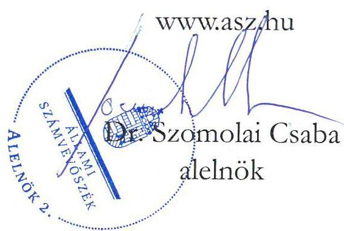
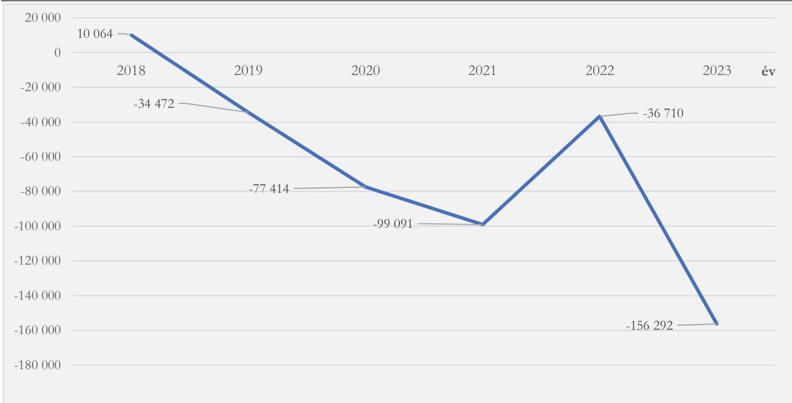
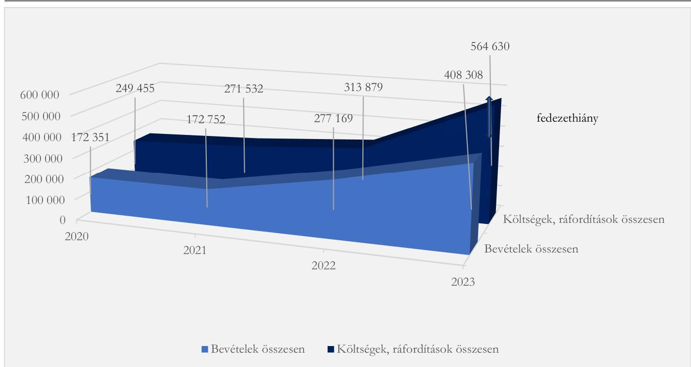
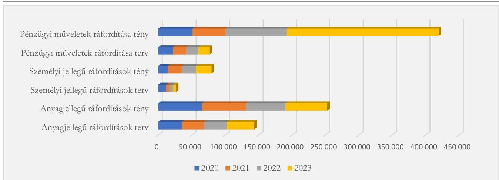

ÁLLAMI SZÁMVEVŐSZÉK

# JELENTÉS

Az állami tulajdonú gazdasági társaságok gazdálkodásának és az ezzel kapcsolatos döntések megalapozottságának ellenőrzése

S-KAD Hőszolgáltató Kft.

2025.

25080

www.asz.hu

---

ÁLLAMI SZÁMVEVŐSZÉK

# JELENTÉS

Az állami tulajdonú gazdasági társaságok gazdálkodásának és az ezzel kapcsolatos döntések megalapozottságának ellenőrzése

S-KAD Hőszolgáltató Kft.

2025.

25080

---

Jelentéseink az interneten a www.asz.hu címen olvashatók.

ELLENŐRZÉSI IGAZGATÓSÁG:
ELLENŐRZÉSI IGAZGATÓSÁG III.

ELLENŐRZÉSI IGAZGATÓ:
HERCZEGH ZSOLT igazgató

ELLENŐRZÉSVEZETŐ:
DABISNÉ NYIKOS MELINDA ellenőrzésvezető

IKTATÓSZÁM: EL-4064-002/2025
TÉMASORSZÁM: 35/2024
ELLENŐRZÉS-AZONOSÍTÓ SZÁM: V1094

---

TARTALOMJEGYZÉK

- AZ ELLENŐRZÉS ALAPADATAI ... 5
- AZ ELLENŐRZÖTT SZERVEZET ... 7
- ÖSSZEFOGLALÁS ... 9
- AZ ELLENŐRZÉS FÓKUSZTERÜLETE ... 11
- MEGÁLLAPÍTÁSOK ... 12
- JAVASLATOK ... 23
- MELLÉKLETEK ... 24
- I. sz. melléklet: Értelmező szótár ... 24
- II. sz. melléklet: Az ellenőrzött szervezet jegyzéke ... 27
- III. sz. melléklet: Ellenőrzési kritériumok ... 28
- IV. sz. melléklet: A fő projekt megtérülési számítása ... 30
- FÜGGELÉK: ÉSZREVÉTELEK ... 31
- RÖVIDÍTÉSEK JEGYZÉKE ... 35

---

“哈，你是个小伙子，你是个小伙子，你是个小伙子，你是个小伙子，你是个小伙子，你是个小伙子，你是个小伙子，你是个小伙子，你是个小伙子，你是个小伙子，你是个小伙子，你是个小伙子，你是个小伙子，你是个小伙子，你是个小伙子，你是个小伙子，你是个小伙子，你是个小伙子，你是个小伙子，你是个小伙子，你是个小伙子，你是个小伙子，你是个小伙子，你是个小伙子，你是个小伙子，你是个小伙子，你是个小伙子，你是个小伙子，你是个小伙子，你是个小伙子，你是个小伙子，你是个小伙子，你是个小伙子，你是个小伙子，你是个小伙子，你是个小伙子，你是个小伙子，你是个小伙子，你是个小伙子，你是个小伙子，你是个小伙子，你是个小伙子，你是个小伙子，你是个小伙子，你是个小伙子，你是个小伙子，你是个小伙子，你是个小伙子，你是个小伙子，你是个小伙子，你是个小伙子，你是个小伙子，你是个小伙子，你是个小伙子，你是个小伙子，你是个小伙子，你是个小伙子，你是个小伙子，你是个小伙子，

---

AZ ELLENŐRZÉS ALAPADATAI

## AZ ELLENŐRZÉS CÉLJA

Az ellenőrzés célja annak értékelése volt, hogy az ellenőrzött társaság gazdálkodása - az ellenőrzés során kiválasztott funkcionális gazdálkodási részterület (alterület) vonatkozásában - szabályszerű volt-e; a kapcsolódó döntéshozatalok szabályszerűek és megalapozottak voltak-e, valamint érvényesültek-e a célszerűség és az eredményesség szempontjai.

## AZ ELLENŐRZÉS TÍPUSA

Kombinált ellenőrzés.

## AZ ELLENŐRZÖTT IDŐSZAK

2023. év, kitekintéssel a bevételszerző tevékenységre irányuló döntés előkészítésének, a döntés meghozatalának időpontjára (2017.09.04-tól).

## AZ ELLENŐRZÉS TÁRGYA

Az ellenőrzés tárgya a többségi állami tulajdonban álló gazdasági társaság gazdálkodással összefüggésben hozott döntéseinek szabályszerűsége, megalapozottsága, valamint a megvalósult gazdasági események szabályszerűsége, célszerűsége és eredményessége volt.

Az ellenőrzés kiterjedt az ellenőrzött időszakban hatályos, a gazdálkodással összefüggésben kötött szerződések megkötésére vonatkozó döntési és végrehajtási folyamatok, illetve az ellenőrzött időszakra vonatkozó számviteli beszámoló elfogadásának értékelésére is. Az ellenőrzés továbbá összevetette a gazdasági társaság üzleti tervében és a beszámolóban szereplő adatait, és azok eredményeit értékelte.

Az ellenőrzés kiterjedt minden olyan körülményre és adatra, amely az ÁSZ¹ jogszabályban meghatározott feladatainak teljesítéséhez, valamint a program végrehajtása folyamán felmerült újabb összefüggések feltárásához szükséges volt.

## AZ ELLENŐRZÉS JOGALAPJA

Az ellenőrzés jogszabályi alapját az ÁSZ tv.² 1. § (3) bekezdés és 5. § (4) bekezdés előírásai képezték.

5

---

Az ellenőrzés alapadatai

# AZ ELLENŐRZÉS MÓDSZERE

Az ellenőrzést a nemzetközi standardokat irányadónak tekintve az ellenőrzési program szempontjai, az ellenőrzött időszakban hatályos jogszabályok, az ellenőrzés szakmai szabályok és a jelen ellenőrzésre irányadó ÁSZ módszertan figyelembevételével végezte az ÁSZ.

Az ellenőrzés tárgyában meghatározott feladatok végrehajtásához szükséges bizonyítékok megszerzése az ellenőrzött szervezet által rendelkezésre bocsátott dokumentumokra és adatokra alapozva, továbbá megfigyelés, szemrevételezés, információkerés, mintavételezés, interjú, összehasonlítás, valamint elemző eljárás útján történt.

Az ÁSZ mintavételi eljárással kiválasztott tételek alapján is ellenőrizte a gazdasági társaság működése szempontjából kiemelt funkcionális gazdálkodási részterületeket, valamint az alaptevékenység körében vagy ahhoz kapcsolódóan keletkező bevételeket, ezen gazdasági események döntési, végrehajtási folyamatainak megfelelőségét szabályszerűségi, megalapozottsági, célszerűségi, eredményességi szempontok alapján.

Az S-KAD Hőszolgáltató Kft.³ gazdálkodását az ellenőrzés elemző eljárás keretében értékelte, melynek eredményeként a gazdálkodást jelentősen meghatározó és kockázatot hordozó funkcionális gazdálkodási részterületeit vonta ellenőrzés alá. Ennek következtében az ellenőrzés a gazdálkodást a legmeghatározóbb területeken, a Társaság bevételszerző tevékenységén⁴, valamint a humánerőforrás-gazdálkodásán keresztül ellenőrizte és értékelte.

Az ellenőrzési bizonyítékként felhasználható adatforrások közé tartoztak az ellenőrzéshez kért dokumentumok, valamint minden egyéb – az ellenőrzés folyamán feltárt –, az ellenőrzés szempontjából információt tartalmazó dokumentum. Az ellenőrzés lefolytatásához az ellenőrzött szervezet tanúsítvány kitöltésével, valamint az ÁSZ által kért dokumentumok, adatok, információk megküldésével és a helyszíni ellenőrzés során szolgáltatott adatokat. Az ellenőrzéshez az ÁSZ felhasználta a nyilvános közhiteles adatokat is.

Az ÁSZ ellenőrzés a gazdálkodást megfelelőnek értékelte, ha a többségi állami tulajdonban álló gazdasági társaság gazdálkodásra irányuló döntései, valamint azok megvalósulása a lényegi elemeiben szabályszerűek, célszerűek és megalapozottak voltak, illetve a gazdálkodás tekintetében érvényesültek a nemzeti vagyonnal való felelős gazdálkodás elvei.

---

AZ ELLENŐRZÖTT SZERVEZET

# S-KAD HŐSZOLGÁLTATÓ KFT.

Az S-KAD Hőszolgáltató Kft. (közvetett többségi állami tulajdonú gazdasági társaság) 2013.01.08-án alakult, 2018.08.29-ig magánvállalatként működött. A Társaság tulajdonosa⁵ 2018.08.30-tól a 100 %-os állami tulajdonú NEG Zrt.⁶ lett, mely gazdasági társaság 2017.11.30-tól az MNV Zrt.⁷ tulajdonosi joggyakorlása alá tartozott. Az S-KAD Hőszolgáltató Kft. egyszemélyes társaság, az állami tulajdonba történő kerülésétől kezdődően a legfőbb szerv hatáskörét az egyedüli tag, vagyis a NEG Zrt. gyakorolta.

A Társaság energiahatékonysági szolgáltató cég (ESCO⁸) volt, ami azt jelentette, hogy olyan gazdálkodó szervezetnek minősült, amely energiahatékonysági szolgáltatást nyújtott vagy egyéb energiahatékonyság-javító intézkedést hajtott végre a végző felhasználó létesítményében vagy helyiségében. Ezen tevékenységét energiahatékonysági szolgáltatásra irányuló szerződés keretében végezte, amely az energiafogyasztó és az energiahatékonysági szolgáltató között jött létre. Ennek lényege az volt, hogy az energiahatékonysági szolgáltatások ellentételezése a szerződésben megállapodott szintű energiahatékonyság-javulás, vagy más energiahatékonysági kritérium teljesítésével összefüggésben történt. Energiahatékonysági szolgáltatásra irányuló szerződések esetén az energiahatékonysági szolgáltató a szakmai tudást és a beruházáshoz szükséges pénzügyi fedezetet biztosította a projektekhez, ezáltal garantálva azt, hogy olyan energiahatékonyságot növelő és költséghatékony beruházás valósult meg, amely egy előre meghatározott mértékű energiamegtakarítást eredményezett. Amennyiben a beruházás eredményeként a szerződésben vállalt megtakarítás nem valósult meg, úgy az ESCO cég kárpótlást fizetett a megrendelőnek. Az energiamegtakarítás a környezeti előnyök mellett költségmegtakarítással is járt, amely a szerződésben meghatározott feltételek szerint részben az energiahatékonysági szolgáltatót, részben pedig a megrendelőt illette. Az S-KAD Hőszolgáltató Kft. a projektjeit két fő szakaszban hajtotta végre, mely keretében első körben megvalósította az adott rendszer korszerűsítését, majd ezt követően üzemeltette, karbantartotta, illetve folyamatosan felügyelte annak működését. Az S-KAD Hőszolgáltató Kft. fő tevékenysége az alakulásától kezdődően: Gőzellátás, légkondicionálás.

1. táblázat
AZ S-KAD HŐSZOLGÁLTATÓ KFT. 2023. ÉVI FŐBB BESZÁMOLÓ ADATAI (EZER FT, FŐ)

|  MEGNEVEZÉS | 2023. ÉV  |
| --- | --- |
|  Értékesítés nettó árbevétele | 196 194  |
|  Egyéb bevételek | 39 467  |
|  Anyagjellegű ráfordítások | 63 218  |
|  Személyi jellegű ráfordítások | 23 540  |
|  Egyéb ráfordítások | 112 470  |
|  Adózott eredmény | -156 292  |
|  Saját tőke | 153 013  |
|  Mérlegfőösszeg | 1 934 112  |
|  Átlagosan foglalkoztatottak száma | 7 fő  |

Forrás: Az S-KAD Hőszolgáltató Kft. 2023. évi egyszerűsített éves számviteli beszámolója alapján ÁSZ saját szerkesztés

---

Az ellenőrzött szervezet

A 2023. üzleti évre vonatkozó egyszerűsített éves számviteli beszámolót az S-KAD Hőszolgáltató Kft. könyvvizsgálója a Számv. tv.⁹ és a Ptk.¹⁰ előírásai szerint auditálta, a 2024.03.06-i minősítés nélküli hitelesítő záradék mellett a könyvvizsgáló figyelemfelhívással élt a mérleg fordulónap utáni események, jövőre vonatkozó tervek, lehetőségek kapcsán a Társaság fizetőképességevel kapcsolatos bizonytalanság vonatkozásában. A bizonytalanság abból adódott, hogy a Társaság 2023. évi üzleti terve a 2019-2022. évekhez hasonlóan továbbra sem tartalmazott nyereséget.

A Társaság SZMSZ¹¹-ében célként határozták meg, hogy a hazai és Európai Unió energiahatékonysági célkitűzések megvalósítását támogassa, valamint eredményes működése révén teljesítse a tulajdonosi elvárásokat ipari és kereskedelmi tevékenysége által. A Társaság a 2019. évtől kezdődően folyamatosan veszteségesen gazdálkodott. Az S-KAD Hőszolgáltató Kft. likviditási problémáinak kezelése érdekében 2019-ben tulajdonosi kölcsön folyósítására került sor, majd 2021-ben a NEG Zrt. 49 millió Ft összegű ázsiós tőkeemelést¹² hajtott végre. 2022. évben a Társaság részére az MNV Zrt. a NEG Zrt.-én keresztül további 50 millió Ft működési támogatást juttatott de minimis támogatás¹³ formájában a 2022-2023. évi működési költségek finanszírozására (2023. évben a kapcsolt vállalkozással szemben 298 millió Ft tulajdonosi kölcsön tőketartozást és 40,493 millió Ft tulajdonosi kölcsön kamattartozást tartott nyilván a hátrasorolt kötelezettségek között).

1. ábra

AZ S-KAD HŐSZOLGÁLTATÓ KFT. 2018-2023. ÉVI ADÓZOTT EREDMÉNYÉNEK ALAKULÁSA (EZER FT)

Forrás: ÁSZ saját szerkesztés az S-KAD Hőszolgáltató Kft. 2018-2023. évi egyszerűsített éves számviteli beszámolóinak adatai alapján

A 2023. üzleti évben az S-KAD Hőszolgáltató Kft. a Tak.tv.¹⁴ 7/J. § (1) bekezdésben meghatározott mutatóértékek alapján nem tartozott a Gbkr.¹⁵ hatálya alá, belső kontrollrendszer működtetésére nem volt kötelezett, valamint a PM közleménye¹⁶ szerint az ellenőrzött időszakban nem volt kormányzati szektorba sorolt egyéb szervezet sem, ezért a Bkr.¹⁷ 1. § és 54/A. § (1) bekezdésében rögzítettekkel összhangban a Bkr. 1-10. § előírásai sem vonatkoztak rá. Az S-KAD Hőszolgáltató Kft. saját belső kontroll és kockázatkezelési szabályzatot¹⁸ alakított ki. A Társaságnál a Ptk., valamint a Tak.tv. rendelkezései alapján három fős felügyelőbizottság működött.

---

ÖSSZEFOGLALÁS

A többségi állami tulajdonban álló gazdasági társaságok tevékenységével szemben az egyik legfontosabb követelmény, hogy a nemzeti vagyonnal felelős módon és rendeltetésszerűen gazdálkodjanak. E követelmények érvényesülését az ÁSZ a többségi állami tulajdonban álló gazdasági társaságok gazdálkodásának ellenőrzése során kiemelten vizsgálja.

Az S-KAD Hőszolgáltató Kft. gazdálkodását az ellenőrzés elemző eljárás keretében értékelte, melynek eredményeként a gazdálkodást jelentősen meghatározó és kockázatot hordozó funkcionális gazdálkodási részterületeit vonta ellenőrzés alá. Ennek következtében az ellenőrzés a gazdálkodást a legmeghatározóbb területeken, a Társaság bevételszerző tevékenységén, valamint a humánerőforrás-gazdálkodásán keresztül ellenőrizte és értékelte.

Az ELLENŐRZÉS MEGÁLLAPÍTOTTA, hogy az S-KAD Hőszolgáltató Kft. gazdálkodása nem volt megfelelő és nem volt eredményes.

Az S-KAD Hőszolgáltató Kft. a belső szabályozási környezetét ugyan kialakította, azonban az abban foglaltak több esetben nem feleltek meg a jogszabályi előírásoknak. A Társaság tényleges tevékenysége nem állt összhangban a belső szabályokkal. A jogszabályi rendelkezések ellenére a döntéshozatal folyamata nem volt átlátható, szabályozott és megalapozott, a döntéseket nem támasztották alá gazdaságossági számításokkal.

Az ellenőrzött időszakban a Társaság két, energiahatékonysági szolgáltatásra irányuló projektet üzemeltetett, mely méreteiben jelentősen eltért egymástól. Az S-KAD Hőszolgáltató Kft. bevételszerző tevékenysége az eredményes működést nem biztosította, a Társaság saját tőkéje a tartósan veszteséges működés következtében folyamatosan csökkent. A Társaság fő projektje¹⁹, amely a 2023. évi értékesítés nettó árbevétel 97 %-át adta, az adott konstrukcióban nem térül meg, mivel a BKV Vasúti Járműjavító Szolgáltató Kft.-vel kötött szerződés alapján a projekt nettó működési bevétele az alvállalkozói költségek levonása után az eszköz bekerülési értékére sem nyújt fedezetet (a szerződésekben szereplő fix árakon számolva a projekt végén ~69 millió Ft fedezethiány várható).

A Társaság veszteséges működésének okát a fő projekt tekintetében megkötött, az S-KAD Hőszolgáltató Kft.-re nézve üzletileg előnytelen és hátrányos feltételeket tartalmazó szerződése jelentette. A szerződésbe nem építettek be olyan garanciális elemeket, amelyek biztosították volna az S-KAD Hőszolgáltató Kft. részére a szolgáltatási díj megemelését a ténylegesen megvalósuló beruházás költségnövekedése esetére. A fő projekt beruházási költségét a Társaság jelentősen alultervezte, mely 62 %-os költségnövekedést jelentett a tervezett értékhez képest (1,38 milliárd Ft helyett 2,24 milliárd Ft összegben került aktiválásra az eszköz). Megfelelő garanciák hiányában azonban ennek a költségnövekedésnek a megtérülését az S-KAD Hőszolgáltató Kft. nem tudta – a szerződéses időszakra vonatkozóan – a szolgáltatási díjában érvényesíteni. A szerződéses időszak meghatározása során a szerződő felek abból indultak ki, hogy 10 év fix szolgáltatási időszak, és további 10 év meghosszabbítási időszak biztosíthatja a Társaság részére a fő projekt megtérülését. A szerződés lejártával pedig 100 Ft értéken kerülnek át az eszközök a BKV Vasúti Járműjavító Szolgáltató Kft.-hez. A szerződő felek időközben a meghosszabbítási időszakot 3 évvel csökkentették, melynek oka az volt, hogy az alapszerződésben rögzítették azt a kitételt, hogy ha a beruházás hévízkút létesítésével valósul meg, akkor a rendelkezésre állási díj fizetésének futamideje 10 évről 7 évre csökkenhet. A jogszabályi előírás ellenére a szerződésmódosítás megalapozottságát és célszerűségét – az alkalmazott

9

---

Összefoglalás

gyakorlattal szemben - döntéselőkészítő dokumentum, valamint gazdaságossági számítás nem igazolta. A Társaságnak ennek az értékelésnek az eredménye ismeretében kellett volna összességében dönteni a szerződésmódosítás célszerűségéről. A meghosszabbítási időszak 7 évre történő csökkentése szintén hátrányos helyzetbe hozta az S-KAD Hőszolgáltató Kft.-t, amely hatására ~441,7 millió Ft értékesítés nettó árbevételtől esik el a Társaság a szerződéses időszak végéig. A fő projekt a vevőpartner hőigényéhez képest túlméretezett, a kút hőkapacitásának maradék része nem került hasznosításra. Az S-KAD Hőszolgáltató Kft. további költségeinek finanszírozása - a hitel kamatköltsége, a Társaság működési költségei, az eszközök avulásából eredő pótlási költségek stb. - a bevételszerző tevékenységből nem biztosított, a fizetésképtelenséggel fenyegető helyzet csak a tulajdonos általi folyamatos forrásjuttatással kerülhető el. Az ÁSZ véleménye szerint amennyiben változás (pl. új vevőpartnerek bevonása) nem következik be a fő projekt vonatkozásában, úgy a szerződéses időszak végéig a költségek, ráfordítások fedezettsége tekintetében változás nem várható.

A jogszabályi előírás ellenére dokumentumok (nyilvántartások) hiányában az S-KAD Hőszolgáltató Kft.-nél nem voltak nyomon követhetőek a foglalkoztatottak munkaidőben fennálló munkavégzési kötelezettségeinek a teljesítései, elszámolásai. A Társaság létszáma a belső szabályozás ellenére növekedett, azonban azt csak aktivitás növekedés esetén hajthatta volna végre, melynek nem felelt meg. Az ellenőrzött időszaki létszámbővítés megalapozottsága és célszerűsége nem került igazolásra.

A Társaság SZMSZ-ében rögzített eredményességi (nyereségességi) célkitűzés nem teljesült.

Az S-KAD Hőszolgáltató Kft. nem tett eleget a nemzeti vagyonnal történő felelős vagyongazdálkodási kötelezettségének a hatékony, költségtakarékos, átlátható működtetés vonatkozásában. A jogszabályban foglalt rendelkezések ellenére a Társaság a működése során nem biztosította az állami vagyon védelmét, értékének megőrzését.

Az ÁSZ véleménye szerint kockázatot hordoz, hogy a Társaság gazdasági helyzetének a javulása a jelenlegi gazdálkodási keretek között nem várható, melynek következtében lényeges bizonytalanság áll fenn a tekintetben, hogy az S-KAD Hőszolgáltató Kft. a jövőben is fenn tudja tartani a működését. A Társaság tevékenységének, gazdálkodási kereteinek, szerződéses kapcsolatainak stratégiai újragondolása szükséges.

10

---

11

# AZ ELLENŐRZÉS FÓKUSZTERÜLETE

1. A többségi állami tulajdonban álló gazdasági társaság gazdálkodásának megfelelősége, eredményessége

---

MEGÁLLAPÍTÁSOK

# 1. A többségi állami tulajdonban álló gazdasági társaság gazdálkodásának megfelelősége, eredményessége

Összegző megállapítás Az S-KAD Hőszolgáltató Kft. gazdálkodása nem volt megfelelő és nem volt eredményes.

# 1. Az S-KAD Hőszolgáltató Kft. gazdálkodásának szabályozási rendszerére vonatkozó megállapítások

A Társaság ellenőrzés alá vont gazdálkodási részterületeit az Alapító okirat $_{1-3}^{20}$, SZMSZ, Aláírási szabályzat $^{21}$, Felügyelőbizottsági ügyrend $^{22}$, Számviteli politika $^{23}$, Számlarend $^{24}$, Pénzkezelési szabályzat $^{25}$, Projektfejlesztési szabályzat $^{26}$, Belső kontroll és kockázatkezelési szabályzat, Közérdekű adatok közzétételére és megismerésére vonatkozó szabályzat $^{27}$, Javadalmazási szabályzat $^{28}$, Munkaügyi szabályzat $^{29}$, Etikai szabályzat $_{1-2}^{30}$, valamint a Jóléti és szociális juttatásokról szóló szabályzat $^{31}$ szabályozta. Az ellenőrzés megállapította azonban, hogy a Társaság tényleges tevékenysége nem állt összhangban a belső szabályokkal.

Az SZMSZ 5.1. pontjában, valamint a Belső kontroll és kockázatkezelési szabályzat 2.2. pontjában előírtak ellenére az S-KAD Hőszolgáltató Kft. az ellenőrzött időszak vonatkozásában vállalati stratégiával nem rendelkezett. Hatályos vállalati stratégia – és egyéb, adott tárgyköröket meghatározó dokumentum – hiányában a Társaság a jövőbeni céljait, bevételszerző tevékenysége növelésének lehetőségeit írásban nem határozta meg.

Az S-KAD Hőszolgáltató Kft. az állami tulajdonba kerülést követően (2018.08.30.) és a Belső kontroll és kockázatkezelési szabályzat hatályba lépéséig (2022.12.21.) a döntések előkészítésére, megalapozására és a döntéshozatal rendjére vonatkozóan belső szabályozókat nem alakított ki. A szabályozási hiányosság a futó projektek (melyek több, mint tíz éves távlatban határozzák meg a Társaság működését) vonatkozásában hozott döntések dokumentáltságára és a döntések hatásainak nyomon követhetőségére is kihatottak. A Társaság ugyan nem tartozott sem a Bkr., sem pedig a Gbkr. hatálya alá, azonban állami tulajdonú gazdasági társaságként a vagyongazdálkodási feladatellátása során az Nvtv. 7. § (2) bekezdésben foglalt előírások ellenére az S-KAD Hőszolgáltató Kft. nem biztosította az átlátható működtetést.

A 2022.12.21-én hatályba lépett Belső kontroll és kockázatkezelési szabályzat 2.2. és 2.3. pontjaiban olyan pozíciókat (megfelelési tanácsadó, belső ellenőr) tüntettek fel, amelyek kialakítása a Társaságnál nem történt meg. Ennek következtében a megfelelési tanácsadóra és a belső ellenőrre delegált feladatok (pl. a szabályzatok kiadása előtt a folyamatokban az ellenőrzési és kontrollpontok meglétének vizsgálata, kockázatértékelésekben feltárt hiányosságok kezelésének ellenőrzése) nem kerültek elvégzésre.

A Belső kontroll és kockázatkezelési szabályzat a munkaerő-gazdálkodás, bérgazdálkodás döntéseinek előkészítésével, döntési folyamataival kapcsolatos szabályokat nem határozott meg.

12

---

Megállapítások

A Belső kontroll és kockázatkezelési szabályzat 2.4. pontjában előírtak ellenére a szabályzatok kiadása előtt a folyamatokban az ellenőrzési és kontrollpontok meglétének vizsgálata, kockázatértékelésekben feltárt hiányosságok kezelésének ellenőrzése nem történt meg.

A Társaság Munkaügyi szabályzata nem az S-KAD Hőszolgáltató Kft. működéséhez igazítottan került kialakításra, mivel abban a kötetlen munkarendben történő foglalkoztatásra előírásokat, szabályokat nem határoztak meg annak ellenére, hogy a Társaság munkavállalói kizárólag ebben a formában látták el feladataikat. Ezzel kapcsolatban további részletszabályokat a rendelkezésre bocsátott munkaköri leírásokban, valamint a munkaszerződésekben sem határoztak meg. Részletszabályok hiányában az SZMSZ 9.10. pontjában meghatározott, a munkarend betartására vonatkozó vezetői feladatellátás is sérült.

A Számviteli politika keretében elkészített Pénzkezelési Szabályzat a Számv. tv. 14. § (3) bekezdésében foglaltak ellenére nem a Társaság adottságainak megfelelően került elkészítésre. A Pénzkezelési szabályzat aktualizálása nem történt meg, mivel a szabályzat 1. és 2. számú mellékletében utalványozóként és banki aláíróként olyan személyeket rögzítettek, akik az ellenőrzött időszakban nem álltak az S-KAD Hőszolgáltató Kft.-vel sem munkaviszonyban, sem munkavégzésre irányuló egyéb jogviszonyban.

Az S-KAD Hőszolgáltató Kft. a Számv. tv. 161. § (1) bekezdés előírása ellenére 2023.01.01. és 2023.05.30. közötti időszakban Számlarenddel nem rendelkezett. A 2023.05.31. napjától hatályos Számlarend mellékletét képező 2023. évi számlatükör pedig olyan számlacsoportokat tartalmazott (88. Rendkívüli ráfordítás, valamint 98. Rendkívüli bevételek), melyek a 2016. évben induló üzleti évtől kezdődően megszüntetésre kerültek a Számv. tv.-ben.

A Tak.tv. 2. §-ában, az Info.tv.32 33. § (3) és 37. § (1) bekezdésében, valamint az Info.tv. 1. számú mellékletében előírtak ellenére a közérdekből nyilvános adatokat, és a közérdekű adatokat a Társaság sem a saját, sem pedig az anyavállalat internetes honlapján nem jelenítette meg.

Az ÁSZ véleménye szerint a szabályozási hiányosságok kihatottak a döntések dokumentáltságára és a döntések hatásainak nyomon követhetőségére. Ennek következtében az S-KAD Hőszolgáltató Kft. a vagyongazdálkodási feladata során nem biztosította az Nvtv.33 7. § (2) bekezdés ellenére a közpénzekkel és közvagyonnal gazdálkodó szervezetek esetében elvárható átlátható működtetés elvét.

## 2. Bevételszerző tevékenységre vonatkozó megállapítások

A Társaság a 2018. évet követően folyamatosan veszteséget realizált, a tartós veszteség fennállása pedig kockázatot hordoz a vállalat hosszú távú működésére, fizetőképességére nézve.

Az S-KAD Hőszolgáltató Kft. értékesítés nettó árbevételének 100 %-a két projektjéből (két vevőpartnerétől) származott, a támogatások teljes egészét pedig a működési költségek fedezetére kapott de minimis támogatás összege tette ki. A Társaság két bevételtermelő projektje egymástól méreteiben jelentősen eltért, a 2023. évi értékesítés nettó árbevételének közel 97 %-át a fő projekt biztosította.

---

Megállapítások

2. ábra

AZ S-KAD HŐSZOLGÁLTATÓ KFT. 2020-2023. ÉVI BEVÉTELEINEK ÉS KÖLTSÉGEINEK, RÁFORDÍTÁSAINAK ALAKULÁSA (EZER FT)

Forrás: ÁSZ saját szerkesztés az S-KAD Hőszolgáltató Kft. egyszerűsített éves számviteli beszámolóinak adatai alapján
Bevételek összesen: értékesítés nettó árbevétele, egyéb bevételek, pénzügyi műveletek bevételei
Költségek, ráfordítások összesen: anyagjellegű ráfordítások, személyi jellegű ráfordítások, értékcsökkenés, egyéb ráfordítások, pénzügyi műveletek ráfordításai

## A fő projektre vonatkozó szolgáltatási szerződés lényeges elemei

A Társaság az állami tulajdonba kerülést megelőzően 2017.09.04-én 10 éves szolgáltatási szerződést (továbbiakban: alapszerződés, opciós szerződés) kötött a BKV Vasúti Járműjavító Szolgáltató Kft.-vel, úgy, hogy az további 120 hónapos (10 éves) időtartamra volt meghosszabbítható. Az alapszerződésben (7. pont) rögzítésre került, hogy a Társaság a szolgáltatás keretében a BKV Vasúti Járműjavító Szolgáltató Kft. részére - a BKV Vasúti Járműjavító Szolgáltató Kft. tulajdonát képező ingatlanon - a hőszolgáltató rendszert korszerűsíti, a 3/2002. SzCsM-EüM együttes rendeletnek³⁴ megfelelő minőségben és mennyiségben energiát alakít át, továbbá a hőszolgáltató rendszert üzemelteti és karbantartja (az üzemeltetési és karbantartási feladatokat az S-KAD Hőszolgáltató Kft. alvállalkozó útján látta/látja el). Az alapszerződés mellékletét képezte továbbá a hőszolgáltató rendszerre vonatkozó vételi jog alapításáról szóló megállapodás is, miszerint a BKV Vasúti Járműjavító Szolgáltató Kft.-nek lehetősége van az első 10 éves határozott időtartam lejárta után a hőszolgáltató rendszer tulajdonjogának megvásárlására. Az opciós vételár a hátralévő futamidőre (120 hó) vonatkozó nettó rendelkezésre állási díj összegében került meghatározásra. A szolgáltatási időszak kezdő időpontja 2018.09.30. volt.

Az alapszerződés (11.1. pont) ezeken felül egy olyan kitételt is tartalmazott, hogy amennyiben a korszerűsítés hévízkút létesítésével valósul meg, úgy a rendelkezésre állási díj fizetésének futamideje csökkenhet. Ehhez kapcsolódóan az alapszerződéssel egy időben felvett jegyzőkönyvben megállapodtak, hogy a hévízkút alapú szolgáltatás lehetősége esetén a rendelkezésre állási díj fizetés időtartamának minimális csökkentése legalább 3 év, így a 10+7 évet követően az opciós szerződésnek megfelelően 100 Ft értéken kerülnek át az eszközök a BKV Vasúti Járműjavító Szolgáltató Kft.-

---

Megállapítások

hez. Az alapszerződés (16. pont) szerint a beruházás megtérülését a Társaság számára a szolgáltatás hosszú távú, 20 éven keresztül történő végzése biztosíthatja.

A szolgáltatási díj értéke (alapszerződés 11.1. pont és 2. számú melléklet) fix havi díjban került meghatározásra, melynek keretében a rendelkezésre állási díj 7,82 millió Ft + áfa/hó, az üzemeltetési és karbantartási díj 3,825 millió Ft + áfa/hó volt, emellett a tárgyhavi hődíj - a létesítés helyén a villamos energia számlán szereplő nettó díj - is kiszámlázásra került. A Társaság az alapszerződés (11.4.a. pont) értelmében jogosult volt továbbá a rendelkezésre állási díj, valamint az üzemeltetési és karbantartási díj 75 %-os mértékét a szerződés időtartama alatt a KSH³⁵ által hivatalosan megállapított és közzétett előző évi szolgáltatásra vonatkozó árindex mértékével automatikusan megemelni (az árindex közzétételét követően minden év április első napjától kezdve). Továbbá rögzítették azt is (alapszerződés 11.4.c. pont), hogy amennyiben a szolgáltatás nyújtásának költségei olyan mértékben emelkednek, hogy azt az indexálás nem fedezi, akkor a felek kötelesek jóhiszemű tárgyalásokat kezdeni annak érdekében, hogy az indexálást meghaladó többletköltséget a BKV Vasúti Járműjavító Szolgáltató Kft. viselje.

Az alapszerződést a felek négy alkalommal módosították.

- Az 1. számú módosítás (2018.07.15.) alapján a hőszolgáltató rendszer beruházásának kivitelezési folyamata egy évvel kitolódott, így a szolgáltatási időszak is 2019.09.30. - 2029.09.30. közötti időszakra módosult.
- A 2. számú módosítás (2019.02.27.) fő eleme a szerződés műszaki tartalmának módosítása volt - további három darab festő-szárító helyiség fűtőrendszerének korszerűsítésével történő bővítés történt -, mely következtében a rendelkezésre állási díj 8,445 millió Ft + áfa/hóra emelkedett, az üzemeltetési és karbantartási díj változatlanul hagyása mellett.
- A 3. számú módosításban (2020.10.10.) lényegi változásként került rögzítésre, hogy a szerződés hosszabbításának lehetősége a korábbi 10 évről 7 évre változott, mivel a hévízkutas új fűtési rendszer megvalósulása után a 10 év alap szolgáltatási időszakot követő további 7 éves hosszabbítás is biztosítja a finanszírozás megtérülését. A meghosszabbítási időszak 3 éves csökkentését a vételi jogra vonatkozó vételár tekintetében is átvezették (az opciós jog érvényesítése esetén 120 hónap helyett 84 hónapra csökkent a nettó rendelkezésre állási díj megfizetésének összege).
- A 4. számú módosításban (2022.11.16.) pedig a szolgáltatásnyújtás egyik feltételeként meghatározott -5 °C külső hőmérsékletre vonatkozó korlátot szüntették meg a 2022.11.25.-2023.03.25. közötti időszakban, melyhez egyszeri 5,4 millió Ft + áfa rendelkezésre állási díj fizetés is kapcsolódott a BKV Vasúti Járműjavító Szolgáltató Kft. részéről.

Mivel a Társaság folyamatos likviditási problémával küzdött, a fő projektből realizált értékesítés nettó árbevétele pedig nem fedezte a felmerült költségeket, így a fő projekt bevételtermelő képességének vizsgálata tekintetében a fő projekt alapját képező beruházás megtérülése, valamint a BKV Vasúti Járműjavító Szolgáltató Kft.-vel kötött szerződésben szereplő szerződési feltételek is elemzés alá kerültek a működési kockázatok feltárása és értékelése érdekében, melyek tekintetében a következőket állapította meg az ellenőrzés.

15

---

Megállapítások

## 2.1. Az S-KAD Hőszolgáltató Kft. fő projektjének értékelése

### 2.1.1. A fő projekt becsült beruházási költsége az állami tulajdonba kerülés időpontjában

A Társaság 2018.08.30-án az állami tulajdonba kerülés (cégfelvásárlás) időpontjában egy elnyert közbeszerzési pályázattal rendelkezett fűtéskorszerűsítési beruházás megvalósítására.

A cégfelvásárlást megelőzően cégértékelés, jogi-, és pénzügyi átvilágítás készült, melyben kiemelt kockázatokat nem tártak fel, az S-KAD Hőszolgáltató Kft.-t összességében rentábilisnak minősítették. A fő projekt beruházási költségének becsült tervadata az S-KAD Hőszolgáltató Kft. megvásárlásával kapcsolatos üzleti értéket alátámasztó jelentésben került rögzítésre, melyben a hévízkút alapú beruházási projekt költségét ~1,38 milliárd Ft összegben határozták meg. A projekt ezzel szemben (2019. októberi átadással) ~2,24 milliárd Ft beruházási költséggel, a tervezett értékhez képest 62 %-kal magasabb összegben valósult meg. A cégátvilágítás során rendelkezésre bocsátott és felhasznált dokumentumok értelmében (10 éves üzleti terv, folyamatban lévő beruházás értéke) a költségeket és a ráfordításokat jelentősen alultervezték, mely költségnövekmények ténylegesen a cégfelvásárlást követően realizálódtak. A Társaság iratai között a beruházás költségnövekedését alátámasztó döntést előkészítő dokumentumok nem álltak rendelkezésre.

Az S-KAD Hőszolgáltató Kft. a fő projektjét hitelből finanszírozta (melyre a NEG Zrt. készfizető kezességet vállalt), továbbá nagy összegű ázsiós tőkeemelést is kapott. Az üzleti értékelés során a Társaság 969 millió Ft hitelfelvétellel számolt, azonban ezzel szemben 1,14 milliárd Ft beruházási hitelt vettek fel, mely szintén rontotta a későbbi években a tervezetthez képest a Társaság gazdálkodási adatait.

Az S-KAD Hőszolgáltató Kft.-nek a 2020-2023. években a tervezettnél ~506 millió Ft-tal magasabb kiadása keletkezett.

3. ábra

AZ ÜZLETI ÉRTÉKELÉSÉBEN SZEREPLŐ FŐBB KÖLTSÉGADATOKNAK ÉS A TÉNYLEGESÉN REALIZÁLT ADATOKNAK AZ ÖSSZEVETÉSE 2020-2023. ÉV KÖZÖTT (EZER FT)

Forrás: ÁSZ saját szerkesztés az S-KAD Hőszolgáltató Kft. egyszerűsített éves számviteli beszámoló adatai és az üzleti értékelés dokumentum adatai alapján (az üzleti értékelésben szereplő 1,38 milliárd Ft CAPEX esetén 10 éves időtartamra kapott üzleti terv adatok felhasználásával)

A Társaság iratai között a fő projekt tekintetében gazdaságossági és önköltségre vonatkozó számítást tartalmazó előkészítő dokumentumok nem álltak rendelkezésre, melynek következtében a fő projekt tervezett és tényleges költségeinek összehasonlítására, az eltérés okainak tényszerű megállapítására az ellenőrzésnek nem volt lehetősége. A feltárt hiányosság következtében a Társaság nem biztosította az Nvtv. 7. § (1) bekezdésben előírt felelős gazdálkodást, és a (2) bekezdésben előírt átlátható működtetést.

---

Megállapítások

## 2.1.2. A fő projekt megtérülése

A fentiekben rögzítésre került, hogy a fő projekt eszközei a teljes szerződéses időtartam lejártát követően 100 Ft értéken átadásra kerülnek a BKV Vasúti Járműjavító Szolgáltató Kft. részére. Emiatt a fő projekt megtérülésénél kiemelt jelentősége van annak, hogy a szerződéses időtartam alatt megtérülnek-e a végzett beruházások, illetve a működés biztosításának költségei, ráfordításai.

A 2017.09.04-én megkötött alapszerződésben a szerződéses időszakot 10+10 (fix szolgáltatási időszak és meghosszabbítási időszak) évben határozták meg, melyet később az állami tulajdonlás alatt, 2020.10.10-én 10+7 évre módosítottak. A meghosszabbítási időszak csökkentésének az oka az volt, hogy az alapszerződésben rögzítették azt a kitételt, mely szerint, ha a beruházás hévízkút létesítésével valósul meg, akkor a rendelkezésre állási díj fizetésének futamideje 10 évről 7 évre csökkenhet. A szerződésmódosítás 7. pontjában foglalt rendelkezés alapján a szerződő felek megállapították, hogy a 10 év alapszolgáltatási időszakot követő 7 éves hosszabbítási időszak is biztosítja a finanszírozás megtérülését. Az alapszerződés 16. pontjában ezzel szemben 20 éves megtérülési időt határoztak meg.

Az alapszerződésben rögzített 10+10 évről, 10+7 évre történő csökkentési lehetőség meghatározásakor (2017.09.04.) a hőszolgáltató rendszer korszerűsítésére vonatkozó beruházás még nem valósult meg, valamint a későbbi cégtérkély eljárás adatai alapján a megvalósult projektnél egy kedvezőbb bekerülési értékű beruházást terveztek. Az alapszerződésben azonban a Társaságra nézve előnytelenül nem kerültek olyan garanciális elemek beépítésre, amelyek biztosították volna az S-KAD Hőszolgáltató Kft. részére a szolgáltatási díjnak a megemelését a ténylegesen megvalósuló beruházás – esetleges – költségneveléses esetére.

Az alapszerződésben feltételes lehetőségként építették be a hosszabbítási időszak 3 éves csökkentését, így a fő projekt tényleges megtérülését a 2020.10.10-i szerződésmódosítás előtt kellett volna a Társaságnak értékelnie a tekintetben, hogy csak a korábban meghatározott 10+10, vagy már a 10+7 éves konstrukció is biztosítja-e. A szerződésmódosítás időszakában a költségneveléses már prognosztizálhatóak voltak, mivel a projekt alapját képező beruházást aktiválták (ami 62 %-kal magasabb összegű volt, mint a tervezett érték), a hitelfelvétel megtörtént (szintén magasabb összegben, mint a tervezett), továbbá az egyéb működési költségek alakulását is tervezni lehetett. Ennek az értékelésnek az eredménye ismeretében kellett volna összességében dönteni a szerződésmódosítás célszerűségéről. A 2020.10.10-i szerződésmódosítás célszerűségét – az alkalmazott gyakorlattal szemben – döntéselőkészítő dokumentum, valamint gazdaságossági számítás nem igazolta, mely következtében az S-KAD Hőszolgáltató Kft. nem támasztotta alá a szerződésmódosításra vonatkozó döntés megalapozottságát. A Társaság az Nvtv. 7. § (2) bekezdésben rögzített átlátható felelős gazdálkodás követelményeinek nem felelt meg. Az S-KAD Hőszolgáltató Kft. a döntéselőkészítő dokumentumok, valamint gazdaságossági számítások hiányát nyilatkozatában is megerősítette.

A Társaság által rendelkezésre bocsátott dokumentumok alapján az ÁSZ megtérülési számítást végzett a fő projekt tekintetében, melynek eredményeképpen megállapította, hogy a meghosszabbítási időszak 3 éves csökkentésével a Társaság hátrányos helyzetbe került, mivel a 10+7 éves szerződéses időszak a fő projekt beruházásának a megtérülését nem biztosítja (IV. sz. melléklet).

Amennyiben a fő projekt bekerülési értékét (~2 240 millió Ft), valamint a teljes szerződéses időszakra jutó üzemeltetési költség (~332 millió Ft) összegét a fő projektből elérhető értékesítés nettó árbevételére (~2 503 millió Ft) vetítjük, úgy összességében a fő projekt fedezethiánya állapítható meg. Ennek

17

---

Megállapítások

következtében a fő projektre vonatkozó beruházás a rendelkezésre álló adatok alapján az ÁSZ véleménye szerint az adott konstrukcióban nem térül meg, mivel a fő projekt nettó működési bevétele az alvállalkozói költségek levonása után már az eszköz bekerülési értékére sem nyújt fedezetet (a szerződésekben szereplő fix árakon számolva a projekt végén ~69 millió Ft fedezethiány várható). Az S-KAD Hőszolgáltató Kft. a 2020.10.10-i szerződésmódosítás következtében a teljes szerződéses időszak vonatkozásában ~441,7 millió Ft értékesítés nettó árbevételtől esik el, amely a bekerülési érték közel 20 %-a. Az S-KAD Hőszolgáltató Kft. az Nvtv. 7. § (1)-(2) bekezdésben foglalt rendelkezések ellenére nem felelt meg az átlátható, hatékony, költségtakarékos és felelős gazdálkodás követelményeinek.

Az S-KAD Hőszolgáltató Kft. fő projektje a rendelkezésre bocsátott dokumentumok alapján a BKV Vasúti Járműjavító Szolgáltató Kft. hőigényéhez képest túlterezett, a kút hőkapacitásának maradék része hasznosítatlan, ami miatt hulladékhő keletkezik. A Társaság az ellenőrzött időszakban új partnerek bevonásával növelni próbálta az értékesítés nettó árbevételét a fel nem használt hőkapacitás hasznosításával, mely keretében kezdeményezte a szerződés módosítását. Azonban az ezzel kapcsolatos tárgyalások nem vezettek eredményre. További problémaként merült fel, hogy a hő rendelkezési helye tekintetében csak olyan partnerek felkutatása lehetséges, akik megfelelő távolságra vannak a hévízkúttól. Egy új partner bevonása pedig újabb beruházást igényelne a Társaság részéről a meglévő hévízkút tekintetében, mely miatt további forrásbiztosításra lenne szüksége. Az S-KAD Hőszolgáltató Kft. a veszteséges működés következtében likviditási problémával küzd, a finanszírozó bank hitelszerződésében előírt kötelezettségeknek (saját tőke mutató, kötelező tartalékszámlán tartott összegek) nem tudott megfelelni, így fennáll annak a kockázata, hogy a Társaság hitelszerződése a bank részéről felmondásra kerül.

A fentiek következtében a Társaság összes felmerülő költsége, ráfordítása a fő projekt kifutásáig szintén fedezet nélkül marad (ilyen költségek pl.: a banki hitelből történő finanszírozás kamatköltsége, a Társaság működési költségei, az eszközök avulásából eredő pótlási költségek stb.), melynek hatása tartós veszteség formájában az S-KAD Hőszolgáltató Kft. adózott eredményén keresztül jelenik meg. Az ÁSZ véleménye szerint a fizetésképtelenséggel fenyegető helyzet csak a tulajdonos általi folyamatos forrásjuttatással kerülhető el.

## 2.1.3. A BKV Vasúti Járműjavító Szolgáltató Kft.-vel kötött szerződésben meghatározott szolgáltatási díj mértéke

A BKV Vasúti Járműjavító Szolgáltató Kft.-vel kötött szerződésben meghatározott szolgáltatás díjai fix, évente indexált elemekből álltak, annak éves változásai (növekményei) a szolgáltatási árindex változásából adódtak, melyek egy rögzített értékhez voltak kötve. Ennek keretében a Társaság a rendelkezésre állási, karbantartási és üzemeltetési díjak 75 %-os mértékét volt jogosult a KSH által közzétett és megállapított előző évi szolgáltatási árindex mértékével megemelni. A kapcsolódó karbantartási, üzemeltetési és hibaelhárítási feladatokat az S-KAD Hőszolgáltató Kft. nem a saját foglalkoztatottjaival, hanem alvállalkozója útján látta el. Az alvállalkozói szolgáltatási díj növekedése az alvállalkozóval kötött szerződés alapján szintén a szolgáltatási árindex változásához volt kötve, azonban az a teljes szolgáltatási díjhoz és nem annak 75 %-os mértékhez kapcsolódott. A rendelkezésre álló dokumentumok alapján az alvállalkozó élt az alvállalkozói szerződésben rögzített éves díjnövelés lehetőségével. Ennek következtében a Társaság értékesítés nettó árbevétele a fő projekt tekintetében alacsonyabb ütemben növekedett, mint az üzemeltetést ellátó gazdasági társaságnak kifizetett szolgáltatási díjnak a mértéke.

---

Megállapítások

## 2.2. Az S-KAD Hőszolgáltató Kft. másik, kisebb értékesítés nettó árbevételt termelő projektje

Az S-KAD Hőszolgáltató Kft.-nek a NEG Zrt. általi felvásárlásakor már egy működő energiahatékonysági beruházása is volt, melyet 2013. évben saját forrásból és beruházási hitelből valósított meg. A Társaság ezen projekt keretében egy önkormányzat részére nyújtott, illetve azóta is nyújt 15 éves határozott időre szóló szerződés keretében (2028-ig) korszerűsítési, energiatermelési-, átalakítási, üzemeltetési, valamint karbantartási szolgáltatásokat. A projektből származó bevétel a 2023. évi értékesítés nettó árbevételének a ~3 %-át tette ki. A projektre vonatkozó szolgáltatási szerződésben rögzítették, hogy a Társaság a szolgáltatási díjak 100 %-os mértékét volt jogosult a KSH által közzétett és megállapított előző évi szolgáltatási árindex mértékével megemelni, mely érvényesítésre került a 2023. évben.

## 2.3. De minimis támogatás

A Társaság működési problémái miatt az MNV Zrt. a NEG Zrt. útján a 2022-2023. évekre 50 millió Ft de minimis támogatást biztosított, melyből a Társaság a 2022. évben 10,87 millió Ft, a 2023. évben 39,13 millió Ft támogatási összeget használt fel. A vissza nem térítendő támogatás forrásjuttatásáról a NEG Zrt. és az MNV Zrt. a Társaság gazdasági, likviditási helyzetének ismeretében döntött a működés finanszírozása érdekében, a meghozott döntésekről a határozatok rendelkezésre álltak. A Társaság a támogatást a Számv. tv.-ben, valamint a Számlarendben előírt rendelkezéseknek megfelelően tartotta nyilván, a támogatási szerződés szerinti záró beszámolóját elkészítette. A támogatás elszámolása a támogatási szerződésnek megfelelően dokumentálásra került, a támogatás összegét célszerűen használták fel. Az S-KAD Hőszolgáltató Kft. könyvvizsgálója a támogatási szerződésnek megfelelve a támogatás elszámolása kapcsán vizsgálati jelentést készített, mely negatív megállapítást nem tartalmazott.

## 2.4. A bevételszerző tevékenység üzleti tervezése

A Társaság a 2023. évre vonatkozó üzleti tervét az SZMSZ előírásai alapján elkészítette, azonban a tartósan veszteséges működés következtében – mivel pozitív adózott eredménnyel nem tudott tervezni – az MNV Zrt. által meghatározott tervezési irányelveknek³⁶ nem tudott megfelelni. Az S-KAD Hőszolgáltató Kft. ügyvezetője az SZMSZ 5.1. pontjában előírtak ellenére a 2023. évi üzleti tervet az Alapító felé nem terjesztette be jóváhagyásra.

Az S-KAD Hőszolgáltató Kft. tevékenységéből származó értékesítés nettó árbevétele a működési költségeket, ráfordításokat nem fedezte. Ennek oka, hogy az értékesítés nettó árbevételének jelentős részét adó fő projekt beruházási költségét a Társaság alultervezte, annak hatása az állami tulajdonba kerülést követően realizálódott, továbbá a fő projekt üzletileg előnytelen szerződésen alapult. A Társaság 20 éves megtérülési idővel kalkulálta ki a fő projekt megtérülését, azonban – többek között – a meghosszabbítási időszak 3 éves csökkentése a megtérülést nem biztosítja, az alapszerződésben pedig garanciális elemek nem kerültek beépítésre a beruházás – esetleges – költségnevekedése következtében történő szolgáltatási díj növelése érdekében. Az S-KAD Hőszolgáltató Kft. a gazdálkodására nézve a szerződésmódosítás megalapozottságát és célszerűségét nem igazolta. A fő projekt szolgáltatási díja a Társaság költségeire, ráfordításaira a 2023. évben nem nyújtott fedezetet, és amennyiben változás (pl. új vevőpartnerek bevonása) nem következik be a fő projekt vonatkozásában, úgy a szerződéses időszak végéig a költségek, ráfordítások fedezettsége tekintetében változás nem várható.

19

---

Megállapítások

## 3. Humánerőforrás-gazdálkodásra vonatkozó megállapítások

A Társaság bevételszerző tevékenysége 2017. év óta nem bővült, azonban a személyi jellegű ráfordítások összegei 2020. év óta kisebb mértékben, de fokozatosan növekedtek (2020. év: 14 millió Ft, 2021. év: 21,05 millió Ft, 2022. év: 21,09 millió Ft, 2023. év: 23,5 millió Ft). A cégértékelés során prognosztizált személyi jellegű ráfordítások összege megközelítőleg ötöd akkora összegű volt, mint a 2023. évi tényleges ráfordítás értéke, mivel a 2018. évi pénzügyi átvilágítás alapján a Társaság működtetését hosszú távon mindössze három főre tervezték. A 2023. évben ezzel szemben az átlagosan foglalkoztatottak száma hét fő volt.

## 3.1. Humánerőforrás-gazdálkodás működési keretei

A Társaság a foglalkoztatottakat (műszaki igazgató, operatív igazgató, cégvezető -gazdasági igazgató-, kontroller, pénzügyi kontroller, jogtanácsos, jogi asszisztens és asszisztens) a 2023. évben részmunkaidőben (jellemzően heti 10 órában) és kötetlen munkarendben alkalmazta, további egy fő (ügyvezető) pedig megbízási szerződés keretében látta el a feladatát.

A Társaság nyilatkozata alapján, mivel az S-KAD Hőszolgáltató Kft. és a tulajdonosának tevékenysége közel megegyező volt, így azt tartották gazdaságilag célravezető megoldásnak, ha az S-KAD Hőszolgáltató Kft.-nél felmerült feladatokat a NEG Zrt.-nél fő munkaidőben foglalkoztatott munkavállalók látták el ugyanazokban a munkakörökben. A munkavállalók pályázatása is az anyavállalatnál történt. A nyilatkozaton kívül az ÁSZ megállapította továbbá, hogy a NEG Zrt. és a Társaság ellenőrzött időszaki vezető tisztségviselői is ugyanazon személyek voltak, mivel az S-KAD Hőszolgáltató Kft. ügyvezetője az anyavállalat vezérigazgatója, a cégvezetője pedig a NEG Zrt. gazdasági igazgatója is volt egyben. A két társaság azonos székhelyen látta el tevékenységét.

Az S-KAD Hőszolgáltató Kft. a fentiek alapján a hagyományostól eltérő, atipikus foglalkoztatást valósított meg két szempontból is, egyrészt az anyavállalat (NEG Zrt.) és a leányvállalat (S-KAD Hőszolgáltató Kft.) személyi állományának azonossága, másrészt a kötetlen munkarendű, részmunkaidős foglalkoztatás miatt. Az Mt.⁵ előírása alapján a kötetlen munkarend esetében a jelenléti ív vezetése nem volt kötelező, a Társaság Munkaügyi szabályzata pedig a kötetlen munkarendben történő foglalkoztatásra előírásokat, szabályokat nem határozott meg. A munkavállalók munkaszerződéseiben, illetve a rendelkezésre álló munkaköri leírásban sem kerültek a kötetlen munkavégzésre irányuló kötelezettségek (pl. jelenléti ív vezetése, munkavégzés dokumentálása) rögzítésre. Az Mt. 46. § (1) bekezdés d) pontjában foglalt rendelkezés ellenére a munkaköri leírások – két eset kivételével – nem álltak rendelkezésre.

Az ÁSZ véleménye szerint a belső szabályozások, valamint a dokumentumok (nyilvántartások) hiányában az utólagos ellenőrzés során az S-KAD Hőszolgáltató Kft.-nél nem voltak nyomon követhetőek a foglalkoztatottak munkaidőben fennálló munkavégzési kötelezettségeinek a teljesítései, elszámolásai. A Társaságnak az Nvtv. 7. § (2) bekezdése alapján a közpénzek hatékony és átlátható felhasználása érdekében gondoskodnia kellett volna arról, hogy a munkavégzési kötelezettség teljesítése, elszámolása nyomon követhető legyen.

A Társaság Belső kontroll és kockázatkezelési szabályzata a munkaerő-gazdálkodás, bérgazdálkodás döntéseinek előkészítésével, döntési folyamataival, dokumentálásával kapcsolatos szabályokat nem határozott meg. Az S-KAD Hőszolgáltató Kft. nyilatkozata szerint a munkabérek nagyságát az üzleti tervben, valamint a személyes bértárgyalások útján határozták meg,

20

---

Megállapítások

azonban döntéselőkészítő dokumentumokat ezzel kapcsolatban nem készítettek. A bérgazdálkodási döntések előkészítése és a döntési folyamatok utólagos ellenőrzése dokumentálás hiányában nem volt biztosított, mely következtében sérült az Nvtv. 7. § (2) bekezdés szerinti felelős és átlátható működtetés.

## 3.2. Humánerőforrás-gazdálkodás üzleti tervezése

A Társaság 2023. évi üzleti tervében a személyi jellegű ráfordítások értékét tervezte, a veszteség csökkentése érdekében béremeléssel, béren kívüli juttatással, teljesítményösztönzőkkel nem számolt. Az S-KAD Hőszolgáltató Kft. az üzleti tervében a jogi feladatok ellátása érdekében egy fő létszám bővítést határozott meg, mely során a NEG Zrt. jogtanácsosát kívánta alkalmazni részmunkaidőben. A tervezési irányelv 4.1.-4.3. pontja szerint magasabb létszámmal kizárólag a társaság megnövekedett aktivitása esetén lehetett tervezni, mely feltételnek az S-KAD Hőszolgáltató Kft. nem felelt meg, mivel 2023. évben az aktivitása nem növekedett. A Társaság a létszám bővítés megalapozottságát és célszerűségét nem igazolta. (Megjegyezzük továbbá, hogy az S-KAD Hőszolgáltató Kft. nyilatkozata alapján a létszám bővítést a megnövekedett jogi kérdések indokolták, ami költséghatékonyabbnak bizonyult, mint egy külső szolgáltató igénybevétele. A Társaság a létszám bővítés célszerűségére vonatkozó gazdaságossági számítást nem bocsátott az ellenőrzés rendelkezésre, mely következtében az ÁSZ a 2022. évi főkönyvi kartonokon rögzített adatokat elemzés alá vonta a tekintetben, hogy az igénybe vett szolgáltatások keretében mekkora összeg került szakértői, ügyvédi díjak elszámolására. A Társaság a 2022. évben ügyvédi szolgáltatás igénybevételével kapcsolatos költséget nem számolt el.) Az S-KAD Hőszolgáltató Kft.-nél 2023. év végén további - előre nem tervezett - szerződéskötés is történt (pénzügyi kontroller), aminek a megalapozottsága és célszerűsége szintén nem volt dokumentált. A Társaság eljárásával nem biztosította az Nvtv. 7. § (2) bekezdés szerinti felelős, átlátható, költségtakarékos működést.

## 3.3. Felügyelőbizottsági tagságra vonatkozó megállapítás

A Társaságnál a Ptk., valamint a Tak.tv. rendelkezései alapján három fős felügyelőbizottság működött, a tagok tekintetében 2023.09.22-ig két fő, ezt követően pedig egy fő az S-KAD Hőszolgáltató Kft. részmunkaidőben foglalkoztatott munkavállalója is volt egyben. A felügyelőbizottság a Felügyelőbizottsági ügyrendjét³⁸ a Ptk. előírása szerint elkészítette. Az Alapító okiratban rögzítésre került, hogy a Társaság pénzügyi végzettséggel rendelkező munkavállalója felügyelőbizottsági tagnak megválasztható. A Ptk. 3:124. § (1) bekezdésben foglalt előírás ellenére 2023.09.22-ig az engedélyezett egyharmad (egy fő) helyett a felügyelőbizottság kétharmada (két fő) állt munkavállalói küldöttekből.

## 4. A Társaság jövőkép vizsgálatai

A Társaság működési és finanszírozási problémái miatt az MNV Zrt. 2023.03.08-án felkérte a NEG Zrt.-t, hogy mutassa be az S-KAD Hőszolgáltató Kft. jövőjével kapcsolatos javaslatát, a lehetséges alternatívák vizsgálatát, a további vagyonvesztés elkerülése érdekében megtett és tervezett intézkedéseket, a várható és realizált eredményeket. A jövőkép vizsgálata a fentiek ellenére nem a NEG Zrt., hanem az S-KAD Hőszolgáltató Kft. kötött megbízási szerződést, azonban ezzel kapcsolatos tulajdonosi utasítás nem készült. A szerződéskötés időpontjában a tanulmány készítésére megbízott társaság (amely egyébként a cégfelvásárláskor a pénzügyi átvilágítást végezte) cégvezetője az S-KAD Hőszolgáltató Kft. felügyelőbizottságának az elnöke is volt egyben. A megbízási szerződés alapján elkészült tanulmányban foglalt javaslatok olyan alapítói döntések meghozatalát eredményezhették volna, mely során

---

Megállapítások

a Ptk. 3:27. § (1) bekezdése alapján a felügyelőbizottságnak kellett volna a tanulmányban foglalt javaslatokat megvizsgálni, álláspontját kialakítani. A jelen esetben az ÁSZ véleménye szerint amennyiben a felügyelőbizottság elnöke ugyanaz a személy, mint a tanulmány készítésére megbízott társaság cégvezetője, úgy nem tudja pártatlanul ellátni a felügyelőbizottsági elnöki munkáját, mely bizalomvesztést, vagy akár későbbi jogvitát is eredményezhet.

A nevezett tanulmány 2023.05.22-én készült el három megoldási alternatíva felvázolásával. A tanulmány szerint a legkevesebb előnnyel járó megoldást a Társaság NEG Zrt.-be történő beolvadása jelentené, további opció lehet azonban az aktuális helyzet fenntartása (úgy, hogy a ráfordítások - személyi jellegű ráfordítások - jelentős mértékben csökkennek, vagy a bevételek nőnek), vagy a Társaság értékesítése.

A Társaság jövőképével kapcsolatban 2024.07.30-án egy újabb döntéselőkészítő tanulmány is készült (nem a korábbi társaság került megbízásra), amely szerint a legjobb döntést az S-KAD Hőszolgáltató Kft. beolvadása jelentené a tulajdonos NEG Zrt.-be úgy, hogy a beolvadást a lehetőségekhez képest a leggyorsabban kellene végrehajtani. A megoldási lehetőség előterjesztésre került az MNV Zrt. részére. Az MNV Zrt. a beolvadásról döntést nem hozott, azonban az előterjesztésre küldött válaszában kifejtette, hogy a beolvadás nem jelentene megoldást az S-KAD Hőszolgáltató Kft. problémáira, de támogathatónak tart egy olyan megoldást, amely során a NEG Zrt. tulajdonosi kölcsön folyósításával, költségtakarékossági intézkedésekkel, valamint a Társaság projektjének működőképességének helyreállításával valósulna meg a finanszírozás helyreállítása.

22

---

JAVASLATOK

Az ÁSZ tv. 33. § (1) bekezdésében foglaltak értelmében az ellenőrzött szervezet vezetője köteles a jelentésben foglalt megállapításokhoz kapcsolódó intézkedési tervet összeállítani és azt a jelentés kézhezvételétől számított 30 napon belül az ÁSZ részére megküldeni. Amennyiben az ellenőrzött szervezet vezetője nem küldi meg határidőben az intézkedési tervet, vagy továbbra sem elfogadható intézkedési tervet küld, az Állami Számvevőszék elnöke az ÁSZ tv. 33. § (3) bekezdése a) és b) pontjaiban foglaltakat érvényesítheti.

## S-KAD HŐSZOLGÁLTATÓ KFT. ÜGYVEZETŐJE RÉSZÉRE

1. Intézkedjen az SZMSZ 5.1. és a Belső kontroll és kockázatkezelési szabályzat 2.2. pontjainak megfelelően a Társaság vállalati stratégiájának kialakításáról.
2. A fő projekthez kapcsolódó szerződések vonatkozásában mérje fel a veszteségek csökkentésének lehetőségeit.
3. Vizsgálja felül, alakítsa ki és aktualizálja a Társaság a belső szabályozóit az Nvtv. 7. § (1)-(2) bekezdés előírásainak megfelelően a felelős és átlátható működtetés biztosítása érdekében, továbbá tegye meg a szükséges intézkedéseket a kontrollkörnyezet kialakítása és a kontrolltevékenységek működtetése érdekében.
4. Intézkedjen, hogy a Társaság a Tak.tv. 2. §-ában, az Info.tv. 33. § (3) és 37. § (1) bekezdésében, valamint az Info.tv. 1. mellékletében előírt rendelkezéseknek megfelelően tegyen eleget a közérdekből nyilvános adatok, és a közérdekű adatok közzétételi kötelezettségének (a saját vagy a Társaság által megjelölt honlapon).
5. A jövőben az üzleti tervezés során vegye figyelembe a tervezési irányelvben meghatározott feltételeket. Amennyiben a Társaság a későbbiekben megfelel a tervezési irányelvben rögzített szabályoknak, úgy a humánerőforrás-gazdálkodás tekintetében valamennyi tényleges kiadás, ráfordítás tervezésre kerüljön, beleértve az új munkavállalók alkalmazásának és a béremelések költségnövekményeit is.
6. Intézkedjen az Nvtv. 7. § (2) bekezdése alapján a közpénzek hatékony és átlátható felhasználása érdekében, hogy a foglalkoztatottak munkaidőben fennálló munkavégzési kötelezettségeire vonatkozó teljesítések, elszámolások nyomon követhetőek legyenek.
7. Intézkedjen, hogy az Mt. 46. § (1) bekezdés d) pontjában foglalt rendelkezésnek megfelelően a munkaköri leírások elkészüljenek.
8. Tájékoztassa a Társaság tulajdonosát a jövőbeni jogsértés elkerülése érdekében a Ptk. 3:124. § (1) bekezdésben foglalt rendelkezésekről, miszerint a felügyelőbizottság egyharmada állhat munkavállalói küldöttekből.

---

MELLÉKLETEK

## I. SZ. MELLÉKLET: ÉRTELMEZŐ SZÓTÁR

### állami vagyon

A Vtv.³⁹ alkalmazásában állami vagyonnak minősül:

a) az állam tulajdonában lévő dolog, valamint dolog módjára hasznosítható természeti erő;

b) az a) pont hatálya alá tartozó mindazon vagyon, amely vonatkozásában törvény az állam kizárólagos tulajdonjogát nevesíti;

c) az állam tulajdonában lévő tagsági jogviszonyt megtestesítő értékpapír, illetve az államot megillető egyéb társasági részesedés;

d) az államot megillető olyan immateriális, vagyoni értékkel rendelkező jogosultság, amelyet jogszabály vagyoni értékű jogként nevesít;

e) az állam tulajdonában álló a befektetési vállalkozásokról és az árutőzsdei szolgáltatókról, valamint az általuk végezhető tevékenységek szabályairól szóló 2007. évi CXXXVIII. törvény szerinti pénzügyi eszköz;

f) azon országgyűlési képviselőről, aki más, Alaptörvényben nevesített közjogi tisztséget is betöltve közfeladatot lát el, e közfeladata ellátása körében vagy ezzel összefüggésben, költségvetési forrásból készített, szerzői vagy szomszédos jogi védelmet élvező műhöz vagy teljesítményhez, különösen kép-, illetve hangfelvételhez kapcsolódó, felhasználási szerződés útján vagy a szerzői jogról szóló törvény alapján megszerzett felhasználási engedély, illetve vagyoni jog.

(Vtv. 1. § (2) bekezdése)

### gazdasági társaság

A gazdasági társaságok üzletszerű közös gazdasági tevékenység folytatására, a tagok vagyoni hozzájárulásával létrehozott, jogi személyiséggel rendelkező vállalkozások, amelyekben a tagok a nyereségből közösen részesednek, és a veszteséget közösen viselik.

(Ptk. 3:88. § (1) bekezdése)

### köztulajdonban álló gazdasági társaság

Az a gazdasági társaság, amelyben a Magyar Állam, helyi önkormányzat, a helyi önkormányzat jogi személyiséggel rendelkező társulása, többcélú kistérségi társulás, fejlesztési tanács, nemzetiségi önkormányzat, nemzetiségi önkormányzat jogi személyiségű társulása, költségvetési szerv vagy közalapítvány külön-külön vagy együttesen számítva többségi befolyással rendelkezik.

(Tak.tv. 1. § a) pontja)

### nemzeti vagyon

A nemzeti vagyonba tartozik:

a) az állam vagy a helyi önkormányzat kizárólagos tulajdonában álló dolgok,

b) az a) pont hatálya alá nem tartozó, állam vagy a helyi önkormányzat tulajdonában lévő dolog,

c) az állam vagy a helyi önkormányzatot tulajdonában lévő pénzügyi eszközök, továbbá az államot vagy a helyi önkormányzatot megillető társasági részesedések,

d) az államot vagy a helyi önkormányzatot megillető bármely vagyoni értékkel rendelkező jogosultság, amelyet jogszabály vagyoni értékű jogként nevesít,

e) Magyarország határa által körbezárt terület feletti légtér,

24

---

Mellékletek

f) az üvegházhatású gázok kibocsátási egységeinek kereskedelméről szóló törvény szerinti kibocsátási egység és légiközlekedési kibocsátási egység, valamint az ENSZ Éghajlatváltozási Keretegyezménye és annak Kiotói Jegyzőkönyve végrehajtási keretrendszeréről szóló törvény szerinti kiotói egység,

g) állami vagy helyi önkormányzati fenntartású közgyűjtemény (muzeális intézmény, levéltár, közgyűjteményként működő kép- és hangarchívum, valamint könyvtár) saját gyűjteményében nyilvántartott kulturális javak körébe tartozó dolog, kivéve, ha a dolog más tulajdonában áll,

h) a régészeti lelet,

i) a nemzeti adatvagyon körébe tartozó állami nyilvántartások fokozottabb védelméről szóló törvény szerinti nemzeti adatvagyon.

(Nvtv. 1. § (2) bekezdése)

tulajdonosi joggyakorló

Aki a nemzeti vagyon felett az államot vagy a helyi önkormányzatot megillető tulajdonosi jogok és kötelezettségek összességének gyakorlására jogosult.

többségi befolyás

(Nvtv. 3. § (1) bekezdés 17. pontja)

Olyan kapcsolat, amelynek révén a befolyással rendelkező egy jogi személyben a szavazatok több mint ötven százalékával - közvetlenül vagy a jogi személyben szavazati joggal rendelkező más jogi személy (köztes vállalkozás) szavazati jogán keresztül - rendelkezik, azzal, hogy a közvetett módon való rendelkezés meghatározása során a jogi személyben szavazati joggal rendelkező más jogi személyt (köztes vállalkozást) megillető szavazati hányadot meg kell szorozni a befolyással rendelkezőnek a köztes vállalkozásban, illetve vállalkozásokban fennálló szavazati hányadával, ha azonban a köztes vállalkozásban fennálló szavazatainak hányada az ötven százalékot meghaladja, akkor azt egy egészként kell figyelembe venni. A befolyás számításánál nem kell figyelembe venni a huszonöt százalékot el nem érő közvetett befolyást

(ÁSZ szerinti definíció Tak.tv. 1. § b) pontja alapján)

a társaság alaptevékenység körébe vagy ahhoz kapcsolódóan keletkező bevételek (bevételszerző tevékenység)

Magába foglalja - a főtevékenység és egyéb tevékenységei keretében - a belföldi értékesítés nettó árbevételét, export értékesítés nettó árbevételét, a tevékenység ellátásához kapott (az egyéb bevételek között kimutatott) támogatásokat.

(ÁSZ szerinti definíció)

funkcionális gazdálkodás részterület

Magába foglalja az állóeszköz-gazdálkodást, készletgazdálkodás, logisztikát, pénzgazdálkodást, valamint a humánerőforrással való gazdálkodást.

(ÁSZ szerinti definíció)

állóeszköz-gazdálkodás funkcionális gazdálkodási részterület

Magába foglalja az immateriális javakat, tárgyi eszközöket (ide értendőek a beruházások, felújítások, illetve az ezekhez kapcsolódó adott előlegek, valamint az elkülönítetten kimutatott, vagyonkezelésbe vett eszközök is) és a kapcsolódó költségeket, ráfordításokat, egyéb bevételeket -a támogatások kivételével-.

(ÁSZ szerinti definíció)

készletgazdálkodás, logisztika, szolgáltatások funkcionális gazdálkodási részterület

Magába foglalja a készleteket (anyagok, áruk, félkész termékek, befejezetlen termelés, növendék, hízó- és egyéb állatok, késztermékek, készletekre adott előlegek) és a kapcsolódó költségeket, ráfordításokat (eladott áruk beszerzési értéke is), egyéb bevételeket -támogatások kivételével-, valamint a szolgáltatás igénybevétel kapcsolódó költségeinek, ráfordításainak (eladott - közvetített- szolgáltatások értéke is) kezelését.

25

---

Mellékletek

A gazdasági társaság készletgazdálkodása alatt a készletek beszerzésével, mozgatásával, tárolásával, kiszolgálásával, értékesítésével kapcsolatos feladatok ellátásával foglalkozó vállalati tevékenységrendszerét értjük.

A logisztikai rendszer továbbá a vállalati tevékenység azon része, amely biztosítja, hogy a folyamatok lebonyolításához szükséges készletek megfelelő helyen, időben, mennyiségben, minőségben rendelkezésre álljanak.

A logisztika másrészt magába foglalja a gazdasági társaság valamennyi igénybe vett szolgáltatásával kapcsolatos feladatokat (eladott -közvetített-szolgáltatást is).

(ÁSZ szerinti definíció)

humánerőforrás-gazdálkodás
funkcionális gazdálkodási részterület

Magába foglalja a munkaerő- és bérgazdálkodást, valamint a kapcsolódó költségek, ráfordítások kezelését.

(ÁSZ szerinti definíció)

pénzgazdálkodás funkcionális
gazdálkodási részterület

Magába foglalja a befektetett pénzügyi eszközök, követelések, értékpapírok, pénzeszközök, kötelezettségek (hitelek, kölcsönök, szállítók), saját tőke, osztalékpolitika (a társaság által fizetendő osztalék) és a kapcsolódó költségek, ráfordítások kezelését.

(ÁSZ szerinti definíció)

információgazdálkodás

Az információgazdálkodás a gazdasági társaság számára releváns információk és adatok megszerzésére irányuló folyamat. Magába foglalja a vállalati erőforrásokkal történő gazdálkodást azon célból, hogy a vállalati célok eléréséhez szükséges információk és adatok előálljanak, biztosítva a döntéshozatali képességet.

(ÁSZ szerinti definíció)

26

---

Mellékletek

- II. SZ. MELLÉKLET: AZ ELLENŐRZŐTT SZERVEZET JEGYZÉKE

|  ELLENŐRZŐTT SZERVEZET NEVE | TULAJDONOS  |
| --- | --- |
|  S-KAD Hőszolgáltató Kft. | NEG Zrt.  |

27

---

Mellékletek

## III. SZ. MELLÉKLET: ELLENŐRZÉSI KRITÉRIUMOK

|  FÓKUSZTERÜLET | ELLENŐRZÉSI KRITÉRIUMOK  |
| --- | --- |
|  1. A többségi állami tulajdonban álló gazdasági társaság gazdálkodásának megfelelősége, eredményessége | **Szabályozási rendszer, döntések szabályszerűsége**

**Bevételszerző tevékenység**
belső szabályozási környezet kialakítása tekintetében
Ptk. 3:4. §; Számv. tv. 14. §, 160. § (1)-(2) bek., 161. § (1)-(2) bek.
gazdasági társaság döntései szabályszerűségének és azok jogszabályi és belső irányítási eszközöknek való megfelelés tekintetében
Ctv.⁴⁰ 9. § (2), (3) bek., Alapító okirat, SZMSZ, ügyrend, döntési, felelősségi körökre vonatkozó szabályzat, döntésre jogosultak aláírás mintája, belső irányítási eszközök, a tulajdonosi joggyakorló előírásai a vagyon hasznosítására vonatkozóan
döntések lebonyolítására, szerződések/megrendelések megkötésére/visszaigazolására vonatkozó szabályszerűség tekintetében
Nvtv. 11. § (10)-(12) bek, Vtv. 23. § (2)-(3) bek., Vtv.vhr.⁴¹ 24. § (1) bek., 28.-29. §, 44. § (1) bek., Ptk. 6:58-6:192. §
szerződések megvalósulása, a gazdasági esemény számviteli elszámolása szabályszerűsége tekintetében
Ptk. 6:42-6:52. §, 6:58-6:192. §, 6:256. §, 6:331.-6:341. §, Áfa tv. 159.-178. §, Számv. tv. 72. -74. §, 77. § (2) bek. d) pont, (3) bek. b), m) pont, 93. § (1) bek. b) pont, (3) és (6) bek., 160. § (3c) bek., 161. § (3) bek. 165. § (1)-(2) bek., 166-167. §

**Humánerőforrás-gazdálkodás**
belső szabályozási környezet kialakítása tekintetében
Ptk. 3:26. § (3) bek., 3:27. §, 3:4. §, 3:188. §, 3:121. § (4) bek., Számv. tv. 14. §, 160. § (1)-(2) bek., 161. § (1)-(2) bek.
döntései szabályszerűségének és azok jogszabályi és belső irányítási eszközöknek való megfelelés tekintetében
Ctv. 9. § (2)-(3) bek., Alapító okirat, SZMSZ, ügyrend, döntési, felelősségi körökre vonatkozó szabályzat, döntésre jogosultak aláírás mintája, belső irányítási eszközök
döntések lebonyolítására, szerződések/megrendelések megkötésére/visszaigazolására vonatkozó szabályszerűség tekintetében
Ptk. 3:26. § (3) bek., 3:27. § (1) bek., 3:121. § (4) bek., 3:124. § (1) bek., 3:188. §, Tak.tv. 6. §, Mt. 12. §, 14. §, 22.-24. §, 32.-35. §, 42.-49. §, 58.-61. §, 157-159. §, 179.-190 §
szerződések megvalósulása, a gazdasági esemény számviteli elszámolása szabályszerűsége tekintetében  |

28

---

Mellékletek

Ptk. 6:273. §; 6:276. §, 6:279. §, Számv. tv. 3. § (7) bek. 3. pont, 79. §, 91. § a) pont; 160. § (3a)-(3b) bek., 161. § (3) bek., 165. § (1)-(2) bek., 166-167. §, Mt. 51.-56. §

## Döntések megalapozottsága, kontrollok

### Bevételszerző tevékenység

döntések megalapozottsága és a dokumentáltság tekintetében

Nvtv. 7. § (1)-(2) bek.; Vtv.2. § (1) és (1a) bek., 23. § (2)-(3) bek., 27. § (2) bek., támogatás igénylésre vonatkozó belső irányítási eszközök

döntések realizálásának alátámasztására kialakított, beépített kontrollok és működtetése, nyomon követése (korrigálás) tekintetében

belső szabályzatok

### Humánerőforrás-gazdálkodás

döntések megalapozottsága és a dokumentáltság tekintetében

Nvtv. 7. § (1)-(2) bek., Vtv.2. § (1) és (1a) bek., 23. § (2)-(3) bek., 27. § (2) bek., Tak.tv. 5.§ (3) bek.

döntések realizálásának alátámasztására kialakított, beépített kontrollok és működtetése, nyomon követése (korrigálás) tekintetében

belső szabályzatok, Tak.tv. 5. § (3) bek., Mt. 138. § (1)-(4) bek.

## Cél szerűség, eredményesség szempontjai

### Bevételszerző tevékenység / Humánerőforrás-gazdálkodás

a vagyongazdálkodásra, eredményre vonatkozó célok és követelmények teljesítésére, a vagyonelemek értékének megőrzésére, gyarapítására tekintettel

Nvtv. 7. § (1)-(2) bek., Vtv.2. § (1) és (1a) bek., 23. § (2)-(3) bek., 27. § (2) bek., Alaptörvény42, üzleti terv

a feladatellátás eredményessége, a gazdasági társaság deklarált céljainak támogatása tekintetében

SZMSZ, stratégia, belső szabályzatok

### Egyéb kritériumok

Info. tv. 33. §, 37. §, 1. sz. melléklet, tervezési irányelv

az S-KAD Hőszolgáltató Kft. belső szabályozói (Alapító okirat1.3, SZMSZ, Aláírási szabályzat, Felügyelőbizottsági ügyrend, Számviteli politika, Számlarend, Pénzkezelési szabályzat, Projektfeljlesztési szabályzat, Belső kontroll és kockázatkezelési szabályzat, Közérdekű adatok közzétételére és megismerésére vonatkozó szabályzat, Javadalmazási szabályzat, Munkaügyi szabályzat, Etikai szabályzat1.2, valamint a Jóléti és szociális juttatásokról szóló szabályzat)

---

Mellékletek

## IV. SZ. MELLÉKLET: A FŐ PROJEKT MEGTÉRÜLÉSI SZÁMÍTÁSA

|  SZOLGÁLTATÁSI SZERZŐDÉS | DÁTUM | FUTAMIDŐ | DÍJ (FT/HÓ) | IDŐSZAKOK SZÁMA (HÓ) | TELJES ÁRBEVÉTEL (FT)  |
| --- | --- | --- | --- | --- | --- |
|  Alapszerződés | 2017.09.04. | 2018.09.30-2028.09.30. +10 év | 11 645 000 | 240 | 2 794 800 000  |
|  1. sz. módosítás | 2018.07.15. | 2019.09.30-2029.09.30. +10 év |  | 240 | 2 794 800 000  |
|  2. sz. módosítás | 2019.02.27. |  | 12 270 000 | 240 | 2 944 800 000  |
|  3. sz. módosítás | 2020.10.10. | 2019.09.30-2029.09.30. +7 év |  | 204 | 2 503 080 000  |
|  A) Szerződéses időszak alatt realizálódó értékesítés nettó árbevétel 3. sz. módosítás értelmében 2 503 080 000  |   |   |   |   |   |
|  ÜZEMELTETÉSI SZERZŐDÉS | DÁTUM | FUTAMIDŐ | DÍJ (FT/HÓ) | IDŐSZAKOK SZÁMA (HÓ) | ÖSSZES KÖLTSÉG (FT)  |
|  Alapszerződés | 2019.10.21. | első 12 hónap | 1 602 500 | 12 | 19 230 000  |
|   |  | azt követően | 1 197 500 | 192 | 229 920 000  |
|  1. sz. módosítás | 2020.12.31. | első 15 hónap 2019.10-2020.12. | 1 602 500 | 15 | 24 037 500  |
|   |  | 16-22. hó 2021.01-2021.06. | 2 432 500 | 6 | 14 595 000  |
|   |  | azt követően | 1 602 500 | 183 | 293 257 500  |
|  B) Szerződéses időszak alatt felmerülő üzemeltetési költség 1 sz. módosítás értelmében |   |   |   | 331 890 000  |   |
|  C) Projekt nettó működési bevétele (A-B) |   |   |   | 2 171 190 000  |   |
|  ESZKÖZ BEKERÜLÉSI ÉRTÉKE | AKTIVÁLÁS DÁTUMA |  |  |  |   |
|  geotermikus fűtéskorszerűsítés | 2019.10.21. |  |  |  | 1 912 246 184  |
|  festő szárító kabinok | 2020.03.05. |  |  |  | 327 723 646  |
|  D) Összes bekerülési érték |   |   |   | 2 239 969 830  |   |
|  Összes hozam (C-D) |   |   |   | -68 779 830  |   |

Forrás: ASZ saját szerkesztés a felügyelőbizottság 2024.10.08-i ülésén a Társaság vagyoni helyzetéről, üzletpolitikájáról tárgyalt dokumentumok alapján

30

---

FÜGGELÉK: ÉSZREVÉTELEK

A jelentéstervezet a Számvevőszék 15 napos észrevételezésre megküldte az ellenőrzött szervezet vezetőjének az ÁSZ tv. 29. §* (1) bekezdése előírásának megfelelően.

A Függelék tartalmazza az ellenőrzött szervezet vezetője által megtett és az ÁSZ által figyelembe nem vett észrevételeket, valamint azok el nem fogadásának indoklását.

1.)

Az S-KAD Hőszolgáltató Kft. észrevétele a jelentéstervezet 2. pontjában bemutatott fő bevételszerző tevékenységre vonatkozóan a BKV Vasúti Járműjavító Kft.-vel kötött szerződéssel és a jelentéstervezet 2.1.1. pontjával kapcsolatban: „A BKV Vasúti Járműjavító Kft.-vel 2017.09.04-én kötött szerződésben rögzített áremelési lehetőségek és biztosítékok már adottak voltak a Társaság megvásárlása előtti értékelés és 2018.08.30-ai állami tulajdonba kerülést megelőzően. A jelentéstervezet 2.1.1. pontjában az Állami Számvevőszék rögzíti: „A cégfelvásárlást megelőzően cégértékelés, jogi-, és pénzügyi átvilágítás készült, melyben kiemelt kockázatokat nem tártak fel.”

Ezen szerződés 4 alkalommal került módosításra:

- 2018: módosítás a szolgáltatási időszakra vonatkozott
- 2019: műszaki tartalom módosítása
- 2020: szerződés hosszabbítási időszak 10 évről 7 évre csökkentése (lényegi változás!)
- 2022: műszaki jellegű változás

A jelentéstervezet rögzíti, hogy a szerződés módosítások nem kerültek kellőképpen alátámasztásra és dokumentálásra, ez alapján megállapítja az ÁSZ, hogy a Társaság „az Nvtv. 7. § (2) bekezdésében rögzített átlátható felelős gazdálkodás követelményének nem felelt meg”. Ezen megállapítás kapcsán fontosnak tartjuk megjegyezni, hogy a BKV szerződés megkötése (még magánvállalatként) és annak jelentős, hátrányos módosításai is a kettővel ezelőtti ügyvezetőhöz (2018-2022) köthetőek. A tulajdonos NEG Zrt. és az S-KAD Kft. 2022. évben munkaviszonyt létesített új vezetése feljelentést tett 2023. június 2. napján a Társaság sérelmére elkövetett, a Btk. 376. § (1) bekezdésébe ütköző és a (6) bekezdés a) pontja szerint minősülő különösen jelentős vagyoni hátrányt okozó hűtlen kezelés bűntett elkövetésének gyanúja miatt, melynek következtében a BRFK Gazdasági Bűnözés Elleni Főosztály Gazdaságvédelmi Osztálya nyomozást indított meg – ami tudomásunk szerint jelenleg is folyamatban van. Ugyanezen hatóság később hozott végzésével a büntetőeljárást áttette a Nemzeti Adó- és Vámhivatal Közép-magyarországi Bűnügyi Igazgatóságához, melynek részbeni indoklásában megállapításra került, hogy a NEG Zrt. által tett feljelentés tárgyával szorosan kapcsolódó feljelentés alapján költségvetési csalás bűntett elkövetésének gyanúja miatt már folyamatban van nyomozás. Kérem, hogy a fentiekben vázolt tényeket a jelentés véglegesítésében figyelembe venni szíveskedjenek, tekintettel arra, hogy a felsorolt aggályos szerződéses cselekmények a vizsgálati időszak (2023. üzleti év) előtti években zajlottak.”

* 29. § (1) Az Állami Számvevőszék az ellenőrzési megállapításait megküldi az ellenőrzött szervezet vezetőjének vagy az általa megbízott személynek, és annak, akinek személyes felelősségét állapította meg.
(2) Az ellenőrzött szervezet vezetője és a felelősként megjelölt személy az ellenőrzés megállapításaira tizenöt napon belül írásban észrevételt tehet.
(3) Az Állami Számvevőszék az észrevételre a beérkezésétől számított harminc napon belül írásban válaszol. A figyelembe nem vett észrevételeket köteles a jelentésben feltüntetni, és megindokolni, hogy azokat miért nem fogadta el.

31

---

Függelék: Észrevételek

## El nem fogadás indoka:

Az S-KAD Hőszolgáltató Kft. a jelentéstervezet megállapításait nem vitatta, azonban észrevételében tájékoztatást adott a szerződésmódosítások „nem kellőképpen történő” alátámasztottsága és dokumentáltsága tekintetében, illetve az ezzel kapcsolatban megtett intézkedésekről. A Társaság az észrevételében rögzített tények figyelembevételét kérte arra való hivatkozással, hogy a felsorolt aggályos szerződéses cselekmények a vizsgálati időszak (2023. üzleti év) előtti években zajlottak, azok a korábbi (a 2018-2022. évek között megbízott) ügyvezetőhöz voltak köthetőek. Tekintettel arra, hogy a szerződésmódosítások a Társaság hosszú távú gazdálkodására és ezáltal az ellenőrzött időszakra is kihatottak, továbbá a 2020. évi „lényegi változást” tartalmazó szerződésmódosítása már az állami tulajdonba kerülést követően történt. Az S-KAD Hőszolgáltató Kft. tájékoztatása a megtett intézkedések vonatkozásában a jelentés függelékében, az észrevételeknél kerül megjelenítésre.

## 2.)

Az S-KAD Hőszolgáltató Kft. észrevétele a jelentéstervezet 2.1.3. pontjában a szolgáltatási díj mértékére tett megállapítás, valamint a 2. javaslat vonatkozásában: „A továbbiakban a jelentéstervezet 2.1.3. pontjában a fenti szerződésben meghatározott szolgáltatási díj mértékére tesz megállapításokat, erre vonatkozóan a Javaslat 2. pontja szükséges intézkedést irányoz elő: „Vizsgálja felül az Nvtv. 7. § (1)-(2) bekezdéseiben foglalt előírásoknak megfelelően a felelős gazdálkodás, a hatékony és költségtakarékos működtetés biztosítása érdekében a BKV Vasúti Járműjavító Szolgáltató Kft.-vel kötött szerződést és tegye meg a szükséges intézkedéseket a tekintetben, hogy a 11.4.c. pont alapján érvényesíthető-e további díjemelés, továbbá a díjemelésen kívül van-e egyéb lebetséges megoldás a további veszteségek minimalizálására.”

Az ÁSZ ellenőrzése, adatbekérése során ismertetésre került, hogy a Társaság 2024-ben jogi állásfoglalást kért a BKV Vasúti Járműjavító Szolgáltató Kft.-vel létrejött szerződés bíróság általi szerződésmódosításának lehetőségéről, tekintettel arra, hogy a BKV vezetése elutasított az infláción túlmenő mindennemű áremelési kezdeményezést. A jogi állásfoglalás bemutatásra került az ÁSZ-nak, melyben a megbízott ügyvédi iroda kifejtette, hogy a szerződés jogi úton való módosításának kezdeményezése nem vezetne eredményre, valamint a BKV-val folytatott árkorrekció szempontjából sikertelen egyeztetés is bemutatásra került. Kiegészítésként ezúton kívánjuk jelezni, hogy a BKV-val kötött szerződés 11.a. pontjában rögzített, a rendelkezésre állási, karbantartási és üzemeltetési díjak 75%-os mértékére vetített áremelési jogosultságnak az átvezetését az alvállalkozóval kötött üzemeltetési és karbantartási szerződésben kezdeményeztük, hogy ezen projekt árbevétele és a kapcsolódó üzemeltetési költségek azonos mértékben növekedjenek a jövőben. A további veszteségek minimalizálása kapcsán tájékoztatni kívánjuk a tisztelt Állami Számvevőszéket, hogy a 2023-ban a FÖTÁV-val (jelenlegi megnevezés: BKM Nonprofit Zrt.) megindult – és az ÁSZ adatbekérés során említett – a BKV telephelyén létesített termálkút hulladékbőjének kibasználására irányuló egyeztetések 2024-ben új lendületet vettek, ami 2025-ben egy új projekt realizálásához vezetett. 2025. áprilisában a BKM Zrt. írásos tájékoztatást küldött a geotermikus kút kibasználtságának növelését eredményező zúglói távbokörzetben történő bőbásosítási projekt elindulásáról. A BKM Zrt. a Svájci-Magyar Együttműködési Program II. időszakának keretében sikeresen pályázott, ezáltal 2025. március 4-én hatályba lépett az erre vonatkozó támogatási szerződésük és a projekt megvalósulási időszak hivatalosan is elkezdődött.

A pályázat mérföldkövei a következők:

- Tervezési közbeszerzési eljárás lebonyolítása: 2025.06.30.
- Tervezés befejezése: 2026.02.28.
- Kivitelezés közbeszerzési eljárás lebonyolítása: 2026.09.30.
- Kivitelezés befejezése: 2027.05.31.

32

---

Függelék: Észrevételek

Az S-KAD Kft. munkatársai biztosítják együttműködésüket és támogatásukat a BKM részére a projekt megvalósulási ideje alatt, hogy az mielőbb többletbevétel szerzési lehetőséget nyújtson a Társaság részére. Az ebből származó árbevétel a mai árak mellett évi 140-180 millió forintra tehető, amely által a „BKV termálkút projekt” 2027-ben nyereségessé fordulhat át. Ezen új bevételszerzési lehetőség az S-KAD Kft. 2025. évi üzleti tervében bemutatásra került, amelyet az Alapító elfogadott.”

## El nem fogadás indoka:

Az S-KAD Hőszolgáltató Kft. az ÁSZ megállapítását nem vitatta, észrevétele a 2. javaslatra irányult. Megjegyezzük, hogy az ÁSZ javaslatai a megállapításokból erednek. Az ÁSZ törvény 29. § (2) bekezdés alapján a Társaság a jelentéstervezet megállapításaira tehet észrevételt. Az ÁSZ a jelentéstervezetben is rögzítette az S-KAD Hőszolgáltató Kft. által jelzetteket, miszerint „A Társaság nyilatkozata szerint a BKV Vasúti Járműjavító Szolgáltató Kft.-vel próbáltak peren kívüli tárgyalásokat folytatni a szolgáltatási díj megemelésének tárgyában, azonban ezek nem voltak eredményesek.” A Társaság észrevételében kiegészítésként a megtett, illetve tervezett intézkedéseit jelezte, ezáltal a bevételszerzés növelésének üzleti lehetőségeit tárta fel. Az S-KAD Hőszolgáltató Kft. tájékoztatása szerint a BKV Vasúti Járműjavító Kft.-vel kötött szerződés 11.c. pontja alapján a szerződés jogi úton való módosítása nem vezetne eredményre, így emiatt az alvállalkozóval kötött szerződés módosítását kezdeményezik. Ennek eredményeképp az alvállalkozó az üzemeltetési költségek 75 %-os mértékét (és nem a jelenlegi 100 %-os mértékét) lesz jogosult a szerződés időtartama alatt a KSH által hivatalosan megállapított és közzétett előző évi szolgáltatásra vonatkozó árindex mértékével automatikusan megemelni, annak érdekében, hogy a projekt árbevétele és a kapcsolódó üzemeltetési költségek azonos mértékben növekedjenek a jövőben. Az S-KAD Hőszolgáltató Kft. az ÁSZ megállapításait nem vitatta, észrevételében a tervezett intézkedéseiről adott tájékoztatást. Az észrevételben szerepeltetett információk alapján az ÁSZ a jelentéstervezet 2. javaslatának szövegét – a javaslat és a kapcsolódó megállapítás összhangjának megteremtése mellett – pontosította annak érdekében, hogy ne csak a BKV Vasúti Járműjavító Kft.-vel kötött szerződésre fókuszáljon a Társaság felülvizsgálata, hanem az a fő projekthez kapcsolódó többi szerződésre is kiterjedjen.

## 3.)

Az S-KAD Hőszolgáltató Kft. észrevétele a jelentéstervezet 3. pontjában a Humánerőforrás-gazdálkodásra vonatkozó megállapítások vonatkozásában: „A jelentéstervezet rögzíti, hogy „Társaság bevételszerző tevékenysége 2017. év óta nem bővült, azonban a személyi jellegű ráfordítások összegei 2020. év óta kisebb mértékben, de fokozatosan növekedtek”. A cégtékelés során prognosztizált személyi jellegű ráfordítások összege, valamint a Társaság működtetésének mindössze három fővel való tervezése nyilvánvalóan téves volt, a magánvállalat nem számolt az állami tulajdonba kerüléssel járó megnövekedett szabályozási és adminisztrációs elvárásokkal, valamint a BKV telephelyén létesített geotermikus kút üzemeltetésével járó gazdasági, műszaki és jogi feladatokat sem mérte fel realisan. A 2023. évben az átlagosan foglalkoztatottak száma hét - jellemzően heti 10 órás részmunkaidőben - foglalkoztatott fő volt, míg jelenleg az S-KAD Kft. egy megbízott ügyvezetővel és négy heti 10 órás részmunkaidős munkaviszonnyal rendelkező fővel látja el a feladatokat és hosszú távon is ezzel kalkulál, mindaddig, amíg a Társaság aktivitási szintje nem növekszik - ezzel is eleget téve az MNV Zrt. tervezési irányelveinek.

A továbbiakban a jelentéstervezet megállapításai között szerepel és az intézkedési javaslat 6. pontja is rögzíti, hogy intézkedés szükséges „az Nvtv. 7. § (2) bekezdése alapján a közpénzek hatékony és átlátható felhasználása érdekében, hogy a foglalkoztatottak munkaidőben fennálló munkavégzési kötelezettségeire vonatkozó teljesítések, elszámolások nyomon követhetőek legyenek”.

33

---

Függelék: Észrevételek

Az S-KAD Kft. tevékenységéről és gazdálkodásáról továbbra is minden hónapban státuszjelentés készül, melyben tájékoztatásra kerül a NEG Zrt. alapítója, az MNV Zrt. az S-KAD Kft. gazdálkodási egyensúlyának megteremtése érdekében tett intézkedésekről az 50/2023. (III. 08.) sz. Alapítói határozatnak megfelelően.

Ezen túlmenően az S-KAD Kft., közösen a tulajdonos NEG Zrt.-vel 2023. évben jegyzőkönyv vezetése mellett heti és/vagy havi rendszerességű bizottsági értekezleteket tartott, ahol az aktuális feladatok, azonosított kockázatok és munkavállalói beszámolók rögzítésre kerültek. Az S-KAD Kft.-ben a munkavállalói értekezletekre 2025. februárjától minden héten, a teljes munkavállalói létszámmal, jegyzőkönyv vezetése mellett sor kerül.

Mint ahogyan azt a jelentéstervezet is kimondja, a 2012. évi I. törvény a munka törvénykönyvéről, az Mt. hatályos rendelkezései alapján kötetlen munkaidőben foglalkoztatott munkavállalók esetében nem szükséges jelenléti ív vezetése, amelyre az S-KAD Kft.-ben valóban nem került sor. A kötetlen munkarend lényege, hogy a munkavállaló maga osztja be a munkaidejét – azaz a munkáltató nem jogosult munkaidő-beosztást készíteni számára. Ez az Mt. 96. § (2) bekezdése alapján történik:

„A munka vállaló munkaidejét maga osztja be, ha a munkáltató a munkaidő-beosztás jogát a munkavállalóra rubázza (kötetlen munkarend).” Tekintettel arra, hogy az S-KAD Kft. részmunkaidős munkavállalói a tulajdonos NEG Zrt.-nél is alkalmazásban állnak a szabadnapok és egyéb távollétek számfeljegyzése mindeket Társaságnál azonos napokon megtörténtek. Az időadatok, úgymint ledolgozott napok száma, munkaszüneti napok száma, fizetett szabadság száma, fizetett igazolt távollét száma, betegszabadság száma, biztosítás szüneteltetés napok száma a havi bérjegyzéken dokumentálásra került. Kérem, hogy az Mt. vonatkozó rendelkezéseit, valamint a fenti írásos dokumentumok rendelkezésre állását a jelentés véglegesítésében és a megfogalmazott intézkedési javaslatok elkészítése során figyelembe venni szíveskedjenek.”

## El nem fogadás indoka:

Az ÁSZ az S-KAD Hőszolgáltató Kft. észrevételében előadott Mt. 96. § (2) bekezdés vonatkozásában nem tett negatív megállapítást. Az ÁSZ megállapítása arra irányult, hogy az atipikus foglalkoztatás ellenére a Társaság Munkaügyi szabályzata nem tartalmazta a kötetlen munkarendű, részmunkaidős foglalkoztatás tekintetében a tényleges működésnek megfelelő szabályokat, előírásokat. Ezzel kapcsolatban a munkavállalók munkaszerződései, illetve a rendelkezésre álló munkaköri leírások (amelyek nem kerültek a Társaság részéről teljeskörűen elkészítésre) sem tartalmaztak előírásokat. A szabályzatok, valamint a dokumentumok (nyilvántartások) hiányában, illetve a rendelkezésre álló dokumentumok alapján nem voltak nyomon követhetőek a foglalkoztatottak munkaidőben fennálló munkavégzési kötelezettségeinek a teljesítései, elszámolásai. Az ÁSZ a Társaság által hivatkozott bérjegyzékre megállapítást nem tett. A rendelkezésre bocsátott dokumentumokból a Társaság feladatellátása nem volt egyértelműen elkülöníthető a NEG Zrt. (anyavállalat) feladatellátásától, mivel az S-KAD Hőszolgáltató Kft. alkalmazottai minden esetben az anyavállalati e-mail címeikkel kommunikáltak a külső és belső partnerekkel egyaránt, az iktatás során NEG-es iktatószámot használtak. Az S-KAD Hőszolgáltató Kft. által hivatkozott kockázatkezelési bizottság értekezleteinek 2023. évi jegyzőkönyveiben pedig szintén nem voltak beazonosíthatóak a munkavállalók a tekintetben, hogy konkrétan melyik szervezet nevében vettek részt az értekezleteken, mivel munkaköreik mindkét társaságnál azonosak voltak, a vezetők tekintetében pedig kizárólag a NEG Zrt.-s pozíciók kerültek feltüntetésre.

34

---

RÖVIDÍTÉSEK JEGYZÉKE

1. ÁSZ
2. ÁSZ tv.
3. S-KAD Hőszolgáltató Kft./Társaság/ többségi állami tulajdonban álló gazdasági társaság
4. bevételszerző tevékenység
5. tulajdonos
6. NEG Zrt.
7. MNV Zrt.
8. ESCO
9. Számv. tv.
10. Ptk.
11. SZMSZ
12. ázsiós tőkeemelés
13. de minimis támogatás
14. Tak.tv.
15. Gbkr.
16. PM közlemény
17. Bkr.
18. Belső kontroll és kockázatkezelési szabályzat
19. fő projekt
20. Alapító okirat₁₋₃
21. Aláírási szabályzat
22. Felügyelőbizottsági ügyrend
23. Számviteli politika

Állami Számvevőszék
2011. évi LXVI. törvény az Állami Számvevőszékről
S-KAD Hőszolgáltató Korlátolt Felelősségű Társaság

az alaptevékenység körébe vagy ahhoz kapcsolódóan keletkező bevétel
NEG Zrt.
NEG Nemzeti Energiagazdálkodási Zártkörűen Működő Részvénytársaság
Magyar Nemzeti Vagyonkezelő Zártkörűen Működő Részvénytársaság
Energy Services Company
2000. évi C. törvény a számvitelről
2013. évi V. törvény a Polgári Törvénykönyvről

S-KAD Hőszolgáltató Kft. Szervezeti és működési szabályzat, hatályos: 2022.12.15-től.
A tulajdonos által teljesített vagyoni hozzájárulás egyik része a jegyzett tőkébe, a másik része pedig tőketartalékba kerül.
A de minimis támogatás olyan csekély összegű állami támogatás, amelyet az uniós tagállamoknak nem kell bejelenteniük az Európai Bizottság felé. Összege vállalkozásonként egy hároméves időszakra maximum 200 000 euró lehet (2023.12.13-tól 300 000 euró). Ezen támogatások nem halmozhatók más állami támogatásokkal, ha az halmozottan túllépné a megengedett támogatási intenzitást.
2009. évi CXXII. törvény a köztulajdonban álló gazdasági társaságok takarékosabb működéséről
339/2019. (XII. 23.) Korm. rendelet a köztulajdonban álló gazdasági társaságok belső kontrollrendszeréről
PM közlemény (HÉ 2023/31.) a kormányzati szektorba sorolt egyéb szervezetekről
70/2011. (XII. 31.) Korm. rendelet a költségvetési szervek belső kontrollrendszeréről és belső ellenőrzéséről

S-KAD Hőszolgáltató Kft. Belső kontroll és kockázatkezelési szabályzata, hatályos: 2022.12.21-től
BKV Vasúti Járműjavító Szolgáltató Kft.-vel 2017.09.04-én kötött szerződés, annak módosításai, és az ahhoz kapcsolódó hévizkút beruházás. (Megjegyzés: az alapszerződésben szereplő S-KAD Hőszolgáltató Kft. mellett további szolgáltatóként a GRET Green Renewable Technologies Zrt. került nevesítésre, azonban a GRET Green Renewable Technologies Zrt. feladatot nem látott el. A 4. szerződésmódosítás során a GRET Green Renewable Technologies Zrt. törlésre került a szerződésből. A projektet az S-KAD Hőszolgáltató Kft. 100%-ban finanszírozta, illetve részesült annak bevételeiből is, míg a GRET Green Renewable Technologies Zrt. a beruházáshoz mindössze szakmai támogatást nyújtott, sem a projekt költségeiből, sem bevételeiből nem részesült, a beruházási hitelszerződésben felként nem szerepelt.)

Alapító okirat: S-KAD Hőszolgáltató Korlátolt Felelősségű Társaság módosításokkal egységes szerkezetbe foglalt Alapító okirata, kelt: 2022.05.20-tól.
Alapító okirat: S-KAD Hőszolgáltató Korlátolt Felelősségű Társaság módosításokkal egységes szerkezetbe foglalt Alapító okirata, kelt: 2023.09.30-tól.
Alapító okirat: S-KAD Hőszolgáltató Korlátolt Felelősségű Társaság módosításokkal egységes szerkezetbe foglalt Alapító Okirata, kelt: 2024.03.12-tól.

S-KAD Hőszolgáltató Korlátolt Felelősségű Társaság Aláírási szabályzat, hatályos: 2021.12.10-tól.
S-KAD Hőszolgáltató Korlátolt Felelősségű Társaság Felügyelőbizottságának ügyrendje, hatályos: 2018.12.21-től.
S-KAD Hőszolgáltató Kft. Számviteli politika, hatályos: 2018.09.15-től.

35

---

Rövidítések jegyzéke

24 Számlarend
S-KAD Hőszolgáltató Kft. Szabályzat a számlarendről, hatályos: 2023.05.31-től.

25 Pénzkezelési szabályzat
S-KAD Hőszolgáltató Kft. Szabályzat a pénzkezelésről, hatályos: 2018.09.15-től.

26 Projektfejlesztési szabályzat
S-KAD Hőszolgáltató Kft. Projektfejlesztési szabályzat, hatályos: 2023.01.31-től.

27 Közérdekű adatok
közételezése és megismerésére
vonatkozó szabályzat
S-KAD Hőszolgáltató Kft. Munkáügyi szabályzat, hatályos: 2022.06.05-től.

28 Javadalmazási szabályzat
S-KAD Hőszolgáltató Kft. Munkaügyi szabályzat, hatályos: 2022.01.31-től.

29 Munkaügyi szabályzat
Etikai szabályzat1-2
Etikai szabályzat1: S-KAD Hőszolgáltató Kft. Etikai szabályzat verzió v.1.0, hatályos: 2020.06.04-től.
Etikai szabályzat2: S-KAD Hőszolgáltató Kft. Etikai szabályzat, hatályos: 2023.01.20-tól.

31 Jóléti és szociális juttatásokról szóló szabályzat
S-KAD Hőszolgáltató Kft. Jóléti és szociális juttatásairól szóló szabályzata, hatályos: 2022.05.31-től.

32 Info tv.
2011. évi CXII. törvény az információs önrendelkezési jogról és az információszabadságról

33 Nvtv.
2011. évi CXCVI. törvény a nemzeti vagyonról szóló

34 3/2002. SzCsM-EüM együttes rendelet
3/2002. (II. 8.) SzCsM–EüM együttes rendelet a munkahelyek munkavédelmi követelményeinek minimális szintjéről

35 KSH
Központi Statisztikai Hivatal

36 tervezési irányelv
A Társaság 2023. évi üzleti tervének elkészítéséhez az MNV Zrt. 2022.12.09-én kelt MNV/01/68684/2/2022. iktatószámú levelében foglalt, NEG Zrt.-nek megküldött, a 2023. évi tervezési irányelvek, az abban meghatározott premisszakészlet és ütemezés vonatkozásában készített útmutató előírásait kellett figyelembe venni, tekintettel arra, hogy az MNV Zrt. előírása szerint azt a NEG Zrt. többségi befolyása alatt álló gazdasági társaság esetében is érvényesíteni szükséges.

37 Mt.
2012. évi I. törvény a munka törvénykönyvéről

38 Felügyelőbizottsági ügyrend
Az 1/2018. (XII. 20.) sz. felügyelőbizottsági határozattal, valamint a 1/2018. (XII. 21.) sz. vezérigazgatói határozattal elfogadott S-KAD Hőszolgáltató Kft. Felügyelőbizottságának ügyrendje, hatályos: 2018.12.21-től.

39 Vtv.
2007. évi CVI. törvény az állami vagyonról

40 Ctv.
2006. évi V. törvény a cégnyilvánosságról, a bírósági cégeljárásról és a végelszámolásról

41 Vtv.vhr.
254/2007. (X. 4.) Korm. rendelet az állami vagyonnal való gazdálkodásról

42 Alaptörvény
Magyarország Alaptörvénye (2011. április 25.)

36

---

ÁLLAMI SZÁMVEVŐSZÉK

1052 Budapest, Apáczai Csere János u. 10. | 1364 Budapest 4., Pf. 54

www.asz.hu | szamvevoszek@asz.hu

telefon: +36 1 484 9100