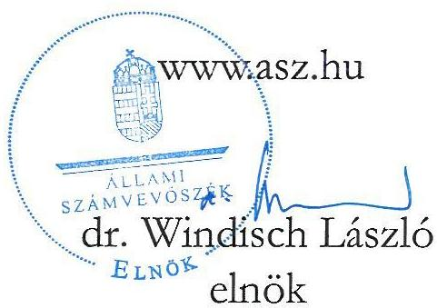
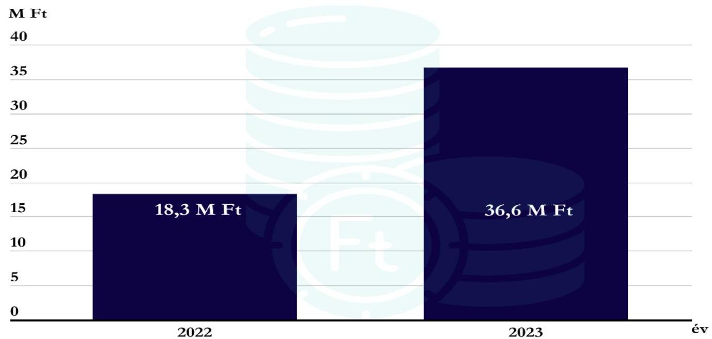
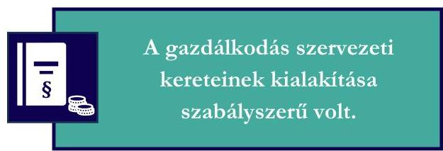
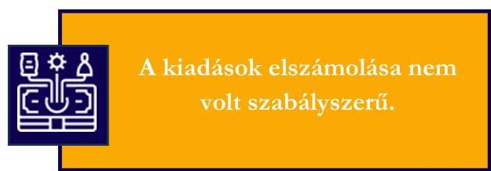
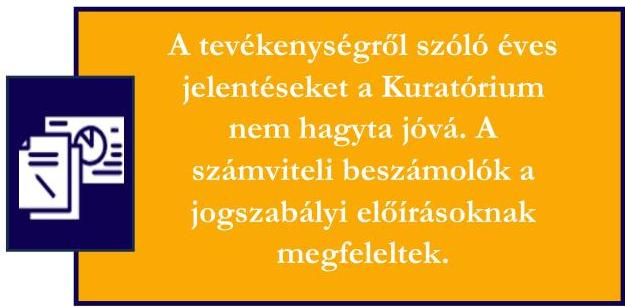

ÁLLAMI SZÁMVEVŐSZÉK

# JELENTÉS

A költségvetési támogatásban részesülő pártalapítványok 2022-2023. évi gazdálkodása törvényességének ellenőrzése

MEMO Alapítvány

2025.

25085

www.asz.hu

---

ÁLLAMI SZÁMVEVŐSZÉK

# JELENTÉS

A költségvetési támogatásban részesülő pártalapítványok 2022-2023. évi gazdálkodása törvényességének ellenőrzése

MEMO Alapítvány

2025.

25085

---

Jelentéseink az interneten a www.asz.hu címen olvashatók.

ELLENŐRZÉSI IGAZGATÓSÁG:
ELLENŐRZÉSI IGAZGATÓSÁG V.

ELLENŐRZÉSI IGAZGATÓ:
KLINGA LÁSZLÓ ellenőrzési igazgató

ELLENŐRZÉSVEZETŐ:
KAKAS SÁNDOR igazgatósági tanácsadó, ellenőrzésvezető

IKTATÓSZÁM: EL-4125-004/2025

TÉMASORSZÁM: 7

ELLENŐRZÉS-AZONOSÍTÓ SZÁM: V1119

---

TARTALOMJEGYZÉK

- AZ ELLENŐRZÉS ALAPADATAI ... 5
- AZ ELLENŐRZŐTT SZERVEZET ... 7
- ÖSSZEFOGLALÁS ... 8
- AZ ELLENŐRZÉS FÓKUSZTERÜLETEI ... 10
- MEGÁLLAPÍTÁSOK ... 11
- JAVASLATOK ... 16
- MELLÉKLETEK ... 17
- I. sz. melléklet: Értelmező szótár ... 17
- II. sz. melléklet: Ellenőrzési kritériumok ... 18
- FÜGGELÉK: ÉSZREVÉTELEK ... 19
- RÖVIDÍTÉSEK JEGYZÉKE ... 23

---

“哈，你是个小伙子，你是个小伙子，你是个小伙子，你是个小伙子，你是个小伙子，你是个小伙子，你是个小伙子，你是个小伙子，你是个小伙子，你是个小伙子，你是个小伙子，你是个小伙子，你是个小伙子，你是个小伙子，你是个小伙子，你是个小伙子，你是个小伙子，你是个小伙子，你是个小伙子，你是个小伙子，你是个小伙子，你是个小伙子，你是个小伙子，你是个小伙子，你是个小伙子，你是个小伙子，你是个小伙子，你是个小伙子，你是个小伙子，你是个小伙子，你是个小伙子，你是个小伙子，你是个小伙子，你是个小伙子，你是个小伙子，你是个小伙子，你是个小伙子，你是个小伙子，你是个小伙子，你是个小伙子，你是个小伙子，你是个小伙子，你是个小伙子，你是个小伙子，你是个小伙子，你是个小伙子，你是个小伙子，你是个小伙子，你是个小伙子，你是个小伙子，你是个小伙子，你是个小伙子，你是个小伙子，你是个小伙子，你是个小伙子，你是个小伙子，你是个小伙子，你是个小伙子，你是个小伙子，

---

AZ ELLENŐRZÉS ALAPADATAI

## AZ ELLENŐRZÉS CÉLJA

Az ellenőrzés célja annak értékelése volt, hogy a Pártalapítvány¹ törvényesen gazdálkodott-e; az éves számviteli beszámolók és a Pártalapítvány tevékenységéről szóló éves jelentések a jogszabályi előírásoknak megfeleltek-e; a könyvvvezetés és gazdálkodás során a vonatkozó jogszabályi rendelkezéseket és belső előírásokat betartották-e.

## AZ ELLENŐRZÉS TÍPUSA

Törvényességi ellenőrzés

## AZ ELLENŐRZŐTT IDŐSZAK

2022-2023. évek

## AZ ELLENŐRZÉS TÁRGYA

Az ellenőrzés tárgyát képezte a Pártalapítvány gazdálkodása, a könyvvvezetés szabályozása és gyakorlata szabályszerűsége, az éves számviteli beszámolókra és a Pártalapítvány tevékenységéről szóló éves jelentésekre vonatkozó kötelezettség teljesítése, valamint a gazdálkodáshoz kapcsolódó ellenőrzés javaslatainak hasznosítására irányuló tevékenység.

Az ellenőrzés kiterjed minden olyan körülményre és adatra, amely az ÁSZ² jogszabályban meghatározott feladatainak teljesítéséhez, valamint az ellenőrzési program végrehajtása során felmerülő újabb összefüggések feltárásához szükséges volt.

## AZ ELLENŐRZÉS JOGALAPJA

Az ellenőrzés jogalapját az ÁSZ tv.³ 1. § (3) bekezdése, 5. § (3) bekezdése, valamint a Pmtv.⁴ 4. § (2) és (4) bekezdéseinek előírásai képezték.

## AZ ELLENŐRZÉS MÓDSZERE

Az ellenőrzés az ellenőrzött időszakban hatályos jogszabályok, az ellenőrzés szakmai szabályai, a jelen ellenőrzésre irányadó ÁSZ módszertanok, az ellenőrzési programban foglalt értékelési szempontok szerint került végrehajtásra.

Az ellenőrzési kérdések megválaszolásához szükséges bizonyítékok megszerzése az ellenőrzött által rendelkezésre bocsátott dokumentumokra, adatokra alapozva kérdésfeltevés (információkérés), valamint

---

Az ellenőrzés alapadatai

mintavételezés, továbbá helyszíni interjú útján történt. Az ellenőrzési bizonyítékként felhasználható adatforrások közé tartoztak egyrészt az ellenőrzési programban felsorolt adatforrások, másrészt minden az ellenőrzés folyamán feltárt, az ellenőrzés szempontjából információt tartalmazó dokumentum.

Az ellenőrzés lefolytatásához az ellenőrzött szervezet tanúsítvány kitöltésével és az ÁSZ által kért dokumentumok, adatok, információk megküldésével és az ellenőrzés során szolgáltatott adatokat.

A Pártalapítvány kiadásai, ráfordításai elszámolásának szabályszerűségét (2. fókuszterület), a Pártalapítvány által nyújtott támogatások elszámolásának szabályszerűségét (2. fókuszterület), valamint a mérlegtételek besorolásának, év végi értékelésének, azok leltárral való alátámasztottságának szabályszerűségét (3. fókuszterület), mintavételi eljárással kiválasztott tételek alapján ellenőrizte az ÁSZ.

A 2. fókuszterületen az egyes vizsgálandó részterületek ellenőrzése részterületenként 30 elemű minta értékelésével, mintavételés, 30 db-ot meg nem haladó tételszám esetében tételés ellenőrzéssel történt. A 2023. évi kiadások esetében lényegességi szempontok alapján az ÁSZ további tételeket is értékelt, amelyek a kivetítésbe nem tartoztak bele. Az ÁSZ a 2. fókuszterületnél, a kiadások vonatkozásában 2022. évre 21 db tételt ellenőrzött, a 2023. évre 30 db tételt ellenőrzött, a minták értékelése alapján statisztikai kivetítést alkalmazott, további lényegességi szempontok alapján 2023. évben hat db kiválasztott tételt ellenőrzött. Az ÁSZ a 2. fókuszterületnél a Pártalapítvány által nyújtott támogatások vonatkozásában 2022. évben egy tételt ellenőrzött, 2023. évben nyújtott támogatás kiadási tétel nem volt. Az ÁSZ a 3. fókuszterületnél, a mérlegtételek vonatkozásában 2022. évre nyolc db, a 2023. évre vonatkozóan 16 db tételt ellenőrzött, a tények feltárása és azok összegzése során a megállapítások az ellenőrzött tételekre vonatkozóan kerültek megfogalmazásra.

A vizsgált terület „szabályszerű” minősítést kapott, ha a minta ellenőrzésének eredménye alapján 95%-os bizonyossággal a teljes sokaságban az átlagos hibaárány nem haladta meg a 10%-ot, „nem szabályszerű”, ha nagyobb volt, mint 10%. Amennyiben a sokaság elemszáma nem haladta meg az előírt minta elemszámot, akkor a sokaság valamennyi elemének tételés ellenőrzésére került sor.

A Pártalapítvány bevételei elszámolása szabályszerűségét teljeskörűen ellenőrizte az ÁSZ.

A gazdálkodás hibáinak kijavítására irányuló javaslatok kidolgozásakor a hatályos jogszabályok voltak az irányadóak.

6

---

AZ ELLENŐRZÖTT SZERVEZET

# MEMO ALAPÍTVÁNY

A Pártalapítványt 2022. július 1-jén 0,5 M Ft induló vagyonnal a Megoldás Mozgalom hozta létre.

A Pártalapítvány alapító okiratban $_{1-2}$⁵ rögzített célja „A politikai kultúra fejlesztése érdekében tudományos, ismeretterjesztő, kutatási és oktatási tevékenység.”

A Pártalapítvány ügyvezető szerve a Kuratórium⁶ volt, amely elnökből és két tagból állt. A Pártalapítvány törvényes képviseletét a Kuratórium elnöke látta el, a képviseleti jog gyakorlásának módja önálló volt. A Kuratórium tagjai közül egy tag személye változott.

A Pártalapítvány tevékenységét felügyelőbizottság nem ellenőrizte, számviteli beszámolóit könyvvizsgáló nem véleményezte, erre jogszabályi kötelezettsége nem volt.

Az alapító okirat $_{1-2}$ lehetővé tette a Pártalapítvány számára gazdasági-vállalkozási tevékenység folytatását, azonban az ellenőrzött időszakban gazdasági-vállalkozási tevékenységet nem végzett.

A Pártalapítvány cél szerinti tevékenységét saját szervezésű rendezvények keretében, valamint támogatás nyújtásával valósította meg, továbbá a céljai eléréséhez oktatást szervezett Magyar Politikai Akadémia néven.

A Pártalapítvány cél szerinti tevékenységének ellátásához a 2022. évben és 2023. évben központi költségvetési támogatásban részesült. Egyéb támogatást, adományt az alapító párttól⁷, egyéb szervezettől vagy magánszemélytől nem kapott. A Pártalapítvány 2022. és 2023. évben kapott költségvetési támogatásának évenkénti alakulását az 1. ábra mutatja be.

1. ábra

Költségvetési támogatás
Forrás: A Pártalapítvány 2022. és 2023. évi tevékenységéről szóló éves jelentései alapján ÁSZ saját szerkesztés

---

8

# ÖSSZEFOGLALÁS

Az ÁSZ ellenőrzése a Párttv.⁸ alapján a politikai kultúra fejlesztése érdekében tudományos, ismeretterjesztő, kutatási, oktatási tevékenység folytatása céljából, a Ptk.⁹ szerinti alapító okiraton alapuló bírósági nyilvántartásba vétellel létrejött Pártalapítvány gazdálkodására terjedt ki. A pártalapítványok törvényes gazdálkodásának (könyvvezetés, beszámolás, jelentés készítés) szabályait a Pmtv.-n túl, a Számv. tv.¹⁰ és az Eszkr.¹¹ határozzák meg. A Pmtv. 4. § (2) bekezdése értelmében a pártalapítványok gazdálkodása törvényességének ellenőrzése az ÁSZ feladata. A Pmtv. 4. § (4) bekezdése alapján az ÁSZ kétévente – kötelező jelleggel – ellenőrzi azoknak a pártalapítványoknak a gazdálkodását, amelyek állami költségvetési támogatásban részesültek.

A pártalapítványok ellenőrzésével az ÁSZ hozzájárul ahhoz, hogy a társadalom objektív képet alkothasson a pártalapítványok működéséről, gazdálkodásáról. Az ellenőrzésről készített számvevőszéki jelentésben megfogalmazott megállapítások, következtetések, javaslatok alapján a törvényalkotók konkrét lépéseket tehetnek a pártalapítványokra vonatkozó szabályozások megváltoztatása, átláthatóbbá, ellenőrizhetőbbé tétele érdekében. Az ellenőrzött szervezetek szintjén a hiányosságok, szabálytalanságok feltárása, az ennek kapcsán megfogalmazott megállapítások elősegíthetik a pártalapítványok szabályszerű gazdálkodását.

Az ellenőrzött időszakban az alapító okirat1.2-ban a jogszabályi előírásokkal összhangban rögzítették a Pártalapítvány működésének célját, tevékenységét, továbbá meghatározták a Pártalapítvány ügyvezető szervét, összetételét, működését.

A Pártalapítvány a Számv. tv.-ben előírtak szerint kialakította a számviteli politikáját1.2¹², valamint elkészítette az eszközök és források leltárkészítési és leltározási szabályzatát1.2¹³, az eszközök és források értékelési szabályzatát1.2¹⁴ és a pénzkezelési szabályzatot1.2¹⁵, továbbá rendelkezett számlarenddel1.2¹⁶. A szabályzatok az ellenőrzött jogszabályi kritériumoknak megfeleltek.

A kiadások elszámolása nem volt szabályszerű.

A költségvetési támogatások számviteli nyilvántartása a Számv. tv. előírásainak megfelelt. A Pártalapítvány a 2022. és 2023. években a tevékenységének költségeit, ráfordításait nem szabályszerűen számolta el, mivel a könyvviteli elszámolást közvetlenül alátámasztó bizonylatok esetén a gazdasági művelet elrendelése, az utalványozás és a

végrehajtás igazolása tekintetében az ellenőrzés hiányosságot tárt fel.

A 2022. évben harmadik személy részére nyújtott támogatás a Pártalapítvány céljaival összhangban volt, odaítélése, elszámolása, nyilvántartása során a jogszabályi rendelkezéseket betartották. A Pártalapítvány a 2023. évben harmadik személy részére nem nyújtott támogatást. Az ellenőrzött kiadási tételek alapján a Pártalapítvány az alapító párt részére támogatást, vagyoni hozzájárulást az ellenőrzött időszakban nem adott, ezzel eleget tett a Párttv. előírásainak.

---

Összefoglalás

A Pártalapítvány mindkét ellenőrzött évben a jogszabályi előírás szerint a tevékenységéről szóló éves jelentéseket elkészítette, azonban az éves jelentéseket a Pmtv. előírásai ellenére a Kuratórium nem hagyta jóvá.

A Pártalapítvány a 2022. és 2023. évre az egyszerűsített éves beszámolóit az előírások szerint elkészítette és közzétette. Az egyszerűsített éves beszámolók mérlegtételeinek besorolása, értékelése az ellenőrzött tételek esetében szabályszerű volt.

Az ÁSZ a Kuratórium elnöke részére a feltárt szabálytalanságok jövőbeni kiküszöbölése érdekében négy javaslatot fogalmazott meg.

9

---

10

# AZ ELLENŐRZÉS FÓKUSZTERÜLETEI

1. A Pártalapítvány törvényes gazdálkodásához szükséges szabályok kialakítása
2. A Pártalapítvány könyvvvezetése és gazdálkodása során a jogszabályi előírások betartása
3. A Pártalapítvány tevékenységéről szóló jelentések, az éves beszámolók jogszabályi előírásoknak való megfelelősége

---

MEGÁLLAPÍTÁSOK

# 1. A Pártalapítvány törvényes gazdálkodásához szükséges szabályok kialakítása

## Összegző megállapítás
A Pártalapítvány a 2022-2023. években a törvényes gazdálkodáshoz szükséges szabályokat kialakította.

### 1.1. számú megállapítás
A Pártalapítvány működésének szabályait a Ptk., a Pmtv., a Számv. tv. és az Eszkr. előírásainak megfelelően rögzítették.

Az alapító okiratban₁₋₂ a Pmtv. és a Ptk. előírásainak megfelelően meghatározták a Pártalapítvány ügyvezető szervét és annak összetételét, továbbá a Pártalapítvány képviseletére jogosult személyeket, valamint a képviseleti jog módjára, terjedelmére vonatkozó szabályokat.

Az alapító okirat₁₋₂ a Pmtv. és a Ptk. előírásainak megfelelően tartalmazta az alapítványi működés célját, feladatait, a működés keretszabályait, valamint a Pártalapítványhoz történő csatlakozás feltételeit, a kuratóriumi működés szabályait.

A Pártalapítvány alapító okirat₁-ának – a Ptk. és a Pmtv. előírásainak megfelelő – módosítására az ellenőrzött időszakban egy alkalommal, a Kuratórium összetételének változására tekintettel 2023. április 29-én került sor.

A Pártalapítvány a gazdálkodásával kapcsolatos könyvvezetési és nyilvántartási rendszerét az Eszkr. rendelkezéseinek megfelelően kialakította. A Pártalapítvány a 2022. és 2023. évekre a Számv. tv.-ben előírtak szerint kettős könyvvitellel alátámasztott egyszerűsített éves beszámolót készített.

A Pártalapítvány a könyvviteli szolgáltatás körébe tartozó feladatok irányításával, vezetésével, az egyszerűsített éves beszámoló elkészítésével 2023. január 31-ig számviteli szolgáltatást nyújtó társaságot, majd 2023. február 1-től munkavállalót bízott meg a Számv. tv.-ben és az Eszkr.-ben meghatározott követelmények figyelembevételével.

### 1.2. számú megállapítás
A Pártalapítvány a 2022. és a 2023. évre a gazdálkodására vonatkozó belső szabályozást a Számv. tv., az Eszkr. és a Ptk. előírásainak megfelelően kialakította.

A Pártalapítvány a Számv. tv.-ben előírtak szerint rendelkezett számviteli politikával₁,₂ és annak keretében az eszközök és a források értékelési szabályzatával₁,₂, az eszközök és a források leltárkészítési és leltározási szabályzatával₁,₂ és pénzkezelési szabályzattal₁,₂, továbbá számlarenddel. A szabályzatok az ellenőrzött jogszabályi kritériumoknak megfeleltek.

A számviteli politikában₁,₂ a Számv. tv. és Eszkr. előírásai szerint meghatározták a Pártalapítvány gazdálkodására jellemző szabályokat, a számviteli beszámoló típusát, a kapcsolódó könyvvezetés módját, a mérlegkészítés idejét, a mérleg fordulónapját.

A Pártalapítvány az ellenőrzött időszakban rendelkezett a Számv. tv. szerinti számlarenddel₁,₂ és annak keretében bizonylati renddel₁,₂¹⁷.

A Pártalapítvány céljaira rendelt vagyont és annak felhasználási módját a Ptk. előírása szerint az alapító okirat₁₋₂-ben rögzítették. A Pártalapítvány a céljaira rendelt vagyon nyilvántartása, elszámolása rendjét, e

11

---

Megállapítások

vagyon nyilvántartásának tovább részletézését a Ptk., a Számv. tv. és az Eszkr. rendelkezéseinek megfelelően biztosította.

1.3. számú megállapítás
A Pártalapítvány alapcélja ellátásához kapcsolódó gazdálkodási tevékenysége az ellenőrzött időszakban szabályszerű volt.

A Pártalapítvány az alapító okirat1.2-ben rögzítette, hogy az alapítványi cél megvalósításával közvetlenül összefüggő gazdasági vállalkozási tevékenység végzésére jogosult, melyet kiegészítő jelleggel, elkülönített számviteli nyilvántartás alapján végezhet. A Pártalapítvány ellenőrzött időszaki egyszerűsített éves beszámolói és az azokat alátámasztó könyvviteli nyilvántartásai szerint az ellenőrzött időszakban nem folytatott vállalkozási tevékenységet.

A Pártalapítvány az ellenőrzött időszakban a 2022. és 2023. évi tevékenységéről a Ptk. előírásait betartva nem volt korlátlan felelősségű tagja más jogalanyának, valamint nem volt alapítója, tagja alapítványnak, nem csatlakozott más alapítványhoz.

# 2. A Pártalapítvány könyvvizetése és gazdálkodása során a jogszabályi előírások betartása

|  Összegző megállapítás | A Pártalapítvány a könyvvizetése és gazdálkodása során a jogszabályi rendelkezéseket az adott támogatás tekintetében betartotta, a kiadások elszámolása nem volt szabályszerű.  |
| --- | --- |
|  2.1. számú megállapítás | A Pártalapítvány a kapott támogatásokat az ellenőrzött időszakban szabályszerűen fogadta és számolta el.  |

A Pártalapítvány a 2022. évben 18,3 M Ft összegben, a 2023. évben 36,6 M Ft összegben részesült költségvetési támogatásban a Kvtv.1.2¹⁸ és a 1284/2022. (VI. 7.) Korm. határozat¹⁹ alapján. A Pártalapítvány az ellenőrzött időszakban egyéb forrásból támogatást vagy adományt az alapító párttól, magánszemélytől vagy más szervezettől nem fogadott el.

A Pártalapítvány az Számv. tv. és az Eszkr. előírásainak megfelelően a 2022. és a 2023. évben a költségvetési támogatás összegét könyvvizetésében az egyéb bevételein belül elkülönítetten tartotta nyilván. A Számv. tv. és az Eszkr. előírásai szerint a 2022. és 2023. évi egyszerűsített éves beszámolója eredménykimutatásában az egyéb bevételeken belül részletezte a kapott támogatások összegét. A Pártalapítvány az ellenőrzött időszakban továbbutalási céllal támogatást nem kapott.

|  2.2. számú megállapítás | A Pártalapítvány által nyújtott cél szerinti támogatás odaítélése, elszámolása, beszámolóban történő bemutatása a 2022. évben szabályszerű volt. A Pártalapítvány 2023. évben támogatást harmadik fél részére nem nyújtott.  |
| --- | --- |

A Pártalapítvány alapító okiratában: a Kuratórium jogköre között rögzítették az alapítványi vagyon alapítványi célhoz kötött felhasználásnak szabályait. A 2022. évben nyújtott támogatás összegét a Számv. tv. és a számlarend. előírásainak megfelelően a könyvviteli nyilvántartásban az egyéb ráfordítások között számolták el. A Pártalapítvány a 2023. évben cél szerinti támogatást nem nyújtott.

---

Megállapítások

A Pártalapítvány által a 2022. évben nyújtott cél szerinti támogatás magánszemély részére (egy tétel) vonatkozásában az ÁSZ az alábbiakat állapította meg:

- a támogatás odaítéléséről a Ptk.-ban és az alapító okiratban; foglaltaknak megfelelően a Kuratórium döntött;
- a nyújtott támogatás jogcíme megfelel az alapító okiratban; foglaltaknak;
- a támogatás kedvezményezettje megfelel a Ptk. vizsgált előírásainak;
- a támogatásról megkötött szerződés összhangban volt a támogatásról szóló kuratóriumi döntéssel;
- a támogatás felhasználásáról való beszámolási kötelezettséget a támogatott részére nem írtak elő;
- a támogatás folyósítására a támogatási szerződésnek megfelelően került sor.

A Pártalapítvány a nyújtott cél szerinti juttatást a 2022. évi egyszerűsített éves beszámolója közhasznúsi mellékletében az Ectv. előírásainak megfelelően kimutatta, továbbá a 2022. évi tevékenységéről szóló éves jelentés a Pmtv.-ben előírtak szerint tartalmazta a támogatással kapcsolatos adatokat.

2.3. számú megállapítás

A Pártalapítvány 2022. és 2023. évi kiadásainak elszámolása nem volt szabályszerű.

A kiadási tételek ellenőrzése során az ÁSZ az alábbiakat állapította meg:

- a költségelszámolás, a ráfordítás számviteli elszámolását a Számv. tv.-ben előírtak szerint dokumentumokkal (számla, szerződés, megrendelés, pénzügyi teljesítés dokumentuma) alátámasztották;
- a könyvviteli elszámolást közvetlenül alátámasztó bizonylatok közül 2022. évben egy tétel („plakátok” 0,8 M Ft értékben), 2023. évben három tétel („plakát” 0,03 M Ft, „jegyzettöm” 0,2 M Ft és „eszköz bérleti díj” 0,2 M Ft) nem felelt meg a Számv. tv. 167. § (1) bekezdés c) pontjában előírtaknak, mert a gazdasági műveletet nem az arra jogosult személy rendelte el;
- a költségeket és ráfordításokat a Számv. tv. előírásainak megfelelő költségnemre számolták el;
- a könyvviteli elszámolást alátámasztó bizonylatok a Számv. tv. 167. § (1) bekezdés c) pontjában foglaltak ellenére 2022. évben elszámolt 1 db tétel, 2023. évben elszámolt 4 db tétel vonatkozásában nem tartalmazták az utalványozó aláírását;
- a könyvviteli elszámolást alátámasztó bizonylatok a Számv. tv. 167. § (1) bekezdés c) pontjában foglaltak ellenére a 2022. évben elszámolt 9 tétel, a 2023. évben elszámolt 11 tétel esetén nem tartalmazták a rendelkezés végrehajtását igazoló személy aláírását;
- a könyvviteli elszámolást alátámasztó bizonylatokon az érintett könyvviteli számlákra történő hivatkozás a Számv. tv.-ben előírtaknak megfelelően történt;
- a kiadások a Pártalapítvány cél szerinti tevékenysége, vagy működése érdekében merültek fel;
- a Pártalapítvány a 2023. évben a kuratóriumi tagok részére munkaszerződés alapján munkabért fizetett ki, ez ellentétes volt az alapító okirat; 8.3. pontjában foglalt rendelkezéssel, amely szerint a kuratórium tagjait díjazás nem illeti meg.

13

---

Megállapítások

# 3. A Pártalapítvány tevékenységéről szóló jelentések, az éves beszámolók jogszabályi előírásoknak való megfelelősége

## Összegző megállapítás

A Pártalapítvány a tevékenységéről szóló 2022. és 2023. évi jelentéseket elkészítette, azonban az éves jelentéseket a Pmtv. előírásai ellenére a Kuratórium nem hagyta jóvá. A Pártalapítvány a 2022. és a 2023. évre az egyszerűsített éves beszámolókat a jogszabályi előírások szerint elkészítette és közzétette.

## 3.1. számú megállapítás

A Pártalapítvány 2022. és a 2023. évi éves jelentéseit a Pmtv. előírásai ellenére a Kuratórium nem hagyta jóvá. A Pártalapítvány az éves jelentések közzétételénél a Pmtv. előírásait nem tartotta be.

A Pártalapítvány a Pmtv. előírásai alapján a 2022. és 2023. évre vonatkozóan elkészítette tevékenységéről szóló éves jelentéseit. A tevékenységről szóló éves jelentések a Pmtv.-ben foglaltak szerint tartalmazták:

- a számviteli beszámolót,
- a költségvetési támogatás felhasználására vonatkozó kimutatást,
- a vagyon felhasználásával kapcsolatos kimutatást,
- a cél szerinti juttatások kimutatását,
- a központi költségvetési szervtől kapott támogatás mértékét,
- az egyes vezető tisztségviselőinek nyújtott juttatások értékét, illetve összegét,
- a Pártalapítvány tevékenységéről szóló rövid tartalmi beszámolót.

A Pártalapítvány 2022. és 2023. évi tevékenységéről szóló éves jelentéseket a Pmtv. 3/A. § (2) bekezdésének előírása ellenére a Kuratórium nem fogadta el. A Pártalapítvány a 2022. és 2023. évi tevékenységéről szóló éves jelentések közzétételénél nem tartotta be a Pmtv. 3/A. § (5) bekezdésében előírtakat, mert a Magyar Közlöny mellékleteként megjelenő Hivatalos Értesítőben és a saját honlapján olyan éves jelentéseket tett közzé, melyet nem fogadott el a Kuratórium.

## 3.2. számú megállapítás

A Pártalapítvány a 2022. és 2023. évi egyszerűsített éves beszámolóját a Számv. tv., az Ectv. és az Eszkr. előírásai szerint elkészítette és közzétette.

A Pártalapítvány a 2022. és 2023. évi működéséről a Számv. tv., az Ectv. és az Eszkr. előírásai alapján pénzügyi, vagyoni és jövedelmi helyzetéről az üzleti év könyveinek lezárását követően, az üzleti év utolsó napjával egyszerűsített éves beszámolót, továbbá közhasznúsági mellékletet készített. A Pártalapítvány 2022. és 2023. évi egyszerűsített éves beszámolóit a Ptk. és az alapító okirat előírásainak megfelelően a Kuratórium határozattal elfogadta. A 2023. évi egyszerűsített éves beszámoló kiegészítő melléklete a Számv. tv. 91. § a) pontja, továbbá 96. § (4) bekezdésében foglaltak ellenére a tárgyévben foglalkoztatott munkavállalók átlagos statisztikai állományi létszámát nem tartalmazta.

A Pártalapítvány a 2022. és a 2023. évi egyszerűsített éves beszámolót és a közhasznúsági mellékletet az Ectv. előírásainak megfelelően az előírt határidőn belül az OBH²⁰ részére megküldte és a Pártalapítvány saját honlapján közzétette.

14

---

Megállapítások

A Pártalapítvány a 2022. és 2023. évi egyszerűsített éves beszámolójának mérlegtételeit az ellenőrzött tételek tekintetében a Számv. tv. és a belső szabályzata előírásainak megfelelően leltárral alátámasztotta. A 2022. és 2023. évi mérlegtételek tartalma, besorolása, bekerülési értékének meghatározása megfelelt a Számv. tv.-ben és az Eszkr.-ben és a belső szabályzatokban előírtaknak.

A Pártalapítvány a kapott költségvetési támogatásokat a 2022. és 2023. évi egyszerűsített éves beszámolóiban elkülönítetten mutatta be a Számv. tv., a Pmtv. és az Eszkr. előírásainak megfelelően.

## 3.3. számú megállapítás

Az ellenőrzött időszakban a Pártalapítvány céljaira rendelt vagyon kezelése és védelme, az arról való beszámolás szabályszerű volt.

A Pártalapítvány céljait és tevékenységét, a vagyon hozzájárulás mértékét, valamint az alapítói vagyon kezelésének és felhasználásának szabályait a Ptk. előírásai szerint az alapító okiratban $_{1-2}$ meghatározták. A Pártalapítvány céljaira rendelt vagyon nyilvántartásának, elszámolásának rendjét, a vagyon nyilvántartásának tovább részletezését biztosították.

A Pártalapítvány az ellenőrzött időszakban az államháztartásból ingyenesen átadott vagyont, továbbá véglegesen az államháztartásból tulajdonba adott vagyont nem kapott, így az Nvtv. $^{21}$ valamint a Vtvr. $^{22}$ előírásai szerinti vagyonhoz kapcsolódóan nyilvántartási, adatszolgáltatási kötelezettsége nem keletkezett.

15

---

JAVASLATOK

Az ÁSZ tv. 33. § (1) bekezdésében foglaltak értelmében az ellenőrzött szervezet vezetője köteles a jelentésben foglalt megállapításokhoz kapcsolódó intézkedési tervet összeállítani és azt a jelentés kézhezvételétől számított 30 napon belül az ÁSZ részére megküldeni. Amennyiben az ellenőrzött szervezet vezetője nem küldi meg határidőben az intézkedési tervet, vagy továbbra sem elfogadható intézkedési tervet küld, az Állami Számvevőszék elnöke az ÁSZ tv. 33. § (3) bekezdése a) és b) pontjaiban foglaltakat érvényesítheti.

## A MEMO ALAPÍTVÁNY KURATÓRIUMI ELNÖKE RÉSZÉRE

1. Gondoskodjon arról, hogy a kiadások elszámolását alátámasztó bizonylat a Számv. tv. 167. § (1) bekezdés c) pontjának előírása szerint tartalmazza a gazdasági műveletet elrendelő, az utalványozó és a rendelkezés végrehajtását igazoló személy aláírását.

2. Gondoskodjon a kuratóriumi tagok díjazása tekintetében az alapító okiratban foglaltak betartásáról.

3. Gondoskodjon a tevékenységéről szóló éves jelentések Kuratórium által történő elfogadásáról a Pmtv. 3/A. § (2) bekezdésének előírása szerint.

4. Gondoskodjon a kiegészítő melléklet elkészítésénél a Számv. tv. 91. § a) pontjában, továbbá a 96. § (4) bekezdésében előírtak betartásáról.

16

---

MELLÉKLETEK

## I. SZ. MELLÉKLET: ÉRTELMEZŐ SZÓTÁR

alapítvány
Az alapítvány az alapító által az alapító okiratban meghatározott tartós cél folyamatos megvalósítására létrehozott jogi személy. Az alapító az alapító okiratban meghatározza az alapítványnak juttatott vagyont és az alapítvány szervezetét. Alapítvány nem alapítható gazdasági tevékenység folytatására. Az alapítvány az alapítványi cél megvalósításával közvetlenül összefüggő gazdasági tevékenység végzésére jogosult. Alapítvány nem lehet korlátlan felelősségű tagja más jogalanynek, nem létesíthet alapítványt és nem csatlakozhat alapítványhoz. (Forrás: Ptk. 3:378. §, 3:379. § (1)-(3) bekezdés)

gazdasági-vállalkozási tevékenység
A jövedelem- és vagyonszerzésre irányuló vagy azt eredményező, üzletszerűen végzett gazdasági tevékenység, kivéve az adomány (ajándék) elfogadását, a pénzeszközök betétbe, értékpapírba, társasági részesedésbe történő elhelyezését és az ingatlan megszerzését, használatának átengedését és átruházását. (Forrás: Ectv. 2. § 11. pont., Pmtv. 2021. július 1. napjától hatályos 3. § (6a) bekezdés)

költségvetési támogatás
A pártalapítványoknak a Párttv. 9/A. § (1) bekezdése és a Pmtv. 1. § előírásainak értelmében, az éves költségvetési törvények szerint – jellemzően az 1. számú melléklet I. Országgyűlés fejezet 9. Pártalapítványok támogatás címen – az állami költségvetésből juttatott támogatás.

pártalapítvány
A politikai kultúra fejlesztése érdekében, tudományos, ismeretterjesztő, kutatási és oktatási tevékenység folytatása céljából pártok által létrehozott, külön jogszabályban – a Pmtv. 1. § és 3. § (1) bekezdése – meghatározott, jogi személynek minősülő egyéb szervezet, speciális jogállású alapítvány.

(Forrás: Párttv. 9/A. § (1) bekezdés, Pmtv. 1. §, Ectv. 2. § 6. c) pont, Számv. tv. 3. § (1) bekezdés 4. pont, Eszkr. 2. § (1) bekezdés l) pont)

17

---

Mellékletek

## II. SZ. MELLÉKLET: ELLENŐRZÉSI KRITÉRIUMOK

|  FÓKUSZTERÜLET | ELLENŐRZÉSI KRITÉRIUMOK  |
| --- | --- |
|  1. A Pártalapítvány törvényes gazdálkodásához szükséges szabályok kialakítása | Ptk. 3:21-3:25. §, 3:29-3:30. §, 3:379. § (3) bekezdés, 3:391. § (1) bekezdés c) pont, 3:391. § (2) bekezdés h) pont, 3:397-3:398. §, 3:400.§ (2) bekezdés
Ectv. 28-31. §
Eszkr. 7. § (3)-(4) bekezdés b) pont, (6) bekezdés, 8. § (2) bekezdés, 9. § (4) bekezdés, 12-15. §
Számv. tv. 14. § (3)-(4) bekezdés, 14. § (5) bekezdés a), b) és d) pont, 14. § (8) bekezdés, 14. § (12) bekezdés, 16. § (4) bekezdés, 96. §, 150. §, 161. § (1) bekezdés, 161. § (2) bekezdés c), d) pont, 161. § (4) bekezdés
Pmtv. 3. § (6), (6a) bekezdés  |
|  2. A Pártalapítvány könyvvezetése és gazdálkodása során a jogszabályi előírások betartása | Ptk. 3:384. § (1) bekezdés, 3:385. §, 3:386. §
Párttv. 5. § (2) bekezdés, 9/A. § (1) bekezdés, 9/A. § (3) bekezdés
Pmtv. 3. § (3) bekezdés, 3. § (4) bekezdés a) pont, 3/A § (3) bekezdés b), d) e) pont
Kv. tv.1 1. melléklete
Kv. tv.2 1. melléklete
1284/2022 (VI.7) Korm. határozat 1. melléklet
2023. évi LXXIII. törvény 1. melléklete
2024. évi XLVIII. törvény 1. melléklete
Kbt. 5. § (2)-(3) bekezdés, 15. § (5) bekezdés, 19. §, 27. § (1)-(2) bekezdés, 111. § p), 131. §
Számv. tv. 78. § - 81. §, 160. §, 161/A. § (2) bekezdés, 165. § (1) bekezdés, 166. §, 167. § (1) bekezdés c), h) pont
Ectv. 2. § 1. pont, 29. § (7) bekezdés
Eszkr. 13. § (3) bekezdés, 9. § (9) bekezdés, 12. § (4) bekezdés, 14. § (1) bekezdés, 29. § (4) bekezdés
alapító okirat1,2; Támogatói okirat (kelt 2022. november 4-én)  |
|  3. A Pártalapítvány tevékenységéről szóló jelentések, az éves számviteli beszámolók jogszabályi előírásoknak való megfelelősége | Pmtv. 3/A § (3), (5) bekezdés, (6) bekezdés, 3. § (4), (6) bekezdés
Ectv. 28. § (1)-(3) bekezdés, 29. § (2)-(5) bekezdés, 30. §, 46. § (1) bekezdés
Eszkr. 7. § (1)-(3), (4) bekezdés b) pontja, (6)-(8) bekezdés, 8. § (2) bekezdés, 11. §, 12. §, 13.§ (4)-(5) bekezdés, 14. § (1) bekezdés, 23. §, 24. §, 16. §, 17. §
Számv. tv. 8. § (2) bekezdés b) pontja, 8. § (5) bekezdés, 9. § (2) bekezdés, 19. § (1) bekezdés; 23-31. §, 35. §, 44. § (2) bekezdés, 47-51. §, 52., 54-56. §, 57-59. §, 65. § (1)-(7) bekezdés, 69. §, 70. §, 91. § a) pont, 96. § (1) bekezdés, 155. § (7) bekezdés, 161. § (2)-(3) bekezdés, Számv. tv. 161/A. § (2) bekezdés, 165. § (4) bekezdés
Ptk. 3:27. § (1) bekezdés, 3:4, 3:9 – 3:10. §, 3:378 – 3:383. §, 3:388 – 3:390. §, 3:391. § (1) bekezdés b) pont, (2) bekezdés c) pont
Nvtv. 7. § (1) bekezdés, 13. § (3) bekezdés, 13. § (4) bekezdés b) pont
Vtvr. 14. § (1)-(3) bekezdés, 17. § (1)-(2) bekezdés, melléklet II/8. pont
alapító okirat1,2, számviteli politika1,2, eszközök és források értékelési szabályzata1,2  |

18

---

FÜGGELÉK: ÉSZREVÉTELEK

A jelentéstervezetet a Számvevőszék 15 napos észrevételezésre megküldte az ellenőrzött szervezet vezetőjének az ÁSZ tv. 29. §* (1) bekezdése előírásának megfelelően.

A MEMO Alapítvány Kuratóriumának elnöke a jelentéstervezetre észrevételt tett. A függelék tartalmazza az el nem fogadott észrevételek elutasításának indokolását.

## Észrevétel 1:

„A megállapítással érintett 2022-es és 2023-as gazdasági műveletek megrendelése nem jogosulatlanul, hanem a gazdasági művelet elrendelésére jogosult személy tájékoztatása, jóváhagyása és utasítása alapján történt. A konkrét megrendelések technikai lebonyolítása ugyanakkor a felelős kapcsolattartó személyeken keresztül történt e-mailben, akik az operatív működés során a kapcsolattartást segítik az egyes partnerekkel. Ez a gyakorlat tartalmilag megfelel a Számviteli törvény 167. § (1) bekezdés c) pontjában foglaltaknak, mivel a gazdasági döntés meghozatala és elrendelése a jogszabály által előírt jogosultsággal rendelkező személy által történt, a lebonyolításban pedig az adott folyamatban felelős munkatársak vettek részt a belső munkamegosztásnak megfelelően.”

## Az észrevétellel érintett megállapítás:

„a könyvviteli elszámolást közvetlenül alátámasztó bizonylatok közül 2022. évben egy tétel („plakátok” 0,8 M Ft értékben), 2023. évben három tétel („plakát” 0,03 M Ft, „jegyzettömb” 0,2 M Ft és „eszköz bérleti díj” 0,2 M Ft) nem felelt meg a Számv. tv. 167. § (1) bekezdés c) pontjában előírtaknak, mert a gazdasági műveletet nem az arra jogosult személy rendelte el;”

## El nem fogadás indoklása:

Az ellenőrzés során az ÁSZ részére megküldött K_2022_1. számú kiadási mintatétel kapcsán a kiadási tétel megrendelését végző személy a Pártalapítvány által az ÁSZ rendelkezésére bocsátott „béradatok összesítése_2022.xls” dokumentum tanúsága szerint a megrendelés időpontjában (2022. december 13-án) nem szerepelt a munkavállalók nyilvántartásában, ezáltal a gazdasági döntés meghozatala időpontjában felelős személyként nem értelmezhető. A Pártalapítvány alapító okirat 9. pontja szerint az alapítványt a kuratórium elnöke önállóan jogosult képviselni. Az ellenőrzés során az ÁSZ részére megküldött

* 29. § (1) Az Állami Számvevőszék az ellenőrzési megállapításait megküldi az ellenőrzött szervezet vezetőjének vagy az általa megbízott személynek, és annak, akinek személyes felelősségét állapította meg.
(2) Az ellenőrzött szervezet vezetője és a felelősként megjelölt személy az ellenőrzés megállapításaira tizenöt napon belül írásban észrevételt tehet.
(3) Az Állami Számvevőszék az észrevételre a beérkezésétől számított harminc napon belül írásban válaszol. A figyelembe nem vett észrevételeket köteles a jelentésben feltüntetni, és megindokolni, hogy azokat miért nem fogadta el.

19

---

Függelék: Észrevételek

K_2023_7. számú kiadási mintatétel és K_2023_8. számú kiadási mintatétel kapcsán a kiadási tétel elrendelője az ÁSZ rendelkezésére bocsátott "K_2023_26_27_28_29_P_K_munkaszerz.pdf", "Munkaköri leírás_P_K.pdf" dokumentum tanúsága szerint a gazdasági művelet elrendelésére nem volt jogosult.

Az ellenőrzés során az ÁSZ részére megküldött K_2023_9. számú kiadási mintatétel kapcsán a kiadási tétel megrendelését végző személy az ÁSZ rendelkezésére bocsátott "Hot-Dog - Árajánlat.pdf" és "béradatkok_összesítése_2023.xls" dokumentum tanúsága szerint a megrendelés időpontjában (2023. július 27-én) nem szerepelt a munkavállalók nyilvántartásában, ezáltal a gazdasági döntés meghozatala időpontjában felelős személyként nem értelmezhető.

A fentiek alapján a jelentéstervezet módosítása nem indokolt.

## Észrevétel 2:

„Az utalványozási folyamat kapcsán fontosnak tartjuk jelezni, hogy az Alapítványnál belső ellenőrzési mechanizmus működik a számlák kifizetésére vonatkozóan. Ennek keretében a pénzügyi folyamatokért felelős munkatársak rendszeresen összesítik a kifizetésre váró számlákat egy excel táblázatban, amelyet megküldenek a gazdálkodásért felelős személy részére. Ő minden esetben aláírásával igazolja, hogy a számlák valóságát ellenőrizte, azok szakmailag és pénzügyileg is teljesítésre kerültek, és a kifizetés elrendelhető. Ez a folyamat eddig elsősorban belső kontroll célokat szolgált, ezért nem került korábban csatolásra. Most mellékeljük a megállapításban érintett tételeket tartalmazó napokra bontott táblázatokat, amelyek az utalványozási gyakorlatunkat dokumentálják. Bízunk benne, hogy ezek alapján a Pártalapítvány utalványozási rendje értelmezhető, és megfelel a jogszabályi elvárásoknak!”

## Az észrevétellel érintett megállapítás:

„...a könyvviteli elszámolást alátámasztó bizonylatok a Számv. tv. 167. § (1) bekezdés c) pontjában foglaltak ellenére 2022. évben és a 2023. évben elszámolt több tétel vonatkozásában nem tartalmazták az utalványozó aláírását;”

## El nem fogadás indoklása:

A Számv. tv. 167. § (1) bekezdésének c) pontja előírása szerint a könyvviteli elszámolást közvetlenül alátámasztó bizonylat általános alaki és tartalmi kellékei a következők:

„a gazdasági művelet elrendelő személy vagy szervezet megjelölése, az utalványozó és a rendelkezés végrehajtását igazoló személy, valamint a szervezettől függően az ellenőr aláírása; a készletmozgások bizonylatain és a pénzkezelési bizonylatokon az átvevő, az ellennyugtákra a befizető aláírása;”

Az észrevételhez mellékelt dokumentumokat az ÁSZ megvizsgálta és megállapította, hogy a kifizetési tételek könyvviteli elszámolását közvetlenül alátámasztó dokumentumok a jogszabályban előírt alaki és tartalmi kellékek közül – az utalványozó személy aláírását – a 2022. és a 2023. évben elszámolt tételek vonatkozásában nem tartalmazták, ezért a jelentéstervezetben szereplő megállapítást az ÁSZ fenntartotta.

---

Függelék: Észrevételek

## Észrevétel 3:

„A gazdasági események teljesítése minden esetben ténylegesen megtörtént, a kifizetések pedig valós, indokolt és lezajlott teljesítéseken alapultak. A teljesítéseket az alapítvány belső ellenőrzési gyakorlatának megfelelően saját magunk számára fotódokumentációval igazoltuk, valamint – ahol releváns – átvételi elismervényekkel is alátámasztottuk. A fotók eddig nem kerültek csatolásra, mivel elsődlegesen belső használatra készültek, a teljesítés megtörténtének dokumentálása és a belső átláthatóság biztosítása érdekében. Jellemzően olyan tételekről van szó, mint például közterület-foglalási díjak vagy ételrendelések, ahol papíralapú teljesítési igazolás nem áll rendelkezésre, ugyanakkor a teljesítést a fotók egyértelműen igazolják.”

## Az észrevétellel érintett megállapítás:

„...a könyvviteli elszámolást alátámasztó bizonylatok a Számv. tv. 167. § (1) bekezdés c) pontjában foglaltak ellenére a 2022. évben és a 2023. évben elszámolt több tétel esetén nem tartalmazták a rendelkezés végrehajtását igazoló személy aláírását;”

## El nem fogadás indoklása:

A Számv. tv. 167. § (1) bekezdésének c) pontja előírása szerint a könyvviteli elszámolást közvetlenül alátámasztó bizonylat általános alaki és tartalmi kellékei a következők:

„a gazdasági műveletet elrendelő személy vagy szervezet megjelölése, az utalványozó és a rendelkezés végrehajtását igazoló személy, valamint a szervezettől függően az ellenőr aláírása; a készletmozgások bizonylatain és a pénzkezelési bizonylatokon az átvevő, az ellennyugtákra a befizető aláírása;”

Az észrevételhez mellékelt dokumentumokat az ÁSZ megvizsgálta és megállapította, hogy a 2022. és a 2023. évben elszámolt tételek esetében nem tartalmazták a rendelkezés végrehajtását igazoló személy aláírását, ezért a jelentéstervezetben szereplő megállapítást az ÁSZ fenntartotta.

## Észrevétel 4:

„A díjazás nem kuratóriumi tagságuk alapján, hanem az Alapítvány operatív működésében végzett munkájukért történt. A munkaszerződésekben szereplő pozíció megjelölés azonban adminisztratív tévedés következtében nem tükrözte pontosan a tényleges munkavégzés jellegét, emiatt a szerződéseket a valóságnak megfelelően korrigáltuk.

A módosított dokumentumok egyértelműen rögzítik, hogy a munkabér kizárólag az operatív feladatok ellátásáért jár, és nem áll ellentétben az alapító okirat₂ 8.3. pontjában foglaltakkal, miszerint a kuratórium tagjait – ezen tisztség betöltéséért – díjazás nem illeti meg.

A fentiekkel kapcsolatban kiemelendő tény, hogy dr. Huszár Viktor Dénes kuratóriumi tagsága ellenére munkabért sem 2023. évben, sem az azóta eltelt időben nem kapott az Alapítványtól, melynek oka az, hogy a tisztségből betöltésből eredő feladatokon felül további operatív feladatokat nem lát el, míg a kuratórium másik két tagja igen.”

21

---

Függelék: Észrevételek

## Az észrevétellel érintett megállapítás:

„a Pártalapítvány a 2023. évben a kuratóriumi tagok részére munkaszerződés alapján munkabért fizetett ki, ez ellentétes volt az alapító okirat₂ 8.3. pontjában foglalt rendelkezést, amely szerint a kuratórium tagjait díjazás nem illeti meg.”

## El nem fogadás indoklása:

Az ÁSZ ellenőrzés rendelkezésére bocsátott munkaszerződésekben a munkakör megnevezése, a munkavállaló feladatainak leírása a tagok kuratóriumi pozíciójukból adódó feladataiknak megfeleltethető, ezért ellentétes az alapító okirat₂ előírásával.

A fentiek alapján a jelentéstervezet módosítása nem indokolt.

## Észrevétel 5:

„A kuratóriumi ülés a vizsgált években megtörtént, és az éves beszámolót a Kuratórium határozattal elfogadta. A „Jelentés tevékenységről” dokumentumot az éves beszámoló szerves részének tekintetük, így a kuratóriumi jegyzőkönyvben nem nevesítette külön, hanem az éves beszámoló elfogadásán belül tartalmazta annak jóváhagyását. Ebből következően a jelentés jóváhagyása tartalmilag megtörtént. A jövőben a kuratóriumi ülés jegyzőkönyvében tételesen nevesítésre kerül a „Jelentés tevékenységről” dokumentum is.”

## Az észrevétellel érintett megállapítások:

„A Pártalapítvány 2022. és a 2023. évi éves jelentéseit a Pmtv. előírásai ellenére a Kuratórium nem hagyta jóvá. A Pártalapítvány az éves jelentések közzétételénél a Pmtv. előírásait nem tartotta be.”

„A Pártalapítvány 2022. és 2023. évi tevékenységéről szóló éves jelentéseket a Pmtv. 3/A. § (2) bekezdésének előírása ellenére a Kuratórium nem fogadta el. A Pártalapítvány a 2022. és 2023. évi tevékenységéről szóló éves jelentések közzétételénél nem tartotta be a Pmtv. 3/A. § (5) bekezdésében előírtakat, mert a Magyar Közlöny mellékleteként megjelenő Hivatalos Értesítőben és a saját honlapján olyan éves jelentéseket tett közzé, melyet nem fogadott el a Kuratórium.”

## El nem fogadás indoklása:

A Pmtv. 3/A. § (1) bekezdésének előírása szerint „Az alapítvány köteles az éves beszámoló jóváhagyásával egyidejűleg tevékenységéről jelentést készíteni.”, továbbá a jogszabály (2) bekezdésében előírtak szerint a tevékenységéről készült „jelentés elfogadása az ügyvezető szerv kizárólagos hatáskörébe tartozik.” A Pártalapítvány a jogszabályi előírás szerint köteles a tevékenységéről jelentést, továbbá számviteli beszámolót is készíteni, mely két önálló dokumentum. Tekintettel a fentiekre továbbá arra, hogy az Elnök az észrevételéhez az ellenőrzés során rendelkezésre bocsátott dokumentumokon túl egyéb dokumentumot, adatot nem küldött, a jelentéstervezet módosítása nem indokolt.

22

---

RÖVIDÍTÉSEK JEGYZÉKE

1 Pártalapítvány
2 ÁSZ
3 ÁSZ tv.
4 Pmtv.
5 alapító okirat₁,₂
6 Kuratórium
7 alapító párt
8 Párttv.
9 Ptk.
10 Számv. tv.
11 Eszkr.
12 számviteli politika₁,₂
13 eszközök és a források leltárkészítési és leltározási szabályzata₁,₂
14 eszközök és források értékelési szabályzata₁,₂
15 pénzkezelési szabályzat
16 számlarend₁,₂
17 bizonylati rend₁,₂
18 Kvtv₋₁,₂
19 1284/2022. (VI. 7.) Korm. határozat
20 OBH
21 Nvtv.
22 Vtvr.

MEMO Alapítvány
Állami Számvevőszék
2011. évi LXVI. törvény az Állami Számvevőszékről
2003. évi XLVII. törvény a pártok működését segítő tudományos, ismeretterjesztő, kutatási oktatási tevékenységet végző alapítványokról
MEMO Alapítvány Alapító okirata₁ (hatályos 2021. július 1-től 2023. április 28-ig); MEMO Alapítvány Alapító okirata₂ (hatályos 2023. április 29-től)
MEMO Alapítvány Kuratóriuma
Megoldás Mozgalom
1989. évi XXXIII. törvény a pártok működéséről és gazdálkodásáról
2013. évi V. törvény a Polgári Törvénykönyvről
2000. évi C. törvény a számvitelről
479/2016. (XII.28.) Korm. rendelet a számviteli törvény szerinti egyes egyéb szervezetek beszámoló készítési és könyvvezetési kötelezettségének sajátosságairól
MEMO Alapítvány Számviteli politika₁ (hatályos 2022. szeptember 30-tól 2023. január 31-ig), MEMO Alapítvány Számviteli politika₂ (hatályos 2023. február 1-től)
MEMO Alapítvány Eszközök és források leltárkészítési és leltározási szabályzata₁ (hatályos 2022. szeptember 30-tól 2023. január 31-ig), MEMO Alapítvány Eszközök és források leltárkészítési és leltározási szabályzata₂ (hatályos 2023. február 1-től)
MEMO Alapítvány Pénzkezelési szabályzat₁ (hatályos 2022. szeptember 30-tól 2023. január 31-ig), MEMO Alapítvány Pénzkezelési szabályzat₂ (hatályos 2023. február 1-től)
MEMO Alapítvány Számlarend₁ (hatályos 2022. szeptember 30-tól 2023. január 31-ig), MEMO Alapítvány Számlarend₂ (hatályos 2023. február 1-től)
MEMO Alapítvány Bizonylati rend₁ (hatályos 2022. szeptember 30-tól 2023. január 31-ig), MEMO Alapítvány Bizonylati rend₂ (hatályos 2023. február 1-től)
Kvtv₋₁: 2021. évi XC. törvény Magyarország 2022. évi központi költségvetéséről; Kvtv₋₂: 2022. évi XXV. törvény Magyarország 2023. évi központi költségvetéséről
1284/2022. (VI. 7.) Korm. határozat a pártokat és a pártalapítványokat az országgyűlési képviselők 2022. évi általános választása eredményének megfelelően megillető támogatás mértékének meghatározásáról, valamint a támogatást szolgáló előirányzatok közötti átcsoportosításról
Országos Bírósági Hivatal
2011. évi CXCVI. törvény a nemzeti vagyonról
254/2007. (X. 4.) Korm. rendelet az állami vagyonnal való gazdálkodásról

23

---

ÁLLAMI SZÁMVEVŐSZÉK

1052 Budapest, Apáczai Csere János u. 10. | 1364 Budapest 4., Pf. 54

www.asz.hu | szamvevoszek@asz.hu

telefon: +36 1 484 9100