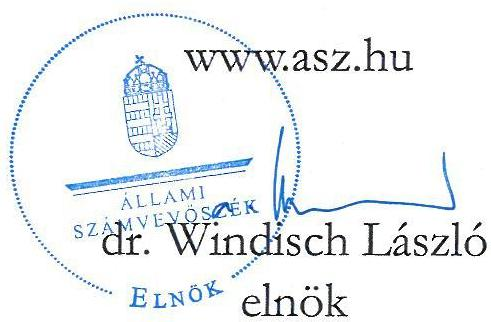
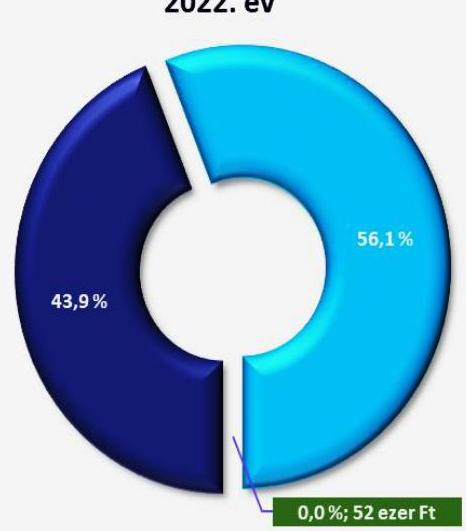
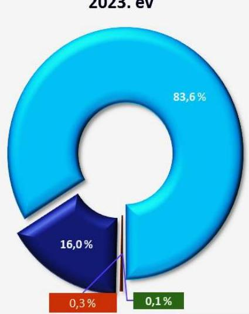
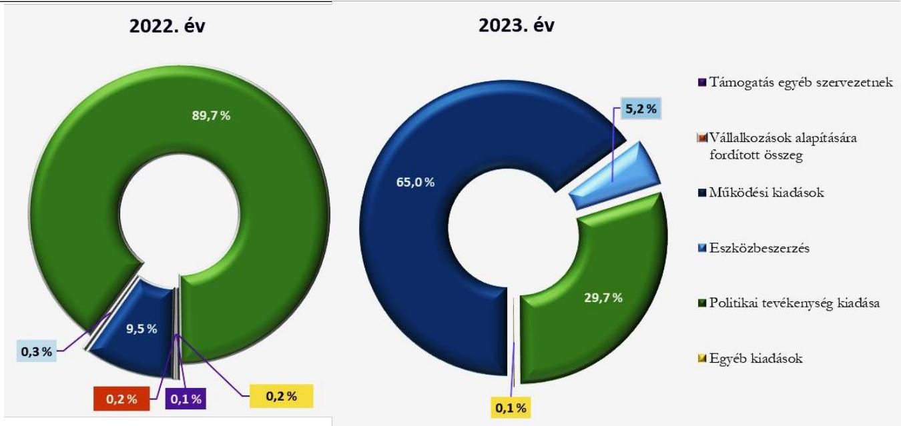
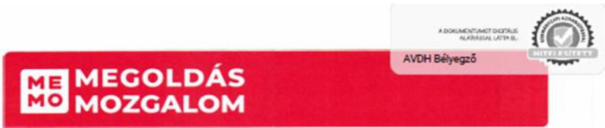
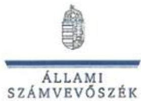
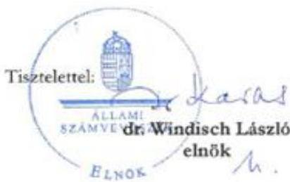

ÁLLAMI SZÁMVEVŐSZÉK

# JELENTÉS

A költségvetési támogatásban részesülő pártok 2022-2023. évi gazdálkodása törvényességének ellenőrzése

Megoldás Mozgalom

2025.

25092

www.asz.hu

---

ÁLLAMI
SZÁMVEVŐSZÉK

# JELENTÉS

A költségvetési támogatásban részesülő pártok 2022-2023. évi gazdálkodása törvényességének ellenőrzése

Megoldás Mozgalom

2025.

25092

---

Jelentéseink az interneten a www.asz.hu címen olvashatók.

ELLENŐRZÉSI IGAZGATÓSÁG:
ELLENŐRZÉSI IGAZGATÓSÁG V.

ELLENŐRZÉSI IGAZGATÓ:
KLINGA LÁSZLÓ igazgató

ELLENŐRZÉSVEZETŐ:
SOLYMÁR ÁGNES ellenőrzésvezető

IKTATÓSZÁM: EL-4133-007/2025

TÉMASORSZÁM: 6

ELLENŐRZÉS-AZONOSÍTÓ SZÁM: V1121

---

TARTALOMJEGYZÉK

- AZ ELLENŐRZÉS ALAPADATAI...5
- AZ ELLENŐRZŐTT SZERVEZET...7
- ÖSSZEFOGLALÁS...8
- AZ ELLENŐRZÉS FÓKUSZKÉRDÉSEI...9
- MEGÁLLAPÍTÁSOK...10
- JAVASLATOK...16
- MELLÉKLETEK...17
- I. sz. melléklet: Értelmező szótár...17
- II. sz. melléklet: Ellenőrzési kritériumok...18
- FÜGGELÉK: ÉSZREVÉTELEK...19
- RÖVIDÍTÉSEK JEGYZÉKE...35

---

.

---

AZ ELLENŐRZÉS ALAPADATAI

## AZ ELLENŐRZÉS CÉLJA

Az ellenőrzés célja annak értékelése volt, hogy a Párt¹ által közzétett éves pénzügyi kimutatások a törvényi előírásoknak megfeleltek-e, a könyvvvezetés és gazdálkodás során a Párt betartotta-e a vonatkozó jogszabályi és belső előírásokat, a Párt a működéséhez szabályszerűen igénybe vehető forrásokat használt-e fel, a pártok működéséről és gazdálkodásáról szóló Párttv.²-ben engedélyezett gazdasági-vállalkozási tevékenységet folytatott-e.

## AZ ELLENŐRZÉS TÍPUSA

Törvényességi ellenőrzés.

## AZ ELLENŐRZŐTT IDŐSZAK

A 2022-2023. évek.

## AZ ELLENŐRZÉS TÁRGYA

A Párt ellenőrzése során az ellenőrzés tárgyát képezték a 2022. és a 2023. évre vonatkozó pénzügyi kimutatás elkészítésére, jóváhagyására, közzétételére, a Párt könyvvvezetésére, gazdálkodására, ennek keretében a számviteli szabályozás kialakítására, a bizonylati rend, bizonylati fegyelem betartására, egyéb gazdálkodási, ellenőrzési és pénzügyi-számviteli feladatok ellátására irányuló tevékenységek. Az ellenőrzés tárgya volt továbbá a Párttv. szerinti források elszámolása és felhasználása, valamint a vagyon jogszabályi előírásoknak megfelelő használata, hasznosítása.

Az ellenőrzés kiterjedt minden olyan körülményre és adatra, amely az ÁSZ³ jogszabályban meghatározott feladatainak teljesítéséhez, valamint a program végrehajtása folyamán felmerült újabb összefüggések feltárásához szükséges volt.

Jelen ellenőrzés a 2022. évi országgyűlési képviselő-választási kampányra fordított pénzeszközök elszámolásának ellenőrzésére nem terjedt ki, azt az ÁSZ „A 2022. évi országgyűlési képviselő-választási kampányra fordított pénzeszközök elszámolásának ellenőrzése” című önálló ellenőrzése (továbbiakban: kampányellenőrzés⁴) keretében ellenőrizte.

## AZ ELLENŐRZÉS JOGALAPJA

Az ellenőrzés jogszabályi alapját az ÁSZ tv.⁵ 5. § (11) bekezdés a) pontja, a Párttv. 4. § (4)-(5) bekezdései, valamint a 10. § (1), (3)-(4) bekezdései képezték.

5

---

Az ellenőrzés alapadatai

# AZ ELLENŐRZÉS MÓDSZERE

Az ellenőrzést az ellenőrzési program szempontjai, az ellenőrzött időszakban hatályos jogszabályok, az ellenőrzés általános szakmai szabályai, valamint az ellenőrzésre irányadó ÁSZ módszertanok figyelembevételével végezte az ÁSZ.

Az ellenőrzési kérdések megválaszolásához szükséges bizonyítékok megszerzése az ellenőrzött szervezet által rendelkezésre bocsátott dokumentumokra, adatokra alapozva, továbbá kérdésfeltevés (információkérés), interjú, mintavételezés útján történt. A 2022 - 2023. évi bevételeket és kiadásokat mintavételi eljárással kiválasztott tételek alapján ellenőrizte az ÁSZ.

Az ellenőrzési bizonyítékként felhasználható adatforrások közé tartoztak egyrészt az ellenőrzési programban felsorolt adatforrások, másrészt adatforrás lehetett még minden további, az ellenőrzés folyamán feltárt, az ellenőrzés szempontjából információt tartalmazó dokumentum.

Az ellenőrzés lefolytatásához az ellenőrzött szervezet tanúsítványok kitöltésével, hitelesítésével és a teljességi és hitelességi nyilatkozattal alátámasztott dokumentumok rendelkezésre bocsátásával szolgáltatott adatokat.

Az ÁSZ a tétel ellenőrzés mellett statisztikai alapú, véletlenszerű és kockázatalapú mintavételezést és értékelést is alkalmazott. A statisztikai alapú mintavételnél a minták kiválasztása rétegzett mintavételezéssel történt, amelynek értékelése „szabályszerű”, ha a minta ellenőrzésének eredménye alapján 95%-os bizonyossággal a teljes sokaságban az átlagos hibaarány nem haladja meg a 10%-ot, „nem szabályszerű”, ha nagyobb, mint 10%. Abban az esetben, ha a teljes sokaság tekintetében a 10%-os hibaarányhoz való viszony megítélésének megbízhatósága nem éri el a 95%-ot, annak elérése érdekében az értékelés további szempontokkal egészült ki, a feltárt hibák értéke is figyelembevételre került. A statisztikai alapú mintavétel kiegészült évente az öt legnagyobb forgalmi értékkel rendelkező szállító és vevő tétel ellenőrzésével a lényegesség biztosítása érdekében. Tétel ellenőrzésre kerültek a bevételek közül a központi költségvetésből származó támogatások. A kiadások közül tétel ellenőrzésre kerültek az egyéb szervezetek részére nyújtott támogatások, valamint a reklámhordozón elhelyezett hirdetések költségei. A bérköltségekből és eszközbeszerzésekből egyszerű véletlenszerű leválogatással került kiválasztásra évente tíz-tíz mintatétel.

A 2022. évi országgyűlési képviselő választási kampányra fordított pénzeszközök elszámolását a kampányellenőrzés keretében ellenőrizte az ÁSZ, ezért az országgyűlési képviselő választási kampányidőszakára vonatkozó bevételi és kiadási tételek nem képezték jelen ellenőrzés alapsokaságát.

6

---

AZ ELLENŐRZÖTT SZERVEZET

# MEGOLDÁS MOZGALOM

A Párt 2021-ben létrejött olyan egyesület, amely nyilvántartott tagsággal rendelkezik, a nyilvántartásba vételét végző bíróság előtt kinyilvánította, hogy a Párttv. rendelkezéseit magára nézve kötelezőnek ismeri el a Párttv. 1. §-a előírása alapján.

Az Alapszabály$_{1,2^6}$ alapján a Párt alapvető célja az országgyűlési, a helyi önkormányzati vagy európai parlamenti választásokon politikai szereplőként részvétel, illetve a képviselő-jelöltállítás. Ennek keretében célja, hogy a magyar állampolgárok számára vonzó, a mai idők kihívásainak megfelelő, kormányképes polgári alternatívát nyújtson, működésével ösztönözze a magyar állampolgárok nemzeti és kulturális identitásának megerősödését, politikai aktivitását.

A Párt szervei a Közgyűlés$^{7}$, az Elnökség$^{8}$ és az Etikai Bizottság$^{9}$. A Párt döntéshozó szerve a Közgyűlés, ügyvezető szerve az Elnökség volt. A Párt kimutatott tagsága a 2022. évben 12 fő és a 2023. évben 11 fő volt, így jogszabály nem kötelezte felügyelőbizottság létrehozására.

A Párt a Párttv. alapján biztosított lehetőséggel élve a 2022. évben megalapította a MEMO Alapítványt és a MEMO Solutions Korlátolt Felelősségű Társaságot. A Párt a 2022-2023. években nem rendelkezett ingatlantulajdonnal.

A Párt 2022. és 2023. évi pénzügyi kimutatásában szereplő bevételeket és kiadásokat az 1. számú táblázat tartalmazza:

1. táblázat

A PÁRT 2022-2023. ÉVI PÉNZÜGYI KIMUTATÁSÁNAK ADATAI (ADATOK EZER FT-BAN)

|  BEVÉTELEK | 2022. év | 2023. év  |
| --- | --- | --- |
|  Tagdíjak | 0 | 477  |
|  Központi költségvetésből származó támogatás | 715 855 | 21 600  |
|  Egyéb hozzájárulások, adományok | 912 968 | 113 255  |
|  ebből az 500 000 forint feletti hozzájárulás nevesítve | 912 584 | 113 200  |
|  Egyéb bevételek | 52 | 78  |
|  Összes bevétel a gazdasági évben | 1 628 875 | 135 410  |
|  KIADÁSOK | 2022. év | 2023. év  |
|  Támogatás egyéb szervezeteknek | 1 716 | 0  |
|  Vállalkozások alapítására fordított összeg | 3 000 | 0  |
|  Működési kiadások | 155 267 | 92 279  |
|  Eszközbeszerzés | 4 909 | 7 356  |
|  Politikai tevékenység kiadása | 1 459 380 | 42 250  |
|  Egyéb kiadások | 2 603 | 121  |
|  Összes kiadás a gazdasági évben | 1 626 875 | 142 006  |

Forrás: A Párt 2022. és 2023. évi pénzügyi kimutatása (ÁSZ saját szerkesztés)

---

ÖSSZEFOGLALÁS

Az ÁSZ tv. 5. § (11) bekezdés a) pontja alapján az ÁSZ – a Párttv. rendelkezéseinek megfelelően – törvényességi szempontok szerint ellenőrzi a pártok gazdálkodását. A Párttv. 10. § (3) bekezdése alapján az ÁSZ kétevente ellenőrzi azoknak a pártoknak a gazdálkodását, amelyek a központi költségvetésből rendszeres támogatásban részesültek. A Párt pénzügyi kimutatásai szerint a központi költségvetésből 2022-ben 715 855 ezer Ft, 2023-ban 21 600 ezer Ft támogatásban részesült.

Az ÁSZ a kampányellenőrzés keretében ellenőrizte a 2022. évi országgyűlési képviselő választásra fordított állami és a Párttv.-ben meghatározott más pénzeszközök felhasználását. Jelen ellenőrzés az országgyűlési képviselő választásra kapott pénzeszközökre és azok felhasználására nem terjedt ki. Emiatt jelen ellenőrzésnek a pénzügyi kimutatásra, az azt alátámasztó könyvvezetésre, a bevételek, kiadások elszámolására vonatkozó megállapításai a párt gazdálkodásának a kampányellenőrzéssel nem érintett részére vonatkoznak.

A Párt szabályszerű, az adottságainak megfelelő szabályozási környezetet nem alakította ki.

A Párt az ellenőrzött időszakban nem a jogszabályi előírásoknak megfelelően alakította ki a gazdálkodás kereteit meghatározó, a pénzügyi kimutatás összeállítására és az azt alátámasztó könyvvezetésre is kiterjedő belső szabályzatait, mivel a Számlarendje₁,₂ nem teljeskörűen tartalmazta az alkalmazásra kijelölt számlákat, vagy azok tartalmát, a Számviteli politikája nem a Párt adottságainak, körülményeinek figyelembevételével készült, és a Pénzkezelési szabályzatában₁,₂¹⁰ nem került összegszerűen meghatározásra a napi készpénz záró állomány maximális mértéke.

A könyvelési hibák miatt a
könyvvezetés és ezáltal a
pénzügyi kimutatás nem volt
szabályszerű.

A Párt tiltott támogatást fogadott el nem pénzben nyújtott vagyoni hozzájárulás formájában.

A Párt a 2022. évi pénzügyi kimutatását a jogszabályban előírt határidőn túl, a 2023. évi pénzügyi kimutatást a jogszabályban előírt határidőben közzétette a Magyar Közlöny mellékletét képező Hivatalos Értesítőben, valamint saját honlapján megjelenítette. Az ellenőrzött tételek esetében a bevételek és kiadások elszámolására vonatkozó jogszabályok előírásait a Párt nem tartotta be, ezáltal a pénzügyi kimutatások tévesen tartalmaztak a 2022. évben 382 ezer Ft, a 2023. évben 5 ezer Ft bevételt, valamint a 2022. évi pénzügyi kimutatás Támogatás egyéb szervezeteknek sora nem tartalmazott egyéb szervezet részére nyújtott 223 ezer Ft összegű támogatást.

A Párt működéséhez a 2022-2023. években a jogszabályban nem engedélyezett vagyoni hozzájárulást fogadott el ingatlanhasználat formájában. Ezáltal a Párt a Párttv. előírásai ellenére jogi személytől fogadott el 15 240 ezer Ft vagyoni hozzájárulást, amelynek értékét a Párttv. előírásai alapján köteles a központi költségvetésnek befizetni, továbbá a párt központi költségvetésből juttatott támogatását ezen összeggel csökkenteni kell.

A gazdálkodási tevékenység
ellenőrzése megfelelően
működött.

A Párt a belső szabályzataiban előírt ellenőrzési feladatokat végrehajtotta.

---

AZ ELLENŐRZÉS FÓKUSZKÉRDÉSEI

1. A Párt a jogszabályi előírásoknak megfelelően kialakította-e a pénzügyi kimutatás összeállítására és az azt alátámasztó könyvvezetésre vonatkozó belső szabályozást?

2. A Párt pénzügyi kimutatása, az azt alátámasztó könyvvezetése, a bevételek, kiadások elszámolása, valamint a vagyon nyilvántartása és használata, hasznosítása megfelelt-e a jogszabályi és belső előírásoknak?

3. A Párt gazdálkodásának ellenőrzése az előírásoknak megfelelően működött-e?

9

---

MEGÁLLAPÍTÁSOK

# 1. A Párt a jogszabályi előírásoknak megfelelően kialakította-e a pénzügyi kimutatás összeállítására és az azt alátámasztó könyvvezetésre vonatkozó belső szabályozást?

## Összegző megállapítás

A Párt a 2022-2023. években a pénzügyi kimutatásai összeállítására és az azt alátámasztó könyvvezetésre, valamint a gazdálkodására vonatkozó belső szabályozását nem a jogszabályi előírásoknak megfelelően alakította ki.

A Párt elkészítette Számviteli politikáját¹¹, és annak keretében elkészítendő Leltározási szabályzatot¹², Értékelési szabályzatot¹³, Pénzkezelési szabályzatot¹², továbbá Számlarendjét¹²,¹⁴ és Bizonylati rendjét¹²,¹⁵, melyeket a Számv. tv.¹⁶, illetve a Párt belső előírása szerint az Elnök kiadmányozott.

A Számviteli politika nem a Párt adottságainak, körülményeinek figyelembevételével készült, ezáltal a Párt nem tett eleget a Számv. tv. 14. § (3) bekezdésében előírtaknak. A Számviteli politika nem tartalmazta a Párttv. 9. § (1) bekezdésében előírt, az 1. sz. melléklet szerinti pénzügyi kimutatás sorainak tartalmát, számszaki levezetését, annak bemutatását, hogy milyen ismérvek alapján történik a pénzügyi kimutatásba a bevételek és a kiadások besorolása. A Számviteli politikában felsorolt jogszabályok közül a Civilszr.¹⁷ 5. számú melléklete szerinti a Szövetkezeti Hitelintézetek Integrációs Szervezete mérleg, a Civil. vhr.¹⁸ 1. számú melléklete szerinti Közhasznúsi melléklet készítési kötelezettség nem vonatkozik a pártokra.

A Párt a Számv.tv. 161.§ (2) bekezdés a) -b) pontjában előírtaknak nem tett eleget, mivel a Számlarend₁,₂ nem tartalmazta (pl. 8642. Belföldi jogi személynek adott támogatás, 877. Egyéb árfolyamveszteségek, 977. Egyéb árfolyamnyereségek, opciós díjbevételek), vagy nem megfelelő módon tartalmazta az alkalmazásra kijelölt számla számjelét és megnevezését (pl. 96412. Magánszemélyek kis összegű támogatása, amely a tagdíjakat is tartalmazta), valamint a számla tartalmát, ha az a számla megnevezéséből egyértelműen nem következik (pl. a 964. Cél szerinti (közhasznú) támogatások, pályázatok bevétele számlán belül a Párt kimutatott költségvetési támogatást, tagdíjat és egyéb hozzájárulásokat, adományokat).

A Számv. tv.-ben foglaltaknak megfelelően a Számlarend₁,₂ rendelkezett a főkönyvi számlákhoz kapcsolódó analitikus nyilvántartások kapcsolatáról, az analitikus nyilvántartások és a főkönyvi könyvelés között az értékadatok számszerű egyeztetésének lehetőségéről.

A Pénzkezelési szabályzatban₁,₂ a Párt összegszerűen nem határozta meg a napi készpénz záró állomány maximális mértékét a Számv. tv. 14. § (8) bekezdésében foglalt előírás ellenére.

A Párttv.-ben foglaltaknak megfelelően a Párt a Gazdálkodási szabályzatban¹⁹,² meghatározta a nem pénzbeli vagyoni hozzájárulás értékelésének módját, szabályait.

A Párt a Ptk.-ban foglaltaknak megfelelően az Alapszabályban₁,₂ és a Gazdálkodási szabályzatban₁,₂ meghatározta a tagdíj fogalmát, a tagok által fizetendő tagdíj összegét, és a befizetés szabályait.

10

---

Megállapítások

# 2. A Párt pénzügyi kimutatása, az azt alátámasztó könyvvezetése, a bevétel, kiadások elszámolása, valamint a vagyon nyilvántartása és használata, hasznosítása megfelelt-e a jogszabályi és belső előírásoknak?

## Összegző megállapítás

A Párt a 2022. és a 2023. évre vonatkozó pénzügyi kimutatását alátámasztó könyvvezetésében az ellenőrzött bevétel és kiadások elszámolása nem minden esetben felelt meg a jogszabályi és a belső előírásoknak. A Párt vagyonának nyilvántartása megfelelt a jogszabályi előírásoknak.

## 2.1. számú megállapítás

A Párt közzétételi kötelezettségének a 2022. év vonatkozásában a jogszabályban előírt határidőn túl, a 2023. év vonatkozásában a jogszabályban előírt határidőben eleget tett.

A Párt a 2022. és a 2023. évre vonatkozó pénzügyi kimutatásait a Párttv. mellékletében előírt tagolásban elkészítette, amelyeket a Közgyűlés SZMSZ²⁰ előírásainak megfelelően a Közgyűlés hagyott jóvá. A Párt a 2022. évi pénzügyi kimutatást a Párttv. 9. § (1) bekezdésében előírt határidőt követően tette közzé a Magyar Közlöny mellékleteként megjelenő Hivatalos Értesítőben. A 2023. évi pénzügyi kimutatás közzététele a Párttv.-ben előírt határidőben megtörtént. Mindkét ellenőrzött év pénzügyi kimutatását a Párt saját honlapján is nyilvánosságra hozta.

Az ellenőrzött időszakban a Párt a Számv. tv. előírtaknak megfelelően kialakította könyvvezetési rendszerét.

Az ellenőrzött időszakban a Párt könyvvezetése során kettős könyvvitelt alkalmazott. Az analitikus nyilvántartások és a főkönyvi könyvelés közötti egyeztetések lehetősége a Számv. tv. előírásainak megfelelően biztosított volt.

A Párt az ellenőrzött időszakra vonatkozó pénzügyi kimutatásaiban szerepeltetett egyéb hozzájárulások, adományok adatait alátámasztó főkönyvi számlák összegeiről, ezen belül a pénzügyi kimutatásban nevesített, éves szinten 500 ezer Ft feletti hozzájárulásokról a Számv. tv.-ben előírt analitikus nyilvántartást vezetett.

## 2.2. számú megállapítás

A Párt 2022-2023. évi pénzügyi kimutatásaiban a bevétel szerepeltetése és azok könyvviteli elszámolása nem felelt meg a jogszabályi és a belső előírásoknak. A Párt az általa 2022-2023. években bérelt ingatlanok bérelti díját nem fizette meg, ezáltal jogi személytől tiltott, nem pénzbeli vagyoni hozzájárulást fogadott el, amellyel megsértette a Párttv. előírásait.

A Párt a 2022. évre vonatkozó pénzügyi kimutatásában 1 628 875 ezer Ft, a 2023. évre vonatkozó pénzügyi kimutatásában 135 410 ezer Ft bevételt mutatott ki, melyek összetételét az 1. ábra mutatja.

11

---

Megállapítások

1. ábra

A PÁRT BEVÉTELEINAK ALAKULÁSA A 2022-2023. ÉVEKBEN

Forrás: a Párt 2022 és 2023. évi pénzügyi kimutatásainak adatai alapján, ÁSZ saját szerkesztés

Tagdíjak
Központi költségvetésből származó támogatás
Egyéb hozzájárulások, adományok
Egyéb bevételek

A Párt kimutatott tagsága a 2022. évben 12 fő, a 2023. évben 11 fő volt. A Párt 2022. évi pénzügyi kimutatása az Alapszabály1,2 IV/1-2. pontjában kötelezően előírt havi 1 ezer Ft-ban meghatározott tagdíjakat nem tartalmazta. A Párt nyilatkozata, és nyilvántartása alapján a 2022. évi tagdíjak megfizetése a 2022. évben nem történt meg. A Párttv. előírásainak megfelelően a 2023. évi pénzügyi kimutatás Tagdíj sorában kerültek kimutatásra a tagdíjak 477 ezer Ft értékben, amely a 2023. évben megfizetett 2022. és 2023. évi tagdíjakat is tartalmazta.

A Párt a Magyar Államkincstár által folyósított 2022. és 2023. évi Központi költségvetésből származó támogatást szabályszerűen mutatta ki és számolta el.

A Párt országgyűlési képviselőcsoporttal nem rendelkezett, ilyen jogcímen támogatásra nem volt jogosult. Az Egyéb hozzájárulások, adományok esetében egy fő került kimutatásra, aki 500 ezer Ft feletti adományt nyújtott a 2022. évben 912 584 ezer Ft, a 2023. évben 113 200 ezer Ft összegben.

A 2022. évben a Párt egy jogi személytől informatikai szolgáltatásokat rendelt (továbbiakban: szolgáltató), melyeknek egy része később lemondásra került. A szolgáltatások díját a Párt részben előre kifizette, illetve bankszámlájáról tévesen levonásra kerültek a már lemondott szolgáltatások díjai. A Párt megsértette a Számv. tv. 78. § (3) bekezdésében előírtakat, mivel az igénybe nem vett, lemondott szolgáltatások díját – a 2022. évben 382 ezer Ft, míg a 2023. évben 5 ezer Ft összegben – költségként elszámolta, azt nem helyesbítette. A Pártnak a szolgáltatóval szemben túlfizetése keletkezett, amelyet a Párt nyilatkozata alapján a szolgáltató elismert és a folyószámla nyilvántartásában rögzített. A későbbiekben a szolgáltató az általa nyújtott szolgáltatások ellenértékével a Párt túlfizetését csökkentette, így annak felhasználásáig a szolgáltató által kiállított számlák pénzügyi rendezést nem igényeltek. A Párt a 2022. évi könyvviteli nyilvántartásában a túlfizetést a Számv. tv. 29. § (8) bekezdésében foglaltak ellenére nem mutatta ki egyéb követelésként. A Párt a 2022. és 2023. évben a túlfizetés felhasználásait a Számv. tv. 77. §-ában előírtak ellenére egyéb bevételként, azon belül a 964. Cél szerinti (közhasznú) támogatások, pályázatok bevétele –ként számolta el a 96421. Kreditek főkönyvi számlaszámon. A helytelen könyvelés következtében a 2022. évi pénzügyi kimutatás Egyéb hozzájárulások, adományok sora tévesen tartalmazott 382 ezer Ft-ot, a 2023. évi pénzügyi kimutatás Egyéb bevételek sora tévesen tartalmazott 5 ezer Ft-ot.

12

---

Megállapítások

A Párttv. 4. § (2) bekezdése alapján a Párt részére jogi személy vagyoni hozzájárulást nem adhat, a Párt vagyoni hozzájárulást nem fogadhat el. A Párt a Párttv. 4. § (2) bekezdése szerinti nem pénzben nyújtott vagyoni hozzájárulást fogadott el egy belföldi jogi személytől ingatlanhasználat formájában, amelynek értéke a szerződés alapján 15 240 ezer Ft volt.

# A tiltott támogatás elfogadásának alátámasztása

A Párt – egy 2022. február 11-én megkötött Megbízási keretszerződés²¹ 2022. február 15-ei módosításakor – bérleti szerződést²² kötött, mely alapján 2022. február – 2023. december közötti időszakban két helyszínen irodahelyiségeket bérelt, és a munkavállalók munkaszerződései, valamint a közgyűlési jegyzőkönyv alapján használt, ugyanakkor az ellenőrzött időszakban a Párt könyvviteli nyilvántartásában ingatlan bérleti díj elszámolása nem történt.

A bérleti szerződést a Bérbeadó²³ részéről aláíró ügyvezető és a Párt (Albérő) részéről aláíró két alelnök közül az egyik alelnök azonos személy volt.

A Párt az ellenőrzés rendelkezésére bocsátott egy számlát²⁴, amelyhez 2022. november 17-én kelt teljesítés igazolást és aznapi pénzügyi teljesítést alátámasztó dokumentumot csatolt. A teljesítés igazolásban a Párt, mint Megbízó és a kft., mint Megbízott képviselője igazolta, hogy megbízási szerződés alapján 2022. május 14. és 2022. november 17. közötti időszakban elvégzett feladatok és szolgáltatások („-Bérelt autó biztosítása a Megoldás Mozgalom részére -Üzemanyag tankolás a bérelt autóba -Bérelt sofőr biztosítása a Megoldás Mozgalom részére -Biztonsági szolgálat biztosítása az irodabázban”) teljesültek. Továbbá rögzítették, hogy „Ezen teljesítés igazolás alapján Megbízott jogosult az elvégzett szolgáltatásról 12 000 000,- Ft + Áfa²⁵ értékű számla benyújtására.”

A Párt 2025. január 13-án tett nyilatkozatában a 2022. november 17-én kelt teljesítés igazolást visszavonta, továbbá arról nyilatkozott, hogy a számlában szereplő díj 23 havi bérleti díj (2022-2023. évi), ennek ellenére a számlázott díjat a Párt a 2022. évi könyvviteli nyilvántartásában nem a bérleti díjak elszámolására használt főkönyvi számlaszámon (522. Bérleti díjak) vette nyilvántartásba, hanem azt megbízási díjként rögzítette az 5291. Egyéb igénybe vett szolgáltatások költségei általános tevékenység főkönyvi számlaszámon. A 2022. február 15-én megkötött bérleti szerződésben meghatározott bérleti díj mértéke a helyben szokásos bérleti díjaknak megfelelő volt, azonban üzemeltetési díj fizetési kötelezettséget nem tartalmazott.

A Párt a bérleti szerződés alapján irodaként használt ingatlant ellentételezés nélkül vette igénybe. A pártok részére jogi személy által nem pénzben nyújtott vagyoni hozzájárulás a Párttv. 4. § (2) és (4) bekezdéseiben rögzített tiltó rendelkezések alapján tiltott támogatásnak minősül.

A kft. az elérhető nyilvános adatbázisok alapján az ellenőrzött időszakban nem volt jogosult ingatlan bérbeadási tevékenység folytatására, mivel a 2022-2023. évekre vonatkozóan nem jelentette be az ingatlan bérbeadási tevékenység végzésének szándékát.

---

Megállapítások

## 2.3. számú megállapítás

A Párt 2022-2023. évi pénzügyi kimutatásaiban a kiadások szerepeltetése és azok könyvviteli elszámolása egy 2022. évben nyújtott támogatás kivételével a jogszabályi és a belső előírások szerint szabályszerűen történt.

A Párt 2022. évre vonatkozó pénzügyi kimutatásában 1 626 875 ezer Ft, a 2023. évre vonatkozó kimutatásában 142 006 ezer Ft kiadást mutatott ki, melyek összetételét a 2. ábra mutatja.

2. ábra

A PÁRT KIADÁSAINAK ALAKULÁSA A 2022-2023. ÉVEKBEN

Forrás: a Párt 2022. és 2023. évi pénzügyi kimutatásainak adatai alapján, ÁSZ saját szerkesztés

A Párt a 2022. évi pénzügyi kimutatásában 1 716 ezer Ft-ot mutatott ki a Támogatás egyéb szervezeteknek soron. A 2022. évben elnökségi döntés alapján a Párt támogatási szerződést kötött egy óvodával, amelynek keretében eszközöket adott át 223 ezer Ft értékben. A Párt a támogatást a 2022. évi könyvviteli nyilvántartásában a Számv. tv. 81. § (2) bekezdés n) pontjában előírtak ellenére az egyéb ráfordítások helyett az ajándékok között mutatta ki. Ezáltal a Párt a támogatási szerződés alapján nyújtott támogatást a 2022. évi pénzügyi kimutatásában nem a Támogatás egyéb szervezeteknek soron mutatta ki, azt a Politikai tevékenység kiadásai soron szerepeltette. A 2023. évben a Párt egyéb szervezeteknek támogatást nem nyújtott, és ennek megfelelően a pénzügyi kimutatás kiadásai között nem is szerepeltetett ilyen tételt.

A Párt a 2022. évben a Párttv. által engedélyezett egyszemélyes korlátolt felelősségű társaságot alapított a MEMO Solutions Kft.-t. A 3 000 ezer Ft összegű tulajdoni részesedést a Párt a 2022. évi pénzügyi kimutatás Vállalkozások alapítására fordított összeg során megjelenítette.

A 2022. és a 2023. évi pénzügyi kimutatás Működési kiadások, Eszközbeszerzés és Egyéb kiadások során a Párttv. által engedélyezett kiadások kerültek megjelenítésre, amelyek a jogszabályoknak és a belső szabályzatoknak megfelelő könyvviteli nyilvántartással alátámasztottak voltak.

A foglalkoztatással összefüggő ellenőrzött tételek vonatkozásában a személyi jellegű kifizetések, illetve az ehhez kapcsolódó bejelentési, adó- és járulék nyilvántartási, levonási, bevallási, befizetési, adatszolgáltatási kötelezettségek teljesítése megfelelt a Számv. tv., az Szja tv.²⁶, az Art., és az Mt.²⁷ előírásainak, továbbá a 465/2017. (XII.28.) Korm. rendeletben²⁸ előírt tartalmú bizonylatokat a Párt kiállította.

14

---

Megállapítások

2.4. számú megállapítás

A Párt vagyonának nyilvántartása és használata, valamint a vagyonnal való gazdálkodása a 2022-2023. években a jogszabályi előírásoknak megfelelt.

A 2022. és a 2023. évre vonatkozóan a könyvek üzleti év végi zárásakor a Számv. tv. által előírtakat a Párt betartotta.

A Leltározási szabályzat háromévenkénti rendszerességgel írt elő mennyiségi leltározást. A Párt az ellenőrzött időszakban mennyiségi leltározásra vonatkozó kötelezettsége nem volt.

A Párt a Párttv. 6. § (3) bekezdésében előírtak betartása mellett 2022. február 9-én megalapította a MEMO Solutions Korlátolt Felelősségű Társaságot, amelynek vagyonelemek közötti kimutatása a Számv. tv. előírásainak megfelelően megtörtént. Az Alapszabály₁,₂ XIII/3. pontjában felsorolásra kerültek a Párt által költségeinek fedezése és vagyontárgyainak gyarapítása érdekében folytatható gazdasági-vállalkozási tevékenységek.

A Párt eszközbeszerzéseinek kifizetése, elszámolása és dokumentálása az eszköz bekerülési értékének meghatározása az ellenőrzött tételek vonatkozásában megfelelt a Számv. tv.-ben és a Számviteli politikában foglalt előírásoknak. A Párt saját tulajdonú ingatlannal, MFB²⁹ hitellel nem rendelkezett az ellenőrzött időszakban.

# 3. A Párt gazdálkodásának ellenőrzése az előírásoknak megfelelően működött-e?

Összegző megállapítás

A Párt gazdálkodásának ellenőrzése a 2022. és a 2023. évben a belső szabályozások előírásainak megfelelően működött.

A Párt jogszabály, illetve belső szabályozás alapján nem volt kötelezett felügyelőbizottság létrehozására, és az ellenőrzött időszakban nem is hozott létre felügyelőbizottságot.

A Gazdálkodási szabályzatban₁,₂ és a Pénzkezelési szabályzatban₁,₂ kijelölt személyek a 2022. és a 2023. évben elvégezték az ellenőrzési feladataikat.

---

16

# JAVASLATOK

Az ÁSZ tv. 33. § (1) bekezdésében foglaltak értelmében az ellenőrzött szervezet vezetője köteles a jelentésben foglalt megállapításokhoz kapcsolódó intézkedési tervet összeállítani és azt a jelentés kézhezvételétől számított 30 napon belül az ÁSZ részére megküldeni. Amennyiben az ellenőrzött szervezet vezetője nem küldi meg határidőben az intézkedési tervet, vagy továbbra sem elfogadható intézkedési tervet küld, az Állami Számvevőszék elnöke az ÁSZ tv. 33. § (3) bekezdése a) és b) pontjaiban foglaltakat érvényesítheti.

# MEGOLDÁS MOZGALOM ELNÖKE

1. Gondoskodjon a Számv. tv. 14. § (3) bekezdésében előírtaknak megfelelő számviteli politika elkészítéséről.
2. Gondoskodjon a Számv. tv. 161. § (2) bekezdés a)–b) pontjában előírtaknak megfelelő számlarend elkészítéséről.
3. Gondoskodjon arról, hogy a pénzkezelési szabályzatban összegszerűen meghatározásra kerüljön a napi készpénz záró állomány maximális mértéke a Számv. tv. 14. § (8) bekezdésében foglalt előírásoknak megfelelően.
4. Gondoskodjon arról, hogy a pénzügyi kimutatást alátámasztó könyvviteli nyilvántartásba az egyéb követelések a Számv. tv. 29. § (8) bekezdésében előírtaknak megfelelően, és az igénybe vett szolgáltatások a Számv. tv. 78. § (3) bekezdésében előírtaknak megfelelően kerüljenek rögzítésre, továbbá arról, hogy az egyéb bevételek között csak a Számv. tv. 77. §-ában rögzített bevételek kerüljenek elszámolásra.
5. Gondoskodjon arról, hogy a pénzügyi kimutatást alátámasztó könyvviteli nyilvántartásban a támogatási szerződés keretében nyújtott támogatások a Számv. tv. 81. § (2) bekezdés n) pontjában előírtaknak megfelelően kerüljenek rögzítésre az egyéb ráfordítások között.

---

MELLÉKLETEK

## I. SZ. MELLÉKLET: ÉRTELMEZŐ SZÓTÁR

Civil szervezet
A civil társaság; a Magyarországon nyilvántartásba vett egyesület - a Párt, a szakszervezet és a kölcsönös biztosító egyesület kivételével és - a közalapítvány és a Pártalapítvány kivételével - az alapítvány. (Forrás: Civil tv. 2. § 6. a)-c) pontjai)

Egyesület
Az egyesület a tagok közös, tartós, alapszabályban meghatározott céljának folyamatos megvalósítására létesített, nyilvántartott tagsággal rendelkező jogi személy. (Forrás: Ptk. 3:63. § (1) bekezdés)
A Számv. tv. szempontjából egyéb szervezet. (Számv. tv. 3. § 4. a) pont)

Költségvetési támogatás
A társadalombiztosítás pénzügyi alapjai kivételével az államháztartás központi alrendszeréből ellenérték nélkül, pénzben nyújtott támogatások. (Forrás: Áht. 1. § 14. pont)

Pénzügyi kimutatás
A Pártok a pénzügyi kimutatást kötelesek minden év május 31-ig a Magyar Közlönyben, valamint saját honlappal rendelkező Pártok a honlapjukon is közzétenni. (Párttv. 9. § (1) bekezdés, 1. számú melléklet)

A Párt gazdasági-vállalkozási tevékenysége
A Párt a költségeinek fedezése és vagyonának gyarapítása érdekében a következő gazdasági-vállalkozási tevékenységeket folytathatja:
politikai céljainak és tevékenységének megismertetése érdekében kiadványokat jelentethet meg és terjeszthet, a Pártot szimbolizáló jelvényeket és más ilyen célú tárgyakat árusíthat és Pártrendezvényeket szervezhet;
a tulajdonában álló ingatlanokat és ingókat díj ellenében hasznosíthatja és elidegenítheti. (Párttv.6. § (1) bekezdés)

Nem pénzbeli támogatás
Vagyoni értékkel rendelkező forgalomképes dolog, szellemi alkotás, illetve vagyoni értékű jog részben vagy egészében, véglegesen vagy ideiglenesen, teljesen vagy részben ingyenesen történő átruházása vagy átengedése, illetve szolgáltatás biztosítása. (Civil tv. 2. § 25. pont)

17

---

Mellékletek

## II. SZ. MELLÉKLET: ELLENŐRZÉSI KRITÉRIUMOK

|  FÓKUSZTERÜLET/FÓKUSZKÉRDÉS | ELLENŐRZÉSI KRITÉRIUMOK  |
| --- | --- |
|  1. A Párt a jogszabályi előírásoknak megfelelően kialakította-e a pénzügyi kimutatás összeállítására és az azt alátámasztó könyvvezetésre vonatkozó belső szabályozást? | Számv. tv. 3. §, 6. §, 12. §, 14. §, 15-16. §, 160-161/A. §, 164-169. §, 23-45. §, 46-53. §, 57-68. §, 69. §
Párttv. 4. §, 6. §, 9. §, 1. sz. melléklet
Civil tv. 2. §
Civilszr. 4. § (1) bekezdés, 9. §, 15-16. §
Ptk. 3:4. §, 3:26-3:28. §, 3:63-3:87. §
Alapszabály, a Párt belső szabályozásai  |
|  2. A Párt pénzügyi kimutatása, az azt alátámasztó könyvvezetése, a bevételek, kiadások elszámolása, valamint a vagyon nyilvántartása és használata, hasznosítása megfelelt-e a jogszabályi és belső előírásoknak? | Számv. tv. 6. §, 12. §, 14. §, 159. §, 160. §, 161-161/A. §, 164-167. §
Párttv. 4. §, 6. §, 9. §, 1. sz. melléklet
Mt. 14. §, 45. §, 48. §
Szja tv. 3. §, 25. §, 47. §, 3. sz. melléklet
Ptk. 3:74. §, 6:272-6:280. §, 6:331-6:341. §
Civil tv. 2. §
Tvtv. 11/F. §, 11/G. §
104/2017. (IV. 28.) Korm. rendelet^{30} 8/C. §
Art. 1. sz. melléklet
465/2017. (XII.28.) Korm. rendelet^{31}
437/2015.(XII.28.) Korm. rendelet^{32}
TAO tv.^{33} 4. §, 18. §
Vtv.^{34} 68. §
Alapszabály, a Párt belső szabályozásai  |
|  3. A Párt gazdálkodásának ellenőrzése az előírásoknak megfelelően működött-e? | Számv. tv. 14. §
Belső szabályzatok, felügyelőbizottság ügyrendjében foglaltak.  |

---

FÜGGELÉK: ÉSZREVÉTELEK

A jelentéstervezetet a Számvevőszék 15 napos észrevételezésre megküldte az ellenőrzött szervezet vezetőjének az ÁSZ tv. 29. §* (1) bekezdése előírásának megfelelően.

A Párt Titkára a jelentéstervezetre észrevételt tett.

A függelék tartalmazza az ellenőrzött észrevételeit, illetve az el nem fogadott észrevételek elutasításának indoklását.

* 29. § (1) Az Állami Számvevőszék az ellenőrzési megállapításait megküldi az ellenőrzött szervezet vezetőjének vagy az általa megbízott személynek, és annak, akinek személyes felelősségét állapította meg.
(2) Az ellenőrzött szervezet vezetője és a felelősként megjelölt személy az ellenőrzés megállapításaira tizenöt napon belül írásban észrevételt tehet.
(3) Az Állami Számvevőszék az észrevételre a beérkezésétől számított harminc napon belül írásban válaszol. A figyelembe nem vett észrevételeket köteles a jelentésben feltüntetni, és megindokolni, hogy azokat miért nem fogadta el.

19

---

Függelék: Észrevételek

Állami Számvevőszék

Ikt. szám: EL-4132-126/2025

Tárgy: Jelentéstervezet véleményezése

Tisztelt Solymár Ágnes Űrhölgy!

Alulírott Blasesák Szilvia Mária, mint a Megoldás Mozgalom (1061 Budapest, Székely Mihály utca 16., Adószám: 19319856-1-42) önálló képviseleti joggal rendelkező titkára az EL-4132-126/2025 iktatószámú, „Jelentéstervezet megküldése véleményezésre” tárgyú levelükhöz kapcsolódóan az alábbi észrevételeket teszem.

1. Összegző megállapítás: A Párt a 2022-2023. években a pénzügyi kimutatásai összeállítására és az azt alátámasztó könyvvezetésre, valamint a gazdálkodására vonatkozó belső szabályozását nem a jogszabályi előírásoknak megfelelően alakította ki.

&gt; A Számviteli politika nem a Párt adottságainak, körülményeinek figyelembevételével készült, ezáltal a Párt nem tett eleget a Számv. tv. 14. § (3) bekezdésében előírtaknak. A Számviteli politika nem tartalmazta a Pártv. 9. § (1) bekezdésében előírt, az 1. sz. melléklet szerinti pénzügyi kimutatás sorainak tartalmát, számszaki levezetését, annak bemutatását, hogy milyen ismérvek alapján történik a pénzügyi kimutatásba a bevételek és a kiadások besorolása. A Számviteli politikában felsorolt jogszabályok közül a Civilszr. 17 5. számú melléklete szerinti a Szövetkezeti Hitelintézetek Integrációs Szervezete mérleg, a Civil. vhr. 18 1. számú melléklete szerinti Közhasznúsi melléklet készítési kötelezettség nem vonatkozik a pártokra.

Észrevétel: A Megoldás Mozgalom egy fiatal párt, amely korlátozott költségvetéssel, alacsony létszámmal végzi működését. Az Állami Számvevőszék által kifogásolt dokumentum elkészítése során nem állt rendelkezésünkre olyan szaktudás, amely biztosíthatta volna a számviteli és jogszabályi megfelelés minden részletét. Megítéléseink szerint a jogszabályi környezet ezen a területen rendkívül összetett, sok esetben nehezen értelmezhető laikusok számára és a pártokra vonatkozó speciális előírások gyakran nem különülnek el egyértelműen más szervezetek – például civil szervezetek – szabályozásától, így megfelelő tájékoztatás hiányában különösen nehézzé válik a helyes eljárásrend kialakítása azon szervezetek számára, amelyek bejegyzésüket követően saját erőforrásból igyekeznek megfelelni a vonatkozó előírásoknak.

Szeretnénk rögzíteni, hogy működésünk során folyamatosan törekszünk a szabályok betartására, az ÁSZ által megfogalmazott megállapításokat figyelembe vesszük és gondoskodunk a Számv. tv. 14. § (3) bekezdésében előírtaknak megfelelő számviteli politika

20

---

Függelék: Észrevételek

# ME MO MEGOLDÁS MOZGALOM

elkészítéséről.

&gt; A Párt a Számv.tv. 161.§ (2) bekezdés a) -b) pontjában előírtaknak nem tett eleget, mivel a Számlarend1,2 nem tartalmazta (pl. 8642. Belföldi jogi személynek adott támogatás, 877. Egyéb árfolyamveszteségek, 977. Egyéb árfolyamnyereségek, opciós díjbevételek), vagy nem megfelelő módon tartalmazta az alkalmazásra kijelölt számla számjelét és megnevezését (pl. 96412. Magánszemélyek kis összegű támogatása, amely a tagdíjakat is tartalmazta), valamint a számla tartalmát, ha az a számla megnevezéséből egyértelműen nem következik (pl. a 964. Cél szerinti (közhasznú) támogatások, pályázatok bevétele számlán belül a Párt kimutatott költségvetési támogatást, tagdíjat és egyéb hozzájárulásokat, adományokat).

**Észrevétel:** A Megoldás Mozgalom egy fiatal párt, amely korlátozott költségvetéssel, alacsony létszámmal végzi működését. Az Állami Számvevőszék által kifogásolt dokumentum elkészítése során nem állt rendelkezésünkre olyan szaktudás, amely biztosíthatta volna a számviteli és jogszabályi megfelelés minden részletét. Megítélésünk szerint a jogszabályi környezet ezen a területen rendkívül összetett, sok esetben nehezen értelmezhető laikusok számára és a pártokra vonatkozó speciális előírások gyakran nem különülnek el egyértelműen más szervezetek – például civil szervezetek – szabályozásától, így megfelelő tájékoztatás hiányában különösen nehézzé válik a helyes eljárásrend kialakítása azon szervezetek számára, amelyek bejegyzésüket követően saját erőforrásból igyekeznek megfelelni a vonatkozó előírásoknak.

Szeretnénk rögzíteni, hogy működésünk során folyamatosan törekszünk a szabályok betartására, az ÁSZ által megfogalmazott megállapításokat figyelembe vesszük és gondoskodunk a Számv. tv. 161. § (2) bekezdés a) -b) pontjában előírtaknak megfelelő számlarend elkészítéséről.

&gt; A Pénzkezelési szabályzatban 1,2 a Párt összegszerűen nem határozta meg a napi készpénz záró állomány maximális mértékét a Számv. tv. 14. § (8) bekezdésében foglalt előírás ellenére.

**Észrevétel:** A Megoldás Mozgalom egy fiatal párt, amely korlátozott költségvetéssel, alacsony létszámmal végzi működését. Az Állami Számvevőszék által kifogásolt dokumentum elkészítése során nem állt rendelkezésünkre olyan szaktudás, amely biztosíthatta volna a számviteli és jogszabályi megfelelés minden részletét. Megítélésünk szerint a jogszabályi környezet ezen a területen rendkívül összetett, sok esetben nehezen értelmezhető laikusok számára és a pártokra vonatkozó speciális előírások gyakran nem különülnek el egyértelműen más szervezetek – például civil szervezetek – szabályozásától, így megfelelő tájékoztatás hiányában különösen nehézzé válik a helyes eljárásrend kialakítása azon szervezetek számára,

---

Függelék: Észrevételek

# ME MO MEGOLDÁS MOZGALOM

amelyek bejegyzésüket követően saját erőforrásból igyekeznek megfelelni a vonatkozó előírásoknak.

Szeretnénk rögzíteni, hogy működésünk során folyamatosan törekszünk a szabályok betartására, az ÁSZ által megfogalmazott megállapításokat figyelembe vesszük és gondoskodunk arról, hogy a pénzkezelési szabályzatban összegszerűen meghatározásra kerüljön a napi készpénz záró állomány maximális mértéke a Számv. tv. 14. § (8) bekezdésében foglalt előírásoknak megfelelően.

2. Összegző megállapítás: A Párt a 2022. és a 2023. évre vonatkozó pénzügyi kimutatását alátámasztó könyvvezetésében az ellenőrzött bevételek és kiadások elszámolása nem minden esetben felelt meg a jogszabályi és a belső előírásoknak. A Párt vagyonának nyilvántartása megfelelt a jogszabályi előírásoknak.

2.2. sz. megállapítás: A Párt 2022-2023. évi pénzügyi kimutatásaiban a bevételek szerepeltetése és azok könyvviteli elszámolása nem felelt meg a jogszabályi és a belső előírásoknak. A Párt az általa 2022-2023. években bérelt ingatlanok bérelti díját nem fizette meg, ezáltal jogi személytől tiltott, nem pénzbeli vagyoni hozzájárulást fogadott el, amellyel megsértette a Pártv. előírásait.

&gt; A 2022. évben a Párt egy jogi személytől informatikai szolgáltatásokat rendelt (továbbiakban: szolgáltató), melyeknek egy része később lemondásra került. A szolgáltatások díját a Párt részben előre kifizette, illetve bankszámlájáról tévesen levonásra kerültek a már lemondott szolgáltatások díjai. A Párt megsértette a Számv. tv. 78. § (3) bekezdésében előírtakat, mivel az igénybe nem vett, lemondott szolgáltatások díját – a 2022. évben 382 ezer Ft, míg a 2023. évben 5 ezer Ft összegben – költségként elszámolta, azt nem helyesbítette. A Pártnak a szolgáltatóval szemben túlfizetése keletkezett, amelyet a Párt nyilatkozata alapján a szolgáltató elismert és a folyószámla nyilvántartásában rögzített. A későbbiekben a szolgáltató az általa nyújtott szolgáltatásokellenértékével a Párt túlfizetését csökkentette, így annak felhasználásáig a szolgáltató által kiállított számlák pénzügyi rendezést nem igényeltek. A Párt a 2022. évi könyvviteli nyilvántartásában a túlfizetést a Számv. tv. 29. § (8) bekezdésében foglaltak ellenére nem mutatta ki egyéb követelésként. A Párt a 2022. és 2023. évben a túlfizetés felhasználásait a Számv. tv. 77. §-ában előírtak ellenére egyéb bevételeként, azon belül a 964. Cél szerinti (közhasznú) támogatások, pályázatok bevétele –ként számolta el a 96421. Kreditek főkönyvi számlaszámon. A helytelen könyvelés következtében a 2022. évi pénzügyi kimutatás Egyéb hozzájárulások, adományok sora tévesen tartalmazott 382 ezer Ft-ot, a 2023. évi pénzügyi kimutatás Egyéb bevételek sora tévesen tartalmazott 5 ezer Ftot.

Észrevétele: A fent jelzett ténymegállapítás – miszerint a lemondott, igénybe nem vett informatikai szolgáltatások ellenértéke költségként került elszámolásra, a túlfizetés pedig nem

22

---

Függelék: Észrevételek

# ME MO MEGOLDÁS MOZGALOM

került kimutatásra egyéb követelésként – sajnálatos módon a kellő számviteli tapasztalat hiányából, illetve a jogszabályi rendelkezések nem megfelelő alkalmazásából fakadt.

A működés korai szakaszában a szolgáltatások pénzügyi kezelését külső segítség nélkül, saját erőből végeztük, ami ilyen hibákat eredményezett. A túlfizetést ugyan nyilvántartottuk a szolgáltató felé és azt később pénzügyileg nem rendeztük újra, azonban könyvelési szinten hibásan, bevételként jelent meg a pénzügyi kimutatásainkban.

A hibák javítása érdekében 2025. évben teljes körű számviteli felülvizsgálatot indítunk az érintett időszakokra vonatkozóan a hibás könyvelési tételek helyesbítését elvégezzük a 2025. évi nyitó adatokon keresztül.

Gondoskodunk továbbá arról, hogy a pénzügyi kimutatást alátámasztó könyvviteli nyilvántartásba az egyéb követelések a Számv. tv. 29. § (8) bekezdésében előírtaknak megfelelően, és az igénybe vett szolgáltatások a Számv. tv. 78. § (3) bekezdésében előírtaknak megfelelően kerüljenek rögzítésre, továbbá arról, hogy az egyéb bevételek között csak a Számv. tv. 77. §-ában rögzített bevételek kerüljenek elszámolásra.

&gt; A Párttv. 4. § (2) bekezdése alapján a Párt részére jogi személy vagyoni hozzájárulást nem adhat, a Párt vagyoni hozzájárulást nem fogadhat el. A Párt a Párttv. 4. § (2) bekezdése szerinti nem pénzben nyújtott vagyoni hozzájárulást fogadott el egy belföldi jogi személytől ingatlanhasználat formájában, amelynek értéke a szerződés alapján 15 240 ezer Ft volt.

&gt; A Párt – egy 2022. február 11-én megkötött Megbízási keretszerződés 2022. február 15-ei módosításakor – bérleti szerződést kötött, mely alapján 2022. február – 2023. december közötti időszakban két helyszínen irodahelyiségeket bérelt, és a munkavállalók munkaszerződéseiben, valamint a közgyűlési jegyzőkönyv alapján használt, ugyanakkor az ellenőrzött időszakban a Párt könyvviteli nyilvántartásában ingatlan bérleti díj elszámolása nem történt.

&gt; A bérleti szerződést a Bérbeadó részéről aláíró ügyvezető és a Párt (Albérlő) részéről aláíró két alelnök közül az egyik alelnök azonos személy volt.

&gt; A Párt az ellenőrzés rendelkezésére bocsátott egy számlát, amelyhez 2022. november 17-én kelt teljesítés igazolást és aznapi pénzügyi teljesítést alátámasztó dokumentumot csatolt. A teljesítés igazolásban a Párt, mint Megbízó és a kft., mint Megbízott képviselője igazolta, hogy megbízási szerződés alapján 2022. május 14. és 2022. november 17. közötti időszakban elvégzett feladatok és szolgáltatások („-Bérelt autó biztosítása a Megoldás Mozgalom részére -Üzemanyag tankolás a bérelt autóba -Bérelt sofőr biztosítása a Megoldás Mozgalom részére -Biztonsági szolgálat biztosítása az irodaházban”) teljesültek. Továbbá rögzítették, hogy „Ezen teljesítés igazolás alapján Megbízott jogosult az elvégzett szolgáltatásról 12 000 000,- Ft + Áfa értékű számla benyújtására.”

23

---

Függelék: Észrevételek

# ME MO MEGOLDÁS MOZGALOM

A Párt 2025. január 13-án tett nyilatkozatában a 2022. november 17-én kelt teljesítés igazolást visszavonta, továbbá arról nyilatkozott, hogy a számlában szereplő díj 23 havi bérleti díj (2022-2023. évi), ennek ellenére a számlázott díjat a Párt a 2022. évi könyvviteli nyilvántartásában nem a bérleti díjak elszámolására használt főkönyvi számlaszámon (522. Bérleti díjak) vette nyilvántartásba, hanem azt megbízási díjként rögzítette az 5291. Egyéb igénybe vett szolgáltatások költségei általános tevékenység főkönyvi számlaszámon. A 2022. február 15-én megkötött bérleti szerződésben meghatározott bérleti díj mértéke a helyben szokásos bérleti díjaknak megfelelő volt, azonban üzemeltetési díj fizetési kötelezettséget nem tartalmazott.

A Párt a bérleti szerződés alapján irodaként használt ingatlant ellentételezés nélkül vette igénybe. A pártok részére jogi személy által nem pénzben nyújtott vagyoni hozzájárulás a Pártv. 4. § (2) és (4) bekezdéseiben rögzített tiltó rendelkezések alapján tiltott támogatásnak minősül.

A kft. az elérhető nyilvános adatbázisokalapján az ellenőrzött időszakban nem volt jogosult ingatlan bérbeadási tevékenység folytatására, mivel a 2022-2023. évekre vonatkozóan nem jelentette be az ingatlan bérbeadási tevékenység végzésének szándékát.

# Észrevételek:

A vizsgált időszakban a Párt és a szerződéses partner (kft.) közötti jogviszony célja valós piaci viszonyok között, ellenérték fejében történő irodahasználat biztosítása volt. Az ügylet során nem volt cél vagy szándék semmiféle tiltott támogatás elfogadására és a szerződés alapján kiállított számla tartalmazta a teljes időszakra vonatkozó díjat, amelyet a Párt pénzügyileg is teljesített.

2022. február 1-jén a Megoldás Mozgalom és a kft. között létrejött egy szerződés, amely közel 850 négyzetméter alapterületű iroda bérletére vonatkozott, azonban ez a szerződés végül a felek akaratának megfelelően hatályba sem lépett, mivel kiderült, hogy ekkora iroda bérletére nem volt szükség.

Ezt követően 2022. február 11-én megbízási keretszerződés született a kampányhoz kapcsolódó feladatok (pl. rendezvényszervezés, arculattervezés, grafikai munkák, webfejlesztés) lebonyolítására, valamint a kampány utáni utómunkálatokra vonatkozóan. A megbízási keretszerződést 2022. február 15-én módosítottuk, amely tartalmazza az új irodákra (1061 Budapest, Székely Mihály u. 16. és 1101 Budapest, Expo tér 5–7.) vonatkozó bérleti szerződést is – csökkentett bérleti feltételek mellett. A szerződés 2023. január 31. napján ismét módosításra került.

A bérleti szerződésben külön üzemeltetési költség nem került kikötésre, a bérleti díj az üzemeltetési költséget magába foglalta, mivel a bérlemény méretéből adódóan felek külön üzemeltetési költség kikötését nem látták indokoltnak.

24

---

Függelék: Észrevételek

# ME MO MEGOLDÁS MOZGALOM

2022. november 17-én a kft. LGNGY-2022-8 sorszámon bruttó 15.240.000 Ft (nettó 12.000.000 Ft) értékben számlát állított ki. A számla a 23 havi időszakot foglalta magában. A kampányidőszakban (LGNGY-2022-1, -4 előlegszámlak, LGNGY-2022-5, -6 vég számlák) és a későbbi időszakban (LGNGY-2022-7, LGNGY-2023-1, E-LGNGY-2023-1, E-LGNGY-2024-1) kiállított egyéb számlák is alátámasztják a folyamatos szerződéses jogviszonyt.

A könyvviteli nyilvántartásban történt besorolási hiba (a bérelti díj megbízási díjkénti kezelése) mögött adminisztratív mulasztás áll, amelyet nem a szabályozás kijátszása, hanem a Párt működési tapasztalatlansága okozott. A bérelti díj számlát – mivel azon tévesen a „megbízási szerződés szerint” megnevezés szerepelt – nem a megfelelő tartalmi besorolás szerint fogadtuk be. Ez a dokumentum jutott el a könyvelőhöz, aki ennek megfelelően tévesen az „egyéb igénybe vett szolgáltatások” között könyvelte a tételt. A hiba utólag feltárásra került, és javítását megkezdtük.

A számlához csatolt 2022. november 17-i teljesítésigazolást – bár formai aláírásra sor került – a Párt 2025. januári nyilatkozatában visszavonta, tekintettel arra, hogy az nem tükrözött valós teljesítést. A teljesítésigazolás visszavonása nem a gazdasági esemény tagadását, hanem annak pontosítását szolgálta: a Párt célja a jogviszony valós tartalmának megfelelő helyes elszámolás kialakítása volt. A könyvelési besorolást a 2025. év során helyesbítjük.

A 2024.01.01-2024.12.31 és a 2025.01.01-2025.06.30 időszaki bérelti díjra vonatkozó számla is a fentieknek megfelelően került kiállításra a bérbeadó által.

A Megoldás Mozgalom esetén ez volt az első alkalom, hogy részt vettünk a költségvetési támogatásban részesülő pártok 2022–2023. évi gazdálkodásának törvényességi ellenőrzésében. A szűk határidők és a bekért dokumentumok nagy mennyisége miatt nem gondoltuk volna, hogy egy nyilvánvalóan tévesen csatolt dokumentum – mint a hivatkozott teljesítésigazolás – nem vonható vissza annak érvénytelensége miatt. Ennek megfelelően a dokumentum visszavonását hivatalosan is kezdeményeztük a 3. körös adatbekérés során beküldött nyilatkozatunkban.

Az érintett ingatlan használata nem volt térítésmentes, a szerződéses díj meghatározása során a helyben szokásos piaci értékeket vettük alapul. Az, hogy a kft. az ingatlan-bérbeadást nem jelentette be, a Párt számára nem volt ismert és a szerződés megkötésekor erre vonatkozó információval nem rendelkeztünk. Az ÁSZ megállapításaira tekintettel a Megoldás Mozgalom – a jogszabályi megfelelés iránti elkötelezettség jegyében – írásban felszólította szerződéses partnerét, a bérbeadó gazdasági társaságot, hogy a vonatkozó jogszabályoknak megfelelően egészítse ki nyilvántartott tevékenységi körét az ingatlan bérbeadási tevékenységgel.

A társaság a felszólításnak eleget tett, és az érintett időszakot követően bejelentette tevékenységi körébe a TEÁOR 6820 – Saját tulajdonú vagy bérelt ingatlan bérbeadása és üzemeltetése tevékenységet.

25

---

Függelék: Észrevételek

# ME MO MEGOLDÁS MOZGALOM

Ez az intézkedés is azt a célt szolgálja, hogy a Megoldás Mozgalom és partnerei közötti együttműködés a jövőben minden tekintetben megfeleljen a jogszabályi és számviteli előírásoknak és a hasonló hibák megelőzhetők legyenek.

Szeretnénk hangsúlyozni, hogy a Megoldás Mozgalom célja minden esetben a jogszabályi megfelelés biztosítása, ugyanakkor működésünk első időszakában – az adminisztratív tapasztalat hiányából, valamint az érzékeny politikai működésből fakadóan – előfordulhattak olyan hibák, amelyek nem szándékosak, hanem a feltételek szűkösségéből adódó hiányosságok következményei.

Mivel a bérelti szerződés érvényes volt, az abban foglalt szolgáltatás díját kiszámlázták és a felek között piaci jogviszony állt fenn, nem történt tehát ingyenes használat. A hiba könyvviteli természetű volt, amely nem alapozza meg a Párttv. 4. § (2) bekezdés szerinti tiltott támogatás megállapítását.

## 2.3. sz. megállapítás A Párt 2022-2023. évi pénzügyi kimutatásaiban a kiadások szerepeltetése és azok könyvviteli elszámolása egy 2022. évben nyújtott támogatás kivételével a jogszabályi és a belső előírások szerint szabályszerűen történt.

&gt; A Párt a 2022. évi pénzügyi kimutatásában 1 716 ezer Ft-ot mutatott ki a Támogatás egyéb szervezeteknek soron. A 2022. évben elnökségi döntés alapján a Párt támogatási szerződést kötött egy óvodával, amelynek keretében eszközöket adott át 223 ezer Ft értékben. A Párt a támogatást a 2022. évi könyvviteli nyilvántartásában a Számv. tv. 81. § (2) bekezdés n) pontjában előírtak ellenére az egyéb ráfordítások helyett az ajándékok között mutatta ki. Ezáltal a Párt a támogatási szerződés alapján nyújtott támogatást a 2022. évi pénzügyi kimutatásában nem a Támogatás egyéb szervezeteknek soron mutatta ki, azt a Politikai tevékenység kiadásai soron szerepeltette. A 2023. évben a Párt egyéb szervezeteknek támogatást nem nyújtott, és ennek megfelelően a pénzügyi kimutatás kiadásai között nem is szerepeltetett ilyen tételt.

**Észrevétel:** A Párt 2022. évben, elnökségi döntés alapján, támogatási szerződést kötött egy óvodával és a szerződés keretében tárgyi eszköz formájában 223 ezer forint értékben támogatást nyújtott. A támogatás célja a közösségi szerepvállalás erősítése, valamint a gyermekintézmények működésének segítése volt.

A könyvviteli nyilvántartásban történő besoroláskor – adminisztratív hibából adódóan – a tétel az ajándékozás körébe került sorolásra és ennek megfelelően a pénzügyi kimutatásban a „Politikai tevékenység kiadásai” soron jelent meg, ahelyett, hogy a „Támogatás egyéb szervezeteknek” soron, illetve az egyéb ráfordítások között szerepelt volna.

A hiba nem a gazdasági esemény tartalmát, csupán annak kimutatási és besorolási módját érintette. Ezt a tényt figyelembe véve, a Párt 2025. év során a könyvelési tételt helyesbíti, a 2022. évi kimutatás helyes soron történő szerepeltetéséről feljegyzést készít.

26

---

Függelék: Észrevételek

# ME MO MEGOLDÁS MOZGALOM

Gondoskodunk továbbá arról, hogy a pénzügyi kimutatást alátámasztó könyvviteli nyilvántartásban a támogatási szerződés keretében nyújtott támogatások a Számv. tv. 81. § (2) bekezdés n) pontjában előírtaknak megfelelően kerüljenek rögzítésre az egyéb ráfordítások között.

&gt; Az ellenőrzött tételek tekintetében 4 db tétel esetében (149 ezer Ft értékben) a 2022. évi a könyvviteli nyilvántartást közvetlenül alátámasztó bizonylatokon (Kiadási pénztárbizonylat) a Számv.tv. 167. § (1) bekezdés c) pontjában, valamint a Pénzkezelési szabályzat 2.5.4. pontjában előírtak ellenére nem szerepelt az utalványozó személy aláírása.

**Észrevétel:** A jelentésben hivatkozott esetekben a könyvviteli elszámolást alátámasztó pénztárbizonylatok tekintetében a Számvevőszék részére tévesen azok a PDF formátumban előállított – digitálisan kiállított – bizonylatok kerültek feltöltésre, amelyek nem tartalmazzák a jogosult személyek aláírását. Ezek a példányok nem a tényleges, könyvelésben használat és archivált dokumentumokat tükrözik. Az összes érintett pénztárbizonylat a vonatkozó jogszabályi és belső előírások szerint kinyomtatásra került két példányban és a jogosult személyek aláírásával ellátva archiváltuk. A fizikai házipénztárból szkennelt, aláírással ellátott pénztárbizonylatokat jelen észrevételhez mellékeljük.

## 3. Összegző megállapítás: A Párt gazdálkodásának ellenőrzése a 2022. és 2023. évben nem a belső szabályozások előírásainak megfelelően működött.

&gt; A Gazdálkodási szabályzatban 1, 2 és a Pénzkezelési szabályzatban 1, 2 kijelölt személyek a 2022. és a 2023. évben nem végezték el az ellenőrzési feladataikat. A Gazdálkodási szabályzat 1, 2 IV. fejezetében előírtak szerint a Párt gazdálkodását elsődlegesen az Elnökség ellenőrzi a „Havi Beszámolók" nyomán, azonban a beszámolók összeállítására nem került sor. Továbbá a Pénzkezelési szabályzat 1, 2 2.11. pontjában havi rendszerességgel előírt pénzkezelési ellenőrzés nem történt meg.

**Észrevétel:** A jelentés 2.3. pontjában foglaltakkal szemben jelezzük, hogy a MEGOLDÁS MOZGALOM az érintett időszakban havonta elkészítette a Gazdálkodási szabályzat IV. fejezetében előírt Havi Beszámolókat. Ezek a dokumentumok részletesen tartalmazzák a bankszámla, pénztár egyenlegeket, a havi bevételek és kiadások tételek listáját, valamint a gazdálkodási eredmények összesítését. A beszámolók kiegészülnek a vagyoni hozzájárulások és 2023. évtől a támogató tagok listájának alakulására vonatkozó tájékoztatóval is.

A beszámolókat a Gazdálkodásért Felelős Vezető készítette el és prezentálta az Elnökség tagjai részére, így az elnökségi ellenőrzéshez szükséges alapinformációk rendelkezésre álltak.

Mivel a helyszíni ellenőrzés során nem hangzott el a Havi Beszámolók hiányára vonatkozó észrevétel és a jelentés nem jelöli meg konkrétan, hogy mely mintatétel esetében tartották

27

---

Függelék: Észrevételek

# MEGOLDÁS MOZGALOM

volna ezek csatolását szükségesnek, nem merült fel, hogy ezek feltöltésére külön sor kerüljön. Jelen észrevételünkhöz csatoljuk az érintett időszakokra vonatkozó Havi Beszámolókat.

A jelentés megállapításával ellentétben a MEGOLDÁS MOZGALOM házipénztárának ellenőrzése a Pénzkezelési szabályzat 2.11. pontjának megfelelően havi rendszerességgel megtörtént. A pénztárkezelési ellenőrzés tényét és eredményét minden hónapban a havi (időszaki) pénztárjelentések támasztják alá, amelyeket mind a pénztáros, mind az ellenőrzésre jogosult személy aláírásával látott el. Ezeket a dokumentumokat havi bontásban, az adott időszak zárásakor állítottuk ki, és jelen észrevételhez csatoltan teljeskörűen rendelkezésre bocsátjuk.

Mivel a helyszíni ellenőrzés során nem merült fel e dokumentumok hiánya, nem jelezték felénk, hogy a pénztárjelentések külön feltöltése szükséges lenne.

A gyakorlati megvalósításról tájékoztatásképpen rögzítjük, hogy a 2022. és 2023. évben minden hónap pénztári dokumentációja fizikai mappában kerültek elhelyezésre az alábbiak szerint:

- a kiadási és bevételi pénztárbizonylatok dátum szerint rendezve,
- mögé csatolva a kapcsolódó dokumentumok (számlák, szerződések, nyilatkozatok stb.),
- valamint a hónap végén a lezárt és aláírt időszaki pénztárjelentés.

A házipénztár nyilvántartása tehát a szabályzatoknak megfelelően, teljeskörűen dokumentált és ellenőrzött módon történt.

Budapest, 2025. július 22.

Tisztelettel:

Megoldás Mozgalom
1061 Budapest,
Székely Mihály utca 16.
Adószám: 10319556-1-42

Blascsák Szilvia Mária
Titkár

28

---

Függelék: Észrevételek

DR. WINDISCH LÁSZLÓ
ELNÖK

Ikt. szám: EL-4132-132/2025.
Ügyintéző: Solymár Ágnes
Telefonszám: +36 1 456 8380

Dr. Bogó Dániel
Elnök
Blascsák Szilvia Mária
Titkár
Megoldás Mozgalom
Budapest

Tárgy: Válaszlevél „A költségvetési támogatásban részesülő pártok 2022-2023. évi gazdálkodása törvényességének ellenőrzése – Megoldás Mozgalom” című jelentéstervezettel kapcsolatos észrevétel kezeléséről

Tisztelt Elnök Úr!
Tisztelt Titkár Úrhölgy!

„A költségvetési támogatásban részesülő pártok 2022-2023. évi gazdálkodása törvényességének ellenőrzése – Megoldás Mozgalom” című ellenőrzéssel kapcsolatos, 2025. július 22-i keltezésű észrevételt 2025. július 24-én köszönettel megkaptam.

Az Állami Számvevőszékről szóló 2011. évi LXVI. törvény 29. § (2) bekezdése szerint az ellenőrzött szervezet vezetője és a felelősként megjelölt személy az ellenőrzés megállapításaira tizenöt napon belül írásban észrevételt tehet. Ugyanezen szakasz (3) bekezdése szerint az Állami Számvevőszék (továbbiakban: ÁSZ) az észrevételre a beérkezésétől számított harminc napon belül írásban válaszol. A figyelembe nem vett észrevételeket köteles a jelentésben feltüntetni, és megindokolni, hogy azokat miért nem fogadta el.

Az ÁSZ észrevételekre vonatkozó álláspontjáról az alábbi tájékoztatást adom.

Titkár Úrhölgy első, második és harmadik észrevétele a számvevőszéki jelentéstervezetben rögzített alábbi három megállapítás:

1. „A Számviteli politika nem a Párt adottságainak, körülményeinek figyelembevételével készült, ezáltal a Párt nem tett eleget a Számv. tv. 14. § (3) bekezdésében előírtaknak. A Számviteli politika nem

1052 Budapest, Apáczai Cseré János u. 10. | www.asz.hu
elnok@asz.hu | 1364 Budapest 4., Pf. 54 | telefon: +36 1 484 9100

---

Függelék: Észrevételek

tartalmazta a Párttv. 9. § (1) bekezdésében előírt, az 1. sz. melléklet szerinti pénzügyi kimutatás sorainak tartalmát, számszaki levezetét, annak bemutatását, hogy milyen ismérvek alapján történik a pénzügyi kimutatásba a bevételek és a kiadások besorolása. A Számviteli politikában felsorolt jogszabályok közül a Civilizr. 5. számú melléklete szerinti a Szövetkezeti Hitelintézetek Integrációs Szervezete mérleg, a Civil. vbr. 1. számú melléklete szerinti Közhasznúsi melléklet készítési kötelezettség nem vonatkozik a pártokra."

2. "A Párt a Számv.tv. 161.§ (2) bekezdés a)-b) pontjában előírtaknak nem tett eleget, mivel a Számlarend.; nem tartalmazta (pl. 8642. Belföldi jogi személynek adott támogatás, 877. Egyéb árfolyamveszteségek, 977. Egyéb árfolyamnyereségek, opciós díjbevételek), nagy nem megfelelő módon tartalmazta az alkalmazásra kijelölt számla számjelét és megnevezését (pl. 96412. Magánszemélyek kis összegű támogatása, amely a tagdíjakat is tartalmazta), valamint a számla tartalmát, ha az a számla megnevezéséből egyértelműen nem következik (pl. a 964. Cél szerinti (közhasznú) támogatások, pályázatok bevétele számán belül a Párt kimutatott költségvetési támogatást, tagdíjat és egyéb hozzájárulásokat, adományokat)."

3. "A Pénzkezelési szabályzatban: a Párt összegyűrően nem határozta meg a napi készpénz záró állomány maximális mértékét a Számv. tv. 14. § (8) bekezdésében foglalt előírás ellenére."

helytállóságát nem vitatta. Az észrevételében Titkár Úrhölgy tájékoztatást adott arról, hogy az ÁSZ által megfogalmazott megállapításokat figyelembe veszik és gondoskodnak a jogszabályokban előírtaknak megfelelő számviteli politika, számlarend és pénzkezelési szabályzat elkészítéséről. A tájékoztatását tudomásul vettük. A fentiek alapján a jelentéstervezet módosítása nem indokolt.

Titkár Úrhölgy negyedik észrevétele a számvevőszéki jelentéstervezetben rögzített megállapítás:

"A 2022. évben a Párt egy jogi személytől informatikai szolgáltatásokat rendelt (továbbiakban: szolgáltató), melyeknek egy része később lemondásra került. A szolgáltatások díját a Párt részben előre kifizette, illetve bankszámlájáról tétven levonásra kerültek a már lemondott szolgáltatások díjai. A Párt megsértette a Számv.tv. 78. § (3) bekezdésében előírtakat, mivel az igénybe nem vett, lemondott szolgáltatások díját – a 2022. évben 382 ezer Ft, míg a 2023. évben 5 ezer Ft összegben – költségként elszámolta, azt nem helyesbítette. A Pártnak a szolgáltatóval szemben túlfizetése keletkezett, amelyet a Párt nyilatkozata alapján a szolgáltató elismert és a folyószámla nyilvántartásában rögzített. A későbbiekben a szolgáltató az általa nyújtott szolgáltatások ellenértékével a Párt túlfizetését csökkentette, így annak felhasználásáig a szolgáltató által kiállított számlák pénzügyi rendezvét nem igényeltek. A Párt a 2022. évi könyveiteli nyilvántartásában a túlfizetést a Számv. tv. 29. § (8) bekezdésében foglaltak ellenére nem mutatta ki egyéb követelésként. A Párt a 2022. és 2023. évben a túlfizetés felhasználásait a Számv. tv. 77. §-ában előírtak ellenére egyéb bevételeket, azon belül a 964. Cél szerinti (közhasznú) támogatások, pályázatok bevétele –ként számolta el a 96421. Kreditek főkönyvi számlaszámon. A helytelen könyvelés következtében a 2022. évi pénzügyi kimutatás Egyéb hozzájárulások, adományok sora tétven tartalmazott 382 ezer Ft-ot, a 2023. évi pénzügyi kimutatás Egyéb bevételek sora tétven tartalmazott 5 ezer Ft-ot." helytállóságát nem vitatta. Az észrevételében Titkár Úrhölgy tájékoztatást adott arról, hogy az ÁSZ által megfogalmazott megállapításokat figyelembe veszik, a hibás

30

---

Függelék: Észrevételek

könyvelési tételek helyesbítését elvégzik és gondoskodnak arról, hogy a pénzügyi kimutatást alátámasztó könyvviteli nyilvántartásba az egyéb követelések, az igénybe vett szolgáltatások és az egyéb bevételek a jogszabályban előírtaknak megfelelően kerüljenek rögzítésre. A fentiek alapján a jelentéstervezet módosítása nem indokolt.

Titkár Úrhölgy ötödik észrevétele a számvevőszéki jelentéstervezetben rögzített megállapítást:

"A Pártv. 4. § (2) bekezdése alapján a Párt részére jogi személy vagyoni hozzájárulást nem adhat, a Párt vagyoni hozzájárulást nem fogadhat el. A Párt a Pártv. 4. § (2) bekezdése szerinti nem pénzben nyújtott vagyoni hozzájárulást fogadott el egy belföldi jogi személytől ingatlanhasználat formájában, amelynek értéke a szerződés alapján 15 240 ezer Ft volt. A tiltott támogatás elfogadásának alátámasztása A Párt – egy 2022. február 11-én megkötött Megbízási keretszerződés 21 2022. február 15-ei módosításakor – bérleti szerződést 22 kötött, mely alapján 2022. február – 2023. december közötti időszakban két helyszínen irodabelyiségeket bérelt, és a munkavállalók munkaszerződéseiben, valamint a közgyűlési jegyzőkönyv alapján használt, ugyanakkor az ellenőrzött időszakban a Párt könyveiteli nyilvántartásában ingatlan bérleti díj elszámolása nem történt. A bérleti szerződést a Bérbeadó 23 részéről aláíró ügyvezető és a Párt (Albérő) részéről aláíró két alelnök közül az egyik alelnök azonos személy volt. A Párt az ellenőrzés rendelkezésére bocsájtott egy számlát 24. amelyhez 2022. november 17-én kelt teljesítés igazolást és aznapi pénzügyi teljesítést alátámasztó dokumentumot csatolt. A teljesítés igazolásban a Párt, mint Megbízó és a kft., mint Megbízott képviselője igazolta, hogy megbízási szerződés alapján 2022. május 14. és 2022. november 17. közötti időszakban elvégzett feladatok és szolgáltatások („Bérelt autó biztosítása a Megoldás Mozgalom részére – Üzemanyag tankolása a bérelt autóba – Bérelt sofőr biztosítása a Megoldás Mozgalom részére – Biztonsági szolgálat biztosítása az irodabázban”) teljesültek. Továbbá rögzítették, hogy „Ezen teljesítés igazolás alapján Megbízott jogosult az elvégzett szolgáltatásról 12 000 000,- Ft + Áfa 25 értékű számla benyújtására.” A Párt 2025. január 13-án tett nyilatkozatában a 2022. november 17-én kelt teljesítés igazolást visszavonta, továbbá arról nyilatkozott, hogy a számlában szereplő díj 23 havi bérleti díj (2022-2023. évi), ennek ellenére a számlázott díjat a Párt a 2022. évi könyveiteli nyilvántartásában nem a bérleti díjak elszámolására használt főkönyvi számlaszámon (522. Bérleti díjak) vette nyilvántartásba, hanem azt megbízási díjként rögzítette az 5291. Egyéb igénybe vett szolgáltatások költségei általános tevékenység főkönyvi számlaszámon. A 2022. február 15-én megkötött bérleti szerződésben meghatározott bérleti díj mértéke a helyben szokásos bérleti díjaknak megfelelő volt, azonban üzemeltetési díj fizetési kötelezettségét nem tartalmazott. A Párt a bérleti szerződés alapján irodaként használt ingatlant ellentételezés nélkül vette igénybe. A pártok részére jogi személy által nem pénzben nyújtott vagyoni hozzájárulás a Pártv. 4. § (2) és (4) bekezdéseiben rögzített tiltó rendelkezések alapján tiltott támogatásnak minősül. A kft. az elérhető nyilvános adatbázisokalapján az ellenőrzött időszakban nem volt jogosult ingatlan bérbeadási tevékenység folytatására, mivel a 2022-2023. évekre vonatkozóan nem jelentette be az ingatlan bérbeadási tevékenység végzésének szándékát.” nem módosítja.

Titkár Úrhölgy tájékoztatását a bérleti díj üzemeltetési költség tartalmára, és a kft. 2025. július 22-től „Saját tulajdonú, bérelt ingatlan bérbeadása, üzemeltetése” tevékenység végzése felvételére vonatkozóan tudomásul vettük. A tiltott támogatás elfogadásának tényét továbbra is fenntartjuk az alábbiak miatt:

---

Függelék: Észrevételek

A könyvviteli nyilvántartásokba csak szabályszerűen kiállított bizonylat alapján szabad adatokat bejegyezni, szabályszerű az a bizonylat, amely az adott gazdasági műveletre vonatkozóan az adatokat a valóságnak megfelelően tartalmazza. Az LGNGY-2022-8 sorszámú számla a következő adatokat tartalmazta: Megnevezés: Megbízási szerződés alapján; Mennyiség: 1 db; Egységár: 12 000 ezer Ft; Áfaérték (27%): 3 240 ezer Ft; Bruttó ár: 15 240 ezer Ft.

Az LGNGY-2022-8 sorszámú számlát az LGNGY-2022-6 és az LGNGY-2022-7 sorszámú számlát a Párt a könyvviteli nyilvántartásában azonos módon egyéb igénybe vett szolgáltatásként rögzítette. A 2022. évi könyvviteli nyilvántartásában a Párt nem számolt el aktív időbeli elhatárolást az LGNGY-2022-8 sorszámú számla 2023. évi költség tartalma (bruttó 7 040 ezer Ft) miatt a Számv.tv. 32. § (1) bekezdésében előírtak, valamint a Párt belső szabályzatai (Számviteli politika, Számlarend:2), és alkalmazott gyakorlata (3923. Költségek egyéb fizetett kamatok, egyéb ráfordítások elhatárolása főkönyvi számla használata) ellenére.

A kft.-re az ÁSZ nem tett megállapítást, mivel a kft. az ÁSZ által nem ellenőrzött szervezet, azonban az ügylet kapcsán fontos körülmény, hogy a bérelti szerződést a Bérbeadó (kft.) részéről aláíró ügyvezető és a Párt (Albérlő) részéről aláíró két alelnök közül az egyik alelnök azonos személy volt. A kft. az elérhető nyilvános adatbázisok alapján az ellenőrzött időszakban nem volt jogosult ingatlan bérbeadási tevékenység folytatására, továbbá a kft. az LGNGY-2022-8 sorszámú számlában kiszámlázott nettó 12 000 ezer Ft összegű megbízási díj teljes összegét 2022. évi bevételként számolta el, mivel nem mutatott ki 2022. évben befolyt, de a 2023. évet érintő bevételt a passzív időbeli elhatárolások között. A kft. a 2023. évre vonatkozóan éves beszámoló készítésére volt kötelezett, ezáltal a Számv. tv. 93. § (1) bekezdés b) pontjában előírásainak megfelelően a 2023. évi kiegészítő mellékletében bemutatta az értékesítés nettó árbevételét főbb tevékenységek szerinti bontásban, amely bérbeadási tevékenységből származó bevételt nem tartalmazott. Az ingatlan bérbeadás az Áfa tv. 86. § (1) bekezdés l) pontja alapján mentes az Áfa alól. Az LGNGY-2022-8 sorszámú számla 27 %-os mértékű Áfa-t (3 240 ezer Ft) tartalmazott.

A fentiekben leírtak alátámasztják, hogy az LGNGY-2022-8 sorszámú számla az adattartalma, az Áfa tartalma, a Párt könyvviteli nyilvántartásában történt rögzítése, az időbeli elhatárolás alkalmazásának elmaradása, a számlához eredetileg csatolt teljesítés igazolás, a kft. 2022-2023. évi nyilvánosan elérhető közhiteles adatai, valamint a NAV-nál nyilvántartott adatai alapján nem bérelti díjat tartalmazott, ezáltal a Párt nem pénzben nyújtott vagyoni hozzájárulást fogadott el a bérelti szerződés értéke alapján 15 240 ezer Ft összegben.

Az ÁSZ az adatszolgáltatás során az ellenőrzés rendelkezésére bocsátott dokumentumokat ismételten áttekintette, azok alapján a megállapítás helytálló, a jelentéstervezet módosítása nem indokolt.

Titkár Úrhölgy hatodik észrevétele a számvevőszéki jelentéstervezetben rögzített megállapítás: "A Párt a 2022. évi pénzügyi kimutatásokon 1 716 ezer Ft-ot mutatott ki a Támogatás egyéb szervezeteknek soron. A 2022. évben elnökségi döntés alapján a Párt támogatási szerződést kötött egy óvodával, amelynek

32

---

Függelék: Észrevételek

keretében eszközöket adott át 223 ezer Ft értékben. A Párt a támogatást a 2022. évi könyvviteli nyilvántartásában a Számv. tv. 81. § (2) bekezdés n) pontjában előírtak ellenére az egyéb ráfordítások helyett az ajándékok között mutatta ki. Ezáltal a Párt a támogatási szerződés alapján nyújtott támogatást a 2022. évi pénzügyi kimutatásában nem a Támogatás egyéb szervezeteknek soron mutatta ki, azt a Politikai tevékenység kiadásai soron szerepeltette. A 2023. évben a Párt egyéb szervezeteknek támogatást nem nyújtott, és ennek megfelelően a pénzügyi kimutatás kiadásai között nem is szerepeltetett ilyen tételt.” helytállóságát nem vitatta. Az észrevételében Titkár Úrhölgy tájékoztatást adott arról, hogy a Párt a 2025. év során a könyvviteli tételt helyesbíti, a 2022. évi kimutatás helyes soron történő szerepeltetéséről feljegyzést készít. Továbbá gondoskodnak arról, hogy a pénzügyi kimutatást alátámasztó könyvviteli nyilvántartásban a támogatási szerződés keretében nyújtott támogatások a jogszabályban előírtaknak megfelelően kerüljenek rögzítésre az egyéb ráfordítások között tudomásul vettük. A fentiek alapján a jelentéstervezet módosítása nem indokolt.

Titkár Úrhölgy hetedik észrevétele alapján a számvevőszéki jelentéstervezetben rögzített ÖSSZEFOGLALÁS ötödik bekezdése: "A könyvviteli elszámolást közvetlenül alátámasztó bizonylatok esetén az utalványozást illetően az ellenőrzés 4 mintatétel esetében hiányosságot tárt fel.", a 2.3. számú megállapítás ötödik bekezdése: "Az ellenőrzött tételek tekintetében 4 db tétel esetében (149 ezer Ft értékben) a 2022. évi a könyvviteli nyilvántartást közvetlenül alátámasztó bizonylatokon (Kiadási pénztárbizonylat) a Számv.tv. 167. § (1) bekezdés c) pontjában, valamint a Pénzkezelési szabályzat: 2.5.4. pontjában előírtak ellenére nem szerepelt az utalványozó személy aláírása." és a 6. javaslat: „Gondoskodjon arról, hogy a könyvviteli nyilvántartást közvetlenül alátámasztó bizonylatokon Számv. tv. 167. § (1) bekezdés c) pontjában, valamint a Pénzkezelési szabályzat: 2.5.4. pontjában előírtak megfelelően szerepeljen az utalványozó személy aláírása." törlésre került.

Titkár Úrhölgy az adatszolgáltatás során tévesen az utalványozó aláírását nem tartalmazó kiadási pénztárbizonylatokat bocsátotta az ellenőrzés rendelkezésére, amelyhez kapcsolódóan a Párt adatszolgáltatásait követően 2024. október 21-én, 2024. december 7-én és 2025. január 16-án kelt teljességi és hitelességi nyilatkozatot tett az ÁSZ részére. A jelentéstervezet 15 napos észrevételezése során megküldött ("Pesztarforgalom_2202_t.pdf", "Pesztarforgalom_2203_t.pdf", "Pesztarforgalom_2204_t.pdf", "Pesztarforgalom_2212.pdf") elnevezésű dokumentumokat áttekintettük és azok értékelése alapján módosítottuk a jelentéstervezetet.

Titkár Úrhölgy nyolcadik észrevétele alapján a számvevőszéki jelentéstervezetben rögzített ÖSSZEFOGLALÁS utolsó bekezdés: "A Párt a belső szabályzataiban előírt ellenőrzési feladatokat nem hajtotta végre." mondata "A Párt a belső szabályzataiban előírt ellenőrzési feladatokat végrehajította." mondatra módosult. A 3. fókuszterület "A Gazdálkodási szabályzatban: és a Pénzkezelési szabályzatban: kijelölt személyek a 2022. és a 2023. évben nem végezték el az ellenőrzési feladataikat. A Gazdálkodási szabályzat: IV. fejezetében előírtak szerint a Párt gazdálkodását elsődlegesen az Elnökség ellenőrzi a „Havi Beszámolók" nyomán, azonban a beszámolók összeállítására nem került sor. Továbbá a Pénzkezelési szabályzat: 2.11. pontjában havi rendszerességgel előírt pénzkezelési ellenőrzés nem történt meg." második bekezdése "A

5

33

---

Függelék: Észrevételek

Gazdálkodási szabályzatban₁₂ és a Pénzkezelési szabályzatban₁₂ kijelölt személyek a 2022. és a 2023. évben elvégezték az ellenőrzési feladatokat." szövegre módosult. Továbbá a 7. javaslat: „Gondoskodjon a Gazdálkodási szabályzat1,2 IV. fejezetében és a Pénzkezelési szabályzat1,2 2.11. pontjában havi rendszerességgel előírt bázij pénztári ellenőrzések elvégzéséről.” törlésre került.

A Párt Gazdálkodási szabályzatának₁₂ IV. fejezete előírta az ellenőrzési kötelezettséget az Elnökség részére a Havi Beszámolók nyomán. "A Párt gazdálkodását elsődlegesen az Elnökség ellenőrzi a Gazdálkodásért Felelős Vezető vagy az általa kijelölt szerv vagy személy által összeállított Havi Beszámolók nyomán". Titkár Úrhölgy korábban nem bocsátotta az ellenőrzés rendelkezésére az elnökségi ellenőrzések végrehajtását alátámasztó dokumentumokat, az adatszolgáltatásokhoz kapcsolódóan a Párt 2024. október 21-én, 2024. december 7-én és 2025. január 16-án kelt teljességi és hitelességi nyilatkozatot tett az ÁSZ részére. A jelentéstervezet 15 napos észrevételezése során megküldött "Havi_beszamolok_2022_t.pdf" és "Havi_beszamolok_2023.pdf" elnevezésű dokumentumokat áttekintettük és kiértékeltük, ennek alapján az elnökségi ellenőrzési feladatok el nem végzésére vonatkozó megállapítást módosítottuk.

A Párt előírta a Pénzkezelési szabályzatban₁₂, hogy a házipénztár pénzkezelését legalább havonta ellenőrizni kell. A havi rendszerességű pénzkezelési ellenőrzésekről dokumentumokat Titkár Úrhölgy korábban nem bocsátott az ellenőrzés rendelkezésére, az adatszolgáltatásokhoz kapcsolódóan a Párt 2024. október 21-én, 2024. december 7-én és 2025. január 16-án kelt teljességi és hitelességi nyilatkozatot tett az ÁSZ részére. A jelentéstervezet 15 napos észrevételezése során megküldött 24 db Időszaki pénztárjelentést áttekintettük, kiértékeltük és megállapítottuk, hogy a dokumentumok a havi pénzkezelési ellenőrzések megtörténtét alátámasztják. A pénzkezelési ellenőrzési feladatok el nem végzésére vonatkozó megállapítást módosítottuk.

Továbbá tájékoztatjuk Titkár Úrhölgyet arról, hogy az EL-4132-002/2024. iktatószámú adatbekérő levél 3. számú mellékletének 22-28. pontjaiban kérte az ÁSZ az ellenőrzési dokumentumok megküldését, azok nem a mintatételekhez kapcsolódóan kerültek bekérésre.

Tájékoztatom tisztelt Elnök urat, és Titkár Úrhölgyet, hogy a számvevőszéki jelentésben a figyelembe nem vett észrevételeket szerepeltetjük az elutasítás indokának feltüntetésével.

Egyidejűleg megköszönöm Elnök úrnak, Titkár Úrhölgynek és munkatársainak az ellenőrzésünk eredményes lefolytatásához nyújtott segítségét.

Budapest, 2025. 08. 10.

---

RÖVIDÍTÉSEK JEGYZÉKE

1 Párt
2 Párttv.
3 ÁSZ
4 kampányellenőrzés
5 ÁSZ tv.
6 Alapszabály₁,₂
7 Közgyűlés
8 Elnökség
9 Etikai Bizottság
10 Pénzkezelési szabályzat₁,₂
11 Számviteli politika
12 Leltározási szabályzat
13 Értékelési szabályzat
14 Számlarend₁,₂
15 Bizonylati rend₁,₂
16 Számv. tv.
17 Civilszr.
18 Civil. vbr.
19 Gazdálkodási szabályzat₁,₂
20 Közgyűlés SZMSZ
21 megbízási keretszerződés
22 bérleti szerződés
23 Bérbeadó
24 LGNGY-2022-8 sorszámú számla
25 Áfa
26 Szja tv.
27 Mt.
28 465/2017. (XII.28.) Korm. rendelet
29 MFB
30 104/2017. (IV.28) Korm. rendelet
31 465/2017. (XII.28.) Korm. rendelet
32 437/2015. (XII. 28.) Korm. rendelet
33 TAO tv.
34 Vtv.

Megoldás Mozgalom
1989. évi XXXIII. törvény a Pártok működéséről és gazdálkodásáról
Állami Számvevőszék
„A 2022. évi országgyűlési képviselő-választási kampányra fordított pénzeszközök elszámolásának ellenőrzése” című ÁSZ ellenőrzés
2011. évi LXVI. törvény az Állami Számvevőszékről
Megoldás Mozgalom 2021. november 3-ától és 2022. szeptember 13-ától hatályos Alapszabálya
Megoldás Mozgalom Közgyűlése
Megoldás Mozgalom Elnöksége
Megoldás Mozgalom Etikai Bizottsága
Megoldás Mozgalom 2021. december 24-étől és 2022. március 3-ától hatályos Pénzkezelési szabályzata
Megoldás Mozgalom 2021. december 24-étől hatályos Számviteli politikája
Megoldás Mozgalom 2021. december 24-étől hatályos Leltározási szabályzata
Megoldás Mozgalom 2021. december 24-étől hatályos Értékelési szabályzata
Megoldás Mozgalom 2021. december 24-étől és 2023. február 1-étől hatályos Számlarendje
Megoldás Mozgalom 2022. február 1-étől és 2023. február 1-étől hatályos Bizonylati rendje
2000. évi C. törvény a számvitelről
479/2016. (XII. 28.) Korm. rendelet a számviteli törvény szerinti egyes egyéb szervezetek beszámoló készítési és könyvvezetési kötelezettségének sajátosságairól
350/2011. (XII.30.) Korm. rendelet a civil szervezetek gazdálkodása, az adománygyűjtés és a közhasznúság egyes kérdéseiről
Megoldás Mozgalom 2022. január 1-étől és 2022. szeptember 13-ától hatályos Gazdálkodási szabályzata
Megoldás Mozgalom Közgyűlésének szervezeti és működési szabályzata
a Megoldás Mozgalom és egy kft. között 2022. február 11-én határozatlan időtartamra megkötött megbízási keretszerződés kampány és társadalmi ismertséget növelő szolgáltatásokra vonatkozóan
a Megoldás Mozgalom és egy kft. között 2022. február 15-én megkötött bérleti szerződés a 2022. február – 2023. december 31. közötti időszakra, az 1061 Budapest Székely Mihály u. 16. és az 1101 Budapest Expo tér 5-7. szám alatt található ingatlanokra vonatkozásában egy korlátozott felelősségű társaság (kft)
kft. által 2022. november 17-én kiállított LGNGY-2022-8 sorszámú bruttó 15 240 ezer Ft összegű számla
általános forgalmi adó
1995. évi CXVII. törvény a személyi jövedelemadóról
2012. évi I. törvény – a munka törvénykönyvéről
465/2017. (XII.28.) Korm. rendelet az adóigazgatási eljárás részletszabályairól
Magyar Fejlesztési Bank
104/2017. (IV.28.) Korm. rendelet a településkép védelméről szóló törvény reklámok közzétételével kapcsolatos rendelkezéseinek végrehajtásáról
465/2017. (XII.28.) Korm. rendelet az adóigazgatási eljárás részletszabályairól
437/2015. (XII. 28.) Korm. rendelet a belföldi hivatalos kiküldetést teljesítő munkavállaló költségterítéséről
1996. évi LXXXI. törvény a társasági adóról és az osztalékadóról
2007. évi CVI. törvény az állami vagyonról

35

---

ÁLLAMI SZÁMVEVŐSZÉK

1052 Budapest, Apáczai Csere János u. 10. | 1364 Budapest 4., Pf. 54

www.asz.hu | szamvevoszek@asz.hu

telefon: +36 1 484 9100