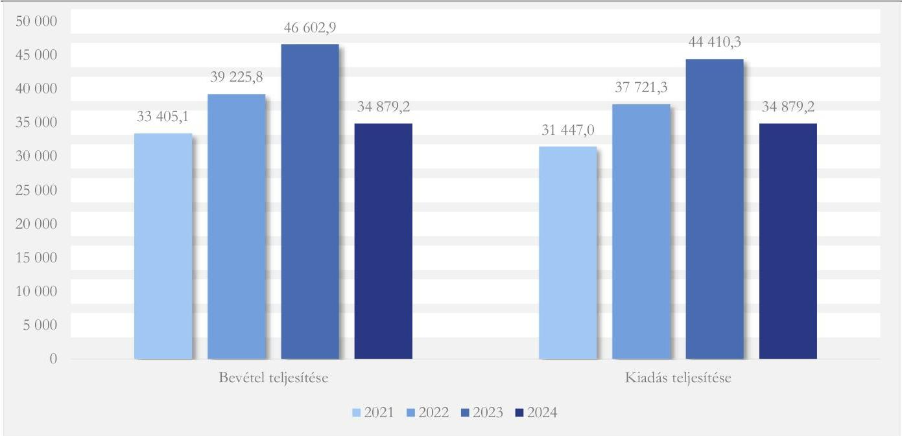

ÁLLAMI SZÁMVEVŐSZÉK

# JELENTÉS

A központi költségvetési szervek egyes informatikai beszerzéseinek célzott ellenőrzése

Békés Vármegyei Központi Kórház

2025.

25094

www.asz.hu

---

ÁLLAMI
SZÁMVEVŐSZÉK

# JELENTÉS

A központi költségvetési szervek egyes informatikai beszerzéseinek célzott ellenőrzése

Békés Vármegyei Központi Kórház

2025.

25094

---

Jelentéseink az interneten a www.asz.hu címen olvashatók.

ELLENŐRZÉSI IGAZGATÓSÁG:
ELLENŐRZÉSI IGAZGATÓSÁG I.

ELLENŐRZÉSI IGAZGATÓ:
SINKÁNÉ DR. CSENDES ÁGNES igazgató

ELLENŐRZÉSVEZETŐ:
TÓTH GERGELY ellenőrzésvezető

IKTATÓSZÁM: EL-4143-021/2025
TÉMASORSZÁM: 13
ELLENŐRZÉS-AZONOSÍTÓ SZÁM: V114501

---

TARTALOMJEGYZÉK

- AZ ELLENŐRZÉS ALAPADATAI ... 5
- AZ ELLENŐRZÉS HATÓKÖRE ÉS TERÜLETE ... 7
- ÖSSZEFOGLALÁS ... 9
- AZ ELLENŐRZÉS FÓKUSZTERÜLETEI ... 10
- MEGÁLLAPÍTÁSOK ... 11
- JAVASLATOK ... 22
- MELLÉKLETEK ... 23
- I. sz. melléklet: Értelmező szótár ... 23
- II. sz. melléklet: Az ellenőrzött szervezetek jegyzéke ... 24
- III. sz. melléklet: Ellenőrzési kritériumok ... 25
- FÜGGELÉK: ÉSZREVÉTELEK ... 26
- RÖVIDÍTÉSEK JEGYZÉKE ... 28

---

.

---

AZ ELLENŐRZÉS ALAPADATAI

## AZ ELLENŐRZÉS CÉLJA

Az ellenőrzés célja annak értékelése volt, hogy a Békés Vármegyei Központi Kórház kiválasztott informatikai célú beszerzésére szabályszerűen került-e sor, a kapcsolódó döntés megalapozott és célszerű volt-e, és a beszerzés megvalósította-e az elérni kívánt célkitűzést.

## AZ ELLENŐRZÉS TÍPUSA

Kombinált ellenőrzés

## AZ ELLENŐRZŐTT IDŐSZAK

A 2021-2022. évek, kitekintéssel a helyszíni ellenőrzés lezárásának időpontjáig, 2025. március 13-ig.

## AZ ELLENŐRZÉS TÁRGYA

Az ellenőrzés tárgyát képezte a Békés Vármegyei Központi Kórháznál a kiválasztott informatikai célú beszerzéshez kapcsolódóan a Kórház¹ belső szabályozási kereteinek kialakítása és a működtetése, az ellenőrzött szerv beszerzésre vonatkozó döntés-előkészítési és a beszerzés megvalósítási/végrehajtási tevékenysége, valamint a beszerzés számviteli elszámolása és a beszerzett eszköz használatbavétele, hasznosíthatósága a Kórház (köz)feladat ellátásával kapcsolatosan.

Az ellenőrzés kiterjedt továbbá minden olyan körülményre és adatra, amely az ÁSZ² jogszabályban meghatározott feladatainak teljesítéséhez, valamint a program végrehajtása folyamán felmerült újabb összefüggések feltárásához szükséges volt.

## AZ ELLENŐRZÉS JOGALAPJA

Az ellenőrzés jogszabályi alapját az ÁSZ tv.³ 1. § (3) bekezdésének és az 5. § (3) bekezdésének előírásai képezték.

## AZ ELLENŐRZÉS MÓDSZERE

Az ellenőrzést a nemzetközi standardokat irányadónak tekintve az ellenőrzési program szempontjai, az ellenőrzött időszakban hatályos jogszabályok, az ellenőrzés szakmai szabályok és módszertanok figyelembevételével végezte az ÁSZ.

5

---

Az ellenőrzés alapadatai

Az ellenőrzési kérdések megválaszolásához szükséges bizonyítékok megszerzése az ellenőrzött szervezet által rendelkezésre bocsátott dokumentumokra és adatokra alapozva, továbbá szemrevételezés, információkérés, interjú, valamint elemző eljárás útján történt.

Az ellenőrzési bizonyítékként felhasználható adatforrások közé tartoztak az ellenőrzéshez kért dokumentumok, adatforrások, valamint minden egyéb – az ellenőrzés folyamán feltárt, az ellenőrzés szempontjából információkat tartalmazó – dokumentum.

Az ellenőrzés lefolytatásához a Kórház az ÁSZ által kért dokumentumok, adatok, információk megküldésével és a helyszíni ellenőrzés során szolgáltatott adatokat.

Az ellenőrzéshez a Kórház egy, 2022. évben megvalósult, lezárt informatikai célú beszerzése került kiválasztásra a Magyar Államkincstár Adattárház rendszeréből kinyert pénzforgalmi tranzakciós adatok elemzése alapján.

Az ellenőrzés kiterjedt további informatikai célú beszerzéshez kapcsolódó minden olyan körülményre és adatra, amely a program végrehajtása folyamán felmerült újabb összefüggéseknek az ellenőrzés céljaival összhangban történő feltárása érdekében szükséges volt.

6

---

7

# AZ ELLENŐRZÉS HATÓKÖRE ÉS TERÜLETE

A központi költségvetési szervek a DKÜ rendeletben⁴ foglaltak alapján kötelesek informatikai célú beszerzéseikhez kapcsolódóan éves beszerzési és fejlesztési terveket összeállítani, továbbá a tervezett, a rendkívüli és a tervmódosítást igénylő informatikai beszerzési igényüket a DKÜ Zrt.⁵ részére megküldeni. A DKÜ Zrt. a beszerzési igények vizsgálata, véleményezésre, jóváhagyásra történő előkészítése során beszerzési és jogi szempontokat is figyelembe vesz, ennek eredményéről értesítést küld a központi költségvetési szerv részére. A DKÜ Zrt. a „megfelelő” minősítésű beszerzési igény kielégítése érdekében a beszerzési eljárást vagy maga folytatja le, vagy visszaadja a központi költségvetési szerv saját hatáskörében történő lebonyolításra.

A Békés Vármegyei Központi Kórház a békéscsabai Dr. Réthy Pál Kórház-Rendelőintézet és a gyulai Békés Megyei Pándy Kálmán Kórház 2016. április 1-i nappal történt összeolvadásával jött létre. Az egyesülés célja a gyógyító munka hatékonyabbá tételével a betegellátás minőségének javítása, a betegbiztonság növelése, az ellátáshoz való hozzáférés javítása volt. A Kórház székhelye Gyulán volt. A Kórház több telephelyen működött: a Réthy Pál Tagkórház Békéscsabán, a Pándy Kálmán Tagkórház és további négy telephely Gyulán működött. A Kórháznak volt telephelye továbbá Szeghalmon is.

A Kórház közfeladata az egészségügyről szóló 1997. évi CLIV. törvény alapján az ellátási területére kiterjedően a járó- és fekvőbetegk diagnosztikus és terápiás szakorvosi ellátása, rehabilitációja és követéses gondozása. A Kórház faladata továbbá Békés vármegye egészségügyi ellátásának szervezése, a betegek szakellátásának egységes elvek alapján történő átalakítása a lakosságközeli ellátások biztosításával. A Kórház 2021. évtől vármegyei intézményként működik, így feladata az irányító megyei intézmények felelősségébe tartozó igazgatási és egyéb irányítási feladatok ellátása.

A Kórház irányító szerve 2022. május 24-ig az Emberi Erőforrások Minisztériuma, ezt követően a Belügyminisztérium volt. A Kórház fenntartója, szakmai felügyeleti, valamint középirányító szerve 2021. január 1-jétől az Országos Kórházi Főigazgatóság (korábban Állami Egészségügyi Ellátó Központ).

A Kórház tevékenységét finanszírozási szerződés alapján az Egészségbiztosítási Alapból a Nemzeti Egészségbiztosítási Alapkezelő biztosította, továbbá intézményi saját bevételekkel rendelkezett.

A Kórházat a főigazgató vezeti, aki 2016. április 1-jétől tölti be tisztségét.

A Kórház jogállása az ellenőrzött időszakban központi költségvetési szerv volt. A Kórháznál az ellenőrzött időszakban az Áht.⁶ 11. §-ában meghatározott átalakulás nem történt. A Kórház gazdasági szervezettel rendelkezett. A Kórház rendszeres vállalkozási tevékenységet nem végzett.

A Kórház teljesített költségvetési bevételeinek és kiadásainak alakulását az 1. ábra mutatja be.

---

Az ellenőrzés hatóköre és területe

1. ábra

A BÉKÉS VÁRMEGYEI KÖZPONTI KÓRHÁZ KÖLTSÉGVETÉSI ÉS FINANSZÍROZÁSI BEVÉTELEI ÉS KIADÁSAI (M FT)

Forrás: A Kórház 2021-2023. évi költségvetési beszámolói és 2024. évi elemi költségvetése alapján ÁSZ saját szerkesztés

A Kórház foglalkoztatotti létszáma az éves beszámolók adatai alapján 2021. évben 2845 fő, 2022. évben 2764 fő, 2023. évben 2809 fő volt, az elemi költségvetés adatai alapján 2024. évben 2845 fő volt.

A Kórháznál ellenőrzésre a K63 Informatikai eszközök beszerzése, létesítése kódon 2022. május 3-án teljesített 6 710 640 Ft összegű kiadás került kiválasztásra. A kiválasztott kiadási tétel az összesen bruttó 17 206 976 Ft (13 548 800 Ft+ÁFA) értékű⁷ informatikai eszköz beszerzés pénzügyi részteljesítése volt. Az eszközbeszerzés a központosított beszerzési rendszerben⁸ az I/724/2021/000017 számú, 13 548 800 Ft nettó becsült értékű aktív hálózati eszközök beszerzésére vonatkozó igényhez kapcsolódott.

Az ellenőrzés kiterjedt a Kórház beszerzésre vonatkozó belső szabályozása jogszabályi előírásoknak való megfelelőségének, a beszerzés előkészítésével és végrehajtásával kapcsolatos döntések megalapozottságának, célszerűségének ellenőrzésére, valamint a számviteli elszámolás szabályszerűségének, a beszerzett eszközök aktiválásának, használatbavételének ellenőrzésére.

Az ellenőrzés hatóköre kiterjedt továbbá annak vizsgálatára, hogy a beszerzett eszköz a Kórháznál alkalmazásra, hasznosításra került-e, betöltötte-e az elvárt funkcióját, támogatta-e a szerv feladatellátását, illetve célkitűzései elérését.

Az ellenőrzés nem terjedt ki a DKÜ Zrt. által megkötött keretmegállapodások szabályszerűségének ellenőrzésére.

---

ÖSSZEFOGLALÁS

Az információtechnológiai eszközök fejlődése, a digitalizáció révén az állami szervezetek tevékenysége, feladatainak ellátása hatékonyabbá válhat, időt és erőforrásokat takaríthatnak meg működésük során. Az informatikai eszközök, szolgáltatások beszerzése jelentős anyagi ráfordítást feltételez, ezért a közpénzek rendeltetésszerű és eredményes felhasználása ezen a területen is jogosan felmerülő elvárás.

A Kórháznál az ÁSZ a nettó 13,5 M Ft értékű aktív hálózati eszközök 2022. évi beszerzésének megfelelőségét ellenőrizte szabályszerűségi, célszerűségi és eredményességi kritériumok mentén.

Az ellenőrzés megállapításai szerint a Békés Vármegyei Központi Kórházban indokolt, célszerű és megfelelően előkészített volt az aktív hálózati elemek beszerzése, amely eredményesen támogatta a feladatellátást. A Kórház a jogszabályi előírás ellenére a beszerzési igényt a központosított beszerzési rendszer keretmegállapodása mellőzésével elégítette ki. A Kórház a megkötött adásvételi szerződésből eredő kötelezettségvállalást a jogszabályi előírás ellenére határidőben nem vette nyilvántartásba, és a beszerzés tekintetében a kötelezettségvállalások nyilvántartása nem felelt meg a jogszabályban előírtaknak.

A Kórház a beszerzési tevékenység kereteit a jogszabályi előírások szerint megfelelően kialakította. A beszerzés a jogszabályokban és a belső szabályzatokban foglaltaknak megfelelően megalapozott volt, a szükséges jóváhagyási eljárásokat lefolytatták. A beszerzési döntés során érvényesült a célszerűség, az eszközök beszerzésének szükségességét indokolta az ellátáshoz szükséges képalkotó berendezések adatátviteli kapacitás igénye és a hálózati elemek avultsága, mivel a Kórházban a hálózati eszközök 54,5%-a 6 évesnél idősebb volt.

Az ellenőrzés megállapította, hogy a Kórház a beszerzésre megkötött adásvételi szerződésből eredő kötelezettségvállalást a jogszabály előírása ellenére határidőben nem vette nyilvántartásba. A beszerzés ellenértékét a nyilvántartás „Megrendelés” megnevezéssel több tételben tartalmazta, amellyel kapcsolatban az ellenőrzés feltárta, hogy az egyik esetben a „Megrendelést” ugyanazon sorszámmal és keltezéssel, azonban különböző adattartalommal állították ki, valamint a szerződésből eredő kötelezettségvállalás összege egy részének a nyilvántartásba vételére a beszerzett eszközök átvételét és a teljesítés igazolását követően került sor. A feltárt szabálytalanság és az ellentmondások alapján a vonatkozó jogszabályi előírások ellenére a vizsgált beszerzés tekintetében a Kórház kötelezettségvállalásokról vezetett nyilvántartása nem volt a valóságnak megfelelő, folyamatos, nem volt áttekinthető, a beszerzéssel kapcsolatosan a kötelezettségvállalások nyilvántartásában szereplő adatok az adásvételi szerződésben foglaltakkal nem voltak összhangban.

A Kórház informatikai beszerzési igényét az előírásokkal összhangban a DKÜ Zrt. részére megküldte, jelezte, hogy a beszerzési igénye kielégítését a központosított beszerzési rendszeren kívüli szállítóval tervezi. Ezt azzal indokolta, hogy a beszerzendő eszközök nem álltak hiánytalanul rendelkezésre az igények kezelését is támogató DKÜ Portál szerint, emellett a garanciák egyszerűbb érvényesítése miatt egy szállítótól tervezte a beszerzést. Az ellenőrzés ugyanakkor megállapította, hogy a beszerzési érték 95,2%-át kitevő eszközök a központosított beszerzési rendszer keretmegállapodásában megtalálhatóak voltak. A Kórház a beszerzésre három árajánlat bekérését követően a legalacsonyabb összegű árajánlatot adó vállalkozással kötött szerződést. A szerződés szerinti ellenérték a központosított beszerzési rendszer keretmegállapodása legalacsonyabb és legmagasabb áraival számított ellenértékek közé esett.

A beszerzésre fordított költségvetési forrás értékarányos összege ellenére, a beszerzési igény keretmegállapodásból való teljesítésének mellőzése ellentétes a jogszabályban meghatározott – a közpénzek felhasználása átláthatóságára, és a beszerzések rendszerének egységesítésére vonatkozó – célokkal.

---

10

# AZ ELLENŐRZÉS FÓKUSZTERÜLETEI

1. A központi költségvetési szerv informatikai célú beszerzésének szabályszerűsége
2. A központi költségvetési szerv informatikai célú beszerzésének célszerűsége és eredményessége

---

MEGÁLLAPÍTÁSOK

# 1. A központi költségvetési szerv informatikai célú beszerzésének szabályszerűsége

## Összegző megállapítás

A Kórház a beszerzési tevékenységére a belső szabályozási rendszerét a jogszabályi előírásoknak megfelelően kialakította. A Kórház a beszerzési igényt a jogszabályi előírás ellenére nem a központosított beszerzési rendszer keretmegállapodásából elégítette ki. A beszerzésre megkötött adásvételi szerződés szerinti kötelezettségvállalást a jogszabály és belső szabályzata előírása ellenére a kötelezettségvállalások nyilvántartásába határidőben nem rögzítették. A kötelezettségvállalások nyilvántartása a beszerzés tekintetében nem felelt meg a jogszabályban előírtaknak. A beszerzés számviteli elszámolása kisebb hibát tartalmazott.

A Kórház beszerzési tevékenysége megfelelően szabályozott volt. A Kórház a beszerzés előkészítése során a belső szabályzatában foglaltaknak megfelelően járt el. A beszerzési igénnyel kapcsolatos, a jogszabályokban előírt jóváhagyási eljárásokat a Kórház lefolytatta.

Az ellenőrzött időszakban a Kórház rendelkezett az irányító szerv által jóváhagyott SZMSZ⁹-szel az Áht.-ban és az Ávr.¹⁰-ben foglalt előírásnak megfelelően. Az SZMSZ tartalmazta a szervezeti felépítést és a működés rendjét, a szervezeti egységek – ezen belül a gazdasági szervezet – megnevezését, feladatait, az SZMSZ-ben nevesített munkakörökhöz tartozó feladat- és hatásköröket, a hatáskörök gyakorlásának módját, a helyettesítés rendjét, az ezekhez kapcsolódó felelősségi szabályokat, a szervezeti felépítés ábráját. A Kórház az Etikai kódexben a Bkr.¹¹ előírásával összhangban meghatározta az etikai elvárásokat a szervezet minden szintjén.

Az Áht. és Ávr. előírásainak megfelelően a Kórház gazdasági szervezetére vonatkozó szabályokat az Ügyrendben¹² határozták meg. Az Ügyrend tartalmazta a gazdálkodással összefüggő feladat-, hatás- és jogköröket, az egyes gazdasági folyamatok lebonyolításának módját. A Kórház az Áht.-ban és az Ávr.-ben foglalt előírásnak megfelelően rendelkezett a gazdálkodással kapcsolatos belső szabályozással. A Kötelezettségvállalási szabályzat¹³ tartalmazta a gazdálkodási jogkörök gyakorlásának módjával, továbbá a kötelezettségvállalást végző személyek kijelölésének rendjével kapcsolatos belső előírásokat, feltételeket, valamint az eljárási és a dokumentációs részletszabályokat. A Kórház az Ávr. előírásainak megfelelően rendelkezett a gazdálkodási jogkörök gyakorlására jogosult személyekről és azok aláírásmintájáról vezetett nyilvántartással.

11

---

Megállapítások

A Kórház a Kbt.¹⁴ és az Ávr. előírásainak megfelelően rendelkezett a közbeszerzések rendjét meghatározó Közbeszerzési szabályzattal¹⁵, valamint a közbeszerzési értékhatárt el nem érő beszerzésekre vonatkozó eljárásrendről szóló Beszerzési szabályzattal.¹⁶

A Kórház a Számv. tv. és az Áhsz.¹⁷ előírásainak eleget téve rendelkezett az eszközök és a források értékelési szabályzatával, valamint az eszközök és a források leltározási szabályzatával. A Leltározási szabályzat¹⁸ szerint a Kórház a beszámoló elkészítéséhez, a mérlegtételek alátámasztásához három évente végez mennyiségi felvétellel leltározást.

A Kórház a Számv. tv. és az Áhsz. előírásainak megfelelően rendelkezett az egységes számlakeret alapján készült Számlarenddel. A Számviteli politika¹⁹ és a Számlarend²⁰ a Számv. tv. és az Áhsz. előírásainak megfelelően tartalmazta a könyvvezetést és a beszámoló készítését biztosító elemeket.

A Kórház a Bkr. előírásainak eleget téve rendelkezett Ellenőrzési nyomvonalal. Az Ellenőrzési nyomvonal²¹ a beszerzésekkel kapcsolatos tevékenységeket, feladatokat a Műszaki és informatikai osztályra, mint beszerzési eljárást lebonyolító szervezeti egységre vonatkozóan tartalmazta.

A Kórháznál a beszerzésekkel kapcsolatosan a feladatokat ellátó szervezeti egység feladataira, a nevesített munkakörökhöz tartozó feladat- és hatáskörökre, továbbá a beszerzés előkészítésében részt vevő szervezeti egység által ellátott feladatok munkafolyamataira az SZMSZ, az Ügyrend, a Kötelezettségvállalási szabályzat, a Közbeszerzési szabályzat, a Beszerzési szabályzat, és a Műszaki és informatikai osztály Működési rendje tartalmazott leírást. Az SZMSZ és az Ügyrend alapján az éves költségvetésben tervezett, illetve jóváhagyott eszközbeszerzésért az adott szakterület osztályvezetője volt a felelős.

A Műszaki és informatikai osztály Működési rendje²² tartalmazta, hogy az informatikai eszközök, alkatrészek beszerzése a DKÜ Portálon²³ keresztül történik. A DKÜ Portálról való megrendelésekért az informatikai csoportvezetők voltak felelősek.

A beszerzési folyamatban részt vevő szervezeti egységek számára a Közbeszerzési szabályzat és a Beszerzési szabályzat tartalmazta azokat az alapelveket, amelyeket a (köz)beszerzési eljárásban résztvevők kötelesek voltak betartani: a verseny tisztasága és nyilvánossága, a jóhiszeműség, az esélyegyenlőség és az egyenlő bánásmód, az átláthatóság, a dokumentáltság, a hatékony és felelős gazdálkodás elve.

A Kórház az informatikai beszerzései során a DKÜ rendelet 1. § (2) bekezdés b) pontja alapján a DKÜ rendelet, valamint beszerzései során az Áht. 36/A. § és az Ávr. 52/A. § előírásai szerint volt köteles eljárni.

Az aktív hálózati eszközök beszerzési eljárására a DKÜ rendelet, a Beszerzési szabályzat, a Kötelezettségvállalási szabályzat és a Műszaki és informatikai osztály Működési rendje előírásai voltak az irányadóak. A beszerzés értéke nem érte el a nettó 15 M Ft-ot, nem esett a Kbt. hatálya alá.

Az aktív hálózati eszközök beszerzésére vonatkozóan a gazdasági igazgató és a műszaki és informatikai osztályvezető 2021. november 30-án terjesztette elő a beszerzésre vonatkozó igényt a Kórház főigazgatója részére. A kérelem a meglévő aktív hálózati elemek helyett 10-szeres adatátviteli sebességű eszközök beszerzésére, illetve az ahhoz szükséges jóváhagyási eljárások megindítására irányult.

Az előterjesztés megfelelt a Kórház Kötelezettségvállalási szabályzatában és a Beszerzési szabályzatban a beszerzésekre vonatkozó előírásoknak.

---

Megállapítások

A beszerzés főigazgatói jóváhagyásra történt előterjesztésében szerepelt, hogy a beszerzendő eszközök a DKÜ Portálon nem álltak hiánytalanul rendelkezésre, ezért jóváhagyás esetén a beszerzés saját hatáskörben való lebonyolítását kezdeményezi a Kórház a központosított informatikai beszerzési rendszerben. Az előterjesztésben továbbá kiemelték, hogy az eszközöket a garanciális feltételek teljesülése miatt egy adott szállítótól javasolt beszerezni.

A beszerzés értékének meghatározására a Kórház három, békéscsabai székhelyű gazdasági társaságtól kért be árajánlatot.

Informatikai eszközök saját hatáskörben való beszerzésének kezdeményezése során az üzembehelyezés és az eszközökre vonatkozó garanciák egyszerűbb érvényesítése okszerű szempont lehet a vonatkozó szabályok betartása mellett.

A vállalkozások árajánlatait a Kórház 2021. december 9-én értékelte. Az azonos műszaki tartalmú árajánlatok összegzése után a Kórház a CSABA TALK Kft.²⁴ által adott legalacsonyabb értékű ajánlat alapján határozta meg a beszerzési igény becsült értékét.

A Kórház a 11/2020. (VII. 10.) BM utasítás²⁵ előírásának megfelelően a beszerzési igényt a NEIT²⁶ részére véleményezésre benyújtotta. A NEIT 2021. december 14-i nappal kiadta a 1022274-2021 azonosítójú támogatói tanúsítványt a beszerzés jóváhagyására.

Az Ávr. előírásainak megfelelően a Kórház főigazgatója és a gazdasági igazgató által 2021. december 29-én előterjesztett szerződéskötési engedély-kérelmet a költségvetési felügyelő²⁷ aláírta.

A Kórház a 11/2020. (VII. 10.) BM utasítás előírásának megfelelően a NEIT támogatói tanúsítvány birtokában indította meg a beszerzést a központosított beszerzési rendszerben 2021. december 16-án. A beszerzési igény becsült értéke 13 548 800 Ft+ÁFA volt. A Kórház a beszerzési igény benyújtásához nyilatkozott, hogy a beszerzéshez a szükséges fedezettel rendelkezett.

A Kórház a beszerzési igényhez benyújtott Műszaki leírásban foglaltak szerint a beszerzés saját hatáskörben történő lefolytatásához kérte a hozzájárulást, mert a beszerezni kívánt eszközök hiánytalanul nem álltak rendelkezésre a központosított beszerzési rendszerben.

A DKÜ Zrt. 2021. december 27-én a beszerzési igényt megfelelőnek értékelte, és a beszerzést saját hatáskörben való lefolytatásra visszaadta a Kórház részére.

A Kórház az Ávr.-ben előírtaknak megfelelően a beszerzéshez a kötelezettségvállalás előzetes jóváhagyásának kérelmét 2022. január 3-án az OKFŐ részére megküldte. Az OKFŐ a Kórház szerződés megkötésére irányuló kérelmét 2022. január 10-én jóváhagyta.

A Kórház 2022. február 9-én az eszközök beszerzésére irányuló Adásvételi szerződést kötött a beszerzési igény becsült értékének meghatározásához a legalacsonyabb árajánlatot adó CSABA TALK Kft.-vel. Az adásvételi szerződést a Kórház keretmegállapodáson kívüli szállítóval kötötte meg, a beszerzési igényben megadott eszközökre és értékkel.

A Kórház az aktív hálózati eszközök beszerzési igényét a DKÜ rendelet 13. § (1b) bekezdés előírása ellenére nem a központosított beszerzési rendszer keretmegállapodásából elégítette ki.

A DKÜ rendelet megalkotásának célja a széttagolt, párhuzamos beszerzések felszámolása és az informatikai állomány egységes kezelése volt. A részletszabályok betartása, egy-egy beszerzési igény keretmegállapodásból történő kielégítése a közpénzek felhasználása tekintetében költséghatékonyabb megoldást jelenthet és gyorsabb megvalósítást eredményezhet. Az ÁSZ ellenőrzése ellenőrizte, hogy a beszerezni tervezett eszközökre a beszerzés előkészítése idején volt-e keretmegállapodás, és megállapította, hogy a beszerzési érték 95,2%-át (16,4 M Ft) kitevő eszközök a beszerzési eljárás

13

---

Megállapítások

megindításakor megtalálhatóak voltak a központosított beszerzési rendszer keretmegállapodásában.

A beszerzési eljárás megindításakor (2021. november 30.) a központosított beszerzési rendszerben a DKM02HNET21 azonosítójú, Inhomogén hálózati eszközök és kiegészítők beszerzése és kapcsolódó szolgáltatások teljesítése tárgyú keretmegállapodásban megtalálható eszközöket az 1. táblázat mutatja be. 1. táblázat

A BESZERZETT ESZKÖZÖK ELÉRHETŐSÉGE A KÖZPONTOSÍTOTT BESZERZÉSI RENDSZER KERETMEGÁLLAPODÁSÁBAN (DARAB / MILLIÓ FT)

|  BESZERZETT ESZKÖZÖK  |   |   |
| --- | --- | --- |
|  ESZKÖZ | MENNYISÉG (DARAB) | ELLENÉRTÉK  |
|  D-Link DGS-1510-28P | 2 |   |
|  D-Link DGS-1510-28X | 11 |   |
|  D-Link DGS-1510-28XMP | 10 | DKÜ Portálon keretmegállapodásban megtalálható eszközök bruttó értéke 16,4 M Ft  |
|  D-Link DGS-1510-52X | 5  |   |
|  D-Link DEM-410T | 6  |   |
|  D-Link DEM-431XT | 82 |   |
|  TP-Link TL-SG108 | 40 |   |
|  további beszerzett eszközök:  |   |   |
|  HP NC552SFP 615406-001 | 3 |   |
|  Ubiquiti UCK-G2-PLUS | 1 | bruttó érték 0,8 M Ft  |
|  Ubiquiti UAP-AC-PRO | 5  |   |
|  optikai patch kábel | 5 |   |
|  Beszerzés bruttó értéke összesen |  | 17,2 M Ft  |

Forrás: ÁSZ saját szerkesztés a 2022. február 9-i adásvételi szerződés alapján

Az ellenőrzés a Kórház által megküldött dokumentumok alapján megállapította, hogy a beszerezni tervezett eszközöket a Kórház helytelen módszer szerint – a cikkszámot a termék nevét tartalmazó mezőben – kereste a DKÜ Portálon.

Az ellenőrzés megállapította, hogy a Kórház eljárása, a DKÜ rendelet 13. § (1b) bekezdésben előírtak miatt a központosított beszerzési rendszer keretmegállapodásának mellőzése nem volt indokolt. A Kórház azon indokolása, hogy az eszközök nem álltak hiánytalanul rendelkezésre a DKÜ Portálon, nem volt megalapozott, mivel a beszerzés 95,2%-ának megfelelő értékű eszköz a keretmegállapodásban megtalálható volt a beszerzés előkészítésének időpontjában.

A Kórház által a CSABA TALK Kft-vel megkötött adásvételi szerződés szerint az eszközök teljes vételára a békéscsabai tagkórház tekintetében 8 643 188 Ft, a gyulai tagkórház tekintetében 8 563 788 Ft volt. Az adásvételi szerződés mellékletét képezte az eszközök listája (a megnevezés, a darabszám és a gyári számok feltüntetésével). A beszerzett eszközök két tagkórház közötti megoszlását a 2. táblázat tartalmazza.

---

Megállapítások

2. táblázat
A BESZERZETT INFORMATIKAI ESZKÖZÖK ELLENÉRTÉKE (FORINT)

|  TELEPHELY | NETTÓ / BRUTTÓ | ÖSSZEG  |
| --- | --- | --- |
|  Dr. Réthy Pál Tagkórház – Békéscsaba | Összesen nettó | 6 805 660 Ft  |
|   | Összesen bruttó | 8 643 188 Ft  |
|  Pándy Kálmán Tagkórház – Gyula | Összesen nettó | 6 743 140 Ft  |
|   | Összesen bruttó | 8 563 788 Ft  |
|   | Mindösszesen nettó | 13 548 800 Ft  |
|   | Mindösszesen bruttó | 17 206 976 Ft  |

Forrás: Az adásvételi szerződés és a számla adatai alapján ÁSZ saját szerkesztés

Az adásvételi szerződés az Áht. és az Ávr. rendelkezéseinek megfelelően az általános adatokon, feltételeken túlmenően tartalmazta a szakmai, műszaki teljesítés mennyiségi és minőségi jellemzőit, a teljesítés határidejét, a számlázás alapjául szolgáló egységárat, a pénzügyi teljesítés devizanemét, módját és feltételeit, a kifizetés határidejét. A szállító gazdasági társaság képviselőjének nyilatkozata arra vonatkozóan, hogy a szállító CSABA TALK Kft. átlátható szervezetnek minősült, az Ávr előírásának megfelelően rendelkezésre állt a szerződéskötéshez.

A kötelezettséget az Áht.-ban és az Ávr.-ben foglaltakkal összhangban az arra jogosult főigazgató helyettes vállalta. A kötelezettségvállalásra az Áht.-ban és az Ávr.-ben foglaltak szerint, az arra jogosult gazdasági igazgató általi pénzügyi ellenjegyzés után került sor.

A Kórház az adásvételi szerződés szerinti kötelezettségvállalást az Ávr. 56. § (1) bekezdés előírása ellenére nem vette határidőben nyilvántartásba.

Az adásvételi szerződés megkötését követően a kötelezettségvállalás nyilvántartásba vételének elmulasztása ellentétes volt továbbá a Kórház Kötelezettségvállalási szabályzat IV.3. pontjában meghatározott szabályokkal is. A Kórház a Kötelezettségvállalási szabályzat előírásai ellenére az adásvételi szerződés szerinti kötelezettségvállalás adatait a beérkezést követő egy munkanapon belül nem rögzítette a kötelezettségvállalások nyilvántartásában.

A Kórház 2022. évi kötelezettségvállalások nyilvántartása a 2022. február 9-i adásvételi szerződéssel létrejött kötelezettségvállalást, a beszerzés ellenértékét négy nyilvántartási sorszám alatt tartalmazta a 3. táblázat szerinti dátumokkal és összegekkel:

---

Megállapítások

3. táblázat

A BESZERZÉS NYILVÁNTARTÁSA
A 2022. ÉVI KÖTELEZETTSÉGVÁLLALÁSOK NYILVÁNTARTÁSÁBAN

|  KÖTELEZETTSÉG-VÁLLALÁS NYILVÁNTARTÁSI SORSZÁMA | DOKUMENTUM | KÖTELEZETTSÉG-VÁLLALÁS DÁTUMA (MEGRENDELÉS KELTE) | ÖSSZEG | ÖSSZEG ÖSSZESEN  |
| --- | --- | --- | --- | --- |
|  R9/2022002258 | Megrendelés | 2022.02.14 | 8 643 187 Ft | 17 206 976 Ft  |
|  R9/2022002243 | Megrendelés | 2022.02.14 | 8 563 788 Ft  |   |
|  Az R9/2022002243 számú Megrendelés összegének módosítása:  |   |   |   |   |
|  R9/2022002243 | Megrendelés | 2022.02.14 | 6 626 530 Ft | 8 563 788 Ft  |
|  és további Megrendelés kiállítása és kötelezettségvállalásként nyilvántartásba vétele:  |   |   |   |   |
|  R9/2022004638 | Megrendelés | 2022.03.31 | 574 675 Ft |   |
|  R9/2022005579 | Megrendelés | 2022.04.20 | 1 362 583 Ft |   |

Forrás: A Kórház 2025. március 27-én kelt nyilatkozata alapján ÁSZ saját szerkesztés
Jelmagyarázat: 1: Ellentmondás

A beszerzéssel kapcsolatosan a Kórház 2022. február 14-én két Megrendelést állított ki: az R9/2022002258 sorszámú, összesen bruttó 8 643 187 Ft, és az R9/2022002243 sorszámú, összesen bruttó 8 563 788 Ft összegű Megrendeléseket. Az eljárást és az adásvételi szerződésből eredő kötelezettségvállalás nyilvántartásába való felvételének mellőzését a Kórház az ellenőrzés részére a beszerzés két tagkórháza közötti elkülönítéssel indokolta (a békéscsabai tagkórházba 8 643 187 Ft, és a gyulai tagkórházba 8 563 788 Ft értékű eszközbeszerzés). A Megrendeléseket kötelezettségvállalóként, és pénzügyi ellenjegyzőként az arra jogosult személyek írták alá. A két Megrendelés összege megegyezett az adásvételi szerződés szerinti kötelezettségvállalás (17 206 976 Ft) összegével.

A kötelezettségvállalások nyilvántartása R9/2022002258 sorszámon tartalmazta a 8 643 187 Ft összegű Megrendelést. A nyilvántartás szerint a kötelezettségvállalás kezdete 2022. február 14. volt, egyezően a dokumentum kiállításának dátumával. A kötelezettségvállalások nyilvántartása az R9/2022002243 nyilvántartási sorszám alatt, szintén 2022. február 14. nappal összesen 6 626 530 Ft-ot tartalmazott, amely összeg azonban kevesebb volt, mint az ugyanezen számú Megrendelés végösszege.

A kötelezettségvállalás nyilvántartás a gyulai tagkórházat érintő beszerzéshez további két nyilvántartási sorszámú kötelezettségvállalást tartalmazott: az R9/2022004638 számon bruttó 574 675 Ft összeggel, 2022. március 31. nappal, és az R9/2022005579 számon bruttó 1 362 583 Ft összeggel és 2022. április 20-i nappal. Az alacsonyabb összegű R9/2022002243 és a további két kötelezettségvállalás a nyilvántartásban kiadta a gyulai tagkórházba beszerzett eszközök ellenértékét.

Az ellenőrzés részére a kötelezettségvállalás nyilvántartás tartalmával kapcsolatban a Kórház arról nyilatkozott, hogy a beszerzett eszközök bevételezését az eredeti Megrendelések szerint technikailag nem tudták megoldani, a nagyértékű, kisértékű eszköz és készlet bevételezését az EcoSTAT²⁸ rendszerben együttesen nem tudták kezelni. A bevételezéseket a készlet, illetve a tárgyi eszköz modulokban hajtották végre a rendszerben, ezért módosították az eredeti R9/2022002243 sorszámú, bruttó 8 563 788 Ft összegű Megrendelést és a kötelezettségvállalások nyilvántartását.

Az ellenőrzés a kötelezettségvállalás nyilvántartásban szerepelt adatokat megalapozó dokumentumokkal kapcsolatban megállapította, hogy a Kórház által tett módosítás eredményeképpen az R9/2022002243 számú 2022. február 14-i keltezésű Megrendelés papír alapon ugyanazon számmal és keltezéssel,

16

---

Megállapítások

azonban különböző adattartalommal és beszerzési összeggel állt rendelkezésre. Az ellenőrzés véleménye szerint az azonos sorszámú és keltezésű, de eltérő tartalmú bizonylatok kiállításával a Kórház nem biztosította a kötelezettségvállalás módosításának nyomonkövethetőségét és a kötelezettségvállalás nyilvántartás vonatkozásában az Áhsz. 39. § (1) bekezdésében előírt áttekinthetőséget.

Az ellenőrzés továbbá feltárta, hogy az R9/2022004638 és R9/2022005579 számú Megrendelések kiállítására, aláírására és kötelezettségvállalásként nyilvántartásba vételére az Ávr. 56. § (1) bekezdés előírása ellenére a beszerzett eszközök átvételét és a teljesítés igazolást követően került sor.

Az R9/2022004638 és R9/2022005579 számú Megrendelések kelte és kötelezettségvállalásként történt nyilvántartásba vételé 2022. március 31-e és 2022. április 20-a volt, miközben valamennyi eszköz átadására a szállítólevelek szerint már 2022. február 24-én és 2022. március 24-én sor került, és a teljesítést az arra jogosult személy a 2022. március 23-i keltezésű számlákon 2022. március 23-án és április 1-én igazolta.

A beszerzés tekintetében a Kórház kötelezettségvállalásokról vezetett nyilvántartása – az Áhsz. 3. § (2) bekezdésében és a 39. § (1) bekezdésében foglaltak ellenére – nem volt a valóságnak megfelelő, folyamatos, áttekinthető. Az ellenőrzés megállapította, hogy az adásvételi szerződés megkötésének időpontjától (2022. február 9.) a beszerzéssel kapcsolatosan a kötelezettségvállalások nyilvántartásában szereplő adatok a módosítások és a különböző időpontokban kiállított összesen négy megrendelés kiállítása miatt az adásvételi szerződésben foglaltakkal nem voltak összhangban.

A beszerzett eszközök számviteli nyilvántartásba vételére, elszámolására és a kiadás teljesítésére a Számv. tv. előírásainak megfelelően szabályszerűen kiállított bizonylat alapján került sor.

A beszerzés számviteli elszámolásával kapcsolatosan az ellenőrzés kisebb hibát tart fel, mert a Kórház két tételhez kapcsolódó ÁFA összegeket felcserélte. A K63 Informatikai eszközök beszerzése, létesítése rovatkódra rögzített 420 000 Ft-hoz kapcsolódó 113 400 Ft ÁFA összege tévesen a K351 Működési célú előzetesen felszámított általános forgalmi adó rovatkódra, a K312 Üzemeltetési anyagok beszerzése rovatkódon elszámolt 32 500 Ft-hoz kapcsolódó 8 775 Ft ÁFA összege szintén tévesen a K67 Beruházási célú előzetesen felszámított általános forgalmi adó rovatkódra került elszámolásra.

A Kórház a beszerzett eszközök üzembehelyezését a Számv. tv. előírásainak megfelelően hitelt érdemlően dokumentálta, a bekerülési érték meghatározása, az eszközök nyilvántartásba vételére megfelelő, az értékcsökkenés összegének megállapítása szabályszerű volt. A beszerzett tárgyi eszközök egyedi nyilvántartása tartalmazta az Áhsz. 14. melléklet VII. pontjában előírt adatokat, információkat.

A beszerzett eszközök mennyiségi felvétellel történt leltározása 2024. évben a leltárívek és a leltárértékelő jegyzőkönyv szerint megtörtént.

Az ellenőrzési megállapítások alapján az ellenőrzött informatikai célú beszerzés végrehajtásával, valamint számviteli elszámolásával kapcsolatos hiányosságokat és szabálytalanságokat a 2. ábra foglalja össze.

17

---

Megállapítások

2. ábra

A BESZERZÉS SZABÁLYSZERŰSÉGÉVEL KAPCSOLATBAN TETT MEGÁLLAPÍTÁSOK

|  TEVÉKENNSEG |  | MEGJEGYZÉS  |
| --- | --- | --- |
|  A beszerzési igény kielégítésének módja | × | A Kórház a DKÜ rendelet előírása ellenére nem a központosított beszerzési rendszerből elégítette ki a beszerzési igényt.  |
|  Gazdálkodási jogkörök gyakorlása:
- kötelezettségvállalás
- pénzügyi ellenjegyzés
- teljesítésigazolás | ✓ | A gazdálkodási jogkörök gyakorlása a jogszabályi előírásoknak megfelelő, szabályszerű volt.  |
|  Kötelezettségvállalás nyilvántartása | × | - Az Ávr. előírása ellenére a Kórháznál a 2022. február 9-én megkötött adásvételi szerződés szerinti kötelezettségvállalást határidőben nem vették nyilvántartásba.
- A beszerzéssel kapcsolatosan a kötelezettségvállalás nyilvántartás vezetése nem felelt meg az Áhsz. előírásának, az nem volt a valóságnak megfelelő, folyamatos, áttekinthető. A kötelezettségvállalások nyilvántartása a beszerzéssel kapcsolatosan 2022. február 9-től (a beszerzésre megkötött adásvételi szerződés kelte) nem volt összhangban az adásvételi szerződésben foglaltakkal.  |
|  Számviteli elszámolás | ! | Két tételhez kapcsolódó ÁFA összegek felcserélve kerültek elszámolásra a kiadási rovatokon.  |
|  Tárgyi eszköz
- nyilvántartás
- bekerülési érték meghatározása
- értékcsökkenés megállapítása
- leltározás | ✓ | A beszerzett eszközök nyilvántartásba vétele, a bekerülési érték és az értékcsökkenés megállapítása szabályszerű volt. A beszerzett eszközök mennyiségi felvétellel történő leltározása megfelelően megtörtént.  |
|  Jelmagyarázat: ✓ szabályszerű volt ! kisebb hiányosságot, hibát tart fel az ellenőrzés × nem volt szabályszerű  |   |   |

Forrás: ÁSZ saját szerkesztés

---

Megállapítások

# 2. A központi költségvetési szerv informatikai célú beszerzésének célszerűsége és eredményessége

## Összegző megállapítás

A beszerzésre irányuló igény megalapozott, célszerű volt. A beszerzett eszközök ára értékarányos volt a központosított beszerzési rendszer keretmegállapodásában megtalálható termékek ellenértékével. A beszerzés eredményes volt, a megvásárolt eszközöket a Kórház a feladatellátásához használta.

## Az aktív hálózati eszközök beszerzése megalapozott, célszerű és indokolt volt.

Az aktív hálózati eszközök beszerzését tartalmazó igény, a beszerzésre irányuló előterjesztés tartalmazta a tervezett beszerzés indokolását, szükségességét, az eszközök mennyiségét, a beszerzéssel kapcsolatos kockázatokat és az azok kezelésének módját, valamint a beszerzés ütemezését. Az ütemezésben meghatározták a kötelező jóváhagyási eljárások lebonyolítása, az ajánlatok beszerzése, a szerződéskötés, a megrendelés, az állományba vétel, üzembehelyezés, a pénzügyi teljesítés, az eszközök felhasználók részére történő használatba adása, és a beszerzés nyomonkövetése időszakait havi bontásban.

Az aktív hálózati eszközök beszerzését az előterjesztés, valamint az ellenőrzés részére adott tájékoztatás szerint egyrészt a hálózati elemek avultsága, valamint az a célkitűzés indukálta, hogy a Kórház működéséhez az akkor használatban volt elemek adatátviteli sebességénél tízszer nagyobb átvitelre képes eszközök álljanak rendelkezésre. A Kórháznál különösen a nagy adatforgalmat igénylő digitális képalkotó eljárások elvégzéséhez, a betegek komplett vizsgálatainak, leletezéseinek támogatásához, a laborműszerek és az irodai alkalmazások folyamatos és megbízható működéséhez is szükséges volt biztosítani a nagyobb adatátviteli sávszélességet.

A Kórháznak az aktuális év informatikai környezetéről szóló beszámolója alapján a beszerzés megindítása és lebonyolítása évében, 2021. és 2022. években a hálózati eszközök 54,5%-a 6 évesnél idősebb volt, ezen belül 29,5%-a 10 évesnél régebbi eszköz volt.

A hálózati eszközök korának alakulását a 4. táblázat részletesen bemutatja.

4. táblázat

A HÁLÓZATI ESZKÖZÖK KORA A KÓRHÁZNÁL

|  ÉV | MENNYISÉG | 0-2 ÉVES | 3-5 ÉVES | 6-10 ÉVES | 10+ ÉVES  |
| --- | --- | --- | --- | --- | --- |
|  2021-2022.év | 224 db | 15,6% | 29,9% | 25,0% | 29,5%  |

Forrás: A Kórház 2021. és 2022. évre vonatkozó informatikai környezetéről teljesített beszámolók

Az ellenőrzés megállapította, hogy a beszerzésre irányuló döntéshozatalnál érvényesült a célszerűség, a beszerzés összhangban volt, és támogatta a Kórház feladatellátását. Az elavult eszközök helyett a gyorsabb adatátvitelt biztosító eszközök beszerzésének szükségességét a Kórház hálózati eszközeinek kora, (a hálózati eszközök 54,5%-a 6 évesnél idősebb volt) és az adatátviteli kapacitás gyorsításának szükségessége is indokolta.

A Kórház az eszközök beszerzésére irányuló eljárás megindításának és a beszerzés megvalósításának évére a DKÜ rendeletnek megfelelően rendelkezett jóváhagyott éves informatikai beszerzési és informatikai fejlesztési tervvel.

---

Megállapítások

Az aktív hálózati eszközök beszerzésére vonatkozó, I/724/2021/000017 számú beszerzési igény a Kórház 2021. évi beszerzési tervében nem szerepelt, az terven kívüli, rendkívüli igényként került benyújtásra.

A beszerzésre fordított költségvetési forrás összege értékarányos volt. Az eszközök adásvételi szerződés szerinti ára, illetve a beszerzés összege, és a központosított beszerzési rendszerben megtalálható eszközök ellenértéke megközelítően ugyanannyi volt.

Az ellenőrzés a beszerzés végrehajtásával kapcsolatban azt állapította meg, hogy a Kórház eljárása, és a központosított beszerzési rendszer keretmegállapodásának mellőzése nem volt indokolt. Az ellenőrzés megvizsgálta továbbá, hogy mennyi volt az eszközök ellenértéke a központosított beszerzési rendszer keretmegállapodásában, illetve a beszerzés teljesítésére a Kórház által saját eljárásban kiválasztott szállítóval (CSABA TALK Kft.) kötött adásvételi szerződés szerint.

Az 5. táblázat összefoglalja a beszerzett eszközök beszerzési ár szerinti ellenértékét, valamint a DKM02HNET21 azonosítójú, Inhomogén hálózati eszközök és kiegészítők beszerzése és kapcsolódó szolgáltatások teljesítése tárgyú keretmegállapodásban megtalálható eszközök ellenértékét.

5. táblázat

A KÖZPONTOSÍTOTT BESZERZÉSI RENDSZERBEN MEGTALÁLHATÓ ESZKÖZÖK ELLENÉRTÉKÉNEK ALAKULÁSA

|  AZ ESZKÖZÖK ELLENÉRTÉKÉNEK ALAKULÁSA | MILLIÓ Ft | MEGOSZLÁS / ELTÉRÉS  |
| --- | --- | --- |
|  Beszerzés teljes bruttó összege | 17,2 | Megoszlás:  |
|  - ebből a DKÜ Portálon nem megtalálható eszközök beszerzési ára (bruttó) | 0,8 | 4,08%  |
|  - ebből a DKÜ Portálon megtalálható eszközök beszerzési áron (bruttó) | 16,4 | 95,2%  |
|  A DKÜ Portálon megtalálható eszközök ellenértéke: |  | Eltérés:  |
|  - a legalacsonyabb egységárral és a közbeszerzési díjjal számolva | 15,3 | -6,3%  |
|  - a legmagasabb egységárral és a közbeszerzési díjjal számolva | 17,0 | +3,5%  |

Forrás: A beszerzésre kötött adásvételi szerződés és a DKÜ Portálon rendelkezésre álló adatok alapján ÁSZ saját szerkesztés

Amennyiben a Kórház a keretszerződésben megtalálható eszközöket a DKÜ Portálon rendelte volna meg, és a keretmegállapodásban részes szállítókkal köt szerződést a beszerzésre, akkor a legalacsonyabb árakkal számolva bruttó 15,3 M Ft-ba, a legmagasabb árakkal számolva bruttó 17,0 M Ft-ba kerültek volna azok az eszközök, amelyekért ténylegesen 16,4 M Ft-ot fizetett a szállítónak. A központosított beszerzési rendszeren kívüli beszerzésre kifizetett ellenérték összege a DKÜ Portál keretmegállapodásban megtalálható eszközök árával számított beszerzési érték összegétől -6,3%-kal (mínusz 1,1 M Ft), illetve +3,5%-kal (plusz 0,6 M Ft) tért el.

A beszerzés ellenértéke a központosított beszerzési rendszer keretmegállapodása szerinti legalacsonyabb és legmagasabb áraival számított beszerzési értékek között volt, ezért az ellenőrzés a beszerzés ellenértéke alapján a költségvetési források felhasználását értékarányosnak értékelte.

A Kórháznál a beszerzéssel kapcsolatosan a gazdasági igazgató és a műszaki és informatikai osztályvezető 2022. május 10-i feljegyzésében összefoglalták a beszerzés megvalósulását, a beszerzés főbb lépéseit, ütemezését, a keletkezett dokumentumok megnevezését, a teljesítés, üzembe helyezés adatait.

---

Megállapítások

A beszerzés eredményes volt, a megvásárolt eszközöket a Kórháznál alkalmazásba vették, így a nagyobb adatátvitel biztosítására irányuló célkitűzés a beszerzéssel megvalósult.

A Kórház a beszerzésre megkötött adásvételi szerződésről és a teljesítésről a DKÜ rendelet 13. § (8) és (9) bekezdéseiben előírt adatszolgáltatási és dokumentumfeltöltési kötelezettségét jelentős késedelemmel, 2023. október 25-én teljesítette.

21

---

JAVASLATOK

Az ÁSZ tv. 33. § (1) bekezdésében foglaltak értelmében az ellenőrzött szervezet vezetője köteles a jelentésben foglalt megállapításokhoz kapcsolódó intézkedési tervet összeállítani és azt a jelentés kézhezvételétől számított 30 napon belül az ÁSZ részére megküldeni. Amennyiben az ellenőrzött szervezet vezetője nem küldi meg határidőben az intézkedési tervet, vagy továbbra sem elfogadható intézkedési tervet küld, az Állami Számvevőszék elnöke az ÁSZ tv. 33. § (3) bekezdése a) és b) pontjaiban foglaltakat érvényesítheti.

## A KÓRHÁZ FŐIGAZGATÓJA RÉSZÉRE

1. Tegyen intézkedéseket azon kontrolltevékenységek kialakítására és megfelelő működtetésére, amelyek biztosítják, hogy a Kórház informatikai célú beszerzési eljárásai megfeleljenek a DKÜ rendelet 13. § (1b) bekezdés előírásának.

2. Tegyen intézkedéseket azon kontrolltevékenységek kialakítására és megfelelő működtetésére, amelyek megelőzik a jelentésben leírt, az Ávr. 56. § (1) bekezdés és a belső szabályzata előírásával ellentétes szabálytalan eljárás előfordulását, és biztosítják, hogy a Kórház által tett kötelezettségvállalás minden esetben haladéktalanul nyilvántartásba vételre kerüljön.

3. Tegyen intézkedéseket azon kontrolltevékenységek kialakítására és megfelelő működtetésére, amelyek biztosítják az Áhsz. 3. § (2) bekezdésében és a 39. § (1) bekezdésében meghatározott, a nyilvántartásokkal kapcsolatos elvárások teljesülését.

4. Tegyen intézkedéseket azon kontrolltevékenységek kialakítására és megfelelő működtetésére, amelyek megelőzik a jelentésben leírt, a beszerzés számviteli elszámolásával kapcsolatos hiba ismételt előfordulását.

22

---

MELLÉKLETEK

## I. SZ. MELLÉKLET: ÉRTELMEZŐ SZÓTÁR

célserűség

A célserűség követelménye azt jelenti, hogy a bevételeket a közfeladat megvalósítása érdekében, a kiadásokat a közfeladatok megfelelő ellátásához szükséges mértékben, a költségvetési célrendszer érdekében, a meghatározott célra (közfeladat ellátására), továbbá ésszerűen, racionálisan használták fel.

(Forrás: Az ÁSZ ellenőrzési alapelvei és módszertana – 2024. október)

eredményesség

Az eredményesség elve a kitűzött célok és a tervezett eredmények (hatások) elérését jelenti, azt, hogy az ellenőrzött terület, vagy szervezet a kitűzött célokat és a szándékolt eredményeket (hatásokat) elérte.

(Forrás: Az ÁSZ ellenőrzési alapelvei és módszertana – 2024. október)

informatikai beszerzés

Informatikai eszköz, szoftver, alkalmazásfejlesztés és az ezekhez kapcsolódó szolgáltatások beszerzésére irányuló keretmegállapodás vagy más keretjellegű szerződés, továbbá visszterhes szerződés létrehozását célzó beszerzési eljárás. (Forrás: DKÜ rendelet 1. § (4) bekezdés 5. pontja)

informatikai eszköz

Asztali és hordozható számítógépek, kézi számítógépek, mágneslemezes meghajtók, flashmeghajtók, optikai meghajtók és egyéb tárolóeszközök, nyomtatók, monitorok, billentyűzetek, egerek, belső és külső számítógépmodemek, számítógép-terminálok, számítógépszererek, hálózati eszközök, lapolvasók, vonalkód-leolvasók, programozható kártyaolvasók (smart card), számítógép-kivetítők, infokommunikációs, információtechnológiai eszközök, a pénzkiadó automaták (ATM) és a nem mechanikus működésű bolti kártyaleolvasó (POS) terminálok, valamint a mindezekbe beépült szoftverek. (Forrás: Áhsz. 1. § (1) bekezdés 2. pontja)

keretmegállapodás

Egy vagy több ajánlatkérő és egy vagy több ajánlattevő között létrejött olyan megállapodás, amelynek célja, hogy rögzítse egy adott időszakban közbeszerzésekre irányuló, egymással meghatározott módon kötendő szerződések lényeges feltételeit, különösen az ellenszolgáltatás mértékét, és ha lehetséges, az előirányzott mennyiséget. (Kbt. 3. § 18. pontja)

23

---

Mellékletek

- II. SZ. MELLÉKLET: AZ ELLENŐRZŐTT SZERVEZETEK JEGYZÉKE

**ELLENŐRZŐTT SZERVEZET MEGNEVEZÉSE:**

Békés Vármegyei Központi Kórház

24

---

Mellékletek

## III. SZ. MELLÉKLET: ELLENŐRZÉSI KRITÉRIUMOK

|  FÓKUSZTERÜLET/FÓKUSZKÉRDÉS | ELLENŐRZÉSI KRITÉRIUMOK  |
| --- | --- |
|  1. A központi költségvetési szerv informatikai célú beszerzésének szabályszerűsége | Áht.
Kbt.
Számv. tv.
Ávr.
Bkr.
Áhsz
DKÜ rendelet
belső szabályozók  |
|  2. A központi költségvetési szerv informatikai célú beszerzésének célszerűsége és eredményessége | Az informatikai célú beszerzés célszerű, ha a beszerzett eszköz vagy szolgáltatás támogatta a központi költségvetési szerv (köz)feladat ellátását, összhangban volt a szervezet célkitűzéseivel.
Az informatikai célú beszerzés eredményes, ha a beszerzett eszköz vagy szolgáltatás használatba vételére sor került és a költségvetési szerv által a beszerzéssel elérni kívánt célkitűzések megvalósultak, a beszerzés eredménye betöltötte az eredetileg elvárt funkciót, illetve hasznosításra került.  |

---

FÜGGELÉK: ÉSZREVÉTELEK

A jelentéstervezetet a Számvevőszék 15 napos észrevételezésre megküldte az ellenőrzött szervezet vezetőjének az ÁSZ tv. 29. §* (1) bekezdése előírásának megfelelően.

A jelentéstervezet megállapításaira az ellenőrzött szervezet vezetője észrevételt tett. A függelék tartalmazza az ellenőrzött észrevételeit, illetve az el nem fogadott észrevételek elutasításának indoklását.

## A Békés Vármegyei Központi Kórház főigazgató főorvosának észrevételei:

„A számvevőszéki ellenőrzés a vizsgálatba bevont beszerzés esetében a beszerzés szabályszerűségére vonatkozóan a „nem volt szabályszerű” megállapítást tette az alábbi tevékenységek vonatkozásában:

- A beszerzési igény kielégítésének módja
- Kötelezettségvállalás nyilvántartása

Kérjük, lehetőségük szerint fontolják meg ennek a két megállapításnak a „részben szabályszerű” kategóriába való átsorolását az alábbi véleményünkre tekintettel.”

## 1. Észrevétel

„Beszerzési igény kielégítésének módja:

A DKÜ rendelet megalkotásának célja a széttagolt, párhuzamos beszerzések felszámolása és az informatikai állomány egységes kezelése volt, a jelentés tervezetben is megfogalmazottak szerint, azonban a beszerzés tárgya szerint termékek egységes – egy szállítótól történő beszerzését – a keretmegállapodás szerinti szállítók nem tudták biztosítani. A több szállítótól történő beszerzéssel az üzembehelyezés és az eszközökre vonatkozó garanciák egyszerűbb érvényesítése sérült volna, így ezen okszerűség miatt került sor, a vonatkozó szabályok betartása mellett a DKÜ portálon kívüli beszerzésre, az intézmény Beszerzési szabályzatába foglaltak betartása mellett. Az ÁSZ jelentés is rámutat, a beszerzés a KM-ben irányadó árakon belül valósult meg, és a számítás nem vonatkozik a beszerzési díjak megfizetésére, a jótállás időtartamának „beárazására”, így az Ábt. és Kbt. szerinti közpénzek hatékony felhasználásakor a felelős és hatékony gazdálkodás elveit szem előtt tartva valósult meg a beszerzésünk.”

Az el nem fogadás indokolása: A Kórház az informatikai beszerzései során a Nemzeti Hírközlési és Informatikai Tanácsról, valamint a Digitális Kormányzati Ügynökség Zártkörűen Működő Részvénytársaság és a kormányzati informatikai beszerzések központosított közbeszerzési rendszeréről szóló 301/2018. (XII. 27.) Korm. rendelet (a továbbiakban: DKÜ rendelet) 1. § (2) bekezdés b) pontja alapján a DKÜ rendelet előírásai szerint köteles eljárni. A DKÜ rendelet 13. § (1b) bekezdés rögzíti, hogy ha a DKÜ a beszerzési igény kielégítésére szolgáló beszerzési eljárást saját hatáskörben történő lefolytatásra visszaadta, az érintett szervezet

* 29. § (1) Az Állami Számvevőszék az ellenőrzési megállapításait megküldi az ellenőrzött szervezet vezetőjének vagy az általa megbízott személynek, és annak, akinek személyes felelősségét állapította meg.
(2) Az ellenőrzött szervezet vezetője és a felelősként megjelölt személy az ellenőrzés megállapításaira tizenöt napon belül írásban észrevételt tehet.
(3) Az Állami Számvevőszék az észrevételre a beérkezésétől számított harminc napon belül írásban válaszol. A figyelembe nem vett észrevételeket köteles a jelentésben feltüntetni, és megindokolni, hogy azokat miért nem fogadta el.

26

---

Függelék: Észrevételek

a beszerzési igényét, ha az a DKÜ rendelet szerinti sajátos beszerzési módszerekkel megkötött keretmegállapodás vagy más keretjellegű szerződés alkalmazásával kielégíthető, köteles azt a keretmegállapodás vagy más keretjellegű szerződés alkalmazásával kielégíteni. Az észrevételben előadott indok, hogy a beszerzés tárgya szerinti termékek egységes – egy szállítótól történő – beszerzését a keretmegállapodás szerinti szállítók nem tudták biztosítani, nem alapos, a beszerzési érték 95,2%-át kitevő eszközök megtalálhatóak voltak a központosított beszerzési rendszer keretmegállapodásában. Főigazgató főorvos úr a jelentéstervezet ezen megállapításai kapcsán észrevételt nem tett, további dokumentumot nem bocsátott az ÁSZ rendelkezésére, mely alátámasztaná, hogy a beszerzés tárgyát képező termékek beszerzését a keretmegállapodás szerinti szállítók nem tudták biztosítani.

Fentiekre tekintettel a jelentéstervezet módosítása nem indokolt.

## 2. Észrevétel

„Kötelezettségvállalás nyilvántartása:

A kötelezettségvállalás nyilvántartásba vétele adminisztrációs biba miatt nem a szerződés alapján, hanem a Rendelések elkészítésével került nyilvántartásba vételre. Az adminisztrációs biba következményeként a szerződés megkötés dátumától eltérő dátummal és több tételben, azonban a teljes összegben megtörtént a kötelezettségvállalás nyilvántartásba vétele az Ecostat integrált számviteli rendszerbe.

Kérjük a Tisztelt Állami Számvevőszéket, hogy fentiek alapján mérlegeljék a megállapítások besorolásának átminősítését a fentiek szerint.”

Az el nem fogadás indokolása: Az észrevétel a jelentéstervezetben foglalt megállapítások helytállóságát megerősíti. A jelentéstervezetben a szabálytalanságokra vonatkozó megállapítások tartalmazzák az ezeket megalapozó jogszabályi, illetve a belső szabályozó eszközökben előírtakra való hivatkozásokat.

Fentiekre tekintettel a jelentéstervezet módosítása nem indokolt.

---

RÖVIDÍTÉSEK JEGYZÉKE

1 Kórház
2 ÁSZ
3 ÁSZ tv.
4 DKÜ rendelet

5 DKÜ Zrt.
6 Áht.
7 ÁFA
8 központosított beszerzési rendszer

9 SZMSZ

10 Ávr.
11 Bkr.
12 Ügyrend
13 Kötelezettségvállalási szabályzat
14 Kbt.
15 Közbeszerzési szabályzat
16 Beszerzési szabályzat
17 Áhsz.
18 Leltározási szabályzat
19 Számviteli politika
20 Számlarend
21 Ellenőrzési nyomvonal
22 Műszaki és informatikai osztály Működési rendje
23 DKÜ Portál

24 CSABA TALK Kft.
25 11/2020. (VII. 10.) BM utasítás
26 NEIT
27 költségvetési felügyelő
28 EcoSTAT

Békés Vármegyei Központi Kórház
Állami Számvevőszék
az Állami Számvevőszékről szóló 2011. évi LXVI. törvény
a Nemzeti Hírközlési és Informatikai Tanácsról, valamint a Digitális Kormányzati Ügynökség Zártkörűen Működő Részvénytársaság és a kormányzati informatikai beszerzések központosított közbeszerzési rendszeréről szóló 301/2018. (XII. 27.) Korm. rendelet
Digitális Kormányzati Ügynökség Zártkörűen Működő Részvénytársaság
az államháztartásról szóló 2011. évi CXCV. törvény
általános forgalmi adó
a Nemzeti Hírközlési és Informatikai Tanácsról, valamint a Digitális Kormányzati Ügynökség Zártkörűen Működő Részvénytársaság és a kormányzati informatikai beszerzések központosított közbeszerzési rendszeréről szóló 301/2018. (XII. 27.) Korm. rendelet 1. § (4) bekezdés 8c. pont szerinti központosított beszerzést támogató rendszer
a Békés Megyei Központi Kórház Szervezeti és Működési Szabályzata (hatályos: 2021. december 1-től)
az államháztartásról szóló törvény végrehajtásáról szóló 368/2011. (XII. 31.) Korm. rendelet
a költségvetési szervek belső kontrollrendszeréről és belső ellenőrzéséről szóló 370/2011. (XII. 31.) Korm. rendelet
a Gazdasági szervezet Ügyrendje (hatályos 2021. december 1-től)
Békés Megyei Központi Kórház Kötelezettségvállalási Szabályzat (hatályos 2021. december 1-től)
a közbeszerzésekről szóló 2015. évi CXLIII. törvény
Közbeszerzési Szabályzat (hatályos 2021. december 1-től)
Szabályzat – Beszerzés – Közbeszerzési értékhatárt el nem érő beszerzésekre vonatkozóan (hatályos 2021. április 19-től)
az államháztartás számviteléről szóló 4/2013. (I. 11.) Korm. rendelet
Leltározási Szabályzat (hatályos 2021. január 1-től)
Számviteli Politika (hatályos 2022. január 1-től)
Számlarend (hatályos 2022. január 1-től)
Békés Megyei Központi Kórház a BMKK Műszaki és informatikai osztályának belsőkontroll nyomvonala 2020.07.01. (hatályos 2020. július 1-től)
Működési rend Műszaki és informatikai osztály (hatályos 2021. augusztus 13-tól)
a Nemzeti Hírközlési és Informatikai Tanácsról, valamint a Digitális Kormányzati Ügynökség Zártkörűen Működő Részvénytársaság és a kormányzati informatikai beszerzések központosított közbeszerzési rendszeréről szóló 301/2018. (XII. 27.) Korm. rendelet 1. § (4) bekezdés 9. pont szerint: Portál: a DKÜ által működtetett, az e rendeletben meghatározott kapcsolattartásra és az e rendeletben meghatározott adatszolgáltatási és tájékoztatási kötelezettség teljesítésére alkalmas, internetes felületen keresztül elérhető alkalmazások és az ezt támogató adatforrások összessége (2023. július 7-től DKÜ alkalmazás)
CSABA TALK Szolgáltató és Kereskedelmi Korlátolt Felelősségű Társaság
a Nemzeti Egészséginformatikai Stratégia megvalósításához, az egészséginformatikai fejlesztések koordinációjához szükséges feladatokról szóló 11/2020. (VII. 10.) BM utasítás
Nemzeti Egészséginformatikai Testület
A Kórháznál 2018. szeptember 1. - 2024. június 30. közötti időszakban költségvetési felügyelő volt kirendelve
a CT-EcoSTAT integrált pénzügyi, számviteli, eszköz- és készletgazdálkodási rendszer

28

---

ÁLLAMI SZÁMVEVŐSZÉK

1052 Budapest, Apáczai Csere János u. 10. | 1364 Budapest 4., Pf. 54

www.asz.hu | szamvevoszek@asz.hu

telefon: +36 1 484 9100