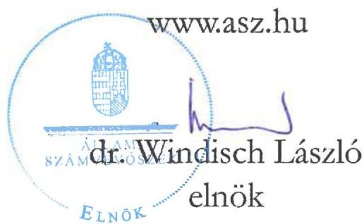
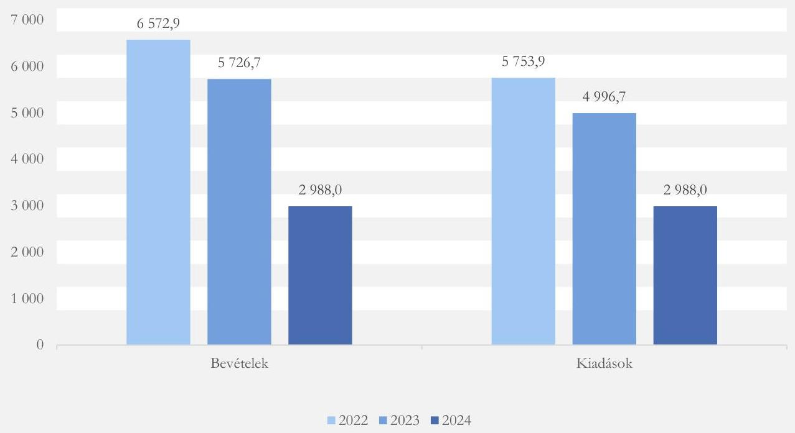
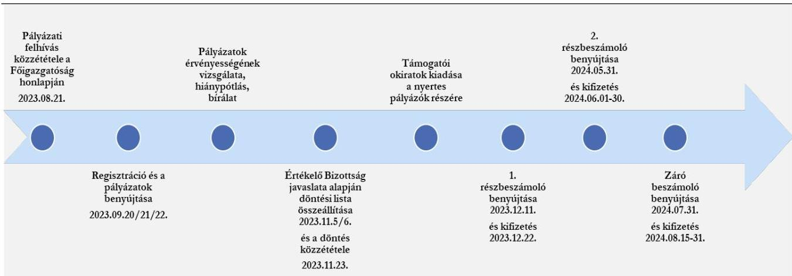

ÁLLAMI SZÁMVEVŐSZÉK

# JELENTÉS

A központi költségvetési szervek egyes informatikai beszerzéseinek célzott ellenőrzése

Társadalmi Esélyteremtési Főigazgatóság

2025.

25095

www.asz.hu

---

ÁLLAMI SZÁMVEVŐSZÉK

# JELENTÉS

A központi költségvetési szervek egyes informatikai beszerzéseinek célzott ellenőrzése

Társadalmi Esélyteremtési Főigazgatóság

2025.

25095

---

Jelentéseink az interneten a www.asz.hu címen olvashatók.

ELLENŐRZÉSI IGAZGATÓSÁG:
ELLENŐRZÉSI IGAZGATÓSÁG I.

ELLENŐRZÉSI IGAZGATÓ:
SINKÁNÉ DR. CSENDES ÁGNES igazgató

ELLENŐRZÉSVEZETŐ:
TÓTH GERGELY ellenőrzésvezető

IKTATÓSZÁM: EL-4143-018/2025
TÉMASORSZÁM: 13
ELLENŐRZÉS-AZONOSÍTÓ SZÁM: V114502

---

TARTALOMJEGYZÉK

- AZ ELLENŐRZÉS ALAPADATAI ... 5
- AZ ELLENŐRZÉS HATÓKÖRE ÉS TERÜLETE ... 7
- ÖSSZEFOGLALÁS ... 10
- AZ ELLENŐRZÉS FÓKUSZTERÜLETEI ... 12
- MEGÁLLAPÍTÁSOK ... 13
- JAVASLATOK ... 25
- MELLÉKLETEK ... 26
- I. sz. melléklet: Értelmező szótár ... 26
- II. sz. melléklet: Az ellenőrzött szervezetek jegyzéke ... 27
- III. sz. melléklet: Ellenőrzési kritériumok ... 28
- FÜGGELÉK: ÉSZREVÉTELEK ... 29
- RÖVIDÍTÉSEK JEGYZÉKE ... 30

---

“哈，你是个小伙子，你是个小伙子，你是个小伙子，你是个小伙子，你是个小伙子，你是个小伙子，你是个小伙子，你是个小伙子，你是个小伙子，你是个小伙子，你是个小伙子，你是个小伙子，你是个小伙子，你是个小伙子，你是个小伙子，你是个小伙子，你是个小伙子，你是个小伙子，你是个小伙子，你是个小伙子，你是个小伙子，你是个小伙子，你是个小伙子，你是个小伙子，你是个小伙子，你是个小伙子，你是个小伙子，你是个小伙子，你是个小伙子，你是个小伙子，你是个小伙子，你是个小伙子，你是个小伙子，你是个小伙子，你是个小伙子，你是个小伙子，你是个小伙子，你是个小伙子，你是个小伙子，你是个小伙子，你是个小伙子，你是个小伙子，你是个小伙子，你是个小伙子，你是个小伙子，你是个小伙子，你是个小伙子，你是个小伙子，你是个小伙子，你是个小伙子，你是个小伙子，你是个小伙子，你是个小伙子，你是个小伙子，你是个小伙子，你是个小伙子，你是个小伙子，你是个小伙子，你是个小伙子，

---

AZ ELLENŐRZÉS ALAPADATAI

## AZ ELLENŐRZÉS CÉLJA

Az ellenőrzés célja annak értékelése volt, hogy a Társadalmi Esélyteremtési Főigazgatóság kiválasztott informatikai célú beszerzésére szabályszerűen került-e sor, a kapcsolódó döntés megalapozott és célszerű volt-e, és a beszerzés megvalósította-e az elérni kívánt célkitűzést.

## AZ ELLENŐRZÉS TÍPUSA

Kombinált ellenőrzés

## AZ ELLENŐRZŐTT IDŐSZAK

A 2022-2023. évek, kitekintéssel az informatikai beszerzés előkészítésének időszakára, illetve a helyszíni ellenőrzés lezárásának időpontjáig, 2025. április 30-ig.

## AZ ELLENŐRZÉS TÁRGYA

Az ellenőrzés tárgyát képezte a Társadalmi Esélyteremtési Főigazgatóságnál a kiválasztott informatikai célú beszerzéshez kapcsolódóan a Főigazgatóság¹ belső szabályozási kereteinek a kialakítása és működtetése, a szervezet beszerzésre vonatkozó döntés-előkészítési és a beszerzés megvalósítási tevékenysége, valamint a beszerzés számviteli elszámolása és a beszerzés eredményeként megvalósult szolgáltatás használatbavétele, hasznosíthatósága a Főigazgatóság (köz)feladat ellátásával kapcsolatosan.

Az ellenőrzés kiterjedt továbbá minden olyan körülményre és adatra, amely az ÁSZ² jogszabályban meghatározott feladatainak teljesítéséhez, valamint a program végrehajtása folyamán felmerült újabb összefüggések feltárásához szükséges volt.

## AZ ELLENŐRZÉS JOGALAPJA

Az ellenőrzés jogszabályi alapját az ÁSZ tv.³ 1. § (3) bekezdésének és az 5. § (3) bekezdésének előírásai képezték.

## AZ ELLENŐRZÉS MÓDSZERE

Az ellenőrzést a nemzetközi standardokat irányadónak tekintve az ellenőrzési program szempontjai, az ellenőrzött időszakban hatályos jogszabályok, az ellenőrzés szakmai szabályok és módszertanok figyelembevételével végezte az ÁSZ.

5

---

Az ellenőrzés alapadatai

Az ellenőrzési kérdések megválaszolásához szükséges bizonyítékok megszerzése az ellenőrzött szervezet által rendelkezésre bocsátott dokumentumokra és adatokra alapozva, továbbá szemrevételezés, információkérés, interjú, valamint elemző eljárás útján történt. Az ellenőrzési bizonyítékként felhasználható adatforrások közé tartoztak egyrészt az ellenőrzéshez kért dokumentumok, adatforrások, másrészt adatforrás volt még minden – az ellenőrzés folyamán – feltárt, az ellenőrzés szempontjából információkat tartalmazó dokumentum.

Az ellenőrzés lefolytatásához a Főigazgatóság az ÁSZ által kért dokumentumok, adatok, információk megküldésével és a helyszíni ellenőrzés során szolgáltatott adatokat.

Az ellenőrzéshez a Főigazgatóság egy, a 2023. évben megvalósult informatikai célú szolgáltatás beszerzése került kiválasztásra a DKÜ Zrt.⁴ adatszolgáltatása keretében beérkezett adatok elemzése alapján. Az ellenőrzés kiterjedt az ellenőrzött informatikai célú beszerzés előzményeihez kapcsolódó minden olyan körülményre és adatra, amely a program végrehajtása folyamán felmerült újabb összefüggéseknek az ellenőrzés céljaival összhangban történő feltárása érdekében szükséges volt.

6

---

7

# AZ ELLENŐRZÉS HATÓKÖRE ÉS TERÜLETE

A központi költségvetési szervek a DKÜ rendelet⁵-ben foglaltak alapján kötelesek informatikai célú beszerzéseikhez kapcsolódóan éves beszerzési és fejlesztési terveket összeállítani, továbbá a tervezett, a rendkívüli és a tervmódosítást igénylő informatikai beszerzési igényüket a DKÜ Zrt. részére megküldeni. A DKÜ Zrt. a beszerzési igények vizsgálata, véleményezésre, jóváhagyásra történő előkészítése során beszerzési és jogi szempontokat is figyelembe vesz, ennek eredményéről értesítést küld a központi költségvetési szerv részére. A DKÜ Zrt. a „megfelelő” minősítésű beszerzési igény kielégítése érdekében a beszerzési eljárást vagy maga folytatja le, vagy visszaadja a központi költségvetési szerv saját hatáskörében történő lebonyolításra.

A Társadalmi Esélyteremtési Főigazgatóság a társadalmi felzárkózásért felelős miniszter irányítása alá tartozó, központi hivatalként működő, gazdasági szervezettel rendelkező központi költségvetési szerv, amely 2019. augusztus 1-jével az SZGYF⁶-ból az Áht.⁷ 11. § (3a) bekezdése szerinti kiválás útján jött létre. A jogállására, gazdálkodására, feladat- és hatáskörére vonatkozó részletes, ellenőrzött időszakban hatályos szabályokat a 180/2019. (VII. 26.) Korm. rendelet⁸ tartalmazta. Feladatellátása felett 2024. szeptember 1-jét megelőzően az 1297/2022. (VI. 17.) Korm. határozat⁹-tal kinevezett kormánybiztos szakmai irányítást gyakorolt. 2024. szeptember 1-jétől a BM¹⁰ szervezetében a társadalmi esélyekért és roma kapcsolatokért felelős önálló államtitkárság egyebek mellett ellátta a Főigazgatóság tevékenységének szakmai irányítását.

Az ellenőrzött időszakban a Főigazgatóság az Alaptörvény¹¹ XV. cikk (4) bekezdésében, valamint a 2003. évi CXXV. törvény¹²-ben foglaltak érvényre juttatása céljából a Magyar Nemzeti Társadalmi Felzárkózási Stratégiával összhangban ellátta a társadalmi felzárkózás képzési, szervezési, területi módszertani és kutatási feladatait. Ennek keretében közreműködött a társadalmi felzárkózási, esélyteremtési célú hazai, uniós és más nemzetközi finanszírozású programok szakmai előkészítésében. A Kormány által kijelölt településeken komplex programokkal támogatta a társadalmi felzárkózás folyamatát, ellátta a Biztos Kezdet Gyerekházak, a Tanoda program pályázatásával és finanszírozásával, a „Felzárkózó települések” hosszú távú programjával kapcsolatos feladatokat. Elősegítette a gyermekek és az ifjúság esélyegyenlőségét, szociális hátránykompenzációját, a hátrányos helyzetű felnőttek felzárkózását, a felzárkózási programok megvalósításában együttműködött a települési és nemzetiségi önkormányzatokkal, munkáltatókkal, egyházakkal, oktatási intézményekkel, szociális, valamint civil szervezetekkel, valamint közreműködött a roma nemzetiséghez kapcsolódó feladatok ellátásában. 2020. július 1-jétől a Főigazgatósághoz kerültek – az Áht. 11. § (3b) bekezdés a) pontja szerinti beolvadásos kiválasztással – az EMET¹³-től a társadalmi felzárkózással kapcsolatos költségvetési támogatások felhasználásának lebonyolításával foglalkozó szervezeti egységek és azok feladatai.

A Főigazgatóság központi szervre és területi egységekre tagozódott, a helyszíni ellenőrzés idején egy országos központtal, öt igazgatósággal, valamint 18 fejlesztési központtal és négy kirendeltséggel működött. Élén a főigazgató állt, akit feladatai ellátásában általános főigazgató-helyettes és gazdasági főigazgató-helyettes segített. Az ellenőrzött időszakban a szervezet első számú vezetőjének személyében 2024. augusztus 1-jével változás történt, a gazdasági vezető (gazdasági főigazgató-helyettes) személye nem változott.

A Főigazgatóság a Gandhi Gimnázium Közhasznú Nonprofit Kft. felett az 1/2022. (V. 26.) GFM rendelet¹⁴ alapján az ellenőrzött időszakban tulajdonosi jogokat gyakorolt. A Főigazgatóság az alaptevékenysége mellett 2021 májusától vállalkozási tevékenységet végzett, az ország gazdaságilag elmaradottabb térségeiben a helyi önkormányzatok vagy a helyi vállalkozók közreműködésével Termelő Műhelyeket hozott létre. A Főigazgatóság költségvetési és finanszírozási bevételeinek és kiadásainak alakulását az 1. ábra mutatja be.

---

Az ellenőrzés hatóköre és területe

1. ábra

A BEVÉTELEK ÉS KIADÁSOK ALAKULÁSA A 2022-2023. ÉVI KÖLTSÉGVETÉSI BESZÁMOLÓK TELJESÍTÉSI ADATAI, VALAMINT A 2024. ÉVI ELEMI KÖLTSÉGVETÉS ELŐIRÁNYZAT ADATAI ALAPJÁN (M FT)

Forrás: A Társadalmi Esélyteremtési Főigazgatóság 2022-2023. évi költségvetési beszámolói és 2024. évi elemi költségvetése alapján ÁSZ saját szerkesztés

A 152/2005. (VIII. 2.) Korm. rendelet¹⁵ alapján 2005 óta működő Útravaló Ösztöndíjprogram (a továbbiakban UTR¹⁶) négy alprogramon keresztül személyes mentori támogatást és ösztöndíjat nyújtott hátrányos helyzetű tanulók részére a lemorzsolódás megelőzése, a továbbtanulási utak megerősítése, valamint a felsőfokú végzettség megszerzése érdekében. Az ösztöndíjprogramban évente átlagosan 10 000 fő tanuló és mintegy 4000 fő mentor pedagógus vett részt. A BM, mint fejezetet irányító szerv a pályázati felhívással kapcsolatos eljárás lefolytatásával, a támogatásokkal kapcsolatos feladatok ellátásával – összhangban az Áht. 49. § előírásával – a 2019-ben létrejött Főigazgatóságot bízta meg, korábban a feladatot az EMET látta el. Az UTR köznevelést érintő három alprogramja (Út a középiskolába, Út az érettségihez, Út a szakmához) esetében a pályázatok lebonyolítása 2016 szeptembere óta az UTR pályázatkezelő rendszerben történt. A pályázatok benyújtására az UTR pályázati adatlap kitöltő felület szolgált, amely a 2020. évtől a Főigazgatóság honlapján vagy az UTR felület weboldalán volt elérhető. A 2019/2020. tanévre kiírt pályázatok elszámolását és a 2020/2021. évi pályázatok indítását már a Főigazgatóság bonyolította le ezen a rendszeren keresztül.

A társadalmi felzárkózással kapcsolatos költségvetési támogatások felhasználásának lebonyolításával foglalkozó szervezeti egységek és azok feladatai EMET-től történt átvétele során a feladatokhoz kapcsolódó informatikai infrastruktúra részeként az UTR pályázatkezelő rendszer átvételéről 2020 júniusában költségvetési megállapodás¹⁷-ban rendelkeztek.

Az ellenőrzés a Főigazgatóság 2023. évben megvalósult, már lezárult informatikai beszerzésére irányult, amelynek tárgya az UTR pályázatkezelő rendszer informatikai támogatására kötött szerződés, azaz egy informatikai szolgáltatási szerződés volt. Az informatikai célú beszerzés nem az üzemeltetésre irányult (a rendszer üzemeltetője a NISZ Zrt.¹⁸), hanem az UTR rendszer paraméterezésére, adathibák javítására.

A DKÜ Zrt. a Főigazgatóság „UTR support szerződés” tárgyú beszerzési igénye kielégítésére szolgáló eljárást saját hatáskörben történő lefolytatásra a szervezetnek visszaadta. A Főigazgatóság beszerzési igényét a

---

Az ellenőrzés hatóköre és területe

központosított közbeszerzési rendszerben a DKÜ Zrt. által megkötött keretmegállapodás¹⁹-ból, a Kbt.²⁰ 105. § (2) bekezdés c) pont szerinti verseny újranyitással valósította meg. A megkötött vállalkozási szerződés²¹ a mellékletét képező szolgáltatás- és árlistában nevesített elemekből álló szolgáltatás igénybevételére irányult. Az ellátandó feladatokat munkaórákban (205 üzleti elemző/rendszerszervező és 300 szoftverfejlesztő óra, összesen 505 óra mennyiségben) határozta meg a szerződés, bruttó 18,0 M Ft értékben.

Az ellenőrzés kiterjedt a Főigazgatóság beszerzésre vonatkozó belső szabályozása jogszabályi előírásoknak való megfelelésére, az informatikai szolgáltatás beszerzés előkészítésével és végrehajtásával kapcsolatos döntések megalapozottságának, célszerűségének ellenőrzésére, a számviteli elszámolás szabályszerűségének, a beszerzett szolgáltatás használatbavételének ellenőrzésére.

Az ellenőrzés hatóköre kiterjedt továbbá annak vizsgálatára, hogy a beszerzett szolgáltatás a Főigazgatóságnál alkalmazásra, hasznosításra került-e, betöltötte-e az elvárt funkcióját, támogatta-e a szervezet (köz)feladat ellátását, illetve célkitűzései elérését.

Az ellenőrzés nem terjedt ki a DKÜ Zrt. által megkötött keretmegállapodás szabályszerűségének ellenőrzésére.

Az ellenőrzött szervezet megnevezését a II. sz. melléklet tartalmazza.

---

10

# ÖSSZEFOGLALÁS

Napjainkban az informáciotechnológiai eszközök dinamikusan fejlődnek, a digitalizáció révén az állami szervezetek feladatellátása hatékonyabbá válhat, időt és erőforrásokat takaríthatnak meg működésük során. A széleskörű elektronizáció új és speciális informatikai eszközök, szolgáltatások folyamatos beszerzését igényli, amely jelentős anyagi ráfordítást, külső szakmai támogatást feltételez. A közpénzek rendeltetésszerű és eredményes felhasználása ezen a területen is jogosan felmerülő elvárás a társadalom részéről.

A hátrányos helyzetben lévő fiatalok tanulmányi sikerességének elősegítését célzó, 2005. év óta működő UTR kezelő szerveként a 2020. évtől a Főigazgatóság feladata volt évente mintegy 10 000 fő pályázó tanulót és mentoráit érintően a pályázati eljárás teljes folyamatának lebonyolítása. A pályázatok elektronikus úton történő benyújtására szolgáló és a pályázatkezelés folyamatát támogató informatikai rendszer támogatását a Főigazgatóság belső humán erőforrás hiányában külső szolgáltató igénybevételével, évente kötött support szerződések keretében biztosította. Az ellenőrzés keretében az ÁSZ a 2023. évben megkötött informatikai szolgáltatási szerződés kapcsán ellenőrizte a beszerzés megfelelőségét szabályszerűségi, célszerűségi és eredményességi kritériumok mentén.

A Főigazgatóság ellenőrzött informatikai célú beszerzése célszerű és eredményes volt, a beszerzés eredményeként igénybe vett informatikai szolgáltatás a Főigazgatóság feladatellátását, a pályázatkezelés folyamatának zavartalan ellátását támogatta. A beszerzés ugyanakkor nem volt szabályszerű a beszerzés végrehajtása folyamatában a szerződés és a szakmai teljesítésigazolás kapcsán feltárt hibák, hiányosságok miatt.

A Főigazgatóság a beszerzési tevékenység szervezeti kereteit és belső részletszabályait a jogszabályi előírásoknak megfelelően kialakította. Az ellenőrzött informatikai célú beszerzés előkészítése és a közbeszerzési eljárás lefolytatása a műszaki leírás tartalmi elemeinek meghatározása kivételével megfelelt a jogszabályi és belső szabályozói követelményeknek. A beszerzés végrehajtása tekintetében azonban az ellenőrzés a szerződés és a szakmai teljesítésigazolás kapcsán szabályszerűséget érintő hibákat, hiányosságokat tárt fel. A szerződés tartalmában nem felelt meg a jogszabályi és belső előírásoknak, nem tartalmazta az ellátandó feladatok részletes megnevezését, a szakmai, műszaki teljesítés minőségi jellemzőinek meghatározását, továbbá megkötésére a teljesítési határidőt követő dátummal került sor. A szakmai teljesítés igazolására nem a jogszabályi előírások betartásával került sor, mivel a teljesítésigazolásra jogosult a szakmai teljesítést annak ellenére igazolta, hogy a kiadás teljesítése jogosságának, összegszerűségének ellenőrzéséhez és igazolásához ellenőrizhető okmányok nem álltak rendelkezésre, és a feladatok elvégzésére elszámolt munkaóramennyiség jelentősen meghaladta a leigazolt teljesítési időszak alatt a szerződés szerint teljesíthető mennyiséget.

A vizsgált beszerzéssel érintett, a 2020. évben az EMET-től átvett UTR pályázatkezelő szoftver analitikus nyilvántartásba vételére a költségvetési megállapodás, valamint leltározására a Főigazgatóság belső szabályozójának előírása ellenére csak a 2024. évben került sor.

Az ellenőrzött informatikai célú beszerzés az elszámolás alapjául szolgáló bizonylatokon szereplő összegben, az egységes rovatrend jogszabályi előírásainak, valamint a Főigazgatóság belső szabályzatainak megfelelően került elszámolásra.

---

Összefoglalás

Az ellenőrzött informatikai célú beszerzésre irányuló döntéshozatalnál érvényesült a célszerűség, a beszerzés támogatta a Főigazgatóság közfeladatellátását, az UTR ösztöndíj támogatások biztosításával összefüggő feladatainak ellátását. A beszerzés eredményeként igénybe vett informatikai szolgáltatás megvalósította az elérni kívánt célkitűzést, biztosította a pályázatkezelés folyamata zavartalan lebonyolításának informatikai hátterét.

Az ellenőrzés ugyanakkor rávilágított arra, hogy a pályázatkezelési folyamat támogatására kialakított informatikai rendszer további automatizálása és a köznevelési tanulmányi alaprendszerrel való strukturált adatkapcsolat kiépítése lehetőséget teremtene a folyamatok egyszerűsítésére, a kézi adatfelvitelek számosságának csökkentésére, ezáltal az élőmunka kiváltására és az erőforrások hatékonyabb felhasználására, valamint a működési és pénzügyi kockázatok mérséklésére. Az integrált adathasználat és az adatkapcsolatok fejlesztése az ÁSZ véleménye szerint elősegítené a valós idejű adatalapú döntéshozatalt, az elszámoltathatóság erősítését, valamint a visszaélések lehetőségének megelőzését is).

11

---

12

# AZ ELLENŐRZÉS FÓKUSZTERÜLETEI

1. A központi költségvetési szerv informatikai célú beszerzésének szabályszerűsége
2. A központi költségvetési szerv informatikai célú beszerzésének célszerűsége és eredményessége

---

MEGÁLLAPÍTÁSOK

# 1. A központi költségvetési szerv informatikai célú beszerzésének szabályszerűsége

## Összegző megállapítás

A Főigazgatóság a beszerzési tevékenység kereteit a jogszabályi előírásoknak megfelelően kialakította. A szerződés tartalmi elemeinek hibái, hiányosságai, és a szakmai teljesítésigazolás szabálytalansága miatt az ellenőrzött informatikai célú beszerzés összességében nem volt szabályszerű.

## A Főigazgatóság beszerzési tevékenységének szabályozottsága megfelelő volt.

A Főigazgatóság beszerzésekkel kapcsolatosan feladatokat ellátó szervezeti egységeinek feladatait, a nevesített munkakörökhöz tartozó feladat- és hatásköröket a szervezet ellenőrzött időszakban hatályos SZMSZ²²-e, gazdasági szervezetének ügyrendje²³, az UTR pályázatok lebonyolításáért felelős szakterület ügyrendje²⁴, valamint az informatikai feladatokat ellátó szervezeti egység ügyrendje²⁵ tartalmazta, az Ávr.²⁶ előírásainak megfelelően. Az SZMSZ a gazdasági főigazgató-helyettest nevesítette a beszerzések és közbeszerzések jogszerségének felügyeletéért felelősként, és rendelkezett az Informatikai osztály informatikai beszerzésekben való közreműködésről.

Az ellenőrzött időszakban hatályos közbeszerzési szabályzat²⁷ és a beszerzési szabályzat²⁸ tartalmazta a beszerzések előkészítésében és lefolytatásában részt vevő szervezeti egységek által ellátott feladatok munkafolyamatainak leírását, illetve azokat a Bkr.²⁹ előírásainak megfelelően **ellenőrzési nyomvonal**ban rögzítették.

A Főigazgatóság meghatározta az etikai elvárásokat a szervezet munkatársai számára a Bkr. előírásának megfelelően. A belső kontroll szabályzat³⁰ a szakmai felkészültséget, a pártatlanságot és elfogulatlanságot, az erkölcsi feddhetetlenséget határozta meg a szervezet működésében érvényre juttatandó értékekként, valamint a közérdek előtérbe helyezését az egyéni érdekekkel szemben. Etikai elvárásként határozta meg továbbá a szervezet munkatársai számára a Magyar Kormánytisztviselői Kar Hivatásetikai Kódexe előírásainak betartását.

Az Áht. előírásainak megfelelően a Főigazgatóság rendelkezett a gazdálkodás részletes rendjét meghatározó szabályzattal. A **gazdálkodási szabályzat**³¹ keretében gondoskodott egyébek mellett a gazdálkodási jogkörök gyakorlásának szabályozásáról. A szabályzat tartalmazta a gazdálkodási jogkörök gyakorlásának módjával kapcsolatos belső előírásokat, dokumentációs részletszabályokat, valamint e jogköröket végző személyek kijelölésének rendjével kapcsolatos előírásokat az Ávr. előírásainak megfelelően. A szabályzat alapján kötelezettségvállalásra a szervezet nevében a főigazgató vagy az általa írásban felhatalmazott személy volt jogosult, a kötelezettségvállalások előzetes pénzügyi ellenjegyzésére a szabályzat a gazdasági főigazgató-helyettest vagy az általa írásban kijelölt személyt jogosította fel. A gazdálkodási jogkörök gyakorlására jogosult személyekről és aláírás-mintájukról az Ávr. előírásának megfelelően naprakész nyilvántartást vezettek.

13

---

Megállapítások

A Főigazgatóság belső szabályozóiban rendelkezett a közbeszerzések, valamint a Kbt. hatálya alá nem tartozó beszerzések lebonyolításának eljárásrendjéről, a Kbt. és az Ávr. előírásainak megfelelően. A közbeszerzési szabályzatban a Kbt. előírásának megfelelően a Főigazgatóság rendelkezett a közbeszerzési eljárások előkészítésének, lefolytatásának, belső ellenőrzésének felelősségi rendjéről, a nevében eljáró, illetve az eljárásba bevont személyek, szervezetek felelősségi köréről és az eljárások dokumentálási rendjéről, önálló fejezetben rendelkezett továbbá a DKÜ rendelet hatálya alá tartozó informatikai beszerzési eljárások lefolytatásának szabályairól. A szabályzatban meghatározták az eljárás során hozott döntésekért felelős személyeket, valamint az EKR³² alkalmazására vonatkozó jogosultságok gyakorlásának rendjét. A szabályzatban rendelkeztek arról, hogy a közbeszerzési eljárások megindításáról a beszerzésre, valamint az eljárás belső felelősségi rendjére vonatkozó információkat tartalmazó indítólap alapján a főigazgató dönt, az eljárást lezáró döntést a főigazgató vagy az általa meghatalmazott személy hozza meg.

A Főigazgatóság – a Számv. tv.³³ és az Áhsz.³⁴ előírásainak megfelelően – a számviteli politikával³⁵ összhangban elkészítette, és önálló belső szabályozók keretében kiadta az eszközök és források értékelési szabályzatát³⁶, valamint a leltárkészítési és leltározási szabályzatot³⁷. Az eszközök és források értékelési szabályzata rendelkezett egyebek mellett arról, hogy a mérlegben az immateriális javakat, tárgyi eszközöket a bekerülési értéken kell kimutatni, csökkentve az elszámolt terv szerinti és terven felüli értékcsökkenéssel, növelve a terven felüli értékcsökkenés visszaírt összegével, mely rendelkezés megfelel az Áhsz. előírásának. A leltárkészítési és leltározási szabályzatban meghatározták a leltározás előkészítésének és lebonyolításának feladatait, a leltározásban részt vevők felelősségét, a leltározás módját és dokumentációs részletszabályait.

A Számv. tv. és az Áhsz. előírásainak megfelelően a Főigazgatóság rendelkezett az egységes számlakeret alapján készült számlarend³⁸-del. A 2021. évben kiadott számlarend tartalmazta egyebek mellett a könyvvezetésre vonatkozó részletes előírásokat, a számlaosztályok tagolását, a könyvviteli zárlattal kapcsolatos feladatokat, határidőket, és a számlarendben foglaltakat alátámasztó bizonylati rendet. Tartalmazta továbbá a költségvetési és pénzügyi számvitel számláit érintő gazdasági események kontírozásának előírásait, a Számv. tv. előírásainak megfelelően.

Az ellenőrzött informatikai célú beszerzése során a Főigazgatóság a közbeszerzési eljárást a műszaki leírás tartalmi elemeinek meghatározása kivételével a jogszabályi és a belső irányító eszközeiben foglalt előírásoknak megfelelően folytatta le. A szerződés tartalmában nem felelt meg a jogszabályi és belső előírásoknak, megkötésére a teljesítési határidőt követően került sor, a szakmai teljesítésigazolás során a jogszabályi előírások maradéktalanul nem érvényesültek.

A közbeszerzési eljárás lefolytatására a Kbt. és a Főigazgatóság vonatkozó belső szabályozói előírásainak betartásával került sor. A közbeszerzési eljárás megindításáról a közbeszerzési szabályzat előírásainak megfelelő tartalommal előkészített indítólap alapján a főigazgató helyetteseként – az SZMSZ előírásának megfelelően, jogszerűen – eljáró általános főigazgató-helyettes döntött, a közbeszerzési szabályzat előírásainak megfelelően. A közbeszerzési szabályzat előírásának megfelelően a konkrét eljárás kapcsán az EKR-ben elvégzendő adminisztratív feladatok ellátásával megbízott akkreditált közbeszerzési tanácsadó feladatkörét a felelősségi rendben rögzítették.

A közbeszerzési eljárás becsült értéke a beszerzési igény DKÜ Zrt. részére történt benyújtásának időpontjában hatályos beszerzési átlagárak (a keretmegállapodással érintett összes szállító ajánlatának a számtani átlaga) alapján került meghatározásra, netto 14 692 906 Ft összegben. A közbeszerzési eljárás megindítására előzetes kötelezettségvállalásba vett fedezetigazolás birtokában került sor, a közbeszerzési szabályzat előírásainak megfelelően. A gazdasági főigazgató-helyettes a fedezet meglétét azt követően

14

---

Megállapítások

igazolta, hogy meggyőződött a K321 Informatikai szolgáltatások igénybevétele rovaton a beszerzési igény nettó értékének megfelelő szabad előirányzat rendelkezésre állásáról, az Áht. előírásának megfelelően. A közbeszerzési szabályzat rendelkezéseinek megfelelően kibocsátott fedezetigazolás szerint a lefolytatni tervezett beszerzési eljárás pénzügyi fedezete a Főigazgatóság 2023. évi költségvetésében saját forrásból rendelkezésre állt, nettó 14 692 906 Ft + 1,5% beszerzési díj összértékben. A közbeszerzési eljárás megindításához kibocsátott fedezetigazolás alapján a kötelezettségvállalás előzetes nyilvántartásba vételére az Ávr. és a közbeszerzési szabályzat előírásainak megfelelően megtörtént.

A Főigazgatóság, mint ajánlatkérő a Kbt. előírásának megfelelően a DKÜ Zrt.-vel keretmegállapodást kötött összes ajánlattevőnek megküldte írásban az ajánlattételi felhívást, amely tartalmazta a Kbt. 105. § (3) bekezdésben meghatározott tartalmi elemeket, és az ajánlatok értékelésének szempontjaként a legalacsonyabb árat határozta meg.

A Kbt., valamint a közbeszerzési szabályzat előírásának megfelelően felállított négyfős bírálóbizottság elkészítette szakvéleményét és felterjesztette döntési javaslatát a döntéshozó főigazgató részére, a Kbt. előírásának megfelelően. Javaslatában a hiánypótlásra felhívott, de azt határidőre nem teljesítő ajánlattevők ajánlatát érvénytelennek minősítette, és megállapította, hogy az érvényes ajánlatok közül a Kbt. 76. § (2) bekezdés a) pont szerinti értékelési szempontra tekintettel a Grepton Zrt.³⁹ által képviselt közös ajánlattevők ajánlata volt a legkedvezőbb. Az eljárás eredményére vonatkozó, eljárást lezáró döntést a bírálóbizottság szakvéleménye alapján a főigazgató hozta meg, a közbeszerzési szabályzat előírásának megfelelően. A vállalkozási szerződés megkötésére a nyertes ajánlattevővel, a nyertes ajánlat tartalmának megfelelően került sor, a Kbt. előírásának megfelelően.

A kötelezettségvállalásra az Áht. és az Ávr. előírásai és a Főigazgatóság belső szabályozóiban foglaltak betartásával került sor. A vállalkozási szerződés tekintetében a kötelezettségvállalási jogkört – az Ávr., valamint az SZMSZ és a gazdálkodási szabályzat előírásainak megfelelően – a főigazgató gyakorolta. A főigazgató szerepelt a gazdálkodási jogkörök gyakorlására jogosult személyekről és aláírás-mintájukról az Ávr. előírásának megfelelően vezetett nyilvántartásban, a kötelezettségvállalás dokumentumán a nyilvántartással egyező aláírása szerepelt.

A kötelezettségvállalásra pénzügyi ellenjegyzést követően került sor, az Áht. előírásának megfelelően. A pénzügyi ellenjegyzés során érvényesültek a gazdálkodási jogkörök gyakorlására vonatkozó, az SZMSZ-ben és a gazdálkodási szabályzatban foglalt előírások. A vállalkozási szerződés tekintetében pénzügyi ellenjegyzőként a Gazdasági főosztály vezetője járt el, aki érvényes felhatalmazása alapján szabályszerűen gyakorolta a pénzügyi ellenjegyzési jogkörét.

A kötelezettségvállalás nyilvántartásba vételére az Áht. és az Ávr. előírásai szerint megtörtént, azonban az ellenőrzés a kötelezettségvállalás nyilvántartás tartalmával kapcsolatosan kisebb hiányosságot tárt fel, mivel az nem tartalmazta az Áhsz. 14. melléklet II. 4. pontjában előírt valamennyi adatot, úgy, mint az f) pontban meghatározott pénzügyi ellenjegyzésre vonatkozó adatokat, továbbá a g) pontban rögzített pénzügyi teljesítés dátumát, és az utalványozás dokumentumának azonosításához szükséges adatokat.

A vállalkozási szerződés tartalmi elemei összességében nem feleltek meg a jogszabályi előírásoknak és a Főigazgatóság vonatkozó belső szabályozásában foglaltaknak. A 2023. december 4-én megkötött vállalkozási szerződés az Ávr. előírásainak megfelelően az általános adatokon, feltételeken túl tartalmazta a teljesítés határidejét, a kifizetendő összeget, illetve a számlázás alapjául szolgáló egységárat, a pénzügyi teljesítés devizanemét, módját és feltételeit, valamint a kifizetés határidejét, tartalmazta továbbá a szerződő partner képviselőjének nyilatkozatát arra vonatkozóan, hogy átlátható szervezetnek minősült. A vállalkozási szerződés nem tartalmazta azonban a szakmai, műszaki teljesítés

15

---

Megállapítások

minőségi jellemzőinek meghatározását, az Ávr. 50. § (1) bekezdés a) pont és a szerződéskötési szabályzat⁴⁰ 15. d) pont előírása ellenére, és a szerződéskötési szabályzat ugyanezen előírása ellenére az ellátandó feladatok pontos, részletes megnevezését. A szerződés nem tartalmazta a teljesítés igazolására jogosult személy megjelölését sem, amellyel megsértette a szerződéskötési szabályzat 15. j) pontjában előírtakat.

Ezen kívül a szerződésben a teljesítés határideje korábbi volt a szerződés aláírásának dátumánál, mivel a szerződés 2. pontja a teljesítés határidejeként 2023. december 1. napját határozta meg, szolgáltató által történt aláírására azonban csak 2023. december 4-én került sor. A vállalkozási szerződés 1. pontja alapján a szerződés tárgya „a közbeszerzési dokumentáció részét és a Szerződés 1. sz. mellékletét képező műszaki leírásban meghatározott követelményeknek megfelelő, megrendelt szolgáltatás- és árlista szerint nevesített elemekből álló szolgáltatások” nyújtása volt, azonban a szerződés 1. sz. mellékletét képező szolgáltatás- és árlista csak a teljesítés mennyiségi jellemzőit, a megrendelt szoftverfejlesztő és üzleti elemző/rendszerszervező munkaórák számát határozta meg, a teljesítés minőségi jellemzői, azaz a műszaki leírásban meghatározott követelmények nem képezték részét a szerződésnek.

A közbeszerzési dokumentáció részét képező műszaki leírás tartalmában nem felelt meg a Kbt. 58. § (2) bekezdés, a 321/2015. (X. 30.) Korm. rendelet⁴¹ 46. § (4) bekezdés előírásainak, továbbá a közbeszerzési szabályzat 84. pontjában előírtaknak, mivel abban a teljesítés minőségi követelményeit, a megkövetelt feladatokat nem teljeskörűen és nem kellő pontossággal határozták meg ahhoz, hogy az megfeleljen az ajánlatkérő által igényelt rendeltetésnek, illetve hogy lehetővé tegye az ajánlattevők számára a szerződés tárgyának megállapítását. A műszaki leírásban az elvégzendő informatikai támogató feladatok meghatározása nem az adott pályázati ciklus során ténylegesen felmerülő pályázatkezelési feladatok és határidők figyelembevételével történt, azok nem a megfelelő tanév UTR pályázataira vonatkoztak. A műszaki leírásban foglaltak alapján a szolgáltató így olyan pályázatkezelési feladatok informatikai támogatására volt kötelezett, amelyek döntő többségének határideje a szerződéskötés 2023. december 4-i időpontjában már lejárt. A szolgáltató feladata a műszaki leírásban foglaltak szerint a 2022/2023-as és a 2023/2024-es pályázatok kezeléséhez kapcsolódó egyes paraméterezési, fejlesztési és support feladatok ellátása volt. A 2022/2023. tanévre kiírt UTR pályázatokra vonatkozó pályázati útmutató szerint a 2022/2023-as ösztöndíjak esetében a záró beszámolók benyújtásának határideje 2023. július 31., az ezek alapján teljesített záró kifizetések határideje 2023. augusztus 31. volt, így a 2022/2023-as ösztöndíjakkal kapcsolatban a műszaki leírásban meghatározott feladatok (pl. a záró beszámolók elérhetővé, beadhatóvá tétele a pályázók számára, a frissített KIRA⁴² adatok betöltése az UTR rendszerbe, a kifizetési listák elkészítése) a szerződéskötés időpontjában már okafogyottá váltak. A 2023/2024-es pályázatokhoz kapcsolódó support feladatok nagy része is (pl. a 2023/2024-es pályázatok meghirdetéséhez kapcsolódó regisztrációs, pályázati és hiánypótlási űrlapok elkészítése) a pályázati felhívások 2023. augusztus 21-i közzétételét megelőzően volt releváns és indokolt.

|  Az ÁSZ kedvező irányú változásként értékelte, hogy az UTR support szolgáltatás beszerzésére 2024. évre 2024. augusztus 22-én kötött vállalkozási szerződésben ésszerű, a szerződés szerinti teljesítést lehetővé tevő teljesítési határidőt (2024. december 1.) határoztak meg.  |
| --- |

---

Megállapítások

A Főigazgatóság nyilatkozata szerint az évről-évre ciklikusan jelentkező pályázatkezelési folyamatok december hónapban igényelnek informatikai beavatkozást, amit support szerződés igénybevételével tud a szervezet kezelni. A Főigazgatóság nyilatkozata szerint minden év december hónapjában az első részbeszámolók elfogadását követően történő első kifizetések teljesítése érdekében az UTR rendszer és a KIRA adatai között jelentkező eltérések/változások miatt szükséges javítások elvégzése a szolgáltató feladata, valamint módosítások, hibajavítások a Főigazgatóság munkatársai által év közben összegyűjtött igények alapján, továbbá a következő tanévre vonatkozóan a pályázati felület kialakítása, paraméterezése. Mindezek alapján az ellenőrzött vállalkozási szerződés teljesítésének időszakában, 2023 decemberében már a 2024/2025. tanév pályázati felületének kialakítása, illetve a folyamatban lévő 2023/2024. tanév II. félévében esedékes kifizetések informatikai támogatása volt a szolgáltató feladata a műszaki leírásban foglaltaktól eltérően.

A szerződés tartalmi hiányosságai (az ellátandó feladatok részletes leírásának és a teljesítés igazolására jogosult személy megjelölésének hiánya), továbbá az elvégzendő informatikai támogató feladatok műszaki leírásban szereplő, nem az adott pályázati ciklus során ténylegesen felmerülő pályázatkezelési feladatokhoz és határidőkhöz igazodó meghatározása tekintetében az ellenőrzés visszatérő szabálytalan gyakorlatot tart fel: a hibák, hiányosságok a Grepton Zrt.-vel az UTR support szolgáltatás beszerzésére a 2022. és 2024. években kötött szerződések esetében is fennálltak.

A szakmai teljesítés igazolása nem felelt meg az Ávr. előírásának. A teljesítést az igazolás dátuma és a teljesítés tényére történő utalás megjelölésével az arra jogosult általános főigazgató-helyettes igazolta. Az általános főigazgató-helyettes az Ávr. előírásának megfelelően rendelkezett a teljesítésigazolásra vonatkozó írásbeli felhatalmazással, a kötelezettségvállalóként eljáró főigazgató által a gazdálkodási szabályzat előírásai alapján szabályszerűen kiadott felhatalmazás alapján ügykör és értékhatár tekintetében korlátozás nélkül volt jogosult teljesítésigazolásra. A teljesítésigazolásra jogosult általános főigazgató-helyettes azonban – megsértve az Ávr. 57. § (1) bekezdés előírását – a szakmai teljesítést annak ellenére igazolta, hogy a kiadás teljesítése jogosságának, összegszerűségének ellenőrzéséhez és igazolásához ellenőrizhető okmányok nem álltak rendelkezésére, és a feladatok elvégzésére elszámolt munkaóramennyiség jelentősen meghaladta a teljesítési időszak alatt a szerződés szerint teljesíthető mennyiséget. A Főigazgatóság a szerződésben a teljesítés igazolásának alapjául a szolgáltató kötelezettségeként előírta az elszámolási időszakban elvégzett feladatokról tételés lista készítését. A szerződő felek a teljesítési időszak végén időelszámolást készítettek, amelyben rögzítették a 2023. december 11-ig elvégzett feladatok – műszaki leírásban foglaltakkal egyező – részletes leírását, valamint az egyes feladatok elvégzésére fordított erőforrások (munkaórák) mennyiségét a szerződésben előírt megbontás szerint (üzleti elemző/rendszerszervező és szoftverfejlesztő munkaórák), az elvégzett feladatokról tesztelési dokumentáció készült. A teljesítés igazolásának alapjául szolgáló időelszámolás azonban, a műszaki leíráshoz hasonlóan az elvégzett feladatokat nem a megfelelő időszak UTR pályázataira vonatkozóan határozta meg. Ezen túlmenően a vállalkozási szerződésben megrendelt és a szolgáltató által elszámolt 505 üzleti elemző/rendszerszervező és szoftverfejlesztő munkaóra a szerződésben rögzített feltételek mellett, azaz a szerződés 2. sz. mellékletét képező szakember listában szereplő 4 fő fejlesztő szakemberrel kalkulálva a 2023. december 12-én kiállított teljesítésigazolásban hivatkozott 2023. december 4-től 11-ig tartó teljesítési időszak (6 munkanap / 8 naptári nap) alatt nem volt teljesíthető (az 505 munkaóra teljesítése a szerződés szerinti 4 fő informatikai szakember számára a 8 naptári nap alatt folyamatosan napi 16 órás feladatot jelentett volna). Az egyes support feladatok elvégzését alátámasztó dokumentumok (az UTR pályázatok lebonyolításáért felelős szakterület munkatársainak a szolgáltató szakembereivel folytatott levelezései) alapján a szolgáltató az elszámolt 2023.

17

---

Megállapítások

december 4-től 11-ig tartó teljesítési időszakon túl (2024. január hónapban) is ellátott az UTR rendszer informatikai támogatásával kapcsolatos feladatokat, továbbá a dokumentumok alapján feladatot ellátó fejlesztők személye nem egyezett a szerződés 2. sz. mellékletét képező szakember listában szereplő szakemberekkel. A teljesítésigazolásban hivatkozott 2023. december 4-től 11-ig tartó teljesítési időszak a ténylegesen elvégzett feladatokat figyelembe véve a Főigazgatóság nyilatkozata szerint sem volt reális. Mindezekre tekintettel az ellenőrzés véleménye szerint az egyes support feladatok elvégzését igazoló dokumentumok a szerződés szerinti teljesítést az elszámolt teljesítési időszak alatt nem támasztották alá. Az ÁSZ véleménye szerint az ellenőrzött informatikai célú beszerzés vonatkozásában a beszerzési eljárás és a szerződéskötés elhúzódása (a beszerzési igény 2023. július 20-án merült fel, a szerződés megkötésére azonban csak 2023. december 4-én került sor) nem biztosította a szerződés szerinti teljesítést.

**Pénzügyi teljesítésre** a szolgáltató által szabályszerűen kiállított számlán szereplő összegben, a szerződés 5. pontjában rögzített határidőben, szabályszerű utalványozás alapján került sor, az Áht. előírásának megfelelően.

**Az ellenőrzött informatikai célú beszerzés az elszámolást alátámasztó bizonylaton szereplő összegben, az egységes rovatrend előírásainak és a Főigazgatóság számlarendjében foglaltaknak megfelelően került elszámolásra.**

A társadalmi felzárkózással kapcsolatos költségvetési támogatások felhasználásának lebonyolításával foglalkozó szervezeti egységek és azok feladatai EMET-től történt átvétele során a feladatokhoz kapcsolódó informatikai infrastruktúra részeként az ellenőrzött informatikai célú beszerzés tárgyát képező UTR pályázatkezelő rendszer átvételéről 2020. júniusában költségvetési megállapodásban rendelkeztek. A költségvetési megállapodás 3. számú melléklete sorolta fel az átadás-átvételre került tárgyi eszközöket (bútorok, informatikai eszközök) és szoftvereket, amelyek között szerepelt az UTR pályázatkezelő szoftver.

A Főigazgatóság az UTR pályázatkezelő szoftver analitikus nyilvántartásba vételéről az EMET-től való átvételét követően a költségvetési megállapodás 4.1. pont előírása ellenére nem gondoskodott. A megállapodás hivatkozott pontja a nyilvántartásba vétel határidejeként 2020. július 15. napját írta elő. A Főigazgatóság nyilatkozata szerint az UTR rendszer nyilvántartásba vételére csak 2024-ben került sor, amikor a 2024. évben végrehajtott informatikai fejlesztés értékét az eszközre aktiválták, a korábbi években nem történt olyan informatikai fejlesztés, aminek az értékét rá kellett volna aktiválni az UTR szoftverre. A végrehajtott fejlesztés üzembe helyezését a 2024. évben a Főigazgatóság hitelt érdemlő módon dokumentálta, a Számv. tv. előírásának és a számviteli politikában foglaltaknak megfelelően. A Főigazgatóság a leltárkészítési és leltározási szabályzat előírásainak megfelelően a 2024. évben – a Számv. tv. és a szabályzat előírásainak megfelelően három évente – végzett leltározás során gondoskodott az immateriális javak leltározásáról, azok 2024. december 31. fordulónapi leltára tartalmazta az UTR pályázatkezelő szoftvert (az eszköz a 2021. évi leltár tetelei között nem szerepelt).

A gazdasági esemény **számviteli elszámolását** alátámasztó bizonylatok (számla és az utalványozás végrehajtását igazoló dokumentum) összességében tartalmazták a gazdasági eseményre vonatkozóan a könyvvitelben rögzítendő adatokat és megfeleltek a bizonylat általános alaki és tartalmi követelményeinek, a Számv. tv. előírásának megfelelően. A számlán nem került feltüntetésre a Számv. tv. 167. § (1) bekezdés h) és i) pont előírásaival ellentétben a könyvelés módjára, az érintett könyvviteli számlákra történő hivatkozás, és a könyvviteli nyilvántartásokban történt rögzítés időpontja, igazolása, a számlához hozzárendelhető kiadási utalványon ugyanakkor szerepelt a kiadás egységes rovatrend és kormányzati

18

---

Megállapítások

funkció szerinti száma, valamint a terheléssel (kifizetéssel) érintett pénzeszköz Áhsz. szerinti könyvviteli számlájának száma, az Ávr. előírásának megfelelően.

A Főigazgatóság a gazdasági esemény költségvetési könyvvezetés szerinti elszámolására az egységes rovatrend előírásainak megfelelő nyilvántartási számlákat, illetve pénzügyi könyvvezetés szerinti elszámolására a megfelelő könyvviteli számlákat alkalmazta, az Áhsz. előírásainak és a hatályos számlarendjében foglaltaknak megfelelően. A vállalkozási szerződés alapján teljesített kifizetés számviteli elszámolására vonatkozó adatokat az 1. táblázat mutatja be.

1. táblázat
A VÁLLALKOZÁSI SZERZŐDÉS ALAPJÁN KIFIZETETT ÖSSZEGEK ELSZÁMOLÁSA (FT)

|  TÉTEL MEGNEVEZÉSE | ROVAT | ÖSSZEG  |
| --- | --- | --- |
|  Teljesített informatikai szolgáltatás nettó értéke | K321 Informatikai szolgáltatások igénybevétele | 14 002 500  |
|  1,5% közbeszerzési díj | K355 Egyéb dologi kiadások | 210 038  |
|  ÁFA | K351 Működési célú előzetesen felszámított általános forgalmi adó | 3 837 385  |
|  Összesen |  | 18 049 923  |

Forrás: K3 főkönyvi számla forgalmi adatai alapján ÁSZ saját szerkesztés

A K3 Dologi kiadások főkönyvi számla adatai a 2023. évről készült éves költségvetési beszámolóban szereplő adatokat alátámasztották, az ellenőrzött informatikai célú beszerzés elszámolt tételeit tartalmazó főkönyvi számla egyenlege az éves költségvetési beszámoló 01 űrlapján (K1-K8 Költségvetési kiadások) kimutatott K3 Dologi kiadások teljesítési adatával egyezést mutatott.

Az ellenőrzési megállapítások alapján az ellenőrzött informatikai célú beszerzés végrehajtásával, valamint számviteli elszámolásával kapcsolatos hiányosságokat és szabálytalanságokat a 2. ábra foglalja össze.

---

Megállapítások

2. ábra

|  AZ ELLENŐRZŐTT INFORMATIKAI CÉLÚ BESZERZÉS SZABÁLYSZERŰSÉGÉVEL
KAPCSOLATBAN TETT MEGÁLLAPÍTÁSOK  |   |   |
| --- | --- | --- |
|  ESEMÉNY | MEGFELELŐSÉG | MEGJEGYZÉS  |
|  Kötelezettségvállalás | ! | Kötelezettségvállalóként az arra jogosult szabályszerűen járt el, a kötelezettségvállalás nyilvántartásba vételére szabályszerűen megtörtént. A vállalkozási szerződés tartalmi elemei összességében nem feleltek meg a jogszabályi és belső előírásoknak, nem tartalmazta az ellátandó feladatok pontos, részletes megnevezését és a teljesítés igazolására jogosult személy megjelölését az Ávr. és a szerződéskötési szabályzat előírása ellenére, továbbá a teljesítés határideje korábbi volt a szerződés aláírásának dátumánál.  |
|  Pénzügyi ellenjegyzés | ✓ | A kötelezettségvállalás pénzügyi ellenjegyzést követően történt, eleget téve az Áht. előírásának. A pénzügyi ellenjegyzés során érvényesültek a gazdálkodási jogkörök gyakorlására vonatkozó belső előírások.  |
|  Szakmai teljesítésigazolás | × | A szakmai teljesítés igazolása nem felelt meg az Ávr. előírásának, a kiadás teljesítése jogosságának, összegszerűségének ellenőrzéséhez és igazolásához ellenőrizhető okmányok nem álltak a teljesítésigazoló rendelkezésére, és az elvégzett feladatokra elszámolt munkaóramennyiség jelentősen meghaladta a teljesítési időszak alatt a szerződés szerint teljesíthető mennyiséget.  |
|  Nyilvántartás, leltározás | × | Az UTR pályázatkezelő szoftver analitikus nyilvántartásba vételéről az EMET-től való átvételét követően a Főigazgatóság a költségvetési megállapodás előírása ellenére nem gondoskodott, nyilvántartásba vételére és leltározására csak 2024-ben került sor (az eszköz a 2021. évi leltár tetelei között nem szerepelt).  |
|  Számviteli elszámolás | ✓ | Az ellenőrzött informatikai célú beszerzés az elszámolást alátámasztó bizonylaton szereplő összegben, az egységes rovatrend előírásainak és a Főigazgatóság számlarendjében foglaltaknak megfelelően került elszámolásra.  |
|  Jelmagyarázat:
✓ Szabályszerű
✓ Részben szabályszerű
× Nem szabályszerű |  |   |

Forrás: ÁSZ saját szerkesztés

# 2. A központi költségvetési szerv informatikai célú beszerzésének célszerűsége és eredményessége

## Összegző megállapítás

A Főigazgatóság ellenőrzött informatikai célú beszerzése a műszaki leírás tartalmi elemeinek meghatározása kivételével megfelelően előkészített, a beszerzésre vonatkozó döntés megalapozott, dokumentumokkal alátámasztott volt. A beszerzéssel kapcsolatos adatszolgáltatási és beszámolási kötelezettségét a Főigazgatóság a beszerzésre vonatkozó igény benyújtása kivételével a jogszabályi előírásoknak megfelelően, határidőben teljesítette. A beszerzésre irányuló döntéshozatalnál érvényesült a célszerűség, a beszerzés támogatta a szervezet közfeladatellátását. A beszerzés eredményes volt, az igénybe vett informatikai szolgáltatás biztosította a pályázatkezelési folyamat zavartalan lebonyolításának informatikai hátterét.

Az ellenőrzött informatikai célú beszerzés a műszaki leírás tartalmi elemeinek meghatározása kivételével megfelelően előkészített, a beszerzésre vonatkozó döntés megalapozott, dokumentumokkal alátámasztott volt. A Főigazgatóság a beszerzésre vonatkozó igényét a DKÜ rendeletben meghatározott határidőn túl nyújtotta be a DKÜ Zrt. felé. A beszerzési eljárás

---

Megállapítások

eredményéről szóló döntés és a megkötött vállalkozási szerződés másolatát, illetve a szerződés teljesítéséről történő beszámolást a jogszabályi határidőn belül feltöltötte a DKÜ Portál⁴³-ra.

A Főigazgatóság informatikai beszerzései során a DKÜ rendelet 1. § (2) bekezdés a) pontja alapján a rendelet előírásai szerint volt köteles eljárni, nem kapott felmentést a rendeletben foglalt központosított közbeszerzési eljárási szabályok alkalmazása alól. A 2023. évre vonatkozóan a Főigazgatóság a DKÜ Portálon meghatározott struktúra és adattartalom szerint részletezve elkészítette éves informatikai beszerzési és fejlesztési tervét, és azt a DKÜ rendelet előírásának megfelelően határidőben, 2022. szeptember 29-én megküldte a DKÜ Zrt. részére. 2023. évi informatikai beszerzési és fejlesztési terve tartalmazott tervezett eljárást az ellenőrzött informatikai célú beszerzésre vonatkozóan a „000031 UTR szakrendszer support szolgáltatásának beszerzése” tervsoron. A Főigazgatóság az „UTR Support szerződés” tárgyú beszerzésre vonatkozó igényének benyújtása során nem a jogszabály rendelkezései szerint járt el, mivel azt a DKÜ rendelet 7. § b) pont előírása ellenére az igény felmerülését követő öt munkanapon túl, 2023. augusztus 31-én nyújtotta be a DKÜ Zrt. részére, miközben az UTR pályázatok lebonyolításáért felelős szakterület a 2023. évre vonatkozó support szerződés megkötését a gazdálkodási szabályzat előírásának megfelelően igénybejelentő bizonylaton 2023. július 20-án kezdeményezte.

A Főigazgatóság a beszerzést a műszaki leírás tartalmi elemeinek meghatározása kivételével megfelelően előkészítette, a beszerzési igényt megalapozta és dokumentumokkal alátámasztotta. A műszaki leírásban az elvégzendő informatikai támogató feladatok nem a megfelelő tanév UTR pályázataira vonatkoztak, így a dokumentum döntő többségében a szerződéskötés időpontjában már okafogyottá vált feladatokat tartalmazott. A beszerzési igényre vonatkozó dokumentáció tartalmazta az igényfelmerülés körülményeit, a szervezet feladatellátásához és célkitűzéseihez való illeszkedésének indokait. Az UTR pályázatkezelő rendszer tekintetében a support szerződés megkötését, amely a pályázatkezelési folyamatok ciklikusságához igazodó, évente jelentkező rendszeres feladat, a szakterület azzal indokolta, hogy a rendszer informatikai támogatását – az informatikai szakterület létszámát, szakmai kompetenciáit figyelembe véve – a Főigazgatóság saját erőforrásból nem tudta megoldani. A Főigazgatóság felmérte a tervezett beszerzés várható költségeit és kapcsolódó költséghatásait, az eljárás becsült értékét a vonatkozó keretmegállapodással érintett összes szállító ajánlatának a számítani átlaga alapján határozta meg, a szükséges pénzügyi fedezet rendelkezésre állásáról előzetesen meggyőződött. A Főigazgatóság az ellenőrzési nyomvonalában az informatikai szolgáltatások, eszközök beszerzésének előkészítése folyamatához kapcsolódóan két kockázati tényezőt azonosított (hiányos vagy pontatlan adatszolgáltatás, határidő be nem tartása), és meghatározta az egyes kockázatok elkerülése érdekében szükséges intézkedéseket (adatok pótlása vagy kijavítása iránti intézkedés, illetve folyamatos nyomon követés, mérföldkövek meghatározása és az ezekhez meghatározott határidők betartásának ellenőrzése). Az ellenőrzött informatikai célú beszerzésre vonatkozóan az ellenőrzési nyomvonalban meghatározott intézkedések végrehajtását igazoló dokumentumot a Főigazgatóság nem bocsátott az ellenőrzés rendelkezésére.

A DKÜ Zrt. a Főigazgatóság „UTR Support szerződés” tárgyú beszerzési igényét vizsgálat alá vonta és a DKÜ rendelet 9. § (4) bekezdése alapján megfelelőnek minősítette, a beszerzési eljárást saját hatáskörben történő lefolytatásra a Főigazgatóságnak visszaadta. A Főigazgatóság a beszerzési eljárást a DKÜ rendelet előírásainak megfelelően szabályszerűen, a vizsgálat eredményéről történt tájékoztatást (2023. szeptember 12.) követően, 2023. október 9-én indította meg az ajánlati felhívás kiküldésével.

A Főigazgatóság a DKÜ rendelet előírásainak megfelelően a beszerzési eljárás eredményéről 2023. november 2-án hozott döntés másolatát, valamint a beszerzési eljárás eredményeképpen 2023. december

21

---

Megállapítások

4-én megkötött szerződés másolatát a döntést, illetve a szerződéskötést követő 10 munkanapon belül feltöltötte a DKÜ Portálra, továbbá a DKÜ rendeletben előírt, a teljesítést követő 10 munkanapos határidőn belül, 2023. december 13-án számot adott a megkötött szerződés teljesítéséről, amelynek teljesítésigazoláson szereplő végdátuma 2023. december 11. volt.

A 2023. év informatikai fejlesztéseinek és beszerzéseinek tapasztalatairól a Főigazgatóság, a DKÜ rendelet előírásának megfelelően, 2024. január 25-én beszámolt a DKÜ Zrt.-nek.

Az ellenőrzött informatikai célú beszerzésre irányuló döntéshozatalnál érvényesült a célszerűség, a beszerzés támogatta a szervezet közfeladatellátását, az UTR ösztöndíj támogatások biztosításával összefüggő feladatainak ellátását, a pályázatkezelési folyamat informatikai támogatásának biztosításával külső erőforrás bevonásával.

A Főigazgatóság a 180/2019. (VII. 26.) Korm. rendelet előírásának megfelelően, a költségvetési fejezetet irányító szervvel kötött lebonyolítói megállapodások alapján az ellenőrzött időszakban ellátta a társadalmi felzárkózást elősegítő költségvetési támogatások lebonyolításával kapcsolatos feladatokat. Ennek keretében gondoskodott az UTR ösztöndíj támogatások biztosításával összefüggő feladatok lebonyolításáról a pályázatkezelés teljes folyamatának végrehajtásával, a pályázati felhívások közzétételétől a befogadott és érvényes pályázatok elbírálásának előkészítésén és a nyertes pályázatokra vonatkozó döntés közzétételén keresztül a támogatások több részletben történő folyósításáig a támogatott pályázók beszámolóinak elfogadását követően. A lebonyolítói megállapodások szerinti pályázatással kapcsolatos feladatok ellátását a Főigazgatóság – a BM, mint irányító szerv vezetője által – 2023. évre jóváhagyott munkaterve is tartalmazta. A pályázati ciklus teljes folyamatát, a 2023/2024. tanévre vonatkozó pályázatok lebonyolításának főbb mérföldköveit a 3. ábra mutatja be.

3. ábra

A 2023/2024. TANÉVRE VONATKOZÓ UTR PÁLYÁZATOK LEBONYOLÍTÁSÁNAK FOLYAMATA

Forrás: Lebonyolítói megállapodások és pályázati útmutató alapján ÁSZ saját szerkesztés

Az ellenőrzött informatikai célú beszerzés tárgya a pályázatok elektronikus úton történő benyújtására szolgáló és a pályázatkezelés teljes folyamatát támogató, webes felületen elérhető UTR rendszer informatikai támogatása volt, amely alapvetően a rendszer paraméterezésére, illetve az adathibák javítására irányult a közbeszerzési dokumentáció részét képező műszaki leírás alapján. A pályázati folyamat évről-évre visszatérő ciklikussága és az UTR-re vonatkozó jogszabályi környezet (152/2005. (VIII. 2.) Korm. rendelet) viszonylagos változatlansága miatt az informatikai támogató feladatok keretében minden évben az UTR pályázatok lebonyolításáért felelős szakterület munkatársai által évközben összegyűjtött hibák javításán túl a következő tanévre vonatkozó pályázati felület kialakítása érdekében szükséges

22

---

Megállapítások

paraméterezéseket kellett elvégezni, amit a Főigazgatóság külső szolgáltató igénybevételével biztosított. A Főigazgatóság nyilatkozata szerint a 4 fő létszámú informatikai szakterület a – 2023. évi éves költségvetési beszámoló adatai alapján 199 fő átlagos statisztikai állományi létszámmal rendelkező, és az uniós projektek keretében további 244 fő határozott idejű munkavállalót foglalkoztató – szervezetben kizárólag az informatikai üzemeltetés feladatait tudta ellátni, belső erőforrásból történő fejlesztésre, illetve a Főigazgatóság feladatellátása során használt informatikai rendszerek támogatására sem szaktudás, sem szakember, sem forrás nem állt rendelkezésre, az ellenőrzött informatikai célú beszerzés tárgyát képező feladatok belső erőforrásból történő megvalósítása nem volt biztosított. Mindezek alapján az ÁSZ véleménye szerint az ellenőrzött informatikai célú beszerzés összhangban állt a Főigazgatóság közfeladat ellátásával, annak jogszabályban előírt tevékenységét támogatta, az informatikai támogató feladatok ellátásához külső szolgáltató igénybevétele az ÁSZ véleménye szerint indokolt volt.

## A beszerzés eredményeként igénybe vett informatikai szolgáltatás megvalósította az elérni kívánt célkitűzést, biztosította az UTR pályázatok zavartalan lebonyolításának informatikai hátterét.

Az UTR ösztöndíj támogatási folyamat magába foglalta a mentor (pedagógus) és feladatellátási hely (iskola) regisztrációk kezelését, a pályázatok benyújtásának kezelését, a pályázatok hiánypótlását és értékelését, a döntéshozatali eljárást, a szakmai előrehaladás nyomon követését és a pénzügyi teljesítéshez kapcsolódó feladatokat. A Főigazgatóság ellenőrzött informatikai célú beszerzéssel elérni kívánt célja a közbeszerzési dokumentáció részét képező műszaki leírás alapján a teljes pályázati folyamatot támogató UTR pályázatkezelő rendszer alkalmazás támogatásának és teljes fejlesztői támogatásának (pályázatok paraméterezése a meghirdetéstől a záró beszámolóig minden pályázati eljárásrendi lépést lefedve) biztosítása volt, ami a beszerzés eredményeként a 2023. évre igénybe vett informatikai szolgáltatás keretében megvalósult.

2021 óta a Főigazgatóság kizárólag elektronikusan, a pályázati felületre feltöltve fogadta be a pályázati dokumentumokat, továbbá a hiánypótlatás és a pályázattal kapcsolatos minden egyéb kommunikáció is az UTR felületen keresztül, elektronikus úton történt, a pályázatkezelés folyamatában azonban a helyszíni ellenőrzés idején is sok volt a manuális feladat. A Főigazgatóság nyilatkozata szerint a szeptember-decemberi időszakban a hiánypótlatás, a pályázatok elbírálása és az első kifizetések teljesítése jelentős többletmunkát igényelt az UTR pályázatok lebonyolításáért felelős szakterület munkatársai részéről, illetve ebben az időszakban a feladatok határidőben történő végrehajtása érdekében más szervezeti egységeknek is részt kellett venniük a feladatellátásban.

Manuálisan történt a pályázó tanulók tanulmányi eredményét igazoló, KRÉTA⁴⁴ rendszerből letöltött dokumentumok (bizonyítvány) feltöltése és a tanulmányi eredmények berögzítése az UTR pályázati felületre a mentor pedagógusok részéről, illetve azok adatainak összevetése, kontrollja a Főigazgatóság munkatársai részéről. A pályázatok bírálata folyamatában a Főigazgatóság munkatársai a döntési javaslat elkészítéséhez az UTR rendszerből exportálták az érvényes pályázatot benyújtók listáját („döntési excel”), majd a BM gondoskodáspolitikáért felelős államtitkára által jóváhagyott döntési listát visszatöltötték a rendszerbe, amely azon túl, hogy manuális beavatkozást igényelt, nem

Az UTR felület és a KRÉTA rendszer közötti adatkapcsolat az élőmunka kiváltásával – szükségtelené téve a manuálisan elvégzett ellenőrzéseket – gyorsabbá tenné a pályázatok elbírálásának folyamatát. Az adatkapcsolat a pályázati feltételeket romló tanulmányi átlag vagy hiányzás miatt év közben nem teljesítők, így a támogatásra való jogosultságukat elvesztők automatizálható nyomon követésével megkönnyítené a támogatott pályázók beszámolóinak feldolgozását is, és megakadályozná a támogatások jogosulatlan igénybevételét, ha a mentor késve, vagy nem jelenti a tanuló ösztöndíjprogramból való kiesését.

23

---

Megállapítások

biztosította a rendszer zártságát sem. A döntés alapján a támogatói okiratokat is a Főigazgatóság munkatársai készítették el (nem az UTR rendszer generálta le), majd az elektronikusan aláírt okiratok UTR rendszerbe történő betöltéséhez a fejlesztő közreműködését vette igénybe a Főigazgatóság.

A Főigazgatóság nyilatkozata szerint az UTR support szolgáltatás beszerzésére a 2024. évben kötött vállalkozási szerződés alapján megvalósított fejlesztéssel egy évek óta fennálló probléma megoldódott. A 2024. évet megelőzően nagy hibaszázalékkal történt meg a KIRA rendszer használatával megvalósult kifizetések adatainak visszatöltése az UTR rendszerbe, a hibák javítása jelentős élőmunka- és időráfordítást igényelt a Főigazgatóság munkatársai részéről. A fejlesztés eredményeként jelentősen lecsökkent azoknak az utalásoknak a száma, amiket a Főigazgatóság munkatársainak kézzel kellett rögzítenie az UTR felületen.

24

---

JAVASLATOK

Az ÁSZ tv. 33. § (1) bekezdésében foglaltak értelmében az ellenőrzött szervezet vezetője köteles a jelentésben foglalt megállapításokhoz kapcsolódó intézkedési tervet összeállítani és azt a jelentés kézhezvételétől számított 30 napon belül az ÁSZ részére megküldeni. Amennyiben az ellenőrzött szervezet vezetője nem küldi meg határidőben az intézkedési tervet, vagy továbbra sem elfogadható intézkedési tervet küld, az Állami Számvevőszék elnöke az ÁSZ tv. 33. § (3) bekezdése a) és b) pontjaiban foglaltakat érvényesítheti.

## A TÁRSADALMI ESÉLYTEREMTÉSI FŐIGAZGATÓSÁG FŐIGAZGATÓJA RÉSZÉRE

1. Gondoskodjon arról, hogy a jövőben az informatikai szolgáltatások igénybevételére kötött szerződések minden esetben teljeskörűen megfeleljenek az Ávr. 50. § (1) bekezdés előírásainak és a szerződéskötési szabályzatban előírt tartalmi követelményeknek.

2. Intézkedjen a Bkr. 3. § c) pontja szerinti felelősségi körében olyan kontrolltevékenységek kialakításáról és működtetéséről, amelyek megelőzik a jelentésben részletezett, a szakmai teljesítésigazolással összefüggő szabálytalanság ismételt előfordulását, és biztosítják, hogy a teljesítésigazolásra az Ávr. 57. § (1) bekezdésében foglaltaknak megfelelően szabályszerűen kerüljön sor.

3. Intézkedjen, hogy a jövőben a DKÜ rendelet 7. § b) pont előírásának megfelelően történjen a DKÜ Zrt. felé a beszerzési igények benyújtása.

4. Gondoskodjon arról, hogy a jövőben a közbeszerzési dokumentáció részét képező műszaki leírások a szakmai, műszaki teljesítés minőségi jellemzőit, a megkövetelt feladatokat a Kbt. 58. § (2) bekezdés és a 321/2015. (X. 30.) Korm. rendelet 46. § (4) bekezdés előírásainak megfelelően, teljeskörűen, kellő pontossággal, körültekintéssel megfogalmazva tartalmazzák.

25

---

MELLÉKLETEK

## I. SZ. MELLÉKLET: ÉRTELMEZŐ SZÓTÁR

célserűség

A célserűség követelménye azt jelenti, hogy a bevételeket a közfeladat megvalósítása érdekében, a kiadásokat a közfeladatok megfelelő ellátásához szükséges mértékben, a költségvetési célrendszer érdekében, a meghatározott célra (közfeladat ellátására), továbbá ésszerűen, racionálisan használták fel. (Forrás: Az Állami Számvevőszék ellenőrzési alapelvei és módszertana 2024. október)

eredményesség

Az eredményesség elve a kitűzött célok és a szándékolt eredmények (hatások) elérését jelenti. A gazdálkodás, feladatellátás eredményességét mutatja a tényleges és a tervezett eredmények (hatások) összevetése. (Forrás: Az Állami Számvevőszék ellenőrzési alapelvei és módszertana 2024. október)

informatikai beszerzés

Informatikai eszköz, szoftver, alkalmazásfejlesztés és az ezekhez kapcsolódó szolgáltatások beszerzésére irányuló keretmegállapodás vagy más keretjellegű szerződés, továbbá visszterhes szerződés létrehozását célzó beszerzési eljárás. (Forrás: DKÜ rendelet 1. § (4) bekezdés 5. pontja)

informatikai eszköz

Asztali és hordozható számítógépek, kézi számítógépek, mágneslemezes meghajtók, flashmeghajtók, optikai meghajtók és egyéb tárolóeszközök, nyomtatók, monitorok, billentyűzetek, egerek, belső és külső számítógépmodemek, számítógép-terminálok, számítógépszererek, hálózati eszközök, lapolvasók, vonalkód-leolvasók, programozható kártyaolvasók (smart card), számítógép-kivetítők, infokommunikációs, információtechnológiai eszközök, a pénzkiadó automaták (ATM) és a nem mechanikus működésű bolti kártyaleolvasó (POS) terminálok, valamint a mindezekbe beépült szoftverek. (Forrás: Áhsz. 1. § (1) bekezdés 2. pontja)

paraméterezés

Olyan programozási technika, amely a programkód újra felhasználásának lehetővé tételére szolgál. A programkód írása során a programozók olyan általános kódot írnak, amely meghatározott paraméterek alapján további hasonló programkóddá alakítható. (Forrás: https://www.sciencedirect.com/topics/computer-science/parametrization)

support

Olyan szolgáltatás, amely technikai segítséget nyújt számítógépes rendszerekkel, szoftverekkel és hardverekkel kapcsolatos kérdésekben és problémákban. Magába foglalja a hibaelhárítást, a rendszerkarbantartást, a szoftverfrissítéseket, valamint tanácsadást és oktatást nyújt az informatikai eszközök és rendszerek használatához. (Forrás: https://jelentese.hu/idegen-szavak-szotara/it-support)

---

Mellékletek

- II. SZ. MELLÉKLET: AZ ELLENŐRZŐTT SZERVEZETEK JEGYZÉKE

**ELLENŐRZŐTT SZERVEZETEK MEGNEVEZÉSE**

Társadalmi Esélyteremtési Főigazgatóság

27

---

Mellékletek

## III. SZ. MELLÉKLET: ELLENŐRZÉSI KRITÉRIUMOK

|  FÓKUSZTERÜLET/FÓKUSZKÉRDÉS | ELLENŐRZÉSI KRITÉRIUMOK  |
| --- | --- |
|  1. A központi költségvetési szerv informatikai célú beszerzésének szabályszerűsége | Áht., Kbt., Számv. tv., Ávr., Bkr., Áhsz., DKÜ rendelet, belső szabályozók  |
|  2. A központi költségvetési szerv informatikai célú beszerzésének célszerűsége és eredményessége | Az informatikai célú beszerzés célszerű, ha a beszerzett eszköz vagy szolgáltatás támogatta a központi költségvetési szerv (köz)feladat ellátását, összhangban volt a szervezet célkitűzéseivel.
Az informatikai célú beszerzés eredményes, ha a beszerzett eszköz vagy szolgáltatás használatba vételére sor került és a költségvetési szerv által a beszerzéssel elérni kívánt célkitűzések megvalósultak, a beszerzés eredménye betöltötte az eredetileg elvárt funkciót, illetve hasznosításra került.  |

---

FÜGGELÉK: ÉSZREVÉTELEK

A jelentéstervezetet a Számvevőszék 15 napos észrevételezésre megküldte az ellenőrzött szervezet vezetőjének az ÁSZ tv. 29. §* (1) bekezdése előírásának megfelelően.

A Társadalmi Esélyteremtési Főigazgatóság főigazgatója a jelentéstervezet megállapításaira észrevételt nem tett.

* 29. § (1) Az Állami Számvevőszék az ellenőrzési megállapításait megküldi az ellenőrzött szervezet vezetőjének vagy az általa megbízott személynek, és annak, akinek személyes felelősségét állapította meg.
(2) Az ellenőrzött szervezet vezetője és a felelősként megjelölt személy az ellenőrzés megállapításaira tizenöt napon belül írásban észrevételt tehet.
(3) Az Állami Számvevőszék az észrevételre a beérkezésétől számított harminc napon belül írásban válaszol. A figyelembe nem vett észrevételeket köteles a jelentésben feltüntetni, és megindokolni, hogy azokat miért nem fogadta el.

29

---

RÖVIDÍTÉSEK JEGYZÉKE

1. Főigazgatóság
2. ÁSZ
3. ÁSZ tv.
4. DKÜ Zrt.
5. DKÜ rendelet

6. SZGYF
7. Áht.
8. 180/2019. (VII. 26.) Korm. rendelet

9. 1297/2022. (VI. 17.) Korm. határozat

10. BM
11. Alaptörvény
12. 2003. évi CXXV. törvény

13. EMET
14. 1/2022. (V. 26.) GFM rendelet

15. 152/2005. (VIII. 2.) Korm. rendelet

16. UTR
17. költségvetési megállapodás

18. NISZ Zrt.
19. keretmegállapodás

20. Kbt.
21. vállalkozási szerződés

22. SZMSZ
23. gazdasági szervezet ügyrendje
24. UTR pályázatok lebonyolításáért felelős szakterület ügyrendje
25. informatikai feladatokat ellátó szervezeti egység ügyrendje
26. Ávr.
27. közbeszerzési szabályzat

Társadalmi Esélyteremtési Főigazgatóság
Állami Számvevőszék
az Állami Számvevőszékről szóló 2011. évi LXVI. törvény
Digitális Kormányzati Ügynökség Zártkörűen Működő Részvénytársaság
a Nemzeti Hírközlési és Informatikai Tanácsról, valamint a Digitális Kormányzati Ügynökség Zártkörűen Működő Részvénytársaság és a kormányzati informatikai beszerzések központosított közbeszerzési rendszeréről szóló 301/2018. (XII. 27.) Korm. rendelet
Szociális és Gyermekvédelmi Főigazgatóság
az államháztartásról szóló 2011. évi CXCV. törvény
a Társadalmi Esélyteremtési Főigazgatóságról, valamint egyes kormányrendeleteknek a Szociális és Gyermekvédelmi Főigazgatóság egyes feladatainak átadásával kapcsolatos módosításáról szóló 180/2019. (VII. 26.) Korm. rendelet
a roma kapcsolatokért felelős kormánybiztos kinevezéséről és feladatairól szóló 1297/2022. (VI. 17.) Korm. határozat (hatálytalan: 2024. szeptember 1-jétől)
Belügyminisztérium
Magyarország Alaptörvénye (2011. április 25.)
az egyenlő bánásmódról és az esélyegyenlőség előmozdításáról szóló 2003. évi CXXV. törvény
Emberi Erőforrás Támogatáskezelő
az egyes állami tulajdonban álló gazdasági társaságok felett az államot megillető tulajdonosi jogok és kötelezettségek összességét gyakorló személyek kijelöléséről szóló 1/2022. (V. 26.) GFM rendelet
az Útravaló Ösztöndíjprogramról szóló 152/2005. (VIII. 2.) Korm. rendelet
Útravaló Ösztöndíjprogram
az Emberi Erőforrások Minisztériuma, az Emberi Erőforrás Támogatáskezelő, a Belügyminisztérium és a Társadalmi Esélyteremtési Főigazgatóság között 2020. június 30-án létrejött költségvetési megállapodás
NISZ Nemzeti Infokommunikációs Szolgáltató Zártkörűen Működő Részvénytársaság
a DKÜ Zrt. által 2021. szeptember 14-én megkötött DKM02SWF21 azonosító számú, „Jara alapú fejlesztői környezethez vagy Business Intelligence alkalmazás rendszerek fejlesztői környezetéhez kapcsolódó fejlesztési szolgáltatások és üzemeltetési támogatások nyújtása” tárgyú keretmegállapodás
a közbeszerzésekről szóló 2015. évi CXLIII. törvény
„Útravaló Ösztöndíjprogram Pályázatkezelő Rendszer (UTR) support szolgáltatás beszerzése” tárgyú, 2023. december 4-én megkötött Vállalkozási Szerződés
24/2019. (XII. 13.) BM utasítás a Társadalmi Esélyteremtési Főigazgatóság Szervezeti és Működési Szabályzatáról (hatályos: 2019. december 14-től)
Társadalmi Esélyteremtési Főigazgatóság Gazdálkodási főosztály ügyrendje (hatályos: 2022. február 10-től)
Társadalmi Esélyteremtési Főigazgatóság Támogatásirányítási főosztály ügyrendje
Társadalmi Esélyteremtési Főigazgatóság Jogi, humánpolitikai és informatikai főosztály ügyrendje (hatályos: 2021. október 16-tól)
az államháztartásról szóló törvény végrehajtásáról szóló 368/2011. (XII. 31.) Korm. rendelet
A Társadalmi Esélyteremtési Főigazgatóság 1/2022. (I. 20.) TEF szabályzata a közbeszerzések rendjéről (hatályos: 2022. január 21-től)

30

---

Rövidítések jegyzéke

|  28 beszerzési szabályzat | A Társadalmi Esélyteremtési Főigazgatóság 23/2021. (IX. 1.) TEF szabályzata a beszerzések rendjéről (hatályos: 2021. szeptember 2-tól)  |
| --- | --- |
|  29 Bkr. | a költségvetési szervek belső kontrollrendszeréről és belső ellenőrzéséről szóló 370/2011. (XII. 31.) Korm. rendelet  |
|  30 belső kontroll szabályzat | A Társadalmi Esélyteremtési Főigazgatóság 41/2021. (XII. 27.) TEF szabályzat a belső kontrollrendszeréről (hatályos: 2021. december 28-tól)  |
|  31 gazdálkodási szabályzat | A Társadalmi Esélyteremtési Főigazgatóság 43/2021. (XII. 30.) TEF szabályzata a Társadalmi Esélyteremtési Főigazgatóság Gazdálkodási Szabályzatáról (hatályos: 2022. január 1-jétől)  |
|  32 EKR | elektronikus közbeszerzési rendszer  |
|  33 Számv. tv. | a számvitelről szóló 2000. évi C. törvény  |
|  34 Áhsz. | az államháztartás számviteléről szóló 4/2013. (I. 11.) Korm. rendelet  |
|  35 számviteli politika | A Társadalmi Esélyteremtési Főigazgatóság 10/2022. (I. 31.) szabályzata a Társadalmi Esélyteremtési Főigazgatóság számviteli politikájáról (hatályos: 2022. február 1-jétől)  |
|  36 eszközök és források értékelési szabályzata | A Társadalmi Esélyteremtési Főigazgatóság 7/2021. (III. 1.) TEF szabályzata az eszközök és források értékeléséről (hatályos: 2021. március 1-jétől)  |
|  37 leltárkészítési és leltározási szabályzat | A Társadalmi Esélyteremtési Főigazgatóság 9/2022. (I. 31.) TEF szabályzata a leltárkészítési és leltározási kötelezettségről (hatályos: 2022. február 1-jétől)  |
|  38 számlarend | A Társadalmi Esélyteremtési Főigazgatóság 6/2021. (III. 1.) TEF szabályzata a számlarendről (hatályos: 2021. március 1-jétől)  |
|  39 Grepton Zrt. | Grepton Informatikai Zártkörűen Működő Részvénytársaság  |
|  40 szerződéskötési szabályzat | A Társadalmi Esélyteremtési Főigazgatóság 27/2021. (XI.17.) TEF szabályzata a szerződéskötések és a szerződések nyilvántartása szabályainak megállapításáról (hatályos: 2021. november 18-tól)  |
|  41 321/2015. (X. 30.) Korm. rendelet | a közbeszerzési eljárásokban az alkalmasság és a kizáró okok igazolásának, valamint a közbeszerzési műszaki leírás meghatározásának módjáról szóló 321/2015. (X. 30.) Korm. rendelet  |
|  42 KIRA | a Magyar Államkincstár központosított illetmény-számfejtési rendszere  |
|  43 DKÜ Portál | a DKÜ által működtetett, kapcsolattartásra és az adatszolgáltatási és tájékoztatási kötelezettség teljesítésére alkalmas, internetes felületen keresztül elérhető alkalmazások és az ezt támogató adatforrások összessége. 2023. július 7-től DKÜ alkalmazás. (DKÜ rendelet 1. § (4) bekezdés 9. pont)  |
|  44 KRÉTA | Köznevelési Regisztrációs és Tanulmányi Alaprendszer  |

31

---

ÁLLAMI SZÁMVEVŐSZÉK

1052 Budapest, Apáczai Csere János u. 10. | 1364 Budapest 4., Pf. 54

www.asz.hu | szamvevoszek@asz.hu

telefon: +36 1 484 9100