ÁLLAMI SZÁMVEVŐSZÉK

# JELENTÉS

# 2024. évi zárszámadás

Magyarország 2024. évi központi költségvetése végrehajtásának ellenőrzése

2025.

25099

T/12679/1

www.asz.hu

---

ÁLLAMI
SZÁMVEVŐSZÉK

# JELENTÉS

# 2024. évi zárszámadás

Magyarország 2024. évi központi költségvetése végrehajtásának ellenőrzése

2025.

25099

T/12679/1

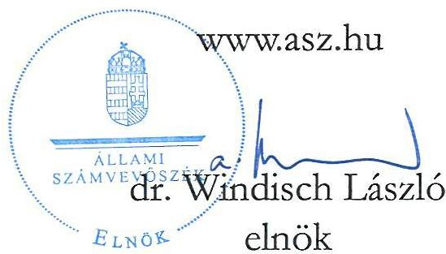

---

Jelentéseink az interneten a www.asz.hu címen olvashatók.

ELLENŐRZÉSI IGAZGATÓSÁG:
ELLENŐRZÉSI IGAZGATÓSÁG I.

ELLENŐRZÉSI IGAZGATÓ:
SINKÁNÉ DR. CSENDES ÁGNES igazgató

ELLENŐRZÉSVEZETŐ:
BOZSÓ ERIKA LÍVIA ellenőrzésvezető

IKTATÓSZÁM: EL-4230-005/2025
TÉMASORSZÁM: 1
ELLENŐRZÉS-AZONOSÍTÓ SZÁM: V1142

---

TARTALOMJEGYZÉK

ÖSSZEFOGLALÁS...5
AZ ELLENŐRZÉS EREDMÉNYEI...8

1. A hiány és az államadósság alakulása...8
2. A zárszámadási törvényjavaslat tartalmának, szerkezetének megfelelősége, a zárszámadási törvényjavaslatban szereplő teljesítési adatok megbízhatósága...15
3. A központi kezelésű előirányzatok teljesítése, a teljesítés szabályszerűségi ellenőrzésének eredményei...16
4. A fejezeti kezelésű előirányzatok, valamint az uniós és a kapcsolódó hazai forrásból finanszírozott támogatások teljesítése, a kiadások szabályszerűségi ellenőrzésének eredményei...23
5. A központi alrendszerbe tartozó szervezetek bevételi és kiadási előirányzatainak teljesítése, a teljesítések és a kontrollkörnyezet szabályszerűségi ellenőrzésének eredményei...29
6. Az ELKA és a TB Alapok előirányzatainak teljesítése, a teljesítések és a pénzügyi beszámolók szabályszerűségi ellenőrzésének eredményei...33

I. FÜGGELÉK: ÉSZREVÉTELEK...41
II. FÜGGELÉK: ELLENŐRZÉSI MEGKÖZELÍTÉS...42
MELLÉKLETEK...48

I. sz. melléklet: Értelmező szótár...48
II. sz. melléklet: Az ellenőrzött szervezetek jegyzéke és érintettsége az ellenőrzési területeken...52
III. sz. melléklet: A központi alrendszerbe tartozó szervezetek gazdálkodásának feltárt hiányosságai...59
IV. sz. melléklet: A központi alrendszerbe tartozó szervezetek területén a kontrollkörnyezet kialakításának és működtetésének feltárt hiányosságai...61
V. sz. melléklet: A TB Alapok 2024. évi előirányzott és teljesített bevételei jogcímcsoportonkénti bontásban...63
VI. sz. melléklet: A TB Alapok előirányzatot legnagyobb összegben és arányban meghaladó ellátási jogcímcsoportjai a 2024. évben...65
VII. sz. melléklet: A központi tartalékok felhasználása/átcsoportosítása A 2024. évben...66

RÖVIDÍTÉSEK JEGYZÉKE...70

---

“哈，你是个小伙子，你是个小伙子，你是个小伙子，你是个小伙子，你是个小伙子，你是个小伙子，你是个小伙子，你是个小伙子，你是个小伙子，你是个小伙子，你是个小伙子，你是个小伙子，你是个小伙子，你是个小伙子，你是个小伙子，你是个小伙子，你是个小伙子，你是个小伙子，你是个小伙子，你是个小伙子，你是个小伙子，你是个小伙子，你是个小伙子，你是个小伙子，你是个小伙子，你是个小伙子，你是个小伙子，你是个小伙子，你是个小伙子，你是个小伙子，你是个小伙子，你是个小伙子，你是个小伙子，你是个小伙子，你是个小伙子，你是个小伙子，你是个小伙子，你是个小伙子，你是个小伙子，你是个小伙子，你是个小伙子，你是个小伙子，你是个小伙子，你是个小伙子，你是个小伙子，你是个小伙子，你是个小伙子，你是个小伙子，你是个小伙子，你是个小伙子，你是个小伙子，你是个小伙子，你是个小伙子，你是个小伙子，你是个小伙子，你是个小伙子，你是个小伙子，你是个小伙子，你是个小伙子，你是个小伙子，

---

ÖSSZEFOGLALÁS

A 2024. évben mind a nominális, mind a GDP¹-arányos hiány csökkent a 2023. évhez képest. Ugyanakkor a központi alrendszer² hiánya meghaladta a költségvetési törvényben tervezett értéket, valamint a kormányzati szektor GDP-arányos hiánya szintén kis mértékben az elfogadott célérték felett teljesült. Az államadósság-mutató értéke meghaladta az előző évi, valamint a 2024. évre előirányzott értéket, azonban ennek alakulása nem volt ellentétes a jogszabályi előírással. A 2024. évi zárszámadási törvényjavaslatot³ a Nemzetgazdasági Minisztérium a jogszabályi előírásoknak megfelelően, az éves költségvetéssel összehasonlítható szerkezetben állította össze. A törvényjavaslat megbízhatóan mutatja be a költségvetés végrehajtásának kiadási és bevételi adatait. A költségvetés végrehajtása kapcsán az ellenőrzés a központi alrendszerbe tartozó szervezetek esetében tart fel szabályszerűségi hibákat.

Az Alaptörvény⁴, valamint az Áht.⁵ előírásával összhangban a központi költségvetés végrehajtásáról a költségvetési év zárását követően zárszámadást szükséges készíteni, melyről az Országgyűlés törvényt alkot. Az Országgyűlés a zárszámadási törvényjavaslatot az Állami Számvevőszék (továbbiakban: ÁSZ⁶) jelentésével együtt tárgyalja meg. A jelentés elkészítésével az ÁSZ évente ismétlődő törvényi kötelezettségének tett eleget.

A Magyarország 2024. évi központi költségvetéséről szóló 2023. évi LV. törvény (Kvtv.⁷) a központi alrendszer bevételi főösszegét 38 240,3 Mrd Ft-ban, kiadási főösszegét 40 755,1 Mrd Ft-ban, hiányát 2 514,8 Mrd Ft-ban irányozta elő. 2024. év folyamán a Kvtv. nem módosult, így a költségvetés főösszege is változatlan maradt. Az ÁSZ a költségvetés egészét tekintve és valamennyi ellenőrzési terület esetében a Kvtv.-ben szereplő eredeti előirányzatot hasonlította a teljesített adatokhoz. A 2024. évi zárszámadási törvényjavaslat alapján a bevételk teljesülése nem érte el a tervezett értéket, ugyanakkor a kiadások meghaladták az előirányzott összeget, ezáltal a központi alrendszer hiánya a tervezetthez képest több, mint 50%-kal magasabban teljesült.

A központi alrendszer bevételi, kiadási és hiány adatainak előirányzott és teljesített értékeit az 1. táblázat mutatja.

1. táblázat

A KÖZPONTI ALRENDSZER BEVÉTELEINEK, KIADÁSAINAK, VALAMINT PÉNZFORGALMI EGYENLEGÉNEK ALAKULÁSA A 2024. ÉVBEN (MRD FT)

|  MEGNEVEZÉS | ELŐIRÁNYZAT | TELJESÍTÉS | ÉLTÉRÉS | TELJESÍTÉSI ARÁNY  |
| --- | --- | --- | --- | --- |
|  Bevétel | 38 240,3 | 38 091,2 | -149,1 | 99,6%  |
|  Kiadás | 40 755,1 | 42 039,5 | 1 284,4 | 103,2%  |
|  Pénzforgalmi egyenleg | -2 514,8 | -3 948,3 | -1 433,5 | 157,0%  |

Forrás: 2024. évi zárszámadási törvényjavaslat, ÁSZ saját szerkesztés

---

Összefoglalás

A 2023 - 2024. évekre vonatkozó GDP, pénzforgalmi és eredményszemléletű hiány, valamint államadósság adatok értékét és azok változását a 2. táblázat foglalja össze:

2. táblázat

|  A GDP A HIÁNY ÉS AZ ÁLLAMADÓSSÁG ALAKULÁSA A 2023. ÉS A 2024. ÉVEKBEN (MRD FT)  |   |   |   |
| --- | --- | --- | --- |
|   | 2023. ÉV | 2024. ÉV | VÁLTOZÁS (SZÁZALÉK)  |
|  1) GDP | 75 292,7 | 81 447,7 | 8,2%  |
|  2) Államadósság a tárgyév végén | 55 139,8 | 59 879,0 | 8,6%  |
|  3) Központi alrendszer hiánya | -4 435,5 | -3 948,3 | -11,0%  |
|  4) Kormányzati szektor hiánya | -5 099,5 | -4 006,4 | -21,4%  |
|   | 2023. ÉV | 2024. ÉV | VÁLTOZÁS (SZÁZALÉKPONT)  |
|  Államadósság-mutató (2./1.) | 73,2% | 73,5% | 0,3%  |
|  Központi alrendszer hiánya a GDP %-ában (3./1.) | 5,9% | 4,8% | -1,1%  |
|  Kormányzati szektor hiánya a GDP %-ában (4./1.) | 6,8% | 4,9% | -1,9%  |

Forrás: 2024. évi zárszámadási törvényjavaslat, $EDP^8$ jelentés, ÁSZ saját szerkesztés

A 2024. évben a hiány mind nominálisan, mind GDP-arányosan csökkent az előző évhez képest.

Az államadósság-mutató 2024. év végi értéke mind a Kvtv.-ben 2024. december 31-re tervezett 66,7%-os, mind a Magyarország 2025. évi központi költségvetéséről szóló 2024. évi XC. törvényben 2024. év utolsó napjára tervezett 73,2%-os mérték felett alakult. Az államadósság-mutató értéke a 2023. év végi értékhez képest emelkedett, mivel a nominális államadósság nagyobb ütemben növekedett, mint a GDP értéke. A 2024. évi zárszámadási törvényjavaslat indokolása szerint ennek oka a külföldi pénznemben fennálló adósságot keletkeztető ügyleteknek az árfolyam változásából eredő államadósság többlet volt, ezáltal – figyelembe véve a Stabilitási tv. 6. § (1) bekezdés d) pontját – az államadósság alakulása az ÁSZ véleménye szerint összhangban volt a jogszabályi előírással.

A kormányzati szektor hiánya kis mértékben meghaladta az Európai Uniónak benyújtott középtávú költségvetési-strukturális tervben 2024. évre célként megjelölt 4,5%-os értéket.

Az ÁSZ megállapította, hogy a 2024. évi zárszámadási törvényjavaslatot a Nemzetgazdasági Minisztérium az Áht. irányadó rendelkezései szerinti szerkezetben és tartalommal állította össze, a törvényjavaslatban szereplő kiadási és bevételi teljesítési adatokban az ellenőrzés nem tart fel olyan lényeges hibát, amely befolyásolná a zárszámadási törvényjavaslat adatainak megbízhatóságát.

Az ÁSZ hat területen értékelte a költségvetés teljesítésének szabályszerűségét. Az ellenőrzés a központi alrendszerbe tartozó szervezetek területén állapított meg szabályszerűségi hibákat, melyek jellemzően az utalványozási jogkör gyakorlással függtek össze. A központi alrendszerbe tartozó költségvetési szervek kontrollkörnyezeti elemeivel kapcsolatban a számviteli szabályozás, valamint a beszerzésre vonatkozó szabályozás területén tart fel hiányosságokat az ellenőrzés. A hiányosságokat – melyek a központi költségvetés végrehajtásának megbízhatóságát nem befolyásolták – az ÁSZ jelezte az érintett ellenőrzött szervezetek vezetői részére.

A központi alrendszer előirányzott és teljesített bevételi, kiadási és egyenleg adatait a bevételek és kiadások ellenőrzési területek szerinti megbontásával az 1. ábra tartalmazza.

---

Összefoglalás

1. ábra

A KÖZPONTI ALRENDSZER ELŐIRÁNYZOTT ÉS TELJESÍTETT FŐ ADATAI, VALAMINT A TELJESÍTETT BEVÉTELEK ÉS KIADÁSOK ELLENŐRZÉSI TERÜLETEK SZERINTI MEGBONTÁSA A 2024. ÉVBEN (MRD FT)

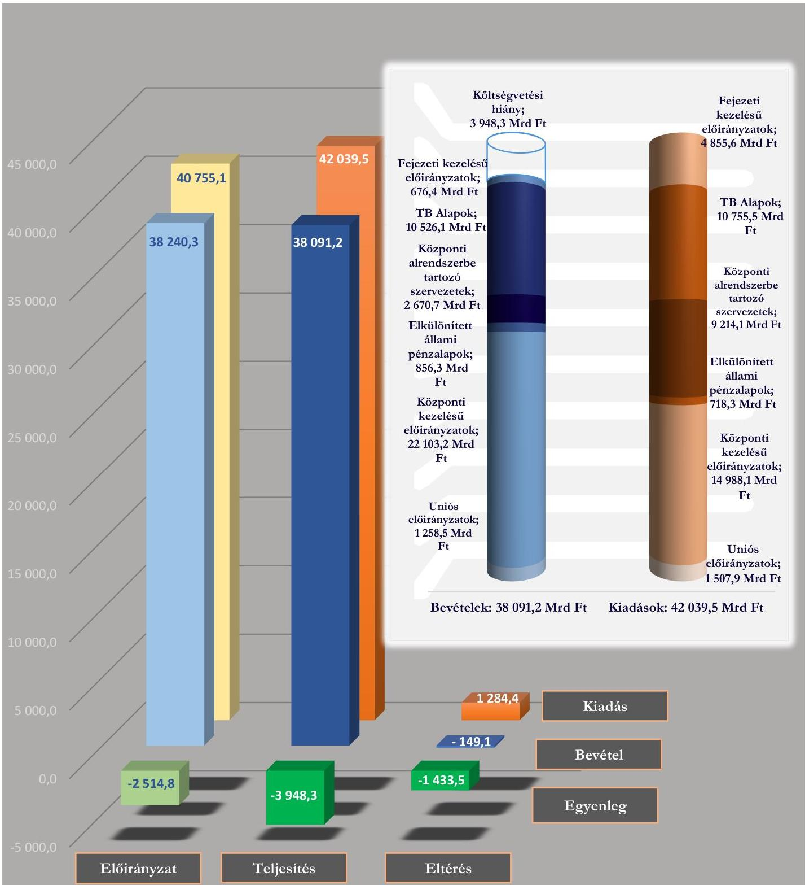

Forrás: 2024. évi zárszámadási törvényjavaslat, ÁSZ saját szerkesztés

---

AZ ELLENŐRZÉS EREDMÉNYEI

# 1. A hiány és az államadósság alakulása

## Összegző megállapítás

A 2024. évi pénzforgalmi és eredményszemléletű hiány csökkent az előző évhez képest, azonban a vártnál kedvezőtlenebb makrogazdasági környezet hatására mind a központi alrendszer hiánya, mind a kormányzati szektor hiánya az előirányzott érték felett teljesült. Az államadósság-mutató értéke meghaladta az előző évi, valamint a 2024. évre előirányzott értéket, ugyanakkor az államadósság alakulása nem volt ellentétes a jogszabályi előírással.

## 1.1 számú megállapítás

A központi alrendszer hiánya csökkent az előző évhez képest. A tervezettnél alacsonyabb bevételi főösszeg, valamint a tervezettet meghaladó kiadási főösszeg következtében a pénzforgalmi hiány a Kvtv.-ben meghatározottat több, mint 50%-kal meghaladóan teljesült.

A kormányzati szektor hiánya csökkent az előző évhez képest, azonban a GDP-arányos hiány kis mértékben az elfogadott célérték felett teljesült.

A hiány alakulása kétféle szempontból értékelhető:

- az államháztartás pénzforgalmi hiánya, ezen belül a központi alrendszer hiánya, melynek előirányzott összegét a Kvtv., teljesített értékét a 2024. évi zárszámadási törvényjavaslat tartalmazza, valamint
- a kormányzati szektor eredményszemléletű hiánya, melynek GDP-arányos előirányzott értékét az Európai Uniónak benyújtott Magyarország középtávú költségvetési-strukturális terve tartalmazza.

A pénzforgalmi szemlélet a tényleges pénzmozgásokat veszi figyelembe, míg az eredményszemlélet azokat az eseményeket is elszámolja, amelyek gazdaságilag realizálódtak, de még nem történt pénzmozgás. A zárszámadási törvényjavaslat a pénzforgalmi adatokra épül, ezért elsősorban a költségvetés likviditási helyzetét mutatja be, ugyanakkor a költségvetési szabályok és a nemzetközi összehasonlításban használt mutatók jellemzően az elhatárolás alapú (eredményszemlélet szerinti) adatokra épülnek.

8

---

Az ellenőrzés eredményei

Az egyenlegadatok 2023. és 2024. évi összegszerű és GDP-arányos alakulását a 2. ábra mutatja.

2. ábra

A 2023. ÉS 2024. ÉVI EGYENLEG ADATOK ÉS MUTATÓK ÖSSZEHASONLÍTÁSA
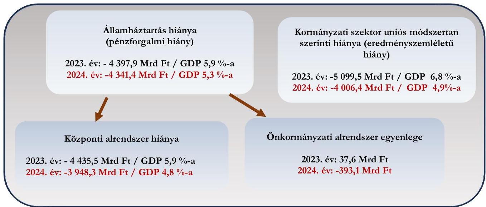
Forrás: 2024. évi zárszámadási törvényjavaslat, EDP jelentés, ÁSZ saját szerkesztés

Az államháztartás pénzforgalmi szemléletű hiánya a 2024. évben mind nominálisan, mind GDP-arányosan javult az előző évhez képest. Ezen belül a központi alrendszer hiánya és GDP-arányos hiánya jelentősen csökkent.

A központi alrendszer 2024. évi fő teljesítési adatainak a tervezett-, valamint a 2023. évi tényadatokhoz viszonyított alakulását a 3. ábra szemlélteti.

3. ábra

A KÖLTSÉGVETÉSI FŐÖSSZEGEK ALAKULÁSA A 2023. ÉVI TELJESÍTÉS BÁZISÁN
(%, ÉRTÉKEK MRD FT-BAN)
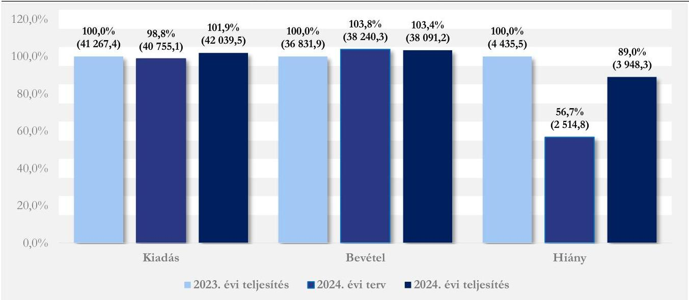
Forrás: 2024. évi zárszámadási törvényjavaslat, ÁSZ saját szerkesztés

A Kvtv. a központi alrendszer bevételi főösszegét 38 240,3 Mrd Ft-ban, kiadási főösszegét 40 755,1 Mrd Ft-ban, hiányát 2 514,8 Mrd Ft-ban irányozta elő. A 2024. év folyamán a Kvtv. nem módosult, így a költségvetés főösszege is változatlan maradt. A 2024. évi zárszámadási törvényjavaslat alapján a bevételk teljesülése nem érte el a tervezett értéket, ugyanakkor a kiadások meghaladták az

---

Az ellenőrzés eredményei

előirányzott összeget, ezáltal a központi alrendszer hiánya a tervezett 2 514,8 Mrd Ft-hoz képest több, mint 50%-kal magasabban, 3 948,3 Mrd Ft-on teljesült.

A bevétel és kiadások, valamint ezek egyenlegeként a hiány alakulására jelentős hatást gyakorolt a makrogazdasági környezet. A makrogazdasági környezet alakulását bemutató fontosabb adatok Kvtv.-ben előre jelzett, valamint a 2024. évi zárszámási törvényjavaslatban megjelenített teljesült, előzetes adatait a 3. táblázat tartalmazza.

3. táblázat
A MAKROGAZDASÁGI KÖRNYEZET ALAKULÁSÁT BEMUTATÓ FONTOSABB MUTATÓK A 2024. ÉVBEN

|  GAZDASÁGI MUTATÓ MEGNEVEZÉSE | KVTV. ELŐREJELZÉS | ZÁRSZÁMADÁSI TÖRVÉNYJAVASLAT ELŐZETÉS TÉNY | ELTÉRÉS  |
| --- | --- | --- | --- |
|  GDP növekedése % | 4,0 | 0,6 | -3,4  |
|  GDP deflátor % | 5,6 | 7,6 | 2,0  |
|  Fogyasztói árindex változása (éves átlag) | 6,0 | 3,7 | -2,3  |
|  HUF/EUR árfolyam, éves átlag | 385,5 | 395,2 | 9,7  |
|  HUF/USD árfolyam, éves átlag | 360,0 | 365,2 | 5,2  |
|  Jegybanki alapkamat (Reuters), % | 5,8 | 6,5 | 0,7  |

Forrás: 2024. évi zárszámási törvényjavaslat, ÁSZ saját szerkesztés

A GDP növekedése jelentősen elmaradt a várthoz képest, ami negatívan hatott a költségvetési bevétel teljesülésére. Bár a fogyasztói árindex éves átlaga kedvezőbben alakult a tervezettnél, a GDP deflátor értéke meghaladta a tervezett értéket. Az általános kamatkörnyezet, ezzel együtt a jegybanki alapkamat, valamint az állampapírpiaci kamat- és hozamszintek a tervezéshez figyelembe vett értékek képest magasabban alakultak, jelentősen megemelve a hiány és az államadósság finanszírozási költségeit.

A központi költségvetés hiányának az előirányzotthoz képest kedvezőtlenebb teljesülésére jelentős hatást gyakorló előirányzatok tekintetében az alábbiak emelhetők ki:

- A központi költségvetés bevételéi esetében az előirányzathoz képest az adóbevétel jelentősen elmaradtak, a legnagyobb, 1 197,8 milliárd forint összegű kiesés az általános forgalmi adónál jelentkezett, a tervezettnél alacsonyabban teljesült továbbá néhány nagyobb bevételi előirányzat, így az energia ágazat befizetései, a jövedéki adó, a társasági adó, valamint a bányajáradék.
- Az uniós programok bevételéi jelentősen a tervezett alatt teljesültek, ugyanakkor az uniós programok külön előirányzatokon megjelenő kiadásai együttesen szintén jelentősen elmaradtak a tervezett összegtől.
- Kiadási oldalon a legnagyobb mértékű túllépések az állami vagyonhoz kapcsolódó előirányzatakon, valamint az adósságszolgálati kiadásoknál jelentkeztek.

A legjelentősebb bevételi elmaradással, illetve kiadási többlettel érintett előirányzatokról a 4. ábra ad áttekintést.

---

Az ellenőrzés eredményei

4. ábra

A 2024. ÉVI KÖZPONTI KÖLTSÉGVETÉS TERVEZETTŐL LEGJELENTŐSEBBEN ELMARADÓ BEVÉTELI, ÉS A TERVEZETTET LEGJELENTŐSEBBEN MEGHALADÓ KIADÁSI ELŐIRÁNYZATAI (MRD FT)
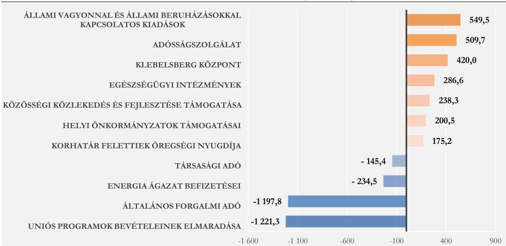
Forrás: 2024. évi zárszámadási törvényjavaslat, ÁSZ saját szerkesztés

Az ÁSZ tv. 5. § (1) bekezdése alapján az ÁSZ minden évben a következő évi költségvetés elfogadása előtt a költségvetési törvényjavaslatot megalapozó makrogazdasági prognózis alapulvételével véleményt ad az Országgyűlés számára a központi költségvetésről szóló törvényjavaslat megalapozottságáról. (T/4181/1, T/9894/1, T/11864/1 számú vélemények https://www.asz.hu/jelentesek) Ezen felül időszakonként elemzést készít a Költségvetési Tanács részére a tárgyév eltelt időszakára vonatkozó makrogazdasági és költségvetési folyamatokról. 2024. I. félévre vonatkozó elemzés rámutatott, hogy a tervezettet meghaladó hiányt elsősorban a kiadások tervezettnél magasabb összegű teljesítése eredményezte. Az elemzés szerint az államadósság finanszírozásával összefüggő kamatkiadások, az állami vagyonnal kapcsolatos kiadások, az állami beruházási fejezet kiadásai, valamint a nyugellátásokkal kapcsolatos tervet meghaladó kifizetések mind növelték a hiányt.

A 2024. évi központi költségvetésről szóló törvényjavaslat véleményezése során az ÁSZ több bevételi és kiadási előirányzattal kapcsolatban kockázatokat állapított meg.

E kockázatok egy esetben bevételi előirányzathoz, három esetben kiadási előirányzathoz kapcsolódtak. Az ÁSZ által feltárt kockázatok egy része igazolódott. A feltárt kockázatok körét, értékét és ezek teljesülését a 4. táblázat mutatja be.

11

---

Az ellenőrzés eredményei

4. táblázat
A KÖZPONTI KÖLTSÉGVETÉSRŐL SZÓLÓ TÖRVÉNYJAVASLAT ELŐIRÁNYZATAI VONATKOZÁSÁBAN FELTÁRT KOCKÁZATOK ÉS EZEK BEKÖVETKEZÉSE A 2024. ÉVBEN (MRD FT)

|  MEGNEVEZÉS | AZONOSÍTOTT KOCKÁZAT ÖSSZEGE | EREDETI ELŐIRÁNYZAT | TELJESÍTÉS | A KOCKÁZAT TELJESÜLT ÉRTÉKE  |
| --- | --- | --- | --- | --- |
|  BEVÉTEL |  |  |  |   |
|  XLII/2/2. Jövedéki adó | 53,0 | 1 677,7 | 1 615,2 | 62,5  |
|  KIADÁSOK |  |  |  |   |
|  XLII/35/1/6. Tizenharmadik havi nyugdíj visszaépítésének támogatása | 5,7 |  |  |   |
|  LXXI./2/1/6 Tizenharmadik havi nyugdíj |  | 449,0 | 472,0 | 23,0  |
|  XVI/11/3/2 M5, M6 autópálya rendelkezésre állási díj | 4,2 | 172,6 | 170,0 | nem teljesült  |
|  XXIII/11/2. Eximbank Zrt. kamatkiegyenlítése | 7,1 | 110 | 118,8 | 8,8  |

Forrás: 2024. évi zárszámadási törvényjavaslat és Kvtv. adatok alapján, ÁSZ saját szerkesztés

A kormányzati szektor államháztartásnál tágabb kört érintő, eredményszemléletű, uniós módszertan szerinti bevétel 34 203,5 Mrd Ft, kiadása 38 209,9 Mrd Ft, hiánya 4 006,4 Mrd Ft volt a 2024. évben a 2025. évi I. EDP jelentés szerint. A GDP piaci beszerzési áron 81 447,7 Mrd Ft-ot tett ki, így a GDP-arányos uniós módszertan szerinti hiány 4,9%-on teljesült.

Magyarország 2025. évi I. EDP-jelentése alapján a kormányzati szektor konszolidált kamatkiadásai 4 039,8 Mrd Ft-ot tettek ki a 2024. évben, amely összeg enyhén meghaladta a kormányzati szektor 4 006,4 Mrd Ft-os hiányadatát. Ez alapján a 2024. évben Magyarország eredményszemléletű elsődleges egyenlege – 2019 óta először – a pozitív tartományba (egyensúlyba) került, ami együtt a fiskális alapfolyamatok viszonylagos egyensúlyát jelzi. Ugyanakkor a kamatfizetésekkel együtt számolt költségvetési egyenleg továbbra is hiányt mutatott.

A maastrichti 3%-os referenciaérték teljesítése alóli, a COVID-19 válság idején alkalmazott uniós mentesítési mechanizmus, illetve ezzel párhuzamosan a hazai szabályozási környezetben a Stabilitási tv.-ben rögzített előírás a 2024. évben már nem volt hatályban; ugyanakkor a Kvtv. elfogadásakor még zajlottak egyeztetések a mentesítési záradék esetleges meghosszabbításáról.

A Stabilitási tv. előírja, hogy a központi költségvetésről szóló törvényben a kormányzati szektor egyenlegét az Alaptörvényvel és az Európai Unió jogával összhangban kell meghatározni. Az uniós módszertant, amely a Kvtv. elfogadását követően lépett hatályba, a gazdaságpolitikák hatékony összehangolásáról és a többoldalú költségvetési felügyeletről, valamint az 1466/97/EK tanácsi rendelet hatályon kívül helyezéséről szóló 2024. április 29-i 2024/1263 európai parlamenti és tanácsi rendelet rögzítette. Ez alapján azon tagállamok – köztük Magyarország –, ahol az államadósság meghaladja a GDP 60%-át vagy a hiány a GDP 3%-át, az Európai Bizottság által megküldött, nettó kiadásokra vonatkozó referencia-pálya szerinti négyéves – legfeljebb három évvel meghosszabbítható – kiigazítási programot kötelesek végrehajtani. Ezen tagállamok esetében nem az azonnali 3% alatti hiány elérése, hanem a hiány fenntartható, kockázatalapú és országspecifikus csökkentése lett az elvárás. Magyarország 2024 októberében benyújtott középtávú költségvetési-strukturális terve 2024. évre a GDP 4,5%-ának megfelelő hiánycél rögzített, amely a referencia-pálya elvárásaihoz igazodott. A hiánymutató 4,9%-os teljesült értéke ezt az értéket kis mértékben meghaladta.

12

---

Az ellenőrzés eredményei

A kormányzati szektor 2024. évi GDP arányos hiánya 1,8 százalékponttal kedvezőbben alakult a 2023. évi 6,7%-os értéknél.

5. ábra

A KORMÁNYZATI SZEKTOR UNIÓS MÓDSZERTAN SZERINTI HIÁNYA ÉS GDP-ARÁNYOS HIÁNYA A 2023. ÉS 2024. ÉVBEN (MRD FT)
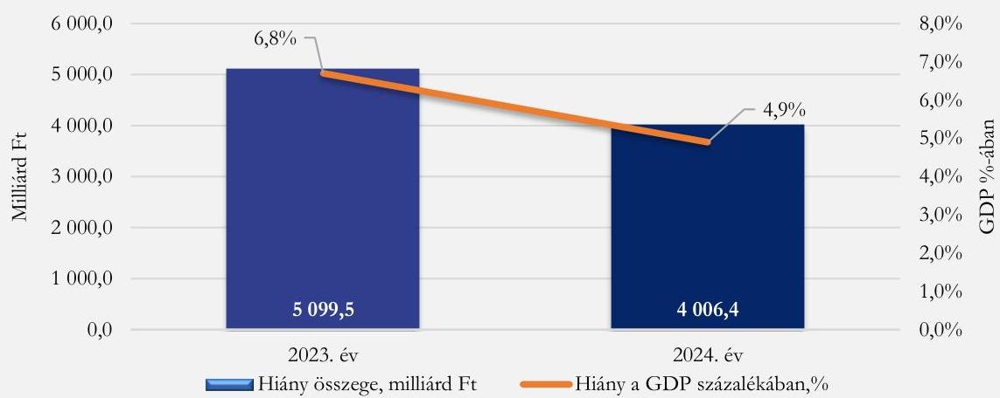
Forrás: 2023. évi I. EDP jelentés, ÁSZ saját szerkesztés

## 1.2 számú megállapítás

A 2024. év végi államadósság-mutató az előirányozott értékhez és a 2023. év végi adathoz képest is kedvezőtlenebbül alakult. Ugyanakkor az államadósság-mutató alakulása nem volt ellentétes az előírásokkal.

Az államadósság-mutató számlálójának (államadósság) összege 59 879,0 Mrd Ft, nevezőjének (GDP) összege 81 447,7 Mrd Ft, az államadósság-mutató mértéke 73,5% volt a 2024. év végén. Ezzel az államadósság-mutató a 2023. év végi 73,2%-hoz képest 0,3 százalékponttal nőtt. Az államadósság összege a 2023. év végi 55 139,8 Mrd Ft-hoz képest mintegy 8,6%-kal, míg a nominális GDP az államadósságot enyhén alulmúlva 8,2%-kal növekedett, ami egyúttal az államadósság-mutató növekedését eredményezte. A Stabilitási tv. 6. § (1) bekezdés d) pontja szerint az államadósság-mutató változásának értékelésekor indokolt figyelembe venni azon államadósság többletet, amely kizárólag a külföldi pénznemben fennálló adósság árfolyamváltozásából ered. Ez a szabály arra szolgál, hogy az árfolyamingadozások – amelyek az államadósság szintjét statisztikailag növelhetik anélkül, hogy tényleges új hitelfelvétel történt volna – ne torzítsák az államadósság-szabály teljesülésének megítélését. A 2024. évben az adósságráta emelkedésének egy része nem új forrásbevonásból, hanem a forint gyengüléséből fakadt, ami a meglévő devizaadósság forintban számított értékét növelte, valamint a 2024. évi zárszámadási törvényjavaslat indokolása szerint az árfolyamváltozásból származó többlet elérte a GDP 1,7%-át.

13

---

Az ellenőrzés eredményei

6. ábra

A STABILITÁSI TV. SZERINTI ÁLLAMADÓSSÁG, ILLETVE ÁLLAMADÓSSÁG-MUTATÓ A 2023. ÉS A 2024. ÉVBEN
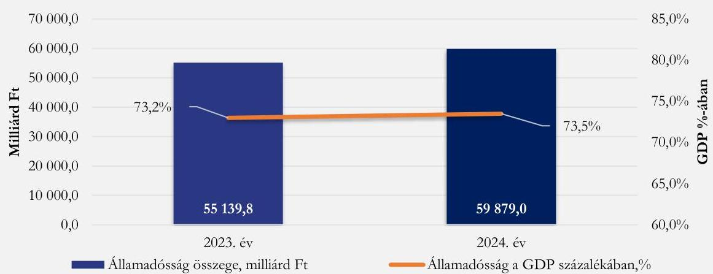
Forrás: 2024. évi zárszámadási törvényjavaslat, ÁSZ saját szerkesztés

Az államadósság-mutató 2024. év végi tényadata mind a Kvtv.-ben tervezett 66,7%-os, mind a Magyarország 2025. évi központi költségvetéséről szóló 2024. évi XC. törvényben 2024. év utolsó napjára tervezett 73,2%-os mérték felett alakult.

A devizaadósság-állomány a központi alrendszerben az ÁKK⁹ adatai* szerint 2024. évben 2 879,5 Mrd Ft-tal nőtt, részaránya 26,9%-ról 29,8%-ra emelkedett a 2023. év végi értékhez képest a teljes adósságon belül. Ez a növekedés nemcsak az új devizakötvény-kibocsátásoknak és devizahitel-lehívásoknak volt köszönhető, hanem a forint gyengülésének is, amely 1 112,5 Mrd Ft-tal emelte a devizában fennálló adósság forintban számított értékét. Ami a hosszú távú változást illeti, a devizaadósság részaránya a 2019. év végén 17,3% volt, így a részarány a teljes adósságon belül öt év alatt több mint 12 százalékponttal emelkedett.

Az államadóssággal kapcsolatos kamatkiadások 2024. évben 3 613,1 Mrd Ft összegben teljesültek, így 509,7 Mrd Ft-tal (16,4%-kal) haladták meg a tervezett 3 103,4 milliárd forintos előirányzatot. A megnövekedett kiadásokat részben a hiány finanszírozásául szolgáló forint államkötvények és devizakötvények emelkedő állománya, valamint a piaci kamatlábak növekedése okozták.

Az állam kamatbevételei 749,7 Mrd Ft összegben teljesültek, 351,6 Mrd Ft-tal meghaladva a 398,1 Mrd Ft-os előirányzatot. A magasabb bevételeket főként az államkötvények kamatelszámolása és az MNB-től visszavásárolt hosszú futamidejű kötvények árfolyamnyeresége indokolta. A lakossági kötvények értékesítéséből származó kamatbevételek elmaradtak az előirányzattól, míg a devizakamat-bevételek a magasabb devizabetét-állomány és az euro-piaci kamatszintek növekedésének hatására meghaladták a tervezett értékeket.

Az államadósság valós költségét mutató nettó pénzforgalmi kamatkiadások 2 863,4 Mrd Ft-ot érték el, amely 158,1 Mrd Ft-tal (5,8%-kal) volt magasabb a tervezettnél.

„A központi költségvetés finanszírozása és adósságának alakulása – 2024. december”, https://www.akk.hu/download?path=56e96cd7-58bc-4601-b804-8d8d3eed44fe.pdf

14

---

Az ellenőrzés eredményei

## 2. A zárszámadási törvényjavaslat tartalmának, szerkezetének megfelelősége, a zárszámadási törvényjavaslatban szereplő teljesítési adatok megbízhatósága

### Összegző megállapítás

A zárszámadási törvényjavaslatot a Nemzetgazdasági Minisztérium a jogszabályi előírásoknak megfelelően, az elfogadott költségvetéssel összehasonlítható módon készítette el. A zárszámadási törvényjavaslat tartalmazta a jogszabályban előírt kötelező elemeket. A 2024. évi zárszámadási törvényjavaslatban szereplő kiadási és bevételi teljesítési adatokban az ellenőrzés nem tárt fel olyan lényeges hibát, amely a zárszámadási törvényjavaslat adatainak megbízhatóságát befolyásolta.

A zárszámadásról szóló törvényjavaslat összeállítását a Nemzetgazdasági Minisztérium az Áht. előírásaival összhangban, az éves költségvetési beszámolók alapján, az elfogadott költségvetéssel összehasonlítható módon, az év utolsó napján érvényes szervezeti, besorolási rendnek megfelelően végezte el. A törvényjavaslat tartalma, szerkezete megfelel az Áht. előírásainak, ismerteti a központi alrendszer hiányának a költségvetésben tervezett mértékétől való eltérés okait, továbbá bemutatja a költségvetési hiány finanszírozásának módját.

A zárszámadásról szóló törvényjavaslat indokolása és melléklete tartalmazza az Áht.-ban előírt információkat. Bemutatja többek között:

- a költségvetési mérlegeket alrendszerenként és összevontan, közgazdasági és funkcionális tagolásban;
- az államháztartás alrendszerei költségvetési egyenlegének összefüggéseit és kapcsolatát a 479/2009/EK rendelet szerinti kormányzati szektor hiányával és az elsődleges egyenlegmutatóval;
- törvényjavaslat adóbevételeiben érvényesülő közvetett támogatásokat, különösen az adóelengedéseket, az adókedvezményeket tartalmazó kimutatást adónemenként;
- a központi alrendszerben a finanszírozási bevételekről és kiadásokról készített összegzést;
- az államadósságot és az államadósság állományának változását bemutató összegzést;
- az állami kezességek, állami garanciák és állami viszont-garanciák, továbbá a helyi önkormányzatok által kibocsátott garanciák és kezességek állományát;
- az állam tulajdonában álló részesedéseket, valamint az állam többségi befolyása alatt álló gazdasági társaságok kötelezettségállományának alakulását, valamint a helyi önkormányzatok tulajdonában álló gazdálkodó szervezetek működéséből származó kötelezettségeket;
- a középtávú tervezés során figyelembe vett makrogazdasági és költségvetési előrejelzés értékelését;
- a kormányzati szektorba sorolt egyéb szervezeteknél a nem teljesítő hitelkövetelések állományát;
- a központi költségvetés fejezet- és címrendjének évközi változásait.

15

---

Az ellenőrzés eredményei

A zárszámadási törvényjavaslat kiadási és bevételi teljesítési adataiban az ellenőrzés a megbízhatóságot összességében befolyásoló hibát nem tárt fel. A központi és fejezeti kezelésű előirányzatok, az uniós forrásokból és kapcsolódó hazai forrásból finanszírozott támogatások, a központi alrendszerbe tartozó szervezetek, valamint a társadalombiztosítás pénzügyi alapjai, továbbá az elkülönített állami pénzalapok teljesített pénzügyi tranzakcióinak számviteli elszámolását a költségvetési szervek, valamint a kezelő szervezetek a Számv. tv.¹⁰ előírásainak megfelelően bizonylattal alátámasztották. A Számv. tv. előírásaival összhangban az elszámolt összeg (részösszeg) megegyezett a gazdasági esemény számviteli elszámolását alátámasztó bizonylatokon szereplő összeggel, illetve elszámolásuk az Áhsz.¹¹-ben foglaltaknak megfelelően történt.

A központi alrendszerbe tartozó szervezetek esetében a kiadások tekintetében két esetben egyedi megbízhatósági hibaként tárt fel az ellenőrzés, hogy a gazdasági események elszámolása az Áhsz. 40. § (1) bekezdésében és 15. mellékletében foglaltak ellenére nem az egységes rovatrend előírásainak megfelelő nyilvántartási számlák történt, valamint egy esetben a pénzforgalmi teljesítés az ellenőrzött költségvetési évben nem történt meg, ugyanakkor az Áht. 4/A. § (4) bekezdésben foglaltak ellenére az ellenőrzött szervezet a tranzakciót a költségvetési számvitelben 2024. évi teljesített kiadásként könyvelte. A hibák összértéke a lényegességi küszöbérték alatt maradt, így a központi alrendszerbe tartozó szervezetek kiadási adatainak megbízhatóságát nem befolyásolta.

A központi költségvetés bevételének meghatározó részét a NAV¹² által beszedett adók és adójellegű bevételnek tették ki. Az ÁSZ a NAV által beszedett, bevallás alapján megállapított adók és adó jellegű közterhek bevallás feldolgozásának teszteléses ellenőrzése során megállapította, hogy az Art.¹³, az Avt¹⁴, az Adóig. vhr.¹⁵, a 41/2015. (VII. 15.) BM rendelet¹⁶, valamint az Ibtv.¹⁷ előírásai alapján a NAV bevallás feldolgozó rendszereinek működése megbízható volt, a pénzforgalomból kiválasztott tételek ellenőrzése alapján a kiutalás előtti felülvizsgálat szabályszerűen történt, az átvezetések és kiutalások folyamata a jogszabályi előírásoknak megfelelt. A NAV informatikai rendszereiben a rögzített és elszámolt tranzakciók megbízhatóságát biztosító beépített kontrollok megfelelően működtek.

# 3. A központi kezelésű előirányzatok teljesítése, a teljesítés szabályszerűségi ellenőrzésének eredményei

## Összegző megállapítás

A költségvetés központi kezelésű bevételi és kiadási előirányzatainak teljesítése, valamint a költségvetés központi tartalékainak képzése és felhasználása kapcsán az ellenőrzés nem tárt fel szabályszerűségi hibát.

A központi kezelésű előirányzatok az Áht. fogalommeghatározása szerint az állam nevében beszedendő költségvetési bevételnek és teljesítendő költségvetési kiadások elszámolására szolgálnak.

A központi kezelésű előirányzatok bevételének államháztartási mérleg szerinti tervezett és teljesített adatait az 5. táblázat mutatja be.

16

---

Az ellenőrzés eredményei

5. táblázat
A KÖZPONTI KEZELÉSŰ BEVÉTELI ELŐIRÁNYZATOK ALAKULÁSA A 2024. ÉVBEN (MRD FT)

|  MEGNEVEZÉS | EREDETI ELŐIRÁNYZAT | TELJESÍTÉS | ELTÉRÉS | TELJESÍTÉSI ARÁNY (%)  |
| --- | --- | --- | --- | --- |
|  Fogyasztáshoz kapcsolt adók | 11 041,3 | 9 933,9 | -1 107,4 | 90,0%  |
|  Gazdálkodó szervezetek befizetései | 3 757,9 | 3 476,1 | -281,8 | 92,5%  |
|  Lakosság befizetései | 4 857,2 | 4 863,1 | 5,9 | 100,1%  |
|  Állami vagyonnal kapcsolatos befizetések | 383,5 | 658,1 | 274,6 | 171,6%  |
|  Kamatbevételek | 398,1 | 749,7 | 351,6 | 188,3%  |
|  Állami beruházások bevételei | 0,0 | 77,8 | 77,8 |   |
|  Helyi önkormányzatok befizetései | 307,6 | 343,2 | 35,6 | 111,6%  |
|  Államháztartás alrendszerei közötti transzferek | 1 364,3 | 1 539,9 | 175,6 | 112,9%  |
|  Egyéb | 418,0 | 461,4 | 43,4 | 110,4%  |
|  Összesen: | 22 527,90 | 22 103,20 | -424,70 | 98,1%  |

Forrás: 2024. évi zárszámadási törvényjavaslat, ÁSZ saját szerkesztés

A központi kezelésű előirányzatok bevételeinek túlnyomó többségét az adó- és adójellegű bevételek tették ki.

A Fogyasztáshoz kapcsolt adók címen a törvényi előirányzatnál alacsonyabban teljesült az áfa¹⁸, a jövedéki adó, a regisztrációs adó adónem. A legnagyobb adónem, az áfa bevétele 1197,8 Mrd Ft-tal, a jövedéki adó bevétele 62,5 Mrd Ft-tal maradt el az éves előirányzattól. A tervezett áfa bevételek kisebb összegben teljesültek, mivel az alacsonyabb növekedés miatt a bruttó állóeszközfelhalmozás és a közösségi fogyasztás elmaradt a várttól. A jövedéki adó alulteljesülését a forgalomba hozott jövedéki termékek előző évihez viszonyított csökkenése okozta.

A Gazdálkodó szervezetek befizetései címen a legjelentősebb adónem, a társasági adó teljesítése 145,4 Mrd Ft-tal, az energiaágazat befizetései 234,5 Mrd Ft-tal maradtak el a tervezettől, melyet az egyéb adónemeken jelentkező túlteljesítés nem tudott ellensúlyozni, így a Gazdálkodó szervezetek befizetései címen a vártnál 281,8 Mrd Ft-tal kevesebb bevétel teljesült.

A Lakosság befizetései címen 1,2%-os, 5,9 Mrd Ft-os túlteljesítés volt. A Személyi jövedelemadó címen a 2024. évi bevételek az előirányzathoz képest 27,7 Mrd Ft-tal (0,6%-kal) magasabbak voltak, azonban a kedvező hatást az Illeték befizetések 18,6 Mrd Ft-tal és a Gépjárműadó 3,3 Mrd Ft-tal az előirányzottnál kisebb teljesülése rontotta.

Állami vagyonnal kapcsolatos befizetések és az állami beruházások bevételeinek teljesített összege együttesen a 2024. évben 735,9 Mrd Ft volt, amely az eredeti előirányzat 383,5 Mrd Ft összegéhez képest 91,9%-os túlteljesítést jelentett. Az állami vagyonnal kapcsolatos bevételek és az állami beruházások bevételeinek együttes megoszlását a 7. ábra szemlélteti.

17

---

Az ellenőrzés eredményei

7. ábra

AZ ÁLLAMI VAGYONNAL KAPCSOLATOS TELJESÍTETT BEVÉTELEK MEGOSZLÁSA A 2024. ÉVBEN
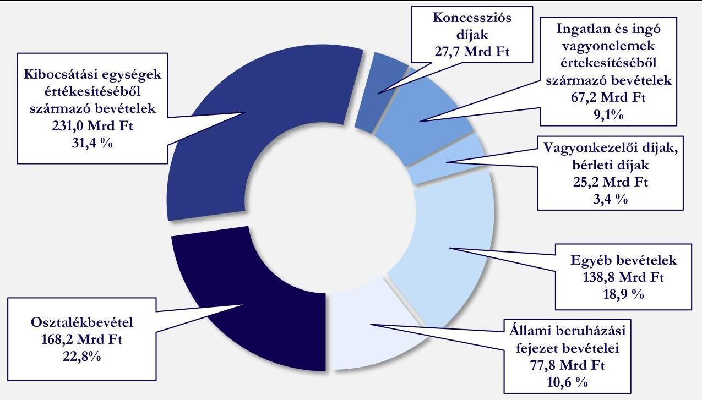
Forrás: 2024. évi zárszámadási törvényjavaslat, ÁSZ saját szerkesztés

Az állami vagyonnal kapcsolatos teljesített bevételk közel harmadát (31,4%) a kibocsátási egységek értékesítéséből származó bevételk jelentették, amely a központi költségvetésben 231,0 Mrd Ft bevételt eredményezett. Az osztalékbevételk 168,2 Mrd Ft, az egyéb bevételk 138,8 Mrd Ft összegben teljesültek, amelyek az állami vagyonnal kapcsolatos teljesített bevételk 22,8% és 18,9%-át jelentették. Az egyéb bevételken belül a Corvinus Nemzetközi Befektetési Zrt. alaptőkéjének leszállítása 124,0 Mrd Ft állami vagyonnal összefüggő bevételnövekedést eredményezett.

# Az ÁSZ a központi kezelésű előirányzatok bevételi előirányzatai teljesítésének szabályszerűségét az alábbi területeken és eredménnyel értékelte:

A Kiszabás, vagy kivétés alapján befolyt adó-, illeték-, egyéb bevételk ellenőrzött mintatételei esetén a bevételk beszedése a regisztrációs adónál a Rega. tv.¹⁹, a lakossági illetékeknél az Itv.²⁰, a bírságbevételeknél és késedelmi pótlékoknál az Art. és az Air²¹, valamint a gépjárműadó bevételénél a Gjt.²² előírásainak megfelelően, szabályszerűen történt.

A Bányajáradékkal kapcsolatos bevételk értékelése a 203/1998. (XII. 19.) Korm. rendelet²³, valamint a 404/2021. (VII. 8.) Korm. rendelet²⁴ alapján történt. A bányafelügyelet az ellenőrzött tételeknél a bányajáradékkal kapcsolatban beérkezett bevallásokat ellenőrizte, a bevételk teljesítése a vonatkozó előírásoknak megfelelt. A bányajáradékkal kapcsolatos bevétel a 2024. évben az eredeti előirányzatnál – a TTF gázár, a Brent kőolajár és az árfolyam változások hatására – 36,8%-kal alacsonyabb szinten teljesült.

A Megtett úttal arányos útdíj és időalapú útdíj előirányzatokon az ellenőrzött tételek alapján az elszámolt bevételkről készült adatszolgáltatások, illetve a beszedett díjbevételek központi költségvetés számára történő befizetése megfelelt a 209/2013. (VI. 18.) Korm. rendelet²⁵ előírásainak.

18

---

Az ellenőrzés eredményei

Az Állami vagyonnal kapcsolatos bevételi előirányzatok ellenőrzött mintatételei esetében a bérbeadással és az ingatlanértékesítéssel összefüggően a Vtv.²⁶, az Nfa. tv.²⁷ és a Vtvr.²⁸, az osztalék- és az egyéb bevételek tekintetében a Ptk.²⁹ és a Számv. tv., a koncessziós, vagyonkezelői és bérleti díjak tekintetében a Vtv., a Ptk. vonatkozó előírásai érvényesültek, a kibocsátási egységek értékesítése az előírásoknak megfelelően, árverés útján történt. A koncessziós díjbevételek keretében értékelésre kerültek az autópálya-, a szerencsejáték-, valamint a közel hatezer dohánytermék-kiskereskedelmi jogosultság átengedésére szóló koncessziós szerződésekhez kapcsolódó koncessziós díjak kiválasztott mintatételei. A koncessziós díjak megfizetésének módját és mértékét a koncessziós szerződésekben rögzítették, a koncessziós díjak pénzügyi teljesítése határidőben megtörtént.

A központi kezelésű előirányzatok kiadásainak államháztartási mérleg szerinti tervezett és teljesített adatait a 6. táblázat mutatja be.

6. táblázat
A KÖZPONTI KEZELÉSŰ KIADÁSI ELŐIRÁNYZATOK ALAKULÁSA A 2024. ÉVBEN (MRD FT)

|  MEGNEVEZÉS | ELŐIRÁNYZAT* | TELJESÍTÉS | ELTÉRÉS | TELJESÍTÉSI ARÁNY (%)  |
| --- | --- | --- | --- | --- |
|  Kamatkiadások, adósságszolgálat | 3 103,4 | 3 613,1 | 509,7 | 116,4  |
|  Helyi önkormányzatok támogatása | 1 049,7 | 1 250,2 | 200,5 | 119,1  |
|  Állami közlekedési és közüzemi szolgáltatások | 1 106,6 | 2 307,9 | 1 201,3 | 208,6  |
|  Állami vagyonnal kapcsolatos kiadások | 534,1 | 859,3 | 325,2 | 160,9  |
|  Állami beruházások kiadásai | 263,0 | 487,2 | 224,2 | 185,2  |
|  Nemzeti Család- és Szociálpolitikai Alap | 771,8 | 780,0 | 8,2 | 101,1  |
|  Lakástámogatások | 181,7 | 167,2 | -14,5 | 92,0  |
|  Hozzájárulás az EU költségvetéséhez | 692,5 | 616,8 | -75,7 | 89,1  |
|  Államháztartás alrendszerei közötti transzferek | 3 883,5 | 3 908,4 | 24,9 | 100,6  |
|  Egyéb | 814,9 | 998,0 | 183,1 | 122,5  |
|  Összesen: | 12 401,2 | 14 988,1 | 2 586,9 | 120,9  |

Forrás: 2024. évi zárszámadási törvényjavaslat, ÁSZ saját szerkesztés
* A táblázat nem tartalmazza a tervezett tartalékok 3 866,1 Mrd Ft-os összegét, mivel a tartalékok évközben átcsoportosításra kerültek egyéb jogcímekre, és ezen jogcímeken jelentek meg kiadásként.

Az ÁSZ a központi kezelésű kiadási előirányzatok teljesítésének szabályszerűségét az alábbi területeken és eredménnyel értékelte:

Az Adósságszolgálattal kapcsolatos kiadási előirányzatok teljesítése az ellenőrzött tételeknél a Számv. tv.-ben és az Áhsz.-ben foglalt előírásokkal összhangban történt.

---

Az ellenőrzés eredményei

2024. évben a IX. Helyi önkormányzatok támogatásai fejezet a kormány döntése értelmében új címekkel bővült, melyek 27,3 Mrd Ft-tal növelték a fejezet kiadásait. Az új címek az önkormányzatok működésének támogatását, fejlesztési (infrastrukturális-, ingatlan fejlesztés, felújítás), feladat támogatási és kiegészítő feladattámogatási célokat szolgáltak.

A Helyi önkormányzatok támogatásai, valamint a Települési és területi nemzetiségi önkormányzatok támogatása előirányzatok terhére az ellenőrzött kifizetések a Kvtv., az Áht.³⁰, és az Ávr.³¹ vonatkozó rendelkezéseivel összhangban teljesültek. A támogatások igénylése és megállapítása a Kvtv. 2. és 9. mellékletében meghatározott előírásoknak megfelelő volt.

A Központi kezelésű egyéb kiadási előirányzatokon 2024. évben a kifizetések meghatározó részét a Rezsivédelmi szolgáltatás ellentételezésével összefüggő kiadások (761,6 Mrd Ft), a Vasúti pályahálózat működtetésének költségterítése (249,1 Mrd Ft), valamint a Vasúti személyszállítási közszolgáltatások költségterítése (238,9 Mrd Ft) képezte, melyek elszámolása megfelelt a Számv. tv. és az Áhsz. előírásainak.

A rezsivédelmi szolgáltatás biztosításáért a villamos energia szolgáltató és a földgáz szolgáltató ellentételezésre jogosult a veszélyhelyzet idején a villamos energia és földgáz egyetemes szolgáltatás változatlan feltételek szerinti nyújtását biztosító rezsivédelmi szolgáltatásról szóló 289/2022. (VIII. 5.) Korm. rendeletben meghatározott mértékig.

Az Állami vagyonnal kapcsolatos kiadások és állami beruházások ellenőrzött mintatételei esetében a beruházásokkal összefüggő kiadásokat alátámasztó döntések a 25/2023. (XII. 29.) ÉKM rendelet³² előírásainak megfelelően rendelkezésre álltak, illetve a tulajdonosi joggyakorlással összefüggésben a szerződéskötések és az ügyletek lebonyolítása a Vtvr. és az Nfa tv. előírásainak megfelelt. Az állami vagyonnal kapcsolatos kiadások megoszlásáról a 8. ábra ad áttekintést.

8. ábra

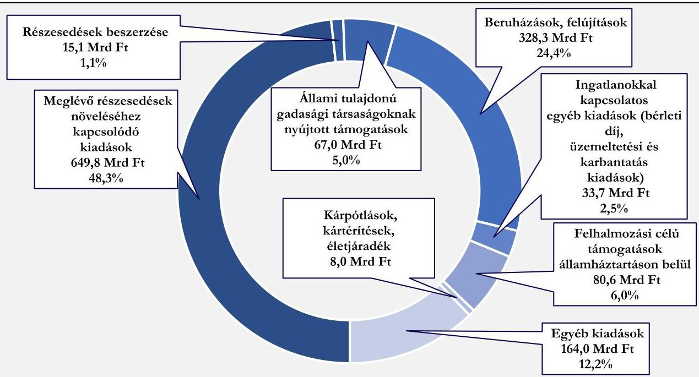
AZ ÁLLAMI VAGYONNAL ÉS ÁLLAMI BERUHÁZÁSOKKAL KAPCSOLATOS TELJESÍTETT KIADÁSOK MEGOSZLÁSA A 2024. ÉVBEN (%)

Forrás: 2024. évi zárszámadási törvényjavaslat, ÁSZ saját szerkesztés

---

Az ellenőrzés eredményei

Az állami vagyonnal kapcsolatos kiadásokat 14 költségvetési fejezet 112 központi kezelésű előirányzata tartalmazta. Az állami vagyonnal kapcsolatos kiadások 94,1%-a három fejezetet – a XLIII. Az állami vagyonnal kapcsolatos bevételk és kiadások fejezet (45,5%), a XLV. Állami beruházások fejezet (36,2%) és a XIII. Honvédelmi Minisztérium fejezet (12,4%) – érintett.

Az állami vagyonnal kapcsolatban teljesített kiadásoknak több, mint felét az állami tulajdonban lévő gazdasági társaságok forrásjuttatásai (részesedésének megszerzése 15,1 Mrd Ft, meglévő részesedések növelése 649,8 Mrd Ft) és e gazdasági társaságoknak nyújtott támogatások (67 Mrd Ft) adták. Az állami vagyonnal kapcsolatos kiadásokon belül 2024-ben jelentős (23,5%) részarányt képviseltek az ingatlan beruházások, melyek értéke elérte a 317 Mrd Ft-ot, a beruházások, felújítások 96,6%-át. Az ingatlan beruházási célokat tekintve a kiadások több, mint fele (53,1%) közútfejlesztési beruházásokra (117,7 Mrd Ft) és sport infrastruktúra fejlesztésre (50,7 Mrd Ft) került felhasználásra.

A Nemzeti Család- és Szociálpolitikai Alap kiadásaiból az ellenőrzött mintatételek esetében a kifizetést alátámasztó dokumentumok a Kvtv., valamint a Számv. tv. vonatkozó rendelkezéseinek megfelelően rendelkezésre álltak. A Nemzeti Család- és Szociálpolitikai Alap kiadásai a tervezett 771,8 Mrd Ft előirányzattal szemben, 780,0 Mrd Ft összegben teljesültek. A 2024. évben az ellenőrzött kifizetések tekintetében a legnagyobb összegű kifizetés a Családi pótlék jogcímen történt 305,1 Mrd Ft értékben.

Az állam által vállalt kezesség és viszontgarancia érvényesítésével kapcsolatos hét előirányzatból a Kvtv. a Garantiqa Hitelgarancia Zrt. garanciaügyleteiből eredő fizetési kötelezettség előirányzatát 49,0 Mrd Ft-ban állapította meg. A beváltott kezességekhez kapcsolódó viszontgarancia kifizetésére 35,9 Mrd Ft összegben került sor. Az Agrár-Vállalkozási Hitelgarancia Alapítvány kezességvállalásaihoz kapcsolódó állami viszontgarancia érvényesítése 3,9 Mrd Ft volt, amely a tervezett összegnek mindössze 46,9%-át tette ki. A két legnagyobb bevéltetelt teljesítő garantőr szervezet beváltott kezességvállalásai összesen 3,9 Mrd Ft megtérülést eredményeztek, az összes megtérülés 4,2 Mrd Ft volt. A babaváró kölcsönhöz tartozó állami kezesség beváltásából eredő kiadások teljesítése a tervezett 0,2 Mrd Ft előirányzatot 6,1 Mrd Ft-tal haladta meg.

A központi tartalék előirányzatok esetében az előirányzat felhasználás a kormányzati vagy egyéb jogszabályok által meghatározott döntés alapján, meghatározott célra kezdeményezett előirányzat átcsoportosítást jelenti. A 2024. évi költségvetés központi tartalék előirányzatainak alakulását és ezek felhasználását a 7. táblázat mutatja be, amelyben a felhasználás a tartalék előirányzatok közötti átcsoportosítások kiszűrésével számított összegeket mutatja.

21

---

Az ellenőrzés eredményei

7. táblázat
A 2024. ÉVI KÖLTSÉGVETÉS KÖZPONTI TARTALÉK ELŐIRÁNYZATAINAK ALAKULÁSA (MRD FT)

|  ELŐIRÁNYZAT MEGNEVEZÉSE | 2024. ÉVI ELŐIRÁNYZAT * | 2024. ÉVI FELHASZNÁLÁS | ELTÉRÉS | TELJESÍTÉSI ARÁNY (%)  |
| --- | --- | --- | --- | --- |
|  XV/26 /2 /3/1. Tanári béremelési Alap | 340,0 | 339,8 | -0,2 | 99,9%  |
|  XV/26 /2 /3/2. Egyéb Céltartalékok | 403,1 | 476,0 | 72,9 | 118,1%  |
|  XV/26 /2 /4. Járványügyi kiadások | 7,7 | 0,0 | -7,7 | 0,0%  |
|  XV/26 /2 /7. Rendkívüli kormányzati intézkedések | 220,0 | 186,4 | -33,6 | 84,7%  |
|  XLV/20. Beruházási Alap | 245,0 | 85,0 | -160 | 34,7%  |
|  L/1. Lakossági rezsivédelem | 917,0 | 983,8 | 66,8 | 107,3%  |
|  L/2. Központi költségvetési szervek kompenzációja | 187,3 | 211,1 | 23,8 | 112,7%  |
|  L/3. Önkormányzatok kompenzációja | 83,0 | 40,2 | -42,8 | 48,4%  |
|  L/4. Egyházi és civil intézményfenntartók támogatása | 65,9 | 42,3 | -23,6 | 64,2%  |
|  L/5. Állami tulajdonú társaságok támogatása | 50,0 | 50,9 | 0,9 | 101,8%  |
|  L/6. Versenyszektor támogatása | 37,5 | 33,2 | -4,3 | 88,5%  |
|  XLII/45. Központi Maradvány-elszámolási Alap | 0 | 169,9 | 169,9 | -  |
|  Összesen | 2 556,5 | 2 618,6 | 62,1 | 102,4%  |

Forrás: Kvtv., 1004/2024. (I.18.) Korm. határozat¹, 2024. évi zárszámolási törvényjavaslat, ASZ saját szerkesztés
*A központi tartalékok a Kvtv.-ben 3 866,1 Mrd Ft. összegben kerültek megtervezésre. A táblázat nem tartalmazza a Honvédelmi alap 2024. évre tervezett 1 309,6 Mrd Ft összegű előirányzatát.

A 2024. évben a Céltartalékok, a Járványügyi kiadások és a Rendkívüli kormányzati intézkedések, a Beruházási Alap, valamint a Rezsivédelmi Alap (ezen belül: Lakossági rezsivédelem, Központi költségvetési szervek kompenzációja, Önkormányzatok kompenzációja, Egyházi és civil intézményfenntartók támogatása, Állami tulajdonú társaságok támogatása, Versenyszektor támogatása) költségvetés központi tartalék előirányzatainak képzése és felhasználása szabályszerű volt.

A Központi Maradvány-elszámolási Alap előirányzatok módosítása és átcsoportosítása szabályszerű volt. A tartalékok felhasználásának részletes bemutatása a VII. számú mellékletben található.

---

Az ellenőrzés eredményei

# 4. A fejezeti kezelésű előirányzatok, valamint az uniós és a kapcsolódó hazai forrásból finanszírozott támogatások teljesítése, a kiadások szabályszerűségi ellenőrzésének eredményei

## Összegző megállapítás

A fejezeti kezelésű előirányzatok kiadásainak, valamint az uniós és a kapcsolódó hazai forrásból finanszírozott támogatások kiadási előirányzatainak teljesítése kapcsán az ellenőrzött tranzakciók tekintetében az ÁSZ szabályszerűségi hibát nem tárt fel.

## 4.1 számú megállapítás

A fejezeti kezelésű előirányzatok kiadásai jelentősen, mintegy ötödével meghaladták az Kvtv.-ben tervezett összeget. A fejezeti kezelésű előirányzatok ellenőrzött teljesített kiadásai esetében az ÁSZ szabályszerűségi hibát nem tárt fel.

A fejezeti kezelésű előirányzatok terhére történt kiadások legnagyobb részben vissza nem térítendő, ellenérték nélküli (pénzben nyújtott) költségvetési támogatások voltak, melyek jellemzően előlegként kerültek kifizetésre utólagos beszámolási, elszámolási kötelezettséggel. A fejezeti kezelésű előirányzatok bevételei a kiadások fedezetére előirányzott bevételek, valamint támogatás visszafizetések voltak.

A fejezeti kezelésű előirányzatok az Ávr. alapján jogi személyiséggel nem bírnak, munkáltatóként munkaerőt nem foglalkoztathatnak, saját tulajdonnal nem rendelkezhetnek. A központi költségvetésből történő célfinanszírozások pénzügyi eszközei, ezen okból a fejezeti kezelésű előirányzatokra jellemző a változékonyság: a címrendi besorolás változása, egy címrendi soron belül az év közben végrehajtott előirányzat módosítás, vagy a felülről nyitott előirányzaton történő túlteljesítés.

A fejezeti kezelésű előirányzatok 2024. évi előirányzott és teljesített bevételi és kiadási adatait, valamint pénzforgalmi egyenlegét a 8. táblázat szemlélteti.

8. táblázat
A FEJEZETI KEZELÉSŰ ELŐIRÁNYZATOK BEVÉTELEINEK, KIADÁSAINAK, VALAMINT PÉNZFORGALMI EGYENLEGÉNEK ALAKULÁSA A 2024. ÉVBEN (MRD FT)

|  MEGNEVEZÉS | ELŐIRÁNYZAT | TELJESÍTÉS | ELTÉRÉS | TELJESÍTÉSI ARÁNY  |
| --- | --- | --- | --- | --- |
|  Bevétel | 323,0 | 676,4 | 353,4 | 209,4%  |
|  Kiadás | 4 023,3 | 4 855,6* | 832,3 | 120,7%  |
|  Pénzforgalmi egyenleg | -3 700,3 | -4 179,2 | -478,9 | 112,9%  |

Forrás: 2024. évi zárszámadási törvényjavaslat, ÁSZ saját szerkesztés
*ebből 230,6 Mrd Ft a jelentés II. Függelékének „Az ellenőrzés módszere és az ellenőrzési bizonyítékok köre" részében leírtak szerint uniós források és a kapcsolódó hazai forrásból finanszírozott támogatások területen került ellenőrzésre

A 2024. évben 298 fejezeti kezelésű előirányzaton történt teljesítés a bevételek vagy a kiadások tekintetében. Ezen előirányzatok fejezetek közötti megoszlását és a kiadások adatait a 9. táblázat tartalmazza.

23

---

Az ellenőrzés eredményei

9. táblázat
A FEJEZETI KEZELÉSŰ ELŐIRÁNYZATOK FEJEZETEK KÖZTI MEGOSZLÁSA ÉS A KIADÁSOK ADATAI A 2024. ÉVBEN (DB, MFT)

|  FEJEZETEK | FEJEZETI KEZELÉSŰ ELŐIRÁNYZAT DB | FELÜLRŐL NYITOTT ELŐIRÁNYZAT DB | ÉREDETI KIADÁSI ELŐIRÁNYZAT M FT | KIADÁS TELJESÍTÉSE M FT | ELTÉRÉS  |
| --- | --- | --- | --- | --- | --- |
|  Országgyűlés | 11 |  | 69 510,4 | 53 601,6 | -15 908,8  |
|  Köztársasági Elnökség | 5 |  | 1 679,2 | 531,3 | -1 147,9  |
|  Bíróságok | 4 | 1 | 6 494,9 | 167,4 | -6 327,5  |
|  Ügyészség | 1 | 1 | 30,0 | 24,0 | -6,0  |
|  Igazságügyi Minisztérium | 3 | 1 | 5 880,8 | 4 811,9 | -1 068,9  |
|  Miniszterelnökség | 31 | 1 | 257 095,7 | 410 243,6 | 153 147,9  |
|  Agrárminisztérium | 13 | 2 | 111 156,0 | 125 384,5 | 14 228,5  |
|  Honvédelmi Minisztérium | 26 | 2 | 162 680,0 | 189 435,8 | 26 755,8  |
|  Belügyminisztérium | 47 | 7 | 946 147,5 | 1 123 046,4 | 176 898,9  |
|  Pénzügyminisztérium | 10 | 1 | 22 922,8 | 28 341,0 | 5 418,2  |
|  Építési és Közlekedési Minisztérium | 23 |  | 299 944,7 | 473 956,3 | 174 011,6  |
|  Energiaügyi Minisztérium | 12 | 1 | 288 024,9 | 197 693,5 | -90 331,4  |
|  Külgazdasági és Külügyminisztérium | 20 | 2 | 241 733,7 | 358 635,6 | 116 901,9  |
|  Kulturális és Innovációs Minisztérium | 38 | 4 | 635 227,8 | 769 104,5 | 133 876,7  |
|  Miniszterelnöki Kabinetiroda | 16 |  | 287 168,9 | 341 140,3 | 53 971,4  |
|  Gazdaságfejlesztési Minisztérium | 13 |  | 333 707,0 | 498 984,8 | 165 277,8  |
|  Közigazgatási és Területfejlesztési Minisztérium | 7 | 1 | 6 526,7 | 17 218,2 | 10 691,5  |
|  Gazdasági Versenyhivatal | 2 |  | 234,5 | 45,8 | -188,7  |
|  Központi Statisztikai Hivatal | 2 |  | 1 233,8 | 2 368,5 | 1 134,7  |
|  Magyar Tudományos Akadémia | 5 |  | 7 353,0 | 3 527,9 | -3 825,1  |
|  Magyar Művészeti Akadémia | 6 |  | 2 080,9 | 2 812,7 | 731,8  |
|  Nemzeti Kutatási Fejlesztési és Innovációs Hivatal | 2 |  | 13 796,3 | 13 811,9 | 15,6  |
|  Magyar Kutatási Hálózat | 1 |  | 4 351,7 | 10 157,3 | 5 805,6  |
|  Végösszeg | 298 | 24 | 3 704 981,2 | 4 625 044,8 | 920 063,6  |

Forrás: 2024. évi zárszámolási törvényjavaslat, Magyar Államkincstár adatbázisa, ÁSZ saját szerkesztés
A táblázat nem tartalmazza az uniós források és a kapcsolódó hazai forrásból finanszírozott támogatások területén ellenőrzött előirányzatokat.

A fejezeti kezelésű előirányzatok kiadásait tekintve 298 előirányzat közül 27 előirányzaton nem terveztek és azokról nem is teljesítettek kiadást, kizárólag bevétel került rajtuk elszámolásra. 19 előirányzaton a tervezett kiadás ellenére nem történt teljesítés, míg 45 előirányzaton a Kvtv-ben nem terveztek kiadást, ennek ellenére az év során történt teljesítés.

A 2024. évben a 298 fejezeti kezelésű előirányzatból 24 olyan előirányzat volt, amelynél a kiadások Kvtv.-ben előírtak szerinti teljesülése módosítás nélkül eltérhetett az előirányzattól (un. felülről nyitott előirányzat). A többi előirányzat esetében a tervezett kiadás túlteljesítéséhez előirányzat módosításra volt szükség.

A 2024. évben 17 fejezeti kezelésű előirányzat kiadási összegében történt túlteljesítés az eredeti előirányzathoz képest, összesen 308,7 Mrd Ft összegben. Legnagyobb mértékben a Belügyminisztérium

24

---

Az ellenőrzés eredményei

fejezet „20/31/1 Köznevelési célú humánszolgáltatás és működési támogatás” és „20/32/1 Szociális célú nem állami humánszolgáltatások támogatása” előirányzatai esetében volt eredeti előirányzat-tülteljesítés, összesen 133,1 Mrd Ft, valamint 97,3 Mrd Ft összegben. A két előirányzat az egyházi, a magán és a nemzetiségi önkormányzati fenntartású köznevelési intézmények fenntartóik útján történő állami támogatására, valamint az egyházi és más nem állami fenntartású szociális, gyermekjóléti és gyermekvédelmi intézmények működési kiadásainak támogatására szolgált. A pedagógus bérfejlesztés jelentős mértékben járult hozzá a köznevelési célú előirányzat tülteljesítéséhez.

A fejezeti kezelésű előirányzatok támogatásai esetében jellemző volt, hogy az Áht. alapján a fejezetet irányító szervek lebonyolító vagy közreműködő szervezeteket bíztak meg a támogatásokkal kapcsolatos feladatok ellátásával.

Az ÁSZ a fejezeti kezelésű előirányzatok ellenőrzött kiadási tranzakcióinál szabályszerűségi hibát nem tárt fel. Az ellenőrzött tételek tekintetében az Áht. és az Ávr. rendelkezései szerint a kötelezettségvállalási és teljesítésigazolási jogkört az arra jogosult személyek gyakorolták, továbbá a teljesítésigazolt és kifizetett összegek összhangban voltak a kötelezettségvállalás dokumentumában foglaltakkal.

Az előirányzatokból teljesített ellenőrzött kiadások a vonatkozó jogszabályokban és a belső szabályzatokban meghatározott céloknak megfeleltek. A támogatások odaítéléséről a megfelelő testület/szerv/személy döntött, a támogatói okiratban, támogatási szerződésben rögzítették a jogszabályokban foglalt kötelezettségek megtartását biztosító feltételeket.

Az ÁSZ jogszabályi felhatalmazás alapján ellenőrizheti a fejezeti kezelésű előirányzatok felhasználását. Több ÁSZ jelentés is bemutatta a Miniszterelnökség fejezetben rendelkezésre álló támogatási célú fejezeti kezelésű előirányzatokból kezelő szerv által egyesületek és alapítványok részére nyújtott támogatások felhasználásának és elszámolásának ellenőrzési eredményeit. A jelentések kitérnek többek között a támogatás felhasználására vonatkozó jogszabályi és szerződéses előírások betartására, a támogatás felhasználás támogatói okiratnak való megfelelőségére, valamint a beszámolási és közzétételi kötelezettség teljesítésére. (a 25016., 25017., 24222., 24223., 24211. számú jelentések elérhetősége: https://www.asz.hu/jelentesek)

4.2 számú megállapítás

Az uniós és a kapcsolódó hazai forrásból finanszírozott támogatások bevételei és kiadásai jelentősen elmaradtak a Kvtv.-ben tervezett összegtől. Az ellenőrzött kiadási előirányzatok teljesítése szabályszerűen történt.

Az uniós és a kapcsolódó hazai forrásból finanszírozott támogatások bevételei és kiadásai – az előző évek gyakorlatával összhangban – a központi költségvetésben széttagoltan jelentek meg, a magyar költségvetési struktúra és az uniós források tematikus elosztása alapján. A bevételek és kiadások döntő részben a XLII. A költségvetés közvetlen bevételei és kiadásai fejezetben, valamint az XIX. Uniós fejlesztések fejezet 3. címében kerültek megjelenítésre. Ezen felül speciális felhasználási szabályaik vagy az érintett minisztériumok hatásköre miatt uniós területhez tartozó előirányzatok szerepeltek a XII. Agrárminisztérium és a XIV. Belügyminisztérium fejezetekben. A XVIII. Külgazdasági és Külügyminisztérium fejezetben a visszafizetendő támogatásokból keletkezett bevétel a Brexit Alkalmazkodási Tartalék (BAR) előirányzaton.

Az uniós és kapcsolódó hazai forrásból finanszírozott támogatások 2024. évi előirányzott és teljesített bevételi és kiadási adatait, valamint pénzforgalmi egyenlegét a 10. táblázat szemlélteti.

25

---

Az ellenőrzés eredményei

10. táblázat
AZ UNIÓS ÉS KAPCSOLÓDÓ HAZAI FORRÁSBÓL FINANSZÍROZOTT TÁMOGATÁSOK BEVÉTELEINEK, KIADÁSAINAK, VALAMINT PÉNZFORGALMI EGYENLEGÉNEK ALAKULÁSA A 2024. ÉVBEN (MRD FT)

|  MEGNEVEZÉS | ELŐIRÁNYZAT | TELJESÍTÉS | ELTÉRÉS | TELJESÍTÉSI ARÁNY  |
| --- | --- | --- | --- | --- |
|  Bevétel | 2 479,8 | 1 258,5 | -1 221,3 | 50,8%  |
|  Kiadás | 3 605,8 | 1 507,9 | -2 097,9 | 41,8%  |
|  Pénzforgalmi egyenleg | -1 126,0 | -249,4 | 876,6 | 22,1%  |

Forrás: 2024. évi zárszámadási törvényjavaslat, ÁSZ saját szerkesztés

A 2024. évben az uniós területen mind a bevétel, mind a kiadások jelentősen elmaradtak a Kvtv.-ben előirányzott összeghez képest. A kiadások elmaradása meghaladta a bevételnek tapasztalható összeget, ezáltal az uniós előirányzatok a tervezettnél alacsonyabb hiánnyal teljesültek.

Az uniós programok bevételének jogcímek szerint előirányzott és teljesített megoszlását a 11. táblázat tartalmazza.

11. táblázat
AZ UNIÓS PROGRAMOK UNIÓS ÉS EGYÉB BEVÉTELEINEK ALAKULÁSA A 2024. ÉVBEN (MRD FT)

|  MEGNEVEZÉS | ELŐIRÁNYZAT | TELJESÍTÉS | ELTÉRÉS | TELJESÍTÉSI ARÁNY  |
| --- | --- | --- | --- | --- |
|  UNIÓS PROGRAMOK UNIÓS BEVÉTELEI (XIII. fejezet 6. cím)  |   |   |   |   |
|  Kohéziós Operatív Programok 2014-2020 | 178,7 | 16,1 | -162,6 | 9,0%  |
|  Kohéziós Operatív Programok 2021-2027 | 1 091,7 | 429,4 | -662,3 | 39,3%  |
|  Helyreállítási és Ellenállóképességi Eszköz (RRF) | 767,1 | 53,2 | -713,9 | 6,9%  |
|  Agrár- és halászati alapok programjai | 287,1 | 209,6 | -77,5 | 73,0%  |
|  Egyéb | 68,6 | 66,8 | -1,8 | 97,4%  |
|  Összesen | 2 393,2 | 775,1 | -1 618,1 | 32,4%  |
|  UNIÓS PROGRAMOK EGYÉB BEVÉTELEI - Uniós fejlesztések (XIX. fejezet, 3. cím)  |   |   |   |   |
|  Terület- és Településfejlesztési OP Plusz (TOP Plusz) | 0,0 | 287,7 | 287,7 | nem értelmezhető  |
|  Egyéb | 86,4 | 191,2 | 104,8 | 221,3%  |
|  Összesen | 86,4 | 478,9 | 392,5 | 554,3%  |
|  Egyéb | 0,2 | 4,5 | 4,3 | 2250,0%  |
|  Mindösszesen | 2 479,8 | 1 258,5 | -1 221,3 | 50,8%  |

Forrás: 2024. évi zárszámadási törvényjavaslat, ÁSZ saját szerkesztés

A tervezettnél alacsonyabb bevételi összeg teljesülésében a kohéziós operatív programok bevételének elmaradása, valamint a koronavírus hatásainak enyhítésére biztosított Helyreállítási és Rezilienciaépítési Eszköz (RRF⁵⁴) bevételének Európai Bizottság által történő visszatartása játszott döntő szerepet. A bevételmaradás hatását legnagyobb mértékben a Terület- és Településfejlesztési OP Plusz (TOP Plusz) jogcímmel kapcsolatban a korábban kifizetett előlegekre vonatkozó, kedvezményezettek általi visszautalások összege mérséklete.

Az uniós és a kapcsolódó hazai forrásból finanszírozott támogatások kiadásai alakulásának részletes adatait a 12. táblázat mutatja be.

26

---

Az ellenőrzés eredményei

12. táblázat
AZ UNIÓS ÉS KAPCSOLÓDÓ HAZAI FORRÁSBÓL FINANSZÍROZOTT TÁMOGATÁSOK KIADÁSAINAK ALAKULÁSA A 2024. ÉVBEN (MRD FT)

|  MEGNEVEZÉS | ELŐIRÁNYZAT | TELJESÍTÉS | ELTÉRÉS | TELJESÍTÉSI ARÁNY  |
| --- | --- | --- | --- | --- |
|  Kohéziós alapok programjai, ebből: | 2 128,6 | 766,9 | -1 361,7 | 36,0%  |
|  Operatív programok 2014-2020 | 205,0 | 184,3 | -20,7 | 89,9%  |
|  Operatív programok 2021-2027 | 1 824,3 | 564,7 | -1 259,6 | 31,0%  |
|  Európai Területi Együttműködési Programok 2014-2020 | 0,2 | 0,4 | 0,2 | 200,0%  |
|  Európai Területi Együttműködési Programok 2021-2027 | 34,0 | 11,2 | -22,8 | 32,9%  |
|  Európai Hálózatfinanszírozási Eszköz (CEF) projektek 2014-2020 | 19,5 | 4,8 | -14,7 | 24,6%  |
|  Európai Hálózatfinanszírozási Eszköz (CEF) projektek 2021-2027 | 45,6 | 1,5 | -44,1 | 3,3%  |
|  Helyreállítási és Ellenállóképességi Eszköz (RRE) | 766,8 | 115,4 | -651,4 | 15,0%  |
|  Agrár- és halászati alapok programjai, ebből: | 669,5 | 606,8 | -62,7 | 90,6%  |
|  Vidékfejlesztési Program | 460,0 | 401,9 | -58,1 | 87,4%  |
|  Magyar Halgazdálkodási Operatív Program | 3,5 | 1,4 | -2,1 | 40,0%  |
|  Magyar Halgazdálkodási Operatív Program Plusz | 3,0 | 0,0 | -3,0 | 0,0%  |
|  Stratégiai Terv Vidékfejlesztési Intézkedései | 190,0 | 189,4 | -0,6 | 99,7%  |
|  Uniós programok kiegészítő támogatása | 13,0 | 14,1 | 1,1 | 108,5%  |
|  Egyéb uniós programok, ebből: | 40,9 | 18,8 | -22,1 | 45,9%  |
|  Európai Uniós és nemzetközi projektek/programok megvalósításához kapcsolódó kiadások | 1,2 | 1,0 | -0,2 | 83,3%  |
|  Belügyi Alapok 2014-2020 | 12,2 | 9,2 | -3,0 | 75,4%  |
|  Belügyi Alapok 2021-2027 | 17,2 | 6,0 | -11,2 | 34,9%  |
|  EGT és Norvég Finanszírozási Mechanizmusok 2014-2021 | 1,0 | 0,0 | -1,0 | 0,0%  |
|  Svájci-Magyar Együttműködési Program II. | 9,3 | 2,6 | -6,7 | 27,9%  |
|  Összesen | 3 605,8 | 1 507,9 | -2097,9 | 41,8%  |

Forrás: 2024. évi zárszámadási törvényjavaslat, ÁSZ saját szerkesztés

Az uniós programok kiadásain belül a 2024. évben – hasonlóan az előző időszakhoz – a kohéziós alapok programjai voltak túlsúlyban, ezen belül az előző, illetve az aktuális programozási időszak kohéziós operatív programjai voltak a meghatározók. A 2014-2020 programozási időszak kohéziós operatív programjait érintően új felhívás már nem jelent meg, folyamatban lévő elszámolások és projekt zárások történtek. A 2021-2027 programozási időszak kohéziós operatív programjainak kiadásai jelentősen elmaradtak a tervezettől. A kohéziós operatív programokon belül az Emberi Erőforrás Fejlesztés OP Plusz (EFOP Plusz) teljesítése lett a legmagasabb összegű (254,5 Mrd Ft), a teljesülés az előirányzott összegnek azonban mindössze 69,9%-át jelentette. Az EFOP Plusz operatív program célja a szociális felzárkóztatás támogatása, mely a köznevelés, társadalmi felzárkózás, szociális és gyermekvédelem, valamint család és ifjúságügy humán szakterületek fejlesztéseinek keresztül valósult meg. Ezen belül a kiadás 91,7%-a a „Pedagógus életpályamodell” célra történt.

---

Az ellenőrzés eredményei

A Helyreállítási és Ellenállóképességi Eszköz (RRF) kiadásai az előirányzott összeghez képest szintén alacsonyan teljesültek. Az Európai Unió Tanácsa 2022. év végén fogadta el Magyarország Helyreállítási és Ellenállóképességi Tervét (HET), amely 2023. év végén kibővült a tiszta energiára való átállás felgyorsítását célzó REPowerEU fejezettel. A Helyreállítási Tervben foglalt intézkedések végrehajtása a 2024. évben folytatódott, azonban a felhívások megjelenése, a támogatási szerződések megkötése, ezáltal a kifizetések lassabban haladtak a tervezettnél.

Agrár- és halászati alapok programjainak kifizetései a többi területhez képest kisebb mértékben maradtak el az előirányzattól. A programokon belül a Vidékfejlesztési Program (VP) teljesítése volt a legmagasabb értékű, melynek alapvető célja a mezőgazdaság és az élelmiszeripar területén működő mikro-, kis- és középvállalkozások támogatása, a munkaerő-igényes ágazatok innovatív fejlesztése és a vidék lakosságmegtartó képességének erősítése volt.

A kiadásokon belül kis arányt képviselő egyéb uniós programok kiadásai szintén az előirányzott összeg alatt teljesültek. Az egyéb programokon belül jelentősebb volt a XIV. Belügyminisztérium fejezet Belügyi Alapok két programozási időszakban megjelenő előirányzata, amely több alapot foglalt magában.

Az ÁSZ az uniós és a kapcsolódó hazai forrásból finanszírozott támogatásokon belül a 2014-2020 programozási időszak, valamint a 2021-2027 programozási időszak kohéziós politikai operatív programjai, a Helyreállítási és Ellenállóképességi Eszköz, valamint a Vidékfejlesztési és halászati programok, továbbá az egyéb uniós programok ellenőrzött kiadási tranzakcióival kapcsolatban nem tárt fel szabályszerűségi hibát. Az Áht., az Ávr. és az adott alapra vonatkozó jogszabályoknak megfelelően a támogatási kérelmekről a megfelelő hatóság döntött, a támogatói okiratokat/szerződéseket a kötelezettségvállalásra jogosult személyek állították ki/kötötték meg, valamint a támogatói okiratokban/szerződésekben szereplő összegek összhangban voltak a támogatási döntésekkel. A vonatkozó jogszabályok szerint történt a kifizetési kérelmek benyújtása, továbbá rendelkezésre álltak a teljesítésigazolások dokumentumai.

Az ÁSZ figyelmet fordít a kifizetett uniós támogatások felhasználásának utólagos vizsgálatára. A Nemzeti Vízstratégia végrehajtásról készített 25024. számú jelentés átfogó képet ad a vízgazdálkodás, a fenntartható mezőgazdasági vízhasználat kérdéseiről, ezen belül az öntözés/öntözésfejlesztés támogatásáról. A jelentés megállapítása szerint az ellenőrzött 2019-2023. években a gazdálkodók öntözésfejlesztései uniós forrásokból valósultak meg, azonban a pályázati kiírások csak kisebb részben vették figyelembe a fenntartható vízkészletgazdálkodás szempontjait. Az uniós források felhasználása összhangban volt az előzetesen felmért igényekkel, a források felhasználása során azonban nem vették figyelembe az öntözővíz legjobb hasznosulását. (a 25025. számú jelentés elérhetősége: https://www.asz.hu/jelentesek)

28

---

Az ellenőrzés eredményei

# 5. A központi alrendszerbe tartozó szervezetek bevételi és kiadási előirányzatainak teljesítése, a teljesítések és a kontrollkörnyezet szabályszerűségi ellenőrzésének eredményei

## Összegző megállapítás

A központi alrendszerbe tartozó szervezetek ellenőrzött kiadási előirányzatainak teljesítése kapcsán szabályszerűségi hibák jellemzően az utalványozási jogkör gyakorlással kapcsolatban merültek fel. Az ellenőrzött szervezetek a költségvetés végrehajtásához kapcsolódó kontrollkörnyezetet kialakították. A kontrollkörnyezethez kapcsolódóan a számviteli, valamint a beszerzésre vonatkozó szabályozás területén voltak hiányosságok.

## 5.1 számú megállapítás

A központi alrendszerbe tartozó szervezetek bevételéi és kiadásai is meghaladták az eredetileg előirányzott összegeket, ennek eredőjeként a tervezettnél nagyobb hiánnyal járultak hozzá a központi költségvetés hiányához. A központi alrendszerbe tartozó szervezetek kiadási előirányzatainak teljesítése kapcsán az ellenőrzés szabályszerűségi hibákat állapított meg, melyek főként az utalványozási jogkör gyakorlásával voltak kapcsolatban.

A központi alrendszerbe tartozó szervezetek – központi költségvetési szervek – 2024. évi előirányzott és teljesített bevételi és kiadási adatait, valamint pénzforgalmi egyenlegét a 13. táblázat szemlélteti.

13. táblázat
A KÖZPONTI ALRENDSZERBE TARTOZÓ SZERVEZETEK BEVÉTELEINEK, KIADÁSAINAK, VALAMINT PÉNZFORGALMI EGYENLEGÉNEK ALAKULÁSA A 2024. ÉVBEN (MRD FT)

|  MEGNEVEZÉS | ELŐIRÁNYZAT | TELJESÍTÉS | ELTÉRÉS | TELJESÍTÉSI ARÁNY  |
| --- | --- | --- | --- | --- |
|  Bevétel | 1 618,8 | 2 670,7 | 1 051,9 | 165,0%  |
|  Kiadás | 5 752,8 | 9 214,1 | 3 461,3 | 160,2%  |
|  Pénzforgalmi egyenleg | -4 134,0 | -6 543,4 | -2 409,4 | 158,3%  |

Forrás: 2024. évi zárszámadási törvényjavaslat, ÁSZ saját szerkesztés

A központi alrendszerbe tartozó szervezetek 2024. évi teljesített bevételéi és kiadásai egyaránt meghaladták az eredetileg előirányzott összegeket, ezáltal e terület hiánya a Kvtv.-ben tervezett hiány több, mint másfélszeresét érte el.

A költségvetési év során mind a bevételi, mind a kiadási előirányzatok jelentős összegben módosultak a Kvtv.-ben előirányzotthoz képest. A költségvetési szervek év közben jelentős összegben kaptak működési támogatást, melyeket az eredetileg nem előirányzott működési vagy felhalmozási kiadásaik teljesítésére használtak fel. A 2024. évben a központi alrendszerbe tartozó szervezetek előirányzat módosításait összességében a 14. táblázat, hatáskörönként a 9. ábra szemlélteti.

29

---

Az ellenőrzés eredményei

14. táblázat

A KÖZPONTI ALRENDSZERBE TARTOZÓ SZERVEZETEK BEVÉTELI ÉS KIADÁSI ELŐIRÁNYZAT MÓDOSÍTÁSAI ÖSSZESSÉGÉBEN A 2024. ÉVBEN (MRD FT)

|  MEGNEVEZÉS | EREDETI ELŐIRÁNYZAT | MÓDOSÍTÁSOK ÖSSZESEN | MÓDOSÍTOTT ELŐIRÁNYZAT | MÓDOSÍTÁSI MUTATÓ (MÓDOSÍTOTT EI/ EREDETI EI)  |
| --- | --- | --- | --- | --- |
|  Bevétel | 1 618,8 | 1 047,8 | 2 666,6 | 164,7%  |
|  Kiadás | 5 752,8 | 4 996,4 | 10 749,2 | 186,9%  |

Forrás: 2024. évi zárszámadási törvényjavaslat, ÁSZ saját szerkesztés

9. ábra

A KÖZPONTI ALRENDSZERBE TARTOZÓ SZERVEZETEK 2024. ÉVI ELŐIRÁNYZAT MÓDOSÍTÁSAI HATÁSKÖRÖNKÉNT

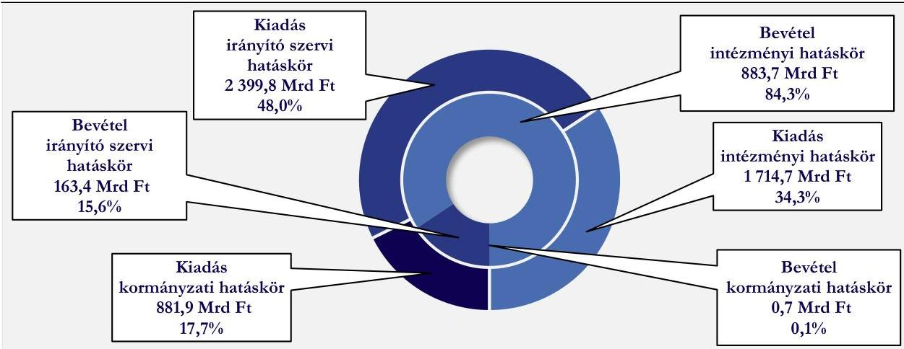

Forrás: 2024. évi zárszámadási törvényjavaslat, ÁSZ saját szerkesztés

A központi alrendszerbe tartozó szervezetek teljesített bevételi és kiadási adatainak megoszlását tranzakció típusonként a 10. ábra mutatja.

10. ábra

A KÖZPONTI ALRENDSZERBE TARTOZÓ SZERVEZETEK 2024. ÉVI TELJESÍTETT BEVÉTELEINEK ÉS KIADÁSAINAK ALAKULÁSA

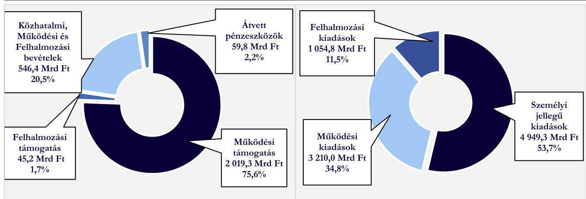

Forrás: 2024. évi zárszámadási törvényjavaslat, ÁSZ saját szerkesztés

A pénzügyileg teljesült bevételéken belül a költségvetési szervek saját bevételéi – a közfeladatellátásból származó, valamint működési és felhalmozási bevételék – 546,4 Mrd Ft-ot (20,5%) képviseltek, az államháztartáson belülről származó működési támogatások 2 019,3 Mrd Ft-ot tettek ki. A költségvetési

30

---

Az ellenőrzés eredményei

szerveknek nyújtott működési támogatások teljesült összege így önmagában is meghaladta a 2024. évi összes bevételi előirányzat értékét.

A teljesített kiadások 53,8%-a személyi juttatásokkal és a hozzá kapcsolódó adókkal kapcsolatban merült fel. A személyi juttatásokon kívüli, a költségvetési szervek operatív működésével kapcsolatos kiadások 3 210,0 Mrd Ft-os (34,8%) teljesítést jelentettek. Az összes teljesített felhalmozási kiadás az összes kiadáson belül 11,4%-ot képviselt. Ezen belül az új vagyont jelentő beruházási kiadások 949,0 Mrd Ft-ot (10,3%) tettek ki, a felújításra elszámolt kiadások összege 77,6 Mrd Ft, mindössze 0,8% volt.

A központi költségvetési szervek éves kiadási összegének alakulása mellett a kiadások teljesülésének szezonalitását is indokolt elemezni. Az ÁSZ T/622. számú, „A központi költségvetési szervek kiadásainak év végi felfutásáról és annak okairól” című elemzésében a központi költségvetési szervek kiadásainak év végi felfutását és annak okait vizsgálta a 2022. és 2023. évek vonatkozásában. Az elemzés a 12 legnagyobb decemberi kiadást teljesítő költségvetési szerv vagy intézménycsoport esetében szervezetenként részletesen, tágabb körben szakágazatok szerinti bontásában mutatta be a bevételek és kiadások évközi alakulását, valamint kiemelt előirányzatok szerinti összetételét. Az elemzés rámutatott arra, hogy a decemberi kiadások magas arányának legáltalánosabb oka az intézmények bevételeinek eredetileg nem tervezett folyamatos növekedése lehet, amelynek következtében az eredeti előirányzatuknál lényegesen több kiadás szabályos teljesítéséről kell gondoskodniuk. Ennek biztosítása időigényes folyamat volt, amely hozzájárult a magas decemberi kiadási arányhoz, különösen a beruházási és felújítási kiadások tekintetében. (a T/622. számú elemzés elérhetősége: https://www.asz.hu/elemzesek)

A kiválasztott központi alrendszerbe tartozó szervezetek ellenőrzött kiadási tranzakciói esetében az ÁSZ legjellemzőbb hibaként tárta fel, hogy az Áht. 38. § (1) bekezdésében foglaltak ellenére utalványozás mellőzésével került sor a kifizetések teljesítésére, mivel az utalványozás vagy a kifizetés dátumát követően, vagy egyáltalán nem történt meg. Több esetben az utalványrendelet nem tartalmazta teljeskörűen az Ávr. 59. § (3) bekezdésében meghatározott tartalmi elemeket. A feltárt hiányosságok a zárszámadási törvényjavaslat megbízhatóságát nem befolyásolták.

Az érintett szervezeteket az ÁSZ tájékoztatta a szabálytalanságok konkrét tartalmáról.

A feltárt hibák részletesen a III. számú mellékletben kerülnek kifejtésre.

Az ÁSZ figyelmet fordít arra, hogy a gazdasági események megtörténtét követően rövid időn belül ellenőrizze a költségvetési szervek kockázatelemzéssel kiválasztott kiadásainak szabályszerűségét. Ennek keretében 170 darab, összesen 24 államháztartási szakágazathoz tartozó központi költségvetési szerv 2024. évben teljesített dologi és felhalmozási célú kiadásának szabályszerűségére, ezen belül a gazdálkodási jogkörök szabályszerű gyakorlására és a megfelelő számviteli elszámolásra vonatkozó ellenőrzési eredmények kerültek bemutatásra. (a 24005., 24006., 24007., 24010., 24011., 24024., 24025., 24026., 24027., 24028., 24029., 24035., 24065., 25005., 25012., 25019., 25033. számú jelentések elérhetősége: https://www.asz.hu/jelentesek)

31

---

Az ellenőrzés eredményei

## 5.2 számú megállapítás

A központi alrendszerbe tartozó költségvetési szervek a költségvetés végrehajtásához kapcsolódó kontrollkörnyezeti elemeket kialakították. Hiányosságokat jellemzően a beszerzés szabályozásban, valamint a számviteli szabályozással kapcsolatban tárt fel az ellenőrzés.

A központi alrendszerben 2024. december 31-én 602 költségvetési szerv látott el az Áht. szerinti közfeladatot. A központi költségvetési szervek 2024. december 31-i fejezetet irányító szervenkénti alakulását a 15. táblázat szemlélteti.

### 15. táblázat

**KÖZPONTI KÖLTSÉGVETÉSI SZERVEK SZÁMA IRÁNYÍTÓ SZERVENKÉNT**
**A 2024.12.31-EI ÁLLAPOT SZERINT**

|  FEJEZETET IRÁNYÍTÓ SZERV | KÖZPONTI KÖLTSÉGVETÉSI SZERVEK SZÁMA (DB) | MEGOSZLÁS (%) | ELŐZŐ ÉVHEZ KÉPEST A VÁLTOZÁS (%)  |
| --- | --- | --- | --- |
|  Belügyminisztérium | 317 | 52,7 | -5,1  |
|  Kulturális és Innovációs Minisztérium | 63 | 10,5 | -7,4  |
|  Honvédelmi Minisztérium | 53 | 8,8 | 0,0  |
|  Bíróságok | 28 | 4,7 | 0,0  |
|  Közigazgatási és Területfejlesztési Minisztérium | 22 | 3,7 | n.é.  |
|  Agrárminisztérium | 21 | 3,5 | -4,5  |
|  Magyar Kutatási Hálózat | 20 | 3,3 | 0,0  |
|  A 20-nál kevesebb költségvetési szervet irányító fejezethez tartozó költségvetési szervek | 78 | 13,0 | -8,2  |
|  Központi költségvetési szervek összesen | 602 | 100,0 | -1,3  |

Forrás: Magyar Államkincstár törzskönyvi nyilvántartása alapján ÁSZ saját szerkesztés

A költségvetési szervek belső kontrollkörnyezetének szabályszerű kialakítása alapvető feltétele a rendelkezésre álló források, azaz a közpénzek átlátható, szabályszerű, szabályozott, célszerű, gazdaságos, hatékony és eredményes felhasználásának.

A kiválasztott központi alrendszerbe tartozó szervezetek kontrollkörnyezeti elemeit vizsgálva az ÁSZ megállapította, hogy az ellenőrzött szervezetek mindegyike az Áht. és az Ávr. előírásai szerint szervezeti és működési kereteire vonatkozó szabályozását kialakította a gazdasági szervezet tekintetében, továbbá rendelkezett a gazdálkodás részletes rendjét meghatározó szabályzattal.

A beszerzésre és a gazdálkodási jogkör gyakorlásra vonatkozó szabályozásban, valamint a számviteli szabályozással kapcsolatban az ÁSZ tárt fel hiányosságokat, melyek a központi költségvetés végrehajtásának megbízhatóságát nem befolyásolták.

Az érintett szervezeteket az ÁSZ tájékoztatta a feltárt szabálytalanságokról.

A szabálytalanságok részletes ismertetése a IV. számú mellékletben található.

---

Az ellenőrzés eredményei

# 6. Az ELKA és a TB Alapok előirányzatainak teljesítése, a teljesítések és a pénzügyi beszámolók szabályszerűségi ellenőrzésének eredményei

## Összegző megállapítás

Az ELKA³⁵ és a TB Alapok³⁶ előirányzatainak teljesítése kapcsán az ellenőrzött tranzakciók tekintetében az ÁSZ szabályszerűségi hibát nem tárt fel. A kezelő szervek az alapok beszámolóit a jogszabályoknak megfelelően készítették el.

## 6.1 számú megállapítás

Az ELKA fejezetekbe tartozó alapok összességében többlettel zárták a 2024. évet. A kiadások nagyobb mértékben múlták felül az előirányzott értéket, mint a bevételek, így a ELKA összesített többlete elmaradt a tervezettől. Az ellenőrzött kiadási tételek teljesítése szabályszerűen történt. Valamennyi alap esetében a kezelő szerv a 2024. évi beszámolót a vonatkozó jogszabályoknak megfelelően állította össze.

Az elkülönített állami pénzalapok a Kvtv.-ben önálló fejezetet képeztek. Az Áht. szerint létrehozásuk célja az állam egyes feladatainak részben, vagy egészben külső forrásokból történő finanszírozása volt. Az egyes alapokat létrehozó törvények tartalmazzák az alap rendeltetését, bevételi forrásait, a teljesíthető kiadások körét és a felelős személyt, testületet, a kezelő szervet, valamint az alap kezeléséhez szükséges kiadások finanszírozásának mértékét. Az ELKA-k közös jellemzője, hogy év végi pénzmaradványukat a következő esztendőkben is felhasználhatják. Gazdálkodási stabilitásuk megőrzése érdekében az elkülönített állami pénzalapoktól kizárólag törvényel lehet forrást elvonni. A Kvtv.-ben öt ELKA szerepelt az alábbiak szerint:

- LXII. fejezet Nemzeti Kutatási, Fejlesztési és Innovációs Alap (NKFIA³⁷)
- LXIII. fejezet Nemzeti Foglalkoztatási Alap (NFA³⁸)
- LXV. fejezet Bethlen Gábor Alap (BGA³⁹)
- LXVI. fejezet Központi Nukleáris Pénzügyi Alap (KNPA⁴⁰)
- LXVII. fejezet Nemzeti Kulturális Alap (NKA⁴¹)

Az ELKA 2024. évi előirányzott és teljesített bevételi és kiadási adatait, valamint pénzforgalmi egyenlegét a 16. táblázat szemlélteti.

## 16. táblázat

AZ ELKÜLÖNÍTETT ÁLLAMI PÉNZALAPOK BEVÉTELEINEK, KIADÁSAINAK, VALAMINT PÉNZFORGALMI EGYENLEGÉNEK ALAKULÁSA A 2024. ÉVBEN (MRD FT)

|  MEGNEVEZÉS | ELŐIRÁNYZAT | TELJESÍTÉS | ELTÉRÉS | TELJESÍTÉSI ARÁNY  |
| --- | --- | --- | --- | --- |
|  Bevétel | 846,9 | 856,3 | 9,4 | 101,1%  |
|  Kiadás | 662,0 | 718,3 | 56,3 | 108,5%  |
|  Pénzforgalmi egyenleg | 184,9 | 138,0 | -46,9 | 74,6%  |

Forrás: 2024. évi zárszámadási törvényjavaslat, ÁSZ saját szerkesztés

---

Az ellenőrzés eredményei

A 2024. évben valamennyi ELKA pozitív vagy nullszaldós egyenleggel zárt, legnagyobb többletettel (121,8 Mrd Ft) a KNPA rendelkezett. A KNPA jelentős összegű pozitív egyenlege az alap céljával indokolható. A nukleáris erőművek működésével kapcsolatos hosszú távú kihívás az erőmű leállását követő időszak költségeinek fedezése, melyre a forrás az alapban kerül felhalmozásra. A KNPA az Atomtörvény⁴² alapján a mindenkori Kvtv.-ben előírtak szerint számított ún. értékállósági hozzájárulásban részesül, amely a KNPA bevételét minden évben havi egyenlő részletekben növeli. A kialakított finanszírozási modell elősegíti, hogy az alapban felhalmozódott összeg fedezze a reaktorok leszerelésének, a kiégett üzemanyag átmeneti tárolásának és végleges elhelyezésének költségeit.

A 2024. évi teljesített bevételek és kiadások, valamint az egyenlegek alakulását alaponként a 11. ábra szemlélteti.

11. ábra

AZ EGYES ELKA ALAPOK TELJESÍTETT BEVÉTELEINEK ÉS KIADÁSAINAK, VALAMINT EGYENLEGÉNEK ALAKULÁSA A 2024. ÉVBEN (MRD FT)
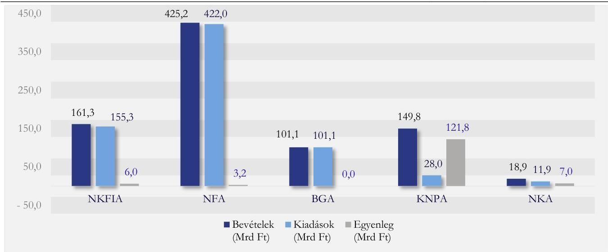
Forrás: 2024. évi zárszámadási törvényjavaslat, ÁSZ saját szerkesztés

Az elkülönített állami pénzalapok bevétele a 2024. évben 856,3 Mrd Ft volt, melynek közel fele (425,2 Mrd Ft, 49,7%) az NFA bevételét képezte. Az ELKA teljesített bevételei a 2024. évben összességében 9,4 Mrd Ft-tal (1,1%-kal) haladták meg az előirányzatot.

Az ELKA teljes bevételének legnagyobb részét (67,2%, 575,8 Mrd Ft) államháztartáson kívüli forrás, közel negyedét (24,2%, 206,9 Mrd Ft) a központi költségvetésből kapott támogatás biztosította, ezeken felül kisebb részben (8,6%, 73,6 Mrd Ft) az ELKA bevételét képezték még az egyéb befizetések és más jellegű (visszatérülés, törlesztés, kamatbevétel stb.) bevételek.

Az ELKA bevételi forrásainak százalékos megoszlását alaponként a 12. ábra szemlélteti.

---

Az ellenőrzés eredményei

12. ábra

AZ ELKA BEVÉTELI FORRÁSAINAK MEGOSZLÁSA ALAPONKÉNT A 2024. ÉVBEN
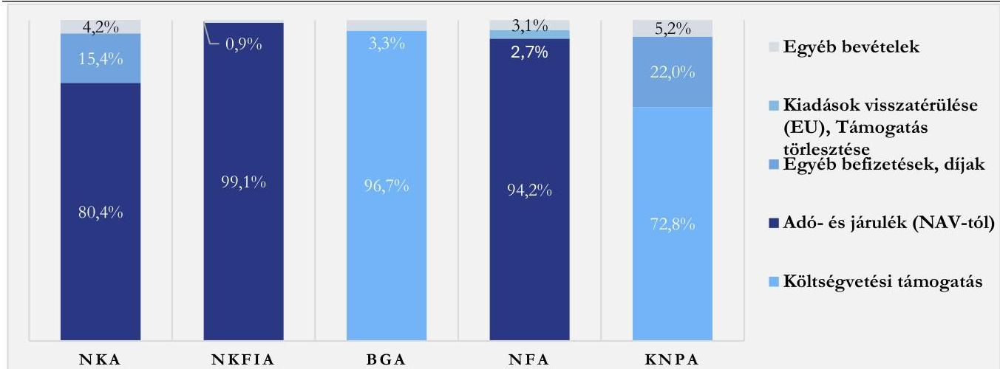
Forrás: 2024. évi zárszámadási törvényjavaslat, ÁSZ saját szerkesztés

Államháztartáson kívüli forrás – a NAV által beszedett és az alapoknak tovább utalt adó- és járulékbevétel – képezte az NFA, az NKFIA és az NKA bevételeinek meghatározó részét jogszabályi előírásnak megfelelő jogcímeken és mértékben. Az NFA bevételek döntő forrása jogszabályi előírás alapján munkaerőpiaci járulék címén, a társadalombiztosítási járulékbevétel 8,1%-a volt. Az NKFIA legfőbb bevételi forrását az innovációs járulék, míg az NKA meghatározó bevételét a játékadó jelentette.

Államháztartáson belüli forrásként a költségvetési támogatás fedezte a KNPA és a BGA bevételeinek meghatározó részét, szintén jogszabályi előírásnak megfelelően.

Az elkülönített állami pénzalapok kiadásai az alapok céljainak megfelelő támogatásokhoz kapcsolódtak.

Az ELKA 2024. évi előirányzott és teljesített kiadásainak alaponkénti bemutatását a 17. táblázat szemlélteti.

17. táblázat
AZ ELKÜLÖNÍTETT ÁLLAMI PÉNZALAPOK ELŐÍRÁNYZOTT ÉS TELJESÍTETT KIADÁSAINAK ALAKULÁSA A 2024. ÉVBEN (MRD FT)

|   | ELŐÍRÁNYZAT | TELJESÍTÉS | ELTÉRÉS | TELJESÍTÉSI ARÁNY  |
| --- | --- | --- | --- | --- |
|  NKFIA | 154,1 | 155,3 | 1,2 | 100,8%  |
|  NFA | 408,4 | 422,0 | 13,6 | 103,3%  |
|  BGA | 67,2 | 101,1 | 33,9 | 150,4%  |
|  KNPA | 22,9 | 28,0 | 5,1 | 122,3%  |
|  NKA | 9,4 | 11,9 | 2,5 | 126,6%  |
|  Összesen: | 662,0 | 718,3 | 56,3 | 108,5%  |

Forrás: 2024. évi zárszámadási törvényjavaslat, ÁSZ saját szerkesztés

Az NKFIA kiadásainak döntő részét (122,6 Mrd Ft, 78,9%) a Kutatási, Innovációs és Nemzeti Laboratóriumok Alaprészekhez kapcsolódó – a hazai vállalati innovációt és alapkutatásokat, valamint a vállalkozások és intézmények nemzetközi pályázatokba, együttműködésekbe történő bekapcsolását segítő – pályázati rendszerekben történő kifizetések tették ki.

Az NFA kiadásainak legnagyobb részét (41,9%-át) kitevő „Passzív kiadások, álláskeresési támogatások” teljesített kiadása (176,8 Mrd Ft) 36,0%-kal haladta meg a tervezett 130,0 Mrd Ft eredeti előirányzatot. Az

35

---

Az ellenőrzés eredményei

előirányzat felülről nyitott volt, teljesülése módosítás nélkül eltérhetett az eredeti előirányzattól, összege az álláskeresők számától és az álláskeresési járadék összegétől függően változott.

A BGA kiadásai múlták felül legnagyobb mértékben a Kvtv.-ben szereplő előirányzatot. A BGA célja, hogy támogassa a Magyarország határain kívül élő magyarság szülőföldjén való egyéni és közösségi boldogulását, előmozdítsa az anyaországgal való kapcsolataik ápolását és fejlesztését. A BGA terhére nyújtott határon túli költségvetési támogatásokkal kapcsolatos feladatokat az Áht. szerinti lebonyolító szerv látta el a BGA alapkezelő szervével kötött megállapodás alapján. Az előirányzat 50,4%-os túllépésének oka a BGA kiadásainak közel 90,0%-át kitevő „Nemzetpolitikai célú támogatások” jogcímen történő kifizetésekhez volt köthető. A „Nemzetpolitikai célú támogatások” kiadási jogcím eredeti előirányzata 57,0 Mrd Ft volt, amely az év folyamán kormánydöntésekkel és felügyeleti szervi módosítással 89,4 Mrd Ft-ra nőtt. Ezen a kiadási jogcímen a teljesítés az eredeti előirányzatot közel 60,0%-kal haladta meg. Az előirányzaton rendelkezésre álló források nemzetpolitikai célú támogatások nyújtására kerültek felhasználásra: normatív jellegű oktatási-nevelési és hallgatói támogatások, pályázatok, egyedi kérelmek/döntések alapján történő támogatások (pl: kárpátaljai magyar szervezetek működésének és fejlesztésének támogatása, határon túli sportszervezetek támogatása stb).

A KNPA Kvtv.-ben előirányzott kiadásait szintén túllépték a teljesült kiadások, melyek a radioaktív hulladék-tárolók beruházásával, a kiégett kazetták átmeneti tárolójának bővítésével, felújításával függtek össze.

Az NKA kiadásainak teljesítése főként pályázati rendszerben történt, a meghatározott támogatási célok figyelembevételével. Az NKA kollégiumai a Kvtv. alapján meghatározott keretek mentén fogalmazták meg pályázati felhívásaikat és döntöttek arról, hogy a 2024. évben mely területre fordítanak nagyobb hangsúlyt.

Az ELKA kiadási tranzakcióinál az ÁSZ szabályszerűségi hibát nem tárt fel. Az ellenőrzött mintatételek esetében az Áht. és az Ávr. rendelkezései szerint a kötelezettségvállalási és teljesítésigazolási jogkört az arra jogosult személyek gyakorolták, továbbá a teljesítésigazolt és kifizetett összegek összhangban voltak a kötelezettségvállalás dokumentumában foglaltakkal. Az alapokból teljesített kiadások az alapokat létrehozó törvényekben meghatározott céloknak megfeleltek. A támogatások odaítéléséről a megfelelő testület/szerv /személy döntött, a támogatói okiratban, támogatási szerződésben rögzítették a jogszabályokban foglalt kötelezettségek megtartását biztosító feltételeket.

36

---

Az ellenőrzés eredményei

Az ELKA minden alapja esetében a költségvetési beszámolót az alap kezelő szerve az Áhsz. tartalmi és formai előírásai szerint szabályszerűen és határidőben elkészítette, a költségvetési beszámolón belül a költségvetési jelentést főkönyvi kivonattal alátámasztotta, a beszámoló tartalmazta az Áhsz. által előírt adatokat. Az NFA-t, az NKA-t és az NKFIA-t megillető, a NAV által beszedett bevételek éves beszámolókban megjelenő összege összhangban volt a NAV adatszolgáltatásában szereplő összeggel.

Az ÁSZ ellenőrizte az NKFIA alapkezelője egyes feladatai ellátásának, valamint az NKFIA-ból nyújtott támogatások felhasználásának megfelelőségét. A 25056. számú jelentés megállapította, hogy a Nemzeti Kutatási, Fejlesztési és Innovációs Hivatal, mint alapkezelő, az NKFIA alaprészéből finanszírozott programok előkészítését nem a jogszabályi előírásoknak megfelelően hajtotta végre, a belső szabályozókat nem a jogszabályban foglaltaknak megfelelően készítette el. Program szinten a monitoring információk összesítése, kiértékelése, a programértékelések és azok eredményeinek nyilvánosságra hozatala a jogszabályban előírtak ellenére elmaradt. A program szintű és a projekt szintű értékelés nem azonos tartalmú fogalom, a programértékelés a programokban kitűzött célok megvalósítását, a projektértékelés az adott projektet értékeli. Az NKFI Alapból támogatásra került projektek előrehaladásának nyomon követése a jogszabályban és a projekt felhívás dokumentumaiban foglaltaknak megfelelően megvalósult. A 25007., 25008., 25009. számú, a támogatást felhasználó szervezeteknél végzett ellenőrzésekről szóló jelentések tartalmazták, hogy a Kutatási Alaprészből, az Innovációs Alaprészből, valamint a Nemzeti Laboratóriumok Alaprészéből megvalósított kiválasztott projektek esetében a támogatásokat összeségében célszerűen és eredményesen használták fel. (a 25056., 25007., 25008., 25009. számú jelentések elérhetősége: https://www.asz.hu/jelentesek)

## 6.2 számú megállapítás

A TB Alapok az előirányzott kiadásokat és bevételeket egyaránt kis mértékben meghaladva, hiánnyal teljesítették a 2024. évet. Az Ny. Alap⁴³ és az E. Alap⁴⁴ ellátási szektorában az ellenőrzött kiadási tranzakciók esetében, illetve E. Alap működési szektorában ellenőrzött bevételek és kiadások teljesítése esetén az ÁSZ nem tárt fel szabálytalanságot. A TB Alapok beszámolóit a kezelő szervek a vonatkozó jogszabályi előírások szerint állították össze.

A TB Alapok a Nyugdíjbiztosítási Alapot (Ny. Alap) és az Egészségbiztosítási Alapot (E. Alap) foglalják magukban, melyek előirányzatait a Kvtv. LXXI. fejezete, valamint LXXII. fejezete tartalmazta. A két alap a társadalombiztosítási ellátások (egészségbiztosítási ellátások és nyugdíjbiztosítási ellátások) fedezetére szolgál, az ellenőrzött 2024. évben az E. Alap kezelőszerve a Nemzeti Egészségbiztosítási Alapkezelő (NEAK⁴⁵), míg az Ny. Alap kezelőszerve a Magyar Államkincstár volt. Az Ny. Alap és az E. Alap által finanszírozott ellátásokkal összefüggő tevékenységeket a megyei és fővárosi kormányhivatalok is végeztek, az itt ellátott feladatok szakmai felügyeletét a TB Alapok kezelőszervei látták el. A Kvtv.-ben előirányzottak szerint az Ny. Alap elkülönített működési költségvetéssel nem rendelkezett, míg az E. Alap költségvetése magában foglalta az ellátási szektor bevételeit és kiadásait és a NEAK, mint intézmény működésére vonatkozó forrásokat, illetve kiadásokat.

A TB Alapok 2024. évi előirányzott és teljesített bevételi és kiadási adatait, valamint pénzforgalmi egyenlegét összesítve és alaponként a 18. táblázat tartalmazza.

37

---

Az ellenőrzés eredményei

18. táblázat
A TB ALAPOK BEVÉTELEINEK, KIADÁSAINAK, VALAMINT PÉNZFORGALMI EGYENLEGÉNEK ALAKULÁSA A 2024. ÉVBEN (MRD FT)

|  MÉGNEVEZÉS | ELŐIRÁNYZAT | TELJESÍTÉS | ELTÉRÉS | TELJESÍTÉSI ARÁNY  |
| --- | --- | --- | --- | --- |
|  Bevétel | 10 443,9 | 10 526,1 | 82,2 | 100,8%  |
|  Kiadás | 10 443,9 | 10 755,5 | 311,6 | 103,0%  |
|  Pénzforgalmi egyenleg | 0,0 | -229,4 | -229,4 |   |
|  ÁDATOK ALAPÖNKÉNT  |   |   |   |   |
|  NY. ALAP | ELŐIRÁNYZAT | TELJESÍTÉS | ELTÉRÉS | TELJESÍTÉSI ARÁNY  |
|  Bevétel | 6 019,9 | 6 022,5 | 2,6 | 100,0%  |
|  Kiadás | 6 019,9 | 6 217,0 | 197,1 | 103,3%  |
|  Pénzforgalmi egyenleg | 0,0 | -194,5 | -194,5 |   |
|  E. ALAP | ELŐIRÁNYZAT | TELJESÍTÉS | ELTÉRÉS | TELJESÍTÉSI ARÁNY  |
|  Bevétel | 4 424,0 | 4 503,6 | 79,6 | 101,8%  |
|  Kiadás | 4 424,0 | 4 538,5 | 114,5 | 102,6%  |
|  Pénzforgalmi egyenleg | 0,0 | -34,9 | -34,9 |   |

Forrás: 2024. évi zárszámadási törvényjavaslat, ÁSZ saját szerkesztés

A 2024. évben mindkét alap a tervezett főösszeghez képest 3 % körüli hiánnyal zárt.

A TB Alapok ellátási szektorainak teljesített bevételének megoszlását a 13. ábra mutatja be:

13. ábra
A TB ALAPOK ELLÁTÁSI SZEKTORAI TELJESÍTETT BEVÉTELEINEK MEGOSZLÁSA A 2024. ÉVBEN

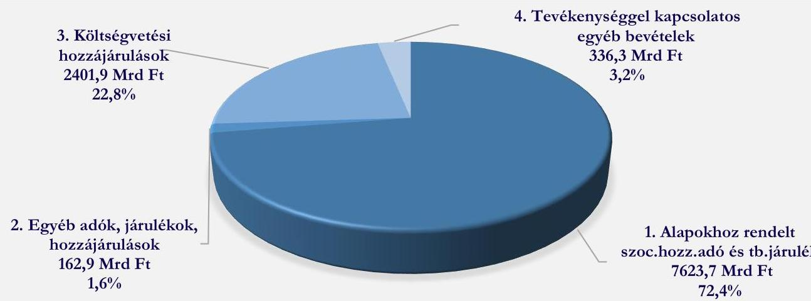

Az ábra nem tartalmazza az E. Alap működési szektorának 1,3 Mrd-os bevételét.

Forrás: 2024. évi zárszámadási törvényjavaslat, TB Alapok 2024. évi költségvetési beszámolói, ÁSZ saját szerkesztés

Az TB Alapok legnagyobb arányt képviselő bevételéi 72,4%-ban államháztartáson kívülről, döntően adó- és járulékjellegű befizetésként folytak be a költségvetésbe. Ugyanakkor a társadalombiztosítási ellátások teljesítéséhez szükséges volt az összes bevétel 22,8 %-át kitevő költségvetési hozzájárulás rendelkezésre bocsátására, azaz a TB Alapokhoz rendelt közterhek csak közel kétharmad részben fedezték a TB Alapok kiadásait. Amennyiben a két alap teljesített bevételét külön nézzük, az NY. Alap esetében 8,5%, míg az E. Alap tekintetében 42% volt a költségvetési hozzájárulás aránya.

A bevételék előirányzott és teljesített adatait jogcímcsoporthonkénti bontásban, az eltérések alakulásában szerepet játszó lényegesebb tényezők ismertetésével a V. számú melléklet mutatja be.

38

---

Az ellenőrzés eredményei

Az Ávr. alapján a TB Alapok bevételei jelentős részének beszedését a NAV végezte. Az alábbi jogcímek esetében a NAV által vezetett számlák egyenlege átvezetésre került a TB Alapok fizetési számláira.

19. táblázat

AZ NY. ALAP ÉS AZ E. ALAP NAV ÁLTAL BESZEDETT BEVÉTELEINEK RÉSZLETEZÉSE

|  NY. ALAP LXXI. FEJEZET CÍMRENDI BESOROLÁS  |
| --- |
|  1.1 Szociális hozzájárulási adó Ny. Alapot megillető része  |
|  1.2 Társadalombiztosítási járulék Ny. Alapot megillető része és nyugdíjjárulék  |
|  1.3 Egyéb járulékok és hozzájárulások RÉSZBEN  |
|  1.5 Késedelmi pótlék, bírság  |
|  E. ALAP LXXII. FEJEZET CÍMRENDI BESOROLÁS  |
|  1.1 Szociális hozzájárulási adó E. Alapot megillető része  |
|  1.2 Társadalombiztosítási járulék Ny. Alapot megillető része és nyugdíjjárulék  |
|  1.3 Egyéb járulékok és hozzájárulások RÉSZBEN  |
|  1.5 Késedelmi pótlék, bírság  |
|  1.7 Baleseti és egyéb kártérítési megtérítések, kifizetések visszatérítése és egyéb térítési díj bevétel RÉSZBEN  |
|  1.8 Gyógyszergyártók és forgalmazók befizetései RÉSZBEN  |
|  1.12 Népegészségügyi termékadó  |

Forrás: F/1. és F/2. számú tanúsítványok, ÁSZ saját szerkesztés

A jelentés II. Függelékének „Az ellenőrzés módszere és az ellenőrzési bizonyítékok köre” részében leírtak szerint a NAV által beszedett TB Alapokat megillető bevételek elszámolásának megbízhatóságáról a NAV bevallás feldolgozásának folyamat tesztelése keretében győződött meg az ÁSZ, mely az „Ellenőrzés eredményei” 2. pontjában került ismertetésre.

A TB Alapok teljesített kiadásai döntő részben az egészségbiztosítási és nyugdíjbiztosítási ellátások keretében nyújtott ellátásokkal kapcsolatban merültek fel, melyeket az 20. táblázat részletez.

20. táblázat

AZ NY. ALAP ÉS AZ E. ALAP KERETÉBEN NYÚJTOTT ELLÁTÁSOK FŐ KATEGÓRIÁI A 2024. ÉVBEN

|  NYUGDÍJBIZTOSÍTÁSI ALAP
(nyugdíjbiztosítási ellátások) | EGÉSZSÉGBIZTOSÍTÁSI ALAP
(egészségbiztosítási ellátások)  |
| --- | --- |
|  saját jogú nyugellátás | pénzbeli ellátások  |
|  hozzátartozói nyugellátás | természetbeni ellátások  |
|  egyösszegű méltányossági kifizetések | ellátásokhoz kapcsolódó egyéb kiadások  |
|  nyugdíjprémium |   |
|  tizenharmadik havi nyugdíj |   |

Forrás: 2024. évi zárszámadási törvényjavaslat, ÁSZ saját szerkesztés

A nyugdíjbiztosítási ellátások közül a legnagyobb kiadási hányadot képviselő ellátás a korhatár felettiek öregségi nyugdíja volt, mely az összes kiadás 75,6%-át jelentette. Ezt követte az özvegyi nyugellátás 8,3%-os részaránnyal, majd a nők korhatár alatti nyugellátása, valamint a tizenharmadik havi nyugellátás jogcímen kifizetett összegek, melyek az Ny. Alap kiadásainak 7,6-7,6%-át jelentették.

Az egészségbiztosítási ellátások legnagyobb arányú kiadási csoportja a természetbeni ellátások között szereplő gyógyító megelőző ellátások voltak, melyek az ellátási szektor kiadásainak 59,3%-t tették ki.

A TB Alapok 2024. évi teljesített kiadásai összességében 311,7 Mrd Ft-tal, 3%-kal haladták meg az előirányzott értéket. A túllépés az NY. Alap esetében 197,1 Mrd Ft, míg az E. Alap esetében 114,6 Mrd Ft

39

---

Az ellenőrzés eredményei

volt. Az előirányzatok értékét legnagyobb összegben és százalékban meghaladó ellátási jogcímcsoporthoz a VI. számú melléklet tartalmazza.

Az NY. Alap kiadásainak túllépéséhez hozzájárult több, az előirányzatok tervezésekor még ismeretlen hatás, legnagyobb mértékben a 2023. novemberi kiegészítő nyugdíjemelés. Ezen kívül a kiadási többletet befolyásolta a jogosultak létszámváltozásának tervezettől eltérő alakulása.

A TB Alapok ellátási kiadásaihoz kapcsolódó tranzakcióknál az ÁSZ szabályszerűségi hibát nem tárt fel. A mintatételek kifizetései kapcsán az Áht. és Ávr. előírásai szerint rendelkezésre álltak a kötelezettségvállalást megalapozó, megfelelő tartalmú dokumentumok, amelyek alátámasztották a kifizetett ellátások összegét.

Az E. Alap kezelő szervénél, a NEAK-nál, az ellenőrzött intézményi bevételek és kiadások teljesítése szabályszerűen történt. Az ellenőrzött bevételei mintatételek esetében az Áhsz. és a Számv. tv. előírásai szerint rendelkezésre álltak a beszedést alátámasztó dokumentumok. A kiadási minták esetében a beszerzést az irányadó szabályok szerint végezték, a kötelezettségvállalási, teljesítésigazolási és utalványozási jogkört az Áht. és Ávr. alapján szabályszerűen gyakorolták, az eszközök nyilvántartásba vétele az Áhsz.-ben előírtak szerint történt.

Az E. Alap és a Ny. Alap költségvetési beszámolóit a TB Alapok kezelőszervei az Áhsz. tartalmi és formai előírásai szerint szabályszerűen elkészítették, és az Áhsz.-ben előírt határidőt betartva feltöltötték a Magyar Államkincstár által működtetett elektronikus adatszolgáltató rendszerbe. Az E. Alap ellátási szektorának beszámolója a jogszabályoknak megfelelően a Kincstár jelzése alapján javításra került.

A TB Alapok bevételei és kiadási adatai a beszámolóban feltüntetésre kerültek, azok összegei a főkönyvi kivonatokkal alátámasztottak voltak.

40

---

41

# I. FÜGGELÉK: ÉSZREVÉTELEK

A jelentéstervezetet a Számvevőszék 15 napos észrevételezésre megküldte a Nemzetgazdasági Minisztérium részére az ÁSZ tv. 29. §* (1) bekezdése előírásának megfelelően.

A Nemzetgazdasági Minisztérium nem tett észrevételt.

* 29. § (1) Az Állami Számvevőszék az ellenőrzési megállapításait megküldi az ellenőrzött szervezet vezetőjének vagy az általa megbízott személynek, és annak, akinek személyes felelősségét állapította meg.
(2) Az ellenőrzött szervezet vezetője és a felelősként megjelölt személy az ellenőrzés megállapításaira tizenöt napon belül írásban észrevételt tehet.
(3) Az Állami Számvevőszék az észrevételre a beérkezésétől számított harminc napon belül írásban válaszol. A figyelembe nem vett észrevételeket köteles a jelentésben feltüntetni, és megindokolni, hogy azokat miért nem fogadta el.

---

42

# II. FÜGGELÉK: ELLENŐRZÉSI MEGKÖZELÍTÉS

## AZ ELLENŐRZÉS JOGALAPJA

Az ellenőrzés jogszabályi alapját az Állami Számvevőszékről szóló 2011. évi LXVI. törvény 5. § (7) bekezdésének előírásai képezték.

## AZ ELLENŐRZÉS CÉLJA

Az Alaptörvény szerint a központi költségvetés végrehajtásának ellenőrzése az ÁSZ törvényi feladata. A zárszámadás ellenőrzésének célja volt, hogy az ÁSZ független és szakmailag megalapozott véleményt adjon a zárszámadási törvényjavaslatról és hozzájáruljon ahhoz, hogy az Országgyűlés a zárszámadási törvényjavaslatra vonatkozóan megalapozott döntést hozhasson.

Ezen belül az ellenőrzés célja volt annak megítélése, hogy a 2024. évben érvényesültek-e az Alaptörvény és a Stabilitási tv. államadósságra vonatkozó előírásai, a költségvetési törvényben rögzítettekkel összhangban történt-e a bevételek és kiadások teljesülése, illetve a költségvetési hiány alakulása, valamint, hogy a 2024. évi zárszámadási törvényjavaslat tartalma, szerkezete megfelelt-e a jogszabályi előírásoknak.

Az ellenőrzés célja volt továbbá annak értékelése, hogy a törvényjavaslat valósághűen mutatja-e be a költségvetés végrehajtására vonatkozó pénzügyi adatokat, információkat, az abban szereplő teljesítési adatok tartalmaznak-e lényeges hibát. Az ellenőrzés további célja volt annak értékelése, hogy a vizsgált területek és mintatételek esetében a központi költségvetés bevételi és kiadási előirányzatainak teljesítése, a bevételek felhasználása a közpénzekkel való gazdálkodás alapvető jogszabályi követelményeinek megfelelően történt-e, a mintatételekhez kapcsolódó kontrollkörnyezeti elemek támogatták-e a költségvetés szabályszerű végrehajtását.

## AZ ELLENŐRZÉS TÍPUSA

Törvényességi ellenőrzés

## AZ ELLENŐRZÉS TÁRGYA

A zárszámadási ellenőrzés tárgya a 2024. évi zárszámadási törvényjavaslat megfelelősége, az abban szereplő adatok megbízhatósága, valamint a TB Alapok pénzügyi beszámolója volt. Az ellenőrzés tárgya volt továbbá a költségvetési gazdálkodásra vonatkozó alapvető szabályok érvényesülése a költségvetési fejezetek – ezen belül a központi és a fejezeti kezelésű előirányzatok, az uniós és kapcsolódó hazai forrású támogatások, a központi alrendszerbe tartozó szervezetek, az ELKA, valamint a TB Alapok – 2024. évi gazdálkodása, előirányzat-felhasználása során. A központi alrendszerbe tartozó szervezetek esetében az ellenőrzés tárgyát képezte továbbá a költségvetés végrehajtásához kapcsolódó kontrollkörnyezeti elemek értékelése.

---

II. Függelék: Ellenőrzési megközelítés

Az ellenőrzés kiterjedt minden olyan körülményre és adatra, amely az ÁSZ jogszabályban meghatározott feladatainak teljesítéséhez, valamint a program végrehajtása folyamán felmerült újabb összefüggések feltárásához szükséges volt.

## AZ ELLENŐRZÉS HATÓKÖRE ÉS TERÜLETE

Az Alaptörvény előírásával összhangban az Országgyűlés elfogadta a Magyarország 2024. évi központi költségvetéséről szóló 2023. évi LV. törvényt (Kvtv.) A Kvtv. rendelkezéseit egyes pontokon módosította a Magyarország 2024. évi központi költségvetéséről szóló 2023. évi LV. törvény veszélyhelyzet ideje alatti eltérő szabályairól szóló 489/2023. (XI. 2.) Korm. rendelet, valamint a 2024. év folyamán a Kvtv. kismértékű pontosítása történt, azonban az előírnyozott kiadási, bevételi és hiány adatok Kvtv.-ben rögzített összege nem változott. A központi költségvetésben a 2024. év folyamán kormányzati, felügyeleti szervi, valamint intézményi hatáskörben történtek címrendi módosítások, előírnyzat módosítások és átcsoportosítások. Az ÁSZ jelentés az előírnyzat és teljesítési adatok összehasonlítása során az eredeti, Kvtv.-ben szereplő előírnyzati adatokat tartalmazza.

Az Áht. rendelkezése szerint az éves költségvetési beszámolók alapján a költségvetés végrehajtásáról zárszámadás készül, melyről az Országgyűlés törvényt alkot. A zárszámadási törvényjavaslatot az elfogadott költségvetéssel azonos szerkezetben, az Áht. előírásai szerinti tartalommal a Kormány a költségvetési évet követő év szeptember 30-áig – az országgyűlési képviselők általános választásának évében november 10-éig – az Országgyűlés elé terjeszti. Az Áht. rögzíti, hogy az Országgyűlés a zárszámadási törvényjavaslatot az ÁSZ jelentésével együtt tárgyalja meg.

Az ÁSZ értékelése kiterjedt a zárszámadási törvényjavaslat tartalmának, szerkezetének megfelelőségére, a zárszámadási törvényjavaslatban szereplő teljesített bevétel, kiadás, pénzforgalmi hiány és államadósság mutató alakulására összevetve a Kvtv.-ben elfogadott tervezett összegekkel, valamint az Alaptörvény és a Stabilitási tv. államadósságra vonatkozó korlátozó előírásainak teljesülésére. A törvényjavaslatban szereplő teljesítési adatok megbízhatósági ellenőrzése az alábbi területi felosztásban történt: központi és a fejezeti kezelésű előírnyzatok, uniós és kapcsolódó hazai forrásból finanszírozott támogatások, központi alrendszerbe tartozó szervezetek, ELKA, valamint TB Alapok. Valamennyi területen az ellenőrzés kiterjedt a gazdálkodására vonatkozó alapvető szabályok betartására, ezen felül a központi alrendszerbe tartozó ellenőrzött szervezetek esetében a kiválasztott mintatételekhez közvetlenül kapcsolódó kontrollkörnyezeti elemekre, ezen belül a pénzügyi-számviteli szabályzatok, folyamat-szabályozások, illetve a gazdálkodási jogkörök gyakorlásával kapcsolatos nyilvántartások rendelkezésre állására. Az ellenőrzés megában foglalta az ELKA és TB Alapok pénzügyi beszámolója összeállításának szabályszerűségét.

## AZ ELLENŐRZŐTT IDŐSZAK

2024. év; a zárszámadási törvényjavaslat elkészítése tekintetében 2025. I-III. negyedév

---

II. Függelék: Ellenőrzési megközelítés

# AZ ELLENŐRZÉSI KRITÉRIUMOK

|  FÓKUSZTERÜLET | ELLENŐRZÉSI KRITÉRIUMOK  |
| --- | --- |
|  1. Az államadósság és a hiány alakulása | Alaptörvény 36. cikk (4)-(5) és 37. cikk (1)-(4) bekezdések,
Kvtv. 1-3. §, Kvtv. 4. melléklet,
Stabilitási tv. 1. § f) pont, 2. §, 4. § (1) bekezdés, 5. § (1) bekezdés, 6.§ (1) bekezdés d) pont, 10.§
Áht. 90. § (3) bekezdés c) pont
Konvergencia Program^{46}
479/2009/EK rendelet^{47}, 2223/96/EK rendelet^{48}, 549/2013/EU rendelet^{49}
388/2017. (XII. 13.) Korm. rendelet^{50}  |
|  2. A zárszámadási törvényjavaslat tartalmának, szerkezetének megfelelősége | Kvtv.,
Áht. 4. § (4) bekezdés, 22. § (4) bekezdés, 87. § b) pont, 90. § (2)-(3) bekezdések,
Ávr. 157-161. §-ok.  |
|  3. A zárszámadási törvényjavaslatban szereplő teljesítési adatok megbízhatósága, az előirányzatok teljesítésének szabályszerűsége | **A megbízhatóság értékelése tekintetében:**
Számv. tv. 165. § (1)-(2), 166. § (1)-(2) és 167. § (1) bekezdések
Áhsz. 40. § (1) és 44. § (4) bekezdések, 52. §, 15. melléklet
Ávr. 59. § (2), (3) bekezdés e) pont, 62/D. § (1) és 62/E. § (1) bekezdések.;

**A szabályszerűség értékelése tekintetében:**
**A központi kezelésű előirányzatokat érintően:** Air., Art., Avt., Ctv.^{51}, Eht.^{52}, Ibtv., Itv., Kbt.^{53}, Nfa. tv, Ptk., Rega. tv., Nvtv.^{54}, Vtv., Vtvr., 1991. évi XVI. tv.^{55}, 1991. évi LXXXII. tv., 2012. évi CCXVII. tv.^{56}, 203/1998. (XII. 19.) Korm. rendelet, 262/2010. (XI. 17.) Korm. rendelet^{57}, 11/2011. (II. 22.) Korm. rendelet^{58}, 209/2013. (VI. 18.) Korm. rendelet, 404/2021. (VII. 8.) Korm. rendelet, Adóig. vhr., 32/2015. (VI. 19.) FM rendelet^{59}, 41/2015. (VII.15.) BM rendelet^{60}, 17/2023. (VIII. 18.) GFM rendelet^{61} (hatályos: 2024. október 22-ig), 39/2024. (X. 22.) NGM rendelet^{62} (hatályos: 2024. október 23-tól), 12/2023. (XII. 28.) PM rend.^{63}, 25/2023. (XII. 29.) ÉKM rendelet; 1004/2024. (I.18.) Korm. határozat
2023/2830/EU rendelet^{64}; koncessziós szerződés, pályázatásra vonatkozó belső szabályozás, egyedi kormányhatározatok, az államháztartásért felelős miniszter intézkedése, állami beruházásokért felelős miniszter intézkedései

**A fejezeti kezelésű előirányzatokat érintően:** az előirányzatok felhasználásának szabályait rögzítő, valamint a fejezeti kezelésű előirányzatokra vonatkozó gazdálkodás részletes rendjét meghatározó szabályozások;

**Az uniós és kapcsolódó hazai forrású támogatások előirányzatait érintően:** 82/2007. (IV. 25.) Korm.rendelet^{65} (hatályos: 2023. október 31-ig), 549/2013. (XII. 30.) Korm. rendelet^{66}(hatályos: 2021. augusztus 13-ig), 272/2014. (XI. 5.) Korm. rendelet^{67}, 135/2015. (VI. 2.) Korm. rendelet^{68}, 256/2021. (V. 18.) Korm. rendelet^{69}, 413/2021. (VII.13.) Korm. rendelet^{70} (hatályos: 2022. szeptember 29-ig), 481/2021. (VIII. 13.) Korm. rendelet^{71} (hatályos: 2022. december 31-ig), 373/2022. (IX. 30.) Korm. rendelet^{72}, 590/2022. (XII. 28.) Korm. rendelet^{73}, 481/2023. (X. 31.) Korm. rendelet^{74};
1031/2010/EU rendelet^{75}, 549/2013/EU rendelet, 2023/2830/EU rendelet

**A központi alrendszerbe tartozó szervezeteket érintően:** Bkr., Kbt., 168/2004. (V. 25.) Korm. rendelet^{76}, 301/2018. (XII. 27.) Korm. rendelet^{77}, 162/2020. (IV. 30.) Korm. rendelet^{78}, 329/2019. (XII. 20.) Korm. rendelet^{79}, 44/2011. (III. 23.) Korm. rendelet^{80}, 9/2011. (III. 23.) BM rendelet^{81}, 396/2023. (VIII. 24.) Korm. rendelet^{82}

**A TB Alapok és az ELKA előirányzatait érintően:** Ebtv^{83}, Tbj.^{84}, Tny.^{85}, Ákr.^{86}, 2011. évi CXCI.tv.^{87}, 1991. évi IV. tv.^{88}, 1993. évi XXIII. tv.^{89}, Atomtörvény, 2010. évi CLXXXII. tv.^{90}, 2014. évi LXXVI. tv.^{91}, 380/2014. (XII. 31.) Korm. rendelet^{92}, 3/1997. (II. 7.) PM rendelet^{93}  |

44

---

II. Függelék: Ellenőrzési megközelítés

# AZ ELLENŐRZÉS MÓDSZERE ÉS AZ ELLENŐRZÉSI BIZONYÍTÉKOK KÖRE

Az ellenőrzés végrehajtása a nemzetközi standardokat irányadónak tekintve az ellenőrzési program szempontjai, az ellenőrzött időszakban hatályos jogszabályok, az ellenőrzés szakmai szabályok és módszertanok – különösen a költségvetés végrehajtásának ellenőrzéséhez kiadott módszertan – figyelembevételével történt.

Az ellenőrzési bizonyítékok köre az ellenőrzött szervezetek által rendelkezésre bocsátott dokumentumokra, adatokra, tanúsítványokra, valamint az ellenőrzés tárgya kapcsán releváns, nyilvánosan hozzáférhető adatokra, dokumentumokra, különösen a Magyar Államkincstár adatbázisaira terjedt ki. Ezen felül adatforrás volt minden – az ellenőrzés folyamán – feltárt, az ellenőrzés szempontjából információkat tartalmazó dokumentum.

Az ellenőrzési kérdések megválaszolását ezen bizonyítékok alapján mintavételezés, folyamatok tesztelése, jogszabályi kritériumokkal történő összevetés, kérdésfeltevés (információkérés), valamint elemző eljárás útján végezte el az ÁSZ.

Az egyes fókuszterületeket, azon belül ellenőrzési területeket részletezve az ellenőrzési bizonyosság megszerzése az alábbi módszerekkel és ellenőrzési bizonyítékok felhasználásával történt:

## Az államadósság és a hiány alakulása:

Elemző eljárással értékelte az ÁSZ a központi költségvetés bevételi és kiadási teljesítési főösszege és pénzforgalmi hiánya, az egyéb hiánymutatók (kormányzati szektor hiánya, államháztartás hiánya), valamint az államadósság-mutató alakulását.

Összességében és valamennyi alterület esetében az előirányzott és teljesített adatok összehasonlításakor az Kvtv.-ben szereplő, eredeti előirányzatokat hasonlította az ellenőrzés a teljesítéshez.

Az ellenőrzési bizonyítékok köre kiterjedt a Kvtv.-re, a zárszámadási törvényjavaslatra, a Magyar Államkincstár 1-12. havi teljesítési adataira, KSH⁹⁴ által publikált és egyéb nyilvános makrogazdasági adatokra/mutatókra/jelentésekre.

## A zárszámadási törvényjavaslat tartalmának, szerkezetének megfelelősége:

Elemzés keretében, valamint meghatározott szabályszerűségi kérdések megválaszolásával történt a zárszámadási törvényjavaslat szerkezetének, tartalmának összevetése a jogszabályi előírásokkal.

Az ellenőrzési bizonyítékok köre kiterjedt a zárszámadási törvényjavaslata, az NGM⁹⁵ által kiadott tájékoztatókra, útmutatókra, valamint szabályzatokra.

## A zárszámadási törvényjavaslatban szereplő teljesítési adatok megbízhatósága:

A zárszámadási törvényjavaslatban szereplő pénzforgalmi bevételi és kiadási adatok megbízhatóságát a pénzügyi tranzakciók állományában végzett statisztikai mintavételi módszer alkalmazásával értékelte az ÁSZ, mely lehetőséget adott a mintaértékelés eredményének a zárszámadási törvényjavaslat összegző adataira történő kivetítésére. Az ellenőrzés eredményeként az ÁSZ arról mondott értékelést, hogy a törvényjavaslatban szereplő bevételi, kiadási és hiány adatok értéke megbízható és valós. A mintavételi és kiértékelési módszertan lehetővé tette a zárszámadási törvényjavaslat adataiban előforduló megbízhatósági hibák összege felső korlátjának 95%-os megbízhatósági szint mellett történő meghatározását. A mintatételek értékelése során a hibák lényegességi küszöbértékeként a zárszámadási törvényjavaslatban szereplő kiadási és bevételi főösszegek értékének 2%-a került megállapításra. A központi kezelésű kiadási és bevételi előirányzatok ellenőrzése az

45

---

II. Függelék: Ellenőrzési megközelítés

automatizált folyamatok, informatikai rendszerekben standardizált módon feldolgozott adatok mintatételek alapján történő tesztelésével egészült ki.

Az egyes ellenőrzési területek teljesítési adatainak megbízhatósági értékelési módszereit a 21. táblázat foglalja össze:

21. táblázat

A TELJESÍTÉSI ADATOK MEGBÍZHATÓSÁGI ÉRTÉKELÉSÉNEK MÓDSZERE ELLENŐRZÉSI TERÜLETENKÉNT

|  ELLENŐRZÉSI TERÜLET | MINTAVÉTELI ELJÁRÁS | MINTAELEMSZÁM  |
| --- | --- | --- |
|  KÖZPONTI KEZELÉSŰ ELŐÍRÁNYZATOK |   | 780  |
|  Helyi önkormányzatok támogatásai, valamint a Települési és területi nemzetiségi önkormányzatok támogatása | Véletlen mintavétel
folyamatteszteléses ellenőrzéshez | 9  |
|  Nemzeti Család- és Szociálpolitikai Alap kiadásai | Pénzegység alapú mintavétel | 30  |
|  Adósságszolgálattal kapcsolatos kiadások | Pénzegység alapú mintavétel | 150  |
|  Állami vagyonnal kapcsolatos bevételek | Pénzegység alapú mintavétel | 150  |
|  Állami vagyonnal kapcsolatos kiadások | Pénzegység alapú mintavétel | 150  |
|  A NAV által beszedett, bevallás alapján megállapított adók és adó jellegű közterhek | Véletlen mintavétel
folyamatteszteléses ellenőrzéshez | 107  |
|  Kiszabás/kivetés alapján befolyt adó-, illeték- és egyéb bevételek | Pénzegység alapú mintavétel | 150  |
|  Egyéb központi kezelésű bevételek | Véletlen mintavétel
folyamatteszteléses ellenőrzéshez | 6  |
|  Központi kezelésű támogatások, költségtérítések | Véletlen mintavétel
folyamatteszteléses ellenőrzéshez | 28  |
|  FEJEZETI KEZELÉSŰ ELŐÍRÁNYZATOK |   | 300  |
|  Fejezeti kezelésű előirányzatok kiadásai | Pénzegység alapú mintavétel | 300  |
|  EUROPÁI UNIÓS ÉS KAPCSOLÓDÓ HAZAI FORRÁSÚ TÁMOGATÁSOK ELŐÍRÁNYZATAI |   | 150  |
|  Uniós előirányzatok kiadásai: | Pénzegység alapú mintavétel | 150  |
|  KÖZPONTI ALRENDSZERBE TARTOZÓ SZERVEZETEK |   | 900  |
|  A központi alrendszerbe tartozó szervezetek kiadásai | Pénzegység alapú mintavétel | 600  |
|  A központi alrendszerbe tartozó szervezetek bevételei | Pénzegység alapú mintavétel | 300  |
|  TÁRSADALOMBIZTOSÍTÁSI ALAPOK |   | 210  |
|  Társadalombiztosítási ellátások kiadásai: | Pénzegység alapú mintavétel | 150  |
|  TB Alapok működési szektor bevételei | Pénzegység alapú mintavétel | 30  |
|  TB Alapok működési szektor kiadásai: | Pénzegység alapú mintavétel | 30  |
|  ELKÜLÖNÍTETT ÁLLAMI PÉNZALAPOK |   | 150  |
|  Elkülönített állami pénzalapok kiadásai: | Pénzegység alapú mintavétel | 150  |
|  MINDÖSSZESEN |   | 2490  |

Forrás: ÁSZ ellenőrzési dokumentumok, ÁSZ saját szerkesztés

Az ellenőrzési bizonyítékok köré kiterjedt az adott mintatétel vonatkozásában a gazdasági esemény elszámolását alátámasztó számviteli bizonylatokra, a számviteli elszámolás dokumentumaira, valamint a pénzügyi rendezés megtörténtét igazoló bizonylatokra. Az automatizált folyamatok teszteléses ellenőrzésének bizonyítékai az adott folyamatra vonatkozó egyedi dokumentumokkal egészültek ki.

## Az előirányzatok teljesítésének szabályszerűsége:

A költségvetés végrehajtási és beszámolási folyamatainak szabályszerűségét elemző-értékelő eljárásokkal, valamint mintavételen alapuló ellenőrzéssel minősítette az ÁSZ. Ebben az esetben a feltárt hibák egyedileg kerültek értékelésre, nem történt kivetítés a költségvetés egészére. A feltárt szabályszerűségi hibák abban az

46

---

II. Függelék: Ellenőrzési megközelítés

esetben minősültek lényegesnek, amennyiben azok nem egyedi jellegűek voltak, rendszerszerű probléma volt valószínűsíthető.

A kiválasztott mintatételek esetében a költségvetési gazdálkodásra vonatkozó alapvető szabályok érvényesülését ellenőrizte az ÁSZ.

Ezen felül elemzéssel értékelte az ÁSZ a központi kezelésű előirányzatok teljesítése kapcsán a központi tartalékok képzését és felhasználását, az adósságszolgálattal kapcsolatos bevételket, valamint az állam által vállalt kezesség és viszontgarancia érvényesítését. A TB Alapok és ELKA területen elemzéssel kerültek értékelésre a teljesített bevételi összegek, valamint TB Alapok és ELKA pénzügyi beszámolóinak összhangja a jogszabályi előírásokkal.

A központi alrendszerbe tartozó szervezetek területen a teljesített kifizetési tranzakciókhoz közvetlenül kapcsolódó kontrollkörnyezeti elemek kerültek értékelésre.

Az ellenőrzési bizonyítékok köré kiterjedt az előzetesen összeállított ellenőrzési kérdések megválaszolásához szükséges szabályzatokra, nyilvántartásokra, elszámolásokra és egyéb dokumentumokra.

Amennyiben az ellenőrzött szervezetek által rendelkezésre bocsátott dokumentumok nem jelentettek elegendő ellenőrzési bizonyítékot, az ellenőrzött szervezetek ismételt megkeresésére került sor. A mintatételek negyede esetében történt ismételt információkérés.

# A központi alrendszer mérlege szerinti szektorbesorolás és az ÁSZ ellenőrzési területei közötti eltérések:

A jelentésben a központi költségvetés szektorok szerinti bevételének, kiadásának és egyenlegének bemutatása igazodik a törvényjavaslat indokolásának mellékletében szereplő központi alrendszer mérlege szerinti besoroláshoz.

Ugyanakkor a központi alrendszer mérlegének szerkezetéhez képest az alábbi eltéréseket alkalmazta az ÁSZ az ellenőrzés során:

- Az önadózás útján beszedett adótípusú bevételk között megtalálhatók a Társadalombiztosítás pénzügyi alapjainak bevételét képező járulékok is. Az ÁSZ ellenőrzés a NAV által beszedett, bevallás alapján megállapított adók és adó jellegű közterhek tekintetében együtt végzett teszteléses ellenőrzést a társasági adó, céga utóadó, környezetterhelési díj, kiskereskedelmi adó, általános forgalmi adó, jövedéki adó, személyi jövedelemadó, pénzügyi szervezetek befizetései (ebből: pénzügyi szervezetek különadója), társadalombiztosítási járulék Nemzeti Foglalkoztatási Alapot, E. Alapot, Ny. Alapot megillető része és nyugdíjáru lék, Szociális hozzájárulási adó Ny. Alapot, E. Alapot megillető része adónemeken elszámolt bevételk tekintetében. Ezáltal a NAV bevallás feldolgozásának tesztelése kiterjedt mind a központi kezelésű előirányzatok, mind a Társadalombiztosítás pénzügyi alapjai és az elkülönített állami pénzalapok területén elszámolt bevételk megbízhatóságának értékelésére.
- Az államháztartási mérleg adatainál a fejezeti kezelésű előirányzatok közé sorolt XIX. fejezet Uniós Fejlesztések 02. cím Fejezeti kezelésű előirányzatok tartalmuk miatt az ÁSZ ellenőrzés során az uniós források és a kapcsolódó hazai forrásból finanszírozott támogatások területén kerültek ellenőrzésre.
- Az ÁSZ ellenőrzése nem terjedt ki a fejezeti kezelésű előirányzatokkal, valamint az uniós és a kapcsolódó hazai forrásból finanszírozott támogatásokkal kapcsolatos bevételre.
- Az ÁSZ ellenőrzése a költségvetés tartalékelőirányzatain belül nem terjedt ki a 1 309,6 Mrd Ft összegben megtervezett Honvédelmi alap 2024. évi átcsoportosításának elemzésére.

47

---

MELLÉKLETEK

## I. SZ. MELLÉKLET: ÉRTELMEZŐ SZÓTÁR

|  államadósság | Az államadósság az Európai Közösséget létrehozó szerződéshez csatolt, a túlzott hiány esetén követendő eljárásról szóló jegyzőkönyv alkalmazásáról szóló, 2009. május 25-i 479/2009/EK tanácsi rendeletben meghatározott módon számított adósság összege. (Forrás: Stabilitási tv. 1. § f) pont)  |
| --- | --- |
|  államadósság-mutató | Az Alaptörvény 36. cikk (4) és (5) bekezdésében, valamint 37. cikk (2) és (3) bekezdésében foglaltak végrehajtása során figyelembe veendő mindenkori államadósság mutatója olyan, százalékban kifejezett, egy tizedesig kerekített hányados, amely számlálójában az államadósságnak, nevezőjében a Közösségben a nemzeti és regionális számlák európai rendszeréről szóló tanácsi rendeletben meghatározottak szerint számított bruttó hazai terméknek a Stabilitási tv. szerinti értéke szerepel. (Forrás: Stabilitási tv. 2. §)  |
|  államháztartás központi alrendszere | Az államháztartás központi és önkormányzati alrendszerből áll. Az államháztartás központi alrendszerébe tartozik az állam, a központi költségvetési szerv, a törvény által az államháztartás központi alrendszerébe sorolt köztestület, illetve az e köztestület által irányított köztestületi költségvetési szerv. (Forrás: Ábt. 3. § (1)-(2) bekezdés)  |
|  EDP jelentés | Az Európai Unió Túlzott Hiány Eljárása (Excessive Deficit Procedure = EDP) keretében a tagországok évente kétszer adatszolgáltatásban (EDP Jelentés) jelentik a kormányzati szektor két kiemelt mutatójának: a kormányzati szektor hiányának és adósságának alakulását. Annak érdekében, hogy az uniós konvergencia kritériumok által meghatározott mutatók és az államháztartási mutatók módszertani megkülönböztetése egyértelmű legyen, a Stabilitási tv. a kormányzati szektor hiánya elnevezést használja az uniós módszertan szerinti egyenlegre, míg a Stabilitási tv. szerinti államadósság és az uniós módszertan szerinti ún. maastrichti adósság megegyeznek. A Konvergencia Programban használatos mutatók módszertana megegyezik az EDP jelentésével. Az EDP jelentésben rögzített kormányzati szektor egyenlegének (hiányának) összege, valamint a konszolidált bruttó adósságának összege változhat addig, ameddig nem kerül az adott év végleges státuszba. (Forrás: NGM honlap szerinti definíció, KSH honlapon közzétett 2024. október 22-én és 2025. április 22-én publikált EDP-jelentések)  |
|  Elkülönített Állami Pénzalapok (ELKA) | Az Elkülönített Állami Pénzalapok a közfeladatok ellátása során az állam nevében beszedendő költségvetési bevételek és teljesítendő költségvetési kiadások alapszerű elszámolására szolgálnak. Elkülönített Állami Pénzalapot közfeladat részben vagy egészben államháztartáson kívüli forrásból történő ellátásának biztosítása céljából törvény hozhat létre. Ide tartozik a Bethlen Gábor Alap, a Központi Nukleáris Pénzügyi Alap, a Nemzeti Foglalkoztatási Alap, a Nemzeti Kulturális Alap, valamint a Nemzeti Kutatási, Fejlesztési és Innovációs Alap. (Forrás: Ábt. 6/A. § (5) bekezdés, Kvtv. 11. §, 1. melléklet LXII., LXIII., LXV., LXVI., LXVII. fejezetek)  |
|  előirányzat-átcsoportosítás | Az átcsoportosítást végrehajtó költségvetésének – az Országgyűlés vagy a Kormány intézkedése, és a fejezet irányító szervek megállapodása esetén a központi költségvetés, a fejezet irányító szerv intézkedése esetén a fejezet, az államháztartás önkormányzati alrendszerében a költségvetési rendelet, határozat összesített – kiadási előirányzatai főösszegének változatlansága mellett a kiadási előirányzatok egyidejű csökkentésével és növelésével végrehajtott módosítás. (Forrás: Ábt. 1. § 5. pont)  |
|  előirányzat módosítás | A bevételi előirányzat vagy a kiadási előirányzat növelése, vagy csökkentése. (Forrás: Ábt. 1. § 6. pont)  |

48

---

Mellékletek

elsődleges egyenleg
Az elsődleges egyenleg a költségvetés olyan mutatója, amely a kamatkiadások nélküli egyenleget fejezi ki, vagyis az adó- és egyéb bevételek, valamint a kamatfizetésen kívüli kiadások különbségét méri. Jelentőségét az adja, hogy jól tükrözi a fiskális politika strukturális pozícióját, vagyis azt, hogy az állam alaptevékenysége – a kamatterhek nélkül – önmagában fenntartható-e, vagy már a kamatfizetés figyelembevétele nélkül is deficitet termel. (Forrás: ÁSZ saját meghatározás)

európai uniós forrás
Az Európai Unió költségvetéséből, az Európai Gazdasági Térség Európai Unión kívüli tagállamának költségvetéséből, valamint a Svájci Hozzájárulás programból származó forrás. (Forrás: Áht. 1. § 7. pont)

fejezetet irányító szerv
A fejezetet irányító szerv látja el a központi kezelésű előirányzatokhoz, a fejezeti kezelésű előirányzatokhoz, az ELKA-hoz és a Társadalombiztosítási Alapokhoz kapcsolódó tervezési, gazdálkodási, ellenőrzési, adatszolgáltatási és beszámolási feladatokat. A fejezetet irányító szerveket és azok vezetőit az Ávr. 1. sz. melléklete határozza meg. (Forrás: Áht. 6/B. § (1) bekezdés, Ávr. 6. §)

fejezeti kezelésű előirányzat
A fejezeti kezelésű előirányzatok a fejezetet irányító szerv sajátos szakmai, ágazati feladatai ellátása, vagy az államnak a fejezethez tartozó költségvetési szervek tevékenységével kapcsolatban felmerülő, illetve szakmailag ahhoz kapcsolódó sajátos kötelezettségei teljesítése során felmerülő költségvetési bevételek és költségvetési kiadások elszámolására szolgálnak. (Forrás: Áht. 6/A. § (3) bekezdés)

felülről nyitott előirányzatok
A központi alrendszer azon előirányzatai, melyek teljesülése módosítás nélkül eltérhet az előirányzattól. (Forrás: Kvtv., 4. melléklet a 2023. évi LV. törvényhez)

garantőr szervezet
Az állami viszontgarancia alapjául szolgáló kezességet, garanciát nyújtó jogi személy, amelynek feladata az állam által a viszontgarancia alapján kifizetett összeg behajtása (ideértve a követelés átruházást) is. (Forrás: Áht. 93. § (2) bekezdés)

GDP deflátor
A termékeket és szolgáltatásokat aktuális áron figyelembe vevő nominális GDP és a változatlan áron számított reál GDP hányadosa A GDP deflátor az összes termék és szolgáltatás árát figyelembe veszi, míg a fogyasztói árindex csak a fogyasztói kosárban szereplő tételekre vonatkozik. (Forrás: MNB Oktatási füzetek alapján, ÁSZ meghatározás)

konszolidált adósság
A kormányzati szektorba sorolt pénzügyi intézmény költségvetési év utolsó napján fennálló, az államháztartás központi alrendszerével, az államháztartás önkormányzati alrendszerével, és a kormányzati szektorba sorolt egyéb szervezetekkel szemben fennálló követelései és kötelezettségei kiszűrésével számított adósságállomány. (Forrás: Stabilitási törvény 9. § (4) bekezdés)

kormányzati szektor
Az államháztartás központi és önkormányzati alrendszeréhez tartozó szervezeteken felül magában foglalja az Európai Közösséget létrehozó szerződéshez csatolt, a túlzott hiány esetén követendő eljárásról szóló jegyzőkönyv alkalmazásáról szóló 2009. május 25-i 479/2009/EK rendelet szerinti kormányzati szektorba sorolt egyéb szervezeteket. (Forrás: Áht. 1. § 12. pont)

kormányzati szektor egyenlege
Az Európai Közösséget létrehozó szerződéshez csatolt, a túlzott hiány esetén követendő eljárásról szóló jegyzőkönyv alkalmazásáról szóló 2009. május 25-i 479/2009/EK tanácsi rendelet alapján számított egyenleg. (Forrás: Stabilitás tv. 1.§ c) pont)

Konvergencia Program
A Kormány által évente elfogadott, adott időszakra vonatkozó gazdaságpolitikai célokat, makrogazdasági előrejelzéseket, az államháztartás egyenlege és az államadósság alakulására, az államháztartás folyamataira és rendszerére vonatkozó prognózisokat, követelményeket tartalmazó dokumentum, amely a költségvetési fegyelem biztosításának feltételrendszerét rögzíti. Magyarország Konvergencia programja 2023-2027 kiadására 2023. áprilisában került sor. (Forrás: Magyarország Konvergencia Programja, kormany.hu)

49

---

Mellékletek

költségvetési bevételi és kiadási előirányzatok

A központi költségvetésről szóló törvényben a költségvetési bevételi előirányzatok és a költségvetési kiadási előirányzatok központi kezelésű előirányzatként, fejezeti kezelésű előirányzatként, a TB Alapok előirányzataiként, az ELKA előirányzataiként, az államháztartás központi alrendszerébe tartozó költségvetési szervek előirányzataiként jelennek meg. A központi kezelésű előirányzatok – a törvényben meghatározott kivételekkel – az állam nevében beszedendő költségvetési bevételek és teljesítendő költségvetési kiadások elszámolására szolgálnak. (Forrás: Áht. 6/A. § (1)-(2) bekezdés)

költségvetési hiány

A költségvetési hiány a kormányzati szektor negatív egyenlege, az alábbi tételek figyelembevételével számítva:

|  Bevétel | Kiadás  |
| --- | --- |
|  Eredményszemléletű adóbevétel | Eredményszemléletű kamatkiadás  |
|  Folyó- és tőketranszfer bevétel | Eredményszemléletű bér és dologi kiadás  |
|   | Folyó- és tőketranszfer kiadás  |
|   | Eredményszemléletű beruházási kiadás  |

(Forrás: Stabilitási tv. 1. § c) pontja alapján ÁSZ megfogalmazás)

költségvetési szerv

A költségvetési szerv jogszabályban vagy alapító okiratban meghatározott közfeladat ellátására létrejött jogi személy. A költségvetési szervek jogállásának részletes szabályait az Áht. II. fejezete tartalmazza. (Forrás: Áht. II. fejezet)

központi alrendszerbe tartozó szervezetek

Az államháztartás központi alrendszerébe tartozó költségvetési szervek, valamint az önálló költségvetési beszámolót készítő egyéb szervezetek. (ÁSZ meghatározás)

lényeges hiba

Az ellenőrzés során feltárt hibás állítások összegük, jellegük és összefüggéseik szerint lehetnek lényegesek. Összeg szerint lényegesnek tekintjük a hibát, amennyiben összege eléri a költségvetés kiadási vagy bevételi összegének 2%-át (lényegességi küszöbérték). A lényegesség megállapítása nem csak érték alapján történhet, a Számvevőszék tekintetbe veszi a mennyiségi mellett a minőségi szempontokat is. A Számvevőszék lényegesnek minősíthet egy adatot, információt vagy az adatok összességét azok jellegéből (természetéből), vagy azok összefüggéseiből (előfordulásának körülményeiből) eredendően egyaránt. (Forrás: ÁSZ honlap: Módszertani útmutató a költségvetés végrehajtásának (zárszámadás) ellenőrzéséhez, 2025. április)

maastrichti kritérium

Az 1993-ban hatályba lépett Maastrichti Szerződésben meghatározott, úgynevezett konvergencia-kritériumok alapján az államháztartás hiánya nem haladhatja meg a GDP 3%-át, az államadósság pedig a GDP 60%-át. (Forrás: Maastrichti Szerződés - Szerződés az Európai Unióról (92/C 191/01))

Magyarország középtávú költségvetési-strukturális terve

Az Európai Parlament és a Tanács (EU) 2024/1263 rendelete (2024. április 29.) a gazdaságpolitikák hatékony összehangolásáról és a többoldalú költségvetési felügyeletről, valamint az 1466/97/EK tanácsi rendelet hatályon kívül helyezéséről szóló uniós jogszabály által előírtak szerinti új gazdasági kormányzási keretrendszer részeként a 2024. évben első alkalommal elkészített dokumentum, mely meghatározza a nettó költségvetési kiadások és a hiány fokozatos csökkentését

50

---

Mellékletek

pénzforgalmi hiány

A pénzforgalmi hiány (deficit) a legegyszerűbb hiánymutató a központi költségvetés jellemzésére, amely az alábbi tételek negatív egyenlegével egyenlő:

|  A pénzforgalmi egyenleg főbb bevételei és kiadásai  |   |
| --- | --- |
|  Bevétel | Kiadás  |
|  Pénzforgalmi adóbevétel | Pénzforgalmi kamatkiadás  |
|  Folyó- és tőketranszfer bevétel | Pénzforgalmi bér és dologi kiadás  |
|  Privatizációs bevétel | Folyó- és tőketranszfer kiadás  |
|   | Pénzforgalmi beruházási kiadás  |
|   | Tulajdonosi részesedés szerzése  |

(Forrás: MNB oktatási füzetek, 9. szám)

TB Alapok

A társadalombiztosítás pénzügyi alapjai, amelyek a társadalombiztosítás rendszerének működtetése során az állam nevében beszedendő költségvetési bevételek és teljesítendő költségvetési kiadások elszámolására szolgálnak. A TB Alapokhoz tartozik az Ny. Alap és az E. Alap. Az Ny. Alap az öregségi nyugdíj – ideértve a társadalombiztosítási nyugellátásról szóló törvényben meghatározott szolgálatfüggő nyugellátást is –, a hozzátartozói nyugellátás és a törvényben meghatározott méltányossági kifizetések fedezetére szolgál, kezelő szerve a Kincstár. Az E. Alap a társadalombiztosítási ellátások közül az egészségbiztosítási (pénzbeli, természetbeni) ellátásokat finanszírozza, kezelő szerve a NEAK. (Forrás: Ábt. 6/A. § (4) bekezdés alapján ÁSZ meghatározás)

TB Alapokhoz rendelt járulék bevételek, hozzájárulások

az Ny. Alapnál: a szociális hozzájárulási adó Ny. Alapot megillető része, a társadalombiztosítási járulék Ny. Alapot megillető része és a nyugdíjjárulék, az egyéb járulékok és hozzájárulások, és a késedelmi pótlék, bírság.

az E. Alapnál: a szociális hozzájárulási adó E. Alapot megillető része, a társadalombiztosítási járulék E. Alapot megillető része és az egészségbiztosítási járulék, továbbá az egyéb járulékok és hozzájárulások, és a késedelmi pótlék és bírság. (Forrás: 2024. évi zárszámadási törvényjavaslat)

valorizáció

A pénznem megváltozása vagy a pénz értékének csökkenése által okozott veszteségeknek kiegyenlítésére alkalmazott hivatalos pénzügyi intézkedés: valamely dolog vagy szolgáltatás pénzben kifejezett értékének a pénzromlás vagy az új pénz bevezetése előtti értékre vagy annak bizonyos százalékára való átszámítása, átértékelés. (Forrás: A magyar nyelv értelmező szótára)

---

Mellékletek

II. SZ. MELLÉKLET: AZ ELLENŐRZŐTT SZERVEZETEK JEGYZÉKE ÉS ÉRINTETTSÉGE AZ ELLENŐRZÉSI TERÜLETEKEN

|  SORSZ. | ELLENŐRZŐTT SZERVEZET NEVE | ADÓSZÁM | ELLENŐRZÉSI TERÜLET  |   |   |   |   |   |
| --- | --- | --- | --- | --- | --- | --- | --- | --- |
|   |   |   |  KÖZP. KEZ. EI. | FEJ. KEZ. EI. | UNIÓS EI. | KÖZPONTI ALRENDSZER SZERVEZETEI | ELKA | TB ALAPOK  |
|  1. | Alsó-Tisza-Vidéki Vízügyi Igazgatóság | 15308476-2-06 |  |  |  | X |  |   |
|  2. | Agrárminisztérium | 15305679-2-41 | X | X |  |  |  |   |
|  3. | Államadósság Kezelő Központ Zártkörűen Működő Részvénytársaság | 12598757-1-41 | X |  |  |  |  |   |
|  4. | Aranyhíd Integrált Szociális Intézmény Heves Vármegye | 15382489-2-10 |  |  |  | X |  |   |
|  5. | Aszódi Javítóintézet, Általános Iskola, Szakiskola és Speciális Szakiskola | 15308641-2-13 |  |  |  | X |  |   |
|  6. | Bács-Kiskun Vármegyei Kormányhivatal | 15789257-2-03 | X |  |  |  |  |   |
|  7. | Balatonfüredi Állami Szívkörház | 15309848-2-19 |  |  |  | X |  |   |
|  8. | Baranya Vármegyei Kormányhivatal | 15789240-2-02 | X |  |  |  |  |   |
|  9. | Békés Vármegyei Kormányhivatal | 15789264-2-04 | X |  |  |  |  |   |
|  10. | Belügyminisztérium | 15311605-2-41 | X | X | X |  |  |   |
|  11. | Bethlen Gábor Alapkezelő Közhasznú Nonprofit Zártkörűen Működő Részvénytársaság | 23300576-2-41 | X |  |  |  | X |   |
|  12. | Bonyhádi Kórház és Rendelőintézet | 15415194-2-17 |  |  |  | X |  |   |
|  13. | Borsod-Abaúj-Zemplén Vármegyei Katasztrófavédelmi Igazgatóság | 15722847-2-51 |  |  |  | X |  |   |

---

Mellékletek

|  SORSZ. | ELLENŐRZŐTT SZERVEZET NEVE | ADÓSZÁM | ELLENŐRZÉSI TERÜLET  |   |   |   |   |   |
| --- | --- | --- | --- | --- | --- | --- | --- | --- |
|   |   |   |  KÖZÉ, KEZ. EI. | FEJ. KEZ. EI. | UNIÓS EI. | KÖZPONTI ALRENDSZER SZERVEZETEI | ELKÁ | TB ALAPOK  |
|  14. | Borsod-Abaúj-Zemplén Vármegyei Kormányhivatal | 15789271-2-05 | X |  |  |  |  |   |
|  15. | Borsod-Abaúj-Zemplén Vármegyei Rendőr-főkapitányság | 15720144-2-51 |  |  |  | X |  |   |
|  16. | Budapest Főváros Kormányhivatala | 15789233-2-41 | X |  |  |  |  |   |
|  17. | Budapesti Komplex Szakképzési Centrum | 15831873-2-43 |  |  |  | X |  |   |
|  18. | Büntetés-végrehajtás Egészségügyi Központ | 15845584-1-51 |  |  |  | X |  |   |
|  19. | Csillagvirág Integrált Szociális Intézmény Borsod-Abaúj-Zemplén Vármegye | 15837965-2-05 |  |  |  | X |  |   |
|  20. | Csongrád-Csanád Vármegyei Kormányhivatal | 15789288-2-06 | X |  |  |  |  |   |
|  21. | Csongrád-Csanád Vármegyei Rendőr-főkapitányság | 15720742-2-51 |  |  |  | X |  |   |
|  22. | Digitális Magyarország Ügynökség Zrt. | 32045866-2-41 | X |  |  |  |  |   |
|  23. | Energiaügyi Minisztérium | 15764412-2-43 | X | X |  |  | X |   |
|  24. | Építési és Közlekedési Minisztérium | 15847397-2-41 | X | X |  |  |  |   |
|  25. | Fejér Vármegyei Katasztrófavédelmi Igazgatóság | 15722861-2-51 |  |  |  | X |  |   |
|  26. | Fejér Vármegyei Kormányhivatal | 15789295-2-07 | X |  |  |  |  |   |
|  27. | Fejér Vármegyei Rendőr-főkapitányság | 15720625-2-51 |  |  |  | X |  |   |
|  28. | Felső-Tisza-vidéki Vízügyi Igazgatóság | 15308438-2-15 |  |  |  | X |  |   |

53

---

Mellékletek

|  SORSZ. | ELLENŐRZŐTT SZERVEZET NEVE | ADÓSZÁM | ELLENŐRZÉSI TERÜLET  |   |   |   |   |   |
| --- | --- | --- | --- | --- | --- | --- | --- | --- |
|   |   |   |  KÖZÉ, KEZ. EI. | FEJ. KEZ. EI. | UNIÓS EI. | KÖZPONTI ALRENDSZER SZERVEZETEI | ELKÁ | TB ALAPOK  |
|  29. | Gazdasági Versenyhivatal | 15325275-1-41 |  |  |  | X |  |   |
|  30. | Gottsegen György Országos Kardiovaszkuláris Intézet | 15315386-2-43 |  |  |  | X |  |   |
|  31. | Gyermekvédelmi Központ Baranya Vármegye | 15587062-1-02 |  |  |  | X |  |   |
|  32. | Gyermekvédelmi Központ Fejér Vármegye | 15360197-1-07 |  |  |  | X |  |   |
|  33. | Gyermekvédelmi Központ Győr-Moson-Sopron Vármegye | 15579041-1-08 |  |  |  | X |  |   |
|  34. | Győri Ítélőtábla | 15597913-1-08 |  |  |  | X |  |   |
|  35. | Győri Szakképzési Centrum | 15831952-2-08 |  |  |  | X |  |   |
|  36. | Győr-Moson-Sopron Vármegyei Katasztrófavédelmi Igazgatóság | 15722878-2-51 |  |  |  | X |  |   |
|  37. | Győr-Moson-Sopron Vármegyei Kormányhivatal | 15789305-2-08 | X |  |  |  |  |   |
|  38. | Hajdú-Bihar Vármegyei Kormányhivatal | 15789312-2-09 | X |  |  |  |  |   |
|  39. | HEPA Magyar Exportfejlesztési Ügynökség Nonprofit Zártkörűen Működő Részvénytársaság | 26502887-2-41 | X |  |  |  |  |   |
|  40. | Heves Vármegyei Kormányhivatal | 15789329-2-10 | X |  |  |  |  |   |
|  41. | Heves Vármegyei Rendőr-főkapitányság | 15720735-2-51 |  |  |  | X |  |   |
|  42. | Hódmezővásárhelyi Szakképzési Centrum | 15831983-2-06 |  |  |  | X |  |   |
|  43. | Honvédelmi Minisztérium | 15701051-2-51 | X | X |  |  |  |   |

54

---

Mellékletek

|  SORSZ. | ELLENŐRZŐTT SZERVEZET NEVE | ADÓSZÁM | ELLENŐRZÉSI TERÜLET  |   |   |   |   |   |
| --- | --- | --- | --- | --- | --- | --- | --- | --- |
|   |   |   |  KÖZÉ, KEZ. EI. | FEJ. KEZ. EI. | UNIÓS EI. | KÖZPONTI ALRENDSZER SZERVEZETEI | ELKÁ | TB ALAPOK  |
|  44. | Igazságügyi Minisztérium | 15300076-2-41 | X |  |  |  |  |   |
|  45. | Jász-Nagykun-Szolnok Vármegyei Katasztrófavédelmi Igazgatóság | 15722902-2-51 |  |  |  | X |  |   |
|  46. | Jász-Nagykun-Szolnok Vármegyei Kormányhivatal | 15789381-2-16 | X |  |  |  |  |   |
|  47. | Karcagi Kátai Gábor Kórház | 15408583-2-16 |  |  |  | X |  |   |
|  48. | Kiskunhalasi Semmelweis Kórház a Szegedi Tudományegyetem Oktató Kórháza | 15813853-2-03 |  |  |  | X |  |   |
|  49. | Komárom-Esztergom Vármegyei Kormányhivatal | 15789336-2-11 | X |  |  |  |  |   |
|  50. | Körmendi Rendvédelmi Technikum | 15720900-2-51 |  |  |  | X |  |   |
|  51. | Körös-Maros Nemzeti Park Igazgatóság | 15328993-2-04 |  |  |  | X |  |   |
|  52. | Közép-magyarországi Agrárszakképzési Centrum | 15823175-2-42 | X |  |  |  |  |   |
|  53. | Közép-Pesti Tankerületi Központ | 15835255-2-42 |  |  |  | X |  |   |
|  54. | Közép –Tisza - vidéki Vízügyi Igazgatóság | 15308469-2-16 |  |  |  | X |  |   |
|  55. | Közigazgatási és Területfejlesztési Minisztérium | 15849272-2-41 | X |  |  |  |  |   |
|  56. | Kulturális és Innovációs Minisztérium | 15309271-2-41 | X | X |  |  |  |   |
|  57. | Külgazdasági és Külügyminisztérium | 15311344-1-41 | X | X |  |  |  |   |

55

---

Mellékletek

|  SORSZ. | ELLENŐRZŐTT SZERVEZET NEVE | ADÓSZÁM | ELLENŐRZÉSI TERÜLET  |   |   |   |   |   |
| --- | --- | --- | --- | --- | --- | --- | --- | --- |
|   |   |   |  KÖZÉ, KEZ. EI. | FEJ. KEZ. EI. | UNIÓS EI. | KÖZPONTI ALRENDSZER SZERVEZETEI | ELKÁ | TB ALAPOK  |
|  58. | Magyar Államkincstár | 15329970-2-41 | X |  | X |  |  | X  |
|  59. | Magyar Művészeti Akadémia Titkársága | 15795506-2-42 |  |  |  | X |  |   |
|  60. | Magyar Nemzeti Vagyonkezelő Zártkörűen Működő Részvénytársaság | 14077340-2-44 | X |  |  |  |  |   |
|  61. | Magyar Turisztikai Ügynökség Zártkörűen Működő Részvénytársaság | 10356113-4-41 | X |  |  |  |  |   |
|  62. | Mezőkövesdi Tankerületi Központ | 15835286-2-05 |  |  |  | X |  |   |
|  63. | Mezőtúri Kórház és Rendelőintézet | 15813695-2-16 |  |  |  | X |  |   |
|  64. | Miniszterelnöki Kabinetiroda | 15833167-2-41 | X | X |  | X |  |   |
|  65. | Miniszterelnökség | 15775292-2-41 | X | X |  |  |  |   |
|  66. | Nagykanizsai Szakképzési Centrum | 15832063-2-20 |  |  |  | X |  |   |
|  67. | Nemzetgazdasági Minisztérium | 15848398-2-41 | X | X |  |  | X |   |
|  68. | Nemzeti Adatvédelmi és Információszabadság Hatóság | 15795771-2-41 |  |  |  | X |  |   |
|  69. | Nemzeti Adó- és Vámhivatal | 15789934-2-51 | X |  |  |  |  |   |
|  70. | Nemzeti Egészségbiztosítási Alapkezelő | 15328106-2-41 | X |  |  |  |  | X  |
|  71. | Nemzeti Élelmiszerlánc-Biztonsági Hivatal | 15598347-2-41 | X |  |  |  |  |   |
|  72. | Nemzeti Fejlesztési Központ | 15850258-1-42 |  |  | X |  |  |   |
|  73. | Nemzeti Kulturális Támogatáskezelő | 15329114-2-42 | X |  |  |  | X |   |
|  74. | Nemzeti Kutatási, Fejlesztési és Innovációs Hivatal | 15831000-2-42 |  |  |  |  | X |   |

56

---

Mellékletek

|  SORSZ. | ELLENŐRZŐTT SZERVEZET NEVE | ADÓSZÁM | ELLENŐRZÉSI TERÜLET  |   |   |   |   |   |
| --- | --- | --- | --- | --- | --- | --- | --- | --- |
|   |   |   |  KÖZÉ, KEZ. EI. | FEJ. KEZ. EI. | UNIÓS EI. | KÖZPONTI ALRENDSZER SZERVEZETEI | ELKÁ | TB ALAPOK  |
|  75. | Nemzeti Népegészségügyi és Gyógyszerészeti Központ | 15598787-2-43 |  |  |  | X |  |   |
|  76. | Nemzeti Sportügynökség Nonprofit Zártkörűen Működő Részvénytársaság | 27750409-2-51 | X |  |  |  |  |   |
|  77. | Nemzeti Szakképzési és Felnőttképzési Hivatal | 15830731-2-42 |  |  |  |  | X |   |
|  78. | Nemzeti Ütdíjfizetési Szolgáltató Zártkörűen Működő Részvénytársaság | 12147715-2-44 | X |  |  |  |  |   |
|  79. | Nógrád Vármegyei Kormányhivatal | 15789343-2-12 | X |  |  |  |  |   |
|  80. | Nyíró Gyula Országos Pszichiátriai és Addiktológiai Intézet | 15846035-2-41 |  |  |  | X |  |   |
|  81. | Országos Rendőr-főkapitányság | 15720890-2-51 |  |  |  | X |  |   |
|  82. | Országos Vérellátó Szolgálat | 15329365-2-43 |  |  |  | X |  |   |
|  83. | Pest Vármegyei Kormányhivatal | 15789350-2-41 | X |  |  |  |  |   |
|  84. | Pest Vármegyei Rendőr-főkapitányság | 15720120-2-51 |  |  |  | X |  |   |
|  85. | Remény Integrált Szociális Intézmény Somogy Vármegye | 15492935-1-14 |  |  |  | X |  |   |
|  86. | Reménysugár Habilitációs Intézmény Budapest | 15309965-2-43 |  |  |  | X |  |   |
|  87. | Somogy Vármegyei Kormányhivatal | 15789367-2-14 | X |  |  |  |  |   |
|  88. | Szabadtéri Néprajzi Múzeum | 15321154-2-13 |  |  |  | X |  |   |

57

---

Mellékletek

|  SORSZ. | ELLENŐRZŐTT SZERVEZET NEVE | ADÓSZÁM | ELLENŐRZÉSI TERÜLET  |   |   |   |   |   |
| --- | --- | --- | --- | --- | --- | --- | --- | --- |
|   |   |   |  KÖZP. KEZ. EI. | FEJ. KEZ. EI. | UNIÓS EI. | KÖZPONTI ALRENDSZER SZERVEZETEI | ELKÁ | TB ALAPOK  |
|  89. | Szabályozott Tevékenységek Felügyeleti Hatósága | 15846853-2-43 | X |  |  |  |  |   |
|  90. | Szabolcs-Szatmár-Bereg Vármegyei Katasztrófavédelmi Igazgatóság | 15722957-2-51 |  |  |  | X |  |   |
|  91. | Szabolcs-Szatmár-Bereg Vármegyei Kormányhivatal | 15789374-2-15 | X |  |  |  |  |   |
|  92. | Szegedi Tankerületi Központ | 15835420-2-06 |  |  |  | X |  |   |
|  93. | Szolnoki MÁV Kórház és Rendelőintézet | 15307712-2-16 |  |  |  | X |  |   |
|  94. | Szolnoki Törvényszék | 15311557-1-16 |  |  |  | X |  |   |
|  95. | Tolna Vármegyei Kormányhivatal | 15789398-2-17 | X |  |  |  |  |   |
|  96. | Váci Jávorszky Ödön Kórház | 15395436-2-13 |  |  |  | X |  |   |
|  97. | Vas Vármegyei Kormányhivatal | 15789408-2-18 | X |  |  |  |  |   |
|  98. | Veszprém Vármegyei Csolnoky Ferenc Kórház | 15813671-2-19 |  |  |  | X |  |   |
|  99. | Veszprém Vármegyei Kormányhivatal | 15789415-2-19 | X |  |  |  |  |   |
|  100. | Veszprémi Tankerületi Központ | 15835530-2-19 |  |  |  | X |  |   |
|  101. | Zala Vármegyei Kormányhivatal | 15789422-2-20 | X |  |  |  |  |   |

58

---

Mellékletek

# III. SZ. MELLÉKLET: A KÖZPONTI ALRENDSZERBE TARTOZÓ SZERVEZETEK GAZDÁLKODÁSÁNAK FELTÁRT HIÁNYOSSÁGAI

A központi alrendszerbe tartozó szervezetek kiadási előirányzatainak teljesítésével kapcsolatban feltárt szabálytalanságok területeit a 14. ábra szemlélteti.

14. ábra

A KÖZPONTI ALRENDSZERBE TARTOZÓ SZERVEZETEK KIADÁSI ELŐIRÁNYZATAI TELJESÍTÉSÉVEL KAPCSOLATOS SZABÁLYTALANSÁGOK

|  45
40
35
30
25
20
15
10
5
0 | 44
9 | 35
8 | 3
3 | 1
3 | 2
2 | 1
1 | 4
4  |
| --- | --- | --- | --- | --- | --- | --- | --- |
|  nem
megfelelő
utalványozás | utalványozás
hiánya | nem
megfelelő
kötelezettség-vállalás | kötelezettség-vállalás
hiánya | nem
megfelelő
teljesítés-igazolás | teljesítés-igazolás
hiánya | nem
megfelelő
beszerzési
eljárás |   |
|  érintett szervezetek száma | 9 | 8 | 3 | 1 | 2 | 1 | 4  |
|  érintett mintatételek száma | 44 | 35 | 3 | 3 | 2 | 1 | 4  |

Forrás: ellenőrzött szervezetek mintatételeinek dokumentumai és ÁSZ értékelése, ÁSZ saját szerkesztés

A hibák többsége az utalványozás gazdálkodási jogkörgyakorlásával függött össze. Az Áht. 38. § (1) bekezdésében foglaltak ellenére utalványozás mellőzésével került sor a kifizetések teljesítésére, mivel az utalványozás vagy a kifizetés dátumát követően, vagy egyáltalán nem történt meg. Több esetben az utalványrendelet nem tartalmazta teljeskörűen az Ávr. 59. § (3) bekezdésében meghatározott tartalmi elemeket.

Eseti hibaként merült fel, hogy a kötelezettségvállalás dokumentuma tartalmában nem felelt meg az Ávr. 50. § (1) bekezdés a) - c) pontjában foglaltaknak, valamint az Ávr. 52. § (1) bekezdés a) pontjában foglaltak ellenére a kötelezettségvállalás nem az arra jogosult személy által történt.

Egy esetben az Ávr. 57. § (3) bekezdésben foglaltak ellenére a teljesítést az igazolás dátumának és a teljesítés tényére történő utalás megjelölésével, az arra jogosult személy aláírásával nem igazolták, két esetben az Ávr. 57. § (1) bekezdésben foglaltak ellenére a teljesítés igazolása során az ellenőrizhető okmányok alapján nem igazolták a kiadás teljesítésének jogosságát és összegszerűségét.

Négy esetben a beszerzési eljárást nem a belső előírások szerint folytatták le.

A feltárt hiányosságok részletesen az alábbiakban kerülnek ismertetésre.

---

Mellékletek

|  TERÜLET | MEGÁLLAPÍTÁS | ÉRINTETT
SZERVEZETEK
SZÁMA | ÉRINTETT
MINTAKÉTELEK
SZÁMA  |
| --- | --- | --- | --- |
|  UTALVÁNYOZÁS HIÁNYA | A kifizetést az Áht. 38. § (1) bekezdésben foglaltak ellenére utalványozás mellőzésével teljesítették, az utalványozás a kifizetés dátumát követő dátummal történt.
Hét intézménynél az Áht. 38. § (1) bekezdésében foglaltak ellenére utalványozás mellőzésével került sor a személyi jellegű kifizetések teljesítésére, mivel az utalványozás vagy a kifizetés dátumát követően, vagy egyáltalán nem történt meg.
Egy intézménynél az egyéb kiadás kifizetése utalványozás mellőzésével történt az Áht. 38. § (1) bekezdésében foglaltakkal szemben. | 8 | 35  |
|  NEM MEGFELELŐ
UTALVÁNYOZÁS | Az Áht. 38. § (1) bekezdésében foglaltak ellenére az utalványozás teljesítésigazolás hiányában került sor két intézménynél egy-egy egyéb kiadási tétel esetében. | 2 | 2  |
|   |  Az utalványrendelet nem tartalmazta teljeskörűen az Ávr. 59. § (3) bekezdésében meghatározott tartalmi elemeket.
Négy intézmény esetében a személyi juttatások kifizetésére vonatkozó külön írásbeli rendelkezés tartalma nem felelt meg az Ávr. 59. § (3) bekezdés a)-f) pontjaiban előírtaknak.
Egy intézménynél az egyéb kiadás utalványozása nem külön írásbeli rendelkezésen történt az Ávr. 59. § (2)-(3) bekezdésében foglalt előírásai ellenére. | 5 | 39  |
|   |  Egy személyi jellegű kifizetés esetében az Ávr. 59. § (1) bekezdésében foglaltak ellenére az utalványozó nem rendelkezett – a mintatétel összegét is tartalmazó utalványozott összeg tekintetében – a gazdálkodási jogkör gyakorlására vonatkozó felhatalmazással. | 1 | 2  |
|   |  A kiadás utalványozása az Ávr. 59. § (1b) bekezdésében foglaltak ellenére nem érvényesített okmány alapján történt egy egyéb kiadás esetében. | 1 | 1  |
|  KÖTELEZETTSÉGVÁLLALÁS
HIÁNYA | Kötelezettségvállalásra az Áht. 37. § (1) bekezdésében foglaltak ellenére a tényleges teljesítést megelőzően írásbeli formában nem került sor egy egyéb kiadási tétel esetében. | 1 | 3  |
|  NEM MEGFELELŐ
KÖTELEZETTSÉGVÁLLALÁS | A kötelezettségvállalás dokumentuma tartalmában nem felelt meg az Ávr. 50. § (1) bekezdés a)-e) pontjában foglaltaknak.
Két intézménynél 1-1 egyéb kiadási tétel vonatkozásában a kötelezettségvállalás dokumentuma nem tartalmazta az Ávr. 50. § (1) bekezdésében előírt valamennyi tartalmi elemet. | 2 | 2  |
|   |  A kötelezettségvállalás nem az arra jogosult személy által történt az Ávr. 52. § (1) bekezdésben foglaltak ellenére. | 1 | 1  |
|   |  Egy intézmény egy egyéb kiadási tételénél a szerződés módosításához kapcsolódó kötelezettségvállalás nem az arra felhatalmazott személy jóváhagyásával történt az Ávr. 52. § (1) bekezdésében foglaltak ellenére. | 1 | 1  |
|  TELJESÍTÉSIGAZOLÁS
HIÁNYA | A teljesítést az igazolás dátumának és a teljesítés tényére történő utalás megjelölésével, az arra jogosult személy aláírásával nem igazolták az Ávr. 57. § (3) bekezdésben foglaltak ellenére egy egyéb kiadási tételnél. | 1 | 1  |
|  NEM MEGFELELŐ
TELJESÍTÉSIGAZOLÁS | A teljesítés igazolása során az ellenőrizhető okmányok alapján nem igazolták a kiadás teljesítésének jogosságát és összegszerűségét az Ávr. 57. § (1) bekezdésben foglaltak ellenére.
Két intézmény 1-1 egyéb kiadási tételénél a nem szerződésszerű teljesítés ellenére is megtörtént a teljesítések igazolása. | 2 | 2  |
|  NEM MEGFELELŐ
BESZERZÉSI ELJÁRÁS | A beszerzési eljárást nem a belső szabályozóinak előírásai szerint folytatták le egy-egy beszerzési eljárás folyamatában. | 4 | 4  |

60

---

Mellékletek

## IV. SZ. MELLÉKLET: A KÖZPONTI ALRENDSZERBE TARTOZÓ SZERVEZETEK TERÜLETÉN A KONTROLLKÖRNYEZET KIALAKÍTÁSÁNAK ÉS MŰKÖDTETÉSÉNEK FELTÁRT HIÁNYOSSÁGAI

A kiválasztott központi alrendszerbe tartozó szervezetek hiányosságot mutató kontrollkörnyezeti elemeit csoportosítva a 15. ábra szemlélteti.

15. ábra

KÖLTSÉGVETÉS VÉGREHAJTÁSÁHOZ KAPCSOLÓDÓ HIÁNYOSSÁGOT MUTATÓ KONTROLLKÖRNYEZETI ELEMEK
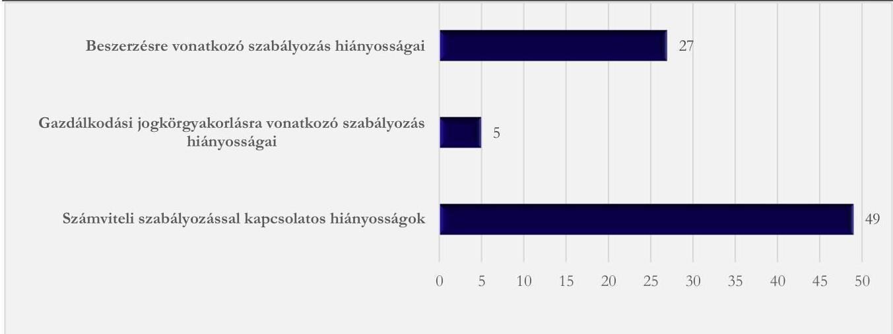
Forrás: ellenőrzött szervezetek dokumentumai és ÁSZ értékelése, ÁSZ saját szerkesztés

A feltárt hibák többsége a számviteli szabályozással volt kapcsolatban. Jellemző hibaként azonosította az ÁSZ, hogy az ellenőrzött szervezetek a Számv. tv. 161. § (4) bekezdésében foglaltak ellenére nem gondoskodtak a számlarend folyamatos karbantartásáról. A számviteli politikában tipikus hibaként fordult elő, hogy az Áhsz. 50. § (7) bekezdésében foglaltak ellenére nem rögzítették az általános kiadások és bevételek tevékenységekre történő felosztásának módját, a felosztáshoz alkalmazott mutatókat, vetítési alapokat, valamint a számviteli politika és/vagy értékelési szabályzat keretében a befektetett eszközök és a készletek (vásárolt anyagok) bekerülési értékének meghatározásáról nem az Áhsz. 1. § (1) bekezdés 7. pont és a 16. §-ában előírtak szerint rendelkeztek.

A beszerzések szabályozása területén a feltárt szabálytalanságok közé tartozott, hogy a költségvetési szervek Ávr. 13. § (2) bekezdés b) pontjában foglalt beszerzések lebonyolításával kapcsolatos eljárásrendjei az Ávr. 13. § (4a) bekezdésében foglaltak ellenére nem teljeskörűen tartalmazták a költségvetési szerv beszerzéseire vonatkozó irányadó jogszabályok szerinti rendelkezéseket, eljárásrendet. Ezáltal a Bkr.⁹⁶ 6. § (2) bekezdésében előírtak ellenére a beszerzésekkel kapcsolatos belső szabályzatok ezen beszerzési folyamatokra vonatkozóan nem biztosították a források szabályozott felhasználását.

A feltárt hiányosságok részletesen az alábbiakban kerülnek ismertetésre.

---

Mellékletek

|  TÉMAKÖR | KONTROLLKÖRNYEZET ELEME ÉS A FELTÁRT HIÁNYOSSÁGOK | ÉRINTETT SZERVEZETEK SZÁMA  |
| --- | --- | --- |
|  BESZERZÉSRE VONATKOZÓ SZABÁLYOZÁS | 27 költségvetési szerv esetében az Ávr. 13. § (2) bekezdés b) pontjában foglaltak ellenére a beszerzések lebonyolításával kapcsolatos eljárásrend nem teljeskörűen tartalmazta a költségvetési szerv beszerzéseire vonatkozó irányadó jogszabályok szerinti rendelkezéseket, eljárásrendet. | 27  |
|  GAZDÁLKODÁSI JOGKÖRGYAKORLÁSRA VONATKOZÓ SZABÁLYOZÁS | A költségvetési szerv az Ávr. 60. § (3) bekezdésében foglaltak ellenére nem vezetett naprakész nyilvántartást a kötelezettségvállalásra, pénzügyi ellenjegyzésre, teljesítés igazolására, érvényesítésre, utalványozásra jogosult személyekről. | 1  |
|   |  A költségvetési szerv gazdálkodási jogkörök gyakorlására jogosult személyekről és aláírás-mintájukról vezetett nyilvántartása nem tartalmazta a jogkör gyakorlására jogosult személyek aláírásmintáit az Ávr. 60. § (3) bekezdésében meghatározottak ellenére. | 3  |
|   |  A költségvetési szerv kötelezettségvállalási, ellenjegyzési, teljesítésigazolási, érvényesítési, utalványozási rendjéről szóló szabályzatai az Ávr. 13. § (2) bekezdés a) pontjában előírtak ellenére nem tartalmazták a jogkörgyakorlást végző személyek kijelölésének rendjét. | 1  |
|  SZÁMVITELI POLITIKA | A számviteli politika keretében az Áhsz. 50. § (7) bekezdésében foglaltak ellenére hat ellenőrzött szervezet nem rögzítette az általános kiadások és bevételek, egy ellenőrzött szervezet az általános költségek, valamint általános kiadások és bevételek tevékenységekre történő felosztásának módját, a felosztáshoz alkalmazott mutatókat, vetítési alapokat. | 7  |
|   |  A számviteli politika és/vagy értékelési szabályzat keretében a befektetett eszközök és a készletek (vásárolt anyagok) bekerülési értékének meghatározásáról kilenc költségvetési szerv nem az Áhsz. 1. § (1) bekezdés 7. pontjában és a 16. §-ában előírtakkal összhangban rendelkezett. | 9  |
|   |  Egy ellenőrzött szervezet vezetője a jelentős összegű hiba fogalmát az Áhsz. 1. § (1) bekezdés 3. pontjában foglaltaktól eltérően határozta meg. | 1  |
|   |  Egy költségvetési szerv a számviteli politika és az értékelési szabályzat keretében az 50 millió Ft értékhatár alatti ingatlanok maradványértékére vonatkozóan az Áhsz. 17. § (4) bekezdésében foglaltakkal ellentétesen rendelkezett, továbbá e szabályzatai a Számv. tv. 14. § (3)-(4) bekezdés előírásai ellenére a maradványérték meghatározására nem tartalmaztak előírásokat. | 1  |
|   |  Egy ellenőrzött szervezet az immateriális javak és a tárgyi eszközök értékcsökkenési leírási kulcsait nem az Áhsz. 17. § (2a) és (3) bekezdésében előírtak szerint határozta meg az ingatlanokhoz kapcsolódó vagyoni értékű jogok, valamint az épületek és gépek, berendezések eszközcsoportok esetében, továbbá a számviteli politikában és az értékelési szabályzatban több eszközcsoport esetében eltérő leírási kulcsokat határoztak meg. | 1  |
|  SZÁMLAREND | Az ellenőrzött időszakban három ellenőrzött szervezet nem rendelkezett a Számv. tv. 161. § (1) bekezdés és az Áhsz. 51. § (2) bekezdésében foglaltak szerinti számlarenddel. | 3  |
|   |  Hét ellenőrzött szervezet számlarendje a Számv. tv. 161. § (2) bekezdés a) pontjában foglaltak ellenére nem tartalmazta minden alkalmazásra kijelölt számla számjelét és megnevezését. | 7  |
|   |  Az ellenőrzött időszakban 20 ellenőrzött költségvetési szerv vezetője a Számv. tv. 161. § (4) bekezdésében foglaltak ellenére nem gondoskodott a számlarend folyamatos karbantartásáról. | 20  |

62

---

Mellékletek

■ V. SZ. MELLÉKLET: A TB ALAPOK 2024. ÉVI ELŐIRÁNYZOTT ÉS TELJESÍTETT BEVÉTELEI JOGCÍMCSOPORTONKÉNTI BONTÁSBAN

|  MEGNEVEZÉS | 2024. ÉVI ELŐIRÁNYZAT (MRD FT) | 2024. ÉVI TELJESÍTÉS (MRD FT) | ELTÉRÉS (MRD FT) | ELTÉRÉS AZ EKŐIRÁNYZAT %-BAN | AZ ELTÉRÉSEK ALAKULÁSÁBAN SZEREPET JÁTSZÓ LÉNYEGÉSEBB TÉNYEZŐK  |
| --- | --- | --- | --- | --- | --- |
|  Egészségbiztosítási Alap  |   |   |   |   |   |
|  1.1 Szociális hozzájárulási adó E. Alapot megillető része | 335,0 | 329,4 | -5,6 | -1,7% | -az adónemhez kapcsolódó kedvezmények vártnál magasabb igénybevétele -kisvállalati adót választók bértömegének emelkedése  |
|  1.2 Társadalombiztosítási járulék E. Alapot megillető része és egészségbiztosítási járulék | 1825,0 | 1860,5 | 35,5 | 1,9 % | - a vártnál magasabb bérdinamika  |
|  1.3 Egyéb járulékok és hozzájárulások | 102,0 | 108,5 | 6,5 | 6,4 % | - a vártnál magasabb munkáltatói táppénz és egészségügyi szolgáltatási járulék befizetése  |
|  1.5 Késedelmi pótlék, bírság | 4,9 | 5,8 | 0,9 | 18,4% | -  |
|  1.6 Költségvetési hozzájárulások | 1891,0 | 1891,0 | 0,0 | 0,0 % | -  |
|  1.7 Baleseti és egyéb kárterítési megterítések, kifizetések visszatérítése és egyéb térítési díj bevétel | 13,5 | 13,6 | 0,1 | 0,7 % | -  |
|  1.8 Gyógyszergyártók és forgalmazók befizetései | 157,9 | 190,8 | 32,9 | 20,8 % | - a támogatásvolumen-szerződésekből eredő kötelezettségek emelkedése - a gyártói befizetések adókulcsának növekedése  |
|  1.9 Nemzetközi egyezményből eredő ellátások megterítése | 8,9 | 12,2 | 3,3 | 37,1% | -  |
|  1.10 Egészségügyi szolgáltatók visszafizetése | 0,2 | 0,3 | 0,1 | 50,0 % | -  |
|  1.12 Népegészségügyi termékadó | 85,1 | 90,2 | 5,1 | 6,0% | -  |
|  3. Vagyongazdákodás |  |  |  |  | - járuléktartozás fejében átvett pénzkövetelések befolyt megterülései  |
|  5. Egészségbiztosítási költségvetési szervek | 0,5 | 1,3 | 0,8 | 160,0% | - projekt támogatások jogcímen kapott összegek - dolgozói kölcsön visszatérülések  |
|  Összesen: | 4424,0 | 4503,6 | 79,6 | 1,8% |   |
|  Nyugdíjbiztosítási Alap  |   |   |   |   |   |
|  1.1 Szociális hozzájárulási adó Ny. Alapot megillető része | 2750,0 | 2704,6 | -45,4 | -1,7 % | -egyes kedvezmények vártnál magasabb igénybevétele -kisvállalati adót választók bértömegének emelkedése miatti alacsonyabb adóbevétel  |

---

Mellékletek

|  MEGNEVEZÉS | 2024. ÉVI ELŐÍRÁNYZAT (MRD FT) | 2024. ÉVI TELJESÍTÉS (MRD FT) | ELTÉRÉS (MRD FT) | ELTÉRÉS AZ EKŐÍRÁNYZAT %-BAN | AZ ELTÉRESEK ALAKULÁSÁBAN SZÉREPET JÁTSZÓ LÉNYEGÉSÉBB TÉNYEZŐK  |
| --- | --- | --- | --- | --- | --- |
|  1.2 Társadalombiztosítási járulék Ny. Alapot megillető része és nyugdíjáru lék | 2674,3 | 2729,1 | 54,8 | 2,0 % | - bruttó kereset növekedés (minimálbér és garantált bérminimum)  |
|  1.3 Egyéb járulékok és hozzájárulások | 46,9 | 54,4 | 7,5 | 16,0 % | - az egyszerűsített foglalkoztatás után fizetendő köztéher szociális hozzájárulási adónak minősítése és a mentességek, kedvezmény igénybevételének kizárása  |
|  1.5 Késedelmi pótlék, bírság | 8,1 | 12,9 | 4,8 | 59,3 % | -  |
|  1.6 Költségvetési hozzájárulások | 531,4 | 510,9 | -20,5 | -3,9 % | - a nyugdíjprémium megállapításához szükséges feltételek nem teljesülése  |
|  1.7 Kifizetések visszatérülése és egyéb bevételek | 9,2 | 10,6 | 1,4 | 15,2 % | - a vártnál magasabb befizetések  |
|  Összesen: | 6019,9 | 6022,5 | 2,6 | 0,04 % |   |

64

---

Mellékletek

VI. SZ. MELLÉKLET: A TB ALAPOK ELŐIRÁNYZATOT LEGNAGYOBB ÖSSZEGBEN ÉS ARÁNYBAN MEGHALADÓ ELLÁTÁSI JOGCÍMCSOPORTJAI A 2024. ÉVBEN

|  NY. ALAP | 2024. ÉVI ELŐIRÁNYZAT | 2024. ÉVI TELJESÍTÉS | ELŐIRÁNYZATOT MEGHALADÓ KIADÁS | ELŐIRÁNYZATOT MEGHALADÓ KIADÁS  |
| --- | --- | --- | --- | --- |
|   |  (MRD FT) | (MRD FT) | (MRD FT) | (%)  |
|  Nyugdíjbiztosítási Alap  |   |   |   |   |
|  2.1.1.1 Korhatár felettiek öregségi nyugdíja | 4521,9 | 4697,2 | 175,3 | 3,9%  |
|  2.1.6 Tizenharmadik havi nyugdíj | 449,0 | 472,0 | 23,0 | 5,1%  |
|  2.3.2 Özvegyi nyugellátás | 502,6 | 518,0 | 15,4 | 3,1%  |
|  2.1.1.2 Nők korhatár alatti nyugellátása | 467,4 | 469,7 | 2,3 | 0,5%  |
|  2.1.3.1 Árvaellátás | 48,5 | 50,8 | 2,3 | 4,7%  |
|  E. ALAP | 2024. ÉVI ELŐIRÁNYZAT | 2024. ÉVI TELJESÍTÉS | ELŐIRÁNYZATOT MEGHALADÓ KIADÁS | ELŐIRÁNYZATOT MEGHALADÓ KIADÁS  |
| --- | --- | --- | --- | --- |
|   |  (MRD FT) | (MRD FT) | (MRD FT) | (%)  |
|  Egészségbiztosítási Alap  |   |   |   |   |
|  2.7 Gyógyító-megelőző ellátás | 2 553,1 | 2 686,6 | 133,5 | 5,2%  |
|  2.10 Gyógyszertámogatás | 500,3 | 549,9 | 49,6 | 9,9%  |
|  2.6. Rokkantsági, rehabilitációs ellátások | 390,9 | 400,8 | 9,9 | 2,5%  |

---

Mellékletek

## VII. SZ. MELLÉKLET: A KÖZPONTI TARTALÉKOK FELHASZNÁLÁSA/ÁTCSOPORTOSÍTÁSA A 2024. ÉVBEN

A Céltartalékok között megjelenő Tanári Béremelési Alap jogcím a 2024. évben létrehozott új előirányzat, a Kvtv.-ben meghatározott tervezett összege 340,0 Mrd Ft volt. Az előirányzat 99,9%-a felhasználásra került. A Kvtv.-ben előírtaknak megfelelően a tartalékelőirányzaton történő átcsoportosítások minden esetben a bérkompenzációhoz és az azokhoz kapcsolódó munkaadókat terhelő járulékok és szociális hozzájárulási adó kifizetéséhez kapcsolódtak.

A Tanári Béremelési Alapból a pedagógus bérfejlesztések fedezetbiztosítására PM⁹⁷ intézkedések alapján került sor, melyet a 16. ábra szemléltet.

16. ábra

A XV/26/2/3/1. TANÁRI BÉREMELÉSI ALAP JOGCÍMRŐL ÁTCSOPORTOSÍTÁSOK MRD FT-BAN
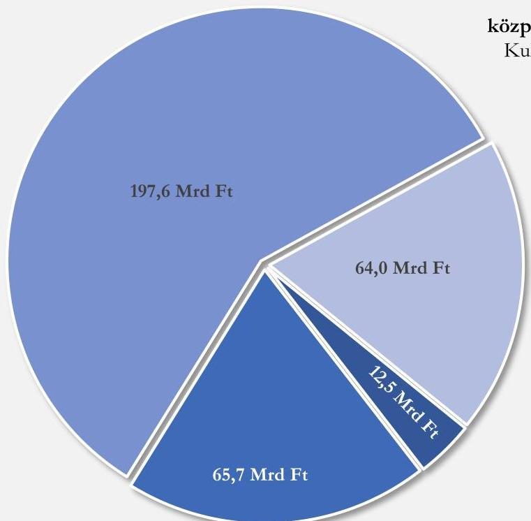
Forrás: 2024. évi zárszámadási törvényjavaslat, ÁSZ saját szerkesztés

központi alrendszer Belügyminisztérium, Kulturális és Innovációs Minisztérium, Nemzetgazdasági Minisztérium

- pedagógus életpálya esélyteremtési többlet - helyi önkormányzat
- pedagógusi bérfejlesztések - önkormányzati alrendszer
- pedagógusi bérfejlesztések - központi alrendszer
- pedagógusi bérfejlesztések -központi alrendszer nem állami

önkormányzati alrendszer
Helyi önkormányzatok támogatásai

A helyi önkormányzatok támogatására a pedagógus bérfejlesztések mellett a pedagógus életpályához kapcsolódó esélyteremtési többlet biztosítására is sor került 2024-ben, ezáltal e tartalék előirányzat 23,0%-a került az önkormányzati alrendszerbe átcsoportosításra. A pedagógusok új életpályájáról szóló 2023. évi LII. törvényben foglaltak alapján a 2024. január 1-jétől megvalósuló átlagos 32,2%-os bérfejlesztés fedezetének biztosítása a központi alrendszerben érintett fejezetek: a BM⁹⁸, KIM⁹⁹, NGM részére történt átcsoportosítással valósult meg. A nem állami fenntartók részére átcsoportosított 64,0 Mrd Ft a BM és a KIM fejezetet érintette, amely az előirányzat felhasználásának közel az ötödét, 18,8%-t jelentette. A fennmaradó előirányzat felhasználására 58,2%-ban az állami fenntartók tekintetében került sor a BM, KIM és NGM fejezeteknél. A Tanári Béremelési Alap tartalék előirányzat felhasználása a központi költségvetés tartalék előirányzatainak 13,0%-át tette ki.

Az Egyéb céltartalékok vonatkozásában a 2024. évben a 403,1 Mrd Ft tervezett előirányzatot túlteljesítve, a Kvtv. 18. §-a által nyújtott lehetőséget alkalmazva az előirányzat 118,1%-ra teljesült. A 72,9 Mrd Ft értékű túlteljesítés az összes tartalék előirányzat közül a legnagyobb mértékű túlteljesítést jelentette.

66

---

Mellékletek

A tartalék felhasználásának több mint tizede a IX. Helyi önkormányzatok támogatása fejezetet érintően történt, 79,4 Mrd Ft értékben. Az átcsoportosítások a minimálbér és a garantált bérminimum emelés fedezetének, bölcsődei férőhelyek számának emelkedéséből eredő többletkiadások, és a szociális ágazatban foglalkoztatottak béremelés fedezetének biztosítása érdekében történtek. A tartalék előirányzatból 54,2 Mrd Ft felhasználására – a XX. Kulturális és Innovációs Miniszter fejezetet érintően – a KEKVA¹⁰⁰ valorizációhoz (49,6 Mrd Ft), a Néprajzi Múzeum új állandó kiállítása pótlólagos többletfeladataihoz (0,1 Mrd Ft), és az egészségügyben dolgozók 2024. évi béremeléséhez szükséges pénzügyi forrás biztosítása érdekében (4,5 Mrd Ft) került sor.

A Járványügyi kiadások tartalék előirányzaton a 2024. évben 7,7 Mrd Ft állt rendelkezésre, azonban a keret felhasználására nem került sor.

A Rendkívüli kormányzati intézkedések tartalék előirányzat 2024. évi felhasználására 186,4 Mrd Ft összegben került sor. A tartalék előirányzatot érintő 86 átcsoportosítás 12 esetben kormányhatározat alapján történt. A legmagasabb összegű előirányzat felhasználás 33,4 Mrd Ft értékben a XXI. Miniszterelnöki Kabinetiroda részére történt, amely a költségvetési szervezetek és a fejezeti kezelésű kiemelt előirányzatok támogatása keretein belül 57,3%-ban a Kormányzati infokommunikációs szolgáltatások célelőirányzat támogatását érintette. A kormányzati kommunikáció támogatására összesen 19,6 Mrd Ft értékben került sor, amely a jogcímcsoporthoz teljes felhasználásának 10,5%-t jelentette. A XV. Nemzetgazdasági Minisztérium fejezetet érintő 27,0 Mrd Ft értékű előirányzat felhasználás a gazdasági ellenálló képesség fejlesztése és ipari alkalmazott technológiák bevezetése érdekében történt.

A Beruházási Alap jogcímcsoporthoz eredeti kiadási előirányzata 245,0 Mrd Ft volt, továbbá az év közben átcsoportosításra került 29,0 Mrd Ft. Az alap 274,0 Mrd Ft-os összege teljes mértékig felhasználásra került a 2024. évben. A Beruházási Alapból a Központi Maradványelszámolási Alap címre 160,0 Mrd Ft-ot csoportosítottak át. A 2024. évi fentmaradó 114,0 Mrd Ft-os átcsoportosítást ágazati bontásban a 17. ábra szemlélteti.

17. ábra

A XLV/20. BERUHÁZÁSI ALAP 2024. ÉVI ÁGAZAT SZERINTI ÁTCSOPORTOSÍTÁSAI (MRD FT)
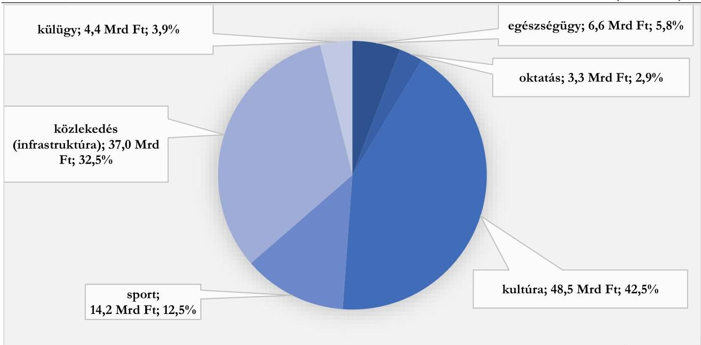
Forrás: 2024. évi zárszámadási törvényjavaslat, ÁSZ saját szerkesztés

---

Mellékletek

A Beruházási Alap tartalék előirányzata Központi Maradványelszámolási Alapba történő átcsoportosítástól eltekintve jelentős mértékben a kultúra, közlekedés és sport ágazatok érdekében került felhasználásra. A kultúra ágazaton belül összességében 48,5 Mrd Ft értékben került sor a műemlékek mellett többek között a média (könyvtár, film) támogatására.

A közlekedés ágazatnál teljes mértékben, 37,0 Mrd Ft értékben az infrastruktúra fejlesztés javára történtek az átcsoportosítások. A sport támogatása a magasépítési beruházások mellett 6,8 Mrd Ft értékben gyógyfürdő és sportcsarnok létesítéséhez kapcsolódott.

A Rezsivédelmi Alap tartalék előirányzatai fedezetéül a piaci folyamatok hatására jelentős extraprofitot keletkeztető szektorok és nagyvállalatok befizetései szolgálnak, kiegészítve a központi költségvetés támogatásával. A Rezsivédelmi Alap 2024. évi átcsoportosításait a 22. táblázat mutatja be.

22. táblázat

AZ L. REZSIVÉDELMI ALAP 2024. ÉVI ÁTCSOPORTOSÍTÁSAI (MRD FT)

|  L. REZSIVÉDELMI ALAP | FELHASZNÁLÁS CÉLJA | FELHASZNÁLÁS ÖSSZEGE (MRD FT)  |
| --- | --- | --- |
|  1. cím Lakossági rezsivédelem: | lakossági rezsivédelem | 761,6  |
|   |  távhőszolgáltatási támogatás | 191,3  |
|   |  villamosenergia-termelés, mint rendszerbiztonsági szolgáltatás ellentételezése | 16,9  |
|   |  rezsivédelmi készletezési szolgáltatás (MSZKSZ) | 14,0  |
|  2. cím Központi költségvetési szervek kompenzációja: | PM, BM, KKM, MÁK, NAV | 211,1  |
|  3. cím Önkormányzatok kompenzációja: | A települési önkormányzatok működésének általános támogatása | 6,7  |
|   |  A települési önkormányzatok egyes szociális és gyermekjóléti feladatainak támogatása | 4,5  |
|   |  A települési önkormányzatok gyermekétkeztetési feladatainak támogatása | 8,3  |
|   |  egyes önkormányzati sportfeladatokhoz kapcsolódó üzemeltetési támogatások/ HM | 0,2  |
|   |  különböző feladatok | 20,5  |
|  4. cím Egyházi és civil intézményfenntartók támogatása: | Oktatási ágazat | 22,1  |
|   |  Egészségügyi ágazat | 10,4  |
|   |  Szociális és gyermekvédelmi ágazat | 9,8  |
|  5. cím Állami tulajdonú társaságok támogatása: | közlekedési közszolgáltató társaságok/ ÉKM | 42,3  |
|   |  NSÜ | 8,6  |
|  6. cím Versenyszektor támogatása: | Víziközmű-fejlesztési és Ellentételezési Alap kiadásai/ EM | 24,8  |
|   |  ipari fogyasztók veszélyhelyzeti rezsitámogatása/ EM | 8,4  |
|  Összesen |  | 1 361,5  |

Forrás: 2024. évi zárszámadási törvényjavaslat, ÁSZ saját szerkesztés

A Lakossági rezsivédelem cím teljes felhasználása a XVII. Energiaügyi Minisztérium fejezet javára történt. Az előirányzat a Kvtv. előírásának megfelelően az 1395/2024. (XII.16.) Korm. határozat¹⁰¹ 4. pontja alapján 2024 decemberében került 66,8 Mrd Ft értékben túlteljesítésre.

A Központi költségvetési szervek kompenzációja cím tartalék előirányzatának tervezett 187,3 Mrd Ft kiadási összege túlteljesítve 112,7%-ban került felhasználásra a 2024. év során. Az eredeti előirányzathoz viszonyított

68

---

Mellékletek

tartalék előirányzat túlteljesítés aránya ennél a tartalék címnél volt a legmagasabb. A tartalék előirányzat felhasználás 80,5%-a három fejezetet érintett. A XV. Pénzügyminisztérium fejezet 40,5%-ban, a XIV. Belügyminisztérium fejezet 29,4%-ban, a XVIII. Külgazdasági és Külügyminisztérium 10,6%-ban részesült a 2024 évi átcsoportosításokból.

Az Önkormányzatok kompenzációja címéről összesen 40,2 Mrd Ft értékben került sor átcsoportosításra, ezen átcsoportosítások a IX. Helyi önkormányzatok támogatásai fejezetet érintették 48,5%-ban. A fejezeten belül az általános működés, a szociális- és gyermekvédelem előirányzatai javára történtek az átcsoportosítások. Ezáltal az előirányzat felhasználása a Kvtv. indokolásában ismertetett célnak megfelelően történt. Az 1374/2024. (XII. 6.) Korm. határozatban¹⁰² foglaltaknak megfelelően az egyházi támogatást érintő előirányzatok részére történő átcsoportosítás az Önkormányzatok kompenzációja címéről történt.

Az Egyházi és civil intézményfenntartók támogatása tartalék előirányzat felhasználás több mint fele, 24,3 Mrd Ft (57,5%) teljesült a XIV. Belügyminisztérium fejezet előirányzatainak javára. Az egészségügyi, oktatási, szociális és gyermekvédelem ágazat részesült ezen átcsoportosításokból. A fennmaradó 18,0 Mrd Ft (42,5%) a XX. Kulturális és Innovációs Minisztérium fejezet előirányzatain került felhasználásra. A nem állami felsőoktatási intézmények energiaár-növekedésből adódó többletköltségének biztosítása és az ehhez kapcsolódó Kincstári díj került támogatásra a tartalék előirányzatból. A 9,6 Mrd Ft összegű átcsoportosítás 37 darab KEKVA és egyházi fenntartású intézményt érintett.

Az Állami tulajdonú társaságok támogatása címéről az átcsoportosítások a Közlekedési közszolgáltatások költségterítését és a Nemzeti Sportinfrastruktúra Ügynökség tulajdonosi joggyakorlását érintették. A közlekedési ágazat 82,9%-ban részesült az előirányzat átcsoportosításaiból. Az autóbusszal végzett személyszállítást az átcsoportosítás 87,1%-a érintette, a fennmaradó 12,9% az elővárosi közösségi közlekedés részére került átcsoportosításra 5,5 Mrd Ft összegben.

A Versenyszektor támogatása címen belül a vízügyi ágazat részére 74,6% (24,8 Mrd Ft) került átcsoportosításra a tartalék előirányzatról, amely az új energiaforrások támogatását erősítette. Az ipari fogyasztók rezsitámogatása ebből a címből valósult meg, amely megfelelt a tartalék előirányzat kiemelt céljának, az energiaár emelkedés hatásai kompenzálásának.

A Központi Maradványelszámolási Alap (KMA¹⁰³) javára az érintettek a központi alrendszerbe tartozó költségvetési szervek és a fejezeti kezelésű előirányzatok kötelezettségvállalással nem terhelt költségvetési maradványaként 139,7 Mrd Ft-ot, meghiúsulás miatt kötelezettségvállalással nem terheltévé vált maradványként 2,8 Mrd Ft-ot, valamint egyéb elszámolásokkal kapcsolatosan 27,4 Mrd Ft-ot fizettek be.

A 2024. évben a KMA előirányzatának emelésére több alkalommal sor került PM hatáskörben vagy kormányhatározattal. Ezen összegek egyéb előirányzatok részére történő további átcsoportosítására az Ávr.-ben foglaltakkal összhangban a Kormány egyedi határozataival került sor.

69

---

RÖVIDÍTÉSEK JEGYZÉKE

1 GDP
bruttó hazai termék (angolul gross domestic product)

2 központi alrendszer
államháztartás központi alrendszere

3 A 2024. évi zárszámadási törvényjavaslat
Törvényjavaslat a Magyarország 2024. évi központi költségvetéséről szóló 2023. évi LV. törvény végrehajtásáról

4 Alaptörvény
Magyarország Alaptörvénye (2011. április 25.)

5 Áht.
2011. évi CXCV. törvény az államháztartásról

6 ÁSZ
Állami Számvevőszék

7 Kvtv.
2023. évi LV. törvény Magyarország 2024. évi központi költségvetéséről

8 EDP
Az Európai Unió Túlzott Hiány Eljárása (Excessive Deficit Procedure)

9 ÁKK
Államadósság Kezelő Központ

10 Számv. tv.
2000. évi C. törvény a számvitelről

11 Áhsz.
4/2013. (I. 11.) Korm. rendelet az államháztartás számviteléről

12 NAV
Nemzeti Adó- és Vámhivatal

13 Art.
2017. évi CL. törvény az adózás rendjéről

14 Avt.
2017. évi CLIII. törvény - az adóhatóság által foganatosítandó végrehajtási eljárásokról

15 Adóig. vhr.
465/2017. (XII.28.) Korm. rendelet az adóigazgatási eljárás részletszabályairól

16 41/2015. (VII. 15.) BM rendelet az állami és önkormányzati szervek elektronikus információbiztonságáról szóló 2013. évi L. törvényben meghatározott technológiai biztonsági, valamint a biztonságos információs eszközökre, termékekre, továbbá a biztonsági osztályba és biztonsági szintbe sorolásra vonatkozó követelményekről

17 Ibtv.
2013. évi L. törvény az állami és önkormányzati szervek elektronikus információbiztonságáról

18 áfa
általános forgalmi adó

19 Rega. tv.
2003. évi CX. törvény a regisztrációs adóról

20 Itv.
1990. évi XCIII. törvény az illetékekről

21 Air.
2017. évi CLI. törvény - az adóigazgatási rendtartásról

22 Gjt.
1991. évi LXXXII. törvény a gépjárműadóról

23 203/1998. (XII. 19.) Korm. rendelet
203/1998. (XII. 19.) Korm. rendelet a bányászatról szóló 1993. évi XLVIII. törvény végrehajtásáról

24 404/2021. (VII. 8.) Korm. rendelet
404/2021. (VII. 8.) Korm. rendelet a gazdaság újraindítása érdekében fizetendő kiegészítő bányajáradékról

25 209/2013. (VI. 18.) Korm. rendelet
209/2013. (VI. 18.) Korm. rendelet az autópályák, autóutak és főutak használatáért fizetendő megtett úttal arányos díjról szóló 2013. évi LXVII. törvény végrehajtásáról

26 Vtv.
2007. évi CVI. törvény az állami vagyonról

27 Nfa. tv.
2010. évi LXXXVII. törvény a Nemzeti Földalapról

28 Vtvr.
254/2007. (X. 4.) Korm. rendelet az állami vagyonnal való gazdálkodásról

29 Ptk.
2013. évi V. törvény a Polgári Törvénykönyvről

30 Áht.
2011. évi CXCV. törvény az államháztartásról

31 Ávr.
368/2011. (XII. 31.) Korm. rendelet az államháztartásról szóló törvény végrehajtásáról

32 25/2023. (XII. 29.) ÉKM rendelet
25/2023. (XII. 29.) ÉKM rendelet a XLV. Állami beruházások fejezet központi kezelésű előirányzatainak kezeléséről és felhasználásáról

33 1004/2024. (I.18.) Korm. határozat
1004/2024. (I.18.) Korm. határozat - a Tanári Béremelési Alap létrehozásáról

34 RRF
Recovery and Resilience Facility (Helyreállítási és Rezilienciaépítési Eszköz)

35 ELKA
Elkülönített Állami Pénzalapok

36 TB Alapok
Társadalombiztosítás pénzügyi alapjai

37 NKFIA
Nemzeti Kutatási, Fejlesztési és Innovációs Alap (LXII. fejezet)

70

---

Rövidítések jegyzéke

|  38 NFA | Nemzeti Foglalkoztatási Alap (LXIII. fejezet)  |
| --- | --- |
|  39 BGA | Bethlen Gábor Alap (LXV. fejezet)  |
|  40 KNPA | Központi Nukleáris Pénzügyi Alap (LXVI. fejezet)  |
|  41 NKA | Nemzeti Kulturális Alap (LXVII. fejezet)  |
|  42 Atomtörvény | 1996. évi CXVI. törvény az atomenergiáról  |
|  43 Ny. Alap | Nyugdíjbiztosítási Alap  |
|  44 E. Alap | Egészségbiztosítási Alap  |
|  45 NEAK | Nemzeti Egészségbiztosítási Alapkezelő  |
|  46 Konvergencia Program | Magyarország Konvergencia programja 2023-2027.  |
|  47 479/2009/EK rendelet | A Tanács 479/2009/EK rendelete (2009. május 25.) az Európai Közösséget létrehozó szerződéshez csatolt, a túlzott hiány esetén követendő eljárásról szóló jegyzőkönyv alkalmazásáról  |
|  48 2223/96/EK rendelet | A Tanács 2223/96/EK rendelete (1996. június 25.) a Közösségben a nemzeti és regionális számlák európai rendszeréről  |
|  49 549/2013/EU rendelet | Az Európai Parlament és a Tanács 549/2013/EU rendelete (2013. május 21.) az Európai Unió-beli nemzeti és regionális számlák európai rendszeréről  |
|  50 388/2017. (XII. 13.) Korm. rendelet | 388/2017. (XII. 13.) Korm. rendelet - az Országos Statisztikai Adatfelvételi Program kötelező adatszolgáltatásairól  |
|  51 Ctv. | 2006. évi V. törvény a cégnyilvánosságról, a bírósági cégeljárásról és a végelszámolásról  |
|  52 Eht. | 2003. évi C. törvény az elektronikus hírközlésről  |
|  53 Kbt. | 2015. évi CXLIII. törvény a közbeszerzésekről  |
|  54 Nvtv. | 2011. évi CXCVI. törvény a nemzeti vagyonról  |
|  55 1991. évi XVI. tv. | 1991. évi XIX. törvény az önhibájukon kívül hátrányos helyzetbe került önkormányzatok kiegészítő állami támogatásáról  |
|  56 2012. évi CCXVII. tv. | 2012. évi CCXVIII. törvény a földgáz biztonsági készletezéssel összefüggésben egyes törvények módosításáról  |
|  57 262/2010. (XI. 17.) Korm. rendelet | 262/2010. (XI. 17.) Korm. rendelet a Nemzeti Földalapba tartozó földrészletek hasznosításának részletes szabályairól  |
|  58 11/2011. (II. 22.) Korm. rendelet | 11/2011. (II. 22.) Korm. rendelet a Nemzeti Földalap vagyonnyilvántartásának szabályairól  |
|  59 32/2015. (VI. 19.) FM rendelet | 32/2015. (VI. 19.) FM rendelet a Nemzeti Földalappal kapcsolatos bevétel és kiadások fejezetbe sorolt központi kezelésű előirányzatok felhasználásáról  |
|  60 41/2015. (VII.15.) BM rendelet | 41/2015. (VII. 15.) BM rendelet az állami és önkormányzati szervek elektronikus információbiztonságáról szóló 2013. évi L. törvényben meghatározott technológiai biztonsági, valamint a biztonságos információs eszközökre, termékekre, továbbá a biztonsági osztályba és biztonsági szintbe sorolásra vonatkozó követelményekről  |
|  61 17/2023. (VIII. 18.) GFM rendelet | 7/2023. (VIII. 18.) GFM rendelet a XLIII. Az állami vagyonnal kapcsolatos bevétel és kiadások fejezet központi kezelésű előirányzatai felhasználásáról  |
|  62 39/2024. (X. 22.) NGM rendelet | 39/2024. (X. 22.) NGM rendelet a XLIII. Az állami vagyonnal kapcsolatos bevétel és kiadások fejezet 2024. évi központi kezelésű előirányzatai felhasználásáról  |
|  63 12/2023. (XII. 28.) PM rend. | 12/2023. (XII. 28.) PM rendelet a pénzügyminiszter irányítása alá tartozó központi kezelésű előirányzatok kezeléséről és felhasználásáról  |
|  64 2023/2830/EU rendelet | A Bizottság (EU) 2023/2830 felhatalmazáson alapuló rendelete (2023. október 17.) a 2003/87/EK európai parlamenti és tanácsi irányelvnek a kibocsátáskereskedelmi egységek árverés útján történő értékesítésének időbeli ütemezésével, lebonyolításával és egyéb vonatkozásaival kapcsolatos szabályok meghatározása tekintetében történő kiegészítéséről  |
|  65 82/2007. (IV. 25.) Korm.rendelet | 82/2007. (IV. 25.) Korm. rendelet az Európai Mezőgazdasági Vidékfejlesztési Alapból, az Európai Halászati Alapból, valamint az Európai Mezőgazdasági Garancia Alapból támogatott programok és intézkedések pénzügyi, számviteli és ellenőrzési rendszerek kialakításáról, lebonyolításának rendjéről  |
|  66 549/2013. (XII. 30.) Korm. rendelet | 549/2013. (XII. 30.) Korm. rendelet az Uniós fejlesztések fejezetbe tartozó fejezeti kezelésű előirányzatok felhasználásának rendjéről  |

71

---

Rövidítések jegyzéke

67 272/2014. (XI. 5.) Korm. rendelet
68 135/2015. (VI. 2.) Korm. rendelet
69 256/2021. (V. 18.) Korm. rendelet
70 413/2021. (VII.13.) Korm. rendelet
71 481/2021. (VIII. 13.) Korm. rendelet
72 373/2022. (IX. 30.) Korm. rendelet
73 590/2022. (XII. 28.) Korm. rendelet
74 481/2023. (X. 31.) Korm. rendelet
75 1031/2010/EU rendelet
76 168/2004. (V. 25.) Korm. rendelet
77 301/2018. (XII. 27.) Korm. rendelet
78 162/2020. (IV. 30.) Korm. rendelet
79 329/2019. (XII. 20.) Korm. rendelet
80 44/2011. (III. 23.) Korm. rendelet
81 9/2011. (III. 23.) BM rendelet
82 396/2023. (VIII. 24.) Korm. rendelet
83 Ebtv.
84 Tbj.
85 Tny.
86 Ákr.
87 2011. évi CXCI.tv.
88 1991. évi IV. tv.
89 1993. évi XXIII. tv.

272/2014. (XI. 5.) Korm. rendelet a 2014-2020 programozási időszakban az egyes európai uniós alapokból származó támogatások felhasználásának rendjéről
135/2015. (VI. 2.) Korm. rendelet a 2014-2020 közötti programozási időszakban a Belső Biztonsági Alapból és a Menekültügyi, Migrációs és Integrációs Alapból származó támogatások felhasználásáról
256/2021. (V. 18.) Korm. rendelet a 2021-2027 programozási időszakban az egyes európai uniós alapokból származó támogatások felhasználásának rendjéről
413/2021. (VII. 13.) Korm. rendelet Magyarország Helyreállítási és Ellenállóképességi Terve végrehajtásának alapvető szabályairól és felelős intézményeiről
481/2021. (VIII. 13.) Korm. rendelet a Gazdaság-újraindítási Alap uniós fejlesztései fejezetbe tartozó fejezeti és központi kezelésű előirányzatok felhasználásának rendjéről
373/2022. (IX. 30.) Korm. rendelet Magyarország Helyreállítási és Ellenállóképességi Terve végrehajtásának alapvető szabályairól és felelős intézményeiről
373/2022. (IX. 30.) Korm. rendelet Magyarország Helyreállítási és Ellenállóképességi Terve végrehajtásának alapvető szabályairól és felelős intézményeiről
48/2023. (II. 21.) Korm. rendelet az önkéntes kölcsönös egészség- és önségélyező pénztárak egyes gazdálkodási szabályairól szóló 268/1997. (XII. 22.) Korm. rendelet módosításáról
A Bizottság 1031/2010/EU Rendelete 2010. november 12-i az üvegházhatást okozó gázok kibocsátási egységei Közösségen belüli kereskedelmi rendszerének létrehozásáról szóló 2003/87/EK európai parlamenti és tanácsi irányelv alapján az üvegházhatást okozó gázok kibocsátási egységei árverés útján történő értékesítésének időbeli ütemezéséről, lebonyolításáról és egyéb vonatkozásairól
168/2004. (V. 25.) Korm. rendelet a központosított közbeszerzési rendszerről, valamint a központi beszerző szervezet feladat- és hatásköréről
301/2018. (XII. 27.) Korm. rendelet a Nemzeti Hírközlési és Informatikai Tanácsról, valamint a Digitális Kormányzati Ügynökség Zártkörűen Működő Részvénytársaság és a kormányzati informatikai beszerzések központosított közbeszerzési rendszeréről
62/2020. (IV. 30.) Korm. rendelet a Nemzeti Kommunikációs Hivatal jogállásáról és a kormányzati kommunikációs beszerzésekről
329/2019. (XII. 20.) Korm. rendelet a központi beszerző szerv kijelöléséről, a védelmi és biztonsági feladatokkal összefüggő beszerzések körének meghatározásáról és a védelmi és biztonsági feladatokkal összefüggő beszerzések központosított rendszeréről
44/2011. (III. 23.) Korm. rendelet a büntetés-végrehajtási szervezet részéről a központi államigazgatási szervek és a rendvédelmi szervek irányában fennálló egyes ellátási kötelezettségekről, a termékek és szolgáltatások átadás-átvételének és azok ellentételezésének rendjéről
9/2011. (III. 23.) BM rendelet a büntetés-végrehajtási szervezet részéről a büntetés-végrehajtásért felelős miniszter vezetése, irányítása vagy felügyelete alá tartozó szervek irányában fennálló ellátási kötelezettségről, a fogvatartottak kötelező foglalkoztatása keretében előállított termékekről és szolgáltatásokról, azok átadás-átvételéről és az ellentételezés rendjéről
396/2023. (VIII. 24.) Korm. rendelet a kormányzati képzési és oktatási beszerzésekről
1997. évi LXXXIII. törvény a kötelező egészségbiztosítás ellátásairól
2019. évi CXXII. törvény a társadalombiztosítás ellátásaira jogosultakról, valamint ezen ellátások fedezetéről
1997. évi LXXXI. törvény a társadalombiztosítási nyugellátásról
2016. évi CL. törvény az általános közigazgatási rendtartásról
2011. évi CXCI. törvény a megváltozott munkaképességű személyek ellátásairól és egyes törvények módosításáról
1991. évi IV. törvény a foglalkoztatás elősegítéséről és a munkanélküliek ellátásáról
1993. évi XXIII. törvény a Nemzeti Kulturális Alapról

72

---

Rövidítések jegyzéke

|  90 2010. évi CLXXXII. tv. | 2010. évi CLXXXII. törvény a Bethlen Gábor Alapról  |
| --- | --- |
|  91 2014. évi LXXVI. tv. | 2014. évi LXXVI. törvény a tudományos kutatásról, fejlesztésről és innovációról  |
|  92 380/2014. (XII. 31.) Korm. rendelet | 380/2014. (XII. 31.) Korm. rendelet a Nemzeti Kutatási, Fejlesztési és Innovációs Alap működtetésének és felhasználásának szabályairól  |
|  93 3/1997. (II. 7.) PM rendelet | 3/1997. (II. 7.) PM rendelet az államháztartási egyedi azonosító szám alkalmazásáról  |
|  94 KSH | Központi Statisztikai Hivatal  |
|  95 NGM | Nemzetgazdasági Minisztérium  |
|  96 Bkr. | 370/2011. (XII. 31.) Korm. rendelet a költségvetési szervek belső kontrollrendszeréről és belső ellenőrzéséről  |
|  97 PM | Pénzügyminisztérium (a Nemzetgazdasági Minisztériumba történő beolvadással 2024. december 31. napján megszűnt)  |
|  98 BM | Belügyminisztérium  |
|  99 KIM | Kulturális és Innovációs Minisztérium  |
|  100 KEKVA | közfeladatot ellátó közérdekű vagyonkezelő alapítvány  |
|  101 1395/2024. (XII.16.) Korm. határozat | 1395/2024. (XII.16.) Korm. határozat a rezsivédelmi szolgáltatás 2024. negyedik negyedévi ellentételezése érdekében a Rezsivédelmi Alap fejezet terhére történő előirányzat-átcsoportosításról  |
|  102 1374/2024. (XII. 6.) Korm. határozat | 1374/2024. (XII. 6.) Korm. határozat címrendi kiegészítésről, a Központi Maradványelszámolási Alapból, valamint a Rezsivédelmi Alapból történő, fejezeten belüli és fejezetek közötti előirányzat-átcsoportosításról, előirányzat-túllépés engedélyezéséről, valamint kormányhatározat módosításáról  |
|  103 KMA | Központi Maradványelszámolási Alap  |

73

---

ÁLLAMI SZÁMVEVŐSZÉK

1052 Budapest, Apáczai Csere János u. 10. | 1364 Budapest 4., Pf. 54

www.asz.hu | szamvevoszek@asz.hu

telefon: +36 1 484 9100