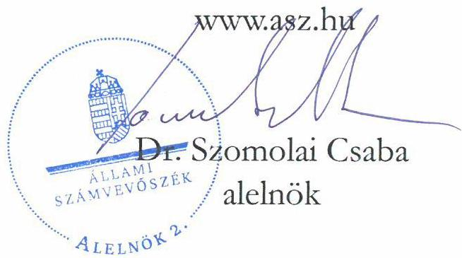

ÁLLAMI SZÁMVEVŐSZÉK

# JELENTÉS

A többségi állami tulajdonban lévő gazdasági társaságok beszerzéseinek ellenőrzése

ALFÖLDI NYOMDA Zrt.

2025.

25100

www.asz.hu

---

ÁLLAMI SZÁMVEVŐSZÉK

# JELENTÉS

A többségi állami tulajdonban lévő gazdasági társaságok beszerzéseinek ellenőrzése

ALFÖLDI NYOMDA Zrt.

2025.

25100

---

Jelentéseink az interneten a www.asz.hu címen olvashatók.

ELLENŐRZÉSI IGAZGATÓSÁG:
ELLENŐRZÉSI IGAZGATÓSÁG III.

ELLENŐRZÉSI IGAZGATÓ:
HERCZEGH ZSOLT igazgató

ELLENŐRZÉSVEZETŐ:
VEREBESNÉ SZABÓ ERZSÉBET ellenőrzésvezető

IKTATÓSZÁM: EL-4022-012/2025
TÉMASORSZÁM: 39/2024
ELLENŐRZÉS-AZONOSÍTÓ SZÁM: V1076

---

TARTALOMJEGYZÉK

- AZ ELLENŐRZÉS ALAPADATAI ... 5
- AZ ELLENŐRZÖTT SZERVEZET ... 7
- ÖSSZEFOGLALÁS ... 8
- AZ ELLENŐRZÉS FÓKUSZTERÜLETE ... 10
- MEGÁLLAPÍTÁSOK ... 11
- JAVASLATOK ... 17
- MELLÉKLETEK ... 18
- I. sz. melléklet: Értelmező szótár ... 18
- II. sz. melléklet: Az ellenőrzött szervezetek jegyzéke ... 20
- III. sz. melléklet: Ellenőrzési kritériumok ... 21
- FÜGGELÉK: ÉSZREVÉTELEK ... 22
- RÖVIDÍTÉSEK JEGYZÉKE ... 26

---

.

---

AZ ELLENŐRZÉS ALAPADATAI

## AZ ELLENŐRZÉS CÉLJA

Az ellenőrzés célja annak értékelése volt, hogy a gazdasági társaság – ellenőrzés során kiválasztott – beszerzéseire szabályszerűen került-e sor, a kapcsolódó döntéshozatal szabályszerű és megalapozott volt-e, valamint a beszerzéshez kapcsolódóan érvényesültek-e a célszerűség és az eredményesség szempontjai.

## AZ ELLENŐRZÉS TÍPUSA

Kombinált ellenőrzés

## AZ ELLENŐRZŐTT IDŐSZAK

2023. év. A beszerzések előkészítése és a szerződéskötések tekintetében az ellenőrzés a 2022. évre, valamint a beszerzési eljárások és az elszámolások szabályszerűsége értékelése tekintetében a 2024. évre is kiterjedt.

## AZ ELLENŐRZÉS TÁRGYA

Az ellenőrzés tárgya az ALFÖLDI NYOMDA Zrt.¹ 2023. évben megvalósult beszerzéseire irányuló döntések szabályszerűsége, megalapozottsága és célszerűsége, a megvalósult beszerzések szabályszerűsége, eredményessége, a beszerzett eszközök és szolgáltatások feladat ellátás során történt hasznosulása, azaz a beszerzések megfelelősége volt. Az ellenőrzés kiterjedt a beszerzések előkészítésének, a beszerzésekre vonatkozó szerződés megkötésének és tartalmának ellenőrzésére is.

Az ellenőrzés kiterjedt minden olyan körülményre és adatra, amely az ÁSZ² jogszabályban meghatározott feladatainak teljesítéséhez, valamint a program végrehajtása folyamán felmerült újabb összefüggések feltárásához szükséges volt.

## AZ ELLENŐRZÉS JOGALAPJA

Az ellenőrzés jogszabályi alapját az ÁSZ tv.³ 1. § (3) bekezdésének és 5. § (4) bekezdésének előírásai képezték.

## AZ ELLENŐRZÉS MÓDSZERE

Az ellenőrzés végrehajtása a nemzetközi standardokat irányadónak tekintve az ellenőrzési program szempontjai, az ellenőrzött időszakban hatályos jogszabályok, az ellenőrzés szakmai szabályok és a jelen ellenőrzésre irányadó ÁSZ módszertan figyelembevételével történt.

---

Az ellenőrzés alapadatai

Az ellenőrzési kérdések megválaszolásához szükséges bizonyítékok megszerzése az ellenőrzött szervezet által rendelkezésre bocsátott dokumentumokra és adatokra alapozva, továbbá megfigyelés, szemle (szemrevételezés), kérdésfeltevés (információkérés), valamint elemző eljárás útján valósult meg.

Az ellenőrzés lefolytatásához az ellenőrzött szervezet a 2023. évben megvalósult beszerzéseire vonatkozó főkönyvi és analitikus nyilvántartások, valamint az ÁSZ által kért további dokumentumok, adatok, információk megküldésével és a helyszíni ellenőrzés során szolgáltatott adatokat. A rendelkezésre álló adatok alapján az ALFÖLDI NYOMDA Zrt. a 2023. évben közelítőleg bruttó 12 500 000 E Ft összértékben hajtott végre beszerzéseket. A mintavételezés keretében négy, egymással összefüggő beszerzés került kiválasztásra, melyek tárgyévben számlázott összértéke mintegy 2 328 000 E Ft-ot tett ki.

Az ellenőrzési bizonyítékként felhasználható adatforrások közé tartoztak egyrészt az ellenőrzéshez kért dokumentumok, adatállományok, nyilatkozatok, másrészt adatforrás volt minden – az ellenőrzés folyamán – feltárt, az ellenőrzés szempontjából információkat tartalmazó dokumentum.

A tények feltárása és azok összegzése során a megállapítások az ellenőrzött mintatételekre vonatkozóan kerültek megfogalmazásra. A mintatételek ellenőrzésének eredményei nem kerültek kivetítésre. Az ÁSZ akkor tekintette megfelelőnek a mintatételként kiválasztott beszerzést, ha a beszerzési eljárás teljes folyamata a lényegi elemeiben szabályszerű, célszerű és – amennyiben értékelhető – eredményes volt, illetve a beszerzés tekintetében érvényesültek a nemzeti vagyonnal való felelős gazdálkodás elvei.

Az ellenőrzés kitért minden olyan körülményre, amely a program végrehajtása kapcsán felmerült és az ellenőrzés céljaival összhangban volt.

---

AZ ELLENŐRZÖTT SZERVEZET

Az ALFÖLDI NYOMDA Zrt. 1993. június 16-án jött létre átalakulással az azt megelőzően állami vállalatként működő Alföldi Nyomdából. 1998-ban a részvények döntő hányada a menedzsment és a dolgozók tulajdonába került. 2020. július 17-én a Magyar Állam tulajdonában álló Könyvtárellátó Nonprofit Kft.⁴ minősített többséget biztosító befolyást szerzett az ALFÖLDI NYOMDA Zrt.-ben, mely így ismételten – közvetett – állami tulajdonba került. A Kormány a 340/2020. (VII. 10.) Korm. rendeletben⁵ az ALFÖLDI NYOMDA Zrt. 97,71%-os részvénycsomagjának a Könyvtárellátó Nonprofit Kft. által történő megszerzését – a köznevelési tankönyvellátás biztonságának megerősítése érdekében – közérdekből nemzetstratégiai jelentőségű összefonódásnak minősítette. Az 501/2013. (XII. 29.) Korm. rendelet⁶ 2022. január 1-től a tankönyvek előállításáért felelős gazdasági társaságként az ALFÖLDI NYOMDA Zrt.-t jelölte ki.

A Társaság alaptőkéje az Alapszabály₁,₂⁷ értelmében az ellenőrzött időszakban 370 000 E Ft volt. Ebből 369 980 E Ft névértékű, I. részvényosztályba tartozó elóvásárlási jogot biztosító elsőbbségi részvény állt a Könyvtárellátó Nonprofit Kft. tulajdonában. A kisebbségi tulajdonosok, azaz Debrecen Megyei Jogú Város Önkormányzata és a Tiszántúli Református Egyházkerület 10-10 E Ft névértékű, II. részvényosztályba tartozó elóvásárlási és osztalékelsőbbségi jogot biztosító részvényt birtokoltak.

A Társaságnál 2023. évben igazgatóság nem működött, az Alapszabály₁,₂ rendelkezése alapján az igazgatóság jogait vezető tisztségviselőként vezérigazgató gyakorolta. A vezérigazgató személye az ellenőrzött időszakban nem változott. A Társaságnál az ellenőrzött időszakban háromtagú felügyelőbizottság működött és a Társaság és a Számv tv.⁸ előírása alapján választott könyvvizsgálóval rendelkezett. A Társaság székhelye Debrecenben volt.

Az ellenőrzött időszakban a Társaság cégjegyzékbe bejegyzett főtevékenysége 1812'08 nyomás (kivéve: napilap) volt. A termelés nagyságrendjét alapvetően a belföldi piacra irányuló könyvgyártás határozta meg, melyben jelentős részarányt képviselt a tankönyvgyártás. Emellett a Társaság külföldi megrendelésekre is gyártott könyveket, valamint folyóiratokat, tájékoztató és egyéb nyomtatványokat is előállított. A tankönyvgyártás nettó árbevétele a belföldi értékesítés árbevételén belül 62%-os, a teljes árbevételen belül 55%-os részarányt képviselt.

A Társaság 2023. évi beszerzéseinek meghatározó tényezői a gyártásban felhasznált alap- és segédanyagok, a villamosenergia-felhasználás, az alvállalkozói költségek, a felmerült karbantartási költségek, valamint a tárgyévben végrehajtott vagy megkezdett energiahatékonysági és a termelésben részt vevő géppark megújítását célzó beruházások voltak.

1. táblázat
(adatok: E Ft-ban)

AZ ALFÖLDI NYOMDA ZRT. BESZÁMOLÓJÁNAK FŐBB ADATAI

|   | 2022. év | 2023. év  |
| --- | --- | --- |
|  Értékesítés nettó árbevétele | 12 384 682 | 12 793 587  |
|  - ebből belföldi értékesítés nettó árbevétele | 10 615 990 | 11 282 199  |
|  - ebből exportértékesítés nettó árbevétele | 1 768 692 | 1 511 388  |
|  Anyagköltség | 6 763 647 | 6 572 789  |
|  Igénybe vett szolgáltatások | 1 728 581 | 1 183 613  |
|  Tárgyi eszközök | 4 409 439 | 6 049 887  |
|  - ebből beruházás | 4 708 | 1 409 421  |
|  Adózott eredmény | 199 924 | 560 602  |

Forrás: ÁSZ saját szerkesztés a 2023. évi számviteli beszámoló adatai alapján

A Társaság az ellenőrzött időszakban a Taktv.⁹ rendelkezése alapján a Gbkr.¹⁰ hatálya alá tartozott, így belső kontrollrendszer működtetésére volt kötelezett. A Társaság továbbá a Kbt.¹¹ szerinti ajánlatkérő szervezetnek minősült.

---

8

# ÖSSZEFOGLALÁS

A Magyar Állam gazdasági társaságokban lévő részesedései a nemzeti vagyon, ezen belül az állami vagyon részét képezik. E részesedések értékére, ezáltal az állami vagyon értékének megőrzésére, növelésére alapvető befolyást gyakorol az állami tulajdonban álló gazdasági társaságok gazdálkodási tevékenysége.

A többségi állami tulajdonban álló gazdasági társaságok tevékenységével szemben az egyik legfontosabb jogszabályi követelmény, hogy a nemzeti vagyonnal felelős módon és rendeltetésszerűen gazdálkodjanak. A gazdasági társaságokkal szemben a felelős gazdálkodás alapelvéből levezethető elvárás, hogy beruházásaikat és egyéb beszerzéseiket megfelelő tervezéssel hajtsák végre, mérjék fel annak szükségességét, pénzügyi vonzatát, valamint értékeljék a beszerzés gazdálkodásra vonatkozó várható hatásait, elemezzék azok következményeit, és alapozzák meg döntéseiket. Az Alaptörvény¹² is alapelvi szinten rögzíti, hogy az állam tulajdonában álló gazdálkodó szervezetek törvényben meghatározott módon, önállóan és felelősen gazdálkodnak a törvényesség, célszerűség és eredményesség követelményei szerint.

A gazdálkodás egyes kérdéseire kiterjedő belső szabályozók a gazdasági társaságok működési sajátosságainak figyelembevételével alkotott részletes rendelkezéseikkel hivatottak biztosítani a jogszabályokban meghatározott általános normák végrehajtását, így – többek között – a felelős gazdálkodás elveinek érvényesülését. A gazdasági társaságok a tevékenységük során kötelesek a belső szabályozóikban foglaltakat betartani.

Annak érdekében, hogy a hazai vállalatok kimaradjanak az Európát érintő gazdasági recesszióból, a Kormány 2022 végén 1514/2022. (X. 26.) Korm. határozat¹³-ával Gyármentő Program indításáról döntött. A Gyármentő Program nagyvállalatok számára nyújtott vissza nem térítendő támogatást magasabb energiahatékonysági szint elérése, illetőleg megújuló energia termelése és tárolása érdekében végrehajtott beruházásaikhoz. Az ALFÖLDI NYOMDA Zrt. a tervezett beruházásainak megvalósításához szükséges állami támogatás elnyerése érdekében egy pályázatírási tevékenységgel üzletszerűen foglalkozó külső céget bízott meg a dokumentáció összeállításával és a pályázat benyújtásával. A Társaság 2022. december 7-én benyújtott támogatási kérelme alapján a Gyármentő Program keretében folyó áron 1 063 330 E Ft támogatást nyert el. Ennek felhasználásával 2023-ban két korszerű, a korábbiaknál magasabb energiahatékonyságú nyomdagép – egy nyomógép és egy ragasztókötő gép –, valamint egy napelemes kiserőmű létesítése érdekében hajtott végre beszerzéseket. Értékét tekintve az ellenőrzésre kiválasztott fenti négy beszerzés a Társaság 2023. évi beszerzéseinek mintegy 19%-át tette ki. A nyomdagépek és a napelemes kiserőmű beszerzésének értéke meghaladta a tárgyévi teljes beruházási érték 90%-át. Ezért az ÁSZ a Társaság beszerzései közül ezen – az ellenőrzött időszak tekintetében meghatározó – mintatételeket vonta vizsgálat alá.

AZ ELLENŐRZÉS MEGÁLLAPÍTOTTA, hogy az ALFÖLDI NYOMDA Zrt. négy – ellenőrzésre kiválasztott – beszerzése közül három nem, egy pedig részben volt megfelelő.

A beszerzési igények egyrészt a műszakilag elhasználódott és technológiailag elavult, kevésbé energiahatékony nyomdai berendezések cseréje, másrészt a napelemes kiserőmű létesítésével az energiafüggetlenség növelése, az energiaiköltségek hosszútávú csökkentése és a termeléshez felhasznált zöldenergia növekvő arányú használatának a külföldi partnerek által támasztott elvárása miatt merültek fel. Mivel a tervezett beruházási célú beszerzések finanszírozásához állami támogatás igénybevételének lehetősége nyílt meg, speciális szakértelemmel rendelkező pályázatíró cég szolgáltatásának igénybevétele is szükségessé vált. Mindezek alapján a Társaság beszerzési igényei indokoltak voltak, azok az Üzleti tervben¹⁴ rögzített beruházások megvalósítását szolgálták.

---

Összefoglalás

A Társaság vezérigazgatója a nagyértékű nyomdagepek és a napelemes beruházás megkezdése előtt írásban tájékoztatta a Társaság többségi tulajdonosát képviselő ügyvezetőt a beszerzésekről, aki jóváhagyta azokat. A döntéshozatal azonban a három ellenőrzött tétel esetében nem volt szabályszerű, mivel azok az ÁSZ szakmai véleménye szerint a Társaság szempontjából jelentős beszerzési döntéseknek minősültek, ennek ellenére a döntéshez nem állt rendelkezésre a közgyűlés – Alapszabály₁,₂-ban előírt – előzetes jóváhagyása.

A Társaság a nyomdagepek és a napelemes kiserőmű beszerzéseit nem a jogszabályi előírások szerint készítette elő és a beszerzési döntések jogi szempontú megalapozása sem volt megfelelő. A pályázatíró cég kiválasztását – a jogszabályi előírásnak megfelelően kialakított kontrolltevékenységek hiánya következtében – nem előzte meg a cégjegyzékbe hozzá kapcsolódóan bejegyzett negatív információhoz fűződő kockázatok dokumentált értékelése.

A nyomdagepek és a napelemes kiserőmű beszerzések lebonyolítása és a szerződéskötés nem volt szabályszerű, mivel a Társaság – a Közbeszerzési Döntőbizottság határozatai¹⁵-ban foglaltak alapján – a jogszabályi rendelkezések ellenére mellőzte a közbeszerzési eljárások lefolytatását, így a szállítók kiválasztása és a beszerzési árak meghatározása nem a közbeszerzési eljárás biztosította garanciális keretek között történt.

A nyomdagepeket, valamint a napelemes kiserőművet a Társaság üzembe helyezte, azok az ellenőrzés időtartama alatt a Társaság termelő tevékenységét szolgálták.

Az ALFÖLDI NYOMDA Zrt. vezérigazgatója az ÁSZ tv. 29. § (2) bekezdés szerinti – a jelentéstervezet megállapításaira tett – észrevételében arról tájékoztatta az ÁSZ-t, hogy intézkedéseket kezdeményez(ett) a közbeszerzési szabályzat megalkotása érdekében. Ezáltal az ÁSZ ellenőrzése hasznosult.

---

10

# AZ ELLENŐRZÉS FÓKUSZTERÜLETE

1. A többségi állami tulajdonban álló gazdasági társaság beszerzésének megfelelősége

---

MEGÁLLAPÍTÁSOK

# 1. A többségi állami tulajdonban álló gazdasági társaság beszerzésének megfelelősége

## Összegző megállapítás

Az ALFÖLDI NYOMDA Zrt. négy ellenőrzésre kiválasztott beszerzése közül három – a feltárt döntéshozatali szabálytalanságok, a döntések előkészítése, megalapozása tekintetében feltárt hiányosságok, valamint a közbeszerzési eljárások lefolytatásának jogsértő mellőzése miatt – nem volt megfelelő. Egy mintatétel esetében a kiválasztott szállítóhoz fűződő kockázatok dokumentált azonosításának, értékelésének és kezelésének elmaradása miatt a beszerzés csak részben volt megfelelő.

Az ÁSZ ellenőrzése az ALFÖLDI NYOMDA Zrt. 2023. évben megvalósult beszerzései közül a Gyármentő Program keretében elnyert támogatáshoz kapcsolódó négy beszerzés megfelelőségére terjedt ki.

2. táblázat
AZ ELLENŐRZŐTT BESZERZÉSEK FŐBB ADATAI

|  SOR-SZÁM | BESZERZÉS TÁRGYA | BESZERZÉS ALAPJÁT KÉPEZŐ SZERZŐDÉS KELTE | BESZERZÉSI SZÁMLA SZERINTI TELJESÍTÉSI IDŐPONT | TELJES SZERZŐDÖTT ÖSSZEG (EZER EUR) | BESZERZÉS NETTÓ SZÁMLÁZOTT ÖSSZEGE (EZER F/T)  |
| --- | --- | --- | --- | --- | --- |
|  1. | íves ofszet-nyomógép | 2022.12.08. | 2023.01.20. | 2 637 | 2 637 1 043 935  |
|  2. | ragasztókötő gép | 2023.06.30. | 2023.12.21. | 3 150 | 3 150 1 206 671  |
|  3. | napelemes kiserőmű kiépítése – napelemek, tartószerkezet és inverterek leszállítása | 2023.09.07. | 2023.11.22. | 222 | 136 51 665  |
|  4. | pályázatírási tevékenység | 2022.10.28. | 2023.04.04. | százalékosan meghatározott sikerdíj | - 9 304  |

Forrás ÁSZ saját szerkesztés az ALFÖLDI NYOMDA Zrt. adatszolgáltatása alapján

Az ÁSZ által feltárt tények és körülmények alapján felmerült, hogy a Társaság a Kbt. 5. § (1) bekezdés e) pontja szerinti ajánlatkérőnek minősült, ezért az 1-3. számú ellenőrzött beszerzések esetében közbeszerzési eljárás lefolytatására lett volna szükség. Ezen kérdéssel kapcsolatban az ÁSZ a Közbeszerzési Döntőbizottság hivatalból indított eljárását kezdeményezte. A Közbeszerzési Döntőbizottság határozataiban megállapította a Társaság Kbt. 5. § (1) bekezdés e) pontja szerinti ajánlatkérői minőségét és mindhárom beszerzés tekintetében kimondta, hogy a Társaság a Kbt. 21. § (1) bekezdésére tekintettel megsértette a Kbt. 4. § (1) bekezdését, azaz jogsértően mellőzte a közbeszerzési eljárások lefolytatását. A Közbeszerzési Döntőbizottság határozataiban kimondta

---

Megállapítások

továbbá, hogy a közbeszerzés jogtalan mellőzésével kötött, nyomdagepek beszerzésére irányuló adásvételi szerződések és a napelemes kiserőmű létesítésére irányuló kivitelezési szerződés semmis. A semmis és ezért érvénytelen szerződések tekintetében az eredeti állapot nem állítható helyre.

# A BESZERZÉSEKHEZ KAPCSOLÓDÓ BELSŐ SZABÁLYOZÓ ESZKÖZÖK

Az ALFÖLDI NYOMDA Zrt. beszerzéseinek belső szabályozását az Alapszabály₁,₂, az SzMSz¹⁶ és a Beszerzési Szabályzat¹⁷ tartalmazta.

Az ellenőrzés megállapította, hogy a vezérigazgató által jóváhagyott SzMSz I. fejezet 3.1.2. k) pontjának és Beszerzési Szabályzat III. fejezetének ellenőrzött időszakban hatályos szövege nem volt összhangban a Társaság tagjai által elfogadott Alapszabály₁,₂ X. fejezet 2. k) pontjában foglaltakkal, mivel az üzleti tervben vagy beruházási tervben szereplő, nettó ötven millió forint feletti szerződések előzetes jóváhagyását az Alapszabály₁,₂-lyal ellentétben kivette a közgyűlés előzetes jóváhagyása alá tartozó ügyek köréből.

Mind az Alapszabály₁,₂ XI. fejezet 4. pont utolsó bekezdése, mind az SzMSz I. fejezet 3.2.4. pont utolsó bekezdése akként rendelkezett, hogy „a vezérigazgató köteles a társaság működése szempontjából jelentős döntések meghozatala előtt – annak a társaság szempontjából rövid és hosszútávú hatásaira is figyelemmel – a közgyűlés előzetes jóváhagyását kérni.” Egyik belső szabályozó eszköz sem határozta meg ugyanakkor a Társaság működése szempontjából jelentős döntés egyértelmű kritériumait. Ez az ellenőrzés szakmai véleménye szerint a gazdálkodás átláthatósága miatt indokolt lett volna.

A Beszerzési Szabályzat a Társaság beszerzéseit – tárgyuk alapján – gyártási célú, reprezentációs és informatikai célú beszerzések hármas bontásban taglalta. E kategóriákba azonban az ellenőrzés szakmai véleménye szerint nem sorolható be egyértelműen a Társaság üzleti tevékenységébe tartozó valamennyi lehetséges eszközvásárlás vagy szolgáltatás igénybevétel, így például az ellenőrzött tételek közül a napelemes kiserőmű és a pályázatírási szolgáltatás beszerzése.

A Beszerzési Szabályzat III. fejezet (A gyártási célú beszerzések eljárásrendje) 1. pontja (Beszerzési eljárás nélküli beszerzések) nem határozta meg, hogy az „Egyéb, a vállalat működését szolgáló szolgáltatásbeszerzés” mekkora értékhatárig folytatható le egyszerűsített eljárásrendben. A Beszerzési Szabályzat III. fejezet 2. pontja (Nyílt vagy meghívásos beszerzési eljárással történő beszerzés) nem szabályozta a beérkezett ajánlatok kiértékelése és a hiánypótlás dokumentálásának rendjét.

A Társaság nem rendelkezett önálló közbeszerzési szabályzattal és a Kbt. 27. § (1) bekezdésében előírtakkal ellentétben a Beszerzési szabályzatban sem határozta meg a közbeszerzési eljárási előkészítésének, lefolytatásának, belső ellenőrzésének felelősségi rendjét, a nevében eljáró, illetve az eljárásba bevont személyek, valamint szervezetek felelősségi körét és a közbeszerzési eljárási dokumentálási rendjét, valamint nem alkalmazta a Kbt. 27. § (2) bekezdésében foglaltakat sem.

A Társaság a beszerzésekhez kapcsolódó belső szabályozó eszközeiben a Gbkr. 6. § (1) bekezdésében foglaltakkal ellentétben nem alakított ki olyan kontrolltevékenységeket, amelyek – az üzleti partnerek kiválasztásához kapcsolódóan – biztosítják a kockázatok azonosítását és kezelését.

A belső szabályozó eszközök ellentmondásai és hiányosságai miatt a beszerzések területén nem volt maradéktalanul biztosított a nemzeti vagyon Nvtv.¹⁸ 7. § (2) bekezdése szerinti átlátható működtetése, a Taktv. 7/J. § (3) bekezdés e) pontja szerinti szabályozott, átlátható működés, valamint a Gbkr. 4. § (3) bekezdésében, 6. § (1) bekezdésében és a Kbt. 27. § (1)-(2) bekezdéseiben előírtak érvényesülése.

12

---

Megállapítások

# A BESZERZÉSI IGÉNYEK FELMERÜLÉSE

Az ellenőrzés megállapította, hogy a Társaság mind a nyomdagepek, mind a napelemes kiserőmű tekintetében több tényező mérlegelésével hozta meg beszerzési döntéseit. A beszerzések a 2023. évi Üzleti tervben is szerepeltek, az abban rögzített beruházások megvalósítását szolgálták.

Az új nyomógép és az új ragasztókötő gép beszerzése (1. és 2. számú mintatételek) a vezérigazgató nyilatkozata és az átadott dokumentumok alapján korábban már hosszú évek óta nagymértékű használatnak kitett, kevésbé korszerű nyomógép, illetve kifejezetten elavult ragasztókötő gép cseréje miatt vált szükségessé. Az új gépek beszerzését ajánlatkérések, energetikai előaudit, a cserével elérhető villamosenergia- és papírmegtakarítás felmérése előzte meg. A gépcsere indokoltságát az átadott kimutatás szerint a régi gépek karbantartási költségeinek folyamatos emelkedése is alátámasztotta. Emellett a vezérigazgató nyilatkozata alapján lényeges szempont volt a tankönyvellátás biztonsága, melyet az elhasználódott korábbi ragasztókötő gép egyre gyakoribb meghibásodásai veszélyeztettek. A lecserélt régi nyomógépet a Társaság igazságügyi szakértővel felértékelte, és a szakértői becsült érték feletti áron értékesítette néhány nappal az új nyomógép leszállítása előtt. A beszerzés és értékesítés összehangolása biztosította egyrészt a termelés zökkenőmentességét, másrészt az új nyomógép gép vételára mintegy harmadának előteremtését.

A napelemes kiserőmű beruházás (3. számú mintatétel) megvalósítását a nyilvánvaló gazdasági előnyök – energiafüggetlenség növelése, energiaköltségek hosszútávú csökkentése – mellett egyéb szempontok is alátámasztották. Többek között – a vezérigazgató nyilatkozata szerint – a Társaság legnagyobb német exportpartnerének könyvkiadói csak azokkal a külföldi nyomdákkal működnek együtt, amelyek évről-évre növelik a termeléshez felhasznált zöldenergia arányát. A beruházás mellett szóltak a környezetvédelem és a fenntartható fejlődés szempontjai is. A beruházás megindítását indikatív ajánlatkérés, a napelemek elhelyezésére alkalmas tetőfelületek és a lehetséges elhelyezés felmérése, műszaki leírás, megtérülési számítás és energetikai előaudit előzte meg.

A Gyármentő Program keretében megpályázható támogatás intenzitása vidéken elérhette az elszámolható költségek 45%-át, azaz legalább 55% vállalati önerő teljesítése volt szükséges. A tervezett beruházások megtérülési idejét jelentősen lerövidítő pályázati források megszerzése érdekében a Társaság speciális szakértelme hiányában egy pályázatírási tevékenységgel üzletszerűen foglalkozó külső céget bízott meg (4. számú mintatétel).

Mindezek alapján a Társaság beszerzési igényei – az ellenőrzött tételek tekintetében – indokoltan merültek fel.

13

---

Megállapítások

# A BESZERZÉSI DÖNTÉSEK SZABÁLYSZERŰSÉGE ÉS MEGALAPOZOTTSÁGA

Az ÁSZ véleménye szerint az átlátható működés és az ellenőrizhetőség szempontjából kiemelt jelentősége van annak, hogy az állami tulajdonú gazdasági társaságok dokumentálják azokat az adatokat, információkat, számításokat, elemzéseket, melyek alátámasztják döntéseik szabályszerűségét, célszerűségét, várható eredményességét, végső soron a felelős gazdálkodás elveinek érvényesülését.

A vezérigazgató nyilatkozata szerint az egyedi (nem termeléshez kapcsolódó), illetve a nagy értékű beszerzésekhez nem használtak formalizált döntéselőkészítő nyomtatványt. A nyilatkozat értelmében a döntési szempontokat vezetői megbeszélések keretében egyeztették, melyeket külön nem dokumentáltak. A közgyűlési jóváhagyást igénylő döntések esetében a többségi tulajdonost képviselőjén keresztül szóban tájékoztatták a beszerzések háttéréről. A vezérigazgató nyilatkozata szerint a többségi tulajdonos képviselője heti szinten jelen volt a Társaságnál, így a döntési folyamatokban folyamatosan részt vett.

Az ellenőrzés részére átadott dokumentumok szerint a Társaság vezérigazgatója a többségi tulajdonos, Könyvtárellátó Nonprofit Kft. ügyvezetőjét a nyomógép, a ragasztókötő gép és a naperőmű beszerzés megvalósítása előtt írásban is tájékoztatta a tervezett beszerzésekről. A tájékoztató levelekben a vezérigazgató ismertette a beszerzési döntések lényeges szempontjait, a beszerzendő eszközök fő műszaki paramétereit és a nyomdagepek esetében azok várható szállítóját. A kötelezettségvállalások tervezett összegeit a tájékoztatások nem tartalmazták. A Könyvtárellátó Nonprofit Kft. ügyvezetője keltezés nélkül, „Rendben” rájegyzéssel és szignóval látta el a leveleket.

A nyomdagepek beszerzésére és a napelemes kiserőmű létesítésére irányuló döntések – a beszerzések értékére tekintettel – egyedileg és összességében is jelentősen érintették a Társaság tárgyi eszköz állományát. A beszerzett eszközök a korszerű technológia, valamint az üzembe helyezést követően elérhető energia megtakarítás révén hosszú távon fogják befolyásolni az ALFÖLDI NYOMDA Zrt. termelő tevékenységét. Az összességében mintegy 2,3 milliárd forint értékű beruházáshoz kölcsönfelvétel, valamint több mint 1 milliárd forint értékű állami támogatás is társult. Az Alapszabályi,2 XI. fejezet 4. pont utolsó bekezdésében és az SzMSz I. fejezet 3.2.4. pontjában foglaltak ellenére a Társaság működése szempontjából – az ellenőrzés szakmai véleménye szerint – jelentős beszerzési döntések meghozatala előtt – a négy mintatételből három esetében – a vezérigazgató nem kérte a közgyűlés előzetes jóváhagyását. A Társaság a nyomdagepek és a napelemes kiserőmű beszerzését nem a Kbt. 28. §-ában foglalt előírások szerint készítette elő és a közbeszerzés szabálytalan mellőzésére tekintettel a három mintatételre vonatkozó beszerzési döntések jogi szempontú megalapozása sem volt megfelelő.

A döntéshozatalok a fent kifejtett okokból nem voltak szabályszerűek, továbbá a döntések megalapozása sem volt megfelelő. A döntési folyamatban nem volt biztosított a Taktv. 7/J. § (3) bekezdés e) pontjában, valamint a Gbkr. 6. § (1) bekezdésében és (2) bekezdés a) és c) pontjaiban foglaltak érvényesülése (1-3. számú mintatételek).

14

---

Megállapítások

Tekintettel arra, hogy a pályázatírási szolgáltatás igénybevételéről szóló döntés – annak értéke, tárgya és jellege alapján – nem tartozott a közgyűlés kizárólagos hatáskörébe, és igénybevétele – az ellenőrzés szakmai véleménye szerint – nem minősült a Társaság működése szempontjából jelentős döntésnek, arról a vezérigazgató saját hatáskörben jogosult volt dönteni, összhangban az Alapszabály; és az SzMSz előírásaival.

A pályázatíró cég kiválasztását ugyanakkor nem előzte meg a cégjegyzékbe hozzá kapcsolódóan a Ctv.¹⁹ 26. § (1) bekezdés k) pontja alapján bejegyzett – büntetőjogi intézkedésre vonatkozó – negatív információ azonosítása, és ennek következtében a negatív információhoz fűződő kockázatok dokumentált értékelése. A pályázatírási szolgáltatás igénybevételére és a szállító (üzleti partner) kiválasztására irányuló döntés – a pályázatírással megbízott vállalkozáshoz kapcsolódó kockázatok dokumentált azonosításának és értékelésének hiánya miatt – nem volt teljeskörűen megalapozott. A 4. számú mintatétel ellenőrzése alapján megállapítható, hogy a Társaság a Taktv. 7/J. § (3) bekezdés g) pontjában és a Gbkr. 6. § (1) bekezdésében foglaltakkal ellentétben nem alakított ki, és nem működtetett olyan kontrolltevékenységeket, amelyek – az üzleti partnerek kiválasztásához kapcsolódóan – biztosították a kockázatok azonosítását, értékelését és kezelését, és ezzel hozzájárulhattak volna a köz tulajdonban álló gazdasági társaság céljainak eléréséhez, valamint erősíthették volna a köz tulajdonban álló gazdasági társaság integritását (4. számú mintatétel).

Az ÁSZ véleménye szerint a felelős gazdálkodás elveinek érvényesülése érdekében a belső kontrollrendszer kialakítása és működtetése során az állami tulajdonú gazdasági társaságoknak figyelemmel kell lenniük az üzleti partnereik kiválasztásához fűződő kockázatok azonosítására, értékelésére, kezelésére és dokumentálására is.

# A BESZERZÉSI ELJÁRÁS ÉS AZ ELSZÁMOLÁS SZABÁLYSZERŰSÉGE

A Társaság a Kbt. 4. § (1) bekezdését megsértve a nyomdagepek és a napelemes kiserőmű esetében szabálytalanul mellőzte a közbeszerzési eljárás lefolytatását. A Társaság a nyomdagepek beszerzését versenyeztetés mellőzésével, a napelemes kiserőmű beszerzését meghívásos ajánlattételi eljárással bonyolította le a Beszerzési Szabályzata alapján. A Közbeszerzési Döntőbizottság határozataiban kimondta, hogy a közbeszerzés jogtalan mellőzésével kötött, nyomdagepek beszerzésére irányuló adásvételi szerződések és a napelemes kiserőmű létesítésére irányuló kivitelezési szerződés semmis. A semmis és ezért érvénytelen szerződések tekintetében az eredeti állapot nem állítható helyre (1-3. számú mintatételek).

A pályázatírási szolgáltatás tekintetében a szerződő partner kiválasztása versenyeztetés mellőzésével történt, melynek részletszabályait a Beszerzési Szabályzat vonatkozó része („Egyéb, a vállalat működését szolgáló szolgáltatásbeszerzés”) nem tartalmazta. A beszerzés alapját képező szerződésben a felek a Ptk.²⁰ előírásainak megfelelően részletesen meghatározták a szerződéses díj ellenében nyújtandó szolgáltatások körét. A szerződés rendelkezett továbbá többek között a fizetési feltételekről, a felek jogairól és kötelezettségeiről, a módosítás és felmondás szabályairól, a kártérítési felelősség kérdéseiről (4. számú mintatétel).

Az ellenőrzött beszerzésekhez kapcsolódó számviteli bizonylatok – számlák, teljesítésigazolások, üzembe helyezési jegyzőkönyvek, kifizetések bizonylatai – az ellenőrzés rendelkezésére álltak. A bizonylatok alaki és tartalmi szempontból megfeleltek a Számv. tv.²¹ előírásainak, valamint a szerződésekben foglaltaknak. A kifizetések összege, illetve részösszegei megegyeztek az elszámolást megalapozó számviteli bizonylatokkal és a szerződésekben foglaltakkal.

---

Megállapítások

A nyomógépet 2023 januárjában leszállították, februárban telepítették és üzembe helyezték. A ragasztókötő gép leszállítása 2023. december végén, üzembehelyezése 2024. február elején történt. A gépeket termelésbe állították, azok a helyszíni ellenőrzés 2024. május 16-ai időpontjában is üzemben voltak. A napelemes rendszer alkotóelemeit 2023 novemberében szállította le a vállalkozó. A kivitelezés a helyszíni ellenőrzés időpontjában már befejeződött, az üzembe helyezés 2024 júniusában megtörtént. A sikeres pályázatírás eredményeként a Társaság 2023. március közepén támogatási ajánlatot kapott, melyet elfogadva a támogatási szerződést 2023 júniusában aláírták. A beszerzések az üzleti célok megvalósítását, a Társaság feladatellátását szolgálták.

## KÖZZÉTÉTELI KÖTELEZETTSÉG TELJESÍTÉSE

Az ALFÖLDI NYOMDA Zrt. az Info tv.²² 33. § (1) és (3) bekezdéseiben, 37. § (1) bekezdésében és 1. melléklet III. gazdálkodási adatok 4. pontjában foglaltakkal ellenére az általa megkötött szerződésekkel kapcsolatban fennálló közzétételi kötelezettségének nem tett eleget.

16

---

17

# JAVASLATOK

Az ÁSZ tv. 33. § (1) bekezdésében foglaltak értelmében az ellenőrzött szervezet vezetője köteles a jelentésben foglalt megállapításokhoz kapcsolódó intézkedési tervet összeállítani és azt a jelentés kézhezvételétől számított 30 napon belül az ÁSZ részére megküldeni. Amennyiben az ellenőrzött szervezet vezetője nem küldi meg határidőben az intézkedési tervet, vagy továbbra sem elfogadható intézkedési tervet küld, az Állami Számvevőszék elnöke az ÁSZ tv. 33. § (3) bekezdése a) és b) pontjaiban foglaltakat érvényesítheti.

## AZ ALFÖLDI NYOMDA ZRT. VEZÉRIGAZGATÓJA RÉSZÉRE

1. A nemzeti vagyon Nvtv. 7. § (2) bekezdése szerinti átlátható működtetése, a Taktv. 7/J. § (3) bekezdés e) pontja szerinti szabályozott, átlátható működés megerősítése és a Gbkr. 4. § (3) bekezdésében foglalt előírás érvényesülése érdekében vizsgálja felül az Alapszabály és a belső szabályozó eszközök beszerzésekre vonatkozó rendelkezéseit, és az ellentmondások feloldása, valamint a szabályozásbeli hiányosságok megszüntetése érdekében tegye meg a szükséges intézkedéseket.

2. A Kbt. 27. § (1) bekezdésében foglaltak érvényesülése érdekében alakítsa ki a közbeszerzési eljárásokra vonatkozó belső szabályozást.

3. Az Alapszabályban és a belső szabályozásban, valamint a Taktv. 7/J. § (3) bekezdés e) és g) pontjában, továbbá a Gbkr. 6. § (1) bekezdésében és (2) bekezdés a) és c) pontjaiban előírtak teljesítése érdekében tegyen intézkedéseket olyan kontrollok kialakítására és/vagy a kialakított kontrollok működtetésére, fejlesztésére, amelyek a beszerzések esetében biztosítják a kockázatok kezelését, a döntések dokumentálását és a szabályszerű döntéshozatali eljárás érvényesülését.

4. Az Info tv. 33. § (1) és (3) bekezdéseiben, 37. § (1) bekezdésében és 1. melléklet III. gazdálkodási adatok 4. pontjában foglaltak érvényesülése érdekében vizsgálja felül a közérdekű adatok honlapon történő közzétételét, és tegye meg a szükséges intézkedéseket.

---

MELLÉKLETEK

## I. SZ. MELLÉKLET: ÉRTELMEZŐ SZÓTÁR

gazdasági társaság

A gazdasági társaságok üzletszerű közös gazdasági tevékenység folytatására, a tagok vagyoni hozzájárulásával létrehozott, jogi személyiséggel rendelkező vállalkozások, amelyekben a tagok a nyereségből közösen részesednek, és a veszteséget közösen viselik.

(Ptk. 3:88. § (1) bekezdés)

beszerzés

Eszközök és/vagy szolgáltatások visszterhes megszerzésére (vásárlására) irányuló (keret)szerződés/(keret)megállapodás létrehozását célzó és azt eredményező eljárás.

(ÁSZ saját definíció)

közbeszerzés

Közbeszerzésnek minősül a közbeszerzési szerződés, valamint az építési vagy szolgáltatási koncesszió e törvény szerinti megkötése. A közbeszerzési szerződés tárgya árubeszerzés, építési beruházás vagy szolgáltatás megrendelése lehet.

(Kbt. 8. § (1) bekezdés)

közbeszerzési eljárás

A 15. § (1) bekezdése szerinti értékhatárokat elérő értékű közbeszerzési szerződés, építési vagy szolgáltatási koncesszió (ideértve a védelmi és biztonsági tárgyú koncessziót is) megkötése érdekében az 5–7. §-ban ajánlatkérőként meghatározott szervezetek az e törvény szerinti közbeszerzési vagy koncessziós beszerzési eljárást kötelesek lefolytatni. A közbeszerzési szerződés megkötésére közbeszerzési eljárást, építési vagy szolgáltatási koncesszió megkötésére koncessziós beszerzési eljárást kell lefolytatni.

(Kbt. 4. § (1)-(2) bekezdés)

eszköz

A vásárolt immateriális javak (Számv. tv. 25. § (1)-(2) bekezdés) és tárgyi eszközök (Számv. tv. 26. § (1) bekezdés) valamint – a közvetített szolgáltatások kivételével – a vásárolt készletek (Számv. tv. 3. § (6) bekezdés 5. pont).

szolgáltatás

A gazdasági társaság által igénybe vett/megrendelt, harmadik felek által nyújtott/számlázott, nem anyagi javak termelésére irányuló tevékenységek, különös tekintettel az igénybe vett, egyéb és közvetített szolgáltatásokra (Számv. tv. 3. § (7) bekezdés 1-2. pont, (4) bekezdés 1. pont).

többségi állami tulajdon

Az állam tulajdonában lévő tagsági jogviszonyt megtestesítő értékpapír, illetve az állam tulajdonában lévő egyéb társasági részesedés, amennyiben a társaságban a Magyar Állam közvetlenül vagy közvetetten a szavazatok több mint felével rendelkezik.

(ÁSZ definíció a Vtv.23 1. § (2) bekezdés c) pontja és a Ptk. 8:2. § (1), (3)-(4) bekezdései alapján)

18

---

Mellékletek

vagyongazdálkodás alapelvei

A nemzeti vagyon alapvető rendeltetése a közfeladat ellátásának biztosítása, ideértve a lakosság közszolgáltatásokkal való ellátását és e feladatok ellátásához szükséges infrastruktúra biztosítását. A nemzeti vagyonnal felelős módon, rendeltetésszerűen kell gazdálkodni.

A nemzeti vagyongazdálkodás feladata a nemzeti vagyon megőrzése, értékének és állagának védelme, rendeltetésének megfelelő, az állam, az önkormányzat mindenkori teherbíró képességéhez igazodó, elsődlegesen a közfeladatok ellátásához és a mindenkori társadalmi szükségletek kielégítéséhez szükséges, egységes elveken alapuló, átlátható, hatékony és költségtakarékos működtetése, értéknövelő használata, hasznosítása, gyarapítása, továbbá az állam vagy a helyi önkormányzat feladatának ellátása szempontjából feleslegessé váló vagyontárgyak elidegenítése, azzal, hogy a nemzeti vagyon megőrzése érdekében végzett bontás vagy átalakítás nem minősül az állag védelmi kötelezettség megszegésének.

(Nvtv. 7. § (1)-(2) bekezdése alapján)

célszerűség

A célszerűség elve a felhasznált eszközök, közpénzek, erőforrások elérni kívánt célnak való megfelelését jelenti, továbbá, hogy azokat ésszerűen, racionálisan, a kitűzött cél elérése (közfeladat ellátása) érdekében használták-e fel.

(Forrás: ÁSZ ellenőrzési alapelvei és módszertana)

eredményesség

Az eredményesség elve a kitűzött célok és a szándékolt eredmények (hatások) elérését jelenti. A gazdálkodás, feladatellátás eredményességét mutatja a tényleges és a tervezett eredmények (hatások) összevetése.

(Forrás: ÁSZ ellenőrzési alapelvei és módszertana)

---

Mellékletek

- II. SZ. MELLÉKLET: AZ ELLENŐRZŐTT SZERVEZETEK JEGYZÉKE

|  ELLENŐRZŐTT SZERVEZET NEVE  |
| --- |
|  ALFÖLDI NYOMDA Zártkörűen Működő Részvénytársaság  |

20

---

Mellékletek

## III. SZ. MELLÉKLET: ELLENŐRZÉSI KRITÉRIUMOK

|  FÓKUSZTERÜLET | ELLENŐRZÉSI KRITÉRIUMOK  |
| --- | --- |
|  1. A többségi állami tulajdonban álló gazdasági társaság beszerzésének megfelelősége | Vtv. 2. § (1) bekezdés, 5. § (2) bekezdés,
Nvtv. 7. § (1)-(2) bekezdés,
Taktv. 7/J. § (3) bekezdés e) pont,
Ptk. 6:215-234. §, 6:238-271. §, 6:272 - 6:279. §,
Számv. tv. 165-167. §,
Gbkr. 4. § (3) bekezdés, 6. § (1)-(2) bekezdés,
Info tv. 33. § (1) és (3) bekezdés, 37. §, 1. melléklet III. gazdálkodási adatok 4. pont,
belső szabályozó eszközök (Alapszabály_{1,2}, SzMSz, Beszerzési Szabályzat)
Célserűség: a beszerzésre irányuló döntés akkor célszerű, ha az megalapozott, továbbá a rendelkezésre álló erőforrások ésszerű, racionális, a gazdasági társaság (köz)feladatának megvalósítása érdekében álló, az ahhoz szükséges mértékű felhasználásával jár.
Eredményesség: a beszerzés akkor eredményes, ha összhangban áll a társaság céljaival és támogatja azok elérését, megvalósulását, valamint a beszerzés tárgya a társaság (köz)feladat ellátása során ténylegesen hasznosításra kerül, betölti eredetileg elvárt funkcióját.
A beszerzés eredményessége kizárólag akkor értékelhető, ha a beszerzési eljárás teljes folyamata a lényegi elemeiben szabályszerű, a beszerzési döntés megalapozott és célszerű volt.  |

---

FÜGGELÉK: ÉSZREVÉTELEK

A jelentéstervezet a Számvevőszék 15 napos észrevételezésre megküldte az ellenőrzött szervezet vezetőjének az ÁSZ tv. 29. §* (1) bekezdése előírásának megfelelően.

Az elfogadott észrevételek alapján a Számvevőszék módosította a jelentést.

A függelék tartalmazza az ellenőrzött észrevételeit, illetve az el nem fogadott észrevételek elutasításának indoklását.

A Társaság észrevétele a jelentéstervezet Összefoglalás fejezet 10. oldal 3. bekezdéséhez, valamint a Megállapítások fejezet 12. oldal utolsó bekezdéséhez, 13. oldal 6. bekezdéséhez és 16. oldal 3. bekezdéséhez kapcsolódóan:

Az ÁSZ szerint a vizsgált beszerzéseket közbeszerzési eljárás keretei között kellett volna lebonyolítani. A Társaság szakmai álláspontja:

Amint ezt a Közbeszerzési Döntőbizottság előtt folyt eljárásban is kifejtettük, az Alföldi Nyomda Zrt. azért nem tekintette magát a közbeszerzés személyi hatálya alá tartozónak, mivel

a) nem közhasznú, közérdekű célból lett létrehozva,
b) az irányadó jogszabályokból megállapíthatóan közfeladat ellátást nem végez,
c) állami finanszírozásban nem részesül,
d) tevékenysége ipari-kereskedelmi jellegű és profitorientált.

Az ellenőrzés alá vont beszerzések esetében is ezen értelmezés szerint jártunk el. A Döntőbizottság előtt lefolytatott eljárásokban keletkezett valamennyi határozat explicit módon rögzíti, hogy a Döntőbizottság az Alföldi Nyomda Zrt. részéről egyik ügyben sem talált arra utaló körülményt, hogy a jogsértés a Társaság részéről szándékos lett volna, a határozatokból kitűnik annak oka, hogy a Társaság a közbeszerzési státusát a fenti kritériumok alapján eltérően értelmezte közbeszerzés jogi szempontból.

A Döntőbizottság határozatában foglaltakat az Alföldi Nyomda Zrt. ugyanakkor tudomásul vette, s ennek megfelelően jelenleg folyamatban van a közbeszerzési szabályzat megalkotása a Társaságnál.

Az észrevételt az ÁSZ részben elfogadta, ezért a megállapítás és a kapcsolódó javaslat fenntartása mellett az észrevétel alapján kiegészítette a jelentéstervezetet.

A Társaság az észrevételben az ÁSZ megállapítását nem vitatva a közbeszerzés jogsértő mellőzésének hátteréről adott tájékoztatást. Egyúttal jelezte, hogy a Társaságnál folyamatban van a közbeszerzési szabályzat megalkotása. Az ÁSZ a megtett és tervezett intézkedések megfelelőségét az ÁSZ tv. 33. § (1) bekezdése alapján összeállítandó intézkedési terv megküldésekor értékeli. Az intézkedési tervben foglaltak megvalósítását az ÁSZ

* 29. § (1) Az Állami Számvevőszék az ellenőrzési megállapításait megküldi az ellenőrzött szervezet vezetőjének vagy az általa megbízott személynek, és annak, akinek személyes felelősségét állapította meg.
(2) Az ellenőrzött szervezet vezetője és a felelősként megjelölt személy az ellenőrzés megállapításaira tizenöt napon belül írásban észrevételt tehet.
(3) Az Állami Számvevőszék az észrevételre a beérkezésétől számított harminc napon belül írásban válaszol. A figyelembe nem vett észrevételeket köteles a jelentésben feltüntetni, és megindokolni, hogy azokat miért nem fogadta el.

22

---

Függelék: Észrevételek

utóellenőrzés keretében ellenőrizheti. Mindezek alapján a jelentéstervezetben megfogalmazott megállapítás és a kapcsolódó javaslat módosítása nem indokolt.

## A Társaság észrevétele a jelentéstervezet Összefoglalás fejezet 10. oldal 1. bekezdéséhez, valamint a Megállapítások fejezet 15. oldal 1-4. bekezdéseihez kapcsolódóan:

A jelentéstervezetben kifogásolja az ÁSZ, hogy a beszerzési döntéseket a Társaság Alapszabályával ellentétesen a Közgyűlés nem hagyta előzetesen jóvá, s így a döntéshozatal nem volt szabályszerű. A Társaság szakmai álláspontja:

A Társaság Alapszabályában az alábbi rendelkezés található (X. fejezet 2. k) pont a Közgyűlés kizárólagos hatásköréről): A közgyűlés kizárólagos hatáskörébe tartozik „olyan szerződések megkötésének előzetes jóváhagyása, amelyek értéke a nettó 50 millió forintot meghaladja, kivéve a társaság szokásos tevékenységi körébe tartozó kötelezettségvállalásokat. A szerződés nettó értékének meghatározása során az egy éven belül azonos szerződő féllel, azonos tárgyban kötött megállapodás értékét össze kell számítani. Az egy évet a szerződés aláírásától kell számítani.”

A szokásos tevékenységi kör fogalmát jogszabály nem határozza meg. Az Alapszabály ezen pontjának értelmezése során szakmai álláspontunk ezzel kapcsolatosan az alábbi volt: A jogi és számviteli gyakorlatban az ügyvezetés tevékenysége akkor minősül a Társaság „szokásos tevékenységének”, ha az a Társaság mindennapi működtetéséhez, irányításához kapcsolódik, és a Társaság létesítő okiratában meghatározott üzletszerű gazdasági tevékenység keretében történik.

## Megállapítható tehát, hogy

- az üzleti terv és beruházási terv minden gazdasági évben azért kerül megállapításra, hogy ezek a Társaság létesítő okiratában meghatározott üzletszerű gazdasági tevékenység kereteit az ügyvezetés részére meghatározzák,
- ennek megfelelően az üzleti terv és a beruházási terv végrehajtása tipikusan az ügyvezetés feladata, hiszen az ügyvezetés gondoskodik a Társaság működéséről, vagyonának megőrzéséről, a fejlesztések, beruházások lebonyolításáról,
- a fentiekre tekintettel ezek a tevékenységek egyértelműen a Társaság szokásos gazdasági tevékenységének körébe tartoznak, hiszen a vezetés egyik alapfeladata, hogy a Társaság stratégiaját és fejlesztési elképzeléseit, az üzleti és beruházási tervben rögzítettek szerint megvalósítsa.

Egybevetve a fentieket az Alapszabály fentebb idézett X. fejezet 2. k) pontjával, az üzleti tervben és a beruházási tervben rögzített, terv szerinti gazdasági események olyan, a Társaság szokásos gazdasági tevékenységébe tartozó gazdasági események, amelyekkel kapcsolatos döntések meghozatalára az Alapszabály nem terjesztette ki a közgyűlés kizárólagos hatáskörét (Id. kivéve a Társaság szokásos tevékenységi körébe tartozó kötelezettségvállalásokat), tehát az ezzel kapcsolatos döntések az Alapszabály szerint vezérigazgatói hatáskörbe tartoztak. (Az Alapszabály szerint a vezérigazgató jogosult minden olyan döntést meghozni, amely nem tartozik a közgyűlés kizárólagos hatáskörébe.)

Egyébként ennek felelt meg azon eljárásrend, amelyet a jelentés maga is rögzít

a) a beruházási tervben a vizsgált beruházások szerepeltek,
b) az egyébként jóváhagyás szempontjából kizárólagos közgyűlési hatáskörbe nem tartozó beruházási tervet a legfőbb tulajdonos képviselője jóváhagyta,
c) ezek alapján az Alapszabály X. fejezet 2. k) pontja alá nem tartozó döntéseket a vezérigazgató – aki az Alapszabály szerint minden nem közgyűlési hatáskörbe tartozó kérdésben hatáskörrel rendelkezik – saját hatáskörben meghozta.

Megállapítható, hogy az Alapszabály fentebb idézett X. fejezet 2. k) pontja a szokásos gazdasági tevékenységeken túli, tehát a létesítő okiratban szabályozott gazdasági tevékenységen túli rendkívüli döntéseket akarta e pontban szabályozni. Rendkívülinek az minősülne, ha az ügyvezetés olyan jogügyletet köthe vagy olyan lépést tenne, amely nem illeszkedik a Társaság üzletszerű tevékenységéhez (pl. teljesen idegen tevékenységi körben történő nagy volumenű 50 millió forint feletti értékű befektetés). Az adott esetben azonban ilyen, a Társaság üzletszerű tevékenységéhez nem illeszkedő döntés meghozatalára nem került sor, a jelentéstervezet rögzíti, hogy a vizsgált beszerzések tárgyát képező beruházások a Társaság gazdasági tevékenységéhez szükséges beruházások voltak.

23

---

Függelék: Észrevételek

A Társaság SzMSz-e és Beszerzési Szabályzata is ezt az elvet követi, ezekben a dokumentumokban – éppen az Alapszabály X. fejezet 2. k) pontjának Társaságon belüli egységes értelmezése érdekében – a szokásos tevékenységi kör fogalmának pontosítása, részletesebb kifejtése található. A Társaság működése az adott esetben is a Társaság szabályzataiban megfogalmazottaknak megfelelően történt. A közgyűlésen az üzleti terv és annak részeként a beruházási terv mindig ismertetésre került, amelyet a 99,995 %-os tulajdoni hányaddal és a szavazó részvények 100%-os hányadával rendelkező tulajdonosi képviselő a közgyűlés időpontja előtt már írásban, aláírásával jóváhagyott.

Jóllehet erre alapszabályi kötelezettség nem volt, a beruházási tervekben jellemzően még nem a végleges számok szerepelnek, ezért ezekben az esetekben a szerződés megkötése előtt, már a pontos számok ismeretében a Társaság jóvágyásra előterjesztette a tulajdonosi képviselőnek a beruházási projektet. Ezt – az egyébként a szavazó részvények 100%-ával rendelkező – tulajdonosi képviselő minden esetben jóváhagyta. A jelentés azon megállapítása, hogy nem használtunk formalizált döntéselőkészítő nyomtatványt, legfeljebb adminisztratív jellegű hiányosság lehet, de semmiképpen sem érdemi.

## El nem fogadás indoka:

A jelentéstervezetben az ÁSZ nem fogalmazott meg olyan megállapítást, amely szerint az ellenőrzött beszerzések ne tartoztak volna a Társaság szokásos tevékenységi körébe, és ezért a beszerzési döntések során a Társaság megsértette volna az Alapszabálynak az észrevételben hivatkozott X. fejezet 2. k) pontjában foglalt előírását. A döntéshozatal a jelentéstervezetben kifejtettek szerint három ellenőrzött tétel esetében azért nem volt szabályszerű, mivel azok az ÁSZ szakmai véleménye szerint a Társaság szempontjából jelentős beszerzési döntéseknek minősültek, ennek ellenére a döntéshez nem állt rendelkezésre a közgyűlés – Alapszabály XI. fejezet 4. pont utolsó bekezdésében és az SzMSz I. fejezet 3.2.4. pontjában előírt – előzetes jóváhagyása.

A döntéshozatal szabályszerűségének értékelése nem a formalizált döntéselőkészítő nyomtatvány alkalmazásának hiányán alapult. Az észrevételben a szövegkörnyezetből kiragadott rész a jelentéstervezetnek a Társaságnál alkalmazott döntéshozatali mechanizmusra vonatkozó tényleírásából származik, melynek az alapja a vezérigazgató által az ellenőrzés során tett nyilatkozat volt. Mindezek alapján a jelentéstervezet módosítása nem indokolt.

A Társaság észrevétele a jelentéstervezet Összefoglalás fejezet 10. oldal 2. bekezdéséhez, valamint a Megállapítások fejezet 15. oldal 3. bekezdés utolsó mondatához és 16. oldal 2. bekezdéséhez kapcsolódóan:

A jelentéstervezet szerint nem a jogszabályi előírások szerint lettek előkészítve a beszerzések, és a beszerzési döntések jogi szempontú megalapozása sem volt megfelelő, mivel a pályázatírási szolgáltatást nyújtó cég kiválasztását nem előzte meg dokumentált kockázatértékelés.

A pályázatíró céggel a Társaság évtizedes, eredményes együttműködést ápol, számos pozitív tartalmú referenciával rendelkezve, így nem éreztük indokoltnak, hogy velük kapcsolatban dokumentált kockázatfelmérést és értékelést végezzünk. A vizsgált beszerzések esetében csak és kizárólag sikerdíjat tartalmazó megállapodást kötöttünk, és ebből az együttműködésből is nyertes pályázat született, a korábbiakhoz hasonlóan. A pályázatíró cég az azóta eltelt időszakban is folyamatosan működik.

## El nem fogadás indoka:

A Társaság az észrevételben indokolatlanul összevonta a jelentéstervezet Összefoglalás alcím két egymást követő mondatának tartalmát, melynek következtében alapvetően megváltozott azok értelme.

A jelentéstervezet az észrevételben foglaltakkal szemben nem tartalmaz olyan megállapítást, mely szerint a beszerzések előkészítése és a beszerzési döntések jogi szempontú megalapozása azért nem volt megfelelő, mert a pályázatírási szolgáltatást nyújtó cég kiválasztását nem előzte meg dokumentált kockázatértékelés.

Ezzel szemben az ÁSZ tényleges megállapítása egyrészt az volt, hogy a Társaság a nyomdagepek és a napelemes kiserőmű beszerzését nem a Kbt. 28. §-ában foglalt előírások szerint készítette elő és a közbeszerzés szabálytalan

24

---

Függelék: Észrevételek

mellőzésére tekintettel a három mintatételre vonatkozó beszerzési döntések jogi szempontú megalapozása sem volt megfelelő. Az ÁSZ másrészt a negyedik mintatétel esetében azt állapította meg, hogy a pályázatíró cég kiválasztását nem előzte meg a cégjegyzékbe hozzá kapcsolódóan a Ctv. 26. § (1) bekezdés k) pontja alapján bejegyzett – büntetőjogi intézkedésre vonatkozó – negatív információ azonosítása, és ennek következtében a negatív információhoz fűződő kockázatok dokumentált értékelése. Ezért a pályázatírási szolgáltatás igénybevételére és a szállító (üzleti partner) kiválasztására irányuló döntés nem volt teljeskörűen megalapozott. A két egymástól független megállapítás között nincs ok-sági kapcsolat.

A pályázatíró céggel ápolt üzleti kapcsolatra vonatkozóan az észrevételben előadott körülmények nem cáfolják azt a tényt, hogy a Társaság nem azonosította és nem értékelte utólag is ellenőrizhetően az üzleti partneréhez fűződő nyilvánosan megismerhető kockázatokat. Az észrevételben hivatkozott sikerdíjas konstrukció csupán azt a kockázatot képes kezelni, hogy eredménytelen pályázat esetén pénzkiáramlás történjen. Semmiféle védelmet nem nyújt azonban annak kockázatával szemben, hogy a pályázatíró cég a vele szemben alkalmazott büntetőjogi intézkedés következtében bármikor olyan helyzetbe kerülhet, hogy a továbbiakban nem képes ellátni szerződéses feladatait. Ez annak kockázatát hordozza, hogy a megbízó az ügyeinek vitelében korlátozott üzleti partner miatt elesik az egyébként jó eséllyel elnyerhető pályázati pénzforrástól. Az a körülmény, hogy pályázatíró cég jelenleg is működik, és a vele való szerződéses kapcsolathoz fűződő kockázat miatti negatív hatás az ellenőrzött esetben nem következett be, nem mentesíti a Társaságot a jogszabályban előírt – a kockázatok azonosítását, értékelését és kezelését biztosító – kontrolltevékenységek kialakítása alól. Mindezek alapján a jelentéstervezet módosítása nem indokolt.

25

---

RÖVIDÍTÉSEK JEGYZÉKE

1 ALFÖLDI NYOMDA Zrt., Társaság
2 ÁSZ
3 ÁSZ tv.
4 Könyvtárellátó Nonprofit Kft.
5 340/2020. (VII. 10.) Korm. rendelet
6 501/2013. (XII. 29.) Korm. rendelet
7 Alapszabály1,2
8 Számv. tv.
9 Taktv.
10 Gbkr.
11 Kbt.
12 Alaptörvény
13 1514/2022. (X. 26.) Korm. határozat
14 Üzleti terv
15 Közbeszerzési Döntőbizottság határozatai
16 SzMSz
17 Beszerzési Szabályzat
18 Nvtv.
19 Ctv.
20 Ptk.
21 Számv. tv.
22 Info tv.
23 Vtv.

ALFÖLDI NYOMDA Zártkörűen Működő Részvénytársaság
Állami Számvevőszék
2011. évi LXVI. törvény az Állami Számvevőszékről
Könyvtárellátó Közhasznú Nonprofit Korlátolt Felelősségű Társaság
340/2020. (VII. 10.) Korm. rendelet az ALFÖLDI NYOMDA Zártkörűen Működő Részvénytársaság 97,71%-os üzletrészének a Könyvtárellátó Közhasznú Nonprofit Korlátolt Felelősségű Társaság általi megvásárlása nemzetstratégiai jelentőségűnek minősítéséről
501/2013. (XII. 29.) Korm. rendelet a nemzeti köznevelés tankönyvellátásáról szóló 2013. évi CCXXXII. törvény egyes rendelkezéseinek végrehajtásáról, valamint a tankönyvellátásban közreműködők kijelöléséről
ALFÖLDI NYOMDA Zrt. Alapszabály1 (hatályos 2022. február 17-től 2023. május 31-ig); Alapszabály2 (hatályos 2023. június 1-től)
2000. évi C. törvény a számvitelről
2009. évi CXXII. törvény a köz tulajdonban álló gazdasági társaságok takarékosabb működéséről
339/2019. (XII. 23.) Korm. rendelet a köz tulajdonban álló gazdasági társaságok belső kontrollrendszeréről
2015. évi CXLIII. törvény a közbeszerzésekről
Magyarország Alaptörvénye (2011. április 25.)
1514/2022. (X. 26.) Korm. határozat a Gyármentő Programról
Az ALFÖLDI NYOMDA Zrt. 2023. évi Üzleti terve (kelt: 2023. március 14.)
A Közbeszerzési Döntőbizottság 2025. június 12-én kelt D.107/10/2025., D.108/9/2025. és D.109/9/2025. iktatószámú határozatai
Az ALFÖLDI NYOMDA Zrt. Szervezeti és működési szabályzata (hatályos 2022. április 1-től)
Az ALFÖLDI NYOMDA Zrt. Beszerzési szabályzata (hatályos 2021. április 1-től) 1/2021. módosítás (hatályos: 2021. október 21-től); 1/2022. módosítás (hatályos: 2022. november 1-től); 1/2023. módosítás (hatályos: 2023. június 1-től)
2011. évi CXCVI. törvény a nemzeti vagyonról
2006. évi V. törvény a cégnyilvánosságról, a bírósági cégeljárásról és a végelszámolásról
2013. évi V. törvény a Polgári Törvénykönyvről
2000. évi C. törvény a számvitelről
2011. évi CXII. törvény az információs önrendelkezési jogról és az információszabadságról
2007. évi CVI. törvény az állami vagyonról

26

---

ÁLLAMI SZÁMVEVŐSZÉK

1052 Budapest, Apáczai Csere János u. 10. | 1364 Budapest 4., Pf. 54

www.asz.hu | szamvevoszek@asz.hu

telefon: +36 1 484 9100