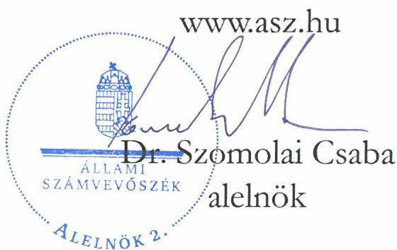

ÁLLAMI SZÁMVEVŐSZÉK

# JELENTÉS

A többségi állami tulajdonban lévő gazdasági társaságok beszerzéseinek ellenőrzése

Polgári Erőmű Kft.

2025.

25101

www.asz.hu

---

ÁLLAMI SZÁMVEVŐSZÉK

# JELENTÉS

A többségi állami tulajdonban lévő gazdasági társaságok beszerzéseinek ellenőrzése

Polgári Erőmű Kft.

2025.

25101

---

Jelentéseink az interneten a www.asz.hu címen olvashatók.

ELLENŐRZÉSI IGAZGATÓSÁG:
ELLENŐRZÉSI IGAZGATÓSÁG III.

ELLENŐRZÉSI IGAZGATÓ:
HERCZEGH ZSOLT igazgató

ELLENŐRZÉSVEZETŐ:
VEREBESNÉ SZABÓ ERZSÉBET ellenőrzésvezető

IKTATÓSZÁM: EL-4022-011/2025
TÉMASORSZÁM: 39/2024
ELLENŐRZÉS-AZONOSÍTÓ SZÁM: V1076

---

TARTALOMJEGYZÉK

- AZ ELLENŐRZÉS ALAPADATAI ... 5
- MEGÁLLAPÍTÁSOK ÉS KÖVETKEZTETÉSEK ... 8
- JAVASLATOK ... 18
- MELLÉKLETEK ... 19
- I. sz. melléklet: Értelmező szótár ... 19
- II. sz. melléklet: Ellenőrzési kritériumok ... 21
- III. sz. melléklet: Az ellenőrzött beszerzések alapját képező szerződések adatai ... 22
- FÜGGELÉK: ÉSZREVÉTELEK ... 24
- RÖVIDÍTÉSEK JEGYZÉKE ... 25

---

“哈，你是个小伙子，你是个小伙子，你是个小伙子，你是个小伙子，你是个小伙子，你是个小伙子，你是个小伙子，你是个小伙子，你是个小伙子，你是个小伙子，你是个小伙子，你是个小伙子，你是个小伙子，你是个小伙子，你是个小伙子，你是个小伙子，你是个小伙子，你是个小伙子，你是个小伙子，你是个小伙子，你是个小伙子，你是个小伙子，你是个小伙子，你是个小伙子，你是个小伙子，你是个小伙子，你是个小伙子，你是个小伙子，你是个小伙子，你是个小伙子，你是个小伙子，你是个小伙子，你是个小伙子，你是个小伙子，你是个小伙子，你是个小伙子，你是个小伙子，你是个小伙子，你是个小伙子，你是个小伙子，你是个小伙子，你是个小伙子，你是个小伙子，你是个小伙子，你是个小伙子，你是个小伙子，你是个小伙子，你是个小伙子，你是个小伙子，你是个小伙子，你是个小伙子，你是个小伙子，你是个小伙子，你是个小伙子，你是个小伙子，你是个小伙子，你是个小伙子，你是个小伙子，你是个小伙子，你是个小伙子，

---

AZ ELLENŐRZÉS ALAPADATAI

## AZ ELLENŐRZÉS CÉLJA

Az ellenőrzés célja annak értékelése volt, hogy a gazdasági társaság – ellenőrzés során kiválasztott – beszerzéseire szabályszerűen került-e sor, a kapcsolódó döntéshozatal szabályszerű és megalapozott volt-e, valamint a beszerzéshez kapcsolódóan érvényesültek-e a célszerűség és az eredményesség szempontjai.

## AZ ELLENŐRZŐTT IDŐSZAK

A 2023. év. A beszerzések előkészítése és a szerződéskötések tekintetében az ellenőrzés a 2021. és 2022. évekre is kiterjedt.

## AZ ELLENŐRZÉS TÁRGYA

Az ellenőrzés tárgya a Polgári Erőmű Kft.¹ 2023. évben megvalósult beszerzéseire irányuló döntések szabályszerűsége, megalapozottsága és célszerűsége, a megvalósult beszerzések szabályszerűsége, eredményessége, a beszerzett eszközök és szolgáltatások feladatellátás során történt hasznosulása, azaz a beszerzések megfelelősége volt. Az ellenőrzés kiterjedt a beszerzések előkészítésének, a beszerzésekre vonatkozó szerződések megkötésének és tartalmának ellenőrzésére is.

Az ellenőrzés kiterjedt minden olyan körülményre és adatra, amely az ÁSZ² jogszabályban meghatározott feladatainak teljesítéséhez, valamint a program végrehajtása folyamán felmerült újabb összefüggések feltárásához szükséges volt.

## AZ ELLENŐRZÉS JOGALAPJA

Az ellenőrzés jogszabályi alapját az ÁSZ tv.³ 1. § (3) bekezdésének és 5. § (4) bekezdésének előírásai képezték.

## AZ ELLENŐRZÉS MÓDSZERE

Az ellenőrzés végrehajtása a nemzetközi standardokat irányadónak tekintve az ellenőrzési program szempontjai, az ellenőrzött időszakban hatályos jogszabályok, az ellenőrzés szakmai szabályok és a jelen ellenőrzésre irányadó ÁSZ módszertan figyelembevételével történt.

Az ellenőrzési kérdések megválaszolásához szükséges bizonyítékok megszerzése az ellenőrzött szervezet által rendelkezésre bocsátott dokumentumokra és adatokra alapozva, továbbá megfigyelés, szemle (szemrevételezés), kérdésfeltevés (információkérés), valamint elemző eljárás útján valósult meg.

Az ellenőrzés lefolytatásához az ellenőrzött szervezet a 2023. évben megvalósult beszerzéseire vonatkozó főkönyvi és analitikus nyilvántartások, valamint az ÁSZ által kért további dokumentumok, adatok,

---

Az ellenőrzés alapadatai

információk megküldésével és a helyszíni ellenőrzés során szolgáltatott adatokat. A rendelkezésre álló adatok alapján a Polgári Erőmű Kft. a 2023. évben közelítőleg bruttó 2 273 000 E Ft forint összértékben hajtott végre beszerzéseket. A mintavételezés keretében öt beszerzés került kiválasztásra, melyek tárgyévben számlázott bruttó összértéke mintegy 263 000 E Ft-ot tett ki.

Az ellenőrzési bizonyítékként felhasználható adatforrások közé tartoztak egyrészt az ellenőrzéshez kért dokumentumok, adatállományok, nyilatkozatok, másrészt adatforrás volt minden – az ellenőrzés folyamán – feltárt, az ellenőrzés szempontjából információkat tartalmazó dokumentum.

A tények feltárása és azok összegzése során a megállapítások az ellenőrzött mintatételekre vonatkozóan kerültek megfogalmazásra. A mintatételek ellenőrzésének eredményei nem kerültek kivetítésre. Az ÁSZ akkor tekintette megfelelőnek a mintatételként kiválasztott beszerzést, ha a beszerzési eljárás teljes folyamata a lényegi elemeiben szabályszerű, célszerű és – amennyiben értékelhető – eredményes volt, illetve a beszerzés tekintetében érvényesültek a nemzeti vagyonnal való felelős gazdálkodás elvei.

Az ellenőrzés kitért minden olyan körülményre, amely a program végrehajtása kapcsán felmerült és az ellenőrzés céljaival összhangban volt.

# AZ ELLENŐRZŐTT SZERVEZET

A Polgári Erőmű Kft.-t SCT Győr Kft.⁴ elnevezéssel 2008. április 1-jén alapította a RAIFFEISEN Ingatlan Zrt.⁵ és a GASTRON 2004 Kft.⁶ A Társaság többszöri tulajdonos- és cégneváltozást követően 2017. május 16-án lett a Magyar Állam 100 százalékos tulajdonában álló NHSZ Kft.⁷ leányvállalata, melynek révén közvetett állami tulajdonba került.

2022-ben kormányhatározat⁸ rendelkezett az NHSZ Kft. versenyeztetés mellőzésével történő értékesítéséről az állami hulladékgazdálkodási koncessziós pályázat nyertese – a MOL Nyrt.⁹ – részére. A 2023. július 31-ei hatállyal történt tulajdonosváltozást megelőzően intézkedés történt az NHSZ Kft. portfóliójába tartozó, de annak értékesítése után is állami tulajdonban maradó társaságok leválasztásáról. Az NHSZ Kft. a Társaságban meglévő részesedését 2023. január 9-én ázsiós tőkeemelés keretében apportálta a kizárólagos tulajdonában álló Általános Vagyonkezelő Kft.-be. Az Általános Vagyonkezelő Kft. tulajdonosa 2023. június 29. napjával közvetlenül a Magyar Állam lett, így a Társaság a tulajdonosváltozást követően is közvetett állami tulajdonban maradt. A Társaságnál az ellenőrzött időszakban háromtagú felügyelőbizottság működött és a Társaság választott könyvvizsgálóval rendelkezett. Az ügyvezető személye az ellenőrzött időszakban nem változott.

A Polgári Erőmű Kft. cégjegyzékbe bejegyzett főtevékenysége az ellenőrzött időszakban villamosenergia-termelés volt. A Társaság főként gumihulladékból állított elő villamos energiát. Emellett a Ktdt.¹⁰ szerinti egyéni hulladékkezelést teljesítő kötelezettekkel (gumiabroncs gyártókkal, forgalmazókkal) kötött szerződések alapján vállalkozott használt/hulladék gumiabroncsok gyűjtésére, szállítására, tárolására, energetikai és másodlagos hasznosítására. A Társaság leányvállalatának, a Star Power Kft.¹¹-nek a 2020. december 31-ei hatállyal történt beolvadásával a gumihulladék megsemmisítésével és hasznosításával foglalkozó Erőmű¹² is a Társaság tulajdonába került.

A Társaság 2023. évi nettó árbevételének 88%-a villamos energia értékesítésből, 12%-a gumihulladék-hasznosításból származott. Beszerzéseit a termeléshez szükséges anyagok, az anyagmozgatáshoz, hulladékszállításhoz és -kezeléshez, a műszaki berendezések javításához, karbantartásához, valamint az Erőmű területének takarításához kapcsolódó tételek határozták meg.

---

Az ellenőrzés alapadatai

1. táblázat

(adatok: E Ft-ban)

A POLGÁRI ERŐMŰ KFT. BESZÁMOLÓJÁNAK FŐBB ADATAI

|   | 2022. év | 2023. év  |
| --- | --- | --- |
|  Értékesítés nettó árbevétele | 2 682 240 | 2 056 730  |
|  Anyagjellegű ráfordítások | 1 067 311 | 1 197 518  |
|  - ebből anyagköltség | 549 427 | 680 476  |
|  - ebből igénybe vett szolgáltatások | 507 751 | 504 508  |
|  Személyi jellegű ráfordítások | 348 822 | 451 234  |
|  Adózott eredmény | 10 597 | -605 937  |
|  Tárgyi eszközök | 3 097 698 | 3 018 946  |
|  Mérlegfőösszeg | 4 046 055 | 3 772 297  |
|  Saját tőke | 365 204 | -240 733  |

Forrás: ÁSZ saját szerkesztés az e-beszámoló adatok alapján

A Társaság a 2023. évben a megelőző két üzleti év beszámolóadatai alapján az ellenőrzött időszakban nem volt köteles a Taktv.¹³ szerinti belső kontrollrendszer kialakítására és működtetésére, és a Tulajdonos¹⁴, valamint a felügyelőbizottság sem élt ilyen javaslattal. A 2024-es évtől kezdődően a Társaság a megelőző két üzleti év beszámolóadatai alapján a Taktv. szerinti belső kontrollrendszer kialakítására és működtetésére kötelezett.

---

MEGÁLLAPÍTÁSOK ÉS KÖVETKEZTETÉSEK

A Polgári Erőmű Kft. az ellenőrzött időszakban hazánk egyetlen gumihulladék égetésre tervezett erőművét üzemeltette a Polgári Ipari Park területén. Tevékenységének célja a gumihulladékok energetikai megsemmisítésével villamosáram termelése, valamint a hulladékok okozta országos környezetterhelés csökkentése volt. Az égetés során az Erőműben nagy mennyiségű pernye, kazánhamu és -salak keletkezett, melyek rendszeres elszállítása és az Erőmű területének tisztán tartása a termelés egyik alapfeltétele volt. Az ÁSZ a Társaság termeléséhez szükséges alapvető beszerzések közül ezen – az ellenőrzött időszak tekintetében meghatározó – területről választott mintatételeket ellenőrzésre. A Társaság az ellenőrzött időszakban a pernye big-bag zsákokba történő átfejtését, a salakszállítást, a gumifelhordó szalag alatti területen és az Erőmű füves területén történő takarítás-fűnyírást, valamint az üzemi terület takarítást két – azonos ügyvezetővel és részben azonos tagokkal rendelkező – vállalkozástól rendelte meg. Az egyik vállalkozástól emellett rozsdamentes acélsöveket és acéllemezeket is vásárolt a Társaság. Az acélvásárlás az Erőmű hűtőrendszerének bővítését célzó beruházás későbbi megvalósítása érdekében történt. Értékét tekintve az ellenőrzésre kiválasztott öt beszerzés a Társaság 2023. évi – termeléshez szükséges alapanyag és energia beszerzésen kívüli – anyagjellegű ráfordításainak mintegy 38%-át tette ki, és az egyik szerződött vállalkozás a Társaság harmadik legnagyobb tárgyévi szállító partnere volt. Az ellenőrzött beszerzések főbb adatait a 2. táblázat tartalmazza.

2. táblázat

AZ ELLENŐRZŐTT BESZERZÉSEK FŐBB ADATAI

|  MINTATÉTEL SZÁMA | BESZERZÉS TÁRGYA | BESZERZÉS ALAPJÁT KÉPEZŐ SZERZŐDÉS KELTE | BESZERZÉS NETTÓ ÉRTÉKE (FT)  |
| --- | --- | --- | --- |
|  1. | pernyetározó silóban lévő anyagok zsákokba történő átfejtése | 2021.09.01 | 25 433 142  |
|  2. | kazánhamu és -salak átvétele és elszállítása | 2021.01.04 | 139 705 890  |
|  3. | fűnyírás és gumifelhordó szalag alatti terület takarítása | 2022.01.01 | 12 877 248  |
|  4. | 2 610 kg rozsdamentes acélsó és acéllemez vásárlás | 2023.08.11 | 5 220 000  |
|  5. | üzemi terület takarítása | 2022.01.01 | 24 716 340  |

Forrás: ÁSZ saját szerkesztés a Poltári Erőmű Kft. adatszolgáltatása alapján

Az ÁSZ által feltárt tények és körülmények alapján felmerült, hogy a Társaság a Kbt. 5. § (1) bekezdés e) pontja szerinti ajánlatkérőnek minősülhetett, ezért az 1., 2., 3. és 5. számú ellenőrzött beszerzések esetében közbeszerzési eljárás lefolytatására lett volna szükség. Ezen kérdéssel kapcsolatban az ÁSZ a hatáskörrel rendelkező Közbeszerzési Hatóság felé jelzéssel élt. Az ÁSZ jelentése a közbeszerzéssel kapcsolatos megállapításokat nem tartalmazza, az ÁSZ a III. számú mellékletben meghatározott ellenőrzési kritériumok figyelembevételével folytatta le az ellenőrzését. A 4. számú ellenőrzött beszerzés tekintetében az ellenőrzés során nem merült fel olyan körülmény, amely a beszerzési eljárás Kbt. szerinti lefolytatását tette volna szükségessé.

---

Megállapítások és következtetések

AZ ELLENŐRZÉS MEGÁLLAPÍTOTTA, hogy a Polgári Erőmű Kft. ellenőrzésre kiválasztott beszerzései esetében a döntések előkészítésének, megalapozásának dokumentálása és ezek kihatásaként a beszerzési döntések átláthatósága nem volt megfelelő. Ezáltal nem volt biztosított a döntéshozatal utólagos ellenőrizhetősége.

A Polgári Erőmű Kft. beszerzési igényei az ügyvezető nyilatkozatait és a Társaság működéséről rendelkezésre álló információkat értékelve indokoltan merültek fel, azonban a beszerzési döntéseket és azok előkészítését alátámasztó dokumentációt a Társaság nem bocsátott az ellenőrzés rendelkezésére. A döntéselőkészítés és a döntéshozatal dokumentálási hiányosságai következtében a kiválasztott beszerzések tekintetében nem volt biztosított a beszerzésre irányuló döntések átláthatósága, valamint az igénybe vett szolgáltatások esetében a döntéshozatal megalapozottságának utólagos ellenőrizhetősége. Az acélvásárlás esetében a beszerzési döntés sem a beszerzés időpontja, sem a beszerzett termékek fajtája, mennyisége és minősége tekintetében nem volt kellően megalapozott.

A szolgáltatások beszerzésének lebonyolítása – a dokumentáció és az ajánlati eljárások hiányosságai miatt – az ÁSZ véleménye szerint nem volt megfelelő.

A takarítás-fűnyírási és az acélvásárlási szerződés hiányossága következtében sérült a felelős gazdálkodás jogszabályi alapelve.

A Társaság az általa megkötött szerződésekkel kapcsolatban fennálló közzétételi kötelezettségének a jogszabályi előírások ellenére nem tett eleget.

# A BESZERZÉSEKHEZ KAPCSOLÓDÓ BELSŐ SZABÁLYOZÓ ESZKÖZÖK

A Tulajdonos a Társaság Alapító okirat1-16-ában nem határozott meg a beszerzésekre irányadó különös szabályokat, a beszerzésekről való döntést vagy szerződések megkötését nem kötötte a felügyelőbizottság, illetőleg a saját előzetes jóváhagyásához. Az SzMSz17 a beszerzések tárgyában kizárólag az összeférhetetlenség kérdésére tért ki. Az SzMSz szerint összeférhetetlenség állt fenn, ha a vásárlást, szolgáltatás igénybevételét engedélyező és ellenőrző személy maga a vásárló vagy a szolgáltatást igénybe vevő. Az ügyvezető nyilatkozata szerint a Társaság vezetői állománya és struktúrája nem tette lehetővé a SzMSz 6.10 pontjában foglalt összeférhetetlenségi szabály maradéktalan betartását. Az SzMSz szerinti beszerzési szerepkörök elkülönítését a Társaság az ellenőrzött időszakban nem tudta biztosítani.

A beszerzésekhez kapcsolódó feladat- és hatásköröket, valamint a Társaság ellenőrzött beszerzéseire alkalmazandó részletszabályokat a Beszerzési Szabályzat1-218 tartalmazta. A belső szabályozás szerint a lefolytatandó beszerzési eljárást a beszerzés egyedi értéke és jellege határozta meg. A Társaság ugyanakkor a Beszerzési Szabályzat1-2 II. 1. pontjában (A beszerzés értékének meghatározása) nem rendelkezett arról, hogy határozatlan időre kötött szerződés esetén a beszerzés becsült értékét hogyan kellett meghatározni. Továbbá a Társaság nem definiálta, hogy mely beszerzések tartoztak az Erőmű folyamatos működését biztosító, üzemzavarokat megelőző vagy azok időtartamát csökkentő beszerzések közé, amelyeket a Beszerzési Szabályzat1-2 III. 1. b. pontjában meghatározott értékhatárig ajánlatkérési eljárás nélkül lehetett lebonyolítani. A Társaság nem határozta meg a szokásos üzletmenet körébe nem tartozó beszerzések fogalmát sem, amelyhez a Beszerzési Szabályzat1-2 III. 1. d. pontjában megjelölt értékhatár felett tulajdonosi jóváhagyás volt szükséges. A Beszerzési Szabályzat1-2-ban használt fogalmak pontos meghatározásának hiányában nem volt egyértelműen eldönthető, hogy mely beszerzéseket milyen értékhatárig lehetett közvetlen megrendeléssel lefolytatni, mikor volt szükséges ajánlatkérési eljárást indítani, és mely beszerzésekhez volt szükséges a tulajdonosi jóváhagyás. A Társaság a Beszerzési Szabályzat1-2-ban nem alakította ki továbbá a három szereplős ajánlatkérési eljárás keretében beérkezett ajánlatok kiértékelése

9

---

Megállapítások és következtetések

dokumentálásának követelményrendszerét, holott az – különösen a belső szabályozás által lehetővé tett „összességében legelőnyösebb ajánlat” szerinti értékelési eljárásra tekintettel – célszerű lett volna. A Beszerzési Szabályzat, előírta, hogy az ügyvezető a beérkezett ajánlattal kapcsolatban a Taktv. 4. § (1) bekezdése szerint járjon el. Mivel a hivatkozott jogszabályhely a felügyelőbizottság kötelező létrehozásáról rendelkezik, a belső szabályozás előírása az ajánlatok kezelésével kapcsolatban nem volt értelmezhető. A Társaság belső szabályozó eszközei nem tartalmaztak rendelkezést a beszerzési döntéselőkészítés és döntéshozatal dokumentálására vonatkozóan sem.

Az ÁSZ véleménye szerint a szabályozási hiányosságok miatt a Társaság nem biztosította az egyes beszerzések esetén alkalmazandó beszerzési eljárások egyértelmű meghatározhatóságát és az ajánlatkérési eljárások átláthatóságát. A Polgári Erőmű Kft. ugyan nem tartozott sem a Bkr.¹⁹, sem a Gbkr.²⁰ hatálya alá, azonban állami tulajdonú gazdasági társaságként a vagyongazdálkodás megalapozottságának érdekében célszerű lett volna a beszerzési folyamatokhoz tartozó kritériumok részletes kialakítása. A szabályozási hiányosságok kihatottak a döntések dokumentáltságára és a döntések nyomon követhetőségére is.

# A BESZERZÉSI IGÉNYEK FELMERÜLÉSE

A Polgári Erőmű Kft. 2021. szeptember 1-jén határozatlan időre szóló szerződést kötött az Erőmű 160 m³-es és 60 m³-es pernyetározó silójában lévő anyagok big-bag zsákokba történő átfejtése érdekében a Vállalkozó-ral (1. számú ellenőrzött tétel – átfejtés). Az ügyvezető nyilatkozata szerint az Erőmű tározó silóinak maximális kapacitása 14-16 termelési nap, a maximális szint elérése esetén a védelmi rendszer automatikusan leállította a termelést. A gumihulladék hasznosítása során keletkező pernyét ezért rendszeresen veszélyes hulladék lerakóhelyre kellett szállítani. Az eredeti tervek szerint az Erőmű pernyetározó silóinak ürítését silóautós lefejtésre és szállításra tervezték, de a veszélyes hulladék lerakóhelyek által alkalmazott technológiával a gumihulladék égetésből származó pernye nem volt kifejthető a tartálykocsikból, így kizárólag bezsákolt hulladék szállítása és lerakása volt lehetséges. Az ügyvezető nyilatkozata szerint korábban saját dolgozókkal végezték az átfejtést, melyet a rendes munkaidőn túl, túlmunka-fizetéssel tudtak megszervezni. A folyamatos munkaerő-elvándorlás, valamit a megnövekedett alapfeladatok ellátása miatt a későbbiekben a dolgozók már nem vállalták tervezhető módon a lefejtést, így külső vállalkozó bevonása vált szükségessé.

A Polgári Erőmű Kft. 2021. január 4-én határozatlan időre szóló szerződést kötött a Vállalkozó-ral az Erőműben a működés során keletkező, a 72/2013. (VIII. 27.) VM rendelet²¹ szerinti besorolású hulladékok – „19 01 12 EWC kódu kazánhamu és salak, amely különbözik a 19 01 11-től”, nem veszélyes hulladék – átvételére és elszállítására (2. számú ellenőrzött tétel – salakszállítás). A beszerzési igény azért merült fel, mivel a gumihulladék hasznosítása során keletkező kazánhamut és salakot az Erőműből rendszeresen el kellett szállítani.

A Polgári Erőmű Kft. 2022. január 1-jén határozatlan időre szóló szerződést kötött a Vállalkozó-ral az Erőmű teljes füves területének gondozására és a gumifelhordó szalag alatti terület takarítására, felseprésére, mosására (3. számú ellenőrzött tétel – takarítás-fűnyírás). Az erőműben a gumihulladék az erre a célra kialakított tározóból szállítószalag segítségével került a hőenergiát termelő kazánba. A szállítószalag nem volt teljesen zárt rendszer, emiatt arról lehullhattak gumidarabok, amik idővel akadályozhatták volna a szalag működését. Az ügyvezető nyilatkozata szerint az Erőműben 2016-ban keletkezett tűz rendkívül gyors terjedésének az egyik oka a szalagok alatti területen felgyűlt nagy

10

---

Megállapítások és következtetések

mennyiségű gumihulladék volt, így biztonsági szempontból is fontos volt a terület takarítása. Az Erőműhöz tartozó ingatlan nagy részét fű borította, ami a tavasztól őszig tartó időszakban nyírást igényelt. Az ügyvezető nyilatkozata szerint kezdetben saját személyzettel próbálták elvégezni ezt a feladatot, azonban a leterheltség növekedése, az elvándorlás, a rossz munkakörülmények miatti sorozatos panaszok ellehetetlenítették a feladat ellátását. Így külső vállalkozó bevonása vált szükségessé.

A Polgári Erőmű Kft. 2023. augusztus 11-én szerződést kötött a Vállalkozó-1-val 2 610 kg rozsdamentes acélsó és acéllemez beszerzése céljából (4. számú ellenőrzött tétel – acélvásárlás). A Társaság az ügyvezető nyilatkozata szerint a megvásárolt anyagból az Erőmű hűtőrendszeréhez kívánt szűrőrendszert építeni. Az Erőműben tulajdonosi döntés alapján 2023. második negyedévére megvalósult egy hűtőrendszer-bővítés, amely nedves technológiájú. A hűtőkör a szabad levegővel érintkezett, így a környezetből jelentős szennyezőanyag jutott a vízkörbe, melyet folyamatosan szűrni kellett. Az egység szűrőrendszere az ügyvezető nyilatkozata szerint nem bizonyult elégségesnek, jelentősen nagyobb, egyedi tervezésű és gyártású szűrőre lett volna szükség. A Társaság a kivitelezést saját karbantartói létszámmal tervezte megvalósítani, melyhez rozsdamentes acél beszerzése vált szükségessé.

A Polgári Erőmű Kft. 2022. január 1-jén szerződést kötött a Vállalkozó-2-val az Erőmű teljes üzemi területe, a gumitározó és környezete, a kazánház, a turbina csarnok, a vízlágyító és a fűtőközpont takarítása, mechanikus tisztítása, vizes mosása, valamint a közlekedési utak, járdák tisztítása, vizes mosása, téli hó mentesítése tárgyában (5. számú ellenőrzött tétel – üzemi terület takarítás). Minden munkaterületen, így az Erőmű területén is szükséges takarítani többek között munkavédelmi, tűzvédelmi szempontból. Az ügyvezető nyilatkozata szerint korábban ezt a feladatot is saját munkaerővel oldották meg, de a már kifejtett okokból a szakszemélyzet ezt a továbbiakban nem vállalta, így külső vállalkozó bevonása vált szükségessé.

Az ügyvezető által az ellenőrzés során tett nyilatkozatok és a Társaság működéséről rendelkezésre álló információk alapján a beszerzési igények – az ellenőrzött tételek tekintetében – indokoltan merültek fel.

## A BESZERZÉSI DÖNTÉSEK MEGALAPOZOTTSÁGA

Az ellenőrzött beszerzéseket a Társaság 2023. évi Üzleti tervében a működési költségek között, az anyagmozgatás (átfejtés), a nem veszélyes hulladékkezelés (salakszállítás) és az egyéb igénybe vett szolgáltatás (takarítás-fűnyírás, üzemi terület takarítás) sorokon tervezte. Az ügyvezető nyilatkozata szerint az Üzleti terv készítésekor még nem ismerték a hűtőtorony többlet vízigényéből adódó problémát, ebből adódóan az acélvásárlás a tárgyévi Üzleti tervben nem szerepelt. A 2023. év nyarán végzett üzemelés során derült ki a tapasztalatok alapján, hogy az Erőmű vízlágyítója nem tudja kiszolgálni a megnövekedett vízigényt, valamint, hogy a szűrési képesség is kevés. A beszerzést az anyag- és alkatrészköltésre tervezett összeg terhére valósították meg.

Az ellenőrzött beszerzések előkészítése során, a szerződéskötéseket megelőzően célszerűségi, gazdaságossági, várható eredményességi szempontú megalapozás nem történt, a Társaság a beszerzési döntéseit pénzügyi-gazdaságossági számításokkal, elemzésekkel nem támasztotta alá. Az ügyvezető ennek okaként nyilatkozatában arra hivatkozott, hogy a Társaság méretéből adódóan a széleskörű bizonylatolás nem indokolt. A 2021. január 4-én aláírt salakszállítási, a 2021. szeptember 1-jén aláírt átfejtési, a 2022. január 1-jén aláírt takarítási-fűnyírási és üzemi terület takarítási, valamint a 2023. augusztus 11-én aláírt acélvásárlási szerződésekhöz tartozó beszerzési döntésekkel kapcsolatos, azokat alátámasztó dokumentációt a Társaság nem bocsátott az ellenőrzés rendelkezésére. A

---

Megállapítások és következtetések

döntések előkészítésének és a döntési folyamatoknak az utólagos ellenőrizhetősége dokumentálás hiányában nem volt biztosított, melynek következtében sérült az Nvtv. 22 7. § (2) bekezdés szerinti átlátható működés elve.

Az ÁSZ véleménye szerint az átlátható működés és az ellenőrizhetőség szempontjából kiemelt jelentősége van annak, hogy az állami tulajdonú gazdasági társaságok dokumentálják azokat az adatokat, információkat, számításokat, elemzéseket, melyek alátámasztják döntéseik szabályszerűségét, megalapozottságát, célszerűségét, várható eredményességét, végső soron a felelős gazdálkodás elveinek érvényesülését. A döntéselőkészítés és a döntéshozatal dokumentálási hiányosságai következtében a Társaság nem biztosította a közpénzekkel és közvagyonnal gazdálkodó szervezetek esetében elvárható módon a beszerzések megalapozottságának utólagos ellenőrizhetőségét.

Átfejtési, takarítási-fúnyírási és üzemi terület takarítási feladatok (1., 3. és 5. számú ellenőrzött tételek)

Az átfejtési, a takarítási-fúnyírási és az üzemi terület takarítási szerződésekhöz tartozó beszerzési döntésekkel kapcsolatos, azokat alátámasztó dokumentáció hiányában az ügyvezető az ellenőrzés során nyilatkozatot tett a beszerzések indokoltságára vonatkozóan. Eszerint a Vállalkozókkal eredetileg a Társaság később beolvadással megszűnt leányvállalata, a Star Power Kft. kötött szerződéseket. Kiválasztásuk folyamatáról nem állt rendelkezésre dokumentáció. Mivel a Vállalkozók megfelelő tapasztalatra és jártasságra tettek szert a feladatok ellátásában, ezért a Társaság a továbbiakban is folytatta velük az együttműködést, ezért az ellenőrzött beszerzések alapját képező szerződések megkötését nem előzte meg ajánlatkérési eljárás. Az ügyvezető nyilatkozata szerint a Társaság, mint villamosenergia-termelő, a villamosenergia-ipari ágazati kollektív szerződés hatálya alá tartozott. Emiatt a dolgozóknak a minimálbérén, illetőleg a garantált bérminimumon felül – 2023. január 1-től 232 000 Ft/hó, illetőleg 296 400 Ft/hó – 13. havi munkabért és 4,5 %-os önkéntes nyugdíjpénztári hozzájárulást, továbbá rendkívüli pótszabadságot és a betegszabadság időtartamára emelt szintű távolléti díjat kellett biztosítani. Így értékelésük szerint a saját dolgozókkal történő feladatellátás nem lett volna gazdaságos. Ennek megítélése kapcsán figyelembe vették a munkavállalók munka- és védőruha juttatásának, rendszeres orvosi vizsgálatának és munkába járásának, valamint a vezetés megnövekedő terheinek költségvonatát is. Tekintve, hogy a saját munkavállalók az átfejtési, a takarítási-fúnyírási és az üzemi terület takarítási feladatokat már nem vállalták, a munkákat kiszervezték külső vállalkozókhoz. A Társaság állami tulajdonba kerülése után az ügyvezető nyilatkozata szerint elvárás volt, hogy csak a hiányzókkal minden lehetett létszám bővítést végezni vagy olyan esetekben, amikor azt jogszabályi megfelelés indokolta. Ilyen körülmények között nem merült fel a saját dolgozói állomány bővítése a már egyszer kiszervezett feladatokra. A gazdaságosság ezen szempontok mentén történő részletes vizsgálata az ellenőrzött beszerzési döntéseket megelőzően az ügyvezető nyilatkozata szerint nem történt meg. A nyilatkozatban említett költségtényezőket nem számszerűsítették és nem mutatták ki a feladatok saját foglalkoztatottakkal történő ellátásának konkrét pénzügyi kihatásait. A nyilatkozatban foglaltakat a Társaság dokumentumokkal sem támasztotta alá.

Vállalkozó: az átfejtési és a takarítási-fúnyírási feladatok elvégzése céljából a jelenléti ívek adatai szerint 166 alkalommal jelent meg a Társaság telephelyén napi 8 órában, alkalmanként 3 (egy esetben 2) fővel. Vállalkozó: 2023. valamennyi munkanapján, azaz 251 alkalommal végezte a Társaságnál az üzemi terület takarítását napi 8 órában, minden esetben 4 fővel. Az átfejtési szerződés alapján a Polgári Erőmű Kft. az

12

---

Megállapítások és következtetések

átfejtési munkához szükséges eszközöket – munkagép, átfejtő adapter, big-bag zsákok –, míg Vállalkozó₁ a munkaruhával és védőeszközzel ellátott munkaerőt volt köteles biztosítani. A munkaerőre vonatkozóan – a gépkezelő kivételével – képzettségi elvárás nem került megfogalmazásra a szerződésben. A takarítás-fűnyírás és az üzemi terület takarítás szintén szakképzettséget nem igénylő élőmunkaigényes tevékenység volt. Az átfejtés, a takarítás-fűnyírás és az üzemi terület takarítás egyaránt a Társaság működéséhez szükséges, rendszeres, napi 8 órás munkavégzést igénylő feladatot jelentett.

Az ÁSZ véleménye szerint a beszerzési döntések gazdaságossági szempontból történő megalapozása érdekében indokolt lett volna, hogy a Társaság előzetesen kiszámítsa az átfejtés, a takarítás-fűnyírás és az üzemi terület takarítás saját munkavállalók foglalkoztatásával történő elvégzésének várható költségeit és azt összevesse a külső szolgáltatók általi feladatellátás költségeivel. A gazdaságossági számítás elvégzése mellett indokolt lett volna annak dokumentált mérlegelése is, hogy a foglalkoztatás és a külső vállalkozó megbízása milyen kockázatokkal jár, melyik konstrukcióval biztosítható a hosszú távon zökkenőmentes és eredményes feladatellátás, és mindezen körülmények együttes értékelése alapján melyik megoldás választása célszerűbb.

A feltárt hiányosságok következtében a Társaság az Nvtv. 7. § (2) bekezdésében foglalt rendelkezések ellenére nem biztosította az átfejtési, takarítási-fűnyírási és üzemi terület takarítási szolgáltatások beszerzésére irányuló döntések átláthatóságát. Továbbá a Társaság nem biztosította a döntéshozatal megalapozottságának utólagos ellenőrizhetőségét.

# Salakszállítás (2. számú ellenőrzött tétel)

A 2021. január 4-én aláírt salakszállítási szerződéshez tartozó beszerzési döntéssel kapcsolatos, azt alátámasztó dokumentáció hiányában az ügyvezető az ellenőrzés során nyilatkozatot tett a beszerzés háttéréről. Eszerint az Erőmű 2014-es újraindítása után több cég végezte a salakszállítást. Kezdetben nagy reményeket fűztek a salak fémtartalma miatt a kohászati hasznosítás lehetőségéhez, azonban hamar bebizonyosodott, hogy ez a rendkívül magas szennyezőanyag-tartalom miatt nem lehetséges. Így az idő előrehaladtával a szállító partnerek egyre bizonytalanabb időközökben szállították el a hulladékot. Sok esetben hetekig nem volt szállítás, ezzel veszélybe került az Erőmű folyamatos üzemeltetése. 2018. első hónapjaiban kezdték felderíteni azokat a hulladékkal foglalkozó cégeket, amelyek HAK 19 01 12-es kóddal azonosított hulladékkal tudtak foglalkozni és tolerálták a teljesen egyedi, gumihulladék égetésből származó kazánsalak tulajdonságait. 2018. év végén a korábbi szállító elérhetetlenné vált. Ezért 2019. januárjában a Társaság később beolvadással megszűnt leányvállalata, a Star Power Kft. szerződést kötött Vállalkozó₁-val, mint folyamatos hulladékátvevővel. Vállalkozó₁ időközben kidolgozott és engedélyeztetett egy hasznosítási eljárást, melynek következtében 2020. februárjától hasznosította a hulladékot és erről nyilatkozatot állított ki a Társaság számára. A 2021. január 4-én aláírt salakszállítási szerződés megkötésére a Star Power Kft. beolvadással történt megszűnése miatt került sor. Az ügyvezető nyilatkozatában vázolt folyamatról nem állt rendelkezésre dokumentáció.

Az ellenőrzés megállapítása szerint az Erőműben a gumihulladék égetése során folyamatosan keletkezett kazánhamu és salak, melynek rendszeres elszállítása szükségszerű és indokolt volt. Vállalkozó₁ igazoltan rendelkezett a Társaságnál 2023. évben keletkezett 5 838,9 tonna erőművi kazánhamu és salak átvételéhez, elszállításához és feldolgozásához szükséges, a Környezetvédelmi hatóság²³ által kiállított hulladékgazdálkodási engedéllyel. Ennek alapján Vállalkozó₁ jogosult volt hasznosítói nyilatkozatot kibocsátani az erőművi hulladék feldolgozásáról, amelyre a Társaságnak szüksége volt – a Ktdt. szerinti egyéni hulladékkezelést teljesítő – üzleti partnerei felé fennálló szerződéses kötelezettsége teljesítéséhez.

13

---

Megállapítások és következtetések

Mindezek alapján a salakszállítási szolgáltatás igénybevétele szükséges volt, azonban a döntést dokumentált módon nem támasztották alá. Dokumentáltság hiányában a Társaság az Nvtv. 7. § (2) bekezdésében foglaltak ellenére nem biztosította a salakszállítási szolgáltatás beszerzésére irányuló döntés átláthatóságát. Továbbá a Társaság nem biztosította a döntéshozatal megalapozottságának utólagos ellenőrizhetőségét.

## Acélvásárlás (4. számú ellenőrzött tétel)

Az Erőmű hűtőrendszeréhez megépíteni tervezett szűrőrendszerhez Vállalkozó-tól származó acéltermékek vásárlását megelőzően a Társaság karbantartási vezetője által kézzel készített elvi elrendezési és méretezési vázlatrajz állt rendelkezésre, mely tartalmazott egy nagyságrendi méretezést is. A megvásárolt alapanyag fajta, minőség és mennyiség szerinti meghatározását kiviteli tervek és anyagszükséglet felmérés nem támasztotta alá. A 2023. augusztus 11-én aláírt acélvásárlási szerződéshez tartozó beszerzési döntéssel kapcsolatos, azt alátámasztó dokumentáció hiányában az ügyvezető az ellenőrzés során nyilatkozatot tett a beszerzés háttéréről. Az ügyvezető nyilatkozatában előadta, hogy a projekt elindulásához a megnövekvő vízigény kielégítésére egy vízlágyító egység beszerzése is szükséges lesz. Mindezekre anyagi erőforrás hiánya miatt nem került sor, így a szűrőrendszer kivitelezése sem kezdődhetett el. Az acélcsöveket és lemezeket a Társaság a helyszíni ellenőrzés 2024. június 20-ai időpontjában a székhelyen – szabadteren – tárolta, melyről fényképfelvételeket is rendelkezésre bocsátott. A tervezett beruházás a 2023. évi üzleti tervben nem szerepelt, mivel az ügyvezető nyilatkozata szerint az üzleti terv készítésekor még nem volt ismert probléma a hűtőtorony többlet vízigénye. A 2024. évi üzleti terv készítésekor a várható gazdasági eredmény miatti anyagi erőforrások hiánya nem tette lehetővé a beruházás tervezését és tárgyévi megvalósítását. Az ügyvezető nyilatkozata szerint a 2026. évi üzleti terv tartalmazza az új vízlágyító egység beszerzését és a szűrő beépítését. A beruházás megvalósítása révén kezelhetővé válna a meleg nyári időjárás okozta hűtőteljesítmény csökkenés, melynek révén növekedne az Erőmű villamos energia termelése, valamint a hasznosított gumihulladék mennyisége is, így növelve az azokból származó bevételeket. A Társaság által átadott dokumentumok ugyanakkor nem támasztották alá, hogy a beruházás megindítását több évvel megelőző beszerzés pénzügyi-gazdasági szempontból indokolt volt.

Mindezek alapján az acélvásárlás sem a beszerzés időpontja, sem a beszerzett termékek fajtája, mennyisége és minősége tekintetében nem volt kellően megalapozott. Dokumentáltság hiányában a Társaság az Nvtv. 7. § (2) bekezdésében foglaltak ellenére nem biztosította a beszerzési döntéshozatal átláthatóságát. Továbbá a Társaság nem biztosította a döntéshozatal utólagos ellenőrizhetőségét.

## A BESZERZÉSEK LEBONYOLÍTÁSA ÉS A MEGKÖTÖTT SZERZŐDÉSEK

Átfejtési, salakszállítási, takarítási-fűnyírási és üzemi terület takarítási feladatok (1-3. és 5. számú ellenőrzött tételek)

Az átfejtési, salakszállítási, fűnyírási-takarítási és üzemi terület takarítási szerződések megkötését megelőzően az ügyvezető nyilatkozata alapján nem került sor ajánlatkérési eljárásra, a szerződéskötést megelőző eljárás dokumentációja az ellenőrzés során nem állt rendelkezésre. A szerződések határozatlan időre szóltak. A felek az esetleges későbbi díjemelés lehetőségéről egyik szerződésben sem rendelkeztek, azonban az ellenőrzött időszakot megelőzően valamennyi szerződés esetében legalább egy

---

Megállapítások és következtetések

alkalommal – utoljára egységesen 2022. július 1-jei hatállyal – sor került a szerződött egységárak, illetőleg havidíjak növelésére. Az árváltozásokat a III. számú melléklet 1-4. táblázatai mutatják be.

A 2023. január 1-jei hatályú újabb díjemelést megelőzően, 2022. november 10-én a Társaság ajánlatkérő levelet küldött a vele határozatlan időre létesített szerződéses jogviszonyban álló Vállalkozó₁, illetőleg Vállalkozó₂ és két további cég számára. A két további ajánlattevő kiválasztásának szempontjait tartalmazó dokumentáció az ellenőrzés során nem állt rendelkezésre. Az ügyvezető nyilatkozata szerint az egyik cég 2017. évtől a Társaság partnere volt veszélyes hulladékok elszállításában (fáradtolaj, festékkazetta, olajos felitató anyagok, akkumulátorok stb.), ezért kérték fel ajánlattételre. A másik cég az interneten talált adatok alapján került kiválasztásra, mint környezetvédelemmel, munkavédelemmel és hulladékgazdálkodással foglalkozó társaság. A kiválasztásnál az ügyvezető szerint az volt a fő szempont, hogy hulladékkezelésben, hulladékgazdálkodásban jártas, esetleg hulladékudvarokat üzemeltető cégek legyenek megszólítva, ezzel elősegítve, esetleg garantálva, hogy az ajánlattevők megfelelő jártassággal rendelkezzenek az elvégzendő feladatok ellátásában. Az átadott iratok szerint az interneten talált ajánlattevő nem rendelkezett a salakszállítási szerződés teljesítéséhez szükséges engedéllyel, így ajánlattételre történt felhívása az ÁSZ szakmai véleménye szerint a salakszállítás tekintetében nem volt megalapozott.

Vállalkozó₁ és Vállalkozó₂ hatályos szerződéseit a Társaság nem mondta fel, és a pályáztatási eljárást megelőző, esetlegesen azt indukáló áremelési igényükre vonatkozó dokumentációt sem bocsátott az ellenőrzés rendelkezésére. Vállalkozó₁ és Vállalkozó₂ ajánlati felhívásaiban – a másik két ajánlattevőnek megküldött felhívásokkal ellentétben – szerepelt az az információ, hogy a velük létesített élő, érvényes szerződésre tekintettel az ajánlatkérés a piaci viszonyok feltérképezésére, vizsgálatára, megismerésére és elemzésére irányult. Az ajánlatok benyújtásának határideje 2022. december 30., az elbírálás határideje a beadás határidejétől számított két hét (2023. január 13.) volt. Az ajánlati felhívásokban a Társaság a munkakezdés napjaként 2023. január 1-jét jelölte meg. Az elbírálást megelőző munkakezdés új nyertes esetén nem lett volna biztosítható, különösen azzal együtt, hogy a hatályos szerződéseket a Társaság nem mondta fel.

Az ajánlati felhívások nem tartalmaztak a megalapozott ajánlatadáshoz szükséges minden releváns információt (például a várható átfejtési és salakszállítási mennyiségeket, az átfejtés, salakszállítás, takarítás várható/elvárt gyakoriságát, a takarítandó üzemi terület nagyságát), így a hatályos szerződéssel rendelkező Vállalkozó₁,₂ az eljárás során információs előnyt élvezhetett a két új ajánlattevővel szemben. Az esetleges szóbeli egyeztetésekről dokumentáció nem állt az ellenőrzés rendelkezésére. Ennek hiányában nem volt igazolt, hogy minden ajánlattevő ugyanazon műszaki és egyéb információk birtokában tette meg ajánlatát, és ezért az ajánlatok egymással megbízhatóan összehasonlíthatók voltak.

A beszerzési eljárásokban a döntést az ajánlatok elbírálásakor hatályos Beszerzési szabályzat₂ előírásainak megfelelően az ügyvezető hozta. A beérkezett pályázatok elbírálása során az ügyvezető a pályázatokra kézírással felvezetett szempontok alapján olyan tényezőket is figyelembe vett az értékelés során, amelyek nem szerepeltek a pályázati felhívásokban (például, hogy az ajánlattevő eszközeiről és állományáról nem volt információja, holott a pályázati kiírás szerint ezeket az adatokat a pályázóknak nem kellett közölniük, vagy például, hogy az ajánlattevők telephelye messze volt, holott erre vonatkozó követelmény a kiírásban nem szerepelt és a telephelyek az ajánlati felhívást követően nem változtak). Az ajánlatkérési eljárások eredményeként kihirdetett nyertesek mind a négy ellenőrzött esetben a korábbi szerződött partnerek, azaz Vállalkozó₁ és Vállalkozó₂ voltak, amelyek lényegesen magasabb árra tettek ajánlatot, mint a még érvényben lévő szerződéses árak. Ajánlati áraik ugyanakkor számottevően

15

---

Megállapítások és következtetések

alacsonyabbak voltak, mint a másik két ajánlattevőé. Az ajánlattevőket az eljárások eredményéről a Beszerzési szabályzat2 rendelkezésének megfelelve írásban értesítették. Az eljárások eredményeként a Társaság és Vállalkozó1 az átfejtési, salakszállítási és takarítási-fűnyírási szerződéseket (1-3. számú ellenőrzött tételek), továbbá a Társaság és Vállalkozó2 az üzemi terület takarítási szerződést (5. számú ellenőrzött tétel) a díjazás tekintetében 2023. január 1-jei hatállyal módosították.

A 2023. január 1-jei hatályú díjemelés mértéke az átfejtés, a takarítás-fűnyírás és az üzemi terület takarítás esetében 20%, a salakszállítási szerződés esetében 21,2% volt.

A Társaság a 2022. július 1-jén megnövelt vállalkozói díjak újabb emelésének szükségességét sem előzetes számításokkal, sem Vállalkozó1 és Vállalkozó2 ajánlatkérési eljárásokat megelőzően benyújtott, megfelelő indokokkal ellátott díjemelési igényével nem támasztotta alá. Az ÁSZ véleménye szerint a szerződések hatálya alatt, 2022 novemberében indított, hiányosságokkal terhelt ajánlatkérési eljárások nem szolgálták a Társaság érdekét. Dokumentáció hiányában nem volt átlátható, hogy milyen indokok vezettek az ajánlatkérési eljárás megindításához, továbbá nem volt igazolt a felelős és költségtakarékos gazdálkodás elvének a beszerzések során történt érvényesítése.

Az ellenőrzött beszerzések alapját képező szerződésekben a felek a Ptk.24 előírásainak megfelelően meghatározták a beszerzés tárgyát, ellenértékét, a fizetési feltételeket, a teljesítés helyét, a szerződés időbeli hatályát. A szerződés keretében nyújtandó szolgáltatást ugyanakkor a takarítási-fűnyírási szerződés nem tartalmazta kellő részletességgel, mivel nem szerepelt benne előírás a gumifelhordó szalag alatti terület takarításának és a füves terület gondozásának gyakoriságára vonatkozóan. A szerződés hiányossága következtében sérült az Nvtv. 7. § (1) bekezdése szerinti felelős gazdálkodás elve, mivel nem volt egyértelműen meghatározott a Vállalkozó1-tól a takarítási-fűnyírási szerződés szerinti díjazásért követelhető szolgáltatás mennyisége. (3. számú ellenőrzött tétel).

Acélvásárlás (4. számú ellenőrzött tétel)

Az acélvásárlás a Beszerzési szabályzat2 előírásainak megfelelően ajánlatkérési eljárás lefolytatása nélkül, közvetlen beszerzéssel történt.

A szerződés nem tartalmazta a megvásárolt 2 610 kg rozsdamentes acélcső és acéllemez fajta, típus, méret, mennyiség és minőség szerinti meghatározását. A szerződés hiányossága következtében sérült az Nvtv. 7. § (1) bekezdése szerinti felelős gazdálkodás elve, mivel nem volt biztosított a szerződés alapján megvásárolt és a Vállalkozó1 által leszállított termékek mennyiségi és minőségi egyeztetésének lehetősége.

# A BESZERZÉSEK ELSZÁMOLÁSA

Az ellenőrzött beszerzésekhez kapcsolódó számviteli bizonylatok az ellenőrzés rendelkezésére álltak. A befogadott számlák alaki és tartalmi szempontból valamennyi ellenőrzött tétel esetében megfeleltek az Áfa tv.25 és a Számv. tv.26 előírásainak. A kifizetések összege megegyezett az elszámolást megalapozó számlák bruttó értékével.

A Társaság az átfejtési szolgáltatás teljesítését alátámasztó jelenléti íveket, teljesítési jegyzőkönyveket, valamint a szűrő pernye szállításához tartozó mérlegjegyeket rendelkezésre bocsátotta. A Társaság telephelyéről elszállított pernye és az átfejtés számlázott mennyisége megegyezett, a dokumentumok

16

---

Megállapítások és következtetések

egymással való összhangja biztosított volt (1. számú ellenőrzött tétel). A Társaság a salakszállítási szolgáltatás teljesítését alátámasztó teljesítési jegyzőkönyveket, szállítóleveleket és mérlegjegyeket rendelkezésre bocsátotta. Vállalkozó₁ az elszállított mennyiségnek megfelelően havonta kiállította a hasznosítói nyilatkozatokat (2. számú ellenőrzött tétel). A takarítás-fűnyírási és az üzemi terület takarítási szolgáltatás elvégzését, valamint a megvásárolt acéltermékek Erőmű területére történt leszállítását a Társaság teljesítési jegyzőkönyvekkel dokumentálta (3., 4., 5. számú ellenőrzött tételek). Mindezek alapján a teljesítések megtörténtének dokumentálása az ellenőrzött tételek esetében megfelelő volt.

Az Erőmű hűtőrendszeréhez tartozó szűrőrendszer beruházása a 2023. évben nem kezdődött meg, így az annak elkészítése céljából beszerzett acéltermékek felhasználása sem történt meg. Az ügyvezető nyilatkozata és a rendelkezésre bocsátott fényképfelvételek szerint az acéllemezeket és -csöveket a beszerzés évét követően is az Erőmű területén tárolták, azok a 2023. évben nem kerültek felhasználásra. A Számv. tv. 78. § (2) bekezdésében foglalt előírás értelmében az acéltermékek tárgyévi anyagköltségként történő elszámolása nem volt szabályszerű (4. számú ellenőrzött tétel), mivel a Társaság a 2023. évben beszerzett acéltermékeket a beszerzés évében nem használta fel. A mérleg fordulónapján meglévő eszközöket a Társaság a Számv. tv. 69. § (1) bekezdésével ellentétben nem szerepeltette a mérlegtételeket alátámasztó leltárban, és így a 2023. évi mérlegében sem.

# KÖZZÉTÉTELI KÖTELEZETTSÉG TELJESÍTÉSE

A Polgári Erőmű Kft. az Info tv.²⁷ 33. § (1) és (3) bekezdéseiben, 37. §-ában és 1. melléklet III. gazdálkodási adatok 4. pontjában foglaltakkal ellentétben az ellenőrzött beszerzések alapját képező szerződésekkel kapcsolatban fennálló közzétételi kötelezettségének nem tett eleget.

17

---

JAVASLATOK

Az ÁSZ tv. 33. § (1) bekezdésében foglaltak értelmében az ellenőrzött szervezet vezetője köteles a jelentésben foglalt megállapításokhoz kapcsolódó intézkedési tervet összeállítani és azt a jelentés kézhezvételétől számított 30 napon belül az ÁSZ részére megküldeni. Amennyiben az ellenőrzött szervezet vezetője nem küldi meg határidőben az intézkedési tervet, vagy továbbra sem elfogadható intézkedési tervet küld, az Állami Számvevőszék elnöke az ÁSZ tv. 33. § (3) bekezdése a) és b) pontjaiban foglaltakat érvényesítheti.

## A POLGÁRI ERŐMŰ KFT. ÜGYVEZETŐJE RÉSZÉRE

1. A Taktv. 7/J. § (3) bekezdés e) pontja szerinti szabályozott, átlátható működés és a Gbkr. 4. § (3) bekezdésében foglalt előírás érvényesülése érdekében tegyen intézkedéseket az SzMSz beszerzési eljárásokhoz kapcsolódó összeférhetetlenségi szabályozása és a Társaság munkaszervezete közötti összhang megteremtése érdekében.

2. A Taktv. 7/J. § (3) bekezdés e) pontja szerinti szabályozott, átlátható működés és a Gbkr. 4. § (3) bekezdésében foglalt előírás érvényesülése, valamint a beszerzési eljárások egyértelmű meghatározhatósága, átláthatósága és dokumentálási követelményeinek kialakítása érdekében vizsgálja felül a Beszerzési Szabályzat rendelkezéseit, és a hiányosságok megszüntetése érdekében tegye meg a szükséges intézkedéseket.

3. Az Nvtv. 7. § (2) bekezdésében és a Taktv. 7/J. § (3) bekezdés e) pontjában foglalt átlátható működés érvényesülése, a beszerzési döntések átláthatósága, utólagos ellenőrizhetősége és a döntéshozatal megalapozottsága érdekében tegyen intézkedéseket a beszerzési döntések dokumentálása tekintetében.

4. A beszerzési eljárások átláthatósága érdekében tegyen intézkedéseket arra vonatkozóan, hogy ajánlatkérési eljárás esetén az ajánlatok elbírálásának szempontjai és az ajánlati felhívások közötti tartalmi összhang biztosított legyen.

5. Az Nvtv. 7. § (1) bekezdésében előírt felelős gazdálkodás elvének érvényesülése érdekében tegyen intézkedést arra vonatkozóan, hogy a jövőben a beszerzési tárgyú szerződések minden esetben kellő részletességgel határozzák meg a beszerzés tárgyát.

6. A Számv. tv. 78. § (2) bekezdésében foglalt előírás érvényesülése érdekében vizsgálja felül az ellenőrzött acélvásárlás számviteli elszámolását és a szabálytalanságok megszüntetése érdekében tegye meg a szükséges intézkedéseket.

7. Az Info tv. 33. § (1) és (3) bekezdéseiben, 37. § (1) bekezdésében és 1. melléklet III. gazdálkodási adatok 4. pontjában foglaltak érvényesülése érdekében vizsgálja felül a közérdekű adatok honlapon történő közzétételét, és tegye meg a szükséges intézkedéseket.

---

MELLÉKLETEK

I. SZ. MELLÉKLET: ÉRTELMEZŐ SZÓTÁR

gazdasági társaság
A gazdasági társaságok üzletszerű közös gazdasági tevékenység folytatására, a tagok vagyoni hozzájárulásával létrehozott, jogi személyiséggel rendelkező vállalkozások, amelyekben a tagok a nyereségből közösen részesednek, és a veszteséget közösen viselik.
(Ptk. 3:88. § (1) bekezdés)

beszerzés
Eszközök és/vagy szolgáltatások visszterhes megszerzésére (vásárlására) irányuló (keret)szerződés/(keret)megállapodás létrehozását célzó és azt eredményező eljárás.
(ÁSZ saját definíció)

közbeszerzés
Közbeszerzésnek minősül a közbeszerzési szerződés, valamint az építési vagy szolgáltatási koncesszió e törvény szerinti megkötése. A közbeszerzési szerződés tárgya árubeszerzés, építési beruházás vagy szolgáltatás megrendelése lehet.
(Kbt. 8. § (1) bekezdés)

közbeszerzési eljárás
A 15. § (1) bekezdése szerinti értékhatárokat elérő értékű közbeszerzési szerződés, építési vagy szolgáltatási koncesszió (ideértve a védelmi és biztonsági tárgyú koncessziót is) megkötése érdekében az 5–7. §-ban ajánlatkérőként meghatározott szervezetek az e törvény szerinti közbeszerzési vagy koncessziós beszerzési eljárást kötelesek lefolytatni. A közbeszerzési szerződés megkötésére közbeszerzési eljárást, építési vagy szolgáltatási koncesszió megkötésére koncessziós beszerzési eljárást kell lefolytatni.
(Kbt. 4. § (1)-(2) bekezdés)

eszköz
A vásárolt immateriális javak (Számv. tv. 25. § (1)-(2) bekezdés) és tárgyi eszközök (Számv. tv. 26. § (1) bekezdés) valamint – a közvetített szolgáltatások kivételével – a vásárolt készletek.
(Számv.tv. 3. § (6) bekezdés 5. pont)

szolgáltatás
A gazdasági társaság által igénybe vett/megrendelt, harmadik felek által nyújtott/számlázott, nem anyagi javak termelésére irányuló tevékenységek, különös tekintettel az igénybe vett, egyéb és közvetített szolgáltatásokra.
(Számv. tv. 3. § (7) bekezdés 1-2. pont, (4) bekezdés 1. pont)

többségi állami tulajdon
Az állam tulajdonában lévő tagsági jogviszonyt megtestesítő értékpapír, illetve az állam tulajdonában lévő egyéb társasági részesedés, amennyiben a társaságban a Magyar Állam közvetlenül vagy közvetetten a szavazatok több mint felével rendelkezik.
(ÁSZ definíció a Vtv.28 1. § (2) bekezdés c) pontja és a Ptk. 8:2. § (1), (3)-(4) bekezdései alapján)

vagyongazdálkodás alapelvei
A nemzeti vagyon alapvető rendeltetése a közfeladat ellátásának biztosítása, ideértve a lakosság közszolgáltatásokkal való ellátását és e feladatok ellátásához szükséges infrastruktúra biztosítását. A nemzeti vagyonnal felelős módon, rendeltetésszerűen kell gazdálkodni.

A nemzeti vagyongazdálkodás feladata a nemzeti vagyon megőrzése, értékének és állagának védelme, rendeltetésének megfelelő, az állam, az önkormányzat mindenkori teherbíró képességéhez igazodó, elsődlegesen a közfeladatok ellátásához és a mindenkori társadalmi szükségletek kielégítéséhez szükséges, egységes elveken alapuló, átlátható, hatékony és költségtakarékos működtetése, értéknövelő használata, hasznosítása, gyarapítása, továbbá az állam vagy a helyi önkormányzat feladatának ellátása szempontjából feleslegessé váló vagyontárgyak elidegenítése, azzal, hogy a nemzeti vagyon megőrzése érdekében végzett bontás vagy átalakítás nem minősül az állag védelmi kötelezettség megszegésének.
(Nvtv. 7. § (1)-(2) bekezdése alapján)

19

---

Mellékletek

minimálbér
A tárgyhónap első napján érvényes, a teljes munkaidőben foglalkoztatott munkavállaló részére megállapított alapbér kötelező legkisebb összege. A teljes munkaidő teljesítése esetén 2023. január 1-jétől havibér alkalmazása esetén 232 000 forint.
(Tbj.29 4. § 14.1. pontja, 573/2022. (XII. 23.) Korm. rendelet30 2. § (1) bekezdése alapján)

garantált bérminimum
A legalább középfokú iskolai végzettséget, vagy középfokú szakképzettséget igénylő munkakörben foglalkoztatott munkavállaló részére megállapított alapbér kötelező legkisebb havi összege. A teljes munkaidő teljesítése esetén 2023. január 1-jétől havibér alkalmazása esetén 296 400 forint.
(Mt.31 153. § (1) bekezdés b) pontja, 573/2022. (XII. 23.) Korm. rendelet 2. § (2) bekezdése alapján)

célszerűség
A célszerűség elve a felhasznált eszközök, közpénzek, erőforrások elérni kívánt célnak való megfelelését jelenti, továbbá, hogy azokat ésszerűen, racionálisan, a kitűzött cél elérése (közfeladat ellátása) érdekében használták-e fel.
(Forrás: ÁSZ ellenőrzési alapelvei és módszertana)

eredményesség
Az eredményesség elve a kitűzött célok és a szándékolt eredmények (hatások) elérését jelenti. A gazdálkodás, feladatellátás eredményességét mutatja a tényleges és a tervezett eredmények (hatások) összevetése.
(Forrás: ÁSZ ellenőrzési alapelvei és módszertana)

20

---

Mellékletek

## II. SZ. MELLÉKLET: ELLENŐRZÉSI KRITÉRIUMOK

### ELLENŐRZÉSI KRITÉRIUMOK

Vtv. 2. § (1) bekezdés, 5. § (2) bekezdés,

Nvtv. 7. § (1)-(2) bekezdés,

Ptk. 6:215-234. §, 6:238-271. §, 6:272 - 6:279. §,

Számv. tv. 69. § (1) bekezdés, 78. § (2) bekezdés, 165-167. §,

Áfa tv. 169. §,

Info tv. 33. § (1) és (3) bekezdés, 37. §, 1. melléklet III. gazdálkodási adatok 4. pont,

belső szabályozó eszközök (Alapító Okirat, SzMSz, Beszerzési Szabályzat)

Célszerűség: a beszerzésre irányuló döntés akkor célszerű, ha az megalapozott, továbbá a rendelkezésre álló erőforrások ésszerű, racionális, a gazdasági társaság (köz)feladatának megvalósítása érdekében álló, az ahhoz szükséges mértékű felhasználásával jár.

Eredményesség: a beszerzés akkor eredményes, ha összhangban áll a társaság céljaival és támogatja azok elérését, megvalósulását, valamint a beszerzés tárgya a társaság (köz)feladat ellátása során ténylegesen hasznosításra kerül, betölti eredetileg elvárt funkcióját.

A beszerzés eredményessége kizárólag akkor értékelhető, ha a beszerzési eljárás teljes folyamata a lényegi elemeiben szabályszerű, a beszerzési döntés megalapozott és célszerű volt.

21

---

Mellékletek

## III. SZ. MELLÉKLET: AZ ELLENŐRZŐTT BESZERZÉSEK ALAPJÁT KÉPEZŐ SZERZŐDÉSEK ADATAI

### 1. táblázat
**ÁTFEJTÉSI SZERZŐDÉS ADATAI**

|  SZERZŐDÉS /MÓDOSÍTÁS KELTE | NETTÓ EGYSEGÁR |   | EGYSEGÁR VÁLTOZÁS AZ ELŐZŐ IDŐSZAKHOZ KÉPEST | EGYSEGÁR VÁLTOZÁS AZ ALAPSZERZŐDÉS DÍJAZÁSÁHOZ KÉPEST  |
| --- | --- | --- | --- | --- |
|   |  FT/KG | EUR/TONNA  |   |   |
|  2021.09.01. | 8,0 | - | - | -  |
|  2022.01.01. | 10,0 | (25,1)* | 25,0% | 25,0%  |
|  2022.07.01. | - | 30,0 | 19,6% | 49,5%  |
|  2023.01.01. | - | 36,0 | 20,0% | 79,4%  |

*A 10 Ft/kg érték a 2022.07.01-jei szerződésmódosításban meghatározott 30,0 EUR/t árral való összehasonlíthatóság érdekében az MNB³² 2022.07.01. napján érvényes hivatalos 398,74 Ft/EUR devizaárfolyamán került átszámításra.
* Forrás: ÁSZ saját szerkesztés a Polgári Erőmű Kft. adatszolgáltatása alapján

### 2. táblázat
**TAKARÍTÁSI-FŰNYÍRÁSI SZERZŐDÉS ADATAI**

|  SZERZŐDÉS /MÓDOSÍTÁS KELTE | NETTÓ EGYSEGÁR/HAVIDÍJ |   |   | EGYSEGÁR/HAVIDÍJ VÁLTOZÁS AZ ELŐZŐ IDŐSZAKHOZ KÉPEST | EGYSEGÁR/HAVIDÍJ VÁLTOZÁS AZ ALAPSZERZŐDÉS DÍJAZÁSÁHOZ KÉPEST  |
| --- | --- | --- | --- | --- | --- |
|   |  FT/ÓRA | EUR/ÓRA | EUR/HÓ  |   |   |
|  2022.01.01. | 3 200 | (8,0)* | - | - | -  |
|  2022.07.01. | - | 10,0 | - | 25,0% | 25,0%  |
|  2023.01.01. | - | - | 2 820 | 20,0%** | 50,0%  |

*A 3 200 Ft/óra érték a 2022.07.01-jei szerződésmódosításban meghatározott 10,0 EUR/óra árral való összehasonlíthatóság érdekében az MNB 2022.07.01. napján érvényes hivatalos 398,74 Ft/EUR devizaárfolyamán került átszámításra.
** Az árváltozás százalékos mértékének meghatározását az tette lehetővé, hogy a 2022.07.01-2022.12.31. közötti időszak minden hónapjára vonatkozóan 2 350 EUR értékű számla került kiállításra.
* Forrás: ÁSZ saját szerkesztés a Polgári Erőmű Kft. adatszolgáltatása alapján

### 3. táblázat
**ÜZEMI TERÜLET TAKARÍTÁSI SZERZŐDÉS ADATAI**

|  SZERZŐDÉS /MÓDOSÍTÁS KELTE | LÉTSZÁM | NETTÓ HAVIDÍJ |   | HAVIDÍJ VÁLTOZÁS AZ ELŐZŐ IDŐSZAKHOZ KÉPEST | HAVIDÍJ VÁLTOZÁS AZ ALAPSZERZŐDÉS DÍJAZÁSÁHOZ KÉPEST  |
| --- | --- | --- | --- | --- | --- |
|   |   |  FT/HÓ | EUR/HÓ  |   |   |
|  2022.01.01. | 3 | 1 200 000 | - | - | -  |
|  2022.04.01. | 4 | 1 600 000 | (4 012,6)* | 33,3%** | 0,0%**  |
|  2022.07.01. | 4 | - | 4 500,0 | 12,1% | 12,1%  |
|  2023.01.01. | 4 | - | 5 400,0 | 20,0% | 34,5%  |

*Az 1 600 000 Ft/hó érték a 2022.07.01-jei szerződésmódosításban meghatározott 4 500 EUR/hó árral való összehasonlíthatóság érdekében az MNB 2022.07.01. napján érvényes hivatalos 398,74 Ft/EUR devizaárfolyamán került átszámításra.
** Lét számváltozás hatása
** A létszámváltozás 33,3 %-os hatásának kiszűrésével számított adat.

* Forrás: ÁSZ saját szerkesztés a Polgári Erőmű Kft. adatszolgáltatása alapján

---

Mellékletek

4. táblázat

SALAKSZÁLLÍTÁSI SZERZŐDÉS ADATAI

|  SZERZŐDÉS
/MÓDOSÍTÁS KELTE | NETTO EGYSEGÁR |   | EGYSEGÁR VÁLTOZÁS
AZ ELOZÓ
IDŐSZAKHOZ KÉPEST | EGYSEGÁR VÁLTOZÁS AZ
ALAPSZERZŐDÉS
DJJAZÁSÁHOZ KÉPEST  |
| --- | --- | --- | --- | --- |
|   |  ÉT/
KG | EUR/
TONNA  |   |   |
|  2021.01.04. | 14,5 | - | - | -  |
|  2022.01.01. | 18,5 | (46,4)* | 27,6% | 27,6%  |
|  2022.07.01. | - | 52,0 | 12,1% | 43,0%  |
|  2023.01.01. |  | 63,0 | 21,2% | 73,2%  |

* A 18,5 Ft/kg érték a 2022.07.01-jei szerződésmódosításban meghatározott 52,0 EUR/t árral való összehasonlíthatóság érdekében az MNB 2022.07.01. napján érvényes hivatalos 398,74 Ft/EUR devizaárfolyamán került átszámításra.

Forrás: ÁSZ saját szerkesztés a Polgári Erőmű Kft. adatszolgáltatása alapján

23

---

FÜGGELÉK: ÉSZREVÉTELEK

A jelentéstervezet a Számvevőszék 15 napos észrevételezésre megküldte az ellenőrzött szervezet vezetőjének az ÁSZ tv. 29. §* (1) bekezdése előírásának megfelelően.

A Polgári Erőmű Kft. ügyvezetője a jelentéstervezet megállapításait érintő észrevételt nem tett.

* 29. § (1) Az Állami Számvevőszék az ellenőrzési megállapításait megküldi az ellenőrzött szervezet vezetőjének vagy az általa megbízott személynek, és annak, akinek személyes felelősségét állapította meg.
(2) Az ellenőrzött szervezet vezetője és a felelősként megjelölt személy az ellenőrzés megállapításaira tizenöt napon belül írásban észrevételt tehet.
(3) Az Állami Számvevőszék az észrevételre a beérkezésétől számított harminc napon belül írásban válaszol. A figyelembe nem vett észrevételeket köteles a jelentésben feltüntetni, és megindokolni, hogy azokat miért nem fogadta el.

24

---

RÖVIDÍTÉSEK JEGYZÉKE

1 Polgári Erőmű Kft., Társaság
2 ÁSZ
3 ÁSZ tv.
4 SCT Győr Kft.
5 RAIFFEISEN Ingatlan Zrt.
6 GASTRON 2004 Kft.
7 NHSZ Kft.
8 kormányhatározat
9 MOL Nyrt.
10 Ktdt.
11 Star Power Kft.
12 Erőmű
13 Taktv.
14 Tulajdonos
15 Kbt.
16 Alapító okirat:7

Polgári Termikus Hulladékhasznosító Erőmű Korlátolt Felelősségű Társaság, (2023.10.04-ig: NHSZ Polgári Termikus Hulladékhasznosító Erőmű Korlátolt Felelősségű Társaság)
Állami Számvevőszék
2011. évi LXVI. törvény az Állami Számvevőszékről
SCT Győr Ingatlanfejlesztő Korlátolt Felelősségű Társaság
RAIFFEISEN Ingatlan Zártkörűen Működő Részvénytársaság
GASTRON 2004 Ingatlanforgalmazó Korlátolt Felelősségű Társaság
NHSZ Nemzeti Hulladékgazdálkodási Szolgáltató Korlátolt Felelősségű Társaság: (2023.07.31-től: MOHU Holding Korlátolt Felelősségű Társaság)
1364/2022. (VII. 21.) Korm. határozat az állami hulladékgazdálkodási közfeladat ellátásához kapcsolódó intézkedésről
MOL Magyar Olaj- és Gázipari Nyilvánosan Működő Részvénytársaság
2011. évi LXXXV. törvény a környezetvédelmi termékdíjról
Star Power Management Hungary Szolgáltató és Üzemeltető Kft.
Polgári Regionális Gumihasznosító Kiserőmű
2009. évi CXXII. törvény a köztulajdonban álló gazdasági társaságok takarékosabb működéséről
NHSZ Kft. (2017.05.16-2023.01.09.), Általános Vagyonkezelő Kft. (2023.01.09-től)
2015. évi CXLIII. törvény a közbeszerzésekről

Alapító okirat: 2021. május 17-én kelt, 2021. június 03. napjától hatályos alapító okirat
Alapító okirat: 2021. október 28-án kelt, 2021. november 24. napjától hatályos alapító okirat
Alapító okirat: 2022. május 31-én kelt, 2022. június 28. napjától hatályos alapító okirat
Alapító okirat: 2022. július 21-én kelt, 2022. augusztus 03. napjától hatályos alapító okirat
Alapító okirat: 2023. május 31-én kelt, 2023. június 16. napjától hatályos alapító okirat
Alapító okirat: 2023. június 15-én kelt, 2023. június 16. napjától hatályos alapító okirat
Alapító okirat: 2023. október 04-én kelt, 2023. október 27. napjától hatályos alapító okirat

17 SzMSz
18 Beszerzési szabályzat:2
19 Bkr.
20 Gbkr.
21 72/2013. (VIII. 27.) VM rendelet
22 Nvtv.
23 Környezetvédelmi hatóság
24 Ptk.
25 Áfa tv.
26 Számv. tv.
27 Info tv.
28 Vtv.
29 Tbj.

2011. évi CXCVI. törvény a nemzeti vagyonról
Borsod-Abaúj-Zemplén Megyei Kormányhivatal
2013. évi V. törvény a Polgári Törvénykönyvről
2007. évi CXXVII. törvény az általános forgalmi adóról
2000. évi C. törvény a számvitelről
2011. évi CXII. törvény az információs önrendelkezési jogról és az információszabadságról
2007. évi CVI. törvény az állami vagyonról
2019. évi CXXII. törvény a társadalombiztosítás ellátásaira jogosultakról, valamint ezen ellátások fedezetéről

25

---

Rövidítések jegyzéke

30 573/2022. (XII. 23.) Korm. rendelet 573/2022. (XII. 23.) Korm. rendelet a kötelező legkisebb munkabér (minimálbér) és a garantált bérminimum megállapításáról
31 Mt. 2012. évi I. törvény a munka törvénykönyvéről
32 MNB Magyar Nemzeti Bank

26

---

ÁLLAMI SZÁMVEVŐSZÉK

1052 Budapest, Apáczai Csere János u. 10. | 1364 Budapest 4., Pf. 54

www.asz.hu | szamvevoszek@asz.hu

telefon: +36 1 484 9100