ÁLLAMI SZÁMVEVŐSZÉK

# JELENTÉS

# Az időskori bentlakásos szociális ellátás ellenőrzése

2025.

25102

www.asz.hu

---

ÁLLAMI SZÁMVEVŐSZÉK

# JELENTÉS

# Az időskori bentlakásos szociális ellátás ellenőrzése

2025.

25102

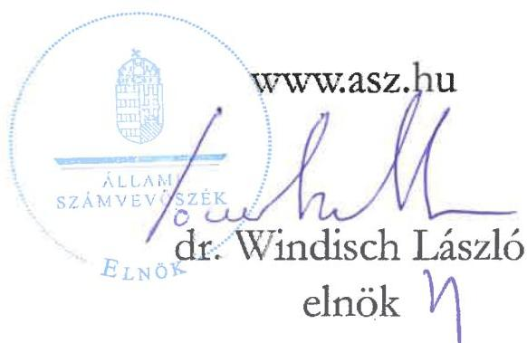

---

Jelentéseink az interneten a www.asz.hu címen olvashatók.

ELLENŐRZÉSI IGAZGATÓSÁG:
ELLENŐRZÉSI IGAZGATÓSÁG VI.

ELLENŐRZÉSI IGAZGATÓ:
DR. JAKAB KORNÉL igazgató

ELLENŐRZÉSVEZETŐ:
HORVÁTH KRISZTIÁN ellenőrzésvezető

IKTATÓSZÁM: EL-3993-008/2025
TÉMASORSZÁM: 25
ELLENŐRZÉS-AZONOSÍTÓ SZÁM: V1068

---

TARTALOMJEGYZÉK

- AZ ELLENŐRZÉS ALAPADATAI ... 5
- AZ ELLENŐRZÉS HATÓKÖRE ÉS TERÜLETE ... 7
- ÖSSZEFOGLALÁS ... 11
- AZ ELLENŐRZÉS FÓKUSZTERÜLETEI ... 13
- MEGÁLLAPÍTÁSOK ... 14
- JAVASLATOK ... 62
- MELLÉKLETEK ... 65
- I. sz. melléklet: Értelmező szótár ... 65
- II. sz. melléklet: Az ellenőrzött és ellenőrzést támogató szervezetek jegyzéke ... 68
- III. sz. melléklet: Ellenőrzési kritériumok ... 69
- IV. sz. melléklet: Magyarország korfája ... 72
- V. sz. melléklet: Szociális alapszolgáltatások bemutatása ... 73
- VI. sz. melléklet: Intézmények fenntartók szerinti bemutatása ... 76
- FÜGGELÉK: ÉSZREVÉTELEK ... 78
- RÖVIDÍTÉSEK JEGYZÉKE ... 83

---

.

---

AZ ELLENŐRZÉS ALAPADATAI

## AZ ELLENŐRZÉS CÉLJA

Annak értékelése volt, hogy a szociálpolitikáért felelős minisztérium eredményesen alakította-e ki az időskori bentlakásos szociális ellátások rendszerét, a szociálpolitikáért felelős minisztérium és az államháztartásért felelős minisztérium megteremtették-e a hatékony működtetés, valamint a fenntartható és átlátható gazdálkodás érvényesülésének feltételeit.

## AZ ELLENŐRZÉS TÍPUSA

Rendszerellenőrzés

## AZ ELLENŐRZŐTT IDŐSZAK

Az ellenőrzött időszak 2018. január 1-jétől 2024. május 31-ig tartott – a finanszírozási rendszer vonatkozásában a 2023. évi zárszámadás elkészültéig –, kitekintéssel a jelentéstervezet 2025. január 31-i összeállításáig tartó folyamatokra.

## AZ ELLENŐRZÉS TÁRGYA

Az ellenőrzés a szociális biztonságra törekvés, valamint az átlátható és fenntartható költségvetési gazdálkodás szempontjából értékelte az időskori bentlakásos szociális ellátások rendszerét és irányítását, a megtett intézkedéseket, elért eredményeket. Az ellenőrzés kiterjedt az irányításért felelős szervezet feladat- és hatásköreire, a feladatellátásban közreműködő szervezetek közötti kapcsolattartásra, a stratégiai döntéshozatalra és annak előkészítésére, egyes előkészített és végrehajtott intézkedésekre. Az ellenőrzés kiterjedt továbbá az irányítási tevékenységet támogató információs rendszerekre, az információk áramoltatására, döntéstámogatására, valamint az időskori bentlakásos szociális ellátás finanszírozási rendszerének elemeire.

Az ellenőrzés kiterjedt minden olyan körülményre és adatra, amely az ÁSZ¹ jogszabályban meghatározott feladatainak teljesítéséhez, valamint a program végrehajtása folyamán felmerült újabb összefüggések feltárásához szükséges volt.

## AZ ELLENŐRZÉS JOGALAPJA

Az ellenőrzés jogszabályi alapját az ÁSZ tv.² 1. § (3) bekezdés, az 5. § (2)-(3) bekezdés előírásai képezték.

5

---

Az ellenőrzés alapadatai

# AZ ELLENŐRZÉS MÓDSZERE

Az ellenőrzést a nemzetközi standardokat irányadónak tekintve az ellenőrzési program szempontjai, az ellenőrzött időszakban hatályos jogszabályok, az ellenőrzés szakmai szabályok és módszertanok figyelembevételével végezte az ÁSZ.

Az ellenőrzési kérdések megválaszolásához szükséges bizonyítékok megszerzése az ellenőrzött, illetve ellenőrzést támogató szervezetek által rendelkezésre bocsátott dokumentumokra és adatokra alapozva, továbbá megfigyelés, szemle (szemrevételezés), interjú, kérdésfeltevés (információkérés), valamint elemző eljárás útján történt. Az ellenőrzési bizonyítékként felhasznált adatforrások közé tartoztak az ellenőrzéshez kért dokumentumok, adatbázisok, valamint az ÁSZ által felkért külső szakértő által készített szakmai anyagok. Adatforrás volt minden – az ellenőrzés folyamán – feltárt, az ellenőrzés szempontjából információkat tartalmazó dokumentum.

Az ellenőrzés lefolytatásához az ellenőrzött, illetve ellenőrzést támogató szervezetek a tanúsítványok kitöltésével, valamint az ÁSZ által kért dokumentumok, adatok, információk megküldésével és az ellenőrzés során szolgáltatott adatokkal járultak hozzá.

A fenntartótípusokba sorolásnál nem a fenntartó szervezeti formáját, hanem a költségvetési törvény³ kategóriáit tekintettük rendezőelvnek. (Pl. azon egyházakat, amelyek nem minősülnek bevett egyháznak, nonprofit szervezetek közé soroltuk.)

Az ellenőrzés az eredményességet rendszerközpontú megközelítésben vizsgálta, azt értékelte, hogy a szociális biztonságra törekvés érdekében tett beavatkozások – az erőforrások allokációja, az intézményrendszer kereteinek meghatározása, a szabályozási környezet kialakítása – eredményeként teljesültek-e a kitűzött célok, érvényesült-e a fenntartható és átlátható gazdálkodás elve.

Az ellenőrzés nem terjedt ki a különböző fenntartók és a fenntartásukban ellátást biztosító intézmények működésére és gazdálkodására. Az ellenőrzés során az intézményrendszer további szervezeteinek tevékenységét csak abban az esetben értékeltük szabályszerűségi, megfelelőségi szempontok alapján, ha az a rendszer egésze, valamint az ellenőrzési szempontok alapján releváns volt.

Az ellenőrzés során mintavételi eljárás alkalmazására nem került sor.

---

# AZ ELLENŐRZÉS HATÓKÖRE ÉS TERÜLETE

Magyarországon a népességfogyás mellett meghatározó demográfiai trend az időskorúak (65 éves és annál idősebbek) számának és társadalmon belüli arányának növekedése.

1990-2024. között Magyarország lakosságának száma, döntően az alacsony termékenységi rátával összefüggésben, 10,5%-kal, 10 709 ezer főről 9585 ezer főre csökkent, a várható élettartam növekedésének is köszönhetően az időskorúak társadalmon belüli aránya 13,5%-ról 20,7%-ra növekedett (részletesebb információ ld. IV. sz. melléklet).

A várható élettartam emelkedésével egyre nőtt a demenciában szenvedők népességen belüli aránya, mely kórkép középsúlyos, illetve súlyos esetben 24 órás felügyeletet igényel.

A csökkenő népességszámból, a társadalom idősödését mutató népességadatokból és egészségügyi trendekből következően egyre növekedett az időskori szociális ellátások, és ezen belül a bentlakásos intézmények ellátásai iránti kereslet, és egyre nagyobb terhet rótt az aktív korú népességre (15-64 év közöttiek) ezen ellátórendszer fenntartása. 1990-ben 20,0%, 2024-ben 31,9% volt az időskorú népesség aktív korú népességhez viszonyított aránya, az ily módon számított eltartottsági ráta a demográfiai tendenciák ismeretében várhatóan tovább fog emelkedni, különösen 2040-től, amikor a „Ratkó-unokák“ nemzedéke eléri a 65 éves kort (1. ábra).

1. ábra

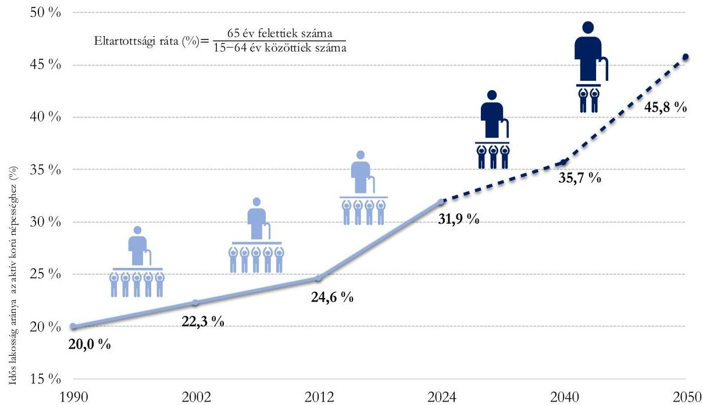

Forrás: KSH adatok alapján, ÁSZ saját szerkesztés

1 A Ratkó-korszak 1950 és 1956 között tartott Magyarországon. Névadója Ratkó Anna, aki 1950 és 1953 között népjóléti miniszter, azt követően egészségügyi miniszter volt. Nevehez fűződik számos szigorú, születésszám növelő intézkedés. A Ratkó-korszak alatt a születésszám megugrott, ezért az 1950-es évek elején születettek nagy létszámú generációt alkottak. Az 1950 és 1956 között született gyerekeket hívjuk Ratkó-gyerekeknek, az ő gyerekeiket, az 1973 és 1977 között születetteket Ratkó-unokáknak.

7

---

Az ellenőrzés hatóköre és területe

A kedvezőtlen demográfiai folyamatok mellett a társadalmi változások is – például a többgenerációs családok együttélésének visszasorulása, a korábban a gondozási terheket viselő női családtagok munkavállalása, a fiatalok elvándorlása, az idősek elmagányosodása – a családon belüli gondoskodásról az intézményes idősgondozás felé terelték az egyre növekvő keresletet, emiatt már az ezredfordulón jelentkezett az ellátórendszer kapacitáshiánya. A megnövekedett kereslettel az ellátásért felelős önkormányzatok többsége vagy nem tudott lépést tartani, vagy csak pénzügyi lehetőségeit meghaladó módon. Az ellátásban egyre hangsúlyosabb szerepet töltöttek be a nem állami intézmények, ezek jellemzően egyházi vagy civil szervezetek fenntartásában működtek.

A rendszerszintű problémák komplex kezelésére a 2010-es években került sor. Ennek főbb állomásai 2018-ig bezárólag:

- Alaptörvény⁴ 2012. évi hatályba lépése, mely a szociális ellátás és biztonság kérdését új alapokra helyezte,
- az önkormányzatok adósságkonszolidációja és ezzel egyidejűleg a megyei szociális intézmények állami fenntartásba vétele,
- az állami finanszírozásban részesülők lehatárolása,
- kapacitás-befogadási rendszer bevezetése,
- a nagykorú gyermekek szüleik iránti, alaptörvényi szinten is megjelenő tartási kötelezettségének érvényesülése a szociális ellátásokért fizetendő térítési díjak fizetésében,
- az időskorúak szociális szolgáltatásai igénybevételi feltételeinek fokozatos szigorítása.

Az ellenőrzött időszakban az időskorúak ellátása formális és informális úton nyújtott szolgáltatásokra bontható. Az előbbinek jogszabályban garantált intézményes keretei voltak, az utóbbi egyedi megbízásokon (pl. magánápoló felvétele) és rokonok, családtagok, ismerősök közreműködésén alapult.

A szociális ellátórendszer (intézmények és szolgáltatók) által nyújtott formális szolgáltatások körét a Szoctv.⁵ határozta meg, mely a gondozási szükséglettel rendelkező időskorúak számára kínált lehetőséget személyes gondoskodás keretében szociális alapszolgáltatások és szakosított ellátások igénybevételére.

A szociális alapszolgáltatások megszervezésével az állam és a települési önkormányzatok célja az volt, hogy a rászoruló időskorú személyeket segítse a saját otthonukban és lakókörnyezetükben az önálló életvitel fenntartásában, valamint egészségügyi, mentális vagy egyéb problémák megoldásában. Az alapszolgáltatások körébe tartozott a szociális étkeztetés, a házi segítségnyújtás, a jelzőrendszeres házi segítségnyújtás, az idősek nappali ellátása, esetenként a falugondnoki és tanyagondnoki szolgáltatás (részletesebb információ ld. V. sz. melléklet).

Amennyiben az időskorú rászoruló személyről alapszolgáltatás keretében már nem lehetett gondoskodni, állapotának megfelelő szakosított ellátási formában kellett őt gondozni, melyek közös jellemzője, hogy lakhatási szolgáltatásra épültek, tehát napi huszonnégy órás ellátást biztosítottak az azt igénybevevők részére. Szakosított ellátást biztosított az átmeneti elhelyezést nyújtó időskorúak gondozóháza és a tartós ápolást, gondozást biztosító idősek otthona. (2. ábra).

8

---

Az ellenőrzés hatóköre és területe

2. ábra
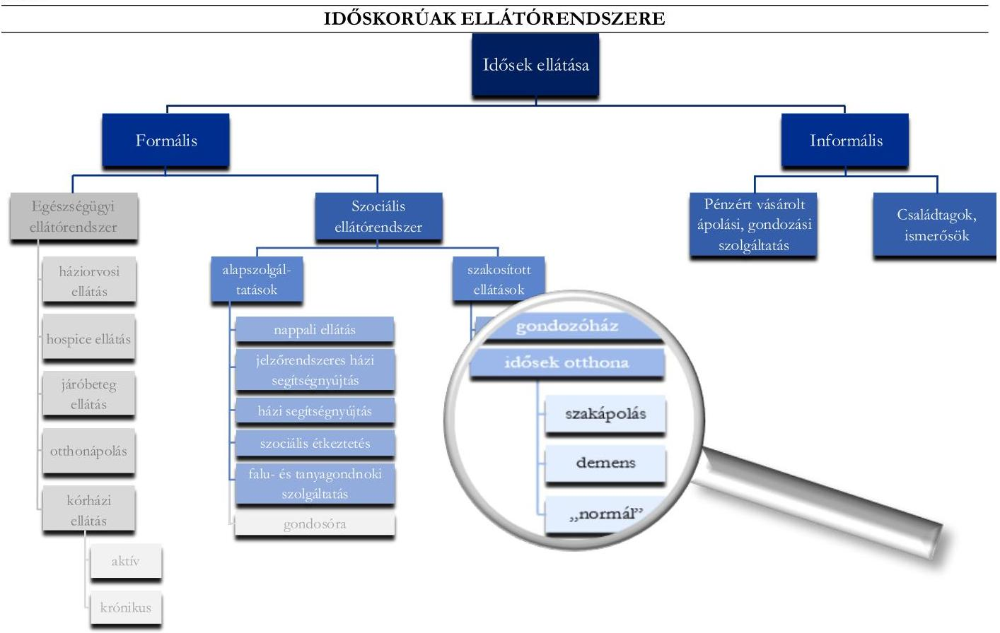
Forrás: Szoctv. alapján, ÁSZ saját szerkesztés

A jelentős nagyságú szociális ellátórendszer irányítását a Kormány⁶ szociálpolitikáért felelős mindenkorí tagja látta el, mely feladatot 2022. május 25-től az emberi erőforrások miniszterétől átvéve a belügyminiszter végezte. A Miniszter⁷ feladata volt meghatározni a szociálpolitikával kapcsolatos területek szakmai felügyeleti rendszerét, a szociális intézményi ellátások és szolgáltatások rendszerét, továbbá az azokra vonatkozó fejlesztési irányokat, feladatokat. A Minisztérium⁸ szervezetében a gondoskodáspolitikáért felelős államtitkárhoz tartoztak a szociális és gyermekvédelmi pénzbeli és természetbeni ellátásokkal kapcsolatos feladatok.

Az ellátás szabályozásáért és finanszírozásáért felelős szervként szociális intézmények rendszerének kialakítása és működési kereteinek biztosítása az állam és a települési önkormányzat feladata volt. Az állam fenntartói minőségében a helyi önkormányzat és annak társulása, valamint a Kormány, illetve más állami szerv a szociális szolgáltatást egyházi vagy más, nem állami szervvel, egyházi fenntartóval vagy nem állami fenntartóval kötött ellátási szerződés útján is biztosíthatta (Szoctv. 120. §).

A 369/2013. (X. 24.) Korm. rendelet⁹ 3. § (1) bekezdése alapján a területileg illetékes, fővárosi és vármegyei kormányhivatalok (továbbiakban: kormányhivatalok) kerültek kijelölésre működést engedélyező és ellenőrző szervként. A kormányhivatali ellenőrzések megállapították, hogy a szakosított ellátást nyújtó intézmények működési engedélye alapján az ellenőrzött időszak elején az engedélyezett férőhelyek 9,4%-a, az ellenőrzött időszak végén azok 8,6%-a esetében nem volt biztosított az előírt tárgyi- és személyi minimumfeltételek rendelkezésre állása, a hiányosságok legnagyobb arányban az állami fenntartású intézményekben fordultak elő (3. ábra).

9

---

Az ellenőrzés hatóköre és területe

3. ábra

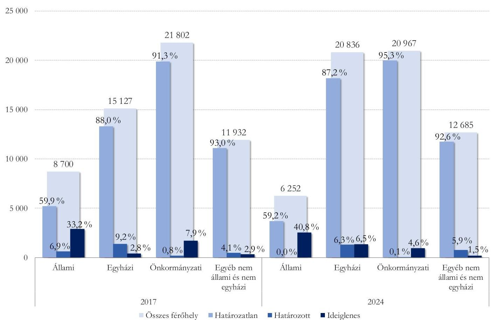
IDŐSKORÚAK SZÁMÁRA SZAKOSÍTOTT ELLÁTÁST NYÚJTÓ INTÉZMÉNYEK ENGEDÉLYEZETT FÉRŐHELYSZÁMAI ÉS AZ INTÉZMÉNYEK MŰKÖDÉSI ENGEDÉLYÉNEK STÁTUSZA FENNTARTÓNKÉNT (2017. DECEMBER 31. ÉS 2024. MÁJUS 31.)
Forrás: Kincstár adatszolgáltatása alapján, ÁSZ saját szerkesztés

Az ellenőrzés keretében az ÁSZ értékelte az időskori bentlakásos szociális ellátás szervezetrendszerének irányítását, működésének szabályozását, a finanszírozási rendszer kialakítását, a közszolgáltatás fejlesztésére, minőségének javítására irányuló intézkedések eredményességét a fenntarthatóság tükrében.

Az ellenőrzött és ellenőrzést támogató szervezeteket a II. sz. melléklet tartalmazza.

---

11

# ÖSSZEFOGLALÁS

Az időskorúakat ellátó bentlakásos ellátórendszer ellenőrzése – rendhagyó módon – nem a múlt szabályszerűségére, hanem jövőbeni fenntarthatóságára koncentrált, az ÁSZ által lefektetett kritériumokon alapult és célja olyan szakmai gondolkodás megindítása, amely adekvát megoldást nyújtó rendszer kialakításában jut nyugvópontra.

Az ellenőrzés arra kereste a választ, hogy az elmúlt években történt átalakítások eredményeképp kialakított időseket ellátó bentlakásos ellátórendszer miként készült fel az előttünk álló demográfiai kihívásokra, az ellenőrzött időszakban hozott rendszerszintű intézkedések miként járultak hozzá az ellátás javításához. Elemezte és értékelte, hogy a kialakított finanszírozási rendszer hatékony volt-e, megfelelően ösztönözte-e a minőségi ellátást, valamint a költségvetés teherbíró képességét figyelembe véve hosszú távon fenntartható-e. Emellett vizsgálta, hogy a stratégiai irányítást, szakmai döntéshozatalt támogató információforrások és információáramoltatási folyamatok rendelkezésre álltak-e.

A bentlakásos idősellátást érintő távlati terveket a Minisztérium a 2021-ben elfogadott, „Tartós ápolás-gondozásra vonatkozó stratégia 2030” (továbbiakban: Stratégia) dokumentumban fektette le, azonban annak az Európai Bizottsággal történő, 2024. év végéig elhúzódó egyeztetési folyamata miatt eddig csak a hazai forrásból finanszírozott elemek megvalósítása kezdődhetett meg. A Stratégia számos lényeges kérdést tárgyalt, nem tartalmazott azonban távlati kitekintést a tervezett intézkedések és a rendszer jövőbeni fenntarthatóságára.

A Stratégiában megjelenő intézkedések egyike volt a szakápolási központok létrehozása, amellyel az egészségügyi és szociális ellátórendszer több évtizedes problémájának felszámolása kezdődött meg. Az ellenőrzött időszakban a gyógyító tevékenységet nem szolgáló ápolási ágyak átvétele kezdődött meg, ezáltal 502 férőhellyel bővült az idősek bentlakásos szociális ellátásának kapacitása. A folyamat az ellenőrzött időszakban nem zárult le, a további ágyak átvétele mellett a tárca a már korábban is szakápolási tevékenységet végző idősotthonok finanszírozásának rendezését tervezi.

A szakmafejlesztési tevékenység az intézményrendszer átalakításaival összefüggésben a 2010-es évek végére háttérbe szorult. Ezt felismerve a tárca az elmúlt években kialakította és folyamatosan működtette a Területi Szakmatámogatási Rendszert, azonban e területen az NSZI¹⁰ módszertani feladatellátásának további erősítése szükséges.

Az ellenőrzött időszakban jelentősen megnövekedtek a bentlakásos idősellátásra fordított közkiadások, azonban ezek az idősellátás legnagyobb kihívásaira – személyi és tárgyi feltételek hiányosságaira és a növekvő keresletre – nem nyújtottak kielégítő megoldást. A demográfiai trendek miatt növekvő gondozási szükséglettel az intézményrendszer bővülése nem tudott lépést tartani.

A bentlakásos idősellátás finanszírozási rendszerét tekintve több előrelépést azonosított az ellenőrzés, azonban az, hogy a működő férőhelyek mintegy 98%-a részesül állami támogatásban, arra világíthat rá, hogy a jelenlegi finanszírozási rendszer a megnövekedett igények kiszolgálásának gátját jelenti. A finanszírozási források bővítése érdekében a tárca több intézkedése (pl. hozzátartozók, illetve ingatlan- és pénzvagyon bevonása a finanszírozásba) előremutató a jövőre nézve, ugyanakkor az univerzális finanszírozás fenntartása (az ellátottak anyagi rászorultságától független támogatási rendszer) hosszabb távon jelentős többlet terhet fog jelenteni a költségvetés számára.

Az állami támogatások elsősorban az intézmény jellegétől (idősotthon vagy gondozóház), az ellátást nyújtó intézmény fenntartójának típusától független, nem voltak tekintettel az ellátási, ápolási szükségletek különbözőségeire (a demencia kivételével), a nyújtott szolgáltatások színvonalára. Az állami támogatások

---

Összefoglalás

egységesen a minimális szolgáltatás nyújtása után jártak, a szolgáltatási színvonal emelését nem ösztönözték.

A jogszabályok által lefektetett minimumfeltételek biztosítására az ellenőrzések nyújtottak garanciát, azaz a minimumfeltételek teljesítésére a támogatás megvonásának kilátásba helyezése hatott ösztönzőleg. A Minisztérium jövőbeni célkitűzései között szerepelt a szolgáltatók, intézmények ellenőrzése hatékonyságának szükséges növelése érdekében egy egységes ellenőrzési szempontrendszer kialakítása.

Az időskori bentlakásos szociális ellátás információs rendszereit áttekintve az ellenőrzés megállapította, hogy azok nem támogatták maradéktalanul az irányítási, szabályozási és finanszírozási döntéshozatalt, mivel azokban nem gondoskodtak az idősellátást meghatározó adatok, információk teljeskörű gyűjtéséről. A finanszírozási döntéshozatal információs rendszerei a támogatások igényléséhez, módosításához, elszámolásához megfelelő alapot jelentettek, ugyanakkor azok fenntartótípusonként elkülönülő, nem összevethető adatok alapján, szigetszerűen működő rendszerekben jelentek meg. Az ellenőrzés rámutatott, hogy indokolt lehet az állami támogatások célzottságát segítő információk gyűjtése, illetve az adatszolgáltatás jogszabályi előírásokkal történő kikényszerítése.

A közszolgáltatás iránt érdeklődők és igénybevevők informálását egy weboldal (szocialisportal.hu) szolgálta, azonban az annak működtetéséhez szükséges személyi és infrastrukturális feltételek nem voltak elégségesek. Az ÁSZ javasolja a portál tartalmi fejlesztését annak érdekében, hogy az érdeklődők hiteles információkhoz jussanak a szolgáltatásokról.

12

---

13

# AZ ELLENŐRZÉS FÓKUSZTERÜLETEI

1. Az időskori bentlakásos szociális ellátás intézményrendszere működési kereteinek kialakítása, a kapcsolódó feladatok és fejlesztési irányok meghatározása, valamint azok eredményes végrehajtása érdekében tett intézkedések értékelése

2. Az időskori bentlakásos szociális ellátás intézményrendszerének pénzügyi fenntarthatósága, átláthatósága, a kialakított finanszírozási rendszer ösztönző hatása az eredményes feladatellátásra

3. Az időskori bentlakásos szociális ellátás eredményességét, hatékonyságát mérő és támogató információs rendszer kialakítása és működtetése

---

MEGÁLLAPÍTÁSOK

1. Az időskori bentlakásos szociális ellátás intézményrendszere működési kereteinek kialakítása, a kapcsolódó feladatok és fejlesztési irányok meghatározása, valamint azok eredményes végrehajtása érdekében tett intézkedések értékelése

Összegző megállapítás
Az időskori bentlakásos szociális ellátás intézményrendszerének működési kereteit kialakították, azonban a közfeladatellátás alkotmányos normák változásával összhangban álló újragondolását társadalmi, gazdasági és demográfiai folyamatok indokolják. A Minisztérium meghatározta az intézményrendszer működtetésének stratégiai céljait, fejlesztési irányait, azonban a stratégiai tervek megvalósítása nem kezdődött meg. A kapacitások nem követték a növekvő igényeket, a bentlakásos idősellátás személyi és tárgyi feltételeinek biztosítása érdekében tett intézkedések nem voltak eredményesek.

I. JOGSZABÁLYI KERETEK

Az időskori bentlakásos szociális ellátás jogszabályi kereteit kialakították, ugyanakkor a társadalmi, gazdasági és demográfiai folyamatokra reagálva és az alkotmányos normák változásához igazodva célszerű lenne a közfeladatellátás átgondolása és újra szabályozása.

A bentlakásos idősellátás szabályozórendszere többszintű, a legfelső szintet Magyarország Alaptörvénye jelentette, melynek 2012. január 1-jei hatálybalépése kettő ponton lényegesen megváltoztatta az idősellátáshoz kapcsolódó alkotmányos normákat. Új alapokra helyezte a szociális ellátások rendszerét, a minden állampolgárnak nyújtandó szociális biztonság helyett Magyarország a szociális biztonság nyújtásának szándékát és nem a kötelezettségét rögzítette (XIX. cikk (1) bek.). Az alkotmányos alapjog helyett a szociális ellátás államcél lett, ez összhangban volt a korábbi alkotmánybírósági gyakorlattal, amely szintén nem tekintette alapjognak a szociális biztonságot. A szociális biztonságra való jogosultság nevesített esetei közül kikerült az öregség, az Alaptörvény kizárólag az időskori megélhetés biztonságát emelte ki, emellett a gyermekek szüleik iránti felelősségviselését írta elő azzal, hogy a nagykorú gyermekek kötelesek gondoskodni rászoruló szüleikről (XVI. cikk (4) bek.).

Az alkotmányos módosítások figyelembevétele mellett célszerű lenne a közfeladatellátás felülvizsgálata, ott és olyan mértékben lehet indokolt az időskori bentlakásos ellátás közfeladatként történő ellátása, ahol az államon és az önkormányzatokon túli szereplők az ellátást nem biztosítják.

14

---

Megállapítások

A következő szintet a Szoctv. jelentette, melyben az Országgyűlés az Alaptörvény szándékának megfelelően szabályozta a szociális biztonság kérdését. Ez az idősgondozás formáinak és intézményrendszerének rendszerezett szabályozásán túl előírta a gondoskodási sorrendet, azaz meghatározta, hogy kinek a felelőssége a rászorultakról való gondoskodás (Szoctv. 2. §).

A különféle szociális ellátások rendszerezetten jelentek meg a Szoctv.-ben, ugyanakkor az ÁSZ véleménye szerint célszerű lenne:

- a közfeladatellátás – Alaptörvény változásaihoz illeszkedő – átgondolása és újraszervezése annak érdekében, hogy egyszerre legyen biztosított a megfelelő kapacitás és a hosszú távú pénzügyi fenntarthatóság. Ennek érdekében célszerű lenne elemezni az állami támogatás jövedelmi-vagyoni helyzet alapján történő differenciálásának lehetőségét olyan keretek között, hogy a leginkább rászorulók a továbbiakban is hozzájuthassanak a jogszabályban előírt szintű ellátáshoz.
- az ellátási szintek egyértelmű szabályozása, amely biztosítja, hogy hatékonyan, kizárólag az ellátott állapota alapján indokolt szinten, egymásra épülve történjen meg az időskori szociális alapszolgáltatások és szakellátások igénybevétele.
- a közfeladatként nyújtott ellátások területi lefedettségének és kapacitásainak felülvizsgálata az egyenlő hozzáférés megteremtése érdekében.

A Szoctv. felhatalmazása alapján a Kormány rendeletekben megállapította az eljárási szabályokat, valamint az államigazgatási szervek, illetőleg az államigazgatási jogkörben eljáró önkormányzati szervek hatáskörét és hatósági jogkörét részletezte.

A Miniszter ágazati irányítói hatáskörében szabályozta a szociális szolgáltatások szakmai követelményeit. Az 1/2000. (I. 7.) SzCsM rendelet¹¹ a szociális szolgáltatások személyi, tárgyi és egyéb feltételeiről, valamint különféle szakmai tevékenységek végzéséről rendelkezett. Ezekhez – az emelt szintű ellátás kivételével – kizárólag minimumfeltételek kerültek meghatározásra, az ellátások minőségének mérésére, kategorizálására alkalmas további objektív előírásokat, teljesítménykritériumokat a jogi szabályozóeszközök nem rögzítettek.

Az ÁSZ véleménye szerint a jogszabályokkal összhangban kialakított és működtetett intézményértékelési rendszer pontosabb információt biztosítana az irányítói döntéshozatal és a szolgáltatások iránt érdeklődők számára, emellett az átlátható és objektív minőségmérés és annak széleskörű bemutatása ösztönző hatást tudna gyakorolni a szolgáltatások minőségének javítására.

**Nemzetközi jó gyakorlatok:**

Az Egyesült Királyságban a Care Quality Commission (CQC) felügyelte és minősítette az időstthonokat, átlátható módon támogatva az irányítói és szolgáltatások iránt érdeklődők döntéshozatalát. A CQC rendszeres és egységes alapokon nyugvó ellenőrzéseket és értékelést végzett, az értékelés eredménye alapján az otthonok minősítését kaptak, amely lehetett kiemelkedő, jó, megfelelő, illetve nem megfelelő. (Forrás: https://www.cqc.org.uk/

A www.seniorenportal.de portál a németországi időstthonokat amellett, hogy kategorizálta, részletesen bemutatta az egyes intézményekben elérhető szolgáltatásokat, és minőségi szempontok alapján értékelte is azokat.

A Miniszter, illetve a gondoskodáspolitikáért felelős államtitkár az ellenőrzött időszakban eljárásrendeket, ajánlásokat, útmutatókat, tájékoztatókat adtak ki a szociális ellátórendszer feladatellátásának támogatására.

15

---

Megállapítások

# II. INTÉZMÉNYRENDSZER KIALAKÍTÁSA

Az ellenőrzés az intézményrendszer eredményes működésének korlátait azonosította a telepített hatáskörök, az ellenőrzések és a szakmatámogatás területén. Az ÁSZ véleménye szerint célszerű lenne az ellátás előírt minőségét biztosító kormányhivatali szakmai ellenőrzések feltételeinek javítására, valamint a módszertani szakmai támogatásra és a szakmafejlesztési tevékenységre nagyobb hangsúlyt helyezni.

A bentlakásos idősellátást működtető intézményrendszer a jogszabályi rendelkezésekben meghatározott feladatok és felelősségek szerint volt kialakított. Az intézményrendszer feladatait és felelősségeit a szervezetek belső szabályozásai is meghatározták, a 4. ábra ad képet a szervezetrendszer legfontosabb – irányítási, engedélyezési, szakmai-módszertani támogató és ellenőrzési – kapcsolatairól.

4. ábra

AZ IDŐSKORI BENTLAKÁSOS IDŐSELLÁTÁS LEGFONTOSABB SZERVEZETI KAPCSOLATAI (2024. MÁJUS 31.)
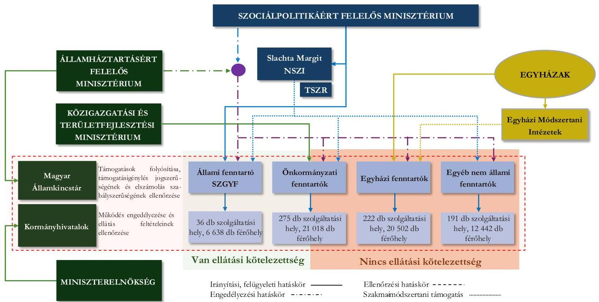
Forrás: Ellenőrzött szervezetek adatszolgáltatása alapján, ÁSZ saját szerkesztés

# Hatáskörök

A Minisztériumnak a szabályozásra, az egyre csökkenő kapacitásokkal működő állami fenntartóra és a módszertani feladatokat, szakmafejlesztést ellátó NSZI-re volt közvetlen ráhatása, két kulcsterületen, a finanszírozás és az ellenőrzések területén nem volt közvetlen hatásköre.

Az államháztartásért felelős minisztérium¹² szabta finanszírozási korláton belül a Minisztérium és az államháztartásért felelős minisztérium együttműködött az időskori bentlakásos szociális ellátás férőhelyszámának (kapacitás), valamint az ellátást nyújtó intézmények fenntartóinak járó egyes támogatási formák és azok mértékének megállapítása során.

Az intézményi ellátásra való jogosultság meghatározása a Szoctv. 68/A. § bekezdéseiben és a 36/2007. (XII. 22.) SZMM rendelet¹³-ben előírtak alapján az intézményvezető joga és felelőssége volt. Az egyszemélyi, szakmai kontroll nélküli döntési szerep miatt kockázatot jelent, hogy a valódi gondozási szükséglet, ezáltal az intézményi ellátási jogosultság nem egységesen, objektíven kerül megállapításra.

16

---

Megállapítások

# Ellenőrzések

A területileg illetékes kormányhivatalok feladatkörébe tartozott egyrészt a 369/2013. (X. 24.) Korm. rendelet 3. § (1) bekezdésében foglaltak alapján működést engedélyező szervként eljárni, másrészt ugyanezen Korm. rendelet 36-43/A. §-okban foglaltak alapján ellenőrzést végezni az időskori bentlakásos szociális ellátás szakmai feltételeinek – Szoctv.-ben és 1/2000. (I. 7.) SzCsM rendeletben foglalt – teljesüléséről. A kormányhivatali ellenőrzések a jogszabályok által előírt személyi és tárgyi minimumfeltételek teljesülésére irányultak, azok – egyebek között – teljesítményindikátorok hiányában nem terjedtek ki az ellátás minőségének mélyebb vizsgálatára.

A kormányhivatalok felügyelete a Miniszterelnökségnél, majd 2024. január 1-jétől a Közigazgatási és Területfejlesztési Minisztériumnál volt. Egységes útmutató nem készült, a kormányhivatali ellenőrzések szempontrendszere vármegyénként különbözött, ami kockázatot hordoz az azonos bírálati szempontok érvényesülésére.

A Minisztérium jövőbeni célkitűzései között szerepelt a szolgáltatók, intézmények ellenőrzése hatékonyságának szükséges növelése érdekében egy egységes ellenőrzési szempontrendszer kialakítása.

A kormányhivatali ellenőrzések során használt – nem digitalizált – ellenőrzési adatlapok részletes adatokat tartalmaztak a személyi és tárgyi minimumfeltételek teljesüléséről és a teljesülés mértékéről (pl. lakószobák mérete, elhelyezettek száma, orvosi ellátottság, gondozói létszám, várakozók száma és várakozási idő), ugyanakkor azok területenként eltérő adattartalommal készültek. Célszerű lenne megvizsgálni az adatlapok egységesítésének, digitalizálásának és az azokban megtalálható adatok, információk felhasználásának lehetőségét az ellátás minőségének nyomon követhetősége, illetve mélyebb elemezhetősége érdekében. A kormányhivatalok ellenőrzési eredményeiből a szolgáltatási helyek engedélyeinek státusza érhető el a hatósági nyilvántartást jelentő szolgáltatói nyilvántartásban¹⁴ (továbbiakban: MÜKENG), a minimumfeltételek teljesítése elmaradásának oka ugyanakkor nem minden esetben. Célszerű lenne előírni ezen kritikus információk nyilvántartásban való rögzítésének feladatát, valamint a nyilvántartást alkalmassá tenni ezen információk strukturált gyűjtésére.

A Minisztérium a 86/2019. (IV. 23.) Korm. rendelet¹⁵ 29. § (4) bekezdésében, illetve az 568/2022. (XII. 23.) Korm. rendelet¹⁶ 28. § (4) bekezdésében előírt, hatósági ellenőrzésekkel kapcsolatos évenkénti országos beszámoló készítési kötelezettséget – annak fennállásától kezdve – nem teljesítette.

A Kincstár¹⁷ vármegyei igazgatóságai ellenőrizték az állami támogatások igénylésének jogszerűségét és elszámolásának szabályszerűségét. Az ellenőrzési módszertanok egységesek és megfelelően részletezettek voltak. Az ellenőrzési megállapításokról éves összegző jelentés készült.

A Kincstár és a kormányhivatalok illetékes igazgatóságai az ellenőrzések jegyzőkönyveit/jelentéseit ellenőrzésenként külön-külön elektronikus levélben megküldték egymásnak, azonban az ellenőrzésekből származó információk strukturált, kereshető és elemezhető formában egyik szervezetnél sem álltak rendelkezésre.

Az ÁSZ véleménye szerint az ellenőrzési eredmények strukturált gyűjtése, feldolgozása és döntéshozatalba csatornázása pozitív hatást gyakorolna a stratégiai irányítás eredményességére.

17

---

Megállapítások

# Szakmatámogatás

A szakmatámogatói, szakmafejlesztési feladatokat az NRSZH¹⁸ 2016. december 31-i megszűnésétől 2020. december 31-ig az SZGYF¹⁹, majd 2021-től az NSZI látta el.

Az NSZI-nek az ellenőrzött időszakban nem volt írásban rögzített vizsgálati eljárásrendje, az SZGYF korábbi vizsgálati gyakorlatára épülően végezte ellenőrzéseit.

Az NSZI módszertani tevékenysége keretében nem készített a 610/2020. (XII. 18.) Korm. rendelet²⁰ 5. § (1) bekezdés (c) és (i) pontjában nevesített elemzéseket, javaslatokat, valamint a szociálpolitikai, stratégiai döntések megalapozását szolgáló hatásvizsgálatokat, tényfeltáró, elemző, stratégiai és döntés-előkészítő tanulmányokat a bentlakásos idősellátást érintően.

Az NSZI feladatellátását hátráltatta a nem elégséges humánkapacitása, eszközparkjának hiányosságai és korlátozott hozzáférése – az elemzési feladataihoz alapinformációkat biztosító – szolgáltatói, igénybevevői és egyéb nyilvántartásokhoz (ld. 3. fókuszterület I. fejezete).

# III. STRATÉGIAI KERETRENDSZER

A tartós ápolás-gondozás területén elfogadott stratégia nem fogalmazott meg pontos, mérhető célokat határidők kitűzésével, a szükséges beavatkozásokhoz erőforrásokat teljeskörűen nem rendelt, a stratégia érdemi végrehajtása – az uniós források lehívhatóságának akadályai miatt – csak a hazai forrásból finanszírozott elemek tekintetében kezdődött meg.

A Minisztérium ágazatirányítási céljait – a Kormány által 2021-ben elfogadott – a „Tartós ápolás-gondozásra vonatkozó stratégia 2030” című dokumentumban fektette le. A Stratégia a 65 éven felüli lakosok számának növekedése következtében megnőtt ápolás-gondozási igény kezelését célozta meg, és jelentős módon épített a 2021-2027-es Európai Unió forrásokra (EFOP Plusz²¹, TOP Plusz²²), valamint a Svájci-Magyar Együttműködési Program forrásaira.

A Stratégiával kapcsolatban az Európai Bizottság kifogást emelt, mivel álláspontjuk szerint egyes részei nem illeszkedtek a Fogyatékossággal élő személyek jogairól szóló ENSZ egyezményen alapuló Európai gondozási stratégiához. A kifogásolt részek egyeztetése, módosítása elhúzódott, ennek lezárásaként 2024. év végén mind a Kormány, mind pedig az Európai Bizottság elfogadta a módosított stratégiát.

A Stratégia Európai Bizottság általi el nem fogadása a területen elérhető Európai Unió források lehívásának egyik akadálya volt.

A Stratégia nem tartalmazott a kormányzati stratégiai irányításról szóló 38/2012. (III. 12.) Korm. rendelet által előírt tartalmi elemeket:

- a 35.§ (1) bekezdés a) pontja ellenére nem tartalmazott részletes helyzetelemzést (nem tartalmazta a kereslet-kínálat viszonyainak és trendjeinek elemzését, nem tartalmazta a demográfiai adatoknak, az időskorúak egészségi állapotának és azok várható jövőbeni változásainak elemzését, az informális gondozásról rendelkezésre álló adatokat),
- a 35.§ (1) bekezdés b) pontja ellenére az egyes fejlesztési területekhez kapcsolódó mérhető célok hiányoztak vagy azok hiányosak voltak,
- a 35.§ (1) bekezdés c) pontja ellenére nem tartalmazta a szükséges beavatkozások területeinek és eszközeinek pontos meghatározását (pl. tartalmazta a családok támogatási rendszerének bővítését, azonban nem határozta meg a támogatás formáját [személyi, tárgyi és/vagy anyagi]),

---

Megállapítások

- a 35.§ (1) bekezdés d) pontja ellenére nem tartalmazta a szükséges beavatkozások személyi, tárgyi, szakmai és szervezeti feltételeit, emellett az anyagi feltételeket nem kellő részletességgel tartalmazta (pl. a fejlesztendő területekhez hozzárendelték a becsült forrásigényt, azonban azok alátámasztása, kalkulációja és a források bemutatása hiányos volt),
- a 35.§ (1) bekezdés e) pontja ellenére nem tartalmazta a nyomon követés és az értékelés alapelveit és rendszerét.

A Stratégia előírta, hogy a megfogalmazott rövid (1-3 év), közép (4-7 év) és hosszú távú (8-10 év) célok gyakorlati megvalósítását három évente szükséges áttekinteni, és az előrehaladásról jelentést kell készíteni.

A Stratégia gyakorlati megvalósítása az ellenőrzött időszakban – az uniós források lehívhatóságának akadályai miatt – csak a hazai forrásból finanszírozott elemek tekintetében kezdődött meg.

A Stratégia rögzítette, hogy a tartós ápolás-gondozás helyszínének elsődlegesen az otthoni ellátást tekinti, amelyhez a szociális alapszolgáltatások mennyiségének és minőségének erősítése szükséges, továbbá fő célokként a humánerőforrás, az intézményrendszer és szolgáltatások, valamint a kommunikáció fejlesztését tűzte ki.

A Stratégiában megfogalmazott célok előrehaladásának ellenőrzés általi időszaki értékelése a IV-IX. fejezetekben olvasható.

## IV. BENTLAKÁSOS ELLÁTÁS TEHERMENTESÍTÉSE

## IV.1. Alapszolgáltatások mennyiségi fejlesztése

Szabályozási és finanszírozási okok miatt az alapszolgáltatásokat igénybevevők száma csökkent. A tendencia a gazdaságossági szempontok mellett az ellátottak életminősége, érzelmi és mentális jóléte oldaláról is hátrányos.

Az alapszolgáltatások kiépítettsége, elérhetősége által elkerülhető vagy időben kitolható a bentlakásos ellátások igénybevétele, ezáltal az alapszolgáltatások rendszere hozzájárulhat a bentlakásos idősellátást nyújtó intézmények tehermentesítéséhez. Az alapszolgáltatások kormányzat számára alacsonyabb költsége miatt hatékonysági kérdés is, hogy az ellátottak gondozási szükségletüknek megfelelő (annál nem magasabb) szintű ellátási formában részesüljenek. Az egyes ellátási formák állami támogatásának összegeit a 1. táblázat mutatja.

1. táblázat
IDŐSKORI ELLÁTÁSOK ÁLLAMI TÁMOGATÁSA*

|   | Megnevezés | 2023. Ft/fő/év  |
| --- | --- | --- |
|  Szakellátás | Idősek otthona, gondozóháza – demens ellátás | 1 618 370  |
|   |  Idősek otthona – átlagos ellátás | 1 359 975  |
|   |  Idősek otthona – emelt szintű ellátás | 258 395  |
|   |  Idősek gondozóháza – átlagos ellátás | 1 264 777  |
|  Alapellátás** | Nappali ellátás – demens személyek | 829 460  |
|   |  Nappali ellátás – átlagos ellátás | 282 630  |
|   |  Házi segítségnyújtás – személyi gondozás | 463 130  |
|   |  Házi segítségnyújtás – szociális segítés | 25 000  |

* Csak béralapú támogatás, pótlékok, eseti és kiegészítő támogatások nélkül
** Önálló feladatellátás
Forrás: 2022. évi XXV. törvény Magyarország 2023. évi központi költségvetéséről,
ÁSZ saját szerkesztés

Az ellenőrzött időszakban nem készült arra felmérés, elemzés, hogy az állami támogatás mennyire arányos a szolgáltatások önköltségével és hogy milyen költségvetési előnyökkel jár az alapszolgáltatás igénybevétele a bentlakásos ellátáshoz képest.

2014-től az alapszolgáltatások kapacitásainak csökkenése, stagnálása figyelhető meg.

A házi segítségnyújtás kapacitásainak csökkenésében szerepet játszott, hogy a 2010-es évek elejétől megkezdődött a visszaszorítása azon ellátásoknak, amelyeket a lehívásra kerülő állami támogatások

---

Megállapítások

maximalizálása érdekében biztosítottak. Átfogó ellenőrzést folytatott le a Kincstár a területen, ennek köszönhetően csökkent az ellátást nem rászorultság alapján nyújtó szervezetek száma. Ezen túlmenően a folyamatot erősítette a lelkiismereti és vallásszabadság jogáról, valamint az egyházak, vallásfelekezetek és vallási közösségek jogállásáról szóló 2011. évi CCVI. törvény (továbbiakban: Ehtv.²⁵) is, amely alapján jelentősen szűkült azon egyházak köré, akik jogosultak voltak egyházi kiegészítő támogatásra.

2017. január 1-jétől a házi segítségnyújtást új alapokra helyezték, szakmai tevékenységeit szétválasztották szociális segítésre és (a szociális segítés tevékenységeit is magába foglaló) személyi gondozásra, és ezzel összefüggésben a finanszírozás szétválasztása is megtörtént. Az új finanszírozási rendszer garantálta, hogy a ténylegesen rászorulók részére történjen meg a gondozás biztosítása, és ne üzleti modellként működjön az ellátás (5. ábra).

5. ábra

ALAPSZOLGÁLTATÁSOKAT IGÉNYBEVEVŐK SZÁMÁNAK VÁLTOZÁSA 2010 ÉS 2023 KÖZÖTT (FŐ)

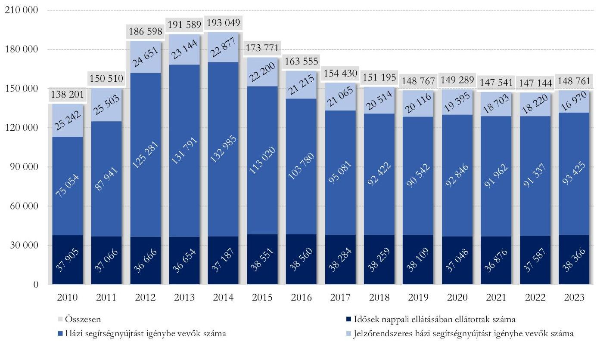

Forrás: KSH adatszolgáltatása alapján ÁSZ saját szerkesztés

A szociális intézmények rendszerében feszültséget jelentett és az igényeknek megfelelő kapacitások kiépítésének korlátja volt, hogy fő szabályként az önkormányzatok lakosságszámtól függően látták el kötelező vagy önként vállalt közfeladatként a szociális alapszolgáltatások intézményrendszerének működtetését, azonban ehhez nem párosult finanszírozási autonómia. A finanszírozási rendszer nem, vagy csak egyedi megfontolások mentén számolt az egyes önkormányzatok közötti területi és ellátási különbségekkel, az önkormányzatok eltérő finanszírozási lehetőségeivel. Emellett az ellátások kiépítésének meghatározásai nem a várható keresleten alapultak (pl. időskorúak száma, egészségi állapota). A jogszabály – az Alaptörvényben megfogalmazott államcélúal harmóniában, de az Mótv. rendelkezésének értelmezését nem segítő módon – általánosságban rendelkezett az ellátási kötelezettségről, az ellátási kapacitás mértékének, a lakosságszámhoz, az igénylők számához és egészségügyi állapotához mért arányának részletes

---

Megállapítások

meghatározása nélkül. Ebből következően nem volt jogkövetkezmény rendelhető az igényekhez mért, állami vagy önkormányzati fenntartású kapacitás kiépítésének, fenntartásának elmulasztásához.

Az ÁSZ véleménye szerint célszerű lenne megvizsgálni és szükség szerint intézkedéseket foganatosítani annak a hatékonysági kockázatnak a kezelésére, hogy az alapszolgáltatások területén az önkormányzati fenntartók egyedi szociálpolitikai megfontolások vagy finanszírozási korlátok miatti kapacitáscsökkentése a magasabb állami támogatást jelentő szakosított ellátások rendszerében keletkeztet keresletnövekedést.

## IV.2. Gondosóra Program

Nem tartozott a szociális alapszolgáltatások közé, azonban ezen a ponton ki kell térnünk a Gondosóra programra, amely által elérhető technológiai megoldás célja volt, hogy a biztonságérzet növekedésével hozzájáruljon az időskorúak otthoni életvitelének fenntartásához, életminőségének javításához.

A Gondosóra program által biztosított eszköz alapvető funkciója, hogy a saját otthonukban élő 65 éven felüli időskorúak kapcsolatba léphetnek diszpécserrel, illetve egy általuk előre megjelölt kontaktszeméllyel (családtag, szomszéd, barát stb.), akik probléma esetén közvetlen és gyors segítséget nyújthatnak számukra.

A 2022-ben indult Gondosóra program országos kiterjesztésű volt, a teljes 65 éven felüli lakosság, azaz másfél millió ember számára volt elérhető, 2024. augusztusi adatok alapján a célcsoport mintegy 45%-a, 670 ezer fő regisztrált a programban.

A program időtávja 2025. december 31-ig tart, fenntartási időszaka 2026. december 31-ig szól.

## V. A BENTLAKÁSOS IDŐSELLÁTÁS INTÉZMÉNYI KAPACITÁSAINAK ALAKULÁSA

Az időskori bentlakásos szociális ellátórendszerben a férőhelyek száma növekedett, azonban a kapacitások növekedése nem követte az ellátás iránti kereslet emelkedését.

## V.1. A kapacitások mennyiségi fejlesztése

A 2017. év végi záró adatokhoz képest az időskori bentlakásos szociális ellátás kapacitásai 3179 férőhellyel növekedtek, ez azonban nem tudta ellensúlyozni a kereslet növekedését (ld. V.2. fejezet), a férőhelyek időskorúak számához viszonyított aránya csökkent (2. táblázat).

2. táblázat
IDŐSKORI BENTLAKÁSOS SZOCIÁLIS ELLÁTÁS KAPACITÁSÁNAK VÁLTOZÁSA 2017. DECEMBER 31. ÉS 2024. MÁJUS 31. KÖZÖTT

|  Megnevezés | 2017 | 2018 | 2019 | 2020 | 2021 | 2022 | 2023 | 2024*  |
| --- | --- | --- | --- | --- | --- | --- | --- | --- |
|  Összes férőhely | 57 561 | 58 332 | 58 527 | 59 100 | 59 425 | 59 866 | 60 600 | 60 740  |
|  65 év és feletti népesség száma | 1 829 762 | 1 865 464 | 1 915 422 | 1 949 984 | 1 963 837 | 1 971 532 | 1 983 444 | 1 983 444  |
|  10 ezer 65 év és feletti népességre jutó férőhelyek száma | 315 | 313 | 306 | 303 | 303 | 304 | 306 | 306  |

*2024. május 31-i adat
Forrás: Kincstár és KSH adatszolgáltatása alapján, ÁSZ saját szerkesztés

---

Megállapítások

## V.2. Várakozók száma

Az időskori bentlakásos férőhelyek várólistái fontos indikátorok a kereslet és kínálat közötti egyensúly megítéléséhez. A várakozó személyek számának gyűjtését, annak havi szintű feldolgozását a Szoctv. 20. §-a írta elő az intézményvezetők, a fenntartók, illetve a Kincstár számára, az adatok a 415/2015. (XII. 23.) Korm. rendelet²⁴ 16. § (1) bekezdése értelmében 2019. december 31-ig voltak nyilvánosak. A várólisták nyilvánosságát azok pontatlansága miatt szüntették meg.

Az adatsor annak korlátozott megbízhatósága ellenére alkalmas trendszerű változások vizsgálatára. Az időskori bentlakásos szociális intézményi ellátásra várakozók száma 8278 fővel, az intézményrendszer aktuális befogadóképességéhez, kapacitásához viszonyítva is jelentősen (59,6%-ról 71,0%-ra) növekedett 2018-2023 között, a szolgáltatás iránti ki nem elégített kereslet növekedett (6. ábra).

## V.3. Forgási sebesség

Az ellátásba újonnan bekerülők és az összes ellátott számából kalkulált forgási sebesség mutató az átlagos várakozási idő nyomon követése mellett indikációt ad az átlagos ellátási igény változására. A mutató értékei a Covid időszak kiugró értékeitől eltekintve gyorsulást mutattak, az ellátottak átlagosan egyre rövidebb időt töltöttek az intézményekben. Ebből arra következtettünk, hogy az ellátottak hosszabb várakozást követően, rosszabb egészségügyi állapotban és magasabb szintű ellátási szükséglettel kerültek be az intézményekbe, ami aztán egyre nagyobb leterheltséget jelentett az őket ellátó intézmények, gondozók számára (7. ábra).

Fentiek alapján megállapítható, hogy a férőhelyszám növekedése ellenére az intézményi kapacitások az igényekhez, szükségletekhez képest egyre csökkenő mértékben álltak rendelkezésre.

6. ábra

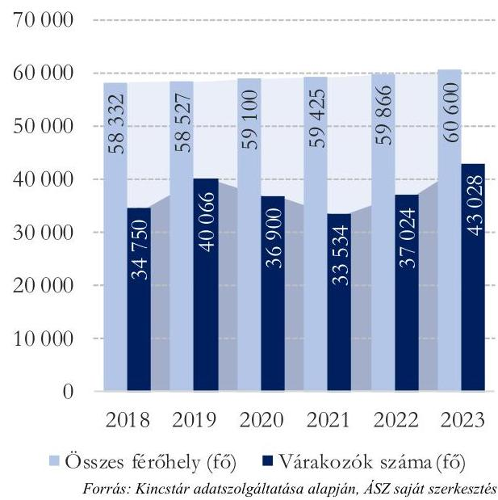
AZ IDŐSKORI BENTLAKÁSOS SZOCIÁLIS INTÉZMÉNYEK FÉRŐHELYSZÁMÁNAK ÉS AZ ELLÁTÁSRA VÁRAKOZÓK SZÁMÁNAK ALAKULÁSA 2018 ÉS 2023 KÖZÖTT

7. ábra

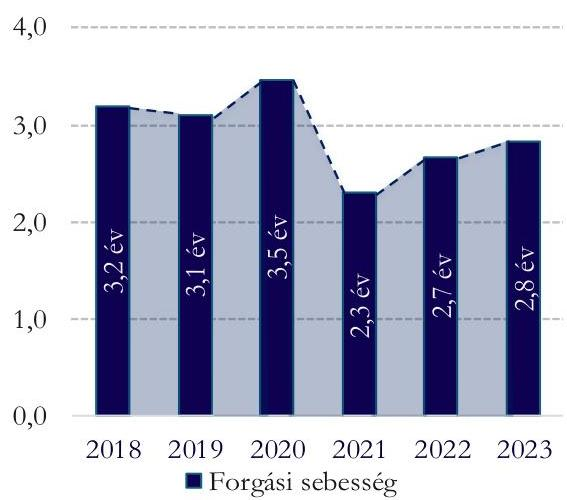
AZ IDŐSKORI BENTLAKÁSOS SZOCIÁLIS INTÉZMÉNYEKBEN ELLÁTOTTAK FORGÁSI SEBESSÉGÉNEK VÁLTOZÁSA 2018 ÉS 2023 KÖZÖTT
Forrás: Minisztérium adatszolgáltatása alapján, ÁSZ saját szerkesztés

A Szoctv. 68/B. § (1) bekezdésében foglaltak alapján idősek otthonában a férőhelyszám legfeljebb 15,0%-áig lehetett olyan ellátott is, aki nem rendelkezett a 68/A. § (3) bekezdés szerinti III. fokozatú vagy a jogszabályban meghatározott egyéb körülményeken alapuló gondozási szükséglettel.

22

---

Megállapítások

Az ellátórendszer ellenőrzött időszaki leterheltségét, az ellátásra várakozók számát tekintve a gondozási szükséglettel nem rendelkezőkre vonatkozó megengedő jogszabályi előírás felülvizsgálata javasolt.

## V.4. Ellátási kötelezettséggel rendelkező férőhelyek csökkenése

A férőhelyek számának emelkedése mellett megfigyelhető volt egy fenntartótípusok közötti átrendeződés is. Az állami fenntartású férőhelyek számának csökkenése és az önkormányzati férőhelyek számának stagnálása mellett a növekedés döntően az egyházi, kisebb részben az egyéb nem állami és nem egyházi fenntartók kapacitásbővülésének volt köszönhető (8. ábra).

8. ábra

IDŐSKORI BENTLAKÁSOS SZOCIÁLIS ELLÁTÁS ENGEDÉLYEZETT FÉRŐHELYSZÁMAINAK ÉS AZ ELLÁTOTTAK SZÁMÁNAK ÁTRENDEZŐDÉSE AZ EGYES FENNTARTÓK KÖZÖTT (2013, 2018 ÉS 2023)

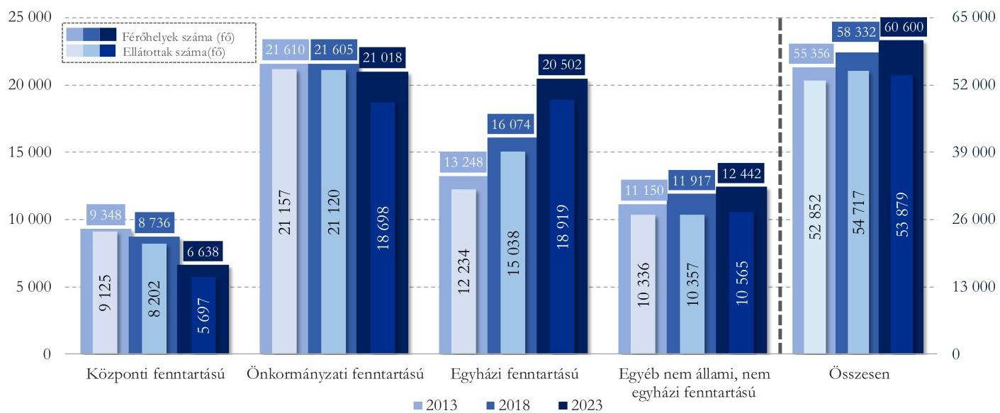

Forrás: Kincstár és KSH adatszolgáltatása alapján, ÁSZ saját szerkesztés

Az állami és önkormányzati fenntartású férőhelyek visszaszorulása a jövedelmi-vagyoni helyzetük alapján leginkább rászorultak számára elérhető férőhelyek számának csökkenését jelentette.

Ellátási kötelezettsége a Szoctv. értelmében az államnak és – feladattípustól függően és lakosságszámhoz kötötten – az önkormányzatoknak volt. Az állam az SZGYF útján volt köteles gondoskodni a vármegye területén a szakosított ellátások megszervezéséről és fenntartásáról. A települési önkormányzatok ellátási kötelezettsége a település lakosságára terjedt ki. A fővárosi önkormányzat az egész főváros területére kiterjedően, a megyei jogú városok saját területükön voltak kötelesek gondoskodni idősek otthonának megszervezéséről és fenntartásáról, a fővárosi kerületi önkormányzatok és a harmincezer főnél több állandó lakosú települési önkormányzatok kötelesek voltak időskorúak gondozóházát működtetni. A Szoctv. értelmében ellátási kötelezettségének mind az önkormányzatok, mind pedig az SZGYF eleget tehetett ellátási szerződés megkötésével is (Szoctv. 91. §). Az ellátási kötelezettséggel érintett intézményekről, férőhelyekről központi nyilvántartást nem vezettek.

Az állami és önkormányzati intézményekhez beérkező, ellátás iránti kérelmek elbírálása az intézményvezető feladata volt. Az ellátásra szorulók elhelyezésére – a soron kívüli elhelyezéseket leszámítva – a kérelmek beérkezésének sorrendjében, gondozási szükséglet vizsgálatát követően került sor. Az állam és az önkormányzat akkor is köteles volt a jelentkezők számára ellátást biztosítani, ha a jövedelmi-vagyoni, illetve a családi körülményeik miatt az előírt térítési díjat, illetve belépési hozzájárulást nem, vagy nem teljes összegben tudták megfizetni.

23

---

Megállapítások

## V.5. Egyházi szerepvállalás erősítése

A szociális szolgáltatások területén az állam az egyházakra stratégiai partnerként tekintett. 2017-től egyedi döntések, majd 2020-tól az egyházak szociális és gyermekvédelmi ellátások terén betöltött szerepének megerősítéséről szóló 2020. évi XXVIII. törvény alapján az állami fenntartó a szociális ellátást biztosító intézmények működtetését részben átengedte az egyházaknak.

A törvény indokolása szerint ez nem az Alaptörvényben deklarált állami kötelezettség átruházását jelentette, a cél az egyházi szerepvállalás megerősítése volt, mely a magasabb színvonalú és hatékonyabb feladatellátást szolgálja.

A Kormány szándékának megfelelően az egyházak által fenntartott férőhelyek száma folyamatosan, 2017. december 31. és 2024. május 31. között mindösszesen 37,7%-kal emelkedett (3. táblázat).

3. táblázat
AZ IDŐSKORI BENTLAKÁSOS SZOCIÁLIS ELLÁTÁSBAN AZ EGYHÁZAK ÁLTAL FENNTARTOTT FÉRŐHELYEK SZÁMÁNAK ALAKULÁSA 2017. DECEMBER 31. ÉS 2024. MÁJUS 31. KÖZÖTT

|  Megnevezés | 2017 | 2018 | 2019 | 2020 | 2021 | 2022 | 2023 | 2024*  |
| --- | --- | --- | --- | --- | --- | --- | --- | --- |
|  Egyházi fenntartásban lévő intézmények férőhely adatai | 15 127 | 16 074 | 16 622 | 17 422 | 18 934 | 19 793 | 20 502 | 20 836  |

* 2024. május 31-i adat
Forrás: Kincstár adatszolgáltatása alapján, ÁSZ saját szerkesztés

Az egyházi átadásokkal kapcsolatosan az ÁSZ-nak az alábbi javaslatai vannak:

- az egységes értelmezés érdekében az ellátási kötelezettséggel rendelkező férőhelyek átadásakor az átadó állami fenntartó és intézménye által kötelezően ellátott feladatok átvállalását, folytonos ellátását részletekbe menően indokolt a megállapodásoknak, illetve keretmegállapodásoknak tartalmaznia,
- a stratégiai szintű cél – a magasabb színvonalú és hatékonyabb feladatellátás – teljesülésének visszamérhetősége érdekében javasolt a nyomon követés elveinek és rendszerének kialakítása (az eredményesség kritériumainak meghatározása, a nyomon követés, visszamérés folyamatának kialakítása, visszaméréshez szükséges adatok biztosítása), majd a stratégiai szintű cél teljesülésének rendszeres visszamérése.

## V.6. Önkormányzatok által önként vállalt feladatok

Az önkormányzati feladatellátásban sajátos szerepe volt azon települési önkormányzatoknak, amelyek az időskorúak bentlakásos ellátását saját elhatározásuk alapján, önként vállalt feladatként biztosították. Speciális helyzetük abból fakadt, hogy az önként vállalt feladat ellenére ugyanazok az ellátási kötelezettségek és finanszírozási feltételek terhelték, mint az ellátási kötelezettséggel rendelkező állami és önkormányzati fenntartókat. Jelentőségüket mutatja, hogy a 2024. májusi adatok alapján 11 866 férőhelyet tartottak fenn, ami a teljes ellátórendszer kapacitásának mintegy ötödét tette ki (4. táblázat).

---

Megállapítások

4. táblázat
ÖNKORMÁNYZATOK ÖNKÉNT VÁLLALT FELADATAINAK RÉSZARÁNYA AZ IDŐSKORI BENTLAKÁSOS SZOCIÁLIS ELLÁTÁS TERÜLETÉN (2017-2024)

|  Megnevezés | 2017 | 2018 | 2019 | 2020 | 2021 | 2022 | 2023 | 2024*  |
| --- | --- | --- | --- | --- | --- | --- | --- | --- |
|  Önkormányzati szektor számára engedélyezett összes férőhelyszám | 21 802 | 21 605 | 21 514 | 21 261 | 21 152 | 20 960 | 21 018 | 20 967  |
|  Önkormányzatok által kötelezően ellátandó feladatok (férőhelyszám) | 9 269 | 9 329 | 9 256 | 9 338 | 9 306 | 9 228 | 9 164 | 9 101  |
|  Önkormányzatok által önként vállalt feladatok (férőhelyszám) | 12 533 | 12 276 | 12 258 | 11 923 | 11 846 | 11 732 | 11 854 | 11 866  |
|  Önként vállalt feladat aránya | 57,5% | 56,8% | 57,0% | 56,1% | 56,0% | 56,0% | 56,4% | 56,6%  |

* 2024. május 31-i adatok
Forrás: Kincstár adatszolgáltatása alapján, ÁSZ saját szerkesztés

Az ÁSZ véleménye szerint célszerű lenne megvizsgálni és szükség szerint intézkedéseket foganatosítani annak a kockázatnak a kezelésére, hogy a feszített finanszírozási helyzetű, feladatot önként ellátó önkormányzatok – a Mótv.²⁵ 10. § (2) bekezdése alapján a kötelező feladatellátás elsőbbsége miatt – az önként vállalt feladatként működtetett férőhelyek számát csökkenthetik, terhelve ezáltal az időskori bentlakásos ellátórendszert.

## V.7. Intézményi kapacitások területi lefedettsége

A férőhelyek időskorúak számához viszonyított aránya Budapesten volt a legalacsonyabb, a legjobban ellátott Békés vármegyében a területi lefedettség ennek 2,4-szerese volt, az eltérések kockázatot jelentettek az ellátáshoz való egyenlő hozzáférés és a hatékonyság szempontjából.

Kettő vármegyében (Veszprém és Békés) már nem volt jelen, egy vármegyében (Komárom-Esztergom) pedig kizárólag szakápolási központot működtetett az országos ellátási kötelezettséggel rendelkező állami fenntartó, az SZGYF. Kiemelten a jövedelmi-vagyoni helyzetük alapján leginkább rászorulók esetében az SZGYF egyes vármegyékből történő kiszorulása kockázatot jelentett az igények és szükségletek megfelelő helyszínen és mennyiségben történő rendelkezésre állására (9. ábra).

25

---

Megállapítások

9. ábra

# AZ IDŐSKORI BENTLAKÁSOS SZOCIÁLIS ELLÁTÁST NYÚJTÓ INTÉZMÉNYEK FÉRŐHELYSZÁMAINAK FENNTARTÓTÍPUSONKÉNTI MEGOSZLÁSA 10 EZER 65 ÉV FELETTI SZEMÉLYRE VETÍTVE VÁRMEGYÉNKÉNT 2024. MÁJUS 31-I ADATOK ALAPJÁN

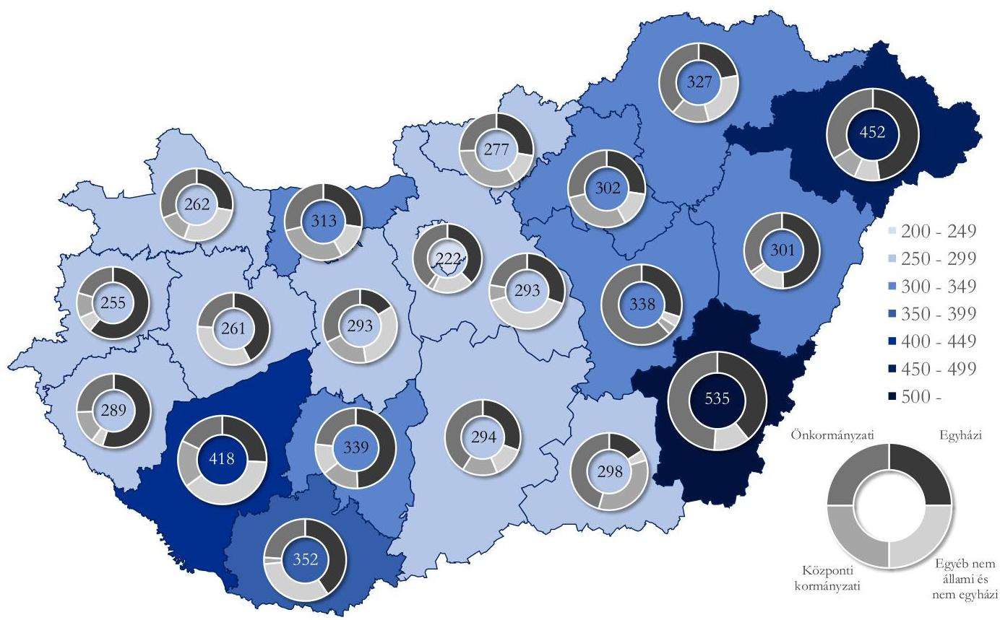
Forrás: Kincstár és KSH adatszolgáltatása alapján, ÁSZ saját szerkesztés

# VI. KAPACITÁSOK RENDELKEZÉSRE ÁLLÁSA AZ IGÉNYEKHEZ IGAZODÓ FORMÁBAN

A demenciában szenvedő betegek számának emelkedése ellenére érdemi és közvetlen intézkedések nem történtek ezen egészségügyi kockázat hatásainak kezelése érdekében. A szakápolási központok létrehozásával megkezdődött a szociális és az egészségügyi ellátórendszerben azonosított párhuzamosságok felszámolása.

# VI.1. Demencia

A demenciában szenvedő betegek számának várható meredek emelkedésére reagálva a WHO² a demenciát kiemelt fontosságú egészségügyi problémaként kezeli. Az időskori bentlakásos szociális intézményekben a középsúlyos vagy súlyos demenciával élő idősek száma 2018-2023 között 45,2%-kal 17 525 főre emelkedett, részarányuk az összes ellátotthoz képest a 2018. évi 21,9%-ról 2023-ra 31,3%-ra növekedett (10. ábra).

^{2}
World Health Organization (Egészségügyi Világszervezet)

---

Megállapítások

10. ábra

AZ IDŐSKORI BENTLAKÁSOS SZOCIÁLIS INTÉZMÉNYEKBEN ELLÁTOTTAK ÉS A DEMENSNEK NYILVÁNÍTOTT ELLÁTOTTAK SZÁMÁNAK VÁLTOZÁSA 2018 ÉS 2023 KÖZÖTT
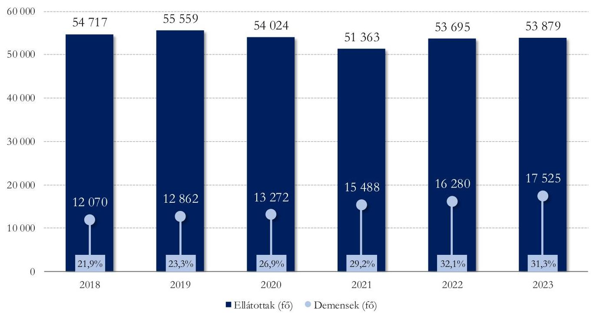
Forrás: KSH adatszolgáltatása alapján; ÁSZ saját szerkesztés

A szociális szolgáltatások befogadható kapacitásainak rendszeres közlése során nem nevesítették a demencia betegségét, nem allokáltak befogadható férőhelyszámokat ehhez a betegséghez, a demenciában szenvedők ellátása az időskori bentlakásos szociális ellátás befogadott férőhelykapacitás adta kereteken belül történt.

A demenciával élő időskorúak bentlakásos ellátását a finanszírozás emelt összegben dotálta, azonban – a befogadási rendszer korlátai miatt – a rendelkezésre álló férőhelykapacitások nem voltak elégségesek a súlyos, középsúlyos demenciában szenvedők miatt jelentkező többletigény kielégítéséhez.

A demenciában szenvedők problémáját felismerve az ellenőrzött időszakban a Minisztérium európai uniós projekt keretében több intézkedést is tett a demens személyek ellátásának fejlesztése érdekében (pl. módszertani szakértői hálózat működtetése; Alzheimer Café létrehozása; demencia szűrőprogram indítása), azonban ezek az intézkedések csak közvetetten voltak hatással a bentlakásos ellátásra. Emellett a Minisztérium a Kulturális és Innovációs Minisztériummal együttműködve megkezdte egy átfogó program (Nemzeti Demencia Program) kidolgozását a demencia jelentette kockázatok – demenciában szenvedők számának drasztikus növekedése, speciális ellátási igény, az ellátórendszer felkészületlensége – kezelésére, a szakmai munka az ellenőrzés lezárultáig nem fejeződött be.

A célcsoport számának drasztikus növekedésére tekintettel az ÁSZ a megkezdett intézkedések folytatását, további folytatólagos intézkedések megtételét javasolja.

---

Megállapítások

## VI.2. Szakápolási központok

Az ÁSZ 2008-ban rámutatott³ arra, hogy az időskori ellátás területén párhuzamosságok voltak a szociális és az egészségügyi ágazatok között, és ezek felszámolását javasolta.

A Szoctv. 2017. szeptember 1-jétől megteremtette a jogalapját annak, hogy azon ápolási ágyak, amelyeken az állami fenntartású egészségügyi szolgáltatók tartós ápolást-gondozást végeztek, ellátottakkal együtt átadásra kerüljenek a szociális ellátórendszerbe, és az ezekben az intézményekben folytatott ápolási tevékenységet a jövőben a szociális ellátórendszer keretein belül működő, a Szoctv. hatálya alá tartozó szakápolási központok végezzék.

A gyakorlati megvalósítás 2023-ban kezdődött meg, a 14/2023. (V. 31.) BM rendelet²⁶ értelmében 2023 júliusában és 2024 decemberében kilenc helyszínen alakítottak ki összesen 502 szakápolási férőhelyet, és 2026 decemberéig a rendelet szerint további egy helyszínen 99 férőhellyel bővül a szakápolási központok kapacitása.

Az intézkedés az egészségügyi és a szociális ellátórendszerben párhuzamosan végzett feladatok szétválasztása, ezáltal a hatékonyság irányába mutatott. A jelenleg egészségügyi engedély birtokában szakápolási tevékenységet folytató, de szakápolási központnak nem minősülő idősotthonokban az ellátottak állapotromlása miatt szükségszerűen folytatott szakápolási tevékenység finanszírozási feltételeit a Minisztérium nem rendezte, ez még előtte álló további feladat.

## VII. HUMÁNERŐFORRÁS

Az időskori bentlakásos ellátás munkaerőhiányos terület volt, ahol a dolgozók átlagéletkora magas és nem látszott biztosítottnak a nagyszámú, nyugdíj előtt álló munkavállaló pótlása. A munkaerő végzettségi szintje stagnált, a meghozott intézkedések nem voltak elégségesek a tudásszint növelésére irányuló célok eléréséhez. A szociális ágazatban dolgozók átlagbéré alacsony, az ösztönzők köré szűkös volt, ez a kieső munkaerő minőségi pótlását veszélyeztette, ami kockázatot jelent a megfelelő színvonalú ellátásra.

A minőségi feladatellátás alapvető feltétele a mindenkori szükségletekhez igazodó számú munkavállaló rendelkezésre állása (mennyiségi feltétel), az ellátásban résztvevők tudásának szinten tartása és növelése (minőségi feltétel) és a gondozók részére ösztönzési rendszer kialakítása.

³ Jelentés az önkormányzati kórházak és bentlakásos szociális intézmények ápolásra, gondozásra fordított pénzeszközei felhasználásának ellenőrzéséről

---

Megállapítások

A Minisztérium a humánerőforrás fejlesztését az informális gondozói kör kiszélesítésével és az „ápoló családtag – modell” bevezetésével, a képzési rendszer átdolgozásával, új képzések és továbbképzések indításával, valamint ösztönzők bevezetésével kívánta kezelni.

Az időskori bentlakásos szociális ágazatban a betöltetlen szakmai álláshelyek engedélyezett szakmai álláshelyek számához képest állandósuló nagy száma alapján kijelenthető, hogy a szociális ágazat munkaerőhiányos terület volt, és az üres álláshelyek feltöltése növekvő kihívást jelentett (5. táblázat).

5. táblázat
BETÖLTETLEN SZAKMAI ÁLLÁSHELYEK SZÁMA 2018 ÉS 2023 KÖZÖTT (FŐ)

|  Ellátási típus | 2018 | 2019 | 2020 | 2021 | 2022 | 2023  |
| --- | --- | --- | --- | --- | --- | --- |
|  Idősek otthona | 754 | 945 | 821 | 997 | 1 072 | 1 081  |
|  Időskorúak gondozóháza | 51 | 40 | 43 | 49 | 49 | 43  |
|  Betöltetlen szakmai álláshelyek száma összesen | 805 | 985 | 864 | 1 046 | 1 121 | 1 124  |
|  Engedélyezett álláshelyek száma | 17 881 | 17 888 | 18 225 | 18 422 | 18 439 | 18 720  |
|  Betöltetlen szakmai álláshelyek száma / engedélyezett álláshelyek száma | 4,5% | 5,5% | 4,7% | 5,7% | 6,1% | 6,0%  |

* Adatok december 31-ére vonatkozóan
Forrás: KSH adatszolgáltatása alapján, ÁSZ saját szerkesztés

2023. december 31-én, az öregségi nyugdíjkorhatárt figyelembe véve 5 éven belül a gondozói kör 10,3%-a, 1802 fő, 6-10 éven belül további 19,1%-a, 3356 fő – a Nők40 program által biztosított feltételek igénybevétele esetén még rövidebb időn belül – nyugdíjba vonulhat. A 40 éven aluli korosztály arányát (21,9%) tekintve nem látható az ily módon kieső munkaerő visszapótlásának biztosítottsága. (6. táblázat)

6. táblázat
AZ IDŐSKORI BENTLAKÁSOS SZOCIÁLIS INTÉZMÉNYEKBEN DOLGOZÓ SZAKMAI MUNKAVÁLLALÓK KOR SZERINTI MEGOSZLÁSA 2023. DECEMBER 31-ÉN (FŐ)

|  Megnevezés | Szakmai munkavállalók életkor szerint |   |   |   |   |   |   |   | Összesen  |
| --- | --- | --- | --- | --- | --- | --- | --- | --- | --- |
|   |  24 éves és fiatalabb | 25 - 39 éves | 40 - 54 éves | 55 - 59 éves | 60 - 64 éves | 65 - 69 éves | 70 - 74 éves | 75 - x éves  |   |
|  Összesen létszám | 644 | 3 209 | 8 585 | 3 356 | 1 423 | 322 | 45 | 12 | 17 596  |
|  Összesen arány | 3,7% | 18,2% | 48,8% | 19,1% | 8,1% | 1,8% | 0,3% | 0,1% | 100,0%  |

Forrás: KSH adatszolgáltatása alapján, ÁSZ saját szerkesztés

Az ellenőrzött időszakban a 'szociális gondoskodás' képzési szakirányon oklevelet szerzettek száma emelkedett (11. ábra), mindemellett a bentlakásos idősellátás szakmai munkavállalóinak átlagos végzettségi szintje negatív irányú tendenciát mutatott (12. ábra).

---

Megállapítások

11. ábra

A 'SZOCIÁLIS GONDOSKODÁS' KÉPZÉSI SZAKIRÁNYON OKLEVELET SZERZETTEK SZÁMA A 2016/17 ÉS 2022/23 TANÉVEK KÖZÖTT
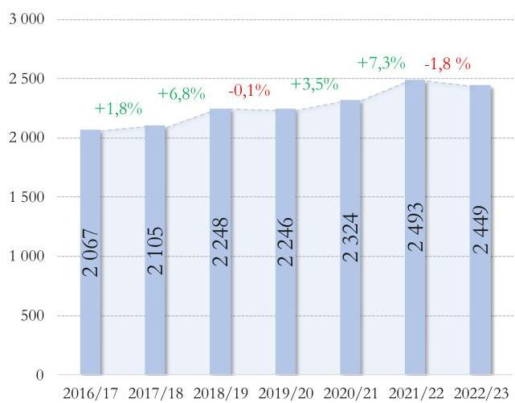
Forrás: Oktatási Hivatal adatai alapján, ÁSZ saját szerkesztés

12. ábra

A SZAKMAI MUNKAVÁLLALÓK VÉGZETTSÉGÉNEK VÁLTOZÁSA 2018 ÉS 2023 KÖZÖTT
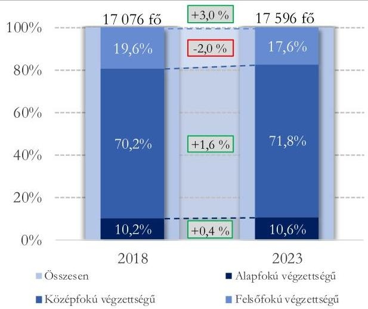
Forrás: Oktatási Hivatal adatai alapján, ÁSZ saját szerkesztés

A meghatározott ösztönzők köre – munkaruha biztosítása, ösztöndíj program – szűkös.

Az eszközként megfogalmazott „ápoló családtag – modell” nem számolt azzal, hogy az ápolást végző családtag részben vagy egészben kiesik a – jelenleg is munkaerőhiánnyal küzdő – munkaerőpiacról és az ezzel járó alacsonyabb összegű jövedelem, illetve ápolási díj, majd nyugdíj miatti elszegényedés a (korosztályos) társadalomtól történő leszakadásának kockázatát hordozza.

Amennyiben a munkaerőpiacról kiesés kompenzálása, és/vagy – a gondozó családtagok terhelését csökkenteni hivatott – nappali ellátás rendszerének megerősítése nem történik meg, fennáll a kockázata annak, hogy az „ápoló családtag – modell” nem válik vonzóvá az érintettek számára, ezáltal az ellátásra szorulók továbbra is az intézményi rendszert terhelik.

A Stratégia nem tért ki a szociális ágazatban dolgozók bérhelyzetére annak ellenére, hogy a betöltetlen szakmai álláshelyek számossága – a munka fizikálisan és mentálisan megterhelő jellege mellett – egyértelműen visszavezethető volt a szociális ágazat munkavállalóinak alulfizetettségére. Emellett a Stratégia nem vizsgálta a munkaerő megtartása, fluktuáció csökkentése szempontjából meghatározó munkavállalói kiégés megelőzése és kezelése területeket sem.

A szociális ágazat bruttó munkajövedelmét a nemzetgazdasági átlagkeresethez és – a munkavállalók számára átjárás lehetőségét jelentő – egészségügyi ágazat átlagkeresetéhez viszonyítva megállapítható egy jelentős lemaradás a szociális ágazat kárára. A szociális ágazat alacsonyabb munkajövedelem bázisról növekedett nagyobb mértékben a nemzetgazdasági átlagkeresetnél, a szociális és az egészségügyi ágazat bruttó munkajövedelme között folyamatosan nyílt az olló. (13. ábra)

30

---

Megállapítások

13. ábra

A SZOCIÁLIS ÉS EGÉSZSÉGÜGYI ÁGAZAT BRUTTÓ MUNKAJÖVEDELME, ÉS A NEMZETGAZDASÁGI BRUTTÓ ÁTLAGKERESÉT ALAKULÁSA 2017 ÉS 2023 KÖZÖTT (FT)
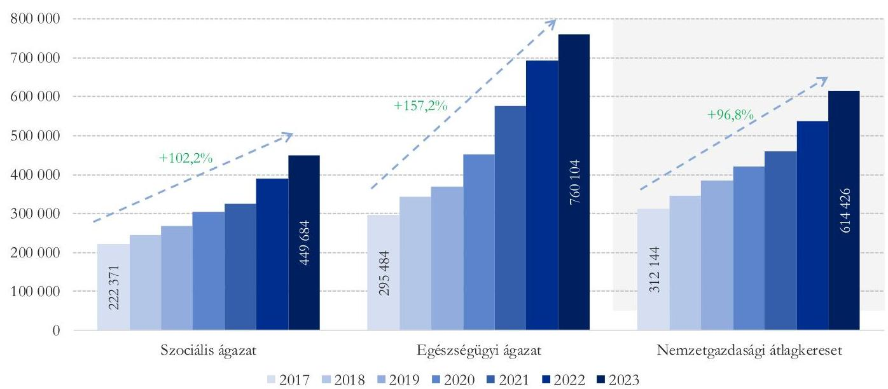
Forrás: KSH adatok, ÁSZ saját szerkesztés

A szociális ágazat ellenőrzött időszakban történt bérnövekedése a minimálbér és a garantált bérminimum ellentételezésére nyújtott támogatásoknak, valamint a nem állami fenntartású intézmények által fizetett bérek emelkedésének volt köszönhető. Amennyiben a nem állami fenntartású intézmények tartósan és jelentősen magasabb bért tudnak biztosítani, mint az állami, önkormányzati fenntartásúak, úgy az a munkaerő átáramlását, ezáltal az ellátási kötelezettséggel rendelkező állami, önkormányzati fenntartású intézmények személyi feltételei további romlásának kockázatát hordozza.

A szaktárca több ízben készített előterjesztést, szakmai javaslatot, illetve koncepciót az ágazati bérfejlesztés érdekében, legutoljára 2020-ban, illetve 2022-ben döntött a Kormány béremelésről, azonban ezek nem voltak elégségesek a bérfeszültség kiegyenlítéséhez. A Miniszter 2023 decemberében és 2024 januárjában ismételten előterjesztéseket nyújtott be a Kormány részére, amelyekben kezdeményezte a szociális, a gyermekjóléti és a gyermekvédelmi ágazatban dolgozók bérének rendezését.

# VIII. INFRASTRUKTÚRA

Az SZGYF fenntartásában lévő időskori bentlakásos ellátást közvetlenül biztosító ingatlanok 95,5%-a felújítást igényelt, a rendelkezésre álló források nem voltak elégségesek az ingatlanállomány műszaki állapotának szinten tartásához. Az önkormányzati tulajdonú időskori bentlakásos ellátást közvetlenül biztosító ingatlanok közel fele felújítást igényelt.

A Minisztérium az intézményrendszer fejlesztését tűzte ki célul, ennek ellenére – az állami fenntartású intézményeken túl – nem rendelkezett teljes körű információval az időskori bentlakásos ellátás intézményei által használt ingatlanokról és tárgyi feltételekről. Az eredményes irányítószervi döntéshozatal érdekében indokolt lenne információ gyűjtése az intézményrendszer által használt ingatlanokról, azok műszaki állapotáról, az esetleges felújítási igényekről, a tárgyi feltételek teljesüléséről, az esetleges hiányosságokról.

A korlátozottan elérhető adatok miatt az ellenőrzés kizárólag az állami és önkormányzati fenntartók tulajdonában álló, időskori bentlakásos szociális ellátáshoz használt ingatlanállomány felújítási szükséglet szerinti változásának vizsgálatára terjedt ki.

---

Megállapítások

Az SZGYF 2023. december 31-én 178 db ingatlanban (6638 férőhelyen) folytatott időskori bentlakásos ellátást, melyek műszaki állapota alapján az ingatlanok 10,1%-a esetében teljes, további 84,8%-a esetében részleges felújítási igényt jeleztek. Az ellenőrzött időszakban az SZGYF fenntartásában lévő ingatlanok műszaki állapota romlott, 16,9%-ról 4,5%-ra csökkent a beavatkozást, felújítást nem igénylő ingatlanok részaránya (14. ábra).

14. ábra

AZ SZGYF FENNTARTÁSÚ, IDŐSKORI BENTLAKÁSOS SZOCIÁLIS ELLÁTÁSHOZ HASZNÁLT ÉPÜLETEK MŰSZAKI ÁLLAPOTÁNAK ALAKULÁSA 2018 ÉS 2023 KÖZÖTT

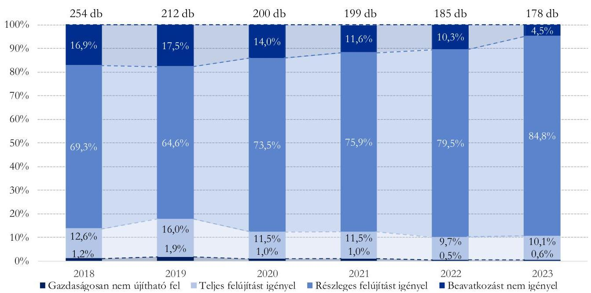

Forrás: SZGYF adatszolgáltatása alapján, ÁSZ saját szerkesztés

Az SZGYF fenntartásában álló bentlakásos idősellátáshoz használt épületenként évente átlagosan 439,8 - 1.944,5 E Ft közötti összegű beruházás, felújítás történt, míg egy beruházási, felújítási munka átlagos volumene az ellenőrzés egyes éveiben 5,7 - 21,5 millió Ft közötti értéket képviselt (7. táblázat).

32

---

Megállapítások

7. táblázat
AZ SZGYF FENNTARTÁSÁBAN LÉVŐ, IDŐSELLÁTÁSSAL ÉRINTETT ÉPÜLETEKEN ELVÉGZETT FELÚJÍTÁSOK, BERUHÁZÁSOK ÉRTÉKE 2018 ÉS 2023 KÖZÖTT

|  Beruházás, felújítás | 2018 | 2019 | 2020 | 2021 | 2022 | 2023  |
| --- | --- | --- | --- | --- | --- | --- |
|  Beruházások, felújítások összege (Ft) | 111 705 000 | 96 673 435 | 388 904 297 | 139 560 201 | 150 754 071 | 136 948 141  |
|  SZGYF tulajdonában lévő épületek* száma (db) | 254 | 212 | 200 | 199 | 185 | 178  |
|  Egy épületre jutó beruházás, felújítás összege (Ft/db) | 439 783 | 456 007 | 1 944 521 | 701 308 | 814 887 | 769 372  |
|  |   |   |   |   |   |   |
|  Beruházással, felújítással ténylegesen érintett épületek száma (db) | 6 | 17 | 44 | 12 | 7 | 9  |
|  A felújított épületekre jutó átlagos beruházási, felújítási összeg (Ft/db) | 18 617 500 | 5 686 673 | 8 838 734 | 11 630 017 | 21 536 296 | 15 216 460  |

* Kizárólag közvetlenül az idősellátáshoz használt épület
Forrás: SZGYF adatszolgáltatása alapján, ÁSZ saját szerkesztés

2023. év végén az önkormányzatok összesen 1502 db ingatlanban (21 018 férőhelyen) folytattak időskori bentlakásos ellátást. A 2018-2023 éveket vizsgálva az épületek műszaki állapota stagnált, 2023-ban a részleges és teljes felújítást igénylő épületek aránya összesen 44,7% volt (15. ábra).

15. ábra
AZ ÖNKORMÁNYZATOK TULAJDONÁBAN ÁLLÓ, IDŐSKORI BENTLAKÁSOS SZOCIÁLIS ELLÁTÁSHOZ HASZNÁLT ÉPÜLETEK MŰSZAKI ÁLLAPOTÁNAK ALAKULÁSA 2018 ÉS 2023 KÖZÖTT

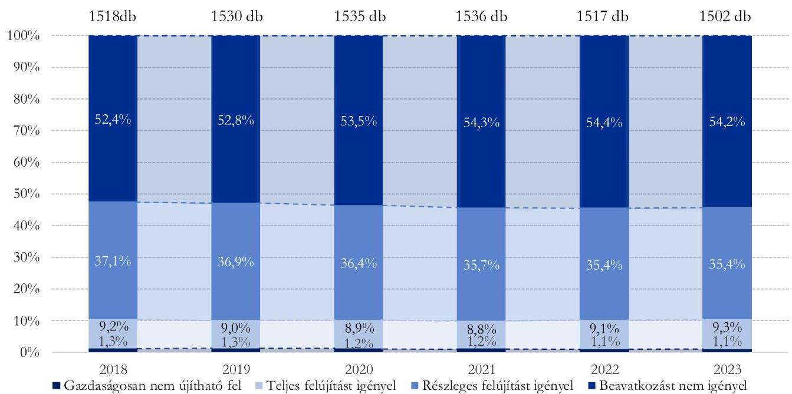
Forrás: KSH adatszolgáltatása alapján, ÁSZ saját szerkesztés

Az önkormányzatok által a bentlakásos idősellátáshoz használt épületek felújítására fordított kiadások a nyilvánosan elérhető adatbázisokban nem álltak kellően részletezetten az ellenőrzés rendelkezésére.

---

Megállapítások

## 2. Az időskori bentlakásos szociális ellátás intézményrendszerének pénzügyi fenntarthatósága, átláthatósága, a kialakított finanszírozási rendszer ösztönző hatása az eredményes feladatellátásra

### Összegző megállapítás

Az időskori bentlakásos szociális ellátás intézményrendszerének pénzügyi fenntarthatóságát rövidtávon az alkalmazott kapacitáskorlát biztosította, azonban ez azzal járt, hogy az intézményi kapacitások nem reagáltak a szolgáltatás iránti tényleges keresletre. A finanszírozási rendszer fenntarthatóságát közép- és hosszútávon korlátozta, hogy az nem nyújtott fedezetet az állami, önkormányzati fenntartású intézmények felújítási, karbantartási, illetve beruházási kiadásaira. A finanszírozási rendszer az igényalapú feladatellátást az ápolási igények szempontjából – gondozóház, demens ellátás, emelt szintű férőhely – részben ösztönözte. Az ellátottak ellátási, ápolási szükségleteinek megfelelő ellátási forma nyújtása, a szolgáltatás elérhetősége, az ellátás minősége szempontjából ösztönzőket nem tartalmazott. Az időskori bentlakásos szociális ellátásra fordított központi költségvetési támogatásokat a költségvetési és zárszámadási törvények, illetve indokolásaik elkülönítetten nem mutatták be, azok a szociális és gyermekvédelmi ellátásokkal összevontan, valamint fenntartó típusonként eltérő fejezetekben jelentek meg.

A szociális, gyermekvédelmi és gyermekjóléti intézményrendszer finanszírozásának alapjait a '90-es években fektették le. Az azóta eltelt időben a társadalmi-gazdasági környezet megváltozott, a szociálpolitikai célkitűzések módosultak: a szociális biztonságot, mint államcél-t és mint közfeladatot újragondolták, emellett az egyéni, illetve a hozzátartozói felelősség felértékelődött. Mindezen változásokat figyelembe véve az ÁSZ javasolja a finanszírozási rendszer koncepcionális átgondolását, annak eredménye alapján szükségszerű átalakítását.

## I. A BENTLAKÁSOS IDŐSELLÁTÁS INTÉZMÉNYRENDSZERÉNEK FINANSZÍROZÁSI HELYZETE

A hazai bentlakásos idősellátás intézményrendszerének finanszírozási helyzetéről nem tudtunk átfogó képet kapni, mivel pénzügyi adatok csak az állami és az önkormányzati fenntartású intézmények esetében álltak rendelkezésre, az államháztartás keretein kívül működő intézményekről csupán az állami támogatások adatai voltak ismertek.

Az állam meghatározó szerepet vállalt az intézményrendszer működtetésében, az állami támogatások – melyek a férőhelyek 97,5–98,7%-át érintették (16. ábra) – változása a szektor egészé finanszírozási helyzetének alakulására, méretére irányt mutatott, ugyanakkor az ellátást nyújtók pénzügyi helyzetének egységes, kizárólag az állami támogatáson keresztüli megítélése nem volt lehetséges a támogatási rendszer későbbiekben bemutatásra kerülő, fenntartótípusonként eltérő szabályai miatt.

---

Megállapítások

2018. és 2023. között a bentlakásos idősellátásra fordított központi költségvetési támogatások mind nominálisan, mind reálértéken jelentősen nőttek, mely növekedés – a 2021. évi megtorpanástól eltekintve – a GDP²⁷ arányos kiadásban is megjelent. (17. ábra). A kifizetett támogatások elsősorban a fajlagos támogatások emelkedése, az ellátotti létszám növekedése, valamint a fenntartók közötti intézményátadások miatt mutattak növekedést.

16. ábra

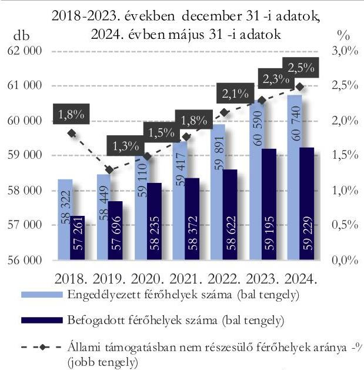
Forrás: Ellenőrzött szervezetek adatszolgáltatásai alapján ÁSZ saját szerkesztés

17. ábra

BENTLAKÁSOS IDŐSELLÁTÁS KÖZPONTI KÖLTSÉGYETÉSI KIADÁSAI (MRD FT) ÉS GDP ARÁNYOS KIADÁSAI (%)

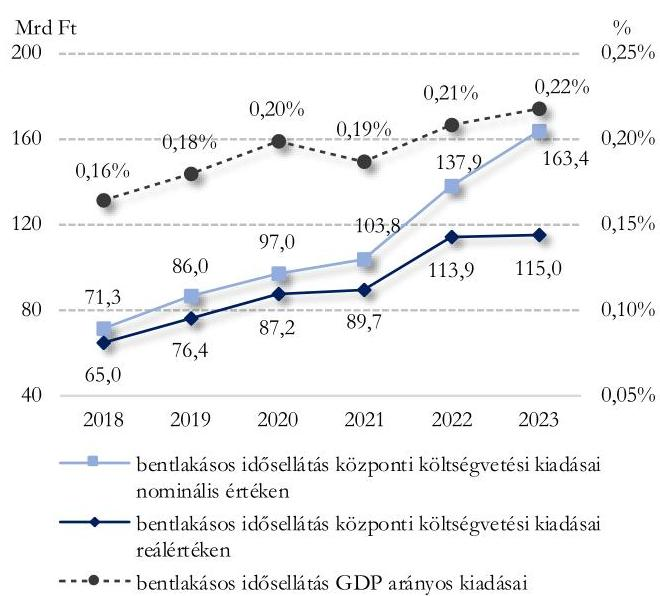
Forrás: KSH adatok, ellenőrzött szervezetek adatszolgáltatásai, éves beszámolók alapján ÁSZ saját szerkesztés

A finanszírozási rendszer és az állami támogatások rendszere a működés finanszírozására, illetve az ahhoz való hozzájárulásra szorítkozott, infrastrukturális és tárgyi feltételek megőrzésére nem terjedt ki. Egyes fenntartótípusoknak lehetőségük nyílt – nem szociális témájú – pályázatokból beruházási, felújítási forráshoz jutni, azonban ezek az ellátórendszer intézményeinek tervszerű állagmegóvását, felújítását nem biztosították.

## II. A BENTLAKÁSOS ELLÁTÁS FINANSZÍROZÁSI RENDSZERE, SZERKEZETE

A bentlakásos idősellátás finanszírozási helyzetét meghatározták az intézmények – 1. fókusztérületen bemutatott – személyi és tárgyi feltételei, infrastrukturális állapota. A finanszírozási keretek determinációját további két tényező befolyásolta, ezek az intézmények saját bevételei, azaz az ellátásokért fizetett díjak, hozzájárulások, valamint a fenntartótípusonként eltérő módon megállapított központi költségvetési támogatások, illetve azok változásai.

## II.1. Az intézmények saját bevételei

Az intézmények saját bevételeit a jogszabályok oly módon korlátozták, hogy abból a nem megfelelő fizetőképességgel rendelkező ellátottak után realizált veszteség (önköltségtől elmaradó összegű vagy meg nem fizetett térítési díj, költőpénz biztosítása) az intézményekre, illetve fenntartójukra hárult. Az intézmények a fizetőképes ellátottak felvételében voltak érdekeltek, ugyanakkor az ellátási kötelezettséget teljesítő, az ellátottakat jelentkezési sorrendben ellátó állami, önkormányzati fenntartású intézmények ezt az érdeket nem tudták érvényesíteni, számukra ez nem kompenzálható finanszírozási hátrányt eredményezett.

---

Megállapítások

# Térítési díj

A személyes gondoskodást nyújtó szociális ellátásokért fő szabályként térítési díjat kellett fizetni.

A fenntartók minden évben meghatározták az intézményi térítési díjat, melyet a személyes gondoskodás körébe tartozó szociális ellátás ellenértékeként állapítottak meg és amelynek összege nem lehetett magasabb, mint a szolgáltatási önköltség. Ez utóbbi számítására 2015 óta nem volt jogszabályi előírás vagy módszertani útmutató, emiatt az ezen alapuló intézményi térítési díj megállapítása intézményenként eltérhetett, fennállt annak a kockázata, hogy elhibázott számítások, döntések révén az intézmények nem a számukra jogszabályban rögzített, önköltségi szinthez kötött finanszírozásban részesültek.

Az ellátást igénybe vevő vagy az igénybe vevő után kötelezett által ténylegesen fizetendő térítési díj a személyi térítési díj. (ld. 18. ábra)

A Szoctv. előírta, hogy ingyenes ellátásban kell részesíteni azt az ellátottat, aki jövedelemmel nem rendelkezik, illetve csökkentett összegű személyi térítési díjat kell fizetnie annak, akinek jövedelme 60%-át (időskorúak gondozóháza esetén), illetve 80%-át (idősek otthona esetén) meghaladja az intézményi térítési díj. Az ingyenesség, illetve a csökkentett összegű személyi térítési díj további feltétele volt, hogy az ellátott ne rendelkezzen jelentős pénz-, illetve jelzálog alapjául szolgáló ingatlanvagyonnal, valamint térítési díj fizetésére kötelezett hozzátartozóval. Esetenként költőpénzt is kellett az intézményeknek biztosítaniuk, ha az ellátott jövedelme ezt a jogszabályok alapján indokolta.

# Belépési hozzájárulás

A Szoctv. 2015. január 1-jétől lehetőséget biztosított a fenntartó számára, hogy meghatározza, mely férőhelyek tölthetők fel kizárólag belépési hozzájárulás megfizetése esetén; nem állami fenntartású intézmények esetében a férőhelyek legfeljebb 50%-a, az ellátási kötelezettséggel rendelkező állami és önkormányzati fenntartású intézmények esetében nem volt ilyen korlát, ugyanakkor ezen intézmények nem tagadhatták meg az ellátást a belépési hozzájárulás megfizetésére nem képes igénylőtől.

A belépési hozzájárulás összegét a jogalkotó 8 M Ft-ban maximalizálta, mely összeg 2015 óta nem változott. A belépési hozzájárulást a fenntartónak a szociális intézményei működtetésére, fejlesztésére kellett fordítania.

A jogalkotó előírta továbbá, hogy a térítési díjon, illetve a belépési hozzájáruláson felül a jogszabályban előírt feltételeket meg nem haladó ellátotti igény esetén további jogcímen térítési díj nem kérhető.

Az ellátottak szerényebb jövedelmi-vagyoni helyzete miatt kieső bevételeket és felmerülő költségeket a finanszírozási rendszer nem vette figyelembe, és azok kompenzálására nem nyújtott lehetőséget – akár

18. ábra

# IDŐSKORI BENTLAKÁSOS ELLÁTÁST
NYÚJTÓ INTÉZMÉNYEK TÉRÍTÉSI DÍJ
BEVÉTELENEK JOGSZABÁLYI KORLÁTAI

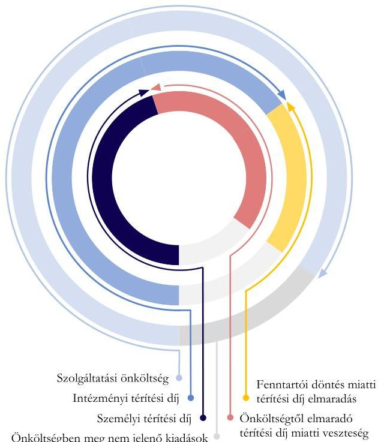

Az intézményi térítési díj legfeljebb a szolgáltatási önköltség lehet, ugyanakkor jogszabályi méltányosságból a személyi térítési díj alacsonyabb lehet, mint az intézményi térítési díj, mindezek veszteséget jelentenek az intézmények számára.

Forrás: Jogszabályi előírások alapján ÁSZ saját szerkesztés

---

Megállapítások

magasabb összegű központi költségvetési támogatásként, akár önköltséget meghaladó térítési díj előírása, egyéb jogcímen díjak beszedése útján a kedvezőbb jövedelmi-vagyoni helyzetben lévő ellátottaktól –, azt veszteségként az intézményeknek, illetve fenntartóiknak kellett viselnie.

Mindezek miatt a szabályozási környezet a nem állami, nem önkormányzati fenntartású intézményeket a fizetőképes ellátottak kiválasztására ösztönözte, ami által egyfelől sérült az egyenlő elbánás követelménye a közfeladatellátás során, másfelől ez finanszírozási hátránnyal járt az ellátási kötelezettséget teljesítő, az ellátottakat jelentkezési sorrendben ellátó állami és önkormányzati fenntartású intézmények számára.

A finanszírozási rendszert érintő döntések előkészítésekor célszerű lenne fenntartótípusonként az ellátottaktól származó bevételekről, az azokat befolyásoló tényezőkről adatokat gyűjteni és azokat elemezni (szolgáltatási önköltség, intézményi térítési díj és abból számított bevétel, személyi térítési díjak és azokból várt bevétel stb.). Ezáltal megállapítható lenne, hogy a térítési díjbevételek elmaradása mely fenntartótípust milyen mértékben érintette, azt fenntartói döntés (szolgáltatási önköltségnél alacsonyabb intézményi térítési díj meghatározása, melyből származó veszteséget a fenntartó önként vállalta), vagy az ellátottak pénzügyi-jövedelmi helyzete (az intézményi térítési díjnál alacsonyabb személyi térítési díj, amely veszteség a jogszabályi környezetből következett) indokolta. Ezen túlmenően lehetőséget biztosítana annak ellenőrzésére is, hogy a fenntartó a térítési díjakban érvényesítette-e – és ha igen, milyen mértékben – a működtetésre kapott támogatásokat.

## II.2. Az intézmények állami támogatásai

A befogadási rendszer amellett, hogy a kapacitások finanszírozási szempontból kiszámítható, de a szolgáltatás iránti kereslettől elmaradó mértékű emelkedését engedte, a saját bevételek jogszabályi maximalizálásával együttesen azt eredményezte, hogy hiába jelentkezett egyre nagyobb igény a bentlakásos szolgáltatások iránt, idősetthont, illetve idősek gondozóházát állami támogatások nélkül csak veszteségesen vagy szerény nyereséggel lehetett működtetni, ami – a piacra lépés magas költségeit is figyelembe véve – a magánberuházásokat távol tartotta. A befogadási rendszer tehát az államilag támogatott kapacitások bővülésének korlátja volt, a finanszírozási rendszer átalakításának elmaradása pedig a tisztán piaci alapon működő intézmények elterjedésének, a kapacitások piaci szereplők általi bővítésének szabott gátat.

A bentlakásos idősellátás finanszírozási rendszerében a saját bevételeken túl meghatározó szerepe volt az állami támogatásoknak, amelyek – hasonlóan a térítési díj bevételhez – az egyes szociális szolgáltatások működtetési költségeihez történő állami hozzájárulást jelentették (Szoctv. 127. § (1) bek.). Az ellenőrzött időszakban az egyes fenntartótípusok szerinti állami támogatások összesített értékét és az egy ellátottra jutó értékének eltéréseit a 19. és 20. számú ábrák szemléltetik:

---

Megállapítások

19. ábra

## AZ EGYES FENNTARTÓTÍPUSOKNAK KIFIZETETT TÁMOGATÁSOK (MRD FT)

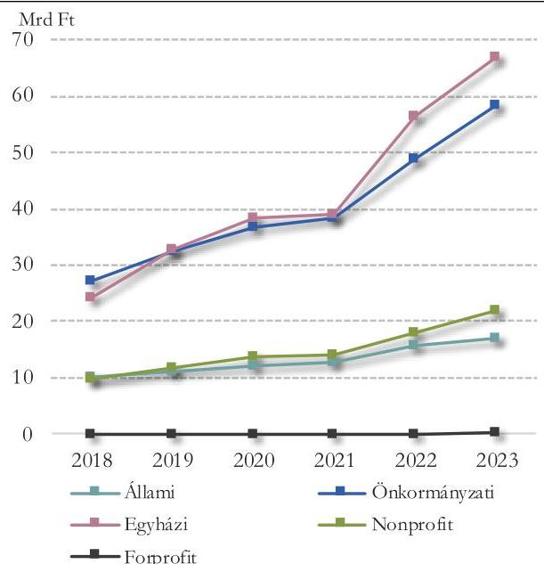
Forrás: Ellenőrzött szervezetek adatszolgáltatásai, éves beszámolók alapján
ÁSZ saját szerkesztés

20. ábra

## EGY ELLÁTOTTRA JUTÓ TÁMOGATÁS FENNTARTÓTÍPUSOK SZERINT (E FT/FŐ)

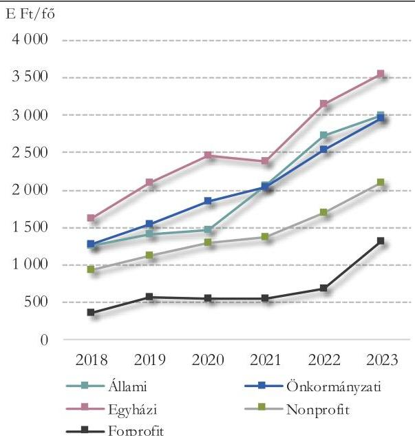
Forrás: Ellenőrzött szervezetek adatszolgáltatásai, éves beszámolók alapján
ÁSZ saját szerkesztés

Az SZGYF, mint állami fenntartó, valamint az ellátást végző intézmények költségvetési forrásairól a mindenkori költségvetési törvény rendelkezett, meghatározva ezek működtetéséhez szükséges előirányzatok összegét. Az önkormányzatok állami támogatásának jogcíméit a központi költségvetés tartalmazta, az ezeken alapuló tényleges támogatási összeg az önkormányzatok igénylésén alapult.

A nem állami intézmények fenntartói központi költségvetési támogatást abban az esetben igényelhettek, ha a férőhelyeket a szolgáltatói nyilvántartásba véglegessé vált döntéssel bejegyezték (azaz rendelkeztek a tevékenység végzésére engedéllyel) és a finanszírozási rendszerbe – a szolgáltatások területi lefedettségét figyelembe véve – befogadták (befogadási rendszer).

A 2012 óta működő befogadási rendszer bevezetésének célja a központi költségvetési kiadások kordában tartása volt. A befogadási rendszer bevezetésekor a már működő és finanszírozásban részesülő szolgáltatások a törvény erejénél fogva befogadást nyertek – tekintettel a kapacitások bővülésének ütemére is –, az ellátórendszer akkori adottságait és problémáit (ellátási hiányok, területi egyenlőtlenségek stb.) mintegy konzerválva.

A befogadási rendszer, illetve a térítési díjbevételek szolgáltatási önköltségben való maximalizálása együttesen azt eredményezte, hogy hiába jelentkezett egyre nagyobb igény a bentlakásos szolgáltatások iránt, idősotthont, illetve idősek gondozóházát állami támogatások nélkül csak veszteségesen vagy legjobb esetben is nagyon szerény nyereséggel lehetett működtetni, ami – a piacra lépés magas költségeit is figyelembe véve – a magánberuházásokat távol tartotta, illetve a keresletet az

A BEFOGADÁSI RENDSZER, mint kapacitáskorlát lényege, hogy a nem állami kapacitások bővítése, új kapacitások létrehozása, illetve a felszabaduló befogadott kapacitások újraosztása csak miniszteri hozzájárulással részesülhetett állami finanszírozásban. A támogatásnak nem volt feltétele a finanszírozási rendszerbe történő befogadás az állami fenntartású szociális intézmények, valamint a más fenntartónak átadott állami intézmények, illetve az önkormányzati fenntartású intézmények esetében (Szoctv. 58/A. § (2)-(2l) bek.).

38

---

Megállapítások

illegális gondozás irányába terelte. Ezt bizonyítja, hogy az ellenőrzött időszakban a Kormányhivatalok mintegy 80 bejegyzés nélkül működő intézmény ellen kezdeményeztek eljárást⁴.

A jogalkotó a probléma kezelését, a piaci szereplők számára vonzó feltételek megteremtését a 2020. január 1-jétől bevezetett, tisztán piaci alapon működő időszthon intézményével kívánta kezelni, melyekben akár gondozási szükséglet nélkül is elláthatók voltak a jelentkezők (Szoctv. 68/C.§). Ennek feltétele volt, hogy valamennyi ellátást igénylő vagy helyette a szolgáltatási díjat megfizető más személy írásban vállalja a fenntartó által megállapított szolgáltatási díj, illetve egyszeri belépési összeg megfizetését. Az ilyen intézmények állami támogatást nem igényelhettek, cserébe nem kellett alkalmazniuk a jövedelemvizsgálat és a térítési díj megállapításának szabályait sem, azonban az idősek otthonára vonatkozó szakmai előírások számukra is érvényesek voltak.

A tisztán piaci alapon működő intézmények bevezetésének hatása az ellenőrzött időszakban nem jelentkezett a kapacitások bővülésében. Célszerű lenne annak vizsgálata, elemzése, hogy az állami támogatás hiánya – jelen gazdálkodási és finanszírozási szabályok között – számukra mekkora finanszírozási hátrányt jelentett, a szervezetrendszer eredményessége, hatékonysága szempontjából érdemes-e a feltételek átgondolása, finomhangolása.

## II.3. Központi költségvetési támogatások jogcímei

Az állami támogatások jogcímei, illetve fajlagos összegei annak ellenére tértek el egyes fenntartótípusok esetében, hogy azokhoz nem párosult eltérő ellátási kötelezettség, elvárt szolgáltatási színvonal, míg egyes fenntartótípusok annak ellenére részesültek azonos összegű fajlagos támogatásban, hogy az elvárt ellátási kötelezettség nem volt azonos szintű. Az eltérések indokoltságának folyamatos kontrollja érdekében az ÁSZ célszerűnek tartja rendszeres gyakorisággal számítások, elemzések készítését.

A bentlakásos idősellátás finanszírozási rendszerbe befogadott intézményei a fenntartókon keresztül a központi költségvetésből állandó és eseti támogatásokban részesültek, melyek egy része minden fenntartónak járt, míg más részükben csak egyes fenntartótípusok részesültek. A szociális és gyermekvédelmi ágazat támogatási jogcímeinek összevont előirányzatait a költségvetési törvény különböző fejezetei eltérő címek, alcímek alatt, központi költségvetési szervek előirányzataiként vagy fejezeti kezelésű előirányzatként tartalmazták, amely előirányzatok a fenntartó típusa szerint különültek el (állami, önkormányzati, nem állami fenntartók). Az előirányzatok összevontan tartalmazták a szociális, gyermekvédelmi és gyermekjóléti ellátások költségvetési támogatásait, melyek szolgáltatások szerinti részletezését a költségvetési törvény alátámasztását szolgáló indokolások sem tartalmazták, azaz nem volt megállapítható, hogy az adott évi költségvetés egy konkrét szociális szolgáltatásra – így az idősek tartós és átmeneti bentlakásos ellátására – milyen összeget irányzott elő. A költségvetés végrehajtásáról szóló törvények (zárszámadási törvények²⁸) fejezeti indokolásai sem részletezték, hogy az egyes fejezeteken belül az állami támogatásokat milyen szociális, gyermekvédelmi és gyermekjóléti ellátásra fordították. Mindezek miatt az időskori bentlakásos ellátásra fordított központi költségvetési támogatások átláthatósága korlátozott volt.

A költségvetési törvények által biztosított támogatási jogcímeket és a támogatások azonosított forrásait, valamint a Kormány eseti támogatási döntéseinek jogcímeit az 8. sz. táblázat foglalja össze.

⁴ forrás: Szociális Ágazati Portál (2024. december 19.)

39

---

Megállapítások

8. táblázat
IDŐSKORI BENTLAKÁSOS ELLÁTÁS TÁMOGATÁSI JOGCÍMEI (2018-2024)

|   |   | Jogcímek | Állami fenntartású intézmények | Önkormányzati fenntartású intézmények | Egyházi fenntartású intézmények | Nonprofit intézmények | Forprofit intézmények  |
| --- | --- | --- | --- | --- | --- | --- | --- |
|  Ellátási kötelezettség |   |   | Van |   | Nincs  |   |   |
|  Állandó finanszírozási jogcímek | Szekető-semleges támogatások | Béralapú támogatás | – | + | + | + | Béralapú támogatás 30%-ára volt jogosult  |
|   |   |  Ágazati összevont pótlék | – | + | + | + | +  |
|   |   |  Intézményüzemeltetési támogatás | – | + | – | – | –  |
|   |   |  Egyházi kiegészítő támogatás | – | – | + | – | –  |
|   |   |  Bértámogatások, kompenzációk | – | Eltérő mértékben | Eltérő mértékben | Eltérő mértékben | Eltérő mértékben  |
|   |   |  Rezsikompenzáció | – | Eltérő mértékben | Eltérő mértékben | Eltérő mértékben | Eltérő mértékben  |
|  Költségvetési fejezet, cím, aktím | Szociálpolitikáért felelős minisztérium fejezet/ áht. kp-i altsz-ébe tartozó krigvetési szervek | Helyi önk-ok támogatásai fejezet/Települési önk. egyes szociális és gyermekjóléti feladatainak támogatása | Szociálpolitikáért felelős minisztérium fejezet / fejezeti kezelésű előirányzatok  |   |   |   |   |
|   |   |   |  Pénzügyminisztérium fejezet/Központi kezelésű előirányzatok/Központi tartalékok/Céltartalékok (XV/26/2/3) Miniszterelnökség fejezet/Egyházi célú központi költségvetési hozzájárulások célelőir.(XI/30/1/30) | Pénzügyminisztérium fejezet/Központi kezelésű előirányzatok/Központi tartalékok/Céltartalékok (XV/26/2/3)  |   |   |   |

Forrás: Központi költségvetési törvények alapján ÁSZ saját szerkesztés

Az állami fenntartású bentlakásos intézmények költségvetési bevételei és kiadásai a költségvetési szervek előirányzatain jelentek meg, melyet a központi költségvetési törvények összevontan tartalmaztak, és amelyeknek összegeit többnyire bázis alapon állapították meg. A jogszabályi előírások szerint az állami fenntartó részére a szociális szolgáltatások fenntartásának költségeit feladatfinanszírozás útján biztosították (Szoctv. 131/B. §). Az állandó jogcímeket évről évre a központi költségvetési törvények nevesítették, melyek az ellenőrzött időszakban ugyan nem változtak, de a jogcímekre, azok mértékére, növekedési ütemére – az egyházi kiegészítő támogatás és az önkormányzatoknak járó intézményüzemeltetési támogatás kivételével – egyéb jogszabályok nem tartalmaztak előírást, amely miatt a támogatási összegek erősen kitettek voltak a költségvetés aktuális teherbíró képességének.

---

Megállapítások

Az állandó támogatási jogcímek összegei – bár évről évre emelkedtek – az évek előrehaladtával egyre kevésbé biztosították a szükséges forrásokat.

A pótlólagos finanszírozási igényeket eseti támogatások csillapították, melyekről a Kormány év közben a költségvetés teherbíró képessége függvényében egyedileg döntött. Ezek szerepe az ellenőrzött időszakban egyre hangsúlyosabb lett, míg 2018-ban a kifizetett költségvetési támogatások 4,5%-a, 2023-ban 13,7%-a származott egyedi kormánydöntéssel megállapított jogcímből.

21. ábra

A BENTLAKÁSOS IDŐSELLÁTÁS TÁMOGATÁSA JOGCÍMENKÉNT (2018-2023)
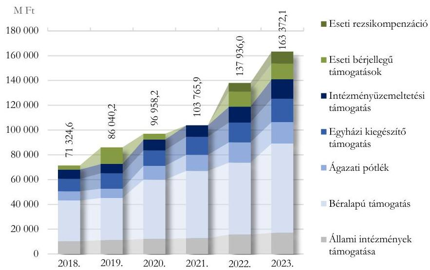
Forrás: Ellenőrzött szervezetek adatszolgáltatásai, éves beszámolók alapján ÁSZ saját szerkesztés

Az eseti támogatások közül kiemelendő az eseti rezsikompenzáció, melyet az energiaárak jelentős és váratlan emelkedése indokolt. Az ellenőrzött időszakban a különböző jogcímeken kifizetett támogatások megbontását a 21. ábra szemlélteti.

A szerteágazó támogatási jogcímek és jogosultsági feltételek korlátozták az egyes fenntartótípusok finanszírozásának összehasonlíthatóságát és finanszírozási helyzetének nyomon követését.

Az ÁSZ célszerűnek tartja a bentlakásos idősellátásokról részletekbe menő adatok gyűjtését, elemzését (bevételtermelő képesség, a különböző típusú és színvonalú ellátások személyi és tárgyi feltételei, illetve az azokhoz kapcsolódó kiadások, az ellátásban részesülők és várakozók pénzügyi-jövedelmi helyzete, ellátási szükségletei stb.). Ezen információk által lehetségesé válik egyfelől a finanszírozási rendszer eltérései indokoltságának folyamatos kontrollja, másfelől a finanszírozási rendszer szociálpolitikai célokhoz, vagy az egyes fenntartótípusok finanszírozási szükségletéhez igazítása.

## ÁLLANDÓ TÁMOGATÁSI JOGCÍMEK

## Béralapú támogatás

A központi költségvetés minden önkormányzati és nem állami fenntartású, befogadott intézmény részére béralapú támogatást biztosított az időskorúak átmeneti és tartós ellátást biztosító intézményeiben foglalkoztatott szakmai dolgozók béréhez, valamint az ehhez kapcsolódó szociális hozzájárulási adóhoz. A béralapú támogatás az időskori bentlakásos ellátás egyik állandó támogatási jogcímét képezte az ellenőrzött időszakban.

Béralapú támogatás jogcímen történő kifizetésre a teljes bentlakásos időskori ellátásra fordított költségvetési támogatások 39,6–49,2%-át fordították.

A költségvetési törvények a béralapú támogatást az önkormányzati fenntartók esetében bértámogatás jogcímént, míg a nem állami fenntartóknál „átlagbéralapú támogatás” jogcímént tartalmazták. A béralapú támogatás a korábbi normatív finanszírozást váltotta fel, amely az addigi egy ellátottra megállapított támogatás helyett az egy szakmai dolgozó béréhez nyújtandó támogatást rögzítette, ugyanakkor a szakmai dolgozók létszáma nem a tényleges, hanem a költségvetés által elismert szakmai dolgozói létszám volt, ami négy ellátottra jutó egy szakmai dolgozó volt, azaz végso soron egy negyedelt normatív támogatást jelentett.

---

Megállapítások

A béralapú támogatás fajlagos összegei az ellenőrzött időszakban évről évre emelkedtek, a 2024. évi költségvetési törvényben elfogadott, korrekció nélküli támogatási összeg (6 399 900 Ft/számított létszám) közel 2,5-szerese volt a 2018. évinek (2 606 040 Ft/számított létszám).

A béralapú támogatás összegét az ellátási forma (idősotthon, gondozóház, illetve a 2008-tól már új férőhelyre nem engedélyezett emelt szintű ellátás), az ellátottak ápolási, gondozási igénye szempontjából egyedüli elemként a demencia kórkép (átlagos ellátás – demens ellátás) és fenntartótípus szerint – korrekciós szorzószámok alkalmazásával – differenciálták (ld 9. táblázat).

9. táblázat
BENTLAKÁSOS IDŐSELLÁTÁS BÉRALAPÚ TÁMOGATÁSÁNAK KORREKCIÓS SZORZÓI (2018-2024)

|   | ÖNKORMÁNYZATI FENNTARTÁSÚ |   |   |   |   | NEM ÁLLAMI FENNTARTÁSÚ  |   |   |   |   |
| --- | --- | --- | --- | --- | --- | --- | --- | --- | --- | --- |
|   |  IDŐSOTTHON |   |   | IDŐSEK GONDOZÓHÁZA |   | IDŐSOTTHON |   |   | IDŐSEK GONDOZÓHÁZA  |   |
|   |  átlagos ellátás |   | demens ellátás | átlagos ellátás | demens ellátás | átlagos ellátás |   | demens ellátás | átlagos ellátás | demens ellátás  |
|   |  nem emek szintű | emek szintű |   |   |   | nem emek szintű | emek szintű  |   |   |   |
|  2018-2019. | 1,00 | 1,00 | 1,20 | 1,00 | 1,20 | 1,00 | 0,19 | 1,18 | 1,00 | 1,00  |
|  2020-2024. | 1,00 | 1,00 | 1,19 | 0,93 | 1,19 | 1,00 | 0,19 | 1,19 | 0,93 | 0,93  |

Forrás: Központi költségvetési törvények alapján, ÁSZ saját szerkesztés

A költségvetési törvényekben megállapított béralapú támogatás jogcím fajlagos összegeiben, a különböző korrekciós szorzószámokban eltérések mutatkoztak, a szorzószámok mértékét, az eltérések indokoltságát az ellenőrzött időszakban készült elemzésekkel, számításokkal nem támasztották alá.

A béralapú támogatás fenntartótípusonként kifizetett támogatási összegeit, valamint azok fajlagos összegeit a 22. és 23. ábrák mutatják:

22. ábra
BÉRALAPÚ TÁMOGATÁSRA FORDÍTOTT ÖSSZEG FENNTARTÓK SZERINT (MRD FT)
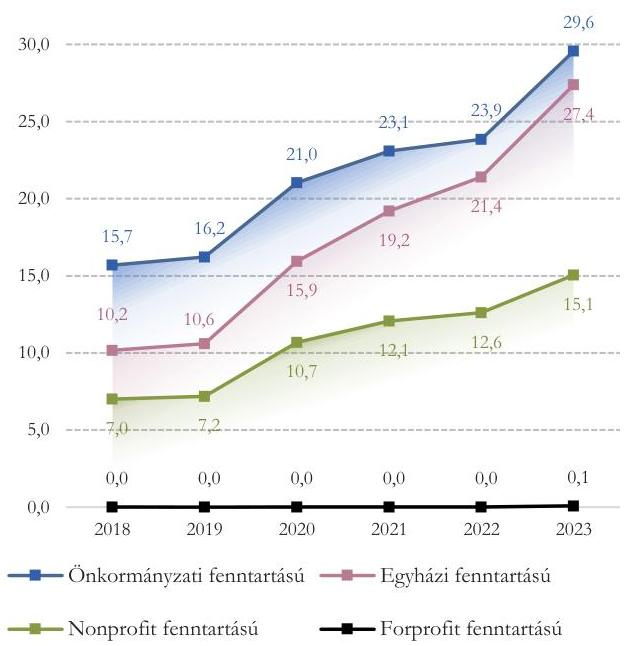
Forrás: Ellenőrzött szervezetek adatszolgáltatásai, éves beszámolók alapján
ÁSZ saját szerkesztés

23. ábra
BÉRALAPÚ TÁMOGATÁS FAJLAGOS ÖSSZEGEI FENNTARTÓK SZERINT (M FT/FŐ)
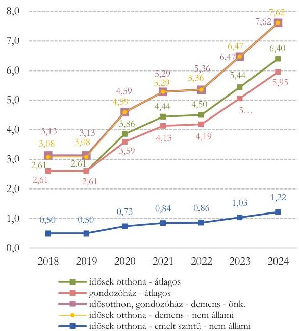
Forrás: 2018-2023. évi költségvetési törvények alapján ÁSZ saját szerkesztés

---

Megállapítások

A jogcímen belül megkülönböztetett két ellátástípus, az emelt szintű férőhely és a gondozóház megszüntetése megkezdődött, de azok teljes kivezetése végül elmaradt. Esetükben – párhuzamos fejlesztések és intézkedések miatt – jelentős finanszírozási eltérések alakultak ki, melyek fenntartásának indokoltságát az ellenőrzött időszakban készült elemzések, számítások nem támasztották alá.

Az emelt szintű férőhely engedélyezésére a jogszabályok 1997. január 1-jétől 2007. december 31-ig biztosítottak lehetőséget, 2008. január 1-jétől az emelt szintű férőhely, mint engedélyezési kategória, megszűnt, az addig engedélyezettek a 2007. december 31-i jogállapot szerint működhettek tovább.

Ezeken a férőhelyeken az átlagot meghaladó minőségű körülmények és szolgáltatások nyújtásáért cserébe az intézmények egyszeri hozzájárulást és személyi térítési díjpótlékot szedhettek az ellátottak után. Az ilyen módon bejegyzett magasabb színvonalú férőhelyeken gondozottak után a költségvetési törvények az ellenőrzött időszakban a nem állami fenntartású intézmények esetében a béralapú támogatás 19,0%-át biztosították. Az önkormányzati fenntartású intézmények körében nem volt különbség az emelt szintű és az átlagos szintű férőhelyek finanszírozása között. Az emelt szintű férőhelyek alakulását fenntartótípusok szerint 24. ábra mutatja.

24. ábra

EMELT SZINTŰ FÉRŐHELYEK ALAKULÁSA FENNTARTÓK SZERINT (2017-2024)
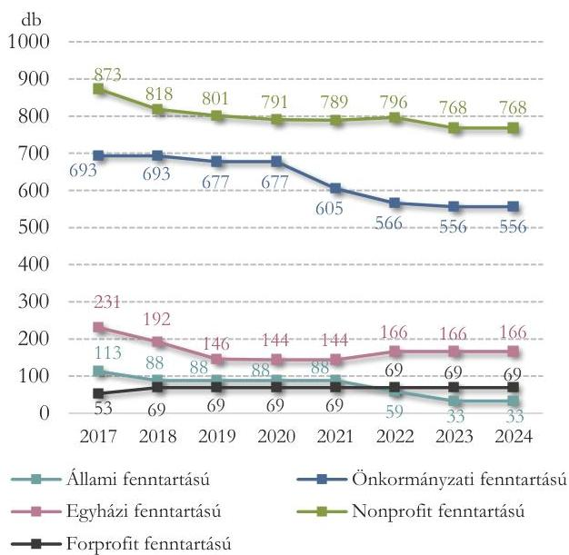
Forrás: Ellenőrzött szervezetek adatszolgálatásai alapján ÁSZ saját szerkesztés

2015-től a Szoctv. bevezette a belépési hozzájárulást, ezzel megszűnt az emelt szintű ellátás saját bevételekben jelentkező legfőbb finanszírozási előnye a nem emelt szintű ellátáshoz képest. Ez a változás nem járt együtt a finanszírozási rendszer újragondolásával a nem állami fenntartású intézmények körében, ennek eredményeképp a magasabb színvonalú ellátást támogatta a központi költségvetés alacsonyabb összeggel. A nem állami fenntartóknak érdekükben állt volna férőhelyeik átminősítése átlagos ellátásra, azonban ennek a befogadási rendszer gátat szabott. 2024-ben a befogadott időszóthoni férőhelyek több mint 3,0%-át finanszírozták olyan feltételek mellett, amellyel 2008. január 1-jétől már nem történhetett bejegyzés a szolgálatói nyilvántartásba.

Az időskorúak gondozóházait az időlegesen krízishelyzetbe került személyek átmeneti ellátására alakították ki, azonban ezek a gyakorlatban az időszóthonok kiterjesztéseként működtek. 2016-ban a jogalkotó a Szoctv. módosításával (138. § (4) bek.) 2022. december 31-i haladékkal az időskorúak gondozóházainak időszóthonná történő átalakításáról döntött, majd az átalakulás kötelező követelményét 2022 januárjában visszavonta. Az addig átalakult intézmények magasabb korrekciós szorzóval rendelkező időszóthonként működtek tovább, a megmaradt gondozóházak részére pedig továbbra is az alacsonyabb, 0,93-as korrekciós szorzóval biztosították az átlagbéralapú támogatást.

A kötelező átalakulás, majd a döntés visszavonása ugyanakkor nem érintette a gondozóházak ellátási kötelezettségét előíró szabályozást, ami az addig át nem alakult intézmények későbbi átalakulásának korlátját jelentette.

43

---

Megállapítások

# Szociális ágazati összevont pótlék és egészségügyi kiegészítő pótlék

A szociális ágazati összevont pótlék és egészségügyi kiegészítő pótlék (továbbiakban: ágazati pótlék) jogcím az ellenőrzött időszakban állandó, fenntartótípustól független támogatási forma volt, amely a kifizetendő ágazati pótlék mellett annak közterheire nyújtott fedezetet. E pótlékok minden szociális intézménynél munkaviszonyban álló foglalkoztatottat megillettek (Szoctv. 94/L. § (4) bek., Kjt.²⁹ 75. § (1) bek., Kjtvhr.³⁰ 15/A. § és 5. melléklet), de önálló támogatási jogcímként csak az önkormányzati, nem állami fenntartású intézményeknek járt. A támogatási jogosultság feltétele volt, hogy az ágazati pótlék teljes összege a foglalkoztatottak tényleges bérnövekedéseként jelenjen meg.

Ugyan az ágazati pótlék az ellenőrzött időszakban többször emelkedett, annak összege nem biztosította a szociális ágazat átlagbére leszakadásának kompenzálását, az továbbra is elmaradt a nemzetgazdasági átlagbértől. (I.d. 25. és 26. ábra)

25. ábra

ÁGAZATI PÓTLÉKHOZ NYÚJTOTT KÖZPONTI KÖLTSÉGVETÉSI TÁMOGATÁS FENNTARTÓK SZERINT (M FT)
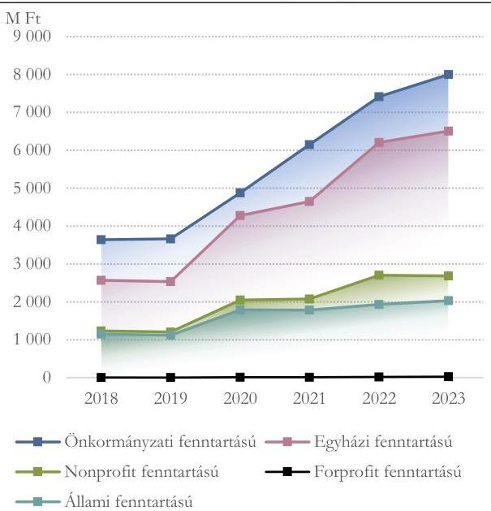
Forrás: Ellenőrzött szervezetek adatszolgálatásai alapján ÁSZ saját szerkesztés

26. ábra

1 FŐRE JUTÓ ÉVES ÁGAZATI PÓTLÉK ÁLLAMI TÁMOGATÁSA ÉS A BRUTTÓ ÁTLAGKERESET ALAKULÁSA (E FT/FŐ)
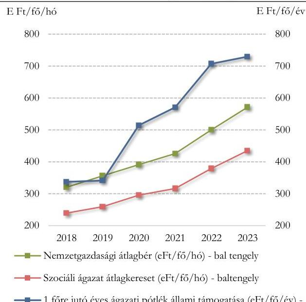
Forrás: KSH adatok és ellenőrzött szervezetek adatszolgálatásai alapján
ÁSZ saját szerkesztés

Ágazati pótlék jogcímen történő kifizetésre a teljes bentlakásos időskori ellátásra fordított költségvetési támogatás 8,6–12,4%-át fordították.

A fenntartótípustól független állandó támogatások mellett a központi költségvetés egyes fenntartótípusoknak állapított meg további állandó támogatási jogcímeket (ld. II.4. Az egyes fenntartótípusok finanszírozási helyzetét bemutató fejezet).

# ESETI TÁMOGATÁSI JOGCÍMEK

Az ellenőrzött időszakban – nagyrészen az eseti rezsikompenzáció miatt, melyet az energiaárak jelentős és váratlan emelkedése indokolt – az eseti támogatások szerepe felértékelődött. Annak ellenére, hogy az eseti támogatások mögött álló indokok gyakran egyként sújtották az időseket ellátó intézményeket, a támogatások feltételeinél nem minden esetben biztosították az egyenlőséget, az eseti támogatások többnyire a béralapú támogatás feltételei szerint illették meg a fenntartókat. Az eseti támogatások célzottsága, az esetlegesen meglévő finanszírozási különbségek kezelése érdekében a jövőben célszerű lenne a fenntartótípusonkénti eltérések indokoltságának alátámasztására számításokat, elemzéseket készíteni.

---

Megállapítások

A központi költségvetés az ellenőrzött időszakban egyre növekvő – a 2018. évben a kifizetett költségvetési támogatások 4,5%-a, 2023-ban 13,7%-a – mértékben eseti támogatásokat állapított meg az időskori bentlakásos ellátások forráshiányának enyhítésére.

Ezen támogatások egy részéből valamennyi idősellátást nyújtó intézmény részesült, más részük a fenntartók meghatározott típusát vagy az egyes fenntartókat, illetve az intézményeket célozta meg.

## Eseti bérjellegű támogatások

A teljes ellenőrzött időszakban jellemző támogatási forma volt a személyi kockázatok mérséklését célzó eseti bérjellegű támogatás, amely jellemzően adó- és járulékváltozások ellentételezésére szolgált, illetve a minimálbér és a garantált bérminimum emeléséhez nyújtott támogatást.

A központi költségvetés a 2011-2012. évi adó- és járulékváltozások ellentételezéséhez nyújtott támogatást, melyből 2018-tól 2020-ig a települési önkormányzatok, a központi költségvetési szervek és az egyházi jogi személyek részesültek, 2021 után e körből a települési önkormányzatok kikerültek, noha továbbra is kellett kompenzációt fizetniük, de ehhez már nem kaptak állami támogatást. Az egyéb nem állami (nonprofit, illetve forprofit) fenntartású intézmények foglalkoztatottjai után ilyen támogatás az ellenőrzött időszakban nem járt.

A személyi kockázatok mérséklését szolgálták az ellenőrzött időszakban a minimálbér és a garantált bérminimum emeléséhez nyújtott központi költségvetési támogatások, amelyek fedezetét a teljes ellenőrzött időszakban biztosította a központi költségvetés, többnyire kormányrendeletek, illetve -határozatok formájában. Ez alól a 2021. év jelentett kivételt, amikor a minimálbér és a garantált bérminimum emeléséhez szükséges támogatással az átlagbéralapú támogatás fajlagos összegét emelték. A támogatás összege 2018-ban még a minimálbér és a garantált bérminimum emelkedése miatt ténylegesen kifizetett bér- és bérpótlék növekedés és a kapcsolódó szociális hozzájárulási adó után járt, 2019-től 2023-ig pedig a béralapú támogatás szabályaival megegyező módon, fajlagos összegeket állapítottak meg. Az előző évi bérkompenzációk a következő évi béralapú támogatásba többnyire beépültek.

## Rezsikompenzáció

Az energiaválság és az orosz-ukrán konfliktus kirobbanása a közüzemi díjak emelkedésén keresztül valamennyi intézményt kedvezőtlenül érintette. A közüzemi díjakra kifizetett összegek adatai csak az állami és az önkormányzati fenntartású intézmények esetében álltak rendelkezésre (ezt szemlélteti a 27. ábra), a nem állami fenntartású intézményeket érintő díjemelkedések hatásáról nem volt információ.

A villamos energia és a földgáz nagykereskedelmi árának jelentős mértékű emelkedése miatt, a költségnevelés ellentételezése céljából a Kormány 2022-ben és 2023-ban kiegészítő támogatás nyújtásáról, eseti rezsikompenzációról döntött, amely a nem állami fenntartású intézményeket normatív támogatásként illette meg az ellátottak után. Az

27. ábra

REZSIKÖLTSÉGEK ALAKULÁSA AZ ÁLLAMI ÉS AZ ÖNKORMÁNYZATI FENNTARTÁSÚ INTÉZMÉNYEKBEN (2018-2023)

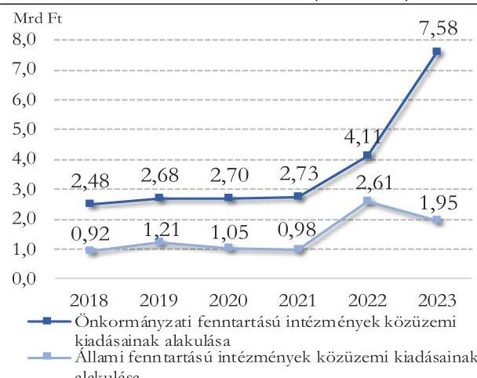

Forrás: Éves költségvetési beszámolók alapján ÁSZ saját szerkesztés

állami fenntartású intézmények esetében az állam gondoskodott a megemelkedett kiadások finanszírozásáról, az önkormányzati fenntartású intézmények részére rezsikompenzáció jogcímen támogatás nem járt,

---

Megállapítások

arról külön önkormányzatonként döntöttek és abból a bentlakásos idősellátásra jutó támogatások nem voltak megállapíthatók, emiatt más fenntartótípusokkal nem voltak összevethetők.

A nem állami intézményeknek nyújtott rezsitámogatást az állami fenntartású intézmények 1 fő ellátottra jutó rezsi többletkiadásai alapján becsülték, ami fenntartótípusonként eltérő mértéket eredményezett, emellett a támogatásból azonos mértékben részesültek a jó és a rossz infrastrukturális feltételekkel működő intézmények (pl. különböző korszerűségű, energiahatékonyságú épületek, fűtési rendszerek). A támogatás felhasználásánál nem volt követelmény, hogy annak összegét a ténylegesen megemelkedett közüzemi kiadásokra fordítsák.

## II.4. Az egyes fenntartótípusok finanszírozási helyzete

Az egyes fenntartótípusoknak a központi költségvetési támogatásokból való részesedése az ellenőrzött időszakban átrendeződött. Az egyházi intézmények térnyerésével párhuzamosan egyre nagyobb volt az állami támogatásból való részesedésük, mely – fajlagos finanszírozási előnyükből fakadóan – meghaladta az ellátotti létszám növekedését.

Az egyes fenntartótípusok állami támogatásait a 28. ábra szemlélteti.

Az egy ellátottra jutó támogatások tekintetében minden fenntartótípusnál jelentős volt az emelkedés, amely elsősorban a minimálbér és bérminimum emeléséhez biztosított támogatásoknak volt köszönhető. Ugyanakkor egyes eseti támogatások a fenntartók közötti finanszírozási részt tovább erősítették, ld. 29. ábra.

28. ábra

KÖZPONTI KÖLTSÉGVETÉSI FORRÁSBÓL BIZTOSÍTOTT TÁMOGATÁSOK MEGOSZLÁSA FENNTARTÓK SZERINTI MEGBONTÁSBAN
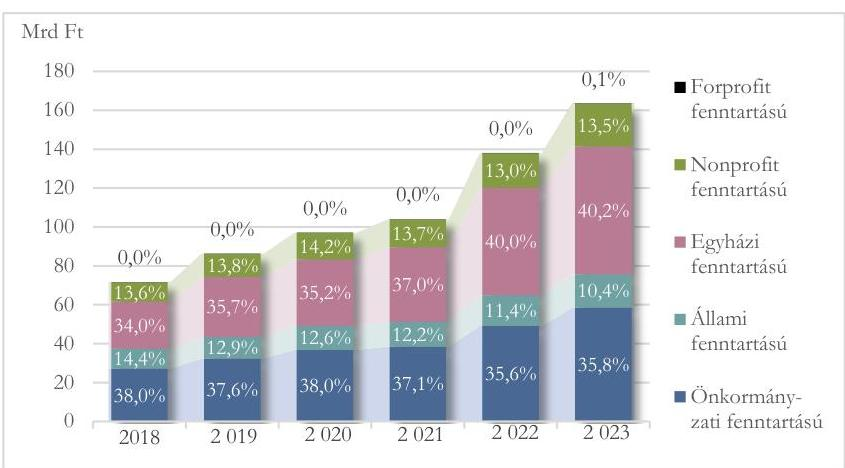
Forrás: Ellenőrzött szervezetek adatszolgáltatásai, éves beszámolók alapján ÁSZ saját szerkesztés

---

Megállapítások

29. ábra

# EGY ELLÁTOTTRA JUTÓ ÁLLAMI TÁMOGATÁS FENNTARTÓTÍPUSOK SZERINT 2018. ÉS 2023. ÉVEKBEN (FT/FŐ, ÁTLAGOS ELLÁTÁSI SZINTEN)

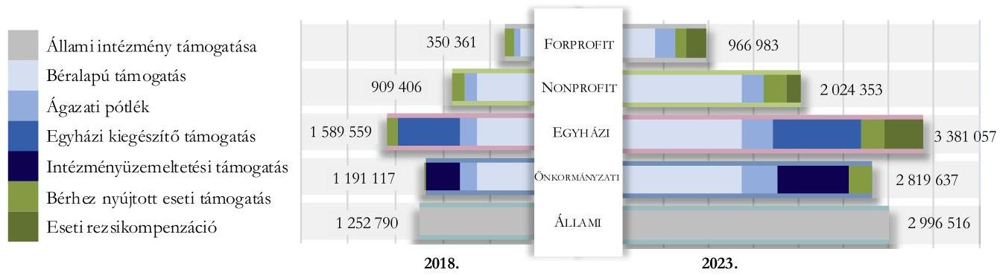

* Az egyházi egyenlegrendezés vonatkozási évben szerepel
Forrás: Költségvetési törvények, éves beszámolók és ellenőrzötti adatszolgáltatás alapján ÁSZ szerkesztés

A finanszírozási rendszerbe befogadott szervezetek központi támogatási szintjére az ellátotti létszámon túl, a fenntartó típusa gyakorolt hatást. A fenntartótípusok közötti különbségekhez – az előzőekben ismertetett támogatási jogcímeken belül tett megkülönböztetéseken túl – az egyes fenntartótípusokhoz köthető finanszírozási jogcímek eltérései, illetve a támogatás megállapításának sajátos módszerei járultak hozzá.

# ÖNKORMÁNYZATI FENNTARTÁSÚ INTÉZMÉNYEK

Az önkormányzatok által fenntartott idősek bentlakásos intézményei 2012 óta feladatfinanszírozáson keresztül részesültek támogatásban függetlenül attól, hogy az ellátást kötelező vagy önként vállalt feladatellátás keretében nyújtották. A feladatfinanszírozás ellenére jellemző volt az alulfinanszírozottság, melynek okáról (önköltségnél alacsonyabb szinten megállapított intézményi térítési díjak vagy az ellátási kötelezettség miatti személyi térítési díj veszteségek) nem állt rendelkezésre részletes információ.

A rendszerváltást követően a szociális szolgáltatások nyújtása a különböző szintű települési és megyei önkormányzatok kötelező feladata volt, ugyanakkor több települési önkormányzat is vállalt önkéntes feladatellátást. Az ellenőrzött időszakban a finanszírozási rendszer egyként kezelte a kötelező és az önként vállalt önkormányzati feladatellátást.

Az önkormányzati fenntartású időskorúak bentlakásos ellátásához nyújtott állami támogatás összegeit az éves költségvetési törvényekben a IX. Helyi önkormányzatok támogatásai fejezet tartalmazta. A kapott támogatásokkal az önkormányzatok az éves költségvetési beszámolójukban számoltak el.

Az önkormányzati intézmények saját bevételekkel nem fedezett kiadásait központi költségvetési és fenntartói támogatások biztosították.

Az önkormányzatok három jogcímen voltak jogosultak központi költségvetési támogatásra:

1. Bértámogatás jogcím (ld. II.3. fejezet béralapú támogatás)
2. Szociális ágazati összevont pótlék és egészségügyi kiegészítő pótlék jogcím (ld. II.3. fejezet szociális ágazati pótlék)
3. Intézményüzemeltetési támogatás jogcím

A feladatfinanszírozáshoz szükséges támogatást – a bértámogatáson felül – az intézményüzemeltetési támogatás biztosította, melynek feltételeit és számítási módját a mindenkori költségvetési törvények rögzítették.

---

Megállapítások

A támogatást az önkormányzatok számára több ellátás (időskorúak átmeneti és tartós, a hajléktalan személyek tartós bentlakása, valamint a gyermekek és családok átmeneti gondozása) után összevontan állapították meg. A támogatás az önkormányzatok saját költségbecsélésén alapult, azonban az csak egy támogató által meghatározott ún. elvárt költségszinthez nyújtott fedezetet.

A támogatás egyes önkormányzatokat megillető konkrét összegéről a 2018-2019. években a szociálpolitikáért felelős miniszter, az államháztartásért felelős miniszter és a helyi önkormányzatokért felelős miniszter együttesen, 2020-tól az államháztartásért felelős miniszter önállóan döntött, ezzel fennállt annak a kockázata, hogy kevésbé érvényesülhettek a szakmai szempontok a döntéshozatal során. Az egyes önkormányzatoknak járó intézményüzemeltetési támogatás összegéről szóló döntések nem voltak nyilvánosak.

Az önkormányzatoknak nyújtott központi költségvetési támogatások nagyságrendjéről elmondható, hogy a bérjellegű támogatások (bértámogatás, ágazati pótlék és eseti bérkompenzációk) a személyi juttatásokat és a kapcsolódó szociális hozzájárulási adót, járulékokat nem fedezték. Az összes állami támogatás a térítési díjjal korrigált működési kiadásoknak 2018-ban a 70,4%-ára, 2023-ban 81,5%-ára nyújtott fedezetet, ami azt jelentette, hogy a hiányzó működési kiadásokra és a felhalmozási kiadások egészére a forrásokat az önkormányzatoknak saját maguknak kellett előteremteniük (ld. 30. és 31. ábra). A feladatellátást az önkormányzati fenntartók az ellenőrzött időszakban évente 9,6–15 Mrd Ft közötti összeggel finanszírozták.

30. ábra

IDŐSKORI BENTLAKÁSOS ELLÁTÁS SZEMÉLYI JUTTATÁSAI ÉS JÁRULÉKAI, VALAMINT A BÉRJELLEGŰ TÁMOGATÁSOK ALAKULÁSA (MRD FT)

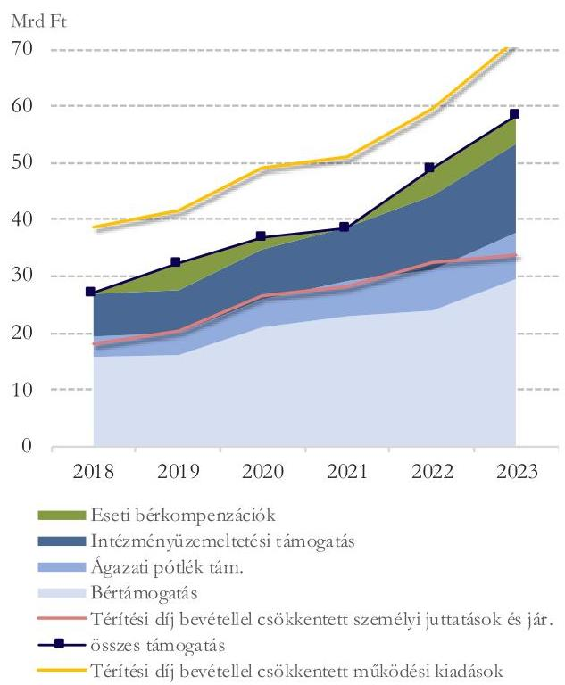

Forrás: Ellenőrzött szervezetek adatszolgáltatása alapján, ÁSZ saját számítás

31. ábra

ÖNKORMÁNYZATI FENNTARTÁSÚ INTÉZMÉNYEK SAJÁT BEVÉTELLEL NEM FEDEZETT KIADÁSAINAK ALAKULÁSA (MRD FT)

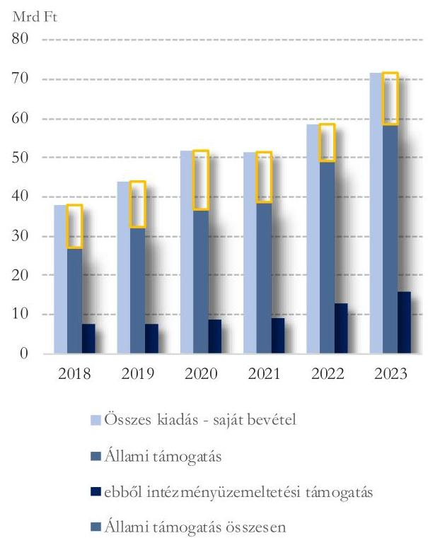

Forrás: Ellenőrzött szervezetek adatszolgáltatása alapján, ÁSZ saját számítás

---

Megállapítások

A feladatellátás alulfinanszírozása hosszabb távon az önkormányzatokat arra kényszerítheti, hogy önként vállalt feladataikat felülvizsgálják, a feladatok ellátását gazdasági teljesítőképességükhöz igazítsák.

A finanszírozási rendszert érintő hatékony és eredményes irányítószervi döntéshozatal érdekében az ÁSZ indokoltnak tartja az önkormányzati fenntartású intézményrendszer gazdálkodási és likviditási helyzetének nyomon követését.

# AZ ÁLLAMI FENNTARTÓ ÉS A FENNTARTÁSÁBAN LÉVŐ INTÉZMÉNYEK

Az állami fenntartó és intézményei költségvetését bázis alapon tervezték meg, a támogatások megállapítása és folyósítása teljesítménymutatóktól függetlenül, összegszerűen történt. A finanszírozás – jellegéből adódóan – sem mennyiségi (férőhelyek feltöltése) sem minőségi értelemben nem ösztönözte az eredményes feladatellátást.

Az állami bentlakásos idősellátást érintően a központi költségvetés egyszerre gondoskodott a feladatot ténylegesen ellátó intézmények, valamint a fenntartó költségvetési forrásairól. Az SZGYF és intézményei számára a támogatások megállapítása teljesítménymutatóktól függetlenül, összegszerűen történt, a megtervezett működési és felhalmozási kiadások, valamint bevételek különbségeként. A költségvetési szervek előirányzatait a szociálpolitikáért felelős miniszter fejezetében (2022-ig a XX. Emberi Erőforrások Minisztériuma, 2022-től a XIV. Belügyminisztérium fejezet) a Szociális és gyermekvédelmi intézményrendszer cím alatt, Szociális és gyermekvédelmi, gyermekjóléti feladatellátás és irányítás intézményei önálló alcím tartalmazta.

Az SZGYF fenntartói feladataival összefüggésben felmerült bevételeit és kiadásait a „Szociális szolgáltatások igazgatása” kormányzati funkció mutatta ki, azonban ezen a kormányzati funkció – a kormányzati funkciók és államháztartási szakágazatok osztályozási rendjéről szóló 15/2019. (XII. 7.) PM rendelet értelmében – nem csak fenntartói feladatokat kellett elszámolni, hanem a szociális szolgáltatások igazgatásával összefüggő valamennyi tevékenységet, továbbá a kormányzati funkció kimutatott fenntartói feladatok a teljes szociális, gyermekvédelmi és gyermekjóléti ellátás kiadásait és bevételeit felölelték, abból a bentlakásos idősellátáshoz köthető fenntartói tevékenység nem volt elkülöníthető.

Az SZGYF, mint intézményfenntartó profilját az ellenőrzött időszakban több lépcsőben is tisztították (elkerültek pl. a módszertani feladatok), azonban az ellátott létszám és intézményszám csökkenésével egyidejűleg a fenntartói tevékenységet ellátó szervezet, megyei hálózat racionalizálása – a 2020. évi, Fővárosi és Pest Vármegyei Kirendeltségek összevonásán túl – elmaradt.

Az állami intézmények által realizált bevételek 2018-ban 44,8%-ban, 2023-ban 30,4%-ban fedték le a felmerült kiadásokat.

A szakápolási központok 2023-tól kezdték meg működésüket az egészségügytől átvett helyszíneken, az SZGYF fenntartásában.

A szakápolási feladatok átvételéhez kapcsolódó finanszírozásról a Kormány két részletben gondoskodott. Első ízben az 1386/2023. (VIII. 31.) Korm. határozat alapján, az átvett 334 db szakápolási ágy finanszírozásához 226,3 M Ft többletforrást biztosított az átvett dolgozók személyi juttatásainak és a kapcsolódó járulékok, adók fedezetére, majd az 1471/2023. (X. 31.) Korm. határozat alapján további 288,3 M Ft-ot biztosított működési kiadásokra. A 2023-ban átadott intézmények 2024. évi és 2025. évi finanszírozását a szakápolás átalakításához szükséges finanszírozási intézkedésekről szóló 1274/2023. (VII. 14.) Korm. határozat akképpen rendezte, hogy felkérte a pénzügyminisztert, hogy a 2024. és 2025. években költségvetésben gondoskodjon 1351 M Ft többletforrás biztosításáról.

A szakápolási központokhoz a költségvetési törvények támogatási jogcímet nem rendeltek, mivel ilyen intézmény működtetéséhez az államon kívül más fenntartó nem rendelkezett engedéllyel.

49

---

Megállapítások

A mennyiségi és minőségi feladatellátás ösztönzése érdekében célszerű lenne az SZGYF és az általa fenntartott intézményrendszerre vonatkozó mennyiségi és minőségi teljesítménymutatók kialakítása és azok rendszeres visszamérése, emellett az állami férőhelyek átadásával összefüggésben az állami fenntartói tevékenység felülvizsgálata, szükség szerinti racionalizálása.

## A NEM ÁLLAMI FENNTARTÁSÚ INTÉZMÉNYEK FINANSZÍROZÁSA

A finanszírozási rendszert érintő hatékony és eredményes irányítószervi döntéshozatal érdekében az ÁSZ indokoltnak tartja a nem állami fenntartású intézményrendszer gazdálkodási és likviditási helyzetének nyomon követését.

A Szoctv. 1993. évi hatályba lépésétől tartalmazta (Szoctv. 120. §), hogy ellátási szerződés útján egyesület, alapítvány, egyházi jogi személy, ezek intézményei, illetve egyéni vagy társas vállalkozó is nyújthat szociális ellátást. Ez az ellenőrzött időszakban nem változott, ellátási szerződést bármely egyházi és nem állami szervezettel lehetett kötni, azonban 2023. január 1-jétől a közfeladatellátásban a jogalkotó az egyházi és civil szervezeteknek kiemelt szerepet szánt (Szoctv. 2. § (5) bekezdés).

A nem állami fenntartású intézmények az ellenőrzött időszakban heterogén csoportot képeztek. Közös volt bennük, hogy saját elhatározásból vállalták a közfeladat ellátását, emiatt számos olyan, a gazdálkodás szempontjából kedvezőtlen feltétel, amely az állami és az önkormányzati fenntartású intézmények ellátási kötelezettségéből következett, a nem állami fenntartású intézményeket nem terhelte.

Nem vonatkozott rájuk a jelentkezési sorrendben történő ellátási kötelezettség, emiatt saját teherbíró képességük mérlegelése mellett az ellátottak jövedelmi-vagyoni helyzete (fizetőképessége) és az ellátott gondozási szükséglete alapján is választhattak az ellátásra jelentkezők közül, amely az intézményi gazdálkodásban jelenthetett előnyt számukra.

Az ellátási szerződéssel működtetett nem állami fenntartású intézmények esetében az intézménybe történő felvételre irányuló kérelem elutasítása esetén, 8 napon belül az ellátási szerződést megkötő helyi önkormányzathoz, társuláshoz vagy állami szervhez lehet fordulni, melynek döntése bírósági úton felülvizsgálható (Szoctv. 94/D. §). Továbbá az igénylők soron kívüli elhelyezésének szabályai az ellátási szerződéssel működtetett nem állami fenntartású intézményekre is vonatkoznak (9/1999. (XI. 24.) SzCsM rendelet³¹ 15-16.§).

A nem állami fenntartású szociális intézmények központi költségvetési támogatását a mindenkori költségvetési törvény, valamint az Átr.³² szabályozta. Az Átr. emellett rendelkezett a nem állami fenntartású intézmények támogatás igénylésének, folyósításának, elszámolásának és ellenőrzésének rendjéről is.

A nem állami fenntartók három fő típusba voltak sorolhatók:

1. nonprofit fenntartók: bevett egyháznak nem minősülő vallási egyesületek és egyházi jogi személyek, civil szervezetek és nonprofit gazdasági társaságok, nemzetiségi önkormányzatok, valamint közalapítványok,
2. egyházi fenntartók: az Alaptörvény ötödik módosítása megteremtette annak a lehetőségét, hogy az állam a bevett egyházaknak – ideértve azok egyházi jogi személyét is – a közfeladat ellátásban sajátos szerepet szánjon (Alaptörvény VII. cikk (4) bekezdés),
3. egyéb nem állami vagy forprofit fenntartók: gazdasági társaságok, egyéni vállalkozók.

## NONPROFIT FENNTARTÁSÚ SZERVEZETEK FINANSZÍROZÁSA

A nem állami fenntartó „alaptípusa” a nonprofit fenntartó, amelyhez képest a többi nem állami fenntartótípus az állami támogatások tekintetében finanszírozási előnyöket élvezett vagy hátrányokat szenvedett el. A nonprofit szervezetek átlagbéralapú támogatás, illetve ágazati összevont pótlék állandó jogcímeken finanszírozta a központi költségvetés, eseti támogatásként bérjellegű támogatásokban és rezsikompenzációban részesültek. A nonprofit szervezetek központi költségvetési támogatásainak alakulását az alábbi 32. és 33. ábrák mutatják:

50

---

Megállapítások

32. ábra

NONPROFIT FENNTARTÁSÚ INTÉZMÉNYEK
KÖZPONTI KÖLTSÉGVETÉSI
TÁMOGATÁSA(2018-2023., MRD FT)
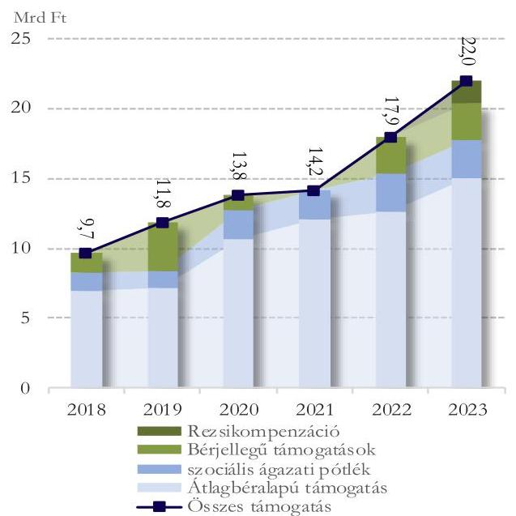
Forrás: Ellenőrzött szervezetek adatszolgáltatása alapján, ÁSZ saját szerkesztés

33. ábra

NONPROFIT FENNTARTÁSÚ INTÉZMÉNYEK 1
FŐRE JUTÓ KÖZPONTI KÖLTSÉGVETÉSI
TÁMOGATÁSA (E FT/FŐ) ÉS AZ ELLÁTOTTAK
SZÁMA (FŐ)
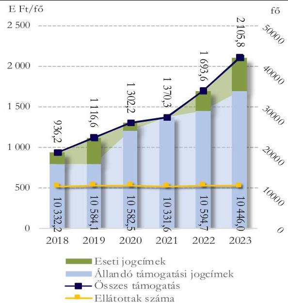
Forrás: Ellenőrzött szervezetek adatszolgáltatása alapján, ÁSZ saját szerkesztés!

A nonprofit szervezetek kiadásairól, a központi költségvetési támogatáson felüli további bevételeiről – ideértve a belépési hozzájárulás és a térítési díj bevételeket is – nem álltak rendelkezésre adatok, így nem volt információ arról, hogy a nonprofit szervezetek támogatása milyen arányban fedezte a kiadásokat.

Az egy főre jutó állami, önkormányzati működési kiadásokat referencia mutatónak tekintve a nonprofit szervezetek költségvetési támogatásai az ellenőrzött időszakban a működési kiadások 35,2-41,2%-át fedezték, amennyiben ez az érték az önkormányzati, állami fenntartású intézmények egy főre jutó térítési díj bevételeivel párosult, akkor a működési kiadások mintegy 30%-a bevételel nem fedezett volt. A működési költségeknek megfelelő, vagy ahhoz közelítő díjbevételek realizálása esetén biztosíthatott az állami támogatás fedezetet felújítási, beruházási kiadásokra.

Mindebből az következik, hogy a nonprofit intézmények fennmaradását az állami, önkormányzati intézményeknél magasabb térítési díj és belépési hozzájárulás, illetve az alapvető szolgáltatásokon túli, extra szolgáltatásokból származó bevételek biztosították, mindezek miatt a nonprofit szervezeteknek alapvető érdeke volt, hogy fizetőképesség szerint válasszanak az ellátottak közül.

# EGYHÁZI FENNTARTÁSÚ SZERVEZETEK FINANSZÍROZÁSA

Az egyházak szociális szerepvállalása évszázados tradíciókon alapul, melynek folytatását a rendszerváltást követően az egyházakkal kötött megállapodások is ösztönözték.

Az egyházak szerepvállalásakor fontos hangsúlyozni az egyházi hitéleti tevékenység és az egyházi közfeladatellátás szétválasztásának követelményét: míg az előbbinél az állam és az egyház szigorú elkülönülése, addig a közélú feladatellátásnál az együttműködés érvényesül. Ennek másik olvasata, hogy míg a hitélet kapcsán az egyházi autonómia nyomán a belső szabályok az irányadóak, addig a közfeladat ellátás a szakmai szabályok követésén túl a közpénzekkel való elszámoltathatóságot, a transzparenciát követeli meg.

51

---

Megállapítások

Az egyházakkal kötött megállapodások sorát az 1997-es Vatikáni megállapodás⁵ nyitotta, amely a Katolikus Egyház sajátosságából⁶ adódóan nemzetközi szerződésnek minősült, az abban foglaltakkal – a jogforrási hierarchia okán – a hazai szabályozásnak összhangban kellett lennie, módosítása csak a felek közös megegyezésén alapulhatott.

A Vatikáni megállapodás rögzítette, hogy az egyházi közszolgálati tevékenységek finanszírozására az állami intézményekre vonatkozó általános szabályok érvényesek: az állam az egyházi intézmények működéséhez a hasonló állami intézményekkel azonos mértékű költségvetési támogatást nyújtott és az egyházi intézményfenntartónak az állami, illetve önkormányzati fenntartóval azonos szintű támogatását írta elő.

Ennek alapja „az állampolgárok azon döntése, ahogyan az egyházi közszolgáltatásokat igénybe veszik”, valamint az egyházak szellemisége és az egyházak által nyújtott többletszolgáltatások.

A megállapodás a számítás módjára is tartalmazott iránymutatást.

A fenti rendelkezések teremtették meg az egyházi közfeladatellátás finanszírozásának azt a sajátosságát, hogy az egyházak – a nonprofit szervezeteket megillető támogatásokon felül – egyházi kiegészítő támogatásra voltak jogosultak. (34. ábra)

34. ábra

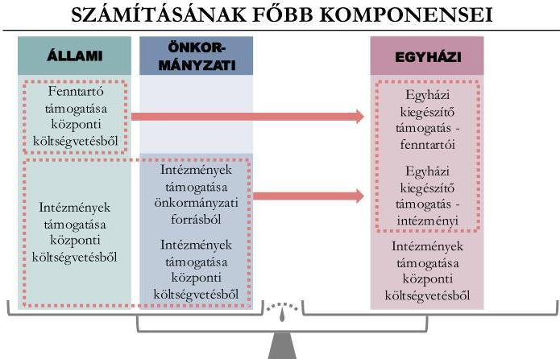
Forrás: Egyházi kiegészítő számítások alapján, ÁSZ saját szerkesztés

A Vatikáni megállapodást követően további egyházakkal kötött megállapodást az állam, amelyek ugyan nem minősültek nemzetközi szerződésnek (azokat kormányhatározat formájában hirdették ki), azonban tartalmukra a Vatikáni megállapodás precedenst teremtett. Az egyházi kiegészítő támogatás főbb szabályait az egyházak hitéleti és közcéltú tevékenységének anyagi feltételeiről szóló 1997. évi CXXIV. törvény is tartalmazta, mely a bevett egyházak számára – megállapodástól függetlenül – egyöntetűen előírta az egyházi kiegészítő támogatás biztosítását.

5 1997. június 20-án, a Magyar Köztársaság és az Apostoli Szentszék között létrejött megállapodás, amely – egyebek mellett – a Katolikus Egyház magyarországi közszolgálati tevékenységének finanszírozásáról rendelkezett. Az Országgyűlés még 1997-ben 109/1997. (XII. 8.) számú határozatával a Vatikáni Megállapodást megerősítette, majd az 1999-ben törvényvel is kihirdette (1999. évi LXX. törvény).

6 mivel a Katolikus Egyház legfőbb intézménye, az Apostoli Szentszék állama –, Vatikánvárosi Állam – nemzetközi jogalanyisággal bír

52

---

Megállapítások

Az ellenőrzött időszakban érvényes egyházi kiegészítő támogatás azért volt sajátos, mert miközben az állami és önkormányzati fenntartókkal azonos finanszírozásra tette a bevett egyházakat jogosulttá, aközben az állami és önkormányzati fenntartással járó kötelezettségek teljesítésének igényét (pl. jelentkezési sorrendben történő ellátás, ellátási kötelezettség), vagy egyéb többletkövetelményt (pl. magasabb színvonalú ellátás) nem írt elő. Ennek háttere, hogy a megállapodás a maitól gyökeresen eltérő társadalmi, jogi és finanszírozási környezetben született és az azóta bekövetkezett változások ellenére érintetlenül hagyták az egyházi kiegészítő támogatás feltételeit.

Az ÁSZ véleménye szerint célszerű lenne olyan teljesítményösztönző rendszer kialakítása, amely a feladatellátásban – a kormányzati döntéssel összhangban – a jövőre nézve is biztosítja az elvárt, magasabb minőségi vagy hatékonysági szempontok érvényesülését.

Az ellenőrzött időszakban az egyházi kiegészítő támogatás előzetes kalkulációkon alapuló százalékos mértékét – mintegy előlegként – a költségvetési törvények, míg a tényleges adatok alapján számított korrekcióját (egyenlegrendezést) a zárszámadási törvények tartalmazták.

35. ábra
EGYHÁZI KIEGÉSZÍTŐ TÁMOGATÁS %-OS MÉRTÉKÉNEK ÉS ÉRTÉKÉNEK (MRD FT) ALAKULÁSA
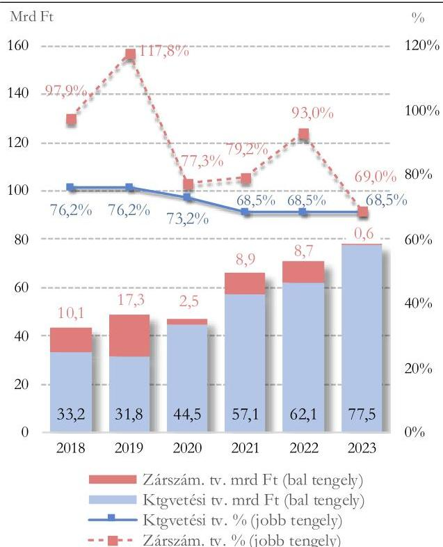
Forrás: Költségvetési és Zárszámadási törvények alapján, ÁSZ saját szerkesztés

---

Megállapítások

Az ellenőrzött időszakban 15 bevett egyház és egy vallási egyesület⁷ részesült szociális, gyermekvédelmi és gyermekjóléti tevékenysége után egyházi kiegészítő támogatásban, az ezeknek kifizetett támogatási összeget és a valamennyi fenntartótípusnak járó támogatásokhoz viszonyított %-os mértéket a 35. ábra tartalmazza.

Az egyházi kiegészítő támogatás számítását az államháztartásért felelős minisztérium végezte az ellenőrzött időszakban. A kalkuláció az önkormányzati és állami többlettámogatások kimutatására irányult, ezt vetették össze az egyház részére folyósított támogatásokkal.

Az önkormányzati és állami intézmények támogatását – a Vatikáni megállapodásban előírtakat szem előtt tartva – indirekt módon határozták meg, melyhez a működési, valamint felújítási kiadási és bevételi adatok kormányzati funkciókénti megbontását használták.

Az egyházak fenntartói feladatainak támogatására önálló jogcím nem volt, az egyházi kiegészítő támogatás nyújtott arra is fedezetet. A fenntartói feladatok támogatását az SZGYF szociális szolgáltatások igazgatása kormányzati funkciók kimutatott működési és felújítási adatai alapján számolták, szintén indirekt módon.

Az egyházi kiegészítő támogatás megállapításának főbb lépéseit a 36. ábra szemlélteti.

36. ábra

# AZ EGYHÁZI KIEGÉSZÍTŐ TÁMOGATÁS MEGÁLLAPÍTÁSÁNAK FŐBB LÉPÉSEI

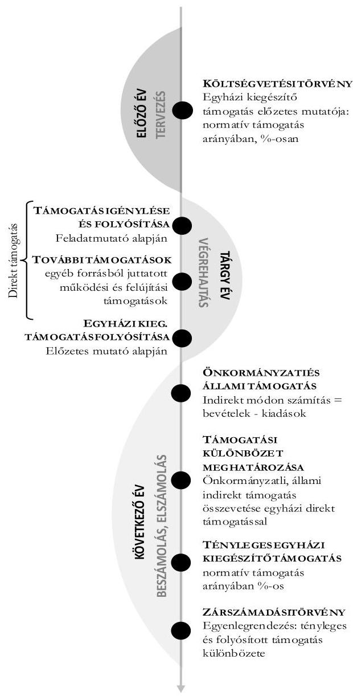

Forrás: Jogszabályok és ellenőrzötti adatszolgáltatás alapján ÁSZ saját szerkesztés

⁷ a Magyar Köztársaság Kormánya és a Szuverén Jeruzsálemi, Rodoszi és Máltai Szent János Katonai és Ispotályos Rend közötti Együttműködési Megállapodás kihirdetéséről szóló 2010. évi CXL. törvény 5. cikk, 1. pont

54

---

Megállapítások

Az egyházaknak folyósított támogatások jogcímek szerinti alakulását az 37. és 38. ábrák szemléltetik, az ellenőrzött időszakban az egyházak állami finanszírozásának mintegy 29-41%-át tette ki az egyházi kiegészítő támogatás.

37. ábra

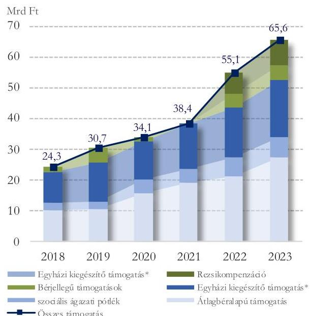
EGYHÁZI INTÉZMÉNYEK KÖZPONTI KÖLTSÉGVETÉSI TÁMOGATÁSA (2018-2023. MRD FT)
Forrás: Ellenőrzött szervezetek adatszolgáltatása alapján, ÁSZ saját szerkesztés

38. ábra

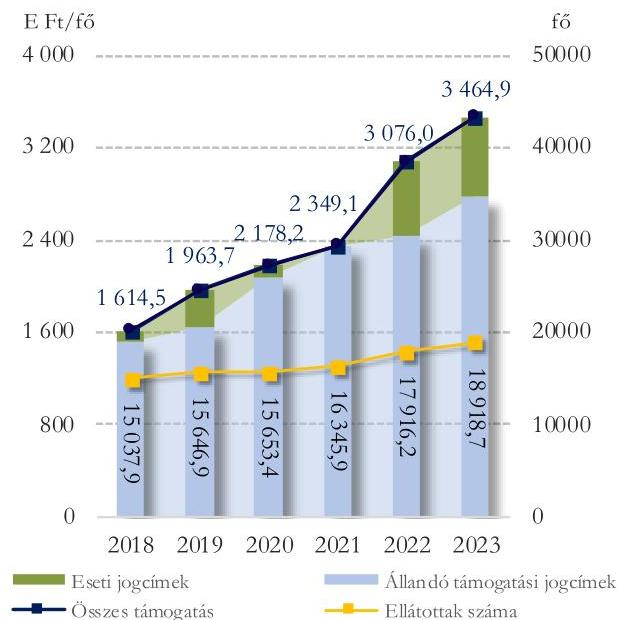
EGYHÁZI INTÉZMÉNYEK 1 FŐRE JUTÓ KÖZPONTI KÖLTSÉGVETÉSI TÁMOGATÁSA (E FT/FŐ) ÉS AZ ELLÁTOTTAK SZÁMA (FŐ)
Forrás: Ellenőrzött szervezetek adatszolgáltatása alapján, ÁSZ saját szerkesztés

Az egyházi intézmények kiadásairól, bevételéről – ideértve a belépési hozzájárulás és a térítési díj bevételét is – nem álltak rendelkezésre adatok, így nincs információ arról, hogy az egyházi szervezetek támogatása milyen arányban fedezte a kiadásokat.

Az egy főre jutó állami, önkormányzati működési kiadásokat referencia mutatónak tekintve az egyházi szervezetek költségvetési támogatásai az ellenőrzött időszakban a működési kiadások 60,7-74,4%-át fedezték, amennyiben ez az érték az önkormányzati, állami fenntartású intézmények egy főre jutó térítési díjbevételeivel párosult, akkor azok a működési kiadások egészét fedezték.

Az egyházi fenntartók részére kifizetett állami támogatások – az egyházi átadások miatti ellátotti létszám növekedés és a fajlagos (egy ellátottra jutó) támogatások mértékének emelkedése miatt – évről évre nőttek, a 2023. évi kifizetések összege mintegy 170%-kal haladta meg a 2018. évit. 2018-ról 2023-ra az ellátotti létszám változása miatt – a fajlagos támogatási összeg változásának hatását kiszűrve –, a támogatások összege mintegy 13,4 Mrd Ft-tal nőtt, míg az egy ellátottra jutó támogatási összeg 114,6%-os emelkedése közel 28 Mrd Ft-tal több állami támogatást eredményezett.

Az adott évi költségvetési törvény az egyházi kiegészítő támogatás százalékos mértékét, míg a következő évi zárszámadási törvény az egyenlegrendezés korrekciós összegét rögzítette, így a központi költségvetésből az egyes egyházi fenntartóknak egyházi kiegészítő támogatás jogcímen juttatott tényleges támogatási összeg nem volt megállapítható.

55

---

Megállapítások

# FORPROFIT FENNTARTÁSÚ INTÉZMÉNYEK FINANSZÍROZÁSA

Az egyéb nem állami fenntartású intézmények jól elhatárolható csoportját alkották a nyereségorientált (forprofit) intézmények, amelyek a bentlakásos idősellátást, mint szociális szolgáltatást, gazdasági megfontolásból nyújtották.

A költségvetési törvények a finanszírozási rendszerbe befogadott, személyes gondoskodást nyújtó szociális, gyermekjóléti, gyermekvédelmi közfeladatot ellátó intézményt, szolgáltatást fenntartó gazdasági társaság (ide nem értve a nonprofit gazdasági társaságot) és egyéni vállalkozó számára a béralapú támogatás 30%-át biztosították. Mivel egyebekben a Szoctv. szigorú szabályai (pl. a térítési díjak önköltségben való korlátozása, belépési hozzájárulás 8 M Ft-os felső korlátja és a férőhelyek 50%-ában történő maximalizálása) vonatkoztak a forprofit fenntartású intézményekre is, így nem volt kifizetődő az idősellátást forprofit fenntartású szervezetként működtetni.

Az ellenőrzött időszakban a forprofit intézmények és az általuk fenntartott férőhelyek száma rendkívül alacsony volt: az intézmények száma az ellenőrzött időszakban 11-14 között mozgott, melyek a férőhely kapacitások 0,3-0,7%-át, a finanszírozási rendszerbe befogadott kapacitások 0,1-0,2%-át biztosították. A forprofit szervezeteknek folyósított támogatások jogcímek szerinti alakulását a 39. és 40. ábrák szemléltetik.

## 39. ábra

FORPROFIT FENNTARTÁSÚ INTÉZMÉNYEK
KÖZPONTI KÖLTSÉGVETÉSI TÁMOGATÁSA
(2018-2023., M FT)

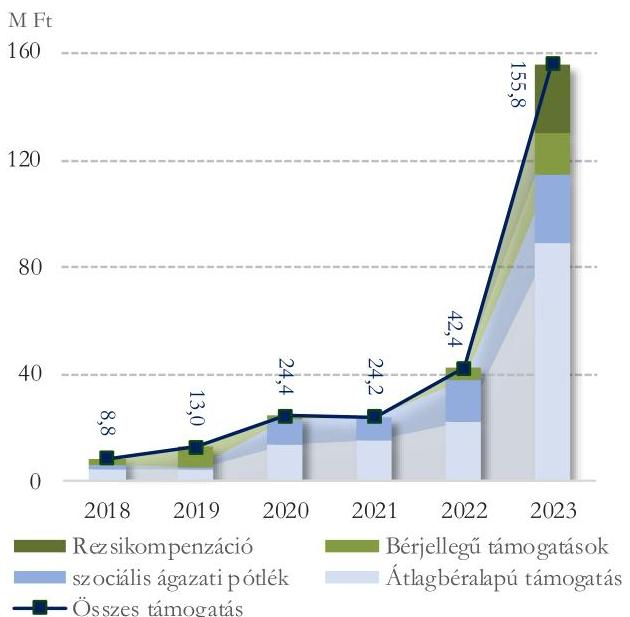

Forrás: Ellenőrzötti adatszolgáltatás alapján ÁSZ saját szerkesztés

## 40. ábra

FORPROFIT FENNTARTÁSÚ INTÉZMÉNYEK I
FŐRE JUTÓ ÁLLAMI TÁMOGATÁSA (E FT/FŐ)
ÉS AZ ELLÁTOTTAK SZÁMA (FŐ)

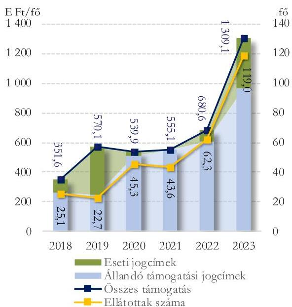

Forrás: Ellenőrzötti adatszolgáltatás alapján ÁSZ saját szerkesztés

Az egy főre jutó állami, önkormányzati működési kiadásokat referencia mutatónak tekintve a forprofit szervezetek költségvetési támogatásai az ellenőrzött időszakban a működési kiadások átlagosan 18,5%-át fedezték, amennyiben ez az érték az önkormányzati, állami fenntartású intézmények egy főre jutó térítési díj bevételeivel párosult, akkor a működési kiadásokat azok csupán 49,7%-ban fedezték volna. Ebből következően ezen gazdálkodó szervezetek fenntartásában működő bentlakásos idősellátás intézményei kiemelt módon érdekeltek voltak a szolgáltatási önköltséggel azonos összeget megfizetni képes ellátottak felvételében.

56

---

Megállapítások

A jogalkotók felismerték, hogy a kapacitások bővülésének a Szoctv. szigorú, az állami támogatásban részesülő intézményekre szabott gazdálkodási szabályai gátat szabtak, ezért a Szoctv. módosításával 2020-tól új rendelkezésként bevezették a tisztán piaci alapon működő idősek otthonát, melynek esetében a térítési díj és a belépési hozzájárulás korlátokat nem kellett érvényesíteni, viszont azok állami támogatást sem igényelhettek.

Mivel a költségvetési támogatások rendszerének szabályai egyebekben változatlanok maradtak és a költségvetési támogatásokban részesülő – emiatt finanszírozási előnyt élvező – intézmények is a tehetősebb ellátottak kiszolgálásában voltak érdekeltek, ezért a bentlakásos idősellátás állami támogatásban nem részesülő intézményrendszere számottevően nem tudott kiépülni.

A bentlakásos ellátás iránti igény általános állami támogatása az egyre öregedő társadalmakban egy pont után meghaladja a költségvetés finanszírozásának fenntarthatóságát, emellett a közfeladatellátást általában a piaci elégtelenségek indokolják. Emiatt és ezt szem előtt tartva az ÁSZ véleménye szerint célszerű megvizsgálni annak lehetőségét, hogy megfelelő kontrollok mellett a szabályozás utat engedjen a fizetőképes kereslet állami támogatásban nem – vagy a legszükségesebb mértékben – részesülő piaci szereplők általi kiszolgálásának, miközben a közfeladatellátásnak azokra a területekre, társadalmi rétegekre, élethelyzetekre kell összpontosítania, melyeket a piac – annak törvényszerűségei miatt – nem szolgál ki.

# 3. Az időskori bentlakásos szociális ellátás eredményességét, hatékonyságát mérő és támogató információs rendszer kialakítása és működtetése

## Összegző megállapítás

Az időskori bentlakásos szociális ellátás irányítását, szabályozását, finanszírozását mérő és támogató információs rendszerek technikai kialakítása megtörtént, azonban azok nem támogatták a stratégiai, irányítási, finanszírozási döntéshozatalt, mivel a szükséges adatokat, lényeges információkat nem, vagy nem teljeskörűen gyűjtötték, valamint azok megbízhatósága nem volt minden esetben biztosított. Az időskori bentlakásos szociális szolgáltatásokról a társadalmat teljeskörűen nem tájékoztatta az erre a célra kialakított szociális portál.

## I. AZ INFORMÁCIÓS RENDSZER FELÉPÍTÉSE

Az információs rendszer technikai kialakítása megtörtént, ugyanakkor a sok esetben szigetszerűen rendelkezésre álló adatok rendszerbe szervezése, az információk strukturált gyűjtése, tárolása, feldolgozása nem történt meg. Az elmúlt 15 évben – jellemzően Európai Unió projektek keretében – kifejlesztették a szociális ellátások főbb nyilvántartási rendszereit, ezek egy része az OSZIR³³-ban jelent meg, míg mások ettől független nyilvántartások voltak (43. ábra).

57

---

Megállapítások

43. ábra

# SZOCIÁLIS ELLÁTÁSOK FŐBB NYILVÁNTARTÁSI RENDSZEREI

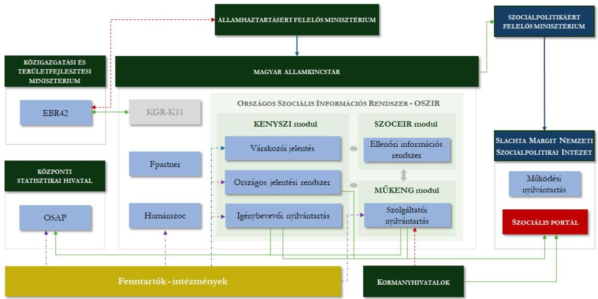
Forrás: Ellenőrzött szervezetek adatszolgáltatása alapján ÁSZ saját szerkesztés

Az időskori bentlakásos ellátást az OSZIR két modulja (MÜKENG és KENYSZI³⁴) érintette, amelyek négy fő nyilvántartást tartalmaztak.

- Szolgáltatói nyilvántartás (MÜKENG modul): közhiteles nyilvántartás, a tevékenység végzésére engedéllyel rendelkező szolgáltatók adatait tartalmazta
- Igénybevevői nyilvántartás (KENYSZI modul): a költségvetési támogatással finanszírozott szolgáltatások esetében tartalmazta az ellátottak adatait és azt, hogy mely napokon részesültek szolgáltatásban. A nyilvántartás a szolgáltatások finanszírozásának ellenőrzéséhez nyújtott támogatást. A szolgáltatói és az igénybevevői nyilvántartás között interfész kapcsolat volt.
- Várakozói nyilvántartás (KENYSZI modul): az ellátásra várakozók adatainak ideiglenes nyilvántartására szolgált.
- Országos jelentési rendszer (KENYSZI modul): az egyéb adatszolgáltatási igényeket volt hivatott kielégíteni.

A fentieken kívül további különálló nyilvántartások működtek, azonban azokkal a fő nyilvántartások adatkapcsolata, az adatok megfeleltetése nem volt biztosított.

A főbb különálló nyilvántartások:

- Működési nyilvántartás, amely a személyes gondoskodást végző személyek adatait tartalmazta a képzések megszervezése, valamint a képzési követelmények teljesítésének ellenőrzése céljából (2021. január 20-ig az SZGYF, utána az NSZI vezette),
- Humánszoc, amely a nem állami (egyházi és egyéb nem állami) fenntartók központi költségvetési támogatásának analitikus nyilvántartását szolgálta (Kincstár vezette),
- az EBR42³⁵ egyebek mellett tartalmazta az önkormányzatok központi költségvetésből folyósított szociális támogatásai analitikus nyilvántartását (Ávr.³⁶ 105. § alapján a KTM³⁷ vezette),

58

---

Megállapítások

- az OSAP³⁸ adatgyűjtéseket olyan KSH által gyűjtött statisztikai adatok előállítására szolgáltak, amelyek a OSZIR nyilvántartásokban nem álltak rendelkezésre.

## II. AZ ÁGAZATI IRÁNYÍTÁS INFORMÁCIÓS RENDSZERREL TÖRTÉNŐ TÁMOGATOTTSÁGA

Az időskori bentlakásos szociális ellátás információs rendszerei nem teljeskörűen támogatták az ágazati döntéshozatalt, mivel abban nem gyűjtöttek minden szükséges információt, illetve a gyűjtött adatok teljeskörűsége, megbízhatósága nem volt elégséges.

A szolgáltatói nyilvántartás adatai nem voltak pontosak, naprakészek és teljeskörűek. A költségvetési szerv szolgáltatók (állami vagy önkormányzati fenntartású intézmények) esetén a fenntartók, illetve az intézmények törzskönyvi azonosítószámai (PIR) teljeskörűen nem álltak rendelkezésre, emellett pontatlanok voltak, így nem biztosították az éves költségvetési beszámolók adatai és a szolgáltatói nyilvántartás adatai közötti megfeleltetést. 2018-ban az önkormányzati, illetve állami fenntartású szolgáltatók bejegyzésének 13,5%-ában hiányzott vagy hibás PIR szerepelt. Ez a szám 2019-ben 13,7%, 2020-ban 14,3%, 2021-ben 14,2%, 2022-ben 13,9%, 2023-ban pedig 13,5% volt.

A szolgáltatói nyilvántartásból nem voltak kinyerhetőek alapvető, ellátást érintő adatok: mely szolgáltatók és hány férőhelyen biztosították a Szoctv. szerinti ellátási kötelezettséget (akár ellátási szerződés útján).

A szolgáltatói nyilvántartás közhiteles adatainak (Szoctv. 92/K. § (2) bek. a) és c) pontok szerinti adatok) szúrópróbászerű ellenőrzése nem mutatott hiányosságot.

A Minisztérium a kapacitástervezéshez szükséges várakozószámról, illetve várakozói igényekről, ezáltal a szolgáltatások iránti kielégítetlen keresletéről nem rendelkezett pontos ismeretekkel.

A várakozói jelentésekből a Kincstár havi rendszerességgel elemzést, illetve összesített kimutatást készített, melyet a SZÁP³⁹-on közzétettek. A Minisztérium álláspontja szerint ezek a kimutatások nem voltak alkalmasak a valós igények előrejelzésére az adatok teljes körűsége, minősége és módszertani anomáliák miatt. Az adatszolgáltatási fejelem erősítése, illetve a módszertanok felülvizsgálata helyett a jogalkotó a Minisztérium kezdeményezésére 2020. január 1-jétől a várakozói jelentés nyilvánosságának megszüntetéséről döntött, a kapacitástervezéshez szükséges adatok hiányosságai ugyanakkor továbbra is fennálltak.

A szociális szolgáltatások tervezéséhez szükséges adatigényt az országos jelentési rendszer volt hivatott kielégíteni, azonban a rendszerben az adatszolgáltatási hajlandóság alacsony volt (pl. az intézményi térítési díj adatszolgáltatási aránya az ellenőrzött időszak egyetlen évében sem haladta meg a 45,1%-ot). Ennek hátterében többek között az állhatott, hogy az adatszolgáltatást a jogszabályok nem kényszerítették ki.

A költségvetési törvények az állami támogatások feltételéül az igénybevevői nyilvántartás vezetését szabták, az országos jelentési rendszerbe történő adatszolgáltatás teljesítését nem. Ez utóbbival kapcsolatban a Szoctv. 92/L. § (3) bekezdése úgy rendelkezett, hogy a Kincstár bírságot szabhat ki a fenntartóval szemben, ha az országos jelentési rendszerbe történő bejelentési kötelezettségét határidőben részben vagy egészben nem teljesíti vagy valótlan adatot szolgáltat. A kincstári eljárásrendek alapján az országos jelentési rendszerbe történő adatszolgáltatási kötelezettség teljesítésének ellenőrzése nem volt ellenőrzési szempont.

A finanszírozást érintő rendszerek az állami támogatások kontrolljához szükséges adatokat tartalmazták, a finanszírozási rendszer célzottságának, hatékonyságának megítélésehez szükséges információkat nem. Az összehasonlíthatóságot nehezítette, hogy a fenntartók és intézményeik heterogén szervezetek voltak, melyek számára a számviteli törvény⁴⁰ eltérő beszámolási és könyvvezetési szabályokat rendelt. E sajátosságok figyelembevételével alakították ki fenntartótípusonként az egyes rendszereket, melyek felépítése jogszabályi eltérésekből fakadó tartalmi eltérések, valamint a nyilvántartások eltérő adatstruktúrája miatt más-más logikán alapult, emellett a finanszírozási döntéshozatalhoz szükséges információk fenntartótípusonként eltérő

59

---

Megállapítások

tartalommal álltak rendelkezésre. Az egyes rendszerek között a technikai adatkapcsolat kialakítása, valamint a tartalmi eltérések megfeleltetése nem történt meg.

A Minisztérium az intézményrendszer működéséről, hiányosságairól, fejlesztendő területeiről nem rendelkezett teljes körű ismeretekkel. A kiépített információs rendszer nem biztosított lehetőséget a hatékonyság, az eredményesség nyomon követésére, értékelésére, elemzésére, a fejlesztendő és fejleszthető területek feltárására, valamint az ezek érdekében szükséges beavatkozások meghatározására.

Mindezek miatt javasolt, hogy a Minisztérium a jövőben fektessen nagyobb hangsúlyt a szolgáltatások iránti keresletnek, az eltérő ellátási kötelezettséggel rendelkező kapacitásoknak, az ellátás igénybevételi feltételeinek, az intézmények tárgyi és személyi feltételeinek, a beruházási, fejlesztési igényeknek, a nyújtott szolgáltatásoknak és azok színvonalának nyomon követésére.

## III. TÁRSADALOM TÁJÉKOZTATÁSA

Az ellenőrzött időszakban a SZÁP nem látta el a szociális ágazat kommunikációs felületével szemben megfogalmazott elvárásokat, végeredményben nem tartalmazta teljeskörűen, rendszerezetten, naprakészen és jól hasznosítható módon a szociális ellátásokat érintő közérdekű információkat.

A társadalom időskori bentlakásos ellátásról történő tájékoztatása a közfeladatellátás állami támogatása – mint közpénzfelhasználás –, valamint a közszolgáltatások elérhetőségének, feltételeinek megismerhetősége miatt általános követelmény. A fenti információs igény hívta életre a 2011-ben átadott SZÁP-ot, ami az addig elszórtan rendelkezésre álló információkat hiteles adatforrásként, rendszerezetten, naprakészen és jól hasznosítható módon kívánta a szakemberek mellett a nyilvánosság számára is elérhetővé tenni.

## Adattartalom

Az NSZI honlapján és a SZÁP-on a feltöltött tartalmak nem voltak naprakészek, ezen túl az időskori bentlakásos ellátást érintő jogszabályok által előírt közzétételnek nem teljeskörűen jelentek meg (10. táblázat).

10. táblázat

|  Jogszabályi tartalom | Elérhetőség  |
| --- | --- |
|  Vörös kód ideje alatt alkalmazandó eljárásrend (Szoctv. 65/E. § (3) bek.) | ☑  |
|  Szolgáltatói nyilvántartás adatai (Szoctv. 92/K. § (4a) bek.), valamint 369/2013. (X. 24.) Korm. rendelet 1. sz. melléklete) | ☑/☐  |
|  Működést engedélyező szerv által közhírre tett, a szolgáltatót, illetve a nyújtott szolgáltatást érintő hatósági döntések, hatósági szerződések (Szoctv. 92/K. § (8)-(10) bek.) | ☑/☐  |
|  Kötelező továbbképzések listája (9/2000. (VIII. 4.) SZCSM rendelet 3/A. § (1a) bekezdés) | ☑  |
|  Igénybevevői nyilvántartás adataiból készített összesítések és kimutatások hozzáférhetővé tételének lehetősége (415/2015. (XII. 23.) Korm. rend. 11. § (1) bek.) | ☐  |
|  Országos jelentési rendszer adatai (415/2015. (XII. 23.) Korm. rend. 14. § (1) bekezdés) | ☐  |
|  Vezetőképzés oktatási programja (25/2017. (X. 18.) EMMI rendelet 10. § (2) bekezdés) | ☑  |
|  Iratminták a kötelezően vezetendő dokumentumokhoz (1/2000. (I. 7.) SZCSM rendelet 30. §, 101/A. § (3) bekezdés) | ☑  |
|  Naptári évre vonatkozó kapacitás (369/2013. (X. 24.) Korm. rendelet 19/A. § (1) bek.) | ☑  |
|  Befogadási kérelmek benyújtásának időpontjai (369/2013. (X. 24.) Korm. rendelet 19/A. § (5) bek.) | ☑  |
|  Az időskori bentlakásos ellátórendszerrel kapcsolatos adatok, javaslatok összesítése, kiértékelése, elemzése (610/2020. (XII. 18.) Korm. rendelet 5. § (1) bek. je) pont | ☐  |

Forrás: jogszabályok alapján ÁSZ saját szerkesztés

---

Megállapítások

Javasolt, hogy a portál az egyes ellátásokról, azok minőségéről, az elvégzett intézményi munka tartalmáról, a szolgáltatás igénybevételének feltételeiről tartalmazzon információkat az érdeklődők számára.

## Használhatóság, átláthatóság

A SZÁP célcsoportját képezték a szociálisan rászorulók, fogyatékossággal élők is, ezért annak felhasználhatósága, átláthatósága kiemelt fontosságú volt. Egy felhasználóbarát webportál kialakítása során alapvető követelmény az intuitív navigáció, azaz a menük és funkciók logikus felépítése, illetve ezek könnyen áttekinthető formája. Az információk fellelhetőségének szempontjából elvárás, hogy az egyes menüpontok jól érthetőek, egyértelműek legyenek, valamint az aktuális tartalmak gyors és célirányos elérhetősége miatt szükséges összetett kereső alkalmazás beépítése, amellyel téma és dátum szerint is meg lehet találni a keresett információt.

## A portál nem volt felhasználóbarát:

- a weboldal keresési funkciója nem támogatta az összetett és célzott kereséseket; a keresés sok esetben nem a kívánt tartalmat jelenítette meg és idejétmúlt tartalmakat eredményezett;
- az intézmények keresésére kialakított két kereső (szakmai és élethelyzet alapú) nem biztosított célirányos keresési találatokat, emellett a kereső legördülő listájából a kiválasztás technikai problémákat jelzett;
- a keresési találatok vizuális/térképes formában történő megjelenítésére nem volt lehetőség;
- a szakmai dokumentumok elszórtan, kategorizálás nélkül (pl. időbeli és területi hatály, tárgykör) voltak fellelhetők.
- a menürendszer felépítése nem volt logikus, következetes; egyes menüpontok elnevezése nem volt összhangban az adott menü tartalmával, továbbá a portál láblécében kialakításra került egy több mint 60 elemet számláló menüsor, ahol a különböző típusú információk csoportosítás, tartalmi szekciókra bontás nélkül voltak listázva;
- a színválasztás nem támogatta a fogyatékossággal élők könnyebb hozzáférését.

## Üzemeltetés

A SZÁP-ot 2017. január 1-jétől 2020. december 31-ig – a Szociális és Gyermekvédelmi Főigazgatóságról szóló 316/2012. (XI. 13.) Korm. rendelet 5. § (9) bek. a) pontja értelmében – az SZGYF üzemeltette. 2021. január 1-jétől – a 610/2020. (XII. 18.) Korm. rendelet 6. § ab) pontja alapján – a portál működtetését az NSZI vette át.

Az átvételt követően a SZÁP tartalmi működtetését az NSZI ellátta, de a portál technikai üzemeltetése a két intézmény közötti feladat átadás-átvétel óta nem volt biztosított.

A SZÁP megvalósítani kívánt célja folyamatos és intenzív szerkesztői aktivitást igényelt, amelyhez az NSZI-nél nem álltak rendelkezésre sem a személyi, sem a technikai erőforrások.

A technikai üzemeltetés hiánya a portál működésének stabilitási és biztonsági kockázatát hordozta.

---

# JAVASLATOK

Az ÁSZ tv. 33. § (1) bekezdésében foglaltak értelmében az ellenőrzött szervezet vezetője köteles a jelentésben foglalt megállapításokhoz kapcsolódó intézkedési tervet összeállítani és azt a jelentés kézhezvételétől számított 30 napon belül az ÁSZ részére megküldeni. Amennyiben az ellenőrzött szervezet vezetője nem küldi meg határidőben az intézkedési tervet, vagy továbbra sem elfogadható intézkedési tervet küld, az Állami Számvevőszék elnöke az ÁSZ tv. 33. § (3) bekezdése a) és b) pontjaiban foglaltakat érvényesítheti.

62

---

Javaslatok

# A SZOCIÁLPOLITIKÁÉRT FELELŐS MINISZTER RÉSZÉRE

1. Az egyes információs rendszerek működtetéséért felelős szervezetekkel együttműködve, vizsgálja felül a szakmai információs rendszerek adat- és információtartalmát az idősek bentlakásos ellátórendszerének egészére vonatkozó lényeges, az irányítási és finanszírozási döntéshozatalt megalapozó információk biztosítása érdekében, majd intézkedjen a szükséges fejlesztések megvalósítása érdekében.

2. Az időskori ellátások megszervezésére alakítson ki olyan, a társadalmi viszonyokat és az idősek gondozási, ápolási szükségleteit – ezen belül különösen a demencia körkép okozta speciális ellátási igényeket – szem előtt tartó intézményrendszerre vonatkozó koncepciót, mely hosszú távon biztosítja az elégséges kapacitásokat, ezen belül a központi költségvetési támogatásban részesülő közfeladatellátás fenntarthatóságát.

3. Miniszteri hatáskörben készíthető koncepcionális tervezési dokumentumban tervezze meg a „Tartós ápolás-gondozásra vonatkozó stratégia 2030” című stratégia célkitűzései megvalósításának részletes feladatait és intézkedései, részfeladatai megvalósításának nyomon követését.

4. Az intézményrendszer fenntarthatósága és a megfelelő színvonalú ellátás érdekében készítsen koncepciót a szociális ellátások humánerőforrás kockázatainak – kiemelten a munkaerőhiány, a személyi állomány utánpótlása, illetve az alacsony bérezés – kezelésére, és kezdeményezze annak megvalósítását.

5. Országosan egységes eljárásrend érdekében gondoskodjon a területileg illetékes fővárosi és vármegyei kormányhivatalok bentlakásos szociális idősellátást érintő, a szociális, gyermekjóléti és gyermekvédelmi szolgáltatók, intézmények és hálózatok hatósági nyilvántartásáról és ellenőrzéséről szóló 369/2013. (X. 24.) Korm. rendelet szerinti rendes és rendkívüli ellenőrzéseinek egységes ellenőrzési szempontrendszere kialakításáról, az ellenőrzési tapasztalatok egységes és összehasonlítható összegzéséről, valamint az irányítási döntéshozatalba történő visszacsatolásáról.

6. Intézkedjen a fővárosi és vármegyei kormányhivatalokról, valamint a járási (fővárosi kerületi) hivatalokról szóló 568/2022. (XII. 23.) Korm. rendelet 28. § (4) bekezdésében előírt, hatósági ellenőrzésekkel kapcsolatos évenkénti országos beszámoló elkészítéséről, valamint gondoskodjon annak az általa vezetett minisztérium honlapján történő közzétételéről.

7. Intézkedjen a Szociális és Gyermekvédelmi Főigazgatóság – az intézményátadások és -átvételek következményeként változó – fenntartói feladatainak átvilágításáról, racionalizálásáról.

8. Kezdeményezzen vizsgálatot a Szociális Ágazati Portálnak a Szociális Gyermekvédelmi Főigazgatóság és Slachta Margit Nemzeti Szociálpolitika Intézet közötti átadás-átvételével, az azóta történő működtetésével kapcsolatban, majd intézkedjen annak érdekében, hogy a Slachta Margit Nemzeti Szociálpolitikai Intézet rendelkezésére álljanak azok a személyi, tárgyi és technikai feltételek, amelyek a portál működtetéséhez, üzemeltetéséhez szükségesek.

9. A helyi önkormányzatokért felelős miniszterrel együttműködve intézkedjen az időseket ellátó szociális bentlakásos intézményrendszer egészére vonatkozóan az ellátás infrastrukturális helyzete, tárgyi feltételei és műszaki állapota felméréséről, majd az államháztartásért felelős miniszterrel együttműködve készítsen hosszútávú koncepciót, ütemtervet a közfeladatot ellátó intézményrendszer épületeinek és tárgyi feltételeinek korszerűsítéséről, felújításáról.

63

---

Javaslatok

# AZ ÁLLAMHÁZTARTÁSÉRT FELELŐS MINISZTER RÉSZÉRE

1. A költségvetés hosszútávú fenntarthatósága érdekében, a szociálpolitikáért felelős miniszterrel együtt készítsen koncepciót a bentlakásos idősellátást közfeladatként ellátó intézmények központi költségvetésből történő finanszírozási rendszerére, amelyben a támogatások arányban állnak a vállalt feladatokkal, a minőségi, gazdaságossági vagy hatékonysági elvárásokkal.
2. Gondoskodjon a központi költségvetésről és annak végrehajtásáról szóló törvényekben, illetve azok indokolásában a szociális igazgatásról és szociális ellátásokról szóló 1993. évi III. törvényben nevesített szolgáltatásokhoz biztosított költségvetési támogatások és feladatmutatók átláthatóságáról.
3. A szociálpolitikáért felelős miniszterrel együttműködve vizsgálja felül az egyházi kiegészítő támogatás számítási módszertanát.

# A SLACHTA MARGIT NEMZETI SZOCIÁLPOLITIKAI INTÉZET FŐIGAZGATÓJA RÉSZÉRE

1. Intézkedjen a Nemzeti Szociálpolitikai Intézetről szóló 610/2020. (XII. 18.) Korm. rendelet 5. § (1) bek. jc) és ji) pontjában nevesített, a bentlakásos idősellátás rendszeréről elemzések, javaslatok, valamint a szociálpolitikai, stratégiai döntések megalapozását szolgáló hatásvizsgálatok, tényfeltáró, elemző, stratégiai és döntés-előkészítő tanulmányok készítéséről.
2. Intézkedjen a szociális portálon jogszabályok alapján előírt adatok és információk teljeskörű közzétételéről.
3. A szociális portál lakossági tájékoztató szerepének betöltése érdekében vizsgálja felül a bentlakásos idősellátás tájékoztató felületeit és készítsen koncepciót a szociálpolitikáért felelős miniszter részére a portál tartalmi fejlesztéséről.

---

MELLÉKLETEK

## I. SZ. MELLÉKLET: ÉRTELMEZŐ SZÓTÁR

**Eredményesség**

A kitűzött célok és a tervezett eredmények (hatások) elérését jelenti, azt, hogy az ellenőrzött terület (tevékenység, folyamat, projekt, beruházás, informatikai rendszer stb.) vagy szervezet a kitűzött célokat és a szándékolt eredményeket (hatásokat) elérte. A gazdálkodás, a feladatellátás eredményességét a szervezet által kitűzött célok és a szándékolt eredmények (hatások) elérésének (a tényleges és a tervezett eredmények) összevetése révén lehet meghatározni. Az eredményesség, a társadalmi hatás értékelésekor fontos szem előtt tartani azt az időtartamot is, amely alatt a változás bekövetkezik, ezért rövid, közép- és hosszútávon egyaránt értelmezhető.

(Forrás: Az Állami Számvevőszék ellenőrzési alapelvei és módszertana - 2024. október, 5.o.)

**Hatékonyság**

A rendelkezésre álló erőforrásokkal a lehető legjobb teljesítmény elérését, az igénybe vett erőforrások és az elért eredmények mennyiségben, minőségben és időben kifejezett kapcsolatát jelenti. A hatékonyság az egységnyi erőforrásra jutó teljesítményt hivatott meghatározni, figyelembe véve a mennyiségi, a minőségi szempontokat és az időtényezőt.

(Forrás: Az Állami Számvevőszék ellenőrzési alapelvei és módszertana - 2024. október, 5.o.)

**Care Quality Commission**

Az egészségügyi és a szociális ágazatot felügyelő független szerv Angliában. Feladata annak monitorozása, hogy az egészségügyi és a szociális ágazat a rászoruló emberek részére biztonságos, hatékony, együttérző és magas minőségű szolgáltatást nyújtson. Ellenőrzéseik eredményeit nyilvánosságra hozzák a szolgáltatás színvonalának növelése érdekében.

(Forrás: About us - Care Quality Commission)

**Fenntartó**

Szoctv. 4. § (1) bekezdés m)

ma) az állam fenntartói feladatainak ellátására a Kormány rendeletében kijelölt szerv, a helyi önkormányzat, a helyi önkormányzatok társulása;

mb) a bevett egyház, annak belső egyházi jogi személye, továbbá az olyan nyilvántartásba vett egyház, bejegyzett egyház és azok belső egyházi jogi személye;

mc) az egyéni vállalkozó,

md) az ma)-mb) alpontokban nem említett, magyarországi székhelyű jogi személy és egyéni cég,

me) az Európai Gazdasági Térségről szóló megállapodásban részes valamely államban (a továbbiakban: EGT-állam), valamint – ha az Európai Közösséggel és tagállamaival létrejött nemzetközi szerződés alapján az adott állam szolgáltatói a letelepedés szabadsága tekintetében az EGT-államok szolgáltatóival azonos jogállást élveznek – az EGT-államoktól eltérő más államban honos vállalkozás belföldön bejegyzett fióktelepe,

ha az e törvényben és más jogszabályokban meghatározott feltételek szerint szociális szolgáltatót, illetve szociális intézményt létesít és működtet.

**Férőhely**

A működési engedélyben meghatározott legmagasabb napi ellátotti létszám. (Forrás: 1/2000. (I.7.) SZCSM rendelet 2. § k) pont)

65

---

Mellékletek

Időskorúak gondozóháza

Az időskorúak gondozóháza időleges, átmeneti jellegű (legfeljebb egy évi) ellátásra jött létre, pl. súlyosabb betegség utáni lábadozás időtartamára nyújt ellátást. Különös méltánylást érdemlő esetben, orvosi szakvélemény alapján további egy évvel meghosszabbítható az ellátás.

(Forrás: Szoctv. 82. §)

Idősek otthona

Idősek otthonában gondozási szükséglettel rendelkező rendszeres, de fekvőbeteg-gyógyintézeti kezelést nem igénylő, a rá irányadó öregségi nyugdíjkorhatárt betöltött személy látható el. A törvény szerint lehetőség van arra is, hogy az önmagukról gondoskodni nem képes 65. év alatti személyek is elláthatóak legyenek idősek otthonában. Az idősek otthonán belül külön gondozási egységben vagy csoportban kell ellátni a demencia körébe tartozó középsúlyos vagy súlyos körképpel rendelkező személyeket.

(Forrás: Szoctv. 68. § (1)-(2), (4) bekezdései)

Bejegyzés időbeli hatálya

A szociális szolgáltatások végzése a működést engedélyező szerv – kormányhivatal – által kiállított bejegyzéssel, azaz engedélyezéssel kezdődhet meg. A bejegyzés időbeli hatályát tekintve három típusú engedély különböztethető meg:

határozatlan idejű: minden, jogszabály által előírt személyi, tárgyi és egyéb feltétel megléte esetén és ha jogszabály másként nem rendelkezik, akkor a szolgáltatást határozatlan időre kell bejegyezni

(Forrás: 369/2013. (X.24.) Korm. rendelet, 9. § (1) bekezdés),

ideiglenes idejű: amennyiben valamilyen személyi és/vagy tárgyi feltételt nem tud teljesíteni a szolgáltató, akkor csak ideiglenes engedély állítható ki számára a feltétel teljesítéséig

(Forrás: 369/2013. (X.24.) Korm. rendelet, 11. § (1) bekezdés),

határozott idejű: akkor adható, ha az ellátás helyszínéül szolgáló ingatlan határozott idejű bérleti szerződéssel van az engedélyes használatában vagy ellátási szerződés keretében végzik a szolgáltat, amely határozott időre szól

(Forrás: 369/2013. (X.24.) Korm. rendelet, 10. § (1) bekezdés).

Svájci-Magyar Együttműködési Program

A Svájci Államszövetség által létrehozott támogatási konstrukció, mely révén a svájci fél részt kívánt vállalni a szolidaritás szellemében az Európai Unió kibővítésével járó költségek viselésében 2004-et követően. Célja a gazdasági és társadalmi egyenlőtlenségek csökkentése, továbbá a kétoldalú kapcsolatok erősítése a Svájci Államszövetség és Magyarország között. A svájci fél által megállapított öt támogatási terület a következő:

- a gazdasági növekedés és a szociális partnerség erősítése, a (fiatalokat érintő) munkanélküliség csökkentése;
- a migráció kezelése és az integráció támogatása, a közbiztonság javítása;
- környezet- és klímavédelem;
- szociális biztonság szintjének emelése;
- a polgári szerepvállalás és az átláthatóság.

(Forrás: www.svajcialap.hu)

---

Mellékletek

Vörös kód

A szociálpolitikáért felelős miniszter a –10°C vagy annál alacsonyabb hőmérséklet, tartósan 27°C feletti napi középhőmérséklet vagy egyéb időjárási körülmények esetén a meteorológiai szolgálat második szintű veszélyjelzése esetén a regionális diszpécserközpontokon keresztül vörös kód figyelmeztetést ad ki, amelynek ideje alatt a bentlakásos intézmények – a diszpécserközpont előzetes jelzése alapján – a szolgáltatói nyilvántartásba bejegyzett ellátási formájuktól, ellátási területüktől és férőhelyszámuktól függetlenül kötelesek az intézménybe érkező hajléktalan személynek élete és testi épsége megóvásához szükséges mértékben a pihenés, télen a melegedés lehetőségét biztosítani. Az ellátás ideje alatt intézményi jogviszony nem jön létre.

(Forrás: Szoctv. 65/E. § (3) bek.)

---

Mellékletek

## II. SZ. MELLÉKLET: AZ ELLENŐRZŐTT ÉS ELLENŐRZÉST TÁMOGATÓ SZERVEZETEK JEGYZÉKE

|  SZERVEZETEK MEGNEVEZÉSE  |
| --- |
|  Ellenőrzött szervezetek megnevezése  |
|  Belügyminisztérium (2022. május 24-ig Emberi Erőforrások Minisztériuma)  |
|  Pénzügyminisztérium (2025. január 1-jétől Nemzetgazdasági Minisztérium)  |
|  Slachta Margit Nemzeti Szociálpolitikai Intézet  |
|  Magyar Államkincstár  |
|  Ellenőrzést támogató szervezetek megnevezése  |
|  Szociális és Gyermekvédelmi Főigazgatóság  |
|  Központi Statisztikai Hivatal  |
|  Közigazgatási és Területfejlesztési Minisztérium  |
|  (2024. január 1-vel jött létre, a közigazgatási minőségpolitika és személyzetpolitika, a közigazgatás-fejlesztés és a közigazgatás-szervezés korábban a Miniszterelnökséghez tartozott)  |
|  Szabolcs-Szatmár-Bereg Vármegyei Kormányhivatal  |
|  Vas Vármegyei Kormányhivatal  |

---

Mellékletek

III. SZ. MELLÉKLET: ELLENŐRZÉSI KRITÉRIUMOK

|  FÓKUSZTERÜLET/FÓKUSZKÉRDÉS | ELLENŐRZÉSI KRITÉRIUMOK  |
| --- | --- |
|  1. Az időskori bentlakásos szociális ellátás intézményrendszere működési kereteinek kialakítása, a kapcsolódó feladatok és fejlesztési irányok meghatározása, valamint azok eredményes végrehajtása érdekében tett intézkedések értékelése | Az intézményrendszer minden szereplője számára egyértelműen meghatározták a feladat- és hatásköröket.  |
|   | Az irányítási és a működtetési feladatokat ellátó szervezetek között a kapcsolattartás és együttműködés rendszere egyértelműen meghatározott volt.  |
|   | Koncepcionális vagy stratégiai döntések, döntéselőkészítések, célokat meghatározó dokumentumok készültek, azokat társadalmi, szociális, demográfiai, gazdasági, környezeti vagy egyéb hatástanulmánnyal, helyzetelemzéssel, felméréssel megalapozták.  |
|   | A koncepcionális vagy stratégiai irányítási döntések és döntéselőkészítések dokumentumaiban megfogalmazott célok elérése érdekében meghatározták a végrehajtandó konkrét feladatokat, biztosították a célkitűzések megvalósíthatóságát, a célok megvalósulását nyomon követték. A szükséges beavatkozásokhoz az információ visszacsatolása megtörtént.  |
|   | Az intézkedések kiterjedtek a szolgáltatások hozzáférhetősége, az információs rendszerek és a fenntarthatóság javítása érdekében megvalósítandó fejlesztésekre.  |
|   | További, nem fejlesztési célú intézkedéseket is végrehajtottak az időskori bentlakásos szociális ellátások eredményes működésének és fejlesztésének érdekében.  |
|   | Az intézményrendszer működését jellemző adatok, mutatószámok alapján visszaigazolható az intézkedések, beavatkozások hatásossága, eredményessége.  |
|   | - Alaptörvény XIX. cikk (1) bek. és XVI. cikk (4) bek.  |
|   | - Szoctv. 2. §, 20. §, 68/A. §, 68/B. §  |
|   | - Ehtv. 20. § (3) bekezdés  |
|   | - 2020. évi XXVIII. törvény az egyházak szociális és gyermekvédelmi ellátások terén betöltött szerepének megerősítéséről  |
|   | - Mótv. 10. § (2) bekezdés  |
|   | - 369/2013. (X. 24.) Korm. rendelet 3. § (1) bekezdés, 33-43/A. §  |
|   | - 86/2019. (IV. 23.) Korm. rendelet 29. § (4) bekezdés  |
|   | - 568/2022. (XII. 23.) Korm. rendelet 28. § (4) bekezdés  |
|   | - 610/2020. (XII. 18.) Korm. rendelet 5. § jc) és ji) pontjai  |
|   | - 38/2012. (III. 12.) Korm. rendelet 35. § (1) bekezdés a)-e) pontjai  |
|   | - 415/2015. (XII. 23.) Korm. rendelet 16. § (1) bekezdés  |
|   | - 1/2000. (I. 7.) SzCsM rendelet  |
|   | - 36/2007. (XII. 22.) SZMM rendelet  |
|   | - 14/2023. (V. 31.) BM rendelet  |

69

---

Mellékletek

2. Az időskori bentlakásos szociális ellátás intézményrendszerének pénzügyi fenntarthatósága, átláthatósága, a kialakított finanszírozási rendszer ösztönző hatása az eredményes feladatellátásra

A központi költségvetés hiánya, egyensúlya szempontjából érvényesül az időskori bentlakásos szociális ellátás finanszírozásánál a fenntartható költségvetési gazdálkodás elve.

A finanszírozási rendszer kialakításakor figyelembe vették valamennyi fenntartótípus és intézményeik finanszírozási szükségleteit, valamint az ellátási-gondozási szükségletek mellett a jövedelmi-vagyoni rászorultságot.

Az időskori bentlakásos szociális ellátás finanszírozási rendszerének kialakításakor figyelembe vették a közszolgáltatás közép- illetve hosszútávú megfizethetőségét az igénybe vevők oldaláról.

A finanszírozási rendszer arra ösztönöz, hogy az ellátottak az ellátási szükségleteknek, igényeknek megfelelő ellátásban részesüljenek, valamint ösztönzi a területi hozzáférési egyenlőtlenségek, az eltérő egészségi állapot miatti különbségek csökkentését, a minőségi ellátás iránti elköteleződést.

A bentlakásos idősellátásra fordított központi költségvetési támogatások átláthatók, a különböző fenntartók finanszírozási elemei összehasonlíthatóak, a fenntartók és intézményei gazdálkodásának átláthatósága biztosított.

- Alaptörvény VII. cikk (4) bekezdés, 39. cikk (2) bekezdés
- Szoctv. 2. § (5) bekezdés, 68/C. §, 94/D. §, 94/L. § (4) bekezdés, 120. §, 127. § (1) bekezdés, 131/B. §, 138. § (4) bekezdés
- Kjt. 75. § (1) bekezdés
- Ehtv. 19. § (3) bekezdés
- 1997. évi CXXIV. törvény
- 2018-2023. közötti évek költségvetési törvényei
- 2018-2023. közötti évek zárszámadási törvényei
- Kjtvhr. 15/A. § és 5. melléklet
- Átr. 29/D. §, 29/G. §, 29/H. §
- 538/2022. (XII. 21.) Korm. rendelet
- 173/2023. (V. 12.) Korm. rendelet
- 358/2023. (VII. 31.) Korm. rendelet
- 112/2024. (V. 14.) Korm. rendelet
- 15/2019. (XII. 7.) PM rendelet
- 296/2013. (VII. 29.) Korm. rendelet
- 1386/2023. (VIII. 31.) Korm. határozat
- 1471/2023. (X. 31.) Korm. határozat
- 1274/2023. (VII. 14.) Korm. határozat
- 9/1999. (XI. 24.) SzCsM rendelet

70

---

Mellékletek

3. Az időskori bentlakásos szociális ellátás eredményességét, hatékonyságát mérő és támogató információs rendszer kialakítása és működtetése

A szociálpolitikáért felelős minisztérium kialakította az időskori bentlakásos szociális ellátás irányítását, szabályozását támogató információs rendszert.

Kialakították az időskori bentlakásos szociális ellátás finanszírozását támogató, valamint az ellátást nyújtó intézmények pénzügyi és vagyoni helyzetét bemutató információs rendszert.

Az irányítási, szabályozási, finanszírozási döntéshozatalt támogatta az ellenőrzésekből származó információk visszacsatolása.

A döntések végrehajtásának monitorozásához, iteratív tervezéséhez elegendő és megfelelően részletes információ állt rendelkezésre:

- a kapacitások elégségességének megítéléséhez (pl. ellátási igények, rendelkezésre álló kapacitások, várólisták stb.),
- az intézményi ellátás szakmai feltételeinek teljesítéséről, teljesüléséről (pl. személyi feltételek: létszámnormák, szakképzettségi arány, továbbképzési arány; és tárgyi feltételek: tárgyi eszközök állapota, elhasználtsága, beruházási igények),
- szakmai ellátás színvonalának emeléséhez, javításához.

A társadalmi szemlélet, a közgondolkodás formálása érdekében tájékoztatás történt:

- a gondoskodáspolitikáról, a szociálpolitikai (állami szerepvállalásban történt) változásokról,
- a gondoskodási hierarchia változásáról, ezen belül a hozzátartozói felelősség kérdéséről,
- az öngondoskodás fontosságáról.

Az időskorúak részére nyújtott szociális szolgáltatások – mint közszolgáltatások – iránt érdeklődők, illetve az igénybe vevők számára ügyfélbarát módon (egyszerű kezelhetőség, széleskörű elérhetőség) biztosított volt a naprakész, megbízható, adekvát (az igénybe vevők döntéshozatalát kellő tartalommal és részletességgel megalapozó) információk elérhetősége, összehasonlíthatósága.

- Szoctv. 65/E. § (3) bekezdés, 92/K. § (2) bekezdés a) és c) pontjai, (4a) és (8)-(10) bekezdés, 92/L. § (3) bekezdés
- Ávr. 105. §
- 369/2013. (X. 24.) Korm. rendelet 19/A. § (1) és (5) bekezdései, 1. sz. melléklete
- 415/2015. (XII. 23.) Korm. rend. 11. § (1) bekezdés, 14. § (1) bekezdés
- 610/2020. (XII. 18.) Korm. rendelet 5. § (1) bekezdés jc) pontja, 6. § ab) pontja
- 316/2012. (XI. 13.) Korm. rendelet 5. § (9) bekezdés a) pontja
- 9/2000. (VIII. 4.) SZCSM rendelet 3/A. § (1a) bekezdés
- 25/2017. (X. 18.) EMMI rendelet 10. § (2) bekezdés
- 1/2000. (I. 7.) SZCSM rendelet 30. §, 101/A. § (3) bekezdés

71

---

Mellékletek

# IV. SZ. MELLÉKLET: MAGYARORSZÁG KORFÁJA

Magyarország lakosságának korcsoportok szerinti eloszlásának változását – 1990 tényadatai és 2040 várható adatai között – a 45. ábra mutatja.

45. ábra
MAGYARORSZÁG KORFÁJA (1990, 2040)
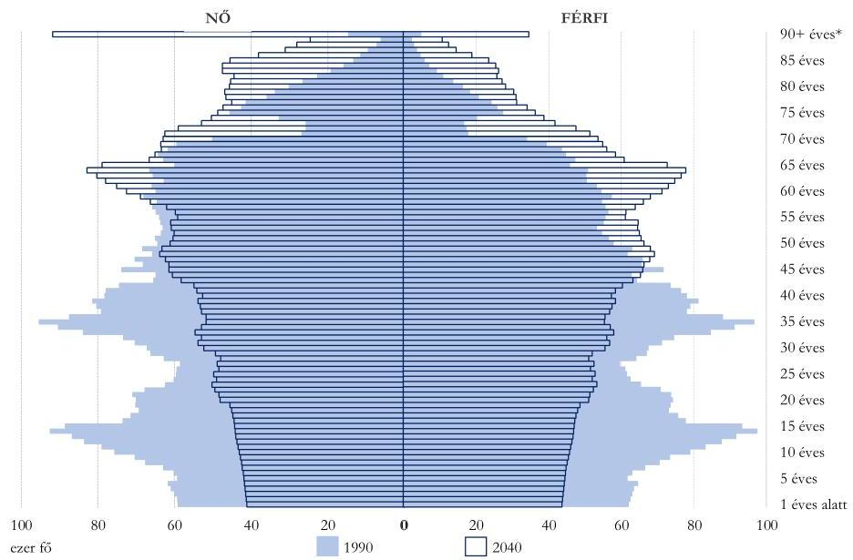
Forrás: KSH Statinfo (1990), EUROSTAT (2040)

Magyarország korfájának 1990 és 2040 között várható változása több demográfiai tényező – a csökkenő születésszám, a növekvő várható élettartam és a természetes fogyás – hatását tükrözi.⁸

A korfa 1990-ben még viszonylag kiegyensúlyozott korcsoportok szerinti eloszlást mutatott, a fiatalkorúak (0-14 évesek) aránya magasabb volt, de már ekkor is látszott a termékenységi ráta csökkenése miatt a korfa alsóbb rétegeinek szűkülése, viszont a 20-40 éves korosztály aránya még jelentős volt a Ratkó-korszak magasabb születésszámának köszönhetően.

A társadalom előregedését vetíti előre, hogy 2040-re az időskorúak aránya várhatóan drámaian növekedni fog, a várakozások szerint elérheti a 24,3%-ot, mindeközben a fiatalkorúak aránya – a folyamatosan alacsony termékenységi ráta miatt – tovább csökken, 2040-re várhatóan a népesség 13,9%-át teszi ki. A 15-64 éves – munkaképes – korosztály csökkenése komoly és határozott társadalmi, gazdasági alkalmazkodást igényel.

⁸ A 90 éves és azon felüliek korcsoportjára évenkénti megbontás nem állt rendelkezésre, ezért a 90 éves és azon felüliek korcsoportjába tartozók várható létszáma összesítve szerepel az ábrán.

72

---

Mellékletek

# V. SZ. MELLÉKLET: SZOCIÁLIS ALAPSZOLGÁLTATÁSOK BEMUTATÁSA

A szociális étkeztetés a Szoctv. előírása szerint minden települési önkormányzatnak lakosságszámtól függetlenül kötelező feladata volt. A szolgáltatás keretében azoknak a szociálisan rászoruló személyeknek kellett legalább napi egyszeri melegétkezést biztosítani, akik arra önmaguk, illetve eltartottjaik részére nem voltak képesek koruk, egészségi állapotuk vagy egyéb ok (fogyatékosság, pszichiátriai betegségük) miatt. Az étkeztetés igénybevételének szabályait az önkormányzat helyi rendeletben határozta meg. (Szoctv. 62. § (2) bek.)

A házi segítségnyújtás keretében a települési önkormányzatnak a szolgáltatást igénybe vevő személy saját lakókörnyezetében kellett biztosítania az önálló életvitel fenntartása érdekében szükséges ellátást (Szoctv. 63. § (1) bek.). A szolgáltatás gondozási szükséglet-vizsgálat után volt igénybe vehető, mely meghatározta, hogy szociális segítésre vagy – a szociális segítés tevékenységeit is magába foglaló – személyes gondozásra volt jogosult az igénylő. Szociális segítés keretében kellett biztosítani pl. a takarítást, a háztartási tevékenységben való közreműködést, a veszélyhelyzetek kialakulásának megelőzésében, elhárításában történő segítségnyújtást. Személyes gondozás keretében kellett biztosítani a gondozási és ápolási feladatok elvégzését, a szolgáltatást igénybevevők számának országos alakulását mutatja a 46. ábra.

46. ábra

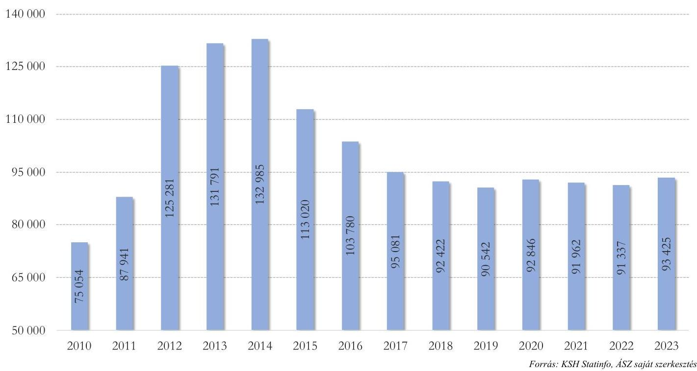
HÁZI SEGÍTSÉGNYÚJTÁST IGÉNYBEVEVŐK SZÁMÁNAK ALAKULÁSA 2010 ÉS 2023 KÖZÖTT (FŐ)

A jelzőrendszeres házi segítségnyújtás a saját otthonukban élő, egészségi állapotuk és szociális helyzetük miatt rászoruló, a segélyhívó készülék megfelelő használatára képes időskorú és fogyatékos személyek, illetve pszichiátriai betegek részére az önálló életvitel fenntartása során felmerülő krízishelyzetek elhárítása céljából nyújtott ellátási forma volt (Szoctv. 65. § (1) bek.).

A jelzőrendszeres házi segítségnyújtás biztosítása állami feladat volt, a szolgáltatást igénybevevők számának országos alakulását mutatja a 47. ábra.

73

---

Mellékletek

47. ábra

JELZŐRENDSZERES HÁZI SEGÍTSÉGNYÚJTÁST IGÉNYBEVEVŐK SZÁMÁNAK ALAKULÁSA
2010 ÉS 2023 KÖZÖTT (FŐ)

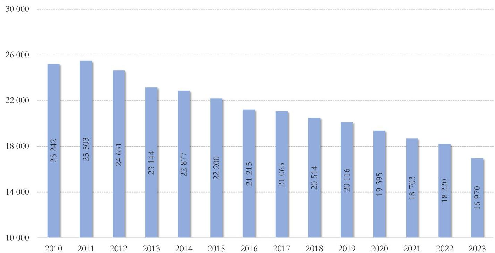

Forrás: KSH Statinfo, ÁSZ saját szerkesztés

Az idősek nappali ellátása szolgáltatás célja volt, hogy lehetőséget biztosítson időskorúak számára otthonuk fenntartása mellett napközbeni tartózkodásra, társas kapcsolatok fenntartására, az alapvető higiéniai szükségleteik kielégítésére és napközbeni étkeztetésre (Szoctv. 65/F. § (1) bek.). A szolgáltatások körébe tartozott többek között a szabadidős programok szervezése, az egészségügyi alapellátáshoz és a szakellátásokhoz való hozzájutás segítése, életviteli tanácsadás, segítségnyújtás hivatalos ügyek intézésében. Speciális formája volt a demenciával élők nappali ellátása, melynek célja, hogy az enyhe, illetve középsúlyos demencia körképpel küzdők állapotuknak és a speciális szükségleteiknek megfelelő szolgáltatásban részesüljenek. Célja volt továbbá az izoláció megszüntetése, az életminőség megőrzése vagy javítása, a biztonságos és tevékeny időtöltés, mindezek mellett az állapotromlás késleltetése és a gondozó családtagok tehermentesítése.

Minden háromezer főnél több állandó lakossal rendelkező települési önkormányzat a területén köteles volt idősek nappali ellátását biztosítani (Szoctv. 86. § (2) bekezdés b) pont), a szolgáltatást igénybevevők számának országos alakulását mutatja a 48. ábra.

74

---

Mellékletek

48. ábra

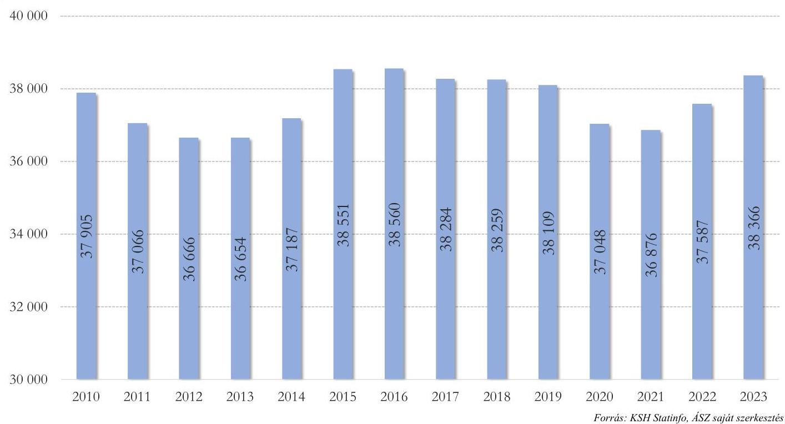
IDŐSEK NAPPALI ELLÁTÁSÁT IGÉNYBEVEVŐK SZÁMÁNAK ALAKULÁSA 2010 ÉS 2023 KÖZÖTT (FŐ)

Forrás: KSH Statinfo, ÁSZ saját szerkesztés

A falugondnoki, illetve tanyagondnoki szolgáltatás célja volt az aprófalvak és a külterületi, valamint a tanyasi lakott helyek intézményhiányából és a közösségi közlekedés nehézségeiből eredő hátrányainak enyhítése, az alapvető szükségletek kielégítését segítő szolgáltatásokhoz, közszolgáltatáshoz való hozzájutás biztosítása. A feladatok nem voltak pontosan rögzítve, azt az önkormányzatok helyi rendeletben szabályozták, sok településen a szállítási feladatok mellett az étkeztetést és a házi segítségnyújtást is a falugondnok látta el (Szoctv. 60. §).

75

---

Mellékletek

## VI. SZ. MELLÉKLET: INTÉZMÉNYEK FENNTARTÓK SZERINTI BEMUTATÁSA

## ÖNKORMÁNYZATI FENNTARTÓK ÉS INTÉZMÉNYEIK

2012-ben az önkormányzati konszolidáció keretében az állam átvette a megyei önkormányzatoktól a területi ellátási kötelezettséggel működtetett szakellátást nyújtó intézményeket (ez alól a budapesti idősotthonok jelentettek kivételt, azok fenntartója továbbra is a Fővárosi Önkormányzat maradt).

Az intézményátadások ellenére továbbra is az önkormányzati szektor a legnagyobb ellátó a rendszerben, az önkormányzati fenntartású intézményekben ellátottak számát és a férőhelyek alakulását a 49. ábra mutatja.

49. ábra

ÖNKORMÁNYZATI FENNTARTÁSÚ TARTÓS ÉS ÁTMENETI BENTLAKÁSOS IDŐSEK OTTHONA FÉRŐHELYEINEK ÉS ELLÁTOTTI SZÁMÁNAK ALAKULÁSA 2010 ÉS 2023 KÖZÖTT (FŐ)

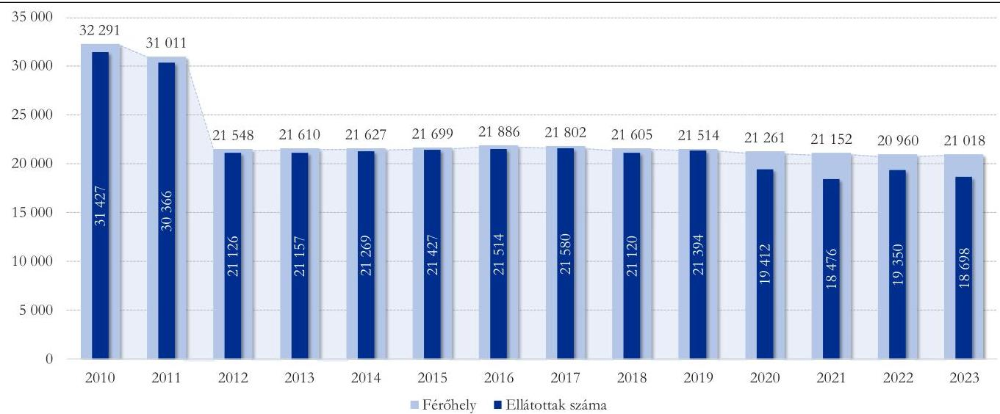

Forrás: KSH adatai alapján, ÁSZ saját szerkesztés

## ÁLLAMI FENNTARTÓK ÉS INTÉZMÉNYEIK

2013-ban a szakellátást nyújtó állami fenntartású intézmények átkerültek az újonnan alapított SZGYF fenntartásába, amely intézmény napjainkban is ellátja az állami idősotthonok fenntartói feladatait. Az ellátotti létszám és a férőhelyek alakulását a 50. ábra mutatja.

50. ábra

ÁLLAMI FENNTARTÁSÚ TARTÓS ÉS ÁTMENETI BENTLAKÁSOS IDŐSEK OTTHONA FÉRŐHELYEINEK ÉS ELLÁTOTTI SZÁMÁNAK ALAKULÁSA 2010 ÉS 2023 KÖZÖTT (FŐ)

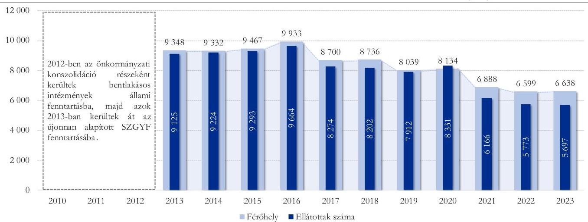

Forrás: KSH adatai alapján, ÁSZ saját szerkesztés

---

Mellékletek

A Szoctv. értelmében nem állami, nem önkormányzati és nem egyházi fenntartó is létrehozhat szociális szakellátás végzésére intézményt.

## EGYHÁZI FENNTARTÓK ÉS INTÉZMÉNYEIK

Az egyházi fenntartású intézmények férőhelyeinek és ellátotti számának alakulását a 51. ábra mutatja.

51. ábra

EGYHÁZI FENNTARTÁSÚ TARTÓS ÉS ÁTMENETI BENTLAKÁSOS IDŐSEK OTTHONA FÉRŐHELYEINEK ÉS ELLÁTOTTI SZÁMÁNAK ALAKULÁSA 2010 ÉS 2023 KÖZÖTT (FŐ)
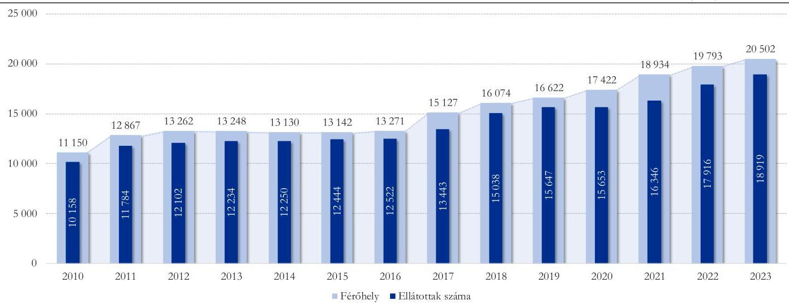
Forrás: KSH adatai alapján, ÁSZ saját szerkesztés

## EGYÉB NEM ÁLLAMI ÉS NEM EGYHÁZI FENNTARTÓK

Az egyéb nem állami és nem egyházi fenntartású intézmények férőhelyeinek és ellátotti számának alakulását a 52. ábra mutatja.

52. ábra

EGYÉB NEM ÁLLAMI ÉS NEM EGYHÁZI FENNTARTÁSÚ TARTÓS ÉS ÁTMENETI BENTLAKÁSOS IDŐSEK OTTHONA FÉRŐHELYEINEK ÉS ELLÁTOTTI SZÁMÁNAK ALAKULÁSA 2010 ÉS 2023 KÖZÖTT (FŐ)
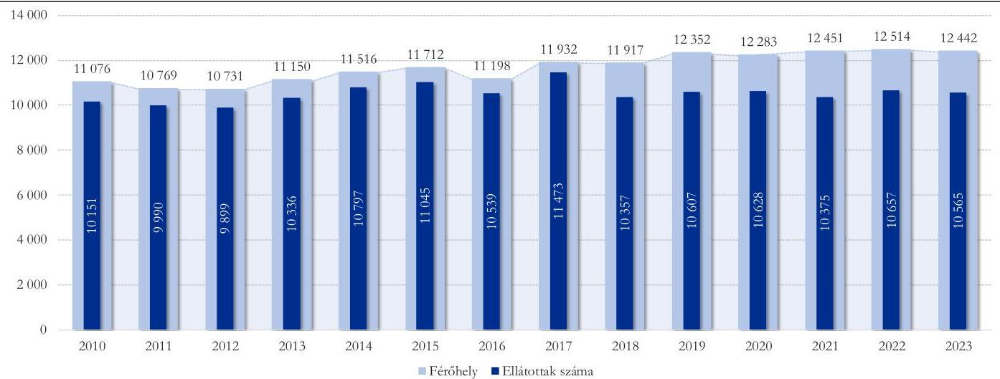
Forrás: KSH adatai alapján, ÁSZ saját szerkesztés

---

FÜGGELÉK: ÉSZREVÉTELEK

A jelentéstervezetet a Számvevőszék 15 napos észrevételezésre megküldte az ellenőrzött szervezet vezetőjének az ÁSZ tv. 29. §* (1) bekezdése előírásának megfelelően.

A jelentéstervezet megállapításaira a Belügyminisztérium és a Magyar Államkincstár nem tett észrevételt.

A jelentéstervezet megállapításaira észrevételt tett a Nemzetgazdasági Minisztérium (a Pénzügyminisztérium jogutódjaként), valamint a Slachta Margit Nemzeti Szociálpolitikai Intézet vezetője.

Az elfogadott észrevételek alapján a Számvevőszék módosította a jelentést.

A függelék tartalmazza az ellenőrzött észrevételeit, illetve az el nem fogadott észrevételek elutasításának indoklását.

# A NEMZETGAZDASÁGI MINISZTER EL NEM FOGADOTT ÉSZREVÉTELEI:

## 1. észrevétellel érintett javaslat (jelentéstervezet 64. oldala)

„Az államháztartásért felelős miniszter részére (...)

Gondoskodjon a központi költségvetésről és annak végrehajtásáról szóló törvényekben, illetve azok indokolásában a szociális igazgatásról és szociális ellátásokról szóló 1993. évi III. törvényben (a továbbiakban: Szoctv.) nevesített szolgáltatásokhoz biztosított költségvetési támogatások és feladatmutatók átláthatóságáról.”

## Észrevétel:

„A jelentésben jelzett szociális szolgáltatások támogatására vonatkozó részletesebb tájékoztatásnak nincs normatív tartalma, ezért az a költségvetési és a zárszámadási törvények normaszövegét nem érinti. A részletesebb tájékoztatásnak nem látom akadályát, azonban azokat az ún. fejezeti szöveges indokolások tartalmazhatják, amit szintén az adott szaktárca készít el.”

Mindezek alapján az államháztartásért felelős miniszter – tárcája felelősségének feltüntetése mellett – javasolja a részére megfogalmazott 2. pontot a szociálpolitikáért felelős miniszternél megjeleníteni.

## ÁSZ álláspontja:

Magyarország Alaptörvénye előírja, hogy a központi költségvetésről és az annak végrehajtásáról szóló törvényjavaslatoknak azonos szerkezetben, átlátható módon és ésszerű részletességgel kell tartalmazniuk az

* 29. § (1) Az Állami Számvevőszék az ellenőrzési megállapításait megküldi az ellenőrzött szervezet vezetőjének vagy az általa megbízott személynek, és annak, akinek személyes felelősségét állapította meg.
(2) Az ellenőrzött szervezet vezetője és a felelősként megjelölt személy az ellenőrzés megállapításaira tizenöt napon belül írásban észrevételt tehet.
(3) Az Állami Számvevőszék az észrevételre a beérkezésétől számított harminc napon belül írásban válaszol. A figyelembe nem vett észrevételeket köteles a jelentésben feltüntetni, és megindokolni, hogy azokat miért nem fogadta el.

78

---

Függelék: Észrevételek

állami kiadásokat és bevételket. Az Állami Számvevőszék véleménye szerint ennek a követelménynek való megfelelésben előrelépést jelentene, ha a szociális szolgáltatások kiadásai – még ha eltérő fejezetben is szerepelnek – összehasonlítható módon kerülnének bemutatásra, függetlenül attól, hogy a szolgáltatást milyen fenntartótípus biztosítja. Tekintettel arra, hogy az Áht. 13. §-a, valamint a Statútum 111/M. § (1) bekezdése értelmében az államháztartásért felelős miniszter feladatkörébe tartozik a központi költségvetésről és annak végrehajtásáról szóló törvények előkészítése (ideértve azok egységes összeállítását előíró útmutatók elkészítését), továbbá hozzáféréssel rendelkezik az irányítása alá tartozó Magyar Államkincstár által működtetett információs rendszerekhez (melyeken keresztül valamennyi támogatásra rálátással bír), véleményünk szerint feladatköréből adódóan az államháztartásért felelős miniszter tehet az átláthatóság javításáért a legtöbbet.

Mindezeket figyelembe véve a jelentéstervezet módosítása nem indokolt.

## 2. észrevétellel érintett megállapítás (jelentéstervezet 35. oldala)

„A finanszírozási rendszer és az állami támogatások rendszere a működés finanszírozására, illetve az ahhoz való hozzájárulásra szorítkozott, infrastrukturális és tárgyi feltételek megőrzésére nem terjedt ki. Egyes fenntartótípusoknak lehetőségük nyílt – nem szociális témájú – pályázatokból beruházási, felújítási forráshoz jutni, azonban ezek az ellátórendszer intézményeinek tervszerű állagmegóvását, felújítását nem biztosították.”

### Észrevétel:

A 35. oldalon található kijelentés szerint a finanszírozási rendszer és az állami támogatások rendszere a működés finanszírozására, illetve az ahhoz való hozzájárulásra szorítkozott, az infrastrukturális és tárgyi feltételek megőrzésére nem terjedt ki. Ezzel összefüggésben felhívom arra a figyelmet, hogy az állami fenntartó finanszírozása – ahogy a jelentés is kitér rá – ún. bázisalapon történik, vagyis a teljesített kiadások mögött a központi költségvetés áll, finanszírozása kiegyensúlyozottnak tekinthető, év végén a Szociális és Gyermekvédelmi Főigazgatóság tartozásállománnyal gyakorlatilag nem rendelkezik. Az állami fenntartó esetében az érintett tárcák figyelemmel vannak az infrastrukturális kérdésekre, hiszen a Belügyminisztérium fejezet, 3. Szociális és gyermekvédelmi intézményrendszer cím, 1. Szociális és gyermekvédelmi, gyermekjóléti feladatellátás és irányítás intézményei alcím felhalmozási kiadásai között található az ún. vis maior alap, ami többek között ilyen célokra is felhasználható. Az egyéb fenntartók finanszírozását illetően arra hívom fel a figyelmet, hogy a költségvetési támogatás a feladatellátáshoz nyújtott hozzájárulás, aminek nem célja a költségek teljeskörű biztosítása, hiszen a nem állami fenntartóknak jogszabály nem írja elő a szolgáltatás kötelező biztosítását, hanem azt saját elhatározásukból nyújtják. Kérem az erre való utalás megjelenítését a szövegben vagy jegyzetben.”

### ÁSZ álláspontja:

Az Állami Számvevőszék általánosságban állapította meg a finanszírozási rendszerről, annak alapelv szerinti működéséről, hogy az az infrastrukturális és tárgyi feltételek megőrzésére nem terjedt ki. A megállapítást a jogszabályi környezet és az ellenőrzés rendelkezésére bocsátott ellenőrzési bizonyítékok egyaránt alátámasztják.

A Miniszter úr által hivatkozott „vis maior alap” nem a tárgyi feltételek tervszerű fenntartását szolgálja, hanem valamennyi állami fenntartásban lévő szociális és gyermekvédelmi intézmény esetében nyújt fedezetet az előre nem látható, elkerülhetetlen események elhárítására.

Mindezeket figyelembe véve a jelentéstervezet módosítása nem indokolt.

## 3. észrevétellel érintett megállapítás (jelentéstervezet 41. és 55. oldala)

„A szerteágazó támogatási jogcímek és jogosultság feltételek korlátozták az egyes fenntartótípusok finanszírozásának összehasonlíthatóságát és finanszírozási helyzetének nyomon követését. Az ÁSZ célszerűnek tartja a bentlakásos idősektárakról részletekbe menő adatok gyűjtését, elemzését (bevételtemelő képesség, a különböző típusú és színvonalú ellátások személyi és tárgyi feltételei,

79

---

Függelék: Észrevételek

illetve az azokhoz kapcsolódó kiadások, az ellátásban részesülők és várakozók pénzügyi-jövedelmi helyzete, ellátási szükségletei stb.). Ezen információk által lebetségessé válik egyfelől a finanszírozási rendszer eltérései indokoltságának folyamatos kontrollja, másfelől a finanszírozási rendszer szociálpolitikai célokhoz, vagy az egyes fenntartótípusok finanszírozási szükségletéhez igazítása.”

„Az egyházi intézmények kiadásairól, bevételeiről – ideértve a belépési hozzájárulás és a térítési díj bevételeket is – nem álltak rendelkezésre adatok, így nincs információ arról, hogy az egyházi szervezetek támogatása milyen arányban fedezte a kiadásokat.”

### Észrevétel:

„A jelentés 41. oldala felveti, hogy az ÁSZ célszerűnek tartja az időskori bentlakásos ellátásokról részletekbe menő adatok gyűjtését, elemzését. A célkitűzéssel egyetértve megjegyzem, hogy az államháztartásért felelős miniszternek nincs joga és eszköze a költségvetési támogatásokon kívüli források, kiadások elemzésére (ellenőrzésére) – különösen a nem állami fenntartói kört (ideértve az egyházi fenntartókat is) illetően –, ezért az csak önkéntes adatszolgáltatáson alapulhat, ami újabb kockázatot vet fel. Ugyanez mondható el a tervezet 55. oldala szerinti azon megjegyzésről is, miszerint nincs információ arról, hogy az egyházi szervezetek támogatása milyen arányban fedezte a kiadásokat.”

### ÁSZ álláspontja:

A költségvetési támogatásban részesülő nem állami, egyházi fenntartók szociális intézményeik útján közfeladatot látnak el (Áht. 3/A. §, Szoctv. 2. §, 58/A. § 120. §). Az információs önrendelkezési jogról és az információszabadságról szóló 2011. évi CXII. törvény (a továbbiakban: Infotv.) 3. § 5. pontja értelmében közérdekű adatnak minősül az állami vagy helyi önkormányzati feladatot, valamint jogszabályban meghatározott egyéb közfeladatot ellátó szerv kezelésében lévő és tevékenységére vonatkozó vagy közfeladatának ellátásával összefüggésben keletkezett, a személyes adat fogalma alá nem eső, bármilyen módon vagy formában rögzített információ vagy ismeret, függetlenül kezelésének módjától, önálló vagy gyűjteményes jellegétől, így különösen a hatáskörre, illetékességre, szervezeti felépítésre, szakmai tevékenységre, annak eredményességére is kiterjedő értékelésére, a birtokolt adatfajtákra és a működést szabályozó jogszabályokra, valamint a gazdálkodásra, a megkötött szerződésekre vonatkozó adat. Az Infotv. 26. § (1) bekezdése értelmében a közfeladatot ellátó szervnek lehetővé kell tennie, hogy a kezelésében lévő közérdekű adatot és közérdekből nyilvános adatot – a törvényben meghatározott kivételekkel – erre irányuló igény alapján bárki megismerhesse. Mindezeken felül a Szoctv. 20/B. §-a felhatalmazza az államháztartásért felelős miniszter irányítása alá tartozó Magyar Államkincstárt, hogy a szociális szolgáltatás rendszerének és finanszírozásának tervezhetősége érdekében országos jelentési rendszert vezessen, melyhez a fenntartó köteles adatot szolgáltatni. Az ellenőrzés megállapította, hogy az országos jelentési rendszer biztosította adatgyűjtési lehetőség az ellenőrzött időszakban kihasználatlan volt.

Mindezekre tekintettel a jelentéstervezet módosítása nem indokolt.

## A SLACHTA MARGIT NEMZETI SZOCIÁLPOLITIKAI INTÉZET FŐIGAZGATÓJA EL NEM FOGADOTT ÉSZREVÉTELEI:

### 1. észrevétellel érintett megállapítás (jelentéstervezet 60. oldala)

„A portálon a feltöltött tartalmak nem voltak naprakészek, ezen túl az időskori bentlakásos ellátást érintő jogszabályok által előírt közzétételnek nem teljeskörűen jelentek meg (10. táblázat).”

### Észrevétel:

„Kérjük figyelembe venni és a megállapítást annak függvényében kiegészíteni, hogy egyes információk

80

---

Függelék: Észrevételek

megjelentetése a SZÁP-on csak akkor lehetséges, ha az információnyújtásra kötelezett megküldi az adott adatokat az NSZI részére.”

## ÁSZ álláspontja:

Az ellenőrzés és a jelentéstervezetben szereplő megállapítás nem terjedt ki arra, hogy a tartalmi hiányosságok mögött mely szervezetek, személyek mulasztásai húzódnak meg, ezért a megállapítás módosítása nem indokolt.

## 2. észrevétellel érintett javaslat és kapcsolódó megállapítás (jelentéstervezet 60. és 64. oldala)

„Intézkedjen a szociális portálon jogszabályok alapján előírt adatok és információk teljeskörű közzétételéről”

## Észrevétel:

„Az NSZI részére megfogalmazott fentebbi intézkedési javaslat esetében (összefüggésben a jelentéstervezet 10. táblázatával), kérjük figyelembe venni az alábbiakat.

|   | Előírt tartalom | Elérhetőség | NSZI észrevétel  |
| --- | --- | --- | --- |
|  a) | Szolgáltatói nyilvántartás adatai (Szoctv. 92/K: § (4a) bek.), valamint 369/2013. (X. 24.) Korm. rendelet 1. sz. melléklete) | ☑/☐ | „A Kormány a szolgáltatói nyilvántartás vezető szervnek a Magyar Államkincstár központi szervét jelölte ki. A Központ nélkül nincs lehetőség további adatok megjelenítésére a SZÁP-on”  |
|  b) | Működést engedélyező szerv által közhírre tett, a szolgáltatót, illetve a nyújtott szolgáltatást érintő hatósági döntések, hatósági szerződések (Szoctv. 92/K. § (8)-(10) bek.) | ☑/☐ | „369/2013. (X. 24.) Korm. 43/A. § (1) értelmében: Az Szt. 92/K. § (8)-(10) bekezdése és a Gyvt. 98. § (11)-(14) bekezdése szerinti közhírre tételről az Intézet gondoskodik. (2) A működést engedélyező szerv a közhírre tételre kerülő adatokról - a Szociális Ágazati Portálon közzétett formában - haladéktalanul értesíti az Intézetet.”  |
|  c) | Országos jelentési rendszer adatai (415/2015. (XII. 23.) Korm. rend. 14. § (1) bekezdés) | ☐ | „Az adatokkal a Magyar Államkincstár rendelkezik. A hivatkozott jogszabály a Magyar Államkincstárra vonatkoztat kötelezettséget. A MÁK adatszolgáltatása nélkül az NSZI nem tudja az adatokat megjelentetni a SZÁP-on.”  |

## ÁSZ álláspontja:

Főigazgató úr által tett a)-c) pontok szerinti észrevételek vonatkozásában általánosságban megjegyezzük, hogy az ellenőrzés és a jelentésben szereplő megállapítás nem terjedt ki arra, hogy a hiányosságok mögött mely szervezetek, személyek mulasztásai húzódnak meg, az adatok, információk elérhetőségének részleges vagy teljes hiánya tényként került megállapításra.

Az Állami Számvevőszék álláspontja az egyes észrevételekkel kapcsolatban:

a) Az észrevétel nem vitatja a táblázat sorának tartalmát, ahhoz megjegyzést fűz, emiatt a táblázatban szereplő megállapítás módosítása nem indokolt.

b) A hivatkozott jogszabály nem érinti a táblázat vonatkozó sorának tartalmát, emiatt a táblázatban szereplő megállapítás módosítása nem indokolt.

c) Az észrevétel nem vitatja a táblázat sorának tartalmát, ahhoz megjegyzést fűz, emiatt a táblázatban szereplő megállapítás módosítása nem indokolt.

## 3. észrevétellel érintett megállapítás (jelentéstervezet 61. oldala)

„...a menürendszer felépítése nem volt logikus, következetes; egyes menüpontok elnevezése nem volt összhangban az adott menü tartalmával, továbbá a portál láblécében kialakításra került egy több mint 60 elemet számláló menüsor, ahol a különböző típusú információk csoportosítás, tartalmi szekciókra bontás nélkül voltak listázva.”

---

Függelék: Észrevételek

## Észrevétel:

„Az Ágazati Portál láblécében megjelenő menüsor nem „fejlesztés részeként” került kialakításra, hanem beállítási problémából adódóan vált láthatóvá. A problémát azóta orvosoltuk.”

## ÁSZ álláspontja:

A megállapítás tartalmát az észrevétel nem vitatja, ezért a megállapítás módosítása nem indokolt.

82

---

RÖVIDÍTÉSEK JEGYZÉKE

1. ÁSZ
2. ÁSZ tv.
3. költségvetési törvény

Állami Számvevőszék
2011. évi LXVI. törvény az Állami Számvevőszékről
Magyarország központi költségvetéséről szóló törvények, az ellenőrzött időszakban:
2017. évi C. törvény Magyarország 2018. évi központi költségvetéséről
2018. évi L. törvény Magyarország 2019. évi központi költségvetéséről
2019. évi LXXI. törvény Magyarország 2020. évi központi költségvetéséről
2020. évi XC. törvény Magyarország 2021. évi központi költségvetéséről
2021. évi XC. törvény Magyarország 2022. évi központi költségvetéséről
2022. évi XXV. törvény Magyarország 2023. évi központi költségvetéséről
2023. évi LV. törvény Magyarország 2024. évi központi költségvetéséről
2024. évi XC. törvény Magyarország 2025. évi központi költségvetéséről

4. Alaptörvény
5. Szoctv.
6. Kormány
7. Miniszter
8. Minisztérium

9. 369/2013. (X. 24.) Korm. rendelet

10. NSZI
11. 1/2000. (I. 7.) SzCsM rendelet
12. államháztartásért felelős minisztérium
13. 36/2007. (XII. 22.) SZMM rendelet
14. Szolgáltatói nyilvántartás
15. 86/2019. (IV. 23.) Korm. rendelet
16. 568/2022. (XII. 23.) Korm. rendelet
17. Kincstár
18. NRSZH
19. SZGYF
20. 610/2020. (XII. 18.) Korm. rendelet
21. EFOP Plusz
22. TOP Plusz
23. Ehtv.
24. 415/2015. (XII. 23.) Korm. rendelet
25. Mótv.

26. 2022. május 24-ig az Emberi Erőforrások Minisztériuma, 2022. május 25-től a Belügyminisztérium
369/2013. (X. 24.) Korm. rendelet a szociális, gyermekjóléti és gyermekvédelmi szolgáltatók, intézmények és hálózatok hatósági nyilvántartásáról és ellenőrzéséről
Slachta Margit Nemzeti Szociálpolitikai Intézet
1/2000. (I. 7.) SzCsM rendelet a személyes gondoskodást nyújtó szociális intézmények szakmai feladatairól és működésük feltételeiről
2024. december 31-éig Pénzügyminisztérium, 2025. január 1-jétől Nemzetgazdasági Minisztérium
36/2007. (XII. 22.) SZMM rendelet a gondozási szükséglet, valamint az egészségi állapoton alapuló szociális rászorultság vizsgálatának és igazolásának részletes szabályairól
Szolgáltatói Nyilvántartási Rendszer a szociális, gyermekjóléti és gyermekvédelmi szolgáltatók, intézmények és hálózatok közhitelés hatósági nyilvántartására, korábbi elnevezése MÜKENG adatbázis.
86/2019. (IV. 23.) Korm. rendelet a fővárosi és megyei kormányhivatalokról, valamint a járási (fővárosi kerületi) hivatalokról
568/2022. (XII. 23.) Korm. rendelet a fővárosi és vármegyei kormányhivatalokról, valamint a járási (fővárosi kerületi) hivatalokról

Magyar Államkincstár
Nemzeti Rehabilitációs és Szociális Hivatal
Szociális és Gyermekvédelmi Főigazgatóság
610/2020. (XII. 18.) Korm. rendelet a Nemzeti Szociálpolitikai Intézetről
Emberi Erőforrás Fejlesztési Operatív Program Plusz
Terület- és Településfejlesztési Operatív Program Plusz
2011. évi CCVI. törvény a lelkiismereti és vallásszabadság jogáról, valamint az egyházak, vallásfelekezetek és vallási közösségek jogállásáról
415/2015. (XII. 23.) Korm. rendelet a szociális, gyermekjóléti és gyermekvédelmi igénybevevői nyilvántartásról és az országos jelentési rendszerről
2011. évi CLXXXIX. törvény Magyarország helyi önkormányzatairól

83

---

Rövidítések jegyzéke

26 14/2023. (V. 31.) BM rendelet
14/2023. (V. 31.) BM rendelet a szakápolás átalakításához szükséges intézményi kijelölésekről

27 GDP
gross domestic product: bruttó hazai termék

28 zárszámadási törvény
Magyarország központi költségvetéséről szóló törvény végrehajtásáról szóló törvény, az ellenőrzött időszakban:
2019. évi LXXIX. törvény a Magyarország 2018. évi központi költségvetéséről szóló 2017. évi C. törvény végrehajtásáról
2020. évi CXVII. törvény a Magyarország 2019. évi központi költségvetéséről szóló 2018. évi L. törvény végrehajtásáról
2021. évi CXVI. törvény a Magyarország 2020. évi központi költségvetéséről szóló 2019. évi LXXI. törvény végrehajtásáról
2022. évi LXXII. törvény a Magyarország 2021. évi központi költségvetéséről szóló 2020. évi XC. törvény végrehajtásáról
2023. évi LXXIII. törvény a Magyarország 2022. évi központi költségvetéséről szóló 2021. évi XC. törvény végrehajtásáról
2024. évi XLVIII. törvény a Magyarország 2023. évi központi költségvetéséről szóló 2022. évi XXV. törvény végrehajtásáról

29 Kjt.
1992. évi XXXIII. törvény a közalkalmazottak jogállásáról

30 Kjtvhr.
257/2000. (XII. 26.) Korm. rendelet a közalkalmazottak jogállásáról szóló 1992. évi XXXIII. törvénynek a szociális, valamint a gyermekjóléti és gyermekvédelmi ágazatban történő végrehajtásáról

31 9/1999. (XI. 24.) SzCsM rendelet
A személyes gondoskodást nyújtó szociális ellátások igénybevételéről szóló 9/1999. (XI. 24.) SzCsM rendelet

32 Átr.
489/2013. (XII. 18.) Korm. rendelet az egyházi és nem állami fenntartású szociális, gyermekjóléti és gyermekvédelmi szolgáltatók, intézmények és hálózatok állami támogatásáról

33 OSZIR
Országos Szociális Információs Rendszer

34 KENYSZI
Központi Elektronikus Nyilvántartás a Szolgáltatást Igénybevevőkről

35 EBR42
web-alapú, pénzügyi–kontrolling-számviteli feladatokat ellátó, folyamatkövető információs rendszer, a helyi önkormányzatok és többcélú kistérségi társulások normatív hozzájárulásainak, normatív, kötött felhasználású támogatásainak és egyes pályázati támogatásainak igénylési rendszere

36 Ávr.
368/2011. (XII. 31.) Korm. rendelet az államháztartásról szóló törvény végrehajtásáról

37 KTM
Közigazgatási és Területfejlesztési Minisztérium

38 OSAP
a KSH Országos Statisztikai Adatfelvételi Programja

39 SZÁP
Szociális Ágazati Portál

40 számviteli törvény
2000. évi C. törvény a számvitelről

84

---

ÁLLAMI SZÁMVEVŐSZÉK

1052 Budapest, Apáczai Csere János u. 10. | 1364 Budapest 4., Pf. 54

www.asz.hu | szamvevoszek@asz.hu

telefon: +36 1 484 9100