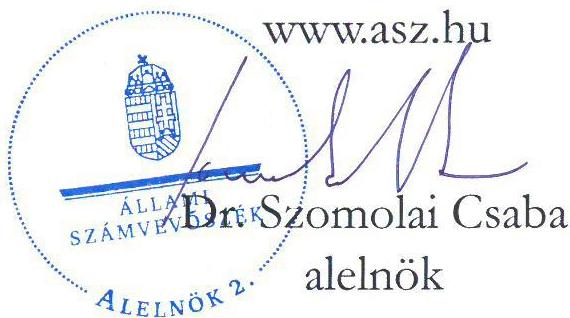

ÁLLAMI SZÁMVEVŐSZÉK

# JELENTÉS

A többségi állami tulajdonban lévő gazdasági társaságok beszerzéseinek ellenőrzése

Öreglaki Vadfeldolgozó Korlátolt Felelősségű Társaság

2025.

25103

www.asz.hu

---

ÁLLAMI SZÁMVEVŐSZÉK

# JELENTÉS

A többségi állami tulajdonban lévő gazdasági társaságok beszerzéseinek ellenőrzése

Öreglaki Vadfeldolgozó Korlátolt Felelősségű Társaság

2025.

25103

---

Jelentéseink az interneten a www.asz.hu címen olvashatók.

ELLENŐRZÉSI IGAZGATÓSÁG:
ELLENŐRZÉSI IGAZGATÓSÁG III.

ELLENŐRZÉSI IGAZGATÓ:
HERCZEGH ZSOLT igazgató

ELLENŐRZÉSVEZETŐ:
IMRE ZSUZSANNA ellenőrzésvezető

IKTATÓSZÁM: EL-4213-002/2025
TÉMASORSZÁM: 34/2025
ELLENŐRZÉS-AZONOSÍTÓ SZÁM: V113509

---

TARTALOMJEGYZÉK

- AZ ELLENŐRZÉS EREDMÉNYEI ... 5
1. Az ellenőrzött beszerzés megfelelőségének értékelése ... 5
- JAVASLATOK ... 9
- I. FÜGGELÉK: ÉSZREVÉTELEK ... 10
- II. FÜGGELÉK: ELLENŐRZÉSI MEGKÖZELÍTÉS ... 11
- MELLÉKLETEK ... 15
I. sz. melléklet: Értelmező szótár ... 15
- RÖVIDÍTÉSEK JEGYZÉKE ... 16

---

.

---

5

# AZ ELLENŐRZÉS EREDMÉNYEI

A Magyar Állam tulajdonában lévő gazdasági társaságok gazdálkodása során a nemzeti vagyonnal való felelős gazdálkodás alapvető követelmény és egyben jogszabályi előírás. A nemzeti vagyongazdálkodás alapvető feladata a nemzeti vagyon megőrzése, értékének és állagának védelme. A gazdasági társaságok önálló és felelős gazdálkodása során a jogszabályokban meghatározott előírásoknak, valamint az azokkal összhangban lévő belső szabályzatoknak maradéktalanul szükséges megfelelni.

A gazdasági társaságokkal szemben elvárás, hogy a beruházásaikat, beszerzéseiket ezen előírások mentén a törvényesség, célszerűség és eredményesség követelményei szerint végezzék.

Az Öreglaki Vadfeldolgozó Kft.¹ közvetett állami tulajdonú gazdasági társaságként több állami erdészeti és vadászati gazdasági társaság tulajdonában áll. Fő tevékenysége a lőtt nagyvad felvásárlása, feldolgozása és értékesítése.

Az ÁSZ² az ellenőrzés keretében vizsgálta és értékelte az Öreglaki Vadfeldolgozó Kft. által 2023. évben megvalósított hűtőrendszer korszerűsítés beruházáshoz kapcsolódó beszerzés megfelelőségét.

Az Öreglaki Vadfeldolgozó Kft. a beszerzéseire vonatkozóan a kontrollkörnyezetet az ellenőrzött időszakban kialakította, megfelelve a Gbkr.³ előírásaiban foglaltaknak.

A hűtőrendszer korszerűsítés beszerzésére irányuló döntés megfelelt a Társasági Szerződésben⁴ foglaltaknak, szabályszerű, megalapozott és célszerű volt.

Az Öreglaki Vadfeldolgozó Kft.-nél az ellenőrzött beszerzéshez kapcsolódó ajánlatkérés, a szerződő partner kiválasztása, valamint a Kivitelezési szerződés⁵ megkötése szabályszerű volt, megfelelt a Beszerzési és beruházási szabályzatban⁶ foglaltaknak.

A megvalósított hűtőrendszer korszerűsítés a Társaság⁷ tevékenységéből adódóan szükséges volt, a feladatellátása során hasznosul, betölti a funkcióját, így eredményes volt. Az ellenőrzés ugyanakkor a beruházás előrehaladását, a teljesítésigazolásokat érintő dokumentálási hiányosságokat tárt fel, melyek a beruházás megvalósítását, eredményességét alapvetően nem befolyásolták, így az Öreglaki Vadfeldolgozó Kft. hűtőrendszer korszerűsítést célzó beruházási célú beszerzése összességében megfelelő volt.

## 1. Az ellenőrzött beszerzés megfelelőségének értékelése

### Összegző megállapítás

Az Öreglaki Vadfeldolgozó Kft. hűtőrendszer korszerűsítés beszerzésére irányuló döntése megfelelő, a Kivitelezési szerződés megkötése szabályszerű volt, azonban az ÁSZ a beruházás előrehaladásához és befejezéséhez kapcsolódó teljesítésigazolásokat érintő dokumentálási hiányosságokat tárt fel, melyek a beruházás megvalósítását, eredményességét alapvetően nem befolyásolták, így a beruházási célú beszerzés összességében megfelelő volt. Az Öreglaki Vadfeldolgozó Kft. nem tett eleget az Info tv.⁸-ben meghatározott közzétételi kötelezettségének.

---

Az ellenőrzés eredményei

# BESZERZÉSHEZ KAPCSOLÓDÓ BELSŐ SZABÁLYOZÓ ESZKÖZÖK

Az Öreglaki Vadfeldolgozó Kft. a beszerzéseire vonatkozóan a kontrollkörnyezetet az ellenőrzött időszakban a Társasági Szerződés, a Szervezeti és működési szabályzat³, valamint a Beszerzési és beruházási szabályzat megalkotásával biztosította, megfelelve a Gbkr. előírásaiban foglaltaknak.

A Társaság a Társasági Szerződésben, valamint a Szervezeti és működési szabályzatban rögzítette a szerződés megkötésének jóváhagyására, illetve a szerződéskötésre vonatkozó jogosultságokat. A Beszerzési és beruházási szabályzatban rendelkeztek többek között a szerződések kötelező tartalmi elemeiről, a beruházási terv elkészítésének szabályairól, a szállító kiválasztásának irányelveiről, a pályázatási eljárás szabályairól, a beszerzés jóváhagyásának folyamatáról és a számlázásra, teljesítésigazolásra vonatkozó előírásokról.

# A BESZERZÉSI DÖNTÉS MEGALAPOZOTTSÁGA

Az Öreglaki Vadfeldolgozó Kft. által az ellenőrzött időszakban végrehajtott hűtőrendszer korszerűsítést az Európai Parlament és Tanács 517/2014/EU rendeletében¹⁰ foglaltak indokolták. A korszerűsítést megelőzően az Öreglaki Vadfeldolgozó Kft. hűtőrendszere az R404A fluortartamú üvegházhatású hűtőközeggel működött, amelynek szervizeléséhez, karbantartáshoz való felhasználását – mivel az 2500-as vagy annál nagyobb globális felmelegedési potenciállal rendelkezett – az EU rendelet 13. cikkének (3) bekezdése 2020. január 1-től megtiltotta, így a beruházás során az R404A környezetszennyező hűtőközeget lecserélték R448A hűtőközegre. A hűtőrendszer korszerűsítés összhangban állt az Öreglaki Vadfeldolgozó Kft. főtevékenységével, céljaival, a beszerzés megalapozott és célszerű volt.

Az ellenőrzés a beszerzési döntés megalapozottságát érdemben nem befolyásoló hiányosságként tárta fel, hogy az Öreglaki Vadfeldolgozó Kft. 2022-2024. évekre vonatkozó Stratégiai terve – amelynek 2021. október 12-i elkészítésének időpontjában ismertek voltak az EU rendelet előírásai, valamint a beruházás nagyságrendjét és jellegét tekintve az stratégiai fontosságú – nem tartalmazta a hűtőrendszer korszerűsítéssel kapcsolatban tervezett beruházást. A Társaság továbbá a beruházáshoz kapcsolódó beszerzést megelőzően a Gbkr. 6. § (2) bekezdés b) pontjában foglaltak ellenére nem épített ki olyan kontrollokat, amelyek biztosították a beruházási döntés gazdaságossági szempontú megalapozottságát.

Az Öreglaki Vadfeldolgozó Kft. Felügyelőbizottsága a Taggyűlés kizárólagos hatáskörébe tartozó döntést megelőzően, a 2023. január 6. napján meghozott 1/2023.01.06. számú határozatában a hűtőrendszer korszerűsítésére 170,0 M Ft összegű 2023. évi beruházási keretet – a beérkezett három ajánlat ismeretében – a Taggyűlés számára elfogadásra javasolta, megfelelve a Társasági Szerződésben foglaltaknak.

Az Öreglaki Vadfeldolgozó Kft. Taggyűlése 2023. január 20. napján az 1/2023.01.20. számú határozatában elfogadta a 170,0 M Ft összegű 2023. évi beruházási keretet, valamint a 2/2023.01.20. számú határozatában meghatalmazta a Társaság ügyvezetőjét a Gelka Balatoni Kft.-vel történő szerződéskötésre 356 678 EUR + ÁFA összegben. A hűtőrendszer rekonstrukcióra vonatkozó beruházás jóváhagyása szabályszerű volt, megfelelt a Társasági Szerződésben foglaltaknak.

Az Öreglaki Vadfeldolgozó Kft. 2023. évi Üzleti terve részét képező Beruházási terve – melyet a Társaság Taggyűlése 2023. április 12-én fogadott el – tartalmazta a hűtésrekonstrukció beruházás célját és becsült értékét.

Az Öreglaki Vadfeldolgozó Kft. hűtőrendszer korszerűsítés beszerzésére irányuló döntése megfelelt a Társasági Szerződésben foglaltaknak, szabályszerű, megalapozott és célszerű volt.

---

Az ellenőrzés eredményei

# A BESZERZÉSI ELJÁRÁS LEBONYOLÍTÁSA ÉS A SZERZŐDÉSKÖTÉS

Az Öreglaki Vadfeldolgozó Kft. a honlapján 2022. december 14-én közzétette a hűtőrendszer rekonstrukcióra vonatkozó ajánlattételi felhívását, az ahhoz kapcsolódó részletes ajánlattételi kiírás tartalmazta a Beszerzési és beruházási szabályzatban előírtakat, ezért az ajánlattételi felhívás és az ahhoz kapcsolódó részletes ajánlattételi kiírás szabályszerűnek minősült.

A Társaság a beérkezett három ajánlat bontását, kiértékelését jegyzőkönyvekben dokumentálta. Az Értékelési jegyzőkönyvben meghatározott értékelési szempontok (ajánlati ár, szakmai referencia, teljesítési határidő, fizetési feltételek, garanciavállalás, földrajzi elhelyezkedés) összhangban voltak a Beszerzési és beruházási szabályzatban foglaltakkal, így a hűtőrendszer korszerűsítés beszerzéséhez kapcsolódóan a szerződő partner kiválasztásával kapcsolatos döntéselőkészítés szabályszerű volt.

Az Öreglaki Vadfeldolgozó Kft. Felügyelőbizottsága a Gelka Balatoni Kft.-vel történő szerződés-tervezetet megvizsgálta, annak jóváhagyását a 2/2023.01.06. számú határozatában a Taggyűlés számára javasolta, mely megfelelt a Társasági Szerződésben foglaltaknak.

Az Öreglaki Vadfeldolgozó Kft. Taggyűlése a 2/2023.01.20. számú határozatában felhatalmazta az ügyvezetőt a Gelka Balatoni Kft.-vel a hűtőrendszer korszerűsítés megvalósítására vonatkozó vállalkozói szerződés megkötésére 356 678 EUR + ÁFA összegben azzal, hogy a kivitelezés befejezésének várható ideje legkésőbb 2023. június 30. Az Öreglaki Vadfeldolgozó Kft. ügyvezetője a Kivitelezési szerződést 2023. január 31-én a 2/2023.01.20. számú Taggyűlési határozatnak megfelelően írta alá. A Kivitelezési szerződés magában foglalta a Beszerzési és beruházási szabályzatban felsorolt kötelező elemeket (szerződés tárgya, teljesítés határideje, vállalkozói díj, számlázási, fizetési feltételek, garanciális kötelezettség stb.), összhangban volt a 2/2023.01.20. számú Taggyűlési határozatban foglaltakkal.

Az Öreglaki Vadfeldolgozó Kft.-nél az ellenőrzött beszerzéshez kapcsolódó ajánlatkérés, a szerződő partner kiválasztása, valamint a Kivitelezési szerződés megkötése szabályszerű volt, megfelelt a Beszerzési és beruházási szabályzatban foglaltaknak, abban érvényesültek az Nvtv.¹⁾-ben rögzített, a nemzeti vagyonnal való felelős gazdálkodásra vonatkozó alapelvek, valamint a Taktv.¹²⁾-ben foglaltak.

# A BESZERZÉS VÉGREHAJTÁSA ÉS ELSZÁMOLÁSA

Az Öreglaki Vadfeldolgozó Kft. a hűtőrendszer korszerűsítés megvalósításához kapcsolódóan négy (3 db rész-, 1 db vég-) számlát fogadott be, számolt el és teljesített pénzügyileg.

Az ellenőrzés a számlák befogadása és pénzügyi teljesítése területén a beszerzés eredményességét nem befolyásoló teljesítésigazolásokat érintő hiányosságokat azonosított. A hiányosságok az ellenőrzés rendelkezésére álló információk alapján nem voltak negatív hatással a beruházás eredményes megvalósítására és a beruházási kiadásokra sem.

Az Öreglaki Vadfeldolgozó Kft. a Kivitelezési szerződés alapján kiállított számlákat a beruházás előrehaladását érintő dokumentálási és teljesítésigazolásokat érintő hiányosságok (a műszaki megbízottal történő dokumentált egyeztetés, műszaki megbízott által kiállított, illetve aláírt teljesítést igazoló dokumentumok, valamint átadás-átvételi jegyzőkönyv hiányossága) ellenére befogadta, amely nem felelt meg a Kivitelezési szerződés 5.1., 6.1-6.3. és 7.2 pontjaiban, valamint a Beszerzési és beruházási szabályzat 4.4 pontjában foglalt előírásoknak, figyelmen kívül hagyva a Számv. tv.¹³ 167. § (1) bekezdés c) pontjában, valamint a Gbkr. 3. § (1) bekezdés c) pontjában foglalt előírásokat is.

---

Az ellenőrzés eredményei

A hiányosságokhoz hozzájárult, hogy az Öreglaki Vadfeldolgozó Kft. által a műszaki ellenőrzési feladatok ellátására 2023. február 2-án kötött Megbízási szerződésben nem rögzítette részletesen a műszaki ellenőrzési feladatokat és azok írásbeli dokumentálását, valamint a hűtőrendszer korszerűsítést végző Gelka Balatoni Kft. által benyújtott részszámlák teljesítésigazolásához a Kivitelezési szerződésben előírt készültségi fok meghatározásának dokumentálását. Így a Megbízási szerződés nem volt összhangban a Kivitelezési szerződés 6.2. és 6.3. pontjaiban foglalt előírásaival.

Az Öreglaki Vadfeldolgozó Kft. a hűtőrendszer korszerűsítés beruházást 2023. szeptember 21. napján, 142,8 M Ft összegben aktívalta, amelyből 135,2 M Ft kapcsolódott a Gelka Balatoni Kft.-vel kötött Kivitelezési szerződéshez, a fennmaradó 7,6 M Ft egyéb, számlákkal igazolt beszerzési tételre (kőművesmunka, aggregátorok elektromos betáplálása stb.) vonatkozott.

A Társaság részére a Gelka Balatoni Kft. a részszámlákat és a végszámlát devizában állította ki. Az Öreglaki Vadfeldolgozó Kft. a beruházás bekerülési értékét a devizában kiállított számláknek a teljesítés időpontjában érvényes MNB középárfolyamon átszámított forintértéken állapította meg, megfelelve a Számviteli politikában¹⁴, valamint az Értékelési szabályzatban¹⁵ foglaltaknak.

Az Öreglaki Vadfeldolgozó Kft. által megvalósított hűtőrendszer korszerűsítés a Társaság tevékenységéből adódóan szükséges volt, a feladatellátása során hasznosul, betölti a funkcióját, így eredményes volt. Arra azonban mindeneképpen szükséges felhívni a figyelmet, hogy a jövőbeni beruházások előrehaladása során szükséges a teljesítésigazolások megfelelő dokumentálása, melyek hiányában fennáll annak kockázata, hogy nem a szerződésben foglaltak szerinti kifizetésekre kerülhet sor a beruházások megvalósítása során.

## KÖZZÉTÉTELI KÖTELEZETTSÉG TELJESÍTÉSE

Az Öreglaki Vadfeldolgozó Kft. 100 %-ban közvetett állami tulajdonú gazdasági társaság, így közvetve állami vagyonnal gazdálkodik, ezért a Vtv.¹⁶ 5. § (2) bekezdése alapján az Info tv. 26. § (1) bekezdése szerinti közfeladatot ellátó szervnek minősült, az Info tv. 33. § (1)-(3) bekezdéseiben foglaltak alapján közzétételi kötelezettsége állt fenn. Az Öreglaki Vadfeldolgozó Kft. sem a honlapján, sem a tulajdonos erdőgazdaságok honlapján nem tette közzé az Info tv. 1. melléklete szerinti általános közzétételi listában meghatározott adatokat, ezzel figyelmen kívül hagyta az Info tv. 37. § (1) bekezdésében foglaltakat.

---

JAVASLATOK

Az ÁSZ tv. 33. § (1) bekezdésében foglaltak értelmében az ellenőrzött szervezet vezetője köteles a jelentésben foglalt megállapításokhoz kapcsolódó intézkedési tervet összeállítani és azt a jelentés kézhezvételétől számított 30 napon belül az ÁSZ részére megküldeni. Az ÁSZ a jelentésben foglalt megállapításokhoz kapcsolódóan az alábbi javaslatok tekintetében várja el az intézkedési terv elkészítését.

## AZ ÖREGLAKI VADFELDOLGOZÓ KFT. ÜGYVEZETŐJÉNEK

1. Gondoskodjon a Gbkr. 6. § (2) bekezdés b) pontjában foglaltaknak megfelelő, a döntések célszerűségi, gazdaságossági szempontú megalapozottsági vizsgálata tekintetében a kontrolltevékenységek kialakításáról és működtetéséről.

2. Gondoskodjon a beszerzései megvalósítása során a kontrolltevékenységek megfelelő működtetéséről figyelemmel a Gbkr. 3. § (1) bekezdésének c) pontjában foglaltakra, valamint arról, hogy a szállítói számlák befogadásához és kifizetéséhez kapcsolódóan a teljesítésigazolások szabályszerűen és szerződésszerűen dokumentálásra kerüljenek, figyelemmel a Számv. tv. 167. § (1) bekezdés c) pontjában foglaltakra.

3. Gondoskodjon az Info tv. 1. mellékletében foglaltak szerinti általános közzétételi listában meghatározott adatok közzétételéről az Info tv. 37. § (1) bekezdésében foglaltak teljesülése érdekében.

---

I. FÜGGELÉK: ÉSZREVÉTELEK

A jelentéstervezetet az ÁSZ 15 napos észrevételezésre megküldte az ellenőrzött szervezet vezetőjének az ÁSZ tv. 29. §* (1) bekezdése előírásának megfelelően.

Az Öreglaki Vadfeldolgozó Korlátolt Felelősségű Társaság vezetője nem élt észrevételezési jogával.

* 29. § (1) Az Állami Számvevőszék az ellenőrzési megállapításait megküldi az ellenőrzött szervezet vezetőjének vagy az általa megbízott személynek, és annak, akinek személyes felelősségét állapította meg.
(2) Az ellenőrzött szervezet vezetője és a felelősként megjelölt személy az ellenőrzés megállapításaira tizenöt napon belül írásban észrevételt tehet.
(3) Az Állami Számvevőszék az észrevételre a beérkezésétől számított harminc napon belül írásban válaszol. A figyelembe nem vett észrevételeket köteles a jelentésben feltüntetni, és megindokolni, hogy azokat miért nem fogadta el.

10

---

11

# II. FÜGGELÉK: ELLENŐRZÉSI MEGKÖZELÍTÉS

## AZ ELLENŐRZÉS JOGALAPJA

Az ellenőrzés jogszabályi alapját az ÁSZ tv.¹⁷ 1. § (3) bekezdésének és 5. § (4) bekezdésének előírásai képezték.

## AZ ELLENŐRZÉS CÉLJA

Az ellenőrzés célja annak értékelése volt, hogy a gazdasági társaság – ellenőrzés során kiválasztott – beszerzésére szabályszerűen került-e sor, a kapcsolódó döntéshozatal szabályszerű és megalapozott volt-e, valamint a beszerzéshez kapcsolódóan érvényesültek-e a célszerűség és eredményesség szempontjai.

## AZ ELLENŐRZÉS TÍPUSA

Kombinált ellenőrzés.

## AZ ELLENŐRZÉS TÁRGYA

Az ellenőrzés tárgya az Öreglaki Vadfeldolgozó Kft. 2023. évben megvalósult beszerzésére irányuló döntések szabályszerűsége, megalapozottsága és célszerűsége, a megvalósult beszerzés szabályszerűsége, eredményessége, a beszerzett eszköz feladatellátás során történt hasznosulása, azaz a beszerzés megfelelősége volt. Az ellenőrzés kiterjedt a beszerzés előkészítésének, a beszerzésre vonatkozó szerződés megkötésének és tartalmának ellenőrzésére is. Az ÁSZ ellenőrzés részét képezte továbbá a közzétételi kötelezettség teljesítésének ellenőrzése is.

Az Öreglaki Vadfeldolgozó Kft. 2023. évi beszerzéseinek meghatározó részét, több, mint 80%-át a lőtt vad felvásárlása, további közel 10%-át az energia és üzemanyag beszerzés tette ki. A Társaság a 2023. évi beszerzéseiből 100,0 M Ft-ot meghaladó éves forgalmat öt gazdasági társasággal bonyolított le, melyek közül három alapanyag beszállító, egy energiaszolgáltató volt, valamint egy szállító a hűtőrendszer korszerűsítését végezte. Az ellenőrzés ez utóbbi beszerzés vizsgálatára terjedt ki. Az ellenőrzött beszerzés főbb adatait az 1. táblázat tartalmazza.

1. táblázat

AZ ELLENŐRZŐTT BESZERZÉS FŐBB ADATAI

|  SORSZÁM | BESZERZÉS TÁRGYA | BESZERZÉS ALAPJÁT KÉPEZŐ SZERZŐDÉS KELTE | BESZERZÉS NETTÓ ÉRTÉKE (EUR)  |
| --- | --- | --- | --- |
|  1. | Hűtőrendszer korszerűsítés kivitelezése | 2023. január 31. | 356 678  |

Forrás: ÁSZ saját szerkesztés az Öreglaki Vadfeldolgozó Kft. adatszolgáltatása alapján

---

II. Függelék: Ellenőrzési megközelítés

Az ellenőrzés kiterjedt minden olyan körülményre és adatra, amely az ÁSZ jogszabályban meghatározott feladatainak teljesítéséhez, valamint az ellenőrzési program végrehajtása folyamán felmerült újabb összefüggések feltárásához szükséges volt.

## AZ ELLENŐRZÉS HATÓKÖRE

Az ÁSZ ellenőrzése az Öreglaki Vadfeldolgozó Kft. beszerzésére irányuló döntéseinek szabályszerűségére, megalapozottságára, célszerűségére, a megvalósult beszerzés szabályszerűségére, eredményességére, valamint arra terjedt ki, hogy a beszerzett eszköz a Társaságnál hasznosításra került-e, betölti-e az eredetileg elvárt funkcióját, támogatja-e a Társaság feladatellátását. Az ÁSZ ellenőrzés részét képezte továbbá a közzétételi kötelezettség teljesítésének ellenőrzése is.

Az Öreglaki Vadfeldolgozó Kft.-t 1989. január 2-án alapította több állami erdő és fafeldolgozó gazdaság, valamint több magántulajdonú gazdasági társaság. A Társaság 2012. április 4. napjától működik a jelenlegi tulajdonosi struktúrában – tulajdonosai a SEFAG Zrt., a Bakonyerdő Zrt., a Gyulaj Erdészeti és Vadászati Zrt., a Kisalföldi Erdőgazdaság Zrt., a Szombathelyi Erdészeti Zrt. és a Zalaerdő Erdészeti Zrt. –, közvetett állami tulajdonú gazdasági társaságként.

Az Öreglaki Vadfeldolgozó Kft. célja a jó minőségű, magas feldolgozottsággal rendelkező vadhús termékek értékesítésével az eredményes működés biztosítása. A Társaság a lőtt nagyvad felvásárlása keretében az alapanyag mintegy felét a tulajdonos erdőgazdaságok – Veszprém, Zala, Baranya, Vas, Tolna és Somogy vármegyében működő – erdészetei biztosították. A Társaság a feldolgozott vadhúst alapvetően külföldi, kisebb mértékben belföldi piacokon értékesítette az ellenőrzött időszakban.

Az Öreglaki Vadfeldolgozó Kft. az ellenőrzött időszakban a Taktv. 7/J. § (1) bekezdése alapján a Gbkr. hatálya alá tartozott.

Az ellenőrzés rendelkezésére álló információk szerint az Öreglaki Vadfeldolgozó Kft. a Kbt.¹⁸ 5. §-a szerinti – figyelemmel a Kbt. 5. § (1) bekezdés e) pontjában foglaltakra is – ajánlatkérői minőségét megalapozó információk az ellenőrzött időszak tekintetében nem merültek fel. Az Öreglaki Vadfeldolgozó Kft. nem minősült a Kbt. 5. §-a szerinti – figyelemmel a Kbt. 5. § (1) bekezdés e) pontjában foglaltakra is – ajánlatkérő szervezetnek az ellenőrzött időszakban.

## AZ ELLENŐRZŐTT SZERVEZET

Öreglaki Vadfeldolgozó Kft.

## AZ ELLENŐRZŐTT IDŐSZAK

2023. január 1. - 2023. december 31.

---

II. Függelék: Ellenőrzési megközelítés

## AZ ELLENŐRZÉSI KRITÉRIUMOK

### ELLENŐRZÉSI KRITÉRIUMOK

|  Nvtv. 7. § (1), (2) bekezdés  |
| --- |
|  Taktv. 2. §, 7/J. § (3) bekezdés e) pont  |
|  Számv. tv. 167. § (1) bekezdés  |
|  Info tv. 33. § (1) és (3) bekezdés, 37. § 1. melléklet III. gazdálkodási adatok 4. pont  |
|  Gbkr. 3. § (1) bekezdés c) pont, 4. § (3) bekezdés, 6. § (2) bekezdés b) pont  |
|  Az Öreglaki Vadfeldolgozó Kft. Társasági Szerződése  |
|  Az Öreglaki Vadfeldolgozó Kft. Beszerzési és beruházási szabályzata  |
|  Az Öreglaki Vadfeldolgozó Kft. Számviteli politikája  |
|  Az Öreglaki Vadfeldolgozó Kft. Értékelési szabályzata  |
|  Célszerűség: a beszerzésre irányuló döntés akkor célszerű, ha az megalapozott, továbbá a rendelkezésre álló erőforrások ésszerű, racionális, a gazdasági társaság (köz)feladatának megvalósítása érdekében álló, az ahhoz szükséges mértékű felhasználásával jár.  |
|  Eredményesség: a beszerzés akkor eredményes, ha összhangban áll a Társaság céljaival és támogatja azok elérését, megvalósulását, valamint a beszerzés tárgya a Társaság (köz)feladat ellátása során ténylegesen hasznosításra kerül, betölti eredetileg elvárt funkcióját.  |
|  A beszerzés eredményessége kizárólag akkor értékelhető, ha a beszerzési eljárás teljes folyamata a lényegi elemeiben szabályszerű, a beszerzési döntés megalapozott és célszerű volt.  |

## AZ ELLENŐRZÉS MÓDSZERE ÉS AZ ELLENŐRZÉSI BIZONYÍTÉKOK KÖRE

Az ellenőrzés végrehajtása a nemzetközi standardokat irányadónak tekintve az ellenőrzési program szempontjai, az ellenőrzött időszakban hatályos jogszabályok, az ellenőrzés szakmai szabályok és a jelen ellenőrzésre irányadó ÁSZ módszertan figyelembevételével történt.

Az ellenőrzési kérdések megválaszolásához szükséges bizonyítékok megszerzése az ellenőrzött szervezet által rendelkezésre bocsátott dokumentumokra és adatokra alapozva, továbbá mintavételezés, információkérés, kérdésfeltevés (interjú), valamint elemző eljárás útján valósult meg.

Az ellenőrzési bizonyítékként felhasználható adatforrások közé tartoztak egyrészt az ellenőrzéshez kért dokumentumok, adatállományok, nyilatkozatok, másrészt adatforrás volt még minden – az ellenőrzés folyamán – feltárt, az ellenőrzés szempontjából releváns információt tartalmazó dokumentum.

Az ellenőrzés lefolytatásához az ellenőrzött szervezet a 2023. évben megvalósult beszerzéseire vonatkozó főkönyvi és analitikus nyilvántartások, valamint az ÁSZ által kért további dokumentumok, adatok, információk megküldésével és a helyszíni ellenőrzés során szolgáltatott adatokat. A rendelkezésre álló adatok alapján az Öreglaki Vadfeldolgozó Kft. 2023. évben közelítőleg bruttó 3390,0 M Ft összértékben hajtott végre beszerzéseket. A mintavételezés keretében egy beszerzés került kiválasztásra – a 10,0 M Ft alatti, az alapanyag és energia beszerzések kiszűrése után –, mely tárgyévben számlázott összértéke mintegy bruttó 172,0 M Ft-ot tett ki.

A tények feltárása és azok összegzése során a megállapítások az ellenőrzött mintatételre vonatkozóan kerültek megfogalmazásra. A mintatétel ellenőrzésének eredményei nem kerültek kivetítésre. Az ÁSZ akkor

13

---

II. Függelék: Ellenőrzési megközelítés

tekintette megfelelőnek a mintatételként kiválasztott beszerzést, ha a beszerzési eljárás teljes folyamata a lényegi elemeiben szabályszerű, célszerű és – amennyiben értékelhető – eredményes volt, illetve a beszerzés tekintetében érvényesültek a nemzeti vagyonnal való felelős gazdálkodás elvei.

Az ellenőrzés kitért minden olyan körülményre, amely az ellenőrzési program végrehajtása kapcsán felmerült és az ellenőrzés céljaival összhangban volt.

14

---

MELLÉKLETEK

## I. SZ. MELLÉKLET: ÉRTELMEZŐ SZÓTÁR

gazdasági társaság
A gazdasági társaságok üzletszerű közös gazdasági tevékenység folytatására, a tagok vagyoni hozzájárulásával létrehozott, jogi személyiséggel rendelkező vállalkozások, amelyekben a tagok a nyereségből közösen részesednek, és a veszteséget közösen viselik.
(Ptk.19 3:88. § (1) bekezdése)

beszerzés
Az eszközök és/vagy szolgáltatások visszterhes megszerzésére (vásárlására) irányuló (keret)szerződés/(keret)megállapodás létrehozását célzó és azt eredményező eljárást értjük.
(ÁSZ saját definíció)

célszerűség
A célszerűség elve a felhasznált eszközök, közpénzek, erőforrások elérni kívánt célnak való megfelelését jelenti, továbbá, hogy azokat ésszerűen, racionálisan, a kitűzött cél elérése (közfeladat ellátása) érdekében használták-e fel.
(ÁSZ ellenőrzési alapelvei és módszertana)

eredményesség
Az eredményesség elve a kitűzött célok és a szándékolt eredmények (hatások) elérését jelenti. A gazdálkodás, feladatellátás eredményességét mutatja a tényleges és a tervezett eredmények (hatások) összevetése.
(ÁSZ ellenőrzési alapelvei és módszertana)

eszköz
Az eszköz alatt a vásárolt immateriális javakat (Számv. tv. 25. § (1)-(2) bekezdés) és tárgyi eszközöket (Számv. tv. 26. § (1) bekezdés) valamint – a közvetített szolgáltatások kivételével – a vásárolt készleteket értjük.
(Számv.tv. 3. § (6) bekezdés 5. pont)

szolgáltatás
A jelen ellenőrzési programban szolgáltatás alatt a gazdasági társaság által igénybe vett/megrendelt, harmadik felek által nyújtott/számlázott, nem anyagi javak termelésére irányuló tevékenységeket értjük, különös tekintettel az igénybe vett, egyéb és közvetített szolgáltatásokra.
(Számv. tv. 3. § (7) bekezdés 1-2. pont, (4) bekezdés 1. pont)

többségi állami tulajdon
Az állam tulajdonában lévő tagsági jogviszonyt megtestesítő értékpapír, illetve az állam tulajdonában lévő egyéb társasági részesedés, amennyiben a társaságban a Magyar Állam közvetlenül vagy közvetetten a szavazatok több mint felével rendelkezik.
(ÁSZ definíció a Vtv. 1. § (2) bekezdés c) pontja és a Ptk. 8:2. § (1), (3)-(4) bekezdései alapján)

vagyongazdálkodás alapelvei
A nemzeti vagyon alapvető rendeltetése a közfeladat ellátásának biztosítása, ideértve a lakosság közszolgáltatásokkal való ellátását és e feladatok ellátásához szükséges infrastruktúra biztosítását. A nemzeti vagyonnal felelős módon, rendeltetésszerűen kell gazdálkodni.

A nemzeti vagyongazdálkodás feladata a nemzeti vagyon megőrzése, értékének és állagának védelme, rendeltetésének megfelelő, az állam, az önkormányzat mindenkori teherbíró képességéhez igazodó, elsődlegesen a közfeladatok ellátásához és a mindenkori társadalmi szükségletek kielégítéséhez szükséges, egységes elveken alapuló, átlátható, hatékony és költségtakarékos működtetése, értéknövelő használata, hasznosítása, gyarapítása, továbbá az állam vagy a helyi önkormányzat feladatának ellátása szempontjából feleslegessé váló vagyontárgyak elidegenítése, azzal, hogy a nemzeti vagyon megőrzése érdekében végzett bontás vagy átalakítás nem minősül az állag védelmi kötelezettség megszegésének.
(Nvtv. 7. § (1)-(2) bekezdése alapján)

15

---

RÖVIDÍTÉSEK JEGYZÉKE

1 Öreglaki Vadfeldolgozó Kft.
2 ÁSZ
3 Gbkr.
4 Társasági Szerződés
5 Kivitelezési szerződés
6 Beszerzési és beruházási szabályzat
7 Társaság
8 Info tv.
9 Szervezeti és működési szabályzat
10 EU rendelet
11 Nvtv.
12 Taktv.
13 Számv. tv.
14 Számviteli politika
15 Értékelési szabályzat
16 Vtv.
17 ÁSZ tv.
18 Kbt.
19 Ptk.

Öreglaki Vadfeldolgozó Korlátolt Felelősségű Társaság
Állami Számvevőszék
339/2019. (XII. 23.) Korm. rendelet a köztulajdonban álló gazdasági társaságok belső kontrollrendszeréről

Öreglaki Vadfeldolgozó Kft. Társasági Szerződése (hatályos 2022. június 1-től)

Ellenőrzésre kiválasztott tétel: 2023.01.31-én kelt, az Öreglaki Vadfeldolgozó Kft. és a Gelka Balatoni Kft. között megkötött szerződés hűtőrendszer korszerűsítésre

Öreglaki Vadfeldolgozó Kft. Beszerzési és beruházási szabályzata (hatályos 2015. október 1-től)

Öreglaki Vadfeldolgozó Korlátolt Felelősségű Társaság
2011. évi CXII. törvény az információs önrendelkezési jogról és az információszabadságról

Öreglaki Vadfeldolgozó Kft. Szervezeti és működési szabályzata (hatályos 2020. október 1-től)

Európai Parlament és Tanács 517/2014/EU rendelete a fluortartalmú üvegházhatású gázokról és a 842/2006/EK rendelet hatályon kívül helyezéséről

2011. évi CXCVI. törvény a nemzeti vagyonról
2009. évi CXXII. törvény a köztulajdonban álló gazdasági társaságok takarékosabb működéséről
2000. évi C. törvény a számvitelről

Öreglaki Vadfeldolgozó Kft. Számviteli politikája (hatályos 2021. október 12.)
Öreglaki Vadfeldolgozó Kft. Értékelési szabályzata (hatályos 2021. október 12.)
2007. évi CVI. törvény az állami vagyonról
2011. évi LXVI. törvény az Állami Számvevőszékről
2015. évi CXLIII. törvény a közbeszerzésekről
2013. évi V. törvény a Polgári Törvénykönyvről

16

---

ÁLLAMI SZÁMVEVŐSZÉK

1052 Budapest, Apáczai Csere János u. 10. | 1364 Budapest 4., Pf. 54

www.asz.hu | szamvevoszek@asz.hu

telefon: +36 1 484 9100