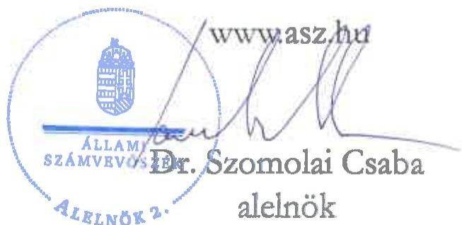

ÁLLAMI SZÁMVEVŐSZÉK

# JELENTÉS

A többségi állami tulajdonban lévő gazdasági társaságok beszerzéseinek ellenőrzése

BM HEROS LEK Kft.

2025.

25104

www.asz.hu

---

ÁLLAMI SZÁMVEVŐSZÉK

# JELENTÉS

A többségi állami tulajdonban lévő gazdasági társaságok beszerzéseinek ellenőrzése

BM HEROS LEK Kft.

2025.

25104

---

Jelentéseink az interneten a www.asz.hu címen olvashatók.

ELLENŐRZÉSI IGAZGATÓSÁG:
ELLENŐRZÉSI IGAZGATÓSÁG III.

ELLENŐRZÉSI IGAZGATÓ:
HERCZEGH ZSOLT igazgató

ELLENŐRZÉSVEZETŐ:
VEREBESNÉ SZABÓ ERZSÉBET ellenőrzésvezető

IKTATÓSZÁM: EL-4022-013/2025
TÉMASORSZÁM: 39/2024
ELLENŐRZÉS-AZONOSÍTÓ SZÁM: V1076

---

TARTALOMJEGYZÉK

- AZ ELLENŐRZÉS EREDMÉNYEI ... 5
1. Az ellenőrzött beszerzés megfelelőségének értékelése ... 6
- JAVASLATOK ... 9
- I. FÜGGELÉK: ÉSZREVÉTELEK ... 10
- II. FÜGGELÉK: ELLENŐRZÉSI MEGKÖZELÍTÉS ... 11
- MELLÉKLETEK ... 15
I. sz. melléklet: Értelmező szótár ... 15
- RÖVIDÍTÉSEK JEGYZÉKE ... 16

---

“哈，你是个小伙子，你是个小伙子，你是个小伙子，你是个小伙子，你是个小伙子，你是个小伙子，你是个小伙子，你是个小伙子，你是个小伙子，你是个小伙子，你是个小伙子，你是个小伙子，你是个小伙子，你是个小伙子，你是个小伙子，你是个小伙子，你是个小伙子，你是个小伙子，你是个小伙子，你是个小伙子，你是个小伙子，你是个小伙子，你是个小伙子，你是个小伙子，你是个小伙子，你是个小伙子，你是个小伙子，你是个小伙子，你是个小伙子，你是个小伙子，你是个小伙子，你是个小伙子，你是个小伙子，你是个小伙子，你是个小伙子，你是个小伙子，你是个小伙子，你是个小伙子，你是个小伙子，你是个小伙子，你是个小伙子，你是个小伙子，你是个小伙子，你是个小伙子，你是个小伙子，你是个小伙子，你是个小伙子，你是个小伙子，你是个小伙子，你是个小伙子，你是个小伙子，你是个小伙子，你是个小伙子，你是个小伙子，你是个小伙子，你是个小伙子，你是个小伙子，你是个小伙子，你是个小伙子，

---

5

# AZ ELLENŐRZÉS EREDMÉNYEI

A Magyar Állam tulajdonában lévő gazdasági társaságok gazdálkodása során a nemzeti vagyonnal való felelős gazdálkodás alapvető követelmény és egyben jogszabályi előírás. A nemzeti vagyongazdálkodás alapvető feladata a nemzeti vagyon megőrzése, értékének és állagának védelme. A gazdasági társaságok önálló és felelős gazdálkodása során a jogszabályokban meghatározott előírásoknak, valamint az azokkal összhangban lévő belső szabályzatoknak maradéktalanul szükséges megfelelni. A gazdasági társaságokkal szemben elvárás, hogy a beruházásaikat, beszerzéseiket ezen előírások mentén a törvényesség, célszerűség és eredményesség követelményei szerint végezzék.

A BM HEROS LEK Kft.¹ közvetett állami tulajdonú gazdasági társaság, egyedüli tagja a BM HEROS Zrt.² volt. A Társaság cégjegyzékbe bejegyzett főtevékenysége az ellenőrzött időszakban gépjárműjavítás, -karbantartás volt, emellett többek között mentőgépjárművek gyártásával is foglalkozott. A Társaság 2021 tavaszán elindult az OMSZ³ által mentőgépjárművek feltételek beszerzésére kiírt közbeszerzési pályázaton, melynek nyertes ajánlattevője lett. A közbeszerzési eljárás eredményeként létrejött nettó 4 413 635 E Ft keretösszegű adásvételi keretmegállapodás alapján az OMSZ 2022 júniusában és októberében adta le utolsó megrendeléseit összesen 34 db mentőgépjármű leszállítására. A gyártási tevékenységbe a BM HEROS LEK Kft. alvállalkozót vont be.

Az ÁSZ⁴ az ellenőrzés keretében megvizsgálta és értékelte a BM HEROS LEK Kft. által az OMSZ részére közbeszerzési szerződés alapján leszállítandó 34 db mentőgépjármű betegterének kialakítására és eszközök biztosítására vonatkozóan az alvállalkozótól történt 2023. évi, összesen nettó 714 000 E Ft értékű beszerzésének megfelelőségét.

Az ÁSZ ellenőrzése megállapította, hogy mivel a BM HEROS LEK Kft. nem rendelkezett a mentőgépjárművek gyártásához szükséges tetőátalakítási technológiával, ezért az OMSZ felé vállalt szerződéses kötelezettségeinek teljesítése érdekében indokoltan vont be a teljesítésbe alvállalkozót. A beszerzési döntés szabályszerű, megalapozott és célszerű, a beszerzés végrehajtása szabályszerű volt. A legyártott mentőgépjárművek a minőségi követelményeknek megfeleltek, azokat a Társaság az OMSZ felé értékesítette, így a beszerzés eredményesnek minősült. A beszerzés tekintetében érvényesültek a nemzeti vagyonnal való felelős gazdálkodás elvei. Mindezek alapján a BM HEROS LEK Kft. ellenőrzött beszerzése megfelelő volt.

---

Az ellenőrzés eredményei

# 1. Az ellenőrzött beszerzés megfelelőségének értékelése

## Összegző megállapítás

A BM HEROS LEK Kft. mentőgépjárművek betegterének kialakítására és eszközök biztosítására vonatkozó beszerzési igénye indokoltan merült fel. A beszerzési döntés megfelelt a jogszabályi és belső szabályozók által előírt rendelkezéseknek, szabályszerű, megalapozott és célszerű volt. A szerződés megkötése szabályszerű volt, a szerződéskötés során érvényesültek a felelős gazdálkodásra vonatkozó alapelvek. A beszerzés végrehajtása megfelelt a beszerzési döntésben, a szerződésben és a belső szabályozó eszközökben foglaltaknak. A legyártott mentőgépjárművek sikeres értékesítésére tekintettel a beszerzés eredményesnek minősült. A Társaság az általa megkötött szerződésekkel kapcsolatban fennálló közzétételi kötelezettségének jogszabályi előírás ellenére csak részben tett eleget.

## A BESZERZÉSEKHEZ KAPCSOLÓDÓ BELSŐ SZABÁLYOZÓ ESZKÖZÖK

A Társaság Alapító Okirat $^{1,3}$-a meghatározta a kötelezettségvállalásnak az ügyvezetői hatáskörbe, illetőleg az Alapító BM HEROS Zrt. kizárólagos hatáskörébe tartozó értékhatárat, tartalmazta a Társaság és az Alapító közötti szerződésekre vonatkozó egyes előírásokat, valamint a cégjegyzési jogosultságra vonatkozó rendelkezéseket. A BM HEROS LEK Kft. a beszerzéseire vonatkozóan a kontrollkörnyezetet az ellenőrzött időszakban az SzMSz $^{6}$, valamint a Beszerzési Szabályzat $^{7}$ megalkotásával biztosította, megfelelve a Gbkr. $^{8}$ előírásaiban foglaltaknak. A Társaság az SzMSz-ben rögzítette a beszerzésekhez kapcsolódó feladat- és hatásköröket, a kötelezettségvállalás döntési szintekhez kötött értékhatárait és a szerződéskötésre vonatkozó jogosultságokat. A Társaság a Beszerzési Szabályzatban rendelkezett többek között a beszerzések tervezéséről, a beszerzés folyamatában ellátandó feladatokról, a beszerzési eljárások lebonyolításáról, a teljesítésigazolás szabályairól, valamint meghatározta a beszerzési feladatok kontrollrendszerének szervezeti folyamatát. A Társaság a Taktv. $^{9}$ előírásai alapján biztosította a szabályozott, átlátható működést.

## A BESZERZÉSI IGÉNY FELMERÜLÉSE

Az ellenőrzött beszerzés előzménye az OMSZ által 2021. március 16-án, mentőgépjárművek feltételek beszerzésére megindított közbeszerzési eljárás $^{10}$ volt. A közbeszerzési eljárás nyertes ajánlattevője a BM HEROS LEK Kft. lett. Ajánlatában megjelölte, hogy az OMSZ által előírt alkalmassági követelményeknek más szervezet – kapacitást biztosító alvállalkozó – erőforrásaira támaszkodva felel meg. A Társaság, mint nyertes ajánlattevő 2021. június 9-én 24 hónapra szóló határozott időtartamra Keretmegállapodást kötött az OMSZ-szel, mint vevővel „B”, illetve „C” típusú mentőgépjárművek eseti megrendelés alapján történő szállítására. Az OMSZ az ellenőrzött beszerzéshez tartozó megrendeléseit 2022. június 1-jén (1 db) és 2022. október 6-án (33 db) adta le, melyek alapján a Társaság elindította a 34 db mentőgépjármű gyártásának folyamatát. Tekintettel arra, hogy a Társaság nem rendelkezett a mentőgépjárművek gyártásához szükséges tetőátalakítási technológiával, a Kbt. $^{11}$ előírásaival összhangban mindeneképpen szükséges volt a közbeszerzési eljárásban megjelölt kapacitást biztosító alvállalkozót bevonnia a gyártásba.

---

Az ellenőrzés eredményei

Mindezek alapján a beszerzési igény az OMSZ felé vállalt közbeszerzési szerződéses kötelezettségek teljesítése érdekében indokoltan merült fel.

## A BESZERZÉSI DÖNTÉS

A BM HEROS LEK Kft. a Felügyelőbizottság 3/2021. (05.06.) számú egyetértő határozata és a 3/2021. (05.06.) számú Alapítói Határozat jóváhagyása alapján jogosult volt az OMSZ-szel kötött szerződés teljesítéséhez szükséges további szerződéseket megkötni. A Társaság a Kbt. előírásainak megfelelően rendelkezett a kapacitást biztosító alvállalkozó kötelezettségvállalását tartalmazó okirattal, amely alátámasztotta, hogy a közbeszerzési szerződés teljesítéséhez szükséges erőforrások rendelkezésre álltak a szerződés teljesítésének időtartama alatt.

A Társaság az OMSZ eseti megrendeléseinek birtokában, 2022 októberében ártárgyalásokat folytatott az alvállalkozóval. Az alvállalkozó végső árajánlatát is figyelembe véve a Társaság kalkulációt készített a legyártandó mentőgépjárművek előállítási költségeiről. A beszerzési döntésnél az ügyvezető figyelembe vette a Projekthez¹² beszerzett alapgépjárművek állományát is.

A kapacitást biztosító alvállalkozóval történő szerződéskötést megelőzően a Társaság ügyvezetője írásban tájékoztatta az Alapítót a beszerzési döntés során mérlegelt szempontokról. Az Alapító képviseletében eljáró vezérigazgató jóváhagyta a beszerzést. Az ügyvezető a közbeszerzési szerződés teljesítése érdekében az OMSZ által megrendelt 34 db mentőgépjármű legyártása és az ahhoz elengedhetetlen alvállalkozói szolgáltatás igénybevétele mellett döntött. Az ügyvezető a Kbt. és a Beszerzési Szabályzat előírásainak megfelelően döntött a közvetlen szerződéskötéssel történő beszerzésről. A mentőgépjárművek beszerzésére Kbt. szerinti ajánlatkérőként az OMSZ írt ki közbeszerzési eljárást. A Társaság, mint nyertes ajánlattevő és alvállalkozója a közbeszerzés tárgyára tekintettel az eljárás eredményeként kötött szerződés teljesítésében vettek részt. A BM HEROS LEK Kft. által a közbeszerzési szerződés teljesítéséhez kapcsolódó ellenőrzött beszerzés a közbeszerzés (tárgyának), „része”, az nem új beszerzési igényként merült fel. Mindezek alapján a BM HEROS LEK Kft. beszerzésre irányuló döntés megfelel a Gbkr. és a Kbt. előírásainak, valamint az Alapító Okirat-Ban és a Beszerzési Szabályzatban foglaltaknak. A döntés szabályszerű, megalapozott és célszerű volt. A beszerzési döntés során – az ármeghatározás tekintetében – érvényesült a felelős gazdálkodás elve.

## A MEGKÖTÖTT SZERZŐDÉS, A BESZERZÉS VÉGREHAJTÁSA ÉS ELSZÁMOLÁSA

A közbeszerzési szerződés teljesítése érdekében a Társaság, mint megrendelő és a kapacitást biztosító cég, mint vállalkozó 2022. november 24-én Vállalkozási Szerződést kötött 34 db „C” típusú mentőgépjármű betegterének kialakítására és eszközök biztosítására vonatkozóan, a közbeszerzési eljárásban benyújtott ajánlatban foglalt műszaki tartalommal. A Vállalkozási Szerződést a BM HEROS LEK Kft. részéről az SZMSZ és az Alapító Okirat rendelkezéseivel összhangban az ügyvezető írta alá. A Vállalkozási Szerződésben a Ptk. előírásainak megfelelően rögzítésre került többek között a szerződés tárgya, hatálya, a kapcsolattartás és a teljesítés szabályai, a díjfizetés és a fizetési feltételek, a jótállás, a szavatosság, a szerződést biztosító mellék kötelezettségek, valamint a szerződés megszűnése, a szerződésszegés és a vis maior esetére irányadó rendelkezések. A Vállalkozási Szerződéshez a felek mellékletként csatolták az elkészült mentőgépjármű alvállalkozótól történő átvételének sablondokumentumát is. A Vállalkozási Szerződés nem tartalmazott olyan elemeket, amelyek ellentétesek voltak a BM HEROS LEK Kft. érdekeivel, és szerepeltek benne a Társaság érdekeit védő garanciális kötelezettségek. Az alvállalkozóval szemben megfogalmazott jótállási, szavatossági, kötbér előírások legalább olyan szigorú feltételeket

---

Az ellenőrzés eredményei

tartalmaztak, mint az OMSZ által a BM HEROS LEK Kft. részére a Keretmegállapodásban meghatározott előírások, sőt bizonyos tekintetben (pl. jótállási biztosíték) a Társaság szigorúbb feltételeket írt elő az alvállalkozó részére. Mindezek alapján a Vállalkozási Szerződés megkötése során érvényesültek az SzMSz, az Alapító Okirat és a Ptk. előírásai, valamint az Nvtv.¹⁵-ben rögzített, a nemzeti vagyonnal való felelős gazdálkodásra vonatkozó alapelvek.

A kapacitást biztosító alvállalkozó a 180 napos teljesítési határidőn belül, 2023. január 20. és 2023. április 3. között adta át a 34 darab mentőgépjárművet a BM HEROS LEK Kft. részére. Az alvállalkozó a legyártott 34 mentőgépjármű tekintetében rendelkezett az ÉKM¹⁴ által kiadott kissorozatú összeépítési engedéllyel, amely egyúttal sorozat forgalomba helyezési engedélynek is minősült. A Vállalkozási Szerződés előírásának megfelelően minden gépjármű esetében készítettek a felek átadás-átvételi jegyzőkönyvet, amelyek tartalmazták az átadott mentőgépjármű alvázszámát és felszereltségét, ideértve a járműhöz tartozó dokumentáció megjelölését is. Az átadás-átvétel napján, az átadás-átvételt és a teljesítés igazolását megelőzően az OMSZ képviselője ellenőrizte a legyártott mentőgépjárművek műszaki állapotát, külső és belső sérülésmentességét. Az ellenőrzésről minden gépjármű esetében jegyzőkönyv készült. A jegyzőkönyvek rögzítették annak tényét, hogy az esetleges hibákat és/vagy eltéréseket a gyártó azonnal pótolta, illetve javította. A BM HEROS LEK Kft. a Beszerzési Szabályzat előírásainak megfelelően ezt követően ismerte el az alvállalkozó szerződésszerű teljesítését és számla kibocsátására való jogosultságát.

A BM HEROS LEK Kft. a beszerzés megvalósításához kapcsolódóan négy számlát fogadott be, számolt el és teljesített pénzügyileg. A befogadott számlák alaki és tartalmi szempontból megfeleltek az Áfa tv.¹⁵ és a Számv. tv.¹⁶ előírásainak. A számlákon szereplő egységár összhangban állt a Vállalkozási Szerződésben foglalt egységárral. A kifizetések a fizetési határidő napján történtek a számlák bruttó értékével megegyező összegben. Mindezek alapján a beszerzés végrehajtása során érvényesültek a Gbkr. előírásai, a beszerzésre vonatkozó döntésben és a Vállalkozási Szerződésben meghatározott szempontok, valamint a Beszerzési Szabályzatban előírtak. A 34 db mentőgépjármű OMSZ-nek történő tovább értékesítése alapján a beszerzés eredményesnek minősült.

# KÖZZÉTÉTELI KÖTELEZETTSÉG

A BM HEROS LEK Kft. 100%-ban közvetett állami tulajdonú gazdasági társaság, így közvetve állami vagyonnal gazdálkodik, ezért a Vtv.¹⁷ 5. § (2) bekezdése alapján az Info tv.¹⁸ 26. § (1) bekezdése szerint, mint közfeladatot ellátó szervnek, lehetővé kellett tennie, hogy a kezelésében lévő közérdekű adatot és közérdekből nyilvános adatot erre irányuló igény alapján bárki megismerhesse. A Társaságot az Info tv. 33. § (1) és (3) bekezdései, valamint 37. § (1) bekezdése értelmében közzétételi kötelezettség terhelte.

A BM HEROS LEK Kft. az Info tv. 33. § (1) és (3) bekezdéseiben, 37. § (1) bekezdésében és 1. melléklet III. gazdálkodási adatok 4. pontjában foglaltakkal ellentétben az általa megkötött szerződésekkel kapcsolatban fennálló közzétételi kötelezettségének csak részben tett eleget, ugyanis a szerződések listáját 2023. május 22-én frissítette utoljára a közzétételre szolgáló honlapon¹⁹. A közzétett lista nem tartalmazott több olyan szerződést, amelyek alapján a Társaság 2023. évben több, mint ötmillió forint értékben hajtott végre beszerzéseket. Az ellenőrzött beszerzés alapját képező szerződésre vonatkozó adatokat tartalmazta a közzétett lista.

---

JAVASLATOK

Az ÁSZ tv. 33. § (1) bekezdésében foglaltak értelmében az ellenőrzött szervezet vezetője köteles a jelentésben foglalt megállapításokhoz kapcsolódó intézkedési tervet összeállítani és azt a jelentés kézhezvételétől számított 30 napon belül az ÁSZ részére megküldeni. Az ÁSZ a jelentésben foglalt megállapításokhoz kapcsolódóan az alábbi javaslatok tekintetében várja el az intézkedési terv elkészítését.

## A BM HEROS LEK KFT. ÜGYVEZETŐJE RÉSZÉRE

1. Az Info tv. 33. § (1) és (3) bekezdéseiben, 37. § (1) bekezdésében és 1. melléklet III. gazdálkodási adatok 4. pontjában foglaltak érvényesülése érdekében vizsgálja felül a közérdekű adatok honlapon történő közzétételét, és tegye meg a szükséges intézkedéseket.

---

I. FÜGGELÉK: ÉSZREVÉTELEK

A jelentéstervezetet az ÁSZ 15 napos észrevételezésre megküldte az ellenőrzött szervezet vezetőjének az ÁSZ tv. 29. §* (1) bekezdése előírásának megfelelően.

Az ellenőrzött szervezet vezetője a jelentéstervezet megállapításaira nem tett észrevételt.

* 29. § (1) Az Állami Számvevőszék az ellenőrzési megállapításait megküldi az ellenőrzött szervezet vezetőjének vagy az általa megbízott személynek, és annak, akinek személyes felelősségét állapította meg.
(2) Az ellenőrzött szervezet vezetője és a felelősként megjelölt személy az ellenőrzés megállapításaira tizenöt napon belül írásban észrevételt tehet.
(3) Az Állami Számvevőszék az észrevételre a beérkezésétől számított harminc napon belül írásban válaszol. A figyelembe nem vett észrevételeket köteles a jelentésben feltüntetni, és megindokolni, hogy azokat miért nem fogadta el.

10

---

11

# II. FÜGGELÉK: ELLENŐRZÉSI MEGKÖZELÍTÉS

## AZ ELLENŐRZÉS JOGALAPJA

Az ellenőrzés jogszabályi alapját az ÁSZ tv.²⁰ 1. § (3) bekezdésének és 5. § (4) bekezdésének előírásai képezték.

## AZ ELLENŐRZÉS CÉLJA

Az ellenőrzés célja annak értékelése volt, hogy a gazdasági társaság – ellenőrzés során kiválasztott – beszerzésére szabályszerűen került-e sor, a kapcsolódó döntéshozatal szabályszerű és megalapozott volt-e, valamint a beszerzéshez kapcsolódóan érvényesültek-e a célszerűség és az eredményesség szempontjai.

## AZ ELLENŐRZÉS TÍPUSA

Kombinált ellenőrzés.

## AZ ELLENŐRZÉS TÁRGYA

Az ellenőrzés tárgya a BM HEROS LEK Kft. 2023. évben megvalósult beszerzésére irányuló döntés szabályszerűsége, megalapozottsága és célszerűsége, valamint a megvalósult beszerzés szabályszerűsége és eredményessége, azaz a beszerzés megfelelősége volt. Az ellenőrzés kiterjedt a beszerzés előkészítésének, a beszerzésre vonatkozó szerződés megkötésének és tartalmának ellenőrzésére is. Az ellenőrzés részét képezte továbbá a szerződésekre vonatkozó közzétételi kötelezettség teljesítésének ellenőrzése is.

Értékét tekintve az ellenőrzésre kiválasztott beszerzés a Társaság 2023. évi beszerzéseinek mintegy 19%-át tette ki, és a kapacitást biztosító alvállalkozó a Társaság legnagyobb tárgyévi szállító partnere volt. Ezért az ÁSZ a Társaság beszerzései közül ezen – az ellenőrzött időszak tekintetében meghatározó – ügyletet vonta vizsgálat alá.

Az ellenőrzött beszerzés főbb adatait az 1. táblázat tartalmazza.

1. táblázat

|  AZ ELLENŐRZŐTT BESZERZÉS FŐBB ADATAI  |   |   |   |
| --- | --- | --- | --- |
|  BESZERZÉS TÁRGYA | BESZERZÉS ALAPJÁT KÉPEZŐ SZERZŐDÉS KELTE | SZÁMLA SZERINTI TELJESÍTÉSI IDŐPONT | BESZERZÉS NETTÓ ÉRTÉKE (I²T)  |
|  "C" típusú mentőautó betegterének kialakítása, eszközök biztosítása | 2022.11.24. | 2023.01.27. | 210 000 000  |
|   |   |  2023.02.06. | 84 000 000  |
|   |   |  2023.03.14. | 210 000 000  |
|   |   |  2023.04.03. | 210 000 000  |

Forrás: ÁSZ saját szerkesztés a BM HEROS LEK Kft. adatszolgáltatása alapján

---

II. Függelék: Ellenőrzési megközelítés

Az ellenőrzés kiterjedt minden olyan körülményre és adatra, amely az ÁSZ jogszabályban meghatározott feladatainak teljesítéséhez, valamint a program végrehajtása folyamán felmerült újabb összefüggések feltárásához szükséges volt.

## AZ ELLENŐRZÉS HATÓKÖRE

Az ÁSZ ellenőrzése a BM HEROS LEK Kft. beszerzésre irányuló döntésének szabályszerűségére, megalapozottságára és célszerűségére, valamint a megvalósult beszerzés szabályszerűségére és eredményességére terjedt ki. Az ÁSZ ellenőrzés részét képezte továbbá a szerződésekre vonatkozó közzétételi kötelezettség teljesítésének ellenőrzése is.

A BM HEROS LEK Kft.-t 2015. október 1-jén alapította a Magyar Állam 100 százalékos tulajdonában álló BM HEROS Zrt., amely az ellenőrzött időszakban is a Társaság egyedüli tagja volt. Az Alapító tulajdonosa 2022. február 15. óta az N7 Holding Zrt.²¹ volt, melynek egyedüli részvényese a Magyar Állam. A BM HEROS LEK Kft. mindezek alapján létrejöttének időpontjától kezdődően közvetett állami tulajdonú gazdasági társaság volt.

A BM HEROS Zrt. azzal a céllal hozta létre a Társaságot, hogy Magyarország területén tűzoltógépjárművek és egyéb speciális gépjármű felépítmények felújítójaként és szervizelőjeként, egyéb haszongépjárművek és tűzoltás-technikai eszközök szervizeként működjön. A Társaság fő profilja a BM OKF²² központi és területi szervei üzemeltetésében lévő gépjárművek, tűzoltás-technikai eszközök és vegyivédelmi eszközök, továbbá az OMSZ garancián túli mentőgépjárműveinek a szervizelése volt. A szerviz- és felújítási tevékenység idővel mentőautó és egyéb, speciális gépjármű gyártási tevékenységgel bővült.

Az OMSZ mentőgépjármű szükségletének folyamatos, tervezett, hazai állami tulajdonban lévő társaság általi gyártásból történő biztosításáról kormányhatározat²³ rendelkezett. A kormányhatározat alapján a mentőgépjárművek gyártása és fejlesztése érdekében a BM HEROS Zrt. 2017. évben 1 400 000 E Ft tőkeemelésben részesült. Az Alapító 2017. és 2019. években több lépésben ugyanekkora értékű tőkeemelést hajtott végre a Társaságnál. Ez biztosította a mentőgyártás infrastrukturális hátterének kiépítéséhez szükséges forrást.

A BM HEROS LEK Kft. 2023. évi nettó árbevételének 77%-a szerviz tevékenységből, 17%-a mentőgépjármű gyártásból, a fennmaradó 6%-a egyéb tevékenységekből származott. Beszerzéseit a szerviz és gyártási tevékenységhez szükséges alapanyagok, alkatrészek, az alvállalkozói és egyéb szolgáltatások, valamint az energiaiköltségek és ingatlan bérleti díjak határozták meg.

A BM HEROS LEK Kft. a megelőző két üzleti év beszámolóadatai alapján az ellenőrzött időszakban a Taktv. rendelkezése alapján a Gbkr. hatálya alá tartozott, így belső kontrollrendszer működtetésére volt kötelezett.

A Társaság az ellenőrzés alá vont – mentőgépjármű betegterének kialakítására és eszközök biztosítására vonatkozó – beszerzés esetében nem volt kötelezett közbeszerzési eljárás lefolytatására.

## AZ ELLENŐRZŐTT SZERVEZET

BM HEROS LEK Kft.

---

II. Függelék: Ellenőrzési megközelítés

## AZ ELLENŐRZŐTT IDŐSZAK

A 2023. év. A beszerzés előkészítése és a szerződéskötés tekintetében az ellenőrzés a 2022. évre is kiterjedt.

## AZ ELLENŐRZÉSI KRITÉRIUMOK

### ELLENŐRZÉSI KRITÉRIUMOK

|  Vtv. 2. § (1) bekezdés, 5. § (2) bekezdés,  |
| --- |
|  Nvtv. 7. § (1)-(2) bekezdés,  |
|  Ptk. 6:215-234. §, 6:238-271. §, 6:272 - 6:279. §,  |
|  Számv. tv. 69. § (1) bekezdés, 78. § (2) bekezdés, 165-167. §,  |
|  Áfa tv. 169. §,  |
|  Taktv. 2. §, 7/J. § (3) bekezdés,  |
|  Gbkr. 4. § (3) bekezdés, 6. § (1)-(2) bekezdés,  |
|  Info tv. 33. § (1) és (3) bekezdés, 37. §, 1. melléklet III. gazdálkodási adatok 4. pont,  |
|  belső szabályozó eszközök (Alapító Okirat₁₋₃, SzMSz, Beszerzési Szabályzat)  |
|  Célszerűség: a beszerzésre irányuló döntés akkor célszerű, ha az megalapozott, továbbá a rendelkezésre álló erőforrások ésszerű, racionális, a gazdasági társaság (köz)feladatának megvalósítása érdekében álló, az ahhoz szükséges mértékű felhasználásával jár.  |
|  Eredményesség: a beszerzés akkor eredményes, ha összhangban áll a társaság céljaival és támogatja azok elérését, megvalósulását, valamint a beszerzés tárgya a társaság (köz)feladat ellátása során ténylegesen hasznosításra kerül, betölti eredetileg elvárt funkcióját.  |
|  A beszerzés eredményessége kizárólag akkor értékelhető, ha a beszerzési eljárás teljes folyamata a lényegi elemeiben szabályszerű, a beszerzési döntés megalapozott és célszerű volt.  |

## AZ ELLENŐRZÉS MÓDSZERE ÉS AZ ELLENŐRZÉSI BIZONYÍTÉKOK KÖRE

Az ellenőrzés végrehajtása a nemzetközi standardokat irányadónak tekintve az ellenőrzési program szempontjai, az ellenőrzött időszakban hatályos jogszabályok, az ellenőrzés szakmai szabályok és a jelen ellenőrzésre irányadó ÁSZ módszertan figyelembevételével történt.

Az ellenőrzési kérdések megválaszolásához szükséges bizonyítékok megszerzése az ellenőrzött szervezet által rendelkezésre bocsátott dokumentumokra és adatokra alapozva, továbbá megfigyelés, szemle (szemrevételezés), kérdésfeltevés (információkérés), valamint elemző eljárás útján valósult meg.

Az ellenőrzés lefolytatásához az ellenőrzött szervezet a 2023. évben megvalósult beszerzéseire vonatkozó főkönyvi és analitikus nyilvántartások, valamint az ÁSZ által kért további dokumentumok, adatok, információk megküldésével és a helyszíni ellenőrzés során szolgáltatott adatokat. A rendelkezésre álló adatok alapján a BM HEROS LEK Kft. a 2023. évben közelítőleg bruttó 4 854 000 E Ft forint összértékben hajtott végre beszerzéseket. A mintavételezés keretében egy beszerzés került kiválasztásra, melynek tárgyévben számlázott bruttó összértéke mintegy 907 000 E Ft-ot tett ki.

---

II. Függelék: Ellenőrzési megközelítés

Az ellenőrzési bizonyítékként felhasználható adatforrások közé tartoztak egyrészt az ellenőrzéshez kért dokumentumok, adatállományok, nyilatkozatok, másrészt adatforrás volt minden – az ellenőrzés folyamán – feltárt, az ellenőrzés szempontjából információkat tartalmazó dokumentum.

A tények feltárása és azok összegzése során a megállapítások az ellenőrzött mintatételre vonatkozóan kerültek megfogalmazásra. A mintatétel ellenőrzésének eredményei nem kerültek kivetítésre. Az ÁSZ akkor tekintette megfelelőnek a mintatételként kiválasztott beszerzést, ha a beszerzési eljárás teljes folyamata a lényegi elemeiben szabályszerű, célszerű és – amennyiben értékelhető – eredményes volt, illetve a beszerzés tekintetében érvényesültek a nemzeti vagyonnal való felelős gazdálkodás elvei.

Az ellenőrzés kitért minden olyan körülményre, amely a program végrehajtása kapcsán felmerült és az ellenőrzés céljaival összhangban volt.

14

---

MELLÉKLETEK

## I. SZ. MELLÉKLET: ÉRTELMEZŐ SZÓTÁR

gazdasági társaság
A gazdasági társaságok üzletszerű közös gazdasági tevékenység folytatására, a tagok vagyoni hozzájárulásával létrehozott, jogi személyiséggel rendelkező vállalkozások, amelyekben a tagok a nyereségből közösen részesednek, és a veszteséget közösen viselik.
(Ptk. 3:88. § (1) bekezdés)

beszerzés
Eszközök és/vagy szolgáltatások visszterhes megszerzésére (vásárlására) irányuló (keret)szerződés/(keret)megállapodás létrehozását célzó és azt eredményező eljárás.
(ÁSZ saját definíció)

eszköz
A vásárolt immateriális javak (Számv. tv. 25. § (1)-(2) bekezdés) és tárgyi eszközök (Számv. tv. 26. § (1) bekezdés) valamint – a közvetített szolgáltatások kivételével – a vásárolt készletek.
(Számv. tv. 3. § (6) bekezdés 5. pont)

szolgáltatás
A gazdasági társaság által igénybe vett/megrendelt, harmadik felek által nyújtott/számlázott, nem anyagi javak termelésére irányuló tevékenységek, különös tekintettel az igénybe vett, egyéb és közvetített szolgáltatásokra.
(Számv. tv. 3. § (7) bekezdés 1-2. pont, (4) bekezdés 1. pont)

többségi állami tulajdon
Az állam tulajdonában lévő tagsági jogviszonyt megtestesítő értékpapír, illetve az állam tulajdonában lévő egyéb társasági részesedés, amennyiben a társaságban a Magyar Állam közvetlenül vagy közvetetten a szavazatok több mint felével rendelkezik.
(ÁSZ definíció a Vtv. 1. § (2) bekezdés c) pontja és a Ptk. 8:2. § (1), (3)-(4) bekezdései alapján)

vagyongazdálkodás alapelvei
A nemzeti vagyon alapvető rendeltetése a közfeladat ellátásának biztosítása, ideértve a lakosság közszolgáltatásokkal való ellátását és e feladatok ellátásához szükséges infrastruktúra biztosítását. A nemzeti vagyonnal felelős módon, rendeltetésszerűen kell gazdálkodni.
A nemzeti vagyongazdálkodás feladata a nemzeti vagyon megőrzése, értékének és állagának védelme, rendeltetésének megfelelő, az állam, az önkormányzat mindenkori teherbíró képességéhez igazodó, elsődlegesen a közfeladatok ellátásához és a mindenkori társadalmi szükségletek kielégítéséhez szükséges, egységes elveken alapuló, átlátható, hatékony és költségtakarékos működtetése, értéknövelő használata, hasznosítása, gyarapítása, továbbá az állam vagy a helyi önkormányzat feladatának ellátása szempontjából feleslegessé váló vagyontárgyak elidegenítése, azzal, hogy a nemzeti vagyon megőrzése érdekében végzett bontás vagy átalakítás nem minősül az állag védelmi kötelezettség megszegésének.
(Nvtv. 7. § (1)-(2) bekezdése alapján)

célszerűség
A célszerűség elve a felhasznált eszközök, közpénzek, erőforrások elérni kívánt célnak való megfelelését jelenti, továbbá, hogy azokat ésszerűen, racionálisan, a kitűzött cél elérése (közfeladat ellátása) érdekében használták-e fel.
(az ÁSZ ellenőrzési alapelvei és módszertana)

eredményesség
Az eredményesség elve a kitűzött célok és a szándékolt eredmények (hatások) elérését jelenti. A gazdálkodás, feladatellátás eredményességét mutatja a tényleges és a tervezett eredmények (hatások) összevetése.
(az ÁSZ ellenőrzési alapelvei és módszertana)

15

---

RÖVIDÍTÉSEK JEGYZÉKE

1 BM HEROS LEK Kft., Társaság
2 BM HEROS Zrt., Alapító
3 OMSZ
4 ÁSZ
5 Alapító Okirat1.3
6 SzMSz
7 Beszerzési Szabályzat
8 Gbkr.
9 Taktv.
10 közbeszerzési eljárás
11 Kbt.
12 Projekt
13 Nvtv.
14 ÉKM
15 Áfa tv.
16 Számv. tv.
17 Vtv.
18 Info tv.
19 közzétételre szolgáló honlap
20 ÁSZ tv.
21 N7 Holding Zrt.
22 BM OKF
23 kormányhatározat

BM HEROS LEK Logisztikai Ellátó Központ Korlátolt Felelősségű Társaság
Belügyminisztérium HEROS Javító, Gyártó, Szolgáltató és Kereskedelmi Zártkörűen Működő Részvénytársaság
Országos Mentőszolgálat
Állami Számvevőszék

1 BM HEROS LEK Kft. Alapító Okirata változásokkal egységes szerkezetben, hatályos: 2021. február 01-tól 2022. december 08-ig
2 BM HEROS LEK Kft. Alapító Okirata változásokkal egységes szerkezetben, hatályos: 2022. december 09-tól 2023. szeptember 26-ig
3 BM HEROS LEK Kft. Alapító Okirata változásokkal egységes szerkezetben, hatályos: 2023. szeptember 27-től

BM HEROS LEK Kft. Szervezeti és Működési Szabályzat, hatályos: 2022. október 1-től
BM HEROS LEK Kft. Beszerzési Szabályzatának 1. számú módosítása, hatályos: 2020. december 14-től
339/2019. (XII. 23.) Korm. rendelet a köztulajdonban álló gazdasági társaságok belső kontrollrendszeréről
2009. évi CXXII. törvény a köztulajdonban álló gazdasági társaságok takarékosabb működéséről
az EKR000240402021 azonosítószámon lefolytatott közbeszerzési eljárás
2015. évi CXLIII. törvény a közbeszerzésekről
34 db „C” típusú mentőgépjármű gyártása és értékesítése az OMSZ részére a közbeszerzési eljárás eredményeként 2021. június 9-én megkötött keretmegállapodáson alapuló egyedi megrendelések alapján
2011. évi CXCVI. törvény a nemzeti vagyonról
Építési és Közlekedési Minisztérium
2007. évi CXXVII. törvény az általános forgalmi adóról
2000. évi C. törvény a számvitelről
2007. évi CVI. törvény az állami vagyonról
2011. évi CXII. törvény az információs önrendelkezési jogról és az információszabadságról
https://bmheros.hu/
2011. évi LXVI. törvény az Állami Számvevőszékről
N7 Holding Nemzeti Védelmi Ipari Innovációs Zártkörűen Működő Részvénytársaság
Belügyminisztérium Országos Katasztrófavédelmi Főigazgatóság
1120/2017. (III. 17.) Korm. határozat az Országos Mentőszolgálat mentőjármű ellátásának és a mentőautók hazai gyártásának megvalósításáról

16

---

ÁLLAMI SZÁMVEVŐSZÉK

1052 Budapest, Apáczai Csere János u. 10. | 1364 Budapest 4., Pf. 54

www.asz.hu | szamvevoszek@asz.hu

telefon: +36 1 484 9100