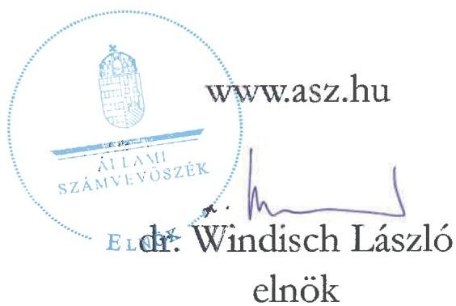

ÁLLAMI SZÁMVEVŐSZÉK

# JELENTÉS
## Utóellenőrzés

A Brexit Alkalmazkodási Tartalékból nyújtott uniós támogatások utóellenőrzése

2025.

25105

www.asz.hu

---

ÁLLAMI SZÁMVEVŐSZÉK

# JELENTÉS
## Utóellenőrzés

A Brexit Alkalmazkodási Tartalékból nyújtott uniós támogatások utóellenőrzése

2025.

25105

---

Jelentéseink az interneten a www.asz.hu címen olvashatók.

ELLENŐRZÉSI IGAZGATÓSÁG:
ELLENŐRZÉSI IGAZGATÓSÁG I.

ELLENŐRZÉSI IGAZGATÓ:
SINKÁNÉ DR. CSENDES ÁGNES igazgató

ELLENŐRZÉSVEZETŐ:
HUSZÁR ANNA ellenőrzésvezető

IKTATÓSZÁM: EL-4174-002/2025

TÉMASORSZÁM: –

ELLENŐRZÉS-AZONOSÍTÓ SZÁM: V113001

---

TARTALOMJEGYZÉK

- AZ ELLENŐRZÉS ALAPADATAI ... 5
- AZ ELLENŐRZÉS TERÜLETE ... 7
- ÖSSZEFOGLALÁS ... 8
- AZ ELLENŐRZÉS FÓKUSZTERÜLETEI ... 9
- MEGÁLLAPÍTÁSOK ... 10
- MELLÉKLETEK ... 16
- I. sz. melléklet: Értelmező szótár ... 16
- II. sz. melléklet: Az ellenőrzött szervezetek jegyzéke ... 17
- III. sz. melléklet: Ellenőrzési kritériumok ... 18
- IV. sz. melléklet: A KKM és a HEPA Zrt. intézkedési terve vérgehajtásának értékelése ... 19
- FÜGGELÉK: ÉSZREVÉTELEK ... 23
- RÖVIDÍTÉSEK JEGYZÉKE ... 24

---

.

---

5

# AZ ELLENŐRZÉS ALAPADATAI

## AZ ELLENŐRZÉS CÉLJA

Az ellenőrzés célja annak értékelése volt, hogy a 23040 számú számvevőszéki jelentésben szereplő megállapításokhoz kapcsolódó intézkedési tervben foglaltakat az ellenőrzött szervezetek határidőben és megfelelően végrehajtották-e.

## AZ ELLENŐRZÉS TÍPUSA

Törvényességi ellenőrzés.

## AZ ELLENŐRZÖTT IDŐSZAK

Az utóellenőrzés alapját képező 23040 számú számvevőszéki jelentés közzétételének napjától (2023. november 29-től) az utóellenőrzéshez kapcsolódó számvevői jelentés elkészítésének időpontjáig (2025. április 30-ig) tartó időszak.

## AZ ELLENŐRZÉS TÁRGYA

A számvevőszéki jelentésben foglalt megállapításokhoz kapcsolódóan készített intézkedési tervben foglaltak végrehajtásának ellenőrzése.

## AZ ELLENŐRZÉS JOGALAPJA

Az ellenőrzés jogszabályi alapját az ÁSZ tv.¹ 33. § (7) bekezdésének előírásai képezik.

## AZ ELLENŐRZÉS MÓDSZERE

Az ÁSZ² az ellenőrzést a nemzetközi standardokat irányadónak tekintve az ellenőrzési program szempontjai, az ellenőrzött időszakban hatályos jogszabályok, az ellenőrzés szakmai szabályok és módszertanok figyelembevételével végezte el.

Az ellenőrzési kérdések megválaszolásához szükséges bizonyítékok megszerzése az ellenőrzött szervezetek által rendelkezésre bocsátott dokumentumokra és adatokra alapozva, továbbá kérdésfeltevés (információkérés), valamint elemző eljárás útján történt.

Az ellenőrzési bizonyítékként felhasználható adatforrások közé tartoztak egyrészt az ellenőrzéshez kért dokumentumok, adatforrások, a nyilvánosan hozzáférhető adatok, dokumentumok, másrészt adatforrás volt még minden, az ellenőrzés folyamán feltárt, az ellenőrzés szempontjából információt tartalmazó dokumentum.

---

Az ellenőrzés alapadatai

Az intézkedési tervben meghatározott feladatokat azok végrehajthatósága, illetve végrehajtása szempontjából az alábbiak szerint értékelte az ÁSZ:

- „határidőben végrehajtott” a feladat, ha annak végrehajtása dokumentáltan, az intézkedési tervben előírt módon és tartalommal és határidőben megtörtént;
- „határidőn túl végrehajtott” a feladat, ha annak végrehajtása dokumentáltan, az intézkedési tervben előírt módon és tartalommal, de az intézkedési tervben meghatározott határidőt követően történt meg;
- „részben végrehajtott” a feladat, ha annak végrehajtása nem teljeskörűen dokumentáltan vagy nem az intézkedési tervben előírt módon és tartalommal történt meg;
- „nem végrehajtott” a feladat, ha annak végrehajtása nem történt meg, dokumentumokkal nem igazolt annak teljesítése;
- „okafogyottá vált” a feladat, ha végrehajtására – meghatározott esemény bekövetkezése, továbbá külső körülmény, a működést érintő feltétel változása miatt – már nincs szükség, illetve lehetőség, és egyértelműen megállapítható, hogy az intézkedést szükségessé tevő körülmény a jövőben nem fordulhat elő;
- „nem időszerű” az a feladat, amelynek ellenőrzési időszakon belüli végrehajtására azért nem került (kerülhetett) sor, mert az intézkedés alapjául szolgáló esemény nem következett be, de annak jövőbeni előfordulása lehetséges, vagy a végrehajtása nem volt esedékes.

Az ellenőrzés lefolytatásához az ellenőrzött szervezetek a tanúsítvány kitöltésével, valamint az ÁSZ által kért dokumentumok, adatok, információk megküldésével és az ellenőrzés során szolgáltattak adatokat.

---

7

# AZ ELLENŐRZÉS TERÜLETE

Az Egyesült Királyság EU³-ból való kilépése (Brexit) az érintett vállalkozásokra negatívan hatott, ezért annak enyhítésére 2020 júliusában az EU-ban döntés született. A Bizottság⁴ a 2021. október 6-i 2021/1755 Európai Parlament és Tanács rendelettel⁵ létrehozta az 5 Mrd EUR értékű Brexit miatti kiigazításokra képzett tartalékot, amelyből Magyarország számára 57,2 M EUR (23-24 Mrd Ft) pénzügyi forrást ítélt meg.

A BAR⁶-ból nyújtott támogatás célja az volt, hogy az Egyesült Királyság EU-ból való kilépése nyomán kárt szenvedett vállalkozásoknak (érintett ágazatoknak, régióknak) ne kelljen munkaerőt elbocsátania, és kártalanítást kapjanak a kieső kereskedelmi forgalomból adódó veszteség miatt, illetve, hogy a támogatás segítse a Brexit miatti változásokhoz való alkalmazkodásukat, meg tudják valósítani a tervezett beruházásaikat, fejlesztéseiket. A támogatást illetően a Bizottság elvárása volt, hogy a BAR-ból támogatott intézkedéseknek fejleszteniük kellett az érintett vállalatokat, nem csupán a veszteségeiket fedezni.

A BAR-ból rendelkezésre álló forrás felhasználására a KKM mint irányító hatóság 64 vállalkozás, összesen 80 projektjéhez bocsátott ki támogatói okiratot, amelyek közül az ÁSZ – a 2023-ban közzétett, „A Brexit Alkalmazkodási Tartalékból nyújtott uniós támogatások ellenőrzése” című jelentésében – 15 projektet ellenőrzött.

Az ellenőrzés során azt értékelte az ÁSZ, hogy a KKM⁷ mint irányító hatóság és a HEPA Zrt.⁸ mint közreműködő szervezet a BAR-ból nyújtott támogatások felhasználását biztosító kontrollrendszert megfelelően alakította-e ki és működtette-e, továbbá, hogy a nyújtott támogatások megítélésének, folyósításának, felhasználásának ellenőrzése és a beszámolás jogszabályi és az egyéb előírásokkal való összhangja megvalósult-e. Cél volt annak értékelése is, hogy az irányító hatóság és a közreműködő szervezet által ellátott feladatok támogatták-e a BAR-ból nyújtott uniós támogatások cél szerinti felhasználását.

A BAR keretéből a támogatott projekteknél 2023. december 31-ig felmerült kiadásokat lehetett finanszírozni. A Bizottsághoz 2024. szeptember 30-ig kellett benyújtania a KKM-nek a pénzügyi hozzájárulás iránti kérelmet, amely tartalmazta a projektek által elkölttött források elszámolását.

Az ÁSZ a 23040 számú jelentésében a támogató okiratok kibocsátásával, a támogatások kifizetésével, a beszámolási és ellenőrzési tevékenység ellátásával, valamint a kontrollok működőképességével kapcsolatban tett megállapítást.

Az alapellenőrzés jelentésében foglalt megállapításokhoz kapcsolódóan a KKM és a HEPA Zrt. is – az ÁSZ tv. 33. § (1) – (2) bekezdéseinek megfelelően – összeállította intézkedési tervét és megküldte az ÁSZ részére. Az intézkedési tervekben meghatározott feladatokat, azok végrehajtásának felelősét, a végrehajtás vállalt határidejét és a végrehajtás számvevőszéki értékelését a IV. sz. melléklet foglalja össze. A KKM esetében a külső ellenőrzésekről vezetett nyilvántartás megfelelőségét is értékelte az ÁSZ.

---

ÖSSZEFOGLALÁS

Az utóellenőrzés alapját képező, „A Brexit Alkalmazkodási Tartalékból nyújtott uniós támogatások ellenőrzése” című számvevőszéki jelentésben foglalt megállapítások alapján az ÁSZ az ellenőrzési rendszer megfelelő működése és valamennyi BAR projekt felülvizsgálata érdekében javasolt intézkedést, amelyre a KKM és a HEPA Zrt. elkészítette intézkedési tervét. Mindkét ellenőrzött szervezet az ÁSZ által elfogadott intézkedési tervben vállalt feladatokat teljeskörűen és – a KKM esetében egy kivétellel – határidőben végrehajtotta.

Az ÁSZ alapellenőrzésében megfogalmazott javaslatok hasznosultak, mivel az intézkedési tervekben meghatározott feladatok végrehajtásának eredményeként

1. javult a BAR pályázatok lebonyolítási rendszerének szabályozottsága azáltal, hogy a szabálytalanságkezelés, a kifogáskezelés és a követeléskezelés területén a KKM SZMSZ-ében elhatárolták a BAR támogatás tekintetében releváns szervezeti egységekhez tartozó felelősségi és feladatköröket, és azzal összhangban kiegészítették az ügyrendeket;
2. erősödtek a rendszeres, folyamatba épített kontrollok azáltal, hogy
- a BAR rendelet és az Eljárásrend kiegészült a helyszíni ellenőrzésekre vonatkozó részletszabályokkal,
- a KKM és a HEPA Zrt közötti együttműködési megállapodást módosították, amely – többek között – bevezette heti rendszerességgel a KKM ellenőrzését, valamint a HEPA Zrt. részéről státuszjelentés készítését,
- a támogatások kifizetése és a szakmai beszámolók tekintetében a HEPA Zrt. felülvizsgálta majd módosította az ellenőrzési listákat, képzést tartott az ellenőrzési szempontrendszerek egységes alkalmazása céljából, felmérte az ellenőrzésekhez szükséges erőforrásokat és intézkedett a kapacitáshiány megszüntetése érdekében, valamint nyomonkövetési rendszert vezetett be a határidők tekintetében;
3. végül a támogatói okiratot kapott 80 projekt közül – a belső és külső ellenőrzések, felülvizsgálatok nyomán – azon projekteknek maradt érvényben a támogatói okirat és kaptak támogatást, amelyeknél megfelelően alátámasztott volt a közvetlen kapcsolat a kedvezményezett kára és a Brexit között. A jogosulatlanul megítelt támogatásoknál a támogatói okiratot a KKM visszavonta, és intézkedett valamennyi szabálytalanul kifizetett támogatás visszaköveteléséről, a tartozások behajtása érdekében.

A belső és külső ellenőrzések által feltárt szabálytalanságok következményeként a KKM 9 034,4 M Ft kifizetett támogatást követelt vissza a kedvezményezettektől, amelyek után a felszámított ügyleti és késedelmi kamat összege 1 570,3 M Ft volt a 2025. augusztus 31-i nyilvántartásában. A követelések behajtására irányuló intézkedések eredményeként ugyanezen időpontig összesen 1 763 M Ft folyt be, így a kedvezményezettekkel szemben 8 841,7 M Ft követelést mutatott ki a KKM.

Magyarország összességében a Bizottság által BAR-ból megítelt pénzügyi forrás 36,2%-ára, 20,7 M EUR-ra nyújtott be elszámolást, amely a fenntartási szakaszba jutott 29 projekt támogatását (25 vállalkozás érintettségével) és a támogatás lebonyolításával kapcsolatos adminisztráció (technikai segítségnyújtás) 0,5 M EUR-os költségét tartalmazta.

Az ÁSZ alapellenőrzése hatásaként Magyarország a Bizottság felé olyan pénzügyi hozzájárulási kérelmet nyújtott be elszámolásra, amelyben szerepeltekett projekteknek – a belső és külső ellenőrzések, felülvizsgálatok nyomán – igazolt volt a kedvezményezett Brexitból eredő kára, és a projektek költségei elszámolhatóságának igazolását is alátámaszthatja.

8

---

9

# AZ ELLENŐRZÉS FÓKUSZTERÜLETEI

1. Az intézkedési tervben foglaltak végrehajtása

---

MEGÁLLAPÍTÁSOK

# 1. Az intézkedési tervben foglaltak végrehajtása

## Összegző megállapítás

A KKM és a HEPA Zrt. az intézkedési tervükben az ellenőrzési rendszer megfelelő működése érdekében és a BAR projektek kivizsgálása tekintetében vállalt feladatokat teljeskörűen és – egy kivétellel – határidőben végrehajtották. Az ÁSZ 23040 számú számvevőszéki jelentésében feltárt hibák és hiányosságok megszüntetésére intézkedtek, az ott megfogalmazott javaslatok hasznosultak.

A KKM miniszterhelyettese és a HEPA Zrt. vezérigazgatója az utóellenőrzés alapját képező 23040 számú számvevőszéki jelentésben foglalt megállapításokhoz kapcsolódóan készített intézkedési tervét határidőben megküldte az ÁSZ részére. Az ÁSZ a HEPA Zrt. intézkedési tervét 2024. január 25-én elfogadta, míg a KKM intézkedési tervének kiegészítését kérte a feladatok elkülönítésével és egyértelmű meghatározásával, valamint a felelősök és a feladatok elvégzési határidejének rögzítésével. A KKM 2024. január 30-i keltezésű ütemtervvel kiegészített intézkedési terv már alkalmas volt az alapellenőrzés során feltárt hiányosságok és szabálytalanságok megszüntetésére. A KKM intézkedési tervében – annak ÁSZ részéről történt 2024. február 23-i elfogadásakor – már szerepeltek olyan feladatok, amelyeket a KKM végrehajtott.

Az ÁSZ az alapellenőrzés eredményeként mindkét ellenőrzött szervezet részéről intézkedést kért

1. az ellenőrzési rendszer azon elemeinek működtetésére, valamint azon kontrolltevékenységek kiépítésére és megfelelő működtetésére, amelyek megelőzik a pályázatokról való döntéssel, a támogatások kifizetésével, valamint a szakmai beszámolókkal összefüggő szabálytalanságok ismételt előfordulását; valamint
2. valamennyi BAR projekt kivizsgálása érdekében, figyelemmel a jogszabályi és belső előírásokra, a pályázatokról való döntéssel, a támogatások kifizetésével, valamint a szakmai beszámolókkal összefüggő alapellenőrzésben rögzített számvevőszéki megállapításokra, illetve a vizsgálat eredménye alapján további intézkedéseket kért a kivizsgálás során feltárt szabálytalanságok megszüntetésére.

Az ellenőrzési rendszer megfelelő működése érdekében a KKM és a HEPA Zrt. hat, illetve kilenc feladatot, a BAR projektek felülvizsgálata tekintetében a KKM hét, a HEPA Zrt. öt feladatot rögzített intézkedési tervében. A két ellenőrzött szervezet a feladatokat teljeskörűen és – a KKM esetében egy kivételével – határidőben végrehajtotta. A KKM az intézkedések felelőseként 10 esetben a külgazdaság fejlesztéséért felelős helyettes államtitkárt mint az SZMSZ⁹ alapján az irányító hatóság vezetőjét, a másik három esetben az irányító hatóság feladatköreit ellátó három helyettes államtitkárt határozta meg. A HEPA Zrt. minden esetben a vezérigazgató és a TPI¹⁰ igazgatóját jelölte meg az intézkedések felelőseként.

10

---

Megállapítások

# Az ellenőrzési rendszer megfelelő működése érdekében tervezett és megtett intézkedések

## A Külgazdasági és Külügyminisztérium részéről

A támogatás felhasználásának kontrollja, valamint a szakmai beszámolókkal összefüggő szabálytalanságok előfordulásának kiküszöbölése céljából:

1. A KKM intézkedési tervében a BAR rendelet¹¹ módosítását rögzítette az ÁSZ és az EUTAF¹² megállapításai és javaslatai figyelembevételével. A BAR rendelet 2023. december 30-ai módosításával a helyszíni ellenőrzésre vonatkozó általános szabályok kiegészültek az 500 M Ft alatti támogatási értékű projektekre kiterjedően a helyszíni ellenőrzések minimális mennyiségével, amely ezt az értéket a projektek legalább 15%-ában határozta meg. A feladatot a KKM az intézkedési terv ütemtervének számvevőszéki elfogadását megelőzően végrehajtotta. (1. feladat)

A BAR pályázathoz kapcsolódó szabálytalanságkezelés, kifogáskezelés, követeléskezelés tekintetében:

2. A KKM 2024. március 31-i határidővel vállalta SZMSZ-ének kiegészítését az egyes szervezeti egységeihez tartozó pontos feladat- és felelősségi körök meghatározása érdekében – különös tekintettel a BAR pályázatokhoz kapcsolódó szabálytalanságkezelés, kifogáskezelés, követeléskezelés területén. 2024. március 29-étől az SZMSZ-ben a gazdasági ügyekért felelős helyettes államtitkár feladatkörébe bekerült a szabálytalansági gyanú megalapozottságának véleményezése, és a pénzügyi, számviteli feladatok ellátása; a külgazdaság fejlesztéséért felelős helyettes államtitkár feladatkörét kiegészítették az irányító hatósági döntéshozatall és szabálytalanságkezeléssel; a jogi és koordinációs ügyekért felelős helyettes államtitkár esetében a kifogáskezeléssel, jogorvoslati eljárás lefolytatásával, valamint peres ügyek előkészítésével és perképviselettel kapcsolatos feladatokat rögzítették. A követeléskezelés az Eljárásrend¹³ 2024. február 8-i módosítása alapján a HEPA Zrt. mint közreműködő szervezet hatáskörébe került, míg egyes, azzal kapcsolatos döntések (pl.: részletfizetési kérelmek elbírálása, hitelezői igény és biztosítékok érvényesítése stb.) a KKM mint irányító hatóság feladatkörében maradtak. (2. feladat)

3. A KKM intézkedési tervében 2024. március 31-i határidővel előírta a 7/2023. (IV. 28.) KKM utasítás¹⁴ módosítását az irányító hatóságon belüli felelősségi és feladatkörök pontos elhatárolása céljából a szabálytalanságkezelés, kifogáskezelés, követeléskezelés vonatkozásában. A 2024. március 29-től hatályba lépő KKM utasítás¹⁵-sal – összhangban a KKM SZMSZ-ével – megtörtént a felelősségi körök elhatárolása és a feladatok felosztása. (3. feladat)

4. A KKM SZMSZ módosítását követően a BAR pályázathoz kapcsolódó feladatok ellátásában részt vevő KKM szervezeti egységek ügyrendjeinek kiegészítését határozta meg a KKM 2024. április 30-i határidővel. A feladat végrehajtása érdekében a szakterület irányításáért felelős helyettes államtitkárok kiegészítették a BAR pályázatokhoz kapcsolódó feladatokat végző főosztályok ügyrendjét az SZMSZ-ben meghatározott feladatkörökkel. A Jogi Főosztály, a Költségvetési Főosztály, valamint a Pénzügyi és Számviteli Főosztály esetében azonban az ügyrendek kiegészítése az intézkedési tervben rögzített határidőt követő 2 hónappal később készült el. (4. feladat)

A rendszeres, folyamatba épített kontroll, az ellenőrzési mechanizmusok megerősítése és hatékony működtetése érdekében:

5. A KKM előírta intézkedési tervében a közte és a HEPA Zrt. közötti megállapodás¹⁶ kiegészítését 2024. március 31-i határidővel a kontrolltevékenység megerősítése és a feladatmegosztás további részletezése érdekében. A KKM, illetve a HEPA Zrt. feladatait tartalmazó 2024. március 18-tól hatályos

---

Megállapítások

együttműködési megállapodásba bekerült a KKM esetében a heti rendszerességgel történő ellenőrzési kötelezettség és a helyszíni ellenőrzéseknek a megfigyelői kontrollszerep, a HEPA Zrt. esetében a követeléskezeléssel, behajtással kapcsolatos feladatokat, és rendszeres státuszjelentés készítését írták elő. (5. feladat)

6. A KKM rögzítette intézkedési tervében 2024. március 20-i határidővel a BAR pályázati keret felhasználásával kapcsolatos Eljárásrend módosítását, és további kontrolltevékenységek beépítését. Az Eljárásrend 2023. szeptember 27-én hatályba lépett V2.1 verziója új kontrolltevékenységként kiegészült a helyszíni ellenőrzés általános és részletes szabályait tartalmazó mellékletekkel, majd 2024. február 08-án bővült a KKM opcionális megfigyelői szerepével a helyszíni ellenőrzések tekintetében. (6. feladat)

## A HEPA Magyar Exportfejlesztési Ügynökség Nonprofit Zrt. részéről

### A pályázatokról való döntéshez kapcsolódóan:

1. A HEPA Zrt. intézkedési tervében vállalta, hogy 2024. március 31-ig kidolgozza a „Kötelezettségvállalás, pénzügyi ellenjegyzés, teljesítésigazolás és utalványozás rendje” szabályzatában az érvényesítő és a szakmai ellenjegyző személyével és feladataival kapcsolatos előírásokat. A HEPA Zrt. a „Kötelezettségvállalás, pénzügyi ellenjegyzés, teljesítésigazolás és utalványozás rendje” 2024. január 16-tól hatályos szabályzatát kiegészítette az érvényesítő és a szakmai ellenjegyző személyével, feladataival, amely ezáltal teljes mértékben összhangba került a BAR rendelet idevonatkozó előírásaival. (1. feladat)

### A támogatások kifizetése és a szakmai beszámolók tekintetében:

2. A HEPA Zrt. rögzítette intézkedési tervében, hogy a kifizetési kérelmek/pénzügyi beszámolók és a szakmai beszámolók ellenőrzésére szolgáló ellenőrző listákat felülvizsgálja. Az utóellenőrzés megállapította, hogy a HEPA Zrt. a felülvizsgálatot a vállalt határidőre elvégezte, majd annak eredményeként módosította, és módszertani iránymutatással egészítette ki a kifizetési kérelmek/pénzügyi beszámolók és a szakmai beszámolók ellenőrzésére szolgáló ellenőrző listákat. (2. és 6. feladat)

3. A HEPA Zrt. előírta intézkedési tervében 2024. március 31-i határidővel a program lebonyolításában részt vevő munkatársak képzését az ellenőrzési szempontrendszerek egységes alkalmazása érdekében. A HEPA Zrt. 2024. február 21-én továbbképzést tartott a pályázatok lebonyolításában résztvevő alkalmazottjainak a már felülvizsgált és módosított kifizetési kérelmek és a beszámolók ellenőrzésére szolgáló ellenőrzési listák alkalmazásáról. (3. és 7. feladat)

4. A HEPA Zrt. intézkedési tervében rögzítette, hogy 2024. március 31-ig felülvizsgálja a kifizetési kérelmek és szakmai beszámolók ellenőrzésére rendelkezésre álló kapacitásait, szükség esetén lépéseket tesz azok bővítése érdekében. A HEPA Zrt. felmérte a kifizetési kérelmek és a szakmai beszámolók folyamatos ellenőrzéséhez, valamint a KKM által elrendelt rendkívüli helyszíni ellenőrzésekhez szükséges erőforrás mértékét annak érdekében, hogy a projektek elszámolása a Bizottság által elvárt 2024. június 30-i határidőre befejeződjön. A feltárt kapacitáshiányt 2023 decemberétől külső szakértők bevonásával szüntette meg. (4. és 8. feladat)

5. A HEPA Zrt. az eljárási határidők betartása érdekében intézkedési tervében előírta nyomonkövetési rendszer kidolgozását. Az utóellenőrzés megállapította, hogy a HEPA Zrt. a projektmegvalósítás szakaszaihoz kapcsolódóan az eljárási – így a kifizetési kérelmek és szakmai beszámolók

---

Megállapítások

ellenőrzéséhez kapcsolódó – határidők nyomonkövetését támogató táblázatot készített, amelynek használatát 2024. március 20-ával rendelte el a KKM. (5. és 9. feladat)

A megtett intézkedések alapján mind a KKM és mind a HEPA Zrt. esetében a korábbi ÁSZ jelentésben szereplő, az ellenőrzési rendszert érintő javaslat hasznosult, a jelentésben feltárt hibákat és hiányosságokat a KKM és a HEPA Zrt. megszüntette.

## A BAR projektek kivizsgálása tekintetében tervezett és megtett intézkedések

## A Külgazdasági és Külügyminisztérium részéről

1. A KKM intézkedési tervében azt rögzítette, hogy az ÁSZ jelentésben kifogásolt projektek esetében a támogatási kifizetéseket felfüggesztette. Az utóellenőrzés megállapította, hogy a 2023. november 29-én megjelent ÁSZ jelentésben szabálytalanul kibocsátottnak minősített 13 támogatói okirat esetében a KKM 2023. december 12-én arról rendelkezett, hogy a HEPA Zrt. függessze fel a támogatások kifizetését és – az ÁSZ jelentés megállapításaira hivatkozva – tájékoztassa a kedvezményezetteket. A HEPA Zrt. 2023. december 29-én a kifogásolt 13 projektból 10 kedvezményezettet tájékoztatott a támogatási kifizetések felfüggesztéséről. További 2 projekt esetében a támogatói okiratot már ezelőtt visszavonták (az egyik esetben a KKM, a másik esetben a kedvezményezett kezdeményezte az elállást), míg 1 projekt esetében – bár még érvényes támogatói okirattal rendelkezett – a felfüggesztés okafogyottá vált, mert a kedvezményezett korábban jelezte a támogatói okirattól való elállást és visszafizette az előleget. (7. feladat)

2. A KKM a pénzügyi felfüggesztést intézkedési tervében azon BAR projektekre vonatkozóan is előírta, amelyek esetében az EUTAF mint audithatóság előzetes értékelése alapján nem látta megalapozottnak a kedvezményezett kára és a Brexit közötti közvetlen kapcsolatot. A feladat végrehajtása érdekében a KKM 2023. december 29-én a pénzügyi felfüggesztés kiterjesztésére utasította a HEPA Zrt. vezérigazgatóját kifizetési igényt benyújtott olyan további 12 projekt esetében, amelyeknél – az EUTAF ellenőrzés előzetes adatai és a HEPA Zrt. felülvizsgálata alapján – nem volt igazolt a Brexitből eredő kár. A HEPA Zrt. még aznap tájékoztatta a 12 projekt kedvezményezettjét a támogatások kifizetésének felfüggesztéséről. (8. feladat)

3. A KKM intézkedési tervében célul tűzte ki a szoftverfejlesztési fókuszú projektek szakmai megvalósításának ellenőrzését, amely feladat elvégzésére a KIFܹ⁷-t kérte fel 2024. 06. 30-i teljesítési határidővel. Az utóellenőrzés megállapította, hogy a KKM az összes, érvényes támogatói okirattal rendelkező szoftverfejlesztésű célú projekt informatikai ellenőrzésére támogatási szerződést kötött a KIFÜ-vel (2023. november 27-én 15 BAR-2022-es és 2023. december 12-én 4 BAR-2021-es projektre). A KKM a szerződést az érvényes támogatói okirattal rendelkező projekt száma változásának megfelelően aktualizálta, a KIFÜ a módosult ellenőrzési feladatok végrehajtását szakértői jelentésekkel igazolta. (9. feladat)

4. A KKM intézkedési tervében azt rögzítette, hogy a projektek fizikai előrehaladásának ellenőrzése céljából rendkívüli helyszíni ellenőrzések lefolytatását rendelte el valamennyi BAR projekt (kivéve a szoftverfejlesztési tartalmú projekteket) esetében. A KKM 2023. december 1-én rendelte el a HEPA Zrt. számára a rendkívüli helyszíni ellenőrzések lefolytatását 2023. december 22-i teljesítési határidővel. A feladatot a HEPA Zrt. 2023. december 7–14. között valamennyi releváns, összesen 40 projekt esetében elvégezte, 2 projektnél az irányító hatóság képviselője – alkalmazva az ellenőrzési rendszer új kontrolltevékenységét – részt vett megfigyelőként. (10. feladat)

---

Megállapítások

5. A KKM intézkedési tervében arról tájékoztatta az ÁSZ-t, hogy a BAR projektek ellenőrzése céljából 2023. november 20-án az audithatósági feladatok ellátására szerződést kötött az EUTAF-fal rendszerellenőrzés, valamint a 2021. és 2022. évi BAR projektek mintavétel ellenőrzésének lefolytatására. Az utóellenőrzés megállapította, hogy a KKM a szolgáltatási szerződésben 2024. szeptember 30-i teljesítési határidővel meghatározta az EUTAF számára a BAR lebonyolításához kapcsolódóan elvégzendő feladatokat, mint audit stratégia kidolgozását, felülvizsgálatot, rendszerellenőrzést, mintavétel ellenőrzést, ajánlások megfogalmazását, beszámoló összeállítását és audit vélemény kiadását. (11. feladat)

6. A KKM az EUTAF végleges ellenőrzési jelentésének és auditjelentésének ismeretében tervezte meghatározni a hiányosságok megszüntetéséhez szükséges intézkedések körét. A KKM az EUTAF 2024 júniusában elkészített ellenőrzési jelentése alapján – amely 30 olyan projektet mutatott ki, amelyek esetében nem volt megállapítható vagy nem volt alátámasztott a közvetlen kapcsolat a kedvezményezett kára és a Brexit között – 20 projekt támogatói okirátát visszavonta, további 1 projekt esetében a támogatás értékét az alátámasztottság hiányával arányosan csökkentette. A további 9 projekt esetében az intézkedés okafogyottá vált, mert a támogatói okiratot a KKM visszavonta az auditszerv ellenőrzési jelentésének összeállításáig. (12. feladat)

7. A KKM intézkedési tervében a BAR projektek kivizsgálásának eredménye alapján tervezte összeállítani a Bizottság felé elszámolásra javasolható projektek és költségek körét, a pénzügyi hozzájárulási kérelmet. A KKM 2024. szeptember 30-án benyújtotta pénzügyi hozzájárulás iránti kérelmét a Bizottsághoz elszámolásra, amelyben kizárólag olyan projekteket és költségeket szerepeltetett, amelyeket az EUTAF, a KIFÜ, valamint egy külső pénzügyi szakértő is elszámoltathatónak értékelt. (13. feladat)

## A HEPA Magyar Exportfejlesztési Ügynökség Nonprofit Zrt. részéről

### A pályázatokról való döntéshez kapcsolódóan:

1. A HEPA Zrt. rögzítette intézkedési tervében az eljárásrendi határidők betartását. Ennek érdekében módosult az Eljárásrend, amely 2024. március 20-i hatállyal nyilvántartás vezetését (nyomonkövetési rendszert) írt elő a még működő projektek kezelésével kapcsolatban releváns eljárási cselekményekről, valamint a kedvezményezetti és a közreműködő szervezeti feladatok határidejéről. (10. feladat)

2. A HEPA Zrt. előírta intézkedési tervében a pályázók kötelező nyilatkozatai meglétének és a megfelelő biztosítékok kikötésének ellenőrzését. A nyilatkozatok kapcsán a HEPA Zrt. 2023. októberében ismételten bekérte az összes támogatói okirattal rendelkező BAR projekthez a kedvezményezett kötelező nyilatkozatát a 2020–2022. években kapott állami támogatásokról, valamint a projekt klímareziliencia vizsgálatáról. A megfelelő biztosítékok érdekében felülvizsgálta a Bizottsághoz elszámolásra benyújtható projekteket abból a szempontból, hogy csak a BAR rendeletben előírtaknak megfelelő esetekben adtak-e mentességet a biztosítéknyújtási kötelezettség alól. (11. és 12. feladat)

### A támogatások kifizetése és a szakmai beszámolók tekintetében:

3. A HEPA Zrt. által felülvizsgált ellenőrző listákat a külgazdaság fejlesztéséért felelős helyettes államtitkár az Eljárásrend módosításával, annak mellékleteként kiadta, így azokat a már benyújtott kifizetési kérelmek feldolgozására, a szakmai beszámolók ellenőrzésére is alkalmazni kellett. (13. és 14. feladat)

---

Megállapítások

A BAR projektek kivizsgálása tekintetében megtett intézkedések eredményeként a KKM a jogosulatlanul megítélt támogatásoknál a támogatói okiratot visszavonta, a szabálytalanul kifizetett támogatásokat a kedvezményezettől visszakövetelték, a tartozások behajtásáról intézkedtek; az ÁSZ javaslatai mindkét ellenőrzött szervezet esetében hasznosultak.

A Bizottság felé elszámolásra benyújtott kiadásoknak a BAR-2021-es, BAR-2022-es pályázatok támogatása és a Technikai segítségnyújtás költségei közötti megoszlását az 1. táblázat mutatja be.

1. táblázat

A BIZOTTSÁGNAK ELSZÁMOLÁSRA BENYÚJTOTT BAR-HOZ KAPCSOLÓDÓ KIADÁSOK

|  TÁMOGATÁSI CÉL | PROJEKTES SZÁMA | ELSZÁMOLÁSRA BENYÚJTOTT ÖSSZEG (E EUR) | ELSZÁMOLÁSRA BENYÚJTOTT ÖSSZEG (M Ft)  |
| --- | --- | --- | --- |
|  BAR-2021 | 14 | 8 474,0 | 3 272,2  |
|  BAR-2022 | 15 | 11 704,2 | 4 563,9  |
|  Technikai segítségnyújtás | – | 517,4 | 200,9  |
|  Összesen | 29 | 20 695,6 | 8 037,1  |

Forrás: a KKM által szolgáltatott adatok alapján ÁSZ saját szerkesztés

Magyarország összességében a Bizottság által BAR-ból megítélt pénzügyi forrás 36,2%-ára, 20,7 M EUR-ra nyújtott be elszámolást, amely fenntartási szakaszba jutott 29 projekt támogatását (25 vállalkozás érintettségével) és a támogatás lebonyolításával kapcsolatos adminisztráció (technikai segítségnyújtás) 0,5 M EUR-os költségét tartalmazta.

A feltárt szabálytalanságok miatt – alapvetően a visszavont támogatási okiratok nyomán – a KKM-nek összesen 10 604,8 M F követelése keletkezett visszakövetelt támogatás, valamint felszámított ügyleti és késedelmi kamat formájában. A követelések 16,6%-a folyt be 2025. augusztus 31-éig, így a nyilvántartásban 8 841,7 M Ft hátralékot mutatott ki.

## A KKM külső ellenőrzésekről vezetett nyilvántartása

A KKM a 2023. évi, külső ellenőrzésekről vezetett nyilvántartását az államháztartásért felelős miniszter által közzétett minta alapján készítette el, azonban a nyilvántartás vezetésének módja és a rögzített adatok tartalma nem felelt meg a Bkr.¹⁸ 14. §-a (1) bekezdésére figyelemmel a Bkr. 47. §-ában rögzítetteknek és az államháztartásért felelős miniszter által közzétett Útmutatóban¹⁹ előírtaknak. A nyilvántartásban nem tételenként rögzítették az egyes ellenőrzések tekintetében az intézkedési tervben meghatározott egy-egy intézkedést (feladatot), hanem ellenőrzésenként csoportosítva. Továbbá nem rögzítették a nyilvántartásban maradéktalanul az intézkedések kötelezően megjelenítendő egyedi jellemzőit (határidők, felelősök, megtett intézkedések).

---

MELLÉKLETEK

## I. SZ. MELLÉKLET: ÉRTELMEZŐ SZÓTÁR

Brexit Alkalmazkodási Tartalék (Brexit Adjustment Reserve)

A brexit miatti kiigazításokra az Európai Bizottság tartalék létrehozásáról döntött a 2021. október 6-i (EU) 2021/1755 Európai Parlament és Tanács rendeletben. A támogatás célja volt, hogy az Egyesült Királyság Európai Unióból való kilépése nyomán kárt szenvedett vállalkozásoknak (érintett ágazatoknak, régióknak) ne kelljen munkaerőt elbocsátania, és kártalanítást kapjanak a kieső kereskedelmi forgalomból adódó veszteség miatt. További cél volt, hogy a támogatás segítse a brexit miatti változásokhoz való alkalmazkodásukat, meg tudják valósítani a tervezett beruházásaikat, fejlesztéseiket.

Az összesen 5 Mrd EUR összegű támogatásból minden tagállam részesült, Magyarország számára 57,2 M EUR (23-24 Mrd Ft) pénzügyi forrást ítélték meg. Az ennek keretében adható vissza nem térítendő támogatásra mikro-, kis- és középvállalkozások, valamint nagyvállalatok pályázhattak 2021. október-november, valamint 2022. január-február hónapokban 3 M Ft – 2 Mrd Ft közötti összegre, elsődlegesen technológiai fejlesztést eredményező új eszközök beszerzésére, infrastrukturális és ingatlan beruházásra, szoftverfejlesztésre, valamint az EU-n kívüli célországba irányuló marketing tevékenységre. A támogatott projektek fizikai befejezésére a megkezdéstől számított 24 hónap áll rendelkezésre.

A támogatás feltétele volt a brexitből közvetlenül származtatott – dokumentumokkal vagy hitelt érdemlően igazolt – 2020. február 1. és 2023. december 31. között felmerült és a pályázat benyújtását követően várhatóan felmerülő jövőbeni veszteség kimutatása. (Forrás: (EU) 2021. október 6-i (EU) 2021/1755 európai parlamenti és tanácsi rendelet (5) bekezdés és ÁSZ meghatározás)

Intézkedési terv

Az ellenőrzési javaslatok alapján az ellenőrzött szervezet, szervezeti egység által készített intézkedések végrehajtásának ütemezése a végrehajtásáért felelős személyek és a vonatkozó határidők megjelölésével. (ÁSZ definíció)

Irányító hatóság, támogató

A tagállam által a megfelelő szinten kijelölt, az uniós források kezeléséért és kontrolljáért felelős szerv. (Forrás: (EU, Euratom) 2018/1046 európai parlamenti és tanácsi rendelet²⁰ 63. cikk (3) bekezdés)

Közreműködő szervezet

Olyan közjogi vagy magánjogi szerv, amely az irányító hatóság felelőssége alatt működik, vagy ilyen hatóság nevében lát el funkciókat vagy hajt végre feladatokat. (Forrás: (EU) 2021/1060 európai parlamenti és tanácsi rendelet²¹ 2. cikk 8. pontja)

Kedvezményezett

Közjogi vagy magánjogi szerv, jogi személyiséggel rendelkező vagy nem rendelkező jogalany vagy természetes személy, aki vagy amely a műveletek kezdeményezéséért, vagy azok kezdeményezéséért és végrehajtásáért felelős. (Forrás: (EU) 2021/1060 európai parlamenti és tanácsi rendelet 2. cikk 9/a). pontja)

Támogatásban részesített támogatást igénylő (Forrás: BAR rendelet 3. § 6. pont)

---

Mellékletek

- II. SZ. MELLÉKLET: AZ ELLENŐRZŐTT SZERVEZETEK JEGYZÉKE

|  ADÓSZÁM | ELLENŐRZŐTT SZERVEZET MEGNEVEZÉSE  |
| --- | --- |
|  15311344-1-41 | Külgazdasági és Külügyminisztérium  |
|  26502887-2-41 | HEPA Magyar Exportfejlesztési Ügynökség Nonprofit Zrt.  |

---

Mellékletek

## III. SZ. MELLÉKLET: ELLENŐRZÉSI KRITÉRIUMOK

|  FÓKUSZTERÜLET | ELLENŐRZÉSI KRITÉRIUMOK  |
| --- | --- |
|  1. Az intézkedési tervben foglaltak végrehajtása | Intézkedési tervben meghatározott feladatok  |

---

Mellékletek

## IV. SZ. MELLÉKLET: A KKM ÉS A HEPA ZRT. INTÉZKEDÉSI TERVE VÉRGEHAJTÁSÁNAK ÉRTÉKELÉSE

|  SORSZÁM | INTÉZKEDÉSI TERVBEN MEGHATÁROZOTT FELADAT
KÜLGAZDASÁGI ÉS KÜLÜGYMINISZTÉRIUM | INTÉZKEDÉSI TERVBEN MEGHATÁROZOTT
FELELŐS | INTÉZKEDÉSI TERVBEN KITŰZÖTT
HATÁRIDŐ | VÉGREHAJTÁS ÉRTÉKELÉSE  |
| --- | --- | --- | --- | --- |
|  1. | Az ÁSZ és az EUTAF megállapításai és javaslatai fényében kiegészítésre és kihirdetésre került az Európai Unió brexit miatti kiigazításokra képzett Brexit Alkalmazkodási Tartalékból a magyar vállalkozások részére nyújtott támogatások igénylésének és a források felhasználásának részletes szabályairól szóló 733/2021. (XII. 20.) Korm. rendelet. | Irányító Hatóság vezetője | intézkedési terv benyújtásáig végrehajtott | Határidőben végrehajtott  |
|  2. | A KKM Szervezeti és Működési Szabályzatának (továbbiakban: SZMSZ) kiegészítése a KKM egyes szervezeti egységeihez tartozó pontos feladat- és felelősségi körök meghatározása érdekében – különös tekintettel a BAR pályázatokhoz kapcsolódó szabálytalanságkezelés, kifogáskezelés, követeléskezelés vonatkozásában. | közigazgatási államtitkár jogi és koordinációs ügyekért felelős helyettes államtitkár
Irányító Hatóság vezetője | 2024. 03. 31. | Határidőben végrehajtott  |
|  3. | Az IH²²-n belüli felelősségi és feladatkörök pontos elhatárolása a szabálytalanságkezelés, kifogáskezelés, követeléskezelés vonatkozásában, összhangban a KKM SZMSZ-ével szükséges a 7/2023. (IV. 28.) KKM utasítás módosítása. | közigazgatási államtitkár jogi és koordinációs ügyekért felelős helyettes államtitkár
Irányító Hatóság vezetője | 2024. 03. 31. | Határidőben végrehajtott  |
|  4. | Az SZMSZ módosítását követően szükséges kiegészíteni a BAR pályázathoz kapcsolódó feladatok ellátásában részt vevő KKM szervezeti egységek ügyrendjeit | Irányító Hatóság vezetője
gazdasági ügyekért felelős helyettes államtitkár jogi és koordinációs ügyekért felelős helyettes államtitkár | 2024. 04. 30 | Határidőn túl végrehajtott  |
|  5. | A KKM mint Irányító Hatóság és a HEPA mint Közreműködő Szervezet között létrejött, 2023 augusztusában módosított megállapodás részletesen tartalmazza az IH és a KSZ²³ feladatait. Ennek alapján szakmai felügyeletet gyakorol a HEPA felett a részére delegált feladatok tekintetében. A KKM-HEPA megállapodás további kiegészítésre kerül (kontrolltevékenység megerősítése, a feladatmegosztás további részletezése). A KKM folyamatba épített ellenőrzés keretében felügyeli a KSZ feladatainak végrehajtását, projektkezelési tevékenységét, a projektek előrehaladási jelentését. | Irányító Hatóság vezetője | KKM-HEPA megállapodás módosítása: 2024. 03. 31. | Határidőben végrehajtott  |

---

Mellékletek

|  SORSZÁM | INTÉZKEDÉSI TERVBEN MEGHATÁROZOTT FELADAT | INTÉZKEDÉSI TERVBEN MEGHATÁROZOTT FELELŐS | INTÉZKEDÉSI TERVBEN KITŰZÖTT HATÁRIDŐ | VÉGREHAJTÁS ÉRTÉKELÉSE  |
| --- | --- | --- | --- | --- |
|   |  KÜLGAZDASÁGI ÉS KÜLÜGYMINISZTÉRIUM  |   |   |   |
|  6. | Az ellenőrzési rendszer megfelelő működtetésének biztosítása, valamint a támogatás felhasználásának ellenőrzése céljából a Brexit Alkalmazkodási Tartalék (BAR) pályázati keret felhasználásával kapcsolatos Részletes Eljárásrend módosítása, további kontrolltevékenységek beépítése. | Irányító Hatóság vezetője | 2024. 03. 20. | Határidőben végrehajtott  |
|  7. | Az ÁSZ jelentésben kifogásolt, jelenleg érvényes támogatói okirattal rendelkező projektek esetében a támogatási kifizetések felfüggesztésre kerültek. | Irányító Hatóság vezetője | intézkedési terv benyújtásáig végrehajtott | Határidőben végrehajtott  |
|  8. | Pénzügyi felfüggesztés elrendelése azon BAR projektekre vonatkozóan, amelyek esetében az Európai Támogatásokat Auditáló Főigazgatóság, mint auditathoz kapcsolódó értékelése alapján nem látta megalapozottnak a Kedvezményezett kára és a Brexit közötti közvetlen kapcsolatot. | Irányító Hatóság vezetője | intézkedési terv benyújtásáig végrehajtott | Határidőben végrehajtott  |
|  9. | A szoftverfejlesztési fókuszú projektek szakmai megvalósításának ellenőrzésére az Irányító Hatóság a Kormányzati Informatikai Fejlesztési Ügynökség (KIFÜ) részére 2024. 06. 30-i teljesítési határidővel megbízást adott. | Irányító Hatóság vezetője | intézkedési terv benyújtásáig végrehajtott | Határidőben végrehajtott  |
|  10. | Az IH rendkívüli helyszíni ellenőrzések lefolytatását rendelte el valamennyi BAR projekt (kivéve a szoftverfejlesztési tartalmú projekteket) esetében, amelyeken szúrópróbaszerűen az IH képviselője is részt vett minőségbiztosítás céljából megfigyelőként. Az intézkedés célja a projektek előrehaladásának ellenőrzése volt. | Irányító Hatóság vezetője | intézkedési terv benyújtásáig végrehajtott | Határidőben végrehajtott  |
|  11. | A BAR pályázat keretében megvalósuló projektek ellenőrzése céljából 2023. november 20-án az IH az auditathoz kapcsolódó ellátására szerződést kötött az Európai Unió Támogatásokat Auditáló Főigazgatósággal. Cél: rendszerellenőrzés, valamint a 2021. és 2022. évi BAR projektek mintavételének ellenőrzése. | Irányító Hatóság vezetője | intézkedési terv benyújtásáig végrehajtott | Határidőben végrehajtott  |
|  12. | Az EUTAF végleges ellenőrzési jelentésének és auditjelentésének fényében kerül meghatározásra a hiányosságok megszüntetéséhez szükséges intézkedések köre. | Irányító Hatóság vezetője | 2024. 12. 31. | Határidőben végrehajtott  |
|  13. | Az Irányító Hatóság a KSZ (HEPA) bevonásával gondoskodik a brexit kár, mint a támogatás jogosultsági feltételének felülvizsgálatáról az egyes projektek esetében. A felülvizsgálat eredménye és az EUTAF auditjelentése, valamint a szoftverfejlesztési fókuszú projektek esetében a KIFÜ ellenőrzésének (1.4. pont) függvényében kerül meghatározásra az Európai Bizottság felé elszámolásra javasolható projektek és költségek köre, a pénzügyi hozzájárulási kérelem összeállítása. | Irányító Hatóság vezetője | Pénzügyi hozzájárulási iránti kérelem összeállítása az Európai Bizottság részére: 2024. 09. 30. | Határidőben végrehajtott  |

20

---

Mellékletek

|  SORSZÁM | INTÉZKEDÉSI TERVBEN MEGHATÁROZOTT FELADAT | INTÉZKEDÉSI TERVBEN MEGHATÁROZOTT FELELŐS | INTÉZKEDÉSI TERVBEN KITŰZÖTT HATÁRIDÓ | VÉGREHAJTÁS ÉRTÉKELÉSE  |
| --- | --- | --- | --- | --- |
|   |  HEPA MAGYAR EXPORTFEJLESZTÉSI ÜGYNÖKSÉG NONPROFIT ZRT. |  |  |   |
|  1. | A HEPA Zrt. kidolgozza a „Kötelezettségvállalás, pénzügyi ellenjegyzés, teljesítésigazolás és utalványozás rendje” szabályzatban az érvényesítő és a szakmai ellenjegyző személyével és feladataival kapcsolatos előírásokat, összhangban a BAR rendelet VII. Pénzügyi lebonyolítás fejezetének központi kezelésű előirányzat felhasználásának hatáskörí szabályairól szóló 23. pontjával. | HEPA Zrt. vezérigazgatója, TPI igazgató | 2024. 03. 31. | Határidőben végrehajtott  |
|  2. | Sor kerül a pénzügyi beszámolók, kifizetési kérelmek ellenőrzésére szolgáló ellenőrző listák felülvizsgálatára, és a felülvizsgálat eredményének Irányító Hatóság részére való jelzésére annak érdekében, hogy az biztosítsa a kifizetések előtti ellenőrzések hibamentességét. | HEPA Zrt. vezérigazgatója, TPI igazgató | 2024. 03. 31. | Határidőben végrehajtott  |
|  3. | A felülvizsgált ellenőrzési listák elkészítését követően a program lebonyolításában részt vevő munkatársak képzésére is sor kerül az ellenőrzési szempontrendszerek egységes alkalmazása érdekében. | HEPA Zrt. vezérigazgatója, TPI igazgató | 2024. 03. 31. | Határidőben végrehajtott  |
|  4. | A HEPA Zrt. felülvizsgálja a kifizetési kérelmek ellenőrzésére rendelkezésre álló kapacitásait, szükség esetén lépéseket tesz azok bővítése érdekében. | HEPA Zrt. vezérigazgatója, TPI igazgató | 2024. 03. 31. | Határidőben végrehajtott  |
|  5. | A HEPA Zrt. nyomonkövetési rendszert dolgoz ki annak érdekében, hogy a támogatások kifizetése vonatkozó eljárási határidők betartásra kerüljenek. | HEPA Zrt. vezérigazgatója, TPI igazgató | 2024. 03. 31. | Határidőben végrehajtott  |
|  6. | A szakmai beszámolók ellenőrzésére szolgáló ellenőrző lista felülvizsgálatra kerül annak érdekében, hogy az biztosítsa az ellenőrzések hibamentességét. | HEPA Zrt. vezérigazgatója, TPI igazgató | 2024. 03. 31. | Határidőben végrehajtott  |
|  7. | Megtörténik a program lebonyolításában részt vevő munkatársak képzése az ellenőrzési szempontrendszereinek egységes alkalmazása érdekében. | HEPA Zrt. vezérigazgatója, TPI igazgató | 2024. 03. 31. | Határidőben végrehajtott  |
|  8. | A HEPA Zrt. felülvizsgálja a szakmai beszámolók ellenőrzésére rendelkezésre álló kapacitásait, szükség esetén lépéseket tesz azok bővítése érdekében. | HEPA Zrt. vezérigazgatója, TPI igazgató | 2024. 03. 31. | Határidőben végrehajtott  |

21

---

Mellékletek

|  SORSZÁM | INTÉZKEDÉSI TERVBEN MEGHATÁROZOTT FELADAT | INTÉZKEDÉSI TERVBEN MEGHATÁROZOTT FELELŐS | INTÉZKEDÉSI TERVBEN KITŰZÖTT HATÁRIDÓ | VÉGREHAJTÁS ÉRTÉKELÉSE  |
| --- | --- | --- | --- | --- |
|   |  HEPA MAGYAR EXPORTFEJLESZTÉSI ÜGYNÖKSÉG NONPROFIT ZRT.  |   |   |   |
|  9. | A HEPA Zrt. nyomonkövetési rendszert dolgoz ki annak érdekében, hogy a szakmai beszámolókra vonatkozó eljárási határidők betartásra kerüljenek. | HEPA Zrt. vezérigazgatója, TPI igazgató | 2024. 03. 31. | Határidőben végrehajtott  |
|   | A támogatott BAR projektek a HEPA hatáskörébe utalt szempontok szerinti kritériumoknak való megfelelőségének tételes felülvizsgálata a tekintetben, hogy a támogatási döntés meghozatala megfelelő megalapozottsággal történt-e. A felülvizsgálat különösen az alábbi szempontokra terjed ki: | HEPA Zrt. vezérigazgatója, TPI igazgató | 2024. 03. 31. | Határidőben végrehajtott  |
|  10 | A) Eljárásrendi határidők betartása, azon belül is kiemelten a jogszabályi határidőn túl benyújtott és figyelembe vett hiánypótlások és tisztázó kérdések határidőn belül történt benyújtásának ellenőrzése | HEPA Zrt. vezérigazgatója, TPI igazgató | 2024. 03. 31. | Határidőben végrehajtott  |
|  11. | B) A pályázati felhívásban előírt kötelező nyilatkozatok pályázó által benyújtásra kerültek | HEPA Zrt. vezérigazgatója, TPI igazgató | 2024. 03. 31. | Határidőben végrehajtott  |
|  12. | C) A megfelelő biztosítékok kikötésének megtörténte, kiemelten a BAR rendelet 88. § (1) bekezdés b) pontjának megfelelő alkalmazására | HEPA Zrt. vezérigazgatója, TPI igazgató | 2024. 03. 31. | Határidőben végrehajtott  |
|  13. | A HEPA Zrt. a 2–5. pontokban jelzett intézkedések megtételét követően a módosított ellenőrzési listák alkalmazását bevezeti a már benyújtott kifizetési kérelmek feldolgozására is. | HEPA Zrt. vezérigazgatója, TPI igazgató | Azonnali hatállyal a 2–5. pontokban rögzítettek teljesítését követően | Határidőben végrehajtott  |
|  14. | A HEPA Zrt. a 6–9. pontokban jelzett intézkedések megtételét követően a szakmai beszámolók ellenőrzése a módosított ellenőrzési listák alkalmazásával folytatódik. | HEPA Zrt. vezérigazgatója, TPI igazgató | Azonnali hatállyal a 6–9. pontokban rögzítettek teljesítését követően | Határidőben végrehajtott  |

22

---

FÜGGELÉK: ÉSZREVÉTELEK

A jelentéstervezetet a Számvevőszék 15 napos észrevételezésre megküldte az ellenőrzött szervezet vezetőjének az ÁSZ tv. 29. §* (1) bekezdése előírásának megfelelően.

A jelentéstervezet megállapításaira a Külgazdasági és Külügyminisztérium minisztere észrevételt tett, a HEPA Magyar Exportfejlesztési Ügynökség Nonprofit Zrt. nem tett észrevételt. Az elfogadott észrevételek alapján a Számvevőszék módosította a jelentést. A függelék tartalmazza a KKM észrevételét, illetve az el nem fogadott észrevétel elutasításának indokolását.

## A KKM miniszterének észrevétele:

„A KKM – a jelentéstervezetben foglaltakkal összhangban – az állambáz tartásért felelős miniszter által közzétett minta alkalmazásával vezeti a külső ellenőrzések nyilvántartását. Az Állami Számvevőszék módszertani javaslatait megköszönve, a jövőben azok szem előtt tartásával fogunk eljárni.

Mindezek mellett kiemelést érdemel, hogy a nyilvántartást a KKM minden évben megküldte a Bkr. 48. § (a) és (b) pontjai alapján a 49. §-a (4) és (5) bekezdésében szabályozott, éves ellenőrzési jelentés részeként az állambáz tartásért felelős miniszter és a Kormányzati Ellenőrzési Hivatal részére. A nyilvántartással kapcsolatban észrevétel nem merült fel és erre vonatkozó megállapítás az állambáz tartásért felelős miniszter által készített, a Bkr. 51. § (2) bekezdésében rögzített éves összefoglalóban sem szerepel.

A fentiekre tekintettel kérjük a jelentéstervezetből az arra vonatkozó megállapítás törlését, hogy a KKM 2023. évi, külső ellenőrzésekről vezetett nyilvántartása nem felelt meg a vonatkozó jogszabályi rendelkezéseknek és nem volt alkalmas az egyes ellenőrzések során előírt intézkedések nyomonkövetésére.”

## Az észrevétellel érintett megállapítás:

„A KKM a 2023. évi, külső ellenőrzésekről vezetett nyilvántartását az állambáz tartásért felelős miniszter által közzétett minta alapján készítette el, azonban a nyilvántartás vezetésének módja és a rögzített adatok tartalma nem felelt meg a Bkr. 14. §-a (1) bekezdésére figyelemmel a Bkr. 47. §-ában rögzítetteknek és az állambáz tartásért felelős miniszter által közzétett Útmutatóban előírtaknak. A nyilvántartásban nem tételenként rögzítették az egyes ellenőrzések tekintetében az intézkedési tervben meghatározott egy-egy intézkedést (feladatot), hanem ellenőrzésenként csoportosítva. Továbbá nem rögzítették a nyilvántartásban maradéktalanul az intézkedések kötelezően megjelenítendő egyedi jellemzőit (határidők, felelősök, megtett intézkedések). A külső ellenőrzésekről vezetett nyilvántartás a hibái, hiányosságai miatt nem volt alkalmas az intézkedések nyomonkövetésére.” (16. oldal)

## El nem fogadás indokolása:

A külső ellenőrzésekről vezetett nyilvántartás tekintetében tett észrevétel érdemben nem kifogásolta az ÁSZ megállapítást, a jelentéstervezet érdemi módosítását ezért nem indokolja.

* 29. § (1) Az Állami Számvevőszék az ellenőrzési megállapításait megküldi az ellenőrzött szervezet vezetőjének vagy az általa megbízott személynek, és annak, akinek személyes felelősségét állapította meg.
(2) Az ellenőrzött szervezet vezetője és a felelősként megjelölt személy az ellenőrzés megállapításaira tizenöt napon belül írásban észrevételt tehet.
(3) Az Állami Számvevőszék az észrevételre a beérkezésétől számított harminc napon belül írásban válaszol. A figyelembe nem vett észrevételeket köteles a jelentésben feltüntetni, és megindokolni, hogy azokat miért nem fogadta el.

23

---

RÖVIDÍTÉSEK JEGYZÉKE

1 ÁSZ tv.
2 ÁSZ
3 EU
4 Bizottság
5 2021/1755 európai parlamenti és tanácsi rendelet
6 BAR
7 KKM, irányító hatóság
8 HEPA Zrt., közreműködő szervezet
9 SZMSZ, KKM SZMSZ
10 TPI
11 BAR rendelet
12 EUTAF
13 Eljárásrend
14 7/2023. (IV. 28.) KKM utasítás
15 KKM utasítás
16 Megállapodás
17 KIFÜ
18 Bkr.
19 Útmutató
20 2018/1046 európai parlamenti és tanácsi rendelet

2011. évi LXVI. törvény az Állami Számvevőszékről
Állami Számvevőszék
Európai Unió
Európai Bizottság
Az Európai Parlament és a Tanács (EU) 2021/1755 rendelete (2021. október 6.) a Brexit miatti kiigazításokra képzett tartalék létrehozásáról
Brexit Alkalmazkodási Tartalék (Brexit Adjustment Reserve)
Külgazdasági és Külügyminisztérium
HEPA Magyar Exportfejlesztési Ügynökség Nonprofit Zártkörűen Működő Részvénytársaság
11/2022. (IX. 6.) KKM utasítás a Külgazdasági és Külügyminisztérium Szervezeti és Működési Szabályzatáról, hatályos 2022. november 7-től
Támogatási Programok Igazgatóság
733/2021. (XII. 20.) Korm. rendelet az Európai Unió brexit miatti kiigazításokra képzett Brexit Alkalmazkodási Tartalékból a magyar vállalkozások részére nyújtott támogatások igénylésének és a források felhasználásának részletes szabályairól
Európai Támogatásokat Auditáló Főigazgatóság
A Brexit Alkalmazkodási Tartalék pályázati keret felhasználásával kapcsolatos Részletes Eljárásrend
- v2.1 verzió hatályos 2023. szeptember 26-tól,
- v2.2 verzió hatályos 2024. február 8-tól,
- v2.3 verzió hatályos 2024. március 20-tól,
- v3 verzió hatályos 2024. április 4-tól,
- v3.2 verzió hatályos 2025. január 23-tól
az Európai Unió brexit miatti kiigazításokra képzett Brexit Alkalmazkodási Tartalékból a magyar vállalkozások részére nyújtott támogatások igénylésének és a források felhasználásának részletes szabályairól szóló 733/2021. (XII. 20.) Korm. rendelet szerinti irányító hatósági feladatok ellátásának minisztériumon belüli rendjének átmeneti meghatározásáról
2/2024. (III. 28.) KKM utasítás az Európai Unió brexit miatti kiigazításokra képzett Brexit Alkalmazkodási Tartalékból a magyar vállalkozások részére nyújtott támogatások igénylésének és a források felhasználásának részletes szabályairól szóló 733/2021. (XII. 20.) Korm. rendelet szerinti irányító hatósági feladatok ellátásának minisztériumon belüli rendjének meghatározásáról
A KKM és a HEPA Zrt. között létrejött „Közreműködő szervezeti megállapodás”, amely a BAR rendelet által az irányító hatóság feladatkörébe utalt feladatok KKM és HEPA Zrt. közötti megosztását szabályozza (hatályos 2024. március 18-tól 2024. december 31-ig). 2025. január 1-től a HEPA Zrt. az egy évre szóló „Közszolgáltatási szerződés” alapján látta el a BAR projektekkel kapcsolatos közreműködő szervezeti feladatait.
Kormányzati Informatikai Fejlesztési Ügynökség
370/2011. (XII. 31.) Korm. rendelet a költségvetési szervek belső kontrollrendszeréről és belső ellenőrzéséről
ÜTMUTATÓ a költségvetési szervek belső kontrollrendszeréről és belső ellenőrzéséről szóló 370/2011. (XII. 31.) Korm. rendeletben előírt, a külső és belső ellenőrzésekhez kapcsolódó intézkedések nyilvántartásának vezetéséhez (2020. június)
AZ EURÓPAI PARLAMENT ÉS A TANÁCS 2018. július 18-i (EU, Euratom) 2018/1046 RENDELETE az Unió általános költségvetésére alkalmazandó pénzügyi szabályokról, az 1296/2013/EU, az 1301/2013/EU, az 1303/2013/EU, az 1304/2013/EU, az 1309/2013/EU, az 1316/2013/EU, a 223/2014/EU és a 283/2014/EU rendelet és az 541/2014/EU határozat módosításáról, valamint a 966/2012/EU, Euratom rendelet hatályon kívül helyezéséről

24

---

Rövidítések jegyzéke

21 2021/1060 európai parlamenti és tanácsi rendelet

AZ EURÓPAI PARLAMENT ÉS A TANÁCS 2021. június 24-i (EU) 2021/1060 RENDELETE az Európai Regionális Fejlesztési Alapra, az Európai Szociális Alap Pluszra, a Kohéziós Alapra, az Igazságos Átmenet Alapra és az Európai Tengerügyi, Halászati és Akvakultúra-alapra vonatkozó közös rendelkezések, valamint az előbbiekre és a Menekültügyi, Migrációs és Integrációs Alapra, a Belső Biztonsági Alapra és a határigazgatás és a vízumpolitika pénzügyi támogatására szolgáló eszközre vonatkozó pénzügyi szabályok megállapításáról

22 IH

Irányító hatóság, KKM

23 KSZ

Közreműködő szervezet

25

---

ÁLLAMI SZÁMVEVŐSZÉK

1052 Budapest, Apáczai Csere János u. 10. | 1364 Budapest 4., Pf. 54

www.asz.hu | szamvevoszek@asz.hu

telefon: +36 1 484 9100