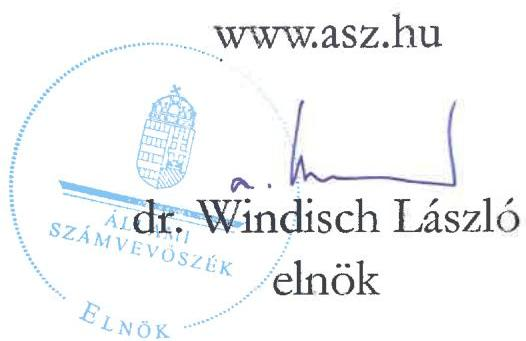
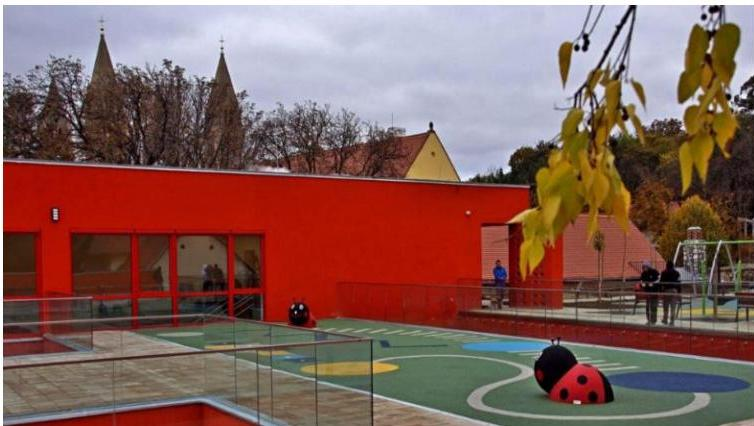
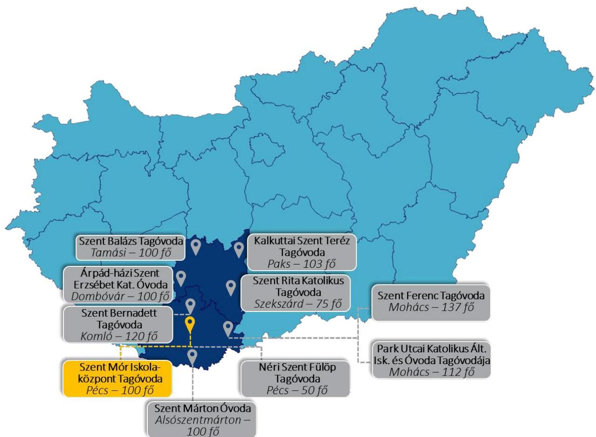

ÁLLAMI SZÁMVEVŐSZÉK

# JELENTÉS

# Egyházaknak nyújtott beruházási támogatások felhasználásának ellenőrzése

A Szent Mór Iskolaközpont Tagóvodájának fejlesztésére nyújtott nem hitéleti célú beruházási támogatás felhasználásának ellenőrzése a Pécsi Egyházmegyénél

2025.

25107

www.asz.hu

---

ÁLLAMI SZÁMVEVŐSZÉK

# JELENTÉS

## Egyházaknak nyújtott beruházási támogatások felhasználásának ellenőrzése

A Szent Mór Iskolaközpont Tagóvodájának fejlesztésére nyújtott nem hitéleti célú beruházási támogatás felhasználásának ellenőrzése a Pécsi Egyházmegyénél

2025.

25107

---

Jelentéseink az interneten a www.asz.hu címen olvashatók.

ELLENŐRZÉSI IGAZGATÓSÁG:
ELLENŐRZÉSI IGAZGATÓSÁG V.

ELLENŐRZÉSI IGAZGATÓ:
KLINGA LÁSZLÓ igazgató

ELLENŐRZÉSVEZETŐ:
NEMESVÁRI-HORTHY ESZTER ellenőrzésvezető

IKTATÓSZÁM: EL-4102-003/2025
TÉMASORSZÁM: 35
ELLENŐRZÉS-AZONOSÍTÓ SZÁM: V-11052

---

TARTALOMJEGYZÉK

- ÖSSZEFOGLALÁS ... 5
- AZ ELLENŐRZÉS EREDMÉNYEI ... 7
1. Az Egyházmegye támogatás felhasználására vonatkozó szabályozási keretei és könyvvezetési rendszere kialakításának, valamint a közfeladatellátáshoz kapcsolódó beszámolási kötelezettségének szabályszerűsége a nem hitéleti célú költségvetési forrásból származó beruházási támogatások vonatkozásában ... 7
2. A költségvetési forrásból származó ellenőrzött nem hitéleti célú beruházási támogatás és felhasználása, illetve a támogatásból finanszírozott beruházás könyvviteli nyilvántartásának szabályszerűsége ... 8
3. A költségvetési forrásból származó ellenőrzött nem hitéleti célú beruházási támogatás felhasználásának, elszámolásának szabályszerűsége ... 9
4. A költségvetési forrásból származó ellenőrzött nem hitéleti célú támogatásból finanszírozott beruházás előkészítésének szabályszerűsége ... 9

- JAVASLATOK ... 11
- I. FÜGGELÉK: ÉSZREVÉTELEK ... 12
- II. FÜGGELÉK: ELLENŐRZÉSI MEGKÖZELÍTÉS ... 13
- MELLÉKLETEK ... 19
I. sz. melléklet: Értelmező szótár ... 19
II. sz. melléklet: Az ellenőrzött szervezetek jegyzéke ... 21
- RÖVIDÍTÉSEK JEGYZÉKE ... 22

---

.

---

ÖSSZEFOGLALÁS

A Magyarországon működő vallási közösségek számos társadalmi és közfeladatot látnak el, amelyhez az elmúlt évek tendenciáit megfigyelve, jelentős, egyre növekvő mértékű költségvetési támogatásban részesültek. Az elmúlt években az állam által nyújtott jelentős összegű támogatások miatt a vallási közösségek egyre hangsúlyosabb szerepet kapnak a közfeladatellátásban. A közérdeklődés folyamatos, hiszen a társadalom részéről kérdésként merül fel, hogy az állam által nyújtott közpénz hasznosult-e, elérte-e a célját, továbbá jogos elvárás, hogy az állam által nyújtott támogatás felhasználása szabályszerűen, átláthatóan, ellenőrizhetően történjen meg.

Szent Mór Iskolaközpont Tagóvoda Forrás: https://szentmor.hu/szent-mor-katolikas-ovoda/

Az ÁSZ¹, mint az Országgyűlés legfőbb pénzügyi és gazdasági ellenőrző szerve, figyelemmel a társadalom részéről jelentkező elvárásokra, törvényi felhatalmazás alapján törvényességi szempontból ellenőrzi az egyházaknak, belső egyházi jogi személyeknek nyújtott nem hitéleti célú támogatások felhasználását.

Az ÁSZ a jelen, óvodafejlesztésre nyújtott támogatás felhasználásának ellenőrzését megelőzően elemezte, értékelte az Egyházi

Államtitkárság² által az ÁSZ felkérésére az egyházaknak nyújtott, nem hitéleti célú beruházási támogatásokra vonatkozóan átadott adatokat. Az adatok elemzése eredményeként az ÁSZ megállapította, hogy az óvodafejlesztésekre nyújtott támogatások voltak az elmúlt években a legjelentősebbek, ezért különböző kockázati szempontok alapján választotta ki ellenőrzésre az óvodafejlesztési támogatások közül az Egyházmegye³ részére egyházi célú fejlesztési támogatásra nyújtott 8750,0 M Ft-ból a Szent Mór Iskolaközpont⁴ Tagóvodájának fejlesztésére fordított, 918,4 M Ft nem hitéleti célú támogatást. Az ÁSZ a támogatás felhasználásának ellenőrzését a kedvezményezett Egyházmegyénél végezte, amely egyúttal a beruházás eredményeként létrejött intézmény, a Szent Mór Iskolaközpont Tagóvoda fenntartójának is minősült.

Az óvodafejlesztésre kapott támogatást az Egyházmegye a Támogatói okiratban⁵ foglalt célnak megfelelően a Szent Mór Iskolaközpont Tagóvodájának építésére fordította. A beruházás megvalósítása érdekében a 918,4 M Ft ÁSZ által ellenőrzött költségvetési támogatás mellett 54,3 M Ft saját forrás is bevonásra került. Az Egyházmegye a beruházásra összességében 972,7 M Ft-ot használt fel.

Az ellenőrzés során az ÁSZ nem állapított meg olyan szabálytalanságot, ami befolyásolta a támogatás cél szerinti felhasználását. Az ÁSZ az egyéb számviteli, könyveléstechnikai szabálytalanságok jövőbeni elkerülése érdekében az Egyházmegye Megyéspüspöke részére három javaslatot fogalmazott meg.

A Támogató szervezet⁶ által a Támogatói okiratban megfogalmazott cél teljesült, mivel az ellenőrzött nem hitéleti célra kapott költségvetési támogatásból egy új kétszintes, 2020. január 14-től érvényes működési engedélye szerint 100 fő befogadására alkalmas óvoda épült, amelyben négy csoportszoba, egy tornaszoba és egy közösségi rendezvényterem kapott helyet. Az épület udvarában játszóeszközzel felszerelt tér is kialakításra került. Az új óvodaépület kapacitása 35 fővel bővült a régi óvodához képest, a korábbi 65 főről 100 főre növekedett az óvodai férőhelyek száma.

5

---

Összefoglalás

Az Egyházmegye a beruházás előkészítése során az építettői felelősségre vonatkozó jogszabályi előírásokat betartotta. Az Egyházmegye a kivitelezés megkezdését megelőzően – a jogszabályi kötelezettségének eleget téve – a kiviteli és engedélyezési tervek elkészítése érdekében tervezési szerződést, a kivitelezés műszaki ellenőrzése érdekében a műszaki ellenőrrel szerződést kötött. A kivitelező kiválasztása érdekében az Egyházmegye a törvényi kötelezettségének eleget téve, a beruházás becsült értéke alapján a kivitelező kiválasztására közbeszerzési eljárást folytatott le, amely eredményes volt, a kivitelezővel a szerződést megkötötték. A kivitelezés értékelése során az ÁSZ kockázatot azonosított, mivel a felelősségbiztosítás és jöleteljesítési biztosíték nem állt rendelkezésre a műszaki átadás átvétel időpontjában. A beazonosított kockázat nem következett be. Nem szerződésszerű teljesítés, illetve szerződésszegés miatt igényérvényesítés nem történt, a beruházás megvalósult.

Az Egyházmegye könyvvezetési rendszerének kialakítás szabályszerű volt, könyveit a kettős könyvvitel rendszerében vezette. Az Egyházmegye törvényi előírás alapján kötelezően elkészítendő számviteli politikája tartalmában az ÁSZ ellenőrzése hiányosságot állapított meg. Az Egyházmegye nem rendelkezett az eszközök és források leltárkészítési és leltározási szabályzatával, értékelési szabályzattal és számlarenddel. A hiányzó szabályzatokra az ÁSZ a helyszíni ellenőrzés keretében felhívta az Egyházmegye figyelmét. Az Egyházmegye azonnali lépéseket tett a szabálytalanságok megszüntetése érdekében, a hiányzó szabályzatokat elkészítette, hatályba léptette, ezáltal az ÁSZ ellenőrzése a helyszíni ellenőrzés időszakában hasznosult.

Az Egyházmegye beszámolási kötelezettségének a 2021. és a 2022. évekre vonatkozóan szabályszerűen eleget tett.

Az Egyházmegye az állami költségvetés terhére nyújtott támogatás felhasználása átláthatóságának a feltételeit megteremtette. Az Egyházmegye a könyvvezetését úgy alakította ki, hogy a kapott támogatás és annak felhasználása elkülönítetten kerüljön kimutatásra. A kapott költségvetési támogatás és annak felhasználása elkülönítetten szerepelt az Egyházmegye könyveiben. Az Egyházmegye a 100%-os támogatási előlegként kapott támogatást, az előírásokkal ellentétben nem kötelezettségként, hanem egyéb bevételként mutatta ki.

Az Egyházmegye a támogatással szabályszerűen kiállított, a könyvviteli nyilvántartásában rögzített számviteli bizonylatokkal, határidőben elszámolt a Támogató szervezet felé, amely az elszámolást elfogadta.

---

AZ ELLENŐRZÉS EREDMÉNYEI

Az Egyházmegye a részére, óvodafejlesztésre nyújtott költségvetési támogatásból a Szent Mór Iskolaközpont Tagóvodájának fejlesztésére fordított támogatást szabályszerűen, a támogatás céljának megfelelően a támogatott tevékenység időtartamán belül használta fel. A közpénz az óvodai nevelési közfeladatra került felhasználásra. A beruházás eredményeként létrejött új óvodaépülettel a régi óvoda 65 fős kapacitása 35 fővel, összesen 100 főre növekedett.

1. Az Egyházmegye támogatás felhasználására vonatkozó szabályozási keretei és könyvvezetési rendszere kialakításának, valamint a közfeladatellátáshoz kapcsolódó beszámolási kötelezettségének szabályszerűsége a nem hitéleti célú költségvetési forrásból származó beruházási támogatások vonatkozásában

Összegző megállapítás

Az Egyházmegye könyvvezetési rendszerének kialakítása szabályszerű volt, beszámolási kötelezettségének a 2021. és a 2022. évekre vonatkozóan szabályszerűen eleget tett.

Az Egyházmegye a Számv. tv.⁷ előírásával összhangban rendelkezett Számviteli politikával⁸, valamint annak keretében a Számv. tv. előírásának megfelelően elkészítette a Pénzkezelési szabályzatot⁹. Az Egyházmegye az ellenőrzött időszakban az egyes gazdasági események könyvelése során alkalmazta az időbeli elhatárolást, ugyanakkor a választott módszert és annak alkalmazását az Eszámvr.¹⁰ 7. § (6) bekezdésében előírtak ellenére nem határozta meg a Számviteli politikában. Az Egyházmegye a Számv. tv. 14. § (5) bekezdés a)-b) pontjaiban foglalt előírások ellenére nem készítette el az eszközök és a források leltárkészítési és leltározási szabályzatát, valamint értékelési szabályzatát. Az Egyházmegye kettős könyvvitelt vezető gazdálkodóként a Számv. tv. 161. § (1) bekezdésében előírtak ellenére nem rendelkezett számlarenddel.

Az Egyházmegye – az ÁSZ ellenőrzésre tekintettel – azonnali lépéseket tett a szabálytalanságok megszüntetése érdekében. Az Egyházmegye képviselője 2025. január 31-én kelt nyilatkozatában arról tájékoztatta az ÁSZ-t, hogy a hiányzó szabályzatokat elkészítette és 2025. január 1-jétől hatályba léptette. Az Egyházmegye az elkészített szabályzatokat az ÁSZ ellenőrzés rendelkezésére bocsátotta.

Az Egyházmegye a Számviteli politikájában hozott döntésének megfelelően könyvvezetését a kettős könyvvitel rendszerében vezette. Az Egyházmegye számviteli beszámoló készítési kötelezettségének az Eszámvr. előírása alapján tett eleget. A 2021-2022. években egyszerűsített éves beszámolót készített, amely az Eszámvr. 1. sz. melléklete szerinti mérlegből és eredménykimutatásból állt.

Az Egyházmegye a 2021-2022. évekre vonatkozó számviteli beszámolóját – összhangban az Eszámvr. 11. §-ában biztosított lehetőséggel és a Számviteli politikájában rögzített rendelkezéssel – nem tette közzé.

7

---

Az ellenőrzés eredményei

## 2. A költségvetési forrásból származó ellenőrzött nem hitéleti célú beruházási támogatás és felhasználása, illetve a támogatásból finanszírozott beruházás könyvviteli nyilvántartásának szabályszerűsége

### Összegző megállapítás

Az Egyházmegye a költségvetési forrásból származó, a Szent Mór Iskolaközpont Tagóvodájának fejlesztésére kapott nem hitéleti célú beruházási támogatást és annak felhasználását szabályszerűen, elkülönítetten mutatta ki a könyveiben, ugyanakkor a bekerülési érték meghatározása és az értékcsökkenés elszámolása az óvoda épület tekintetében nem volt szabályszerű.

Az Egyházmegye az elkülönített nyilvántartás vezetésének feltételeit kialakította. Az Egyházmegye a kapott költségvetési támogatást és annak felhasználását – a Támogatói okiratban hivatkozott ÁSZF¹¹-ben előírt kötelezettségének eleget téve – könyvviteli nyilvántartásában elkülönítetten gyűjtőkód alkalmazásával mutatta ki.

Az Egyházmegye a 100%-os előlegként kapott támogatást elkülönítetten mutatta ki, ugyanakkor egyéb bevételként vette nyilvántartásba, ellentétben a Számv. tv. 43. § (1) bekezdésében foglalt előírással, az egyéb rövid lejáratú kötelezettségek között nem mutatta ki.

A kis értékű tárgyi eszközök aktíválása, illetve nyilvántartásba vétele, valamint azok 100%-os értékcsökkenésként történő elszámolása megtörtént, az alkalmazott értékcsökkenési elszámolás megfelelt a Számv. tv.-ben és a Számviteli politikában előírtaknak. A beruházás aktíválása során megvalósult új óvoda épületet az Egyházmegye a Számv. tv.-ben előírtakkal összhangban a használatba vételi engedély jogerőre emelkedésének napjával megegyező időpontban az ingatlanok között nyilvántartásba vette. Az ingatlan bekerülési értékének meghatározásakor több olyan szolgáltatás díját – összesen 15,8 M Ft értékben – nem vettek figyelembe, amelyek a Számv. tv. 47. § (1) bekezdése, (2) bekezdés c) és (4) bekezdés d) pont előírásai alapján az épület bekerülési értéke részét képezték volna. Az Egyházmegye a 15,8 M Ft értékű szolgáltatási díjakat ugyanakkor az 5-ös számlaosztályban költségként elszámolta, lekönyvelte.

* tízcsap oltóvíz hozamának mérése – használatba vételi engedélyhez, e napló rendszerhasználati díj, közbeszerzés rendszerhasználati díja, hirdetményellenőrzési díj, telekegyesítés vázrajz, az előzetes régészeti dokumentáció elkészítéséért, a régészeti megfigyelés, bontómunka szolgáltatásokért fizetett díj.

8

---

Az ellenőrzés eredményei

# 3. A költségvetési forrásból származó ellenőrzött nem hitéleti célú beruházási támogatás felhasználásának, elszámolásának szabályszerűsége

## Összegző megállapítás

Az Egyházmegye a költségvetési forrásból származó a Szent Mór Iskolaközpont Tagóvodájának fejlesztésére nyújtott nem hitéleti célú beruházási támogatást szabályszerűen használta fel és számolta el.

A Támogatói okirathoz kapcsolódó, a Szent Mór Iskolaközpont Tagóvodájának fejlesztésére felhasznált támogatásról készült, a Támogató szervezet felé 2022. július 27-én benyújtott elszámolásban szereplő tételek vizsgálata alapján az ÁSZ az alábbiakat állapította meg:

- a kapott támogatást a Támogatói okiratban meghatározott célnak megfelelően a Szent Mór Iskolaközpont Tagóvodájának fejlesztésére használták fel;
- a beruházásról vezetett elkülönített számviteli nyilvántartás tartalmazott minden olyan bizonylatot, amely szerepelt az elszámolásban;
- az elszámolt költségek bizonylatokkal voltak igazolva, azok alaki és tartalmi kellékei megfeleltek a Számv. tv.-ben foglalt előírásoknak;
- a támogatás felhasználása megfelelt a Támogatói okiratban meghatározott megvalósítási időszaknak (2016. január 1 - 2022. június 30.), a bizonylatok mindegyike esetében a teljesítés dátuma a megvalósítási időszakba esett.
- a benyújtott számlák záradékolása nem volt teljeskörű, egy bizonylat nem tartalmazott záradékot, illetve további egy bizonylat esetében a záradékolás nem felelt meg maradéktalanul a Támogatói okirat 4.4. pontjában foglaltaknak.

Az Egyházmegye a Támogató szervezet felé a Támogatói okiratban, illetve a Támogató szervezet által jelzett határidőn belül elszámolt. Az elszámolást a Támogató szervezet elfogadta, a záró teljesítésigazolást 2022. november 29. napján állította ki, az Egyházmegyének támogatás visszafizetési kötelezettsége nem keletkezett.

# 4. A költségvetési forrásból származó ellenőrzött nem hitéleti célú támogatásból finanszírozott beruházás előkészítésének szabályszerűsége

## Összegző megállapítás

Az ellenőrzött nem hitéleti célú támogatásból finanszírozott, a Szent Mór Iskolaközpont Tagóvodájának fejlesztése érdekében folytatott építési beruházás előkészítése keretében a közbeszerzési eljárást lefolytatták, az építettői felelősségre vonatkozó jogszabályi előírásokat betartották.

Az Egyházmegye, mint ajánlatkérő a Kbt.¹² előírására tekintettel a közbeszerzés előkészítését megelőzően a közbeszerzési eljáráshoz kapcsolódó egyedi szabályozást készített. Az Egyházmegye a tervezett beruházás megvalósítása érdekében az építési beruházásra – figyelemmel a beruházás becsült értékére –

---

Az ellenőrzés eredményei

a Kbt. 5. § (3) bekezdésében foglalt előírás alapján közbeszerzési eljárás lefolytatására volt kötelezett. Az Egyházmegye a Kbt.-ben foglalt közbeszerzési kötelezettségének eleget tett, közbeszerzési eljárást folytatott le, az eljárás eredményes volt.

A beruházás előkészítéséhez kapcsolódó építettői felelősségre vonatkozó jogszabályi előírásokat az Egyházmegye betartotta, mint építettő az Étv.¹³-ben foglaltakért viselt felelősségi körében az engedélyezési és kiviteli tervdokumentáció tervezőjét, valamint a kivitelezőt kiválasztotta. A kivitelezés műszaki ellenőrének megbízásánál az Egyházmegye az Étv. hivatkozott előírásai mellett figyelembe vette a 191/2009. (IX.15.) Korm. rendelet¹⁴-ben foglalt előírást is, amely a Kbt. hatálya alá tartozó építési beruházás esetén a műszaki ellenőri feladatok ellátása esetére előírja a műszaki ellenőr megbízását. Az Egyházmegye az engedélyezési és kiviteli tervdokumentáció tervezőjével, az építési beruházás műszaki ellenőrével, valamint a kivitelezővel a szerződéseket megkötötte. A szerződések megkötésénél az Egyházmegye figyelembe vette a Támogatói okiratban meghatározott szakmai programot.

A megkötött szerződésekben a biztosítéki elemek az alábbiak voltak:

- Az engedélyezési terv készítésére vonatkozó szerződésben a kötbérfizetési kötelezettséget, illetve annak feltételeit a Ptk.¹⁵-ban foglaltak alapján határozták meg.
- A kiviteli terv elkészítésére kötött szerződésben rögzítésre került a tervező által a szerződésszerű teljesítésért vállalt jótállás a Ptk.-ban előírtakkal összhangban. A kötbérfizetési kötelezettséget és annak érvényesítési feltételeit, a Ptk. rendelkezésével összhangban állapították meg.
- A műszaki ellenőrrel kötött szerződésben a jótállásra vonatkozó rendelkezéseket a Ptk.-ban foglaltakkal összhangban határozták meg.
- A kivitelezési szerződésben a jótállásra vonatkozó rendelkezéseket a Ptk.-ban foglaltak szerint, a kötbérfizetési kötelezettséget és annak érvényesítési feltételeit a Ptk. előírásával összhangban rögzítették.

A felelősségbiztosítás és jótelljesítési biztosíték a beruházás teljes időszaka alatt nem állt rendelkezésre, mivel azokkal a műszaki átadás átvételt megelőző 6 hónapban már nem rendelkeztek.

A beruházás megvalósítása során a tervezési, a műszaki ellenőri, illetve a kivitelezői szerződésekben és azok módosításaiban meghatározott biztosíték, jótállás, kötbérfizetési igény érvényesítésére nem került sor. Az építési beruházás az Egyházmegye saját tulajdonú ingatlanján valósult meg.

10

---

11

# JAVASLATOK

Az ÁSZ tv. 16 33. § (1) bekezdésében foglaltak értelmében az ellenőrzött szervezet vezetője köteles a jelentésben foglalt megállapításokhoz kapcsolódó intézkedési tervet összeállítani és azt a jelentés kézhezvételétől számított 30 napon belül az ÁSZ részére megküldeni. Az ÁSZ a jelentésben foglalt megállapításokhoz kapcsolódóan az alábbi javaslatok tekintetében várja el az intézkedési terv elkészítését.

## A PÉCSI EGYHÁZMEGYE MEGYÉSPÜSPÖKE RÉSZÉRE

1. Az Egyházmegye az ellenőrzött időszakban az egyes gazdasági események könyvelése során alkalmazta az időbeli elhatárolást, ugyanakkor a választott módszert és annak alkalmazását az Eszámvr. 7. § (6) bekezdésében előírtak ellenére nem határozta meg a Számviteli politikában.

Gondoskodjon a Számviteli politika kiegészítésről az Eszámvr. 7. § (6) bekezdésében foglalt előírásra figyelemmel, hogy az tartalmazza az időbeli elhatárolás választott módszerét és annak alkalmazását.

2. Az Egyházmegye a 100%-os előlegként kapott támogatást elkülönítetten mutatta ki, ugyanakkor egyéb bevételként vette nyilvántartásba, ellentétben a Számv. tv. 43. § (1) bekezdésében foglalt előírással, amely szerint a kötelezettségek között kellett volna kimutatnia.

Gondoskodjon arról, hogy amennyiben az Egyházmegye 100%-os előlegként nyújtott támogatást kap, a könyveiben a Számv. tv. 43. § (1) bekezdésében foglalt előírással összhangban a rövid lejáratú kötelezettségek között mutassa ki.

3. Az Egyházmegye az ingatlan bekerülési értékének meghatározásakor több szolgáltatás díját – összesen 15,8 M Ft értékben – nem vette figyelembe, amelyek a Számv. tv. 47. § (1) bekezdése, (2) bekezdés c) és (4) bekezdés d) pont előírásai alapján az épület bekerülési értéke részét képeztek volna, azokat az 5-ös számlaosztályban költségként elszámolta, lekönyvelte.

Gondoskodjon arról, hogy amennyiben a jövőben ingatlan beruházást valósít meg, úgy aktíváláskor az ingatlan bekerülési értékét a Számv. tv. 47. § (1)-(7) bekezdéseiben foglaltakra tekintettel határozzák meg.

---

I. FÜGGELÉK: ÉSZREVÉTELEK

A jelentéstervezetet az ÁSZ 15 napos észrevételezésre megküldte az ellenőrzött szervezet vezetőjének az ÁSZ tv. 29. §* (1) bekezdése előírásának megfelelően.

A Pécsi Egyházmegye levelében jelezte, hogy a jelentéstervezet megállapításaira nem tesz észrevételt.

* 29. § (1) Az Állami Számvevőszék az ellenőrzési megállapításait megküldi az ellenőrzött szervezet vezetőjének vagy az általa megbízott személynek, és annak, akinek személyes felelősségét állapította meg.
(2) Az ellenőrzött szervezet vezetője és a felelősként megjelölt személy az ellenőrzés megállapításaira tizenöt napon belül írásban észrevételt tehet.
(3) Az Állami Számvevőszék az észrevételre a beérkezésétől számított harminc napon belül írásban válaszol. A figyelembe nem vett észrevételeket köteles a jelentésben feltüntetni, és megindokolni, hogy azokat miért nem fogadta el.

12

---

13

# II. FÜGGELÉK: ELLENŐRZÉSI MEGKÖZELÍTÉS

## AZ ELLENŐRZÉS JOGALAPJA

Az ellenőrzés jogszabályi alapját az ÁSZ tv. 1. § (3) bekezdése, az 5. § (11) bekezdés c) pontja, valamint az Ehtv.¹⁷ 19/D. § (2) bekezdés előírásai képezték.

## AZ ELLENŐRZÉS CÉLJA

Az ellenőrzés célja annak értékelése volt, hogy a költségvetési forrásból az Egyházmegye a részére nyújtott nem hitéleti célú beruházási támogatás vonatkozásában a támogatás felhasználásának szabályozási környezetét szabályszerűen alakította-e ki, a nem hitéleti célú beruházási támogatás felhasználása, a támogatással való elszámolás, a könyvviteli nyilvántartás szabályszerű volt-e, illetve a támogatásból finanszírozott beruházás előkészítése szabályszerűen történt-e meg.

## AZ ELLENŐRZÉS TÍPUSA

Törvényességi ellenőrzés.

## AZ ELLENŐRZÉS TÁRGYA

Az ellenőrzés tárgyát képezte az Egyházmegye részére költségvetési forrásból nem hitéleti célra nyújtott beruházási támogatás felhasználásának törvényességi szempontok szerinti ellenőrzése. Ennek keretében ellenőrzésre került a beruházási támogatáshoz kapcsolódóan a számviteli elszámolásra vonatkozóan a jogszabályi, illetve a támogatói okiratban rögzített előírások betartása, a támogatás felhasználása és az azzal történő elszámolás támogatói okiratnak való megfelelősége. Ezzel összefüggésben értékelésre került, hogy a számviteli szabályozási környezet kialakítása támogatta-e a költségvetési forrásból származó nem hitéleti célú beruházási támogatás vonatkozásában a szabályos könyvvezetést. Az ellenőrzés tárgya volt továbbá annak ellenőrzése, hogy a támogatásból finanszírozott beruházás előkészítése szabályszerű volt-e.

Az ellenőrzés kiterjedt minden olyan körülményre és adatra, amely az ÁSZ jogszabályban meghatározott feladatainak teljesítéséhez, valamint a program végrehajtása folyamán felmerült újabb összefüggések feltárásához szükséges volt.

## AZ ELLENŐRZÉS HATÓKÖRE ÉS TERÜLETE

A Magyarországon működő vallási közösségek a társadalom kiemelkedő fontosságú értékhordozó és közösségteremtő tényezői. Hitéleti tevékenységük mellett közfeladatok ellátásában vesznek részt. A közfeladataik ellátásához jelentős állami költségvetési támogatásban, közpénzben részesülnek. A társadalom jogos elvárása, hogy a közpénzekkel gazdálkodó szervezetek működéséről, tevékenységéről átfogó képet kapjon.

---

II. Függelék: Ellenőrzési megközelítés

Az Ehtv. 19/D. § (2) bekezdésében előírtak alapján az egyházi jogi személynek nem hitéleti célra nyújtott költségvetési támogatás felhasználásának törvényességi szempontok szerinti ellenőrzését az ÁSZ végzi. Az ÁSZ tv. 5. § (11) bekezdés c) pontja rendelkezése alapján az ÁSZ a vallási egyesület, az egyházi jogi személyek vagy azok nevelési-oktatási, felsőoktatási, egészségügyi, karitatív, szociális, család-, gyermek- és ifjúságvédelmi, kulturális vagy sporttevékenység végzésére létrehozott, a jogi személyiséggel rendelkező vallási közösség belső szabálya szerint jogi személyiséggel nem rendelkező intézménye részére az államháztartásból nem hitéleti célra nyújtott beruházási támogatás felhasználását ellenőrzi.

Az ÁSZ a jelen, óvodafejlesztésekre nyújtott támogatások felhasználásának ellenőrzését megelőzően elemezte, értékelte az Egyházi Államtitkárság által az ÁSZ felkérésére az egyházaknak nyújtott, nem hitéleti célú beruházási támogatásokra vonatkozóan adott adatokat. Az ÁSZ egyházakat érintő ellenőrzései, valamint az Egyházi Államtitkárság által szolgáltatott adatok elemzése alapján arra a következtetésre jutott, hogy az elmúlt években más közfeladatok ellátását is értékelve a köznevelés területén az óvodafejlesztések voltak azok, amelyek révén rendkívül jelentős mértékű támogatásokat nyújtottak az egyházak számára.

A 2021. január 1. és 2024. június 30. közötti időszakban a köznevelési közfeladatokhoz kapcsolódóan több, mint 300 beruházási célú egyházi támogatás lezártnak minősült. A nyújtott, több száz támogatás közel 50%-a óvoda beruházásokhoz kapcsolódott, amely beruházások támogatási összege meghaladta a 40 000,0 M Ft-ot.

Az ellenőrzött támogatások kiválasztása érdekében az Egyházi Államtitkárság által megküldött Magyarország területén megvalósuló, 2021. január 1-2024. június 30. között lezárt beruházási célú egyházi támogatások adatait értékelte az ÁSZ. Az értékelés során az egyes beruházások tekintetében az ÁSZ kockázati szempontként vette figyelembe a támogatási összeg nagyságát, a támogatás felhasználásának időbeli elhúzódását, a támogatással kapcsolatban megkötött támogatói okirat több alkalommal történő módosítását, illetve, hogy a támogatási összeg alapján közbeszerzési eljárás lefolytatásának szükségessége felmerült-e.

Az értékelés eredményeként az Egyházmegye részére egyházi fejlesztési célú támogatásra nyújtott 8750,0 M Ft-ból a Szent Mór Iskolaközpont Tagóvodájának fejlesztésére nyújtott, 918,4 M Ft nem hitéleti célú támogatást és annak felhasználását az ÁSZ ellenőrzésre jelölte ki.

Az ÁSZ a kockázati alapon kiválasztott, nem hitéleti célú beruházási támogatást felhasználó kedvezményezett egyházi jogi személynél folytatott ellenőrzése során azt értékelte, hogy:

- a számviteli keretek, könyvvezetési rendszer kialakítása a jogszabályi előírásoknak megfelelően történt-e, illetve az egyházi jogi személy megfelelő formában határozta-e meg a számviteli beszámoló formáját;
- a kapott támogatást, illetve annak felhasználását a jogszabályi előírásoknak, valamint a támogatói okiratban foglaltaknak megfelelően tartotta-e nyilván, a támogatásból finanszírozott beruházás vonatkozásában a nyilvántartása szabályszerű volt-e;
- a támogatás felhasználása, a támogatással való elszámolás során a jogszabályokban és a támogatói okiratban foglalt előírások betartásával járt-e el;
- a beruházás előkészítése során a jogszabályokban és a támogatói okiratban foglalt előírások betartásával járt-e el.

14

---

II. Függelék: Ellenőrzési megközelítés

Az ÁSZ által az ellenőrzött támogatással kapcsolatos adatokat az 1. táblázat foglalja össze.

1. táblázat

A TÁMOGATÁS FŐBB ADATAI

|  EGYH-KCP-16-P-0105 AZONOSÍTÓ SZÁMÚ TÁMOGATÓI OKIRAT ÉS AZ ELLENŐRZŐTT SZAKMAI RÉSZFELADAT ADATAI  |   |
| --- | --- |
|  Támogatott tevékenységek: | Közoktatási intézmények infrastrukturális fejlesztése, Pécsi Székesegyház belső restaurálása és környezetének turisztikai fejlesztése, Dóm tér teljes rekonstrukciója, Kertvárosi Szt. II. János Pál Plébánia infrastrukturális fejlesztése  |
|  Támogatás forrása: | Magyarország 2016. évi központi költségvetéséről szóló 2015. évi C. törvény XX. Emberi Erőforrások Minisztériuma fejezet 20/55/9 Egyházi közösségi célú programok és beruházások támogatása fejezeti kezelésű előirányzata  |
|  Támogatási összeg: | 8750,0 M Ft  |
|  Támogató szervezet: | EMMI^{18}, 2018. szeptember 1-jétől BGA Zrt.^{19}  |
|  Ellenőrzött támogatott tevékenység: | Szent Mór Iskolaközpont Tagóvodájának fejlesztése  |
|  Ellenőrzött támogatott tevékenység tervezett összege: | 972,6 M Ft  |
|  Ellenőrzött támogatott tevékenység felhasznált összege: | 918,4 M Ft  |
|  A támogatott tevékenység időtartama: | 2016.január 1-2022. június 30.  |
|  A támogatási előleg felhasználásáról a beszámoló benyújtásának határideje: | 2022. július 30.  |
|  Beszámoló benyújtása és elfogadása: | 2022. július 27. és 2022.szeptember 16.  |

Forrás: ÁSZ szerkesztés a Támogatói okirat és annak módosításai alapján

# PÉCSI EGYHÁZMEGYE

Pécsi Székesegyház Forrás: Pécsi Székesegyház Facebook oldala

Az Ehtv. Melléklete szerint a 27 bevett egyház közé tartozó Magyar Katolikus Egyház belső egyházi jogi személye a Pécsi Egyházmegye, amelyet Szent István király alapított 1009. augusztus 23-án. Működése jelenleg két közigazgatási területi egységre, Tolna- és Baranya vármegyére terjed ki. Az Egyházmegye püspöki székhelye Pécs, katedrálisa a pécsi Szent Péter és Szent Pál Székesegyház.

A Pécsi Egyházmegyéhez tartozik a Püspöki és Káptalani Levéltár, a Püspöki Bíróság, a Székeskáptalan, valamint a Katolikus Karitász, mely utóbbi segítséget nyújt a nélkülözőknek és rászorulóknak. A Pécsi Egyházmegye a hiteleti tevékenységen kívül közhasznú tevékenységként szociális és egészségügyi, karitatív, kulturális, nevelési és oktatási, gyermek-, és ifjúságvédelmi és sport-, tudományos és műemlékvédelmi feladatokat is ellát, illetve az ezekhez szükséges intézmények fenntartását végzi.

Az ellenőrzés tárgyát képező óvodaberuházás kapcsán kiemelendő, hogy a Pécsi Egyházmegye jelentős, közel 1 000 férőhelyet biztosító 10 óvodát tart fenn Tolna és Baranya vármegyében. Az egyes óvodák területi elhelyezkedését és az óvodai férőhelyek számát a 2025. június 24-én hatályos alapító okirataik szerint az alábbi ábra szemlélteti:

---

II. Függelék: Ellenőrzési megközelítés

1. álma

# A PÉCSI EGYHÁZMEGYE ÁLTAL FENNTARTOTT ÓVODÁK TERÜLETI ELHELYEZKEDÉSE ÉS FÉRŐHELYEINEK SZÁMA

Forrás: ÁSZ saját szerkesztés óvodák alapító okiratai alapján

Az ellenőrzött időszakban a Pécsi Egyházmegye főpásztorának személye egy alkalommal változott: 2011. április 9-től Dr. Udvardy György, majd 2020. november 18-tól Felföldi László a pécsi megyéspüspök, akinek püspökké szentelésére 2021. január 6-án került sor.

Az ellenőrzött időszakban a Pécsi Egyházmegye vállalkozási tevékenységet nem folytatott.

# AZ ELLENŐRZŐTT IDŐSZAK

A támogatott tevékenység időtartamának kezdő napjától (2016. január 1.) az ellenőrzés megkezdéséről szóló kiértesítő levél keltéig (2024. december 4.). Az ellenőrzött időszakon belül az értékelt releváns éveket fókuszterületenként és részterületenként az alábbi 2. táblázat foglalja össze:

---

II. Függelék: Ellenőrzési megközelítés

2. táblázat

AZ ELLENŐRZÉS SZEMPONTJÁBÓL RELEVÁNS ÉVEK BEMUTATÁSA

|  FÓKUSZTERÜLET SZÁMA | RÉSZTERÜLET | RELEVANCIA ÉVE  |
| --- | --- | --- |
|  1. | Könyvvezetési rendszer kialakítása, beszámolási kötelezettség teljesítése | 2021-2022.évek  |
|   |  Belső szabályozó eszközök és számviteli keretek kialakítása | 2016-2022. évek  |
|  2. | Kapott támogatás kimutatása | 2016-2022. évek  |
|   |  Ellenőrzött támogatás nyilvántartása | 2016-2022. évek  |
|  3. | Támogatás és felhasználásának elszámolása | 2016-2022. évek  |
|  4. | Támogatásból megvalósuló beruházáshoz kapcsolódó közbeszerzési eljárás | 2016-2022. évek  |
|   |  Építettői felelősség körébe tartozó előírások betartása | 2016-2022. évek  |

Forrás: ÁSZ saját szerkesztés

AZ ELLENŐRZÉSI KRITÉRIUMOK

|  FÓKUSZTERÜLET | ELLENŐRZÉSI KRITÉRIUMOK  |
| --- | --- |
|  1. Az Egyházmegye támogatás felhasználására vonatkozó szabályozási keretei és könyvvezetési rendszere kialakításának, valamint a közfeladatellátáshoz kapcsolódó beszámolási kötelezettségének szabályszerűsége a nem hitéleti célú költségvetési forrásból származó beruházási támogatások vonatkozásában | Számv. tv. 14. § (3) bekezdés, (5) bekezdés a), b) és d) pontjai, 161. § (1) bekezdés
Ehtv. 19. § (3) bekezdés
Eszámvr. 5. § (1) bekezdés, 1. melléklet, 7. § (6) bekezdés, 11. §  |
|  2. A költségvetési forrásból származó ellenőrzött nem hitéleti célú beruházási támogatás és felhasználása, illetve a támogatásból finanszírozott beruházás könyvviteli nyilvántartásának szabályszerűsége | Számv. tv. 26. § (2), 43. § (1) bekezdés, 47. § (1)-(7) bekezdés, 52. § (1) és (7) bekezdés, 80. § (2) bekezdés  |
|  3. A költségvetési forrásból származó ellenőrzött nem hitéleti célú beruházási támogatás felhasználásának, elszámolásának szabályszerűsége | Támogatói okirat 5.3. pontja,
ÁSZF 6.3. pontja,
Számv. tv. 167. § (1) a), d), h) és i) pont  |
|  4. A költségvetési forrásból származó ellenőrzött nem hitéleti célú támogatásból finanszírozott beruházás előkészítésének szabályszerűsége | Kbt. 5. § (3) bekezdés, 27. § (1)-(2) bekezdés, 113. § (1) bekezdés, 131. § (1) bekezdés
Étv. 43. § (1) bekezdés c) pontja;
191/2009. (IX.15.) Korm. rendelet 16. § (1) bekezdés b) pontja;
Ptk. 6:171. § (1) bekezdés, 6:186. §  |

AZ ELLENŐRZÉS MÓDSZERE ÉS AZ ELLENŐRZÉSI BIZONYÍTÉKOK KÖRE

Az ellenőrzést a nemzetközi standardokat irányadónak tekintve az ellenőrzési program szempontjai, az ellenőrzött időszakban hatályos jogszabályok, az ÁSZ ellenőrzés-szakmai szabályok és irányadó módszertanok figyelembevételével végezte az ÁSZ.

---

II. Függelék: Ellenőrzési megközelítés

Az ellenőrzés fókuszterületei kockázatalapú megközelítést alkalmazva, a kockázatot hordozó területek beazonosítása alapján kerültek meghatározásra. Kockázatos területként azonosította az ÁSZ a támogatások könyvviteli elszámolásához kapcsolódó könyvvitelei rendszer kialakítását, a kapott támogatások és azok felhasználása könyvviteli nyilvántartásban történő elszámolását, a támogatásokkal való elszámolást, valamint a megvalósított beruházások előkészítését.

Az ellenőrzési kérdések megválaszolásához szükséges bizonyítékok megszerzése az ellenőrzött szervezet, valamint az ellenőrzést támogató szervezet által rendelkezésre bocsátott dokumentumokra, adatokra alapozva kérdésfeltevés (információkérés), interjú útján, a támogatás felhasználása az elszámolásban rögzített számviteli bizonylatok ellenőrzésén keresztül történt.

Az ellenőrzési bizonyítékként felhasználható adatforrások közé tartoztak egyrészt az ellenőrzéshez kért dokumentumok, adatforrások, másrészt adatforrás volt még minden – az ellenőrzés folyamán – az ellenőrzés szempontjából információkat tartalmazó dokumentum. Az ellenőrzési kritériumok részletes felsorolását a fenti táblázat tartalmazza.

Az ellenőrzés lefolytatásához az ellenőrzött szervezet a tanúsítványok kitöltésével, valamint az ÁSZ által kért dokumentumok, adatok, információk megküldésével és az ellenőrzés során szolgáltatott adatokat. Az Egyházi Államtitkárság, mint ellenőrzést támogató szervezet a bevett egyházaknak és azok belső egyházi jogi személyeinek nyújtott Magyarország területén megvalósuló, 2021. január 1–2024. június 30. között lezárt beruházási célú támogatásokhoz kapcsolódó adatbázisokkal, valamint az ÁSZ által kért adatok, dokumentumok és információk megküldésével járult hozzá az ellenőrzés lefolytatásához.

Az Egyházi Államtitkárság által rendelkezésre bocsátott adatbázisok és dokumentumok alapján az adatok kiértékelését követően kockázatértékelés alapján történt meg a köznevelési közfeladatellátáson belül a nem hitéleti célú, az EGYH-KCP-16-P-0105 azonosító számú Támogatói okirathoz kapcsolódó óvoda beruházási támogatás kiválasztása.

Az ellenőrzött időszak keretében – figyelembe véve az EGYH-KCP-16-P-0105 azonosító számú Támogatói okiratban foglaltakat – a Szent Mór Iskolaközpont Tagóvodájának fejlesztésére kapott támogatás vonatkozásában az ellenőrzés szempontjából releváns évek meghatározására került sor. A könyvvezetési rendszer kialakítása és a beszámolási kötelezettség teljesítése vonatkozásában az ellenőrzés szempontjából releváns évnek minősült az ellenőrzött támogatással történő elszámolás évét megelőző év, az elszámolása éve és az elszámolás Támogató szervezet részéről történő elfogadásának éve. A szabályozási környezet kialakítása, az ellenőrzött támogatás nyilvántartása, felhasználása és elszámolása, valamint a beruházás előkészítése és nyilvántartása vonatkozásában az ellenőrzés szempontjából releváns éveknek kellett tekinteni a támogatott tevékenység időtartamának kezdő napjától az ellenőrzött támogatásból megvalósult beruházáshoz kapcsolódó, a Támogató szervezet által kiállított teljesítésigazolás keltezése évének utolsó napjáig hatályos időszakot. A releváns éveket fókuszterületekhez tartozó részterületenként a 2. táblázat tartalmazza.

A támogatás vonatkozásában a beszámolási kötelezettség szabályszerűségének ellenőrzése az Egyházmegyénél helyszíni adatbetekintés keretében történt meg.

Az ÁSZ az ellenőrzés során a költségvetési forrásból származó nem hitéleti célú beruházási támogatás könyvviteli nyilvántartásának, valamint a beruházási támogatás felhasználásának és elszámolásának szabályszerűségét az EGYH-KCP-16-P-0105 azonosító számú Támogatói okirathoz kapcsolódó számlaösszesítőben szereplő – a Szent Mór Iskolaközpont Tagóvodájának fejlesztésére elszámolt – tételek tételek ellenőrzésével értékelte.

18

---

MELLÉKLETEK

I. SZ. MELLÉKLET: ÉRTELMEZŐ SZÓTÁR

belső egyházi jogi személy

A bevett egyház belső egyházi jogi személye egyházi jogi személy. A belső egyházi jogi személy a bevett egyház belső szabálya szerint működik. A belső egyházi jogi személyre a bevett egyházra vonatkozó szabályokat megfelelően kell alkalmazni. A bevett egyház közélű tevékenységet ellátó intézménye a bevett egyház belső szabálya szerint belső egyházi jogi személynek minősülhet. Nem minősül belső egyházi jogi személynek a bevett egyház, a bejegyzett egyház, illetve a nyilvántartásba vett egyház által létrehozott gazdasági társaság, alapítvány és egyesület. A bevett egyház belső szabálya a jogi személyre törvényben meghatározott általános szabályoktól eltérően határozhatja meg a bevett egyház és a belső egyházi jogi személy szervezetére és képviseletére, törvényes működésének biztosítékaira, átalakulására, egyesülésére, szétválaszára és jogutód nélküli megszűnésére, valamint a belső egyházi jogi személy létesítésére vonatkozó szabályokat.

(Forrás: Ehtv. 10. – 11/A. §)

bevett egyház

Olyan bejegyzett egyház, amellyel az állam a közösségi célok érdekében történő együttműködésről átfogó megállapodást kötött. (Forrás: Ehtv. 9/G. § (1) bekezdés)

ellenőrzést támogató szervezet

Az ÁSZ tv. 25. § (3) bekezdésének rendelkezése alapján adatot, tájékoztatást, dokumentumot nyújtó szervezet. (Forrás: ÁSZ tv. 25. § (3) bekezdés)

költségvetési támogatás

A társadalombiztosítás pénzügyi alapjai kivételével az államháztartás központi alrendszeréből ellenérték nélkül, pénzben nyújtott támogatások. (Forrás: Áht.20 1. § 14. pont)

közfeladat

A jogszabályban meghatározott állami vagy önkormányzati feladat. A közfeladat ellátásában államháztartáson kívüli szervezet jogszabályban meghatározott rendben közreműködhet. (Forrás: Áht. 3/A. § (1)- (2) bekezdés)

lezárt támogatás

A támogatott tevékenység akkor tekinthető lezártnak, ha a támogatói okiratban, támogatási szerződésben a befejezést követő időszakra nézve a kedvezményezett további kötelezettséget nem vállalt és az Ávr.21. 102/B. § (1) bekezdésben meghatározott feltételek teljesültek. Ha a támogatói okirat, támogatási szerződés a támogatott tevékenység befejezését követő időszakra nézve további kötelezettséget tartalmaz, a támogatott tevékenység akkor tekinthető lezártnak, ha valamennyi vállalt kötelezettség teljesült, a kedvezményezett a kötelezettségek megvalósulásának eredményeiről szóló záró beszámolóját benyújtotta, és azt a támogató jóváhagyta, valamint a záró jegyzőkönyv elkészült. (Forrás: Ávr. 102/B. § (2) bekezdés)

nem vallási tevékenység

Önmagában nem tekinthető vallási tevékenységnek a politikai és érdekvényesítő, a pszichikai vagy parapszichikai, a gyógyászati, a gazdasági-vállalkozási, a nevelési, az oktatási, a felsőoktatási, az egészségügyi, a karitatív, a család-, gyermek- és ifjúságvédelmi, a kulturális, a sport-, az állat-, környezet- és természetvédelmi, a hiteleti tevékenységhez szükségesen túlmenő adatkezelési, valamint a szociális tevékenység. (Forrás: Ehtv. 7/A. § (3) bekezdés)

19

---

Mellékletek

támogatási jogviszony
A támogatói okirat kiállításával vagy támogatási szerződés megkötésével létrejött polgári jogi jogviszony.
(Forrás: Áht. 48. § (1) bekezdés b) pont, 48/A. § (1) bekezdés)

támogató szervezet
A támogatási jogviszonyban a kötelezettségvállalási jogkört gyakorló, a támogatás nyújtására köteles szervezet. (Forrás: Áht. 48/A. § (1) bekezdés)

támogatott tevékenység
A támogatási szerződésben meghatározott olyan tevékenység – ideértve a kedvezményezett működését is –, amely során felmerült költségek megtérítését a költségvetési támogatás részben vagy egészében biztosítja (Forrás: Ávr. 1. § 8. pont)

támogatott tevékenység időtartama
Támogatási szerződésben meghatározott olyan időtartam, amely során felmerülő, a támogatott tevékenység megvalósításához kapcsolódó költségek elszámolhatóak (Forrás: Ávr. 1. § 9. pont)

vallási közösség
A természetes személyek minden olyan közössége, szervezeti formától, jogi személyiségtől vagy elnevezéstől függetlenül, amely vallás gyakorlására alakult, és elsődlegesen vallási tevékenységet végez. (Forrás: Ehtv. 6. §)

20

---

Mellékletek

- II. SZ. MELLÉKLET: AZ ELLENŐRZŐTT SZERVEZETEK JEGYZÉKE

|  ELLENŐRZŐTT SZERVEZET NEVE | ELLENŐRZŐTT SZERVEZET SZÉKHELYE  |
| --- | --- |
|  Pécsi Egyházmegye | 7621 Pécs, Dóm tér 2.  |

21

---

RÖVIDÍTÉSEK JEGYZÉKE

1 ÁSZ
2 Egyházi Államtitkárság
3 Egyházmegye
4 Szent Mór Iskolaközpont
5 Támogatói okirat
6 Támogató szervezet
7 Számv. tv.
8 Számviteli politika
9 Pénzkezelési szabályzat
10 Eszámvr.
11 ÁSZF
12 Kbt.
13 Étv.
14 191/2009. (IX. 15.) Korm. rendelet
15 Ptk.
16 ÁSZ tv.
17 Ehtv.
18 EMMI
19 BGA Zrt.
20 Áht.
21 Ávr.

Állami Számvevőszék
A Miniszterelnökség Egyházi és Nemzetiségi Kapcsolatokért Felelős Államtitkársága
Pécsi Egyházmegye
Szent Mór Katolikus Óvoda, Általános Iskola, Alapfokú Művészeti Iskola és Gimnázium
EGYH-KCP-16-P-0105 azonosító számú Támogatói okirat, kelt: 2016. december 21.
Elválaszthatatlan mellékletei: ÁSZF; Útmutató az egyházi támogatások felhasználásához
Emberi Erőforrások Minisztériuma, 2018. szeptember 1-jétől Bethlen Gábor
Alapkezelő Közhasznú Nonprofit Zártkörűen Működő Részvénytársaság
2000. évi C. törvény a számvitelről (hatályos 2001. január 1-jétől)
Pécsi Egyházmegye számviteli politikája (hatályos 2016. január 1-jétől, figyelemmel az ellenőrzött jegyzőkönyvben tett nyilatkozatára)
Pécsi Egyházmegye pénzkezelési szabályzata (hatályos 2016. január 1-jétől, figyelemmel az ellenőrzött jegyzőkönyvben tett nyilatkozatára)
296/2013. (VII.29.) Korm. rendelet az egyházi jogi személyek beszámolókészítési és könyvvezetési kötelezettségeinek sajátosságairól (hatályos 2014. január 1-jétől)
Az EGYH-KCP-16-P-0105 azonosító számú támogatói okirat elválaszthatatlan részét képező Általános Szerződési Feltételek
2015. évi CXLIII. törvény a közbeszerzésekről (hatályos 2015. november 1-jétől)
1997. évi LXXVIII. törvény az épített környezet alakításáról és védelméről (hatályos 1998. január 1-jétől, hatálytalan 2024. október 1-jétől)
191/2009. (IX. 15.) Korm. rendelet az építőipari kivitelezési tevékenységről (hatályos 2009. október 1-jétől)
2013. évi V. törvény - a Polgári Törvénykönyvről (hatályos 2014. március 15-étől)
2011. évi LXVI. törvény az Állami Számvevőszékről (hatályos 2011. július 1-jétől)
2011. évi CCVI. törvény a lelkiismereti és vallásszabadság jogáról, valamint az egyházak, vallásfelekezetek és vallási közösségek jogállásáról (hatályos 2012. január 1-jétől)
Emberi Erőforrások Minisztériuma
Bethlen Gábor Alapkezelő Közhasznú Nonprofit Zártkörűen Működő Részvénytársaság
2011. évi CXCV. törvény az államháztartásról (hatályos 2011. december 31-étől)
368/2011. (XII. 31.) Korm. rendelet az államháztartásról szóló törvény végrehajtásáról (hatályos 2012. január 1-jétől)

22

---

ÁLLAMI SZÁMVEVŐSZÉK

1052 Budapest, Apáczai Csere János u. 10. | 1364 Budapest 4., Pf. 54

www.asz.hu | szamvevoszek@asz.hu

telefon: +36 1 484 9100