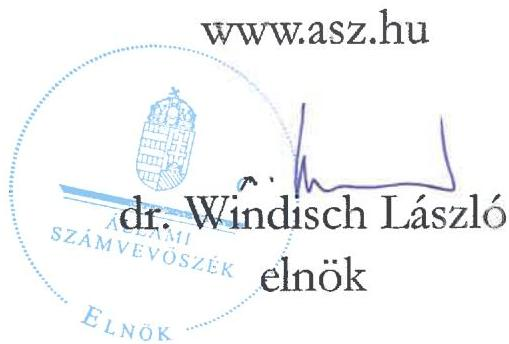
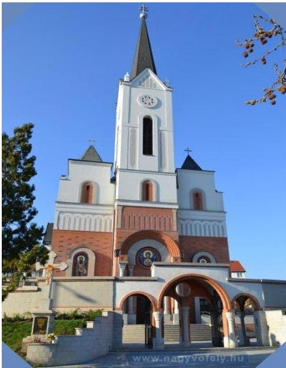
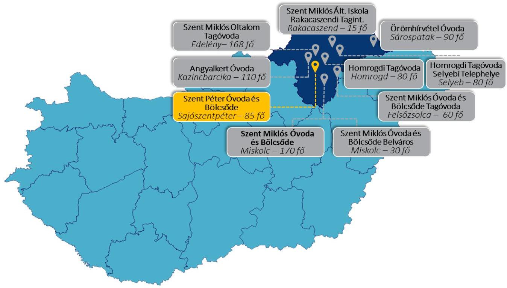

ÁLLAMI SZÁMVEVŐSZÉK

# JELENTÉS

## Egyházaknak nyújtott beruházási támogatások felhasználásának ellenőrzése

A sajószentpéteri kétcsoportos óvoda és kétcsoportos bölcsőde építésére nyújtott nem hitéleti célú beruházási támogatás felhasználásának ellenőrzése a Miskolci Egyházmegyénél

2025.

25108

www.asz.hu

---

ÁLLAMI SZÁMVEVŐSZÉK

# JELENTÉS

## Egyházaknak nyújtott beruházási támogatások felhasználásának ellenőrzése

A sajószentpéteri kétcsoportos óvoda és kétcsoportos bölcsőde építésére nyújtott nem hitéleti célú beruházási támogatás felhasználásának ellenőrzése a Miskolci Egyházmegyénél

2025.

25108

---

Jelentéseink az interneten a www.asz.hu címen olvashatók.

ELLENŐRZÉSI IGAZGATÓSÁG:
ELLENŐRZÉSI IGAZGATÓSÁG V.

ELLENŐRZÉSI IGAZGATÓ:
KLINGA LÁSZLÓ igazgató

ELLENŐRZÉSVEZETŐ:
NEMESVÁRI-HORTHY ESZTER ellenőrzésvezető

IKTATÓSZÁM: EL-4102-004/2025
TÉMASORSZÁM: 35
ELLENŐRZÉS-AZONOSÍTÓ SZÁM: V-11053

---

TARTALOMJEGYZÉK

- ÖSSZEFOGLALÁS ... 5
- AZ ELLENŐRZÉS EREDMÉNYEI ... 7
1. Az Egyházmegye támogatás felhasználására vonatkozó szabályozási keretei és könyvvezetési rendszere kialakításának, valamint a közfeladatellátáshoz kapcsolódó beszámolási kötelezettségének szabályszerűsége a nem hitéleti célú költségvetési forrásból származó beruházási támogatások vonatkozásában ... 7
2. A költségvetési forrásból származó ellenőrzött nem hitéleti célú beruházási támogatás és felhasználása, illetve a támogatásból finanszírozott beruházás könyvviteli nyilvántartásának szabályszerűsége ... 8
3. A költségvetési forrásból származó ellenőrzött nem hitéleti célú beruházási támogatás felhasználásának, elszámolásának szabályszerűsége ... 9
4. A költségvetési forrásból származó ellenőrzött nem hitéleti célú támogatásból finanszírozott beruházás előkészítésének szabályszerűsége ... 10

- JAVASLATOK ... 11
- I. FÜGGELÉK: ÉSZREVÉTELEK ... 12
- II. FÜGGELÉK: ELLENŐRZÉSI MEGKÖZELÍTÉS ... 13
- MELLÉKLETEK ... 19
I. sz. melléklet: Értelmező szótár ... 19
II. sz. melléklet: Az ellenőrzött szervezetek jegyzéke ... 21
- RÖVIDÍTÉSEK JEGYZÉKE ... 22

---

“哈，你是个小伙子，你是个小伙子，你是个小伙子，你是个小伙子，你是个小伙子，你是个小伙子，你是个小伙子，你是个小伙子，你是个小伙子，你是个小伙子，你是个小伙子，你是个小伙子，你是个小伙子，你是个小伙子，你是个小伙子，你是个小伙子，你是个小伙子，你是个小伙子，你是个小伙子，你是个小伙子，你是个小伙子，你是个小伙子，你是个小伙子，你是个小伙子，你是个小伙子，你是个小伙子，你是个小伙子，你是个小伙子，你是个小伙子，你是个小伙子，你是个小伙子，你是个小伙子，你是个小伙子，你是个小伙子，你是个小伙子，你是个小伙子，你是个小伙子，你是个小伙子，你是个小伙子，你是个小伙子，你是个小伙子，你是个小伙子，你是个小伙子，你是个小伙子，你是个小伙子，你是个小伙子，你是个小伙子，你是个小伙子，你是个小伙子，你是个小伙子，你是个小伙子，你是个小伙子，你是个小伙子，你是个小伙子，你是个小伙子，你是个小伙子，你是个小伙子，你是个小伙子，你是个小伙子，你是个小伙子，

---

ÖSSZEFOGLALÁS

A Magyarországon működő vallási közösségek számos társadalmi és közfeladatot látnak el, amelyhez az elmúlt évek tendenciáit megfigyelve, jelentős, egyre növekvő mértékű költségvetési támogatásban részesültek. Az elmúlt években az állam által nyújtott jelentős összegű támogatások miatt a vallási közösségek egyre hangsúlyosabb szerepet kapnak a közfeladatellátásban. A közérdeklődés folyamatos, hiszen a társadalom részéről kérdésként merül fel, hogy az állam által nyújtott közpénz hasznosult-e, elérte-e a célját, továbbá jogos elvárás, hogy az állam által nyújtott támogatás felhasználása szabályszerűen, átláthatóan, ellenőrizhetően történjen meg.

Szent Péter Görögkatolikus Óvoda és Bölcsoöde Forrás: az Intézmény Facebook oldala

Az ÁSZ¹, mint az Országgyűlés legfőbb pénzügyi és gazdasági ellenőrző szerve, figyelemmel a társadalom részéről jelentkező elvárásokra, törvényi felhatalmazás alapján törvényességi szempontból ellenőrzi az egyházaknak, belső egyházi jogi személyeknek nyújtott nem hitéleti célú támogatások felhasználását.

Az ÁSZ a jelen, óvodafejlesztésre nyújtott támogatás felhasználásának ellenőrzését megelőzően elemezte, értékelte az Egyházi Államtitkárság² által megküldött, az egyházaknak nyújtott, nem hitéleti célú beruházási támogatásokra vonatkozó adatokat. Az adatok elemzése eredményeként az ÁSZ megállapította, hogy az óvodafejlesztésekre nyújtott támogatások voltak az elmúlt években a legjelentősebbek, ezért különböző kockázati szempontok alapján az óvodafejlesztési támogatások közül választotta ki ellenőrzésre az Egyházmegye³ részére egyházi célú fejlesztési támogatásra nyújtott 3 155,0 M Ft-ból a sajószentpéteri kétcsoportos óvoda és kétcsoportos bölcsőde építésére fordított 131,6 M Ft nem hitéleti célú támogatást.

Az ÁSZ a támogatás felhasználásának ellenőrzését a kedvezményezett Egyházmegyénél végezte, amely egyúttal a beruházás eredményeként létrejött intézmény, a Szent Péter Görögkatolikus Óvoda és Bölcsoöde alapítójának is minősült. A beruházás megvalósítása során az óvoda és a bölcsőde szárny egymástól műszakilag elválasztásra került. Az ÁSZ az ellenőrzést az óvoda szárnyra nyújtott költségvetési támogatás felhasználása tekintetében folytatta le. Az óvodafejlesztésre kapott támogatást az Egyházmegye a Támogatói okiratban⁴ foglalt célnak megfelelően a sajószentpéteri kétcsoportos óvoda és bölcsőde óvoda szárnyának építésére fordította. A beruházás megvalósítása érdekében az ÁSZ által ellenőrzött 131,6 M Ft költségvetési támogatás mellett a Magyar Katolikus Egyház országos óvodafejlesztési programjára nyújtott 234,3 M Ft összegű támogatás is bevonásra került. Az Egyházmegye összeségében a beruházásra 365,9 M Ft értékű támogatást használt fel.

Az ellenőrzés során az ÁSZ nem állapított meg olyan szabálytalanságot, ami befolyásolta a támogatás cél szerinti felhasználását. Az ÁSZ az egyéb számviteli, könyveléstechnikai szabálytalanságok jövőbeni elkerülése érdekében az Egyházmegye Megyéspüspöke részére három javaslatot fogalmazott meg.

A Támogató szervezet⁵ által a Támogatói okiratban megfogalmazott cél teljesült, mivel az ellenőrzött nem hitéleti célra kapott költségvetési támogatásból a 2022. szeptember 1-jétől érvényes működési engedély szerint 60 fő befogadására alkalmas óvoda épült.

5

---

Összefoglalás

A Szent Péter Görögkatolikus Óvoda és Bölcsoőde 2023. szeptember 1-jétől érvényes működési engedélye szerint az intézmény óvodai csoportjainak száma egy csoporttal bővült, továbbá az óvodai férőhelyek száma 25 fővel növekedett. Sajószentpéteren a beruházást megelőzően egyházi fenntartású intézmény nem működött.

Az Egyházmegye a beruházás előkészítése során az építettői felelősségre vonatkozó jogszabályi előírásokat betartotta. Az Egyházmegye a kivitelezés megkezdését megelőzően – a jogszabályi kötelezettségének eleget téve – a kiviteli és engedélyezési tervek elkészítése érdekében tervezési szerződést, a kivitelezés műszaki ellenőrzése érdekében a műszaki ellenőrrel szerződést kötött. Az Egyházmegye közbeszerzési eljárás lefolytatására a jogszabályi előírások és a Támogatói okirat alapján nem volt kötelezett, ennek ellenére a kivitelező kiválasztása érdekében közbeszerzési eljárást folytatott le, amely eredményes volt, a kivitelezővel a szerződést megkötötték.

Az Egyházmegye a szabályozási és könyvvezetési rendszerét szabályszerűen alakította ki, könyveit a kettős könyvvitel rendszerében vezette. Beszámolási kötelezettségének a 2019., a 2020. és a 2021. évekre vonatkozóan szabályszerűen eleget tett.

Az Egyházmegye az állami költségvetés terhére nyújtott támogatás felhasználása átláthatóságának a feltételeit megteremtette. Az Egyházmegye a könyvvezetését úgy alakította ki, hogy a kapott támogatás elkülönítetten kerüljön kimutatásra. Az Egyházmegye a 100%-os támogatási előlegként kapott támogatást, az előírásokkal ellentétben nem kötelezettségként, hanem egyéb bevételként mutatta ki. A támogatási összeg felhasználásáról vezetett elkülönített nyilvántartás nem felelt meg az ÁSZF előírásának, mivel az elkülönített nyilvántartás nem teljeskörűen és nem kizárólagosan a Támogatói okirat alapján kapott támogatásból megvalósult beruházás vonatkozásában felmerült tételeket tartalmazta.

Az Egyházmegye a támogatással szabályszerűen kiállított, a könyvviteli nyilvántartásában rögzített számviteli bizonylatokkal, határidőben elszámolt a Támogató szervezet felé, amely az elszámolást elfogadta.

---

AZ ELLENŐRZÉS EREDMÉNYEI

Az Egyházmegye a részére óvodafejlesztésére nyújtott költségvetési támogatásból a sajószentpéteri kétcsoportos óvoda és kétcsoportos bölcsőde építésére fordított támogatást szabályszerűen, a támogatás céljának megfelelően, a támogatott tevékenység időtartamán belül a Szent Péter Görögkatolikus Óvoda és Bölcsőde óvodaszárnyának építésére használta fel. A közpénz, az óvodai nevelési közfeladatra került felhasználásra. A beruházás eredményeként egy új kétcsoportos, 60 fő befogadására alkalmas óvoda került kialakításra. 2023. szeptember 1-jétől érvényes működési engedély szerint az intézmény óvodai csoportjainak száma egy csoporttal bővült, továbbá az óvodai férőhelyek száma 25 fővel növekedett.

1. Az Egyházmegye támogatás felhasználására vonatkozó szabályozási keretei és könyvvezetési rendszere kialakításának, valamint a közfeladatellátáshoz kapcsolódó beszámolási kötelezettségének szabályszerűsége a nem hitéleti célú költségvetési forrásból származó beruházási támogatások vonatkozásában

Összegző megállapítás

Az Egyházmegye szabályozási és könyvvezetési rendszerének kialakítása szabályszerű volt, beszámolási kötelezettségének a 2019-2021. évekre vonatkozóan szabályszerűen eleget tett.

Az Egyházmegye a 2016-2021. évekre a támogatás felhasználására vonatkozó belső szabályozások és számviteli keretek megalkotásával megteremtette az ellenőrzött támogatás szabályszerű felhasználásának feltételeit. Az Egyházmegye a Számv. tv.⁷-ben foglalt előírással összhangban rendelkezett Számviteli politikával⁸, valamint annak keretében a Számv. tv. előírásának megfelelően elkészítette a Leltározási szabályzat.¹,²-t⁹, az Értékelési szabályzatot¹⁰ és a Pénzkezelési szabályzatot¹¹. Az Egyházmegye a Számviteli politikában az Eszámvr.¹² előírásának megfelelően az időbeli elhatárolás alkalmazását és annak választott módszerét rögzítette. Az Egyházmegye kettős könyvvitelt vezető gazdálkodóként a Számv. tv.-ben előírtakkal összhangban rendelkezett Számlarenddel¹³. A Számlarend nem felelt meg teljeskörűen a Számv. tv. 161. § (2) bekezdés b) pontjában rögzített előírásnak, mivel a Számlarend nem tartalmazta minden alkalmazott számla (1-5. számlaosztály főkönyvi számlái, 8613, 8614, 86251, 86291.sz. főkönyvi számlák) esetében a számla tartalmát, továbbá a számla értéke növekedésének, csökkenésének jogcíméit, a számlát érintő gazdasági eseményeket, azok más számlákkal való kapcsolatát. A Számlarend hiányossága a beruházás előkészítésére, megvalósítására, illetve a támogatás és a támogatás-felhasználás nyilvántartására nem volt hatással.

Az Egyházmegye számviteli beszámoló készítési kötelezettségének az Eszámvr. előírása alapján tett eleget. A 2019-2021. években a Számviteli politikában rögzítettek szerint egyszerűsített éves beszámolót készített, amely az Eszámvr. 1. sz. melléklete szerinti mérlegből és eredménykimutatásból, valamint a Számviteli politikában előírt kiegészítő mellékletből állt. Az Egyházmegye a 2019-2021. évekre vonatkozó számviteli beszámolóját – az Eszámvr. 11. §-ában biztosított lehetőséggel élve – nem helyezte letétbe, illetve annak közzétételéről sem rendelkezett.

---

Az ellenőrzés eredményei

## 2. A költségvetési forrásból származó ellenőrzött nem hitéleti célú beruházási támogatás és felhasználása, illetve a támogatásból finanszírozott beruházás könyvviteli nyilvántartásának szabályszerűsége

### Összegző megállapítás

Az Egyházmegye a költségvetési forrásból származó, a sajoszentpéteri kétcsoportos óvoda és kétcsoportos bölcsőde építésére nyújtott nem hitéleti célú beruházási támogatást elkülönítetten mutatta ki a könyveiben, ugyanakkor a bekerülési érték meghatározása és az értékcsökkenés elszámolása az óvoda épület tekintetében nem volt szabályszerű.

Az Egyházmegye a kapott támogatást elkülönítetten mutatta ki. A támogatás elkülönített kimutatása főkönyvi számlák, alszámlák alkalmazásával valósult meg.

Az Egyházmegye a 100%-os előlegként kapott támogatást elkülönítetten mutatta ki, ugyanakkor egyéb bevételként vette nyilvántartásba, ellentétben a Számv. tv. 43. § (1) bekezdésében foglalt előírással, az egyéb rövid lejáratú kötelezettségek között nem mutatta ki.

A kis értékű tárgyi eszközök aktíválása, illetve nyilvántartásba vétele, valamint azok 100%-os értékcsökkenésként történő elszámolása megtörtént, az alkalmazott értékcsökkenési elszámolás megfelelt a Számv. tv.-ben előírtaknak. A műszaki és egyéb berendezések esetében az alkalmazott értékcsökkenési leírási kulcs meghatározása és annak elszámolása megfelelt a Számv. tv.-ben és az Értékelési szabályzatban előírtaknak. A telket, illetve az új óvoda épületet az Egyházmegye a Számv. tv. előírásának megfelelően az ingatlanok között vettek nyilvántartásba. A műszaki berendezéseket, illetve az egyéb berendezéseket, felszereléseket a Számv. tv. előírásainak megfelelően vettek nyilvántartásba.

Az óvoda épület bekerülési értékének meghatározása nem felelt meg a Számv. tv. 47. § (4) bekezdés d) pontjában előírtaknak, mivel a beruházás tervezésére fordított 3,3 M Ft szolgáltatás díját nem az óvoda épület bekerülési értékében mutatták ki, az összeggel a telek értékét növelték meg.

---

Az ellenőrzés eredményei

# 3. A költségvetési forrásból származó ellenőrzött nem hitéleti célú beruházási támogatás felhasználásának, elszámolásának szabályszerűsége

## Összegző megállapítás

Az Egyházmegye a költségvetési forrásból származó, nem hitéleti célú beruházási támogatást a sajoszentpéteri kétcsoportos óvoda és kétcsoportos bölcsőde építésére használta fel és számolta el.

A Támogatói okirathoz kapcsolódó, a sajoszentpéteri kétcsoportos óvoda és kétcsoportos bölcsőde építésére felhasznált támogatásról készült, a Támogató szervezet felé 2021. február 24-én benyújtott elszámolásban szereplő tételek vizsgálata alapján az ÁSZ az alábbiakat állapította meg:

- a kapott támogatást a Támogatói okiratban meghatározott célnak megfelelően a Szent Péter Görögkatolikus Óvoda és Bölcsőde óvoda szárnyának az építésére használták fel;
- az Egyházmegye által a támogatás felhasználásáról vezetett elkülönített számviteli nyilvántartás nem felelt meg a Támogatói okirathoz kapcsolódó ÁSZF 6.3. pontjában előírtaknak mivel az elkülönített számviteli nyilvántartás nem tartalmazott minden olyan tételt, ami a támogatás terhére elszámolásra került, valamint az elkülönített számviteli nyilvántartás olyan tételeket is tartalmazott, amelyek a beruházással összefüggésben merültek fel, azonban más támogatásokból kerültek finanszírozásra;
- az elszámolt költségek a Számv. tv. előírása alapján bizonylatokkal voltak igazolva;
- a támogatás felhasználása megfelelt a Támogatói okiratban előírtaknak, a támogatott tevékenység időtartamára vonatkozó előírásnak (a bizonylatok mindegyike esetében a kiállítás dátuma, teljesítés időpontja, a támogatási időszakba esett (2016. január 01-2022. március 31), a pénzügyi teljesítés az elszámolási határidő végéig megtörtént (2022. május 31.));
- a számviteli bizonylatok szabályszerűen záradékolva voltak a Támogatói okiratban foglaltaknak megfelelően;
- minden ellenőrzött kiadás elszámolható volt a támogatás terhére, megfeleltek a Támogatói okiratban foglaltak szerint a támogatott célnak;
- minden gazdasági esemény a tartalmának megfelelő főkönyvi számra került elszámolásra.

Az Egyházmegye a Támogató szervezet felé a Támogatói okiratban, illetve a Támogató szervezet által jelzett határidőn belül három ütemben számolt el. Az elszámolást a Támogató szervezet elfogadta, a záró teljesítésigazolást 2023. január 17. napján állította ki, az Egyházmegyének támogatás visszafizetési kötelezettsége nem keletkezett.

---

Az ellenőrzés eredményei

# 4. A költségvetési forrásból származó ellenőrzött nem hitéleti célú támogatásból finanszírozott beruházás előkészítésének szabályszerűsége

## Összegző megállapítás

Az ellenőrzött nem hitéleti célú támogatásból finanszírozott sajószentpéteri kétcsoportos óvodához és kétcsoportos bölcsődéhez kapcsolódó építési beruházás előkészítése keretében a közbeszerzési eljárást lefolytatták, az építettői felelősségre vonatkozó jogszabályi előírásokat betartották.

Az Egyházmegye annak ellenére, hogy a Kbt.¹⁴ előírása alapján közbeszerzési eljárás lefolytatására nem volt köteles, összhangban a Kbt. rendelkezésében foglaltakkal önkéntes alapon vállalta a közbeszerzési eljárás lefolytatását a sajószentpéteri kétcsoportos óvodához és kétcsoportos bölcsődéhez kapcsolódó építési beruházás megvalósítása érdekében. Az Egyházmegye, mint ajánlatkérő a Kbt. előírására tekintettel a közbeszerzés előkészítését megelőzően a közbeszerzési eljáráshoz kapcsolódó egyedi szabályozást készített. Az Egyházmegye a beruházás előkészítése keretében a közbeszerzési tanácsadási és közbeszerzés-lebonyolító feladatokra jogi közreműködőt vont be. Az Egyházmegye közbeszerzési eljárást folytatott le, az eljárás eredményes volt.

A beruházás előkészítéséhez kapcsolódó, az építettői felelősségre vonatkozó jogszabályi előírásokat az Egyházmegye betartotta. Az Egyházmegye az Étv.¹⁵-ben foglaltakért viselt felelősségi körében az engedélyezési és kiviteli tervdokumentáció tervezőjét, a kivitelezés műszaki ellenőrét, valamint a kivitelezőt kiválasztotta. Az Egyházmegye az engedélyezési és kiviteli tervdokumentáció tervezőjével, a kivitelezés műszaki ellenőrével, valamint a kivitelezővel a szerződéseket megkötötte. A szerződések megkötésénél az Egyházmegye figyelembe vette a Támogatói okiratban meghatározott szakmai programot.

A megkötött szerződésekben a biztosítéki elemek az alábbiak voltak:

- Az engedélyezési és a kiviteli terv elkészítésére kötött szerződésben a kötbérfizetési kötelezettséget, illetve annak feltételeit a Ptk.¹⁶-ban foglalt előírással összhangban határozták meg. A tervező a megkötött szerződésben vállalta, hogy a felelősségbiztosításának hatályát a szerződés teljesítéséig fenntartja. A tervező a Ptk. előírásának megfelelően jótállást vállalt, melynek időtartamát 24 hónapban határozták meg.
- A műszaki ellenőrrel megkötött szerződésben a kötbérfizetési kötelezettséget, illetve annak feltételeit a Ptk.-ban foglalt előírással összhangban határozták meg.
- A kivitelezési szerződésben a kivitelező a Ptk. előírására tekintettel összhangban kellékszavatosságot, illetve jótállást vállalt. A jótállás időtartamát 36 hónapban határozták meg. A kivitelező kötelezett volt a teljesítési határidő be nem tartása esetén késedelmi, meghiúsulási kötbér megfizetésére a Ptk. előírásával összhangban. A kivitelezőnek a szerződés szerint felelősségbiztosítást kellett nyújtania.

A beruházás megvalósítása során a tervezési, a műszaki ellenőri, illetve a kivitelezői szerződésekben és azok módosításaiban meghatározott biztosíték, jótállás, kötbérfizetési igény érvényesítésére nem került sor. Az építési beruházás az Egyházmegye saját tulajdonú ingatlanán valósult meg.

10

---

11

# JAVASLATOK

Az ÁSZ tv. 17 33. § (1) bekezdésében foglaltak értelmében az ellenőrzött szervezet vezetője köteles a jelentésben foglalt megállapításokhoz kapcsolódó intézkedési tervet összeállítani és azt a jelentés kézhezvételétől számított 30 napon belül az ÁSZ részére megküldeni. Az ÁSZ a jelentésben foglalt megállapításokhoz kapcsolódóan az alábbi javaslatok tekintetében várja el az intézkedési terv elkészítését.

## A MISKOLCI EGYHÁZMEGYE MEGYÉSPÜSPÖKE RÉSZÉRE

1. Az Egyházmegye az ellenőrzött időszakban rendelkezett számlarenddel, ugyanakkor a számlarend nem felelt meg teljeskörűen a Számv. tv. 161. § (2) bekezdés b) pontjában rögzített előírásnak, tekintettel arra, hogy a számlarend nem minden alkalmazott számla esetében tartalmazta a számla tartalmát, továbbá a számla értéke növekedésének, csökkenésének jogcímét, a számlát érintő gazdasági eseményeket, azok más számlákkal való kapcsolatát.

Gondoskodjon arról, hogy a számlarend a Számv. tv. 161. § (2) bekezdés b) pontjában rögzítettek szerint minden alkalmazott számla esetében tartalmazza a számla tartalmát, továbbá a számla értéke növekedésének, csökkenésének jogcímét, a számlát érintő gazdasági eseményeket, azok más számlákkal való kapcsolatát.

2. Az Egyházmegye a 100%-os előlegként kapott támogatást elkülönítetten mutatta ki, ugyanakkor egyéb bevételként vette nyilvántartásba, ellentétben a Számv. tv. 43. § (1) bekezdésében foglalt előírással, amely szerint a kötelezettségek között kellett volna kimutatnia.

Gondoskodjon arról, hogy amennyiben az Egyházmegye 100%-os előlegként nyújtott támogatást kap, a könyveiben a Számv. tv. 43. § (1) bekezdésében foglalt előírással összhangban a rövid lejáratú kötelezettségek között mutassa ki.

3. Az óvoda épület bekerülési értékének meghatározása nem felelt meg a Számv. tv. 47. § (4) bekezdés d) pontjában előírtaknak, mivel a beruházás tervezésére fordított 3,3 M Ft szolgáltatás díját nem az óvoda épület bekerülési értékében mutatták ki, az összeggel a telek értékét növelték meg.

Gondoskodjon arról, hogy amennyiben a jövőben ingatlan beruházást valósít meg, úgy az aktíváláskor az ingatlan bekerülési értékét a Számv. tv. 47. § (4) bekezdés d) pontjában foglaltakra tekintettel határozzák meg.

---

I. FÜGGELÉK: ÉSZREVÉTELEK

A jelentéstervezetet az ÁSZ 15 napos észrevételezésre megküldte az ellenőrzött szervezet vezetőjének az ÁSZ tv. 29. §* (1) bekezdése előírásának megfelelően.

Az Egyházmegye írásban jelezte, hogy a jelentéstervezet megállapításaira nem tesz észrevételt.

* 29. § (1) Az Állami Számvevőszék az ellenőrzési megállapításait megküldi az ellenőrzött szervezet vezetőjének vagy az általa megbízott személynek, és annak, akinek személyes felelősségét állapította meg.
(2) Az ellenőrzött szervezet vezetője és a felelősként megjelölt személy az ellenőrzés megállapításaira tizenöt napon belül írásban észrevételt tehet.
(3) Az Állami Számvevőszék az észrevételre a beérkezésétől számított harminc napon belül írásban válaszol. A figyelembe nem vett észrevételeket köteles a jelentésben feltüntetni, és megindokolni, hogy azokat miért nem fogadta el.

12

---

13

# II. FÜGGELÉK: ELLENŐRZÉSI MEGKÖZELÍTÉS

## AZ ELLENŐRZÉS JOGALAPJA

Az ellenőrzés jogszabályi alapját az ÁSZ tv. 1. § (3) bekezdése, az 5. § (11) bekezdés c) pontja, valamint az Ehtv.¹⁸ 19/D. § (2) bekezdés előírásai képezték.

## AZ ELLENŐRZÉS CÉLJA

Az ellenőrzés célja annak értékelése volt, hogy a költségvetési forrásból az Egyházmegye a részére nyújtott nem hitéleti célú beruházási támogatás vonatkozásában a támogatás felhasználásának szabályozási környezetét szabályszerűen alakította-e ki, a nem hitéleti célú beruházási támogatás felhasználása, a támogatással való elszámolás, a könyvviteli nyilvántartás szabályszerű volt-e, illetve a támogatásból finanszírozott beruházás előkészítése szabályszerűen történt-e meg.

## AZ ELLENŐRZÉS TÍPUSA

Törvényességi ellenőrzés.

## AZ ELLENŐRZÉS TÁRGYA

Az ellenőrzés tárgyát képezte az Egyházmegye részére költségvetési forrásból nem hitéleti célra nyújtott beruházási támogatás felhasználásának törvényességi szempontok szerinti ellenőrzése. Ennek keretében ellenőrzésre került a beruházási támogatáshoz kapcsolódóan a számviteli elszámolásra vonatkozóan a jogszabályi, illetve a támogatói okiratban rögzített előírások betartása, a támogatás felhasználása és az azzal történő elszámolás támogatói okiratnak való megfelelősége. Ezzel összefüggésben értékelésre került, hogy a számviteli szabályozási környezet kialakítása támogatta-e a költségvetési forrásból származó nem hitéleti célú beruházási támogatás vonatkozásában a szabályos könyvvezetést. Az ellenőrzés tárgya volt továbbá annak ellenőrzése, hogy a támogatásból finanszírozott beruházás előkészítése szabályszerű volt-e.

Az ellenőrzés kiterjedt minden olyan körülményre és adatra, amely az ÁSZ jogszabályban meghatározott feladatainak teljesítéséhez, valamint a program végrehajtása folyamán felmerült újabb összefüggések feltárásához szükséges volt.

## AZ ELLENŐRZÉS HATÓKÖRE ÉS TERÜLETE

A Magyarországon működő vallási közösségek a társadalom kiemelkedő fontosságú értékhordozó és közösségteremtő tényezői. Hitéleti tevékenységük mellett közfeladatok ellátásában vesznek részt. A közfeladataik ellátásához jelentős állami költségvetési támogatásban, közpénzben részesülnek. A társadalom jogos elvárása, hogy a közpénzekkel gazdálkodó szervezetek működéséről, tevékenységéről átfogó képet kapjon.

---

II. Függelék: Ellenőrzési megközelítés

Az Ehtv. 19/D. § (2) bekezdésében előírtak alapján az egyházi jogi személynek nem hitéleti célra nyújtott költségvetési támogatás felhasználásának törvényességi szempontok szerinti ellenőrzését az ÁSZ végzi. Az ÁSZ tv. 5. § (11) bekezdés c) pontja rendelkezése alapján az ÁSZ a vallási egyesület, az egyházi jogi személyek vagy azok nevelési-oktatási, felsőoktatási, egészségügyi, karitatív, szociális, család-, gyermek- és ifjúságvédelmi, kulturális vagy sporttevékenység végzésére létrehozott, a jogi személyiséggel rendelkező vallási közösség belső szabálya szerint jogi személyiséggel nem rendelkező intézménye részére az államháztartásból nem hitéleti célra nyújtott beruházási támogatás felhasználását ellenőrzi.

Az ÁSZ a jelen, óvodafejlesztésekre nyújtott támogatások felhasználásának ellenőrzését megelőzően elemezte, értékelte az Egyházi Államtitkárság által az ÁSZ felkérésére az egyházaknak nyújtott, nem hitéleti célú beruházási támogatásokra vonatkozóan adott adatokat. Az ÁSZ egyházakat érintő ellenőrzései, valamint az Egyházi Államtitkárság által szolgáltatott adatok elemzése alapján arra a következtetésre jutott, hogy az elmúlt években más közfeladatok ellátását is értékelve a köznevelés területén az óvodafejlesztések voltak azok, amelyek révén rendkívül jelentős mértékű támogatásokat nyújtottak az egyházak számára.

A 2021. január 1. és 2024. június 30. közötti időszakban a köznevelési közfeladatokhoz kapcsolódóan több, mint 300 beruházási célú egyházi támogatás lezártnak minősült. A nyújtott, több száz támogatás közel 50%-a óvoda beruházásokhoz kapcsolódott, amely beruházások támogatási összege meghaladta a 40 000,0 M Ft-ot.

Az ellenőrzött támogatások kiválasztása érdekében az Egyházi Államtitkárság által megküldött, Magyarország területén megvalósuló, 2021. január 1-2024. június 30. között lezárt beruházási célú egyházi támogatások adatait értékelte az ÁSZ. Az értékelés során az egyes beruházások tekintetében az ÁSZ kockázati szempontként vette figyelembe a támogatási összeg nagyságát, a támogatás felhasználásának időbeli elhúzódását, a támogatással kapcsolatban megkötött támogatói okirat több alkalommal történő módosítását, illetve, hogy a támogatási összeg alapján közbeszerzési eljárás lefolytatásának szükségessége felmerült-e.

Az értékelés eredményeként az Egyházmegye részére egyházi fejlesztési célú támogatásra nyújtott 3155,0 M Ft-ból a sajószentpéteri kétcsoportos óvoda és kétcsoportos bölcsőde építésére fordított 131,6 M Ft nem hitéleti célú támogatást és annak felhasználását az ÁSZ ellenőrzésre jelölte ki.

Az ÁSZ a kockázatalapon kiválasztott, nem hitéleti célú beruházási támogatást felhasználó kedvezményezett egyházi jogi személynél folytatott ellenőrzése során azt értékelte, hogy:

- a számviteli keretek, könyvvezetési rendszer kialakítása a jogszabályi előírásoknak megfelelően történt-e, illetve az egyházi jogi személy megfelelő formában határozta-e meg a számviteli beszámoló formáját;
- a kapott támogatást, illetve annak felhasználását a jogszabályi előírásoknak, valamint a támogatói okiratban foglaltaknak megfelelően tartotta-e nyilván, a támogatásból finanszírozott beruházás vonatkozásában a nyilvántartása szabályszerű volt-e;
- a támogatás felhasználása, a támogatással való elszámolás során a jogszabályokban és a támogatói okiratban foglalt előírások betartásával járt-e el;
- a beruházás előkészítése során a jogszabályokban és a támogatói okiratban foglalt előírások betartásával járt-e el.

14

---

II. Függelék: Ellenőrzési megközelítés

Az ÁSZ által ellenőrzött támogatással kapcsolatos adatokat az 1. táblázat foglalja össze.

1. táblázat

A TÁMOGATÁS FŐBB ADATAI

|  EGYH-KCP-16-P-0115 AZONOSÍTÓ SZÁMÚ TÁMOGATÓI OKIRAT ÉS AZ ELLENŐRZŐTT SZAKMAI RÉSZFELADAT FŐBB ADATAI  |   |
| --- | --- |
|  Támogatott tevékenységek: | Miskolci Egyházmegye beruhásai és fejlesztései 21 db helyszínen.  |
|  Támogatás forrása: | Magyarország 2017. évi központi költségvetéséről szóló 2016. évi XC. törvény XX. Emberi Erőforrások Minisztériuma fejezet 20/55/9 Egyházi közösségi célú programok és beruházások támogatása fejezeti kezelésű előirányzata  |
|  Támogatási összeg: | 3155,0 M Ft  |
|  Támogató szervezet: | EMMI^{19}, 2018. szeptember 1-jétől BGA Zrt.^{20}  |
|  Ellenőrzött támogatott tevékenység: | Sajószentpéteri kétcsoportos óvoda és kétcsoportos bölcsőde építése  |
|  Ellenőrzött támogatott tevékenység tervezett összege: | 131,6 M Ft  |
|  Ellenőrzött támogatott tevékenység felhasznált összege: | 131,6 M Ft  |
|  A támogatott tevékenység időtartama: | 2016. január 1-2022. március 31.  |
|  A támogatási előleg felhasználásáról a beszámoló benyújtásának határideje: | 2022. május 31.  |
|  Beszámoló benyújtása és elfogadása (2. ütem): | 2021. február 24. és 2021. október 27.  |

Forrás: ÁSZ saját szerkesztés a Támogatói okirat és módosításai alapján

A Miskolci Egyházmegye temploma Forrás: Miskolci Egyházmegye Facebook oldala

A Miskolci Egyházmegye az Ehtv. Melléklete szerint a 27 bevett egyház közé tartozó Magyar Katolikus Egyház belső egyházi jogi személye, a Magyar Katolikus Egyház három görög rítusú egyházmegyéjének egyike, önálló egyházkormányzati egység. A Miskolci Egyházmegye a Hajdúdorogi Főegyházmegyével és a Nyíregyházi Egyházmegyével együtt alkotja a Magyarországi Görögkatolikus Metropóliát, ami 2015. március 19-én jött létre, amikor Ferenc pápa megalapította a Magyarországi Sajátjogú Metropolitai Egyházat. Működése jelenleg két közigazgatási területi egységre, Borsod-Abaúj-Zemplén- és Heves vármegyére terjed ki. A Miskolci Egyházmegye a hitéleti tevékenységen kívül közhasznú tevékenységként szociális és oktatási (köznevelési, technikum, gimnázium, kollégium) feladatokat ellátó intézményeket tart fenn.

Az ellenőrzés tárgyát képező óvodaberuházás kapcsán kiemelendő, hogy a Miskolci Egyházmegye jelentős, közel 900 férőhelyet biztosító 10 óvoda alapítója. A Borsod-Abaúj-Zemplén vármegyében

megtalálható óvodák fenntartója a Miskolci Egyházmegye által létrehozott MEKIF21. Az egyes óvodák területi elhelyezkedését és az óvodai férőhelyek számát a 2024. október 1-jén hatályos alapító okirataik szerint az alábbi ábra szemlélteti:

---

II. Függelék: Ellenőrzési megközelítés

Forrás: ÁSZ saját szerkesztés óvodák alapító okiratai alapján

A Miskolci Egyházmegye megyéspüspöke 2015. március 20. óta Dr. Orosz Atanáz. Az ellenőrzött időszakban a Miskolci Egyházmegye vállalkozási tevékenységet nem folytatott.

# AZ ELLENŐRZŐTT IDŐSZAK

A támogatott tevékenység időtartamának kezdő napjától (2016. január 1.) az ellenőrzés megkezdéséről szóló kiértesítő levél kelteig (2024. december 4.). Az ellenőrzött időszakon belül az értékelt releváns éveket fókusztérületenként, részterületenként a 2. táblázat foglalja össze:

2. táblázat
AZ ELLENŐRZÉS SZEMPONTJÁBÓL RELEVÁNS ÉVEK BEMUTATÁSA

|  FÓKUSZTERÜLET SZÁMA | RÉSZTERÜLET | RELEVANCIA ÉVE  |
| --- | --- | --- |
|  1. | Könyvvezetési rendszer kialakítása, beszámolási kötelezettség teljesítése | 2019-2021.évek  |
|   |  Belső szabályozó eszközök és számviteli keretek kialakítása | 2016-2021.évek  |
|  2. | Kapott támogatás kimutatása | 2016-2021.évek  |
|   |  Ellenőrzött támogatás nyilvántartása | 2016-2021.évek  |
|  3. | Támogatás és felhasználásának elszámolása | 2016-2021.évek  |
|  4. | Támogatásból megvalósuló beruházáshoz kapcsolódó közbeszerzési eljárás | 2016-2021.évek  |
|   |  Építettői felelősség körébe tartozó előírások betartása | 2016-2021.évek  |

Forrás: ÁSZ saját szerkesztés

---

II. Függelék: Ellenőrzési megközelítés

## AZ ELLENŐRZÉSI KRITÉRIUMOK

|  FÓKUSZTERÜLET/FÓKUSZKÉRDÉS | ELLENŐRZÉSI KRITÉRIUMOK  |
| --- | --- |
|  1. Az ellenőrzött szervezet támogatás felhasználására vonatkozó szabályozási keretei és könyvvezetési rendszere kialakításának, valamint a közfeladatellátáshoz kapcsolódó beszámolási kötelezettségének szabályszerűsége a nem hitéleti célú költségvetési forrásból származó beruházási támogatások vonatkozásában | Számv. tv. 14. § (3) bekezdés, (5) bekezdés a), b) és d) pontjai, 161. § (1) bekezdés Ehtv. 19. § (3) bekezdés Eszámvr. 5. § (1) bekezdés, 1. melléklet, 7. § (6) bekezdés, 11. §  |
|  2. A költségvetési forrásból származó ellenőrzött nem hitéleti célú beruházási támogatás és felhasználása, illetve a támogatásból finanszírozott beruházás könyvviteli nyilvántartásának szabályszerűsége | Számv. tv. 26. § (1)-(2), (4) (5), 33. § (7) bekezdés, 42. § (1) bekezdés, 47. § (1)-(7) bekezdés, 52. § (1)-(2) és (7) bekezdés, 80. § (2) bekezdés Eszámvr. 7. § (1)-(3) és (6) bekezdései  |
|  3. A költségvetési forrásból származó ellenőrzött nem hitéleti célú beruházási támogatás felhasználásának, elszámolásának szabályszerűsége | Támogatói okirat 3.3., 4.4. és 5.3. pontja, ÁSZF 6.3. pontja, Számv. tv. 167. § (1) a), d), h) és i) pont  |
|  4. A költségvetési forrásból származó ellenőrzött nem hitéleti célú támogatásból finanszírozott beruházás előkészítésének szabályszerűsége | Kbt. 5. § (3) bekezdés, 197. § (11) bekezdés Étv. 43. § (1) bekezdés c) pontja; Ptk. 6:166. § (1) bekezdés, 6:171. § (1) bekezdés, 6:186. §  |

## AZ ELLENŐRZÉS MÓDSZERE ÉS AZ ELLENŐRZÉSI BIZONYÍTÉKOK KÖRE

Az ellenőrzést a nemzetközi standardokat irányadónak tekintve az ellenőrzési program szempontjai, az ellenőrzött időszakban hatályos jogszabályok, az ÁSZ ellenőrzés-szakmai szabályok és irányadó módszertanok figyelembevételével végezte az ÁSZ.

Az ellenőrzés fókuszterületei kockázatalapú megközelítést alkalmazva, a kockázatot hordozó területek beazonosítása alapján kerültek meghatározásra. Kockázatos területként azonosította az ÁSZ a támogatások könyvviteli elszámolásához kapcsolódó könyvvitelei rendszer kialakítását, a kapott támogatások és azok felhasználása könyvviteli nyilvántartásban történő elszámolását, a támogatásokkal való elszámolást, valamint a megvalósított beruházások előkészítését.

Az ellenőrzési kérdések megválaszolásához szükséges bizonyítékok megszerzése az ellenőrzött szervezet, valamint az ellenőrzést támogató szervezet által rendelkezésre bocsátott dokumentumokra, adatokra alapozva kérdésfeltevés (információkérés), interjú útján, a támogatás felhasználása az elszámolásban rögzített számviteli bizonylatok ellenőrzésén keresztül történt.

A nem hitéleti célra nyújtott támogatásból finanszírozott beruházás szemrevételezése érdekében helyszíni szemlére került sor a Szent Péter Görögkatolikus Óvoda és Bölcseőde 3770 Sajószentpéter, Élmunkás utca 2. szám alatti épületében.

Az ellenőrzési bizonyítékként felhasználható adatforrások közé tartoztak egyrészt az ellenőrzéshez kért dokumentumok, adatforrások, másrészt adatforrás volt még minden – az ellenőrzés folyamán – az ellenőrzés szempontjából információkat tartalmazó dokumentum. Az ellenőrzési kritériumok részletes felsorolását a fenti táblázat tartalmazza.

---

II. Függelék: Ellenőrzési megközelítés

Az ellenőrzés lefolytatásához az ellenőrzött szervezet a tanúsítványok kitöltésével, valamint az ÁSZ által kért dokumentumok, adatok, információk megküldésével és az ellenőrzés során szolgáltatott adatokat. Az Egyházi Államtitkárság, mint ellenőrzést támogató szervezet a bevett egyházaknak és azok belső egyházi jogi személyeinek nyújtott, Magyarország területén megvalósuló, 2021. január 1-2024. június 30. között lezárt beruházási célú támogatásokhoz kapcsolódó adatbázisokkal, valamint az ÁSZ által kért adatok, dokumentumok és információk megküldésével járult hozzá az ellenőrzés lefolytatásához.

Az Egyházi Államtitkárság által rendelkezésre bocsátott adatbázisok és dokumentumok alapján az adatok kiértékelését követően kockázatértékelés alapján történt meg a köznevelési közfeladatellátáson belül a nem hitéleti célú, az EGYH-KCP-16-P-0115 azonosító számú Támogatói okirathoz kapcsolódó óvoda beruházási támogatás kiválasztása.

Az ellenőrzött időszak keretében – figyelembe véve az EGYH-KCP-16-P-0115 azonosító számú Támogatói okiratban foglaltakat – a sajoszentpéteri kétcsoportos óvoda és kétcsoportos bölcsőde építésére kapott támogatás vonatkozásában az ellenőrzés szempontjából releváns évek meghatározására került sor. A könyvvezetési rendszer kialakítása és a beszámolási kötelezettség teljesítése vonatkozásában releváns évnek minősült az ellenőrzött támogatással történő elszámolás évét megelőző év, az elszámolás éve, illetve az elszámolás Támogató szervezet részéről történő elfogadásának éve. A szabályozási környezet kialakítása, az ellenőrzött támogatás nyilvántartása, felhasználása és elszámolása, valamint a beruházás előkészítése és nyilvántartása vonatkozásában az ellenőrzés szempontjából releváns éveknek kellett tekinteni a támogatott tevékenység időtartamának kezdő napjától az ellenőrzött támogatásból megvalósult beruházáshoz kapcsolódó, a Támogató szervezet által kiállított teljesítésigazolás keltezése évének utolsó napjáig hatályos időszakot. A releváns éveket, fókuszterületekhez tartozó részterületenként a 2. táblázat tartalmazza.

A támogatás vonatkozásában a beszámolási kötelezettség szabályszerűségének ellenőrzése az Egyházmegyénél helyszíni adatbetekintés keretében történt meg.

Az ÁSZ az ellenőrzés során a költségvetési forrásból származó nem hitéleti célú beruházási támogatás könyvviteli nyilvántartásának, valamint a beruházási támogatás felhasználásának és elszámolásának szabályszerűségét az EGYH-KCP-16-P-0115 azonosító számú Támogatói okirathoz kapcsolódó számlaösszesítőben szereplő – a sajoszentpéteri kétcsoportos óvoda és kétcsoportos bölcsőde építésére elszámolt – tételek tételek ellenőrzésével értékelte.

18

---

MELLÉKLETEK

## I. SZ. MELLÉKLET: ÉRTELMEZŐ SZÓTÁR

belső egyházi jogi személy

A bevett egyház belső egyházi jogi személye egyházi jogi személy. A belső egyházi jogi személy a bevett egyház belső szabálya szerint működik. A belső egyházi jogi személyre a bevett egyházra vonatkozó szabályokat megfelelően kell alkalmazni. A bevett egyház közélű tevékenységet ellátó intézménye a bevett egyház belső szabálya szerint belső egyházi jogi személynek minősülhet. Nem minősül belső egyházi jogi személynek a bevett egyház, a bejegyzett egyház, illetve a nyilvántartásba vett egyház által létrehozott gazdasági társaság, alapítvány és egyesület. A bevett egyház belső szabálya a jogi személyre törvényben meghatározott általános szabályoktól eltérően határozhatja meg a bevett egyház és a belső egyházi jogi személy szervezetére és képviseletére, törvényes működésének biztosítékaira, átalakulására, egyesülésére, szétválaszára és jogutód nélküli megszűnésére, valamint a belső egyházi jogi személy létesítésére vonatkozó szabályokat. (Forrás: Ehtv. 10. – 11/A. §)

bevett egyház

Olyan bejegyzett egyház, amellyel az állam a közösségi célok érdekében történő együttműködésről átfogó megállapodást kötött.

(Forrás: Ehtv. 9/G. § (1) bekezdés)

ellenőrzést támogató szervezet

Az ÁSZ tv. 25. § (3) bekezdésének rendelkezése alapján adatot, tájékoztatást, dokumentumot nyújtó szervezet. (Forrás: ÁSZ tv. 25. § (3) bekezdés)

költségvetési támogatás

A társadalombiztosítás pénzügyi alapjai kivételével az államháztartás központi alrendszeréből ellenérték nélkül, pénzben nyújtott támogatások.

(Forrás: Áht.22 1. § 14. pont)

közfeladat

A jogszabályban meghatározott állami vagy önkormányzati feladat. A közfeladat ellátásában államháztartáson kívüli szervezet jogszabályban meghatározott rendben közreműködhet. (Forrás: Áht. 3/A. § (1)-(2) bekezdés)

lezárt támogatás

A támogatott tevékenység akkor tekinthető lezártnak, ha a támogatói okiratban, támogatási szerződésben a befejezést követő időszakra nézve a kedvezményezett további kötelezettséget nem vállalt és az Ávr.23. 102/B. § (1) bekezdésben meghatározott feltételek teljesültek. Ha a támogatói okirat, támogatási szerződés a támogatott tevékenység befejezését követő időszakra nézve további kötelezettséget tartalmaz, a támogatott tevékenység akkor tekinthető lezártnak, ha valamennyi vállalt kötelezettség teljesült, a kedvezményezett a kötelezettségek megvalósulásának eredményeiről szóló záró beszámolóját benyújtotta, és azt a támogató jóváhagyta, valamint a záró jegyzőkönyv elkészült.

(Forrás: Ávr. 102/B. § (2) bekezdés)

nem vallási tevékenység

Önmagában nem tekinthető vallási tevékenységnek a politikai és érdekvényesítő, a pszichikai vagy parapszichikai, a gyógyászati, a gazdasági-vállalkozási, a nevelési, az oktatási, a felsőoktatási, az egészségügyi, a karitatív, a család-, gyermek- és ifjúságvédelmi, a kulturális, a sport-, az állat-, környezet- és természetvédelmi, a hitéleti tevékenységhez szükségesen túlmenő adatkezelési, valamint a szociális tevékenység. (Forrás: Ehtv. 7/A. § (3) bekezdés)

támogatási jogviszony

A támogatói okirat kiállításával vagy támogatási szerződés megkötésével létrejött polgári jogi jogviszony.

(Forrás: Áht. 48. § (1) bekezdés b) pont, 48/A. § (1) bekezdés)

támogató szervezet

A támogatási jogviszonyban a kötelezettségvállalási jogkört gyakorló, a támogatás nyújtására köteles szervezet. (Forrás: Áht. 48/A. § (1) bekezdés)

19

---

Mellékletek

támogatott tevékenység
A támogatási szerződésben meghatározott olyan tevékenység – ideértve a kedvezményezett működését is –, amely során felmerült költségek megtérítését a költségvetési támogatás részben vagy egészében biztosítja
(Forrás: Ávr. 1. § 8. pont)

támogatott tevékenység időtartama
Támogatási szerződésben meghatározott olyan időtartam, amely során felmerülő, a támogatott tevékenység megvalósításához kapcsolódó költségek elszámolhatóak
(Forrás: Ávr. 1. § 9. pont)

vallási közösség
A természetes személyek minden olyan közössége, szervezeti formától, jogi személyiségtől vagy elnevezéstől függetlenül, amely vallás gyakorlására alakult, és elsődlegesen vallási tevékenységet végez. (Forrás: Ehtv. 6. §)

20

---

Mellékletek

- II. SZ. MELLÉKLET: AZ ELLENŐRZŐTT SZERVEZETEK JEGYZÉKE

|  ELLENŐRZŐTT SZERVEZET NEVE | ELLENŐRZŐTT SZERVEZET SZÉKHELYE  |
| --- | --- |
|  Miskolci Egyházmegye | 3526 Miskolc, Szeles utca 59.  |

---

RÖVIDÍTÉSEK JEGYZÉKE

1 ÁSZ
2 Egyházi Államtitkárság
3 Egyházmegye
4 Támogatói okirat

5 Támogató szervezet

6 ÁSZF

7 Számv. tv.
8 Számviteli politika
9 Leltározási szabályzat1.2

10 Értékelési szabályzat
11 Pénzkezelési szabályzat
12 Eszámvr.
13 Számlarend
14 Kbt.
15 Étv.
16 Ptk.
17 ÁSZ tv.
18 Ehtv.

19 EMMI
20 BGA Zrt.
21 MEKIF
22 Áht.
23 Ávr.

Állami Számvevőszék

A Miniszterelnökség Egyházi és Nemzetiségi Kapcsolatokért Felelős Államtitkársága
Miskolci Egyházmegye

EGYH-KCP-16-P-0115 azonosító számú támogatói okirat, kelt: 2016. december 21.
Elválaszthatatlan mellékletei: ÁSZF; Útmutató az egyházi támogatások felhasználásához

Emberi Erőforrások Minisztériuma, 2018. szeptember 1-jétől Bethlen Gábor
Alapkezelő Közhasznú Nonprofit Zártkörűen Működő Részvénytársaság

Az EGYH-KCP-16-P-0115 azonosító számú támogatói okirat elválaszthatatlan részét képező Általános Szerződési Feltételek

2000. évi C. törvény a számvitelről (hatályos 2001. január 1-jétől)

A Miskolci Egyházmegye Számviteli politikája (hatályos 2016. január 1-jétől)

Leltározási szabályzat1: a Miskolci Egyházmegye Leltárkészítési és Leltározási Szabályzata (hatályos: 2019. november 25-ig)

Leltározási szabályzat2: a Miskolci Egyházmegye Eszközök és Források Leltárkészítési és Leltározási Rendjéről szóló Szabályzata (hatályos: 2019. november 26-tól)

A Miskolci Egyházmegye Eszközök és Források Értékelési szabályzata (hatályos: 2016. január 1-jétől)

A Miskolci Egyházmegye Pénzkezelési Szabályzata (hatályos: 2016. január 1-jétől)

296/2013. (VII.29.) Korm. rendelet az egyházi jogi személyek beszámolókészítése és könyvvezetési kötelezettségének sajátosságairól (hatályos: 2014. január 1-jétől)

A Miskolci Egyházmegye Számlarendje (hatályos: 2015. július 1-jétől)

2015. évi CXLIII. törvény a közbeszerzésekről (hatályos 2015. november 1-jétől)

1997. évi LXXVIII. törvény az épített környezet alakításáról és védelméről (hatályos 1998. január 1-jétől, hatálytalan 2024. október 1-jétől)

2013. évi V. törvény – a Polgári Törvénykönyvről (hatályos 2014. március 15-től)

2011. évi LXVI. törvény az Állami Számvevőszékről (hatályos 2011. július 1-jétől)

2011. évi CCVI. törvény a lelkiismereti és vallásszabadság jogáról, valamint az egyházak, vallásfelekezetek és vallási közösségek jogállásáról (hatályos 2012. január 1-jétől)

Emberi Erőforrások Minisztériuma

Bethlen Gábor Alapkezelő Közhasznú Nonprofit Zártkörűen Működő Részvénytársaság

Miskolci Egyházmegye Közfeladatellátó Intézményei Fenntartója

2011. évi CXCV. törvény az államháztartásról (hatályos 2011. december 31-től)

368/2011. (XII. 31.) Korm. rendelet az államháztartásról szóló törvény végrehajtásáról (hatályos 2012. január 1-jétől)

22

---

ÁLLAMI SZÁMVEVŐSZÉK

1052 Budapest, Apáczai Csere János u. 10. | 1364 Budapest 4., Pf. 54

www.asz.hu | szamvevoszek@asz.hu

telefon: +36 1 484 9100