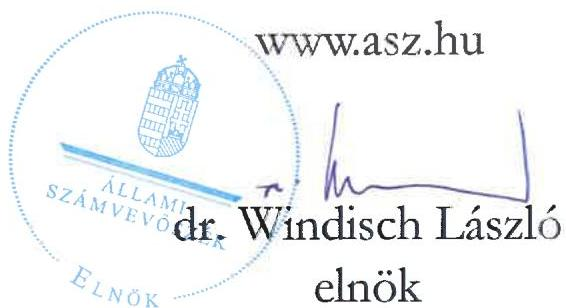
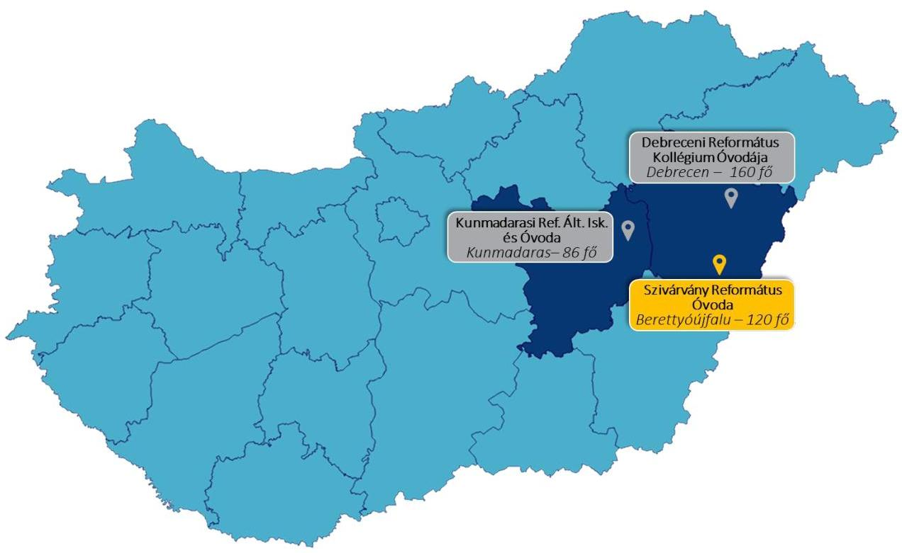

ÁLLAMI SZÁMVEVŐSZÉK

# JELENTÉS

## Egyházaknak nyújtott beruházási támogatások felhasználásának ellenőrzése

A berettyóújfalui óvoda építésére nyújtott nem hitéleti célú beruházási támogatás felhasználásának ellenőrzése a Magyarországi Református Egyháznál és a Tiszántúli Református Egyházkerületnél

2025.

25109

www.asz.hu

---

ÁLLAMI SZÁMVEVŐSZÉK

# JELENTÉS

## Egyházaknak nyújtott beruházási támogatások felhasználásának ellenőrzése

A berettyóújfalui óvoda építésére nyújtott nem hitéleti célú beruházási támogatás felhasználásának ellenőrzése a Magyarországi Református Egyháznál és a Tiszántúli Református Egyházkerületnél

2025.

25109

---

Jelentéseink az interneten a www.asz.hu címen olvashatók.

ELLENŐRZÉSI IGAZGATÓSÁG:
ELLENŐRZÉSI IGAZGATÓSÁG V.

ELLENŐRZÉSI IGAZGATÓ:
KLINGA LÁSZLÓ igazgató

ELLENŐRZÉSVEZETŐ:
NEMESVÁRI-HORTHY ESZTER ellenőrzésvezető

IKTATÓSZÁM: EL-4102-005/2025
TÉMASORSZÁM: 35
ELLENŐRZÉS-AZONOSÍTÓ SZÁM: V-11054

---

TARTALOMJEGYZÉK

- ÖSSZEFOGLALÁS ... 5
- AZ ELLENŐRZÉS EREDMÉNYEI ... 7
1. Az Egyház és az Egyházkerület támogatás felhasználására vonatkozó szabályozási keretei és könyvvezetési rendszere kialakításának, valamint a közfeladatellátáshoz kapcsolódó beszámolási kötelezettségének szabályszerűsége a nem hitéleti célú költségvetési forrásból származó beruházási támogatások vonatkozásában ... 7
2. A költségvetési forrásból származó ellenőrzött nem hitéleti célú beruházási támogatás és felhasználása, illetve a támogatásból finanszírozott beruházás könyvviteli nyilvántartásának szabályszerűsége ... 8
3. A költségvetési forrásból származó ellenőrzött nem hitéleti célú beruházási támogatás felhasználásának, elszámolásának szabályszerűsége ... 9
4. A költségvetési forrásból származó ellenőrzött nem hitéleti célú támogatásból finanszírozott beruházás előkészítésének szabályszerűsége ... 10

- I. FÜGGELÉK: ÉSZREVÉTELEK ... 12
- II. FÜGGELÉK: ELLENŐRZÉSI MEGKÖZELÍTÉS ... 13
- MELLÉKLETEK ... 20
I. sz. melléklet: Értelmező szótár ... 20
II. sz. melléklet: Az ellenőrzött szervezetek jegyzéke ... 22
- RÖVIDÍTÉSEK JEGYZÉKE ... 23

---

“哈，你是个小伙子，你是个小伙子，你是个小伙子，你是个小伙子，你是个小伙子，你是个小伙子，你是个小伙子，你是个小伙子，你是个小伙子，你是个小伙子，你是个小伙子，你是个小伙子，你是个小伙子，你是个小伙子，你是个小伙子，你是个小伙子，你是个小伙子，你是个小伙子，你是个小伙子，你是个小伙子，你是个小伙子，你是个小伙子，你是个小伙子，你是个小伙子，你是个小伙子，你是个小伙子，你是个小伙子，你是个小伙子，你是个小伙子，你是个小伙子，你是个小伙子，你是个小伙子，你是个小伙子，你是个小伙子，你是个小伙子，你是个小伙子，你是个小伙子，你是个小伙子，你是个小伙子，你是个小伙子，你是个小伙子，你是个小伙子，你是个小伙子，你是个小伙子，你是个小伙子，你是个小伙子，你是个小伙子，你是个小伙子，你是个小伙子，你是个小伙子，你是个小伙子，你是个小伙子，你是个小伙子，你是个小伙子，你是个小伙子，你是个小伙子，你是个小伙子，你是个小伙子，你是个小伙子，

---

5

# ÖSSZEFOGLALÁS

A Magyarországon működő vallási közösségek számos társadalmi és közfeladatot látnak el, amelyhez az elmúlt évek tendenciáit megfigyelve, jelentős, egyre növekvő mértékű költségvetési támogatásban részesültek. Az elmúlt években az állam által nyújtott jelentős összegű támogatások miatt a vallási közösségek egyre hangsúlyosabb szerepet kapnak a közfeladatellátásban. A közérdeklődés folyamatos, hiszen a társadalom részéről kérdésként merül fel, hogy az állam által nyújtott közpénz hasznosult-e, elérte-e a célját, továbbá jogos elvárás, hogy az állam által nyújtott támogatás felhasználása szabályszerűen, átláthatóan, ellenőrizhetően történjen meg.

Szivárvány Református Óvoda Forrás: https://www.orszagosovodaprogram.hu/portfolio-item/szivaryany-reformatus-ovoda/

Az ÁSZ¹, mint az Országgyűlés legfőbb pénzügyi és gazdasági ellenőrző szerve, figyelemmel a társadalom részéről jelentkező elvárásokra, törvényi felhatalmazás alapján törvényességi szempontból ellenőrzi az egyházaknak, belső egyházi jogi személyeknek nyújtott nem hitéleti célú támogatások felhasználását.

Az ÁSZ a jelen, óvodafejlesztésre nyújtott támogatás felhasználásának ellenőrzését megelőzően elemezte, értékelte az Egyházi Államtitkárság² által megküldött az egyházaknak nyújtott, nem hitéleti célú beruházási támogatásokra vonatkozó adatokat. Az adatok elemzése eredményeként az ÁSZ megállapította, hogy az óvodafejlesztésekre nyújtott támogatások voltak az elmúlt években a legjelentősebbek, ezért különböző kockázati szempontok alapján választotta ki ellenőrzésre az óvodafejlesztési támogatások közül az Egyház³ részére az Országos óvoda programra nyújtott 30 000,0 M Ft-ból a berettyóújfalui óvoda építésére nyújtott 755,88 M Ft nem hitéleti célú támogatást.

Az ÁSZ a támogatás felhasználásának ellenőrzését a kedvezményezett Egyháznál és az általa közreműködőként bevont Egyházkerületnél⁴, az óvoda fenntartójánál végezte.

Az óvodafejlesztésre kapott támogatást az Egyház és az Egyházkerület a Támogatói okiratban⁵ foglalt célnak megfelelően a berettyóújfalui óvoda építésére fordította. A beruházás megvalósítása érdekében a 755,88 M Ft ÁSZ által ellenőrzött költségvetési támogatás mellett a Magyarországi Református Egyház Országos óvoda programjának kiegészítő támogatásából 13,16 M Ft összegű támogatás is bevonásra került. Az Egyház összességében a beruházásra 769,04 M Ft értékű támogatást használt fel.

Az Egyház az Országos óvoda programra nyújtott 30 000,0 M Ft támogatás szabályszerű felhasználásának biztosítása érdekében külön szervezeti egységet hozott létre Óvodafejlesztési Projektiroda⁶ elnevezéssel. Az Óvodafejlesztési Projektiroda feladata volt többek között a beérkezett óvodaigénylések vizsgálata az egyházközségek, egyházkerületek bevonásával, megvalósíthatósági és fenntarthatósági tanulmány készítése, közbeszerzési eljárások lebonyolításának koordinálása, az építési beruházások felügyelete, műszaki, jogi, számviteli, adózási segítségnyújtás. Az Óvodafejlesztési Projektiroda létrehozatala biztosította

---

Összefoglalás

az óvodafejlesztési programba tartozó összes beruházás esetében az egységes előkészítést, kivitelezést, a támogatás egységes elvek és szabályok szerinti felhasználását, nyilvántartását és elszámolását, továbbá a beruházások megvalósításához szükséges műszaki és mérnöki szakértelmet.

Az Egyház és az Egyházkerület a beruházás megvalósítása érdekében Együttműködési Megállapodást⁷ kötött. Az Együttműködési Megállapodásban rögzítettek szerint az Egyház, mint kedvezményezett feladatait az Óvodafejlesztési Projektiroda útján látta el. Az Együttműködési Megállapodásban és annak mellékleteiben részletesen kidolgozták az Egyház, az Egyházkerület és az Óvodafejlesztési Projektiroda közötti feladatmegosztást. Az Együttműködési Megállapodás egyes mellékleteiben meghatározták a beruházással kapcsolatos pénzügyi (könyvteli elszámolások szabályai, számlák pénzügyi kiegyenlítése), műszaki (beruházás előkészítése, beruházással kapcsolatos szerződések megkötése, felelősségi körök meghatározása) és tanügyi igazgatási feladatokat. Az Együttműködési Megállapodás alapján az Egyház, mint kedvezményezett szervezet a támogatás felhasználása során jogosult volt az Egyházkerület, mint közreműködő szervezet nevére kiállított bizonylatokkal elszámolni. Az Együttműködési Megállapodás elősegítette a támogatás szabályszerű felhasználását.

A Támogató szervezet⁸ által megfogalmazott cél teljesült, mivel a nem hitéleti célra kapott költségvetési támogatásból egy új kétszintes, 2023. július 1-jétől érvényes működési engedélye szerint 120 fő befogadására alkalmas óvoda épült, amelyben négy csoportszoba és egy tornaszoba kapott helyet. Az új óvodaépület kapacitása 35 fővel bővült a régi óvodához képest, a korábbi 85 főről 120 főre növekedett az óvodai férőhelyek száma.

Az Egyház és az Egyházkerület a beruházást szabályszerűen készítette elő. Az Egyház közbeszerzési kötelezettség tekintetében a jogszabályi előírások alapján kivételi körbe tartozott. Az Egyházkerület az építettői felelősség körében – összhangban az Együttműködési Megállapodásban foglaltakkal – a kiválasztott tervezővel, a kivitelezés műszaki ellenőrével és a kivitelezővel a szerződéseket megkötötte. A szerződéseket az Óvodafejlesztési Projektiroda ellenjegyezte.

Az Egyház és az Egyházkerület a szabályozási és könyvvezetési rendszerét szabályszerűen alakította ki, könyveit a kettős könyvvitel rendszerében vezette. Beszámolási kötelezettségüknek a 2019., a 2022. és a 2023. évekre vonatkozóan szabályszerűen eleget tettek. Az Egyházkerület a 2019., 2022. és a 2023. évi számviteli beszámolóit honlapján közzétette.

Az Egyház és az Egyházkerület az állami költségvetés terhére nyújtott támogatás felhasználása átláthatóságának a feltételeit megteremtette. Az Egyház a könyvvezetését úgy alakította ki, hogy a kapott támogatás és annak felhasználása elkülönítetten kerüljön kimutatásra. A kapott költségvetési támogatás és annak felhasználása elkülönítetten szerepelt az Egyház könyveiben. Az Egyház a 100%-os támogatási előlegként kapott támogatást, az előírásokkal összhangban kötelezettségként mutatta ki könyveiben. Az Egyházkerület könyvvezetését úgy alakította ki, hogy a támogatás felhasználása elkülönítetten kerüljön kimutatásra. A költségvetési támogatás felhasználása elkülönítetten szerepelt az Egyházkerület könyveiben.

Az Egyház a támogatással, az Egyházkerület nevére szabályszerűen kiállított, a könyvviteli nyilvántartásában rögzített számviteli bizonylatokkal, határidőben elszámolt a Támogató szervezet felé, amely az elszámolást elfogadta.

---

7

# AZ ELLENŐRZÉS EREDMÉNYEI

Az Egyház a részére, óvoda fejlesztésére nyújtott költségvetési támogatásból a berettyóújfalui óvoda építésére fordított támogatást a közreműködőként bevont Egyházkerülettel közösen szabályszerűen, a támogatás céljának megfelelően a támogatott tevékenység időtartamán belül használta fel. A közpénz, az óvodai nevelési közfeladatra került felhasználásra. A beruházás eredményeként egy új, négy csoportszobás, 120 fő befogadására alkalmas óvoda valósult meg a támogatásból.

1. Az Egyház és az Egyházkerület támogatás felhasználására vonatkozó szabályozási keretei és könyvvezetési rendszere kialakításának, valamint a közfeladatellátáshoz kapcsolódó beszámolási kötelezettségének szabályszerűsége a nem hitéleti célú költségvetési forrásból származó beruházási támogatások vonatkozásában

|  Összegző megállapítás | Az Egyház és az Egyházkerület szabályozási és könyvvezetési rendszerének kialakítása szabályszerű volt, beszámolási kötelezettségüknek a 2019., a 2022. és a 2023. évekre vonatkozóan szabályszerűen eleget tettek.  |
| --- | --- |

Az Egyház a 2017-2024. évekre a támogatás felhasználására vonatkozó belső szabályozások és számviteli keretek megalkotásával megteremtette az ellenőrzött támogatás szabályszerű felhasználásának feltételeit. Az Egyház a Számv. tv.⁹ előírásával összhangban rendelkezett Számviteli politikával MRE¹⁰, valamint annak keretében a Számv. tv. előírásának megfelelően elkészítette a Leltározási szabályzatot MRE¹¹, az Értékelési szabályzatot MRE¹² és a Pénzkezelési szabályzatot MRE¹³. Az Egyház a Számviteli politikában MRE az Eszámvr.¹⁴ előírásának megfelelően az időbeli elhatárolás alkalmazását és annak választott módszerét rögzítette. Az Egyház kettős könyvvitelt vezető gazdálkodóként a Számv. tv.-ben előírtakkal összhangban rendelkezett Számlarenddel MRE¹⁵.

Az Egyház számviteli beszámoló készítési kötelezettségének, az Eszámvr. előírása alapján tett eleget. A 2019. évben, a 2022. évben, illetve a 2023. évben a Gazdálkodási tv.-ben¹⁶ és a Számviteli politikában MRE rögzítettek szerint zárszámadást készített. A zárszámadás a Gazdálkodási tv. és a Számviteli politikában MRE rendelkezései alapján éves költségvetési beszámolóból, az Eszámvr. 1. sz. melléklete szerinti mérlegből és eredménykimutatásából, valamint szöveges értékelésből állt.

Az Egyház a 2019., 2022. és 2023. évekre vonatkozó számviteli beszámolóját – az Eszámvr. 11. §-ában biztosított lehetőséggel élve – nem helyezte letétbe, illetve annak közzétételéről sem rendelkezett.

Az Egyházkerület a 2019-2023. évekre a támogatás felhasználására vonatkozó belső szabályozások és számviteli keretek megalkotásával megteremtette az ellenőrzött támogatás szabályszerű felhasználásának feltételeit. Az Egyházkerület a Számv. tv. előírásával összhangban rendelkezett a Számviteli politikával TTRE¹⁷, valamint annak keretében a Számv. tv. előírásának megfelelően elkészítette a Leltározási szabályzatot TTRE¹⁸, az Értékelési szabályzatot TTRE¹⁹ és a Pénzkezelési szabályzatot TTRE²⁰. Az Egyházkerület a Számviteli politikában TTRE az Eszámvr.-ben foglalt előírással összhangban arról döntött, hogy az időbeli

---

Az ellenőrzés eredményei

elhatárolást nem alkalmazza. Az Egyházkerület kettős könyvvitelt vezető gazdálkodóként a Számv. tv.-ben előírtakkal összhangban rendelkezett SzámlarenddelTTRE²¹.

Az Egyházkerület számviteli beszámoló készítési kötelezettségének az Eszámvr. rendelkezése és a Gazdálkodási tv.-ben rögzített sajátos előírás alapján tett eleget. A 2019. évben, a 2022. évben, illetve a 2023. évben egyszerűsített éves beszámolót készített, amely az Eszámvr. 1.sz. melléklete szerinti mérlegből és eredménykimutatásból állt. Az Egyházkerület a 2019., a 2022. és a 2023. évekre vonatkozó számviteli beszámolóit honlapján közzétette.

## 2. A költségvetési forrásból származó ellenőrzött nem hitéleti célú beruházási támogatás és felhasználása, illetve a támogatásból finanszírozott beruházás könyvviteli nyilvántartásának szabályszerűsége

### Összegző megállapítás

A költségvetési forrásból származó, a berettyóújfalu óvoda építésére nyújtott nem hitéleti célú beruházási támogatás és felhasználása, illetve a támogatásból finanszírozott beruházás könyvviteli nyilvántartása szabályszerű volt.

Az Egyház és az Egyházkerület az elkülönített nyilvántartás vezetésének feltételeit – összhangban a Támogatói okirathoz kapcsolódó ÁSZF²²-ben előírtakkal a támogatás elkülönített kezelésére és a támogatás felhasználásra vonatkozó elkülönített számviteli nyilvántartás vezetésére vonatkozó előírásával – kialakította. Az Egyház az elkülönített nyilvántartás vezetését a főkönyvi számlák megfelelő tagolásán túl, a releváns főkönyvi számlákhoz kapcsoltan, gyűjtőkódok alkalmazásával biztosította. A gyűjtőkódok alkalmazása azt a célt szolgálta, hogy az egyes feladatokhoz kapcsolódó bevételek és költségek- ráfordítások elkülönítését biztosítsák. Az Egyházkerület az elkülönített nyilvántartás vezetését a főkönyvi számlák megfelelő tagolásán túl, az úgynevezett szervezeti egységkódok alkalmazásával biztosította. A szervezeti egységkódok kialakítása a célból történt, hogy biztosítsák az Egyházkerület bevételeinek, költségeinek, illetve a célfeladatokra kapott pénzeszközök felhasználásának egymástól való elkülönítését.

Az Egyház a kapott támogatást és annak felhasználását – a Támogatói okirathoz kapcsolódó ÁSZF-ben előírtakkal összhangban – könyveiben elkülönítetten mutatta ki. Az Egyház a 100%-os támogatási előlegként kapott támogatást a Számv. tv. előírásának megfelelően a kötelezettségek között vette nyilvántartásba. A kapott támogatás továbbutalt, illetve átadott összegeit az Eszámvr. előírásának megfelelően egyéb ráfordításként számolta el. Az ellenőrzött támogatásra vonatkozó időbeli elhatárolást a Számv. tv.-ben, az Eszámvr.-ben a Számviteli politikájában MRE, valamint a Számlarendjében MRE előírtakkal összhangban alkalmazta.

Az Egyházkerület a támogatás felhasználását – a Támogatói okirathoz kapcsolódó ÁSZF-ben előírtakkal, valamint az Együttműködési Megállapodás 2. sz. mellékletét képező Számviteli útmutatóban foglaltakkal összhangban – könyveiben elkülönítetten mutatta ki. Az Egyházkerület a könyvvezetési rendszerében a támogatást az átadás (azaz a szállítói számlák Egyház általi kifizetése) napjával az Eszámvr.-nek megfelelően bevételként számolta el. Az Egyházkerület a Számviteli politikájában TTRE azt rögzítette, hogy a több évet érintő költségek, bevételek évek közötti megosztásának módszerét, a támogatásból beszerzett,

---

Az ellenőrzés eredményei

befektetett eszköznek minősülő vagyontárgyra vonatkozó, az azután történő értékcsökkenési leírás elszámolásával összefüggő passzív időbeli elhatárolásokat számviteli rendszerében nem alkalmazza.

Az Együttműködési Megállapodás 3.8. pontja alapján az új óvoda épület tulajdonosa, illetve üzemeltetője az Egyházkerület lett. Az Egyházkerület a támogatásból finanszírozott beruházás könyvviteli nyilvántartása során a jogszabályi előírásoknak megfelelően járt el. A támogatásból megvalósult beruházás üzembe helyezése, aktiválása, illetve nyilvántartásba vétele a Számv. tv. előírásainak megfelelően, szabályszerűen megtörtént. A telket, illetve az új óvoda épületet a Számv. tv. előírásának megfelelően az ingatlanok között vették nyilvántartásba, aktiválásukra a tulajdonszerzés napjával, illetve a használatba vételi engedély jogerőre emelkedésének napjával megegyező időpontban került sor. A műszaki berendezéseket, illetve az egyéb berendezéseket, felszereléseket (melyek többségében kis értékű tárgyi eszköznek minősültek) a Számv. tv. előírásainak megfelelően vették nyilvántartásba. Az épület, telek és minden tárgyi eszköz bekerülési értékének meghatározása a Számv. tv. előírásainak megfelelően történt, az értékcsökkenést az aktiválást követően – a Számv. tv. és a Számviteli politikában TTRE foglalt amortizációs politikának megfelelően – minden esetben szabályszerűen elszámolták.

# 3. A költségvetési forrásból származó ellenőrzött nem hitéleti célú beruházási támogatás felhasználásának, elszámolásának szabályszerűsége

## Összegző megállapítás

Az Egyház a költségvetési forrásból származó, a berettyóújfalui óvoda építésére nyújtott nem hitéleti célú beruházási támogatást szabályszerűen használta fel és számolta el.

A Támogatói okirat 3.6. pontja és az Együttműködési Megállapodás alapján az Egyház, mint kedvezményezett szervezet a támogatás felhasználása során jogosult volt az Egyházkerület, mint közreműködő szervezet nevére kiállított bizonylatot elszámolni.

Az Együttműködési Megállapodás 2. sz. melléklete szerint az Óvodafejlesztési Projektiroda feladata volt az Egyházkerület nevére kiállított bizonylat formai, tartalmi ellenőrzése és Támogatói okirat szerinti záradékolása. A Támogatói okirathoz kapcsolódó, a berettyóújfalui óvoda építésére felhasznált támogatásról készült, a Támogató szervezet felé 2023. szeptember 29-én benyújtott elszámolásban szereplő tételek vizsgálata alapján az ÁSZ az alábbiakat állapította meg:

- a kapott támogatást a Támogatói okiratban meghatározott célnak megfelelően a berettyóújfalui óvoda építésére használták fel;
- a beruházásról vezetett elkülönített számviteli nyilvántartás tartalmazott minden olyan bizonylatot, amely szerepelt az elszámolásban;
- az elszámolt költségek megfelelően kiállított bizonylatokkal voltak igazolva, azok alaki és tartalmi kellékei megfeleltek a Számv. tv. előírásainak;
- a támogatás felhasználása megfelelt a Támogatói okiratban előírtaknak, a támogatott tevékenység időtartamára vonatkozó előírásnak (a bizonylatok mindegyike esetében a teljesítés dátuma,

---

Az ellenőrzés eredményei

a támogatott időszak kezdő időpontja (2017. január 01.) valamint a részelszámolás teljesítési határnapja (2023. augusztus 31) közötti időszakra esett;

- a számviteli bizonylatok szabályszerűen záradékolva voltak a Támogatói okiratban foglaltakkal összhangban;
- a kifizetések időpontja is minden esetben megfelelt a Támogatói okiratban (annak elválaszthatatlan részét képező Útmutatóban²³) előírtaknak;
- minden gazdasági esemény tartalmának megfelelő főkönyvi számra került elszámolásra;
- minden ellenőrzött kiadás elszámolható volt a támogatás terhére, mivel a támogatott beruházási jogcímhez tartoztak, megfeleltek a Támogatói okiratban foglaltak szerint a támogatott célnak.

Az Egyház a Támogató szervezet felé – a Támogatói okiratban, illetve a 6. ütemű részelszámolás benyújtására előírt határidőn belül – 2023. szeptember 29-én elszámolt. Az elszámolást a Támogató szervezet elfogadta, a záró teljesítésigazolást 2024. június 14. napján állította ki, az Egyháznak támogatás visszafizetési kötelezettsége nem keletkezett.

# 4. A költségvetési forrásból származó ellenőrzött nem hitéleti célú támogatásból finanszírozott beruházás előkészítésének szabályszerűsége

## Összegző megállapítás

Az ellenőrzött nem hitéleti célú támogatásból finanszírozott, a berettyóújfalu óvodához kapcsolódó építési beruházás előkészítése szabályszerű volt.

A támogatásból finanszírozott beruházáshoz kapcsolódóan a Kbt.²⁴ 5. § (3) bekezdése és a Kbt. 197. § (11) bekezdése alapján az Egyház közbeszerzési eljárás lefolytatására nem volt kötelezett, közbeszerzési eljárás lefolytatására nem került sor.

Az Együttműködési Megállapodás 2. sz. mellékletét képező műszaki feladatmeghatározás keretében a beruházás előkészítésével, megvalósításával kapcsolatos részletszabályokat, jogokat és kötelezettségeket, valamint a felelősségi köröket meghatározták. Az Együttműködési Megállapodás 2. sz. mellékletében rögzítették, hogy az Egyház, mint kedvezményezett a beruházással kapcsolatos feladatokat az Óvodafejlesztési Projektiroda, mint beruházáslebonyolító útján látja el. Az Egyházkerület, mint építettő és későbbi üzemeltető együttműködik az Óvodafejlesztési Projektirodával a beruházás előkészítése és megvalósítása érdekében.

A beruházás előkészítéséhez kapcsolódó, az építettői felelősségre vonatkozó jogszabályi előírásokat az Egyház és az Egyházkerület betartotta. Az Egyházkerület együttműködve az Óvodafejlesztési Projektirodával az Étv.²⁵-ben foglaltakért viselt felelősségi körében az engedélyezési és kiviteli tervdokumentáció tervezőjét, a kivitelezés műszaki ellenőrét, valamint a kivitelezőt kiválasztotta. A tervező, a műszaki ellenőr és a kivitelező kiválasztásának részletes szabályait az Eljárásrend²⁶ és Együttműködési Megállapodás 2. sz. melléklete tartalmazta. A tervező, a műszaki ellenőr és a kivitelező kiválasztása szakmai verseny keretében egy többlépcsős folyamat részeként történt meg. Az Eljárásrendben műszaki specifikációt, becsült érték meghatározását, valamint összeférhetetlenségi szabályokat és a kiválasztáshoz kapcsolódó alkalmassági feltételeket írtak elő. Az Eljárásrendben

---

Az ellenőrzés eredményei

a kiválasztás további kritériumaként értékelési szempontokat (megajánlott ellenérték, vállalt teljesítési határidő, bemutatott referenciák) rögzítettek.

Az Egyházkerület az engedélyezési és kiviteli tervdokumentáció tervezőjével, kivitelezővel, valamint a kivitelezés műszaki ellenőrével a szerződéseket megkötötte. A szerződéseket az Óvodafejlesztési Projektiroda ellenjegyezte. A szerződések megkötésénél az Egyház és az Egyházkerület figyelembe vette a Támogatói okiratban meghatározott szakmai programot.

A megkötött szerződésekben a biztosítéki elemek az alábbiak voltak:

- Az engedélyezési és a kiviteli terv elkészítésére kötött szerződésben a kötbérfizetési kötelezettséget, illetve annak feltételeit a Ptk.²⁷-ban foglalt előírással összhangban határozták meg. A tervező a megkötött szerződésben vállalta, hogy a felelősségbiztosításának hatályát a szerződés teljesítéséig fenntartja.
- A műszaki ellenőrrel megkötött szerződésben kikötötték a műszaki ellenőr felelősségbiztosítási kötelezettségét káreseményre, illetve szakmai felelősségre.
- A kivitelezési szerződésben a kivitelező a Ptk. előírásával összhangban 5 év kellékszavatosságot, illetve 18 hónap jótállást vállalt. A kivitelező kötelezett volt a teljesítési határidő be nem tartása esetén késedelmi, meghiúsulási kötbér megfizetésére a Ptk.-ban előírtakkal összhangban. A kivitelezőnek a szerződés szerint építőipari felelősségbiztosítást kellett nyújtania.

A beruházás megvalósítása során a tervezési, a műszaki ellenőri, illetve a kivitelezői szerződésekben és azok módosításaiban meghatározott biztosíték, jótállás, kötbérfizetési igény érvényesítésére nem került sor. Az építési beruházás az Egyházkerület saját tulajdonú ingatlanán valósult meg.

11

---

12

# I. FÜGGELÉK: ÉSZREVÉTELEK

A jelentéstervezetet az ÁSZ 15 napos észrevételezésre megküldte az ellenőrzött szervezet vezetőjének az ÁSZ tv. 28 29. §* (1) bekezdése előírásának megfelelően.

A Magyarországi Református Egyház püspöke levelében jelezte, hogy a jelentéstervezet megállapításaira nem tesz észrevételt.

A Tiszántúli Református Egyházkerület püspökének és főgondnokának észrevételei alapján az ÁSZ a jelentéstervezetet pontosította.

* 29. § (1) Az Állami Számvevőszék az ellenőrzési megállapításait megküldi az ellenőrzött szervezet vezetőjének vagy az általa megbízott személynek, és annak, akinek személyes felelősségét állapította meg.
(2) Az ellenőrzött szervezet vezetője és a felelősként megjelölt személy az ellenőrzés megállapításaira tizenöt napon belül írásban észrevételt tehet.
(3) Az Állami Számvevőszék az észrevételre a beérkezésétől számított harminc napon belül írásban válaszol. A figyelembe nem vett észrevételeket köteles a jelentésben feltüntetni, és megindokolni, hogy azokat miért nem fogadta el.

---

13

# II. FÜGGELÉK: ELLENŐRZÉSI MEGKÖZELÍTÉS

## AZ ELLENŐRZÉS JOGALAPJA

Az ellenőrzés jogszabályi alapját az ÁSZ tv. 1. § (3) bekezdése, az 5. § (11) bekezdés c) pontja, valamint az Ehtv.²⁹ 19/D. § (2) bekezdés előírásai képezték.

## AZ ELLENŐRZÉS CÉLJA

Az ellenőrzés célja annak értékelése volt, hogy a költségvetési forrásból az Egyház és az Egyházkerület a részükre nyújtott nem hitéleti célú beruházási támogatás vonatkozásában a támogatás felhasználásának szabályozási környezetét szabályszerűen alakították-e ki, a nem hitéleti célú beruházási támogatás felhasználása, a támogatással való elszámolás, a könyvviteli nyilvántartás szabályszerű volt-e, illetve a támogatásból finanszírozott beruházás előkészítése szabályszerűen történt-e meg.

## AZ ELLENŐRZÉS TÍPUSA

Törvényességi ellenőrzés.

## AZ ELLENŐRZÉS TÁRGYA

Az ellenőrzés tárgyát képezte az Egyház és az Egyházkerület részére költségvetési forrásból nem hitéleti célra nyújtott beruházási támogatás felhasználásának törvényességi szempontok szerinti ellenőrzése. Ennek keretében ellenőrzésre került a beruházási támogatáshoz kapcsolódóan a számviteli elszámolásra vonatkozóan a jogszabályi, illetve a támogatói okiratban rögzített előírások betartása, a támogatás felhasználása és az azzal történő elszámolás támogatói okiratnak való megfelelősége. Ezzel összefüggésben értékelésre került, hogy a számviteli szabályozási környezet kialakítása támogatta-e a költségvetési forrásból származó nem hitéleti célú beruházási támogatás vonatkozásában a szabályos könyvvezetést. Az ellenőrzés tárgya volt továbbá annak ellenőrzése, hogy a támogatásból finanszírozott beruházás előkészítése szabályszerű volt-e.

Az ellenőrzés kiterjedt minden olyan körülményre és adatra, amely az ÁSZ jogszabályban meghatározott feladatainak teljesítéséhez, valamint a program végrehajtása folyamán felmerült újabb összefüggések feltárásához szükséges volt.

## AZ ELLENŐRZÉS HATÓKÖRE ÉS TERÜLETE

A Magyarországon működő vallási közösségek a társadalom kiemelkedő fontosságú értékhordozó és közösségteremtő tényezői. Hitéleti tevékenységük mellett közfeladatok ellátásában vesznek részt. A közfeladataik ellátásához jelentős állami költségvetési támogatásban, közpénzben részesülnek. A társadalom jogos elvárása, hogy a közpénzekkel gazdálkodó szervezetek működéséről, tevékenységéről átfogó képet kapjon.

---

II. Függelék: Ellenőrzési megközelítés

Az Ehtv. 19/D. § (2) bekezdésében előírtak alapján az egyházi jogi személynek nem hitéleti célra nyújtott költségvetési támogatás felhasználásának törvényességi szempontok szerinti ellenőrzését az ÁSZ végzi. Az ÁSZ tv. 5. § (11) bekezdés c) pontja rendelkezése alapján az ÁSZ a vallási egyesület, az egyházi jogi személyek vagy azok nevelési-oktatási, felsőoktatási, egészségügyi, karitatív, szociális, család-, gyermek- és ifjúságvédelmi, kulturális vagy sporttevékenység végzésére létrehozott, a jogi személyiséggel rendelkező vallási közösség belső szabálya szerint jogi személyiséggel nem rendelkező intézménye részére az államháztartásból nem hitéleti célra nyújtott beruházási támogatás felhasználását ellenőrzi.

Az ÁSZ a jelen, óvodafejlesztésre nyújtott támogatás felhasználásának ellenőrzését megelőzően elemezte, értékelte az Egyházi Államtitkárság által az ÁSZ felkérésére az egyházaknak nyújtott, nem hitéleti célú beruházási támogatásokra vonatkozóan adott adatokat. Az ÁSZ egyházakat érintő ellenőrzései, valamint az Egyházi Államtitkárság által szolgáltatott adatok elemzése alapján arra a következtetésre jutott, hogy az elmúlt években más közfeladatok ellátását is értékelve a köznevelés területén az óvodafejlesztések voltak azok, amelyek révén rendkívül jelentős mértékű támogatásokat nyújtottak az egyházak számára.

A 2021. január 1. és 2024. június 30. közötti időszakban a köznevelési közfeladatokhoz kapcsolódóan több, mint 300 beruházási célú egyházi támogatás minősült lezártnak. A nyújtott, több száz támogatás közel 50%-a óvoda beruházásokhoz kapcsolódott, amely beruházások támogatási összege meghaladta a 40 000,0 M Ft-ot.

Az ellenőrzött támogatások kiválasztása érdekében az Egyházi Államtitkárság által megküldött, Magyarország területén megvalósuló, 2021. január 1-2024. június 30. között lezárt beruházási célú egyházi támogatások adatait értékelte az ÁSZ. Az értékelés során az egyes beruházások tekintetében az ÁSZ kockázati szempontként vette figyelembe a támogatási összeg nagyságát, a támogatás felhasználásának időbeli elhúzódását, a támogatással kapcsolatban megkötött támogatói okirat több alkalommal történő módosítását, illetve, hogy a támogatási összeg alapján közbeszerzési eljárás lefolytatásának szükségessége felmerült-e.

Az értékelés eredményeként a Magyarországi Református Egyház részére Országos óvoda programra nyújtott 30 000,0 M Ft-ból a berettyóújfalui óvoda építésére fordított 755,88 M Ft nem hitéleti célú támogatást és annak felhasználását az ÁSZ ellenőrzésre jelölte ki.

Az ÁSZ a kockázati alapon kiválasztott, nem hitéleti célú beruházási támogatást felhasználó kedvezményezett és a közreműködő egyházi jogi személynél folytatott ellenőrzése során azt értékelte, hogy:

- a számviteli keretek, könyvvezetési rendszer kialakítása a jogszabályi előírásoknak megfelelően történt-e, illetve az egyházi jogi személy megfelelő formában határozta-e meg a számviteli beszámoló formáját;
- a kapott támogatást, illetve annak felhasználását a jogszabályi előírásoknak, valamint a támogatói okiratban foglaltaknak megfelelően tartotta-e nyilván, a támogatásból finanszírozott beruházás vonatkozásában a nyilvántartása szabályszerű volt-e;
- a támogatás felhasználása, a támogatással való elszámolás során a jogszabályokban és a támogatói okiratban foglalt előírások betartásával járt-e el;
- a beruházás előkészítése során a jogszabályokban és a támogatói okiratban foglalt előírások betartásával járt-e el.

14

---

II. Függelék: Ellenőrzési megközelítés

Az ÁSZ által ellenőrzött támogatással kapcsolatos adatokat az 1. táblázat foglalja össze.

1. táblázat

A TÁMOGATÁS FŐBB ADATAI

|  EGYH-KCP-17-P-0178 AZONOSÍTÓ SZÁMÚ TÁMOGATÓI OKIRAT ÉS AZ ELLENŐRZŐTT SZAKMAI RÉSZFELADAT FŐBB ADATAI  |   |
| --- | --- |
|  Támogatott tevékenységek: | Országos óvoda program, SDG konferencia-központ.  |
|  Támogatás forrása: | Magyarország 2017. évi központi költségvetéséről szóló 2016. évi XC. törvény XX. Emberi Erőforrások Minisztériuma fejezet 20/55/9 Egyházi közösségi célú programok és beruházások támogatása fejezeti kezelésű előirányzata  |
|  Támogatási összeg: | 30 750,0 M Ft  |
|  Támogató szervezet: | EMMI^{30}, 2018. szeptember 1-jétől BGA Zrt.^{31}  |
|  Ellenőrzött támogatott tevékenység: | Berettyóújfalu Óvoda építése  |
|  Ellenőrzött támogatott tevékenység tervezett összege: | 755,88 M Ft  |
|  Ellenőrzött támogatott tevékenység felhasznált összege: | 755,88 M Ft  |
|  A támogatott tevékenység időtartama: | 2017. január 1-2023. augusztus 31.  |
|  A támogatási előleg felhasználásáról a beszámoló benyújtásának határideje (6. ütem): | 2023. szeptember 30.  |
|  Beszámoló benyújtása és elfogadása: | 2023. szeptember 29. és 2024. június 12.  |

Forrás: ÁSZ saját szerkesztés a Támogatói okirat és módosításai alapján

Zsinati Székház - A fotó forrása: https://regi.reformatus.hu/mutat/105-eves-a-zsinati-szekhaz-/#pal-1/psc2

A Magyarországi Református Egyház a Magyarországon bejegyzett református egyház hivatalos elnevezése, létezését 1567-től számítják, az Ehtv. Mellékletében felsorolt 27 bevett egyház egyike. A Magyarországi Református Egyház köznevelési, szakképző, felsőoktatási, egészségügyi, diakóniai és egyéb intézményei az egyház szerves részei. Ezek az intézmények a Zsinat elvi iránymutatása mellett, egyházi törvényben meghatározott szervezeti rendben és szabályok szerint, az illetékes egyházkormányzati szervek felügyelete alatt működnek. Az ellenőrzött időszakban a Zsinat elnökének személye többször változott. A 2015-2021. évi ciklusban Bogárdi Szabó István püspök volt, ezt követően 2021. február 17-től Balog Zoltán püspök, majd 2024. április 24-től Steinbach József püspök volt a Zsinat lelkészi elnöke. A Magyarországi Református Egyház az ellenőrzött időszakban vállalkozási tevékenységet nem folytatott.

Az Országos óvoda programra nyújtott 30 000,0 M Ft-ból 66 helyszínen új óvoda épült, illetve meglévő óvodaépületek átalakítására, felújítására került sor, további 3 helyszínen pedig előkészítési, tervezési munkák elvégzését valósították meg.

---

II. Függelék: Ellenőrzési megközelítés

Debreceni Nagytemplom Forrás: https://itvr.hu/tartalom/4650/57/debrecen-a-reformacio-varosa/debreceni-reformatus-nagytemplom

A Tiszántúli Református Egyházkerület
a Magyarországi Református Egyház négy
egyházkerületének (Tiszáninneni Református
Egyházkerület, Dunamelléki Református
Egyházkerület, Dunántúli Református
Egyházkerület és a Tiszántúli Református
Egyházkerület) egyike, amely Kelet-Magyarországon helyezkedik el, területén kilenc egyházmegye található, központja Debrecen. A Tiszántúli Református Egyházkerület területén 90 oktatási intézmény – azaz óvoda, általános iskola, alapfokú művészeti oktatási intézmény, középiskola, felsőoktatási intézmény, illetve közoktatási feladatot

ellátó szociális intézmény – működik. A Tiszántúli Református Egyházkerület nyolc köznevelési intézmény és egy felsőoktatási intézmény fenntartója.

Az Egyházkerület által fenntartott óvodák területi elhelyezkedését és az óvodai férőhelyek számát a 2024. október 1-jén hatályos alapító okirataik szerint az alábbi 1. ábra szemlélteti:

1. ábra

AZ EGYHÁZKERÜLET ÁLTAL FENNTARTOTT ÓVODÁK TERÜLETI ELHELYEZKEDÉSE ÉS FÉRŐHELYEINEK SZÁMA

Forrás: ÁSZ saját szerkesztés óvodák alapító okiratai alapján

---

II. Függelék: Ellenőrzési megközelítés

A Tiszántúli Református Egyházkerület együttes képviseleti jogát Dr. Fekete Károly püspök és Molnár János főgondnok gyakorolta, személyükben az ellenőrzött időszakban változás nem történt.

A Tiszántúli Református Egyházkerület az ellenőrzött időszakban vállalkozási tevékenységet nem folytatott.

## AZ ELLENŐRZŐTT IDŐSZAK

A támogatott tevékenység időtartamának kezdő napjától (2016. január 1.) az ellenőrzés megkezdéséről szóló kiértesítő levél kelteig (Magyarországi Református Egyház: 2024. december 4., Tiszántúli Református Egyházkerület: 2025. január 17.). Az ellenőrzött időszakon belül az értékelt releváns éveket fókuszterületenként és részterületenként az alábbi 2. táblázat foglalja össze:

2. táblázat
AZ ELLENŐRZÉS SZEMPONTJÁBÓL RELEVÁNS ÉVEK BEMUTATÁSA

|  FÓKUSZTERÜLET SZÁMA | RÉSZTERÜLET | RELEVÁNS ÉVEK  |   |
| --- | --- | --- | --- |
|   |   |  MAGYARORSZÁGI REFORMÁTUS EGYHÁZ | TISZÁNTÚLI REFORMÁTUS EGYHÁZKERÜLET  |
|  1. | Könyvvezetési rendszer kialakítása, beszámolási kötelezettség teljesítése | 2019. év és a 2022-2023. évek | 2019. év és a 2022-2023. évek  |
|   |  Belső szabályozó eszközök és számviteli keretek kialakítása | 2017-2024. évek | 2019-2023. évek  |
|  2. | Kapott támogatás kimutatása |  |   |
|   |  Ellenőrzött támogatás nyilvántartása | 2017-2024. évek | 2019-2023. évek  |
|  3. | Támogatás és felhasználásának elszámolása | 2017-2024. évek | -  |
|  4. | Támogatásból megvalósuló beruházáshoz kapcsolódó közbeszerzési eljárás | 2017-2023. évek | -  |
|   |  Építettői felelősség körébe tartozó előírások betartása |  |   |

Forrás: ÁSZ saját szerkesztés

---

II. Függelék: Ellenőrzési megközelítés

## AZ ELLENŐRZÉSI KRITÉRIUMOK

|  FÓKUSZTERÜLET/FÓKUSZKÉRDÉS | ELLENŐRZÉSI KRITÉRIUMOK  |
| --- | --- |
|  1. Az ellenőrzött szervezet támogatás felhasználására vonatkozó szabályozási keretei és könyvvezetési rendszere kialakításának, valamint a közfeladatellátáshoz kapcsolódó beszámolási kötelezettségének szabályszerűsége a nem hitéleti célú költségvetési forrásból származó beruházási támogatások vonatkozásában | Számv. tv. 14. § (3) bekezdés, (5) bekezdés a), b) és d) pontjai, 161. § (1) bekezdés
Ehtv. 19. § (3) bekezdés
Eszámvr. 5. § (1) bekezdés, 1. melléklet, 7. § (6) bekezdés, 11. §
Gazdálkodási törvény 14. § (2) bekezdés a)-d) pontjai  |
|  2. A költségvetési forrásból származó ellenőrzött nem hitéleti célú beruházási támogatás és felhasználása, illetve a támogatásból finanszírozott beruházás könyvviteli nyilvántartásának szabályszerűsége | Számv. tv. 26. § (1)-(2), (4) (5), 33. § (7) bekezdés, 42. § (1) bekezdés, 47. § (1)-(7) bekezdés, 52. § (1)-(2) és (7) bekezdés, 80. § (2) bekezdés
Eszámvr. 7. § (1)-(3) és (6) bekezdései  |
|  3. A költségvetési forrásból származó ellenőrzött nem hitéleti célú beruházási támogatás felhasználásának, elszámolásának szabályszerűsége | Támogatói okirat 3.3., 4.4. és 5.3. pontja, ÁSZF 6.3. pontja, Számv. tv. 167. § (1) a), d), h) és i) pont  |
|  4. A költségvetési forrásból származó ellenőrzött nem hitéleti célú támogatásból finanszírozott beruházás előkészítésének szabályszerűsége | Kbt. 5. §(3) bekezdés, 197. § (11) bekezdés
Étv. 43. § (1) bekezdés c) pontja;
Ptk. 6:166. § (1) bekezdés, 6:171. § (1) bekezdés, 6:186. §  |

## AZ ELLENŐRZÉS MÓDSZERE ÉS AZ ELLENŐRZÉSI BIZONVÍTÉKOK KÖRE

Az ellenőrzést a nemzetközi standardokat irányadónak tekintve az ellenőrzési program szempontjai, az ellenőrzött időszakban hatályos jogszabályok, az ÁSZ ellenőrzés-szakmai szabályok és irányadó módszertanok figyelembevételével végezte az ÁSZ.

Az ellenőrzés fókuszterületei kockázatalapú megközelítést alkalmazva, a kockázatot hordozó területek beazonosítása alapján kerültek meghatározásra. Kockázatos területként azonosította az ÁSZ a támogatások könyvviteli elszámolásához kapcsolódó könyvviteli rendszer kialakítását, a kapott támogatások és azok felhasználása könyvviteli nyilvántartásban történő elszámolását, a támogatásokkal való elszámolást, valamint a megvalósított beruházások előkészítését.

Az ellenőrzési kérdések megválaszolásához szükséges bizonyítékok megszerzése az ellenőrzött szervezetek, valamint az ellenőrzést támogató szervezet által rendelkezésre bocsátott dokumentumokra, adatokra alapozva kérdésfeltevés (információkérés), interjú útján, a támogatás felhasználása az elszámolásban rögzített számviteli bizonylatok ellenőrzésén keresztül történt.

A nem hitéleti célra nyújtott támogatásból finanszírozott beruházás szemrevételezése érdekében helyszíni szemlére került sor a Szivárvány Református Óvoda 4100 Berettyóújfalu, Fürdő utca 2. szám alatti épületében.

Az ellenőrzési bizonyítékként felhasználható adatforrások közé tartoztak egyrészt az ellenőrzéshez kért dokumentumok, adatforrások, másrészt adatforrás volt még minden – az ellenőrzés folyamán – az ellenőrzés szempontjából információkat tartalmazó dokumentum. Az ellenőrzési kritériumok részletes felsorolását a fenti táblázat tartalmazza.

---

II. Függelék: Ellenőrzési megközelítés

Az ellenőrzés lefolytatásához az ellenőrzött szervezetek a tanúsítványok kitöltésével, valamint az ÁSZ által kért dokumentumok, adatok, információk megküldésével és az ellenőrzés során szolgáltattak adatokat. Az Egyházi Államtitkárság, mint ellenőrzést támogató szervezet a bevett egyházaknak és azok belső egyházi jogi személyeinek nyújtott, Magyarország területén megvalósuló, 2021. január 1 - 2024. június 30. között lezárt beruházási célú támogatásokhoz kapcsolódó adatbázisokkal, valamint az ÁSZ által kért adatok, dokumentumok és információk megküldésével járult hozzá az ellenőrzés lefolytatásához.

Az Egyházi Államtitkárság által rendelkezésre bocsátott adatbázisok és dokumentumok alapján az adatok kiértékelését követően kockázatértékelés alapján történt meg a köznevelési közfeladatellátáson belül a nem hitéleti célú, az EGYH-KCP-17-P-0178 azonosító számú Támogatói okirathoz kapcsolódó óvoda beruházási támogatás kiválasztása.

Az ellenőrzött időszak keretében – figyelembe véve az EGYH-KCP-17-P-0178 azonosító számú Támogatói okiratban foglaltakat – a berettyóújfalu óvoda építésére kapott támogatás vonatkozásában az ellenőrzés szempontjából releváns évek meghatározására került sor. A könyvvezetési rendszer kialakítása és a beszámolási kötelezettség teljesítése tekintetében releváns évnek minősült az Együttműködési Megállapodás megkötésének éve, az ellenőrzött támogatással történő elszámolás évét megelőző év, a támogatással történő elszámolás éve. A szabályozási környezet kialakítása, az ellenőrzött támogatás nyilvántartása, felhasználása és elszámolása, valamint a beruházás előkészítése és nyilvántartása vonatkozásában az ellenőrzés szempontjából releváns éveknek kellett tekinteni a támogatott tevékenység időtartamának kezdő napjától az ellenőrzött támogatásból megvalósult beruházáshoz kapcsolódó, a Támogató szervezet által kiállított teljesítésigazolás keltezése évének utolsó napjáig hatályos időszakot. A releváns éveket fókuszterületekhez tartozó részterületenként a 2. táblázat tartalmazza.

A támogatás vonatkozásában a beszámolási kötelezettség szabályszerűségének ellenőrzése az Egyháznál és az Egyházkerületnél helyszíni adatbetekintés keretében történt meg.

Az ÁSZ az ellenőrzés során a költségvetési forrásból származó nem hitéleti célú beruházási támogatás könyvviteli nyilvántartásának, valamint a beruházási támogatás felhasználásának és elszámolásának szabályszerűségét az EGYH-KCP-17-P-0178 azonosító számú Támogatói okirathoz kapcsolódó számlaösszesítőben szereplő, az adattisztítás elvégzését követően fennmaradó – a berettyóújfalu óvoda építésére elszámolt – tételek tételek ellenőrzésével értékelte.

19

---

MELLÉKLETEK

## I. SZ. MELLÉKLET: ÉRTELMEZŐ SZÓTÁR

belső egyházi jogi személy

A bevett egyház belső egyházi jogi személye egyházi jogi személy. A belső egyházi jogi személy a bevett egyház belső szabálya szerint működik. A belső egyházi jogi személyre a bevett egyházra vonatkozó szabályokat megfelelően kell alkalmazni. A bevett egyház közélú tevékenységet ellátó intézménye a bevett egyház belső szabálya szerint belső egyházi jogi személynek minősülhet. Nem minősül belső egyházi jogi személynek a bevett egyház, a bejegyzett egyház, illetve a nyilvántartásba vett egyház által létrehozott gazdasági társaság, alapítvány és egyesület. A bevett egyház belső szabálya a jogi személyre törvényben meghatározott általános szabályoktól eltérően határozhatja meg a bevett egyház és a belső egyházi jogi személy szervezetére és képviseletére, törvényes működésének biztosítékaira, átalakulására, egyesülésére, szétválására és jogutód nélküli megszűnésére, valamint a belső egyházi jogi személy létesítésére vonatkozó szabályokat.

(Forrás: Ehtv. 10. – 11/A. §)

bevett egyház

Olyan bejegyzett egyház, amellyel az állam a közösségi célok érdekében történő együttműködésről átfogó megállapodást kötött.

(Forrás: Ehtv. 9/G. § (1) bekezdés)

ellenőrzést támogató szervezet

Az ÁSZ tv. 25. § (3) bekezdésének rendelkezése alapján adatot, tájékoztatást, dokumentumot nyújtó szervezet. (Forrás: ÁSZ tv. 25. § (3) bekezdés)

költségvetési támogatás

A társadalombiztosítás pénzügyi alapjai kivételével az államháztartás központi alrendszeréből ellenérték nélkül, pénzben nyújtott támogatások. (Forrás: Áht.32 1. § 14. pont)

közfeladat

A jogszabályban meghatározott állami vagy önkormányzati feladat. A közfeladat ellátásában államháztartáson kívüli szervezet jogszabályban meghatározott rendben közreműködhet.

(Forrás: Áht. 3/A. § (1)–(2) bekezdés)

lezárt támogatás

A támogatott tevékenység akkor tekinthető lezártnak, ha a támogatói okiratban, támogatási szerződésben a befejezést követő időszakra nézve a kedvezményezett további kötelezettséget nem vállalt és az Ávr.33. 102/B. § (1) bekezdésben meghatározott feltételek teljesültek. Ha a támogatói okirat, támogatási szerződés a támogatott tevékenység befejezését követő időszakra nézve további kötelezettséget tartalmaz, a támogatott tevékenység akkor tekinthető lezártnak, ha valamennyi vállalt kötelezettség teljesült, a kedvezményezett a kötelezettségek megvalósulásának eredményeiről szóló záró beszámolóját benyújtotta, és azt a támogató jóváhagyta, valamint a záró jegyzőkönyv elkészült.

(Forrás: Ávr. 102/B. § (2) bekezdés)

nem vallási tevékenység

Önmagában nem tekinthető vallási tevékenységnek a politikai és érdekvényesítő, a pszichikai vagy parapszichikai, a gyógyászati, a gazdasági-vállalkozási, a nevelési, az oktatási, a felsőoktatási, az egészségügyi, a karitatív, a család-, gyermek- és ifjúságvédelmi, a kulturális, a sport-, az állat-, környezet- és természetvédelmi, a hiteleti tevékenységhez szükségesen túlmenő adatkezelési, valamint a szociális tevékenység. (Forrás: Ehtv. 7/A. § (3) bekezdés)

támogatási jogviszony

A támogatói okirat kiállításával vagy támogatási szerződés megkötésével létrejött polgári jogi jogviszony.

(Forrás: Áht. 48. § (1) bekezdés b) pont, 48/A. § (1) bekezdés)

20

---

Mellékletek

támogató szervezet
A támogatási jogviszonyban a kötelezettségvállalási jogkört gyakorló, a támogatás nyújtására köteles szervezet. (Forrás: Áht. 48/A. § (1) bekezdés)

támogatott tevékenység
A támogatási szerződésben meghatározott olyan tevékenység – ideértve a kedvezményezett működését is –, amely során felmerült költségek megtérítését a költségvetési támogatás részben vagy egészében biztosítja (Forrás: Ávr. 1. § 8. pont)

támogatott tevékenység időtartama
Támogatási szerződésben meghatározott olyan időtartam, amely során felmerülő, a támogatott tevékenység megvalósításához kapcsolódó költségek elszámolhatóak (Forrás: Ávr. 1. § 9. pont)

vallási közösség
A természetes személyek minden olyan közössége, szervezeti formától, jogi személyiségtől vagy elnevezéstől függetlenül, amely vallás gyakorlására alakult, és elsődlegesen vallási tevékenységet végez. (Forrás: Ehtv. 6. §)

21

---

Mellékletek

## II. SZ. MELLÉKLET: AZ ELLENŐRZŐTT SZERVEZETEK JEGYZÉKE

|  ELLENŐRZŐTT SZERVEZET NEVE | ELLENŐRZŐTT SZERVEZET SZÉKHELYE  |
| --- | --- |
|  Magyarországi Református Egyház | 1146 Budapest, Abonyi u. 21.  |
|  Tiszántúli Református Egyházkerület | 4026 Debrecen, Kálvin tér 17.  |

---

RÖVIDÍTÉSEK JEGYZÉKE

1. ÁSZ
2. Egyházi Államtitkárság
3. Egyház
4. Egyházkerület
5. Támogatói okirat

6. Óvodafejlesztési Projektiroda

7. Együttműködési Megállapodás

8. Támogató szervezet

9. Számv. tv.
10. Számviteli politika
11. Leltározási szabályzat
12. Értékelési szabályzat
13. Pénzkezelési szabályzat
14. Eszámvr.
15. Számlarend
16. Gazdálkodási tv.
17. Számviteli politika
18. Leltározási szabályzat
19. Értékelési szabályzat
20. Pénzkezelési szabályzat
21. Számlarend
22. ÁSZF

23. Útmutató
24. Kbt.
25. Étv.

Állami Számvevőszék

A Miniszterelnökség Egyházi és Nemzetiségi Kapcsolatokért Felelős Államtitkársága
Magyarországi Református Egyház, rövidített nevén MRE

Tiszántúli Református Egyházkerület, rövidített nevén TTRE

EGYH-KCP-17-P-0178 azonosító számú támogatói okirat, kelt: 2017. december 28. keltezett Támogatói okirat, amelynek Elválaszthatatlan mellékletei: ÁSZF; Útmutató az egyházi támogatások felhasználásához

Magyarországi Református Egyház Zsinati Hivatala Pályázati Irodájának Óvodafejlesztési Projektirodája

A Magyországi Református Egyház és a Tiszántúli Református Egyházkerület között 2019. május 06-án létrejött Együttműködési Megállapodás

Emberi Erőforrások Minisztériuma, 2018. szeptember 1-jétől Bethlen Gábor Alapkezelő Közhasznú Nonprofit Zártkörűen Működő Részvénytársaság

2000. évi C. törvény a számvitelről (hatályos 2001. január 1-jétől)

Magyarországi Református Egyház Számviteli politikája (hatályos 2014. január 5-től, módosítva 2016. január 4., 2018. január 1., 2020. július 1.)

Magyarországi Református Egyház Leltározási szabályzata (hatályos: 2006. november 10-től és 2022. január 1-jétől)

Magyarországi Református Egyház Értékelési szabályzata (hatályos 2014. január 5-étől, 2020. január 1-jétől)

Magyarországi Református Egyház Pénzkezelési szabályzata (hatályos 2010. június 30-tól és 2022. január 1-jétől)

296/2013. (VII.29.) Korm. rendelet az egyházi jogi személyek beszámolókészítése és könyvvezetési kötelezettségének sajátosságairól (hatályos: 2014. január 1-jétől)

Magyarországi Református Egyház Számlarend (hatályos 2014. január 5-étől, és 2020. január 1-jétől)

Magyarországi Református Egyház által alkotott, a Magyarországi Református Egyház gazdálkodásáról szóló 2013. évi IV. törvény

Tiszántúli Református Egyházkerület Számviteli politikája (hatályos 2016. október 6-tól, 2017. január 2-tól, 2019. augusztus 31-től, 2020. január 1-től, 2021. október 1-jétől, 2024. december 1-jétől)

Tiszántúli Református Egyházkerület Leltározási szabályzata (hatályos: 2016. július 1-jétől, 2019. augusztus 1-jétől, 2020. január 1-jétől, 2022. január 1-jétől)

Tiszántúli Református Egyházkerület Értékelési szabályzata (hatályos 2016. január 1-jétől, 2020. január 1-jétől, 2022. január 1-jétől)

Tiszántúli Református Egyházkerület Pénzkezelési szabályzata (hatályos 2016. január 1-jétől, 2018. január 1-jétől, 2020. január 1-jétől, 2022. január 1-jétől)

Tiszántúli Református Egyházkerület Számlarend (hatályos 2016. január 1-jétől, 2020. január 1-jétől, 2024. január 1-jétől)

EGYH-KCP-17-P-0178 azonosító számú támogatói okirat elválaszthatatlan részét képező Általános Szerződési Feltételek

Útmutató az egyházi támogatások felhasználásához

2015. évi CXLIII. törvény a közbeszerzésekről (hatályos 2015. november 1-jétől)

1997. évi LXXVIII. törvény az épített környezet alakításáról és védelméről

(hatályos 1998. január 1-jétől, hatálytalan 2024. október 1-jétől)

23

---

Rövidítések jegyzéke

|  26 Eljárásrend | Az Óvodafejlesztési Projektiroda Projektmegvalósítási beszerzések eljárásrendje (hatályos: 2019. július 1-jétől)  |
| --- | --- |
|  27 Ptk. | 2013. évi V. törvény - a Polgári Törvénykönyvről (hatályos 2014. március 15-től)  |
|  28 ÁSZ tv. | 2011. évi LXVI. törvény az Állami Számvevőszékről (hatályos 2011. július 1-jétől)  |
|  29 Ehtv. | 2011. évi CCVI. törvény a lelkiismereti és vallásszabadság jogáról, valamint az egyházak, vallásfelekezetek és vallási közösségek jogállásáról (hatályos 2012. január 1-jétől)  |
|  30 EMMI | Emberi Erőforrások Minisztériuma  |
|  31 BGA Zrt. | Bethlen Gábor Alapkezelő Közhasznú Nonprofit Zártkörűen Működő Részvénytársaság  |
|  32 Áht. | 2011. évi CXCV. törvény az államháztartásról (hatályos 2011. december 31-től)  |
|  33 Ávr. | 368/2011. (XII. 31.) Korm. rendelet az államháztartásról szóló törvény végrehajtásáról (hatályos 2012. január 1-jétől)  |

24

---

ÁLLAMI SZÁMVEVŐSZÉK

1052 Budapest, Apáczai Csere János u. 10. | 1364 Budapest 4., Pf. 54

www.asz.hu | szamvevoszek@asz.hu

telefon: +36 1 484 9100