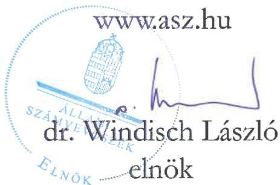
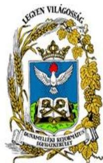

ÁLLAMI SZÁMVEVŐSZÉK

# JELENTÉS

## Egyházaknak nyújtott beruházási támogatások felhasználásának ellenőrzése

A svábhegyi református óvoda és kiszolgáló egységeinek létrehozására nyújtott nem hitéleti célú beruházási támogatás felhasználásának ellenőrzése a Dunamelléki Református Egyházkerületnél és a Budapest-Svábhegyi Református Egyházközségnél

2025.

25110

www.asz.hu

---

ÁLLAMI SZÁMVEVŐSZÉK

# JELENTÉS

## Egyházaknak nyújtott beruházási támogatások felhasználásának ellenőrzése

A svábhegyi református óvoda és kiszolgáló egységeinek létrehozására nyújtott nem hitéleti célú beruházási támogatás felhasználásának ellenőrzése a Dunamelléki Református Egyházkerületnél és a Budapest-Svábhegyi Református Egyházközségnél

2025.

25110

---

Jelentéseink az interneten a www.asz.hu címen olvashatók.

ELLENŐRZÉSI IGAZGATÓSÁG:
ELLENŐRZÉSI IGAZGATÓSÁG V.

ELLENŐRZÉSI IGAZGATÓ:
KLINGA LÁSZLÓ igazgató

ELLENŐRZÉSVEZETŐ:
NEMESVÁRI-HORTHY ESZTER ellenőrzésvezető

IKTATÓSZÁM: EL-4102-006/2025
TÉMASORSZÁM: 35.
ELLENŐRZÉS-AZONOSÍTÓ SZÁM: V-11051

---

TARTALOMJEGYZÉK

- ÖSSZEFOGLALÁS ... 5
- AZ ELLENŐRZÉS EREDMÉNYEI ... 7
1. Az Egyházkerület és az Egyházközség támogatás felhasználására vonatkozó szabályozási keretei és könyvvezetési rendszere kialakításának, valamint a közfeladatellátáshoz kapcsolódó beszámolási kötelezettségének szabályszerűsége a nem hitéleti célú költségvetési forrásból származó beruházási támogatások vonatkozásában ... 7
2. A költségvetési forrásból származó ellenőrzött nem hitéleti célú beruházási támogatás és felhasználása, illetve a támogatásból finanszírozott beruházás könyvviteli nyilvántartásának szabályszerűsége ... 8
3. A költségvetési forrásból származó ellenőrzött nem hitéleti célú beruházási támogatás felhasználásának, elszámolásának szabályszerűsége ... 9
4. A költségvetési forrásból származó ellenőrzött nem hitéleti célú támogatásból finanszírozott beruházás előkészítésének szabályszerűsége ... 10

- JAVASLATOK ... 12
- I. FÜGGELÉK: ÉSZREVÉTELEK ... 13
- II. FÜGGELÉK: ELLENŐRZÉSI MEGKÖZELÍTÉS ... 14
- MELLÉKLETEK ... 20
I. sz. melléklet: Értelmező szótár ... 20
II. sz. melléklet: Az ellenőrzött szervezetek jegyzéke ... 22
- RÖVIDÍTÉSEK JEGYZÉKE ... 23

---

.

---

ÖSSZEFOGLALÁS

A Magyarországon működő vallási közösségek számos társadalmi és közfeladatot látnak el, amelyhez az elmúlt évek tendenciáit megfigyelve, jelentős, egyre növekvő mértékű költségvetési támogatásban részesültek. Az elmúlt években az állam által nyújtott jelentős összegű támogatások miatt a vallási közösségek egyre hangsúlyosabb szerepet kapnak a közfeladatellátásban. A közérdeklődés folyamatos, hiszen a társadalom részéről kérdésként merül fel, hogy az állam által nyújtott közpénz hasznosult-e, elérte-e a célját, továbbá jogos elvárás, hogy az állam által nyújtott támogatás felhasználása szabályszerűen, átláthatóan, ellenőrizhetően történjen meg.

Bárányfelhő Svábbegyi Református Óvoda Forrás: https://12.kerulet.it/lakunk.bu/bolmi/oktatas/baranyfelho-svabhegyi-reformatus-ovoda

Az ÁSZ¹, mint az Országgyűlés legfőbb pénzügyi és gazdasági ellenőrző szerve, figyelemmel a társadalom részéről jelentkező elvárásokra, törvényi felhatalmazás alapján törvényességi szempontból ellenőrzi az egyházaknak, belső egyházi jogi személyeknek nyújtott nem hitéleti célú támogatások felhasználását.

Az ÁSZ a jelen, óvodafejlesztésre nyújtott támogatás felhasználásának ellenőrzését megelőzően elemezte, értékelte az Egyházi Államtitkárság² által megküldött az egyházaknak nyújtott, nem hitéleti célú beruházási

támogatásokra vonatkozó adatokat. Az adatok elemzése eredményeként az ÁSZ megállapította, hogy az óvodafejlesztésekre nyújtott támogatások voltak az elmúlt években a legjelentősebbek, ezért különböző kockázati szempontok alapján választotta ki ellenőrzésre az óvodafejlesztési támogatások közül az Egyházkerület³ részére egyházi célú fejlesztési támogatásra nyújtott 8454,6 M Ft-ból a svábhegyi református óvoda és kiszolgáló egységeinek létrehozására fordított 1500,0 M Ft nem hitéleti célú támogatást.

Az ÁSZ a támogatás felhasználásának ellenőrzését a kedvezményezett Egyházkerületnél és az általa közreműködőként bevont Egyházközségnél⁴, az óvoda fenntartójánál végezte. Az óvodafejlesztésre kapott támogatást az Egyházkerület és az Egyházközség a Támogatói okiratban⁵ foglalt célnak megfelelően a svábhegyi református óvoda és kiszolgáló egységeinek létrehozására fordította. A beruházás megvalósítása érdekében az 1500,0 M Ft ÁSZ által ellenőrzött költségvetési támogatás mellett az 1481/2019. (VIII.1.) Korm. határozatban⁶ biztosított 944,3 M Ft összegű egyházi közösségi célú beruházási támogatás is bevonásra került. Az Egyházközség összességében a beruházásra 2444,3 M Ft értékű támogatást használt fel.

Az ellenőrzés során az ÁSZ nem állapított meg olyan szabálytalanságot, ami befolyásolta a támogatás cél szerinti felhasználását. Az ÁSZ az egyéb számviteli, könyveléstechnikai szabálytalanság jövőbeni elkerülése érdekében az Egyházkerület Püspöke részére egy javaslatot fogalmazott meg.

Az Egyházkerület és az Egyházközség a beruházás megvalósítása érdekében Közreműködői Megállapodást⁷ kötött. A Közreműködői Megállapodás alapján az Egyházkerület az 1500,0 M Ft támogatási összeget banki átutalás keretében átadta az Egyházközségnek. A Közreműködői Megállapodás alapján az Egyházközség, mint közreműködő szervezet teljes körű felelőséget vállalt a támogatási összeg

5

---

Összefoglalás

felhasználásáért, a határidők betartásáért, az 1500,0 M Ft támogatási összeget saját nevében volt jogosult felhasználni.

A Közreműködői Megállapodásban rögzítettek szerint a támogatás felhasználása során keletkezett bizonylatok az Egyházközség nevére kerültek kiállításra. A Közreműködői Megállapodás szerint az Egyházközség volt jogosult megkötni a beruházás lebonyolításához szükséges tervezői, a műszaki ellenőri és kivitelezési szerződéseket. A Közreműködői Megállapodásban biztosították az Egyházkerület beruházással kapcsolatos ellenőrzési jogkörét, valamint az Egyházközségnek a beruházás megvalósulásának nyomon követése érdekében havi jelentéstételi kötelezettséget írtak elő, melyet minden hónap 28-ig elektronikusan kellett teljesíteni az Egyházkerület részére.

A Támogató szervezet által a Támogatói okiratban megfogalmazott cél teljesült, mivel az ellenőrzött nem hitéleti célra kapott költségvetési támogatásból egy új, 2021. szeptember 01-től érvényes működési engedélye szerint 135 fő befogadására alkalmas óvoda épült, amelyben öt csoportszoba kapott helyet. Az óvodában foglalkoztató, egészségügyi, szociális, igazgatási, étterem, konyha, sport és szabadidős, valamint közösségi célú egységek is létrehozásra kerültek.

Az Egyházközség a Közreműködői Megállapodás alapján a beruházás előkészítése során az építettői felelősségre vonatkozó jogszabályi előírásokat betartotta. Az Egyházközség a kivitelezés megkezdését megelőzően – a jogszabályi kötelezettségének eleget téve – a kiviteli és engedélyezési tervek elkészítése érdekében tervezési szerződést, a kivitelezés műszaki ellenőrzése érdekében a műszaki ellenőrrel és a kivitelezővel szerződést kötött. A tervezési szerződés megkötésekor, 2018 júniusában hatályos jogszabályi előírás ellenére, a tervezési szerződést közbeszerzési eljárás lefolytatása nélkül kötötték meg. A 2018 novemberében módosított törvényi előírás a korábbi közbeszerzési kötelezettséget megszüntette és úgy rendelkezett, hogy az egyházi jogi személyeknél a még el nem számolt támogatások – így az Egyházközség ellenőrzéssel érintett támogatása – esetében, az új jogszabályi előírást lehetett alkalmazni.

Az Egyházkerület és az Egyházközség a szabályozási és könyvvezetési rendszerét szabályszerűen alakította ki, könyveit a kettős könyvvitel rendszerében vezette. Beszámolási kötelezettségének az Egyházkerület a 2018., a 2021. és a 2022. évekre vonatkozóan, az Egyházközség a 2018. és a 2021. évekre vonatkozóan szabályszerűen eleget tett.

Az Egyházkerület és az Egyházközség a kapott támogatást, az Egyházközség annak felhasználását szabályszerűen, elkülönítetten mutatta ki könyveiben. Az Egyházkerület a 100%-os támogatási előlegként kapott támogatást, az előírásokkal ellentétben nem kötelezettségként, hanem egyéb bevételként mutatta ki.

Az Egyházkerület a támogatással, az Egyházközség nevére kiállított szabályszerű számviteli bizonylatokkal, határidőben elszámolt a Támogató szervezet felé, amely az elszámolást elfogadta.

---

AZ ELLENŐRZÉS EREDMÉNYEI

Az Egyházkerület a részére, óvoda fejlesztésére nyújtott költségvetési támogatásból a svábhegyi református óvoda és kiszolgáló egységeinek létrehozására fordított támogatást a közreműködőként bevont Egyházközséggel közösen szabályszerűen, a támogatás céljának megfelelően a támogatott tevékenység időtartamán belül használta fel. A közpénz, az óvodai nevelési közfeladatra került felhasználásra. A beruházás eredményeként egy új, öt csoportszobás 135 fő befogadására alkalmas óvoda valósult meg a támogatásból. Az óvodában foglalkoztató, egészségügyi, szociális, igazgatási, étterem, konyha, sport és szabadidős, valamint közösségi célú egységek is létrehozásra kerültek.

1. Az Egyházkerület és az Egyházközség támogatás felhasználására vonatkozó szabályozási keretei és könyvvezetési rendszere kialakításának, valamint a közfeladatellátáshoz kapcsolódó beszámolási kötelezettségének szabályszerűsége a nem hitéleti célú költségvetési forrásból származó beruházási támogatások vonatkozásában

|  Összegző megállapítás | Az Egyházkerület és az Egyházközség könyvvezetési rendszerének kialakítása szabályszerű volt.
Az Egyházkerület és az Egyházközség beszámolási kötelezettségüknek a 2018., a 2021. és a 2022. évekre vonatkozóan szabályszerűen eleget tettek.  |
| --- | --- |

Az Egyházkerület a 2016-2022. évekre a támogatás felhasználására vonatkozó belső szabályozások és számviteli keretek megalkotásával megteremtette az ellenőrzött támogatás szabályszerű felhasználásának feltételeit. Az Egyházkerület a Számv. tv.⁹ előírásával összhangban rendelkezett Számviteli politikával¹⁰, valamint annak keretében a Számv. tv. előírásának megfelelően elkészítette a Leltározási szabályzatot¹¹, az Értékelési szabályzatot¹² és a Pénzkezelési szabályzatot¹³. A Számviteli politikában¹ az Egyházkerület az Eszámvr.¹⁴ előírásának megfelelően az időbeli elhatárolás alkalmazását és annak választott módszerét rögzítette. Az Egyházkerület kettős könyvvitelt vezető gazdálkodóként a Számv. tv.-ben előírtakkal összhangban rendelkezett Számlarenddel¹⁵.

Az Egyházkerület számviteli beszámoló készítési kötelezettségének, az Eszámvr. előírása alapján tett eleget. A 2018. évben, a 2021. évben, illetve a 2022. évben a Gazdálkodási tv.¹⁶-ben és a Számviteli politikában¹ rögzítettek szerint zárszámadást készített. A zárszámadás a Gazdálkodási tv. és a Számviteli politika¹ rendelkezései alapján éves költségvetési beszámolóból, az Eszámvr. 1. sz. melléklete szerinti mérlegből és eredménykimutatásából, valamint szöveges értékelésből állt.

Az Egyházkerület a 2018., 2021. és 2022. évekre vonatkozó számviteli beszámolóját – az Eszámvr. 11. §-ában biztosított lehetőséggel élve – nem helyezte letétbe, illetve annak közzétételéről sem rendelkezett.

---

Az ellenőrzés eredményei

Az Egyházközség a 2018-2021. évekre a támogatás felhasználására vonatkozó belső szabályozások és számviteli keretek megalkotásával megteremtette az ellenőrzött támogatás szabályszerű felhasználásának feltételeit. Az Egyházközség a Számv. tv előírása szerint rendelkezett Számviteli politikával²¹⁷. Az Egyházközség a Számv. tv. előírásának megfelelően elkészítette a Leltározási szabályzatot²¹⁸, az Értékelési szabályzatot²¹⁹ és a Pénzkezelési szabályzatot²²⁰. Az Egyházközség kettős könyvvitelt vezető gazdálkodóként a Számv. tv.-ben előírtakkal összhangban rendelkezett Számlarenddel²²¹.

Az Egyházközség számviteli beszámoló készítési kötelezettségének, az Eszámvr. előírása alapján tett eleget. A 2018. évben, illetve a 2021. évben a Gazdálkodási tv.1.2-ben rögzítettek szerint zárszámadást készített. A zárszámadás a Gazdálkodási tv. rendelkezései alapján éves költségvetési beszámolóból, az Eszámvr. 1. sz. melléklete szerinti mérlegből és eredménykimutatásából, valamint szöveges értékelésből állt.

Az Egyházközség a 2018. és a 2021. évekre vonatkozó számviteli beszámolóját – az Eszámvr. 11. §-ában biztosított lehetőséggel élve – nem helyezte letétbe, illetve annak közzétételéről sem rendelkezett.

## 2. A költségvetési forrásból származó ellenőrzött nem hitéleti célú beruházási támogatás és felhasználása, illetve a támogatásból finanszírozott beruházás könyvviteli nyilvántartásának szabályszerűsége

### Összegző megállapítás

Az Egyházkerület és az Egyházközség a költségvetési forrásból származó, a svábhegyi református óvoda és kiszolgáló egységeinek létrehozására nyújtott nem hitéleti célú beruházási támogatást elkülönítetten mutatta ki. Az Egyházközség a támogatás felhasználását elkülönítetten, szabályszerűen mutatta ki, illetve tartotta nyilván könyveiben, a beruházás üzembe helyezése, aktivalása, illetve nyilvántartásba vétele megtörtént.

Az Egyházkerület és az Egyházközség az elkülönített nyilvántartás vezetésének feltételeit – összhangban a Támogatói okirathoz kapcsolódó ÁSZI²²²-ben foglalt előírással – kialakította. Az Egyházkerületnél az elkülönített nyilvántartás vezetése gyűjtőkódok alkalmazásával került biztosításra. Az Egyházközségnél az elkülönített nyilvántartás vezetését jogcímrend és projekt (munkaszám) segítségével biztosították.

Az Egyházkerület a 100%-os előlegként kapott támogatást elkülönítetten mutatta ki, ugyanakkor egyéb bevételként vette nyilvántartásba, ellentétben a Számv. tv. 43. § (1) bekezdésében foglalt előírással, az egyéb rövid lejáratú kötelezettségek között nem mutatta ki. Az Egyházkerület a támogatási előleget a megkötött Közreműködői Megállapodás alapján az Egyházközség, mint a támogatási összeg felhasználásáért felelős Közreműködő részére átadta. Az Egyházközség az Egyházkerület által a részére átadott támogatást – figyelemmel a Közreműködői Megállapodásra – az egyéb bevételek között elkülönítetten mutatta ki.

Az Egyházközség a támogatás felhasználását – összhangban a Közreműködői Megállapodásban szabályozott, a támogatás felhasználására vonatkozó felelősségével, a támogatás elszámolásával

---

Az ellenőrzés eredményei

kapcsolatos kötelezettségével – a könyveiben elkülönítetten mutatta ki, a támogatás felhasználásáról elkülönített nyilvántartást vezetett.

A Közreműködői megállapodás 5.3. pontja alapján az ellenőrzött támogatásból megvalósult beruházás az Egyházközség tulajdonába került. Az Egyházközség a támogatásból finanszírozott beruházás könyvviteli nyilvántartása során a jogszabályi előírásoknak megfelelően járt el. Az ellenőrzött támogatásból is finanszírozott beruházás ellenőrzött mintatételei alapján a beruházás üzembe helyezése, aktiválása, illetve nyilvántartásba vételére megtörtént. Az épület értékcsökkenés elszámolás mértékének meghatározása a Számv. tv.-ben és az Értékelési szabályzat-ban foglaltaknak megfelelően történt.

# 3. A költségvetési forrásból származó ellenőrzött nem hitéleti célú beruházási támogatás felhasználásának, elszámolásának szabályszerűsége

## Összegző megállapítás

Az Egyházkerület a költségvetési forrásból származó, a svábhegyi református óvoda és kiszolgáló egységeinek létrehozására nyújtott nem hitéleti célú beruházási támogatást szabályszerűen használta fel és számolta el.

A Támogatói okirat 3.6. pontja alapján a beruházás megvalósítása érdekében az Egyházkerület és az Egyházközség Közreműködői Megállapodást kötöttek. A Közreműködői Megállapodás szerint az Egyházközség a támogatási összeget saját nevében volt jogosult felhasználni és a támogatás felhasználása során keletkezett bizonylatok az Egyházközség nevére kerültek kiállításra. A Közreműködői Megállapodás alapján a támogatás felhasználásának pénzügyi elszámolását és a beruházás szakmai beszámolóját az Egyházközség készítette el és nyújtotta be az Egyházkerületnek. Ezt követően az Egyházkerület nyújtotta be a Támogatói okirathoz kapcsolódó összesítő elszámolást a Támogató szervezetnek.

A Támogatói okirathoz kapcsolódó, a svábhegyi református óvoda és kiszolgáló egységeinek létrehozására felhasznált, támogatásról készített elszámolásban szereplő és ellenőrzött 30 db tétel vizsgálata alapján az ÁSZ az alábbiakat állapította meg:

- a kapott támogatást a Támogatói okiratban meghatározott célnak megfelelően a svábhegyi református óvoda és kiszolgáló egységeinek létrehozására használták fel;
- a beruházásról vezetett elkülönített számviteli nyilvántartás tartalmazott minden olyan bizonylatot, amely szerepelt az elszámolásban;
- az elszámolt költségeket megfelelően kiállított bizonylatok igazolták, azok alaki és tartalmi kellékei megfeleltek a Számv. tv. előírásainak;
- a támogatás felhasználása megfelelt a Támogatói okiratban előírtaknak, a támogatott tevékenység időtartamára vonatkozó előírásnak (a bizonylatok mindegyike esetében a kiállítás dátuma, teljesítés időpontja a támogatási időszakba esett (2016. január 01-2022. március 30.), a pénzügyi teljesítés az elszámolási határidő végéig megtörtént (2022. június 30.));
- a számviteli bizonylatok szabályszerűen záradékolva voltak a Támogatói okiratban foglaltakkal összhangban.

---

Az ellenőrzés eredményei

Az Egyházkerület a Támogató szervezet felé a Támogatói okiratban, illetve a Támogató szervezet által előírt határidőn belül 2022. március 10-én elszámolt. Az elszámolást a Támogató szervezet elfogadta, a záró teljesítésigazolást 2022. május 16. napján állította ki, az Egyházkerületnek támogatás visszafizetési kötelezettsége nem keletkezett.

# 4. A költségvetési forrásból származó ellenőrzött nem hitéleti célú támogatásból finanszírozott beruházás előkészítésének szabályszerűsége

## Összegző megállapítás

Az ellenőrzött nem hitéleti célú támogatásból finanszírozott svábhegyi református óvoda és kiszolgáló egységeihez kapcsolódó építési beruházás előkészítése során az építettői felelősségre vonatkozó jogszabályi előírásokat betartották.

A támogatásból finanszírozott beruházáshoz kapcsolódóan az Egyházközség közbeszerzési eljárás lefolytatási kötelezettsége a Kbt. 23 5. § (3) bekezdésének előírása alapján 2018. november 28-ig fennállt. Az Egyházközség a Kbt. 5. § (3) bekezdésében foglalt – 2018. november 28-ig hatályos – előírása ellenére az engedélyezési és kiviteli terv tervezőjével a tervezési szerződést közbeszerzési eljárás lefolytatása nélkül kötötte meg 2018. július 04-én. A 2018. november 29-től hatályos Kbt. 197. § (11) bekezdésében foglalt egyházi jogi személyek kivételére vonatkozó rendelkezés alapján a Kbt. 5. § (3) bekezdésének – 2018. november 29-étől hatályos – előírását a folyamatban lévő, a Támogató szervezet felé még el nem számolt támogatás esetében is alkalmazni lehetett. A Kbt. 2018. november 29-én hatályba lépett módosításakor az Egyházközség a Támogató szervezet felé még nem számolt el a támogatással, ezért a Kbt. 197. § (11) bekezdésének rendelkezése alkalmazható volt az ellenőrzéssel érintett támogatásra, így a tervezési szerződésre is.

A Közreműködői Megállapodásban foglaltak alapján a beruházás előkészítéséhez kapcsolódó feladatokat az Egyházközség látta el.

A beruházás előkészítéséhez kapcsolódó, az építettői felelősségre vonatkozó jogszabályi előírásokat az Egyházközség betartotta. Az Egyházközség az Étv. 24 43. § (1) bekezdés c) pontjában foglaltakért viselt felelősségi körében az engedélyezési és kiviteli tervdokumentáció tervezőjét, a kivitelezés műszaki ellenőrét, valamint a kivitelezőt kiválasztotta. Az Egyházközség az engedélyezési és kiviteli tervdokumentáció tervezőjével, a kivitelezés műszaki ellenőrével, valamint a kivitelezővel a szerződéseket megkötötte. Az Egyházközség a műszaki ellenőrzési, az épületvillamossági műszaki ellenőrzési és az épületgépszeti műszaki ellenőrzési feladatok ellátására külön szerződést kötött. Az Egyházközség a kivitelezési szerződés megkötését megelőzően a kivitelező kiválasztása érdekében beszerzési eljárás keretében meghívásos ajánlattételi eljárást folytatott le. A szerződések megkötésénél az Egyházközség figyelembe vette a Támogatói okiratban meghatározott szakmai programot.

10

---

Az ellenőrzés eredményei

A megkötött szerződésekben a biztosítéki elemek az alábbiak voltak:

- Az engedélyezési és a kiviteli terv elkészítésére kötött szerződésben a kötbérfizetési kötelezettséget, illetve annak feltételeit a Ptk.²⁵-ban foglalt előírással, a szavatosság és a jótállás szabályait a Ptk. rendelkezésével összhangban határozták meg.
- A műszaki ellenőrökkel megkötött szerződésekben jótállás, szavatosság és kötbérfizetési kötelezettség tekintetében a Ptk. általános szabályai voltak az irányadóak.
- A kivitelezési szerződésben a kivitelező a műszaki átadás-átvétel napjától számítva 36 hónap jótállást vállalt, valamint a kivitelező vállalta, hogy a műszaki átadás-átvételt követő 12 hónap elteltével utófelülvizsgálati eljárását tart és a feltárt hibák javítását, hiányosságok megszüntetését 30 napon belül elvégzi. A kivitelező a jótállási időszak első 12 hónapjára a nettó vállalkozói díj 5%-os mértékének megfelelő jótállási biztosítékot vállalt. A kivitelező kötelezett volt a teljesítési határidő be nem tartása esetén késedelmi, meghiúsulási kötbér megfizetésére a Ptk.-ban előírtakkal összhangban.

A beruházás megvalósítása során a tervezési, a műszaki ellenőri, illetve a kivitelezői szerződésekben és azok módosításaiban meghatározott biztosíték, jótállás, kötbérfizetési igény érvényesítésére nem került sor. Az építési beruházás az Egyházközség saját tulajdonú ingatlanán valósult meg.

11

---

JAVASLATOK

Az ÁSZ tv. 26 33. § (1) bekezdésében foglaltak értelmében az ellenőrzött szervezet vezetője köteles a jelentésben foglalt megállapításokhoz kapcsolódó intézkedési tervet összeállítani és azt a jelentés kézhezvételétől számított 30 napon belül az ÁSZ részére megküldeni. Az ÁSZ a jelentésben foglalt megállapításokhoz kapcsolódóan az alábbi javaslatok tekintetében várja el az intézkedési terv elkészítését.

## A DUNAMELLÉKI REFORMÁTUS EGYHÁZKERÜLET PÜSPÖKE RÉSZÉRE

1. Az Egyházkerület a 100%-os előlegként kapott támogatást elkülönítetten mutatta ki, ugyanakkor egyéb bevételként vette nyilvántartásba, ellentétben a Számv. tv. 43. § (1) bekezdésében foglalt előírással, amely szerint a kötelezettségek között kellett volna kimutatnia.

Gondoskodjon arról, hogy amennyiben az Egyházkerület 100%-os előlegként nyújtott támogatást kap, a könyveiben a Számv. tv. 43. § (1) bekezdésében foglalt előírással összhangban a rövid lejáratú kötelezettségek között mutassa ki.

12

---

13

# I. FÜGGELÉK: ÉSZREVÉTELEK

A jelentéstervezetet az ÁSZ 15 napos észrevételezésre megküldte az ellenőrzött szervezet vezetőjének az ÁSZ tv. 29. §* (1) bekezdése előírásának megfelelően.

A Dunamelléki Református Egyházkerület gazdasági tanácsosának észrevétele alapján az ÁSZ a jelentéstervezetet pontosította.

A Budapest-Svábhegyi Református Egyházközség vezető lelkésze levelében jelezte, hogy a jelentéstervezet megállapításaira nem tesz észrevételt.

* 29. § (1) Az Állami Számvevőszék az ellenőrzési megállapításait megküldi az ellenőrzött szervezet vezetőjének vagy az általa megbízott személynek, és annak, akinek személyes felelősségét állapította meg.
(2) Az ellenőrzött szervezet vezetője és a felelősként megjelölt személy az ellenőrzés megállapításaira tizenöt napon belül írásban észrevételt tehet.
(3) Az Állami Számvevőszék az észrevételre a beérkezésétől számított harminc napon belül írásban válaszol. A figyelembe nem vett észrevételeket köteles a jelentésben feltüntetni, és megindokolni, hogy azokat miért nem fogadta el.

---

14

# II. FÜGGELÉK: ELLENŐRZÉSI MEGKÖZELÍTÉS

## AZ ELLENŐRZÉS JOGALAPJA

Az ellenőrzés jogszabályi alapját az ÁSZ tv. 1. § (3) bekezdése, az 5. § (11) bekezdés c) pontja, valamint az Ehtv.²⁷ 19/D. § (2) bekezdés előírásai képezték.

## AZ ELLENŐRZÉS CÉLJA

Az ellenőrzés célja annak értékelése volt, hogy a költségvetési forrásból az Egyházkerület és az Egyházközség a részükre nyújtott nem hitéleti célú beruházási támogatás vonatkozásában a támogatás felhasználásának szabályozási környezetét szabályszerűen alakították-e ki, a nem hitéleti célú beruházási támogatás felhasználása, a támogatással való elszámolás, a könyvviteli nyilvántartás szabályszerű volt-e, illetve a támogatásból finanszírozott beruházás előkészítése szabályszerűen történt-e meg.

## AZ ELLENŐRZÉS TÍPUSA

Törvényességi ellenőrzés.

## AZ ELLENŐRZÉS TÁRGYA

Az ellenőrzés tárgyát képezte az Egyházkerület és az Egyházközség részére költségvetési forrásból nem hitéleti célra nyújtott beruházási támogatás felhasználásának törvényességi szempontok szerinti ellenőrzése. Ennek keretében ellenőrzésre került a beruházási támogatáshoz kapcsolódóan a számviteli elszámolásra vonatkozóan a jogszabályi, illetve a támogatói okiratban rögzített előírások betartása, a támogatás felhasználása és az azzal történő elszámolás támogatói okiratnak való megfelelősége. Ezzel összefüggésben értékelésre került, hogy a számviteli szabályozási környezet kialakítása támogatta-e a költségvetési forrásból származó nem hitéleti célú beruházási támogatás vonatkozásában a szabályos könyvvezetést. Az ellenőrzés tárgya volt továbbá annak ellenőrzése, hogy a támogatásból finanszírozott beruházás előkészítése szabályszerű volt-e.

Az ellenőrzés kiterjedt minden olyan körülményre és adatra, amely az ÁSZ jogszabályban meghatározott feladatainak teljesítéséhez, valamint a program végrehajtása folyamán felmerült újabb összefüggések feltárásához szükséges volt.

## AZ ELLENŐRZÉS HATÓKÖRE ÉS TERÜLETE

A Magyarországon működő vallási közösségek a társadalom kiemelkedő fontosságú értékhordozó és közösségteremtő tényezői. Hitéleti tevékenységük mellett közfeladatok ellátásában vesznek részt. A közfeladataik ellátásához jelentős állami költségvetési támogatásban, közpénzben részesülnek. A társadalom jogos elvárása, hogy a közpénzekkel gazdálkodó szervezetek működéséről, tevékenységéről átfogó képet kapjon.

---

II. Függelék: Ellenőrzési megközelítés

Az Ehtv. 19/D. § (2) bekezdésében előírtak alapján az egyházi jogi személynek nem hitéleti célra nyújtott költségvetési támogatás felhasználásának törvényességi szempontok szerinti ellenőrzését az ÁSZ végzi. Az ÁSZ tv. 5. § (11) bekezdés c) pontja rendelkezése alapján az ÁSZ a vallási egyesület, az egyházi jogi személyek vagy azok nevelési-oktatási, felsőoktatási, egészségügyi, karitatív, szociális, család-, gyermek- és ifjúságvédelmi, kulturális vagy sporttevékenység végzésére létrehozott, a jogi személyiséggel rendelkező vallási közösség belső szabálya szerint jogi személyiséggel nem rendelkező intézménye részére az államháztartásból nem hitéleti célra nyújtott beruházási támogatás felhasználását ellenőrzi.

Az ÁSZ a jelen, óvodafejlesztésre nyújtott támogatás felhasználásának ellenőrzését megelőzően elemezte, értékelte az Egyházi Államtitkárság által az ÁSZ felkérésére az egyházaknak nyújtott, nem hitéleti célú beruházási támogatásokra vonatkozóan adott adatokat. Az ÁSZ egyházakat érintő ellenőrzései, valamint az Egyházi Államtitkárság által szolgáltatott adatok elemzése alapján arra a következtetésre jutott, hogy az elmúlt években más közfeladatok ellátását is értékelve a köznevelés területén az óvodafejlesztések voltak azok, amelyek révén rendkívül jelentős mértékű támogatásokat nyújtottak az egyházak számára.

A 2021. január 1. és 2024. június 30. közötti időszakban a köznevelési közfeladatokhoz kapcsolódóan több, mint 300 beruházási célú egyházi támogatás lezártnak minősült. A nyújtott, több száz támogatás közel 50%-a óvoda beruházásokhoz kapcsolódott, amely beruházások támogatási összege meghaladta a 40 000,0 M Ft-ot.

Az ellenőrzött támogatások kiválasztása érdekében az Egyházi Államtitkárság által megküldött Magyarország területén megvalósuló, 2021. január 1-2024. június 30. között lezárt beruházási célú egyházi támogatások adatait értékelte az ÁSZ. Az értékelés során az egyes beruházások tekintetében az ÁSZ kockázati szempontként vette figyelembe a támogatási összeg nagyságát, a támogatás felhasználásának időbeli elhúzódását, a támogatással kapcsolatban megkötött támogatói okirat több alkalommal történő módosítását, illetve, hogy a támogatási összeg alapján közbeszerzési eljárás lefolytatásának szükségessége felmerült-e.

Az értékelés eredményeként az Egyházkerület részére egyházi fejlesztési célú támogatásra nyújtott 8454,6 M Ft-ból a svábhegyi református óvoda és kiszolgáló egységeinek létrehozására fordított 1500,0 M Ft nem hitéleti célú támogatást és annak felhasználását az ÁSZ ellenőrzésre jelölte ki.

Az ÁSZ a kockázat alapon kiválasztott, nem hitéleti célú beruházási támogatást felhasználó kedvezményezett és a közreműködő egyházi jogi személynél folytatott ellenőrzése során azt értékelte, hogy:

- a számviteli keretek, könyvvezetési rendszer kialakítása a jogszabályi előírásoknak megfelelően történt-e, illetve az egyházi jogi személy megfelelő formában határozta-e meg a számviteli beszámoló formáját;
- a kapott támogatást, illetve annak felhasználását a jogszabályi előírásoknak, valamint a támogatói okiratban foglaltaknak megfelelően tartotta-e nyilván, a támogatásból finanszírozott beruházás vonatkozásában a nyilvántartása szabályszerű volt-e;
- a támogatás felhasználása, a támogatással való elszámolás során a jogszabályokban és a támogatói okiratban foglalt előírások betartásával járt-e el;
- a beruházás előkészítése során a jogszabályokban és a támogatói okiratban foglalt előírások betartásával járt-e el.

15

---

II. Függelék: Ellenőrzési megközelítés

Az ÁSZ által ellenőrzött támogatással kapcsolatos adatokat az 1. táblázat foglalja össze.

1. táblázat

A TÁMOGATÁS FŐBB ADATAI

|  EGYH-KCP-16-P-0094 AZONOSÍTÓ SZÁMÚ: TÁMOGATÓI OKIRAT ÉS AZ ELLENŐRZŐTT SZAKMAI RÉSZFELADAT FŐBB ADATAI  |   |
| --- | --- |
|  Támogatott tevékenységek: | A Dunamelléki Református Egyházkerület fejlesztési címen megvalósítandó projektek támogatása  |
|  Támogatás forrása: | Magyarország 2016. évi központi költségvetéséről szóló 2015. évi C. törvény XX. Emberi Erőforrások Minisztériuma fejezet 20/55/9 Egyházi közösségi célú programok és beruházások támogatása fejezeti kezelésű előirányzata  |
|  Támogatási összeg: | eredeti: 10 455,0 M Ft; tényleges: 8454,6 M Ft  |
|  Támogató: | EMMI²⁸, 2018. szeptember 1-jétől BGA Zrt.²⁹  |
|  Ellenőrzött támogatott tevékenység: | Svábhegyi Református Óvoda és kiszolgáló egységeinek létrehozása  |
|  Ellenőrzött támogatott tevékenység tervezett összege: | 1500,0 M Ft  |
|  Ellenőrzött támogatott tevékenység felhasznált összege: | 1500,0 M Ft  |
|  A támogatott tevékenység időtartama: | 2016. január 1-2022. március 30.  |
|  A támogatási előleg felhasználásáról a beszámoló benyújtásának határideje: | 2022. június 30.  |
|  Beszámoló benyújtása és elfogadása: | 2022. március 10. és 2022. május 16.  |

Forrás: ÁSZ saját szerkesztés a Támogatói okirat és módosításai alapján

A Dunamelléki Református Egyházkerület a Magyarországi Református Egyház részeként a XVI. század közepén alakult meg. Az Egyházkerületnek nyolc egyházmegyéje van. Az Egyházkerület a püspök vezetésével működik, a nem lelkészi vezetőtárs a főgondnok. Az ellenőrzött időszakban az Egyházkerület püspöke 2016. január 01-2020. november 04. között Szabó István volt. A püspöki feladatokat 2020. november 05-től Balog Zoltán látja el. Az Egyházkerület vezetését az elnökség támogatja. Az elnökség tagjai a püspök mellett a főgondnok és a főjegyzők. Az elnökség munkáját további 12 főből álló apparátus segíti. Az Egyházkerület több mint 90 oktatási intézmény (óvoda, általános iskola, középiskola, internátus, felsőoktatási intézmény) fenntartójaként működik. A Dunamelléki Református Egyházkerület az ellenőrzött időszakban vállalkozási tevékenységet nem folytatott.

A Dunamelléki Református Egyházkerület címere
Forrás: https://reformatus.hu/magyar-reformatus-egyhaz/
magyar-reformatusok-karpat-medenceben/

---

II. Függelék: Ellenőrzési megközelítés

A Svábhegyi Református Egyházközség temploma Forrás: https://budapestimages.com/product/svabhegyi-reformatus-egyhazkozseg-temploma-kodhen/

A Budapest-Svábhegyi Református Egyházközség az Egyházkerület részeként a Budapest-Déli Református Egyházmegyén belül működik, a XIX. század környékén alakult meg. Az Egyházközség a vezető lelkész vezetésével működik, a nem lelkészi vezetőtárs a főgondnok. A vezető lelkészi tisztséget az ellenőrzött időszakban Berta Zsolt töltötte be. Az Egyházközség vezetését a presbitérium támogatja. Az Egyházközség az ellenőrzött időszakban vállalkozási tevékenységet nem folytatott. Az Egyházközség az ellenőrzött támogatásból megvalósult intézmény (Bárányfelhő Svábhegyi Református Óvoda) fenntartója.

# AZ ELLENŐRZÖTT IDŐSZAK

A támogatott tevékenység időtartamának kezdő napjától (2016. január 1.) az ellenőrzés megkezdéséről szóló kiértesítő levél keltéig (Dunamelléki Református Egyházkerület: 2024. december 4., Budapest-Svábhegyi Református Egyházközség: 2025. január 17.). Az ellenőrzött időszakon belül az értékelt releváns éveket fókuszterületenként és részterületenként az alábbi 2. táblázat foglalja össze:

2. táblázat
AZ ELLENŐRZÉS SZEMPONTJÁBÓL RELEVÁNS ÉVEK BEMUTATÁSA

|  FÓKUSZTERÜLET SZÁMA | RÉSZTERÜLET | RELEVÁNS ÉVEK  |   |
| --- | --- | --- | --- |
|   |   |  DUNAMELLÉKI REFORMÁTUS EGYHÁZKERÜLET | BUDAPEST-SVÁBHEGYI REFORMÁTUS EGYHÁZKÖZSÉG  |
|  1. | Könyvvezetési rendszer kialakítása, beszámolási kötelezettség teljesítése | 2018. év és a 2021-2022. évek | 2018. év és a 2021. év  |
|   |  Belső szabályozó eszközök és számviteli keretek kialakítása | 2016-2022. évek | 2018-2021. évek  |
|  2. | Kapott támogatás kimutatása | 2016. év, 2018. év, 2021-2022. évek | 2018-2021. évek  |
|   |  Ellenőrzött támogatás nyilvántartása  |   |   |
|  3. | Támogatás és felhasználásának elszámolása | 2016-2022. évek | 2018-2021. évek  |
|  4. | Támogatásból megvalósuló beruházáshoz kapcsolódó közbeszerzési eljárás | - | 2018-2021. évek  |
|   |  Építetői felelősség körébe tartozó előírások betartása  |   |   |

Forrás: ÁSZ saját szerkesztés

---

II. Függelék: Ellenőrzési megközelítés

## AZ ELLENŐRZÉSI KRITÉRIUMOK

|  FÓKUSZTERÜLET/FÓKUSZKÉRDÉS | ELLENŐRZÉSI KRITÉRIUMOK  |
| --- | --- |
|  1. Az ellenőrzött szervezet támogatás felhasználására vonatkozó szabályozási keretei és könyvvezetési rendszere kialakításának, valamint a közfeladatellátáshoz kapcsolódó beszámolási kötelezettségének szabályszerűsége a nem hitéleti célú költségvetési forrásból származó beruházási támogatások vonatkozásában | Számv. tv. 14. § (3) bekezdés, (5) bekezdés a), b) és d) pontjai, 161. § (1) bekezdés
Ehtv. 19. § (3) bekezdés
Eszámvr. 5. § (1) bekezdés, 1. melléklet, 7. § (6) bekezdés, 11. §
Gazdálkodási tv.14. § (2) bekezdés a)-d) pontjai  |
|  2. A költségvetési forrásból származó ellenőrzött nem hitéleti célú beruházási támogatás és felhasználása, illetve a támogatásból finanszírozott beruházás könyvviteli nyilvántartásának szabályszerűsége | Számv. tv. 26. § (1)-(2), (4)-(5), 33. § (7) bekezdés, 43. § (1) bekezdés, 47. § (1)-(7) bekezdés, 52. § (1)-(2) és (7) bekezdés, 80. § (2) bekezdés
Eszámvr. 7. § (1)-(3) és (6) bekezdései  |
|  3. A költségvetési forrásból származó ellenőrzött nem hitéleti célú beruházási támogatás felhasználásának, elszámolásának szabályszerűsége | Támogatói okirat 3.3., 4.4. és 5.3. pontja, ÁSZF 6.3. pontja,
Számv. tv. 167. § (1) a), d), h) és i) pont  |
|  4. A költségvetési forrásból származó ellenőrzött nem hitéleti célú támogatásból finanszírozott beruházás előkészítésének szabályszerűsége | Kbt. 5. § (1)-(3) bekezdés
Étv. 43. § (1) bekezdés c) pontja;
Ptk. 6:166. § (1) bekezdés, 6:171. § (1) bekezdés, 6:186. §, Ptk. 6:251. § (3) bekezdés  |

## AZ ELLENŐRZÉS MÓDSZERE ÉS AZ ELLENŐRZÉSI BIZONYÍTÉKOK KÖRE

Az ellenőrzést a nemzetközi standardokat irányadónak tekintve az ellenőrzési program szempontjai, az ellenőrzött időszakban hatályos jogszabályok, az ÁSZ ellenőrzés-szakmai szabályok és irányadó módszertanok figyelembevételével végezte az ÁSZ.

Az ellenőrzés fókuszterületei kockázatalapú megközelítést alkalmazva, a kockázatot hordozó területek beazonosítása alapján kerültek meghatározásra. Kockázatos területként azonosította az ÁSZ a támogatások könyvviteli elszámolásához kapcsolódó könyvviteli rendszer kialakítását, a kapott támogatások és azok felhasználása könyvviteli nyilvántartásban történő elszámolását, a támogatásokkal való elszámolást, valamint a megvalósított beruházások előkészítését.

Az ellenőrzési kérdések megválaszolásához szükséges bizonyítékok megszerzése az ellenőrzött szervezetek, valamint az ellenőrzést támogató szervezet által rendelkezésre bocsátott dokumentumokra, adatokra alapozva kérdésfeltevés (információkérés), interjú útján, a támogatás felhasználása az elszámolásban rögzített számviteli bizonylatok ellenőrzésén keresztül történt.

A nem hitéleti célra nyújtott támogatásból finanszírozott beruházás szemrevételezése érdekében helyszíni szemlére került sor a Bárányfelhő Svábhegyi Református Óvoda 1125 Budapest, Felhő utca 8. szám alatti épületében.

Az ellenőrzési bizonyítékként felhasználható adatforrások közé tartoztak egyrészt az ellenőrzéshez kért dokumentumok, adatforrások, másrészt adatforrás volt még minden – az ellenőrzés folyamán – az ellenőrzés szempontjából információkat tartalmazó dokumentum. Az ellenőrzési kritériumok részletes felsorolását a fenti táblázat tartalmazza.

---

II. Függelék: Ellenőrzési megközelítés

Az ellenőrzés lefolytatásához az ellenőrzött szervezetek a tanúsítványok kitöltésével, valamint az ÁSZ által kért dokumentumok, adatok, információk megküldésével és az ellenőrzés során szolgáltattak adatokat. Az Egyházi Államtitkárság, mint ellenőrzést támogató szervezet a bevett egyházaknak és azok belső egyházi jogi személyeinek nyújtott Magyarország területén megvalósuló 2021. január 1 - 2024. június 30. között lezárt beruházási célú támogatásokhoz kapcsolódó adatbázisokkal, valamint az ÁSZ által kért adatok, dokumentumok és információk megküldésével járult hozzá az ellenőrzés lefolytatásához.

Az Egyházi Államtitkárság által rendelkezésre bocsátott adatbázisok és dokumentumok alapján az adatok kiértékelését követően kockázatértékelés alapján történt meg a köznevelési közfeladatellátáson belül a nem hitéleti célú, az EGYH-KCP-16-P-0094 azonosító számú Támogatói okirathoz kapcsolódó óvoda beruházási támogatás kiválasztása.

Az ellenőrzött időszak keretében – figyelembe véve az EGYH-KCP-16-P-0094 azonosító számú Támogatói okiratban foglaltakat – a svábhegyi református óvoda és kiszolgáló egységeinek létrehozására kapott támogatás vonatkozásában az ellenőrzés szempontjából releváns évek meghatározására került sor. A releváns évek az Egyházkerület és az Egyházközség tekintetében eltérőek voltak. A könyvvezetési rendszer kialakítása, az ellenőrzött támogatás nyilvántartása és a beszámolási kötelezettség teljesítése vonatkozásában az Egyházkerület tekintetében releváns évnek minősült az ellenőrzött támogatás Egyházközség részére történő átadás éve, az ellenőrzött támogatással történő elszámolása éve, illetve az elszámolás Támogató szervezet részéről történő elfogadásának éve. A szabályozási környezet kialakítása, valamint az ellenőrzött támogatás felhasználása és elszámolása vonatkozásában az Egyházkerület tekintetében releváns évek minősültek a támogatott tevékenység időtartamának egyes évei a Támogató szervezet által kiállított teljesítésigazolásig. A könyvvezetési rendszer kialakítása és a beszámolási kötelezettség teljesítése vonatkozásában az Egyházközség tekintetében releváns évnek minősült az ellenőrzött támogatás Egyházkerület részéről történő átadásának éve, valamint az Egyházközség által készített elszámolás éve. A szabályozási környezet kialakítása, az ellenőrzött támogatás nyilvántartása, felhasználása és elszámolása, a beruházás előkészítése vonatkozásában az Egyházközség tekintetében releváns évnek minősült az ellenőrzött támogatás Egyházkerület részéről történő átadásának éve és az ellenőrzött támogatásból megvalósult beruházás üzembe helyezés éve közötti időszak. A releváns éveket a 2. táblázat tartalmazza fókuszterületekhez tartozó részterületenként az ellenőrzött szervezetekre.

A támogatás vonatkozásában a beszámolási kötelezettség szabályszerűségének ellenőrzése az Egyházkerület és az Egyházközség tekintetében, helyszíni adatbetekintés keretében történt meg az Egyházkerület székhelyén.

Az ÁSZ az ellenőrzés során a költségvetési forrásból származó nem hitéleti célú beruházási támogatás könyvviteli nyilvántartásának, valamint a beruházási támogatás felhasználásának és elszámolásának szabályszerűségét az EGYH-KCP-16-P-0094 azonosító számú Támogatói okirathoz kapcsolódó számlaösszesítőben szereplő – a svábhegyi református óvoda és kiszolgáló egységeinek létrehozására elszámolt – tételek közül kockázat alapon kiválasztott 30 db tétel ellenőrzésével értékelte. A kiválasztott tételek ellenőrzésének eredménye nem került kivetítésre a teljes sokaságra, a megállapítások az ellenőrzött tételek vonatkozásában kerültek megjelenítésre.

19

---

MELLÉKLETEK

## I. SZ. MELLÉKLET: ÉRTELMEZŐ SZÓTÁR

belső egyházi jogi személy

A bevett egyház belső egyházi jogi személye egyházi jogi személy. A belső egyházi jogi személy a bevett egyház belső szabálya szerint működik. A belső egyházi jogi személyre a bevett egyházra vonatkozó szabályokat megfelelően kell alkalmazni. A bevett egyház közélű tevékenységet ellátó intézménye a bevett egyház belső szabálya szerint belső egyházi jogi személynek minősülhet. Nem minősül belső egyházi jogi személynek a bevett egyház, a bejegyzett egyház, illetve a nyilvántartásba vett egyház által létrehozott gazdasági társaság, alapítvány és egyesület. A bevett egyház belső szabálya a jogi személyre törvényben meghatározott általános szabályoktól eltérően határozhatja meg a bevett egyház és a belső egyházi jogi személy szervezetére és képviseletére, törvényes működésének biztosítékaira, átalakulására, egyesülésére, szétválaszására és jogutód nélküli megszűnésére, valamint a belső egyházi jogi személy létesítésére vonatkozó szabályokat. (Forrás: Ehtv. 10. – 11/A. §)

bevett egyház

Olyan bejegyzett egyház, amellyel az állam a közösségi célok érdekében történő együttműködésről átfogó megállapodást kötött. (Forrás: Ehtv. 9/G. § (1) bekezdés)

ellenőrzést támogató szervezet

Az ÁSZ tv. 25. § (3) bekezdésének rendelkezése alapján adatot, tájékoztatást, dokumentumot nyújtó szervezet. (Forrás: ÁSZ tv. 25. § (3) bekezdés)

költségvetési támogatás

A társadalombiztosítás pénzügyi alapjai kivételével az államháztartás központi alrendszeréből ellenérték nélkül, pénzben nyújtott támogatások. (Forrás: Áht.³⁰ 1. § 14. pont)

közfeladat

A jogszabályban meghatározott állami vagy önkormányzati feladat. A közfeladat ellátásában államháztartáson kívüli szervezet jogszabályban meghatározott rendben közreműködhet. (Forrás: Áht. 3/A. § (1)- (2) bekezdés)

lezárt támogatás

A támogatott tevékenység akkor tekinthető lezártnak, ha a támogatói okiratban, támogatási szerződésben a befejezést követő időszakra nézve a kedvezményezett további kötelezettséget nem vállalt és az Ávr.³¹ 102/B. § (1) bekezdésben meghatározott feltételek teljesültek. Ha a támogatói okirat, támogatási szerződés a támogatott tevékenység befejezését követő időszakra nézve további kötelezettséget tartalmaz, a támogatott tevékenység akkor tekinthető lezártnak, ha valamennyi vállalt kötelezettség teljesült, a kedvezményezett a kötelezettségek megvalósulásának eredményeiről szóló záró beszámolóját benyújtotta, és azt a támogató jóváhagyta, valamint a záró jegyzőkönyv elkészült. (Forrás: Ávr. 102/B. § (2) bekezdés)

nem vallási tevékenység

Önmagában nem tekinthető vallási tevékenységnek a politikai és érdekvényesítő, a pszichikai vagy parapszichikai, a gyógyászati, a gazdasági-vállalkozási, a nevelési, az oktatási, a felsőoktatási, az egészségügyi, a karitatív, a család-, gyermek- és ifjúságvédelmi, a kulturális, a sport-, az állat-, környezet- és természetvédelmi, a hiteleti tevékenységhez szükségesen túlmenő adatkezelési, valamint a szociális tevékenység. (Forrás: Ehtv. 7/A. § (3) bekezdés)

támogatási jogviszony

A támogatói okirat kiállításával vagy támogatási szerződés megkötésével létrejött polgári jogi jogviszony. (Forrás: Áht. 48. § (1) bekezdés b) pont, 48/A. § (1) bekezdés)

támogató szervezet

A támogatási jogviszonyban a kötelezettségvállalási jogkört gyakorló, a támogatás nyújtására köteles szervezet. (Forrás: Áht. 48/A. § (1) bekezdés)

20

---

Mellékletek

támogatott tevékenység
A támogatási szerződésben meghatározott olyan tevékenység – ideértve a kedvezményezett működését is –, amely során felmerült költségek megtérítését a költségvetési támogatás részben vagy egészében biztosítja.
(Forrás: Ávr. 1. § 8. pont)

támogatott tevékenység időtartama
Támogatási szerződésben meghatározott olyan időtartam, amely során felmerülő, a támogatott tevékenység megvalósításához kapcsolódó költségek elszámolhatóak
(Forrás: Ávr. 1. § 9. pont)

vallási közösség
A természetes személyek minden olyan közössége, szervezeti formától, jogi személyiségtől vagy elnevezéstől függetlenül, amely vallás gyakorlására alakult, és elsődlegesen vallási tevékenységet végez. (Forrás: Ehtv. 6. §)

21

---

Mellékletek

## II. SZ. MELLÉKLET: AZ ELLENŐRZŐTT SZERVEZETEK JEGYZÉKE

|  ELLENŐRZŐTT SZERVEZET NEVE | ELLENŐRZŐTT SZERVEZET SZÉKHELYE  |
| --- | --- |
|  Dunamelléki Református Egyházkerület | 1092 Budapest, Ráday u. 28.  |
|  Budapest-Svábhegyi Református Egyházközség | 1125 Budapest, Felhő u. 10.  |

---

RÖVIDÍTÉSEK JEGYZÉKE

1 ÁSZ
2 Egyházi Államtitkárság
3 Egyházkerület
4 Egyházközség
5 Támogatói okirat

6 1481/2019. (VIII.1.) Korm. határozat

7 Közreműködői Megállapodás
8 Támogató szervezet
9 Számv. tv.
10 Számviteli politika:
11 Leltározási szabályzat1
12 Értékelési szabályzat1
13 Pénzkezelési szabályzat1,2

14 Eszámvr.
15 Számlarend1
16 Gazdálkodási tv.
17 Számviteli politika2
18 Leltározási szabályzat2
19 Értékelési szabályzat2
20 Pénzkezelési szabályzat3
21 Számlarend2
22 ÁSZF

23 Kbt.
24 Étv.
25 Ptk.

Állami Számvevőszék

A Miniszterelnökség Egyházi és Nemzetiségi Kapcsolatokért Felelős Államtitkársága
Dunamelléki Református Egyházkerület
Budapest-Svábhegyi Református Egyházközség
EGYH-KCP-16-P-0094 azonosító számú támogatói okirat, kelt: 2016. december 21.
keltezett Támogatói okirat, amelynek Elválaszthatatlan mellékletei: ÁSZF; Útmutató
az egyházi támogatások felhasználásához
1481/2019. (VIII. 1.) Korm. határozat egyházi közösségi célú beruházás
megvalósításának támogatásáról (hatályos: 2019. augusztus 1-jétől)

A Dunamelléki Református Egyházkerület és a Budapest-Svábhegyi Református
Egyházközség között 2018. április 03-án létrejött Közreműködői Megállapodás
Emberi Erőforrások Minisztériuma, 2018. szeptember 1-jétől Bethlen Gábor
Alapkezelő Közhasznú Nonprofit Zártkörűen Működő Részvénytársaság
2000. évi C. törvény a számvitelről (hatályos 2001. január 1-jétől)

A Dunamelléki Református Egyházkerület Számviteli politikája
(hatályos: 2016. január 1-jétől)

A Dunamelléki Református Egyházkerület Leltározási szabályzata
(hatályos: 2016. január 1-jétől)

A Dunamelléki Református Egyházkerület Értékelési szabályzata
(hatályos: 2016. január 1-jétől)

A Dunamelléki Református Egyházkerület Pénzkezelési szabályzata1
(hatályos: 2017. december 31-ig)

A Dunamelléki Református Egyházkerület Pénzkezelési szabályzata2
(hatályos: 2018. január 1-jétől)

296/2013. (VII.29.) Korm. rendelet az egyházi jogi személyek beszámolókészítése és
könyvvezetési kötelezettségének sajátosságairól (hatályos: 2014. január 1-jétől)

A Dunamelléki Református Egyházkerület Számlarendje
(hatályos: 2016. január 1-jétől)

A Magyarországi Református Egyház által alkotott, a Magyarországi Református
Egyház gazdálkodásáról szóló 2013. évi IV. törvény

A Budapest-Svábhegyi Református Egyházközség Számviteli politikája
(hatályos: 2018. január 1-jétől)

A Budapest-Svábhegyi Református Egyházközség Leltározási szabályzata
(hatályos: 2018. január 1-jétől)

A Budapest-Svábhegyi Református Egyházközség Értékelési szabályzata
(hatályos: 2018. január 1-jétől)

A Budapest-Svábhegy Református Egyházközség Pénzkezelési szabályzata
(hatályos: 2018. január 1-jétől)

A Budapest-Svábhegy Református Egyházközség Számlarendje
(hatályos: 2018. január 1-jétől)

EGYH-KCP-16-P-0094 azonosító számú támogatói okirat elválaszthatatlan
melléklete

2015. évi CXLIII. törvény a közbeszerzésekről (hatályos 2015. november 1-jétől)

1997. évi LXXVIII. törvény az épített környezet alakításáról és védelméről
(hatályos 1998. január 1-jétől, hatálytalan 2024. október 1-jétől)

2013. évi V. törvény - a Polgári Törvénykönyvről (hatályos 2014. március 15-től)

23

---

Rövidítések jegyzéke

26 ÁSZ tv.
27 Ehtv.

28 EMMI
29 BGA Zrt.

30 Áht.
31 Ávr.

2011. évi LXVI. törvény az Állami Számvevőszékről (hatályos 2011. július 1-jétől)
A lelkiismereti és vallásszabadság jogáról, valamint az egyházak, vallásfelekezetek és vallási közösségek jogállásáról szóló 2011. évi CCVI. törvény
(hatályos: 2012. január 1-jétől)
Emberi Erőforrások Minisztériuma
Bethlen Gábor Alapkezelő Közhasznú Nonprofit Zártkörűen Működő Részvénytársaság

2011. évi CXCV. törvény az államháztartásról (hatályos 2011. december 31-től)
368/2011. (XII. 31.) Korm. rendelet az államháztartásról szóló törvény végrehajtásáról (hatályos 2012. január 1-jétől)

24

---

ÁLLAMI SZÁMVEVŐSZÉK

1052 Budapest, Apáczai Csere János u. 10. | 1364 Budapest 4., Pf. 54

www.asz.hu | szamvevoszek@asz.hu

telefon: +36 1 484 9100