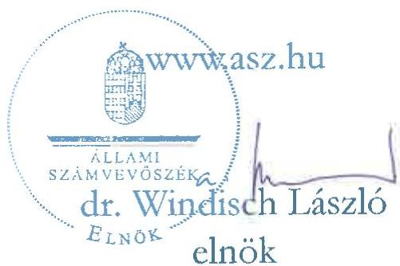
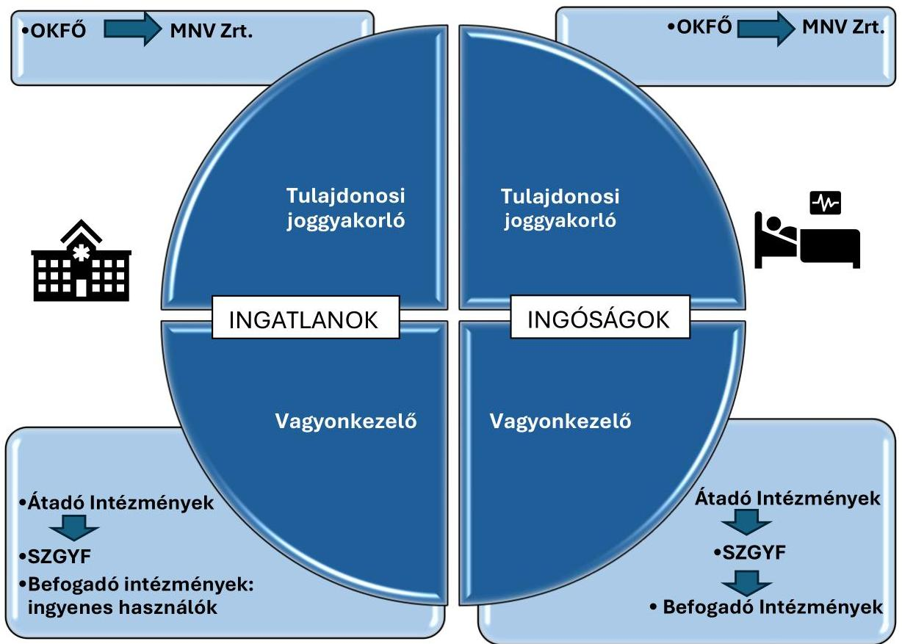
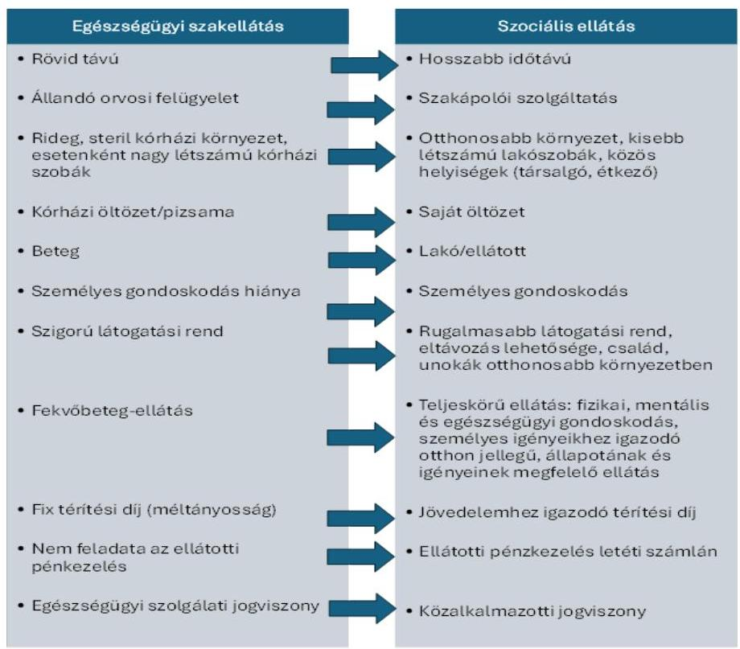
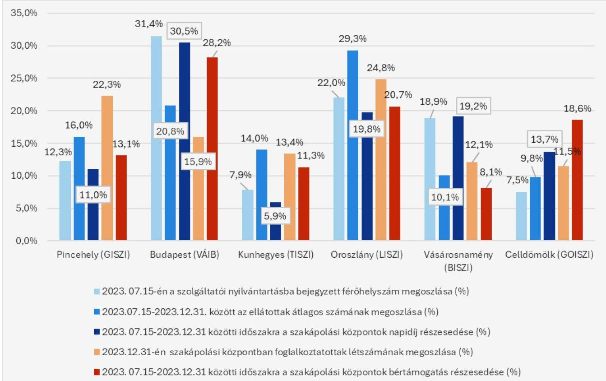
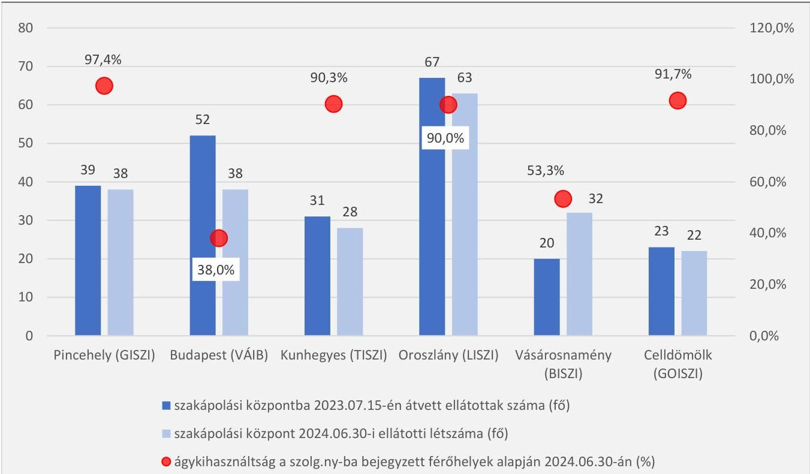
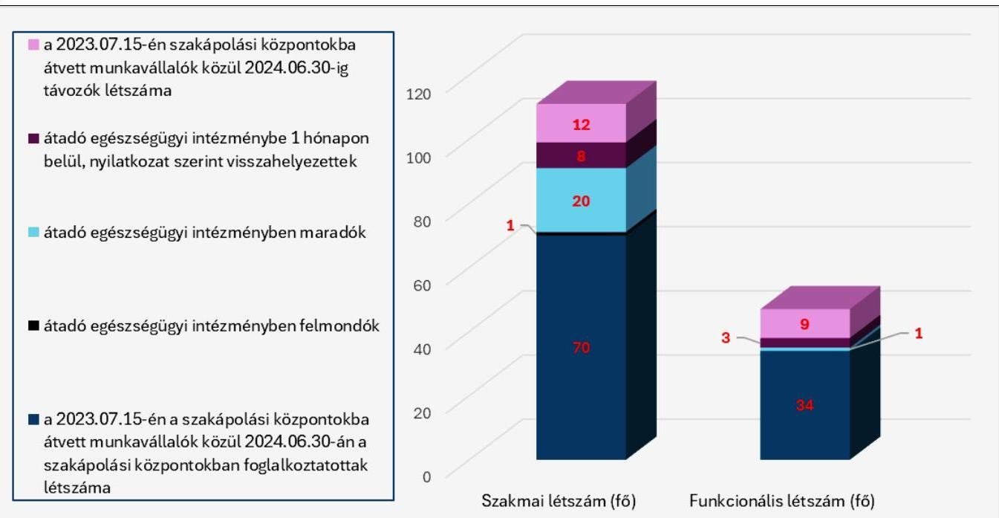
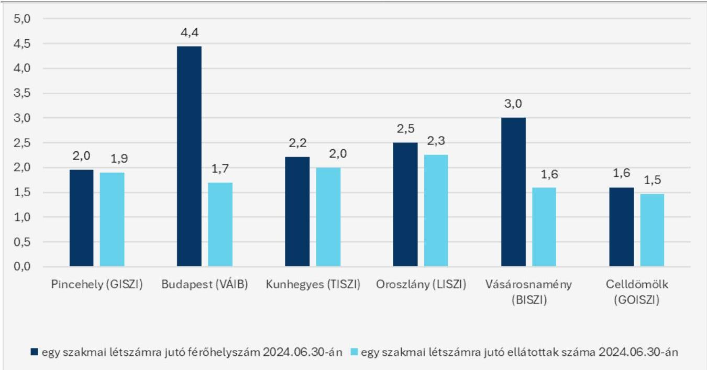

ÁLLAMI SZÁMVEVŐSZÉK

# JELENTÉS

# A szakápolás átalakításának ellenőrzése

2025.

25111

www.asz.hu

---

ÁLLAMI SZÁMVEVŐSZÉK

# JELENTÉS

# A szakápolás átalakításának ellenőrzése

2025.

25111

---

Jelentéseink az interneten a www.asz.hu címen olvashatók.

ELLENŐRZÉSI IGAZGATÓSÁG:
ELLENŐRZÉSI IGAZGATÓSÁG I.

ELLENŐRZÉSI IGAZGATÓ:
SINKÁNÉ DR. CSENDES ÁGNES igazgató

ELLENŐRZÉSVEZETŐ:
DR. KOVÁCS DIÁNA ellenőrzésvezető

IKTATÓSZÁM: EL-4378-001/2025

TÉMASORSZÁM: -

ELLENŐRZÉS-AZONOSÍTÓ SZÁM: V1113

---

TARTALOMJEGYZÉK

- AZ ELLENŐRZÉS ALAPADATAI ... 5
- AZ ELLENŐRZÉS HATÓKÖRE ÉS TERÜLETE ... 7
- ÖSSZEFOGLALÁS ... 9
- AZ ELLENŐRZÉS FÓKUSZTERÜLETEI ... 11
- MEGÁLLAPÍTÁSOK ... 12
- JAVASLATOK ... 23
- MELLÉKLETEK ... 24
- I. sz. melléklet: Értelmező szótár ... 24
- II. sz. melléklet: Az ellenőrzött és az ellenőrzést támogató szervezetek jegyzéke ... 26
- III. sz. melléklet: Ellenőrzési kritériumok ... 27
- FÜGGELÉK: ÉSZREVÉTELEK ... 28
- RÖVIDÍTÉSEK JEGYZÉKE ... 34

---

“哈，你是个小伙子，你是个小伙子，你是个小伙子，你是个小伙子，你是个小伙子，你是个小伙子，你是个小伙子，你是个小伙子，你是个小伙子，你是个小伙子，你是个小伙子，你是个小伙子，你是个小伙子，你是个小伙子，你是个小伙子，你是个小伙子，你是个小伙子，你是个小伙子，你是个小伙子，你是个小伙子，你是个小伙子，你是个小伙子，你是个小伙子，你是个小伙子，你是个小伙子，你是个小伙子，你是个小伙子，你是个小伙子，你是个小伙子，你是个小伙子，你是个小伙子，你是个小伙子，你是个小伙子，你是个小伙子，你是个小伙子，你是个小伙子，你是个小伙子，你是个小伙子，你是个小伙子，你是个小伙子，你是个小伙子，你是个小伙子，你是个小伙子，你是个小伙子，你是个小伙子，你是个小伙子，你是个小伙子，你是个小伙子，你是个小伙子，你是个小伙子，你是个小伙子，你是个小伙子，你是个小伙子，你是个小伙子，你是个小伙子，你是个小伙子，你是个小伙子，你是个小伙子，你是个小伙子，

---

AZ ELLENŐRZÉS ALAPADATAI

## AZ ELLENŐRZÉS CÉLJA

Az ellenőrzés célja annak értékelése volt, hogy a szakápolás átalakításának I. ütemeként a szakápolási feladatok 2023. július 15-én lezajlott átadás-átvétele a vonatkozó jogszabályokban előírt módon és határidőben történt-e, továbbá a szakápolás átalakításának I. üteme célszerű volt-e.

## AZ ELLENŐRZÉS TÍPUSA

Kombinált ellenőrzés

## AZ ELLENŐRZŐTT IDŐSZAK

A szakápolás átalakításának szabályszerűségi ellenőrzése tekintetében 2023. január 1-jétől a helyszíni ellenőrzés lezárásáig (2025. február 21-ig) terjedő időszak.

A szakápolás átalakításának célszerűsége tekintetében 2022. január 1-jétől a helyszíni ellenőrzés lezárásáig (2025. február 21-ig) terjedő időszak.

## AZ ELLENŐRZÉS TÁRGYA

Az ellenőrzés tárgyát képezte a szakápolás átalakításának I. ütemeként a szakápolási feladatok 2023. július 15-én lezajlott átadás-átvétele.

Az ellenőrzés kiterjedt minden olyan körülményre és adatra, amely az ÁSZ¹ jogszabályban meghatározott feladatainak teljesítéséhez, valamint a program végrehajtása folyamán felmerült újabb összefüggések feltárásához szükséges volt.

## AZ ELLENŐRZÉS JOGALAPJA

Az ellenőrzés jogszabályi alapját az ÁSZ tv.² 1. § (3) bekezdésének, 5. § (2)-(3) bekezdéseinek és (4) bekezdés a) pontjának, valamint az Áht.³ 61. § (2) bekezdésének előírásai képezték.

## AZ ELLENŐRZÉS MÓDSZERE

Az ellenőrzést a nemzetközi standardokat irányadónak tekintve az ellenőrzési program szempontjai, az ellenőrzött időszakban hatályos jogszabályok, az ellenőrzés szakmai szabályok és módszertanok figyelembevételével végezte az ÁSZ.

Az ellenőrzési kérdések megválaszolásához szükséges bizonyítékok megszerzése az ellenőrzött szervezetek, valamint az ellenőrzést támogató szervezetek által rendelkezésre bocsátott dokumentumokra,

---

Az ellenőrzés alapadatai

adatokra alapozva, továbbá megfigyelés, szemle (szemrevételezés), kérdésfelvetés (információkérés), valamint elemző eljárás útján történt.

Az ellenőrzés lefolytatásához az ellenőrzött szervezetek tanúsítványok kitöltésével, az ellenőrzött és ellenőrzést támogató szervezetek az ÁSZ által kért dokumentumok, adatok, információk megküldésével szolgáltattak adatokat.

Az ellenőrzési bizonyítékként felhasználható adatforrások közé tartoztak egyrészt az ellenőrzéshez kért dokumentumok, adatforrások, másrészt adatforrás volt minden – az ellenőrzés folyamán – feltárt, az ellenőrzés szempontjából információkat tartalmazó dokumentum.

Az ellenőrzés során mintavételi eljárás alkalmazására nem került sor.

6

---

7

# AZ ELLENŐRZÉS HATÓKÖRE ÉS TERÜLETE

A szakápolás átalakítás lebonyolításának részletszabályait a Szoc. tv.⁴ 2023. január 1-től hatályos módosítása fektette le, amelynek fő célját a módosításokat életbe léptető 2022. évi LXXIII. törvény⁵ indokolása rögzítette. Eszerint az „átalakítással elérni kívánt cél az, hogy az ápolási szükséglettel rendelkező személy az állapotának és igényeinek megfelelő szolgáltatást kapja. A szakápolás jellemzői alapján az ellátottak szempontjából eredményesebb, ha a szociális ágazat keretében kapják meg a szükséges gondoskodást, hiszen a szociális intézmény teljes ellátást – fizikai, mentális és egészségügyi gondoskodást – nyújt lakóinak, emellett személyes igényeiknek megfelelően otthon-jelleget biztosít számukra.” Mindez megteremtette a jogalapját annak, hogy az egészségügyi szakellátás azon ápolási ágyai, amelyeken az állami fenntartású egészségügyi szolgáltatók tartós ápolást-gondozást végeznek, átadásra kerüljenek a szociális ellátórendszerbe.

A szakápolás átalakítását meghatározó Szoc. tv. rendelkezett a feladatátadáshoz kapcsolódó vagyonjogi kérdések, a szakápolást végző foglalkoztatottak átvétele, a szakápolásban részesülők átvétele és a szakápolási feladatok átadásáról szóló megállapodások megkötése részletszabályairól. A szakápolás átalakításának első lépéseként az OKFÖ⁶-nek 2023. július 15-től kellett átadnia az SZGYF⁷ részére az országban lévő összesen 2500 ápolási ágyból 334 ápolási ágy vonatkozásában az állam egészségügyi fenntartói feladatainak ellátását. A szakápolás átalakításához szükséges átadó és befogadó intézmények kijelöléséről a 14/2023. (V.31.) BM rendelet⁸ intézkedett, a finanszírozási kérdéseket az 1274/2023. (VII. 14.) Korm. határozat⁹ szabályozta.

Az ellenőrzés hatóköre a szakápolás átalakításának I. ütemeként 2023. július 15-én lezajlott, 334 szakápolási ágy átadás-átvételével kapcsolatos szakápolási feladatok átadás-átvételi folyamata lebonyolításának szabályszerűségére, valamint célszerűségének megítélésére terjedt ki. A szakápolás átalakításának I. ütemében részt vett átadó és befogadó intézményeket, valamint az átadással érintett ápolási ágyak számát az 1. táblázat mutatja be.

1. táblázat

A SZAKÁPOLÁSI ÁGYAK 2023. ÉVI ÁTADÁS-ÁTVÉTELEBEN RÉSZTVEVŐ SZERVEZETEK

|  SOR-SZÁM | ÁTADÓ INTÉZMÉNY(EK)¹⁰ | BEFOGADÓ INTÉZMÉNY¹¹ | ÁTADÁSSAL ÉRINTETT TELEPHELY | ÁPOLÁSI ÁGYAK (DB)  |
| --- | --- | --- | --- | --- |
|  1. | Oroszlányi Szakorvosi és Ápolási Intézet | Lélekhíd Integrált Szociális Intézmény
Komárom-Esztergom Vármegye | Szociális Szakápolási
Központ Oroszlány | 70  |
|  2. | Észak-budai Szent János
Centrumkórház | Vakok Állami Intézete Budapest | Szociális Szakápolási
Központ Budapest | 100  |
|  3. | Dombóvári Szent Lukács Kórház
(Tolna Vármegyei Balassa János
Kórház*) | Galagonya Integrált Szociális Intézmény
Tolna Vármegye | Szociális Szakápolási
Központ Pincehely | 39  |
|  4. | Vas Vármegyei Markusovszky
Egyetemi Oktatókórház | Gondoskodás Integrált Szociális
Intézmény Győr-Moson-Sopron
Vármegye | Szociális Szakápolási
Központ Celldömölk | 40  |
|  5. | Szabolcs-Szatmár-Bereg
Vármegyei Oktatókórház | Biborka Integrált Szociális Intézmény
Hajdú-Bihar Vármegye | Szociális Szakápolási
Központ
Vásárosnamény | 60  |
|  6. | Karcagi Kátai Gábor Kórház (Jász-Nagykun-Szolnok Vármegyei
Hétényi Géza Kórház-Rendelőintézet**) | Tiszaág Integrált Szociális Intézmény
Jász-Nagykun-Szolnok Vármegye | Szociális Szakápolási
Központ Kunhegyes | 25  |

A *-gal jelölt intézmény munkamegosztási megállapodás alapján gazdasági szervezet feladatait látta el kizárólag funkcionális feladatot ellátó alkalmazottakat adott át.
A **-gal jelölt intézmény mint vármegyei irányító intézmény kizárólag funkcionális feladatot ellátó alkalmazottakat adott át.
Forrás: Ellenőrzött szervezetek adatszolgáltatása alapján ÁSZ saját szerkesztés

---

Az ellenőrzés hatóköre és területe

Az 1274/2023. (VII. 14.) Korm. határozat szerint a szakápolás átalakítása keretében első ütemben érintett 334 darab szakápolási ágy 2023. július 15-től történő finanszírozása érdekében bértámogatás címen 226,3 M Ft, valamint a krónikus fekvőbeteg-szakellátás napidíj címen legfeljebb 342,6 M Ft többletforrás biztosításáról rendelkezett a Magyarország 2023. évi központi költségvetéséről szóló 2022. évi XXV. törvény 1. melléklet XIV. Belügyminisztérium fejezet, 3. Szociális és gyermekvédelmi intézményrendszer cím, 1. Szociális és gyermekvédelmi, gyermekjóléti feladatellátás és irányítás intézményei alcím javára.

A Szoc. tv. 131/E. § (1)-(2) bekezdései szerint az átvett feladat átvételének időpontjától az átvett vagyon tekintetében a magyar államot megillető tulajdonosi jogokat az MNV Zrt.¹² gyakorolta. Az átvett feladat átvételének időpontjában az átvett vagyon vagyonkezelői joga ingyenesen az SZGYF-re mint átvevő fenntartóra szállt át azzal, hogy az átvételt követően az SZGYF jogosult volt a vagyonkezelői jogát az Nvtv.¹³ 11. § (9) bekezdése alapján – az ingatlanokra vonatkozó vagyonkezelői joguk kivételével – átruházni. Az 1. ábra mutatja az ingatlanok és az ingó vagyontárgyak átadás-átvétele során a tulajdonosi joggyakorló és a vagyonkezelői jog változását:

1. ábra

AZ ÁTADÁS-ÁTVÉTEL SORÁN A VAGYONELEMEK JOGOSULTJAINAK VÁLTOZÁSA

Forrás: Ellenőrzött szervezetek adatszolgáltatása alapján ÁSZ saját szerkesztés

---

ÖSSZEFOGLALÁS

A szakápolási központokban beteg, de kórházi ellátást, állandó orvosi felügyeletet nem igénylő emberek ellátása zajlik. A szakápolást igénylő személyek többsége idős vagy egészségi állapota miatt kiszolgáltatott helyzetben van. Az ÁSZ kiemelt figyelmet fordít arra, hogy vizsgálataival a közpénzek felhasználásának ellenőrzése mellett az érdekeik képviseletét korlátozottan ellátni képes társadalmi csoportok helyzetére is ráirányítsa a figyelmet.

A Szoc. tv. 2023. január 1-től a korábban az egészségügyi szakellátás részeként működő ún. ápolási ágyaknak a szociális ellátórendszerbe történő átadásáról rendelkezett. A jogalkotó úgy látta, hogy az ápolást igénylő személyek számára eredményesebb, ha szociális intézményben kapják meg a számukra szükséges fizikai, mentális és egészségügyi gondoskodást. A feladatátadás az azt szolgáló vagyon átadását is szükségessé tette, a szakápolást végző foglalkoztatottak és a szakápolásban részesülők átvétele mellett. A szakápolás átadásának I. ütemében az országban lévő összesen 2500 ápolási ágyból 334 ápolási ágy átadására került sor, az ahhoz szükséges ingó és ingatlan vagyon birtokba adásával. A Kormány határozatában 2023. július 15-től kezdődően biztosította a többletforrást a feladat ellátására. Az egészségügyből a szociális ellátásba átcsoportosítandó pénzösszeg éves szinten 1,35 Mrd Ft volt.

Az ellenőrzéssel az ÁSZ fel kívánta tárni az intézkedés célszerűségét és szabályszerűségét, továbbá megállapításaival, javaslataival hozzá kívánt járulni a további ütemekben zajló átadási folyamatok megfelelőségéhez.

Az ÁSZ a helyszíni ellenőrzés során azt tapasztalta, hogy a szakápolás átalakításának első ütemét követően a befogadó szociális intézményekben az átadó egészségügyi intézményeknél nagyobb szerepet kaptak az ellátottak valós szükségletei, lehetőség szerinti mentális és fizikai rehabilitálása, valamint élhetőbb, otthonosabb életkörülményeket biztosítottak az ellátottak részére.

A szakápolás átadás-átvételével kapcsolatos eljárások szabályszerűek voltak, a feladatátadáshoz kapcsolódó vagyon birtokba adása megtörtént. A budapesti, a celldömölki és a vásárosnaményi szakápolási központoknál, – ahol a szakápolás helyszínéül szolgáló ingatlan megosztására volt szükség – a feladat ellátását szolgáló vagyon átadásának folyamata a helyszíni ellenőrzés végéig sem zárult le. Így ezekben az esetekben a számviteli beszámolók nem a valós állapotot tükrözték, az ellenőrzött időszakban a közfeladat ellátását szolgáló vagyon nem a rendeltetésének megfelelő ágazatban került kimutatásra. Az oroszlányi, a pincehelyi és a kunhegyesi szakápolási központok esetében a jogszabályban foglaltaknak megfelelően teljeskörűen megvalósult a vagyon átadása. A celldömölki és a vásárosnaményi szakápolási központok tekintetében a 2024. január 1. óta a KEF¹⁴-nél felhalmozódott üzemeltetési költségek utólagos rendezése likviditási kockázatot fog jelenteni.

A feladatátvétel miatt elkülönített többletforrások felhasználása tekintetében az ÁSZ azt állapította meg, hogy annak befogadó intézmények közötti felosztását az SZGYF a 2023. július 15. és 2023. december 31. közötti időszakra nem a szakápolási központokban fenntartott férőhelyszám és/vagy a foglalkoztatott alkalmazottak létszámával arányosan végezte, így a többletforrásokhoz nem minden esetben az elvégzett feladattal és teljesítménnyel arányosan jutottak hozzá a befogadó szociális intézmények.

A szakápolási központok az ellátottakról való gondoskodás keretében többségében 90%, vagy a fölötti férőhely-kihasználtsággal működtek 2024. június 30-án. Problémaként jelentkezett, hogy a szakápolási feladattal átadott munkatársak közel negyede az átadást követő egy éven belül távozott a befogadó szociális intézményektől. Az átadást követően az átadó és a befogadó intézmények együttműködése sem volt minden esetben zökkenőmentes, mivel a korábbi – kórházon belüli – egyszerűbb betegátadás helyett a kórházból érkező

9

---

Összefoglalás

betegek felvétele nem automatikusan, hanem az ún. „beköltözési protokoll” szerint történhetett, amely akár 1 hónapig is eltarthatott. Az ápolásra szoruló betegek ellátását a felvételi eljárás lefolytatása alatt az egészségügyi intézmények biztosították.

Az ellenőrzés során feltárt nyilvántartási hiányosságok, és olyan kockázatok kiküszöbölése, melyek a feladatellátás színvonalát is érinthetik, hozzájárulhatnak a szakápolás stabilabb működtetéséhez a következő átadási ütemeket követően is. Összességében a szakápolás átalakításának első üteme az ÁSZ véleménye szerint szabályszerű volt, és elérte a célját a feltárt vagyonnyilvántartási problémák, finanszírozási és foglalkoztatási kihívások mellett is. A szakápolás átalakítása további ütemeinek végrehajtása során a jelentésben feltártak hasznosítása a szakápolásban érintett betegek és hozzátartozóik érdekeit szolgálja.

10

---

11

# AZ ELLENŐRZÉS FÓKUSZTERÜLETEI

1. A szakápolás átadás-átvételével kapcsolatos eljárás szabályszerűsége
2. A feladatátadáshoz kapcsolódó vagyon átadása-átvétele
3. A szakápolás átalakításának célszerűsége

---

MEGÁLLAPÍTÁSOK

# 1. A szakápolás szabályszerűsége

Átadás-átvételével kapcsolatos eljárás

## Összegző megállapítás

A szakápolás átadás-átvételével kapcsolatos eljárások szabályszerűek voltak.

A Szoc. tv. 131/G. (1)-(2) bekezdés szerinti, a szakápolás átadásának I. ütemével összefüggő valamennyi megállapodást az átadó és az átvevő fenntartó, az átadó és a befogadó intézmény, továbbá a NEAK¹⁵ – az átadás-átvétel időpontját megelőző 45. napon – 2023. május 31-én szabályszerűen kötötte meg. A megállapodások a Szoc. tv-nek megfelelően tartalmazták a feladatátadás és a jogutódlás feltételeit, az átadás-átvétel időpontját, valamint az átvett vagyon körét. A megállapodásokban a Szoc. tv.-ben előírtaknak megfelelően tételesen kimutatták az átadott tárgyi eszközöket és a készleteket. A megállapodások módosítására a VÁIB¹⁶-ot, a GOISZI¹⁷-t és a BISZI¹⁸-t érintően – az átvett ingatlanrészek eszmei hányadának pontos meghatározása érdekében – volt szükség.

A hat szakápolási központ közül négynél (Oroszlány, Budapest, Pincehely, Kunhegyes) fizikailag jól elkülönült, önálló ingatlanban történt a szakápolási feladat ellátása. Két esetben a szakápolási feladatok ellátása mellett, más ingatlanrészekben, kórházi fekvőbeteg-ellátás, illetve szakrendelés is folyt.

A megállapodások mellékletét képezték többek között az ingatlan és az ingó vagyon befogadó intézmények részére történt birtokátruházásáról szóló jegyzőkönyvek.

Az ingatlanok birtokátruházási jegyzőkönyve rögzítette egyebek mellett az ingatlanok aktuális műszaki állapotát, illetve a rendeltetésszerű használat érdekében szükséges, legfontosabb teendőket is. Ezek szerint az átvett ingatlanok jellemzően közepes állapotúak voltak. Jó állapotban vettek át a vásárosnaményi épületrészt, valamint Pincehelyen az új épületszárnyat. Pincehelyen azonban a feladatellátás helyéül szolgáló épületek mellett számos kisebb, korábban raktározási, élelmezési célt szolgáló, használaton kívüli épület is átadásra került. Ezek között rendkívül rossz állapotú és életveszélyessé vált épületek is voltak. A funkció nélküli épületek gondozása az ÁSZ szakmai véleménye szerint a szakmai feladatokon túl a GISZI¹⁹-re jelentős többletfeladatként hárult.

Az SZGYF a Szoc. tv. előírásának megfelelően, a megállapodások megkötését követő 8 napon belül megindította a szakápolási központok szolgáltatói nyilvántartásba történő bejegyzésére irányuló eljárást. A működést engedélyező szerv 2023. július 15-tel valamennyi érintett telephelyet határozatlan időre jegyezte be a szolgáltatói nyilvántartásba, – a GOISZI kivételével – változatlan férőhellyel. A GOISZI esetében a tárgyi feltételek hiánya miatt 40 férőhely helyett 24 férőhelyen volt működtethető a szakápolási központ. A TISZI²⁰-nél – a személyi és tárgyi feltételek biztosítása mellett – 2024. május 02-től 25-ről 31 férőhelyre emelték a szakápolási központ férőhelyszámát.

A befogadó intézmények a Szoc. tv. 131/I. § (6) bekezdés b) pontja szerinti megállapodást valamennyi beteggel határidőben – az átadás-átvétel napjától számítva 15 napon belül – megkötötték. A megállapodások tartalmazták a Szoc. tv-ben meghatározottaknak megfelelően az ellátás kezdetének időpontját, az intézményi ellátás időtartamát, a szakápolás határidejét, az igénybe vevő számára nyújtott

12

---

Megállapítások

szolgáltatások tartalmát, a személyi térítési díj megállapítására, fizetésére vonatkozó szabályokat, továbbá az igénybe vevő személyek személyazonosító adatait.

## 2. A feladatátadáshoz kapcsolódó vagyon átadása-átvétele

### Összegző megállapítás

A feladatátadáshoz kapcsolódó vagyon birtokbaadása szabályszerűen megvalósult. A VÁIB, a GOISZI és a BISZI esetében a jogszabályi előírások ellenére az átvett vagyon számviteli nyilvántartásba vétele nem volt teljes körű, a GOISZI és a BISZI esetében a vagyonkezelési szerződések megkötésére nem került sor.

### SZOCIÁLIS SZAKÁPOLÁSI KÖZPONT OROSZLÁNY

Az MNV Zrt. és az SZGYF közötti vagyonkezelési szerződés módosítás,¹¹ rögzítette, hogy az Oroszlány belterület 862 hrsz-ú ingatlan, és az ahhoz tartozó ingóságok a Szoc. tv. 131/E. § (2) bekezdése alapján az SZGYF vagyonkezelésébe kerültek. Az ingatlan-nyilvántartásban – a Vtvr.²² előírásainak megfelelően – a vagyonkezelői jog változása átvezetésre került. Az Nvtv.-nek megfelelően – a vagyonkezelési szerződés módosításban foglaltak alapján – az SZGYF, valamint a LISZI²³ közötti használati megállapodás módosítás,²⁴ értelmében az SZGYF térítésmentesen használatba adta a LISZI részére a magyar állam 1/1 arányú tulajdonában álló, az MNV Zrt. tulajdonosi joggyakorlása alá tartozó, az SZGYF vagyonkezelésében álló, természetben az Oroszlány, Bányász körút 2. szám alatt található ingatlant. A vagyonkezelt ingatlant az SZGYF az Áhsz.²⁵ előírásainak megfelelően nyilvántartásba vette.

Az SZGYF a vagyonkezelt ingatlanok és ingóságok vonatkozásában több, érvényes vagyonkezelési szerződéssel is rendelkezett. A széttagoltság eredményeként a vagyonkezelt ingatlanok köre, valamint a vagyonkezelési szerződések módosításai kevésbé voltak nyomon követhetők. Az ÁSZ szakmai véleménye szerint a vagyonkezelési szerződések folyamatos aktualizálása a vagyon megőrzését szolgálja.

&gt; Az SZGYF a vagyonkezelt ingatlan és ingóságok vonatkozásában több, érvényes vagyonkezelési szerződéssel is rendelkezett.
&gt;
&gt; A széttagoltság eredményeként a vagyonkezelt ingatlanok köre, valamint a vagyonkezelési szerződések módosításai kevésbé voltak nyomon követhetők. Az ÁSZ szakmai véleménye szerint a vagyonkezelési szerződések folyamatos aktualizálása a vagyon megőrzését szolgálja.

Az SZGYF az Nvtv.-nek megfelelően az ingóságok vagyonkezelői jogát – a megállapodás,²⁶ 4. számú mellékletével egyező tartalommal – az ingóságok vagyonkezelői jog átruházási szerződés,²⁷-ben foglaltak szerint biztosította a LISZI részére. A szerződés mellékletét képező ingóságokat az Áhsz. előírásainak megfelelően a LISZI a részletező nyilvántartásában szerepeltette.

### SZOCIÁLIS SZAKÁPOLÁSI KÖZPONT BUDAPEST

A 2023. május 31-én aláírt megállapodás,²⁸ szerint a Szoc. tv. 131/E. § (2) bekezdése alapján a magyar állam tulajdonában álló, az MNV Zrt. tulajdonosi joggyakorlása alá tartozó és az átadó intézmény vagyonkezelésében lévő, Budapest belterület 53075 hrsz. alatt nyilvántartott, természetben a 1028 Budapest, Hidegkúti út 19. szám alatt található ingatlan az SZGYF vagyonkezelésébe került. A megállapodás²⁹ rögzítette továbbá, hogy az érintett ingatlanon az átadó fenntartó által kezdeményezett telekalakítási eljárás van folyamatban. A megállapodás²⁹ 2023. december 08-i 1. számú módosítása³⁰ szerint az 1693/2022. (XII. 29.) Korm. határozat³¹ értelmében a Budapest belterület 53075 helyrajzi számú, természetben a 1028 Budapest, Hidegkúti út 19. számú ingatlan 3858/18899 tulajdoni hányada ingyenesen

13

---

Megállapítások

a Budapest-Pesthidegkúti Református Egyházközség tulajdonába került hitéleti feladatok ellátásának elősegítése érdekében, így a módosításban meghatározásra került az ingatlan SZGYF-et – a szakápolási feladat ellátásához kapcsolódóan – megillető vagyonkezelői jog eszmei hányada. Az egyházzal közös tulajdon a 2024. október 29-én aláírt telekalakítási megállapodással és annak ingatlan-nyilvántartási átvezetésével szűnt meg. A telekalakítási megállapodásban az ingatlant négy részre osztották, melyből egy rész a Budapest-Pesthidegkúti Református Egyházközség tulajdonába került, három rész a magyar állam tulajdonában maradt.

Az MNV Zrt. és az SZGYF közötti vagyonkezelési szerződés módosítás²¹ szerint a Budapest belterület 53075 hrsz-ú ingatlan 15041/18899 tulajdoni hányadnak megfelelő ingatlanrésze és az ahhoz tartozó ingóságok a Szoc. tv. 131/E. § (2) bekezdésének megfelelően az SZGYF vagyonkezelésébe kerültek. Az ingatlan-nyilvántartásban – a Vtvr. előírásainak megfelelően – a telekalakítási megállapodáshoz kapcsolódó vagyonkezelői jog változása átvezetésre került. Az ingatlant a VÁIB 2023. július 15-től a feladatellátás érdekében használatba vette. Az ingatlan ingyenes használatára vonatkozó szabályokat az SZGYF és a VÁIB közötti, 2025. január 30-i használati megállapodás módosításban³² rögzítették.

Az SZGYF a vagyonkezelt ingatlanrészt nyilvántartásba vette, azonban az Áhsz. 15. § (2) bekezdésében foglaltak ellenére a vagyonkezelésében lévő ingóságok nyilvántartásba vétele nem történt meg. Az SZGYF és a VÁIB között az ingóságok vagyonkezelői jogának átruházására nem került sor.

## SZOCIÁLIS SZAKÁPOLÁSI KÖZPONT PINCEHELY

Az MNV Zrt. és az SZGYF közötti vagyonkezelési szerződés módosítás; rögzítette, hogy a Pincehely belterület 1445/1 hrsz-ú ingatlan, és az ahhoz tartozó ingóságok a Szoc. tv. 131/E. § (2) bekezdése alapján az SZGYF vagyonkezelésébe kerültek. Az ingatlan-nyilvántartásban – a Vtvr. előírásainak megfelelően – a vagyonkezelői jog változása átvezetésre került. Az SZGYF, valamint a GISZI közötti használati megállapodás módosítás²³ alapján az SZGYF térítésmentesen használatba adta a befogadó intézmény részére a magyar állam 1/1 arányú tulajdonában álló, az MNV Zrt. tulajdonosi joggyakorlása alá tartozó, az SZGYF vagyonkezelésében álló, természetben a Pincehely, Gróf Széchenyi István u. 92. szám alatti ingatlant, a bérbeadott lakóingatlanok kivételével. A vagyonkezelt ingatlant az SZGYF az Áhsz. előírásainak megfelelően nyilvántartásba vette.

Az SZGYF az Nvtv.-nek megfelelően az ingóságok vagyonkezelői jogát – a megállapodás²⁴ 4. számú mellékletével egyező tartalommal – a vagyonkezelői jog átruházási szerződés²⁵-ben foglaltak szerint biztosította a GISZI részére. A szerződés mellékletét képező ingóságokat a GISZI az Áhsz. előírásainak megfelelően nyilvántartásba vette.

## SZOCIÁLIS SZAKÁPOLÁSI KÖZPONT CELLDÖMÖLK

A szakápolási feladat átadás-átvételéről szóló megállapodás²⁶ szerint 354 m² alapterületű ingatlanrész került a GOISZI mint befogadó intézmény birtokába. A megállapodás²⁶ 1. számú módosításában³⁷ – az átadott épületrészek felülvizsgálata után – további 1931,5 m² területű ingatlanrésszel bővült a szakápoláshoz kapcsolódó ingatlan. Ennek megfelelően a Celldömölk belterület 992/6 helyrajzi szám alatt nyilvántartott, természetben 9500 Celldömölk, Nagy Sándor tér 3. szám alatt lévő ingatlan 12145/100000 eszmei hányadnak megfelelő ingatlanrésze a szakápoláshoz kifejezetten és nevesítetten kapcsolódó állami tulajdonban álló ingatlan vagyonként az SZGYF vagyonkezelésébe került. Az eszmei hányad rögzítése mellett a megállapodás²⁶ 1. számú módosítása tartalmazta az átadásra került ingatlanrészen az SZGYF

14

---

Megállapítások

vagyonkezelésébe került felépítmény/épület pontos meghatározását is. Az érintett ingatlanra és az átadás-átvétel során birtokba adott ingóságokra vonatkozóan a vagyonkezelői jog részletes szabályait az Nvtv.°11. § (7) bekezdésében foglaltak ellenére az MNV Zrt. és az SZGYF közötti vagyonkezelési szerződésben nem rögzítették. Vagyonkezelési szerződés hiányában az SZGYF és a GOISZI között az ingóságok vagyonkezelői jogának átruházása sem történt meg.

Az SZGYF, valamint a GOISZI között létrejött használati megállapodás módosítás,³⁸ alapján, az SZGYF – az Nvtv.-nek megfelelően – térítésmentesen használatba adta a befogadó intézmény részére az SZGYF vagyonkezelésében álló eszmei hányadnak megfelelő ingatlanrészt. Az SZGYF a vagyonkezelt ingatlanrészt, valamint a vagyonkezelésében lévő ingóságokat az Áhsz. 15. § (2) bekezdésében foglaltak ellenére nem vette nyilvántartásba.

Az SZGYF főigazgatója az ÁSZ tv. 29. § (2) bekezdés szerinti, a jelentéstervezet megállapításaira tett észrevételében arról tájékoztatta az ÁSZ-t, hogy az érintett ingatlanrészt és az ingóságokat az ellenőrzött időszakban nem vette nyilvántartásba tekintettel arra, hogy az átadás-átvételi megállapodás módosítása során szükségessé vált az ingatlan eszmei hányadának meghatározása és a felépítmény pontos rögzítése. Emiatt a szerződés aláírására és a kapcsolódó könyvelési átvezetések megtételére az ellenőrzött időszakon túl nyílt lehetőség. Ezzel az ÁSZ megállapítása hasznosult. A megállapodás 3. számú mellékletét képezte a VVMEO³⁹ mint átadó intézmény és a GOISZI mint befogadó intézmény közötti, 2023. július 15-től hatályos költségmegosztási megállapodás, amely meghatározta a közműszolgáltatási díjak és az egyéb üzemeltetési költségek felosztásának módját. A költségmegosztási megállapodás 2023. december 31-ig volt érvényben, amelynek alapján a 2023. évi üzemeltetési költségek az átadó intézmény és a GOISZI között rendezésre kerültek. 2024. január 1-től a 250/2014. (X. 2.) Korm. rendelet⁴⁰ 3. § (1) bekezdés n) pontja alapján a VVMEO részére a KEF biztosította a rendeletben meghatározott ingatlanüzemeltetési szolgáltatásokat. A GOISZI és a KEF között azonban a helyszíni ellenőrzés lezárásáig nem történt meg a költségmegosztási megállapodás megkötése, így 2024. évben a KEF – megállapodás hiányában – nem számlázta tovább a szakápolási központra jutó rezsi és egyéb költségeket. A KEF 2024. évre vonatkozóan 10,0 M Ft közeli összeg tovább számlázását mulasztotta el, amelynek következő évi kötelezettségként jelentkezése likviditási kockázatot fog jelenteni az intézménynél.

# SZOCIÁLIS SZAKÁPOLÁSI KÖZPONT VÁSÁROSNAMÉNY

A 2023. május 31-én aláírt megállapodás,⁴¹ VI. pontja a Szoc. tv. 131/E. § (2) bekezdés alapján a magyar állam 1/1 tulajdonában álló, az MNV Zrt. tulajdonosi joggyakorlása alá tartozó és az átadó intézmény vagyonkezelésében álló, a Vásárosnamény belterület 362/1 hrsz. alatt nyilvántartott, természetben a 4800 Vásárosnamény Ady Endre utca 5. szám alatt található ingatlan használati megosztásáról rendelkezett, mely szerint a megjelölt ingatlanrészeket az átadó intézmény a befogadó intézmény ingyenes használatába adta. A Szoc. tv. 131/E. § (2) bekezdése, valamint a Szoc. tv. 131/G § (1) bekezdése alapján az átvett vagyonrész vagyonkezelői joga ingyenesen az SZGYF-re szállt át, melyre tekintettel az ingatlan vagyonkezelői jogának az átadó intézmény és az SZGYF közötti megosztására került sor a szakápolási központ által használt ingatlanrész termértéke alapján meghatározott eszmei hányad vonatkozásában. Az SZGYF-et érintő vagyonkezelői jog mértékét a 2024.10.22-én aláírt megállapodás, módosítás⁴² rögzítette, mely szerint az érintett ingatlan 848523/2748135 eszmei hányadnak megfelelő ingatlanrésze, a szakápoláshoz kifejezetten és nevesítetten kapcsolódó állami tulajdonban álló ingatlanvagyon az SZGYF vagyonkezelésébe került.

---

Megállapítások

Az érintett ingatlanra és az átadás-átvétel során birtokba adott ingóságokra vonatkozóan – a törvény alapján kijelöléssel létrejött – vagyonkezelői jog részletes szabályait az Nvtv. 11. § (7) bekezdésében foglaltak ellenére az MNV Zrt. és az SZGYF közötti vagyonkezelési szerződésben nem rögzítették. Vagyonkezelési szerződés hiányában az SZGYF és a BISZI között az ingóságok vagyonkezelői jogának átruházása sem történt meg.

Az SZGYF, valamint a BISZI közötti használati megállapodás módosítás⁴³ alapján, az SZGYF – az Nvtv.-nek megfelelően – térítésmentesen használatba adta a befogadó intézmény részére az SZGYF vagyonkezelésében álló, eszmei hányadnak megfelelő ingatlanrészt. Az SZGYF a vagyonkezelt ingatlanrészt, valamint a vagyonkezelésében lévő ingóságokat az Áhsz. 15. § (2) bekezdésében foglaltak ellenére nem vette nyilvántartásba.

A megállapodás⁵ 2/2. számú mellékletét képezte az SZSZBVO⁴⁴ mint átadó intézmény és a BISZI mint befogadó intézmény közötti – 2023. július 15-től hatályos – költségmegosztási megállapodás, amely meghatározta a közműszolgáltatási díjak és az egyéb üzemeltetési költségek felosztásának módját. A költségmegosztási megállapodás 2023. december 31-ig volt érvényben, a 2023. évi üzemeltetési költségek az átadó intézmény és a BISZI között rendezésre kerültek. 2024. január 1-től a 250/2014. (X. 2.) Korm. rendelet 3. § (1) bekezdés n) pontja alapján a BISZI részére a rendeletben meghatározott ingatlanüzemeltetési szolgáltatásokat a KEF biztosította. A BISZI és a KEF között azonban a helyszíni ellenőrzés lezárásáig nem történt meg a költségmegosztási megállapodás megkötése, így 2024. évben a KEF – megállapodás hiányában – nem számlázta tovább a szakápolási központra jutó rezsi és egyéb költségeket.

A KEF 2024. évre vonatkozóan 90,0 M Ft közeli összeg tovább számlázását mulasztotta el, amelynek következő évi kötelezettségként jelentkezése likviditási kockázatot fog jelenteni az intézménynél.

# SZOCIÁLIS SZAKÁPOLÁSI KÖZPONT KUNHEGYES

Az MNV Zrt. és az SZGYF közötti vagyonkezelési szerződés módosítás¹ rögzítette, hogy a Kunhegyes belterület 464 hrsz-ú ingatlan, és az ahhoz tartozó ingóságok a Szoc. tv. 131/E. § (2) bekezdése alapján az SZGYF vagyonkezelésébe kerültek. Az ingatlannyilvántartásban a vagyonkezelői jog változása a Vtvr.-nek megfelelően átvezetésre került. Az Nvtv.-nek megfelelően – a vagyonkezelési szerződés módosítás¹-ben foglaltak alapján – az SZGYF, valamint a TISZI közötti használati megállapodás módosítás⁴⁵ értelmében az SZGYF térítésmentesen használatba adta a befogadó intézmény részére a magyar állam 1/1 arányú tulajdonában álló, az MNV Zrt. tulajdonosi joggyakorlása alá tartozó, az SZGYF vagyonkezelésében álló, természetben a Kunhegyes, Kossuth Lajos u. 72. szám alatt található ingatlant. A vagyonkezelt ingatlant az SZGYF az Áhsz. előírásainak megfelelően nyilvántartásba vette.

Az SZGYF az Nvtv.-nek megfelelően az ingóságok vagyonkezelői jogát – a megállapodás⁴⁶ 4. számú mellékletével egyező tartalommal – a vagyonkezelői jog átruházási szerződés⁴⁷-ban foglaltak szerint biztosította a TISZI részére. A szerződés mellékletét képező ingóságokat a TISZI – az Áhsz. előírásainak megfelelően – a részletező nyilvántartásban szerepeltette.

---

Megállapítások

Az ingatlanok és az ingóságok átadás-átvételének állapotát a helyszíni ellenőrzés lezárásakor a 2. táblázat foglalja össze:

2. táblázat

AZ INGATLANOK ÉS AZ INGÓSÁGOK ÁTADÁS-ÁTVÉTELÉNEK ÁLLAPOTA

|  BEFOGADÓ INTÉZMÉNY
ÉRINTETT TELEPHELYE | LISZI (OROSZ-LÁNY) | VÁIR
(BUDAPEST) | GISZI
(PINCE-HELY) | GOISZI
(CELL-DŐMÖLK) | BISZI
(VÁSÁROS-NAMÉNY) | TISZI
(KUNHE-GYES)  |
| --- | --- | --- | --- | --- | --- | --- |
|  INGATLANOK  |   |   |   |   |   |   |
|  vagyonkezelési szerződés
(MNV Zrt.-SZGYF) | ✓ | ✓ | ✓ | ! | ! | ✓  |
|  nyilvántartásba vétel (SZGYF) | ✓ | ✓ | ✓ | ! | ! | ✓  |
|  ingatlan-nyilvántartási bejegyzés | ✓ | ✓ | ✓ | ! | ! | ✓  |
|  ingyenes használati megállapodás
(SZGYF-intézmény) | ✓ | ✓ | ✓ | ✓ | ✓ | ✓  |
|  költségmegosztási megállapodás
(kórház-intézmény, 2023. december 31-ig) | - | - | - | ✓ | ✓ | -  |
|  költségmegosztási megállapodás
(KEF-intézmény, 2024. január 1-től) | - | - | - | ! | ! | -  |
|  INGÓSÁGOK  |   |   |   |   |   |   |
|  vagyonkezelési szerződés
(MNV Zrt.-SZGYF) | ✓ | ✓ | ✓ | ! | ! | ✓  |
|  vagyonkezelői jog átruházásáról
szerződés
(SZGYF-intézmény) | ✓ | ! | ✓ | ! | ! | ✓  |
|  nyilvántartásba vétel (intézmény) | ✓ | ! | ✓ | ! | ! | ✓  |

Jelmagyarázat: ✓ teljesült, ! további teendőt igényel, - nem releváns
Forrás: Az ellenőrzött szervezetek adatszolgáltatása alapján ÁSZ saját szerkesztés

---

Megállapítások

# 3. A szakápolás átalakításának célszerűsége

## Összegző megállapítás

A szakápolás átalakításának első üteme célszerű volt, a költségvetési kiadásokat a szakápolás mint közfeladat ellátása érdekében használták fel. Az átalakítás elérte a célját, az ÁSZ helyszíni ellenőrzési tapasztalatai szerint a szociális szakápolási központok az ellátottak igényeihez jobban igazodó szolgáltatást tudtak nyújtani.

A szociális intézményekre vonatkozó – az egészségügyi intézményektől eltérő – személyi és tárgyi feltételek miatt a 14/2023. (V.31.) BM rendelet szerinti 334 átadásra kerülő ápolási ágy helyett a befogadó intézmények 2023. július 15-től összességében 318 férőhellyel kezdték meg működésüket.

A GOISZI-nál a szakápoláshoz szükséges tárgyi feltételek az átvett 40 férőhely helyett 24 férőhely tekintetében voltak biztosítottak, a TISZI-nél viszont lehetőség volt az átvetthez képest a férőhelyszámok bővítésére, így 2024. május 2-i hatállyal 25-ről 31-re emelkedett a férőhelyszámuk.

Az átalakítással elérni kívánt cél az volt, hogy az ápolási szükséglettel rendelkező személy az állapotának és igényeinek megfelelő szolgáltatást kapja. A 2. ábra mutatja az egészségügyi szakellátás és a szociális ellátás összehasonlítását szakápolási szempontból.

2. ábra

## AZ EGÉSZSÉGÜGYI SZAKELLÁTÁS ÉS A SZOCIÁLIS ELLÁTÁS ÖSSZEHASONLÍTÁSA SZAKÁPOLÁSI SZEMPONTBÓL

Forrás: Ellenőrzési tapasztalatok alapján ÁSZ saját szerkesztés

A 3. ábra mutatja a 2023. július 15. és 2023. december 31-i időszakra ténylegesen juttatott többletforrások (napidíj, bértámogatás) szakápolási központok közötti felosztását.

---

Megállapítások

3. ábra

AZ 1274/2023. (VII. 14.) KORM. HATÁROZAT SZERINTI 2023. ÉVI TÖBBLETFORRÁSOK SZAKÁPOLÁSI KÖZPONTOK SZERINTI MEGOSZLÁSA

Forrás: Ellenőrzött szervezetek által szolgáltatott adatok alapján ÁSZ saját szerkesztés

A 2023. évben a szakápolási központok részére folyósított bértámogatás felosztása nem minden esetben állt arányban a foglalkoztatottak létszámával. Leginkább szembetűnő aránytalanság a VÁIB esetében volt, amely a szakápolásban alkalmazottak 15,9%-át foglalkoztatta, ezzel szemben a bértámogatásból 28,2%-ban részesült. A GISZI-nél a VÁIB-hoz képest fele akkora volt a bértámogatásból részesedés mértéke annak ellenére, hogy magasabb volt a foglalkoztatotti létszáma.

A szakápolási központok napidíj részesedése a GOISZI kivételével a férőhelyszámhoz igazodott. A GOISZI-nál közel duplája volt a férőhelyszámhoz képest a napidíjból való részesedése. A LISZI és a BISZI esetében szembetűnő, hogy közel azonos napidíj részesedés mellett a LISZI-nél majdnem háromszorosa volt az ellátottak száma.

A 4. ábra mutatja a szakápolási központokban ellátottak számának, és a szolgáltatói nyilvántartásba bejegyzett férőhelyszám kihasználtságának alakulását.

19

---

Megállapítások

4. ábra

A SZAKÁPOLÁSI KÖZPONTOKBAN ELLÁTOTTAK SZÁMA, ÉS A SZOLGÁLTATÓI NYILVÁNTARTÁSBA BEJEGYZETT FÉRŐHELYSZÁM KIHASZNÁLTSÁGA

Forrás: Ellenőrzött szervezetek adatszolgáltatása alapján ÁSZ saját szerkesztés

A szakápolási központok többségében 90,0%, vagy a fölötti kihasználtsággal működtek 2024. június 30-án. A hat szakápolási központ az átvett ellátottakon felül 2024. június 30-ig összesen 145 ellátottat fogadott, közülük kórházból soron kívül 80 fő érkezett. Ugyanezen időszakban 156 főnek szűnt meg az ellátási jogviszonya. A legjelentősebb ellátotti létszám csökkenéssel érintett VÁIB a 29 fő,

jogviszonyt megszüntető ellátott helyére mindössze 15 új ellátottat vett fel 2024. június 30-ig. A VÁIB által átvett szakápolási központ – már az átvételt megelőzően is – jóval a 100 fős kapacitása alatt működött, csúcsidőszakban sem volt 60 főnél több ellátott, mivel az elhelyezésre szolgáló épület első két szintje működött, a felső szint felújítás alatt állt, a helyszíni ellenőrzés idején raktárként funkcionált. Eközben az ÉSZJC⁴⁸ részéről a VÁIB által átvett szakápolási szükségletű ellátotti létszám többszörösének átadására lett volna igény, így az ÉSZJC-nél maradó szakápolási szükségletű betegek a belgyógyászati osztályaik nem rendeltetésszerű túlterhelését eredményezték. A kórházak és a szakápolási

központok közötti együttműködést nehezítette, hogy a szakápolási központok beköltözési protokollja alapján kb. 1 hónapig tartó eljárás után voltak felvehetőek az ellátottak a szakápolási központokba akkor is, ha a kórházból érkeztek. A BISZI esetében az ellátottak száma érdemben emelkedett, azonban a kihasználtság ezzel együtt is alacsony volt. Az 5. ábra az egészségügyi intézmények átadással érintett ápolási osztályain foglalkoztatott alkalmazottak további sorsának alakulását mutatja be.

Az ÁSZ véleménye szerint jó gyakorlat, hogy az ellátottakkal hat havonként megújítják a megállapodást, a hat hónap letelte után elszámolnak, és nem automatikus az ápolási ellátás meghosszabbítása. Ez a gyakorlat a szakápolás átmeneti jellegéhez jobban illeszkedik. A hozzátartozókat ezzel arra ösztönzik, hogy az ellátott részére – a szakápolási ellátást követően – a szükségletei szerint hosszú távra szóló elhelyezést biztosítsanak.

20

---

Megállapítások

5. ábra

# AZ EGÉSZSÉGÜGYI INTÉZMÉNYEK ÁTADÁSSAL ÉRINTETT ÁPOLÁSI OSZTÁLYAIN FOGLALKOZTATOTT ALKALMAZOTTAK TOVÁBBI SORSÁNAK ALAKULÁSA

Forrás: Ellenőrzött szervezetek adatszolgáltatása alapján ÁSZ saját szerkesztés

Az egészségügyi intézmények átadással érintett ápolási osztályain foglalkoztatott 158 alkalmazottból 136 fő került átadásra a szakápolási központok részére, közülük 11 fő kérte a Szoc. tv. 131/F. § (2) - (4) bekezdés szerinti lehetőséggel élve 15 napon belül nyilatkozatban az egészségügyi intézményhez történő visszahelyezését, 21-en az egészségügyi intézményben maradtak, illetve 1 fő 2023. június 30-án felmondást nyújtott be az egészségügyi intézménynél. Az átadott alkalmazottak közel kétharmada látott el szakmai feladatot.

Az átvett alkalmazotti létszámból 2024. június 30-ig összesen 32 fő távozott, egy év után 104 fő (76,5%) maradt a befogadó szociális intézményeknél. A hat befogadó szociális intézmény a 2024. június 30-i állapot szerint 58 alkalmazottal növelte a szakápolási központok létszámát, amelyből 40 fő szakmai, 18 fő funkcionális feladatot végző munkatárs volt.

Jelentős különbség volt a szakápolási központok között az egy átvett alkalmazotttra jutó férőhelyek száma tekintetében. Miközben a GOISZI-nál az átvétel időpontjában egy alkalmazotttra nyolc ápolási ágy jutott, addig a másik szélső értéket képviselő TISZI-nél egy átvett alkalmazotttra átlagosan 1,1 ápolási ágy esett, miközben a hat befogadó intézmény átlaga 2,5 volt.

A 6. ábra mutatja a szakápolási központokban a szakmai feladatot végző alkalmazottak terheltségét. (A VÁIB alkalmazotti létszáma a bérnővéreket is tartalmazza).

---

Megállapítások

6. ábra

A SZAKÁPOLÁSI KÖZPONTOKBAN A SZAKMAI FELADATOT VÉGZŐ ALKALMAZOTTAK TERHELTSÉGE 2024. JÚNIUS 30-ÁN

Forrás: Ellenőrzött szervezetek adatszolgáltatása alapján ÁSZ saját szerkesztés

A hat szakápolási központban 2024. június 30-án átlagosan 2,7 férőhelyre jutott egy szakmai létszám. A VÁIB-nál és a BISZI-nél mért kimagasló érték a férőhelyek alacsony kihasználtságával függött össze. A szakmai létszámhoz tartozó alkalmazottak ellátotti létszámhoz hasonlítása a valós helyzethez közelebb áll, ebben az esetben az 1,8-as átlagot három intézménynél haladták meg. A szakmai dolgozók leterheltsége a LISZI-nél volt a legmagasabb, a GOISZI-nál pedig a legalacsonyabb.

Az egyes befogadó szociális intézmények szakápolási telephelyein a munkaerőhiány különböző súlyú problémát okozott, egyes vidéki telephelyeken a munkatársak megtartása és az üres helyek feltöltése egyszerűbben volt megoldható. A legnehezebbnek a VÁIB helyzete bizonyult, amely a szakápolási feladattal átvett 22 főt mindössze 26 főre tudta növelni 2024 közepére, a 45 fő engedélyezett szakmai létszám ellenére. A munkaerőhiányt a VÁIB bérnővérek foglalkoztatásával tudta enyhíteni. A VÁIB-nál a létszámhiány akadályozta az ellátotti létszám növelését és a 100 ágyas kapacitás feltöltését. A VÁIB-nál a magas fluktuációban – a szociális intézményeknél egyébként jellemző alacsony bérszínvonal, a béren kívüli juttatások hiánya, a pótlékokat figyelembe véve az egészségügyben dolgozók magasabb bérezése, valamint a szociális ellátás társadalmi megbecsülésének hiánya mellett – jelentős szerepet játszott a főváros adta számos egyéb munkalehetőség is. A folyamatos létszámhiány miatt a beosztás tervezhetetlenné vált, a munkateher is nőtt.

A Szoc. tv. 131/F. § (8) bekezdése szerint az átvett foglalkoztatotttra vonatkozóan az egészségügyi ágazati illetmény-előmeneteli szabályokat kellett alkalmazni. Az előírás gyakorlati alkalmazása a befogadó intézményeknél eltérő jogértelmezéshez vezetett. Az egészségügytől átvett alkalmazottak és a szakápolási központok által felvett alkalmazottak között – az eltérő előmeneteli rendszer miatt – az ellenőrzött időszakban bérfeszültség alakult ki, ami a jövőben fokozódni fog.

22

---

JAVASLATOK

Az ÁSZ tv. 33. § (1) bekezdésében foglaltak értelmében az ellenőrzött szervezet vezetője köteles a jelentésben foglalt megállapításokhoz kapcsolódó intézkedési tervet összeállítani és azt a jelentés kézhezvételétől számított 30 napon belül az ÁSZ részére megküldeni. Amennyiben az ellenőrzött szervezet vezetője nem küldi meg határidőben az intézkedési tervet, vagy továbbra sem elfogadható intézkedési tervet küld, az Állami Számvevőszék elnöke az ÁSZ tv. 33. § (3) bekezdése a) és b) pontjaiban foglaltakat érvényesítheti.

## A SZOCIÁLIS ÉS GYERMEKVÉDELMI FŐIGAZGATÓSÁG FŐIGAZGATÓJA RÉSZÉRE

1. Tegyen intézkedéseket az átvett vagyon nyilvántartásával összefüggésben feltárt hiányosságok mielőbbi rendezése érdekében.

2. Tegyen intézkedéseket a GOISZI és a BISZI esetében a KEF és az intézmények közötti költségmegosztási megállapodások megkötése, valamint a felmerült költségek mielőbbi rendezése érdekében.

---

MELLÉKLETEK

## I. SZ. MELLÉKLET: ÉRTELMEZŐ SZÓTÁR

ápolás

Az ápolás azoknak az ápolási és gondozási eljárásoknak az összessége, amelyek feladata az egészségi állapot javítása, az egészség megőrzése, fejlesztése és helyreállítása, a beteg állapotának stabilizálása, a betegségek megelőzése, a szenvedések enyhítése a beteg emberi méltóságának a megőrzésével, környezetének az ápolási feladatokban történő részvételre való felkészítésével és bevonásával.

(Forrás: Eütv.⁴⁹ 98. § (1) bekezdés)

átadó fenntartó

Az állam egészségügyi fenntartói feladatainak ellátására a Kormány által kijelölt szerv. (Forrás: Szoc. tv. 131/C. § a) pontja)

átadó intézmény

Szakápolási célú fekvőbeteg-szakellátást nyújtó állami fenntartású egészségügyi intézmény. (Forrás: Szoc. tv. 131/C. § b) pontja)

átvett feladat

Az egészségügyi közszolgáltatás részeként végzett fekvőbeteg-szakellátás krónikus ellátása közül az egészségügyért felelős miniszternek a szociálpolitikáért felelős miniszterrel egyetértésben kiadott rendeletében kijelölt állami fenntartású egészségügyi intézmény által átadott ápolási ágyakon végzett tevékenység (a továbbiakban: szakápolás), valamint a feladatot ellátó befogadó intézmény működtetésére irányuló intézmény-fenntartási kötelezettség. (Forrás: Szoc. tv. 131/C. § c) pontja)

átvett vagyon

A szakápoláshoz kifejezetten és nevesítetten kapcsolódó állami tulajdonban álló ingó és ingatlan vagyon, valamint vagyoni értékű jog. (Forrás: Szoc. tv. 131/C. § d) pontja)

átvevő fenntartó

Az állam fenntartói feladatainak ellátására a Kormány által kijelölt szerv. (Forrás: Szoc. tv. 131/C. § e) pontja)

befogadó intézmény

Az átvevő fenntartó fenntartásában álló, központi költségvetési szervként működő szakápolási központ. (Forrás: Szoc. tv. 131/C. § f) pontja)

beköltözési protokoll

A személyes gondoskodást nyújtó szociális ellátások igénybevételéről szóló 9/1999. (XI. 24.) SzCsM rendelet szerint a szociális ellátás iránti kérelem benyújtásától az ellátott elhelyezéséig tartó időszakban elvégzendő feladatok/folyamatok összessége. (ÁSZ saját definíció)

célszerűség

A célszerűség követelménye azt jelenti, hogy a bevételeket a közfeladat megvalósítása érdekében, a kiadásokat a közfeladatok megfelelő ellátásához szükséges mértékben, a költségvetési célrendszer érdekében, a meghatározott célra (közfeladat ellátására), továbbá ésszerűen, racionálisan használták fel. (Forrás: Az Állami Számvevőszék ellenőrzési alapelvei és módszertana, 2024. október)

észszerűség, racionalitás

Az erőforrások ésszerű, racionális felhasználása alatt a tudatos döntéshozatalt vagy az erőforrások olyan módon történő, tudatos felhasználását foglalja magában, amely számba veszi a lehetséges előnyöket és hátrányokat, tisztában van a következményekkel, kerüli a túlzásokat, törekszik a saját tevékenységével való konzisztenciára, a helyes elvek alkalmazására és a megfelelő érvek hatására hajlandó az önkorrekcióra is. (Forrás: Az Állami Számvevőszék ellenőrzési alapelvei és módszertana, 2024. október)

24

---

Mellékletek

funkcionális létszám
Olyan alkalmazottak tartoznak ide, akik nem közvetlenül az ellátottakkal foglalkoznak, hanem jellemzően adminisztratív, logisztikai vagy támogató szerepet töltenek be. (ÁSZ saját definíció)

szakmai létszám
Olyan szakemberek tartoznak ide, akik közvetlenül foglalkoznak az ellátottakkal, az ápolásukban, fejlesztésükben, gondozásukban közvetlenül vesznek részt. (ÁSZ saját definíció)

vagyonkezelő
Az Nvtv.-ben vagyonkezelőként meghatározott azon személy, amellyel az állami vagyon vagyonkezelésére a MNV Zrt., valamint annak jogelődje, vagy az állami vagyon tulajdonosi joggyakorlója vagyonkezelési szerződést kötött, továbbá akit törvény vagyonkezelőnek kijelöl. (Forrás: Vtvr. 1. § (7) bek. b) pont.)

25

---

Mellékletek

■ II. SZ. MELLÉKLET: AZ ELLENŐRZŐTT ÉS AZ ELLENŐRZÉST TÁMOGATÓ SZERVEZETEK JEGYZÉKE

|  AZ ELLENŐRZŐTT SZERVEZETEK MEGNEVEZÉSE  |
| --- |
|  Belügyminisztérium  |
|  Országos Kórházi Főigazgatóság  |
|  Szociális és Gyermekvédelmi Központ  |
|  Oroszlányi Szakorvosi és Ápolási Intézet  |
|  Észak-budai Szent János Centrumkórház  |
|  Dombóvári Szent Lukács Kórház  |
|  Vas Vármegyei Markusovszky Egyetemi Oktatókórház  |
|  Szabolcs-Szatmár-Bereg Vármegyei Oktatókórház  |
|  Karcagi Kátai Gábor Kórház  |
|  Lélekhíd Integrált Szociális Intézmény Komárom-Esztergom Vármegye  |
|  Vakok Állami Intézete Budapest  |
|  Galagonya Integrált Szociális Intézmény Tolna Vármegye  |
|  Gondoskodás Integrált Szociális Intézmény Győr-Moson-Sopron Vármegye  |
|  Bíborka Integrált Szociális Intézmény Hajdú-Bihar Vármegye  |
|  Tiszaág Integrált Szociális Intézmény Jász-Nagykun-Szolnok Vármegye  |
|  AZ ELLENŐRZÉST TÁMOGATÓ SZERVEZETEK MEGNEVEZÉSE  |
| --- |
|  Nemzeti Egészségbiztosítási Alapkezelő  |
|  Tolna Vármegyei Balassa János Kórház  |
|  Jász-Nagykun-Szolnok Vármegyei Hetényi Géza Kórház-Rendelőintézet  |

---

Mellékletek

## III. SZ. MELLÉKLET: ELLENŐRZÉSI KRITÉRIUMOK

|  FÓKUSZTERÜLET | ELLENŐRZÉSI KRITÉRIUMOK  |
| --- | --- |
|  1. A szakápolás átadás-átvételével kapcsolatos eljárás szabályszerűsége | Szoc. tv. 131/C. § -131/I. §
2022. évi LXXIII. törvény
1274/2023. (VII. 14.) Korm. határozat
14/2023. (V. 31.) BM rendelet  |
|  2. A feladatátadáshoz kapcsolódó vagyon átadása-átvétele | Szoc. tv. 131/C. § -131/I. §
Nvtv. 11. § (7), (9) bekezdések
Vtv. 25. § (4) bekezdés
Áhsz. 10. § (2) bekezdés, 15. § (2) bekezdés
Vtvr. 1. (7) bekezdés b) pont, 7. § (2) bekezdés
250/2014. (X. 2.) Korm. rendelet 3. § (1) bekezdés n) pont
1693/2022. (XII. 29.) Korm. határozat  |
|  3. A szakápolás átalakításának célszerűsége | Szoc. tv. 131/C. § -131/I. §
Eütv. 98. § (1) bekezdés  |

27

---

FÜGGELÉK: ÉSZREVÉTELEK

A jelentéstervezetet a Számvevőszék 15 napos észrevételezésre megküldte az ellenőrzött szervezetek vezetőinek az ÁSZ tv. 29. §* (1) bekezdése előírásának megfelelően.

A jelentéstervezet megállapításaira a Belügyminisztérium, az Országos Kórházi Főigazgatóság, az Oroszlányi Szakorvosi és Ápolási Intézet, az Észak-budai Szent János Centrumkórház, a Dombóvári Szent Lukács Kórház, a Vas Vármegyei Markusovszky Egyetemi Oktatókórház, a Szabolcs-Szatmár-Bereg Vármegyei Oktatókórház, a Karcagi Kátai Gábor Kórház, a Lélekhíd Integrált Szociális Intézmény Komárom-Esztergom Vármegye, a Vakok Állami Intézete Budapest, a Galagonya Integrált Szociális Intézmény Tolna Vármegye, a Gondoskodás Integrált Szociális Intézmény Győr-Moson-Sopron Vármegye, a Bíborka Integrált Szociális Intézmény Hajdú-Bihar Vármegye, a Tiszaág Integrált Szociális Intézmény Jász-Nagykun-Szolnok Vármegye nem tett észrevételt.

A jelentéstervezet megállapításaira a Szociális és Gyermekvédelmi Főigazgatóság főigazgatója észrevételt tett. Az elfogadott észrevételek alapján a Számvevőszék módosította a jelentést. A függelék tartalmazza az ellenőrzött észrevételeit, illetve az el nem fogadott észrevételek elutasításának indoklását.

1. Észrevétellel érintett megállapítás:

A budapesti, a celldömölki és a vásárosnaményi szakápolási központoknál, – ahol a szakápolás helyszínéül szolgáló ingatlan megosztására volt szükség – a feladat ellátását szolgáló ingó és ingatlan vagyon átadásának folyamata a helyszíni ellenőrzés végéig sem zárult le. Így ezekben az esetekben a számviteli beszámolók nem a valós állapotot tükrözték, az ellenőrzött időszakban a közfeladat ellátását szolgáló vagyon nem a rendeltetésének megfelelő ágazatban került kimutatásra.

Észrevétel tartalma:

„A Jelentés „Összefoglalás” részének 9. oldalán található 5. bekezdést javasoljuk kiegészíteni az általunk vastag, dőlt betűvel kiemelt szövegrésszel:

Így ezekben az esetekben a számviteli beszámolók nem a valós állapotot tükrözték, az ellenőrzött időszakban a közfeladat ellátását szolgáló vagyon nem a rendeltetésének megfelelő ágazatban került kimutatásra az alábbiak okán.

* 29. § (1) Az Állami Számvevőszék az ellenőrzési megállapításait megküldi az ellenőrzött szervezet vezetőjének vagy az általa megbízott személynek, és annak, akinek személyes felelősségét állapította meg.
(2) Az ellenőrzött szervezet vezetője és a felelősként megjelölt személy az ellenőrzés megállapításaira tizenöt napon belül írásban észrevételt tehet.
(3) Az Állami Számvevőszék az észrevételre a beérkezésétől számított harminc napon belül írásban válaszol. A figyelembe nem vett észrevételeket köteles a jelentésben feltüntetni, és megindokolni, hogy azokat miért nem fogadta el.

28

---

Függelék: Észrevételek

Az átadás-átvételi folyamat a jogszabályi és szerződéses előírásoknak megfelelően több szereplő – így különösen az SZGYF, az MNV Zrt. és az érintett intézmények (OKFÖ/kórházak) – összehangolt közreműködését igényelte, amelynek során az SZGYF kizárólag a szükséges szerződések, kartonok és egyéb dokumentumok beérkezését, míg az MNV Zrt. a szerződésmodosítások előkészítését az OKFÖ/kórházak által szolgáltatott adatok rendelkezésre bocsátását követően végezhette el.

A budapesti, celldömölki és vásárosnaményi központok esetében tapasztalt időbeli elhúzódások a folyamat többszereplős jellegéből, az adatszolgáltatások és egyeztetések időigényéből, továbbá a feladatátadási megállapodások többszöri módosításának szükségességéből fakadtak (különösen a GOISZI és a VÁIB esetében), amelyek indokoltságát az ingatlanok megosztása, az eszmei hányadok pontosítása és a telekalakítási eljárások adták. Mindazonáltal az SZGYF minden esetben kezdeményezően, együttműködően és a jogszabályi keretek között járt el, a könyvelési és nyilvántartási átvezetések pedig csak a szerződéskötések teljesülését, illetve az MNV Zrt. részéről megküldött értékadatok és vagyonkezelési szerződéstervezetek kézhezvételét követően valósulhattak meg, így az eljárások egymásra épülő jellegéből fakadó késedelem kizárólag az ügyintézés időtartamát érintette, a folyamat szabályszerűségét nem.

Az el nem fogadás indoka:

Az észrevétel a megállapítást nem vitatta, abban az átvett vagyon nyilvántartásba vételi folyamatát, időbeli elhúzódásának okait fejtik ki. Bár tőle független külső körülmények is befolyásolták az SZGYF jogkövető magatartását, mindezzel együtt helytálló az a megállapítás, hogy több mint másfél évvel az átadás-átvételt követően sem történt meg az átvett vagyon teljeskörű nyilvántartásba vétele az átvevő szervezeteknél. A tény szerű megállapítás módosítása nem indokolt.

2.

Észrevétellel érintett megállapítás:

(Összefoglalás)

A feladatátvétel miatt elkülönített többletforrások felhasználása tekintetében az ÁSZ azt állapította meg, hogy annak befogadó intézmények közötti felosztását az SZGYF a 2023. július 15. és 2023. december 31. közötti időszakra nem a szakápolási központokban fenntartott férőhelyszám és/vagy a foglalkoztatott alkalmazottak létszámával arányosan végezte, így a többletforrásokhoz nem minden esetben az elvégzett feladattal és teljesítménnyel arányosan jutottak hozzá a befogadó szociális intézmények.

(Megállapítások, 19. oldal)

A 2023. évben a szakápolási központok részére folyósított bértámogatás felosztása nem minden esetben állt arányban a foglalkoztatottak létszámával. Leginkább szembetűnő aránytalanság a VÁIB esetében volt, amely a szakápolásban alkalmazottak 15,9%-át foglalkoztatta, ezzel szemben a bértámogatásból 28,2%-ban részesült. A GISZI-nél a VÁIB-hoz képest fele akkora volt a bértámogatásból részesedés mértéke annak ellenére, hogy magasabb volt a foglalkoztatotti létszáma.

A szakápolási központok napidíj részesedése a GOISZI kivételével a férőhelyszámhoz igazodott. A GOISZI-nál közel duplája volt a férőhelyszámhoz képest a napidíjból való részesedése. A LISZI és a BISZI esetében szembetűnő, hogy közel azonos napidíj részesedés mellett a LISZI-nél majdnem háromszorosa volt az ellátottak száma.

29

---

Függelék: Észrevételek

Észrevétel tartalma:

„A Jelentés „Összefoglalás” részének 9. oldalán található 6. bekezdést javasoljuk kiegészíteni az általunk vastag, dőlt betűvel kiemelt szövegrésszel:

A feladatátvételhez kapcsolódó többletforrások felhasználása során az 1 főre jutó bértámogatás összege kórházanként eltérő volt, valamint nem csak az aktuálisan betöltött álláshelyekre, került biztosításra (tekintettel arra, hogy a teljes ellátotti létszámhoz kapcsolódó dolgozói létszámot kell tudni biztosítani).

Az átvett férőhelyek tekintetében fontos kiemelni, hogy azok különböző infrastruktúrával, különböző kontsrukciókban kerültek átvételre, így ugyanazon ellátáshoz más-más működési kiadások kapcsolódnak. Az átvételhez szorosan kapcsolódó egyszeri kiadások is jelentősen más nagyságrendben merültek fel az egyes szakápolási központok esetében. (egyes helyeken minimális ráfordítással lehetett kialakítani a bentlakásos ellátásra vonatkozó előírásokat, máshol jelentősebb beruházást, eszközbeszerzést kellett végrehajtani). Ezek miatt a pusztán ellátotti létszám alapján történő arányosítás nem biztosította volna mindenhol a megfelelő kereteket.

A Jelentés „3. A szakápolás átalakításának célszerűsége” fejezet 19. oldalán található szöveg kiegészítését javasoljuk az általunk vastag, dőlt betűvel kiemelt szövegrésszel:

„A 2023. évben a szakápolási központok részére folyósított bértámogatás felosztása nem minden esetben állt arányban a foglalkoztatottak létszámával.” A leírt észrevétel helytálló, azonban fontos kiegészíteni, hogy az átvétel során a kórházak részére rendelkezésre álló, eltérő támogatások kerültek átcsoportosításra korrigálva a szociális ellátáshoz kapcsolódó jogszabályi létszámminimumokkal, tehát nem volt lehetőség fajlagos, létszámarányos finanszírozás mérlegelésére. Az átvett egységek vonatkozásában a korábban az ápolási intézetek/kórházak részére is biztosított bértámogatás került figyelembevételre.

A napidíj részesedésekben tapasztalt eltéréseket az intézményegységek átvételéhez kapcsolódó működési kiadások eltérése okozta (ágyszámhoz viszonyított kiadások teljesítése eltér). A napidíj részesedések felosztásakor figyelembevételre került, hogy önálló ingatlant vett-e át az intézmény, az intézmény az élelmezési szolgáltatást milyen módon veszi igénybe (vásárolt élelmezés vagy saját főzőkonyha), az épület sajátossága (karbantartási, közüzemi díjak).”

Az el nem fogadás indoka:

Az észrevételek a megállapításokat nem vitatták, ahhoz kiegészítést, magyarázatot fűztek. Az ÁSZ elemzésével fel kívánta hívni a figyelmet a napidíj részesedés és a bértámogatás – intézmények közötti – a férőhelyszámhoz, és a foglalkoztatottak létszámához képest egyenlőtlen felosztására. A felosztásnál – álláspontunk szerint – az észrevételben hivatkozott egyszeri beruházási költségek nem játszhattak szerepet, mivel ezek a források alapvetően a működési kiadások fedezésére szolgáltak. Mindezek miatt a megállapítás módosítása nem indokolt.

30

---

Függelék: Észrevételek

3.

Észrevétellel érintett megállapítás:

Az SZGYF a vagyonkezelt ingatlanok és ingóságok vonatkozásában több, érvényes vagyonkezelési szerződéssel is rendelkezett. A széttagoltság eredményeként a vagyonkezelt ingatlanok köre, valamint a vagyonkezelési szerződések módosításai kevésbé voltak nyomon követhetők. Az ÁSZ szakmai véleménye szerint a vagyonkezelési szerződések folyamatos aktualizálása a vagyon megőrzését szolgálja.

Észrevétel tartalma:

„A Jelentés „2. A feladatellátáshoz kapcsolódó vagyon átadása-átvétele” fejezet 13. oldalán található kék színű szövegdobozt javasoljuk kiegészíteni az általunk vastag, dőlt betűvel kiemelt szövegrésszel:

Az SZGYF a vagyonkezelt ingatlanok és ingóságok vonatkozásában több, egymással párhuzamosan fennálló vagyonkezelési szerződéssel rendelkezik, mivel a megyei önkormányzatok jogutódlásával állami tulajdonba került ingatlanokra az MNV Zrt. külön-külön szerződéseket kötött a Megyei Intézményfenntartó Központokkal (MIK). A 258/2011. (XII. 7.) Korm. rendelet 18. § (2) bekezdése alapján a MIK-ek beolvadtak az SZGYF-be, amely így az általuk kötött vagyonkezelési szerződésekre jogutódként belépett.

Az SZGYF-hez került vagyon jelentős mértékben tartalmazott nem az SZGYF feladatellátáshoz kapcsolódó vagyonelemeket, melyekre a jogutódlás bekövetkezte óta folyamatosan kerülnek aláírása a vagyonkezelői jog megszüntetésére vonatkozó szerződések. Jelenleg is több mint 100 ingatlan vagyonkezelői jogának megszüntetése van folyamatban. Az MNV Zrt. a vagyonkezelési szerződés módosítások során is az eredeti MIK-szerződések módosításával jár el. Az SZGYF ugyan korábban kezdeményezte az MNV Zrt. felé a vagyonkezelési szerződések egységes szerkezetbe foglalását, azonban a még mindig folyamatos vagyonmozgások miatt erre végül nem került sor. Ez is mutatja, hogy az SZGYF aktívan fellép a pontos és jogszerű nyilvántartás érdekében.”

Az el nem fogadás indoka:

Az észrevétel szerint az ÁSZ és az SZGYF törekvése egy irányba mutat az átlátható és egységes vagyonkezelési szerződés tekintetében. Az észrevétel nem vitatja az ÁSZ megállapítását, ezért annak módosítása nem indokolt.

4.

Észrevétellel érintett megállapítás:

Az SZGYF a vagyonkezelésében lévő ingóságokat az Áhsz. °15. °§°(2) bekezdésében foglaltak ellenére nem vette nyilvántartásba. Az SZGYF és a VÁIB között az ingóságok vagyonkezelői jogának átruházására nem került sor.

Észrevétel tartalma:

„A Jelentés 14. oldalán található „Szociális Szakápolási Központ Budapest” szöveg pontosítását javasoljuk:

---

Függelék: Észrevételek

Az SZGYF a vagyonkezelésében lévő ingóságokat az Áhsz. 15. § (2) bekezdésében foglaltak szerint nem (vette nyilvántartásba), mivel a szükséges értékadat tájékoztatás nem érkezett meg az MNV Zrt részéről az ellenőrzési időszak lezárásáig.

A fentiek okán az SZGYF és a VÁIB között az ingóságok vagyonkezelői jogának átruházására sem került sor."

Az el nem fogadás indoka:

Az észrevétel a megállapítást nem vitatta, az ingóságok nyilvántartásba vételének és a vagyonkezelői jog átruházásának elmaradásához fűzött magyarázatot. Mindezek miatt a megállapítás vonatkozó, második részének módosítása nem indokolt.

5.

Észrevétellel érintett megállapítás:

(Szociális Szakápolási Központ Celldömölk)

Az érintett ingatlanra és az átadás-átvétel során birtokba adott ingóságokra vonatkozóan a vagyonkezelői jog részletes szabályait az Nvtv.°11. § (7) bekezdésében foglaltak ellenére az MNV Zrt. és az SZGYF közötti vagyonkezelési szerződésben nem rögzítették. Vagyonkezelési szerződés hiányában az SZGYF és a GOISZI között az ingóságok vagyonkezelői jogának átruházása sem történt meg.

Az SZGYF, valamint a GOISZI között létrejött használati megállapodás módosítás alapján, az SZGYF – az Nvtv.-nek megfelelően – térítésmentesen használatba adta a befogadó intézmény részére az SZGYF vagyonkezelésében álló eszmei hányadnak megfelelő ingatlanrészt. Az SZGYF a vagyonkezelt ingatlanrészt, valamint a vagyonkezelésében lévő ingóságokat az Áhsz. 15. § (2) bekezdésében foglaltak ellenére nem vette nyilvántartásba.

Észrevétel tartalma:

„A Jelentés 15. oldalán található „Szociális Szakápolási Központ Celldömölk” szöveg kiegészítését javasoljuk az általunk vastag, dőlt betűvel kiemelt szövegrésszel:

Az SZGYF az érintett ingatlanrészt és az ingóságokat az ellenőrzési időszakban nem vette nyilvántartásba tekintettel arra, hogy az átadás-átvételi megállapodás módosítása során szükségessé vált az ingatlan eszmei hányadának meghatározása és a felépítmény pontos rögzítése. E körülmények következtében a szerződés aláírása és a kapcsolódó könyvelési átvezetések az ellenőrzési időszakban nem tudtak végbe menni, teljesítésükre csak a vizsgált időszakon túl nyílt lehetőség.”

Az el nem fogadás indoka:

Az észrevétel a megállapítást nem vitatta, abban az átvett vagyon nyilvántartásba vételi folyamatát, időbeli elhúzódásának okait fejti ki. Bár tőle független külső körülmények is befolyásolták az SZGYF jogkövető magatartását, mindezzel együtt helytálló az a megállapítás, hogy több mint másfél évvel az átadás-átvételt követően sem történt meg a vagyonkezelési szerződés megkötése, és az átvett vagyon teljeskörű nyilvántartásba vétele az átvevő szervezetnél. Mivel annak teljesítése – az SZGYF nyilatkozata alapján –

---

Függelék: Észrevételek

ellenőrzött időszakon túli, arról az ÁSZ az ellenőrzés során nem tudott meggyőződni, így a tényszerű megállapítás módosítása nem indokolt.

6.

Észrevétellel érintett megállapítás:

(Szociális Szakápolási Központ Vásárosnamény)

Az érintett ingatlanra és az átadás-átvétel során birtokba adott ingóságokra vonatkozóan – a törvény alapján kijelöléssel létrejött – vagyonkezelői jog részletes szabályait az Nvtv. 11. § (7) bekezdésében foglaltak ellenére az MNV Zrt. és az SZGYF közötti vagyonkezelési szerződésben nem rögzítették. Vagyonkezelési szerződés hiányában az SZGYF és a BISZI között az ingóságok vagyonkezelői jogának átruházása sem történt meg.

Észrevétel tartalma:

„A Jelentés 15. oldalán található „Szociális Szakápolási Központ Vásárosnamény” szöveg pontosítását javasoljuk az alábbi észrevétel alapján:

A 2023. május 31-én aláírt feladatátvételi megállapodás alapján az SZGYF vagyonkezelésébe került a szakápolási feladatellátást szolgáló ingatlan eszmei hányada, amelynek pontos mértékét a 2024. október 22-én kötött módosítás rögzítette (848523/2748135). A vagyonkezelési szerződés az MNV Zrt. és az SZGYF között azonban az ellenőrzési időszakban nem jött létre, tekintettel arra, hogy a feladatátvételi megállapodás módosítása vált szükségessé. Ennek következtében az ingóságok vagyonkezelői jogának átruházására az ellenőrzési időszakon belül nem kerülhetett sor.”

Az el nem fogadás indoka:

Az észrevétel a megállapítást nem vitatta, abban az átvett vagyon nyilvántartásba vételi folyamatát, időbeli elhúzódásának okait fejti ki. Bár tőle független külső körülmények is befolyásolták az SZGYF jogkövető magatartását, mindezzel együtt helytálló az a megállapítás, hogy több mint másfél évvel az átadás-átvételt követően sem történt meg a vagyonkezelési szerződés megkötése, és az átvett vagyon teljeskörű nyilvántartásba vétele az átvevő szervezetnél. Mindezek miatt a megállapítás módosítása nem indokolt.

---

RÖVIDÍTÉSEK JEGYZÉKE

1 ÁSZ
2 Ász tv.
3 Áht.
4 Szoc. tv.
5 2022. évi LXXIII. törvény
6 OKFŐ
7 SZGYF
8 14/2023. (V. 31.) BM rendelet
9 1274/2023. (VII. 14.) Korm. határozat
10 átadó intézmény₁
11 átadó intézmény₂
12 átadó intézmény₃
13 átadó intézmény₄
14 átadó intézmény₅
15 átadó intézmény₆
16 befogadó intézmény₂
17 befogadó intézmény₃
18 befogadó intézmény₄
19 befogadó intézmény₅
20 befogadó intézmény₆
21 14/2023. (V. 31.) BM rendelet a szakápolás átalakításához szükséges intézményi kijelölésekről
22 MNV Zrt.
23 Nvtv.
24 KEF
25 NEAK
26 VÁIB
27 GOISZI
28 BISZI
29 GISZI
30 TISZI
31 vagyonkezelési szerződés módosítás₁
32 Vtv.
33 LISZI
34 használati megállapodás módosítás₁
35 Áhsz.
36 megállapodás₁
37 vagyonkezelői jog átruházási szerződés₁

Állami Számvevőszék
2011. évi LXVI. törvény az Állami Számvevőszékről
2011. évi CXCV. törvény az államháztartásról
1993. évi III. törvény a szociális igazgatásról és szociális ellátásokról
2022. évi LXXIII. törvény egyes egészségügyi tárgyú törvények módosításáról (hatálytalan: 2023.07.03-tól)
Országos Kórházi Főigazgatóság
Szociális és Gyermekvédelmi Főigazgatóság
14/2023. (V. 31.) BM rendelet a szakápolás átalakításához szükséges intézményi kijelölésekről
1274/2023. (VII. 14.) Korm. határozat a szakápolás átalakításához szükséges finanszírozási intézkedésekről
Oroszlányi Szakorvosi és Ápolási Intézet
Észak-budai Szent János Centrumkórház
Dombóvári Szent Lukács Kórház
Vas Vármegyei Markusovszky Egyetemi Oktatókórház
Szabolcs-Szatmár-Bereg Vármegyei Oktatókórház
Karcagi Kátai Gábor Kórház
Lélekhíd Integrált Szociális Intézmény Komárom-Esztergom Vármegye
Vakok Állami Intézete Budapest
Galagonya Integrált Szociális Intézmény Tolna Vármegye
Gondoskodás Integrált Szociális Intézmény Győr-Moson-Sopron Vármegye
Biborka Integrált Szociális Intézmény Hajdú-Bihar Vármegye
Tiszaág Integrált Szociális Intézmény Jász-Nagykun-Szolnok Vármegye
Magyar Nemzeti Vagyonkezelő Zártkörűen Működő Részvénytársaság
2011. évi CXCVI. törvény a nemzeti vagyonról
Közbeszerzési és Ellátási Főigazgatóság
Nemzeti Egészségbiztosítási Alapkezelő
Vakok Állami Intézete Budapest
Gondoskodás Integrált Szociális Intézmény Győr-Moson-Sopron Vármegye
Biborka Integrált Szociális Intézmény Hajdú-Bihar Vármegye
Galagonya Integrált Szociális Intézmény Tolna Vármegye
Tiszaág Integrált Szociális Intézmény Jász-Nagykun-Szolnok Vármegye
SZT-152506 számú, 2023.11.02-én kelt Szerződés Vagyonkezelési szerződés módosításáról, a magyar állam mint tulajdonos képviseletében eljáró MNV Zrt. és az SZGYF között az oroszlányi, pincehelyi és kunhegyesi ingatlanok és ingóságok tekintetében.
254/2007. (X. 4.) Korm. rendelet az állami vagyonnal való gazdálkodásról
Lélekhíd Integrált Szociális Intézmény Komárom-Esztergom Vármegye
Az SZGYF és a LISZI között 2016.06.26. napján létrejött Használati megállapodás 3. számú módosítása (2023.08.03.)
4/2013. (I. 11.) Korm. rendelet az államháztartás számviteléről
Szakápolási feladat átvételéről szóló, 2023.05.31-én kelt megállapodás az OKFŐ, Oroszlányi Szakorvosi és Ápolási Intézet, SZGYF, LISZI valamint a NEAK között
Ingóságok vagyonkezelői jogának átruházásáról szóló szerződés 1. számú módosítása, amely létrejött az SZGYF és a LISZI között (2024.02.22.)

34

---

Rövidítések jegyzéke

|  28 megállapodás_{2} | Szakápolási feladat átvételéről szóló, 2023.05.31-én kelt megállapodás az OKFŐ, ÉSZJC, SZGYF, VÁIB valamint a NEAK között  |
| --- | --- |
|  29 megállapodás_{2} 1. számú módosítása | Szakápolási feladat átvételéről szóló, az OKFŐ, ÉSZJC, SZGYF, VÁIB valamint a NEAK közötti 2023.05.31-én kelt megállapodás 2023.12.08-i 1. számú módosítása  |
|  30 1693/2022. (XII. 29.) Korm. határozat | 1693/2022. (XII. 29.) Korm. határozat a Budapest-Pesthidegkúti Református Egyházközség Gyülekezeti központjának megvalósításához szükséges intézkedésekről  |
|  31 vagyonkezelési szerződés módosítás_{2} | SZT-156342 számú, 2024.06.19-én kelt Szerződés Vagyonkezelési szerződés módosításáról, a magyar állam mint tulajdonos képviseletében eljáró MNV Zrt. és az SZGYF között a budapesti ingatlanrész és ingóságok tekintetében.  |
|  32 használati megállapodás módosítás_{6} | Az SZGYF és a VÁIB között 2023.09.04-én létrejött Használati megállapodás 1. számú módosítása, (2025.01.30)  |
|  33 használati megállapodás módosítás_{2} | Az SZGYF és a GISZI között 2016.03.02. napján létrejött Használati megállapodás 2. számú módosítása, amely 2023.12.08-án kelt, 2023.07.15-i hatállyal  |
|  34 megállapodás_{3} | Szakápolási feladat átvételéről szóló, 2023.05.31-én kelt megállapodás az OKFŐ, Dombóvári Szent Lukács Kórház, SZGYF, GISZI, valamint a NEAK között  |
|  35 vagyonkezelői jog átruházási szerződés_{2} | Ingóságok vagyonkezelői jogának átruházásáról szóló szerződés 1. számú módosítása, amely létrejött az SZGYF és a GISZI között (2023.12.08.)  |
|  36 megállapodás_{4} | Szakápolási feladat átvételéről szóló, 2023.05.31-én kelt megállapodás az OKFŐ, VVMEO, SZGYF, GOISZI valamint a NEAK között  |
|  37 megállapodás_{4} 1. számú módosítása | Szakápolási feladat átvételéről szóló, az OKFŐ, VVMEO, SZGYF, GOISZI valamint a NEAK közötti 2023.05.31-én kelt megállapodás 2024.06.24-i módosítása  |
|  38 használati megállapodás módosítás_{3} | Az SZGYF és a GOISZI között 2016.07.29. napján létrejött Használati megállapodás 5. számú módosítása (2025.01.22)  |
|  39 VVMEO | Vas Vármegyei Markusovszky Egyetemi Oktatókórház  |
|  40 250/2014. (X. 2.) Korm. rendelet | 250/2014. (X. 2.) Korm. rendelet a Közbeszerzési és Ellátási Főigazgatóságról  |
|  41 megállapodás_{5} | Szakápolási feladat átvételéről szóló, 2023.05.31-én kelt megállapodás az OKFŐ, SZSZBVO, SZGYF, BISZI valamint a NEAK között  |
|  42 megállapodás_{5} 1. számú módosítása | Szakápolási feladat átvételéről szóló, az OKFŐ, SZSZBVO, SZGYF, BISZI valamint a NEAK közötti 2023.05.31-én kelt megállapodás 2024.10.22-i módosítása  |
|  43 használati megállapodás módosítás_{4} | Az SZGYF és a BISZI között 2016.07.29. napján létrejött Használati megállapodás 6. számú módosítása (2024.11.18)  |
|  44 SZSZBVO | Szabolcs-Szatmár-Bereg Vármegyei Oktatókórház  |
|  45 használati megállapodás módosítás_{5} | Az SZGYF és a TISZI között 2016.07.29. napján létrejött Használati megállapodás 2. számú módosítása (2024.02.14.)  |
|  46 megállapodás_{6} | Szakápolási feladat átvételéről szóló, 2023.05.31-én kelt megállapodás az OKFŐ, Karcagi Kátai Gábor Kórház, SZGYF, TISZI valamint a NEAK között  |
|  47 vagyonkezelői jog átruházási szerződés_{3} | Ingóságok vagyonkezelői jogának átruházásáról szóló szerződés 1. számú módosítása, amely létrejött az SZGYF és a TISZI között (2024.04.03.)  |
|  48 ÉSZJC | Észak-budai Szent János Centrumkórház  |
|  49 Eütv. | 1997. évi CLIV. törvény az egészségügyről  |

35

---

ÁLLAMI SZÁMVEVŐSZÉK

1052 Budapest, Apáczai Csere János u. 10. | 1364 Budapest 4., Pf. 54

www.asz.hu | szamvevoszek@asz.hu

telefon: +36 1 484 9100