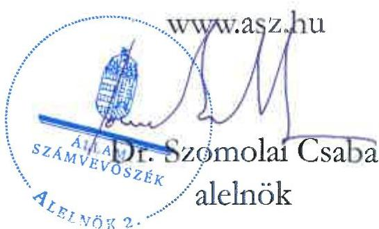

ÁLLAMI SZÁMVEVŐSZÉK

# JELENTÉS

A többségi állami tulajdonban lévő gazdasági társaságok beszerzéseinek ellenőrzése

Postaautó Duna Gépjármű-kereskedelmi és Szolgáltató Zrt.

2025.

25112

www.asz.hu

---

ÁLLAMI SZÁMVEVŐSZÉK

# JELENTÉS

A többségi állami tulajdonban lévő gazdasági társaságok beszerzéseinek ellenőrzése

Postaautó Duna Gépjármű-kereskedelmi és Szolgáltató Zrt.

2025.

25112

---

Jelentéseink az interneten a www.asz.hu címen olvashatók.

ELLENŐRZÉSI IGAZGATÓSÁG:
ELLENŐRZÉSI IGAZGATÓSÁG III.

ELLENŐRZÉSI IGAZGATÓ:
HERCZEGH ZSOLT igazgató

ELLENŐRZÉSVEZETŐ:
DABISNÉ NYIKOS MELINDA ellenőrzésvezető

IKTATÓSZÁM: EL-4232-002/2025
TÉMASORSZÁM: 34/2025
ELLENŐRZÉS-AZONOSÍTÓ SZÁM: V113510

---

TARTALOMJEGYZÉK

- AZ ELLENŐRZÉS EREDMÉNYEI ... 5
1. A többségi állami tulajdonban álló gazdasági társaság beszerzésének megfelelősége ... 5
- JAVASLATOK ... 9
- I. FÜGGELÉK: ÉSZREVÉTELEK ... 10
- II. FÜGGELÉK: ELLENŐRZÉSI MEGKÖZELÍTÉS ... 12
- MELLÉKLETEK ... 16
I. sz. melléklet: Értelmező szótár ... 16
- RÖVIDÍTÉSEK JEGYZÉKE ... 17

---

“哈，你是个小伙子，你是个小伙子，你是个小伙子，你是个小伙子，你是个小伙子，你是个小伙子，你是个小伙子，你是个小伙子，你是个小伙子，你是个小伙子，你是个小伙子，你是个小伙子，你是个小伙子，你是个小伙子，你是个小伙子，你是个小伙子，你是个小伙子，你是个小伙子，你是个小伙子，你是个小伙子，你是个小伙子，你是个小伙子，你是个小伙子，你是个小伙子，你是个小伙子，你是个小伙子，你是个小伙子，你是个小伙子，你是个小伙子，你是个小伙子，你是个小伙子，你是个小伙子，你是个小伙子，你是个小伙子，你是个小伙子，你是个小伙子，你是个小伙子，你是个小伙子，你是个小伙子，你是个小伙子，你是个小伙子，你是个小伙子，你是个小伙子，你是个小伙子，你是个小伙子，你是个小伙子，你是个小伙子，你是个小伙子，你是个小伙子，你是个小伙子，你是个小伙子，你是个小伙子，你是个小伙子，你是个小伙子，你是个小伙子，你是个小伙子，你是个小伙子，你是个小伙子，你是个小伙子，

---

5

# AZ ELLENŐRZÉS EREDMÉNYEI

A Magyar Állam tulajdonában lévő gazdasági társaságok gazdálkodása során a nemzeti vagyonnal való felelős gazdálkodás alapvető követelmény és egyben jogszabályi előírás. A nemzeti vagyongazdálkodás alapvető feladata a nemzeti vagyon megőrzése, értékének és állagának védelme. A gazdasági társaságok önálló és felelős gazdálkodása során a jogszabályokban meghatározott előírásoknak, valamint az azokkal összhangban lévő belső szabályzatoknak maradéktalanul szükséges megfelelni.

A gazdasági társaságokkal szemben elvárás, hogy a beruházásaikat, beszerzéseiket ezen előírások mentén a törvényesség, célszerűség és eredményesség követelményei szerint végezzék.

A Postaautó Duna Zrt.¹ közvetett állami tulajdonú gazdasági társaság, főtevékenysége az ellenőrzött időszakban személygépjármű kölcsönzés volt.

Az ÁSZ² az ellenőrzés keretében vizsgálta és értékelte a Postaautó Duna Zrt. salgótarjáni, mátészalkai, valamint kiskunhalasi ingatlanfelújításaihoz kapcsolódó 2023. évi beszerzéseinek megfelelőségét.

A megvalósított ingatlanfelújítások a szükséges állagmegóvások, valamint a további bérleti szerződések megkötése és bővítése érdekében célszerűek voltak, az ingatlanokon végzett felújítások eredményesen zárultak. A Társaság a beruházások költségeit a bérbeadási tevékenysége során a bérleti díjakba beépítette. Az ellenőrzés ugyanakkor a beszerzések szabályozása, valamint a teljesítésigazolások dokumentálása tekintetében hiányosságokat tárt fel, amelyek a beruházás megvalósítását, eredményességét alapvetően nem befolyásolták, így a Postaautó Duna Zrt. vizsgálat alá vont beruházási célú beszerzései összességében megfelelőek voltak. A Társaság a jogszabályi előírás ellenére az ellenőrzött vállalkozási szerződések vonatkozásában a közzétételi kötelezettségének nem tett teljeskörűen eleget.

## 1. A többségi állami tulajdonban álló gazdasági társaság beszerzésének megfelelősége

### Összegző megállapítás

A Postaautó Duna Zrt. beszerzésre irányuló döntései megalapozottak és célszerűek voltak. A Társaság a beszerzések során minden esetben a legkedvezőbb ajánlatot adó vállalkozásokkal kötött szerződést, az ingatlanokon végzett felújítások eredményesen zárultak. A beszerzések szabályozása tekintetében, és a teljesítések során feltárt hiányosságok a vizsgált beszerzések megfelelőségét nem befolyásolták, így a beruházási célú beszerzések összességében megfelelőek voltak. A Társaság a beruházások költségeit a bérbeadási tevékenysége során a bérleti díjakba beépítette. A Postaautó Duna Zrt. közzétételi kötelezettségének nem tett teljeskörűen eleget.

## A BESZERZÉSHEZ KAPCSOLÓDÓ BELSŐ SZABÁLYOZÓ ESZKÖZÖK

A Postaautó Duna Zrt. beszerzéseit az Alapszabályi.⁴, az SZMSZi.⁴, a Beruházási szabályzat⁵, a Bizonylati szabályzat⁶, a 22/2006. sz. vezérigazgatói utasítás⁷ és a 2/2023. sz. vezérigazgatói utasítás⁸ szabályozta.

---

Az ellenőrzés eredményei

A Társaság önálló Beszerzési szabályzattal nem rendelkezett, a mindenkor hatályos SZMSZ-ben kerültek rögzítésre a szerződéskötési és utalványozási jogosultságok, a cégjegyzési jogosultságra vonatkozó rendelkezések, valamint a beruházási döntési hatáskörök. A Társaság beszerzésekkel kapcsolatos elvárásai ezek mellett a Tulajdonos⁹ által, valamint a vezérigazgatói utasításokban kerültek előírásra, kiadásra.

A Társaság a beszerzéseket érintő szabályozó eszközeiben azonban nem rendelkezett arról, hogy mi az ajánlatkérés folyamata (cégek kiválasztásának módja, bány szereplőtől kell ajánlatot kérni, értékelési szempontok, minősítés, személyi és tárgyi feltételek vizsgálata), illetve az ajánlatkérési eljárás keretében beérkezett ajánlatok kiértékelésének dokumentálására milyen követelményrendszer vonatkozik. A Társaság belső szabályozó eszközei (az összetett beruházás kivételével) nem tartalmaztak rendelkezést a beszerzési döntéselőkészítés és döntéshozatal dokumentálására vonatkozóan sem. A Postaautó Duna Zrt. Beruházási szabályzata részletszabályokat nem határozott meg, így fogalmi meghatározások hiányában nem volt megállapítható, hogy mi minősült a szabályzat alapján összetett beruházásnak, az milyen értékhez, illetve egyéb feltételekhez volt köthető, pedig ezen beruházásoknál részletesebb döntéselőkészítő dokumentumok rendelkezésre állását írta elő a szabályzat.

A belső szabályozó eszközök hiányosságai miatt sérült a Gbkr.¹⁰ 4. § (3) bekezdésében foglalt előírás, a beszerzések területén nem volt maradéktalanul biztosított a Tak.tv.¹¹ 7/J. § (3) bekezdés e) pontja szerinti szabályozott, átlátható működés.

A Társaság a Gbkr. 4. § (3) bekezdésében, valamint az Alapszabály XI. 3. k.) pontjában rögzített előírások ellenére stratégiával nem rendelkezett.

## A BESZERZÉSI IGÉNY FELMERÜLÉSE

A salgótarjáni, mátészalkai és kiskunhalasi fióktelepek vonatkozásában végzendő beszerzési feladatok a Magyar Posta Zrt. (mint ezen ingatlanok bérlője) igényei miatt keletkeztek. Ezek egyrészt a bérelt ingatlanok állagmegóvására, műszaki hiányosságok és hibák kijavítására, másrészt további ingatlanrészek bérlése miatti átalakítási munkálatokra irányultak.

Ennek keretében a Magyar Posta Zrt. az egyes fióktelepek esetében külön-külön értesítette a Postaautó Duna Zrt.-t a felmerült beruházási igényekről, amelyeket a Társaság jóváhagyásával helyszíni bejárások keretében pontosítottak és részleteztek. Ezek alapján a salgótarjáni fióktelep tekintetében a Magyar Posta Zrt. rögzítette, hogy a tevékenységbővülése miatti csomagkézbesítési feladatok ellátásához, kisteherautóval megközelíthető, 100 m² nagyságú használaton kívüli, felszabadítható raktár-, vagy műhelyterületet kíván bérbére venni. A helyszíni bejárást követően a területfejlesztési igényeket a Magyar Posta Zrt. dokumentálta, továbbá azt is jelezte a Társaság részére, hogy a helyszínbejárás során feltárt műszaki hiányosságokat, hibákat is javítani szükséges a munkavédelmi és biztonsági szabályoknak való megfelelés érdekében. A mátészalkai fióktelepet illetően a Magyar Posta Zrt. tájékoztatta a Postaautó Duna Zrt.-t, hogy az általa bérelt területen a kerékpártároló rendkívül leromlott állapotban volt, valamint a további területbővítési igények végett szükségessé vált a parkolóterület minőségének a javítása is, hogy az kisteherautók tárolására alkalmas legyen. A kiskunhalasi fióktelep esetében pedig a Magyar Posta Zrt. a tevékenységbővülése okán további ingatlanrészeket kívánt bérbére venni a Társaságtól, azonban a területen lévő ingatlan kialakítása és állapota nem volt megfelelő. A helyszíni felmérést követően a Magyar Posta Zrt. a részletes átalakítási igényeit a Postaautó Duna Zrt. rendelkezésére bocsátotta.

A Társaság a fióktelepekkel kapcsolatban felmerült igényeket megvizsgálta, ezután a Magyar Posta Zrt.-t tájékoztatta, hogy nyitott a jelzett beruházások elvégzésére, előzetes finanszírozására és a bérelti díjban történő érvényesítésére. Az ellenőrzés alá vont beszerzések az érintett helyszíneken a szükséges

---

Az ellenőrzés eredményei

állagmegóvások, a munkavédelmi és biztonsági szabályoknak való megfelelés, valamint a további bérleti szerződések megkötése és bővítése érdekében célszerűek voltak.

## A BESZERZÉSI DÖNTÉSEK MEGALAPOZOTTSÁGA

A Tulajdonos által elvárt célok az éves operatív üzleti tervben kerültek rögzítésre, amelyek tartalmazták a hatékony ingatlangazdálkodásra vonatkozó rendelkezéseket. Mivel az ellenőrzés alá vont beszerzések a 2023. évben merültek fel, így azok a Társaság éves operatív üzleti tervében nem kerültek feltüntetésre.

A beszerzések tekintetében a Beruházási szabályzatban rögzített műszaki tervek, leírások, és az ezekkel kapcsolatos egyeztetések dokumentumai a Társaság rendelkezésére álltak, melyek a tervezett feladatokat megalapozták, a kapcsolódó tervrajzok elkészültek. A Postaautó Duna Zrt. a Magyar Posta Zrt. részére már a beruházás tervezési szakaszában jelezte, hogy az elvégzett munkák költségei a bérleti díjakba beépítésre kerülnek. A beruházásokra vonatkozó fedezettel a Postaautó Duna Zrt. rendelkezett.

## A BESZERZÉSEK LEBONYOLÍTÁSA, A MEGKÖTÖTT SZERZŐDÉSEK, ÉS A BESZERZÉSEK ELSZÁMOLÁSA

A Postaautó Duna Zrt. a kiválasztott beruházások vonatkozásában minden esetben legalább három, vagy annál több (építőipari tevékenységet ellátó) társaságot kért fel ajánlattételre. A Társaság a kapcsolódó műszaki tervekben kritériumként rögzítette, hogy az érintett területeket az ajánlattevők (képviselőinek) részéről az előzőleg felmért területnagyság felülvizsgálata, valamint az anyag-, és munkadíj tételés meghatározása érdekében személyesen is meg kellett tekinteni. A Postaautó Duna Zrt. a területbejárásokról emlékeztetőt készített.

A Társaság célja a beszerzések során az volt, hogy az elvégzendő munkákra összességében a legkedvezőbb feltételekkel kössön szerződést. Ennek következtében az árajánlatok beérkezését követően még nem értesítették ki a nyertes ajánlattevőt, hanem további tárgyalásokat folytattak az újabb árcsökkentés elérése érdekében. A Postaautó Duna Zrt. a 2/2023. sz. vezérigazgatói utasításban foglalt rendelkezésnek megfelelően a legkedvezőbb ajánlatot adó vállalkozásokkal kötött szerződést. Az ellenőrzött beruházások tekintetében a Vállalkozási szerződések $^{1-3}$ megkötésére a SZMSZ előírásainak megfelelően az arra jogosult képviselő által került sor.

A Társaság az ellenőrzött beruházásai során tévesen fogadott be előlegszámlákat részszámlák helyett, amelynek az oka az volt, hogy a Vállalkozási szerződésekben $^{1-3}$ hibásan került rögzítésre az előlegszámla megnevezés. Az Áfa tv. $^{13}$ 59. § (1) bekezdés értelmében előlegszámlát akkor kell kiállítani, ha a tényleges teljesítés még nem történt meg, de a megrendelő már vagyoni előnyt juttatott, tehát a teljesítés előtt kiegyenlítette a szolgáltatás ellenértékének egészét vagy egy részét. Mivel az ellenőrzött beruházások esetében a számlák kiállítását teljesítéshez kötötték, így azok részszámláknak és nem előlegszámláknak minősültek. A Postaautó Duna Zrt. eljárásával a Számv. tv. $^{14}$ 165. § (2) bekezdését megsértette, mivel a számviteli nyilvántartásokba csak szabályszerűen kiállított bizonylat alapján szabad adatokat bejegyezni.

Az ellenőrzött beruházások megvalósultak, eredményesen zárultak, azokat a Postaautó Duna Zrt. fotódokumentumokkal igazolta. Az előlegszámlákban – amelyek ténylegesen részszámláknak minősültek – rögzített munkákat a Postaautó Duna Zrt. részteljesítések keretében igazolta, valamint a végszámlákhoz kapcsolódó teljesítésigazolások is rendelkezésre álltak. Az elvégzett munkák teljesítésének dokumentálásai során azonban hiányosságokat tart fel az ÁSZ, mivel a Társaság a Vállalkozási szerződések $^{1-3}$ 7. és 10. pontjaiban rögzített megvalósítási ütemtervekkel, a munkaterület átadás-átvételi jegyzőkönyvekkel és az átadás-átvételi eljárás folyamatát lezáró jegyzőkönyvekkel nem rendelkezett. A

---

Az ellenőrzés eredményei

feltárt dokumentálási hiányosságok tekintetében a Társaság első számú vezetője nem biztosította a Gbkr. 3. § (1) bekezdés c) pontjában előírtak ellenére a kialakított kontrolltevékenység működtetését.

A pénzügyi teljesítések a beruházások vonatkozásában minden esetben megtörténtek. A teljesített beruházásokat követően a Társaság intézkedett a Magyar Posta Zrt.-vel kötött ingatlanbérbeadásra vonatkozó szerződéseinek a módosításáról, a felmerült beruházási költségek bérleti díjban történő megtérítése végett. A beruházási költségek az elvégzett beruházások vonatkozásában a megkötött bérleti szerződések alapján 60 hónapon belül, teljeskörűen térülnek meg a Postaautó Duna Zrt. részére.

# KÖZZÉTÉTELI KÖTELEZETTSÉG

A Postaautó Duna Zrt. 100%-ban közvetett állami tulajdonú gazdasági társaság, így közvetve állami vagyonnal gazdálkodik, ezért a Vtv.¹⁵ 5. § (2) bekezdése alapján az Info tv.¹⁶ 26. § (1) bekezdése szerint, mint közfeladatot ellátó szervnek lehetővé kellett tennie, hogy a kezelésében lévő közérdekű adatot és közérdekből nyilvános adatot erre irányuló igény alapján bárki megismerhesse. Az Info tv. 33.§ (1)-(3) és a 37.§ (1) bekezdése értelmében közzétételi kötelezettség terhelte a Társaságot. A Postaautó Duna Zrt. az ellenőrzés alá vont beszerzések szerződéseit nem az Info tv. 1. számú melléklet III. fejezet 4. pontjában foglaltak szerint tette közzé, miszerint az egy költségvetési évben ugyanazon szerződő féllel kötött azonos tárgyú szerződések értékét egybe kell számítani.

A Társaság 1/2022. sz. vezérigazgatói utasítása¹⁷ az Info tv. 1. számú melléklet III. fejezet 4. pontjában foglalt rendelkezéssel nem állt összhangban, mivel a Társaság a közzétételi értékhatárokat 5 M Ft helyett az árubeszerzés, szolgáltatás esetében nettó 15 M Ft-ban, míg az építési beruházás vonatkozásában nettó 50 M Ft-ban határozta meg.

---

JAVASLATOK

Az ÁSZ tv. 33. § (1) bekezdésében foglaltak értelmében az ellenőrzött szervezet vezetője köteles a jelentésben foglalt megállapításokhoz kapcsolódó intézkedési tervet összeállítani és azt a jelentés kézhezvételétől számított 30 napon belül az ÁSZ részére megküldeni. Az ÁSZ a jelentésben foglalt megállapításokhoz kapcsolódóan az alábbi javaslatok tekintetében várja el az intézkedési terv elkészítését.

## POSTAAUTÓ DUNA ZRT. VEZÉRIGAZGATÓJA RÉSZÉRE

1. A beszerzési eljárások egyértelmű meghatározhatósága, átláthatósága és dokumentálási követelményeinek kialakítása, valamint a Gbkr. 4. § (3) bekezdésében és a Tak.tv. 7/J. § (3) bekezdés e) pontjában előírt rendelkezések érvényesülése érdekében vizsgálja felül a Beruházási szabályzat, valamint a témához kapcsolódó vezérigazgatói utasítok rendelkezéseit, és a hiányosságok megszüntetése érdekében tegye meg a szükséges intézkedéseket

2. Intézkedjen a Gbkr. 4. § (3) bekezdésében, valamint az Alapszabály XI. 3. k.) pontjában előírt rendelkezések alapján a Társaság stratégiájának elkészítéséről.

3. Intézkedjen, hogy a jövőben a Gbkr. 3. § (1) bekezdés c) pontjának megfelelően működtesse a kontrolltevékenységeket, és a vállalkozási szerződéseken foglalt teljesítési dokumentumok teljeskörűen rendelkezésre álljanak.

4. Intézkedjen, hogy az ellenőrzés alá vont beszerzések szerződéseit az Info tv. 1. melléklet III. gazdálkodási adatok 4. pontjában foglalt rendelkezés alapján tegye közzé, továbbá vizsgálja felül az 1/2022. sz. vezérigazgatói utasítást, és tegye meg a szükséges intézkedéseket.

---

10

# I. FÜGGELÉK: ÉSZREVÉTELEK

A jelentéstervezetet az ÁSZ 15 napos észrevételezésre megküldte az ellenőrzött szervezet vezetőjének az ÁSZ tv. 29. §* (1) bekezdése előírásának megfelelően.

A Függelék tartalmazza az ellenőrzött szervezet vezetője által megtett és az ÁSZ által figyelembe nem vett észrevételeket, valamint azok el nem fogadásának indoklását.

A Postaautó Duna Zrt. észrevétele a Beszerzések lebonyolítása, a megkötött szerződések, és a beszerzések elszámolása című fejezet 4. bekezdése vonatkozásában: „Az átadás-átvételi eljárás folyamatát lezáró jegyzőkönyvekkel nem rendelkezett” mondatot kérném kiegészíteni azzal, hogy „de a teljesítés igazolások minden esetben dokumentáltan megtörténtek”.

El nem fogadás indoka: Nem érdemi észrevétel, a hiányolt megállapítást a kifogásolt mondatot megelőző szövegrész tartalmazza.

2.)

A Postaautó Duna Gépjármű-kereskedelmi és Szolgáltató Zrt. észrevétele a Közzétételi kötelezettség című fejezet vonatkozásában: „A mátészalkai beruházási szerződés közzétételi kötelezettségét a 2024. március 31-ei állapotnak megfelelő listában teljesítettük, úgy, hogy a kiskunhalasi és a mátészalkai beruházási értéket összevontuk.”

A 2. észrevételt az ÁSZ részben elfogadta, az észrevétel alapján a jelentéstervezet módosult. A Postaautó Duna Zrt. az észrevételezési szakaszban ugyan utólagosan kiegészítette a 2024. március 31-ei közzétételi listáját a mátészalkai beruházás szerződéses értékével, azonban az ellenőrzött beszerzésekhez kapcsolódó szerződések adatait a Társaság továbbra sem az Info tv. 1. melléklet III. gazdálkodási adatok 4. pontjában foglalt rendelkezés alapján tette közzé. A jogszabályi előírás szerint az egy költségvetési évben ugyanazon szerződő féllel kötött azonos tárgyú szerződések értékét egybe kell számítani. A Postaautó Duna Zrt. ezzel szemben a három darab szerződés értékét nem egybe számítva, hanem megbontva tette közzé, mivel a salgótarjáni beruházás szerződéses értékét (nettó 17 922 627 Ft) a 2023. december 31-ei, míg a kiskunhalasi és mátészalkai beruházások szerződéses értékét (nettó 53 508 484 Ft) a 2024. március 31-ei közzétételi listájában szerepelteti. Az ellenőrzéssel érintett Farkas Aszfalt Multitrade Kft-vel a Társaság által egyazon napon, azonos tárgyban kötött, három darab (kiskunhalasi, mátészalkai, salgótarjáni beruházások) vállalkozói szerződésének egybe számított nettó értéke 71 431 111 Ft volt. A jelentés megállapítása ezzel összhangban módosult.

* 29. § (1) Az Állami Számvevőszék az ellenőrzési megállapításait megküldi az ellenőrzött szervezet vezetőjének vagy az általa megbízott személynek, és annak, akinek személyes felelősségét állapította meg.
(2) Az ellenőrzött szervezet vezetője és a felelősként megjelölt személy az ellenőrzés megállapításaira tizenöt napon belül írásban észrevételt tehet.
(3) Az Állami Számvevőszék az észrevételre a beérkezésétől számított harminc napon belül írásban válaszol. A figyelembe nem vett észrevételeket köteles a jelentésben feltüntetni, és megindokolni, hogy azokat miért nem fogadta el.

---

I. Függelék: Észrevételek

3.)

A Postaautó Duna Gépjármű-kereskedelmi és Szolgáltató Zrt. észrevétele a Javaslatok című fejezet 4. pontja vonatkozásában: „A 4. pontból kérjük a mátészalkai beruházásra vonatkozó közzététel kivételét.”

El nem fogadás indoka: A 2. pontban részletezettek alapján a Társaság nem az Info tv. 1. melléklet III. gazdálkodási adatok 4. pontjában foglaltak szerint tette közzé az ellenőrzés alá vont beszerzések szerződéseit. A Postaautó Duna Zrt. vezérigazgatójának megfogalmazott 4. számú javaslat ezzel összhangban módosult.

11

---

12

# II. FÜGGELÉK: ELLENŐRZÉSI MEGKÖZELÍTÉS

## AZ ELLENŐRZÉS JOGALAPJA

Az ellenőrzés jogszabályi alapját az ÁSZ tv.¹⁸ 1. § (3) bekezdésének és 5. § (4) bekezdésének előírásai képezték.

## AZ ELLENŐRZÉS CÉLJA

Az ellenőrzés célja annak értékelése volt, hogy a gazdasági társaság – ellenőrzés során kiválasztott – beszerzéseire szabályszerűen került-e sor, a kapcsolódó döntéshozatal szabályszerű és megalapozott volt-e, valamint a beszerzéshez kapcsolódóan érvényesültek-e a célszerűség és az eredményesség szempontjai.

## AZ ELLENŐRZÉS TÍPUSA

Kombinált ellenőrzés.

## AZ ELLENŐRZÉS TÁRGYA

Az ellenőrzés tárgya a Postaautó Duna Zrt. 2023. évben megvalósult beszerzéseire irányuló döntések szabályszerűsége, megalapozottsága és célszerűsége, a megvalósult beszerzések szabályszerűsége, eredményessége, a beszerzett eszközök és szolgáltatások feladatellátás során történt hasznosulása, azaz a beszerzések megfelelősége volt. Az ellenőrzés kiterjedt a beszerzések előkészítésének, a beszerzésekre vonatkozó szerződés megkötésének és tartalmának ellenőrzésére is. Az ÁSZ ellenőrzés részét képezte továbbá a közzétételi kötelezettség teljesítésének ellenőrzése is.

Az ellenőrzés kiterjedt minden olyan körülményre és adatra, amely az ÁSZ jogszabályban meghatározott feladatainak teljesítéséhez, valamint a program végrehajtása folyamán felmerült újabb összefüggések feltárásához szükséges volt.

1. táblázat

AZ ELLENŐRZŐTT BESZERZÉSEK FŐBB ADATAI (FT)

|  SORSZÁM | BESZERZÉS TÁRGYA | BESZERZÉS ALAPJÁT KÉPEZŐ SZERZŐDÉS KELTÉ | BESZERZÉS NETTÓ ÉRTÉKE (FT)  |
| --- | --- | --- | --- |
|  1. | Salgótarjáni fióktelep - parkoló aszfaltozás, csatorna tisztítás | 2023.11.17. | 17 922 627  |
|  2. | Mátészalkai fióktelep - parkoló zúzottkövezés, kerékpártároló készítés, belső munkálatok | 2023.11.17. | 11 681 000  |
|  3. | Kiskunhalasi fióktelep - parkoló aszfaltozás, betonút javítás, belsőépítészeti átalakítás, fétető kialakítás | 2023.11.17. | 41 827 484  |

Forrás: ÁSZ saját szerkesztés

---

II. Függelék: Ellenőrzési megközelítés

## AZ ELLENŐRZÉS HATÓKÖRE

Az ÁSZ ellenőrzése a Postaautó Duna Zrt. beszerzésre irányuló döntéseinek szabályszerűségére, megalapozottságára, célszerűségére, a megvalósult beszerzések szabályszerűségére, eredményességére, valamint arra terjedt ki, hogy a beszerzett eszköz/szolgáltatás a gazdasági társaságoknál hasznosításra kerül-e, betölti-e az eredetileg elvárt funkcióját, támogatja-e a társaságok (köz)feladat ellátását. Az ÁSZ ellenőrzés részét képezte továbbá a közzétételi kötelezettség teljesítésének ellenőrzése is.

A Társaság a Postaautó Budapest Kft., a Postaautó Pécs Kft., a Postaautó Sopron Kft., mint jogelődök összeolvadásával, a jogelődök általános jogutódjaként jött létre 2001. december 31-én, egyedüli részvényese a Magyar Posta Vagyonkezelő Zrt. volt. A Társaság főtevékenysége az ellenőrzött időszakban személygépjármű kölcsönzés volt, ezen kívül többféle szolgáltatást is nyújtott, mint például járműértékesítést, ingatlan bérbeadást (országosan 10 telephelyen kínált irodákat, műbelyeket, raktárakat és szabad területeket bérbeadásra), üzemanyag értékesítést (MOL franchise rendszerben), valamint 2023 novemberétől új feladatként (modellváltás keretében) indította el csomagkézbesítési szolgáltatását.

A Postaautó Duna Zrt. az MNB felügyelete alá tartozó köz tulajdonban álló gazdasági társaság, ezáltal nem volt köteles a Tak.tv. 7/J. § (1) bekezdésében meghatározott belső kontrollrendszer működtetésére. Ennek ellenére a Társaság a Tak.tv. 7/J. § (2) bekezdésében biztosított választási lehetősége alapján döntött a belső kontrollrendszer kialakításáról és működtetéséről.

A Postaautó Duna Zrt. ellenőrzés alá vont beszerzései nem tartoztak a Kbt.¹⁹ hatálya alá.

## AZ ELLENŐRZŐTT SZERVEZET

Postaautó Duna Zrt.

## AZ ELLENŐRZŐTT IDŐSZAK

A 2023. év.

---

II. Függelék: Ellenőrzési megközelítés

## AZ ELLENŐRZÉSI KRITÉRIUMOK

|  FOKUSZTERÜLET | ELLENŐRZÉSI KRITÉRIUMOK  |
| --- | --- |
|  1. A többségi állami tulajdonban álló gazdasági társaság beszerzésének megfelelősége | Vtv. 2. § (1) bekezdés, 5. § (2) bekezdés,
Nvtv.²⁰ 7. § (1)-(2) bekezdés,
Tak.tv. 2. § (3)-(4) bekezdés, 7/J. §,
Gbkr. 3. § (1) bekezdés, 4. § (3) bekezdés, 6. § (1)-(2) bekezdés,
Ptk.²¹ 6:238-271. §,
Számv. tv. 47-48. §, 51. §, 165-167. §,
Áfa tv. 59. § (1) bekezdés,
Info tv. 33. § (1) és (3) bekezdés, 37. §, 1. melléklet III. gazdálkodási adatok 4. pont,
18/2005. (XII. 27.) IHM rendelet²² 2. § (1) bekezdés
belső szabályozó eszközök (Alapszabály₁₋₄, SZMSZ₁₋₃, Beruházási szabályzat, Bizonylati szabályzat, 22/2006. sz. vezérigazgatói utasítás, a 2/2023. sz. vezérigazgatói utasítás, 1/2022. sz. vezérigazgatói utasítás)
Célszerűség: a beszerzésre irányuló döntés akkor célszerű, ha az megalapozott, továbbá a rendelkezésre álló erőforrások ésszerű, racionális, a gazdasági társaság (köz)feladatának megvalósítása érdekében álló, az ahhoz szükséges mértékű felhasználásával jár.
Eredményesség: a beszerzés akkor eredményes, ha összhangban áll a társaság céljaival és támogatja azok elérését, megvalósulását, valamint a beszerzés tárgya a társaság (köz)feladat ellátása során ténylegesen hasznosításra kerül, betölti eredetileg elvárt funkcióját.
A beszerzés eredményessége kizárólag akkor értékelhető, ha a beszerzési eljárás teljes folyamata a lényegi elemeiben szabályszerű, a beszerzési döntés megalapozott és célszerű volt.  |

## AZ ELLENŐRZÉS MÓDSZERE ÉS AZ ELLENŐRZÉSI BIZONYÍTÉKOK KÖRE

Az ellenőrzés végrehajtása a nemzetközi standardokat irányadónak tekintve az ellenőrzési program szempontjai, az ellenőrzött időszakban hatályos jogszabályok, az ellenőrzés szakmai szabályok és a jelen ellenőrzésre irányadó ÁSZ módszertan figyelembevételével történt.

Az ellenőrzési kérdések megválaszolásához szükséges bizonyítékok megszerzése az ellenőrzött szervezet által rendelkezésre bocsátott dokumentumokra és adatokra alapozva, továbbá megfigyelés, kérdésfeltevés (információkérés), mintavételezés, valamint elemző eljárás útján valósult meg.

Az ellenőrzési bizonyítékként felhasználható adatforrások közé tartoztak egyrészt az ellenőrzéshez kért dokumentumok, adatállományok, nyilatkozatok, másrészt adatforrás volt minden – az ellenőrzés folyamán – feltárt, az ellenőrzés szempontjából releváns információt tartalmazó dokumentum.

Az ellenőrzés lefolytatásához az ellenőrzött szervezet a 2023. évben megvalósult beszerzéseire vonatkozó főkönyvi és analitikus nyilvántartások, valamint az ÁSZ által kért további dokumentumok, adatok,

---

II. Függelék: Ellenőrzési megközelítés

információk megküldésével és a helyszíni ellenőrzés során szolgáltatott adatokat. A Postaautó Duna Zrt. a 2023. év vonatkozásában 101 darab beszerzésre irányuló szerződéssel rendelkezett, amelyek alapján a Társaság közelítőleg bruttó 2 298 241 E Ft összértékben hajtott végre beszerzéseket. A szerződések túlnyomó része az üzemanyagbeszerzéshez, valamint a gépjárművek adásvételéhez, javításához kapcsolódtak. A fentieken túl a Társaság ingatlan felújításokra három nagyobb volumenű szerződést is kötött, összesen bruttó 90,7 M Ft értékben, amelyek keretében a salgótarjáni, mátészalkai és kiskunhalasi fióktelepei vonatkozásában végeztek állagmegóvási, bővítési és javítási munkálatokat.

A tények feltárása és azok összegzése során a megállapítások az ellenőrzött mintatételekre vonatkozóan kerültek megfogalmazásra. A mintatételek ellenőrzésének eredményei nem kerültek kivetítésre. Az ÁSZ akkor tekintette megfelelőnek a mintatételként kiválasztott beszerzést, ha a beszerzési eljárás teljes folyamata a lényegi elemeiben szabályszerű, célszerű és – amennyiben értékelhető – eredményes volt, illetve a beszerzés tekintetében érvényesültek a nemzeti vagyonnal való felelős gazdálkodás elvei.

Az ellenőrzés kitért minden olyan körülményre, amely a program végrehajtása kapcsán felmerült és az ellenőrzés céljaival összhangban volt.

15

---

MELLÉKLETEK

## I. SZ. MELLÉKLET: ÉRTELMEZŐ SZÓTÁR

gazdasági társaság
A gazdasági társaságok üzletszerű közös gazdasági tevékenység folytatására, a tagok vagyoni hozzájárulásával létrehozott, jogi személyiséggel rendelkező vállalkozások, amelyekben a tagok a nyereségből közösen részesednek, és a veszteséget közösen viselik.
(Ptk. 3:88. § (1) bekezdése)

beszerzés
Eszközök és/vagy szolgáltatások visszterhes megszerzésére (vásárlására) irányuló (keret)szerződés/(keret)megállapodás létrehozását célzó és azt eredményező eljárás.
(ÁSZ saját definíció)

eszköz
A vásárolt immateriális javak (Számv. tv. 25. § (1)-(2) bekezdés) és tárgyi eszközök (Számv. tv. 26. § (1) bekezdés) valamint – a közvetített szolgáltatások kivételével – a vásárolt készletek.
(Számv. tv. 3. § (6) bekezdés 5. pont)

szolgáltatás
A gazdasági társaság által igénybe vett/megrendelt, harmadik felek által nyújtott/számlázott, nem anyagi javak termelésére irányuló tevékenységek, különös tekintettel az igénybe vett, egyéb és közvetített szolgáltatásokra.
(Számv. tv. 3. § (7) bekezdés 1-2. pont, (4) bekezdés 1. pont)

többségi állami tulajdon
Az állam tulajdonában lévő tagsági jogviszonyt megtestesítő értékpapír, illetve az állam tulajdonában lévő egyéb társasági részesedés, amennyiben a társaságban a Magyar Állam közvetlenül vagy közvetetten a szavazatok több mint felével rendelkezik.
(ÁSZ definíció a Vtv. 1. § (2) bekezdés c) pontja és a Ptk. 8:2. § (1), (3)-(4) bekezdései alapján)

vagyongazdálkodás alapelvei
A nemzeti vagyon alapvető rendeltetése a közfeladat ellátásának biztosítása, ideértve a lakosság közszolgáltatásokkal való ellátását és e feladatok ellátásához szükséges infrastruktúra biztosítását. A nemzeti vagyonnal felelős módon, rendeltetésszerűen kell gazdálkodni.

A nemzeti vagyongazdálkodás feladata a nemzeti vagyon megőrzése, értékének és állagának védelme, rendeltetésének megfelelő, az állam, az önkormányzat mindenkori teherbíró képességéhez igazodó, elsődlegesen a közfeladatok ellátásához és a mindenkori társadalmi szükségletek kielégítéséhez szükséges, egységes elveken alapuló, átlátható, hatékony és költségtakarékos működtetése, értéknövelő használata, hasznosítása, gyarapítása, továbbá az állam vagy a helyi önkormányzat feladatának ellátása szempontjából feleslegessé váló vagyontárgyak elidegenítése, azzal, hogy a nemzeti vagyon megőrzése érdekében végzett bontás vagy átalakítás nem minősül az állag védelmi kötelezettség megszegésének.
(Nvtv. 7. § (1)-(2) bekezdése alapján)

16

---

RÖVIDÍTÉSEK JEGYZÉKE

1 Postaautó Duna Zrt./Társaság/ többségi állami tulajdonban álló gazdasági társaság
2 ÁSZ
3 Alapszabály1.4
4 SZMSZ1-3
5 Beszerzési szabályzat
6 Bizonylati szabályzat
7 22/2006. sz. vezérigazgatói utasítás
8 2/2023. sz. vezérigazgatói utasítás
9 Tulajdonos
10 Gbkr.
11 Tak.tv.
12 Vállalkozási szerződés1-3
13 Áfa tv.
14 Számv. tv.
15 Vtv.
16 Info tv.
17 1/2022. sz. vezérigazgatói utasítás
18 ÁSZ tv.
19 Kbt.
20 Nvtv.
21 Ptk.
22 18/2005. (XII. 27.) IHM rendelet

Postaautó Duna Gépjármű-kereskedelmi és Szolgáltató Zrt.
Állami Számvevőszék
Alapszabály1 hatálya: 2022.09.16. – 2023.04.26.
Alapszabály2 hatálya: 2023.04.27. – 2023.05.31.
Alapszabály3 hatálya: 2023.06.01. – 2023.09.17
Alapszabály4 hatálya: 2023.09.18. – 2024.02.28.
SZMSZ1 hatálya: 2023.01.01. – 2023.08.16.
SZMSZ2 hatálya: 2023.08.17. – 2023.11.07.
SZMSZ3 hatálya: 2023.11.08. – 2024.07.21.
Beszerzési szabályzat hatálya: 2008.12.02-tól (2. változat)
Posta Dunaautó Zrt. Bizonylati szabályzata 2023.01.01-tól
22/2006. sz. vezérigazgatói utasítás a beruházások gazdaságossági utóvizsgálatáról (hatályos: 2006. december 29-től kezdődően)
2/2023 sz. vezérigazgatói utasítás a 2023. november 8-i módosítással egységes szerkezetben a Postaautó Duna Zrt. működéséhez szükséges megrendelések kiadásának jogosultjairól, a megrendelések alkalmazásának feltételeiről
Magyar Posta Vagyonkezelő Zrt.
339/2019. (XII. 23.) Korm. rendelet a köztulajdonban álló gazdasági társaságok belső kontrollrendszeréről
2009. évi CXXII. törvény a köztulajdonban álló gazdasági társaságok takarékosabb működéséről
Vállalkozási szerződés1: salgótarjáni beruházásra kötött szerződés
Vállalkozási szerződés2: mátészalkai beruházásra kötött szerződés
Vállalkozási szerződés3: kiskunhalasi beruházásra kötött szerződés
2007. évi CXXVII. törvény az általános forgalmi adóról
2000. évi C. törvény a számvitelről
2007. évi CVI. törvény az állami vagyonról
2011. évi CXII. törvény az információs önrendelkezési jogról és az információszabadságról
1/2022. sz. vezérigazgatói utasítás a 2023.08.16-i módosítással egységes szerkezetben a közzétételi kötelezettségről
2011. évi LXVI. törvény az Állami Számvevőszékről
2015. évi CXLIII. törvény a közbeszerzésekről
2011. évi CXCVI. törvény a nemzeti vagyonról
2013. évi V. törvény a Polgári Törvénykönyvről
18/2005. (XII. 27.) IHM rendelet a közzétételi listákon szereplő adatok közzétételéhez szükséges közzétételi mintákról

17

---

ÁLLAMI SZÁMVEVŐSZÉK

1052 Budapest, Apáczai Csere János u. 10. | 1364 Budapest 4., Pf. 54

www.asz.hu | szamvevoszek@asz.hu

telefon: +36 1 484 9100