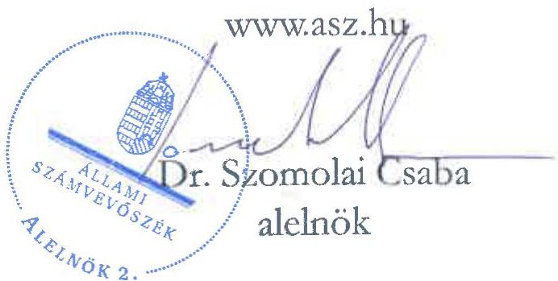

ÁLLAMI SZÁMVEVŐSZÉK

# JELENTÉS

A fenntartási kötelezettség kedvezményezettek
általi teljesítésének rapid ellenőrzése

A BOLKO Reklám és Szolgáltató Bt.
fenntartási kötelezettsége teljesítésének ellenőrzése
a GINOP-1.1.8-19-2020-00001 számú projektnél

2025.

25114

www.asz.hu

---

ÁLLAMI SZÁMVEVŐSZÉK

# JELENTÉS

A fenntartási kötelezettség kedvezményezettek
általi teljesítésének rapid ellenőrzése

A BOLKO Reklám és Szolgáltató Bt.
fenntartási kötelezettsége teljesítésének ellenőrzése
a GINOP-1.1.8-19-2020-00001 számú projektnél

2025.

25114

---

Jelentéseink az interneten a www.asz.hu címen olvashatók.

ELLENŐRZÉSI IGAZGATÓSÁG:
ELLENŐRZÉSI IGAZGATÓSÁG I.

ELLENŐRZÉSI IGAZGATÓ:
SINKÁNÉ DR. CSENDES ÁGNES igazgató

ELLENŐRZÉSVEZETŐ:
HUSZÁR ANNA ellenőrzésvezető

IKTATÓSZÁM: EL-4101-178/2025

TÉMASORSZÁM: -

ELLENŐRZÉS-AZONOSÍTÓ SZÁM: V1101

---

TARTALOMJEGYZÉK

- ÖSSZEFOGLALÁS ... 5
- AZ ELLENŐRZÉS EREDMÉNYEI ... 6
1. A fenntartási kötelezettség teljesítése ... 6
- I. FÜGGELÉK: ÉSZREVÉTELEK ... 9
- II. FÜGGELÉK: ELLENŐRZÉSI MEGKÖZELÍTÉS ... 10
- MELLÉKLETEK ... 15
I. sz. melléklet: Értelmező szótár ... 15
II. sz. melléklet: Az ellenőrzött és a közreműködő szervezetek jegyzéke ... 17
- RÖVIDÍTÉSEK JEGYZÉKE ... 18

---

.

---

ÖSSZEFOGLALÁS

A 2019 októberében megjelent „Magyar Multi Program II. - A kiemelt növekedési potenciállal bíró kis- és középsállalkozások megerősítése, értékhozzáadó tevékenysége és piacbővítési lehetőségeinek fejlesztése” című (GINOP-1.1.8-19 kódszámú) pályázati felhívásban meghirdetett támogatással lehetőség nyílt arra, hogy erős vállalkozások egyedi fejlesztési terveik megvalósításával hozzájussanak minőségi üzletfejlesztési és szakértői szolgáltatásokhoz a termékfejlesztés, márkaépítés, szervezetfejlesztés és finanszírozás területén versenyképességük javítása érdekében. A Felhívás¹ keretében olyan fejlesztési elképzelések voltak támogathatók, melyek a GINOP-1.1.4-16 kiemelt projekt keretében a vállalkozás korábban készült egyéni fejlesztési tervének gyakorlati megvalósításához járultak hozzá. A rendelkezésre álló keretösszeg eredetileg 1 Mrd Ft volt, amely végül 50 M Ft lett, a konstrukcióban az IH² 45,1 M Ft összegben bocsátott ki támogatói okiratot, az igényelhető vissza nem térítendő támogatás összege 2 M Ft és 36 M Ft között volt.

A Felhívás alapján eredetileg 10,3 M Ft – majd módosítást követően végül 9,4 M Ft – támogatást nyert GINOP-1.1.8-19-2020-00001 számú, „Vállalati folyamatok – és működésfejlesztés a Bolko Bt.-nél” című projekt keretében a Kedvezményezettnél³, a BOLKO Bt.-nél sor került a szervezeti struktúra és tevékenységek/folyamatok optimalizálására, valamint részletes pénzügyi és szervezeti üzleti terv készítésére.

A Kedvezményezett – a támogatás visszafizetésének terhe mellett – vállalta, hogy a projektmegvalósítást követően a Projekt⁴ megfelel az 1303/2013/EU Rendeletben⁵ a műveletek tartósságára vonatkozóan előírtaknak, az előírt fenntartási kötelezettséget teljesíti. A Projekt megvalósítása 2022. július 22-én befejeződött, a fenntartási időszak azt követő nappal indult és 2025. július 22-ig tartott.

A Projekt egyedisége és a megvalósított projekteredmény hosszabb távon történő megtartása miatt az ÁSZ⁶ indokoltnak tartotta a Projekt fenntartásának és a támogatás hasznosulásának ellenőrzését. A Kedvezményezett projektfenntartási kötelezettségei teljesítésének ellenőrzésére az ÁSZ „A 2014-2020 programozási időszak kohéziós politikai operatív programok vonatkozásában a fenntartási kötelezettség teljesítésének ellenőrzési gyakorlata” című ellenőrzéséhez, mint alapellenőrzéshez kapcsolódóan került sor.

Kedvezményezett – az ÁSZ helyszíni ellenőrzésének időszakában – a Projekt hároméves fenntartási kötelezettsége keretében, a projekteredmény működtetéséről és fenntartásáról a jogszabályi előírásoknak megfelelően, határidőben beszámolt az éves projektfenntartási jelentésekben. A Felhívás és a támogatói okirat a fenntartási időszakra projektszintű indikátort nem írt elő, azokban a Projekt keretében létrehozott termékek, szolgáltatások fenntartási időszak végéig történő fenntartásának kötelezettségét rögzítették. A Kedvezményezett fenntartási kötelezettségének a Felhívásban és a támogatói okiratban előírtaknak megfelelően eleget tett, az azokban vállalt kötelezettségeit és egyéb kötelezettségeit teljesítette.

A Kedvezményezett az IH értékelése szerint alacsony kockázati besorolású volt, az IH a Projekt fenntartási időszaka alatt helyszíni ellenőrzést nem végzett, szabálytalansági eljárás lefolytatására okot adó körülmény nem merült fel.

Az ÁSZ helyszíni ellenőrzésének időszakában a Projekt, a vállalt három év fenntartási időszak és a – fenntartási időszakra vonatkozóan – vállalt kötelezettségek Kedvezményezett általi teljesítésével megfelelt az 1303/2013/EU rendeletben előírtaknak, mivel a Projekt termelő tevékenysége nem szűnt meg, annak eredeti célkitűzései a fenntartási időszakban biztosítottak voltak.

Az ÁSZ értékelése szerint a támogatás hasznosult. A Projekt keretében igénybe vett tanácsadás eredménye beépült a vállalkozás működésébe, az – az árbevétel adatai és adózott eredmény adatok ellenőrzött időszaki alakulása alapján – hozzájárult a Kedvezményezett jövedelmezőségének javításához. A Kedvezményezett a már bevezetett intézkedéseket fenn kívánta tartani, amelyet igazolt az, hogy a fenntartási időszakban további képzéseket finanszírozott.

5

---

AZ ELLENŐRZÉS EREDMÉNYEI

A magyar vállalkozások a GINOP⁷ pályázati konstrukciók keretében jelentős mértékű támogatásban részesültek, amelynek célja volt hozzájárulni a gazdasági fejlődéshez, a társadalmi felzárkózáshoz és az infrastruktúra fejlesztéséhez. Az ÁSZ – Magyarország versenyképességének növelése érdekében – fontosnak tartja a kihelyezett uniós támogatások nemzetgazdasági szinten történő hasznosulását és értékteremtését a vállalatok beruházásain és elért teljesítményén keresztül. Az ÁSZ a támogatással kapcsolatos fenntartási kötelezettség teljesítését, valamint annak hasznosulását a GINOP-1.1.8-19-2020-00001 számú projekt tekintetében értékelte. A Projekt keretében a kedvezményezett BOLKO Bt.-nél sor került a szervezeti struktúra és tevékenységek/folyamatok optimalizálására, valamint részletes pénzügyi és szervezeti üzleti terv készítésére.

## 1. A fenntartási kötelezettség teljesítése

### Összegző megállapítás

Az ÁSZ értékelése szerint a Kedvezményezett fenntartási kötelezettségét – az ÁSZ helyszíni ellenőrzésének lezárásáig – teljesítette, a támogatás hasznosult.

### A fenntartási jelentés benyújtási kötelezettség teljesítése

A Kedvezményezettnek a Projekt megvalósítását követően, a Támogatási rend.⁸-ben foglaltak alapján hároméves fenntartási kötelezettsége volt, amelyet a Felhívásban is rögzítettek. Ennek keretében a megvalósítási helyszínen a projekteredményt a megvalósítás befejezésétől számított három évig fenn kellett tartania és üzemeltetnie, és az előírás szerint évente, projektfenntartási jelentésben kellett beszámolnia a fenntartás teljesüléséről.

A Kedvezményezett a Támogatási rend.-ben előírt éves projektfenntartási jelentés benyújtási kötelezettségét – az ÁSZ helyszíni ellenőrzésének lezárásig terjedő fenntartási időszak alatt – megfelelően, határidőben teljesítette. A PFJ⁹-k és a ZPFJ¹⁰ főbb adatait az 1. táblázat tartalmazza.

1. táblázat

|  A GINOP-1.1.8-19-2020-00001 SZÁMÚ PROJEKTHEZ KAPCSOLÓDÓ PFJ-K FŐBB ADATAI  |   |   |   |   |   |
| --- | --- | --- | --- | --- | --- |
|  JELENTÉS
SORSZÁMA | JELENTÉS
TÍPUSA | TÁRGYIDÓSZAK
KEZDETE | TÁRGYIDÓSZAK
VÉGE | BENYÚJTÁS
HATÁRIDEJE | JELENTÉS STÁTUSZA  |
|  1. | PFJ | 2022.07.23. | 2023.07.22. | 2023.08.06. | 2023.07.31-én beérkezett,
elfogadva 2024.01.29-én  |
|  2. | PFJ | 2023.07.23. | 2024.07.22. | 2024.08.06. | 2024.07.26-án beérkezett,
elfogadva 2025.01.30-án  |
|  3. | ZPFJ | 2024.07.23. | 2025.07.22. | 2025.08.06. | 2025.07.23-án beérkezett*  |

Forrás: FAIR¹¹ adatok alapján ÁSZ saját szerkesztés

A Kedvezményezett a fenntartási időszakra vonatkozóan az 1. PFJ-t 2023. július 31-én, a 2. PFJ-t 2024. július 26-án – a Támogatási rend.-ben előírtakat betartva – határidőben benyújtotta. Az IH az 1. PFJ-t 2024. január 29-én, a 2. PFJ-t pedig 2025. január 30-án fogadta el, azokhoz kapcsolódóan a Kedvezményezettnek hiánypótlási kötelezettsége nem volt.

* A Kedvezményezett a ZPFJ-t az ÁSZ helyszíni ellenőrzésének záró időpontját követően, 2025. július 23-án benyújtotta.

---

Az ellenőrzés eredményei

Az IH értékelése szerint a Kedvezményezett – a fenntartási időszak tekintetében – alacsony kockázati besorolású volt, így az IH a Projekt fenntartási időszaka alatt helyszíni ellenőrzést nem végzett, szabálytalansági eljárás lefolytatására okot adó körülmény nem merült fel az ellenőrzött időszakban.

## A fenntartási kötelezettség teljesítése

A Kedvezményezett számára a Felhívás és a támogatói okirat a fenntartási időszakra projektszintű indikátort nem írt elő, azok a Projekt keretében létrehozott termékek, szolgáltatások fenntartási időszak végéig történő fenntartásának (üzemeltetésének) kötelezettségét rögzítették, amelyről a Kedvezményezettnek adatot kellett szolgáltatnia az IH számára. A Kedvezményezett fenntartási és egyéb kötelezettségét az alábbiak szerint teljesítette:

1. A Kedvezményezett az 1. és 2. PFJ benyújtásakor a Támogatási rend.-ben foglaltaknak megfelelően megtette nyilatkozatát arról, hogy
- a projektfenntartási jelentés tárgyidőszakában a Projekt megfelelt az 1303/2013/EU rendelet szerinti fenntartási követelményeknek;
- a projektfenntartási jelentésben megadott minden adat megalapozott és a valóságnak megfelelő;
- a megvalósítással kapcsolatos eredeti dokumentumokat a helyszínen elkülönítetten tartja nyilván és megőrzi azokat 2027. december 31-ig;
- a tájékoztatással és nyilvánossággal kapcsolatos követelményeknek eleget tett.

2. A Kedvezményezettnek a Támogatási rend.-ben foglaltak alapján nem volt melléklet benyújtási kötelezettsége az 1. és 2. PFJ-kel kapcsolatban, ugyanakkor igazolnia kellett a támogatói okiratban számára előírt, a Projekt (megvalósítási és) fenntartási helyére vonatkozóan tett vállalásának tárgyidőszaki teljesítését, amelyet a 2021-2023. évi KIVA¹² bevallásai benyújtásával teljesített.

3. A Kedvezményezett – az ÁSZ adatbekérése keretében megküldött főkönyvi kivonatok alapján – projektszintű elkülönített számviteli nyilvántartást vezetett a Támogatási rend.-ben előírtaknak megfelelően.

A Projekt, a vállalt három év fenntartási időszak – ellenőrzött időszaki része – és az arra vonatkozóan vállalt működési kötelezettség teljesítésével megfelelt a műveletek tartósságával kapcsolatban az 1303/2013/EU rendeletben és a Támogatási rend.-ben előírtaknak.

A Kedvezményezett – ÁSZ helyszíni interjú keretében adott – nyilatkozata alapján a fenntartási kötelezettség teljesítése és a PFJ-k benyújtása nem jelentett nehézséget. A Kedvezményezett tájékoztatásában hiányosságként azt fogalmazta meg, hogy a pályázat megírása és a Projekt életútja során nem volt kijelölt ügyintézője a Projektnek, nem volt közvetlen kapcsolat közte és az IH között.

## A támogatás hasznosulása

Az ÁSZ helyszíni ellenőrzése során tapasztaltak szerint a Kedvezményezett működött, a pécsi székhelyén változatlanul nyomtatási tevékenységgel egyedileg gyártott reklám és textiltermékek értékesítését végezte. A Kedvezményezett nyilatkozata alapján a Projekt keretében igénybe vett – a szervezeti struktúra és tevékenységek/folyamatok optimalizálására irányuló – tanácsadás eredményét az ÁSZ által ellenőrzött időszak végén is használták: a Projekt során tanultakat beépítették a vállalatirányítási integrált rendszerükbe, az új ismeretek alapján mentorálási rendszert működtettek, a működési költségek csökkentek. (A Projekt keretében kizárólag tanácsadás igénybevétele történt, eszközbeszerzés nem képezte a Projekt részét.)

---

Az ellenőrzés eredményei

A Kedvezményezett képviselőjének tájékoztatása alapján a Projekt nagy segítséget nyújtott számukra, mivel az annak kezdetét megelőző évben (2019. év) kezdtek fejleszteni egy vállalatirányítási integrált rendszert, amelybe a Projekt során tanultak beépültek (folyamatok; delegálás; változtatás; adott helyzetben mit kell csinálni; időmenedzsment, agilis szemlélet; tervezés; előre gondolkodás). A szoftvert azóta is használták, ugyanúgy, mint a tanultakat (pl. munkaerő kiválasztásnál hogyan szűkítse a keresést, hogyan kell jól meghirdetni az állást stb.). A képzés nem csak a vezetőkre vonatkozott, hanem értékesítőkre és a gyártásban dolgozókra is. Az időmenedzsmentet nagyon hasznosnak tartották, beleértve a feladatok fontosságának, sürgősségének priorizálását is. A Kedvezményezett képviselőjének elmondása szerint az akkor kialakított mentorálási rendszert a szervezeten belül azóta is működtették, illetve minden potenciális megrendelőtől érkező ajánlatkérést egy-egy projektként kezeltek. A reklámtermékek területén erős a konkurencia, ezen a piacon a gyors kiszolgálás, a megbízhatóság és a szakmaiság a meghatározó, ezért fontos a munkavállalók ilyen irányú képzése. A képzés eredményeként a munkavállalók célorientálttá váltak, mind az egyéni, mind a csapat motivációjuk magasabb lett. A képzés eredményességét az is igazolta, hogy a képzésre azóta is költöttek, részt vettek a HEPA¹³ által szervezett oktatásokon (külpiacra lépéshez kommunikációs tréning, közösségi média képzés).

A Kedvezményezett pénzügyi-gazdasági helyzete az éves beszámolók adatai alapján stabil, a Kedvezményezett tevékenysége jövedelmező volt. A Kedvezményezett létszám, árbevétel, adózott eredmény és mérlegfőösszeg adatait a 2020-2024. évekre vonatkozóan a 2. táblázat mutatja be.

2. táblázat
A KEDVEZMÉNYEZETT 2020-2024. ÉVI LÉTSZÁM, ÁRBEVÉTEL, ADÓZOTT EREDMÉNY ÉS MÉRLEGFŐÖSSZEG ADATAI

|  ADATOK MEGNEVEZÉSE | 2020. ÉVBEN | 2021. ÉVBEN | 2022. ÉVBEN | 2023. ÉVBEN | 2024. ÉVBEN  |
| --- | --- | --- | --- | --- | --- |
|  Átlagos statisztikai állományi létszám (fő) | 13 | 15 | 15 | 16 | 16  |
|  Értékesítés nettó árbevétele (M Ft) | 341,6 | 394,0 | 591,2 | 765,7 | 894,0  |
|  Adózott eredmény (M Ft) | 4,8 | 1,6 | 50,2 | 41,4 | 51,3  |
|  Mérlegfőösszeg (M Ft) | 219,7 | 305,9 | 296,1 | 343,2 | 365,9  |

Forrás: A Kedvezményezett éves beszámoló adatai alapján ÁSZ saját szerkesztés

A Kedvezményezett éves beszámoló adatai alapján a Projektre kapott támogatás hozzájárult a Kedvezményezett versenyképességének javításához, növekedett a cég árbevétele. A Kedvezményezett a Projekt eredmények hosszútávú működését valószínűsítette, mivel úgy ítélte meg, hogy többek között a Projekt hozzájárult ahhoz, hogy a reklám és textiltermékek értékesítésében a hazai piacon jobb pozícióba kerültek, mint voltak a támogatás előtt. A Kedvezményezett a már bevezetett intézkedéseket fenn kívánta tartani, amelyet igazolt az, hogy a fenntartási időszakban további képzéseket finanszírozott (coaching és cégvezetői szakértői tanácsadás).

Az ÁSZ értékelése szerint a támogatás hasznosult. A Kedvezményezett fenntartási kötelezettségét megfelelően teljesítette, megfelelt a műveletek tartósságára vonatkozóan előírtaknak, mivel a Projektet működtette, fenntartotta azt a megvalósítási helyszínén. A Projekt eredménye beépült a vállalkozás működésébe, a vállalkozás jövedelmező volt.

---

9

# I. FÜGGELÉK: ÉSZREVÉTELEK

A jelentéstervezetet az ÁSZ 15 napos észrevételezésre megküldte az ellenőrzött szervezet vezetőjének az ÁSZ tv. 29. §* (1) bekezdése előírásának megfelelően.

A jelentéstervezet megállapításaira az ellenőrzött szervezet nem tett észrevételt.

* 29. § (1) Az Állami Számvevőszék az ellenőrzési megállapításait megküldi az ellenőrzött szervezet vezetőjének vagy az általa megbízott személynek, és annak, akinek személyes felelősségét állapította meg.
(2) Az ellenőrzött szervezet vezetője és a felelősként megjelölt személy az ellenőrzés megállapításaira tizenöt napon belül írásban észrevételt tehet.
(3) Az Állami Számvevőszék az észrevételre a beérkezésétől számított harminc napon belül írásban válaszol. A figyelembe nem vett észrevételeket köteles a jelentésben feltüntetni, és megindokolni, hogy azokat miért nem fogadta el.

---

10

# II. FÜGGELÉK: ELLENŐRZÉSI MEGKÖZELÍTÉS

## AZ ELLENŐRZÉS JOGALAPJA

Az ellenőrzés jogszabályi alapját az ÁSZ tv.¹⁴ 5. § (3) bekezdés képezte.

## AZ ELLENŐRZÉS CÉLJA

A fenntartási kötelezettség teljesítésének és a támogatás hasznosulásának értékelése a fenntartási szakaszba került uniós projekt kedvezményezettjénél.

## AZ ELLENŐRZÉS TÍPUSA

Kombinált ellenőrzés

## AZ ELLENŐRZÉS TÁRGYA

Az ellenőrzés tárgya volt az ellenőrzésre kiválasztott GINOP-1.1.8-19-2020-00001 számú uniós projekt fenntartási időszakára vonatkozóan előírt kötelezettségek BOLKO Bt. mint kedvezményezett által történt teljesítése és a támogatás hasznosulása. A fenntartási kötelezettség ellenőrzése a kedvezményezett tevékenységéhez és működéséhez kapcsolódó kötelezettségek, a meghatározott indikátorok és a beszámolási kötelezettség teljesítésére irányult.

Az ellenőrzés tárgya volt továbbá a kedvezményezett által benyújtott fenntartási jelentésekben rögzítettek valóságtartalma és megalapozottsága, valamint ezek összhangja az ÁSZ helyszíni ellenőrzése során tapasztaltakkal.

Az ellenőrzés kiterjedt minden olyan körülményre és adatra, amely az ÁSZ jogszabályban meghatározott feladatainak teljesítéséhez, valamint a program végrehajtása folyamán felmerült újabb összefüggések feltárásához szükséges.

## AZ ELLENŐRZÉS HATÓKÖRE ÉS TERÜLETE

Az uniós jogszabályok az uniós támogatással megvalósuló projektekkel szemben elvárásként rögzítik a „műveletek tartósságának” követelményét. A kedvezményezettek infrastrukturális vagy termelő beruházás esetén – a projektmegvalósítás befejezésétől számított 5 évig, kis- és közepes vállalkozások esetén 3 évig, a támogatás visszafizetésének terhe mellett – vállalták, hogy a projekt termelő tevékenysége nem szűnik meg, hogy nem következik be olyan tulajdonosváltás, amelynek eredményeként jogosulatlan előny szerezhető, illetve, hogy nem következik be olyan lényeges változás, amely a projekt eredeti célkitűzéseit veszélyezteti. Abban az esetben, ha a felsoroltak valamelyike bekövetkezik, a támogatást – figyelemmel a vonatkozó jogszabályokra – vissza kell fizetni az Európai Bizottságnak.

---

II. Függelék: Ellenőrzési megközelítés

Ha az IH a projektre nézve fenntartási kötelezettséget állapított meg, és indikátorokat határozott meg a támogatási szerződésben/támogatói okiratban, a kedvezményezettnek évente be kellett számolnia az indikátorok teljesüléséről. Ha ezen időszakra indikátorokat nem határozott meg az IH és a támogatási szerződésben/támogatói okiratban sem írta elő az évenkénti teljesítést, a kedvezményezettnek egy alkalommal záró projektfenntartási jelentést kell(ett) benyújtania.

Az ellenőrzés a XIX. Uniós fejlesztések fejezet 3/1 Kohéziós politikai operatív programok 2014-2020 operatív programjai közül a – kis- és középvállalkozások versenyképességének javítására irányuló – GINOP 1. prioritásából és a – kutatás, technológiai fejlesztés és innováció című – GINOP 2. prioritásából támogatást kapott projektek kedvezményezettjeire terjedt ki oly módon, hogy az ÁSZ – „A 2014-2020 programozási időszak kohéziós politikai operatív programok vonatkozásában a fenntartási kötelezettség teljesítésének ellenőrzési gyakorlata” című ellenőrzéséhez, mint alapellenőrzéshez kapcsolódóan – a GINOP 1-2. prioritás pályázati kiírásainak nyertes pályázóiból, kockázat alapú mintavételi eljárással, rapid ellenőrzésre választott ki összesen 16 projektet, amelyből ezen jelentésben a GINOP-1.1.8-19-2020-00001 számú projekt tekintetében értékelte a fenntartási kötelezettség teljesítését.

A GINOP-1.1.8-19-2020-00001 számú projekt tekintetében az ellenőrzés kiterjedt a célrendszer, a jogszabályban – a működés és tevékenység tekintetében – előírt fenntartási kötelezettség teljesülésére, a fenntartási jelentésben bemutatott eredmények valóságtartalmára, megalapozottságára, valamint a támogatói okiratban előírt, a fenntartási időszakra vonatkozó kötelezettségek teljesítésének, és a GINOP keretében nyújtott támogatás hasznosulásának értékelésére.

## A GINOP-1.1.8-19 számú felhívás bemutatása

Az IH által 2019 októberében közzétett GINOP-1.1.8-19 kódszámú, „Magyar Multi Program II. - A kiemelt növekedési potenciállal bíró kis- és középvállalkozások megerősítése, értékhozzáadó tevékenysége és piacbővítési lehetőségeinek fejlesztése” című pályázati felhívásban meghirdetett támogatás célja az erős vállalkozások partnerség alapú fejlesztése volt a hazai KKV¹⁵-k versenyképességének javítása érdekében. Ennek egyik fontos feltétele, hogy a vállalkozások egyedi fejlesztési terveik megvalósításához hozzájussanak minőségi üzletfejlesztési és szakértői szolgáltatásokhoz a termékfejlesztés, márkaépítés, szervezetfejlesztés és finanszírozás területén. A Felhívás keretében a nagy növekedési potenciállal rendelkező vállalkozások olyan fejlesztési elképzelései voltak támogathatók, melyek a GINOP-1.1.4-16¹⁶ kiemelt projekt keretében – az IFKA¹⁷ által – korábban készült egyéni fejlesztési terv gyakorlati megvalósításához járultak hozzá.

A támogatási kérelmeket – a Felhívás módosítását követően – 2019. december 5. és 2020. április 30. közötti időszakban lehetett benyújtani. A Felhívás keretében támogatható tevékenység volt a minősített szolgáltatóktól tanácsadási szolgáltatások igénybevétele, műszaki-, termék- és szolgáltatásfejlesztés, márka- és arculatépítés, marketing tanácsadás, stratégiai és vállalati pénzügyi tanácsadás, szervezet-, folyamat- és menedzsmentfejlesztés. A fejlesztési tervben szereplő fejlesztési igények megvalósításához az IFKA listáján szereplő, minősített szolgáltatók közül kellett választani.

A támogatás forrását az Európai Regionális Fejlesztési Alap és Magyarország költségvetése társfinanszírozásban biztosította. A Felhívásra eredetileg összesen 1,0 Mrd Ft állt rendelkezésre (amely később 50 M Ft-ra csökkent), projektenként legalább 2,0 M Ft, legfeljebb 36 M Ft vissza nem térítendő támogatás formájában, a támogatás maximális mértéke KKV-k tanácsadáshoz nyújtott támogatása esetén 45% volt. A Felhívásban a támogatási kérelmek várható számát 30-60 darabra tervezték.

---

II. Függelék: Ellenőrzési megközelítés

A támogatási kérelmet benyújtó vállalkozások vállalták, hogy a kapott támogatáson felül önerőből finanszírozzák a projektet, valamint, hogy a GINOP-1.1.4-16 kiemelt projekt keretében kidolgozásra került fejlesztési tervben foglalt fejlesztési elképzeléseiket megvalósítják.

A támogatásra azok a mikro-, kis-, és középvállalkozások pályázhattak, akik a GINOP-1.1.4-16 kódszámú kiemelt projekt keretében végzett előminősítésen átestek és erről az IFKA által kiállított tanúsítvánnyal rendelkeztek, továbbá magyarországi székhellyel rendelkező kettős könyvvitelt vezető gazdasági társaságok, egyéni vállalkozók vagy egyéni cégek voltak, valamint a támogatási kérelem benyújtásakor szerepeltek a köztartozásmentes adózói adatbázisban. A Felhívásban további feltételként határozták meg a négy lezárt üzleti évet, a minimum 5 fő átlagos statisztikai állományi létszámot – 2017. évi vagy 2018. évi beszámoló alapján –, valamint a vállalkozás 2017. és 2018. évi nettó árbevételének legalább 100 M Ft-ot elérő nagyságát.

A projekt megvalósítása során egy mérföldkővet kellett a projekt fizikai befejezésének időpontjára tervezni. A projekt fizikai befejezésére az annak megkezdését, vagy – amennyiben a projekt a támogatói okirat hatályba lépéséig nem kezdődött meg – a támogatói okirat hatályba lépését követően legfeljebb 12 hónap állt rendelkezésre. A Felhívás nem írt elő a támogatást igénylő részére biztosíték nyújtási kötelezettséget.

A támogatást igénylő kötelezettsége volt, hogy a projektet a fejlesztési tervben szereplő céloknak megfelelően megvalósítja, és azt – a projekt megvalósítás befejezésétől számított – hároméves fenntartási időszak alatt fenntartja, illetve üzemelteti. A fejlesztési terv megvalósulásának megfelelőségéről a projekt fizikai befejezését követően, a Kedvezményezett záró kifizetési igénylésének benyújtásáig az IFKA tanúsítványt állított ki.

A támogatást igénylőnek projektszinten nem kellett indikátor célértékét terveznie, mivel a Felhívás csak GINOP szinten fogalmazott meg – „Vissza nem térítendő támogatásban részesülő vállalkozások száma”, „A vállalkozásoknak közpénzből nyújtott támogatáshoz illeszkedő magánberuházás (vissza nem térítendő támogatás)” és „A vállalkozások 3 éves túlélési rátája” megnevezésű – indikátorokat.

A Felhívás keretében – az egyszeri elszámolás esetét kivéve – előleg igénylésére volt lehetőség. A Felhívás keretében biztosított előleg legfeljebb a megítélt támogatás 25%-a, maximum 9 M Ft lehetett. A Felhívásra beérkező támogatási kérelmek egyszerűsített kiválasztási eljárásrend alapján folyamatosan kerültek elbírálásra. A Felhívás 2019. október 15-én jelent meg, amelyet ezt követően – a benyújtási határidőhöz és a kockázati körbe tartozáshoz kapcsolódóan – kétszer módosítottak.

A Felhívásra három támogatási igény érkezett be 81,1 M Ft összegben, az IH kettő támogatói okiratot bocsátott ki összesen 45,1 M Ft összegben.

# A BOLKO Bt. és a GINOP-1.1.8-19-2020-00001 számú projekt bemutatása

A kedvezményezett BOLKO Bt. az ellenőrzött időszakban kisvállalkozásnak minősült, tevékenységét 1999-ben kezdte meg, a társaság székhelye – 2016. október eleje óta – Pécsett volt megtalálható. Az ellenőrzött időszakban bejegyzett főtevékenysége „Nyomás (kivéve: napilap)” volt, a 2024. évi nettó árbevétele 894 M Ft, átlagos statisztikai állományi létszáma 16 fő volt a 2024. évi éves beszámolója alapján.

A Kedvezményezett a Felhívásra támogatási kérelmét 2020. április 24-én nyújtotta be, az IH a támogatói okiratot 2020. július 9-én bocsátotta ki. A „Vállalati folyamatok – és működésfejlesztés a Bolko Bt.-nél” című, GINOP-1.1.8-19-2020-00001 számú projekt keretében a Kedvezményezett vállalkozása szervezeti struktúrájának és a szervezet tevékenységének, folyamatainak optimalizálását tervezte megvalósítani egy mérföldkővel.

Az IH a Kedvezményezettnek 10,3 M Ft vissza nem térítendő támogatási összeget ítélte meg, amely a támogatói okirat utolsó, harmadik módosításával lecsökkent 9,4 M Ft-ra; a támogatás intenzitása 45% volt. A támogatás megvalósításának eredeti kezdete 2020. augusztus 1-e, míg fizikai befejezésének tervezett napja 2021.

12

---

II. Függelék: Ellenőrzési megközelítés

február 28-a volt. A Projektet a Kedvezményezett székhelyén valósították meg, ami – a támogatói okirat második módosításával összhangban – 2020. augusztus 25-én indult és – annak első módosításával összhangban – 2021. december 31-én fejeződött be.

A Kedvezményezett a Projektet a támogatói okiratban rögzített vállalások szerint – az abban rögzített mérföldkő elérésével – valósította meg, ami alapján, annak eredményeként a társaságnál sor került a szervezeti struktúra és tevékenységek/folyamatok optimalizálására. A Projekt keretében csak tanácsadási szolgáltatás igénybevételére került sor, eszközbeszerzés nem történt.

A mérföldkő eredmény leírása szerint optimalizálták a szervezeti struktúrát és tevékenységeket. Ennek során úgy alakították át a BOLKO Bt. működését, hogy a működési folyamatok hatékonyabbak legyenek az éves működési költségek jelentős csökkentése érdekében. A Projekt keretében elsajátították a projektszemléletű gondolkodást, és elkészítették a vállalkozás – céljainak eléréséhez szükséges lépések megtételét elősegítő – részletes pénzügyi és üzleti tervét.

A Kedvezményezett a – támogatói okiratban előírt határidőt figyelembe véve – 2022. január 26-án benyújtotta a záró szakmai beszámolót és a záró kifizetési kérelmet. Az IH a Kedvezményezett záró szakmai beszámolóját 2022. július 19-én fogadta el, az utolsó kifizetés és így a Projekt megvalósításának befejezési dátuma 2022. július 22-e volt.

A Kedvezményezettnek kötelező vállalásként a GINOP-1.1.4-16 kiemelt projekt keretében kidolgozott fejlesztési tervben foglalt célokat meg kellett valósítania, a fejlesztési tervben foglalt célok megvalósulásának megfelelőségét, azok helyszíni ellenőrzését követően – a Felhívásban előírtak szerint, a Projekt megvalósításának időszakában – az IFKA 2022. május 5-én kiállított tanúsítványával leigazolta.

A Projekt megvalósulásának 2022. július 22-i befejező napját követően kezdődött meg a hároméves fenntartási időszak, annak záró napja 2025. július 22-e volt.

# AZ ELLENŐRZŐTT IDŐSZAK

2016. január 1-től 2025. április 30-ig, a helyszíni ellenőrzés lezárásának időpontjáig tartó időszak.

---

II. Függelék: Ellenőrzési megközelítés

# AZ ELLENŐRZÉSI KRITÉRIUMOK

|  FOKUSZTERÜLET | ELLENŐRZÉSI KRITÉRIUMOK  |
| --- | --- |
|  1. A fenntartási kötelezettség teljesítése  |   |
|  A fenntartási jelentés benyújtási kötelezettség teljesítése | Támogatási rend. 180. § (1) bekezdés, 1. melléklet 288. pontja;
Felhívás 3.8. pontja  |
|  A fenntartási kötelezettség teljesítése | 1303/2013/EU rendelet 71. cikk (1) bekezdés;
Támogatási rend. 110/A. §, 178. § (1) bekezdés; 1. melléklet 287.2. és 289.1. pontja  |
|  A támogatás hasznosulása | Az ÁSZ meghatározása alapján:
- A támogatás hasznosult, ha a vállalkozás (a projekt) működött az ÁSZ helyszíni ellenőrzése időpontjában, fenntartási kötelezettségét a kedvezményezett teljesítette / jellemzően teljesítette, és a támogatás eredményeként a kedvezményezett vállalkozás árbevétel vagy adózott eredmény adatai növekedtek a támogatás előtti időszakhoz képest.
- A támogatás korlátozottan hasznosult, ha a projekteredmény „fellelhető volt” az ÁSZ helyszíni ellenőrzése időpontjában, fenntartási kötelezettségét részben / minimálisan teljesítette a kedvezményezett, vagy a támogatás eredményeként hozzáadott új értéket teremtett, az társadalmilag hasznosult stb.
- A támogatás nem hasznosult, ha fenntartási kötelezettségét a kedvezményezett egyáltalán nem teljesítette és/vagy a vállalkozás (a projekt) már nem működött az ÁSZ helyszíni ellenőrzése időpontjában.  |

# AZ ELLENŐRZÉS MÓDSZERE ÉS AZ ELLENŐRZÉSI BIZONYÍTÉKOK KÖRE

Az ÁSZ az ellenőrzést a nemzetközi standardokat irányadónak tekintve az ellenőrzési program szempontjai, az ellenőrzött időszakban hatályos jogszabályok, az ellenőrzés-szakmai szabályok és módszertanok figyelembevételével végezte.

Az ellenőrzési kérdések megválaszolásához szükséges bizonyítékok megszerzése az ellenőrzött szervezet és az ellenőrzésben közreműködő szervezet által rendelkezésre bocsátott dokumentumokra és adatokra alapozva, továbbá megfigyelés, szemle (szemrevételezés), kérdésfeltevés (információkérés), interjú, mintavételezés, valamint elemző eljárás útján történt.

Az ellenőrzés bizonyítékként felhasználható adatforrásai közé tartoztak egyrészt az ellenőrzéshez kért dokumentumok, adatforrások, a nyilvánosan hozzáférhető adatok, dokumentumok, másrészt adatforrás volt még minden, az ellenőrzés folyamán feltárt, az ellenőrzés szempontjából információt tartalmazó dokumentum. Az ÁSZ a számvevőszéki jelentéstervezet elfogadásáig rendelkezésre álló, nyilvánosan elérhető adatokat figyelembe vette.

Az ellenőrzés végrehajtásához a projekt kiválasztása kockázat alapú mintavételi eljárással történt.

---

MELLÉKLETEK

I. SZ. MELLÉKLET: ÉRTELMEZŐ SZÓTÁR

fenntartás

A kedvezményezett a projektmegvalósítás befejezésétől számított 5 évig, állami támogatás formájában nyújtott támogatás esetén az állami támogatásokra vonatkozó szabályok alapján alkalmazandó időtartamig, kis- és közepes vállalkozások esetén 3 évig a támogatás visszafizetésének terhe mellett vállalja, hogy a projekt megfelel az 1303/2013/EU európai parlamenti és tanácsi rendelet 71. cikk (1) bekezdésében foglaltaknak. (Forrás: Támogatási rend. 178. § (1) bekezdés, 2016. május 14-től 2024. július 31-ig hatályos)

Az irányító hatóság döntése alapján a fenntartási időszak kezdődhet a projektmegvalósítás befejezésétől vagy a projekt fizikai befejezésétől (ÁSZF¹⁸ 10.7. pontja alapján, hatályos 2016. június 14-től)

indikátor

Uniós jogszabályokban és a programban nevesített, valamint az európai uniós források felhasználásáért felelős miniszter – a Vidékfejlesztési Program esetén az agrárpolitikáért felelős miniszter – által meghatározott, eredményt vagy teljesülést mérő mutató. (Forrás: Támogatási rend. 3. § (1) bekezdés 12. pont, 2022. július 21-től 2024. július 31-ig hatályos)

kedvezményezett

A támogatásban részesített támogatást igénylő (Forrás: Támogatási rend. 3. § (1) bekezdés 14. pont, 2014. november 6-tól hatályos)

műveletek tartóssága

Az ESB-alapokból¹⁹ valamely infrastrukturális vagy termelő beruházást magában foglaló műveletre fordított támogatás akkor fizetendő vissza, ha a kedvezményezettnek történő utolsó kifizetéstől számított 5 évben belül, illetve adott esetben, az állami támogatásokról szóló szabályozás szerinti időtartamon belül, a következők valamelyike történik:

a) a termelő tevékenység megszűnése vagy a programterületen kívülre való áthelyezése;

b) az infrastruktúra valamely elemében tulajdonosváltás következik be, amelynek eredményeként egy cég vagy állami szervezet jogosulatlan előnyhöz jut;

c) a természetében, célkitűzéseiben vagy végrehajtási feltételeiben olyan lényeges változás következik be, amely az eredeti célkitűzéseket veszélyezteti.

A műveletre jogosulatlanul kifizetett összegeket a tagállamnak vissza kell téríthetni, azon időszakkal arányosan, amelynek tekintetében nem teljesültek a követelmények. (Forrás: 1303/2013/EU rendelet 71. cikk (1) bekezdése)

projekt fizikai befejezése

Az az állapot, amikor a projekt keretében támogatott tevékenységeket a felhívásban és a támogatási szerződésben meghatározottak szerint elvégezték. (Forrás: Támogatási rend. 3. § (1) bekezdés 40. pont, 2015. június 13-tól hatályos)

projekt lezárása

Egy projekt akkor tekinthető lezártnak, ha a kedvezményezett a támogatási szerződésben a projektmegvalósítás befejezését követő időszakra nézve további kötelezettséget nem vállalt, és a felhívásban meghatározott feltételek teljesültek. Ha a támogatási szerződés a támogatott tevékenység befejezését követő időszakra nézve további kötelezettséget előírt, a projekt akkor tekinthető lezártnak, ha valamennyi vállalt kötelezettség teljesült és a kedvezményezett a kötelezettségek megvalósulásának eredményeiről szóló záró projekt fenntartási jelentést benyújtotta, és azt az irányító hatóság, Vidékfejlesztési Program esetén a kifizető ügynökség jóváhagyta, valamint a záró jegyzőkönyv elkészült. (Forrás: Támogatási rend. 3. § (1) bekezdés 39. pont, 2016. május 14-től 2024. július 31-ig hatályos)

15

---

Mellékletek

projekt megvalósítás befejezése

Az 1303/2013/EU rendelet 2. cikk 14. pontjára tekintettel egy projekt megvalósítása akkor tekinthető befejezettnek, ha a projekt fizikailag és pénzügyileg is befejezett, valamint a kedvezményezettnek valamennyi támogatott tevékenysége befejezését igazoló és alátámasztó kifizetési igénylését az irányító hatóság jóváhagyta és a támogatás folyósítása megtörtént. (Forrás: Támogatási rend. 3. § (1) bekezdés 41. pont, 2015. június 13-tól 2023. május 24-ig hatályos)

projekt pénzügyi befejezése

Ha a projekt fizikai befejezése megtörtént, valamint a projektmegvalósítás során keletkezett elszámoló bizonylatok – szállítói kifizetés esetén az előírt önrész szállítók részére történő – kiegyenlítése megtörtént. A projekt pénzügyi befejezésének dátuma a projekt megvalósítási ideje alatt felmerült, a kedvezményezett által megfelelően elszámolt költségek közül a legkésőbbi kiegyenlítés dátuma. (Forrás: Támogatási rend. 3. § (1) bekezdés 42. pontja alapján, 2014. november 6-tól hatályos)

egyszerűsített kiválasztási eljárás folyamatos elbírálással

A beérkezés sorrendjében kell a támogatási kérelmeket jogosultsági és tartalmi értékelésre bocsátani, valamint a felhívásban előírt mérlegelést nem igénylő értékelési szempontoknak való megfelelés alapján kell a támogathatóságukról dönteni. (Támogatási rend. 61. § (3) a) bekezdés alapján, 2015. november 21-től hatályos)

16

---

Mellékletek

## II. SZ. MELLÉKLET: AZ ELLENŐRZŐTT ÉS A KÖZREMŰKÖDŐ SZERVEZETEK JEGYZÉKE

|  ELLENŐRZŐTT SZERVEZET MEGNEVEZÉSE | ADÓSZÁM  |
| --- | --- |
|  BOLKO Reklám és Szolgáltató Bt. | 20328841-2-02  |
|  KÖZREMŰKÖDŐ SZERVEZET MEGNEVEZÉSE | ADÓSZÁM  |
| --- | --- |
|  Közigazgatási és Területfejlesztési Minisztérium | 15849272-2-41  |
|  Nemzeti Fejlesztési Központ | 15850258-1-42  |

---

RÖVIDÍTÉSEK JEGYZÉKE

1 Felhívás

2 IH

3 Kedvezményezett, BOLKO Bt.

4 Projekt

5 1303/2013/EU rendelet

6 ÁSZ

7 GINOP

8 Támogatási rend.

9 PFJ

10 ZPFJ

11 FAIR

12 KIVA

13 HEPA

14 ÁSZ tv.

15 KKV

16 GINOP-1.1.4-16

17 IFKA

18 ÁSZF

19 ESB-alapok

A GINOP-1.1.8-19 kódszámú, a „Magyar Multi Program II. - A kiemelt növekedési potenciállal bíró kis- és középvállalkozások megerősítése, értékhozzáadó tevékenysége és piacbővítési lehetőségeinek fejlesztése” című pályázati felhívás

Irányító Hatóság (A GINOP esetében 2014. november 6-tól 2018. június 15-ig a Nemzetgazdasági Minisztérium, majd 2022. május 24-ig a Pénzügyminisztérium. 2022. május 25-től a területfejlesztési miniszter tevékenységének segítésére kijelölt minisztériumként a Miniszterelnökség volt a felelős az IH feladatok tekintetében. 2024. január 1-vel az IH feladatok átkerültek a Közigazgatási és Területfejlesztési Minisztériumhoz. A feladatok 2024. augusztus 1-től az újonnan létrejött Nemzeti Fejlesztési Központba kerültek).

BOLKO Reklám és Szolgáltató Bt.

A GINOP-1.1.8-19-2020-00001 számú, „Vállalati folyamatok – és működésfejlesztés a Bolko Bt.-nél” című projekt

AZ EURÓPAI PARLAMENT ÉS A TANÁCS 1303/2013/EU RENDELETE (2013. december 17.) az Európai Regionális Fejlesztési Alapra, az Európai Szociális Alapra, a Kohéziós Alapra, az Európai Mezőgazdasági Vidékfejlesztési Alapra és az Európai Tengerügyi és Halászati Alapra vonatkozó közös rendelkezések megállapításáról, az Európai Regionális Fejlesztési Alapra, az Európai Szociális Alapra és a Kohéziós Alapra és az Európai Tengerügyi és Halászati Alapra vonatkozó általános rendelkezések megállapításáról és az 1083/2006/EK tanácsi rendelet hatályon kívül helyezéséről

Állami Számvevőszék

Gazdaságfejlesztési és Innovációs Operatív Program

272/2014. (XI. 5.) Korm. rendelet a 2014-2020 programozási időszakban az egyes európai uniós alapokból származó támogatások felhasználásának rendjéről

projektfenntartási jelentés

záró projektfenntartási jelentés

Fejlesztéspolitikai Adatbázis és Információs Rendszer, a központi fejlesztési források, így az uniós támogatások nyilvántartó rendszere, a 60/2014. (III.6.) Korm. rendelet alapján

kisvállalati adó

HEPA Magyar Exportfejlesztési Ügynökség

2011. évi LXVI. törvény az Állami Számvevőszékről

A mikro-, kis- és középvállalkozások gyűjtőneve

A GINOP-1.1.4-16 kódszámú „Magyar Multi Program I. - A kiemelt növekedési potenciállal bíró kis- és középvállalkozások azonosítása, felmérése, motiválása, fejlesztési igényeik meghatározása” című pályázati felhívás

IFKA Iparfejlesztési Közhasznú Nonprofit Kft.

Általános Szerződési Feltételek az operatív programok keretében támogatásban részesített kedvezményezettel kötendő támogatási szerződésekhez

Az európai strukturális és beruházási alapok

18

---

ÁLLAMI SZÁMVEVŐSZÉK

1052 Budapest, Apáczai Csere János u. 10. | 1364 Budapest 4., Pf. 54

www.asz.hu | szamvevoszek@asz.hu

telefon: +36 1 484 9100