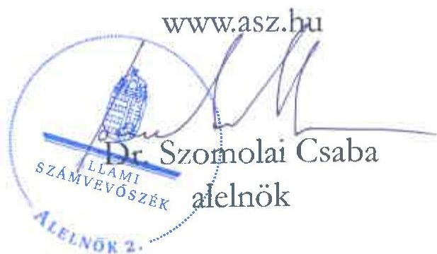

ÁLLAMI SZÁMVEVŐSZÉK

# JELENTÉS

A fenntartási kötelezettség kedvezményezettek
általi teljesítésének rapid ellenőrzése

A Drem Innovációs és Tanácsadó Kft.
fenntartási kötelezettsége teljesítésének ellenőrzése
a GINOP-2.2.1-15-2017-00054 számú projektnél

2025.

25115

www.asz.hu

---

ÁLLAMI SZÁMVEVŐSZÉK

# JELENTÉS

A fenntartási kötelezettség kedvezményezettek
általi teljesítésének rapid ellenőrzése

A Drem Innovációs és Tanácsadó Kft.
fenntartási kötelezettsége teljesítésének ellenőrzése
a GINOP-2.2.1-15-2017-00054 számú projektnél

2025.

25115

---

Jelentéseink az interneten a www.asz.hu címen olvashatók.

ELLENŐRZÉSI IGAZGATÓSÁG:
ELLENŐRZÉSI IGAZGATÓSÁG I.

ELLENŐRZÉSI IGAZGATÓ:
SINKÁNÉ DR. CSENDES ÁGNES igazgató

ELLENŐRZÉSVEZETŐ:
HUSZÁR ANNA ellenőrzésvezető

IKTATÓSZÁM: EL-4101-179/2025

TÉMASORSZÁM: -

ELLENŐRZÉS-AZONOSÍTÓ SZÁM: V1101

---

TARTALOMJEGYZÉK

- ÖSSZEFOGLALÁS ... 5
- AZ ELLENŐRZÉS EREDMÉNYEI ... 7
1. A fenntartási kötelezettség teljesítése ... 7
- I. FÜGGELÉK: ÉSZREVÉTELEK ... 11
- II. FÜGGELÉK: ELLENŐRZÉSI MEGKÖZELÍTÉS ... 12
- MELLÉKLETEK ... 17
I. sz. melléklet: Értelmező szótár ... 17
II. sz. melléklet: Az ellenőrzött és közreműködő szervezetek jegyzéke ... 19
- RÖVIDÍTÉSEK JEGYZÉKE ... 20

---

.

---

5

# ÖSSZEFOGLALÁS

A 2015 szeptemberében megjelent „K+F versenyképességi és kiválósági együttműködések” című (GINOP-2.2.1-15 kódszámú) pályázati felhívást vállalkozások és kutatási szervezetek számára, a kiemelkedő, több szakterület szereplőinek együttműködésében létrejövő, kutatás-fejlesztési és innovációs eredmények gazdasági hasznosítása érdekében hirdették meg. A rendelkezésre álló keretösszeg eredetileg 83,5 Mrd Ft volt, a keretösszeg emelését követően a konstrukcióban végül 93,5 Mrd Ft értékben kötött az IH¹ támogatási szerződést. Az igényelhető vissza nem térítendő támogatás összege 350 M Ft és 2 000 M Ft között volt.

A 696 M Ft támogatást nyert GINOP-2.2.1-15-2017-00054 számú, „Egyedi genomstruktúrával rendelkező ipari sejtvonal előállítása és alkalmazása” című projekt keretében a Kedvezményezett², a Drem Kft. konzorciumban a VA210 sejtvonalat állította elő.

A Kedvezményezett – a támogatás visszafizetésének terhe mellett – vállalta, hogy a projektmegvalósítást követően a Projekt³ megfelel az 1303/2013/EU Rendeletben⁴, a műveletek tartósságára vonatkozóan előírtaknak, az előírt fenntartási kötelezettséget teljesíti.

A támogatás összértéke, a Projekt egyedisége és a megvalósított projekteredmény hosszabb távon történő megtartása miatt az ÁSZ⁵ indokoltnak tartotta a Projekt fenntartásának és a támogatás hasznosulásának ellenőrzését. A konzorciumvezető Kedvezményezett projektfenntartási kötelezettségei teljesítésének ellenőrzésére az ÁSZ „A 2014-2020 programozási időszak kobéziós politikai operatív programok vonatkozásában a fenntartási kötelezettség teljesítésének ellenőrzési gyakorlata” című ellenőrzéséhez, mint alapellenőrzéshez kapcsolódóan került sor.

A konzorciumi partnerek⁶ az „Egyedi genomstruktúrával rendelkező ipari sejtvonal előállítása és alkalmazása” című Projekt eredeti célkitűzését teljesítették, előállították a VA210 ipari sejtvonalat; a tesztelések eredménye volt, hogy az ipari sejtkombinációk hosszú távon is működnek. A Kedvezményezett egyik vállalt kötelezettsége volt, hogy a projekt időtartama alatt, de legkésőbb a projekt fizikai befejezéséig iparjogvédelmi oltalmi bejelentést tesz.

A Kedvezményezettnek a Projekt tekintetében ötéves fenntartási kötelezettsége volt, a fenntartási időszak 2021. december 10-én kezdődött. A Kedvezményezett a vállalt iparjogvédelmi oltalmi bejelentést nem teljesítette a projekt fizikai befejezéséig, a Projekt lezárására ennek hiányában került sor. A Kedvezményezett – az ÁSZ helyszíni ellenőrzésének időszakában – két fenntartási jelentés határidőben történő benyújtási kötelezettségének tett eleget. A benyújtott első fenntartási jelentés hiányosságai miatt az IH hiánypótlásra, majd annak nem teljesítése okán – az első fenntartási jelentés elutasítását követően – korrekcióra szólította fel a Kedvezményezettet. A Kedvezményezett a korrekció során sem igazolta, hogy eleget tett az iparjogvédelmi oltalmi bejelentési kötelezettségének, és az új kutatók számának igazolására vonatkozó dokumentumokat sem nyújtotta be az IH felszólítására. A Kedvezményezett a támogatási szerződésben vállalt indikátorokat – a „Kutatóintézetekkel együttműködő vállalkozások száma” monitoring mutatón kívül – nem teljesítette.

A fentiek szerinti adatszolgáltatási kötelezettség nem teljesítése, és a Kedvezményezettel szemben folyamatban lévő végrehajtási és büntetőjogi intézkedések miatt az IH az első fenntartási jelentést elutasította és szabálytalansági eljárást folytatott le a Kedvezményezett-tel szemben. A lefolytatott szabálytalansági eljárás eredményeként az IH elállt a támogatási szerződéstől és elrendelte a kifizetett 685,8 M Ft támogatási összeg visszakövetelését. A Kedvezményezett jogorvoslati kérelmet terjesztett be, ugyanakkor a másodfokon eljáró szerv a szabálytalansági döntést helybenhagyta, így a döntés 2025. április 7-én jogerőssé vált.

---

Összefoglalás

Az ÁSZ helyszíni ellenőrzésének lezárásakor a Drem Kft.-vel szemben kényszertörlési eljárás volt folyamatban, támogatás-visszafizetési kötelezettségét 2025. szeptember 23-ig nem teljesítette. A Projekt keretében kifejlesztett VA210 sejtvonal technológiáját a Kedvezményezett nem tudta alkalmazni a Projekt lezárását követően, a COVID-19 vírusjárvány kapcsán megjelent új kutatási eredmények és azok általános alkalmazása miatt. Mindamellett, hogy a létrejött tudás, kutatási eredmény a későbbiekben felhasználható más területeken, kutatásokban, a támogatás – az ÁSZ értékelése szerint – nem hasznosult.

6

---

AZ ELLENŐRZÉS EREDMÉNYEI

A magyar vállalkozások a GINOP⁷ pályázati konstrukciók keretében jelentős mértékű támogatásban részesültek, amelyek célja volt hozzájárulni a gazdasági fejlődéshez, a társadalmi felzárkózáshoz és az infrastruktúra fejlesztéséhez. Az ÁSZ – Magyarország versenyképességének növelése érdekében – fontosnak tartja a kihelyezett uniós támogatások nemzetgazdasági szinten történő hasznosulását és értékteremtését a vállalatok beruházásain és elért teljesítményén keresztül. Az ÁSZ a támogatással kapcsolatos fenntartási kötelezettség teljesítését, valamint annak hasznosulását a GINOP-2.2.1-15-2017-00054 számú projekt tekintetében értékelte. A Projekt keretében a kedvezményezett Drem Kft. konzorciumban a VA210 sejtvonalat állította elő.

## 1. A fenntartási kötelezettség teljesítése

### Összegző megállapítás

Mivel a fenntartási időszakban adatszolgáltatási kötelezettségét a Kedvezményezett nem teljesítette, az IH elállt a támogatási szerződéstől és elrendelte a teljes támogatási összeg visszafizetését, amelynek a Kedvezményezett nem tett eleget. A támogatás nem hasznosult.

### A fenntartási jelentés benyújtási kötelezettség teljesítése

A Kedvezményezettnek a Támogatási rend.⁸-ben és a Felhívás⁹-ban foglaltak alapján ötéves fenntartási időszakra vonatkozó kötelezettsége volt, amely a projektmegvalósítás befejezését követően 2021. december 10-én indult és 2026. december 31-ig tart. Az 1. PFJ¹⁰ benyújtási határideje 2023. június 15-e volt, ezt követően a benyújtási határidők egy-egy évvel később voltak esedékesek a további három PFJ és a ZPFJ¹¹ esetében. A PFJ-k főbb adatait az 1. táblázat tartalmazza.

1. táblázat

|  A GINOP-2.2.1-15-2017-00054 SZÁMÚ PROJEKTHEZ KAPCSOLÓDÓ PFJ-K FŐBB ADATAI  |   |   |   |   |   |
| --- | --- | --- | --- | --- | --- |
|  JELENTÉS SORSZÁMA | JELENTÉS TÍPUSA | TÁRGYIDÓSZAK KEZDETE | TÁRGYIDÓSZAK VÉGE | BENYÚJTÁS HATÁRIDEJE | JELENTÉS STÁTUSZA  |
|  1. | PFJ | 2021.12.10. | 2022.12.31. | 2023.06.15. | 2023.06.15-én beérkezett, hiánypótlás elutasítva, két korrekció elutasítva  |
|  2. | PFJ | 2023.01.01. | 2023.12.31. | 2024.06.15. | 2024.06.14-én beérkezett  |
|  3. | PFJ | 2024.01.01. | 2024.12.31. | 2025.06.15. | –  |
|  4. | PFJ | 2025.01.01. | 2025.12.31. | 2026.06.15. | –  |
|  5. | ZPFJ | 2026.01.01. | 2026.12.31. | 2027.06.15. | –  |

Forrás: FAIR¹² adatok alapján ÁSZ saját szerkesztés

A Kedvezményezett – a Támogatási rend.-ben előírtakat betartva – az 1. és a 2. PFJ-t határidőben benyújtotta. Az 1. PFJ hiányos volt, így az IH a Támogatási rend. 1. melléklet 297.1. pontja adta lehetőséggel élve a felmerült hiányosságok pótlására szólította fel a Kedvezményezettet 2024. január 30-án. A Kedvezményezett a hiánypótló levélben rögzített 15 napos határidőn belül a hiánypótlást nem teljesítette, ezért az IH a Támogatási rend. 1. melléklet 299.4. b) pontjában foglaltak alapján elutasította az

---

Az ellenőrzés eredményei

1. PFJ-t és 2024. március 6-án korrekcióra szólította fel a Kedvezményezettet. A Kedvezményezett részéről a 2024. március 13-án átvett korrekciós levélben rögzített 20 napos határidő 2024. április 2-án járt le. A Kedvezményezett a Támogatási rend. 1. melléklet 302.1. pontjában foglaltak ellenére a korrekciós levélben jelzett hiányosságokat nem pótolta, ezért az IH a Támogatási rend. 1. melléklet 299.4. b) pontjában foglaltak alapján ismételten elutasította az 1. PFJ-t és a Kedvezményezettet – a kézhezvételt követő 20 napos határidő kitűzésével – újabb korrekcióra szólította fel 2024. június 26-án.

A Kedvezményezett által határidőben benyújtott 2. PFJ IH általi ellenőrzésére az ÁSZ helyszíni ellenőrzésének lezárásáig nem került sor.

Az IH 2022. február 10-én rendkívüli fenntartási – 4. számú helyszíni – ellenőrzést végzett. A helyszíni ellenőrzési jegyzőkönyvben rögzítették, hogy a személyi jellegű költségek tekintetében a 15%-os bérnövekmény vizsgálatát az alátámasztó dokumentumok alapján a későbbiekben el kell végezni. A Kedvezményezettől bekért alátámasztó dokumentumok ellenőrzését követően az IH megállapította, hogy a Kedvezményezett esetében a személyi jellegű kiadások a Pénzügyi tájékoztató¹³ 5.2.2.2 pontjában foglaltak ellenére évente 15%-ot meghaladó mértékben emelkedtek, és hogy a Kedvezményezett vezetői bért 75%-nál magasabb mértékben számolt el. Szabálytalansági eljárás keretében vizsgálták az ügyet, amelynek eredményeként az IH visszakövetelte a szabálytalansággal érintett összeget. A Kedvezményezett ennek visszafizetését az ÁSZ helyszíni ellenőrzésének lezárásáig nem teljesítette.

## A fenntartási kötelezettség, indikátorok teljesítése

A Kedvezményezett által vállalt kötelezettségeket, így a Projekt indikátorait és egyéb kötelezettségeket a támogatási szerződés 4. sz. melléklete rögzítette, amelyeket a Kedvezményezett – az 1. és 2. PFJ-ben rögzítettek alapján – az alábbiak szerint teljesített:

1. A Kedvezményezett az üzleti hasznosíthatóság keretében vállaltakat, hogy a K+F+I¹⁴ tevékenység eredményéből származó árbevétele a Projekt pénzügyi befejezési évét követően a fenntartási időszak utolsó évéig bármely 2 egymást követő üzleti évben összesen eléri a teljes megítélt támogatási összeg legalább 30%-át, azaz 134,2 M Ft-ot, nem teljesítette. A Kedvezményezett az 1. PFJ-ben 0 Ft értéken, a 2. PFJ-ben nem rögzített K+F+I tevékenység eredményéből származó árbevétel adatot.
2. A K+F+I ráfordítások szintjének megőrzése mutató nem teljesült, mivel a 2016. december 31-i 166,2 M Ft összegű bázisérték alatt, 1,3 M Ft összegben rögzített a Kedvezményezett K+F+I ráfordítás értéket az 1. PFJ-ben, míg a 2. PFJ-ben nem rögzített K+F+I ráfordítást.
3. A Kedvezményezett a vállalt iparjogvédelmi oltalmi bejelentést nem teljesítette a projekt fizikai befejezéséig, a Projekt lezárására ennek hiányában került sor. Az IH a Projekt záró szakmai beszámolójának hiánypótlásában és az 1. PFJ hiánypótlása keretében is felszólította a Kedvezményezettet az iparjogvédelmi oltalom bejelentésének igazolására az SZTNH¹⁵ által kiállított lajstromkivonat benyújtásával, amelynek a Kedvezményezett nem tett eleget.
4. A Kedvezményezett a „Kutatóintézetekkel együttműködő vállalkozások száma” monitoring mutató teljesítette.
5. A Kedvezményezett az 1. PFJ-ben rögzítette, hogy 2 fő új kutató foglalkoztatását a záró szakmai beszámolóig, 2020. december 29-ig teljesítette. Az IH – ennek alátámasztására – az 1. PFJ hiánypótlásában bekérte az új kutatók számának igazolására vonatkozó nyilatkozatot, a munkavállalók végzettségét igazoló dokumentumait, a kinevezés/munkaszerződések másolatát, valamint a foglalkoztatottak munkaköri leírását. A Kedvezményezett a korrekciós kötelezettsége során sem tett eleget a kért dokumentumok benyújtásának.

---

Az ellenőrzés eredményei

6. A Kedvezményezett a Támogatási rend.-ben és a támogatási szerződésben előírt projektszintű elkülönített számviteli nyilvántartást vezette.

Tekintettel arra, hogy az 1. PFJ nem került elfogadásra az IH részéről, az IH a Támogatási rend. 1. melléklet 304.3. pontja szerinti szabálytalansági eljárást folytatott le. Az IH részéről a szabálytalansági gyanú bejelentésére 2024. április 15-én került sor. A gyanúbejelentés alapján, valamint arra való hivatkozással, hogy a Kedvezményezettel szemben 5 végrehajtás és 1 büntetőjogi intézkedés van folyamatban, – amely esetekben a Támogatási rend. 176. § (3) bekezdés f) pontja szerint az IH elállhat a támogatási szerződéstől, – az IH szabálytalansági eljárás megindítását rendelte el 2024. április 18-án. A lefolytatott eljárás szabálytalanságot állapított meg, amelyről az IH 2024. július 18-án hozta meg a döntést. A döntés értelmében az IH a szabálytalanság jogkövetkezményeként elrendelte a támogatási szerződéstől való elállást és a kifizetett 685,8 M Ft támogatási összeg visszakövetelését. A Támogatási rend. 166. § (1) bekezdésében foglaltak alapján a döntés ellen a Kedvezményezett jogorvoslati kérelmet terjesztett elő. A szabálytalansági eljárásról hozott IH döntést a másodfokon eljáró szerv a Belső Ellenőrzési és Integritási Hatóság helybenhagyta, ezáltal a döntés 2025. április 7-én jogerőssé vált.

A FAIR adatok alapján az ÁSZ ellenőrzése megállapította, hogy a Kedvezményezett – az ÁSZ helyszíni ellenőrzésének lezárását követően – 2025. szeptember 23-ig nem teljesítette a vele szemben fennálló követelés visszafizetését.

## A támogatás hasznosulása

A Kedvezményezett a Projekt keretében egyedi genomstruktúrával előállított ipari sejtvonal előállítását és alkalmazását valósította meg, amelyhez kapcsolódóan anyagköltséget, személyi jellegű ráfordítást, szakmai tevékenységekhez kapcsolódó szolgáltatások költségét és egyéb költséget számolt el. Eszközbeszerzésre nem került sor, a Projekt megvalósításához szükséges eszközökkel a Kedvezményezett rendelkezett.

A Kedvezményezett-tel folytatott ÁSZ helyszíni interjún elhangzottak alapján a Projekt keretében kifejlesztett VA210 sejtvonal technológiáját nem tudta alkalmazni a Projekt lezárását követően. A Kedvezményezett dokumentumokkal nem tudta igazolni az előállított ipari sejtvonal értékesítéséből származott árbevételét. A Projekt megvalósításában 30-40 fő vett részt. A létrejött eredményeket (pl. stresszfehérjék és fehérjeszintézissel kapcsolatos riboszómális fehérjét kódoló gének detektálása) más kutatásokban, tumor diagnosztikában tervezték felhasználni, sejtlabort is kialakítottak.

A konzorcium a kutatási eredményeket megjelentette nemzetközi tudományos lapban, így a Projekt keretében elért eredmények más kutatók által is megismerhetővé váltak a későbbi kutatásaik során.

---

Az ellenőrzés eredményei

A Kedvezményezett létszám, árbevétel, adózott eredmény és mérlegfőösszeg adatait a 2. táblázat mutatja be a 2020-2024. évek tekintetében.

2. táblázat

|  A KEDVEZMÉNYEZETT 2020-2024. ÉVI LÉTSZÁM, ÁRBEVÉTEL, ADÓZOTT EREDMÉNY ÉS MÉRLEGFŐÖSSZEG ADATAI  |   |   |   |   |   |
| --- | --- | --- | --- | --- | --- |
|  ADATOK MEGNEVEZÉSE | 2020. ÉVBEN | 2021. ÉVBEN | 2022. ÉVBEN | 2023. ÉVBEN | 2024. ÉVBEN  |
|  Átlagos statisztikai létszám (fő) | 20 | 22 | 20 | nincs adat | nincs adat  |
|  Értékesítés nettó árbevétele (M Ft) | 1 928,6 | 1 261,9 | 224,5 | nincs adat | nincs adat  |
|  Adózott eredmény (M Ft) | 629,3 | 220,4 | 652,9 | nincs adat | nincs adat  |
|  Mérlegfőösszeg (M Ft) | 5 264,4 | 4 814,2 | 4 226, | nincs adat | nincs adat  |

Forrás: A Kedvezményezett éves beszámoló adatai alapján ÁSZ saját szerkesztés

Mivel a Kedvezményezett adatszolgáltatási kötelezettségét nem teljesítette, és végrehajtások, valamint büntetőjogi intézkedéseket rendeltek el vele szemben, az IH a támogatási szerződéstől való elállásról és a kapott támogatás visszafizetéséről döntött. A Kedvezményezett az ÁSZ helyszíni ellenőrzésének lezárását követően, 2025. szeptember 23-ig nem teljesítette támogatás-visszafizetési kötelezettségét. Az ÁSZ helyszíni ellenőrzésének lezárásakor a Kedvezményezett-tel szemben kényszertörlési eljárás volt folyamatban. A Projekt keretében kifejlesztett VA210 sejtvonal technológiáját a Kedvezményezett nem tudta alkalmazni a Projekt lezárását követően, a COVID-19 vírusjárvány kapcsán megjelent új kutatási eredmények megjelenése és azok általános alkalmazása miatt. Mindamellett, hogy a létrejött tudás, kutatási eredmény a későbbiekben felhasználható más területeken, kutatásokban, a támogatás – az ÁSZ értékelése szerint – nem hasznosult.

10

---

11

# I. FÜGGELÉK: ÉSZREVÉTELEK

A jelentéstervezetet az ÁSZ 15 napos észrevételezésre megküldte az ellenőrzött szervezet vezetőjének az ÁSZ tv. 29. §* (1) bekezdése előírásának megfelelően.

A jelentéstervezet megállapításaira az ellenőrzött szervezet nem tett észrevételt.

* 29. § (1) Az Állami Számvevőszék az ellenőrzési megállapításait megküldi az ellenőrzött szervezet vezetőjének vagy az általa megbízott személynek, és annak, akinek személyes felelősségét állapította meg.
(2) Az ellenőrzött szervezet vezetője és a felelősként megjelölt személy az ellenőrzés megállapításaira tizenöt napon belül írásban észrevételt tehet.
(3) Az Állami Számvevőszék az észrevételre a beérkezésétől számított harminc napon belül írásban válaszol. A figyelembe nem vett észrevételeket köteles a jelentésben feltüntetni, és megindokolni, hogy azokat miért nem fogadta el.

---

12

# II. FÜGGELÉK: ELLENŐRZÉSI MEGKÖZELÍTÉS

## AZ ELLENŐRZÉS JOGALAPJA

Az ellenőrzés jogszabályi alapját az ÁSZ tv.¹⁶ 5. § (3) bekezdés képezte.

## AZ ELLENŐRZÉS CÉLJA

A fenntartási kötelezettség teljesítésének és a támogatás hasznosulásának értékelése a fenntartási szakaszba került uniós projekt kedvezményezettjénél.

## AZ ELLENŐRZÉS TÍPUSA

Kombinált ellenőrzés

## AZ ELLENŐRZÉS TÁRGYA

Az ellenőrzés tárgya volt az ellenőrzésre kiválasztott GINOP-2.2.1-15-2017-00054 számú uniós projekt fenntartási időszakára vonatkozóan előírt kötelezettségek Drem Innovációs és Tanácsadó Kft. mint kedvezményezett által történt teljesítése és a támogatás hasznosulása. A fenntartási kötelezettség ellenőrzése a kedvezményezett tevékenységéhez és működéséhez kapcsolódó kötelezettségek, a meghatározott indikátorok és a beszámolási kötelezettség teljesítésére irányult.

Az ellenőrzés tárgya volt továbbá a kedvezményezett által benyújtott fenntartási jelentésekben rögzítettek valóságtartalma és megalapozottsága, valamint ezek összhangja az ÁSZ helyszíni ellenőrzése során tapasztaltakkal.

Az ellenőrzés kiterjedt minden olyan körülményre és adatra, amely az ÁSZ jogszabályban meghatározott feladatainak teljesítéséhez, valamint a program végrehajtása folyamán felmerült újabb összefüggések feltárásához szükséges.

## AZ ELLENŐRZÉS HATÓKÖRE ÉS TERÜLETE

Az uniós jogszabályok az uniós támogatással megvalósuló projektekkel szemben elvárásként rögzítik a „műveletek tartósságának” követelményét. A kedvezményezettek infrastrukturális vagy termelő beruházás esetén – a projektmegvalósítás befejezésétől számított 5 évig, kis- és közepes vállalkozások esetén 3 évig, a támogatás visszafizetésének terhe mellett – vállalták, hogy a projekt termelő tevékenysége nem szűnik meg, hogy nem következik be olyan tulajdonosváltás, amelynek eredményeként jogosulatlan előny szerezhető, illetve, hogy nem következik be olyan lényeges változás, amely a projekt eredeti célkitűzéseit veszélyezteti. Abban az esetben, ha a felsoroltak valamelyike bekövetkezik, a támogatást – figyelemmel a vonatkozó jogszabályokra – vissza kell fizetni az Európai Bizottságnak.

---

II. Függelék: Ellenőrzési megközelítés

Ha az IH a projektre nézve fenntartási kötelezettséget állapított meg, és indikátorokat határozott meg a támogatási szerződésben, a kedvezményezettnek évente be kellett számolnia az indikátorok teljesüléséről. Ha ezen időszakra indikátorokat nem határozott meg az IH és a támogatási szerződésben sem írta elő az évenkénti teljesítést, a kedvezményezettnek egy alkalommal záró projektfenntartási jelentést kell(ett) benyújtania.

Az ellenőrzés a XIX. Uniós fejlesztések fejezet 3/1 Kohéziós politikai operatív programok 2014-2020 operatív programjai közül a – kis- és középvállalkozások versenyképességének javítására irányuló – GINOP 1. prioritásából és a – kutatás, technológiai fejlesztés és innováció című – GINOP 2. prioritásából támogatást kapott projektek kedvezményezettjeire terjedt ki oly módon, hogy az ÁSZ – „A 2014-2020 programozási időszak kohéziós politikai operatív programok vonatkozásában a fenntartási kötelezettség teljesítésének ellenőrzési gyakorlata” című ellenőrzéséhez, mint alapellenőrzéshez kapcsolódóan – a GINOP 1-2. prioritás pályázati kiírásainak nyertes pályázóból, kockázat alapú mintavételi eljárással, rapid ellenőrzésre választott ki összesen 16 projektet, amelyből ezen jelentésben a GINOP-2.2.1-15-2017-00054 számú projekt tekintetében értékelte a fenntartási kötelezettség teljesítését.

A GINOP-2.2.1-15-2017-00054 számú projekt tekintetében az ellenőrzés kiterjedt a célrendszer, a jogszabályban – a működés és tevékenység tekintetében – előírt fenntartási kötelezettség teljesülésére, a fenntartási jelentésben bemutatott eredmények valóságtartalmára, megalapozottságára, valamint a támogatási szerződésben vállalt, a fenntartási időszakra vonatkozó kötelezettségek teljesítésének, és a GINOP keretében nyújtott támogatás hasznosulásának értékelésére.

## A GINOP-2.2.1-15 számú felhívás bemutatása

A GINOP-2.2.1-15 kódszámú „K+F versenyképességi és kiválósági együttműködések” című pályázati felhívást a vállalkozások és kutatási szervezetek számára, a kiemelkedő, több szakterület szereplőinek együttműködésében létrejövő, kutatás-fejlesztési és innovációs eredmények gazdasági hasznosítása érdekében hirdették meg. A támogatási kérelmek benyújtására 2015. november 30-tól 2017. május 31-ig volt lehetőség.

A Felhívás célja volt a hazai vállalkozások, kutatóhelyek és felsőoktatási intézmények között hosszú távon fenntartható, stratégiai jelentőségű együttműködések ösztönzése üzletileg is hasznosítható tudományos eredmények, iparjogvédelmi oltalmak létrejötte céljából. A Felhívás a nagy jelentőségű és összetett feladatok megoldását, több szakterületet érintő kutatás-fejlesztési és innovációs eredmények elérését támogatta a szakterület legkiválóbb szereplőinek együttműködésében. A támogatás révén a kutatási eredményekkel – a gazdaságban és a társadalmi élet egyéb területein hasznosulva – létező, fontos társadalmi jelentőségű problémák megoldásához kívántak hozzájárulni.

A Felhívás forrását az Európai Regionális Fejlesztési Alap és Magyarország költségvetése társfinanszírozásban biztosította. A Felhívás meghirdetésekor a támogatásra rendelkezésre álló tervezett keretösszeg 83,5 Mrd Ft volt, pályázni 350 M Ft és 2 000 M Ft közötti támogatási összegre lehetett. A támogatott projektek várható számát 41-238 között tervezték.

A Felhívás keretében a támogatási kérelem benyújtására kizárólag konzorciumi formában volt lehetőség. Támogatásban részesülhettek mikro-, kis-, és középvállalkozások, illetve nagyvállalatok, állami többségi tulajdonú, valamint nem állami többségi tulajdonú non-profit gazdasági társaságok, illetve költségvetési szervek, költségvetési szervek jogi személyiséggel rendelkező intézményei, amennyiben azok kutatóműhelyek, vagy felsőoktatási intézmények voltak. A kutatás-fejlesztési projekthez nyújtott támogatás keretében támogatható tevékenységek (támogatási kategóriák) között szerepelt az alapkutatás, az ipari kutatás és a kísérleti fejlesztés.

---

II. Függelék: Ellenőrzési megközelítés

A konzorciumvezetőnek a projektmegvalósítás és a fenntartás időszakában a konzorciumi tagok tekintetében kumulált adatokat kellett szolgáltatnia a projekt megvalósulásáról.

A projekt indikátoraként rögzítették a kutatóintézetekkel együttműködő vállalkozások számát és az új kutatók számát nők és férfiak szerinti bontásban. Az indikátorokon felül a Felhívás olyan specifikus követelményeket is előírt kötelező vállalásként, mint a támogatott K+F+I tevékenység eredményéből származó árbevétel nagyságát, a K+F ráfordítás összegét, valamint a projekt témájában iparjogvédelmi oltalom vagy előállított tesztelt prototípus, vagy piacra vihető termék, szolgáltatás, technológia, vagy tudományos eredmény számát. A három vállalás közül legalább kettőnek teljesülnie kellett, amely teljesülést az IH-nak konzorciumi szinten kellett ellenőriznie. A támogatást igénylő és a konzorciumi tag(ok) a megvalósítás befejezésétől számított 5 évig, azaz a fenntartási időszak végéig a támogatott fejlesztéssel létrehozott kapacitásokat, információs technológiai fejlesztéseket köteles volt fenntartani és üzemeltetni.

A támogatás formája vissza nem térítendő támogatás volt, a támogatási kategóriától és a vállalkozás méretétől függően a támogatási intenzitás 25%-100% volt. A Felhívás keretében az előleg mértéke az utófinanszírozású tevékenységekre a megítélt támogatás összegének legfeljebb 75%-a, szállítói finanszírozás esetén 50%-a volt. A projekt megvalósítására a kedvezményezetteknek a támogatási szerződés hatálybalépését követően legfeljebb 48 hónap állt rendelkezésre. A projekt megvalósítása során legalább egy és legfeljebb négy mérőföldkövet kellett tervezni úgy, hogy a mérőföldkövek között legalább 12 hónapnak kellett lennie.

A kedvezményezett a Támogatási rend.-ben, valamint a Felhívásban rögzítettek alapján mentesült a biztosíték nyújtási kötelezettség alól.

A Felhívásra beérkező támogatási kérelmek standard kiválasztási eljárásrend alapján, szakaszos elbírálással kerültek elbírálásra. A Felhívást 15 alkalommal módosították, amelyek közül a legjelentősebb a benyújtási határidő és az elbírálási határidő módosítása volt. A Felhívásra 109 támogatási kérelem érkezett be, összesen 116,6 Mrd Ft összegű támogatásra. Az IH adatszolgáltatása alapján a benyújtott támogatási kérelmek közül 92-öt támogattak, összesen 93,5 Mrd Ft támogatási összegben.

## A Drem Kft. és a GINOP-2.2.1-15-2017-00054 számú projekt bemutatása

A Drem Kft.-t 2005 novemberében alapították, székhelye alapítástól kezdődően végig Budapesten volt. A támogatási kérelem benyújtásakor és 2024. december 31-én a társaság főtevékenysége egyéb természettudományi, műszaki kutatás, fejlesztés volt. A Kedvezményezett 2024. december 31-én működő kisvállalkozás volt 1 fő alkalmazotti létszámmal. Gazdálkodása a helyszíni ellenőrzés lezárásának időpontjában nem volt megítélhető tekintettel arra, hogy a 2024. évi számviteli beszámolója nem volt elérhető nyilvánosan.

A konzorciumi formában megvalósuló GINOP-2.2.1-15-2017-00054 számú projekt címe „Egyedi genomstruktúrával rendelkező ipari sejtvonal előállítása és alkalmazása” volt. A Projekt keretében a konzorcium biotechnológiai szakirányú fejlesztéseit alapozta meg, új termék, új ipari kapcsolatok és alkalmazási lehetőségek vonatkozásában, melyek a tagok hosszú távú fejlődését voltak hivatottak elősegíteni. A Projekt központi eleme egy eddig még nem ismert tulajdonságú V2A10 sejtvonal volt. A kutatócsoportok a Projektben egyfelől kialakítandó sejtvonal genetikai módosításában dolgoztak, másfelől a haploid, egyedi genomszerkezettel rendelkező sejtvonal genetikai szabályozásának jobb megértését tűzték ki célul, amely a Projekt céljain túlmutatva, új alapismereteket fog eredményezni a génszabályozás, genetikai stabilitás és a tumor sejtek kialakulása, változékonysága terén. A Projekt ipari hasznosításának alapköve, hogy a V2A10 sejtvonal ipari méretekben jelentős mennyiségű célfehérjét tudjon termelni, a másik, hogy új szérumentes tápoldatot hozzon létre.

14

---

II. Függelék: Ellenőrzési megközelítés

A támogatási kérelmet a konzorcium 2017. április 24-én nyújtotta be, a támogatási szerződés 2017. augusztus 30-án lépett hatályba. A támogatási szerződés mellékletét képező együttműködési megállapodás rögzítette a konzorciumi partnerek egymás közötti, valamint az IH és a konzorciumi partnerek közötti viszonyokat. A konzorciumvezető Drem Kft. mellett két konzorciumi tag vett részt a Projekt megvalósításában. A Projekt fő megvalósítási helyszíne Szeged, Alsó kikötő sor volt. A támogatási szerződést összesen 10 alkalommal módosították, jellemzően a Projekt fizikai befejezésének határidejét hosszabbították meg, módosították a Projekt megvalósítási helyszínét, illetve költség-átcsoportosítást végeztek.

A Projekt megítelt összköltsége 899,5 M Ft volt, 77,38%-os támogatási intenzitás mellett a támogatástartalom 696 M Ft-ot tett ki. A Projekt megvalósítása 2017. június 1-jén kezdődött meg, a Projekt fizikai befejezésének határidejeként 2020. december 29-et rögzítettek. Az első mérföldkő elérésének tervezett dátuma 2019. szeptember 30-a, a második mérföldkő elérésének tervezett dátuma azonos volt a Projekt fizikai befejezésének időpontjával.

A konzorciumi partnerek 2019. szeptember végére a VA210 genomszekvenciájának bioinformatikailag jellemzett DNS szekvencia adatbázisa, a VA210 sejtvonal bioinformatikailag jellemzett génaktivitási adatbázisa, a VA210-ből származtatott HGPRT érzékeny, hibridképzésre alkalmas sejtvonal előállítása, a VA210 fertőző ágensek listája és dokumentációja, mesterséges kromoszóma-szekvencia listája, mint eredmény megvalósítását tervezték. 2020. végére pedig tervbe vették a szérumentes szintetikus tápoldatot és abban növő, úszó VA210 alvonal kifejlesztését, fehérje expressziós szekvenciák listáját, expressziós klónok előállítását, különböző sejtekkel képzett hibridejtek genetikai jellemzését, mesterséges kromoszómát tartalmazó VA210 sejtvonal, optimalizált cukormintázatú VA210 sejtvonal klón kialakítását, VA210 stabil fehérjetermelés protokolljának kidolgozását.

A konzorcium a Felhívásban előírt kötelező vállalások keretében vállalta, hogy

- a K+F+I tevékenység eredményéből származó árbevétel a Projekt pénzügyi befejezési évét követően a fenntartási időszak utolsó évéig bármely 2 egymást követő üzleti évben összesen eléri a teljes megítélt támogatási összeg legalább 30%-át;
- a Projekt pénzügyi befejezési évét közvetlenül követő üzleti évben a K+F+I ráfordítások összege nem csökken a bázisérték alá (Bázisértéknek minősült a támogatási kérelem benyújtását megelőző utolsó lezárt üzleti év éves beszámolójában szereplő K+F+I ráfordításainak összege.);
- legkésőbb a Projekt fizikai befejezéséig iparjogvédelmi oltalmi bejelentést tesz, amelyet a fenntartási időszak végéig fenntart;
- együttműködik kutatóintézettel 2 vállalkozás tekintetében;
- 2 fő új kutatót foglalkoztat.

A Projekt keretében előállították a VA210 ipari sejtvonalat, a tesztelések eredményeként bebizonyosodott, hogy az ipari sejtkombinációk hosszú távon is működnek. A Projekt megvalósítása során főként anyag-, személyjellegű és egyéb ráfordításokat számoltak el. A záró szakmai beszámolót 2021. március 31-én, határidőben benyújtották, amelyet az IH 2021. december 7-én hagyott jóvá. Az ötéves fenntartási időszak 2021. december 10-én kezdődött.

## AZ ELLENŐRZŐTT IDŐSZAK

2016. január 1-től 2025. április 30-ig, a helyszíni ellenőrzés lezárásának időpontjáig tartó időszak.

---

II. Függelék: Ellenőrzési megközelítés

# AZ ELLENŐRZÉSI KRITÉRIUMOK

|  FOKUSZTERÜLET | ELLENŐRZÉSI KRITÉRIUMOK  |
| --- | --- |
|  1. A fenntartási kötelezettség teljesítése  |   |
|  A fenntartási jelentés benyújtási kötelezettség teljesítése | Támogatási rend. 178. § (1) bekezdés, 180. § (1) bekezdés, 1. melléklet 293.1.-2., 297.1, 299.4. b), 302.1. pontok; Felhívás 3.6 pont; Pénzügyi tájékoztató 5.2.2.2 pont  |
|  A fenntartási kötelezettség, indikátorok teljesítése | Támogatási rend. 110/A. §, 159. § (1) bekezdés, 166. § (1) bekezdés, 176. § (3) bekezdés f) pont, 1. melléklet 304.3. pont; támogatási szerződés 4. sz. melléklet;  |
|  A támogatás hasznosulása | Az ÁSZ meghatározása alapján: - A támogatás hasznosult, ha a vállalkozás (a projekt) működött az ÁSZ helyszíni ellenőrzése időpontjában, fenntartási kötelezettségét a kedvezményezett teljesítette / jellemzően teljesítette, és a támogatás eredményeként a kedvezményezett vállalkozás árbevétel vagy adózott eredmény adatai növekedtek a támogatás előtti időszakhoz képest. - A támogatás korlátozottan hasznosult, ha a projekteredmény „fellelhető volt” az ÁSZ helyszíni ellenőrzése időpontjában, fenntartási kötelezettségét részben / minimálisan teljesítette a kedvezményezett, vagy a támogatás eredményeként hozzáadott új értéket teremtett, az társadalmilag hasznosult stb. - A támogatás nem hasznosult, ha fenntartási kötelezettségét a kedvezményezett egyáltalán nem teljesítette és/vagy a vállalkozás (a projekt) már nem működött az ÁSZ helyszíni ellenőrzése időpontjában.  |

# AZ ELLENŐRZÉS MÓDSZERE ÉS AZ ELLENŐRZÉSI BIZONYÍTÉKOK KÖRE

Az ÁSZ az ellenőrzést a nemzetközi standardokat irányadónak tekintve az ellenőrzési program szempontjai, az ellenőrzött időszakban hatályos jogszabályok, az ellenőrzés-szakmai szabályok és módszertanok figyelembevételével végezte.

Az ellenőrzési kérdések megválaszolásához szükséges bizonyítékok megszerzése az ellenőrzött szervezet és az ellenőrzésben közreműködő szervezet által rendelkezésre bocsátott dokumentumokra és adatokra alapozva, továbbá megfigyelés, szemle (szemrevételezés), kérdésfeltevés (információkérés), interjú, mintavételezés, valamint elemző eljárás útján történt.

Az ellenőrzés bizonyítékként felhasználható adatforrásai közé tartoztak egyrészt az ellenőrzéshez kért dokumentumok, adatforrások, a nyilvánosan hozzáférhető adatok, dokumentumok, másrészt adatforrás volt még minden, az ellenőrzés folyamán feltárt, az ellenőrzés szempontjából információt tartalmazó.

Az ellenőrzés végrehajtásához a Projekt kiválasztása kockázat alapú mintavételi eljárással történt. Az ÁSZ a számvevőszéki jelentéstervezet elfogadásáig rendelkezésre álló, nyilvánosan elérhető adatokat figyelembe vette.

---

MELLÉKLETEK

I. SZ. MELLÉKLET: ÉRTELMEZŐ SZÓTÁR

fenntartás

A kedvezményezett a projektmegvalósítás befejezésétől számított 5 évig, állami támogatás formájában nyújtott támogatás esetén az állami támogatókra vonatkozó szabályok alapján alkalmazandó időtartamig, kis- és közepes vállalkozások esetén 3 évig a támogatás visszafizetésének terhe mellett vállalja, hogy a projekt megfelel az 1303/2013/EU európai parlamenti és tanácsi rendelet 71. cikk (1) bekezdésében foglaltaknak. (Forrás: Támogatási rend. 178. § (1) bekezdés, 2016. május 14-től 2024. július 31-ig hatályos)

Az irányító hatóság döntése alapján a fenntartási időszak kezdődhet a projektmegvalósítás befejezésétől vagy a projekt fizikai befejezésétől (ÁSZF¹⁷ 10.7. pontja alapján, hatályos 2016. június 14-től)

A fenntartási időszak meghatározása során az IH speciális projektév szerinti jelentéstételt alkalmazott, mivel a jelentések tárgyidőszaka speciális projektévhez (az üzleti évről készített közzétett beszámolóhoz) igazodott és a fenntartási jelentésben benyújtandó vállalási adatok csak az így meghatározott időszak elteltével álltak rendelkezésre. (Forrás: Támogatási rend. 1. melléklet 285.1-286.4 pontja alapján ÁSZ megfogalmazás)

indikátor

Uniós jogszabályokban és a programban nevesített, valamint az európai uniós források felhasználásáért felelős miniszter – a Vidékfejlesztési Program esetén az agrárpolitikáért felelős miniszter – által meghatározott, eredményt vagy teljesülést mérő mutató. (Forrás: Támogatási rend. 3. § (1) bekezdés 12. pont, 2022. július 21-től 2024. július 31-ig hatályos)

kedvezményezett

A támogatásban részesített támogatást igénylő (Forrás: Támogatási rend. 3. § (1) bekezdés 14. pont, 2014. november 6-tól hatályos)

műveletek tartóssága

Az ESB-alapokból¹⁸ valamely infrastrukturális vagy termelő beruházást magában foglaló műveletre fordított támogatás akkor fizetendő vissza, ha a kedvezményezettnek történő utolsó kifizetéstől számított 5 évben belül, illetve adott esetben, az állami támogatásokról szóló szabályozás szerinti időtartamon belül, a következők valamelyike történik:

a) a termelő tevékenység megszűnése vagy a programterületen kívülre való áthelyezése;

b) az infrastruktúra valamely elemében tulajdonosváltás következik be, amelynek eredményeként egy cég vagy állami szervezet jogosulatlan előnyhöz jut;

c) a természetében, célkitűzéseiben vagy végrehajtási feltételeiben olyan lényeges változás következik be, amely az eredeti célkitűzéseket veszélyezteti.

A műveletre jogosulatlanul kifizetett összegeket a tagállamnak vissza kell téríthetni, azon időszakkal arányosan, amelynek tekintetében nem teljesültek a követelmények. (Forrás: 1303/2013/EU rendelet 71. cikk (1) bekezdése)

projekt fizikai befejezése

Az az állapot, amikor a projekt keretében támogatott tevékenységeket a felhívásban és a támogatási szerződésben meghatározottak szerint elvégezték. (Forrás: Támogatási rend. 3. § (1) bekezdés 40. pont, 2015. június 13-tól hatályos)

17

---

Mellékletek

projekt lezárása

Egy projekt akkor tekinthető lezártnak, ha a kedvezményezett a támogatási szerződésben a projektmegvalósítás befejezését követő időszakra nézve további kötelezettséget nem vállalt, és a felhívásban meghatározott feltételek teljesültek. Ha a támogatási szerződés a támogatott tevékenység befejezését követő időszakra nézve további kötelezettséget előírt, a projekt akkor tekinthető lezártnak, ha valamennyi vállalt kötelezettség teljesült és a kedvezményezett a kötelezettségek megvalósulásának eredményeiről szóló záró projekt fenntartási jelentést benyújtotta, és azt az irányító hatóság, Vidékfejlesztési Program esetén a kifizető ügynökség jóváhagyta, valamint a záró jegyzőkönyv elkészült. (Forrás: Támogatási rend. 3. § (1) bekezdés 39. pont, 2016. május 14-től 2024. július 31-ig hatályos)

projektmegvalósítás befejezése

Az 1303/2013/EU rendelet 2. cikk 14. pontjára tekintettel egy projekt megvalósítása akkor tekinthető befejezettnek, ha a projekt fizikailag és pénzügyileg is befejezett, valamint a kedvezményezettnek valamennyi támogatott tevékenysége befejezését igazoló és alátámasztó kifizetési igénylését az irányító hatóság jóváhagyta és a támogatás folyósítása megtörtént. (Forrás: Támogatási rend. 3. § (1) bekezdés 41. pont, 2015. június 13-tól 2023. május 24-ig hatályos)

projekt pénzügyi befejezése

Ha a projekt fizikai befejezése megtörtént, valamint a projektmegvalósítás során keletkezett elszámoló bizonylatok – szállítói kifizetés esetén az előírt önrész szállítók részére történő – kiegyenlítése megtörtént. A projekt pénzügyi befejezésének dátuma a projekt megvalósítási ideje alatt felmerült, a kedvezményezett által megfelelően elszámolt költségek közül a legkésőbbi kiegyenlítés dátuma. (Forrás: Támogatási rend. 3. § (1) bekezdés 42. pontja alapján, 2014. november 6-tól hatályos)

standard kiválasztási eljárás

Standard kiválasztási eljárásrend esetén szakaszos elbírálást kell alkalmazni, amely során legkésőbb a felhívásban rögzített szakasz zárását vagy beadási határnapját követően kell a támogatási kérelmeket jogosultsági és tartalmi értékelésre bocsátani, és az egy szakaszban beérkezett kérelmek támogathatóságáról a felhívásban előírt tartalmi értékelési szempontoknak való megfelelés szerinti sorrendiségük alapján kell dönteni. (Támogatási rend. 61. § (4) bekezdés alapján, 2016. május 14-től hatályos)

18

---

Mellékletek

## II. SZ. MELLÉKLET: AZ ELLENŐRZŐTT ÉS KÖZREMŰKÖDŐ SZERVEZETEK JEGYZÉKE

|  ELLENŐRZŐTT SZERVEZET MEGNEVEZÉSE | ADÓSZÁM  |
| --- | --- |
|  Drem Innovációs és Tanácsadó Kft. | 13624901-2-41  |
|  KÖZREMŰKÖDŐ SZERVEZET MEGNEVEZÉSE | ADÓSZÁM  |
|  Közigazgatási és Területfejlesztési Minisztérium | 15849272-2-41  |
|  Nemzeti Fejlesztési Központ | 15850258-1-42  |

---

RÖVIDÍTÉSEK JEGYZÉKE

1 IH

2 Kedvezményezett, Drem Kft.

3 Projekt

4 1303/2013/EU rendelet

5 ÁSZ

6 Konzorciumi partnerek

7 GINOP

8 Támogatási rend.

9 Felhívás

10 PFJ

11 ZPFJ

12 FAIR

13 Pénzügyi tájékoztató

14 K+F+I

15 SZTNH

16 ÁSZ tv.

17 ÁSZF

18 ESB-alapok

Irányító Hatóság (A GINOP esetében 2014. november 6-tól 2018. június 15-ig a Nemzetgazdasági Minisztérium, majd 2022. május 24-ig a Pénzügyminisztérium. 2022. május 25-től a területfejlesztési miniszter tevékenységének segítésére kijelölt miniszteriumként a Miniszterelnökség volt a felelős az IH feladatok tekintetében. 2024. január 1-vel az IH feladatok átkerültek a Közigazgatási és Területfejlesztési Minisztériumhoz. A feladatok 2024. augusztus 1-től az újonnan létrejött Nemzeti Fejlesztési Központba kerültek).

Drem Innovációs és Tanácsadó Kft., konzorciumvezető

A GINOP-2.2.1-15-2017-00054 számú, „Egyedi genomszertkúrával rendelkező ipari sejtronal előállítása és alkalmazása” című projekt

AZ EURÓPAI PARLAMENT ÉS A TANÁCS 1303/2013/EU RENDELETE (2013. december 17.) az Európai Regionális Fejlesztési Alapra, az Európai Szociális Alapra, a Kohéziós Alapra, az Európai Mezőgazdasági Vidékfejlesztési Alapra és az Európai Tengerügyi és Halászati Alapra vonatkozó közös rendelkezések megállapításáról, az Európai Regionális Fejlesztési Alapra, az Európai Szociális Alapra és a Kohéziós Alapra és az Európai Tengerügyi és Halászati Alapra vonatkozó általános rendelkezések megállapításáról és az 1083/2006/EK tanácsi rendelet hatályon kívül helyezéséről

Állami Számvevőszék

Drem Innovációs és Tanácsadó Kft. konzorciumvezető, CYTOLAB Műszerfejlesztő és Kutató Kft. konzorciumi tag, HUN-REN Szegedi Biológiai Kutatóközpont konzorciumi tag (korábban MTA Szegedi Biológiai Kutatóközpont)

Gazdaságfejlesztési és Innovációs Operatív Program

272/2014. (XI. 5.) Korm. rendelet a 2014-2020 programozási időszakban az egyes európai uniós alapokból származó támogatások felhasználásának rendjéről

A GINOP-2.2.1-15 kódszámú „K+F versenyképességi és kiválósági együttműködések” című pályázati felhívás

projektfenntartási jelentés

záró projektfenntartási jelentés

Fejlesztéspolitikai Adatbázis és Információs Rendszer, amely a fejlesztési források felhasználására – többek között a kohéziós politikai operatív programok – vonatkozó eljárások során keletkező adatok egységes nyilvántartó rendszere a 60/2014. (III.6.) Korm. rendelet alapján

Pénzügyi elszámolásról szóló tájékoztató a Gazdasági és Innovációs Operatív Program A kis- és középvállalkozások versenyképességének javításáról szóló 1. prioritás, A kutatás, technológiai fejlesztés és innováció című 2. prioritás, Az infokommunikációs fejlesztésekről szóló 3. prioritás és Az energiáról szóló 4. prioritás egyszerűsített és standard módon, 2015.01.01 után meghirdetett pályázati felhívások keretében vissza nem térítendő támogatással támogatott projektek pénzügyi lebonyolításához, Verzió 2.0

Kutatás + Fejlesztés + Innováció

Szellemi Tulajdon Nemzeti Hivatala

2011. évi LXVI. törvény az Állami Számvevőszékről

Általános Szerződési Feltételek az operatív programok keretében támogatásban részesített kedvezményezettekkel kötendő támogatási szerződésekhez

Az európai strukturális és beruházási alapok

20

---

ÁLLAMI SZÁMVEVŐSZÉK

1052 Budapest, Apáczai Csere János u. 10. | 1364 Budapest 4., Pf. 54

www.asz.hu | szamvevoszek@asz.hu

telefon: +36 1 484 9100