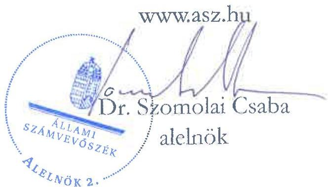

ÁLLAMI SZÁMVEVŐSZÉK

# JELENTÉS

A fenntartási kötelezettség kedvezményezettek
általi teljesítésének rapid ellenőrzése

Az EPOSZ Ipari, Kereskedelmi és Szolgáltató Kft.
fenntartási kötelezettsége teljesítésének ellenőrzése
a GINOP-1.2.1-16-2017-00732 számú projektnél

2025.

25116

www.asz.hu

---

ÁLLAMI SZÁMVEVŐSZÉK

# JELENTÉS

A fenntartási kötelezettség kedvezményezettek
általi teljesítésének rapid ellenőrzése

Az EPOSZ Ipari, Kereskedelmi és Szolgáltató Kft.
fenntartási kötelezettsége teljesítésének ellenőrzése
a GINOP-1.2.1-16-2017-00732 számú projektnél

2025.

25116

---

Jelentéseink az interneten a www.asz.hu címen olvashatók.

ELLENŐRZÉSI IGAZGATÓSÁG:
ELLENŐRZÉSI IGAZGATÓSÁG I.

ELLENŐRZÉSI IGAZGATÓ:
SINKÁNÉ DR. CSENDES ÁGNES igazgató

ELLENŐRZÉSVEZETŐ:
HUSZÁR ANNA ellenőrzésvezető

IKTATÓSZÁM: EL-4101-180/2025

TÉMASORSZÁM: -

ELLENŐRZÉS-AZONOSÍTÓ SZÁM: V1101

---

TARTALOMJEGYZÉK

- ÖSSZEFOGLALÁS ... 5
- AZ ELLENŐRZÉS EREDMÉNYEI ... 6
1. A fenntartási kötelezettség teljesítése ... 6
- I. FÜGGELÉK: ÉSZREVÉTELEK ... 9
- II. FÜGGELÉK: ELLENŐRZÉSI MEGKÖZELÍTÉS ... 10
- MELLÉKLETEK ... 15
I. sz. melléklet: Értelmező szótár ... 15
II. sz. melléklet: Az ellenőrzött és a közreműködő szervezetek jegyzéke ... 17
- RÖVIDÍTÉSEK JEGYZÉKE ... 18

---

“哈，你是个小伙子，你是个小伙子，你是个小伙子，你是个小伙子，你是个小伙子，你是个小伙子，你是个小伙子，你是个小伙子，你是个小伙子，你是个小伙子，你是个小伙子，你是个小伙子，你是个小伙子，你是个小伙子，你是个小伙子，你是个小伙子，你是个小伙子，你是个小伙子，你是个小伙子，你是个小伙子，你是个小伙子，你是个小伙子，你是个小伙子，你是个小伙子，你是个小伙子，你是个小伙子，你是个小伙子，你是个小伙子，你是个小伙子，你是个小伙子，你是个小伙子，你是个小伙子，你是个小伙子，你是个小伙子，你是个小伙子，你是个小伙子，你是个小伙子，你是个小伙子，你是个小伙子，你是个小伙子，你是个小伙子，你是个小伙子，你是个小伙子，你是个小伙子，你是个小伙子，你是个小伙子，你是个小伙子，你是个小伙子，你是个小伙子，你是个小伙子，你是个小伙子，你是个小伙子，你是个小伙子，你是个小伙子，你是个小伙子，你是个小伙子，你是个小伙子，你是个小伙子，你是个小伙子，

---

ÖSSZEFOGLALÁS

A 2016 decemberében megjelent „Mikro-, kis- és középvállalkozások termelési kapacitásainak bővítése” című (GINOP-1.2.1-16 kódszámú) pályázati felhívásban meghirdetett támogatással lehetőség nyílt ezen vállalkozások számára modern eszköz- és gépparkok, valamint fejlett infrastruktúrával ellátott telephelyek kialakítására. A rendelkezésre álló keretösszeg eredetileg 18 Mrd Ft volt, a keretösszeg emelését követően végül a konstrukcióban 101 Mrd Ft értékben kötött az IH¹ támogatási szerződést. Az igényelhető vissza nem térítendő támogatás összege kezdetben 25 M Ft és 250 M Ft között volt, a támogatás maximuma később 500 M Ft-ra emelkedett.

A Felhívás² alapján a 293,4 M Ft támogatást nyert GINOP-1.2.1-16-2017-00732 számú, „Az EPOSZ Kft. termelési kapacitásainak bővítése” című projekt Kedvezményezettje³, az EPOSZ Kft. gyártócsarnokot épített, termelőeszközöket, berendezéseket vásárolt.

A Kedvezményezett – a támogatás visszafizetésének terhe mellett – vállalta, hogy a projektmegvalósítást követően a Projekt⁴ megfelel az 1303/2013/EU Rendeletben⁵ a műveletek tartósságára vonatkozóan előírtaknak, az előírt fenntartási kötelezettséget teljesíti. A Projekt megvalósítása 2021. október 15-ével fejeződött be, az IH döntése alapján a Projekt fenntartási időszaka 2021. január 30-tól kezdődött és 2024. december 31-ig tartott.

A támogatás összértéke, a Projekt egyedisége és a megvalósított projekteredmény hosszabb távon történő megtartása miatt az ÁSZ⁶ indokoltnak tartotta a Projekt fenntartásának és a támogatás hasznosulásának ellenőrzését. A Kedvezményezett projektfenntartási kötelezettségei teljesítésének ellenőrzésére az ÁSZ „A 2014-2020 programozási időszak kobéziós politikai operatív programok vonatkozásában a fenntartási kötelezettség teljesítésének ellenőrzési gyakorlata” című ellenőrzéséhez, mint alapellenőrzéshez kapcsolódóan került sor.

A Kedvezményezett a Projekt hároméves fenntartási kötelezettsége keretében, a projekteredmény működtetéséről és fenntartásáról a jogszabály szerint határidőben és megfelelően beszámolt az éves projektfenntartási jelentésekben, amelyeket az IH elfogadott. A záró projekt fenntartási jelentés benyújtása az ÁSZ helyszíni ellenőrzésének lezárását követően, 2025. június 15-én volt esedékes.

Az IH értékelése szerint a Kedvezményezett alacsony kockázati besorolású volt, így az IH a Projekt fenntartási időszaka alatt helyszíni ellenőrzést nem végzett, szabálytalansági eljárás lefolytatására okot adó körülmény nem merült fel az ellenőrzött időszakban.

Az ÁSZ ellenőrzés megállapította, hogy a Kedvezményezett a Projekt fenntartási kötelezettsége keretében vállalt foglalkoztatási indikátort, az árbevétel tekintetében célul tűzött növekedést és egyéb kötelezettségeit teljesítette.

A Projekt, a vállalt három év fenntartási időszak és a fenntartási időszakra vonatkozóan vállalt kötelezettségek Kedvezményezett általi teljesítésével megfelelt az 1303/2013/EU rendeletben előírtaknak, mivel a Projekt termelő tevékenysége nem szűnt meg, a Projekt működőképessége, annak eredeti célkitűzései a fenntartási időszakban – az ellenőrzött időszakot figyelembe véve – biztosítottak voltak.

A Projekt keretében nyújtott támogatás a Kedvezményezett pénzügyi adatai és az ÁSZ értékelése alapján hasznosult, eredményes volt, az hozzájárult a Kedvezményezett versenyképessége javításához. A helyszíni ellenőrzés időpontjában a Projekt keretében épített új csarnok és a beszerzett eszközök rendelkezésre álltak, azokat a Kedvezményezett folyamatosan használta és a fenntartási időszak lejárát követően is használni tervezte.

---

AZ ELLENŐRZÉS EREDMÉNYEI

A magyar vállalkozások a GINOP⁷ pályázati konstrukciók keretében jelentős mértékű támogatásban részesültek, amelyek célja volt hozzájárulni a gazdasági fejlődéshez, a társadalmi felzárkózáshoz és az infrastruktúra fejlesztéséhez. Az ÁSZ – Magyarország versenyképességének növelése érdekében – fontosnak tartja a kihelyezett uniós támogatások nemzetgazdasági szinten történő hasznosulását és értékteremtését a vállalatok beruházásain és elért teljesítményén keresztül. Az ÁSZ a támogatással kapcsolatos fenntartási kötelezettség teljesítését, valamint annak hasznosulását a GINOP-1.2.1-16-2017-00732 számú projekt tekintetében értékelte. A Projekt keretében a kedvezményezett EPOSZ Kft. gyártócsarnokot épített, valamint termelőeszközöket, berendezéseket vásárolt.

## 1. A fenntartási kötelezettség teljesítése

### Összegző megállapítás

Az ÁSZ értékelése szerint a Kedvezményezett fenntartási kötelezettségét – az ÁSZ helyszíni ellenőrzésének lezárásáig – teljesítette, a támogatás hasznosult.

### A fenntartási jelentés benyújtási kötelezettség teljesítése

A Kedvezményezettnek a Projekt megvalósítását követően, a Támogatási rend.⁸-ben foglaltak alapján hároméves fenntartási kötelezettsége volt, amelyet a Felhívás és a támogatási szerződés is rögzített. Az IH döntése alapján a projektfenntartási időszak a Projekt fizikai befejezésétől indult. Ennek keretében a projekteredményt a megvalósítási helyszínen a Projekt fizikai befejezésétől számított három évig fenn kellett tartania és üzemeltetnie, és a Támogatási rend.-ben foglaltak alapján évente projektfenntartási jelentésben kellett beszámolnia az indikátorok teljesüléséről.

A Kedvezményezett a Támogatási rend.-ben előírt éves projektfenntartási jelentés benyújtási kötelezettségét megfelelően, határidőben teljesítette. A PFJ⁹-k és a ZPFJ¹⁰ főbb adatait az 1. táblázat tartalmazza.

1. táblázat

|  A GINOP-1.2.1-16-2017-00732 SZÁMÚ PROJEKTHEZ KAPCSOLÓDÓ PFJ-K FŐBB ADATAI  |   |   |   |   |   |
| --- | --- | --- | --- | --- | --- |
|  JELENTÉS SORSZÁMA | JELENTÉS TÍPUSA | TÁRGYIDŐSZAK KEZDETE | TÁRGYIDŐSZAK VÉGE | BENYÚJTÁS HATÁRIDÉJE | JELENTÉS STÁTUSZA*  |
|  1. | PFJ | 2021.01.30. | 2022.12.31. | 2023.06.15. | 2023.06.14-én beérkezett, elfogadva 2024.02.29-én  |
|  2. | PFJ | 2023.01.01. | 2023.12.31. | 2024.06.15. | 2024.06.06-án beérkezett, elfogadva 2024.07.30-án  |
|  3. | ZPFJ | 2024.01.01. | 2024.12.31. | 2025.06.15. | 2025.06.13-án beérkezett, hiánypótlás beküldve  |

Forrás: FAIR¹¹ adatok alapján ÁSZ saját szerkesztés

A Kedvezményezett a fenntartási időszakra vonatkozóan előírt 1. és 2. PFJ-t – a Támogatási rend.-ben előírtakat betartva – határidőben benyújtotta. Az IH – a kért hiánypótlás Kedvezményezett általi teljesítését követően – 2024. február 29-én elfogadta az 1. PFJ-t, a 2. PFJ-t pedig hiánypótlás kérés nélkül, 2024. július 30-án fogadta el. A ZPFJ benyújtása az ÁSZ helyszíni ellenőrzésének záró időpontját követően, 2025. június 15-én volt esedékes.

---

Az ellenőrzés eredményei

* A Kedvezményezett – a FAIR adatai szerint – 2025. június 13-án, az ÁSZ helyszíni ellenőrzésének lezárását követően benyújtotta a ZPFJ-t, és annak hiánypótlását 2025. augusztus 18-án.

Az IH értékelése szerint a Kedvezményezett alacsony kockázati besorolású volt, így az IH a Projekt fenntartási időszaka alatt helyszíni ellenőrzést nem végzett, szabálytalansági eljárás lefolytatására okot adó körülmény nem merült fel az ellenőrzött időszakban.

## A fenntartási kötelezettség, indikátorok teljesítése

A Kedvezményezett a Projekt keretében vállalt indikátorokat és egyéb kötelezettségeit az alábbiak szerint teljesítette:

1. A támogatási szerződés 4. sz. melléklete szerint az egyik cél indikátor a 2016. december 31-i 119 férfi és 9 nő, összesen 128 fő foglalkoztatott megtartása volt.

A Kedvezményezett – az éves beszámolói és adatszolgáltatása alapján – a 2021-2024. évek mindegyikében a nemek szerinti megoszlást tekintve is – a Támogatási rend.-ben előírt 75%-os minimum határ figyelembevételével – teljesítette a számára meghatározott foglalkoztatotti indikátort, a 128 főben meghatározott célértéket a fenntartási időszak végére közel 8%-kal meghaladta, 138 fő volt.

2. A Kedvezményezett vállalta, hogy a Projekt fizikai befejezését közvetlenül követő két üzleti évben (2022-2023. évben) az éves nettó árbevétel növekménye eléri a projekt fizikai befejezését közvetlenül követő második üzleti év végére az 5%-ot, vagyis a 2016. évi becsült, 1500 M Ft-os árbevételéhez képest legalább 75 M Ft-tal több lesz az árbevétel.

A kötelező vállalás az előírtaknak megfelelően teljesült, mert a 2022. évben 4021,5 M Ft, 2023. évben 3467,5 M Ft volt a Kedvezményezett árbevétele, amely jelentős mértékben meghaladta az 1575 M Ft-os célértéket. Az árbevétel növekedése a 2021. év végi 2918,9 M Ft-hoz képest 2023. év – a Projekt fizikai befejezését közvetlenül követő második üzleti év – végére jelentősen meghaladta az 5%-ot, az közel 19% volt.

3. A fenntartási időszakban teljesítendő egyéb kötelezettségek keretében a Projekt elkülönített számviteli nyilvántartása rendelkezésre állt. Az IH által elfogadott 1. és 2. PFJ-ben foglaltak alapján, valamint a Kedvezményezett által az ÁSZ adatbekérésére a Projektre vonatkozóan 2025. januári állapotra megküldött számviteli nyilvántartások alapján a projektszintű elkülönített számviteli nyilvántartás a Támogatási rend.-ben foglaltaknak megfelelően biztosított volt azáltal, hogy a releváns tárgyi eszközkartonokon a Projektazonosítót feltüntették.

A Projekt, a vállalt három év fenntartási időszak és a – fenntartási időszakra vonatkozóan – vállalt kötelezettségek teljesítésével megfelelt a műveletek tartósságával kapcsolatban az 1303/2013/EU rendeletben és a Támogatási rend.-ben előírtaknak.

A Kedvezményezett számára – az ÁSZ helyszíni interjú keretében adott nyilatkozata alapján – nem jelentett nehézséget a fenntartási kötelezettség teljesítése. A Kedvezményezett tájékoztatása szerint az EPTK¹² felület kezelhető volt, ugyanakkor egyrészt előfordult, hogy egyidőben sok pályázat esetén az EPTK leállt a túl nagy terhelés miatt, másrészt az IH részéről egyértelműbben megfogalmazott tisztázó kérdésekre, illetve kérésekre/válaszokra lett volna szükség a könnyebb érthetőség érdekében. A kötelező kommunikációs előírások teljesítése (pl.: fényképek honlapon történő megjelenítése) a szigorú elvárások miatt jelentett néha problémát a Kedvezményezett elmondása alapján.

---

Az ellenőrzés eredményei

A Kedvezményezett IH-val való kapcsolatát a Projekt megvalósítási és fenntartási időszakában is pozitívan jellemezte, abban meghatározó szerepe a projektmegvalósítás szakaszában problémamentesen lezajlott IH helyszíni ellenőrzésnek volt.

## A fenntartási jelentések valóságtartalma és megalapozottsága

Az ÁSZ 2024 októberében helyszíni ellenőrzés keretében megtekintette a Projekt keretében épített csarnokot és valamennyi beszerzett berendezést. Kedvezményezett a helyszíni ellenőrzés időpontjában is folyamatosan használta azokat és – nyilatkozata alapján – a fenntartási időszak lejártát követően is tervezte használni, működtetni az eszközöket, mivel a technológia – a Kedvezményezett tájékoztatása alapján – akár 15-20 évig is használható.

A fenntartási időszakban Kedvezményezett – helyszíni interjú keretében adott nyilatkozata alapján – a vásárolt berendezésekhez kapcsolódóan további értéknövelő beruházásokat hajtott végre: szoftveres kiegészítő fejlesztést végzett a gépeken, bevezette az SAP vállalatirányítási rendszer néhány további modulját, valamint a megrendelők által elvárt magas minőséget biztosító egyéb eszközöket vásárolt a berendezésekhez (pl.: csőforgató berendezést, hőmérsékletmérőt). Ezeken túl a fosszilis tüzelőanyagok (földgáz) részbeni kiváltására elegendő, 500kW-os napelemes rendszert épített ki a Projekt helyszínén.

Az ÁSZ által ellenőrzött fenntartási időszakban a Projekt működőképessége biztosított volt.

## A támogatás hasznosulása

A támogatás a Kedvezményezett pénzügyi adatai és az ÁSZ értékelése szerint hasznosult. A Kedvezményezett létszám, árbevétel, adózott eredmény és mérlegfőösszeg adatait a 2020-2024. évekre vonatkozóan a 2. táblázat mutatja be.

2. táblázat

|  A KEDVEZMÉNYEZETT 2020-2024. ÉVI LÉTSZÁM, ÁRBEVÉTEL, ADÓZOTT EREDMÉNY ÉS MÉRLEGFŐÖSSZEG ADATAI  |   |   |   |   |   |
| --- | --- | --- | --- | --- | --- |
|  ADATOK MEGNEVEZÉSE | 2020. ÉVBEN | 2021. ÉVBEN | 2022. ÉVBEN | 2023. ÉVBEN | 2024. ÉVBEN  |
|  Átlagosan foglalkoztatottak állományi létszáma (fő) | 124 | 118 | 132 | 136 | 138  |
|  Értékesítés nettó árbevétele (M Ft) | 1 882 357 | 2 918 883 | 4 021 548 | 3 467 491 | 2 735 964  |
|  Adózott eredmény (M Ft) | 387 316 | 212 161 | 1 260 342 | 780 026 | 736 339  |
|  Mérlegfőösszeg (M Ft) | 4 248 241 | 4 370 500 | 4 532 490 | 3 642 732 | 4 199 296  |

Forrás: A Kedvezményezett éves beszámoló adatai alapján ÁSZ saját szerkesztés

A Kedvezményezett helyszíni interjú keretében adott nyilatkozata alapján a Projektre kapott támogatás hozzájárult a vállalkozás versenyképességének növekedéséhez. Kedvezményezett tájékoztatása szerint körülbelül 15%-os árbevétel-növekedést jelentett a GINOP pályázati beruházás a Kedvezményezett számára, az erre eső árbevétel ugyanakkor – a több részből álló munkafolyamat miatt – nem különíthető el. Kedvezményezett tájékoztatása szerint, ha a beruházást nem valósították volna meg és nem álltak volna át az új technológiára, ügyfeleket, termékeket vesztettek volna és az ügyfeleik által elvárt/előírt külföldi minőségbiztosítási auditokon sem feleltek volna meg a magas minőségi követelményeknek.

A támogatás társadalmi hasznosságához tartozik a Kedvezményezett munkavállalóinak foglalkoztatása, tekintettel arra, hogy hátrányos helyzetű térségben működött. A Projekt életútja idején növekedett a foglalkoztatotti létszám, ugyanakkor a fluktuáció alacsony volt (4-5%), sok munkavállaló tartósan a Kedvezményezettnél maradt, és arra is volt példa, hogy akik elmentek máshova (pl. külföldre) dolgozni, sok esetben visszatértek.

---

9

# I. FÜGGELÉK: ÉSZREVÉTELEK

A jelentéstervezetet az ÁSZ 15 napos észrevételezésre megküldte az ellenőrzött szervezet vezetőjének az ÁSZ tv. 29. §* (1) bekezdése előírásának megfelelően.

A jelentéstervezet megállapításaira az ellenőrzött szervezet nem tett észrevételt.

* 29. § (1) Az Állami Számvevőszék az ellenőrzési megállapításait megküldi az ellenőrzött szervezet vezetőjének vagy az általa megbízott személynek, és annak, akinek személyes felelősségét állapította meg.
(2) Az ellenőrzött szervezet vezetője és a felelősként megjelölt személy az ellenőrzés megállapításaira tizenöt napon belül írásban észrevételt tehet.
(3) Az Állami Számvevőszék az észrevételre a beérkezésétől számított harminc napon belül írásban válaszol. A figyelembe nem vett észrevételeket köteles a jelentésben feltüntetni, és megindokolni, hogy azokat miért nem fogadta el.

---

10

# II. FÜGGELÉK: ELLENŐRZÉSI MEGKÖZELÍTÉS

## AZ ELLENŐRZÉS JOGALAPJA

Az ellenőrzés jogszabályi alapját az ÁSZ tv.¹³ 5. § (3) bekezdés képezte.

## AZ ELLENŐRZÉS CÉLJA

A fenntartási kötelezettség teljesítésének és a támogatás hasznosulásának értékelése a fenntartási szakaszba került uniós projekt kedvezményezettjénél.

## AZ ELLENŐRZÉS TÍPUSA

Kombinált ellenőrzés

## AZ ELLENŐRZÉS TÁRGYA

Az ellenőrzés tárgya volt az ellenőrzésre kiválasztott GINOP-1.2.1-16-2017-00732 számú uniós projekt fenntartási időszakára vonatkozóan előírt kötelezettségek EPOSZ Kft. mint kedvezményezett által történt teljesítése és a támogatás hasznosulása. A fenntartási kötelezettség ellenőrzése a kedvezményezett tevékenységéhez és működéséhez kapcsolódó kötelezettségek, a meghatározott indikátorok és a beszámolási kötelezettség teljesítésére irányult.

Az ellenőrzés tárgya volt továbbá a kedvezményezett által benyújtott fenntartási jelentésekben rögzítettek valóságtartalma és megalapozottsága, valamint ezek összhangja az ÁSZ helyszíni ellenőrzése során tapasztaltakkal.

Az ellenőrzés kiterjedt minden olyan körülményre és adatra, amely az ÁSZ jogszabályban meghatározott feladatainak teljesítéséhez, valamint a program végrehajtása folyamán felmerült újabb összefüggések feltárásához szükséges.

## AZ ELLENŐRZÉS HATÓKÖRE ÉS TERÜLETE

Az uniós jogszabályok az uniós támogatással megvalósuló projektekkel szemben elvárásként rögzítik a „műveletek tartósságának” követelményét. A kedvezményezettek infrastrukturális vagy termelő beruházás esetén – a projektmegvalósítás befejezésétől számított 5 évig, kis- és közepes vállalkozások esetén 3 évig, a támogatás visszafizetésének terhe mellett – vállalták, hogy a projekt termelő tevékenysége nem szűnik meg, hogy nem következik be olyan tulajdonosváltás, amelynek eredményeként jogosulatlan előny szerezhető, illetve, hogy nem következik be olyan lényeges változás, amely a projekt eredeti célkitűzéseit veszélyezteti. Abban az esetben, ha a felsoroltak valamelyike bekövetkezik, a támogatást – figyelemmel a vonatkozó jogszabályokra – vissza kell fizetni az Európai Bizottságnak.

---

II. Függelék: Ellenőrzési megközelítés

Ha az IH a projektre nézve fenntartási kötelezettséget állapított meg, és indikátorokat határozott meg a támogatási szerződésben, a kedvezményezettnek évente be kellett számolnia az indikátorok teljesüléséről. Ha ezen időszakra indikátorokat nem határozott meg az IH és a támogatási szerződésben sem írta elő az évenkénti teljesítést, a kedvezményezettnek egy alkalommal záró projektfenntartási jelentést kell(ett) benyújtania.

Az ellenőrzés a XIX. Uniós fejlesztések fejezet 3/1 Kohéziós politikai operatív programok 2014-2020 operatív programjai közül a – kis- és középvállalkozások versenyképességének javítására irányuló – GINOP 1. prioritásából és a – kutatás, technológiai fejlesztés és innováció című – GINOP 2. prioritásából támogatást kapott projektek kedvezményezettjeire terjedt ki oly módon, hogy az ÁSZ – „A 2014-2020 programozási időszak kohéziós politikai operatív programok vonatkozásában a fenntartási kötelezettség teljesítésének ellenőrzési gyakorlata” című ellenőrzéséhez, mint alapellenőrzéshez kapcsolódóan – a GINOP 1-2. prioritás pályázati kiírásainak nyertes pályázóiból, kockázat alapú mintavételi eljárással, rapid ellenőrzésre választott ki összesen 16 projektet, amelyből ezen jelentésben a GINOP-1.2.1-16-2017-00732 számú projekt tekintetében értékelte a fenntartási kötelezettség teljesítését.

A GINOP-1.2.1-16-2017-00732 számú projekt tekintetében az ellenőrzés kiterjedt a célrendszer, a jogszabályban – a működés és tevékenység tekintetében – előírt fenntartási kötelezettség teljesülésére, a fenntartási jelentésben bemutatott eredmények valóságtartalmára, megalapozottságára, valamint a támogatási szerződésben vállalt, a fenntartási időszakra vonatkozó kötelezettségek teljesítésének, és a GINOP keretében nyújtott támogatás hasznosulásának értékelésére.

## A GINOP-1.2.1-16 számú felhívás bemutatása

Az IH által közzétett GINOP-1.2.1-16 kódszámú, a „Mikro-, kis- és középvállalkozások termelési kapacitásainak bővítése” című pályázati felhívásban meghirdetett támogatás célja volt a kiemelt iparágakban fejleszteni kívánó hazai KKV¹⁴-k termelési kapacitásainak bővítése a hazai ipar fejlesztése érdekében, amely során korszerű termék előállítási képességek megteremtésének és bővítésének céljából lehetőség nyílt modern eszköz- és gépparkok, valamint fejlett infrastruktúrával ellátott telephelyek kialakítására, a szektor szereplői számára a versenyképesség feltételeinek megteremtésére, fenntartására.

A támogatás formája vissza nem térítendő támogatás volt, forrását az Európai Regionális Fejlesztési Alap és Magyarország költségvetése társfinanszírozásban biztosította. A rendelkezésre álló tervezett keretösszeg eredetileg 18 Mrd Ft volt, ami a Felhívás módosítását követően 119,8 Mrd Ft-ra emelkedett. A Felhívás szerint a támogatott projektek várható számát 150-250 között tervezték, a Felhívás keretében projektenként kapható támogatás nagysága kezdetben 25-250 M Ft volt, majd később a támogatás maximális összege 500 M Ft-ra emelkedett.

A támogatási kérelmet benyújtó szervezetek vállalták, hogy a projekt megvalósításával hozzájárulnak a kiemelt iparágakban fejleszteni kívánó hazai KKV-k termelési kapacitásainak bővítéséhez, a kapott támogatáson felül önerőből finanszírozzák a projektet és a projekt fizikai befejezését követő két évben növelik nettó árbevételüket.

Támogatható tevékenység volt az új eszközök, gépek beszerzése, az új technológiai rendszerek és kapacitások kialakítása, a megújuló energiaforrást hasznosító technológiák alkalmazása, melyek célja a gazdasági-termelési folyamatok és az üzemen belüli építmények energiaigényének részbeni fedezése megújuló energia előállításával, valamint az infrastrukturális és ingatlan beruházás, az információs technológia-fejlesztés és az új eszközök, gépek beszerzéséhez, új technológiai rendszerek és kapacitások kialakításához kapcsolódó gyártási licenc, gyártási know-how beszerzés.

---

II. Függelék: Ellenőrzési megközelítés

A támogatásra az a mikro-, kis-, és középvállalkozás pályázhatott, amely különösen az alábbi feltételeknek eleget tett:

- rendelkezett legalább egy lezárt (beszámoló/SZJA¹⁵ bevallással alátámasztott), teljes 365 napot jelentő üzleti évvel;
- éves átlagos statisztikai állományi létszáma a támogatási kérelmek benyújtását megelőző utolsó lezárt, teljes üzleti évben minimum 1 fő volt;
- Magyarországon székhellyel rendelkező kettős könyvvitelt vezető gazdasági társaság, szövetkezet, egyéni vállalkozó, egyéni cég vagy az Európai Gazdasági Térség területén székhellyel és Magyarországon fiókteleppel rendelkező szövetkezet vagy kettős könyvvitelt vezető gazdasági társaság fióktelepe volt.

A projekt megvalósítása során legfeljebb egy mérföldkővet lehetett tervezni, amelynek a projekt fizikai befejezésének időpontjával kellett egybeesnie. A projekt fizikai befejezésére legfeljebb 18 hónap állt rendelkezésre. Nem volt köteles biztosítékot nyújtani kérelemre az a kedvezményezett, amely rendelkezett legalább egy lezárt, teljes üzleti évvel, és a támogatási kérelem benyújtásakor szerepelt a köztartozásmentes adózói adatbázisban.

Indikátorként a támogatott vállalkozásoknál a foglalkoztatás növekedése került megjelölésre. A támogatást igénylő, a projekt megvalósítás befejezésétől számított 3 évig volt köteles fenntartani a projekt keretében létrehozott termékeket és szolgáltatásokat.

A támogatási kérelmek benyújtására a Felhívás közzétételét követő 24 hónapig, 2017. január 16-tól 2019. január 16-ig volt lehetőség. Az utólagos finanszírozású tevékenységekre igénybe vehető maximális előleg mértéke a megítélt támogatás 50%-a, de legfeljebb 125 M Ft volt. A beérkező támogatási kérelmeket standard kiválasztási eljárásrend alapján, szakaszos elbírálással bírálták el.

Az IH által nyolc alkalommal módosított Felhívásra 1136 támogatási kérelem érkezett be, összesen 178,6 Mrd Ft nagyságú támogatási összegre, amelyből – az IH adatszolgáltatás alapján – 605 kérelem került elfogadásra összesen 101 Mrd Ft értékű támogatási összeggel.

# Az EPOSZ Kft. és a GINOP-1.2.1-16-2017-00732 számú projekt bemutatása

A kedvezményezett EPOSZ Kft.-t 1992 decemberében alapították, székhelye alapítástól kezdődően végig Kisújszállás volt. A Kedvezményezett középvállalkozásnak minősült, bejegyzett fő tevékenysége 2019. október 31-ig fémfelület-kezelés, azt követően egyéb szerszámgép gyártása volt. A Kedvezményezett a helyszíni ellenőrzés lezárásának időpontjában is működött, 2024. évben az átlagos statisztikai állományi létszáma 138 fő volt.

A Kedvezményezett a GINOP-1.2.1-16-2017-00732 számú, „Az EPOSZ Kft. termelési kapacitásainak bővítése” című projekt keretében az autóipari beszállítói státuszának javítása érdekében egy új, 2100 m² alapterületű gyártócsarnok építését és eszközök beszerzését kívánta megvalósítani Kisújszállás külterületén.

A Projekt új porfestőüzem létesítésére és új gyártósor vételére irányult, valamint profilbővítéssel csőalkatrészek gyártásának megindítását tervezték. Mindezekhez a Projekt keretében beszereztek egy lézervágó berendezést, egy csőbajlító gépet, egy csiszológépet, egy több elemből álló porszóró berendezést, egy csavarkompresszort. Ezen túl az SAP termelésirányítási rendszer egyik moduljába és hardver eszközökbe – 25 db mini PC, 30 db LED monitor, billentyűzet és egér – beruháztak.

A Kedvezményezett a támogatási kérelmet 2017. február 24-én nyújtotta be, amelynek támogatásáról az IH 2017. december 4-én hozott döntést, a támogatási szerződés 2017. december 22-én lépett hatályba. A Projekt tényleges összköltsége 586,8 M Ft volt, amelyhez a Kedvezményezett – 50%-os támogatás intenzitással

12

---

II. Függelék: Ellenőrzési megközelítés

- 293,4 M Ft összegű támogatást kapott. A Projekt indulása a tervezett kezdéshez képest néhány nappal később 2017. július 10-e volt, tervezett fizikai befejezése 2018. december 31-e, a tényleges befejezése – a használatba vételi engedély jogerőssé válásának időpontja miatt – 2021. január 29-e volt. A Kedvezményezett – a Felhívás 3.9. pontja alapján – a biztosíték nyújtási kötelezettség alól mentesült.

A támogatási szerződés 2021. március 17-ei dátummal egy mérföldkővet tartalmazott, amikorra a gépek beszerzését, üzembe helyezését, a termelés-irányítási rendszer kifejlesztését és bevezetését, a csarnok építését tűzték ki célul.

A támogatási szerződés szerint a Kedvezményezett által a fenntartási időszakra vonatkozóan teljesítendő indikátor a bázislétszámot jelentő – 2016. december 31-i – 128 fős foglalkoztatotti létszám megtartása, további kötelező vállalás az éves nettó árbevétel növelése, egyéb kötelező vállalás a projektszintű elkülönített számviteli nyilvántartás vezetése volt.

A Kedvezményezett a támogatási szerződésben előírt határidőt betartva, 2020. december 21-én nyújtotta be záró szakmai beszámolóját és a záró kifizetési kérelmét. A Projekt fizikailag 2021. január 29-án befejeződött. Az IH a Projekt megvalósításával kapcsolatban 2021. szeptember 2-án tervezett, záró helyszíni ellenőrzést folytatott le, amelynek során hiányosságot nem tárt fel. Az IH a Kedvezményezett záró szakmai beszámolóját – a hiánypótlások teljesítését és a helyszíni ellenőrzés lezárását követően – 2021. október 13-án elfogadta és a következő napon kifizette az utolsó elszámolást; a Projekt megvalósítása 2021. október 15-ével befejeződött.

A Kedvezményezett a Projektet – az IH szakmai záró beszámoló ellenőrzése és a megvalósításra vonatkozóan lefolytatott helyszíni ellenőrzése megállapításai alapján – a támogatási szerződésben rögzített mérföldkővet és a kötelező vállalásokat teljesítve valósította meg.

A hároméves fenntartási időszak – az IH döntése alapján – 2021. január 30-tól kezdődött és 2024. december 31-ig tartott.

## AZ ELLENŐRZŐTT IDŐSZAK

2016. január 1-től 2025. április 30-ig, a helyszíni ellenőrzés lezárásának időpontjáig tartó időszak.

---

II. Függelék: Ellenőrzési megközelítés

# AZ ELLENŐRZÉSI KRITÉRIUMOK

|  FOKUSZTERÜLET | ELLENŐRZÉSI KRITÉRIUMOK  |
| --- | --- |
|  1. A fenntartási kötelezettség teljesítése  |   |
|  A fenntartási jelentés benyújtási kötelezettség teljesítése | Támogatási rend. 178. § (1) bekezdés, 180. § (1) bekezdés, 1. melléklet 293.1.-2. pontjai; Felhívás 3.8. pontja;  |
|  A fenntartási kötelezettség, indikátorok teljesítése | 1303/2013/EU rendelet 71. cikk (1) bekezdés; Támogatási rend. 110/A. §, 178. § (1) bekezdés; támogatási szerződés 4-5. sz. mellékletei;  |
|  A fenntartási jelentések valóságtartalma és megalapozottsága | –  |
|  A támogatás hasznosulása | Az ÁSZ meghatározása alapján: - A támogatás hasznosult, ha a vállalkozás (a projekt) működött az ÁSZ helyszíni ellenőrzése időpontjában, fenntartási kötelezettségét a kedvezményezett teljesítette / jellemzően teljesítette, és a támogatás eredményeként a kedvezményezett vállalkozás árbevétel vagy adózott eredmény adatai növekedtek a támogatás előtti időszakhoz képest. - A támogatás korlátozottan hasznosult, ha a projekteredmény „fellelhető volt” az ÁSZ helyszíni ellenőrzése időpontjában, fenntartási kötelezettségét részben / minimálisan teljesítette a kedvezményezett, vagy a támogatás eredményeként hozzáadott új értéket teremtett, az társadalmilag hasznosult stb. - A támogatás nem hasznosult, ha fenntartási kötelezettségét a kedvezményezett egyáltalán nem teljesítette és/vagy a vállalkozás (a projekt) már nem működött az ÁSZ helyszíni ellenőrzése időpontjában.  |

# AZ ELLENŐRZÉS MÓDSZERE ÉS AZ ELLENŐRZÉSI BIZONYÍTÉKOK KÖRE

Az ÁSZ az ellenőrzést a nemzetközi standardokat irányadónak tekintve az ellenőrzési program szempontjai, az ellenőrzött időszakban hatályos jogszabályok, az ellenőrzés-szakmai szabályok és módszertanok figyelembevételével végezte.

Az ellenőrzési kérdések megválaszolásához szükséges bizonyítékok megszerzése az ellenőrzött szervezet és az ellenőrzésben közreműködő szervezet által rendelkezésre bocsátott dokumentumokra és adatokra alapozva, továbbá megfigyelés, szemle (szemrevételezés), kérdésfeltevés (információkérés), interjú, mintavételezés, valamint elemző eljárás útján történt.

Az ellenőrzés bizonyítékként felhasználható adatforrásai közé tartoztak egyrészt az ellenőrzéshez kért dokumentumok, adatforrások, a nyilvánosan hozzáférhető adatok, dokumentumok, másrészt adatforrás volt még minden, az ellenőrzés folyamán feltárt, az ellenőrzés szempontjából információt tartalmazó dokumentum. Az ÁSZ a számvevőszéki jelentéstervezet elfogadásáig rendelkezésre álló, nyilvánosan elérhető adatokat figyelembe vette.

Az ellenőrzés végrehajtásához a projekt kiválasztása kockázat alapú mintavételi eljárással történt.

---

MELLÉKLETEK

I. SZ. MELLÉKLET: ÉRTELMEZŐ SZÓTÁR

fenntartás

A kedvezményezett a projektmegvalósítás befejezésétől számított 5 évig, állami támogatás formájában nyújtott támogatás esetén az állami támogatókra vonatkozó szabályok alapján alkalmazandó időtartamig, kis- és közepes vállalkozások esetén 3 évig a támogatás visszafizetésének terhe mellett vállalja, hogy a projekt megfelel az 1303/2013/EU európai parlamenti és tanácsi rendelet 71. cikk (1) bekezdésében foglaltaknak. (Forrás: Támogatási rend. 178. § (1) bekezdés, 2016. május 14-től 2024. július 31-ig hatályos)

Az irányító hatóság döntése alapján a fenntartási időszak kezdődhet a projektmegvalósítás befejezésétől vagy a projekt fizikai befejezésétől (ÁSZF¹⁶ 10.7. pontja alapján, hatályos 2016. június 14-től)

A fenntartási időszak meghatározása során az IH speciális projektév szerinti jelentéstételt alkalmazott, mivel a jelentések tárgyidőszaka speciális projektévhez (az üzleti évről készített közzétett beszámolóhoz) igazodott és a fenntartási jelentésben benyújtandó vállalási adatok csak az így meghatározott időszak elteltével álltak rendelkezésre. (Forrás: Támogatási rend. 1. melléklet 285.1-286.4 pontja alapján ÁSZ megfogalmazás)

indikátor

Uniós jogszabályokban és a programban nevesített, valamint az európai uniós források felhasználásáért felelős miniszter – a Vidékfejlesztési Program esetén az agrárpolitikáért felelős miniszter – által meghatározott, eredményt vagy teljesülést mérő mutató. (Forrás: Támogatási rend 3. § (1) bekezdés 12. pont, 2022. július 21-től 2024. július 31-ig hatályos)

kedvezményezett

A támogatásban részesített támogatást igénylő (Forrás: Támogatási rend 3. § (1) bekezdés 14. pont, 2014. november 6-tól hatályos)

műveletek tartóssága

Az ESB-alapokból valamely infrastrukturális vagy termelő beruházást magában foglaló műveletre fordított támogatás akkor fizetendő vissza, ha a kedvezményezettnek történő utolsó kifizetéstől számított 5 évben belül, illetve adott esetben, az állami támogatásokról szóló szabályozás szerinti időtartamon belül, a következők valamelyike történik:

a) a termelő tevékenység megszűnése vagy a programterületen kívülre való áthelyezése;

b) az infrastruktúra valamely elemében tulajdonosváltás következik be, amelynek eredményeként egy cég vagy állami szervezet jogosulatlan előnyhöz jut;

c) a természetében, célkitűzéseiben vagy végrehajtási feltételeiben olyan lényeges változás következik be, amely az eredeti célkitűzéseket veszélyezteti.

A műveletre jogosulatlanul kifizetett összegeket a tagállamnak vissza kell téríthetni, azon időszakkal arányosan, amelynek tekintetében nem teljesültek a követelmények. (Forrás: 1303/2013/EU rendelet 71. cikk (1) bekezdése)

projekt fizikai befejezése

Az az állapot, amikor a projekt keretében támogatott tevékenységeket a felhívásban és a támogatási szerződésben meghatározottak szerint elvégezték. (Forrás: Támogatási rend 3. § (1) bekezdés 40. pont, 2015. június 13-tól hatályos)

15

---

Mellékletek

projekt lezárása

Egy projekt akkor tekinthető lezártnak, ha a kedvezményezett a támogatási szerződésben a projektmegvalósítás befejezését követő időszakra nézve további kötelezettséget nem vállalt, és a felhívásban meghatározott feltételek teljesültek. Ha a támogatási szerződés a támogatott tevékenység befejezését követő időszakra nézve további kötelezettséget előírt, a projekt akkor tekinthető lezártnak, ha valamennyi vállalt kötelezettség teljesült és a kedvezményezett a kötelezettségek megvalósulásának eredményeiről szóló záró projekt fenntartási jelentést benyújtotta, és azt az irányító hatóság, Vidékfejlesztési Program esetén a kifizető ügynökség jóváhagyta, valamint a záró jegyzőkönyv elkészült. (Forrás: Támogatási rend 3. § (1) bekezdés 39. pont, 2016. május 14-től 2024. július 31-ig hatályos)

projektmegvalósítás befejezése

Az 1303/2013/EU rendelet 2. cikk 14. pontjára tekintettel egy projekt megvalósítása akkor tekinthető befejezettnek, ha a projekt fizikailag és pénzügyileg is befejezett, valamint a kedvezményezettnek valamennyi támogatott tevékenysége befejezését igazoló és alátámasztó kifizetési igénylését az irányító hatóság jóváhagyta és a támogatás folyósítása megtörtént. (Forrás: Támogatási rend 3. § (1) bekezdés 41. pont, 2015. június 13-tól 2023. május 24-ig hatályos)

projekt pénzügyi befejezése

Ha a projekt fizikai befejezése megtörtént, valamint a projektmegvalósítás során keletkezett elszámoló bizonylatok – szállítói kifizetés esetén az előírt önrész szállítók részére történő – kiegyenlítése megtörtént. A projekt pénzügyi befejezésének dátuma a projekt megvalósítási ideje alatt felmerült, a kedvezményezett által megfelelően elszámolt költségek közül a legkésőbbi kiegyenlítés dátuma. (Forrás: Támogatási rend 3. § (1) bekezdés 42. pontja alapján, 2014. november 6-tól hatályos)

standard kiválasztási eljárás

Standard kiválasztási eljárásrend esetén szakaszos elbírálást kell alkalmazni, amely során legkésőbb a felhívásban rögzített szakasz zárását vagy beadási határnapját követően kell a támogatási kérelmeket jogosultsági és tartalmi értékelésre bocsátani, és az egy szakaszban beérkezett kérelmek támogathatóságáról a felhívásban előírt tartalmi értékelési szempontoknak való megfelelés szerinti sorrendiségük alapján kell dönteni. (Támogatási rend. 61. § (4) bekezdés alapján, 2016. május 14-től hatályos)

16

---

Mellékletek

## II. SZ. MELLÉKLET: AZ ELLENŐRZŐTT ÉS A KÖZREMŰKÖDŐ SZERVEZETEK JEGYZÉKE

|  ELLENŐRZŐTT SZERVEZET MEGNEVEZÉSE | ADÓSZÁM  |
| --- | --- |
|  EPOSZ Ipari, Kereskedelmi és Szolgáltató Kft. | 11262774-2-16  |
|  KÖZREMŰKÖDŐ SZERVEZET MEGNEVEZÉSE | ADÓSZÁM  |
| --- | --- |
|  Közigazgatási és Területfejlesztési Minisztérium | 15849272-2-41  |
|  Nemzeti Fejlesztési Központ | 15850258-1-42  |

---

RÖVIDÍTÉSEK JEGYZÉKE

1 IH

Irányító Hatóság (A GINOP esetében 2014. november 6-tól 2018. június 15-ig a Nemzetgazdasági Minisztérium, majd 2022. május 24-ig a Pénzügyminisztérium. 2022. május 25-től a területfejlesztési miniszter tevékenységének segítésére kijelölt miniszteriumként a Miniszterelnökség volt a felelős az IH feladatok tekintetében. 2024. január 1-vel az IH feladatok átkerültek a Közigazgatási és Területfejlesztési Minisztériumhoz. A feladatok 2024. augusztus 1-től az újonnan létrejött Nemzeti Fejlesztési Központba kerültek).

2 Felhívás

A GINOP-1.2.1-16 kódszámú, a „Mikro-, kis- és középvállalkozások termelési kapacitásainak bővítése” című pályázati felhívás

3 Kedvezményezett, EPOSZ Kft.

EPOSZ Ipari, Kereskedelmi és Szolgáltató Kft.

4 Projekt

A GINOP-1.2.1-16-2017-00732 számú, „Az EPOSZ Kft. termelési kapacitásainak bővítése” című projekt

5 1303/2013/EU rendelet

AZ EURÓPAI PARLAMENT ÉS A TANÁCS 1303/2013/EU RENDELETE (2013. december 17.) az Európai Regionális Fejlesztési Alapra, az Európai Szociális Alapra, a Kohéziós Alapra, az Európai Mezőgazdasági Vidékfejlesztési Alapra és az Európai Tengerügyi és Halászati Alapra vonatkozó közös rendelkezések megállapításáról, az Európai Regionális Fejlesztési Alapra, az Európai Szociális Alapra és a Kohéziós Alapra és az Európai Tengerügyi és Halászati Alapra vonatkozó általános rendelkezések megállapításáról és az 1083/2006/EK tanácsi rendelet hatályon kívül helyezéséről

6 ÁSZ

Állami Számvevőszék

7 GINOP

Gazdaságfejlesztési és Innovációs Operatív Program

8 Támogatási rend.

272/2014. (XI. 5.) Korm. rendelet a 2014-2020 programozási időszakban az egyes európai uniós alapokból származó támogatások felhasználásának rendjéről

9 PFJ

projektfenntartási jelentés

10 ZPFJ

záró projektfenntartási jelentés

11 FAIR

Fejlesztéspolitikai Adatbázis és Információs Rendszer, amely a fejlesztési források felhasználására – többek között a kohéziós politikai operatív programok – vonatkozó eljárások során keletkező adatok egységes nyilvántartó rendszere a 60/2014. (III.6.) Korm. rendelet alapján

12 EPTK

Elektronikus Pályázó Tájékoztató és Kommunikációs rendszer

13 ÁSZ tv.

2011. évi LXVI. törvény az Állami Számvevőszékről

14 KKV

A mikro, kis- és középvállalkozások gyűjtőneve

15 SZJA

Személyi jövedelemadó

16 ÁSZF

Általános Szerződési Feltételek az operatív programok keretében támogatásban részesített kedvezményezetekkel kötendő támogatási szerződésekhez

17 ESB-alapok

Az európai strukturális és beruházási alapok

18

---

ÁLLAMI SZÁMVEVŐSZÉK

1052 Budapest, Apáczai Csere János u. 10. | 1364 Budapest 4., Pf. 54

www.asz.hu | szamvevoszek@asz.hu

telefon: +36 1 484 9100